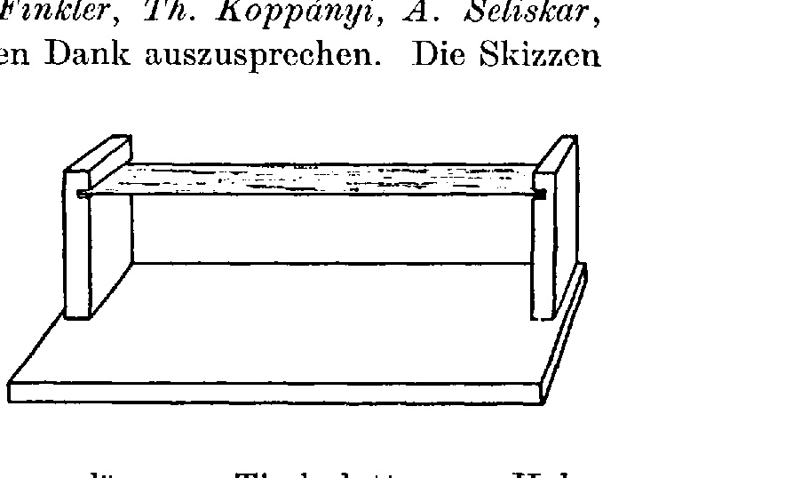
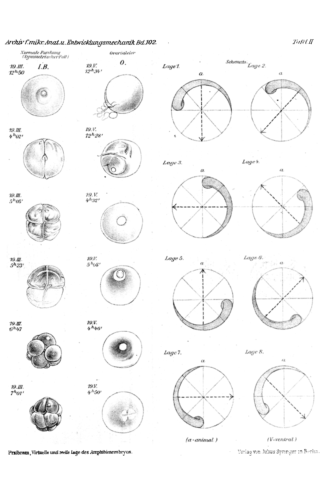
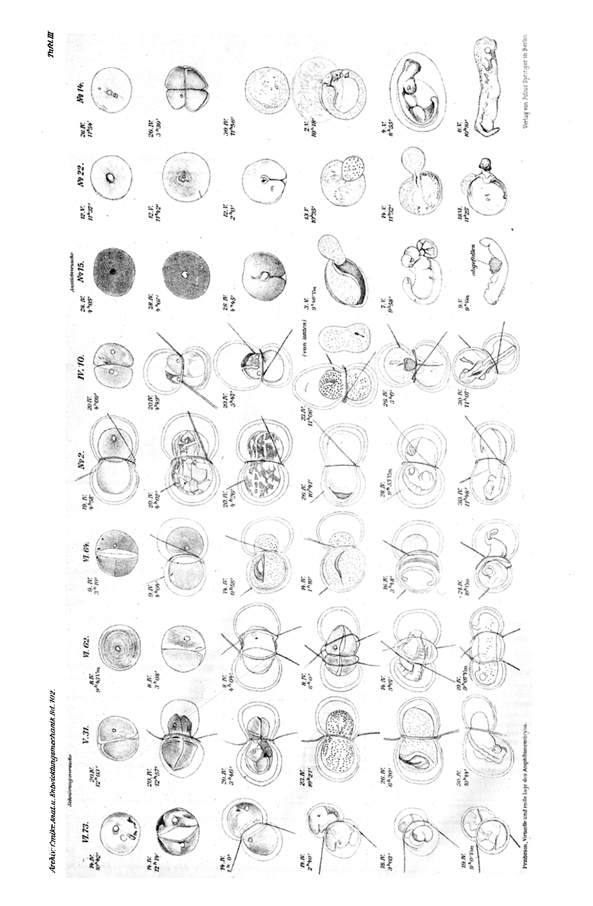
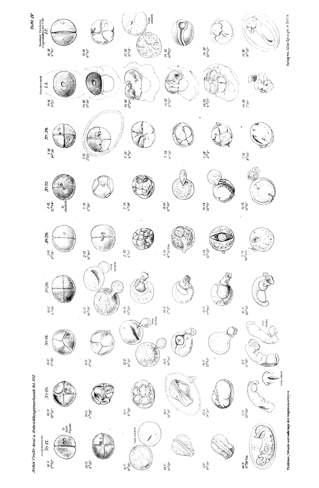

# The Virtual and Real Position of the Amphibian Embryo, from Natural and Artificial Marks on the Egg of the Alpine Newt, *Triton alpestris*

**Hans Przibram**

From the Biological Experimental Institute of the Academy of Sciences in Vienna (Zoological Division).
With Plates II–IV and 1 text-figure. Received 5 October 1923.

*Archiv für mikroskopische Anatomie und Entwicklungsmechanik*, vol. 102.

> **Full translation.** This is a complete English rendering of the running text (sections I–VI, the numbered points 1–51, the summary, and the postscript), together with the comparative table of embryonic positions (Table β), the plate legends, and a note on the data table and bibliography. OCR artefacts in the German source were corrected against context. Species names are kept as in the original (*Molge* = *Triton*; the alpine newt is now *Ichthyosaura alpestris*); a preliminary notice had appeared as No. 70 of the BVA communications (Akademischer Anzeiger, Vienna, nos. 2–3, 1922).

**Contents.** I. Material — II. Observation of cleavage — III. Technique — IV. Experimental results — V. Concluding considerations and discussion of the literature — VI. Summary — VII. Tables (α: experiments on *T. alpestris*; β: positions of the egg-axes according to the amphibian literature) — VIII. Bibliography — IX. Explanation of the figures.

---

## I. Material

Although the frog's egg served Roux as the point of departure for developmental-mechanical research, and although the eggs of the water-newts later proved very suitable for constriction (ligature) experiments, the question raised and experimentally treated by Roux — the position of the *virtual* embryo in the amphibian egg — has nonetheless been answered in the most various ways and still not been fully clarified. I have therefore sought a suitable object that might play, for the amphibians, the same role that *Strongylocentrotus lividus* played among the sea-urchins through the occurrence of an egg-variety with an orange-red pigment girdle — in order to convince myself by experiment of the solubility of this question and to prepare unobjectionable material for the further treatment of the problem.

"Natural marks would be preferable," says Spemann (1918, p. 515), with reference to localisation experiments in vertebrate eggs. But Roux had already pointed out, against O. Schultze — who used pigment spots on the frog egg — that such spots lead to deceptions, since they fade and new ones arise (1895, II, pp. 115, 533, 1664).

In the environs of Vienna all three European newts occur abundantly. The crested newt, *Molge* (*Triton*) *cristatus* Laur., has large but pigment-free eggs; the smooth newt, *M. taeniatus* Schneid. (*vulgaris* L.), very small and mostly uniformly pigmented eggs — so that both seemed unsuitable for my purposes. The eggs of the alpine newt, *M. alpestris* Laur., by contrast, are larger than those of the smooth newt and distinguished by sharply delimited pigmentation. Roux (1891) remarked of such eggs from Innsbruck: "The newt eggs, like those of the frog, orient themselves with the pigmented light-brown hemisphere upward and the light-yellow hemisphere downward; they are sometimes somewhat elongated in the horizontal direction." The latter, as I have satisfied myself, is the case especially when the eggs are laid in the folded, band-shaped leaves of certain water-plants, which exert a vertical pressure on the egg.

Spemann (1918, p. 450) writes: "Easy to remove from the coats and extraordinarily beautiful, but very sensitive, are the eggs of *Triton alpestris* Laur." This sensitivity, also stressed by Roux, is a disadvantage that can be avoided by leaving the eggs in both their coats — the inner spherical vitelline membrane and the outer oval gelatinous capsule. The alpine newts of the Vienna region have certain colour-varieties of their eggs which show the natural colour-mark that Spemann wished for and I sought. It is a distinguished spot, lying in the centre of the pigment hemisphere, which can be now lighter, now darker than the surrounding pigment (the "**zenith field**"), and of which I have so far found no mention anywhere. To test whether particular females produce just the one colour-variety, six specimens were isolated in individual jars, each with a male, and labelled with Roman numerals I–VI, while the eggs each laid and used for experiments were distinguished by added Arabic numerals. It turned out, however, that no simple correspondence exists (such as has, to a certain degree, been observed for the colour-varieties of smooth-newt eggs — Spemann 1918, p. 451). Thereafter the origin of the eggs was no longer attended to; they were selected daily from the leaves of a large aquarium in which many *Molge alpestris* disported together. These eggs from the mixed culture are labelled with Arabic numbers 1–36 alone. Only eggs with a distinct zenith field were used; of the number of the remaining eggs I kept no record, so that I can give no figures on the ratio of the two. In very strongly pigmented eggs the zenith field seemed to me to stand out least, and this richness of pigment seemed to increase as the spawning season advanced.

B. G. Smith (1912, p. 101) describes, in *Cryptobranchus alleghaniensis*, a "distinct pit" at the animal pole of the unfertilised egg, probably connected with the formation of the second polar body, and which could correspond to the zenith field. He adds that the sperm can enter anywhere, so that it is not a question of a "micropyle."

## II. Observation of cleavage

It is well known that, within one and the same amphibian species, the individual eggs can differ from one another not only by colour but also by the course of cleavage. Whereas in the anurans the first furrow corresponds, in the greatest number of eggs, to the later median plane, Spemann (1901) found in the smooth newt this arrangement in only a considerable minority — namely ⅕ to ⅓ of all cases — while in ⅔ to ¾ of cases the first furrow did not correspond to the symmetry plane of the embryo but was designated the frontal plane. Exceptionally a horizontal first furrow also occurs (Spemann 1918, p. 529 note), which on this author's view would presumably be identified with the later transverse plane.

For the alpine newt I can fully confirm this same proportional occurrence of the three possibilities shown by the smooth newt: among 190 experimental eggs the course of the first and second furrow could be observed in 125 cases; of these, 35 had a symmetrical, vertical first furrow (thus presumably corresponding to the later median plane), 97 had a vertical but asymmetrical first furrow (thus certainly not corresponding to the future median), and 1 egg showed a horizontal course of the first furrow. This last unfortunately perished in the attempt to constrict it along the first furrow. As to the frequency of a median first furrow, the eggs of different females did not behave alike: in female III this type of cleavage even predominated. The second furrow was, in all observed cases (again with only one exception, a horizontal course), vertical; as third furrow, however, besides a horizontal course in 28 of 42 observed eggs, vertical third furrows also occurred in 7 eggs, while in the remaining 7 cases it could not be decided whether further vertical or horizontal furrows followed the two first vertical ones (cf. Table α).

The relation of the body planes to the cleavage planes can, however, be discussed only at the end of the present work.

## III. Technique

The eggs were placed individually in small glass dishes, and only those not yet cleaved were used for experiments. Artificial insemination was as a rule not carried out (F. Werner in 1922 recommends precisely our newt species for the easy obtaining of sperm). As filling for the dishes — 38 mm wide and 11 mm high — Viennese high-spring water was used after standing one day at room temperature. The vessels were kept covered with little glass plates to protect against dust and evaporation, the plates being removed only during observation. In order to be able to observe as many eggs as possible continuously at short intervals, a rota of collaborators was set up who, in my absence, had to check the eggs on display and, where appropriate, sketch the noteworthy changes. For this trouble I owe hearty thanks to Miss L. Brecher and to Messrs. W. Finkler, Th. Koppányi, A. Seliskar, P. Weiss, and B. Wiesner. The sketches were all entered on sheets that always lay ready for the purpose beside the egg-stands.

The egg-stands (see text-figure) consist of two cross-supports set into a wooden board, joined by a thin glass plate clamped into horizontal incisions in them. The distance of this glass table-plate from the wooden board is chosen so that a standing magnifier resting on the board can be shifted from one glass dish to another in such a way that its eyepiece stays set above the dish and its mirror below the glass table-plate. (Mirrors for observing the underside of the egg had already been used by Roux, then by Smith in 1914.) For constriction experiments, blond children's hair and ordinary narrow-bladed metal forceps served; for puncturing, glass tubes drawn out to solid tips, occasionally also the finest pipettes. A device for being able to apply two puncture-marks simultaneously — so that the further escape of egg-substance from the first-punctured site is avoided when a second puncture is made — consists of two glass needles pushed, in place of the platinum needle, into an electrode-holder with a small screw. In place of a detailed description of the individual experiments, reference is made to Table α and to Plates II–IV.

{width=3.5in}

*Text-figure. The egg-stand (cross-supports carrying a glass observation-plate).*

## IV. Experimental results

1. The immature egg of the alpine newt, *Molge* (*Triton*) *alpestris* (Pl. II, fig. O), has a brown and a white egg-half; upon maturation an intensely yellow-coloured, circular field appears in the middle of the brown pigment cap. By puncturing the cap, the whole pigment mantle of the uncleaved egg can be made to flow out, whereupon the large nucleus becomes visible beneath the former yellow spot — just as in natural degeneration. In maturing eggs an explosive expulsion from the yellow spot was observed, after which the pigment closed in more tightly around this site, the "animal" nuclear pole.

2. The mature, inseminated egg of the alpine newt has a brown-pigmented cap encompassing more than half the egg-sphere, which, in the unconstrained position of the egg in water, orients itself upward. Cleavage is almost total and the blastomeres more equal than in our other newts. Frequently a small circular field, appearing through differing pigmentation now lighter (fig. I A, B; nos. 22, 62), now darker (fig. no. 15), stands out on the mature egg; as a remnant of the yellow spot of unfertilised eggs, it lies exactly in the middle of the pigmented cap, thus enclosing — when the egg floats freely — the topmost point of the egg, and may therefore be designated the "**zenith field**."

3. In the continuous observation of isolated fertilised eggs left to themselves, the fate of light zenith fields can be followed into the cleavage stages, sometimes up to the 16- (Pl. II, fig. I B) or 32-cell stage and beyond (Pl. III, fig. no. 2).

4. Here two cases can be distinguished: either the first furrow divides the light zenith field symmetrically into two parts, and the further cleavage also proceeds symmetrically to this first furrow (Pl. II, fig. I B); or the first furrow cuts past the zenith field with displacement of the whole field, and in the further cleavage the furrows do not proceed symmetrically to the zenith field, so that it falls each time to one blastomere, until — having reached the neighbourhood of the equator — it is no longer clearly recognisable and disappears at morulation (Pl. IV, fig. I C; Pl. III, no. 2).

5. By pressure — e.g. partial wedging of the uncleaved egg into the burst gelatinous egg-capsule — the zenith field can be artificially displaced; symmetrical division by the first furrow and the following ones has here been observed, both likewise passing through vertically (Pl. IV, fig. I A). With weak constriction perpendicular to the first, symmetrically passing furrow, a gaping of the zenith field can occur, leading to a spina bifida (O. Hertwig) or asyntaxia medullaris (Roux) in the region of the back (Pl. III, 10). The same was observed when, as a result of a puncture near the two-cell stage, two blastomeres had moved more strongly apart from the others (Pl. IV, fig. no. 19).

6. Because of the easy dissolution of the alpine-newt egg, in constriction experiments the gelatinous egg-capsule must — after cleaning off the adhering coat-shreds — be constricted along with the egg, which succeeds outside the water using a child's hair (Pl. III, figs. IV 10, V 31, VI 62, 64, 73; nos. 2, 10).

7. If the direction of the first furrow is fixed by weak constriction at the two-cell stage, then by observing the light zenith field the displacement of the originally uppermost egg-region relative to the position of the first, vertically passing furrow can be precisely established (as is visible in the same figures that render the course of the constriction experiments to be described further).

8. Even after the disappearance of the zenith field, the position of the developing body-parts relative to the first furrow and the originally highest egg-point can be observed, provided that the orientation of the whole constricted egg has been maintained by clamping the constriction-hair between glass plates in the water-dish.

9. Shortly after the disappearance of the light zenith field, the streak-shaped blastopore tends to appear asymmetrically on the unpigmented, lower side of the egg; one can view the undersides of the eggs, without changing the egg's position, by means of the glass observation-table set into a wooden frame (text-figure).

10. On strong constriction of an egg along the first cleavage that symmetrically divides the white zenith field, a twin embryo arose, with the medians parallel to the direction of the first furrow fixed by the hair (Pl. III, fig. VI 73).

11. From eggs in which the first furrow had passed beside the light zenith field, and whose direction was then fixed by light constriction, embryos were reared whose longitudinal axis stood perpendicular to the first cleavage- or constriction-plane (the remaining figures of the constricted eggs).

12. The most strongly pigmented side of the embryo remained at the site where the zenith field had disappeared, until the movements of the embryo became so vigorous that they forced rotations within the constricted capsule.

13. It is possible to puncture the light zenith field through the gelatinous egg-capsule, in fertilised but uncleaved eggs (Pl. II, figs. 14, 15, 22) or eggs at the two-cell stage (Pl. IV, figs. 17, 19), while they lie outside the water on filter paper, in such a way that at the puncture-site a white spot (Pl. III, fig. 14; Pl. IV, figs. 17, 19) or a small extra-ovate (Pl. III, fig. 15; Pl. IV, figs. 18, 20; Pl. III, fig. 22; Pl. IV, figs. 29, 32, 34) arises.

14. The white puncture-spot that has taken the place of the light zenith field can be followed up to the complete formation of the embryo, and fades only with its progressive colouring.

15. The extra-ovate is enlarged, by inflow of material from the morula and gastrula, into a roundish hernia that appears overlaid with pigment; with too strong an inflow the eggs perish, but with a lesser one they have been reared up to almost hatch-ready embryos (Pl. III, fig. 15; Pl. IV, figs. 18, 20).

16. Both the white spot and the hernia sit, in the developed embryos, in the nape region (back of the head to neck), but need not lie exactly in the median.

17. After all these observations and experiments, the zenith field must correspond to the nape region of the embryo of *Molge alpestris*.

## V. Concluding considerations and discussion of the literature

18. The "**virtual embryo**" thus lies, in the alpine newt, with the nape upward — or, in the customary terminology, the animal egg-pole yields dorso-anterior parts.

19. If the first furrow passes through the zenith field, it separates right and left body-halves; the pigment cap remains oriented upward, in a constrained position, until the movements of the embryo, and yields the dorsal parts. With constriction by a hair along the first furrow, double formation is indeed observed.

20. If the first furrow passes beside the zenith field, it separates a dorso-anterior blastomere from a ventro-posterior one; the pigment cap of the animal pole shifts toward the egg-equator and again yields the dorsal parts (of the anterior embryonic region).

21. It is to be expected that with a successful complete constriction at the two-cell stage two cases would result: if the zenith field is divided symmetrically, then right and left body-halves are separated and, by previous general experience, two whole embryos result; if the zenith field is shifted onto one blastomere, so that the first furrow separates a zenith-field-bearing from a zenith-field-free body-half, then the zenith-field-bearing one will have the capacity for forming dorsal and anterior, but also partly ventral, parts (and, through regeneration of the tail, posterior ones), whereas the zenith-field-free one will lack the capacity for anterior and partly dorsal formation.

22. While, because of the mentioned easy dissolution of the egg of *Molge alpestris*, it has not yet succeeded to carry out these constriction experiments, the results obtained by other authors on the more favourable egg of *Triton vulgaris* agree with these expectations.

23. With median constriction Spemann obtained two complete embryos; with separation of a dorsal from a ventral half, however, only the dorsal yielded an embryo complete but for subordinate defects, while the ventral lacked head and back.

24. Since we are surely entitled to assume that conditions in *Molge vulgaris* are the same as in *Molge alpestris* — the absence of the light zenith field in the former changing nothing in the distribution of potencies — Spemann in his second case separated a predominantly animal blastomere, containing the dorso-anterior parts, from a predominantly vegetative, ventro-posterior one.

25. His results on *Molge vulgaris* thus confirm, viewed in the light of the experiments on *M. alpestris*, the irreplaceability of the animal by the vegetative egg-pole, as also the irreplaceability of dorsal parts by ventral ones — whereas posterior parts can still be restituted by anterior ones.

26. Against Spemann's critical remarks (1918) on my earlier assumptions (1910) — based not yet on my own experiments but on the interpretation of Roux's *Rana* experiments — concerning the relation of the cleavage-direction to the form-building potencies, I must therefore maintain that in *Triton* too "the prospective significance of the animal egg-half lies chiefly in the formation of dorsal parts," to which McClendon (1910) assented for the frog eggs (*Chorophilus triseriatus*) he investigated experimentally [and which Schaxel (1921) likewise finds in the axolotl (*Amblystoma tigrinum*). — Addition during writing].

27. It follows further that conditions in *Echinus* are quite analogous to those in the amphibians: for in the echinoderms too, the animal (nuclear) pole — looking upward on the floating egg — forms the ectodermal-dorsal nervous system, and at the gastrula the sensory cilia; the animal egg-half of the echinoderms is thus both homologous and physiologically analogous to that of the vertebrates, and the same holds for the vegetative-ventral one.

28. The position of the first furrow perpendicular to the egg-axis is in fact "one of several predilection-directions," for when the furrow passes beside the light zenith field of *Molge alpestris* it stands perpendicular to both the dorso-ventral and the antero-posterior axis (it was observed in more than half the eggs).

29. That Spemann did not recognise this direction in *Molge vulgaris* comes from the fact that in this species he had no mark on the egg to perceive the displacement of the animal or zenith pole, which occurs — in the case of asymmetrical cleavage — even before the gentle laying-on of the hair-loop; he therefore had to conclude that animal and vegetative parts could be separated only by a horizontal (equatorial) first furrow.

30. Spemann himself probably, in his perfect constrictions on *Molge vulgaris*, separated animal from vegetative blastomeres and could rear embryos only from the former — which, to be sure, judging by the conditions in *M. alpestris*, had also received some vegetative material along with them (just as he himself assumes, for those cases in which the "ventral" half yielded embryos, that they had also received some "dorsal" material).

31. The proposition that "the prospective potency of the ventral and dorsal anlage, each taken as a unit, is, with respect to the dorso-ventral axis, scarcely greater than their prospective significance" is thus not contradicted by the facts known for *Triton*; for Spemann's "dorsal" embryos may, on the one hand, have received ventral material along with them, and are, on the other hand, not as completely developed as those from median-constricted eggs.

32. According to the experiments on *Echinus* known to me (cf. *Embryogenese* 1907; Driesch, Boveri, Garbowski and others, cf. *Embryogenese* and Schaxel 1915), the vegetative germ-half can, just as little as in *Molge* (*Triton*), yield a complete embryo; rather it lacks the long cilia characteristic of the animal pole, while again from the median-divided eggs two perfectly formed plutei arise.

33. The composition of a germ from non-equipotent regions need not, however, be interpreted in the sense of an evolutionist mosaic theory — as though the mutual position of the germ-regions in the uncleaved egg were the same as in the realised embryo. It is perhaps not even permissible to speak of a "virtual" embryo, drawn into definite places of the egg after the image of the later "real" embryo; for this mode of representation presupposes an already existing differentiation (of such parts), whose coming-into-being in the course of cleavage is precisely what is to be explained.

34. Let there be recalled in this connection the beautiful experiments of Spemann (1918, p. 529), who saw transplanted little pieces of ventral origin form medulla at their new dorsal location, and those of Vogt, Schaxel, and others. The interpretation of these results in the sense of a "re-tuning" (*Umstimmung*) of the graft by the host-stock seems to me, however, not yet proven (cf. my following critical work on the axial relations in the transplantations of amphibian limbs carried out in recent years by Braus, Harrison, and then many others). But even if we assume that no re-tuning, but rather an incorporation of still quite indifferent material, takes place, then it would not matter what point of the uncleaved egg a given germ-part originally occupied, but rather into what place of the form-system — determined by the direction-giving egg-axes — it comes; we then understand how it may be indifferent whether gastrulation comes about in this way or that (which can be very different in closely related species), and how, with median, i.e. quite symmetrical, division, whole formations result.

35. The question of tracing the primitive organs back to definite displacements of an originally already differentiated material thereby loses much of its significance; it could be indifferent, for the formation of a vertebrate embryo, whether a concrescence or other pushing-together of the forming cells for the medullary folds occurs, so long as enough such cells are brought into definite position relative to the egg-axes.

36. In this sense it matters less whether the embryo is formed on the "upper," on the "lower" side of the egg, or ring-wise on the equator; whether the position of the egg-axes to the earth-axis stays the same or changes its position to the earth's centre in the course of development — that is, what position the egg-axes assume relative to one another.

37. The first observers of the frog egg (Baer, for example) let the embryo develop from the "upper," pigmented half of the egg, and Roux (1883) at first followed them. But Roux (1887), on the basis of puncture experiments on the morula near the blastopore — which produced defects in the medullary plate — later assumed an upright position of the "virtual" embryo, which he still later abandoned in favour of a ring-shaped arrangement, after observing permanently thus-malformed frog embryos.

38. Roux (1888) sought to prove this last assumption — according to which the virtual ring-shaped embryo should lie with the belly-side upward — by new puncture experiments on the morula and blastula stage, in which punctures on the upward-facing dark "animal" pole could be recognised as defects on the belly of the real embryo.

39. Morgan (1905), however, described abnormalities in which the embryo certainly develops on the upper half of the frog egg, and gave as one reason for this discrepancy that possibly a downward migration of material from the upper germ-half normally takes place at an earlier stage than had been supposed — which thus receives strong support in my experiments on the alpine newt.

40. The continued observation of the light zenith field on the egg of *Triton alpestris*, with asymmetrical first cleavage, now gives us the certainty that an early downward migration of originally "animal" material — not yet finished in the last cleavage stages — takes place.

41. On puncture at the morula or blastula stage, the needle at the equator can already strike the animal cap that has shifted thither, which may have been the case in Roux's first puncture experiments.

42. If, at the same stages, one punctures at the "upper" pole, then — precisely because of the migration of the "animal" cap (with a sufficiently deep puncture) — a region of the belly will be struck, since the orientation of the egg-axes toward the earth's centre for the "real" embryo is already taking place.

43. With symmetrical two-sided migration of the animal material, it could indeed come to ring-embryo formation and, after the underlying vegetative zone has passed through, to a shaping in the sense of Roux's concrescence.

44. Even in this case, then, if one wishes to speak of a "virtual" embryo, it would lie with its dorso-anterior part at the animal pole, since Roux's punctures were made at so late a stage that they reveal only the position of the "real" embryo.

45. Should one wish, in the sense of Roux's latest conception, to reject my experiments with puncture-marks or hernias on the ground that they involve only easily alterable and superficial pigment-migration, then it must be pointed out that the light marks can persist up to the complete formation of the embryo and that the hernias, through uptake of material from the morula, prove deep-reaching.

46. Nor can it be simply a matter of a closure of the medullary ridges prevented by the wounding, for the marks and hernias by no means always sit exactly in the median that arises through this closure, but rather often somewhat sideways in one of the medullary ridges itself, where they cannot be interpreted as a remnant of unbridged material.

47. On the basis of the experiments on the alpine newt, I see myself moved — just as Spemann (1918, p. 533) did — to take "the part of the earlier Roux against the later one."

48. Complete agreement, by contrast, prevails between the newer conception of Roux (1888, p. 700; 1895, II, p. 527) on the frog egg, that of Moszkowski (1902), of Spemann (1918, p. 531), and my own observations on newts, with respect to this: that the side of the egg opposite the pigment-migration — on which, in the grass-frog, the "grey field of Roux" thereby arises — becomes the head side.

49. With an asymmetrical first furrow of *Molge alpestris*, it can be established, on eggs very weakly constricted along the first furrow, that the head finally arises precisely on that egg-half which did *not* receive the light zenith field, while the egg-half distinguished by more pigment becomes the hind-end of the embryo.

50. This statement again refers only to the normal real embryo, since it has not yet been established by puncture experiments before cleavage where this material lay on the uncleaved egg, and with somewhat stronger pressure (constrained position) the head can come to lie precisely on the other side.

51. In Table β the various views so far expressed on the position of the virtual embryo in the amphibian egg are arranged so as to be illustrated by the eight schemata of possible positions (Pl. II), according to whether the head-part is to lie in one or another of the eight octants simultaneously cut in a vertical section. If one imagines the first furrow cutting through in the plane of the paper, then the paper-plane at the same time represents the later median of the egg, which needs no separate determination once the dorso-ventral and the antero-posterior axes are determined (Przibram 1910, 1911; B. G. Smith 1922). On the question whether the dorso-ventral or the antero-posterior is to be regarded as the first-fixed axis, I will enter again only in a later publication, in which bilaterality too is to be discussed anew — in connection with the transplantations of amphibian limbs at all stages so eagerly pursued in recent years in various places.

If one cuts the first furrow perpendicular to the paper-plane and through the vertically standing axis of the upright-floating or standing egg, while the material of the animal pole has already been displaced asymmetrically (in our schema, to the right), then it separates a dorso-anterior egg-half from a ventro-posterior one; the second furrow will, again in the great majority of these cases, running in the paper-plane as median, separate the right from the left egg-half.

### On the individual positions (Table β)

In my view the following may be assumed about the individual positions:

**Position 1.** The animal pole forms the dorsum. This was probably assumed by the oldest observers, since they saw the embryo develop from pigmented material that seemed to stem from the upper hemisphere. More precise statements were not yet possible at the embryology of the time — that is, before the introduction of the systematic developmental-mechanical experiment by W. Roux.

**Position 2.** The animal pole forms the nape, i.e. dorso-anterior parts. This I believe to have placed beyond doubt for *Triton alpestris* through the puncture experiments with hernia formation; it agrees with the newest other puncture experiments for *Rana esculenta* and *fusca* that Delsman (1916) carried out on eggs with a median furrow; it was also assented to by McClendon (1910) for *Chorophilus triseriatus*, in analogy with the conditions I had assumed on the basis of the earlier literature; and finally Schaxel's result on the axolotl (1921) may amount to this, in so far as a concavity at the embryonic back points to the removal of dorso-anterior material from the animal pole. Smith (1922) states, for *Cryptobranchus alleghaniensis*, that the dorsal side of the embryo is mainly formed from material which lies, in the early gastrula, between the blastopore and the thin blastula-roof above it, and draws (1912, p. 509, fig. 163), quite similarly to Delsman, a reaching-over of the head-end past the animal pole — an oblique position of the antero-posterior axis to the animal-vegetative one.

**Position 3.** The animal pole forms the boundary of the anterior end; the animal-vegetative connection thus gives the later antero-posterior axis of the amphibians (without angular deviation). Observed in a whole series of amphibians, it probably owes its origin only to a displacement of the material from the animal pole toward the equator that sets in right at fertilisation. The difference of conception from Position 2 is, moreover, very slight, for here too the dorsal part of the head and nape region arises from the surface-material adjacent to the animal pole, while the ventral parts would come to lie farther toward the egg-interior and thus also toward the vegetative pole.

**Position 4.** The animal pole takes no part in head formation, which appears rather only a little above the equator. Although good observations and experiments exist for this position too, and Heider (1921) supports it, I believe that the remark made on Position 3 about subsequent displacement will here too prove correct. In the *Cryptobranchus* studied by B. G. Smith with good method, extensive displacements were noticeable before the blastula stage.

**Position 5.** The vegetative pole yields the dorsum. This view rests almost certainly on the fact that the experiments concerned were made at too late a stage to be able to determine the original arrangement of the material — e.g. the puncture of the "animal" pole at the blastula stage.

**Position 6.** The vegetative pole forms the nape.

**Position 7.** The vegetative pole forms the boundary of the anterior end.

**Position 8.** The anterior end appears somewhat below the equator.

These last three (6, 7, 8) have, so far as I know, never been asserted.

Finally, let it be pointed out that — apart from all possible intermediate positions — eight further positions can be set up, in which namely the dorsal side lies toward the inner, not (as in all positions so far assumed) toward the outer surface of the egg. The great importance which the convex curvature of the back of the embryo has for the fundamental conception of the body- and especially limb-axes will be entered into only in the mentioned later treatise.

## VI. Summary

(a) In some eggs of the alpine newt, owing to the natural distinction of the animal pole by a light circular spot (the "zenith field"), a hernia corresponding exactly to that pole can be produced by puncture, which can remain attached on the crown or nape of the fully formed embryo.

(b) The "virtual" embryo therefore lies with these antero-dorsal parts at the animal pole, while the "real" embryo — owing to the material displacements that take place, in the non-symmetrical case, even before the constriction of the first furrow — seems to turn its dorsum away from this pole.

(c) Discussion of the rank that the three body-axes occupy with respect to the progressive differentiation and restriction of potency is reserved for a later treatise, which is to deal with the transplantation experiments on amphibian limbs at all stages.

### Postscript during printing

After completion of the present work, a treatise by Vogt appeared — *Further experiments with vital colour-marking and coloured transplantation for the analysis of the primitive development of Triton* (32nd meeting of the Anatomical Society, Heidelberg, 23–26 April 1923; *Anatomischer Anzeiger* LVII, suppl., 30, 1923) — which likewise confirms, for newts, the validity of what is designated in my table as the "2nd position."

---

## Tables, bibliography, figures

**Table α (Experiments on *Triton alpestris*, spawning period, Vienna 1921).** A large experiment-log tabulating, for each numbered egg, its mother (females I–VI or unknown), the type of observation or treatment (normal fertilised eggs; ovarian and oviducal eggs; injury to the pigment-mantle; removal from the coats; puncture before/after the first furrow; double puncture; constriction along the first furrow; etc.), and the cleavage type (symmetrical vs. asymmetrical first furrow), with summary percentages. The headline figures: of 190 experimental eggs, ~73% showed asymmetrical first cleavage; symbols mark eggs that died before the experiment's end, eggs of unknown mother, horizontal vs. non-horizontal third furrows, and the special outcomes (10 = spina bifida; 73 = twin/*gemellus*). *(The numeric body of this table is heavily garbled in the OCR and is best consulted in the original plate; the structure and totals are given here.)*

**Table β (Position of the animal-vegetative axis relative to the dorso-ventral — and the antero-posterior assumed perpendicular to it — in amphibian eggs, after various authors and genera).** Przibram's synthesis, assigning the literature to the eight positions:

- **Position 1 — animal pole forms dorsum:** *Rana* — Swammerdam, Baer, Rusconi, Reichert, Cramer, Newport (cf. Eyclesheimer 1902); Roux 1883; Schultze 1887; Lwoff 1894.
- **Position 2 — animal pole forms crown & nape (antero-dorsal):** *Rana esc. & fusca* — Morgan 1905; Delsman 1916; (*Chorophilus* — McClendon 1910); *Triton alp.* — Przibram 1921; *Amblystoma* — Eyclesheimer 1895, Schaxel 1921; *Cryptobranchus* — B. Smith 1912, 1914, 1923.
- **Position 3 — animal pole forms boundary of anterior end:** *Rana* — Ikeda, Wilson, Spemann, Assheton, Eyclesheimer, George; *Bufo, Acris, Rhacophorus, Chorophilus, Triton vulg.* (various authors).
- **Position 4 — anterior end formed somewhat above equator:** Kopsch 1900; Brachet 1902/1905/1923; (Heider 1921); Todd (*Rana pal.*) 1904; King (*Bufo lent.*) 1902; Eyclesheimer (*Necturus*) 1902.
- **Position 5 — vegetative pole yields dorsum:** *Rana* — Pflüger, Roux, O. Hertwig, T. H. Morgan, Bertacchini.
- **Positions 6–8:** never asserted in the literature.

**VIII. Bibliography.** The original lists ~50 references (Assheton, Baer, Barfurth, Bertacchini, Brachet, Brandt, Child, Delsman, Eyclesheimer, George, Heider, O. Hertwig, Ikeda, Jenkinson, Kopsch, Lwoff, Mangold, McClendon, Merker, Morgan, Moszkowski, Newport, Pflüger, Przibram, Roux, Schaxel, Schultze, B. G. Smith, Spemann & Bautzmann, Thiem, Todd, Vogt, Werner, Wilson). *(Reproduced as a standard reference list in the original; bibliographic entries are left untranslated.)*

**IX. Explanation of the figures** (all refer to *Triton alpestris*):

{width=6in}

- **Plate II.** Positions 1–8: schemata for the development of amphibian embryos. — O: ovarian egg, observation of zenith-field formation. — I B: inseminated egg, observation of cleavage, *symmetrical* case, first furrow = median.
{width=6in}

- **Plate III.** VI 73: constriction along the first furrow of a *symmetrical* case — result: twins. — V 31: constriction along the first furrow of an *asymmetrical* case — displacement of the zenith field. — VI 62: constriction on both sides of the first furrow, asymmetrical case — displacement of the zenith field. — VI 64: constriction along the first furrow, asymmetrical case — displacement of the zenith field. — No. 2: constriction along the first furrow, asymmetrical case — displacement of the zenith field. — IV 10: constriction perpendicular to the first furrow, symmetrical case — spina bifida. — No. 15: puncture before cleavage into a (dark) zenith field, symmetrical case — result: nape tumour. — No. 22: puncture before cleavage into a (light) zenith field, symmetrical case — result: nape tumour. — No. 14: puncture beside the light zenith field, asymmetrical case — result: mark to the right of the nape.
{width=6in}

- **Plate IV.** No. 17: puncture at the two-cell stage beside the light zenith field, asymmetrical — mark near the nape. — No. 19: puncture at the four-cell stage into a light zenith field, asymmetrical — mark near the nape; spina bifida. — No. 18: puncture at the four-cell stage into a light zenith field, asymmetrical — tumour left of the nape. — No. 20: puncture at the four-cell stage into a light zenith field, asymmetrical — tumour right of the nape. — No. 29: double puncture at the two-cell stage, into and opposite the light zenith field, asymmetrical — tumour in the medullary plate. — No. 32: as no. 29 — tumour in the medullary plate. — No. 34: double puncture at the two-cell stage, asymmetrical (?) — dorsal tumours. — I C: inseminated egg, observation of cleavage, *asymmetrical* case, first furrow = transverse. — I A: inseminated egg, with three vertical furrows owing to pressure of the burst egg-coat.

---

*Translator's note.* Complete translation of the running text and apparatus. Przibram's central terms — *Zenitfeld* ("zenith field"), the "virtual" vs. "real" embryo, animal/vegetative pole, dorso-anterior/ventro-posterior — are rendered consistently. This is the corpus's top verified rediscovery target: 52 modern studies on the same organism (*Triton/Triturus/Ichthyosaura alpestris*), none of which cite this paper.
