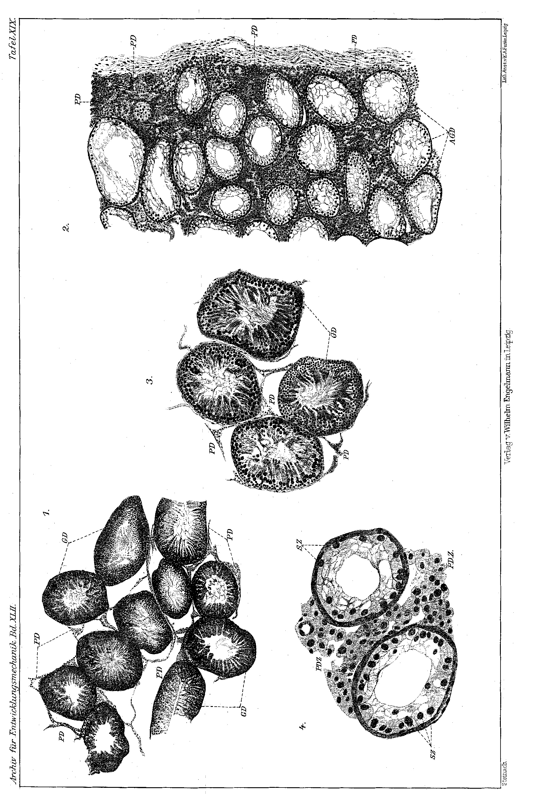
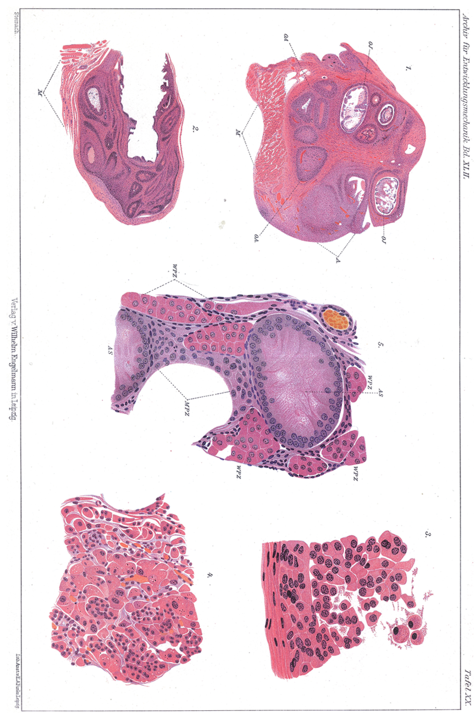

**Puberty Glands and Hermaphrodite Formation**

*Pubertätsdrüsen und Zwitterbildung*

**Author:** Eugen Steinach

**Source:** Biological Experimental Institute of the Imperial Academy of
Sciences, Vienna --- Physiological Division (Director: E. Steinach).
With Plates XIX and XX. Received 2 February 1916. Archiv für
Entwicklungsmechanik, vol. XLII.

**Legacy:** Most-cited paper in the corpus (65 citations); a founding
text of the experimental endocrinology of sex.

***Translator\'s note.** Complete English translation of the running
text (sections I--VI), the comparative table, and the plate legends; the
bibliographic footnotes are summarised inline. This is a 1916 document:
Steinach\'s gonadal-hormone ("puberty-gland") framework and, especially,
his application of it to human homosexuality and "hermaphroditism" are
of their period and are now scientifically and ethically superseded ---
they were later entangled in harmful pseudo-medical practice. The
translation renders Steinach\'s claims as he stated them, for historical
study, without endorsement. "Pubertätsdrüse" = puberty gland (gonadal
interstitial/hormone tissue); "Erotisierung" = erotisation; "Zwitter" =
hybrid/hermaphrodite.*

**Contents.** I. Introduction (lasting effect of the transplantations)
--- II. The antagonism of the sex hormones --- III. Counteracting the
antagonistic action of the sex hormones (hermaphrodite-forming
transplantation) --- IV. Histological and physiological behaviour of the
transplants (a. male puberty gland; b. female puberty gland; c.
hermaphrodite puberty gland) --- V. The hermaphrodite formations and
their secondary sex characters (a. somatic sex characters and growth; b.
psychic sex character and erotisation) --- VI. Experimental
hermaphrodite formation and the doctrine of hermaphroditism.

I. Introduction (Lasting effect of the transplantations)

In my works on the significance and function of the puberty glands I
have repeatedly stressed that the successful exchange of these glands in
the mammal is bound to castration, in the sense that the healing-in of
the ovary in the male body and the feminisation thereby effected come
about only on removal of the testes, and the healing-in of the testes in
the female organism and the masculinisation thereby effected only on
removal of the ovaries. If the homologous gland remains intact in the
individual, the implanted heterologous gland falls victim to
degeneration and perishes in a short time.

That this behaviour is not --- or certainly not solely --- grounded in
the biochemical difference of the blood of the animals in question is
taught by the positive results of my transplantation experiments.
Feminisation, or masculinisation, rests on the fact that the
transplanted germ-gland --- which, after the reduction of its generative
parts, forms itself into the isolated, hormone-dispensing puberty gland
--- heals into the heterologous organism, develops further,
proliferates, and now asserts its re-tuning power on the somatic as well
as the psychic secondary sex characters. As mentioned earlier, in the
heterologous organism the female transplants prove more resistant and
durable than the male. I have at my disposal feminised guinea-pig males
in which the implanted female puberty glands continue in undiminished
efficacy for over three and a half years. The sex-marks that became
female at the time, as a result of the ovary transplantation --- the
female-graceful body build, the female-fine hair, the powerful teats,
the periodically swelling mammary glands --- are still present in
undiminished expression. But also the functional marks of femaleness ---
the periodically recurring milk secretion, the capacity and inclination
to suckle and care for young --- have suffered no disturbance in the
long period that for these animals means, so to speak, their whole life.
Even the erotisation of the psyche in the female direction, the
typically female behaviour toward normal males, and the triggering of
the sex-drive in the male have remained permanent.

After such **lasting effects of the transplants**, one can no longer
speak of the correlation between germ-glands and sex-marks being secured
merely through the sex hormone of one and the same animal and only in
the presence of that animal\'s conformingly biochemically differentiated
blood. On the contrary, these lasting effects confirm the view already
expressed earlier: that the **puberty gland** --- whether in its normal
union with the generative gland in testis or ovary, or in its state
isolated by transplantation (as described histologically below) --- not
only brings the morphological and functional phenomena of puberty to
development, but is also able to maintain the once-matured sex-marks at
the highest level of their development up to the age limit.

II\. The antagonism of the sex hormones

The difficulty against which the transplantation of a heterologous gonad
has to struggle cannot, then, on the above account, be explained by the
biochemical difference of the blood, but must be traced back to an
antagonism between the male and female sex hormones.

That the **function of the male and female puberty gland is strictly
sex-specific** --- that is, that each of them brings only the homologous
sex-marks to growth and full development --- my earlier experiments
proved with all sharpness. A leading role in the determination of the
sex character falls to this specificity of puberty-gland function. Were
the fostering action of the puberty glands not specifically homologous,
then, after the early differentiation of the germ-stock, development
would proceed in both directions and uniformly hermaphroditic
individuals would arise.

But the function of the puberty glands is not merely sex-specific; it
is, as already determined earlier, also **antagonistic**. This
antagonism is expressed first in the effect on the sex-marks, namely in
such a way that the one puberty gland inhibits the growth of those
heterologous sex-marks whose development the other puberty gland
fosters. Among the most striking processes in this respect is the
influence on growth, on the dimensioning of the skeleton, and on the
shaping of the whole body. The stronger growth, the robust figure, and
especially the massiveness of the skeleton are pronounced male
characters, which come to full unfolding only after puberty. As I
reported at the time, this tendency to rapid strong male growth is lost
some time after ovary implantation, and the tendency to slower weak
female growth appears. Through this inhibition of male body-growth the
whole transformation of the male-destined individual into the female
form is set in train. Conversely, in masculinisation --- i.e. on
implantation of testis substance into castrated females --- the weak
female growth is directed into the male path; the skeleton and
especially the head acquire male dimensions and in this respect often
exceed the male measure.

A further compelling example I found in the suppression of the strong,
coarse male hair. Under the influence of the female sex hormone the coat
takes on the fine, soft, supple type of the female. But I have also
drawn attention to inhibitory phenomena of the prepubertal sex-marks in
the narrower sense. The erectile body of the penis undergoes
considerable reduction through feminisation, whereby the whole organ
appears clitoris-like shortened. In the very long seminal vesicles of
the guinea-pig a reduction can likewise be observed with very early
ovary implantation; they become shorter and more slender than with mere
castration. On the other hand, in the masculinisation of females,
growth-inhibitions can be demonstrated on the uterus and especially on
the vagina.

While the antagonism of the puberty glands expresses itself, in respect
of the anlagen of the secondary sex-marks, in directly perceptible
effects, in the presence of the homologous gonad a struggle develops
between it and the implanted heterologous gonad --- a struggle ending in
the destruction of the transplant, which can be followed only
indirectly: the transplant cannot take root, is not vascularised from
the wound-surface, disintegrates, and is finally resorbed.

III\. Counteracting the antagonistic action of the sex hormones
(Hermaphrodite-forming transplantation)

After the above experiences I set myself the question whether, and
within what limits, this abrupt antagonism of the sex hormones could be
influenced or weakened. In my experiments I started from the conception
that an essential difference must exist between transplanting a gonad
into an organism that is affected by its own normal puberty gland ---
i.e. flooded by the homologous hormone --- and transferring the male and
female gonad simultaneously into a previously neutralised organism, so
that they are forced to struggle for their existence and effect under
equal, and equally unfavourable, conditions. The result of the
experiments to be described has shown the correctness of this
conception.

I worked on infantile guinea-pigs, at first on males, in order to be
able to monitor the onset and course of any success on the
earliest-noticeable sex-marks, the nipples and areolae. The little
animals tolerate the operation already a few days after birth. The
transplantations were carried out subcutaneously, onto the abdominal
musculature lightly wounded by scratching and artificially hyperaemised.
This environment is decidedly less favourable for the durability of the
grafts than the peritoneum, because the muscle fibres attack the
transplant and often displace it entirely. Nonetheless I preferred the
subcutaneous procedure in the majority of experiments, because it makes
it possible at every moment, by mere inspection or palpation, to inform
oneself of the approximate fate of the transplant, whereas with the
peritoneal method one is dependent on the cumbersome re-laparotomy,
which cannot be carried out arbitrarily often.

The transplantation was done either immediately after castration or only
a few days later --- the latter on the consideration that the
neutralisation of the blood a short time after the removal of the testes
would be more complete than immediately after castration. In the first
case both testes were at once auto-plastically transplanted; in the
second they were taken from an infantile, blood-related male. The
ovaries to be transferred always came from an older, mostly likewise
blood-related female. Even though the biochemical difference of the
blood, as discussed above, by no means precludes the success of the
transplantations, it must --- by my experience --- not be overlooked
that the weakening of this difference, as is given with
blood-relationship, represents a favourable factor for operative
success. The first result of these experiments was that the gonads
healed in and, in the favourable cases, with typical alteration of their
structure, held out side by side for a long time.

IV\. Histological and physiological behaviour of the transplants

a\. Male puberty gland

The fate of the transplanted gonads runs essentially quite similarly to
that in masculinisation and feminisation. The testis, in subcutaneous
transplantation, loses its form after the swelling subsides, is somewhat
flattened in the skin-pockets owing to its softness, and heals in this
state into the new surroundings. The system of seminiferous tubules not
only does not grow further, but reduces. Comparing cross-sections from
earlier and later stages of the transplantation, the shrinkage and
diminution of the seminiferous tubules is at once striking. The content
falls victim to degeneration; already after several weeks nothing
remains recognisable of the still quite immature germ-cells present at
the time of grafting. There finally remains only the durable epithelial
lining in the form of the Sertoli cells. In contrast to this
disappearance, one sees the normally thread-thin net of interstitial
tissue --- in which here and there single Leydig cells or small nests of
them are sprinkled --- transformed into a thick, mightily proliferated,
compact mesh whose cord- or club-shaped components consist for the most
part of the mass of the enormously multiplied, often densely crowded
Leydig cells, of which all transitions of new formation can be found,
from the small, substance-poor cells (already distinguished by the
strong nucleus) up to the large, succulent, protoplasm-rich elements
filled with secretory inclusions. The transplant has become the
isolated, proliferated puberty gland.

This state of the transplanted gonad is quite identical with that which
tends to set in after testis transplantation in infantile males, or
after homoplastic testis transplantation (undertaken for
masculinisation) in infantile females. In all these cases the male
puberty gland has reached the above-described constitution before the
development of the sex characters, and only the activity --- the hormone
formation --- of the puberty-gland cells has brought about the unfolding
of the male, or the transformation of the female and indifferent, sex
characters. In all cases, by contrast, where the transplants had
perished or been excised before puberty, the sex-marks did not grow
further and the operated animals remained castrates. But in infantile
castrates one can, by implantation of isolated puberty-gland substance,
bring the sex-marks to growth. This experiment succeeded with me in
infantile castrated male rats, into which I transplanted, from
earlier-operated male rats, the testes that had there been
auto-plastically transplanted, transformed into isolated puberty glands,
and already proved effective with respect to the sex-marks.

Despite these compelling findings, voices are still heard which either
doubt the significance of the puberty-gland cells and ascribe the
influence on the sex characters to the generative cells alone, or which
(notably Harms) recognise the efficacy of the puberty-gland cells only
on the assumption that these \'derive from germ-cells.\' Should it,
moreover, be proven that the puberty-gland cells are nothing other than
undifferentiated primary germ-cells, this would in no way affect the
evidential force of my relevant experiments or my conclusions. My
observations, always under histological control, have proven
unobjectionably, for the higher vertebrates, that the development and
lasting maintenance of the somatic as of the psychic puberty proceed
without the presence of germ-cells --- thus stand in no connection with
the productive parts of the germ-gland and are exclusively governed by
the elements of the puberty gland. Whether these are of
connective-tissue origin or derive from primary germ-cells can change
nothing in the fact.

Under favourable circumstances the transplant persists in the
composition described above for some months, within which time puberty
is reached and the growth-fostering influence on the sex-marks has long
been asserted. The next stage is marked by the degeneration and decay of
the Sertoli cells; this stage lasts only a short while. Soon the
seminiferous tubules melt down, the puberty gland consists merely of
scattered deposits of Leydig cells, which are now constricted and
pressed from all sides by newly formed connective tissue. Such
accumulations of puberty-gland cells --- which doubtless still act as
hormone-formers even in this state --- can be encountered for months
amid the connective-tissue masses. But with the breaking-in of the young
connective tissue the fate of the transplant is more or less sealed. To
keep the matured sex-marks at their height, I therefore often undertook
a second and even third testis transplantation in the same animal.

b\. Female puberty gland

In subcutaneous grafting the ovary behaves, as already stressed on an
earlier occasion, considerably more resistantly than the testis. I
mentioned above that among my experimental animals there are feminised
males in which the ovary transplants have adhered for over three and a
half years and bear witness to their lasting functional capacity not
only by the appearance of the feminine sex characters, but also by the
occurrence of oestrous phenomena and of periodic milk secretion.

After several years of research and after histological examination of
ovary transplants of the most various states and ages, I am now in a
position to supplement and partly correct my first accounts of this
subject. I reported at that time that, in the transplant as under
natural conditions, the primary follicles develop into large vesicular
follicles with normal egg-cell. This is correct, but only for a limited
time --- namely for the first months of the grafting. The older a
transplant becomes, the rarer becomes the maturation of a follicle. If
one surveys the sections through a transplanted ovary that is several
months, a year, or still older, one finds only exceptionally a vesicular
follicle, and that strikingly small and with all signs of degeneration
in respect of the egg-cell and the granulosa cells.

**Transplantation thus leads, for the male as for the female gonad, to
the same final result:** the productive tissue does not come to
development at all in the testis, and in the ovary is soon put out of
function and perishes sooner or later --- whereas in both gonads the
hormone-secreting tissue, the puberty gland, is brought to mighty
unfolding and effect.

The most prominent peculiarity of the transplanted ovaries is the nearly
general obliteration of the follicles. These obliterated follicles show,
in the individual case, such far-reaching similarity to normal corpora
lutea that they were taken for such by practised observers and, in the
early period of my transplant investigations, by myself. On closer
comparison they differ from normal corpora lutea, apart from
colour-tone, by their considerably smaller size, which is explained by
the fact that they do not arise from fully matured and ruptured
follicles. \[Steinach details the histology of the obliterating
follicles --- granulosa and theca cells passing into lutein-cell types,
which pour into the stroma and only thereby take on the character of an
interstitium.\] I have designated this system of obliterated follicles
and their dissolutions in the ovarian stroma the \'female puberty
gland,\' and its elements the \'female puberty-gland cells,\' because it
is they that --- as my experimental series teach --- are able, even
without the presence of normal generative tissue, to develop the
sex-marks and to call forth all stages and intensifications of the
somatic and psychic female puberty. As in the male, so in the female
transplant the puberty gland is mightily proliferated. The most
convincing impression is given by comparison with a normal virginal
ovary of the same age: whereas in a section through such an ovary, amid
numerous eggs, 1--3 obliterated follicles are found, in a section
through an older transplant one can count 10--14 obliterated follicles,
while eggs are entirely lacking or, quite isolated and degenerate,
almost vanish in the overall picture.

To my lively satisfaction I see from the newer gynaecological literature
that the rigid conception of the purely epithelial origin of
corpus-luteum tissue is being abandoned (Schottländer; Aschner). What is
expressed there corresponds in general to my findings on the
proliferations of the puberty glands. With so far-reaching a kinship in
respect of origin and structure, it need not surprise that the
proliferating puberty gland has the same effects in its train as the
normal corpus luteum.

In my earlier works I set out in detail how, in the feminisation of
males, the proliferated female puberty gland completely transforms the
predisposed sex characters and also erotises the psyche in the female
direction. I further stressed that this powerful re-tuning force does
not stop at the first stage of female puberty (corresponding to the
normally developed virginal state), but that a kind of
hyper-feminisation sets in, in that the transplant-animal is raised in
uninterrupted further development --- in a single run straight to the
second stage of female maturity, corresponding to motherhood. The
feminised males grow powerful teats, hyperplastic mammary glands;
abundant periodically recurring milk secretion arises, and alongside the
capacity also the inclination to suckle young and tend them maternally.
Finally I have already indicated --- and will shortly present
pictorially in detail --- that in the normal virginal female too a
complete isolation and an analogous, even more luxuriant, proliferation
of the puberty gland can be achieved by the radiological route, and
that, as a consequence, in the virginal animal too the maturation of the
female secondary sex-marks comes about --- namely growth of the uterus
and teats, hyperplasia of the mamma, and milk secretion. Here, then,
those fundamental phenomena make themselves noticeable which under
natural conditions only pregnancy calls forth.

**From the summary of all these facts it follows,** first, that the
puberty-gland hormones alone, without the aid of fetal or placental
fluids, produce the accompanying conditions of pregnancy; second, that
with respect to the influence on the sex-marks no fundamental difference
exists between the function of the puberty gland and that of the corpus
luteum; and finally, third, that the degree of development of the female
secondary sex characters --- i.e. the decision whether the completion of
femaleness reaches the virginal or the maternal height --- is determined
solely and exclusively by the quantity of puberty-gland substance
present at the time.

Whereas in the transplantation animals, or in the radiologically
influenced females, the virginal stage in the development of the sexual
organs is skipped, owing to the puberty-gland proliferation, and full
maturity reached in a single run, in nature it is so arranged that the
puberty gland at first grows only to that degree which suffices to
awaken puberty, and that only in the case of fertilisation --- where the
further unfolding of the sexual organs becomes urgent --- does the
puberty gland begin to proliferate, persistent corpora lutea arising and
the obliteration of immature follicles spreading. Edmund Herrmann
recently succeeded in preparing, from the corpus luteum, a lipoid
mightily fostering the development of the female secondary sex-marks,
and thereby in reproducing by injection the picture I had produced by
transplantation; he (with M. Stein) has lately tested its action also on
the heterologous marks and demonstrated an inhibitory influence on the
growth of the testis and on the male accessory sex-organs. For medical
practice the pure preparation of so stimulating an agent may gain
considerable significance; but for the theory of the origin of the sex
characters, extract-effects understandably do not carry the evidential
force of those phenomena produced by the activity of the natural,
ever-renewing secretion of the isolated puberty glands.

c\. Hermaphrodite puberty gland

Above, the development of the grafts is described as I have now had
occasion to observe it for years in feminisation and masculinisation. In
the hermaphrodite transplantation the microscopic findings are
essentially quite identical. It has emerged here that the antagonism
between the male and female puberty gland can indeed be weakened by our
procedure of two-sex transplantation, but not wholly overcome. This
expresses itself, in respect of the course of the grafts, in the
following moments. First, the percentage of strictly positive cases ---
in which transplants of different sex remain side by side in good
condition for longer times --- is considerably smaller than in
single-sex grafting. (For comparison: feminisation results rose, with
blood-related, especially albino, guinea-pigs, to about 80%, whereas the
strictly positive results with two-sex transplantation are for the
present to be assessed at 20% at most.) Second, in the latter operation
the lifespan of the transplants is shorter or unequal, in that one
already diminishes, reduces, or vanishes while that of the other sex
still maintains itself in best condition and efficacy.

Of particular interest are the histological findings in cases where the
grafting of male and female gonad took place close together on the same
muscle-surface. Here arises a **hermaphrodite puberty gland** (ovotestis
interstitialis). The tissues grow wildly through one another, and one
sees in the same section, in immediate neighbourhood, islands with the
specific male and female puberty-gland cells. In many places one finds
atrophic empty seminiferous tubules, embedded together with their
natural border --- the proliferated Leydig cells --- in dense deposits
of typical lutein-cell-like elements stemming from obliterated
follicles. The impression that here a struggle between the tissues rages
is downright gripping. Such transplants also consume themselves sooner
than the separately undertaken implantations. Significant as the
experimental production of an isolated hermaphrodite puberty gland may
be for the whole conception of the problem, for the technical success of
a lasting hermaphrodite formation the separated graftings are more to be
recommended.

V. The hermaphrodite formations and their secondary sex characters

a\. Somatic sex characters and growth

To be able to make unobjectionable comparisons between the experimental
hermaphrodites and normal animals, and to possess a reliable criterion
for the degree of development of their secondary sex-marks, I reared ---
as in the earlier transplantation experiments --- one or two normal
brothers and one or two virginally kept sisters under the same external
conditions. In the cases to be described (see table) I also succeeded in
including a feminised brother and a masculinised sister in the
comparison series. The two-sex-influenced animals, which I shall
henceforth call \'hermaphrodites\' for short, show in the adult state at
first glance a male body-build and male robustness. Bones and
musculature are as solid and powerful as in normal males; massiveness
and skeleton even exceed the conditions in the comparison-male, as is
expressed in the values of the skull-measures and the weight.

Table --- weights and skull dimensions of 7 strictly comparable,
full-grown experimental animals (same father, from two sisters that gave
birth on two consecutive days; thus of the same age and siblings). Skull
breadth was determined by the ear-distance and the zygomatic distance;
skull length by the distance from the tuber occipitale to the snout-tip.

  ------------------------------------------------------------------
  **Animal**              **Weight    **Ear     **Zygom.   **Skull
                           (g)**      dist.      dist.      length
                                      (mm)**     (mm)**     (mm)**
  ---------------------- ---------- ---------- ---------- ----------
  Hybrid I                  1088        31         45         82

  Hybrid II                 1031        31         44         82

  normal male               998         30         44         80

  castrated male            947         27         43         78

  normal female             836         22         41         73

  feminised male            685         21         39         69

  masculinised female       1155        32         48         85
  ------------------------------------------------------------------

The specific male stronger-growth, which (as I established earlier)
clearly begins only after the maturation period, has set in, in the
hermaphrodites, at about the same point as in the normal brother. From
this finding it is clear that the body-growth-inhibiting influence of
the female puberty gland --- on which, as the feminisation experiments
showed, the more delicate constitution of the female organism rests ---
could not assert itself in the presence of the male puberty gland. We
meet this phenomenon also in the other secondary sex-marks. Despite the
presence of the female transplant the hair is strong, shaggy, and coarse
as in the male; the prepubertal sex-marks too, like the erectile bodies
of the penis and the seminal vesicles, have grown --- in contrast to the
corresponding processes of feminisation, where these organs persist at
the infantile stage or are inhibited or reduced. The male puberty gland
has thus been able to push through the homologous sex-marks. It is
otherwise with the heterologous sex-marks. Whereas these remain
rudimentary in normal males, in our animals they have, through the
simultaneous influence of the female puberty gland (for which they are
homologous), developed further and been formed into bulging female
organs: the areolae are not over-haired and have become large, vaulted,
glossy, and hyperaemic; the nipples have grown into strong, long,
suckle-ready teats; and in the mammary glands extensive hyperplasia, and
in the favourable case periodically recurring copious milk secretion,
has come about.

The experimental results in the feminisation of males and the
masculinisation of females have taught us that two fundamental effects
proceed from the puberty gland --- the fostering of the homologous and
the inhibition of the heterologous secondary sex characters. In our
hermaphrodites we see only the homologous fostered, but not a single one
of the heterologous inhibited. The influence of both puberty glands has
thus suffered a loss. From this we must conclude that in our experiments
the antagonism of the puberty glands has been **neither** wholly
overcome with respect to root-taking in one and the same individual
**nor** with respect to the development of the secondary sex-marks, but
has merely undergone a sharply pronounced weakening --- and to this
weakening of the antagonism we owe the emergence of the hermaphrodite
formation.

That these hermaphrodite formations are called forth solely and alone by
the cooperation of male and female puberty gland --- and do not, say,
correspond to a chance hermaphroditic predisposition of the individuals
concerned, or that the teat-growth, mamma-hyperplasia, and milk
secretion were not triggered by traumatic irritation from the operation
--- could be established unobjectionably and easily by control
experiments. If the healing-in of the grafts has succeeded effectively,
one can convince oneself already a few weeks after transplantation of
development in both sex-directions: the erectile body of the penis
grows, and the areolae and teats grow. If, at this stage of unfolding,
the female transplant is removed, the teats become pale again, dry into
tiny rudiments, the mamma-hyperplasia fails to appear, and the animal
develops merely in the male direction and dimension. If the male
transplant is removed, the female puberty gland takes over the lead:
areolae, teats, mammary glands reach full maturity up to milk secretion,
while the otherwise sooner-or-later-appearing male sex-marks are
inhibited or re-tuned in their growth; the penis reduces, body-growth
slows, skeleton and whole form become delicate and female, the hair
becomes supple and pure --- in short, from the animal there arises a
feminised male.

b\. Psychic sex character and erotisation

Still more captivating than the investigation of the morphological
peculiarities is that of the psychosexual behaviour of the
hermaphrodites. In the development of the sex-drive, male manner makes
itself felt first. The animal is brave, sets itself to fight a strange
male of the same age, and lets be heard the gurgling sound that is
lacking in the female and the male early-castrate but which, in the
normal buck, introduces or accompanies every action, be it fight or
courtship. Toward normal females too it behaves as a male: it at once
finds an oestrous female, pursues incessantly, and mounts. Were one to
content oneself with a few tests in the first period of maturity, one
would conclude that the hermaphrodite is erotised in the male direction.

But with regularly recurring examinations one comes to a point in time
at which the animal shows a quite altered character. The animal is more
fearful and shy. If one brings a strange male into its compartment, it
no longer sets itself, no longer bristles its hair, but stays mute and
runs away. If one brings one or another female into its compartment, it
behaves, after the first sniffing, calmly and quite indifferently, even
when the female is in oestrus. The male drive seems extinguished. On the
contrary, the animal has gained female allure: the same normal male
which until now saw in it an object of combat now finds in it an object
of courtship. The hermaphrodite is now pursued, sniffed, and mounted
again and again, and often defends itself against the violent mount by
raising the hind-foot, like a normal female --- in short, in the
hermaphrodite a period of female erotisation has set in.

This period lasts about 2--4 weeks. In the specimens in which the
mamma-hyperplasia has progressed to milk secretion, it coincides with
the period of milk secretion and recurs as soon as mammary swelling and
milk secretion arise anew. In these 2--3-month intervals the animal
behaves at first indifferently, then again pronouncedly male. The
transitions from female to male erotisation take different amounts of
time in the individual periods. The coincidence of female sexual mood
and milk secretion moved me to sacrifice such a hermaphrodite for
histological examination of the transplants. The healthy, considerable
testis-remnant offered the picture of the proliferated male puberty
gland: mighty deposits or cords of Leydig cells surround the atrophic or
already decaying seminiferous tubules. The ovary was still preserved in
full form and showed a massive obliteration of the follicles, filled
with lutein-cell-like elements, which in their number and luxuriance
represent a particularly richly developed female puberty gland.

By this finding the period of female erotisation is actually explained.
It is called forth by the periodically triggered peak-performance of the
female puberty gland, which in these periods produces so much female sex
hormone that, on the one hand, the female sex-marks experience their
highest unfolding (expressed in mamma-hyperplasia and milk secretion),
and on the other hand the central nervous substance is so abundantly
flushed with this hormone that the psychosexual mood, and the functional
behaviour governed by it, swing over completely into the female
direction. If the ovarian transplant is excised within the period of
male sexual mood, the period of mamma-hyperplasia and female erotisation
drops out once and for all --- a control experiment which again,
compellingly, confirms the connection between the psychic sex character
and the specific efficacy of the sex hormones.

That the puberty gland of the transplanted ovary is subject to strong
fluctuation in respect of extent and activity was familiar to me from
the observations on feminised males continued up to the present. **New,
and of significance,** is the fact ascertained by the present
experiments: that the central nervous system reacts so sharply to the
fluctuations in the inflow of the two sex hormones, and that it can
repeatedly, in the course of individual life, be erotised now in the
male, now in the female direction, according to the storage of the
specific hormone. In our experiments it is a question of a central
substance set for male drive-life and fostered in this function by a
male puberty gland, which, on especially abundant inflow of hormone from
the female puberty gland, is re-tuned, only to take on again gradually,
on diminution of this inflow, its original tone.

Not only in the expression and in the duration of the two sexual moods
does the individual case show gradual differences, but especially in the
circumstance that the hermaphrodite formation is expressed one time more
sharply in the unfolding of the bodily, another time more in that of the
psychic sex characters --- while a quite uniform deflection in both
somatic and psychic respect toward both sex-directions belongs to the
rarer cases. The variations of these hermaphrodite formations will gain
greatly in richness when the experiments find the desired supplement
through experiments on newborn females, which we shall also strive for
in times of peace more favourable for experimental work.

But the present results already suffice completely to point, with all
emphasis, to the rewarding task of illuminating --- on the basis of the
new biological facts --- the casuistry of the sexual varieties in man,
equally significant in medical, sociological, and juridical respect, and
in particular of guiding the relevant aetiology from its tangled and
nebulous trail onto the now-opened path of objective explanation. It is
far from me to enter upon the mass-material of the human sexual
variants, but I should not deny myself the chance to show, at least by a
sample, how strikingly the clinical experiences recall the pictures
arbitrarily produced by experiment.

Albert Moll seems to have been the first who, by virtue of his own
careful observation and drawing on the data of Krafft-Ebing and
Tarnowsky, expressly stressed the periodicity in the appearance of the
homosexual inclination in both men and women. He gathers all cases in
which now the urnish, now the heterologous inclination breaks through or
predominates, and all transitions to permanent homosexuality, under the
main group of the \'psychosexual hermaphrodisy,\' and mentions here the
characteristic occurrence that people suffering from periodic contrary
sensation often feel exactly beforehand when the urnish attack recurs.
It is understandable that the repeated mood-swing draws the whole
central organ into sympathy, and the much-discussed nervousness linked
with urnism may prove to be not its cause but a consequence of the
unavoidable conflicts here arising --- a conception that stands in
accord with the doctrine of neuroses developed by S. Freud. In more
recent times Magnus Hirschfeld treats the question in various writings;
in his monumental work he discusses the sexual mood-swing very
thoroughly and occasionally makes the interesting statement that, with
the psychic disposition, certain somatic sex characters too can change
--- a coincidence to which Iwan Bloch has also pointed. The number and
thoroughness of the observations will increase when the fluctuations of
erotisation find the deserved attention, and as soon as the parallels of
the experiments are exploited with respect to the origin of the
psychosexual as well as the bodily sex-marks.

VI\. Experimental hermaphrodite formation and the doctrine of
hermaphroditism

In earlier investigations I furnished the proof that the function of the
male and female puberty gland is not identical but specific --- i.e.
that each puberty gland brings only the homologous characters to growth
and development. The cases of pseudohermaphroditism in animal and man,
where merely the gonads of the one sex are present but both homologous
and heterologous marks exist, cannot therefore --- as has happened ---
be derived from an identical function, but are to be interpreted from
quite other points of view. I said at the time: \'It is rather the
specificity of puberty-gland function to which a downright decisive role
in the development of the secondary sex characters falls. Were the
fostering action of the puberty glands not specifically homologous, then
in embryonic life, after the early differentiation of the germ-stock,
development would proceed in both directions; the derivatives of the
Wolffian as well as the Müllerian duct would come to development, and
there would then without exception arise hermaphroditically formed
individuals.\' But if this exceptionally does in fact happen, it may be
a matter of the differentiation of the germ-stock being not complete,
not thorough-going --- that in the differentiated testis female, and in
the differentiated ovary male, puberty-gland cells are sprinkled in and
under certain conditions come to influence. Tandler and Grosz arrived at
a similar conception of the processes and joined this line of thought;
they accordingly demand a revision of the doctrine of hermaphroditism.

Through the present results my hypothesis has now received a new
foundation and essential support. If it succeeds, as I have here shown,
in producing a hermaphrodite formation by introducing puberty-gland
cells of both sexes into one and the same individual --- in such a way
that sex-marks of both sexes develop in somatic as in psychic direction
--- then the inference is permitted, with all the greater certainty,
that in all the many cases where homologous and heterologous marks are
found united in an individual with seemingly single-sex gonads, it is
here a question of these gonads being single-sex only with respect to
the generative parts, but two-sex with respect to the inner-secretory
elements --- that they thus contain a \'hermaphrodite puberty gland.\'

But my experiments go, in their consequences, a step further still. They
shake the time-honoured sharp distinction of **hermaphroditismus verus**
and **pseudohermaphroditism**. That the generative tissue takes no
influence on the development of the sex characters has long been
asserted by the majority of authors, and my transplantation experiments
have not only freed from all doubts and objections the assumption that
the sex-marks are governed solely and alone by the puberty glands, but
have also extended its validity to the psychosexual phenomena. And now
the newest experiments too teach that the hermaphrodite formation comes
about and persists, although in the two-sex transplant the generative
elements perish and only the hermaphrodite puberty gland remains in
efficacy. Quite apart from the circumstance that --- as Tandler stresses
--- there is hardly any other malformation rarer than hermaphroditismus
verus, and that in none of the few vouched-for cases are the glands of
the ovotestis \'even approximately normal,\' it is now clear from the
experimental results that the presence of the generative tissue, which
has hitherto counted as the criterion for true hermaphroditism, hangs
together with the essence of hermaphrodite formation as little as with
the unfolding of the sex characters in the normal sexual individual. The
rare occurrence of generative glands of both sexes at most completes the
picture of hermaphroditism --- just as, in general, the natural
experiment, which begins in embryonic life already at the
differentiation of the germ-stock, can bring the sex characters to far
more comprehensive and complete unfolding in both directions than the
artificial hermaphrodite formation, which falls only into a time when
the sex-marks are already somewhat advanced in the one direction and
already inhibited in growth in the other.

There is **for all hermaphrodite phenomena only one cause**, and this
rests on the emergence of a hermaphrodite puberty gland as a consequence
of an incomplete differentiation of the germ-stock anlage, while the
normal single-sex development is conditioned by the completely
thorough-going differentiation of the same into a male or female puberty
gland.

After these considerations it would be advisable to let drop the
distinction of true from false hermaphroditism, and to undertake the
classification of the manifold forms and transitions according to more
tenable principles. The hermaphrodite formation can be more complete or
more incomplete, can incline more to the one or the other sex, can
concern more the somatic or more the psychic characters, and can also
differ in its temporal appearance. Once the knowledge of the biological
connections is established, the corresponding classification and
nomenclature will easily be found. The experiments are being further
pursued in my laboratory.

Vienna-Prater, 3 January 1916.

Explanation of the figures

{width=6in}

**Plate XIX (Male puberty gland).** Fig. 1 --- cross-section from the
normal testis of a full-grown animal (overview; ×70): GD, generative
glands (seminiferous tubules) containing germ-cells of various maturity;
PD, puberty gland (islands and isolated Leydig cells in the interstitial
mesh). Fig. 2 --- cross-section through an \~8-month testis transplant
(×101): AGD, atrophic generative glands (germ-cells wholly
dead/vanished, Sertoli lining still well preserved, tubule walls
thickened); PD, mightily proliferated puberty gland filling the widened
interstitium with densely crowded puberty-gland cells. Fig. 3 ---
comparison to Fig. 2: normal testis of an \~9-month animal (the normal
brother of the Fig. 2 animal), same magnification, showing how far
tubule-reduction has progressed in the transplant. Fig. 4 --- testis
transplant at higher magnification (×472): SZ, Sertoli cells lining the
wholly germ-cell-free atrophied tubules; PDZ, proliferation of male
puberty-gland cells at various growth stages, partly with secretory
inclusions. (The male-puberty-gland drawings were made some years
earlier after testis transplantation in rats; as the guinea-pig gland
agrees histologically and quantitatively, the images were not repeated.)

{width=6in}

**Plate XX (Female and hermaphrodite puberty gland).** Fig. 1 ---
section through a 6-month ovary transplant of a feminised male (×25):
egg-follicles no longer present; the transplant contains only the
isolated proliferated female puberty gland, of numerous obliterated
follicles (younger and older stages) and their dissolutions in the
stroma. OJ, obliterated follicle, younger stage; OA, obliterated
follicle, older stage (densely filled with lutein-cell-like elements);
A, dissolutions of obliterated follicles in the stroma; M, muscular base
of the transplant. Fig. 2 --- section from an \~1-year ovary transplant
(guinea-pig; ×25): absence of egg-follicles, isolation of the
proliferated female puberty gland, various stages of
follicle-obliteration. Fig. 3 --- female puberty-gland cells forming in
an obliterating follicle of the transplanted ovary (×493, guinea-pig).
Fig. 4 --- female puberty-gland cells of various development and size
(largely lutein-cell type, partly fat-granular) from a transplanted
ovary (×278, guinea-pig). Fig. 5 --- hermaphrodite puberty gland
(guinea-pig), arisen by fusion of both gonads implanted simultaneously
at the same site on the infantile castrated animal: accumulations of
male puberty-gland cells spreading between two atrophied seminiferous
tubules, embedded in dense deposits and islands of lutein-cell-like
female puberty-gland cells from obliterated follicles dissolved in the
stroma (×278). AS, atrophic seminiferous tubules; MPZ, male
puberty-gland cells; WPZ, female puberty-gland cells.

***Translator\'s note.** Bibliographic footnotes in the original
(Steinach\'s own earlier papers in Pflügers Archiv and Zentralblatt für
Physiologie 1910--13; Schottländer, Aschner, Edm. Herrmann, Tandler &
Grosz, Moll, Hirschfeld, Bloch, Neugebauer, and a reference to
Kammerer\'s Allgemeine Biologie) are cited inline above rather than
reproduced as a separate list. The two plate figures are described from
their legends; the plates themselves are in the original.*
