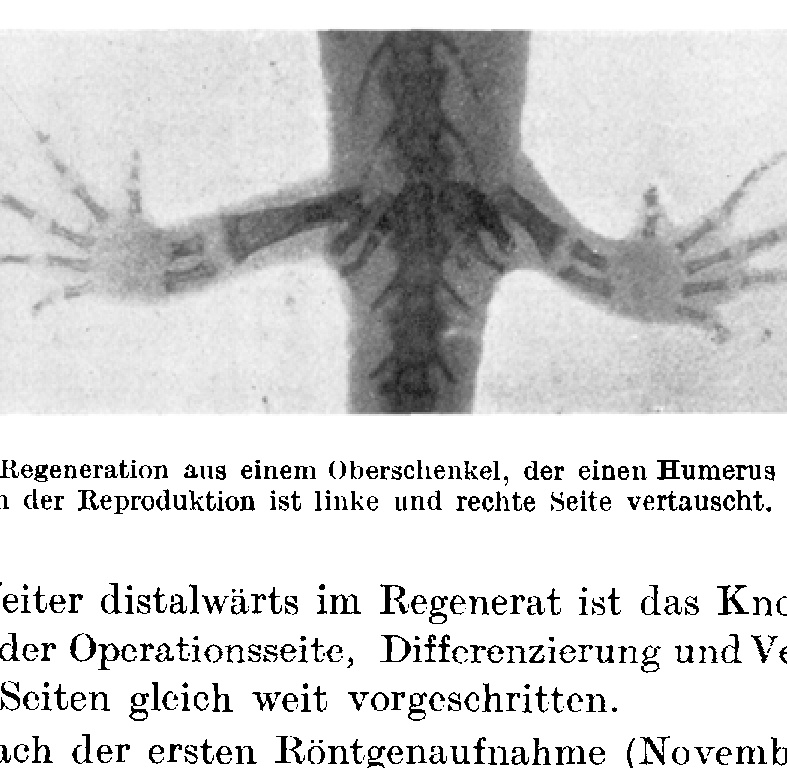
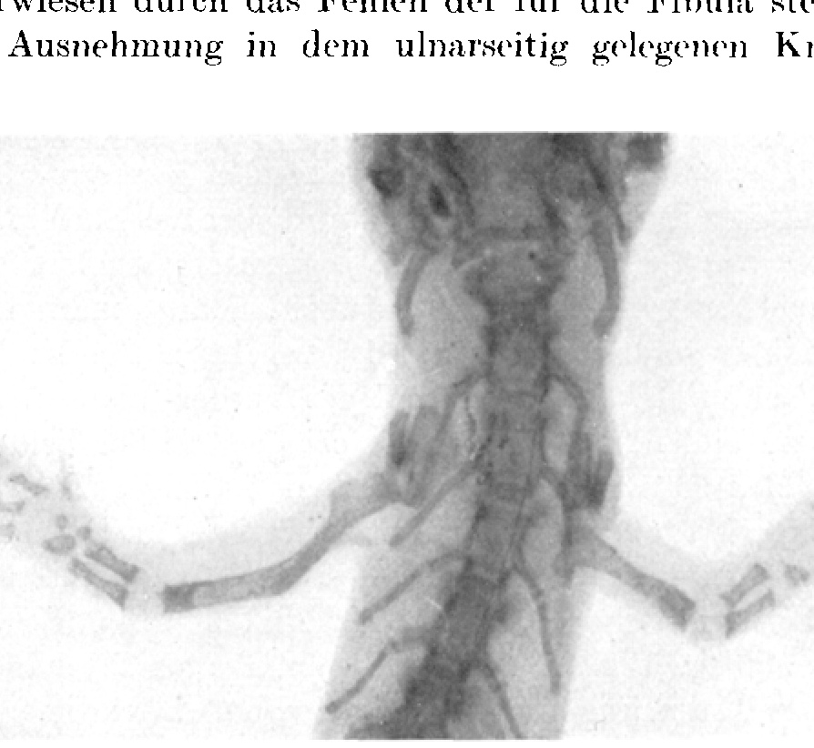
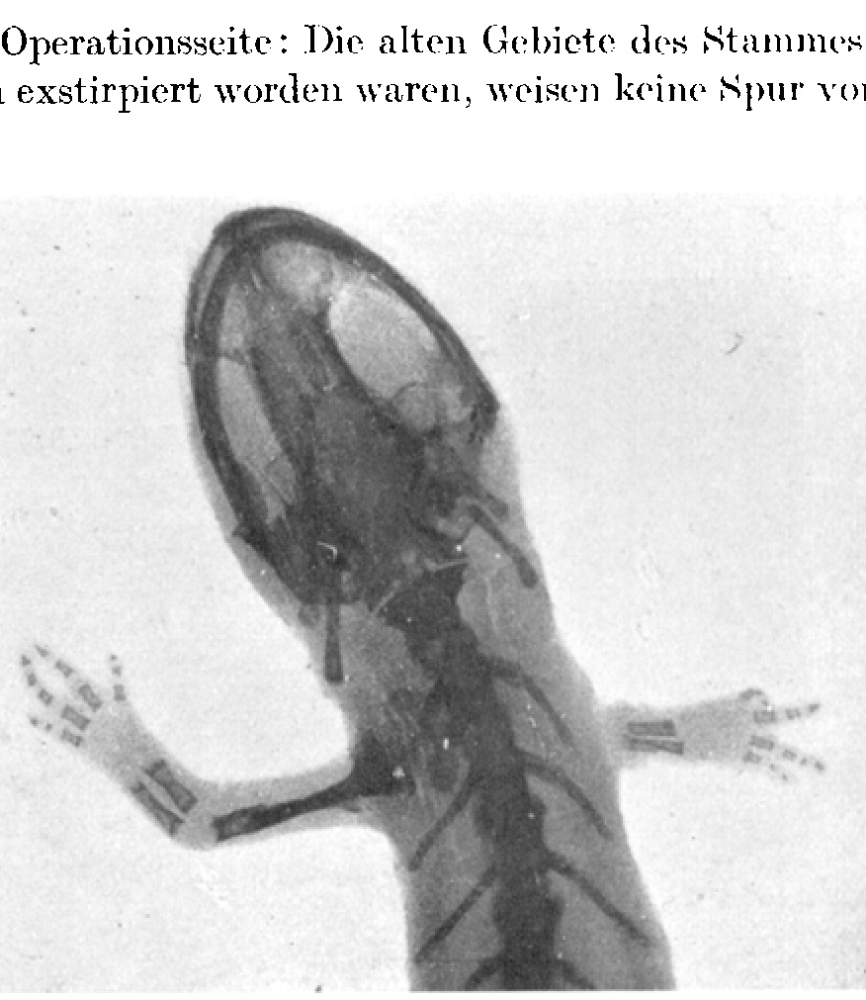
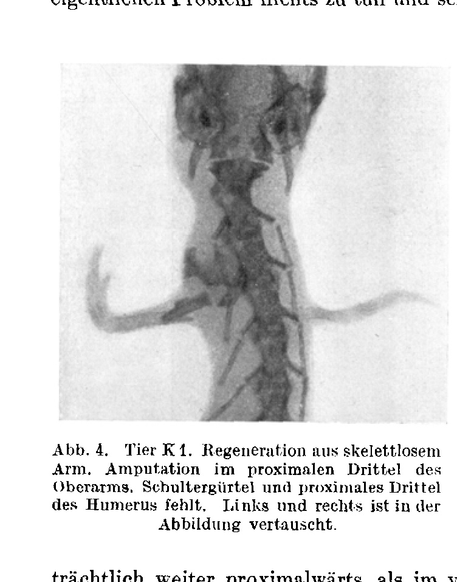
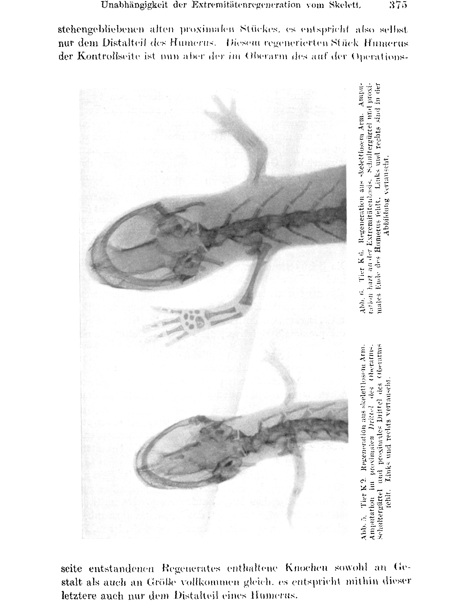

# Independence of limb regeneration from the skeleton (in *Triton cristatus*).

By

Paul Weiss.

(From the Biological Experimental Institute of the Academy of Sciences in Vienna, Zoological Department.)¹

With 6 text figures.

(Received 16 April 1924.)

*Wilhelm Roux' Archiv für Entwicklungsmechanik der Organismen*, vol. 104 (1925), pp. 359–394.

> **Full translation.** A complete English rendering of the running text — the introduction (limb-form and skeleton-form); the experiments on the origin of the skeleton in the limb regenerate (regeneration on limbs with out-of-place skeleton; regeneration on skeleton-less limbs); the general remarks on the determination of the regenerates; the determination field of the organ-region; and the summary — together with all six text-figure captions, the footnotes, and the bibliography. OCR artefacts in the German source were corrected against the page images. Species names are kept as in the original (*Triton cristatus* [modern *Triturus cristatus*]).

### Table of contents.

| | Page |
|---|---|
| Limb form and skeletal form | 359 |
| Experiments on the origin of the skeleton in the limb regenerate | 362 |
| &nbsp;&nbsp;&nbsp;&nbsp;a) Regeneration on limbs with out-of-place skeleton | 365 |
| &nbsp;&nbsp;&nbsp;&nbsp;b) Regeneration on skeletonless limbs | 371 |
| General remarks on the determination of the regenerates | 378 |
| The determination field of the organ remnant | 385 |
| Summary | 390 |
| Bibliography | 393 |

## Limb form and skeletal form.

The limb has its characteristic intrinsic form. Let us leave aside for the time being what in it is structural and functional differentiation, and consider only the perceptually striking element of the form, the spatial delimitation, which we may permit ourselves to detach as a component out of the whole configuration. This limb form in the narrower sense now has an evidently similar counterpart in the form of the inner skeleton. Behind such similarity in appearance one already involuntarily suspects *genetic* relationships, which would prove the one to be in configurational dependence on the other and would thus furnish a simple explanation for the phenomenal kinship. The regularity that binds the two similar configured shapes to one another may be of a very various kind.

Of two concentric circles, each may be thought of as having arisen from the other through the fact that, at a constant distance from the originally given one, a second equidistant curve was described — the one time, in the emergence of the smaller out of the larger,

> ¹ A preliminary communication of the results of this work appeared under the same title as Communication No. 95 from the Biological Experimental Institute of the Academy of Sciences in Vienna (Zoological Department, Director: H. Przibram) in the Akademischer Anzeiger No. 24/25, 1922.

inward, the other time, when the small one is the original, outward. But both circles may also have been formed simultaneously, as curves of differing distance from one and the same point, the center. If we think of the distances as symbols for forces, equal distances being assigned equal force effects, then the two circles arising in the latter way designate the equipotential lines of a planar, radially arranged force field. So in the simplest case. If the structure of the force field is more complicated, then the equipotential lines too become more intricately shaped closed curves and then afford an image like the layering of an agate or like the annual rings of a gnarled tree trunk, or — to come now to the matter itself — like the cross-section of a limb with the two similar contours of the whole and of the skeletal cross-section. One might think that the zeugopodia (lower leg and forearm) escape this comparison, because in them a single limb contour is assigned to a twofold skeletal cross-section; but one need only think of the lemniscate, that is, of the curve form which, for example, develops in the lines of force of a magnetic field between two unlike poles; even when two centers of action are present, the resulting equipotential line may therefore, at a certain distance from them, be simple and oval. Skeletal contour and outer contour appear here as lines coordinated with one another, of equal value; both are the expression of a superordinate regularity and not, for example, the one itself the pattern according to which the other has directed its shape, as we were still able to assume of the circles in the first example.

But the relationship of skeletal form and organ form is not generally regarded in this way; both are not held to be components of equal value of a total form; rather it is the common and customary thing to credit the skeleton with a preeminent role in the form process.

For the observer who has the organism before him in its finished configured shape, the rigid intrinsic form of the skeleton involuntarily presses itself upon him first — this is psychologically very understandable — and he will then take the form of the whole to be understood as a uniform cladding of the primary skeletal form with a mantle layer of plastic and not self-configured soft parts; he has before his eyes, perhaps, the imitation of the ground forms by the blanket of snow. And so one is then all too easily led, half unconsciously, to see in the skeleton the immediately formed thing, indeed the sole bearer of form. This conception — one might call it a "descriptive-naive" one — is more widely disseminated and, through habituation, more firmly rooted than one more closely acquainted with the developmental process might perhaps think.

Particularly suggestively the view of the organism as a "skeleton with flesh around it" is shaped by the conventional manner of anatomical treatment of organic form. One gains the immediate impression as though the anatomical activity of advancing from the body surface toward the skeleton served to work out form as such, which then, in the skeleton, freed from all veiling dross, would for the first time reveal itself truly purely to the observer. And this impression of a procedure that one continually sees and takes part in, without thinking much about it, becomes fixed and becomes the root from which many a misunderstanding must spring. Against one habituation only another helps, and it is to be hoped that an anatomy such as that taught by *Braus* (1921), which leaves the organism together in its form and no longer depicts it as a skeleton with appended structures, will guide the unconscious views of organic form into the right track.

All too often those unconsciously crept-in views have led to problems, from whose solution much understanding of the becoming and the regularity of form was to be expected, being obscured from the very outset by the prejudice mentioned. Indeed, even in the terminology, which ought to be kept as free as possible from subjective overtones, the violence of that impression makes itself known; it had already moved the old anatomists to name the thigh bone with the word "*femur*," which word in usage designated the whole thigh, and to it is owed the fact that, on the other hand, with quite considerable frequency — *pars pro toto* — the whole upper arm is simply addressed as "humerus" and the thigh as "femur," although these termini anatomically signify only the respective bones.

So the conception of the prevalence of the skeleton in the limb form sat quite firmly rooted, and the not throughout very exact use of the terminology helped to entrench the prejudice further and to prevent a reconsideration from arising. With such a direction of thought it is very understandable that one can detect in the investigations on limb regeneration mostly the endeavor, as if it were a matter of course, to localize the form-building functions in the skeleton, in particular to hold limb regeneration to be dependent on the presence of the typical skeletal elements (*Reed* 1904, *Morgan* 1908, *Kurz* 1912, and many others).

The present work would now like to furnish an experimental contribution toward taking from the skeleton something of its nimbus as "bearer of form." The skeleton supports the form, it must even count as an index for the total form, with which it is indeed also lawfully linked, but it nevertheless ought not to be regarded as "the" form-determining thing, to which the soft parts would have only to superimpose themselves as a formless mantle.

The point of departure for my investigations was constituted by certain theoretical reservations against the theory of regeneration as "tissue sprouting," reservations which were strengthened in me particularly by the regeneration findings of *Taube* (1922). Thus I set against the theory that every tissue of the regenerate takes its origin from the like tissue of the stump, and that from the sum of these tissue regenerations the new organ part is produced in its typical form, the possibility that the regenerate arises from uniform material, from a uniform anlage and not as a mosaic, and that then the individual tissues only later differentiate themselves out *in loco* within the regenerate. The continuity of the various tissue types in the stump and in the regenerate would then be no genetic one, but one only subsequently (thus probably in centripetal direction) established.

This assumption extends only to the actual form-building event, through which the peripheral organ is produced in its typical configured shape [Gestalt] and structure, but not to the formation of the humoral and nervous connections with the rest of the organism. Blood vessels and nerves probably grow, according to all that we know up to now, from the substratum into the regenerate, and are therefore not to be reckoned as belonging properly to its typical own stock. All the other tissues, however, would be of uniform origin; in the first place these would be skeleton, connective tissue, musculature and the greater part of the outer covering. I shall now in this work present the experimental findings which for the time being confirm, for the skeleton, the correctness of my original assumption: the skeleton develops in the regeneration of the urodele limb from the uniformly laid-down regeneration blastema *in loco* without genetic connection with the old skeleton of the stump.

### Experiments on the origin of the skeleton in the limb regenerate.

Many researchers have occupied themselves with the problem of the origin of the bone in the regenerate; all of them wanted to obtain information about it from the dead histological sectional picture. That the effort was directed above all at finding out the genetic continuity of the new cartilage with the old skeletal tissue is understandable, given the dissemination which the conception of regeneration as tissue sprouting enjoyed. But it likewise seems comprehensible, after the experimental findings now available, that the authors could not arrive at a uniform result in the conjectured direction. To begin with, every attempt at clarification had to fail already on the fact that one did not distinguish sharply enough between regeneration of injured bones on the one hand and the emergence of bone in a regenerating limb on the other. This too is naturally again to be attributed to the suggestive role which the skeleton played in questions concerning the form of the whole limb. Thus the expression "exarticulation" was sometimes used in the sense as though by it an amputation of the whole limb at the level of the joint, without injury of the bones, were meant. Now in the vertebrate there naturally cannot be an "exarticulation" of a limb in the sense of total removal, for the soft parts must in any case be bloodily severed; one can speak only of amputation with exarticulation of the bone, in contrast to amputation with transverse severance of the bone. "Exarticulation of the humerus" therefore means only that the upper arm bone was loosened out of its joints, and not that the whole upper arm was amputated at the level of the shoulder joint. That a confusion could occur here at all only shows once again how deeply the view was anchored that one might treat the soft-part mantle around the skeleton as a magnitude to be neglected in questions of form-building. It may therefore be pointed out once again that, for the understanding of the results of the present work, it is indispensable to keep strictly apart whether the discussion is of regeneration of the bone alone or of regeneration of the whole limb part concerned.

It is a matter of bone regeneration only when a defect was set on the bone alone and the bone piece to be removed was loosened out of the soft parts, without these themselves being removed along with it. About this bone regeneration much is already known; the problem has also been vigorously worked on from the surgical side. It is to be noted, however, that it will not do for us to take the concept of regeneration as broadly as is customary among the surgeons; we may not address every proliferation as regeneration, but must restrict the word "regeneration" to the designation of the proliferations *leading to typical configured shapes [Gestalten]*. The distinction here drawn between configured (organized) and unconfigured (unorganized) proliferation is neither arbitrary nor superficial, but uniquely and solely grounded in the matter itself; that we are here dealing with two essentially different, indeed often even antagonistic processes — for this a striking indication has emerged in the investigation of the nerve-dependence of the regeneration process (P. Weiss 1925a). Incidentally, the distinction is also drawn among the surgeons by A. Bier (1922), since he has succeeded in obtaining "true" regenerates on human bone.

Against such genuine regeneration leading to well-formed structures stands the formless proliferation of the bone, the callus formation, in sharp contrast. The callus is not to be designated as a regenerate and accordingly will here, where it is only a question of regeneration, at first be excluded from the discussion.

As regards the origin of the material in bone regeneration, a loosening of the old dogma "new bone only from old" seems to be achieved precisely through *Bier's* findings; *Bier* has made it probable that material for bone new-formation can be supplied, besides from the periosteum and marrow cavity of the old bone, perhaps even metaplastically from the connective tissue of the gap region. The details of the descent of the material in ordinary bone regeneration need not occupy us further here; more comes into consideration under what conditions bone regeneration occurs at all: it appears (*Philippeaux, Fraisse* 1885, *Wendelstadt* 1904) that a *partial* bone defect can be repaired, whereas, on the contrary, *total* exarticulation of a bone (without injury of the adjoining bones) has permanent loss as its consequence; it can no longer be replaced, not even metaplastically from the surroundings; and this, although the surroundings, as has been shown under other circumstances, is capable of supplying material for bone new-formation. It can therefore probably not be due to a lack of material that the exarticulation (in contrast to the setting of a defect under bone injury) has no regeneration of the bone as its consequence; rather we must evidently picture the state of affairs thus: every bone "concerns itself," as it were, only with itself and is able to repair, form-identically, defects that are set on it, even with the drawing-in of foreign material from the surroundings; on the other hand it does not concern itself with the bones lying beyond its two joint ends or in the neighborhood, so that it also remains quite untouched by the total loss of one or other of them and has no occasion to set in motion processes for their replacement.¹ In order to go quite surely, I repeated the *Wendelstadt* experiments in their main features and, just as he did, was able to establish, after careful exarticulation, permanent failure of the regeneration of the removed bone (observation over 1 year).

> ¹ If an undamaged skeletal part does not feel prompted to replace an exarticulated neighbor bone, this in no way says that, if a defect were set on it itself, after repair of this defect the regeneration process once set in motion might not also run on further and replace the removed neighbor bone too. This possibility is still to be tested experimentally; it shall here be mentioned only incidentally.

The findings that had been obtained in bone regeneration one sought, as said, to find again in the same manner in *limb regeneration*. According to the sprouting theory one pictured the skeleton in the regenerated limb part as having proceeded from the skeleton of the stump. Accordingly it must also have brought along its form-building potencies from there. On this point, no definitive statement at all was, naturally, to be expected from the sectional pictures of the ordinary regeneration course. It was natural to test the state of affairs experimentally by letting the form-building potencies of the skeleton come to effect in a foreign environment. If the form of the limb was really so essentially determined, as one might believe, by the intrinsic form of the skeleton, and if, further, the skeleton in a limb regenerate had arisen, in material composition and in configured shape, out of and in dependence on the old, co-injured skeletal parts of the stump, then this would also reveal itself under abnormal conditions.

#### a) Regeneration on limbs with out-of-place skeleton.

Experiments were therefore undertaken by me which in detail proceeded from the following consideration: according to the sprouting theory, the limb regenerate comes about as the sum of the regenerations of the tissues contained in the cut surface — epidermis and cutis supply the skin, muscles the muscles, the bone coming to light in the cut surface the skeleton of the regenerate; since these tissues are the ones typical for the limb concerned, the harmony of the side-by-side proceeding tissue regenerations is guaranteed, and the end structure is again of typical form; thus argued the sprouting theory. How, then, must a regeneration process accordingly proceed if, in the cut surface, in the midst of otherwise locally belonging tissues, a *foreign* one were present, with a different form-building potency not fitting into the local developmental tendency? The harmony of the sprouting processes would be disturbed, and a disorderly regenerate would probably come about.

Or else the foreign tissue could be retuned in conformity with the place, or, thirdly, it could itself have brought along into the new environment so powerful a formative influence that it would be able to force the remaining tissues into its own developmental direction. In these two latter cases the result would nonetheless again be a harmonious structure, whose coming about could still always be explained according to the sprouting theory. About this possibility the first experiments that I undertook could decide nothing; only the possibility mentioned first, that disorder might come into the regenerate, could on the basis of the experiments be ruled out at once. The experiments were constituted as follows: [paragraph continued from p.7, completed here:] On full-grown newts of *Triton cristatus* (for general remarks on the method of the operations and on the keeping of the animals see *P. Weiss* 1925a) humerus and femur were exchanged against one another (let it be said once again that "humerus" and "femur" signify only the bones of the upper arm and the thigh respectively). The extirpation of the bone is carried out from a small incision wound at the dorsal margin of the limb base. In maximal adduction position of the leg the femoral head projects distinctly in the surface relief, and one can, after a small transverse cut through the musculature, lay it bare and, by slight pressure, easily bring it to luxation out of the hip joint socket. From there on one must work on bluntly, in order to avoid any injury of the bone and periosteum; for total extirpation without any remnant is indeed to be carried out. One detaches the muscles, best with a small iris spatula, from the trochanter and femoral shaft, drawing in the process the femur itself ever further out of the thigh proximalward, and finally loosens the distal epiphysis out of the knee joint. With such a manner of operation no further bloody injury occurs whatsoever; in particular, the nerves are not impaired. The operation on the arm, the dissecting-out of the whole humerus, is carried out in quite analogous manner.

On full-grown newts of *Triton cristatus* [modern *Triturus cristatus*] (for general remarks on the method of the operations and on the keeping of the animals see *P. Weiss* 1925a) humerus and femur were exchanged against one another (let it be said once again that "humerus" and "femur" signify only the *bones* of the upper arm and the thigh respectively). The extirpation of the bone takes place from a small incised wound at the dorsal margin of the base of the extremity. In maximal adduction position of the leg the femoral head springs forward distinctly in the surface relief, and one can, after a small transverse cut through the musculature, expose it and, by slight pressure, easily bring it to luxation out of the hip-joint socket. From there on one must continue to work bluntly, in order to avoid any injury to the bone and to the periosteum; total extirpation without any residue is, after all, to be carried out. One detaches the muscles, best with a small iris-spatula, from the trochanter and the femoral shaft, drawing the femur itself thereby ever further out of the thigh in the proximal direction, and finally disengages the distal epiphysis out of the knee joint. With such a manner of operation there comes about no kind of further bloody injury; in particular the nerves are not impaired. The operation on the arm, the dissecting-out of the entire humerus, takes place in quite analogous manner.

In place of the removed one the foreign bone is then in each case inserted and the small skin wound closed with 1–2 sutures. Only afterwards does one fit the proximal head of the transplant into the socket of the shoulder- or pelvic-girdle respectively. The transplantation must be carried out homoplastically, because the humerus is longer than the femur and therefore a mutual replacement within one and the same animal would not be appropriate: the short femur of the upper arm could become [too] long, while on the other hand the humerus, on account of its length, would keep springing out of the hip-joint socket. One therefore chooses a smaller and a larger animal and exchanges the femur of the large one for the humerus of the small one.

The transplants heal in as a whole and remain preserved, at least nothing of a dissolution and substitution is to be noticed. It is improbable that *Triton* as a species behaves so differently in this point from other animals, in which one generally observes resorption and new building-up of the bone transplant; rather, the difference in behaviour is probably to be attributed to the fact that with the mammals, in the experiments, mostly only bone *fragments* had been brought to transplantation, whereas in our case the whole, self-contained, nowhere opened bone. For clarification, further experiments would first have to be carried out. In any case I found the transplanted bone still preserved in its form even after a year. A few weeks after the transplantation the muscles have attached themselves to the transplanted bone and from there on the foreign bone now also exercises its function as a "limb" in the chain of the skeletal rods. It is then also no longer externally noticeable that the extremity contains a foreign bone at all.

In general one would, after this, wait a longer time, until, without doubt, the transplant had really become at home in its new surroundings, before one undertook the amputation of the extremity which contains the foreign bone within it. It was carried out on the upper arm or upper leg respectively, roughly in the middle, through a smooth cut, so that the cut surface contained, in the middle, the foreign bone, the transplant, while the segment of stump situated more proximally contained the out-of-place foreign bone; that is, on the upper arm a femoral cross-section, on the upper leg a humeral cross-section.

The fore-extremity of *Triton* is in its autopodium of four-rayed type, the hind-extremity, however, of five-rayed type. If now the assumptions of the sprouting theory had any justification, then in the one or the other skeleton the form-tendency in question would have to come to expression; that is, the regenerates that arise out of the out-of-place skeleton would, in accordance with the formal forces inherent in the piece of skeleton concerned, contain those at the wrong place. Will the regenerate on that account be disorderly? Nothing of the kind showed itself in the experiment:

After the amputation the regeneration process sets in over the cut surface with its typical stages, blastema, bud, and primordium [Anlage], without delay and without defects, and out of the primordium the replacement structure differentiates itself, and that is, on the fore-extremity: elbow, forearm and *four-rayed* hand, and on the hind-extremity: knee, lower leg and *five-rayed* foot. As examples let the following cases be cited:

*M 15:* 4. X. 1921: Homoplastic transplantation of a humerus into the left upper leg at the site of the extirpated femur. — 15. II. 1922: Bone healed in. Amputation of both hind-extremities at [the level of] the upper leg; in the left one the transplanted humerus is contained, the right one serves as control. — 10. VI. 1922: On both stumps normal, functionally capable leg-regenerates with 5-toed foot have arisen. — 21. XI. 1922: Roentgen photograph.¹ Fig. 1.

> ¹ For the production of the roentgen photographs I am very much indebted to Herr Primarius Dr. *I. Robinsohn* and his roentgen technician, Herr *Fronhold*.

*Findings:* Operation side (contains the transplanted humerus): Proximal terminal contour of the transplanted humerus somewhat unsharp. In the middle of the bone the boundary between old (transplanted) and regenerated bone is recognizable through a densification in the bone-shadow. The lower-leg skeleton of the regenerate is already ossified and consists of two parallel bones, which both in size (comparison with the control side!) and in form (the fibula shows the characteristic medial notch!) represent typical lower-leg bones. The metatarsus skeleton is for the most part still cartilaginous, whereas the phalanges are already throughout ossified. All in all the roentgen image shows, apart from the residual piece of the transplanted humerus shaft, a typical hind-extremity skeleton.

Control side: The residual piece of the femur that remained standing after the amputation is clearly to be recognized by the denser bone-shadow. The regenerated distal femur part sits hood-

{width=4in}

**Fig. 1.** Animal M 15. Regeneration out of an upper leg that contains a humerus healed in. In the reproduction left and right side are interchanged.

shaped upon the old one. Further distalward in the regenerate the bone image is the same as on the operation side; differentiation and ossification have progressed equally far on both sides.

One year after the first roentgen photograph (November 1923, that is, 26 months after the transplantation and 22 months after the amputation) a second was produced, but it shows no essential novelty any longer over against the first: On the transplanted humerus the boundary between old and regenerated bone is as a shadow-densification still always perceptible. The ossification of the metatarsal skeleton has set in; the os fibulare is ossified and the adjacent intermedium already exhibits a faint shadow.

*M 66:* 25. IV. 1922: Homoplastic transplantation of a femur into the upper arm (for operation-technical reasons in this case also the greater part of the coracoid was removed). Immediately afterward (this time, then, without first awaiting the healing-in) amputation of both arms at half the height of the upper arm. — 10. V.: The implanted bone protrudes somewhat over the wound, beside it blastema. — 17. VIII.: On both sides a normal arm with fourfingered hand has regenerated. — November 1923 (19 months after the operation) roentgen photograph. Fig. 2.

*Findings:* Operation side: The piece of the transplanted femur remaining proximal of the cut surface is preserved as such; the sharp proximal bone-contour is the one characteristic for a femur. The regenerated distal part sits hood-shaped upon the residual piece. The forearm contains the two bones typical for it, which in size and form correspond completely to those of the opposite side (control side). That it is not, say, a matter of lower-leg bones is proved by the absence of the notch always characteristic for the fibula in the bone lying on the ulnar side; it

{width=4in}

**Fig. 2.** Animal M 66. Regeneration out of an upper arm that contains a femur healed in. The left side of the reproduction corresponds to the right side of the animal.

is therefore an ulna. In the carpus there already lie bone-nuclei, and specifically the fused ulnare + intermedium is already strongly, the radiale, by contrast, only suggestively ossified. The fusion of the ulnare with the intermedium is a regular mark of the fore-extremity in *Triton*; on the hind-extremity the fibulare homologous to the ulnare remains independent over against the intermedium. We therefore have, also for the carpus, an indication that in this case the skeleton of a fore-extremity is present. The autopodium is correspondingly four-rayed as well. The phalanges are ossified.

Control side: The regenerated distal part of the humerus sits upon the old residual piece not in a straight-line continuation, but at an obtuse angle. The forearm contains radius and ulna; of the carpals, the fused ulnare + intermedium, the radiale and the centrale are ossified, likewise then also the finger skeleton.

Let us now summarize the findings: A transversely cross-sectioned upper arm that contains, at the site of the humerus, a femur healed in, regenerates exactly as if it still contained its own humerus (control side!), the skeleton of the regenerate is an arm skeleton; analogously the regenerate from an upper leg, into which a humerus instead of the femur had been healed in, is the same as from a normal upper leg, the skeleton of the regenerate is in this case therefore a leg skeleton. The regenerates thus possess, although in the cut surface over which they were laid down an out-of-place component was present, themselves none such, but rather are they thoroughly harmonious in themselves.

It is thus to be noticed in the experiments that nothing of it shows itself, that an autonomy-tendency of the skeleton at the foreign place would somehow have asserted itself; at least, if it had been present at all, it should not have been able to assert itself. Since now, however, the skeleton of the regenerate (it would be over-hasty to say: the "regenerated skeleton") also exhibits typical form in the experiments, one might, for the time being, be led to the assumption that there exists a prospective potency of the out-of-place skeletal material to form skeleton both of the fore- and of the hind-extremity, and that in each case the place-appropriate one of the two developmental possibilities was, yielding to whatever local influences, struck out upon. Then one might speak of "retuning" [Umstimmung] in the widest sense. Still another way out one had: that the skeleton supplied, say, only the unformed material, and that from this plastic mass the form was worked out, sculptor-like, through influences of the place of origin acting in conformity with the place. Both these assumptions, which alone still appear as acceptable, in order to be able to order the experimental results into the conceptions of the sprouting theory, nevertheless already contain a wholesome insight: the suggestive role of the skeleton as the form-determinant of the extremity is played out. The first assumption (bipotent self-forming of the skeleton), which still lets through a residue of the old belief in the full power of the skeleton, would have to concede that to the self-forming-capacity of the skeleton still essential influences of its surroundings forming the form must be added; and the second assumption would give the self-forming-capacity of the skeleton up altogether, would establish only the material-specificity in conformity with the place, and would hand over the form-determination wholly to the "surroundings." So one falls from the one extreme into the other, and just as one earlier wanted to regard the extremity form as a "work" of the skeletal form, so would now in turn the skeletal form be a "work" of the surroundings. Instead of letting the outer proceed from the inner circle, one would let the inner proceed from the outer.

### b) Regeneration on skeleton-less extremities.

It is unnecessary to discuss the two assumptions, for further experiments point past both of them in the direction of a third. This [third] could be expressed in the image of our schema roughly thus, that one thinks both circles as having arisen simultaneously and of equal value, an interpretation as has already been assumed in the introduction to the question of the extremity form. The experiments showed, namely, that there is something like a "total form" [Gesamtform] (form in the widest sense with all structural and chemical differentiations, taken not merely as spatial delimitation), which is not built up as a sum of the part-forms, but rather which itself brings the part-forms into subordination among one another (the total form) and into juxtaposition, at best to interaction (correlation) among one another, to configuration. The problem would become considerably complicated if a summative behaviour over against this uniform, "total-form"-shaping influence were to overtake the material production, if the material delivery had to occur for each individual part (tissue) for its own kind specifically; fortunately it shows itself in the experiments that not only, as said, the *disposal* over the material, but also the material *delivery* itself takes place uniformly, so that the process of form-building here may, for the time being, be treated according to its components: material-acquisition and material-arrangement under one [head].

The further experiments were so arranged that a clear answer to the question: Is the regeneration of the extremity the sum of tissue regenerations or is it a uniform process which has nothing at all to do with individual actions of the tissues? could be expected with certainty. Was the regeneration of the extremity, namely, nothing further than the sum of the tissue regenerations over the cut surface, then a lack of one or the other tissue in the stump must also condition a lack of the corresponding [tissue] in the regenerate. Of the bone I knew — *Wendelstadt* and others had proved it and I had convinced myself of the correctness of the statements — that after careful exarticulation it remains permanently lost (see above), and so it was also an easy matter to produce permanently boneless extremities. Did the bone of a regenerate really stem from the bone of the stump, then on amputation in a skeleton-less extremity a skeleton-less regenerate must be expected.

The procedure in the operation was at first the same as in the previously described transplantation experiments, only that now, just after the bone extirpation, the extremity sections concerned were left empty. The experiments are all carried out on the fore-extremity; it is longer and slenderer than the hind one and contracts, when its inner skeletal support is taken from it, not so strongly together as does the short thick leg. Thus the humerus (again from the shoulder out) was exstirpated — the soft parts of the freed extremity were thereby left quite intact — and then amputated above the elbow in the soft, boneless upper arm. And out of the cut surface there regenerated a *well-formed hand*. The skeletal relationships I have not here investigated further, because the objection seemed to me not unwarranted, that skeleton-forming material might have wandered, from the shoulder bones, through the upper arm to the cut surface. These cases I then also do not describe more closely at all. In the following experiments the procedure went still further, and I attained the same result: I exstirpated not merely the humerus, but everything that was present of skeletal parts proximal of the elbow, that is, also the whole shoulder girdle, scapula, coracoid and procoracoid. The operation is carried out from two incisions, one on the back above the scapula and one medially at the breast, and indeed always *bluntly* is dissected away, in order to leave no bone- or cartilage-debris behind. Once one has, after this, the uninjured, well-formed shoulder girdle and the whole humerus lying so before one, then one can be sure that the whole extremity and its region from the elbow up to the vertebral column is wholly free of skeletal elements. To make also the forearm boneless is naturally superfluous, because it is in any case cut away whole anyway. — To be quite sure, the amputation cut is guided proximalward beyond the elbow, so that with certainty no little end of the forearm bone remains in the cut surface; the cut surface thus goes transversely through the *boneless* upper arm. From there on the upper arm remains, of the shortening that the continual unresisting musculature brings about, apart, unchanged, soft and functionless. Neither the removed humerus nor the removed forearm skeleton is rebuilt.

Over the cut surface, however, there lays itself a regeneration-blastema and out of it now there differentiates anew: forearm, wrist-joint and hand, without delay, in typical, defect-free formation. *What is newly formed distal of the cut surface as extremity also contains the typical skeleton belonging to it, although indeed the old parts of the extremity, the upper-arm-stump and the shoulder region, are skeleton-less and also remain so for ever.* Lay the amputation surface in the proximal part of the upper arm, then this part itself contains no bone; the regenerated distal piece of the upper arm, however, contains the distal part of a humerus belonging to it.

There shall now the individual cases, documented by roentgen photographs, be described, the longest observed one in the first place: *M 28:* 10. XII. 1921: Extirpation of the left shoulder girdle and humerus. Amputation of both arms above the elbow; the left side is completely skeleton-less. — 15. II. 1922: On both stumps, regenerates in the rudiment stage [Anlagestadium], 3 mm high on the left, 4 mm on the right. — 10. VI.: On both sides 4-fingered, normally differentiated regenerates. On the left arm, upper arm and elbow are not moved during locomotion, whereas the function of the wrist and finger joints is faultless. The upper arm is greatly shortened, since the muscles, for lack of any bony connection, were never stretched the whole time. — 21. XI.: Roentgen photograph. Fig. 3.

*Findings:* Operation side: The old regions of the trunk, from which the bones had been extirpated, show no trace of bony content. No bone shadow whatsoever is present in the shoulder region, nor in the upper arm. The wavy contour of the upper arm is a consequence of its contraction. The contour of the regenerate is beautifully smooth, and the boundary of the regenerate against the old upper arm is clearly recognizable. In the forearm of the regenerate lie radius and ulna. Since they lack the abutment of the humerus, they have been drawn a little proximally by the muscle pull, so that they project some distance into the "empty" upper arm. The autopodium is four-rayed, the phalanges are ossified, the carpus is still cartilaginous. In size the regenerate (measured from the fingertips to the proximal end of the forearm bones) is almost equal to that of the opposite side.

{width=4in}

**Fig. 3.** Animal M 28. Regeneration from a skeleton-less extremity. Amputation just above the elbow. Shoulder girdle and humerus absent. Right and left are transposed in the reproduction. Through the proximal third of the ulna there runs an oblique discontinuity in the bone shadow; I believe one is not mistaken in interpreting it as a pseudarthrosis. Its origin can be well explained under the present conditions: For, through the proximal advance of the forearm bones into the soft upper arm, the elbow end of these bones is no longer at the actual elbow region of the limb, but likewise more proximal than this; in the soft-tissue region, however, where forearm and upper arm border on one another and which therefore corresponds topographically to the elbow joint, there already lies the shaft of the two bones. Now, according to the finding of *Bier* (1923) in humans, a bone-dissolving action is quite generally attributed to the joint region, so that it ultimately appears plausible that in our case too a pseudarthrosis could arise on the bone at the level of the elbow region. The whole question naturally has nothing to do with our actual problem and is mentioned only as an incidental finding.

Control side: One sees in the old trunk part the humerus and the ossified portions of the shoulder girdle. The contrast against the boneless trunk parts of the opposite side need not first be emphasized. From the cut surface distalward stands a normal regenerate of elbow, forearm, four-rayed hand, all with the associated skeleton. The ossification is at the same stage as on the operated side.

{width=4in}

**Fig. 4.** Animal K 1. Regeneration from a skeleton-less arm. Amputation in the proximal third of the upper arm. Shoulder girdle and proximal third of the humerus absent. Left and right are transposed in the figure.

*K 1:* 2. V. 1923: Extirpation of the left shoulder girdle and humerus. Amputation of both arms in the proximal third of the upper arm, thus considerably farther proximalward than in the previously described case. — 27. XI. 1923: Preserved. On both sides upper arm, elbow, forearm and four-fingered hand have regenerated in normal, functionally capable condition. Roentgen photograph. Fig. 4.

*Findings:* On the operated side, all shoulder bones and the proximal third of the humerus are absent. The removed bones of the old trunk parts have thus not been newly formed. The regenerate, on the other hand, again contains all the skeletal parts proper to it; of these, humerus, radius and ulna are already distinctly ossified, and in the phalanges bone nuclei are just becoming visible. Of the humerus only the distal portion, belonging to the regenerate, is present; this is seen from comparison with the regenerate of the control side, as follows: The regenerated piece of humerus on the control side forms the distal completion of the old proximal stump portion that has remained behind; it thus corresponds itself only to the distal portion of the humerus. This regenerated piece of humerus of the control side, however, is again completely identical, both in shape and in size, with the bone contained in the regenerate that has arisen on the operated side in the upper arm; this latter therefore likewise corresponds only to the distal portion of a humerus.

{width=4.6in}

**Fig. 5.** Animal K 2. Regeneration from a skeleton-less arm. Amputation in the proximal third of the upper arm. Shoulder girdle and proximal third of the upper arm absent. Left and right are transposed.

**Fig. 6.** Animal K 6. Regeneration from a skeleton-less arm. Amputation close to the base of the limb on the body. Shoulder girdle and the proximal end of the humerus absent. Left and right are transposed in the figure. *(shown in the figure above, with Fig. 5)* *K 2:* 29. V. 1923: Same operation as in K 1. — 1. XII. 1923: On both sides a normal arm with all members and a four-fingered hand has regenerated. Roentgen photograph. Fig. 5.

*Findings:* On the operated side the removed bones are absent, i.e. shoulder girdle and proximal third of the humerus completely; the regenerate from the cut surface again contains its typical skeletal complement, everything exactly as in the previous cases. A comparison with the humerus regenerate of the opposite side again teaches that on the operated side only the distal part of the humerus was formed, that is, exactly that part which belongs to the limb section newly formed as a whole. Size and state of differentiation of the regenerates are the same on both sides; ossified are humerus, forearm bones and phalanges.

*K 6:* 24. V. 1923: Operation as in K 1, but the amputation cut (only on the operated side) still farther proximal, namely placed close to the base of the limb on the body. — 1. XII.: A complete arm with all members, joints and a four-fingered hand has regenerated. Roentgen photograph. Fig. 6.

*Findings:* The shoulder bones that had been removed are completely absent, have not been replaced. The regenerated limb, on the other hand, again contains all the skeletal elements proper to it. Since almost the entire upper arm had been removed, and thus a whole upper arm was also newly formed, the humerus contained therein is likewise almost a whole one; only the proximal epiphysis, which already belongs to the old trunk part, is absent.

What these findings teach without exception is the following:

1. Disarticulated and totally extirpated bones, i.e. bones removed from their surroundings, are not replaced and remain permanently lost.

2. A limb regenerate that arises after removal of a whole limb section contains all the skeletal elements proper to it, even when the stump, and with it the cut surface, is completely skeleton-less.

Point 1 we have already discussed briefly above; it is now our task to point out the consequences that can be drawn from the experimentally established facts of point 2. Since in the stump there is no skeletal component whatsoever, yet the regenerate nevertheless, regardless of this, contains all the bones proper to it, the conclusive proof is, in my opinion, furnished that the skeleton of a limb regenerate does *not* derive from any old skeletal elements in the stump. Thereby the question posed by earlier investigators — *in what manner* the new skeleton would be formed from the old — naturally also loses its justification.

The assumption of a *genetic* continuity between the individual tissue in the regenerate and the tissue of the same kind in the stump, as was conjectured by the *sprouting theory* [Sprossungstheorie], appears, at least for the skeletal tissue, to be refuted. Neither the formative material nor even a form-determining influence can here have been derived from tissues of the same kind in the stump, since indeed everything of the same kind is altogether absent in the stump. The assumption of a unitary origin of the limb regenerate, to confirm which I had set out, thus gains enormously in probability, even if the confirmation could for the time being be supplied only for the skeletal tissue. For it can hardly be supposed that the remaining mesodermal tissues should behave essentially otherwise than the skeletal tissue (the blood vessels must here, as already mentioned above, be left out of account, since, as foreign immigrants, they do not contribute to the typical proper form of the organ). That portions of the skin covering, too, need not necessarily be derived from sproutings of old skin seems to me entirely possible (see below).

The histological pictures that earlier investigators obtained of the normal course of limb regeneration show in every respect conditions appropriate to the now experimentally established fact of a unitary, non-mosaic-like rudiment of the regenerate: This is — if one disregards certain destructive processes to be interpreted as a consequence of the wounding — a superposition of the cut surface with phenomenally homogeneous, formally and structurally indifferent, "embryonal" formative elements; among these, then, vigorous multiplication and, at a later stage, an arrangement becoming ever more regular, and finally a differentiation, in accordance with this arrangement, into the definitive formal components. One likes to call this material "mesenchymatous" (e.g. Schaxel 1921), and thereby expresses first of all the loose cohesion and the easy mutual displaceability of the elements. That, however, despite the external homogeneity, definite dispositions for the individual elements were already given from the very beginning — so that the ones were determined and alone capable for the formation of skeletal tissue, others again for musculature, etc. — might indeed be asserted, in view of the great similarity in appearance that the undifferentiated cells of the various tissues show among one another, without its being refutable by the merely optical state-finding such as the histological picture allows one to draw. But as has now been shown in the experiment, to the unity of appearance already revealed in the picture there corresponds also a homogeneity of essence: What is laid down as a blastema at the cut surface is a heap of material, originally probably of syncytial nature, which, of thoroughly homogeneous composition, perhaps does not even yet contain prescribed within it the general direction of its formal development, let alone already a partitioning of the formative function among definite of its sub-regions. How in this mass the typical differentiation then comes about will now have to be considered:

## General Remarks on the Determination of the Regenerates

The question is above all: Does everything further in this mass take place by virtue of a capacity that the mass has already brought along, fixed in quite definite quality, to its place of formation (1), or is the quality of what is to be formed determined, in any material at all capable of formation, by factors lying outside it? If the latter holds — and it is in fact so — then the following possibilities arise: The material would possess developmental possibility only in certain, but several, directions, one of which is given predominance through the cooperation of factors lying outside (2). These factors themselves could act, say, in the sense that they brought about a *quantitative* favoring of one of the developmental tendencies lying side by side in the material (2a); or else they could themselves exert a *qualitative* formative influence, and there would come about, in the material which among its (several, but limited) formative possibilities also contained the one conforming to the tendency of those factors, an answering and a working-out of precisely this one, analogous, say, to a process of resonance (2b). In both cases we have *pluripotent* material before us.

And finally it is conceivable that the capacities of the material were not at all restricted to the formation of this or that structure, that rather it was able, completely plastically under corresponding influences, to produce here this and there that in pure determination by those influences alone (*totipotent* material) (3). Here too, for the first, two kinds of influence-taking by the quality-determining factors are conceivable: A definite arrangement can be forcibly imposed ("impressed") on the material, the material "is fitted in" (3a), just as the iron filings into the magnetic field; or else the arrangement of the material constitutes a reactive process of itself against certain "stimulus-like" influences upon its parts, it "fits itself in" (3b).

Since in judging these possibilities the findings on regenerative form-formation will surely have some say, and since at the very least the duty devolves upon us to test an experimentally found behavior for its fruitfulness in theoretical clarifications, let there first be given in brief form a survey of the arguments for and against one or the other of the possibilities just enumerated:

1. *Unipotent material:* What is meant is that the material entering into formation contains, unambiguously determined, the *quality* of its development, while quantity and intensity of the formative process may very well be co-determined outside the material (space of unfolding, nutrition, formative tonus). The form of what is formed is intelligible as pure *self-differentiation* of the laid-down material. Such a view seems at first glance to be contradicted already by the fact that in hydroids, turbellarians, annelids, etc., different structures emerge from the same cut surface, according to whether it is the anterior cut surface of the posterior, or the posterior of the anterior, part-piece. If, on the other hand, one inclines, say, to *Sachs's* hypothesis of substances streaming in a definite direction and forming organs, then one will always be able to say that in the hind-piece other substances are conveyed to the cut surface than in the fore-piece. The possibility is cogently excluded only by findings obtained quite recently for limb regeneration, according to which a regeneration bud that has come to be laid down on an amputation stump of the hind leg, after transplantation onto the stump of a fore leg, develops here now, in accordance with its place, into a fore limb, and a fore-leg bud on hind-leg stumps analogously into a hind limb (*Schaxel* 1921, *Milojević* 1923). According to these new results, the still undifferentiated material laid down over the cut surface must contain at least two formative capacities.

2. *Pluripotent material:* Let us, for the sake of simpler presentation, assume by way of example only bipotency of the material, as it has to be inferred from the experimental results just mentioned for the limb-regeneration blastema of the urodeles. The material can in this case form two things, and only two: fore- (V) and hind- (H) limb. The question is, why under definite conditions (on the fore-limb stump) only V is now always formed, and analogously behind only H. Since the material is the same at both places — it indeed contains here as there V + H —, the difference in behavior here and there must be grounded in differences of the local conditions outside the material. The determination of the form-quality here no longer goes back to a pure self-differentiation process of the formative material as it is brought for the first time onto the wound surface, but rather there acts, from the substrate, still a local factor in addition to the formative tendencies of the material.

a) The local factor would have only *intensive*, not qualitative efficacy: In the formative material there awaited realization an amalgam of formative potencies H + V (presumably thought of as bound to an amalgam of two separate formative substances), whose two components would be affected to mutually different degree by the local factor, the one being favored the one time, the other the other time. We can, expressed more concretely, picture those processes running side by side at different speeds, of which the faster does not let the slower come up alongside it, say through seizing for itself the available building materials. Thus the relation in which the two processes stand to one another will also determine which of them gains the upper hand, and the end-product corresponding to it will arise. If we now further presuppose that the local factors can exert an unequal action on the speed of the two processes, then it is conceivable that the formation of the typical, place-appropriate structure comes about in each case thereby, that the one local factor significantly increases the speed of V compared with that of H, so that V prevails, while another local factor, such as acts say in the hind leg, sets H at an advantage over V. Such a competitive struggle of two processes was assumed by *Příbram* for the interpretation of homoeosis and heteromorphoses (1919); however, he holds responsible for the resulting form not a factor acting on the formative material from the neighborhood, but rather the mutual quantitative ratio of the component substances present. In *Goldschmidt's* interpretation of intersexuality, too, we find a conception similar in its main features.

b) The local factor would have a *qualitative* effectiveness: Since, however, the construction material by hypothesis contains only the capacity for the formation of two determinate qualities, a qualitatively effective local factor too will be able to call forth formation in the material in question only if it is itself quality-identical with one of the two construction-possible qualities. We then have before us an extended "key and lock" theory, with one lock that can be opened in two different directions by two different keys. In order at least to mention an analogy of such a process with other natural occurrences, let it be pointed out that the same mechanism confronts us in all phenomena of resonance: material attuned to a determinate occurrence responds only to the impulse adequate to its "attunement." If, then, the material is attuned to two kinds of locality, it can respond location-appropriately to either of the two.

Perhaps, now, we ought not to oppose the possibilities adduced under a) and b) to one another at all as an either-or; for while possibly the determination of the general quality of a regenerate may be decided by an intensive mode of action in the sense of a), it nevertheless appears impossible to explain in such a way also the orientation- and direction-relationships of the regenerate. On the basis of experimental findings I have, in another place (1923a), set forth what a dominating influence the old "organ-rest" exerts on the orientation of the regenerate proceeding from it. Each axis of the new formation is set into the like-named axis-direction of the stump, and such a setting amounts precisely to a qualitative exertion of influence. Whether it corresponds to reality that the general quality and the direction-relationships are determined each in a special way cannot yet be said; for the present it does not seem very probable.

3. *Totipotent material*: namely insofar as totipotent or omnipotent in that, brought to any arbitrary place in the organism, it could there be induced to the formation typical of the new location. If one wished to regard this case as a limiting case of pluripotency (3a), one would arrive at the not very probable consequence that in the totipotent material a mixture of all organ-primordia, and indeed in organ-wise representation, would be contained. In the case of unipotency and pluripotency we ascribed to the construction material a construction-tendency of its own which, if only the necessary realization is added, asserts itself per se; quality, then, is not drawn from outside. There one might still assume that substances of determinate fine structure lie ready as "organ-building substances" and that only the extent to which they enter into the organ-formations is regulated by the locality; in the material there would be preformed a general developmental tendency "limb," and only how much of it was to be produced (e.g.: "everything distal from the 2nd third of the upper arm on") would be regulated by an influence of the residual stock. With such a mode of thought it appears possible to trace back the infinite manifold of attainable regenerative forms to a finite number of preformed substances with a construction-tendency of their own. The more of these, to be sure, were present side by side, the finer the mechanism that would have to govern their mutual attunement. Even so, the conception of such a mechanism would not yet make such considerable difficulties that one would need to shrink from tracing the case of totipotency back to that of a very far-reaching pluripotency, if in experiment it should turn out that, indeed, construction material taken from any arbitrary region of the body, brought to any other arbitrary defect-site, could shape itself location-appropriately. The difficulty lies rather in another point: namely that one would have to assume of the quality of the building substances that it is jump-wise different from organ to organ. But the great uniformity

> *Archiv f. mikr. Anat. u. Entwicklungsmechanik Bd. 104.* 25 with which the form-components of the individual organs, however various among themselves — these are the tissues — occur right through all organs, and then the continuity with which they pass from the one organ into the other, make the thought of an abruptness in material properties hard to sustain. One could be tempted to plead for an abrupt change of organ-determining substance-qualities by bringing it into relation with the discontinuous diversity of the substantial elements underlying the genes, as it is assumed in the chromosome. Such an inference would be erroneous: the genes are not, after all, so arranged that they are correlated with individual topographically circumscribed regions of the organism; by no means may a phenotypically uniform organ be thought of anywhere as represented as a uniform substance-component of a gene. Only an organ-wise representation in Weismannian determinants, however, could furnish an explanation for a per se totipotent behavior of the material; only it could indeed tell us why the material could be induced at this place to form this organ, at that place that organ, without needing to draw the quality of its formation from outside. But since nothing speaks for a mixture of this kind of separate primordia for each individual organ (and that for all organs) being distributed in the construction material, a tracing-back of the case of totipotency to that of pluripotency seems not admissible (always presupposing that the existence of totipotency could be demonstrated in experiment at all).

If, now, this possibility of explanation falls away, then totipotency must be conceived quite essentially otherwise than corresponds to our habitual notion of "potency" at all (3b). We would then no longer be able to credit the material with any form-giving tendency of its own, nor any such capacity; it would be per se *nullipotent* and would draw the whole quality of its developmental course from the formative locality. Its "totipotency" would not be grounded in its possessing as much as possible in itself, as the conception as a limiting case of pluripotency would have to demand, but on the contrary in this, that it can possibly do nothing at all out of its own resources, so that the quality-determining influences acting upon it strike no self-will. Of a "fitting-in" of the material into a given arrangement there can no longer be talk; rather "it is fitted in," without being able to do the least thing for or against it — entirely the behavior that matter shows in physical force-fields. Only what then goes on at the material at the place, its out-differentiation, will indeed no longer be a passive occurrence, but a reactive achievement of the cells, a reaction to the totality of the influences to which it, at the place to which it has arrived in the passive arrangement, is exposed. These influences must be regarded as functions of the position of the part within the whole, themselves as unambiguous consequences of the preceding arrangement. Totipotency accordingly presupposes two things: first, allowing-itself-to-be-arranged into the location-appropriate typical starting-arrangement ("primordium-structure"); and then: the capacity of each part to react, at the place to which it has arrived, with the specialization belonging there. Perhaps the duality in such a conception will trouble some; yet we observe precisely such a duality in the form-formation process as the succession of the two periods of determination and differentiation (more on this is compiled at *P. Weiss* 1924d!). Determination would be that influence which is exerted on the material from its location (only from the immediate surroundings, not from the whole organism! see further below) and which forces it into a determinate spatial arrangement. Differentiation only would be the reactive behavior of the material-parts to the conditions under which they were brought by the preceding arrangement, reaction to the "stimulus of position." Into this second period falls not only structural and chemical, in a word histological, differentiation, but hand in hand with such differentiation regional diversities of the conditions for the further growth- (cell-division-) occurrence form themselves, and the now more and more advancing growth must, precisely in its local diversities, draw after it infoldings, evaginations, lumen-formations, and all the remaining such processes leading to the phenotype. Whereby, however, it must always be kept in mind that all this takes place secondarily in accordance with the first-phase spatial arrangement.

The qualitatively already fixed occurrence of the second phase is "self-differentiation of the material." What takes place here is *reactive* behavior of the material out of its own resources, no longer passive allowing-itself-to-be-pressed. Insofar as this reaction-capacity now furnishes the basis for the material's being able to produce at this place this structure, at that place that one — and this for all arbitrary "places" — we have again to speak of totipotency; totipotency, however, no longer of organ-formation, but of specialization; the capacity no longer to form the location-appropriate organ, but in it to accomplish the location-appropriate chemical and histological out-differentiation; under this belongs also, to be sure, the setting-in of locally different growth-velocities (in consequence of *specific* susceptibility or storage-capacity of the out-differentiated parts for certain *diffuse* substances), whereby the phenomenal final form of the organs is in essentials brought about.

We remain, then, with the dualism determination–differentiation: totipotency at *determination* is the capacity of the material to allow itself passively to be brought into any arbitrary location-appropriate arrangement, to be able to stand at any "place." Thereby the location-appropriate disposition of an organ as a whole is made possible. The totality of the "places" is the primordium-structure of the organ. In accordance with it, differentiation takes place. Totipotency at *differentiation* is then the capacity of the material, when it has been carried in the determination-process to a determinate place, to produce reactively the differentiation-product characteristic for this place in the organ. Only in this self-differentiation process is that produced which appears to us as form; the primordium-structure is distorted by the differentiation-processes.

Differentiation-totipotency, then, is not totipotency of form- (arrangement-) construction, but of property-construction.

All these considerations hold, it goes without saying, only for the case that it should be experimentally proved that in fact the regeneration material freshly laid down at the wound surface has as yet no fixed developmental tendency in itself, just as that is indeed known for the germ-material of the first development from the experiments of *Spemann* and his school. This proof has up to today not yet been furnished. *Schaxel* does, to be sure, recently bring the proposition in general form: "In the main, in bud-formation there prevails a differentiation of the formers dependent on the nature of the formation-site," and he means thereby the general capacity of the bud-material to set in, even at the foreign place (experiments with transplantation), the location-appropriate developmental direction. But his experiments, and likewise the analogous ones of *Milojevic*, concerned themselves only with the mutual interchangeability of fore- and hind-limb buds, so that the explanation-possibility of the results on the basis of the assumption of mere *bipotency* of the material remains standing. The experiment will have to be made of seeing in which direction, say, a tail-bud develops on a limb-stump and a limb-bud on a tail-stump; if they too again differentiate location-appropriately, it will scarcely any longer be advantageous to speak of tripotency, etc., but one will probably really have to believe in totipotency.

One way or the other, in discussing all the possibilities coming into consideration we could find none that could manage without the assumption of an *influencing* of the construction material by the underlying base. At the very least an *orienting* influence of the underlying base must be acknowledged, in order to be able to explain the fixed orientation-relationships of the regenerate to the stump. The sprouting theory alone could have helped itself without the assumption of such an orienting influence: by orientation of the stump nothing else is to be understood than the regional diversity of its parts within the cross-section; if, now, this diversity had continued into the regenerate in consequence of the genetic connection, then it would be clarified why the regenerate is oriented like the stump. My experiments show, however, that such a genetic explanation of the orientation-relationships would be incorrect; over the cut surface a unitary blastema is laid down, and this is oriented *as a whole*. Nor does the later coming-together of the tissues of regenerate and stump bring about the orientation, say, epigenetically; that is taught by the whole-regenerates obtainable from a half cross-section (*P. Weiss* 1924c). There is now simply no other way out than to give the facts their due and to acknowledge the influence of the underlying base, whether that corresponds to old habits of thought or not. Let it here be expressly pointed out that already *Roux* in his conception of the regeneration-occurrence (1893), besides the assumption of the somatic germ-plasm, which was to explain the possibility of replacement-formation at all, assumed as a second thing an influence exerted from the residual stock which was to direct the kind and the extent of the replacement-formation. It will not avail much to deny such an influence away; rather let us endeavor to get to know and master it more exactly.

### The "Determination Field" of the Organ-Rest.

Of this influence let it first be emphasized that it does not proceed from the whole organism, but only from the nearest surroundings of the new-formation zone. A regenerate is not oriented "correctly" to the body, but to the stump, to the organ-rest out of which it proceeds; and if one has previously brought the stump into a fixed twisting relative to the body, then the regenerate is twisted relative to the body in just the same way (*P. Weiss* 1923b, 1924a). That in ontogenesis too not the whole organism participates in the first orientation of the organs, but only their immediate place of origin — that *Nicholas* was able to show for the limb (1922).

It is natural to think that the cut surface might let differentiation-influences accrue to the regenerate part by part, so that the material would indeed be disposed uniformly, but that then each tissue of the stump would press the adjacent district of the new formation into its own kind of construction-direction. This view cannot, let it be mentioned once more, be sustained, for two reasons. First, from where should the skeleton of a regenerate from a skeleton-less cut surface have received its influencing? and secondly, whole-regenerates arise also from a half limb cross-section, and in that case the cross-section of the regenerate can by no means be brought into coincidence with that of the stump; only the orientation of the axes is the same in both.

The influence, then, extends in any case over the *whole new formation* uniformly; it is spatially orienting, but not subdivided; it fixes the axis-directions, hence determines indeed that which, in the discussion of the determination-process, we had designated as the primary "primordium-structure" of the organ. It is time to look about for a suitable expression for the designation of that influence, and one seems to me to fit eminently well above all: the term "field," brought from physics into biology by *Gurwitsch* (1922).

What the physicist grasps in this concept is at first hard to bring near to the biologist without being exposed to the danger of great misunderstandings. For the characterization of a field, the concept "structure" is best suited, physically (and also in gestalt-psychology, cf. *Köhler* 1921). Precisely with this, however, the biologist associates a most highly material representation, such as does not correspond to the physical sense, and it would lead to hopeless confusions if one wished, alongside the biological usage, now also to let the physical run on in biology. Nevertheless let it be permitted me at this one place here, with express reference to the physical sense, to speak of "structure": let one now understand under this "structure" not something formed-out, but something potential; the "field" is a system of action, and the "structure" the spatial arrangement of such action; "if" this or that phenomenon occurs at this or that place of the field, this or that effect is observed; and from all these effects ("if ... occurs") together we infer the configuration, the arrangement, the "structure" of the field; from its effects we thus get to know the field. The "if" indicates the potentiality. To a quite analogous formulation of biological determination is only an insignificant step. Let us think of what was said above: "if" somehow construction-capable (assimilation-capable) material is brought under the influence of this or that locality, it is forced into this or that arrangement. The local factors present outside the construction material are the "field," and what would be more obvious than to speak also of its "structure," in accordance with which the arrangement of the material took place? Now, unfortunately, that will not do, because the concept "structure" is already given away biologically (the biologist calls, after all, in the first line, fixed differentiations structures). Yet I hope that the brief borrowed use of the concept in the physical (and also psychological) sense in the preceding sentences will have made the essential characteristics of a "field" graphic to the biologist too: *the spatially fixed arrangement* of effect-possibilities *typical* toward the various directions of space.

Just as the crystal-germ may have its crystallization-field about it, into which the diffuse particles of the mother-liquor are arranged, just as the electrically charged conductor has about it its "field," which determines the behavior of all phenomena coming into its domain, insofar as they can at all be touched by the field-action — so too an organized component of organic substance has about it its action-field, which is able to arrange still-unorganized material, if only it is at all accessible to its action, into its own organization ("structure" in the physicist's sense). The "field" is nothing existing *independently* of the organized "germ," but is co-posited with its positing; yet it is just as little bounded by the sensorily perceptible surface-boundary of its material bearer as is an electrical field.

Over the mode of action of the field a few things of principal importance are to be said: In the physical field the spatial action upon the appearances entering into its region is transmitted directly, the effected event is passively subordinated to the field-influence, it "is inserted." Over against this, in our discussion above of the possibility of totipotency, we had to recognize that in the organic field yet another behavior would be conceivable: namely it could be that the event "orders itself in," *reactively* in response to the stimulus-like effect of the field. Surely this is the conception that *Gurwitsch* too has in mind regarding his field, otherwise he would presumably not speak of a "stimulus"-field. And just as surely this is also the view that peeps out concealed behind the much-used expression "formative stimulus"; I mean of course only those cases where the term is used thoughtfully and not simply as a convenient expedient of information.

The presence of a spatially ordered mode of action, as is therein accepted, coincides with what we call "field." But that the *production* of the spatially differentiated structure is then shifted onto a reaction-capacity of the material that is itself again spatially ordering — this is only fit to undo again all the advantages that the assumption of the field brings with it. One need only consider what the field-concept accomplishes for us by way of explanation: It furnishes us the expression of the lawfulness through which the typical arrangement of the organism, differing along the axial directions of space, is produced. *Driesch's* whole "wholeness-related" event is comprehended therein; everything further may already ensue summatively, the system nevertheless retains once and for all the unity and spatially typical arrangement that accrue to it through its field. And we get by without a leap between organic and inorganic lawfulness. Yet all the clarity thus gained is veiled by the assumption of reactive behavior of the material; for it is demanded of every material-part that it be able, out of its own means, itself system-like, in response to a stimulus-like notification that has come to it, to bring itself into the spatially typical arrangement relative to the other parts, and for such far-reaching capacity we lack every analogy in known lawfulnesses. Thus we would then have grounded, forever and immovably, the cut between organic and inorganic lawfulness. It will, I believe, not be advisable to bring such a one about arbitrarily. Therefore, in explaining the spatially typical arrangement of the form, one should seek to manage as long as possible without the assumption of reactive behavior. Since the expressions "formative stimulus" and "stimulus"-field run precisely counter to such an endeavor, let them be avoided.

The production of the anlage-structure that differs typically along the axial directions of space therefore ensues not through a *stimulus* of the field, which the material answered, but rather through passive *"being-inserted"* of the material into the field.¹ And only the further development, property-formation in the widest sense, to be called summarily differentiation, takes place reactively in response to the conditions of the "situation." This was already discussed above in more detail.

> ¹ Whereby the question for the time being still remains open whether the material, besides general developmental capacity, additionally brings with it a specific disposition toward the one or the other arrangement (pluripotency) or not (omnipotency).

The field itself may be designated as "*determination field*"; one could naturally also speak of "field" plainly, but I do not wish to leave any room to lodge the word "stimulus."

It is easy to see why one generally thinks of a self-active behavior of the material-parts in form-formation; the overestimation of the cellular individual-event, which itself again represents a stubborn residue of the building-block theory that was, not so very long ago, rather popular, is to blame for it. Fortunately a wholesome change in this point is ever more forcefully fighting its way through; let there be recalled only the part-body theory of *Heidenhain* (1921), the investigations of *Frieboes* (1920) on the syncytial nature of the epithelium, those of *Hueck* (1923), of *Baitsell* (1920) on the mesenchyme.

The formative material in the determination field is even for the most part of plasmatic, non-cellular constitution; in the egg it is less than a cell, in the regeneration blastema a syncytium (e.g. *Bartsch* 1923). The delimitation into cells, or rather the ordering-in of cells delivered ready-made on the spot, ensues entirely under the "imposing" influence of the field.

Let us now see to whom a determination field accrues. The egg and the young germ obviously still have, as the experiments of *Spemann* and his pupils teach, a unitary field.² With pro-

> ² After experimental division of the young germ, up to a cer-

> tain extent each part bears a whole field. Analogously behaves, to bring an example, a magnet broken in two. More detail on the divisibility and fusibility of the fields will be brought elsewhere.

gressing development, however, it falls apart into part-fields, which are assigned to the topographical parts of the arising organism; material with still unitary part-field is, with *Driesch*, to be designated as a harmonic-equipotential system. A once out-determined part-field attends to all further processes concerning its domain in its own "field of action," but forms with its sibling part-fields, i.e. with the fields out-determined at the same time, no higher unity any more; the higher unity, to which it once itself belonged as a subordinate part, is gone forever. In the further course of "development" the unity of such a part-field itself then likewise becomes lost again, the part-field dissolves into sub-part-fields, and so on. Where this progressing subdivision comes to an end is to be investigated; we shall hear of it further below. Some of what belongs here I have already collected elsewhere (1924d).

In accordance with our theme let only the limb be treated here. Its destinies during ontogenesis have already been quite well investigated. Recently *Gräper* (1922) set up a scheme of its course of determination, which sketches a clear picture of the gradual process of becoming-independent that the "partitioning and narrowing of the fields of action," as I have called it, signifies. The out-determined limb finally has its own field. In this, in accordance with its organization, ensues the determination and out-differentiation of the tissues and of the phenomenal functionable form. It is to be assumed that the field "limb" thereby first creates sub-fields, such as: "skeleton," "musculature," etc., and that only then, in these individual ones, does further subdivision according to fields of action ensue, so that the field of action "skeleton" further falls apart into "humerus," "elbow joint," "radius," etc., the "musculature" into the fields "anconaeus," "biceps," etc. But it is also to be assumed that then an end is made and a further dissection no longer takes place. There then remains the individual bone (cartilage), the individual muscle (together with the auxiliary structures: joints, fasciae, tendons, etc.) for life each a harmonic-equipotential system, or, as we, in order not to use the ambiguous concept of potency, will say, an undivided field of action. For the muscle I draw the proof from its functional behavior: In my resonance theory of motor nerve activity I have deduced that to every individual functionally unitary muscle a characteristic personally marking it must be ascribed, which distinguishes it from all the remaining muscles (1924b); surgical findings, which teach that a formerly unitary muscle, after splitting and separate attachment of the two parts, can nevertheless never function separately, that rather always, when the one part responds, the second is also contracted, make it a certainty that the "tuning-constant" for the whole muscle is the same in all parts. And this points, no doubt without question, to the fact that a further subdivision is morphogenetically no longer possible. Moreover *Schiefferdecker* (1911, 1913) has, in statistical investigations, demonstrated the individuality of the individual muscles with respect to their histological characters. For the skeleton an experimental proof of the assumption that each of its anatomically unitary parts retains a unitary field throughout life is still lacking; but I could hardly imagine how a further subdivision should be constituted.

We can designate the field of the individual skeletal piece, the individual muscle, etc. as roughly the "*tissue-field*" and thereby characterize it as the next-lower order of magnitude, as the out-determined part of the "*organ-field*" of the limb.

Now then we have arrived at the state of affairs that we could already express in the introduction by saying that a tissue "concerns itself" only with itself and not with the events in its neighborhood; if it is damaged, then it accomplishes the restoration, as we can now say, in its own "field of action" or field; events in neighboring fields cannot touch it in its form-characters, and therefore no replacement of a completely extirpated field, e.g. of an exarticulated bone, ensues.

The tissue-fields of the limb are thus out-determined regions that have become formally independent of one another (a secondary taking-up of relations naturally sets in functionally, in particular on the basis of the integrating activity of the nervous system and of the humoral circulation). In themselves they have arisen out of the unitary field "limb" (perhaps via the intermediate stages "skeleton," "musculature," etc.). But here we are pressed, through the experimental results of the present work, to a significant conclusion: For the existence of an "*organ-regeneration-process*" makes it necessary, besides the tissue-regenerations, to assume that in the regeneration-capable limbs the "organ-field" too, although it has already out-determined the tissue-fields, has moreover remained preserved as a whole. Hence, then, also a setting of a defect to the organ as a whole strikes the organ-field. The organ-field then guides the regeneration after limb amputation entirely in the sense of the above expositions: The indifferent material is, in the limb-field, forced into the locally appropriate arrangement, and corresponding to this arrangement ensues the further out-differentiation in loco, the fixing of the regionally different directions of growth and differentiation, the production of the tissue-like, structural, chemical and functional specializations. The limb-field determines only the whole of the replacement-formation, its anlage-structure and thereby in particular extent as well as axial and directional relations. Since the formation of the details thereafter proceeds as determination-conforming self-differentiation, the regenerate in any case contains its typical tissue-stock, as the experiments have indeed confirmed. There is now well explained the fact that even over half a cut-surface whole-regenerates are laid down in the orientation of the stump (1924c).

It is entirely possible that the cessation of the limb-regeneration-capacity in the Anura is to be ascribed to the becoming-lost of the unity of the limb-field with increasing age. On certain peculiarities of the limb-field action in regeneration I shall express myself in a following work; it is striking that it does not seem to take effect in the lateral direction in the same way as in the distal (cf. *Weiss* 1923c, prelim. communication).

It is probable that, besides the organ-field, the tissue-fields too are active after the amputation. Since their intentions coincide completely with those of the organ-field, normally no conflicts whatever come about. When an *out-of-place* tissue-field lies within the organ-field, then, as the experiments with limb-regeneration in the presence of out-of-place skeleton in the stump have taught, the organ-field is obviously the stronger. After all, the efficacy of the tissue-field in organ-regeneration is not even established; according to the histological findings of *Morril* (1918) a slight participation of the tissue-field of the bone in limb-regeneration seems to me nevertheless possible. But may the mention of this fact not obscure the kernel of our results, which has taught us that such an action of the tissue-field "bone" is something entirely superfluous, since indeed a complete skeleton is achieved already in the organ-field alone.

One could yet ask why then, if the organ does still possess a unitary field, the loss of a whole tissue-section cannot be repaired, why therefore the exarticulated bone is not able to be replaced under the efficacy of the limb-field. The question quite essentially misjudges the kind of the field's mode of action. We have heard, the organ-field determines only the starting-arrangement of the organ and everything further accomplishes itself afterward as self-differentiation out of this arrangement. The limb-field can therefore always evoke only an arrangement for a whole limb and never for the bone alone; it would thus be even more conceivable — it does of course not occur either — that into the space of the exarticulated bone a whole limb-section be regenerated, than that a bone be regenerated. There can simply, in the limb-field, if anything at all is formed, only "limb" be formed. How much of the organ limb has to be produced is determined by the extent of "unsaturated" field-action, is therefore equivalent to the extent of removed form withdrawn from the field.

By and large, now, I think, a theoretical clarification of the experimental findings has at least been initiated. Let it above all be held fast that an order-of-magnitude-appropriately ordered behavior gives itself to be recognized, according to which first "organ-regeneration" represents a process of the next-higher order of magnitude above the processes of "tissue-regeneration," wherein then the organ itself gives itself to be recognized as a unity of the next-higher order of magnitude above the tissue. So it turned out, then, to return to the image drawn upon at the outset, that in fact the phenomenal form of the limb owes its origin to a unitary field, so that neither skeleton-form determines the form of the soft parts, nor conversely; both "circles" are subordinated to the field, hence to one another only coordinated. The similarity of skeleton-form and limb-contour is the similarity of "siblings" and not that of parents and child.

Most novel of all might the capacity of the blastema-material to form, in the limb-field, the epidermis of the regenerate in a locally appropriate way appear to us. I have, however, in another work (1924d), set out how I see myself compelled to infer such a behavior from the findings of *Taube* (1921). To make further words about it has no sense, since it is a matter of a question that has to be decided experimentally, that will in no case be solved by speculations. Experiments toward the clarification of the state of affairs were already begun some time ago, at my instigation, by Herr *Stefan Gelineo*, but through his removal to the University of Belgrade have come to a standstill, so that the decision for the present still hangs in the balance.

## Summary.

Experiments on *Triton cristatus* [modern *Triturus cristatus*]:

1. A bone completely exarticulated from its surroundings is not regenerated. As a consequence, it succeeds to make limbs permanently skeleton-less.

2. If one amputates within such a skeleton-less limb, then over the cut-surface there arises a regenerate, which is itself not skeleton-less, but rather contains all the typical skeletal elements accruing to it in full development. After the running-off of the regeneration processes the finished limb therefore contains, distalward of the cut-surface, skeleton, proximalward of the cut-surface, on the other hand, none.

3. The skeleton of the regenerate accordingly does not derive from old skeletal elements of the stump; it draws neither its material nor also its formative influence from such. The stump had after all in the experiments remained completely skeleton-less.

4. The skeleton differentiates itself out in the regenerate from the unitary blastema-anlage in loco. With this, for the time being, for the skeleton, the ground is withdrawn from the sprouting theory, which conceives limb-regeneration as the sum of the part-regenerations accomplished by the individual tissues for themselves through sprouting.

5. The "organ-regeneration-process" represents, over against the tissue-regeneration-processes, a different-in-kind procedure, a procedure of higher order of magnitude, and thereby gives us an indication that the organ together with its determination field too wants to be conceived as a unity of higher order of magnitude above the tissues.

## Bibliography.

*Baitsell, George A.*: The development of connective tissue in the amphibian embryo. Proc. of the nat. acad. of science (U.S.A.) **6**, 77. 1920. — *Bartsch, Otto*: Die Histiogenese der Planarienregenerate [The histiogenesis of the planarian regenerates]. Arch. f. mikroskop. Anat. u. Entwicklungsmech. **99**, 187. 1923. — *Bier, August*: Über Regeneration insbesondere beim Menschen [On regeneration, in particular in man]. Verhandl. d. Ges. dtsch. Naturforsch. u. Ärzte, Jahrhundertf. Leipzig, 1922. — *Derselbe* [The same]: Über Knochenregeneration, über Pseudarthrosen und über Knochentransplantate [On bone regeneration, on pseudarthroses and on bone transplants]. Arch. f. klin. Chirurg. **127**. 1923. — *Braus, Hermann*: Anatomie des Menschen [Anatomy of man]. I. Bewegungsapparat [Locomotor apparatus]. Berlin 1921. — *Fraisse, P.*: Die Regeneration von Geweben und Organen bei den Wirbeltieren, besonders Reptilien und Amphibien [The regeneration of tissues and organs in the vertebrates, especially reptiles and amphibians]. Cassel u. Berlin, 1885. — *Frieboes, Walter*: Beiträge zur Anatomie und Biologie der Haut [Contributions to the anatomy and biology of the skin]. II. Basalmembran, Bau des Deckepithels. Physiologische und pathologische Ausblicke [Basal membrane, structure of the covering epithelium. Physiological and pathological outlooks]. Dermatol. Zeitschr. **31**, 57. 1920. — *Gräper, Ludwig*: Extremitätentransplantationen an Anuren [Limb transplantations in Anura]. II. Reverse Transplantationen [Reverse transplantations]. Arch. f. Entwicklungsmech. d. Organismen **51**, 587. 1922. — *Gurwitsch, Alexander*: Über den Begriff des embryonalen Feldes [On the concept of the embryonic field]. Ebenda [ibid.] 383. 1922. — *Heidenhain, Martin*: Über die teilungsfähigen Drüseneinheiten oder Adenomeren, sowie über die Grundbegriffe der morphologischen Systemlehre [On the division-capable gland units or adenomeres, as well as on the basic concepts of the morphological systematics]. Zugleich Beitrag V zur synthetischen Morphologie [At the same time Contribution V to synthetic morphology]. Ebenda [ibid.] **49**, 1921. — *Hueck, W.*: Ist die moderne Pathologie noch Zellularpathologie? [Is modern pathology still cellular pathology?] Naturwissenschaften Jg. **11**, 141. 1923. — *Köhler, Wolfgang*: Die physischen Gestalten in Ruhe und in stationärem Zustand [The physical Gestalten at rest and in stationary state]. Braunschweig, 1921. — *Kurz, Oskar*: Die beinbildenden Potenzen entwickelter Tritonen [The leg-forming potencies of developed newts]. Arch. f. Entwicklungsmech. d. Organismen **34**, 588. 1912. — *Milojević, B.*: Über Transplantationen von Beinregeneraten bei Triton cristatus [On transplantations of leg-regenerates in Triton cristatus]. Verhandl. d. dtsch. zool. Ges. **28**, 36. 1923. — *Morgan, T. H.*: Experiments in Grafting. Amer. Naturalist **42**, No. 493. 1908. — *Morril, C. V.*: Some experiments on regeneration after exarticulation in Diemyctilus viridescens. Journ. of exp. zool. **25**, 107. 1918. — *Nicholas, J. S.*: The effect of the rotation of the area surrounding the limb bud. Anat. record **23**, 30. 1922. — *Przibram, Hans*: Regeneration beim Hautflügler Cimbex axillaris [Regeneration in the hymenopteran Cimbex axillaris]. Arch. f. Entwicklungsmech. d. Organismen **45**, 69.

1919. — *Reed, Margret*: The regeneration of a whole foot from the cut end of a leg containing only the tibia. Ebenda [ibid.] 17. 1903. — *Roux, Wilhelm*: Ges. Abhandl. [Collected treatises] II. Nr. 28: Über die Spezifikation der Furchungszellen und über die bei der Postgeneration und Regeneration anzunehmenden Vorgänge [On the specification of the cleavage cells and on the processes to be assumed in postgeneration and regeneration]. 1893. — *Schaxel, Julius*: Untersuchungen über die Formbildung der Tiere [Investigations on the form-formation of animals]. I. Auffassungen und Erscheinungen der Regeneration [Conceptions and appearances of regeneration]. Arb. a. d. Geb. d. exp. Biol. H. 1. 1921. — *Schiefferdecker, Paul*: Untersuchung einer Anzahl von Muskeln von Rana esc. in bezug auf ihren Bau und ihre Kernverhältnisse [Investigation of a number of muscles of Rana esc. with respect to their structure and their nuclear relations]. Pflügers Arch. f. d. ges. Physiol. **140**, 363. 1911. — *Derselbe* [The same]: Untersuchung einer Anzahl von Muskeln von Vögeln in bezug auf ihren Bau und ihre Kernverhältnisse [Investigation of a number of muscles of birds with respect to their structure and their nuclear relations]. Ebenda [ibid.] **150**, 487. 1913. — *Taube, Erwin*: Regeneration mit Beteiligung ortsfremder Haut [Regeneration with participation of out-of-place skin]. Arch. f. Entwicklungsmech. d. Organismen **49**, 269. 1921. — *Wendelstadt, H.*: Experimentelle Studie über Regenerationsvorgänge an Knochen und Knorpeln [Experimental study on regeneration processes in bones and cartilages]. Arch. f. mikroskop. Anat. **63**, 766. 1904. — *Weiss, Paul*: Die Regeneration der Urodelenextremität als Selbstdifferenzierung des Organrestes [The regeneration of the urodele limb as self-differentiation of the organ-remnant]. Naturwissenschaften Jg. **11**, 669. 1923a. — *Derselbe* [The same]: Regeneration an transplantierten Extremitäten entwickelter Amphibien [Regeneration on transplanted limbs of developed amphibians]. II. Selbstdifferenzierung nach Versetzung des Unterarms an Stelle des Oberarms [Self-differentiation after displacement of the forearm in place of the upper arm]. Ak. Anz. d. Akad. d. Wiss. Wien Nr. 24. 1923b. — *Derselbe* [The same]: Die seitliche Regeneration der Urodelenextremität [The lateral regeneration of the urodele limb]. Ebenda [ibid.] 1923c. — *Derselbe* [The same]: Regeneration an transplantierten Extremitäten entwickelter Amphibien [Regeneration on transplanted limbs of developed amphibians]. I. Arch. f. mikroskop. Anat. u. Entwicklungsmech. **102**. 1924a. — *Derselbe* [The same]: Die Funktion transplantierter Amphibienextremitäten. Aufstellung einer Resonanztheorie der motorischen Nerventätigkeit auf Grund abgestimmter Endorgane [The function of transplanted amphibian limbs. Establishment of a resonance theory of motor nerve activity on the basis of tuned end-organs]. Ebenda [ibid.] **102**, 635. 1924b. — *Derselbe* [The same]: Ganzregenerate aus halbem Extremitätenquerschnitt [Whole-regenerates from half a limb cross-section]. Akad. Anz. d. Akad. d. Wiss. Wien. Nr. 5. 1924c. — *Derselbe* [The same]: Entwicklungsmechanik, Regeneration, Transplantation [Developmental mechanics, regeneration, transplantation]. Übersichtsreferat in den Jahresber. über d. ges.-Physiol. u. exp. Pharmakol. f. d. Jahr 1922 [Review report in the Annual Reports on General Physiology and Experimental Pharmacology for the year 1922]. Berlin 1924d. — *Derselbe* [The same]: Abhängigkeit der Regeneration entwickelter Amphibienextremitäten vom Nervensystem. Der Begriff des "Gestaltungstonus" [Dependence of the regeneration of developed amphibian limbs on the nervous system. The concept of the "formative tonus"]. Arch. f. mikroskop. Anat. u. Entwicklungsmech. Dieser Bd. [This volume] 1925a.

---

*Translator's note.* Complete translation of the running text and apparatus. Weiss's central terms — *Determinationsfeld* ("determination field"), *Blastem* ("blastema"), and the "sprouting"/"budding" theory of regeneration — are rendered consistently. This is a landmark for the "field" concept in regeneration and foreshadows Weiss's later morphogenetic-field work.
