# Growth Measurements on *Sphodromantis bioculata* Burm. I. Length and Mass.

*(At the same time: Rearing of the Praying Mantises. IV. Communication.)*

By **Hans Przibram and Franz Megušar.**

(From the Biological Experimental Institute in Vienna.)

With 11 Figures in the Text.

Received on 18 March 1912.

*Archiv für Entwicklungsmechanik der Organismen*, vol. 34 (1912), pp. 680–741.

> **Full translation.** A complete English rendering of the running text — the introduction (the study of growth); the object (*Sphodromantis bioculata* Burm.); the method of the experimental series; the results; the conclusions; and the summary — together with the measurement tables reproduced in full, the figure legends, and the bibliography. Numbers and table cells were transcribed from the page images, not the noisy OCR.

### Table of Contents.

| | | Page |
|---|---|---|
| I. | Introduction: The Study of Growth | 680 |
| II. | The Object: *Sphodromantis bioculata* Burm. | 682 |
| III. | The Method: The (First) Experimental Series | 685 |
| IV. | The Results of the Experiments | 687 |
| V. | Conclusions | 706 |
| VI. | Summary | 712 |
| VII. | List of Literature | 713 |
| VIII. | List of Tables | 714 |
| IX. | List of Figures | 734 |

## I. Introduction: The Study of Growth.

Having for some time been much neglected, the study of the growth of animals has in recent years again found attention from various sides. On the one hand, the conception long familiar to us of continuous growth as an indispensably necessary precondition of every regeneration has at last gained acceptance among most experimental zoologists; on the other hand, the tracing-back of the increase of mass during growth to autocatalytic processes awakened the biochemists' interest in the study of growth curves; thirdly, the nutritional physiologists occupy themselves with the quantum of energy that is expended from the nutriment upon growth, especially of sucklings.

The data on animal growth have, however, remained extraordinarily scanty and scarcely suffice to justify the far-reaching generalizations which experimental zoologists, biochemists, and nutritional physiologists have held themselves entitled to set up, often only on the basis of gappy series of experiments¹). The data are, however, entirely unsuited to lead to regularities for which one had not searched from the outset. Since, moreover, the three groups of researchers mentioned had other points of view in mind, and mostly also drew upon other objects, we are hitherto unable to recognize what connection exists between the enlargement of form observed by experimental morphology, the increase of mass determined by chemistry according to weight, and the energy value of the nutritional assimilate ascertained by calorimetry. It therefore appears important to carry out, on various growth types, measurements of the lengths, areas, and volumes, of the masses, further of the energy values represented by these, and indeed continuously from the leaving of the egg up to the extinction of growth. The selection of the species to be examined shall proceed according to the following points of view:

1) The possibility of rearing a larger number of exemplars under like external and internal conditions — thus, best of all, siblings of one and the same date of birth.

Required for this is therefore: easy rearing, low mortality, a large number of young in a clutch or brood, low variability, at least with respect to length and weight relations.

2) The possibility of conveniently undertaking both length and weight measurements, and indeed not only on the individual whole animal, but also on particular parts or organ systems.

Requirements: macroscopic size, which should not exceed the maximal measure of precision-measuring apparatus, in particular also of fine balances; distinctly articulated parts which permit the exact application of measuring points, and which possibly can also always be detached in exactly the same way, or are periodically shed.

3) The possibility of being able to exclude accidental external impurities and internal food residues without lengthy manipulations at the time of the measurements.

> ¹ I should not wish to exempt from this criticism certain data made by myself on occasion (1906, p. 181 ff.) concerning the length growth of *Sphodromantis*, and I should like to see them improved by the present work. H. Przibram.

leaves no traces on the animal; completion of the excretion of food residues before the renewed intake of food, at least at certain, distinctly recognizable times.

4) The possibility of carrying out a series of experiments within a relatively short time, in order to make the probability of unavoidable interruptions in the continuity of the observation as small as possible, and, with the same number of observers, to work through as large a number of types as possible for comparison, and in this way to uncover general relations more rapidly.

Requirements: relatively short developmental duration or, if growth does not become extinct before the end of life in the animal in question, relatively short lifespan.

To all these requirements there corresponds in an excellent manner the Egyptian praying mantis, *Sphodromantis bioculata* Burm., which one of us (Przibram) first brought back from a journey to the Sudan and which has since then become a permanent inhabitant of our institute. Since 1905 the rearing of the praying mantises was entrusted by us to the other (Megušar), and by him the weighings were for the most part carried out¹), likewise the length measurements made during the life of the mantids. The formulation of the problem, the written elaboration of the experimental results, and of the length measurements obtained on shed skins, originate from Przibram.

## II. The Object: *Sphodromantis bioculata* Burm.

A detailed presentation of the life history of this Egyptian praying mantis shall not be repeated at this place; it is to be found in the earlier publications, of which this work forms the continuation (Przibram 1906, 1909). It nevertheless appears expedient to recapitulate briefly those points which are necessary for the understanding of the present work, so that the reader, who is interested merely in the problem of growth, may be spared the tedious looking-up of the earlier works. Since at the same time the four points of the introduction are chosen as the basis of division for this recapitulation, there hereby ensues the substantiation of the extraordinary suitability of the object for our purposes.

> ¹ From 18 August to 30 September 1909, during the leave of absence of Herr Dr. Megušar, the measurements were carried out by Herr Dr. P. Kammerer.

**1) Reproduction relations.** The female of the praying mantises lays, after a single copulation, fertilized eggs throughout its life in packets (egg-cocoons). Each packet contains numerous eggs, even up to over 300. As a rule, all the larvae of one packet hatch on the same morning and resemble one another almost completely. The larvae are more resistant against insults and changes in the temperature- or moisture-conditions than, for example, the European *Mantis religiosa*, and in their food — small insects — are not choosy. A difficulty for the rearing of a large number lies in the cannibalism, which compels us to isolate each animal in a cage of its own. Since, however, this appears necessary for the measurements in any case, because a marking of the individual exemplars would scarcely be possible on account of the moultings, the isolation does not weigh as a disadvantage. This isolation is thoroughly necessary also at the imaginal moult, so that an arbitrary selection of the parents can be undertaken. The females must be tied down when the male is admitted, since the cannibalism does not stop short of him. Both in their African homeland and in captivity, sexually mature animals and egg-packets can be obtained the whole year through; a resting period such as the winter forms for our European praying mantis (*Mantis religiosa*) does not exist there.

**2) Size relations.** The hatched larva, which is about 7 mm long and casts off its first skin upon hatching, can already be grasped with the unarmed hand, with some care, without injury. The middle and hind legs are indeed capable of autotomy at the trochantero-femoral suture, so that they can be detached at exactly the same place if the experimenter wishes; but the autotomy does not take place with such ease that it would have to be feared as unintentional. The very sharp articulation of the body and its appendages permits well the application of the points of dividers, and this with the naked eye or slight magnification by a lens. The same holds for the skins, which, as in most arthropods, are periodically shed. In many insects, however, the shed skin shrinks together, on account of its slight rigidity, into an undisentanglable mass, or breaks, on account of its excessive brittleness, into small fragments, or finally even serves some forms as food, so that it is on the whole seldom to be found and falsifies the weight of the animal after the moult. The skins of the praying mantises, on the contrary, remain, on account of their just favorable chitin thickness, in nearly unchanged length relations, with the exception of the hind-body, which, however, on account of its distensibility upon intake of food or upon growth of the germ products, furnishes no favorable measure for exact measurements at all. For the purpose of completing the moultings, the praying mantis fastens itself firmly with its hind and middle legs in an outstretched condition, the head downward. The skin of the thoracic shield, of the middle and hind breast, bursts along the middle of the dorsal side: the freshly moulted animal slips out of its old skin without the position of the latter being further altered, except that the thighs of the forelegs are somewhat pushed in. Even after the last moult the animals have not exceeded such a size that they could not easily be held with one hand and measured with the other.

**3) Nutritional relations.** Shortly before each moult the praying mantises refuse all intake of food; before the moult a complete evacuation of the food residues as a rule takes place — indeed, at the moult the wall of the fore- and hind-gut itself is moulted along with it. The animal freshly slipped from its skin therefore contains no food residues, and since it nourishes itself solely on living food, one can easily prevent it from falsifying its weight, before its weighing, by the intake of food. With not too abundant feeding, the mantids are accustomed to devour smoothly all the food-animals brought into their range — mostly flies — except for the indigestible parts, such as the wings. The evacuation takes place in the form of a dry feces divided into well-bounded lumps. Liquid excretion is, if present at all, trifling. The water requirement of the praying mantises can be met either by the proffering of moist food or also of little water droplets, if one wished to avoid a spraying on account of the impossibility of then ascertaining the actually absorbed quantity of water. In order to drink, the larvae let themselves down upon the knees of the forelegs and lick up greedily, with the mouthparts, the proffered drop. (It may be mentioned at once that experiments with definite quantities of food have not yet been undertaken in the present experimental series.)

**4) Developmental relations.** The larvae hatched from the first skin suffer no substantial change of their outer form at the further moultings, until at the imaginal moult the wings unfold. Since with this moult the growth of the mantid has also found its conclusion, the growth-increase that comes into appearance after each moult rests essentially upon an enlargement of the form that had been present before the moult. (This circumstance is favorable for an investigation which is not to concern itself with differentiation, but merely with growth.)

The number of moults amounts to 9 to 11, which on average lie 2 to 3 weeks apart; the females have, under otherwise equal conditions, one moult more, but the same average interval. The whole developmental time, from the hatching out of the egg up to the hatching out of the nymph skin, therefore requires 3 to 7 months. We have it in our power, through higher temperatures (27—37° C.), to reduce the time as against that required at relatively lower temperatures (24—25° C.). In one year, 2 to 4 experimental series could be completed one after the other.

## III. The Method: First Experimental Series.

The first experimental series, which alone underlies the present treatise, was carried out in the year 1909 with Egyptian praying mantises (*Sphodromantis bioculata* Burm.), which all stemmed from one egg-packet with the designation: 4th cocoon of the F₃3gβNg♀. This egg-packet was deposited in the institute on 27 February 1909 and hatched on 27 May of the same year.

The temperature of the room in which the whole development of the animals took place was over 24½° and under 27° C.; yet an exact keeping of the degrees could not yet be provided for, which, however, will be done in further experimental series. For the keeping of the animals there served the Organtin cages described and figured in an earlier report (Przibram 1910).

At first a larger number of the larvae was kept in a common cage, and on 10 exemplars the length of the prothorax was measured at the 1st (occurring on the hatching day) moult. Then it was awaited until the next (2nd) moult set in, which in the case of several (16) larvae fell on the same day. Now the shed skins were measured and also 10 of the skins were weighed. In the same way the moulted animals were dealt with. In the same manner the 3rd, 4th, and 5th moult was treated; from then on, however, each larva was isolated in a cage of its own and provided with an individual number (namely 1—38). The cumulative treatment of the first stages was carried out on the assumption that scarcely a weighing of the individual animals, and still less of the individual skins, would lead to exact results, on account of the small mass, whereas on the other hand the isolation in early stages would have required a very large number of cages and in part quite unnecessary trouble in the care of larvae, which, owing to their feebleness, would already have died off early. According to the method followed, a kind of selection established itself of its own accord, which was also favorable for our problem in that exemplars with approximately equal moulting times, at least of moults II to V, were selected. Nevertheless, exemplars repeatedly had to be eliminated in the course of the further moults, because they left these in a crippled condition, often a consequence of the injuries suffered at the tarsi during the weighings, which can easily occur given the very soft condition of the animal immediately after the moult.

A few words must be said about the measurement methods. The length measurement was carried out with the aid of a fine sliding caliper (Schublehre) (manufactured by C. N. Richter, Vienna), on which tenth-millimetres could be taken directly from the nonius [vernier], and half-tenths (twentieths) could be estimated. What was measured was the largest length diameter of the prothorax (see Fig. J). The two endpoints were touched with the points of a pair of gripping dividers (Greifzirkel), and the gripping ends of the sliding caliper were then fitted to these. By repeated measurement of one and the same distance, the correctness of the reading was controlled. The estimated second decimal place merits, as was to be expected, no reliability. Since all the manipulations with the living animals were carried out without narcosis, the above-mentioned measurement could scarcely have been carried out with sufficient accuracy; here we contented ourselves with dividers and a millimetre scale. A first decimal place resulted from estimation, the second only from the division in the calculation of the average values.

The weighing was carried out on an analytical balance (Nemetz, Vienna), which permitted milligrams to be read off directly, and two further decimal places to be calculated by the oscillation method. For the purpose of weighing, the cast skins or the living animals were placed in little glasses (Gläschen) of corresponding size, and from the gross weight obtained, the weight of the little glass used in each case was again deducted.

The weighing of the animals was always carried out immediately after the moult that had taken place in the night before, before the animals were again supplied with food or water by spraying. The weighing of the cast skins, too, was undertaken with all possible haste and under the greatest possible avoidance of large fluctuations of humidity and temperature, which later proved very important, since we tried in vain to use dried and longer-preserved cast skins for the confirmation of the regularities found in the freshly weighed ones.

The weighings always refer to the total weight of the animals or of their cast skins. The latter are for this reason of quite particular interest, because they involve a uniform body system, and are therefore able to dispel the objections raised by W. E. Kellicott against the use of total weights on account of the possibly non-uniform growth of the individual organs. The choice of the prothorax in place of the total length, which is influenced by very diverse organs, likewise takes account of Kellicott's objection with respect to length measurement.

Furthermore, by determining the thickness of the skin, absolute numbers for the surface growth of the praying mantises could be derived from the mass of the cast skins, and by determining the specific gravity, comparable numbers for the volume could be derived from the masses of the animals. These calculations are reserved for a further communication.

## IV. The Results of the Experiments.

Of the cumulatively treated moults I–V, individual measurements can be given only for the lengths of the prothorax. In Table A these individual measurements are compiled, and indeed arranged in ascending magnitude; it may once more be recalled that during these moulting periods the animals were not isolated, so that neither a relation of the numbers standing beneath one another, nor of those standing beside one another, to one and the same exemplar is permissible.

Merely in order to satisfy the requirement, repeatedly and rightly raised, that the actually obtained measurement numbers are to be presented, this first table is published. Noteworthy is the very slight deviation of the individual measurements on the living animals of one moulting interval from one another. The lesser agreement in the measurements of the cast skins, which could after all be measured more accurately, is possibly to be attributed to the more or less successful degree of stretching upon completion of the moult.

For us, more important than the individual results, which cannot be traced back to isolated individuals, are the averages from the lengths for all animals during the same moult. These numbers are given in Table B for the individual moults together with the date-numbers for moults I–V on the left side, while on the right the average weights follow. For each average the number of exemplars taken into consideration is also given, so that in the case of the weights the product of the average number with the number of exemplars yields the net weight actually determined on the balance. It would therefore be superfluous to assign a separate column to this net total weight.

Directly following the averages cumulatively determined for moults I–V come the entirely analogous averages for moults VI–X, both the prothorax lengths and the weights, and in both cases a) measured on the cast skins, b) measured on the living animals. Here, however, these averages are not obtained from cumulatively treated animal groups, but from the measurement and weighing of isolated exemplars.

The life histories of these exemplars, which originally numbered 38 heads, are treated individually in Table C, so that the original measurements can be found in this table. For easier orientation, their columns have, so far as was feasible, been carried on entirely as a continuation of those of Table B; thus the columns γ and δ also correspond to the identically designated ones in both tables, as we shall see later. As new columns there have been included the sex of the praying mantises that reached maturity, the color of the animals, and where applicable the premature death. The designation "cripple" (Krüppel) refers to the crippling that usually sets in during a moulting experiment, which then gave occasion for the elimination of this cripple from the experiment. These eliminations and deaths are responsible for the declining number of animals coming to measurement during moults VII–X (cf. Table B); in the case of the number of measured cast skins, the fluctuation of the number is for the most part to be attributed to the tearing or disintegration of cast skins which in particular would no longer have allowed a length measurement.

Let us for the present leave the individual animals out of consideration and, in Table B, first take into view the average weights of the cast skins (column B α a). It is at once striking that with each following moult the cast skin shows double the weight of the preceding cast skin.

In Table D (column B α a) are given the quotients from the average weight of all cast skins of one moulting stage, divided by the average weight of the cast skins shed immediately before in each case. They depart from the mean taken from all these quotients (2.02) by at most ± 0.56, that is, 27.8%, in the one direction as in the other; these deviations are graphically represented in Figure D b. We encounter similar relations also on going through the individual exemplars, whose quotients are compiled in Table E (column B a). If we construct a variation polygon from the exemplars weighed individually from the VIIth moult onward, by grouping all the quotients about the mean value 2 ± 0.25 into equal-sized classes of 0.50, we obtain a strongly pronounced peak which falls off steeply toward the minus side, less steeply toward the plus side, and here in the neighborhood of 4 forms a horizontal stretch (Figure E a). In the figure each quotient is represented by 1 mm on the ordinates. The distribution among the classes is as follows:

| Class: | 0.5 | 1.0 | 1.5 | 2.0 | 2.5 | 3.0 | 3.5 | 4.0 | 4.5 | 5.0 | 5.5 |
|---|---|---|---|---|---|---|---|---|---|---|---|
| Number: | 0 | 0 | 6 | 36 | 31 | 7 | 2 | 2 | 1 | 1 | 0 |

If we pass from the consideration of the cast skins to the weight measurements on the just-moulted animals, we find in column B α b of Table D the average quotients for all weights of one moulting period, divided by the weights of those just preceding, again in the neighborhood of 2; these quotients are obtained from the numbers of Table B (column B α b). The weights of the just-moulted praying mantises thus also show, from moult to moult, a doubling.

We find, however, the deviations from the mean taken from all the quotients (2.09) more considerable than in the case of the cast skins. In particular the average quotient for those completing the VIIth moult, at 3.36, departs by + 1.27, or 60.6%, the average for those completing the Xth moult, at 1.40, by − 0.69, or 49.3%, from the mean value.

Let us turn, for the purpose of gaining points of reference for the significance of these irregularities, from the average values to those of the individual exemplars in Table C (column B b) and their quotients (Table E, column B b).

Some exemplars show only slight deviations in their moulting quotients, for instance No. 1, whose weight from the VIth to the VIIth moult had become 1.99 times, from the Xth to the XIth 1.65 times. By contrast, other exemplars show far greater deviations, for example No. 2, whose weight from the VIth to the VIIth moult had become exactly 4 times, while conversely from the next-to-last (here VIII) to the last (here IX) moult the very low quotient 1.20 occurs. Often it shows itself that a very high quotient is followed by a very low one; thus the weight in No. 4 rises from the VIth to the VIIth moult 3.78 times, from the VIIth to the VIIIth only 1.29 times, or in No. 6 in the corresponding moulting periods by 4.06 and 1.10 respectively. If we group all the quotients of the animals weighed by us individually in an analogous manner, as we did for the weights of the cast skins, into a variation polygon, we obtain Figure E b. The values belonging to the classes are:

| Class: | 0.5 | 1.0 | 1.5 | 2.0 | 2.5 | 3.0 | 3.5 | 4.0 | 4.5 | 5.0 | 5.5 |
|---|---|---|---|---|---|---|---|---|---|---|---|
| Number: | 0 | 15 | 8 | 25 | 15 | 1 | 7 | 8 | 6 | 1 | 0 |

This polygon possesses three maxima: onto the highest elevation at 2 there join a lower one at 1 on the minus side and a still smaller one at 4 on the plus side; in particular the latter is separated from the main peak by a deep valley. In some cases there appears, in place of a doubling of the weight from one moult to the other, a quadrupling (quotient 4), which can then be followed by a standstill (quotient 1) during a next moulting period. In particular it is the VIIth moult which often shows such a doubling of the normal weight increase, and from this is now explained the average value much deviating from 2 in Table D (column B α b, horizontal row VII/VI).

We must now first eliminate the irregular intervals, if we wish to obtain more exactly, also in the moulted animals, the doubling of the weight found in the cast skins. The corrected average values are entered on Tables B and D under the rubric β; the quotients depart from the new mean value (2.07) — in which the unaltered average values of the individually weighed moulting periods I to VI are included — even less than the weights of the cast skins.

The intervals doubled in weight are given on the named tables under column γ as average values. On Table B one sees, by comparison of column γ with column β, how the doubling of an interval makes the weights of one moulting period similar to those of the following moulting period of the regular group.

The standstills during a moulting period (Table A δ) again show, conversely, how the weight average of the standing-still intervals resembles the weight average of the preceding moulting period of the regular group.

If one compares the average weight of each moulting period with that of a following moulting period within the same group, one obtains again quotients little deviating from 2 (Table D, columns γ and δ).

Among the weights of the animals that hatched [emerged] from the VIIth moult there remains a small number (5) of cases which fit neither well into the group with quadrupling, nor into the regular doubling of the weight. The average from these is treated in column δ under a square bracket; the quotient is almost exactly 3. To judge by the distribution curve E b, this, however, can hardly be of significance, but is merely a product of the separation of the regularly doubled and the quadrupled cases out of the whole quantity of intervals. Nevertheless we shall later come back to a possible explanation of this phenomenon.

If we plot for ourselves the quotients of the average weights of the successive moults in an analogous manner, as we did for the cast skins, also for the animals that have just hatched [emerged] from them, then we obtain the points given by recumbent crosses, if we take into account the regular group (column β); by a little asterisk the strongly outlying point is marked, which comes about upon indiscriminate inclusion of all exemplars in the interval VI/VII, while an upright cross indicates the quadrupling remaining after removal of the regular group.

If we compare the course of the mean deviations of the averages in the succession of the moulting intervals for the cast skins (Fig. D a) and for the animals (Fig. D b), we see in general the deviations of the cast skins following the deviations of the animals, in particular the greatest deviation of the cast skins (interval VII/VIII) immediately following the greatest deviation of the animals (interval VI/VII).

In some cases the cast-off skin too clearly reveals a quadrupling of the weight, as in No. 3, VIIIth moult (cf. Table C, column B a); but this is not analogous in all the quadruplings of the body weight, so that in No. 4 a quadrupled weight of the animal at the VIIth moult is followed by a doubling of the skin at the VIIIth moult, and in No. 3 the quadrupling occurs, both for the animal and for the skin, in the same moulting period (VI/VII). This partial independence between the irregularities of the skin weights and those of the whole animals must in and of itself lead to certain errors in the calculation of the quotients, since the new skin is included in the total weight of the animal.

The quadrupling of the weight occurs much more rarely in the skin than in the whole animal, which is why the values for the skins are more regular than those for the animals, and for this reason I have entirely refrained from any exclusion of the irregularities in the compilation of the skins.

If we recall the course of the distribution curve of increase-quotients for the skins (Fig. E a), we now recognize, in the decline of the peak curve that stagnates at 4, the influence of the occasionally clearly pronounced quadruplings.

Standstills were nowhere observed at all in the skin weight, not even when they were clearly present in the whole animal or when a quadrupling in the skin weight would have led one to expect a following standstill.

The individual irregularities in the course of the weight increases, which are capable of substantially shifting the average values, make it urgently necessary to obtain further supports for the correctness of the rule found: doubling of the weight from one moult to the next.

Fortunately we have not needed a new series of experiments in order to obtain such. The simultaneously carried out length measurements furnished pertinent results, the use of which shall now follow.

The thoracic lengths are treated in Tables B to E in a manner analogous to the weights (B), and indeed, in contrast to these, are designated with A), while again column a) considers the skins, b) the living animals.

The mean of all the averages for the individual moulting groups amounts, according to Table D, to 1.29 for the animals (b), and to 1.28 for the skins (a).

The deviations of the moulting-period averages from this mean do not exceed ± 0.16 or 12.4 % in the animals (Fig. C b) and ± 0.10 or 7.7 % in the skins (Fig. C a), but in most cases are much smaller. The individually determined specimens yield quite similar values according to Table E, and the overall average from all averages for the individually measured specimens amounts to 1.24 for the animals and 1.31 for the skins, if first the mean average of the quotients of all the moults of one specimen each is determined and then the mean is obtained from the addition of these values divided by the number of specimens included; or 1.27 for the animals and 1.29 for the skins, if first the sums of the quotients of all specimens for each single moulting period are drawn, and then the mean is determined from the addition of all the averages thus obtained for the successive moulting periods, divided by the number of these periods.

If we compare in Table D the means of the quotients of the prothoracic lengths with the corresponding weight values, we find an increase coefficient of the animal lengths of 1.29 in parallel with an increase coefficient of the animal weights of 2.09 (or, taking into account our corrected weight values, of 2.07 or 2.16 and 2.13), and further a corresponding one of the skin lengths of 1.28 with a weight value of 2.02.

Since, in the spatial increase of a body under otherwise constant conditions, the mass would have to increase together with the volume in the third power, whereas the individual lengths increase only in the first, it was natural, in the case of the moulting stages of the praying mantises [Gottesanbeterinnen] that at first glance look proportionally enlarged, to examine whether an intimate relation exists between the root of the weight increases and the simple length increases.

In Table D, therefore, the cube roots of their numbers have been placed under the averages for the weight increases, and the cube numbers thereof under the averages for the length increases. We find the cube root for the weight increases of the animals to be ∛2.09 = 1.284, while the length increase amounts to 1.29 (whose cube number 1.29³ = 2.147).

In analogous manner the cube root for the weight increases of the skins is ∛2.02 = 1.264, while the length increase amounts to 1.28 (the cube number 1.28³ = 2.097).

**The length increase of the pronotum [Halsschild] of the *Sphodromantis* takes place as the cube root of the weight increase of the whole animal or of the skin.**

The accuracy of the final result is surprisingly great: the error amounts at most to 0.016 or 1.3 %.

Since the increase coefficients in the case of the weight have turned out to be 2 (or its nearest-lying powers 2² = 4 and 2⁰ = 1), it is interesting to calculate the error which we make if, for the length increase, we set the cube root of 2 in place of the obtained mean values 1.29 (or skins 1.28). Since ∛2 = 1.26, we commit at most an error of 0.03 or 2.3 % (in the case of the skins only 0.02 or 1.5 %).

Accordingly we can say that **the length increase of the pronotum from one moult to the next takes place on average as the cube root of 2.**

Without having determined the specific gravity, we cannot, it is true — as remarked above — derive the absolute volumes from the masses; however, given the regularity of growth found, we may surely, without further ado, set the volumes proportional to the masses, and thus also assume that the length increases as the cube root of the volume.

Since we now also see the mass of the skins double from one moult to the next, and may thus assume that the volumes of the skins increase proportionally to their masses, the quotient of the volume of the skins divided by the length must likewise yield mutually proportional values, namely in the ratio 2 : ∛2 = ∛2².

Now the mass of the skins represents to us a cast of the surface of the animal, so that a proportional enlargement of its volume and of the characteristic length together appears possible only if the thickness of the cast layer has also increased proportionally. We can therefore, with great probability, draw the conclusion that the said quotient of the relative volume of the skins divided by a relative length gives us the correct relative surface increases of the *Sphodromantis*, that is: the surface increase takes place from one moult to the next as the square root of 2.

We have hitherto treated the results of the experimental series without regard to the time that elapses between the individual moulting periods. In order to gain the connection of our results with the "temporal properties of developmental processes" (Wo. Ostwald), we turn to Table F.

There the temporal intervals between each two successive moults are given for all the individual animals and all their moulting periods, as well as the resulting mean values.

According to this, the praying mantises took on average, from the Ist to the IInd moult 14, from the IInd to the IIIrd 15, from the IIIrd to the IVth 13, from the IVth to the Vth 16, from the Vth to the VIth and from the VIth to the VIIth 14 each — one may therefore say that for each of the first six moulting periods 2 weeks were required.

From the VIIth to the VIIIth moult we find in the general average 21 days, from the VIIIth to the IXth 42, from the IXth to the Xth 39 days.

We see, then, that the last moults exhibited substantially longer intervals than the earlier ones¹). It was natural to bring this difference into connection with the metamorphosis into the imago.

> ¹ Similar data could also be compiled from the experimental protocols in the earlier work (Przibram 1906, 1909). For the Hydrophilidae something similar was ascertained (Megušar 1909).

In order to bring out more clearly the influence of the imaginal moult, it is necessary to separate the specimens according to their number of moults, in order to obtain categories without, and such with only, imaginal moults.

In the earlier investigations on "Rearing, Colour Change and Regeneration of the Praying Mantises III. Temperature and Heredity Experiments (1909)" we had already arrived at the conclusion:

"that the number of moults is dependent on

A. sex: the ♀ has, under otherwise equal conditions, one moult more than the ♂;

B. temperature: at higher temperature (a) more moults are undergone, under otherwise equal conditions, than at lower (b); C. regeneration processes: regenerating praying mantises (α) undergo, under otherwise equal conditions, more moults than those without loss (β).

Accordingly, the following combinations result:

| Combination | Sex | Temperature | Regeneration state | Number of moults |
|---|---|---|---|---|
| ♀ a α | females | at high temp., | regenerating, | had 11 moults |
| ♀ a β | " | " | uninjured, | 10—11 " |
| ♀ b α | " | low. " | regenerating, | mostly 10¹) |
| ♀ b β | " | " | uninjured, | 9—10 " |
| ♂ a α | males | at high temp. | regenerating | (did not come to observation) |
| ♂ a β | " | " | uninjured, | mostly 10¹) moult. |
| ♂ b α | " | low. " | regenerating, | 9—10 " |
| ♂ b β | " | " | uninjured, | 9¹) " |

Very well in agreement with this are also the moult-increases described in 1906, etc.

In the present experiments, since they concern 25 to 27°, hence not high temperatures, again 9 to 10 moults were found¹).

> ¹ Regrettably, on a renewed review of the moult sequences used for the 1909 paper, it has emerged that in setting up the tables in some cases omissions of moults had occurred, which feigned a shifting of the moults and a change in the number of moults such as in reality did not exist. In the table above, the corrections that became necessary — namely, under ♀ b α in place of 10—11 "mostly 10", under ♂ a β in place of 9—10 "mostly 10", and under ♂ b β in place of 8 "9" — have already been carried out. 8 moults never came to observation. The conclusions are not altered hereby; the compilation for ♂ and ♀ even gains in regularity.

From the 9 males that brought it as far as the imaginal moult, 7 uninjured animals, namely No. 2, 4, 15, 17, 18, 19 and 31, show only IX moults; one male that had accidentally undergone a regeneration, No. 34, shows X moults, as does the ninth male, No. 38, which, however, on the whole displays an altogether abnormal behaviour. Although it never showed any external injury, we find in Table C that from the VIIth to the XIIIth moult it had decreased in weight absolutely, hence similarly to the animal No. 34, in which this behaviour is, however, explained by the regeneration of the right middle leg lost in the VIth moult. It is presumably no accident either that this abnormality affects precisely the male that transforms last; as the cause we should therefore like to hold responsible an injury not externally visible.

Of the 12 females developed into the imago, 5 uninjured animals, No. 3, 8, 13, 22 and 28, have only IX moults, while 6 uninjured ones, No. 1, 11, 24, 27, 32 and 33, and finally one accidentally regenerating one, No. 6, exhibit the larger number of X moults. The females with X moults are regular in their doubling numbers, in that they show either only doublings or at most a quadrupling in one moulting period; the females with only IX moults, by contrast, belong to that same abnormal group which shows a tripling in one moulting interval.

We thus again find the number of IX moults for the males, and of X moults for the females, confirmed in all normal cases.

In Table H the weights of all weighed imagos are registered separately according to sex and number of moults, and the averages of the weights drawn for each of the four categories. If we divide the average weight of all females by the average weight of all males, we obtain 2.34 : 1.40 = 1.67, which stands in close agreement with the increase coefficient from the IXth to the Xth moult without regard to sex, which we find given in Table D (column B b β = X/IX) as 1.63.

The greater size of the female praying mantis as against the male thus stands in a certain correlation with the greater number of moults of the female sex. Yet it shows itself in Table H, among the females with IX moults, that these, although on average smaller than their sex-companions with X moults, have nevertheless by no means stopped at the size of the male with IX moults. Conversely, the males with X moults are the smallest of their sex, which is explained by their character as injured specimens.

If we return, after this excursus on the number of moults, to the time which the last moults require, we shall now also here make a separation into specimens with IX and such with X moults.

For this, separate columns have been laid out in Table F. It shows that the imagos with IX moults have, between the VIIth and VIIIth moult, an average interval of 23, between the VIIIth and IXth moult one such of 53 days, while the imagos with X moults have, between the VIIth and VIIIth moult, an interval of only 17, between the VIIIth and IXth one such of 26, between the IXth and Xth one of 39 days.

For both moult-counts, then, the final moulting interval leading to the imago is essentially larger than the first moulting intervals, the next-to-last [interval] somewhat more than half larger than the first fourteen-day moulting intervals. The intervening, antepenultimate interval among the X-times-moulting specimens is hardly to be regarded as essentially different from 14 days (14 days themselves are represented 3 times among the 9 figures belonging here).

"The average duration of a moulting interval … increases with sinking temperature" (Przibram 1909, p. 611); hence the suspicion might arise that the last moulting intervals occurring in our experimental series in the autumn season might be traceable merely to the not quite precisely maintained temperature. That this is, however, not the case is evident from the comparison of the animals with X moults and those with IX moults, which developed into imagines fairly simultaneously. Thus animal No. 1 needed for the antepenultimate VIII. moult from 17 to 31 August, that is 14 days, while No. 2, for the next-to-last VIII. moult falling in the same season of the year, needed from 19 August to 10 September, that is 22 days; animal No. 31 needed for the last IX. moult from 15 Sept. to 4 Nov. = 59 days, while No. 32 needed for the last IX. moult only from 11 Sept. to 6 October = 25 days, etc.

To gain ourselves a notion of the velocity of growth in the various moulting periods, we can take several approaches. If we form the differences from the average lengths (or masses) which were attained at any two successive moults, we obtain the absolute increase of the relevant length (or mass) during the time interval lying between the two moults (cf. Table J, Column s).

This picture changes if we now divide the absolute increases by the corresponding increase-times — number of days lying between two moults — and in this way obtain the absolute growth velocities, namely the path covered in unit time, in length or in mass.

This absolute growth velocity rises, for the lengths of the cast skins (Column A a, s : t), up to the VI. moult, and for the lengths of the animals (Column A b, s : t) up to the VII. moult, in order then to sink again gradually nearly to the earliest value.

For the masses of the cast skins (Column B a, s : t) we find a rise up to the VIII. moult, a fall to the IX., and then again a rise to the X. moult; for the masses of the animals (Column B b, s : t) we find a rise up to the VII. moult, a fall to the VIII., and then again a rise, which, when all weights are taken into account (Column b α, s : t), continues up to the X. moult, but with the corrected values (Column B b β, s : t) again gives way to a rise from the IX. moult onward.

If we consider that some specimens have X but some only IX moults, then we may attach no great value to the behaviour of the last average increase-velocities.

If we now proceed not from the absolute increase but from the relative enlargement of each length (or mass) during the individual moulting periods — which relative values we have already come to know, in Table D, as the quotients of the average values for the measurements of one moulting period divided by the average values of the immediately preceding one.

We can derive from these quotients relative enlargement-velocities¹ if we again divide them by the corresponding moulting intervals in days. In the columns of Table D printed in italics (and marked with *) these relative enlargement-velocities are appended to the corresponding moulting periods.

> ¹ I prefer to use the expression "relative enlargement-velocity," because "relative growth velocity" has been used in the earlier treatises as the quotient of the absolute increase-velocity divided by the initial size of the animal. It now seemed better to me to use, for the latter quotient, the name "specific growth velocity," which I have already proposed on occasion. — H. Przibram.

All the columns, those referring to lengths as well as those referring to weights, likewise those referring to cast skins as well as those referring to whole animals, each show in the IV. and in the VII. moult a rise of the relative growth velocity, which falls off from these points in each of the two directions.

The drawing-in of the temporal course of the moulting periods — whether we now compute absolute or relative growth velocities — thus disturbs in a conspicuous manner that regularity which we had found in the doubling of the weight from one moult to the next, and in the similar behaviour of the lengths, where in place of 2 merely its cube root appeared.

In order to be able to compare this differing behaviour better, we will make the obtained results vivid to ourselves by means of curves.

We choose the abscissa axis for the arrangement of the successive moults, taking as zero point the I. moult, which occurs at once with the slipping-out from the cocoon. We now plot the numbers of the following moults (II–X) at equal intervals (for which 1 cm was chosen) onto the abscissa axis.

For the curves of the prothorax lengths (cast skins: Fig. A a, and animals: Fig. A b) the average lengths are plotted at 10-fold enlargement as ordinates over the corresponding moult-numbers, so that one measured millimetre corresponds to one centimetre in the original¹ of the drawing.

The faintly drawn lines connect the average figures actually obtained from the measurements, while the points obtained by continued division² of the last figure by 1.26, as the cube root of 2, were connected by a dashed line.

In Figures B a and B b the weights of the cast skins, respectively of the whole animals, are plotted as ordinates, in that here again the averages actually obtained by measurement are drawn faintly, while the points resulting from continued halving of the last ordinate figure were connected by a dashed line.

> ¹ Since some figures had to be reduced in size upon reproduction, the centimetre of the original has always been designated by cm.
> ² Continued division starting from the last figure was preferred to continued multiplication starting from the first, because with the latter method a very small error in the first figure — which is in and of itself the smallest — could lead to large errors in the final product.

For the weights of the whole animals the corrected values were moreover connected by strongly drawn lines, and from their endpoint the halving was likewise started in the plotting.

If we compare the drawn lines of the four figures with the dashed ones, we find that the curves in their course nowhere deviate widely from one another, that, above all also, the course of the curves actually obtained by measurement is a continuous one and does not essentially deviate from the whole type of the other curves, which bring to expression an exponential equation (namely y = k · 1,26^x, or y = k · 2^x, or in general y = k · n^x). This type is distinguished by the fact that the logarithms of the ordinates plotted over the corresponding abscissa segments give a straight line.

This test is designated in all the figures as the curve "log"; in Table G the logarithmic points are set in cursive [italic] next to the relevant numbers.

Curves of yet another type we obtain, however, if we now plot the moulting intervals on the abscissa axis not as equivalent segments, but according to their average duration in days. In order to make the curves better comparable with those already described, the length of the abscissa axis from the zero point (I. moult) to the point of the X. moult has been assumed as the total duration of growth. Since, according to Table F, the average age of the animals engaged in the X. moult comes out as 168 days, the 90 mm of the abscissa axis between the I. and X. moult-points are to be divided by 168 in order to obtain the interval to be plotted for one day, and this is 0,54 mm.

If we now plot, over the abscissa segments (Table F, last horizontal row) multiplied by the corresponding age in days (Table F, next-to-last horizontal row), the values belonging to the relevant moults, then there arise the dotted lines in our figures A a, A b, B a and B b.

These all show in general an S-shaped course, in that they at first rise slowly, then more rapidly, and finally more slowly again.

The course of the curve behaves similarly if we take into account only animals with IX moults (dot-dash curves), or if we plot the data for a single praying mantis, e.g. for No. 1. (Dotted curve: skin length Fig. F a, animal length Fig. F b, skin weight Fig. G a, animal weight Fig. G b.)

Within the general S-shaped course, S-shaped pieces of smaller extent are also perceptible in some figures; thus in Fig. A b one perceives an elevation of the time-point for the IV. moult, and in Fig. B b one for the VII. moult. The latter irregularity disappears, however, if we take the corrected values of the weights as the basis of the drawing (heavily dotted curve), whereas the former loses much in height in the individual case (Fig. F b).

In connection with Jacques Loeb's theory of the catalytic character of developmental processes, two of his pupils, Wo. Ostwald and T. Br. Robertson, have — as it seems, independently of one another — compared the growth curves of organisms with the curves of the autocatalytic chemical processes and rediscovered the analogous S-shaped character in the most manifold growth processes.

**Like many another growth curve, the temporal course of the weight-increase, just as of the length-increase, of the investigated Egyptian praying mantises shows S-shaped curves comparable with autocatalysis.**

Although now every confirmation of an appealing theory is in and of itself gratifying, this result would nevertheless be of little high account if the particular favourableness of the experimental object chosen by us did not permit the previous argument from analogy to be pursued somewhat further.

For all growth curves investigated hitherto refer to processes in which the most diverse chemical processes are played out, whether the investigated curves refer to weighings or measurements of living organisms or to the secretion-products of their total metabolism.

The cast skins of the praying mantises, by contrast, represent the formed secretion-product of a single chemical process, namely chitin formation.

We have hitherto disregarded the fact that the growth curves of the lengths run staircase-fashion, in that within one moulting period hardly any increase takes place, this rather setting in abruptly with the next moult. The justification of this view results from the comparison of the lengths of the prothorax in the living animal (Table B, Column A b) with the cast skins shed at the next moult (Table B, Column A a), which figures do not differ much from one another. In the last moults the thorax lengths of the shed skins are even smaller than those of the animals of the earlier moult, which may rest either on the somewhat greater shrinkage of the skin or on the inaccuracy of the measurements carried out on the living animal.

If now the length of the chitinous thorax rises at each moult to 1.26-fold, but in addition a skin of the length of the animal of the earlier moult is shed, then the total growth-performance with respect to the chitinous neck-shield is actually 2.26.

Since the weights have given us the third power of the lengths with such great accuracy, we are further also justified in regarding the mass of the secreted chitin at the end of each moult as that which had already been brought along by the animal from the earlier moulting period. Since now the weight of the skin rises at each moult to 2-fold, the produced chitin-mass at each moult must amount to 3-fold the shed skin. If we designate the weight of the skin shed at the second moult by 2 a, then we are justified in assuming that this chitin quantity was already present in the animal at the time of the first moult, left over from the earlier production taking place in the embryonic development, and that in addition a produced quantum a was shed with the first skin, that is, already upon the slipping-out from the egg-cocoon¹. This quantum a computes itself from Table B, Column B α a, as 0,00015 : 2 g = 0,000075 g.

> ¹ The chemical investigation of the first skins has confirmed their consisting of chitin. A detailed publication on the chemical experiments will follow later elsewhere.

The chitin quantities secreted with each following moult then follow the formula a · 2^(n−1), the quantities remaining in the animal the formula a · 2^n, the quantities shed in total up to a definite moult the formula a (2^(n−1) + 2^(n−2) + ··· + 2^(n−n)), and the quantity produced in total up to a definite moult the formula a (2^n + 2^(n−1) + ··· + 2^(n−n)).

In Table K the computations of the chitin production are set side by side — on the one hand taking as basis the actually ascertained average weights, on the other hand computing according to the foregoing formulae (italic-printed columns) — and in Fig. K the curves for the production of chitin to be assumed up to each moult are represented in analogous manner as we have done hitherto (drawn curve = on the basis of the observed values, dashed curve = computed values, dotted curve = taking into account the time elapsed). We again obtain the same regularity as before, namely, without taking the time into account, an exponential course, but, taking the time into account, an S-shaped course.

Thanks to the favourable nature of the material, the respective production of chitin can therefore be calculated, and the S-shaped course of this chemical process — uniform throughout the entire growth — can be demonstrated.

We are therefore able, with full confidence, to compare the formation of chitin — which is cast into a characteristic form in the cast skins [exuviae] — with an autocatalytic process, or, if one wishes to speak with Wo. Ostwald merely of autocatakinesis on account of ignorance of the catalyst, with an autocatakinetic chemical process.

Concerning the chemical structure of chitin only sparse information is available, so that at present we are not in a position to furnish proof of a chemical substance as catalyst or of some other catakinetically acting factor. Unfortunately, no significance can, according to R. A. Gortner (1911, p. 751), be attached to the single statement bearing on the existence of an enzyme that hardens the primary cuticle — Chitase (Tower 1903, 1906).

In most recent times the breakdown of chitin has been clarified in a complete manner by O. v. Fürth (1912) and his pupils (cf. H. Brach, 1912); my esteemed friend O. v. Fürth informs me, however, that a recombination of the split-off constituents glucosamine and acetic acid in the test tube yields, to be sure, substances similar to chitin, but not chitin itself. The build-up of chitin in the insect body must therefore proceed under the influence of conditions other than those over which we ordinarily dispose in the chemical laboratory. For the assumption of an enzymatic action, however, no points of support are given, and the isolation of such an enzyme is therefore hopeless at our present state of knowledge.

We shall thus have to await further advances of physiological chemistry before we could, in place of analogy, set the formation of chitin as identical with an autocatalytic process.

With less certainty can proof of the tissue substances actually produced be furnished for the soft parts of the praying mantis.

At all events, the average weight of the soft parts to be obtained after deducting the supporting substances remaining in the body after the moult (Table K, Column 2) must exhibit the same doubling, progressing from moult to moult, as does the total weight (Table B, Column B α b) or the weight of the cast skins (Table B, Column B α a), since the differences of the terms of two series progressing in the same proportion progress again in the same proportion.

Through these relationships the proposition established on the grounds of other considerations — of a histological (Brindley 1898) and a biological (Przibram 1909, Regeneration) nature — namely that between each moult not only the skins but also the soft parts of the body undergo a thorough renewal, gains a further support.

For it would require a very complicated process to bring the numerical series for skins, total weights, quantities of chitin left behind in the body, and soft parts again into the consistent ratio of doubling from moult to moult, if the quantities of substance separated off from the soft tissue substance and passing into renewal did not likewise follow the same law in such a way that, in the soft substances just as in the skins, the weight would actually triple from one moult to the next and only by the separation of one third would yield the doubling.

We have finally yet to point out that in all our curves with an S-shaped course the place of greatest steepness falls in the middle of the total time. The curves thus fulfil the postulate established by Robertson for autocatalytic processes of the simplest form: if the substance turnover depends in an analogous manner on the quantity of the products already formed as on the quantity of the substances still passing into turnover, then the greatest turnover must take place when the sum of the produced and the still-to-be-converted quantity reaches a maximum. Since now the quantity of the produced substances continually rises and the quantity of the substances still to be converted continually falls, there will occur in the middle of the time a state in which the produced quantity has already increased very considerably, but the quantity still passing into turnover has not yet so strongly decreased that thereby the production is hindered.

For the growth time of 160 to 168 days ascertained in our experiments the half amounts to 80 to 84 days; this corresponds to the age of the VII. moult, and here we also find the steepest section of the curve, which runs less steeply both toward the time-point of the imaginal moult and toward the time-point of the casting-off of the first skin brought along out of the egg.

## V. Conclusions.

If we wish to make use of the obtained results — which were, after all, at first gained from only a single animal species — for our general views, we must first see whether, in the processes of organic development already known to us, we find a plausible explanation for the discovered doubling of weight from one moult to the next; then, whether we do not find similar values from the growth measurements already available in the literature; and finally, what significance the independence of a weight-doubling from the time elapsed between the moults may have.

As regards, first of all, the process underlying the doubling, we need only think of the cellular structure of all living beings in order to encounter an obvious interpretation: if every cell of the body has once divided and each of its division-products has grown back to the original cell size, without otherwise having undergone any change in its differentiation, then as the result of this process we may expect a doubling of the weight. If now precisely after the carrying-out of such a "division step" the cuticle, having become too small, is cast off, then we obtain precisely with each moult a doubling of the weight.

As it has now been repeatedly observed in egg cleavage that, owing to the intervention of disturbing factors, an already prepared division step does not take place at the right time, but then at the next division a spontaneous splitting into four division-products occurs, so too we can imagine that the observed quadruplings of weight from one moult to the next rest upon a disturbance of the normal division rhythm.

According to the experiments so far, this would involve a premature growing of the cells, which outstrips the division rhythm, so that the one division step is skipped over and a moult occurs only at the end of the second division period. Usually the next division step then proceeds without any significant change of the weight. We might thus assume that now the cells which at the earlier division step had grown to their double weight without division are again reduced to their original weight.

This hypothesis is testable by the histological route, through investigation of the cell sizes at various moulting stages, and is therefore accessible to experimental treatment.

We may not exactly regard it as necessary that each moulting interval corresponds precisely to one division step. For it would also be possible that a moult occurs only when each cell of the body has divided twice, or three times, or four times, or even more often, and each division-product has grown back to the original measure. The process of cell division, as we see it proceeding everywhere among the Metazoa, only requires that the division-products multiply in powers of 2. If we now seek in the literature for data on the weight increase of moulting animals, we must keep before our eyes that from one moult to the next perhaps not exactly one division step with a doubling of weight, but possibly two, three, or more steps with a quadrupling, octupling, or such an increase in a higher power of 2 of the weight may be sought.

I have found only a single statement in the literature carried out with sufficient accuracy to permit a calculation in our sense.

This is the work of Luciani and Lo Monaco on the progressive weight increase of the larva of the silkworm (1897). These authors followed the weight increase of 1000 silkworm larvae from the hatching out of the egg up to the spinning of the cocoon. In our Table L their results are reproduced in Columns 2 to 5.

With the large number of caterpillars processed it was understandably not possible to observe individual specimens separately, or to pick out only those that moulted on one and the same day.

Most moults therefore appear to run not on one but on two days. Moreover it was also not possible — or perhaps not at all within the intention of the experiments — to subject the cast skins to a separate treatment. Furthermore, a certain deficiency attaches to the determinations through the fact that not all caterpillars need to have completely emptied themselves of the gut contents at each moult.

In the 6th Column of Table L the weights at the end of each moulting period have been written out by me; in Column 7 the quotients from the weight of each following moult divided by the weight of the preceding moult-companions; in Column 8 the powers of 2 nearest to these quotient figures are given.

The last weight figure of Column 6, namely 1.615 g, does not really correspond to the last moult, but represents the weight of the caterpillars ready to spin but not yet pupated. According to O. Kellner (1884), who for caterpillars ripe for spinning had obtained the value 2 = 220.99 g per 1000 caterpillars — agreeing well with Luciani and Lo Monaco's caterpillars for the 37th day — 1000 pupae weigh only 1030.00 g, 1000 pupae and the cocoons spun by their caterpillars 1170.00 g. This very strong drop in weight is, however, no longer to be set down to the account of the excreted waste products and cast-off skins, but to the enormous changes of differentiation taking place at the transformation to the imago, which then in the weight of 1000 butterflies brings about a still further sinking to 503.56 g. We must, however, keep in view that the value of 1.615 g for the last moult leading to the pupa is somewhat too large, but the value 1.170 g is already much too small.

Proceeding from this consideration, we have chosen the next-to-last moult, designated as the fourth, as the starting point of a calculation which, by continued division with the nearest powers of 2, seeks to approach the earlier moulting weight, and by multiplication with 2 the last moulting weight (Column 10). If one compares the figures with those obtained by the experimenters through weighing (Column 6), there appears an agreement with an error of at most 24%, which is, however, to be estimated still smaller if we take into consideration the various sources of error of the material just discussed. Also the daily change of weight is so great that the processing time of the caterpillars — i.e. the hour of their collection and the like — weighs in the balance. The weights, Column 10, fall in several cases between the weight for the day of the moult and the next, thus at the hatching, at those designated as I. moult and as III. moult. Only at the one given as II. moult would the calculated weight fall first between the weighed value of the 14th and 15th, instead of that between the 13th and 14th; yet here it is to be noted that all caterpillars had finished this moult on the same day, so that the weight ascertained by weighing must, relative to the other two-dayspanning moults occurring through, be too low. Somewhat less good values are obtained if one starts from the figure 1.615 as the final weight (cf. Column 9).

In Fig. L the faintly drawn line gives the weight curve obtained under the conditions set out above without consideration of the time used; the dashed line shows the calculated values; the heavily drawn line shows the values calculated proceeding from the next-to-last (4th) moult.

The equal sections (centimetres) of the abscissa axis represent not moulting intervals, but the completion of *one* division step.

According to Table L, Column 8, from the hatching of the little caterpillars out of the eggs up to the moult designated as 1. there are four such units to be plotted, from the 1st to the 2nd moult three, from the 2nd to the 3rd and from the 3rd to the 4th two each, from the 4th to the 5th finally one such unit.

In all, the observed moulting intervals together represent 4 + 3 + 2 + 2 + 1 = 12 division steps.

If we divide the 12 units (centimetres) by the number of days elapsed, in all 40 (according to Table L, Column 2), then, using the same starting and end point, we can construct the temporal curve in such a way that 3 mm correspond to one day. Now the exponentially risen curve transforms into an S-curve, in an analogous manner to that which we had obtained for the praying mantises.

Wolfgang Ostwald (1908, p. 14) has likewise made use of the data of Luciani and Lo Monaco in support of the catalytic theory, and besides the growth curve as a whole has also conceived the course of the increase and decrease of weight from each moult to the next as an S-shaped curve (cf. his Fig. 18, p. 13). Although it is now very possible that, in the total weight of the silkworm — just as we had encountered this in the total weight of the *Sphodromantis* — small S-shaped curvatures are present within the large curve, as an expression of accompanying special differentiation processes, I should nevertheless prefer for the present to exercise great caution with these smaller oscillations advocated by Ostwald.

The standing-still of growth before and during the moulting process itself need not be conditioned by a decrease of the velocity of chemical growth processes, since, in consequence of the ceasing of food intake, the supply of material is in any case strongly reduced. Moreover, the weight sinks through the complete emptying of the faeces, as also somewhat through the casting-off of the old skin. After the moult the weight rises rapidly through the food taken up and the faeces deriving from it, which must now again simulate a greater velocity of growth.¹

> ¹ The same holds of the curve of carbon-dioxide output; the diminution of the latter during the moulting processes is, moreover, connected with the rest of the caterpillars at these times, and thus need not affect the substance-deposition at all.

If we therefore prefer to disregard the oscillations conditioned by the moulting state, some interesting conclusions still emerge from Table L and Fig. L if we look more closely at the number of days elapsing between two moults.

As with the praying mantids, the intervals of the first moults do not differ greatly from one another in time, namely 7, 6, 7, and the next-to-last interval is 8 days; here again, in analogy to *Sphodromantis*, the last moult is separated from the next-to-last by a longer interval (over 12 days) (cf. Column 11).

If we take into consideration the number of division-steps to be assumed in each moulting interval (exponents of 2 in Column 8), then by dividing the temporal interval between two successive moults by the number of division-steps we obtain the time falling upon a single division-step; this (cf. Column 12) becomes gradually longer up to the next-to-last moult, then suddenly considerably longer.

Since we may regard the number of 5 moulting stages as shortened relative to the more original 9 to 12 moults of the praying mantids, it is interesting to compare the number of assumed division-steps in the two cases: here, with the silkworm, we find 12 division-steps, just as many as could be assumed at most for the largest observed moult-number of the Egyptian praying mantis.

The reduction of the moult-number thus need not correspond to a reduction of the division-steps.

Regarding the S-curve of silkworm-caterpillar growth, it may also be mentioned here that the steepest rise occurs in the middle of the period (somewhat over 20 days), at the VIIth moult.

Surveying in conclusion the results of our first series of experiments and the conclusions and prospects emerging from them, we may state as the overall result that the investigation of the length- and mass-growth of an Egyptian praying mantis (*Sphodromantis bioculata* Burm.) has led to a separation of the biological course of growth given in the moulting stages from the temporal course of the chemical accumulations of substance.

While, then, the temporal course of the growth curve corresponds to the S-shaped type of chemical autokatakinetic reactions, the biological stages follow a geometric progression whose exponent, corresponding to the bipartition of the cells, is 2.

This of course does not yet imply that each individual division-step in turn rests, as Wo. Ostwald interprets the weight-curve of the silkworm, upon a separate autokatakinetic process.

An influence of the progression of the division-steps by the velocity of the chemical autokatakinesis just attained expresses itself more or less clearly in all our curves, namely in the deviation of the moulting-points from the calculated doublings against the temporal curve precisely there where the steep middle section of the temporal S-curve runs.

By the juxtaposition of the chemical autokatakinesis and the biological growth, it is by no means meant to be said that the latter does not likewise proceed on the basis of chemical laws; only we shall have to direct our attention, besides the autokatakinetic ones, also to still other modes of action if we seek to understand the morphological structure in its increase of magnitude.

The relation of the weight-doubling to the cell-division law throws a bridge from the postembryonic growth processes accessible to direct weighing over to the embryonic development accessible only to microscopic measurement and to the cell-plasma relation of R. Hertwig found therein. On the other side, a new appraisal of the energetic investigations of the substance-laying-down of the mammalian embryos and young vertebrates (Rubner, Friedental, and others) will also become possible if the weight-doubling in the vertebrates too should prove to be not an arbitrarily assumed point but a definite developmental or division-moment.

In this connection it will be profitable to draw upon a vertebrate that would have to possess a suitability for the planned investigations similar to that of the praying mantis among the invertebrates.

We think first of drawing upon the grass-snake (*Tropidonotus natrix* L.), or a similar snake, which is in the habit of casting off its skin in one piece.

## VI. Summary

1) The investigation of 38 *Sphodromantis bioculata* Burm. has shown that with each following moult the skin exhibits double the weight of the preceding skin.

2) The weights of the just-moulted praying mantids likewise exhibit a doubling from moult to moult.

3) In some cases, in place of a doubling of the weight (notably of the animals) from one moult to the next, a quadrupling occurs, which is then mostly followed by a standstill during the next moulting period.

4) The length-increase of the neck-shield [pronotum] of *Sphodromantis* takes place as the cube root of the weight-increase of the whole animal or of the skin.

5) Accordingly we may say that the length-increase of the neck-shield from one moult to the next takes place on average as the cube root of 2 = 1.26.

6) The surface-increase will take place from one moult to the next as the square root of 2.

7) Like many other growth curves, the temporal course of the weight-increase, as well as of the length-increase, of the investigated Egyptian praying mantids exhibits S-shaped curves comparable to autocatalysis.

8) Thanks to the favourableness of the material, the respective production of chitin can be calculated, and the S-shaped course can be demonstrated for this chemical process, which is uniform throughout the whole of growth.

9) While, then, the temporal course of the growth curve corresponds to the S-shaped type of chemical autokatakinetic reactions, the biological stages follow a geometric progression whose exponent, corresponding to the bipartition of the cells, is 2.

## VII. Bibliography

Brach, H., Untersuchungen über den chemischen Aufbau des Chitins. [Investigations on the chemical structure of chitin.] Biochem. Zeitschr., vol. 33, p. 468. **1912.**

Brindley, H. H., On certain Characters of reproduced Appendages in Arthropoda. Proceed. Zoolog. Soc. London, p. 924. **1898.**

Farkas, K., Beiträge zur Energetik der Ontogenese (von F. Tangl). III. Über den Energieumsatz des Seidenspinners während der Entwicklung im Ei und während der Metamorphose. [Contributions to the energetics of ontogenesis (by F. Tangl). III. On the energy turnover of the silkworm during development in the egg and during metamorphosis.] Pflügers Archiv, vol. 98, p. 490. **1903.**

Friedenthal, H., Über das Wachstum des menschlichen Körpergewichtes in den verschiedenen Lebensaltern und über die Volummessung von Lebewesen. [On the growth of human body-weight at the different ages of life and on the volume-measurement of living beings.] Physiol. Ges. Berlin. **1909.**

— Das Wachstum des Körpergewichtes des Menschen und andrer Säugetiere in verschiedenen Lebensaltern. [The growth of body-weight in man and other mammals at different ages of life.] Zeitschr. f. allg. Physiol. **1909.**

— Experimentelle Prüfung der bisher aufgestellten Wachstumsgesetze. [Experimental testing of the growth-laws hitherto set up.] Physiol. Ges. Berlin. **16 July 1909.**

(All three works reprinted in the author's Arbeiten a. d. Gebiete d. exp. Physiologie. Jena, Fischer. II. **1911.**)

Fürth, O. v., Probleme der physiologischen und pathologischen Chemie. I. Gewebschemie. [Problems of physiological and pathological chemistry. I. Tissue chemistry.] p. 517. **1912.**

Kellicott, W. E., The Growth of the Brain and Viscera in the Smooth Dogfish (Mustelus canis Mitchill). American Journal of Physiology, vol. 8, p. 319. **1908.**

Kellner, O., Chemische Untersuchungen über die Entwicklung und Ernährung des Seidenspinners (Bombyx mori). [Chemical investigations on the development and nutrition of the silkworm (Bombyx mori).] Landwirtschaftl. Versuchsstationen, vol. 30, pp. 59, 381. **1884.**

Loeb, J., Dynamics of living matter. New York. **1902.**

— Biochemische Zeitschr., p. 34. **1906.**

Luciani et Lo Monaco, L'accroissement progressif en poids et en azote de la larve du ver-à-soie, par rapport à l'alimentation nécessaire dans les âges successifs. Archives Italiennes de Biologie. Turin. Tom. 27, p. 340–349. **1897.**

Megušar, F., Lebensgeschichte der Hydrophiliden. [Life history of the Hydrophilidae.] Verh. zool.-bot. Ges. Wien, p. 278. **Year 1909.**

Ostwald, Wo., Über die zeitlichen Eigenschaften der Entwicklungsvorgänge. [On the temporal properties of developmental processes.] Rouxs Vortr. u. Aufsätze üb. Entwicklungsmech. Heft V. **1908.**

Przibram, H., Aufzucht, Farbwechsel und Regeneration einer ägyptischen Gottesanbeterin. [Rearing, colour-change and regeneration of an Egyptian praying mantis.] Arch. f. Entw.-Mech., vol. 22, p. 149. **1906.**

— Aufzucht, Farbwechsel und Regeneration unsrer europäischen Gottesanbeterin. [Rearing, colour-change and regeneration of our European praying mantis.] Arch. f. Entw.-Mech., vol. 23, p. 599. **1907.**

— Aufzucht, Farbwechsel und Regeneration der Gottesanbeterinnen. III. Temperatur- u. Vererbungsversuche. [Rearing, colour-change and regeneration of the praying mantids. III. Temperature and heredity experiments.] Arch. f. Entw.-Mech., vol. 28, p. 561. **1909.**

— Experimental-Zoologie. 2. Regeneration. [Experimental zoology. 2. Regeneration.] Leipzig u. Wien, F. Deuticke. p. 79. **1909.**

— Die biologische Versuchsanstalt in Wien. Zweck, Einrichtung und Tätigkeit während der ersten fünf Jahre. [The Biological Experimental Institute in Vienna. Purpose, arrangement and activity during the first five years.] Zeitschr. f. biolog. Techn. u. Method., vol. 1, p. 233. **1910.** Robertson, T. Brailsford, On the normal Rate of Growth of an Individual, and its Biochemical Significance. Arch. f. Entw.-Mech., vol. 25, p. 581. **1908.**

— Further Remarks on the normal Rate etc. Arch. f. Entw.-Mech., vol. 26, p. 108. **1909.**

Rubner, M., Das Problem der Lebensdauer und seine Beziehungen zu Wachstum und Ernährung. [The problem of life-span and its relations to growth and nutrition.] Arch. f. Hygiene. Verlag R. Oldenbourg. **1908.**

— Kraft und Stoff im Haushalt der Natur. [Force and matter in the economy of nature.] Akad. Verlagsgesellsch. Leipzig. **1900.**

Tower, W. L., Colors and color patterns of Coleoptera. The Decennial publications Univ. of Chicago. Vol. X, p. 33. **1903.**

— An Investigation of Evolution in Chrysomelid beetles of the Genus Leptinotarsa. Carnegie Institution. No. 48. (p. 139.) **1906.**

## VIII. List of the Tables

Tables A–K refer to *Sphodromantis bioculata* Burm.

Table A. Prothorax lengths of individual skins and animals, Ist–Vth moult.

— B. Average prothorax lengths and weights of the skins and animals of all moults.

— C. Prothorax lengths and weights of individual animals and skins, VIth to Xth moult.

— D. Quotients from the values of each following moult by the preceding one, from Table B.

— E. Quotients from the values of each following moult by the preceding one, from Table C.

— F. Time-intervals between the moults.

— G. Observed quotients of Table D (with their logarithms) and calculated values.

— H. Weights of the just-hatched imagines according to sex and moult-number.

— J. Absolute increments and absolute increment-velocity of the moulting periods.

— K. Calculation of the total chitin production.

Table L. Weights of the caterpillars of the silkworm (*Bombyx mori* L.) according to Luciani and Lo Monaco and their computational utilization.

### Table A.

Length in millimetres of the prothorax — a) measured on the individual skin / b) on individual living animals

| Moult | Millimetre length of the prothorax — a) measured on the individual skin | b) on individual living animals |
|---|---|---|
| I | — — — — — — — — — — — — — — — — | 2,2 2,2 2,2 2,2 2,3 2,3 2,3 2,3 2,3 2,3 |
| II | 2,00 2,00 2,10 2,15 2,20 2,20 2,25 2,25 2,30 2,35 2,40 2,50 2,50 2,50 2,55 2,60 | 3,0 3,0 3,0 3,0 3,0 3,0 3,0 3,1 3,1 3,1 |
| III | 2,70 2,75 2,80 2,90 2,95 3,00 3,00 3,10 3,10 3,20 3,20 3,20 3,35 3,35 3,35 3,40 3,50 | 3,9 3,9 3,9 3,9 3,9 4,0 4,1 4,1 4,1 4,1 |
| IV | 3,70 3,70 3,80 3,80 4,00 4,00 4,05 4,05 4,10 4,20 4,30 4,30 4,30 4,30 4,30 | 5,4 5,4 5,4 5,4 5,5 5,5 5,5 5,6 5,6 5,6 |
| V | 5,00 5,05 5,20 5,25 5,25 5,25 5,35 5,45 5,50 5,50 5,55 5,70 5,75 5,80 5,85 5,85 5,90 5,90 | 7,0 7,1 7,1 7,1 7,1 7,1 7,2 7,2 7,2 7,2 |

### Table B.

*(Header structure as printed: **Häutung** [Moult] · **Datum** [Date] · **A. Durchschnittliche Prothoraxlängen** [A. Average prothorax lengths] — a) Haut [Skin] (Anzahl [Number] | mm), b) Tier [Animal] (Anzahl | mm) · **B. Durchschnittliche Gewichte** [B. Average weights] — α) aus allen Wägungen [from all weighings]: a) Haut [Skin] (Anzahl | g), b) Tier [Animal] (Anzahl | g); β) b. nach Ausscheidung der folg. Gruppen verbleibende Tiere [animals remaining after exclusion of the following groups] (Anzahl | g); γ) b. Gruppe (mit doppeltem Intervall) [group with doubled interval] (Anzahl | g); δ) b. Gruppe mit Stillstand [oder teilw. Verdopp.] [group with standstill (or partial doubling)] (Anzahl | g). Every Anzahl and g/mm cell is reproduced below; a blank cell means the source printed nothing there.)*

| Moult | Date | A.a) Skin – Number | A.a) Skin – mm | A.b) Animal – Number | A.b) Animal – mm | α a) Skin – Number | α a) Skin – g | α b) Animal – Number | α b) Animal – g | β b – Number | β b – g | γ b – Number | γ b – g | δ b – Number | δ b – g |
|---|---|---|---|---|---|---|---|---|---|---|---|---|---|---|---|
| I | 27. V. 09 | 0 | — | 10 | 2,26 | 0 | — | 10 | 0,00362 | | | | | | |
| II | 10. VI. 09 | 16 | 2,30 | 10 | 3,03 | 16 | 0,00015 | 10 | 0,00728 | | | | | | |
| III | 24. VI. 09 | 17 | 3,11 | 10 | 3,99 | 17 | 0,00024 | 10 | 0,01670 | | | | | | |
| IV | 7. VII. 09 | 15 | 4,04 | 10 | 5,49 | 15 | 0,00047 | 10 | 0,03765 | | | | | | |
| V | 23. VII. 09 | 18 | 5,51 | 10 | 7,13 | 18 | 0,00099 | 10 | 0,07642 | | | | | | |
| VI | 1. VIII.—17. VIII. 09 | 34 | 7,06 | 36 | 9,60 | 36 | 0,00209 | 35 | 0,15503 | | | | | | |
| VII | 15. VIII.—2. IX. 09 | 30 | 9,40 | 32 | 12,66 | 32 | 0,00491 | 32 | 0,51997 | 5 | 0,38993 | 22 | (0,56105) | 5 | [0,47009] |
| VIII | 30. VIII.—20. IX. 09 | 26 | 12,04 | 28 | 16,21 | 28 | 0,01254 | 28 | 0,79213 | 19 | 0,70122 | 7 | 1,17014 | 2 | 0,34676 |
| IX | 25. IX.—20. XI. 09 | 17 | 14,91 | 21 | 19,36 | 19 | 0,02441 | 19 | 1,48278 | 15 | 1,48072 | 2 | 2,30607 | 2 | 0,67615 |
| X | 5. XI.—10. XII. 09 | 7 | 17,49 | 9 | 21,90 | 7 | 0,03770 | 7 | 2,07874 | 5 | 2,41621 | 0 | — | 2 | 1,23505 |

## Table C.

*(Table C is rotated landscape across pages 37–42 (continued on p. 43). It is reproduced below, with every sub-value of an exemplar stacked within its cell, preserving every printed cell, header and numeric value. Page-break anchors are inserted at the start of each source page's rows. In the original, the two leftmost columns — **Moult** [Häutung, Roman numerals VI–X] and **Date of moult** [Datum] — precede the **Exemplar No.** [Exemplar Nr.] column; here they are placed immediately after the specimen number, with one stacked sub-value per measurement row.)*

Column headers as printed:

- **Moult** [Häutung] — Roman numerals (VI, VII, VIII, IX, X)
- **Date of moult** [Datum]
- **A. Average prothorax lengths** [A. Durchschnittliche Prothoraxlängen] — a) Cast skins [Häute], b) Animals [Tiere]; *individual measurements* [einzelne Messungen] in mm.
- **B. Weights** [B. Gewichte] — a) Cast skins [Häute], b) Animals [Tiere]; *individual weighings* [einzelne Wägungen] in g.
- **Sex** [Geschlecht]
- **Colour of the animal** [Farbe des Tieres]
- **Number of moults** [Häutungsanzahl]
- **Special remarks** [Besondere Bemerkungen]: **γ) b. doubled interval between the moults** [doppeltes Intervall zwischen den Häutungen] · **Death** [Tod]
- **δ) b. Standstill between the moults** [Stillstand zwischen den Häutungen]

| Spec. No. | Moult | Date | A.a) Skins mm | A.b) Animals mm | B.a) Skins g | B.b) Animals g | Sex | Colour | No. of moults | γ) b. doubled interval between the moults | Death | δ) b. standstill between the moults |
|---|---|---|---|---|---|---|---|---|---|---|---|---|
| 1) | VI VII VIII IX X | 2. VIII. 09 17. VIII. 09 31. VIII. 09 25. IX. 09 5. XI. 09 | 7,25 9,00 12,75 16,10 19,15 | 10,0 13,1 15,5 21,0 24,5 | 0,00230 0,00568 0,01184 0,02352 0,04742 | 0,17271 0,34286 0,64615 1,60052 2,64443 | ♀ | grün [green] - blaßgrün [pale green] - braun [brown] | 10 | | | |
| 2) | VI VII VIII IX | 4. VIII. 09 19. VIII. 09 10. IX. 09 2. XI. 09 | 7,30 9,45 12,45 15,80 | 10,0 14,0 17,0 19,2 | 0,00109 0,00432 0,00989 0,02736 | 0,15635 0,62517 1,10423 1,32724 | ♂ | grün - - - | 9 | VI./VII. Tier [animal] VI./VII. Haut [skin] | | VIII./IX. Tier |
| 3) | VI VII VIII IX | 2. VIII. 09 16. VIII. 09 6. IX. 09 21. X. 09 | 8,00 10,40 14,35 17,70 | 10,5 14,2 19,2 23,0 | 0,00240 0,00579 0,02096 0,03852 | 0,19911 0,45711 1,11614 1,99245 | ♀ | grün - - braun | 9 | VI./VII. Tier (1½ Int.) VII./VIII. Haut | | |
| 4) | VI VII VIII IX | 5. VIII. 09 21. VIII. 09 20. IX. 09 7. XI. 09 | 7,40 9,35 12,80 16,10 | 10,1 12,9 16,9 19,0 | 0,00219 0,00407 0,01079 0,02823 | 0,14256 0,54089 0,69799 1,29471 | ♂ | grün - - - | 9 | VI./VII. Tier | | VII./VIII. Tier [part.] |
| 5) | VI | 12. VIII. 09 | 7,95 | 8,8 | 0,00217 | 0,12461 | — | grün | — | | 30. VIII. 09 | |
| Spec. No. | Moult | Date | A.a) Skins mm | A.b) Animals mm | B.a) Skins g | B.b) Animals g | Sex | Colour | No. of moults | γ) b. doubled interval between the moults | Death | δ) b. standstill between the moults |
|---|---|---|---|---|---|---|---|---|---|---|---|---|
| 6) | VI VII VIII IX X | 3. VIII. 09 10. VIII. 09 5. IX. 09 29. IX. 09 5. XI. 09 | 7,45 8,95 12,20 15,45 18,20 | 9,8 12,1 15,0 19,8 23,5 | 0,00226 0,00406 0,01059 0,01903 0,05374 | 0,14752 0,59988 0,66222 1,38382 2,53899 | ♀ | grün - - - braun | 10 | VI./VII. Tier  Hb. r. reg. Vb. l. reg. Haut zerrissen [skin torn] | | VII./VIII. Tier |
| 7) | VI VII VIII | 5. VIII. 09 20. VIII. 09 15. IX. 09 | 7,55 10,75 11,75 | 9,6 12,6 16,0 | 0,00103 0,00471 0,00975 | 0,14788 0,56865 0,77959 | | grün - - | | VI./VII. Tier - - | 15. XII. 09 | VII./VIII. Tier [part.] |
| 8) | VI VII VIII IX | 2. VIII. 09 17. VIII. 09 7. IX. 09 8. XI. 09 | 8,15 11,10 14,65 | 10,3 13,8 17,7 | 0,00264 0,00566 0,02220 | 0,20077 0,46508 1,35664 | ♀ | grün - - | 9 | VII./VIII. Haut (Tier 1½ Int.) | 8. XI. 09 | |
| 9) | VI VII VIII IX | 4. VIII. 09 21. VIII. 09 9. IX. 09 3. X. 09 | 7,80 9,40 12,95 Krüppel [cripple] | 10,0 13,0 15,6 | 0,00201 0,00504 0,01100 | 0,17267 0,63217 0,74769 | | grün - - | | VI./VII. Tier - - | | VII./VIII. Tier [part.] |
| 10) | VI VII VIII | 2. VIII. 09 15. VIII. 09 1. IX. 09 | 7,95 10,60 14,30 Krüppel [cripple] | 10,0 13,2 18,0 | 0,00230 0,00521 0,02529 | 0,17551 0,45044 1,19192 | | grün - - | | VI./VII. Tier; VII./VIII. Haut | | |
| 11) | VI VII VIII IX X | 4. VIII. 09 16. VIII. 09 30. VIII. 09 25. IX. 09 9. XI. 09 | 7,35 9,60 11,85 15,15? Krüppel [cripple] | 9,4 11,8 15,7 20,5 22,3 | 0,00201 0,00460 0,01105 0,02241 | 0,14788 0,31562 0,67989 1,51395 | ♀ | grün - oliv [olive] braun [brown] | 10 | | | |

## Table C. (Continued.)

| Spec. No. | Moult | Date | A.a) Skins mm | A.b) Animals mm | B.a) Skins g | B.b) Animals g | Sex | Colour | No. of moults | γ) b. doubled interval between the moults | Death | δ) b. standstill between the moults |
|---|---|---|---|---|---|---|---|---|---|---|---|---|
| 12) | | | | | | | | | | | 9. VIII. 09 | |
| 13) | VI VII VIII IX | 3. VIII. 09 16. VIII. 09 6. IX. 09 5. XI. 09 | 8,15 10,75 14,80 Krüppel [cripple] | 10,0 14,1 19,0 22,5 | 0,00238 0,00624 0,01465 | 0,21097 0,51454 1,26049 | ♀ | grün - - | 9 | VI./VII. Tier (1½ Int.?) | | |
| 14) | VI VII VIII IX | 13. VIII. 09 18. VIII. 09 12. IX. 09 4. XI. 09 | 7,50 9,15 ? 15,50 | 10,0 13,0 18,1 19,0 | 0,00197 0,00449 0,00992 0,02852 | 0,14524 0,58329 0,70831 1,52220 | ♂ | grün - - - | | VI./VII. Tier VIII./IX. Haut (1½ Int.) Mb. r. reg. VI. Haut | | VII./VIII. Tier [part.] |
| 15) | VI VII VIII IX | 3. VIII. 09 19. VIII. 09 12. IX. 09 4. XI. 09 | 6,10 9,80 12,15 15,55 | 9,8 12,5 16,8 18,8 | 0,00234 0,00582 0,01900 0,02601 | 0,16129 0,62316 0,83426 1,47502 | ♂ | grün - - - | | VI./VII. Tier | | VII./VIII. Tier [part.] |
| 16) | VI VII | 5. VIII. 09 17. VIII. 09 | 6,90 9,90 | 10,0 14,0 | 0,00266 0,00590 | 0,19549 0,51169 | | grün - | | VI./VII. Tier [part.] | ? | |

## Table C. (Continued.)

| Spec. No. | Moult | Date | A.a) Skins mm | A.b) Animals mm | B.a) Skins g | B.b) Animals g | Sex | Colour | No. of moults | γ) b. doubled interval between the moults | Death | δ) b. standstill between the moults |
|---|---|---|---|---|---|---|---|---|---|---|---|---|
| 17) | VI VII VIII IX | 1. VIII. 09 15. VIII. 09 20. IX. 09 8. XI. 09 | 7,45 9,20 12,50 16,60 | 10,3 13,3 18,0 19,5 | 0,00237 0,00480 0,01529 0,02582 | 0,16636 0,37639 0,91718 1,66578 | ♂ | grün - - - | 9 | VII./VIII. Haut (Tier 1½ Int.) | | |
| 18) | VI VII VIII IX | 3. VIII. 09 21. VIII. 09 16. IX. 09 5. XI. 09 | 6,65 8,50 10,75 Krüppel [cripple] | 9,5 12,1 15,3 15,8 | 0,00192 0,00422 0,00857 | 0,13512 0,50456 0,55335 | ♂ | grün - - - | 9 | VI./VII. Tier  Hb. l. reg. VIII. Haut | | VII./VIII. Tier |
| 19) | VI VII VIII IX | 6. VIII. 09 19. VIII. 09 11. IX. 09 5. XI. 09 | 7,40 9,60 11,75 15,25 | 10,0 13,5 16,0 19,4 | 0,00237 0,00519 0,01118 0,02603 | 0,17226 0,60688 0,78803 1,50900 | ♂ | grün - - - | 9 | VI./VII. Tier | | VII./VIII. Tier |
| 20) | VI VII | 4. VIII. 09 18. VIII. 09 | 7,05 Krüppel [cripple] | 10,0 | 0,00206 | 0,17750 | | grün | | | | |
| 21) | VI VII VIII | 1. VIII. 09 15. VIII. 09 3. IX. 09 | 7,60 10,10 Krüppel [cripple] | 10,5 13,3 | 0,00240 0,00666 | 0,21044 0,44969 | | grün - | | | | |
| 22) | VI VII VIII IX | 3. VIII. 09 16. VIII. 09 8. IX. 09 29. X. 09 | 7,50 9,85 13,50 ? | 10,0 13,5 18,0 21,3 | 0,00234 0,00575 0,01370 0,03680 | 0,18702 0,41646 1,09149 2,34445 | ♀ | grün - graugrün [grey-green] grün, ab 23. XI. braun [green, from 23. XI. brown] | 9 | VIII./IX. Haut (1½ Int.) | | |

## Table C. (Continued.)

| Spec. No. | Moult | Date | A.a) Skins mm | A.b) Animals mm | B.a) Skins g | B.b) Animals g | Sex | Colour | No. of moults | γ) b. doubled interval between the moults | Death | δ) b. standstill between the moults |
|---|---|---|---|---|---|---|---|---|---|---|---|---|
| 23) | VI VII VIII | 7. VIII. 09 20. VIII. 09 13. IX. 09 | ? ? Krüppel [cripple] | 9,0 13,0 | 0,00186 0,00395 | 0,13299 0,57614 | | grün - | | VI./VII. Tier | | |
| 24) | VI VII VIII IX X | 10. VIII. 09 22. VIII. 09 8. IX. 09 3. X. 09 9. XI. 09 | 6,85 9,20 11,10 14,15 | 9,9 12,4 16,2 18,0 23,8 | 0,00211 0,00594 0,01120 0,02449 Krüppel [cripple] | 0,18137 0,62178 0,75733 1,66858 | ♀ | grün oliv [olive] braun braun | 10 | VI./VII. Tier | | VII./VIII. Tier [part.] |
| 25) | VI VII VIII IX | 7. VIII. 09 20. VIII. 09 6. IX. 09 30. IX. 09 | 6,65 9,60 10,95 Krüppel [cripple] | 9,7 12,2 15,5 | 0,00258 0,00439 0,00971 | 0,15326 0,58860 0,60931 | | grün - - | | VI./VII. Tier | | VII./VIII. Tier |
| 26) | VI VII | 5. VIII. 09 19. IX. 09 | 5,25 Krüppel [cripple] | 3,8 | 0,00270 | 0,15767 | | grün | | | | |
| 27) | VI VII VIII IX X | 7. VIII. 09 21. VIII. 09 4. IX. 09 29. IX. 09 6. XI. 09 | 6,45 8,25 9,95 13,65 18,00 | 8,5 11,0 14,7 19,0 23,1 | 0,00201 0,00379 0,00655 0,01786 0,03875 | 0,11857 0,54779 0,58278 1,27350 2,48847 | ♀ | grün - - - ab 23. XI. graubraun [from 23. XI. grey-brown] | 10 | VI./VII. Tier | | VII./VIII. Tier |
| Spec. No. | Moult | Date | A.a) Skins mm | A.b) Animals mm | B.a) Skins g | B.b) Animals g | Sex | Colour | No. of moults | γ) b. doubled interval between the moults | Death | δ) b. standstill between the moults |
|---|---|---|---|---|---|---|---|---|---|---|---|---|
| 28) | VI VII VIII IX | 6. VIII. 09 20. VIII. 09 13. IX. 09 29. X. 09 | ? | 10,0 13,0 17,2 22,7 | 0,00250 0,00542 0,01442 0,03742 | 0,18704 0,62515 0,93203 2,26769 | ♀ | grün - braungrün [brown-green] braun | 9 | VI./VII. Tier (1½ Int.) | | |
| 29) | VI VII VIII | 14. VIII. 09 31. VIII. 09 23. IX. 09 | 7,00 9,65 11,00 Krüppel [cripple] | 9,2 12,0 15,0 | 0,00205 0,00581 0,00960 | 0,15651 0,53836 0,61749 | | grün blaßgrün [pale green] graugrün [grey-green] | | VI./VII. Tier  Mb. l. abgebr. [broken off] VII. Haut Mb. l. reg. VIII. Haut | | VII./VIII. Tier |
| 30) | VI VII VIII | 11. VIII. 09 24. VIII. 09 21. IX. 09 | 6,75 9,35 13,15 Krüppel [cripple] | 10,0 19,0 18,5 | 0,00272 0,00704 0,01475 | 0,17754 0,68034 1,07008 | | grün - braun | | VI./VII. Tier; VI./VII. Haut 1½ Int. | | |
| 31) | VI VII VIII IX | 10. VIII. 09 23. VIII. 09 17. IX. 09 4. XI. 09 | 6,85 9,45 12,35 15,40 | 10,0 13,0 16,2 18,8 | 0,00225 0,00476 0,01093 0,02282 | 0,15746 0,57996 0,72421 1,48460 | ♂ | grün blaßgrün [pale green] - grün | 9 | VI./VII. Tier | | VII./VIII. Tier [part.] |
| 32) | VI VII VIII IX X | 10. VIII. 09 22. VIII. 09 11. IX. 09 6. X. 09 10. XI. 09 | 6,70 8,35 10,60 14,35 18,25 | 8,5 10,1 14,0 18,3 21,0 | 0,00170 0,00339 0,00795 0,01910 0,04054 | 0,11189 0,50698 0,55880 1,16952 1,95788 | ♀ | grün oliv [olive] - braungrün [brown-green] | 10 | VI./VII. Tier | | VII./VIII. Tier |
| 33) | VI VII VIII IX X | 8. VIII. 09 19. VIII. 09 4. IX. 09 28. IX. 09 3. XI. 09 | 6,70 8,10 10,50 13,35 17,25 | 9,1 12,0 13,3 18,8 23,0 | 0,00168 0,00395 0,00986 0,01736 0,03848 | 0,12437 0,54524 0,54863 1,33195 2,45138 | ♀ | grün • - braun | 10 | VI./VII. Tier | | VII./VIII. Tier |

*(Table C continues on p. 43 with specimens 34 ff., which belong to the following section of the translation.)*

## Table C. (Continued.)

| Spec. No. | Moult | Date | A.a) Skins mm | A.b) Animals mm | B.a) Skins g | B.b) Animals g | Sex | Colour | No. of moults | γ) b. doubled interval between the moults | Death | δ) b. standstill between the moults |
|---|---|---|---|---|---|---|---|---|---|---|---|---|
| 34) | VI VII VIII XI X | 17. VIII. 09 31. VIII. 09 22. IX. 09 25. X. 09 10. XII. 09 | 5,80 7,60 9,70 11,45 15,40 | 8,1 11,0 12,0 15,5 17,0 | 0,00143 0,00332 0,00562 0,01244 0,02145 | 0,09578 0,41157 0,35603 0,63566 1,26114 | ♂ | grün blaßgrün [pale green] grün braungrün [brown-green] - | | VI./VII. Tier Mb. r. abgebr. [broken off] VI. Haut Mb. r. reg. VII. Haut | | VII./VIII. Tier [negat.!] |
| 35) | VI VII VIII IX X | 14. VIII. 09 2. IX. 09 24. X. 09 | 6,30 9,55 Krüppel [cripple] | 8,9 11,0 | 0,00177 0,00457 | 0,10131 0,43652 | | grün - - | | VI./VII. Tier; VII./VIII. Haut 1½ Int. | | |
| 36) | VI VII VIII IX X | 12. VIII. 09 26. VIII. 09 | 6,45 Krüppel [cripple] | 8,3 | 0,00159 | 0,12057 | | grün | | | | |
| 37) | VI VII VIII IX X | | Krüppel [cripple] | | | | | | | | | |
| 38) | VI VII VIII IX X | 17. VIII. 09 29. VIII. 09 17. IX. 09 12. X. 09 15. XI. 09 | 6,00 7,35 8,65 11,85 16,20 | 8,0 10,5 13,6 16,6 18,9 | 0,00115 0,00285 0,00542 0,01008 0,02350 | 0,07746 0,39691 0,33749 0,71665 1,20897 | ♂ | grün - - - braungrün [brown-green] | 10 | VI./VII. Tier | | VII./VIII. Tier [negat.!] |

## Table D.

Quotients of the average values for the measurements of one moulting period, divided by the average values of the immediately preceding one.

*(Marked with \* : division of these quotients by the average duration of the moulting interval concerned.)*

| Moults | Duration of the intervals in days | A. Prothorax lengths — a) Cast skins | a) Cast skins \* | A. — b) Animals | b) Animals \* | B. Weights — α) from all weighings — a) Cast skins | a) Cast skins \* | B. — b) Animals | b) Animals \* | B. — b) β) After exclusion of the following groups | β) \* | B. — b) γ) Only group (with double interval) | B. — b) δ) Group with standstill [or partial doubling] |
|---|---|---|---|---|---|---|---|---|---|---|---|---|---|
| II ⁄ I | 14 | — | — | 1,34 | 0,096 | — | — | 2,01 | 0,145 | | | | |
| III ⁄ II | 15 | 1,31 | 0,084 | 1,31 | 0,087 | 1,65 | 0,110 | 2,29 | 0,153 | | | | |
| IV ⁄ III | 13 | 1,30 | 0,100 | 1,38 | 0,106 | 1,94 | 0,149 | 2,26 | 0,174 | | | | |
| V ⁄ IV | 16 | 1,36 | 0,085 | 1,30 | 0,081 | 2,11 | 0,132 | 2,03 | 0,123 | | | | |
| VI ⁄ V | 14 | 1,28 | 0,092 | 1,34 | 0,096 | 2,11 | 0,151 | 2,03 | 0,145 | | | | |
| VII ⁄ VI | 14 | 1,33 | 0,095 | 1,32 | 0,094 | 2,35 | 0,168 | 3,36 | 0,240 | 2,51 | 0,179 | (3,62) | [3,03] |
| VIII ⁄ VII | 21 | 1,26 | 0,060 | 1,28 | 0,061 | 2,54 | 0,121 | 1,52 | 0,072 | 1,80 | 0,086 | 2,09 | 2,23 |
| IX ⁄ VIII | 42 | 1,18 | 0,028 | 1,20 | 0,028 | 1,95 | 0,047 | 1,87 | 0,044 | 2,11 | 0,050 | 2,06 | 1,95 |
| X ⁄ IX | 39 | 1,22 | 0,031 | 1,13 | 0,029 | 1,54 | 0,040 | 1,40 | 0,038 | 1,63 | 0,042 | — | 1,83 |
| **Mean:** | | 1,28 | | 1,29 | | 2,02 | | 2,09 | | 2,07 | | 2,16 | 2,13 |
| **Cube of the mean:** (for A) / **Root of the mean:** (for B) | | 2,10 | | 2,15 | | 1,27 | | 1,28 | | 1,28 | | 1,29 | 1,29 |
| **Mean excl. X ⁄ IX:** | | 1,29 | | 1,31 | | 2,09 | | 2,17 | | 2,13 | | 2,16 | 2,16 |
| **Mean excl. IX ⁄ VIII and X ⁄ IX:** | | 1,31 | | 1,32 | | 2,12 | | 2,21 | | 2,13 | | 2,17 | 2,19 |

## Table E.

Quotients of the values for the measurements of one moulting period, divided by the corresponding value of the preceding one.

*(\* Only those specimens which survived the seventh moult well are included in the table; the sex is given only for those which reached a state of maturity that readily permitted external recognition.)*

| Sex \* | No. of specimen \* | A. Prothorax lengths — a) Cast skins — Individual moults VII ⁄ VI | VIII ⁄ VII | IX ⁄ VIII | X ⁄ IX | Mean from the moults of one specimen | A. — b) Animals VII ⁄ VI | VIII ⁄ VII | IX ⁄ VIII | X ⁄ IX | Mean | B. Weights — a) Cast skins VII ⁄ VI | VIII ⁄ VII | IX ⁄ VIII | X ⁄ IX | Mean | B. — b) Animals VII ⁄ VI | VIII ⁄ VII | IX ⁄ VIII | X ⁄ IX | Mean |
|---|---|---|---|---|---|---|---|---|---|---|---|---|---|---|---|---|---|---|---|---|---|
| ♀ | 1 | 1,24 | 1,42 | 1,26 | 1,19 | 1,28 | 1,31 | 1,18 | 1,35 | 1,17 | 1,25 | 2,47 | 2,08 | 1,99 | 2,02 | 2,14 | 1,99 | 1,88 | 2,49 | 1,65 | 2,00 |
| ♂ | 2 | 1,29 | 1,32 | 1,27 | — | 1,29 | 1,40 | 1,21 | 1,13 | — | 1,25 | 3,97 | 2,29 | 2,77 | — | 3,01 | 4,00 | 1,77 | 1,20 | — | 2,32 |
| ♀ | 3 | 1,30 | 1,38 | 1,23 | — | 1,30 | 1,35 | 1,35 | 1,20 | — | 1,30 | 2,41 | 3,60 | 1,83 | — | 2,61 | 2,29 | 2,44 | 1,79 | — | 2,17 |
| ♂ | 4 | 1,27 | 1,37 | 1,26 | — | 1,30 | 1,28 | 1,31 | 1,12 | — | 1,24 | 1,86 | 2,65 | 2,69 | — | 2,40 | 3,78 | 1,29 | 1,86 | — | 2,31 |
| ♀ | 6 | 1,20 | 1,36 | 1,31 | 1,18 | 1,26 | 1,23 | 1,24 | 1,32 | 1,19 | 1,24 | 1,80 | 2,61 | 1,79 | 2,83 | 2,23 | 4,06 | 1,10 | 2,09 | 1,83 | 2,27 |
| | 7 | 1,42 | 1,09 | — | — | 1,25 | 1,31 | 1,27 | — | — | 1,29 | 4,57 | 2,07 | — | — | 3,32 | 3,85 | 1,37 | — | — | 2,61 |
| ♀ | 8 | 1,36 | 1,32 | — | — | 1,34 | 1,34 | 1,28 | — | — | 1,31 | 2,15 | 3,92 | — | — | 3,03 | 2,31 | 2,92 | — | — | 2,11 |
| ♀ | 9 | 1,21 | 1,38 | — | — | 1,29 | 1,30 | 1,20 | — | — | 1,25 | 2,50 | 2,18 | — | — | 2,34 | 3,65 | 1,18 | — | — | 2,41 |
| | 10 | 1,33 | 1,35 | — | — | 1,34 | 1,32 | 1,36 | — | — | 1,34 | 2,27 | 4,85 | — | — | 3,56 | 2,56 | 2,56 | — | — | 2,10 |
| ♀ | 11 | 1,31 | 1,23 | 1,28 | — | 1,27 | 1,25 | 1,33 | 1,30 | 1,09 | 1,24 | 2,29 | 2,40 | 2,01 | — | 2,22 | 2,14 | 2,19 | 2,23 | — | 2,22 |
| ♀ | 13 | 1,32 | 1,38 | — | — | 1,35 | 1,41 | 1,35 | 1,18 | — | 1,31 | 2,62 | 2,35 | — | — | 2,48 | 2,44 | 2,45 | — | — | 2,44 |
| ♂ | 14 | 1,22 | — | — | — | 1,22 | 1,30 | 1,39 | 1,05 | — | 1,25 | 2,29 | 2,21 | 2,88 | — | 2,46 | 4,02 | 1,21 | 2,15 | — | 2,46 |
| ♂ | 15 | 1,61 | 1,24 | 1,28 | — | 1,38 | 1,27 | 1,34 | 1,12 | — | 1,24 | 2,49 | 3,26 | 1,37 | — | 2,37 | 3,87 | 1,34 | 1,77 | — | 2,33 |
| | 16 | 1,43 | — | — | — | 1,43 | 1,40 | — | — | — | 1,40 | 2,22 | — | — | — | 2,22 | 2,63 | — | — | — | 2,63 | *(Table E, continued)*

| Sex \* | No. of specimen \* | A. a) Cast skins VII ⁄ VI | VIII ⁄ VII | IX ⁄ VIII | X ⁄ IX | Mean | A. b) Animals VII ⁄ VI | VIII ⁄ VII | IX ⁄ VIII | X ⁄ IX | Mean | B. a) Cast skins VII ⁄ VI | VIII ⁄ VII | IX ⁄ VIII | X ⁄ IX | Mean | B. b) Animals VII ⁄ VI | VIII ⁄ VII | IX ⁄ VIII | X ⁄ IX | Mean |
|---|---|---|---|---|---|---|---|---|---|---|---|---|---|---|---|---|---|---|---|---|---|
| ♂ | 17 | 1,23 | 1,36 | 1,33 | — | 1,31 | 1,29 | 1,35 | 1,08 | — | 1,24 | 2,03 | 3,18 | 1,69 | — | 2,30 | 2,27 | 2,44 | 1,82 | — | 2,18 |
| ♂ | 18 | 1,28 | 1,26 | — | — | 1,27 | 1,27 | 1,26 | 1,03 | — | 1,19 | 2,20 | 2,03 | — | — | 2,11 | 3,74 | 1,10 | — | — | 2,42 |
| ♂ | 19 | 1,29 | 1,22 | 1,30 | — | 1,27 | 1,35 | 1,18 | 1,21 | — | 1,25 | 2,19 | 2,15 | 2,32 | — | 2,22 | 3,51 | 1,25 | 1,99 | — | 2,25 |
| | 21 | 1,33 | — | — | — | 1,33 | 1,27 | — | — | — | 1,27 | 2,78 | — | — | — | 2,78 | 2,14 | — | — | — | 2,14 |
| ♀ | 22 | 1,31 | 1,37 | — | — | 1,34 | 1,35 | 1,33 | 1,19 | — | 1,29 | 2,45 | 2,38 | 2,69 | — | 2,51 | 2,23 | 2,65 | 2,15 | — | 2,34 |
| | 23 | — | — | — | — | — | 1,44 | — | — | — | 1,44 | 2,12 | — | — | — | 2,12 | 4,36 | — | — | — | 4,36 |
| ♀ | 24 | 1,34 | 1,21 | 1,27 | — | 1,27 | 1,25 | 1,31 | 1,11 | 1,32 | 1,25 | 1,81 | 1,89 | 2,19 | — | 1,96 | 3,44 | 1,22 | 2,21 | — | 2,29 |
| | 25 | 1,44 | 1,14 | — | — | 1,29 | 1,26 | 1,27 | — | — | 1,26 | 1,70 | 2,21 | — | — | 2,00 | 3,85 | 1,03 | — | — | 2,44 |
| ♀ | 27 | 1,28 | 1,21 | 1,37 | 1,32 | 1,29 | 1,29 | 1,34 | 1,29 | 1,22 | 1,28 | 1,88 | 1,73 | 2,73 | 2,17 | 2,14 | 4,61 | 1,03 | 2,26 | 1,98 | 2,47 |
| ♀ | 28 | — | — | — | — | — | 1,30 | 1,32 | 1,32 | — | 1,31 | 2,17 | 2,66 | 2,60 | — | 2,48 | 3,34 | 1,51 | 2,43 | — | 2,43 |
| | 29 | 1,38 | 1,14 | — | — | 1,26 | 1,30 | 1,25 | — | — | 1,27 | 2,83 | 1,65 | — | — | 2,24 | 3,43 | 1,15 | — | — | 2,28 |
| | 30 | 1,39 | 1,41 | — | — | 1,40 | 1,40 | 1,32 | — | — | 1,36 | 2,59 | 2,09 | — | — | 2,34 | 3,83 | 1,57 | — | — | 2,70 |
| ♂ | 31 | 1,38 | 1,31 | 1,25 | — | 1,31 | 1,30 | 1,25 | 1,16 | — | 1,24 | 2,11 | 2,30 | 2,10 | — | 2,17 | 3,69 | 1,25 | 2,05 | — | 2,33 |
| ♀ | 32 | 1,25 | 1,27 | 1,35 | 1,27 | 1,28 | 1,19 | 1,39 | 1,31 | 1,15 | 1,28 | 2,00 | 2,35 | 2,40 | 2,13 | 2,22 | 4,53 | 1,14 | 2,09 | 1,68 | 2,38 |
| ♀ | 33 | 1,20 | 1,30 | 1,27 | 1,29 | 1,26 | 1,32 | 1,11 | 1,41 | 1,22 | 1,26 | 2,36 | 2,50 | 1,76 | 2,21 | 2,21 | 4,40 | 1,01 | 2,43 | 1,84 | 2,42 |
| ♂ • | 34 | 1,31 | 1,28 | 1,18 | 1,34 | 1,28 | 1,36 | 1,09 | 1,29 | — | 1,21 | 2,32 | 1,69 | 2,21 | 1,73 | 1,98 | 4,29 | 0,86 | 1,79 | 1,98 | 2,23 |
| | 35 | 1,52 | — | — | — | 1,52 | 1,23 | — | — | — | 1,23 | 2,58 | — | — | — | 2,58 | 4,33 | — | — | — | 4,33 |
| ♂ | 38 | 1,22 | 1,18 | 1,37 | 1,37 | 1,28 | 1,31 | 1,29 | 1,22 | — | 1,24 | 2,48 | 1,90 | 1,86 | 2,33 | 2,24 | 5,16 | 0,85 | 2,13 | 1,69 | 2,46 |
| **Mean of the moulting period, taken separately:** | | 1,32 | 1,29 | 1,28 | 1,28 | **1,29** | 1,31 | 1,28 | 1,21 | 1,18 | **1,27** | 2,41 | 2,47 | 2,21 | 2,20 | **2,32** | 3,45 | 1,57 | 2,05 | 1,81 | **2,22** |
| **Mean of all specimens:** | | | | | | 1,31 | | | | | 1,24 | | | | | 2,35 | | | | | 2,46 |
| **Mean of the metamorphosed specimens:** | | | | | | 1,28 | | | | | 1,27 | | | | | 2,34 | | | | | 2,31 |

## Table F.

Time intervals (in days) between each two successive moults, obtained by subtracting the age at the time of the preceding moult from the age at the time of the following moult.

| Sex | Number | Consideration of all animals — II–I | III–II | IV–III | V–IV | VI–V | VII–VI | VIII–VII | IX–VIII | X–IX | Remark | Imagines with 9 moults — VIII–VII | IX–VIII | Imagines with 10 moults — VIII–VII | IX–VIII | X–IX | Age at the time of the imaginal moult, in days — All imagines | Imagines with 9 moults | Imagines with 10 moults |
|---|---|---|---|---|---|---|---|---|---|---|---|---|---|---|---|---|---|---|---|
| ♀ | 1 | 14 | 15 | 13 | 16 | 10 | 15 | 14 | 25 | 41 | | — | — | 14 | 25 | 41 | 159 | — | 159 |
| ♂ | 2 | 14 | 15 | 13 | 16 | 12 | 15 | 22 | 53 | — | | 22 | 53 | — | — | — | 156 | 156 | — |
| ♀ | 3 | 14 | 15 | 13 | 16 | 10 | 14 | 21 | 45 | — | | 21 | 45 | — | — | — | 144 | 144 | — |
| ♂ | 4 | 14 | 15 | 13 | 16 | 13 | 16 | 30 | 50 | — | | 30 | 50 | — | — | — | 163 | 163 | — |
| | 5 | 14 | 15 | 13 | 16 | 20 | — | — | — | — | | — | — | — | — | — | — | — | — |
| ♀ | 6 | 14 | 15 | 13 | 16 | 11 | 16 | 17 | 24 | 37 | | — | — | 17 | 24 | 37 | 159 | — | 159 |
| | 7 | 14 | 15 | 13 | 16 | 13 | 15 | 26 | — | — | | — | — | — | — | — | — | — | — |
| ♀ | 8 | 14 | 15 | 13 | 16 | 10 | 15 | 21 | 62 | — | | 21 | 62 | — | — | — | 162 | 162 | — |
| | 9 | 14 | 15 | 13 | 16 | 12 | 17 | 19 | — | — | | — | — | — | — | — | — | — | — |
| | 10 | 14 | 15 | 13 | 16 | 10 | 13 | 17 | — | — | | — | — | — | — | — | — | — | — |
| ♀ | 11 | 14 | 15 | 13 | 16 | 12 | 12 | 14 | 26 | 45 | | — | — | 14 | 26 | 45 | 163 | — | 163 |
| | 12 | 14 | 15 | 13 | 16 | — | — | — | — | — | | — | — | — | — | — | — | — | — |
| ♀ | 13 | 14 | 15 | 13 | 16 | 11 | 13 | 21 | 60 | — | | 21 | 60 | — | — | — | 159 | 159 | — |
| ♂ | 14 | 14 | 15 | 13 | 16 | 11 | 16 | 25 | 53 | — | reg. VI/VII | 25 | 53 | — | — | — | 159 | 159 | — |
| ♂ | 15 | 14 | 15 | 13 | 16 | 11 | 16 | 24 | 53 | — | | 24 | 53 | — | — | — | 158 | 158 | — |
| | 16 | 14 | 15 | 13 | 16 | 13 | 12 | — | — | — | | — | — | — | — | — | — | — | — |
| ♂ | 17 | 14 | 15 | 13 | 16 | 9 | 14 | 18 | 67 | — | | 18 | 67 | — | — | — | 162 | 162 | — |
| ♂ | 18 | 14 | 15 | 13 | 16 | 11 | 18 | 26 | 50 | — | | 26 | 50 | — | — | — | 159 | 159 | — |
| ♂ | 19 | 14 | 15 | 13 | 16 | 14 | 13 | 23 | 55 | — | | 23 | 55 | — | — | — | 159 | 159 | — | *(Table F, continued)*

| Sex | Number | II–I | III–II | IV–III | V–IV | VI–V | VII–VI | VIII–VII | IX–VIII | X–IX | Remark | Imagines with 9 moults — VIII–VII | IX–VIII | Imagines with 10 moults — VIII–VII | IX–VIII | X–IX | All imagines | Imagines with 9 moults | Imagines with 10 moults |
|---|---|---|---|---|---|---|---|---|---|---|---|---|---|---|---|---|---|---|---|
| | 20 | 14 | 15 | 13 | 16 | — | — | — | — | — | | — | — | — | — | — | — | — | — |
| | 21 | 14 | 15 | 13 | 16 | 9 | 14 | — | — | — | | — | — | — | — | — | — | — | — |
| ♀ | 22 | 14 | 15 | 13 | 16 | 11 | 13 | 23 | 50 | — | | 23 | 50 | — | — | — | 151 | 151 | — |
| | 23 | 14 | 15 | 13 | 16 | 14 | 14 | — | — | — | | — | — | — | — | — | — | — | — |
| ♀ | 24 | 14 | 15 | 13 | 16 | 18 | 12 | 18 | 25 | 37 | | — | — | 18 | 25 | 37 | 164 | — | 164 |
| | 25 | 14 | 15 | 13 | 16 | 15 | 17 | — | — | — | | — | — | — | — | — | — | — | — |
| | 26 | 14 | 15 | 13 | 16 | 13 | — | — | — | — | | — | — | — | — | — | — | — | — |
| ♀ | 27 | 14 | 15 | 13 | 16 | 15 | 14 | 14 | 25 | 38 | | — | — | 14 | 25 | 38 | 160 | — | 160 |
| ♀ | 28 | 14 | 15 | 13 | 16 | 14 | 14 | 24 | 46 | — | | 24 | 46 | — | — | — | 152 | 152 | — |
| | 29 | 14 | 15 | 13 | 16 | 22 | 17 | 23 | 22 | — | reg. VII/VIII | — | — | — | — | — | — | — | — |
| | 30 | 14 | 15 | 13 | 16 | 19 | 13 | 28 | — | — | | — | — | — | — | — | — | — | — |
| ♂ | 31 | 14 | 15 | 13 | 16 | 18 | 13 | 25 | 59 | — | | 25 | 59 | — | — | — | 169 | 169 | — |
| ♀ | 32 | 14 | 15 | 13 | 16 | 18 | 12 | 20 | 25 | 35 | | — | — | 20 | 25 | 35 | 164 | — | 164 |
| ♀ | 33 | 14 | 15 | 13 | 16 | 16 | 11 | 16 | 24 | 36 | | — | — | 16 | 24 | 36 | 157 | — | 157 |
| ♂ | 34 | 14 | 15 • | 13 | 16 | 15 | 14 | 22 | 33 | 46 | reg. VI/VII | — | — | 22 | 33 | 46 | 184 | — | 184 |
| | 35 | 14 | 15 | 13 | 16 | 22 | 19 | — | — | — | | — | — | — | — | — | — | — | — |
| | 36 | 14 | 15 | 13 | 16 | 20 | — | — | — | — | | — | — | — | — | — | — | — | — |
| | 37 | 14 | 15 | 13 | 16 | — | — | — | — | — | | — | — | — | — | — | — | — | — |
| ♂ | 38 | 14 | 15 | 13 | 16 | 15 | 12 | 19 | 25 | 34 | | — | — | 19 | 25 | 34 | 159 | — | 159 |
| **Mean** | | 14 | 15 | 13 | 16 | 14 | 14 | 21 | 42 | 39 | | 23 | 53 | 17 | 26 | 39 | 160 | 158 | 163 |

**Average age at the time of the moults, from all** (columns II, III, IV, V, VI, VII, VIII, IX, X); and for "Imagines with 9 moults" (VIII, IX) and "Imagines with 10 moults" (VIII, IX, X):

| | II | III | IV | V | VI | VII | VIII | IX | X | Imagines with 9 moults — VIII | IX | Imagines with 10 moults — VIII | IX | X |
|---|---|---|---|---|---|---|---|---|---|---|---|---|---|---|
| **in days** | 14 | 29 | 42 | 58 | 72 | 86 | 107 | (149 | 188) | 109 | 162 | 103 | 129 | 168 |
| **Values for the curve, 1 day = 0,54 mm** | 7,56 | 15,66 | 22,68 | 31,32 | 38,88 | 46,44 | 57,78 | — | — | 58,86 | 87,44 | 55,62 | 65,66 | 90,72 |

## Table G

provides the determining points for the curves, which are designated as figures with the letters analogous to the column headings of this table.¹)

> ¹) The values for the curves that also take the developmental time into account — the dotted curves — can be seen from the last horizontal row of Table F (segments of the abscissa axis); the corresponding ordinate numbers are the same as for the faintly drawn-out curves of Figures A a, A b, B a, and B b.

**Table G.**

**A. Average prothorax length (mm)**

| Moulting | a) Cast skin: 1) from the measurements (num.) | a) Cast skin: (log.) | a) Cast skin: 2) calculated by continued division of the last number by the cube root of 2, i.e. 1.26 (num.) | b) Animal: 1) from the measurements (num.) | b) Animal: (log.) | b) Animal: 2) calculated by continued division of the last number by the cube root of 2, i.e. 1.26 (num.) |
|---|---|---|---|---|---|---|
| I | — | — | — | 2,26 | 0,354 | 2,76 |
| II | 2,30 | 0,362 | 2,77 | 3,03 | 0,481 | 2,47 |
| III | 3,11 | 0,493 | 3,48 | 3,99 | 0,601 | 4,36 |
| IV | 4,04 | 0,606 | 4,38 | 5,49 | 0,740 | 5,49 |
| V | 5,51 | 0,741 | 5,52 | 7,13 | 0,853 | 6,91 |
| VI | 7,06 | 0,849 | 6,95 | 9,60 | 0,982 | 8,70 |
| VII | 9,40 | 0,973 | 8,75 | 12,66 | 1,102 | 10,96 |
| VIII | 12,04 | 1,081 | 11,02 | 16,21 | 1,210 | 13,80 |
| IX | 14,91 | 1,173 | 13,88 | 19,36 | 1,287 | 17,38 |
| X | 17,49 | 1,243 | 17,49 | 21,90 | 1,340 | 21,90 |
| Curves | drawn out | — | dashed | drawn out | — | dashed |
| | 1 mm reproduces 0.1 mm of the above columns | | | 1 mm reproduces 0.1 mm of the above columns | | |

**B. Average weight (10⁻⁵ g)**

| Moulting | a) Cast skin: 1) from the weighings (num.) | a) Cast skin: (log.) | a) Cast skin: 2) calculated by continued division of the last number by 2 (num.) | b) Animal: 1) from the weighings (num.) | b) Animal: (log.) | b) Animal: 2) calculated by continued division of the last number by 2 (num.) | b) Animal: 3) from the corrected weighings (num. β)) |
|---|---|---|---|---|---|---|---|
| I | — | — | — | 362 | 0,558 | 473 | 362 |
| II | 15 | 1,176 | 15 | 728 | 0,862 | 947 | 728 |
| III | 24 | 1,380 | 29 | 1670 | 1,223 | 1893 | 1670 |
| IV | 47 | 1,672 | 58 | 3765 | 1,576 | 3787 | 3765 |
| V | 99 | 1,996 | 117 | 7642 | 1,883 | 7575 | 7642 |
| VI | 209 | 2,320 | 235 | 15503 | 2,190 | 15151 | 15503 |
| VII | 491 | 2,691 | 471 | 51997 | 2,716 | 30202 | 38993 |
| VIII | 1254 | 3,098 | 942 | 79213 | 2,899 | 60405 | 70122 |
| IX | 2441 | 3,388 | 1885 | 148278 | 3,171 | 120810 | 148072 |
| X | 3770 | 3,576 | 3770 | 207874 | 3,320 | 241621 | 241621 |
| Curves | drawn out | — | dashed | drawn out | — | dashed | bold print |
| | 1 mm = 0.0001 g | | | 1 mm = 0.01 g | | | | **Table H.**

**Weights of the just-hatched imagines.**

| Males with IX moults — No. | Males with IX moults — occurring irregularities | Males with IX moults — g | Males with X moults — No. | Males with X moults — occurring irregularities | Males with X moults — g | Females with IX moults — No. | Females with IX moults — occurring irregularities | Females with IX moults — g | Females with X moults — No. | Females with X moults — occurring irregularities | Females with X moults — g |
|---|---|---|---|---|---|---|---|---|---|---|---|
| 2 | Interval 2 | 1,32724 | 34 | Regeneration | 1,26114 | 3 | Interval 1½ | 1,99245 | 1 | 0 | 2,64443 |
| 4 | — | 1,29471 | 38 | Decrease | 1,20897 | 8 | — | [Cripple] | 6 | 2 | 2,53889 |
| 15 | — | 1,47502 | | | | 13 | — | [ — ] | 11 | 0 | [Cripple] |
| 17 | 1½ | 1,66578 | | | | 22 | — | 2,34445 | 24 | 2 | [ — ] |
| 18 | 2 | [Cripple] | | | | 28 | — | 2,26769 | 27 | — | 2,48847 |
| 19 | — | 1,50900 | | | | | | | 32 | — | 1,95788 |
| 31 | — | 1,48460 | | | | | | | 33 | — | 2,45138 |
| Average: | | 1,45906 | | | 1,23505 | | | 2,20153 | | | 2,41621 |
| Average over all males: | | 1,40331 | | | | Females: | | 2,33570 | | | |
| Average over all animals of both sexes with moults: | | | | | | | | IX 1,70677 | | X | 2,07874 | **Table J.**

Average absolute increments (s), obtained by subtracting the average of the lengths or weights of each moulting period from that of the following one, and absolute rate of increase (s/t), obtained by dividing the increment figures by the duration of the moulting period in days (t).

| Moultings | t | A. Prothorax lengths — a) Cast skins: s (mm) | a) Cast skins: s:t (mm per day) | A. Prothorax lengths — b) Animals: s (mm) | b) Animals: s:t (mm per day) | B. Total weights — a) Cast skins: s (g) | a) Cast skins: s:t (g per day) | B. Total weights — b) α) Animals: s (g) | b) α) Animals: s:t (g per day) | b) β) corrected values¹): s (g) | b) β) corrected values¹): s:t (g per day) |
|---|---|---|---|---|---|---|---|---|---|---|---|
| II–I | 14 | — | — | 0,77 | 0,055 | 0,00009 | 0,000006 | 0,00366 | 0,000261 | | |
| III–II | 15 | 0,81 | 0,054 | 0,96 | 0,064 | 0,00023 | 0,000018 | 0,00942 | 0,000628 | | |
| IV–III | 13 | 0,93 | 0,072 | 1,50 | 0,115 | 0,00052 | 0,000033 | 0,02095 | 0,001612 | | |
| V–IV | 16 | 1,47 | 0,092 | 1,64 | 0,103 | 0,00110 | 0,000079 | 0,03877 | 0,002423 | | |
| VI–V | 14 | 2,55 | 0,182 | 2,47 | 0,177 | 0,00282 | 0,000201 | 0,01861 | 0,005615 | | |
| VII–VI | 14 | 2,34 | 0,167 | 3,06 | 0,219 | 0,00763 | 0,000363 | 0,36494 | 0,026068 | 0,23490 | 0,016779 |
| VIII–VII | 21 | 2,64 | 0,126 | 3,55 | 0,179 | 0,01187 | 0,000283 | 0,27216 | 0,012960 | 0,31129 | 0,014824 |
| IX–VIII | 42 | 2,87 | 0,068 | 3,15 | 0,075 | 0,01329 | 0,000341 | 0,69065 | 0,016444 | 0,77950 | 0,018083 |
| X–IX | 39 | 2,58 | 0,067 | 2,54 | 0,065 | | | 0,59596 | 0,015281 | 0,93549 | 0,023987 |

> ¹) Cf. Table B (column B β b).

**Table K.**

**Calculation of the total chitin production.**

(a = 7.5 × 10⁻⁵ g.)

| Moultingⁿ | 1) Average weight of the cast skins of one moulting period (10⁻⁵ g): observed | 1) calculated, a · 2ⁿ⁻¹, assumed | 2) Chitin quantity remaining in the body = skin weight of the following moulting period: on the basis of the obs. | 2) calculated, a · 2ⁿ, assumed | 3) Weight of the cast skins and of the chitin quantity remaining behind, i.e. chitin weight before the moulting in question. Sum of columns 1 and 2: on the basis of the obs. | 3) calculated, a (2ⁿ⁻¹ + 2ⁿ) = 3a · 2ⁿ⁻¹, assumed | 4) Total quantity of chitin shed up to the moulting in question. Sums of the series of column 1: on the basis of the obs. | 4) calculated, a (2ⁿ⁻¹ + 2ⁿ⁻² ... + 2ⁿ⁻ⁿ), assumed | 5)¹) Total quantity of chitin produced up to the moulting in question. Sums of columns 2 and 3: on the basis of the obs. | 5) calculated, (a 2ⁿ + 2ⁿ⁻¹ ... + 2ⁿ⁻ⁿ), assumed | 6)¹) Logarithms of column 5, of the figures assumed on the basis of observation |
|---|---|---|---|---|---|---|---|---|---|---|---|
| I. | 7,5 | 7,5 | 15 | 15 | 22 | 22 | 7,5 | 7,5 | 22 | 22 | 1,342 |
| II. | 15 | 15 | 24 | 29 | 39 | 44 | 22 | 22 | 46 | 52 | 1,663 |
| III. | 24 | 29 | 47 | 58 | 71 | 87 | 46 | 51 | 93 | 112 | 1,968 |
| IV. | 47 | 58 | 99 | 117 | 146 | 175 | 93 | 109 | 192 | 232 | 2,283 |
| V. | 99 | 117 | 209 | 235 | 308 | 352 | 192 | 216 | 401 | 472 | 2,603 |
| VI. | 209 | 235 | 491 | 471 | 700 | 706 | 401 | 451 | 892 | 952 | 2,950 |
| VII. | 491 | 471 | 1254 | 942 | 1745 | 1413 | 892 | 922 | 2146 | 1912 | 3,332 |
| VIII. | 1254 | 942 | 2441 | 1885 | 3495 | 2827 | 2146 | 1864 | 4587 | 3833 | 3,662 |
| IX. | 2441 | 1885 | 3770 | 3770 | 6211 | 5655 | 4587 | 3749 | 8357 | 7672 | 3,922 |
| X. | 3770 | 3770 | 7540 | 7540 | 11310 | 11310 | 8357 | 7519 | 15897 | 15352 | 4,201 |

> ¹) Columns 5 and 6 give the determining points for the drawn-out curves of Fig. K; the figures of the 5th column printed in italics give those for the dashed curve of the same figure. For the abscissa segments of the dotted curve of this figure, 0.54 mm = 1 day, and the times can be seen from Table F for all X, or, for the dot-dash curve, for IX moults.

**Table L.**

**Weights of the caterpillars of the silk-moth, *Bombyx mori*** (after the weighings of Luciani and Lo Monaco).

| 1 — Abscissae of curve L dotted, 1 day = 3.00 mm | 2 — Age in days | 3 — Number of caterpillars | 4 — Average weight of one caterpillar in g | 5 — Stage | 6 — Weight at the end of the period in question | 7 — Quotient of the following number divided by the preceding one | 8 — Nearest power of 2 | 9 — Calculated by continued division of the number 1.615 by the adjacent power of 2 | 10 — Calculated in an analogous way, but from 6.7465 as the best value; last number 1.4930, obtained by × 2 | 11 — Time between two moults | 12 — Time of one division step between two moults |
|---|---|---|---|---|---|---|---|---|---|---|---|
| 0 | 0 | 1000 | 0,000375 | Hatching | 0,000375 | — | — | 0,000393 | 0,000364 | | |
| | 1 | - | 0,000574 | | | | | | | | |
| | 2 | - | 0,001061 | | | | | | | | |
| | 3 | - | 0,001772 | | | | | | | | |
| | 4 | - | 0,002345 | | | | | | | | |
| | 5 | - | 0,003766 | | | | | | | | |
| | 6 | - | 0,004574 | | | | | | | | |
| 21 | 7 | - | 0,005157 | 1. moult | 0,005157 | 13,99 | 2⁴=16 | 0,006292 | 0,005832 | 7 | 1,75 |
| | 8 | - | 0,007676 | | | | | | | | |
| | 9 | - | 0,009892 | | | | | | | | |
| | 10 | - | 0,01697 | | | | | | | | |
| | 11 | - | 0,02493 | | | | | | | | |
| | 12 | - | 0,03240 | | | | | | | | |
| 39 | 13 | - | 0,03470 | 2. moult | 0,03470 | 6,73 | 2³=8 | 0,050335 | 0,046656 | 6 | 2,00 |
| | 14 | - | 0,04376 | | | | | | | | |
| | 15 | - | 0,05168 | | | | | | | | |
| | 16 | - | 0,07738 | | | | | | | | |
| | 17 | - | 0,1083 | | | | | | | 7 | 3,50 |
| | 18 | - | 0,1486 | | | | | | | | |
| 1 — Abscissae of curve L dotted, 1 day = 3.00 mm | 2 — Age in days | 3 — Number of caterpillars | 4 — Average weight of one caterpillar in g | 5 — Stage | 6 — Weight at the end of the period in question | 7 — Quotient of the following number divided by the preceding one | 8 — Nearest power of 2 | 9 — Calculated by continued division of the number 1.615 by the adjacent power of 2 | 10 — Calculated in an analogous way, but from 6.7465 as the best value; last number 1.4930, obtained by × 2 | 11 — Time between two moults | 12 — Time of one division step between two moults |
|---|---|---|---|---|---|---|---|---|---|---|---|
| | 19 | - | 0,1724 | 3. moult | | | | | | | |
| 60 | 20 | - | 0,1746 | 3. moult | 0,1746 | 5,03 | 2²=4 | 0,2014 | 0,186625 | | |
| | 21 | - | 0,1868 | | | | | | | | |
| | 22 | - | 0,2550 | | | | | | | | |
| | 23 | - | 0,3486 | | | | | | | | |
| | 24 | - | 0,4664 | | | | | | | 8 | 4,00 |
| | 25 | - | 0,6987 | | | | | | | | |
| | 26 | - | 0,8142 | | | | | | | | |
| | 27 | - | 0,8160 | 4. moult | | | | | | | |
| 84 | 28 | - | 0,7465 | 4. moult | 0,7465 | 4,28 | 2²=4 | 0,8075 | 0,7465 | | |
| | 29 | - | 0,8772 | | | | | | | | |
| | 30 | - | 1,127 | | | | | | | | |
| | 31 | - | 1,362 | | | | | | | | |
| | 32 | - | 1,785 | | | | | | | | |
| | 33 | - | 2,775 | | | | | | | 12 | 12,00 |
| | 34 | - | 3,332 | | | | | | | | |
| | 35 | - | 4,404 | | | | | | | | |
| | 36 | - | 3,179 | Purgation | | | | | | | |
| | 37 | - | 2,676 | Spinning of the cocoon | | | | | | | |
| | 38 | - | 2,214 | Spinning of the cocoon | | | | | | | |
| | 39 | - | 1,838 | Spinning of the cocoon | | | | | | | |
| 120 | 40 | - | 1,615 | Spinning of the cocoon | 1,615 | 2,16 | 2¹=2 | 1,615 | 1,493 | | |

**Fig. H.** Ordinates 0.01 g = 1 mm; of the curve: drawn out [column 6] … dashed [column 9] … strongly drawn out [column 10].  *(figure not reproduced)*

## IX. List of the Figures.

*Reproductions of the figures, cropped from the original plates (Figs. A–L; full legends above):*

**Fig. A a**

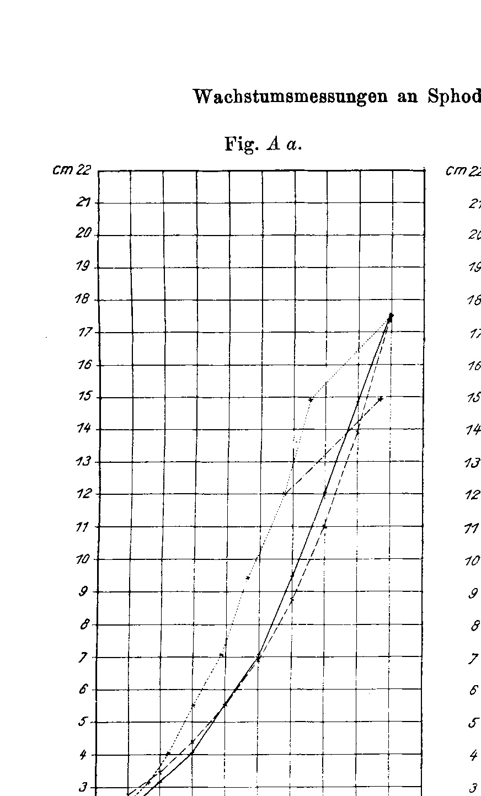{width=3.8in}

**Fig. A b**

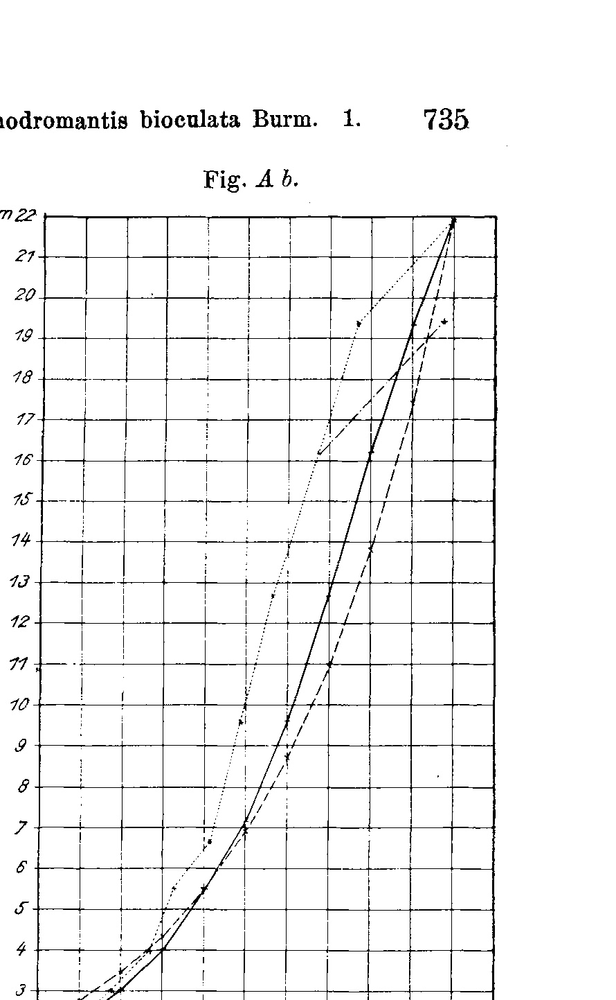{width=3.8in}

**Fig. B a**

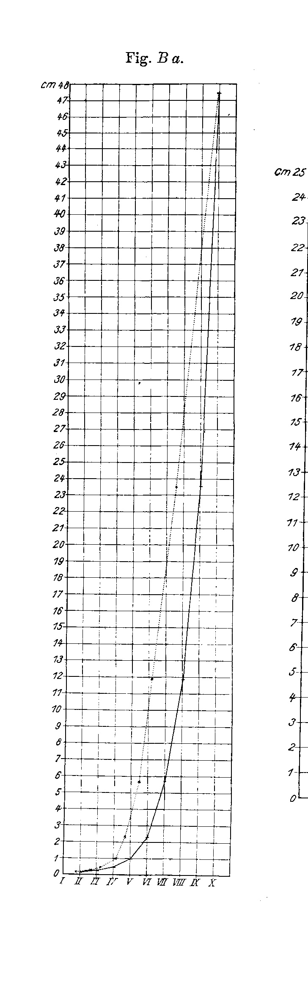{width=3.8in}

**Fig. B b**

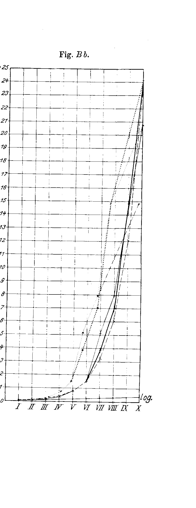{width=3.8in}

**Fig. C a**

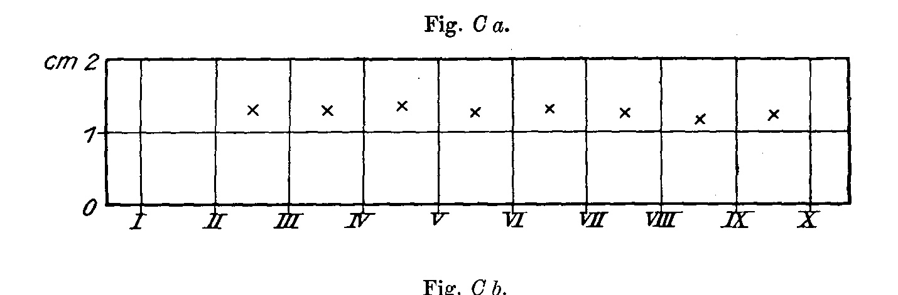{width=3.8in}

**Fig. C b**

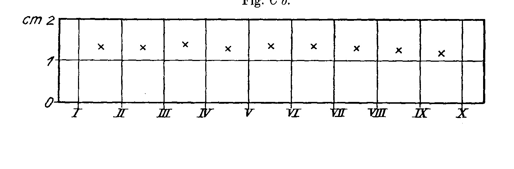{width=3.8in}

**Fig. D a**

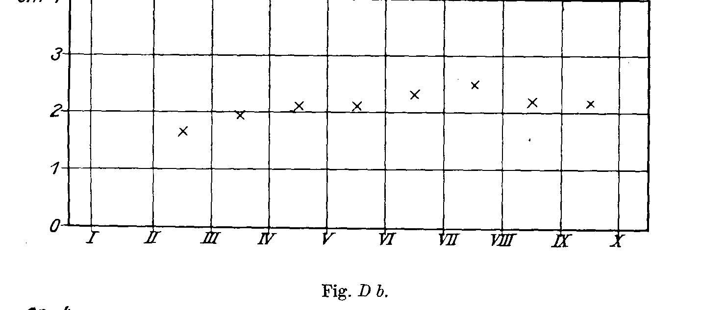{width=3.8in}

**Fig. D b**

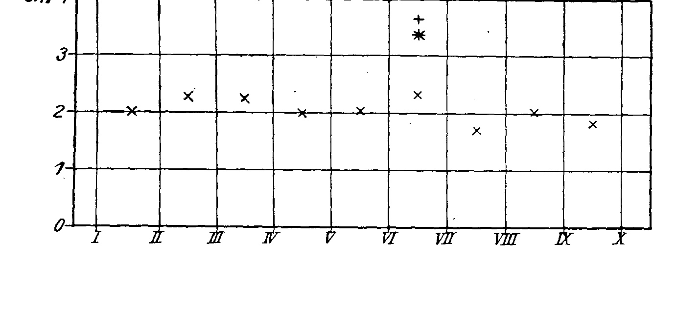{width=3.8in}

**Fig. E a**

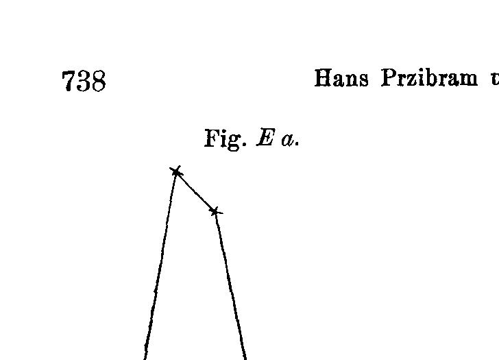{width=3.8in}

**Fig. E b**

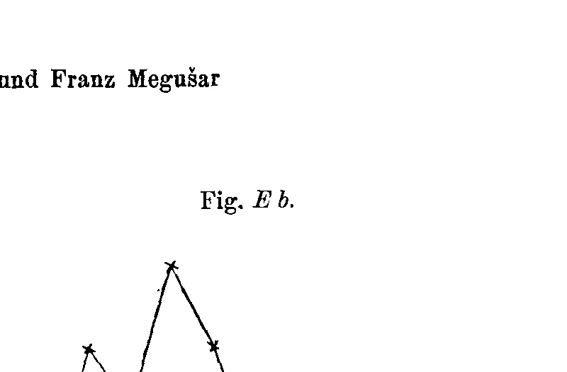{width=3.8in}

**Fig. F a**

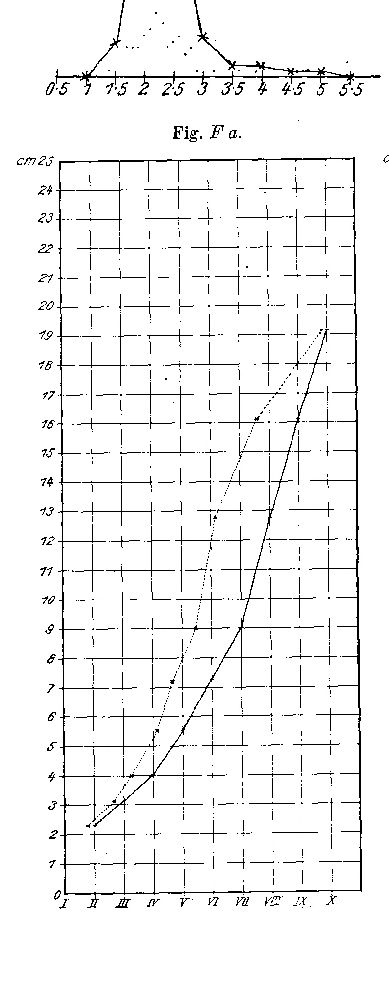{width=3.8in}

**Fig. F b**

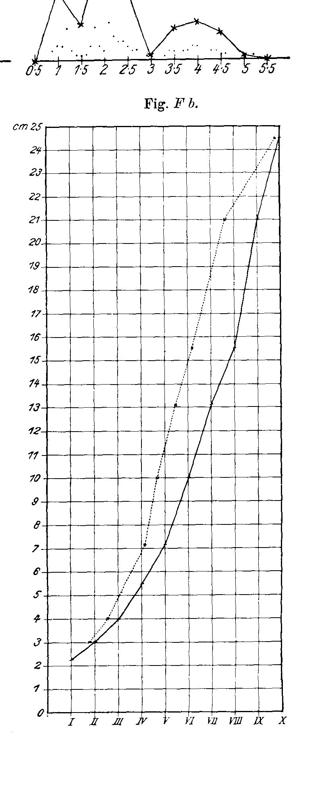{width=3.8in}

**Fig. G a**

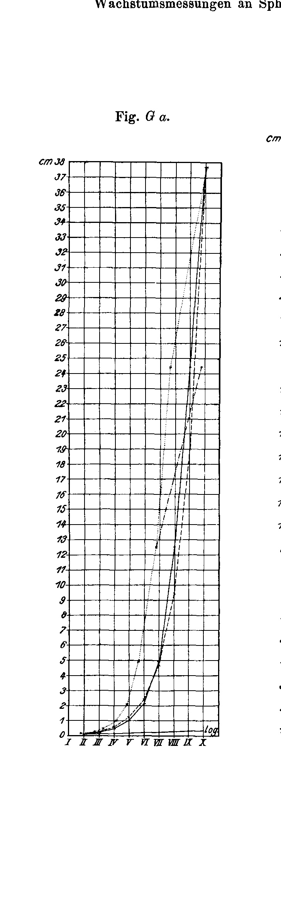{width=3.8in}

**Fig. G b**

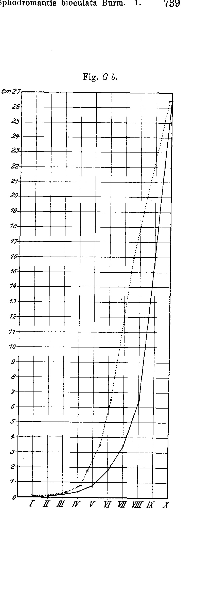{width=3.8in}

**Fig. H**

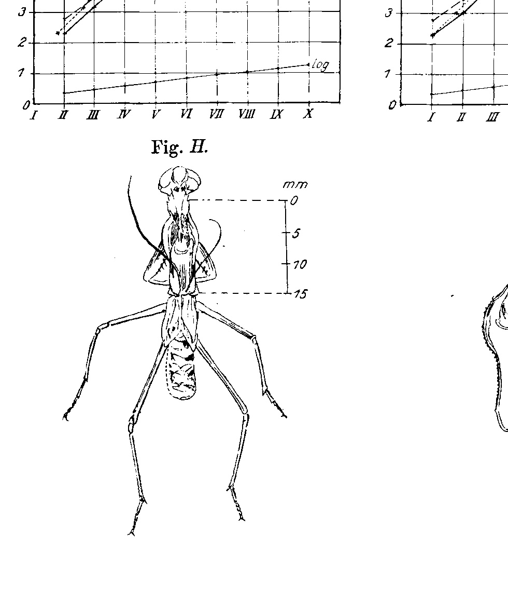{width=3.8in}

**Fig. J**

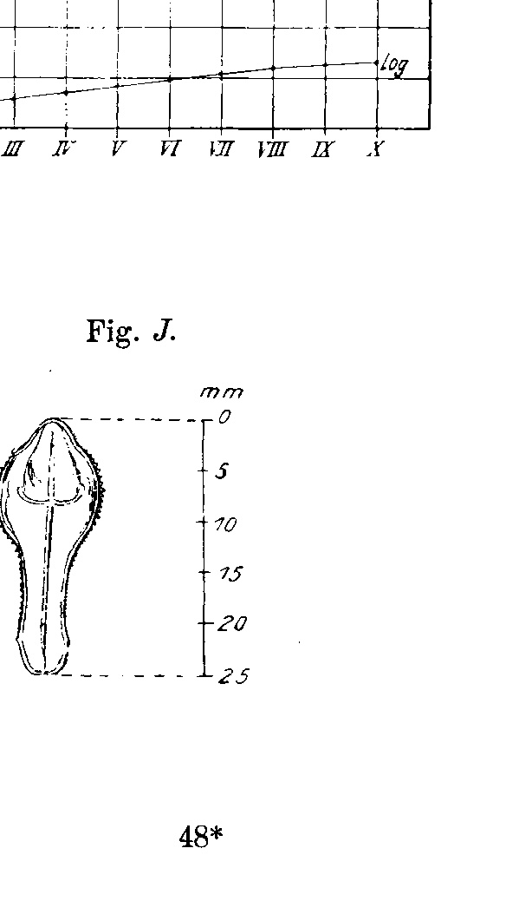{width=3.8in}

**Fig. K**

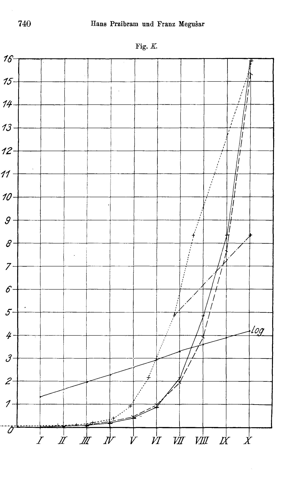{width=3.8in}

**Fig. L**

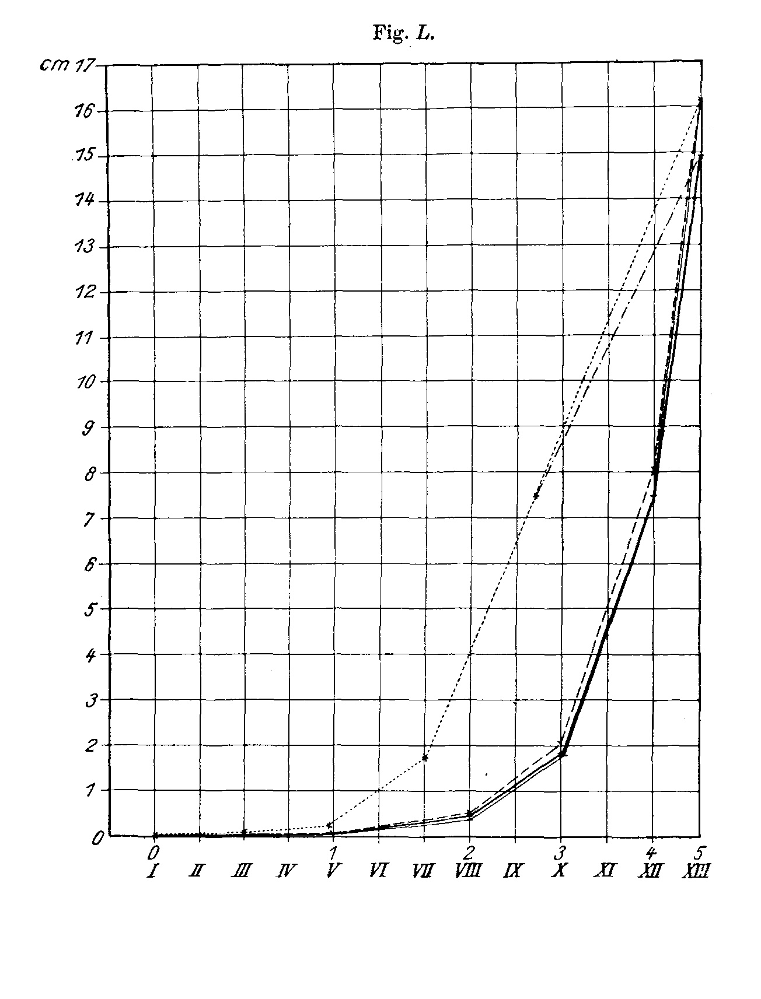{width=3.8in}

Figs. *A*–*K* relate to *Sphodromantis bioculata* Burm. (In all curves the observed values are drawn solid, the calculated ones dashed, the temporal ones dotted, or, when only the animals with IX moults are considered, indicated by dot-and-dash.) The Roman numerals denote moults.

Fig. *A.* Curves of the average prothorax lengths. *a* exuviae, *b* animals; for determination points cf. Tab. G, Col. A *a* and A *b* and note.

- *B.* Curves of the average weights. *a* exuviae, *b* animals; for determination points cf. Tab. G, Col. B *a* and B *b* and note.

- *C.* Average prothorax-length increases from moult to moult. *a* exuviae, *b* animals; for quotients cf. Tab. D, Col. A *a* u. A *b*.

- *D.* Average weight increases from moult to moult. *a* exuviae, *b* animals; for quotients cf. Tab. D, Col. B *a* u. B *b*.

- *E.* Variation polygon of the multiplications of the weight occurring between two moults in moults VII–X. *a* exuviae, *b* animals. For grouping cf. the text.

- *F.* Curves of the lengths for the individual animal No. 1. *a* exuvia, *b* animal; cf. Tab. C Ex. 1 (and Tab. G).

- *G.* Curves of the weights for the individual animal No. 1. *a* exuvia, *b* animal; cf. Tab. C Ex. 1 (and Tab. G).

- *H.* Pronotal shield (Prothorax) of a *Sphodromantis* skin from above, in its position on the whole, cast-off skin.

- *J.* Pronotal shield (Prothorax) of the *Sphodromantis* from above.

- *K.* Curves of the chitin production; cf. Tab. K, Note.

Fig. *L.* Curves for the growth of the silk-spinner caterpillars (*Bombyx mori* L.) using the data of Luciani and Lo Monaco, cf. Tab. L; the Arabic numerals on the abscissa axis denote the moults, the Roman ones the assumed division steps, cf. the text.

**Fig. A a.** Curves of the average prothorax lengths — exuviae; ordinate in cm (0–22), abscissa in moults I–X; observed values solid, calculated dashed, "log" line indicated.  *(figure not reproduced)*

**Fig. A b.** Curves of the average prothorax lengths — animals; ordinate in cm (0–22), abscissa in moults I–X; "log" line indicated.  *(figure not reproduced)*

**Fig. H.** Pronotal shield (Prothorax) of a *Sphodromantis* skin from above, in its position on the whole, cast-off skin; scale in mm (5, 10, 15).  *(figure not reproduced)*

**Fig. J.** Pronotal shield (Prothorax) of the *Sphodromantis* from above; scale in mm (5, 10, 15, 20, 25).  *(figure not reproduced)* **Fig. B a.** Curves of the average weights — exuviae; ordinate in cm (0–48), abscissa in moults I–X.  *(figure not reproduced)*

**Fig. B b.** Curves of the average weights — animals; ordinate in cm (0–24), abscissa in moults I–X; "log" line indicated.  *(figure not reproduced)* **Fig. C a.** Average prothorax-length increases from moult to moult — exuviae; ordinate in cm (0–2), abscissa in moults I–X.  *(figure not reproduced)*

**Fig. C b.** Average prothorax-length increases from moult to moult — animals; ordinate in cm (0–2), abscissa in moults I–X.  *(figure not reproduced)*

**Fig. D a.** Average weight increases from moult to moult — exuviae; ordinate in cm (0–4), abscissa in moults I–X.  *(figure not reproduced)*

**Fig. D b.** Average weight increases from moult to moult — animals; ordinate in cm (0–4), abscissa in moults I–X.  *(figure not reproduced)* **Fig. E a.** Variation polygon of the multiplications of the weight occurring between two moults in moults VII–X — exuviae.  *(figure not reproduced)*

**Fig. E b.** Variation polygon of the multiplications of the weight occurring between two moults in moults VII–X — animals.  *(figure not reproduced)*

**Fig. F a.** Curves of the lengths for the individual animal No. 1 — exuvia; ordinate in cm (0–22), abscissa in moults I–X.  *(figure not reproduced)*

**Fig. F b.** Curves of the lengths for the individual animal No. 1 — animal; ordinate in cm (0–22), abscissa in moults I–X.  *(figure not reproduced)* **Fig. G a.** Curves of the weights for the individual animal No. 1 — exuvia; ordinate in cm, abscissa in moults I–X.  *(figure not reproduced)*

**Fig. G b.** Curves of the weights for the individual animal No. 1 — animal; ordinate in cm, abscissa in moults I–X.  *(figure not reproduced)* **Fig. K.** Curves of the chitin production; ordinate in cm (0–16), abscissa in moults I–X; "log" line indicated.  *(figure not reproduced)* **Fig. L.** Curves for the growth of the silk-spinner caterpillars (*Bombyx mori* L.) using the data of Luciani and Lo Monaco; ordinate in cm (0–17), abscissa with Arabic numerals 0–5 (moults) above and Roman numerals I–XIII (assumed division steps) below.  *(figure not reproduced)*

---

*Translator's note.* Complete translation of text, tables, and apparatus. This is the paper behind the corpus's most-paralleled organism today; the "law of doubling per moult" (Przibram-/Dyar-type growth ratios — pronotum length increasing as the cube root of 2 ≈ 1.26 per moult) is preserved exactly as printed. *Häutung* = moult; *Pronotum* kept as in the original.
