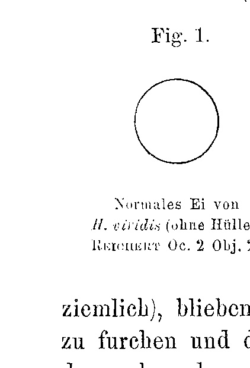
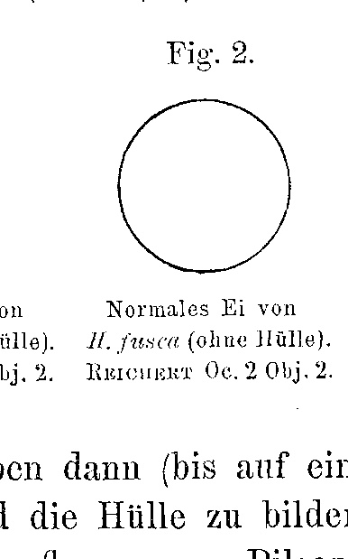
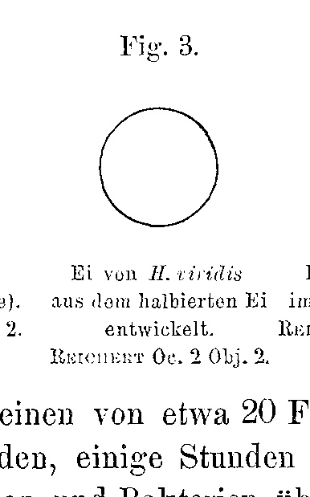
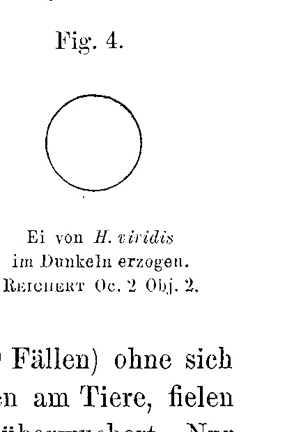
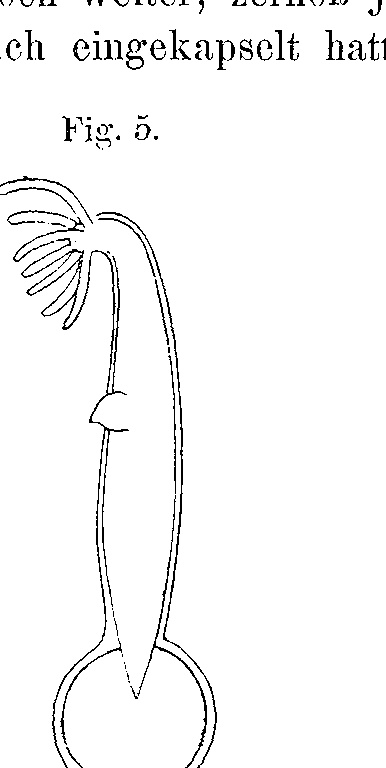
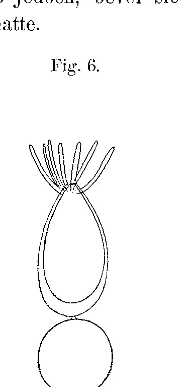
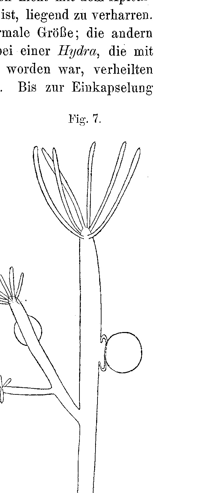

# Preliminary Experiments on the Biology of Hydra.

By

**Jovan Hadži.**

(From the Biological Experimental Institute in Vienna.)

With 7 Figures in the Text.

Received on 24 May 1906.

*Archiv für Entwicklungsmechanik der Organismen*, vol. 22 (1906), pp. 38–47.

> **Full translation.** A complete English rendering of the running text, the figure legends, the summary of experimental results, and the footnotes. *Zoochlorella* and the species names are kept as in the original (*Hydra fusca* is the brown hydra [modern *Hydra oligactis* / *Pelmatohydra*]).

The present treatise contains the preliminary experiments toward an experimental biology of the freshwater polyps, with particular regard to the relationship of *Hydra viridis* [green hydra] to the zoochlorellae. Owing to external circumstances it has been impossible for me to complete the experiments, and since in all probability I shall not soon get round to continuing them, while they have nevertheless already yielded some interesting results, I have decided to publish these now.

Since the year 1882 (G. Entz, K. Brandt) it has been known that the green colour of many lower animals, including *Hydra viridis*, is caused by the confervinean *Zoochlorella conductrix*¹) (Brandt) (*Chlorella c.* Beijerinck). Yet many authors (E. Ray Lankester, P. Geddes, W. Marshall) maintained still further that the green colour is of animal origin. By analogy with the lichens, this living-together of the *Hydra* and the *Zoochlorella* has been named: consortium [Konsortialverhältnis] (Entz), symbiosis (Brandt).

> ¹) Brandt, in his second article, withdrew this name, after Entz believed he had proved that these green bodies are merely resting stages of various algae.

It is beyond doubt that *Zoochlorella* obtains everything it needs for its livelihood from *Hydra*, directly or through its mediation. It dwells, like a parasite, in the large endoderm cells of the green *Hydra*. In other cells it cannot exist. When the zoochlorellae migrate into the egg of the *Hydra*, some of them often pass into the ectoderm cells; these become ever paler, die off, and are expelled.

To dispel any doubt as to whether the green colour of *Zoochlorella* is really chlorophyll, I investigated the green dye-substance of the *Zoochlorella* in the following way. A whole quantity of well-grown hydras I set into a small test-tube, poured 95 % alcohol over them, and let it stand for about 20 hours in the dark. At the same time I prepared an alcoholic extract from *Fagus sylvatica* leaves. I placed both extracts one after the other before the spectroscope, and on comparison was able to ascertain the greatest agreement of the spectra.

The zoochlorellae give off oxygen during assimilation; that whole gas-bubbles rise up from the green hydras, I never saw. Blomfield (according to E. Ray Lankester, 1882, and Brandt, 1883) demonstrated, in the gas-evolution of *H. viridis*, 33⅓ % oxygen.

To test the importance of the oxygen given off by the zoochlorellae for the *Hydra* itself, I set up the following experiment. Four equal glass vessels were filled with water, taken from the same basin in which the hydras had previously lived. Into two glasses I put five pieces each of *Hydra viridis*, and into another two five pieces each of *Hydra fusca* [brown hydra; modern *Hydra oligactis*/*Pelmatohydra*]. One glass with *H. viridis* and one with *H. fusca* I placed, as the control experiment, in a spot favourably lit for the animals; the other two glasses I placed under the recipient of the air pump, which stood in the light. By pumping out the air, the pressure was so far reduced that the largest part of the air escaped from the water in which the animals were. By the shaking, the animals contracted together; after the pumping had ceased, they stretched out again. Now, by admitting carbon-dioxide gas, the pressure was equalized with the external pressure. After about two hours the *H. fusca* contracted together and detached from the substrate; *Hydra viridis*, by contrast, behaved normally from early afternoon until evening, but moved very little; in the early morning they were contracted together. In the afternoon I took them all out: the green ones recovered, after I had changed the water, the others were dead. The control experiment was set up alive and merry. Under these unusual circumstances, then, *Hydra viridis* showed itself more resistant. In contrast to this, the green hydras perish earlier than the brown ones in poor water. This Brandt also observed in other "Phytozoa"; Engelmann says of *Zoochlorella*-bearing *Paramaecium* and *Vorticella*, "that they are adapted to larger quantities of oxygen." In the case of aeration in freshly kept water the green hydras live a very long time even in the dark; I kept them for over 6 weeks.

To establish the supposed role of the zoochlorellae in the nutrition of the green hydras, I observed the mode of life and of nutrition most precisely. *Hydra viridis* always feeds on animal fare, and indeed with a preference for small crustaceans; the more it can catch, the more it swallows, and the surplus assimilable substance is used up through the formation of buds. If, however, one lets them starve, then the zoochlorellae do not help it at all; it does indeed live a very long time, but it draws upon its own substance: first the arms, then the body, until it sinks to the size and form of its own egg; the zoochlorellae, in so far as they have room, remain in the endoderm cells, and the surplus ones are expelled. To similar results came L. v. Graff, 1884. Brandt, 1881, Entz, 1881, Geddes (according to Hamann), E. Ray Lankester, 1882, asserted that the *Hydra* feeds, when it is necessary for it, on zoochlorellae, partly directly, partly through the starch formed by the zoochlorellae. No one demonstrated free or dissolved starch in the endoderm cells of *Hydra viridis*. It is an error if one brings the reddish granules in the endoderm cells into a genetic relationship with the zoochlorellae; these are certainly only excretory granules, as Greenwood too has demonstrated. Even the average size of the *Hydra* depends on the size of the everyday food-animals (feed-animals). Green (like the non-green) hydras, which feed on Daphnia, are themselves five times as large as those which feed on *Noteus* [Rotatorium]; in the middle stand those which feed on *Cypris*. If one accustoms the *Hydra* which feeds on *Cypris* to a larger food (Daphnia), then it grows up to a certain size and remains constant, as long as it receives the same food. In the opposite direction one succeeds in making the *Hydra* smaller.

Against starch, *Hydra* shows a particular aversion; it does not willingly take it in. After it had fasted for a longer time, I injected commercial starch-granules into the gastral space. The next day I found some lying quite intact in the gastral space (most had been expelled). Potato-cells isolated by boiling were likewise not digested. In one case a voracious brown *Hydra* took in a potato-cell, but soon thrust it out again. When the zoochlorellae multiply very strongly, then the surplus ones, just like the excretory granules, are expelled, because they exert too great a pressure on the outer cell-walls. According to Greenwood, which I can only confirm through my own observation, the hydras digest not entirely intracellularly, as was earlier generally assumed (Metschnikoff for Coelenterates; see also Krukenberg, Chapeaux). After a predigestion in the gastral space (egg-white cells), the food-particles are taken up by means of pseudopodia from the nutritive cells and digested. The injected zoochlorellae are attacked neither by the predigestion-fluid nor taken up by the nutritive cells. I injected into the gastral space of an *H. viridis*, by means of a capillary tube, red blood corpuscles of a toad. After a short time I examined the interior of this *Hydra* and found that the blood corpuscles had not been taken up into the endoderm cells, but were strongly attacked in the gastral-space-fluid in which they were found: colourless, the contours difficult to see, whereas the nucleus was indeed visible. After all this, it appears very improbable that the zoochlorellae are digested by *Hydra*, and what is the main thing: no one has observed it. L. v. Graff, 1884, is thus quite completely right when he says: "The algae or pseudochlorophyll-bodies of the *Hydra* have no significance whatever for the nutrition of the same."

*Zoochlorella* clings to *Hydra* so firmly that hitherto it has not been possible, by any intervention, whether of chemical or physical nature, to free *Hydra* from its symbionts. In the dark one can keep the *Hydra* a very long time, the zoochlorellae remaining and surviving it [the *Hydra*] by yet a short time. I set quite young, just newly hatched hydras into the dark; the algae nevertheless kept themselves. In every case the hydras perished earlier than the zoochlorellae.

It thus appears that *Zoochlorella* has become accustomed to this life in the cell (though not so much, however, as in the Turbellaria, see Haberlandt), in such a way that we are not in a position to bring it to luxuriant life outside the *Hydra*. The conditions under which it lives in the animal are complicated and for the most part unknown, and therefore it is difficult to reproduce them artificially. Of all the many substrates on which I attempted to establish a culture of *Zoochlorella conductrix*, the best proved to be a thinly liquid agar-agar preparation, which, poured onto an object-glass, I set with the isolated algae into a bright glass moist-chamber [Glasfeuchtkammer]. In the beginning the algae even multiplied; after some time (2–3 weeks) signs of degeneration appeared; after 6 weeks they fell apart entirely. Beijerinck attempted it too, but did not succeed; later he mentions in a remark that he did nevertheless succeed in finding a substrate, but does not say of what kind of composition it was. Famintzin succeeded in cultivating the zoochlorellae of *Paramaecium* on an inorganic substrate. Just as little did it succeed to infect a non-green *Hydra*, neither by injection (by means of a capillary tube with simultaneous injury to the endoderm) nor by transplantation, although an *H. fusca* had grown together with an *H. viridis* over 2 hours (Wetzel succeeded in making the same grow together for 2 days; the algae nevertheless did not pass over). In Protozoa it succeeded several times (W. Schewiakoff, G. Kessler, S. Prowazek etc.). Yet it must be emphasized that several species of intracellularly living zoochlorellae are adapted to widely differing intracellular ways of life. (Brandt, 1882, described two species: *Z. conductrix* and *Z. parasitica*; the membraneless one described by Haberlandt, living in *Turbellaria acoela*, is distinct from both of these; Beijerinck *Chl. infusionum*.)

The individuals (persons) of *Hydra viridis* that arise by all modes of reproduction are already infected with zoochlorellae. How the zoochlorellae first came into the *Hydra*, we do not know. Möbius thinks they were passively "taken up"; Nussbaum, that perhaps they immigrated. If the assertion of A. Lang, that the buds in *Hydra* arise only from ectoderm, were correct, then the zoochlorellae would have to immigrate into the ectoderm just as into the egg. As it has succeeded with me in preventing this immigration into the egg (of which later), so it would have to succeed in the same way also with the bud; but this is not the case. I investigated the budding histologically as well, on animals fixed in Flemming's solution and on sections stained with haematoxylin; according to the findings I can only confirm the observation of Braem, according to which the bud takes its origin from both body-walls. The endoderm thickens considerably, with cell-multiplication and accumulation of zoochlorellae. With the multiplication of the cells, the multiplication of the zoochlorellae also goes hand in hand, as Beijerinck says: "rhythmically."

The immigration of the zoochlorellae into the unripe egg of *Hydra viridis* was first described by Hamann¹), in which the adaptation of the alga to the animal makes itself especially evident. The gemmulae of

> ¹) Kleinenberg observed the zoochlorellae in the egg of *H. viridis* earlier, but thought that they arise from leucoplasts as in plants.

*Spongilla* are free of algae (Beijerinck); those of *Vortex helluo viridis* M. Schultze likewise (Sekera, Haberlandt, Georgévitch), and so too the eggs of *Convoluta roscoffensis* (Keeble and Gamble). Accordingly, *Hydra* appears to be the only metazoan in which the zoochlorellae already penetrate into the egg. This circumstance had to give an indication that one should begin the experiments already at this stage.

Green hydras, in which the ovary had just become visible, I set into a vessel provided with aeration (with water from the aquarium in which the hydras lived), and placed this under a light-tight cardboard box. The eggs grew much more slowly (because of lack of light, F. Reinke) than under normal conditions, and remained throughout algae-free white. To see whether the lack of light in itself, or the chemically ineffective light, would produce the same effect, I placed such hydras with quite young ovaries under little boxes with coloured glass walls, namely red, yellow, green, blue and violet. In red and yellow light the zoochlorellae immigrate just as abundantly as in daylight; in blue and violet more sparingly; in weak green not at all. Accordingly, Hamann's view, that the zoochlorellae are passively dragged into the egg, proves to be incorrect¹).

> ¹) In the most recent times, Keeble and Gamble have succeeded in establishing the manner and mode of the infection of the embryos of *Convoluta roscoffensis* by a chlorophycean of the genus *Carteria* (thus not a *Zoochlorella*). It has also become possible to protect the animals against the infection.

The eggs made algae-free in this way grew up to the normal size (Figs. 1, 2, 4; the size of the eggs of *Hydra* varies

{width=2in}

**Fig. 1.** Normal egg of *H. viridis* (without envelope). REICHERT Oc. 2 Obj. 2.

{width=2in}

**Fig. 2.** Normal egg of *H. fusca* (without envelope). REICHERT Oc. 2 Obj. 2.

{width=2in}

**Fig. 3.** Egg from *H. viridis* developed from the halved egg. REICHERT Oc. 2 Obj. 2.

{width=2in}

**Fig. 4.** Egg of *H. viridis* raised in the dark. REICHERT Oc. 2 Obj. 2.

considerably), then remained (apart from one of about 20 cases) without cleaving and forming the envelope, stayed some hours on the animal, then fell off and dissolved away, overgrown by fungi and bacteria. Only one egg (of these 20) developed further and secreted the egg-capsule out; this I brought gradually into the light. The *Hydra* which hatched from this egg was of course transparent and algae-free, and unfortunately soon perished. The cause of the death I cannot give. Because of the lack of sexually reproducing animals, I could unfortunately not continue the experiments and observations any further in this year; I therefore reserve, in the first place, the carrying out later of the same comparative experiment with the non-green hydras, in order to establish whether, in the eggs of *Hydra viridis* developed in the dark, the lack of zoochlorellae or some other cause is to blame.

Since the powers of regeneration and regulation of *Hydra* are notoriously very great, it would be of interest to know how great is the developmental capacity of the egg-parts and egg-blastomeres of the *Hydra*-egg obtained by shaking and cutting. For this purpose I made some experiments which I likewise could not complete because of the lack of *Hydra*-eggs, and whose continuation I therefore still reserve to myself.

Already by touching, and still more by gently shaking, already encapsulated embryos, one can bring about that the animals which slip out of such capsules always bear some abnormality about them. In this way two-headed ones (always [three pieces observed] with six arms), tentacle-less ones, with cleft tentacles etc.

The operations with the eggs of *Hydra* are very difficult: firstly, because the egg, up to encapsulation, holds itself on the mother-animal; secondly, because the eggs are very viscous and sensitive, and very easily dissolve away. If one damages the ripe egg by a prick with the needle, by pinching off small egg-masses, the development nevertheless proceeds quite undisturbed.

The unripe, not yet rounded egg I cut through roughly through the middle, and indeed together with the mother-animal. Mostly only one of the two halves developed. (Whether that one to which the germinal vesicle thereby fell?) In two (of about 15 to 17) cases the two halves developed for some time, then degenerated soon (in their place parenchymatous tissue arises, the reserve substance being absorbed). The lower half of the mother-animal usually regenerated the tentacles; the upper (Figs. 5, 6) did not always regenerate a foot-disc, but

the egg (which meanwhile rounds itself off ever more) glides to the apical end of the mother-animal, so that the latter is not able to attach itself by the apical pole and is forced to remain lying. One half-ovocyte (Fig. 3) attained the normal size; the others did not remain far behind it. Also in a *Hydra* which had been cut in two with the egg lengthwise, both halves and the egg-halves likewise healed together. Encapsulation of the egg still came about, but none of the operated eggs reached the hatching point, mostly being attacked by fungi and bacteria. In one *Hydra*-egg, which had just laid down the first furrow, I constricted off the one blastomere by means of a hair; the half remaining on the animal furrowed still further, but dissolved away before it had encapsulated itself.

{width=2in}
{width=2in}

**Fig. 5 and 6.** *Hydra viridis.* Regulation that set in after the operation. Two different stages. REICHERT Oc. 2 Obj. 2.

{width=2.2in}

**Fig. 7.** Egg-formation on the bud of *Hydra*.

To see the possibility of crossing between *Hydra viridis* and *Hydra fusca* (determined according to Nussbaum), I fertilized an egg of *Hydra fusca* with the sperm of *Hydra viridis*; the egg laid down only about 3–4 furrows, and fell apart. Further experiments in this regard will be made later; likewise to be tested is the possibility of the parthenogenetic development of the *Hydra*-eggs. Kleinenberg states in his monograph "*Hydra*" (Leipzig, 1872) that the hydras arising by budding do not reproduce sexually; I had the opportunity to observe a whole *Hydra*-stock (Fig. 7), in which a *Hydra* still situated on the mother-animal had already laid down a young ovary. Further, I observed the following case: at the oral pole of an already distinctly developed bud of *Hydra viridis*, a testis formed; the further development of this bud I did not observe.

## Summary of the experimental results.

1) *H. viridis* possesses a greater resistance to a CO₂ atmosphere than *H. fusca*.

2) In the dark the zoochlorellae do not immigrate into the egg of *H. viridis*, and yet the eggs made algae-free in this way are capable of development.

3) The ovocytes of *Hydra*, halved by cutting through, restore the normal size.

## Literature index.

M. W. Beijerinck, Kulturversuche mit Zoochlorellen, Lichenengonidien und andern niederen Algen. Bot. Zeitung. 1890.

F. Braem, Über Knospung bei mehrschichtigen Tieren, insbesondere bei Hydroiden. Biol. Centralbl. 1894.

K. Brandt, Über das Zusammenleben von Algen und Tieren. Biol. Centralbl. 1881–82.

— Über die morphologische und physiologische Bedeutung des Chlorophylls bei Tieren. (1 Taf.) Archiv f. Anat. u. Physiol. 1882.

— Über die morphologische und physiologische Bedeutung des Chlorophylls bei Tieren. (2. Artikel.) Mitteil. aus d. Zool. Stat. zu Neapel. IV. 1883.

— Über Symbiose von Algen und Tieren. Archiv f. Anat. u. Physiol. 1883.

Marcellin Chapeaux, Recherches sur la Digestion des Coelentérés. Archives de Zoologie expérimentale et générale. Sér. III. Tom. I. 1893.

Th. W. Engelmann, Über das tierische Chlorophyll. Archiv f. d. ges. Physiol. des Menschen u. der Tiere. 1883.

G. Entz, Über die Natur der Chlorophyllkörperchen niederer Tiere. Biolog. Centralbl. 1881–82. Referat über einen am 25. Februar 1876 in Klausenburg gehaltenen Vortrag.

— Konsortialverhältnis von Algen und Tieren. Biol. Centralbl. 1882–83.

A. Famintzin, Beitrag zur Symbiose von Algen und Tieren. Mém. de l'Acad. imp. de St. Pétersbourg. S. III. T. 38. 1891.

P. Geddes, Sur la Chlorophylle animale et sur la Physiologie des Planaires vertes. Arch. de Zool. exp. et générale. VIII. 1879–1880.

— Further researches on Animals containing chlorophyll. Nature. 1882.

J. Georgévitch, Sur le développement de la Convoluta Roscoffensis Graff. Compt. rend. 1889.

L. v. Graff, Monographie der Turbellarien. I. Rhabdocoelida. Leipzig 1882.

— Zur Kenntnis der physiologischen Funktion des Chlorophylls im Tierreich. Zool. Anz. 1884.

L. v. Graff, Die Turbellarien als Parasiten und Wirte. Festschrift. Graz 1903.

M. Greenwood, On Digestion in Hydra, with some observation on the Structure of the Endoderm. The Journal of Physiology. 1888.

G. Haberlandt, Über den Bau und die Organisation der Chlorophyllzellen von Convoluta Roscoffensis. Als Anhang zu: L. v. Graff, Organisation der Turbellaria acoela. Leipzig 1891.

O. Hamann, Zur Entstehung und Entwicklung der grünen Zellen bei Hydra. Zeitschr. f. wiss. Zool. 37. 1882.

F. Keeble and F. Gamble, On the isolation of the infecting Organism ("Zoochlorella") of Convoluta roscoffensis. Proc. of the Roy. Soc. London. Ser. B. Vol. 77. No. 514. 1905.

G. Kessler, Ein Beitrag zur Lehre von der Symbiose. Arch. f. Anatom. u. Physiol. 1882.

N. Kleinenberg, Hydra. Eine anatomisch-entwicklungsgeschichtliche Untersuchung. Leipzig 1872.

C. F. W. Krukenberg, Vergleichend physiologische Studien (experim. Untersuchungen). I. Reihe. I. Abt. 1880.

— Vergleichend physiologische Studien (exper. Untersuchungen). II. Reihe. I. Abt. 1882.

A. Lang, Über die Knospung bei Hydra und einigen Hydromedusen. Zeitschr. f. wiss. Zool. 1892.

W. Marshall, Über einige Lebenserscheinungen der Süßwasserpolypen und über eine neue Form von Hydra viridis. Zeitschr. f. wiss. Zool. 37. 1882.

E. Metschnikoff, Über die intracellulare Verdauung bei Coelenteraten. Zool. Anz. 1880.

— Untersuchungen über die intracellulare Verdauung bei wirbellosen Tieren. (2 Taf.) Arb. a. d. zool. Inst. d. Univ. Wien. T. V. 1884.

M. Möbius, Über endophytische Algen. Biol. Centralbl. 1891.

M. Nussbaum, Über die Teilbarkeit der lebendigen Materie. II. Mitteil. Beiträge zur Naturgeschichte des Genus Hydra. (7 Taf.) Archiv f. mikr. Anatom. XXIX. 1887.

S. Prowazek, Beitrag zur Kenntnis der Regeneration und Biologie der Protozoen. Archiv f. Protistenkunde. III. 1904.

E. Ray Lankester, The mode of occurrence of Chlorophyll in Spongilla. Quart. Journ. Micr. Science. XIV. 1874.

— Chlorophyll in Turbellarian worms and other animals. Quart. Journ. Micr. Science. XIX. 1879.

— On the Chlorophyll-corpuscles and Amyloid deposits of Spongilla and Hydra. (1 Taf.) Quart. Journ. Micr. Science. XXII. 1882.

F. Reinke, Grundzüge der allgemeinen Anatomie. Wiesbaden 1901.

W. Schewiakoff, Beiträge zur Kenntnis der holotrichen Ciliaten. Bibl. zoologica. 5. 1889.

— Bemerkung zu der Arbeit von Prof. Famintzin über Zoochlorellen in Protozoen. Biol. Centralbl. 1891.

E. Sekera, Einige Beiträge zur Lebensweise von Vortex helluo (viridis M. Schultze). Zool. Anz. XXVI. 1903.

G. Wetzel, Transplantationsversuche mit Hydra. (1 Taf.) Archiv f. mikr. Anat. 1895.

— Transplantationsversuche mit Hydra. (1 Taf.) Archiv f. mikr. Anat. 1898.

---

*Translator's note.* Translated in full (the paper is short). Hydra remains a central model organism, so this is a genuine deep-transfer case.
