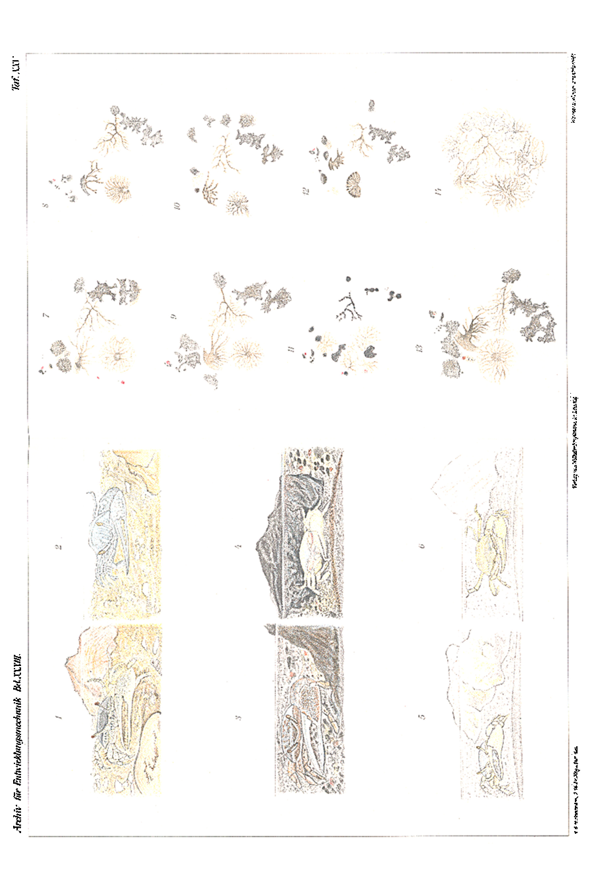
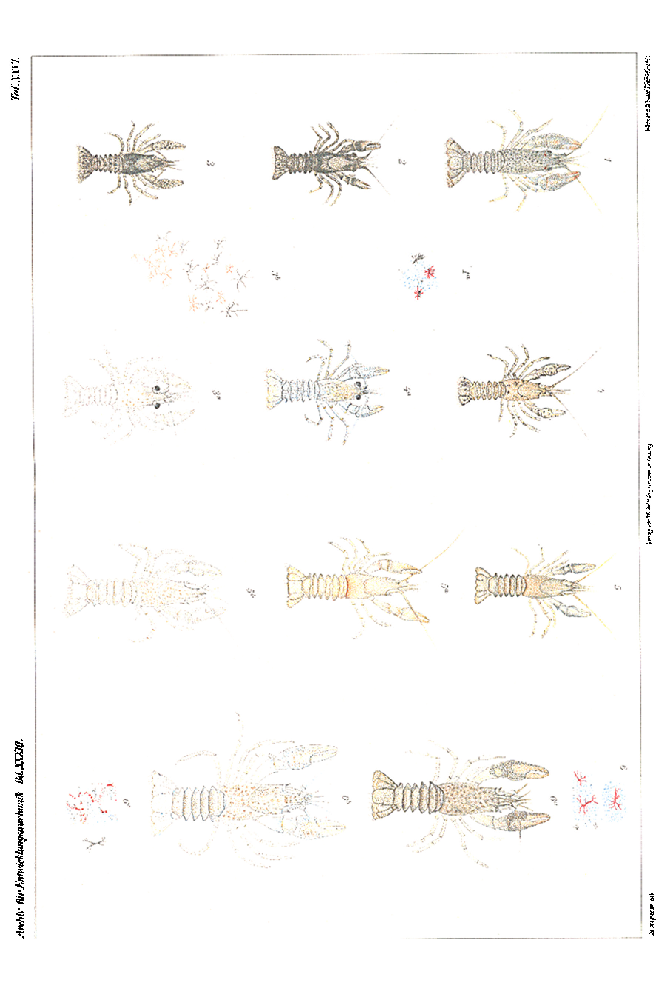
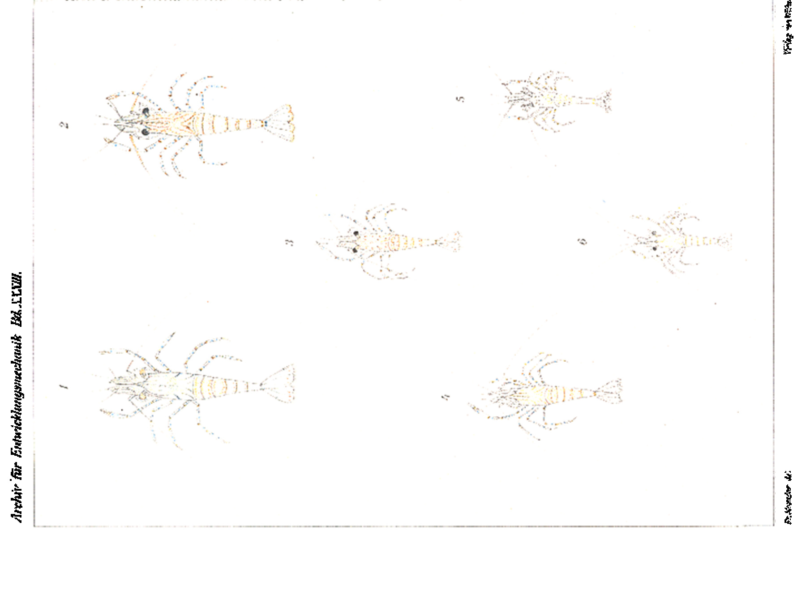
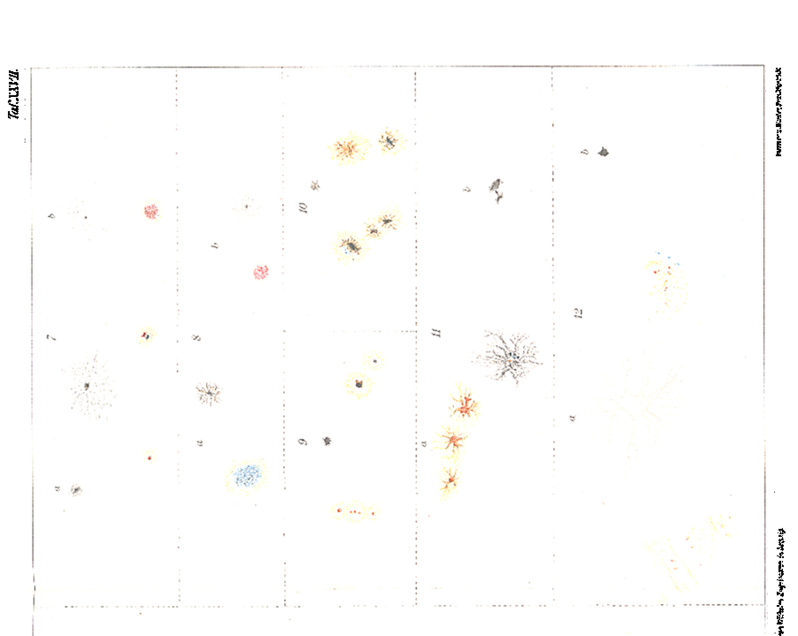
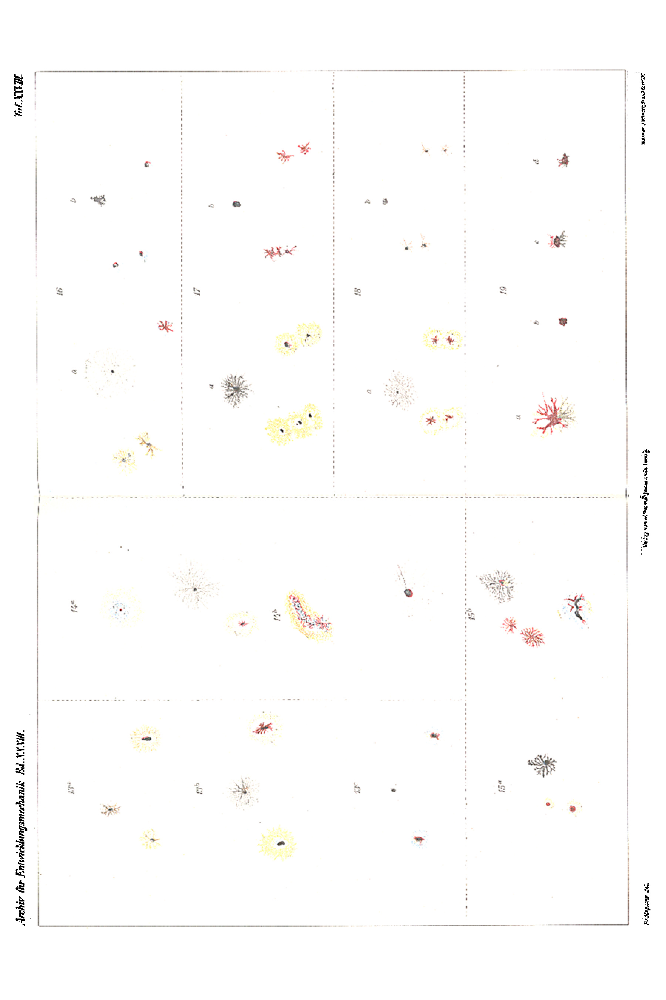

# Experiments on the Colour Change of the Crustaceans.

### (I. Gelasimus. II. Potamobius. III. Palaemonetes. IV. Palaemon.)

By

Franz Megušar.

(From the Biological Experimental Institute in Vienna.)

With Plates XXV–XXVIII.

Received on 13 September 1911.

*Archiv für Entwicklungsmechanik der Organismen*, vol. 33 (1912).

> **Full translation.** A complete English rendering of Megušar's monograph on the colour change of crustaceans (*Gelasimus*, *Potamobius* [=*Astacus*], *Palaemonetes*, *Palaemon*) — chromatophore physiology and light- and background-driven colour change — with the measurement tables, figure legends and plate legends (Plates XXV–XXVIII).

## Table of Contents.

|  | Page |
|---|---|
| Introduction and Statement of the Problem | 465 |
| General remarks on the methods of observation for ascertaining the respective state of the chromatophores under the conditions imposed | 467 |
| Brief summary of the previous experimental results of individual researchers | 468 |
| **I. *Gelasimus pugnax* Smith** | 477 |
| 1st Series of Experiments: Macroscopic observations of the colour states at various times of day and night, with the keeping of normal and blinded animals on backgrounds of different colours, in daylight and in darkness | 477 |
| Experimental arrangement and technique | 477 |
| Experiment I: Behaviour of normal animals on backgrounds of different colours | 479 |
| a. under the action of daylight | 479 |
| A. white background | 479 |
| B. black background | 480 |
| C. yellowish-brown background | 480 |
| b. in darkness | 481 |
| A. white background | 481 |
| B. black background | 481 |
| C. yellowish-brown background | 481 |
| Experiment II: Behaviour of unilaterally blinded animals on backgrounds of different colours | 481 |
| Experiment III: Behaviour of bilaterally blinded animals on backgrounds of different colours | 481 |
| a. under the action of daylight | 481 |
| A. white background | 481 |
| B. black background | 482 |
|  | Page |
|---|---|
| b. Behaviour in darkness | 482 |
| A. White background | 482 |
| B. Black background | 482 |
| Experiment IV: Behaviour of normal animals on a mixed-coloured background under artificial illumination during the night and when placed in darkness during the day | 483 |
| 2nd Series of Experiments: Microscopic observations of the chromatophore states at various times of day and night, with the keeping of the animals on backgrounds of different colours | 483 |
| Introduction and technique | 483 |
| Colour of the experimental animals, the nature of the chromatophores and their pigments | 485 |
| A. Chromatophore states at various times of day and night, with the keeping of normal animals on a mixed-coloured background | 486 |
| B. Chromatophore states at various times of day and night, with the keeping of normal animals on a white background | 488 |
| C. Chromatophore states at various times of day and night, with the keeping of normal animals on a black background | 489 |
| D. Behaviour of the chromatophore states under all-round exposure to the sun | 490 |
| E. Behaviour of the chromatophore states under sudden strong change of temperature | 491 |
| Summary of the most important experimental results | 491 |
| **II. *Potamobius astacus* (*Astacus fluviatilis*) L.** | 493 |
| 1st Series of Experiments: Introduction and experimental arrangement | 493 |
| Provenance of the experimental animals and their original normal colouration | 493 |
| Kinds of chromatophores and the coming-about of the characteristic colouration | 494 |
| Experimental arrangement and care technique | 495 |
| Experimental result | 496 |
| a. Behaviour of the animals under continuous keeping in darkness | 496 |
| b. Behaviour of the animals in diffuse light (control experiment) | 498 |
| c. Behaviour of the animals that had become black-spotted in darkness, after being transferred to the light | 498 |
| 2nd Series of Experiments: Introduction and experimental arrangement | 498 |
| Provenance of the experimental animals and their original natural colouration | 499 |
| Operation and care technique | 499 |
| Experimental result | 501 |
| A. Behaviour of the animals after amputation of both eyes at the base of the eye-stalks, with keeping in diffuse light and in darkness | 501 |
| a. with keeping in light | 501 |
| b. with keeping in darkness | 501 |
| B. Behaviour of the animals after amputation of the eyes leaving the eye-stalks in place, with keeping in light and in darkness | 504 |
| a. with keeping in light | 504 |
| b. with keeping in darkness | 504 |
| C. Behaviour of normal, unoperated animals in light and in darkness | 505 |
| a. with keeping in light | 505 |
| b. with keeping in darkness | 505 |
|  | Page |
|---|---|
| D. Behaviour of normal animals under all-round exposure to the sun | 506 |
| E. Behaviour of normal animals under sudden temperature fluctuations | 506 |
| Summary of the most important experimental results | 507 |
| **III. *Palaemonetes varians* Leach** | 510 |
| Provenance of the experimental material | 510 |
| Size, general colour characteristics of the experimental animals and of their chromatophores | 510 |
| Some remarks on the keeping of the animals in captivity and their habits of life | 510 |
| Experimental arrangement and technique | 512 |
| A. Behaviour of the normal animals towards the white background in diffuse light | 514 |
| B. Behaviour of the normal animals towards the black background in daylight | 514 |
| C. Behaviour of the normal animals when kept on a black background in darkness | 515 |
| D. Behaviour of the operated animals in daylight | 515 |
| E. Behaviour of the normal animals towards all-round exposure to the sun | 515 |
| F. Behaviour of the normal animals towards rapid temperature change | 516 |
| Summary of the most important experimental results | 516 |
| **IV. *Palaemon rectirostris* Zaddach** | 517 |
| Introduction and experimental arrangement | 517 |
| Technique | 518 |
| Origin of the experimental material | 518 |
| Colour characteristics of the animals and of their chromatophores | 519 |
| A. Behaviour of normal specimens on backgrounds of different colours under ordinary daytime illumination | 522 |
| a. white background | 522 |
| α. Behaviour of the specimens previously kept for a short time on a white background, after transfer onto a black background | 522 |
| β. Behaviour of the animals which were first kept for some days on a white, then on a black background, upon transfer onto a yellow background | 523 |
| b. black background | 523 |
| c. yellow background | 524 |
| α. Transfer onto a blue background | 524 |
| β. Transfer onto a red background | 524 |
| d. blue background | 525 |
| e. red background | 525 |
| α. Transfer onto a white background | 525 |
| β. Transfer from the white background onto a red one | 525 |
| B. Behaviour of normal animals when kept on a black background in darkness | 525 |
| a. Behaviour of the animals upon placement into the dark during the night | 526 |
| b. Behaviour of the animals after placement into the dark in the midday hours | 526 |
| C. Keeping of bilaterally blinded specimens on backgrounds of different colours in the light | 528 |
|  | Page |
|---|---|
| a. white background | 528 |
| b. black background | 529 |
| α. Influence of unilateral blinding | 529 |
| β. Influence of bilateral blinding | 529 |
| γ. Transfer of bilaterally blinded specimens previously kept on a black background onto a white background | 529 |
| c. yellow background | 530 |
| d. blue background | 530 |
| e. red background | 530 |
| D. Keeping of bilaterally blinded specimens on a black background in darkness | 530 |
| E. Influence of all-round sunlight illumination | 530 |
| F. Effect of large sudden temperature differences upon the animals | 531 |
| Summary of the most important experimental results | 531 |
| Appendix: Colour choice in *Palaemon* | 534 |
| Experimental protocols and their extracts | 536 |
| Theoretical evaluation of the experimental results | 650 |
| General summary of the most important experimental results | 655 |
| Bibliography | 658 |
| Explanation of the figures | 660 |

## Introduction and Statement of the Problem.

The phenomenon of colour change under the short-lasting action of various stimuli (light, darkness, colour of the background, etc.) is, in many Crustaceans, a long-known fact. No less well known is the occurrence of various colour varieties within one and the same species, which some imagine to have arisen as a permanent influence of the external surroundings. The first kind of colour change is usually termed "physiological," the latter "morphological colour change." The causes, however, which determine the phenomena just mentioned are as yet little investigated.

Above all, the colour adaptation of animals to the colours of the surroundings has tempted most researchers to approach the explanation of this phenomenon by means of experiment. *Palaemon* and *Hippolyte* were, up to the present, their almost exclusive experimental objects. Nevertheless the individual researchers arrived, in many questions, at such divergent experimental results that they do not permit a uniform interpretation upon even moderately exact consideration. In the following section I shall reproduce in concise form the facts gained so far. The contradictions in the results, however, did not prevent the erection of various hypotheses. On the whole, there have crystallised out from the soil of the gained experimental results two main hypotheses: that of direct and that of indirect adaptation. At one time one was inclined to set down the external factors such as light, darkness, colour of the background, etc., at another the biological causes, as the driving force for the production of various colours.

I first set myself the task of seeking the grounds which conditioned the contradictory statements of the facts, and only then, on the basis of my own results in conjunction with the concordant ones of other authors, of forming a judgement for myself. The impetus to set about the solution of the extremely complicated processes of colour change was given me by the observation of the periodic day-and-night colour change and the establishment of two kinds of colour shades in *Gelasimus pugnax* Smith, a North American fiddler crab, which Przibram (1908) had brought to the Institute alive in great number (about 150 specimens) from Woods Hole in October 1907. Concerning the results gained here I have already, on the occasion of a meeting of the Morphological-Physiological Society held at the Biological Experimental Institute in Vienna, made brief communications and reported on them in concise form in the Centralblatt für Physiologie (1908). Since these and the results gained somewhat later in *Gelasimus* stood in many respects in direct contradiction to the statements published up to that time and in the meantime, I delayed the publication of the work in extenso and awaited the opportunity to open new experiments in the same direction on other crabs.

My present experiments extend to Decapods and Isopods. As experimental objects I chose, of the former, *Gelasimus pugnax* Smith, *Potamobius astacus* (*Astacus fluviatilis*) L., *Palaemonetes varians* Leach, and *Palaemon rectirostris* Zadd., of the latter a *Porcellio* species. As means of influencing them there were applied light (diffuse natural and artificial), darkness, various colours of the background, permanently or for a short time, sudden temperature fluctuations, and blinding.

I should still gladly have waited with the publication of the present treatise and have tested the eventual heritability or non-heritability of the artificially induced colour alterations. But since the carrying-out of such experiments in the Decapods meets with great difficulties, whereas the rearing of the named Isopods in the desired direction — namely, heritability or non-heritability of the constant bleaching achieved through darkness — will soon bring forth results, I have for the present refrained from communicating the experimental results gained on Isopods and shall make these the subject of a separate work.

## General remarks on the methods of observation for ascertaining the respective state of the chromatophores under the conditions imposed.

Since it had emerged in the course of my conduct of the experiments that the contradictory statements on one and the same question could often be traced back to different methods of observation, I feel prompted to give, in this section, my observation procedure, in particular that during the night, in general terms. The special methods corresponding to the individual species have been taken into account at the relevant places.

It is known that the chromatophores react exceedingly rapidly to light stimuli, and that hence observation under apparently quite identical lighting conditions, when this is carried out repeatedly and with the application of the utmost precautionary measures, can bring to light different results. Pressure effects and strong disturbances, too, can influence the respective state of the chromatophores.

In order to be able to bring the real state of the chromatophores before one's eyes under particular conditions, I have above all, before taking out the animal that was to be examined for this purpose, for the sake of rapid execution of the observation, kept all the utensils required for it in readiness and set the microscope coarsely. I took out the animal in question, in order to avoid all pressure and strong disturbance, either with the flat hand or by means of a small glass dish together with a little water from the vessel, brought it with the utmost speed into the observation devices just suitable for each species, and then pushed it under the objective with its anterior part, where I always observed the chromatophores and was already able to find the relevant spot macroscopically.

Special measures had to be applied in the observations during the night. Here I proceeded in such a way that I kept all the animals to be examined set up in the immediate vicinity of the microscope, directly on the very same table, in little glass dishes.

The objects required for this were prepared beforehand in a definite order, and the animal was lifted out of the experimental container in the usual manner (by moonlight, by the gleam of a lantern from the surroundings, or by weak electric incandescent-lamp light), brought into the corresponding device, pushed under the microscope, the electric light switched on with one hand and the microscope precisely adjusted with the other. In order to protect the remaining animals from the action of the light, these were meanwhile covered over by means of wooden lids or dark covers. If this procedure had lasted more than one minute, the observation in question was not regarded as valid.

## Brief summary of the previous experimental results of individual researchers.

On the findings of older authors v. Rynberk (1906) has already made detailed communications, both in chronological and in factual order. On account of the close connection I cannot wholly dispense with them. In any case I shall keep myself brief on this and refer otherwise to the careful compilations of v. Rynberk.

Krøyer (1842) put emerald-green coloured *Hippolyte smaragdina* (= *varians*) into a glass vessel and observed their greenish-blue change of colour. Kinahan (1857) observed something similar in the same species.

Focillon (1850), Lereboullet (1851), Valenciennes (1851) observed the occurrence of various colour varieties in nature in the river crayfish [Flusskrebs].

But with this little had yet been gained for the understanding of the extremely complicated processes of colour change. Only with Pouchet (1872–1876) did a more fruitful epoch set in. He was the first who proceeded systematically and who, on isolation of particular stimuli, achieved colour alterations of definite and constant character. His first experimental object was *Palaemon serratus*. This species of shrimp, coloured rose-lilac under natural conditions, became — when kept on a white background — yellowish to colourless within 24 hours, and reddish-brown on a black background. After exchanging the backgrounds so coloured, the opposite process took place; the animals that had become reddish-brown on a black background now became light, and those that had become yellowish to colourless on a white background became dark. In this connection it turned out that the conversion from the light state into the dark one was accomplished much more rapidly than the reverse, and that during the change of colour from light, in the dark, a distinct blue colouration set in. The dark state of the animals he obtained even upon complete removal of the eyes. The animals persisted in the dark colouration throughout the whole time (34 days) of the conduct of the experiment. The same reactions he observed in poisoning (santonine) and asphyxiation experiments and in the dying-off of the animals. Severing of the nerves had no conspicuous changes as a consequence. Upon severing of the dorsal vessel the contraction set in in *Palaemon*. Electrical stimuli apparently effected retraction only in the lobster, otherwise they remained without distinct success. Night brought about no constant changes in any of the species investigated by him, nor did artificial darkening by day. His microscopic investigations of the animals altered in this way showed that the observed colour change was conditioned mainly by various states of expansion of particular cells, the chromatophores (he himself calls them chromoblasts). In animals made light artificially, by keeping on a white background, the chromatophores were contracted into the "spherical state"; in the animals made dark by the application of a black background, blinding, poisoning and asphyxiation they were in the state of dilatation. In the latter case there appeared at the same time, in the surroundings of the chromatophore ramifications, a blue pigment, which in combination with red called forth the brownish-red colouration of the animals. This blue pigment vanished, however, upon retraction of the chromatophores within 5–6 hours. On the basis of the experimental results obtained through blinding and of comparative studies of the chromatophores in various arthropod genera — which latter studies showed that blind animals possess no chromatophores — he arrived at the view that between the visual organ and the chromatophores certain correlative relations exist.

dark. In this connection it came to light that the transformation from the light state into the dark state took place much more rapidly than the reverse, and that during the discolouration from light into dark a distinct blue colouration set in. The dark state of the animals he obtained also upon complete removal of the eyes. The animals persisted in the dark colouration during the whole period (3½ days) of the conduct of the experiment. Equal reactions he observed in poisoning- (santonine) and asphyxiation-experiments and in the dying-off of the animals. Severing of the nerves had no conspicuous changes as a consequence. Upon severing of the dorsal vessel the contraction set in in *Palaemon*. Electrical stimuli apparently effected retraction only in the lobster, otherwise they remained without distinct effect. Night effected no constant changes in any of the species investigated by him, nor did artificial darkening by day. His microscopical investigations of the animals altered in this way showed that it was principally various states of expansion of special cells, the chromatophores (he himself calls them chromoblasts), that conditioned the observed colour change. In animals made light artificially, by holding them on white ground, the chromatophores were contracted together into the "spherical state"; in animals made dark by the application of black ground, blinding, poisoning and asphyxiation, they found themselves in the state of dilatation. In the latter case there appeared at the same time, in the surroundings of the chromatophore-ramifications, a blue colour-substance which, in combination with red, called forth the brownish-red discolouration of the animals. This blue pigment, however, disappeared upon retraction of the chromatophores within 5–6 hours. On the basis of the experimental results from blinding and of comparative studies of the chromatophores in various arthropod genera — which latter [studies] showed that blind animals possess no chromatophores — he arrived at the view that between the visual organ and the chromatophores certain correlative relationships exist.

Furthermore he investigated the chromatophores most thoroughly in their embryological and histological relationship. According to him the chromatophores are said to appear already early as well-differentiated structures. He established that in different species there are different kinds of chromatophores. Thus in the lobster he established two different chromatophores, red and yellow. In *Crangon vulgaris* he established three kinds of pigment: yellow, red and violet.

The movement of these chromatophores is an amoeboid one, or, as he himself expresses it, a sarcodic one.

His contemporary Jourdain (1878) experimented with *Nika edulis* and arrived in most points at the same experimental results. On the question of the existence of a periodic day- and night-colour-change they diverged. For while Pouchet denied its correctness, Jourdain, on the basis of the red colouration of the animals during the night, assumed a periodicity of the colour change. He expanded our knowledge of colour-change phenomena insofar as he was able to establish that low temperatures (5–6°C) inhibit the colour change and that at 0°C a loss of colour was brought about both in the normal specimens and in those darkly discoloured ones that had been operated on by amputation of the eyes; and further, that eyeless specimens, under persistent strong illumination, lost somewhat of their red colour. This last phenomenon manifested itself differently in different specimens.

Now there comes a time when one occupied oneself less intensively and also less exactly with the questions of the colour-change phenomena; but the consequence of this was also that they brought little new light into their essential nature. Into this time fall the works of F. Müller, Malard, Herdmann and Hornell.

F. Müller observed that *Gelasimus* shows a distinct and rapid colour change — under what conditions this occurs, he does not say — and communicated these observations to Darwin (1871). The relevant passage from Carus' (1875) translation of Ch. Darwin's writings runs: "— the white becomes dirty-grey or even black, and the green 'loses much of its lustre'." Subsequently (1881) he made observations on *Atyoida potimirum* and *Palaemon potiporanga*, according to which the said animals lose their dark colours in glass vessels and become colourless, whereby, during the transition from dark to light, *Palaemon* turned blue. The duration of the reaction was very variable. *Palaemon* discoloured already within a few hours, whereas *Atyoida* required several days to attain the light state.

Malard (1892) carried out experiments on the colour-adaptation capacity of *Hippolyte* on differently coloured seagrass. The animals became green on green seagrass and red on red. On *Fucus* he found them brown, and on polyp-stocks of campanularians (*Antennularia, Sertularia*) transparent. In bright light they were emerald-green, in dim light red, whereby, however, he does not state on what background he kept the animals.

On the basis of his observations he came to the conclusion that the intensity of light, in comparison with the colour of the light, is of much greater importance for the coming-about of the colour change, and that the adapted colour never agrees exactly with that of the milieu.

Herdmann (1892–1898) carried out experiments in the same direction and with the same object, and arrived likewise at essentially the same results as his predecessor. He summarizes his observations in the following words: "*Hippolyte* can transform its colour, but not quickly."

Hornell, too (1897), used *Hippolyte* in his experiments on colour-adaptation capacity, and found that the "sympathetic" adaptive colour-change takes place both in the light and in the dark.

After this less fruitful time came Keeble and Gamble (1900, 1904), who through their many-sided and comprehensive investigations rendered an essential contribution not only to the solution of the questions directly bound up with the colour-change phenomena, but in many cases also to the solution of questions of general biological significance. Besides [working] on many representatives of the Decapods (*Crangon, Palaemon, Hippolyte, Galathea, Carcinus*), they also carried out investigations on various Schizopods, and treated the questions from the zoological, histological, embryological, physiological and chemical standpoint.

On the basis of their embryological and histological observations they recognized in the chromatophore-complexes complicated organ-systems of constant character, innervated from the eye, and introduced them into zoology as systematic species-characters. In the embryonic state the chromatophore originally presents itself as a roundish, unbranched body. Only when the chromatophore — which likewise still happens in this developmental state — acquires branchings does it, together with its pigment, become capable of function. They distinguish, in a developed and functional chromatophore, a "centrum" and a larger or smaller number of branchings or ramuses. The centrum can contain pigment of one or several colours. If this is set into excitation by suitable stimuli, then ramifications proceed from the centrum, whereby the colour and the colour-pattern of the animal in question come about. Upon retraction of the branchings the earlier colour-character of the animals is lost. The chromatophore ramuses always carry specific pigments, which appearance leads them to the assumption of a certain constancy of the colour-individuality. The movement of the pigments proceeds in pre-formed channels; these are presumably consequences of the action of various pressure-differences. For the purpose of establishing the causes of the colour-change reactions they carried out experiments with differently coloured light and background and observed the chromatophores at various times of day and night. Above all, in agreement with Jourdain and in opposition to Pouchet, they established the existence of a periodic day- and night-colour-change in all the animals they investigated. In their investigations of colour-change phenomena they placed great value on attention to this phenomenon, for the very reason that they saw it set in, in *Zoëa*-larvae of *Palaemon*, despite continuous holding in the dark, and that it could give occasion to errors in the assessment of colour-change processes. This periodicity expressed itself in that the pigments, by night or in complete darkness, contracted into punctiform bodies, and by day found themselves in greater or lesser extension. In the former case the animals became colourless and transparent, in the latter case coloured. Keeble and Gamble's experiments with differently coloured background and their observations at various light-intensities on *Hippolyte* and Mysids led them to the following results. By night or under artificial darkening the pigments draw together into the centrum, whereby a diffuse blue colouration sets in and the animals become transparent. The same reaction sets in if the animals are placed on white ground in diffuse daylight. If, however, the animals are kept on black ground in ordinary daylight, branchings proceed from the centra of the chromatophores and the animals become dark. In these states the chromatophores and the animals persist as long as the conditions mentioned hold; by night the contraction-state of the chromatophores and the light-colouration of the animals set in. The said researchers further showed, in agreement with Jourdain, that the chromatophores in blinded animals still react to light-stimuli, and have hereby proved that it is not solely and alone the light-stimulation of the eyes that conditions the colour change, as Pouchet has asserted. The eyeless animals often react in an entirely reversed direction: if they were set on white ground, their chromatophores passed over into the expansion-phase. They established the direct stimulability of the chromatophores by the fact that they brought the chromatophores on detached pieces of skin into expansion by means of intensive illumination. For the coming-about of the colour change they held the constitution of the background to be more responsible than the light-intensity. They came to this view on the basis of the following experimental result. When animals are set up on white ground, the pigments pass into the contraction-state; when they are held on black ground, both under strong and under weak illumination, [they pass] into expansion. An explanation for this they did not give. The same result as on black ground they obtained upon application of a black background under strong illumination from below, on account of which phenomenon they presume a kind of dorsoventrality of the eyes. In *Hippolyte* they observed a kind of direct colour-adaptation to the colours of the surroundings, whereby a real alteration of the pigments, of more or less stable character, takes place. Upon application of corresponding milieus they were able to call forth this phenomenon both in the young and in the older animals. The chromatophores of the specimens that had become green on green seagrass showed much yellow and blue and little red pigment; those of the animals held on brown seagrass and become brown contained much red and little blue pigment. Finally, attention is still to be drawn to the discovery of a fat in the chromatophores, the quantity of which is subject to definite fluctuations under definite conditions. They presumed this fat to be a photosynthetic reserve-material derived from the pigments, which appears the more probable since Kohl (1902) demonstrated in the pigments of the Crustacea carotin with the property of a limited photosynthetic activity.

Przibram (1902) saw, in the course of his studies on regeneration in small *Carcinus maenas*, that bilaterally blinded animals assumed a permanent orange-red colouration, and that normal animals held on differently coloured ground showed no direct adaptation of their colours to the colours of the surroundings.

Fröhlich (1906, 1910) experimented with *Palaemon treillianus* and *Palaemon rectirostris* Zaddach. He observed the animals at various times of day and night and influenced the animals through dark-placement by day, through all-round intensive illumination by means of a mirror, and through double-sided blinding by extirpation of the eyes and through severance of the nerves at the front walking-leg. The following were his results:

*Palaemon* shows a periodic day- and night-colour-change. The chromatophores pass over, under the action of intensive light-stimuli, into the contraction-state; in darkness (night, dark-setting by day) they assume the expansion-state. After hours-long sojourn in darkness the animals attain a reddish-brown colouration. In agreement with the findings of Keeble and Gamble he established, after a preceding contraction of the chromatophores, the existence of a canal-system beset with little blue dots, which takes up the expanded "runners of the chromatophores." During the contraction-phase the animal attains a blue or, respectively, green colouration, the latter conditioned "probably by the mixture of the blue colour-granules with the yellow substance mentioned." Animals on which the extirpation of the eyes was undertaken become reddish-brown immediately after the blinding, similarly to those which were placed for hours in the darkness. In adult animals the phenomenon appears more distinctly owing to the more abundant pigment. The animals that have become reddish-brown through blinding lose their pigment after a few weeks and become chalk-white (*P. treillianus*) or light-yellow (*P. rectirostris*). In one specimen, which afterwards had completely regenerated its eyes — as a rule he obtained only traces of eye-regenerates —, the normal colouration appears again. The pigment-loss, through which the "ghostly white colour" of the animals is conditioned, he explains to himself by the failure of the normal retinal excitations. If *Palaemon* is held ½–1 hour on a white ground (porcelain dish), it acquires a transitory white colouration, which is called forth by the arising of a whitish substance in the carapax. The red chromatophores here find themselves in the contraction-state. A similar colouration is attained by stimulating the animals to jumping movements. The same appears in the musculature of the tail, but has no relation to the chromatophores.

I myself (Megušar 1908) carried out experiments with *Gelasimus pugnax* Smith, in which I chose various colours of the background, light and darkness, and blinding as influencing factors. In the first year of the conduct of the experiments one could scarcely perceive any noticeable influence with lasting after-effect on the differently coloured grounds, excepting in animals which on yellow ground were kept. The latter appear, both by day and by night, in a yellowish-brown colour-dress. Animals with complete extirpation of the eyes give up their normal dark-green colouration within 3 to 5 hours and acquired a yellow-brown one. In this colour-tone they persisted until the moult after the operation. After the casting-off of the old skin they became white and retained the same colour until death. This behaviour was shown constantly both by the operated ones in the light and at the same time in the dark, on whatever ground they were kept. Specimens with incomplete extirpation became somewhat lighter than in the normal state, yet showed distinctly their characteristic dark-green pigmentation.

Minkiewicz (1908, 1910) was able, in the course of his investigations on the chromotropic phenomena in *Hippolyte*, to confirm by the experimental route the real colour-adaptation of the said form to the colours of the surroundings, which Keeble and Gamble had already established.

Doflein (1910) investigated chiefly two *Leander*-species (*Leander* [*Palaemon*] *xiphias* and *L.* [*P.*] *treillianus*). He dedicates a larger section to the description of the chromatophores, which he got to see in the two species. By and large he distinguishes three kinds of chromatophores: red, yellow and white. While the red and white chromatophores are polychrome, he holds it possible that the yellow ones represent the only monochromatic chromatophores. According to the predominance of the one or the other colour-substance he distinguishes, within the main colour-types, several sub-colour-types again. More precisely I cannot enter into this point. I also hold so detailed a classification of the chromatophores hardly feasible, owing to the great variability of their colour-states. How little claim to reliability it can raise one sees already from the fact that Doflein characterizes the red chromatophores for *L. treillianus* differently in two places. In one place he says: "In all the cases I investigated more precisely in *L. treillianus*, the red chromatophores were polychromatic," and immediately afterwards he reports for the same species: "I distinguish: 1) red chromatophores, in which I can perceive only red colour-substance, etc." His most important observations and experimental results he communicates in eight points. 1) Under the microscope a movement of the pigments in the chromatophores can be established.

Pearse (1911) reports, in connection with his account of chromotropism in crayfish, that *Cambarus propinquus* can, within certain limits, approximately adapt its colour to the colour of the substrate, yet the reactions of this crayfish on coloured substrate are not influenced by prolonged residence (21 days).

## I. *Gelasimus pugnax* Smith.

### 1. Experimental series.

#### Experimental arrangement.

Macroscopic observations of the colour states at various times of day and in the evening hours, on the keeping of normal and of blinded animals on backgrounds of various colours, in daylight and in darkness.

The investigation breaks down into four groups.

I. Keeping of normal animals on backgrounds of various colours.

II. Keeping of one-sidedly blinded animals on backgrounds of various colours.

III. Keeping of bilaterally blinded animals on backgrounds of various colours.

IV. Keeping of normal animals on a mixed-coloured background under illumination during the night.

In each of these four experimental variations, light and darkness were isolated.

All experimental containers stood on a rack standing near the window on the east side, whereby for all the experimental animals fairly equal light- and temperature effects were achieved.

As background colours, white, black, and drab were employed. For the production of these colours almost exclusively natural materials were used. For white, glass-sand in combination with milk-quartz, or white marble alone, served; for black, fango combined with hornblende-granite, or the latter alone; and for drab, sand from the Red Sea.

The mentioned materials (glass-sand etc.) were thoroughly washed out before use, and thereupon the finer ones (glass-sand etc.) were filled into tall and broad glass tanks of greenish glass up to a height of 2–3 cm, while the larger stones were positioned in the corners or at the sides of the glass tanks, in order to offer the animals on the one hand a hiding place, on the other hand an artificial shore-installation. The water level amounted to about 4 cm, whose height was made recognisable by means of a paper mark on the outside of the glass tank, in order, upon evaporation, by refilling with stale fresh water, to re-establish the correct seawater concentration. The containers were covered, except for small slits, with glass plates.

The animals I kept together, four or three in one container. As long as none of the animals was moulting, the cohabitation of several specimens in one and the same container proceeded without disadvantageous consequences. But as soon as an animal was on the point of ridding itself of its old skin, the other inhabitants fell upon it and tore it to pieces. This compelled me, in order not to disturb the experimental conditions any further, to partition off the glass tanks in question by means of vertically placed glass plates according to the number of the animals.

The feeding of the animals took place by means of about lentil-sized pieces of fish-flesh, which every second day were lowered into the water on binding-threads. Only in lack of fish-flesh was frog-flesh used. On the day after feeding the feed-remains were removed.

In consequence of the use of comparatively small containers, of the lack of ventilation, and in consequence of meat-feeding, there came about the formation of a brown-yellow coating on the milieu-producing materials, which above all required, in the warm months, at least every 14th day a thorough cleaning of the container and of its entire contents. But I undertook this only when I was certain that no animal found itself in the moulting state, since during this period as a rule slight disturbances suffice for the animal to remain stuck in the old skin and perish. Reliable signs of the approaching moulting process are sluggishness and refusal of food. In such cases I omitted the feeding, since the meat, at continuously high temperature, spoils the water in a short time and endangers to a heightened degree the life of the animals lingering in the moulting state. When I sometimes had not recognised the right moment, the animal would surely die, either already during the moult or soon after the casting-off of the skin. On the occasion of the change of water and of the cleaning, the inhabitants were brought, with the original water, into another glass vessel with corresponding milieu, and only after the tempering of the fresh water were they re-inserted. The transfer requires some caution. The male animals, namely, lose their large claw exceedingly easily. One grasps them most safely with thumb and forefinger at the front side-edges of the cephalothorax. Best of all it is to let the animals glide out of one vessel into the other from a slight height.

The amputation of the eyes was carried out by means of red-hot scissor-points. The eyes were cut off right at the base of the eye-stalks. The animals became motionless immediately after the operation, then for a short time ran restlessly about in the container and began to pluck at the wounds by means of the claws. The operated crabs were at first kept for several hours in well-washed vessels treated with hot water, and only then transferred into the equipped containers. The operation they withstood badly. For the most part they died already in the course of an hour. Many also succumb on the occasion of the first moult after the operation.

#### Experiment I.

### Behaviour of normal animals on backgrounds of various colours.

##### a. under the action of daylight.

**A. White background** [protocol on *Gelasimus*, 1st experimental series IA1, (IA1) B, and (IA1) B₁]. Six dark, brownish-tinged greenish-grey specimens were kept, with short interruptions, on a white background. These interruptions arose because in the meantime I had tested how the very same animals behave with respect to their colour state when kept on differently coloured backgrounds, and whether the coloration acquired on one background is of constant character.

In the first weeks since the conducting of the experiment the periodic colour change (day- and night colour change) was clearly perceptible. This manifested itself above all in the fact that the animals appear in the early morning fairly light, in the midday hours dark, and in the evening (in complete darkness) light.

After 14 days' keeping on white background the exchange of this background for a black one was undertaken, whereupon in general a stronger darkening of the animals occurred. Between the colour state of the early morning and that of midday there was no essential difference. On the other hand, the evening state was clearly characterised by strong lightening.

On re-transfer onto white background there prevailed approximately the colour states which one observed at the outset, only they seemed to me somewhat darker.

On further continued keeping (from 25 November 1907 to 16 July 1909) on white background the animals became lighter and lighter (Plate XXV Fig. 5). The previously clearly observed periodic colour change became more indistinct, that is, the colour states at the various daytime and evening hours did not differ strongly from one another. Brief transfers onto differently coloured background (black, yellow-brown) brought about no essential changes in the colour state acquired.

The first cast-off skins were yellow-brown, while the later ones appear white with a yellow-brown tinge.

**B. Black background** [see protocol on *Gelasimus*, 1st experimental series IB1, (IB1) A, (IB1) A₁]. In this experimental variation likewise six light, brownish-tinged greenish-grey specimens were used.

In the first 14 days of the conducting of the experiment the periodic colour change was still fairly well pronounced, only the midday state could not be clearly distinguished from the morning state. The animals appear in the early morning fairly dark, about midday dark, and in the evening light. On subsequent 14 days' keeping on white background the colour change became more distinct. The animals appear somewhat darker than before the beginning of the experiment.

On further continued keeping (from 25 November 1907 to 16 July 1909) on black background the animals became substantially darker and the periodicity of the colour change became less pronounced (Plate XXV Fig. 3). They retained these colour states even when they were occasionally transferred for a short time, by way of experiment, onto differently coloured backgrounds (white, yellow-brown). Later a slight lightening showed itself.

The first skins were dark brownish-yellow, the later ones light brownish-yellow.

**C. Yellow-brown background** [see protocol on *Gelasimus*, 1st experimental series IC1]. Herein again six dark brownish-tinged greenish-grey specimens were used.

The animals showed, on 14 days' keeping, distinct periodic colour change, which came to expression in the fact that the animals appear in the early morning fairly light, over midday dark, and in the evening light. Their coloration light grey with a yellowish-brownish tinge (Plate XXV Fig. 1).

After continued keeping on this background they proved, on being transferred for a short time, fairly independent of every differently coloured background (black or white).

The first cast-off skins were dark brownish-yellow, the later ones much lighter.

##### b. in darkness.

**A. White background** (see protocol on *Gelasimus*, 1st experimental series IAf). In this experiment six fairly light greenish-grey specimens with yellowish-brown tone were used. During 14 days' residence in darkness the animals appear at every daytime and evening hour in the light colour-tone with a slight bluing. After several months' continuous remaining under such conditions they became, before they had even completed the first moult since the beginning of the experiment (29 October 1907), considerably darker. After the casting-off of the first skin they acquired in essentials a lighter coloration with strong bluing.

The first cast-off skins were dark yellowish-brown, the later ones yellowish-white.

**B. Black background** (see protocol on *Gelasimus*, 1st experimental series IBf). Effect similar as in A.

**C. Yellow-brown background** (see protocol on *Gelasimus*, 1st experimental series ICf). Effect similar as in A (Plate XXV Fig. 2).

In all three experimental variations in darkness, observations were made by day in diffuse daylight, by night in electric incandescent-lamp light with the greatest possible rapidity, in order not to allow any pronounced light-effect to come about during the investigation.

#### Experiment II.

### Behaviour of one-sidedly blinded animals on backgrounds of various colours.

Since several hours after the operation no thorough-going difference compared to the normal showed itself, the further conducting of this experiment was dispensed with. I remark in this connection only that immediately after the operation a slight darkening was to be noted.

The operated and surviving animals were, on the next day after the operation, attached to Experiment III, experimental series β, after the amputation of the second eye too had been carried out.

#### Experiment III.

### Behaviour of bilaterally blinded animals on backgrounds of various colours.

##### a. under the action of daylight.

**A. White background** (see protocol on *Gelasimus*, 1st experimental series IIIA1α, IIIA1β).

On 29 October and 30 October 1907 fourteen specimens were operated for this experimental variation. Of these, ten animals possessed before the operation a dark greenish-grey, yellowish-brown-breathed coloration (IIIA1α), four on the other hand were distinguished by a lighter tone (IIIA1β). About 3 hours after complete removal of both eyes together with the eye-stalks the animals changed colour to a greenish uniform yellowish-brown. In this colour state they remained until the first moult after the operation. After the first moult they took on a white dress, with slight bluing, and retained this tone for life.

The first cast-off skins were yellowish-brown, the further ones yellowish-white or entirely white.

In place of the amputated eyes there appeared bud-shaped or cone-shaped undifferentiated formations, which recall rather the first regenerative stages of an antenna than of an eye.

A further side-phenomenon of the operation is the acceleration of the first moult after the operation. Whereas in normal animals the interval between the first and second moult amounted to about 1 year, the operated [ones] required from the first to the second moult 2–3 months.

**B. Black background** (see protocol on *Gelasimus*, 1st experimental series IIIB1α, IIIB1β). Operated were, on the same days as in the preceding experimental variation, fourteen specimens in all. These possessed a fairly light greenish-grey coloration with yellowish-brown nuance. The effect of the operation and the accompanying phenomena were the same as in A (Plate XXV Fig. 4).

##### b. Behaviour in darkness.

**A. White background** (see protocol on *Gelasimus*, 1st experimental series IIIAfα, IIIAfβ). For setting-up there came altogether 14 specimens. Of these, ten animals were distinguished by a fairly light greenish-grey, somewhat brownish-tinged coloration, while four possessed a dark tone. All surviving experimental animals reacted in similar manner to those in the light under the same operation (Plate XXV Fig. 6).

**B. Black background** (see protocol on *Gelasimus*, 1st experimental series IIIBfα, IIIBfβ). Into the experiment likewise 14 specimens were taken, of which all displayed fairly light greenish-grey coloration with yellowish-brown tinge.

The influence of the operation under the milieu mentioned manifested itself in a similar manner as before.

#### Experiment IV.

### Behaviour of normal animals on a mixed-coloured background under artificial illumination during the night and under darkening during the day.

Although it already emerges clearly from the experiments on the keeping of normal animals in the dark that a persistence in the periodicity of the colour change — as is assumed by Gamble and Keeble (1900, 1904) for *Hippolyte varians* — does not, in the case of *Gelasimus*, hold, I have, for the sake of completeness, shown how the animals behave conversely under illumination during the night. Here two specimens were used, which were kept during the whole captivity on a mixed-coloured background. For the illumination there served an electric incandescent lamp of 50 candlepower at a distance of ½ m. The animals were kept by day (from 7ʰ early until 8ʰ in the evening) in darkness and over the night exposed to the said light-action. In this manner the experiments were carried out uninterruptedly over a week and were checked at definite times both during the night and during the day.

In the evening, at night and in the early morning the animals persisted, as long as the artificial illumination lasted, in dark colouration; in the early morning, at midday and in the evening, as long as the darkness lasted, in light colouration. It accordingly proved possible to reverse the periodicity of the colour change, and consequently an inherence or a certain persistence-capacity in the periodicity of the colour change could not be ascertained for *Gelasimus*.

## 2. Series of experiments.

### Microscopic observations of the chromatophore states at various times of day and night under the keeping of the animals on a variously-coloured background.

#### Introduction and technique.

Being of the opinion that *Gelasimus*, on account of its solid carapace, does not permit microscopic observations in the living state with respect to the chromatophore states, I had unfortunately, in the first series of experiments, to confine myself only to external, general colour changes. Only later was I able, on the occasion of the observation of an eye-regenerate, to convince myself how easy it would have been to study the changes in the chromatophores on a variously-coloured background and under various light intensities. Now it was too late to make observations in this direction with each experimental variation, since I myself had no material at hand, and the procurement of the same met with difficulties. In order, however, to get to the bottom of the causes of the colour change in the Crustaceans as far as possible, I delayed the detailed publication of the previously-submitted results and accordingly undertook experiments with other representatives of this animal group (*Palaemon, Palaemonetes, Potamobius*). About the time when I was experimenting on *Palaemon* in this direction, two more specimens were, at my request, most kindly placed at my disposal by Hans Przibram, on which he had previously carried out the extirpation of the large chelae, for the purpose of studying the phenomenon of the reversal. These animals were, from 18 X 1907 onward, kept isolated in small element-glasses on a mixed-coloured background. The mixed background consisted of white, black, brown and yellowish-brown and was produced by means of larger oval or round pebbles.

The observations were carried out first under the keeping on a mixed-coloured, then on a white and on a black background. In conclusion, two-sided blinding was also carried out, by which operation, however, both specimens died within the course of an hour.

For the purpose of rapid observation of the chromatophores in incident and transmitted light on the living animal, a rapid fixation of the same had to be achieved. To this end I constructed a primitive apparatus, which permitted the carrying-out of the same in the shortest possible time. The apparatus consists of a small, flat and thin cork-plate provided in the middle with a larger hole, and of a narrow (about 1 cm broad) tin strip, which at both ends appears triangularly pointed and bent at a right angle about 1.5 cm long. This tin strip is somewhat longer than the radius of the hole in the cork-plate. In case of need the tin strip is brought somewhat over half of the hole and pressed into the cork-plate by means of the bent tips on both sides of the hole. Then the animal is pushed against the part of the hole not covered by the tin strip as far as one needs it for the observation of the body part to be examined, and thereby an escape is prevented by the slanting placement of pins on both sides of the tin strip.

The changes in the chromatophores were observed under the most diverse light intensities, and only those of one specimen were noted, since in both specimens they proceeded in a similar manner.

In order to ascertain the relation of the light intensity to the respective expansion-degree of the chromatophore and to be able to express it more precisely, I proceeded to the numerical determination of the same. For the purpose of ascertaining the light intensity I made use of the Wiesner Isolator (1907) and Bunsen-Eder paper. The values gained here and later in the other species examined (*Palaemonetes, Palaemon*) represent mostly average values for the light intensity within the observation time of at least half an hour. Only with sudden light-intensity changes, as with rapid darkenings or with sudden sunshine, was the value gained for the relevant time taken. For the determination of the expansion-degree of the chromatophore I used the Zeiss ocular-net-micrometer and a weak magnification of the Reichert microscope (mostly Oc. 3, Obj. 3). The conversion to the actual expansion-degree of the chromatophores I have not carried out, since, in view of the non-simultaneous determination of the light intensity and the expansion-degree of the chromatophores, it would have no great importance. The values given here can therefore only count as proportional numbers.

### Colour of the experimental animals, condition of the chromatophores and of their pigments.

The animals had, during their long captivity, forfeited much of the liveliness of their original colour-tone. Above all, they had lost much of the dark greenish toning. The one animal appears dorsally in general greenish with somewhat slight, the other dark-grey with somewhat stronger browning. Ventrally both appear, both with respect to the body and the extremities, white with a grey cast. The ground for the lighter toning of the belly side during the daytime illumination, as against the darker on the dorsal side, lies therein that, interestingly, the chromatophores on the belly side are always in a fairly strong contraction.

The observational results adduced later refer to the lighter specimen, since here the chromatophores, especially in the expansion-state, are easier to survey and the same chromatophores are more rapidly findable; and indeed for the observation the upper side of the penultimate right walking-leg was chosen. In the darker specimen the chromatophores formed, in the expansion-state, an extraordinarily tangled network, and the desired observations would have been extraordinarily difficult or not at all feasible.

The chromatophores of the epidermis (only to these were the observations restricted) are, in the expansion-state, mostly large, compact, dendritic and irregularly branched. Their colour is mostly dark-grey with slight browning. In the contraction-state they are approximately spherical or retain fairly faithfully their dendritic branching. In this state they appear black. Only rarely do more elongated or more regular shapes occur, of which the latter appear star-shaped in the expansion-state, but in the contraction-state mostly half-moon-shaped. The elongated chromatophores retain essentially their form in both states. Both last-mentioned forms are, in the state of dilatation, greyish-brown to red-brown, in the state of contraction black.

Besides these one can, fairly rarely, in the expansion-state observe small red to orange-red and larger finely-branched greyish-brown colour-cells. In the contraction-state the former are spherical and dark-red, or orange-red, the latter grey-black and dendritically branched. These come distinctly into evidence only in the evening, when all the other chromatophores pass into the contraction-state.

Besides the chromatophores there contribute to the colouration of the animal also undifferentiated homogeneous pigment-flecks, appearing, according to the time of day, brown-yellow or yellowish-green, which probably represent excretion-products of the colour-cells.

#### A. Chromatophore states at various times of day and night under the keeping of normal animals on a mixed-coloured background.

For nine days I followed, under such conditions and with various meteorological phenomena, the processes which took place in the chromatophores, noted them and also recorded them pictorially (see Protocol on *Gelasimus*, 2nd series of experiments, observations of 17 III and 25 III 1911). Here showed itself the following: with low light intensity (½7ʰ in the morning) the chromatophores stood fairly strongly expanded (Plate XXV Fig. 7); at midday, where the light intensity was strongest, the chromatophores were found in strongest dilatation (Plate XXV Fig. 9). With increasing weakening of the light strength, as e.g. towards 7ʰ in the evening, the chromatophores passed fairly into the contraction-state (Plate XXV Fig. 10), whilst by 12ʰ at night they had fully contracted (Plate XXV Fig. 11).

How powerfully the light intensity is able to influence the chromatophore state is shown by the successive observations on days on which the intensity changed irregularly, as e.g. with rainy or stormy weather. Whilst the chromatophores towards ½7ʰ early, when the weather was fairly fine and the light persisted with fairly great strength, were still found in fairly strong expansion (Plate XXV Fig. 7), the chromatophores contracted strongly towards ½10ʰ in the forenoon, in consequence of a sudden weather-collapse and the onset of great darkness (Fig. 8).

Of the strong light-sensitivity of the chromatophores I could also convince myself when, towards 12ʰ at night, I exposed the animals for a short time to the electrical illumination. Whilst the chromatophores at this time, immediately after the observation, were found in strongest contraction (Fig. 11), they then, under the short electrical illumination, gradually passed into ever stronger expansion (Fig. 12, 13).

With the change of the chromatophore states the changes of the external colouration of the animals went hand in hand. With strong expansion the animals appeared dark, with stronger contraction light.

In order to study more precisely the relation of the light intensity and temperature to the expansion-state of the chromatophores, I resolved to undertake measurements of temperature, light intensity and simultaneously of the chromatophores. The measurement of the light intensity and of the chromatophores took place with the apparatus which I described in the chapter Technique. In this manner I examined also the phenomenon of the chromatophore change over 11 days (see Protocol on *Gelasimus*, 2nd series of experiments, observations of 16 III to 4 IV 1911 p. 548, and compilation of the chromatophore expansion-states p. 560), wherein I had the following results to record.

Slight or no light intensities held the chromatophores, according to strength, in lesser or stronger contraction; high light intensities led to the dilatation of the same. Numerically there lets itself ascertain the following relation between the expansion-states of the chromatophores and the various light intensities for the mentioned background:

| | high light intensities | low light intensities | lack of light | | expansion-states |
|---|---|---|---|---|---|
| Chromatophore a | 0.123 : | 0.018 : | 0 | = | (1.7, 1.5) : (1.5, 1.2) : (0.5, 0.4) |
| — b | — | — | — | = | (2, 1.8) : (1.6, 1.4) : (1.2, 1) |
| — c | — | — | — | = | (1.5, 1.5) : (1.2, 1) : (0.7, 0.5) |

Whereby the larger numbers in the brackets denote the length, the smaller the breadth.

The colouration of the animals appeared in the first case dark, in the second fairly dark, and in the third case light.

The colourations of the pigments and chromatophores behaved at various light intensities as follows:

| | high light intensity | low light intensity | lack of light |
|---|---|---|---|
| yellow pigment | greenish and strongly represented | reduced to small flecks of dark-yellow to brownish colouration | similar as with low light intensities, only still more strongly browned and reduced |
| the plait-like chromatophores | light-grey | dark-grey | grey-black |
| red chromatophores | blood-red or rose-red | dark-red or rose | similar as with low intensities, only somewhat darker |
| the most frequent (specifically determined for measurement) chromatophores | light greyish-brown | dark greyish-brown | coal-black |

The temperatures prevailing here played no determining role, neither with chromatophore-, nor with pigment-changes.

#### B. Chromatophore states at various times of day and night under the keeping of normal animals on a white background.

(See experimental protocol on *Gelasimus*, series of experiments 2b, from 4 IV to 22 IV 1911.)

The animals were on 4 IV at 11ʰ midday transferred from the mixed background to the white background and kept until 22 IV ½11ʰ in the forenoon under these conditions, and examined daily at various times for their chromatophore state. The bottom-ground was formed by white marble in smaller pieces.

With high light intensities there prevails maximal (Plate XXV Fig. 14), with low light intensities weak expansion, with complete lack of light maximal contraction. The relation of the light intensities to the expansion-states of the three observed chromatophores (a, b, c) is approximately the following:

| | high light intensities | low light intensities | complete lack of light | | expansion-states |
|---|---|---|---|---|---|
| Chromatophore a | 0.120 : | 0.015 : | 0 | = | (1.7, 1.5) : (1.2, 1.1) : (0.5, 0.3) |
| — b | — | — | — | = | (1.7, 1.4) : (1.5, 1.3) : (1.1, 0.9) |
| — c | — | — | — | = | (1.3, 1.2) : (1.1, 1) : (0.6, 0.4) |

Whereby the larger numbers in the brackets denote the length, the smaller the breadth.

The animals appear in the former case very dark, in the second fairly light, and in the third case very light.

As concerns the colour-states of the chromatophores and pigments, there prevailed quite similar regularities as I have already adduced in the discussion of the behaviour of the animals on the mixed-coloured background.

Here too the prevailing temperatures were of no decisive significance for the observed changes.

#### C. Chromatophore states at various times of day and night under the keeping of normal animals on a black background.

(See experimental protocol on *Gelasimus*, 2. series of experiments p. 557–559.)

The animals were kept from 22 IV until 29 VI 1911 on a background covered with black, somewhat grey-tinged hornblende-granite. A few minutes after the insertion into the mentioned milieu the animals became considerably darker than before.

With high and low light intensities there prevailed as a rule a very strong expansion, so that the measurement of the chromatophores was the more often very difficult or even rendered impossible, whilst with complete lack of light (by night) a contraction prevailed, however in a much lesser degree than they had shown it on a mixed-coloured or white background. The observed light intensities behave to the expansion-states here as follows:

| | high / low light intensities | complete absence of light | states of extension |
|---|---|---|---|
| Chromatophore a | 0.120 : 0.017 : 0 | == | (1.5, 1.1) : (1.6, 1.5) : (0.8, 0.6) |
| b | — — — | == | (2, 1.7) : (1.9, 1.6) : (1.3, 1.1) |
| c | — — — | == | (1.6, 1.4) : (1.3, 1.2) : (0.9, 1) |

Whereby the larger bracketed numbers signify the length, the smaller ones the width.

The free pigments, and those in the chromatophores, underwent a substantial change of colour. In general, a strong darkening and increase took place. The periodic day- and night-colour change has become especially indistinct in the most recent period.

On 18 June 1911 the animal, on which the chromatophores were measured and observed as to their colour state, cast its old skin. At the site that was always sought out for observation of the chromatophores, essential changes took place during the moult. Above all, an increase of the chromatophores had occurred. The sites that before the moult had appeared colourless, free of chromatophores, had disappeared. The chromatophores previously observed could, owing to the complete alteration of their former shape, no longer be distinguished from the others.

The animal in question, during the moult, tore off its last right walking leg, so that it hung away from the body and was non-functional. The leg showed, in comparison with the others, a strong fading. The microscopic examination revealed in the leg in question a complete contraction of the chromatophores, whereas the chromatophores in the remaining legs were in maximal extension.

The prevailing temperatures had not been able to exert any clearly decisive influence on the pigment displacements and changes.

## D. Behaviour of the chromatophore states under all-round sunlight irradiation.

Two animals were exposed for hours at a time, throughout a whole week, to all-round sunlight, in a round glass dish filled with seawater, which was placed upon a tall jar (Einsiedeglas) filled with water. A few minutes after they were set in, the animals became considerably lighter than before; their chromatophores passed over into the maximal contraction state. In about ½ an hour the animals became ever darker and darker, and the chromatophores were in maximal expansion. In this colour state the animals lingered as long as the strong light-stimulus persisted.

## E. Behaviour of the chromatophore states under a sudden strong change of temperature.

When, on one fine warm forenoon, I wished to restore the correct concentration of the seawater, in which *Gelasimus* were located, by topping up with freshwater up to the marked line, I noticed that every animal upon which I poured water suddenly lost its originally dark coloration and faded. I searched for the reasons of this spontaneous colour reversal, and established at first that the water which I used for the topping-up had been fetched from the water-mains only a short time before and placed beside the experimental containers, and had a temperature of 18°, whereas the temperature of the seawater in the experimental glass amounted at the same time to 28°. I repeated the process over several days, and always had the same result to record. The animals were always placed under the microscope immediately after this procedure, and always showed a strong contraction of their chromatophores. Since there still floated before me, as possible causes for this phenomenon, the altered pressure-effects of the water, which arise on pouring-in from a height, and a sudden change of concentration, I isolated these factors also. In the one case I once used tempered water, which I let fall onto the experimental animals from a great height; another time I let water of the same temperature flow in calmly along a glass rod, whereupon no perceptible change of the colour state ensued. Just as little did the animals show, at various concentrations and with the use of equally tempered water, any distinguishable reaction in this regard.

### Summary of the most important experimental results.

*Gelasimus pugnax* Smith is distinguished by a periodic day- and night-colour change; however, not all examples show it equally distinctly. There are, namely, by nature lighter and darker coloured examples, and precisely with the latter the periodicity comes to light less distinctly. This periodic colour change expresses itself in this, that the animals appear dark on the sunny days during the midday hours, whereas with the onset of twilight and at night they receive a lighter colour-dress. For the night-time there is, besides this, also characteristic the appearance of a diffuse bluing of the body. This periodicity of the colour change, however, retains its full validity only under normal, just-mentioned illumination conditions. Sudden as well as lasting changes in the illumination conditions, be it through elementary events or artificial influences, let this property appear as not periodically fixed. Thus, for example, the animals appear during the day, at the time of a sudden darkening, in the night-state, and take on under artificial illumination during the night the day-state. A light-resorbing background makes the light animals at first dark, and keeps them quite uniformly dark only during the day; at night the animals appear light. After months-long influencing they become strongly dark both by day and at night. After the casting of the skin, however, they become light again and remain in this tone, without showing greater differences in their colour-dress by day and at night. A reflecting background (glass and water, white glass-sand, yellow sand) suddenly calls forth the night-state during the day. Under lasting keeping on white and yellow sand the animals become at first, by day as also at night, darker, and still show distinctly the characteristic night- and day-colour change. Later, when after a longer time they had cast their old skin, they let the periodic colour change appear less distinctly. A sudden transfer of the animals from a high temperature into a low one calls forth the dark state. Dazzling (blinding) puts an end to every pronounced colour change. A real lasting colour adaptation, an adaptation of the colour of the animal to that of the surroundings, could not be established. The same can take on only an accidental or transitory character. Thus, for example, the animals which are kept for a short time on white background under normal illumination conditions become dark during the daytime; under lasting keeping they become lighter, so that they remain permanently, both at night and by day, in a fairly equal colour state. Approximately the same happens when the animals are kept on yellow background. If, on the other hand, the animals are kept on black background, they at first actually become dark and take on approximately the colour of the background. However, this state is only a transitory one, conditioned by the accumulation of the black pigment not decomposed by light. After a stay of several months and the casting of the old skin, such animals become lighter and persist in this colour tone. Examples that are transferred into darkness do indeed take on at first a dark coloration, called forth by the same cause as I have stated for the keeping of the animals on a black background in the light. Later, however, when they had rid themselves of the old, dark-coloured skin, they take on a constant light coloration with fairly much blue.

One-sided blinding cannot bring about any especially clearly emerging colour reversal of the animals.

Both-sided blinding, the complete removal of the eyes together with the eye-stalks, has, within a few hours after the carrying-out of the operation, a yellowish-brown, a lighter coloration than in the normal state during the daytime illumination, as its consequence. After the casting of the next skin the animals become white and persist in this colour-dress.

The amputated eyes replaced themselves after two moults, either in the form of undifferentiated buds or of cone-shaped structures.

In comparison with the normal animals, the operated ones show an accelerated moulting tempo.

## II. *Potamobius astacus* (*Astacus fluviatilis*) L.

### 1. Experimental series.

(See the experimental protocol for *Potamobius*, 1st experimental series, pp. 562–564.)

### Provenance of the experimental animals and their original normal coloration.

Around the middle of August 1910 I received, from a larger fish-pond at the Laaerberg (environs of Vienna), 11 very young crayfish, which on account of their small size appeared to me very suitable for experimental purposes. The length of the cephalothorax amounted to about 11 mm.¹

> ¹ For the determination of the age, or rather the size, of the experimental animals, the measurement was, on account of the fairly straight course and the presence of secure points of reference for the setting of the calipers, taken on the cephalothorax. Its length amounts to somewhat less than the rest of the body together with the telson.

Already Focillon (1860) distinguished several colour varieties in the crayfish. I myself was able, both in adult and in quite young animals, to establish three colour tones well distinguishable from one another. There are bluish- to greenish-grey ones with a brownish (Plate XXVI Fig. 1), greyish-brown ones with a bluish to greenish nuance, and finally blue-greenish examples, which incline now more towards green, now more towards blue. Most frequently represented is the first-named coloration; then comes the second-named colour variety. Relatively rare are the blue-greenish examples.

The animals used for the experimental series now to be discussed belonged to the most frequent colour type, which one could best designate briefly as "brown-tinted greyish-green"; more closely regarded, the animals appear dorsally greyish-green with a brownish tinge. On this colour ground there stand out, above all on the back of the cephalothorax, fairly large, round or irregularly shaped grey or grey-brownish coloured spots. The chela-branches of the first pair of legs are reddish-brown to reddish-orange, the end-parts of the remaining walking legs grey-white with a light-orange tinge.

### Kinds of chromatophores and the coming-about of the characteristic coloration.

The colorations of the crayfish just described are conditioned by the occurrence of two kinds of chromatophores and by the appearance of a blue pigment in the epidermis. The one kind of chromatophore is red, strongly branched, and regularly carries blue pigment in its circumference, chiefly in the form of small granules (Plate XXVI Fig. 1a). These chromatophores are very numerous. They are either irregularly scattered or occur in groups of several together, and in the latter case condition, in association with accumulations of blue pigment, the characteristic, previously mentioned spotting on the cephalothorax. Through the different quantity of the blue colouring-matter chiefly the three named colour varieties are determined. There, where the blue colouring-matter is represented in larger quantities and in dense accumulation, the red chromatophores are almost completely concealed, and the total coloration of the animal appears dark greenish-grey with a brownish cast. If, on the other hand, the blue pigment is less strong and not present in dense accumulation, then the red chromatophores come more into the foreground, and the animal in question shows a greyish-brown colour-dress with a greenish nuance. With a very strong preponderance of the blue pigment and with slight representation of the red chromatophores, the animal appears greenish-blue. The second kind of chromatophore is white. With transmitted light they appear dark or light-grey, according to the strength of the expansion. They are irregularly scattered between the red chromatophores and, in consequence of the blue pigment, sometimes step very strongly into the background.

Both kinds of chromatophore are mobile and react, in the presence of the eyes, to light-stimuli and darkness. There is here too a periodic day- and night-colour change, yet here, in consequence of the thick armour and of the constant presence of the blue pigment in larger quantities, this same comes to light by far not so distinctly as in other crab/crayfish species.

More precise studies on the physiological colour change are here, precisely on account of the great non-transparency of the armour, uncommonly impeded, and only halfway possible with quite young examples. I contented myself provisionally with these facts, and will later, when I come into possession of more favourable material, begin more thorough studies in this direction also in this species.

### Experimental arrangement and care-technique.

The animals were initially kept in approximately equal parts in medium-sized glass troughs, about 14 cm high, 23 cm long and 16 cm broad, filled with water up to a height of about 3 cm. The bottom was covered, to a height of about 2 cm, with mixed-coloured gravel and a few larger pieces of quartz projecting out of the water. The one glass trough, with five occupants, I left in diffuse light; the other I set in complete darkness. Later they were, for the purpose of preventing mutual attacking during the moult and on account of the control of the moulting intervals, set up isolated in larger jars (Einsiedegläser) with a similar arrangement. The temperature conditions were in both cases approximately the same throughout the whole course of the experiment. It amounted on average to about 16° C. The circumstance that, in later experiments with greater temperature differences, the reaction in blinded animals in warmer rooms in the light, and in blinded and normal animals in a colder room in the dark, ran in a similar direction, lets the temperature factor appear at least, with the prevailing differences, so fairly insignificant for the colour change. In any case, however, I will, as soon as the possibility arises and the technique succeeds in keeping the temperatures constant to at least 1° accuracy, endeavour in further experiments to isolate the temperature factor more sharply.

The feeding consisted at first of fish-flesh pieces about the size of a lentil, which were hung into the water every second day on a string. The animals disdained this nutriment from day to day. I then tried it with living food-animals, such as Tubifex and quite small bleak (Lauben). These same were consumed with great relish. Only after several months was I able to bring it about that they took dead food in the form of fish- or frog-flesh. The most natural nourishment may well, at least for the quite young little crayfish, consist of living water-animals. That larger crayfish too fall upon living fishes, for this speaks my repeated experience, which I made with the keeping of fishes and crayfish in a common container. Although the aquarium in question is of large dimensions, and only few fishes were housed therein, the crayfish succeeded, with an uncommonly great skill, in seizing the fish by means of the chela. Accordingly it is not improbable that the crayfish is a dangerous enemy of fish-culture and falls in particular upon medium-sized and small fishes, which, as is known, by preference keep close to the bank.

Since the experimental animals were kept without aeration and without water-flow, it proved necessary to change the water at least once each week and to clean the bottom.

### Experimental result.

#### a. Behaviour of the crayfish under lasting keeping in the dark.

As is known, the crayfish is a twilight animal. It normally keeps by preference close to the bank of rivers, larger brooks and ponds, under stones, grass-remnants which are undermined by the water, or between roots of trees which grow near the bank and send their roots out into the water. Only after sunset does it leave its constant resting-place and go after its food.

The experimental animals, which were permanently placed into the darkness, deviated insofar from their usual, just-described mode of life, in that they kept themselves, at every time of day and night, for months on end — indeed some examples for their whole life — outside the hiding-means (stones) offered to them, and were as a rule encountered creeping about.

In the first days of the experimental period the animals refused all food. Only after several days did they take a little Tubifex again, and continued to show, in comparison with the control animals, a less brisk metabolism.

Soon after the start of the experiment the animals proceeded to moulting. In the course of one week all of them shed their old skin, an appearance which, together with the approximately equal size, speaks more or less for the same age of the experimental animals. The animals had, up to this time, shown no thoroughgoing change with respect to their colour dress. Striking, however, after a few weeks and from then on continuously, was the strong glittering of their eyes whenever I approached them now and then for tending and inspection with the electric light.

Roughly three months after the first moulting (reckoned from the setting-up of the experiment) there arose on the dorsal side a pronounced browning, while the ventral side showed a strong dark graying. After a further three months had elapsed the animals received, over the whole body and on the extremities, both on the dorsal and on the ventral side, now coal-black, now somewhat reddish flecks, which increased over time in extent and intensity of the blackening, whereby the unflecked parts of the skin appeared greenish-grey, here and there somewhat reddened. This reddening was especially distinct in the first beginnings of the blackening. The branches and claws of the walking-legs showed a light-orange colour-tone with a yellowish cast (Plate XXVI Fig. 2). When the animals moulted anew, which happened roughly 9 months after the start of the experiment, they brought forth a white colour dress with a greyish-bluish cast. The otherwise, under normal conditions, fairly large grey to greyish-brownish flecks on the cephalothorax were here reduced to a few very small brick-red flecklets. The branches and claws of the walking-legs showed a far-reaching bleaching (Plate XXVI Fig. 3a). The animals persisted in the described colour-tone. The cast-off skin bears the earlier colouring of the animal (Fig. 3). If one takes a fresh piece of the cephalothorax skin of an animal bleached out in this way under the microscope, then it shows that the epidermis, apart from the red and white chromatophores, conducts no further colour-substances. The red chromatophores, which on normally kept animals appear almost blood-red, are here brick- or rust-red, extremely small, finely branched, and fairly strongly expanded. Their accumulation conditions the arising of the macroscopically visible brick-red flecklets. They are, in comparison with the white chromatophores, fewer in number. While the latter on normal animals are scarcely to be found, here they occur in extraordinarily great number and are distinguished by strong expansion (Plate XXVI Fig. 3b).

### b. Behaviour of the animals in scattered light (control experiment).

All five specimens moulted soon after the start of the experiment and retained their original colouring for a long time. Only after several months did a stronger browning become noticeable.

### c. Behaviour of the animals that had become black-flecked in the dark, after their transfer into the light.

Two specimens, which had been kept roughly 7 months in the dark and had assumed the conspicuous black colour of their armour, were now again kept on in the scattered light. Roughly 1 month after the transfer both specimens showed a pronounced fading of the original blackening. On the dorsal integument there arose in general a reddish browning. After the casting-off of the so pigmented skin (Plate XXVI Fig. 4) the animals appear white with bluish tone. On the cephalothorax small greyish-brown flecklets with a reddish cast are noticeable (Plate XXVI Fig. 4a). This colour dress was retained until the next moulting. After completion of the second moulting since the transfer into the light (third moulting since the start of the experiment) the animal shows, in essentials, the colouring of the preceding stage; only the flecklets on the cephalothorax received a bluish-green colour-tone. The cast-off skin is in general white with greenish-blue cast, only the cephalothorax shows a brownish tone.

## 2. Experimental series.

### Introduction and experimental arrangement.

With regard to the scanty material with which I experimented in the first experimental series, and the interesting results gained there, I opened, in order to penetrate more deeply into the essence of the colour-change appearances and their causes, as soon as I came into possession of suitable and abundant material, a second experimental series. Since it had already turned out in the preceding experiment that the function of the eye is of essential significance for the coming-about of the colour change, I undertook in the further experiments also the blinding.

The arrangement of the experiments was as follows:

A. Behaviour of the animals after amputation of both eyes at the base of the eye-stalks, with keeping in scattered light and in the dark.

B. Behaviour of the animals after amputation of the eyes, with retention of the eye-stalks, with keeping in light and in the dark.

C. Behaviour of normal animals in scattered light and in the dark.

D. Behaviour of normal animals under all-round sun illumination.

E. Behaviour of normal animals under sudden temperature fluctuations.

### Provenance of the experimental animals and their original natural colouring.

The experimental animals stemmed from the same surroundings as those of the first experimental series. The animals were, in comparison with those, considerably larger. Their cephalothorax measured not under 15 mm. Most belonged to the commonest colour-type; where this was not the case, it is apparent from the corresponding experimental protocols.

### Operation- and care-technique.

The amputation of the eyes was carried out by means of previously annealed scissors. The operated specimens were, in the first experiments, set up at first for a few hours in well-rinsed vessels with clean water and without any substrate. After wound-closure they were, like the unoperated, placed together in greater number in larger clay troughs with well-cleaned gravel and a few larger stones. In this way they were kept until the appearance of the first moulting. At the time of the first moulting (reckoned from the operation) they were isolated in larger hermit-

[Footnote at bottom of page:]
> Archiv f. Entwicklungsmechanik. XXXIII. 33 vessels with similar arrangement. Since it had repeatedly happened that, of the animals kept together in common, several moulted on one day and the individual skins could thereby be confused — whereas I required these same skins for the purpose of studying the laws of growth — I set up, in the later renewed experiments, the animals individually from the very beginning. The mortality was, among those animals which were operated in the still cold months, very small; among those at high temperatures, on the other hand, very great. This last is to be ascribed less to the injury than to the high temperature and the want of oxygen connected therewith. To a high degree the massive appearance of *Branchiobdella astaci* Odier may at the same time also be to blame for this. This worm, reckoned by the systematicians among the Hirudineans, flesh-coloured in the grown-up state and white in youth, I could find on almost every specimen in fairly large number. According to the data of KÜCKENTHAL (1901, 1907), it is supposed to be of bright-whitish colour and not exactly frequent. Probably the season and locality play a great role in this. Especially strikingly numerous did *Branchiobdellen* appear in June and July. They had by that time gained the upper hand to such a degree that I felt compelled to remove the parasites and their eggs, laid in the middle of June, in order not to lose all the experimental animals. The white eggs were especially frequent on the ventral side at the abdomen, on the so-called pedes spurii (afterfeet), but also to be found dorsally at the edges of the abdominal segments in the form of fairly large heaps (according to LEUNIS they are supposed to be laid singly) and uncommonly firmly stuck on. The remaining care extended itself to the same points which I had already indicated for the first experimental series; only the food consisted here of small, roughly lentil-sized pieces of fish- or frog-flesh, which were offered to them every other day in the usual manner.

The temperature-relations were, in comparison with those of my first experimental series, strongly different. While the most of the dark-set animals had enjoyed an average temperature of about 16° C., it amounted, among those which were kept in the light, to roughly 20—25° C. It is probably difficult, in the warmest months, to find a room which is at the same time strongly illuminated and remains cool. Only in the most recent time have I kept some experimental animals in light and in the dark at approximately equal temperature, but for the keeping of crayfish already fairly unfavourable temperature (about 25° C.). Only I had in this case again to renounce the high light intensity.

Best of all the crayfish keep themselves in several-metre-long and roughly 1 m high stone-troughs, with favourable and careful feeding, with changing temperature of about 15—20° C. and simultaneous through-flow. Under such conditions I succeeded too, often, in keeping the animals as experimental material in greater number through several years, and in bringing them to sexual maturity and to the hatching of the young. But even without through-flow, under otherwise similar conditions, the keeping is not hopeless. So, for example, of two young specimens, which I captured around the middle of September 1909 in the St. Kanziangrotte (Krain), I keep one still today (15. VIII. 1911) alive.

Why I did not begin my experiments in this way, of that there are several reasons to blame. On the one hand, the containers in question, which I years ago set up for the keeping of material — crayfish — were occupied with other animals; on the other hand, I was held back by the long periods which the animals from egg to sexual maturity require (LEUNIS [1886] gives 4 years) and the surely difficult rearing of the youthful states. Since in the recent time I have found suitable material for the feeding of quite small little crayfish and otherwise too have not had a specially unfavourable experience with the keeping, I will not hesitate to set up the experiments in this direction on a greater scale, and to test the inheritance of the properties obtained in the dark and as a consequence of the amputation of the eyes, as soon as the opportunity for it arises. Relatively easy would be the continuation of such experiments in small ponds, where for the hatched-out larvae food-animals after selection are immediately present.

### Experimental result.

### A. Behaviour of the animals after amputation of both eyes at the base of the eye-stalks, with keeping in scattered light and in the dark.

a) With keeping in light (see experimental protocol for *Potamobius* A₁1 and A₁1₁ — A₁1₂₃).

Here in all 27 specimens were used, whose length of the cephalothorax stood between 16—28 mm. Their original colouring was almost throughout the following. The dorsal integument was greenish-grey with brownish tone. On the cephalothorax there were

[Running foot at bottom of page:]
> 33* round or irregularly formed, grey to greyish-brownish flecks well visible. The chelae of the first leg-pair possessed a dark grey-blue colouring, while the distal parts of their branches appeared dark-orange to reddish-brown. The distal parts of the remaining walking-legs were light-orange. The ventral side was characterized by a greyish-white colour-tone. Only four specimens distinguished themselves by a more brownish tone.

Immediately after the operation a vigorous beating with the abdomen and a restless swimming-about in the container was to be perceived. Soon after the operation there appeared on the dorsal integument a marked browning, and the flecking came more clearly to light. The animals gave up their life-habit of keeping themselves hidden under stones during the day, and crept about almost constantly in the container. They showed, right after wound-closure, a great feeding appetite. A few weeks after the operation there appeared on the ventral side a dark grey pigment with slight browning. This colour change extended itself in particular to the abdomen and its appendages (afterfeet), and was brought about by the localized arising of small flecklets, which appeared now singly, now several together. This discolouration increased with time, up to the first moulting, ever more and more in extent and darkening.

After the first moulting, which in comparison with those equally operated in the dark at somewhat lower temperature, and with the unoperated under the same temperature-relations, took place much earlier, all the experimental animals received a distinctly changed colour dress. Their dorsal integument was greyish-brown with mostly somewhat browned flecks on the cephalothorax. The ventral side received a white colouring with a light-orange cast. A similar colouring showed itself on the proximal sections of the extremities, with the exception of short stretches which are located near the joints. The latter appear light greyish-blue. The chela-branches of the first walking-leg were orange at their ends. The last segment of the remaining walking-legs together with chela-branches or claws is white with orange tone. At the edges of the abdominal segments, at the large chelae, there showed itself greyish-blue to light-blue pigment (Plate XXVI Fig. 6a). The cast-off skin showed a grey-brown colouring with a greenish-blue cast; the latter comes out particularly clearly at the chelae. The flecking on the cephalothorax was rather blurred. The ends of the chela-branches and claws on the walking-legs were light-orange, only at the first walking-leg somewhat darker. The ventral side was at many places, in particular at the abdomen and afterfeet, densely set with grey-black, somewhat browned flecks. The second moulting, which likewise precedes that of the normal animals, brought an essentially different colour dress of the animals. The dorsal integument was here in general white with greenish-blue cast. The flecks on the cephalothorax had become reddish-brown and stood out fairly strongly from the background. The chelae of the first walking-leg-pair showed much light-blue, their branches yellowish-orange. Also at the remaining walking-legs a far-reaching bleaching was to be seen (Plate XXVI Fig. 6b). The cast-off skin was reddish-brown. The flecking on the cephalothorax was more strongly blurred than at the first skin. The hinder edge of the cephalothorax and all the corresponding edges of the abdominal segments show a reddish-orange band. In general this skin appears considerably lighter than that of the first moulting.

An interesting result was delivered by the investigation of the chromatophore-condition. A greyish-brown fleck of an animal whose eyes had been completely removed two days previously possesses a chromatophore-condition such as Fig. 6 Plate XXVI shows. In general the red chromatophores are found here in strong expansion, while the white appear fairly contracted. In animals which after the operation had completed the second moulting, the chromatophores appear essentially changed. Above all there is to be observed a generally spreading disintegration of the red chromatophores. In place of the originally nearly blood-red colour-cells one finds cluster-wise standing smaller or larger crumblets of brick-red colour. The blue is present in lighter tone and sparsely. Unchanged are only the white chromatophores, which at the time of observation (between 9—10ʰ forenoon) are found in fairly strong expansion (Plate XXVI Fig. 6c).

In this way behaved the animals which originally belonged to the usual greenish-grey type. The effect of the blinding on greyish-brown specimens was in essence not different. Only with this colour-type does the bluish tone not come forth so distinctly. After the second moulting they appeared, in comparison with the former, somewhat whiter.

In place of the amputated eyes there is in this stage neither the regeneration of the eye, nor that of the antenna to be expected, to be noticed.

b) On keeping in darkness (see the experimental protocol for *Potamobius* A₁d, A₁d₁—A₁d₁₅).

For the setup, 17 animals of similar coloration and size were used as in the preceding experiment. The immediate and the later concomitant phenomena were, as regards coloration, on the whole the same as in animals of the same operation kept in the light. The only difference consisted in the fact that the bleaching emerged much more rapidly and more strongly (Plate XXVI Fig. 5—5b). The moulting tempo was, compared with the identically operated animals kept in the light at a somewhat higher temperature, somewhat retarded; compared with the unoperated animals under otherwise equal conditions and with the normal animals kept in the light at a higher temperature, it was strongly accelerated. The retardation is probably brought about by slight food intake, the acceleration by the heavy loss of substance. Other concomitant phenomena took shape in a similar manner to that in the unoperated animals in darkness and the operated ones in the light. Further details concerning this are given by the experimental protocols and the figures.

## B. Behaviour of the animals after amputation of the eyes, with retention of the eyestalks, on keeping in the light and in darkness.

a) On keeping in the light (see the experimental protocol on *Potamobius* under A₁₁).

Eight specimens of approximately equal size, as in the previously described experiment, were operated upon. The animals belonged exclusively to the greenish-grey colour type. Immediately after the operation, similar concomitant phenomena were to be observed as in those whose two eyes were removed entirely (together with the eyestalks). Since after the first moult no essential colour change occurred, the experiment as such was discontinued, and the animals, after preceding complete amputation of the eyes, were incorporated into experiment A₁d.

b) On keeping in darkness (see the experimental protocol on *Potamobius* under A₁₁d).

For this experiment likewise eight specimens of similar colour and size as before were used. The first concomitant phenomena were the same as in those of the same operation in the light. They showed slight voracity. The experiment was discontinued for a similar reason as given under a), and the still-surviving specimens were, after complete removal of the eyes, incorporated into experiment A₁d.

## C. Behaviour of normal, unoperated animals in the light and in darkness.

a) On keeping in the light (control experiment, see the experimental protocol on *Potamobius* under A₁₁₁).

Eight specimens of the most ordinary colour type were set up. Before the onset of the first moult they got along peaceably with one another. But as soon as one animal moulted, the other inmates fell upon it and gnawed at it. The first moult occurred much later than in the operated animals under otherwise equal experimental conditions and in those kept in darkness. Compared, however, with the normal animals in darkness, it set in much earlier. An essential change of the colour state had not occurred at this stage. On the whole a stronger browning is to be observed. The cast-off first skin is distinguished by a greenish-grey colour tone with a brownish cast. On the first walking-leg pair light blue is strongly represented; likewise this colour is to be noted on the lateral margins of the abdominal segments. The chela branches of the first walking-leg pair were reddish-brown on the distal parts; the terminal joints, in particular the claws of the remaining walking-leg pairs, light orange. The ventral side was greyish-white. Up to today (16. VIII. 1911) the second moult has not yet set in.

b) On keeping in darkness (see the experimental protocol on *Potamobius* under A₁₁₁d, A₁₁₁d₁—A₁₁₁d₈).

In this experiment 10 specimens of similar colour type and of approximately equal size to before were introduced. As soon as they were transferred into the dark, the animals gave up their habit of life of keeping under stones during the daytime, and crept about in the container at every hour of day and night. Their voracity was at first very slight and at present somewhat stronger. Even before the first moult a stronger browning generally appeared. After the first moult they acquired a greyish-brown dorsal integument. The grey-blue had become lighter on the chelae and had also strongly receded over the rest of the body. The cast-off skins show dorsally a greyish-brown colour tone with blurred dark-grey spots. On the ventral side a grey-brown pigmentation appeared. The animals are coloured light greyish-brown dorsally and appear, compared with the normal animals in the light, essentially lighter. The lightening is the stronger, the later the moult occurred. On the cephalothorax the spots have become reddish-grey. Frequently light blue appears, especially on the chelae and on the lateral margins of the abdominal segments. On the whole the colour change passed off in a similar direction to that in the operated animals in the light and in darkness, only somewhat more slowly.

The moulting tempo is, compared with the normal animals in the light and the operated ones in the light and in darkness, strongly retarded.

## D. Behaviour of normal animals under all-round insolation.

The experiments were undertaken with quite young crayfish, about 10 mm long, which I obtained against the middle of July from nature.

I set several specimens in large, water-filled sealing-jars [Einsiedegläser] and placed the latter again upon fairly high glasses or glass tubs likewise filled with water, and left the animals a longer time in the sun. Within a few minutes the animals showed, on microscopic examination, the transition of their previously moderately expanded chromatophores into the contraction-state and a darkening and concentration of their blue colour-substance. After the lapse of about an hour, a maximal expansion of the chromatophores could be established. The blue colour-substance has vanished down to slight traces; in its place an abundant light-yellow pigment was to be noticed. For the maintenance of the constant temperature (about 20° C.), provision was made in such a way that the experimental containers were set into larger glass vessels filled with water, and on a rise of the temperature in the experimental container colder water was from time to time added to the larger vessels, or the latter was as needed cautiously poured directly into the experimental containers.

## E. Behaviour of normal animals under sudden strong temperature fluctuations.

Here animals of the same stage as in the previously described experiment were used.

When to the animals, which had originally been for a longer time in water of about 25 or 30° C., cold water of about 16—17° C. was suddenly added, there always followed thereupon, and in all cases, a contraction of the chromatophores. Conversely, the chromatophores in those animals which had previously been kept at about 18—20° C. and whose chromatophores exhibited a medium expansion passed over, on the addition of warm water up to 30—35° C., into maximal expansion. The animals showed a strikingly strong reddening, which increased especially with rising warmth. At 35° C. all the experimental animals perished after a short time.

### Summary of the most important experimental results.

*Potamobius astacus* (*Astacus fluviatilis*) L. occurs in nature in three mutually distinguishable colour variations, namely as greenish-grey specimens with a brownish [tone] (the most frequent colour type), as greyish-brown ones with a greenish tone (a less frequent colour type), and finally as greenish-blue specimens (a rarer colour type).

It possesses white and red, star-shaped, branched, mobile chromatophores, whose particular expansion-state depends on the degree of light intensity. Their movement proceeds much more slowly than in all the crustaceans I have examined. On sudden high light intensity and keeping of the animals on a mixed-coloured ground, contraction first occurs at the sluggish tempo; on its lasting action, expansion of the chromatophores and disappearance of the blue colour-substance set in again. The same phenomena hold when the animals are exposed on all sides to sunlight. On lasting darkness, expansion prevails. Likewise, expansion of the chromatophores occurs after complete removal of the eyes. Great sudden temperature differences influence the chromatophore-expansion-state insofar as, on transferring the animals out of water of high temperature into such of low temperature, contraction occurs, and on transferring the animals in the opposite direction, expansion of the colour-cells results. The animals remain alive at +33° C. and become reddish-brown; at +35° they soon perish after a preceding strong reddening.

The colour variations of the crayfish cited at the outset possess no constant character and are based chiefly on the various quantities of blue colour-substance. They can, through the action of light, of darkness, and after extirpation of the eyes, be after some time transformed into one another, and be permanently altered up to complete colourlessness.

The effect of the mentioned three factors is in brief the following: If quite young crayfish of the most frequent colour type are permanently transferred into the darkness, then, in the case where larger time-intervals are required between the individual moults, they first acquire a dark greyish-brown, then a coal-black-spotted colour dress. After the stripping-off of the skin so pigmented, they acquire permanently an almost white coloration, with or without a faint bluish cast. If, on the contrary, no larger time-intervals are present between the setting into the dark and the first moult, then the animals become, even before the first moult, brown to reddish-brown and considerably darker than originally; to the formation of coal-black spots it does not come. After the stripping-off of the skin they become considerably lighter and strongly bluish-toned.

If crayfish that have become coal-black-spotted in darkness are brought to the light, then they lose in some time, even before the moult, something of the intensity of the blackening; they become somewhat browned. After the stripping-off of the skin thus altered, they do not acquire, say, the original normal or at least approximately normal coloration of a crayfish, but rather bring to light a white permanent coloration, a coloration quite similar to that which their former companions in darkness had acquired. The sole difference consists in this, that the animals transferred to the light show a stronger bluing. The next-following moult, too, does not bring about the normal colour tone; the animal still appears always white, but at present with a yet stronger bluing.

The chromatophore-states behave in the altered animals, on observation in scattered light (about 9ʰ forenoon), as follows:

Normal, unoperated animals, which were permanently kept in darkness and had here taken on the light coloration, possess very small, into brick-red passing, uncommonly finely branched, frequently group-forming, strongly expanded chromatophores. Alongside these, compared with the normally coloured animals, the white chromatophores are represented in uncommonly large number and finely branched. They are irregularly scattered and likewise strongly expanded. The blue is present neither in the form of granules nor in diffuse distribution.

Animals with extirpated eyes on keeping in the light, in which shortly before the complete removal of the eyes had been carried out, possess the red chromatophores still in natural colours and in strong expansion. The white chromatophores are only quite weakly expanded. Around the red chromatophores there is very much dark blue in the form of smaller or larger granules. In the stage of bleaching one notices the disintegration of the red chromatophores. In their place lie, group-wise, brick-red-coloured smaller or larger crumbs, surrounded by small light-blue granules. The white chromatophores are still present in their characteristic form and coloration and are situated in medium expansion.

From the accompanying secondary results the following may be adduced:

Both the operated animals in the light and in darkness, and also the unoperated normal animals in darkness, deviate from their characteristic habit of life of withdrawing during the daytime away from the light under the hiding-means, insofar as they kept themselves at every hour of day and night outside the hiding-places offered to them.

The eye-deprived [entäugte] animals in the light and those in darkness are insensitive to light-stimuli. Normal animals, after a longer stay in the dark, react to light-stimuli more strongly than the normal ones in scattered light.

The animals kept in darkness, be it the operated or the normal ones, show, compared with those in the light, a retarded moulting tempo, a phenomenon which was probably conditioned chiefly as a consequence of slight food intake. An essentially accelerated moulting tempo is possessed by the operated ones, compared with the normal unoperated animals housed both in the light and in darkness.

The number of moults completed in one year in normal animals depends in the first place on the age of the animal. The younger the animals are, the more frequently they moult. It is further dependent also on the temperature. Low temperature retards, high temperature accelerates the moulting tempo.

After the completion of two moults, no regeneration of the eyes was to be noticed.

## III. *Palaemonetes varians* Leach.

### Provenance of the experimental material.

I obtained the experimental animals from a Viennese animal dealership. They allegedly originate from the Soča river [Soča-Fluß] in the surroundings of Görz.

### Size, general colour characteristic of the experimental animals and of their chromatophores.

The animals used for the experiments described below possessed an average size of about 12 mm. They were accordingly almost throughout younger animals. The majority of them were grey-white, somewhat browned; relatively few were brown to reddish-brown. Both the grey-white and the brown specimens showed, according to the time of day, now a stronger, now a weaker greenish-blue cast. On careful macroscopic observation one notices — in contrast to *Palaemon*, to be discussed later, where the spots and markings on the body appear at definite places and in a definite arrangement — over the whole body fairly densely and irregularly scattered little spots of dark-red or grey-red coloration. These constitute the chromatophores. Despite the irregular arrangement of the little spots, or rather chromatophores, one can nevertheless find again in different specimens at the same places definite groups of chromatophores. The majority of the chromatophores are single-coloured, red. Many are constantly two-coloured, red and white. Very rarely are they only white. The second colour-type of the chromatophores is interesting insofar as here the colours are restricted to definite places of the chromatophores. One part of the chromatophores is constantly red, the second constantly white. This constant two-coloration can best be observed in the outstretched state of the chromatophores. In the contraction-state such a chromatophore appears more or less single-coloured. In this state it presents a round or roundish, somewhat greyed, dark-red or dark-grey, nucleus-like body.

### Some details concerning the keeping of the animals in captivity and their habits of life.

The animals were at first kept as experimental material in larger glass tubs with mixed-coloured ground, fairly high water level and abundant plant growth (predominantly spring-moss [Brunnenmoos] and *Ceratophyllum*) and kept at an average temperature of 17—20°.

Their nutrition was provided at first by means of dried, finely ground pond-mussel flesh, which, however, they took with no particular relish. Later I tried them with live food animals, such as very small *Tubifex* and small crustaceans (*Daphnia*, *Cyclops*); these latter kinds of food appealed to them most. As long as the above-mentioned temperature persisted, they did well under the conditions described. With the onset of higher temperatures (about 20–30°) they began to die off exceedingly rapidly. The rapid dying-off could not be held back even by the aeration introduced into the containers around this time.

Under intense daylight illumination they usually sat quietly on the plant stems with the head turned downward. At times of lower light intensities, especially in the afternoon and toward evening, they swam — not seldom several behind or beside one another — toward the corners of the container and roamed through these, swimming now upward, now downward.

When, in the course of time, some of the plant parts began to die off and to take on a brown colouration, I did not remove them from the container, in order to observe how the differently coloured (greenish- or bluish-tinted grey-white, and brown) specimens would behave toward the green and brown plant parts.¹ It turned out that the brown specimens frequently settled on the brown plant stems, and that occasionally the greenish- or bluish-tinted specimens too used these as a place of sojourn. Likewise the reverse occurred, namely that the brown animals here and there chose the green plant parts as their resting places. On what the sympathy of the brown specimens for the brown, and that of the greenish- or bluish-tinted grey-white specimens for like-coloured surroundings, may rest, I shall express myself more closely in the theoretical part of this work.

> ¹ This I ought, according to the general rules of husbandry technique, to have done, since the water is readily spoiled by dead plant remains. But since in the container in question there were in any case still many quite healthy plants present, a few dead plants could do no appreciable harm.

All the animals, both the light-coloured and the dark-coloured, showed a distinct periodic day-and-night colour change.

This documented itself in the fact that by day they exhibited a darker, by night a lighter colouration. Their chromatophores were, in the former case, in general in lesser or greater expansion; in the latter case in maximal contraction. The periodicity of the colour change is reversible, in that at night, under artificial illumination, the expansion of the chromatophores can be called forth (Plate XXVIII, Fig. 19 *a, b, c, d*).

## Experimental arrangement and technique.

As a consequence of the scant material and the great sensitivity to higher temperatures, it was for the time being impossible for me to set up as many experimental variations as I have done with the other species discussed here. This species, too, on account of its small size and exceedingly great liveliness and delicacy, proved very unfavourable for the microscopic observation of the chromatophores on the living animal. The slightest jarring of the container causes it to make such violent leaping movements that it shoots out of the water and is often very difficult, or quite impossible, to find again. In like manner they reacted to larger differences of light intensity, as for example on transfer from a mixed-coloured ground to a white or black one, on exposure to all-round sunlight illumination, and so forth.

The animals were exposed to the continuous influence of the white or black ground under ordinary daylight illumination, to the action of all-round sunlight illumination for a short or longer time, to constant darkness, and to sudden temperature differences. The carrying-out of blinding was also attempted on some specimens.

In setting up the experiments, care was taken that as a rule the normally lighter ones, namely the singed grey-white specimens, were placed in the dark milieu (black ground, complete darkness), while the darker brown animals came onto a light substrate (white ground). Where this principle was not adhered to, this is expressly noted in the experiment concerned.

It was my concern in the first place to follow the processes that play themselves out at the chromatophores under different light intensities and under simultaneous application of differently coloured background. For this purpose I placed the animals singly in glass dishes of about 13 cm diameter filled with fresh water, and 6.5 cm in height, and covered them with glass plates. These dishes were then placed in somewhat larger dishes made of stiff paper, the latter of which had been pasted over on the inner side with paper of the required colour. On the occasion of the changing of the water, such paper forms of the corresponding colour were always kept ready, so that the animals throughout their lives found themselves under one and the same conditions. In this I proceeded in such a way that I first took an equally large glass dish, filled it with tempered water, placed it in a new, corresponding paper form, poured off all but a small quantity of the spoiled water from the original glass dish in which the animal was at the time, and let the animal, together with the remaining water, slowly glide into the newly prepared glass dish.

For the purpose of microscopic observation of the chromatophores on the living animal, I took to my aid small, low, flat-bottomed glass dishes filled to the brim with wax or paraffin. In these I made rectangular pits, in accordance with the size of the animals, deep enough for the bottom of the little glass dish to come into view. If an animal was to be brought to microscopic observation by means of this device, then first the wax depression, and above all its glass bottom, was thoroughly rinsed with the tempered water, and a perfectly clean cover-glass was held in readiness. Thereupon the animal was, by means of a little glass dish, brought into the wax depression together with water, with the utmost possible rapidity and avoiding any greater disturbance, was covered with the little cover-glass, and was placed under the adjusted microscope. An exceedingly rapid manipulation was here all the more called for, since it turned out that the chromatophores precisely with this form altered their state most rapidly of all.

The measurement of the light intensity and of the chromatophores was carried out, with the same devices and under the same precautions, three to four times daily (three times at strongly differing daylight illumination, and once at midnight), as I have already reported in the case of *Gelasimus*. Unfortunately, however, owing to the great frailty of the small animals, especially during the warm months, I was not in a position to extend the observations continuously over longer periods of time in the desired direction for all the grounds employed at larger differences of light intensity. Here I succeeded for the present only for the white ground in obtaining reliable values for the relation of the light intensity to the chromatophore states. In order not to lose all my material, I had to set up the animals in larger containers, to forgo the frequent observation of their chromatophore state, and to restrict myself more to the considerations regarding the external colour changes of the animals under the given conditions.

## A. Behaviour of the normal animals toward the white ground in diffuse light.

*(See the experimental protocols of Palaemonetes A(Pslwn), A₁(Pslwn), Pslwn and Ps₁lwn.)*

With the exception of experiment Pslwn (experimental protocol p. 579), exclusively specimens of reddish-brown colouration with a greenish-blue nuance were employed here. These were kept either singly or several together in larger glass troughs. The animals kept in isolation were specially designated for microscopic investigations.

In the course of 12 days the animals did not essentially alter their characteristic normal colouration. On the whole, a slight lightening was noticeable. They still showed, under these conditions, distinctly the periodic day-and-night colour change, which manifested itself in a darkening by day and a lightening during the night. With the onset of dusk a stronger blueing was to be noted. Their chromatophores stood at night, in general, in the strongest state of contraction; under daylight illumination they were, according to the light intensity, now in greater, now in lesser expansion. If the animals were exposed at night only for a short time to electric illumination, their chromatophores quickly came into expansion. By day the expansion of the chromatophores grew with the successive increase of the light intensity. The sudden onset of high light intensities always had as a consequence the sudden maximal contraction of the chromatophores.

## B. Behaviour of the normal animals toward the black ground in daylight.

*[See the experimental protocols of Palaemonetes B(Pslschwn) and B₁(Pslschwn)].*

Into this experimental variation exclusively light, grey-white, somewhat singed specimens were taken. The experiment lasted at most 15 days.

Within a few minutes a striking discolouration of the animals set in. The animals became light reddish-brown. Their chromatophores were in strong expansion. They essentially retained this colour-tone in daylight illumination; at night they became transparent again, almost colourless. The microscopic investigation showed that around the moderately expanded chromatophores much blue pigment had accumulated. Its strongest appearance was always observed at low light intensities, as for example in the evening and early morning. As regards the degree of expansion of the chromatophores, the strongest expansion was always to be noted toward midday, when the highest light intensity prevailed, whereby the blue pigment was in the process of diminishing and appeared light. Early and in the evening, toward the onset of dusk, there prevailed a medium expansion of the chromatophores, and the blue pigment accumulated around the chromatophores proper in the form of darker granules.

## C. Behaviour of the normal animals on black ground in the dark.

*(See the experimental protocol for Palaemonetes under C(Psdschwn) and C₁(Psdschwn).)*

The originally light grey-white specimens with greenish-blue tone soon became reddish-brown after their insertion. In this colour-tone they persisted throughout the whole conduct of the experiment (15 days). After some days they appeared somewhat darker. The red chromatophores were in strong expansion, while the white ones persisted in maximal contraction. The blue increased strongly in the first days, later diminished.

## D. Behaviour of the operated animals in daylight.

On three larger light specimens the amputation of the eyes together with the eye-stalks was carried out. None lived more than 24 hours. All three reacted in the same way: within a few minutes they exchanged their originally grey-white colour for a reddish-brown one. Their red chromatophores entered into the expansion phase and persisted in it. Only the white cells, appearing grey in transmitted light, still reacted distinctly to light stimuli, in that they expanded at high light intensity and contracted at low intensity or in the absence of it.

## E. Behaviour of the normal animals toward all-round sunlight irradiation.

The influence of the intense light stimuli was repeated on several specimens of both colour-varieties through several days.

The animals were placed in small glass dishes or preserving-jars with tempered water and, set upon a second tall preserving-jar that likewise contained water, were exposed for a short and longer time to sunlight irradiation. In each case the animals became, upon sudden light-intensity change, considerably lighter than they originally were. The chromatophores then went over into the contraction state. With longer persistence under such conditions, they became ever darker and darker. In order to switch off the influence of the high temperature, the temperature of the water in which the experimental animal was located was kept continually, by gradual refilling with somewhat colder water, at the original or at least at an approximately equal level.

## F. Behaviour of the normal animals toward rapid temperature change.

If the animals were suddenly brought out of water of low temperatures (about 18° C.) into higher temperatures of about 25 to 30°, they became considerably darker. Their chromatophores entered into expansion. Conversely, sudden contraction sets in when the animals are placed from the higher temperatures into low ones. At +35° C. they become almost brick-red, their movements become ever slower and slower, and in a short time they die off.

## Summary of the most important experimental results.

*Palaemonetes varians* Leach occurs in two different colour-varieties, in one a brownish grey-white with greenish-bluish tone, and in the other a more or less pronouncedly reddish-brown. The brown forms prefer, in the choice of their place of sojourn, the brown surroundings, the grey-white ones the green. Both display a distinct periodic colour change, which manifests itself in the fact that by day they appear in a darker colour-dress, while at night they appear lighter, almost colourless. Their chromatophores take on the expansion state at night and produce abundant blue pigment; under ordinary daylight illumination they find themselves, corresponding to the degree of light intensity, in lesser or greater expansion.

If they are set on white ground and kept for a longer time (about 14 days) under simultaneous daylight action, they show a weak lightening in relation to their original state. The periodic colour change here comes distinctly to light. If, however, they are set, under otherwise equal conditions, on black ground, then they undergo a darkening of their original colour-dress. The periodic colour change is then less markedly developed.

After amputation of the eyes together with the eye-stalks, a dark discolouration of the originally light animals ensues. Their red chromatophores no longer react to light stimuli, while the white ones show the periodic form-change. Under ordinary daylight illumination they are, in relation to the light strength, more or less expanded; during the night they go over into the contraction state.

At sudden intense illumination the animals suddenly become transparent, almost colourless. Their chromatophores go over into the contraction state. If, on the contrary, the intense illumination persists, they become dark with time.

As a consequence of sudden temperature change they react in the following manner: brought from normal temperatures into higher ones (about 30–35°), they become dark and die off in a short time; transferred from high temperatures into low ones, they become colourless. In the former case the expansion holds sway, in the latter case the contraction of the chromatophores. The animals answer with violent leaping movements to sudden light-intensity differences.

## IV. Palaemon rectirostris Zaddach.

### Introduction and experimental arrangement.

*Palaemon* has of old formed a favourite object for the study of the colour-change reactions. Already POUCHET, whose interesting and systematic experiments served as the foundation for all later investigations and have also met with confirmation on all sides in the most important points, chose this decapod as his experimental object. In more recent times FRÖHLICH (1906, 1910) and DOFLEIN (1910) experimented on *Palaemon*. Since their experimental results in many respects do not harmonize, and especially those of FRÖHLICH place themselves in great contradiction to the experimental results of older investigators, I resolved to make more thorough studies on this object as well, in order, on the one hand, to investigate the grounds for the differences that had arisen, and, on the other hand, to gain for myself, by setting up new experimental variations, a The following main experimental variations were carried out with *Palaemon*:

**A.** Keeping normal animals on backgrounds of various colours, in the light.

**B.** Keeping normal animals on a black background, in darkness.

**C.** Keeping blinded animals on backgrounds of various colours, in the light.

**D.** Keeping blinded animals on a black background, in darkness.

**E.** Influencing the animals by sunlight irradiation from all sides.

**F.** The effect of large, sudden temperature differences on the animals.

In addition, a few experiments were carried out on colour-selection by the animals, which had previously been kept for a longer time in a particular colour environment.

## Technique.

The preparation of the coloured environment and the housing of single as well as several animals together in shared containers was done in the same way as I have already reported for *Palaemonetes*.

For the purpose of establishing the relationship of the light intensity to the respective chromatophore state, the same method was employed as with *Gelasimus* and *Palaemonetes*.

When the animals were housed in individual glass dishes, at least intermittent aeration and repeated water-changing were necessary, especially on the hot days.

As food I gave the animals, in proportion to their size, pieces of fish flesh roughly the size of a lentil.

Amputation of the eyes was carried out by means of small scissors whose points had previously been heated red-hot and then cooled.

## Provenance of the experimental material.

The experimental animals came from the Adriatic Sea and were kept together for some months before the conducting of the experiments in large concreted seawater basins.

## Colour characteristics of the animals and of their chromatophores.

Among the animals I found in general two well-distinguishable colour types, a greyish-white one and a brown one. The specimens belonging to the first type show, regarded somewhat more closely, a fairly strongly bluish-tinged greyish-white with a weak brownish tinge (Plate XXVII Fig. 1), the latter a dirty greyish-white with strongly pronounced browning. Their colouration is altogether similar to the colouration which the light greyish-white specimens take on after a longer stay in darkness (Plate XXVII Fig. 2). Both are distinguished above all by symmetrically arranged, bow-shaped, clearly prominent pigment bands on the cephalothorax, on the abdomen and on the extremities. While on the extremities, in a definite manner, blue pigment bands alternate with the brown bands — which tend somewhat to orange — now in a light, now in a dark tinge, according to the prevailing light intensity, in a regular manner, the pigment bands in general are dorsally on the body more uniform in colour, light-brown or dark-brown, and stand in the same relation to the light intensity as do those on the extremities. To be noted would be a phenomenon which is regularly to be observed on the pigment bands running toward the belly side, namely that the lateral part of the pigment bands, running toward the ventral side, is always distinguished by a strikingly dark blackish-brown or blackish-blue colouration. Besides these symmetrically arranged pigment bands, one sees macroscopically, over the whole body and the extremities, also irregularly scattered light whitish-grey and dark brownish-reddish little pigment flecks, of which especially the former, in different animals, are confined to quite definite places on the body.

This flecking and the symmetrical striping of the animals mentioned earlier derive from two kinds of chromatophores, from the red chromatophores and from the pigments surrounding the latter and the white dye-cells. The red chromatophores can weaken themselves into different stages of red. They can appear dark-red, light-red, orange-red, yellowish-orange, etc. Less variable are the white chromatophores. They can sometimes be somewhat brownish-tinged and show in the centre traces of red, which here and there can also extend into the basal parts of their branchings. As completely white chromatophores the latter appear, in transmitted light, in the expansion state light-grey with a black centre, in the contraction state dark-grey to black. In incident light they are coloured a shining silver- or yellowish-white. The banding on the body is produced almost exclusively by the red chromatophores, while the white and coloured little flecks on the body are conditioned by the irregularly scattered red chromatophores and the white chromatophores confined to definite places. DOFLEIN gives, for *Palaemon*, yet a third, a yellow chromatophore. With this species I was never able to establish a yellow chromatophore of constant character. There do indeed appear at times, among the chromatophores scattered in the epidermis, paler types of red chromatophores, which sometimes, especially in the state of strong expansion, turn over into yellow; as a rule, however, at least their central part is coloured yellowish-orange. I interpret these apparently yellow chromatophores — on the basis of my observations, continued over a longer period on one and the same such chromatophore at different times of day and night, regarding the processes playing out in it — not as a particular colour-type of the chromatophores, but only as a particular state of the red chromatophores.

Around the red chromatophores there is, in normally kept specimens, regularly present a dye in greater or lesser quantities. Its colour changes according to the time of day. At high light intensity the yellow predominates, at lower light intensity the blue. I regard these homogeneous yellow and often granular blue dyes, accumulated between the branchings of the chromatophores and all around the same, as excretory products of the red chromatophores, whereas DOFLEIN (1910) seems to regard them as direct constituents of the chromatophores. At least one passage in his work, where he speaks in detail about the most varied colour-types of the chromatophores, points to this. It reads: "But sometimes there also lie, seemingly quite isolated, larger clumps of dye between the chromatophores." Also, in his fine and numerous illustrations of chromatophores, he reproduces the blue dye, in the form of a net-like structure, in only a single case, namely with two red expanded chromatophores drawn next to each other. In all other cases all the drawn chromatophores lack a coloured surrounding. This view, according to which the homogeneous or granular pigments surrounding the chromatophores would be interpreted as excretory products of the chromatophores, I will support on a later occasion by adducing various facts speaking for it.

As is known, the chromatophores are, in this decapod species too, mobile, and in certain expansion states and in the predominance of the one or the other dye they determine the changing colourations of the animals. Here too the movements of the most-represented red chromatophores are a direct consequence of the reflex stimulus-effects of light triggered by way of the eyes. *Palaemon* shows, like all the decapods discussed earlier, a periodic colour change. This comes about through the fact that the chromatophores, in ordinary daylight, in proportion to its intensity, are in lesser or stronger expansion, and at night, in complete lack of light, pass over into the maximal contraction state (Plate XXVIII Fig. 13 a, b, c). The animals accordingly appear more or less dark, coloured; at night they become transparent, almost colourless, whereby in the latter case a slight bluing of the animal appears. In this property DOFLEIN (1910) and all his predecessors have described the chromatophores in *Palaemon*. Completely contrary to this run the statements of FRÖHLICH (1906, 1910). He asserts: "The chromatophores are put into maximal contraction by the stimulus of intense illumination; in darkness as well as at night they pass over into the state of expansion (Plate XIII Fig. 3) and stretch out their spider-like processes far and wide (Plate XIII Fig. 6)."

As regards the form of the chromatophores, the red ones in the expansion state are often very irregularly branched, while the white ones possess a more regular, star-shaped form. Both appear centrally darker than their offshoots. In the maximal contraction state both appear point-shaped. In the latter state there is, at night around the contracted chromatophore, as a rule a blue, and by day, under sudden intense illumination, a yellow halo to be noticed. The blue halo at night passes over, under sudden artificial illumination, in an instant into the yellow one (Plate XXVIII Fig. 15 a, b). Both kinds of chromatophore are characterized by a constancy in form. This can be most easily established at night under electric illumination, by observing one and the same chromatophore repeatedly in its first expansion states and sketching it pictorially. Again and again there appear, at definite places, identically-formed processes, at first stout, then much-ramified, always in nearly the same massiveness, form and number.

## A. Behaviour of normal specimens on backgrounds of various colours, under ordinary daylight.

*(See the experimental protocols for Palaemon under A (Plwn), Plwn, P₁lwn etc.)*

### a. White background.

Several animals of various sizes and of fairly dark colouration were kept, partly isolated in smaller glass dishes, partly several together in larger glass tubs. Both kinds of container were surrounded, at some height, by fairly dull white paper. The animals appear soon after introduction substantially lighter than those on differently-coloured backgrounds. In the first weeks they still showed fairly clearly a colour difference between midday and night-time. Later this periodic colour change became less clearly pronounced. The chromatophores were, corresponding to the light intensity and duration of action, in greater or lesser expansion (Plate XXVII Fig. 7 a, b, c). At night they took on the maximal contraction state. At first there was, especially in the evening and early morning, still fairly much light-blue to be seen in the surroundings of the red chromatophores and between their branches, and indeed mainly in the form of a meshed network, immediately bordering the red. The blue was surrounded by a weakly or strongly tinged homogeneous yellow. At midday the blue was to be seen either only in traces or not at all. On the other hand, around the outstretched red chromatophores, whose branches showed a much lighter colouration in comparison with the central part, one could notice abundant homogeneous light-yellow. At night the red chromatophores were always in maximal contraction; in their surroundings there was always somewhat of light-blue present. With longer stay, the production of the blue dye was substantially restricted; in exchange, however, the yellow is represented to a strong degree. Thereby the animals received a much lighter colouration. The white chromatophores were likewise, during daylight, in stronger or lesser expansion corresponding to the light intensity; at night they passed over into the maximal contraction state (Plate XXVIII Fig. 16 a, b).

#### α) Behaviour of the specimens previously kept a short time on white background, after transfer onto a black background.

Immediately after the transfer the animals became substantially darker than before. The darkening increased ever more with time. The red chromatophores passed over into expansion and were covered and surrounded by blue in large quantities. The blue became, especially at night, substantially darker than under daylight, and appeared more in granular form. By day it became considerably lighter and was peripherally mixed with a little yellow. Whereas the red chromatophores in the chromatophore bands on a white background lay at lesser or greater distances from one another, the branches of neighbouring chromatophores confluence with one another. During daylight the red chromatophores remained in maximal expansion; at night they passed over into fairly strong contraction. The central part of the same is here always coloured orange- or rust-red. With respect to the degree of expansion, the white chromatophores behave in a similar manner. In their central part a brown dye is at times to be noticed.

#### β) Behaviour of the animals which were kept first some days on white, then on black background, on transfer onto yellow background.

Soon after the transfer of the animal onto yellow background it became coloured lighter than before. The red chromatophores changed insofar as, by day, they show a dark-red or light-red centre with beautiful red or orange-red branchings with greenish-yellow surroundings, and were, corresponding to the degrees of light intensity, in a lesser or stronger expansion. At night they took on the maximal contraction state and appeared as dark-red or black points with light-blue surroundings. The white chromatophores react in a similar manner as before.

### b. Black background.

All the experimental animals showed, in the first weeks of conducting the experiment, a fairly dark brown colouration. The banding on the abdomen and on the cephalothorax was at many places almost black. The microscopic examinations showed that around and over the red chromatophores an extraordinary amount of blue dye had accumulated. This accumulation of blue, and simultaneous expansion of the chromatophores under daylight, brought the otherwise separately-standing dye-cells into an uninterrupted connection. Peripherally toward the blue there was only during the day a little yellow to be noticed. While the blue appeared rather light and homogeneous in daylight, the same was represented at night more in the form of granules. In the white chromatophores one could establish a change insofar as the same often carried reddish-brown dyes in the central part. Both kinds of chromatophore reacted distinctly to the different light intensities. At night they were contracted; throughout the day they were expanded — corresponding to the prevailing light intensity (Plate XXVII Fig. 8 a, b). After a stay of several months, striking changes appeared in the colouration of the animals and of the chromatophores. The blue dye had at first completely disappeared. The originally beautifully red chromatophores became light orange- or rust-red and remained constantly in a middling expansion. In place of the yellow and blue dye, traces of yellowish-brown granules are present. The white chromatophores expand to a slight degree under daylight illumination and pass over at night into the maximal contraction state. A colour change is also here to be established insofar as reddish-brown dyes appear in their central parts. The animals become lighter.

### c. Yellow background.

The reaction on yellow background proceeded in a similar manner as on white background, only the blue dye could here maintain itself more during the daylight, whereby the animals showed a markedly darker colouration than was the case with animals on the white background. The behaviour of the chromatophores with respect to the different light intensities is evident from Fig. 18 a, b on Plate XXVIII.

#### α) Transfer onto blue background.

On transfer of the animals onto blue background, in comparison with earlier, there was no particularly distinct difference to be noticed. It seemed that the blue dye, which struck more into the greenish and showed a light tinge, had become somewhat more abundant.

#### β) Transfer onto red background.

When the animals were transferred onto red background, soon a predominance of the blue dye became noticeable, and the yellow receded into the background. The blue dye surrounded and covered the chromatophores in such a way that the same formed a continuous dark-blue or light-blue band.

## d. Blue Background.

The experimental animals reacted in a similar manner to that which I have already reported earlier, in the discussion of the behaviour of the same after the transfer from yellow background onto blue. When the animals were transferred onto yellow background, the complete disappearance of the blue colouring matter under daylight illumination became noticeable.

## e. Red Background.

The experimental animals here show in general at every time of day fairly much blue and little yellow. The latter influenced the colouration of the animal insofar as it always appeared fairly dark. The banding was at some places almost black. After lasting maintenance on red background the chromatophores behaved, at different light-intensities, as Fig. 17 a, b on Plate XXVIII show.

α) Transfer onto white background.

After transfer of the animals onto white background the blue colouring matter gradually receded and was for the most part replaced by the yellow.

When the animals were transferred from the white background onto the black one, the blue then reappeared in larger quantities and overran the yellow.

When brownish specimens, which had previously been kept for about 14 days on white background and showed much yellow and almost no blue, were later kept for a longer time on red background, they took on much blue, and the yellow became reduced to traces.

## B. Behaviour of normal animals when kept on black background in the dark.
*(See the experimental protocols on* Palaemon *under A (Pd schwn) n, A (Pd schwn) m, Pd schwn, P₁ d schwn and P₂ d schwn.)*

The animals were kept partly isolated in smaller glass dishes for the purpose of exact microscopic observation, partly several together in larger glass tanks. The permanent placement in darkness was managed by means of dull black paper. In this, exclusively the bright [light-coloured] specimens were used.

The placement of the animals into the lasting darkness took place at various times, in the midday hours, in the evening, and around midnight. Thereby I intended to test, in this way, whether the periodic colour change is fixed, that is, whether it takes place independently of the light intensity or not. The result was the following:

### a. Behaviour of the animals after placement into the dark at night.

The animals retained for several days continuously their original bright colour-dress. They were translucent, almost colourless. Their red as well as their white chromatophores persisted at every time in maximal contraction-state. Only because in many specimens I could not carry out the observation under the microscope quickly enough, there occurred a slight expansion of both chromatophore types, which however soon gave way again to the contraction. About the red chromatophores there was always a bright blue represented in slight measure, which, like on illumination, turns into yellow (Pl. XXVII Fig. 9). After longer residence there set in a more or less regular expansion of the red chromatophores, which subsequently took on a constant character; the white chromatophores, in contrast, always remained in contraction. While the red chromatophores in the time of maximal contraction-state appeared black with red margin, they are later strongly bleached and now possess a more brownish-orange colouration. A quite similar colouration they possessed later in the lasting expansion-state. The animals were throughout life bright-coloured and lost with time their blue tinting completely.

### b. Behaviour of the animals after placement into the dark in the midday hours.

Immediately after the placement the animals at first became darker than before. Their red chromatophores found themselves in starker, the white ones in moderate expansion. Some hours thereafter they became brighter. Both chromatophore types showed maximal contraction. In the further course of the experimental procedure the red chromatophores persisted in lasting starker expansion, the white ones in maximal contraction. The animals became darker. This darkening increased for some days more and more. There collected, on and above the expanded red chromatophores, at first in great quantities a dark-blue colouring matter, in the form of small granules and of homogeneous constitution, and this made the chromatophores almost invisible. There formed, together with the now-occurring spreading-out of the branchings of neighbouring chromatophores which join up with one another, a continuous dark band. On both sides of this band there runs a stripe of homogeneous greenish-yellow.

In the course of time the blue colouring matter receded more and more, the same happened with the yellow. The continuous dark band disappeared and the chromatophores emerged more distinctly. They find themselves at every time of day and night in moderate expansion and carry only in slight traces, beside and between their branchings, somewhat of granular dark-blue and a little of light-blue, in the surroundings. In the centre many of these chromatophores show large blackish, variously distributed granules and have, of the liveliness of their original tinting, much lost; they are more orange-red to rust-red coloured. The white chromatophores of the animal retained throughout life immediately after the placement the contraction-state attained. In most [of them] there had appeared in the centre a reddish-brown pigment, which was originally lacking (Pl. XXVII Fig. 10). Later, after a many-month residence in the dark, the animals became brighter. There is neither of the blue nor of the yellow colouring matter anything to be remarked. The red expanded chromatophores turned more into orange-red and are distinguished by a very bright tinting. The animal appears at every time of day and night in bright colour-dress. The banding on the body is only on quite exact observation still to be seen. It is bright orange-red with weakly brownish stitch.

The colour-change goes forward in older specimens very much more slowly. Fig. 2 and 3 on Pl. XXVII show animals of various size, which through equal time-intervals were kept in the dark.

The values given in the relevant protocols for the white chromatophores for the expansion are indeed fairly various, but testify clearly to a more or less uniform contraction-state thereof. Their differentness is conditioned by the light-intensities prevailing during the observation, cited in the protocols. In the moment of illumination the contraction-state was always the same, maximal.

If, in specimens altered in this way in the dark, light is set [admitted], then there changes in the first days neither the external colouration of the animals, nor colour and expansion-state of the red chromatophores. Both states remain both by day and at night approximately the same. The white chromatophores react at first slowly to light-stimuli, in that they find themselves by day in moderate expansion, at night in maximal contraction. They appear now as a rule under the transmitted light fairly dark-grey with slight browning.

## C. Maintenance of specimens blinded on both sides on backgrounds of different colour under light.
*(See the experimental protocols on* Palaemon *under A [Plwgbdt etc.].)*

### a. White Background.

In this experimental variation exclusively brighter-coloured specimens were used. The eyes were removed from several animals at the base of the eye-stalks. The animals deported themselves immediately after the operation calmly, then swam about restlessly in the vessel. After a short time they cleaned, by means of the front walking-legs, at the wounds brought to them. Some [specimens] became transiently, some for a longer time in the interior of the body, whitishly clouded.

Soon after the operation there set in, in all operated and surviving specimens, a darkening of the body-colour. They became in general dark-brown. After the lapse of several weeks they became light-brown. After several months the surviving specimens received, after the casting-off of several skins, a grey-white colouration with yellowish-brown stitch (Pl. XXVII Fig. 5).

The red chromatophores went, soon after the operation, over into the expansion-phase, remained lastingly in similar condition, and were the first time covered and surrounded by much blue. On the blue there bordered fairly much homogeneous yellow. All three colours were present in approximately equal quantities. The white chromatophores remained functionally capable and conducted themselves as before, corresponding to the light-intensities, [in] contraction- and expansion-movements; they became at night dark and contracted, by day more or less expanded.

The red chromatophores began after about 2 months to fall apart. In their place there remained immediately after the decay small orange-red granules, intermixed with and covered by greenish-blue and surrounded by yellow, or only orange-red granules, enclosed in a homogeneous light-yellow. The white chromatophores remained throughout life intact and reacted in the above-named manner to light-stimuli (Pl. XXVII Fig. 12 a, b).

Those specimens, which had absolved several moults, set in place of the amputated eyes a jointed, antenna-like structure (Pl. XXVII Fig. 5).

### b. Black Background.

There were several young and medium-sized specimens with brighter colouration used. The operation was performed in the forenoon hours. Besides the bilateral blinding, the unilateral was also performed, the changes followed and noted.

α) Influence of one-sided blinding.

The animals showed, after the removal of the right eye, no striking change, neither with respect to the general colouration nor with respect to the state of the chromatophores. They showed, as before, the normal course of the periodic day- and night colour-change, in that they appeared at night brighter than under ordinary daylight illumination. Corresponding to these colour-states of the animals, the chromatophores found themselves at night in maximal contraction, by day in a smaller or larger expansion, according to the prevailing light-intensity.

β) Influence of bilateral blinding.

The animals received soon after the amputation of the eyes a darker colour-dress than they had possessed in the normal state. Their red chromatophores take on permanently the expansion-state and possess, besides blue, much yellow in their surroundings. The neighbouring chromatophores extended their fringes out, so that they together formed an uninterrupted chromatophore-chain. In the course of time the blue is completely lost. The white chromatophores showed themselves wholly independent of the intervention. They reacted to light-stimuli in a similar manner as they had done in the normal state of the animal. The animals become, in the course of some months, strongly bleached and retain that colour. The red chromatophores went one after another toward decay. About the moderately expanded, still preserved red chromatophores there shows itself only a little yellow. Their original beautiful red colouration became a bright orange-red or rust-red.

Those animals which through several months remained alive and had repeatedly moulted, produced in place of the amputated eye a jointed, antenna-like structure.

γ) Transfer of specimens blinded on both sides and previously kept on black background onto white background.

An essential change of the animal in colour is not to be remarked. The red chromatophores remained, as on black background, in expansion, but possess, in comparison to before, by day more yellow. The white chromatophores appear in general by day in starker expansion.

### c. Yellow Background.

The animals blinded on both sides behaved toward the yellow background similarly to those on white background.

### d. Blue Background.

Here too the reaction proceeded in a similar manner as in the identically operated animals on the white background.

### e. Red Background.

The influence showed itself in quite a similar manner as also on black background; only the blue is here somewhat more weakly represented.

## D. Maintenance of specimens blinded on both sides on black background in the dark.

Here two different colourations and sizes of the animals were used. There were several small (about 15–25 mm long) bright-coloured and several large (about 35–45 mm long) brown-coloured specimens operated upon in a similar manner as in all the preceding experiments.

The animals received soon after the amputation of the eyes a darker colour-dress; they became rust-brown. In a few days they became considerably darker. This stronger darkening of the animals is to be traced back to greater quantities of the blue colouring matter, which had collected above and around the expanded red chromatophores. The white chromatophores persisted constantly in contraction. The latter receive in many cases in the centre reddish or black granules, which are well to be seen only in the expanded state (Pl. XXVII Fig. 11 a, b). After longer residence in the dark, first the younger specimens become strongly bleached (Pl. XXVII Fig. 4), the larger ones much later. The originally red chromatophores are now more orange-red and pass strongly over into rust-red. In many places a decay, similar to as in all the other cases where the blinding was performed, is to be observed.

## E. Influence of all-sided sun-illumination.

The action of the sun-rays took place in the same manner and under observation of the same measures as I have already reported in the case of *Gelasimus*, *Astacus* and *Palaemonetes*.

The reaction was the following:

Immediately after the sun-irradiation the animals became bright. Their chromatophores fall into maximal contraction. After a several-hour continuous remaining under such conditions there set in a maximal expansion of the chromatophores. As an accompanying phenomenon would be to mention the disappearance of the blue pigment and the gaining-of-the-upper-hand of the yellow (Pl. XXVIII Fig. 14 a, b).

## F. Action of large sudden temperature differences upon the animals.

When the animals were brought suddenly from low temperatures into high ones, the chromatophores passed over into maximal expansion; conversely, they take on, on sudden transfer from high temperatures into low ones, the contraction-phase.

On the application of more than +33° C. the animals perished and became in a short time reddish.

## Summary of the most important experimental results.

*Palaemon rectirostris* Zaddach occurs in two different colours, in a grey-white one and a brown one. Both show a periodic colour change, however the same comes to light somewhat less distinctly in brown specimens. The animals appear under ordinary daylight illumination dark, at night bright. In the former case the chromatophores find themselves, corresponding to the light-strength, in a greater or smaller expansion; at night they persist in constant maximal contraction. About this time there is also to be remarked the appearance of a diffuse blue colouring matter in the body.

This periodicity is reversible (illumination in the night, dark-placement by day, suddenly raised light-intensity, sudden large temperature differences) and can be permanently abolished (action of lasting darkness, blinding).

*Palaemon* possesses two well-distinguishable types of chromatophore, the red and the white. Both are form-constant.

About the red chromatophores there is, as a rule, in normal maintenance of the animals and at low light-intensities as well as at night, a blue colouring matter in changing quantity represented. This [colouring matter] turns, when it is present in small quantities and bright tinting, on intensive illumination or at night under electric illumination, into yellow.

The blue colouring matter is an excretion-product of the red chromatophores. It is, in normal activity, constantly formed, converted by the action of the light into yellow colouring matter, and migrates toward the boundaries of the body-parts, where it, in a yellowish-orange-brown colouration, accumulates in the skin at the boundaries of the body-parts and is occasionally, at the moult, cast off with the old skin.

Normal animals that remain permanently in darkness change their original colouration substantially and permanently.

If, at a time of intense illumination, they are permanently transferred into darkness, they become at first, within a short time, darker than before; after about 2 hours they become lighter. On the following and subsequent days they remain constantly dark for some weeks. After several months they become constantly light, almost completely bleached out. This brightening can be promoted by transferring the animals into permanent darkness at night. In both cases the originally strongly-represented blue pigment, and the somewhat more weakly-present yellow pigment, finally disappear completely, and while the red chromatophores persist in permanent medium expansion, the white chromatophores retain perpetually the maximal contraction state attained soon after the animals were placed into darkness. Both undergo a colour change. The originally beautifully dark-red or light-red chromatophores lose much of the liveliness of their tone. They become light orange-red or rust-red. The white chromatophores as a rule acquire in the centre somewhat reddish-brown, which on the occasion of expansion can also extend into the ramified processes.

In animals that were placed into darkness at night, the red chromatophores undergo a substantial reduction in size.

If animals altered in this way are later brought for some time under normal light conditions, they do not for a long time noticeably change their colouration induced by the darkness. The secretory activity of their chromatophores has been paralysed in the course of the long darkness-keeping. Their red chromatophores remain constantly in medium expansion; only the white ones, as a rule, soon after illumination carry out movements during the day at a slowed tempo, and do not reach that degree of expansion and that grey colouration which one can observe in normally-kept animals.

The animals on a black ground and under simultaneous daylight illumination become at first darker than before. Their red chromatophores acquire in the surroundings at first much blue. The yellow strongly recedes. The white and red ones persist during the day in a greater or lesser expansion; at night both pass into contraction.

In the central part of the red chromatophores one often encounters red-brown or quite dark little grains [Körnchen]. After several months the animals are not substantially differently coloured than those kept permanently in darkness. Their initially beautifully red chromatophores are light rust-red or orange-red and frequently carry small dark grains. In their surroundings nothing but a yellowish-brown is represented in vanishingly small quantities. The white chromatophores likewise react under daylight illumination with a fairly strong expansion; at night they pass into contraction.

Keeping animals for a longer time on white ground has as its consequence a brightening of the animals. Connected with this is chiefly the disappearance of the blue pigment and the predominance of the yellow. Their day-state can, after a stay of several months and viewed superficially, appear fairly similar to the night-state; on closer examination, however, it shows a yellowish tone.

Permanent keeping of animals on differently-coloured grounds (yellow — blue — red) in the light had no real colour-adaptation of the animals to the colours of the surroundings as a consequence. The animals reacted to the individual colours only insofar as their red chromatophores exhibit, in the surroundings, on yellow ground much yellow and little blue, on blue [ground] fairly much yellow and blue, and on red ground much blue and little yellow. In the first two cases the animals appear fairly light, in the latter case fairly dark.

The blinded animals receive, both during keeping in darkness and in the light, regardless of which ground they were kept on, at first a dark-brown colouration. Their red chromatophores fall into strong expansion and form, through outstretchings of the ramified processes, a continuous dark band. Later, after several months, they become light-brown. And while in animals in the light much yellow appears around the red chromatophores, those in darkness show much blue. Around this time the chromatophores begin, one after another, to disintegrate.

The animal appears at the end, in the light, yellowish-white; in the dark, grey-white with a slight browning. The white chromatophores, by contrast, were in no way impaired by the operation. In animals kept in the light they were, during daylight, in more or less strong expansion; at night they assumed the contraction phase. In animals kept in darkness the white chromatophores remained permanently in contraction.

Differently-coloured grounds could not evoke in blinded animals any clearly prominent colour-changes; only the light grounds showed an influence insofar as the enucleated [entäugten] animals showed under daylight somewhat more yellow compared to the identically-operated ones on darker grounds.

## Appendix.

### Choice of colour in *Palaemon*.

As I have already mentioned on occasion in the discussion of the experimental results for individual species investigated by me, I was able to establish, upon transfers of the animals from a ground of a definite colour onto differently-coloured grounds, that a certain agitation took hold of them in the new coloured milieu. They always swam about visibly restlessly for some time. This restlessness increased all the more, the more strongly the grounds differed in brightness. So, for example, the transfer of the animals that had originally been kept on a black ground onto white ground, or vice versa, provoked them to vigorous leaping movements. Further, I was able to observe that animals which, after a longer stay in darkness, are transferred to intense light (all-round sun-irradiation) or onto white ground become so irritated that they repeatedly left their new surroundings by a sudden leap out of the water.

On the basis of these observations the thought arose in me, whether perhaps the various degrees of light intensity determine some colour-varieties of the animals to seek out a ground similar to them or of the same colour, and whether the colour of the ground, or rather the coloured rays as such, would not represent for this phenomenon merely an accidental attribute.

In order to be able to clarify this phenomenon to some extent, I again took up, on the occasion of my already-discussed experiments, in broad outline the experiments carried out specifically with this aim in the most recent time by MINKIEWICZ (1908, 1910), DOFLEIN (1910) and PEARSE (1911). I set the animals, which had originally been kept on a ground of a definite colour, the task of choosing between differently-coloured grounds, in that I let them into a glass tank with two-, three-, or multi-coloured grounds. In this I have been able fully to confirm the observations of the named researchers. But about the correctness of their explanation, namely that the colour of the ground as such induces the animals to seek out a ground similar to it in colour or of the same colour, I have had a certain ground to doubt. I sought ways by means of which I could roughly equalise the light intensity at two differently-coloured grounds. In this I made use, provisionally, of a quite primitive apparatus. It consisted of the previously named glass tank, which was set on two-, three-, or multi-coloured paper strips. A glass plate, which was covered with exactly the required paper colour, served me to partition off the glass tank into arbitrarily large sections at about a 2–3 cm height above the floor. In addition I used, for the corresponding darkening of the one half of the glass tank, as a rule that paper colour which agreed with the colour of the ground on which the animals had originally stayed for several days or weeks.

With the application of various colour combinations I succeeded in inducing the animals, which had originally been kept for a longer time on a ground or surrounding of a definite colour, by means of a corresponding darkening of that part of the glass tank that was of the same colour as their original ground, to seek out the differently-coloured ground and to remain there for a longer time. That in this primitive way only an approximate equalisation of the light intensities can be achieved is of course self-evident. Since these experiments were not carried out with exactness and systematically, I will not draw any far-reaching conclusions from them. In any case, however, the cause of the phenomenon, that many animals seek out the ground of the same colour as them, or at least of a similar colour, seems to me to lie not in the operation of differently-coloured rays, but in that of differently-graded light intensity.

## Experimental protocols on colour change and its causes.

### 1. Experiment series.

#### Experiment I. Behaviour of normal animals on differently-coloured ground.

a) under daylight action.

Records of *Gelasimus pugnax* Smith.

| Designation of the experimental vessel | Date of experiment set-up | Number of experimental animals | Colour of the ground and the material used for it | Original general colour-state | Date of observations |
|---|---|---|---|---|---|
| I A1 | 29. X. 07 | 6 | white, glass-sand and milk-quartz | dark-greenish-grey with brownish tinge | 29. X. 07 / 30. X. 07 / 31. X. 07 / 1. XI. 07 / 2. XI. 07 / 3. XI. 07 / 4. XI. 07 / 5. XI. 07 / 6. XI. 07 / 7. XI. 07 / 8. XI. 07 / 9. XI. 07 / 10. XI. 07 / 11. XI. 07 |
| I B1 | 29. X. 07 | 6 | black, Fango and hornblende-granite | fairly light-greenish-grey with yellowish-brown tone | 29. X. 07 / 30. X. 07 / 31. X. 07 / 1. XI. 07 / 2. XI. 07 / 3. XI. 07 / 4. XI. 07 / 5. XI. 07 / 6. XI. 07 / 7. XI. 07 / 8. XI. 07 / 9. XI. 07 / 10. XI. 07 / 11. XI. 07 |
| I C1 | 29. X. 07 | 6 | drab [drapp], sand from the Red Sea | dark-greenish-grey with yellowish-brownish tinge | 29. X. 07 / 30. X. 07 / 31. X. 07 / 1. XI. 07 / 2. XI. 07 / 3. XI. 07 / 4. XI. 07 / 5. XI. 07 / 6. XI. 07 / 7. XI. 07 / 8. XI. 07 / 9. XI. 07 / 10. XI. 07 / 11. XI. 07 | *(continuation of the Experiment I table — right-hand columns; same three rows I A1, I B1, I C1)*

| Colour-states at different times of day — early 7–8ʰ | midday 11–12ʰ | evening 8–9ʰ | Colour-state after permanent keeping | Death | Special remarks |
|---|---|---|---|---|---|
| fairly light *(then ditto throughout)* | dark *(then ditto throughout)* | light *(then ditto throughout)* | light-greenish-grey with yellowish-brown tinge | 6. I. 08 — 1 specimen; 5. IV. 08 — 1 specimen; 11. V. 08 — 1 specimen; 1. VIII. 08 — 1 specimen; 30. VI. 09 — 1 specimen; 16. VII. 08 — 1 specimen | The first moulted skins yellowish-brown, the later ones white with yellowish-brown tinge. From 12. XI. 07 to 25. XI. 07 and from 15. V. 09 to 28. V. 09 kept on black ground [see (I A1) B and (I A1) B₁]. In seawater-formol (5%) the natural colour of the animals is preserved only a few days, whereas the skins remain almost unchanged. |
| fairly dark *(then ditto throughout)* | dark *(then ditto throughout)* | light *(then ditto throughout)* | through a longer time dark-greenish-grey with brownish tinge, later (towards the close of the experiment) lighter | 17. VII. 08 — 1 specimen; 2. VIII. 08 — 1 specimen; 19. X. 08 — 1 specimen; 3. XII. 08 — 1 specimen; 10. VII. 09 — 1 specimen; 17. VII. 09 — 1 specimen | The first moulted skins substantially darker than in I A1. From 12. XI. to 25. XI. 07 and from 15. V. to 28. V. 09 kept on white ground. The later skins light. Behaviour of the skins and of the animals towards the preserving fluid as before. |
| fairly light *(then ditto throughout)* | dark *(then ditto throughout)* | light *(then ditto throughout)* | light-greenish-grey with yellowish-brown tone | 7. VIII. 08 — 1 specimen; 11. VIII. 08 — 1 specimen; 7. V. 09 — 1 specimen; 13. V. 09 — 1 specimen; 27. VI. 09 — 1 specimen; 10. VII. 09 — 1 specimen | The successive skins show brightening. |

#### Experiment II. Behaviour of the colour-dress after exchange of the ground.

| Designation of the experimental vessel | Date of experiment set-up | Number of experimental animals | Colour of the ground and the material used for it | Original general colour-state | Date of observations |
|---|---|---|---|---|---|
| (I A1) B | 12. XI. 07 | 6 | black, Fango and hornblende-granite | dark-greenish-grey with yellowish-brown tone | 12. XI. 07 / 13. XI. 07 / 14. XI. 07 / 15. XI. 07 / 16. XI. 07 / 17. XI. 07 / 18. XI. 07 / 19. XI. 07 / 20. XI. 07 / 21. XI. 07 / 23. XI. 07 / 24. XI. 07 / 25. XI. 07 |
| (I B1) A | 12. XI. 07 | 6 | white, glass-sand and milk-quartz | dark-greenish-grey with yellowish-brown tone | 12. XI. 07 / 13. XI. 07 / 14. XI. 07 / 15. XI. 07 / 16. XI. 07 / 17. XI. 07 / 18. XI. 07 / 19. XI. 07 / 20. XI. 07 / 21. XI. 07 / 22. XI. 07 / 23. XI. 07 / 24. XI. 07 / 25. XI. 07 |
| (I A1) B₁ | 15. V. 09 | 2 | black, Fango and hornblende-granite | fairly light-greenish-grey with yellowish-brown tinge | 15. V. 09 / 16. V. 09 / 17. V. 09 / 18. V. 09 / 19. V. 09 / 20. V. 09 / 21. V. 09 / 22. V. 09 / 23. V. 09 / 24. V. 09 / 25. V. 09 / 26. V. 09 / 27. V. 09 / 28. V. 09 |
| (I B1) A₁ | 15. V. 09 | 2 | white, glass-sand and milk-quartz | dark-greenish-grey with brownish tinge | 15. V. 09 / 16. V. 09 / 17. V. 09 / 18. V. 09 / 19. V. 09 / 20. V. 09 / 21. V. 09 / 22. V. 09 / 23. V. 09 / 24. V. 09 / 25. V. 09 / 26. V. 09 / 27. V. 09 / 29. V. 09 | *(continuation of the same table — right-hand columns)*

| Colour-states at different times of day — early 7–8ʰ | midday 11–12ʰ | evening 8–9ʰ | Colour-state after permanent keeping | Death | Special remarks |
|---|---|---|---|---|---|
| fairly dark *(then ditto throughout)* | dark *(then ditto throughout)* | light *(then ditto throughout)* | — | — | — |
| fairly light *(then ditto throughout)* | dark *(then ditto throughout)* | light *(then ditto throughout)* | — | — | — |
| fairly light *(then ditto throughout)* | fairly dark *(then ditto throughout)* | light *(then ditto throughout)* | — | — | — |
| dark *(then ditto throughout)* | dark *(then ditto throughout)* | fairly dark *(then ditto throughout)* | — | — | — |

## Versuch II. [continued] — b) im Dunkeln (in the dark)

*[This is the second half of Versuch II ("Verhalten des Farbenkleides nach Vertauschung des Grundes" — Behaviour of the colour dress after exchange of the substrate); its first half "a) im Licht" and its main title appear on the preceding pages. The table is laid out across a two-page spread: the identifying columns on p.79 (540) and the colour-state columns on p.80 (541).]*

| Designation of the experimental container | Date of setting up the experiment | Number of experimental animals | Colour of the substrate and material used for it | Original general colour state | Date of observations | Colour states at different times of day — early 7–8ʰ | — late morning 11–12ʰ | — evening 8–9ʰ | Colour state after prolonged keeping | Death | Special remarks |
|---|---|---|---|---|---|---|---|---|---|---|---|
| I Af | 29. X. 07 | 6 | white, glass-sand and milk-quartz | rather light greenish-grey with a yellowish-brown cast | 29. X. 07; 30. X. 07; 31. X. 07; 1. XI. 07; 2. XI. 07; 3. XI. 07; 4. XI. 07; 5. XI. 07; 6. XI. 07; 7. XI. 07; 8. XI. 07; 9. XI. 07; 10. XI. 07; 11. XI. 07 | — (first row); then light-greenish-grey with bluish tone (second row); thereafter dashes | rather light-greenish-grey (first row); thereafter dashes | light-greenish-grey with bluish tone (first row); thereafter dashes | after several months' stay, before the 1st moult rather dark-greenish-grey with bluish tone. After the 2nd moult lighter | 2. V. 08 — 1 specimen; 11. IX. 08 — 2 specimens; 14. IX. 08 — 1 specimen; 30. IV. 10 — 1 specimen; 5. V. 10 — 1 specimen | The 1st moults dark yellow-brown, the later ones yellowish-white. |
| I Bf | 29. X. 07 | 6 | black, fango and hornblende granite | rather light greenish-grey with a yellowish-brown cast | 29. X. 07; 30. X. 07; 31. X. 07; 1. XI. 07; 2. XI. 07; 3. XI. 07; 4. XI. 07; 5. XI. 07; 6. XI. 07; 7. XI. 07; 8. XI. 07; 9. XI. 07; 10. XI. 07; 11. XI. 07 | — (first row); then light-greenish-grey with bluish tone (second row); thereafter dashes | rather light-greenish-grey (first row); thereafter dashes | light-greenish-grey with bluish tone (first row); thereafter dashes | after several months' stay, before the 1st moult rather dark-greenish-grey with bluish tone. After the 2nd moult lighter | 10. VII. 08 — 2 specimens; 30. VIII. 08 — 1 specimen; 7. IX. 09 — 1 specimen; 13. IX. 09 — 1 specimen; 20. X. 09 — 1 specimen | The 1st moults dark yellow-brown, the later ones yellowish-white. |
| I Cf | 29. X. 07 | 6 | yellow-brown (drab), sand from the Red Sea | rather light greenish-grey with a yellowish-brown cast | 29. X. 07; 30. X. 07; 31. X. 07; 1. XI. 07; 2. XI. 07; 3. XI. 07; 4. XI. 07; 5. XI. 07; 6. XI. 07; 7. XI. 07; 8. XI. 07; 9. XI. 07; 10. XI. 07; 11. XI. 07 | — (first row); then light-greenish-grey with bluish tone (second row); thereafter dashes | rather light-greenish-grey (first row); thereafter dashes | light-greenish-grey with bluish tone (first row); thereafter dashes | after several months' stay, before the 1st moult rather dark-greenish-grey with bluish tone. After the 2nd moult lighter | 2. XI. 07 — 1 specimen; 2. VI. 08 — 1 specimen; 14. IX. 08 — 1 specimen; 16. IX. 08 — 1 specimen; 19. III. 09 — 1 specimen; 12. XI. 09 — 1 specimen | The 1st moults dark yellow-brown, the later ones yellowish-white. | *[The colour-state, "death" and "special remarks" columns above are those printed on p.80 (541), headed "b) im Dunkeln." / "Dunkeln." Within the "colour states at different times of day" group only the substantive entries are printed in the first one or two data lines (the "früh" column has "—" in its first line and "lichtgrünl.-grau m. bläulicher Tön." in its second); subsequent days are marked with dashes in the original.]*

## Versuch III. Verhalten der Tiere nach Amputation beider Augen samt Augenstiele. (Behaviour of the animals after amputation of both eyes together with the eye-stalks.)

### Versuchsreihe α (Experimental series α)

#### a) Verhalten … am Licht. (Behaviour … in the light.)

*[Two-page spread: identifying columns on p.81 (542), colour-state columns on p.82 (543), the latter headed "am Licht."]*

| Designation of the experimental container | Date of setting up the experiment | Number of experimental animals | Colour of the substrate and material used for it | Original general colour state | Date of observations | Colour states at different times of day — early 7–8ʰ | — late morning 11–12ʰ | — evening 8–9ʰ | Colour state after prolonged keeping | Death | Special remarks |
|---|---|---|---|---|---|---|---|---|---|---|---|
| III Al_α | 29. X. 07 | 10 | white, glass-sand and milk-quartz | dark-greenish-grey with a yellowish-brown cast | 29. X. 07; 30. X. 07; 31. X. 07; 1. XI. 07; 2. XI. 07; 3. XI. 07; 4. XI. 07; 5. XI. 07; 6. XI. 07; 7. XI. 07; 8. XI. 07; 9. XI. 07; 10. XI. 07; 11. XI. 07 | — (first row); then gelbl.-braun [yellowish-brown]; rest dashes | — (first row); then gelbl.-braun [yellowish-brown]; rest dashes | gelbl.-braun [yellowish-brown]; rest dashes | until the 1st moult yellowish-brown. After completing it, white with slight bluing on the cephalothorax | 29. X. 07 — 3 specimens; 29. XI. 07 — 2 specimens; 2. II. 08 — 1 specimen; 13. III. 08 — 1 specimen; 19. V. 08 — 1 specimen; 31. VIII. 09 — 1 specimen; 1. IX. 09 — 1 specimen | About 3 hours after the operation yellowish-brown. The 1st moults yellowish-brown, later yellowish-white or entirely white. In place of the amputated eyes, after the 1st moult cone- or cartilage-shaped formations appeared. |
| III Bl_α | 29. X. 07 | 10 | black, fango and hornblende granite | rather light-greenish-grey with a yellowish-brown cast | 29. X. 07; 30. X. 07; 31. X. 07; 1. XI. 07; 2. XI. 07; 3. XI. 07; 4. XI. 07; 5. XI. 07; 6. XI. 07; 7. XI. 07; 8. XI. 07; 9. XI. 07; 10. XI. 07; 11. XI. 07 | — (first row); then gelbl.-braun; rest dashes | — (first row); then gelbl.-braun; rest dashes | gelbl.-braun; rest dashes | until the 1st moult yellowish-brown. After completing it, white with slight bluing on the cephalothorax | 29. X. 07 — 4 specimens; 15. IV. 08 — 1 specimen; 5. V. 08 — 1 specimen; 11. V. 08 — 1 specimen; 11. VI. 08 — 1 specimen; 19. V. 09 — 1 specimen; 21. V. 09 — 1 specimen | About 3 hours after the operation yellowish-brown. The 1st moults yellowish-brown, later yellowish-white or entirely white. In place of the amputated eyes, after the 1st moult cone- or cartilage-shaped formations appeared. |

#### b) Verhalten … im Dunkeln. (Behaviour … in the dark.)

| Designation of the experimental container | Date of setting up the experiment | Number of experimental animals | Colour of the substrate and material used for it | Original general colour state | Date of observations | Colour states at different times of day — early 7–8ʰ | — late morning 11–12ʰ | — evening 8–9ʰ | Colour state after prolonged keeping | Death | Special remarks |
|---|---|---|---|---|---|---|---|---|---|---|---|
| III Af_α | 29. X. 07 | 10 | white, glass-sand and milk-quartz | rather light-greenish-grey with a yellowish-brown tone | 29. X. 07; 30. X. 07; 31. X. 07; 1. XI. 07; 2. XI. 07; 3. XI. 07; 4. XI. 07; 5. XI. 07; 6. XI. 07; 7. XI. 07; 8. XI. 07; 9. XI. 07; 10. XI. 07; 11. XI. 07 | — (first row); then gelbl.-braun; rest dashes | — (first row); then gelbl.-braun; rest dashes | gelbl.-braun; rest dashes | until the 1st moult yellowish-brown. After completing it, white with slight bluing on the cephalothorax | 29. X. 07 — 3 specimens; 30. X. 07 — 2 specimens; 6. I. 08 — 1 specimen; 6. II. 08 — 1 specimen; 11. VI. 08 — 1 specimen; 4. VIII. 09 — 1 specimen; 12. IX. 09 — 1 specimen | About 3 hours after the operation yellowish-brown. The 1st moults yellowish-brown, later yellowish-white or white. In place of the amputated eyes, after the 1st moult cone- or bud-shaped formations appeared. | *[The colour-state, "death" and "special remarks" columns of the three blocks above are those printed on p.82 (543), under the running sub-headings "Amputation beider Augen samt Augenstiele. / reihe α. / am Licht." (for the first two blocks) and "im Dunkeln." (for the third block, III Af_α).]*

### Versuchsreihe α [conclusion] — b) Verhalten … im Dunkeln (black substrate)

*[Two-page spread: identifying columns on p.83 (544), colour-state columns on p.84 (545). The colour-state side of this block (III Bf_α) is headed "im Dunkeln"; the two β-series blocks below it (III Al_β, III Bl_β) are headed "im Licht."]*

| Designation of the experimental container | Date of setting up the experiment | Number of experimental animals | Colour of the substrate and material used for it | Original general colour state | Date of observations | Colour states at different times of day — early 7–8ʰ | — late morning 11–12ʰ | — evening 8–9ʰ | Colour state after prolonged keeping | Death | Special remarks |
|---|---|---|---|---|---|---|---|---|---|---|---|
| III Bf_α | 29. X. 07 | 10 | black, fango and hornblende granite | rather light-greenish-grey with a yellowish-brown tone | 29. X. 07; 30. X. 07; 31. X. 07; 1. XI. 07; 2. XI. 07; 3. XI. 07; 4. XI. 07; 5. XI. 07; 6. XI. 07; 7. XI. 07; 8. XI. 07; 9. XI. 07; 10. XI. 07; 11. XI. 07 | — (first row); then gelbl.-braun; rest dashes | — (first row); then gelbl.-braun; rest dashes | gelbl.-braun; rest dashes | until the 1st moult yellowish-brown. After completing it, white with slight bluing on the cephalothorax | 29. X. 07 — 3 specimens; 30. X. 07 — 2 specimens; 5. II. 08 — 1 specimen; 9. VII. 08 — 1 specimen; 14. V. 09 — 1 specimen; 2. XI. 09 — 1 specimen; 14. XI. 09 — 1 specimen | About 3 hours after the operation yellowish-brown. The 1st moults yellowish-brown, later yellowish-white or white. In place of the amputated eyes, after the 1st moult cone- or bud-shaped formations appeared. |

### Versuchsreihe β¹) (Experimental series β¹)

#### a) Verhalten … im Licht. (Behaviour … in the light.)

| Designation of the experimental container | Date of setting up the experiment | Number of experimental animals | Colour of the substrate and material used for it | Original general colour state | Date of observations | Colour states at different times of day — early 7–8ʰ | — late morning 11–12ʰ | — evening 8–9ʰ | Colour state after prolonged keeping | Death | Special remarks |
|---|---|---|---|---|---|---|---|---|---|---|---|
| III Al_β | 30. X. 07 | 4 | white, glass-sand and milk-quartz | rather light-greenish-grey with a yellowish-brown tone | 30. X. 07; 31. X. 07; 1. XI. 07; 2. XI. 07; 3. XI. 07; 4. XI. 07; 5. XI. 07; 6. XI. 07; 7. XI. 07; 8. XI. 07; 9. XI. 07; 10. XI. 07; 11. XI. 07; 12. XI. 07 | — (first row); then gelbl.-braun; rest dashes | — (first row); then gelbl.-braun; rest dashes | gelbl.-braun; rest dashes | until the 1st moult yellowish-brown. After completing it, white with slight bluing on the cephalothorax | 30. X. 07 — 2 specimens; 17. VI. 08 — 1 specimen; 1. VIII. 09 — 1 specimen | About 3 hours after the operation yellowish-brown. The 1st moults yellowish-brown, later yellowish-white or white. In place of the amputated eyes, after the 1st moult cone- or bud-shaped formations appeared. |
| III Bl_β | 30. X. 07 | 4 | black, fango and hornblende granite | rather light-greenish-grey with a yellowish-brown tone | 30. X. 07; 31. X. 07; 1. XI. 07; 2. XI. 07; 3. XI. 07; 4. XI. 07; 5. XI. 07; 6. XI. 07; 7. XI. 07; 8. XI. 07; 9. XI. 07; 10. XI. 07; 11. XI. 07; 12. XI. 07 | — (first row); then gelbl.-braun; rest dashes | — (first row); then gelbl.-braun; rest dashes | gelbl.-braun; rest dashes | until the 1st moult yellowish-brown. After completing it, white with slight bluing on the cephalothorax | 30. X. 07 — 1 specimen; 31. X. 07 — 1 specimen; 6. II. 08 — 1 specimen; 20. V. 09 — 1 specimen | About 3 hours after the operation yellowish-brown. The 1st moults yellowish-brown, later yellowish-white or white. In place of the amputated eyes, after the 1st moult cone- or bud-shaped formations appeared. |

> ¹ The animals derive from Experiment II [Versuch II], on which one-sided blinding had been carried out. Since, by comparison with the normal and the bilaterally blinded animals, they had shown no thoroughgoing changes, on the following day the removal of the second eye was carried out.

*[The colour-state, "death" and "special remarks" columns of the three blocks above (III Bf_α, III Al_β, III Bl_β) are those printed on p.84 (545), under the running sub-headings "reihe β¹). / im Licht." (the III Bf_α colour-state columns being headed "im Dunkeln"). The footnote ¹ is anchored to "Versuchsreihe β¹)" and is printed across the full width of the p.83–84 spread (its first part at the foot of p.83, its conclusion at the foot of p.84); its text is given in full above.]*

*[The next experimental sub-series, "Versuchsreihe β … im Dunkeln" (containers III Af_β, III Bf_β), begins on p.85 (546) and belongs to the following section.]*

---

**Notes on scope and assembly (for the editor):**
- Pages 78–84 in this chunk consist almost entirely of the large multi-page data tables of Versuch II ("b) im Dunkeln," pp.79–80) and Versuch III ("Amputation beider Augen samt Augenstiele," pp.81–84). There is no running prose on these pages other than the table titles, sub-headings, and the single footnote.
- p.78 is the right-hand half of the Versuch II "a) im Licht" table whose title and left half begin on p.77; it is owned by the previous chunk and is therefore not reproduced.
- The tables are printed across left/right two-page spreads (identifier columns on the verso, colour-state columns on the recto). I have recombined each spread into a single wide Markdown table per block, preserving every printed cell, date, number, taxon-free entry, and the dash placeholders. Where the original prints a colour only in the first one or two data rows of a time-of-day column and dashes for the following days, I have noted this.
- The single footnote (¹, anchored to "Versuchsreihe β" on p.83/84, text spanning the bottom of the p.83–84 spread) is translated in full.

## b) Behaviour

| Designation of the experimental vessel | Date of experiment setup | Number of experimental animals | Colour of the ground and the material used for it | Original general colour-state | Date of observations |
|---|---|---|---|---|---|
| III Af_β | 30. X. 07 | 4 | white, glass-sand and milk-quartz | dark-greenish-grey with yellowish-brown tinge | 30. X. 07 / 31. X. 07 / 1. XI. 07 / 2. XI. 07 / 3. XI. 07 / 4. XI. 07 / 5. XI. 07 / 6. XI. 07 / 7. XI. 07 / 8. XI. 07 / 9. XI. 07 / 10. XI. 07 / 11. XI. 07 / 12. XI. 07 |
| III Bf_β | 30. X. 07 | 4 | black, Fango and hornblende-granite | fairly light-greenish-grey with yellowish-brown tinge | 30. X. 07 / 31. X. 07 / 1. XI. 07 / 2. XI. 07 / 3. XI. 07 / 4. XI. 07 / 5. XI. 07 / 6. XI. 07 / 7. XI. 07 / 8. XI. 07 / 9. XI. 07 / 10. XI. 07 / 11. XI. 07 / 12. XI. 07 | Behaviour, continued (in darkness) — same two rows III Af_β and III Bf_β.

| Colour-states at different times of day, in darkness — early 7–8ʰ | forenoon 11–12ʰ | evening 8–9ʰ | Colour-state after permanent keeping | Death | Special remarks |
|---|---|---|---|---|---|
| — / gelbl.-braun [yellowish-brown] *(then ditto for the following days)* | — / gelbl.-braun [yellowish-brown] *(then ditto)* | gelbl.-braun [yellowish-brown] / - - | Until the 1st moult yellowish-brown. After the completion of the same, white with slight bluing on the cephalothorax | 30. X. 07 / 3 specimens; 14. XI. 09 / 1 specimen | Approximately 3 hours after the operation yellowish-brown. The 1st moulted skins yellowish-brown, later yellowish-white or white. In place of the amputated eyes there appeared, after the 1st moult, cone- or bud-shaped formations. |
| — / gelbl.-braun [yellowish-brown] *(then ditto for the following days)* | — / gelbl.-braun [yellowish-brown] *(then ditto)* | gelbl.-braun [yellowish-brown] / - - | Until the 1st moult yellowish-brown. After the completion of the same, white with slight bluing on the cephalothorax | 30. X. 07 / 2 specimens; 5. III. 08 / 1 specimen; 2. VIII. 09 / 1 specimen | Approximately 3 hours after the operation yellowish-brown. The 1st moulted skins yellowish-brown, later yellowish-white or white. In place of the amputated eyes there appeared, after the 1st moult, cone- or bud-shaped formations. |

## 2. Experimental series.

Microscopic observations of the chromatophore state at different times of day in an animal which was kept on a differently-coloured ground in daylight.

### A. Mixed-coloured ground, light and approximately room temperature.

| Date and time of the observation | Chromatophore state | Animal light or dark | Other remarks |
|---|---|---|---|
| **16. III. 11** — 1/23ʰ nachm. [afternoon] | medium expansion | fairly dark | Sunny day, but the animal not directly lit by the sun. |
| 7ʰ abends [evening] | fairly strong contraction | fairly light | |
| **17. III. 11** — 1/27ʰ früh [morning] | fairly strong expansion | fairly dark | Overcast sky. |
| 1/210ʰ vorm. [forenoon] | fairly strong contraction | fairly light | Shortly before the observation strong darkening. |
| 1/21ʰ nachm. | strong expansion | dark | Animal standing in the sun. |
| 1/14ʰ nachm. | medium expansion | fairly dark | Sunny, but the animal not set up in the sun. |
| 1/27ʰ abends | fairly strong contraction | fairly light | |
| 12ʰ nachts [at night] | strong contraction | light | |
| 1/411ʰ nachts | medium expansion | fairly dark | After 1/4-hour electric illumination (15-candle electric lamp). |
| 3/41ʰ nachts | strong expansion | dark | After 3/4-hour electric illumination. |
| **18. III. 11** — 7ʰ früh | fairly strong expansion | fairly dark | Sunny, but the animal not in the sun. |
| 12ʰ mitt. [midday] | strong expansion | dark | Animal standing in the sun. |
| 3ʰ nachm. | medium expansion | fairly dark | Sunny, animal not in the sun. |
| 6ʰ abends | fairly strong contraction | fairly light | |
| 12ʰ nachts | strong contraction | light | |
| **19. III. 11** — 1/29ʰ früh | fairly strong contraction | fairly light | Overcast sky. |
| 12ʰ mitt. | fairly strong contraction | fairly light | Overcast sky. |
| 8ʰ abends | fairly strong contraction | fairly light | Overcast sky. |
| **20. III. 11** — 12ʰ mitt. | strong expansion | dark | Animal standing in the sun. |
| 1/210ʰ abends | strong contraction | light | |
| **21. III. 11** — 1/27ʰ abends | strong contraction | light | |
| **22. III. 11** — 8ʰ früh | fairly strong contraction | fairly light | Overcast sky. |
| **23. III. 11** — 9ʰ früh | fairly strong contraction | fairly light | Overcast sky. |
| 12ʰ mitt. | strong expansion | dark | Animal in the sun. |
| **24. III. 11** — 1/48ʰ früh | medium expansion | fairly dark | Sunny, the animal however not in the sun. |
| 1/21ʰ nachm. | strong expansion | dark | Animal in the sun. |
| 1/28ʰ abends | strong contraction | light | |
| **25. III. 11** — 9ʰ früh | fairly strong contraction | fairly light | Cloudy and foggy. |
| 12ʰ mitt. | fairly strong contraction | fairly light | Cloudy and foggy. |
| 1/28ʰ abends | strong contraction | light | | The table continues with additional columns: room temperature, light intensity (expressed in BUNSEN's measure), and the measured state of expansion of the chromatophores (sub-columns a, b, c). Each chromatophore-state cell gives two measurements (upper value / lower value).

| Date and time of the observation | Room temperature | Light intensity (BUNSEN's measure) | Expansion state a | b | c | Special remarks |
|---|---|---|---|---|---|---|
| **26. III. 11** — 7ʰ früh | 16° C | 0,005 | 1,4 / 1,2 | 1,8 / 1,4 | 1,3 / 1,1 | Measured cells greyish-brown. Animal darkened. |
| 3/412ʰ mitt. | 17° C | 0,007 | 1,7 / 1,5 | 1,8 / 1,6 | 1,3 / 1,2 | Measured chromatophores as before, only the animal more strongly darkened. |
| 1/45ʰ nachm. | 17° C | 0,006 | 1,7 / 1,6 | 2,1 / 2 | 1,4 / 1,3 | Animal fairly light. Chromatophores somewhat darker than before. |
| 12ʰ nachts | 17° C | — | 0,7 / 0,5 | 1,5 / 1,2 | 0,8 / 0,5 | Measured chromatophores black. Animal strongly bleached out. |
| **27. III. 11** — 7ʰ früh | 16° C | 0,025 | 1,7 / 1,3 | 1,8 / 1,5 | 1 / 0,9 | The measured cells greyish-brown. In the surroundings grey-black chromatophores. Here and there small red cells to be noticed. |
| 12ʰ mitt. | 21° C | 0,153 | — / — | — / — | — / — | The animal had been for several hours uninterruptedly in the sun. The chromatophore branches interlock so intimately that their boundaries are not recognizable, hence measurement impossible. Between the chromatophores a homogeneous light-yellow to be noticed. Animal dark. |
| 6ʰ abends | 17° C | 0,001 | 1,4 / 1,3 | 1,6 / 1,2 | 1,2 / 1 | Animal fairly light. |
| 1/212ʰ nachts | 17° C | — | 0,5 / 0,4 | 1,3 / 1 | 0,8 / 0,5 | Observed cells coal-black. Between these yellow homogeneous spots and a very fine greyish-brown meshwork to be seen. Animal light. |
| **28. III. 11** — 8ʰ früh | 16° C | 0,051 | 1,8 / 1,3 | 2 / 1,8 | 1,5 / 1,3 | Animal fairly dark. |
| 12ʰ mitt. | 26° C | 0,136 | 1,5 / 1,4 | 2 / 1,8 | 1,6 / 1,4 | The animal had, before the observation, stood 1 hour in the sun. Animal fairly dark. |
| 6ʰ abends | 19° C | 0,001 | 1,3 / 1 | 1,9 / 1,4 | 1,2 / 1,1 | Yellow pigment fairly indistinctly to be seen. |
| 12ʰ nachts | 17° C | — | 0,7 / 0,5 | 1,5 / 1,2 | 0,8 / 0,6 | Animal strongly bleached out. |
| Date and time of the observation | Room temperature | Light intensity (BUNSEN's measure) | Expansion state a | b | c | Special remarks |
|---|---|---|---|---|---|---|
| **29. III. 11** — 7ʰ früh | 13° C | 0,023 | 1,4 / 1,2 | 1,8 / 1,5 | 1,4 / 1,2 | Animal fairly dark. Homogeneous yellow distinctly visible. |
| 11ʰ vorm. | 28° C | 0,192 | 1,8 / 1,7 | 2,2 / 2 | 1,6 / 1,7 | Animal fairly dark. Chromatophores paler. |
| 12ʰ mitt. | 33° C | 0,212 | — / — | — / — | — / — | Contours of the chromatophores to be measured indistinct, owing to the strong expansion and the consequent interlocking it causes. Yellow pigment strongly darkened. The animal keeps itself buried in the sand. |
| 1/26ʰ abends | 20° C | 0,003 | 1,4 / 1 | 1,4 / 1,2 | 1,3 / 1,2 | Yellow dark, in the form of spots. Animal fairly light. |
| 11ʰ nachts | 19° C | — | 0,6 / 0,5 | 1 / 1 | 0,8 / 0,5 | Previously observed yellow pigment not to be seen. Animal strongly bleached out. |
| **30. III. 11** — 1/48ʰ früh | 19° C | 0,008 | 1,4 / 1 | 1,5 / 1,2 | 1,2 / 1,1 | Yellow light. In place of sparsely occurring red cells, orange-red points. Animal fairly dark. |
| 1/411ʰ vorm. | 25° C | 0,122 | 1,7 / 1,2 | 1,8 / 1,7 | 1,3 / 1,3 | Yellow light. Animal dark. |
| 3/41ʰ nachm. | 33° C | 0,090 | — / — | — / — | — / — | Chromatophore branches strongly interwoven with one another, so that the contours of the individual chromatophores are blurred. Animal dark. |
| 1/23ʰ nachm. | 22° C | 0,028 | 1,5 / 1,4 | 1,6 / 1,5 | 1,2 / 1,2 | Yellow dark. Animal fairly dark. |
| 1/26ʰ abends | 20° C | 0,002 | 6,7 / 0,6 | 1,3 / 1,2 | 0,9 / 0,8 | Yellow dark (brownish). Cells which appear in the form of a fine meshwork between the observed ones, grey-black. Animal fairly light. |
| 12ʰ nachts | 19° C | — | 0,5 / 0,4 | 0,9 / 0,3 | 0,6 / 0,5 | Meshwork dark brown, in it here and there orange-red points present. Animal strongly bleached out. |
| Date and time of the observation | Room temperature | Light intensity (BUNSEN's measure) | Expansion state a | b | c | Special remarks |
|---|---|---|---|---|---|---|
| **31. III. 11** — 7ʰ früh | 17° C | 0,003 | 1,1 / 1,3 | 1,2 / 1 | 1 / 1 | Yellow dark. Cells forming the meshwork light-brown, at some places containing irregularly shaped little red spots. Animal fairly dark. |
| 1/21ʰ nachm. | 20° C | 0,017 | 1 / 1 | 1,3 / 1,2 | 1 / 0,9 | Light-yellow. Animal dark. |
| 1/26ʰ nachm. | 18° C | 0,002 | 0,8 / 0,6 | 1,4 / 1,2 | 0,7 / 1 | Dark-yellow. In the meshwork here and there orange-red little spots. Animal fairly light. |
| 3/41ʰ nachts | 18° C | — | 0,5 / 0,3 | 1,2 / 0,5 | 0,7 / 0,6 | Yellow dark. Meshwork grey-brown (contracted). Animal strongly bleached out. |
| **1. IV. 11** — 7ʰ früh | 17° C | 0,014 | 0,8 / 0,6 | 1,3 / 1,1 | 1 / 0,9 | Yellow light. Red cells expanded. Animal fairly dark. |
| 1–1/22ʰ nachmittags | 23° C | 0,022 | 1,3 / 0,8 | 1,8 / 1,3 | 1,1 / 1 | Yellow light. Red cells not to be noticed, on the other hand here and there orange-red points. Animal dark. |
| 12ʰ nachts | 19° C | — | 0,5 / 0,4 | 1,2 / 1 | 0,7 / 0,5 | Yellow not to be seen. Meshwork grey and contracted. Animal strongly bleached out. |
| **2. IV. 11** — 1/28ʰ früh | 18° C | 0,016 | 1,4 / 1,2 | 1,7 / 1,3 | 1 / 0,8 | Yellow dark. Between indistinct meshwork-cells, red or pink nuclei embedded. Animal fairly dark. |
| 3/411ʰ abends | 17° C | — | 0,5 / 0,3 | 1,1 / 1 | 0,6 / 0,7 | Yellow not to be seen. Meshwork-cells fairly expanded. Animal strongly bleached out. |
| **3. IV. 11** — 1/29ʰ früh | 19° C | 0,028 | 1,6 / 2,3 | 1,7 / 1,8 | 1,5 / 1,3 | Yellow light. At times pink points to be noticed in the meshwork. Animal fairly dark. |
| **4. IV. 11** — 7ʰ früh | 17° C | 0,004 | 1,4 / 1,3 | 1,5 / 1,4 | 1,2 / 1,2 | Yellow dark. Meshwork-cells light-grey, in it here and there red expanded cells. Animal fairly dark. |
| 1/22ʰ nachm. | 17° C | 0,017 | — / — | — / — | — / — | Owing to too strong an expansion the cell contours blurred. Animal dark. |

### B. Keeping since 2ʰ in the afternoon on a white ground, under otherwise the same conditions as before.

| Date and time of the observation | Room temperature | Light intensity (BUNSEN's measure) | Expansion state a | b | c | Special remarks |
|---|---|---|---|---|---|---|
| **4. IV. 11** — 3/412ʰ nachts | 16° C | — | 0,5 / 0,3 | 1,2 / 1 | 0,6 / 0,5 | No yellow. Meshwork-cells contracted and at times showing red or pink-red points. Animal strongly bleached out. |
| **5. IV. 11** — 1/48ʰ früh | 17° C | 0,016 | 1,3 / 1,2 | 1,5 / 1,6 | 1,5 / 1,4 | Greenish yellow. Meshwork-cells not distinctly to be seen, on the other hand orange-red spots well visible. Animal fairly dark. |
| 3/41ʰ nachm. | 17° C | 0,036 | 1,3 / 1,3 | 1,5 / 1,6 | 1,3 / 1,3 | Yellow dark. Meshwork-cells expanded. Expanded red cells visible. Animal fairly dark. |
| 1/212ʰ nachts | 15° C | — | 0,5 / 0,4 | 1,2 / 1,1 | 0,7 / 0,4 | Meshwork brownish-grey, contracted; in it pink or light-red nuclei to be seen. Animal strongly bleached out. |
| **6. IV. 11** — 1/49ʰ früh | 15° C | 0,007 | 1,1 / 1,1 | 1,4 / 1,2 | 1,1 / 1 | Yellow dark. Meshwork-cells not distinct. Red cells expanded. Animal fairly dark. |
| 1ʰ nachm. | 17° C | 0,008 | 1,2 / 1 | 1,5 / 1,2 | 1 / 1 | Yellow dark. Meshwork-cells light-brown, fairly contracted. Animal fairly dark. |
| **7. IV. 11** — 7ʰ früh | 19° C | 0,006 | 1,1 / 1 | 1,5 / 1,4 | 1,1 / 1 | Yellow dark. Meshwork-cells brownish-grey (fairly expanded), in it expanded red cells visible. |
| 1ʰ nachm. | 19° C | 0,015 | 1 / 1 | 1,3 / 1,2 | 1 / 1 | Yellow dark. Meshwork-cells grey-black (contracted), red cells expanded. |
| 1/21ʰ nachts | 16° C | — | 0,6 / 0,4 | 1,2 / 1 | 0,8 / 0,4 | Meshwork-cells light-brown, red cells not to be seen, on the other hand pink points. | *(Continuation of Table **B. Maintenance from 2ʰ in the afternoon on a white background under otherwise identical conditions as before**; the table heading and the first rows appear on the preceding page. The header is repeated at the top of each page. In the chromatophore-expansion columns a, b, c each entry is printed on two lines; both printed readings are reproduced here as "upper line / lower line".)*

| Date and time of observation | Room temperature | Light intensity (expressed in Bunsen's measure) | Expansion state of the chromatophores — a | b | c | Special remarks |
|---|---|---|---|---|---|---|
| **8. IV. 11** — 3/48ʰ early | 16° C | 0,004 | 1 / 0,9 | 1,5 / 1,2 | 1 / 1 | Yellow dark. Red cells expanded (star-shaped). Animal rather dark. |
| **8. IV. 11** — 2ʰ afternoon | 16° C | 0,002 | 1 / 0,7 | 1,4 / 1,2 | 1 / 0,6 | Yellow dark. Reticular cells [Geflechtzellen] grey-brown, expanded. Animal rather dark. |
| **8. IV. 11** — 3/411ʰ at night | 17° C | — | 0,5 / 0,4 | 1,2 / 1,1 | 0,6 / 0,5 | Yellow not to be detected. Reticular cells contracted with embedded rose-red points. Animal strongly bleached out. |
| **9. IV. 11** — 7ʰ early | 21° C | 0,014 | 1,1 / 1,2 | 1,3 / 1,5 | 1,1 / 1 | Yellow dark. Reticular cells greyish-yellow. Red cells expanded. Animal rather dark. |
| **9. IV. 11** — ½2ʰ afternoon | 17° C | 0,024 | 1,6 / 1,5 | 1,6 / 1,5 | 1,3 / 1,4 | Yellow light. Red cells expanded, likewise the reticular cells. Animal dark. |
| **10. IV. 11** — 3/49ʰ early | 16° C | 0,008 | 1,1 / 1 | 1,4 / 1,2 | 1 / 0,9 | Yellow greenish. Reticular cells and red cells expanded. Animal rather dark. |
| **10. IV. 11** — 2ʰ afternoon | 16° C | 0,024 | 1 / 1 | 1,4 / 1,2 | 1,2 / 0,8 | Yellow greenish. Reticular cells strongly expanded, within them red points present. Animal rather dark. |
| **10. IV. 11** — 11ʰ at night | 16° C | — | 0,4 / 0,5 | 1,1 / 1 | 0,6 / 0,5 | Reticular cells contracted, coloured grey-brown and containing rose-red points. Animal strongly bleached out. |
| **11. IV. 11** — 7ʰ early | 16° C | 0,011 | 1 / 1 | 1,2 / 1,1 | 0,9 / 0,8 | Yellow greenish. Reticular and red cells expanded. Animal rather dark. |
| **11. IV. 11** — 3/42ʰ afternoon | 18° C | 0,016 | 1,3 / 1,2 | 1,3 / 1,2 | 1,1 / 1 | Yellow light. Reticular cells expanded and carrying red points. Animal rather dark. |
| **11. IV. 11** — 11ʰ at night | 17° C | — | 0,5 / 0,3 | 1 / 0,9 | 0,6 / 0,5 | No yellow to be seen. Reticular cells contracted and containing rose points. Animal strongly bleached out. | *(Table B continues; header repeated.)*

| Date and time of observation | Room temperature | Light intensity (Bunsen's measure) | a | b | c | Special remarks |
|---|---|---|---|---|---|---|
| **12. IV. 11** — 3/48ʰ early | 16° C | 0,008 | 1,2 / 0,8 | 1,2 / 1,1 | 1,3 / 1,1 | Greenish-yellow. Reticular cells strongly expanded with red cells likewise expanded. Animal rather dark. |
| **12. IV. 11** — ½3ʰ afternoon | 18° C | 0,008 | 1,2 / 1,1 | 1,2 / 1,1 | 1 / 0,7 | Yellow greenish. Reticular cells rather strongly expanded with orange-red points. Animal rather dark. |
| **12. IV. 11** — 11ʰ at night | 18° C | — | 0,5 / 0,3 | 1 / 1 | 0,7 / 0,4 | Yellow not to be seen. Reticular cells contracted with orange-red points. Animal strongly bleached out. |
| **13. IV. 11** — 9ʰ early | 18° C | 0,045 | 1 / 1 | 1,3 / 1,3 | 1 / 0,8 | Greenish-yellow. Reticular cells light-grey, strongly expanded and containing round orange-red points. Animal rather dark. |
| **13. IV. 11** — 2ʰ afternoon | 17° C | 0,006 | 1,4 / 1,2 | 1,3 / 1,2 | 1 / 1 | Greenish-yellow. Reticular cells expanded with dark-red points. Animal rather dark. |
| **13. IV. 11** — 11ʰ at night | 17° C | — | 0,5 / 0,4 | 1,2 / 0,8 | 0,6 / 0,5 | Reticular cells grey-black, contracted with rose-coloured points. Animal strongly bleached out. |
| **14. IV. 11** — ¼9ʰ forenoon | 17° C | 0,104 | 1,8 / 1,6 | 1,8 / 2 | 1,6 / 1,4 | Greenish-yellow. Reticular cells light-grey, expanded with dark-red irregularly formed nuclei [Kernen]. Animal rather dark. |
| **14. IV. 11** — 2ʰ afternoon | 19° C | 0,016 | 2 / 1,8 | 2,2 / 1,6 | 1,4 / 1,2 | Greenish-yellow. Reticular cells with dark-red to light-red nuclei. Animal dark. |
| **14. IV. 11** — 12½ʰ at night | 16° C | — | 0,5 / 0,3 | 1 / 1 | 0,8 / 0,5 | Reticular cells strongly contracted with orange-red points. Animal strongly bleached out. | *(Table B continues; header repeated.)*

| Date and time of observation | Room temperature | Light intensity (Bunsen's measure) | a | b | c | Special remarks |
|---|---|---|---|---|---|---|
| **15. IV. 11** — 7ʰ early | 18° C | 0,056 | 1,5 / 1,3 | 1,7 / 1,3 | 1,2 / 1,1 | Yellow-greenish. Reticular cells light-grey, strongly expanded, with red expanded cells. Animal rather dark. |
| **15. IV. 11** — 2ʰ afternoon | 19° C | 0,018 | 1,5 / 1,2 | 1,8 / 1,4 | 1,3 / 1,3 | Yellow dark. Reticular cells strongly expanded with rose or red nuclei. Animal dark. |
| **15. IV. 11** — 3/411ʰ at night | 18° C | — | 0,4 / 0,3 | 1,3 / 1,1 | 0,6 / 0,5 | No yellow. Reticular cells strongly contracted with rose-coloured nuclei. Animal strongly bleached out. |
| **16. IV. 11** — 8ʰ early | 20° C | 0,008 | 1,4 / 1,6 | 1,4 / 1,3 | 1,2 / 1,1 | Greenish-yellow. Reticular cells expanded with red expanded cells. Animal rather dark. |
| **16. IV. 11** — 11ʰ at night | 17° C | — | 0,5 / 0,5 | 1 / 1 | 0,6 / 0,5 | Reticular cells contracted with round red nuclei. Animal strongly bleached out. |
| **17. IV. 11** — ½8ʰ early | 19° C | 0,088 | 1,7 / 1,5 | 1,6 / 1,5 | 1,4 / 1,3 | Yellow dark. Reticular cells indistinct. Red cells expanded. Animal rather dark. |
| **17. IV. 11** — ½12ʰ forenoon | 23° C | 0,192 | 1,8 / 1,6 | 1,7 / 1,5 | 1,4 / 1,3 | Yellow dark. Reticular cells expanded. Animal dark. |
| **17. IV. 11** — 11ʰ at night | 18° C | — | 0,5 / 0,3 | 1 / 1 | 0,7 / 0,4 | No yellow. Reticular cells contracted with round rose-coloured points. |
| **18. IV. 11** — 8ʰ early | 23° C | 0,200 | — | — | — | On account of all too strong expansion, chromatophores not easily measurable. Animal dark. |
| **18. IV. 11** — ½12ʰ forenoon | 33° C | 0,250 | — | — | — | On account of all too strong expansion, chromatophores not easily measurable. Animal dark. |
| **18. IV. 11** — 2ʰ afternoon | 22° C | 0,005 | 1,8 / 1,5 | 1,8 / 1,7 | 1,2 / 1,1 | Dark-yellow in the form of patches. Reticular cells strongly expanded, here and there rose points between them. Animal dark. |
| **18. IV. 11** — 12ʰ at night | 25° C | — | 0,6 / 0,4 | 1,2 / 1 | 0,6 / 0,5 | Kept from ½8ʰ in the evening at a constant temperature of 25° C. Animal strongly bleached out. | *(Table B continues; header repeated.)*

| Date and time of observation | Room temperature | Light intensity (Bunsen's measure) | a | b | c | Special remarks |
|---|---|---|---|---|---|---|
| **19. IV. 11** — 8ʰ early | 23° C | 0,154 | 1,8 / 1,5 | 1,8 / 1,4 | 1,2 / 1,2 | Greenish-yellow. Reticular cells strongly expanded with orange-red points. Rather dark. |
| **19. IV. 11** — 3/44ʰ afternoon | 22° C | 0,011 | 1,1 / 1 | 1,7 / 1,2 | 1 / 1 | Reticular cells strongly contracted, here and there light-orange points. Animal strongly bleached out. |
| **19. IV. 11** — 11ʰ at night | 19° C | — | 0,6 / 0,5 | 1,1 / 0,9 | 0,7 / 0,5 | Reticular cells strongly contracted, here and there light-orange points. Animal strongly bleached out. |
| **20. IV. 11** — 9ʰ early | 24° C | 0,107 | — | — | — | On account of strong confluence of the chromatophores not easily measurable. Animal dark. |
| **20. IV. 11** — ½3ʰ afternoon | 23° C | 0,020 | 1,6 / 1,4 | 1,5 / 1,4 | 1,4 / 1,3 | Greenish-yellow patches. Reticular cells strongly expanded. Animal dark. |
| **20. IV. 11** — 12ʰ at night | 25° C | — | 0,5 / 0,4 | 1,2 / 1 | 0,6 / 0,5 | Kept from ½7ʰ in the evening at a constant temperature of 25° C. Animal strongly bleached out. |
| **21. IV. 11** — ½9ʰ early | 25° C | 0,198 | 1,5 / 1,4 | 1,7 / 1,4 | 1,3 / 1,2 | Greenish-yellow patches. Reticular cells strongly expanded with dark-red points. Animal rather dark. |
| **21. IV. 11** — ½3ʰ afternoon | 23° C | 0,023 | 1,8 / 1,7 | 1,7 / 1,5 | 1,3 / 1,2 | Greenish-yellow patches. Reticular cells expanded, between them light-red little patches. |
| **21. IV. 11** — 11ʰ at night | 25° C | — | 0,5 / 0,4 | 1,2 / 1 | 0,6 / 0,5 | Kept from ½7ʰ in the evening until 12ʰ at night at a constant temperature of 25° C. |
| **22. IV. 11** — ½9ʰ forenoon | 25° C | 0,132 | — | — | — | On account of strong confluence the chromatophores not measurable. |

## C. Maintenance from ½11ʰ in the forenoon on a black background under otherwise self-identical [constant] conditions.

*(In the chromatophore-expansion columns a, b, c each entry is printed on two lines; both printed readings are reproduced here as "upper line / lower line". The header is repeated at the top of each page.)*

| Date and time of observation | Room temperature | Light intensity (expressed in Bunsen's measure) | a | b | c | Special remarks |
|---|---|---|---|---|---|---|
| **22. IV. 11** — 2ʰ afternoon | 23° C | 0,009 | — | — | — | On account of all too strong confluence of the chromatophores not measurable. Animal brown-black. |
| **23. IV. 11** — 8ʰ early | 28° C | 0,145 | — | — | — | Animal somewhat lighter than before. |
| **23. IV. 11** — ½12ʰ at night | 32° C | — | 1,5 / 1,3 | 1,5 / 1,3 | 1,3 / 1 | Animal rather dark. |
| **24. IV. 11** — 9ʰ early | 27° C | 0,204 | 1,6 / 0,9 | 2,2 / 1,8 | 1,8 / 1,6 | Greenish-yellow patches, rose-coloured cells. Reticular cells expanded. Animal dark. |
| **24. IV. 11** — ½3ʰ afternoon | 24° C | 0,019 | 1 / 0,7 | 1,4 / 1,3 | 0,8 / 0,8 | Yellow dark and in the form of small patches. Red cells expanded. Animal rather dark. |
| **24. IV. 11** — 11ʰ at night | 22° C | — | 1 / 0,6 | 1,5 / 1,2 | 1,6 / 0,6 | No red and yellow. Animal rather light. |
| **25. IV. 11** — 9ʰ early | 24° C | 0,043 | 1,5 / 1,3 | 2 / 1,6 | 1,2 / 1,1 | Yellow dark. Red and reticular cells strongly expanded. Animal dark. |
| **25. IV. 11** — ¼3ʰ afternoon | 21° C | 0,030 | 1,9 / 1,5 | 1,9 / 1,8 | 1,6 / 1,2 | Otherwise as before, only the observed chromatophores much darker, within them a strong predominance of black pigment. |
| **25. IV. 11** — ½12ʰ at night | 20° C | — | 0,6 / 0,3 | 1,2 / 1,1 | 0,9 / 0,8 | Yellow and red not to be detected. Animal rather light. |
| **26. IV. 11** — 8ʰ early | 21° C | 0,084 | — | — | — | On account of all too strong confluence of the chromatophores measurement impossible. Animal dark. |
| **26. IV. 11** — 12ʰ noon | 33° C | 0,307 | — | — | — | As before. H₂O 27° C. |
| **26. IV. 11** — ¼3ʰ afternoon | 22° C | 0,014 | 1,6 / 1,3 | 2 / 1,8 | 1,4 / 1,1 | Yellow dark and reduced. Animal dark. |
| **26. IV. 11** — 11ʰ at night | 21° C | — | 0,6 / 0,4 | 1,1 / 1 | 0,7 / 0,6 | Animal light. |
| **27. IV. 11** — ½9ʰ early | 22° C | 0,054 | 1,3 / 1,2 | 1,8 / 1,6 | 1,3 / 1,2 | Yellow dark, somewhat browned. Reticular cells strongly expanded; besides these red points visible. Animal rather dark. |
| **27. IV. 11** — 3ʰ afternoon | 22° C | 0,004 | 1,3 / 1,2 | 1,8 / 1,5 | 1,2 / 1,1 | Animal rather dark. | *(Table C continues; header repeated.)*

| Date and time of observation | Room temperature | Light intensity (Bunsen's measure) | a | b | c | Special remarks |
|---|---|---|---|---|---|---|
| **28. IV. 11** — 8ʰ early | 21° C | 0,010 | 1,7 / 1,4 | 2 / 1,8 | 1,5 / 1,4 | Measured cells strongly laden with black pigment. Animal dark. |
| **28. IV. 11** — 3ʰ afternoon | 22° C | 0,008 | 1,5 / 1,4 | 2 / 1,5 | 1,3 / 1,2 | Animal somewhat lighter than before. Colours of the pigments and chromatophores somewhat lighter. |
| **28. IV. 11** — 11ʰ at night | 20° C | — | 0,5 / 0,4 | 1,3 / 1,3 | 0,8 / 0,7 | Animal light, colours of the pigments and chromatophores as otherwise at this time. |
| **29. IV. 11** — 3/49ʰ early | 24° C | 0,098 | 1,4 / 1,3 | 2 / 1,5 | 1,3 / 1,3 | Animal rather dark. |
| **29. IV. 11** — ¼4ʰ afternoon | 22° C | 0,030 | 2 / 1,2 | 1,6 / 1,5 | 1,5 / 1,2 | Animal rather dark. |
| **30. IV. 11** — 8ʰ early | 20° C | 0,003 | 1,8 / 1,6 | 2 / 2 | — / — | Chromatophore c so [strongly] expanded that the contours cannot be distinguished. Animal dark. |
| **30. IV. 11** — 11ʰ at night | 19° C | — | 1 / 0,9 | 1,3 / 1,2 | 1 / 1,2 | Animal light, yet noticeably darker than otherwise at this time. |
| **1. V. 11** — 8¼ʰ early | 21° C | 0,141 | 1,6 / 1,6 | 1,9 / 1,8 | 1,6 / 1,4 | — |
| **1. V. 11** — 3/43ʰ afternoon | 20° C | 0,002 | — | — | — | As a consequence of all too strong confluence of the chromatophore branches measurement impossible. |
| **1. V. 11** — 12ʰ at night | 19° C | — | 1 / 0,6 | 1,4 / 1,3 | 1 / 1 | The measured cells show a strongly altered form. |
| **2. V. 11** — ½9ʰ early | 22° C | 0,129 | — | — | — | On account of confluence of the chromatophore branches measurement impossible. |
| **2. V. 11** — 3ʰ afternoon | 21° C | 0,020 | 1,7 / 1,6 | 1,7 / 1,4 | 1,5 / 1,2 | Animal dark. |
| **2. V. 11** — 11¼ʰ at night | 19° C | — | 0,8 / 0,5 | 1,2 / 1 | 0,2 / 0,7 | Animal colour similar to before at the same time. | *(Table C continues; header repeated.)*

| Date and time of observation | Room temperature | Light intensity (Bunsen's measure) | a | b | c | Special remarks |
|---|---|---|---|---|---|---|
| **3. V. 11** — 8ʰ early | 20° C | 0,023 | — | — | — | Animal colour similar to before at the same time. |
| **3. V. 11** — ½3ʰ afternoon | 20° C | 0,006 | 1,7 / 1,5 | 2 / 1,7 | — / — | Chromatophore c, on account of confluence of its branches with the branches of the neighbouring chromatophores, not measurable. |
| **3. V. 11** — ½11ʰ at night | 19° C | — | 1 / 0,8 | 1,4 / 1 | 1 / 1 | Animal colour similar to before at the same time. |
| **4. V. 11** — 7ʰ early | 20° C | 0,029 | 1,8 / 1,7 | 2 / 1,7 | 1,6 / 1,5 | — |
| **5. V. 11** — 3/48ʰ early | 23° C | 0,022 | — | — | — | On account of strong confluence of the chromatophore branches not measurable. |
| **16. V. 11** — 8ʰ early | 32° C | — | — | — | — | On account of strong confluence of the chromatophore branches not measurable. |
| **16. V. 11** — ¼10ʰ in the evening | 24° C | — | 1,5 / 1 | 1,3 / 1,2 | 1,4 / 1,2 | — |
| **11. VI. 11** — 8ʰ early | 24° C | 0,050 / 0,049 | 1,9 / 1,7 | 1,4 / 1,5 | — / — | Between the individual chromatophores yellowish-brown homogeneous patches. Between the chromatophores a and b a new cell has appeared. Animal grey-black. |
| **11. VI. 11** — 12ʰ forenoon | 26° C | 0,020 | — | — | — | Animal stood between ½10–12ʰ in direct sunshine. |
| **11. VI. 11** — 12ʰ at night | 21° C | — | 1,3 / 1,2 | 1,5 / 1,2 | 1,2 / 1,3 | Animal rather dark. On 18. VI. 1911 the animal cast off its old skin. The extremity previously examined for chromatophore state underwent an increase in chromatophores. The chromatophores observed up to now are no longer to be found in their fresh form. The animal drags its right hindmost walking-leg behind it, and while the chromatophores on all the other extremities are in the strongest expansion, on the leg that is only loosely connected with the body they are most strongly contracted. |
| **29. VI. 11** — 7ʰ early | 23° C | — | — | — | — | On account of confluence of the chromatophores first measurement impossible. After the observation both eyes were amputated from the animal at the base together with the eye-stalks, whereupon a slight contraction took place. One hour after the operation the animal died. The chromatophores are in expansion. The animal appears brownish-black. |

*(End of Table C and of the assigned text; page 99 / printed 560 begins a new summary table headed* Gelasimus pugnax *Smith, which lies outside this chunk.)*

## Gelasimus pugnax Smith.

Compilation of the expansion states of chromatophores and calculation of their average value, on the one hand for the purpose of comparing them at approximately corresponding low and high light intensities, as well as under complete absence of light (here also under approximately equal temperature conditions), with the animals kept on differently coloured [backgrounds]; on the other hand for the purpose of comparing them at different light intensities, with the animals kept on one and the same background.

The following large table compiles, for three background colours (**Gemischter Grund** [Mixed background], **Weißer Grund** [White background], **Schwarzer Grund** [Black background]), the measured expansion states ("Ausdehnungsgrad der Chromatophore" — degree of expansion of the chromatophore) of three chromatophores **a**, **b**, **c**, each given as **Länge** (length) and **Breite** (breadth) in [the units as printed], together with the column "**Lichtintensitäten**" (light intensities), the column "**Zahl der berücksichtigten Fälle**" (number of cases taken into account), and the summed totals and averages. The measurements are grouped under "**Niedrige Lichtintensitäten¹⁾**" (low light intensities) and "**Hohe Lichtintensitäten**" (high light intensities). Below, the same arrangement under "**Vollkommener Lichtmangel**" (complete absence of light) is given on page 561.

**Gemischter Grund** (Mixed background)

```
                Ausdehnungsgrad der Chromatophore           Zahl der
 Licht-          a            b            c               berücksich-
 inten-      Länge Breite  Länge Breite  Länge Breite     tigten Fälle
 sitäten
 ── Niedrige Lichtintensitäten¹⁾ ──────────────────────────────────────
 0,01        1,4   1,2     1,8   1,4     1,3   1,1
 0,01        1,7   1,5     1,8   1,6     1,3   1,2
 0,01        1,7   1,6     2,1   2       1,4   1,3
 0,01        1,4   1       1,5   1,2     1,2   1,1
 0,01        1,3   1,1     1,2   1       1     1
 0,02        1,4   1,2     1,8   1,5     1,4   1,2
 0,02        1     1       1,3   1,2     1     0,9
 0,02        1,3   0,8     1,8   1,3     1,1   1
 0,02        1,4   1,2     1,7   1,3     1     0,8
 0,03        1,7   1,3     1,8   1,5     1     0,9
 0,03        1,5   1,4     1,6   1,5     1,2   1,2
 0,03        2,3   1,6     1,7   1,8     1,5   1,5
            ────  ────    ────  ────    ────  ────
 0,22:       18,1: 14,9:   20,1: 17,3:   14,4: 13,0:       12
 =0,018     =1,5  =1,2    =1,6  =1,4    =1,2  =1
 ── Hohe Lichtintensitäten ────────────────────────────────────────────
 0,05        1,8   1,3     2     1,5     1,5   1,3
 0,09       (1,8   1,7)   (2,2   2)     (1,6   1,7)
 0,12        1,7   1,2     1,8   1,7     1,3   1,3
 0,14        1,5   1,4     2     1,8     1,6   1,4
 0,15       (1,8   1,7)   (2,2   2)     (1,6   1,7)
 0,19        1,8   1,7     2,2   2       1,6   1,7
            ────  ────    ────  ────    ────  ────
 0,74:       10,4: 9,0:    12,4: 11,3:   9,2:  9,0:        6
 =0,123     =1,7  =1,5    =2    =1,8    =1,5  =1,5
```

**Weißer Grund** (White background)

```
                Ausdehnungsgrad der Chromatophore           Zahl der
 Licht-          a            b            c               berücksich-
 inten-      Länge Breite  Länge Breite  Länge Breite     tigten Fälle
 sitäten
 ── Niedrige Lichtintensitäten¹⁾ ──────────────────────────────────────
 0,01        1,1   1       1,4   1,2     1,1   1
 0,01        1,2   1,1     1,5   1,2     1     1
 0,01        1,1   1       1,5   1,4     1,1   1
 0,01        1,2   1,1     1,5   1,3     1,1   1
 0,01        1,1   1       1,4   1,2     1     0,9
 0,02        1,3   1,2     1,5   1,6     1,5   1,4
 0,02        1     1       1,3   1,2     1,3   1
 0,02        1,2   1,1     1,3   1,1     1,3   1,1
 0,02        1     1       1,4   1,2     1,2   0,8
 0,02        1,3   1,2     1,8   1,2     1,1   1
 0,02        2     1,8     2,2   1,6     1,4   1,2
 0,02        1,5   1,2     1,8   1,4     1,5   1,3
            ────  ────    ────  ────    ────  ────
 0,19:       15,0: 13,7:   18,3: 15,8:   14,1: 12,6:       12
 =0,015     =1,2  =1,1    =1,5  =1,3    =1,1  =1
 ── Hohe Lichtintensitäten ────────────────────────────────────────────
 0,06        1,5   1,3     1,7   1,3     1,2   1,1
 0,09        1,7   1,5     1,6   1,5     1,3   1,3
 0,11       (1,8   1,6)   (1,7   1,5)   (1,4   1,3)
 0,13       (1,8   1,6)   (1,7   1,5)   (1,4   1,3)
 0,15        1,8   1,5     1,8   1,4     1,2   1,2
 0,19        1,8   1,6     1,7   1,5     1,4   1,3
            ────  ────    ────  ────    ────  ────
 0,73:       10,4: 9,1:    10,2: 8,7:    7,9:  7,5:        6
 =0,120     =1,7  =1,5    =1,7  =1,4    =1,3  =1,2
```

**Schwarzer Grund** (Black background)

```
                Ausdehnungsgrad der Chromatophore           Zahl der
 Licht-          a            b            c               berücksich-
 inten-      Länge Breite  Länge Breite  Länge Breite     tigten Fälle
 sitäten
 ── Niedrige Lichtintensitäten¹⁾ ──────────────────────────────────────
 0,01       (1,8   1,7)³⁾ (2     1,7)   (1,6   1,5)
 0,01        1,6   1,3    2     1,8      1,4   1,1
 0,01        1,7   1,9    2     1,7      —     —²⁾
 0,01        1,7   1,4    2     1,8      1,5   1,4
 0,02        1,5   1,4    2     1,5      1,3   1,2
 0,02        1     0,7    1,4   1,3      0,9   0,8
 0,02        1,7   1,6    1,7   1,4      1,5   1,2
 0,02       (1,8   1,7)  (2     1,7)    (1,6   1,5)
 0,02       (1,8   1,7)  (2     1,7)    (1,6   1,5)
 0,03       (1,8   1,7)  (2     1,7)    (1,6   1,5)
 0,03        1,9   1,5    1,9   1,8      1,6   1,2
 0,03        1,8   1,7    2     1,7      1,6   1,5
            ────  ────   ────  ────     ────  ────
 0,21:       20,9: 18,3:  23,0: 19,8:    16,2: 14,4:       12
 =0,017     =1,6  =1,5   =1,9  =1,6     =1,3  =1,2
 ── Hohe Lichtintensitäten ────────────────────────────────────────────
 0,05        1,3   1,2    1,8   1,6      1,3   1,2
 0,08       (1,6   0,9)  (2,2   1,8)    (1,8   1,6)
 0,10        1,4   1,3    2     1,5      1,3   1,3
 0,14        1,6   1,6    1,9   1,8      1,6   1,4
 0,15       (1,6   0,9)  (2,2   1,8)    (1,8   1,6)
 0,20        1,6   0,9    2,2   1,8      1,8   1,6
            ────  ────   ────  ────     ────  ────
 0,72:       9,1:  6,8:   12,3: 10,3:    9,6:  8,7:         6
 =0,120     =1,5  =1,1   =2    =1,7     =1,6  =1,4
```

Row-group labels at the left margin of the table: **Niedrige Lichtintensitäten¹⁾** (low light intensities) and **Hohe Lichtintens.** (high light intensities).

Continuation of the same table on page 561, under **Vollkom. Lichtmangel** (complete absence of light), for all three backgrounds. In this section the "Lichtintensitäten" column shows "—" throughout, and the rightmost column (in the position of "Zahl der berücksichtigten Fälle") gives the recorded values [temperatures, in °C] for each measurement with their totals and averages.

**Vollkommener Lichtmangel — Gemischter Grund** (complete absence of light — Mixed background)

```
                Ausdehnungsgrad der Chromatophore
 Licht-          a            b            c
 inten-      Länge Breite  Länge Breite  Länge Breite    [°C]
 sitäten
 —           0,7   0,5     1,5   1,2     0,8   0,5        17
 —           0,5   0,4     1,3   1       0,8   0,5        17
 —           0,7   0,5     1,5   1,2     0,8   0,6        17
 —           0,6   0,5     1     1       0,8   0,5        19
 —           0,5   0,4     0,9   1,3     0,6   0,5        19
 —           0,5   0,3     1,2   0,5     0,7   0,5        18
 —           0,5   0,4     1,2   1       0,7   0,6        19
 —           0,5   0,3     1,1   1       0,7   0,6        17
            ────  ────    ────  ────    ────  ────       ────
             4,5:  3,3:    9,7:  8,2:    5,9:  4,3:       143:8
            =0,5  =0,4    =1,2  =1      =0,7  =0,5        =17,8
```

**Vollkommener Lichtmangel — Weißer Grund** (complete absence of light — White background)

```
                Ausdehnungsgrad der Chromatophore
 Licht-          a            b            c
 inten-      Länge Breite  Länge Breite  Länge Breite    [°C]
 sitäten
 —           0,5   0,4     1,2   1,1     0,7   0,4        17
 —           0,5   0,4     1,2   1,1     0,6   0,5        17
 —           0,5   0,3     1     0,9     0,6   0,5        17
 —           0,5   0,4     1,2   0,8     0,6   0,5        17
 —           0,5   0,3     1     1       0,7   0,5        18
 —           0,4   0,3     1,3   1,1     0,7   0,5        18
 —           0,5   0,3     1     1       0,7   0,5        18
 —           0,6   0,5     1,1   0,9     0,7   0,6        19
            ────  ────    ────  ────    ────  ────       ────
             4,0:  2,9:    9,0:  7,9:    5,2:  3,7:       141:8
            =0,5  =0,3    =1,1  =0,9    =0,6  =0,5        =17,6
```

**Vollkommener Lichtmangel — Schwarzer Grund** (complete absence of light — Black background)

```
                Ausdehnungsgrad der Chromatophore
 Licht-          a            b            c
 inten-      Länge Breite  Länge Breite  Länge Breite    [°C]
 sitäten
 —           0,8   0,5     1,2   1       0,2   0,7        19
 —           1     0,8     1,4   1       1     1,4        19
 —           1     0,6     1,4   1,3     1     1          19
 —           1     0,9     1,3   1,2     1     1,2        19
 —           0,6   0,3     1,2   1,1     0,9   0,8        20
 —           0,5   0,4     1,3   1,3     0,8   0,7        20
 —           0,6   0,4     1,1   1       0,7   0,6        21
 —           1,3   1,2     1,5   1,2     1,3   1,2        21
            ────  ────    ────  ────    ────  ────       ────
             6,8:  5,1:    10,4: 9,1:    7,9:  8,6:       158:8
            =0,8  =0,6    =1,3  =1,1    =0,9  =1          =19,7
```

> ¹⁾ Low light intensities were taken as being from 0,05 downwards.
> ²⁾ There, where a horizontal dash has been set in place of the value, the expansion of the chromatophore was so strong that the branches of the observed chromatophore reached in among the branches of the neighbouring [chromatophores], whereby even an only approximately accurate measurement was rendered impossible.
> ³⁾ The numbers in parentheses represent hypothetical values which were inserted in place of the dashes.

## Versuchsprotokolle

### über Farbenwechsel und dessen Ursachen bei *Potamobius astacus* L. [Experimental protocols on colour change and its causes in *Potamobius astacus* L. (= Astacus)]

#### 1. Versuchsserie. [1st experimental series]

##### a) Haltung im Dunkeln. [Keeping in the dark]

The protocol table has the following columns: **Bezeichnung des Versuchsbehälters** (designation of the experimental container); **Datum der Versuchsaufstellung und Provenienz der Versuchstiere** (date of setting up the experiment and provenance of the experimental animals); **Zahl der Versuchstiere u. Größe (Messung des Cephalothorax)** (number of experimental animals and size — measurement of the cephalothorax); **Ursprünglicher allgemeiner Farbenzustand** (original general colour state); **Datum der aufeinanderfolgenden Häutungen bei isolierten Exemplaren** (date of the successive moults in isolated specimens); **Allgemeiner Farbenzustand nach den einzelnen Häutungen** (general colour state after the individual moults); **Tod und Konservierung¹⁾** (death and preservation); **Besondere Bemerkungen** (special remarks).

**Ad** | 12. VIII. 1910, Umgebung von Wien | 6, etwa 11 mm | Dorsal side bluish-greyish-grey with a brownish tinge. Cephalothorax studded with round or irregularly shaped grey or grey-brownish spots. The chela-branches of the 1st leg-pair reddish-brown to reddish-orange. The terminal joints of the remaining walking-legs greyish-white with a touch of light orange. Ventral side greyish-white. On the 1st leg-pair distinctly emerging blue. | — | — | bis 5. III. 1911, 2 Expl. + | The animals, in the constant darkness, gave up their habit of life of staying hidden under stones during the day, and crawled about in the container at every hour of day and night. Slight appetite. The 1st moults occurred a few days after the beginning of the experiment. At this time the animals appeared not essentially altered.

**Ada** | do. | 6, etwa 11,2 mm | do. | In der 2. Hälfte August 1910 | Keine wesentliche Änderung des ursprünglichen Farbenzustandes. [No essential change in the original colour state.] | — | About 3 months after the 1st moult, a browning became noticeable dorsally and a strong greening ventrally. After a further 3 months there appeared, over the whole body and the extremities, both dorsally and ventrally, coal-black spots of various sizes, here and there with a reddish touch. With time these increased in extent and in intensity of blackening. The remaining parts of the body, namely where there was no spotting, are greenish-grey, somewhat touched with reddish-brown. The reddish-brown tinge is especially present in the first beginnings of the blackening of the spots. The branches and claws of the walking-legs are light-orange with a yellowish nuance. The 1st, 3rd and 4th walking-legs are missing. The animal was placed in the light on 3. III. 1911. See (Ada)l.

> [The Bemerkungen column then shows a centred "do." (ditto).]

##### b) Haltung im Licht (Kontrollversuch). [Keeping in the light (control experiment)] — *(this sub-section heading appears lower on the page)*

**Adb** | 12.VIII.10, Umgeb. von Wien | 6, etwa 11,1 mm | do. | In der 2. Hälfte Aug. 1910 | Keine wesentliche Änderung des ursprüngl. Farbenzustandes. [No essential change in the original colour state.] | — | Siehe Ada1. [See Ada1.]

**Adc** | do. | 6, etwa 11 mm | do. | do. | do. | + 2. V. 11, 5% Form. | By 2. V. 1911 had become almost entirely black. In 5% formol the pigmentation has been preserved true to nature up to the writing of this paper.

**Add** | do. | 6, etwa 11 mm | do. | 24. V. 11 | Weiß mit gräulich-bläulichem Stich. Am Cephalothorax ziegelrote Fleckchen. Weitgehende Ausbleichung d. Scherenäste und Klauen. [White with a greyish-bluish cast. On the cephalothorax brick-red little spots. Extensive bleaching of the chela-branches and claws.] | 10. VII. 11, 5% Form. | Colour state between the 1st and 2nd moult as described for Ada. On 10. VII. 1911 preserved for the purpose of investigating the chromatophore state. The cast-off skin remains almost unchanged in 5% formol, whereas the animal, after a few months, acquires an orange-reddish cast.

**Ade** | do. | 6, etwa 11 mm | do. | In der 2. Hälfte Aug. 1910; 6. VI. 11 | Ähnlich wie bei Add. [Similar to Add.] | + 1. VII. 1911, 5% Form. | On the occasion of the 1st moult, the 1st walking-leg pair remained stuck in the moult. After the 2nd moult both walking-legs regenerated as miniature little legs.

**Al** | 12. VIII. 1910, Umgeb. von Wien | 5, etwa 11 mm | Ähnlich wie bei Ad. [Similar to Ad.] | — | — | bis 5. III. 1911, 4 Expl. + | —

> ¹⁾ Where no cross stands before the date of death, the animal was preserved alive.

[Continuation of the table — the column headers (Bezeichnung des Versuchsbehälters; Dat. d. Versuchsaufstellung und Provenienz d. Versuchstiere; Zahl der Versuchstiere u. ihre Größe (Messung des Cephalothorax); Ursprünglicher allgemeiner Farbenzustand; Datum der aufeinanderfolgenden Häutungen bei isolierten Exemplaren; Allgemeiner Farbenzustand nach den einzelnen Häutungen; Tod und Konservierung; Besondere Bemerkungen) are repeated on this page.]

**Ala** | 12. VIII. 1910, Umgebung von Wien | etwa 11,2 mm | Ähnlich wie bei Ad. [Similar to Ad.] | In der 2. Hälfte August 1910; 13. V. 11 | Wesentl. unverändert. [Essentially unchanged.]; Zeigt eine stärkere Verbräunung. [Shows a stronger browning.] | — | Die 2. Häutung (vom 13. V. 11) zerrissen vorgefunden. [The 2nd moult (of 13. V. 11) was found torn.]

##### c) Haltung der im Dunkeln schwarzfleckig gewordenen Tiere am Licht. [Keeping in the light the animals that had become black-spotted in the dark]

**(Ada)l** | 5. III. 11 | 13,5 mm | Siehe Ada unter »Besondere Bemerkungen«. [See Ada under "Special remarks".] | 25. IV. 11 | Rückenintegum. weiß m. bläulicher Tönung. Cephalothorax mit kl. gräulich-braunen Fleckchen mit rötlichem Stich. [Dorsal integument white with a bluish tint. Cephalothorax with small greyish-brown little spots with a reddish cast.] | + 2. V. 11, 5% Form. | 12. IV. 11 a noticeable fading of the originally black spots. The dorsal integument acquired a reddish browning. The skin remains unchanged in the preservation fluid, whereas the animal acquires an orange-red cast over the whole body. The 1st and 3rd walking-legs are present as miniature legs, whereas the 4th walking-leg represents a cone-shaped process.

**(Adb)l** | 5. III. 11 | 13,8 mm | Siehe Adb unter »Besondere Bemerkungen«. [See Adb under "Special remarks".] | 4. V. 11; 30. VI. 11 | Ähnlich wie bei (Ada)l, nur die blaue Tönung deutlicher ausgesprochen. [Similar to (Ada)l, only the blue tint more distinctly expressed.]; Der mit der Häutung am 4. V. 11 aufgetret. Farbenzustand persistiert wesentlich auch nach dieser Häutung, nur die Flecken am Cephalothorax erhielten einen bläul.-grünen Farbenton. [The colour state that appeared with the moult of 4. V. 11 persisted essentially also after this moult, only the spots on the cephalothorax acquired a bluish-green colour tone.] | + 3. VII. 11, 5% Form. | Before the moult of 4. V. 11, similar changes took place as in (Ada)l. The 2nd skin (of 30. VI. 11) in general white with greyish-blue cephalothorax with a brownish tint. The behaviour of the skins and of the animal towards the preservation fluid as before.

#### 2. Versuchsserie. [2nd experimental series]

### A. Verhalten nach Amputation beider Augen am Grunde des Augenstieles. [Behaviour after amputation of both eyes at the base of the eye-stalk]

##### a) Haltung am Licht. [Keeping in the light]

**AI** | 28. II. 11, Umgebung von Wien | 10, 16–19 mm | Rückenintegument bläulich bis grünlich-grau mit bräunlicher Tönung. Cephalothorax mit runden oder unregelmäßig geformten grauen oder graubräunlichen Flecken besät. Scheren des 1. Beinpaares dunkelgraublau, die distalen Teile ihrer Äste dunkelorange bis rötlichbraun. Bauchseite gräulichweiß. [Dorsal integument bluish to greenish-grey with a brownish tint. Cephalothorax sown with round or irregularly shaped grey or grey-brownish spots. The chelae of the 1st leg-pair dark grey-blue, the distal parts of their branches dark-orange to reddish-brown. Ventral side greyish-white.] | — | — | + 30. III. 1911, 2 Expl.; 28. III. 11, 1 Expl. kons. in 5% Form.; + 2. IV. 11, 1 Expl. kons. in 5% Form. | Immediately after the operation, vigorous beating with the abdomen and restless swimming about in the container. Within 24 hours a noticeable browning appeared at the dorsal integument, and the spotting emerges more distinctly. The animals give up their habit of life of keeping hidden under stones during the day, and crawl about almost constantly in the container. Great appetite. Of the survivors, the first animal moulted on 28. III. 1911. The animals were kept in a common container until the appearance of the first moults, and were later set up in isolation. A few weeks after the operation, the ventral side acquired browned, dark-grey pigment, which emerged distinctly in particular on the abdomen and the pleopods [Afterfüßen] in the form of fine little granules and, with time, increased ever more and more in extent and darkening up to the 1st moult. Left first walking-foot remained stuck in the cast-off skin.

[Column headers repeated on this page as in the preceding table. The rows AI₁ and AI₂ are isolated specimens continuing the same sub-section, "a) Haltung am Licht".]

**AI₁** | 28. II. 11, Umgeb. von Wien | 10, 18,5 mm | Rückenintegument bläul. bis grünlich-grau mit bräunlicher Tönung. Cephalothorax mit runden oder unregelmäßig geformten grauen od. graubräunlichen Flecken besät. Scheren des 1. Beinpaares dunkelgraublau, die distalen Teile ihrer Äste dunkelorange bis rötlichbraun. Bauchseite gräulich-weiß. [Dorsal integument bluish to greenish-grey with a brownish tint. Cephalothorax sown with round or irregularly shaped grey or grey-brownish spots. Chelae of the 1st leg-pair dark grey-blue, the distal parts of their branches dark-orange to reddish-brown. Ventral side greyish-white.] | 3. IV. 11 | Rückenintegument gräulichbraun mit meist etwas verbräunten Flecken am Cephalothorax. Merkl. Ausbleichung der Extremitäten. Bauchseite weiß mit licht orangefarbenem Stich. Scherenäste an ihren Enden orange. Das letzte Glied der übrigen Schreitfüße samt Scherenästen oder Klauen weiß m. lichtorangem Stich. Scheren licht gräul.-blau. Das Lichtblau auch sonst an den Segmenten bemerkbar. [Dorsal integument greyish-brown with mostly somewhat browned spots on the cephalothorax. Noticeable bleaching of the extremities. Ventral side white with a light orange-coloured cast. Chela-branches orange at their ends. The last joint of the remaining walking-feet, together with chela-branches or claws, white with a light-orange cast. Chelae light greyish-blue. The light-blue also otherwise noticeable on the segments.] | + 23. IV. 1911, konserv. in 75% Alkohol | Alcohol altered the natural colours in a short time. The skin, which at the moment of casting appeared reddishly browned with a grey-bluish nuance, later acquired an almost uniform greenish-grey colouration. The animal in it became yellowish-white with a greyish tint. The spots on the cephalothorax changed colour to reddish-violet. The same colour was acquired by the posterior margin of the cephalothorax and of the abdominal segments.

**AI₂** | do. | 16,5 mm | do. | 3. IV. 11; 28. IV. 11 | Ähnlich wie bei AI₁. [Similar to AI₁.]; Rückenintegument im allgemeinen weiß mit grünl.-blauem Stich. Am Cephalothorax Fleckung rötlichbraun. Lichtblaue Färbung d. Scheren mit gelblich-orangefarbigen Enden ihrer Äste. Weitgehende Ausbleichung der übrigen Schreitfüße. [Dorsal integument in general white with a greenish-blue cast. On the cephalothorax spotting reddish-brown. Light-blue colouration of the chelae with yellowish-orange-coloured ends of their branches. Extensive bleaching of the remaining walking-feet.] | + 4. V. 11, konserv. in 5% Formol | 1. Skin grey-brown with a green-bluish cast, the latter emerging especially distinctly on the chelae. Cephalothorax-spotting rather blurred. Ends of the chela-branches and of the claws on the walking-legs light-orange, on the 1st walking-leg somewhat darker than on the others. Ventral side in many places, especially on the abdomen and pleopods [Afterfüßen], densely set with grey-black, somewhat browned spots.

2. Skin light reddish-brown. Spotting of the cephalothorax more strongly blurred than in the 1st skin. Posterior margin of the cephalothorax and of the abdominal segments reddish-orange. In general this skin appears considerably lighter than the previous one. On preservation in formol the original colour-tones remained preserved for weeks. Only after about 2 months did the preserved animal acquire a light-orange-coloured tint over the whole body, while the colour of the edge [Kante] is at present still unchanged.

Here is the faithful translation of pages 106–112.

| Designation of the experimental container | Date of experiment setup and provenance of the test animals | Number of animals and their size (measurement of the cephalothorax) | Original general colour state | Date of successive moults in isolated specimens | General colour state after the individual moults | Death and preservation | Special remarks |
|---|---|---|---|---|---|---|---|
| AI 1₃ | 28. II. 11, Environs of Vienna | 16 mm | do. | 3. IV. 11; 2. V. 11 | After both moults the pigmentation similar to that of AI 1₂. | † 5. V. 11, preserved in 5% Formol | The colouration of the two cast skins and their behaviour towards the preservation fluid as in AI 1₂. |
| AI 1₄ | do. | 16 mm | do. | 3. IV. 11 | Similar to that of AI 1₁. | † 20. IV. 1911, preserved in 5% Formol | Left first and last walking leg left behind in the cast-off skin. The animal was left in the water for about 24 hours. Within this time it acquired a reddish colouration spread more or less uniformly over the whole body. Skin colouration and Formol reaction as in AI 1₁. |
| AI 1₅ | do. | 18 mm | do. | 3. IV. 11 | Similar to that of AI 1₁, only the animal shows a somewhat stronger bleaching-out and a greenish-blue tinge. | † 21. IV. 1911, preserved in 5% Formol | Loss of both walking legs during the moult. Colouration of the cast-off skin and Formol reaction as in AI 1₁. |
| Designation of the experimental container | Date of experiment setup and provenance of the test animals | Number of animals and their size (measurement of the cephalothorax) | Original general colour state | Date of successive moults in isolated specimens | General colour state after the individual moults | Death and preservation | Special remarks |
|---|---|---|---|---|---|---|---|
| AI 1₆ | 28. II. 11, Environs of Vienna | 18,2 mm | Dorsal integument bluish to greenish-grey with a brownish tinge. Cephalothorax studded with round or irregularly formed grey or grey-brownish spots. Chelae grey-blue, the distal parts of their branches dark orange to reddish-brown. Ventral side greenish-white. | 4. IV. 11; 3. V. 11 | Similar to that of AI 1₂. — do. | † 4. V. 11, 75% Alc. | At the time of the last moult the first walking-leg pair remained stuck in the skin. Colouration of the skins as in AI 1₂. Reaction of alcohol on the first cast-off skin as in AI 1₁. The second skin thereby turned grey-white and was tinged reddish-violet. Pigment spots on the cephalothorax, its hind margin and that of the abdominal segments reddish-violet and clearly visible. Animal yellowish-white over the whole body. |
| AI 1₇ | 21. IV. 1911, Environs of Vienna | 19 mm | do. | 4. V. 11 | Similar to that of AI 1₁. | † 16. V. 11, 5% Form. | The eyes had previously (28. IV. 11) been removed with retention of the eyestalk. Colouration of the skin and the effect of the preservation fluid as in the first skin of AI 1₂. |
| AI 1₈ | do. | 19 mm | Similar to before, only the animal was distinguished by a somewhat more brownish tinge. | 8. V. 11; 3. VII. 11 | Similar to that of AI 1₂, only kept somewhat lighter. | 10. VII. 11, 5% Form. | The complete removal of the eyes was preceded on 28. II. 1911 by the removal of the eyes with retention of the eyestalks. Colouration of the two skins and influence by Formol as in AI 1₂. |
| AI 1₉ | do. | 20 mm | do. | 9. V. 11 | Similar to that of AI 1₁. | † 26. V. 11, 5% Form. | Beforehand (on 28. II. 11) amputation of the eyes with retention of the eyestalks. Colouration of the cast-off skin and consequences of the preservation as in the first skin of AI 1₂. |
| Designation of the experimental container | Date of experiment setup and provenance of the test animals | Number of animals and their size (measurement of the cephalothorax) | Original general colour state | Date of successive moults in isolated specimens | General colour state after the individual moults | Death and preservation | Special remarks |
|---|---|---|---|---|---|---|---|
| AI 1₁₀ | 27. V. 11, Environs of Vienna | 16,8 mm | do. | 8. VI. 11 | do. | † 13. VI. 11, 5% Form. | Skin colour and influence by the preservation fluid as in the first skin of AI 1₂. |
| AI 1₁₁ | do. | 17,5 mm | Similar to that of AI 1₁. | 9. VI. 11 | do. | † 9. VI. 11, 5% Form. | Came to grief in moulting on 9. VI. 11. |
| AI 1₁₂ | do. | 17,5 mm | do. | — | do. | † 5. VI. 11, 5% Form. | — |
| AI 1₁₃ | do. | 15 mm | do. | — | — | 5. VI. 11, 5% Form. | — |
| AI 1₁₄ | do. | 22 mm | Similar to that of AI 1₁, only a more distinct emergence of the browning. | 9. VI. 11 | Similar to that of AI 1₁, only somewhat lighter. | † 30. VI. 11, 5% Form. | Skin colour as in AI 1₁, influence by Formol as in AI 1₂. |
| AI 1₁₅ | do. | 20,8 mm | Similar to that of AI 1₁. | — | — | † 4. VI. 11, 5% Form. | — |
| AI 1₁₆ | do. | 20,8 mm | Similar to that of AI 1₇. | — | — | † 29. V. 11, 5% Form. | — |
| AI 1₁₇ | do. | 17,5 mm | do. | 9. VI. 11 | Similar to that of AI 1₇. | † 20. VI. 11, 5% Form. | On the occasion of the moult both chelae remained in the skin. Skin colouration and effect of Formol as in AI 1₂. |
| AI 1₁₈ | 8. VII. 11, Environs of Vienna | 23,5 mm | Similar to that of AI 1₁, kept fairly dark. | 21. VII. 11 | do. | † 26. VII. 1911 | do. |
| AI 1₁₉ | do. | 20,2 mm | do. | 21. VII. 11 | do. | 29. VII. 11 | do. |
| AI 1₂₀ | do. | 20,3 mm | Similar to that of AI 1₁. | 20. VII. 11 | do. | 26. VII. 11 | do. |
| AI 1₂₁ | do. | 24,3 mm | Similar to that of AI 1₁₄. | — | — | 10. VII. 11, 5% Form. | Killed for the purpose of observing the chromatophore state. |
| AI 1₂₂ | 16. VII. 11 | 28 mm | Similar to that of AI 1₁. | — | — | † 17. VII. 1911 | — |
| AI 1₂₃ | do. | 28 mm | do. | — | — | † 17. VII. 1911 | — |

### b) Keeping in the dark.

| Designation of the experimental container | Date of experiment setup and provenance of the test animals | Number of operated animals and their size (measurement of the prothorax) | Original general colour state | Date of successive moults in isolated specimens | General colour state after the individual moults | Death and preservation | Special remarks |
|---|---|---|---|---|---|---|---|
| AI d | 28. II. 1911, Environs of Vienna | 10 | Similar to that of AI 1. | — | — | † 29. II. 11, 1 specimen; 11. IV. 11, 1 specimen; for both animals 5% Form. | Accompanying phenomena immediately after the operation (and up to the 1st moult) as in AI 1. The first animal moulted on 11. IV. 1911. The animals were kept in a common container until the appearance of the 1st moult, later isolated. Feeding-urge greatly reduced. |
| AI d₁ | do. | 16 mm | do. | 12. IV. 11 | Dorsal integument light greyish-brown. The spots on the cephalothorax mostly greyish-brown to brown. In comparison with the animals of the same stage in the light, paler. Chelae of the 1st leg pair light grey with a greenish-bluish tinge, their branches light orange distalwards. Likewise light orange are the terminal joints of the remaining extremities. | — | — | The first cast-off skin is greyish-grey, fairly strongly browned with a bluish tinge. The blue emerges especially distinctly on the 1st walking legs. Spotting on the cephalothorax blurred. |
| | | | | 26. V. 11 | Dorsal integument in general white with a light greenish-blue [continued p.110:] tinge. On the cephalothorax reddish-brown spotting. In general the bleaching-out is stronger than in animals of the same stage in the light. | † 19. VI. 1911, 5% Form. | The second cast-off skin is essentially lighter and is distinguished by a yellowish-orange colouration and a light-grey tinge. The terminal joints of the extremities and the hind margin of the cephalothorax and of the abdominal segments strongly reddish-orange. The preservation in Formol did not for weeks essentially alter the colouration of the skins and of the animal. [continued p.110:] Only after about 2 months did a light orange tinge appear on the animal in place of the white. |
| Designation of the experimental container | Date of experiment setup and provenance of the test animals | Number of operated animals and their size (measurement of the prothorax) | Original general colour state | Date of successive moults in isolated specimens | General colour state after the individual moults | Death and preservation | Special remarks |
|---|---|---|---|---|---|---|---|
| AI d₂ | 28. II. 1911, Environs of Vienna | 17 mm | Similar to that of AI 1. | 14. IV. 11 | Similar to that of AI d₁. | † 24. V. 1911, 5% Form. | The colouration of the skin as in AI d₁ of the same stage; right 1st walking leg remained stuck during the moult. Behaviour towards the preservation fluid as in AI d₁. |
| AI d₃ | do. | 15 mm | do. | 17. IV. 11 | do. | † 23. V. 11, 5% Form. | Skin torn. Its colouration as in AI d₁ of the same stage. Influence by Formol as before. |
| AI d₄ | do. | 17 mm | do. | 17. IV. 11; 12. VI. 11 | do. | † 13. VI. 1911, 5% Form. | Colouration of the two skins as in AI d₁. On the occasion of the 2nd moult [it] remained stuck in the skin. Formol effect on the colouration as before. |
| AI d₅ | do. | 15 mm | do. | 17. IV. 11 | do. | 9. VI. 11, 5% Form. | Colour of the skin as in AI d₁ of the same stage. The dead animal was left lying in the water until 12. VI. 1911, whereupon an orange-red colouration appeared uniformly on the body and maintained itself unchanged in the preservation fluid. |
| AI d₆ | do. | 16 mm | do. | 22. IV. 11 | do. | † end of May 1911, 5% Form. | Colour of the skin as in AI d₁ of the same stage. The behaviour towards the preservation fluid as before. |
| AI d₇ | 28. II. 1911, Environs of Vienna | 13 mm | Similar to that described for AI d. | 22. IV. 11 | Similar to that of AI d₁ of the same stage. | † 28. V. 11, 5% Form. | Colour of the cast-off skin similar to that of AI d₁ of the same stage. During the moult the left 1st walking leg remained stuck in the old skin. The behaviour towards the preservation fluid as before. |
| Designation of the experimental container | Date of experiment setup and provenance of the test animals | Number of operated animals and their size (measurement of the prothorax) | Original general colour state | Date of successive moults in isolated specimens | General colour state after the individual moults | Death and preservation | Special remarks |
|---|---|---|---|---|---|---|---|
| AI d₈ | 28. II. 1911, Environs of Vienna | 15 mm | Similar to that described for AI d. | 22. IV. 11; 7. VI. 11 | Similar to that of AI d₁ of the same stage. | † 7. VII. 1911, 5% Form. | Colour of the cast-off skins and behaviour towards the preservation fluid as in AI d₁. |
| AI d₉ | 15. VI. 11 | 17 mm | Dorsal integument light greyish-brown. Cephalothorax with distinctly visible reddish-brown spots with a greyish nuance. On the chelae of the first walking-leg pair little blue. Their terminal parts orange-red; light orange the chelae and claws of the remaining walking legs. Ventral side white, tinged with orange. | 11. VII. 11 | Similar to that of AI d₁ of the corresponding stage, but kept somewhat lighter. | † 8. VIII. 1911 | Beforehand (on 28. II. 11) amputation of the eyes with retention of the eyestalks. |
| AI d₁₀ | do. | 19,5 mm | do. | 12. VII. 11 | do. | † 21. VII. 1911 | do. |
| AI d₁₁ | do. | 17 mm | do. | 14. VII. 11 | do. | † 8. VIII. 1911 | do. |
| AI d₁₂ | do. | 19,2 mm | do. | 24. VII. 11 | do. | — | do. |
| AI d₁₃ | 16. VII. 11 | 21,8 mm | do. | — | — | † 17. VII. 1911 | Temp. the same as in Norm. and on the cephalothorax. |
| AI d₁₄ | — | 32,5 mm | Similar to that of AI 1. | — | — | † 27. VII. 1911 | do. |
| AI d₁₅ | do. | 23,6 mm | do. | 27. VII. 11 | Similar to that of AI d₁. | † 10. VIII. 1911 | Similar to that of AI d₁. |

## B. Amputation of the eyes with retention of the eyestalks.

### a) Keeping in the light.

| Designation of the experimental container | Date of experiment setup and provenance of the test animals | Number of operated animals and their size (measurement of the cephalothorax) | Original general colour state | Date of successive moults in isolated specimens | General colour state after the individual moults | Death and preservation | Special remarks |
|---|---|---|---|---|---|---|---|
| AII l | 28. II. 1911, Environs of Vienna | 8; 16–20 mm | Dorsal integument bluish to greenish-grey with a brownish tinge. Cephalothorax studded with round or irregularly formed grey or grey-brownish spots. Chelae of the 1st walking-leg pair dark grey-blue, the distal parts of their branches dark orange to reddish-brown. Ventral side greenish-white. | — | — | 4. IV. 1911, 1 specimen, 5% Form.; up to 21. IV. 1911 still 4 specimens † | Immediately after the operation vigorous beating with the abdomen and restless swimming about in the container. Abandonment of the habit of keeping themselves hidden under stones during the day. The animals crept about in the container almost constantly at every time of day and night. Great feeding-urge. Of the survivors the first specimen moulted on 4. IV. 1911. Since the moulted animal showed no essential and distinct colour change, the experiment as such was broken off. On the still-present animals the complete removal of the eyes was then carried out, and the animals were joined to Experiment I under AI 1₇, AI 1₈ and AI 1₉. |

### b) Keeping in the dark.

| Designation of the experimental container | Date of experiment setup and provenance of the test animals | Number of operated animals and their size (measurement of the cephalothorax) | Original general colour state | Date of successive moults in isolated specimens | General colour state after the individual moults | Death and preservation | Special remarks |
|---|---|---|---|---|---|---|---|
| AII d | 28. II. 1911, Environs of Vienna | 8; 17–20 mm | do. | — | — | † 18. IV. 1911, 1 specimen; up to 15. VI. 1911 still 3 specimens † | Immediate accompanying phenomena as a consequence of the operation as in AII l. Feeding-urge fairly strongly reduced. The first animal moulted on 17. IV. 1911. It acquired a light greyish-brown dorsal integument. The cephalothorax is provided with distinctly emerged reddish-brown spots with a greyish tinge. On the chelae of the 1st walking-leg pair blue very light. The ends of their branches reddish-orange, while the terminal parts of the remaining walking legs appear light orange. Ventral side white with an orange-coloured tinge. On 15. VI. 1911 the surviving animals were joined to Experiment AI d under AI d₉, AI d₁₀, AI d₁₁ and AI d₁₂. |

## C. Behaviour of normal animals.
### a) Maintenance in light.

| Designation of the experimental container | Date of setting up the experiment and provenance of the experimental animals | Number of operated or normal animals and their size (measurement of the prothorax) | Original general colour state | Date of the successive moults in the isolated specimens | General colour state after the individual moults | Death and preservation | Special remarks |
|---|---|---|---|---|---|---|---|
| A III 1 | 28. II. 1911, Environs of Vienna | 8 / 17–20 mm | Dorsal integument bluish to greenish-grey with brownish tinge. Cephalothorax studded with round or irregularly shaped grey or greyish-brown spots. Chelae of the 1st pereiopod pair dark grey-blue, the distal parts of their rami dark orange to reddish-brown. Ventral side greyish-white. | — | — | 27. V. 11 / 5% Form. / † 28. V. 11 | Kept in a common basin until the appearance of the 1st moults after the setting-up of the experiment, then isolated. The first animal moulted on 27. V. 1911. One day later a 2nd specimen moulted, which however, while in the soft state, was set upon by its companions and half devoured. |
| A III 1₁ | do. | 17 mm | do. | 27. V. 11 | Similar to the state at the time of setting up the experiment, only a stronger browning is noticeable. | 27. V. 11 / 5% Form. | The cast-off skin greenish-grey with a brownish cast. On the 1st pereiopod pair light-blue strongly represented. Some blue also at the lateral margins of the abdominal segments. Cheliped rami of the 1st pereiopods reddish-brown at the distal parts; the terminal joints, in particular the claws of the remaining pereiopods, light-orange. Ventral side greyish-white. |
| A III 1₂ | do. | 18,5 mm | do. | 30. V. 11 | do. | — | Colouring of the skin similar to that in A III 1₁. A few days after the moult the animal had disappeared from the container. |
| A III 1₃ | do. | 17,2 mm | do. | 24. VI. 11 | do. | † 19. VII. 11 / 5% Form. | Colouring of the cast-off skin similar to that in A III 1₁. |
| A III 1₄ | do. | 20 mm | do. | 27. VI. 11 | do. | — |  |
| Designation of the experimental container | Date of setting up the experiment and provenance of the experimental animals | Number of operated or normal animals and their size (measurement of the prothorax) | Original general colour state | Date of the successive moults in the isolated specimens | General colour state after the individual moults | Death and preservation | Special remarks |
|---|---|---|---|---|---|---|---|
| A III 1₅ | 28. II. 11, Environs of Vienna | 18,8 mm | Similar to that in A III 1₁. | 20. VI. 11 | Similar to that in A III 1₁. | 10. VII. 11 / 5% Form. | Preserved for the purpose of investigating the state of the chromatophores. |
| A III 1₆ | do. | 18,8 mm | do. | 17. VI. 11 | do. | — |  |

### b) Maintenance in darkness.

| Designation of the experimental container | Date of setting up the experiment and provenance of the experimental animals | Number of operated or normal animals and their size (measurement of the prothorax) | Original general colour state | Date of the successive moults in the isolated specimens | General colour state after the individual moults | Death and preservation | Special remarks |
|---|---|---|---|---|---|---|---|
| A III d | 28. II. 11, Environs of Vienna | 10 | Similar to that in A III 1. | — | — | 27. V. 11 / 1 specimen preserved in 5% Form. / † 29. V. 11 / 1 specimen | Scant appetite. Abandonment of the habit of keeping itself hidden under stones during the day. The animals crept about in the container at every hour of day and night. The animals become darker and darker. The 1st animal moulted on 27. V. 1911. The same was preserved immediately thereafter. On 30. V. 11 the survivor was isolated. After the 1st moult the animal became greyish-brown in general and much lighter than before the setting-up of the experiment. The cast-off skin showed dorsally a greyish-brown colour tone with dark-brown spots on the cephalothorax. Ventrally a greyish-brown pigmentation is noticeable. |
| A III d₁ | do. | 18,5 mm | do. | 9. VII. 11 | Light greenish-brown dorsal integument. Compared with the normal ones in the light, substantially lighter. Blue on the chelae strongly receded. The spots on the cephalothorax reddish-grey. Ventral side white. | — | The cast-off skin is dorsally rather dark greyish-brown with a reddish-orange tinge, ventrally grey-white, here and there somewhat browned. |
| A III d₂ | do. | 16,5 mm | do. | 24. VI. 11 | do. | — | Similar to that in A III d₁. |
| A III d₃ | do. | 14,2 mm | do. | 11. VII. 11 | do. | — | do. |
| A III d₄ | do. | 18 | do. | 8. VII. 11 | do. | — | do. |
| A III d₅ | do. | 16,5 mm | do. | 6. VII. 11 | Similar to that in A III d₁. | — | The colouring of the cast-off skin similar to that in A III d₁. |
| A III d₆ | do. | 19,5 mm | do. | 10. VIII. 11 | do. | — | do. |
| A III d₇ | do. | 17 mm | do. | 11. VIII. 1911 | Similar to that in A III d₁, only somewhat lighter. Appearance of much greenish-blue. | — | The skin dismembered by the animal. |
| A III d₈ | do. | 17,5 mm | do. | — | — | — | The colouring of the 1st skin similar to that in A III d. |

## Experimental protocols on colour change and its causes in *Palaemonetes varians* Leach.

Maintenance of several specimens in a common container on white and black ground under ordinary daylight illumination, and on black ground under continuous darkness.

### A. Maintenance on white ground in the light.

| Designation of the experimental container | Date of setting up the experiment | Number of experimental animals | Colour of the ground and the material used for it | Original general colour state of the animals | Date of the observations | Colour state at various times of day and night — early 7–8ʰ | — midday 11–12ʰ | — night 11–12ʰ | Colour state after prolonged maintenance | Death | Special remarks |
|---|---|---|---|---|---|---|---|---|---|---|---|
| A (Pslwn) | 1. IV. 1911 | 5 | White, paper and milk-quartz. | Reddish-brown with a faint greenish-blue cast. | 1. IV. 11<br>2. IV. 11<br>3. IV. 11<br>4. IV. 11<br>5. IV. 11<br>6. IV. 11<br>7. IV. 11<br>8. IV. 11<br>9. IV. 11<br>10. IV. 11<br>11. IV. 11<br>12. IV. 11 | rather light<br>–<br>–<br>–<br>–<br>–<br>–<br>–<br>–<br>–<br>–<br>– | dark<br>–<br>–<br>–<br>rather light<br>–<br>–<br>–<br>–<br>–<br>–<br>– | very light<br>–<br>–<br>–<br>–<br>–<br>–<br>–<br>–<br>–<br>–<br>– | Light reddish-brown under ordinary daylight illumination, whitish-grey with a brownish-yellow nuance. | 3. IV. 11 / 2 specimens<br>4. IV. 11 / 1 specimen<br>9. IV. 11 / 1 specimen<br>13. IV. 11 / 1 specimen | The chromatophores were early in rather strong, before noon in strong expansion, at night in maximal contraction. At night the animals were as a rule somewhat bluish-tinted. Average temperature during the conduct of the experiment about 18° C. |
| A₁ (Pslwn) | 13. VII. 1911 | 4 | do. | do. | 13. VII. 11<br>14. VII. 11 | –<br>– | dark<br>– | –<br>– | — | 15. VII. 11 / all † | Average temperature about 28° C. Behaviour of the chromatophores similar to before. |

### B. Maintenance on black ground in the light.

| Designation of the experimental container | Date of setting up the experiment | Number of experimental animals | Colour of the ground and the material used for it | Original general colour state of the animals | Date of the observations | Colour state at various times of day and night — early 7–8ʰ | — midday 11–12ʰ | — night 11–12ʰ | Colour state after prolonged maintenance | Death | Special remarks |
|---|---|---|---|---|---|---|---|---|---|---|---|
| B (Pslschwn) | 1. IV. 1911 | 5 | Black, matt black paper and blackish-greyish hornblende granite. | Grey-white with a brownish cast. | 1. IV. 11<br>2. IV. 11<br>3. IV. 11<br>4. IV. 11<br>5. IV. 11<br>6. IV. 11<br>7. IV. 11<br>8. IV. 11<br>9. IV. 11<br>10. IV. 11<br>11. IV. 11<br>12. IV. 11<br>13. IV. 11<br>14. IV. 11<br>15. IV. 11 | rather dark<br>–<br>–<br>–<br>–<br>–<br>–<br>–<br>–<br>–<br>–<br>–<br>–<br>–<br>– | dark<br>–<br>–<br>–<br>–<br>–<br>–<br>–<br>–<br>–<br>–<br>–<br>–<br>–<br>– | light<br>–<br>–<br>–<br>–<br>–<br>–<br>–<br>–<br>–<br>–<br>–<br>–<br>–<br>– | Under daylight illumination reddish-brown, at night always somewhat lighter. | 2. IV. 11 / 1 specimen<br>6. IV. 11 / 3 specimens<br>16. IV. 11 / 1 specimen | Average temperature about 18° C. Immediately after introduction the animals became considerably darker (reddish-brown) and remained in this colour tone during the daylight illumination. At night they always bleached out strongly. The chromatophores were, under daylight illumination, in strong expansion and showed much blue; at night they passed over into the contracted state. |
| B₁ (Pslschwn) | 13. IV. 1911 | 3 | do. | do. | 13. IV. 11<br>14. IV. 11<br>15. IV. 11<br>16. IV. 11<br>17. IV. 11<br>18. IV. 11<br>19. IV. 11 | –<br>–<br>–<br>–<br>–<br>–<br>– | –<br>–<br>–<br>–<br>–<br>–<br>– | –<br>–<br>–<br>–<br>–<br>–<br>– | — | up to 19. IV. 11 / all † | do. |

### C. Maintenance on black ground in darkness.

| Designation of the experimental container | Date of setting up the experiment | Number of experimental animals | Colour of the ground and the material used for it | Original general colour state of the animals | Date of the observations | Colour state at various times of day and night — early 7–8ʰ | — midday 11–12ʰ | — night 11–12ʰ | Colour state after prolonged maintenance | Death | Special remarks |
|---|---|---|---|---|---|---|---|---|---|---|---|
| C (Psdschwn) | 1. IV. 1911 | 5 | Black, matt black paper and blackish-greyish hornblende granite. | Grey-white with a brownish cast. | 1. IV. 11<br>2. IV. 11<br>3. IV. 11<br>4. IV. 11<br>5. IV. 11<br>6. IV. 11<br>7. IV. 11<br>9. IV. 11<br>10. IV. 11<br>11. IV. 11<br>12. IV. 11<br>13. IV. 11 | dark<br>–<br>–<br>–<br>–<br>–<br>–<br>–<br>–<br>–<br>–<br>– | dark<br>–<br>–<br>–<br>–<br>–<br>–<br>–<br>–<br>–<br>–<br>– | dark<br>–<br>–<br>–<br>–<br>–<br>–<br>–<br>–<br>–<br>–<br>– | At every time reddish-brown. | 4. IV. 11 / 1 specimen<br>9. IV. 11 / 1 specimen<br>11. IV. 11 / 1 specimen<br>14. IV. 11 / 1 specimen | Average temperature about 18° C. All animals became dark (reddish-brown) a few hours after introduction and persisted in this colour state throughout life. Their red chromatophores were at all times in strong expansion, the white ones in contraction. Appearance of much blue. |
| C₁ (Psdschwn) | 13. IV. 1911 | 3 | do. | do. | 13. IV. 11<br>14. IV. 11<br>15. IV. 11<br>16. IV. 11<br>17. IV. 11<br>18. IV. 11<br>19. IV. 11<br>20. IV. 11<br>21. IV. 11<br>22. IV. 11<br>23. IV. 11<br>24. IV. 11<br>25. IV. 11<br>26. IV. 11<br>27. IV. 11 | –<br>–<br>–<br>–<br>–<br>–<br>–<br>–<br>–<br>–<br>–<br>–<br>–<br>–<br>– | –<br>–<br>–<br>–<br>–<br>–<br>–<br>–<br>–<br>–<br>–<br>–<br>–<br>–<br>– | –<br>–<br>–<br>–<br>–<br>–<br>–<br>–<br>–<br>–<br>–<br>–<br>–<br>–<br>– | do. | 14. IV. 11 / 1 specimen<br>26. IV. 11 / 1 specimen<br>28. IV. 11 / 1 specimen | do. |

## Behaviour of the isolated normal animals on white ground under ordinary daylight illumination and at night.
*(container designation: Ps lwn)*

| Designation of the experimental container | Date of the start of the experiment and approximate time of the observations | Average temperature in Celsius | Light intensity during the observation period (expressed in the Bunsen measure) | State (colour and degree of expansion) of the chromatophores selected for observation — a | — b | — c | Death | Special remarks |
|---|---|---|---|---|---|---|---|---|
| Ps lwn | 28. III. 11 — 12ʰ at night | 17° | — | Dark-red, almost black, nucleus-like body. | Similar to a, only the red better expressed. | Similar to b. |  | Animal at the time of introduction bluish-grey-white. Its chromatophores in general in the strongest state of contraction, only on the eyestalks and on the cephalothorax in the vicinity of the heart were most of the chromatophores moderately expanded. The measured cells are situated at the base of the rostrum. |
|  | ½9ʰ a.m. (29. III. 11) | 18° | — | Dark-red, nucleus-like body with orange-red margin and yellowish-orange, dendritic processes. | Similar to a, only kept much lighter. | Similar to a. |  | Animal grey-white, somewhat browned. Chromatophore state in general as in the measured chromatophores. Among the chromatophores some with red, yellow and grey rami. |
|  | 12ʰ at night (29. III. 11) | 19° | — | Dark-red, almost black body. — 0,5 / 0,3 | Colour similar to a, only light. — 0,3 / 0,3 | Similar to a. — 0,7 / 0,5 |  | In general the chromatophore state and the colours of the animal as on 28. III. at the same time. |
| Designation of the experimental container | Date of the start of the experiment and approximate time of the observations | Average temperature in Celsius | Light intensity during the observation period (expressed in the Bunsen measure) | State (colour and degree of expansion) of the chromatophores selected for observation — a | — b | — c | Death | Special remarks |
|---|---|---|---|---|---|---|---|---|
| Ps lwn | 30. III. 11 — ½9ʰ a.m. | 20° | 0,009 | Dark-red body with orange-red margin and yellowish-orange branched ramus. — 0,7 / 0,2 | Similar to a, only lighter. — 0,6 / 0,3 | Similar to a. — 0,6 / 0,4 |  | Similar to 29. III. 1911, approximately at the same observation time. |
|  | ½6ʰ in the evening | 20° | 0,002 | Black nucleus-like body with yellow or orange margin. — 0,6 / 0,2 | Similar to a, only lighter. — 0,2 / 0,2 | Similar to a. — 0,4 / 0,2 |  | In general the chromatophore state similar to that in the measured pigment cells, only those on the eyestalks and in the heart region moderately expanded. |
|  | ½12ʰ at night | 19° | — | Black nucleus-like body. — 0,2 / 0,1 | Similar to a. — 0,1 / 0,1 | Similar to a. — 0,3 / 0,2 |  | In general black or dark-red points; neither a blue nor a yellow. Chromatophores on the eyestalks in moderate expansion. |
|  | 31. III. 11 — 9ʰ a.m. | 19° | 0,013 | Dark-red nucleus-like body with light-red margin and orange-coloured dendritic processes, in the immediate surroundings somewhat light-blue. — 0,8 / 0,8 | Red with orange-red margin. — 0,2 / 0,2 | Similar to a, only no blue. — 1 / 0,3 |  | The chromatophore state in general as in the measured chromatophores; white or grey chromatophores strongly expanded; traces of blue to be seen in the vicinity of some pigment cells. | Continuation of the protocol table for the experimental container **"Ps lwn"** (table begun on p.119). Carried-over column headers: *Designation of the experimental container* | *Date of experiment start and approximate time of the observations* | *Mean temperature in Celsius* | *Light intensity during the observation period (expressed in Bunsen units)* | *State (colour and degree of expansion) of the chromatophores selected for observation* — **a** / **b** / **c** | *Death* | *Special remarks*.

| Date / time | Temp. | Light int. | a | b | c | Death | Special remarks |
|---|---|---|---|---|---|---|---|
| 1ʰ midday | 20° | 0,017 | Dark-red to light-red centres and with orange-coloured rim and long yellowish branched processes.<br>2<br>2 | Red, tending somewhat toward orange.<br>0,8<br>0,7 | Similar to a.<br>1,3<br>0,3 | | In general the colour and expansion state of the red chromatophores like that of the measured ones. Grey, respectively white, chromatophores in maximal expansion. |
| ½6ʰ evening | 18° | 0,002 | Dark-red to black, nucleus-like body with orange rim and short branches.<br>0,8<br>0,4 | Similar to a, only lighter.<br>—<br>— | Similar to a.<br>0,5<br>0,3 | | In general as in the measured chromatophores. |
| ½12ʰ night | 18° | — | Dark-red to black, nucleus-like body.<br>0,3<br>0,2 | Similar to a, somewhat lighter.<br>—<br>— | Similar to a.<br>0,4<br>0,2 | | During the observation, appearance of a light-red rim on the dark-red corpuscles. |
| ½8ʰ early | 17° | 0,014 | Dark-red, nucleus-like body with orange rim and long branched, yellow and orange-coloured branches.<br>0,6<br>0,5 | Red, nucleus-like body with long yellowish-orange branches.<br>—<br>— | Similar to a.<br>1,3<br>1 | | General colour and expansion state of the chromatophores similar to that in the measured colour-cells. Only the chromatophores on the eye-stalks are in strong expansion. |
| ½2ʰ afternoon | 23° | 0,022 | Dark-red, nucleus-like body with long yellow branched branches.<br>1,4<br>0,5 | Similar to before, only considerably lighter.<br>—<br>— | Similar to a.<br>1,3<br>0,5 | †4. IV. 1911 | do. — A few hours after death the animal brick-red; chromatophores in strongest expansion. | New protocol table for the experimental container **"Pn lwn"**. Column headers: *Designation of the experimental container* | *Date of experiment start and approximate time of the observations* | *Mean temperature in Celsius* | *Light intensity during the observation period (expressed in Bunsen units)* | *State (colour and degree of expansion) of the chromatophores selected for observation* — **a** / **b** / **c** | *Death* | *Special remarks*.

| Date / time | Temp. | Light int. | a | b | c | Death | Special remarks |
|---|---|---|---|---|---|---|---|
| 12. IV. 11 — afternoon | 18° | 0,008 | Dark-red central body with short, light-red branches; beside them, corresponding to the red branches, somewhat longer orange-coloured branches; from one side of the central body grey branches with a greenish tint go out. In the immediate vicinity netlike light-blue.<br>2,9<br>1,7 | Central dark-orange, oblong body with long yellowish-orange branches.<br>—<br>— | Central dark-red with long orange branches. Between the branches traces of netlike light-blue.<br>—<br>— | | Animal at the time of the experiment's start brown with a greenish-blue tint. The chromatophores are in strong expansion. The chromatophores a and b are located at the right eye-stalk, the chromatophore c at the base of the rostrum. Only a was measured. |
| 12ʰ night | 18° | — | Black, nucleus-like body with red rim.<br>0,4<br>0,3 | Orange-red, nucleus-like body.<br>—<br>— | Similar to a.<br>—<br>— | | Animal entirely light, only the eye-caps black. All other chromatophores similar to the measured ones. |
| ½8ʰ forenoon | 18° | 0,005 | Black, nucleus-like body with orange-red rim, long light-orange branches which at their distal ends pass over into canary-yellow.<br>2<br>1,4 | Light orange-red, oblong body with short branches of the same colour.<br>—<br>— | Black, nucleus-like body with orange-red rim and dark-orange branches, whose outermost tips appear dark-yellow.<br>—<br>— | | In general the remaining chromatophores are in a similar colour and expansion state as the measured ones. Animal fairly dark. | Continuation of the protocol table for the experimental container **"Pn lwn"** (columns as above: *a* / *b* / *c* / *Death* / *Special remarks*).

| Date / time | Temp. | Light int. | a | b | c | Death | Special remarks |
|---|---|---|---|---|---|---|---|
| afternoon | 17° | 0,004 | Black, nucleus-like body with dark-orange-red rim, short greyish-black branches and with very long yellow-orange ramifications. In its surroundings homogeneous light-blue in slight measure.<br>2<br>1,8 | Light orange-red point with branched long processes.<br>—<br>— | Dark-red, nucleus-like body with red rim and long yellowish-orange ramifications.<br>—<br>— | | Similar to before. |
| 12ʰ night | 17° | — | Black, nucleus-like body with orange-red rim.<br>0,4<br>0,4 | Dark orange-red point.<br>—<br>— | Similar to a.<br>—<br>— | | Similar to that on 12. IV. 11 at an unequal observation time. |
| 7ʰ early | 18° | 0,086 | Dark-red, nucleus-like body with very short red ones at the root and long orange-red, toward the distal end dark-yellow processes. At one place dark-grey branches go out from the central body; traces of blue in the surroundings.<br>2,4<br>2 | Orange-red, nucleus-like body with light-orange ramifications.<br>—<br>— | Dark-red, roundish body with orange-yellowish branches.<br>—<br>— | | On the rest of the body the chromatophores are in a similar colour and expansion state as those especially determined for observation. Animal fairly light. | New protocol table for the experimental container **"Ps. iv n"**. Column headers: *Designation of the experimental container* | *Date of experiment start and approximate time of the observations* | *Mean temperature in Celsius* | *Light intensity during the observation period (expressed in Bunsen units)* | *State (colour and degree of expansion) of the chromatophores selected for observation* — **a** / **b** / **c** | *Death* | *Special remarks*.

| Date / time | Temp. | Light int. | a | b | c | Death | Special remarks |
|---|---|---|---|---|---|---|---|
| 14. IV. 11 — 2ʰ afternoon | 19° | 0,016 | Dark, nucleus-like body with dark-orange-red rim and with very short dark-yellowish and grey branches. Between the ramifications traces of light-blue.<br>2<br>1,5 | Dark-orange, nucleus-like body with short yellow branches.<br>—<br>— | Dark-red, nucleus-like body with orange-red rim, short orange-red and long yellow processes. The yellow somewhat greenish-tinted.<br>—<br>— | | The chromatophores on the rest of the body are in a similar state to the measured ones. |
| ¾12ʰ night | — | — | Black, nucleus-like body with reddish-orange rim.<br>0,6<br>0,4 | Reddish-orange, dark nucleus-like body.<br>—<br>— | Similar to a.<br>—<br>— | | do. |
| 15. IV. 11 — ½8ʰ early | 18° | 0,056 | Black central body with orange-red rim, yellow branches breathed over by orange. From one place of the central body strongly branched grey processes with a greenish tint go out.<br>2<br>2,2 | Orange-red point with very long yellow branches.<br>—<br>— | Black, nucleus-like body with orange rim and very long light-orange-yellowish branches.<br>—<br>— | | do. | Continuation of the protocol table for the experimental container **"Ps. iv n"** (columns as above: *a* / *b* / *c* / *Death* / *Special remarks*).

| Date / time | Temp. | Light int. | a | b | c | Death | Special remarks |
|---|---|---|---|---|---|---|---|
| 2ʰ afternoon | 18° | 0,018 | Black, nucleus-like body with orange-red rim, dark-yellow to orange-coloured long processes. At one place of the central body short dark-grey branches show themselves.<br>1,8<br>1,5 | Orange-red central body with yellowish processes.<br>—<br>— | Black, nucleus-like body with orange rim and long yellow branches.<br>—<br>— | | do. |
| 11ʰ night | 18° | — | Black, nucleus-like body with reddish-orange-coloured rim.<br>0,5<br>0,4 | Orange-red point.<br>—<br>— | Similar to a.<br>—<br>— | | do. |
| 16. IV. 11 — 8ʰ early | 20° | 0,008 | Dark-red, nucleus-like body with orange-red rim and greenish-yellow long processes. From one place of the central body light-grey strong branching goes out.<br>2,3<br>2 | Orange-red, nucleus-like body with yellow-greenish branches.<br>—<br>— | Dark-red, nucleus-like body with orange-red rim and yellow-greenish branches.<br>—<br>— | | Chromatophores on the rest of the body in a similar state to the measured ones. |
| ½12ʰ night | 17° | — | Black, nucleus-like body with dark-red rim.<br>0,5<br>0,4 | Orange-red point.<br>—<br>— | Similar to a.<br>—<br>— | | do. | New protocol table (continuation, with repeated table head) for the experimental container **"Ps. iv n"**. Column headers: *Designation of the experimental container* | *Date of experiment start and approximate time of the observations* | *Mean temperature in Celsius* | *Light intensity during the observation period (expressed in Bunsen units)* | *State (colour and degree of expansion) of the chromatophores selected for observation* — **a** / **b** / **c** | *Death* | *Special remarks*.

| Date / time | Temp. | Light int. | a | b | c | Death | Special remarks |
|---|---|---|---|---|---|---|---|
| 17. IV. 11 — ½8ʰ early | 19° | 0,096 | Dark-red, nucleus-like body with yellowish-orange branches. At one place of the central body grey-black processes with a greenish tint spring forth.<br>1,8<br>1,5 | Orange-red, oblong body with yellowish-orange processes.<br>—<br>— | Dark-red, nucleus-like body with orange-yellowish branches.<br>—<br>— | | Chromatophores on the rest of the body in a similar state to the measured ones. |
| ½12ʰ forenoon | 23° | 0,186 | Dark-red, nucleus-like body emitting short dark-orange-red and long light-orange branches. From one place greenish-grey very long branched processes go out.<br>2,1<br>1,8 | Light orange-red, nucleus-like body with yellow, branched, long processes.<br>—<br>— | Dark-red, nucleus-like body with yellowish-orange ramifications.<br>—<br>— | | do. |
| 12ʰ night | 18° | — | Black, nucleus-like body with orange-red rim.<br>0,5<br>0,4 | Orange-red point.<br>—<br>— | Dark, nucleus-like body with reddish rim.<br>—<br>— | | do. | Continuation of the protocol table for the experimental container **"Ps. iv n"** (columns as above: *a* / *b* / *c* / *Death* / *Special remarks*).

| Date / time | Temp. | Light int. | a | b | c | Death | Special remarks |
|---|---|---|---|---|---|---|---|
| ½8ʰ early | 23° | 0,104 | Dark-red, nucleus-like body with dark-orange-red and dark-grey branches.<br>2<br>1,6 | Orange-red, oblong body with yellowish-orange processes.<br>—<br>— | Dark-red, nucleus-like body with orange-yellow branches.<br>—<br>— | | do. |
| ½3ʰ afternoon | 22° | 0,005 | Dark, nucleus-like body with light-red, yellowish and greenish-grey long branches.<br>1,7<br>1,5 | Dark orange, oblong [body] with yellowish branches.<br>—<br>— | Dark-red, nucleus-like body with reddish rim and greenish-yellow branches.<br>—<br>— | | do. |
| 12ʰ night | 19° | — | Black, nucleus-like body.<br>0,6<br>0,4 | Orange-red point.<br>—<br>— | Dark-red, nucleus-like body.<br>—<br>— | | do. |
| 19. IV. 11 — 7ʰ early | 19° | 0,154 | Dark-red, almost black, nucleus-like body with short dark- to orange-red and very long greenish-grey branches.<br>2,5<br>1,6 | Light orange-red, oblong body with yellow branches.<br>—<br>— | Dark-red, nucleus-like body with light-red rim and orange-coloured branches.<br>—<br>— | | The chromatophore-state on the rest of the body similar to that in the colour-cells especially selected for observation. |
| 3ʰ afternoon | 22° | 0,114 | Dark-red, nucleus-like body with short red and long yellowish branches. From the central body very long greenish-grey ramifications go out.<br>1,3<br>1,3 | Orange-red, oblong body with yellow branches.<br>—<br>— | Dark, nucleus-like body with reddish rim.<br>—<br>— | | do. |

*(The protocol table for the experimental container "Ps. iv n" continues onto p.127 with the entries for 20. IV. 11 and later, which fall outside the assigned page range.)* *(Continuation of the large landscape observation protocol begun on the preceding pages. Column headers, repeated at the top of the page:)*

| Designation of the experimental container | Date of the start of the experiment and approximate time of the observations | Temperature in Celsius | Average light intensity during the observation period (expressed in the Bunsen measure) | State (colour and degree of expansion) of the chromatophores selected for observation **a** | **b** | **c** | Death | Particular remarks |
|---|---|---|---|---|---|---|---|---|
| Ps₁ lwn | 19. IV. 11 — 12ʰ midnight | 19° | — | Dark nucleate body with reddish margin. 0,6 / 0,4 | Orange-red dot. | Dark nucleate body with dark-red margin. | | The chromatophore state on the rest of the body similar to that in the cells specially selected for observation. |
| | 20. IV. 11 — 8ʰ morning | 24° | 0,107 | Dark-red nucleate body with light-red, strongly expanded branches. From the central body, long greenish-grey, strongly ramified processes extend on one side. 2,3 / 2 | Light-orange, elongate body with yellow long branches. | Dark-red nucleate body with yellow branches passing into orange. | | do. |
| | 20. IV. 11 — ¾3ʰ afternoon | 23° | 0,019 | Red nucleate body with grey-greenish long and yellowish branches. Traces of blue in the surroundings. 2,3 / 2,2 | do. | do. | | do. |
| | 20. IV. 11 — 11ʰ night | 25° | — | Dark-red, almost black, nucleate body with reddish margin. 0,6 / 0,5 | Orange-red dot. | Dark-red, almost black nucleate body with red margin. | | After a few minutes of electric illumination the previously maximally contracted cells pass into maximal expansion. |
| Container | Date / time of observation | Temp. (°C) | Avg. light intensity (Bunsen) | Chromatophores a | b | c | Death | Particular remarks |
|---|---|---|---|---|---|---|---|---|
| Ps₁ lwn | 21. IV. 11 — ½8ʰ morning | 26° | 0,198 | Centre red with light-red, light greenish-grey branches. 2,4 / 2,3 | Light-orange, elongate body with yellow long branches. | Dark-red nucleate body with light-red and yellowish-orange branches. | | The chromatophore state on the rest of the body similar to that in the measured chromatophores. |
| | 21. IV. 11 — 3ʰ afternoon | 23° | 0,023 | Centre dark-red, passing into light-red and orange, and with greenish-grey long branches. Some yellow and traces of blue beside the branches. 3 / 3,2 | Orange-red, elongate body with yellow branches. | Dark-red nucleate body with yellowish-orange branches. | | On the rest of the body the chromatophore state similar to that in the measured ones. |
| | 21. IV. 11 — 11ʰ night | 21° | — | Dark-red body with light-red and grey-black short processes. 1,1 / 1,1 | Light-orange, extended body with short like-coloured branches. | Dark-red body with orange and light-red branches. | | The animal had shed its skin shortly before, and [is] rather dull. |
| | 22. IV. 11 — ½8ʰ morning | 25° | 0,132 | Red, strongly expanded; between the red branches much homogeneous blue. At one spot, from the central red, long light greenish-grey branches extend. 2,5 / 2,5 | Light-orange, elongate body with yellow branches. | Dark-red, strongly expanded, with orange-yellow branches and homogeneous yellow beside them. | 22. IV. 11 † | Observation of the chromatophores in the dead state of the animal. The colour of the animal brick-red. |
| Container | Date / time of observation | Temp. (°C) | Avg. light intensity (Bunsen) | Chromatophores a | b | c | Death | Particular remarks |
|---|---|---|---|---|---|---|---|---|
| Ps₁ lwn | 22. IV. 11 — ¾3ʰ afternoon | 24° | 0,009 | Dark-red, strongly expanded; likewise the grey pigment. Between the red and grey branches homogeneous yellow. 1,8 / 1,5 | Light-orange, strongly expanded. | Dark-red, strongly expanded, with orange-yellow branches and beside them homogeneous yellow. | | In general red strongly expanded. Beside the red, homogeneous yellow strongly represented. |
| | 23. IV. 11 | — | — | Red in the form of small crumbs, there where formerly light or dark-grey branches [were], now various large greenish corpuscles. | Red crumbs. | Red in the form of small corpuscles. | | On the cephalothorax the animal has become black-brown, otherwise brick-red. The chromatophore state on the rest of the body similar to that in the chromatophores specifically determined for observation. |

## Experimental protocols on colour change and its causes in *Palaemon rectirostris* Zaddach.

### Keeping of normal and blinded specimens on differently coloured background in diffuse light, and of normal and blinded ones on black background in the dark.

### A. Behaviour of normal specimens on differently coloured background in light.

#### a) White background. Behaviour of the colour states of the animals in general.

| Designation of the experimental container | Date of the setting-up of the experiment | Number of experimental animals and their approximate size | Material for producing white surroundings | Original colour state of the animals | Date of the observations | Colour states at various times of day and night — early 7—8ʰ | forenoon 11—12ʰ | night 11—12ʰ | Colour state of the animals after prolonged keeping | Death | Particular remarks |
|---|---|---|---|---|---|---|---|---|---|---|---|
| A (Pl wn) | 12. IV. 1911, ½12ʰ forenoon | 9. Of these 6 about 15—25 mm and 3 about 35—45 mm long. (Measurement from the tip of the rostrum to the distal end at the telson.) | White, rather matte paper. | Blued grey-white with a brownish cast. | 13. IV. 11; 14. IV. 11; 15. IV. 11; 16. IV. 11; 17. IV. 11; 18. IV. 11; 19. IV. 11; 20. IV. 11; 21. IV. 11; 22. IV. 11; 2. VI. 11; 3. VI. 11; 4. VI. 11; 5. VI. 11; 6. VI. 11; 7. VI. 11; 8. VI. 11 | rather light · · · · · · · · · · · · · · · · · | dark · · · · · · · · · similar to early · · · · · · · | light · · · · · · · · · · · · · · · · · | In the first weeks the difference between the colour state in the early [hours] and the forenoon was rather clearly apparent, later it appeared in the forenoon almost just as light as in the early [hours]. This showed itself especially clearly in the younger specimens. At the end of the experiment (about 16. VI. 1911), 2 surviving large specimens at the observed times [showed] a lighter colouration than in the first days of the conduct of the experiment. | 22. IV. 11 — 1 small specimen; 23. IV. 11 — 2 small specimens; 30. IV. 11 — 2 small specimens; 1. VI. 11 — 1 small specimen; 1. VI. 11 — 1 large specimen; 2. VI. 11 — 2 small specimens; 10. VI. 11 — 1 large specimen; 15. VI. 11 — 1 large specimen | The largest specimens were, at the time of the setting-up of the experiment, considerably darker. The chromatophores were, at night, always in maximal contraction, by day in lesser or greater expansion. In the first week, in the early [hours] and at night, blue pigment in the surroundings of the red chromatophores rather strongly represented; later it receded strongly. The smaller specimens were for the most part eaten, at the time of the moult, by the larger ones. |

## Behaviour of the chromatophores at various light intensities in isolatedly kept animals.

| Designation of the experimental container | Date and approximate time of the observation | Temperature in Celsius | Average light intensity during the observation period (expressed in the Bunsen measure) | State (colour and degree of expansion) of the differently coloured chromatophores at various times of day and night — Red chromatophores | White chromatophores | Death | Particular remarks |
|---|---|---|---|---|---|---|---|
| Pl w n | 26. III. 11 — ½8ʰ morning | 16° | 0,00144 | Red, peripherally surrounded with homogeneous canary-yellow that only here and there forms indistinct ramifications. Blue present in slight amount in the form of a meshy network, chiefly between red and yellow. Moderate expansion. | Star-shaped, consisting of fine, manifoldly ramified light-grey branches; and of a small round, centrally located, black nucleate body. 3,5 / 3,5 | | Laterally on the cephalothorax and in the eye-stalks present. Red chromatophores compared to those on the rest of the body more strongly expanded. The chromatophores on the cephalothorax contain much dark-blue, in the form of larger granules. |
| | 26. III. 11 — 12ʰ midday | 17° | 0,0072 | Red, peripherally surrounded with homogeneous canary-yellow. Blue not to be seen. Rather strong expansion. | Colour state similar to before. 3,5 / 4 | | Only in the chromatophores laterally on the cephalothorax and on the extremities somewhat blue present, in the form of a meshy network. Expansion state of the chromatophores on the cephalothorax and on the eye-stalks compared to those of the rest of the body as before. |
| | 26. III. 11 — 6ʰ evening | 17° | 0,00072 | Red chromatophores in the form of [a] black point, from which short dark-red branches issue, surrounded by homogeneous light-yellow. In some cells, between red and yellow, somewhat light-blue. Rather strong contractions. | Branches rather strongly thickened and shortened and coloured dark-grey. Central body somewhat lighter and mightily enlarged. 3,1 / 2,6 | | Similar to around ½8ʰ early. |
| Container | Date / time of observation | Temp. (°C) | Avg. light intensity (Bunsen) | Red chromatophores | White chromatophores | Death | Particular remarks |
|---|---|---|---|---|---|---|---|
| Pl w n | 26. III. 11 — 12ʰ night | 17° | — | Small and round dark-red to black nucleate bodies, surrounded by much homogeneous light-yellow. Blue here and there held in traces and light[ly]. Between red and yellow, here and there [a] colourless interspace. Strong contraction. | Large dark-grey, almost black body provided with very short and thick processes. 2 / 2 | | The red chromatophores laterally on the cephalothorax and on the eye-stalks only slightly expanded. Blue strongly represented. |
| | 27. III. 11 — 7ʰ morning | 16° | 0,025 | Dark-red to black nucleate bodies, from which indistinct canary-yellow, often light-orange-mixed branches extend. Rather strong contraction. | Colour similar to that on 16. III. ½8ʰ early. 3,6 / 3,8 | | Similar to on 26. III. ½8ʰ early. |
| | 27. III. 11 — 12ʰ midday | 26° | 0,153 | Red, ramified, surrounded by homogeneous canary-yellow. Blue here and there in traces. Moderate expansion. | Colour state similar to before. 4 / 3,5 | | Similar to on 26. III. 12ʰ midday. |
| | 27. III. 11 — ½6ʰ evening | 17° | 0,0002 | Small dark-red or black nucleate bodies, surrounded by orange-tinged yellow. Blue not to be seen. | Colour state similar to that on 26. III. 6ʰ evening. 3,1 / 3 | | Similar to on 26. III. ½8ʰ early. |
| | 27. III. 11 — 12ʰ night | 17° | — | Very small dark-red or black nucleate bodies, surrounded by orange-tinged yellow. Between red, respectively black, often lighter interspace. Blue not to be seen. | Colour state similar to that on 26. III. 12ʰ night. 3,1 / 3 | 27. III. — 12ʰ night † | Similar to on 26. III. 12ʰ night. |
| Container | Date / time of observation | Temp. (°C) | Avg. light intensity (Bunsen) | Red chromatophores | White chromatophores | Death | Particular remarks |
|---|---|---|---|---|---|---|---|
| P₁ lwn | 29. III. 11 — 5ʰ evening | 20° | 0,0032 | From the dark-red nucleate body, light-red, into rust-red striking ramifications issue. The cell is surrounded all around by a greenish-yellow homogeneous colouring matter. Moderate expansion. | Star-shaped, centrally a small dark, reddish-tinged nucleate body, from which rather strong grey-black and manifoldly ramified branches issue. Moderate expansion. 2,8 / 2,9 | | The red chromatophores laterally on the cephalothorax and on the eye-stalks more strongly expanded, compared to those on the rest of the body. Blue nowhere except laterally on the cephalothorax and on the extremities to be seen. |
| | 29. III. 11 — 12ʰ night | 19° | — | Only red or black small nucleate corpuscles, in the surroundings with traces of greenish-yellow. Strong contraction. | Colour state similar to before, only with somewhat darker nucleus and stronger ramified processes. 2,6 / 2 | | Red chromatophores, apart from on the cephalothorax and on the eye-stalks, maximally contracted. Blue not present anywhere, except in traces in the lateral chromatophore zones on the cephalothorax. |
| | 30. III. 11 — ½8ʰ morning | 19° | 0,008 | Red central body with short processes, surrounded by canary-yellow, which appears dissolved into branches. Moderate expansion. | Star-shaped, rather large grey-black nucleus with grey ramified processes. 3 / 3 | | Similar to 5ʰ evening. White turbidity of the animal's body. |
| | 30. III. 11 — ½6ʰ evening | 20° | 0,0023 | Dark-red nuclei with yellow-into-orange-passing branches. Moderate expansion. | Star-shaped, grey-black nucleus with dark-grey branches. 2,7 / 2,7 | | do. |

---

**Notes on this chunk for the assembler:**

- All content on pages 127–133 is tabular (three successive landscape observation-protocol tables); there is no separate running prose other than the section/sub-section headings that begin on page 130. No footnotes or figures occur on these pages.
- The container designation is printed as **"Ps₁ lwn"** (first table, pp. 127–129), **"Pl wn"** (table on pp. 130–132), and **"P₁ lwn"** (pp. 133–134) — transcribed as printed.
- The column header before "Particular remarks" reads **"Tod"** (Death). On p.130 the day/night sub-columns are **"früh"** (early, 7—8ʰ), **"vormittags"** (forenoon, 11—12ʰ) and **"nachts"** (night, 11—12ʰ); the note **"ähnl. w. früh"** (similar to early) sits in the forenoon sub-column.
- On p.132 the white-chromatophore reference date **"16. III. ½8ʰ früh"** is reproduced as printed (an apparent printer's error for 26. III., since this protocol begins 26. III.).
- The last protocol row that begins within your range is **30. III. 11 — ½6ʰ evening** (container P₁ lwn) on p.133. The next row (**30. III. 11 — ¾11ʰ night**) begins on p.134 and belongs to the following chunk, so it is intentionally omitted here.

| Specimen | Date and approximate time of observation | Temperature in Celsius | Average light intensity during the observation period (expressed in Bunsen units) | State (colour and degree of expansion) of the variously coloured chromatophores at different times of day and night — Red chromatophores | — White chromatophores | Death | Special remarks |
|---|---|---|---|---|---|---|---|
| P₁ lwn | 30. III. 11, ¾11ʰ at night | 18° | — | Dark-red or black nuclei with reddish-orange-coloured border, surrounded by meshy light-blue. Strong contraction. | Star-shaped, nucleus large and black with short and thick grey-black processes. 2.5 / 2 | | All chromatophores in maximal contraction. Around the red nuclei in many places meshy light-blue. No yellow, or only traces of it. At the time of observation blue had in many places disappeared and been replaced by light greenish-yellow. Animal strongly opaque as before. |
| P₁ lwn | 31. III. 11, 8ʰ morning | 17° | 0.0043 | Dark-red nuclei with short, light-red branchlets passing into rust-red. Around the red nucleus a star-like arrangement of orange-yellow branchlets. Moderate expansion. | Star-shaped, fairly small central nucleus with light-grey branches. 3.5 / 3.2 | | The red chromatophores on the body similar to the ones observed more closely, only somewhat more strongly expanded in the chromatophore zones laterally on the cephalothorax. Blue nowhere to be seen, except on the extremities and laterally on the cephalothorax. |
| P₁ lwn | 31. III. 11, 2ʰ afternoon | 20° | 0.00328 | Dark-red nuclei with short orange-red branchlets, surrounded by homogeneous greenish-yellow. Moderate expansion. | Star-shaped, dark-grey nucleus with light-grey branches. 3.5 / 3 | | Around the red chromatophores laterally — except on the cephalothorax and extremity — no blue. Grey-brown eye-caps. Light-brownish-yellow bands on the extremities, alternating with light-blue ones. Light-brown zones on the abdomen. Bands on the carapace dark-brown. Animal opaque. |
| P₁ lwn | 31. III. 11, 6ʰ evening | 18° | 0.0016 | Dark-red nuclei with orange-coloured processes, surrounded by light-yellow. Blue not to be seen. Moderate expansion. | Star-shaped, black, fairly large nucleus with dark-grey, fairly thick branched processes. 3.4 / 3 | | Animal opaque. Dark-greenish-brown eyes. Light-brown banding on the abdomen and cephalothorax. Orange-red bands alternating with light-blue ones on the extremities. |
| Specimen | Date and approximate time of observation | Temperature in Celsius | Average light intensity during the observation period (expressed in Bunsen units) | State (colour and degree of expansion) of the variously coloured chromatophores at different times of day and night — Red chromatophores | — White chromatophores | Death | Special remarks |
|---|---|---|---|---|---|---|---|
| P₁ lwn | 31. III. 11, 12ʰ at night | 19° | — | Dark-red to black nuclei, here and there furnished with an orange-red border, often surrounded by meshy light-blue or by greenish light-yellow. Strong contraction. | Star-shaped. Large black nucleus with short thick grey-black branched processes. 2 / 2 | | Eyes dark, almost black. Mostly small dark nuclei without blue. Peripherally many nuclei show an orange-red border. Animal opaque. |
| P₁ lwn | 1. IV. 11, 8ʰ morning | 19° | 0.0142 | Dark-red nuclei with short orange-red branches, surrounded by greenish-yellow. Moderate expansion. | Star-shaped, small black nucleus with finely branched light-grey branches. 3.6 / 3.4 | | Blue present most sparingly. Light-brown zones on the abdomen, on the cephalothorax somewhat darker. Light-orange-coloured bands, alternating with very small dark-blue spots. Grey-brown eyes. Animal opaque. |
| P₁ lwn | 1. IV. 11, 2ʰ afternoon | 22° | 0.0216 | Dark-red nuclei, from which light-red branches issue, surrounded by light-yellow. Fairly strong expansion. | Star-shaped, small black nucleus with finely branched light-grey branches. 3.6 / 3.4 | | Blue only in traces on the cephalothorax and punctiform on the extremities. Animal opaque. Eyes light-brown with a greenish tinge. Yellowish-brown zones on the abdomen. |

### Behaviour upon transfer of the previously discussed animal onto a black background.

*1. IV. 1911 transferred onto black background.*

| Specimen | Date and approximate time of observation | Temperature in Celsius | Average light intensity during the observation period (expressed in Bunsen units) | Red chromatophores | White chromatophores | Death | Special remarks |
|---|---|---|---|---|---|---|---|
| P₁ lwn (P₁ lwn) black | 2. IV. 11, ¾11ʰ at night | 19° | — | Accumulation of small and larger granules appearing coal-black, beneath them orange-coloured branches of fair extent. The whole surrounded by light-blue. Yellow only in traces. | Star-shaped, accumulation of large dark-grey granules, surrounded by orange; from these issue short grey-black branches bearing small black granules. 2 / 2 | | Over the whole body the red chromatophores in a condition similar to the ones specially selected for observation. In some cells traces of disintegration seem to prevail. |
| Specimen | Date and approximate time of observation | Temperature in Celsius | Average light intensity during the observation period (expressed in Bunsen units) | Red chromatophores | White chromatophores | Death | Special remarks |
|---|---|---|---|---|---|---|---|
| P₁ lwn (P₁ lwn) black | 2. IV. 11, ¼9ʰ forenoon | 20° | 0.016 | Light-orange, mixed with greenish-yellow and light-blue. A cell nature no longer to be perceived. | Grey-black nucleus with star-like arranged light-grey branches. 3.5 / 3.2 | | Conditions similar to the specially observed red chromatophores in their general appearance. Here and there accumulations of granules appearing coal-black. |
| P₁ lwn (P₁ lwn) black | 2. IV. 11, ¼12ʰ at night | 17° | — | Reddish-orange, indistinct owing to accumulations of bluish-black. No cell nature. | Grey-black nucleus with brownish border, from which grey-black branches issue. | | In some places orange-red, branched chromatophores still clearly visible. Above these cells accumulations of deep-black granules. |
| P₁ lwn (P₁ lwn) black | 3. IV. 11, 9ʰ forenoon | 20° | 0.028 | Light-orange. Branchings surrounded by canary-yellow. Above the light-orange, small dark granules. Cell nature not clear. Strong expansion. | Star-shaped, light-grey fine network with a small black central body. 3.8 / 3.7 | | On the abdomen dark-rust-brown zones, on the extremities light-orange bands, alternating with small dark-blue spots. Animal opaque. |
| P₁ lwn (P₁ lwn) black | 4. IV. 11, ¾8ʰ morning | 17° | 0.0036 | Similar to before. | Form and colour as before. 3.4 / 3.2 | | Similar to before. On some chromatophore stripes on the abdomen, apparently disintegration of the cells. |
| P₁ lwn (P₁ lwn) black | 4. IV. 11, ½3ʰ afternoon | 17° | 0.0168 | do. | Similar to before. | | do. |
| P₁ lwn (P₁ lwn) black | 4. IV. 11, 12ʰ at night | 16° | — | Orange-red, covered by dark granules. Yellow in traces. Fairly strong contraction. | Star-shaped, large dark nucleus with reddish tinge, from these issue black-grey short branches. 3 / 3 | | do. |
| P₁ lwn (P₁ lwn) black | 5. IV. 11, 9ʰ morning | 17° | 0.016 | Orange-red passing into rust-red, surrounded by light-yellow. Strong expansion. | Star-shaped. From a dark, small nucleus issue light-grey, finely branched branches. 3.8 / 3.7 | | do. |
| Specimen | Date and approximate time of observation | Temperature in Celsius | Average light intensity during the observation period (expressed in Bunsen units) | Red chromatophores | White chromatophores | Death | Special remarks |
|---|---|---|---|---|---|---|---|
| P₁ lwn (P₁ lwn) black | 5. IV. 11, ¼2ʰ afternoon | | 0.036 | Dark-orange-red, surrounded by homogeneous greenish-yellow. | Similar to before. 3.9 / 3.9 | | Similar to before. On some chromatophore stripes on the abdomen, apparently disintegration of the cells. |
| P₁ lwn (P₁ lwn) black | 5. IV. 11, ½12ʰ at night | | — | Orange with small black granules. | Black nucleus-like body with reddish tinge. 3 / 3 | | do. |
| P₁ lwn (P₁ lwn) black | 6. IV. 11, 9ʰ in the forenoon | | — | Light-orange passing into brick-red (strongly expanded), surrounded by light-yellow; in the orange, embedded black granules. | Dark small central little body with light-grey branchings. 3.8 / 3.6 | | do. |
| P₁ lwn (P₁ lwn) black | 6. IV. 11, 2ʰ afternoon | | — | Orange passing into yellow (strongly expanded), blue not to be seen. | Similar to before. 3.9 / 3.8 | | do. |
| P₁ lwn (P₁ lwn) black | 7. IV. 11, 8ʰ morning | | — | Orange, more rust-red (expanded), yellow in its surroundings, a few small black to black-blue crumblets. | Similar to before. 3.6 / 3.6 | | do. |
| P₁ lwn (P₁ lwn) black | 7. IV. 11, ½3ʰ afternoon | | — | Reddish-orange, strongly expanded, surrounded by homogeneous greenish-yellow. | Similar to before. 3.8 / 3.5 | | *7. IV. 11, 3ʰ in the afternoon transferred onto yellow background.* |

### Transfer onto yellow background.

| Specimen | Date and approximate time of observation | Temperature in Celsius | Average light intensity during the observation period (expressed in Bunsen units) | Red chromatophores | White chromatophores | Death | Special remarks |
|---|---|---|---|---|---|---|---|
| [(P₁ lwn) black] yellow | 7. IV. 11, 1ʰ at night | 19° | — | Dark-red with light-red border. | Black nucleus-like body with short dark-grey branches. 2.8 / 2.6 | | In general similar to in the observed cases. |
| [(P₁ lwn) black] yellow | 8. IV. 11, 8ʰ morning | 16° | 0.004 | Light-red, somewhat turning toward orange, expanded, yellowish-green surroundings. | Dark granule with light-grey branches. 3.5 / 3.3 | | do. |
| [(P₁ lwn) black] yellow | 8. IV. 11, ½3ʰ afternoon | 16° | 0.024 | do. | do. | | do. |
| [(P₁ lwn) black] yellow | 8. IV. 11, 12ʰ at night | — | — | Dark-red granule. | Black nucleus-like body with short black-grey branches. 3 / 2.6 | | do. |
| [(P₁ lwn) black] yellow | 9. IV. 11, ½8ʰ morning | 20° | 0.014 | Light-red, passing into orange, strongly expanded, surrounded by greenish-yellow. | Dark little body with light-grey branches. 3.7 / 3.6 | | do. |
| [(P₁ lwn) black] yellow | 9. IV. 11, ½3ʰ afternoon | 17° | 0.024 | Orange-red, strongly expanded, with a greenish-yellow halo. | Similar to before. 3.8 / 3.7 | | do. |
| [(P₁ lwn) black] yellow | 10. IV. 11, ½10ʰ forenoon | 16° | 0.008 | Dark-orange-red, somewhat expanded, with greenish-yellow surroundings. | Similar to before. 3.5 / 3.3 | | do. |
| [(P₁ lwn) black] yellow | 10. IV. 11, 2ʰ afternoon | 16° | 0.024 | Orange-red, somewhat expanded, surrounded by greenish-yellow. | Similar to before. 3.8 / 3.3 | | do. |
| [(P₁ lwn) black] yellow | 10. IV. 11, 11ʰ at night | 16° | — | Dark-red little body with somewhat lighter border, yellowish surroundings. | Darker central nucleus-like body, with short grey-black processes. 2.6 / 2 | | do. |
| Specimen | Date and approximate time of observation | Temperature in Celsius | Average light intensity during the observation period (expressed in Bunsen units) | State (colour and degree of expansion) of the variously coloured chromatophores at different times of day and night — Red chromatophores | — White chromatophores | Death | Special remarks |
|---|---|---|---|---|---|---|---|
| [(P₁ lwn) black] yellow | 11. IV. 11, ½9ʰ forenoon | 17° | 0.001 | Dark-orange-red, expanded, with greenish-yellow surroundings. | Dark small little body with light-grey branches. 3.7 / 3.3 | | In general similar to in the observed cases. |
| [(P₁ lwn) black] yellow | 11. IV. 11, 2ʰ afternoon | 17° | 0.016 | Dark-orange-red, strongly expanded, surrounded by greenish-yellow. | Similar to before. 4 / 3.5 | | do. |
| [(P₁ lwn) black] yellow | 11. IV. 11, 11ʰ at night | 17° | — | Dark-red small nucleus-like body. | Black nucleus-like body with short dark processes. 3 / 3 | | do. |
| [(P₁ lwn) black] yellow | 12. IV. 11, ½9ʰ forenoon | 16° | 0.008 | Dark-orange-red, strongly expanded, with black little bodies, surrounded by greenish-yellow. | Dark small nucleus-like little body with light-grey branches. 3.7 / 3.2 | | do. |
| [(P₁ lwn) black] yellow | 12. IV. 11, ¾3ʰ afternoon | 18° | 0.008 | Dark-orange, strongly expanded, surrounded with homogeneous greenish-yellow. | Similar to before. 3.8 / 3.6 | | do. |
| [(P₁ lwn) black] yellow | 12. IV. 11, 11ʰ at night | 18° | — | Dark-red nucleus-like body, surrounded by some blue. | Dark reddish little body with dark-grey branches. 2.5 / 2.3 | | do. |
| [(P₁ lwn) black] yellow | 13. IV. 11, ¾9ʰ forenoon | 17° | 0.016 | Dark-orange-red body with short branches, surrounded by homogeneous greenish-yellow. | Dark small little body with light-grey branches. | | do. |

### Transfer onto yellow background.

| Specimen | Date and approximate time of observation | Temperature in Celsius | Average light intensity during the observation period (expressed in Bunsen units) | Red chromatophores | White chromatophores | Death | Special remarks |
|---|---|---|---|---|---|---|---|
| [(P₁ lwn) black] yellow | 13. IV. 11, 2ʰ afternoon | 17° | 0.016 | Dark-orange with light-orange branches, surrounded by greenish-yellow. | Dark central little body with grey-black branches. 3.7 / 3.4 | | In general similar to in the specially observed cases. |
| [(P₁ lwn) black] yellow | 13. IV. 11, ¾12ʰ at night | | — | Black granule with orange-red surround. | Similar to before. 3.2 / 3.1 | | do. |
| [(P₁ lwn) black] yellow | 14. IV. 11, 8ʰ morning | 17° | 0.016 | Dark-orange with light-orange branches, surrounded by greenish-yellow. Blue not to be seen. | Similar to before. 3.8 / 3.5 | | do. |
| [(P₁ lwn) black] yellow | 14. IV. 11, ¾3ʰ afternoon | 18° | 0.016 | do. | Similar to before. 3.8 / 3.6 | | do. |
| [(P₁ lwn) black] yellow | 14. IV. 11, 12ʰ at night | 16° | — | Black granule with orange-red border, surrounded by light-blue. | Dark granule with dark-grey short branches. 2.5 / 2.5 | | do. |
| [(P₁ lwn) black] yellow | 15. IV. 11, 9ʰ morning | 19° | 0.048 | Dark-red with light-red to orange-red branches, surrounded by homogeneous canary-yellow (yellow with a greenish tinge). | Dark central little body with light-grey branchings. 3.7 / 3.3 | | do. |
| [(P₁ lwn) black] yellow | 15. IV. 11, 2ʰ afternoon | 18° | 0.018 | do. | Similar to before. 3.5 / 3.2 | | do. |
| [(P₁ lwn) black] yellow | 15. IV. 11, 12ʰ at night | 18° | — | Dark-red to black granule. | Dark granule with short dark-grey branches. | | do. | *(continuation of the table "Umsetzung auf gelben Grund" [Transfer onto yellow ground], begun on the preceding page)*

| Designation of the experimental vessel | Date and approximate time of observation | Temperature in Celsius | Average light-intensity during the observation time (expressed in the Bunsen measure) | Red chromatophores | White chromatophores | Death | Special remarks |
|---|---|---|---|---|---|---|---|
| [(P₁lwn) schw]g | 16. IV. 11 — ¼8ʰ früh [early morning] | 19° | 0,040 | Dark-orange with long branches, surrounded by greenish-yellow. | Dark round granule with light-grey ramifications. 3,8 / 3,2 | | In general similar to the specially observed cases. |
| | 16. IV. 11 — 12ʰ nachts [at night] | 17° | — | Dark granule with light-orange-red margin, surrounded by some blue. | Dark granule with short dark-grey processes. 3 / 3 | | do. |
| | 17. IV. 11 — 8ʰ früh | 19° | 0,194 | Orange-red with long branches, surrounded by greenish-yellow. | Dark granule with grey-black branches. 3,5 / 3,2 | | do. |
| | 17. IV. 11 — ½12ʰ vorm. [forenoon] | 23° | 0,200 | Dark orange-red with fairly long light-orange-red branches, surrounded by greenish-yellow. | Similar to before. 3,3 / 3,2 | | do. |
| | 17. IV. 11 — 11ʰ nachts | | — | Orange-red granule with light-orange margin. | Dark corpuscle with short dark-grey branches. 3 / 2,9 | | do. |
| | 18. IV. 11 — 8ʰ früh | 23° | 0,200 | Dark-orange with rather light-orange ramifications, surrounded by greenish-yellow. | Dark granule with brownish-orange margin and light-grey branches. 3,5 / 3,2 | | do. |
| | 18. IV. 11 — ¼3ʰ nachm. [afternoon] | 22° | 0,005 | do. | Similar to before. 3,3 / 3,2 | | do. |
| Designation of the experimental vessel | Date and approximate time of observation | Temperature in Celsius | Average light-intensity during the observation time (expressed in the Bunsen measure) | Red chromatophores | White chromatophores | Death | Special remarks |
|---|---|---|---|---|---|---|---|
| [(P₁lwn) schw]g | 18. IV. 11 — 12ʰ nachts | 19° | — | Dark-red granule with orange-red margin, surrounded by green-blue. | Black granule with short dark-grey branches. 2,1 / 2 | | do. |
| | 19. IV. 11 — ½8ʰ früh | 23° | 0,148 | Dark-orange with rather long light-orange branches, surrounded by greenish-yellow. | Dark central corpuscle with short dark-grey processes. 3,2 / 3 | | do. |
| | 19. IV. 11 — ½3ʰ nachm. | 22° | 0,112 | Dark orange-red with orange-red branches, surrounded by greenish-yellow and some blue. | Similar to before. 3,3 / 3 | | do. |
| | 19. IV. 11 — ¼12ʰ nachts | 19° | — | Dark-red corpuscle with some light-blue. | Dark corpuscle with dark-red margin and short grey-black processes. 2,3 / 1,8 | | do. |
| | 20. IV. 11 — 9ʰ früh | 24° | 0,103 | Orange-red, rather strongly expanded, surrounded by greenish-yellow. | Dark central corpuscle with light-grey branches. 3,2 / 3 | | do. |
| | 20. IV. 11 — 2ʰ nachm. | 23° | 0,120 | Orange-red, passing into rust-red, surrounded by greenish-yellow and at the outermost edge with some light-blue. | Dark central corpuscle with light-grey branches. 3,2 / 3 | | do. |
| | 20. IV. 11 — 12ʰ nachts | 19° | — | Dark-red corpuscle, surrounded by some light-blue. | Dark central corpuscle with short branches. 2,1 / 1,9 | | do. |
| Designation of the experimental vessel | Date and approximate time of observation | Temperature in Celsius | Average light-intensity during the observation time (expressed in the Bunsen measure) | Red chromatophores | White chromatophores | Death | Special remarks |
|---|---|---|---|---|---|---|---|
| [(P₁lwn) schw]g | 21. IV. 11 — ¼9ʰ vorm. | 25° | 0,210 | Orange-red, striking into rust-red, expanded, surrounded by greenish-yellow and at the outermost edge by some light-blue. | Black corpuscle with orange-red margin and light-grey branches. 2,8 / 2,3 | | In general similar to the specially observed cases. |
| | 21. IV. 11 — ½3ʰ nachm. | 23° | 0,132 | Dark-orange, expanded, surrounded by greenish-yellow and a little blue in the form of dark granules. | Similar to before. 3 / 3 | | do. |
| | 21. IV. 11 — 12ʰ nachts | 21° | — | Light-orange, surrounded by some blue. | Dark-red granule with light-grey branches. 3 / 3 | | In general similar to the specially observed cases. Animal apparently ill. |
| | 22. IV. 11 — ½8ʰ früh | 25° | 0,009 | Light-orange, strongly expanded, surrounded by greenish-yellow and a little blue. | Similar to before. 2,9 / 2,7 | † 22. IV. 1911 | do. |
| P₂lwn | 23. IV. 11 — 11ʰ vorm. | | — | Dark-red, fairly expanded, covered by some greenish-blue. Surrounded by greenish-yellow. | Dark round corpuscle with light-grey branches. 2,5 / 2,5 | | do. |
| | 24. IV. 11 — ¼4ʰ nachm. | 24° | — | Dark-red with orange-yellow branches. | Similar to before. 2,2 / 1,8 | | do. |
| | 24. IV. 11 — 11ʰ nachts | 22° | — | Dark core-like body with orange margin. | Dark core-like body with short grey-black processes. 1 / 1 | | do. |
| Designation of the experimental vessel | Date and approximate time of observation | Temperature in Celsius | Average light-intensity during the observation time (expressed in the Bunsen measure) | Red chromatophores | White chromatophores | Death | Special remarks |
|---|---|---|---|---|---|---|---|
| P₂lwn | 25. IV. 11 — ½9ʰ vorm. | 24° | 0,043 | Dark-red with radiate canary-yellow, which on some branches passes into orange. | Small dark corpuscle with light-grey branches. 2,7 / 2,5 | | do. |
| | 25. IV. 11 — ½3ʰ nachm. | 22° | 0,030 | Dark-red core-like body with orange-yellow branches. | Similar to before. 2,4 / 2,4 | | do. |
| | 25. IV. 11 — ¼12ʰ nachts | 20° | — | Dark, almost black body with reddish margin, surrounded by some light-blue. | Dark core-like body with short dark-grey branches. 1,2 / 1,5 | | do. |
| | 26. IV. 11 — ¼9ʰ vorm. | 21° | 0,080 | Dark-red core-like body with orange-yellow processes. | Small black corpuscle with light-grey branches. 2,5 / 2,3 | | do. |
| | 26. IV. 11 — ½3ʰ nachm. | 22° | 0,014 | Dark-red core-like body with orange-red margin and radiate yellow. | Similar to before. 2,5 / 2,3 | | do. |
| | 26. IV. 11 — 12ʰ nachts | 21° | — | Black core-like body, surrounded by greenish-blue. | Dark core-like body. 0,4 / 0,3 | | do. |
| | 27. IV. 11 — 9ʰ vorm. | 20° | 0,054 | Dark-red with radiate light-orange to dark-yellow. | Dark core-like body with light-grey branches. 2 / 1,5 | | do. |
| | 27. IV. 11 — 3ʰ nachm. | 22° | 0,004 | do. | Similar to before. 2,8 / 2,5 | | do. |
| Designation of the experimental vessel | Date and approximate time of observation | Temperature in Celsius | Average light-intensity during the observation time (expressed in the Bunsen measure) | Red chromatophores | White chromatophores | Death | Special remarks |
|---|---|---|---|---|---|---|---|
| P₂lwn | 28. IV. 11 — 7ʰ früh | 21° | 0,010 | Black core-like body with radiate light-orange. | Dark core-like body with light-grey branches. 3 / 2,5 | | In general similar to the specially observed cases. |
| | 28. IV. 11 — 3ʰ nachm. | 22° | 0,008 | do. | Similar to before. 2,7 / 2,6 | | do. |
| | 28. IV. 11 — ½12ʰ nachts | 20° | — | Dark-red, almost black, with orange-red margin. | Dark core-like body with thick black-grey branches. 1,3 / 1,3 | | do. |
| | 29. IV. 11 — ½9ʰ früh | 23° | 0,098 | Dark-red with radiate orange-yellow. | Dark small core-like body with light-grey branches. 3 / 3 | | do. |
| | 29. IV. 11 — ¼4ʰ nachm. | 22° | 0,030 | do. | Similar to before. 2,3 / 2,2 | | do. |
| | 30. IV. 11 — ¾9ʰ früh | 20° | 0,003 | Dark-red with orange-red margin and yellowish-orange branches. | Similar to before. 2,4 / 2,3 | | do. |
| | 30. IV. 11 — 12ʰ nachts | 19° | — | Dark core with reddish margin. | Dark core-like body with short grey-black branches. 1,5 / 1,5 | | do. |
| Designation of the experimental vessel | Date and approximate time of observation | Temperature in Celsius | Average light-intensity during the observation time (expressed in the Bunsen measure) | Red chromatophores | White chromatophores | Death | Special remarks |
|---|---|---|---|---|---|---|---|
| P₂lwn | 1. V. 11 — 8ʰ früh | 21° | 0,141 | Dark-red core with short red branches and homogeneous yellow in the surroundings. | Dark core-like body with light-grey branches. 2,5 / 2,3 | | In general similar to the specially observed cases. |
| | 1. V. 11 — 3ʰ nachm. | 20° | — | Dark-red core with short red processes, surrounded by traces of light-blue and much yellow. | Similar to before. 2,5 / 2,5 | | do. |
| | 1. V. 11 — ¾12ʰ nachts | 21° | — | Black core-like body with light-blue surroundings. | Dark core-like body with dark-grey branches. 2 / 1,3 | | do. |
| | 2. V. 11 — ¼9ʰ früh | 21° | 0,129 | Dark-red, rather strongly expanded, surrounded by light-blue and homogeneous yellow. | Dark-grey core-like body with light-grey branches. 2,5 / 2 | | do. |
| | 2. V. 11 — ½4ʰ nachm. | 20° | 0,030 | Dark-red, strongly expanded, covered by traces of greenish-blue and surrounded by canary-yellow. | Dark small core-like body with light-grey branches. 2,2 / 2,2 | | do. |
| | 2. V. 11 — 11ʰ nachts | 19° | — | Dark-red, almost black, surrounded by blue (granules). | Dark small body with short grey-black processes. 2,5 / 1,2 | | do. |
| | 3. V. 11 — ½8ʰ früh | 20° | 0,023 | Dark-red with orange-red margin, surrounded by blue and yellow. | Dark core-like body with grey branches. 2,3 / 2 | | do. |
| | 3. V. 11 — ¼4ʰ nachm. | 20° | 0,006 | Dark-red with radiate yellowish-orange with traces of blue, surrounded by yellow. | Dark core-like body with grey branches. 2,3 / 2,1 | | do. |
| Designation of the experimental vessel | Date and approximate time of observation | Temperature in Celsius | Average light-intensity during the observation time (expressed in the Bunsen measure) | Red chromatophores | White chromatophores | Death | Special remarks |
|---|---|---|---|---|---|---|---|
| P₂lwn | 3. V. 11 — 11ʰ nachts | 19° | — | Dark corpuscle, surrounded by greenish-blue. | Dark core-like body with short grey-black branches. 2 / 1,7 | | In general similar to the specially observed cases. |
| | 4. V. 11 — 7ʰ früh | 20° | 0,027 | Dark-red with radiate yellowish-orange. | Dark corpuscle with rather light-grey branches. 2,5 / 2,2 | | do. |
| | 5. V. 11 — ½8ʰ früh | 23° | 0,022 | do. | Small black corpuscle with light-grey branches. 3 / 2,5 | | do. |
| | 6. VI. 11 — 3ʰ nachm. | | — | Dark-red with light-orange branches, surrounded by yellow. | Similar to before. | | Animal grey-white with a yellowish-brown tinge. |

## b) Black background.

### Behaviour of the colour-states of the animals in general.

| Designation of the experimental vessel | Date of setting-up | Number of experimental animals and approximate size | Material for producing the surroundings | Original colour-state of the animals | Date of observations | Colour-state of the animals at various times of day and night — morning 7–8 h | — forenoon 11–12 h | — night 11–12 h | Colour-state after prolonged keeping | Death | Special remarks |
|---|---|---|---|---|---|---|---|---|---|---|---|
| A (Pl schwn) | 12. IV. 1911, ¼8 h in the evening | 6, about 15 to 25 mm long | Black, matt paper. | Bluish grey-white with a faint brownish tinge. | 13. IV. 11<br>14. IV. 11<br>15. IV. 11<br>16. IV. 11<br>17. IV. 11<br>18. IV. 11<br>19. IV. 11<br>20. IV. 11<br>21. IV. 11<br>22. IV. 11<br>2. VI. 11<br>3. VI. 11<br>4. VI. 11<br>5. VI. 11<br>6. VI. 11<br>7. VI. 11<br>8. VI. 11 | rather light<br>rather dark | dark | light<br><br>rather dark, but lighter than in the early morning. | In the first weeks the states of the morning and of midday were fairly alike. The darkening increased. On 13. VII. two specimens were still living, all of which, compared with the first weeks, appear substantially lighter. Whereas formerly they appeared dark brown, in some zones almost black, they are now light brown. The last specimen, which is still living now (11. IX. 11), is strongly bleached out. The pigment-bands on the abdomen and cephalothorax appear light orange to rust-red. | 13. VI. 11 — 1 specimen<br>15. IV. 11 — 1 specimen<br>7. VII. 11 — 1 specimen<br>17. VIII. 11 — 1 specimen<br>20. VIII. 11 — 1 specimen | The animals showed, in the first weeks, distinctly the periodic colour-state. Later this became strongly blurred, in that during the night the light-colouration did not emerge as distinctly as before. The chromatophores showed, in the first weeks of the conduct of the experiment, by day, especially toward the abdomen, strong accumulations of dark blue around the moderately expanded red chromatophores. Later the blue disappeared completely and the red turns to rust-red. The white chromatophores were found during the day in moderate expansion, at night in contraction. |

### Behaviour of the chromatophore-states in specimens kept in isolation.

| Designation of the experimental vessel | Date and approximate time of observation | Average light intensity during the observation period (expressed in the Bunsen measure) | Temperature in Celsius | State (colour and degree of expansion) of the differently-coloured chromatophores at various times of day and night — Red chromatophores | — White chromatophores | Death | Special remarks |
|---|---|---|---|---|---|---|---|
| P₁l schwn | 29. III. 11<br>6 h evening | 0,002 | 20° | Dark-red kernel-like body with orange-coloured branches, surrounded by yellow. | Small dark central kernel-like body with grey branches.<br>2,5<br>2,7 | | The animal before being inserted was brownish.<br>In general similar to the specially observed cases. |
| | 12 h night | — | 19° | Dark kernel-like body with a little blue. | Dark body with dark-grey short processes.<br>1,5<br>1,5 | | do. |
| | 8 h morning | — | 19° | Light-red passing into orange, strongly expanded, surrounded by dark-yellow and blue. | Dark small body with light-grey branches.<br>3,2<br>2,5 | | do. |
| | 30. III. 11<br>½6 h evening | 0,002 | 20° | Similar to before, only blue in the form of granules, and yellow recedes. | Dark central body with rather dark-grey branches.<br>2,8<br>1,7 | | do. |
| | 11 h night | — | 19° | Dark-red granule, surrounded by a blue halo (granular). | Small dark little body with short grey-black processes.<br>1,5<br>1 | | do. |
| | 31. III. 11<br>½8 h morning | 0,013 | 19° | Dark-red moderately expanded, surrounded with canary-yellow and light-blue. | Small dark little body with light-grey branches.<br>3<br>2,2 | | do. |
| Designation | Date and time | Light intensity | Temp. | Red chromatophores | White chromatophores | Death | Special remarks |
|---|---|---|---|---|---|---|---|
| P₁l schwn (cont.) | 31. III. 11<br>½2 h afternoon | 0,017 | 20° | Light-red moderately expanded, all around surrounded by light-blue and dark-yellow. | Three-part, dark kernel-like body with light-grey branches.<br>2,9<br>2,8 | | do. |
| | ¼7 h evening | 0,002 | 18° | Dark-red with light-orange ramifications. Surrounded by blue. | Similar to before, only somewhat darker.<br>2,6<br>2,5 | | do. |
| | 12 h night | — | 18° | | — | † 31. III. 1911 | — |
| P₂l schwn | 24. IV. 11<br>½4 h afternoon | 0,019 | 24° | Dark-red rather expanded, surrounded by canary-yellow and light-blue. | Dark small kernel-like body with grey branches.<br>2<br>1,8 | | The animal was brownish.<br>In general similar to the specially observed cases. |
| | 11 h night | — | 22° | Dark-red kernel-like little body with an orange-red edge, surrounded by a little blue. | Dark body.<br>0,6<br>0,3 | | do. |
| | 25. IV. 11<br>8 h morning | 0,145 | 25° | Dark-red moderately expanded, surrounded by yellow and light-blue. | Dark kernel-like body with light-grey branches.<br>2<br>1,8 | | do. |
| | ½3 h afternoon | — | 22° | Dark-red rather strongly expanded, with homogeneous dark-yellow. | Small dark kernel-like body with light-grey branches.<br>2,2<br>1,8 | | do. |
| | ¾12 h night | — | 20° | Dark-red body with an orange-red edge, surrounded by light-blue. | Dark body with very short simple processes.<br>0,7<br>0,6 | | do. |
| | 26. IV. 11<br>8 h morning | 0,084 | 21° | Dark-red passing into rust-red, with greenish yellow. | Central small black body with light-grey branches.<br>3,5<br>3,4 | | do. |
| | ½3 h afternoon | 0,014 | 22° | Similar to before, only blue present in small quantities. | Similar to before.<br>2,8<br>2,5 | | do. |
| Designation | Date and time | Light intensity | Temp. | Red chromatophores | White chromatophores | Death | Special remarks |
|---|---|---|---|---|---|---|---|
| P₂l schwn (cont.) | 26. IV. 11<br>¼12 h night | — | 21° | Dark-red, almost black body. | Dark body with short dark processes.<br>0,6<br>0,3 | | In general similar to the specially observed cases. |
| | 27. IV. 11<br>9 h forenoon | 0,054 | 24° | Dark-red moderately expanded, beside the red somewhat blue, the whole surrounded by yellow. | Small dark body with light-grey branches.<br>2,2<br>2 | | do. |
| | 3 h afternoon | 0,004 | 22° | Dark-red rather expanded, beside it somewhat light-blue, surrounded by dark-yellow. | Similar to before.<br>2<br>1,6 | | do. |
| | 28. IV. 11<br>7 h morning | 0,010 | 21° | Dark rust-red strongly expanded, surrounded by somewhat greenish-yellow. | Similar to before.<br>2<br>2 | | do. |
| | 3 h afternoon | 0,008 | 22° | Dark-red strongly expanded, surrounded by traces of greenish-blue and dark-yellow. | Similar to before.<br>2,1<br>1,8 | | do. |
| | ¼12 h night | — | | Dark-red to black with a red border. | Dark body with short black processes.<br>0,5<br>0,4 | | do. |
| | 29. IV. 11<br>¾8 h morning | 0,098 | 22° | Dark-red rather strongly expanded, intermixed with a little blue, surrounded by dark-yellow. | Dark small kernel-like body with grey branches.<br>2,2<br>2,1 | | do. |
| | ¼4 h afternoon | 0,030 | 22° | Dark-red passing into rust-red, expanded, surrounded with a little light-blue and, all around the latter, homogeneous dark-yellow. | Similar to before, only somewhat darker.<br>1,8<br>1,7 | | do. |
| Designation | Date and time | Light intensity | Temp. | Red chromatophores | White chromatophores | Death | Special remarks |
|---|---|---|---|---|---|---|---|
| P₂l schwn (cont.) | 30. IV. 11<br>9 h morning | 0,003 | 20° | Dark-red strongly expanded, surrounded by traces of greenish-blue and yellow. | Dark small kernel-like body with dark-grey branches.<br>1,5<br>1,3 | | do. |
| | ¾12 h night | — | 19° | Dark small body with a reddish edge and a little blue around it. | Dark small kernel-like body with very short processes.<br>0,5<br>0,3 | | do. |
| | 1. V. 11<br>8 h morning | 0,141 | 21° | Dark-red strongly expanded, surrounded by a little blue and dark-yellow. | Dark small body with light-grey branches.<br>2<br>2 | | do. |
| | 2. V. 11<br>11 h night | — | | Dark-red with light-red edge, with a little greenish-blue. | Dark small kernel-like body with very short processes.<br>0,5<br>0,4 | | do. |
| | 3. V. 11<br>¾8 h morning | 0,023 | 20° | Dark-red strongly expanded, surrounded by dark-yellow and light-blue. | Dark small kernel-like body with light-grey branches.<br>2<br>2 | | do. |
| | 3 h afternoon | 0,006 | 20° | Similar to before. | Similar to before.<br>2,3<br>2,3 | | do. |
| | ½12 h night | — | 19° | Dark-red kernel-like body, surrounded by light-blue and yellow. | Small kernel-like body with short grey-black processes.<br>0,7<br>0,6 | | do. |
| | 4. V. 11<br>¼8 h morning | 0,029 | 20° | Dark-red strongly expanded, surrounded by homogeneous yellow. | Dark small kernel-like body with light-grey branches. | † 5. V. 11 | do. |

## c) Yellow background.

| Designation of the experimental vessel | Date and approximate time of observation | Average light intensity during the observation period (expressed in the Bunsen measure) | Temperature in Celsius | State (colour and degree of expansion) of the differently-coloured chromatophores at various times of day and night — Red chromatophores | — White chromatophores | Death | Special remarks |
|---|---|---|---|---|---|---|---|
| P₁l gn | 29. III. 11<br>½6 h evening | 0,003 | 20° | Dark-red little expanded, surrounded by somewhat blue and much yellow (dark). | Black dark kernel-like body with grey-black branches.<br>3,8<br>3,7 | | The animal at the start of the experiment was brownish. |
| | 12 h night | — | 19° | Dark granule surrounded by granular blue. | Dark granule with short black branches.<br>2,4<br>2,2 | | In general similar to the specially observed cases. |
| | 30. III. 11<br>¾8 h morning | 0,008 | 19° | Dark-red, expanded, passing somewhat into orange, surrounded by a little blue and much yellow. | Black small granule with light-grey branches.<br>4<br>3,6 | | do. |
| | 11 h night | — | 19° | Dark-red with an orange-coloured edge, surrounded by a little blue. | Similar to before, only darker.<br>3,3<br>3,2 | | do. |
| | 31. III. 11<br>8 h morning | 0,003 | 17° | Dark-red little expanded, surrounded by traces of blue, around the latter much dark-yellow being present. | Similar to before, only lighter.<br>4<br>3,8 | | do. |
| | ½2 h afternoon | 0,020 | 18° | Red, strongly expanded, surrounded by very little blue and much dark-yellow. | Black granule with light-grey branches.<br>4<br>3,6 | | do. |
| Designation | Date and time | Light intensity | Temp. | Red chromatophores | White chromatophores | Death | Special remarks |
|---|---|---|---|---|---|---|---|
| P₁l gn (cont.) | 31. III. 11<br>12 h night | — | 18° | Dark roundish little body with an orange-red edge. | Dark body with short grey-black branches.<br>3<br>2,8 | | do. |
| | 1. IV. 11<br>½9 h morning | 0,014 | 17° | Light-red strongly expanded, surrounded by yellow. | Dark body with light-grey branches.<br>4<br>3,6 | | do. |
| | 3 h afternoon | 0,022 | 23° | Similar to before. | Dark small little body with light-grey branches.<br>4<br>4 | | do. |
| | 11 h night | — | 19° | Dark little body with an orange-red edge, surrounded by a little blue. | Small dark kernel-like body with short grey-black processes.<br>3,5<br>3 | | do. |
| | 2. IV. 11<br>8 h morning | 0,016 | 18° | Light-red rather expanded, surrounded by very much yellow. | Dark small little body with light-grey branches.<br>4<br>3,2 | | do. |
| | 3. IV. 11<br>9 h morning | 0,028 | 19° | Light-red strongly expanded, surrounded by dark-yellow. | Dark small little body with light-grey branches.<br>4,3<br>4,2 | | do. |
| | 4. IV. 11<br>8 h morning | 0,004 | 17° | Similar to before. | Similar to before.<br>4<br>3 | † 17. IV. 1911 | The phenomenon ran always in similar manner as at the cited times. The colour of the animal was similar to that in animals on a white background. |
| P₂l gn | 23. IV. 11<br>11 h midday | — | 32° | Rust-red little expanded, surrounded with homogeneous dark-yellow. | Dark kernel-like little body with light-grey branches.<br>2,4<br>2 | | The animal at the start of the experiment was brownish. Chromatophore-state in general similar to the specially observed cases. |
| Designation of the experimental vessel | Date and approximate time of observation | Temperature in Celsius during the observation period | Average light intensity during the observation period (expressed in the BUNSEN measure) | Red chromatophores | White chromatophores | Death | Special remarks |
|---|---|---|---|---|---|---|---|
| **P₂lgn** (cont.) | 16.V.11 — 1/28h morning | 24° | — | Dark-red, very little expanded, surrounded by traces of blue and, at the very outermost, by much dark yellow. | Dark granule with dark-grey branches. 1.5 / 1.5 | | Animal brownish at the start of the experiment. State of the chromatophores in general similar to that in the specially observed cases. |
|  | 1/210h evening | 24° | — | Dark-red granule, surrounded by a little blue. | Dark small corpuscle. 0.3 / 0.4 | 6.VI.11 | do.<br>The states of the chromatophores up to the death of the animal behaved, at different light intensities, similarly to the cases cited. |

### d) Blue background.

| | | | | | | | |
|---|---|---|---|---|---|---|---|
| **P₁lbn** | 29.III.11 — 1/26h evening | 20° | 0.003 | Red, expanded, surrounded by much blue and little yellow. | Grey-black body with grey-black ramifications. 3 / 2.5 | | Animal brownish before the start of the experiment. The chromatophore-state on the rest of the body was in general similar to that in the specially observed cases. |
|  | 12h night | 19° | — | Dark-red corpuscle, surrounded by much yellow. | Dark corpuscle with thick grey-black branches. 2.8 / 2.7 |  | do. |
|  | 30.III.11 — 8h morning | 19° | 0.008 | Red somewhat expanded, surrounded by much yellow. | Dark small corpuscle with light-grey branches. |  | do. |
|  | 1/211h night | — | — | Dark corpuscle with orange-red rim. | Dark small corpuscle with very short black-grey branches. 2.3 / 2.1 |  | do. |
|  | 31.III.11 — 7h morning | 17° | 0.003 | Red little expanded, surrounded by some yellow. | Dark small corpuscle with light-grey branches. 3.4 / 3.3 |  | In general similar to the specially observed cases. |
|  | 2h afternoon | 18° | 0.017 | Red moderately expanded, surrounded by dark yellow. | Round small corpuscle with light-grey branches. 3.9 / 3.6 |  | do. |
|  | 12h night | 18° | — | Dark corpuscle with orange-red rim. | Dark small corpuscle with black-grey branches. 2.3 / 2.1 |  | do. |
|  | 1.IV.11 — 1/29h morning | 17° | 0.014 | Red with orange-coloured branches, surrounded by dark yellow. | Small black corpuscle with light-grey branches. 4 / 3.9 |  | do. |
|  | 1/44h afternoon | 23° | 0.022 | Dark-red with light-orange branches, surrounded by dark yellow. | Small round corpuscle with light-grey branches. 4 / 4 |  | do. |
|  | 12h night | — | — | Dark round corpuscle with orange-coloured rim. | Dark corpuscle with short black-grey branches. 3 / 2 |  | do. |
|  | 2.IV.11 — 1/29h forenoon | 19° | 0.016 | Dark-red, with light-red branches passing into orange, surrounded by yellow. | Small black corpuscle with light-grey branches. 4 / 4 |  | do. |
|  | 11h evening | 17° | — | Dark-red with orange-red rim. | Dark corpuscle with grey-black branches. 2.8 / 2.7 |  | do. |
|  | 3.IV.11 — 9h forenoon | 19° | 0.028 | Dark-red with light-red branches, surrounded by much dark yellow. | Small round corpuscle with light-grey branches. 4 / 4.3 |  | In general similar to the specially observed cases. |
|  | 4.IV.11 — 1/49h forenoon | 17° | 0.004 | Dark-red with orange-coloured branches, surrounded by dark yellow. | Small round corpuscle with light-grey branches. 4 / 3.2 |  | do. |
|  | 3h afternoon | 17° | — | Similar to before. | Similar to before. 4 / 4.2 |  | do. |
|  | 12h night | 16° | — | Dark corpuscle with orange-coloured rim. | Dark body with short grey-black branches. 3 / 3 | 14.V.11 | The animal showed, up to its death, similar changes at various times as in the cases cited. |

### e) Red background.

|  |  |  |  |  |  |  |  |
|---|---|---|---|---|---|---|---|
| **P₁lrn** | 29.III.11 — 1/26h evening | 20° | 0.003 | Red expanded, surrounded by blue and yellow. | Three-part corpuscle with dark-grey ramifications. 2.8 / 2.8 |  | Animal brownish before the start of the experiment. In general similar to the specially observed cases. |
|  | 12h night | 19° | — | Dark corpuscle with orange-red rim, surrounded by some blue. | Dark corpuscle with short grey-black branches. |  | do. |
|  | 30.III.11 — 8h morning | 19° | 0.008 | Red with orange-coloured branches, surrounded by granular blue and dark yellow. | Dark small corpuscle with light-grey branches. 3.5 / 3 |  | do. |
|  | 1/211h night | 19° | — | Dark-red with orange-coloured rim, surrounded by blue. | Black corpuscle with short black-grey branches. 2.3 / 1.9 |  | do. |
|  | 3.IV.11 — ¾8h morning | 19° | 0.028 | Red moderately expanded, surrounded by some blue and much dark yellow. | Three-part dark corpuscle with grey branches. 3.2 / 3 |  | do. |
|  | 8h morning | 17° | 0.004 | Red with orange-red branches, surrounded by blue and dark yellow. | Dark corpuscle with light-grey branches. 3.8 / 3.2 |  | do. |
|  | 4.IV.11 — 3h afternoon | 17° | 0.017 | Light-red strongly expanded, surrounded by light-blue and dark yellow. | Small black corpuscle with light-grey branches. 3.6 / 3 |  | do. |
|  | 12h night | 16° | — | Dark-red corpuscle with red rim, surrounded by greenish-blue in the form of granules. | Dark body with short black-grey branches. 2.7 / 2.5 | 11.IV.11 | The processes at the chromatophores took place up to the death of the animal in a similar manner as at the times cited. |
| **P₂lrn** | 23.IV.11 — 1/210h forenoon | 29° | — | Dark-red with very short light-red branches, surrounded by homogeneous yellow. | Small kernel-like body with dark-grey branches. 1.8 / 1.6 |  | Animal brownish before the start of the experiment. In general similar to the specially observed cases. |
| **P₂lrn** | 16.V.11 — 7h morning | — | — | Dark-red with short light-red branches, surrounded by much homogeneous yellow. | Dark, round corpuscle with light-grey branches. 2 / 2 |  | Animal brownish before the start of the experiment. In general similar to the specially observed cases. |
|  | 1/210h evening | — | — | Dark corpuscle with reddish rim. | Dark small corpuscle. 0.3 / 0.4 |  | do. |
|  | 6.VI.11 — 3h afternoon | — | — | Dark-red verging on rust-red, with orange-red branches, surrounded by some brownish-yellow. | Dark, small corpuscle with grey-black branches. | 13.VII.1911 | The processes took place at various times of day and night up to death, otherwise in a similar manner as in the cases cited, only towards the conclusion of the experiment the animal became somewhat lighter and the red chromatophores became more light-rust-red. |

## B. Keeping of normal specimens on a black background in the dark.
### Behaviour of the colour-states of the animals and of the chromatophores in general.

| Designation of the experimental vessel | Date of the experimental setup | Number of experimental animals and their approximate size | Material for producing the surroundings | Original colour-state of the animals | Date of the observations | Colour-states of the animals at various times of day and night — morning 7—8h | — forenoon 11—12h | — night 11—12h | Colour-state of the animals after prolonged keeping | Death | Special remarks |
|---|---|---|---|---|---|---|---|---|---|---|---|
| **A** (Pdschwn)n | 12.IV.1911 12h night | 3, about 15—25 mm long | Black matte paper. | Blued greyish-white with a faint brownish tinge. | 13.IV.11 | light | light | light | Greyish-white with a brownish-reddish tinge. | 2.VI.11 1 specimen; 9.VII.11 1 specimen; 5.VIII.11 1 specimen. | The animals retained for a longer time the colouration which they originally possessed. Later they became lighter. Their chromatophores remained for a longer time in the state of contraction. Only towards the end of the conduct of the experiment did the red chromatophores pass into expansion, while the white ones persisted lifelong in contraction. The red chromatophores changed their originally beautiful red colouration and assumed a more brownish-orange one. They appear exceedingly small. The blue pigment receded entirely. |
|  |  |  |  |  | 14.IV.11 | – | – | – |  |  |  |
|  |  |  |  |  | 15.IV.11 | – | – | – |  |  |  |
|  |  |  |  |  | 16.IV.11 | – | – | – |  |  |  |
|  |  |  |  |  | 17.IV.11 | – | – | – |  |  |  |
|  |  |  |  |  | 18.IV.11 | – | – | – |  |  |  |
|  |  |  |  |  | 19.IV.11 | – | – | – |  |  |  |
|  |  |  |  |  | 20.IV.11 | – | – | – |  |  |  |
|  |  |  |  |  | 21.IV.11 | – | – | – |  |  |  |
|  |  |  |  |  | 22.IV.11 | – | – | – |  |  |  |
|  |  |  |  |  | 2.VI.11 | – | – | – |  |  |  |
|  |  |  |  |  | 3.VI.11 | – | – | – |  |  |  |
|  |  |  |  |  | 4.VI.11 | – | – | – |  |  |  |
|  |  |  |  |  | 5.VI.11 | – | – | – |  |  |  |
|  |  |  |  |  | 6.VI.11 | – | – | – |  |  |  |
|  |  |  |  |  | 7.VI.11 | – | – | – |  |  |  |
|  |  |  |  |  | 8.VI.11 | – | – | – |  |  |  |
| Designation of the experimental vessel | Date of the experimental setup | Number of experimental animals and their approximate size | Material for producing the surroundings | Original colour-state of the animals | Date of the observations | morning 7—8h | forenoon 11—12h | night 11—12h | Colour-state of the animals after prolonged keeping | Death | Special remarks |
|---|---|---|---|---|---|---|---|---|---|---|---|
| **A** (Pdschwn)m | 12.IV.1911 12h midday | 4 — 2 about 15—25 mm, 2 about 25—45 mm long | Black matte paper. | Blued greyish-white with a brownish tinge. | 13.IV.11 | dark | dark | dark | In the first weeks of the conduct of the experiment dark-brown. Later darker; almost black pigment-bands. On 13.VII.11 two surviving specimens showed a rather strong bleaching. The specimen still living at present is almost completely bleached. Its pigment-bands are light brownish-orange-red and well visible only from close up. | 7.VI.11 1 small specimen; 15.VIII.11 1 large specimen; 17.VIII.11 1 large specimen. | The red chromatophores were, immediately after the insertion, in strong expansion. After a few hours they passed into contraction. In the following time they remained lifelong in expansion. The white chromatophores persisted, since the insertion into the dark, in contraction. Above and over the expanded red chromatophores there gathered, in the first period of the conduct of the experiment, much dark blue. Later the blue disappeared more and more, and with that the bleaching of the animals set in as well. |
|  |  |  |  |  | 14.IV.11 | – | – | – |  |  |  |
|  |  |  |  |  | 15.IV.11 | – | – | – |  |  |  |
|  |  |  |  |  | 16.IV.11 | – | – | – |  |  |  |
|  |  |  |  |  | 17.IV.11 | – | – | – |  |  |  |
|  |  |  |  |  | 18.IV.11 | – | – | – |  |  |  |
|  |  |  |  |  | 19.IV.11 | – | – | – |  |  |  |
|  |  |  |  |  | 20.IV.11 | – | – | – |  |  |  |
|  |  |  |  |  | 21.IV.11 | – | – | – |  |  |  |
|  |  |  |  |  | 22.IV.11 | – | – | – |  |  |  |
|  |  |  |  |  | 2.VI.11 | somewhat lighter, as before | somewhat lighter, as before | somewhat lighter, as before |  |  |  |
|  |  |  |  |  | 3.VI.11 | – | – | – |  |  |  |
|  |  |  |  |  | 4.VI.11 | – | – | – |  |  |  |
|  |  |  |  |  | 5.VI.11 | – | – | – |  |  |  |
|  |  |  |  |  | 6.VI.11 | – | – | – |  |  |  |
|  |  |  |  |  | 7.VI.11 | – | – | – |  |  |  |
|  |  |  |  |  | 8.VI.11 | – | – | – |  |  |  | **Verhalten der Chromatophoren zu verschiedenen Tages- und Nachtzeiten bei isoliert gehaltenen Exemplaren.**

**Behaviour of the chromatophores at various times of day and night in individually-kept specimens.**

| Designation of the experimental vessel | Date and approximate time of observation | Temperature in Celsius | Average light intensity during the observation period (expressed in the Bunsen measure) | State (colour and degree of expansion) of the differently-coloured chromatophores at various times of day and night — Red chromatophores | State (...) — White chromatophores | Death | Special remarks |
|---|---|---|---|---|---|---|---|
| Pdschwn — 29. III. 11 | 1 h afternoon | 33° | 0.212 | Centrally dark red, peripherally blood-red branches, around the red dark-blue, around the dark-blue light-yellow with a greenish tinge. | Darker, small nucleus-like body, peripherally with a reddish zone and long light-grey ramifications. 3 / 2.8 | | The animal, at the time of its placement into the dark, was browned greyish-white with a greenish-blue tinge; the chromatophore state in general similar to that given for the individual observed pigment cells at 1 h midday. |
| | ½6 h evening | 20° | 0.003 | Red almost completely covered over by dark blue; at the periphery, homogeneous yellow of granular blue. | Colour-state similar to before, only somewhat darker. 2 / 2 | | The red chromatophores are in general in the state of the chromatophore specially selected for observation. The white chromatophores likewise agree, as regards the state of expansion, with the one measured for observation; as regards colour, however — apart from the lack of the red pigment — they are completely identically coloured. |
| | 12 h night | 19° | — | Otherwise as before, only yellow indistinct. | Centrally grey-black, peripherally somewhat lighter-coloured short branches. 1.7 / 1.6 | | In general the degree of expansion and colour-state as in the pigment cells specially designated for observation. |
| 30. III. 11 | ¼9 h forenoon | 20° | 0.009 | Original red has become orange-red and strongly expanded. Yellow homogeneous and light. | Nucleus-like dark red body with light-grey, somewhat yellowish long ramifications. 2 / 2 | | In general blue and orange-red strongly represented, yellow recedes into the background. |
| Designation | Date / time | Temp. | Light intensity | Red chromatophores | White chromatophores | Death | Special remarks |
|---|---|---|---|---|---|---|---|
| Pdschwn — 30. III. 11 | ½6 h evening | 20° | 0.002 | Similar to before. | Colour and expansion similar to before. | | In general blue and orange-red strongly represented, yellow recedes into the background. |
| | 10 h evening | 19° | — | do. | Dark grey, almost black nucleus-like body with orange-red rim and rather short dark-grey branches. 1.8 / 1.7 | | do. |
| 31. III. 11 | ½8 h early | 17° | 0.003 | do. | Colouring somewhat lighter than before. 2 / 2 | | do. |
| | 2 h afternoon | 20° | 0.017 | do. | Colour similar to before. 2.3 / 2.3 | | do. |
| | ½7 h evening | 18° | 0.002 | do. | Colour similar to before. 2.2 / 2.2 | † 31. III. 1911 | The animal is in general considerably darker than at the time of its placement into the dark. Striking is the appearance of dark pigment bands on the body. |
| | 12 h night | 18° | — | do. | Similar to before. | | The experimental animal originally had a light-brownish colouring. In general the colour and the state of expansion of the chromatophores behave as in the special cases. |
| P₁dschwn — 23. IV. 11 | 10 h forenoon | 29° | 0.196 | Centrally rust-red, slightly expanded, surrounded by homogeneous yellow. | Dark red nucleus with light-grey branches. 1.8 / 2 | | |
| Designation | Date / time | Temp. | Light intensity | Red chromatophores | White chromatophores | Death | Special remarks |
|---|---|---|---|---|---|---|---|
| P₁dschwn — 24. IV. 11 | 3 h afternoon | 24° | 0.019 | Rust-red, strongly expanded. | Darker, somewhat reddish nucleus-like body with dark-grey branches. 1.4 / 1.3 | | In general similar to in the special cases. In some cells, traces of blue. |
| | ½11 h night | 22° | — | do. | Colour darker than before. 1 / 1 | | do. |
| 25. IV. 11 | ½8 h early | 25° | 0.145 | do. | Dark red nucleus with long light-grey branches. 2 / 2 | | do. |
| | 12 h night | 20° | — | Rust-red somewhat darker than before, strongly expanded, otherwise no colour to be seen. | Similar to before. 1.8 / 1.6 | | do. |
| 26. IV. 11 | 8 h early | 21° | 0.084 | do. | Similar to before, only darker. 0.7 / 0.6 | | do. |
| | ¾3 h afternoon | 22° | 0.014 | do. | Similar to before, only somewhat lighter. 1.8 / 2 | | do. |
| | 11 h night | 21° | — | do. | Similar to before, only darker. 1 / 1 | | do. |
| 27. IV. 11 | ½9 h early | 22° | 0.054 | do. | Similar to before, only somewhat lighter. 2 / 1.9 | | do. |
| | ¼4 h afternoon | 22° | 0.004 | do. | Similar to before. 1.9 / 1.5 | | do. |
| Designation | Date / time | Temp. | Light intensity | Red chromatophores | White chromatophores | Death | Special remarks |
|---|---|---|---|---|---|---|---|
| P₁dschwn — 28. IV. 11 | ½8 h early | 21° | 0.010 | Rust-red somewhat darker than before, strongly expanded, otherwise no colour to be seen. | Considerably darker than before. 1.4 / 1.4 | | Otherwise as before, only the animal shows a much darker colouring than at the time of its placement. |
| | ¼4 h afternoon | 22° | 0.008 | do. | Centrally a small dark-red nucleus-like body with long light-grey branches. 2.2 / 2.1 | | do. |
| | ¼12 h night | 20° | — | do. | Dark red, larger nucleus-like body, dark-grey short branches. 1.2 / 1 | | do. |
| 29. IV. 11 | 7 h early | 22° | 0.098 | Dark rust-red, strongly expanded, in the surroundings somewhat yellowish-green. | Dark red, small nucleus-like body with rather long light-grey processes. 2 / 1.8 | | In general the colour and the degree of expansion of the chromatophores as in the cases specially designated for observation. The animal dark-brown. |
| | ¼4 h afternoon | 22° | 0.030 | do. | Colour-state similar to before. 2 / 2 | | Otherwise as before, only the individual rust-red cells are more strongly expanded and together form continuous rust-red bands. |
| 30. IV. 11 | ¼9 h forenoon | 20° | 0.003 | do. | Similar to before. 1.8 / 2 | | do. |
| Designation | Date / time | Temp. | Light intensity | Red chromatophores | White chromatophores | Death | Special remarks |
|---|---|---|---|---|---|---|---|
| P₁dschwn — 30. IV. 11 | ½12 h night | 19° | — | Dark rust-red, strongly expanded, with light-brown surroundings. | Dark red, almost black nucleus-like body with dark-grey and short branches. 1.1 / 1.1 | | do. |
| 1. V. 11 | ¾8 h early | 21° | 0.141 | Dark rust-red, strongly expanded, centrally carrying black crumb-like specks, in the surroundings light-brown. | Darker, nucleus-like body with very short dark processes. 0.7 / 0.8 | | do. |
| | 12 h night | 19° | — | do. | Colour-state similar to before. 1.1 / 0.6 | | do. |
| 2. V. 11 | 8 h early | 21° | 0.129 | do. | Colour-state similar to before. 1 / 0.8 | | do. |
| | ¼4 h afternoon | 20° | 0.030 | do. | Colour-state similar to before. 1.1 / 0.6 | | do. |
| | ¾12 h night | 19° | — | do. | Colour-state similar to before. 1 / 0.5 | | do. |
| 3. V. 11 | ¼8 h early | 20° | 0.023 | do. | Colour-state similar to before. 1 / 0.4 | | do. |
| | ¾3 h afternoon | 20° | 0.006 | do. | Colour-state similar to before. 1 / 0.8 | | do. |
| Designation | Date / time | Temp. | Light intensity | Red chromatophores | White chromatophores | Death | Special remarks |
|---|---|---|---|---|---|---|---|
| P₁dschwn — 3. V. 11 | 11 h night | 19° | — | Dark rust-red with embedded black granules, surrounded by homogeneous yellowish-brown. | Darker, elongated nucleus-like body with dark-red rim. 1 / 0.4 | | In general the colour and the degree of expansion similar to in the cases specially selected for observation. The rust-red chromatophores form thin bands. The animal dark-brown. |
| 4. V. 11 | 8 h early | 20° | 0.029 | do. | Colour similar to before. 1.4 / 1.1 | | do. |
| 5. V. 11 | ¾7 h early | 23° | 0.022 | do. | Colour similar to before, only somewhat lighter. 1.2 / 1.2 | | In some places red is lacking and is replaced by blue. Otherwise as before. |
| 16. V. 11 | ¼9 h early | 32° | — | do. | Colour-state similar to before. 1.1 / 1.1 | | do. |
| | ¾10 h evening | 24° | — | do. | Colour-state similar to before, only darker. 0.7 / 0.6 | | do. |
| 11. VII. 11 | 12 h midday | 26° | — | Light rust-red, leading over into light orange-red, moderately expanded, surrounded by traces of yellowish-brown. | Similar to before. | † 21. VII. 1911 | do. The animal grey-white with a reddish tinge. |
| Designation | Date / time | Temp. | Light intensity | Red chromatophores | White chromatophores | Death | Special remarks |
|---|---|---|---|---|---|---|---|
| P₂dschwn — 24. IV. 11 | 12 h night | 20° | — | Dark red, almost black nucleus-like body with reddish rim, surrounded by somewhat light-blue. | Dark round nucleus-like body. 0.3 / 0.3 | | The animal, at the time of its placement into the dark, was grey-white with a bluish tinge. The chromatophore state in general similar to in the cells specially designated for observation. |
| 25. IV. 11 | 12 h night | 20° | — | do. | Colour and form as before. 0.4 / 0.4 | | do. |
| | 3 h afternoon | 21° | 0.030 | do. | Colour and form similar to before. 0.4 / 0.3 | | do. |
| 26. IV. 11 | 12 h night | 21° | — | do. | Colour and form similar to before. 0.3 / 0.3 | | do. |
| 27. IV. 11 | 9 h forenoon | 22° | 0.054 | As before, only no blue to be seen. | Colour and form as before. 0.5 / 0.4 | | Blue around the dark-red granules present only at individual spots, otherwise at its place either light red or yellow. |
| | 3 h afternoon | 22° | 0.004 | Dark-red nucleus-like body with orange-red rim and somewhat radiate dark-yellow or light-orange. | Dark round body. 0.5 / 0.4 | | Chromatophore state in general as in the cells specially designated for observation. The animal light. |
| 28. IV. 11 | ½8 h early | 21° | 0.010 | do. | do. | | do. |
| | ¼4 h afternoon | | 0.008 | do. | Dark-grey centre with dark-grey short branches. 1 / 1 | | do. |
| | ½11 h night | 20° | — | Dark-red nucleus-like body with red rim. | Colour and form similar to before, only somewhat darker. 0.5 / 0.4 | | do. | *(Continuation of the table "Behaviour of the chromatophores at various times of day and night in isolated specimens." The same column headers are repeated at the top of this page; the table now continues with the next experimental animal.)*

**Table (continued).** Column headers: **Designation of the experimental container** | **Date and approximate time of observation** | **Temperature in Celsius** | **Average light intensity during the observation period (expressed in the BUNSEN measure)** | **State (colour and degree of expansion) of the differently coloured chromatophores at various times of day and night** — sub-columns **Red chromatophores** / **White chromatophores** | **Death** | **Special remarks**

| Designation | Date / time | Temp. | Light intensity | Red chromatophores | White chromatophores | Death | Special remarks |
|---|---|---|---|---|---|---|---|
| P₂dschwn | 29. IV. 11, ¼8ʰ early morning | 22° | 0,078 | Dark-red to black corpuscle with short orange-red little branches. | Colour and form similar to before. 0,8 / 0,6 | — | Chromatophore state in general the same as in the cells specially selected for observation. Animal light. |
| | 29. IV. 11, 3ʰ afternoon | 24° | 0,030 | Dark-red small corpuscle with orange-red little branches, which at the distal parts appear dark-yellow. | Dark-red round corpuscle with dark-grey branches. 1,8 / 1,7 | — | do. |
| | 30. IV. 11, ½9ʰ forenoon | 20° | 0,063 | do. | Round black corpuscle. 0,4 / 0,3 | — | do. |
| | 30. IV. 11, ½12ʰ at night | 19° | — | Dark-red round corpuscle. | Similar to before. | — | do. |
| | 1. V. 11, 8ʰ early morning | 21° | 0,141 | Brownish-red, somewhat expanded, surrounded by homogeneous yellow. | Colour and form similar to before. 0,4 / 0,4 | — | do. |
| | 1. V. 11, 3ʰ afternoon | 20° | 0,002 | do. | Dark-red. Corpuscle with short grey processes. 1,3 / 0,7 | — | do. |
| | 1. V. 11, 12ʰ at night | 19° | — | do. | Colour and form similar to before. 1 / 1 | — | do. |
| | 2. V. 11, 8ʰ early morning | 22° | 0,129 | Light rust-red small cell, strongly expanded, with little blue. | Dark, nucleus-like formation with dark-grey branches. 1,3 / 1,3 | — | do. |
| Designation | Date / time | Temp. | Light intensity | Red chromatophores | White chromatophores | Death | Special remarks |
|---|---|---|---|---|---|---|---|
| P₂dschwn | 2. V. 11, ½12ʰ at night | 19° | — | do. | Dark nucleus-like body with short dark-grey processes. 1 / 1 | — | do. |
| | 3. V. 11, ½8ʰ early morning | 20° | — | Light rust-red with delicate red little branches and a light-yellow surrounding. | Dark small nucleus-like body with short dark-grey branches. 1,1 / 1,1 | — | In the rest, the chromatophores in a similar colour- and expansion-state as those specially chosen for observation. Animal light. |
| | 3. V. 11, ³/₄3ʰ afternoon | 20° | 0,006 | Similar to before, only a yellowish-brown surrounding. | do. | — | do. |
| | 3. V. 11, 11ʰ at night | 19° | — | Dark-red with some blue and embedded dark granules. | Dark round corpuscle. 0,7 / 0,5 | — | do. |
| | 4. V. 11, ½8ʰ early morning | 20° | 0,029 | Dark-red strongly expanded, with some brownish-yellow in the surrounding. | Dark small nucleus-like body with short dark-grey branches. 1,1 / 1,1 | — | do. |
| | 5. V. 11, 7ʰ early morning | 23° | 0,022 | do. | Dark-red nucleus-like body with dark-grey branches. 1,4 / 1,3 | — | do. |
| | 16. V. 11, 8ʰ early morning | 32° | — | Dark rust-red surrounded by brownish-yellow. Moderate expansion and strong reduction. Diminution of the chromatophore. | Dark round corpuscle. 0,5 / 0,5 | — | do. |
| | 16. V. 11, ½10ʰ evening | 24° | — | do. | Colour and form similar to before. 0,2 / 0,2 | — | do. |
| | 11. VII. 11, 12ʰ midday | — | — | Light-orange to rust-red, moderate expansion and strong reduction (diminution of chromatophore), without any coloured surrounding. | do. | ✝ 10. VIII. 1911 | do. Strong lightening of the animal. |

## C. Keeping of blinded specimens on differently coloured backgrounds in the light.

### a) White background.

#### Behaviour of the colour states of the animals in general.

Column headers: **Designation of the experimental container** | **Date of setting up the experiment** | **Number of experimental animals and their approximate size** | **Material for producing the environment** | **Original colour state of the animals** | **Date of the observations** | **Colour state of the animals at various times of day and night** — sub-columns **early morning 7–8ʰ** / **forenoon 11–12ʰ** / **at night 11–12ʰ** | **Colour state of the animals after prolonged keeping** | **Death** | **Special remarks**

| Container | Date set up | No. of animals & size | Material of environment | Original colour state | Date of observation | early morning 7–8ʰ | forenoon 11–12ʰ | at night 11–12ʰ | Colour state after prolonged keeping | Death | Special remarks |
|---|---|---|---|---|---|---|---|---|---|---|---|
| A — Pl w gbldt | 12. IV. 1911, ¼11ʰ forenoon | 9, of which 6 about 15–25 mm, 3 about 35–45 mm long | White, fairly dull paper. | Blued grey-white, with a strong brownish tinge. | 13. IV. 11 | dark | dark | dark | In the first weeks of the experiment's conduct dark-brown, later ever lighter and lighter. Toward the end the surviving ones appear grey-white with a yellowish-brown tinge. | 21. IV. 11 — 2 small specimens; 22. V. 11 — 1 small specimen; 1. VI. 11 — 1 large specimen; 1. VII. 11 — 2 small specimens; 7. VIII. 11 — 1 small specimen; 15. VIII. 11 — 1 large specimen; 16. VIII. 11 — 1 large specimen | The animals were at first dark-brown, then light-brown, and finally yellowish-white. The red chromatophores were, for the first while, almost completely covered by light-blue and were at all times in expansion. The white chromatophores remained in contraction only during the night-time; in the daytime they expanded according to the light intensity. The red turns yellowish-orange with time. |
| | | | | | 14. IV. 11 | - | - | - | | | |
| | | | | | 15. IV. 11 | - | - | - | | | |
| | | | | | 16. IV. 11 | - | - | - | | | |
| | | | | | 17. IV. 11 | - | - | - | | | |
| | | | | | 18. IV. 11 | - | - | - | | | |
| | | | | | 19. IV. 11 | - | - | - | | | |
| | | | | | 20. IV. 11 | - | - | - | | | |
| | | | | | 21. IV. 11 | - | - | - | | | |
| | | | | | 22. IV. 11 | - | - | - | | | |
| | | | | | 2. VI. 11 | somewhat light as at the start | somewhat light as at the start | somewhat light as at the start | | | |
| | | | | | 3. VI. 11 | - | - | - | | | |
| | | | | | 4. VI. 11 | - | - | - | | | |
| | | | | | 5. VI. 11 | - | - | - | | | |
| | | | | | 6. VI. 11 | - | - | - | | | |
| | | | | | 7. VI. 11 | - | - | - | | | |
| | | | | | 8. VI. 11 | - | - | - | | | |

#### Behaviour of the chromatophores at various times of day and night in isolated specimens.

Column headers: **Designation of the experimental container** | **Date and approximate time of observation** | **Temperature in Celsius** | **Average light intensity during the observation period (expressed in the BUNSEN measure)** | **State (colour and degree of expansion) of the differently coloured chromatophores at various times of day and night** — sub-columns **Red chromatophores** / **White chromatophores** | **Death** | **Special remarks**

| Designation | Date / time | Temp. | Light intensity | Red chromatophores | White chromatophores | Death | Special remarks |
|---|---|---|---|---|---|---|---|
| Plwgbldt | — | — | — | — | — | — | 26. IV. 11, 12ʰ at night: amputation of the eyes together with the eyestalks in a young specimen. The animal was originally transparent, almost colourless. Its chromatophores were in the strongest contraction. |
| | 27. IV. 11, ³/₄10ʰ forenoon | 22° | 0,018 | Dark- to light-orange, strongly expanded, covered and surrounded by dark and blue-green granules, the whole surrounded by much green-yellow. All three colours represented in approximately equal quantities. | Dark-red nucleus-like body with long light-grey ramifications. 2,8 / 2,6 | — | The animal appears greenish-brown with dark-brown pigment-bands. In general the chromatophore state is similar to that of the cells specially determined for observation. |
| | 28. IV. 11, 8ʰ early morning | 21° | 0,010 | do. | do. | — | do. |
| | 28. IV. 11, ¼12ʰ at night | 20° | — | do. | Colour state and form similar to before. 3 / 2,9 | — | Colours and expansion similar to those of the specially observed chromatophores. The individual chromatophores form continuous bands. | *(Continuation of the table "Behaviour of the chromatophores at various times of day and night in isolated specimens." Column headers repeated at the top of this page.)*

| Designation | Date / time | Temp. | Light intensity | Red chromatophores | White chromatophores | Death | Special remarks |
|---|---|---|---|---|---|---|---|
| Plwgbldt | 29. IV. 11, ¼9ʰ early morning | 23° | 0,079 | Dark- to light-orange, strongly expanded, covered and surrounded by dark and blue-green granules, the whole surrounded by much green-yellow. All three colours represented in approximately equal quantities. | Colour state and form similar to before. 2,7 / 2,5 | — | Colours and expansion similar to those of the specially observed chromatophores. The individual chromatophores form continuous bands. |
| | 30. IV. 11, ½10ʰ forenoon | 20° | 0,009 | do. | Colour state and form similar to before. 2,8 / 2,7 | — | do. |
| | 16. V. 11, ¼8ʰ early morning | 24° | — | Elongated tangle of blue and orange-red pigment. | Colour state and form similar to before. 3 / 3 | — | On the abdomen a general chromatophore breakdown is to be noted. The same extends only to the red chromatophores. The white ones are functional. In place of the red chromatophores there are present small orange-red crumbs, covered by greenish-blue and surrounded by much canary-yellow. |
| | 16. V. 11, ½10ʰ evening | — | — | do. | Dark nucleus-like body with dark-grey branches. | ✝ 11. VI. 1911 | Macroscopically the pigment-bands appear yellowish-brown, in some places reddish. The animal is, compared with the first day after the operation, substantially lighter. |

### b) Black background.

#### Behaviour of the colour states of the animals in general.

Column headers: **Designation of the experimental container** | **Date of setting up the experiment** | **Number of experimental animals and their approximate size** | **Material for producing the environment** | **Original colour state of the animals** | **Date of the observations** | **Colour state of the animals at various times of day and night** — sub-columns **early morning 7–8ʰ** / **forenoon 11–12ʰ** / **at night 11–12ʰ** | **Colour state of the animals after prolonged keeping** | **Death** | **Special remarks**

| Container | Date set up | No. of animals & size | Material of environment | Original colour state | Date of observation | early morning 7–8ʰ | forenoon 11–12ʰ | at night 11–12ʰ | Colour state after prolonged keeping | Death | Special remarks |
|---|---|---|---|---|---|---|---|---|---|---|---|
| A — (Pl schw gbldt) | 12. IV. 1911, ¼8ʰ evening | 6, about 15–25 mm long | Black, dull paper. | Blued grey-white with a weak brownish tinge. | 13. IV. 11 | dark | dark | dark | In the first months of the experiment's conduct the animals appeared dark-brown, later they became light-brown. At the end of the experiment they became yellowish-white with a weak browning. | 14. IV. 11 — 2 specimens; 5. VII. 11 — 1 specimen; 10. VII. 11 — 1 specimen; 11. VII. 11 — 1 specimen; 25. VIII. 11 — 1 specimen | The red chromatophores were, since the operation, in steady expansion, surrounded and covered by much dark-blue. They were originally beautifully red, later orange and toward the end more brownish-orange. At the periphery of the blue, fairly much yellow. With time the blue decreased ever more, so that toward the end of the experiment only more traces of it were there. The white chromatophores reacted distinctly to light stimuli. During the day they were expanded; at night they pass over into the contraction phase. Toward the end of the experiment most of the red chromatophores went toward breakdown. |
| | | | | | 14. IV. 11 | - | - | - | | | |
| | | | | | 15. IV. 11 | - | - | - | | | |
| | | | | | 16. IV. 11 | - | - | - | | | |
| | | | | | 17. IV. 11 | - | - | - | | | |
| | | | | | 18. IV. 11 | - | - | - | | | |
| | | | | | 19. IV. 11 | - | - | - | | | |
| | | | | | 20. IV. 11 | - | - | - | | | |
| | | | | | 21. IV. 11 | - | - | - | | | |
| | | | | | 22. IV. 11 | - | - | - | | | |
| | | | | | 2. VI. 11 | somewhat light as at the start | somewhat light as at the start | somewhat light as at the start | | | |
| | | | | | 3. VI. 11 | - | - | - | | | |
| | | | | | 4. VI. 11 | - | - | - | | | |
| | | | | | 5. VI. 11 | - | - | - | | | |
| | | | | | 6. VI. 11 | - | - | - | | | |
| | | | | | 7. VI. 11 | - | - | - | | | |
| | | | | | 8. VI. 11 | - | - | - | | | |

#### Behaviour of the chromatophores at various times of day and night in isolated animals.

Column headers: **Designation of the experimental container** | **Date and approximate time of observation** | **Temperature in Celsius** | **Average light intensity during the observation period (expressed in the BUNSEN measure)** | **State (colour and degree of expansion) of the differently coloured chromatophores at various times of day and night** — sub-columns **Red chromatophores** / **White chromatophores** | **Death** | **Special remarks**

| Designation | Date / time | Temp. | Light intensity | Red chromatophores | White chromatophores | Death | Special remarks |
|---|---|---|---|---|---|---|---|
| Plschwgbldt | 30. III. 11, ½12ʰ forenoon | 25° | 0,120 | Red moderately expanded, surrounded by homogeneous yellow. | Centrally black nucleus-like body, from which light-grey ramifications go out. 2,4 / 2,2 | — | Original colouration: a browned grey-white with greenish-blue tinge. The chromatophores on the rest of the body in a similar state to those specially determined for observation. |
| | 30. III. 11, ³/₄12ʰ forenoon | 25° | 0,122 | Red contracted, surrounded by homogeneous yellow. | Similar form- and colour-state as before, only darker. 1,7 / 1,5 | — | In this colour state the right eye together with eyestalk removed. Immediately after the operation, rigidity of the animal and white turbidity over the whole body; contraction of the red chromatophores. |
| | 30. III. 11, ³/₄3ʰ afternoon | 22° | 0,028 | Red fairly strongly expanded, surrounded by canary-yellow, between yellow and red traces of blue. | Similar form- and colour-state as before, somewhat lighter. 2,5 / 2,4 | — | The chromatophores on the rest of the body in a similar state to those specially examined more closely. Animal substantially darker than originally. |
| | 30. III. 11, ³/₄12ʰ at night | 19° | — | Red finely branched and strongly expanded, centrally with dark granules, surrounded by little yellow. Between red and yellow some blue. | Black nucleus-like body with red margin and grey-black branches. 1 / 0,5 | — | do. |

---

*Translation notes (file pages 169–175 correspond to printed pages 630–636).*

- The material on these pages is one large landscape protocol that alternates between two table types: the detailed chromatophore protocol (pp. 169–170, 172–173, 175) and the general colour-state overview under section **C** (pp. 171, 174). Section heading **C** and sub-headings **a) White background** / **b) Black background** begin on pp. 171/174 and are owned here.
- In the protocol tables, the two stacked numbers in each chromatophore cell are the printed expansion-degree grades; they are shown together in the cell where they appear (in the protocol they sit under the white-chromatophore description). Where a single grade sat clearly in one column, it is shown there.
- Animal/container designations are preserved exactly as printed: **P₂dschwn**, **Plwgbldt** (container "A — Pl w gbldt"), **Plschwgbldt** (container "A — Pl schw gbldt"). The dagger (✝) marks the date of death as printed.
- The leading partial at the very top of p.169 belongs to the previous chunk (the F₂dschwn block ending 28. IV. 11 on p.168) and was skipped; the P₂dschwn block begins fresh on p.169. The 30. III. 11 block on p.175 continues onto p.176; only its rows that begin on p.175 (through "³/₄12ʰ at night") are translated here.

**Subsection a) (continued): White ground** — *Vessel: Plschw gbldt*

| Date and approx. time of observation | Temp. (°C) | Avg. light intensity during observation (in Bunsen units) | Red chromatophores | White chromatophores | Death | Special remarks |
|---|---|---|---|---|---|---|
| **31. III. 11** — 8h morning | 17° | 0,003 | Red lighter than before and finely branched, darker in the centre, the whole surrounded by canary-yellow. Red has become orange-red during the observation period. | Darker small nucleus-like body with fine light-grey ramifications. 2,2 / 2 | — | do. |
| **31. III. 11** — ¼4h afternoon | 18° | 0,001 | Dark red with short light-red branches, surrounded by canary-yellow. Between red and yellow somewhat blue. | As before, only somewhat darker. 2 / 1,8 | — | do. |
| **31. III. 11** — ¾12h at night | 18° | — | Red strongly contracted, around it traces of blue. | Black with short, thick, simple processes. 1 / 0,5 | — | Otherwise as in the specially observed chromatophores. Blue around red is rare. |
| **1. IV. 11** — ¾8h morning | 17° | 0,019 | Centrally dark orange with light-orange ramifications, surrounded by yellow. | Darker small nucleus-like body with finely branched light-grey twigs. 2,4 / 2,2 | — | In general the remaining chromatophores agree with the specially observed ones. |
| **1. IV. 11** — 4h afternoon | 23° | 0,006 | do. | Similar to before. 2,5 / 2,2 | — | do. |
| **1. IV. 11** — ¼11h at night | 19° | — | Dark red strongly contracted, surrounded by yellow. | Dark, blackish nucleus-like body with short dark-grey twigs. 1,5 / 1,3 | — | Only where the red is strongly contracted is some blue present, otherwise as in the specially observed chromatophores. |

## b) Black ground

*Vessel: Pl schw gbldt*

| Date and approx. time of observation | Temp. (°C) | Avg. light intensity during observation (in Bunsen units) | Red chromatophores | White chromatophores | Death | Special remarks |
|---|---|---|---|---|---|---|
| **2. IV. 11** — 8h morning | 18° | 0,019 | Light red turning into orange, strongly expanded, surrounded by some blue and much canary-yellow. | Small darker nucleus-like body with light-grey twigs. 2,8 / 2,7 | — | In general similar to the chromatophores specially selected for observation. In some places disintegration of red chromatophores has set in. |
| **2. IV. 11** — 12h at night | 17° | — | Dark red, surrounded by canary-yellow, strongly contracted. | Darker nucleus-like body with short black-grey processes. 1 / 1 | — | do. |
| **3. IV. 11** — ½10h forenoon | 19° | 0,028 | Dark red, with orange-red twigs, moderately expanded, surrounded by canary-yellow. | Darker small nucleus-like body with light-grey twigs. 2,7 / 2,6 | — | do. |
| **4. IV. 11** — 8h morning | 17° | 0,004 | Similar to before, only between red and yellow somewhat blue. | Similar to before. 2,4 / 2,3 | — | do. |
| **4. IV. 11** — ½3h afternoon | 17° | 0,017 | Light red, almost orange, strongly expanded, surrounded by canary-yellow. Between red and yellow traces of greenish-blue. | Darker small nucleus-like body with light-grey twigs. 3 / 3 | — | Otherwise as in the specially observed chromatophores. Disintegration of the red chromatophores has strongly appeared. |
| **4. IV. 11** — 12h at night | 16° | — | Light orange-red strongly expanded, surrounded by some light blue and much yellow. Blue granular. | Dark-red nucleus-like body with light-grey twigs. 3 / 2,5 | — | *4. IV. 11, ¾3h afternoon: left eye together with eyestalk amputated; after a short time the whole body brownish. At 12h at night the remaining chromatophores on the body are in a similar state to the specially observed ones, with the exception of those disintegrating.* | *Vessel: Plschw gbldt*

| Date and approx. time of observation | Temp. (°C) | Avg. light intensity during observation (in Bunsen units) | Red chromatophores | White chromatophores | Death | Special remarks |
|---|---|---|---|---|---|---|
| **5. IV. 11** — ¼10h forenoon | 17° | 0,039 | do. | Similar to before. 3 / 3 | — | o. |
| **5. IV. 11** — 1h afternoon | 17° | 0,036 | Red shows no distinct chromatophore character; here and there small crumbs in the surroundings. The same is covered by blue and surrounded by yellow. | do. | — | Disintegration has spread further. Otherwise as in the specially observed chromatophores. |
| **5. IV. 11** — ¾12h at night | 15° | — | do. | do. | — | do. |
| **6. IV. 11** — ½9h morning | 15° | 0,007 | do. | Similar to before. 3,5 / 3,2 | — | Animal dark brown. Pigment bands on the cephalothorax dark, almost black. |
| **6. IV. 11** — ¾3h afternoon | 17° | 0,028 | Red shows no distinct cellular nature; here and there one sees orange-red crumbs, overlaid by dark blue and surrounded by dark yellow. | Darker nucleus-like body with light-grey twigs. 2,5 / 2,3 | — | Animal dark brown. Pigment bands dark, almost black. |
| **7. IV. 11** — ½8h morning | 19° | 0,006 | do. | Similar to before. 2,6 / 2,8 | — | Appearance of dark-red spots on the abdomen and on the rostrum. |
| **7. IV. 11** — ¼1h at night | 16° | — | do. | Similar to before, only slight reddening of the twigs. 2,6 / 2,4 | — | Besides this, in some places the pigment bands are torn; there the chromatophores and their remnants have disappeared. |
| **8. IV. 11** — 8h morning | 16° | 0,064 | do. | Similar to before. 2,7 / 2,5 | — | Almost all pigment bands on the body interrupted. |
| **8. IV. 11** — 2h afternoon | 16° | 0,024 | do. | Similar to before. 3 / 2,9 | — | do. | *Vessel: Plschw gbldt*

| Date and approx. time of observation | Temp. (°C) | Avg. light intensity during observation (in Bunsen units) | Red chromatophores | White chromatophores | Death | Special remarks |
|---|---|---|---|---|---|---|
| **8. IV. 11** — 11h at night | 17° | — | Red shows no distinct cellular nature. Here and there one sees orange-red crumbs, overlaid by dark blue and surrounded by dark yellow. | Similar to before. 2,7 / 2,5 | — | Animal dark brown, almost all pigment bands on the body interrupted. |
| **9. IV. 11** — ¼8h morning | 20° | 0,014 | Otherwise as before, only the blue more greenish. | Similar to before. 3 / 2,7 | — | do. |
| **9. IV. 11** — ½2h afternoon | 17° | 0,024 | do. | Similar to before. 2,9 / 2,5 | — | do. |
| **10. IV. 11** — 9h morning | 16° | 0,008 | do. | Similar to before. 2,5 / 2,3 | — | do. |

Behaviour of bilaterally blinded *Palaemon rectirostris* Zaddach, which had previously been kept for a longer time on a black ground, on a white ground.

*Vessel: (Pl schw gbldt) w*

| Date and approx. time of observation | Temp. (°C) | Avg. light intensity during observation (in Bunsen units) | Red chromatophores | White chromatophores | Death | Special remarks |
|---|---|---|---|---|---|---|
| **10. IV. 11** — 2h afternoon | 16° | 0,024 | Reddish-orange strongly expanded. In places torn, covered by light blue with a greenish tinge. The whole is surrounded by dark blue. | Dark-red nucleus-like body with fairly light-grey ramifications. 2,4 / 2,1 | — | 16. IV. 11, 9h forenoon transferred to white ground. In general the chromatophores on the rest of the body similar to the specially observed ones. In many places disintegration of chromatophores. |
| **10. IV. 11** — 11h at night | 16° | — | Reddish-orange strongly expanded, covered by greenish-blue. Surrounded by yellow, which is interspersed with light-orange twigs. | Reddish nucleus-like body with fairly strong dark-grey twigs. 2 / 1,6 | — | do. | *Vessel: (Pl schw gbldt) w*

| Date and approx. time of observation | Temp. (°C) | Avg. light intensity during observation (in Bunsen units) | Red chromatophores | White chromatophores | Death | Special remarks |
|---|---|---|---|---|---|---|
| **11. IV. 11** — 7h morning | 16° | 0,011 | do. | Similar to before, only the ramifications somewhat lighter. 2 / 2,1 | — | do. Animal has become opaque. |
| **11. IV. 11** — ½3h afternoon | 18° | 0,016 | do. | Darker small nucleus-like body with reddish-tinged dark-grey twigs. 2,5 / 2,3 | — | do. |
| **11. IV. 11** — 11h at night | 17° | — | Similar to before, only yellow not noticeable. | Dark-red nucleus-like body with dark-grey twigs. 1,8 / 1,5 | — | Besides this, it becomes noticeable that the red in general turns strongly towards orange. |
| **12. IV. 11** — 8h morning | 16° | 0,008 | Similar to before, only yellow distinctly emerging. | Similar to before, only the ramifications somewhat lighter. 2,5 / 2,1 | — | do. |
| **12. IV. 11** — ¾3h afternoon | 18° | 0,008 | do. | Similar to before. 2 / 2,2 | — | do. |
| **12. IV. 11** — 11h at night | 18° | — | do. | Dark red with short grey-black twigs. 1,4 / 1,4 | — | do. |
| **13. IV. 11** — 8h morning | 17° | 0,016 | do. | Dark-red, almost black, nucleus-like small body with very light and long ramifications. 2,9 / 2,8 | — | do. Animal cast off its skin; the latter contains more pigment than usual. |
| **13. IV. 11** — 2h afternoon | 17° | 0,003 | do. | Black nucleus-like body with reddish margin and light-grey twigs. 3,1 / 2,8 | — | Opacity disappeared, otherwise as before. | *Vessel: (Pl schw gbldt) w*

| Date and approx. time of observation | Temp. (°C) | Avg. light intensity during observation (in Bunsen units) | Red chromatophores | White chromatophores | Death | Special remarks |
|---|---|---|---|---|---|---|
| **13. IV. 11** — 11h at night | 17° | — | Similar to before. | Similar to before. 2,8 / 2,6 | — | Similar to before. |
| **14. IV. 11** — ¾8h morning | 18° | 0,016 | Similar to before, only light blue strongly reduced. | Small dark-red nucleus-like body with light-grey ramifications. 3 / 2,8 | — | Similar to before; otherwise a great brightening of the animal compared with the first period after the operation. |
| **14. IV. 11** — 3h afternoon | 18° | 0,016 | do. | Dark-red nucleus-like body with light-grey twigs. 3,2 / 3 | — | do. |
| **14. IV. 11** — 12h at night | 16° | — | do. | Dark red with grey-black twigs. 2,5 / 2,5 | — | do. |
| **15. IV. 11** — 9h forenoon | 19° | 0,048 | do. | Darker, almost black nucleus-like body with light-grey ramifications. 3 / 3 | — | do. |
| **15. IV. 11** — 2h afternoon | 18° | 0,018 | do. | Similar to before. 3,2 / 3 | — | do. Distinct emergence of light spots on the pigment bands, which now begin to turn light brown. | *Vessel: (Pl schw gbldt) w*

| Date and approx. time of observation | Temp. (°C) | Avg. light intensity during observation (in Bunsen units) | Red chromatophores | White chromatophores | Death | Special remarks |
|---|---|---|---|---|---|---|
| **15. IV. 11** — 11h at night | 18° | — | do. | Similar to before. 3 / 2,9 | — | do. |
| **16. IV. 11** — 7h morning | 20° | 0,040 | Orange strongly expanded; greenish-blue present only to a slight extent. | Similar to before. 3,2 / 3 | — | do. |
| **16. IV. 11** — 11h at night | 17° | — | Dark yellow, little light blue, otherwise no colour (orange lacking!?). | Similar to before, only darker. 2,3 / 2,1 | — | do. |
| **17. IV. 11** — 8h morning | 19° | 0,194 | Light orange strongly expanded, surrounded by canary-yellow and covered by some light blue. | Similar to before, only considerably lighter ramifications. 3 / 3 | — | do. |
| **17. IV. 11** — ½12h forenoon | 23° | 0,200 | do. | Similar to before. 3,2 / 3,1 | — | do. |
| **17. IV. 11** — ½12h at night | 18° | — | Traces of light orange covered by blue. | Similar to before, only thicker and darker ramifications. | — | do. |
| **18. IV. 11** — ½8h morning | 23° | 0,200 | The former orange not to be seen; in its place fairly thick canary-yellow twigs covered by little light blue. | Dark-red nucleus-like body with light-grey twigs. 3 / 3 | — | do. |
| **18. IV. 11** — ½3h afternoon | 22° | 0,005 | do. | Similar to before. 3 / 3 | — | do. |
| Designation of the experimental vessel | Date and approximate time of observation | Temperature in Celsius | Average light intensity during the observation period (expressed in the BUNSEN unit) | State (colour and degree of expansion) of the differently-coloured chromatophores at various times of day and night — Red chromatophores | State … — White chromatophores | Death | Special remarks |
|---|---|---|---|---|---|---|---|
| (Pl schw gbldt) w | 18. IV. 11 ¾ 12ʰ at night | 19° | — | Light-orange and homogeneous greenish-yellow, only in traces greenish-blue. | Reddish nucleus-like body with strong grey-black, reddish-tinged branches. (The red especially strongly represented at the base.) 2,1 / 2 | | Similar to before. |
| | 19. IV. 11 7ʰ early | 19° | 0,148 | Light-orange and canary-yellow branches. No homogeneous yellow, a little light-blue. | Similar to before, only with considerably lighter and longer ramifications. 3,5 / 3,2 | | do. |
| | ½ 3ʰ afternoon | 22° | 0,112 | do. | Similar to before. 3,3 / 3,2 | | do. |
| | ½ 12ʰ at night | 19° | — | Much dark greenish-blue, light-orange branches strongly concealed. | Darker nucleus-like body with short grey-black branches. 2 / 2 | | do. |
| | ½ 9ʰ morning | 24° | 0,103 | Light-orange shading more into yellow, covered by light greenish-blue. | Darker, smaller nucleus-like body with light-grey long branches. 3,6 / 3 | | do. |
| | 2ʰ afternoon | 23° | 0,120 | do. | Similar to before. 3,2 / 3 | | do. | 

| Designation | Date and time of observation | Temp. (°C) | Avg. light intensity (BUNSEN) | Red chromatophores | White chromatophores | Death | Special remarks |
|---|---|---|---|---|---|---|---|
| (Pl schw gbldt) w | 20. IV. 11 ½ 12ʰ at night | 25° | — | Similar to before, only blue more strongly represented. | Dark nucleus-like body composed of several parts, from which dark-grey branches go off. 2 / 1,1 | | do. |
| | ½ 8ʰ early | 26° | 0,210 | Orange-yellow or yellow branches, strongly expanded, covered by dark greenish-blue. | Similar to before. 3,1 / 1,2 | | do. |
| | 21. IV. 11 ½ 3ʰ afternoon | 23° | 0,132 | do. | Similar to before, only the ramifications considerably lighter and longer. 3 / 2,2 | | do. |
| | 12ʰ at night | 31° | — | Traces of light-orange overlaid by light-blue. | Colour similar to before, considerably darker and strongly contracted. 1,5 / 1,2 | | do. |
| | 22. IV. 11 8ʰ early | 25° | 0,130 | Light-orange-red appeared again strongly expanded beside canary-yellow, somewhat greenish-tinged. Light-bl. | Similar to before. 3 / 2,8 | | do. |
| | ½ 3ʰ afternoon | 24° | 0,009 | do. | Similar to before. 3 / 3 | | Body yellowish-white with pigment bands passing from light greenish-brown into orange-red. |
| | ½ 6ʰ evening | — | — | | | † 22. IV. 1911 | | 

### c) Gelber Grund. (Yellow background.)

Specimen designation: **Pl g gbldt**

| Designation | Date and time of observation | Temp. (°C) | Avg. light intensity (BUNSEN) | Red chromatophores | White chromatophores | Death | Special remarks |
|---|---|---|---|---|---|---|---|
| Pl g gbldt | 27. IV. 11 10ʰ morning | 22° | 0,054 | Dark-red, striking into rust-red, expanded, covered and surrounded by much blue and yellow. All pigments are present in almost equal quantity. | Black small nucleus-like body with light-grey branches. | | 26. IV. 11 12ʰ at night, amputation of both eyes together with eye-stalks. The animal was at that time transparent. The chromatophores were in maximal contraction. |
| | 28. IV. 11 ½ 8ʰ early | 21° | 0,010 | do. | Black, tripartite nucleus-like body with rather dark-grey branches. 1,7 / 1,6 | | Animal dark. The red chromatophores are in general strongly expanded and form connected brownish-black bands. The white chromatophores are likewise strongly expanded. |
| | 11ʰ at night | 20° | — | do. | Reddish-black large nucleus-like body with grey-black thick branches. 1,6 / 1,5 | | In general the colour- and expansion-state similar to that of the chromatophores specially designated for observation. |
| | 29. IV. 11 ¼ 8ʰ early | 24° | 0,080 | Red somewhat lighter, otherwise as before. | Darker small nucleus-like body with light-grey fine ramifications. 2,1 / 2 | | do. |
| | 30. IV. 11 ¼ 10ʰ morning | 26° | 0,003 | do. | Similar to before. 2,7 / 2,3 | † 30. IV. 11 afternoon | do. | 

### d) Blauer Grund. (Blue background.)

Specimen designation: **Pl b gbldt**

| Designation | Date and time of observation | Temp. (°C) | Avg. light intensity (BUNSEN) | Red chromatophores | White chromatophores | Death | Special remarks |
|---|---|---|---|---|---|---|---|
| Pl b gbldt | 27. IV. 11 10ʰ morning | 22° | 0,054 | Light-red, passing into orange, strongly expanded, surrounded by very much greenish-yellow and covered by a little blue. Yellow present in greatest quantity. | Small reddish-black nucleus-like body with light-grey branches. | | 26. IV. 11 12ʰ at night, amputation of both eyes together with stalks. The chromatophores were at the time of the operation in maximal contraction. The animal was transparent, with little blueing. |
| | 28. IV. 11 ¾ 8ʰ early | 21° | 0,011 | do. | Dark-red nucleus-like body with dark greenish-brown ramifications. 1,8 / 1,9 | | For the rest, body in colour- and form-state of the chromatophores similar to those specially designated for observation. Animal brown with a greenish cast. |
| | 11ʰ at night | 20° | — | Light-red expanded, with black granules and somewhat dark-blue in the surroundings. | Dark nucleus-like body with brownish-grey branches. 1,6 / 1,5 | | do. |
| | 29. IV. 11 ½ 8ʰ early | 22° | 0,098 | Light-red expanded, surrounded by light-blue and greenish yellow. | Similar to before, only kept somewhat lighter. 1,9 / 1,9 | | do. |
| | 10ʰ morning | 20° | 0,003 | do. | Similar to before. 2,1 / 2 | | do. |
| | 16. V. 11 8ʰ early | 32° | — | Forming, with the adjacent chromatophores, a continuous band. This too consists of the same narrow median strip of orange-red, covered by a little light-blue. To this central strip run, on both sides, bands of homogeneous greenish-yellow roughly twice as broad. A cell-structure can no longer be distinguished on the red chromatophores. | Dark small nucleus-like body with somewhat browned light-grey ramifications. 3,3 / 3 | † 16. VII. 11 7ʰ evening | Actual chromatophore-structure to be seen only on the white chromatophores; otherwise, in this specially observed case, a general decay of the red chromatophores. The animal had become essentially lighter. | 

### e) Roter Grund. (Red background.)

Specimen designation: **Pl r gbldt**

| Designation | Date and time of observation | Temp. (°C) | Avg. light intensity (BUNSEN) | Red chromatophores | White chromatophores | Death | Special remarks |
|---|---|---|---|---|---|---|---|
| Pl r gbldt | 27. IV. 11 9ʰ early | 22° | 0,054 | Dark-red rust-colour strongly expanded, forming with the adjacent chromatophores a continuous narrow band. Above, red with a little blue; peripherally rather much greenish-yellow. | Dark-red, small nucleus-like body with light-grey branches. 1,9 / 1,7 | | The experimental animal was blinded by amputation of both eyes together with eye-stalks on 26. IV. 11 at 12ʰ at night. Around that time it was transparent, and its chromatophores remained in the contraction phase. |
| | 28. IV. 11 ½ 8ʰ early | 21° | 0,010 | do. | Similar to before. 2 / 1,5 | | Animal light-brown, striking more into rust-red. Its chromatophore-bands dark-brown, almost black. Colour and expansion-state in general as in the chromatophores specially designated for observation. |
| | 29. IV. 11 8ʰ early | 22° | 0,098 | do. | Similar to before. 2 / 1,8 | | do. |
| | 30. IV. 11 ¼ 10ʰ morning | 20° | — | Rust-red somewhat lighter, otherwise as before. | Similar to before. 2,7 / 2 | | do. |
| | 22. V. 11 ½ 8ʰ early | — | — | The characteristic form of the chromatophores has disappeared. It forms, with the adjacent chromatophores, a continuous narrow band of light-orange-red, covered by light-blue and surrounded by yellow. | Similar to before, only somewhat darker. 1,8 / 1,7 | † 23. V. 1911 | The red chromatophores in general show decay. The white ones have still retained their characteristic form. The animal appears essentially lighter than before; the pigment bands too are strongly bleached, they appear around this time more orange-red. | 

## D. Haltung von beiderseits geblendeten Exemplaren auf schwarzem Grund im Dunkeln.
## D. Keeping of specimens blinded on both sides on a black background in the dark.

Designation of the experimental vessel: **A (Ud, schw gbl)** — Date of the experiment and its setting-up: 12. IV. 1911, ¼ 8ʰ evening — Number of experimental animals and their size: 9, of which 6 roughly 15–25 mm, 3 roughly 35–45 mm long.

| Material for producing the surroundings | Original colour-state of the animals | Date of observations | Colour-state of the animals at various times of day and night — early 7–8ʰ | …— forenoon 11–12ʰ | …— at night 11–12ʰ | Colour-state of the animals after continuous keeping | Death | Special remarks |
|---|---|---|---|---|---|---|---|---|
| Black matte paper. | In the smaller specimens a blued grey-white with a faint brownish cast; in the large specimens similar, only somewhat more strongly browned. | 13. IV. 11 | dark | dark | dark | In the first weeks of the experiment, dark-brown, later light-brown. At the end of the experiment the large specimens light-brown, the small grey-white with a faint brownish cast. | 17. IV. 11 — 2 small specimens; 28. IV. 11 — 1 small specimen; 5. VIII. 11 — 1 small specimen; 9. VII. 11 — 1 large specimen; 11. VII. 11 — 1 large specimen; 9. VIII. 11 — 1 small specimen | The red chromatophores remained in constant expansion. They became overlaid by dark-blue and surrounded all round. Later the blue diminished more and more. Towards the end of the experiment none of it was any longer to be seen. The originally already red chromatophores became brownish-orange. Their surroundings showed a yellowish-brown cast. The white chromatophores remained in constant contraction. Towards the end of the experiment the red chromatophores showed extensive decay. |
| | | 14. IV. 11 | – | – | – | | | |
| | | 15. IV. 11 | – | – | – | | | |
| | | 16. IV. 11 | – | – | – | | | |
| | | 17. IV. 11 | – | – | – | | | |
| | | 18. IV. 11 | – | – | – | | | |
| | | 19. IV. 11 | – | – | – | | | |
| | | 20. IV. 11 | – | – | – | | | |
| | | 21. IV. 11 | – | – | – | | | |
| | | 22. IV. 11 | – | – | – | | | |
| | | 2. VI. 11 | somewhat lighter than at the beginning | somewhat lighter than at the beginning | somewhat lighter than at the beginning | | | |
| | | 3. VI. 11 | – | – | – | | | |
| | | 4. VI. 11 | – | – | – | | | |
| | | 5. VI. 11 | – | – | – | | | |
| | | 6. VI. 11 | – | – | – | | | |
| | | 7. VI. 11 | – | – | – | | | |
| | | 8. VI. 11 | – | – | – | | | |

## Theoretische Wertung der Versuchsergebnisse.
## Theoretical evaluation of the experimental results.

The present experimental results have first of all provided an explanation for the difference in the experimental outcomes which the individual experimenters had obtained under analogous experimental conditions. These relate above all to the essential nature of the process of the periodic day- and night-colour-change and to the reactions upon application of blinding. Whereas the previous investigators were able to establish a maximal contraction at night and an expansion of the chromatophores during the day, FRÖHLICH (1906, 1910) states that these persist at night in expansion. This contradiction is probably to be explained by the fact that FRÖHLICH, in observing during the night, did not bring the animals to be examined under the microscope quickly enough, and that the chromatophores were meanwhile stimulated to expansion by artificial illumination. Furthermore it emerged, in the history of colour-change research, that the individual investigators obtained different reactions to blinding when animals were kept in the light. Whereas most obtained a darkening of the animals, the others observed a bleaching. These differing experimental results are explained, on the one hand, by the different lengths of time over which the experiments were conducted, and on the other hand by the use of animals whose chromatophores were, at the time of blinding, in different states of expansion. For, as I was able to establish, in those animals whose chromatophores happened to be contracted at the time of blinding, a bleaching occurs in a fairly short time; conversely, animals which exhibited expanded chromatophores at the time of blinding require a much longer time to bring the pigment to disappearance, and therefore appear dark for a longer time. The bleaching also proceeds much more rapidly in young animals than in older ones.

For the formation of the pigments, the action of light, given the simultaneous existence of functioning eyes, has proved to be one of the most powerful factors. The light, on the one hand, maintains — by way of the eyes, reflexively — most of the chromatophores (excepted are the white chromatophores, which react directly to light-stimuli) in a constant activity of various states of contraction, as well as in a permanent secret-forming and secreting function; on the other hand, the light acts directly colouraltering upon the chromatophores and their secreted pigments.

Many factors speak for the pigment-forming activity of the chromatophores. Above all, the following speak in its favour: 1) the quantitatively different accumulations of pigment in the chromatophores themselves and in their immediate surroundings; 2) the shedding of always strongly pigmented skins by normal animals kept in the light and by those that are kept in the dark only for a short time; 3) the correctness of the fact is proved by the circumstance that animals with amputated eyes, which thereby lack the innervation of the coloured chromatophores, both in the light and in the dark, and likewise the normal animals which are kept continuously in darkness, shed ever lighter and lighter coloured skins and the animals themselves take on a white or whitish colouration.

The colour-altering and decomposing action of light upon the pigment is proved: 1) by the sudden turning-over of the colours of the pigments without any preceding change of form of the chromatophores. (The light-blue passes by night, through the action of electric light, in an instant into yellow; the same happens by day under sudden intense illumination.) — 2) By the emergence of single-coloured pigments inside and outside the chromatophores in animals that were kept either permanently in complete darkness or at low light intensities (on a black background). Animals that were kept permanently in the dark or at low light intensities became more or less single-coloured, brown or black. Their chromatophores no longer possess in their surroundings any accumulations of differently coloured pigments.

The assertions of previous investigators, according to which very high light intensities (keeping of animals in the light and at the same time on a white background) appear unfavourable for pigment formation, and low light intensities (keeping of animals on a black background with simultaneous daylight) appear extraordinarily favourable for pigment formation, are conclusions drawn from only briefly lasting observations. It is indeed correct that very strong light intensities, when animals are kept on a white background, bring about a maximal contraction of the chromatophores and that the animals thereby take on a light colouration. Yet this state is only a transient one. We have seen that pigment formation unfolds extraordinarily favourably under such conditions, and the light-colouring of the animals is only thereby conditioned, that the secretion-products of the chromatophores are converted, under strong light intensity, into light dyestuffs. Thus, for example, in *Palaemon* under such conditions the yellow pigment is abundantly represented by day in the surroundings of the moderately or strongly expanded chromatophores, while the same is replaced toward evening or at night by the blue. Likewise it is correct that animals which are kept on a black background with simultaneous daylight show much pigment and appear dark. This state too is only a transient one, conditioned by the emergence of already-present blue pigment, which for lack of the requisite light intensity could not be converted into yellow. If the animals are kept permanently under such conditions, one sees how unfavourable this factor is for pigment formation. The chromatophores are, in accordance with the light intensity, in a greater or lesser expansion. The expansion is never as great as in the animals which are kept on light backgrounds with simultaneous action of light. The chromatophores stand almost continuously between middle expansion and maximal contraction. Under such circumstances the activity of the chromatophores is restricted and the decomposition of the little-produced pigments is held back. Finally a state sets in which does not differ essentially from that of animals kept in permanent darkness. The animals become light, their coloured chromatophores carry almost no dyestuff at all in their surroundings, and this too becomes single-coloured, in *Palaemon* for example yellowish-brown. The red chromatophores pale to light orange-red or rust-red.

Through the experiments, moreover, the view of an actual adaptation of the animals examined to the colour of the substratum has become untenable. The adaptation was in some cases only an accidental, transient one (in keeping of animals on a black background the animals at first became dark in consequence of the accumulation of undecomposed pigments, later they paled) or a purely chemical one (in keeping of animals on a white background the animals acquired a light garment in consequence of the conversion of the pigments into yellow: *Palaemon*).

Furthermore, the experimental results give us an explanation of which means stand at the disposal of nature and which paths she takes in order to bring about the colourlessness (cave-colour) and the variously coloured forms. The described experiments have at least proved unambiguously, for the decapod Crustacea, that multi-colouredness of the pigments presupposes intense light, that low light intensities lead to single-colouredness of the pigments and of the animals, and that complete darkness and removal of the eyes have the colourlessness of the animals as a consequence.

Many objections have been raised against the assumption of light as one of the most effective direct factors for pigment formation. In support of some such facts one cites:

1) that under intense illumination, where pigment formation could best unfold, the chromatophores persist in maximal contraction;

2) that there are cave animals which carry abundant pigment, and equally animals which live on the surface of the earth and possess no pigment;

3) that pigments can also occur in the interior of the body.

As regards the first point, this assumption by KEEBLE and GAMBLE cannot, on the strength of my experiments, hold in general. Pigment formation is not permanently interrupted under such conditions, but only transiently. The same proceeds extremely favourably under permanent action of such conditions. The circumstance that the animals thereby remain light and that their chromatophores produce more light pigment cannot justify the assumption of pigmentlessness.

As regards the second point I must remark that at present no compelling proof exists that animals which are found in caves and carry abundant pigment are also real cave animals, that is, animals which have led their mode of life for a long time under complete exclusion of light. As a rule, indeed, only those cave animals are strongly pigmented which keep themselves more in the vicinity of the cave entrance and are thereby exposed to an action of light which, though weak, is nevertheless constant. Nor is it otherwise excluded that, through fissures in the earth, still effective rays of light reach the cave animals. These supposedly genuine cave animals are as a rule single-coloured light or dark brown, a phenomenon which can be brought quite well into agreement with the light hypothesis; for we have seen in the experiments that low light intensities had single-colouredness of the animals and of their chromatophores and pigments as a consequence.

About the coming-into-being of colourless (white) animals in the light we at present know nothing. Some of my experimental variations point to how this might come about. Thus, for example, I have established that sudden low temperatures bring about a lightening of the animals and a contraction of their chromatophores; further, that normal animals which have become light through darkness do not regain their original dark colour again, despite transposition of the animals in question into the light and longer keeping under normal conditions. Finally, we have established experimentally that animals whose eyes had been amputated, kept in the light, paled in the course of time and lost their original colour for ever. It is not excluded that the close relation between the eyes and the chromatophore-system is destroyed by these or similar radical interventions and that the pigment has fallen away.

Other external factors too may well come into consideration for the formation and destruction of pigment, which, however, does not at present appear proven. Thus, for example, I have observed that sudden high temperatures bring about a strong expansion. Whether, however, a permanent action of higher temperatures, without simultaneous influence of light, is of any significance for pigment formation, we cannot decide without long-term experiments. DOFLEIN (1910) maintains that »the cold« (perhaps in connection with darkness) occasions the blue colouration. He placed some animals of *Leander* (*Palaemon*) *xiphias* in a dark cabinet and surrounded the vessel with ice-cooled water (5—8°C.). These experiments cannot decide our questions, because here neither cold, nor darkness, nor light has been isolated.

The third of the objections cited against the correctness of the light hypothesis is incapable of proof, inasmuch as it has long since been proved that light-rays can penetrate into the animal body.

The experimental results obtained permit, further, a conclusion as to the manner of origin of the life-habit of many animal species of seeking out surroundings similar to, or of the same colour as, their own colours. It has emerged in the course of the experiments that the light intensity is not only of great significance for the origin of the colours of the animals, but that it can also act modifyingly upon the life-habits of the animals. For if the animals which were previously kept for a long time in the dark are subsequently placed in the light, they flee their new surroundings; the reverse holds when animals are subsequently transposed from light surroundings into dark ones. It is probable that the light intensity proved effective in this way upon the animals also in the choice of their surroundings, namely that their visual cells were adapted only to surroundings of a definite light intensity and that other, lower or higher, light intensities act sensitively upon their visual cells. The correctness of the explanation of this phenomenon by the assumption of a chromotropism has been called into doubt by my experiments, inasmuch as it turned out that animals on a variously coloured background, when the light intensity was approximately equalised for the various backgrounds, behaved indifferently toward the colours. For the complete elucidation of this phenomenon more exact proofs are in any case necessary.

Finally, my experimental results justify me in stating the following concluding propositions:

1) Light has on the formation and reduction of the pigments of decapod Crustacea and chromatophores a direct influence in the sense that a certain illumination is necessary for the maintenance of the colour.

2) The function of the coloured chromatophores, controlled by the eyes in response to light-stimuli, is necessary for their maintenance; blinding brings about complete disappearance.

3) For the assumption of a pale colouration it is not necessary that the sojourn in darkness be continued through generations; rather, this »cave«-colouration can already be evoked in the crabs themselves that have been brought from the light into the darkness.

4) This bleaching becomes a more complete one when the crabs are at the same time blinded together with the transposition into the darkness.

## General summary of the most important experimental results.

1) *Gelasimus, Palaemonetes* and *Palaemon* show a distinct periodic day- and night-colour-change. The periodicity of the colour-change expresses itself in this, that the animals appear dark under ordinary daylight and light-coloured by night. This difference in the colouration is conditioned by the different degree of expansion and colour-state of the chromatophores and of their secretion-products. During daylight the chromatophores persist in a continuous expansion, lesser or greater according to the light intensity; at night they pass over into the maximal contraction-state. The determining factor for the changes of form and colour of the chromatophores and of their secreted pigments is light. Light maintains, on the one hand, by reflectory means through the eyes, most kinds of chromatophore (excepted are the white chromatophores, which react directly to light-stimuli independently of the visual organ) in continuously alternating contraction and expansion, as well as in permanent secretion-forming and secreting function; on the other hand, light acts directly, colour-alteringly, upon the pigments situated in the chromatophores and outside them.

*Potamobius* shows no distinct periodic colour-change.

2) The periodicity of the colour-change can be reversed. The animals can, by night through artificial illumination, be brought into the dark-state, and by day, through placement in darkness, into the light-state (*Palaemon, Palaemonetes, Gelasimus*).

3) The movement of the chromatophores proceeds, among the species examined, most rapidly in *Palaemonetes* and most slowly in *Astacus*.

4) Suddenly high light intensities bring the chromatophores into the maximal contraction-state; under permanent action of the same the chromatophores pass over into the maximal expansion-phase. The animals become light in the first case and their blue pigment suddenly turns over into yellow; in the second case they become dark.

5) High sudden temperature-differences bring about a colour-change of the chromatophores and of the animals, inasmuch as very low temperatures indeed condition contraction of the chromatophores and light-colouring of the animals, whereas high temperatures bring about expansion and a dark-colouring of the animals.

6) The coloured milieu is as a rule unable to call forth same-colouredness in the animal. The agreement of the colour of the animal with the surroundings can only be an accidental or a transient one.

The animals behave toward the milieu in the following way: A light-absorbing background brings about, with simultaneous action of light, a transient dark-colouring of the animals (*Gelasimus, Palaemon, Palaemonetes*). If the two first-named species are kept permanently under such conditions, then a permanent light-colouring of them sets in. Their red chromatophores produce, at the time of the dark-colouring, much blue (*Palaemon, Palaemonetes*) or blackish-brown to black pigment. Later the dark pigments recede and in their place steps the yellow or yellowish-brown, the latter of which with time is likewise strongly reduced. The red chromatophores persist almost constantly in a medium expansion and lose much of the liveliness of their colours. They become, in *Palaemon*, more rust-red. Its white chromatophores are almost continuously in the contraction-state; only at quite high light intensities do they pass over into a middle expansion-phase.

A light-reflecting background brings with it, under otherwise like conditions as before, a permanent light-colouring of the animals (*Palaemon, Palaemonetes, Gelasimus*). The blue is in *Palaemon* and *Palaemonetes* almost nowhere to be seen; in its place, however, steps much yellow. The red and the white chromatophores in *Palaemon* and *Palaemonetes* are, according to the degree of the light intensity, in a greater or lesser expansion.

A light-absorbing and reflecting background in combination with constant darkness conditions a transient dark-colouring of the animals (*Gelasimus, Potamobius, Palaemonetes, Palaemon*). Under permanent keeping in this milieu all (with the exception of *Palaemonetes*, which was not kept long enough in darkness) are bleached. Their chromatophores are in expansion with strong reduction and have lost much of their liveliness. They have become exceedingly small and possess in their surroundings either no pigment or only a weak blue or yellow. The white chromatophores have, in *Palaemon*, come to view contracted, in *Astacus* expanded and more numerous.

7) Complete blinding has at first a dark-colouring, later a bleaching of the animals as a consequence (*Gelasimus, Potamobius, Palaemon*), no matter whether they are kept on an absorbing or a reflecting background, in the light or in the dark.

The coloured chromatophores gradually go toward decay and vanish, while the white chromatophores persist in contraction in darkness, but in the light react to the light-stimuli in accordance with their strength.

8) When normal animals of *Potamobius* [= *Astacus*], which in continuous darkness have at first become dark, are later brought back into the light, they become somewhat lighter after some time. After casting off this dark-coloured skin, however, they do not attain the normal colouration, but now appear bleached in a similar way to those that were kept on in the dark. Only they are tinged bluish. The subsequent moult of the animal in the light also does not yet bring about the normal colouration of the crayfish. Even in this stage the animal remains constantly bleached and bluish-tinged.

9) Of the two colour-varieties in *Palaemonetes varians* Leach, the darker brown animals in general prefer the dark background — in our case the brown background — whereas the lighter grey-white specimens choose the light — in our case the green — substrate as their place of residence. The cause of this phenomenon seems to lie in the action of light-intensities of differing degrees, to which the visual cells in the two colour-varieties may, in the course of time, have become so accustomed that at present they are disagreeably affected by intensities other than precisely those to which they are adapted, and the animals in question flee the corresponding localities that irritate their visual cells too strongly.

## Literaturverzeichnis. [Bibliography]

Carus, V. Ch., Darwins Gesammelte Werke. Bd. 5. Die Abstammung des Menschen. Bd. 1. Stuttgart 1875.

Doflein, F., Lebensgewohnheiten und Anpassungen bei decapoden Krebsen. Jena 1910.

Focillon, Ad., Mémoire sur la structure et les fonctions de la peau dans les animaux annelés. Comptes rendus de l'Académie des Sciences à Paris. T. 51. Sem. 2. 1850. No. 20. Séance du 11 Nov. u. »L'Institut«. Vol. 19. Paris 1850.

Fröhlich, A., Über Farbwechselreaktionen bei den Garneelen (*Palaemon*). Verhandl. d. Morph.-Physiolog. Gesellsch. in Wien. Jahrg. 1905/06. Centralblatt f. Physiologie. Bd. 20. Nr. 9.

—— —— Farbwechselreaktionen bei *Palaemon*. Archiv f. Entw.-Mech. Bd. 29. Leipzig 1910.

Gamble and Keeble, Hippolyte varians, a study in colour change. In: Anat. Journ. Micr. Sci. Vol. 43. 1900.

—— The colour physiology of higher Crustacea. In: Phil. Trans. Roy. Soc. London. Ser. B. Vol. 196. 1904.

Herdmann, Sixth Annual Report of the Liverpool Marine Biological Committee. Liverpool. Dec. 1892.

Hornell, The protective colouring of the Aesop Prawns. Journ. of Marine Zoology and Microscopy. Vol. II. No. 6. Dec. 1897.

Jourdain, S., Sur les changements de couleur de Nika edulis. Comptes rendus de l'Académie des Sciences à Paris. T. 87. Sem. 2. No. 7. Paris 1878.

Keeble, F., and Gamble, F. W., The colour physiology of Hippolyte varians. Proceedings of the Royal Society of London. Vol. 65. No. 422. London 1899.

—— —— The colour physiology of higher Crustacea. Proceedings of the Royal Society of London. Vol. 71. No. 468. London 1903.

—— —— The colour physiology of higher Crustacea (II.). Philosoph. Transactions of the Royal Society of London. Serie B. Vol. 189. London 1904.

—— —— On the presence of mobile fat in the Chromatophores of the Crustacea. Zoolog. Anzeiger. Bd. 27. Nr. 7/8. Leipzig 1904.

—— —— The colour physiology of the higher Crustacea. Part III. Proceedings of the Royal Society of London. Series B. Vol. 76. No. 508. London 1905.

—— —— The colour physiology of higher Crustacea. Part III. Philosoph. Transactions of the Royal Society of London. Serie B. Vol. 198. London 1905.

Kinahan, Proceedings of the Natural History Society of Dublin. Dublin 1857.

Kröyer, H., Monographisch Fremstilling af Shaegten Hippolytes Nordiske Arten. Kong. Dansk. Videnskap. Selskabet Afhandlinger. Dl. 9. 1842.

Kückenthal, W., Leitfaden für das zoologische Praktikum. Jena 1901, 1907.

Lereboullet, A., Sur les variétés rouge et bleue de l'écrivisse fluviatile. Comptes rendus de l'Académie des Sciences à Paris. Tome 33. Sem. 2. No. 14. u. »L'Institut.« Vol. 19. Paris 1851.

Leunis, Synopsis der Tierkunde. Bd. 2. Hannover 1886.

Malard, A. E., L'influence de la lumière sur la coloration des crustacés. Bull. de la Soc. Philomatique de Paris. T. IV. Série 8. Paris 1892.

Megušar, Fr., Versuche an den Augen der Winkerkrabbe. Verhandl. d. Morph.-Physiolog. Gesellsch. Jahrg. 1907/08. Centralbl. f. Physiol. Bd. 22. Nr. 9.

Minkiewicz, R., Étude expérimentale du synchromatisme de Hippolyte varians. In: Bull. Acad. Sci. Cracovie. Nov. 1908.

—— —— Versuch einer Analyse des Instinktes nach objektiver vergleichender und experimenteller Methode. Zoolog. Jahrbücher, Abt. f. System., Geogr. u. Biologie d. Tiere. Bd. 28. Jena 1910.

Müller, F., in: Darwin's Descent of Man. Part II. Cap. IX. 1871.

—— Farbenwechsel bei Krabben und Garneelen. Kosmos. Jahrg. IV. Hft. 12. 1881.

Pearse, A. S., The Influence of Different Color Environments on the Behavior of certain Arthropodes. Contributions from the Zoological Laboratory of the University of Michigan. No. 130. Reprinted from the Journal of Animal Behavior. March-April 1911. Vol. I. No. 2.

Pouchet, B., Sur les rapides changements de coloration provoqués expérimentellement chez les crustacés et sur les colorations bleues des poissons. Journ. de l'anat. et de la physiol. etc. (Robin). VIII. Paris 1872.

—— —— Note sur les rapides changements de coloration provoqués expérimentellement chez les crustacés. Comptes rendus de l'Académie des Sciences à Paris. T. 79 (1 Mai 1872). No. 11. Séance de l'11 Mars. Paris 1872.

—— —— Recherches anatomiques sur la coloration bleue des crustacés. Journ. de l'anat. et de la physiol. etc. (Robin). IX. No. 4. Paris 1873.

Pouchet, B., Note sur les changements de coloration chez la crevette grise. Comptes rendus de la société de Biologie à Paris. Séance du 23 Mars. Paris 1873.

—— —— Les changements de coloration sous l'influence des nerfs. In: Journ. de l'anat. et de la physiol. XII. Paris 1876.

Przibram, H., Experimentelle Studien über Regeneration. (Zweite Mitteilung: Crustaceen.) Archiv f. Entw.-Mech. Bd. 13. Leipzig 1902.

Valenciennes, A., Variété d'écrivisse à test entièrement rouge. Comptes rendus de l'Académie des Sciences à Paris. Tome 33. Sem. 2. No. 11 u. »L'Institut.«, Vol. 19. Paris 1851.

Wiesner, J. v., Der Lichtgenuß der Pflanzen. S. 14, 15. Leipzig 1907.

## Erklärung der Abbildungen. [Explanation of the Figures]

### Tafel XXV ¹).

#### I. *Gelasimus pugnax* Smith,

normal and blinded, after continuous keeping on differently-coloured background in diffuse light and in darkness.

**Fig. 1.** Background drab. Normal. Diffuse daylight. Before the experimental setup the animal was in general dark greenish-grey with a yellowish-brownish tinge.  *(figure not reproduced)*

**Fig. 2.** Background drab. Normal. Dark. The colouration before the experimental setup as in 1.  *(figure not reproduced)*

**Fig. 3.** Background black. Normal. Light. The colouration before the start of the experiment as in 1.  *(figure not reproduced)*

**Fig. 4.** Background black. Blinded. Dark. The colouration before the start of the experiment as in 1. Since the operation the animal has cast off one skin and shows bud-shaped formations in place of the eyes.  *(figure not reproduced)*

**Fig. 5.** Background white. Normal. Light. Original colouration dark greenish-grey with a brownish tinge.  *(figure not reproduced)*

**Fig. 6.** Background white. Blinded. Dark. The colouration before the experimental setup as in 5. This specimen has not yet changed its skin since the operation. In place of the eyes wound-scab in the form of black spots.  *(figure not reproduced)*

> ¹ All the macroscopic illustrations given here and all those given later are drawn at approximately natural size and from life.

Microscopic images ²) of one and the same chromatophore group of the epidermis on the upper side of the right penultimate walking-leg of *Gelasimus pugnax* Smith at various times of day and night, when the animal in question was kept on a mixed-coloured and on a white background.

> ² All the microscopic images given here, and almost all those given later, were prepared with the aid of the Reichert microscope (Obj. 3, Oc. 3, with the tube fully pushed in) and with the help of the ocular net-micrometer. Where this was not the case, the magnification employed was expressly emphasized.

**a. Chromatophore states when kept on a mixed-coloured background.**

**Fig. 7.** Chromatophore state with a somewhat clouded sky. Drawn on 17. III. 1911 at ½7ʰ in the morning.  *(figure not reproduced)* **Fig. 8.** Chromatophore state at the time of strong darkening. Drawn on 17. III. 1911 at ½10ʰ in the forenoon.  *(figure not reproduced)*

**Fig. 9.** Chromatophore state when the animal had remained for a longer time in the sun. Drawn on 17. III. 1911 at ½1ʰ in the afternoon.  *(figure not reproduced)*

**Fig. 10.** Chromatophore state in fairly strong twilight (rapid observation by a 15-candle-power electric lamp). Drawn on 17. III. 1911 at ½7ʰ in the evening.  *(figure not reproduced)*

**Fig. 11.** Chromatophore state in complete darkness (rapid observation by a 15-candle-power electric lamp). Drawn on 17. III. 1911 at 12ʰ at night.  *(figure not reproduced)*

**Fig. 12.** Chromatophore state with previous complete darkness and subsequent ¼-hour electric illumination by means of a 15-candle-power electric lamp at a distance of the said light-source of about 25 cm. Drawn on 17. III. 1911 at ¼1ʰ at night.  *(figure not reproduced)*

**Fig. 13.** Chromatophore state with previous complete darkness and subsequent ¾-hour electric illumination by means of a 15-candle-power electric lamp at a distance of the said light-source of about 25 cm. Drawn on 17. III. 1911 at ¾1ʰ at night.  *(figure not reproduced)*

**b. Chromatophore state when kept on a white background.**

**Fig. 14.** Chromatophore state under uninterrupted 5-hour sunlight illumination. Drawn on 18. IV. 1911 at ½12ʰ in the forenoon.  *(figure not reproduced)*

### Tafel XXVI.

#### II. *Potamobius astacus* L. [= *Astacus astacus*]

Adaptations of normal and blinded animals to darkness.

**Fig. 1.** Normal colouration of a young crayfish. Drawn on 17. VI. 1911 at approximately natural size from life (see protocol for *Potamobius* under A III l₅).  *(figure not reproduced)*

**Fig. 1a.** Chromatophore state of a spot on the cephalothorax in the animal drawn alongside, drawn with the Zeiss microscope, Obj. A₃, Comp.-Oc. 6, on 10. VII. 11 at 9ʰ in the forenoon.  *(figure not reproduced)*

**Fig. 2.** Young crayfish that was kept in the darkness from 12. VIII. 1910 until its death (2. V. 1911). Drawn on 17. VI. 1911 at approximately natural size after the preserved specimen (see protocol for *Potamobius* under A d c).  *(figure not reproduced)*

**Fig. 3.** Cast-off 2nd skin of a young crayfish that was kept in the dark from 12. VIII. 1910 until 10. VII. 1911. Drawn on the day of casting (24. V. 1911) at approximately natural size (see protocol for *Potamobius* under A d d).  *(figure not reproduced)*

**Fig. 3a.** Young crayfish that was kept in the dark from 12. VIII. 1910 until 10. VII. 1911 and, after casting off the skin sketched under 3, assumed a constant light colouration. Drawn on 15. VI. 1911 at approximately natural size from life (see protocol for *Potamobius* under A d a).  *(figure not reproduced)*

**Fig. 3b.** Chromatophore state of a spot on the cephalothorax of the adjacent animal 3a. Drawn with the Zeiss microscope, Obj. A₃, Comp.-Oc. 6, on 10. VII. 1911 at 9ʰ in the forenoon.  *(figure not reproduced)* **Fig. 4.** Cast-off 2nd skin of a young crayfish that was kept in the dark from 12. VIII. 1910 until 5. III. 1911 and from then on in the light. Drawn on the day of casting (4. V. 1911) at approximately natural size [see protocol for *Potamobius* under (A d b) 1].  *(figure not reproduced)*

**Fig. 4a.** Young crayfish that was kept in the dark from 12. VIII. 1910 until 5. III. 1911 and from then on in the light. This animal cast off, on 4. V. 1911, the skin sketched under 4 and remained in this colour-state. Drawn on 8. VI. 1911 at approximately natural size from life [see protocol for *Potamobius* under (A d b) 1].  *(figure not reproduced)*

**Fig. 5.** Cast-off 1st skin of a young crayfish kept in the dark, from which both eyes together with the eye-stalks were removed on 28. II. 1911. Drawn on the day of casting (22. IV. 1911) at approximately natural size (see protocol for *Potamobius* under A I d₅).  *(figure not reproduced)*

**Fig. 5a.** Cast-off 2nd skin of a young crayfish kept in the dark, from which both eyes together with the eye-stalks were amputated on 28. II. 1911. Drawn on the day of casting (7. VI. 1911) at approximately natural size (see protocol for *Potamobius* under A I d₅).  *(figure not reproduced)*

**Fig. 5b.** Young crayfish on which the complete amputation of the eyes was carried out on 28. II. 1911 and which since that time was kept continuously in the dark. In the period from 28. II. 1911 until 7. VI. 1911 the animal cast off the skins drawn under 5 and 5a and retained this colouration constantly. Drawn on 13. VI. 1911 at approximately natural size from life.  *(figure not reproduced)*

**Fig. 6.** Chromatophore state of a small spot on the cephalothorax of a crayfish, in which 2 days previously the complete removal of both eyes had been carried out (see experimental protocol for *Potamobius* under A I l₂₁). Drawn 10. VII. 1911 at 9ʰ in the forenoon with the Zeiss microscope, Obj. a₃, Comp.-Oc. 6.  *(figure not reproduced)*

**Fig. 6a.** Young crayfish on which the complete removal of the eyes was carried out on 21. IV. 1911 and which was kept in the light. It illustrates the stage after the 1st moult since the operation. Drawn on 16. VI. 1911 at approximately natural size from life (see protocol for *Potamobius* under A I l₈).  *(figure not reproduced)*

**Fig. 6b.** The same animal after the 2nd moult. Drawn on 8. VI. 1911 at approximately natural size from life (see protocol for *Potamobius* under A I l₈).  *(figure not reproduced)*

**Fig. 6c.** Chromatophore state of a spot on the cephalothorax in an animal that was kept in the light, both eyes of which were completely removed, and which had completed the 2nd moult since the operation (see experimental protocol for *Potamobius* under A I l₈). Drawn with the Zeiss microscope, Obj. A₃, Comp.-Oc. 6, on 10. VII. 1911 at 9ʰ in the forenoon.  *(figure not reproduced)*

### Tafel XXVII.

#### III. *Palaemon rectirostris* Zaddach.

Macroscopic and microscopic illustrations of adaptation of normal and blinded animals on differently-coloured backgrounds under the action of light and of darkness.

**Fig. 1.** Normal colouration of an older *Palaemon* when kept on a mixed-coloured substrate. Drawn on 27. VI. 1911 in weak daylight in the morning hours.  *(figure not reproduced)* **Fig. 2.** Colouration of an older *Palaemon* after approximately 3-month-long, continuous stay on a black background in the dark. Drawn on 17. VI. 1911 under the same illumination conditions as before [see experimental protocol for *Palaemon* under A(P d schw n) ns].  *(figure not reproduced)*

**Fig. 3.** Colouration of a young *Palaemon* after approximately 3-month-long, continuous stay on a black background in the dark (see experimental protocol for *Palaemon* under Pⱼ d schw n). Drawn on 27. VI. 1911 under similar illumination conditions as before.  *(figure not reproduced)*

**Fig. 4.** Colouration of a young *Palaemon* after approximately 1-month-long stay on a black background in the dark, after a preceding amputation of the eyes together with the eye-stalks. Drawn on 20. VI. 1911 under similar illumination conditions as before. The depicted animal shows at the same time, in place of the eyes, articulated, antenna-like regenerates (see experimental protocol for *Palaemon* under I P d schw gbdt).  *(figure not reproduced)*

**Fig. 5.** Colouration of a young *Palaemon* after approximately 2-month-long stay on a white background under ordinary daylight illumination, from which previously the eyes together with the eye-stalks had been removed on both sides. Drawn on 9. VI. 1911 under similar illumination conditions as before. The animal shows at the same time, in place of the amputated eyes, articulated, antenna-like regenerates (see experimental protocol for *Palaemon* under P l w gbdt).  *(figure not reproduced)*

**Fig. 6.** Colouration of a young *Palaemon* after a longer stay on a black background under ordinary daylight illumination. Drawn on 10. VI. 1911 [see experimental protocol on *Palaemon* under A(P l schw n)].  *(figure not reproduced)*

### Tafel XXVIII.

#### III. *Palaemon rectirostris* Zaddach and IV. *Palaemonetes varians* Leach.

#### A. Microscopic images of the chromatophores on the adaptation of normal and blinded animals on differently-coloured backgrounds under the action of light and of darkness in *Palaemon rectirostris* Zaddach.

**Fig. 7.** One and the same red and white chromatophores under sun-irradiation of various lengths and when the animal in question is kept on a white background  *(figure not reproduced)*

&nbsp;&nbsp;*a* immediately after the sun-irradiation,

&nbsp;&nbsp;*b* after 1-hour, continuous sun-irradiation,

&nbsp;&nbsp;*c* after 2-hour, continuous sun-irradiation.

**Fig. 8.** One and the same chromatophores at various light-intensities when the animal in question is kept on a black background  *(figure not reproduced)*

&nbsp;&nbsp;*a* at ½9ʰ in the forenoon in diffuse daylight,

&nbsp;&nbsp;*b* around 12ʰ midday in sunlight.

**Fig. 9.** State of the white and red chromatophores at ½12ʰ forenoon after continuous keeping of the animal in question on a black background in the dark. The animal was originally placed in the dark at night (12ʰ) for the duration (see experimental protocol for *Palaemon* under P₂ d schw n). The state of the chromatophores was at the same time at night the same as those drawn by day; consequently I have dispensed with a reproduction. Drawn 11. VI. 1911.  *(figure not reproduced)*

**Fig. 10.** Red and white chromatophores at ¾12ʰ forenoon after continuous keeping of the animal in question on a black background in the dark. The animal was originally, at 12ʰ forenoon, transferred permanently into the dark (see experimental protocol P₁ d schw n). The state of the same chromatophores was, on the same day during the night, the same as the one drawn here. Drawn 11. VI. 1911.  *(figure not reproduced)*

**Fig. 11.** Red and one and the same white chromatophores at various times, after preceding amputation of the eyes together with the eye-stalks and after a several-month-long stay on a black background in the dark (see experimental protocol for *Palaemon* I P d schw gbdt).  *(figure not reproduced)*

&nbsp;&nbsp;*a* White and red chromatophore at 11ʰ in the forenoon. The white chromatophore has expanded as a result of brief illumination during the observation.

&nbsp;&nbsp;*b* White chromatophores at 12ʰ at night. The red chromatophores showed, at 12ʰ at night, the same colour- and form-state as at 11ʰ in the forenoon, hence they have not been reproduced. Drawn 11. VI. 1911.

**Fig. 12.** Red and one and the same white chromatophores at various times, after preceding amputation of the eyes together with the eye-stalks and after a several-month-long stay on a white background in daylight (see experimental protocol for *Palaemon* P l w gbdt).  *(figure not reproduced)*

&nbsp;&nbsp;*a* State by day (at 12ʰ midday),

&nbsp;&nbsp;*b* State at night (at 12ʰ at night). Since the decay-products at night looked no different than by day, their reproduction has been dispensed with. Drawn 29. VI. 1911.

**Fig. 13.** Chromatophore states on the dorsal side of the cephalothorax at various times of day and night, respectively at various light-intensities, when the animal in question is kept on a mixed-coloured background. Drawn 11. VI. 1911.  *(figure not reproduced)*

&nbsp;&nbsp;*a* at 7ʰ in the morning,

&nbsp;&nbsp;*b* at 12ʰ midday,

&nbsp;&nbsp;*c* at ¾11ʰ at night.

**Fig. 14.** Chromatophore states dorsally on the cephalothorax with sun-illumination from all sides of various duration.  *(figure not reproduced)*

&nbsp;&nbsp;*a* after uninterrupted 1-hour sun-irradiation,

&nbsp;&nbsp;*b* after uninterrupted 3-hour sun-irradiation.

**Fig. 15.** Chromatophore states dorsally on the cephalothorax at 12ʰ at night and with subsequent electric incandescent-lamp illumination, when the specimen in question is kept on a mixed-coloured background. Drawn 18. III. 1911.  *(figure not reproduced)*

&nbsp;&nbsp;*a* immediately after the observation by electric incandescent-lamp light (at the moment of observation, light-blue was present around the dark-red, central, nucleus-like bodies; the latter suddenly changed into yellow, as the figure indicates).

&nbsp;&nbsp;*b* after 5 minutes of electric illumination.

**Fig. 16.** Chromatophore states dorsally on the cephalothorax at high light-intensity and at complete lack of light, after continuous keeping of the animal in question on a white background (see experimental protocol for *Palaemon* under P₂ l w n). Drawn 11. VI. 1911.  *(figure not reproduced)*

&nbsp;&nbsp;*a* at ¾12ʰ in the forenoon,

&nbsp;&nbsp;*b* at ¼12ʰ at night.

---

Notes on the translation (for the assembling editor, not part of the output):
- The owned range is pages 197–203 (printed 658–664). Point 8) and point 9) (the concluding summary points) both begin and end on p197 and are owned. Point 7) and the descriptive prose preceding it are on p196 (printed 657) and are not owned.
- Section structure: end of the numbered summary (points 8, 9) → **Literaturverzeichnis** (bibliography, p197–199) → **Erklärung der Abbildungen** (plate explanations, p199–203), covering Tafel XXV (Gelasimus), Tafel XXVI (Potamobius astacus), Tafel XXVII (Palaemon rectirostris), and Tafel XXVIII (Palaemon rectirostris + Palaemonetes varians, Figs 7–16).
- p204 is the plate image (Tafel XXV / "Archiv f. Entwicklungsmechanik BVA XXXIII") with no body text.
- The author's abbreviated experimental-protocol cross-reference codes (e.g. **A III l₅**, **A I a₅**, **A I d₅**, **(A d b) 1**, **A (P I a schw)n**, **P₁ d schw n**, **P₂ d schw n**, **I P d schw gbdt**, **P l w gbdt**, **P₂ l w n**) are reproduced as printed; they index his protocols and are not expandable from these pages. They are transcribed from the page images as closely as the printing allows.
- Fraction time-notations (½7ʰ, ¾12ʰ, ½9ʰ, etc.) are the German "halb/dreiviertel" clock conventions; rendered with Unicode fractions.

**Plate XXV (Taf. XXV).** *(marginal imprint: "Archiv für Entwicklungsmechanik Bd. XXXIII."; "F. Megušar del."; "Verlag von Wilhelm Engelmann, Leipzig")* — Full-page coloured lithographic plate. It carries no prose legend; the figures (microscopic chromatophore drawings and habitus figures) are designated only by the figure and sub-figure numbers, which correspond to the legends printed in the running text. *(plate not reproduced)* **Plate XXVI (Taf. XXVI).** *(marginal imprint: "Archiv für Entwicklungsmechanik Bd. XXXIII."; "F. Megušar del."; "Verlag von Wilhelm Engelmann, Leipzig")* — Full-page coloured lithographic plate of whole-animal (habitus) figures. It carries no prose legend; the figures are designated only by the figure and sub-figure numbers, which correspond to the legends printed in the running text. *(plate not reproduced)* **Plate XXVII (Taf. XXVII).** *(marginal imprint: "Archiv für Entwicklungsmechanik Bd. XXXIII."; "F. Megušar del."; "Verlag von Wilhelm Engelmann, Leipzig")* — Full-page coloured lithographic plate combining whole-animal (habitus) figures and microscopic chromatophore figures. It carries no prose legend; the figures are designated only by the figure and sub-figure numbers, which correspond to the legends printed in the running text. *(plate not reproduced)* **Plate XXVIII (Taf. XXVIII).** *(marginal imprint: "Archiv für Entwicklungsmechanik Bd. XXXIII."; "F. Megušar del.")* — Full-page coloured lithographic plate of microscopic chromatophore figures. It carries no prose legend; the figures are designated only by the figure and sub-figure numbers, which correspond to the legends printed in the running text. *(plate not reproduced)* **Fig. 17.** Chromatophore states dorsally on the cephalothorax at high light intensity and at complete lack of light, after continuous keeping of the specimen in question on a red background (see the experimental protocol for *Palaemon* under P₂lrn). Drawn 11. VI. 1911.

&nbsp;&nbsp;*a* around ½1ʰ in the afternoon,

&nbsp;&nbsp;*b* around 11ʰ at night.

**Fig. 18.** Chromatophore states dorsally on the cephalothorax at high light intensity and at complete lack of light, after continuous keeping of the animal in question on a yellow background (see the experimental protocol for *Palaemon* under P₂lgn). Drawn 11. VI. 1911.

&nbsp;&nbsp;*a* around ½1ʰ in the afternoon,

&nbsp;&nbsp;*b* around ¼12ʰ at night.

## B. Microscopic images of colour change in *Palaemonetes varians* Leach.

**Fig. 19.** Behaviour of the chromatophores on the eye-stalk at high light intensity and at complete lack of light, under electric incandescent-lamp illumination, and after subsequent placement in darkness, with the specimen in question kept on a mixed-coloured background. Drawn 20. IV. 1911.

&nbsp;&nbsp;*a* around 8ʰ in the morning (sunlight illumination),

&nbsp;&nbsp;*b* around 11ʰ at night, at the moment of observation,

&nbsp;&nbsp;*c* after 30 seconds of electric incandescent-lamp illumination,

&nbsp;&nbsp;*d* after a subsequent 5-minute-long stay in darkness.

---

Notes on the translation (for the assembling editor, not part of the output):
- Owned range: image-pages 204–208. Image-pages 204–207 are the lithographic plates Taf. XXV–XXVIII (numbered drawings plus standard journal/plate marginalia only — no running prose). Image-page 208 is printed page 665 (running header "Experimente über den Farbwechsel der Crustaceen 665"), which carries the figure legends owned here: Figs. 17, 18, 19. The legends for Figs. 11–16 sit on the prior continuity page (printed 664 / image p203) and belong to the previous chunk.
- Plate marginal imprints transcribed from the page edges: "Archiv für Entwicklungsmechanik Bd. XXXIII." (left edge), "Verlag von Wilhelm Engelmann, Leipzig" (centre, plates XXV–XXVII), "F. Megušar del." (draftsman credit), and "Taf. XXV–XXVIII" (right edge).
- The author's abbreviated experimental-protocol cross-reference codes **P₂lrn** (Fig. 17) and **P₂lgn** (Fig. 18) are reproduced as printed; the second character is the lowercase letter "l" (the light/condition index used throughout his protocol codes, cf. P₂ l w n etc. on earlier plates), not a digit. They index his protocols and are not expandable from these pages.
- Fraction time-notations (½1ʰ, ¼12ʰ) are the German "halb/viertel" clock conventions; rendered with Unicode fractions. Hour notation rendered with superscript ʰ as in the original.


## Figures

**Plate LVI.**



**Plate XXXV.**



**Plate XXXVI.**



**Plate XXXVII.**



**Plate XXXVIII.**



---

*Translator's note.* An early study of chromatophore physiology and light-driven colour change.
