# The Pupal Colourations of the Cabbage White, Pieris brassicae L.

**First Part: Description of the Polymorphism.**
**Second Part: Investigation of the Influence of Light.**
**Third Part: Chemistry of the Colour Types.**

By

Leonore Brecher.

(From the Biologische Versuchsanstalt of the Imperial Academy of Sciences in Vienna [Zoological Division].)¹

With 8 figures in the text and Plates VI–X.

Received on 3 July 1916.

*Archiv für Entwicklungsmechanik der Organismen*, vol. 43 (1917).

> **Full translation.** A complete English rendering of the running text of “The Pupal Colourations of the Cabbage White, Pieris brassicae L.” (Brecher, 1917), including all tables, figure and plate legends, and footnotes. Numbers and table cells were transcribed from the page images, not the noisy OCR.

> ¹ An abstract of this work appeared under the title: Mitteilungen aus der Biologischen Versuchsanstalt der kaiserl. Akademie der Wissenschaften, Zoologische Abteilung, Vorstand H. Przibram: 20. Die Puppenfärbungen des Kohlweißlings, Pieris brassicae L. (Parts I–III), by Leonore Brecher, in the Akademischer Anzeiger of the Imperial Academy of Sciences in Vienna No. 16, 1916.

### Table of Contents

|  | Page |
|---|---|
| **First Part: Description of the Polymorphism** | 89 |
| I. Description of the Pierid pupa | 89 |
| II. Establishment of four principal colour types | 92 |
| III. Statements of earlier authors on the polymorphism | 97 |
| **Second Part: Investigation of the Influence of Light** | 99 |
| IV. Experiments of earlier authors and own programme | 99 |
| V. The rearing of the experimental object | 105 |
| VI. Own experiments | 105 |
| 1. Series of experiments: | 105 |
| A. Coloured boxes under diffuse light | 105 |
| B. Coloured boxes under direct sunlight | 120 |
| C. Experiments with strong light intensity and darkness | 121 |
| 2. Series of experiments: Spectral experiment | 122 |
| 3. Series of experiments: Experiment with various intensities (intensity scale) of white and yellow | 130 |
|  | Page |
|---|---|
| **Third Part: Chemistry of the Colour Types** | 138 |
| VII. Viewpoints of the programme of the chemical investigations | 138 |
| VIII. Methodology | 140 |
| IX. The colouring matters of the cabbage white pupa | 141 |
| 1. The blood | 141 |
| a. Protein [Eiweiß] | 141 |
| b. Tyrosinase | 142 |
| c. Chromogen | 144 |
| d. The green colouring matter | 146 |
| 2. The internal organs | 147 |
| 3. The shell | 147 |
| a. The shell substance (Chitin) | 147 |
| b. The dark colouring matter (Melanin) | 148 |
| c. The green colouring matter (Animal-green [Tiergrün]) | 150 |
| d. The web [Gespinst] (Silk) | 153 |
| X. The chemical investigation of the four principal colour types | 153 |
| 1. Series of experiments: Demonstration of a difference of the types on the four principal colour types | 154 |
| a. Pupae from the open [outdoors] | 154 |
| b. Pupae with the experimentally induced colours | 156 |
| 2. Series of experiments: Examination of the difference of the chromogen in the four principal colour types | 160 |
| 3. Series of experiments: Spot-checks on individual pupae of the four principal colour types | 162 |
| 4. Series of experiments: Reactions of the various colour types of one experimental box | 166 |
| 5. Series of experiments: »Animal-green« reactions on the aqueous extracts of the shells and organs of the four principal colour types | 169 |
| XI. The transformation of the extracts from the principal colour types into one another | 170 |
| 6. Series of experiments: Examination of the effectiveness of the tyrosinase upon warming to various temperatures | 170 |
| 7. Series of experiments: Role of the tyrosinase in the greening of the blood, dissolved in physiological saline solution and warmed to 100°, and autoxidation of the tyrosine by warming | 172 |
| 8. Series of experiments: Transformation of the tyrosine by warming, or by more prolonged boiling | 177 |
| XII. Spectroscopic investigations of the green colouring-matter extracts | 180 |
| Summary of the first through third parts | 183 |
| Bibliography | 184 |
| Index of the tables | 186 |
| Index of the plates | 218 |

---

## First Part: Description of the Polymorphism.

### I. Description of the Pierid pupa.

The pupa of *Pieris brassicae* shows in general a greenish-white to grey colouration with black fleck-marking. This colouration rests on the deposition of colouring matters in the shell, namely of a dark, black or brownish-black colouring matter, which is embedded in the outer layer, the cuticula, as is already stated by Poulton (1887) and Petersen (1891), and of a green colouring matter located in the hypodermis. In the outer layer, the cuticula, there is also a yellow colouring matter (yellow fleck-marking), which, however, will not occupy us further and which I mention here only for the sake of completeness.

The dark colouring matter forms, on the one hand, the characteristic fleck-marking visible to the naked eye, and on the other hand the pigment apparently diffusely distributed in the ground colour, which conditions the grey hue of the latter. At the places that are free of the black colouring matter, the cuticula is transparent, somewhat yellowish tinged, and lets the hypodermal pigments, the green colouring matter, shimmer through; hence the greenish-grey hue of the ground colour.

a) The fleck-marking visible to the naked eye consists of a series of larger flecks on the dorsal, projecting median line, which are arranged at the anterior segment boundaries; two rows of flecks parallel with those of the midline at the lateral boundaries of the dorsal segment-halves; and a transverse band in the middle of the body between the breast- and hind-body-segments, of regularly arranged black pigment-flecks. Between these rows of larger flecks there appear on each segment somewhat smaller, but still naked-eye-visible, pigment-flecks. Likewise, pigment-flecks and -streaks are also to be seen on the wing-sheaths and the underside.

b) Diffusely distributed black pigment in the ground colour.

The grey hue shown by the ground colour resolves itself already on examination with the loupe, and even on closer inspection with the naked eye, into small black points, which at many places make the various appearance of the ground colour intelligible. Under stronger magnification — we look at the cuticula, a little piece of the shell simply cut out of a living pupa and observed under the microscope — we see the chitin shell traversed by a network of anastomosing, horizontally running canals (horizontal structures of the chitin, cf. Biedermann; supporting and skeletal substances in Winterstein's Handbook of Comparative Physiology), at whose crossing-points the black points that are visible as a shell stand.

The black points let one recognise, under still stronger magnification, a white fleck in their middle, in which, on longsustained lowering of the tube, a black point appears, which, on further lowering, becomes ever larger and entirely takes up the place of the white fleck. This phenomenon leads one to suppose that we are dealing with a small canal traversing the cuticula vertically, around which the pigment has been deposited. The large black flecks that are visible to the naked eye let one recognise several such white flecks, and have therefore arisen through an accumulation of several pore-canaliculi. On addition of a drop of water, the hue of the tube then appears [emerges] such that from each pore a hair rises up. This agrees with the observations of Petersen (1891), who described such hairs, in whose surroundings the black pigment is deposited, on the pupal skin of *Pieris brassicae*:

»As has already been sufficiently set forth by Leydig, Semper and others, the hairs take their origin from hypodermis-cells. These cells traverse the chitin-layer with a neck-like elongation, and bear at the tip the hair, which, with its outer chitin-cladding, passes directly over into the cuticula of the integument; at this transition-place a chitin-ring is formed, which in the caterpillar of *Brassicae* sits upon a papilla-like elevation.«

»In the pupae of *Brassicae*, *Rapae* and *Urticae* the whole surface is covered with fine little hairs, and these stand in the closest connection with the fleck-markings or darkenings of the cuticula, in that the latter first take their origin from the hair-roots and from here spread in a lesser or greater circumference.«

The localisation of the dark pigment in the pupal shell is conditioned by the structure of the chitin just described, in that it is deposited 1) around the pore-canaliculi (hairs), 2) in the anastomosing canaliculi that horizontally traverse the chitin.

The parts lying between the network of the canaliculi appear whitish-grey as well as green through the green colouring matter. At places where the pigment is not so dense, it presents itself in quite small polygonal lobes [Schollen], which are separated from one another by brightly shining fields. Here it is a matter of the more intimate structure of the chitin (alveolar): in these gaps the pigment is deposited, for we see at other places that are free of pigment the same structure, which lets one recognise quite small hexagonal fields.

### II. Establishment of four principal colour types.

The general description given so far presents the type of the pierid pupa in general. Yet the *Pieris* pupae, like the pupae of many other butterfly species that pupate freely and exposed to the light, show strong fluctuations with regard to their colouration.

This polymorphism in the colouration of the pierid pupa consists in the variation of the quantity and distribution of the dark pigment; on the other hand it concerns the green colouring matter.

We can here distinguish four principal colour types. These are bright, middle, dark, and green pupae, of which the first three types, as non-green ones, stand in sharper contrast to the green: the non-green ones have the characteristic fleck-marking, a white to dark-grey ground colour and an opaque appearance; the green ones are almost entirely without the fleck-marking visible to the naked eye, of green ground colour and transparent appearance.

On considering these four types we see that there are three criteria that condition their differing appearance:

1) the quantity of the black pigment, whereby it concerns on the one hand a) the marking and on the other hand b) the pigment diffusely distributed in the ground colour;

2) the stepping-forth of a green colouration in those designated as green;

3) transparency or opacity.

#### 1. Quantity of the black pigment.

##### a. Fleck-marking.

The fleck-marking described in the previous section, characteristic for the pupa of *Pieris brassicae*, is that of the middle pupae.

The bright [pupae] likewise exhibit the fleck-marking, but the individual flecks are somewhat smaller than in the middle [pupae] and less numerous, and the smallest among them are visible only as little points. The wing-sheaths likewise have smaller pigment-flecks and in lesser number.

In the dark pupae the flecks are larger, more numerous and more intense in colouration, so that they further heighten the very dark impression that the entirely dark ground colour already produces. The undersides of the wings, too, show larger and more numerous flecks.

The green pupae are distinguished, by contrast, by the almost complete absence of black pigment; the characteristic marking has indeed vanished — even the row of flecks marking the dorsal median line has vanished except for quite tiny little points, but these too are present only on the hinder segments, while the front part remains entirely free of them. Only the dorsal transverse row of black points in the middle of the body is present in the green pupae as well, even though the flecks are smaller than in the other types. On the wing-sheaths the black pigment is reduced to only quite tiny and sparsely scattered little points, while the underside is entirely free of it.

##### b. Diffuse black pigment in the ground colour.

The microscopic examination of homologous pieces of the shell (I cut them out of the middle breast-segment) of the four pupal colour types shows clear differences and makes the differing appearance of the ground colour intelligible.

In the bright pupae (Plate VI Fig. 1) the individual points (pore-canaliculi) are merely light-brown coloured, others yellowish, and many scarcely or not at all tinged, and all with blurred contours, because the pigment is mostly deposited only immediately at the border of the hair.

The network of the wholly transparent horizontal canals appears bedded in a whitish-grey ground-substance. On addition of water the cuticula becomes transparent.

In the middle pupae the points have a black-brown colouration (Plate VI Fig. 2). Besides this, the dark pigment, starting out from the black points, extends partly also into the network of anastomosing canaliculi. The bars [Balken] of the network are here grey-green.

In the dark [pupae] the network too is completely filled with black pigment (Plate VI Fig. 3).

In the green pupae the dark pigment is likewise black-brown, but restricted to the points — indeed restricted only to the circumference of the pore-canaliculi; everything else lets an intensely green ground colour step forth, in which the network of anastomosing canals stands out from it brightly shining and transparent (Plate VI Fig. 4).

We see from this that the four types differ from one another with regard to the quantity (concentration) and distribution, as well as the nature, of the dark colouring matter essentially: it is least, and really only in a light-brown stage [shade], in the bright ones; essentially darker, black-brown in the other three types; in the middle ones it spreads from the base of the little hairs, as it were as a centre, partly into the periphery; in the dark ones it fills both the points and the network entirely. The green ones likewise have a black-brown pigment, but the same is deposited only at the pore-canaliculi.

According to this account, various possibilities are now conceivable: either the differences rest merely on a differing state of the contraction (e.g. green pupae) or expansion (dark pupae) of one and the same quantity of black colouring matter (physiological colour change), which becomes the permanent state through the solidification of the chitin; or — with reference to the differing distribution of the pigment, or of several pigments — it is a matter not [of this] but of the formation of differing quantities and differing stages of the same, which would point to a more deep-seated chemical difference.

The chemical investigations made in this regard will be communicated in the third part; they indicate that this latter is the case.

#### 2. The green colouring matter.

A second difference concerns the appearance of a green ground colour in the pupae designated as green, while it appears to us as an opaque white in the bright ones, greenish-grey in the middle ones, and dark-grey in the dark ones.

Let us now once more briefly characterise, in summary, the individual principal colour types:

A. The bright pupae are distinguished by the least quantity of black pigment and by an opaque chitin shell of white or greenish-white ground colour.

B. The middle ones take a middle position, both with respect to the quantity and distribution of the black pigment and, in some, through the stepping-forth of a somewhat greenish hue in the ground colour.

C. The dark ones are distinguished by very much weak [faint] pigment; the black pigment-flecks are larger and more numerous than that of the other pupae, but the ground colour also appears much darker grey owing to abundant diffuse black pigment, which fills the pores and canals of the chitinous envelope.

D. The green ones are distinguished by a very small amount of black pigment, in which the spot-marking is almost entirely absent, by a transparent appearance, and by the prominence of a green colouration.

The main types A, B, C can be set against the green D as category I, whereby the characteristic spot-marking occurring in them, the opacity, and the non-green colouration appear as common features as opposed to the absence of marking, the transparency, and the appearance of the green colouration in the green ones.

Within the individual types, varieties too are to be taken into account, thus among the green ones those that appear blue-green, and further the transitions from the green ones to those of the other category, to the light or middling ones, on the one hand through partial loss of transparency of the chitinous envelope, in that white or yellow stripes appear at the segments which interrupt the green, while the upper part is still unchanged transparent green; on the other hand through the appearance of the black spot-marking; and if in addition diffuse pigment also enters into the ground colour, then we have the transition to the middling ones.

These transitional types are in a certain respect very instructive, because the individual features, which by their interaction determine the appearance of the pupae and their assignment to the one or the other group, here appear separately and thus permit an analysis of them: here we can come to know transparency and opacity, lack or appearance of black pigment, the prominence of a green colouration or the non-existence of such, as separate features.

Through this, sub-grades arise within the individual main groups, which I took into account in the registration of the experiments on the influence of light (cf. the tables), and therefore I should like to enumerate them here:

### A. Light pupae:

a) the lightest pupae with almost white, greenish-white or yellowish-white ground colour, no diffuse black pigment at all in the ground colour (observed with the naked eye), but rather only opaquely appearing white and with the normal black spot-marking,

b) light pupae, only a shade darker than the lightest ones through somewhat diffuse dark pigment, which makes the ground colour appear one tone darker. This too is here whitish, whitish-green or yellowish,

c) light pupae of light-greenish or yellowish untransparent ground colour with lesser pigmentation than in the lightest ones.

They form a transition from the green ones to the lightest ones.

### B. Middling pupae:

d) with grey or greenish-grey opaque ground colour owing to the diffusely embedded pigment,

e) with green ground colour and the middling spot-marking.

### C. Dark pupae:

f) ground colour fairly dark through diffuse black pigment, so that it appears dark-grey; the spot-marking not more pronounced than is characteristic of middling pupae,

g) very dark pupae: ground colour very dark (dark-grey, smoke-grey, greenish-grey), but also the black spots and dots are very large and much more frequent.

### D. Green pupae:

h) yellow-green pupae of a transparent appearance, almost total lack of black pigmentation (marking) and yellowish-green ground colour,

i) blue-green pupae. These are likewise transparent and distinguished by lack of black pigment as well as by a beautiful blue-green colouration,

j) yellow-green ones with beginning pigmentation at the sides of the segments of the abdomen. The front projecting ridge is still pure yellow-green without the black spots. They have a more untransparent appearance than the green ones. In some, the green is interrupted by yellow striping parallel to the segment boundaries,

k) half-green ones, in which the upper half is dark-green or blue-green, while on the lower one opaque white interrupts the green, black pigment-spots are formed much more weakly than in the middling ones.

These sub-gradations in the colourations of the pupae enumerated here were indeed applied in the registrations of the experiments, **Archiv für Entwicklungsmechanik. Bd. XLIII. Tafel IX.**

**Fig. 1.**  *(figure not reproduced)*

**Fig. 2.**  *(figure not reproduced)*

**Fig. 3.**  *(figure not reproduced; the apparatus bears the markers c, b, a)*

**Fig. 4.**  *(figure not reproduced; the apparatus bears the markers a, b, c, d)*

Brecher phot. — Published by Wilhelm Engelmann in Leipzig.

**Archiv für Entwicklungsmechanik. Bd. XLIII. Tafel X.**

**Fig. 1.** Determination of relative light intensities by paper-blackening with the arrangement represented by the illustration.  *(figure not reproduced)*

The figure legend reads:

A.) Lining of the experimental box drawn in hatching: white; 11 compartments (of 7 cm each); inclination α = 4°20′.
(Sketch: white reflecting wall, 47 cm; 200 candles, Azo-Osram lamp; ←20 cm→ 7 cm)

| Compartment: | 11 | 10 | 9 | 8 | 7 | 6 | 5 | 4 | 3 | 2 | 1 |
|---|---|---|---|---|---|---|---|---|---|---|---|
| relative intensity: | 1 | 0.275 | 0.175 | 0.125 | 0.07 | 0.05 | | | 0.025 | | 0.005 |

B.) Lining: yellow; 6 compartments (of 7 cm each); inclination α = 2°.

| Compartment | 6 | 5 | 4 | 3 | 2 | 1 |
|---|---|---|---|---|---|---|
| relat. intensity: | 1 | 0.175 | 0.07 | 0.05 | | 0.005 |

**Fig. 2.** Scales for the determination of light intensity by paper-blackening.  *(figure not reproduced)*

The figure legend reads:

Minutes: 5 10 15 20 25 30 35 40 45 50 55 60 65 70 75 80 85 90 95 100 — Ideal-Celloidin paper, matt (Jca). Fixing: 10% platinum bath. — 200-candle Azo-Osram metal-filament lamp, 30 cm distance.

Minutes: 25 35 45 55 65 75 85 95 105 115 125 135 145 155 165 175 185 195 205 215 225 235 245 255 265 275 285 — Bunsen-Eder (Wiesner) paper. Fixing: 10% soda 20%. — do.

Minutes: 0 5 10 15 20 25 30 35 40 45 50 55 60 — Bunsen-Eder (Wiesner) paper. Fixing: 10% soda 20%. — do.

Brecher phot. — Published by Wilhelm Engelmann in Leipzig.

**Archiv für Entwicklungsmechanik. Bd. XLIII. Tafel VIII.**

**Color plate.** Numbered pupa figures (25, 26, 27, 28, 29, 30, 31, 32, 33, … through the series) each shown beside a corresponding colour swatch.  *(figure not reproduced)*

Wilhelm Engelmann in Leipzig.

in order to proceed quite exactly; however, for the classification of the pupae and the investigation of the conditions to which the polymorphism is subjected, where the point was to set the contrasts in the pupal colourations against one another, and especially for the chemical investigations, it did not seem very expedient to consider the many fine gradations and transitions, since the many grades make the survey more difficult and would render the contrasts downright invalid. I have therefore adopted the division of the pupae of *Pieris brassicae* into the four main colour-types of the light, middling, dark and green ones.

Likewise the polymorphic pupae of the other butterfly species could probably also be reduced to these four types: light, middling, dark, green or analogous to the green, to which there are further added those with a metallic sheen, which has not been observed in the native Pierids.

As regards the frequency of occurrence of the various pupal colour-types, I will adduce here as an example those pupae found by me in the open. Of 369 pupae, 90 were light, 158 middling, 20 dark, 62 green and 39 transitional types or half-green ones, and indeed they showed themselves in agreement with the colour of their surroundings. So for example the light pupae were found on the white muslin bags with which the cabbage plants were wrapped; those pupated on the leaves were throughout green. The small number of quite dark ones does not actually come from the open; at the onset of the cold season I had taken the caterpillars still remaining to me out of the garden and placed them in terraria which were painted quite dark; the caterpillars pupated in the corners and on the dark (black) wooden ledges yielded the dark pupae.

## III. Statements of earlier authors on polymorphism.

This fact of the polymorphism of many butterfly pupae and of the agreement of their colouration with the colour of the surroundings had long since drawn the attention of researchers to itself and was conceived of as having arisen for the purpose of protection. The possibility too of influencing the colouration of the pupae experimentally was known to these observers; I will therefore mention their relevant statements on polymorphism only in the following part, where the experimental influencing is also reported on.

> Archiv f. Entwicklungsmechanik. XLIII. 7 Here I should like only to go into the scale of the polymorphic pupae of *Pieris brassicae* set up by POULTON (1887) and see with which of his types ours agree.

He thereby takes two things into consideration which vary: the ground colour and the pigment-spots visible with the naked eye, and according to this he divides his pupae into three main types (1), (2) and (3), of which the first further falls into three subdivisions (α), (β) and (γ):

(1) That is the normal form. The ground colour is more or less grey, according to the amount of diffuse black pigment which fills the hollow spaces of the cuticula. The large black pigment-spots are almost always present in great number, and when the ground colour is at its darkest, then those too are of particular size and number and increase the impression of darkness. The ground colour can show various tones: grey-green, orange, yellow or an opaque white. The wings and the underside are always lighter in the ground colour, yet the pigment-spots can be larger precisely in this region.

This type agrees with our non-green ones. »The following subdivisions are to be distinguished in this type:«

»(α) Darkest forms with grey-green, orange, yellow or white ground colour.« Those are our dark ones.

»(β) Middling forms with lighter ground colour and smaller and less frequent black spots.«

Among these forms the darker ones, which have a grey tone in the ground colour, agree with our middling ones; the lightest ones, which are free of grey tone and show an opaque whitish- or greenish-yellow as ground colour, agree with our light ones.

»(γ) The lightest forms of this type, ground colour still somewhat grey, but the pigment-spots very small in relation to α and β.«

»(2) The last subdivision passes over into this variety, in which the ground colour is an opaque whitish-yellow, often with green regions in between, and the black pigment-spots are very small. The grey tone has disappeared, since the black in the ground colour has disappeared down to individual quite tiny dots. The impression is a very light one. The wings and underside are the lightest and not so untransparent as the dorsal and lateral side; the pigment-spots are small at these places.«

These two latter types I have not found so frequently (3) A somewhat abnormal but very characteristic form with a transparent-looking blue-green ground colour, in which the tiny dots and the large black spots are developed even much less than in the last stage. The wings and the underside are of a pale, transparent yellowish-white with very small black pigment spots. This stage agrees with our blue-green ones.

## Second Part: Examination of the Influence of Light.

## IV. Experiments of Earlier Authors and the Author's Own Programme.

The first observation in this regard comes from T. W. Wood (1867), who exhibited to the Entomological Society in London pupae of *Papilio machaon*, *Pieris brassicae* and *Pieris rapae*, and reported on his years-long observations and on the experiments he had made. He noted that in the pupae that vary in colour there appeared an agreement with the colour of their surroundings, and he believes that the pupal skin, a few hours after the casting-off of the caterpillar skin, has an analogy with a photographic plate. Of the *Pieris brassicae* pupae exhibited, the one found on a leaf was green; from a dirty-grey wall they were all of this colour, and although they had pupated in great number and at various heights, not a single green one had been among them; in a white box he had obtained an almost white one. He also produced green, reddish, and smoke-grey ones.

Meldola (1873) confirmed Wood's observations on pierid pupae, in that he too found that pupae of *Pieris brassicae* and *Pieris rapae* on black planks are usually darker than those found on walls. In this he drew upon a large number of individuals for comparison. He here uses for this phenomenon the expression "photographic sensitiveness" and attaches theoretical considerations to it.

A further observation of an agreement of the colour of the pupae with that of their surroundings comes from Mrs. M. E. Barber (1874) and was communicated by Ch. Darwin to the Entomological Society in London. Her experiments relate to pupae of *Papilio nireus* from the Cape Colony.

Roland Trimen (1889) confirmed the statements of Mrs. Barber through experiments on *Papilio demoleus*, which is likewise common in Cape Town.

Bordage (1899 and 1900) turns against these statements of Trimen and denies that the pupae of *Papilio demoleus* can be influenced. As an example positively devastating for these statements, he points out that he had found a green pupa on a brown twig, so that there could be no question of a colour adaptation.

Fritz Müller (1882) investigated the dimorphic pupae of *Papilio polydamus* and reports that they do not possess the capacity for colour adaptation.

In the year 1887 there appeared the work of Edward Poulton, "An enquiry into the cause and extent of a special colour relation between certain exposed Lepidopterous Pupae and the surfaces which immediately surround them."

His experiments relate to *Vanessa io*, *Vanessa urticae*, which formed his chief experimental material, *Vanessa atalanta*, *Papilio machaon*, *Pieris brassicae* and *Pieris rapae* (Rhopalocera) and a few species of the genus *Ephyra* (Heterocera). He found that *Vanessa io*, *V. urticae*, *V. atalanta*, *Pieris brassicae* and *P. rapae* show colour adaptation to the surroundings, likewise, according to the statements of Mrs. Barber, *Papilio nireus*, and according to Trimen *P. demoleus*. Other forms, on the contrary, closely related to these, such as *Papilio machaon* and *Papilio polydamus*, as well as the genus *Ephyra*, are said to be uninfluenceable by the colour of the surroundings.

Up to then it had been believed that it was the fresh, moist pupal skin that was light-sensitive, that it represented, as it were, a light-sensitive plate. Poulton established that the influencing by the light takes place already during the caterpillar's life, and indeed in a quite definite epoch of it, which he called the "preparatory" or "sensible period," which begins from the moment when the caterpillar turns away from its food, and extends until the casting-off of the caterpillar skin. We owe to Poulton quite exact records of the duration and the various stages of this period. He distinguishes three stages:

I. Stage: The larva wanders to and fro and seeks out a place for pupation (variable period).

II. Stage: The larva remains motionless on the chosen place, begins to spin a silken thread (duration approximately 15 hrs.).

III. Stage: The larva hangs from the silken thread (duration approximately 18 hours).

In the two latter stages the period is constant, and during it the influencing takes place through the surrounding colours and light conditions. By transferring the larvae from one colour to the other during the preparatory period ("transference experiments") he was able to establish that the time of highest sensitivity towards the surroundings extends from the beginning of the II. Stage until after the first part of the III. Stage; thus the colour influence takes place during a period of 20 hours before the last 12 hours of the caterpillar stage.

For the answering of the question how the light stimulus is perceived by the caterpillar, he carried out blinding experiments, by lacquering the eyes, but with a negative result, in that exactly the same pupae arose as in the seeing ones kept under the same light conditions. When he cut off the spines of the *Vanessa* larvae, suspecting in them the light-perceiving nervous end-organs, this likewise changed nothing in the outcome of the experiments. From this he concluded that the colours of the surroundings act upon the whole surface of the caterpillar skin. If, however, in his "conflicting colours experiments" the caterpillar was kept antero-posteriorly in differently coloured surroundings, this did not result in a two-colouredness of the caterpillar; the uniform colour conformed to the colour that had acted upon the larger area of the caterpillar skin.

Concerning his experiments and results regarding the colour adaptation of the various kinds of pupae, I should like to enter in more detail only into his experiments and results on pierids. He had caterpillars of *Pieris brassicae* and *P. rapae* pupate in containers that were lined with black, white, red, orange-coloured, yellow, green and blue paper. Black yielded dark pupae, and it showed itself that stronger illumination increased the effectiveness of the black surroundings: with black darkened rearing-cylinders he obtained pupae not so dark as when these same cylinders had been exposed to daylight, and these were surpassed in dark colouration still further by those found on tarred planks, which had been exposed to stronger light.

With the use of a white background, the effect consisted in the arising of light pupae, and here too the effect was heightened by stronger intensity.

Red yielded very dark pupae.

The strong effect of orange in preventing the formation of black pigment in the cuticula and the formation of a green ground colour is, he says, very interesting and noteworthy, "since the results could not be regarded as protective colouration."

Yellow (he used light-yellow paper) acted in the same direction as orange in the formation of green pupae, but the influence was less strong.

Green surroundings had less influence in producing green pupae than orange or yellow. Nevertheless they were after all noteworthy effects, and indeed protective ones.

Blue was without any special influence; the pupae were intermediate between those obtained on a black and on a white background.

Finally he represented the results obtained graphically in a curve, in which on the abscissa the corresponding wavelengths of the spectroscopically investigated coloured papers, and on the ordinates the approximate quantity of the black pigment of the various pupae expressed in millimetres, were set out, and on considering the colours which retard pigment formation, he finds that they have in common certain rays between 570–590 or 600 wavelength, which are probably of high influence. The great difference between the action of red and orange agrees with the fact that these active rays were reflected only by his orange-coloured paper, as well as by his yellow and light-green.

To these are joined experiments by Griffith (1888) and Petersen (1891), who, independently of one another, as well as of Poulton, arrived at the same results.

Griffith experimented on *Pieris rapae*, and although he used much paler colours than Poulton and also the strength of the illumination was quite different, he nevertheless obtained the same results. Particularly interesting is the arising of green pupae on yellow. In this he used a vigorous mustard-yellow colour, whereas the one used by Poulton was much paler.

Petersen carried out experiments with *Pieris brassicae* and *Pieris rapae*. In his experiments with green paper he obtained not a single green pupa, whereas those found out of doors on leaves are green. It showed itself, however, on the spectroscopic investigation of the paper, that the same reflected no yellow rays at all. The green of the leaves, on the contrary, is rich in yellow rays.

Summarizing the results, he is of the opinion that one could represent the influence of the various colours in a curve, which has its peak at yellow, in that this most of all prevents the deposition of dark pigments in the cuticula, and falls off on both sides, and indeed towards the side of red more rapidly than towards violet. "It is at the same time the brightness curve of the spectrum, and in accord with this stands the fact that, on the action of white light too, in stronger degrees of brightness the formation of dark pigment spots in the cuticula is restricted, whereas darkness promotes the same. It remains noteworthy nonetheless that complete prevention of pigment formation in the cuticula occurs through a yellow and orange background, whereas pure white light, with a white background, still produces black spot-marking, although also to a lesser degree than in typical specimens." He then further remarks: "It is striking that even a very pale whitish yellow suffices to call forth an intensely green colouration of the pupa."

Merrifield (1898) carried out experiments on *Papilio machaon* and *Pieris napi*. Against the experiences of Poulton concerning the uninfluenceability of the pupae of *Papilio machaon*, Merrifield was able, on more numerous material (72 pupae), to establish their light-sensitivity.

*Pieris napi* further showed itself (several hundred caterpillars formed the material) extraordinarily sensitive: on black paper he had obtained smoke-grey ones with very many brown-black spots; equally dark too were those found on dark sticks. On green cabbage leaves all were green, and likewise green or greenish were those which he had let pupate on yellow or orange-coloured paper.

Experiments with 28 pupae of *Pieris brassicae* and 40 pupae of *P. rapae* had as their result outcomes similar to those of Poulton.

Poulton, in a discussion following Merrifield's demonstration, pointed to the strong influence of orange and yellow, which confirm his supposition that, in the case of green leaves, it is the yellow and orange-coloured rays reflected by them that condition the arising of green pupae.

From the statements here adduced, which are based partly on occasional observations, partly on experiments carried out with more or less material, it emerges that it is possible to influence experimentally the colouration of such polymorphic pupae, and indeed the colouration of the variable pupae appears to be dependent on the colouration of the surroundings, in which the animal found itself during the last caterpillar stage up to the transition to the pupal stage.

---

**Tafel VI.** *(Archiv für Entwicklungsmechanik Bd. XLIII. — Plate VI.)* Plate bearing figures numbered 1, 2, 3, 4 (caterpillars on differently coloured/patterned backgrounds, with small pupa figures numbered 1, 2, 3 between them). Publisher imprint: Wilhelm Engelmann. *(figure not reproduced)*

**Tafel VII.** *(Archiv für Entwicklungsmechanik Bd. XLIII. — Plate VII.)* Plate showing rows of pupae set against coloured panels. Leonore Brecher. — C. Angerer & Göschl, Vienna. — Published by Wilhelm Engelmann in Leipzig. *(figure not reproduced)* [...] to be dependent on the colouration of the surroundings, in which the animal found itself during the last larval stage up to the transition into the pupal stage.

C. **Hess** (1912 and 1913), proceeding from the views he holds concerning the visual sense of animals (for the earlier works of **Hess** pertinent to this, with discussion and bibliographic references, cf. H. **Przibram**, *Experimentalzoologie* V, *Funktion* 1914, p. 12), whereby the visual qualities of the fish and of the lower animals are supposed to be similar to, or the same as, those of a totally colour-blind human, altogether disputes the capacity for a colour adaptation in these and in the lower animals — such as was found in fishes (minnows [Pfrillen] and minnows [Elritzen]) by v. **Frisch** (1912). Since then, experiments on the same material that v. **Frisch** had used have been repeated with similar success by O. **Haempel** and **Kolmer** (1914), and recently the views advocated by v. **Frisch** have experienced a brilliant confirmation through experiments on flatfish by S. O. **Mast** (1915).

According to **Hess**, the colours act in various ways, not through their various colour qualities (wavelengths), as is the case in normal man and the higher animals, but only through their various brightness value (grey value). The effect of a coloured light is therefore said to be the same as that of a colourless stimulus-light tuned to the corresponding light intensity.

As a consequence of these views advocated by **Hess**, we see in many attempts at explanation of colour adaptation (cf. **Biedermann** 1914 in **Winterstein**'s Handbook of comparative physiology, p. 1818: Theories of pupal colouration) the tendency to regard all colour adaptations of the lower animals merely as a brightness adaptation, and to regard the efficacy of the various kinds of light as determined by their brightness value.

It therefore seemed advisable, in an attempt to investigate the causality of colour adaptation in one form, to clarify first and foremost the question whether we were dealing with an effect of the colour (wavelength of the light) or an effect of the light intensity.

It seemed necessary to test the **Hessian** points of view also upon the colour adaptation of the pupae, namely the effect of pure spectral lights, such as **Hess** uses in his experiments, and then to decide the question whether in all these effects we were dealing merely with the influence of various brightnesses or perhaps after all with that of the various colour qualities. But for this, first of all, the various data on the colour adaptation of the pupae had to be re-examined with far more material than had been used in the earlier experiments, in order to be able to carry out the comparison on a broad basis.

From this the programme of my first experiments on *Pieris* pupae, which are to be communicated in this second part, emerged clearly:

1. Experimental series: Keeping of a very large number of larvae ripe for pupation on a background of various colour.
2. Experimental series: The same under application of spectral lights.
3. Experimental series: Experiments with various intensities of the same colour.

### V. The Rearing of the Experimental Subject.

The material consisted exclusively of larvae of *Pieris brassicae*, which I reared from the egg onward. I found the egg-clutches on cabbage and Kraut [Kohl- und Kraut] leaves partly in the garden of the Biological Experimental Institution, partly they stemmed from the horticultural school in Grinzing, whose directress, Frau Yella **Hertzka**, kindly allowed me to search her cabbage plantings for larvae and butterfly eggs in a thankworthy manner. The further rearing took place under the natural conditions: namely, the eggs or small larvae were left on their food plants in the garden of the institution, or, if they stemmed from elsewhere, were pinned, together with a small piece of the leaf on which they had been found, onto the cabbage plants in the garden. The cabbage plants were each wrapped in a white muslin sack, in order to protect the young larvae from being pierced by ichneumon wasps.

They were kept in this way until the stage ripe for pupation. As soon as they were ripe for pupation and turned away from the food, they were brought under the various experimental conditions.

### VI. Own Experiments.

#### 1. Experimental series.

#### A. Coloured boxes in diffuse light.

The first experimental series concerned the question whether, under application of various colour influences and with the aid of a great quantity of material, sweeping differences in the colourations of the pupae could be obtained, since after all other factors too can play a part — such as place of pupation, mutual influence of the larvae, inherited tendencies, state of health — which could result in deviations of the pupal colouration. Only from the statistical compilation can one see which is the characteristic (most frequently occurring) pupa for each colour.

For the previous data were namely based on a very small number, and besides, chance occurrences played a great part — such as the influence

**Fig. 1.** Schematic drawing of a box. *(figure not reproduced)*

**Fig. 2.** Removable glass lid of a box. *(figure not reproduced)*

of the food plant, which the earlier experimenters had likewise always placed into the experimental box, accumulation of the larvae upon a narrow space, among other things — so that little of uniform differences in the effects was to be found.

**Method**: I used for this first experiment wooden boxes of 30 × 40 cm base and a height of 49 cm (Plate IX Fig. 1 shows three such wooden boxes set up beside one another). By a glass plate each of them is divided into two subdivisions. The base and walls are all entirely of wood, except for the front wall, which consists of a wooden frame spanned with bolting gauze [Müllgaze]. On both side walls little doors with turn-buttons are fitted. The removable lid is formed by a glass plate, which on the inside is framed by narrow wooden strips ca. 1 cm broad (text-fig. 2), which project in a step-like manner, so that thereby angles arise; two strips divide the glass plate in the middle, corresponding to the two subdivisions of the box, and leave between them a gap into which the middle glass plate fits.

All wooden parts (walls, strips, base and little doors), all with the exception of the glass plates and the bolting gauze, were pasted over with coloured paper.

An oblique wooden wall above the glass lid, which was likewise pasted over with the same paper, prevents undesired light of a mixed kind from entering the box, since it first falls onto this wall and, reflected from here, passes through the upper glass lid into the box.

Matte coloured papers were used for lining the boxes, in the following colours:

| | |
|---|---|
| Weiß [White] | Blau [Blue] |
| sehr helles Grau [very light Grey] | Blaugrün [Blue-green] |
| Gelb [Yellow] | Gelbgrün [Yellow-green] |
| Perlgrau [Pearl-grey] | Orange [Orange] |
| Schwarz [Black] | Purpur (Mischfarbe von Rot und Violett) [Purple (mixed colour of Red and Violet)] |

(see the nuances on Plate VII).

For these experiments daylight was used, since with artificial light such high intensities cannot be obtained. The boxes were set up in a room where diffuse light falls in from above, and indeed they stood beside one another on a long table directly opposite a sloping skylight. The light that reached the box consisted partly of white light, which passed through the gauze wall and was then reflected by the walls, and partly of light reflected from above by the oblique wall, hence predominantly coloured.

Larvae ripe for pupation were brought in from the garden and distributed into the boxes. The larvae showed absolutely no differences among themselves; they were also intentionally distributed quite at random onto the various boxes, always 6–10 or at most 12 at a time into each subdivision, so that they should not lie too crowdedly and could mutually influence one another in the colouration. Food was not a single time placed into the boxes.

As soon as a larva had pupated — this happened usually 2–3 days after being brought into the box —, its position, together with the date of pupation, was entered onto a drawing that represented a plan of the box concerned; and since the fresh pupae are all green and still soft, they were only taken down on the second day after pupation and placed onto white paper (I used for this the plan itself and laid the pupae down according to their corresponding positions), and their colourations, by then already fixed and definitive, were compared with one another and also with the types set up by **Poulton**, and their colouration was recorded with the **Poultonian** designations (Table B).

The pupae were then placed into small boxes, which inside were divided by the same coloured paper into compartments for each individual pupa, and left upon the base of the corresponding large box. Identically coloured pupae were now placed into such small boxes, of which the one was covered with a glass plate, that is, offered the same light conditions, the other was kept darkened. This was in order to see whether a subsequent alteration of the pupa would set in under altered light conditions. But after I had seen that this made no difference, I later refrained from it, after I had a sufficient number, and the other pupae were left lying quite simply after being taken down from the place of pupation upon the base of the box.

Always, whenever through the taking-down of the pupae room was again created in the box, fresh larvae came into it in the corresponding number. By this procedure it was possible, since I had a fairly large larva-culture at my disposal, to let 480 larvae pupate in the boxes for this one experiment from the 19th of August to the 18th of September (Table A).

The various boxes were not set up simultaneously, but according as the necessity of testing the effect of some new colour or other arose from the results obtained; yet since fresh larvae for pupation were continually placed also into the boxes already present from before, and they could thus be compared simultaneously, no essential error was thereby committed.

First came White (Plate VII Fig. 1) and Black on the 21st VIII. (Plate VII Fig. 5), Yellow-green (Plate VII Fig. 8) on the 19th VIII. and Orange (Plate VII Fig. 9) on the 23rd VIII. for setting up, in order to obtain quite sharp contrasts, which, however, was not the case with Green and Orange; then Yellow (Plate VII Fig. 3) on the 27th VIII. and Blue (Fig. 6) on the 3rd IX.

In order to see whether perhaps the intensity of the Yellow might be the cause of the origination of green pupae, a medium intensity between White and Black, a Pearl-grey (Plate VII Fig. 4), was chosen (on the 10th IX.). Since the effect obtained could easily derive from the blue rays, I then took a second Grey (on the 15th IX.), which was somewhat brighter and contained not Blue but a trace of Yellow (Plate VII Fig. 2).

Likewise for the clarification of this question, a Blue-green (Plate VII Fig. 7) was finally taken in place of the Yellow-green, which in intensity was between White and Yellow, and a Purple-red (Plate VII Fig. 10) in place of the Orange, which nearly equalled the Orange in intensity but from which scarcely any other yellow rays were reflected. The number of larvae placed into the various boxes is an uneven one. Most went into the black, yellow and white boxes, because here the contrasts obtained were greatest and because I wanted to use them for chemical investigations.

Green and Orange come, in number, in the second place, because they yielded two kinds of pupae and I wanted to get at whether perhaps the position of pupation (different illumination) was the determining factor.

As regards Blue, Blue-grey, Light-grey, Purple and Blue-green, the number of 20 or 30 pupae placed in at first proved sufficient, since they immediately yielded uniform results.

After conclusion of the whole experimental series, all the pupae were once again compared with one another and the colour and occurring number registered (Table C).

### Results of the 1st experimental series.

#### A. With coloured boxes in diffuse light.

1) **White.** If one considers Table C, which represents all the results of this experimental series, it shows itself that in the White the brightest pupae occur, and in the very largest number: among the 76 pupae from the white box, nearly half, namely 35, are the very brightest (a) of all occurring pupae, which as regards the ground colour is of an opaque-appearing White, Greenish-white or Yellowish-white, yet with the normal black spot-marking; they correspond to the brightest (1 β) of **Poulton**. One is still much brighter with greenish ground colour and much lesser spot-marking (1 γ) of **Poulton**; 34 are a trace darker (b) through somewhat diffuse black pigment in the ground colour, but they too belong to the brightest occurring pupae.

A vanishingly small number, 6, are somewhat darker through somewhat more diffuse pigment; they correspond to the type of the middle pupae (Bd) or the typical (1 β) of **Poulton**.

| 1) White box | Number of larvae brought in | Total number of pupae | A. Light pupae — a) brightest pupae / bright (1 β) Poulton | b) bright pupae (1 β) Poulton | c) bright with lesser spot-marking (1 γ) Poulton | B. Middle pupae — d) ground colour grey (1 β) Poulton | e) ground colour green (1 β) Poulton | C. Dark pupae — f) dark pupae (1 α) Poulton | g) very dark pupae / dark (1 α) Poulton | D. Green pupae — h) yellow-green (2) or (3) Poulton | i) blue-green typical (3) Poulton | j) yellow-green with beginning pigmentation (2) Poulton | k) half-green (1 γ) Poulton |
|---|---|---|---|---|---|---|---|---|---|---|---|---|---|
| | 98 | 76 | 35 | 34 | 1 | 6 | 0 | 0 | 0 | 0 | 0 | 0 | 0 |
| For the photograph Plate VII Fig. 1, selected aliquot count: | | | 3 | 3 | | | | | | | | | |

2) **Light-grey.** Light-grey had no uniform results; it yielded in almost equal numbers middle ones with grey or greenish-grey ground colour (d) and others, likewise middle ones, with dark-green ground colour and the normal spot-marking. A third part consists of dark pupae, those where very much diffuse black pigment makes the ground colour appear dark-grey, while the spot-marking is normal (f).

| 2) Light-grey box | Number of larvae brought in | Total number of pupae | A. Light pupae — a) brightest pupae / bright (1 β) Poulton | b) bright pupae (1 β) Poulton | c) bright with lesser spot-marking (1 γ) Poulton | B. Middle pupae — d) ground colour grey (1 β) Poulton | e) ground colour green (1 β) Poulton | C. Dark pupae — f) dark pupae (1 α) Poulton | g) very dark pupae / dark (1 α) Poulton | D. Green pupae — h) yellow-green (2) or (3) Poulton | i) blue-green typical (3) Poulton | j) yellow-green with beginning pigmentation (2) Poulton | k) half-green (1 γ) Poulton |
|---|---|---|---|---|---|---|---|---|---|---|---|---|---|
| | 30 | 29 | 0 | 0 | 0 | 9 | 8 | 11 | 0 | 0 | 0 | 0 | 0 |
| For the photograph Plate VII Fig. 2, selected aliquot count: | | | | | | 2 | 2 | 2 | | | | | |

## 3) Yellow.

Yellow falls entirely outside this series. For this box, green pupae are throughout characteristic. These are pupae that diverge greatly from the other type, that of the opaque ones, or Poulton's (1). They have a transparent appearance, a beautiful yellow-green colour; others are blue-green, and almost no black pigment at all. Even the individual black dots, which otherwise form the characteristic spot-pattern of the *Pieris* pupae, are downright vanishingly small and at most places not present at all.

Keeping in the yellow box yielded, from 103 caterpillars that came to pupation therein, 78 pupae, of which the majority belong to this type, namely 30 yellow-green and 9 blue-green. (Pl. VII Fig. 3: the 2nd, 3rd, 4th and 5th pupa represent this type.) Others are likewise yellow-green, but with incipient pigmentation at the sides of the segments of the posterior body-half, while the anterior median ridge, which otherwise displays the spot-pattern, is still purely yellow without black spots. These pupae also have a somewhat more opaque appearance through yellow striping that interrupts the green. These should agree with Poulton's (2). Such pupae occur in the yellow box in smaller number, 20 (Pl. VII Fig. 3, 1st pupa).

|  |  |  | A. Light pupae |  |  | B. Middle pupae |  | C. Dark pupae |  | D. Green pupae |  |  |  |
|---|---|---|---|---|---|---|---|---|---|---|---|---|---|
| **3) Yellow box** | Number of caterpillars introduced | Total number of pupae | a) lightest pupae, light (1β) Poulton | b) light pupae (1β) Poulton | c) light with slight spot-pattern (1γ) Poulton | d) ground-colour grey (1β) Poulton | e) ground-colour green (1β) Poulton | f) dark pupae (1α) Poulton | g) very dark pupae, dark (1α) Poulton | h) yellow-green (2) or (3) Poulton | i) blue-green typical (3) Poulton | j) yellow-green with incipient pigmentation (2) Poulton | k) half-green (1γ) Poulton |
|  | 103 | 78 | 5 | 0 | 14 | 0 | 0 | 0 | 0 | 30 | 9 | 20 | 0 |
| For the photograph, Pl. VII Fig. 3 | selected aliquot number: |  |  |  | 1 |  |  |  |  | 3 | 1 | 1 |  | 14 likewise green or yellowish-green ones showed somewhat more black pigment, but still not as much as the lightest in White (c). These could correspond to Poulton's (1γ) (Pl. VII Fig. 3, 6th pupa).

5 pupae were like the lightest in the white box with yellowish-white ground-colour (a).

## 4) Pearl-grey.

Pearl-grey yielded throughout pupae of a middle grey or greenish-grey colouration (d), which take up exactly the middle position between the white and the black ones.

|  |  |  | A. Light pupae |  |  | B. Middle pupae |  | C. Dark pupae |  | D. Green pupae |  |  |  |
|---|---|---|---|---|---|---|---|---|---|---|---|---|---|
| **4) Pearl-grey box** | Number of caterpillars introduced | Total number of pupae | a) lightest pupae, light (1β) Poulton | b) light pupae (1β) Poulton | c) light with slight spot-pattern (1γ) Poulton | d) ground-colour grey (1β) Poulton | e) ground-colour green (1β) Poulton | f) dark pupae (1α) Poulton | g) very dark pupae, dark (1α) Poulton | h) yellow-green (2) or (3) Poulton | i) blue-green typical (3) Poulton | j) yellow-green with incipient pigmentation (2) Poulton | k) half-green (1γ) Poulton |
|  | 30 | 24 | 0 | 0 | 0 | 24 | 0 | 0 | 0 | 0 | 0 | 0 | 0 |
| For the photograph, Pl. VII Fig. 4 | selected aliquot number: |  |  |  | 6 |  |  |  |  |  |  |  |  |

## 5) Black.

Keeping on Black resulted in the darkest pupae: diffuse black pigment makes the ground-colour appear very dark.

The shades of the ground-colour here are dark green, smoke-grey, grey, greenish-grey. Besides this, the black spots and dots are also unusually large and in increased number. The enormous contrast between the pupae from the white and from the black box is evident. Of 78 pupae from the black box, 23 were such exceedingly dark ones (g) (Pl. VII Fig. 5: 5th and 6th pupa).

A larger number, namely 44 pupae, are somewhat less dark (f), but are at any rate darker than the 6 darkest from the white box.

There are also in the black box a few (a) that agree with the lightest in White, but only in the vanishingly small number of 3.

Furthermore, 3 were of the blue-green type (i), which however are darker than those in Yellow, and 2 so-called half-green ones, in which the anterior half is still transparently green, the posterior however interrupted by white opaque stripes. Poulton designates such forms as transitional types between the blue-green ones and the (1) and designates them as (1γ).

|  |  |  | A. Light pupae |  |  | B. Middle pupae |  | C. Dark pupae |  | D. Green pupae |  |  |  |
|---|---|---|---|---|---|---|---|---|---|---|---|---|---|
| **5) Black box** | Number of caterpillars introduced | Total number of pupae | a) lightest pupae, light (1β) Poulton | b) light pupae (1β) Poulton | c) light with slight spot-pattern (1γ) Poulton | d) ground-colour grey (1β) Poulton | e) ground-colour green (1β) Poulton | f) dark pupae (1α) Poulton | g) very dark pupae, dark (1α) Poulton | h) yellow-green (2) or (3) Poulton | i) blue-green typical (3) Poulton | j) yellow-green with incipient pigmentation (2) Poulton | k) half-green (1γ) Poulton |
|  | 112 | 78 | 3 | 0 | 0 | 0 | 0 | 44 | 23 | 0 | 3 | 0 | 2 |
| For the photograph, Pl. VII Fig. 5 | selected aliquot number: |  |  |  |  |  |  | 4 | 2 |  |  |  |  |

## 6) Blue.

Keeping in the blue box resulted throughout in middle pupae with greenish-grey or grey ground-colour (d); they are somewhat lighter than those from the pearl-grey box (Pl. VII Fig. 6).

|  |  |  | A. Light pupae |  |  | B. Middle pupae |  | C. Dark pupae |  | D. Green pupae |  |  |  |
|---|---|---|---|---|---|---|---|---|---|---|---|---|---|
| **6) Blue box** | Number of caterpillars introduced | Total number of pupae | a) lightest pupae, light (1β) Poulton | b) light pupae (1β) Poulton | c) light with slight spot-pattern (1γ) Poulton | d) ground-colour grey (1β) Poulton | e) ground-colour green (1β) Poulton | f) dark pupae (1α) Poulton | g) very dark pupae, dark (1α) Poulton | h) yellow-green (2) or (3) Poulton | i) blue-green typical (3) Poulton | j) yellow-green with incipient pigmentation (2) Poulton | k) half-green (1γ) Poulton |
|  | 23 | 15 | 0 | 1 | 0 | 14 | 0 | 0 | 0 | 0 | 0 | 0 | 0 |
| For the photograph, Pl. VII Fig. 6 | selected aliquot number: |  |  |  |  | 6 |  |  |  |  |  |  |  |

## 7) Blue-green.

In the blue-green box all the pupae were fairly light (b) with greenish-white ground-colour, like the second light ones from the white box. Not a single green pupa is among them.

|  |  |  | A. Light pupae |  |  | B. Middle pupae |  | C. Dark pupae |  | D. Green pupae |  |  |  |
|---|---|---|---|---|---|---|---|---|---|---|---|---|---|
| **7) Blue-green box** | Number of caterpillars introduced | Total number of pupae | a) lightest pupae, light (1β) Poulton | b) light pupae (1β) Poulton | c) light with slight spot-pattern (1γ) Poulton | d) ground-colour grey (1β) Poulton | e) ground-colour green (1β) Poulton | f) dark pupae (1α) Poulton | g) very dark pupae, dark (1α) Poulton | h) yellow-green (2) or (3) Poulton | i) blue-green typical (3) Poulton | j) yellow-green with incipient pigmentation (2) Poulton | k) half-green (1γ) Poulton |
|  | 23 | 22 | 0 | 21 | 0 | 1 | 0 | 0 | 0 | 0 | 0 | 0 | 0 |
| For the photograph, Pl. VII Fig. 7 | selected aliquot number: |  |  | 6 |  |  |  |  |  |  |  |  |  |

## 8) Yellow-green.

Keeping on Yellow-green, on the contrary, resulted in two kinds of pupae: such of the 1st type, light ones (b), exactly like those from the blue-green box, with grey or whitish-green ground-colour (Pl. VII Fig. 8: 5th and 6th pupa); of 46 pupae 15 were of this type. Others, 19, always belonging to the same category, with white-green or yellowish-green ground-colour, the pigment spots however somewhat less large (e) (Pl. VII Fig. 8: 2nd, 3rd and 4th pupa). Of the yellow-green and blue-green ones there were only 3, and these with incipient pigmentation and opaque (j, or (2) Poulton) and respectively 4 of the blue-green transparent ones (i).

On the other hand we still find a number, namely 5, which are half-green pupae (k), as in Figure 8 the 1st pupa.

|  |  |  | A. Light pupae |  |  | B. Middle pupae |  | C. Dark pupae |  | D. Green pupae |  |  |  |
|---|---|---|---|---|---|---|---|---|---|---|---|---|---|
| **8) Yellow-green box** | Number of caterpillars introduced | Total number of pupae | a) lightest pupae, light (1β) Poulton | b) light pupae (1β) Poulton | c) light with slight spot-pattern (1γ) Poulton | d) ground-colour grey (1β) Poulton | e) ground-colour green (1β) Poulton | f) dark pupae (1α) Poulton | g) very dark pupae, dark (1α) Poulton | h) yellow-green (2) or (3) Poulton | i) blue-green typical (3) Poulton | j) yellow-green with incipient pigmentation (2) Poulton | k) half-green (1γ) Poulton |
|  | 71 | 46 | 0 | 15 | 19 | 0 | 0 | 0 | 0 | 0 | 4 | 3 | 5 |
| For the photograph, Pl. VII Fig. 8 | selected aliquot number: |  |  | 2 | 3 |  |  |  |  |  |  |  | 1 |

## 9) Orange.

The orange-coloured box likewise yielded the same kinds of pupae as the yellow-green one, only in a somewhat different numerical proportion: at a similar total number there is a much greater number of blue-green ones (i), namely 14 (Pl. VII Fig. 9: 1st and 2nd pupa), and 8 half-green ones (k) (Pl. VII Fig. 9: 3rd pupa), and 20 of the 1st type. These are of yellowish, greenish or grey ground-colour (the three last on Pl. VII Fig. 9); they appear almost somewhat darker than those from the Yellow-green, and I do not rightly know whether they are still to be reckoned among the light ones or already among the middle ones.

|  |  |  | A. Light pupae |  |  | B. Middle pupae |  | C. Dark pupae |  | D. Green pupae |  |  |  |
|---|---|---|---|---|---|---|---|---|---|---|---|---|---|
| **9) Orange-coloured box** | Number of caterpillars introduced | Total number of pupae | a) lightest pupae, light (1β) Poulton | b) light pupae (1β) Poulton | c) light with slight spot-pattern (1γ) Poulton | d) ground-colour grey (1β) Poulton | e) ground-colour green (1β) Poulton | f) dark pupae (1α) Poulton | g) very dark pupae, dark (1α) Poulton | h) yellow-green (2) or (3) Poulton | i) blue-green typical (3) Poulton | j) yellow-green with incipient pigmentation (2) Poulton | k) half-green (1γ) Poulton |
|  | 63 | 43 | 0 | 0 | 2 | 20 | 0 | 0 | 0 | 0 | 13 | 0 | 8 |
| For the photograph, Pl. VII Fig. 9 | selected aliquot number: |  |  |  | 3 |  |  |  |  |  | 2 |  | 1 |

## 10) Purple.

As regards the purple box, it resulted in very dark pupae, almost like those from the black box. Of 19 pupae 8 were dark (f) (Pl. VII Fig. 10: 4th, 5th and 6th pupa), 8 middle ones (d) (Pl. VII Fig. 10: the first 3 pupae), 2 of

|  |  |  | A. Light pupae |  |  | B. Middle pupae |  | C. Dark pupae |  | D. Green pupae |  |  |  |
|---|---|---|---|---|---|---|---|---|---|---|---|---|---|
| **10) Purple-coloured box** | Number of caterpillars introduced | Total number of pupae | a) lightest pupae, light (1β) Poulton | b) light pupae (1β) Poulton | c) light with slight spot-pattern (1γ) Poulton | d) ground-colour grey (1β) Poulton | e) ground-colour green (1β) Poulton | f) dark pupae (1α) Poulton | g) very dark pupae, dark (1α) Poulton | h) yellow-green (2) or (3) Poulton | i) blue-green typical (3) Poulton | j) yellow-green with incipient pigmentation (2) Poulton | k) half-green (1γ) Poulton |
|  | 20 | 19 | 0 | 0 | 0 | 8 | 2 | 8 | 0 | 0 | 1 | 0 | 0 |
| For the photograph, Pl. VII Fig. 10 | selected aliquot number: |  |  |  |  | 3 |  | 3 |  |  |  |  |  | the type of the middle ones with green ground-colour and normal black spot-pattern (e), as they also occur in the light-grey box, and 1 blue-green one (i).

Let us recapitulate the results gained from the 1st experimental series (coloured boxes) and let us also place Plate VII at the basis of this consideration. It depicts pupae from the variously coloured boxes, which are characterized by the colour-marks pasted above them. The selection of the 6 photographed pupae of each box was made under proportional consideration of the numerical ratio in which the types occurring in the box in question stand to the total number of the pupae of that box. If, for example, in a box half of the pupae were of one type and half of another, then this is expressed for the colour in question on the plate in the ratio of 3 to 3; or in the case of two thirds of the one kind and one third of another by the ratio of 4 to 2 pupae, and so on (cf. the plate-explanation and, on Table C, the figures in italics in each column).

We see the lightest pupae in White (normal black spot-pattern, ground-colour opaque whitish-green, some almost white) and, contrasting very beautifully with them, those from the Black, which are quite dark (on the plate, especially the 2 latter ones on the right, which represent the darkest). They are distinguished by larger and more frequently occurring black spots, and the diffuse black pigment forms coarse spots on the dark-grey ground-colour; the underside of the wings too appears almost black through the embedding of diffuse pigment in the chitin shell.

Between White and Black are the two Greys; the pupae belonging to them too display a middle grey colouration, and indeed this shows itself very uniformly in the pearl-grey box. In the light-grey only one part of the pupae is of the same colouration; others are of a much darker ground-colour and approach therein the black ones (although here the dark appearance rests on the ground-colour alone, the spots themselves are not enlarged), and a third part has a dark green ground-colour and middle spot-pattern.

Purple has, after Black, the darkest pupae; they are almost as dark as the black ones (the darkest in Black perhaps excepted), but at any rate as dark as the darkest from the light-grey.

A middle position is also taken by those from the blue box; they are however somewhat lighter than the pearl-grey ones.

As the lightest after the white ones, those in the blue-green are to be mentioned, whose whitish-green ground-colour corresponds to the somewhat darker ones (the 3 last, Fig. 1) from the white.

A special position belongs to the pupae from the yellow box: they are distinguished by an almost total lack of black pigment and, as a consequence thereof, a transparent appearance, further by a beautiful green colouration.

There remain only the pupae from the yellow-green and orange-coloured boxes to be discussed. Here the results are not uniform: we have both green ones (blue-green), and indeed in much greater number in Orange, as well as ones of the 1st category, namely fairly light ones (those in Green are lighter than in Orange) with whitish-green resp. whitish-yellow ground-colour and the normal spot-pattern. Furthermore there is added still a transitional type between the two forms on both colours; these are the half-green ones (Pl. VII, first and second pupa in Yellow-green and the third of Fig. 9, Orange). In any case all in Yellow-green show a greenish ground-colour.

The blue-green pupae one could regard as characteristic of Orange, for they occur in Yellow much less than the yellow-green ones, few in the yellow-green box, otherwise only sporadically in the black and light-grey boxes. On the other hand, others, modified green ones, namely those which do indeed have a dark-green ground-colour but also display the spot-pattern characteristic of the 1st category, are characteristic of the light-grey box. In the pearl-grey box we find no such pupae. That which distinguishes the two Greys from one another is, besides the fact that the first Grey is lighter than the Pearl-grey — which has on the colouration of the pupae downright the opposite effect, in that in the light-grey also much darker pupae occur — that the Pearl-grey contains somewhat blue rays, the first Grey tends more towards the yellowish. Exactly the same, only to a much stronger degree, is the case with Yellow-green and Orange. What now is the difference between the blue-green and the yellow-green box? The Blue-green is lighter than the Yellow-green and corresponds rather to the intensity of the Yellow, rather between White and Yellow, and yet here not a single pupa is green.

From all this it emerges that green pupae arise in Yellow and in the other colours according as more or less yellow Besides these differences among the pupae, which are characteristic for each box, we also see in some boxes various kinds of pupae, and it is natural to make the place of pupation in the box responsible for this in the first instance. I therefore noted, for each pupa, the day of pupation and the place where it had pupated, marked it on a plan of the box, and at the same time registered the colouration of the pupa one day after pupation, and should now like to see whether, with the aid of these data, one can arrive at the cause of the differences between the pupae of one and the same box. For the box has, as has already been described in the methodology of the experiments, all sorts of angles and ledges, wooden walls covered with the coloured paper, and glass plates, as well as a wall of muslin gauze; then too the light conditions are quite various within the box, some places more shaded than others; at the glass cover or the muslin wall the incident mixed light will probably predominate, whereas on the covered wooden walls the caterpillar will have been entirely under the influence of the reflected coloured light.

These tables of the first registration (Table B) are appended at the end; I should like here only to subject them to a brief review. For a closer understanding of them I should like to mention that in this registration I kept almost exclusively to the types and designations given by Poulton and compared the pupae with his figures. Various designations are therefore employed in this registration, often to say the same thing. In the second registration (the statistical one) I emancipated myself more from the Poulton designations, since in the meantime I had learned to evaluate the 4 essential types as I had learned [them]. It was nevertheless possible to compare the two categories of tables with each other.

In White, Light-grey and Yellow I cannot, on reviewing the tables, arrive at any such criterion. We see pupae which pupated at the glass cover, and in the yellow boxes the caterpillars had by preference chosen this place, and these likewise belong to the green type, as do those which pupated on the paper. In the light-grey box, where three kinds of pupae occur, we see side by side, for example at the glass cover, indeed in one group even, both medium and quite dark ones as well as such with a green ground-colour and normal pigmentation occurring together. Only this one thing will I bring out: a pupa which pupated under the second ledge of the glass cover in the angle I designated as very dark, but very dark ones are also [found] at the glass cover; an equally dark one [is found] in the second compartment, while 2 which pupated on the first ledge, thus less in the shade, have a green ground-colour.

Just as little can I, in the white box, infer from the position of pupation the degree of colouration of the pupa. Those which pupated at the glass cover are among both the quite light ones and the less light ones, and likewise too those at the wall or in the angles.

On reviewing the protocols¹) of the black box it sometimes seemed as if those which pupated in the angles were much darker than those exposed more to the light. Thus, for instance, among the pupations of 11 IX there was downright an increasing gradation of the black pigment with decreasing intensity of illumination to be noted: 2nd compartment, one at the glass cover at the back (1 β) greenish-white, thus light; one at the glass cover at the front (1 α) not quite dark; one on the first vertical ledge of the glass cover with brownish ground-colour, many black points and

> ¹) Since these differences have turned out to be inessential, the protocols are not communicated in detail, but only summarily in Table B.

somewhat diffuse blackish-grey pigment; one above the door between (1 β) and (1 α) greenish; and one on the lowest ledge, in the angle between side- and front-wall, (1 α) very dark. From this one might well conclude that the lower the light-intensity, the darker the pupae that arise; but we see at other places, which are illuminated, equally dark or even still darker pupae, for example one of the same date, 11 IX, from the first compartment,

which pupated at the front at the glass cover, (1 α) very dark, with grey ground-colour and much diffuse blackish-grey pigment, especially the sides of the wings of a shining grey-black with black points and strokes, makes downright a black impression. And that on the same day, so that one cannot even speak of a difference in the illumination.

And likewise it is with the pupae from the orange-coloured and from the yellow-green box, where precisely two kinds of fundamentally different pupae occur: green ones and those of the 1st type. Caterpillars fixed themselves one after another at quite exactly the same places — I was able to establish this exactly on the plan, where I entered the places — and yielded the one time green ones, the other time pupae of type 1. Here too there are, both on the glass plate as well as on the walls and in the angles, pupae of both types.

Many moments must here have played a part which escape our control, so that from the position of pupation in the box alone no conclusions can be drawn.

### B. Experiment with coloured boxes in direct sunlight.

The 1st experimental series A was carried out in diffuse light; in this experiment it was a matter of seeing what results the various colours would yield in direct sunlight. There were chosen for this only those colours which had hitherto yielded the four principal kinds of pupae: light, medium, green and dark, that is, White, Grey, Yellow and Black. There were here used muslin-gauze cages (such as are described in the Handbook of Biochemical Working Methods of Abderhalden, in the treatise by H. Przibram »Über das lebende Tiermaterial für biochemische Untersuchungen«, p. 28 — the insectarium — and depicted on p. 29 Fig. 24), which agree in their dimensions with one compartment of the wooden boxes used earlier, by lining them inside entirely with the coloured paper. A sloping wall of the same paper was likewise made, in order to come as close as possible to the conditions of the 1st experimental series.

The 4 cages were set up side by side in one room¹), where direct sunlight entered through a south window. There were put into [each] 10 caterpillars on 24 IX at midday. The pupae were compared with one another on 26 X.

> ¹) These are the temperature chambers of the Institution, which at the time of the experiments stood out of service.

### Results of the sunlight experiments (compiled in Table D).

In this experiment there results — except for the 4 pupae from the yellow box, which are all beautifully green — a somewhat different result from the 1st experimental series: of those which pupated in the white box, 3 are very light, the other 4 somewhat more greenish than those from the white box of the 1st experimental series.

The grey and black ones have undergone a shift towards the lighter. There is therefore no such contrast between White, Black and Grey as in the 1st experimental series, although here too the white ones come first, lighter, then the grey ones and after that the black ones. Those from the black cage correspond to those from the blue-grey box of the 1st experimental series, and not to the black ones; those from the light-grey cage [correspond] to the darker (light pupae) from the white [box] or to those from the blue-green box. The one green one from the black cage is lighter than the »blue-green« ones occurring sporadically in the black box; it corresponds to those from the yellow box.

### C. Light and dark experiments.

To the first experimental series three experiments are also to be reckoned, in which it was a matter of the effect of complete darkening and, in contrast thereto, of an intensive light reflected by celestial radiation.

#### a. Experiment in intensive diffuse light.

Two muslin-gauze cages with 10 caterpillars each I set up on 19 IX in a corridor, where diffuse light enters from above, right at the top opposite a sloping skylight.

#### b. Darkened box.

For this one of the coloured wooden boxes (a dark-brown one) was taken, and to the cover, by means of drawing-pins, a carton was fastened which projected far out over the muslin wall as a ledge. The whole was then drawn over with black paper both at the front and laterally, so that the small dark chamber was covered with a correspondingly large supply [of paper], so that no unfavourable air conditions arose. The pupae stuck partly on the white paper, partly on the coloured box. The experiment was set up on 4 IX; into the second compartment came 10, into the other 11 caterpillars.

#### c. Dark-chamber experiments.

Since in the previous experiment the possibility was nevertheless not excluded that a trace of light could penetrate into the box, it was necessary to repeat the same experiment under more rigorous precautionary measures.

I set up for this purpose on 18 IX 2 muslin-gauze cages in the dark chamber, after I had put into the one 10 and into the other 11 pupation-ready caterpillars. The dark chamber was only opened again a week later, on 25 IX, and the pupae taken out.

On 25 IX I set up yet another cage with 8 caterpillars in the dark chamber, since in the previous experiment most of the caterpillars had escaped from the one cage and in all only 7 had pupated.

### Results of the light and dark experiments (Table E).

a) Keeping [them] under the action of strong diffuse light without reflecting surfaces yielded in general darker pupae than [keeping them] in white reflected light, and indeed they stand between the pupae from the white box and those from the blue, respectively blue-green, box.

b) In the darkened box the pupae likewise had an intermediate position. As regards the appearance of some green pupae in this experiment, it is possible that some light had penetrated, and, since the box used was pasted over with brown paper, the effect is thereby explicable; or because, when some light penetrates at all, it is chiefly the yellow rays.

c) Dark-chamber experiment. In general these pupae too had an intermediate position. In comparison with the pupae from the black box they are much lighter and agree best with the grey ones.

In comparison with the illuminated ones the pupae from the dark experiments appear somewhat darker; but another difference appears to me noteworthy: those from the dark experiments have, in comparison with the illuminated ones, a somewhat more greenish or yellowish appearance, whereas the illuminated ones appear white or grey.

### 2. Experimental series: Spectral experiment.

It was here a matter of seeing how the pure spectral light actually acts and whether the same results would arise as with the coloured papers. In the modern experimental methodology, when analysing with colours, it is desirable to use light that is as unmixed as possible, and to this requirement the spectrum probably corresponds best.

A second question too could be decided by the spectral experiment: according to the expositions of Hess, for the lower animals the maximum of brightness should lie in yellow-green and green, just as for our dark-adapted eye and for the colour-blind person, whereas for the normal eye of man and of the higher animals it is in yellow (up to green-yellow).

It was now to be seen, if we first placed ourselves on the Hess standpoint and wished to assume that the degree of brightness conditions the differences of the pupal colouration, where for the pupae the maximum of brightness-action would lie. According to Hess it was to be expected that it would be in yellow-green and green.

But we must first become clear about what kind of effect the light could produce. Let us consider separately the individual features which, by their variation, condition the various pupal colourations:

1) the quantity of the black pigment.

We must here take two possibilities into consideration: Either the black pigment increases with increasing brightness — then there would have to be lighter pupae at the two ends of the spectrum, and dark pupae occurring in the middle of the spectrum, and the darkest in the brightness-maximum; or the quantity of the black pigment decreases with increasing brightness — then the pupae must become darker towards the two ends of the spectrum, and since according to Hess the spectrum appears shortened at the red end for these animals, they would have to be darker at the red end than at the violet. On the other hand, towards the middle of the spectrum the pigment would have to decrease, and the least quantity of black pigment would have to be formed in the brightness-maximum; according to the Hess view this would thus be to be expected in yellow-green to green.

2) Likewise, in considering the second feature conditioning the pupal colouration — the emergence of the green ground-colour — we must weigh the two alternatives: Either it is produced by lower intensity, then green pupae must appear at both ends of the spectrum and non-green ones in the middle; or it appears with increasing brightness, then green pupae must occur in the middle of the spectrum and non-green ones at the ends, and then it is to be expected that in the brightness-maximum, thus according to Hess in yellow-green to green, the greenest pupae appear. There would thus here the greenest pupae occur, with the least quantity of black pigment and, as a consequence thereof, of transparent appearance.

### Experimental arrangement.

By means of an arc-lamp of 1000 candle-power, which down to a round opening was entirely enclosed in a sheet-metal cylinder, there was projected, through a slit placed in front of it, two lenses (one between slit

**Fig. 3.** Small glass case drawn at half size.  *(figure not reproduced)*

[Diagram labels (Fig. 3): ultra-violet / violet]

**Fig. 4.** Carton wall, which divides each case into two compartments. Nat. format.  *(figure not reproduced)*

and prism and one in front of the prism) and a prism, a sufficiently broad spectrum in the dark chamber.

As caterpillar-containers there served small prismatic glass cases, such as one uses for the staining of sections, of 7 × 5 cm base and 8½ cm height. These have a bottom notched in zigzag, and at the second third of the height the glass wall projects, so that thereupon a so-called glass snake or a glass grating can be fitted, in order to hold the object-slides. I now used these glass snakes and glass gratings, in order therewith to press an organdy cap before the opening and so to prevent the caterpillars from escaping. (Fig. 4 on Plate IX shows such a glass case, from which the muslin cap, glass snake and glass grating are taken out and lie beside it.) The cases were

set up with the narrow surface as base and with the opening directed forward.

With the narrow surface as base and the opening directed forward, [the boxes were] arranged [thus].

Four such boxes set up side by side had exactly the length of the spectrum. Each box was divided by a cardboard partition (text-fig. 4) into two compartments, so that now 8 spectral zones were created in the 8 separate compartments for the caterpillars:

‖ ultrared | red ‖ orange | yellow ‖ green | blue ‖ violet | ultraviolet ‖

A second row of four such boxes was placed on top of the first, so that two rows, a lower and an upper, stood in the spectrum,

**Fig. 5.** Ground plan of the caterpillar container for the spectral experiment.  *(figure not reproduced)*

[Diagram labels: u-v / v / bl / gr / gelb [yellow] / or [orange] / rot [red] / u-r ; obere Reihe [upper row] / untere Reihe [lower row]] so that simultaneously twice the number of caterpillars could be set up for each colour (text-fig. 5).

The boxes thus arranged side by side and one above the other were placed into a white cardboard box of exactly corresponding size, and each box was moreover surrounded by a white cardboard sleeve, so that the light entering from the front, falling on the white walls, was to be reflected completely from all sides into the box and onto the caterpillars contained therein. This arrangement was made for the reason that we should also have in the spectral experiment reflected and not merely incident direct light, exactly as in the experiment with the coloured boxes (1st experimental series). The difference consisted only in that in the latter we had, on the one hand, incident white (mixed) light and, on the other hand, the monochromatic light reflected from the coloured walls, whereas in the spectral experiment the incident light contained no white admixture and therefore also only the rays of the relevant spectral zone could be reflected from the white walls.

The caterpillars were placed 3 at a time into a compartment, and indeed I had 21 caterpillars which, separated from the others, had been reared from one egg-packet, which were used for the lower row; only into the ultrared compartment did 3 of the other caterpillars come. For the upper row other pupation-ripe caterpillars were taken, which had remained over from the rearing that I had carried on »en masse«. Thus 48 caterpillars were set up for this experiment, 6 for each colour. After the caterpillars had been brought into the boxes, the whole was set up in the spectrum, so that the light from the front fell on the muslin-covered openings. (Pl. IX Fig. 2 shows a photograph of this caterpillar container as it was set up in the spectrum; in the lower row the muslin caps are removed in order to make the middle compartment visible.)

This experiment was set up on 30 September at 11ʰ30. The spectrum was sufficiently bright and the colours in the compartments quite well delimited from one another; only when the carbon flickered did it always shift somewhat, either toward the violet or toward the red side, but this lasted only a few seconds; also, through the flickering there was in these cases a minimum of intensity; as soon as the carbons burned well again, the colours were again in their old place and with the strong intensity, so that this temporary fluctuation of the spectrum can probably not have made much difference, as was also then to be seen from the results. When changing the carbons, the caterpillar box was always covered with a black paper in order not to expose the caterpillars to any foreign influence of light, which was necessary when manipulating the lamp.

The caterpillars were illuminated for 5 days, and indeed not continuously; at night not at all, and otherwise too interruptions were unavoidable when the carbon had burned down or the lamp otherwise failed. On the sixth day the experiment was discontinued. The caterpillars had all already pupated and the colour differences were distinct. After this had been established, the pupae were left for one more day in the dark room.

In all, the illumination was carried out as follows: - I. Day, 30 IX. from 11ʰ30–3ʰ30 (4 hours), then fresh carbons were put in and illuminated further very well from 4ʰ15–7ʰ45 (3½ hours).
- II. Day, 1 X. from 9ʰ–10ʰ (1 hour), then it had to be interrupted, then again from 5ʰ30–7ʰ30 (2 hours).
- III. Day, 2 X. from 8ʰ30–8ʰ45 (15 min.)
  from 9ʰ30–10ʰ (30 min.)
  from 10ʰ45–7ʰ40 (9 hours) especially good.
- IV. Day, 3 X. from 8ʰ30–10ʰ (1 hour 30 min.).
  Then fresh carbon was put in and illuminated from 10ʰ45–4ʰ30 (5 hours 45 min.) and from 5ʰ15–6ʰ45 (1 hour 30 min.).
- V. Day, 4 X. from 9ʰ45–2ʰ (5 hours 45 min.) and from 3ʰ15–evening (5 hours).

On the sixth day the lamp failed and the illumination had to be stopped.

Thus on the
- I. Day 7 hours 30 min. were illuminated,
- II. - 3 - -
- III. - 9 - 45 min. -
- IV. - 8 - 45 -
- V. - 9 - 45 -

In all, the illumination amounted to: 38 hours 45 min.

### Results of the spectral experiment.

The results of this experiment are compiled in Table F. Of the caterpillars put in, all pupated in the lower row; of the upper ones, many had perished, infested with ichneumon-wasp larvae and still before pupation; only one in red, two in orange, all in yellow, one in green, and one in blue pupated.

Ultrared yielded medium pupae with a whitish-green ground colour, red somewhat darker ones of the same kind.

Orange yielded green pupae (blue-green). The two from the upper box-row likewise show the colourations characteristic of the orange-coloured box: the one is typically blue-green, the other a pale one with yellowish ground colour and black pigment, such as also occurred in the orange-coloured box.

Yellow yielded in the lower row 2 yellow-green ones, 1 pale one with yellowish ground colour and the spot-marking characteristic of the palest pupae. In the upper row 2 green ones and 1 green one with beginning pigmentation.

In the green zone there are in the lower row 2 pupae with yellowish-green ground colour and black spot-marking and 1 medium one. In the upper row one likewise of the 1st type with greenish ground colour. Thus there are also in the green part of the spectrum 3 pupae which are exactly like those occurring in the yellow-green box (cf. Pl. VII Fig. 8 with Pl. VIII Fig. 15); the one medium one had pupated already near the blue part of the spectrum.

In the blue there are two with yellowish-green, respectively whitish-green, opaque ground colour, one medium one with grey ground colour, one from the upper row of medium colouration exactly as characteristic for the blue box.

In the violet all three are very dark with grey or smoke-grey ground colour.

Likewise those from ultraviolet. They agree with the pupae from the purple or black box (the first ones on Pl. VII Fig. 5).

If we survey the pupae of the lower box-row, which indeed represent a complete series (Pl. VIII Fig. 11–18), then we see above all the differences which were produced by the individual colour zones. Here it was a question, as already mentioned, of caterpillars which all originated from one clutch.

At the two ends of the spectrum we see pupae with more black pigment, and indeed they are in the violet and ultraviolet much darker than in the red (and ultrared), although in our spectrum the red was considerably weaker in light.

Toward the middle of the spectrum, from orange to the part of the blue bordering on violet, we see green pupae appear, with very little black pigment. So far this would agree with the brightness curve: toward the two ends lower light intensity, increase of the black pigment; in the middle stronger light intensity, decrease of the black pigment and appearance of a green ground colour. But the greenest pupae with the least amount of black pigment, such as are characteristic for the yellow and orange-coloured box, appear here too in the yellow and orange-coloured zone and not, as was to be expected according to Hess, in the yellow-green, where indeed green pupae also occur, but which show the black pigmentation. In the yellow (yellow-green) we see indeed even the pale pupa appear, as in the whole row, only with weaker intensity.

What is to be brought out from this experiment is the following:

1) the spectral colours act in a similar way as the coloured papers;

2) the decrease of the black pigment and the emergence of a green colouration agrees with the brightness curve of the spectrum, for we see the appearance of dark pupae toward the two ends [and] of green pupae with the least amount of black pigment in the middle of the spectrum. Yet the darkest are in violet and ultraviolet and not in red and ultrared, where the intensity was much lower; and the appearance of the greenest with the very least amount of black pigment, respectively also of the palest, does not coincide with the brightness maximum assumed by Hess, but is in the yellow to yellow-green, there where for the higher animals too the maximum of the brightness action lies.

Now the view of Hess about the brightness maximum of these animals refers indeed to their visual sense, and for the time being we can actually as yet say nothing with certainty about the path of the light influence in the caterpillars; we do not yet know whether the light stimulus is perceived through the eye or through the path of the nervous system at all (only later communications shall occupy themselves with this).

According to the experiments of Poulton on the lacquering of the eyes, the colour adaptation in the caterpillars does indeed seem to be independent of the eye, and Poulton expresses the conjecture that the perception takes place through nerve organs distributed diffusely in the skin.

It nonetheless does not appear inappropriate to examine the view advocated by Hess for the light sense of the caterpillars with respect to the light influence on the same. Hess himself seems not to regard light sense and light influence as such entirely different things: in his section on the light sense of the caterpillars (in Wintersteins Handbuch der vergleichenden Physiologie Vol. IV, p. 644) he discusses a work of Wolfgang Ostwald (1908), on which I shall have occasion to enter more closely in the communication on the chemistry of the pupal-colour types. This same [work] investigated, essentially on caterpillars of Porthesia, which Hess too mainly used for his experiments concerning the light sense of the caterpillars, the light sensitivity of the oxidative ferments, which are said to play a very important role in tissue respiration. He brings the phototropic reactions of the animals into closest connection with the processes of general tissue respiration and weighs the possibility that the production of oxidative ferments may be dependent on the cooperation of the nervous system, respectively of the light-sensitive organs. Now it seems to be precisely the formation of ferments under the various colour influences which conditions the colour adaptation of the pupae, as will be shown in the following part.

I wished here to call attention at any rate to the circumstance that Hess discusses this work of Ostwald in connection with his experiments made on the light sense of the caterpillars, in order to forestall a possible objection that the Hess view, whereby the brightness maximum for this group of animals lies in the yellow — which was expressed only for the light sense — would in no case be applied by him to the light influence.

According to the results of the spectral experiment, in which the greenest pupae with the least amount of black pigment arose in the yellow, the question now had to be decided whether this effect in the yellow is an effect of the brightness or of the wavelength.

This question had to be solved through another experimental arrangement.

### 3. Experimental series: Experiment with various intensities (intensity scale of white and yellow).

This experimental series concerned the question whether in the pupae the colour or the intensity is the more effective.

It was now a matter, with utilization of daylight, of producing — corresponding to the experiments with the coloured boxes — an experimental arrangement that would give a complete gradation of intensities, so that in this scale, where white formed the underground, among all the achieved gapless intensity gradations from white down to a medium intensity that would correspond to dark grey, there must unconditionally be one that would be identical with the intensity of the effective yellow. There was then also produced here the scale of various intensities of the yellow.

Since there is indeed a possibility of comparing the intensities of various colours directly with one another, it had to be attempted in this way to achieve equal intensities.

At the cross-over point of the two intensity rows, white and yellow, if the emergence of the green pupae were to depend on the intensity of the yellow, then, on the one hand, green pupae would have to arise in the white surroundings, and, on the other hand, in the yellow from a certain intensity onward the formation of the green pupae would have to fail to occur.

If, on the contrary, in the course of the intensity gradation of the white, green pupae, such as are typical, were nowhere to occur, and in the control experiment with yellow everywhere, up to a point where very little or no more light came in and therefore the colour-effect was abolished, then it would be clear that in the emergence of the green pupae under the influence of yellow it is a question of a special colour effect of the yellow rays and not of an intensity effect.

### Method:

This intensity scale was achieved through the following experimental arrangement (»colour gorge«; text-fig. 6):

A prismatic cardboard box with a base of 9 × 7 cm and a length of 81½ cm served for the white row, and a similar box, only that it was just 45 cm long, for the experiment with yellow. Since for yellow one cannot achieve such high intensities as those which equal the highest intensities of the white, a considerably shorter box sufficed for yellow.

The one long side of each box was cut in along the long edges with a pen-knife, and at the one base of the box — while the other was to remain open — was left fully hinged, so that it could move up and down and form an arbitrarily large angle to the box. A binding-thread attached to the upper side, which could be tied at an arbitrary height to a drawing-pin at the edge of the upper side of a cardboard projecting beyond the longer box, served as fastening of this movable side. All sides were covered on the inside with the corresponding paper; for the long box white, for the shorter one yellow, and indeed with the same paper as had also been used in the 1st experimental series.

Closely enclosing the box, a three-part sharply bent cardboard was placed, whose middle side, pressed quite tightly against the outside, had a width [matching] exactly and a height of 27 cm. The length corresponded to the length of the box, and this was at the rear- [...]end was closed off by a fitting cardboard lid, so that nowhere could light penetrate except from the front. By this means, when setting up the experiments, in order to be quite sure that no light penetrated from the sides as a result of imperfect closure, the cardboard was fastened to the box with drawing-pins and clamps and pressed tight by means of heavy objects.

The incident light rays, in order to reach ever deeper into the box, had to undergo a repeated reflection at the walls, whereby most of them were thrown back outwards again by the slanting lid; thus, by means of this arrangement, a gradually decreasing brightness was achieved.

**Fig. 6.** *(top:)* 47½ cm — *(bottom:)* »Colour-box« [»Farbenschächtel«]  *(figure not reproduced)*

The caterpillars ready for pupation were placed into the small prismatic little glass boxes mentioned in the spectral experiment, of the kind used for the staining of sections.

Into each little box I put 5 caterpillars and labelled the little boxes in the order in which I put them into the box, that is, from the rear, beginning with Number 1, towards the front. The little boxes were then pushed into the prepared apparatus with the largest surface as base, the muslin-covered opening to the right-hand side, where they just fitted in nicely. In the white box there was room for 11 such little boxes, in the yellow one for 6 (Pl. IX Fig. 3). The muslin of the little boxes destined for the yellow box was painted over with a yellow colour-pencil, since no yellow muslin was to be obtained, so that no white light should be reflected from the muslin, since in both cases diffuse daylight served as the incident light.

The two apparatus thus prepared were set up side by side in a corridor opposite a skylight. I adjusted the angle of the white one so that a visibly decreasing brightness was achieved, and the angle of the yellow box, which was indeed shorter, likewise, so that I noticed the decreasing brightness and at the end, at the last box, had the impression of equal brightness as at the end of the white one.

The angles of the movable cardboard tongue, thus adjusted, with the upper surface of the little glass boxes α arranged in the box, were 40°20′ for the white box and 22° for the yellow one.

This experiment was set up on Wednesday, the 22nd Sept., between 12 and 1 o'clock midday. There came 55 caterpillars into the white box (11 little boxes of 5 caterpillars each) and 30 into the yellow one (6 little boxes of 5 caterpillars each). In both experiments all pupated at about the same time under the above-mentioned same glass-wall covering.

After the conclusion of all the experiments (since I did not get round to it earlier), in order to obtain the representation of the relative decrease in brightness in this experimental arrangement, I measured this same decrease at the same time by means of exposed Eder (Wiener) paper pushed into the box, which was left therein for several days and then developed itself in fixing-soda [Fixiernatron] for 10 min. The little glass boxes were thereby removed, but otherwise the apparatus was left under quite the same conditions as during the experiment. The result was very satisfactory: while the part corresponding to the foremost little boxes is quite blackened, a decrease is then to be seen, and the part corresponding to the rearmost little box is not blackened at all; thus, evidently, very little light penetrated as far as there. In front, outside the box, the paper shows the darkest tone, for there is the intensity that prevailed in the white and the yellow box in the 1st experimental series. The place on the paper corresponding to the foremost little boxes No. 11 from the white box and No. 6 from the yellow one shows the same blackening at the beginning as at the fall-off [Abfall] of the dark little boxes in the white box, [as] in the white. In the white box the fall-off is such that, from little box No. 6, where there is still a very slight blackening, up to No. 1 no blackening at all is to be seen any more. With yellow the fall-off is still more rapid. At the ends, at division No. 1, the degree of blackening is of equal intensity. Likewise the middle too agrees in the degree of blackening: division No. 3 of the yellow box agrees with No. 6, that is, with white.

In order now to be able to calculate the relative intensities that prevailed in the individual little boxes of the two intensity-gradations of the white and the yellow, it was necessary, with a constant lightsource of known intensity, to establish a comparison-scale.

Since the well-known fact that the paper-blackening stands in a straight-line relation to the time of exposure, with an inverse relation to the square of the distance from the source, it was possible to compare various degrees of paper-blackening by exposure for various times with the intensities occurring in the experimental arrangement, and to set in their place the corresponding times.

For this purpose a 200-candle Azo-Osram metallic-filament lamp was used and set up at a certain distance (30 cm) from a Wiener paper-strip, which was divided into centimetre-intervals and marked. The paper-strip was displaced in the experiment by division-shifting, in that a black paper-screen was pushed in and the light-action was given out laterally; the first division exposed to the light was illuminated for 25 min., the others were shifted at intervals of 10 min. each. In this way a second scale, corresponding to the degrees up to the blackening corresponding to an exposure of 25 min., was established, namely at intervals of 5 to 5 min., up to 60 min. (Pl. X Fig. 2).

There was then, for the intensity-experiment used for the determination of the blackening, and with the same angle of inclination of the Wiener paper-strip pushed into the light, the 200-candle-power lamp exposed.

In order to come close to the light-relations of the experiment, the lamp was set up at a distance of 20 cm in front of the little boxes, beneath the white cardboard-wall, so that the light from the lamp first fell on the white cardboard-wall and from this was reflected at a height of 47 cm onto the openings of the little boxes. The illumination lasted 11 hours.

On Plate X the result of this determination of the relative intensities by means of the paper-blackening, as well as the experimental arrangement represented by the small schematic illustration, is given.

The result is the same as with the first determination in daylight. The foremost little boxes No. 11 show, with little box No. 6 of the yellow box, an equal blackening; likewise No. 6 of the yellow box shows, towards the end, against the foremost little boxes of the white box, a greater decrease. The ends agree quite exactly, in that they are quite uniformly unilluminated. Likewise the middle divisions No. 3 of the yellow and No. 6 of the white box.

For the determination of the relative light-intensities of the various divisions of these two experimental boxes, the tones of these divisions were then compared with the intensity-scales prepared earlier for this purpose, and the corresponding times were set in as intensities.

In the white box it agrees:

| Little box | with the exposure-time of |
|---|---|
| No. 1 | 0 or 1 min. agrees |
| - 3 | 5 - |
| - 6 | 10 - |
| - 7 | 15 - |
| - 8 | 25 - |
| - 9 | 35 - |
| - 10 | 55 - |
| - 11 | 195–205 - |

In the experimental box with yellow lining:

| Little box No. 1 | 0–1 min. |
|---|---|
| - 3 | 10 - |
| - 4 | 15 - |
| - 5 | 35 - |
| - 6 | 195–205 - (200). |

The relative intensities were obtained by reckoning the highest intensity, that of the foremost divisions, as equal to 1 ( 200/200 = 1 ), and so representing the other values as fractions of 1. In this way we have obtained the following relative intensities:

A) for the box with white lining:

| Little box No. 1 | 1 : 200 = 0.005 |
|---|---|
| - 3 | 5 : 200 = 0.025 |
| - 6 | 10 : 200 = 0.05 |
| - 7 | 15 : 200 = 0.07 |
| - 8 | 25 : 200 = 0.125 |
| - 9 | 35 : 200 = 0.175 |
| - 10 | 55 : 200 = 0.275 |
| - 11 | 200 : 200 = 1 | B) for the yellow box:

| No. 1 | 1 : 200 = 0.005 |
|---|---|
| - 3 | 10 : 200 = 0.05 |
| - 4 | 15 : 200 = 0.07 |
| - 5 | 35 : 200 = 0.175 |
| - 6 | 200 : 200 = 1 |

We see clearly, on consideration of these values, the decrease: at the front we have the same intensity, the ends are likewise equal, yet the decrease with yellow is more rapid than with white. The little box No. 5 of the yellow box, lying nearest to the foremost little box, corresponds to No. 9 of the white. Divisions 5, 4, 3, 2 and 1 of the white box and 2 and 1 of the yellow one are almost no longer illuminated at all and show such small differences that they could only with great difficulty be compared with the comparison-scale. The values for the little boxes 5, 4 and 2 for white and 2 for yellow lying in between could, however, easily be computed by interpolation.

### Results of the 3rd experimental series (intensity-experiment).

The results of this experiment are compiled in Table G, from which one can best perceive the different action of the white and of the yellow.

In the white, at all light-intensities — which begin from an intensity almost equal to the developed brightness of the white box of the 1st experimental series, for in the white box the intensity itself in the foremost little box was not so great — up to an intensity corresponding to grey, there arose the pupae characteristic of the white, respectively grey, box, that is, light and middle ones. There appear, however, at no intensity of the white, green pupae.

If, on the contrary, we consider the pupae formed at all intensities of the yellow (cf. Table), we see throughout green pupae, such as are characteristic of the yellow box, appear; we see nowhere a ceasing of the action and an approach to the white ones.

On Plate VIII Fig. 19–26 the pupae from some intensities of this experimental series are represented, namely those pupated on yellow (Fig. 19–21) from 3 intensities, that of the foremost little box (Fig. 19) with the greatest intensity, that of the middle little box No. 3 (Fig. 20) and that of the one lying quite to the rear, No. 1 (Fig. 21), where already a very low intensity prevailed. Fig. 22–26 represent pupae from some intensities of the white, namely of the foremost little box No. 11, then No. 10, No. 6, No. 7 (Fig. 25). The colour-marks above represent the degrees of brightness corresponding to these little boxes, whereby, in order to make the representation clearer, the lightest tone represents the greatest light-intensity, the darkest the weakest light-intensity. About the manner in which these grades are connected with the relative intensities discussed in the methodology of this experiment, and were obtained from them, see more closely in the explanation of the plates.

If we consider these pupae on the plate, then, with the help of this division between the two parts, the pupae of the yellow and of the white must strike us [as follows]: on the one side all are green (yellow division), on the other (white division) all belong to the other type: light with black fleck-marking. Only one somewhat greenish [pupa] in little box No. 3 of the white box, which could be designated as a half-girdled one or (1½) POULTONS — whereby the upper side is greenish, the lower opaque white and with less black pigment than in the normal fleck-marking — seems to form an exception; yet such pupae occur sporadically also in the black and grey boxes.

If we go into detail and compare the individual parts of the yellow and white division corresponding to approximately equal intensities — for example the pupae of the two foremost little boxes, No. 11 from the white division (Fig. 22) and No. 6 of the yellow division (Fig. 19); further Fig. 20 with Fig. 24, which in both experiments represent the middle little boxes No. 3 of the yellow and No. 6 of the white division and show themselves with these relative intensities; [and] the least illuminated divisions Fig. 21 and Fig. 26 — then one sees a great likeness between them, and one sees throughout approximately equal intensity; so one also sees, on the one side, the action of the yellow assert itself in the lack of black pigment and the emergence of a green colouration even at the weakest intensity, in contrast to [the white] at the weaker intensity, where they are white and black-pigmented. Also for the in-between-lying intensities, not represented on the plate, exactly the same is to be ascertained.

If the action in the yellow were after all to rest on the intensity, then the whole intensity-row of the yellow achieved in the apparatus would have to coincide at no point with that of the white; one would therefore necessarily have to assume that it lay before the white or behind the white row. Such an assumption, however, appears excluded, since in the experiments set up earlier the pupae at higher intensities of white brought forth only the 1st type, identical with the white-appearing 3rd type of the pupal-colouring, which colour-types deviate still more than the 2nd type appearing in the scale-experiment with white deviates from the green 4th type. Nevertheless there remains for the conclusion still [this], that in the action of the yellow upon the appearance of the green pupae we can have to do with a specific colour-action and not with an action of the brightness.

## Third Part: Chemistry of the Colour-types.

### VII. Main points of the programme of these investigations.

If, on pricking a pupa, the blood (haemolymph), which has a clear yellow-green to green colour, is dripped off, then it blackens after the corpses have remained for a few hours exposed to air. This property of the insect-blood, designated as melanosis, rests — as v. Fürth and Schneider (1902) were able to establish on pupae of *Deilephila elpenor* and *euphorbiae* — on the action of an oxidative ferment, a »tyrosinase«, upon a chromogen. For the separation of the tyrosinase from the chromogen and the crystalloid constituents of the insect-blood, v. Fürth made use of the following procedure: the fresh quantity of blood withdrawn by pricking the pupae was precipitated by half-saturation with ammonium sulphate, the precipitate was filtered off, washed with half-saturated ammonium-sulphate solution, then pressed sharply between filter-paper and finally dissolved in 0.05 % soda. The liquid thus obtained proved rich in tyrosinase. If this ferment-solution was added to an aqueous tyrosine-solution, then the liquid coloured itself first violet, then black, and finally dark flakes separated out. This transformation-product of the tyrosine is, according to v. Fürth, to be counted among the melanins, namely by its physical properties [and] solubility-relations. Insoluble even in concentrated acids and alkalis, but on the other hand behaving — by its capacity to yield, on potassium-fusion, skatole-like-smelling substances — exactly like the melanins, the known pigments of the skin. Similar products were also obtained by Ducceschi (1901) by oxidative oxidation of tyrosine with chlorate-salt in hydrochloric-acid solution. After these and more recent observations, such as those of Pirenne, which the tyrosinase-action in the ink-sac of *Sepia* furnished, the supposition was expressed by v. Fürth that the formation of the melanotic pigments rests on a fermentative action of a tyrosinase and a chromogen under the influence of oxygen.

Owing to this connection, it seemed important to investigate whether a tyrosinase is also present in the blood of the *Pieris* pupae, and whether differences in the quantity and in the degree of effectiveness of the same would show themselves in the various pupal colour-types, differences which would stand in connection with the quantity of pigment formed. In this case it was also to be investigated whether, through the application of various factors, a transformation »in vitro« of the one tyrosinase into the other might be possible.

As regards the green colouration, it is frequently traced back to chlorophyll in insects, namely by POULTON, but also still by many others. (Cf. the literature in v. FÜRTH, Physiologische Chemie der niederen Tiere 1903, p. 493 ff., and PRZIBRAM 1913.) PRZIBRAM (1913) established, through reactions (acid reactions, boiling with potassium-lye) as well as through the spectroscopic behaviour of the colourant solutions of a whole series of insects and also of higher animals (*Hyla*, *Rana*), that the »animal-green« [Tiergrün], as he called it, behaves quite differently from chlorophyll, but on the other hand also does not give the lipochrome reaction (with concentrated sulphuric acid a characteristic blue-colouration) which distinguishes it from the green pigment of the animal *Bonellia viridis*.

It was therefore very obvious also to test the green colourant of the pupae of *Pieris brassicae* with regard to this and to apply the same reactions, as well as to investigate the spectroscopic behaviour.

These are the principal outlines of the programme of the investigations enumerated here in what follows concerning the chemistry of the colour-types of the pupae of *Pieris brassicae*. The investigations are divided into three sections, of which the first contains generally orientating reactions concerning the substances of the white-butterfly pupa. A following one then treats the chemical distinction of the four principal colour-types, and finally in the last experiment those are communicated which have yielded a transformation of the extracts from the principal colour-types into one another.

Each of the sections always treats the two sides of the question, namely concerning the black colourant respectively the ferment and chromogen conditioning it, and on the other hand the green colourant.

## VIII. Methodology.

The parts of the pupa of interest to us: 1. the blood, on account of its colour and the presumed relations to the appearing pupal colourations, and 2. the integuments [Hüllen], on account of the pigment deposited in them, were worked up separately. From this it resulted that the inner organs too underwent a separate working-up.

*The blood.* By pricking the pupae at the wing-sheath and careful pressing, the blood, which flowed out in clear, yellow-green drops, was caught up in a graduated test-tube [Eprouvette] and at once worked up further, either after the method of O. v. FÜRTH given in the introduction for obtaining the tyrosinase, or in another way, as will be indicated individually in the respective experiments. Each pupa yielded as a rule 3 pure drops. In the experiments designated as spot-checks [Stichproben], where no working-up »en masse« took place, but rather individual blood-drops of each single pupa were used for reactions, these were caught up directly from the pupa into the test-tube with the respective liquid.

After the withdrawal of the blood and its immediate working-up, the pupae were opened up on a glass plate, the inner parts were scraped out with a sharp-edged glass rod, and in this way the inner organs were separated from the integuments, as well as it was at all possible by this means. Only in the 1st experiment (see Table 1) are the integuments not separated from the organs, but rather, as is indicated in the table, the pupae after blood-withdrawal were comminuted and treated with physiological common-salt solution. Each of the two parts was poured over, in a powder-glass [Pulvergläschen], with a corresponding quantity of 0.5 % physiological common-salt solution, and indeed the organs of 14 pupae each were treated with 5 cm³, the integuments with 7 cm³, and left standing until the next day, in order in this way to remove the blood still contained therein as well as plasma, which dissolve in the physiological common-salt solution. On the next day it was filtered off. The filtrates were used for reactions, either at once or after longer standing. The residues, treated with the corresponding quantities of ether, whereby the ether at once coloured itself beautifully yellow-green, yielded extracts of the green colourant, with which the reactions were carried out and which were also used for the spectroscopic investigations.

For the spectroscopic investigations there also served, further, ether-extracts from whole pupae as well as from such after withdrawal of a few drops of blood, which however were not further treated, but rather were thrown whole into the corresponding quantity of the solvent; further, analogous extracts with alcohol and petroleum-ether.

Also from the food-plant of the larva of *Pieris brassicae*, the cabbage, analogous extracts were prepared with physiological common-salt solution, ether, alcohol and petroleum-ether, in that the leaves were first cleaned, then comminuted and treated with the solvent. In the case of the extract with physiological common-salt solution the leaves were first ground up with quartz-sand.

## IX. The substances of the white-butterfly pupa.

### 1. The blood.

In the pupal blood we have to consider the following substances: a) the albumen [Eiweiß], b) ferments, c) a chromogen conditioning the melanosis through oxidation, and d) the green colourant.

#### 1st Experiment.

a) *Albumen, coagulation.* On warming in the water-bath, after dilution of the blood with physiological common-salt solution, a beginning turbidity is to be perceived at 63°; the coagulation-point for the blood was established between 69° and 70°, whereby a flocculent yellow mass settled out, while the liquid situated above it became colourless. The colour of the coagulum could not be extracted by ether (cf. Table 1, Row 11).

On addition of concentrated acids, namely sulphuric acid or hydrochloric acid (1 drop each to 1 cm³ of a blood diluted sixteen-fold with physiological common-salt solution, cf. Tab. 1), a yellowish precipitate arises and the liquid is likewise coloured yellow. Addition of glacial acetic acid gave no precipitation (the sample became somewhat more reddish-yellow), probably because, in proportion to the slight concentration of the albumen-solution, acid was always added in excess and the scanty precipitate dissolved again. The precipitation of the albumen of the blood by ether-addition I have not carried out; it is given, among others, by GEYER (1913). According to him there forms a thick coagulum, which encloses the actual green, while the ether colours itself a luminous yellow-green. On the other hand, on the occasion of an experiment to obtain the chromogen from the blood, I have [observed] the precipitation of the albumen through addition of an equal quantity of alcohol, whereby a stratification had occurred: lowermost a dark precipitate pointed to formed melanin, above it a yellowish precipitate, the albumen. The liquid-layer situated above it again showed melanin-formation, and over the whole a clear, greenish-yellow coloured liquid was deposited.

Through addition of alkalis, ammonia or potassium-lye, the liquid became distinctly more reddish. (Cf. Tab. 1, 1st Experiment, Rows 7 and 10.)

I do not wish here to enter into the remaining coagulation-phenomena of the albumen in the blood, which have resulted in the various working-up methods, thus in the tyrosinase-preparation through ammonium sulphate among others, since these, like indeed also those adduced above, are not reactions which pertain only to the *Pieris* pupae, but rather are more general blood-albumen reactions, and which I have actually mentioned here only for the sake of completeness.

b) *Tyrosinase.* As was already remarked at the outset, the blood of the pupae of *Pieris brassicae* shows the property of blackening on contact with the air after leaving the body. At the same place it was also set forth to what this discolouration of the insect-blood is to be traced back, namely to the presence of an oxidative enzyme, a so-called tyrosinase, so named because it is capable of oxidizing tyrosine with formation of a melanin-like product. This enzyme effects the oxidation of a chromogen likewise present in the blood. According to v. FÜRTH (Gewebechemie, p. 536), the tyrosinase is able, besides tyrosine, also to oxidize pyrocatechol [Brenzkatechin], suprarenine [Suprarenin] and homogentisic acid, but not phenylalanine, indole and proline. Its action is strengthened by hydrogen-peroxide, but only in the case of small quantities of the same, while with larger quantities inhibition occurred; further by iron sulphate and colloidal noble metals.

A trial had therefore to be undertaken which was to furnish the proof of a tyrosinase in the blood of the white-butterfly pupa.

#### 2nd Experiment.

For this purpose the blood of 20 medium pupae from outdoors was caught up, by puncture at the wing-sheath, into a test-tube graduated in tenths of a ccm; there resulted 0.7 cm³ of blood, which was worked up after FÜRTH's method for the separation of the tyrosinase from the chromogen, that is, there was added just as much saturated ammonium-sulphate solution, and the precipitate formed was filtered off. Through this one obtains from the blood two portions, the residue a, which is supposed to be rich in tyrosinase, and the filtrate a'. The residue was then washed with the equal quantity of half-saturated ammonium-sulphate solution, the precipitate situated on the filter was taken off by means of a glass rod and dissolved in 0.7 cm³ of 0.05 % NaOH, that is, in a quantity of soda-solution corresponding to the original quantity of blood. (I shall henceforth, for the sake of brevity, designate such a quantity as the adequate quantity.)

These two portions: the blood-residue a dissolved in soda, and the filtrate a', were now tested for tyrosinase. This experimental series is presented in Table 2. Two series were set up, the one in which tyrosine (1 cm³ each to one drop of ferment-solution) was used as indicator, the second series with indole; and the following samples, as they are evident in Table 2, were set up, the one half with ferment-solution, the other as a control with physiological common-salt solution. The setting-up took place on 12 November at 5:30 in the evening, and the control on the next day at 11 a.m.

In the case of the sample which contained tyrosine and 1 drop of the a-liquid, a strong blackening was to be seen on the next day (Rubric I, 5); on the other hand, a very weak blackening in the case of the a'-liquid. The sample with a' was indeed set up a day later, yet this difference in time signifies nothing, for as a control a sample with one drop of the liquid a was once more set up on the same day; the blackening set in even still more rapidly, which would point to an increase of the effectiveness of the ferment on standing in the air.

In contrast to this, the indole remains unchanged, which is supposed indeed to be a characteristic behaviour.

There were also set up, further, in a manner analogous to sample 5, two samples, the one with 1 cm³ tyrosine, the other with 1 cm³ indole, and instead of the ferment-solution 1 drop of ammonium sulphate was added; but no blackening showed itself on the next day, hence the blood [does] contain the effective substance.

Addition of hydrogen-peroxide and iron sulphate, whereby one drop each of these came onto one drop of ferment, prevented the blackening entirely, which is explicable, since evidently in proportion to the ferment too great quantities of them had been added, which according to v. FÜRTH inhibits the action. On the other hand perhaps the formation of small bubbles on the addition of hydrogen-peroxide (Rubric I, 6 and II, 6) would point to a decomposition of the same, which would allow one to conclude on the presence of a catalase, a ferment of which one indeed knows nothing except that it decomposes hydrogen-peroxide. According to Wo. OSTWALD (1907), who has investigated various insects, but pre-eminently caterpillars of *Porthesia chrysorrhea*, there are present in the extracts and body-fluids of the organisms two enzymes, the hydrogen-peroxide-decomposing catalase and the guaiacum-bluing peroxidase. Of this latter action I was not able to convince myself in the case of my ferment-solution — the tyrosinase itself is indeed also an oxidizing ferment —, in that 1 cm³ of a quite fresh guaiacum-solution kept until then in the dark remained quite unchanged yellow after addition of a drop of tyrosinase prepared according to v. FÜRTH. (See Tab. 2, the rows designated with III.) Here, however, it would probably have to be taken into account that I did not carry out this reaction in the manner indicated by OSTWALD.

Into the very interesting relationship of dependence which OSTWALD found between the quantities of ferment formed and the light-conditions, both as regards intensity and as regards wavelength — whereby white light and violet are catalase-destroying and peroxidase-promoting, darkness and yellow light catalase-favouring and peroxidase-destroying — which recalls somewhat the relations found by us of the pupal colourations to the light-conditions, but namely the antagonistic actions of the yellow and violet part of the spectrum in the development of the dark and of the green colourant: into this I do not now wish to enter, and reserve this for the occasion of a next communication concerning illumination-experiments on the ferment-extracts of *Pieris brassicae*, in which I shall in any case also come back to the proof, in the cabbage white too, of the enzymes assumed by OSTWALD, in a working-up analogous to the OSTWALD experiments.

The trial described here therefore yielded the presence of a tyrosinase in the blood of *Pieris brassicae* with the properties indicated by v. FÜRTH as characteristic, and indeed, analogously to FÜRTH's data, in the part of the blood precipitated by ammonium sulphate, while in the filtrate there is probably still something present too, but much less than in the residue.

c) *Chromogen.* Concerning the chromogen of the insect-blood, whose oxidation through the tyrosinase conditions the melanosis, v. FÜRTH states that it apparently belongs to the aromatic series, but not must precisely be tyrosine. With regard to the nature of the chromogen he established only so much, that it is precipitable neither by phosphotungstic acid nor by heavy-metal salts, ammoniacal silver-solution or bromine-water, and is soluble in water-containing alcohol-ether.

Since in the course of the trials undertaken, concerning which it is reported further below, interesting analogies between the behaviour of the tyrosine on the one hand and of the pupal blood (chromogen) on the other hand had resulted, it therefore seemed an important presupposition to orient oneself more closely concerning the nature of this chromogen and to see whether it is tyrosine or at least a body belonging to the tyrosine group.

#### 3rd Experiment: Proof of tyrosine in the pupal blood.

After a method most kindly communicated by Prof. v. FÜRTH for the proof of tyrosine or of a body belonging to the tyrosine group (MILLON's reaction after albumen-coagulation), the blood of 10 *Pieris* pupae was caught up into a graduated test-tube. There resulted 0.9 cm³. The blood was dissolved in an equal quantity of a 1 % aqueous solution of potassium monophosphate (KH₂PO₄) and boiled in the water-bath so long until a thick residue had arisen with complete clarification of the liquid. The residue was taken up in an equal quantity of a 10 % aqueous solution of sulphosalicylic acid and filtered. In the presence of tyrosine or of a body from the tyrosine group, this must give a rose-red colouration with MILLON's reagent. There were now set up some samples with the filtrate so obtained and, on the other hand, as a control-experiment, with equal quantities of a tyrosine-solution, and treated with MILLON's reagent. (See the particulars regarding the experimental arrangement in Table 3.)

The tyrosine-solution, treated with MILLON's reagent, gave at first a quite small yellow precipitate, then after some time, about ½ hour to 1 hour, the liquid began to colour itself rose-red. Tyrosine-powder gave with one drop of MILLON's reagent at once a deep-red colouration.

The blood-fluid prepared in the manner indicated gave, on addition of even a single drop of MILLON's reagent, at once a strong whitish precipitate; a weaker yellowish opalescing precipitate was given by a sample of a diluted solution of the blood. This was obtained in that once again 0.8 cm³ of sulphosalicylic acid was filtered through over the albumen-coagulum. Also in the case of these samples the rose-colouration soon appeared in the same way as in the case of the tyrosine.

d) The green colouring matter of the blood. The yellow-green to green colour of the blood is conditioned by a colouring matter dissolved in the blood.

Concerning this green colouring matter of the blood of plant-eating insects there has been reported, in the most diverse ways, on its accidental origin, indeed even from chlorophyll [Chlorophyll] of the nourishment-plant. Before diseases of this kind, however, the blood passes over, by means of a few changes [metachlorophyll]. The green colouring matter passes then also into the cells of the body-surface of many caterpillars, goes however before the pupation again into the blood over. With many animal kinds it shall or it serves for the colouring of the eggs, or it serves likewise to lend its colour to the body of the young larvae.

I could here not repeat what I have stated at another place over the green colouring matter.

To the green colouring matter of the blood: The coagulum that forms on boiling appears yellow, yet there can result from this colouring matter through chemical treatment a yellowish-white precipitate, the more so since after the strong albumen-precipitation the colour itself becomes yellowish on addition of sulphuric acid, whereas the blood [albumen?] remains unchanged (cf. Tab. 1).

Thereby, however, on the one hand the strong albumen-precipitation in the blood, which makes the reactions of the blood-colouring matter difficult to evaluate; on the other hand it is not possible to ascertain the behaviour of the blood-colouring matter during this treatment exactly, since to extract the green colour with ether (Geyer 1912), it makes itself felt that the green colour cannot be brought into connection with the envelope. There clearly appears with it indeed as albumen-precipitation, and on the other hand it depends on the whole on the difference between the diverse strong reagents, acids and alkalis (e.g. one example of the treatment with them; nevertheless the differences between the fresh blood-droplets of the diverse pupae (luminous-green) and the non-green pupae (more yellowish-green), as well as in the other behaviour of the same fully described, prove durably that here it deals, with the colouring of the blood and the envelope, with relations existing between [them]. On the one hand the diverse extracts concerning, so there appear on the one hand differences, the blood-colouring matter might be valid for the one as well as for the other [validity].

2. The inner organs.

The inner parts of the pupae are extracted always first in physiological cooking-salt-solution; thereby there dissolves out the blood still contained therein and the muscle-albumen. The fluid then becomes somewhat turbid, greenish- to reddish-yellow and shows neutral reaction. The coagulation-point lies at 48°–50° and corresponds with the muscle-albumen-coagulation-point. The muscle-coagulation-point lies for insects between 46° and 55°.

The reddish-brown residue of the organs dissolves itself in ether with finer yellow-green colour, but remains nevertheless still even in ether an insoluble brownish substance behind.

To the reactions both of the watery filtrate as also of the ether-extract I should like first under the discussion of the envelope-extracts go into.

3. The envelope [Die Hülle].

The pupal-envelope consists, like the hypodermis and matrix and out of a firm substance [cuticula], out of the cells of the hypodermis secreted earlier, and out of the metamorphosis of the cell-protoplasm rests.

In the envelope dissolves the dark colouring matter, and indeed the dark colouring matter and a yellow colouring matter, which last however still further behind a not insignificant residue forms; on the dissolving however come into the foreground likewise the firm-particles, in the cells of the hypodermis the green colouring matter, and in the cells of the hypodermis the green colouring matter.

a) The dark substance is for the most part insoluble. Its dark colour serves itself as Seidengespinst [silk-web] to recognize, by means of which it stains the chrysalis-envelope green or fixes.

a) The dark substance forms with Griffith (1892) the butterfly-pupae or has Pieris-kinds untersucht [investigated] kein Chitin [no chitin], sondern eine Albuminoid sein [but rather an albuminoid], wie er with Pupin meint [as he with Pupin means].

It would be of certain interest however, this some reactions ausführen [to carry out], the at the envelopes investigate, that no chemical [reactions] but the envelope itself as also the envelope of Sphodromantis comparable behave.

There were dead pupae with the Wiegemesser [weighing-knife] crumbled and, since one of them takes the diverse envelope-particles together [to compare] and in continually-streaming leaching-water stand left, so that in continually-streaming leaching-water [Kahllauge] the diverse particles stand left, so that in continually-streaming leaching-water [Kahllauge] the diverse particles stand left, so that on the alkali likewise aggressive [angreift] dark colouring matter dissolved out. The material became in firm state on a object-carrier, somewhat with needle and pincers torn-apart and the chitin-reactions through droplet-addition of the reagent carried out. As comparison-material served Sphodromantis oculata, whose chitin-envelope undoubtedly stands firm, and indeed envelopes of diverse stages: the first envelope, the envelope of the cocoon left behind, then envelopes of a half-grown stage, and finally envelopes of the cast-off imaginal-envelopes, which correspond to the pupal-envelope.

Solubility-relations:
1) On addition of a few drops of concentrated salt-acid the envelope-particles dissolved themselves slowly, the fluid became greenish-coloured.
2) Concentrated sulphuric acid dissolved them colourless, faster than the salt-acid, here too however only fairly slowly.

Colour-reactions:
1) On addition of a drop of iodine-potassium there became at once all envelope-particles brown-coloured, the fluid-droplets remained pale yellow. This reaction was in any case the smallest [weakest] for the envelope-particles, since it was the thickest piece.
2) In the envelope-particles of the dark-coloured envelope-particles there became on a second object-carrier given and each a drop of sulphuric acid added. At once it set in an envelopment in violet and at the same time dissolved the substance in the sulphuric acid; the firm parts became dark-violet, near-black.
3) In the envelope-particles of the envelope there became likewise the same Sphodromantis-envelope-particles given, and at the same time the alkali-dissolving set; the envelope-particles dissolved themselves in the alkali-dissolving, while the firm parts violet, indeed unchanged remained.

These three on the envelope-particles carried out reactions, those however nevertheless for the chitin characteristic reactions are, indeed no understood reactions of the envelope and of the envelopes of Sphodromantis prove, so much then also one might want it, that the envelope-substance no chitin diverse substance to consider.

b) The dark colouring matter (Melanin). Under "Melanine" there is comprehended: blackish-grey or brown-black pigment, the insoluble in water, alcohol, ether, diluted alkalis and boiling stronger sulphuric acid. On melting with caustic-soda there gives a indol- or skatol-similar smell.

I want over the nature of the dark colouring matter, which in the pupal-envelope and in the pore-canals of the envelope-network of the layered colouring matter [is], not lose many words; undoubtedly it deals with melanin, just as in insects firmly stated became. The insolubility and unattackability on treatment with the most diverse strong reagents, acids and alkalis (see also explanation of the treatment by means of the carried-out chitin-reactions) may here as proof be valid.

The caustic-soda-melt became technically certain grounds for the Pieris-pupae much sought not employed, after it was accessibly origin, indeed even from chlorophyll [Chlorophyll] of the nourishment-plant. Before, however, the melanin-nature can be ascertained with v. Fürth's experiments at another place [be brought] the melanic-pigments with the artificially through oxydation of tyrosine by means of potash-soda-tyrosinase obtained products as fairly certain be valid.

Yet over this the explanatory solubility-relations remarked: the diverse melanin-reactions of Tyrosinase of the blood of Pieris brassicae of the tyrosine obtained. Blackish-brown product could I not entirely insolubly of the water, dissolved out the colouring matter of the walls of the test-tube loosely, in concentrated potash-soda-lye dissolved. It seems also so, that since out of the blood forms, doch nicht das eigentliche [yet not the actual] Melanin be, but rather diverse colouring matter of the envelope a firm web exists. This advance-step stems with the diverse colouring matter unchanged. These advance-step coincides with the through-passing-stage of Sepia obtained, that one called the blacker melanin obtained, with the diverse colouring matter of the blacker advance-stage, that one also as Pierisin [Pierisaure?] designates and through addition of orange-red colour dissolved. I could on fresh pupae, then the pupa of the caterpillar-skin stripped-off the appearance of the colour-drawing follow, first with begun pupation. Petersen (1891) found, that the caterpillar-skin, the on boiling-hot water removed, the in formation begun pupal-envelope exactly the colouring of the cast-off striped caterpillar-skin carries, that there appears under the blackish envelopment of the same pigment with caterpillar-skin [is]. The reddish karmired, while also colouring envelope of the envelope-network blackish-red dissolves. This red pigment became with chromsalt, alcohol, turpentine, kreosol not even changed. It takes itself on, that itself thereby [um] the green pigment of the hypodermis deals, which at the places, where it of the dark pigment-particles covered is, a different chemical behaviour shows, and itself by means of the through-shining cuticula on the light exposes.

In reality it deals here in the formation hypo-formed melanin to deal, that through the heating up the rust-step reaches (cf. the further over experiments with warming the tyrosinase).

e) The green colouring matter. The in the pupal-envelopes existing green colouring matter became likewise in 0.5% physiological cooking-salt-solution extracted: The filtrate of this leaching showed initially a finer greenish colouring, the through melting [Schmelzen?] itself disclosed and with time in intensity of the colour increased.

Much better became nevertheless the green colouring matter by means of ether extracted, and indeed became the extract clear yellow-green coloured.

There became now also Petrol-ether-extracts prepared, in the comparison with the ether-extract more green and, during the ether-leaching a finer yellowish-green colour showed.

Not so beautiful were the alcohol-leaching, dieselben färbten sich [the same coloured themselves] kaum [hardly] and only first thereby Stehen [standing] and pale and pale colour. It seems, that through the alcohol the albumen coagulated and the firmer mit-tear, was bei der inneren zwei Lösungsmittel [with the inner two solvents] not [the case is], but rather Fall to remain stand.

Over the nature of the green colouring matter ruled opinion-differences, indeed since the one as also the dark colouring matter, that through chlorophyll der Nahrung herstammend [stemming from the nourishment], Metachlorophyll, Pierisram [Piziram?] this in seiner Genese [in its genesis] from plant-like chlorophyll durch [through] unaccompanied [unbegleitete] chemical colouring matter "Tiergrün" — comparable.

I should like here not push-forward, that sowohl [as well] the one investigation-method also also the diverse identity of the green colouring matter of the Pieris-pupae with the "Tiergrün" result have, and vermoreover in the rest at the for the "Tiergrün"-reactions representing tables (tables 4 and 5).

Only a few words to the explanation of the same: Pizibram [Przibram] (1913) found, that since boiling the ether-leaching of the animal green colouring matter (grasshoppers, cantharids, Frösche [frogs] etc.) with alcoholic caustic-soda-lye the same clear remains and an envelopment in green-yellow on the change in caustic-soda-lye in the essence to dye, the green colour retains. On renewed addition of caustic-soda-lye and on through-warming of the plant-extracts the green colour remains: with the boiling the green-coloured [extracts] dissolve themselves yellow, while there separate out yellow flocks; on through-warming the envelope-extract there became clear black flocks ab [out].

A second reaction-appearance is the "Tiergrün" on the Lipochromes attributable. The characteristic lipochrome-reaction consists in the appearance of a blue-colouring on addition of concentrated sulphuric acid, on the behaviour, which under the green colour-stuff of the animal green Tiergrün of Bonellia obtained (Bonellein). The "Tiergrün"-extracts gave the lipochrome-reaction. On addition of concentrated sulphuric acid became the "Tiergrün"-extracts at first under turbidity blue and the "Tiergrün"-extracts under turbidity blue, that later brown became, the chlorophyll-extract on the other hand green. Saltpeter-acid envelops the "Tiergrün"-extracts, while the plant-extracts green remain or hardly something against yellow brighten.

I have the same reactions on the pupal-extracts applied, and indeed on the close appended tables apparent, since since the green colouring matter as also watery extracts brought.

Tabelle 4: Tiergrün-reactions of the watery extracts (Plasma, Hülle),

Tabelle 5: Tiergrün-reactions of the ether-extracts (Plasma, Hülle).

We have here the reactions of the watery extracts (Table 4) on the surrounding behaviour of the green colouring matter of the green colouring matter zusammengestellt [compiled]; the plant-extract on the alkali and acids opposite: with addition of caustic-soda-lye gives the green extract, while the green colouring matter gives, while the green extract a precipitate gives. Thereby ver-ursachen [cause] the green colouring matter [Säuren?] the colouring of the same, the plant-like remain. On their reaction tested, there give the unchanged saure [acidic] reaction on the Kohlextrakt [cabbage-extract].

On boiling with caustic-soda-lye there became the plasma-filtrate clear red-yellow, that envelope-filtrate light-yellow, the cabbage-extract under turbidity red-yellow.

On renewed addition and further boiling there separated out, in the animal ones, yellow-brown flocks; in the cabbage-chlorophyll [Kohlchlorophyll] black points. The acid-reactions are, in consequence of the strong albumen-precipitation, not very distinct, yet one can here too observe a decolourization on addition of nitric acid, a becoming-yellow (envelope) or becoming-brownish (plasma) on addition of sulphuric acid, whereas the cabbage-extract remains unchanged in both cases.

Much more distinct and more beautiful are the reactions of the ether-extracts (Table 5):

The clear yellowish-green initial colour of both extracts, of the organ- as well as the envelope-extract, transforms itself through boiling with potassium-lye into yellow; on renewed addition and further boiling yellow flocks separate out. On addition of nitric acid to the extracts decolourization sets in at once. Up to here there are also no, or at any rate no noteworthy, differences between the envelope- and organ-extract.

On addition of concentrated sulphuric acid the organ-extract becomes clear yellow and at the bottom of the test-tube a colourless, clear drop separates out; with the envelope-extract the colouring matter likewise becomes clear yellow, but at the bottom of the test-tube a violet-coloured drop separates out. After some hours there is to be seen in the organ-extract only still a yellow ring on the water-clear colourless liquid; in the envelope-extract everything has transformed itself into a violet clear liquid.

I have repeated this reaction several times, in order to convince myself that this striking difference does not rest upon an experimental error, but always found the same. On the contrary the ether-extract of whole pupae (where the ether came into contact only with the surface of the envelope) behaved exactly like the organ-extract.

This appearance of a violet-colouration with the envelope-extract on addition of sulphuric acid is not yet cleared up. Perhaps it is the silk, which on the inner side of the envelope forms a glistening coating, that causes this reaction (cf. with the silk-reaction the biuret-reaction carried out on the inner side of the envelope). But here two auxiliary hypotheses must be assumed: 1) that the ether had dissolved the silk along with it, 2) that copper is present in the green colouring matter, for the sulphuric acid alone does not give the biuret-reaction. That would be the one rather forced explanatory possibility. On the other hand one might perhaps also think of a lipochrome-reaction, since for the same, besides the characteristic bluecolouration, a violet-colouration too is stated. At any rate this question is not yet established.

färbung [colouration] is also given. In any case this question is not yet established.

## d) The cocoon-web [Gespinst].

The lepidopteran caterpillars secrete a peculiar secretion (the silk), which they use for the construction of their cocoons. In the pupae of *Pieris brassicae* [cabbage white] (and all so-called *Pupae liberae*) it serves only for their attachment to the object on which they pupate.

I have carried out a few reactions with this cocoon-web and, as comparison material, with silk of *Bombyx mori*, in order to see whether they behave identically.

The material was treated, in the solid state but comminuted (cut up), on a glass plate with a drop of the reagent concerned.

Solubility: On addition of a drop of concentrated caustic soda [sodium hydroxide solution] it was dissolved.

Biuret reaction. Of the substance treated with the drop of caustic soda, one portion each was transferred onto another object-slide, a further drop of soda solution was added to it, and one drop each of a very weak aqueous solution of copper sulphate (pale greenish-blue) was let fall onto it as drops. Both the silk and the *Pieris* cocoon-web, respectively the substance dissolved in soda, turned violet. (The chitin did not give this reaction.)

Silk, treated with a drop of cuprammonium [copper-oxydul-ammonia], turns violet. The *Pieris* cocoon-web behaved likewise. Dilute cuprammonium showed this colour reaction still more distinctly.

Both the silk and the cocoon-web coloured themselves intensely yellow on addition of a drop of picric acid. The cocoon-web of the *Pieris brassicae* pupae is therefore also nothing other than silk.

If now the biuret reaction was repeated on the inner surface of a pupal envelope, namely of a dried, otherwise unaltered pupa (1 drop caustic soda + 1 drop copper sulphate), a violet colouration appeared as with the silk.

## X. The chemical distinction of the four principal colour-types.

The four principal colour-types are distinguished morphologically, as we have seen:

1) with respect to the dark pigment,
2) with respect to the green colouration.

1) The origin of the dark pigment (melanin) is, as we have already discussed, traced back to a fermentative process, namely to the oxidising action of the tyrosinase of the blood upon a chromogen, which for *Pieris* pupae was found to be tyrosine or to belong to the tyrosine group.

We have therefore here to examine:

whether a different behaviour of the tyrosinase is present in the different colour-types, and this was done on the one hand through testing of the tyrosinases isolated by the Fürth method, on the other hand by means of the reaction of the single, unaltered drop of blood (spot-samples), and

whether the possibility of a difference of the chromogen is present.

2) With respect to the green colouration, observations were made on a different behaviour of the blood, as well as colour of the blood; differences in the reactions and in the behaviour of the animal-green extracts (colour, animal-green reactions, spectroscopic behaviour).

### 1. Experimental series: Demonstration of a difference of the tyrosinase in the four principal colour-types.

#### a. Pupae from out of doors [from the wild].

For this purpose, on 17 November, pupae were taken which had pupated in the garden, namely 14 of each principal colour-type (light, medium, dark, green).

The weight of the 14 pupae amounted together to: for the light ones 4.71 g, the medium 4.34 g, the dark 3.99 g, the green 3.92 g. They were processed in the same order (light, medium, dark, green), always in portions of five of each kind at a time, so that the time should make no difference: by puncture at the wing-sheath the blood was obtained and collected each into a graduated test-tube [Eprouvette]. This procedure took place in the time from 12 noon, with interruptions, until 3:30 p.m. It yielded a quantity of blood of:

0.8 cm³ for the light ones,
0.8 - medium,
0.7½ - dark,
0.7½ - green.

The remaining parts of the pupae were further processed in the usual manner (see Methods).

The blood of the four kinds of pupae was processed immediately, by the Fürth method (see Methods), for the preparation of the tyrosinases.

The prepared tyrosinases were left to stand overnight, and only on the next day were the samples set up.

In each case, 1 cm³ of an aqueous saturated tyrosine solution was treated with one drop of tyrosinase, and indeed for each of the four tyrosinases six identical samples were set up simultaneously, of these three each left in daylight and three each darkened (covered with a bell-jar [Sturz]).

The temperature was registered during the whole course of the experiment by means of a thermograph. The initial temperature was 18°, and fluctuated during the four days of the reaction-course by one to two degrees during the daytime (19° or 20°), but sank in the night to as low as 15°.

The first registration of the samples took place three hours after their setting-up, when distinct differences already appeared. It consisted in a rendering of the colours by means of coloured pencils onto a scheme representing test-tubes, and also by written noting-down of the colour. (This manner of registration has, indeed, been applied in all the experiments.)

The second registration took place 7 hours 40 minutes from the beginning of the experiment, and already had to be carried out in artificial light. As regards the dark-experiment, at both control time-points the dark bell-jar was removed for a moment in order to register the colouration.

Experimental results: Table 6 shows the course of this experiment: After three hours noticeable differences are to be established, namely the light ones are most intensely coloured, they show a reddish colour. All others show a violet tone. The most weakly coloured are the dark ones. The medium and green ones hold the middle, namely the medium ones are darker, that is, between the light and the dark, but with a violet tone, like the dark and green ones too. The intensity of the colouration decreases in the order: light > medium > green ≧ dark. In this, the light ones show a rosy tone, which intensifies up to cherry-red, in contrast to the medium, dark and green ones, which show the violet colouration.

As regards the reactions in the dark, they show the same, however the reactions proceed more slowly than in the light, in that after the first three hours the colouration in all samples is weaker than in the illuminated ones.

#### b. Pupae with the experimentally induced colours.

For this purpose (24 November 1915) pupae of the 1st experimental series from the white, pearl-grey, black and yellow box were used, namely for each box the characteristic ones, thus the lightest from the white box; those from the pearl-grey box were all medium pupae, the darkest from the black box, and typical green ones from the yellow box. Here too 14 of each kind were taken and the blood collected into test-tubes by puncture at the wing-sheath. There resulted this time:

light 1.2 cm³
medium 1.1 -
dark 1.2 -
green 1.1 -

Each of the portions was divided in two, and only the one part (0.6 cm³) was processed to tyrosinase in the already described manner by the Fürth method, while the other portion was used for another experiment, namely for the obtaining of the chromogen, as will be described further below.

Tyrosinase: As a consequence of the smaller quantity of blood, only a weak precipitate had been obtained on addition of ammonium sulphate, which was very difficult to take off from the filter; there therefore passed also individual pieces of the filter-paper along into the soda solution, so that the whole had to be filtered on the next day. A colourless liquid passed through, the filter remained coloured.

1) On 25 November, early, four test-tubes, each containing 1 cm³ tyrosine solution, were set up with one drop each of the tyrosinase. This time no dark-experiment was set up, but in order to let the reaction proceed more slowly, the samples were each time covered with a bell-jar for the night, so as to slow down somewhat the reaction during the first morning hours, at which the control could not be carried out.

2) A second series of samples was set up from the same tyrosinases on 26 November.

3) At the same time the filter-pieces still containing tyrosinase were also left in their test-tubes, treated with 0.5 cm³ tyrosine each.

Also the filter-residues of the second filtration of the tyrosinase were each moistened with a drop of tyrosine. The light ones gave a red halo, the medium ones then likewise, but not so strong, the green and dark ones much less. By the afternoon the reddening had disappeared. The results of this experimental series are to be seen in Table 7. It appeared that, evidently as a consequence of the smaller quantity of processed blood and of the consequently not quite faultlessly prepared tyrosinase and filtration of the same, it was much less active (in lesser concentration), and so we see the samples of the first day (1) some hours after the setting-up (at midday) still not show the slightest discolouration. In the afternoon the "light" one shows a faint rosy tinge, while all the others are still uncoloured. So here too we again see the discolouration appear first in the light ones, and indeed again with a rosy colour, while the medium, dark and green ones still show no change. On the next day the light ones are already violet, and the medium ones too are violet. The dark and green ones, on the other hand, are almost not coloured at all. After a further two days the light and medium ones are more intensely violet, and the dark ones too are already weakly coloured, but immediately violet without a rosy stage. So also the green ones, but still much more weakly.

In contrast, in the second series (2), where the tyrosinase was used after it had stood for a day, the reaction set in much more rapidly and the colouration was here much more intense. So again, through the standing, the tyrosinase appears to increase in activity. Here we see still much more distinctly how the discolouration with the tyrosinase of the light ones appears much more rapidly (very soon after the setting-up of the samples the reddening of the light sample appeared, while all the others were still uncoloured) and shows a distinctly reddish tone, which soon intensifies up to cherry-red. Somewhat later a colouration of the dark ones appeared, but not so intense as in the light ones, and indeed immediately violet. As the third, the medium ones coloured themselves, and likewise immediately violet, while the green one was still in the late afternoon (4 p.m.) almost wholly uncoloured. After two days the sample treated with the tyrosinase of the light pupae has also already passed over into violet; it shows also the most intense colouration. The intensity decreases in the order light, medium, dark, green. These last are quite uncoloured; that is also the order of the temporal appearance of the colouration, whereby however the light ones stand over against all the others, by the red stage, which always increases more in intensity and only after two days passes over into violet, while the medium, dark and green ones do not have the red stage and colour themselves, somewhat later it is true, but immediately violet.

The third series (3), in which the colouration appeared immediately, shows with respect to the dark ones a reversed behaviour as compared with the first two series. Here in fact the samples containing the tyrosinase of the dark pupae are the darkest (black-violet), the green ones here too the most weakly coloured, the medium ones hold the middle. On the other hand, the light ones are here too the only ones which show red colouration. As soon as the green ones have reached the tone of the light ones, they are not reddish, but violet.

If we take together the results of the two experiments, then a fact seems to result with complete certainty, namely the very distinct difference in the behaviour of the tyrosinase of the light ones as compared with the other three types: in all experiments the discolouration of the tyrosine takes place most rapidly under the action of the tyrosinase of the light ones, and indeed first through a rosy stage, which intensifies up to cherry-red, only after two days to pass over into an (intense) violet. On the other hand, in the others the colouration appears only much later, and without a red stage they pass over directly from colourlessness to a faint violet tone, which likewise always increases more in intensity. As regards, for the rest, the differences between these latter three types, which with respect to the lack of a red stage all behave alike, in respect of the temporal appearance of the colouration and of the intensity of the same, here no quite unambiguous differences were to be recorded. With respect to the temporal appearance, the light ones are always foremost, then follow the medium, dark, green ones, only once does it appear in the dark ones before the medium ones (experiment b, Table 7, 2nd series). As regards the intensity of the colouration, in three cases the dark and green ones show themselves most weakly coloured, while the medium ones here too hold the middle. Is this lagging-behind of the dark ones perhaps to be traced back to the fact that in them the tyrosinase is more active and is already used up during the processing of the blood in a more active melanin-formation with its own chromogen, and that it afterwards takes some time before it has renewed itself again? Almost it seems so, for the third series of experiment b, where the reaction was made with the filter-pieces, shows a reversed behaviour with respect to the dark ones, in that here they stand in the first rank in the intensity of the colouration.

On the other hand the green ones show here too the weakest colouration; it therefore seems (should there not be an error in the processing, which is improbable, since all were treated in the same way) that the green ones actually have a weaker (less active) tyrosinase. In any case the fact stands firm that, although visibly little tyrosinase is present, be it for whatever reason, yet no red colouration precedes the violet colouration. The red colouration in the light ones therefore seems not to be a consequence of a smaller quantity (less concentrated or less active) of tyrosinase. Przibram found, in the ink-sac of *Sepia*, after he had exhausted the melanin by repeated extractions, from the quite colourless ink-sac, which he pressed out once more and treated with tyrosine, a cherry-red colouration of the tyrosine, which later passed through violet into black. The stages of the transformation of the tyrosine into melanin are accordingly, then, in the order red—violet—black. There seems to be an altered tyrosinase present in the light ones, and the earlier appearance of the colouration under the action of this tyrosinase would perhaps indicate that the oxidising ferment in the blood of the light ones might be present in a precursor-stage of the actual tyrosinase, which was activated by the strong illumination (white, reflected light, compare the analogous results through heating-experiments), and this precursor is able to bring about precisely only the first phase of the tyrosine-oxidation, namely the red colouration, as it also appears in the autooxidation of the tyrosine (see the relevant experiments of the present work and the statements of Ducceschi 1901). Only afterwards does it pass over into the actual tyrosinase and cause the change-over into violet. v. Fürth, in his experiments on pupal-tyrosinase, never found a red colouration which preceded the violet colouration. The hawk-moth pupae [Schwärmerpuppen] used by him are all dark-coloured.

If we now compare the differences of the tyrosinase resulting from these experiments in the four principal colour-types with the different development of the dark pigment in the envelopes of the corresponding types, as the microscopic picture (compare Plate VI) best brings it before our eyes, then we see the agreement in the behaviour of the tyrosinase with the degree of the colouration and the quantity of the pigment filling the canaliculi of the chitin-envelope. There too we find this contrasting of the light pupae with the three others. In the light ones the points (pore-canaliculi) are surrounded only by a yellowish to light-brown pigment, while in all the others, even the green ones included, the pigment appears blackish-brown (sepia).

## 2. Experimental series: Examination of the difference in the chromogen in the four principal colour types.

A. There were
- a) the blood filtrates mixed with ammonium sulphate for tyrosinase preparation,
- b) the aqueous extracts of the organs, and
- c) the shells

mixed with tyrosinase from one pupal type (middle pupae), and indeed in 1 drop of tyrosinase per 1 cm³ of the filtrate to be tested; nevertheless, in the case of the liquids tested, neither a blackening nor any change at all occurred.

B. For this experiment the blood of the most characteristic pupae of the white, grey, black, and yellow boxes was taken, one part of which had been used for the preparation of the tyrosinase (see 1st Experiment b). This portion intended for obtaining the chromogen (0.5 cm³ of blood) was mixed with adequate quantities of 95% alcohol, which is supposed to precipitate the albumin and tyrosin (chromogen) and to dissolve the green pigment. Upon addition of the alcohol a stratification formed: at the very bottom a dark precipitate, probably melanin, then a yellowish coagulum — the albumin — and above it a liquid, in whose lower part a blackening (melanin formation) could be seen, while the upper part presented a clear, greenish-coloured liquid.

By filtration two portions were obtained: the filtrate a, which contained the parts dissolved in alcohol, and the residue b, which besides albumin could also still contain the tyrosin and which was dissolved in physiological saline solution.

1) The filtrates a were each divided into four portions and mixed with one drop each of the four different tyrosinases obtained from the same pupae, so that the following combinations arose (where the filtrates to be tested are denoted by the large initial letters of the types, and the tyrosinases obtained by the small ones):

| | | | |
|---|---|---|---|
| H + h, | H + m, | H + d, | H + g; |
| M + h, | M + m, | M + d, | M + g; |
| D + h, | D + m, | D + d, | D + g; |
| G + h, | G + m, | G + d, | G + g. |

2) The residues b dissolved in physiological saline solution, which are supposed to contain the tyrosin (chromogen), were mixed with one drop of the middle tyrosinase. Since on the next day no change was to be noticed, one more drop of it was added to each, but even then it produced no changes.

The first portion likewise yielded no results to be interpreted with respect to the question posed. To be sure, some days after the setting-up, differences in the quantity and colour of the deposited sediment (melanin) were noticeable, but apparently here the proper tyrosinase, which had not been rendered inactive by the alcohol, had taken part and prevented the resolution of the question whether the chromogen of the differently coloured pupae behaves differently upon addition of one kind of tyrosinase, and whether therefore a difference of the chromogens too is to be assumed.

## 3. Experimental series: Spot-checks on the pupae of the four principal colour types.

It was of interest to see whether the differences of the colour types might not already come to expression through the reactions with individual blood drops (for example the appearance of a rose colouration upon addition of one drop of blood from a light pupa to a definite quantity of tyrosin solution), in order not always to have to expend so much material for the experiments.

For this purpose a single (entirely typically coloured) pupa was each time taken from the experimental boxes, and by puncturing at the wing-case one drop each was introduced into a ready-standing test tube with the liquid used for the reaction. There were always used from each pupa only two, seldom three, drops, because afterwards the blood no longer comes out quite pure. Also for the preparation of the tyrosinase after v. Fürth there were always only three drops taken from each pupa.

The freshly welling-out blood drop shows a clear difference in the colouration of the green type compared with all our other pupal colour types: in the light, middle, and dark ones it was more yellowish, whereas in the green ones it is of a darker-blue, greener colour.

### A. Investigation of the colour of the blood in ♂ and ♀ pupae.

It was not without some objection to be encountered that this colour difference might now, in addition to the otherwise demonstrated differences in the blood of the differently coloured colour types, also be a sex difference, as Stiche (1912) and Geyer (1913) report for the haemolymph of Lepidopteran pupae, in that in general the haemolymph of the male caterpillars and pupae always shows a lighter, yellowish tone, while the female one displays a luminous green, the green colouring substance being deposited out of the blood of the females. In the cabbage white the relationship is supposed to be reversed, because here the eggs are coloured golden-yellow. I therefore took from each colour type two pupae of quite the same colouration, of which one was a male and the other a female; the sex is very easy to distinguish in the pupae; the distinctions are to be recognized on the ventral side, and indeed they concern the segment that appears free at the fourth on the ventral side or, if one counts all the abdominal segments, the eighth: in the ♂ it is quite smooth and shows no special positive characteristics; only on the fifth is the genital opening here — a furrow, surrounded by two little tubercles — whereas in the ♀ the furrow extends also still over the fourth segment and is here likewise surrounded by two little tubercles. (Text-figures 7 and 8.)

The first blood drop of each pupa was caught unchanged into a test tube and immediately compared on a white surface with that of other specimens; the second was caught into 1 cm³ of physiological saline solution and likewise compared.

**Fig. 7.** *Pieris*-pupa ♂.  *(figure not reproduced)*

**Fig. 8.** *Pieris*-pupa ♀.  *(figure not reproduced)*

In the light and middle pupae there were no differences at all in the colour of the blood to be noticed between males and females, whereas the difference between these types and the green pupae was very clear.

In the green pupae a difference showed itself once, in that, both in the unchanged blood drop and in that dissolved in the physiological saline solution, the blood of the female pupa was somewhat greener and that of the male, on the contrary, lighter, more yellowish.

A second test with another two green pupae, however, yielded no further difference; here both the ♂ and the ♀ had quite exactly the same green colour of the blood, both of the undiluted drop and of that in the physiological saline solution.

This investigation of a sex difference in the colour of the haemolymph of *Pieris-brassicae* pupae, in which all types were tested for it (except the entirely dark ones, of which only a few pupae were still present), therefore yielded no constant sex differences; in one case a quite slight difference was to be ascertained. The difference found is, however, just the opposite of what was to be expected after Stiche: in *Pieris brassicae*, namely, the blood of the males is supposed to be light-green (in our case luminous yellow for the females), whereas in our case it was precisely that of the male pupa that was yellower.

By contrast, a clearer difference of the haemolymph in the colour was nevertheless present between the light and the green pupae on the one hand (yellowish), and on the other (green), which is easy to recognize. It is thus, contrary to the statements of Stiche and Geyer, not to be assumed that in our *Pieris*, as a consequence of this source of error, equally coloured pupae were used for the comparison, and that chance might have contributed this difference. There is thus no reason to recognize our results in the manner of Stiche.

### B. Investigation of the colour of the blood in the four colour types.

There were taken (on the 30th XI) for this purpose pupae, and indeed from the lightest, the white boxes, then the middle and the dark green ones, and finally one quite typical green pupa from each of the black boxes; and into a test tube with 1 cm³ of 1½% aqueous solution of potassium rhodanate, which is supposed to prevent the blackening, was put one drop of blood for the control experiment; thus one drop fell into 1 cm³ of physiological saline solution, while the second fell into the 60°-warmed tyrosin; and at 60° the warm tyrosin was added drop by drop, so that the reaction ran its course at this temperature.

The course of this reaction is evident from Table 8:

The samples with potassium rhodanate all showed the same greenish-yellow colour, so that even here no difference between the green colour of the blood could be recognized; on the next day the samples showed already a blackening.

The samples with physiological saline solution show after half an hour, after the setting-up, already a blackening compared with those with potassium rhodanate, and indeed precisely the tyrosin mixed with the blood of the light ones blackened the darkest, and almost equally dark the middle one; these two blacken first, while the green and the dark ones still remain unchanged. Only later does the blackening appear in the dark ones, yet to a much weaker degree, while the green one is scarcely perceptibly blackened or almost not at all.

As regards the tyrosin samples, both those at ordinary temperature and those at 60°, the melanin formation had proceeded much too quickly, so that at the control in the afternoon no differences could be seen. The formed melanin was therefore filtered off, but even then, in the warmed samples, the difference was clearly to be recognized; in these all the samples appear violet. By contrast the warmed samples showed, after the filtration, a reddish shimmer: the blood showed even the characteristic red colouration, and indeed the green one appeared cherry-red, somewhat reddish too, much less so the middle one, while in the dark one the violet predominated. To anticipate here, what will be treated more fully in the next section: that through warming every tyrosinase is altered, and that in the light one it calls forth the reddish tone in the discolouration of the tyrosin, wherefore also in these samples a reddish shimmer emerged in some of them. After about one hour the reddish tone is scarcely any longer perceptible even in these samples; they have already passed over into a violet stage.

Through the above experiment set up in the described manner it had thus not succeeded in recognizing the difference of the tyrosinase, as this was so clear in the reactions set up after the v. Fürth method for the isolation of the tyrosinase.

By contrast, after 5 days another interesting change emerged in the blood with tyrosin. The samples had been continuously controlled, and one had been able to observe nothing further than that the melanin still being formed settled at the bottom of the test tube and the liquid lying above it appeared still quite faintly greenish-coloured.

Among the samples which had occurred at ordinary temperature, the green one now, after the settling of the melanin, showed a difference compared with the others: there appeared here a green colouration of the liquid, while the others remained grey, in the middle ones with a weak greenish shimmer.

The warmed samples, by contrast, had all become green.

It is not to be assumed that this green colouration is the original green of the introduced blood drop, for the small drop had called forth only a faint yellow colouration of the tyrosin, exactly as with the physiological saline solution and the potassium rhodanate; the green colouration now appearing, by contrast, is quite intensive.

## 4. Experimental series: Reactions of the different colour types of one experimental box (on the 17th I 1916):

This experiment was undertaken for the following reasons: We had seen in the experimental results of the light and colour influence on the pupal colouration that not all the pupae which had pupated under the same light and colour influences (in the same box) displayed the colouration characteristic of the box (i.e. the one occurring most frequently according to the number), but that in some cases deviations from the typical colouration had been noted, which stood in a relatively very small percentage ratio to the typical ones; thus, for example, a few pupae of middle colouration in the white box (1st experimental series) were noted among the already green-leaning quantity of light ones (see Tab. C), likewise some light ones in the black box; indeed it was often two to three types that had appeared sporadically in one box beside the typical ones, beside light ones also three green ones in the black box; in other cases the appearance of two or three types — standing to one another in a definite numerical ratio and having reached pupation side by side under the same colour conditions — fairly constituted the rule. I recall here the simultaneous occurrence of green and non-green pupae in almost equal numbers in the yellow-green and orange-coloured boxes (1st experimental series).

How would now these different types of one and the same box behave with respect to the ferments or the chromogen constitution?

Were now these types, which had apparently reached pupation under the same conditions, induced to the same changes, or was it that in some of them — which had perhaps been brought under the experimental conditions already at too late a stage — or for some other reason, the [shell] colour could no longer come to expression; in other words: does the question of the difference in the appearance of the shell of like-acting effect on the blood follow, or are the side-by-side standing types really equal in their reaction capacity? Thus, for example, would in this case the black pupae of the box behave with respect to the tyrosinases just as the light ones of the white box, in order to test this verification question with respect to the tyrosinases, and eventually to examine the heredity question more closely.

Unfortunately, up to now we had still attained no satisfactory criterion with the spot-checks by which the constitution of the tyrosinase could have been recognized; and for the preparation of the tyrosinase by the Fürth method — which had, above all, shown us the distinct difference between the tyrosinase of the light ones and that of the other types — there were no longer enough pupae of each kind available.

Therefore only the following trials were undertaken:

a) In the spot-checks (Table 8) we had, after a few days, seen a green colour appear, in contrast to the others, in the tyrosine sample to which the blood of a green pupa from the yellow box had been added. This was now used as a criterion to see whether the green ones from all the boxes would show this peculiarity, whereas the non-green ones in those boxes where the green ones are the typical kind would not show the greening.

b) By letting a drop of fresh blood flow into 1 cm³ of tyrosine instead of the tyrosinase prepared by the v. Fürth method (3rd trial of 30. XI., Table 8), no rose stage could be observed in the light ones, because the oxidation process of the tyrosine proceeded too rapidly under the influence of the blood. An attempt was now made to slow down the process in such a way that, with the quantity of tyrosinase (blood) remaining constant, the quantity to be oxidized was increased, in that for one drop of blood 3 cm³ were taken instead of 1 cm³. Were the rose colouration then to appear, one would thereby have a second criterion with which one could test the reactive capacity of the individual pupae.

c) For the testing of the chromogen, the proper tyrosinase had to be rendered ineffective. This was done by warming the blood-drop to 100° and adding tyrosinase prepared after v. Fürth, of a middle pupal type, of which still enough material was available. Were differences to appear, then this would be attributable solely to a difference in the chromogen.

For this purpose, one drop each of fresh blood of the various pupal types to be tested was let flow into one test-tube each containing 1 cm³ of physiological common-salt solution warmed to 100° in the water bath, and was put back into the water bath for a few minutes, whereby the albumin coagulated. Thereupon the sample was left to stand until the next day, then filtered. The filtrate, which was almost colourless or quite weakly yellowish-coloured (it probably contained the tyrosine-like chromogen that had dissolved in the physiological common-salt solution), was treated with a tyrosinase prepared two days previously after v. Fürth from 14 pupae of the dark trial, in that one drop of it was added to each filtrate c.

To the coagulum (d) of the blood, which had remained after the filtering, ½ cm³ of physiological common-salt solution was added, and it was likewise charged with one drop of tyrosinase.

The results are compiled in Table 9.

### Results of the trial.

a) and b) Concerning the trials a and b, it is to be remarked that precisely the light ones from all the trial-boxes show the strongest melanin formation, thus the white light ones, black light ones, yellow light ones and green light ones.

With respect to the question posed, it appears that the various types from one and the same trial-box behave differently, whereas those of the same colour-type from the various boxes behave alike.

c) In trial c, the appearance of a green colouration (and no blackening) is to be noted; yet a difference in the colouration, or rather in the intensity thereof, which would have allowed one to infer a difference in the chromogen, could not be established; on the other hand, those samples that contained the coagulum (d) remained quite unchanged, despite the addition of the tyrosinase-drop.

### Repetition of the previous trial.

In order to go more closely into the question why precisely the light ones show the strongest melanin formation, and whether this might not be merely a chance, a repetition of the previous trial (series b) was undertaken, and in order at the same time to examine the role of the tyrosine in the blackening — whether it functions here as a chromogen, or whether the blackening rests only on the action of the tyrosinase upon its own chromogen — there were, parallel with this, set up samples with 3 cm³ each of physiological common-salt solution.

For this, the following pupae were taken:

from the white box, a light one and a middle one,
- - black -, a light one,
- - yellow -, a light one and a green one,
- - orange-coloured -, a light one, a middle one and a green one,
- - yellow-green -, a light one and a middle one,

and one drop each of blood was given into 3 cm³ of tyrosine and one drop into 3 cm³ of physiological common-salt solution.

This trial showed that the tyrosinase acts upon the tyrosine and not only upon its own chromogen, for the blackening occurred much faster and more intensely in the tyrosine samples, while the samples with physiological common-salt solution still appeared almost quite unchanged even on the next day.

The question of the most active melanin formation in the light ones received no unambiguous confirmation through this trial. There were indeed differences to be recorded among the individual tyrosine samples, among which, of those from the white box, the one with the light ones was more intensely coloured than the middle one, and the black light one was likewise as the white light one; yet among those from the orange-coloured box it was precisely the middle one that showed the most intensive melanin formation.

### 5. Trial series: "Animal-green" reactions on the aqueous extracts of the integuments and organs of the four principal pupal colour-types.

The extracts were prepared in the manner given in the Methods. The colour of these, as well as the reactions carried out, are evident from Table 10.

A difference in the colour of the unchanged integument extracts showed itself: as soon as they had been filtered off (on 17. XI.), all were turbid, weakly greenish; a difference had not been noticed. After a few days, however (on 20. XI.), and this both upon standing in the light and in the dark, a clearing had set in and the green colouration had become more distinct. Now differences too were to be remarked between the extracts of the various types, in that the light, middle and dark ones appeared yellow-green, in contrast to the extract of the green pupae, which was distinguished by a beautiful blue-green colouration. Even after repeated filtering of the deposited sediment, the differences remained and persisted altogether permanently.

In the reactions, no particular differences show themselves between the extracts of the various principal colour-types. Sometimes, upon the addition of potash lye, a difference showed itself in the integument extract of the dark ones, in that a red-yellow colouration appeared, as with the extracts of the inner organs, while that of the other integuments became wine-yellow.

## XI. The transformation of the extracts of the principal colour-types into one another.

### A. By temperature. 1. Transformation of the tyrosinase.

### 6. Trial series: Testing the effectiveness of the tyrosinase at various temperatures.

#### (Belongs to Table 11a and 11b.)

**Methods:** The tyrosinase prepared after the Fürth method of some pupal type or other (I made the trials with the tyrosinase of the dark pupae) was warmed in the test-tube in the water bath. A thermometer immersed in the water indicated the temperatures. Now, at the individual temperature-points to be tested, one drop each of the tyrosinase warmed up to this point was given by means of a pipette (one and the same pipette was always used, after it had been washed each time, in order not to introduce any differences through the size of the drops) into a ready-standing test-tube, which, correspondingly labelled (and stopped up with a cotton-wool plug), was left standing, while the remaining tyrosinase was warmed further. The last drop always remained in the test-tube in which it had been warmed. Before the warming, a drop of tyrosinase (room temperature 19°) had likewise been put into a test-tube and served, not warmed further, as a control.

After cooling down to room temperature, to each sample 1 cm³ of non-pre-warmed ordinary tyrosine solution was added, and the beginning of the reaction noted. The intervals at which the controls were carried out were governed by the noticing of changes in the samples, and were carried out in the usual manner in writing and with coloured pencils.

The trial results are presented in Tables 11a and 11b. I used each time the quantities of ferment that had been left over from the other trials (demonstration of the difference of the tyrosinase in the four colour-types), and in both cases it was the tyrosinase of the dark ones that I tested. In series a it was that of the dark pupae from out of doors, and only up to 50°; in series b the artificially induced ones — 2 days after the preparation of the tyrosinase —, whereby I tested the remaining degrees from 40° to 90° inclusive.

### Results of the trial.

According to v. Fürth (v. Fürth and Schneider 1902, v. Fürth and Jerusalem 1907), the influence of temperature on the tyrosinase action is that of a reaction acceleration with rising temperature, while on the other hand a more rapidly advancing destruction of the labile ferment takes place in the warmth, so that the melanin formation in the warmth indeed sets in faster but also comes to a standstill much earlier; the action of the tyrosinase of the insect blood is, however, according to v. Fürth and Schneider, supposed to cease already at 30°, which, according to the trial reported here, is reckoned far too low.

In series a we see both the tyrosinase warmed up to 30° and that warmed to 40°, after four hours of the reaction course, exhibiting the same violet colouration in the control. That warmed to 50° gives a weak rose colouration. For this temperature there had remained in the test-tube only a small residue of tyrosinase, which was somewhat less than one drop.

Series b, in which — with a different tyrosinase, likewise that of the dark ones — the other degrees were tested, yielded the result that even the tyrosinase warmed to 60°, 70° and 80° had not lost its effectiveness; the discolouration of the tyrosine occurred with these samples much earlier than at the lower temperatures; those of 60° and 70° already showed a colouration after 2½ hours, that of 80° after 3½ hours and somewhat weaker, at a time when those warmed to 40° and 50° still appeared quite colourless. But at the same time the tyrosinase had also changed: those of 60° and 70° are no longer violet; right at their appearance they show a distinct reddish colouration, which rises to cherry-red and only after two days passes over into violet. That of 80° is more weakly coloured, but also reddish, and likewise passes over into violet after two days. The maximum of the intensity of the colouration is at 70°. Those warmed to 40° and 50°, which are also beautifully coloured after two days, show roughly equally a violet colouration, and indeed they too are only very weakly coloured. That warmed up to 90° appeared to have lost its effectiveness, yet even with this one a bluish colouration appeared after 8 days, which later rose to intense cherry-red, though no transition into violet followed; this sample remained red, and after complete evaporation of the liquid a reddish-brown sediment remained over.

We thus see that here too there occurred not only no extinguishing of the effectiveness of the tyrosinase through heating, but rather precisely an activation of the same, and reaction acceleration, which reaches its maximum at 70°, is in decline at 80°, and at 90° is apparently extinguished and only recovers again after a long time. The tyrosinase has, however, been altered by the heating, and indeed in the same sense as the tyrosinase of the light ones is altered, at normal temperature, as against the other colour-types; it calls forth, just as that one does, the red stage of the tyrosine. Perhaps this is to be explained thus, that through the warming a precursor-stage of the tyrosinase present in the blood is activated, which is only able to bring about the first oxidation phase of the tyrosine, in order, after some time, to be transformed into the effective tyrosinase and to make way for a violet colouration.

However the explanation of this process may be, the one thing follows with certainty: that we are in a position, through the action of an external factor (in our case through temperature), to transform the tyrosinase of one pupal colour-type into another, and indeed into a tyrosinase such as occurs, in its action at normal temperature, in the light ones.

### 7. Trial series: Greening of the samples.

We have already, in the previous section, made mention of the newly appearing green colouration in some trials: 1) in the tyrosine samples to which the unchanged blood of a green pupa had been added, in contrast to the action of the non-green pupae; 2) in a reaction of a blood drop of each colourtype upon tyrosine taking place at 60°; and indeed this green colouration appeared in both cases only after some days (5 days), after a vigorous melanin formation had first taken place, whose product then settled out; 3) with the blood dissolved in physiological common-salt solution and warmed to 100°, which had been treated with one drop of tyrosinase, no blackening occurred, but already on the next day a greening of the samples, whose original colour was to be called weakly yellowish or almost colourless (Tab. 9c).

In order, on the one hand, to see what role the tyrosinase would have in this greening of the samples, which evidently rests on a fermentative process, and whether the green colouration would not occur also in the blood dissolved in the physiological common-salt solution even without addition of the tyrosinase; and, on the other hand, in order to make comparisons between the behaviour of the tyrosine upon warming and that of the blood warmed to 100° and dissolved in physiological common-salt solution, a trial series (on 26. I. 1916) was set up with the following trial combinations:

1) physiological common-salt solution warmed to 100° with blood without tyrosinase in the light,
2) physiological common-salt solution warmed to 100° with blood without tyrosinase in the dark,
3) physiological common-salt solution warmed to 100° with blood with tyrosinase in the light,
4) physiological common-salt solution warmed to 100° with blood with tyrosinase in the dark,
5) tyrosine warmed to 100° without tyrosinase in the light,
6) - - - - - in the dark,
7) - - - with - in the light,
8) - - - - - in the dark,
9) physiological common-salt solution warmed to 100° with blood with tyrosine in the light,
10) physiological common-salt solution warmed to 100° with blood with tyrosine in the dark,
11) non-warmed blood with tyrosine in the light,
12) - - - - in the dark,
13) - - - with tyrosine warmed to 100° in the light,
14) - - - - - in the dark,
15) physiol. NaCl warmed to 100° with blood + tyrosinase warmed to 100° in the light,
16) physiol. NaCl warmed to 100° with blood + tyrosinase warmed to 100° in the dark,
17) ordinary tyrosine + tyrosinase warmed to 100° in the light,
18) - - + 100° - - in the dark,
19) tyrosine warmed to 100° + tyrosinase warmed to 100° in the light,
20) - - - + 100° - - in the dark,

and control sample: ordinary tyrosine + ordinary tyrosinase in the light,
and control sample: ordinary tyrosine + ordinary tyrosinase in the dark.

The tyrosinase used for this experiment was prepared in the usual way from the blood of 14 medium-sized pupae on 22. I. 1916.

Blood warmed to 100° in physiological saline solution. For this, on 25. I. 1916, 6 medium-sized pupae were taken (partly from the white box, partly from the intensity experiment), and into 12 cm³ of physiological saline solution warmed to 100° in the water bath two drops of blood each from every pupa were allowed to flow in, so that one drop came to 1 cm³ of physiol. NaCl. They at once formed a coagulum. Then boiling was continued for a few minutes more.

On the next day the physiological saline solution, with the substances of the blood dissolved in it, was filtered off from the coagulum and the filtrate distributed among the various test tubes (1 cm³ each).

Tyrosin warmed to 100°. Simultaneously with the warming of the blood on 25. I., a larger quantity of the ordinary tyrosin solution was also warmed to 100° in a test tube in the water bath and then allowed to cool, and on the next day was likewise used for the reactions in question.

The reactions, including those with the pre-warmed liquids, were all carried out at ordinary temperature.

In all the samples 1 drop of blood or tyrosinase came to 1 cm³ of the liquid to be tested. In the samples with non-warmed blood (11, 12, 13, 14) the drop was allowed to fall directly from the pupa into the liquid. In the samples 9 and 10, where blood warmed to 100° in physiological saline solution was to be combined with tyrosin, in order to preserve the degree of concentration, instead of the tyrosin solution a little tyrosin powder was added to saturation; the whole was filtered afterwards.

The samples were set up on 26. I. between 11 and 12ʰ midday. Of these, the samples 1, 3, 5, 7, 9, 11, 13, 15, 17, 19 and a control sample (ordinary tyrosin + ordinary tyrosinase) were left in the light, and the analogous samples 2, 4, 6, 8, 10, 12, 14, 16, 18, 20 and a control sample were covered with a dark hood, which was removed only in the case of the controls for 1 to 2 minutes. The samples in the light were observed the whole time, and the registrations took place as soon as changes appeared.

The first registration took place 5 hours after the setting-up. The results of all the registrations of this experiment are shown in Table 12.

Melanin formation: At the 1st registration only the discolouration of the samples with tyrosin and one drop of tyrosinase or an unchanged drop of blood had begun (melanin formation), and indeed it showed itself that the reaction had set in more quickly with the tyrosin warmed to 100°; for while sample 7 (100° warmed tyrosin + tyrosinase) is distinctly coloured violet 5 hours after the setting-up, the control sample (ordinary tyrosin + ordinary tyrosinase) appears almost still colourless and turns violet only on the next day; yet the differences in the intensity of the colouration remain preserved for several days afterwards as well. Between samples 11 and 13 the same differences are also to be perceived. In the darkened samples, where the reaction proceeds somewhat more slowly compared with the illuminated ones, this difference between the warmed and the non-warmed tyrosin is, however, not to be perceived.

Greening: On the next day after the setting-up, at the control at 9ʰ in the morning, samples 3 and 4 — which contained blood warmed to 100° in physiological saline solution, to which one drop of tyrosinase had been added — showed a distinct green colouration, while the analogous samples, but without tyrosinase (1 and 2), or with tyrosinase heated to 100° (15 and 16), or those which contained blood warmed to 100° in physiological saline solution, without tyrosinase, but with tyrosin powder (9 and 10), had remained quite unchanged. The initial colour of all these samples, including those with the tyrosinase, was a weak grey tone. After two days these eight samples, which contained blood warmed to 100° in physiological saline solution, appeared temporarily turbid, while retaining the differences in colouration; after two days they had cleared again, and a whitish sediment had been deposited at the bottom of the test tubes, and the beautiful green colouration of samples 3 and 4 stood out distinctly from the others, which were uncoloured. It thus emerges without doubt from this experiment that the tyrosinase is necessary in order to call forth the green colouration of the blood warmed to 100°. These greened samples showed a beautiful green fluorescing colour, which kept itself for a very long time and then finally faded somewhat. It was investigated both spectroscopically and also used for the "animal-green" reactions (see Table 13).

The samples too which contained tyrosin with one drop of blood, and which after the settling of the melanin first showed an iron-violet coloured liquid that kept itself unchanged for a few days, became green on the 4th day after the setting-up.

Auto-oxidation of the tyrosin: On 4. II., that is, on the 9th day from the setting-up, for the first time a rose-colouration appears conspicuously in sample 5. That is tyrosin warmed to 100° without tyrosinase. Quite exactly so, though somewhat weaker, is the corresponding sample in the dark, no. 6, and samples 19 and 20 likewise show — if one compares them with the quite colourless samples 17 and 18, which contain ordinary tyrosin and tyrosinase warmed to 100° — a weak rose-shimmer; these (19 and 20) contain tyrosin warmed to 100° + tyrosinase warmed to 100°. The rose-colouration increases more and more in all the samples; yet while afterwards those in the light fade again, in the dark they retain their colouration, which even increases more and more in intensity, up to an intensive cherry-red. At the last control on 5. IV., almost all had already evaporated, despite being closed with a cotton-wool plug, but a dark (sepia-brown) residue is to be seen in the test tube.

This appearance of the rose-becoming of the tyrosin is no accident, but signifies the auto-oxidation of the tyrosin, which here was accelerated by the warming, so that the first stage, the rose-colouration, appears (which we indeed also saw appear with the action of the tyrosinase in the light and of the tyrosinase warmed to 60°, 70°, 80°). The tyrosinase itself indeed takes no part as a constituent in the formation of the melanin; in its presence the oxidation-process is only accelerated, or respectively initiated. The tyrosinase weakened by heating brings about the slow oxidation of the ordinary tyrosin — rose-stage — which, however, can also be reached without the presence of the tyrosinase, merely through warming of the tyrosin. Shortly before the conclusion of all the experiments, even the whole tyrosin solution, which had been prepared at the beginning of the investigations on 8. XI. 1915, became rose already at ordinary room temperature (cf. Table 14).

The ordinary tyrosinase, however, acts upon the ordinary tyrosin in that it brings about the rapid oxidation (violet-stage), so that it skips over the rose-stage and at once calls forth the violet-stage.

This fact now also explains why the tyrosin warmed to 100° + one drop of blood (sample 13) was blackened more quickly and more strongly than sample 11, where there was non-warmed tyrosin, and likewise why sample 7 (100° tyrosin + tyrosinase) at once showed the violet colouration, while the control sample (ordinary tyrosin + tyrosinase) was still quite colourless: the tyrosin, namely, is altered in the same direction by the warming, and the results sum up.

### 8. Experimental series: Transformation of the tyrosin through warming, respectively longer boiling.

On 4. II. the following tyrosin samples (1 cm³ each) were set up:

4 samples of ordinary tyrosin (at 5ʰ),

4 — of tyrosin warmed to 100° (at 12ʰ 30′),

4 — were likewise warmed to 100° in the water bath, but then also allowed to boil further therein. It was not, however, boiled continuously, but rather on the first day in the forenoon for 1½ hours, from 11ʰ 30′—1ʰ, then left at a small flame (the temperature had sunk to 80°) until 3ʰ, then boiled continuously again until 7ʰ. On the next day they were boiled further again from 2ʰ 45′—5ʰ 45′; they already showed a yellow colouration at that time. Of these samples, which had boiled for 8½ hours, two were taken out (marked with I), brought to their original height by the addition of distilled water — whereby they retained the yellowish colouration — and set up beside the other non-warmed and 100°-warmed samples.

The remaining two were boiled further afterwards on Monday, the 7. II., from 10ʰ 45′—12ʰ 45′, likewise after distilled water had previously been poured in up to the original height. After a few days (on 10. II.) the boiling of these 2 samples was resumed, namely in the forenoon from 10ʰ 30′—12ʰ 30′ and then from 3ʰ 30′—8ʰ. These samples, which have therefore boiled about 17 hours (the number of hours during which they have boiled is actually not exact, for in this the time of the warming of the water up to the boiling point is each time also reckoned in), show on being taken out of the water bath a much more strongly yellowish colouration. One of these samples was set up unchanged (II), the other (III), after distilled water had been added once more, was boiled further for a few more hours; it showed a yellowish colouration like the other sample. Only, to this last sample one drop of an otherwise rather weak tyrosinase was added.

The results of this experiment are shown in Table 14.

The rose-colouration of the tyrosin warmed to 100°, to be expected according to the results of the previous experiment, failed to appear; on the contrary, about 2 weeks after the setting-up the non-warmed samples became rose. This appearance received its confirmation from the fact that soon afterwards the whole remaining supply of tyrosin solution as well (which had been made on 8. XI. 1915) had likewise become rose. By contrast, those warmed to 100°, which had actually boiled for a few minutes at 100°, all remained colourless and unchanged; only one appears somewhat yellowish.

The samples which had boiled about 8½ hours were yellowish immediately after the boiling. At the registration of 7. III., that is, a month later, they appeared yellowish with a touch of rose. In the samples which had boiled the most, which immediately after the boiling showed a stronger yellowish colour, the yellow colour had increased in intensity, it was distinctly wine-yellow; and indeed between these two samples (at the control on 7. III.) there is a great difference in the colouration: sample II appears light yellow, sample III, to which one drop of tyrosinase had been added, has not become black but darker yellow, even somewhat greenish, and compared with the greened animal sample there shows itself almost no difference — perhaps these are somewhat more greenish. The added tyrosinase had indeed been weak, but not ineffective, for samples with ordinary tyrosin and the same tyrosinase became distinctly violet and blackened after some time, even if not with so abundant a melanin formation as in the first experiments.

We thus see that through longer boiling (7—8 hours) the tyrosin undergoes a transformation, a colour-change into yellow. Such a long-boiled tyrosin that has become yellow seems also, on the addition of tyrosinase, not to behave like ordinary tyrosin; there perhaps a greening-becoming is to be recorded.

I should like to communicate these observations, as well as the comparison thus obtained with the greened animal ones, only with some reserve; more exact experiments on this matter will yet be undertaken. We find, moreover, a support for this alteration of the tyrosin also in a statement by DUCCESCHI (1901), who, on oxidising the tyrosin in hydrochloric-acid solution by means of a few drops of potassium chlorate and warming, first obtained a lively red colouration, which then passed over into black and settled out (melanin). If he gave too much potassium chlorate, then the original red colour disappeared, and the liquid appeared weakly yellow-green coloured. He observed the same appearance also on oxidising with sodium nitrite: with a smaller addition, a lively red colour and then melanin formation; added in excess, the red colour fades, in order to become yellow-green.

Just as with the tyrosin, so too, in the appearance of the green colouration in the animal samples, it could be a matter of an altered chromogen upon which the tyrosinase acts and calls forth a green colouration instead of a blackening. Only that here a lesser warming already suffices to bring about the alteration, so a warming of the blood to 100°, indeed even only to 60°, as one observation shows (Table 15), whereby one drop of blood each was added into physiological saline solution warmed to 60° and did not blacken at all, while at the same temperature tyrosin blackened intensely through the addition of one drop of blood. This can only be explained by the fact that in the one case the tyrosinase acts upon the tyrosin, in the other it acts only upon its own chromogen; if therefore the blackening here does not appear, while at ordinary temperature it is also very distinct in the physiological saline solution, then the cause can only be sought in the chromogen, for the tyrosinase has remained effective, as the action upon the tyrosin shows.

It seems fairly obvious, in the appearance of the greening of the animal samples, to think thereby of a connection with the green colouring-substance and to trace back the possibility of its origin likewise to a fermentative process. The homology with the behaviour of the tyrosin shows us perhaps the way in which this connection were to be thought. It appears very tempting to investigate this connection, especially since here perhaps genetic relationships between the dark and the green colouring-substance might be found, which could explain the changing relationship, dependent upon outer factors, in the quantity of the two colouring-substances to one another.

Yet let these observations on the greening, on account of the important conclusions resulting therefrom, be communicated not without a certain reservation. A confirmation of this appearance and more exact observations on the matter are reserved for still further investigations. For the time being I should not like to conceal one apprehension: with the greening of the animal samples a contamination through bacteria could have called forth this appearance, and the tyrosinase could thereby have only accelerated their metabolic process. Against this, however, speaks: 1) that in the microscopic investigation of one drop of the greened sample only blood-crystals were found, while in a similarly treated chlorophyll-extract, which had likewise greened, but where a contamination undoubtedly was present, algae and cocci and other bacteria were found; 2) the law-like appearance of the green colouration a) in the tyrosin samples combined with the blood of the green pupae, in contrast to that of the non-green ones, b) in the warmed samples, and finally c) in the watery skin-extracts of the green ones, where a stronger green appeared. Why would the other samples, which contain exactly the same prerequisites for a bacterial infection, not have contained it?

## XII. Spectroscopic investigations of the green colouring-substance extracts.

The spectroscopic investigations were made on the green colouring-substance extracts: of the pupal skins of all 4 main colour-types, both from the open and from the pupae with the induced colours; of the whole pupae (namely the green and the medium ones); on the greened samples; and, as a comparison-object, on the chlorophyll-extracts of the cabbage as the fodder-plant of the caterpillars of Pieris brassicae (after they had mostly been brought to the same brightness as the animal extracts). There were investigated spectroscopically both the watery extracts with physiological saline solution and also the ether-, alcohol-, and petroleum-ether extracts. Only with the chlorophyll did the watery solution give no result, since this extract was no actual solution at all, but only a suspension.

As apparatus there served a spectral apparatus by SCHMIDT and HAENSCH in the II. Physical University Institute. The use of the apparatus I owe to the kindness of Mr. Prof. HASCHEK. The values (beginning and end of absorptions) were read off on a drum. The apparatus was so adjusted that at scale-mark 2000 of the drum the sodium-line was in the middle of the thread-cross. The values read off on the drum were converted into wavelengths by means of a calibration-curve present in the institute, made for this apparatus according to known emission-spectra.

The solutions were investigated in small glass troughs with plane-parallel walls and ground-on lids. According as the same were set up before the slit with the broad or the narrow wall It was for these investigations that the spectrum of an electric incandescent lamp was used, and indeed by means of a special device of the apparatus, a small prism placed in front of the one half of the slit, as well as a small mirror at the side; in this way the unchanged comparison spectrum of the incandescent lamp could always be observed simultaneously with the respective absorption spectrum.

### Results of the spectroscopic investigations.
*(Cf. the appended Tables 16, 17, 18 and 19.)*

All the animal extracts investigated yield a spectrum shortened at both ends: a total absorption at the red end, which ceases at most at 675 μμ; a separate band in the red could not be observed, but only the end of this total absorption. Then a total absorption begins at the bluish-violet end from 505 μμ. These end-absorptions fluctuate somewhat in the individual extracts, yet a characteristic difference between the colour-types, and also among the different solvents, could not be established, as one can see precisely by going through the tables. The same spectrum is also shown by the greened sample.

In contrast to this, the characteristic difference of the chlorophyll is striking in all the solvents, layer thicknesses and dilution ratios used. The typical bands are seen especially in the ether extracts; here, namely, all four bands emerge equally high; in the green chlorophyll extracts the layer thickness of 30 mm brought into the cuvette shifted the observed spectrum, so that in them, at the end of the total absorption at 716, then with complete clearing of the spectrum, one sees from:

I. a broad black band in the red from 682, which reaches its maximum at 660 and then decreases and reaches to 645. The figures entered in brackets in the tables denote weaker absorptions;

II. a band in green from 613—597;

III. a band in green from 530—530;

IV. a band beginning at 508, which at this layer thickness can no longer be distinguished from the total absorption toward the violet.

In the alcohol extract I could likewise observe, at the same layer thickness and the same degree of brightness as that of the animal extract, the band in the red 680—658 (—647) and a quite weak but distinct band in orange 609—595. The petroleum-ether extract shows only one broad black band in the red from 677—666 maximum (—656).

The distinctness with which each time the band in the red appeared, as soon as a chlorophyll solution was investigated — whereby I proceeded several times alternately, now with an animal, now with a plant solution — may perhaps serve as proof that I should not have overlooked the same band in the red in the case of the animal solutions. In the case of these latter, however, I was only able to perceive the end of a total absorption.

It has already several times been maintained, on the basis of spectroscopic investigations, that the green dyestuff of plant-eating insects is of a chlorophyll nature (namely by Poulton — cf. Lit. with Przibram 1913 and Biedermann — Colour and Marking of Insects in Winterstein's Handbook of Comparative Physiology).

Geyer (1913) has subjected the fresh haemolymph of *Pieris-brassicae* pupae to spectroscopic examination; he gives for it the band characteristic of chlorophyll in the red of 682—660, before which, however, the spectrum is said to be dimmed, and a total absorption at the bluish-violet end beginning at 495.3. He concludes from this that, in the case of the green dyestuff of the blood of *Pieris brassicae*, it is a matter of chlorophyll. The fact that his watery chlorophyll extract (spinach leaves) too gave only this band in the red leads him to express the conjecture that the appearance of the 4 characteristic bands of chlorophyll is connected with the organic solvent, since a solution of chlorophyll in caustic potash [Kalilauge] also never shows more than two bands, namely a dark band in the red and the total absorption. These four streaks can be regenerated if one lightly shakes the inorganic solution with a not-readily-miscible organic solvent.

His experiments to transfer the green dyestuff of the haemolymph of *Pieris brassicae* into an organic solvent (shaking out the blood with ether) remained unsuccessful. The albumin coagulum that formed enclosed the actual green, while the ether coloured itself only yellow.

Unfortunately I have not subjected the haemolymph itself to a spectroscopic investigation. On account of the rapid blackening it was not really possible for the spectroscopic investigations to be carried out in another institute. But the watery extracts of the pupal cases, as well as the extracts of the whole pupae, in any case also contained the blood. However — and this concerns throughout all pupal extracts — both the watery extracts and those in the organic solvents show the same spectrum absorbed at both ends, without the green chlorophyll bands, whereas the plant extracts investigated in parallel with them and at the same layer thickness in the same solvents show the characteristic chlorophyll spectrum.

A difference of the green dyestuff among the four main colour-types is not evident from the spectroscopic investigations, nor is the composition of the green colour from several dyestuffs as in the case of chlorophyll, which would have had to come to expression namely in a difference of the spectroscopic behaviour between the petroleum-ether extracts and the others.

There are evidently only quantitative differences in the green dyestuff among the colour-types, which yield no differences in the spectrum.

### Summary of the first to third parts.

I. Part. On the pupae of *Pieris brassicae* we can distinguish four main colour-types: light, middle, dark and green, all of which occur in nature given a corresponding surrounding environment.

II. Part. 1) The lightest pupae arise experimentally on a white background, the darkest on black, the green ones on a yellow-reflecting (orange to yellow-green coloured) one, the middle ones on all other background colours and in complete darkness.

2) In the spectrum too the maximum of green colouration of the pupae was shown in the yellow.

3) White light delivers no green pupae in any gradation that is still effective as such; yellow light delivers green pupae in every such gradation.

III. Part. A) The light pupae are characterised by the slight development of the dark and the green pigment in the case; their blood tyrosinase discolours tyrosin pink, in contrast to the violet discolouration in the three remaining colour-types.

B) The middle pupae have more dark and green pigment.

C) The dark pupae have the most dark pigment.

D) The green pupae have little dark, but much green pigment in the case, just as the green-yellow blood of these too, in contrast to the blood of the other types, lights up green. The same thing arises also at the same time in a colourless tyrosin solution: in contrast to the blood of the other colour-types, a fine green colour.

Through warming, this green discolouration can also be produced in the blood-samples of the other colour-types, and the violet-colouring tyrosinase can be led over into the green-colouring one.

In closing let it be permitted me to express to my highly revered teacher, Herrn Prof. Dr. Hans Przibram, the most heartfelt thanks for the lively participation in, and for the suggestions and guidance imparted to me during, the work.

### Bibliography [Literaturverzeichnis].

Barber, M. E., Notes on the peculiar habits and changes which take place in the larva and pupa of *Papilio nireus* communicated by Charles Darwin. Transactions of the Entomological Society of London. 519. 1874.

Biedermann, W., Physiologie der Stütz- und Skelettsubstanzen. Wintersteins Handbuch der vergleichenden Physiologie. III. 814. Chitinstrukturen. 1913.
— Farbe und Zeichnung der Insekten. Wintersteins Handbuch der vergleichenden Physiologie. III. (Energie und Formenwechsel.) 1793. Der Farbenwechsel der Schmetterlingspuppen. 1914.

Bordage, E., Expériences sur la relation qui existe entre le milieu et la couleur des chrysalides de certains Lépidoptères. Proc. 4. Internat. Congr. Zool. 235. 1899.
— Sur les différentes colorations de *Papilio demoleus* et de *Danais Chrysippus*. Bull. Soc. Ent. France. 234. 1900.

Ducceschi, V., Sulla natura delle melanine e di alcune sostanze ad esse affini. Atti del Accademia dei Lincei ser. V. Scienze fisiche Rendiconti X. 180. 1901.

v. Frisch, Karl, Über farbige Anpassung bei Fischen. Zoologische Jahrbücher, Abteilung für allgemeine Zoologie und Physiologie. XXXII. 171. 1912.

v. Fürth, O. und Schneider, Über tierische Tyrosinasen und ihre Beziehungen zur Pigmentbildung. Hofmeisters Beiträge zur chemischen Physiologie und Pathologie. I. 229. 1902.

v. Fürth, O., Vergleichende chemische Physiologie der niederen Tiere. Jena. Fischer. 1903.

v. Fürth, O. und Jerusalem, E., Zur Kenntnis der melanotischen Pigmente und der fermentativen Melaninbildung. Hofmeisters Beiträge zur chemischen Physiologie. X. 131. 1907.

v. Fürth, O., Über Nitrochitine. Hofmeisters Beiträge. X. 188. 1907.
— Chemie des Muskelgewebes aus Handbuch der Biochemie des Menschen und der Tiere von Carl Oppenheimer. 244. Jena. 1908.

Geyer, Kurt, Untersuchungen über die chemische Zusammensetzung der Insektenhämolymphe und ihre Bedeutung für die geschlechtliche Differenzierung. Zeitschrift für wissenschaftliche Zoologie. CV. 350. 1913.

Griffith, George C., Experiments upon the colour-relation between the pupae of *Pieris rapae* and their immediate surroundings. Transactions of the Entomological Society of London. 247. 1888.
— La pupine nouvelle substance animale. Compt. rend. Académie Paris. CXV. 320. 1892.
— Bulletin Acad. roy. Belg. (3) XXIV. 592. 1892.

Hess, C., Gesichtssinn in Wintersteins Handbuch der vergleichenden Physiologie. IV. 555. 1912.
— Untersuchungen zur Frage nach dem Vorkommen von Farbensinn bei Fischen. Zool. Jahrbücher, Physiol. XXXI. 629. 1912.
— Neue Untersuchungen zur vergleichenden Physiologie des Gesichtssinnes. Zool. Jahrbücher, Abteilung f. allgemeine Zoologie u. Physiologie der Tiere. XXXIII. 387. 1913.

Mast, S. O., Changes in shade, colour and pattern in fishes and their bearing on certain problems of behaviour and adaptation. Proceedings of the National Academy of Sciences. I. 214. 1915.

Meldola, Raphael, On a certain class of cases of variable protective colouring in Insects. Proceed. of the Zoological Society of London. 153. 1873.

Merrifield, F., The colouring of pupae of *Papilio machaon* and *Pieris napi* caused by the exposure to coloured surroundings of the larvae preparing to pupate. Trans. Ent. Soc. London. Proc. 30. 1898.

Müller, Fritz, Die Farbe der Puppen von *Papilio polydamas*. Kosmos. XII. 448. 1882.

Ostwald, Wo., Über die Lichtempfindlichkeit tierischer Oxydasen und über die Beziehungen dieser Eigenschaft zu den Erscheinungen des tierischen Phototropismus. Zeitschrift. III. 1. 1908.

Petersen, W., Zur Frage der Chromophotographie bei Schmetterlingspuppen. Sitzungsberichte der Naturforschergesellschaft Dorpat. IX. 232. 1891.

Poulton, Edward B., An enquiry into the cause and extent of a special colour-relation between certain exposed Lepidopterous pupae and the surfaces which immediately surround them. Philosophical Transaction. CLXXVIII. B. 311. 1887.

Przibram, Hans, Versuch zur chemischen Charakterisierung einiger Tierklassen des natürlichen Systems auf Grund ihres Muskelplasmas. Hofmeisters Beiträge zur chemischen Physiologie und Pathologie. II. 143. 1902.
— Das lebende Tiermaterial für biochemische Untersuchungen. Im Handbuch der biochemischen Arbeitsmethoden von Abderhalden. VII. 28 u. 29. 1913.
— Grüne tierische Farbstoffe. Archiv für die gesamte Physiologie. CLIII. 385. 1913.
— Experimental-Zoologie. V. Funktion. Wien u. Leipzig. F. Deuticke. 7 u. ff. 1914.

Standfuss, M., Handbuch der paläarktischen Groß-Schmetterlinge. 2. Aufl. Jena. 1896.

Steche, O., Die sekundären Geschlechtscharaktere der Insekten und das Problem der Vererbung des Geschlechtes. Zeitschrift für induktive Abstammungs- und Vererbungslehre. VIII. 284. 1912.

Steche, O., Beobachtungen über Geschlechtsunterschiede der Hämolymphe von Insektenlarven. Verhandlungen der Deutschen Zoologischen Gesellschaft auf der 22. Jahresversammlung zu Halle. 1912.

Trimen, Roland, South african butterflies. III. Papilionidae and Hesperidae. 225. 1889.

Wood, T. W., Remarks on the coloration of chrysalids. Entomological Soc. Proceedings. 49. 1867.

### List of Tables [Verzeichnis der Tabellen].

| | |
|---|---|
| Tables A—J | Experiments on the influence of light. |
| 1—15 | Experiments on the chemistry of the colour-types. |
| 16—19 | Absorption spectra. |

Table A. Number of caterpillars placed into the various boxes of the 1st experimental series A.

— B. First registration of the pupae from the 1st experimental series A, with statement of the place of pupation and of the colouration of the pupae.

— C. Second registration of the pupae from the 1st experimental series A. Statistical compilation.

— D. Experiment with coloured boxes in direct sunlight.

— E. Light and dark experiments.

— F. Results of the spectral experiment.

— G. Results of the 3rd experimental series: experiment with different intensities of the white and of the yellow.

— H. Tabular compilation of all experimental results.

— J. Tabular compilation of all experiments according to the main colour-types characteristic of the developing kind of illumination.

— 1. Determination of the coagulation points and reactions with acids and alkalis on the blood as well as on the watery extract of the remaining pupal parts.

— 2. Detection of tyrosinase in the blood of *Pieris* pupae.

— 3. Detection of tyrosin in the pupal blood.

— 4. "Animal-green" reactions of the watery extracts of the plasma and of the case.

— 5. "Animal-green" reactions of the ether extracts of the plasma and of the case.

— 6. Demonstration of the difference of the tyrosinase in the pupae of the four main colour-types (pupae from the open).

— 7. Repetition of this experiment on pupae with the experimentally induced colourations.

— 8. Spot-checks on the four different pupal colour-types.

— 9. Blood reactions of the different types of one experimental box.

— 10. Reactions with the watery extracts of the pupal cases and of the organs of the four main colour-types.

— 11a and 11b. Testing of the efficacy of the tyrosinase at different temperatures.

— 12. Role of the tyrosinase in the greening of the blood dissolved in physiological saline solution and warmed to 100°; autoxidation of the tyrosin.

Table 13. "Animal-green" reactions with the greened animal samples.

— 14. Transformation of the tyrosin through warming, or rather prolonged boiling.

— 15. Reactions of the pupal blood to the tyrosin at ordinary temperature and at 60°, and to the physiological saline solution at the same degrees of temperature.

— 16. Absorption spectra of the watery extracts.

— 17. Absorption spectra of the ether extracts.

— 18. Absorption spectra of the alcohol extracts.

— 19. Absorption spectra of the petroleum-ether extracts.

## Table A.

**Number of caterpillars placed into the various boxes of the 1st experimental series.**

Each colour column is divided into two sub-columns, **I** and **II**. The first data row (1915, 19. VIII onward) is headed "Anzahl der Raupen:" (Number of caterpillars:). Empty cells = no caterpillars entered on that date.

| Date | White I | White II | Light grey I | Light grey II | Yellow I | Yellow II | Pearl grey I | Pearl grey II | Black I | Black II | Blue I | Blue II | Blue-green I | Blue-green II | Yellow-green I | Yellow-green II | Orange I | Orange II | Purple I | Purple II |
|---|---|---|---|---|---|---|---|---|---|---|---|---|---|---|---|---|---|---|---|---|
| 1915 19. VIII. |  |  |  |  |  |  |  |  |  |  |  |  |  |  | 6 |  |  |  |  |  |
| 20. – |  |  |  |  |  |  |  |  |  |  |  |  |  |  |  |  |  |  |  |  |
| 21. – | 6 |  |  |  |  |  |  |  | 6 |  |  |  |  |  |  |  |  |  |  |  |
| 22. – |  |  |  |  |  |  |  |  |  |  |  |  |  |  |  |  |  |  |  |  |
| 23. – |  |  |  | 6 |  |  |  |  |  | 7 |  |  |  |  |  | 7 | 6 | 7 |  |  |
| 24. – | 8 |  |  |  |  |  |  |  | 7 | 1 |  |  |  |  | 8 |  | 8 | 1 |  |  |
| 25. – |  |  |  | 5 |  |  |  |  |  |  |  |  |  |  |  | 5 |  |  |  |  |
| 26. – |  |  |  |  |  |  |  |  |  | 4 |  |  |  |  |  | 6 |  | 6 |  |  |
| 27. – |  |  |  |  | 10 | 9 |  |  |  |  |  |  |  |  |  |  |  | 5 |  |  |
| 28. – |  |  |  |  |  |  |  |  |  |  |  |  |  |  |  |  |  |  |  |  |
| 29. – | 6 |  |  |  |  |  |  |  |  |  |  |  |  |  |  |  |  |  |  |  |
| 30. – | 4 | 3 |  |  |  |  |  |  | 10 |  |  |  |  |  | 10 |  | 10 |  |  |  |
| 31. – |  | 7 |  |  | 10 | 10 |  |  |  |  |  |  |  |  |  | 10 |  |  |  |  |
| 1. IX. |  |  |  |  |  |  |  |  |  |  |  |  |  |  |  |  |  |  |  |  |
| 2. – |  |  |  |  |  |  |  |  |  | 11 |  |  |  |  |  |  |  | 10 |  |  |
| 3. – |  |  |  |  |  |  |  |  |  |  | 11 | 12 |  |  |  |  |  |  |  |  |
| 4. – |  |  |  |  |  |  |  |  |  |  |  |  |  |  |  |  |  |  |  |  |
| 5. – |  |  |  |  |  |  |  |  |  |  |  |  |  |  |  |  |  |  |  |  |
| 6. – | 10 |  |  |  | 10 |  |  |  | 10 |  |  |  |  |  | 10 |  | 10 |  |  |  |
| 7. – |  |  |  |  |  |  |  |  |  |  |  |  |  |  |  |  |  |  |  |  |
| 8. – | 2 | 12 |  |  | 2 | 12 |  |  | 4 | 12 |  |  |  |  |  |  |  |  |  |  |
| 9. – |  |  |  |  |  |  |  |  |  |  |  |  |  |  |  |  |  |  |  |  |
| 10. – | 8 |  |  |  |  |  | 10 | 10 |  |  |  |  |  |  |  |  |  |  |  |  |
| 11. – |  |  |  |  |  |  |  |  | 10 |  |  |  |  |  |  |  |  |  |  |  |
| 12. – |  |  |  |  |  |  |  |  |  |  |  |  |  |  |  |  |  |  |  |  |
| 13. – |  |  |  | 10 | 10 | 10 |  |  |  | 9 |  |  |  |  |  |  |  |  |  |  |
| 14. – |  |  |  |  |  |  |  |  |  |  |  |  |  |  |  |  |  |  | 10 | 10 |
| 15. – |  |  | 10 | 10 |  |  |  |  |  |  |  |  |  |  |  |  |  |  |  |  |
| 16. – | 11 |  |  |  |  |  | 10 |  | 10 |  | 11 |  |  |  | 10 | 10 | 9 |  |  |  |
| 17. – |  |  |  |  |  |  |  |  |  |  |  |  |  |  |  |  |  |  |  |  |
| 18. – |  |  |  |  | 10 | 10 |  |  |  | 9 |  |  |  |  |  |  |  |  |  |  |
| unbestimmt (undetermined) |  |  |  | 10 |  |  |  |  |  |  |  |  |  |  |  |  |  |  |  |  |
| **Summe (Sum)** | 55 | 43 | 20 | 10 | 52 | 51 | 20 | 10 | 58 | 53 | 11 | 12 | 10 | 10 | 43 | 28 | 39 | 24 | 10 | 10 |
| **Gesamtanzahl (Total number)** | 98 |  | 30 |  | 103 |  | 30 |  | 111 |  | 23 |  | 20 |  | 71 |  | 63 |  | 20 |  |

## Table B.

**Result of the first registration of the pupae from the first experimental series.**

The leftmost column is **Place of pupation (Ort der Verpuppung)**. All other columns are grouped under **Colour of the box (Farbe d. Kastens)**. Within each colour group the sub-columns are the pupal-colour designations (mostly after Poulton's types and illustrations). Empty cells = no pupae recorded.

Sub-column keys per colour group (left → right):

- **White** — W1: light 1β; Fig. 27×2 · W2: 1β; Fig. 25×2 · W3: 1γ or (2); Fig. 28×2
- **Light grey** — Hg1: 1β with grey ground-colour · Hg2: 1β with green ground-colour; similar to Fig. 26×2 · Hg3: 1α; Fig. 24×2 · Hg4: (3); Fig. 29×2
- **Yellow** — Ge1: light 1β; Fig. 27×2 · Ge2: 1β yellowish; Fig. 25×2 · Ge3: (2); Fig. 28×2 · Ge4: (3); Fig. 29×2 and 30×2
- **Black** — Sw1: 1β; Fig. 27×2 · Sw2: darker 1β; Fig. 25×2 · Sw3: 1α; Fig. 24×2 · Sw4: very dark 1α · Sw5: green · Sw6: half-green
- **Blue** — Bl1: (1) intermediate between the pupae from the white and the black box · Bl2: 1β light greenish
- **Blue-green** — Bg1: light 1β; Fig. 27×2 · Bg2: darker 1β; Fig. 25×2
- **Yellow-green** — Gg1: 1β; Fig. 27×2 · Gg2: 1γ · Gg3: half-green; similar to Figure 29×2 · Gg4: (3)
- **Orange** — Or1: 1β greenish; Fig. 27×2 · Or2: darker 1β; Fig. 25×2 · Or3: (2) or (1γ) · Or4: (3); Fig. 30×2
- **Purple** — Pu1: darker 1β · Pu2: 1α · Pu3: like Fig. 26×2 · Pu4: (3)

| Place of pupation | W1 | W2 | W3 | Hg1 | Hg2 | Hg3 | Hg4 | Ge1 | Ge2 | Ge3 | Ge4 | Sw1 | Sw2 | Sw3 | Sw4 | Sw5 | Sw6 | Bl1 | Bl2 | Bg1 | Bg2 | Gg1 | Gg2 | Gg3 | Gg4 | Or1 | Or2 | Or3 | Or4 | Pu1 | Pu2 | Pu3 | Pu4 |
|---|---|---|---|---|---|---|---|---|---|---|---|---|---|---|---|---|---|---|---|---|---|---|---|---|---|---|---|---|---|---|---|---|---|
| upper glass plate (obere Glasplatte) | 23 | 4 |  | 8 | 7 | 4 |  | 4 |  | 14 | 32 | 3 | 6 | 17 | 16 |  |  | 1 |  | 6 |  | 11 | 1 | 2 | 6 | 8 |  |  | 2 | 2 | 3 |  |  |
| side glass wall (Seitenglaswand) | 12 |  |  |  |  |  |  |  |  |  | 1 |  | 1 |  | 1 |  |  | 4 |  | 5 |  |  | 1 | 1 | 1 | 3 | 1 |  | 3 | 1 |  | 1 |  |
| battens of the glass cover (shaded) (Leisten der Glasdecke, beschattet) | 6 | 1 |  |  | 2 | 4 |  | 1 | 1 | 1 | 6 | 2 | 2 | 3 | 6 | 3 |  | 8 | 1 | 4 |  | 1 | 1 |  | 1 | 2 | 1 |  | 2 | 2 | 3 |  |  |
| wall covered with coloured paper (shaded) (mit farbigem Papier überzogene Wand, beschattet) |  | 1 |  |  |  |  |  |  |  |  |  |  |  |  |  |  |  |  |  |  |  |  |  |  |  |  |  |  | 2 |  |  |  |  |
| wall covered with coloured paper, in the light (mit farbigem Papier überzogene Wand, im Lichte) | 6 |  |  | 1 |  |  |  | 1 |  | 1 | 5 | 3 | 3 | 2 | 2 | 1 |  | 2 | 1 | 2 |  | 2 |  | 1 | 1 | 4 | 4 | 1 | 5 |  | 1 |  | 1 |
| corner between two walls (Winkel zwischen zwei Wänden) | 4 | 1 | 1 |  |  |  |  |  |  |  | 3 |  |  | 4 | 1 | 1 | 1 | 2 |  | 4 | 1 | 4 |  |  |  | 2 | 1 | 1 | 8 |  | 3 | 1 |  |
| on the muslin (auf dem Musselin) | 1 | 1 |  |  | 1 |  |  | 1 |  | 2 | 2 | 3 |  |  |  |  |  |  |  |  |  | 3 |  | 1 | 2 |  |  |  |  |  |  |  |  |

## Table C.

**Results of the 1st experimental series A with coloured boxes in diffuse light. (Second registration.)**

Column groups: **A. Light pupae** = a) lightest pupae, light (1β) POULTON; b) light pupae (1β) POULTON; c) light with reduced spot-marking (1γ) POULTON. **B. Medium pupae** = d) ground-colour grey (1β) POULTON; e) ground-colour green (1β) POULTON. **C. Dark pupae** = f) dark pupae (1α) POULTON; g) very dark pupae, dark (1α) POULTON. **D. Green pupae** = h) yellow-green (2) or (3) POULTON; i) blue-green typical (3) POULTON; j) yellow-green with beginning pigmentation (2) POULTON; k) half-green (1γ) POULTON. Numbers in parentheses are the (italic) photography counts — see the note below.

| Colour of the box | Total number of pupae | a) | b) | c) | d) | e) | f) | g) | h) | i) | j) | k) |
|---|---|---|---|---|---|---|---|---|---|---|---|---|
| 1) White | 76 | 35 (3) | 34 (3) | 1 | 6 |  |  |  |  |  |  |  |
| 2) Light grey | 29 |  |  |  | 9 (2) | 8 (2) | 11 (2) |  |  | 1 |  |  |
| 3) Yellow | 78 | 5 |  | 14 (1) |  |  |  |  | 30 (3) | 9 (1) | 20 (1) |  |
| 4) Pearl grey | 24 |  |  |  | 24 (6) |  |  |  |  |  |  |  |
| 5) Black | 78 | 3 |  |  |  |  | 44 (4) | 23 (2) |  | 3 |  | 2 |
| 6) Blue | 15 |  | 1 |  | 14 (6) |  |  |  |  |  |  |  |
| 7) Blue-green | 22 |  | 21 (6) |  | 1 |  |  |  |  |  |  |  |
| 8) Yellow-green | 46 |  | 15 (2) | 19 (3) |  |  |  |  |  | 4 | 3 | 5 (1) |
| 9) Orange | 43 |  |  | 2 | 20 (3) |  |  |  |  | 13 (2) |  | 8 (1) |
| 10) Purple | 19 |  |  |  | 8 (3) | 2 | 8 (3) |  |  | 1 |  |  |

*Note. The figure in italics denotes the number of pupae taken from each type for the colour photograph.*

## Table D.

**Results of the 1st experimental series. B. Experiment with coloured boxes in direct sunlight.**

| Colour of the box | Total number of pupae | a) | b) | c) | d) | e) | f) | g) | h) | i) | j) | k) |
|---|---|---|---|---|---|---|---|---|---|---|---|---|
| White | 7 | 3 | 4 |  |  |  |  |  |  |  |  |  |
| Light grey | 8 |  |  | 8 |  |  |  |  |  |  |  |  |
| Yellow | 4 |  |  |  |  |  |  |  | 4 |  |  |  |
| Black | 5 |  |  |  | 4 |  |  |  | 1 |  |  |  |

## Table E.

**Results of the 1st experimental series. C. Light and dark experiments.**

Column groups as in Table C: **A. Light pupae** a) lightest/light (1β) POULTON, b) light (1β) POULTON, c) light with lesser spot-marking (1γ) POULTON; **B. Medium pupae** d) ground-colour grey (1β) POULTON, e) ground-colour green (1β) POULTON; **C. Dark pupae** f) dark (1α) POULTON, g) very dark, dark (1α) POULTON; **D. Green pupae** h) yellow-green (2)/(3) POULTON, i) blue-green typical (3) POULTON, j) yellow-green with beginning pigmentation (2) POULTON, k) half-green (1γ) POULTON.

| | Total number of pupae | a) | b) | c) | d) | e) | f) | g) | h) | i) | j) | k) |
|---|---|---|---|---|---|---|---|---|---|---|---|---|
| a) strong diffuse light (starkes diffuses Licht) | 17 |  | 6 |  | 11 |  |  |  |  |  |  |  |
| b) darkened box (verdunkelter Kasten) | 19 |  |  | 1 | 13 | 3 |  |  |  |  | 2 |  |
| c) dark chamber (Dunkelkammer) | 15 |  |  |  | 15 |  |  |  |  |  |  |  |

## Table F.

**Results of the 2nd experimental series: spectral experiment.**

In the "Total number of pupae" column, the diagonal-stroke mark "/" in the upper (obere) rows denotes "no pupae" in the source.

| Colours of the spectrum | Box row | Total number of pupae | a) | b) | c) | d) | e) | f) | g) | h) | i) | j) | k) |
|---|---|---|---|---|---|---|---|---|---|---|---|---|---|---|
| ultra-red | upper | / |  |  |  |  |  |  |  |  |  |  |  |
| | lower | 3 |  |  |  | 3 |  |  |  |  |  |  |  |
| red | upper | / |  |  |  |  |  |  |  |  |  |  |  |
| | lower | 3 |  |  |  | 3 |  |  |  |  |  |  |  |
| orange | upper | 2 |  | 1 |  |  |  |  |  |  | 1 |  |  |
| | lower | 3 |  |  |  |  |  |  |  | 3 |  |  |  |
| yellow | upper | 3 |  |  |  |  |  |  |  | 2 |  | 1 |  |
| | lower | 3 | 1 |  |  |  |  |  |  | 2 |  |  |  |
| green | upper | 1 |  |  |  |  |  |  |  |  |  | 1 |  |
| | lower | 3 |  |  |  |  | 1 |  |  |  |  | 2 |  |
| blue | upper | 1 |  |  |  |  | 1 |  |  |  |  |  |  |
| | lower | 3 |  |  |  |  | 1 |  |  |  |  | 2 |  |
| violet | upper | / |  |  |  |  |  |  |  |  |  |  |  |
| | lower | 3 |  |  |  |  | 3 |  |  |  |  |  |  |
| ultra-violet | upper | / |  |  |  |  |  |  |  |  |  |  |  |
| | lower | 3 |  |  |  |  | 1 | 2 |  |  |  |  |  |

## Table G.

**Results of the 3rd experimental series: experiment with different intensities of the white and the yellow.**

Column groups as before: **A. Light pupae** a) lightest/light (1β) POULTON, b) light (1β) POULTON, c) light with lesser spot-marking (1γ) POULTON; **B. Medium pupae** d) ground-colour grey (1β) POULTON, e) ground-colour green (1β) POULTON; **C. Dark pupae** f) dark (1α) POULTON, g) very dark (1α) POULTON; **D. Green pupae** h) yellow-green (2)/(3) POULTON, i) blue-green typical (3) POULTON, j) yellow-green with beginning pigmentation (2) POULTON, k) half-green (1γ) POULTON.

| Colour of the background | Number of the little box | Total number of pupae | a) | b) | c) | d) | e) | f) | g) | h) | i) | j) | k) |
|---|---|---|---|---|---|---|---|---|---|---|---|---|---|
| **White** | Nr. 11 | 5 | 1 | 3 | 1 |  |  |  |  |  |  |  |  |
|  | – 10 | 5 | 3 | 2 |  |  |  |  |  |  |  |  |  |
|  | – 9 | 5 |  | 5 |  |  |  |  |  |  |  |  |  |
|  | – 8 | 5 | 1 | 4 |  |  |  |  |  |  |  |  |  |
|  | – 7 | 2 | 2 |  |  |  |  |  |  |  |  |  |  |
|  | – 6 | 5 | 3 | 2 |  |  |  |  |  |  |  |  |  |
|  | – 5 | 5 | 2 |  |  | 3 |  |  |  |  |  |  |  |
|  | – 4 | 5 |  | 5 |  |  |  |  |  |  |  |  |  |
|  | – 3 | 5 | 2 | 2 | 1 |  |  |  |  |  |  |  |  |
|  | – 2 | 5 | 1 | 3 |  | 1 |  |  |  |  |  |  |  |
|  | – 1 | 5 | 2 | 2 |  | 1 |  |  |  |  |  |  |  |
| **Yellow** | Nr. 6 | 5 |  |  |  |  |  |  |  | 3 |  | 2 |  |
|  | – 5 | 5 |  |  |  |  |  |  |  | 2 |  | 3 |  |
|  | – 4 | 5 |  |  |  |  |  |  |  | 3 |  | 2 |  |
|  | – 3 | 5 |  |  |  |  |  |  |  | 5 |  |  |  |
|  | – 2 | 5 |  |  |  |  |  |  |  | 3 |  | 2 |  |
|  | – 1 | 5 |  |  |  |  |  |  |  | 2 |  | 3 |  |

## Table J.

**Tabular compilation of all experiments according to the main colour types characteristic of the type of illumination acting.**

| Experiments | Total number of pupae | A. Light | B. Medium | C. Dark | D. Green |
|---|---|---|---|---|---|
| **A. Light** | | | | | |
| In the open, on white muslin | 90 | 90 |  |  |  |
| White box in diffuse light | 76 | 70 | (6)¹⁾ |  |  |
| Blue-green box | 22 | 21 | (1) |  |  |
| Yellow-green box | 46 | 34 |  |  | 12 |
| White box in direct sunlight | 7 | 7 |  |  |  |
| Light grey | 8 | 8 |  |  |  |
| Intensity experiment, white lining | 52 | 47 | (5) |  |  |
| **Sum** | 301 | 277 | 12 |  | 12 |
| **B. Medium** | | | | | |
| In the open | 197 |  | 158 |  | 39 |
| Light grey box in diffuse light | 28 |  | 17 | 11 |  |
| Pearl grey box | 24 |  | 24 |  |  |
| Blue box | 15 | (1) | 14 |  |  |
| Purple box | 19 |  | 10 | 8 | (1) |
| Black in direct sunlight | 5 |  | 4 |  | (1) |
| Strong diffuse light | 17 | 6 | 11 |  |  |
| Darkened box | 19 | (1) | 16 |  | (2) |
| Dark chamber | 15 |  | 15 |  |  |
| Spectral experiment: ultra-red | 3 |  | 3 |  |  |
| – red | 3 |  | 3 |  |  |
| – violet | 3 |  | 3 |  |  |
| **Sum** | 348 | 8 | 278 | 19 | 43 |
| **C. Dark** | | | | | |
| In dark terraria | 20 |  |  | 20 |  |
| Black box | 75 | (3) |  | 67 | (5) |
| Spectral experiment: ultraviolet | 3 |  | 1 | 2 |  |
| **Sum** | 98 | 3 | 1 | 89 | 5 |
| **D. Green** | | | | | |
| In the open on leaves | 62 |  |  |  | 62 |
| Yellow box in diffuse light | 78 | (19) |  |  | 59 |
| Orange-coloured box | 43 | (2) | 20 |  | 21 |
| Yellow box in direct sunlight | 4 |  |  |  | 4 |
| Spectral experiment: orange | 5 | (1) |  |  | 4 |
| – yellow | 6 | (1) |  |  | 5 |
| – green | 4 |  | 1 |  | 3 |
| – blue | 4 |  | 2 |  | 2 |
| Intensity experiment, yellow lining | 30 |  |  |  | 30 |
| **Sum** | 236 | 23 | 23 |  | 190 |

¹⁾ The numbers in parentheses denote the pupae deviating from the characteristic type.

## Table H.

**Tabular compilation**

*1) according to the sub-stages*

Data-column groups: **A. Light pupae** = columns a)–c); **B. Medium pupae** = columns d)–e).

Column headers:
- **a)** lightest pupae / light (1β) POULTON
- **b)** light pupae (1β) POULTON
- **c)** light with lesser spot-marking (1γ) POULT.
- **d)** ground colour grey (1β) POULTON
- **e)** ground colour green (1γ) POULT.

| Experimental series | Experiments | Total no. of pupae | a) | b) | c) | d) | e) |
|---|---|---|---|---|---|---|---|
| Pupae from the garden | on white muslin | 90 | 90 |  |  |  |  |
| Pupae from the garden | ? | 197 |  |  |  | 158 |  |
| Pupae from the garden | on green leaves | 62 |  |  |  |  |  |
| Pupae from the garden | in dark terraria | 20 |  |  |  |  |  |
| 1st series: A. coloured boxes in diffuse light | 1) white | 76 | 35 | 34 | 1 | 6 |  |
| 1st series: A. coloured boxes in diffuse light | 2) light grey | 28 |  |  |  | 9 | 8 |
| 1st series: A. coloured boxes in diffuse light | 3) yellow | 78 | 5 |  | 14 |  |  |
| 1st series: A. coloured boxes in diffuse light | 4) pearl grey | 24 |  |  |  | 24 |  |
| 1st series: A. coloured boxes in diffuse light | 5) black | 75 | 3 |  |  |  |  |
| 1st series: A. coloured boxes in diffuse light | 6) blue | 15 |  | 1 |  | 14 |  |
| 1st series: A. coloured boxes in diffuse light | 7) blue-green | 22 |  | 21 |  | 1 |  |
| 1st series: A. coloured boxes in diffuse light | 8) yellow-green | 46 |  | 15 | 19 |  |  |
| 1st series: A. coloured boxes in diffuse light | 9) orange | 43 |  |  | 2 | 20 |  |
| 1st series: A. coloured boxes in diffuse light | 10) purple | 19 |  |  |  | 8 | 2 |
| B. coloured boxes in direct sunlight | white | 7 | 3 | 4 |  |  |  |
| B. coloured boxes in direct sunlight | light grey | 8 |  | 8 |  |  |  |
| B. coloured boxes in direct sunlight | yellow | 4 |  |  |  |  |  |
| B. coloured boxes in direct sunlight | black | 5 |  |  |  | 4 |  |
| C. light and dark experiments | a) at strong light intensity | 17 |  | 6 |  | 11 |  |
| C. light and dark experiments | b) darkened box | 19 |  |  | 1 | 13 | 3 |
| C. light and dark experiments | c) dark chamber | 15 |  |  |  | 15 |  |
| 2nd series: Spectral experiment | ultra-red | 3 |  |  |  | 3 |  |
| 2nd series: Spectral experiment | red | 3 |  |  |  | 3 |  |
| 2nd series: Spectral experiment | orange | 5 |  |  | 1 |  |  |
| 2nd series: Spectral experiment | yellow | 6 | 1 |  |  |  |  |
| 2nd series: Spectral experiment | green | 4 |  |  |  | 1 |  |
| 2nd series: Spectral experiment | blue | 4 |  |  |  | 2 |  |
| 2nd series: Spectral experiment | violet | 3 |  |  |  | 3 |  |
| 2nd series: Spectral experiment | ultraviolet | 3 |  |  |  | 1 |  |
| 3rd series: A. with different intensities of the white | Box No. 11 | 5 | 1 | 3 | 1 |  |  |
| 3rd series: A. with different intensities of the white | Box No. 10 | 5 | 3 | 2 |  |  |  |
| 3rd series: A. with different intensities of the white | Box No. 9 | 5 |  | 5 |  |  |  |
| 3rd series: A. with different intensities of the white | Box No. 8 | 5 | 1 | 4 |  |  |  |
| 3rd series: A. with different intensities of the white | Box No. 7 | 2 | 2 |  |  |  |  |
| 3rd series: A. with different intensities of the white | Box No. 6 | 5 | 3 | 2 |  |  |  |
| 3rd series: A. with different intensities of the white | Box No. 5 | 5 | 2 |  |  |  | 3 |
| 3rd series: A. with different intensities of the white | Box No. 4 | 5 |  | 5 |  |  |  |
| 3rd series: A. with different intensities of the white | Box No. 3 | 5 | 2 | 2 | 1 |  |  |
| 3rd series: A. with different intensities of the white | Box No. 2 | 5 | 1 | 3 |  |  | 1 |
| 3rd series: A. with different intensities of the white | Box No. 1 | 5 | 2 | 2 |  |  | 1 |
| B. of the yellow | Box No. 6 | 5 |  |  |  |  |  |
| B. of the yellow | Box No. 5 | 5 |  |  |  |  |  |
| B. of the yellow | Box No. 4 | 5 |  |  |  |  |  |
| B. of the yellow | Box No. 3 | 5 |  |  |  |  |  |
| B. of the yellow | Box No. 2 | 5 |  |  |  |  |  |
| B. of the yellow | Box No. 1 | 5 |  |  |  |  |  |
| **Total** | | **983** |  |  |  |  |  | *(Page 195 contains only the right-hand continuation columns of Table II, which begins on the preceding page (p. 194); per the ownership rule it is rendered with the portion that begins on the earlier page and is not repeated here.)*

## Tabelle 1. Determination of the coagulation points and reactions of the extracts of the pupa with acids and alkalis on the blood as well as on the aqueous extract of the remaining pupal parts.

| Object of investigation | Initial colour of the unchanged fluid | Per 1 cm³ of the fluid | 1. + 1 cm³ physiological salt solution | 2. Addition of 1 cm³ physiological salt solution and one drop of old tyrosine solution | 3. Determination of the coagulation points by warming. 1 cm³ of the fluid mixed with 1 cm³ physiological salt solution and warmed in a water bath — at 40–50° | at 63° | at 69–70° |
|---|---|---|---|---|---|---|---|
| Haemolymph of *Pieris brassicae*, obtained from 20 medium pupae from the wild (the weight of the pupae was 5 g) by puncture at the wing sheath; collected in a graduated test tube, yielded 1.7 cm³. Blackens on exposure to air. This blood was brought to 8 times its volume by dilution with physiological salt solution | clear, yellow-green | — | colour unchanged, only somewhat lighter | unchanged | no coagulation | beginning turbidity | flocculent yellow precipitate, the fluid above it colourless |
| Aqueous extract of the remaining pupal parts. After the withdrawal of the blood from the above pupae, the remaining parts, containing the internal organs and integuments, whose weight was 3.5 g, were cut up, treated with 7 cm³ physiological salt solution and filtered after 2 days | beautiful deep-green colouration | Filtrate diluted to 4 times and per 1 cm³ | light green | unchanged | 48–50° precipitation, partial decolouration of the remaining fluid | not investigated further | not investigated further | *(Table 1, continued — columns 4 through 11; the two rows below correspond, respectively, to the haemolymph row and the aqueous-extract row above.)*

| | 4. 1 cm³ of the fluid + 1 drop of glacial acetic acid | 5. 1 cm³ of the fluid + 1 drop of chloroform | 6. + 6'. Reactions with sulphuric acid — 6. 1 cm³ of fluid + 2 drops | 6'. the residue formed in 6) filtered off and half of the filtrate with 1 drop of sulphuric acid | 7. 1 cm³ of the fluid + 2 drops of ammonia | 8. 1 cm³ of the fluid + 2 drops of concentrated hydrochloric acid | 9. 1 cm³ of the fluid + 1 drop of fuming nitric acid | 10. 1 cm³ of the fluid + concentrated aqueous potash lye (in equal parts) | 11. Coagulum from 3) in 1 cm³ ether |
|---|---|---|---|---|---|---|---|---|---|
| **(blood)** | in comparison with the unchanged fluid somewhat more reddish-yellow | there form 1) threads, 2) at the bottom of the test tube chloroform collects in droplets. This is attributable 1) to impurities in the chloroform, 2) to the fact that the chloroform does not mix with water | turbidity, whitish-yellow precipitate; the fluid above it yellowish | no change | at first unchanged, becomes reddish-yellow after some hours | turbidity, yellowish precipitate, the fluid above it yellowish | unchanged | reddish | the ether has dissolved nothing |
| **(extract)** | not investigated | not investigated | (undiluted sample) strong yellowish-green precipitate; the diluted sample gives the same, but weaker | change to brown | reddish | immediately whitish precipitate | fluid decolourised, grey-brown precipitate above the fluid | reddish-brown | / |

## Tabelle 2. Demonstration of tyrosinase in the blood of *Pieris* pupae.

*Row group **a)**: Residue of the blood treated with ammonium sulphate, dissolved in soda (rich in tyrosinase).*

| (a) per 1 cm³ | Time | 1. + 3 drops physiol. salt solution | 2. + 2 drops physiol. salt solution + 1 drop hydrogen peroxide | 3. + 2 drops physiol. salt solution + 1 drop iron sulphate (ferrosulphate) | 4. + 1 drop physiol. salt solution + 1 drop hydrogen peroxide + 1 drop iron sulphate | 5. + 2 drops physiol. salt solution + 1 drop blood solution | 6. + 1 drop physiol. salt solution + 1 drop hydrogen peroxide + 1 drop blood solution | 7. + 1 drop physiol. salt solution + 1 drop iron sulph. + 1 drop blood | 8. + 1 drop blood + 1 drop hydrogen peroxide + 1 drop iron sulphate |
|---|---|---|---|---|---|---|---|---|---|
| I. Tyrosine solution | set up 12. XI. 5ʰ 30′ p. m., recorded 13. XI. 11ʰ a. m. | unchanged, colourless | unchanged | clear, somewhat yellowish | yellowish fluid, yellow-brown precipitate | black (melanin formation) | unchanged colourless, water-clear; only a few small bubbles in the fluid | clear, somewhat greenish fluid, yellow residue | yellowish fluid, yellow-brown precipitate; in between and at the surface of the test tube black deposition |
| II. Indol solution | — — | — — | unchanged, colourless | unchanged, colourless | colourless, only at the bottom somewhat yellowish | brownish-grey fluid; at the bottom strong black precipitate | clear, a trace greenish, weak greenish precipitate, bubbles at the surface | clear, colourless fluid, yellow residue | brownish-grey fluid, at the bottom strong black precipitate |
| III. Guaiac solution | — — | — — | — — | *(+ 1 drop physiolog. salt solution)* yellow (unchanged) | *(after further addition of 1 drop turpentine oil)* bluish | *(+ 1 drop blood solution)* yellow (unchanged) | *(the same after addition of 1 drop turpentine oil)* unchanged | | |

*Row group **a′)**: Blood filtrate.*

| (a′) per 1 cm³ | Time | 1. | 2. | 3. | 4. | 5. | 6. | 7. | 8. |
|---|---|---|---|---|---|---|---|---|---|
| I. Tyrosine solution | continued treatment 13. XI. 5ʰ 30′ p. m., recorded 14. XI. 9ʰ a. m. | unchanged, colourless | | | somewhat blackened fluid with a small amount of black deposition | | | | |
| II. Indol solution | — — | unchanged, colourless | | + 1 drop phys. salt solution | clear, somewhat yellowish, probably as a result of the blood drop | | | | |
| III. Guaiac solution | — — | yellowish | | + 1 drop blood filtrate | turbid, somewhat paler. Yellow; yellow precipitate at the bottom of the test tube | | | | |

## Tabelle 3. Demonstration of tyrosine in pupal blood (*Pieris brassicae*).

| Object of investigation | + 1 drop Millon's reagent — Initial colour; beginning of the reaction 12ʰ a. m. | + 1 drop Millon's reagent — Control after 3 hours 3ʰ p. m. | + 3 drops Millon's reagent — Initial colour; beginning of the reaction 12ʰ a. m. | + 3 drops Millon's reagent — Control after 3 hours 3ʰ p. m. |
|---|---|---|---|---|
| Tyrosine solution | weak yellowish precipitate | rosa [pink] | weak yellowish precipitate | cherry-red |
| Tyrosine solution diluted to half with water | — — | weak pink | — — | weaker pink, somewhat yellowish |
| Filtrate of the pupal blood | immediately, strong whitish precipitate | weak pink coloured | strong whitish precipitate | pale-pink solution, pink-coloured precipitate |
| Filtrate of the pupal blood, diluted (the residue was washed a second time with the same quantity of sulphosalicylate) | lesser, yellowish, opalescent precipitate | pink fluid; precipitate coloured yellowish-pink | lesser, yellowish, opalescent precipitate | likewise rose-red |

## Tabelle 4. »Tiergrün« [animal-green] reactions (after Przibram) of the aqueous extracts of plasma and integument of the pupae of *Pieris brassicae*, in contrast to the chlorophyll reactions, the food plant of *Pieris brassicae*, cabbage (*Brassica*), having been taken.

| Object of investigation | I. Aqueous extracts (filtrates) — Initial colour | Boiling with alcoholic potash lye — in equal parts (½ cm³ each) | Boiling with alcoholic potash lye — after renewed addition of ½ cm³ KOH and boiled so long until no fluid remains | Addition of ammonia — 1 drop to ½ cm³ of the filtrate | Acid addition, 1 drop to ½ cm³ — fuming nitric acid | Acid addition, 1 drop to ½ cm³ — concentrated sulphuric acid |
|---|---|---|---|---|---|---|
| **A. Pupae of *Pieris brassicae* (20 medium pupae from the wild)** — a) Blood (used in another manner, see Tab. 2) | / | / | / | / | / | / |
| b) Plasma (internal organs) in physiological salt solution — filtrate (concerning preparation see Methods) | somewhat turbid, greenish; neutral reaction | on 14. XI. boiled, clear, red-yellow | 15. XI. boiled further, somewhat turbid, yellow-brown flakes | clear, reddish | yellow precipitate above the fluid, fluid clear yellow, almost decolourised | brownish-yellow, very strong precipitate |
| c) Integument (filtrate) (concerning preparation see Methods) | somewhat turbid, greenish; somewhat lighter than the plasma; neutral reaction | clear, yellow (reddish-yellow, but lighter than the plasma) | yellow-brown substance at the bottom of the test tube, much more strongly coloured than with the plasma | clear, reddish-brown, somewhat lighter than with the plasma | yellowish precipitate, the fluid beneath it decolourised | clear, light-yellow fluid, yellowish precipitate |
| **B.** *Brassica* (cabbage) aqueous extract (obtained from cabbage leaves which were first washed in tap water, dried in a cloth, comminuted with the chopping knife and ground with physiological salt solution and quartz sand, filtered the next day) | clear, reddish-yellow, acid reaction (reddens blue litmus paper) | turbid, red-yellow | black points | yellow precipitate; the fluid above it also coloured yellow | clear, yellowish | almost unchanged, clear, reddish-yellow |

## Tabelle 5. »Tiergrün« [animal-green] reactions of the ether extracts (of the plasma and of the integument) of the pupae of *Pieris brassicae* (medium pupae).

| Object of investigation | II. Ether extract — Initial colour | Boiling with alcoholic potash lye — in equal parts (½ cm³ each) | Boiling with alcoholic potash lye — after renewed addition | Acid addition, 1 drop to ½ cm³ — fuming nitric acid | Acid addition, 1 drop to ½ cm³ — concentrated sulphuric acid |
|---|---|---|---|---|---|
| **A. Pupae of *Pieris brassicae* (20 medium pupae from the wild)** — a) Blood (used in another manner, see Tab. 2) | / | / | / | / | / |
| b) Plasma (concerning preparation see Methods) | clear, yellow-green | clear, yellow | yellow flakes | green colour immediately disappearing; clear, yellowish | clear, yellow; at the bottom of the test tube a colourless clear droplet. After a few hours only a yellow ring remains on the water-clear, colourless fluid |
| c) Integument (concerning preparation see Methods) | clear, yellow-green | turbid, yellow | yellow flakes | green colour immediately disappearing, somewhat reddish | clear, yellow; at the bottom of the test tube a violet clear droplet. After a few hours everything has been transformed into a violet, clear fluid |

## Tabelle 7. Wiederholung des Versuches zum Nachweis der Verschiedenheit der Tyrosinase in den Puppen der vier Hauptfarbtypen.

**Table 7. Repetition of the experiment for the demonstration of the difference of the tyrosinase in the pupae of the four main colour types.**

**b) Pupae with the experimentally induced colourations.**

of the 1st experimental series.

A. lightest (a) pupae from the white box
B. middle (d) pupae from the pearl-grey box
C. darkest (g) pupae from the black box
D. typical green (h) pupae from the yellow box

**1) Sample: 1 cm³ tyrosine + 1 drop tyrosinase from the pupal blood, prepared on 24 XI 15.**

| Sample | Experiment set up on the next day of the tyrosinase preparation, on 25 XI early | Control: at midday | Control: afternoon | Control: after one day, 26 XI early | Control: after a further 2 days, 28 XI |
|---|---|---|---|---|---|
| **A. Light** (lightest from the white box) | uncoloured | uncoloured | weakly rosa | violett | violett (somewhat more intense) |
| **B. Middle** (pearl-grey box) | uncoloured | uncoloured | uncoloured | violett | violett |
| **C. Dark** (darkest from the black box) | uncoloured | uncoloured | uncoloured | almost not coloured at all, or in any case very weakly, but violett | weakly violett coloured |
| **D. Green** (yellow-green from the yellow box) | uncoloured | uncoloured | uncoloured | almost not coloured at all or very weakly coloured, even less than the dark ones | scarcely coloured |

Order of the appearance of the colouration:

| 1. | 2. | 3. | 4. |
|---|---|---|---|
| H²⁾ | M | D | G |
| Red stage | — equally violett without red stage → | | |

Order of the intensity of the colouration, conditioned by the different tyrosinases:

> H > M > D > G
> H = red; (M > D > G) = violett **2) (same samples A, B, C, D of the 1st experimental series)**

| Sample | Experiment set up after 2 days since the tyrosinase preparation, 26 XI early | Control: I after very short time | Control: II later | Control: III 4ʰ p.m. | Control: after 2 days, 28 XI |
|---|---|---|---|---|---|
| **A. Light** | uncoloured | reddish-cherry-red | cherry-red | cherry-red | violett (most intense) |
| **B. Middle** | uncoloured | 0¹⁾ | 0 | violett | violett (somewhat weaker than the light ones) |
| **C. Dark** | uncoloured | 0 | violett (not as intense as at the appearance of the red colour of the light ones) | violett | weakly violett coloured |
| **D. Green** | uncoloured | 0 | 0 | almost uncoloured | almost uncoloured |

Order of the appearance of the colouration:

| 1. | 2. | 3. | 4. |
|---|---|---|---|
| H | D | M | G |
| red-cherry-red | violett | uncoloured | |

> H > M > D > G

**3) (same samples A, B, C, D of the 1st experimental series)**

| Sample | Experiment set up on 26 XI. Filter, containing tyrosinase, with 5/10 cm³ tyrosine each | Control: Colouration appears immediately | Control: after 2 days, 28 XI |
|---|---|---|---|
| **A. Light** | | reddish-cherry-red | violett |
| **B. Middle** | | violett | violett |
| **C. Dark** | | violett-black | very dark-violett, almost black |
| **D. Green** | | most weakly coloured, but equally violett | violett; more weakly coloured than the others |

> appeared almost simultaneously
> D > M > H > G

> ¹⁾ 0 in the columns means that no colouration is yet to be noted.
> ²⁾ Here the tyrosinases are designated with the initial letters of the types.

## Tabelle 8. Stichproben an den vier verschiedenen Puppenfarbtypen.

**Table 8. Spot samples on the four different pupal colour types.**

**1) 1 cm³ potassium rhodanide [potassium thiocyanate] + 1 drop blood**

| Sample | Initial colour 30 XI a.m. | Control: in the afternoon | Control: after 1 day 1 XII early |
|---|---|---|---|
| **A. Light pupa** (lightest from the white box) | yellow-green | unchanged | blackened (but less than the others) |
| **B. Middle pupa** (darkest from the black box) | yellow-green | unchanged | blackened |
| **C. Dark pupa** (darkest from the black box) | yellow-green | unchanged | yellowish-brown, little changed |
| **D. Green pupa** (typical from the yellow box) | yellow-green | unchanged | blackened (more than the others) |

**2) 1 cm³ physiological common-salt solution + 1 drop blood**

| Sample | Initial colour 30 XI a.m. | Control after: ½ hour | Control after: 1 day 1 XII 15 |
|---|---|---|---|
| **A. Light pupa** | yellow-green | blackened (the first in appearance and the most blackened) | blackened (less than the middle ones, but comes almost equal to them) |
| **B. Middle pupa** | yellow-green | blackened (almost simultaneously with the white ones) | most blackened |
| **C. Dark pupa** | yellow-green | unchanged (blackening occurs only later) | brownish, very slightly blackened |
| **D. Green pupa** | yellow-green | unchanged | only very slightly, almost not changed at all |

> ¹⁾ The blood was dripped directly into the 60° warm tyrosine.

**3) 1 cm³ tyrosine + 1 drop blood**

| Sample | Initial colour 30 XI a.m. | Control after: very short time | Control after: in the afternoon, immediately after filtering off the formed melanin | Control after: 5 days 4 XII 15 |
|---|---|---|---|---|
| **A. Light pupa** | yellow-green | strong blackening, separation of melanin | violett | melanin deposited again, grey liquid |
| **B. Middle pupa** | yellow-green | – – | violett | melanin deposited, liquid grey |
| **C. Dark pupa** | yellow-green | – – | violett | melanin deposited, liquid grey |
| **D. Green pupa** | yellow-green | – – | violett | green |

**4) 1 cm³ tyrosine warmed to 60° + 1 drop blood¹⁾ (let flow in at 60°)**

| Sample | Initial colour and melanin formation as in the non-warmed ones | Control after: filtering off the melanin in the afternoon | Control after: 1 hour | Control after: 5 days 4 XII |
|---|---|---|---|---|
| **A. Light pupa** | – – | beautifully cherry-red | violett | melanin deposited at the bottom, green |
| **B. Middle pupa** | – – | scarcely reddish | violett | green |
| **C. Dark pupa** | – – | violett with a touch towards the reddish | violett | green |
| **D. Green pupa** | – – | reddish | violett | green |

## Tabelle 9. Blutreaktionen der verschiedenen Typen eines Versuchskastens.

**Table 9. Blood reactions of the different types of one experimental box.**

| Colour of the experimental box | Colouration of the pupa | a) 1 cm³ tyrosine + 1 drop blood — Initial colour 17 I 16 | a) Control after: 1 day after filtering off the formed melanin | a) Control after: 2–3 days 20 and 21 | b) 3 cm³ tyrosine + 1 drop blood — Initial colour 17 I 16 | b) Control after: 4 days 21 I 16 | Blood after: settling of the melanin 4 III 16 | c) Filtrate + 1 drop tyrosinase — Initial colour 18 I 16 | c) Control after: 1 day 19 I 16 | c) Control after: 3 days 21 I 16 | d) Coagulum + ½ cm³ phys. NaCl + 1 dr. tyrosinase — Initial colour 18 I 16 | d) Control after: 3 days 21 I 16 | d) Control after: longer time |
|---|---|---|---|---|---|---|---|---|---|---|---|---|---|
| **1. white** A. light | A. light | yellow-green; very soon blackening | somewhat blackened, light-grey liquid | most weakly coloured | ¹⁾ clear yellow-green | blackening proceeds very slowly. No red stage to be noted | most blackened. Dark-brown sediment | colourless | somewhat blackened | green | coagulum yellow, liquid colourless | unchanged | unchanged |
| **1. white** B. middle | B. middle | – – | – – | brownish-grey | – – | – – | yellow-brown sediment, much lighter than the light ones; clear, somewhat yellowish liquid | colourless | somewhat blackened | green | – – | – – | – – |
| **2. black** A. light | A. light | – – | – – | grey (the darkest of all) | – – | – – | yellow-brown sediment as with the white middle ones | colourless | somewhat blackened | green | – – | – – | – – |
| **2. black** B. middle | B. middle | – – | – – | grey (lighter) | – – | – – | likewise as the black light ones, even a somewhat smaller precipitate | colourless | somewhat blackened | green | – – | – – | – – |
| **3. yellow** A. light | A. light | – – | – – | grey | – – | – – | large quantity of black-brown precipitate, also the liquid brownish | colourless | somewhat blackened | green | – – | – – | – – |
| **3. yellow** D. green | D. green | – – | – – | greenish | – – | – – | small quantity of brown sediment; greenish liquid | quite weakly tinged yellowish | somewhat blackened with weakly yellowish tone | green (perhaps somewhat more yellowish) | – – | – – | – – |
| **4. yellow-green** A. light | A. light | – – | – – | brownish | – – | – – | dark, very copious sediment of black-brown colour, liquid distinctly green | colourless | somewhat blackened | green | – – | – – | – – |
| **4. yellow-green** D. green | D. green | – – | – – | greenish | – – | – – | yellow-brown sediment, almost colourless liquid | quite weakly yellowish | somewhat blackened, weakly yellowish. Tone | green (somewhat yellowish) | – – | – – | – – |
| **5. orange** B. middle | B. middle | – – | – – | grey | – – | – – | light-brown sediment, almost uncoloured liquid | colourless | somewhat blackened | green | – – | – – | – – |
| **5. orange** D. green | D. green | – – | – – | greenish | – – | – – | light-brown sediment, almost uncoloured liquid | quite weakly yellowish | somewhat blackened, weakly yellowish. Tone | green, somewhat more yellowish | – – | – – | – – |

(Super-heading over groups c) and d): "1 cm³ physiological common-salt solution + 1 drop blood warmed to 100°".)

Control sample (over the c) columns): 1 cm³ tyrosine + 1 drop tyrosinase — Initial colour 18 I 16: colourless | weakly violett coloured | more intense violett

> ¹⁾ In the sample 3 cm³ tyrosine + 1 drop blood of the light one, a second drop was added, because the first had been too small.

## Tabelle 6. Nachweis der Verschiedenheit der Tyrosinase in den Puppen der vier Hauptfarbtypen.

**Table 6. Demonstration of the difference of the tyrosinase in the pupae of the four main colour types.**

**a) Pupae from the open (field).**

| Sample: 1 cm³ tyrosine + 1 drop ferment solution from the pupal blood | Reaction in daylight — Beginning of the reaction 18 XI 15, 12ʰ 15′ at midday, Temp.: 18° (thermograph) | Reaction in daylight — Control after: 3 hours (3ʰ 15′ p.m.) | Reaction in daylight — Control after: 7 hours 40 minutes (7ʰ 55′ in the evening; registered under artificial light) | Reaction in the dark — Beginning of the reaction 12ʰ 15′ at midday | Reaction in the dark — Control after: 3 hours | Reaction in the dark — Control after: 7 hours 40 min. |
|---|---|---|---|---|---|---|
| **A. Light** | clear, colourless | reddish | reddish-cherry-red | colourless | all show themselves weakly coloured, without reaching the degree of colouration of the light reaction | still a trace more weakly coloured than the illuminated ones |
| **B. Middle** | – – | violett | all samples have increased in the intensity of colouration, yet with retention of the differences among the individual types | – – | – – | – – |
| **C. Dark** | – – | very weakly violett | – – | – – | – – | – – |
| **D. Green** | – – | weakly violett like that of the dark ones | – – | – – | – – | – – |

### Table 10.

Reactions with the aqueous extracts of the pupal envelopes and -organs of the four main colour types (from the wild).

| Investigation object | I. Aqueous extracts (filtrates) of 17.XI. Initial colour observed on 20.XI. | Boiling with caustic potash — in equal parts | Boiling with caustic potash — after renewed addition | Acid addition to ½ cm³, 1 drop — fuming nitric acid | Acid addition to ½ cm³, 1 drop — concentrated sulphuric acid |
|---|---|---|---|---|---|
| **b) Plasma filtrates (preparation see Methods.)** | | | | | |
| A. light | brownish-yellow liquid; red-brown sediment at the bottom of the test-tube | clear, red-yellow | separation of red-yellow flakes in all | Decolouration and formation of a precipitate. All equally yellowish | brownish-yellow. Precipitate, above it clear liquid |
| B. medium | the same, a trifle darker and clearer | clear, red-yellow | - - | - - | - - |
| C. dark | the same | clear, red-yellow | - - | - - | - - |
| D. green | the same, somewhat lighter than the others | clear, red-yellow, somewhat lighter than the others | - - | - - | - - |
| **c) Envelope filtrates (see Methods)** | | | | | |
| A. light | yellow-green, yellow sediment | clear, wine-yellow | - - | - - | greenish-white. Precipitate, above it clear liquid |
| B. medium | exactly like the light ones | clear, wine-yellow | - - | - - | likewise |
| C. dark | yellow-green, almost no sediment, the upper part of the liquid brownish | ″ red-yellow, as with the organs | - - | - - | likewise |
| D. green | turbid, blue-green liquid; yellow sediment | clear, wine-yellow | - - | - - | Precipitate somewhat more greenish |

″ means repeated twice.

Archiv f. Entwicklungsmechanik. XLIII. 14

### Table 11a.

Testing of the efficacy of the tyrosinase at various temperatures.

Series a: Tyrosinase of the dark pupae from the wild.

| Warming of the tyrosinase up to: | at 19° (room temperature) | 30° | 40° | 50° |
|---|---|---|---|---|
| Time | 1 cm³ tyrosin + 1 Tr. ferment | 1 cm³ tyrosin + 1 Tr. ferment¹) | 1 cm³ tyrosin + 1 Tr. ferment | 1 cm³ tyrosin + somewhat less than 1 Tr. ferment (remainder) |
| Beginning of the reaction 11ʰ a.m. | colourless | colourless | colourless | colourless |
| Control at 3ʰ (after 4 hours) | violet | violet | violet | weak rosa |

> ¹) The tyrosinase, after it had been brought to the determined temperature, was again allowed to cool down to room temperature, and then non-prewarmed tyrosin was added to it (see Methods of these experiments), and the reaction was allowed to proceed at ordinary room temperature.

### Table 11b. Series b: Tyrosinase from dark pupae (from the black box), prepared on 24.XI.

| Warming up to: | 40° | 50° | 60° | 70° | 80° | 90° |
|---|---|---|---|---|---|---|
| Time: | 1 cm³ tyrosin + 1 Tr. ferment | — | — | — | — | — |
| Beginning of the reaction 26.XI. 12ʰ30 | colourless | colourless | colourless | colourless | colourless | colourless |
| after 2½ hours 26.XI. 3ʰ p.m. | colourless | quite weak, apparently violet shimmer | distinct reddish colouration | distinct reddish colouration (somewhat less intense than that of 60°) | very weakly coloured, but also reddish | colourless |
| after 2 days (28.XI.15) | quite weakly coloured; violet, without a preceding red stage) | weak violet coloured | violet (after persistence of 2 days of the red colouration, reddish-cherry-red, it passes over into violet) | violet (maximum) | very weakly coloured, already violet | colourless |
| after 8 days and still later | - - | - - | - - | - - | - - | pale-rosa-cherry-red, very intense, no transition into violet |

### Table 13.

›Animal-green‹-reactions with the green-turned animal samples No. 3 and No. 4 from the experiment which is presented in Table 12.

| Investigation object | Filtered or decanted — initial colour of the control sample | Boiling with alcoholic caustic potash — in equal parts | Boiling with alcoholic caustic potash — after renewed addition | Acid addition to ½ cm³, 1 drop — fuming nitric acid | Acid addition to ½ cm³, 1 drop — concentrated sulphuric acid |
|---|---|---|---|---|---|
| Green-turned samples. 100° warmed blood in physiol. saline solution + 1 drop tyrosinase | green | / | brown ring | immediately decolourised | yellow-brown |

### Table 14. Transformation of the tyrosin by warming or prolonged boiling.

| Samples of 1 cm³ each | Initial colour. Date of set-up | Control after: 2 weeks | Control after: 7.III.1916 | Control after: 5.IV. |
|---|---|---|---|---|
| ordinary tyrosin (4 samples) | 4.II. 4ʰ30′—5ʰ p.m. colourless | rosa | rosa | cherry-red-brownish-red |
| tyrosin warmed to 100° (4 samples) | 4.II. 12ʰ30′ p.m. colourless | colourless | one somewhat yellowish, the others colourless | light-yellow |
| I. tyrosin warmed to 100° and allowed to boil on for 8½ hours. Brought back to the original level by distilled water (4 samples) | 5.II. 5ʰ45′ p.m. yellowish | yellowish | yellowish with a tinge into rosa | dark-yellow or light-brown |
| II. Tyrosin after 17 hours of boiling and brought back to the original level by addition of distilled water (2 samples) | 10.II. 8ʰ p.m. more strongly yellowish | yellowish | light-yellow | wine-yellow |
| III. Tyrosin II after further boiling of some hours + 1 drop of weak tyrosinase | yellowish | yellowish | dark-yellow, similar to the green-turned animal ones, see Tab. 12, No. 3 and 4, after longer standing of the same | evaporated; whitish residue |

14*

### Table 12. Role of the tyrosinase in the green-turning of the blood dissolved in physiological cooking-salt solution and warmed to 100°. Autoxidation of the tyrosin.

*(The table title runs across the spread; continued on p.131: "— salt solution dissolved, blood warmed to 100°. Autoxidation of the tyrosin.")*

**In the light** (Im Lichte)

| No. | Samples (1 cm³ each of the physiol. NaCl or tyrosin, 1 drop each of blood or tyrosinase added at ordinary temperature) | Initial colour. Set up 26.I.16 11—12ʰ a.m. | Control after: 5 hours 4ʰ30—5ʰ p.m. | Control after: about 1 day 27.I.16 9ʰ a.m. | Control after: 2 days 28.I.16 and 29.I.16 | Control after: 4.II.16 | Control after: 8.II.16 | Control after: 15.II.16 | Control after: 15.III.16 | Control after: 5.IV.16 |
|---|---|---|---|---|---|---|---|---|---|---|
| 1. | to 100° warmed physiol. cooking-salt-solution + 100° warmed blood without tyrosinase | | weak grey tone | weak grey tone unchanged | turbid | clarified, weakly yellowish, sediment | unchanged | unchanged | | |
| 3. | 100° warmed physiol. cooking-salt-solution with 100° blood with tyrosinase | | somewhat darker brownish-grey | green | green; turbid | clear green | beautiful green | unchanged | | |
| 5. | 100° warmed tyrosin without tyrosinase | | quite colourless | quite colourless | unchanged | rosa colouration appears | rosa colouration more intense | rosa col. faded | quite faded | verdunstet, hellbräunlich. Satz [evaporated, light-brownish sediment] |
| 7. | 100° warmed tyrosin with tyrosinase | | violet | dark violet, almost black | unchanged | black | sepia-brown | unchanged | | |
| 9. | 100° warmed physiol. cooking-salt-solution with 100° blood with tyrosin (powder) | | quite colourless | colourless | turbid | clear, colourless, whitish sediment | quite colourless | unchanged | | |
| 11. | non-warmed blood with tyrosin | | blackened (violet), increasing toward the surface | blackened; melanin deposited, liquid in between transparent iron-violet | unchanged | melanin deposited, liquid green since the 30.I. | green with brown melanin ring | unchanged | | |
| 13. | non-warmed blood with 100° warmed tyrosin | | wholly blackened, more than 11 | wholly blackened, more than 11 | unchanged | liquid green as 11 | green with brown melanin ring | unchanged | | |
| 15. | 100° warmed blood in physiol. NaCl-solution + 100° warmed tyrosinase | | brownish-grey as 3 | very distinct brownish colouration | turbid | clear, weakly yellowish | unchanged | unchanged | | |
| 17. | ordinary tyrosin + 100° warmed tyrosinase | | quite colourless | quite colourless | unchanged | unchanged | unchanged | unchanged | | |
| 19. | 100° tyrosin + 100° tyrosinase | | quite colourless | quite colourless | unchanged | water-bright, but with quite weak rosa shimmer | distinctly rosa, but weaker than 5 | very faded salmon-rosa | verblaßt [faded] | hellbräunlich rosa Flüssigkeit [light-brownish rosa liquid] |
| Control sample | ordinary tyrosin + ordinary tyrosinase | | nearly colourless | violet, but lighter than 7 | violet | iron-violet, somewhat weaker than 7 | sepia-brown | unchanged | | | **In the dark** (Im Finstern)

| No. | Initial colour. Set up 26.I.16 11—12ʰ a.m. | Control after: 5 hours 4ʰ30—5ʰ p.m. | Control after: about 1 day 27.I.16 10ʰ a.m. | Control after: 2 days 28.I.16 u. 29.I. | Control after: 4.II.16 | Control after: 8.II.16 | Control after: 15.II.16 | Control after: 15.III.16 | Control after: 5.IV.16 |
|---|---|---|---|---|---|---|---|---|---|
| 2. | | weak grey | weak grey | turbid | clarified, weakly yellowish; sediment | weak greenish | unchanged | | |
| 4. | | brownish grey | green, exactly as 3 | green, turbid | clear green | beautiful green | unchanged | | |
| 6. | | colourless | colourless | unchanged | distinctly rosa, but weaker than 5 | rosa, more intense than 5 | rosa, become very intense | cherry-red | evaporated, light-brown sediment |
| 8. | | violet, somewhat lighter than 7 | violet, much weaker than 7 and than the control sample | unchanged | blackened as 7 | sepia-brown | unchanged | | |
| 10. | | quite colourless | nearly colourless | turbid | clear, colourless | very weakly yellowish-greenish | unchanged | | |
| 12. | | blackened | blackened | unchanged | green | beautiful green with melanin ring | unchanged | | |
| 14. | | blackened | very blackened | unchanged | green, colouration weaker than at 12 | more turbid, grey-green | unchanged | | |
| 16. | | brownish grey as 15 | brownish grey | turbid | clear, weakly yellowish | unchanged | unchanged | | |
| 18. | | quite colourless | quite colourless | unchanged | unchanged | become rosa since the 6.II. | salmon-rosa, very intense | cherry-red | sepia-brown residue surrounded by a somewhat lighter halo |
| 20. | | quite colourless | quite colourless | unchanged | weak rosa shimmer | rosa, more intense than 19 | salmon-rosa > > 19 < 6 < 18 | cherry-red | brown liquid |
| Control sample | | violet, into the reddish | dark-violet (darker than 8) | violet | blackened | sepia-brown | | | |

### Table 15. Reactions of the pupal blood to tyrosin at ordinary temperature and at 60° and to the physiological cooking-salt-solution at the same temperature degrees.

| Pupal blood — Präparat | Initial colour set up 28.I. 11ʰ a.m. | 1 cm³ tyrosin + 1 drop blood — at ordinary temperature — Control on: 28.I. | at ordinary temp. — 29.I. | at ordinary temp. — 7.III. | 1 cm³ tyrosin + 1 drop blood — at 60° — Control on: 28.I. | at 60° — 29.I. | at 60° — 7.III. | 1 cm³ physiological cooking-salt-solution + 1 drop blood — at ordinary temperature — Control on: 28.I. | at ordinary temp. — 29.I. | at ordinary temp. — 7.III. | 1 cm³ physiol. cooking-salt-solution + 1 drop blood — at 60° — Control on: 28.I. | at 60° — 29.I. | at 60° — 7.III. |
|---|---|---|---|---|---|---|---|---|---|---|---|---|---|
| **B. Medium** | | yellow; immediate blackening | blackened | no special changes | yellow; blackening sets in somewhat later | blackened | no further changes | yellow; blackening soon after the set-up, but much smaller than with the tyrosin samples | blackened, much less than tyrosin | no special changes | yellow | unchanged, no blackening | unchanged, clear yellow-green |
| **D. Green** | | yellow; immediate blackening | blackened | - - | yellow; blackening sets in somewhat later | blackened | - - | - - | - - | - - | yellow | unchanged, no blackening | unchanged clear yellow-green |

214

### Table 16. Absorption spectra

a) of the aqueous extracts (physiological cooking-salt-solution 0.5%).

Wavelengths in μμ.

| Investigation object | Layer thickness in mm; vessel in which the investigation was made: C = cuvette, E = test-tube (Eprouvette) | Red | Orange | Yellow | Green | Blue | Violet |
|---|---|---|---|---|---|---|---|
| Cabbage leaves | | the whole spectrum turbid; this extract is only a suspension and not a solution | | | | | |
| Pupal envelopes: A. Light | C 10 | Total absorption −684; | | | | T.A. from: 495 . . . . . . . . . . | |
| - - | E 10 | T.A. −676; | sehr geschwächt [very weakened]; | | | T.A. from: 516 . . . . . . . . . . | |
| - - | E 15 | −678; | | | | 486 . . . . . . . . . . | |
| - B. Medium | C 10 | −689; | | | | 500 . . . . . . . . . . | |
| - - diluted | C 30 | T.A. mx −680—(656)¹); | allgemeine Schwächung [general weakening]; | | T.A. 504 . . . . . . . . . . | | |
| - C. Dark | C 10 | −681; | | | | 473 . . . . . . . . . . | |
| - - | E 10 | −677; im allgemeinen sehr geschwächt [in general very weakened]; | | | T.A. 514 . . . . . . . . . . | | |
| - - | E 15 | −690; | | | | 478 . . . . . . . . . . | |
| - - | C 30 | −676; | stark absorbiert [strongly absorbed]; | | | 482 . . . . . . . . . . | |
| - D. Green | C 30 | −690; | | | | 497 . . . . . . . . . . | |
| Green-turned animal [sample] (100° warmed blood in physiol. NaCl + 1 Tr. tyrosinase — see Tab. 12, sample 3 and 4) | E 10 | −690; | | | | 497 . . . . . . . . . . | |
| Green-turned animal [sample] (100° warmed tyrosin + 1 Tr. non-warmed blood — see Table 12, sample 13) | E 10 | −689; | | | | 497 . . . . . . . . . . | |

> ¹) The numbers in parentheses signify a weaker absorption.

215

## Table 17. Absorption spectra

### b) of the ether extracts.

| Investigated object | Layer thickness in mm; vessel in which measurement was made: C = cuvette, E = test-tube | Red | Orange | Yellow | Green | Blue | Violet |
|---|---|---|---|---|---|---|---|
| Cabbage leaves | C 15 | T.A. —711; mx 683—651—(636); | 618—595; | mx 538—533—529; | 509—495; | | T.A. 476 |
| brought to the same brightness as the animal extracts | C 30 | —716; mx 682—660—(645); | (613—597); | (538—530); | Beginning of an absorption 508 . . . . . | | |
| Pupal cases: Light (open) (white box) | C 30 | (not investigated) | | | | | |
| — (white box) | C 30 | T.A. —694(—657); somewhat weakened; | | Beginning of an absorption (516) | | | mx 486 |
| Middle (open) (grey box) | C 30 | (not investigated) | | | | | |
| — (grey box) | C 30 | —680; | | | | | 482 |
| Dark (open) | C 30 | —679(661); | | | | 497 . . . . . | |
| — (black box) | C 30 | —686; | | | | 492 . . . . . | |
| Green (open) | C 30 | —693; | | | | 506 . . . . . | |
| — (yellow box) | C 30 | —691(—662); | | | Beginning of an absorption | ʳ(505) | mx 484 |
| Whole pupae after blood withdrawal: non-green | C 10 | —697; | | | | (506) | mx 498 |
| — | C 15 | —687; | | | | | 489 |
| — | C 30 | wholly absorbed | | | | | |
| Whole pupae after blood withdrawal: green | C 30 | (not investigated) | | | | | |

## Table 18. Absorption spectra

### c) of the alcohol extracts.

| Investigated object | Layer thickness in mm; vessel in which measurement was made: C = cuvette, E = test-tube | Red | Orange | Yellow | Green | Blue | Violet |
|---|---|---|---|---|---|---|---|
| Cabbage leaves | C 10 | T.A. —694; mx 675—655(—647); | | | | | T.A. 476 |
| — | C 15 | T.A. —718; 683—653(—647); | 611—605; | | | | T.A. 498 |
| diluted and brought to the same brightness as the animal ones | C 30 | T.A. —694; 680—658(—647); | (609—595); | | | | T.A. 490 |
| Whole middle pupae in 95% alcohol | C 30 | T.A. —676; | | | (516—)504 . . . . . . . . . . . | | |
| in 75% alcohol | C 30 | T.A. —680; | | | (506—)482 . . . . . . . . . | | |

## Table 19. Absorption spectra

### d) of the petroleum-ether extracts.

| Investigated object | Layer thickness in mm; vessel in which measurement was made: C = cuvette, E = test-tube | Red | Orange | Yellow | Green | Blue | Violet |
|---|---|---|---|---|---|---|---|
| Cabbage leaves | C 30 | —701; 677—666(—656); | | | | 491 . . . . . . . . | |
| Whole middle pupae | C 30 | —690; | | | | 490 . . . . . . . . | |
| Whole green pupae | C 30 | —690; | | | | 491 . . . . . . . . | |
| Cases of the middle pupae | C 30 | —686; the whole spectrum weakened; | | | | 488 . . . . . . . . | |
| Organs of the middle pupae | C 30 | —675; | | | | 486 . . . . . . . . | |

# Index of the Plates.

## Plate VI.

Microscopic image (magnification ocul. 0, obj. 5 with the tube inserted) of homologous fresh pieces of the pupal case of the four main colour types, which show the differing pigment distribution (drawn with the Abbe drawing apparatus, coloured from nature), and corresponding photographs of the whole pupae at natural size.

Fig. 1 of the light ones,
Fig. 2 — middle ones,
Fig. 3 of the dark ones,
Fig. 4 — green ones.

## Plate VII.

### (Colour photography. Three-colour print.)

Pupae from the first experimental series with coloured boxes. Beneath each colour-mark are the pupae that occurred on the colour in question.

The pupae were taken from the total number of pupae of each box in the same numerical proportion as they had occurred in the box. So, for example, in the white box there were 35 lightest, 34 somewhat darker (light) and 6 middle; of these, therefore, 3 each were used for the plate from the lightest and 3 from the somewhat darker, while the 6 darker ones were disregarded.

Fig. 1. 6 pupae from the white box: 1st—3rd lightest, 4th—6th of the somewhat darker ones.

Fig. 2. 6 pupae from the light-grey box: 1st and 2nd pupa with green ground colour and black spot-marking, 3rd and 4th middle pupa, 5th and 6th wholly dark.

Fig. 3. 6 pupae from the yellow box: 1st very light, yellow ground colour and almost no black pigment at all (of the 20 with beginning pigmentation). 2nd, 3rd, 4th and 5th of the typical yellow-green ones, 6th of those that are already somewhat opaque (yellow-greenish), but already have somewhat more pigment (1 γ POULTON).

Fig. 4. 6 pupae from the pearl-grey box: all middle pupae.

Fig. 5. 6 pupae from the black box: the 1st to 4th of the dark ones, the 5th and 6th of the wholly dark ones.

Fig. 6. 6 pupae from the blue box (middle pupae).

Fig. 7. 6 pupae from the blue-green box (light).

Fig. 8. 6 pupae from the yellow-green box: 1st half-green, 2nd and 3rd greenish with weaker than the normal spot-marking, the 4th to 6th light pupae.

Fig. 9. 6 pupae from the orange-coloured box: 1st and 2nd blue-green, transparent, wholly without black pigment; 3rd a half-green one; 4th, 5th and 6th of the middle ones with normal spot-marking and yellowish or greenish ground colour.

Fig. 10. 6 pupae from the purple box: the 1st to 3rd of the middle ones, the 4th, 5th and 6th of the dark ones.

## Plate VIII.

### (Coloured orthochrome photography.)

Pupae from the spectral and intensity experiment.

#### a) Pupae from the spectral experiment.

Here all pupae of the lower row of compartments, originating from one egg-batch, are shown; three pupae each from each compartment, and to the right of them the spectral colour in question in which they were kept. The interval between the colours signifies the separation by the glass walls of the compartments (broader interval) or by the cardboard walls in each glass compartment in the caterpillar box (narrower interval).

Fig. 11 ultra-red,
Fig. 12 red,
Fig. 13 orange,
Fig. 14 yellow,
Fig. 15 green,
Fig. 16 blue,
Fig. 17 violet,
Fig. 18 ultraviolet.

#### b) Pupae from the intensity experiment.

From the yellow box (Fig. 19—21),
— white — (Fig. 22—26).

The decrease in intensity is shown on the right, on the left the pupae from the corresponding box.

g.
- Fig. 19. 3 pupae from the foremost compartment No. 6.
- Fig. 20. 3 — middle — — 3.
- Fig. 21. 3 — last — — 1.

w.
- Fig. 22. 3 pupae from the foremost compartment No. 11.
- Fig. 23. 3 — — — — 9.
- Fig. 24. 3 — middle — — 6.
- Fig. 25. 3 — — — — 3.
- Fig. 26. 3 — rearmost — — 1.

The colour-marks represent the corresponding degrees of brightness, whereby, in order to make the representation more vivid, the lightest tone represents the greatest light intensity, the darkest the weakest light intensity. They were obtained from the relative light intensities described in the methodology of the 3rd experimental series, won through paper-blackening, by reversal of the corresponding values: for the highest intensity unexposed paper was taken, for the darkest compartment the darkest tone, i.e. 0 min. exposure for the foremost compartments and 205 min. for the last compartment. Those lying in between were calculated out of the difference. For example, for compartment No. 10, from the actual intensity of compartment No. 11, 200, the intensity of compartment No. 10, 55, is subtracted. The difference 145 gives the tone valid for this compartment, which corresponds on the intensity scale to the section exposed for 145 min.

Now, in order to represent the colour tone as it was in the experimental boxes, the marks for yellow were painted over with a yellow colour. For white, since the Wiesner paper has a brownish-yellowish tone, in exactly the same way an intensity scale was prepared on celloidin paper (Jea), which was fixed for 10 min. in the platinum bath, which gave a grey to black tone, and the tones of the Wiesner paper were replaced by the same tones of the photographic paper, in that the tones were compared under a yellow disc.

For box No. 11 (Fig. 22) the unexposed Wiesner paper was used.

| Exposure time of the celloidin paper Minutes: | | Exposure time of the Wiesner paper Minutes: | |
|---|---|---|---|
| | white No. 11 | calculated 0—1 | scale tones 0—1 — No. 6 yellow |
| 30 | - 10 | 145 | 145 |
| 40 | - 6 | 182 | **185** — No. 3 |
| 50 | - 3 | 192 | 195 |
| 65 | - 1 | 199—200 | **205** — No. 1 |

## Plate IX.

Photographs depicting the apparatus used in the various experimental series.

Fig. 1. 3 coloured boxes from the first experimental series.

Fig. 2. Caterpillar container for the spectral experiment.
In one box one sees the two rows of glass compartments, 4 each in a row. At the upper compartments the muslin cap and the glass grate have been pressed in before the opening. At the lower ones the muslin caps have been removed, so that one can see the cardboard partition in the middle of the compartment. (On the upper row lies a weight of wood, in order to press down the surrounding white cardboard.)

Fig. 3. The apparatus used for the intensity-scale experiment: a) the yellow box in profile, the row of compartments (6 compartments) has been taken out and set up beside it (b) in the same arrangement. In c) one sees — set up just with the opening toward the front — the white box; inside one sees the glass compartments into which the caterpillars were put.

Fig. 4. Detail figure at larger scale: a glass compartment with the parts taken out of it, as they were used for the spectral and intensity experiment.
a: the glass compartment; inside one sees the projecting wall, into which the muslin cap is pressed.
b: muslin cap.
c: glass coil.
d: glass grate.

## Plate X.

Fig. 1. Determination of relative light intensities through paper-blackening, with the arrangement shown by the figure (reduced photograph).
The figure is a schematic representation of the experimental arrangement. The experimental box is drawn hatched.
The angle of inclination a amounts to 4°20′ for the white box, 2° for the yellow.
The six sections of the yellow box are indicated on the schema by dotted lines; one section is 7 cm. For the white box there are 11 sections.
The box is 20 cm distant from a white reflecting wall, onto which the light of a 200-candle Azo-Osram lamp (drawn as a dotted circle) falls, which is mounted above the experimental box at a height of 47 cm.

A. The two upper rows are the relative intensities for the box with white lining represented through paper-blackening (more details on the manner of production see the experimental methodology of the 3rd experimental series).

B. The relative intensities for the box with yellow lining.

The figures above the strips are the numbers of the compartments of the intensity experiment corresponding to the sections.

The lower rows of numbers are the relative intensities of the sections:

| A: white No. 11 | 10 | 9 | 8 | 7 | 6 | 3 | 1 |
|---|---|---|---|---|---|---|---|
| 1 — 1 | 0,275 | 0,175 | 0,125 | 0,07 | 0,05 | 0,025 | 0,005 |

| B: yellow No. 6 | 5 | 4 | 3 | 1 |
|---|---|---|---|---|
| 1 — 1 | 0,175 | 0,07 | 0,05 | 0,005 |

One sees clearly the fall-off of the intensity. At the front in both rows the same blackening, the ends likewise the same. The fall-off is more rapid with yellow than with white: compartment No. 5 yellow corresponds to compartment No. 9 white, No. 4 yellow to No. 7 white, No. 3 yellow to No. 6 white.

Fig. 2. Reduced photograph of the scales for the determination of the light intensity through paper-blackening.
(As light source a 200-candle Azo-Osram metal-filament lamp was used, at 30 cm distance.)
The first row presents a scale with Ideal celloidin paper matt (Jca), fixing 10 min. in the platinum bath. The time interval between the individual gradations is 5 min., from 5—100 min.
The second and third rows present a scale in which Bunsen-Eder (Wiesner) paper was used. Fixing 10 min. in 20% fixing-soda. At the second row the intervals are 10 min., from 25—285 min. The third row presents the lesser blackenings and shows gradations of 5 to 5 min., namely from 0 (wholly unexposed) to 60 min.

## Postscript.

During the printing of the present treatise — delayed by the war — there appeared in the Zeitschrift für wissenschaftliche Zoologie, Vol. CXVI, Part 4, 1916, a work by BERNHARD DÜRKEN (Göttingen) "On the effect of differently coloured surroundings on the variation of butterfly pupae. Experiments on Pieris brassicae", which, conducted in the same summer as my experiments, arrived at quite similar results, without however encompassing chemical investigations. I should now like to add that I too, like Dr. DÜRKEN, noted a faintly reddish tone on a dead background as well, as has been made evident on Plate VII Fig. 10, but on account of the slight distinctness I have not treated these pupae as a separate colour class.

## Figures

**Taf. IX.**

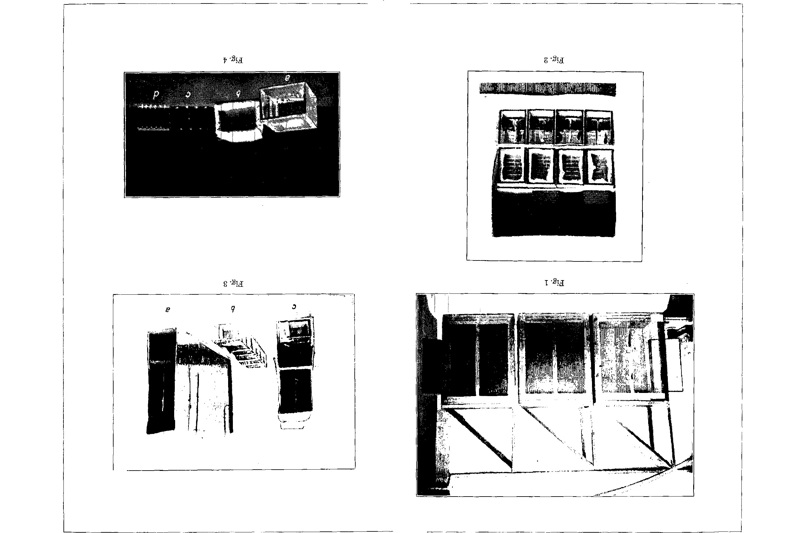

**Taf. X.**

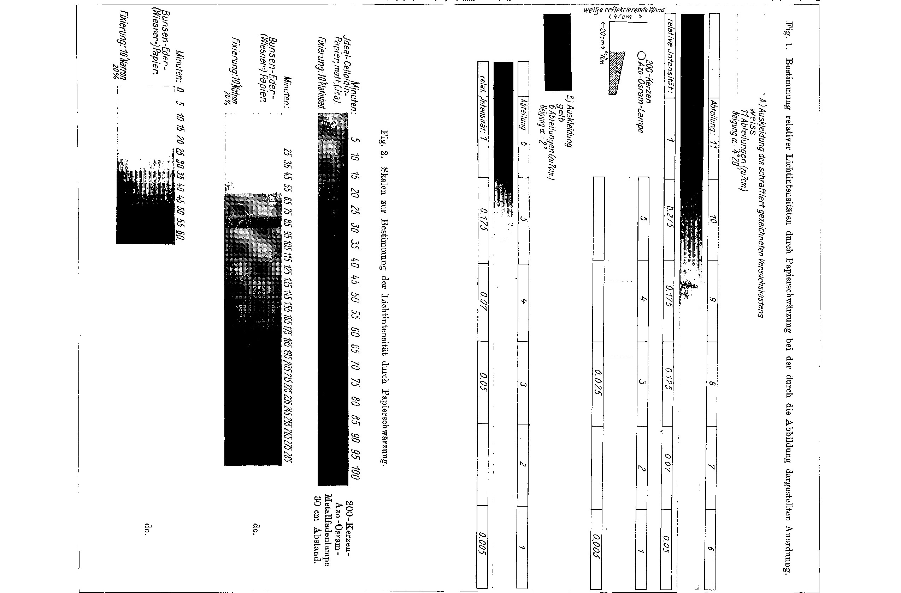

**Taf. VIII.**

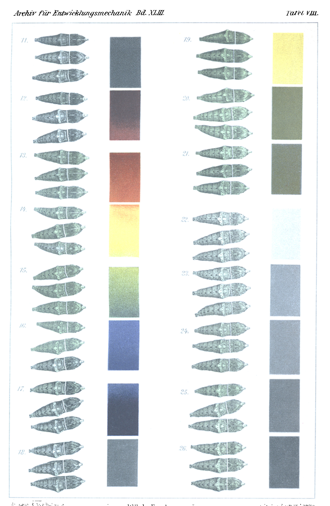

**Plate VI.**

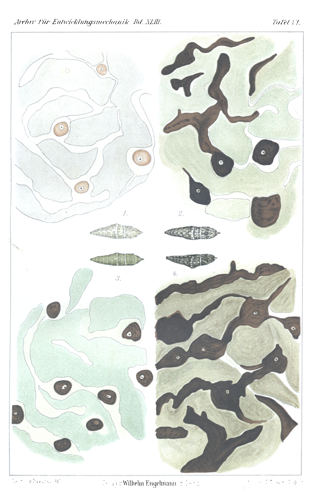

**Plate VII.**

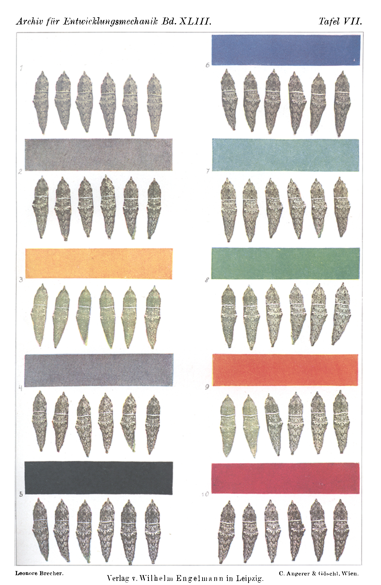

**Fig. 1.**

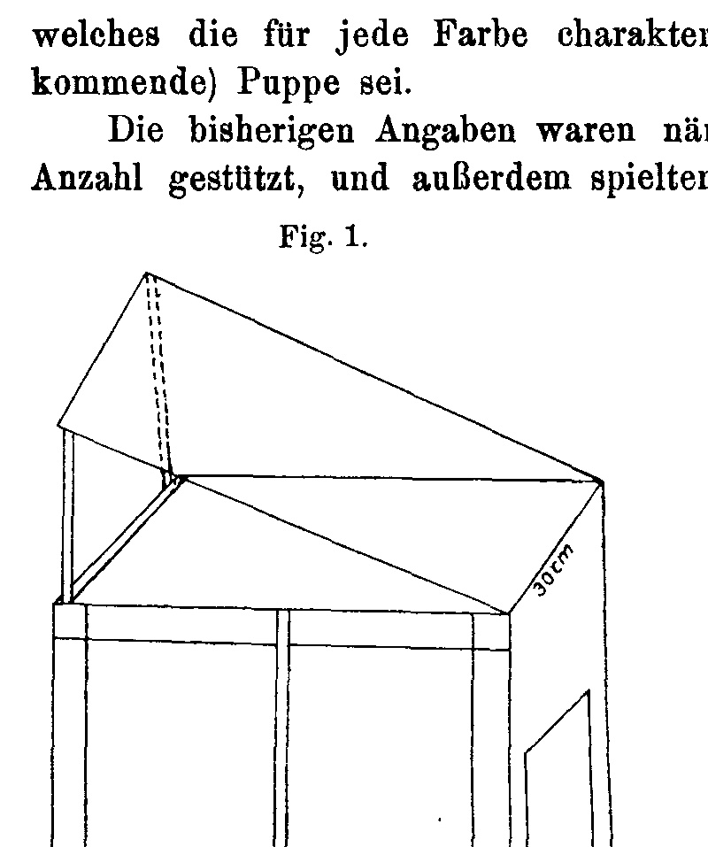

**Fig. 2.**

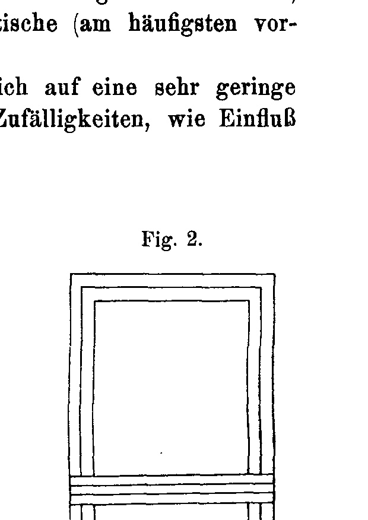

**Fig. 3.**

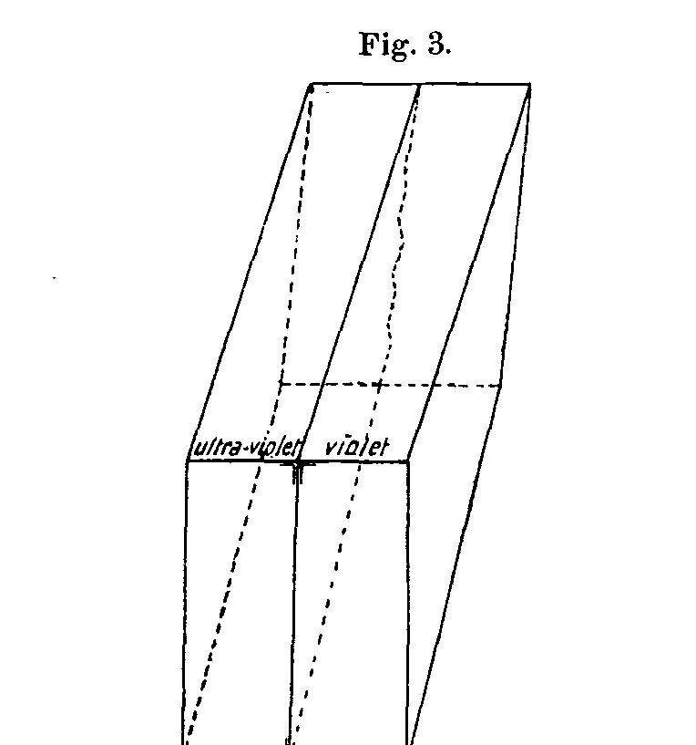

**Fig. 4.**

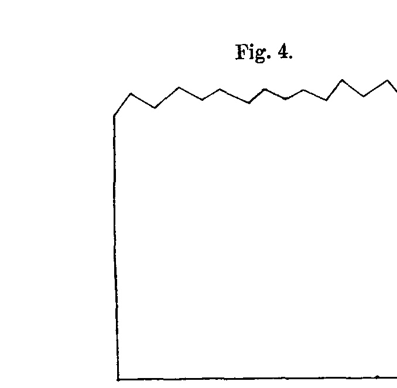

**Fig. 5.**

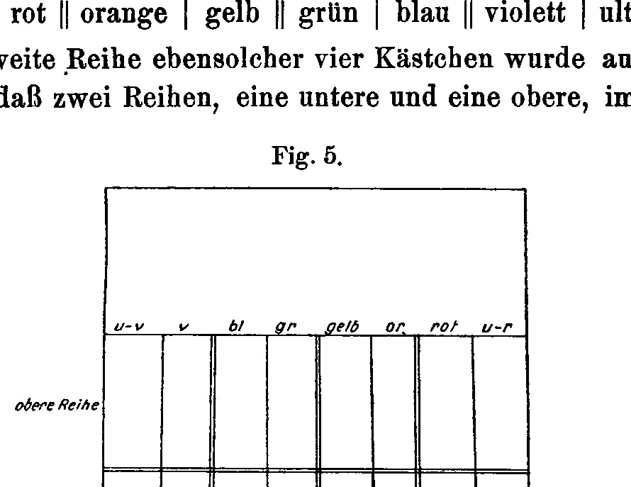

**Fig. 6.**

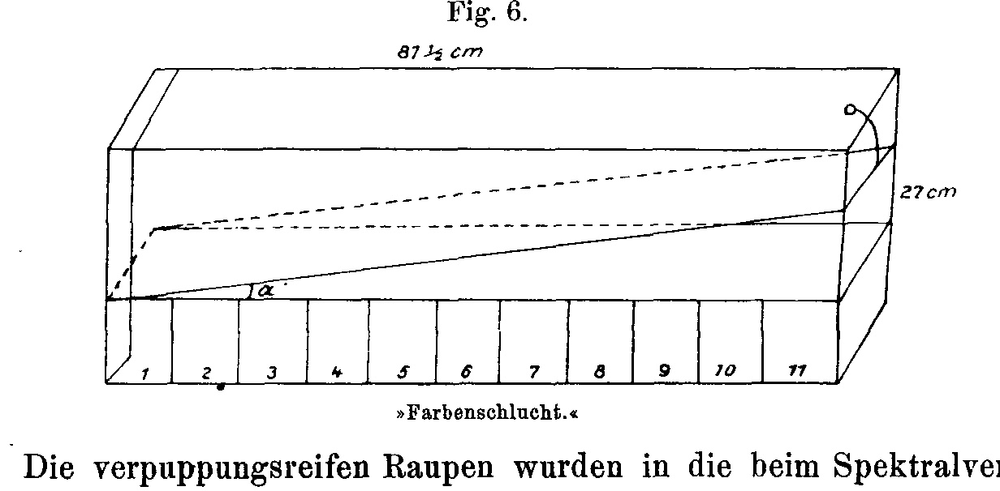

**Fig. 7.**

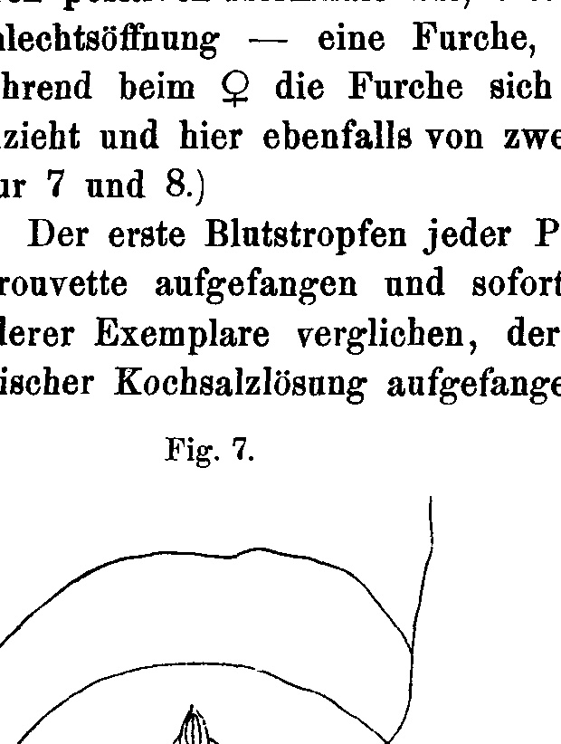

**Fig. 8.**

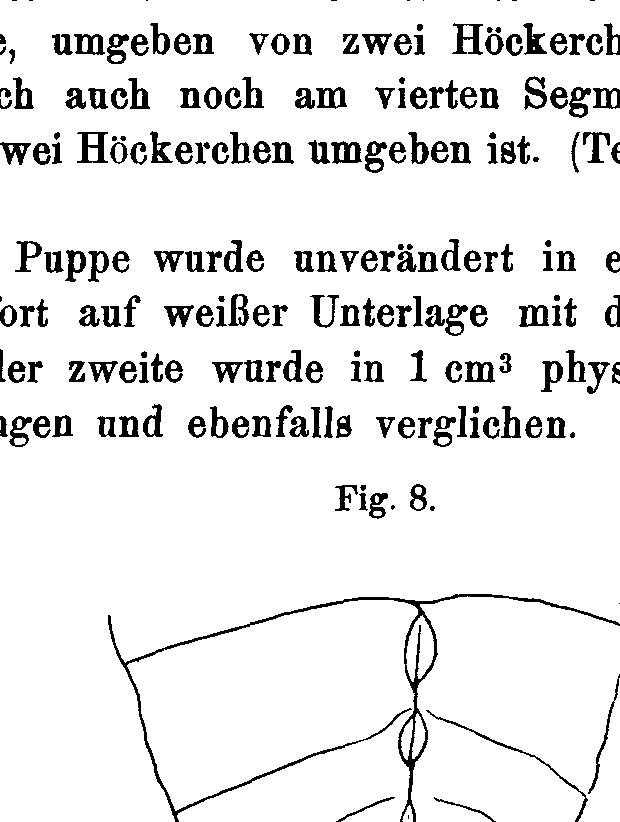

---

*Translator's note.* One of the Biologische Versuchsanstalt (Vienna Vivarium) papers flagged on the project site as a modern rediscovery target. Claims are rendered as stated in the original, not endorsed.
