## Endomixis and Size Variations in Pure Bred Lines of Paramaecium aurelia¹).

### By
### Rhoda Erdmann.

(Osborn Zoological Laboratory, Yale University, New Haven, Conn., U.S.A.)

With 12 diagrams and 20 tables.

*(Eingegangen am 2. Mai 1919.)*

*Archiv für Entwicklungsmechanik der Organismen*, vol. 46 (1920).

> **Full text (English original).** This Vienna Vivarium paper was written in English; the running text of “Endomixis and Size Variations in Pure Bred Lines of Paramaecium aurelia” (Erdmann, 1920) is reproduced faithfully and complete — all tables, figure/plate legends, and footnotes — transcribed from the page images, with only obvious scan artefacts corrected.

### Contents.

|  | page |
|---|---|
| I. Introduction | 85 |
| II. Material and Methods | 88 |
| III. The Changes in the Dimensions and Constants of an Individual Line during the Intermictic Period | 96 |
| IV. Constancy in Quantities of Individual Lines while under Cultivation during long continued Periods | 117 |
| V. Breaking up of the Individual Line into New Individual Lines with Characters of Their Own, and the Conditions under which these Characters remain Heritable | 131 |
| VI. Discussion and Conclusions | 140 |
| VII. Literature Cited | 146 |

> ¹) Noch während des Friedens mit Amerika hat die deutsche Verfasserin die meisten Experimente und einen Teil der Berechnungen als Lecturer der Yale Universität und Associate des Rockefeller-Instituts ausgeführt. Während ihres Aufenthalts in der Untersuchungshaft war ihr nur gestattet englisch zu schreiben und später nur ein englisch geschriebenes Manuskript mit sich nach Deutschland zu nehmen. Sie wünscht jetzt nach ihrer Befreiung, die Abhandlung in Deutschland zu publizieren. R O U X.

### I. Introduction.

The discovery of endomixis in *Paramaecium aurelia* by Woodruff and Erdmann in 1914 and in *Paramaecium caudatum* by Erdmann and Woodruff in 1916 immediately led to the conclusion that due weight must be accorded to endomixis in the interpretation and prosecution of subsequent studies of variation in purelines. This reorganization process in a pure line, involving as it does the disintegration and absorption of the old macronuclear and micronuclear material, affords opportunity for molecular rearrangement, and may therefore give rise to variations within a pure line. Problems of variability have been studied by various authors — namely, Simpson 1902, Pearson 1902, Pearl and Dunbar 1905, Pearl 1907, McClendon 1909, Jennings 1908, Jollos 1911, Calkins and Gregory 1913, Hance 1915 and finally Ackert 1916.

Although Simpson, Pearson, Pearl and Dunbar, and Pearl himself, deal with problems which are not closely connected with the main problem, — namely, the variations arise in pedigreed lines, — nevertheless the facts which they have ascertained are valuable in the interpretation of various phenomena in the life history of a pure line.

The relation of binary fission to variation was studied by Simpson. The variations produced by fission are due only to growth phenomena and are not the origin of heritable variations, as Pearson, 1902, p. 404, shows. The fact that methods of investigation were not fully developed at that time, decreases the value of these first attempts. Pearl, after he in collaboration with Dunbar had shown how the food supply influences the size of the vegetative *Paramaecia*, established the basic fact that conjugating animals are less variable than vegetative ones in the same culture. But it is to Jennings, 1908₃, that we owe the most thorough and important analysis of the question as to how growth alters the size of *Paramaecium*, — a question which must be fully settled, before it is possible to solve the problem of the origin of variations in pedigreed lines. He further analyzed the size differences of the same species in different conditions. Young and adult *Paramaecia*, *Paramaecia* gained by pond and by pure-bred laboratory culture, also animals originating from well and badly fed cultures were studied. A wealth of fundamental data was noted which must be considered by all subsequent workers. After these preliminary studies were made, it became possible to attack the main problem: do heritable variations really arise in pure lines, and how? Jennings in the fifth part of his work, 1908₃, McClendon, Jollos, Calkins and Gregory, and Ackert, have tried to answer these questions. The answers differ. Jennings concludes that »in a given pure line all detectible variations are due to growth and environmental action and not inherited« (1908₃, p. 521). »Though we find in nature many pure lines differing in their characteristic mean dimensions, he continues, »selection has no effect within a pure line«. The origin of the existing pure lines was not explained in 1908. In 1911 and 1913 he investigates the effects of conjugation on *Paramaecium*, and concludes that this sexual process originates new lines, different from the two that conjugated in morphological and physiological characteristics. Important as the conclusions reached in these two papers may later prove to be, it must for the present be considered that Jennings does not strictly answer the question, what effects has conjugation in *Paramaecium*, because, unknown to him at the time of his experiments, he worked in a longseries of experiments with material that had undergone recorded occurrences of conjugation and a number of unrecorded occurrences of endomixis. Not until the isolated effect of endomixis on *Paramaecium* can be ascertained, does it seem possible to judge what the combined influence of these two reorganization processes is. Jennings emphasized the fact that variations about the mean occur in pure lines that have not undergone conjugation. He still believes also that in spite of all his negative findings, »there remains the possibility that heritable variations of a totally different lesser order of magnitude may arise« (1913, p. 355) during vegetative reproduction.

There is a possibility here that endomixis may play a rôle in the shaping and reshaping of the size of the generations in the intermictic period. We may be even justified in believing, when we consider the close relation of conjugation to endomixis, that heritable variations result from some rare recombinations in endomixis.

I noticed during my previous work in *Paramaecium*, 1913—1916 that the animals which shortly after endomixis are small and slender, become taller and broader at the height of the rhythm, and seem to be shorter and stouter at the end of rhythm. This observation, gained by preserving and staining hundreds of animals of both species of *Paramaecium* at accurately known moments during the intermictic and endomictic periods, led me to believe that biometrical studies might throw some more light on the question of size variation in pure lines, provided these changes in size are really caused by endomixis.

Endomixis or parthenogenesis in sensu lato is a reorganization process, which occurs in *Paramaecium aurelia* after 40 to 50 fissions, or 25 to 30 days. The striking reorganization of the nuclear apparatus occurs after the old macronuclear material is fully annihilated, and the micronuclear material has undergone two divisions, giving rise to 8 micronuclei. One of them, or the descendent of one, gives rise to the totally new micronuclei and macronuclei in the daughter animals. It may be emphasized that the micronuclear material has undergone diminution of its constituents and a regeneration of its material lost by the two divisions, which rapidly follow one another. It has been shown that endomixis and conjugation are closely related in their morphological features, but are still essentially different, conjugation being effected in two cells with interchange of nuclear material, and endomixis in one, without giving opportunity for addition of foreign nuclear material. (Woodruff and Erdmann, 1914, pp. 489—492.) The fact that the mean size is strictly a constant in a pure individual line of *Paramaecium*, under identical conditions (Jennings, 1908₃, p. 482) gives a clue. If it remains unchanged after different intermictic and endomictic periods, we can attribute no influence to this reorganization process in originating heritable variations.

The first section of this work will devoted to an attempt to ascertain the theoretical mean size of the lines investigated; and the settling of the question as to whether or not there are different mean sizes, which appear periodically at given subperiods of the intermictic period. The second part will deal with the problem of the origin of heritable variations in the vegetative life of pure lines. A short general discussion of my own newly obtained results as compared with the facts and views of previous authors, Jennings, Jollos, Calkins and Gregory, Hance and Ackert, ends this presentation.

### II. Material and Methods.

Necessary preparations for securing material as identical as possible for each single measurement.

»It appears highly probable that if we could examine a large number of individuals, derived from the same parent, cultivated under identically the same conditions, and all precisely in the same stage of growth, we should find coefficients of variation considerably smaller than the smallest we have found, which is 4.521« (Jennings, 1908₃, p. 455). Having these conditions in mind, the following precautionary measures were taken. Line I, line IE, and line O, which were used for this series of experiments, are pure lines of *Paramaecium aurelia*. I and IE are sister lines, IE having been branched off from I after six years of cultivation of the main line. Both lines had been, previous to the beginning of these experiments in the fall of 1914, cultivated separately for one year.

#### Line I.

Line I is the famous and often discussed line which Professor Woodruff isolated on the first of May, 1907. An extensive history of this culture can be found in Woodruff, 1908 and 1911, and repeated in Woodruff and Erdmann, 1914, p. 432. For the sake of clarity I will repeat here that Woodruff kept four lines all derived from the same ancestor. These four lines I₁, I₂, I₃, and I₄, were bred by the isolated slide method, and as soon as one of them died out, either by accident, or, as was found later, shortly before the onset of endomixis, it was replaced by an animal derived from one of the other three lines. It was necessary to employ this method, namely, the interchange or interpolating of these four lines back and forth, in order to continue the existence of the main line. The main line can be traced back to the original animal of 1907, but for the sake of better culture was conducted as four branch lines.

I cannot emphasize enough the kindness and ever ready help of Professor L. L. Woodruff, which made it possible to secure so much material for seeding out animals after the occurrence of many endomixis periods. I was thus not only able to use material from Woodruff's main line, I, which was kept in pedigreed culture from May 1907 to 1916, but also from various sublines which I branched off in order to study certain problems in detail, as will be described later.

#### Line IE.

On October 27th, 1913, Woodruff and Erdmann branched off from main line I, at the 4020th generation, a line which they called IE. This sub-line was cultivated in bouillon from October 27th, 1913, to June 13th, 1914, until 4439 generations were reached. These were the animals which were used for the study of endomixis by these two authors in 1913 and 1914. After they had concluded their experiments, this line IE was removed from the thermostat where it had been kept between 24° and 26° C. From that point on, it was kept under varying (room) temperature and the food was changed to hay feeding. This line IE differs therefore at the beginning of my experiments (November, 1914), from the main line in two directions. It had lived nearly eight months in a culture medium of bouillon, at constant temperature, while main line I had always lived in hay infusion at varying (room) temperature.

#### Line O.

The initial animal of this pedigreed culture was supplied by Professor K. A. Budington, of Oberlin, Ohio (cf. Woodruff, 1917, p. 53). This culture was started October 8th, 1914, and carried on in hay infusion in room temperature on isolated slides from the 1st to the 861st generation. At this time, January 1st, 1916, the main line died by accident, and I was compelled to substitute a branch line, Os which had been used by Professor Woodruff for various experiments. I received it at the 799th generation on January 1st. It will be noticed that this line had divided more slowly than the main line O. The previous starvation treatment had lowered the division rate of Line Os for 62 generations. Line Os in my experiments called Line O, was cultivated from January until the end of my experiments in the usual amount of hay infusion on isolated slides. Various lines were branched from main line O and subjected to different environmental conditions. These lines have all been derived from the original main line O. The line Os, a continuation of main line O, was only used for one experiment (cf. Table 8).

Line I and line IE had not undergone conjugation for seven years. Line O is a line of *Paramaecium aurelia* which was newly isolated from a wild culture and was kept for only a short time in isolated slide culture before the beginning of these experiments.

We know that the same culture under different food conditions acquires a different mean average of size (Jennings, 1908₃, pp. 458—484). Therefore, for each set of experiments fractionally sterilized culture media (hay infusion or bouillon, 0.025 %) were prepared, and used for the entire series of the same experiments in the same amount.

The isolated slide cultures and the mass cultures belonging to the line in question were either subjected to the ordinary fluctuations in room temperature or cultivated in a thermostat at constant temperature between 24 and 26° C.

The number of the generation at which the occurrence of endomixis was observed is affixed to the designation of the line. Line I, 4709, therefore means that this line had endomixis at about the 4709th generation, and that, after undergoing the process on isolated slides, mass cultures of known ancestry and number of generations were started. The animals which were measured are not in the generation designated, but as many generations advanced as the mass culture has been allowed to proceed before killing it. For special purposes the lines are further designated by additional letters to show how they were cultivated. It is not possible to cultivate mass cultures in a bouillon culture medium. Therefore lines with the indices b are cultivated on isolated slides in bouillon and transferred to the hay infusion when the mass cultures were started.

Line Ohr = Line O, cultivated in hay infusion in room temperature.

Line Oht = Line O, cultivated in hay infusion in constant temperature.

Line Obr = Line O, cultivated in bouillon in room temperature.

Line Obt = Line O, cultivated in bouillon in constant temperature.

Isolated animals of each line, after they had reached their endomixis period, which was cytologically ascertained on isolated slides, were transferred in a fixed amount of culture fluid, and allowed to multiply. As the culture fluid was sterile, and kept in sterile vials, only those bacteria which were already in the culture fluid on the depression slides were added to the medium. Hargitt and Frey, 1917, point out that a mixed diet of bacteria is most favorble for cultivating isolated lines on depression slides. They have undoubtedly shown that a monotonous bacterial diet is unfavorable to the division rate and the life of an isolated line. Unfortunately they only conducted their lines a few weeks, which diminishes the importance of some of their conclusions. Otherwise, many of their technical postulates are well motivated. It is needless to say that careful workers had adapted most of them before they were described by Hargitt and Frey. When we speak of normally conducted cultures, we always mean cultures conducted on isolated slides with daily change of culture medium, either in room or constant temperature either in hay infusion or in bouillon. As the culture fluid on the depression slides and in the big dishes was the same except in the bouillon cultures, and as the animals eo ipso were accustomed to daily change of food, the transfer of the animals which had undergone endomixis was effected with the slightest amount of disturbance. In some cases the animals had already divided once or twice on the slide, before the transfer; but in most cases one animal formed the starting point of the mass culture.

A period of not more than 10 to 14 days (in a few exceptions for some special purpose, 20 to 24 days) was allowed to elapse between the onset of endomixis and the date of killing the mass cultures in Worcester fluid. The most difficult question, at what moment of the day the mass cultures should be killed, could only be solved by experiment in each different line (cf. p. 98—99).

I followed as closely as possible in the killing and measuring of the animals and in the statistical work the methods used by Jennings in 1908₃. He describes them fully on pages 396—402. My measurements were made with an ocular micrometer and such a combination of lenses was used as to make one division of the micrometer scale equal to 3.5 microns. The measurements were thus recorded in units, each of which was equal to 3.5 microns, so that the recorded units have to be multiplied by 3.5 to give results in microns. Jennings' unit is equal to 4 microns, and only in a few cases 3¹/₂ and 3¹/₄ microns. In comparing his recorded dimensions and constants with mine this difference has to be kept in mind. I drew my conclusions, for my purpose, from the figures expressed in units, and did not multiply by the number of microns. I had to take into account, as will be seen, the very small fluctuations of the standard deviation, which would be too greatly intensified by the multiplication. But in the variation polygons the figures are given in microns. Also, for the purpose of comparison with the measurements of other authors, the figures are given in microns. There has been some criticism of Jennings by Robbins, 1917, but this can have no bearing on our simple methods. The diagrams, used for illustrating in a more graphic manner than in the tables the changes in the measurements of the mean length and mean breadth, are all plotted in the same manner. The measurement are given in microns and not in units, to facilitate comparison with the diagrams of other authors. The abscissae give the lengths of the culture in question in microns and the ordinates the actual class number of the 120 measured animals that belong to the same range of variation. In diagram 3, p. 100, f. i., there are represented 49 animals of the 120 measured, which are between 98 and 105 microns, or 28 and 30 units, each unit representing 3.5 microns and each interval on the abscissae 7 microns.

There is one point of importance which should be brought to the attention at the start. It might be said that during the ten to fourteen days from the seeding out of the animal in the mass culture until the day of killing the mass culture, conjugation might have taken place. But knowing for certain that the ancestor of the measured animals had undergone endomixis ten days previous, a reorganization process which is undoubtedly a substitute for conjugation, as Woodruff and Erdmann for *Paramaecium aurelia*, and Erdmann and Woodruff for *Paramaecium caudatum* have shown, it could not be expected that conjugation would arise in the period between seeding the mass cultures and killing them, and this is proved to be true through the measuring of over 6000 asexual *Paramaecia* among which no pairs of conjugants were discovered.

It might have been very interesting to find the dimensions and constants of animals actually undergoing endomixis. For technical reasons this cannot be done, because in order to do this it is necessary to stain and mount the *Paramaecia* to be certain that the animals used. Throughout our experiments we have only the uniform influence of the killing fluid on size and shape to consider. The earlier investigators used stained animals for measuring, but this method was later discarded as too uncertain. It is also impossible to collect 120 animals in endomixis, and this fixed number was always used for each measurement.

If the four factors which favour to vary the mean size of a mass culture of *Paramaecium*, namely,

the temperature,
the composition of the culture medium,
the amount of the culture medium,
the period of time between two fissions,

have been carefully controlled, according to the present state of our knowledge, as identical as possible, we believe that, then and only then, we are entitled to compare the figures gained from material thus prepared.

We have already discussed how the three first conditions may be attained. It remains to see how the fourth, — to select a nearly identical time between two fissions, — can be accomplished. Jennings' measurements of *Paramaecia* in many stages of division facilitate this task. It has been shown by him that a culture shortly before fission, shortly after fission, and 5, 12, or 18 hours after fission, has different mean averages of size. (Cf. Jennings, 1908₃, Tables 8 and 10, pp. 418 and 430.)

##### Table 1.

Mean length during division of three lines of *Paramaecium aurelia* in microns of 120 animals for each measurement. Cultivated at constant temperature in the standard amount of the standard hay infusion for each line for 150 generations.

| Age | I | IE | O |
|---|---|---|---|
| Beginning constriction | 66.153 | 52.498 | 71.654 |
| Immediately after separation | 74.921 | 68.146 | 90.154 |
| 40 minutes after | 107.231 | 81.437 | 109.125 |
| 4 hours after | 116.291 | 102.547 | 139.021 |
| 14 hours after | 127.903 | 112.345 | 155.052 |
| Beginning constriction | 111.437 | 105.054 | 140.843 |

Table 1 gives the mean length at different division periods of the three lines which we have used in our investigations. The breadth of the dividing animals does not change between the two divisions in as visible a manner as Jennings lays down as a general rule, 1908₃, p. 513. Table 2 (cf. p. 94) is compiled from Jennings' Tables 8 and 10; the succession of his rows has been changed to show the fluctuations in dimensions and constants in measurements of dividing animals of equal growth periods and of random samples. Only in lot 5 is a broadening during the later stages of division visible, and then only about two microns. In lot 4, in all five measurements, the mean breadth moves between 34 and 35 microns, and I therefore did not measure the mean breadth in the dividing mass cultures.

It may be noted here that in lots selected in the same period of growth the standard deviation and therefore the coefficient of variation are low before the conspicuous lengthening, or the separation of halves has begun. Random samples and animals in later stages of fission have a higher figure for these dimensions. The coefficient of correlation is lowest in animals after the lengthening has begun, or after the animals have separated. If we are able to exclude constricted animals from our measurements, and this is possible, we will have only very young and adult specimens in our culture. If we find in

##### Table 2.

(Compiled with omissions from Jennings' Tables 8 and 10, 1908₂, and arranged for present purposes.)

| Progeny of c (*aurelia* form) | Length: Mean in Microns | Length: Standard Deviation in Microns | Length: Coefficient of Variation | Breadth: Mean in Microns | Breadth: Standard Deviation in Microns | Breadth: Coefficient of Variation | Coefficient of Correlation |
|---|---|---|---|---|---|---|---|
| Lot 4. Halves, where depth of constriction is less than ¹/₄ breadth | 51.868 ± .325 | 3.912 ± .190 | 7.541 ± .445 | 34.850 ± .287 | 3.453 ± .203 | 9.911 ± .587 | .6502 ± .0479 |
| Lot 5. Halves, where depth of constriction is less than ¹/₄ breadth | 56.666 ± .425 | 3.889 ± .302 | 6.862 ± .533 | 45.263 ± .597 | 5.463 ± .423 | 12.071 ± .947 | .6744 ± .0597 |
| Lot 4. Halves, lengthening begun, where depth of restriction is more than ¹/₄ breadth | 60.692 ± .527 | 5.684 ± .372 | 9.365 ± .613 | 34.590 ± .383 | 4.147 ± .273 | 11.989 ± .797 | .3100 ± .0837 |
| Lot 4. Early fission, depth of constriction less than ¹/₄ breadth | 103.737 ± .650 | 7.823 ± .379 | 7.541 ± .445 | 34.850 ± .287 | 3.453 ± .203 | 9.911 ± .587 | .6502 ± .0479 |
| Lot 5. Early fission | 113.333 ± .850 | 7.778 ± .603 | 6.862 ± .533 | 45.263 ± .597 | 5.463 ± .423 | 12.071 ± .947 | .6744 ± .0597 |
| Lot 4. Later stages of fission | 121.383 ± 1.053 | 11.367 ± .743 | 9.365 ± .613 | 34.590 ± .383 | 4.147 ± .273 | 11.989 ± .797 | .3100 ± .0837 |
| Lot 5. Random sample | 114.033 ± .820 | 12.140 ± .580 | 10.643 ± .513 | 47.300 ± .437 | 6.490 ± .310 | 13.720 ± .667 | .8152 ± .0226 |
| Lot 4. Random sample | 114.163 ± .784 | 17.443 ± .555 | 15.279 ± .497 | 34.207 ± .241 | 5.363 ± .171 | 15.683 ± .511 | .6757 ± .0244 | the cultures of the same line, then, that there are more divisions, this is taken into account in the estimation of the proper time of killing. The longer the lines are carried on isolated slides, the easier will it be to control this. In the slide cultures of the same line which is carried on while the mass cultures multiply, the experimenter knows approximately when the division takes place. Lines I, IE, and O divided between 9 and 11 a. m. This fact was evident to a greater degree in the two first lines which were cultivated on isolated slides for over 4000 generations previous to the beginning of these experiments. Line O, in which endomixis was observed for the first time in the 62d generation, became more easy to control, and divided oftener during known hours, the longer it lived on isolated slides.

As was to be expected, we note also that the highest mean length in *Paramaecium aurelia*, is not reached in random samples *c*, the so-called random sample containing many different growth stages. In the mass cultures, after the exclusion of the

| | Cultures at the same growth period | Random sample |
|---|---|---|
| Jennings' c line, Lot 4 | 121.383 microns | 114.163 microns, |
| Line I | 127.903 » | }&nbsp;compare the theo- |
| Line IE | 112.345 » | retical mean lengths |
| Line O | 155.052 » | Chapter IV. |

constricted animals, there are, as may be seen in the variation polygons, or in the curves, always young animals present, and sometimes even individuals that reach the highest recorded mean length. From this it is clear that the theoretical mean length (which we shall from now on call the chosen mean length) on which we base our later conclusions, must be always smaller than the highest possible mean length of a lot selected at later stages of division and it must also exceed the figure for mean length of a lot whose halves have just separated. These two negative limitations do not, however, enable us to decide what is the theoretical mean length of a line. Jennings gives for his lines of *Paramaecium aurelia*, Progeny of c, 114.163, 114.033, 130.120, 123.666 and 144.880 microns. The first two measurements are taken from cultures to which, two days previous fresh hay infusion has been added. We shall not consider these. But even after excluding these, there remains a difference of nearly 21 microns. This same embarrassing situation would have occurred, if we had selected *Paramaecium caudatum*, and now, since the discovery of endomixis in 1914, we must ascertain if this reorganization process is responsible for these fluctuations.

Let us take for granted here, what remains to be proved in the next chapter, — that it is best to take around the fourteenth day after endomixis has occurred for killing the pedigreed mass cultures. To obtain material for measurements which is as nearly identical as possible, the following precautions were taken. The three individual pure lines I, IE, and O were cultivated on isolated slides in a known quantity of the sterile standard medium, which was taken for the same line for all the experiments and also for the mass cultures (500 cc. for the O line, and 1000 cc. for lines I and IE). The bacterial flora was the same as on the slides. The lines were kept either in constant temperature (24°—26° C.) or room temperature for 14 days after endomixis occurred. They were then killed approximately 6 to 8 hours after the daily division took place.

It is tedious work to fulfill as far as possible these conditions, but the far reaching conclusions that may be drawn from the results, make these precautions necessary. Just as a physicist spends ample time in preparing the conditions under which he is going to perform his experiments in order that he may predict that under given conditions of temperature, atmospheric pressure, etc., the material must react in a given manner, so we aim to show that a pure line of *Paramaecium aurelia*, cultivated under the same environmental conditions, killed at the same period after division and the occurrence of endomixis, shows the same theoretical mean length. How far we have attained our goal, and we believe that we have only advanced a small distance toward it, can be seen in the fourth chapter, where the theoretical mean lengths of the three lines are given for periods stretching over **years**.

### III. The Changes of Dimensions and Constants During the Intermictic Period of an Individual Line.

While the rising and falling of the division rate in *Paramaecium* during the intermictic period in normally conducted cultures is an acknowledged fact — although a few exceptions have been noted which will be discussed later, — nothing is known as to how isolated lines behave in relation to changes of size during this period. Jennings 1908₃, pp. 492—498, has studied in detail changes of size during the so-called life cycle, not connected with influences of growth or environment. That at that time it was generally believed that the so-called life cycle consisted of long periods of asexual multiplication, interrupted by a sexual act — conjugation in Infusoria — and that the race would die if this act did not occur sooner or later. Jennings asks (p. 498) if there are differences also to different stages in the life cycle (as a rule not marked in comparison with others); and others' inherent, hereditary differences in size, permanent when all other conditions are made the same. The differences among the different lines were found by Jennings not to be due to different periods of the life cycle (1908₃, p. 514), but are due to the inherent characteristics of each individual line. He further maintains that in a given individual line conjugation is the cause of heritable variations. He considers this question further in 1913 with the same result, but is contradicted by Calkins and Gregory in 1913. These latter authors find that in the progeny of a single exconjugant variations arise ↋fully as definite and as extensive as the variations between progenies from different exconjugants (p. 521). But they do not decide if these variations are heritable.

The main object of this part of the present investigation is to discover, after the periodical occurrence of endomixis has been fully established in both species of *Paramaecium* in 1914 and 1916, if there are variations in size in a pure line which are influenced by their relation to the passing the intermictic period. After these facts are elucidated, it will be possible by renewed experiments to understand what differences in size are alone due to the processes preparatory or following conjugation, and are not related to the phases of the many intermictic periods between two different occurrences of conjugation.

We have by our culture methods excluded the occurrence of conjugation, but we are not able to separate the influences, known to be brought about by the continually occurring divisions, and influences, supposed to be brought about by the passing the intermictic period. Diagram 1 gives an idea how inseparably connected both phenomena are, while dividing, the animal passes the intermictic period. Now are the four quantities in question, mean length, mean breadth, standard deviation and correlation, of different value in the three subperiods of the intermictic period or do they appear in different combinations belonging to one or the other subperiod? If that would be the rule, we could say either that the passing the intermictic period leaves traces or the number of performed divisions is responsible for these different combinations.

All three main lines in question, Line I, IE, and O, were branched, and the side lines underwent the following conditions: Line I 5530

> ¹ Archiv für Entwicklungsmechanik Bd. 46.   7 originated from Professor Woodruff's main line I₃; it was branched off January 17, 1916, at the 5471st generation, kept in constant temperature, and in the standard hay infusion, on isolated slides. Endomixis occurred at the 5493d generation, February 6th, and at the 5530th generation, on March 8th. This line was not interpolated for 59 generations. It was discarded at the 5545th generation, after flourishing mass cultures had been started, following the last occurrence of endomixis. The first lot, I 5530₁₀, was allowed to multiply ten days, the next, I 5530₁₂, twelve days, the third, I 5530₁₄, fourteen days, and the last I 5530₂₄, twenty-four days, in the standard quantity of the standard hay infusion in constant temperature.

 — *V-shaped diagram. The descending arm (left) is labelled* ASCENDING PHASE *and* DESCENDING PHASE *with* CLIMAX *at the bottom and* CONSTRICTION *near a chain of dividing animals; arm III is marked* SUB-PERIOD OF INTERMICTIC PERIOD III, MEDIUM MEAN LENGTH, HIGH STANDARD DEVIATION, HIGH CORRELATION. *The apex (subperiod II) is marked* HIGH MEAN LENGTH, MEDIUM STANDARD DEVIATION, MEDIUM CORRELATION. *The ascending arm (right) is labelled* SUB-PERIOD OF INTERMICTIC PERIOD I, LOW MEAN LENGTH, LOW STANDARD DEVIATION, LOW CORRELATION, *with* DESCENDING PHASE, ASCENDING PHASE, CLIMAX *and* ENDO- *at the bottom; the centre is labelled* INTERMICTIC PERIOD.

> Diagram 1: The change of the intermictic and endomictic period is represented, the divisions of the intermictic period, the number of which is arbitrarly fixed one for each day are shown. The three subperiods of the intermictic period with the changing of the four quantities in question is expressed for each subperiod.

Line IE 5386 was branched from Line IE, December 21, 1915, after endomixis occurred at the 5234th generation. This line was not interpolated for 152 generations and kept at constant temperature on isolated slides in the standard hay infusion. Mass cultures were started, after the reorganization process was observed March 26, 1916, in the 5386th generation. The first lot was killed after fourteen, the second after twenty, and the last after twenty-four days. These cultures are named IE 5386₁₄, IE 5386₂₀, and IE 5386₂₄.

As Lines I and IE were for years under culture, they might have developed different qualities from a line which was only recently brought under culture. Therefore, line O was selected at an early period and placed under culture to ascertain if it behaved differently from lines I and IE in the intermictic period. Line O₂₄₇ was branched from line O, after endomixis had occurred in the 179th generation, December 24, 1914, and kept without interpolation for 68 generations Table 3 gives the dimensions and constants of the three different pure lines during the intermictic period. Only one of many experiments of the same order is fully recorded here; the records of the others do not show different features.

### Table 3.
### Dimensions and Constants of Variation for 3 Lines at Different Periods of the Intermictic Period.

|  | Length in units | Standard deviation in units | Coefficient of variation |
|---|---|---|---|
| Line I 5530₁₀ . . . | 27.575 ± .139 | 2.424 ± .105 | 8.710 ± .378 |
| Line I 5530₁₂ . . . | 26.841 ± .182 | 2.954 ± .128 | 12.823 ± .565 |
| Line I 5530₁₄ₐ . . . | **32.183 ± .220** | 3.593 ± .156 | 12.728 ± .555 |
| Line I 5530₂₄ . . . | 30.525 ± .261 | **4.259 ± .185** | 13.015 ± .575 |
| Line IE 5386₁₄ . . | **30.733 ± .177** | 2.888 ± .125 | 9.396 ± .411 |
| Line IE 5386₂₀ . . | 25.183 ± .216 | 3.605 ± .197 | 13.049 ± .577 |
| Line IE 5386₂₄ . . | 25.083 ± .247 | **4.023 ± .175** | 16.038 ± .714 |
| Line O 247₁₀ . . . | 38.408 ± .285 | 4.633 ± .201 | 12.828 ± .565 |
| Line O 247₁₄ . . . | **39.066 ± .383** | 6.230 ± .066 | 13.266 ± .593 |
| Line O 247₂₁ . . . | 35.608 ± .445 | **7.233 ± .314** | 13.514 ± .692 |

|  | Breadth in units | Standard deviation in units | Coefficient of variation | Coefficient of correlation |
|---|---|---|---|---|
| Line I 5530₁₀ . . | 9.016 ± .083 | 1.353 ± .074 | 13.112 ± .580 | .4966 ± .0465 |
| Line I 5530₁₂ . . | 8.925 ± .108 | 1.796 ± .078 | 13.500 ± .693 | .5033 ± .0371 |
| Line I 5530₁₄ₐ . . | 9.100 ± .095 | 1.545 ± .067 | 13.274 ± .594 | .6302 ± .0403 |
| Line I 5530₂₄ . . | 11.500 ± .142 | 2.327 ± .353 | 13.506 ± .691 | **.8052 ± .0234** |
| Line IE 5386₁₄ . . | 8.250 ± .092 | 1.397 ± .065 | 13.363 ± .605 | .6925 ± .0498 |
| Line IE 5386₂₀ . . | 7.891 ± .085 | 1.396 ± .061 | 13.327 ± .601 | .7025 ± .0334 |
| Line IE 5386₂₄ . . | 8.122 ± .099 | 1.457 ± .063 | 13.330 ± .601 | **.8324 ± .0267** |
| Line O 247₁₀ . . | 10.800 ± .095 | 1.555 ± .067 | 13.057 ± .576 | .4533 ± .0431 |
| Line O 247₁₄ . . | 10.443 ± .093 | 1.513 ± .065 | 13.097 ± .579 | .5957 ± .0329 |
| Line O 247₂₁ . . | 9.958 ± .105 | 1.713 ± .074 | 13.291 ± .597 | **.7657 ± .0481** |

A brief survey shows these salient points: in Lines I, IE, and O, the standard deviation, and therefore, the coefficient of variation and the coefficient of correlation, are increasing with the length of the intermictic period. The theoretical mean length belonging to the individual line appears at the beginning of the second period.

These subperiods with different characters are distinguishable in the intermictic period, which are present in each line while undergoing this reorganization process (Diagram 2, 3, 4, 5, 6 and 7).

**Diagram 2.** The mean lengths of Line I in three different intermictic periods are shown after 10, 14 and 20 four days. Endomixis occurred at the 5530th generation. In the polygon of variation in mean lengths the curve which represents the theoretical mean length is drawn out. *(figure not reproduced)*

In the first subperiod (Line I 5530₁₀ and O 247₁₀), which ranges up to approximately the tenth day, the animals have not reached the mean length, the constant for each line under the same condition. The mean breadth is either absolutely or relatively low, as compared

**Diagram 3.** The mean lengths of Line I E in the second and last intermictic period is given, after 14, 20 and 24 days. Endomixis occurred at the 5386th generation. The curve, which represents the theoretical mean length is drawn out. *(figure not reproduced)*

to the length, and this gives a low correlation. The animals appear slender and are distinguished from those of the last subperiod by their transparent cytoplasm. The culture is in a state of rapid multiplication. The standard deviation is low, the uniformity in size and shape of the animals remarkable. In the following studies, we shall give more consideration to variations in length than to those in breadth, for the obvious reason that the first are more pronounced, but during the intermictic period both dimensions, especially the changes in

**Diagram 4.** The mean lengths of Line O in the three different intermictic periods are shown after 10, 14 and 21 days. The curve, which represents the theoretical mean length is drawn out. Endomixis occurred at the 247th generation. *(figure not reproduced)*

their relations, are highly important. That the mean length is not attained in the first ten-day period does not mean that there are not

**Diagram 5.** The mean breadths of Line I in the three different intermictic periods are shown. Endomixis occurred at the 5530th generation. The curve which represents the mean breadth in the last intermictic period is drawn with a heavy broken line. *(figure not reproduced)*

**Diagram 6.** The mean breadths of Line IE in the second and last intermictic period is given. Endomixis occurred at the 5386th generation. The curves representing the mean breadths in the last intermictic period, are drawn with broken lines. *(figure not reproduced)*

a number of animals which show this constant but that number, owing to the rapid multiplication, is too small to form a maximum for this group. The maximum, i. e., the group to which most of the measured animals belong, is nearly 4.608 units or 16.128 microns lower than the maximum group in the next subperiod in Line I 5530 (Diagram 2). In Line O 247, the difference is not so remarkable; this line was, compared with the other two lines, only a short time under laboratory culture. We shall discuss later the bearing of this point in influencing the dimensions and constants; for the present, it must be regarded as a fact that lines newly under culture show the different characters of each subperiod, but in a lesser degree. Line O 247₁₀ deviates only .658 units or 2.000 microns from the mean length (Diagram 4).

To summarize: lines in the first subperiod of the intermictic period show a high division rate and a low mean length, standard deviation and correlation.

**Diagram 7.** The mean breadths of Line O in three different intermictic periods are shown. Endomixis occurred at the 247th generation. The curve representing the mean breadth in the last intermictic period, is drawn with a heavy broken line. *(figure not reproduced)*

In the next subperiod, which ranges from the tenth to the sixteenth day, all three lines under investigation reach their theoretical mean length, the constant for the individual line under identical conditions, Line I with 32.183 ± .220 units, Line IE 5386₁₄ with 30.733 ± .177 units, and Line O 247₁₄ with 39.066 ± .383 units. The mean breadth (Diagram 5) shows little absolute increase, relative to the length, but the standard deviation begins to grow. The variability of the line increases with an augmented standard deviation.

To summarize: lines in the height of the intermictic period show their theoretical mean length clearly, the culture as a whole has a high mean length, and a slowly increasing standard deviation and correlation.

In the last subperiod, which ranges approximately from the sixteenth day until the onset of endomixis, the animals are distinguished in all three investigated lines by their increased mean breadth. This increase may even be an absolute increase as in Line IE 5530₂₄, or a relative one in comparison to the length (Diagram 7). This dimension has decreased rapidly, therefore a high correlation ensues. Also the standard deviation has reached its highest figure. The decrease of the division rate in the last subperiod is known, also animals in this phase are of plump shape and possess an opaque, coarsely grained cytoplasm.

To summarize: lines in the third subperiod of the intermictic period show an increased breadth in comparison to length, and therefore an increased correlation between these dimensions. The standard deviation is high, the theoretical mean length and division rate are low.

The mean lengths of the Lines I, IE and O are plotted for each subperiod for each line on diagrams 2, 3 and 4. The drawn out line gives on all three diagrams the theoretical mean length, it is evident that it is reached on the fourteenth day. Cultures measured after this time, do not show the theoretical mean length, as on diagram 3 Line IE 5386₂₀ and 5386₂₄.

Diagrams 5, 6 and 7 show the mean breadths in each subperiod of the intermictic period for the three lines in question. There is very little difference in mean breadth between the measurements on diagram 5 on the tenth and fourteenth day, only on the twenty-fourth day the culture reaches its highest mean breadth.

These three rules, which enable us to recognize in which stage of the intermictic period the line is killed, give a valuable key for analyzing the dimensions and constants reported by other authors, who, not knowing of the influence of the different subperiods of the intermictic phase, have often found incommensurable and inexplainable figures.

To these new statistical data we have added some of a physiological character previously found in collaboration with Woodruff. These are the changes in the division rate in connection with endomixis, and some cytological observations. The former were made on isolated slide cultures, and all later statistical ones on mass cultures. As soon as the animals, after endomixis has been observed during the next cultivation on slides, have been transferred into the mass culture dishes, they have an abundance of culture fluid. The dishes contain 1000 cc. or 500 cc. of the standard hay infusion, which is sterile and at the same temperature at which the isolated slides were kept, and they remain during the experiment either in the constant temperature room or in the north room of the Osborn Laboratory where the room temperature naturally varied, but relatively little. The room temperature experiments have been conducted only during the cooler months, September to May, when the stone building has a more even temperature.

On small pieces of cover glass one or sometimes two animals of a known number of generations, and which were supposed to form the mass culture, were slowly submerged in the big dishes. With the animal some drops of the culture fluid in which it had lived on the isolated slide were also transferred into the big dish, and in this way, the accustomed flora of bacteria, the food of the *Paramaecium* was automatically inoculated into the culture fluid. These bacteria multiply and contribute to the rapid increase of the animals. After the first subperiod has elapsed, there must be an increase of excretion products in the medium, but the composition of the fluid must be favorable enough to permit further ample proliferation. In the third subperiod the exhaustion of the fluid has proceeded and the excretion products of the *Paramaecia* and the bacteria must have accumulated. In this period we notice a dying out of the animals, till in very old cultures without changed culture mediums nearly all animals have perished.

There then arises the question, are these phenomena, i. e. the change of the mean length and mean breadth in different directions and the increase in standard deviation and correlation, due to the change in the composition of the culture medium or due to changes connected with the passing the intermictic period?

We have only an indirect proof that the described changes are not alone due to the changed culture medium. The study of the intermictic and endomictic phases in the life of *Paramaecium aurelia* by Woodruff and Erdmann 1914 and *Paramaecium caudatum* by Erdmann and Woodruff 1916, both made on isolated slide cultures, give this indirect proof.

In constant temperature, with daily changed culture medium, there was a slowing up of the division rate near the onset of endomixis under the chosen culture conditions. Also it was noted and already described in 1914 and 1916 that in the descending phase of the endomictic period, which overlapses with the end of the third subperiod of the intermictic period a change in size and form occurs. Woodruff and Erdmann wrote in 1914, page 469, »The cells during the process seem to be more opaque than usual, their breadth is relatively greater, their total volume is somewhat increased and their movements are considerably more sluggish«. This was observed, while the animals actually underwent the reorganization process, when no more divisions ensued for a considerable length of time. As long as division occurs — shortly before endomixis starts — only the two first observations hold true. I gave at that time no further observations dealing with the intermictic period, but give in this present paper, on p. 87, the reasons resulting from my previous work which led me study size variations during the intermictic period. In handling so many animals of known generations between 1914 and 1916, I found that »the animals shortly after endomixis are smaller, become bigger at the height of the intermictic period, and seem to be stouter at the end of the rhythm«.

If we note the change in size during the intermictic period on isolated slide cultures, where the noxious influence of the accumulated excretion products can not play a determining rôle, we may conclude that the changes in size in the intermictic period are inherent. They may be more pronounced in the mass cultures, if the exhaustion of the medium should produce differences in the same direction. I tried to change the medium after twenty days of culture, but only brought about the precocious onset of endomixis in the renewed medium. It was already incidentally observed by Woodruff and Erdmann 1914, p. 185, that it was possible to hasten the occurrence of the process by the character of the culture medium. For example, »it may occur a few days earlier in animals not supplied with fresh culture fluid than in the regular lines«. Woodruff 1917 followed this line of observation and in many lines was able generally to prove it in his work on »the influence of general environmental conditions on the periodicity of endomixis in *Paramaecium aurelia*« and could confirm (1917, p. 461) the fact that »sudden marked changes in normal culture conditions may initially induce the appearance of the definite endomictic phenomena slightly earlier than they would have occurred if the cell had continued under its former environmental conditions«.

The occurrence of endomixis as soon as the medium is changed made it impossible to devise any other way of conducting the mass cultures than the one which I used, namely, no change of medium during the culture period of twenty-four days.

If doubt still remains that only changes of growth are responsible for what we term intermictic changes of dimensions and constants,

Division and the passing of the intermictic period in their influences on the quantities in question¹).

| Subperiods of the intermictic period | Intermictic period | First hours after fission | After fission | Shortly before fission | Dimensions and constants |
|---|---|---|---|---|---|
| First Subperiod . . . { | − − | − − | + + | − + | M. L. |
|  | − − | − − | − + | + + | St. D. |
|  | − − | − − | − + | + + | C. C. |
| Second Subperiod . . { | + + | − − | + + | − + | M. L. |
|  | − + | − − | − + | + + | St. D. |
|  | − + | − − | − + | + + | C. C. |
| Third Subperiod . . { | − − | − − | + + | − + | M. L. |
|  | + + | − − | − + | + + | St. D. |
|  | + + | − − | − + | + + | C. C. |

> ¹) − − means low; − + means medium; + + means high } dimension or constant.

(continues on p. 22)

this survey of the increase or decrease of the mean length, the standard deviation and the coefficient of correlation for each subperiod of the intermictic period, combined with those of the different periods between two divisions will dispel it.

The results of the changes in the four quantities, mean length and mean breadth standard deviation, and coefficient of correlation, during the three phases of division, either coincide with or differ from those brought about by the approaching of the next endomictic period. Thus accumulating or diminishing the separated effects, we notice that shortly before fission and shortly before endomixis the animals have the highest standard deviation and correlation. The highest theoretical mean length is reached in the period »after fission« in the second subperiod of the intermictic period. At this phase we have to ascertain our mean length.

These two cycles — division cycle and intermictic cycle — begin and continue at the same time, but move with varying rapidity; both ending in the climax of the endomictic period. Here no division occurs for a short time, and the old macronucleus, the one which in its division products has survived throughout the whole intermictic period, perishes, announcing thereby that a new sequence of intermictic generations will arise. As endomixis is a periodical process in normally conducted cultures, it thereby also initiates the periodical changes of dimensions and constants during the repetitions of the intermictic period. Each time endomixis occurs, it eliminates periodically and automatically the small but discernible variations in the mean length and mean breadth, the standard deviation and correlation. After endomixis, the animals are again able to endure the influences of the environment and to undergo 40 to 50 divisions. Parallel with these factors, the deviations from the dimensions and constants of the young animal of the first subperiod of the intermictic period appear and increase or decrease until the next occurrence of endomixis again eliminates the differences.

Endomixis plays the rôle of a stabilizer in the life history of a pure line.

An important support for the observed fact that animals approaching the reorganization process show a decrease in mean length and an increase in mean breadth, correlation, and standard deviation, is involuntarily given by Jennings 1908₂ in his Table 18, p. 462. I have omitted all dimensions and constants connected with *Paramaecium caudatum* and those in *Paramaecium aurelia* related to conjugating animals (Table 4). There remain rows 16, 17, 18, 19, 23, 24, 25, 26, and 27, all presenting measurements of Line c. Interpreting his results in the light of our present knowledge, we can say that Line c, on August 9, 1907, **Table 4.**
Jennings Table 18 (1908₂) modified by omitting of rows and constants for use of the present paper.

| Property of | Number of individuals | Length — Mean in Microns | Length — Standard Deviation in Microns | Length — Coefficient of Variation | Breadth — Mean in Microns | Breadth — Standard Deviation in Microns | Breadth — Coefficient of Variation | Coefficient of Correlation |
|---|---|---|---|---|---|---|---|---|
| 16 Random sample of o, June 11, 1907. | 100 | 130.120 ± .628 | 9.284 ± .443 | 7.134 ± .342 | 36.280 ± .260 | 3.880 ± .184 | 10.700 ± .516 | .5208 ± .0492 |
| 17 Random sample of o, August 9. | 100 | 123.666 ± .813 | 12.040 ± .573 | 9.736 ± .469 | 33.600 ± .400 | 5.917 ± .283 | 17.608 ± .865 | .6258 ± .0410 |
| 18 Same as last, but 24 hours after addition of boiled grass, August 10. | 225 | 114.163 ± .784 | 17.443 ± .555 | 15.279 ± .497 | 34.207 ± .241 | 5.363 ± .171 | 15.683 ± .511 | .6757 ± .0244 |
| 19 Same as row 17, but 24 hours in fresh hay infusion, August 12. | 100 | 114.033 ± .820 | 12.140 ± .580 | 10.616 ± .513 | 47.300 ± .437 | 6.490 ± .310 | 13.720 ± .667 | .8152 ± .0226 |
| 23 Large, old culture, January 23, 1908. | 100 | 144.880 ± 1.097 | 16.264 ± .776 | 11.224 ± .542 | 54.160 ± .765 | 11.346 ± .541 | 20.948 ± 1.042 | .8500 ± .0187 |
| 24 Same, two days later, January 25, 1908. | 50 | 130.640 ± 1.227 | 12.863 ± .868 | 9.846 ± .670 | 37.760 ± .639 | 6.697 ± .452 | 17.736 ± 1.233 | .4141 ± .0790 |
| 25 Another old culture, January 23, 1908. | 100 | 137.200 ± .842 | 12.488 ± .596 | 9.102 ± .438 | 37.960 ± .413 | 6.128 ± .292 | 16.142 ± .790 | .6691 ± .0373 |
| 26 Same as row 23, but starved 3 weeks, February 14. | 37 | 102.591 ± 1.161 | 10.467 ± .821 | 10.202 ± .808 | 23.892 ± .644 | 5.804 ± .455 | 24.291 ± 2.014 | .8018 ± .0396 |
| 27 Same as row 23, but cultivated in small watch glass, January 30–February 14, 1908. | 100 | 100.320 ± .528 | 7.828 ± .373 | 7.804 ± .374 | 26.480 ± .266 | 3.944 ± .188 | 14.895 ± .735 | .7671 ± .0278 | (row 17), must have been in another intermictic stage than the same Line c on June 11 (row 16) in the same year. The low standard deviation, both in length and breadth, along with the reaching of the apparent mean length of this individual Line c, 130.120 ± .628 microns, and the rather low figure for the coefficient of correlation, signify that on June 11 this line was quite near to the height of the intermictic period in the ascending phase. The next occurrences of endomixis must have ensued about June 28 and about July 23, so that on August 9, when the next measurement was made, the line was in the third subperiod of the intermictic period. Jennings now added boiled grass to parts of the culture c, and transferred the other part into a fresh hay infusion. Then in the next twenty-four hours endomixis must have occurred, because the low mean length, the high mean breadth, and therefore the high coefficient of correlation — see row 19, .8152 ± .0226 —, and the high standard deviation — see row 18, 17,443 ± .555 microns — indicate this clearly. Even if the high number of dividing animals in this culture, as noted by Jennings, has lowered the coefficient of correlation here, because dividing animals have a low correlation, the four quantities appear in such a combination, as to prove that a reorganization process is going on.

Proceeding in our analysis, we find that another line, row 23, is at the end of the intermictic period on January 23, 1908 — note the high standard deviation and the high coefficient of correlation. Line c must have had higher figures for mean length and breadth in this period of its life, even somewhat higher than the previous measurements. We shall come back to this observation later. When the line in row 23 was measured again, but without fresh culture medium being added, only two days had elapsed, and yet now changed were the dimensions and constants! A lowered standard deviation and low coefficient of correlation signify that in these two days the culture underwent endomixis. Jennings could apparently measure only 50 animals, because according to our prediction there must have been a rapid dying off in the culture in comparison with the possibility of measuring 100 animals two days before.

The culture, the quantities of which are given in row 25, are apparently at the height of the intermictic period. This same line was starved for three weeks and another part of it cultivated with a very small amount of food for the same time. Though by this method of cultivation the mean length and breadth must have changed enormously, — the line being the same — the high coefficient of correlation gives ample proof that the cultures are near endomixis. That the standard deviation is not so high as usual may be connected with the often noticed slenderness of starved animals.

If we look for further confirmation of the fact that the dimensions and constants are periodically changed during the intermictic period, we have only to glance over Table 23 p. 488 of Jennings' work of 1908₂. Here the mean length and mean breadth of two different lines isolated from the same wild culture of *Paramaecium aurelia* are given for a period of about two and a half months by ten measurements for each line. These individual lines i and g must have had endomixis shortly before the first measurements were made, perhaps on November 12, then follow the next periods with endomixis, about December 9 and January 11. This happens in both lines synchronously, thus tallying with our expectations, as Jennings bred the two lines under nearly the same conditions. But — and it is well worth noticing at this point — the two lines keep their differences in size through the intermictic fluctuations. Line i, the smaller one, reaches twice approximately the mean lenght with 99.560 and 106.680 microns, and line g with 137.120 and 146.640 microns. The same holds for the high mean breadth connected with a decreased mean length, line g having 120.590 microns in length with 41.110 microns in breadth, but in the next intermictic period after January 2 the animals are not measured in the third subperiod.

How dangerous it may become, to base conclusions of general importance on few measurements is evident from the work of Calkins and Gregory 1913. Their mass cultures were made up from their permanent cultures. Many animals were transferred into the new culture medium and had multiplied in it only two days when they were killed and measured. Therefore they must not have had quite evenly composed cultures, because the stage in which the animals were when transferred into the new fluid was not ascertained. It may be that this omission does not interfere too much with the results, since cultures under the same culture conditions, and derived from the same ancestor have endomixis almost synchronously, but it makes the conclusion less sure than if a few animals of a known number of generations and intermictic period are chosen to be seeded out in mass cultures.

Calkins and Gregory study the variations in the progeny of a single exconjugant of *Paramaecium caudatum*, and, what is of special interest here, investigate the size variations in different pure lines derived directly after conjugation. Their J series, started from an exconjugant on July 22, 1912, gave rise to 24 flourishing lines from the two first divisions of this exconjugant. Each quadrant had been branched again twice, so that there should have been 32 lines, but 8 died. Later, in October 1912, one more line succumbed, leaving 23 lines for comparison: 4 from quadrant A, 5 from quadrant B, 7 from quadrant C, and 7 from the last quadrant D.

From July 1912 until March 1913, when the mass cultures for the first measurement were started, the animals were not cultivated on isolated slides but in »permanent cultures « (cf. p. 480). Many animals were seeded out from mass cultures of known ancestry, but not of known generations, into the medium in which the cultures to be measured were left for four days. The March and the April cultures were not in rapid multiplication. Calkins and Gregory's tables 1, 2, and 4, pp. 482—483 and 485, give the dimensions and constants of 16 different lines, 4 belonging to each quadrant. These authors conclude from their figures that »certain lines are highly variable, both as to length and breadth, the lines derived from quadrant A, line J 1, 7, 8 and 21 are less variable as a group than any of the other quadrants «. It is against this conclusion that the criticism of the present author is directed.

**Table 5.**
Mean Length in Microns of 16 pure Lines from Exconjugant J, arranged in Groups.
(Calkins and Gregory 1913, p. 484, Table 3.)

| March 10 — No. | March 10 — Line | March 10 — Mean | April 21 — No. | April 21 — Line | April 21 — Mean |
|---|---|---|---|---|---|
| 100 | 20 | 183.150 | 50 | 20 | 195.112 |
| 100 | 16 | 193.600 | 50 | 17 | 200.337 |
| 100 | 17 | 194.560 | 50 | 10 | 208.175 |
| 100 | 31 | 195.937 | 50 | 13 | 213.262 |
| 100 | 29 | 196.625 | 50 | 26 | 213.262 |
| 100 | 10 | 198.275 | 50 | 16 | 213.675 |
| 100 | 2 | 200.237 | 50 | 7 | 214.362 |
| 100 | 8 | 202.743 | 50 | 28 | 215.187 |
| 100 | 28 | 205.850 | 50 | 8 | 215.325 |
| 100 | 30 | 207.212 | 50 | 1 | 215.600 |
| 100 | 7 | 207.350 | 50 | 2 | 217.520 |
| 100 | 13 | 208.037 | 50 | 20 | 218.487 |
| 100 | 1 | 208.656 | 50 | 31 | 222.750 |
| 100 | 26 | 209.000 | 50 | 18 | 223.575 |
| 100 | 15 | 212.85 | 50 | 21 | 225.365 |
| 100 | 21 | 223.85 | 50 | 30 | 231.825 |

A reproduction of Calkins and Gregory's Table 3, p. 484 (here Table 5) shows, as the authors themselves remark on p. 512, that the the animals — between the two consequent measurements — have increased in mean size. Now, *Paramaecium caudatum* has an intermictic period of from 60 to 80 generations or 50 to 60 days. The measurements have between them an interval of 50 generations (cf. p. 512), and cover not even the length of one intermictic period. By using the three diagnostic rules we can place them in the right subperiod. In the cultures from April 21, the 16 lines are in the second subperiod; they all reach a higher mean length and all have a lower mean proportion of length and breadth. In the first measurement from March 10, the four groups differ: group A has just undergone endomixis, the low mean breadth distinguishing it from group B, first measurement, with a high mean breadth. This last group is near or in endomixis, and may be with one exception, line 31.

Groups C and D may be — here I am not so sure — in the third period, the low standard deviation in mean length indicating that the multiplication is not so rapid as in group A, together with a medium mean proportion of mean length and mean breadth (exception, line 29). It seems justifiable to conclude that the supposed stability of group A is due to its stages in the first subperiod of the intermictic period, where the more rapid multiplication, as in the last subperiod, gives a more uniform aspect to the culture than to a culture very near endomixis. It is not the fact, as Calkins and Gregory suggest, that these lines are conjugating lines that is connected with their apparent stability, but that they are in the first subperiod, while group B is in the third. Lines have to be conducted through many intermictic periods, in order to recognize their true characters (cf. Chapter 3, p. 98—102).

Before analyzing the measurements of Jennings on *Paramaecium caudatum* to see if intermictic periodic size fluctuations are present, we must first consider his culture methods. Although he uses mass cultures, often carried through 18 months, and derived from permanent mass cultures, he overcomes the difficulty by his numerous measurements — 63 for both species — and he gives the dimensions and constants for young animals, animals which have been for some time in the same medium, and animals in a medium which has been renewed two days before. It can be demonstrated, on the strength of Jennings measurements, that the intermictic size fluctuations are periodical in *Paramaecium caudatum* as well as in *Paramaecium aurelia*. Table 6, compiled from Jennings tables 10 and 18, 1908₂, shows these periodic differences in size. The cultures selected for making up the tables in question are Jennings »random samples «. Those mentioned twice in his tables are here omitted. Jennings careful reports on the life history of his cultures allows us to draw with certainty the following conclusions. It must be kept in mind that the intermictic period in the *caudatum* species lasts twice as long and has twice as many generations as in *Paramaecium aurelia*, covering 50 to 60 days. The reorganization process therefore occurs less often, and if the author has noted that the animals are in rapid multiplication, it is not possible to conclude that the animals are in endomixis.

Young animals have a low coefficient of correlation, a consequence of their slenderness. We must further keep in mind that the constant for mean length for the line is not reached by many animals always giving a low figure for this dimension. The highest mean length mentioned in the D *caudatum* group — which is measured and alone here recorded — is 208.268 microns (Table 10, row 28), when only the largest specimens were selected and measured; we can therefore accept as a theoretical mean length for the D *caudatum* group the oft-recurring figures between 191 and 201 microns.

Jennings also measured different lots, Lot 1, 2, and 3 of his D *caudatum* group. A further complication in trying to ascertain in which subperiod of the intermictic period the culture in question was when killed, is caused by his method of culture. The cultures on the table 6, rows No. 3, 5, 8, 9, 10, and 12 received fresh hay infusion 24 hours before killing; rows No. 7 and 9 were starved. By adding fresh culture fluid, an inducement for endomixis is given, as we know; Jennings, moreover, himself observes that the mean breadth increases more than the mean length, when new culture fluid is added (Jennings 1908, pp. 481—483). Starvation, on the contrary, affects both dimensions.

**Table 6.**
Dimensions and Constants of *Paramaecium caudatum*, after Jennings 1908₂.

| No. of rows | No. of table and rows, after Jennings | Mean length | Standard deviation | Mean breadth | Standard deviation | Coefficient of correlation | Phase of intermictic period |
|---|---|---|---|---|---|---|---|
| 1 | Table 10, row 3 | 199.960 | 15.528 | 50.200 | 6.468 | .6064 | second subperiod |
| 2 | » 18, » 1 | 188.360 | 14.532 | 49.000 | 8.144 | .4188 | second » |
| 3 | » 18, » 2 | 184.680 | 12.596 | 64.800 | 8.624 | .6469* | third » |
| 4 | » 18, » 3 | 185.008 | 14.420 | 43.556 | 6.748 | .5955 | first » |
| 5 | » 18, » 4 | 176.124 | 23.360 | 47.364 | 7.132 | .3945 | first » |
| 6 | » 18, » 5 | 201.888 | 22.680 | 56.112 | 7.808 | .6771 | second » |
| 7 | » 18, » 6 | 149.360 | 10.896 | 38.080 | 5.288 | .4481 | first » |
| 8 | » 18, » 7 | 184.100 | 16.264 | 46.020 | 5.256 | .4282 | second » |
| 9 | » 18, » 8 | 146.108 | 10.288 | 31.180 | 3.881 | .3906 | first to second subp. |
| 10 | » 18, » 9 | 163.932 | 20.928 | 46.684 | 13.484 | .8463* | third subperiod |
| 11 | » 18, » 10 | 174.400 | 14.876 | 44.800 | 7.796 | .5704 | first » |
| 12 | » 18, » 11 | 191.360 | 17.116 | 54.880 | 7.824 | .7364 | second » |
| 13 | » 18, » 13 | 202.380 | 15.284 | 49.600 | 4.412 | .4085 | third » |
| 14 | » 18, » 14 | 175.320 | 15.708 | 63.160 | 7.000 | .5376* | third to first subp. |

> \* near endomixis.

With these remarks as a guide it can be readily seen that the determination of the occurrence of endomixis in mass cultures by measurements of the dimensions and the calculation of the constants is by no means an easy task. I have therefore added Table 6 to Jennings' measurements.

In cases of doubt, a much better diagnosis can be obtained by combining the study of the division rate and the measurements of the dimensions with a careful cytological study of the main and side lines.

It is not possible, as Jollos 1916 and Young 1917 and 1918 have done, to determine the occurrence of endomixis by the study of the division rate alone, because the period of the lowering of the division rate which coincides with the occurrence of endomixis lasts over 8 to 10 generations (see Woodruff and Erdmann 1914, pp. 455—469, and Erdmann and Woodruff 1916). Jollos 1916, p. 507, reports: »Bei einem Stamme war es schließlich möglich, während mehrerer Wochen jeden dritten Tag, d. h. nach durchschnittlich je 5—6 Teilungen Parthenogenese nachzuweisen!«

If this is true, then the reorganization process, which we call endomixis, must occur in these lines of Paramaecium aurelia far more frequently than in any line that we have studied in the course of years.

It appears strange, moreover, that Jollos discovers an endomixis period in nearly every culture which he examines cytologically (cf. also Calkins 1904, p. 426, and Calkins and Cull 1907). Jollos has avowedly seen our work on Paramaecium caudatum, but too late to give it a full consideration in consequence of the war. He does not, however, mention this highly important fact, though he quotes some others in which he differs from us (cf. his footnote 6 on p. 505).

Jollos 1916, p. 504, agrees with us that at constant temperature on isolated slides the endomictic period in Paramaecium aurelia occurs periodically nearly every month, though he does not accept this fact as proof for the inherent periodicity or occurrence of the reorganization process. It is beyond the limits of this presentation to discuss the theoretical considerations of Jollos. Jollos' work adds no new facts, except one, toward the solution of this problem, but only theoretical arguments.

His findings do, however, give even more support to our views. He rediscovers that endomixis can be artificially induced, before it ought to appear — an observation already made by Woodruff and Erdmann in 1914, p. 485. Jollos observes, further, that after the precocious appearance or appearances of endomixis, the line swings back to its former periodicity (Jollos 1916, Fig. 8, Woodruff Figures 9, 10, 11 and 12). This is verified and amplified by Woodruff 1917; on the basis of experiments conducted from 1914 to 1916, he comes to the final conclusion that »General changes in the environment of the animals, as markedly different culture media and temperature, such as may be termed normal changes, do not permanently modify the length of the rhythm or the time between successive endomictic periods, which is characteristic of the species« (p. 461).

Jollos interprets the swinging back into the old periodicity as a fact in favor of his view that endomixis is an inherent phenomenon. He argues as follows: »Ist daher der Eintritt der Parthenogenese in den nach Woodruff's Art geführten Kulturen durch die erbliche Konstitution veranlaßt, so muß zwischen den einzelnen Zweiglinien der primäre zeitliche Abstand in dem Auftreten der weiteren Parthenogenesen gewahrt bleiben. Wirken dagegen äußere Kulturbedingungen Parthenogenese auslösend, so ist ein rascher oder allmählicher Ausgleich zu erwarten« (p. 508). After the effect of the induced occurrence of endomixis has been eliminated, the lines, revert to their old type; it means — as far as I can judge —, that they come back to the inherent rhythm. Woodruff adds more weight to this interpretation by stating, on the basis of all his experiments, that it is possible to change the number of generations of the intermictic period to a considerable degree by the culture conditions which lower the division rate, but the fixed time interval, or, as he expresses it, the »'time periodicity' characteristic of the species has been shown by the present experiments to be practically unmodifiable under the general environmental changes which were employed« (p. 462).

Woodruff gives an unintentional answer to the interpretation of the experiments of Young 1916, who published very shortly before him »On experimental induction of endomixis in Paramaecium aurelia«, based on cultures with isolated lines that had nearly always only a very limited number of generations. Though the author states the more or less cyclical character of endomixis, he attributes the length of an intermictic period more or less to the culture methods. In his experiment 1, for example, he carries his line of Paramaecium aurelia on one isolated slide with occasional changes to a fresh one. Only now and then was fresh medium added. In lines cultivated like these, endomixis occurred (p. 39) on an average of twenty-five generations; if the same line was conducted with daily isolations, endomixis occurred after ninety-one (two) generations. He concludes that the purity of the culture medium reduces the frequency of endomixis. In his second series, groups A, B, and C, Woodruff has shown by the following experiments that other reasons must cause these strange results of Young. Cultures which received food on alternate days — the s cultures — and others which were fed every day were observed in the same four lines, and the occurrence of endomixis recorded.

| Line | | | | | | | | |
|------|----|----|----|----|----|----|----|----|
| A    | 53 | 57 | 62 | ?  | 69 | 74 | 82 | 86 | 90 |
| As   | 59 | 61 | 65 | 70 | *  | 0  | 85 | 90 |
| O    | 57 | 61 | 63 | 69 | 74 | died |  |  |
| Os   | 59 | 0  | 64 | 69 | *  | 82 | 86 |  |
| B    | 59 | 0  | 63 | 70 | *  | 81 | 87 | 90 |
| Bs   | 59 | 0  | 64 | 70 | died |  |  |  |
| M    | 60 | 64 | 70 | 76 | 81 | 87 | 89 |  |
| Ms   | 59 | 62 | 64 | 70 | *  | 82 | 87 | 91 |

(\* not studied cytologically during this period.)

The above table, copied from Woodruff 1917, p. 455, shows that »in the long run, the s environment had no effect on the periodicity of the process. But, as pointed out before, endomixis appeared without exception in the four s cultures immediately upon their isolation from the respective parent cultures and on subjection to the stale culture fluid«.

Young also denies the regular coincidence of endomixis and a low division rate, a belief in which he agrees with Jollos 1916. If he changes the culture medium only now and then, he almost, but not quite, induces the conditions favorable to the occurrence of endomixis. Then he adds fresh medium, takes the excretion products away, thereby giving the culture an added stimulus, which we know hastens the onset of endomixis. This explains the shortened period in his cultures that were not isolated daily. In his cultures which were isolated daily, he must have overlooked endomixis, which is easily possible if the main and side lines are not both studied cytologically.

The division rate, becoming very irregular by the continued alternation of starvation and food abundance, does not aid in ascertaining whether endomixis is in progress; the low division rate does not signify the occurrence of the reorganization process, as in normally conducted cultures, and therefore can not coincide with the climax of endomixis. Jollos 1916, p. 503—504, has not verified our findings (Erdmann and Woodruff 1916) that in Paramaecium caudatum the approaching of endomixis coincides with a lowering of the division rate and that after endomixis the divisions rate is accelerated. The periods in which Woodruff and later I could observe this fact, are much longer as those in which Jollos studied the division rate. Various lines of Paramaecium were studied by us. We only maintain our findings for »normally« conducted cultures as we will term our usual culture method. If the Paramaecia are fed with Bacterium proteus, there might be changes in the division rate, but it is a priori improbable.

Not one diagnostic factor, but three, must be present in order to ascertain whether endomixis is in progress in a line or mass culture; they are:

1. The cytological study of main and side lines.
2. The study of the division rate in normally conducted cultures (daily isolation and constant temperature).
3. The study of the dimensions and constants, if mass cultures derived from isolated slide cultures are used.

In carefully conducted cultures — if the described necessary precautions are taken — the rôle which endomixis plays in the life history of a pure line, can be expressed with one word: endomixis effaces the effects of the intermictic period; the low division rate, the high standard deviation and the high coefficient of correlation disappear and after the occurrence of endomixis the pure line emerges with a high division rate, a low standard deviation and a low coefficient of correlation. Endomixis acts as a stabilizer.

The results presented in this chapter can be summed up in few words:

1. Endomixis, the periodically occurring reorganization process out of the old macronucleus material and the synkaryon of the line, takes place in Paramaecium aurelia regularly under constant culture conditions at intervals which are characteristic of the species.

2. The lowering of the division rate, the increase of the standard deviation and of the coefficient of correlation are concomitant phenomena of the line when entering he intermictic period.

3. These perodical fluctuations of the division rate and the constants are caused by inner conditions and not by the changes of the environment.

4. Endomixis effaces the effects of the intermictic period; it acts as a stabilizer in the life of a pure line.

## IV. Pure Lines and the Constancy of Their Dimensions and Constants in Isolated Cultures for Long Periods.

Jennings 1908b, p. 521, comes to the conclusion: »that within a pure line the diverse characteristics — to the extent to which they have been studied — are inherited in such a way that all grades of them continue to be represented in the same proportions, generation after generation, no matter from which grade the culture is propagated. Selection within the pure line is therefore ineffective in producing diverse races, and the various biotypes which exist within the species are not connected by intergrades that breed true; if any selection of fluctuations were to prove effective and produce new individual lines.

Jennings' so called D caudatum and c aurelia group had been 15 months under culture and observation when he drew his fundamental conclusion. But he killed and measured his cultures much earlier. Line O, which had not been for years under laboratory culture as Lines I and IE, is therefore well adapted to be compared with Jennings' lines.

In Line O, endomixis was observed first at the 62d generation after the culture was started, then at the 107th generation, but successful mass cultures were not obtained until the 179th generation. Only 50 per cent of all animals seeded out give flourishing mass cultures; the other 50 per cent do not yield the necessary amount of animals to be measured, and an enormous amount of preparatory work is hereby lost. The reasons why the same line yields, for example, ample material after the tenth occurrence of endomixis, and none after the twentieth occurrence, all conditions being identical, can not be a priori explained.

Series of mass cultures in Line O were started as follows:

Dec. 24, 1914, after endomixis occurred at the 179th generation
Jan. 23, 1915, » » » » » 251st »

From June 1915 until November 1915 this line was carried on in the standard manner by Professor L. L. Woodruff in his varied hay infusion, and was given to me for further experiments in November 1905.

Mass cultures were started in the standard hay infusion O in the usual manner:

Nov. 24, 1915, after endomixis occurred at the 808th generation
Dec. 24, 1915, » » » » » 846th »

As I said before, in January 1916 this line died by accident, and I substituted one of Doctor Woodruff's sublines with a lower division rate (cf. p. 89). Lines and mass cultures were started in the usual manner:

Jan. 26, 1916, after endomixis occurred at the 801st generation
March 17, 1916, » » » » » 866th »
April 14, 1916, » » » » » 901st »

The constants and dimensions of the four first measurements are given on Table 7.

The measurements on Table 7 do not show great differences. From December 1914 to December 1915, the theoretical mean length and mean breadth have changed very little, only in the limits of one unit or 3.5 microns. The first two cultures were carried by Doctor Woodruff in his varied hay infusion, with interpolation when necessary, and only the mass cultures were cultivated in my standard hay infusion. The last two measurements came from lines without interpolation.

**Table 7.**

Dimensions and Constants for Line Ohr from 1914 to 1916.

| | Mean length in units | Standard deviation in units | Coefficient of variation |
|------|------|------|------|
| Line Ohr 179 | 41.608 ± .529 | 8.570 ± .363 | 13.567 ± .700 |
| Line Ohr 251 | 41.425 ± .524 | 8.520 ± .371 | 13.531 ± .694 |
| Line Ohr 808 | 41.983 ± .493 | 4.756 ± .207 | 12.747 ± .556 |
| Line Ohr 846 | 41.700 ± .477 | 3.231 ± .337 | 7.751 ± .335 |

| | Mean breadth in units | Standard deviation in units | Coefficient of variation |
|------|------|------|------|
| Line Ohr 179 | 11.766 ± .091 | 1.392 ± .065 | 12.903 ± .565 |
| Line Ohr 251 | 11.733 ± .065 | 1.076 ± .046 | 9.092 ± .399 |
| Line Ohr 808 | 11.875 ± .068 | 1.116 ± .048 | 9.402 ± .412 |
| Line Ohr 846 | 11.325 ± .082 | 1.364 ± .058 | 12.820 ± .565 |

The standard deviation decreases the longer the line is under observation. This is clearly shown by the comparison of the measurements of Line O 247, bred without interpolation for 68 generations, with those of Line O 251. The standard deviation decreased from 8.570 ± .363 units to 6.230 ± .066 in the non-interpolated line; in the interpolated Line O 179 till O 251, the decrease is hardly perceptible, from 8.570 ± .363 units to 8.520 ± .371. While curve O 247 has a marked maximum at 147 microns, curve O 251 has none. The decrease in the standard deviation is therefore not due to the other varied factor, temperature.

**Table 8.**

Dimensions and Constants for Line Ohr from 1914 to 1916.

| | Length in units | Standard deviation in units | Coefficient of variation |
|------|------|------|------|
| Line Ohr 179 | 41.608 ± .529 | 8.570 ± .363 | 13.567 ± .700 |
| Line Ohr 901 | 40.708 ± .351 | 5.705 ± .248 | 13.022 ± .575 |

| | Breadth in units | Standard deviation in units | Coefficient of variation |
|------|------|------|------|
| Line Ohr 179 | 11.776 ± .901 | 1.392 ± .065 | 12.903 ± .565 |
| Line Ohr 901 | 11.350 ± .094 | 1.531 ± .066 | 12.971 ± .571 | deviation. It is highly probable that in cultures conducted for one thousand generations on isolated slides with interpolation, the theoretical standard deviation inherent for that line under the same environmental conditions will appear and remain constant within certain limits. These limits are caused by the impossibility of making the environmental conditions and the stage of the cultures to be measured absolutely identical.

The theoretical mean breadth in Line Ohr (Table 7) shows very little fluctuation. This dimension does not involve so many units or microns as the theoretical mean length, and the minor fluctuations therefore do not show up so easily. Only the major ones, due to the changes on the intermictic period, and those effected by growth or nutrition can be detected (Jennings 1908₂, p. 477 and 478). We have tried to eliminate these as much as possible by our methods, but it sometimes happened that we killed the mass culture to be measured too early or too late, a misfortune which could only be discovered after the measurements were worked out statistically (e. g., Table 11, fifth measurement, etc.). We are therefore warned not to draw too important conclusions from the changes in this dimension in our standard measurements in the second subperiod of the intermictic period.

All available measurements of Line Ohr are now compiled; they give the mean dimensions for this line under the mentioned culture conditions.

The theoretical mean length of 960 animals for Line Ohr during eight different measurements in the second subperiod of the intermictic period, covering an interval of over 700 generations, is 41.224 ± .405 units or 144.284 ± 1.417 microns; the theoretical breadth 11.490 ± .085 units or 40.215 ± .298 microns.

The comparison of the dimensions and constants of Line Ohr with those of the two other lines, Line I and its sister line, Line IE, shows some important differences. At the beginning of my experiments in October 1914, Line IE had a life history of its own for a year; it had been branched off from Line I at the 4020th generation on October 27, 1913, as described fully on p. 89. From November 1914 to April 1916, it was cultivated on isolated slides in room temperature in hay infusion. As soon as endomixis occurred, mass cultures were successfully started in the standard quantity of the standard hay infusion, and were killed between the twelfth and the fourteenth day. This happened:

| | | | | | |
|---|---|---|---|---|---|
| Nov. | 3, 1914, after the | 4673d | generation |
| Dec. | 27, 1914, | » | » | 4739th | » |
| Dec. | 21, 1915, | » | » | 5234th | » |
| Jan. | 8, 1916, | » | » | 5265th | » |
| March 26, 1916, | » | » | 5386th | » |
| April 16, 1916, | » | » | 5428th | » |

Again the experiments with Line I E were interrupted and taken up in May 1917. From August 5, 1916, Professor Woodruff carried on this line from the 5562d generation, but without ascertaining the daily division rate. When Woodruff again started experiments, it was necessary to have the exact division rate. He figured out the mean average of the division rate for those months not counted, and started approximately at the 6000th generation.

Line I E had been carried on with frequent interpolations from the 5562d generation to the 6000th at room temperature in the varied hay infusions used by Professor Woodruff for carrying along securely the isolated lines. From approximately the 6000th generation, I again used the standard hay solution for the isolated slide cultures and did not interpolate. I ascertained endomixis at the 6102d generation on May 22, 1917, and again on July 17 at the 6198th generation (Diagram 9).

### Table 9.
Dimensions and Constants for Line IE from 1914 to 1916.

| | Length in units | Standard deviation in units | Coefficient of variation |
|---|---|---|---|
| Line IE 4673 . . | 31.433 ± .370 | 3.815 ± .220 | 12.836 ± .564 |
| Line IE 4739 . . | 29.908 ± .223 | 3.643 ± .158 | 12.131 ± .543 |
| Line IE 5234 . . | 27.608 ± .222 | 3.620 ± .157 | 12.934 ± .565 |
| Line IE 5265 . . | 28.450 ± .137 | 2.234 ± .097 | 7.859 ± .339 |
| Line IE 5386 . . | 31.691 ± .203 | 3.302 ± .143 | 12.611 ± .558 |
| Line IE 5428 . . | 31.408 ± .084 | 2.995 ± .130 | 9.536 ± .415 |

| | Breadth in units | Standard deviation in units | Coefficient of variation |
|---|---|---|---|
| Line IE 4673 . . | 8.166 ± .071 | 1.157 ± .050 | 13.035 ± .576 |
| Line IE 4739 . . | 6.733 ± .078 | .856 ± .055 | 12.997 ± .571 |
| Line IE 5234 . . | 6.391 ± .152 | 2.482 ± .108 | 14.419 ± .639 |
| Line IE 5265 . . | 6.391 ± .056 | .910 ± .039 | 13.047 ± .576 |
| Line IE 5386 . . | 7.925 ± .101 | 1.651 ± .071 | 13.767 ± .609 |
| Line IE 5428 . . | 6.741 ± .056 | .918 ± .039 | 12.981 ± .571 |

In Line IE, six measurements were secured. Two cultures, IE 4673 and 4739, given by Doctor Woodruff, were therefore cultivated on isolated slides in his varied hay infusion; the other four in the strict standard manner. The theoretical mean length is about 31 units and ranges therefore on diagram 9 between 105 and 112 microns. The theoretical mean breadth is about 7 units and ranges between 21 and 28 microns. The irregularities in the mean lengths in the third and fourth measurements indicate, according to our diagnostic rules, that, when we killed the animals on the fourteenth day after endomixis, the mass cultures were not quite on the height of the second subperiod of the intermictic period.

> Diagram 9: The mean lengths of Line IE at different periods of its life. Endomixis occurred at the 4673rd, 4739th, 5386th and 6198th generation, before mass cultures were started. The curves can be distinguished by the number of generations, affixed to each. The high maxima indicate that the line is carried along for long periods on isolated slides and for a considerable time as a »straight line«. Line IE 5386 was not interpolated for 161 generations.

low breadth and its very low standard variation prove this. But compared with the permissible fluctuations of the intermictic period in this line (Table 3), they appear of minor order and would justify the conclusion that the mean length is a constant, inherent in this line (Diagram 9).

The standard variation is extremely low throughout the whole two years, not exceeding four units for the mean length and three for the mean breadth.

This line was then carried on for about 500 generations with interpolations, and then from the 6000th generation carried on in the strict standard manner until it was measured after the occurrence of endomixis in the 6102d and 6198th generation. The dimensions and constants offer unexpected figures and are not explainable until we have gathered more facts.

### Table 10.
Dimensions and Constants for Line IE in 1917.

| | Length in units | Standard deviation in units | Coefficient of variation |
|---|---|---|---|
| Line IE 6102 . . | 32.708 ± .269 | 4.236 ± .184 | 12.929 ± .568 |
| Line IE 6198 . . | 30.841 ± .167 | 2.720 ± .118 | 8.820 ± .386 |

| | Breadth in units | Standard deviation in units | Coefficient of variation |
|---|---|---|---|
| Line IE 6102 . . | 8.698 ± .081 | 1.323 ± .057 | 13.136 ± .580 |
| Line IE 6198 . . | 9.072 ± .072 | 1.170 ± .050 | 12.913 ± .572 |

The theoretical mean length of all 1080 animals of Line IE measured in the second subperiod of the intermictic period in an interval in which more than 1500 generations were produced, is 30.535 ± .239 units or 106.872 ± .856 microns; the mean breadth 7.583 ± .084 units or 26.540 ± .294 microns.

Considering now the main line I, from which Line IE was derived at the 4020th generation, we find a different mean length and mean breadth. Line I was cultivated by Professor Woodruff in room temperature on isolated slides in his varied hay infusion. As soon as endomixis occured, animals were given to me. This happened

| I₁ | Nov. 12, 1914, after the | 4709th generation |
|---|---|---|
| I₂ Dec. 22, 1914, | » | » | 4796th | » |
| I₃ Nov. 8, 1915, | » | » | 5356th | » |
| I₄ Dec. 20, 1915, | » | » | 5429th | » |
| I April 24, 1916, | » | » | 5594th | » | Mass cultures were started in the usual amount of standard hay infusion and killed on the fourteenth day. Table 11 gives the dimensions and constants. Line I is conspicuous by a mean length of about 32 units, ranging on diagram 10 from 112 to 119 microns. Its mean breadth is always over 8 units and ranges between 28 and 35 microns. The two exceptions, the second and last measurement in length and breadth, are caused by the killing of the cultures too late, when they have already passed the height of the second subperiod of the intermictic period (note the high standard variation in the mean breadth). The standard deviations for the mean length and breadth are low, but not so low as in Line IE.

> Diagram 10: Mean lengths of Line I at different periods of its life. Endomixis occurred at the 4709th and the 5429th generation, before mass cultures were started. The high maxima indicate the long continuate cultivation of this line and the incidental selection of certain mean lengths. The curves can be distinguished by the number of generations, affixed to each.

### Table 11.
Dimensions and Constants for Line I from 1914 to 1916.

| | Length in units | Standard deviation in units | Coefficient of variation |
|---|---|---|---|
| Line I 4709 . . . | 33.085 ± .250 | 4.063 ± .176 | 12.851 ± .567 |
| Line I 4796 . . . | 28.692 ± .233 | 3.778 ± .165 | 12.855 ± .565 |
| Line I 5356 . . . | 32.700 ± .269 | 4.402 ± .191 | 12.969 ± .570 |
| Line I 5429 . . . | 33.541 ± .193 | 3.143 ± .136 | 9.3719 ± .409 |
| Line I 5594 . . . | 29.025 ± .296 | 4.817 ± .166 | 13.243 ± .672 |

| | Breadth in units | Standard deviation in units | Coefficient of variation |
|---|---|---|---|
| Line I 4709 . . . | 8.500 ± .072 | 1.178 ± .051 | 13.007 ± .574 |
| Line I 4796 . . . | 12.167 ± .233 | 2.497 ± .165 | 13.527 ± .693 |
| Line I 5356 . . . | 8.050 ± .062 | 1.007 ± .043 | 12.874 ± .568 |
| Line I 5429 . . . | 8.393 ± .064 | 1.058 ± .046 | 12.882 ± .569 |
| Line I 5594 . . . | 10.583 ± .142 | 2.304 ± .100 | 13.508 ± .691 |

Through the kindness of Professor Woodruff, I was able to measure further material of two cultures of *Paramaecium aurelia* from 1910. This material, derived from a single animal of Line I, which was cultivated in an unknown amount of hay infusion, was fixed with saturated corrosive sublimate and a few drops of acetic acid. The endomixis period of this line was naturally not known at the time of killing the cultures, in March 1910, but judging from the division rate at this time, it seems highly probably that they were killed in the second subperiod of the intermictic period. The dimensions and constants on Table 12 may be compared either with those on Table 11, or more closely with the last two measurements on Table 12. The dimensions given in Line 5530₁₄b are gained from animals which had been killed with saturated corrosive sublimate and a few drops of acetic acid.

Nearly 4000 generations have elapsed between the two groups of measurements, and still the theoretical mean length shows little fluctuation. The mean length of Line I, compiled from all nine measurements of 1080 animals in the second subperiod of the intermictic period is 31.838 ± .217 units or 111.433 ± .759 microns. We have included the two measurements with low mean lengths on table 11 and have therefore obtained a mean length of all animals only bordering on 32 units, though it is evident, that the theoretical mean length exceeds 32 units in Line I, as all the other seven measurements show.

### Table 12.
Dimensions and Constants for Line I from 1910 to 1916.

| | Length in units | Standard deviation in units | Coefficient of variation |
|---|---|---|---|
| Line I 1663 . . . | 32.383 ± .260 | 4.232 ± .184 | 12.935 ± .567 |
| Line I 1674 . . . | 32.650 ± .205 | 3.340 ± .145 | 10.022 ± .440 |
| Line 5530₁₄b . . . | 32.276 ± .230 | 3.682 ± .157 | 12.729 ± .555 |
| Line 5530₁₄a . . . | 32.183 ± .220 | 3.593 ± .156 | 12.728 ± .555 |

| | Breadth in units | Standard deviation in units | Coefficient of variation |
|---|---|---|---|
| Line I 1663 . . . | 11.725 ± .091 | 1.491 ± .064 | 12.896 ± .556 |
| Line I 1674 . . . | 12.625 ± .119 | 1.949 ± .084 | 13.145 ± .581 |
| Line 5530₁₄b . . . | 9.438 ± .097 | 1.573 ± .068 | 13.289 ± .594 |
| Line 5530₁₄a . . . | 9.100 ± .095 | 1.548 ± .067 | 13.274 ± .594 |

The theoretical mean breadth shows a decided decrease from 12.625 to 9.100 units. Only on Table 11 in the 4796th generation do we find such a high figure (12.167 units). On Table 3, even in the third stage of the intermictic period, it does not exceed 12 units. The former case is accounted for by the killing of the mass culture too late, as the other dimensions and constants show; the latter case is the rule at the stage in question. We can not conclude that the two measurements of Line I in the 1663d and 1674th generation are made in the third subperiod of the intermictic period, because the other diagnostic signs do not coincide. It may be that the culture fluid in which Doctor Woodruff raised the animals was by far richer in nutrition than the highly artificial medium that I had to use. There is no denying that the mean breadth has decreased; for all nine available measurements it is 10.063 ± .097 units or 35.220 ± .339 microns. If the first two are omitted, then it amounts to 9.474 ± .095 units or 33.169 ± .333 microns. The theoretical mean breadth is fairly constant since I started the measurements under the more uniform conditions at the 4709th generation. I do not lay stress on these two early ones and shall not consider them in my general conclusions. Line I has a theoretical mean length of 31.838 ± .217 units or 111.433 ± .759 microns, and a theoretical mean breadth of 9.474 ± .095 units or 33.169 ± .333 microns.

When it became evident, after preliminary measurements, which were later confirmed by the final ones, that Line I differed from Line IE in mean length and mean breadth, there were only two possibilities that could account for it: either a heritable variation had suddenly arisen and kept itself fairly constant during nearly two years, or the only two environmental factors which were different in the life history of Line IE as compared with Line I, i. e., the eight months cultivation in the thermostat in constant temperature and in a bouillon culture medium instead of in room temperature and a varied hay infusion as in Line I, might have had some lasting influence. This latter seems improbable, because Line IE was later again transferred into the varied hay infusion of Woodruff and carried on in room temperature. But still it had to be found out by experiment whether the diminished mean dimensions had been acquired and kept for over 1000 generations or whether ›a mutation‹ had occurred. Line O, the one which had already been measured in the 179th generation, after being subjected to our laboratory methods and which was thoroughly known, was used to decide this question.

Line Ohr was branched in the following manner into four sister lines. After endomixis had occurred at the 808th generation, the animals in the climax division were taken, one division product mounted and examined, the other allowed to undergo three divisions. These four pairs of animals were then raised on isolated slides; always two lines in the same environmental condition. The possible combinations at the second class of the four variable factors are four, and we raised four pairs of lines. Care was taken in each of these four cultures to keep separate the products a and b of the first division that distribute Line Ohr 808 was carried on in the standard hay infusion and in room temperature, endomixis being observed at the 846th and 896th generation.

Line Obr was cultivated from the 808th generation at room temperature in the standard medium of bouillon, endomixis occurred at the 866th, 901st, and 969th generations, and mass cultures were obtained.

Line Obt was cultivated from the 808th generation in constant temperature in the standard culture medium of bouillion. Mass cultures were secured after endomixis had occurred at the 863d generation and again at the 896th and 966th generations.

Line Oht was cultivated from the 808th generation at constant temperature in the standard hay infusion. Endomixis occurred at the 846th, 896th and 955th generations, and mass cultures were secured.

The different environmental factors employed — composition of the culture medium, and raising of temperature — influence the dimensions in different degrees. The bouillon medium does not effect perceptible changes in the dimensions when we compare the animals raised in hay infusion or in bouillion. The bacteria which form the food in our isolated slide cultures for the *Paramaecia* are different in the two media. If we transfer *Paramaecia* with the peculiar hay infusion bacterial flora to the bouillion medium, a selection of those bacteria brought with them will take place, those which thrive better in the new medium will form the majority and the others will be in the minority. For the animal itself, the equilibrium is attained. Then in transferring the animals back to the hay infusion in the mass cultures, the reverse process goes on. We have said before that it is not possible to grow mass cultures in a bouillion medium, therefore only while the *Paramaecia* are on the isolated slides, the change is going on. The environmental differences are de facto too small to influence the cultures greatly, because the culture methods do not allow of the production of great differences.

In all lines of this series of experiments, no interpolating took place; they are what we will call for convenience »straight lines«. Tables 13, 14, 15 and 16 give the measurements for each line in three subsequent intermictic periods. On Table 13, Line Ohr remains constant in mean length and breadth in the standard hay infusion and at room temperature, except for the usual lowering of the standard deviation which goes on the more the breeding progresses without interpolation.

### Table 13.

Dimensions and Constants for Line Ohr, which was kept in the standard Hay Infusion and at Room Temperature for three subsequent intermictic Periods.

|  | Length of units | Standard deviation in units | Coefficient of variation |
|---|---|---|---|
| Line Ohr 808 . . | 41.983 ± .293 | 4.756 ± .207 | 12.747 ± .556 |
| Line Ohr 846 . . | 41.700 ± .477 | 3.231 ± .337 | 7.751 ± .335 |
| Line Ohr 896 . . | 41.695 ± .176 | 2.864 ± .124 | 6.869 ± .300 |

|  | Breadth of units | Standard deviation in units | Coefficient of variation |
|---|---|---|---|
| Line Ohr 808 . . | 11.875 ± .068 | 1.116 ± .048 | 9.402 ± .412 |
| Line Ohr 846 . . | 11.325 ± .082 | 1.364 ± .058 | 12.820 ± .565 |
| Line Ohr 896 . . | 11.625 ± .094 | 1.533 ± .066 | 12.942 ± .569 |

Line Ohr subjected to a sequence of 161 generations in the bouillon medium and at room temperature (Table 14) shows no fluctuations in the mean length, but after the first intermictic period, when mass cultures were started after the 866th generation, we have a considerable decrease in mean breadth, from 11.875 to 9.958 units. But in the next two intermictic periods, this diminution disappears and the culture again has a theoretical mean breadth of 11.765 units. The

### Table 14.

Dimensions and Constants for Line Ohr in three different intermictic periods, in Comparison with those at the beginning before subjected to different Environment.

|  | Length of units | Standard deviation in units | Coefficient of variation |
|---|---|---|---|
| Line Ohr 808 . . | 41.983 ± .293 | 4.756 ± .207 | 12.747 ± .556 |
| Line Obr 866 . . | 41.216 ± .157 | 2.712 ± .118 | 6.583 ± .287 |
| Line Obr 901 . . | 41.183 ± .109 | 2.598 ± .110 | 6.397 ± .274 |
| Line Obr 969 . . | 41.009 ± .096 | 1.345 ± .059 | 3.451 ± .141 |

|  | Breadth of units | Standard deviation in units | Coefficient of variation |
|---|---|---|---|
| Line Ohr 808 . . | 11.875 ± .068 | 1.116 ± .048 | 9.402 ± .412 |
| Line Obr 866 . . | 9.958 ± .235 | 3.814 ± .166 | 14.479 ± .643 |
| Line Obr 901 . . | 10.953 ± .074 | 1.136 ± .049 | 9.752 ± .438 |
| Line Obr 969 . . | 11.765 ± .082 | 1.323 ± .057 | 9.867 ± .458 | usual lowering of the standard deviation is evident in the mean length; the mean breadth shows plainly that after the line has lived for one intermictic period in the bouillion medium, the absolute variety has increased from 1.116 to 3.814 units, but after the animals have been for one more intermictic period in the same medium, the equilibrium is restored, with 1.136 units.

On Table 15 the dimensions and constants for Line Oht are given. Line Oht shows a very heavy decrease in mean length after the first intermictic period, from 41.983 to 37.791 units. This loss is nearly made up after the two next intermictic periods, when the mean length amounts to 40.258 units; still, there is a deficiency of 1.725 units or

### Table 15.

Dimensions and Constants for Line Oht after three subsequent intermictic Periods, in Comparison with those at the Beginning before being subjected to different Environment.

|  | Length in units | Standard deviation | Coefficient of variation |
|---|---|---|---|
| Line Ohr 808 . . | 41.983 ± .293 | 4.756 ± .207 | 12.747 ± .556 |
| Line Oht 846 . . | 37.791 ± .315 | 5.122 ± .223 | 12.958 ± .570 |
| Line Oht 896 . . | 40.408 ± .239 | 3.864 ± .168 | 9.562 ± .417 |
| Line Oht 955 . . | 40.258 ± .184 | 3.020 ± .131 | 7.504 ± .328 |

|  | Breadth in units | Standard deviation | Coefficient of variation |
|---|---|---|---|
| Line Ohr 808 . . | 11.875 ± .068 | 1.116 ± .048 | 9.402 ± .412 |
| Line Oht 846 . . | 9.758 ± .070 | 1.136 ± .049 | 12.786 ± .565 |
| Line Oht 896 . . | 11.083 ± .077 | 1.255 ± .054 | 12.664 ± .559 |
| Line Oht 955 . . | 10.060 ± .076 | 1.234 ± .053 | 12.846 ± .563 |

7.037 microns. The mean breadth diminishes considerably after the first intermictic period in constant temperature. Then it nearly recovers, but decreases again after the third intermictic period in changed temperature. The standard deviation for mean length shows the usual decrease in lines which have been bred without interpolation, while the dimension for mean breadth remains nearly constant.

The dimensions and constants of Line Obt (Table 16) remain constant in all three intermictic periods in the theoretical mean breadth, and fluctuate very little in the standard deviation for this dimension. The mean length shows a decrease in Line Obt after the first intermictic period; this loss, however, is not so heavy as it was in Line Oht after the change of environmental conditions. In the latter case it dropped

> Archiv für Entwicklungsmechanik Bd. 46. 9 for 4.192 units, in the former for only 2.350 units. In both lines, this decrease is not fully overcome at the end of the third intermictic period, since in Line Obt 1.217 units are lacking. The standard deviation for mean length decreases as usual in »straight« lines.

The constant temperature cultures are more affected, especially in the mean length. While Line Oht is changed in both dimensions, Line Obt shows a reduction only in length, which seems to be lasting as long as the conditions prevail. Thus, Line I E showed a mean length of 30.535 ± .239 units, while the sister line I, submitted only to room temperature and varied hay infusion, kept its larger mean length of 31.838 ± .217 units throughout its life. Line I E underwent the

### Table 16.

Dimensions and Constants for Line Obt in three subsequent intermictic Periods, in Comparison with those at the Beginning, before subjected to different Environment.

|  | Length in units | Standard deviation in units | Coefficient of variation |
|---|---|---|---|
| Line Ohr 808 . . | 41.983 ± .293 | 4.756 ± .207 | 12.747 ± .556 |
| Line Obt 863 . . | 39.633 ± .260 | 4.281 ± .187 | 12.684 ± .561 |
| Line Obt 896 . . | 40.250 ± .232 | 3.769 ± .164 | 9.365 ± .408 |
| Line Obt 966 . . | 40.766 ± .142 | 2.314 ± .100 | 5.667 ± .215 |

|  | Breadth in units | Standard deviation in units | Coefficient of variation |
|---|---|---|---|
| Line Ohr 808 . . | 11.875 ± .068 | 1.116 ± .048 | 9.402 ± .412 |
| Line Obt 863 . . | 11.608 ± .089 | 1.450 ± .050 | 12.873 ± .569 |
| Line Obt 896 . . | 11.683 ± .060 | 0.983 ± .042 | 8.414 ± .364 |
| Line Obt 966 . . | 11.933 ± .081 | 1.331 ± .057 | 12.727 ± .555 |

following changes during cultivation from the 4020th to the 4439th generation in bouillion and constant temperature, from the 4439th to the 5234th generations in varied hay infusion and room temperature, from the 5234th to the 5428th generations in bouillion and constant temperature, from the 5428th to the 6000th generations in varied hay infusion and room temperature, and from the 6000th to the 6198th generations in bouillion and constant temperature. This line produced nearly 1400 generations in the hay infusion — room temperature combination, and a little more than 800 in the bouillion — constant temperature combination. This shows that the environmental conditions can not have a deciding influence alone in either one or the other direction, because the possible shortening in the bouillion — constant temperature combination during 800 generations would have been compensated for by the remaining for 1400 generations in the hay infusion — room temperature combination.

We are therefore compelled to look for other explanations. Either a sudden »mutation« has arisen in Line I E, or there might be a possibility that a redistribution is effected during the only period in which this might occur, that is, during the endomictic period, when an interchange of the nuclear and cytoplasmic components of the cell takes place. This possibility can be proved by experiment (comp. chapter 5).

But it remains true after this thorough investigation, that to a certain degree a pure line remains »constant« during long periods of culture if the environment remains approximately constant and by interpolation a certain preference to those animals, which are the fittest for the chosen environmental conditions is unintentionally given. The animals, not fitted for the chosen environment are by their death, often occuring in pure line culture and here controlled, excluded from propagation. In mass cultures eo ipse only the animals, adapted to the prevailing environmental conditions survive and continue the line. Line I E shows clearly that a certain loss in mean length and mean breadth during the nearly 6000 generation under observation has taken place (Table 9). But Line I — always conducted in room temperature and hay infusion and frequently interpolated remains constant. Line O, which was used to examine the influences of different environmental conditions, remains nearly constant, even if the conditions are changed. After a slight decrease in the mean length the line swings back to the former dimension. Only in higher temperature there is a prevalence of the lower mean lengths to be seen.

The standard deviation alone behaves differently. A line, brought »wild« in laboratory culture, loses its original high standard deviation and gains — while the interpolating goes on — slowly its »constant« standard deviation. Once acquired the standard deviation remains approximately constant under the chosen conditions. In »straight« lines this process is accelerated. But even in straight lines the standard deviation can only be lowered to a certain degree. Is this minimum once reached, it remains constant under the usual conditions of conducting the cultures.

### V. Breaking up of the Individual Line into New Individual Lines with Characters of Their Own, and the Conditions under Which these Characters Remain Heritable.

It is not necessary to review again the reported cases of the appearance of heritable variations in pure lines, in animal and plant life, where the line has not undergone an introduction of foreign nuclear material by a sexual process. They have been too often discussed, and there is no value in comparing such cases with evidence gathered in pure lines of Protozoa since for each class of animals the complete life story of the animal with all sexual and asexual reorganization processes must be known, before analogies and homologies can be pointed out in the formation of heritable variations in different animal groups. In this article we shall confine our discussion to Protozoa. Even in this field, the present divergence of ideas concerning the behavior of pure lines under culture is appalling. Jennings, upholding the constancy of pure lines (1908₂, p. 521) in *Paramaecium*, reverses his opinion in 1916 on finding a breaking up into different lines in asexually produced *Difflugia corona*. He postulates therefore that heritable variations arise in pure lines. Is it possible to show why *Paramaecium* behaves differently from *Difflugia* in a pure line, granted that the culture condition which Jennings had to use to keep his cultures alive and the peculiar nuclear conditions of this rhizopod, have no influence on the results recorded by Jennings? Is it permitted to conclude that large changes do occur in *Paramaecium* as in *Difflugia*, but that, as Jennings states, » much more frequent are very slight inherited changes, not fully inherited«, thus, »giving a slow alteration of the stock with the passage of generations« (Jennings, 1916, p. 526). We can well understand that Jennings does not mention the only author who has observed what he believed to be the breaking up of a pure line of *Paramaecium* into lines of different heritable characters, because this author did not prove his case.

Jollos, 1913, p. 233—234, reports that his original line of *Paramaecium caudatum* in a mass culture, after having been subjected to a temperature of 31° C. for nine weeks, broke up into two lines, different in size and physiological characters. The original line kept its accustomed characters, the new one was smaller and more resistant to sudden changes in temperature than the old, and maintained these qualities for months. The author does not give the measurements for the lines in extenso, only the figures of the frequency classes in the mass culture, which contained both »new lines« and after both cultures had separated and after the new one had undergone conjugation. Though the importance of these facts would urge a speedy presentation of the dimensions and constants of the two different lines in extenso, after a thorough investigation, six years have elapsed since the preliminary report, without this having taken place.

We have, therefore, to consider Jennings' own work only on *Paramaecium*, in 1908₂ and 1913, for a comparison with our findings.

If we cultivate two animals, which originate from divisions during or after endomixis, and carry these resulting lines through further endomixis periods, these lines might show either the same or varied dimensions and constants under identical environmental conditions. In two different series of experiments I tried to induce the breaking up process in Line O. The standard quantities of Line Ohr are given in Table 7 and 8. The small fluctuations of this line, when subjected to different environmental conditions, are presented in Tables 13, 14, 15 and 16. We have ample material for comparison from the previous life of this line. If new quantities, or new combinations of quantities appear, we can be certain that these are brought into evidence by our directed experiments. We can either isolate lines after division in the climax of the endomictic process, or in the division following the climax. The later procedure was adopted in the first set of experiments, the former in the second series of experiments. The two products A and B of the division in the climax were taken, one killed and stained, the other allowed to divide again into A_a and A_b. The B animal had to be sacrificed to make certain that the critical moment in the process of endomixis, had arrived.

### Table 17.

Dimensions and Constants in Three Subsequent Intermictic Periods for the a animals and the b animals, Obt 863_a and Obt 863_b.

|  | Mean length in units | Standard deviation in units | Coefficient of variation |
|---|---|---|---|
| Line Obt 863_a . . | 39.633 ± .293 | 4.281 ± .187 | 12.684 ± .561 |
| Line Obt 863_b . . | 40.898 ± .192 | 3.123 ± .135 | 7.653 ± .311 |
| Line Obt 896_a . . | 40.250 ± .232 | 3.769 ± .164 | 9.365 ± .408 |
| Line Obt 896_b . . | 41.383 ± .160 | 2.607 ± .113 | 6.307 ± .275 |
| Line Obt 966_a . . | 40.766 ± .142 | 2.314 ± .100 | 5.667 ± .245 |
| Line Obt 966_b . . | 40.100 ± .085 | 1.356 ± .060 | 3.450 ± .141 |

|  | Mean breadth in units | Standard deviation in units | Coefficient of variation |
|---|---|---|---|
| Line Obt 863_a . . | 11.608 ± .089 | 1.450 ± .050 | 12.873 ± .412 |
| Line Obt 863_b . . | 10.400 ± .078 | 1.280 ± .055 | 12.854 ± .565 |
| Line Obt 896_a . . | 11.683 ± .060 | .983 ± .042 | 8.414 ± .364 |
| Line Obt 896_b . . | 11.658 ± .069 | 1.136 ± .049 | 9.752 ± .438 |
| Line Obt 966_a . . | 11.933 ± .081 | 1.331 ± .057 | 12.727 ± .555 |
| Line Obt 966_b . . | 11.993 ± .083 | 1.353 ± .058 | 12.746 ± .556 |

Each of the two animals which gave rise to the Lines Obt 863_a and Obt 863_b had the new macronuclear anlagen and two micronuclei, which are formed in the beginning of the ascending period, and which signify that the reorganization process is nearly finished.

which are formed in the beginning of the ascending period, and which signify that the reorganization process is nearly finished. Table 17 shows the quantities of the two lines after they have been isolated. Animal Obt 863a underwent one more division on the slide. One division product carried the line on in the isolated slide cultures, the other was used to start the mass cultures. The same process was performed with animal Obt 863b. Then mass cultures were started in both lines after the two next occurrences of endomixis. Except for the first decrease in mean length, which occured in the a and b lines and which was only a fluctuation effected by the change of medium and temperature, occurring at the 808th generation — 55 generations previous — no great changes in mean length in the a and b lines were discovered. The b line has an inccreased mean length, compared with the a line in the first two measurements but the difference is only a little more than one unit or 3.5 microns. In the third measurement the lines do not differ more than .666 units. The mean breadth does not change materially except in the first measurements in the b animals. Line Obt 863b has been in the changed conditions for 55 generations, and this decrease of a little over one unit is effaced during the next hundred generations. The standard deviation shows again the accustomed decrease in the mean length, when then the lines are conducted without interpolation, as so called »straight« lines. There is a considerable difference in the standard deviation of the mean breadth in the second measurement. It is low in both cultures, and is therefore not inherent to one or the other line. It may be that the two cultures were killed too early in the second subperiod of the intermictic period. There is evidence that the mean breadth has often a low standard deviation, if the right moment in the killing of the mass cultures has not been taken. (Cf. Table 7, measurement 251st and 808th generation.)

It is therefore clear that in this experiment the two sister lines, isolated after the occurrence of endomixis in the 863d generation and carried on and controlled for 100 generations, do not show any difference in their quantities that justifies the belief that after endomixis new recombinations might appear. I have repated the same experiment twice with the same results in line Obt. I only ascertained the mean lengths of other a and b lines, and did not carry the measurements further. If no differences in the mean lengths were visible in the statistical work, it appeared useless to continue. Line Obt maintained the quantities which appeared just after the separation of the a and b lines, hovering around 40 units in mean length and around 11 units in mean breadth.

It might be pointed out that these experiments have been performed on lines kept in constant temperature and in a medium not used by other authors, who have reported the breaking up of pure lines. Jennings and Jollos kept their cultures in the usual hay infusions. But Line Ohr itself that had lived such a long time in hay infusion and in room temperature could not be induced by further experiments to break up into different lines, when the a and b animals were isolated. In these experiments the a and b lines, e. g., Obt 863a and 863b, had their maxima for the mean lengths in 100 generations during two subsequent intermictic periods, around 41 units, and mean breadth around 11 units, as usual, under the environmental conditions of room temperature and hay infusion. There was nothing else to do but to change the arrangement of the experiments. I isolated the two lines immediately after the division in the climax. The animal before this division has only one or two micronuclei and no macronucleus (Woodruff and Erdmann, 1914, pp. 443—450). It divides and either the one micronucleus divides again or one of the two micronuclei is shifted into the two division products. In each of these cells the new formation of the macronucleus begins, which we will call A and B animals.

Isolated slide cultures and mass cultures were started in the usual manner. Table 18 gives measurements of five mass cultures. The animal A had been allowed to divide twice giving rise to four lines Ohr 896Aa, 896Ab, 896Ac and 896Ad. The B animal under went only one division. The animal Ohr 896Ba was killed, 896Bb started the fifth line.

### Table 18.

Dimensions and Constants of five different »Lines« Ohr 896.

|  | Length in units | Standard deviation in units | Coefficient of variation |
|---|---|---|---|
| Line Ohr 896Aa . | 39.625 ± .152 | 2.483 ± .108 | 6.267 ± .273 |
| Line Ohr 896Ab . | 39.941 ± .277 | 4.502 ± .196 | 12.741 ± .556 |
| Line Ohr 896Ac . | 37.708 ± .180 | 3.682 ± .127 | 9.766 ± .429 |
| Line Ohr 896Ad . | 37.508 ± .380 | 6.185 ± .269 | 13.235 ± .673 |
| Line Ohr 896Bb . | 42.695 ± .176 | 2.860 ± .123 | 6.868 ± .300 |

Line Ohr 896Ba killed for cytological control.

|  | Breadth in units | Standard deviation in units | Coefficient of variation |
|---|---|---|---|
| Line Ohr 896Aa . | 10.566 ± .038 | .502 ± .021 | 5.928 ± .218 |
| Line Ohr 896Ab . | 11.875 ± .073 | 1.201 ± .052 | 12.603 ± .556 |
| Line Ohr 896Ac . | 10.557 ± .056 | .910 ± .039 | 8.615 ± .377 |
| Line Ohr 896Ad . | 11.241 ± .093 | 1.529 ± .066 | 12.962 ± .568 |
| Line Ohr 896Bb . | 11.625 ± .094 | 1.532 ± .066 | 12.963 ± .569 |

Line Ohr 896Ba killed for cytological control.

The mass cultures derived from the A animals show a lower and a higher group, the maxima in mean length clustering around 37 or 39, the mean breadth showing only a decrease of little less than one unit. We know that the line Ohr for all animals measured under the **same environmental** conditions as a whole had a mean length of 41.224 ± .405 units and a mean breadth of 11.490 ± .085 units (Tables 7 and 8). There is a decrease in mean length of 2 units in Lines 896Aa and 896Ab, of 4 units in 896Ac and 896Ad, and an increase of more than 1 unit in 896Bb. In no previous measurements did 37, 39, or 42 units appear, if the mass cultures were measured in the second subperiod of the intermictic period in room temperature and cultivated in hay infusion. Therefore these lines which naturally were carried on isolated slides, while the mass cultures were multiplying, were carefully watched until their next endomixis period.

The two lines with 37 units died before the next reorganization process started. The two lines with 39 and the one with 42 underwent endomixis safely and Line 896Aa and 896Bb were branched out again. Line 896Ab was discontinued, because it is not possible for one person to carry on many lines if they

**Diagram 11.** Line Ohr in the »breaking up process«. Line 896Aa after three subsequent endomictic periods is shown, it is clear that the theoretical mean length after the breaking up the process is kept constant.  *(figure not reproduced; graph labeled »896 V«, x-axis 91–182)*

have to be watched cytologically and measured immediately when the mass cultures are ready in order to direct the next selection. It was more important to discover if the line that had shown a higher mean length, Line 896Bb, kept this increase during the next intermictic periods. This line was branched oftener than Line 896Aa, but both lines may first be compared, after they had undergone the two next intermictic periods.

Table 19 shows three measurements of the two lines, which vary little. The mean lengths remain either at about 42 (B lines) or at about 39 units (A lines). This uniformity was gained by selecting from the branched lines the nearest measurement to the previous one, and only considering the mean length.

### Table 19.

Dimensions and Constants for 3 subsequent inter-mictic Periods for Lines 896Bb and 896Aa.

|  | Length in units | Standard deviation in units | Coefficient of variation |
|---|---|---|---|
| Line Ohr 896Bb . | 42.695 ± .176 | 2.860 ± .123 | 6.869 ± .300 |
| Line Ohr 935Bb . | 42.450 ± .129 | 2.100 ± .091 | 4.938 ± .216 |
| Line Ohr 981Bb . | 42.560 ± .130 | 2.753 ± .107 | 5.342 ± .256 |
| Line Ohr 896Aa . | 39.625 ± .152 | 2.483 ± .108 | 6.267 ± .273 |
| Line Ohr 932Aa . | 39.755 ± .234 | 2.793 ± .123 | 7.124 ± .312 |
| Line Ohr 978Aa . | 39.866 ± .235 | 3.828 ± .132 | 9.603 ± .419 |

|  | Breadth in units | Standard deviation in units | Coefficient of variation |
|---|---|---|---|
| Line Ohr 896Bb . | 11.625 ± .094 | 1.532 ± .066 | 12.942 ± .569 |
| Line Ohr 935Bb . | 11.508 ± .095 | 1.545 ± .067 | 12.967 ± .569 |
| Line Ohr 981Bb . | 11.481 ± .096 | 1.578 ± .078 | 12.986 ± .578 |
| Line Ohr 896Aa . | 10.366 ± .038 | .502 ± .021 | 5.926 ± .218 |
| Line Ohr 932Aa . | 10.458 ± .076 | 1.329 ± .054 | 12.867 ± .564 |
| Line Ohr 978Aa . | 10.625 ± .075 | 1.229 ± .053 | 12.767 ± .563 |

Line Ohr 896Aa
39.625 ± .152

| Line Ohr 932Aa1 | Line Ohr 932Aa2 |
|---|---|
| 39.755 ± .234 | 40.158 ± .075 |

Then Line 932Aa1 was again branched twice, and the process repeated. There appeared again in Line Ohr 978Aa11 the mean length 39.866 ± .235 units, and in Line Ohr 978Aa12, 40.367 ± .236 units. Line 896Bb was branched into four lines:

| Line Ohr 935Bb1 | Line Ohr 935Bb2 | Line Ohr 935Bb3 | Line Ohr 935Bb4 |
|---|---|---|---|
| 42.450 ± .129 | 41.695 ± .176 | did not give mass cultures |  |

carried along without selection

| Line Ohr 981Bb11 | Line Ohr 981Bb12 | Line Ohr 981Bb13 |
|---|---|---|
| 42.560 ± .130 | 42.732 ± .139 | 45.225 ± .146 |
| Discontinued | Discontinued | Died in isolated slide culture before the next endomictic period. | I discontinued the two lines with 42 units, because I only wanted to keep the line with the highest mean length. This was a mistake, which I could not avoid in 1916, but which would not have been committed with the experience gained later. It was late in spring, and I had never favored the summer months for experimenting on a large scale, because the fluctuations of the room temperature are then too unreliable a factor. I only repeated the last experiment twice with the same success. When I again started in January 1917 a new line B, reasons not connected with the experiment prevented my getting further results¹). I must therefore use only the facts here presented for my conclusions.

The Aa and Bb lines are different in mean length after nearly 100 generations have elapsed, the one around 42 units, the other around 39 units. The theoretical mean length of Line Ohr, before the »breaking up« process began, amounted to 41 units. If it was possible to differentiate these lines for nearly 100 generations, it is possible to continue this differentiation further.

**Diagram 12.** Line Ohr in the »breaking up process«. Ohr 896Bb is shown three subsequent endomictic periods. Line Ohr 935Bb is presented to demonstrate the second breaking up of the Line 981Bb11 in one line that kept the mean length constant and which is not figured and in Line 981Bb13 that acquired a higher mean length, never observed before, but did not survive the next intermictic period.  *(figure not reproduced; graph x-axis 98–175)*

Are these lines, then, to be considered as heritable variations.

The differences in mean lengths, and we will for the present not discuss those in mean breadth or standard variation, are small between the Aa and Bb lines — only 3 units or 10.5 microns, still smaller between the Aa1 and Aa2, Aa11 and Aa12 lines. If the differences are only .316, .403, or .501 microns, they are in the limits of probable

> ¹) I had prepared 1917 in the newly built laboratory of the Rockefeller Institute of Medical Research, Departement of animal Pathology, Princeton, 18 cultures of Line IE and also 14 of a new strain R, when one night the electrical plant stopped its work, without previous warning. The cultures, being in a thermostate and the thermostate with high temperature being in the refrigerator room, were killed by freezing.

error, and it is clear that Line Ohr 896Aa and Line Ohr 896Ab remain constant throughout the next two pairs of measurements Ohr 932Aa1 and 932Aa2 and Ohr 978Aa11 and 978Aa12. The differences in the Aa and Bb lines, though absolutely small, are considerable, when compared with the lengths of different races of *Paramaecia*, occurring in nature. On table 20, where measurements occurring in different

### Table 20.

Mean length in μ of different strains of *Paramaecium* in pedigreed lines, as found by various authors.

| Author | *Paramaecium aurelia* | *Paramaecium caudatum* |
|---|---|---|
| Ackert . . . . . . | 124 | 174, 179 |
| Calkins and Gregory | — | 176, 183, 193, 206 |
| McClendon . . . . | 133 | 182, 191, 200 |
| Erdmann . . . . . | 105, 119, 140, 154 | — |
| Jennings . . . . . | 115, 130 | 180, 190, 210 |
| Jollos. . . . . . . | — | 170, 210 |
| Pearl . . . . . . . | — | 189, 217 |
| Pearl and Dunbar . | — | 220 |
| Simpson . . . . . | — | 229 |

pedigreed lines are presented and which are only given to have an approximate idea, how cultures, shorter or longer under laboratory conditions, differ in the mean lengths. The difference in races from different surroundings and measured by different authors range from 5 to 50 μ; the range of variability in both species amounts to 50 microns, roughly figured. If a pure line breaks up in different lines, varying in mean lengths for nearly ten μ, and these differences remain constant for over 100 generations the conclusion is permitted that heritable variations can arise in asexually conducted cultures.

That the proof of this fact was so difficult in *Paramaecium* and only found 8 years later, when the constancy of the pure line in asexual reproduction was demonstrated on the same animal by Jennings 1908₂, is due to the double character of endomixis. This reorganization process was not known in 1908, its effects were not investigated and are probably not all known even now. Endomixis stabilizizes the pure line by a continued formation of variations, the fittest to the given environment has the tendency to live till to the next endomixis period and therefore creating an apparent »constancy« of the pure line, if the environment does not vary too much. But endomixis also creates lines with new characteristics, either under changed or unchanged environmental conditions. The origin of these new lines, as it appears for the present, is not connected directly with the change of environmental conditions, only the onset of endomixis and the surviving of the newly formed lines can be connected with external conditions. The reorganization process formes, at each occurrence, new variations which may be heritable. In most cases they are too small, to be demonstrated. The origin of new lines takes place in small steps, very rarely in bigger ones, just as in *Difflugia corona*. In this animal the new formation of lines can take place after each division, in *Paramaecium aurelia* only after endomixis. This striking difference may be explained by the different arrangement of the nuclear masses, *Paramaecium* possessing one or two micronuclei, only mingling freely their chromatic contents with the cytoplasm during endomixis, *Difflugia* by the arrangement of its chromatin beeing able to perform this intermingling at each fission.

## VI. Discussion and Conclusions.

The one fact gained by our selection experiments that surpasses in its consequences all other newly discovered facts, may by stated again: Each time after endomixis different lines with less or greater differences in size appear. The adaption of these different lines to the given environment takes then place by the occurrence of death or by the survival in these lines. If the environment between two endomixis periods has not changed, the line with the previous characters has the tendency to appear; if this continues for longer periods the probability is very high, that a constancy of the line is effected. If the environment varies, changes in the characteristics of the previous line may appear and may by kept constant for long periods — f. e., Line I E is distinguished by its low mean length and low mean breadth from its sisterline I. — Even if the previous environment is again used, the changed quantities may remain apparently »constant«, till sooner or later a line with new characteristics originates after endomixis or the former combination of characteristics reappears (Line I E). In high temperatures the smaller lines have the tendency to survive (Line Oht). Why smaller line are better adapted to live in high temperatures, is not explained.

Even in not changed environment the possibility is given that new lines originate after endomixis and are made constant by selection. The breaking up process can, as we have shown — be directed by the experimentator or can be left to chance (see Jollos small line and Line I E). The line O which was cultivated under directed selection, shows the breaking up process clearly, together with the surviving of the lines that are best fitted for the existing environment.

All lines with a mean length of 36—38 units die just as well as lines which have a higher mean length than 43 units. If we had cultivated the lines with high mean lengths in colder environment or may be in an other culture fluid, we might have saved the experimentally produced line with the high set mean length. It is known, that a line transferred in new environmental conditions answers immediately to this change by the occurrence of endomixis. Hereby the necessary opportunity is given for the surviving of the one line that is in equilibrium with the new environmental conditions. This process goes on in nature, if a small pool dries out or if by a heavy rain fall the chemical condition of the water is also changed.

All other reported and not explained facts are easily to interpret in keeping this »breaking up process« after endomixis in mind. Jennings had two lines, developing in his cultures, Line g and i. Their appearance and the fluctuations around the means of all his other lines is caused by endomixis.

Calkins and Gregory (1913, pp. 480—485) have measured twice in one intermictic period the lines derivating from the quadrants A, B, C and D. These lines may have first differentiated themselves under the influence of conjugation, then they have undergone numerous occurrences of endomixis. The breaking up process may have produced new lines or the preceding conjugation. The conclusions of these authors concerning the effects of asexual propagation compared with sexual propagation are not correct, because the authors have not separated by the arrangement of their experiments the effects of one of these two processes. Further two measurements are not enough to recognize the establishing of new lines.

If we accept his unproven observation Jollos' (1911, p. 225) one appearing line originated by chance in a mass culture; we conclude now, after the discovery of endomixis that this process is responsible for its existence.

Ackert, who selected (1916, p. 389) the longest and the shortest animal of a given line, could not expect results, because he did not select at the only possible time, i. e. after endomixis. Hance 1915 reports the appearance of a strain of *Paramecium caudatum* with an abnormally high number of vacuoles. The extra contractile vacuoles was heritable to a certain degree, the preliminary paper does not allow us to analyse the mentioned observations and the full report is eagerly expected.

If we glance over the reported appearing of new lines during asexual propagation besides in *Paramaecium*, the most cases are described in Infusoria.

Mast (1917, p. 351) could observe the sudden appearance of a new line in *Didinium nasutum*. This new line had a different division rate, compared with the division rate of the main line. This line kept is newly originated quality, and the author concludes »that variations in organisms reproducing asexually are at times heritable«. The author remarks that the forming of new lines in asexually conducted cultures is not frequent. It occurred in this case 721 generations after conjugation and 197 after encystment.

Suddenly (Dawson 1918) in a pedigreed stock of *Oxytricha hymenostoma* appeared so called «twin animals», they are firmly dorsally fused and pedigreed strains of these twin animals can be cultivated, in which most of the animals are also twins. There is a slight resemblance to the findings of Jennings 1908₂ and Stocking 1915 where *Paramaecia* of abnormal shape appeared suddenly in a culture, but could not be carried along for many generations. It is doubtful, if these two last cases are of the same order as the former. Dawson's findings can only be judged, if the final paper is it hand. Jennings' and Stocking's results border too much on abnormal phenomena and are here only quoted.

I observed 1913 in *Amoeba diploidea* after continued asexual reproduction the sudden appearence of a strain with a new character. The animal, always possessing two nuclei in vegetative life had become uninucleated and kept this character for many generations, till after copulation the normal animal appeared with its two nuclei; it propagated asexually in its required form for long periods. At that time I did not interprete this phenomenon, which was also complicated by the changes of sexual and asexual processes, now I add *Amoeba diploidea* to the number of those Protozoa where a «breaking up process» that forms heritable variations, is observed.

The most convincing and exact experiments are described by Middleton, 1915 in *Stylonychia pustulata*. The author selected «slow» and «fast» lines from the pedigreed main line, that was asexually conducted and kept this character for many generations. For this purpose he selected after the second fission the animal that divided first of the observed pair in the «fast» lines for propagation and in the «slow» lines the animal that divided last (p. 496). The excess of the fast lines was very considerable after a number of selections in the natural direction, it amounts till to eight percent. The number of selection in 30 days in 30 lines was 398, in the fast lines and in the slow lines 409; the first produced during this time 1844 generations, the latter 1604. Middleton concludes that by many small steps of selection this effect is produced exactly as in *Difflugia corona*. But I want to draw the attention to one critical point. The accelerating effect of each single step of selection is not alike, there are more favorable periods at times, where for instance in Line 1 after sixteen selections an excess in favor to the fast lines of 7 generations is visible, 30 selections produce the same effect in Line 6. An excess of 14 generations can be produced either by 24 or 28 selections. It is clear, that there is no proportion in the number of performed selections and the effect heryby produced; it suggests that there is in the life of the pure line of *Stylonychia* a period where selection is more effective than in others. Middleton does not believe that a similar reorganization process takes place in *Stylonychia* as in *Paramaecium* that would afford an opportunity for the appearing of heritable variations, as endomixis does in *Paramaecium*. As long as the finer cytological details of encystment in Infusoria are not generally known — the findings of Fermor 1913 that in the cysts of *Stylonychia pustulata* an autogamy takes place is not reinvestigated — it is permissible to believe that a reorganization process occurs during encystment similar to the phenomenon that was termed endomixis. If encystment is excluded by the arrangement of the experiments (Middleton) or as in *Paramaecium* as a usual occurrence, either cytologically recognizable processes are responsible for the appearing of heritable variations (endomixis), or the rearrangement of the gene material takes place without recognisable cytological signs (*Stylonychia, Difflugia*). In *Difflugia* the exceptional formation of the nuclear apparatus allows the conception of a continual formation of heritable variations possible at each fission, in *Stylonychia* it is difficult not to believe that the reorganization process is overlooked, because the difference in the nuclear apparatus in Infusoria and in Amoebina is appaling. It might a priori be expected that *Stylonychia* would behave more like *Paramaecium* than like *Difflugia*.

At any rate the reported facts of previous authors together with my new findings in *Paramaecium aurelia* support the idea that heritable variations can be produced in asexual propagation in Protozoa. To avoid misunderstandings from the beginning I emphasize that the term »heritable variations« is used as Jennings used it in 1916 when describing his experiments in *Difflugia*. Intentionally I do not draw comparisons with so called heritable variations in Metazoa. The whole question is too important, to venture precoccious theoretical speculations, before all doubtful moments in the mentioned work — and there are many — are fully elucidated.

I have in this presentation the occurrence of the breaking up process considered as effected during asexual propagation. Woodruff and I have termed the reorganization process parthenogenesis in sensu lato or endomixis; various authors consider it as a parthenogenesis in sensu stricto. I shall not enter in a renewed discussion, before the experiments of Calkins are published; for the present I only know them by verbal communications. While the infuserian species which he investigated, encysts, it undergoes a reorganization process that Calkins compares with endomixis. In this species conjugation and encystment change freely and can be easily controled. Therefore it is precocious to open the discussion, before new facts are at hand, which position in the series of sexual or asexual reorganization processes is due to endomixis.

While this point remains for the present unsettled, it has become evident that *Difflugia* and *Paramaecium* are both capable in asexually conducted lines, where the intermingling with foreign chromatin material cannot take place to produce heritable variations. The rigid conception of the genotype does not hold true for Protozoa¹).

> ¹) I hereby want to express my gratitude to all persons that assisted me in the preparatory work, Mrs. R. J. Allen, Miss L. Krause and Mr. E. Holt, who controled the figures of the four quantities in question.

## Zusammenfassung.

Die Durchschnittslänge, die Durchschnittsbreite und die hieraus berechneten Standardabweichungen und die Koeffizienten für Variation und Korrelation können an Individuallinien von *Paramaecium aurelia*, von denen Massenkulturen unter bestimmten Vorsichtsmaßregeln zu verschiedenen Zeiten gezüchtet worden sind, annähernd ohne Schwankungen bestimmt werden. Die großen, von Jennings 1908₂ gefundenen Differenzen in den Durchschnittswerten von Massenkulturen, aus einer bestimmten Individuallinie unter sonst gleichen Bedingungen gezogen, können vermieden werden, wenn stets zwischen dem 14. und 15. Tage nach erfolgtem Reorganisationsvorgang die Massenkultur abgetötet wird.

In der intermiktischen Periode, d. h. dem Zeitraum, der zwischen dem Auftreten von zwei Endomixisvorgängen liegt, durchläuft die Kultur als Ganzes bestimmte Kombinationen der vier in Frage kommenden Größen: In dem ersten Abschnitt hat die Kultur als Ganzes geringe Durchschnittslängen und Durchschnittsbreiten, die Standardabweichung und der damit verbundene Koeffizient der Variation sind, wie auch der Korrelationskoeffizient niedrig, in der zweiten Periode erreicht die Durchschnittslänge der Kultur als Ganzes ihren höchsten Stand, während die anderen Werte langsam wachsen, in dem letzten Abschnitte erreicht die Kultur als Ganzes die größte Durchschnittsbreite, die höchste Standardabweichung und den größten Korrelationskoeffizienten, während die Durchschnittslänge gesunken ist.

Es ist also zweckmäßig, wenn man die Konstanz der Durchschnittslängen in einer Individuallinie während langer Aufzuchtsperioden prüfen will, stets die aus einer bestimmten Linie gezogenen Massenkultur zwischen dem 14. und 15. Tage abzutöten, weil die Kultur als Ganzes periodisch in diesem Zeitraum stets die größtmöglichste Durchschnittslänge erreicht.

Die so gefundene, dieser bestimmten Individuallinie eigene Durchschnittslänge kehrt nun regelmäßig alle 4 Wochen annähernd wieder. Geringe Schwankungen sind darauf zurückzuführen, daß die Kultur entweder zu früh oder zu spät abgetötet worden ist.

Drei Individuallinien, Linie I, IE und Linie O, zeigen für jahrelange Perioden annähernd konstante Durchschnittslängen bei zeitlich weit auseinander liegenden Messungen. Die Konstanz der Durchschnittslängen kommt am klarsten in Individuallinien zum Ausdruck, die mit Interpolation aufgezogen worden sind. In Individuallinien, die nach jedem Auftreten der Endomixis wieder in neue Individuallinien aufgeteilt worden sind und in denen nicht interpoliert ist, d. h. also stets das Tochtertier die Linie fortpflanzt, treten in den Durchschnittslängen von Massenkulturen, die aus solchen Einzellinien gezogen worden sind, größere Schwankungen in den Durchschnittslängen auf. In der Linie O, deren aufgespaltene Individuallinien in Massenkulturen Schwankungen zwischen 37 und 45 Maßeinheiten für die Durchschnittslänge zeigen, kommt diese Erscheinung besonders zum Ausdruck. Auch unterscheiden sich die aufgespaltenen Linien nicht nur in der Durchschnittslänge, sondern auch in der Variabilität voneinander. Die Durchschnittslängen von so voneinander verschiedenen Individuallinien können durch gerichtete Selektion erhalten bleiben, d. h. nach jedem Auftreten der Endomixis muß wieder eine Selektion stattfinden. Manche der entstehenden Varianten sind in der betreffende Experimentreihe gewählten Umgebung nicht lebensfähig; sie sterben unbeobachtet in Massenkulturen oder in Einzelkulturen unter der Hand des Experimentators aus. Das Aussterben von Linien in lange geführten Einzelkulturen, die nicht mit der Umgebung im Gleichgewicht sind, bewirkt, daß in solchen Kulturen ein Anhäufen der Klassen um die vorherrschende Durchschnittslänge stattfindet und so eine unwillkürliche Selektion auftritt, die in lange geführten Linien eine größere Konstanz vortäuscht.

Während der Aufzucht in Einzellinien verändert sich die Standardabweichung der Kultur. Eine eben in Laboratoriumskultur gebrachte Linie hat eine hohe Standardabweichung, die sich im Verlauf von 1000 Generationen einengt und sich konstant erhält. Interpoliert man nicht, so erfolgt die Einengung der Standardabweichung schon nach 100 Generationen.

Das Aufspalten der Individuallinie in neue Individuallinien erfolgt während des Tiefstandes des Reorganisationsprozesses. Die Individuallinien müssen von zwei Tieren abgeleitet werden, bei denen noch nicht der neue Makronucleus gebildet ist. Es erscheinen zwei Gruppen von Durchschnittslängen, die eine unter, die andere über der Schwelle der Durchschnittslänge dieser aufgespaltenen Individuallinie. Wird die Aufspaltung der Individuallinie nach einer späteren Teilung vorgenommen, während der neue Makronucleus schon gebildet worden ist, so ist die Änderung der Durchschnittslänge nicht so stark bemerkbar.

Wird eine Individuallinie mit bekannter Durchschnittslänge veränderten Aufzuchtsbedingungen unterworfen, so erfolgt bei erhöhter Temperatur ein Sturz in der Durchschnittslänge, der aber nach den nächsten Endomixisvorgängen annähernd ausgeglichen wird. Die Aufzucht der Einzellinie in einem veränderten Kulturmedium braucht auf die Dauer keine Veränderung zu bewirken.

In den Kulturen von Jennings und auch von Calkins läßt sich mit Hilfe der gefundenen diagnostischen Regeln feststellen, zu welcher Zeit in der intermiktischen Periode die Kulturen gemessen wurden. Die großen Schwankungen in Jennings Messungen rühren daher, daß seine Massenkulturen nicht auf der Höhe der intermiktischen Periode gemessen worden sind.

Die Fluktuation in den Durchschnittslängen in der intermiktischen Periode werden bei jeder Endomixis wieder ausgeglichen und die annähernde Konstanz der Individuallinie erscheint unter annähernd gleichen Bedingungen. Hierdurch ist Jennings' Auffassung von 1908 von der Konstanz von Individuallinien gestützt; doch beweist diese Konstanz nichts für die Unveränderlichkeit der Erbanlagen, da sie ja durch die von außen bewirkte Selektion (entweder durch die Einflüsse der Umgebung oder durch die Hand des Experimentators) der Linie aufgezwungen worden ist. Das Auftreten von Modifikationen und Dauermodi-

> Archiv für Entwicklungsmechanik Bd. 46.  10 fikationen kann für eine Individuallinie nicht behauptet werden, da alle 4 Wochen eine erneute Aufspaltung dieser Linie stattfindet. Man müßte dann diesen Begriffen Wolffs 1909 eine andere Bedeutung unterlegen, um der eigenartigen Erscheinung des Aufspaltens und dem auslesenden Charakter der Umgebung Rechnung zu tragen.

Die hier geschilderten Experimente befassen sich nur mit Individuallinien, die asexuell oder besser apokaryomiktisch fortgepflanzt worden sind. Die Einflüsse der Konjugation, also des karyomiktischen Prozesses sind vorläufig nicht untersucht worden, da es hier nur darauf ankam, den Einfluß der Endomixis auf die Variabilität einer Individuallinie isoliert unter den strengsten Kautelen zu prüfen. Daher konnte auch nicht das Auftreten von »Mutanten« geprüft werden, die ja gekennzeichnet sein sollen nach einer weitverbreiteten Begriffsbestimmung durch die Eigenschaft, auch nach dem karyomiktischen Prozeß die Konstanz der neu auftretenden Charaktere zu zeigen.

Diese Untersuchung läuft darauf hinaus, das Auftreten von vererbbaren Variationen im Sinne von Jennings 1916 auch bei Paramaecien zu zeigen, nur mit dem einen Unterschiede, daß das von Jennings gewählte Objekt, die *Difflugia corona* bei jedem Teilungsschritt sich in Individuallinien spalten kann, in *Paramaecium* aber nur das Aufspalten sichtbar wird nach jeder Endomixisperiode.

## VII. Literature Cited.

Ackert, James, E. 1916. On the effect of selection in *Paramecium*. Journ. of Genetics. Vol. 1. pp. 387—405.

Calkins, G. N. 1904. Deat of the A-Series of *Paramaecium caudatum*. Conclusions. Jour. Exp. Zool., Vol. 1. pp. 423—461.

Calkins, Gary N., and Gregory, Louise H. 1913. Variations in the progeny of a single exconjugant of *Paramecium caudatum*. Journ. of Exp. Zool. Vol. 15. pp. 467—525.

Castle, W. 1916. Variability under Inbreeding and Crossbreeding. Amer. Naturalist. Vol. 50. pp. 178—183.

Dawson, J. A. 1918. A pedigreed strain of twin *Oxytricha*. The anatomical Record. Vol. 14.

Erdmann, Rhoda. 1910. Depression and facultative Apogamie bei *Amoeba diploidea*. Festschrift zum 60. Geburtstage Richard Hertwigs. Bd. 1. S. 326—384.

— 1913. Experimentelle Ergebnisse über die Beziehungen zwischen Fortpflanzung und Befruchtung bei Protozoen, besonders bei *Amoeba diploidea*. Arch. f. Protistenkunde. Bd. 29. S. 84—127.

— 1915. Endomixis und ihre Bedeutung für die Infusorienzelle. Sitzungsberichte der Gesellschaft Naturforschender Freunde. Nr. 7. S. 278—299.

— und Woodruff, L. L. 1914. Vollständige periodische Erneuerung des Kernapparates ohne Zellverschmelzung bei reinlinigen Paramaecien. Biol. Centralbl. Bd. 34, 8. S. 484—496.

— 1916. The periodic Reorganization Process in *Paramecium caudatum*. Journ. Exper. Zool. Vol. 20. pp. 59—95.

Fermor, X. 1913. Die Bedeutung der Enzystierung bei *Stylonychia pustulata*. Zool. Anz. Bd. 42. pp. 380.

Hance, Robert, T. 1915. The inheritance of extra contractile vacuoles in an unusual race of *Paramecium caudatum*. Science. Vol. 42. pp. 461—462.

Hertwig, R. 1889. Über die Konjugation der Infusorien. Abh. d. k. bayer. Akad. d. Wiss., Kl. II. Bd. 17. pp. 151—234.

Hertwig, R. 1914. Über Parthenogenesis der Infusorien und die Depressionszustände der Protozoen. Biol. Centralbl. Bd. 34. pp. 558—581.

Jennings, H. S., 1908₁. Heredity, Variation and Evolution in Protozoa. I. Journ. Exp. Zool. Vol. 5. pp. 577—632.

— 1908₂. Heredity, variation and evolution in Protozoa. II. Proceedings of the Amer. Phil. Soc. Vol. 47. pp. 393—546.

— 1909. Heredity and variation in the simplest organisms. Amer. Nat. Vol. 43. pp. 321—337.

— 1910. Experimental evidence on the effectiveness of selection. Amer. Nat. Vol. 44. pp. 136—145.

— 1913. The effect of conjugation in *Paramecium*. Journ. Exp. Zool. Vol. 14. pp. 279—391.

— 1916. Heredity, variation and the results of selection in the uniparental reproduction of *Difflugia corona*. Journ. Genetics. Vol. 1. pp. 407—534.

— and Lashley, K. S. 1913. Biparental Inheritance of Size in *Paramecium*. Journ. of Exp. Zool. Vol. 15. pp. 193—199.

Jollos, V. 1913. Experimentelle Untersuchungen an Infusorien. (Vorläufige Mitteilung.) Biol. Centralbl. Bd. 33. S. 222—236.

— 1916. Die Fortpflanzung der Infusorien und die potentielle Unsterblichkeit der Einzelligen. Biol. Centralbl. Bd. 36. S. 497—514.

Mast, S. O. 1917. Mutation in *Didinium nasutum*. The American Naturalist. Vol. 51. pp. 351—360.

McClendon, J. F. 1908. Protozoan Studies. I. Journ. of Exper. Zool. Vol. 6. pp. 265—284.

Middleton, Austin R. 1915. Heritable variations and the results of selection in the fission rate of *Stylonychia pustulata*. Journ. of Exp. Zool. Vol. 19. pp. 451—503.

Pearl, Raymond, and Dunbar, J. Frances. 1905. Some results of a study of variation in *Paramecium*. 7th Report of the Mich. Acad. of Science. pp. 77—86.

Pearl, R. 1907. A biometrical study of conjugation in *Paramecium*. Biometrika. Vol. 5. pp. 213—297.

Pearson, K. 1902. Note on D. Simpson's Memoir on *Paramecium caudatum*. Biometrika. Vol. I. pp. 404—407.

Rollins, R. B. 1917. Some applications of mathematics to breeding problems. Journ. of Genetics. Vol. 2. pp. 484—504.

Simpson, J. Y. 1902. The Relation of Binary Fission to Variation. Biometrika. Vol. I. pp. 400—404.

Stocking, J. Ruth. 1915. Variation and Inheritance in abnormalities occurring after conjugation in *Paramecium caudatum*. Journ. of Exper. Zool. pp. 387—449.

Walton, L. B. 1915. Variability and Amphimixis. American Naturalist. pp. 649—687.

Wolf, F. 1909. Über Modifikationen und experimentell ausgelöste Mutationen von *Bacillus prodigiosus* und anderen Schizophyten. Zeitschr. indukt. Abstamm.- und Vererbungsl. Bd. 2. S. 90—132.

Woodruff, L. L. 1905. An experimental study on the life history of Hypotrichous Infusoria. Journ. Exp. Zool. Vol. 2. pp. 585—632.

— 1912. A five-year pedigree race of *Paramecium* without conjugation. Proc. Soc. Exp. Biol. and Med. Vol. 9. pp. 121—123.

— 1914. So-called conjugating and non-conjugating races of *Paramecium*. Journ. Exp. Zool. Vol. 16. p. 231.

> 10* Woodruff, L. L. 1917. The influence of general environmental conditions on the periodicity of endomixis in *Paramecium aurelia*. Biol. Bull. Vol. 33. pp. 437—462.

— and Erdmann, Rh. 1914. Complete periodic nuclear reorganization without cell fusion in a pedigreed race of *Paramecium*. Proc. Soc. for Exp. Biol. and Med. Vol. 11. Feb. 18, 1914.

— — 1914. A normal periodic reorganization process without cell fusion in *Paramecium*. Journ. Exp. Zool. Vol. 17. pp. 425—516.

Young, R. T. 1917. Experimental induction of endomixis in *Paramecium aurelia*. Journ. Exp. Zool. Vol. 24. pp. 35—53.

— 1918. The relation of Rhythms and endomixis their periodicity and synchronism in *Paramecium aurelia*. Biol. Bull. Vol. 35. pp. 38—48.

---

*Editorial note.* The original is in English; this is a faithful transcription, not a translation. Claims are reproduced as stated, not endorsed.

## Figures

**Diagram 1.**

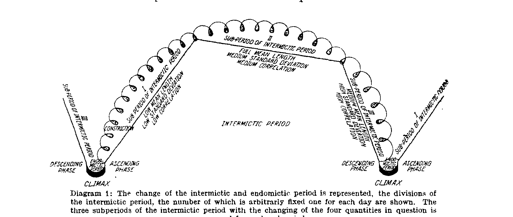

**Diagram 2.**

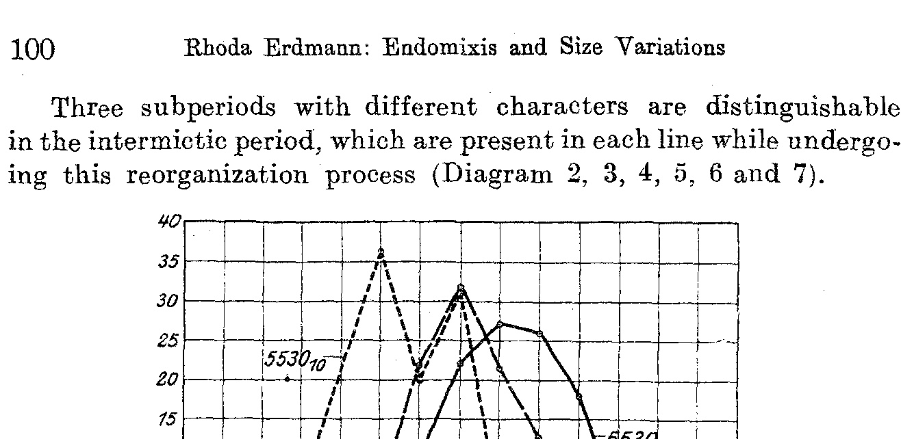

**Diagram 3.**

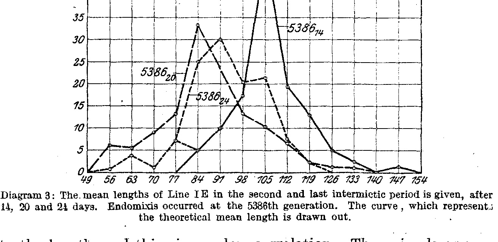

**Diagram 4.**

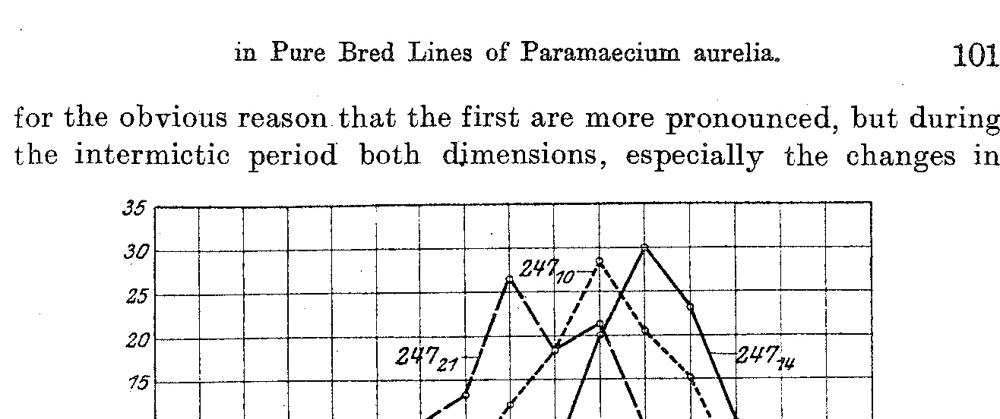

**Diagram 5.**

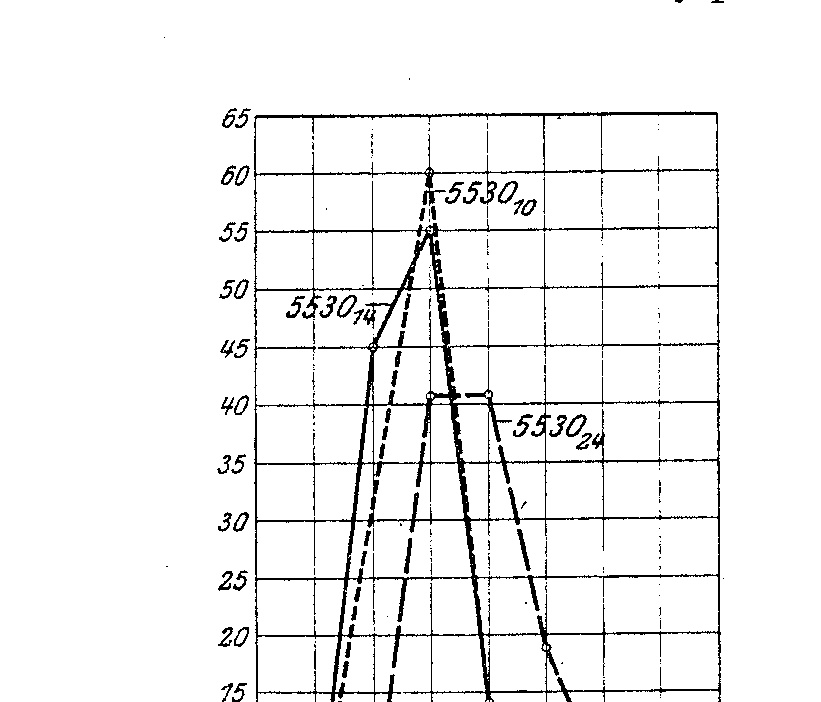

**Diagram 6.**

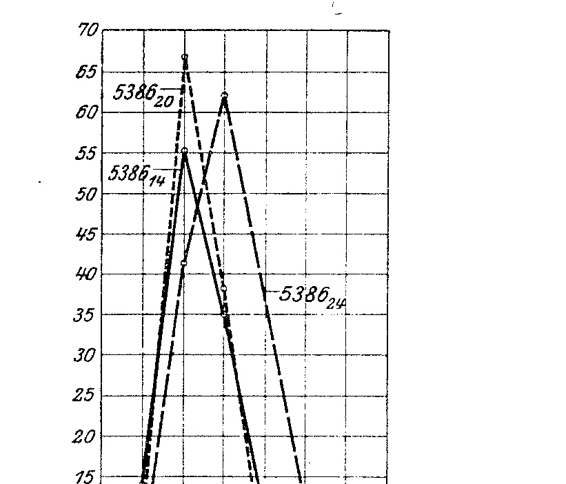

**Diagram 7.**

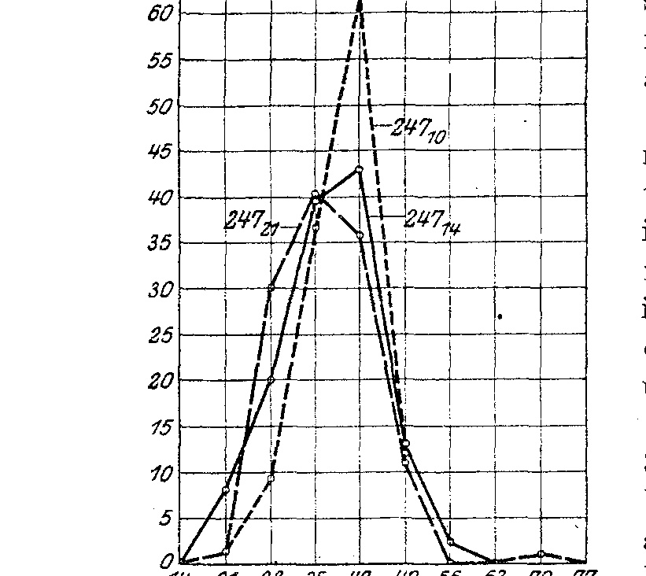

**Diagram 5 (2)**

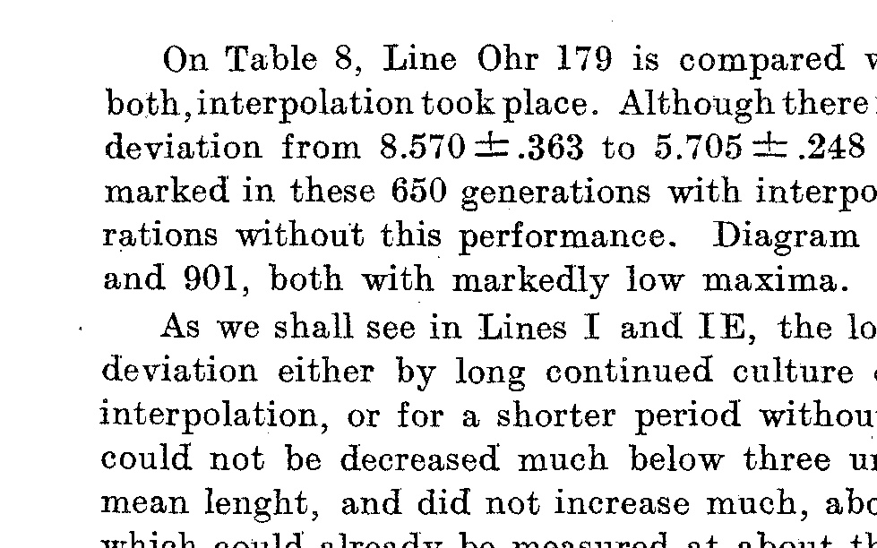

**Diagram 9.**

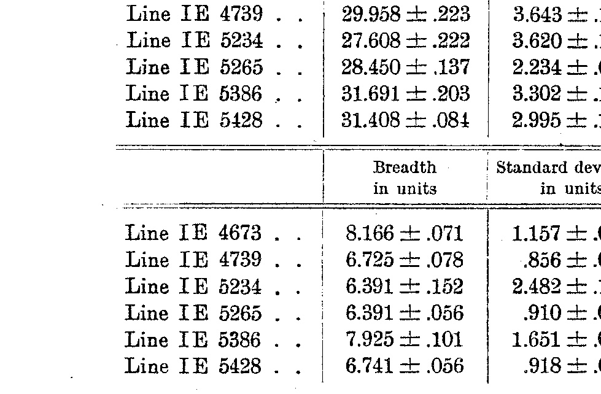

**Diagram 10.**

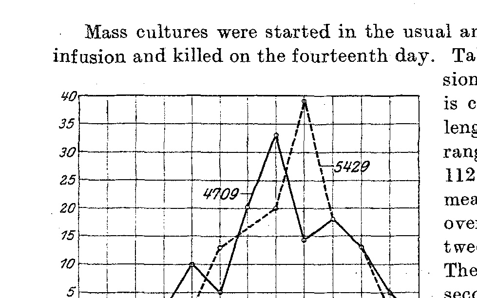

**Diagram 11.**

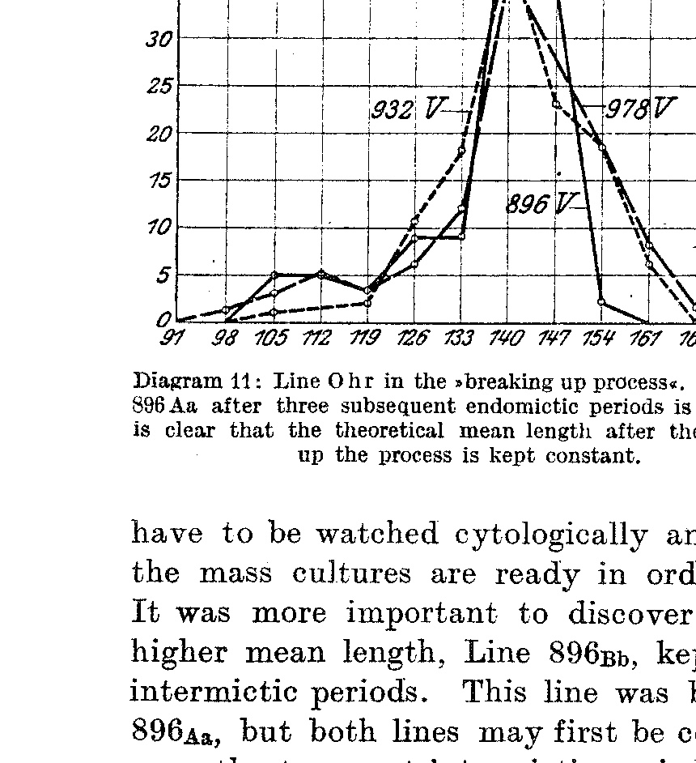

**Diagram 12.**

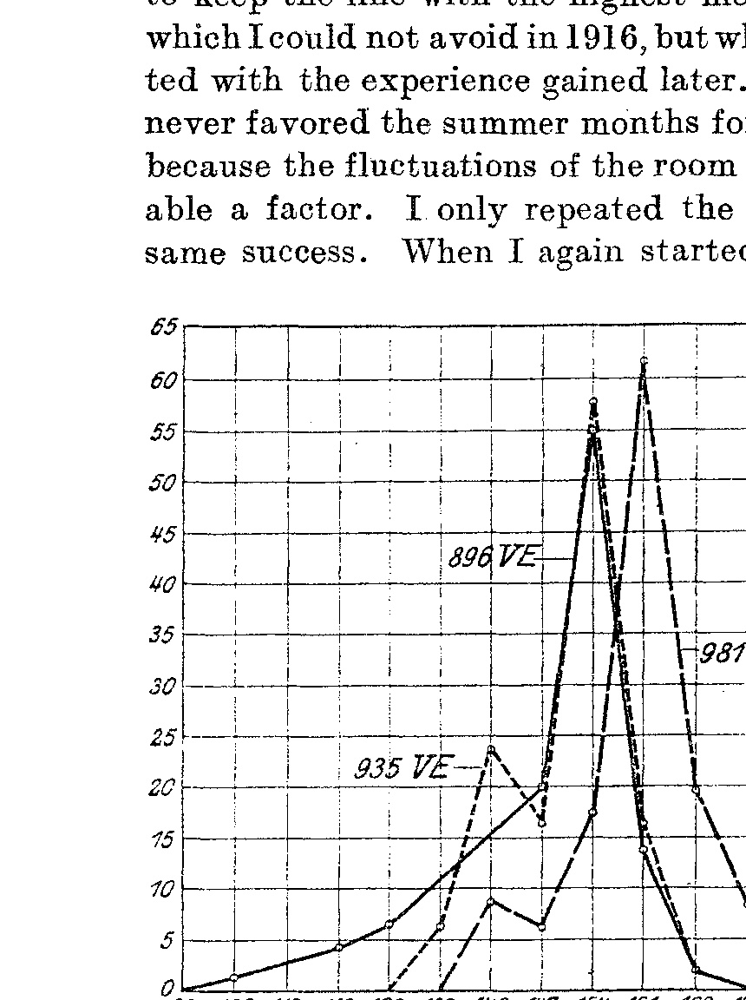
