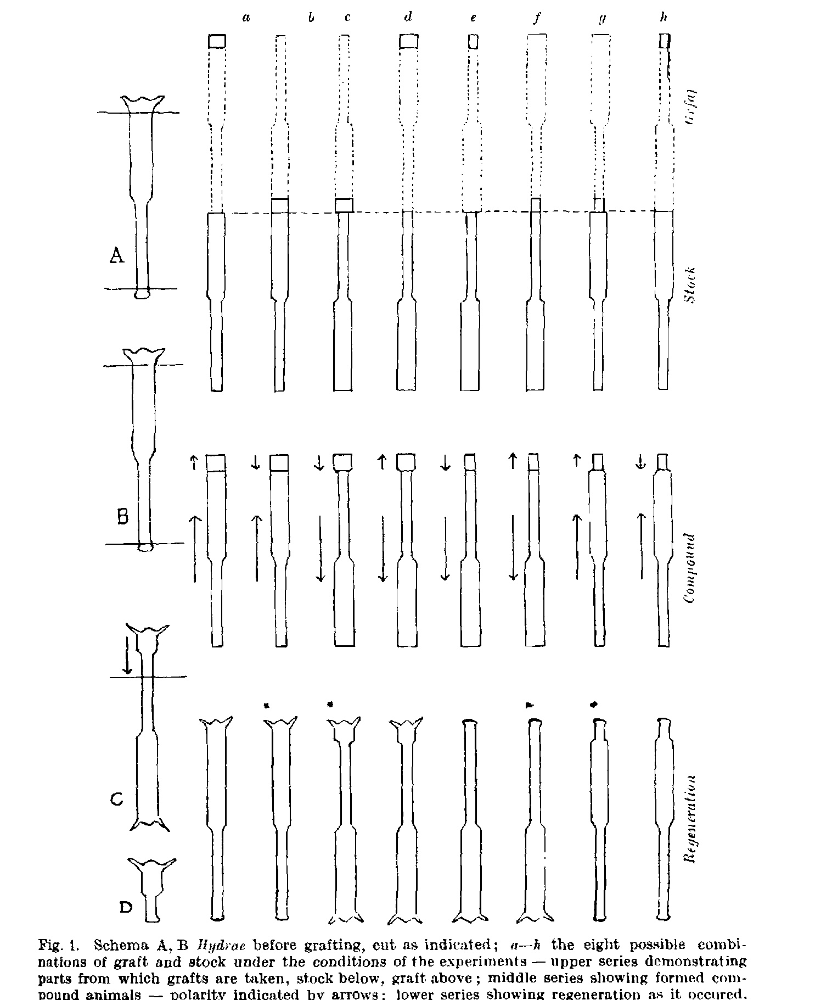
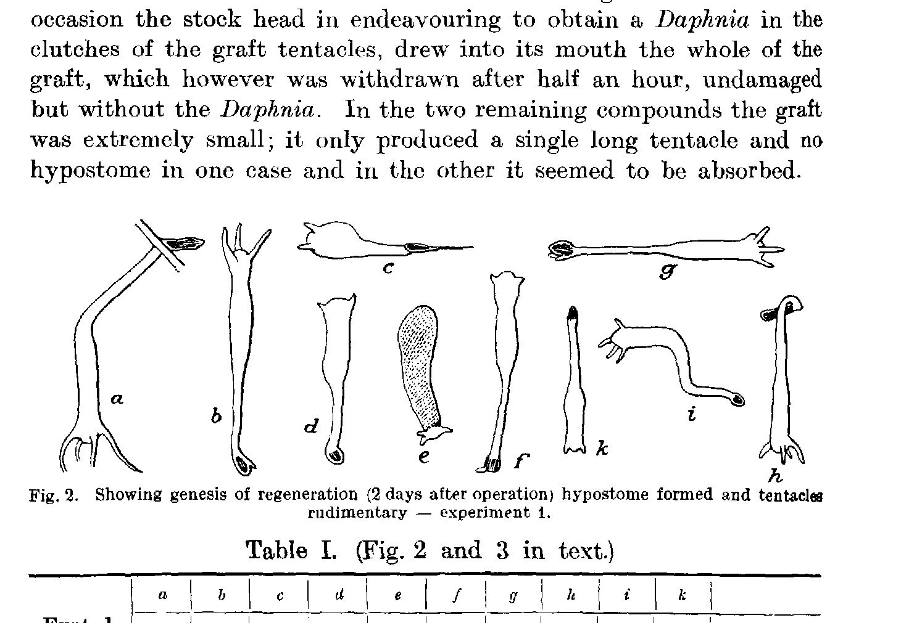
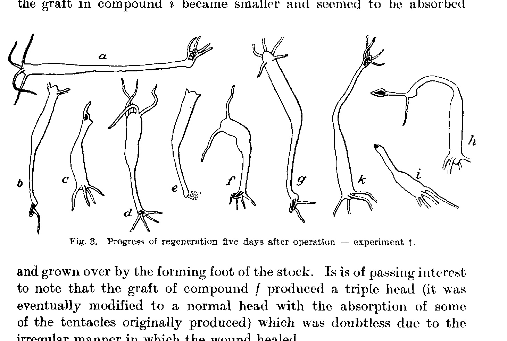
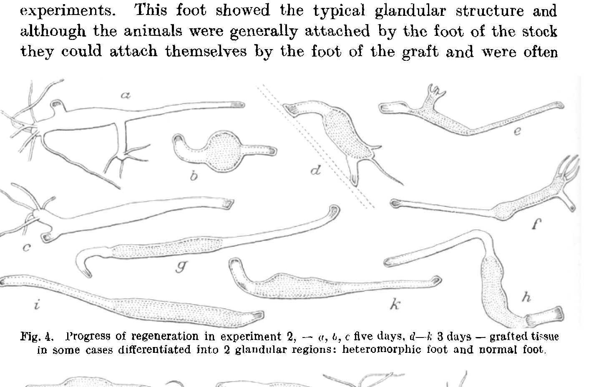
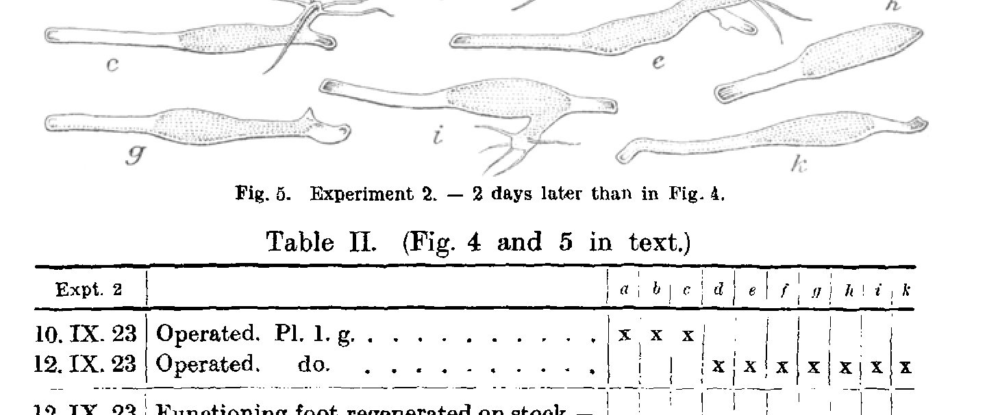
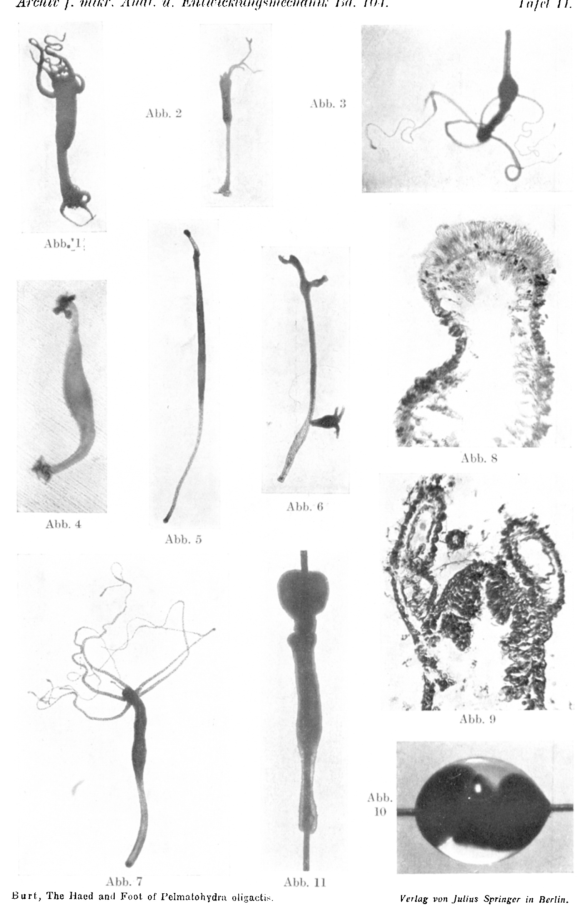

## The Head and Foot of Pelmatohydra oligactis, Pall., as unipotent Systems.

By

**D. R. R. Burt**

(St. Andrews University, Scotland).

(Aus der Biologischen Versuchsanstalt der Akademie der Wissenschaften in Wien, Zoologische Abteilung¹).)

With 5 textfigures and plate II.

*(Eingegangen am 2. August 1924.)*

*Archiv für mikroskopische Anatomie und Entwicklungsmechanik*, vol. 104 (1925).

> **Full text (English original).** This Vienna Vivarium paper was written in English; the running text of “The Head and Foot of Pelmatohydra oligactis, Pall., as Unipotent Systems” (Burt, 1925) is reproduced faithfully and complete — all tables, figure/plate legends, and footnotes — transcribed from the page images, with only obvious scan artefacts corrected.

> ¹ Preliminary account im Akademischen Anzeiger, Wien, No. 24. 22. November 1923: „Mitteilungen aus der Biologischen Versuchsanstalt der Akademie der Wissenschaften in Wien, Zoologische Abteilung, Vorstand: *H. Przibram*. Nr. 113. „Kopf und Fuß des Süßwasserpolypen, *Pelmatohydra oligactis* Pall., als unipotente Systeme" von *D. R. R. Burt*.

### Heteromorphosis in Hydra.

*The head and foot as unipotent systems.*

Heteromorphosis, or what seemed to be the replacement of a part of the body by a part of different kind in the process of regeneration has been described in *Hydra* by *Wetzel, Morgan, King, Rand, Peebles* and others. My experiments have been carried out on *Pelmatohydra oligactis*, Pallas (aliter *Hydra fusca*, Linn.), an attempt to follow the regenerative process in cases of heteromorphosis and in these cases where the regenerating tissue war distinctly head tissue or foot tissue. This species is characterized by its brown colour, the spiral arrangement of the budding zone which is confined to the aboral limit of the stomach, and the possession of about six long tentacles — the tentacles appear by pairs on the buds. It was found in abundance in the vicinity of the Biologische Versuchsanstalt in Vienna where these experiments were carried out and where I was indebted to Professor *Hans Przibram* for much helpful direction and advice.

The method of research employed was that of grafting a ring of tissue from one animal to another, grafts and stock being held together on a hair — the whisker of a rat answered the purpose admirably — by which device any error in the orientation of the pieces was obviated.

The tentacular ring and extreme aboral tip were removed in two Hydrae, and a small ring of tissue from the head or foot region of one animal was grafted on to the head or foot end of the other. As this may be done in two ways according to the direction of the polarity, that is, according as the ring is transplanted in its original sense or upside down on the same place, there are eight possible combinations of graft and stock. The ring of tissue from the head region may be grafted either to the head end or to the foot end of another animal, either in its original sense or in an inverted position; similarly a ring of tissue from the foot region may be grafted to the head end or foot end and either retain its original sense or in an inverted position (Fig. 1). These then are the eight possibilities. All eight were carried out, but the two crucial experiments are those in which a ring of tissue from the head is grafted to the foot end and those in which a ring of tissue from the foot is grafted to the head end, the polarity of graft and stock being in the same sense in both cases (Fig. 1 c and *e*). Both of these experiments were carried out in the same way. Two Hydrae, minus tentacular ring and extreme aboral tip, were impaled on a hair, both animals lying in the same direction, and the hair was lifted out of the water for about five minutes while the surface tension of the drop of water round the Hydrae kept the adjacent ends pressed together (Pl. II, Fig. 10 and 11). They were then returned to the water and after half an hour the hair could be removed, a light junction having taken place between the cut ends. In about four hours the join was sufficiently strong for one of the animals to be cut and the cut was made either immediately below or immediately above the junction. In the former case the resulting compound was a *Hydra* with a ring of tissue from the head transplanted to the foot (experiment 1), and in the latter a ring of foot tissue was transplanted to the head (experiment 2); in both cases the so-called polarities of stock and graft were in the same sense. Grafts were made as small as possible so that any influence of stock over graft should be easy and so that the grafted tissue should be restricted to the head or foot region. Owing to the fact that these experiments were performed on living animals which contracted at the slightest touch, the grafts varied in length from one eight of the total *Hydra* to one twentieth. A series of experiments with anaesthetics such as chloroform, ether, chloral hydrate and magnesium chloride of different concentrations was carried out to determine whether the animals could be anaesthetized in the extended position. These proved abortive, for the animals either remained sensitive to touch or succumbed to the treatment; hence absolute accuracy as to size of parts was impossible. Most grafts however were 0,75 mm or one twelfth to one sixteenth of the total length of the polyp, excluding the tentacles.

*Experiment 1.* In the first series, where the annulus from the head region was transplanted to the foot end (Fig. 1 c) out of ten compounds so formed eight produced heads at both ends, that is, at the normal position and at the free end, the aboral end of the graft. This was accomplished within five days (the lack of chlorophyll corpuscles which doubtless assist in the metabolism of *Hydra viridis* making the regenerative process much slower in *Pelmatohydra oligactis*). These regenerated heads functioned as normal heads, catching and killing

**Fig. 1.** Schema A, B *Hydrae* before grafting, cut as indicated; *a—h* the eight possible combinations of graft and stock under the conditions of the experiments — upper series demonstrating parts from which grafts are taken, stock below, graft above; middle series showing formed compound animals — polarity indicated by arrows; lower series showing regeneration as it occured. heteromorphic regeneration marked (\*); C, D demonstrating formation of individual with reversed polarity: experiment 3.  *(figure not reproduced)* *Daphniae* with their regenerated tentacles and drawing their prey through the regenerated hypostome of the graft into the foot of the stock.

The stock and grafted tissue retained their individuality in so far as the stock head would wrest food from the graft head. On one occasion the stock head in endeavouring to obtain a *Daphnia* in the clutches of the graft tentacles, drew into its mouth the whole of the graft, which however was withdrawn after half an hour, undamaged but without the *Daphnia*. In the two remaining compounds the graft was extremely small; it only produced a single long tentacle and no hypostome in one case and in the other it seemed to be absorbed.

**Fig. 2.** Showing genesis of regeneration (2 days after operation) hypostome formed and tentacles rudimentary — experiment 1.  *(figure not reproduced)*

### Table I. (Fig. 2 and 3 in text.)

| Expt. 1 — 7. IX. 1923 | a Stock | a Graft | b Stock | b Graft | c Stock | c Graft | d Stock | d Graft | e Stock | e Graft | f Stock | f Graft | g Stock | g Graft | h Stock | h Graft | i Stock | i Graft | k Stock | k Graft | |
|---|---|---|---|---|---|---|---|---|---|---|---|---|---|---|---|---|---|---|---|---|---|
| End of 2nd day | x | x | x | x | x | o | x | o | o | x | x | x | x | x | x | o | x | o | x | o | Hypostome |
| End of 2nd day | 4r | o | 3r | 1r | 2r | 1 | 2r | o | o | 3r | 2r | 2r | 4r | 2r | 4r | o | 4r | o | 2r | o | Tentacles |
| End of 3rd day | x | x | x | x | x | o | x | x | o | x | x | 3x | x | x | x | o | x | o | x | x | Hypostome |
| End of 3rd day | 4 | o | 3 | 1r | 4 | 1 | 3r | 3r | o | 4r | 2 | 6r | 4 | 2r | 4r | o | 4r | o | 3r | o | Tentacles |
| End of 5th day | x | x | x | x | x | o | x | x | x | | x | x | x | x | x | x | x | o | x | x | Hypostome |
| End of 5th day | 4 | 4 | 3 | 1 | 4 | 1 | 4 | 4 | 2 | | 2 | 4 | 5 | 2 | 4 | 1 | 4 | o | 4 | 4 | Tentacles |

x = present, o = absent, r = rudimentary.

The above table shows the progress of regeneration of tentacles and hypostome in graft and stock in the series of ten compounds *a—k* which constitute experiment 1. In the grafts of *a, b, d, f, g, h,* and *k*, at the end of five days the heads functioned as normal heads and although *b* and *h* each possessed only one tentacle it was capable of catching, killing and drawing *Daphniae* into the mouth. The compound *e* was sickly, lethargic, and slow to react to touch, and although the graft had regenerated hypostome and four rudimentary tentacles by the end of the third day — which head functioned on the fourth day — at the end of the fifth day whole of the graft had died and disintegrated. The stock in this case was slower to regenerate a new head than the graft, but by the end of the eighth day it was a normal healthy *Hydra* with five tentacles. The two cases which did not regenerate functioning heads were *c* and *i*; the graft in compound *c* thinned out into a long thin tapering tentacle, thick at the point of attachment, with no semblance of a hypostome and almost as long as the complete stock; while the graft in compound *i* became smaller and seemed to be absorbed

**Fig. 3.** Progress of regeneration five days after operation — experiment 1.  *(figure not reproduced)*

and grown over by the forming foot of the stock. Is is of passing interest to note that the graft of compound *f* produced a triple head (it was eventually modified to a normal head with the absorption of some of the tentacles originally produced) which was doubtless due to the irregular manner in which the wound healed.

In all these cases where a head regenerated it was formed on the aboral end of the head annulus, that is, in the opposite direction to that in which it would normally be formed. But, as the transplanted annulus was so small and so near the tentacular ring the regenerated head can be regarded as being formed solely from head tissue. The subsequent history of graft and stock, their separation or absorption, does not concern us here, nor do we distinguish between the two processes — true regeneration by growth and morpholaxis, the significance of these results being the formation of a head on the aboral end of an annulus taken from the head region, an apparent reversal of polarity.

*Experiment 2.* In this series a ring of tissue from the foot region (after the removal of the extreme aboral tip) was grafted to the head end of another *Hydra;* and in these the free end of the graft, that is, the distal end of the foot tissue, produced a foot in everyone of the ten experiments. This foot showed the typical glandular structure and although the animals were generally attached by the foot of the stock they could attach themselves by the foot of the graft and were often

**Fig. 4.** Progress of regeneration in experiment 2, — *a, b, c* five days, *d—k* 3 days — grafted tissue in some cases differentiated into 2 glandular regions: heteromorphic foot and normal foot.  *(figure not reproduced)*

**Fig. 5.** Experiment 2. — 2 days later than in Fig. 4.  *(figure not reproduced)*

### Table II. (Fig. 4 and 5 in text.)

| Expt. 2 | | a | b | c | d | e | f | g | h | i | k |
|---|---|---|---|---|---|---|---|---|---|---|---|
| 10. IX. 23 | Operated. Pl. 1. g. | x | x | x | | | | | | | |
| 12. IX. 23 | Operated. do. | | | | x | x | x | x | x | x | x |
| 12. IX. 23 | Functioning foot regenerated on stock — attached | x | x | x | | | | | | | |
| | Functioning foot regenerated on graft | x | x | x | | | | | | | |
| 14. IX. 23 | Functioning foot regenerated on stock — attached | x | x | x | x | x | x | x | x | x | x |
| | Functioning foot regenerated on graft | x | x | x | x | x | x | x | x | x | x |
| 15. IX. 23 | Head regenerated on stock near junction of graft and stock | x | | x | x | x | x | | | | |
| | Foot tissue regenerated on graft near junction | | | | | x | | x | x | | x | attached by both feet. That a foot is indeed formed and that the free end of the graft is not merely the closed in and rounded off surface is thus easily seen. The adhesive nature of the foot can be demonstrated by touching it with a needle to which it will attach itself, and particles of organic matter or grit may often be seen attached to the foot (Pl. II, Fig. 4). This property is only shown by the foot and tentacles in *Hydra*, but the foot is glandular in structure and microscopical sections exhibit the glandular structure of the regenerated part (Pl. II, Fig. 8).

In fifty per cent of the cases a new head was produced also from the stock at or near the join of graft and stock, after which, in some cases a constriction appeared between graft and stock and the graft was thrown off. But this does not invalidate the result, for in no case was a head produced on foot tissue. This inherent tendency in *Hydra* to resume the normal form when mutilated has been noted by many workers. In the five cases where no head was produced on the stock after seven days, the compounds having no access to food, became daily smaller.

*Experiment 3.* In this series three compounds were formed by transplanting a ring of tissue from the head to the foot end in the manner described in experiment 1. In these, so soon as the new head regenerated a cut was made through the foot region of the stock close to the junction of the stock and graft (Fig. 1, *C* and *D*). Thus there were formed three minute compounds, consisting of head tissue and foot tissue grafted together, the so-called polarity of the individual thus formed being inverted. In these a foot was formed on the free end of the foot tissue, the compound having every resemblance to a perfect but minute *Hydra* (Pl. II, Fig. 3).

*Experiment 4.* In this series three compounds were formed by transplanting a ring of tissue from the head to the foot end so that the directions of graft and stock were in the opposite sense. This was accomplished by impaling a *Hydra* minus tentacular ring and extreme aboral tip, on a hair, cutting an annulus from the head region and removing the remainder of the *Hydra* from the hair. Another *Hydra* minus tentacular ring and extreme aboral tip was then impaled on the same hair so that the foot region approximated the aboral end of the head annulus. As might be expected the head tissue produced a new head with tentacles. So soon as a head had formed, which occured in all three cases, the compound was divided through the foot region of the stock close to the junction, and a head was regenerated on the foot tissue on its free or oral end. The result in each case was a compound to all intents and purposes a normal but minute *Hydra* although the so-called polarity of the head part was normal and that of the foot part reversed.

*Experiments 5 and 6.* The other cases in which heteromorphic heads and feet may be formed are: a) when a ring of tissue from the head region of one *Hydra* is transplanted to the head end of another in an inverted position (Fig. 1, b) and b) when a ring of tissue from the foot region is transplanted to the foot end of another animal in an inverted position (Fig. 1, f). Five compounds were formed in each experiment and the results are in accordance with those of experiments 1 and 2 for heteromorphic heads were produced on the aboral ends of the head annuli in experiment 5 and heteromorphic feet on the oral ends of the foot annuli in experiment 6. These results are not so striking since the regenerated animal has all the appearance of a normal one.

*Experiments 7, 8, 9 and 10.* The remaining four possible combinations of graft and stock are those shown on Fig. 1 *a, d, e* and *h*, where the free ends of the grafted head annuli are oral and the free ends of the grafted foot annuli are aboral. In each of the four experiments three compounds were formed and no heteromorphic structures obtained, head and foot tissue forming heads and feet in the normal direction.

*Experiment 11.* To find whether head and foot when removed from *Pelmatohydra oligactis* would form complete individuals, *Hydrae* were cut each into five parts. The first cut was made just behind the tentacles, the second just above the budding zone, the third below the budding region and the fourth just above the foot. These series were lettered *A, B, C, D* and *E,* from head to foot and ten animals were cut up.

In series *A* the wound healed within a few hours; no new tentacles were formed on the aboral surface and no new foot was formed. Food taken in through the hypostome was always rejected in a dead but undigested state, and, although the heads might be swollen by many *Daphniae* there did not seem to be any increase in bulk of tissue. It may be that the head region possesses no digestive cells, but so far we have no farther evidence of this being the case. These heads eventually died after a fortnight, without the formation of a foot.

In series *E,* the cut end rounded off and a distinct foot was formed in this position. These parts, closed in at either end by a foot, grew samaller daily, and within twelve days some had died while the rest were reduced to small balls of cells.

Heads were formed in series *B* and feet in series *D* with equal rapidity, both regenerations being accomplished in about three days; while a few specimens in *B* only became attached by a regenerated foot after eight days when heads in *D* were beginning to form.

Heads and feet were formed in series *C* with equal rapidity.

### Table III.

|                                              | *A* | *B* | *C* | *D* | *E* |
|----------------------------------------------|-----|-----|-----|-----|-----|
| Hypostome formed — time in days              | —   | 1   | 2   | 8   |     |
| Tentacles regenerated — time in days         | —   | 2   | 3   | 10  |     |
| Functioning feet regenerated — time in days  |     | 8   | 3   | 2   | *1  |

> \* The regenerated feet in series *E* were heteromorphic.

From these results we conclude that in the annulus taken from near the head of the original *Hydra* regeneration of a head was the easier or at least the quicker operation, while regeneration of a foot was the quicker in an annulus taken from near the posterior end.

## Theoretical Considerations.

In 1891 *Jacques Loeb* studying regeneration in the hydroid *Tubularia,* discovered that an isolated stalk, without proximal or distal ends, might develop a hydranth at either end. He coined the word *heteromorphosis* to desbribe this order of phenomena, and he defines his term thus: „die Erscheinung, daß bei einem Tier an der Stelle eines Organs ein nach Form und Lebenserscheinungen typisch anderes Organ wächst" — in other words, the replacement of a part of the body by a part of different kind. At the outset *Loeb* demonstrated that external conditions determined these heteromorphic structures. In other words, the stimulus of touch caused the foot to form, while if one end of a piece of stalk were fixed in an upright position in the sand, the other end, the free end, whether originally proximal or distal, formed a hydranth. *Snyder* found that a larger percentage of distal pieces produced heteromorphic heads if they were developed in sea water diluted to 50% with distilled water. Unfortunately a number of experiments on *Tubularia* by different workers supply no data concerning the region in the complete animal where the cuts were made, and so no deductions can be made from these regarding the internal factors governing heteromorphosis.

We find heteromorphosis first described in *Hydra* by *Wetzel.* He joined two *Hydrae* together by their aboral ends, and after cutting one of them he observed two processes grow out from the cut end of the compound; he said that these processes finally became a foot by which the polyp was attached to a water plant.

*Rand* obtained a case of heteromorphosis by grafting a *Hydra* by the aboral end on to the side of another *Hydra.* After removing three quarters of the graft a distinct foot with glandular cells developed at the cut surface of the graft. The compound was attached by both feet and the graft foot was eventually absorbed. Since there was a possibility of a foot being produced heteromorphically, *Rand* tried to fix *Hydrae* in an inverted position having removed the head end and the foot end. He did not produce heteromorphosis by this method, nor did *Peebles* who employed a different technique in the same operation.

*Peebles* eventually obtained heteromorphic heads through grafting in the following way. When two bodies of *Hydra grisea* or *Hydra fusca* (*Pelmatohydra oligactis, Pallas*) are united by their aboral surfaces, after the removal of the foot ends, and a second cut is made through one of the components, leaving an oral surface exposed, this oral surface may become attached. A new head usually appears at the cut surface. If two individuals of *Hydra grisea* or *Hydra fusca* are united at their oral ends, after the removal of the heads, a new head develops at the line of union and the two *Hydrae* merge into one. If, after the union of the two individuals, a cut is made in one component close to the line of union, a new head may form on the aboral surface of the small piece. It is here that we have a clue to the conditions governing heteromorphosis: if the graft be small a heteromorphic head develops on the cut aboral surface of head tissue, but if the graft be larger the exposed end is no longer head tissue and forms a foot. *King,* on performing these experiments and getting precisely similar results, concluded that the larger piece of the compound (the stock) influenced the small piece (the graft) causing the polarity of it to be reversed. If Miss *King* had transplanted head to foot and foot to head she would have found her hypothesis untenable.

Theories regarding regeneration and heteromorphosis are many and varied. *Driesch* classifies the phenomena of secondary differentiation as exhibited by *Hydra* and *Planaria* as being that of an equipotential system. *Morgan,* on the other hand, regards *Hydra* and *Planaria* as being fundamentally different, for he finds in grafting experiments that the larger piece *causes* heteromorphosis or reversal in polarity in the smaller. Furthermore, according to *Lang* and *Jordan-Lloyd* the formation of heteromorphic heads in *Planaria* depends on the relation of the cut to the nervous system, while in *Hydra* the nervous system is diffuse.

The term heteromorphosis has been specifically used by *Loeb* for cases in which, after injury to an animal, growth or regeneration gives rise to a part which is out of character and harmony with the place where it appears: as, for instance, where a mouth appears on the side wall of a sea-anemone or when a head appears a the lower end of a divided *Tubularia.* The term would be strictly applicable, *a fortiori* to such a case as the replacement of an amputated antenna in an insect by a walking-limb. But when we graft one *Hydra* on to the end of another, and afterwards cut the compound animal across and wait for regeneration, what are we to expect? What shall we call a normal and what an abnormal development? What shall we call *heteromorphosis* and what *orthomorphosis*? If the end of the grafted tissue of our *Hydra* produces (after section) a new mouth, that seems just as int should be, a mouth at one end and a foot at the other. But, if the part of the grafted or compound *Hydra* where we have made our section be that part which was foot in the anterior grafted individual, then it does not produce a new head, but produces a foot: and again, from another point of view, this is just what we might say 'it ought to do'.

But before questioning *Loeb's* use of his own word, let us look again at the definition which he employs: — „Ein nach Form und Lebenserscheinungen typisch anderes Organ". It seems clearly to follow from this that we are meant to judge of what the part ought to do, or ought to be, only from the general form and relations of the organism; a head *ought* to appear at that end of the mutilated *Hydra* which is opposite to the original foot. When it does not do so, but a second foot arises instead, we have every right to call this a case of *heteromorphosis,* or more strictly *polar heteromorphosis.* And we do not misuse the term, on the contrary we *explain the phenomenon,* when we recognize that this production of a part out of harmony with its present position, is in full harmony with the nature and origin of the part or tissue which is actually and directly producing it.

### Summary.

The head and foot of *Pelmatohydra oligactis* function in regeneration as unipotent systems. The exact extent of the unipotent tissue immediately posterior to the tentacles and anterior to the foot is not determined in these experiments. The intermediate tissue is pluripotent.

The potentiality for head formation is stronger at the oral end and decreases towards the aboral end as the potentiality for foot formation increases.

In these grafting experiments the stock has no influence over the graft which retains its individuality.

### Zusammenfassung.

Der tentakuläre Ring und das äußerste aborale Ende wurden an *Pelmatohydra oligactis* Pall. entfernt und ein schmaler Ring von Gewebe vom Kopfe oder Fuße eines Tieres wurde auf den Kopf oder den Fuß eines anderen transplantiert. Da dies in zweierlei Weise gemacht werden kann (je nach der Richtung der Polarität), gibt es acht mögliche Kombinationen von Pfropfstamm und Pfropfreis. Die zwei wichtigsten Serien von Versuchen sind jene, in welchen ein Gewebering vom Kopfe auf die Fußregion, und jene, in welchen ein Gewebering vom Fuße auf die Kopfregion gepfropft wird, wobei die Polarität jedesmal in beiden

> 28\* Komponenten in gleichem Sinne läuft (so daß eine Verstärkung der Reispolarität durch die Stockpolarität zu erwarten wäre, falls diese einen richtenden Einfluß auf das aufgepropfte kleinere Stück auszuüben imstande wäre). Die Pfropfreiser wurden so klein als möglich gemacht, damit ein etwaiger Einfluß des Stammes auf das Reis leicht ausgeübt werden könnte, und so waren die transplantierten Gewebe auf die Kopf-oder auf die Fußregion allein beschränkt. Die meisten Pfropfreiser maßen in ausgestrecktem Zustande um 0,75 mm, das ist ungefähr ¹/₁₆ bis ¹/₁₂ der Gesamtlänge der *Hydra.* In neun Fällen aus zehn produzierte das transplantierte Kopfgewebe einen Kopf am freien Ende (das seiner aboralen Schnittfläche und dem zum Fußende des Stammes entsprach; in keinem Falle einen Fuß). Die Köpfe funktionierten, indem sie Wasserflöhe, *Daphnia,* mit dem regenerierten Tentakeln fingen und töteten, sie in den Fußteil des Pfropfstammes hineinziehend. Pfropfreis und Pfropfstamm behielten ihre Individualität insofern, als der Kopf des Pfropfstammes Beute dem Kopfe des Pfropfreises entriß. Die auf den Kopf transplantierten Ringe aus der Fußregion regenerierten nach vorne einen Fuß (der also ihrer oralen Schnittfläche und dem Kopfende des Stammes entsprach). Die regenerierten Füße zeigten die typischen drüsigen Strukturen der Festsetzungsorgane und funktionierten als solche. Um zu sehen, ob Kopf und Fuß, von der *Pelmatohydra oligactis* entfernt, vollständige Exemplare bilden würden, wurden Polypen, jeder in fünf Teile durch Querschnitte, zerteilt. Der erste Schnitt wurde gerade unterhalb des Tentakelringes gemacht; der zweite oberhalb der Knospungszone; der dritte war unterhalb der Knospungszone und der vierte gerade ober dem Fuße. Diese Serien wurden mit *A, B, C, D* und *E* bezeichnet (so daß *A* die vorderste, *D* die hinterste dieser Querzonen bedeutet). In Serie *A* heilte die Wunde in wenigen Stunden. Es wurden keine neuen Tentakel gebildet. Zur Bildung eines Fußes kam es nicht. Die durch das Hypostom aufgenommene Nahrung wurde stets in getötetem, aber unverdautem Zustande ausgespieen, und, obzwar die Köpfe durch mehrere Daphnien angeschwollen erschienen, war kein Zunahme der Gewebe bemerkbar. In Serie *E* rundete sich die Schnittfläche ab und schien einen Fuß zu bilden. Kopf wurde keiner gebildet. Die Teile verkleinerten sich täglich und nach 14 Tagen, als sie die Form einer kleinen, runden Masse von Außalzellen angenommen hatten, starben sie. Was die Serien *B,* bezw. *D,* anbelangt, so wurden dort Köpfe mit gleicher Geschwindigkeit wie hier Füße gebildet, die innerhalb zweier Tage ihre Funktion aufnahmen. Andererseits hefteten sich *B* erst nach 8 Tagen fest, zu welcher Zeit funktionierende Köpfe in *D* erscheinen wurden. In Serie *C* wurden Köpfe und Füße mit gleicher Geschwindigkeit gebildet, etwas langsamer als die ersteren in *B* und die letzteren in *D.* Schlußfolgerung: Kopf und Fuß der *Pelmatohydra oligactis* Pall. müssen als unipotente Systeme angesehen werden, während das zwischenliegende Gewebe pluripotent ist. In dem zwischenliegenden Gewebe ist die Fähigkeit zur Kopfbildung stärker am oralen Ende und nimmt in dem Maße gegen das aborale Ende zu ab, wie die Fähigkeit zur Fußbildung zunimmt.

### Literature.

*Driesch, Hans:* Über ein neues harmonisch-äquipotentielles System und über solche Systeme überhaupt. Arch. f. Entwicklungsmech. d. Organismen 14, 227. 1902. — *Jordan-Lloyd, Dr.:* The influence of the position of the cut upon regeneration in *Gunda ulvae.* Proc. of the roy. soc. of med. 87, No. 596, p. 355. 1914. — *King, Helen D.:* Further Studies on Regeneration in *Hydra viridis.* Arch. f. Entwicklungsmech. d. Organismen 16, 200. 1903. — *Lang, Paul:* Über Regeneration bei Planarien. Arch. f. mikroskopische Anatomie. 79, 1. 1912. — The same: Experimentelle und histologische Studien an Turbellarien. Ibid. 82, 3. 1913. — *Loeb, Jacques:* Untersuchungen zur physiologischen Morphologie der Tiere. I u. II. Würzburg 1891/92. — *Morgan, Thomas, H.:* Experimental Studies of the Regeneration of *Planaria maculata.* Arch. f. Entwicklungsmech. d. Organismen 7, 364. 1898. — The same: Regeneration in Planarians. Ibid. 10, 58. 1900. — The same: Control of Heteromorphosis in *Planaria maculata.* Ibid. 17, 683. 1904. — *Peebles, Florence:* Experimental Studies in *Hydra.* Arch. f. Entwicklungsmech. d. Organismen. 5, 794. 1897. — The same: Experiments in Regeneration and in Grafting of Hydrozoa. Ibid. 10, 435. 1900. — *Rand, Herbert W.:* Regeneration and Regulation in *Hydra viridis.* Ibid. 8, 1. 1898. — The same: Regulation of Graft abnormalities in *Hydra.* Ibid. 9, 161. 1899. — *Snyder, Charles D.:* The Effects of Distilled Water on Heteromorphosis in a Tubularian Hydroid, *T. crocea.* Ibid. 19, 1. 1906. — *Wetzel, G.:* Transplantationsversuche mit *Hydra.* Arch. f. mikroskop. Anat. 45, 273. 1895 u. 53, 70. 1898.

### Explanation of Plate II.

No. 1. *Hydra* from experiment 1 — showing normal head on stock and heteromorphic head on graft — contracted.

No. 2. Do. — extended.

No. 3. Individual from expt. 3 with polarity reversed — formed by grafting.

No. 4. *Hydra* from expt. 2 — showing particles attached to normal and heteromorphic feet — contracted.

No. 5. Do. — extended.

No. 6. Do. — showing side bud, regenerating hypostome and tentacles on stock (at junction of stock and graft), and grafted foot tissue with heteromorphic foot (seen in figure to right of upper end).

No. 7. Normal *Hydra* (*Pelmatohydra oligactis* Pall.)

No. 8. Section of regenerated heteromorphic foot showing typical glandular cells. (Stained with thionin.)

No. 9. Section of regenerated head with hypostome and tentacles, — ectoderm cells non glandular, nematocysts visible. (Stained with haematoxylin.)

No. 10. Operated *Hydrae* impaled on hair and held together in drop of water.

No. 11. *Hydrae* on hair returned to water, anterior animal contracted.

**Tafel II.**

*Archiv f. mikr. Anat. u. Entwicklungsmechanik. Bd. 101.*

**Abb. 2.** *(figure not reproduced)*

**Abb. 3.** *(figure not reproduced)*

**Abb. 1.** *(figure not reproduced)*

**Abb. 4.** *(figure not reproduced)*

**Abb. 5.** *(figure not reproduced)*

**Abb. 6.** *(figure not reproduced)*

**Abb. 8.** *(figure not reproduced)*

**Abb. 7.** *(figure not reproduced)*

**Abb. 11.** *(figure not reproduced)*

**Abb. 9.** *(figure not reproduced)*

**Abb. 10.** *(figure not reproduced)*

*Burt, The Head and Foot of Pelmatohydra oligactis.*

*Verlag von Julius Springer in Berlin.*

---

*Editorial note.* The original is in English; this is a faithful transcription, not a translation. Claims are reproduced as stated, not endorsed.

## Figures

**Fig. 1.**

**Fig. 2.**

**Fig. 3.**

**Fig. 4.**

**Fig. 5.**

**Plate II.**

