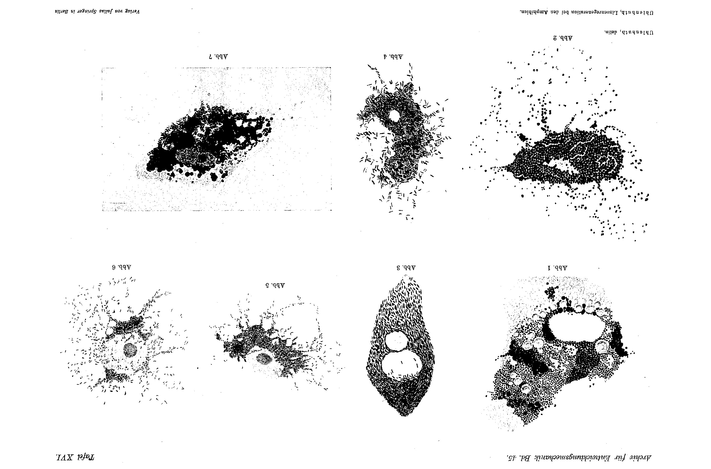
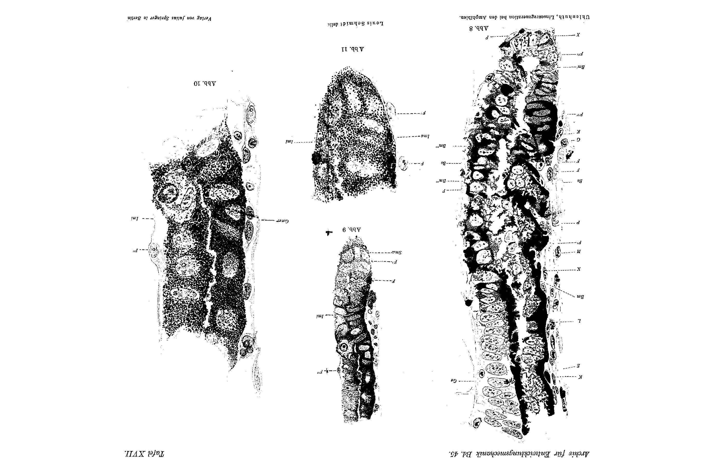
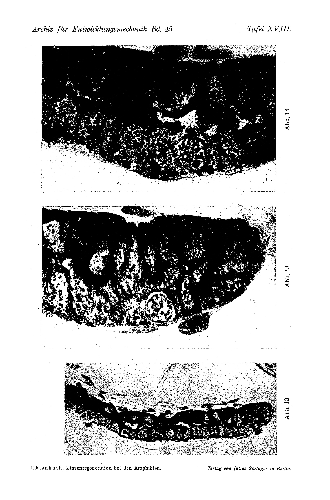
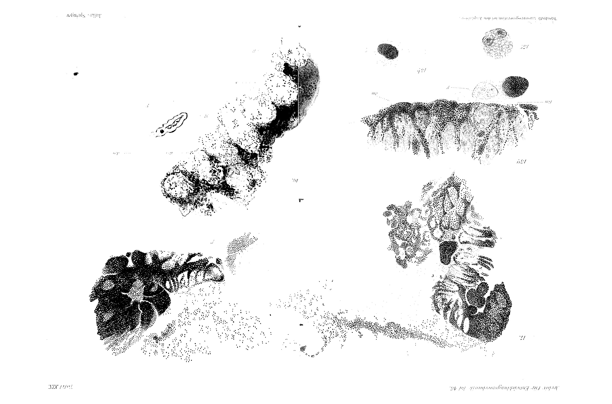
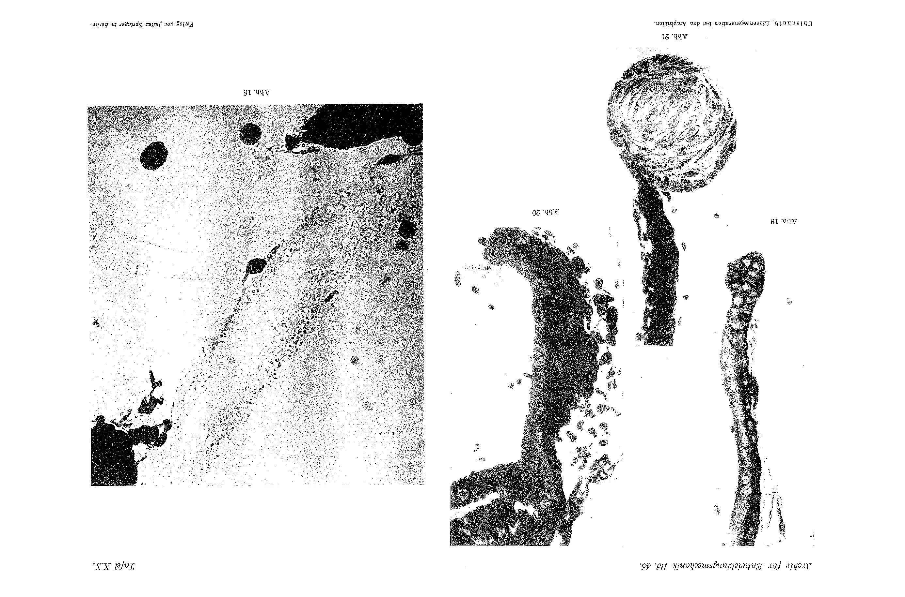
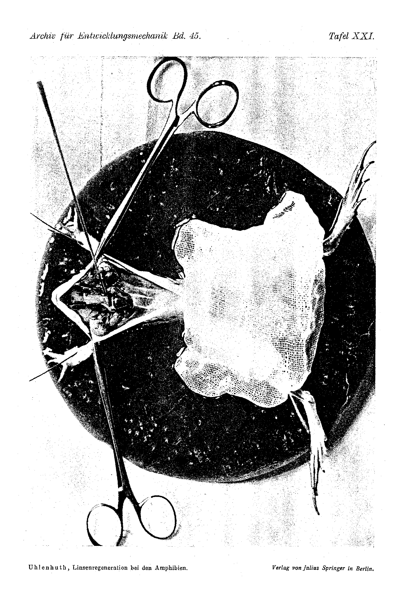

# Studies on Lens Regeneration in the Amphibians.

## I. A Contribution to the Depigmentation of the Iris, with Remarks on the Value of Stimulus-Physiology.

By

Dr. Eduard Uhlenhuth.

(From the Biological Experimental Institute of the Imperial Academy of Sciences in Vienna and from the "Rockefeller Institute for Medical Research" in New York.)

With Plates XVI to XXI.

*(Received on 17 December 1916.)¹*

*Archiv für Entwicklungsmechanik der Organismen*, vol. 45 (1919).

> **Full translation.** A complete English rendering of the running text of “Studies on Lens Regeneration in the Amphibians. I. A Contribution to the Depigmentation of the Iris, with Remarks on the Value of Stimulus-Physiology” (Eduard Uhlenhuth, 1919), including all tables, figure and plate legends, and footnotes. Numbers and table cells were transcribed from the page images, not the noisy OCR.

### Table of Contents.

| | Page |
|---|---|
| I. Introduction | 499–503 |
| II. The Facts | 503–539 |
| &nbsp;&nbsp;A. Depigmentation of isolated fragments and cells of the iris and of the pigment epithelium as a consequence of the influence of media whose consistency is a fluid one | 504–518 |
| &nbsp;&nbsp;&nbsp;&nbsp;1. Method | 504–509 |
| &nbsp;&nbsp;&nbsp;&nbsp;2. The isolated fragments of the iris of *Rana pipiens* | 509–511 |
| &nbsp;&nbsp;&nbsp;&nbsp;3. The isolated pigment cells of the pigment epithelium and of the iris of *Rana pipiens* | 511–517 |
| &nbsp;&nbsp;&nbsp;&nbsp;4. Summary | 517–518 |
| &nbsp;&nbsp;B. The membranous iris sac | 518–535 |
| &nbsp;&nbsp;&nbsp;&nbsp;1. Material and method | 519–521 |
| &nbsp;&nbsp;&nbsp;&nbsp;2. The observational facts | 521–534 |
| &nbsp;&nbsp;&nbsp;&nbsp;3. Summary | 534–535 |
| &nbsp;&nbsp;C. Free pigment in the humor aqueus | 535–539 |
| &nbsp;&nbsp;&nbsp;&nbsp;1. In microscopic sections | 535–538 |
| &nbsp;&nbsp;&nbsp;&nbsp;2. On direct examination of the eye fluid | 538–539 |
| III. Historical and critical remarks | 539–564 |
| &nbsp;&nbsp;A. On the depigmentation process | 539–545 |
| &nbsp;&nbsp;B. On the iris membrane and its significance for the depigmentation process | 545–563 |
| &nbsp;&nbsp;C. On the "iris cleft" | 563–564 |
| IV. Summary | 564–566 |
| V. List of literature | 566–567 |
| VI. Explanation of plates | 568–570 |

> ¹ Delayed on account of the war and printed without the author's proof correction. R o u x.

The occasion for the publication of this series of studies is a number of experiments which I have carried out on the eyes of *Salamandra maculosa* and of *Rana pipiens*. In the experiments on *Salamandra* the matter concerns larval eyes which, with the aid of transplantation, were inverted and some time thereafter deprived of their lens. For each transplanted eye there served as control a normal eye and an eye that, like the transplanted one, was deprived of its lens but at its normal site — a vitreous eye of the host animal. These experiments were originally undertaken in order to study the relation of lens regeneration to the force of gravity. Of this, however, there is to be no question at all in this first study; rather only that part of it is to be discussed here which concerns the lens extirpation carried out in the iris. The experiments carried out on *Rana pipiens*, the leopard frog, are explantations of iris and tapetum, by which the abovementioned lens-extirpation experiments were controlled and supplemented.

The transplantation experiments were begun already in the autumn of the year 1913 in the biological experimental institute in Vienna, and already at that time some of the 13 preparations which this series ultimately furnishes were finished and examined. The remaining 38 transplantations were carried out in the spring of 1915 at the Rockefeller Institute, while the iris explantations were undertaken in the autumn and winter of 1915/16, likewise at the Rockefeller Institute.

I should not like here to fail to express to Herr Professor Hans Przibram my thanks for the interest which he at that time bestowed upon my work. Quite especially I owe thanks also to Herr Professor Jacques Loeb for the lively interest which he took in my experiments, through which he, by his abundant suggestions, by the directions which he gave me from time to time during my work, and not least through the personal discussions which I was permitted to have with him, understood so well how to illuminate the significance of my experiments and to guide their further elaboration into the most fruitful paths.

## I. Introduction.

Hardly any other organ has made it so clear to us that, in the process of organ regeneration, we must keep apart two quite essentially different processes — processes that to a certain degree are even independent of one another — as precisely the lens. These two processes are "cell proliferation" and the formation of the form of the organ in question. The cell proliferation in the mother-soil of the removed organ furnishes a cell material which either consists of indifferent cells or else is composed of elements that more or less resemble those of the mother-soil. In the case of lens regeneration these relations are as follows: After the extirpation of the lens, the cells of the epithelial part of the iris begin to proliferate over the whole iris margin, after they have been made like the cells of the peripheral unpigmented part of the inner epithelial leaflet of the iris. These cells are, however, by no means indifferent or embryonic cells; rather they show clearly the characters of the fully differentiated unpigmented iris cell. *Fischel¹* has already drawn attention to this, so that I can spare myself further remarks here.

Through the cell proliferation, however, nothing more than a mass of cells is created, which in most cases still has no similarity to the organ that is to be regenerated. Only through the now setting-in formative processes — which in truth, as a rule, run their course simultaneously with the cell proliferation — is the form of the organ that is to be newly built up produced, and indeed both its gross anatomical and its finer structural form.

If I said earlier that both processes, cell proliferation and form-formation, are independent of one another up to a certain degree, this is really correct only in a virtual sense, insofar as there actually are cases in which only one of these two processes occurs. Pure cell proliferation without form-formation will be possible only where, through the cell proliferation, no form-forming factors are created, as in the cell multiplication in a physically and chemically thoroughly uniform culture medium. Likewise there is, of course, form-formation without cell proliferation, or even the very common phenomenon in the formation of the finer structures, whose cause is precisely the deposition of chemical residues in a resting cell².

In regeneration, however, there exists between the two processes an intimate relation which becomes clear precisely only through separate investigation of both phenomena. In the first place, the formation of the form can take place only when a substantial foundation has been created for it, and a form-formation during regeneration is therefore not possible any sooner than until a corresponding material has been created through the cell proliferation. Much more important still is the circumstance that only through the place from which the cell proliferation proceeds, and through the place into which the cell proliferation takes place, is it first determined which form-forming factors will act upon the proliferation material and which form is to be impressed upon it.

For the most part it has hitherto been impossible to ascertain anything about the form-formation of the regenerating lens. For the regenerating lens,

> ¹ Fischel, Arch. f. Entw.-Mech. Bd. 15. S. 3. 1903.
> ² Cf. on this Child, 1915. Section on "Differentiation and dedifferentiation," p. 45.

however, *Fischel* has already found numerous cases from which it emerges that the form which is finally built from the proliferated cell material is a consequence of — though hardly demonstrable, because clearly purely mechanical — spatial conditions. A lens of normal size and form can, namely, even be formed when the proliferation material reaches into the pupil. But if it is pressed in between the iris and a lens already present and finished, or far advanced in growth, there arise forms which imitate the shape of the space here available, often with astonishing exactitude. Admittedly, only the emergence of the larger form, and even this only in part, is thereby explained. But since this has happened in so simple and striking a way, the outstanding value of such a discovery is all the more evident. This, as well as communications that will be contained in a later study of this series, shows that the development of the form of the lens is not, say, the progressive striving toward a state that is to be regarded as the expression of a definite purpose or as an adaptedness to a definite function — formulations that are merely a paraphrase of the problem — but rather that the form of the normal lens, just like that of all other lens-similar or quite abnormal products, for which a relation to the mechanical laws of the free space has been found, must arise under the compulsion of definite external conditions and of a definite constitution of the available material, regardless of whether they are afterward purposeful, that is, functionally capable, or not.

What has been said above holds of a concept according to which the form-formation depends on the place into which the cells proliferate. No less significant is that dependence of both processes which is established through the place at which the cell proliferation takes place.

As the two processes of cell proliferation and form-formation themselves are completely different, so too are their causes, and indeed to such a degree that, if one had found the causes of the former, one would still gain no information whatever about the causes of the latter. The knowledge of merely one of these elementary processes therefore does not yet lead to the knowledge of the causes of regeneration. For this reason alone, if not for any other, it would be incorrect if one wished, for example, to designate the wound-stimulus [Wundreiz] as the cause of regeneration, as Driesch has already emphasized in his organic regulations. Just as little, of course, could Fischel's "lesion-stimulus" [Läsionsreiz] explain the lens regeneration, and still less suited is the absence of a lens-germ after lens extirpation; all these causes could at most explain one of the

*33** [running foot]* two fundamental processes, or even only a definite partial occurrence of one of these processes, but not lens regeneration as a whole.

In the present study I shall restrict myself to discussing the causal relations of the first regeneration-stage, the proliferation of the iris cells, and indeed merely of the general cell proliferation appearing over the whole inner iris margin, insofar as my experiments permit this. As one of the most important conditions for the entry of the cell proliferation leading to lens regeneration, the depigmentation [Entpigmentierung] of the pigmented iris cells has already been recognized from another side. *Fischel* has designated this process as depigmentation [Depigmentation]. As I already mentioned above, it is the depigmentation through which the cells of the iris tip are made like the cells of the unpigmented part of the inner iris leaflet. These normally unpigmented iris cells possess, just like the cells of the transition zone from the *Pars iridica retinae* to the *Pars optica retinae*, in the normal salamander eye, already under normal circumstances, the capacity to divide mitotically, as I had occasion to observe in the normal, still-growing salamander eye. The depigmentation makes the cells of the normally pigmented iris tip equal to the unpigmented iris cells not only structurally, but also in that they regain the capacity of mitotic division.

If I wished to undertake here to answer the question why the unpigmented iris cells divide, this would lead me from the special problem of lens regeneration into the far more elementary problem of why cells divide at all; the answering of this question cannot therefore be my task here, and I must leave it to those investigators who wish to occupy themselves with the study of the division mechanism of the cell and its causes — in which connection I refer to J. *Loeb's* parthenogenesis studies, through which the factors that come into consideration for the mitotic cell division have been investigated and largely uncovered. I myself must here make the divisibility of that which we call the cell into a presupposition, in that I accept it as a general property of such a chemical-physical system as we are accustomed to designate by the expression "living."

For us, therefore, only the fact comes into consideration that iris cells filled full with pigment are incapable of division, so that in the pigmented iris cells the depigmentation becomes the cause of the cell proliferation. In other words, in order to uncover the causes of the reconversion of the pigmented iris cells into a system capable of division and capable of the cell proliferation that necessarily ensues, we have nothing further to show than the causes through which those conditions are removed which prevent the cell from exercising the capacity for division presupposed by us. These causes I have already attempted to uncover for the epithelial cells of the frog skin in a series of experiments, and have discussed them in summary fashion in an article now in press. Here I shall do the same for the proliferation of the iris cells, in that I shall point out the causes which lead to the removal of the obstacle to division, the pigment.

This first study will accordingly deal with the causes of "depigmentation" and will trace step by step the individual processes from the lens extirpation up to the entry of the general cell proliferation. At the conclusion, some remarks will be appended on the value of stimulus-physiology.

Here, too, in order to let the connection come out better, let the program of the two studies still belonging to this series be given at once — studies which will follow the first within a short time. In the second study, data on the localization of the cell proliferation will be presented, insofar as this stands in relation to gravity. The significance of the localization for the form-formation will be especially emphasized in this study, and the connection of this cell proliferation — which constitutes the final link of the first study — with the form-formation of the lens will come out especially clearly. We are thereby led to the third study, whose subject will be the form-formation itself, in that we shall view it in its dependence on the chemical-physical conditions of that locality into which the proliferation material reaches.

## II. The Facts.

The experiments which I lay at the foundation of this chapter have completely established three facts. First, isolated iris and pigment-epithelium fragments lose their pigment in part, namely when the isolated iris fragments are surrounded by a fluid medium; this process of pigment-shedding through contact with a fluid medium holds equally for the isolated pigment-epithelium fragments of the tapetum and of the iris. Secondly, it emerges that the iris of the *Salamander*, together with a fully enclosed sac — namely there where the iris is enclosed in the eye by a fluid humor — is surrounded by a sac, and that there, where through the contact between the iris pigment epithelium and the fluid humor a sac arises, the depigmentation of the iris takes place. And thirdly, it was found that in eyes deprived of their lens the humor aqueus is in fact filled with more or less numerous, freely floating pigment grains. These facts compel the conclusion that the depigmentation of the iris margins, which is necessary for the re-establishment of the proliferative capacity of the iris cells, is brought about by the fact that, after the extirpation of the lens, the iris parts in question are, under the influence of a medium of fluid consistency, the humor aqueus, forced to expel their pigment.

It follows of itself that we have to divide this chapter into three sections, of which the first will treat of the depigmentation of isolated iris and pigment-epithelium fragments and cells, while the second will contain those observations which have demonstrated the presence of a "membranous sac" around the iris; the third section, finally, will bring those data which demonstrate free pigment in the humor aqueus after lens extirpation has taken place.

### A. The depigmentation of isolated fragments and cells of the pigment epithelium and of the iris as a consequence of the influence of media whose consistency is a fluid one.

#### 1. Method.

For the explantation experiments, exclusively adult leopard frogs (*Rana pipiens*) were used. The taking of the iris fragments was done in the following manner. The animals were first anesthetized for so long until, on touching the cornea, they neither drew the bulbus downward back into the orbit nor closed the nictitating membrane. Thereupon the nictitating membrane was cut away. A cotton-wool ball of about walnut size was then, with the thumb of the left hand which held the frog, pressed from the throat region upward against the palate of the frog in such a way that the bulbus protruded as far as possible out of the orbit. With a fine, curved scissors one can now perform the desired operation on the very conveniently exposed bulbus. This was done at first by removing the cornea with a circular cut and thereupon excising the desired part of the iris. Later, when I could already distinguish the various regions of the iris and of the pigment epithelium under the microscope without first knowing their provenance, the eye was simply entered with the scissors by a thrust into the cornea, and a piece of iris together with cornea was removed with a quick cut, without paying exact attention to whether the scissors had really been carried so far backward that the excised piece, besides iris, would also have to contain pigment epithelium; this could afterward easily be established under the microscope. As soon as one has taken out the tissue fragment, one brings it at once into physiological common-salt solution and frees it, in case the operation has been done by the second method, of adhering cornea pieces. Self-evidently, retina and cornea were as a rule not isolated from the explanted tissue pieces, but contained within them.

In order to obtain single, completely isolated cells of the tapetum or of the iris, the tissue fragments in question were finely teased apart with cataract knives; on transferring these smallest fragments into the culture drop, a few isolated cells always reach the medium along with them.

It is much more difficult to take the whole iris out of the eye. This succeeded only in such a way that, together with the iris, the cornea was cut out at the same time. By means of a circular cut, cornea and iris were first cut around. If one then lifts out the cornea, the iris sometimes adheres so firmly to the cornea, with which its periphery is fused by connective tissue, that one can detach it undamaged from the lens by cautious lifting of the cornea. Finally one can turn the cornea over, and one then has the iris, lying as if on a plate, well stretched out on all sides on the cornea. In this state one brings it at once into the culture drop, which for this purpose one has to make rather high. Here one now loosens the peripheral edges of the iris cautiously from the cornea, and can then easily draw out this latter from beneath the half-floating iris. One can of course later suck off as much of the drop of the medium as seems desirable for the experiment.

If one wishes to observe the tissue fragments for a longer time in the medium concerned, which was almost always necessary, then of course everything must be carried out under sterile conditions. This, as well as the setting-up of the cultures in the hanging drop and their further treatment, was done in the manner customary in Carrel's laboratory, which is in any case sufficiently well known. With regard to the sterilization of the frogs, about which something has already been said in an earlier work¹, I add here only a few brief remarks. Immediately before the operation one washes the frog for about 3 minutes with soap, then rinses it off with distilled water, which one lets run from a cotton wad from the head toward the anus of the frog, which is held with the legs downward (the latter in order to avoid that urine, perhaps pressed out of the bladder, gets into the operation field), and finally one wraps the legs and the hind body-region in a sterile towel, in order to make possible a firm and secure holding of the animal during the operation. Hereupon the head is washed three more times with

> ¹ Uhlenhuth, Journ. of exp. Med. 1914. Vol. 20. p. 616.

a cotton wad dipped in distilled water, and finally, from a pipette, a strong jet of distilled water is sprayed over the eye. All these manipulations must be carried out with sterile hands; all the things used in the process must be sterilized.

One must proceed still much more carefully in the taking of the blood, which, in connection with the tissue removal, I should like to describe right here, since I use the blood plasma, as I will mention further on, as a medium. Everything must be well sterilized. The frogs, which should be chosen as large as possible, are only very moderately anesthetized, washed for 5 minutes with soap, and pinned, with the ventral side upward, onto a wax plate (Fig. 22). The belly and throat region are rubbed off repeatedly with cotton wads dipped in distilled water, whereby care is to be taken that one does not touch the cloacal region; one does well to cover this with sterile gauze. With a previously strongly heated scissors the belly skin is opened in the median line up to the tip of the lower jaw and drawn apart with vessel-clamps. The scissors and forceps that were used for opening the skin may not be used any more for the further operation. On opening the belly- and chest-covers, to which we now turn, one must take care not to injure the abdominal vein; the sternum is cut through in the median suture and the pericardium laid free (Fig. 22), whereby one must under all circumstances avoid the cutting-open of the extremity-vessels, which, especially in the rutting season in the males, attain an enormous thickness. With a fine scissors and forceps not yet used hitherto, the pericardium is opened and the two Trunci arteriosi freed of connective tissue, the left one (in Fig. 22, on the right) with special care; this is the larger of the two Trunci and is used in the blood-taking. One must mobilize it as far as possible, up beyond the place where it divides into the three branches, Aorta carotis comm., Aorta, and Aorta pulmonalis. With a very small clamp (see Fig. 22) the right Truncus is clamped off at some point, the left far above the place of division, whereby care is to be taken that the clamp has, if possible, grasped all three branches, but at least the aortic and the pulmonary branch. Hereupon, into the upward-turned side of the Aorta, that is, of the middle of the three branches of the Truncus, which one has meanwhile grasped fairly far proximally with a forceps and thus clamped off, a small incision is made with a completely unused, fine scissors, and the tip of a paraffined pipette, unclosed at the upper end, is introduced into the opening, whereby the Aorta is so greatly distended that the two lateral branches are pressed together and firmly closed. If one now releases the forceps, the blood at first shoots very abundantly into the pipette. If the blood-stream slackens, one stimulates the thigh-muscles of the animal; each twitch delivers a new stream of blood. If this means finally fails, one frees the two hind extremities and brings the body into a position as vertical as possible (head and heart region lying downward on the wax board), whereby one can empty the vascular system almost completely. The blood is now brought into an ice-cooled, paraffined, thin glass tube and the plasma centrifuged off. In a paraffined glass tube brought onto ice, the cork of which is smeared with paraffin, it keeps itself sterile for weeks, but cannot, because of chemical conversions presumably going on, be used as a nutrient medium for longer than one week. It is still to be remarked that on introducing the pipette one should avoid contact of the pipette-tip with tissues, since this frequently brings about partial coagulation of the blood.

As one sees, in the blood-taking one must, apart from the most painstaking sterility, follow the following principles: 1. One may only weakly anesthetize the frog, in order to maintain the heartbeat vigorous and to make possible lively muscle-contractions of the extremities. 2. Opening of the skin, opening of the ventral body-covers, detaching of pericardial and connective tissue, and opening of the Aorta must each be done with special instruments, in order to avoid infections of the blood. 3. In laying free the heart one must, if possible, avoid every loss of blood; 4. one must, before one cuts out the Aorta, have closed off all the outflow-passages out of the heart and also prevent a flowing-back of the blood out of the parts of the three Truncus-branches lying distal to the cut-opening. 5. One must take care to introduce the pipette into the Aorta and not into another branch. 6. One must use artificial means (muscle-stimulus, artificial movements of the extremities, raising-up of the hind body-part), in order to obtain as much blood as possible from one frog and thus to save time.

With regard to the pipettes I should like to add further that the upper end-piece of them should be chosen as thick as possible, in order to be able to collect all the blood of one frog in a single pipette. The edges of the opening situated at the tip must be well rounded off in the fire, in order to facilitate the introduction into the Aorta. The paraffining is done in an enamel pot, as high as possible and provided with a lid, filled with paraffin (60° C), which is brought together with the pipettes into the sterilizer (the paraffin may not solidify so long as the pipettes are in it, since these otherwise break). Immediately after sterilizing one grasps the pipettes at the tip with a sterile forceps and lets the paraffin flow off toward the large opening; the paraffin then runs off evenly down the walls, without collecting in the narrow part of the pipette and clogging this on solidifying. Careful cleaning of the pipettes and tubes before the paraffining is a fundamental condition for obtaining an even and well-adhering paraffin coating.

It still remains for me to mention that five different culture media were used, three liquid and two solid. These are: 1. Physiological saline solution (1000 cc H₂O + 7.5 g NaCl). 2. Lewis-solution I. 3. Humor aqueus from normal as well as from lensless eyes. 4. Blood plasma with muscle-extract. 5. Blood plasma with Humor aqueus.

In individual series of my experiments, which had as their object the behavior of isolated cells toward media of different consistency, and the communication of which remains reserved for another work, I have used the various media given by the Lewis couple¹ and have, in order to be able to keep them apart, provided these for my personal use with various numbers. One of these media bears the number I, and I use it here under the name Lewis-solution I, although it is nothing else than ordinary Locke's solution (H₂O = 100 cc; NaCl = 0.9%; KCl = 0.042%; CaCl₂ = 0.025%; NaHCO₃ = 0.020%). The two solid media Nos. 4 and 5 are only solid at the very beginning; for them holds what was already said in an earlier communication². For the plasma–Humor aqueus mixture, which I have used only quite recently, I can now add further that it remains solid considerably longer — often up to 10 days — than the plasma–muscle-extract mixture, and since it moreover represents an excellent nutrient medium, I now use it exclusively. Since the taking of the Humor aqueus is very easy, as we shall see later, the Humor aqueus would well deserve to take, generally, the place of the muscle-extract, the sterile obtaining of which is extremely time-consuming and, moreover, unreliable, in so far as the Amphibians come into consideration as experimental animals.

I regret that I was able to carry out the following experiments only on frogs. But unfortunately the fire-salamander was not at my disposal in sufficient number. Not only would it have been necessary to check, with salamander cultures as well, the lens-extirpations carried out on salamanders, but the frog-iris, which is, as is well known, also very little active in the organism itself, is an essentially less suitable object for culture-experiments on the iris. Nevertheless I believe, with regard to the phenomena to be discussed here, that I have full right to substitute the frog-iris for the salamander-iris, since the changes going on at the isolated frog-iris

> ¹ Lewis, M. R. and Lewis, W. H., Americ. Journ. Anat. 1915. Vol. 17. p. 339. Lewis, M. R. and Lewis, W. H., Anat. Record. 1911. Vol. 5. p. 277.
> ² Uhlenhuth, Journ. exp. Med. 1914. Vol. 20. p. 616.

proved to be of such a kind that they correspond to the processes observed in the salamander-eye and indeed illuminate them more closely and supplement what is lacking for their understanding.

The experiences upon which the account given in the two following sections rests were gained from 428 iris-explantation experiments. The significance which these experiments have for the present treatise lies not in the phenomena which they offered as cultures, and we will here too not occupy ourselves with these phenomena, since this will be done in a special treatise. What we will here lay value upon are those changes in the fragments and isolated cells which are to be ascribed to the consistency of the medium.

First we will discuss the fragments, then the isolated cells.

### 2. The isolated fragments of the iris of Rana pipiens

If one brings small pieces of iris or pigment-epithelium into one of the three above-mentioned liquid media, one can at once observe under the microscope an exceedingly lively picture. With a weak magnification one perceives, namely, all around the fragment a blackish zone composed of the smallest dark points, and all these points, which are nothing else than the pigment-granules, are in lively dancing movement (Brownian molecular movement). If one observes such a tissue-piece for a longer time (1–2 days), one becomes aware that this dark zone spreads ever further over the drop of the medium, whereby the densest district always lies central, but toward the periphery a gradual loosening-up takes place — a picture such as a substance flowing out centrifugally from a definite source would show. Finally the drop in its whole extent is filled with the pigment.

If one uses stronger magnifications, one recognizes each single pigment-grain, and one sees that these grains are either round or rod-shaped, according as they originate from an iris- or from a pigment-epithelium fragment. At the edge of the fragments one now observes under the confusion of pigment-grains, besides the Brownian movement, sometimes also yet another, more regulated kind of movement. At single places of the tissue-piece, namely, streams of pigment-grains issue, which, as one clearly sees, come from the interior of the fragment. There must be present at these places small openings at the edge of the tissue-piece; for, although one does not see these openings themselves, one can infer them from the kind of movement. These streams possess, namely, there, where they squeeze themselves through these gaps and leave the tissue, the greatest speed; as soon as they reach outward into the medium, their velocity diminishes noticeably, and at the same time there occurs an increasing enlargement of the stream-breadth, the further the stream moves peripherally, until it finally disappears entirely into the mass of grains surrounding it. It is evidently chiefly those streams to which the rapid spreading of the pigment over the drop is to be ascribed. One observes this phenomenon not only at those sides which were cut into in the removal of the fragment, but also at those with which the tissue-piece earlier bordered on the lens.

Of this latter fact I could also convince myself, when I a few times brought the iris as a whole into the liquid, which was done with great care according to the method given in section 1 of this chapter. Since, according to G. Wolff, the separation of the lens from the iris ought to cause no lesion of the iris, the inner circumference of the explanted iris ought, by this procedure, to remain quite intact. One could in fact perceive no injuries, but rather the pupillary edge showed, in contrast to the strongly frayed and jagged peripheral edge, sharp and coherent outline-lines. Nevertheless the pigment issued here too, although less abundantly than from the peripheral edge.

What do we now see if we bring just such tissue-fragments into one of the two above-mentioned solid media? Sometimes we find here too pigment-grains lying free in the medium; but their number is then always only an extremely limited one. The most important thing is that they show neither a movement nor an enlargement of their number; in the solid medium, then, as far as the pigment is concerned, no changes whatever go on so long as the medium remains solid; neither does the quantity of free pigment increase, nor does a spreading of the pigment from the fragment toward the periphery of the drop take place, as one could so clearly observe in the liquid medium. From all this it is evident without further ado that those sparse free pigment-grains which occur at all in some "solid cultures" were simply carried in from the liquid saline solution in which the fragments had been placed immediately after their removal and before they were transferred into the culture drops. Here the process of pigment-expulsion, as we described it above for liquid media, had already begun, and then, on transfer into the solid medium, a few pigment-granules were carried over along with it. Having arrived in the solid medium, the fragments cease to give off pigment; there occurs therefore neither an increase nor a spreading of the pigment.

This picture of rest, which the tissue-pieces display so long as the medium is solidly coagulated, however changes as soon as the medium begins to liquefy. To such a liquefaction, namely, especially the plasma–muscle-extract mixture, as already mentioned, is very strongly inclined. With increasing liquefaction the fragments begin to show phenomena similar to those in the media liquid from the beginning. The pigment-grains, if such were already present before, fall into the Brownian movement, and there follows an ever-progressing increase of the free pigment round about the tissue-piece, accompanied by gradual centrifugal spreading. On the other hand I have hitherto not succeeded in discovering stream-phenomena, which may perhaps be connected with the fact that, in consequence of the liquefaction going on only gradually, the pigment-expulsion too occurs more slowly and not so eruptively.

We thereby come to the conclusion that the iris- and pigment-epithelium tissue expels its pigment when it is brought into a liquid surrounding, which, in other words, lets one surmise a purely physical relation between the exit of the pigment and the surrounding of the cell. That the matter really behaves thus is shown by the behavior of isolated cells, to the discussion of which we now turn.

### 3. The isolated pigment-cells of the pigment-epithelium and of the iris of Rana pipiens

Both in the eye of the fire-salamander and in that of the leopard-frog one can distinguish five kinds of pigment-cells: the pigment-epithelium cells; the pigment-containing cells which compose the epithelial anterior lamella and a part of the epithelial posterior lamella of the iris, and which I shall in the following designate as iris-pigment cells; further the pigment-cells of the Chorioidea; the (brown and yellow) chromatophores of the Stroma iridis; and, moreover, probably also a special pigmented type of connective-tissue cells in the Stroma iridis. In this work only the pigment-epithelium and iris-pigment cells are taken into consideration; the three remaining kinds of cells will be discussed in a special treatise on the iris-cultures.

The pigment-epithelium cells and the iris-pigment cells possess, besides many other differences, two characteristic distinguishing marks, by which they can, in the cultures, always be kept apart despite the numerous changes which they undergo here. The pigment of the pigment-epithelium cells appears in the form of rods, while the iris-pigment cells are filled with spherical pigment-grains; in the cultures the pigment-rods of the pigment-epithelium cells seem mostly to have a somewhat lighter coloring than the roundish pigment-grains of the iris, which are more dark-brown, in contrast to the yellowish brown of the retina-pigment. Secondly, the iris-pigment cells lack the yellowish oil-globules with which the pigment-epithelium cells of the frog are equipped.

We will now first consider those iris pigment cells that had been explanted into a solid medium. In Fig. 1 an isolated iris pigment cell has been drawn under immersion and from life. It had migrated out of an iris fragment after the latter had remained for 14 days in a solid medium (plasma + aqueous humor). The cell is for the most part filled with the rounded pigment granules; only at a few places does one see the cell-plasma free of pigment. The plasma of the cell body shows a fairly strong vacuolization, which is connected with the advanced age of the culture. The oval, pigment-free space contains the cell nucleus, whose nucleolus, although not visible in the living cell, did indeed come into appearance after the cell had been stained (Fig. 7). The cell-plasma is uncommonly transparent, which could not be brought out with sufficient clarity in Fig. 1. Of a cell membrane there is, as in all cultivated cells, not a trace to be seen. Even after the cell had been fixed in formol and stained with Mink's modification of Unna's hematoxylin (Fig. 7), the cell membrane remained invisible. In the living cell it was even difficult, at many places, to decide where the cell-plasma ended and the medium began. That nevertheless an ectoplasmic layer chemically differentiated from the inner endoplasmic mass is present in these cells too, and that with reagents other than those used by me for preservation it would yield a chemical reaction making it visible, is nevertheless probable¹; but at any rate this much is certain, that it is no obstacle, either by its chemical or by its mechanical nature, to the passage of the pigment granules. One can easily convince oneself of this. Just as the whole cell itself continually wanders about and in doing so constantly changes its shape, so too the pigment continuously changes its arrangement within the cell. In doing so it only occasionally happens that individual pigment granules, pressed against the cell margin, emerge freely from the cytoplasm into the medium and remain lying here, while the cell, whose cytoplasm draws itself inward in a wave-like manner, wanders onward. I would not leave unmentioned here that hardly any histological preparation approaches the beauty and clarity with which all

> ¹ Concerning the changes of the cell-structures through fixatives see Lewis, M. R., and Lewis, W. H., 1915, and concerning the value of histological methods for the knowledge of cell structure Stauffacher 1914.

details in such a living cell can be studied, and this quite especially when the cells, like for example the one depicted here, are pressed firmly against the cover glass. The chief emphasis is finally to be placed on the fact that the entire pigment remains within the cell when the latter is surrounded by a solid medium; only occasionally does one observe that the cell loses a small number of pigment granules in creeping along in the medium.

Quite different from an iris pigment cell in a solid medium does such a one in a liquid medium look, as a glance at Fig. 2 teaches us. This represents an iris pigment cell which had been treated in the following way. The iris fragment taken from the eye was placed in a hollow object-slide filled with physiological saline solution, where it was teased apart with cataract knives. Individual parts of it were then transferred in the usual way into a hanging drop of Lewis solution I and sterilely mounted. One of the cultures thus obtained was culture E 63, in which, beside many other similar ones, the iris pigment cell depicted in Fig. 2 was also found; the latter was drawn alive under immersion 3 days after the explantation. On comparing Fig. 1 and 2, what strikes us above all is the difference in the arrangement of the pigment. In the solid medium the whole pigment lies in the cell, in the liquid medium a large part of the pigment is located outside the cell body, free in the medium. The pigment granules have emerged from the cell in long strands and distribute themselves loosely into the medium toward the periphery.

About the condition of the cell-plasma this cell gives us no information. But in those iris pigment cells in which the whole pigment emerges on one side of the cell — a case which occurs often enough — the other side becomes free of pigment. One then recognizes that the greatest part of the pigment has been conveyed to the surface of the cell and has here emerged into the medium. The cell-plasma itself has contracted into a spherical form and contains only a little pigment. In the depicted cell, from which the pigment had emerged uniformly on all sides, this is not so clearly to be seen; but in the preparation one could convince oneself that between the pigment granules of the outermost edge of the central pigment-clump there was no plasma, but merely the substance of the medium. Pictures of cells whose entire pigment had emerged into the liquid medium through a circumscribed region of the cell boundary I will discuss later for the pigment epithelial cells; since the iris cells, with the exception of the spherical shape of their pigment granules, look exactly the same, I spare myself a special drawing here. The pigment strands running from the cell into the medium, which one sees in Fig. 2, consist of pigment granules lying completely free in the liquid medium; they lack a plasmatic basis and are therefore not, say, contained in plasmatic pseudopodia of the cell. This follows from the fact that, firstly, the pigment granules of these strands are in Brownian motion in the living cultures, which would not be the case if they were enclosed in plasma, and that, secondly, no plasma can be demonstrated between the pigment granules even by means of staining agents. We are dealing here, then, with a real expulsion of the pigment from the cell-plasma, which moreover contracts into a globular form; both phenomena are the effect of a medium of liquid consistency upon the iris pigment cell.

Far more distinctly than in the iris pigment cells could I follow the pigment expulsion in the pigment epithelial cells, since here I succeeded several times in observing the course of this process in one and the same culture, during the liquefaction of the originally solid medium, in the very same cells, which, so long as the medium was solid, were in the state characteristic of the solid medium that we already came to know in Fig. 1 for the iris cells. In culture E 303, which had been set up on 1 February 1916, a tissue fragment consisting of retina and pigment epithelium was explanted into a solid medium (plasma and aqueous humor). The medium was not changed during the whole period of observation. During the first days the fragment remained, as usually, completely unchanged. About on the sixth day individual isolated pigment epithelial cells began to migrate out from the edges of the fragment. The medium was by this time no longer so solid as at the beginning, and at the bottom of the coagulated medium block a drop of fluid was already beginning to separate out. Ever more and more pigment epithelial cells now followed, while the ones that appeared first wandered off individually toward the periphery of the block. On 9 February 1916, also 8 days after explantation, very numerous pigment epithelial cells had already migrated out, of which some remained arranged into a membrane, but individual ones wandered about isolated. The cells located in the membrane possessed a more or less polygonal form, but stretched themselves more and more lengthwise in the direction of movement as soon as they detached themselves from this membrane. All these cells were located in the immediate vicinity of the cover glass, and many of them lay close against the cover glass, so that one could study them under immersion. The region of the medium in which the fragment and the pigment epithelial cells in question lay was still not liquefied. For deciding this one best makes use of the pigment rods introduced from the physiological saline solution as an indicator, since these only in a surrounding of liquid consistency show the Brownian motion. In the area of this culture in question the pigment rods were completely motionless. Likewise neither the fragment nor the cells moved when the object-slide was shaken about, which is only the case when the tissue parts are enclosed in a solid medium. In Fig. 3 I have now drawn one of the isolated cells of culture E 303 on the tenth day after the explantation of the pigment-epithelium fragment, from life under immersion. The yellowish oil-globule and the rod shape of the pigment granules tell us at once that we are dealing with a pigment epithelial cell. The cytoplasm is densely filled with pigment; the latter leaves free only the space occupied by the cell nucleus. In most nuclei the nucleolus was easily seen, and indeed especially distinctly with weaker magnifications; it appears as a dark point, in whose center an even darker body was at times visible. In the cell drawn in Fig. 3 one could see no nucleolus, neither with weak nor with strong magnifications. The pigment rods are, as is apparent from Fig. 3, present at various places of the cell in various density; but their arrangement changes continually and rather rapidly, so that one can hardly keep up with the sketching. Characteristic is that in these cells most pigment rods lie with their long axis parallel to the direction of movement, to which I ask the reader to pay particular attention with respect to these same cells in the liquid medium. While the shape of the drawn cell, which moreover constantly changed in its finer outlines with the movement of the cell, was already a more elongated one, other cells, which were still arranged into a membrane, showed a polygonal form, at times still reminiscent of the originally hexagonal shape of the pigment epithelial cells. Of the cell-plasma not much is to be seen. In the depicted cell the pigment was less dense at the rear end (usually the opposite is the case); here and at the lateral margins the cytoplasm was clearly visible. However — and this I would again especially emphasize — of a cell wall (cell membrane) nothing was anywhere to be noticed, which would surely have had to be the case, if it had been present, given the splendid clarity with which precisely these cells presented themselves. The pigment rods lying at the margin of the cell body were frequently situated with one half in the cell-plasma, while with the other half they projected freely into the medium. Here they could also at times remain lying free and were then left behind by the onward-moving cell. As in the iris cells, so too in the pigment epithelial cells the boundary of the cell body is easily passable for the pigment granules. The most important characteristic of the tapetum cell lying in the solid medium is therefore, as for the iris cell, the circumstance that the whole pigment is located within the cell body and is here distributed more or less uniformly.

In the present culture (E 303) I have now been able to follow the cells just described in their migration toward the periphery of the medium. But since the medium in this culture, at the periphery — in contrast to the still fairly solidly coagulated center — was already liquefying, I could observe all the changes that the cells underwent in their passage from the solid into the liquid medium. I need here hardly mention any further that I could convince myself without difficulty of the liquid condition of the medium in this region, since the pigment rods possessed a lively Brownian molecular motion, and the cells not directly adhering to the cover glass underwent a noticeable shaking and moved, visible even to the naked eye, back and forth, as soon as one tapped on the microscope stage or tilted the object-slide slightly.

We now turn to the description of those tapetum cells that had passed from the solid into the liquid part of this culture. Fig. 4 represents one of these cells (drawn alive under immersion) from the 11-day-old culture E 303. As we see, here the whole cell is no longer filled with pigment, but rather a noticeable amount of the pigment is located outside the cell body; the cell-plasma is therefore in places free of pigment. This has accumulated chiefly on one side of the cell, where it has for the most part come to the surface of the cell, to which it now adheres from the outside. A noticeable amount of the pigment rods has, moreover, everywhere emerged freely into the medium in long strands, where it has now scattered itself all around the cell. Here too these pigment strands are by no means pseudopodia filled with pigment, but on the contrary are composed of pigment granules floating completely free in the medium; therefore nowhere is a trace of a plasmatic basis to be discovered, and the pigment rods again show lively Brownian motion. As is apparent from the contour of the pigment-free cell-plasma, the cell has rounded itself off into a globular form; in the preparation itself one could also recognize the spherical shape of the pigment-covered part of the cell. The cell has ceased to move; the pigment rods, both those remaining in the cell and those lying outside the plasma, show a quite irregular arrangement, whereas we saw them set parallel to the direction of movement in the moving cells. Many of the tapetum cells lying in the liquid medium remain permanently in a stage such as Fig. 4 shows it, until they die off and dissolve. Other cells, on the contrary, had depigmented themselves considerably further or had even expelled the whole pigment. Such cells then presented a picture such as we see it in Figs. 5 and 6, both of which derive from a teased preparation (E 196); the latter was, on the third day after the explantation, fixed with formol and stained with Mink's modification of Unna's hematoxylin. The two cells were drawn with the Abbe drawing apparatus at weaker magnification (Leitz, Obj. 6). In Fig. 5 a large part of the pigment still lies against the plasma, while in Fig. 6 it appears scattered more or less far out into the medium. In the former case (Fig. 5) the pigment left the cell chiefly on one side, in the other case (Fig. 6) it emerged uniformly through the entire extent of the periphery. The spherical contraction of the cell body is distinct in both cells. We thus see that the tapetum cells, just like the iris pigment cells, divest themselves of their pigment as soon as they get into a liquid medium.

I cannot, finally, leave unmentioned that in the plasma–aqueous-humor cultures, in which the liquefaction of the medium always proceeds only very gradually, not all tapetum and iris pigment cells behave in the manner described above. There is rather always a certain number of cells which contract in the liquefied medium without thereby expelling the pigment. Although it seems to me provisionally that this is connected with the degeneration to which individual cells fall victim, and although from my previous experiments I have gained the impression that a degenerating cell undergoes a change of its protoplasm for which the mechanism of pigment expulsion described here no longer holds, I would nevertheless still refrain from a more definite statement and for the present keep this question open. I must also still mention that the process of depigmentation proceeds far more energetically in cells that were isolated directly in a liquid medium immediately after their removal than in such cells as were first brought into a solid medium and only then came into a liquid medium, after they had isolated themselves by migrating out of the fragment.

## 4. Summary.

Summarizing, one could say that the experiment of explanting tissue fragments and isolated cells of the iris and of the pigment epithelium into media of different consistency yielded a distinctly different effect of solid and of liquid media upon the explanted tissues. For while in a solid medium we see the cells retain in their cytoplasm, similarly as in the organism, the pigment stored in them, the effect of liquid media makes itself felt in a more or less energetic expulsion of pigment. In the liquid media the isolated cells assume a spherical shape, the pigment comes to the cell surface and emerges freely into the medium in the form of long strands of pigment granules out of the cytoplasm. The streams of pigment, in which the pigment granules pour into the medium out of the tissue fragments brought into liquid media, seem to indicate that the emergence of the pigment takes place with a certain energy.

To be sure, we are for the present not yet in a position to specify all the factors that lead to the pigment expulsion, and there still remains a quite considerable gap to be filled between the action of the medium and the final result of this action. Conjecturally, however, one could say that the displacement of the pigment to the surface of the cell body — which is especially striking in the iris cells, normally filled uniformly and densely with pigment — is perhaps caused by a change of the surface tension within the cell-plasma; a conjecture which Prof. Loeb expressed at the time when he saw the cultures in question, and which is decidedly supported by the fact that the cell-plasma in the liquid medium really undergoes such a change of surface tension, as is evident without further ado from the spherical contraction of the cells. This phenomenon, namely the assumption of a spherical shape in liquid media, is by no means restricted only to iris and tapetum cells, but was already established by me for the epithelial cells of the frog skin¹ and recently by Rous² also for the connective-tissue cells; it can therefore be regarded as a general, law-governed consequence of the action of liquid media upon protoplasmic bodies.

In any case I believe I am entirely justified in being permitted to draw from the above observations the conclusion that we are here dealing with a purely physical phenomenon, and that the expulsion of the pigment from the cells therefore involves neither a special irritability of the cell nor any active role of the cytoplasm, but is a purely mechanical process which is governed by known laws of mechanics.

### B. The membranous iris sac.

In Section A of this chapter we have indeed been able to convince ourselves that iris cells which are brought into contact with a medium of liquid consistency, as for example with the aqueous humor present in the bulbus,

> ¹ Uhlenhuth, E., Journ. exp. Med. 1915. Vol. 22. p. 90.

> ² Rous, P. and Jones, F. S., Journ. exp. Med. 1916. Vol. 23. p. 549.

are compelled to expel their pigment. With astonishment we must therefore ask ourselves how it comes about that in the normal eye an accumulation of pigment in the iris cells is at all possible. The constant presence of liquid aqueous humor would surely have to keep the cells permanently in a state in which they would at once give off again the pigment deposited in their plasma into the liquid medium surrounding them.

Through the study of suitable preparations I have come to the conviction that such a mechanism is present in the eye, and indeed in the form of a completely closed sack, which is formed at the anterior and posterior side of the iris by a fine connective-tissue membrane, and at its pupillary edge either merely by the lens, which here lies close against the iris, or else, in addition, by a connective-tissue connection of the anterior and posterior membrane. Although I could not establish beyond every doubt this latter alternative—namely whether a connective-tissue membrane or only the lens closes off the pupillary edge—and although therefore the complete continuity of the membranous covering of the iris is not yet proven, I shall, since by far the greater part of this covering consists of a connective-tissue membrane and since it forms a sack around the iris, designate this covering as the "membranous sack."

It is now this membranous sack which, since it encloses the iris completely tightly, separates the iris cells of the normal eye from the fluid *Humor aqueus*. As we shall see, through the extirpation of the lens a gap arises in this sack, which makes possible an open communication between the iris-pigment cells lying here and the *Humor aqueus*. This gap is located exactly at the pupillary periphery of the iris, hence precisely at that place where in fact the depigmentation of the pigment cells takes place and, in consequence thereof, the cell-proliferation sets in.

### 1. Material and Method.

All the experiments which underlie these observations were carried out on larvae of *Salamandra maculosa* [*Salamandra salamandra*]. On 7 October 1913, 19 salamander larvae aged about 4 months and 20 days (taken on 20 May 1913 from the uterus of a pregnant female¹) were each provided with one eye-transplant in the nape region. All these eye-transplants were laid on in such a way that the transplanted eye was inverted, i.e. lay upon its host with its upper edge turned downward and its lower edge turned upward. After 14 days (on 24 October) the lens of one of its normal eyes and that of its transplant were removed from each experimental animal. Of these 19 animals, 13 were preserved. The first experimental series (Series XXII) thus yielded 26 eyes with lens regeneration.

The second experimental series (Series A) was carried out on 11 March 1915 in exactly the same way, except that the larvae were on average 1½ months old, the lens extirpation was undertaken only 18 days after the transplantation, and the transplant had not been inverted. Series A yielded 20 lens regenerates and 10 normal control eyes, since here, besides the operated normal eye of the host, the unoperated normal eye was also preserved.

The third experimental series (Series B) was carried out, inversion of the transplant included, like the first, and consisted of 28 experimental animals. The larvae were about 1½ months old; the lens extirpation took place 14–18 days after the transplantation. Series B yielded 56 lens regenerates and 28 normal control eyes.

In all, I thus have at my disposal 102 lens regenerates and 38 normal control eyes belonging to them.

This material was fixed with three different fixation fluids; namely 1. with potassium bichromate 2½% (70 parts) – glacial acetic acid (20 parts) – formol (10 parts), 2. with Zenker's mixture (potassium bichromate 5 g – sodium sulfate 2 g – sublimate 10 g – glacial acetic acid 10 cc – distilled water 200 cc), and in a Zenker's mixture without glacial acetic acid, which I saw in use with Frau Dr. Vera Dantschakoff (sublimate 5 g – potassium bichromate 2½ g – sodium sulfate 1 g – distilled water 100 cc; before use 5% formalin is added).

The sections were stained with Heidenhain's iron hematoxylin or with azure-eosin. I employed the latter method on the advice of Frau Dr. Vera Dantschakoff, to whom I have here to express my thanks both for her advice and for her instruction in the execution of this kind of staining. A few preparations were also stained with Apáthy's hematein I A.

As far as the facts of interest here are concerned, all

> ¹ Concerning the transplantation method, see E. Uhlenhuth, Arch. f. Entw.-Mech. 1912. Vol. 33. p. 725.

the experiments, i.e. all the lens regenerations, gave the same observational results, irrespective of whether they took place in the normal host eye or in the normally or inversely positioned transplant. But since I examined only larval salamander eyes, my observations can of course have validity only for the larvae of this species. I hope, however, as soon as time and material are at my disposal, to be able to examine also adult animals of this species, as well as larvae and adult specimens of other amphibians.

### 2. The Observational Facts.

The distinctness with which the membranous sack of the iris can be seen is very strongly influenced by various circumstances. It depends not only on the choice of staining and fixation method, but also on the condition in which the eye finds itself. Since in those eyes whose lens is undergoing regeneration the connective-tissue membrane forming the membranous sack is by far the most distinctly visible, I choose, in order to make possible first of all a general orientation as to the relations in question, to begin with the preparation underlying Fig. 8, which comes from an eye whose lens had been extirpated 3 weeks earlier. The lens has already regenerated up to stage IV¹), i.e. the form-development of the lens has advanced to the shape of a hollow fracture-sack. On the depicted section, which represents the upper part of the iris, nothing is to be seen of this regenerate, since the section lies too far peripherally. This eye had been fixed in potassium bichromate – glacial acetic acid – formol (70, 20, 10) and stained with Heidenhain's iron hematoxylin. The preparation was sketched with the Edinger projection apparatus at 750-fold magnification and the details were then drawn in after immersion.

We first see the two epithelial lamellae, which have been torn apart from each other at their inner surface as a result of the preservation method; through this, and under the action of the microtome knife, individual nuclei and the pigment have been torn out of the cells and deposited in the interspace²). At the place where the two lamellae pass over into each other is located the pupillary edge of the iris. In contrast to the strong pigmentation of the greatest part of the iris, we see the outermost pupillary tip still always relatively poor in pigment. All the pigment has the form of granules; rods, such as are characteristic of the tapetum, do not exist here.

> ¹ Concerning the division into ten stages (stage I–X) which I undertook for the characterization of the entire regeneration process, details will be given in the study which will bring the data on the effect of gravity.

> ² On the significance of a cleft between the epithelial lamellae of the iris during lens regeneration, see Chapter III, Section C.

We can now turn to the description of the connective-tissue envelope of the epithelial part of the iris. On that side where we find the designation *Str*, the anterior iris leaf borders on the stroma, while the opposite side represents the vitreous-body side.

The *stroma iridis* is built up of several cell-types, which differ essentially from one another through the structure of their nuclei. These are the cell-types occurring elsewhere too in the connective tissue of amphibians, such as were described, for example, by Maximow in the subcutaneous connective tissue and in the connective tissue of the musculature for the axolotl. The numerical ratio in which the different types take part in the construction of the stroma is very characteristic. Of particular importance to us, however, is their local distribution.

We see in Fig. 8 at first glance the predominance of one cell-type, which is depicted at *K*. These are those cells which were designated by Maximow as "resting wandering cells," in mammals by Ranvier as adventitial cells or klasmatocytes, and lately by Kiyono in the rabbit as histiocytes. The nuclei of this cell-type in the *stroma iridis* are almost without exception of oval shape and possess a considerable size (*K*). The nucleoplasm is relatively darkly colored *) and always contains some still substantially darker chromatin-clumps (*K*). In addition, we see the nucleoplasm filled with a precipitate, which stands out in somewhat darker flecks from the rest of the kernel-plasm and is a consequence of the coagulation produced by the fixation fluid. It is absent with fixation by Zenker-formol without glacial acetic acid. The nuclear membrane stands out distinctly. The cell-plasm is rarely to be seen (*K'*); the cell-body possesses an elongated, spindle-shaped form, which sometimes resembles that of the fibroblasts to be discussed later. The klasmatocytes are found in all parts of the stroma, but are never located at the outermost edge of it. They run principally along the blood vessels lying close against the epithelial part of the iris, whose wall they seem to form wholly or in great part.

In almost equally great number as the klasmatocytes, the fibroblasts *F* appear in the stroma. Their nuclei differ quite essentially from those of the adventitial cells. To begin with, the kernel-plasm is tinged much more lightly, whereby these nuclei, when they occur singly, catch the eye much less—a circumstance which may be to blame for the fact that they have hitherto been overlooked at such places where they are in fact present. Chromatin-clumps of the size as in the

> *) This characteristic appears better through iron-hematoxylin staining than through azure-eosin staining.

klasmatocyte-nuclei never occur here; they are either extraordinarily small, as in *F'*, or they are altogether absent entirely. The latter, however, is only apparent and is to be traced back to their smallness, in consequence of which they were frequently no longer encountered in the section in question. It is certain, however, that they always occur only in very small number. The flaky precipitate which we already found in the klasmatocyte-nuclei can be present here too, but can also be absent; in any case, the plasm of these nuclei always contains a substantially smaller number of these flecks, which moreover are far less strongly colored than in the klasmatocyte-nuclei. The remainder of the nucleoplasm, however, is here not homogeneous, as in the latter nuclei, but rather entirely filled with densely standing, uncommonly fine granulations of weak coloration. Since these are never absent—not even with Zenker-formol fixation—they form a welcome aid for distinguishing the two kinds of nuclei. The nuclear membrane is only very weakly tinged. The size of the nuclei is uncommonly variable; sometimes they are only half as large as the klasmatocyte-nuclei (*F''*), sometimes, however, much larger than these. That this difference in size is not merely feigned by the division of the nuclei across several sections—of this I have of course convinced myself. The form of the nuclei is for the most part strongly elongated, but can also be a blunt oval.

The cell-body of the fibroblasts is always distinctly to be seen; it possesses an extremely characteristic form, as is particularly well to be seen in the present preparation. Its shape is that of a spindle, like that of the histiocytes. From these latter, however, the fibroblasts are distinguished by the fact that at both poles they are drawn out into long processes; both in these processes and in the cytoplasm of the cell-body itself, the finest fibrils are to be perceived with greatest clarity (with iron-hematoxylin staining) (*F'*).

These peculiarities of the fibroblasts are striking enough that one can distinguish them from every other cell-type of the connective tissue. A confusion with the histiocytes would still be most readily possible on account of the spindle-shaped form of the cell-body, were the differences of the nuclei not too great. To confuse them, however, with any of the white blood-corpuscles is completely out of the question. In order to make this clear, I refer once more briefly to Fig. 8. We see here at *L* a lymphocyte; the almost black chromatin and the likewise nearly black nuclear membrane distinguish these always rather rounded nuclei without further ado from those of the fibroblasts. The cell-body is not always visible; at *L* we see it furnished with blunt pseudopodia. The mononuclear leucocytes I could not, with this staining, differentiate from the lymphocytes; they evidently look just the same as the cell designated as a lymphocyte in Fig. 15. In the azure-eosin preparations, however, they are sharply to be distinguished from the lymphocytes, since their cell-body is stained a glaring red, that of the lymphocytes a weak rosa to bluish. In *P* we see a polynuclear leucocyte with the characteristic lobed nucleus, whose dark chromatin moreover stands in weak contrast to the fibroblasts. The nuclei of the mast cells (*M*) too are much darker than the fibroblast-nuclei; moreover their plasm is granular. The same holds for the granular leucocytes (*G*); the coarse granula in the plasm and the dark chromatin-clumps in the nucleus exclude any confusion with fibroblasts. Now that we have thus sharply delimited our fibroblasts, on which it depends for us in what follows, it will surely be clear to everyone that these cells can under no circumstances be confused with other connective-tissue elements, least of all, however, with white blood-corpuscles. We now pass over to the discussion of the arrangement of the fibroblasts, which I deliberately have not yet undertaken above; it will at the same time lead us to our actual theme, namely to the membranous sack of the iris.

On a comparison of the arrangement of the fibroblasts with that of the klasmatocytes, an essential difference at once becomes apparent. As already mentioned, the latter are gathered chiefly in the nearest vicinity of the outer boundary of the anterior epithelial iris lamella. Precisely the opposite is true for the fibroblasts. Individual ones of them do indeed lie more toward the inside (*F'*), but the great majority are located at the outermost (foremost) edge of the *stroma iridis*, as is apparent in Fig. 8. Here now these fibroblasts, in that the fibril-containing processes proceeding from their poles connect with one another, form a coherent membrane, which closes off the stroma completely tightly toward the outside (toward the anterior chamber). If we begin at *Str*, we can follow this membrane in gapless coherence up to the pupillary end of the stroma, apart from one interruption which was caused by the passage of a granular leucocyte (*G*) in this section. When we have arrived at the end of the stroma (at *F'''*), we notice that here, to be sure, the klasmatocytes cease, but the membrane formed by the processes of the fibroblasts runs on further toward the pupillary tip, where we, still on the anterior side of the iris, come upon the small fibroblast-nucleus *F'''*; soon thereafter we come to the place *x*, at which the iris-membrane has been torn a little during sectioning or preservation and the two torn ends have been displaced against one another. We then follow the membrane further and arrive at the fibroblast-nucleus *F*; here, at both ends of the nucleus, during sectioning, torn-out pigment conceals the membrane. We now follow it on the inner side toward the periphery and come upon a lymphocyte-nucleus. In the further course, the membrane again takes up a fibroblast-nucleus into itself and at the same time undergoes a somewhat irregular splitting and fraying. At *Gl* it passes over into the vitreous-body fibers arising here from the cells of the "transition place" (after *Fischel*).

We thus see that the entire iris is enveloped by a connective-tissue membrane, the iris-membrane or the membranous sack, and in this way is completely tightly closed off against the *Humor aqueus*. As regards the membrane itself, the iron-hematoxylin method is best suited for its representation; in the preparation underlying Fig. 8 the membrane stands out with complete sharpness, just as is to be seen in the illustration. From this membrane a second, other membrane must be sharply distinguished, namely the basal membrane, which runs along the free side of the iris-epithelial cells and which has nothing to do with the iris-membrane. On the anterior side of the iris it is often very difficult to detect the basal membrane; for the most part this succeeds only when it has been lifted off from the surface of the cells, as in *Bm*. Further toward the pupillary tip, where the masses of pigment are far less dense, it becomes substantially easier to see the basal membrane, as is represented in Fig. 8 (*Bm'*). On the posterior side of the iris too it succeeds, at least stretchwise, to see the basal membrane, even when it has not been lifted off (*Bm'''*). As against the connective-tissue iris-membrane, the basal membrane possesses a characteristic distinguishing mark; it is a peculiar sheen, produced by strong light-reflection, which the basal membrane always shows under the microscope, and which we miss entirely on the connective-tissue membrane. In the iron-hematoxylin preparations this peculiarity does not always come out completely sharply; nor was it brought to expression in Fig. 8. Later, when we come to the azure-eosin preparations, which illustrate these relations with great distinctness, I shall refer to illustration 15, in which the artist succeeded very well in capturing the mentioned phenomenon.

But there is one fact which from the very outset leaves no doubt about the nature of our membranous sack, and that is the fibroblast-nuclei. With one glance at the preparation (Fig. 8) we recognize, in the nucleus *F'''* and in the two nuclei *F* on the posterior side of the iris, the typical character of the fibroblast-nucleus, the pale color and the fine granulation; I chose this section deliberately, because, through the close juxtaposition of the fibroblast applied to the pupillary tip and of the lymphocyte (or mononuclear leucocyte) lying further peripherally on the posterior side, a comparison of the nuclei of these two cells lets the difference, which strikes the eye without further ado, be demonstrated particularly strikingly.

In the eye to which the section chosen for Fig. 8 belongs (Series B V, 7), the lens had already been removed 3 weeks earlier and the new lens was fairly far regenerated. In such eyes, as a rule, the entire iris—that is, not only the front and back side, but also the pupillary margin—is covered by the iris-membrane. In the present eye it overlies, on all sections, the upper as well as the lower margin in gapless continuity, as is evident in Fig. 8. Small interruptions, as at *x* in Fig. 8, do occur, however, on some sections, but have mostly evidently arisen through tearing during sectioning.

The conditions present themselves quite differently with respect to such gaps in those eyes from which the lens was extirpated a short while before. For here the entire pupillary margin is completely naked, and all sections through such an eye lack the connective-tissue membrane at the pupillary iris-margin. In order to demonstrate this, I select a section from the eye Series B V, 1 K, which, 8 days after extirpation of the lens—the youngest of the stages investigated by me—had not yet begun to regenerate any lens. This preparation too has been stained with Eisenhämatoxylin [iron haematoxylin]. The said Fig. 9, which represents the upper iris-margin of that eye at weak magnification, will not only show us that in the iris-membrane, after the lens extirpation, a wide gap arises at the pupillary margin, but it will also demonstrate that not merely in the transplanted eyes, of which Fig. 8 represents one, but also in those left at the normal site, a connective-tissue membrane runs along the front and back surface of the iris. Fig. 9 is at first meant to give merely a general overview. We perceive, on the outer side of the stroma (left), once again the membrane formed by the fibroblasts, which we can follow up to a leukocyte stuffed full of pigment. At this point there is at the same time the pupillary end of the stroma. The connective-tissue membrane, however, runs on further toward the pupillary margin and, in its course, takes up two fibroblast nuclei *F* and *F'*. Below the latter the membrane can be followed only a small stretch further; it then ceases. The inner side (right) shows the iris-membrane in this section with particular beauty and clarity; it runs in a gapless course up to near the pupillary tip, where it ceases. In its course it shows a fibroblast nucleus (*F''*).

In order to make these conditions better visible, I refer firstly to Fig. 10, which reproduces the detail of Fig. 9 that contains the inner fibroblast nucleus (*F''*), at 800-fold magnification. On the front side of the iris we now perceive, outward from the stroma, above and below one fibroblast nucleus each, both connected by a gapless membrane that springs from the poles of their clearly visible cell-bodies. On the inner side we find again the pale-stained, somewhat shrunken, weakly granulated fibroblast nucleus *F''*. We now see its cell-body with full clarity and ascertain that the connective-tissue membrane presents itself as a direct continuation of its two poles.

The pupillary tip of Fig. 9 is reproduced in Fig. 11 at 800-fold magnification. The two fibroblast nuclei are clearly visible; the cell-body of the upper one appears not to be connected with the membrane, but that of the lower one continues directly, with its poles, into the same. Here we now see very clearly the gap gaping on the outer side between the stumps of the membrane. The outer stump hangs as a loose shred into the pupil, an image that recurs rather often and is presumably produced by the tearing-away of the lens from the membrane. In the gap we see the pigment adhering to the pupillary margin, outside the basal membrane, free in the Humor aqueus and irregularly arranged. The pigment-quantities that have here emerged can often adhere to the iris-margin in great masses—presumably held fast by adhesive forces, by which the free pigment grains are often pressed against the cover-glass even in the cultures themselves, despite the completely liquid consistency of the medium—giving testimony of the process of pigment-extrusion, as it must take place in these cells, directly bathed by the liquid Humor aqueus.

On account of the extraordinary importance which, as is already evident, the demonstration of a connective-tissue membrane on the inner side of the iris too has for the understanding of the depigmentation, I have thought it requisite to corroborate the discussed conditions by photographic illustrations as well. Although photography, for various reasons—especially because of the choice of a focus suited for the whole length of so delicate a membrane—is far less suited for the representation of such images than is drawing, I nevertheless believe that the following photographs will leave even the doubters no further occasion for criticism.

In Fig. 12 another section through the upper iris-margin of the same eye from which Fig. 9 stems is depicted. The outer side of the iris is now on the right, the inner side on the left. The image shows, with great clarity, on the inner side of the iris, the connective-tissue iris-membrane. At the pupillary margin it contains a few cell-nuclei, whose significance is evident from the next illustration, Fig. 13. The pupillary tip of Fig. 12 is here photographed at 1000-fold magnification. On the left side, the inner side of the iris, we now see the cell-nuclei in question. The peripheral nucleus now reveals itself clearly as a fibroblast nucleus; it possesses an oval, elongated shape, bright nucleoplasm with weakly stained, finely granular precipitates, and a weakly stained, thin nuclear membrane. The protoplasm of the cell-body belonging to it is readily visible; the shape of the cell-body is that of an elongated spindle. The conditions are especially clearly seen at the peripherally situated pole; this pole prolongs itself into a thread-shaped process, with which it passes directly into the iris-membrane, which here, to be sure, has become somewhat unsharp. Below the fibroblast nucleus just described, toward the pupil, we perceive a second nucleus; it is the nucleus of a mononuclear leukocyte. If we compare this leukocyte nucleus with the fibroblast nucleus lying above it, the not-to-be-overlooked difference between these two nuclei strikes us at once, and it was precisely the favorable position of these two nuclei that was the reason why I chose this section for illustration. The dark nucleus-plasma with the almost black chromatin lumps and the dark coagulation-precipitates lying between them lends the leukocyte nucleus an appearance that stands in sharp contrast to the fibroblast nucleus lying above it. I believe I have made it especially evident through this illustration that a confusion of fibroblast nuclei with leukocyte nuclei is as good as excluded.

Outward from the leukocyte nucleus, between it and the iris-margin, we perceive yet another dark shadow; this has arisen through a second fibroblast nucleus, which lies partly upon the leukocyte and was not in focus during the photographing. This is mentioned only in order to explain the image completely.

Finally, in Fig. 17, I give yet a further photographic illustration, which was made from a third section of the same eye as the foregoing illustrations and shows two fibroblast nuclei on the inner side of the iris. The upper one has come out relatively too dark in the photograph. It contains a larger black clump, which in the preparation, however, is considerably lighter; this clump is not chromatin, but rather a flake of the coarse coagulation-precipitate. In the lower, smaller nucleus we perceive two small black points; these are chromatin grains. The cell-bodies of both nuclei are well visible, and the passage of the poles into the membrane can also be seen.

Now that in the foregoing we have first become acquainted with the finer structure of the iris-membrane and have learned to know its position and course, it is time to enter more closely into a few particulars concerning the demonstration of this membrane in eyes of various stages of lens regeneration. Figures 9–14 stemmed, as already mentioned, from an eye from which the lens had been extirpated 8 days before conservation. By this time, in my series, the cell proliferation at the pupillary margin of the iris has only weakly set in; the depigmentation may be more or less far advanced, but in any case has not reached its culmination. Of particular importance is it that by this time the thickness of the iris has increased by a considerable amount; the thickening of the iris is, however, not limited merely to the epithelial laminae, whose cells are strongly swollen, but it is especially conspicuously noticeable in the stroma as well. In the normal salamander eye, as a rule, not much of the stroma is to be seen. It is limited to a few cell-nuclei, which are tightly pressed against the epithelial lamina; the connective-tissue fibers likewise lie so close to the epithelial iris that very often one can see nothing of them at all. Even the blood vessels are only very difficult to see, since they too lie quite tightly against the densely pigmented front lamina and creep in between its small evaginations. In the Azur-Eosin preparations, where the erythrocytes are stained glaring red, these latter naturally easily betray the course of the vessels. The stroma of the iris of a lensless salamander eye looks quite different. Not only is the number of blood-elements very considerably increased, but the true connective-tissue elements also begin to multiply. The entire stroma increases to about four times its thickness; the abundant klasmatocyte and fibroblast nuclei and especially the fibers proceeding from the latter are now very clearly recognizable. Through these processes the entire structure of the stroma becomes much more pronounced and can now easily be studied. This holds in particular also for the connective-tissue membrane described above, which extends along the outer side of the stroma, toward the front chamber; whereas earlier it is recognizable only with great difficulty and in most cases not at all, it stands out everywhere, in the eye investigated 8 days after the lens extirpation, just as clearly as the remaining parts of the membranous sac.

These conditions remain unaltered for several weeks, during which time it already comes to the form-building of the cell material meanwhile proliferated from the upper margin. Only when the lens is already proceeding to constriction does the iris gradually return again to its normal form. The return to the norm is introduced by the gradual re-accumulation of pigment at the pupillary margins of the iris. The pigment-emergence from the iris cells can, however, be followed for as long as these margins are not overlaid by a connective-tissue membrane.¹

> ¹ In what manner the pigment-emergence can be controlled will be described in section C of this chapter.

The gap arising through the extirpation of the lens at the pupillary iris-margin does not, namely, remain permanently open, but rather one finds it the more completely closed by a direct continuation of the outer and inner connective-tissue membranes, the longer the time that has elapsed since the lens extirpation. A definite time for the completion of this closure I cannot specify, since the variations, not only with respect to the time elapsed since the operation, but also with respect to the stage of lens regeneration itself, are too great. In Fig. 8, for example, I have depicted the iris of an eye conserved 3 weeks after the operation, in which the iris-membrane was already completely closed. Before this time (2 weeks after the operation) the fusion had not begun in any eye, whereas, on the other hand, several older eyes still let the gap be partly recognized. I have not succeeded in establishing with certainty in what manner the closure-membrane is produced—whether it arises through outgrowth of the old stumps or else is secreted by the fibroblasts. Yet it seemed to me, according to various observations, that migrations of fibroblasts from the stroma toward the tip occur, and it may be that these are somehow connected with the formation of the closure-membrane.

A complete return of the iris to its normal thickness does not come about any sooner than the lens is completely finished regenerating. In an eye conserved 7 weeks after the operation (Series B V 20 K), which had been left at its normal site, the lens was regenerated up to Stage IX¹ (centre-nuclei all completely disappeared, including their degeneration-remnants). The iris was still distinctly thicker than in the norm, the stroma not yet returned to its normal state and still filled with an abnormally large number of white blood-corpuscles. The iris-membrane in this eye was still visible with great clarity. The sections that had been prepared from this eye were stained with Azur-Eosin. As a rule one does not succeed with this staining in representing the membranes. In this preparation, however, the representation of the iris-membrane had succeeded very well even with this staining, and this is the reason why I have depicted one of these sections in Fig. 15a. The illustration shows a part of the lower iris-margin at 1200-fold magnification. The half bordering on the front chamber is not drawn; the image represents merely the inner half, lying toward the vitreous body, and shows the iris-membrane running along the inner side.

> ¹ In my schematic classification of the lens regeneration stages I distinguished ten stages, of which the tenth corresponds to the norm.

iris-membrane. Beside the leukocyte *L* crammed full with pigment lies, toward the pupil, the fibroblast *F*. The nucleus of the latter is surrounded by a weakly bluish membrane and contains, in its brightly stained nucleus-plasma, numerous fine red granules, which correspond to the fine precipitate. Of the coarsely flaky precipitate a few larger, weakly blue-stained flakes are present. The cell-body is here to be seen with great clarity. The cell-plasma is reddish stained (in other cases up to weakly blue, which depends on the degree of decolorization during the staining of the preparations) and possesses no fibrillar structure, such as can be demonstrated in these cells with the Eisenhämatoxylin method. On the contrary, it shows itself filled with fine flaky formations of reddish coloration. That these formations are not, say, the granulations of mast cells, I should like here expressly to emphasize. In order to avoid possible misunderstandings, I have had such a mast cell drawn in Fig. 15b at the same magnification, and one now readily convinces oneself of the considerable difference that exists between these two kinds of cells. Naturally the same holds with respect to the granulated leukocytes (15c), whose granules are essentially different from the delicate flakes in the cell-plasma of the fibroblasts.

This preparation was especially instructive also on account of the extraordinary clarity with which one could see the passage of the fibroblast-body into the membrane; in the image (Fig. 15a) the artist has represented this very well and truthfully. Furthermore, the attempt was here made to render visible the basal membrane as it is to be seen in the preparation; it runs as a very weakly rose-colored, strongly glistening lamella between the iris-membrane and the epithelial iris-lamella and is here drawn in as a whitish membrane.

Later the iris now returns again to its normal thickness; it then appears, moreover, uniformly strongly filled with pigment up to the pupillary tip, its cells appear to have become smaller, and the stroma has become almost completely invisible. As soon as the iris has reached this compact stage, it becomes as good as impossible to bring the iris-membrane to representation on the inner and outer side of the iris. Among all the normal, as well as the to-the-norm-returned, eyes that I have at my disposal, I was able to find none in which even the faintest trace of such a membrane was to be perceived. On the outer side, that is, along the stroma, the fibroblasts, however—even when they sometimes lie hidden between the folds of the epithelial lamina—are still everywhere demonstrable. On the inner side, on the contrary, where the fibroblasts are always only sparsely present and moreover are not separated by a series of other tissue-elements from the epithelial iris-lamina, nothing more of them is to be seen. Nevertheless I believe that with a still far more careful preparation method it would be possible to discover these nuclei between the projections of the pigmented cells. In several preparations of an old transplantation series, in which the lens of the transplanted eyes had not been extirpated, I actually succeeded—thanks also to a few accidents—in clarifying these conditions. In Fig. 16A a part of the inner iris-lamella, where this borders on the vitreous body, is represented. The section in question comes from a larval eye transplanted in reversed position (thus like the transplanted eyes of Series B), to which, however, the lens had not been extirpated. The transplantation of this eye (Series XVII, V 130, host-animals kept in the dark after the transplantation) had been undertaken 14 days before its conservation; the disturbances called forth in the retina by the transplantation were not excessively great and extended only as far as toward the equator of the eye; the iris itself shows no alterations of any kind. At that spot which I have had depicted here, there occurred, probably as a consequence of the conservation, a lifting of the iris-membrane from its substratum, and to this circumstance we owe the following observations. We begin the consideration of the preparation at *R*, the retinaward-situated end. Here we see the inner side of the epithelial iris overlaid by a membrane, whose character cannot at first be determined exactly. In any case it is impossible here to distinguish a basal membrane and a connective-tissue membrane separately from one another, as is indeed precisely the case in all normal eyes. If we now follow this membrane toward the pupil, we arrive at the point *x*; at this spot the membrane splits into two membranes; the one of these runs on further along the iris, lying close against it, and shows a blackish coloration. This is the basal membrane, exactly as it also looks in the lens-regenerating eyes with Eisenhämatoxylin staining (the present preparation was stained with Eisenhämatoxylin-Orange). The other membrane, on the contrary, runs—lifted from the iris—into the interior of the eye and reveals itself at once, through its beautiful fibrillar structure, as the connective-tissue iris-membrane. If we follow it further, we see it pass into the cell-body of the fibroblast *F*, whose cell-plasma does not let a distinctly fibrillar structure be missed and which, on the other side, toward the pupil, continues with its other pole into the iris-membrane, which farther pupilward (at the 4th section) again unites with the basal membrane. The nucleus of the fibroblast *F* possesses the typical structure of these nuclei, purely granular precipitate and a few chromatin lumps, which are better visible in the next following section (Fig. 16B). From the cell-body of the fibroblast *F* there now proceeds a third process, which likewise continues into a fibrillar membrane and through this, as it seems, stands in connection with the vitreous body—a matter, however, which is not to be discussed more closely here. Between the fibroblast and the iris, closely nestled against the former, lies a mast cell *M*, whose granules are poorly visible on account of the unfavorable staining agent. This mast cell has crept in between the iris and the iris-membrane, and it is no doubt to it that we owe the fact that the iris-membrane could here be lifted off so easily. The differences between the nuclei of the two cells are clear. I give Fig. 16B merely in order to have here completely depicted the so important fibroblast of this preparation, which was contained on two sections.

Our preparations thus no longer leave us in any doubt that in the normal eye of the salamander a connective-tissue membrane proceeding from fibroblasts, the iris-membrane, runs along the entire inner side of the iris as well as along its entire outer side (not merely, say, along the stroma); that after extirpation of the lens a gap yawns at the pupillary margin between the now-visible pupillary stumps of this membrane; and that after some weeks this gap is closed by a connective-tissue, membranous connection between the stumps into a true membranous sac, by which the iris is shut off from the fluid Humor aqueus. But there now remains one further question to be answered, namely whether such a membrane as forms at the pupillary end of the iris after lens extirpation was also present here before the lens extirpation, and whether, after the lens has fully regenerated, it is preserved between the lens and the iris-margin. I have devoted much time to bringing this membrane between the lens and the pupillary margin into view, but had no success. In all preparations in which the lens has grown out so far that it touches the pupillary iris-margin, no trace of a connective-tissue membrane is to be seen between lens and iris. The iris lies everywhere closely against the lens with its margins. On the latter one readily recognizes the glistening basal membrane that closes off the lens epithelium toward the outside. In most cases the basal membrane can also be demonstrated between the iris-margin and the lens, since it is easily noticed by its sheen. Not infrequently, however, the iris lies so closely against the lens that here even the basal membrane is not to be seen.

Since it does not appear to me excluded that the connective-tissue membrane, as soon as the lens is pressed tightly against the iris-margin, is merely invisible on account of its extraordinary delicacy, I should like for the time being to regard as still undecided the question whether the connective-tissue membrane between lens and iris-margin is present or not.

Were the latter the case, then it would in any event have to atrophy again at the pupillary margin, where it developed after lens extirpation, as soon as the lens again comes into contact with the pupillary margin.

It should finally be remarked that on the regenerating lens itself a connective-tissue membrane is never present; the membrane situated on the anterior and posterior sides of the iris does not continue onto the regenerating lens, but here remains permanently interrupted. Nor have I ever succeeded in discovering a fibroblast nucleus on the regenerate.

### 3. Summary.

If we now survey once more those facts which were discussed in the last section, we arrive at the following summary.

In the normal salamander eye the iris is shut off from the Humor aqueus by a completely closed sac, "the membranous iris-sac." This sac is formed, on the posterior side of the iris as well as on its anterior side along the stroma and from the pupillary end of the latter up to the spot where the iris-margin rests upon the lens, by a membrane whose nature is documented as a connective-tissue one by the presence of fibroblasts. If even in the normal eye these two membranes are only very difficult to see—on account of their delicacy, and because they lie very closely upon the epithelial parts of the iris and, on the inner side, moreover appear as if fused with the basal membrane—and the inner membrane only when, in consequence of special circumstances, it is lifted off the basal membrane, then such a connective-tissue membrane cannot be established at all at the pupillary iris-margin, there where this rests upon the lens, that is, between lens and iris-margin, and it remains undecided whether it is present here. The membranous sac is accordingly closed off at the pupillary margin, so far as hitherto established, only by the lens.

If the lens is removed from the eye, then there arises at the pupillary margin a gap in the iris-sac; the Humor aqueus now has free access to the iris pigment cells situated here. The consequence of this is that their plasma undergoes such an alteration that it is rendered incapable of holding the pigment stored up in the cells any longer. There ensues the pigment expulsion, just as it could also be produced in isolated iris pigment cells upon application of fluid media. Thereby it comes to the depigmentation of the entire iris-margin.

Meanwhile there arises at the denuded iris-margin a connective-tissue membrane, through which the stumps of the anterior and posterior membrane are joined to one another. A closure of the iris-sac is thereby brought about, whose effect is the shutting-off of the Humor aqueus from the iris pigment cells and the cessation of the pigment migration.

Whether this newly formed membranous piece atrophies at the margin of the iris, or remains preserved, as soon as the growing lens is pressed against the margin of the iris, could not be established.

### C. Free Pigment in the Humor aqueus.

In Section A of this chapter we described the conditions which are necessary in order to remove the pigment from the plasma of the iris pigment cells, and in Section B we then showed that these conditions are actually present in an eye robbed of its lens.

Since in the eye, apart from the anterior eye chamber and the pupil, there is no other space into which the expelled pigment could pass, it may be taken as self-evident that we must find the pigment here floating freely in the Humor aqueus or lying free at the bottom of the eye chamber. I would not go into this subject any further, had not G. Wolff¹) expressly denied this. Wolff's assertion, that pigment is present in the Humor aqueus only extremely seldom and only sparsely, prompted me to lay special weight upon the investigation of this question.

There were two ways to ascertain whether free pigment is present in the Humor aqueus. First, the investigation of sections, and second, the investigation of the Humor aqueus drawn from the operated eyes.

> ¹) Wolff, G., Arch. f. Entw.-Mech. Vol. 1. p. 385.

#### 1. The Investigation on Sections.

On reviewing my section preparations from the various regeneration stages, I could in the first place convince myself that in the free interspaces of the eye's interior the amount of free pigment, although such is always to be found, nevertheless does not reach that height which one ought to expect after the experiments on isolated iris pieces. In any case the quantity of free pigment grains which one sees lying in the Humor aqueus at the various regeneration stages is far too small to be able to represent the total amount of the pigment emptied out up to this time.

To conclude from this, however, that the pigment is not directly expelled into the Humor aqueus would be completely false. In view of the considerable number of freely floating leukocytes, densely loaded with pigment, which one meets with at all times in the Humor aqueus, this rather entitles us only to the conclusion that, when the pigmentexpulsion goes on within the organism, it therefore cannot come to such an abundant accumulation of pigment as around the explanted iris pieces, because in the organism the leukocytes wandering about along the iris walls in the Humor aqueus see to a rapid clearing-away of the pigment.

It deserves, however, to be specially emphasized that the bottom of the anterior eye chamber is precisely not that place at which one would have to look for an accumulation of pigment. The greatest masses of pigment must naturally be found there where the pigment emerges from the iris cells, and this place is solely and exclusively the gap present in the membranous iris-sac between the stumps of the anterior and posterior iris-membrane. One can readily convince oneself that, as long as this gap exists, free pigment adheres in more or less abundant masses to the pupillary iris-margin, presumably held fast here by adhesive forces. In Fig. 11, in which the upper iris-margin of an eye is depicted in which the closure of the pupillary gap of the membranous iris-sac has not yet taken place, one can see such free pigment masses, lying outside the cell-plasma, adhering to the iris-margin. In many sections of the same preparation, and of most of the remaining preparations, these pigment masses are to be seen still much more extensive and better.

To be sure, against all these pigment masses lying free in the sections one could raise the objection that they were dragged out of the cells during sectioning by the microtome knife. Although in such a case the direction of the pigment exit would have to coincide with the direction of the section, and this condition by no means applies in those cases of which I have just spoken, I must nevertheless on the other hand concede that, in view of the great ease with which the pigment falls out of the fixed cells as soon as they are cut into, the causes which have brought the free pigment masses to these places perhaps cannot be controlled with such exactitude that the use of the pigment quantities lying in the gap of the iris-sac against the iris-margin would, by itself alone, justify itself as a means of proof for so important a question.

I could now here easily remove every doubt, even about the manner in which the pigment got out of the cells here, if I wished to depict as large a number as possible of special preparations, in order to demonstrate on them that the pigment lies precisely in that direction which stands perpendicular to the direction of the microtome knife. In fact, in consequence of the chosen sectioning method, I could show this on almost all my preparations. I refrain from this, however, because I have at my disposal a few preparations which will furnish a still better proof that the pigment actually emerges in very abundant masses into the eye's interior. There are found, namely, sometimes eyes in which a wall consisting of mucous masses has formed in front of the pupil or in the pupil itself, without my being able to give a cause for this phenomenon. In these mucous masses the pigment then often accumulates in very abundant amount, and one often still finds it here even when the process of pigment expulsion has already ceased for a longer time. How this is to be explained, I cannot say with full certainty. It is, however, striking that in this mucous mass itself one finds no leukocytes even then, when such are present in superfluity in the immediate neighborhood. One might perhaps conclude from this that this substance, while it is passable for the pigment expelled from the cells, opposes to the entry of the leukocytes a resistance of a chemical or physical nature. Without letting myself in upon further conjectures in this regard—for it could only be a matter of such—I give a few illustrations.

In Fig. 18 there has been photographically depicted a section through the pupil of an eye (A. V. 3K) left in its normal place, whose lens had been extirpated 4 weeks before the fixation. At the iris-margin the membranous sac seems still to be partly open, which on account of the staining unfavorable for these conditions (Apáthy I A) could not be decided on all sections. A careful examination of the entire section series shows in any case that at the pupillary margin no large injuries are present through which perhaps a number of iris pigment cells might have been torn open. Nevertheless, as we gather from the photograph, abundant pigment has emerged from the cells and has collected in the mucous mass situated on the anterior side of the pupil, so that this is quite crammed full with pigment granules. Leukocytes are abundantly present on the outer side of this mucous mass, as well as also at the margins of the iris,¹) but are completely lacking in the interior of the mass.

> ¹) Since, in order to make possible a photographic reproduction of the uncommonly delicate and therefore very strongly light-transmitting mucous mass, an extremely short exposure time had to be chosen, all the remaining parts of the preparation were strongly underexposed, so that iris and leukocytes appear uniformly black.

In Fig. 17 there is depicted, at 610-fold magnification, an Azur-Eosin-stained section of an eye fixed 5 weeks before the preservation. It is a matter of a reversed-transplanted eye (B. V. 15) whose lens has regenerated up to the rupture-sac stage and in which the pigment expulsion has apparently already ceased. Here too one sees lying in front of the pupil a mucous mass of considerable thickness, in which pigment granula have accumulated in especially abundant amounts.

Upon the lens itself, too, such a pigment mass (*P*) adheres. Leukocytes, although otherwise present in abundance in the eye's interior, are not present in the mucous mass.

These cases prove sufficiently that the pigment actually emerges freely into the Humor aqueus.

#### 2. Investigation of the Humor aqueus of Leopard frogs.

I nevertheless wished, beyond this, to convince myself through direct examination of the Humor aqueus of freshly operated eyes of the presence of free pigment. For this purpose 19 leopard frogs were robbed of their lens, and those of them in which the operation had succeeded without injury of the iris were used for the examination. By means of a fine glass-capillary pipette one can draw off the fluid, after opening the cornea, even when the section wound has already closed up.

In this way one could also convince oneself, first of all, that in normal frog eyes the Humor aqueus contains no free pigment.

The experimental frogs had all been operated on 23 November 1915. The samples taken a short time afterward already yielded free pigment in the Humor aqueus. I cite here a few pertinent records from my protocol book.

Frog I was investigated on 24 November. There was found in the Humor aqueus of the operated eye free pigment, though only in slight amounts.

Frog V was examined on 27 November; here no free pigment was present.

From Frog VI two drops of Humor aqueus were drawn off on 29 November. In the first drop pressed out of the pipette there are contained numerous white blood corpuscles (leukocytes as well as lymphocytes), which often hang together in whole clumps. Many of them are loaded with pigment granula. Free pigment clumps, too, swim about in the drop. In the second drop pressed out of the pipette free pigment granula in particular are found; although their mass is a quite considerable one, they are nevertheless not so numerous as in the explantation experiments with isolated iris fragments.

The same result was yielded also by the remaining samples.

Sections and eye-fluid samples taken together have thus demonstrated the presence of more or less large amounts of free pigment in the Humor aqueus. That the pigment amounts in the organism are not so large as in the explantation experiments is attributable, first, to the fact that a very large part of the pigment adheres to the free surfaces in the eye chamber, but above all to the lively phagocytotic activity of the white blood corpuscles. Despite all this, it does in special cases come to a very considerable accumulation of pigment, and precisely such preparations give testimony of the pigment expulsion actually taking place.

## III. Historical and Critical Remarks.

Through the investigations which I reported on the preceding pages, two new facts were ascertained, namely: 1. that the iris under normal circumstances is separated from the fluid Humor aqueus by an all-around closed "membranous sac," and 2. that the protoplasm of the iris pigment cells (and of the pigment epithelium cells) under the action of a fluid medium undergoes an alteration of presumably physical nature, such that the pigment granula, which these cells, when of normal constitution, have the capacity to store up in their protoplasm, are conveyed to the surface of the cell and pass out freely through the most superficial layers of the cell plasma into the fluid medium (in the eye itself, then, into the Humor aqueus).

In what follows we wish to criticize these findings in the light of the older literature and at the same time to illuminate somewhat more closely their relations to some other related phenomena as well as their significance for the understanding of these latter.

### A. The Depigmentation Process.

That in the iris, after the extirpation of the lens, a depigmentation really takes place, could be presupposed as a fact in these studies and is not only unanimously acknowledged by all authors, but has also been confirmed by my own investigations. What, however, mattered to me, was to show how this depigmentation is accomplished.

Concerning the manner in which the cells lose their pigment, no special experiments had hitherto been carried out. Nonetheless some features of the pigment disappearance, in so far as they could be observed on histological section preparations, had already been followed and described by Fischel in a very careful manner. There had, namely, come up for discussion between this investigator and Gustav Wolff the question whether the iris pigment cells simply pour out their pigment into the Humor aqueus and whether it is here first taken up secondarily by the leukocytes, or whether the leukocytes, in contrast to this former assertion, penetrate into the iris, here phagocytize the pigment directly, and then carry it out of the iris secondarily. Wolff at first (1894) merely mentioned that it is the leukocytes which rob the iris of its pigment. Only later¹) did he also consider the possibility of a direct exit of pigment from the iris and a secondary uptake of the pigment grains freely floating in the Humor aqueus by the leukocytes, but finally decided after all in favor of the view already first championed by him, since in his opinion, if the pigment were expelled freely into the Humor aqueus, larger accumulations of pigment would have to be found at the bottom of the anterior eye chamber, a condition which he did not find fulfilled.

> ¹) Wolff, G., Arch. f. Entw.-Mech. 1895. Vol. 1. p. 385.

...to rob the iris of its pigment. Only later¹ did he also consider the possibility of a direct exit of pigment from the iris and a secondary uptake, by the leukocytes, of the pigment granules floating freely in the humor aqueus, but in the end he nonetheless decided in favor of the view he had first advocated, since, in his opinion, if the pigment were expelled freely into the humor aqueus, larger accumulations of pigment would have to be found at the floor of the anterior eye-chamber, a condition that he did not find fulfilled.

As I have already set forth at another point in this communication, the locus combed through by Wolff for free pigment is by no means the correct place at which we have to seek the largest pigment masses; in any case, however, a careful examination has shown that free pigment is actually present in the eye after lens-extirpation, though naturally, on account of the activity of the leukocytes, not in such abundant amounts as in fluid droplets into which isolated iris fragments were brought, since in this experiment not only are the leukocytes absent, but in addition a part of the existing pigment was set free by the cutting of individual cells. The Wolffian view also runs into difficulties insofar as it cannot be understood at all why the leukocytes should remove the pigment precisely only from the pupillary iris-margin, but leave it in the remaining parts of the iris. For this reason there was also scarcely any other possibility of supporting this view than to ascribe to the leukocytes an activity, impressed upon them by definite purposes, in the depigmentation-process, in accordance with which they took their way and discharged their task. The leukocytes were, so to speak, supposed to have had before them the goal of transforming the originally densely pigmented and therefore opaque iris-pigment cells into the future constituents of a light-permeable organ, a lens.

Fischel therefore turned early against Wolff's insufficiently founded statements. Although he had not observed the presence of free pigment in the anterior eye-chamber, he could nevertheless, from various circumstances, draw the conclusion that the iris-cells give off their pigment directly into the humor aqueus without the mediation of the leukocytes. On Fischel's argumentation (1900), that the leukocytes present in the iris are far too few to carry out the process of depigmentation in so short a time, we should not even like to place such great weight, since it is probably not easy to have any real conception of the number of leukocytes necessary for the clearing-away of pigment. On the other hand, one should not forget...

> ¹ Wolff, G., Arch. f. Entw.-Mech. 1895. Bd. 1. S. 385.

...that the problem of depigmentation would by no means be decided in Wolff's sense, even if it had been possible to show that it really is these few leukocytes lodged within the iris itself that carry the pigment away from the iris. For then the question would still remain standing, how the pigment gets out of the iris-cells and becomes free; since the iris-cells themselves do not disintegrate and no degeneration-phenomena whatever occur in the entire iris, it would after all again have to be a matter of an expulsion of the pigment proceeding from the iris-cells themselves, with which the leukocytes therefore primarily had nothing at all to do. To them, even under these circumstances, no further task would fall than the carrying-off of the discharged pigment masses. That this carrying-off, however, is in fact attended to entirely by the leukocytes alone may indeed be regarded as completely established; other paths along which the discharged pigment might somehow flow off are simply not present. In connection with this it is important to recall that the incision made into the cornea surely cannot serve for an outflow of the pigment, since it is no longer passable for fluid-currents already a short time after the operation. Even in the adult frog I found, already a few hours after the removal of the lens, the wound-margins of the cornea so firmly glued together that the bulbus, immediately after the intervention strongly collapsed and soft, had nearly attained its normal size and felt hard.

Of quite special importance, however, seems to me to be the following description, which Fischel¹ gives of the depigmentation of the individual iris-pigment cell, when he says: "It² takes place in such a manner that the pigment granules first disappear in the surroundings of the cell-nucleus. This process advances gradually on all sides toward the periphery, at which latter pigment granules can still be found for a longer time, in particular at the basal side of the cells. . . . In any case, the described manner of the disappearance of the pigment likewise speaks for the fact that this disappearance is brought about by an active cell-process and not by leukocytes." As we now know, Fischel at that time did actually see and interpret his histological pictures quite correctly, although he could also have had no opportunity to follow the process itself in its occurrence. The expulsion of the pigment, as it is to be observed in the isolated iris-pigment cells, naturally takes place from the center of the cells toward the periphery, and, fixed in its various phases, must yield the pictures described by Fischel.

> ¹ Fischel, Anat. Hefte. 1900. Bd. 14. S. 37.
> ² Namely the "depigmentation of the iris-cells."

Fischel also emphasized at that time that the pigment-disappearance in the iris-pigment cells takes place precisely in the reversed direction from that of the pigmentation of these cells during their ontogenesis, on which account he believed he could designate the pigment-disappearance as a reversal of ontogenesis or a retrograde development. This way of viewing things, to be sure, no longer seems to us today to be correct. That the pigment-disappearance proceeds along the same path, only of course in the reversed direction, as the ontogenetic pigmentation, can probably rest only upon incidental causes, and evidently has its ground in the fact that the substance supplying the pigment is conveyed to these cells from their periphery and here perhaps deposits itself first for the reason that the metabolism at the periphery of the cell is less active than in the vicinity of the nucleus. In their essence, however, the causes of pigmentation and depigmentation are probably just as different as they are in their outward appearance. Whereas the accumulation of the pigment in the cells is quite manifestly a chemical process, depigmentation presents itself without further ado as a mechanical process, as a real expulsion of the pigment granules as corporeal units, in which manner this must indeed also have hovered before Fischel himself; as regards the causes underlying these phenomena, depigmentation, as already several times emphasized, is presumably the consequence of a physical reaction, which is certainly not true of pigmentation. Precisely for this reason the depigmentation of the iris-pigment cells presents itself all the more clearly as a process which requires no kind of "activity" on the part of the cell, and which just as little impresses one as the expression of a special cell-activity, as does the spherical contraction of the cell called forth simultaneously with it. Held up against the methods of explanation attempted in their time by Wolff, precisely this pigment-expulsion, standing so clearly under the control of purely mechanical lawfulnesses, demonstrates very aptly the untenability of such views, whose aim it is to represent the individual life-phenomena that we observe in a cell as occasioned by the active cell-activity. Fischel, who otherwise has certainly displayed an extraordinarily acute and exactly-analytical way of thinking in his experiments, has unfortunately, in his attempt to set forth the real task of the leukocytes in the depigmentation-process, and thus, as is natural, to deny to them a special activity, an intention, definite purposes to be attained, overshot the mark, in that for this he made the iris-pigment cells become active, as we have already seen from the sentence cited above—a view that could certainly not be justified by our observations. In the description of the changes which the isolated retina-pigment-epithelium cells and iris-pigment cells undergo in a fluid medium...

...we have seen that the pigment emerging from the cell always assumes a quite characteristic arrangement around the cell, in that the pigment granules, arranged into long strands, radiate out from the denser center into the fluid. That this arrangement of the pigment is such as it must be when a substance spreads itself out in a medium from a point of highest concentration, is easily to be seen from the figures; the pigment strands there appear densest where they emerge from the central clump; toward the periphery they gradually loosen up, and the pigment granules finally spread themselves throughout the whole medium.

Apart from the loosening of the pigment granules occurring toward the periphery and the dissolution of the pigment strands thereby brought about, the pigment-epithelium cells and iris-pigment cells held in the fluid medium possess a certain resemblance to the pigment-epithelium cells of the normal eye, from whose retinal side 10–40 pigment strands proceed toward the retina; the individual pigment granules are in these pigment processes connected with one another by a lighter, mucous-looking substance. Since the careful investigations of Kühne and Angelucci, the view has prevailed that these pigment processes are plasmatic pseudopodia of the cell-body of the pigment-epithelium cells, and that the pigment granules are contained in the plasmatic mass of these pseudopodia, in which they move, on illumination of the eye, toward the retina, and in darkness toward the nucleus-bearing outer part of the cell, while the pseudopodium-like plasma-rays themselves take no part in this pigment-movement and are supposed to remain permanently unchanged in their form. Kühne and Sewall¹ therefore compared this pigment-movement with the movement of the granulations in the rays of the rhizopods. To this view Detwiler has only recently again attached himself, who likewise holds the processes of the retina-cells to be plasmatic pseudopodia. In a comparison of the normal pigment-epithelium cells with the iris-pigment and pigment-epithelium cells described here, explanted into a fluid medium, one might therefore perhaps be of the view that the strands of pigment granules radiating in the fluid medium from the cells in question are nothing further than such pigment-containing pseudopodia, and that the pigment granules have therefore not emerged freely into the medium at all, but are contained in the already normally present pigment-rays. I must therefore here once more emphasize that this is by no means the case, as is clearly evident from three circumstances...

> ¹ Kühne und Sewall, Untersuch. physiol. Inst. Univ. Heidelberg. 1880. S. 248.

...First, namely, in the living cells themselves, even with the strongest magnifications, nothing is to be seen of such a plasmatic mass between the pigment granules according to the prevailing view, although one can still recognize this mass quite distinctly even with weaker lenses in the pigment-epithelium cells just brought from the eye into the physiological salt-solution. Furthermore, even in the stained cells this connective substance is not present, and finally the pigment granules are in the liveliest molecular movement, which is only the case when they swim freely in the medium.

Under these circumstances one will, to be sure, have to pose the question of what then actually happens to the original pigment processes of the pigment-epithelium cells after they have been brought into the fluid medium. For the time being I am unfortunately not yet in a position to answer this question definitively. All I can say is that, on the cell contracting spherically, one already, a short time after it was brought into the salt-solution, distinctly catches sight of the pigment at the surface of the cell-body, and indeed not only on the side originally turned toward the retina, where, in many cells, it is to be sure present in larger amount, but spread uniformly over the whole cell-surface. In the pigment strands, where the pigment granules at first lay motionless, the latter begin, in ever-increasing number, to be set in motion. After a longer time one now sees pigment strands, present only in small number, radiate out from all sides of the cell-body; under the movements of the pigment granules they change their form or disappear entirely, leaving the cell often almost without pigment, but sometimes also still provided with abundant pigment. Those pigment-epithelium cells which in a solid medium isolated themselves only subsequently by migrating-out, lack from the very beginning the plasmatic pigment-rays and show pigment strands consisting of free pigment granules only when they come into a fluid medium. Although I should not like to come forward with a concluding judgment any sooner than when I shall have followed more closely the fate of the normal pigment processes in the explanted cells, I should like here provisionally to remark that it appears to me as though these processes would fall prey to a dissolution. For the rest, Kühne too seems already to have observed an isolation of the pigment granules when he examined the retina in fluids; for he says¹: "The epithelium² spread out in water, in salt-solution, or in the fluids of the eye, leaves scarcely anything other than countless white and brown...

> ¹ Kühne und Sewall, Untersuch. physiol. Inst. Univ. Heidelberg. 1880. Bd. 3. S. 223.
> ² What is meant is the pigment-epithelium of the retina of certain fishes.

...granules with lively molecular movement to be recognized; yet some of these are embedded in droplets and clumps of a substance hanging together by threads, like a mucous mass, which is filled by them to the point of opacity."

Also with respect to the generally accepted theory that the pigment processes of the normal pigment-epithelium cell are plasmatic pseudopodia, I may not permit myself to take up any precisely-formulated position; admittedly I must confess that for the present, on the basis of extensive observation of the living cell, I have not been able to gain the conviction that these processes are really a part of the cell-body. In connection with this I may probably remark that the peculiarities of the pigment cells under discussion have hitherto probably scarcely been discussed on the basis of observations of the living cell, but have been studied exclusively with the aid of section- or maceration-preparations. On the dangers of the latter Angelucci¹ has already expressed himself.

One thing, finally, I must still particularly emphasize. The changes which the pigment cells undergo in the solid medium teach us in any case that those characters which these cells show at their normal site must be the expression of quite special conditions, and it will perhaps be possible precisely with the aid of the explantation-method to study these conditions. As we saw, the changes of the pigment cells in the solid medium are by no means restricted merely to the form of the cell, although even these changes of form appear, in the special case, with regard to the complete lack of the normal pigment processes, very important and significant; rather, several other changes of the cell still take place, in part very far-reaching and even affecting the cell-structure itself, as had to be in part already indicated above and as will be set forth in more detail at another place².

> ¹ Angelucci, l. c. S. 364.
> ² E. Uhlenhuth, Changes in pigment epithelium cells and iris pigment cells of *Rana pipiens*, induced by changes in environmental conditions. Journ. exp. Med. (in press).

### B. On the iris-membrane and its significance for the depigmentation-process.

After, in the preceding section, having subjected the depigmentation-process, as it is accomplished in isolated iris-pigment and pigment-epithelium cells in fluid media, to a critical discussion, we will, in this section, do the same with the iris-membrane.

In Chapter II, Section B, I described the iris-membrane as a connective-tissue membrane to which the significance of a mechanism accrues, by which, on the one hand, under normal conditions, the heaping-up of pigment in the iris-cells is made possible, but on the other hand, after extirpation of the lens, a depigmentation of these cells must be brought about.

The question of whether connective-tissue elements are present in the posterior eye-chamber or not was already disputed between G. Wolff and A. Fischel. Fischel in his time advocated the view of the retinal origin of the vitreous body, whereby he laid quite special weight on the plasma-tracts proceeding from the plasma-rich cells of the transition-place between Pars optica retinae and Pars iridica retinae, and let quite the same sort of fibers spring from the Müllerian supporting-cells of the retina in the Pars optica. From these fibers he derived the formation of the vitreous-body tissue and believed that these fibers were produced directly by the cell-body of the mentioned cells, the vitreous body being accordingly of epithelial and not of connective-tissue origin. Naturally he denied the presence of any connective-tissue elements whatever in the posterior eye-chamber.

These latter views, according to which building-stones of connective-tissue nature are supposed to be entirely completely lacking in the posterior eye-chamber, proved untenable through the observation of a connective-tissue iris-membrane, since the objections raised in their time by Fischel against Wolff cannot be applied to my observations. As regards these objections, one might namely, first, be of the view that I had taken the basal membrane of the iris-cells for a connective-tissue membrane. "The basal surface of the cells of the Pars iridica retinae is encircled by a basal membrane—here often mentioned—which is in places—because likewise lifted off—distinctly recognizable. This is also not lacking in the cells of the pupillary margin which form the lens-vesicle. The basal membrane of these cells thus becomes, in lens-regeneration, the lens-capsule." Thus far I can confirm Fischel's observations in full extent. I too have seen this basal membrane everywhere. The iris-membrane, however, is a second membrane running outside the basal membrane, which has nothing to do with the basal membrane, but is related to the connective-tissue membranes of the stroma iridis formed by the fibroblasts, together with which it forms the connective-tissue iris-sack. Since it often lies extremely closely against the basal membrane, its representation is possible only in special cases, on which account it was presumably also overlooked by Fischel. In the eye deprived of the lens for a short time, however, it, drawn further away from the iris-margins, almost always emerges distinctly, and one then distinguishes without difficulty two membranes.

Nevertheless, these findings by no means overturn Fischel's view that the vitreous body [Glaskörper] is of epithelial nature; they merely supplement it, insofar as it now turns out that, besides epithelial elements, connective-tissue elements too take part in the formation of the vitreous body, though, as it seems, to a far lesser degree. Such a slight participation of connective tissue in the construction of the vitreous body we must, however, concede under all circumstances; for, first, the peripheral offshoots of the connective-tissue iris membrane, as soon as they reach the transition zone from the pars iridica into the pars optica, turn over into the interior of the eye and join there with the fibers arising from the pars optica (see Fig. 8); and, second, it seems that occasionally individual fibers from the fibroblasts lying in the iris membrane also enter the vitreous body (Fig. 16A). This mixed construction of the vitreous body, its construction out of epithelial and connective-tissue fibers, finally has nothing further surprising about it; rather, it merely confirms that cells, even of very different origin, when they are brought under similar conditions, also have similar cell forms and structures impressed upon them by these conditions. In the cultures of frog-skin epithelium one can observe, for example, that from regular epithelial cells spindle cells arise whose cell body cannot be distinguished from that of our fibroblasts.¹ Indeed, still more: from the poles of this cell body plasmatic threads can issue which bear some resemblance to the offshoots of connective-tissue cells,² although their chemical constitution may still be very different from that of the connective-tissue fibers. If one finally recalls also that fibril formation in the cell plasma

> ¹ See Uhlenhuth 1915, Fig. 12c.

> ² See Uhlenhuth 1914, Fig. 9.

of epithelial cells by no means belongs to the unknown phenomena,¹ then one can scarcely conceal from oneself any longer that too sharp a demarcation between epithelium and connective tissue would at least still be premature, and we must therefore fully agree with Fischel² when he is of the opinion that suitable experiments will show us that for the time being we still possess no adequate conception of the manifold nature of cell potency. In any case, then, the presence of a connective-tissue membrane along the iris toward the posterior chamber of the eye by no means excludes an at least partial retinal origin of the vitreous body.

> ¹ L. Loeb, Arch. f. Entw.-Mech. 1898. Vol. 6. p. 297 (Plate XV, Fig. 1 and Plate XXI, Fig. 51).

> ² Fischel, A., Über rückläufige Entwicklung. I. Die Rückbildung der transplantierten Augenlinse. II. Über Umbildung des Hautepithels bei Urodelenlarven. Arch. f. Entw.-Mech. 1916. Vol. 42. p. 1.

Already in the description of the iris membrane I emphasized that I could not decide whether this membrane, under normal circumstances, runs merely along the anterior and posterior side of the iris, or whether it also extends onto the pupillary margin, with which the iris lies firmly against the lens. But whether the one or the other be the case, certainly a complete seal against the humor aqueus is achieved also at the pupillary margin, since here the lens lies closely against the iris. It even has the appearance that the lens stands in a firm organic connection with the iris membrane, or rather with its pupillary ends, similar to its connection with the zonular fibers that attach to the lens; for in the eyes that have been deprived of the lens one often finds the stumps of the iris membrane frayed out at their ends, torn loose from the iris, and hanging into the interior of the pupil. Evidently, then, in the excision of the lens a pull must be exerted upon the ends of the membrane, through whose force these destructions are caused, and we may therefore conclude from these destructions an intimacy of the connection prevailing between lens and iris membrane.

I am, of course, by no means of the opinion that with the disclosure of the depigmentation process and of the mechanism regulating this process, as it comes to light in the iris membrane, we have already fully explained the phenomenon of lens regeneration. On the contrary, I am fully aware that these two facts represent merely a small part of the complex of causes that underlies lens regeneration. This already follows from the fact that lens regeneration always proceeds from a quite definite site of the iris margin, whereas the factors discussed here act uniformly upon the entire iris margin and can therefore trigger only such processes as concern the entire iris margin. In this sense, there is established at first a very close local relation between the perforation of the iris sac and the depigmentation; for, as we shall see later, the sites at which the iris sac is perforated by the lens excision agree very precisely with those sites at which depigmentation occurs. Likewise we see the general cell proliferation that follows the depigmentation, and which appears even before the actual lens regeneration, occurring at the entire iris margin. But why a dominance of one quite definite site of the iris margin then suddenly asserts itself, and at this site the cells divide with far greater rapidity than in the remaining parts of the iris, remains a riddle as before; we know only that the general cell proliferation, and with it the depigmentation, is a necessary precondition for this localized proliferation process.

I should like to emphasize right here that the theories of pressure-release [Druckaufhebung] and of retina secretion [Retinasekretion], lately advocated especially by Wachs, about which I shall have to speak more fully later, likewise could not explain the actual lens regeneration, since both factors act uniformly upon the entire iris margin. They could therefore be merely the causes of the depigmentation occurring at the entire margin and of the general cell proliferations following upon this, but would of course necessarily fail as soon as one keeps in view the cell proliferation leading to the actual lens regeneration, with its strict localization at the upper marginal portion. For this reason one ought not to ascribe to the two factors investigated by Wachs the value of a cause, but merely of a necessary precondition; if, like Wachs, one has in view the lens regeneration and not the processes preceding it—the depigmentation and the general cell proliferation following upon it at the entire iris margin.

It is thus clear that we have, for the time being, traced the efficacy of the changes brought about in the eye by the lens excision, which I have discussed in the preceding chapters, merely as far as the cell proliferation appearing in the entire iris margin. Even if I adopt the standpoint that I set forth right at the beginning of this study, the factors that we have come to know so far perhaps cannot yet even fully explain the general cell proliferation of the iris; for we know indeed that for growth not merely internal factors—in our case the depigmentation—but also external factors are required. Among the latter, nutrition plays a chief role and can in certain cases of cell proliferations be clearly demonstrated as a decisive factor.¹ That it apparently is also decisive for lens regeneration—for this I shall be able to bring some points of evidence in my next study.

> ¹ Uhlenhuth, Die Zellvermehrung in den Hautkulturen von Rana pipiens. Arch. f. Entw.-Mech. (in press).

If, besides the factors discussed here that lead to the internal disposition of the iris cells toward division (perforation of the iris sac, humor aqueus, and depigmentation), still other external factors should be disclosed as necessary for the general cell proliferation, this would by no means signify a contradiction to my investigations. The value of such external factors now in fact attaches—if in so doing we have in view merely the explanation of the general cell proliferation at the iris margin—to a series of factors that have been claimed as effective by other researchers. There are altogether three factors that belong here. Namely, first, pressure (of the old lens against the iris margins) as an inhibiting factor (Wachs); second, lens secretion (as an inhibiting factor, Wachs); and third, retina secretion (as a triggering factor, Wachs).

Whether these three factors have a significance in the morphogenesis of the lens cannot be considered here; but we do wish to examine briefly how far the studies of Wachs entitle us thus far to ascribe to these factors a role in the setting in motion of the general cell proliferation.

We turn first to the discussion of those experiments that were undertaken by Wachs in order to obtain information about the participation of pressure in the regeneration processes. The method that Wachs employed in these experiments consisted in this, that after the excision of the old lens another, smaller living lens, or a dead (artificial) lens, was implanted, or else, by pressure on the cornea, the lens was forced out of the pupil into the posterior chamber. Since Wachs also ascribes to the secretion of the old lens an influence on the regeneration of the new one, it follows of itself that a full decision of the present question was to be expected only from the experiments with implantation of dead, preserved lenses. Since, however, these experiments all failed owing to the very difficult technique, one would suppose that Wachs left the question open as undecided; indeed, still more, among the displacement experiments there are four out of fourteen in which the displaced lens did not return to its normal position but lay behind the pupil, without this having led to the regeneration of a new lens—an experimental result that speaks clearly enough against the influence of pressure upon lens regeneration. Nevertheless, Wachs is of the opinion that his experiments indubitably point to the fact that counterpressure prevents lens regeneration; for these four negative cases are opposed by another four positive experiments among the 21 experiments with implantation of a smaller living lens, in which the lens did not lie against the iris margin and lens regeneration was initiated.

But if one considers these results with unbiased eyes, one will probably have to say that the decision as to whether the cessation of pressure is required for lens regeneration has not yet fallen; for among the eight experiments that are to be regarded as successful, just as many speak against it as for it.

On the other hand, it seems to me as though the result of these experiments accords very well with my own observations. First, we understand at once why in these experiments lens regeneration failed to occur with certainty when the implanted or displaced lens lay closely against the iris margins; for thereby a complete seal of the iris sac was once again established, and the depigmentation, as a precondition of lens regeneration, necessarily had to be absent. On the other hand, it corresponds to our observations that in those four cases where the implanted lens did not lie against the iris margin, regeneration occurred; for through the preceding operation the iris sac had been perforated and its seal not restored. We must therefore expect in these cases a regeneration of the lens. More difficult is the question to decide, why after mere displacement—through which presumably a tearing of the iris membrane was likewise caused—no lens regeneration was triggered. But I believe that the histological examination of the preparations in question, which unfortunately is not possible for me, would show that in these four cases the iris margins were sealed with connective tissue. For I have regularly observed that considerable connective-tissue proliferations occur as soon as lens fragments lie in the pupil or anywhere else in the interior of the eye. There then begins a lively migration of clasmatocytes, which not infrequently are joined also by fibroblasts in considerable quantities. These can, with the processes of their cell bodies, seal the iris margins partially or completely, and in this way altogether prevent a depigmentation. It seems to me very probable that in the four displacement experiments something of this kind was at work.

It is equally difficult, from the illustrations appended to Wachs's work, which allow no histological details to be discerned, and from the experiments themselves, to form a definitive judgment as to whether the old lens has the capacity to secrete a secretion that inhibits the regeneration of a new lens. For above all it appears quite unclear why in four out of eight cases a lens regeneration occurred, although a quite normal lens was present in the eye.¹ This result, which, as already noted above, according to our observations is completely self-evident, speaks so manifestly against the inhibiting influence of the lens secretion that it can scarcely be annulled by the remaining experiments of Wachs. In these experiments it was namely shown that isolated iris pieces regenerate no lens when they are implanted into the normal eye between vitreous body and lens, whereas, implanted into the lensless eye, they regenerate a more or less normal lens. Although the latter experiments are of the utmost interest, we shall for the time being still have to receive them with caution, since here too it might be a matter of purely spatial conditions through which such results could be obtained. It sounds scarcely credible that even traces of a slight injury to the old lens should cause a weakening of its secretory powers, in consequence of which then the implanted iris piece initiates a lens regeneration. The assumption that lens remnants left behind in the eye should, in consequence of the quantities of secretion still given off by them, inhibit the regeneration of a new lens, seems to me likewise, for the time being, not sufficiently supported, since here it might be merely a matter of the damaging action of disintegration products, as Wachs himself emphasizes; furthermore, this result is quite certainly co-conditioned by the connective-tissue proliferations through which a sealing of the iris margins is produced, so that this experiment is altogether not at all suited to the decision of the question investigated by Wachs.

> ¹ Wachs, Arch. f. Entw.-Mech. 1914. Vol. 39. p. 405 and Fig. 23.

In view of those experiments of Wachs which directly contradict both the assumption of a pressure inhibition and that of a lens-secretion inhibition, and in view of the fact that these two kinds of experiments can be explained in a satisfactory manner from the standpoint of the iris-sac perforation and from a unified point of view, I find myself, for the time being, not yet in a position to assume, alongside these latter factors (perforation of the iris sac—humor aqueus—depigmentation), still other factors as a "precondition" for lens regeneration.

I arrive at a similar result on a review of those extremely interesting experiments by which Wachs attempts to decide the important question—probably tested experimentally by him for the first time—of whether the retina secretes a secretion that is necessary for lens regeneration. These consisted essentially in the transplantation of iris pieces under the skin of the head or into the labyrinth; they led Wachs to the conclusion that the iris can regenerate a lens only when one simultaneously transplants with it a larger piece of the retina, from which Wachs then infers that for lens regeneration the secretion of the retina is necessary. This conclusion seems to Wachs justified by the fact that small iris pieces, when one transplants them into the lensless eye, regenerate a complete lens even when no retina was given to them.

As regards first the former experiments, it is to be regretted that Wachs was not able to append an illustration for each individual experiment; for a reliable assessment of these experiments this would in any case have been necessary. One also gains, from the manner of presentation, the impression that Wachs derived his judgment as to whether much or little tissue had been transplanted merely from the condition of the transplant present at the examination of the preparations, so that one cannot be certain whether perhaps in some experiments, in which at the examination most of the cells had disappeared through degeneration, parts of the retina too were originally co-transplanted. But quite apart from this, I find, for example, on a comparison of Fig. 51 with Fig. 52, that, contrary to Wachs's interpretation, the retina is equally large in both transplants; a difference exists only in that the retinal part in Fig. 51 is less normal than in Fig. 52. But the chief weight was to be laid on the fact that in Fig. 51, where no lens was regenerated, an iris seems to be entirely lacking, at least so far as one can discern this from the illustration, and that the two retinal ends stand in connection with each other through connective tissue. There is therefore here completely lacking a chamber-like cavity filled with fluid. This lack of fluid on the one hand and the connective-tissue sealing of the retinal margin that represents the iris margin would, according to our investigations, indeed make the absence of lens regeneration intelligible; but the assertion that less retina was present here than in Fig. 52 does not seem to me cogent, and I can therefore not recognize these two cases, which rest upon an illustration, as proof of the retinal secretion. It fares the same with me on a comparison of Fig. 57 with Fig. 52. Here too I find that in Fig. 47, where nothing was regenerated, just as much retina is present as in Fig. 52, where the lens was regenerated. Accordingly, I must indeed fear that in the remaining cases, where nothing was regenerated, things stand similarly; at the least, as said, it is exceedingly regrettable that the corresponding illustrations are lacking.

Furthermore it is to be noted that the entire experimental series yielded, on the whole, only two cases in which the iris piece transplanted together with parts of the retina actually regenerated a lens. But now these two positive cases are opposed by a series of negative ones. To these belongs, first, experiment 25a, in which, despite transplantation of a larger number of retinal cells (according to Wachs's own statement), no regeneration of the lens occurred; further, experiment 26, in which the transplanted piece had regenerated a complete small eye; as Wachs himself admits, it is striking and in contradiction with his theory (p. 427) that here no lens was regenerated. In experiment 24, where especially many retinal cells were co-transplanted, it came only to lentoid formation, but not to the regeneration of a lens from the iris, although already 43 days have elapsed since the operation. To these three negative experiments conceded by Wachs himself there are then added the two illustrated experiments discussed above, and finally also two experiments that were lately communicated by Fischel.¹ In these experiments whole eyes of salamander larvae were transplanted under the skin, after the lens had previously been excised from them. Although in these eyes enough retina is present, not a trace of a lens regeneration is to be seen. That means, in other words, that opposed to the two positive experiments with lens regeneration there stand seven negative experiments without lens regeneration. Whether, under such circumstances, one will be able to hold fast to the theory of retina secretion, so long as no further clear experiments are at hand, seems to me at the least doubtful.

> ¹ Fischel, Arch. f. Entw.-Mech. 1916. Vol. 42. Fig. 28 and 29.

Nevertheless, I believe that the experiments of Wachs — to transplant isolated iris pieces into the labyrinth or under the skin on the one hand, and into the eye on the other — are of the very greatest importance, when one considers them from a different point of view. Above all, it must be pointed out that the isolated iris fragment in the humor aqueus never regenerates itself into a whole eye, but instead at once undergoes the typical depigmentation of its cells and is transformed into a lens. The former is, according to the observations discussed here, quite clear in the eye that has been made lens-less; the iris piece exposed to direct contact with the humor aqueus must of course lose its pigment. Concerning the factors that lead to the transformation of the cells into lens fibers, we have nothing to say here, since this belongs to the domain of form-building. Quite differently behave the iris pieces transplanted to other parts of the body. According to the experiments of Wachs, they either degenerate and decay completely, or they regenerate themselves into a small eye, which in turn can produce a lens; but they are never

> ¹ Fischel, Arch. f. Entw.-Mech. 1916. Bd. 42. Abb. 28 and 29.

transformed directly into a lens. It is therefore a matter here of two entirely different processes; in the former case, with the implantation of an iris piece into the interior of the eye, there is altogether no regeneration process at all, but merely a form-building process. In the latter case, by contrast, we are dealing with a real proliferatory regeneration process. For this reason the first case cannot be drawn upon at all for the explanation of lens-regeneration in the wider sense, but at most can explain the form-building of the lens. In so far as this concerns the preparatory step of the depigmentation of the implanted iris piece, we manage, as I have shown, with the physical property of the surrounding medium. That the transformation of the depigmented cells into lens fibers is caused by the specific, chemical properties of the humor aqueus (retina secretion), is possible, but seems to me for the time being not proven by the experiments of Wachs. In the second case, it would first have to be clarified why individual transplants degenerate, while others regenerate themselves into a complete eye. Here one could at first think that the size of the transplanted tissue piece (the number of cells present) plays a role, all the more so since Wachs himself holds an influence of the size on the fate of his implants to be possible. In any case, the number of transplanted cells is of significance in the transplantation of other kinds of tissue, since the increase of the cell-number up to a certain point (where it simultaneously makes more difficult the nutritional possibility of the transplant) also raises the probability that among the transplanted cells there were some which under the altered conditions were capable of life and of multiplication. For smaller pieces, too, the damage caused by the operation is relatively greater than for larger pieces. Finally, in the transplantation of organ-parts we are also dealing with peculiar, hitherto unexplained relations of the various kinds of tissue to one another, which can promote or inhibit proliferation. For the eye I have myself gathered, in this respect, some experiences to be communicated in detail later. If one, for example, explants whole, uninjured eyes of *Amblystoma* larvae [*Ambystoma*] into plasma plus humor aqueus, these not only retain their outer shape completely normal for 14 days, but one also finds the arrangement of their tissue-parts to one another quite unaltered; even a large part of the retina cells can still be encountered in normal condition. Of particular interest is that the organ as such retains its character as an individual and sharply delimits itself from the surroundings. Although numerous pigment-epithelial cells in these young eyes, provided only with a delicate and manifoldly perforated chorioidea and sclera, border freely on the medium, they never give up their connection with the organ and never wander off into the medium. If, however, one isolates chorioidea- and pigment-epithelium-containing pieces from the eye of the leopard-frog and brings them into the same medium, then the pigment-epithelial cells move out into the medium after a shorter or longer time. Similarly the pigment-epithelial cells of the *Amblystoma*-larval eye behave, if the wall of the bulbus had been slightly injured before the eye was explanted. Indeed, in this case one sometimes observes already after 24 hours a complete decay of the entire eye, upon which the degeneration of the cells follows immediately; the same eye would, if uninjured, have maintained itself for more than a week as a strictly delimited individual, and the majority of its cells would have remained normal. One could think that this decay is to be attributed solely to the pressure-disturbances bound up with an injury of the bulbus and to the mechanical injuries thereby produced. But that is not the case. Eyes in which the lens was extirpated shortly before explantation soon lose their normal shape completely in the explant as a result of the pressure-disturbance; but they by no means decay, but rather remain preserved as an individual. Not a single cell wanders off from the bulbus surface into the medium. That the cells are nonetheless living and capable of movement is evident from the very active behavior which the iris cells in this case display in the lens-less pupil.

There must therefore here prevail certain definite relations between the tissues, which determine the behavior of the individual cells of these tissues. That it is not a matter here of conditions of nutrition is clear, since the medium always offers uniform nutritional conditions. Still more clearly does this become evident in the case of explantation experiments with the tissues of the embryonic chick eye. If one brings pieces, which contain chorioidea and pigment-epithelial cells, into plasma plus embryo-extract, then, besides the connective-tissue cells, the retina-epithelial cells too wander out in great quantities into the medium. If, however, one isolates pieces which contain retina and pigment-epithelium, and brings them into the same medium, then no wandering-out at all takes place. One could think here that the "retina secretion" acts inhibitingly. But that is incorrect. The remarkable fact that the tapetum cells too display no capacity for wandering when they are explanted completely isolated speaks very strongly in favor of physical factors.

It is quite certain that we must reckon with such appearances as well when we carry out transplantations on the organism itself. And indeed I was able to convince myself already at an early stage that these relations play an important role in eye-transplantations. Quite trifling injuries of the bulbus wall lead to a nearly complete degeneration of the eye-cup, while normal transplants present, at the same time, an already completely normal structure. To be sure, these appearances, since they have hitherto been little studied, are still quite unexplained and therefore not yet sufficiently appreciated in their significance. Nevertheless we must reckon with them, and it therefore seems to me appropriate to take up the experiments of Wachs — in which it is doubtless a matter of transplantations of tissue pieces not only of different size, but also of different tissue-composition — with the utmost caution. The transplantations of parts of the eye under the skin or into the labyrinth seem to me, accordingly, no proof that for the regeneration of a complete eye from these pieces — for only this could they prove at all — a "retina secretion" is necessary. From them one could at most draw the conclusion that a complete eye can be regenerated only from such pieces as contained sufficient retina cells, although even this conclusion cannot be very exactly supported. The study of lens-regeneration in these pieces, however, can begin only when these pieces have regenerated a complete eye. Since we then, however, find ourselves once again confronting exactly the same relations as in a normal eye, these transplantations can prove altogether nothing further than that in an eye regenerated at an abnormal place a lens can be regenerated — a very interesting and important fact, to be sure, which was indeed fully confirmed by my own experiments as well, but which can by no means be conceived as an answer to the question posed by Wachs concerning the role of the retina secretion.

Accordingly I believe, for the time being, that I have no ground to ascribe a role — to the cessation of pressure, to the removal of the inhibiting secretion of the old lens, and to a secretion excreted by the retina — in the proliferation process by which the lens-forming material is produced. On the other hand, I hold, with Fischel and the other authors, the depigmentation and the capacity for division of all cells of the iris-margin made possible by it to be a necessary precondition of the localized proliferation process, and the perforation of the iris-sac, as well as the action of a fluid medium on the cells of the iris-margin stripped of their connective-tissue envelope, to be the cause by which the depigmentation is brought about.

It is now readily possible to subsume lens-regeneration under the well-known concept of animal regeneration, with which, until the discovery of lens-regeneration, the replacement of an organ after a preceding injury was always bound up; and the supposition emphatically stressed by Fischel — that a lesion of the iris must be bound up with the lens-extirpation — is placed on a tangible basis. For the destructions of the iris-membrane brought about by the operation are doubtless an injury of this organ, and the gap arising between the stumps of the membrane must be conceived as a real wound.

At the same time it also becomes clear that the efforts of Wolff to remove the lens from behind out of the eye could by no means decide the question whether for the regeneration of the lens an injury is necessary or not. For, as we now see, it is quite indifferent by which route we remove the lens from the eye; we must in all circumstances detach it from the iris-membrane, and under all circumstances a gap will have to arise between the stumps of the latter, so that a lens-extirpation without lesion is altogether not possible.

For just this reason I cannot, as already mentioned above, recognize the experiments of Wachs on the abolition of pressure and on the removal of the inhibiting lens-secretion as decisive. For, firstly, the failure of regeneration in such eyes in which the implanted or displaced lens again applied itself to the iris-margin does not prove that regeneration was prevented by the restored pressure; for if, through the re-application of the lens, the iris-sac was not closed, then the depigmentation and thereby the regeneration of a (albeit abnormal) lens could nonetheless have been possible. Secondly, such implanted or displaced lenses, which did not again lay themselves into the pupil, do not prove that the lens eventually regenerated in such cases regenerated as a result of the lack of pressure, since these eyes — provided that no pressing tissue-elements had closed the iris-sac — could not have regenerated despite the lack of pressure. The proof of whether this was not in fact the case in the four experiments with lens-displacement is still pending. Finally, the four experiments with lens-displacement without regeneration are no proof that the regeneration failed to occur as a result of the inhibiting secretion of the old lens; for the failure of regeneration could be a consequence of the fact that, with mere displacement of the lens, the iris-sac was not perforated — for which indeed the fact also speaks, that, with the implantation of a small, but nonetheless normally secreting lens after a complete excision of the old lens, necessarily bound up with perforation of the iris-sac, a new lens was nevertheless regenerated. Hereby, to be sure, one will have to recall a displacement experiment made by Fischel at the time, in which, contrary to the displacement experiments of Wachs, despite the presence of the old lens, a new lens was regenerated from the lower iris-margin. Fischel¹ brought the old lens, like Wachs, out of its normal position by pressure on the cornea. The result is depicted in the first principal work of Fischel¹ in Figs. 23 and 24 at weak magnification, and in his second work (1903, Fig. 31) at stronger magnification. As I can confirm from my own experiences, it is here a matter of a quite pronounced and distinct lens-formation, and we have here a fifth experiment which is anything but in accord with the view according to which the secretion of the old lens prevents the regeneration of a new one. It further shows that already by mere displacement of the lens the iris-membrane can be torn apart. Presumably Fischel, in his experiments, used greater pressure than Wachs, and therefore by the same operation, by which Wachs did not yet bring about a perforation of the iris-sac, attained such a perforation. At the very least one can, without seeing the preparations, explain the mutually contradictory results of these two authors only in this way, whereas from the standpoint of lens-secretion all these experiments present themselves as a paradox which is capable of no explanation at all.

> ¹ Fischel, Anatom. Hefte. 1900. Bd. 14. p. 114.

Finally, I should still like briefly to recall the foreign-body implantations of Fischel, since the results arising from them likewise stand in unquestionable agreement with my own observations. It is clear that foreign bodies planted into the eye in place of the extirpated lens can prevent the proliferation process at all only if they restore the closure of the iris-sac formerly effected by the lens, and thus prevent the access of the humor aqueus to the iris cells. Something of this kind could be brought about only by the foreign body in question either entering directly into organic connection with the iris — by gluing itself to the basal membrane of the exposed iris cells, or by fusing with the connective-tissue iris-membrane — or else by being pressed so firmly against the iris-margins that these are tightly sealed off from the humor aqueus. Both processes will probably be able to occur only under particular circumstances, and therefore only extremely rarely, as is to be expected from the outset. And in fact, in all those experiments in which Fischel implanted potato pieces or little bread-balls, lens-regeneration always occurred. A fusion or cementing was indeed in this case completely excluded, and since these objects, moreover, lack all plasticity, they always lay more or less loosely in the interior of the eye. With the implanted cornea pieces it was for the most part likewise the case. Only in a single instance did the regeneration fail to occur; this experiment¹ is for us of the greatest importance. According to the description of Fischel, namely, the implanted cornea piece was pressed tightly into the pupil itself; it not only lay close against the iris-margins, but had moreover most closely nestled against a large part of the posterior iris-surface, as one can see from Fig. 48 of Fischel. There, however, where the cornea piece did not itself reach into the pupil, a fibrillar mass had developed, which, as is evident with full clarity from the picture, attaches itself directly to both iris-margins and connects them with one another. Indeed, it even seems to me that these tissue-masses between the iris and the implanted cornea piece brought about a compact connection, in that they are fused directly with the iris-membrane. In any case, however, under these circumstances the humor aqueus could not wash around the iris cells, and we understand from this why here a lens-regeneration had failed to occur.

> ¹ See on this: Fischel, Arch. f. Entw.-Mech. 1903. Bd. 15. p. 77 and Fig. 48.

I should like also to mention that a condition in principle quite similar to this result attained by Fischel was realized in several of my eyes deprived of the lens. On one occasion, for example, a small splintered-off little piece of the old lens was by chance left behind in the eye. Around this there arose a quite unusually strong proliferation of the cornea connective-tissue; long tracts of fibroblasts wandered into the interior of the eye toward the lens-remnant, which they fairly clamped into the fiber-tracts formed by them. Numerous of these fibroblasts, on their wandering, also encountered the pupillary iris-margins, which they enveloped with an abundant fiber-tissue; the latter appeared tightly connected with the stumps of the iris-membrane. In this eye (Series A, Experiment IIK) the depigmentation was of course made entirely impossible, and 3 weeks after the operation, at which point in time most eyes already showed a distinct lens, not a trace of a cell-proliferation was to be seen either. In some other cases, where, as a result of proliferations of the cornea-epithelium, a regeneration of a cornea-epithelial lens had come about, the connective-tissue also proliferated along with it, and, just as in the experiment cited first, a tight closure of the iris-margins was created. Here too the depigmentation had failed to occur.

These examples may suffice to show that the knowledge of the existence of the iris-sac and of the mechanism fulfilled through it does in fact explain a series of otherwise incomprehensible facts and removes the apparent contradictions existing among them.

Even though the fact of the iris-sac perforation gives us no clues for the understanding of the localization of the proliferation process—which leads to the actual lens regeneration and is restricted to the upper iris border—it nevertheless explains to us very strikingly the localization of the depigmentation and of the general proliferation that follows upon it.

After Wolff (1894 and 1895) had reported that the inner iris epithelial lamella loses its pigment, without, however, any particular weight being laid upon the extent of the depigmentation within this lamella, Müller¹ expressed himself somewhat more definitely about it; he asserts, namely, of an eye examined 10 days after the operation, that the pigment had quite vanished from the inner iris leaf. This statement I could not confirm. Of the approximately 100 eyes that I examined, about 40 were in a stage in which the wandering-out of the pigment from the iris was still in progress. In none of these eyes did I find the inner iris leaf robbed of its entire pigment. The depigmentation extends, on the contrary, only over a relatively small district; it is strongest at the apex, where the gap arisen through the perforation of the iris-sac lies, and spreads here onto the front leaf. For the most part, however, even in this pupillary border-district of the entire periphery, pigment grains remain behind in small number. This strong depigmentation extends only a few cells retinal-ward. Already from the third to the fifth cell on, the amount of pigment is diminished only slightly over against the norm, and from the retinal end of the first third on, the amount of pigment does not decrease during the whole period of observation. The slight diminution of the pigment at these places lying farther retinal-ward is only an apparent one, brought about by the considerable increase in volume of the cells, in consequence of which the same amount of pigment, which was formerly densely crowded together in a small volume, is now distributed over a far greater volume. The last, farthest retinal-ward lying third of the inner leaf is, to be sure, completely pigment-free; this, however, is no consequence of the lens extirpation, but a normal phenomenon. A really considerable depigmentation

> ¹ Müller, E., Arch. f. mikr. Anatom. 1896. S. 28.

experiences, accordingly, only the apex of the iris; that is to say, the papillary iris border. This pigment-loss extends over the entire papillary circumference and not, perhaps, merely over the upper iris border, from which the lens later regenerates, as Fischel¹ has already mentioned in his excellent work. The depigmentation is therefore accomplished precisely at those places which were laid bare by the perforation of the iris-sac caused by the lens extirpation. This perforation extends, namely, over the entire papillary periphery of the iris border, and concerns here not only the outermost apex, but also a small stretch of the inner iris surface, with which the iris rests upon the lens in the normal eye.

We understand, up to now, why the depigmentation, and the general cell proliferation that follows upon it, take place at the whole iris border; we do not know, however, why the cell proliferation is later localized to the upper iris border and there appears in heightened measure, while in the other border portions it fails almost completely. For this latter phenomenon, with which we shall have to occupy ourselves in the next study, particular factors, not to be discussed further here, must be called to account.

Having seen, on the one hand, that with the extirpation of the lens a lesion of the iris is bound up, we have, on the other hand, also come to recognize that the lesion as such is without significance for the understanding of the proliferation processes. For the wound is by no means an absolutely necessary factor in the causal complex of the cell proliferation. The circumstance upon which the chief weight is to be laid consists in the new relations of the iris cells to their outer surroundings that have arisen through the lesion. For the proliferation of the iris cells it is the contact between the iris pigment cell and the liquid humor aqueus, through which the conditions necessary for proliferation are created at the cell; for the proliferation of the epithelial cells in the skin regeneration of the frog the presence of a soft medium is the necessary precondition, in order, through the wandering of the cells, to bring about a loosening of the cell union. It is self-evident that the proliferation of the cells would be initiated even without the setting of a wound, as soon as the conditions just adduced could be created without a wound. In fact, the cell wanderings so necessary for the initiation of cell proliferations can very frequently be brought about by mere edematous swellings in the organs; even the proliferation of the capillary-ends seems to be able to proceed in this way.

> ¹ Fischel, 1900, S. 41.

About the significance which the results of this work have for the theory of the lesion-stimulus, more shall be said later.

### C. On the Iris-cleft.

In brief I must here enter still upon a phenomenon which has hitherto always been described in connection with the lens regeneration. It is the cleft, visible between the two iris epithelial lamellae, which was conceived as a consequence of the lens extirpation, and upon which, in considering the alterations produced by the removal of the lens, particular weight was laid.

An excellent examination of the material now teaches without further ado that this cleft does not exist at all in the living eye, and that we therefore have not to reckon with this cleft either. The results of my investigations bearing on this stand as follows:

If one fixes the eyes in question with Müller (potassium bichromate — glacial acetic acid — formol), then one obtains, almost without exception, a cleft between the two lamellae. But already the circumstance that the cells, on that side where they border on the cleft, are for the most part strongly torn, makes it very doubtful whether we are here really dealing with a formation already arisen in life. The fact, now, that we find exactly the same cleft in numerous, otherwise not all, normal eyes likewise, provided these eyes were fixed in Müller, leaves finally no doubt whatever that here an artefact is present.

An absolutely certain proof for this conception lies, finally, in the fact that of those operated eyes which were fixed in Zenker, nearly all let the cleft-space be entirely lacking. Photographic illustrations are meant to elucidate this. Fig. 19 represents the upper iris border of an eye deprived of its lens 8 days before (inversely transplanted). The lens regeneration has here not yet reached the stage of cell proliferation, as one can see from the section passing through the median of the eye. In Fig. 20 the upper iris border of a likewise inversely transplanted eye is represented, whose lens had been extirpated 14 days before. Here the cell proliferation has already begun and the depigmentation of the iris border is far advanced, which the picture lets one recognize well. Fig. 21 represents the upper iris border of an inversely transplanted eye, whose lens had been operated out 4 weeks before. The new lens is almost constricted off. All three eyes are fixed in Zenker; of a cleft-space there is not a trace to be seen, neither in the young nor in the old stages.

These observations prove decidedly that in the iris of the living eye deprived of its lens no cleft-space exists. It is however not excluded that in the iris cells, after the lens extirpation, alterations are produced through which the reciprocal tension-relation of the two iris epithelial lamellae is altered in such a way that thereby the tearing, already occasionally effected by the fixation fluid even in normal eyes, is further favored. This conjecture would then be correct if it should turn out that the iris-cleft appears more often in the eyes made lensless than in normal eyes with the same mode of fixation. To decide this I am for the present not yet in a position, since I do not have systematic fixation series at hand. The material over which I at present dispose would, however, not let this conclusion appear justified, for there are approximately just as many normal as operated eyes in which the iris lamellae are separated from one another.

### IV. Summary

I. Isolated cells and fragments of the iris and of the pigment epithelium of *Rana pipiens* were explanted into liquid and firm media.

1. In firm media the isolated cells hold the pigment stored in them fast, unaltered, in their protoplasm; only individual pigment grains can, during the movement of the cell, be pushed out through the outermost plasma layer from the cell body into the medium.

2. In liquid media the isolated cells contract spherically, the pigment passes to the cell surface and disperses from here into the medium, whereby the individual pigment granules can often be arranged in cord-like chains.

3. Tissue fragments of the iris or of the pigment epithelium remain unaltered in firm media, in so far as their pigment is concerned.

4. In liquid media the tissue fragments, like the isolated cells, discharge the pigment into the medium; the pigment thereby again shows the chain-like arrangement; sometimes the expulsion takes place so energetically that these pigment chains appear as pigment streams which flow out of the interior of the fragments into the medium, where they gradually lose themselves, with a diminution of their velocity.

II. In the normal eye of the larvae of *Salamandra maculosa* the iris is, on its outer and inner side, clothed beside the basal membrane by a second membrane, which lines the inner side of the iris and, at the lens lying closely against the pupillary border of the iris, forms the "iris-sac."

1. In the course of the larval period fibroblasts arise, and the iris membrane documents itself as a connective-tissue membrane.

2. Through the iris-sac the iris is protected against contact with the humor aqueus.

3. In eyes deprived of the lens a short time before, there is found, at the spot where the lens lay against the iris—that is, along the whole pupillary border—a gap in the iris membrane, through which masses of free pigment well forward into the pupil.

4. Later this gap is closed by a connective-tissue connecting-membrane, whereby the iris cells are again shut off from the humor aqueus. Once this closure is reached, the depigmentation of the iris ceases.

5. If the lens is now made to regenerate again, then the connecting-membrane lying at the pupillary border of the iris dissolves, so that no membrane can any longer be demonstrated between iris and lens.

III. The pigment that has emerged from the iris cells is found at the following places of the anterior chamber:

1. Considerable pigment masses adhere to the pupillary iris border (*Salamandra maculosa*).

2. Slimy masses, which sometimes lie in the pupil or before this gap and which seem to be impenetrable to the leukocytes, can have significant amounts of the pigment grains that have emerged freely into the anterior chamber stored up in them (*Salamandra maculosa*).

3. The humor aqueus too contains free pigment granules, as the samples of humor aqueus taken from the lensless-made eye of the leopard-frog demonstrate.

IV. The cause of the depigmentation of the iris border setting in after the lens extirpation is accordingly explained in the following way:

1. The protoplasm of such iris cells as are brought into a liquid medium experiences such an alteration that it loses its capacity to store pigment. The pigment grains are mechanically expelled, not resorbed by a chemical process.

2. In the normal eye the iris cells are shut off from the liquid humor aqueus by the iris-sac.

3. At the lens extirpation a gap is produced in the iris-sac at the pupillary border; the cells lying at the pupillary iris border are now washed around by the liquid humor aqueus.

4. In consequence of this these cells expel their pigment into the humor aqueus; it comes to the depigmentation of the pupillary iris border.

5. As soon as the iris border—through a connective-tissue membrane, which arises between the stumps of the outer and inner iris membrane and closes the gap existing here—is again shut off from the humor aqueus, the depigmentation ceases and pigment accumulates anew in the iris cells.

V. Through the depigmentation, the iris cells lying at the pupillary iris border are freed from the pigment that previously densely fills them and makes them incapable of division; thereby they regain their capacity for division. It therefore comes, at the whole iris border, to proliferation of the iris cells.

VI. Since the condition brought about in the iris cells by the depigmentation concerns the cells of the whole iris border, it can be regarded merely as the cause of a phenomenon appearing at the whole iris border, as the general cell proliferation proceeding from the actual lens regeneration in fact is; the depigmentation, however, cannot be the entire cause for the proliferation process which produces the cell material itself used for the form-building of the lens, and which is localized solely on the upper iris border. For the understanding of this localized cell-division process, whose velocity is, moreover, heightened, the demonstration of yet further factors is therefore necessary, factors which keep in motion the cell proliferation initiated by the depigmentation. The possibility of disclosing such factors shall be discussed in the second study of this series.

*(To be continued.)*

---

### V. List of Literature

1. Angelucci, A., Histologische Untersuchungen über das retinale Pigmentepithel der Wirbeltiere. Arch. f. mikr. Anat. u. Physiol., physiol. Abt. Jahrg. 1878.

2. Burrows, M. T., The tissue culture as a physiological method. Publications of Cornell University Medic. College. Vol. IV. 1913–1914.

3. Child, C. M., Senescence and rejuvenescence. 1916.

4. Detwiler, S. R., The effect of light on the retina of the tortoise and the lizzard. Journ. Exp. Zool. Vol. 20. 1916. p. 165.

5. Driesch, H., Von der Methode der Morphologie. Biol. Zentralbl. Bd. 19. 1899. S. 33.

6. Fischel, A., Über die Regeneration der Linse. Anat. Hefte, 1. Abt. Bd. 14. 1900. Heft 44.

7. — Weitere Mitteilungen über die Regeneration der Linse. Arch. f. Entw.-Mech. Bd. 15. 1903. S. 1.

8. — Über rückläufige Entwicklung. I. Die Rückbildung der transplantierten Augenlinse. I. Über Umbildung des Hautepithels bei Urodelenlarven. Arch. f. Entw.-Mech. Bd. 42. 1916. S. 1.

9. Herbst, C., Über die Bedeutung der Reizphysiologie für die kausale Auffassung von Vorgängen in der tierischen Ontogenese. I. Biol. Zentralbl. Bd. 14, 1894.

10. — Formative Reize in der tierischen Ontogenese. Ein Beitrag zum Verständnis der tierischen Embryonalentwicklung. 1901. Leipzig.

11. — Über die Bedeutung der Reizphysiologie für die kausale Auffassung von Vorgängen in der tierischen Ontogenese. II. Biol. Zentralbl. Bd. 15. 1895.

12. Kiyono, K., Die vitale Karminspeicherung. Ein Beitrag zur Lehre von der vitalen Färbung mit besonderer Berücksichtigung der Zelldifferenzierungen im entzündeten Gewebe. Jena, G. Fischer, 1914.

13. Kühne, W. und Sewall, H., Zur Physiologie des Sehepithels, insbesondere der Fische. Untersuch. aus d. phys. Inst. d. Univ. Heidelberg. Bd. 3. 1880.

14. Lewis, M. R. and Lewis, W. H., The cultivation of tissues from chick embryos in solutions of NaCl, CaCl₂, KCl and NaHCO₃. Anat. Record. Vol. 5. 1911. p. 277.

15. — — Mitochondria (and other cytoplasmic structures) in tissue cultures. Americ. Journ. Anatomy. Vol. 17. 1915. p. 339.

16. Loeb, J., Die chemische Entwicklungserregung des tierischen Eies (künstliche Parthenogenese). Berlin, Springer, 1909.

17. Loeb, L., Über Regeneration des Epithels. Arch. f. Entw.-Mech. Bd. 6. 1898. S. 297.

18. Maximov, A., Über entzündliche Bindegewebsneubildung beim Axolotl. Zieglers Beiträge zur pathol. Anatomie und zur allgem. Pathologie. Bd. 39. 1906. S. 333.

19. Müller, E., Über die Regeneration der Augenlinse nach Exstirpation derselben bei Tritonen. Arch. f. mikr. Anat. Bd. 47. 1896.

20. Rous, P. and Jones, F. S., A method for obtaining suspensions of living cells from the fixed tissues and for the plating out of individual cells. Journ. exper. Medic. Vol. 23. 1916. p. 549.

21. Stauffacher, Zellstudien. I. Bemerkungen zu den Methoden der modernen Zellforschung. Zeitschr. f. wiss. Zool. Bd. 109. 1914. S. 393.

22. Stockard, C. R., Differentiation of wandering mesenchymal cells in the living yolk-sac. Science. Vol. 42. 1915. p. 537.

23. Thoma, R., Untersuchungen über die Histogenese und Histomechanik des Gefäßsystems. Stuttgart, Ferd. Enke, 1893.

24. — Über die Histomechanik des Gefäßsystems und die Parthenogenese der Angiosklerose. Virchows Arch. Bd. 204. 1911. S. 1.

25. Uhlenhuth, E., Die Transplantation des Amphibienauges. Arch. f. Entw.-Mech. Bd. 33. 1912. S. 723.

26. — Cultivation of the skin epithelium of the adult frog, *Rana pipiens*. Journ. exp. Medic. Vol. 20. 1914. p. 614.

27. — The form of the epithelial cells in cultures of frog skin and its relation to the consistency of the medium. Journ. exper. Medic. Vol. 22. 1915. p. 76.

28. — Are function and functional stimulus factors in producing and preserving morphological structure? Biol. Bull. Vol. 29. 1916. p. 138.

29. Verworn, M., Erregung und Lähmung, eine allgemeine Physiologie der Reizwirkung. Jena, G. Fischer 1914.

30. Virchow, R., Reizung und Reizbarkeit. Virchows Arch. Bd. 14. 1858. S. 1.

31. Wachs, H., Neue Versuche zur Wolffschen Linsenregeneration. Arch. f. Entw.-Mech. Bd. 39. 1914. S. 384.

32. Wolff, G., Bemerkungen zum Darwinismus mit einem experimentellen Beitrag zur Physiologie der Entwicklung. Biol. Zentralbl. Bd. 14. 1894. S. 609.

33. — Entwicklungsphysiologische Studien. I. Die Regeneration der Urodelenlinse. Arch. f. Entw.-Mech. Bd. I. 1895. S. 380.

34. — Entwicklungsphysiologische Studien. II. Weitere Mitteilungen zur Regeneration der Urodelenlinse. Arch. f. Entw.-Mech. Bd. 12. 1901. S. 307.

## VI. Explanation of the Plates

In the figures drawn with the Eddinger projection apparatus, "*Dist.*" denotes the distance of the lower edge of the slide-carriage [Schlittenrand] from the drawing surface; the details of the figures drawn in this way were subsequently supplemented by hand with the aid of stronger lenses without the drawing apparatus. In the figures drawn with the Abbe drawing apparatus, the tube length given is not the actual tube length; rather, the figures used here for the tube length correspond to those figures which could be read off the tube at the actual tube length employed. Since I worked with a revolver-nosepiece stand [Revolverstativ], the length of the revolver-nosepiece [Revolvernasenstück] (18 mm) would accordingly have to be added to these figures in order to obtain the actual tube length. The magnifications given for the figures drawn with the Abbe apparatus denote the projection magnification, which — since I used the table carrying the microscope as the drawing surface and thus drew below the level of the microscope stage — was on average 32% greater than the actual magnification achieved by the lens system alone. All photographs are unretouched; the figures given for the magnification correspond to the projection magnification obtained by using the stated distance of the plate from the lens of the apparatus when employing the stated lens system; the photomicrographs were made with the large Zeiss photomicrographic apparatus.

### Plate XVI.

**Fig. 1.** Isolated iris pigment cell of *Rana pipiens* in solid medium. From a 14-day-old iris culture (E. 337) in plasma plus humor aqueus. Drawn from life. Abbe; Leitz: Imm. ¹⁄₁₂ × Oc. 3 × Tube 130. Magn. × 1080.

**Fig. 2.** Isolated iris pigment cell of *Rana pipiens* in liquid medium. From a 3-day-old iris culture (E. 63) in Lewis solution I. Drawn from life. Abbe; Leitz: Imm. ¹⁄₁₂ × Oc. 3 × Tube 130. Magn. × 1080.

**Fig. 3.** Isolated pigment-epithelium cell of *Rana pipiens* in solid medium. From a 10-day-old pigment-epithelium culture (E. 303) in plasma plus humor aqueus. Drawn from life. Abbe; Leitz: Imm. ¹⁄₁₂ × Oc. 3 × Tube 130. Magn. × 1080.

**Fig. 4.** Isolated pigment-epithelium cell of *Rana pipiens* in liquid medium. From an 11-day-old pigment-epithelium culture (E. 303) in liquefied plasma plus humor aqueus. Drawn from life. Abbe; Leitz: Imm. ¹⁄₁₂ × Oc. 3 × Tube 130. Magn. × 1080.

**Fig. 5 and 6.** Isolated pigment-epithelium cells of *Rana pipiens* in liquid medium. From a 3-day-old pigment-epithelium culture (E. 196) in Lewis solution I. From a preparation fixed in vapors of 40% formalin and stained with Mink's modification of Unna's haematoxylin. Abbe; Leitz: Obj. 6 × Oc. 3 × Tube 130. Magn. × 490.

**Fig. 7.** The same cell as in Fig. 1, after fixation in formalin vapors and staining with the left-handed modification [Linksmodifikation]. Photographed at 1000-fold magnification.

### Plate XVII.

**Fig. 8.** Upper iris margin of an inversely transplanted larval eye of *Salamandra maculosa*, 3 weeks after extirpation of the lens. *Bm* basal membrane; *Bs* connective-tissue sac (iris membrane); *E* erythrocyte; *F* fibroblast; *G* granular leukocyte; *Ge* vitreous-body fibers [Glaskörperfasern]; *K* clasmatocyte; *L* lymphocyte; *M* mast cell; *P* polynuclear leukocyte; *Str* stroma iridis; *x* gap in the iris sac arising during preparation [beim Präparieren entstandene Lücke im Irissack]. Series B.; V. 7; O. 4; R. 2; St. 2. Fixed in potassium-bichromate–glacial-acetic-acid–formol; stained with iron haematoxylin. Drawn with the Eddinger projection apparatus: Leitz, Obj. 6 × Zeiss Oc. Comp. 4 × Dist. 72.70 cm. Magn. × 750.

**Fig. 9.** Upper iris margin of a larval eye of *Salamandra maculosa* left in its normal place (Series B.; V. 1 K; O. 4; R. 3; St. 10), 8 days after the lens extirpation. *F* fibroblasts; *Ima* outer iris membrane; *Imi* inner iris membrane. Fixed in potassium-bichromate–glacial-acetic-acid–formol; stained with iron haematoxylin. Drawn with the Eddinger projection apparatus: Leitz Obj. 6 × Zeiss Oc. 2 × Dist. 35 cm. Magn.

**Fig. 10.** The section of Fig. 9 containing the fibroblast *F'''* at stronger magnification. *F'''* fibroblast; *Ima* outer iris membrane; *Imi* inner iris membrane. For fixation and staining see under Fig. 9. Drawn with the Eddinger projection apparatus: Zeiss, Obj. P × Oc. 6 × Dist. 65 cm; details drawn in with the immersion [lens]. Magnification × 800.

**Fig. 11.** Tip of Fig. 9 at stronger magnification: *F* fibroblasts; *Ima* outer iris membrane; *Imi* inner iris membrane; *zz'* the gap arising in the iris membrane through the lens extirpation. For fixation and staining see under Fig. 9. Drawn with the Eddinger projection apparatus: Zeiss, Obj. P × Oc. 6 × Dist. 65. Details drawn in under the immersion [lens]. Magn. × 800.

### Plate XVIII.

**Fig. 12.** Upper iris margin from the same eye as in Fig. 9; shows the inner iris membrane on the left. Series B; V. 1 K; O. 4; R. 3; St. 4. For fixation and staining see under Fig. 9. Photographed with the large Zeiss photomicrographic apparatus: Zeiss, Obj. B × Oc. Proj. 4 × Dist. 75. Magn. × 250.

**Fig. 13.** The pupillary tip of Fig. 12; on the inner side (left) a fibroblast, beneath it a mononuclear leukocyte. For fixation and staining see under Fig. 9. Photographed with the large Zeiss photomicrographic apparatus: Zeiss, Imm. 2 mm × Oc. Proj. 4 × Dist. 37 cm. Magn. × 1000.

**Fig. 14.** Region near the pupillary tip of the upper iris margin of the same eye from which Fig. 9 derives. On the inner side of the iris (left) two fibroblast nuclei. Fixation and staining as in Fig. 9. Photographed at the same magnification as Fig. 13.

### Plate XIX.

**Fig. 15.** a) Portion from the inner lamella of the lower iris margin of a larval eye of *Salamandra maculosa* left in its normal place, 5 weeks after the lens extirpation. The preparation shows the iris membrane (*Im*) with a fibroblast (*F*); between the iris membrane and the iris runs the faintly rose-stained basal membrane (*Bm*). Series B; V. 20 K; O. 1; R. 6; St. 10. b) and c) A mast cell and a granular leukocyte from the same eye, for comparison with the fibroblast (*F*) of Fig. 15a; Series B; V. 20 K; O. 1; R. 4; St. 4. Fixed in Zenker with glacial acetic acid; stained with azure-eosin. Drawn with the Abbe drawing apparatus: Zeiss, Imm. 2 mm × Oc. Comp. 6. Magn. × 1200.

**Fig. 16.** a) Portion of the inner layer of the upper iris margin of a larval eye of *Salamandra maculosa* inversely transplanted 14 days before fixation, from which the lens had not been extirpated. *Bm* basal membrane; *Im* iris membrane; *F* fibroblast; *M* mast cell; *R* toward the retina [retinawärts]; *x* site of separation of the iris and basal membrane. Series XVII; V. 130; O. 2; R. 2; St. 6.

b) The fibroblast *F* of Fig. 16a in the section following Fig. 16a in the section series. Series XVII; V. 130; O. 2; R. 2; St. 7. Fixed in potassium bichromate + glacial acetic acid + formol; stained in iron-haematoxylin–orange; drawn with the Abbe drawing apparatus: Zeiss, Imm. 2 mm × Oc. Comp. 6. Magn. 1200.

**Fig. 17.** Section through the pupil of a larval eye of *Salamandra maculosa* left in its normal place, whose lens had been extirpated 5 weeks before the fixation. In front of the pupil a wall formed of mucous masses, in which considerable quantities of the pigment granules that have emerged from the pupillary margins of the iris are lodged. *P* a mass of pigment granules lying against the lens. Series B; V. 15 K; O. 1; R. 4; St. 9. Fixed in Zenker with glacial acetic acid; stained in azure-eosin. Drawn with the Eddinger projection apparatus: Zeiss, Obj. D × Oc. 4 × Dist. 64 cm. Magn. × 610.

### Plate XX.

**Fig. 18.** Section through the pupil of a larval eye of *Salamandra maculosa* left in its normal place, whose lens had been extirpated 4 weeks before the fixation. In front of the pupil a wall formed of mucous masses, in which large quantities of the pigment granules expelled from the iris margins lie. Series A; V. 3 K; O. 3; R. 1; St. 3. Fixed in Zenker-formol (without glacial acetic acid); stained in Apáthy's haematein I A. Photographed with the large Zeiss photomicrographic apparatus: Zeiss, Obj. D × Oc. Proj. 4 × Dist. 58 cm. Magn. × 600.

**Fig. 19.** Section through the upper iris margin of an inversely transplanted larval eye of *Salamandra maculosa*, whose old lens had been extirpated 1 week before fixation. A cleft space between the two iris lamellae is not present. Stage of pigment expulsion (Stage I). Series B; V. 2; O. 3; R. 4; St. 9. Fixed in Zenker-formol (without glacial acetic acid); stained with azure-eosin. Photographed with the large Zeiss photomicrographic apparatus: Zeiss, Obj. B × Oc. Proj. 4 × Dist. 75 cm. Magn. × 250.

**Fig. 20.** Section through the upper iris margin of an inversely transplanted larval eye of *Salamandra maculosa*, whose old lens had been extirpated 14 days before the fixation. A cleft space between the iris lamellae is not present. Stage of pigment disappearance (Stage II). Series B; V. 5; O. 4; R. 1; St. 10. Fixed in Zenker-formol (without glacial acetic acid); stained with Apáthy's haematein I A. Photographed as Fig. 19. Magn. × 250.

**Fig. 21.** Section through the upper iris margin of an inversely transplanted larval eye of *Salamandra maculosa*, whose old lens had been extirpated 4 weeks before the fixation. No cleft space present between the two iris lamellae. Lens nearly constricted off. Series B; V. 10; O. 2; R. 1; St. 13. Fixed in Zenker-formol (without glacial acetic acid); stained with Apáthy's haematein I A. Photographed as Fig. 19. Magn. × 250.

### Plate XXI.

**Fig. 22.** The withdrawal of blood from the left truncus arteriosus of the leopard frog by means of a paraffined pipette; the pipette is inserted in the left truncus. Of the two clamps visible on either side of the heart, the left one closes off the right truncus, the right one the distal stump of the left truncus. Cloacal opening and extremities are covered with sterile gauze.

**Plate XVI.** *(plate of figures; Figs. 1–7 — not reproduced)* **Plate XVII.** *(plate of figures; Figs. 8, 10, 11 — not reproduced)* **Plate XVIII.** *(plate of figures; Figs. 12, 13, 14 — not reproduced)* **Plate XIX.** *(plate of figures; Figs. 15, 16 — not reproduced)* **Plate XX.** *(plate of figures; Figs. 18, 19, 20, 21 — not reproduced)* **Plate XXI.** *(plate of figure; Fig. 22 — not reproduced)*

## Figures

**Taf. XVI.**

**Taf. XVII.**

**Taf. XVIII.**

**Taf. XIX.**

**Taf. XX.**

**Taf. XXI.**

---

*Translator's note.* One of the Biologische Versuchsanstalt (Vienna Vivarium) papers flagged on the project site as a modern rediscovery target. Claims are rendered as stated in the original, not endorsed.
