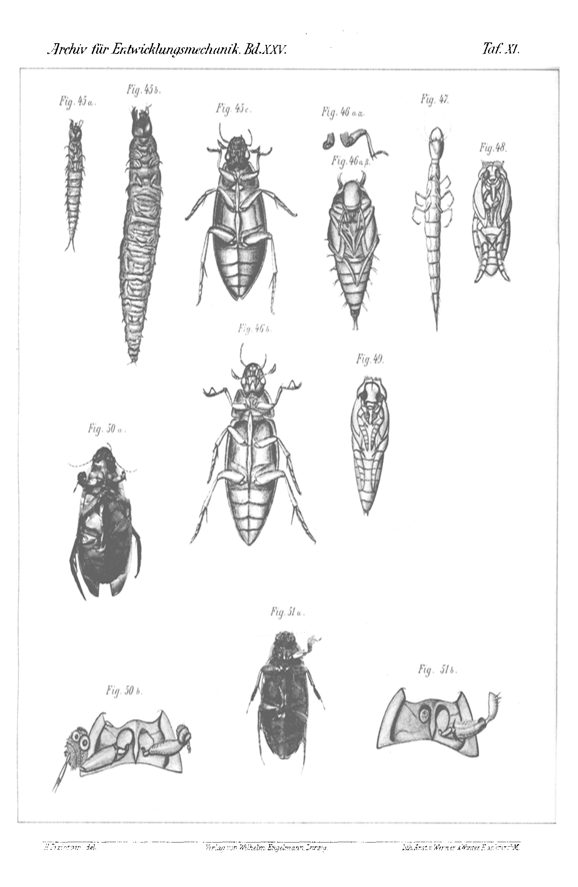

# The »Claw-Reversal« in Decapod Crustaceans

*(at the same time: Experimental Studies on Regeneration. Fourth Communication.)*

By

## Hans Przibram.

*(From the Biologische Versuchsanstalt in Vienna.)*

With Plate X–XIV and 1 Figure in the Text.

Received on 31 August 1907.

*Archiv für Entwicklungsmechanik der Organismen*, vol. 25 (1907).

> **Full translation.** A complete English rendering of the running text of “The "Claw-Reversal" in Decapod Crustaceans (Experimental Studies on Regeneration. Fourth Communication)” (Hans Przibram, 1907), including all tables, figure and plate legends, and footnotes. Numbers and table cells were transcribed from the page images, not the noisy OCR.

### Table of Contents

| | Page |
|---|---|
| A. Programme of the Investigation | 267 |
| B. Origin and Maintenance of the Living Material | 268 |
| C. Operating Technique | 273 |
| D. Presentation of the Experiments | 276 |
| &nbsp;&nbsp;&nbsp;I. *Athanas nitescens* Leach | 276 |
| &nbsp;&nbsp;&nbsp;II. *Alpheus ruber* M.-Edw. | 278 |
| &nbsp;&nbsp;&nbsp;III. » *platyrhynchus* Hell. | 278 |
| &nbsp;&nbsp;&nbsp;IV. » *dentipes* Guér. | 280 |
| &nbsp;&nbsp;&nbsp;V. » *laevimanus* Hell. | 283 |
| &nbsp;&nbsp;&nbsp;VI. *Typton spongicola* Costa | 284 |
| &nbsp;&nbsp;&nbsp;VII. *Nika edulis* Risso | 288 |
| &nbsp;&nbsp;&nbsp;VIII. *Nephrops norwegicus* L. | 289 |
| &nbsp;&nbsp;&nbsp;IX. *Homarus vulgaris* M.-Edw. | 291 |
| &nbsp;&nbsp;&nbsp;X. *Callianassa subterranea* Leach | 293 |
| &nbsp;&nbsp;&nbsp;XI. *Eupagurus Bernhardus* L. | 295 |
| &nbsp;&nbsp;&nbsp;XII. » *Prideauxii* Leach | 296 |
| &nbsp;&nbsp;&nbsp;XIII. » *cuanensis* Thomps. (?) | 297 |
| &nbsp;&nbsp;&nbsp;XIV. » *pilosimanus* (?) | 297 |
| &nbsp;&nbsp;&nbsp;XV. *Diogenes varians* Costa | 298 |
| &nbsp;&nbsp;&nbsp;XVI. *Carcinus maenas* Leach | 298 |
| &nbsp;&nbsp;&nbsp;XVII. *Platycarcinus pagurus* L. | 302 |
| &nbsp;&nbsp;&nbsp;XVIII. *Portunus corrugatus* Leach | 303 |
| &nbsp;&nbsp;&nbsp;XIX. » *depurator* Leach | 304 |
| &nbsp;&nbsp;&nbsp;XX. *Eriphia spinifrons* Savigny | 305 |
| E. Answering of the Programme Points | 305 |
| F. Summary | 312 |
| G. List of Literature | 313 |
| H. Protocol Extracts (quantitative Data) | 315 |
| J. Explanation of the Figures | 336 |

## A. Programme of the Investigation.

My systematic presentation of the Heterochely (varying claw-strength) in the decapod Crustacea (1905¹) seems to have left behind the impression as if the claw-reversal of *Alpheus* were an isolated phenomenon; at least Driesch writes (1905, p. 682): »Moreover, both according to Przibram's general findings (2)*) and according to Zelený's (4) works on the crab *Gelasimus* [fiddler crab], the reversion of the claws in *Alpheus* constitutes an exception to the behaviour otherwise customary in Crustacea.«

Although I now, with regard to the crabs *Carcinus* and *Portunus*, had considered the claw-reversal as very probable (1902³, p. 523; 1905¹, p. 209; 1905², p. 3), I have thereby nevertheless myself not yet held the question of the more general distribution of the claw-reversal to be settled, but rather have undertaken new experiments on these and other genera. A brief mention of the obtained results took place on the occasion of the Naturforschertag [Congress of Naturalists] in Stuttgart (1906), where preparations and drawings of the reversal in crabs and in the mole-crayfish (*Callianassa*) were also displayed (1906, Fig. 6). For the working-through of the material, however, a longer time was required, and this investigation forms a constituent part of the present communication.

The first question thus ran: Does the claw-reversal also occur outside the genus *Alpheus*?

To this attaches itself immediately the second question: Is the claw-reversal in general a property of particular species in such manner that in them it must always set in after amputation of the »K-claw« (= large knock-claw)? In other words: Does, after amputation of the K-claw, its direct regeneration also come about under certain circumstances in such forms as ordinarily show reversal? For the decision of this question, variations of the experimental conditions had to be undertaken, which, besides the employment of different size-grades, consisted in nerve-severings and total-extirpations. There had therefore, thirdly, to be considered the question, which influence the nervous system takes upon the reversal, as well as, fourthly, which influence total-extirpation has. Here joined itself the fifth question, whether not also in genera which up to now have not furnished cases of reversal, the same

> *) Should presumably read (3).

factors might be decisive for the claw-combinations, that is, in a certain manner, more external moments, whose different constellation here too might still lead to reversal-combinations.

Finally, the attempt was to be made to build up the obtained general results, in mathematical garb and with use of the general formulae developed in a lecture before the morphological-physiological Society at Vienna (1905²) and of the new special numerical values won through measuring experiments, into a theory doing justice to all cases. Clothed in the form of a question, we might formulate this about thus: Do quantitative relationships allow themselves to be demonstrated for the secondary appearance of particular claw-combinations? The answering of this question follows provisionally only in part, insofar as the quantitative data for the growth- and regeneration-relationships are presented, while the working-out of the formulae and their values remains reserved for a later communication.

In the production of illustrations, the individual variousness of the claw-forms in exemplars of like species and like sex struck me, and there arose therefore yet the sixth question, whether in regeneration and claw-reversal the individual differences appear again?

## B. Origin and Maintenance of the Living Material.

Since in and around Vienna heterochelous crayfish-forms do not occur, the necessary living material had to be procured from various places situated by the sea.

Fortunately there are indeed at present correspondingly arranged sea-stations in great number, so that for species of various localities a selection was possible to make.

In the supply of the genera hitherto employed, four stations were involved: The biological station in Fiume (Hungary), the zoological station in Naples (Italy), the maritime laboratory in Roscoff (France) and the I. R. zoological station in Trieste (Austria)*). To the directors and the other gentlemen at the named stations I am obliged to great thanks for their kind support and especially the often laborious bringing-about of just the desired species.

> *) These stations will hereafter be designated as F., N., R. and T., while W. signifies the biological Versuchsanstalt in Vienna.

The living material was partly worked up at the three last-named stations themselves; for the greater part, however, the experiments were first carried to their end at the Biologische Versuchsanstalt in Vienna. The dispatch took place from Fiume and Trieste by means of Fahrpost [parcel-post] or Eilgut [express freight]; from Naples and Roscoff I took the greater part of the experimental animals along as travelling-baggage after the close of my stay at these stations and brought them to Vienna without essential losses. The packing took place in baskets of eight Einsiedelgläser [hermit-jars] each, which were filled up to ⅔ with seawater and sealed with wet parchment-paper. On the journey from Naples to Vienna the sea-passage from Brindisi to Trieste was used in order to change the water at these two places. The roughly 36-hour-long railway journey from Roscoff to Vienna the crabs were able to endure without water-change.

With corresponding through-airing a water-change is at all neither necessary nor useful, so long as no cloudiness has set in. Again and again it showed itself that even the less resistant crab-species held themselves better with through-airing without water-circulation than with water-circulation without through-airing. Moreover the circulation has the disadvantage that smaller forms, moults and youth-stages are easily washed away and get lost. Only in very large animals (e.g. lobster) is a water-circulation to be preferred, since usually the contamination becomes too strong in relation to the available container-size.

The remaining accommodation and maintenance of the material directed itself first of all according to the life-habits of the various crabs. The following 20 crab-species were drawn upon, whose determination took place chiefly according to Heller (1863):

I. *Athanas nitescens* Leach; II. *Alpheus ruber* M.-Edw.; III. *A. platyrhynchus* Hell.; IV. *A. dentipes* Guér.; V. *A. laevimanus* Hell.; VI. *Typton spongicola* Costa; VII. *Nika edulis* Risso; VIII. *Nephrops norwegicus* L.; IX. *Homarus europaeus* Couch (= *vulgaris* M.-Edw.); X. *Callianassa subterranea* Leach; XI. *Eupagurus Bernhardus* L.; XII. *Eu. Prideauxii* Leach; XIII. *Eu. cuanensis*? XIV. *Eu. pilosimanus*? XV. *Diogenes varians* Costa; XVI. *Carcinus maenas* Leach; XVII. *Cancer (= Platycarcinus) pagurus* L.; XVIII. *Portunus corrugatus* Leach; XIX. *P. depurator* Leach; XX. *Eriphia spinifrons* Sav.

I. *Athanas nitescens* Leach lives in the sponges *Geodia* (T.) or also on seaweeds (R.), is undemanding and can be held easily in small hermit-jars, without that special arrangements (apart from through-airing or strong through-watering) need be met.

II. *Alpheus ruber* M.-Edw. lives free on sand-ground, at least in the higher age (T.), but also together with

III. *A. platyrhynchus* Hell. in the rhizoids of *Posidonia* (with *Balanoglossus*) (N.). Both species require merely some sand or fine gravel for their well-being. *A. platyrhynchus* also occurs occasionally in sponges (with *A. laevimanus*).

IV. *A. dentipes* Guér. lives, like the two previous species, in *Posidonia* (N.) or also in sponges (*Geodia* T.). Although very undemanding, it nevertheless holds itself better on fine gravel-ground, and it proved favourable to place pieces of well-cleaned bath-sponges at its disposal as dwelling-place. On the variability of its colouration report will be given later in a separate communication.

V. *A. laevimanus* Hell. lives exclusively in sponges (T.) and is without such very helpless, so that in higher degree than in the previous species the employment of sponge-fragments appears advisable.

VI. *Typton spongicola* Costa is completely adapted to the sojourn in sponges (T.). Already the consignment of the same without sponges is impracticable. The use of fresh, living sponges is unfavourable, because they soon perish and then easily spoil the water. Cleaned bath-sponges replace them, however, completely, so that it proved very favourable to take the animals at once after the capture out of their host-sponges and bring them into the new dwelling.

VII. *Nika edulis* Risso occurs on seaweeds or free-swimming (T.); it is quite frail and therefore little suited for transport. In basins with *Ulva* it lives at the sea-stations for a longer time (N.).

VIII. *Nephrops norwegicus* L., the »Skampo« of the Italians, is found in deeper water in the Quarnero (F.) on mud-ground, in which it lays out pits for itself. Without a ground-covering it does not hold itself well.

IX. *Homarus europaeus* Couch. likewise lives in pits, which are laid out in the vicinity of rocks. For the experiments young animals were to be used, but to procure such did not succeed, and the rearing of the pelagic larvae could not be carried sufficiently far, although the hatched larvae at first lived very well in small hermit-jars with through-flow (R.). The blame for the eventual failure was the intrusion of iron from the conduit-pipes.

X. *Callianassa subterranea* Leach lives in the fine mud called »Fango« (N., T.), in which the animals lay out passages for themselves that open out near the water-surface in an elevation resembling a molehill, whence the animal is fittingly designated as »mole-crayfish«. The quite delicate animal would not, although otherwise the most natural conditions possible were offered to it, properly thrive in flowing water (N.); all the more was I surprised by its great endurance in standing, through-aired water. It appears that by a water-current the very delicate limbs, namely shortly after the moult, are torn off and the animal is in this manner gradually rendered incapable of life; at least one finds exemplars from which almost all the limbs are torn off, and a similar phenomenon can set in if the through-airing is set going too violently. On the captive-life of *Callianassa* I shall report further in a separate communication.

XI. *Eupagurus Bernhardus* L., the St. Bernard's hermit-crab, lives, as is well known, in snail-shells, and indeed on mud- or gravel-ground (R.). As I have communicated in an earlier publication (1907¹), it nevertheless lets itself be held easily also outside its shell.

XII. *Eu. Prideauxii* Leach differs in its mode of life from the aforementioned hermit-crab in so far as it, together with its shell — on which, moreover, an actinia (*Adamsia palliata*) is often settled — digs itself into the sand up to the eyes (R., T.). When unshelled, it at first retains this property. Further details are to be taken from my cited treatise (1907¹).

XIII. *Eu. cuanensis* Thomps.?, a not-securely-determined species, agrees entirely with *Eu. Bernhardus* with regard to its mode of life and maintenance (R.).

XIV. *Eu. pilosimanus*?, likewise not securely determinable, differs through its sojourn in straight, not strongly twisted shells from the previous species, and is apparently to be met with only in greater depths on shell-sand (R.); nevertheless it holds itself well in captivity.

XV. *Diogenes varians* Costa lives on gravel-ground in shells of right-twisted snails (T.), although, in contrast to the aforementioned hermits, a left-handed species; like the other species it also lets itself be held without a shell.

XVI. *Carcinus maenas* Leach, the common shore-crab, lives predominantly on the strand strewn with little stones (R., T.). Deep water is not favourable for it; at low water-level it is very enduring.

XVII. *Platycarcinus pagurus* L., the edible crab, occurs at the same places as the previous species (R.), but prefers somewhat deeper places. Is, like *Carcinus*, very undemanding.

XVIII. *Portunus corrugatus* Leach, a swimming-crab, lives at least in youth on mud-ground, into which it quickly sinks itself when in danger (R.).

XIX. *P. depurator* Leach, the common swimming-crab of the Adriatic (T.), swims nimbly; for its maintenance somewhat deeper water is more favourable.

XX. *Eriphia spinifrons* Sav. lives in rock-clefts (T.) at the tide-line. Like the other crabs it makes in captivity no special demands with regard to maintenance.

For all the named sea-crabs the rule holds that high temperatures and strong sunlight-irradiation are to be avoided; most favourable are shaded places at which an even warmth of 12 to 17° C. prevails. Below 10° and above 20° one is mostly exposed to numerous losses; in the vicinity of the freezing-point and at about 24° the capacity for life of the crabs ceases altogether.

As nourishment there served for most of the enumerated species cut-up flesh, best of fresh or one-day-dead fishes. *Alpheus dentipes*, *platyrhynchus*, *ruber*, *Nika*, the larger hermit-crabs and the crabs in time take it greedily from the feeding-stick or the forceps; likewise the young lobsters. Large lobsters are better fed with mussels, *Nephrops* with earthworms. *Callianassa* eats the smaller sea-worms (Capitellids) most readily, but also contents itself very gladly with the freshwater-worms (*Tubifex*), and lets, just as the small hermits do, the mud pass through the mouth in order to extract organic remains from it. In *Alpheus laevimanus* and *Typton spongicola* I have never observed an uptake of food; in nature they probably find their food-stuffs within the sponges. In captivity they can find only few suitable remains; nevertheless they often hold out long, even moult several times, can regenerate claws and reverse them, though all without increasing in total volume, on which we shall yet have to come back.

Since all crabs appear very combative even against individuals of their own species, and inflict, if not mutually dangerous injuries, then at least the loss of the easily autotomizing limbs, for the experiments an isolated keeping of the individuals is mostly necessary.

Since, despite this, a number of vessels is needed in order to set up sufficient experimental series, it is important to know with what water-volume one can manage for a definite number of animals. With the exception of the large lobster, *Nephrops* and *Eriphia*, one can manage for all the species mentioned in two-litre hermit-glasses [Einsiedelgläser]. In such a glass, a pair of *Athanas*, *Alpheus*, *Typton*, or a single exemplar of *Callianassa*, *Eupagurus*, *Diogenes*, *Carcinus*, *Portunus*, can be kept for months, even a year and more, in undiminished vital freshness. For single exemplars of the smaller species, far smaller vessels still suffice, e.g. glass boxes of 9.5 cm diameter and 47 cm height, for pairs even still 16 cm diameter and 7 cm height with throughflow.

*Nephrops* was kept in rectangular glass or stoneware tubs of 28 cm length, 20 cm breadth and 18 cm height, and indeed always only a single exemplar.

## C. Operationstechnik [Operative technique]

Besides the control animals, on which merely the ordinary growth, altered by no operation, was to be observed, in all the experiments one or more of the three following operative methods*) came into use:

Op. 1*). The pinching-off or cutting-through of the claw at the propodite, which has as its consequence the casting-off of the same at the prae-formed breaking-point (autotomy).

This operation has the advantage that in all cases the in-

> *) In future these operative methods will be designated as Op. 1, 2 and 3, the control experiments without operation as Op. 0; the claws on which the operation was carried out will be designated as »K.« (knob- or cracking-claw) [Knoten- oder Knackschere] and »Z.« (toothlet- or pinching-claw) [Zähnchen- oder Zwickschere].

jury sets in exactly at the corresponding place. With small animals the fingers were taken to help, with the larger ones forceps (lobster), in order to achieve the pressure necessary for the triggering of the reflex. After this operation no notable percentage perished, since the wound is protected immediately against infection by the automatic closure, just as with the not-operated ones.

Op. 2. The paralysis of the claw, which sets in when the hip-segment is cut into from below, whereby, besides other parts, the nerve too is cut through. For this operative method, already applied by Wilson (1903) and Morgan (1904), the same remarks hold good as in regard to the still-to-be-discussed »total extirpation«, only the autotomy here does not, as with the latter, fail to occur in consequence of the absence of the autotomy-site, but in consequence of the paralysis of the nerve necessary for the reflex-act.

If the nerve-severance has succeeded, then the claw, formerly protruded forward in swimming, is now always carried dragged-along drawn-in, and one can even lift the crabs out of the water by the claw so operated upon and transport them into another basin without autotomy taking place.

Whoever has occupied himself, for example, with *Alpheus*, knows that this signifies almost an impossibility with a not-paralysed exemplar. Therefore, in order to test whether paralysis had actually set in, this transport of the little crab lifted out by the operated claw was always undertaken. Even when the paralysis has succeeded, the operation is not always crowned with success, since, with too-strong cutting-through of the limb, in the course of time a purely mechanical tearing-off of the entire claw can take place, so that then approximately a total extirpation has resulted; or, with too-weak a cutting-through, such a rapid re-establishment of the nerve-pathway takes place that autotomy still subsequently comes about.

Op. 3. The complete extirpation of the claw by means of a cut led circularly around the inner side at the base of the first segment, for which a lancet-like ground needle, a small knife or »eye«-scissors was used.

This operation removes the limbs still more proximally to the prae-formed breaking-point and therefore leads to no further autotomy. Its course is, however, not so exactly determined as with the autotomy, since now somewhat more, now somewhat less is cut from the body-segment. A further disadvantage as against the autotomy consists in the danger of infection, which is given on the one hand by the direct intervention of the instrument, and on the other hand by the longer remaining-open of the wound, to which the automatic closure is lacking.

The instruments are therefore, with this (as also with the following operations), to be thoroughly sterilized before each use by glowing-out in the flame, and pure seawater is to be provided for the placing-in of the operated crabs. Despite such precautionary measures, a considerable percentage of these experimental animals nevertheless still died, the consequence of the deep intervention and chiefly of the often involuntarily too-strong pressure exerted on the thorax of the crab when the evasion of the same before the penetrating cutting-edge was to be prevented. The operation was namely carried out in the water in such a way that the little crabs were taken up with the forefinger and thumb of the left hand, laid on their backs, and held firmly on the bottom of the glass vessel used. For this some practice is required, since otherwise unintentional autotomies of the claws easily occur and can disturb the intended experimental arrangements.

**Text-figure.** Schematic illustration of a crab to illustrate the measured stretches: *AC* total length, *AB* carapax length, *GH* carapax breadth, *DF* claw length, *EF* propodite length. Designations of the claw-segments: *1* Coxopodit, *2* Basipodit, *3* Ischiopodit, *4* Meropodit, *5* Carpopodit, *6* Propodit, *7* Dactylopodit. *(figure not reproduced)*

With most of the experimental animals (all those which were kept isolated or in pairs), measurements were taken at the beginning of the experiment, which were then repeated after each moult; the same was done with some non-operated control animals. Since therefore one had to measure them alive, no weight could be laid on great accuracy of the figures; only whole millimetres and half-millimetres came into consideration; where I could not decide on a whole or a half millimetre, I have sought to manage in the experimental protocols by means of + and −. For checking the correctness of the measurements the cast-off skins could be used, insofar as they were still gathered up in coherent pieces, which was as a rule the case. As measuring-tool a compass served, with whose points the lengths were measured off on a half-millimetre-graduated scale.

Measured were the following stretches (cf. the text-figure):

a) Total length (*AC*, see text-figure p. 275), reckoned along the dorsal side of the stretched-out animal lying on its belly at the bottom of a glass tub, from the rostral tip, or other ending of the median line of the cephalothorax, up to the end of the telson-plate, however excluding the hair-fringe. (This measure was not taken with hermit-crabs and crabs, since [it is], on account of the inrolling or folding-in of the hind-body, quite impracticable.)

b) Cephalothorax- or carapax length (*AB*), the line lying between the foremost and hindmost points of the median line (median) of the head-breast-shield (with the crabs the carapax-breadth *GH*, measured through the distance of the most prominent spines of the right and left side-edge, is mostly more dependable than the latter or the next-to-last).

c) Right claw, reckoned along the ventral side, on the animal held fixed in stretched-out condition in the back-position, and indeed from the prae-formed breaking-point up to the end-tip of the next-to-last segment (propodite), that is, of the fixed-standing forceps-lever.

d) Propodit of the right claw, reckoned likewise, only from the articulation-site of the one segment onward.

e) Left claw (*DF*), reckoned analogously to the right claw *c*.

f) Propodit of the left claw (*EF*), reckoned analogously to the propodite of the right claw *d*.

As »claw« there is in each case meant that limb which bears the largest claw, at least on one side; this it is, with respect to which heterochely has already been pointed to (1905¹); the homologous limb-pair is not always the same. It can namely also be that on other limb-pairs — of the same animal — smaller claws are developed, which then, however, do not exhibit heterochely and are here not taken into consideration.

## D. Darstellung der Versuche [Presentation of the experiments]

### I. *Athanas nitescens* Leach.

This crab-species is one of the smallest among the species used for the experiments and is not distinguished by very far-reaching heterochely.

Although, according to Heller (1863, p. 280), the fore-feet, scissor-like in this genus, are »not quite equally developed«, this peculiarity, according to Coutière (1899, p. 184), comes to be present only in the males, and indeed only »quite slightly«.

Since with me at first chiefly females and among the males only weakly-pronounced heterochely had come down, I had doubted (1905¹, p. 185) whether we ought really to expect a regenerate after loss of an arbitrary claw with heterochely in *Athanas*.

For the new experiments there stood at my disposal this time animals from another provenance (R.), and indeed both equal-clawed males (Nr. I, 3, Fig. 2)*) and also typically unequal-clawed ones (Nr. I, 0, 1, 2, Fig. 1).

The equal-clawed ones have, similarly to the females, two only very weakly-differentiated Z.-claws.

The unequal-clawed ones have a small bearded Z.-claw on an arbitrary body-side and an inflated K.-claw on the other; it is distinguished, besides in the dimensions, namely by the arched, mutually inward-curved, gaping cutting-edges, from the Z.-claw, with which the gently-curved cutting-edges run parallel to one another.

Op. 0**). (Nr. I, 3, Fig. 2.) An equal-clawed male was held without operation, in order to see whether at the next moult the heterochely would appear, as this is brought about with several other heterochelous species through regenerative processes as a rule (cf. further above with *Nephrops* and crabs). However, this exemplar remained equal-clawed, so that, despite considerable growth, even after the moult complete homoiochely (equal-clawedness) persisted (Fig. 2a).

Op. 1. (Nr. I, 2, Fig. 1.)*) Among three distinctly heterochelous males, whose K.-claw was removed by autotomy, one survived the next moult. It shows the beginning reversal of the claws, in that the operated claw exhibits the K.-character in the greater thickness of the segments and in the arched course of the dactylopodite, but on the operative stump a small, still

> *) The numbers cited with »Nr.« and printed in bold refer to the extracts from the experimental protocols, where the Roman numeral designates the sequence-number of the species, the Arabic the protocol-number of the individual; the numbers cited with »Fig.« refer to the figures of the plates.

> **) Cf. note p. 273.

weakly-developed regenerate, the future new Z.-claw, raises itself (Fig. 1a).

The slight material of *Athanas* standing at my disposal did not permit the carrying-out of other operations. I had to be quite content with the successes anyway, since from Op. 0 the occurrence of genuine homoiochelous males, from Op. 1 the occurrence of genuine heterochelous males with claw-reversal was brought out.

### II. *Alpheus ruber* M.-Edw.

The claw-reversal with this *Alpheus*-species is already given in my first Communication (1901, p. 333, Pl. XIII Figs. 36—40). Later I was not yet able to observe with the first exemplars the reversal following the autotomy of the K.-claw at the first moult (1905¹, p. 186, Pl. VIII Fig. 1). As cause for this different behaviour I had at the time assumed the age, a supposition which I have, with the new experiments on other *Alpheus*-species, *A. platyrhynchus* and *dentipes*, found confirmed; whether it holds good also with this species, the new experiments are to show. Of *A. ruber* I could this time obtain only a small exemplar; a large exemplar showed nothing new.

Op. 1. (Nr. II, 3, Fig. 3.) This small exemplar moulted on the twentieth day after the autotomy of the typically-developed large claw and regenerated a typical Z.-claw, without however the not-operated Z.-claw having entered into a transformation (Fig. 3b). With exception of the regenerate the animal had not grown, and a parasitic worm (Nematode) remained behind in the cast-off skin (Fig. 3a). To this pathological condition is perhaps the failure of the transformation in this case to be traced back. In any case one sees here that the transformation failed to take place with a member of a species which otherwise shows reversal, that thus no strict dependence of the claw-relationships on the species alone is present.

### III. *Alpheus platyrhynchus* Heller.

For my first experiments throughout larger exemplars of this species were used; here several moults had been employed for the claw-exchange. Through the use of exemplars of different size it had to be decided whether, as I had first believed, the size-belonging, or, as I later supposed, the retarding effect of the size was the co-determining cause. At the same place, at which the first experiments had been made, in Naples, Lo Bianco obtained for me through his untiring solicitude *Alpheus platyrhynchus* from 12 to 36 mm total length.

Op. 0. (Nr. III, 8, 12.) Not-operated control animals (♀ and ♂) of that size show, just as the previously-used ones, that a considerable growth sets in after the first moult; that thus also here, as in the smaller exemplar of *A. ruber*, the failure of the reversal with *platyrhynchus* of this size cannot be traced back to insufficient growth of this stage.

Op. 1. (Nr. III, 1, Fig. 4.) Very small exemplar, moults two days after the autotomy of the K.-claw; shows at first no transformation, but still before the next moult the breadth of the spared Z.-claw increases by half a millimetre (i.e. by one half of its hitherto-existing breadth) and otherwise too transition-characters can be recognized in the cutting-edges (Fig. 4b).

—— (Nr. III, 2, Fig. 5.) Likewise a small exemplar; moults only 16 days after the loss of the K.-claw and shows complete transformation (Fig. 5b).

—— (Nr. III, 6, Fig. 9; 11, Fig. 11; 14, Fig. 12.) Three middle-large exemplars with more or less far-advanced transformation, according to whether the first moult took place later or earlier after the amputation-day.

—— (Nr. III, 7, Fig. 10.) Large exemplar, although moulted only 25 days after the operation, nevertheless [showing] only indications of the transformation, namely lying in the shortening of the dactylopodite and the broadening of the propodite (Fig. 10b).

—— (Nr. III, 16, Fig. 14.) Largest exemplar, after the moult without any indication of a transformation; unfortunately not known when the loss of K. had occurred. 17 days after the moult, at which time a considerable regenerate in place of the autotomized claw was to be seen (Fig. 14a), scarcely an indication of transformation is to be discovered on the spared claw of the opposite side.

Surveying now the whole experiment-series, we find, under otherwise equal circumstances, namely with sufficient distance of the first moult from the operation-day, with *Alpheus platyrhynchus* a decrease of the transformation-speed with increasing size (age) of the animals. If one observes the various figures exactly, then there results yet a remarkable fact, which forced itself upon me first in the drawing of the claws of *Typton* to be described below, namely the recurrence of the individual peculiarities of the K.-claw removed in one individual on the Z.-claw of the opposite side now caught up in transformation to a K.-claw, on which at the operation nothing was to be seen of these individual variations.

forced itself upon *Typton*, namely the recurrence also of the individual peculiarities of the C.-claw removed in one individual on the Z.-claw of the opposite side now in process of being transformed into a C.-claw, on which, before the operation, nothing of these individual variations was to be seen.

(No. III, 15, Fig. 13.) This specimen lacked the Z.-claw through natural autotomy. The C.-claw was present, but the propodite-edge defective. After the molt, which took place 9 days after the introduction of the animal, which was not operated upon further, neither this defect nor the Z.-claw was replaced. Although the crab had been well fed, the dimensions of the claw had rather decreased; nor had any other increase in size occurred. Here again we have a pathological condition before us.

Op. 2. (No. III, 5, Fig. 8.) Both nerves severed and the Z.-claw autotomized. Later the C.-claw was lost from the point of severance onward, so that it would have to be regarded as extirpated. The result is, at the next molt: regeneration of a Z.-claw in place of the amputated one, and as yet no visible regenerate in place of the C.-claw.

(No. III, 4, Fig. 7.) This case concerns a natural nerve-paralysis of the Z.-claw; the C.-claw was autotomized without nerve-severance. 2 days after the operation the first molt occurred, still without regeneration; the paralyzed Z.-claw remained stuck in the skin, and its three terminal segments were stripped off together with it; the tearing-off had therefore not occurred, say, through autotomy. After the second molt small regenerates of both claws were present, which at the death of the animal could be clearly recognized as like-sided repetitions of the original ones (Fig. 7b).

Op. 3. (No. III, 3, Fig. 6.) C.-claw totally extirpated, Z.-claw autotomized. The little crab experienced no further molt, yet at its death a like-sided regenerate of the Z.-claw was recognizable; in place of C. no formed regenerate had as yet appeared.

These experiments first gain significance in connection with those on *Alpheus dentipes* and *Typton spongicola*.

## IV. *Alpheus dentipes* Guér.

With *Alpheus dentipes* I had already earlier obtained the most favorable results, and in the new experiments too this species maintained its first rank. The very great difference in the differentiation of the C.- and Z.-claw, which by no means expresses itself merely in the richer elaboration of the C.-claw, but rather in deviating characters also of the Z.-claw from the generalized type of the Z.-claw, makes possible a rapid decision as to which path a growing claw will take. The easy hardiness and relative insensitivity of the species, but above all its more abundant occurrence (N., T.), complete the favorable experimental prospects.

Op. 0. (No. IV, 43.) A brood-bearing control animal, which at the molt stripped off the young, showed no increase in size. 2 days after the molt it set on eggs again. In general, however, *A. dentipes* showed increases at the molt, and also took up food very well.

Op. 1. (No. IV, 51, Fig. 23.) The largest preserved specimen of this species, over 31 mm in total length, was used for simple autotomy of the C.-claw, in order to see whether, like *A. ruber* and *platyrhynchus*, *A. dentipes* too decreases in transformation-speed with increasing size. The molt, which set in only after 21 days, fully confirmed this assumption: in contrast to the almost complete transformation already after the first molt in small specimens, such as are depicted for instance in my first communication (1901, Pl. XIII, Figs. 1–18), in the large crab a much lesser reshaping of the Z.-claw is to be recognized (Fig. 23b), which is, however, indeed essentially more distinct than in equally large specimens of the other species, whose claws already in the normal state differ less than those of *A. dentipes*.

Op. 2. (No. IV, 20, Fig. 15.) In the attempt to carry out the nerve-severance with a small eye-scissors, autotomy of the C.-claw ensued; for the execution of the nerve-severance of the Z.-claw a little lancet-like knife was then used, and the paralysis succeeded completely; result: claw-reversal, and indeed probably already after one molt.

— (No. IV, 21, Fig. 16; 22, Fig. 17; 23.) With the little knife the bilateral nerve-severance succeeded in these three specimens; the Z.-claw had previously been taken from them by autotomy. Result concordant in the three cases: direct regeneration of the Z.-claw at the next molt, of small size, yet in the ♂♂ (No. 21 and 23) already furnished with the secondary sexual characters, the strong, sickle-shaped propodite and the long pilosity of the terminal segments (Fig. 16a).

— (No. IV, 30, Fig. 21.) Bilateral nerve-severance, then severance of the Z.-claw at the preformed breaking-point. Merely a technical variation of the previous experiment, with the same result: direct regeneration of the Z.-claw.

— (No. IV, 31.) In the same operation on another specimen there was a doubt as to the paralysis; upon a renewed incision the C.-claw was so loosened that it later tore off. At the next molt there was nothing to be seen in its place, and in place of the paralyzed and severed one a still unformed regenerate, which at the death of the animal appeared only rudimentarily developed.

— (No. IV, 47, Fig. 22; 49, 53, Fig. 24.) Nerve-severance succeeded on both sides, then severance of both claws at the preformed breaking-point. Result: direct regeneration of both claws of approximately equal length, in the ♂ (No. 47) also already on the Z.-claw with indications of the secondary sexual characters. The male No. 49, which died before the molt, allows only on the C.-side a still little-differentiated regenerate to be recognized.

— (No. IV, 57, Fig. 25.) Nerve-severance on both sides and severance of both claws as in the previous experiment; but since the Z.-claw was incised too deeply, its basal segments too were lost, so that it must count as totally extirpated. Result after the first molt: in place of the C.-claw a regenerate which later allows the character of the C.-claw to be recognized; in place of the Z.-claw, up to the death of the animal, no regenerate.

— (No. IV, 59, Fig. 26; 68, 77.) Nerve-severance only of the Z.-claw, autotomy only of the C.-claw. The Z.-claw could not pass through the skin and remained stuck in it; freed from the same (No. 59), it showed not-far-advanced transitional characters; in place of the C.-claw only a cone was to be seen.

— (No. IV, 69, Fig. 28; 74, Fig. 29.) Specimens of the same kind, in which, however, the Z.-claw was lost not only at the next molt but already earlier, probably as a consequence of too deep an incision in No. 69, but of too slight a severance in No. 74, which later nevertheless still permitted autotomy. Result: direct regeneration of the C.-claw; in the latter case also regeneration of a Z.-claw, which is essentially shorter than the C.-claw (Fig. 29a).

Op. 3. (No. IV, 25, Fig. 18; 26, Fig. 19; 29, Fig. 20; 41, 60, Fig. 27; 72.) Total extirpation of the C.-claw and autotomy of the Z.-claw. Result: regeneration of a Z.-claw in place of the autotomized Z.-claw, at most a regeneration-cone in place of the totally extirpated C.-claw at the first molt. Even before this, the regenerate of the Z.-claw may be considerable (No. 60, Fig. 27; 72) and, despite its broader appearance, makes itself recognizable as a Z.-claw by the proportion in which the propodite is divided by the dactylopodite. The insertion of the dactylopodite namely lies, in the Z.-claw of *A. dentipes*, approximately in the middle of the outer propodite-margin, whereas in the C.-claw it is removed ²/₃ from the spring [origin] of the propodite (cf. e.g. No. 59, Fig. 26, a C.-regenerate). In the ♂ (No. 25) only weak traces of the secondary sexual characters (pilosity etc.) show themselves on the Z.-claw.

— (No. IV, 76, Fig. 30; 79, Fig. 31; 85, Fig. 32.) Total extirpation of the C.-claw with leaving-intact of the Z.-claw. Result: more or less far-advanced transformation of the Z.-claw according to the molt-interval and the size of the specimen; in place of the C.-claw at most a bud.

— (No. IV, 84.) Total extirpation of both claws. Result at the first molt: no regeneration, at most small swellings recognizable in place of the claw-base.

Individual differences let themselves be demonstrated also in *A. dentipes*, both in the direct regeneration (cf. e.g. No. 69, Fig. 28; 47, Fig. 22) and in the claw-exchange (cf. e.g. No. 51, Fig. 23; 85, Fig. 32) as newly appearing.

## V. *Alpheus laevimanus* Hell.

On this *Alpheus*-species, which had never yet served for experiments, I intended to convince myself whether the conditions to be expected according to the behavior of the other species of the genus would set in. But the specimens died, all but the last, before the entry of the first molt. Fortunately, however, this one was so capable of life that it was able to complete three molts in captivity. The normal claws of *A. laevimanus* are, of all the species, the most strongly differing from one another in size (No. 3, Fig. 33), yet the Z-character is little pronounced.

Op. 1. (No. V, 7, Fig. 34.) The single surviving specimen had already, before the setting-up of the experiment, undergone autotomy of the Z.-claw; the C.-claw was artificially autotomized. At the first molt, 42 days after the setting-up of the experiment — the long interval is a consequence of the wintertime — only the Z.-claw was regenerated and already showed weak transitional characters toward the C.-claw (Fig. 34a).

At the next molt, occurring 30 days thereupon, its transformation had already become distinctly advanced, and in place of the original C.-claw a regeneration-bud was to be seen. In the same month (May) the little crab molted for the third time, with a molt-interval of 17 days, and afforded the sight of a mirror-image miniature of the original claw-relation, in that now in place of the first-lost Z.-claw stood an almost fully formed but still too small C.-claw, and in place of the later-lost C.-claw a corresponding Z.-claw (Fig. 34 b, c, d). With this case there is demonstrated not merely the possibility of the claw-reversal in this *Alpheus*-species, but also the influence which a still-simultaneous autotomy of both claws has, in case the one first lost is the Z.-claw; we shall get to know results for the reverse case too, when the C.-claw was first lost, right away in the next species, *Typton spongicola*.

## VI. *Typton spongicola* Costa.

In appearance *Typton spongicola* possesses a very great similarity to *Alpheus laevimanus*, and in particular the large claw-pair shows many common traits. The C.-claw is strongly inflated (Fig. 42, No. 28 ♀), very smooth and hairless, reaches the body-length, and can indeed, especially in the ♂, far exceed it. The Z.-claw, by contrast, remains very much behind in size and lacks, just as in *A. laevimanus*, those differentiations which it shows in the other *Alpheus*-species. It could therefore appear from the outset unnecessary to set up experiments thereon as to whether the claw-reversal occurs in *Typton* too.

But on closer inspection one becomes aware that in *Typton* it is by no means a matter of claws homologous to those of *Alpheus*, since these in *Alpheus* and most other European heterochelous crabs belong to the first or anterior leg-pair, but in *Typton* to the second leg-pair.

Just as the colorlessness, compact form, smoothness and other common peculiarities, the claw-formation in *Typton* and *A. laevimanus* would therefore have to be conceived merely as a convergence-phenomenon forced by the common sojourn in sponges.

In *Typton*, then, the question arises whether heterochely of the second leg-pair too possesses the capacity for reversal.

Op. 1. (No. VI, 2, Fig. 35; 6, Fig. 36; 19, Fig. 40; 20; 24; 57, Fig. 47; 60.) Autotomy of the C.-claw; a preformed breaking-point is found, just as on the first leg-pair, so also here on the second at the analogous place (between the second and third segments). Result, concordant in all seven specimens at the next or second molt: beginning reversal, whereby often the skin of the Z.-claw in process of being transformed is split open on the outer side of the propodite and carpopodite (cf. e.g. No. 6, Fig. 36) and cast off separated from the rest of the skin — a phenomenon which I had already observed in the first experiments on *Alpheus* — so that the newly growing claw is to be recognized through the thin segment-junctions without further ado. In place of the autotomized C.-claw appears a regenerating Z.-claw.

Just as on the first leg-pair in *Alpheus*, there occurs therefore on the second leg-pair of *Typton* an exchange of the claw-types, when the C.-claw has been removed by autotomy. While the largest specimens after the first molt show only the beginning of the reversal, in the smallest experimental animal (No. VI, 57) an almost complete transformation is already to be noted (Fig. 47d), so that also in the dependence of the transformation-speed on the size of the animals *Typton* behaves quite analogously to the *Alpheus*-species.

— (No. VI, 12, Fig. 39.) Both claws simultaneously autotomized; result: direct regeneration of the two claw-types, but of almost equal size. So a result quite analogous to that in *Alpheus*.

— (No. VI, 9, Fig. 37; 33.) These cases differ from the foregoing only in that the C.-claw had already been autotomized before the start of the experiment. Result the same as the previous one, only that already a distinct difference in size in favor of the C.-claw is also to be noted.

— (No. VI, 36.) In a likewise-set-up experiment an infection of the C.-claw-stump set in. At the first molt a Z.-claw was regenerated on the proper side, which however could not pass through the skin, hence probably possessed transitional characters, and was spontaneously autotomized. At the next molt nothing was regenerated on either side, the infection possibly having advanced further. The animal was, moreover, in a state of starvation and showed at the measuring a gradual diminution of its volume (cf. the figures entered in the protocol-extracts).

— (No. VI, 30.) Also in a specimen simultaneously autotomized on both sides an infection set in, which made itself known by the blackening of the wound-margins, later also of other body-parts. The animal molted almost 1 month after the start of the experiment without having formed regenerates, and died 1 week thereupon.

— (No. VI, 37.) Another specimen did not regenerate at the first molt; at the second only a rudimentary claw on the C.-side. Possibly here too it is a matter of pathological conditions.

— (No. VI, 10, Fig. 38; 38, Fig. 43.) In two further specimens autotomized on both sides the autotomy of the Z.-claw had already occurred spontaneously earlier. Nevertheless the result in both cases was direct regeneration, the loss of the Z.-claw probably having occurred not much before the setting-up of the experiment (during transport?).

— (No. VI, 15, 18.) In two specimens deprived only of the C.-claw by autotomy, a spontaneous autotomy of the Z.-claw also took place later. The result must resemble that of No. 9 and 33. In fact, at the next molt the C.-claw was regenerated, and then a smaller regenerate of the Z.-claw also appeared.

— (No. VI, 44, Fig. 44; 48, Fig. 45.) Autotomy of the Z.-claw alone. Result: very strong swelling of the C.-claw, which at the next molt cannot pass through and, despite attempted bursting of the segments, is removed by autotomy; direct regeneration of the Z.-claw. This result too agrees with the direct regeneration of a Z.-claw removed entirely on its own, obtained in *Alpheus platyrhynchus* (1901, p. 331), but extends our knowledge further through the interesting automatic prevention of the excessively strong growth of the C.-claw. On continuation of the experiment the Z.-claw would indeed grow into an ordinary C.-claw, and the autotomized C.-claw would be replaced by a smaller Z.-claw.

We have here, then, a case similar to the automatic shedding of malformed regenerates (Przibram, 1907², p. 596).

Op. 2. (No. VI, 45, Fig. 46.) For experiments with nerve-severance the Typtons are, on account of their lesser resistance, less suitable than *Alpheus dentipes* or *A. platyrhynchus*. It succeeded in keeping alive only a single specimen, which had undergone nerve-severance of the Z.-claw and at the same time autotomy of the C.-claw. But it turned out that here the cut had simply not been carried deep enough As was mentioned occasionally in connection with the experiments on *A. platyrhynchus* and *A. dentipes*, on the claws of *Typton*, and especially on the K-claw, quite considerable individual variations occur, apart from the sex- and age-differences. These individual characters now reappear both in the direct regeneration of a K-claw and in the transformation of the opposing Z-claw into the new K-claw thus enforced.

Thus, for example, among the direct regenerates the K-claw of No. 38 (Fig. 43) has a narrow propodite strongly indented on the inner side and a rather concave outer surface of the dactylopodite, which scarcely reaches the tip of the propodite-blade — characters which are also recognizable on the removed K-claw, and which, incidentally, in this case also belong to the regenerate of the Z-claw, whose model is unfortunately unknown.

On No. 56 (Fig. 46), on the other hand, we see, both on the regenerated and on the original K-claw, an almost straight inner margin of the club-shaped propodite and a course of the dactylopodite that at first is almost straight, indeed rather convex, and which finally overtops the cutting edge of the propodite in a sickle-shaped manner.

The analogous claws present themselves differently again in No. 10 (Fig. 38); here the propodites are egg-shaped, somewhat concave on the inner side, the blade armed with a particularly prominent little tooth, the dactylopodite is convex and its thin end-tip closes onto the end-tip of the propodite-blade.

No less clear is the agreement in the reversal experiments: thus the old and new K-claw of No. 2 (Fig. 35) display the same shortening and stronger curvature of the cutting edges as compared with those of No. 6 (Fig. 36).

The old K-claw, as well as the one arising through transformation, of No. 19 (Fig. 40) is distinguished by a particular truncation of the dactylopodite, whereas in No. 20 (Fig. 41) the almost parallel course of the second half of the inner margin of the propodite with the second half of the outer margin of the same segment furnishes the characteristic feature.

In No. 48 (Fig. 45) the sickle-shaped cutting edge of the propodite and the cutting edge of the dactylopodite, thickened tooth-like toward the inside, recur on the other side of the body, and in No. 57 (Fig. 47) there recurs the strong tapering of the propodite toward its tip, which the gently convex dactylopodite does not reach.

## VII. *Nika edulis* Risso.

This species is distinguished by the phenomenon of the "dexiochely" (cf. 1905¹, p. 183), in that only on the right foreleg is a larger claw present, while on the left there stands an end-claw [terminal claw]. My earlier experiments (1901, p. 322) had shown "that in general both the claw (right) (Fig. 4, 5) and the opposing leg (Fig. 10) [as well as the thread-shaped legs following upon this pair] are regularly regenerated."

The regenerating legs lying opposite the claw at first possess a claw-like appearance (Fig. 7), since the claw-segment is sunk into the preceding one and is only pushed out more and more in the course of growth (Fig. 8), until it forms the simple tip entirely terminally (Fig. 9). In the fully grown condition (Fig. 10) no distinct claw-form was observed any longer, only once a fork-shaped malformation (Fig. 11). On the other hand, in one case, when a regenerated claw was once again extirpated, and indeed by a cut penetrating still more deeply, there appeared in its place a somewhat defectively formed leg without a claw (Fig. 12).

Unfortunately, in the new experiments all the animals of this species perished without result. If, however, we consider the possibility of the alteration of the claw-relations, such as I have obtained in other species since the writing-down of the cited statements, this possibility too will surely be rendered very probable for *Nika* even by the old experiments.

On account of the lack of results I have not had the full protocols of the experiments carried out put into print. The short extract already shows clearly the only phenomenon ascertained here, namely the strict correlation of the size-relations on the individual specimens, as well as of these relations to one another with increase in size. Thus ten animals (No. 1, 5–9, 14–17) of a total length of 33 mm exhibit a carapace-length of 11, a foreleg-length of 9, a length of the last two segments taken together of 3 mm; only one animal, alongside otherwise equal figures, exhibits a carapace-length of 12 (No. 2); eleven animals (No. 10–13, 18–24) have, at 33 mm total length, 12 mm carapace-length, 10½ and 3½ mm for the two other measurements. Small animals (No. 3 and 4) exhibit, at total lengths of 30 (carapace 10) or 31 (carapace 11), 8 and somewhat less than 3 mm for the leg-measurements.

## VIII. *Nephrops norvegicus* Leach.

The "Scampo" stands closest to the lobster among the living crab-species (cf. Przibram, 1902², p. 515, and 1905¹, p. 192). The claws of the forelegs are unequally developed, and indeed, in contrast to most heterochelous species now living, the K-claw is shorter than the Z-claw, while the claw-types are nevertheless very distinctly recognizable in the development of the cutting edges. Without measurement, the K-claw appears, incidentally, on account of its greater massiveness, to be the larger claw, whereas in a series of fossil relatives the K-claw was developed as the smaller claw altogether (cf. 1905¹, p. 225–226). With increasing age of the Scampo, the K-claw increases enormously in development and mass (No. 3, Fig. 48; 65, Fig. 66). That the Scampo, similarly to the lobster, regenerates the knob-claw [Knotenschere] directly could already be ascertained before any experiments were set up, since specimens had repeatedly been encountered whose K-claw was so much smaller than the Z-claw of the opposite side that this difference could not be put down to the account of the, as mentioned, normally somewhat lesser length of the K-claw. The first such individuals I acquired in a Viennese delicatessen shop in the dead state.

**Op. 0.** (No. VIII, 36, 33; 4, Fig. 49.) Later I also obtained such ones alive from Fiume. The lesser size of the K-claw was always linked with a lesser development of the K-character, which will be explained from the experiments that yielded a modification of the regeneration-process as compared with the lobster:

**Op. 1.** (No. VIII, 50, Fig. 55; 56, Fig. 58; 57, Fig. 59; 58, Fig. 60; 59, Fig. 61.) After autotomy of the K-claw, there followed, after the first molt, the freeing of a quite voluminous Z-claw from the sheath of the regeneration-bud, which, similarly as in the lobster-claw, grows out straight from the fracture-site (No. 59). There are thus then, after this first molt, two Z-claws present, since the claw of the opposite side, as in the lobster, does not transform itself. I have therefore obtained here a result such as I once strove for, but had not obtained, for the explanation of the equal-clawed lobsters with two Z-claws (1902², p. 514); as in the lobster, there are also in the Scampo equal-clawed specimens in nature, but differing in size, for whose equal-sized claws the two-sided regeneration will bring the clarification.

(No. VIII, 46, Fig. 52.) That after a natural loss of the K-claw too a second Z-claw comes to appearance is proved by the figured specimen, which had already been brought in with an autotomized K-claw and had, at the next molt, regenerated a Z-claw of ¾ the size of the opposite side.

(No. VIII, 63, Fig. 65.) The same kind of specimen, but merely a Z-bud [Z-Knospe], since it died before the molt.

(No. VIII, 51, Fig. 56; 53, Fig. 57; 61, Fig. 63; 62, Fig. 64.) Autotomy of both claws. Result: Two Z-claws of equal size and development at the next molt, or quite equal, straight-growing Z-buds, when no molt took place up to death (No. 61, 62).

(No. VIII, 47, Fig. 53; 48, Fig. 54.) These two specimens, which arrived with a natural loss of both claws, prove the correctness of the tracing-back of specimens with two equal-sized Z-claws to regeneration, and indeed to simultaneous regeneration of both claws.

(No. VIII, 60, Fig. 62.) In a specimen with natural loss of the K-claw, the Z-claw was likewise autotomized. During the first molt the regenerate at the place of the K-claw autotomized. Once again a small regenerate arose, whereas the regenerate at the place of the Z-claw was much larger. All the regenerates had Z-character.

(No. VIII, 44, Fig. 50.) In a similar way, through loss of differing age, one case explains itself, after a natural loss of both claws, where at the first molt one claw regenerated and at the second molt the regenerate present on only one side again remained stuck in the skin.

(No. VIII, 45, Fig. 51.) Natural loss of the Z-claw. Result: Regeneration of the Z-claw without alteration of the opposing K-claw.

In *Nephrops*, therefore, in all three cases — amputation of the K-claw, of both claws, of the Z-claw — only regeneration of Z-claws occurs at the first molt, a result such as I had earlier obtained for crabs (1902², p. 523). Up to a second molt I have not been able to carry the regenerating *Nephrops* through, and I can therefore only conclude, from the transitional specimens occurring in nature mentioned at the outset, that later the one Z-claw — namely that one which has arisen in place of the K-claw — differentiates itself slowly further into the K-claw. In most cases a K-character is already recognizable, after or even before the first molt, insofar as the dactylopodite is inserted somewhat further distally on the propodite.

In favor of this, moreover, speaks the behavior of the claws with respect to individual variations.

Very distinct individual characters are furnished by the thorns [Dornen] on the outer side of the dactylopodites. These occur in differing number (from 0 to 7 and above), size, and distribution. Now it turns out, in the comparison of claws of one and the same individual, that these characters can be different for the K- and the Z-claw, but that after each molt the spination [Bedornung] in question on the claw of one and the same body-side recurs unchanged or almost unchanged, be it a matter of simple growth or of regeneration of the claw (cf. the figures 51 to 60). Since now, as we have seen in *Athanas*, *Alpheus*, and *Typton*, the individual characters appear, together with the development of a K-claw, either directly or on the opposite side, according as the K-claw takes the place of an earlier K-claw or proceeds from the transformation of the earlier Z-claw, it may well be assumed that this recurrence of the individual characters of the K-claw — although at first linked to a provisional Z-claw — indicates the side of the future K-claw.

If we recall that, after all, every regenerating claw at first passes through the general type of the Z-claw (cf. Przibram, 1901, p. 333; 1902², p. 519; 1905¹, p. 234), then the case of *Nephrops norvegicus* probably differs from *Homarus* only in that the development of the K-claw proceeds more slowly than in the latter. Many morphological details, too, during regeneration in *Nephrops* attach themselves closely to the relations in *Homarus*; thus I can fully confirm, for *Nephrops*, the changes given by Emmel (1906) for the regeneration-stages of the lobster-claw in the breadth-relations of the dactylopodite to the propodite and in the gradual torsion of the claw through 90°, so that the cutting edges previously standing vertically come into the horizontal (cf. the figures 62, 61, 63, 64, 50).

## IX. *Homarus vulgaris* M.-Edw.

Some measurement-figures for the regeneration and growth of the European lobster are, in my earlier communications (1902², p. 521), published. They refer to just sexually mature animals of from 20 to 27 cm total length. Since then I have, on lobsters of the same size, undertaken operations merely for other purposes, which have not yet led to any result. Nevertheless, a few measurements have been included in the protocol-extracts, because they show the correlation of the measures between carapace-length and both claws; similarly as in *Nephrops*, the K-claws too are shorter, but by far more massively developed than the Z-claws, and in great age take on a powerful appearance (cf. Emmel, 1906², p. 608, for the American lobster).

In order to set up experiments on smaller specimens of the European lobster (*Homarus europaeus* Couch) as well — since, on account of the differing behavior of young and older *Alpheus*, I expected a deviating result — I betook myself in the summer of 1905 to Roscoff, where the rearing of the lobster from the egg was to be undertaken. Unfortunately all the larvae obtained died off in consequence of the penetration of rust into the conduit-pipes, before they had reached the sixth stage, in which the asymmetry of the claws was clearly to be expected.

All the more gladly was it to be welcomed that Victor Emmel (1904¹, 1906²) exploited the favorable opportunity which the Rhode Island Fishery Station offered, to undertake corresponding experiments and also measurements on the American lobster (*Homarus americanus* M.-Edw.), which, alongside many other interesting facts, yielded that in the young lobster (seventh stage), at the first molt after the amputation of the K-claw, only slight transitional characters from the Z- to the K-claw were to be seen on the regenerate (Emmel, 1906², p. 609, Tab. II, Fig. XXIII). The young lobsters thus behave more similarly to *Nephrops* than do the old ones.

On the distinction between the American and European lobster no weight is probably to be laid, since these two local forms are scarcely specifically different (for which reason I treat them under the common title *H. vulgaris*) and my observation of the rapid direct K-regeneration was confirmed, on older American lobsters too, by Morgan (1904) and Emmel (1904¹, ², Taf. XXI, Fig. I, II). Measurements on the growth of young lobsters are also to be found in Herrick (1895) for *H. americanus*, in Ehrenbaum (1903) for *H. europaeus*.

Of great interest is it that Emmel (1906ᵃ) twice, after two-sided removal of the lobster-claws, obtained specimens with two K-claws; the nearer conditions seem not yet to have been more precisely ascertained. But these cases already prove, in and of themselves, that both sides of a lobster have inherent in them the potency for K-development, so that here too no unalterable claw-determination is present; as well as, in opposition to Calman (1906), that it is possible to trace equal-clawed lobsters with two K-claws back to regeneration.

## X. *Callianassa subterranea* Leach.

The "mole-crayfish" [Maulwurfskrebs] possesses two very unequal claws on the first pair of legs. The Z-claw is very narrow and does not even reach the K-claw in length; it strongly recalls the second leg-pair of the lobster, which indeed also bears a little claw, though one equally developed on both sides. The K-claw is mightily developed, but flat, digging-shovel-like [grabschaufelartig]: the propodite, with the exception of the cutting edge, almost rectangular; the carpopodite, with the exception of its articulation-peg [Einlenkungszapfen] at the meropodite, inverted-shovel-shaped; the meropodite handle-shaped [henkelförmig] with a comb [Kamm] on the lower margin; the ischiopodite bent axe-handle-like [axtstielartig] (cf. the figures).

**Op. 0.** (No. X, 70, Fig. 73; 71, Fig. 74; 73, Fig. 75.) The comb on the ischiopodite of the K-claw also possesses a different shape in different individuals, and this remains preserved after the molt; in the control-animals No. 70 and 71 two molts were observed without essential change.

**Op. 1.** (No. X, 6, 8, 23, 37, 42, Fig. 67; 43, 44, Fig. 68; 52, furthermore 66 natural loss.) Autotomy of the K-claw; result at the next molt: regeneration of a Z-claw in place of the old K-claw, and more or less advanced transformation of the Z-claw of the opposite side, according to the smaller (No. 42, Fig. 67) or more considerable size (No. 44, Fig. 68) of the specimen. At the further molts, progressing transformation, while the regenerate attains the original size of the opposing Z-claw.

(No. X, 50, 63, 74.) Animals that died after the autotomy of the K-claw, but before the next molt, exhibit small regenerates of a general claw-type (cf. the figures further below in the case of two-sided loss).

(No. X, 53, Fig. 71; 54.) Autotomy of both claws, namely of the right K-claw and the left Z-claw; result: after the first molt, regeneration of both claws as Z-claws, which however differ in size and, at further molts, turn out as direct regenerates of the K- and Z-claw.

jedoch in size [they] are different and, at further moults, turn out to be direct regenerates of the K.- and Z.-claw.

— (No. X, 11, 28, 46, Fig. 69; 47, Fig. 70.) Likewise autotomy of both claws, but in specimens with a left K.-claw and a right Z.-claw. Contrary to expectation, the result here at the next moult is claw-reversal!

It is of course not possible, given the small number of cases, to decide whether the right-handed and left-handed mud-shrimps [mole-crabs] actually behave differently upon bilateral amputation, or whether it is merely by chance that the ones fall into the one and the others into the other category; certain, however, is that, unlike the Crustaceans discussed hitherto, here, after bilateral loss, sometimes direct, sometimes inverse regeneration has taken place, and that in doing so only right-handers resulted. Further experiments would therefore first have to show whether what we are dealing with here is a predominance of the right side, such as has come under observation in various phenomena, e.g. in the heterochely of the crabs (cf. Przibram, 1905¹, p. 204 ff. and here further below), but also in apparently symmetrical formations, such as the legs of frog larvae are, at whose eruption, according to Barfurth and Kammerer, the right side is often favoured. Without decisive influence on the diverse outcome of the bilateral regeneration of *Callianassa* are the size and the sex of the experimental animals.

— (No. X, 41, 49, 65, 68, Fig. 72.) In specimens which had died before the first moult and already showed distinct claw-regenerates, no differences in the formation of the K.- or Z.-claw were yet noticeable.

— (No. X, 18, 20, 60, 77, Fig. 76.) Autotomy of the Z.-claw alone; result: regeneration of the Z.-claw with further massive development of the K.-claw, which sometimes is already unable to pass the first moult and is therefore cast off together with it by autotomy (No. 18).

— (No. X, 55, 76.) As after the other two autotomy cases, small regenerates of a general type can already be recognized before the moult.

Op. 3. (No. X, 80–90.) The total extirpation was unfortunately not survived by any *Callianassa*, so that the experiment of mastering the outcome after bilateral operation by means of total extirpation of the one [claw] and autotomy of the other claw failed.

Very clearly documented, on the other hand, was once again the appearance of the individual variations, whether the K.-claw had regenerated as such or had arisen by reversal out of a Z.-claw.

Above all, the ischiopodite comb of the K.-claw, mentioned at the outset, provides a sharply pronounced character: the number, position, form and size of its teeth recur faithfully, as does its orientation toward the point of attachment. Let one compare, besides the normal animals (No. X, 70, Fig. 73; 71, Fig. 74; 73, Fig. 75), the direct regeneration of the K.-claw (No. X, 53, Fig. 71) and the reversal cases (No. X, 42, Fig. 67; 44, Fig. 68; 47, Fig. 70), finally also the K.-claw that has become more massive after loss of the Z.-claw (No. 77, Fig. 76).

In contrast to the faithfully recurring individual characters of *Alpheus*, *Typton* and *Nephrops* described hitherto, the marker discussed offers in *Callianassa* the advantage that this comb on the ischiopodite of the Z.-claw is not present even in the slightest indication (let one compare the figures of the corresponding Z.-claws in the figures just cited); indeed, at the beginning of the transformation after the first moult it can even still be lacking (cf. No. 44, Fig. 68; 53, Fig. 71), when, owing to the considerable size of the specimen, the process proceeds more slowly. There is therefore no need for the consideration of how far the Z.-claw might perhaps in a less conspicuous manner have itself already shown the corresponding individual variations earlier.

Further individual characters are provided by the relations of carpopodite to propodite, in that they sometimes have approximately equal length, and sometimes the carpopodite appears strongly shortened. Since on the Z.-claw the latter is proportionally longer, the resemblance of the K.-claw to its model appears only in the course of further moults, in that the carpopodite of the claw — which at first is in any case more Z.-like — gradually shortens itself proportionally more (cf. No. 46, Fig. 69) or less (cf. No. 44, Fig. 68 etc.).

Concerning the morphology of the sprouting regenerates in *Callianassa*, it is to be noted that their claws are always set vertically and have no rotation to undergo as in the Nephropsidae, since the normal claws too remain vertical.

## XI. *Eupagurus Bernhardus* L.

That the hermit crabs regenerate the large K.-claw directly already emerged from the survey of the preserved material (1905¹) and from experiments of Morgan (1904). In the following experiments I can therefore be very brief. It was chiefly important to me to ascertain whether the size of the individuals exerts an influence. On the connection, or rather the "non-connection", of claw- and abdomen-asymmetry, let one compare Przibram, 1905¹, p. 236, and 1907¹. In *Eupagurus* the K.-claw always stands on the right.

Op. 0. (No. XI, 1.) The largest specimen obtained from the Bernhard's crab [common hermit crab], of 12 mm carapace length, showed two almost equally large claws of typical forms, and is therefore certainly to be traced back to direct regeneration of the K.- or of both claws.

Op. 1. (No. XI, 2, Fig. 77; 10, 3, 4.) Autotomy of the K.-claw. Result: direct regeneration of the K.-claw at the next moult. The regenerate lags only a little behind the removed K.-claw in development and is already larger than the uninjured Z.-claw of the left side.

— (No. XI, 9, Fig. 78.) Autotomy of both claws. Result: direct regeneration of both claws with only slight differences in size; the K.-claw still little differentiated (small specimen).

## XII. *Eupagurus Prideauxii* Leach.

Of this species very different sizes could be used; while the largest specimens measured 15 mm carapace length, the smallest was a mere 2 mm.

Op. 1. (No. XII, 1, 2, Fig. 79a.) The largest specimens, deprived of the K.-claw by autotomy, brought it at the next moult only as far as regeneration-beginnings, representing small claws of a more general type. It happened in one instance (No. 2, Fig. 79) that a malformed regeneration-bud was cast off, whereupon a normal little claw appeared. This process is a new example of the automatic shedding of malformed regenerates recently described by me (1907²).

— (No. XII, 16, 13, 15, Fig. 82; 12, Fig. 81.) Smaller specimens, deprived of the K.-claw. Result: direct regeneration of the K.-claw, at the next moult already as large as or larger than the left Z.-claw, and sometimes already larger than the amputated K.-claw.

— (No. XII, 19, Fig. 83; 20 etc.) Smallest specimens: not long after the metamorphosis, where they acquire the claw-asymmetry, gave after autotomy of the K.-claw direct regeneration of the K.-claw, which already at the first moult is very much larger than the left Z.-claw.

It has thus shown itself that size plays a role only in so far as in smaller specimens a considerably more rapid replacement of the always directly regenerating K.-claw occurred.

— (No. XII, 7, Fig. 80.) Autotomy of both claws in a specimen of 14½ mm carapace length. Result: direct regeneration of both claws; K.-claw longer than the Z.-claw, but still little differentiated.

## XIII. *Eupagurus cuanensis* Thomps. (?)

This species I have not been able to determine with certainty; its designation is borrowed from the specimens present in the collection of the Roscoff Station. This hermit crab differs from *Eu. Bernhardus* through its blue colour and through the shape and markings of the claws, whose fingers are much narrower and gape. Furthermore, the terminal joints of the claws are smoother and provided with dark-blue spots, the carpopodite more rectangular than trapezoidal. In its habits of life *Eu. cuanensis* agrees entirely with *Eu. Bernhardus*.

Op. 1. (No. XIII, 1, 5, Fig. 84.) Autotomy of the K.-claw in specimens of 6½ to 8 mm carapace length. Result: direct regeneration, K.-claw at the first moult already longer than the left Z.-claw, but still somewhat less differentiated than the old one.

— (No. XIII, 6, Fig. 85.) Autotomy of both claws in a specimen of 6½ mm carapace length. Result: direct regeneration of both claws of little differing size, K.-claw of slight development.

The experiments on this species offer, besides their confirmation of the results obtained on the other hermit-crab species, also still interest with regard to the reappearance of individual characters: the marking of the propodite of the K.-claw varies considerably, but recurs faithfully on the regenerate (cf. 5, Fig. 84 and 6, Fig. 85).

## XIV. *Eupagurus pilosimanus* (aut.?).

Still more doubtful than the designation of the previous species is that of a small, densely hairy little hermit crab, which lives at a considerable depth off the coast of Roscoff in *Dentalium*-tubes (cf. 1907¹, p. 581). From the other used species of *Eupagurus* it differs, besides through the shaggy hairiness, namely of the claw-legs, through the more angular propodite and the shorter carpopodite of both claws. The colouring is reddish-mottled, the hairiness yellowish-brown.

Op. 1. (No. XIV, 1, Fig. 86.) Autotomy of the K.-claw. Result: direct regeneration at the next moult. K.-claw already larger than the left Z.-claw and almost completely differentiated.

## XV. *Diogenes varians* Costa.

The genus *Diogenes* belongs, in contrast to *Eupagurus*, to the left-handed genera. The species takes its name from the variable marking, namely of the claws.

Op. 1. (No. XV, 9, Fig. 87.) Autotomy of the left K.-claw. Result: direct regeneration at the next moult, K.-claw already longer than the right Z.-claw and strongly differentiated.

— (No. XV, 1 to 7.) In a whole number of animals operated on in the same way, it came, up to the next moult, merely to the formation of a regeneration-bud, probably the consequence of the unfavourable season, the winter. Yet nowhere is a beginning transformation of the Z.-claw to be noticed, so that the direct regeneration would surely have occurred here too, had a second moult come under observation.

— (No. XV, 15, Fig. 88.) Autotomy of both claws. Result: direct regeneration of both claws of different size and considerable differentiation already at the first moult.

— (No. XV, 11, 12.) Also among the bilaterally operated animals there sometimes appeared merely buds at the first moult.

Besides the fact that the left K.-claw too regenerates as such in hermit crabs, individual characters are here still to be observed in their recurrence. Usable variations are provided by the markings of the propodites of both claws; let one compare No. 9, Fig. 87, and No. 15, Fig. 88.

## XVI. *Carcinus maenas* Leach.

In earlier experiments on our common shore crab, as well as on members of related genera, I had always obtained regenerates which had to be assigned to the Z.-type, whether the K.-claw alone, or both claws, or the Z.-claw alone had been cut off (1902², p. 523). It was not possible to decide whether this state is the permanent one, since the medium-sized crabs used (of about 16 mm greatest shield-breadth) could not be kept alive beyond the second moult. It was therefore advisable, for the new experiments, to use smaller animals, which moult more often and therefore in a shorter experimental time could furnish results. Moreover, in view of the influence of size on the speed of transformation in *Alpheus*, the possibility had to be taken into consideration that the small crabs would accomplish the reversal already after the first moult, whereas the larger ones would have needed several moults for this.

Op. 0. Unoperated control animals were not set up for *Carcinus*, since regarding the normal growth the data of H. Chas. Williamson (1903, 1904) are available.

Op. 1. (No. XVI, 1–15; 16, Fig. 89.) Specimens with a shield-breadth of 9 to 12½ mm and 7 to 10½ mm shield-length, in which the right claw was still scarcely (No. 4, 5, 11), or just barely distinguishable as different (No. 6, 7), or distinctly appears as a K.-claw (No. 2, 3, 10, 15, 16), were deprived of the right claw by autotomy. At the next moult there appeared either merely a bud or a Z.-regenerate in place of the K.-claw. At the second moult, however, the beginning of the transformation of the left claw was recognizable (cf. No. 16, Fig. 89d), without standing out strongly even at a third moult, which, however, was not to be expected otherwise given the slight development of the K.-claw of *Carcinus* in general and on the young stages in particular.

— (No. XVI, 17, Fig. 90; 18–77.) Specimens with a shield-length under 6 mm, in which between the two claws no difference at all is yet seen — both seem to belong to the Z.-type —, were deprived of the right claw by autotomy. After one to three moults, as soon as, indeed even sooner, than the small crabs had reached that size-stage at which the development of the right claw as a K.-claw becomes distinct, a K.-claw differentiated itself in the small crabs too, but always on the left side of the body. It is thus possible, by cutting off the right Z.-claw, not yet "actu" but merely "potentia" designated for the K.-claw, to obtain also the first-time formation of the K.-claw on the left side.

The objection that might be raised by one who is not familiar with the enormous predominance of right-handers among the shore crabs, as though we were dealing with nothing but animals destined to become left-handers, is refuted by the figures: of the 60 animals of this experimental series, on the 1st of September, when the second moulting-period had begun, 46 specimens were still alive; of these, the nine largest already showed typical left-handedness, while the others [showed] a Z.-claw in place of the amputated right claw regenerated, but still showed no differentiation toward the K.-claw, which also had not yet corresponded to their size-stage. Of the 37 such "equal-clawed" smaller specimens, 14 lived to the attainment of that size-stage at which the K.-claw is wont to differentiate itself, only it again appeared here too always on the left instead of the right. In the course of the experiment not a single right-hander had appeared, but indeed 23 left-handers. Among the size-stages of crabs with just distinct K.-claw, in nature, I have, on the contrary, always been able to catch right-handers in any desired number, but no typical left-handers. Among larger crabs there is found a small percentage of left-handers, which, after the experiments, are now surely to be regarded as "reversals" of originally right-handed [individuals], which had had occasion for loss and regeneration of the right claw.

— (No. XVI, 94, Fig. 95; 95 ff.) In view of the experiments on bilateral regeneration in *Callianassa*, it did not seem superfluous to carry out bilateral autotomy in *Carcinus* too. Crabs under 6 mm carapace length came into use. Although a larger number had been operated on, only a few specimens yielded results, because most of them fell victim to the hermit crabs, with which, for want of space, they had to be kept together, in their defenceless state. Only six specimens lived through the regeneration of two Z.-claws, and of these only three [reached] a further stage. Among them, however, there is found, besides two as yet little pronounced direct regenerates of the K.-claw, one specimen with a left-standing K.-claw (No. 94, Fig. 95a).

For the assessment of this case various possibilities exist: either the specimen was from the outset a "left-hander" — for, as e.g. in man, native left-handers might exceptionally occur after all —, or it had earlier at some time lost the right claw and had thereby already, before the bilateral amputation, been re-determined to a left-hander. Thirdly, however, here too, similarly as in *Callianassa*, the reappearance of the K.-claw may possibly, after bilateral loss, be tied to no definite side. If this interpretation is correct, then the preponderance of the right side observed in *Callianassa* too might lie merely in chance circumstances of the experimental material, since in *Carcinus* it is precisely the left side that apparently appears favoured without particular constraint.

**Op. 2.** *(No. XVI, 78, Fig. 91.)* Experiments on nerve-section in crabs had been carried out by Morgan (1904) with the result that the operated claw degenerated. To this is added our case of *Carcinus*, which, as it seems, is more often obtained in *Gelasimus*. My experiments had been undertaken with the purpose of, if possible, preventing the autotomic casting-off of a broken dactylopodite and, where the case arose, of obtaining triple fracture-formations, which would have offered interest with respect to the development of the cutting-edges according to the Z- or the K-type. Since, however, for various reasons it did not succeed in producing such formations, whereas with respect to the compensatory regulation interesting results presented themselves, I discuss these experiments right here.

The present animal No. 78 showed, after section of the nerve of the K-claw, a progressive degeneration of the affected claw: 5 days after the operation the dactylopodite fell off; 2 days thereafter also the propodite, and at the first molt, occurring after a further 35 days, no trace of the limb and also no regeneration-bud was to be seen. Only after 1½ years did the second molt set in, in the meanwhile quite imposingly grown crab, and even then, as well as at the death of the animal which followed soon afterward, no trace of a regenerate was visible. The left Z-claw had in the meantime attained a vigorous development and showed, though only weak, transitional characters toward the K-claw (cf. Fig. 91b).

*(No. XVI, 80, 81, 83.)* In other cases autotomy of the operated K-claw did nevertheless still set in subsequently, and it could then come to normal regeneration (No. 81), while the Z-claw received transitional characters in indicated form.

*(No. XVI, 79, Fig. 92; 84; 85.)* Similarly the process proceeded in a number of further specimens, which tore off the injured claw during the molt and left it stuck, "automatic casting-off of malformed parts" (Przibram 1907²), probably because the broken dactylopodite was not in a condition to pass through.

*(No. XVI, 82, Fig. 93.)* In one case the broken dactylopodite did indeed crumble off, but it came neither to further degeneration of the claw nor to autotomy. Rather, the dactylopodite regenerated, but did not attain its full development in the course of two molting-periods. Yet otherwise dactylopodites can be completely replaced again (cf. Przibram 1902², p. 508). The noteworthy thing about the present case, however, is not the regenerative capacity, already amply demonstrated, of the distal part beyond the autotomy-site of the affected K-claw, but the behavior of the opposite Z-claw. This claw was namely excessively long, even larger than the K-claw of the animal, as is more clearly evident from the photograph of the animal No. 82 than from a verbal description. Besides the deviant behavior of the Z-claw, which differs from the typical one, the molt-difference also struck here: while at the molt with Fig. 93e the K-claw fell off, in the animal No. 78 (Fig. 91b) it remained, by contrast, attached over both molts and even over the molt mentioned above with respect to the right K-claw; in this, and in the same animal No. 78, it came, in part already with the first molt, to a complete loss of the right K-claw, while in the photograph of the animal No. 82, also after the first molt, the divergent behavior of the Z-claw is to be observed.

*(No. XVI, 86, Fig. 94; 87.)* Only two specimens had survived the next molt after the nerve-section without claw-loss. Here too a further loss of the K-claw set in later. In one case the complete reversal-development of the Z-claw took place, indeed in such a way that it came to a complete transformation of the Z-claw into a K-claw; in the other case (No. 87) only weak transition was achieved.

*(No. XVI, 88, 90, 91.)* In nerve-section of the Z-claw, complete crumbling-off or later autotomy of the operated claw was likewise observed; the results show entirely the same picture as in the K-claw without nerve-section, only that here naturally no further development of the existing K-claw, set in motion at the site of the casting-off, occurred.

### XVII. *Platycarcinus pagurus* L.

Of this kind there are frequently specimens to be found with two very differently formed claws; in the abnormal, differently large and variously shaped claws possessed by them one can speak in this case of a genuine heterocheliny.

I was able to bring together a larger comparative material on this question and thereby arrived at the conclusion that genuinely abnormally formed claws are encountered as regeneration-products, and indeed the bilateral *Platycarcinus pagurus* proved this.

By the same result it may be that the other injuries play a role in this. At this point it is of interest that in both differently large and variously formed claws regeneration-products as such are encountered, and indeed the bilateral *Platycarcinus pagurus* proved.

**Op. 1.** *(No. XVII, 4, Fig. 96.)* This experimental crab had at first the right claw autotomized and, on the same day, the maximally enlarged left claw amputated. 38 days after the second operation the animal molted, whereby here, even according to size, a completely regenerated claw became evident on the right, while on the left side cutting-edges and grinding-teeth had appeared. One pays attention to the depiction of the equally formed basal joints of both claws also after the molt and the unequal regeneration of the autotomy-sites, as well as the equality of the end-joints of the two earlier autotomized claws.

Concerning the maxilliped-operation and the crumbling-off persisting here in causal connection, it lets the difference persist in the causal connection; the casting-out of these molting-cycles, namely, was not [the case] (No. 2, 5, 6).

*(No. XVII, 1.)* On a freshly autotomized, equally operated specimen there was indeed nothing to be seen up to the time of the first molt; only a bud and no trace of cutting-edges had appeared. This loss could be explained as a consequence of the maxilliped-operation. The operations on a maxilliped existing alongside the right claw led to its further development, while in the other cases the foregoing partial paralysis by means of severing the fine nerve through the basal joint [played a role]. Here it can probably also be referred to in the same way: like the deep-lying ganglion of the opposite extremity, that of the claw too is injured, as in the earlier described case (1902³, p. 512), no longer present in this experiment, but only at a later central autotomy with slow regeneration. The maxilliped already [recovers], while the maxilliped is afterward likewise, as a consequence-appearance, only a weak regeneration that grows up at the limb. We thus succeed, with the help of these experiments under favorable conditions of life, in bringing the slow regeneration in the nerve-injured claw about over two molts.

### XVIII. *Portunus corrugatus* Leach.

Similarly as in *Carcinus*, the claws behave in the genus *Portunus*, namely that the right K-claw has a vigorously developed mallet-tooth (cf. Przibram 1905⁴, p. 204, 209); an easier recognition of the claws than in earlier studies, their differentiation, it permits. In specimens of 8 mm carapax-length, both claws are already distinctly differently formed in the underlying *Portunus*-kind. In the experiments the crabs could be used from 8 to 16 mm carapax-length; however, here too the smaller specimens proved better adapted, since the differences in the claws stand out more clearly, so that one needs only the one size-class to be discussed.

**Op. 1.** *(No. XVIII, 7, 8, 10, 11, 12, Fig. 97; 13, 14, 17, 18, 19, 20.)* After autotomy of the K-claw, reversal followed in all eleven specimens, which underwent the next molt and at it experienced the beginning of the transformation of the Z-claw under regeneration of the K-claw in 20 pieces; the regenerates of the [removed claw] reached or exceeded the size of the removed claw; at the second molt the developmentally not yet present [K-claw] showed indeed only an indication of the grinding-teeth, while the left claws had attained neither so high nor only a much higher elevation. After the second molt the differences struck again here too in two specimens, which fetched off the rounded form and offered presumably the complete picture of the molt-difference (cf. No. 12, fig.), thus analogous development of the K-claw, as occurs in the normal right-handers.

### XIX. *Portunus depurator* Leach.

In this kind too the claws had behaved similarly, as the earlier experiments demonstrated; here, however, always larger specimens were used, with the result that at first the smaller specimens proved usable, that the development of the K-claw and the isolation of the individual specimens, where it was difficult for them, [could] be brought about. The further differentiation set in, that the differentiation of the claws at the affected stage already comes distinctly to expression; according to certain indications corresponding to closed reversal *(1902², p. 524; 1905¹, p. 309)*, there too the reversal-development [was] verified, and the isolation of the individual specimens, around which it was difficult, to bring about. There the swimming-crabs found favorable conditions of life, in order to [carry] over two molting-periods at two.

**Op. 1.** *(No. XIX, 1, Fig. 98.)* The result of the autotomy of the K-claw in *Portunus*-specimens corresponds entirely to the expectations; in the Z-claws conserved during the first molt, no distinct transition-characters were noticed at the first molt, namely the first appearance of the grinding-teeth (cf. Fig. 98e). The lesser slimness of the underside lets the larger Z[-claw] show, in comparison to the smaller *P. corrugatus*; here it would [show], with respect to the reversal-development, significantly, namely larger *Carcinus* and *Alpheus*.

### XX. *Eriphia spinifrons* Savigny.

As I did not succeed in procuring for myself quite small *Portunus depurator* or larger *P. corrugatus*, in order to set up complete parallel-experiments, so too I could not bring about small *Eriphia spinifrons*, in order to pursue further the results agreeing with the earlier ones on larger *Carcinus* and *Portunus* (1902⁴, p. 523). Also the experiments set up with large specimens in the mentioned basin failed, since these old crabs molted only once in the course of 2 years, mostly without essential regeneration, and then died without further transformations.

But the conditions in *Eriphia* are so completely analogous to those of *Carcinus* and *Portunus* that I no longer doubt their similar behavior.

Apart from the lesser development of the left-side claw [of] the rest-character of the Z-claws, the typical differentiation of the K-claw stands on the side where it lies; in the analogous behavior of *Carcinus* and *Portunus* this is not more closely revealed.

[Note: this paragraph and the following one in the source are densely set; the K-claw bears the mallet-tooth, and the discussion concerns whether the site at which these mallet-teeth are pursued can also display, by mere casting-off or otherwise in connection with each later final transformation, the fracture-tripling here.]

## E. Answering of the program-points.

**First question:** Does the claw-reversal occur outside the genus *Alpheus* too?

*Archiv f. Entwicklungsmechanik. XXV.* 20 While we hitherto knew claw-reversal only in species of the genus *Alpheus*, and indeed according to my first experiments in *A. ruber, platyrhynchus* and *dentipes*, then also according to Wilson's experiments on the American *A. heterochelis*, the new experiments have brought us a considerable extension of the range of this phenomenon. With the demonstration of claw-reversal in *A. laevimanus*, all native *Alpheus*-species are dealt with; to these are now added representatives of three further genera among the long-tailed crayfish (*Macrura*), namely *Athanas, Typton* and *Callianassa*, as well as of two genera among the short-tailed crabs (*Brachyura*), namely *Carcinus* and *Portunus* (two species); besides this, the analogous behavior of *Eriphia* has been made highly probable, and it would presumably, in the crabs equipped with a "mallet-tooth," which occur scattered among the *Cyclometopa* and *Oxystomata*, be the general behavior.

It is thus that claw-reversal has been demonstrated experimentally in six genera and eleven species, and by analogy in a larger number of related species and genera.

The claw-reversal is widely distributed also outside the genus *Alpheus*, and indeed both among the *Macrura* and among the *Brachyura*, and can concern either the first pair of legs (*Athanas, Alpheus, Callianassa, Portunus, Carcinus*) or the second (*Typton*), according to whether the heterocheliny was present on the claws of the first or of the second pair of legs.

**Second question:** Is the claw-reversal at all a property of definite species in such a way that in them it must always set in after amputation of the "K-claw" (= large cracking-claw) alone?

The statement that in a definite crab-species, after autotomy of the K-claw, the other claw transforms itself into the K-claw, requires a correction insofar as the velocity of the transformation has shown itself to be dependent on the size of the animal. The smaller an animal was, the more rapidly the transformation proceeded — provided that the differentiation of the claws is at all to come distinctly to expression at the stage in question. Remarkably, not only do different size-grades of one and the same species show the more rapid transformation in the smaller specimens, so that specimens of different species of relatively analogous size behave analogously, but the absolute size, measured by the carapax-length, stands to the transformation-velocity in the inverse ratio: while in specimens of *Athanas, Alpheus, Typton, Callianassa, Carcinus* and *Portunus* of more than a carapax-length of about 10 mm, the Z-regenerate appears at the place of the lost K-claw without transformation of the opposite claw — one may say with reference to the species-size:

The claw-reversal proceeds the more slowly, the larger a crab is, so that in sizes above 10 mm carapax-length at least transitorily Z-claws are present.

**Third question:** What influence does the nervous system have on the claw-reversal?

That the increasing size of the crabs alone already brings about an inharmonious result, the inharmonious twofold "Z-claw," I derived in my conception of the molting- and nerve-section-experiments presented in (1905⁵) — first established, where with Wilson the divided nerve-section-experiments verified, where Wilson with the nerve-section is first concerned with the growth-velocity, indeed in such a way that the influence of the nerve-section on the growth-velocity itself diminishes, not above the size of the regenerate, through which the development of regeneration-buds runs; the formation of a regeneration-stump takes effect, the first now also again over two further molts grows up at the limb-region. Cases of bilateral K-claws might thereby arise. In order to investigate further, I undertook these relationships, prearranged for totalextirpations; designating then with Op. 0 the case where no operation took place, with Op. 1 the simple autotomy, with Op. 2 the simple nerve-section, Op. 3 totalextirpation, then there result 25 possible combinations, of which the five nerve-section-modifications of the simple K-claw combine together. Of these 25 experimental series I have carried out 15 and nowhere obtained an inharmonious result, among which six combinations with nerve-sections were found.

> *) Cf. for *Homarus* the postscript!

*Archiv f. Entwicklungsmechanik. XXV.* 20* In the following table the results are compiled in summary. With regard to the experimental series not yet carried out, it is to be noted that the outcome of combinations 3 to 5, 12, 13, 15, 16, and 24 can already be predicted from the previous results; whereas 11 and 17 are doubtful and it is possible

| No. | K. | Z. | Resultat (K.) | Resultat (Z.) | *Alpheus* Protokoll-Nr. | *Typton* Protokoll-Nr. | (Andere) |
|---|---|---|---|---|---|---|---|
| 1 | Op. 0 | Op. 0 | K. | Z. | III, 8, 12; IV, 43 | | |
| 2 | – | 1 | K. | Z. | III (1901), IV (1907) | VI, 44, 48 | |
| | | | *voraussichtlich:* | | | | |
| 3 | – | 2 | (K. | Z.) | | | |
| 4 | – | 1+2 | (K. | Z.) | | | |
| 5 | – | 3 | (K. | 0) | | | |
| 6 | Op. 1 | Op. 0 | Z. | K. | III, 1, 2, 6, 11, 14, 7; 16; IV, 51; V, 7 | VI, 2, 6, 19, 20, 24, 57, 60 | I, 2 |
| 7 | – | 1 | K. | Z. | II, III, IV (1901) | VI, 6, 12, 9, 33, 10; 38, 15, 18 | |
| 8 | – | 2 | Z. | K. | IV, 59 (auch WILSON, oder K.-K.) | | |
| 9 | – | 1+2 | K. | Z. | III, 4; IV, 74 (auch WILSON) | VI, 56 | |
| 10 | – | 3 | K. | 0 | IV, 69 | | |
| 11 | Op. 2 | Op. 0 | ? | ? | | | |
| | | | *voraussichtlich:* | | | | |
| 12 | – | 1 | (K. | Z.) | | | |
| 13 | – | 2 | (K. | Z.) | | | |
| 14 | – | 1+2 | K. | Z. | IV, 21, 22, 23, 30 | | |
| | | | *voraussichtlich:* | | | | |
| 15 | – | 3 | (K. | 0) | | | |
| 16 | Op. 1+2 | Op. 0 | (Z. | K.) | | | |
| 17 | – | 1 | ? | ? | | | |
| 18 | – | 2 | Z. | K. | IV, 20 | | |
| 19 | – | 1+2 | K. | Z. | IV, 47, 49, 53 (auch WILSON) | | |
| 20 | – | 3 | K. | 0 | IV, 57 | | |
| 21 | Op. 3 | Op. 0 | K. | Z. | IV, 76, 79, 85 | | |
| 22 | – | 1 | 0 | K. | III, 3; IV, 25, 26, 29, 41, 60, 72 | | |
| 23 | – | 2 | 0 | Z. | III, 5 | | |
| | | | *voraussichtlich:* | | | | |
| 24 | – | 1+2 | (0 | Z.) | | | |
| 25 | – | 3 | 0 | 0 | IV, 84 | | |

that with these combinations two K-claws [Kneifscheren] can result, such as those obtained by WILSON with combination 8. These are namely such combinations in which the transection of the nerve, when it brings about a lowering of the growth-velocity of the K-claw, can bring [the regeneration] to the very same condition that the increasing size of the crab also produces; and when both then reach the same developmental stage at the same time, this can lead to a decision in either case, so that both cases could lead to the same result. Of decisive importance are combinations 9 and 14, where the nerve-interruption has occurred to the disadvantage of the Z-claw, so that no lowering of the growth-velocity of the K-claw is in play; and here it shows itself beyond doubt that through the nerve-interruption the harmonious result is not disturbed, in that the Z-claw (14) or both claws (9) regenerate directly. That in combination 19, nerve-transection and automotomy [autotomy] of both claws, both claws likewise regenerate directly, had already been found by WILSON.

Nerve-transection has no other influence upon the claw-reversal than at most that of growth-inhibition.

Fourth question: What happens with total extirpation?

Total extirpation brought with it, in the small crabs employed, so considerable a growth-retardation of the extirpated limb that no claw was preserved, while the operated animals completed merely one molt. The result after the first molt was accordingly always merely a single claw on the not-totally-extirpated side: This claw was a K-claw if the total extirpation had affected the Z-claw (combination 10), even though the nerve of the K-claw may have been severed (combination 20). If, on the other hand, the total extirpation affected the K-claw, then the regenerate of the Z-claw was a Z-claw (combination 22); the same result was yielded by the nerve-transection with the Z-claw left intact (combination 23), whereas the nerve-transection with total extirpation of the K-claw began to form this [Z-claw] only after two molts, with persistence of the Z-claw.

Through total extirpation of the K-claw, specimens can be obtained having either merely one K-claw or merely one Z-claw, according to whether the Z-claw, left unoperated, was permitted to continue its growth, or was held back at a lower growth-stage, be it through automotomy [autotomy], be it through nerve-transection.

Fifth question: Is the possibility of claw-reversal nevertheless present in genera which have hitherto furnished no claw-reversal?

No claw-reversal has hitherto been observed in the hermit crabs (*Paguridae*) and in the lobsters (*Nephropsidae*),\*) (furthermore in the catometope crab *Gelasimus*). If we examine what influence the factors operative in the various claw-combinations have in the reversing species, then at first no influence upon the claw-relationships can be discerned in the sizes of the hermit crabs; indeed, in the lobster the direct regeneration of the K-claw even appears to be more pronounced in large specimens than in small ones, which, according to EMMEL'S (1906²) figures and description, exhibit much more distinct Z-transitional forms. If we further compare the regenerate, at first appearing as a Z-claw, of the *Nephrops* — which are absolutely smaller than the lobsters used by me — then the impression forces itself upon us, as though the direct regeneration of the K-claw occurred the more easily, the larger the animal is. We obtain a series of animals with easy claw-reversal, difficult claw-reversal, equal claws, difficult direct K-regeneration, easy direct K-regeneration, if we arrange the cases hitherto examined according to the absolute length of the carapax; a single exception is formed by the Pagurids, in which the sides are so strictly fixed in such a manner that neither a case of a natural or artificial left-hander among the right-handed species, nor a case of a right-hander among the left-handed species, has become known.

Those heterochelous crab-species which usually regenerate directly [reverse] K-losses, never reverse with bilateral loss, while the more difficultly reversing middle sizes (*Callianassa*, *Carcinus*) omit this now here, now there. In part this is explained by the fact that in the slowly reversing forms a bilaterally very similar Z-Z-stage is reached, which can just as easily form a K-claw on one side as on the other; it is hitherto not to be discerned what here gives the decision. Of interest is the comparison with EMMEL'S lobsters, which in two specimens formed two K-claws after bilateral automotomy: here they were small, hence more difficultly directly-regenerating specimens, which perhaps in analogous manner had reached an indifferent, bilaterally identical condition and now, without the addition of a new decisive factor, continued to form two K-claws directly; perhaps, with a larger experimental series, even among the reversing species, bilateral K-claws would, after bilateral loss, be added as a fourth possibility.

Those heterochelous crab-species which usually regenerate directly nevertheless show no immutable claw-relationships, with the exception of the Pagurids, in which the formation of the K-claw too — indeed, for every genus generally — appears bound to a definite side.

Sixth question: Do the individual differences of the removed parts reappear with regeneration and claw-reversal?

In *Athanas*, *Alpheus*, *Typton*, *Callianassa*, *Eupagurus (cuanensis)* and *Diogenes varians* distinct individual differences were observed, which could be followed through several molts in uninjured animals. If the limb on which such characters were present was removed, then with direct regeneration they reappeared on it, as soon as the regenerate began to re-form the part in question. But if a claw-reversal set in, then the individual characters of the removed K-claw now came to the fore on the other side, as soon as the Z-claw [took on the character of the K-claw; whence consequences arise from these] relationships, such as may be set forth among the other animal classes. Provisionally I should still like to emphasize once more:

With direct regeneration of the heterochelous Crustacea the individual character of the removed claws reappears unaltered at the corresponding place, whereas with the claw-reversal of the heterochelous Crustacea the individual characters of the removed claws come to stand, together with the claw-form in question, upon the opposite side of the body.

## F. Summary.

### a) Answering of the Program-questions.

1) The claw-reversal is also widespread outside the genus *Alpheus*, and indeed both among the *Macrura* and among the *Brachyura*, and can affect either the first pair of legs (*Athanas*, *Alpheus*\*), *Callianassa*, *Carcinus*, *Portunus*) or the second (*Typton*), according to whether the heterochely was present on the claws of the first or second pair of legs.

2) The claw-reversal proceeds the more slowly, the larger a crab is, so that in sizes above 10 mm carapax-length at least two Z-claws are present transiently.

3) Nerve-transection has no other influence upon the claw-reversal than at most that of growth-inhibition.

4) Through total extirpation of the K-claw, specimens can be obtained having either merely one K-claw or merely one Z-claw, according to whether the Z-claw, left unoperated, was permitted to continue its growth, or was held back at a lower growth-stage, be it through automotomy [autotomy], be it through nerve-transection.

5) Those heterochelous crab-species which usually regenerate directly nevertheless show no immutable claw-relationships, with the exception of the Pagurids, in which the formation of the K-claw too, generally for every genus, seems bound to a definite side.

6) With direct regeneration and with claw-reversal of the heterochelous Crustacea, individual characters of the removed claws reappear at the claw-form in question, whether it now comes to stand again upon the same or upon the opposite side of the body.

> \*) *Homarus* cf. postscript!

### β) Occasional findings of more general interest.

7) Crabs (namely *Typton*) can, with insufficient nourishment and after severe losses, diminish their total size in successive molts, whereby regeneration sets in.

8) After loss of the dactylopodite of the K-claw, the dactylopodite of the opposite-side Z-claw can (in *Carcinus*) undergo a simplification, while the dactylopodite of the K-claw likewise regenerates in simpler form.

9) All claw-regenerates pass through developmental stages which correspond to a generalized tooth-type also appearing in ontogeny and phylogeny, and carry out corresponding rotations, if such have occurred in onto- and phylogeny (*Nephrops* as well as, after EMMEL'S discovery, *Homarus*).

10) Pathological conditions, infections, sheddings of malformed regenerates at the first molt can simulate individual fluctuations of the regeneration quality.

---

## G. Bibliography.

CALMAN, W. T., On a Lobster with Symmetrical Claws. Proceedings of the Zoological Society London. 10. Oct. p. 633—634. 1906.

COUTIÈRE, H., Les Alpheidae. Thèses prés. à la Faculté des Sciences Paris. Sér. A. No. 321. No. d'ordre 980. Paris, Masson. 1899.

DRIESCH, H., Die Entwicklungsphysiologie von 1902 bis 1905. Ergebnisse d. Anat. u. Entwicklungsgesch. v. MERCKEL-BONNET. 1905.

EHRENBAUM, Neuere Untersuchungen über den Hummer. Mitteilungen d. Deutsch. Seefischerei-Vereins. XIX. Nr. 5. S. 146. Mai 1903¹.

—— Über den Hummer. Fischerei-Zeitg. Neudamm. VI. Nr. 27, S. 417; Nr. 28, S. 434; Nr. 29, S. 449; Nr. 30, S. 465. Juli 1903².

EMMEL, V. E., The Regeneration of lost parts in the Lobster. Preliminary Report. XXXV. Annual Report of Inland Fisheries of Rhode-Island. Providence. p. 82—117. 1904.

—— The Relation of Regeneration to the Molting Process in the Lobster. XXXVI. Ann. Rep. Inl. Fish. of Rhode-Island. p. 258—313. 1906¹.

—— Torsion and other Transitional Phenomena in the Regeneration of the Cheliped of the Lobster (*Homarus americanus*). Journ. of Exper.-Zoölogy. III. p. 604—618. 1906².

—— The Regeneration of Two »Crusher-Claws« following the amputation of the Normal Asymmetrical Chelae of the Lobster (*Homarus americanus*). Archiv f. Entw.-Mech. XXII. S. 542—552. 1906³.

HELLER, C., Die Crustaceen des südlichen Europa. Wien, Braumüller. 1863.

HERRICK, F. H., The American Lobster, a Study of its Habits and Development. Bulletin of U. S. Fish Commission. p. 1—252. 1895.

MORGAN, T. H., Notes on Regeneration. Biological Bull. VI. p. 159—172. 1904.

PRZIBRAM, H., Experimentelle Studien über Regeneration. Archiv f. Entw.-Mech. XI. S. 321—345. 1901.

—— Beobachtungen über adriatische Hummer im Aquarium (und vorläufige Mitteilung über Regenerationsversuche). Zoologischer Anzeiger. XXIV. S. 77—82. 1902¹.

—— Experimentelle Studien über Regeneration. (Zweite Mitteilung: Crustaceen.) Archiv f. Entw.-Mech. XIII. S. 507—527. 1902².

—— Die »Heterochelie« bei decapoden Crustaceen (zugleich: Experim. Studien. Dritte Mitt.). Archiv f. Entw.-Mech. XIX. S. 181—247. 1905¹.

—— Versuche und Theorien über Regeneration. Verhandl. morphol.-physiol. Ges. Wien. Centralbl. f. Physiologie. XVIII. 25. Febr. 1905².

—— Quantitative Wachstumstheorie der Regeneration. (Vorl. Mitt.) Verhandl. morph.-physiol. Ges. Wien. Centralbl. f. Physiol. XIX. 2. Dez. 1905³.

—— Die Regeneration als allgemeine Erscheinung in den drei Reichen. Vortrag. 78. Versamml. deutscher Naturforscher u. Ärzte. Naturwissenschaftliche Rundschau. XXI. Nr. 47—49. 1906.

—— Differenzierung des Abdomens enthäuster Einsiedlerkrebse (Paguridae). Archiv f. Entw.-Mech. XXIII. S. 579—595. 1907².

—— Automatischer Abwurf mißbildeter Regenerate bei Arthropoden. Archiv f. Entw.-Mech. XXIII. S. 596—599. 1907³.

WILLIAMSON, H. CH., On the Larval and Early Young Stages, and the Rate of Growth of the Shore-Crab (*Carcinus maenas*). XXI. Annual Report Fishery Board for Scotland. Part III. p. 136—177. 1903.

—— Contributions to the Life-Histories of the Edible Crab (*Cancer pagurus*) and of other Decapod Crustacea: Impregnation: Spawning: Casting: Distribution: Rate of Growth. XXII. Annual Report Fish. Board f. Scotland. Part III. p. 100—139. 1904.

WILSON, E. B., Reversal of Asymmetry in Alpheus heterochelis. Biol. Bull. IV. p. 197 ff. 1903.

ZELENY, CH., Compensatory Regulation. Journ. of Experimental-Zoölogy. II. p. 1—102. 1905¹.

—— The Relation of the Degree of Injury to the Rate of Regeneration. Journ. of Exp.-Zoöl. II. p. 347—369. 1905².

### Postscript.

EMMEL, V. E., Regeneration and the Question of »Symmetry in the Big Claws of the Lobster«. Science. N.S. XXVI. No. 655. p. 83—87. 19. Juli 1907.

I cannot forbear to point to this work, which appeared after the completion of my present treatise. EMMEL was able to carry out successfully the experiments planned by me on very young lobsters in *Homarus americanus*, and found that one can arbitrarily determine the side of the K-claw if one amputates a claw at the second stage; upon attainment of the sixth stage, the claw of the other, non-operated side then differentiates into the K-claw. Since, by probability, among the 11 successfully operated specimens there must also have been found such whose K-claw was originally destined for the opposite side, it now follows that the lobster too exhibits »claw-reversal« if sufficiently small (young) animals are used.

## B. Excerpts from the experimental protocols.

(In the columns *Place of origin* and *Place of experiment* the abbreviations mean: F Fiume, Biological Station; N Naples, Zoological Station; R Roscoff, Zoological Station; T Triest, Zoological Station; W Vienna, Biological Experimental Station.)

**Legend for the table.** The species column gives: *Species; side (r. = right, l. = left) of the large pinching (K. = Knack-) and the small nipping (Z. = Zwick-) claw. In square brackets the type of experiment.* In the present translation the German claw abbreviations are retained: **K.** = *Knackschere* (large "cracking" claw), **Z.** = *Zwickschere* (small "nipping" claw); **r.** = right, **l.** = left. — The measurement block headed "Measurements at the start of the experiment, in mm" contains the columns: *Figure, Total length, Carapace or thoracic length, right claw, right claw propodite, left claw, left claw propodite.* — "Moult no." and "Moult date" follow. — The block headed "Measurements after the moult or at conclusion of the experiment (*), in mm" contains: *Total length, thoracic length, right claw, r. claw propodite, left claw, l. claw propodite.* — Final columns: *Day of death; Change relative to the last moulting day.*

The table is reproduced below with all columns. Column abbreviations: **Prot. No.** = Protocol number; **Orig.** = Place of origin; **Exp.** = Place of experiment; **Start** = Start of experiment; **Sex**; then the species/side/experiment description; then the start-measurement block; **Mlt.** = Moult no.; **Moult date**; then the after-measurement block; **Death** = Day of death; **Change** = Change relative to the last moulting day. Empty cells reproduce blanks in the original. A dash "—" reproduces a printed dash; "?" reproduces a printed question mark; "*" marks a value taken at conclusion of the experiment.

### I. *Athanas nitescens* Leach.

| Prot. No. | Orig. | Exp. | Start | Sex | Species; side / [experiment] | Fig. | Tot. len. | Carap./thor. | r. claw | r. cl. prop. | l. claw | l. cl. prop. | Mlt. | Moult date | Tot. len. | Thor. len. | r. claw | r. cl. prop. | l. claw | l. cl. prop. | Death | Change vs. last moult day |
|---|---|---|---|---|---|---|---|---|---|---|---|---|---|---|---|---|---|---|---|---|---|---|
| 0 | T | T | 22. II. 05 | ♂ | K. r. [autotomy] Z. l. | | 16 | 6 | 7½ | 3½ | 7 | 3 | | | | | | | | | | |
| 1 | R | W | 2. VIII. 05 | ♂ | K. r. [ — ] Z. l. | | 14½ | 5½ | 13 | 6½ | 10 | 5½ | | | | | | | | | 5. X. 05 | Sch. verloren |
| 2 | — | — | — | ♂ | K. l. [ — ] Z. r. | 1 | 16 | 6 | 8 | 4 | 12 | 6½ | 1 | 5. VIII. | 19 | 7½ | 9 | 4+ | — | — | 18. IX. 05 | Reg.-Knospe |
| 3 | — | — | 5. VIII. 05 | ♂ | [gleicher Wachstum] Z. r., l. | 2 | 19½ | 7 | 12½ | 6½ | 12½ | 6½ | 1 | 17 VIII | 20½ | 8½ | 13½ | 7 | 13½ | 7 | 20. IX. 05 | |

### II. *Alpheus ruber* M.-Edw.

| Prot. No. | Orig. | Exp. | Start | Sex | Species; side / [experiment] | Fig. | Tot. len. | Carap./thor. | r. claw | r. cl. prop. | l. claw | l. cl. prop. | Mlt. | Moult date | Tot. len. | Thor. len. | r. claw | r. cl. prop. | l. claw | l. cl. prop. | Death | Change vs. last moult day |
|---|---|---|---|---|---|---|---|---|---|---|---|---|---|---|---|---|---|---|---|---|---|---|
| 1 | T | T | 29. III. 05 | ♂ | K. r. [autotomy] Z. l. | | 40 | 13 | 32 | 21 | 28 | 15 | | | | | | | | | 15. V. 05 | |
| 2 | — | — | 2. IV. 05 | ♂ | K. l. [ — ] Z. r. | | 43½ | 15 | 35 | 23 | 30 | 16 | | | | | | | | | 15. V. 05 | |
| 3 | N | N | 19. IV. 05 | ♂ | K. l. [ — ] Z. r. | 3 | 25 | 9 | 14 | 7 | 16 | 9 | 1 | 8. V. | 24 | 9 | 14 | 7 | 10 | 5 | 15. V. 05 | |
| 4 | — | — | 28. IV. 05 | ♀ | K. r. [growth control] Z. l. | | 26 | 10½ | 22 | 14 | 19 | 10 | | | | | | | | | 15. V. 05 | |
| 5 | — | — | 29. IV. 05 | ♂ | K. l. [autotomy] Z. r. | | 32½ | 11½ | 26 | 14 | 33 | 21 | | | | | * | | 2½ | 1 | 10. V. 05 | Reg.-Knospe |

### III. *Alpheus platyrhynchus* Heller.

| Prot. No. | Orig. | Exp. | Start | Sex | Species; side / [experiment] | Fig. | Tot. len. | Carap./thor. | r. claw | r. cl. prop. | l. claw | l. cl. prop. | Mlt. | Moult date | Tot. len. | Thor. len. | r. claw | r. cl. prop. | l. claw | l. cl. prop. | Death | Change vs. last moult day |
|---|---|---|---|---|---|---|---|---|---|---|---|---|---|---|---|---|---|---|---|---|---|---|
| 1 | N | N | 11. IV. 05 | ♂ | K. l. [spontane Autotomie] Z. r. | 4 | 12 | 5 | 8 | 5 | 9 | 6 | 1 | 13. IV. | 14 | 5 | 8 | 5 | — | — | 22. IV. 05 | r. verbreitert, l. Reg.-Kn. |
| 2 | — | — | 12. IV. 05 | ♂ | K. r. [ — ] Z. r. | 5 | 13 | 5 | 9 | 6 | 7 | 4 | 1 | 28. IV. | 15½ | 5½ | 5 | 3 | 9½ | 5½ | 28. IV. 05 | |
| 3 | — | — | — | ♀ | K. r. [total exstirpiert] Z. l. [spontane Autotomie] | 6 | 28 | 12 | 19 | 12 | 17 | 10 | | | 28 | 11½ | * — | — | 8 | 4½ | 14. V. 05 | Z. l. reg. |
| 4 | — | — | — | ♀ | K. r. [Aut.] Z. l. [von Natur gelähmt] [bei der 1. Häutung Z. l. Abriß der letzten 3 Glieder] | 7 | 20 | 7 | 15 | 10 | 11 | 6 | 1 / 2 | 14. IV. / 4. V. | 20½ / 21 | 7½ / 8 | — / * 4 | — / 2 | — / 4 | — / 2 | 14. V. 05 | K. r. Z. l. in Reg. |
| 5 | — | — | — | ♀ | K. r. [beide Nerven durchschnitten] Z. l. [aut. verloren] | 8 | 27 | 10 | 16 | 10 | ? | ? | 1 | 12. V. | 25 | 10 | verloren 14. V. | | 11 | 6 | 14. V. 05 | |
| 6 | — | — | 13. IV. 05 | ♂ | K. l. [autotomie] Z. l. | 9 | 22 | 7 | 13 | 8 | 15 | 10 | 1 | zw. 28. IV. u. 11. V. | 21½ | 8½ | 13 | 8 | 5½ | 3 | 14. V. 05 | |
| Prot. No. | Orig. | Exp. | Start | Sex | Species; side / [experiment] | Fig. | Tot. len. | Carap./thor. | r. claw | r. cl. prop. | l. claw | l. cl. prop. | Mlt. | Moult date | Tot. len. | Thor. len. | r. claw | r. cl. prop. | l. claw | l. cl. prop. | Death | Change vs. last moult day |
|---|---|---|---|---|---|---|---|---|---|---|---|---|---|---|---|---|---|---|---|---|---|---|
| 7 | N | N | 13. IV. 05 | ♀ | K. l. [autotomie] | 10 | 25 | 9 | 14 | 9 | 15 | 10 | 1 | 8. V. | 26 | 9 | 15½ | 10 | 11 | 6½ | 14. V. 05 | |
| 8 | — | — | — | ♀ | K. r. [Kontrolle Wachstum] Z. l. | | 26 | 9+ | 15 | 10+ | 13 | 8 | 1 | 29. IV. | 26 | 9½ | 16 | 11 | 15 | 9½ | 14. V. 05 | Z. r. in Reg. |
| 9 | — | — | 21. IV. 05 | ♂ | K. r. [autotomie] Z. l. | | 32 | 12 | 26 | 17 | 24 | 15 | | | | | * | | 9 | 5 | 14. V. 05 | Z. r. in Reg. |
| 10 | — | — | — | ♀ | K. r. [ — ] Z. l. | | 31 | 10 | 19 | 12 | 18 | 11 | | | | | | * | 7 | 4 | 14. V. 05 | – |
| 11 | — | — | 22. IV. 05 | ♀ | K. l. [ — ] Z. l. | 11 | 20 | 7 | 11 | 7 | 13 | 8 | 1 | 14. V. | 20 | 7 | 13 | 8 | 5½ | 3½ | 14. V. 05 | |
| 12 | — | — | — | ♂ | K. r. [Kontrolle Wachstum] Z. l. | | 26 | 10 | 19 | 13+ | 17 | 11 | 1 | 12. V. | 27 | 10 | 20 | 14 | 17½ | 11½ | 14. V. 05 | |
| 13 | — | — | — | ♂ | K. r. [autotomie] Z. l. [autot. u. Nervendurchschn.] | | 30 | 11 | 25 | 16 | 22 | 13 | | | | | | | | | 27. IV. 05 | |
| 14 | — | — | — | ♂ | K. l. [autotomie] Z. r. | 12 | 19½ | 7½ | 12 | 8 | 14 | 10 | 1 | 9. V. | 22 | 7 | 14 | 9 | 10 | 5½ | 14. V. 05 | |
| 15 | — | — | 28. IV. 05 | ♀ | K. l. Propoditschneide defekt, Z. r. fehlend | 13 | 31 | 10 | 0 | 0 | 15 | 10 | 1 | 7. V. | 30 | 10 | 0 | 0 | 14½ | 9 | 14. V. 05 | |
| 16 | — | — | 27. IV. 05 | ♀ | K. l. und alle Beine bis auf Z. r., 2. r. und 5. l., fehlend | 14 | nicht gemessen | | | | | | 1 | 27. IV. | 36 | 13 | * 22 | 11 | 7 | 4 | 14. V. 05 | Z. l. in Reg. |

### IV. *Alpheus dentipes* Guér.

| Prot. No. | Orig. | Exp. | Start | Sex | Species; side / [experiment] | Fig. | Tot. len. | Carap./thor. | r. claw | r. cl. prop. | l. claw | l. cl. prop. | Mlt. | Moult date | Tot. len. | Thor. len. | r. claw | r. cl. prop. | l. claw | l. cl. prop. | Death | Change vs. last moult day |
|---|---|---|---|---|---|---|---|---|---|---|---|---|---|---|---|---|---|---|---|---|---|---|
| 1 | T | T | 22. II. 05 | ♀ | K. r. [autotomie] Z. l. | | 26 | 11 | 18 | 11 | 15 | 8 | | 28. III. 05 | | | | | | | vor – | |
| 2 | — | — | — | ♂ | K. l. [ — ] Z. r. | | 25½ | 9½ | 17 | 9 | 18 | 11 | | | | | | | | | – | |
| 3 | — | — | — | ♀ | K. l. [growth control] Z. r. | | 26 | 10 | 13 | 7 | 11 | 7 | | | | | | | | | – | |
| 4 | — | — | — | ♂ | K. r. [ — ] Z. l. | | 20½ | 8½ | 16 | 10 | 12 | 7 | | | | | | | | | – | |
| 5 | — | — | — | ♂ | K. l. [total extirpation] Z. r. [autotom.] | | 24 | 9 | 13 | 7 | 17 | 11 | | | | | | | | | – | |
| 6 | — | — | — | ♂ | K. r. [ — ] Z. l. | | 15 | 6 | 13 | 8 | 9 | 5 | | | | | | | | | – | |
| 7 | — | — | — | ♂ | K. r. [ — ] Z. l. [ — ] | | 20 | 8 | 13 | 9 | 11 | 7 | | | | | | | | | – | |
| 8 | — | — | — | ♀ | K. r. [ — ] Z. l. [ — ] | | 17 | 8 | 12 | 8 | 10 | 5 | | | | | | | | | – | |
| 9 | — | — | — | ♂ | K. l. [autotomie] Z. r. [autotomie] (*Sacculina*-Parasit) | | 15 | 5 | 12 | 6 | 14 | 9 | | | | | | | | | – | |
| 10 | — | — | — | ♀ | K. l. [total exstirp.] Z. r. [autotom.] | | 14 | 6 | 9 | 5 | 12 | 8 | | | | | | | | | – | |
| 11 | — | — | — | ♀ | K. r. [ — ] Z. l. [ — ] | | 15 | 7 | 14 | 9 | 10 | 6 | | | | | | | | | – | |
| 12 | — | — | — | ♀ | K. l. [ — ] Z. r. [ — ] | | 22 | 8 | 11 | 6 | 14 | 9 | | | | | | | | | – | |
| Prot. No. | Orig. | Exp. | Start | Sex | Species; side / [experiment] | Fig. | Tot. len. | Carap./thor. | r. claw | r. cl. prop. | l. claw | l. cl. prop. | Mlt. | Moult date | Tot. len. | Thor. len. | r. claw | r. cl. prop. | l. claw | l. cl. prop. | Death | Change vs. last moult day |
|---|---|---|---|---|---|---|---|---|---|---|---|---|---|---|---|---|---|---|---|---|---|---|
| 13 | T | T | 22. II. 05 | ♂ | K. l. [transversely amputated in propodite] Z. r. missing | | 18 | 7 | | | 14 | 9 | | | | | | | | | 28. III. 05 | |
| 14 | — | — | — | ♀ | K. r. [total extirpation] Z. r. [autotom.] | | 16 | 6 | 11 | 7 | 8½ | 4½ | | | | | | | | | – | |
| 15 | — | — | — | ♀ | K. l. [transversely amputated in propodite] Z. r. | | 19 | 7 | 8 | 4 | 12 | 8 | | | | | | | | | – | |
| 16 | — | — | — | ♂ | K. l. [autotomy] Z. r. | | 26 | 9 | 14 | 8 | 18 | 12 | | | | | | | | | – | |
| 17 | — | — | — | ♂ | K. l. [total extirpation] Z. r. [autotom.] | | 19 | 8 | 9 | 5 | 12 | 8 | | | | | | | | | – | |
| 18 | — | — | — | ♂ | K. l. [ — ] Z. r. [ — ] | | 25 | 10 | 13 | 8 | 15 | 9 | | | | | | | | | – | |
| 19 | — | — | — | ♂ | K. l. [ — ] Z. r. [ — ] | | 18 | 7½ | 11 | 7 | 14 | 9 | | | | | | | | | – | |
| 20 | W | — | 14. III. 05 | ♀ | K. l. [aut.] Z. r. [nerve section] | 15 | 23 | 8 | 12 | 7 | 14½ | 10 | 1 | zwisch. 28. III. u. 21. V. | 23+ | 9 | * 13½ | 8 | 10½ | 6 | 24. V. 05 | K. r. Z l. |
| 21 | — | — | — | ♂ | K. l. [nerve section] Z. r. [autot. u. nerve section] | 16 | 24 | 9 | 14 | 8 | 16½ | 11 | 1 | – | 24½ | 9½ | * 9 | 5 | 17½ | 11½ | – | Z. r. |
| 22 | — | — | — | ♀ | K. l. [ — ] Z. r. [ — ] | 17 | 24 | 9 | 14 | 8 | 16½ | 11 | 1 | – | 25— | 9 | * 8½ | 4½ | 17 | 11½ | – | Z. r. |
| 23 | — | — | — | ♂ | K. r. [ — ] Z. l. [ — ] | | 16 | 7 | 12 | 8 | 11 | 6 | 1 | – | 19½ | 7½ | * 14 | 9 | 6½ | 3½ | – | Z. l. |
| 24 | N | N | 11. IV. 05 | ♂ | K. r. [total extirpation] Z. l. [autotom.] | | 21 | 8 | 13 | 9 | 11 | 6 | | | | | | | | | 12. IV. 05 | |
| 25 | — | — | — | ♂ | K. l. [ — ] Z. r. [ — ] | 18 | 21 | 8 | 12 | 7 | 16 | 11 | 1 | 11. V. | 19 | 7 | 9 | 5 | — | — | 14. V. 05 | Reg.-Kegel l. |
| 26 | — | — | — | ♀ | K. l. [ — ] Z. r. [ — ] | 19 | 27 | 10 | 14 | 8 | 15 | 10 | 1 | 13. V. | 24 | 10 | 12 | 7 | — | — | – | |
| 27 | — | — | — | ♂ | K. l. [ — ] Z. r. [ — ] | | 21 | 8 | 12 | 7 | 14 | 10 | 1 | 15. IV. | 21 | 8½ | — | — | — | — | 16. IV. 05 | |
| 28 | — | — | — | ♂ | K. r. [ — ] Z. l. [ — ] | | 23 | 9 | 18 | 12 | 14 | 8 | | | | | | | | | 12. IV. 05 | |
| 29 | — | — | — | ♀ | K. r. [ — ] Z. l. [ — ] | | 23+ | 8 | 17 | 11 | 13 | 8 | 1 | 5. V. | 22½ | 8½ | — | — | 9 | 5 | 14. V. 05 | |
| 30 | — | — | — | ♀ | K. r. [nerve section] Z. l. [nerve section u. Abschnitt] | 21 | 22 | 8 | 14 | 9 | 10 | 6 | 1 | 12. V. | 20 | 8 | 8 | 13 | 10 | 5 | – | |
| 31 | — | — | — | ♂ | K. r. [ —; spät. verlor.] Z. l. [ — — ] | | 23 | 8 | 16 | 11 | 11 | 7 | 1 | 28. V. | 24 | 9 | — | — | — | — | – | Reg.-Knospe l. |
| 32 | — | — | — | ♂ | K. r. [ — ] Z. l. [ — — ] | | 19 | 7 | 18 | 12 | 14 | 9 | | | | | | | | | 12. IV. 05 | |
| 33 | — | — | — | ♀ | K. l. [ — ] Z. r. [ — — ] | | 17 | 5 | 8 | 5 | 11 | 8 | | | | | | | | | – | |
| 34 | — | — | — | ♂ | K. l. [ — ] Z. r. [ — — ] | | 15 | 5 | 9 | 5 | 12 | 8 | | | | | | | | | – | |
| 35 | — | — | — | ♂ | K. l. [ — ] Z. r. [ — — ] | | 15 | 5 | 8 | 5 | 11 | 7 | | | | | | | | | 14. V. 05 | |
| 36 | — | — | 13. IV. 05 | ♂ | K. r. [ — ] Z. l. [ — — ] | | 22 | 9 | 19 | 13 | 15 | 9 | | | | | | | | | – | |
| 37 | — | — | — | ♀ | K. r. [ — ] Z. l. [ — — ] | | 25 | 9 | 14 | 10 | 11 | 6 | | | | | | | | | 16. IV. 05 | |
| 38 | — | — | — | ♂ | K. r. [nerve section u. Amput.] Z. l. [nerve section u. Amp.] | | 25 | 9 | 19 | 14 | 15 | 9 | | | | | | | | | 15. IV. 05 | |
| 39 | — | — | — | ♀ | K. r. [ — — ] Z. l. [ — — ] | | 25 | 9 | 15 | 10 | 12 | 7 | | | | | | | | | 17. IV. 05 | |
| 40 | — | — | — | ♂ | K. r. [total extirp.] Z. l. [autotom.] | | 24 | 9 | 17 | 12 | 13 | 8 | 1 | 15. IV. | 25— | 9½ | — | — | — | — | 16. IV. 05 | |
| 41 | — | — | — | ♀ | K. r. [ — ] Z. l. [ — ] | | 25 | 9 | 13 | 9 | 11 | 6 | 1 | 9. V. | 25 | 10 | — | — | 10 | 6 | 14. V. 05 | sehr kleiner Kegel r. |
| 42 | — | — | — | ♂ | K. r. [growth control] Z. l. | | 22 | 8 | 17 | 12 | 12 | 7 | | | | | | | | | 24. IV. 05 | |
| 4 | — | — | — | ♀ | K. r. [ — ] Z. l. | | 22 | 8 | 13 | 9 | 10 | 6 | 1 | 9. V. | 22 | 8½ | 13 | 9 | 10 | 6 | 14. V. 05 | |
| Prot. No. | Orig. | Exp. | Start | Sex | Species; side / [experiment] | Fig. | Tot. len. | Carap./thor. | r. claw | r. cl. prop. | l. claw | l. cl. prop. | Mlt. | Moult date | Tot. len. | Thor. len. | r. claw | r. cl. prop. | l. claw | l. cl. prop. | Death | Change vs. last moult day |
|---|---|---|---|---|---|---|---|---|---|---|---|---|---|---|---|---|---|---|---|---|---|---|
| 44 | N | N | 13. IV. 05 | ♂ | K. l. [nerve section u. Amput.] Z. r. [nerve section] | | 22 | 8 | 12 | 7 | 15 | 11 | | | | | | | | | 15. IV. 05 | |
| 45 | — | — | — | ♀ | K. l. [ — — ] Z. r. [ — ] | | 21 | 8 | 12 | 8 | 10 | 6 | | | | | | | | | 14. IV. 05 | |
| 46 | — | — | — | ♂ | K. l. [ — — ] Z. r. [ — u. Amp.] | | 19 | 7 | 13 | 9 | 11 | 6 | | | | | | | | | – | |
| 47 | — | — | — | ♀ | K. l. [ — — ] Z. r. [ — — ] | 22 | 23 | 8 | 10 | 6 | 13 | 9 | 1 | 8. V. | 23 | 9 | 9½ | 5½ | 10 | 6 | 14. V. 05 | |
| 48 | — | — | — | ♀ | K. r. [autot. u. nerve section] Z. l. | | 18 | 7 | 12 | 8 | 9 | 5 | | | | | | | | | 14. IV. 05 | |
| 49 | — | — | — | ♂ | K. l. [nerve section u. Amput.] Z. r. [nerve section u. Amput.] | | 21 | 8 | 13 | 8 | 15 | 11 | | | | | | | | | 15. IV. 05 | |
| 50 | — | — | 21. IV. 05 | ♂ | K. l. [autotomy] Z. r. | | 28 | 11 | 18 | 12 | 25 | 17 | | | | | * | | 4½ | 3 | 14. V. 05 | Z. Reg. l. |
| 51 | — | — | — | ♀ | K. r. [ — ] Z. l. | 23 | 31 | 11 | 19 | 12 | 15+ | 9 | 1 | 12. V. | 32 | 12 | 12 | 7 | 19 | 12 | 12. V. 05 | |
| 52 | — | — | — | ♂ | K. r. [total extirp.] Z. l. [autotom.] | | 22 | 8 | 16 | 11 | 14 | 9 | | | | | | | | | 24. IV. 05 | |
| 53 | — | — | — | ♀ | K. l. [nerve section u. Amput.] Z. r. [nerve section u. Amput.] | 24 | 24 | 8 | 13 | 7 | 14 | 9 | 1 | 1. V. | 23 | 9 | * 4 | 2½ | 5 | 3 | 14. V. 05 | K. l. Z. r. reg. |
| 54 | — | — | — | ♂ | K. l. [ — — ] Z. r. [ — — ] | | 18 | 7 | 10 | 6 | 13 | 9 | | | | | | | | | 22. IV. 05 | |
| 55 | — | — | 22. IV. 05 | ♀ | K. l. [nerve section] Z. r. [ — — ] | | 18 | 6 | 11 | 8 | 9 | 5 | | | | | | | | | – | |
| 56 | — | — | — | ♂ | K. r. [ — u. Amp.] Z. l. [ — — ] | | 17 | 6 | 9 | 5 | 12 | 8 | | | (verloren) | | | | | | | |
| 57 | — | — | — | ♂ | K. l. [ — — ] Z. r. [total extirp.] | 25 | 20 | 8 | 12 | 8 | 14 | 10 | 1 | 10. V. | 20 | 8 | — | — | — | — | 14. V. 05 | Reg. K. l. |
| 58 | — | — | — | ♂ | K. r. [nerve section] Z. l. [nerve section u. Amput.] | | 18 | 7 | 12 | 8 | 10 | 6 | | | | | | | | | 22. IV. 05 | |
| 59 | — | — | — | ♀ | K. r. [autotomy] Z. l. [nerve section] | 26 | 30 | 11 | 17 | 11 | 13 | 8 | 1 | 8. V. | 28 | 12 | — | — | 11 | 6 | 8. V. 05 | r. sehr kleiner Kegel |
| 60 | T | W | 5. IV. 06 | ♀ | K. l. [total extirp.] Z. r. [autotom.] | 27 | 18 | 6½ | 9 | 4½ | 11 | 7½ | | | | | * | | | | 24. IV. 06 | Z. r. reg. |
| 61 | — | — | 13. XII. 05 | ♂ | K. l. [ — ] Z. r. [ — ] | | 17½ | 8½ | 12½ | 7½ | 15 | 10½ | | | | | | | | | 14. XII. 05 | |
| 62 | — | — | — | ♂ | K. r. [ — ] Z. l. [ — ] | | 18 | 8 | 14½ | 11 | 12½ | 7½ | | | | | | | | | – | |
| 63 | — | — | — | ♀ | K. r. [ — ] Z. l. [ — ] | | 18½ | 9 | 15 | 12 | 12 | 6½ | | | | | | | | | – | |
| 64 | — | — | — | ♀ | K. l. [ — ] Z. r. [ — ] | | 18½ | 9½ | 12 | 7 | 13 | 10 | | | | | | | | | – | |
| 65 | — | — | 15. XII. 05 | ♂ | K. l. [ — ] Z. r. [ — ] | | 20½ | 8½ | 14— | 9— | 15 | 12 | | | | | | | | | 25. XII. 05 | |
| 66 | — | — | — | ♂ | K. l. [ — ] Z. r. [ — ] | | 18 | 7½ | 12 | 8— | 13½ | 10+ | | | | | | | | | – | |
| 67 | — | — | — | ♀ | K. r. [ — ] Z. l. [ — ] | | 16 | 6½ | 9 | 7 | 10— | 6+ | | | | | | | | | 16. XII. 05 | |
| Prot. No. | Orig. | Exp. | Start | Sex | Species; side / [experiment] | Fig. | Tot. len. | Carap./thor. | r. claw | r. cl. prop. | l. claw | l. cl. prop. | Mlt. | Moult date | Tot. len. | Thor. len. | r. claw | r. cl. prop. | l. claw | l. cl. prop. | Death | Change vs. last moult day |
|---|---|---|---|---|---|---|---|---|---|---|---|---|---|---|---|---|---|---|---|---|---|---|
| 68 | T | W | 4. IV. 06 | ♂ | K. r. [autotomy] Z. l. [nerve section] | | 17½ | 8 | 12½ | 8½ | 11— | 7— | 1 | 17. IV. | ? | 7 | Kegel | | Abriß | | 17. IV. 06 | |
| 69 | — | — | — | ♂ | K. r. [ — ] Z. l. [ — ] | 28 | 18 | 7½ | 12 | 8½ | 9½ | 7 | 1 | 6. V. | 16 | 7 | 6½ | 3½ | verloren | | 18. V. 06 / 8. IV. 06 | |
| 70 | — | — | — | ♂ | K. r. [ — ] Z. l. [ — mißl., Aut.] | | 20 | 8— | 13½ | 9+ | 10 | 7 | | | | | | | | | 8. IV. 06 | |
| 71 | — | — | — | ♀ | K. r. [ — ] Z. l. [ — — — ] | | 21 | 7½ | 12— | 8½ | 7½ | 5½ | | | | | | | | | – | |
| 72 | — | — | — | ♂ | K. l. [total exst.] Z. r. [später spont. Aut.] | | 20 | 8½ | 11— | 6 | 12 | 8½ | 1 / 2 | 12. IV. / — | 20½ / 17 | 8½+ / 7½— | — / — | — / — | — / — | — / — | 26. V. 06 | r. Reg.-Kn. |
| 73 | — | — | — | ♂ | K. r. [autot.] Z. l. [nerve section] | | 17½ | 6½ | 12+ | 8½ | 9 | 6 | | | | | | | | | – | |
| 74 | — | — | — | ♀ | K. r. [ — ] Z. l. [ —, später Abwurf] | 29 | 14 | 5½ | 9 | 6 | 7 | 5½ | 1 | 8. V. | 12½ | 5 | 3 | 2 | 3— | 2— | 12. V. 06 | |
| 75 | — | — | — | ♀ | K. l. [total extirpation] Z. r. | | 18 | 7½ | 11 | 7½ | 9½ | 6— | | | | | | | | | – | |
| 76 | — | — | 5. IV. 06 | ♀ | K. l. [ — ] Z. r. | 30 | 19 | 8 | 10 | 6 | 11½ | 8+ | 1 | 11. IV. | 18+ | 8½ | 9 | 5½+ | — | — | 11. IV. 06 | |
| 77 | — | — | — | ♀ | K. r. [autotomy] Z. l. [nerve section] | | 19 | 8— | 11½ | 7½ | 8— | 5+ | 1 | 9. IV. | ? | 7 | — | — | Abriß | | 12. IV. 06 | |
| 78 | — | — | — | ♀ | K. l. [total extirp.] Z. r. | | 17½ | 7— | 7½+ | 5½ | 10½ | 7½ | | | | | | | | | 8. IV. 06 | |
| 79 | — | — | — | ♂ | K. l. [ — ] Z. r. | 31 | 12— | 5 | 6 | 4+ | 8+ | 6½ | 1 | 11. IV. | ? | 6+ | 6 | 4 | — | — | 12. IV. 06 | |
| 80 | — | — | — | ♂ | K. l. [ — ] Z. r. | | 19 | 7½ | 10½ | 6 | 12½ | 8½ | | | | | | | | | 8. IV. 06 | |
| 81 | — | — | — | ♂ | K. r. [ — ] Z. l. [total exst.] | | 18+ | 8 | 12½ | 8½ | 9+ | 6½ | | | | | | | | | 7. IV. 06 | |
| 82 | — | — | — | ♂ | K. l. [ — ] Z. r. | | 18½ | 7½ | 9 | 6½ | 11— | 8 | | | | | | | | | 6. IV. 06 | |
| 83 | — | — | — | ♂ | K. r. [ — ] Z. l. [total exst.] | | 20 | 8 | 13— | 9— | 10+ | 6½ | | | | | | | | | – | |
| 84 | — | — | — | ♀ | K. r. [ — ] Z. l. [ — ] | | 19½ | 7+ | 11 | 7½ | 8 | 5 | 1 | 10. IV. | ? | 7+ | — | — | — | — | 12. IV. 06 | |
| 85 | — | — | — | ♀ | K. l. [ — ] Z. r. | 32 | 21 | 8½ | 10 | 6½ | 12+ | 8+ | 1 | 19. IV. | 22½ | 8½ | 11 | 6½ | — | — | 14. V. 06 | l. kl. Reg.-Kegel |
| 86 | — | — | — | ♂ | K. l. [ — ] Z. r. [autotom.] | | 19 | 7+ | 10½ | 7— | 12 | 8½ | | | | | | | | | 11. IV. 06 | |
| 87 | — | — | — | ♂ | K. l. [ — ] Z. r. [ — ] | | 17½— | 7— | 10+ | 6+ | 12— | 8½+ | 1 | 10. IV. | ? | 7— | — | — | — | — | 12. IV. 06 | |
| 88 | — | — | — | ♀ | K. r. [autotomy] Z. l. [nerve section] | | 16 | 5½ | 10½ | 6½ | 7½ | 4 | | | | | | | | | 8. IV. 06 | |
| 89 | — | — | — | ♀ | K. l. [total extirp.] Z. r. [autotom.] | | 17 | 6½ | 9 | 5½ | 10 | 7 | | | | | | | | | 6. IV. 06 | |
| 90 | — | — | — | ♀ | K. r. [ — ] Z. l. [total exst.] | | 19½ | 7½ | 12+ | 8+ | 10½ | 7— | | | | | | | | | 7. IV. 06 | |

### V. *Alpheus laevimanus* Hell.

| Prot. No. | Orig. | Exp. | Start | Sex | Species; side / [experiment] | Fig. | Tot. len. | Carap./thor. | r. claw | r. cl. prop. | l. claw | l. cl. prop. | Mlt. | Moult date | Tot. len. | Thor. len. | r. claw | r. cl. prop. | l. claw | l. cl. prop. | Death | Change vs. last moult day |
|---|---|---|---|---|---|---|---|---|---|---|---|---|---|---|---|---|---|---|---|---|---|---|
| 1 | T | W | 20. II. 06 | ♀ | K. r. [autotomie] Z. l. | | 18½ | 7½ | 12 | 8— | 7½ | 3 | | | | | | | | | 21. II. 06 | |
| 2 | — | — | — | ♀ | K. r. [ — ] Z. l. | | 18½ | 7½ | 14— | 9— | 8½ | 3½ | | | | | | | | | – | |
| 3 | — | — | — | ♂ | K. l. [ — ] Z. r. [autotomie] | 33 | 14 | 5½ | 9½ | 3½ | 12— | 8 | | | | | | | | | 22. II. 06 | |
| 4 | — | — | — | ♂ | K. l. [ — ] Z. r. fehlend | | 15½ | 6½ | — | — | 12 | 9 | | | | | | | | | 21. II. 06 | |
| 5 | — | — | 22. II. 06 | ♀ | K. l. [ — ] Z. r. [autotomie] | | 17½ | 7 | 8— | 4½ | 13+ | 9½ | | | | | | | | | (vor 8. IV. 06) | |
| 6 | — | — | — | ♀ | K. l. [ — ] Z. r. [ — ] | | 18 | 7 | ? | 2½ | 12 | 9— | | | | | | | | | – | |
| 7 | — | — | 25. II. 06 | ♂ | K. l. [ — ] Z. r. [natürl. Verlust] | 34 | 15— | 6+ | — | — | 11 | 7½ | 1 / 2 / 3 | 8. IV. / 8. V. / 25. V. | 16½ / 14— / 14— | 6½ / 5½— / 5 | 4½ / 5— / 5½ | 2 / 2½ / 3 | — / Knospe / 3½ | — / — / 1½ | 25. V. 06 | |
| Prot. No. | Orig. | Exp. | Start | Sex | Species; side / [experiment] | Fig. | Tot. len. | Carap./thor. | r. claw | r. cl. prop. | l. claw | l. cl. prop. | Mlt. | Moult date | Tot. len. | Thor. len. | r. claw | r. cl. prop. | l. claw | l. cl. prop. | Death | Change vs. last moult day |
|---|---|---|---|---|---|---|---|---|---|---|---|---|---|---|---|---|---|---|---|---|---|---|
| 8 | T | T | 22. II. 05 | ♀ | K. l. [autotom.] Z. r. | | 22 | 9 | 10 | 3 | 15 | 9 | | | | | | | | | vor 28. III. 05 | |
| 9 | — | — | — | ♀ | K. l. [ — ] Z. r. | | 20 | 8 | 8 | 3 | 12 | 8 | | | | | | | | | – | |
| 10 | — | — | — | ♀ | K. l. [ — ] Z. r. | | 20 | 8 | 10 | 3 | 12 | 8 | | | | | | | | | – | |
| 11 | — | — | — | ♂ | K. l. [ — ] Z. r. | | 20 | 7 | 8 | 3 | 13 | 9 | | | | | | | | | 22. II. 05 | |
| 12 | — | — | — | ♂ | K. r. [ — ] Z. l. | | 16½ | 7½ | 12 | 8 | 9 | 3 | | | | | | | | | 23. II. 05 | |
| 13 | — | — | — | ♂ | K. l. [ — ] Z. r. | | 16 | 7 | 7 | 3 | 13 | 8 | | | | | | | | | vor 28. III. 05 | |
| 14 | — | — | — | ♂ | K. l. [ — ] Z. r. | | 16 | 7 | 7 | 3 | 13 | 9 | | | | | | | | | – 28. III. 05 | |

### VI. *Typton spongicola* Costa.

| Prot. No. | Orig. | Exp. | Start | Sex | Species; side / [experiment] | Fig. | Tot. len. | Carap./thor. | r. claw | r. cl. prop. | l. claw | l. cl. prop. | Mlt. | Moult date | Tot. len. | Thor. len. | r. claw | r. cl. prop. | l. claw | l. cl. prop. | Death | Change vs. last moult day |
|---|---|---|---|---|---|---|---|---|---|---|---|---|---|---|---|---|---|---|---|---|---|---|
| 1 | T | W | 20. II. 06 | ♂ | K. r. [autotom.] Z. l. | | 21½ | 8½ | 26½ | 17½ | 17 | 8— | | | | | | | | | 22. II. 06 | |
| 2 | — | — | — | ♀ | K. r. [ — ] Z. l. | 35 | 35½ | 9½ | 24½ | 15½ | 17 | 7 | 1 / 2 | 31. III. / 13. V. | 30½ / 24 | 9½ / 9 | — / 8— | — / 5 | 18 / 17½ | 8 / 8½ | 14. V. 06 | |
| 3 | — | — | — | ♂ | K. l. [ — ] Z. r. | | 20½ | 6— | 13½ | 7½ | 23½ | 14½ | | | | | | | | | 23. II. 06 | |
| 4 | — | — | — | ♂ | K. l. [ — ] Z. r. | | 31½ | 9 | 14½ | 8 | 24 | 14½ | | | | | | | | | 4. IV. 06 | |
| 5 | — | — | — | ♂ | K. l. [ — ] Z. r. | | 22 | 7½ | 15½ | 7½ | 25 | 15½ | | | | | | | | | 22. II. 06 | |
| 6 | — | — | — | ♀ | K. l. [ — ] Z. r. | 36 | 22 | 7 | 13 | 6½ | 22 | 13½ | 1 / 2 | 27. III. / 9. V. | 22 / ? | 7 / 8½ | 15 / 17½ | 8½ / 9 | — / Knospe | — / | 28. VI. 06 | Z. r. reg. |
| 7 | — | — | — | ♂ | K. l. [ — ] Z. r. [autotomy] | | 19½ | 7 | 15— | 7½ | 26 | 16½ | | | | | | | | | 22. II. 06 | |
| 8 | — | — | — | ♀ | K. l. [ — ] Z. r. fehlend | | 16½ | 6 | — | | 17 | 10½ | | | | | | | | | – | |
| 9 | — | — | — | ♂ | K. l. fehlend, Z. r. [autotom.] | 37 | 15½ | 6+ | 12 | 6 | — | — | 1 | ? V. | 14½ | 4½+ | 4 | 3— | 4½— | 3½ | 22. V. 06 | Reg.-Kn. r. |
| 10 | — | — | — | ♀ | K. l. [autotom.] Z. r. fehlend | 38 | 11 | 5 | — | — | 14½ | 8½ | 1 | 8. IV. | 11+ | 5½— | — | — | 7½— | 4½+ | 27. V. 06 | |
| 11 | — | — | — | ♂ | K. r. [ — ] Z. l. [autotom.] | | 19 | 7½ | 26 | 15½ | 15½ | 8 | | | | | | | | | 23. II. 06 | |
| 12 | — | — | — | ♂ | K. r. [ — ] Z. l. [ — ] | 39 | 18 | 7 | 24— | 15 | 15½ | 7½ | 1 | 10. IV. | ? | 7½ | 2— | 1 | 2— | 1 | 29. V. 06 | |
| 13 | — | — | — | ♂ | K. l. [ — ] Z. r. | | 16½ | 6— | 21— | 13 | 12+ | 6 | | | | | | | | | 22. II. 06 | |
| 14 | — | — | — | ♂ | K. l. [ — ] Z. r. | | 14 | 5+ | 16— | 10½ | 9+ | 6 | 1 | ? | 16 | 7 | * | — | 9 | 6½ | 20. III. 06 | |
| 15 | — | — | — | ♀ | K. l. [ — ] Z. r. | | 16 | 5½ | 10— | 5 | 16+ | 11 | 1 / 2 | 20. III. / 22. IV. | ? / ? | 6½ / 5 | Abriß / 4 | — / 2 | — / | — / | – | |
| 16 | — | — | — | ♀ | K. l. [ — ] Z. r. [autotom.] | | 20— | 7½ | 13½ | 7 | 21 | 13 | | | | | | | | | 5. III. 06 | |
| Prot. No. | Orig. | Exp. | Start | Sex | Species; side / [experiment] | Fig. | Tot. len. | Carap./thor. | r. claw | r. cl. prop. | l. claw | l. cl. prop. | Mlt. | Moult date | Tot. len. | Thor. len. | r. claw | r. cl. prop. | l. claw | l. cl. prop. | Death | Change vs. last moult day |
|---|---|---|---|---|---|---|---|---|---|---|---|---|---|---|---|---|---|---|---|---|---|---|
| 17 | T | W | 20. II. 06 | ♂ | K. r. [autotom.] Z. l. | | 21 | 7 | 26 | 16 | 14+ | 7 | | | | | | | | | 19. V. 06 | |
| 18 | — | — | — | ♀ | K. r. [ — ] Z. l. | | 20½ | 7+ | 21 | 13 | 13½ | 6 | 1 / 2 | 24. III. / ? | ? / 17 | ? / 7 | — / 8 | — / 4½ | Abwurf / — | — / — | 27. V. 06 | Z. l. in Reg. |
| 19 | — | — | — | ♀ | K. l. [ — ] Z. r. | 40 | 18— | 6 | 12 | 6½ | 19 | 11 | 1 | 8. IV. | 16— | 6 | 12½ | 7 | Knospe | | 14. V. 06 | Reg. Z. l. |
| 20 | — | — | — | ♀ | K. l. [ — ] Z. r. | 41 | 26 | 9 | 14— | 7½ | 24 | 14 | 1 | 27. III. | 26½ | 9½ | 18 | 9 | — | — | 20. V. 06 | Reg. Z. l. |
| 21 | — | — | — | ♂ | K. r. [ — ] Z. l. | | 16½ | 6 | 20— | 11+ | 12 | 6— | | | | | | | | | 12. V. 06 | |
| 22 | — | — | — | ♀ | K. r. [ — ] Z. l. | | 23+ | 7½ | 22 | 14 | 13 | 7 | 1 | 13. IV. | 23+ | 8 | — | — | 16 | 9 | 13. IV. 06 | |
| 23 | — | — | — | ♂ | K. l. [ — ] Z. r. | | 15½ | 6½ | 11½ | 6 | 21½ | 13½ | | | | | | | | | 21. IV. 06 | |
| 24 | — | — | — | ♀ | K. l. [ — ] Z. r. | | 21+ | 7½ | 12 | 6½ | 20— | 12+ | 1 | 7. V. | 19 | 7½ | 14+ | 8— | — | — | 27. VI. 06 | l. Reg.-Knospe |
| 25 | — | — | — | ♂ | K. r. [ — ] Z. l. [autotom.] | | 16½ | 7½ | 24— | 14+ | 14+ | 7+ | | | | | | | | | 5. III. 06 | |
| 26 | — | — | — | ♀ | K. r. [ — ] Z. l. [ — ] | | 26 | 9 | 24½ | 14 | 16 | 8— | 1 | 1. III. | 27 | 9 | — | — | — | — | – | r. u. l. Knospen |
| 27 | — | — | — | ♂ | K. l. [growth control] Z. r. | | 16+ | 6 | 12— | 6 | 21 | 13— | | | | | | | | | 25. VI. 06 | |
| 28 | — | — | — | ♀ | K. l. [ — ] Z. r. | 42 | 26½ | 10 | 12 | 6 | 20½ | 13 | | | | | | | | | 12. IV. 06 | |
| 29 | — | — | — | ♂ | K. r. [autotom.] Z. l. [autotom.] | | 16+ | 6½ | 23 | 15 | 14½ | 7+ | | | | | | | | | 23. III. 06 | |
| 30 | — | — | — | ♀ | K. r. [ — ] Z. l. [ — ] | | 27½ | 9½ | 22 | 12 | 13½ | 7— | 1 | 20. III. | 28 | 10 | — | — | — | — | 27. III. 06 | Infiziert |
| 31 | — | — | — | ♂ | K. l. [ — ] Z. r. | | 15— | 6 | 11— | 6 | 21+ | 14— | | | | | | | | | | |
| 32 | — | — | — | ♂ | K. l. [ — ] Z. r. [23. III. spontane Aut.] | | 17 | 6— | 11 | 6½ | 22— | 15 | | | | | | | | | 27. IV. 06 | Infiziert |
| 33 | — | — | — | ♀ | K. l. fehlend, Z. r. [autotom.] | | 19 | 7— | 12 | 6+ | — | — | 1 / 2 | 8. IV. / 1. V. | ? / 16½ | 7— / 6 | Knospen / 6— | — / 3½ | — / 6½— | — / 4 | ? | |
| 34 | — | — | — | ♂ | K. l. [ — ] Z. r. | | 16+ | 5½ | 11+ | 6+ | — | — | | | | | | | | | 15. V. 06 | |
| 35 | — | — | 26. II. 06 | ♂ | K. r. [autotom.] Z. l. | | 15½ | 5+ | 27½ | 11— | 10½ | 5½ | 1 | 10. IV. | 25 | 9 | Infiz. | 4— | 3— | | 27. V. 06 | |
| 36 | — | — | — | ♀ | K. r. fehlend, Z. l. [autotom.] | | 25 | 10— | — | — | 16 | 7 | 1 | 30. III. | 16½ | 7— | — | — | — | — | ? | l. Reg. r. 0 |
| 37 | — | — | — | ♂ | K. l. [autotom.] Z. r. [ — ] | | 16½ | 7— | 18— | 6+ | 21½ | 14— | 1 / 2 | 25. IV. / 30. IV. | ? / 17— | ? / 6½ | — / 6½ | — / 3½— | — / 8— | — / 4½— | 30. IV. 06 | |
| 38 | — | — | — | ♀ | K. l. [ — ] Z. r. fehlend | 43 | 21— | 7+ | — | — | 21 | 11½ | | | | | | | | | 25. VI. 06 | |
| 39 | — | — | — | ♂ | K. l. [growth control] Z. r. | | 17½ | 6½ | 11+ | 6+ | 21+ | 15 | | | | | | | | | 25. VI. 06 | |
| 40 | — | — | — | ♀ | K. l., wahrsch. Umwandlung, Z. r. | | 20 | 8+ | 12½ | 7½ | 17+ | 10½ | 1 | 11. V. | 17½ | 7 | 13 | 7½ | 16 | 10+ | 18. V. 06 | |
| 41 | — | — | — | ♂ | K. r. [ — ] Z. l. [autotom.] | | 21— | 8 | 27 | 16+ | 15½ | 7 | | | | | | | | | 2. III. 06 | K. verl. 28. II. |
| 42 | — | — | — | ♂ | K. r. [ — ] Z. l. [ — ] | | 21— | 8 | 27— | 16 | 15— | 7+ | | | | | | | | | 13. IV. 06 | |
| 43 | — | — | — | ♂ | K. r. [ — ] Z. l. [ — ] | | 18— | 6½ | 21½ | 13 | 13½ | 6 | 1 | 5. VI. | | | | | | | ? | |
| 44 | — | — | — | ♂ | K. r. [ — ] Z. l. [ — ] | 44 | 22½ | 8½ | 24— | 14½ | 14— | 7+ | 1 | 16. IV. | 20 | 7½ | Abriß | 2½ | | | 18. VI. 06 | Z. l. r. Knospe |
| 45 | — | — | — | ♂ | K. l. [ — ] Z. r. [ — ] | | 19½ | 7½ | 16— | 8+ | 26½ | 16— | | | | | | | | | 2. III. 06 | |
| 46 | — | — | — | ♂ | K. l. [growth control] Z. r. | | 18½ | 7 | 11— | 6+ | 21½ | 14+ | | | | | | | | | 17. VI. 06 | |

> Pages 322–328 consist entirely of one large, continuous landscape data-table of the regeneration / claw-reversal experiments; there is no running prose. The repeating column header (printed at the top of every table page) is given once below in full, then each section is rendered as a Markdown table.

**Repeating column header (translated):**

- **Protokoll Nr.** = Protocol No.
- **Herkunftsort** = Place of origin
- **Versuchsort** = Place of experiment
- **Versuchsbeginn** = Start of experiment
- **Geschlecht** = Sex
- **Species; Seite (r. = rechts, l. = links) der großen Knack (K.)- und kleinen Zwick (Z.)-Schere. In eckiger Klammer Art des Versuchs** = Species; side (r. = right, l. = left) of the large crushing (K.) and small pinching (Z.) claw. In square brackets the type of experiment.
- **Maße bei Beginn des Versuchs in mm** = Measurements at the start of the experiment, in mm: **Figur** = Fig.; **Totallänge** = Total length; **Carapax- od. Thoracall.** = Carapax or thoracic length; **rechte Schere** = right claw; **rechte Sch. Propodit** = right-claw propodite; **linke Schere** = left claw; **linke Sch. Propodit** = left-claw propodite.
- **Häutung Nr.** = Molt No.; **Häutungsdatum** = Molt date.
- **Maße nach der Häutung oder bei Versuchsabschluß (\*) in mm** = Measurements after the molt or at conclusion of the experiment (\*), in mm: **Totallänge** = Total length; **Thoracallänge** = Thoracic length; **rechte Schere** = right claw; **r. Schere Propodit** = right-claw propodite; **linke Schere** = left claw; **l. Schere Propodit** = left-claw propodite.
- **Todestag** = Day of death; **Veränderung gegenüber dem letzten Häutungstage** = Change relative to the last molting day.

**Column key for the tables below:**

| Prot. No. | Orig. | Exp. | Start | Sex | Species; side [type of experiment] | Fig. | Tot. len. | Carapax/thor. | r. claw | r. claw prop. | l. claw | l. claw prop. | Molt No. | Molt date | Tot. len. | Thor. | r. claw | r. claw prop. | l. claw | l. claw prop. | Day of death | Change vs. last molt |
|---|---|---|---|---|---|---|---|---|---|---|---|---|---|---|---|---|---|---|---|---|---|---|

### VI. (continued; section heading on an earlier page, p. 321)

| 47 | T | W | 26. II. 06 | ♀ | K. l. [Kontrolle Wachstum / growth control] Z. r. | 23— | 9 | — | 12—7—22—14— |  |  |  |  | 1 | 16. ? | ? | 9½ | Abriß / break-off | — | 8— | — | 27. II. 06 |  |
|  |  |  |  |  |  |  |  |  |  |  |  |  | 2 | 11. V. | 21½ | 7½ | Abriß / break-off | — | 8— | 4½— | 23. VI. (?) | Z. r. reg. |
| 48 | – | – | – | ♀ | K. r. Z. l. [Autotomie] | 45 | 25 | 9+ | 21 | 13 | 13½ | 6 | 1 | 24. III. | ? | 7+ | — | — |  |  | 7. V. 06 | Z. r. aut. |
| 49 | – | – | 1. III. 06 | ♂ | K. l. [Autot.] Z. r. [Nervendurchschn. / nerve transection] | 20 | 23—14 | 6— | 13+ | 6 | 21 | 7½ |  |  |  |  |  |  |  |  | 5. III. 06 |  |
| 50 | – | – | – | ♀ | K. l. [ – ] Z. r. | 21 | 21 | 7 | 13+ | 7 | 21 | 13 |  |  |  |  |  |  |  |  | — |  |
| 51 | – | – | 2. III. 06 | ♂ | K. l. [ – ] Z. r. | 21 | 21 | 8 | 16½ | 8 | 28½ | 22½ |  |  |  |  |  |  |  |  | 9. III. 06 | Z. r. aut. |
| 52 | – | – | – | ♀ | K. l. [ – ] Z. r. | 24— | 24— | 8— | 14— | 7½ | 21+ | 13— |  |  |  |  |  |  |  |  | 6. III. 06 |  |
| 53 | – | – | – | ♂ | K. r. [ – ] Z. l. | 20 | 20 | 7— | 15 | 12 | 17— | 7— |  |  |  |  |  |  |  |  | — |  |
| 54 | – | – | – | ♀ | K. r. [ – ] Z. l. | 31½ | 31½ | 8 | 24 | 15 | 23+ | 15 |  |  |  |  |  |  |  |  | 5. III. 06 | Z. l. sp. aut. |
| 55 | – | – | – | ♂ | K. l. [ – ] Z. r. | 19— | 19— | 7½ | 9½ | 4½ | 17— | 4½ | 1 | 6. IV. | 22 | 7½ | Knospe / bud | 10 | 4½ |  | — |  |
| 56 | – | – | – | ♀ | K. l. [ – ] Z. r. | 46 / 27 | — / 27 | 8— | 13— | 7 | 23 | 12½ | 2 | 24. IV. | 21½ | 7+ | 6— / 3½ | 10½ | 6+ |  | 25. IV. 06 | Z. r. sp. aut. |
| 57 | – | – | – | ♂ | K. l. [ – ] Z. r. | 47 | 12 | 6— | 4— | 12 | 8— |  |  |  |  |  |  |  |  |  | — |  |
| 58 | – | – | – | ♀ | K. l. [ – ] Z. r. | 14 | 14 | 5+ | 7½ / 41 | 9½ | 12½—5½ |  | 1 | 30. IV. | 11½ | 5— | 7½+ / 4½+ |  | — |  | 4. VI. 06 | l. Reg.-Kn. / l. regen. bud |
| 59 | – | – | – | ♂ | K. r. [ – ] Z. l. | 13— | 13— | 5+ | 16—10— | 7 |  |  |  |  |  |  |  |  |  | — | 24. IV. 06 |  |
| 60 | – | – | – | ♀ | K. r. [ – ] Z. l. | 11½ | 11½ | 5— | 14 | 9 | 4½ | 7½ | 1 | 12. IV. | 11½ | 5— | Knospe / bud | 9 | 5½+ |  | 21. IV. 06 |  |
| 61 | – | – | – | ♂ | K. l. [spontane Autot. / spontaneous autot.] Z. l. | 15 | 15 | 6 | 9 | 6½ | 18½ | 11+ |  |  |  |  |  |  |  |  | 8. V. 06 |  |
| 62 | – | – | – | ♂ | K. l. [Autot.] Z. r. | 22 | 22 | 9— | 14+ | 7 | 26½ | 15½ |  |  |  |  |  |  |  |  | 20. VI. 06 |  |
| 63 | – | – | – | ♀ | K. r. Z. l. [Autot.] | 28 | 28 | 8 | 24½ | 14 | 16 | 8+ |  |  |  |  |  |  |  |  | 13. VI. 06 |  |
| 64 | – | – | – | ♂ | K. l. [Autot.] Z. r. | 12— | 12— | 4 | 14 | 9 | 8— | 4½ |  |  |  |  |  |  |  |  | 24. V. 06 |  |
| 65 | – | – | T | 28. II. 05 | ♀ | K. r. fehlend / absent, Z. l. | 25 | 25 | 7½ | 17 | — | 6½ |  |  |  |  |  |  |  |  | 3. III. 06 |  |
| 66 | – | – | – | ♂ | K. l. [Autot.] Z. r. | 17 | 17 | 8 | 24 | 14 | 24 | 14 |  |  |  |  |  |  |  |  |  |  |
| 67 | – | – | – | ♀ | K. r. [ – ] Z. l. | 29 | 29 | 11 | 20 | 12 | 17½ | 7½ |  |  |  |  |  |  |  |  |  |  |

### VII. *Nika edulis* Risso.

#### r. Autotomie, l. Nervendurchschnitt / r. autotomy, l. nerve transection

| 1 | T | W | 15. II. 05 | ♂ |  | 32 | 11 | — | 9 | 3 | 9 | 3 |  |  |  |  |  |  |  |  | 20. III. 05 |  |
| 2 | – | – | – |  |  | 33 | 12 | 9 | 3 | 9 | 3 |  |  |  |  |  |  |  |  |  | 1. IV. 05 |  |
| 3 | – | – | – |  |  | 30 | 10 | i | i | 8 | 3 |  |  |  |  |  |  |  |  |  | 20. III. 05 |  |

### VII. *Nika edulis* Risso (continued).

| 4 | T | W | 15. II. 05 | ♀ | r. Autotomie, l. Nervendurchschn. / r. autotomy, l. nerve transection | 31 | 11 | 8 | 3— | 8 | 3— |  |  |  |  |  |  |  |  |  | 20. III. 05 |  |
| 5–9 | – | T | 29. III. 05 |  | – | 33 | 11 | 9 | 3 | 9 | 3 |  |  |  |  |  |  |  |  |  | 3. IV. 05 |  |
| 10–13 | – | – | – |  | – | 35 | 12 | 10½ | 3½ | 10½ | 3½ |  |  |  |  |  |  |  |  |  | — |  |
| 11–17 | – | – | – |  | – | 33 | 11 | 9 | 3 | 9 | 3 |  |  |  |  |  |  |  |  |  | — |  |
| 18–24 | – | – | – |  | – | 35 | 12 | 10½ | 3½ | 10½ | 3½ |  |  |  |  |  |  |  |  |  | — |  |
| 25–41 | – | – | 2. IV. 05 |  | 1. Totalexstirpation / 1. total extirpation; **u. s. f.** = and so on | – | – | – | – | – | – |  |  |  |  |  |  |  |  |  | — |  |

### VIII. *Nephrops norvegicus* Leach.

| 1 | – | – | – | ♀ | K. r. [Autot.] | 48 | 93 | 42 | 71 | 40 | 73 | 42 |  |  |  |  |  |  |  |  | 25. II. 05 |  |
| 2 | – | – | – | ♂ | K. r. [ – ] | 49 | 89 | 39 | 69 | 39 | 72 | 41 |  |  |  |  |  |  |  |  | — |  |
| 3 | – | – | – | ♂ | K. r. [ – ] | 48 | 82 | 28 | 49 | 28 | 51 | 29 |  |  |  |  |  |  |  |  | — |  |
| 4 | – | – | – | ♂ | K. l. [ – ]; (Übergang von Z. / transition from Z.) | 49 | 90 | 40 | 70 | 40 | 62 | 31 |  |  |  |  |  |  |  |  | — |  |
| 5 | – | – | – | ♀ | K. r. [ – ] | – | 92 | 41 | 72 | 39 | 71 | 42 |  |  |  |  |  |  |  |  | — |  |
| 6 | – | – | – | ♀ | K. r. [ – ] | – | 96 | 42 | 70 | 40 | 75 | 43 |  |  |  |  |  |  |  |  | — |  |
| 7 | – | – | – | ♀ | K. r. [ – ] | – | 109 | 47 | 83 | 46 | 85 | 48 |  |  |  |  |  |  |  |  | — |  |
| 8 | – | – | – | ♀ | K. l. [ – ] | – | 103 | 47 | 82 | 48 | 83 | 46 |  |  |  |  |  |  |  |  | — |  |
| 9 | – | – | – | ♀ | K. l. [ – ] | – | 91 | 42 | 75 | 42 | 76 | 42 |  |  |  |  |  |  |  |  | — |  |
| 10 | – | – | – | ♂ | K. l. [ – ] | – | 96 | 41 | 74 | 40 | 75 | 42 | 1 | 11. III. |  |  | gestorben in 1. H. / died in 1st molt |  |  |  | 11. III. 05 |  |
| 11 | – | – | – | ♂ | K. r. [ – ] | – | 98 | 75 | 80 | 45 | 76 | 42 |  |  |  |  |  |  |  |  | 28. II. 05 |  |
| 12 | – | – | – | ♀ | K. l. [ – ]; Überg. Z. r. / transition Z. r. | – | 88 | 40 | 66 | 36 | 68 | 38 |  |  |  |  |  |  |  |  | 11. III. 05 |  |
| 13 | – | – | – | ♂ | K. r. [ – ] | – | 74 | 35 | 59 | 33 | 63 | 33 |  |  |  |  |  |  |  |  | 28. III. 05 |  |
| 14 | – | – | – | ♀ | K. r. [ – ] | – | 85 | 38 | 75 | 45 | 76 | 42 |  |  |  |  |  |  |  |  | 28. II. 05 |  |
| 15 | – | – | – | ♂ | K. r. [ – ] | – | 83 | 38 | 65 | 37 | 66 | 38 |  |  |  |  |  |  |  |  | 8. III. 05 |  |
| 16 | – | – | – | ♀ | K. r. [ – ] | – | 85 | 39 | 66 | 40 | 67 | 38 |  |  |  |  |  |  |  |  | 23. II. 05 |  |
| 17 | – | – | – | ♂ | K. r. [ – ] | – | 85 | 40 | 65 | 36 | 70 | 38 |  |  |  |  |  |  |  |  | 4. III. 05 |  |
| 18 | – | – | – | ♂ | K. r. [ – ] | – | 89 | 41 | 74 | 42 | 73 | 40 |  |  |  |  |  |  |  |  | 22. II. 05 |  |
| 19 | – | – | – | ♀ | K. r. [ –, nicht gut aut. / not well autotomized] Z. l. | – | 90 | 41 | 74 | 42 | 73 | 40 |  |  |  |  |  |  |  |  | 8. III. 05 |  |
| 20 | – | – | – | ♂ | K. l. [ – ] | – | 123 | 55 | 96 | 54 | 91 | 58 |  |  |  |  |  |  |  |  | 28. II. 05 |  |
| 21 | – | – | – | ♂ | K. l. [ – ] | – | 123 | 55 | 102 | 57 | 106 | 62 |  |  |  |  |  |  |  |  | 8. III. 05 |  |
| 22 | – | – | – | ♂ | K. r. [ – ] | – | 132 | 58 | 112 | 64 | 115 | — |  |  |  |  |  |  |  |  | — |  |
| 23 | – | – | – | ♂ | K. l. [ – ] | – | 119 | 53 | 98 | 56 | 95 | 55 |  |  |  |  |  |  |  |  | 20. III. 05 |  |

### VIII. *Nephrops norvegicus* Leach (continued).

| 24 | T | T | 21. II. 05 | ♀ | K. l. Z. r. [Autot.] | 137 | 63 | 113 | 63 | 106 | 59 |  |  |  |  |  |  |  |  |  | 26. II. 05 |  |
| 25 | – | – | – | ♀ | K. l. Z. r. [ – ] | 120 | 53 | 100 | 58 | 93 | 52 |  |  |  |  |  |  |  |  |  | 11. III. 05 |  |
| 26 | – | – | – | ♀ | K. l. Z. r. [ – ] | 120 | 52 | 91 | 52 | 9 | 151 |  |  |  |  |  |  |  |  |  |  |  |
| 27 | – | – | – | ♀ | K. l. [Kontr. Wachst. / growth control] Z. r. | 112 | 49 | 89 | 52 | 88 | 50 |  |  |  |  |  |  |  |  |  |  |  |
| 28 | – | – | – | ♀ | K. l. [ –, Überg. / transition] Z. r. | 115 | 50 | 82 | 45 | 80 | 43 |  |  |  |  |  |  |  |  |  | 23. III. 05 |  |
| 29 | – | – | 22. II. 05 | ♂ | K. r. [Autotomie] Z. l. [Autot.] | 74 | 33 | 56 | 31 | 57 | 31 |  |  |  |  |  |  |  |  |  | 7. III. 05 |  |
| 30 | T | W | 24. II. 05 | ? | K. r. Z. l. [ – ] | 113 | 50 | 84 | 47 | 87 | 50 |  |  |  |  |  |  |  |  |  | 27. II. 05 |  |
| 31 | – | – | – | ♂ | Z. r., Übergang zu K. / transition to K., Z. l. [ – ] | 113 | 49 | 69 | 37 | 74 | 42 |  |  |  |  |  |  |  |  |  | 24. II. 05 |  |
| 32 | – | – | – | ♂ | K. r., Übergang / transition? Z. l. [ – ] | 104 | 45 | 73 | 40 | 79 | 43 |  |  |  |  |  |  |  |  |  | — |  |
| 33 | – | – | – | ♀ | K. r. [Autotomie] Z. l. | 111 | 47 | 49 | 45 | 80 | 45 |  |  |  |  |  |  |  |  |  | — |  |
| 34 | – | – | – | ♂ | Z. r., Übergang zu K. / transition to K., Z. l. nicht op. / not operated | 172 | 76 | 132 | 74 | 132 | 75 |  |  |  |  |  |  |  |  |  | — |  |
| 35 | – | – | – | ♂ | K. r., Übergang / transition? Z. l. [ – ] | 133 | 57 | 102 | 59 | 105 | 61 |  |  |  |  |  |  |  |  |  | — |  |
| 36 | – | – | 15. III. 05 | ♂ | K. r. [Totalexstirp. / total extirpation] Z. l. | 124 | 54 | 99 | 56 | 101 | 56 |  |  |  |  |  |  |  |  |  | — |  |
| 37 | – | – | – | ♀ | K. r. [ – ] Z. l. | 92 | 40 | 62 | 35 | 61 | 37 |  |  |  |  |  |  |  |  |  | 16. III. 05 |  |
| 38 | – | – | – | ♀ | K. l. [ – ] Z. r. | 84 | 37 | 66 | 38 | 63 | 35 |  |  |  |  |  |  |  |  |  | 21. III. 05 |  |
| 39 | – | – | – | ♂ | K. r. [ – ] Z. l. | 96 | 45 | 74 | 40 | 77 | 44 |  |  |  |  |  |  |  |  |  | — |  |
| 40 | – | – | – | ♀ | K. r. [ – ] Z. l. | 93 | 42 | 70 | 39 | 71 | 41 |  |  |  |  |  |  |  |  |  | 16. III. 05 |  |
| 41 | – | – | – | ♀ | K. r. [ – ] Z. l. | 111 | 48 | 78 | 43 | 81 | 46 |  |  |  |  |  |  |  |  |  | 20. III. 05 |  |
| 42 | F | W | 27. II. 06 | ♀ | Natürl. Verlust beider Scheren / natural loss of both claws | 50 | ? | 41½ | — | — | — | — | 1 | 10. III. | 0 | 0 | 0 | 0 | 0 | 0 | — |  |
| 43 | – | – | – | ♂ | K. l.; [Z. r. natürl. Verlust / natural loss]; links Reg. in Haut / left regen. in the skin | 51 | 104— | 42— | 71½ | 40½ | 31 | — | 2 | 19. V. | 44 / 83— | 36½ / 73½ |  |  |  |  | 19. V. 05 |  |
| 44 | – | – | – |  | [K. r. natürl. Verlust / natural loss] Z. l. | 52 | 90½ | 40½— | 65— | 36½ | — | — | 1 | 11. V. | 66½ / 29— | 48½ | 25 |  |  |  | 11. V. 05 |  |
| 45 | – | – | – |  | Natürl. Verlust beider Scheren / natural loss of both claws | 53 | 103½ | 45— | — | — | — | — | 1 | 15. V. | 67— | 37 | 66½ / 36½ |  |  |  | 18. V. 05 |  |
| 46 | – | – | – |  |  | 54 | 88— | 37— | — | — | — | — | 1 | 16. IV. | — | — | — |  |  |  | — |  |
| 47 | – | – | – |  | Z. l., Übergang zu Z., Z. r. nicht op. / transition to Z., Z. r. not operated | 131 | 60 | 86 | 51 | 87 | 50½ |  |  | 50—29+ | 50—29+ |  |  |  |  | 19. VII. 06 |  |
| 48 | – | – | – |  | K. l. [Autotomie] Z. r. | 86 | 40 | 64 | 39 | 63½ | 36 | 1 | 9. V. | 90½— | 67 | 39 | 50½ / 29— | 42 |  |  |  |  |  |
| 49 | – | – | – |  | K. r. [ – ] Z. l. [Autot.] | 84 | 39½ | 63 | 36½ | 66 | 38½ | 1 | 24. IV. |  |  | In Häutung: / In molt: reg. Z. Z. |  |  |  | 24. IV. 06 |  |
| 50 | – | – | – |  | K. l. [ – ] Z. r. | 123 | 56½ | 99½ | 56½ | 99½ | 56 | 1 | 1. V. |  |  | ⊖ r. |  |  |  | 1. V. 06 |  |

### IX. *Homarus vulgaris* M.-Edw.

| 1 | T | T | 20. II. 05 | ♀ | K. l. Z. r. | 215 | 93 | 171 | 101 | 166 | 98 |  |  |  |  |  |  |  |  |  |  |  |
| 2 | – | – | 21. II. 05 | ♀ | K. r. Z. l. | 194 | 93 | 110 | 60 | 116 | 68 |  |  |  |  |  |  |  |  |  |  |  |
| 3 | – | – | – | ♀ | K. l. Z. l. | 219 | 99 | 166 / 103 | 95 / 92 | 161 | 96 |  |  |  |  |  |  |  |  |  |  |  |
| 4 | – | – | – | ♀ | K. r. Z. l. | 230 | 102 | 163 | 92 | 172 | 102 |  |  |  |  |  |  |  |  |  |  |  |
| 5 | – | – | – | ♀ | K. r. Z. l. | 218 | 96 | 157 | 92 | 167 | 100 |  |  |  |  |  |  |  |  |  |  |  |
| 6 | – | – | – | ♂ | K. l. Z. r. | 196 | 88 | 144 | 86 | 143 | 84 |  |  |  |  |  |  |  |  |  |  |  |
| 7 | – | – | – | ♂ | K. l. Z. r. | 193 | 89 | 152 | 87 | 151 | 88 |  |  |  |  |  |  |  |  |  |  |  |
| 8 | – | – | – | ♂ | K. l. Z. r. | 188 | 85 | 135 | 76 | 140 | 86 |  |  |  |  |  |  |  |  |  |  |  |
| 9 | – | – | – | ♂ | K. l. Z. r. | 225 | 100 | 170 | 100 | 159 | 94 |  |  |  |  |  |  |  |  |  |  |  |
| 10 | – | – | – | ♂ | K. r. Z. l. | 238 | 114 | 171 | 195 | 167 | 97 |  |  |  |  |  |  |  |  |  |  |  |
| 11 | – | – | – | ♀ | K. r. Z. l. | 229 | 105 | 162 | 95 | 180 | 105 |  |  |  |  |  |  |  |  |  |  |  |
| 12 | – | – | – | ♀ | K. l. Z. r. | 220 | 102 | 157 | 95 | 157 | 94 |  |  |  |  |  |  |  |  |  |  |  |
| 13 | – | – | – | ♂ | K. l. Z. r. | 223 | 100 | 165 | 99 | 163 | 95 |  |  |  |  |  |  |  |  |  |  |  |
| 14 | – | – | – | ♂ | K. l. Z. r. | 210 | 97 | 164 | 95 | 160 | 92 |  |  |  |  |  |  |  |  |  |  |  |
| 15 | – | – | – | ♂ | K. r. Z. l. | 194 | 89 | 140 | 82 | 156 | 98 |  |  |  |  |  |  |  |  |  |  |  |
| 16 | – | – | – | ♀ | K. r. Z. l. [verletzter Dactylop. / injured dactylopodite] | 211 | 99 | 161 | 92 | 168 | 102 |  |  |  |  |  |  |  |  |  |  |  |
| 17 | – | – | – | ♂ | K. r. Z. l. | 159 | 72 | 119 | 69 | 121 | 71 |  |  |  |  |  |  |  |  |  |  |  |

### IX. *Homarus vulgaris* M.-Edw. (continued).

| 18 | T | T | 21. II. 05 | ♂ | K. l. Z. r. | 221 | 100 | 172 | 100 | 168 | 97 |  |  |  |  |  |  |  |  |  |  |  |
| 19 | – | – | – | ♀ | K. l. Z. r. [nat. Verlust / natural loss] | 214 | 96 | 162 | 99 | — | — |  |  |  |  |  |  |  |  |  |  |  |
| 20 | – | – | – | ♀ | K. l. Z. r.; **u. s. f.** / and so on | 211 | 99 | 166 | 100 | 115 | 89 |  |  |  |  |  |  |  |  |  |  |  |

### X. *Callianassa subterranea* Leach.

| 1 | N | N | 10. IV. 05 | ♀ | K. r. [Autotomie] Z. l. | 72 | 16 | 36 | 14 | 29 | 8 |  |  |  |  |  |  |  |  | vor / before 18. IV. |  |
| 2 | – | – | – | ♀ | K. r. [ – ] Z. l. | 67 | 15 | 36 | 14 | 27 | 7 |  |  |  |  |  |  |  |  | 18. IV. 05 |  |
| 3 | – | W | – | ♀ | K. l. [ – ] Z. r. | 53 | 12 | 26 | 6 | 30 | 12 |  |  |  |  |  |  |  |  | — |  |
| 4 | – | – | – | ♂ | K. r. [ – ] Z. l. | 38 | 10 | 27 | 11 | 20 | 4 |  |  |  |  |  |  |  |  | 14. V. 05 |  |
| 5 | – | – | – | ♂ | K. l. [ – ] Z. r. | 37 | 9 | 16 | 3 | 23 | 9 |  |  |  |  |  |  |  |  | — |  |
| 6 | – | – | 11. IV. 05 | ♂ | K. r. [ – ] Z. r. | 43 | 11 | 20 | 6 | 30 | 13 | 1 | 11. V. | 11½ | 20½ | 7—14½ | 4 |  |  | 3. VII. 05 | reg. Kn. l. / regen. bud l. |
| 7 | – | – | – | ♂ | Z. ... [ – ] | 45 | ... | 21 | 5 | 30 | 11 |  |  |  |  |  |  |  |  |  |  |
| 8 | – | – | – | ♀ | K. l. [ – ] Z. r. | 47 | 12 | 21 | 7 | 28 | 11 | 1 | 21. VIII | — | 11½+ | 6 |  |  |  | 21. VIII. 05 |  |
| 9 | – | – | – | ♀ | K. l. [ – ] Z. r. | 43 | 11 | 20 | 6 | 30 | 13 | 1 | 11. V. | 22 | 53 | 13 | 6 |  |  | 13. V. 05 |  |
| 10 | – | N | – | ♀ | K. r. [ – ] Z. l. | 59 | 14 | 32 | 13 | 22 | 7 |  |  |  |  |  |  |  |  | 11. V. 05 |  |
| 11 | – | W | – | ♂ | Z. ... [ – ] | ... | ... | ... | ... | ... | ... |  |  |  |  |  |  |  |  |  |  |
| 12 | – | N | – | ♀ | K. l. [ – ] Z. r. | 56 | 14 | 24 | 7 | 28 | 8 | 2 | 30. VII | 52½ / 30? | 14 | 18 | 7½ | 5 |  | 28. IX. 05 |  |
| 13 | – | W | – | ♀ | K. l. [ – ] Z. r. | 58 | 16 | 26 | 7 | 30 | 9 | 1 | 3. VI. | — | 18 |  |  |  |  | 13. IV. 05 |  |
| 14 | – | – | – | ♂ | K. l. [ – ] Z. r. | ... | ... | ... | ... | ... | ... |  |  |  |  |  |  |  |  | 5. VI. 05 |  |
| 15 | – | – | – | ♂ | K. l. [ – ] Z. r. | 41 | 11 | 21 | 7 | 31 | 12 | 1 | 17. VIII |  |  |  |  |  |  | 17. VIII. 05 |  |
| 16 | – | – | – | ♂ | K. r. [ – ] Z. l. | 25 | 7 | 14 | 5 | 11 | 4 |  |  |  |  |  |  |  |  | 14. V. 05 |  |
| 17 | – | N | – | ♂ | K. r. [ – ] Z. l. | 35 | 9 | 29 | 12 | 15 | 5 |  |  |  |  |  |  |  |  | 4. IV. 05 |  |
| 18 | – | W | – | ♀ | K. r. [ – ] Z. l. | 53 | 13 | 28 | 12 | 25 | 7 | 1 | 2. V |  |  |  |  | — / r. Reg. |  |  |  |
| 19 | – | – | – | ♀ | K. r. (r. spät. verl. / r. later lost) Z. l. [ – ] | 45 | 11 | 22 | 9 | 20 | 6 | 2 | 27. VII | 12½ | — | 18 | 5½ |  |  | 15. X. 05 |  |
| 20 | – | – | – | ♀ | K. r. Z. l. [ – ] | 42 | 11 | 21 | 9 | 18 | 5 | 1 | ? (9. VI) | 42 | 11 | 23 | 10 | 18 | 5 | 25. X. 05 |  |

### X. *Callianassa subterranea* Leach (continued).

| 21 | – | – | – | ♂ | K. l. [ – ] Z. r. [ – ] | 42 | 11 | 22 | 6 | 35 | 13 | 3 | 21. VII | 19½ | 6 | 18½ |  |  |  | 21. VII. 05 |  |
| 22 | – | – | – | ♂ | K. l. [ – ] Z. r. [nat. Verl. / natural loss] | 31 | 8 | — | — | 17 | 6 |  |  |  |  |  |  |  |  | — |  |
| 23 | – | N | 18. IV. 05 | ♂ | K. r. [ – ] Z. l. | 61 | 15 | 35 | 13 | 28 | 7 |  |  |  |  |  |  |  |  | 17. IV. 05 |  |
| 24 | – | W | – | ♀ | K. l. [Kontr. Wachst. / growth control] Z. l. | 38 | 9 | 22 | 9 | 13 | 3 | 1 | 23. IV. | 37 | 9½ | 23 | 10 | 15 | 4 |  |  |
| 25 | – | N | – | ♂ | K. r. [ – ] Z. ... | 37 | 9 | 18 | 8 | 15 | 5 |  |  |  |  |  |  |  |  | — |  |
| 26 | – | W | – | ♂ | K. r. [ – ] Z. ... | 45 | 12 | 30 | 13 | 23 | 6 |  |  |  |  |  |  |  |  | — |  |
| 27 | – | – | – | ♂ | K. l. [Autotomie] Z. r. [Autotomie] | 43 | 11 | 21 | 6 | 29 | 10 |  |  |  |  |  |  |  |  | 24. IV. 05 |  |
| 28 | – | – | – | ♂ | Z. ... | ... | ... | ... | ... | ... | ... |  |  |  |  |  |  |  |  |  |  |
| 29 | – | – | – | ♂ | K. l. [ – ] Z. r. [ – ] | 42 | 11 | 22 | 6 | 35 | 13 | 3 | 21. VII | 19½ | 6 | 18½ |  |  |  | 21. VII. 05 |  |
| 30 | – | N | – | ♂ | K. l. [ – ] Z. r. [nat. Verl. / natural loss] | 31 | 8 | — | — | 17 | 6 |  |  |  |  |  |  |  |  | 17. IV. 05 |  |
| 31 | – | – | 18. IV. 05 | ♀ | K. r. [ – ] Z. l. | 61 | 15 | 35 | 13 | 28 | 7 |  |  |  |  |  |  |  |  |  |  |
| 32 | – | – | 21. IV. 05 | ♂ | K. r. [Kontr. Wachst. / growth control] Z. l. | 38 | 9 | 22 | 9 | 13 | 3 |  |  |  |  |  |  |  |  |  |  |
| 33 | – | – | – | ♀ | K. r. [ – ] | 37 | 9 | 18 | 8 | 15 | 5 |  |  |  |  |  |  |  |  |  |  |
| 34 | – | W | – | ♂ | K. r. [ – ] | 45 | 12 | 30 | 13 | 23 | 6 |  |  |  |  |  |  |  |  |  |  |
| 35 | – | N | 24. IV. 05 | ♂ | K. l. [Autotomie] Z. r. [Autotomie] | 43 | 11 | 21 | 6 | 29 | 10 | 1 | 23. IV. | 37 | 9½ | 23 | 10 | 15 | 4 |  |  |
| 36 | – | W | – | ♂ |  |  |  |  |  |  |  |  |  |  |  |  |  |  |  |  |  |
| 37 | T | W | 2. XII. 05 | ♀ | K. l. [spont. Autot. / spontaneous autotomy] Z. r. | 46 | 13 | 22 | 6 | 41 | 17 | 1 | 9. IV. | 46+ | 13+ | 26 | 8½ | 15½ | 5½+ | 29. V. 06 |  |
| 38 | – | – | 11. XII. 05 | ♂ | K. r. [Autotomie] Z. l. | 35½ | 9 | 16 | 5 | 25½ | 9 | 2 | 29. V. |  |  |  |  |  |  | 31. III. 06 | Reg.-Z. r. / regen. Z. r. |
| 39 | – | – | – | ♂ | K. r. [ – ] Z. l. | 42 | 12 | 17 | 6 | 18½ |  |  |  |  |  |  |  |  |  | 6. IV. 06 |  |
| 40 | – | – | – | ♀ | K. l. [ – ] Z. r. | 47 | 13 | 7 | 30 | 12 |  |  |  |  |  |  |  |  |  | 5. IV. 06 | Knospe l. / bud l. |
| 41 | – | – | – | ♂ | K. l. [ – ] Z. r. wahrsch. beiders. Reg. / probably bilateral regen. | 34½ | 10 | 13 | 5 | 18½ | 8 |  |  |  |  |  |  |  |  | 31. V. 06 |  |
| 42 | – | – | – | ♀ | K. r. [ – ] Z. l. | 44 | 12½ | 31 | 20 | 6½ |  | 1 | 13. V. | 44½+ / 12½ | 16 | 6 | 24½ | 8+ |  |  |  |
| 43 | – | – | – | ♂ | K. l. [Autotomie] Z. r. **Breite der Carpopoditen: / Width of the carpopodites:** | 41 | 11 | 21 | 6 | 27 | 2— | 2 | 2. II. 1906 | 46½ | 13½ | ? 11+ | 4— | 22½ | 4½ | 26. III. 07 |  |
|  |  |  |  |  |  |  |  |  |  |  |  |  | 1 | 25. IV. | 10½ | 20 | 6½— | 16 |  |  |  |  |
| 44 | – | – | – | ♀ | K. l. [ – ] Z. r. | 68 | 52 / 15 | 25 | 9— | 45½ | 19 | 1 | 11. IV. | 53 | 14— | 25½ / 9 | 19 | 5½+ |  | 15. VI. 07 |  |
|  |  |  |  |  |  |  |  |  |  |  |  |  | 2 | 2. VIII | 52 | 14— | 31½ | 10 | 22 | 6½ |  |  |
|  |  |  |  |  |  |  |  |  |  |  |  |  | 3 | 11. XI. | ? | 14½— | 30+ | 10 | 21+ | 6½ |  |  |

### X. *Callianassa subterranea* Leach (continued).

| 45 | T | W | 11. XII. 05 |  | K. l. [Autotomie] Z. r. [Autotomie] | 39½ | 11 | 18 | 6 | 24½ | 11 |  |  |  |  |  |  |  |  | 19. IV. 06 | Reg.-Kn. l. / regen. bud l. |
| 46 | – | – | – |  | K. l. [ – ] Z. r. [ – ]; w. beid. Reg. / probably bilateral regen. | 69 | 41½ | 10 | 16½ | 6 | 20 | 9 | 1 | 26. IX. | 36 | 10+ | 17½ | 6½ | 17 | 5 | 18. I. 07 |
| 47 | – | – | – |  | K. l. [ – ] Z. r. [Autotomie] | 70 | 21 | 8 | 14 | 5 | 19½ | 9 |  |  |  |  |  |  |  |  |  |  |
| 48 | – | – | – |  | K. l. [ – ] Z. r. [ – ] | 33 | 9— | 14 | 5 | 19½ | 9+ | 2 | 4. VI. | 26½ | 8 | 11½ | 41½ / 10 | 3 |  | 21. VIII. 06 |  |
| 49 | – | – | – |  | K. l. [ – ] Z. r. [ – ] | 48 | 13½ | 25 | 8 | 40 | 17 | 3 | 12. VIII |  |  |  |  |  |  | 24. III. 06 | r. l. Reg.-Kn. / regen. bud |
| 50 | – | – | – |  | K. r. [ – ] Z. l. | 32½ | 10 | 27 | 12 | 15 | 5 |  |  |  |  |  |  |  |  | 8. IV. 06 |  |
| 51 | – | – | – |  | K. l. [Wachst.Kontrolle / growth control] Z. r. | 51½ | 14 | 20½ | 6 | 28½ | 12 |  |  |  |  |  | 21½ | 6 | 28 | 3. IX. 06 | Z. r. reg. |
| 52 | – | – | – |  | K. r. [Autotomie] Z. l. | 48½ | 14 | 43 | 27 | 22 | 8 | 1 | 4. VI. | 47½ / 13½ | 21½ | 6 | 9 |  |  | 10. XII. 06 |  |
| 53 | – | – | – |  | K. r. [ – ] Z. l. [Autotomie] | 49 | 15 | 31½ | 12½ / 23 | 7½ | ? | 1 | 24. VI. | 19½+ | 9 | 5½ |  |  |  |  |  |
| 54 | – | – | – |  | K. r. [ – ] Z. l. [ – ] | 35 | 10½ | 25 | 10 | 16½ | 6 | 2 | 10. IX. | 12½ | 23½ | 9+ | 19 | 6 |  | 10. IX. 06 |  |
| 55 | – | – | 13. XII. 05 |  | K. r. Z. l. [natürl. Verlust / natural loss] | 24 | 7 | 14 | 7 | — | — | 1 | 11. II. | 34 | 10 | 13 | 5 | 13 | 5 | 12. II. 06 |  |
| 56 | – | – | – |  | K. r. Z. l. [ – ] | 24 | 7 | — | 15 | 7 |  |  |  |  |  |  |  |  |  | 16. III. 06 | Reg. l. / regen. l. |
| 57 | – | – | – |  | K. l. [Wachst. Kontrolle / growth control] Z. r. | 35 | 12 | 19 | 6 | 29 | 10½ |  |  |  |  |  |  |  |  | 7. III. 06 |  |
| 58 | – | – | – |  | K. l. [natürl. Verlust / natural loss] Z. r. | 31½ | 13 | 18½ | 6½ | — | — |  |  |  |  |  |  |  |  | 31. XII. 05 |  |
| 59 | – | – | 13. XII. 05 |  | K. r. [Autotomie] Z. l. [Autotomie] | 33 | 8½ | 21½ | 10— | 16 | 5 |  |  |  |  |  |  |  |  | 4. I. 06 |  |
| 60 | – | – | – |  | K. l. Z. r. [ – ] | 35½ | 10 | 19— | 6½ | 27 | 10 | 1 | 8. VI. | 44 | 12— | 18 | 44+31 | 11½ |  | 25. VII. 06 |  |
| 61 | – | – | – |  | K. r. [Autotomie] Z. l. [ – ] | 48 | 13 | 31 | 17 | 22½ | 7½ | 1 | 15. IV. | 53—14— |  |  |  |  |  | 1. V. 06 | klein. Knosp. / small bud |
| 62 | – | – | – |  | K. r. [ – ] Z. l. [ – ] | 44 | 12 | 37 | 15— | 22½ | 7 |  |  |  |  |  |  |  |  | 13. III. 06 |  |
| 63 | – | – | – |  | K. r. [ – ] Z. l. | 36 | 13 | 46 | 19 | 25 | 8½ |  |  |  |  |  |  |  |  | 16. II. 06 | klein. Knosp. / small bud |
| 64 | – | – | – |  | K. r. [ – ] Z. l. | 32 | 8 | 21 | 9 | 15½ | 5 |  |  |  |  |  |  |  |  | 27. II. 06 |  |
| 65 | – | – | – |  | K. r. [ – ] Z. l. [nat. Verl. / natural loss] | 32 | 8 | 21 | 9 | 15½ | 5 |  |  |  |  |  |  |  |  | 27. II. 06 |  |
| 66 | – | – | – |  | K. r. [natürl. Verl. / natural loss] Z. l. | 43 | 13 | — | — | 30 | 11 | 1 | 6. VI. | 31½ | 10 | — | 4½ 17 | 6 |  | 28. VI. 06 |  |
| 67 | – | – | – |  | K. l. [ – ] Z. r. | 31½ | 10 | 15 | 3 | 14 | 4½ | ? | 32½ / 10 | 32½ | 10 | 11+ |  |  |  | 10. XII. 06 |  |
| 68 | – | – | 15. XII. 05 |  | K. r. [Autotomie] Z. l. [Autotomie] | 72 | 38 | 34½ / 10½ | 24 | 9½ / 19 | 6 |  |  |  |  |  |  |  |  | 31. V. 06 | r. l. Reg. / regen. |

> *(Section X. *Callianassa subterranea* Leach continues on the following page, p. 329, with protocol entries 69 ff., followed by section XI. *Eupagurus Bernhardus* L.)* *(This is the continuation, across printed pages 329–335, of the great regeneration census table begun on printed p. 328. Its columns are, in order:*

- *Protokoll Nr. = Protocol No.*
- *Herkunftsort = Place of origin*
- *Versuchsort = Place of experiment*
- *Versuchsbeginn = Start of experiment*
- *Geschlecht = Sex*
- *Species; Seite (r. = rechts, l. = links) der großen Knack-(K.)- und kleinen Zwick-(Z.)-Schere. In eckiger Klammer Art des Versuchs. = Species; side (r. = right, l. = left) of the large cracking-(K.)-claw and the small pinching-(Z.)-claw. In square brackets, type of experiment.*
- *Maße bei Beginn des Versuchs in mm = Measurements at the start of the experiment, in mm — sub-columns: Figur [Fig.]; Totallänge or Carapax-breite [Total length / Carapace width]; Carapax od. Thorax-länge [Carapace or thorax length]; rechte Schere [right claw]; rechte Sch. Propodit [right-claw propodite]; linke Schere [left claw]; linke Sch. Propodit [left-claw propodite]*
- *Häutung Nr. = Molt No.; Häutungs-datum = Molt date*
- *Maße nach der Häutung oder bei Versuchsschluß (†) in mm = Measurements after the molt or at the close of the experiment (†), in mm — same six sub-columns*
- *Todestag = Day of death*
- *Veränderung gegenüber dem letzten Häutungstage = Change relative to the last molting day*

*Because of the table's exceptional width, each printed page's rows are reproduced below under its page marker, with the columns abbreviated as: Prot. · Orig. · Exp. · Start · Sex · Species/side [type] · Fig. · w/T · l/Th · r.S · r.Pr · l.S · l.Pr · M.№ · M.date · w/T · l/Th · r.S · r.Pr · l.S · l.Pr · Death · Change. A dash (—) reproduces a printed dash; "?" reproduces a question mark; blank cells are blank; the location codes R, W, T are reproduced as printed.)*

The table continues here from p. 328 with the closing rows of section **X.** Printed page 329 opens with protocol No. 69 (the leftmost Origin/Experiment/Start/Sex columns carried over by dashes for the continuation rows):

| Prot. | Or. | Ex. | Start | Sex | Species/side [type] | Fig. | w/T | l/Th | r.S | r.Pr | l.S | l.Pr | M.№ | M.date | w/T | l/Th | r.S | r.Pr | l.S | l.Pr | Death | Change |
|---|---|---|---|---|---|---|---|---|---|---|---|---|---|---|---|---|---|---|---|---|---|---|
| 69 | T | W | 15. XII. 05 | | K. r. [Wachst. Kontrolle] Z. l. | | 30½ | 9 | 20 | 10 | 13½ | 5 | | | | | | | | | 19. IV. 06 | |
| 70 | - | - | - | | K. r. [ — ] Z. l. | 73 | 33 | 9½ | 26 | 11 | 19 | 6— | 1 | 9. X. | 36 | 11 | 26½ | 10½ | 19 | 6 | 19. IV. 06 | |
| | | | | | | | | | | | | | 2 | 19. I. | | | | | | | 2. III. 07 | |
| 71 | - | - | - | | K. l. [ — ] Z. r. | 74 | 47 | 13 | 23 | 8 | 29 | 13— | 1 | 6. VI. | ? | ? | ? | 11 | 31 | 6 | 17. IX. 06 | |
| | | | | | | | | | | | | | 2 | 28. VIII | 45½ | 12½ | 24½ | 11 | 30½ | 6 | 15. IV. 06 | |
| 72 | - | - | - | | K. r. [ — ] Z. l. | | 44 | 12 | 25½ | 11— | 19 | 6½ | | | | | | | | | 15. IV. 06 | |
| 73 | - | - | - | | K. l. [ — ] Z. r. | 75 | 44 | 12 | 20 | 8 | 25½ | 11½ | 1 | 7. IV. | 42 | 11 | 20½ | 6½ | | 11 | 10. IV. 06 | Reg.-Knosp. |
| 74 | - | - | - | | K. r. [Autotomie] Z. l. | | 27 | 8 | 17 | 8 | 12 | 4 | | | | | | | | | — | |
| 75 | - | - | - | | K. l. [Wachst. Kontrolle] Z. r. | | 31½ | 10½ | 16+ | 6— | 20 | 10 | | | | | | | | | 24. II. 06 | |
| 76 | - | - | - | | K. l. [ — ] Z. r. [Autotomie] | | 40 | 12½ | 22 | 8 | 31 | 15 | | | | | | | | | 6. IV. 06 | Reg.-Knospe |
| 77 | - | - | 23. XII. 05 | | K. r. [ — ] Z. l. [ — ] | 76 | 40 | 12+ | ? | 25½ | 11 | 18 | 1 | 24. III. | 40½ | 11+ | | 22½ | 11½ | 10 | 24. III. 06 | |
| 78 | - | - | - | | K. l. [Autotomie] Z. r. [ — ] | | 46 | 14— | 23+ | 8 | 39— | 16 | | | | | | | | | 21. II. 06 | |
| 79 | - | - | - | | K. l. [natürl. Verl.] Z. r. | | 49 | 14 | 22 | 7+ | — | — | | | | | | | | | 29. I. 06 | |
| 80 | - | - | - | | K. l. [Totalexstirp.] Z. r. | | 48 | 14 | 20½ | 7— | 31 | 12½ | | | | | | | | | 11. III. 06 | |
| 81 | - | - | - | | K. r. [ — ] Z. l. | | 47½ | 13 | 27½ | 11½ | 18½ | 6 | | | | | | | | | 27. XII. 05 | |
| 82 | - | - | - | | K. r. [ — ] Z. l. | | 35— | 10 | 23½ | 10½ | 15 | 5½ | | | | | | | | | 27. II. 06 | klein. Knosp. |
| 83 | - | - | - | | K. r. [ — ] Z. l. | | 46½ | 12½ | 36 | 15+ | 23½ | 7½ | | | | | | | | | 24. XII. 05 | |
| 84 | - | - | - | | K. l. [ — ] Z. r. | | 29 | 8 | 14 | 6 | 19 | 9½ | | | | | | | | | 26. XII. 05 | |
| 85 | - | - | - | | K. r. [ — ] Z. l. | | 42 | 11½ | 25½ | 11 | 18 | 7 | | | | | | | | | 24. XII. 05 | |
| 86 | - | - | - | | K. r. [ — ] Z. l. [Autotomie] | | 44 | 13 | 38½ | 17 | 23½ | 8½ | | | | | | | | | 25. XII. 05 | |
| 87 | - | - | - | | K. l. [ — ] Z. r. [ — ] | | 37½ | 11½ | 18— | 6½ | 27 | 11½ | | | | | | | | | 26. XII. 05 | |
| 88 | - | - | - | | K. r. [ — ] Z. l. [ — ] | | 50— | 14½ | 33½ | 13 | 24 | 8 | | | | | | | | | | |
| 89 | - | - | - | | K. l. [ — ] Z. r. [ — ] | | 35 | 10½ | 18 | 7— | 25 | 12½ | | | | | | | | | 25. XII. 05 | |
| 90 | - | - | - | | K. l. [ — ] Z. r. [ — ] | | 38 | 11— | 17½ | 7 | 24 | 10½ | | | | | | | | | | |

> *("Wachst. Kontrolle" = "growth control"; "natürl. Verl." = "natural loss"; "Totalexstirp." = "total extirpation"; "Reg.-Knosp." / "Reg.-Knospe" = "regeneration bud"; "klein. Knosp." = "small bud".)*

**XI. Eupagurus Bernhardus L.** [Pagurus bernhardus]

*(For the hermit-crab sections XI–XV the start- and post-molt measurement block uses a single Totallänge column [T] in place of the carapace-width/length pair; the second sub-column is blank. Reproduced below as: T · (blank) · r.S · r.Pr · l.S · l.Pr.)*

| Prot. | Or. | Ex. | Start | Sex | Species/side [type] | Fig. | T | | r.S | r.Pr | l.S | l.Pr | M.№ | M.date | T | | r.S | r.Pr | l.S | l.Pr | Death | Change |
|---|---|---|---|---|---|---|---|---|---|---|---|---|---|---|---|---|---|---|---|---|---|---|
| 1 | R | R | 22. VII. 05 | | K. r. [ansch. Regenerat] Z. l. | | 12 | | 15 | 9½ | 15 | 8½ | 1 | 24. VIII | 11+ | | 15½ | 8 | 14— | 7 | 22. VII. 05 | |
| 2 | - | - | - | | K. r. [spontane Autotom.] Z. l. | 77 | 10½ | | 20 | 9 | 12½ | 6½ | 1 | 26. VIII | 8+ | | 12+ | 6 | 10 | 4½ | 24. VIII. 05 | |
| 3 | - | - | - | | K. r. [Autotomie] Z. l. | | 8 | | 13½ | 7 | 9 | 5 | 1 | 11. VIII | 5+ | | 6— | 3 | 7½ | 3 | 11. VIII. 05 | |
| 4 | - | - | - | | K. r. [spontane Autotom.] Z. l. | | 6 | | 10 | 5½ | 7 | 4 | | | | | | | | | 23. VII. 05 | |
| 5 | - | - | - | | K. r. [ — ] Z. l. | | 7½ | | 14 | 7— | 9½ | 5 | | | | | | | | | 24. VII. 05 | |
| 6 | - | - | - | | K. r. [ — ] Z. l. | | 8 | | 15½ | 8½ | 10 | 6 | | | | | | | | | 22. VII. 05 | |
| 7 | - | - | - | | K. r. [Autotomie] Z. l. | | 7½ | | 14 | 7— | 17½ | 8½ | | | | | | | | | 22. VII. 05 | |
| 8 | - | - | - | | K. r. [ — ] Z. l. | | 8½ | | 18 | 9 | 12 | 6½ | | | | | | | | | — | | *(Section **XI. Eupagurus Bernhardus L.** continues at the top of printed page 330 with protocols 9 and 10, before the new section XII begins.)*

| Prot. | Or. | Ex. | Start | Sex | Species/side [type] | Fig. | T | | r.S | r.Pr | l.S | l.Pr | M.№ | M.date | T | | r.S | r.Pr | l.S | l.Pr | Death | Change |
|---|---|---|---|---|---|---|---|---|---|---|---|---|---|---|---|---|---|---|---|---|---|---|
| 9 | R | R | 22. VII. 05 | ♀ | K. r. [sp. Autot.] Z. l. [sp. Autot.] | 78 | 7½ | | 11½ | 6 | 9½ | 4½ | 1 | 26. VIII | 8— | | 8— | 3½ | 7+ | 3 | 26. VIII. 05 | |
| 10 | - | W | - | | K. r. [Autotomie] Z. l. | | 9½ | | 19 | 9 | 12½ | 6½ | 1 | 11. IX. | 10 | | 11 | 6 | 6 | 6 | 20. XI. 05 | |

**XII. Eupagurus Prideauxii Leach.** [Pagurus prideaux]

| Prot. | Or. | Ex. | Start | Sex | Species/side [type] | Fig. | T | | r.S | r.Pr | l.S | l.Pr | M.№ | M.date | T | | r.S | r.Pr | l.S | l.Pr | Death | Change |
|---|---|---|---|---|---|---|---|---|---|---|---|---|---|---|---|---|---|---|---|---|---|---|
| 1 | T | W | 14. XII. 05 | ♀ | K. r. [Autotomie] Z. l. | | 15 | | 29½ | 15 | 17 | 8+ | 1 | 27. I. | 16½ | * | 11½ | 5— | 19 | 9½ | 13. III. 06 | K. r. reg. |
| 2 | - | - | - | ♀ | K. r. [ — ] Z. l. | 79 | 14 | | 29 | 14 | 18 | 9 | 1 | 5. II. | 15½ | * | 9½ | 4½ | 19½ | 10— | 17. III. 06 | |
| 3 | - | - | - | ♂ | K. r. [ — ] Z. l. | | 14 | | 28½ | 13½ | 21 | 10 | 1 | 1. II. | | | | | | | 3. II. 06 | |
| 4 | - | - | - | ♂ | K. r. [ — ] Z. l. | | 13 | | 28½ | 13½ | 17½ | 9 | | | | | | | | | 9. II. 06 | |
| 5 | - | - | - | ♀ | K. r. [ — ] Z. l. | | 15 | | 34 | 17— | 23 | 10 | | | | | | | | | 22. XII. 05 | |
| 6 | - | - | 10. XII. 05 | ♀ | K. r. [spont. Autot.] Z. l. | | 16 | | 34 | 16 | 22 | 11 | | | | | | | | | 25. XII. 05 | |
| 7 | - | - | 14. XII. 05 | ♀ | K. r. [Autotomie] Z. l. [Autotomie] | 80 | 14½ | | 34 | 17— | 25 | 10½ | 1 | 28. I. | 16 | | 20— | 9½— | 17+ | 7— | 1. III. 06 | verunglückt |
| 8 | - | - | - | ♂ | K. r. [ — ] Z. l. [ — ] | | 15 | | 29— | 14 | 22 | 10 | 1 | 1. II. | | | | | | | 1. II. 06 | |
| 9 | - | - | - | ♂ | K. r. [ — ] Z. l. [ — ] | | 15 | | 33— | 16 | 23 | 11 | | | (25 — 13) | | | | | | 27. XII. 05 | |
| 10 | - | - | - | ♀ | K. r. [ — ] Z. l. | | 14½ | | 29½ | 14½ | 22 | 9½ | | | | | | | | | 5. III. 06 | |
| 11 | - | - | - | ♂ | K. r. [Autotomie] Z. l. | | 19½ | | 50 | 23 | 32½ | 14 | | | | | | | | | 18. XII. 05 | |
| 12 | R | R | 1. VIII. 05 | | K. r. [ — ] Z. l. | 81 | 6 | | 8 | 4½ | 7½ | 4½ | 1 | 23. VIII | 6— | | 8½ | 4½ | 8 | 4+ | 25. VIII. 05 | |
| 13 | - | - | - | | K. r. [ — ] Z. l. | | 7 | | 18 | 6½ | 12 | 5 | 1 | 31. VIII | 7½ | | 9 | 6 | 8½ | 5 | 31. VIII. 05 | |
| 14 | - | - | - | | K. r. [ — ] Z. l. | 82 | 9½ | | 21 | 10 | 15 | 7½ | | | | | | | | | ? | |
| 15 | - | - | - | | K. r. [ — ] Z. l. | | 5½ | | 12½ | 7 | 7½ | 4½ | 1 | 25. VIII | 6 | | 9 | 5 | | | 25. VII. 05 | |
| 16 | - | W | - | | K. r. [ — ] Z. l. | | 10 | | 21 | 10 | 15 | 7½ | 1 | 6. IX. | | | | | | | 5. I. 06 | |
| 17 | - | R | - | | K. r. [ — ] Z. l. | | 4 | | 8 | 4 | 6 | 3½ | | | | | | | | | ? | |
| 18 | - | - | - | | K. r. [ — ] Z. l. | | 10 | | 18 | 9 | 12 | 7 | | | | | | | | | 2. VIII. 05 | |
| 19 bis 31 | - | - | - | | Ramschkultur sehr kleiner Exemplare | 83 | 2½ bis 6 — | | | | | | 1 | 15. bis 26. VIII | | | | | | | 2. bis 29. VIII. 05 | |

> *(For Prot. 1 and 2 the asterisk "*" stands in the post-molt total-length column as printed; "K. r. reg." = "K[nack]-claw r[ight] regenerated"; "verunglückt" = "perished"; "ansch. Regenerat" = "apparently a regenerate"; "spontane Autotom." / "sp. Autot." / "spont. Autot." = "spontaneous autotomy"; "Ramschkultur sehr kleiner Exemplare" = "bulk culture of very small specimens".)* **XIII. Eupag. cuanensis Thomps. (?)** [Pagurus cuanensis]

| Prot. | Or. | Ex. | Start | Sex | Species/side [type] | Fig. | T | | r.S | r.Pr | l.S | l.Pr | M.№ | M.date | T | | r.S | r.Pr | l.S | l.Pr | Death | Change |
|---|---|---|---|---|---|---|---|---|---|---|---|---|---|---|---|---|---|---|---|---|---|---|
| 1 | R | R | 22. VII. 05 | | K. r. [nat. Verlust] Z. l. | | 6½ | | Knospe | 8 | 3½ | 6½ | 1 | 18. VIII | 6 | * | 6½ | 3½ | 6½ | 3½ | 31. VIII. 05 | |
| 2 | - | - | 28. VII. 05 | | K. r. [Autotomie] Z. l. | | 8 | | 14½ | 7½ | 9½ | 5½ | | | | | | | | | 6. IX. 05 | |
| 3 | - | - | 25. VII. 05 | | K. r. [ — ] Z. l. | | 8½ | | 11½ | 6½ | 8½ | 4½ | | | | | | | | | 29. VII. 05 | |
| 4 | - | W | 23. VII. 05 | | K. r. [ — ] Z. l. | | 7 | | 14 | 6½ | 10 | 5½ | 1 | 3. X. | | | | | | | 3. X. 05 | |
| 5 | - | R | - | | K. r. [ — ] Z. l. | 84 | 7— | | 12 | 6 | 9 | 5 | 1 | 15. VIII | 7 | | 10 | 5— | 9+ | 4½ | 15. VIII. 05 | |
| 6 | - | - | 3. VIII. 05 | | K. r. [ — ] Z. l. [Autotomie] | 85 | 6½ | | 10½ | 5½ | 8½ | 3+ | 1 | 21. VIII | 6 | | 7+ | 4+ | 6+ | 3 | 21. VIII. 05 | |

**XIV. Eupag. pilosimanus (aut.?)** [Pagurus pilosimanus]

| Prot. | Or. | Ex. | Start | Sex | Species/side [type] | Fig. | T | | r.S | r.Pr | l.S | l.Pr | M.№ | M.date | T | | r.S | r.Pr | l.S | l.Pr | Death | Change |
|---|---|---|---|---|---|---|---|---|---|---|---|---|---|---|---|---|---|---|---|---|---|---|
| 1 | R | R | 1. VIII. 05 | | K. r. [Autotomie] Z. l. | 86 | | | | | | | 1 | 29. VIII | | | | | | | 29. VIII. 05 | |
| 2 | - | - | - | | K. r. [ — ] Z. l. | | | | | | | | | | | | | | | | ? | |

**XV. Diogenes varians Costa.**

| Prot. | Or. | Ex. | Start | Sex | Species/side [type] | Fig. | T | | r.S | r.Pr | l.S | l.Pr | M.№ | M.date | T | | r.S | r.Pr | l.S | l.Pr | Death | Change |
|---|---|---|---|---|---|---|---|---|---|---|---|---|---|---|---|---|---|---|---|---|---|---|
| 1 | T | W | 12. XII. 05 | | K. l. [Autotomie] Z. r. | | 7 | | 7 | 3 | 11½ | 6½ | 1 | 26. I. | 7+ | | 6½ | 3 | | | 26. II. 06 | |
| 2 | - | - | - | | K. l. [ — ] Z. r. | | 8 | | 8½ | 4 | 12 | 6½ | 1 | 18. I. | 8½ | | 7 | 3½ | Knospe | | 25. I. 06 | |
| 3 | - | - | - | | K. l. [ — ] Z. r. | | 8 | | 9 | 4½ | 12 | 7 | 1 | 28. I. | 8½ | | 7— | 3½+ | — | | — | |
| 4 | - | - | - | | K. l. [ — ] Z. r. | | 8½ | | 8 | 4 | 11 | 6 | 1 | 26. I. | 9 | | 6½ | 3 | | | 12. II. 06 | |
| 5 | - | - | - | | K. l. [ — ] Z. r. | | 11 | | 10 | 5 | 15 | 8½ | 1 | 17. I. | 11 | | 9 | 5— | Knospe | | 20. II. 06 | |
| 6 | - | - | - | | K. l. [ — ] Z. r. | | 7½ | | 9 | 4½ | 14 | 7 | 1 | 16. I. | | | in Häutung | | | | 16. I. 06 | |
| 7 | - | - | - | | K. l. [ — ] Z. r. | | 10 | | 9 | 4½ | 15 | 7½ | 2 | 6. II. | 10— | | 8 | 4 | abgerissen | | 17. II. 06 | |
| 8 | - | - | - | | K. l. [ — ] Z. r. | | 10 | | 10 | 5 | 15 | 7½ | | | — | | | | | | 2. I. 06 | |
| 9 | - | - | - | | K. l. [ — ] Z. r. | 87 | 8 | | 8 | 4 | 11 | 5½ | 1 | 21. I. | 8 | * | 6 | 3— | 8 | 4— | 25. III. 06 | |
| 10 | - | - | - | | K. l. [ — ] Z. r. | | 8 | | 8 | 4— | 11½ | 6½ | 1 | 23. I. | | | | | | | ? | |
| 11 | - | - | - | | K. l. [Autotomie] Z. r. [Autotomie] | | 8 | | 7 | 3½ | 12 | 6 | 1 | 31. I. | 8½ | | Knospen | | | | 16. II. 06 | Knospen |
| 12 | - | - | - | | K. l. [ — ] Z. r. [ — ] | | 7 | | 6½ | 3½+ | 9½ | 5 | 1 | 19. I. | 8½ | 0 | 0 | 0 | 0 | | 18. III. 06 | Knospen |
| 13 | - | - | - | | K. l. [ — ] Z. r. [ — ] | | 7½ | | 7½ | 3½ | 12 | 5½ | | | | | | | | | 1. II. 06 | |
| 14 | - | - | 13. XII. 05 | | K. l. [ — ] Z. r. [ — ] | | 8 | | 7 | 3½ | 11½ | 6 | | | | | | | | | 2. I. 06 | |
| 15 | - | - | - | | K. l. [ — ] Z. r. [ — ] | 88 | 7 | | 7½ | 4 | 12½ | 6 | 1 | 25. I. | 7½ | | 4½ | 2 | 8½+ | 3½— | 25. II. 06 | |
| 16 | - | - | - | | K. l. [ — ] Z. r. [ — ] | | 7 | | 7½ | 3½ | 11 | 5 | 1 | 6. II. | | | | | | | 20. II. 06 | |
| 17 | - | - | - | | K. l. [ — ] Z. r. [ — ] | | 12½ | | 11 | 6 | 20 | 9½ | | | | | | | | | 23. I. 06 | |
| 18 | - | - | - | | K. l. [ — ] Z. r. [ — ] | | 11 | | 11 | 5 | 16½ | 8 | 1 | 16. II. | | | verunglückt | | | | 16. II. 06 | |
| 19 | - | - | - | | K. l. [ — ] Z. r. [ — ] | | 12 | | 12 | 6 | 19 | 9 | | | | | | | | | 25. II. 06 | |
| 20 | - | - | - | | K. l. [ — ] Z. r. [ — ] | | 7½ | | 7½ | 4 | 11 | 5½ | | | | | | | | | 21. I. 06 | |

> *("nat. Verlust" = "natural loss"; "in Häutung" = "in [the act of] molting"; "abgerissen" = "torn off"; "Knospe"/"Knospen" = "bud"/"buds"; "verunglückt" = "perished"; the asterisk "*" stands in the post-molt total-length column as printed.)* **XVI. Carcinus maenas Leach.** [Carcinus maenas]

*(On this and the following pages the start- and post-molt sub-columns are: Carapax-breite [carapace width] · Carapax-länge [carapace length] · rechte Schere · rechte Sch. Propodit · linke Schere · linke Sch. Propodit. Reproduced below as: br · l · r.S · r.Pr · l.S · l.Pr.)*

| Prot. | Or. | Ex. | Start | Sex | Species/side [type] | Fig. | br | l | r.S | r.Pr | l.S | l.Pr | M.№ | M.date | br | l | r.S | r.Pr | l.S | l.Pr | Death | Change |
|---|---|---|---|---|---|---|---|---|---|---|---|---|---|---|---|---|---|---|---|---|---|---|
| 1 | R | R | 20. VII. 05 | | K. r. [Autotomie] Z. l. | | 11½ | 9 | 10 | 5+ | 10 | 5 | | | entkommen ? | | | | | | ? | |
| 2 | - | W | - | | K. r. [ — ] Z. l. | | 12½ | 10 | 11½ | 6½ | 11 | 6+ | 1 | 11. VIII | 16 | 12½ | 11½ | 6 | 14 | 8 | 29. IX. 05 | |
| 3 | - | - | - | | K. r. [ — ] Z. l. | | 12 | 10 | 10½ | 6½ | 10½ | 6 | 1 | 3. VIII | 14½ | 12½ | 8— | 5 | 12+ | 7— | — | |
| | | | | | | | | | | | | | 2 | 29. VIII | 17½ | 15— | 12½ | 8 | 15 | 9 | | |
| | | | | | | | | | | | | | 3 | 23. X. | 22 | 17½ | 16½ | 10½ | 18 | 11 | 29. XI. 05 | |
| 4 | - | R | - | | K. r. [ — ] Z. l. | | 10½ | 9 | 8½ | 5½ | 8½ | 5+ | 1 | 7. VIII | 16+ | 12½ | 11 | 7 | 13 | 8 | 8. IX. 05 | |
| 5 | - | - | - | | K. r. [ — ] Z. l. | | 10 | 8 | 9 | 5½ | 8½ | 5 | 2 | 14. VIII | 13+ | 10½ | 6 | 3 | 10 | 7 | 6. IX. 05 | |
| 6 | - | - | - | | K. r. [ — ] Z. l. | | 11 | 9 | 10 | 5½ | 9½ | 5 | 1 | 24. VIII | 13+ | 13 | 6½ | 3½ | 11— | 7+ | 6. IX. 05 | |
| | | | | | | | | | | | | | 2 | 14. VIII | 16+ | 13½ | 11½ | 7 | 12 | 8½+ | | |
| 7 | - | - | - | | K. r. [ — ] Z. l. | | 10½ | 9 | 9½ | 6 | 9 | 5+ | 1 | 6. VIII | 13 | 10½ | 10+ | 5+ | 11 | 6½ | 1. IX. 05 | |
| | | | | | | | | | | | | | 2 | 1. IX. | verunglückt entkommen | | | | | | | |
| 8 | - | - | - | | K. r. [ — ] Z. l. | | 12 | 9½ | 10½ | 6½ | 10½ | 6½ | 1 | 23. VII | entkommen | | | | | | ? | |
| 9 | - | - | - | | K. r. [ — ] Z. l. | | 11 | 9 | 10 | 6½ | 9 | 6 | 1 | 24. VIII | | | | | | | | |
| 10 | - | - | - | | K. r. [ — ] Z. l. | | 12½ | 10½ | 11+ | 6½+ | 9 | 5 | 1 | 24. VIII | 12 | 13½ [*] | 6½ | 3½ | 11+ | 7+ | 6. IX. 05 | |
| | | | | | | | | | | | | | 2 | 17. VIII | 18+ | 14 | 14 | 7½ | 15 | 9½ | | |
| 11 | - | - | - | | K. r. [ — ] Z. l. | | 10 | 8½ | 9½ | 6 | 8 | 5— | 1 | 11. VIII | ? | ? | 7½ | 4 | 9½ | 5½ | 8. IX. 05 | |
| | | | | | | | | | | | | | 2 | 8. IX. | 12— | 9½ | 10½ | 5½ | 10½ | 6 | 22. IX. 05 | |
| 12 | - | - | - | | K. r. [ — ] Z. l. | | 10 | 8 | 8+ | 6 | 7+ | 5— | 1 | 7. VIII | entkommen | | | | | | 22. IX. 05 | |
| 13 | - | - | - | | K. r. [ — ] Z. l. | | 12½ | 10½ | 12 | 8 | 11— | 7— | 1 | 7. VIII | 15½ | 8 | 0 | 0 | 9— | 8— | — | Z. Z. Knospe |
| 14 | - | - | - | | K. r. [ — ] Z. l. | | 9 | 7+ | 7½ | 5 | 7½ | 4½ | 1 | 22. VII | 11½ | 8 | 0 | 0 | 0 | 9 | 31. VII. 05 | |
| 15 | - | W | - | | K. r. [ — ] Z. l. | | 12 | 10 | 10 | 7— | 9½ | 5½ | 1 | 5. VIII | 15 | 12 | 10 | 5½ | 11— | 8— | | |
| | | | | | | | | | | | | | 2 | 27. IX. | 17½ | 13½ | 12— | 7 | 13 | 9+ | 15. XII. 05 | |
| 16 | - | R | - | | K. r. [ — ] Z. l. | 89 | 12+ | 10 | 10½ | 6½ | 10+ | 6 | 1 | 26. VII | 14 | 12½ | 8½ | 4 | 11½ | 8 | 6. IX. 05 | |
| | | | | | | | | | | | | | 2 | 19. VIII | 18 | 15½ | 11½ | 7 | 16 | 10 | | |
| 17 bis 77 | - | W | 21. VII. 05 | | Rechte Schere noch ohne sichtbare Differenzierung, autotom. | 90 | unter 6 | | | | | | 1 | 11. VIII | | | angefangen | | | | | |
| | | | | | | | | | | | | | 2 | 31. VIII | | | — | | | | | |

> *("entkommen"/"entkommen ?" = "escaped"/"escaped ?"; "verunglückt" = "perished"; "verunglückt entkommen" = "perished, escaped"; "Z. Z. Knospe" = "Z. Z. bud"; "angefangen" = "begun"; the asterisk "[*]" reproduces a printed asterisk in the post-molt block; "Rechte Schere noch ohne sichtbare Differenzierung, autotom." = "right claw still without visible differentiation, autotomized".)* *(XVI. Carcinus maenas, continued. The Species column here carries detailed accounts of the operation performed.)*

| Prot. | Or. | Ex. | Start | Sex | Species/side [type] | Fig. | br | l | r.S | r.Pr | l.S | l.Pr | M.№ | M.date | br | l | r.S | r.Pr | l.S | l.Pr | Death | Change |
|---|---|---|---|---|---|---|---|---|---|---|---|---|---|---|---|---|---|---|---|---|---|---|
| 78 | R | W | 29. VII. 05 | | K. r. [Nervendurchschn. u. Bruch der Dactylopoditen]; 3. VIII. Dactylopodit, 5. VIII. Propodit verloren | 91 | 29 | 22 | — | — | 22½ | 14 | 1 | 9. IX. | 36— | 27½ | 0 | 0 | 27½ | 17½ | 17. V. 07 | |
| | | | | | | | | | | | | | 2 | 8. V. 07 | 41½ | 32½ | 0 | 0 | 33 | 19+ | | |
| 79 | - | - | - | | K. r. [Nervendurchschn. u. Bruch der Dactylopoditen]; 22. VIII. Autotomie d. K. r. Schere in Haut | 92 | 22 | 17+ | 18½ | 11 | 16½ | 11— | 1 | 22. VIII | 28½ | 21½ | — | — | 21½ | 15 | 5. VII. 06 | |
| | | | | | | | | | | | | | 2 | 10. XI. | 34— | 27— | 19 | 14 | 25+ | 16½ | | |
| 80 | - | R | - | | K. r. [Nervendurchschn. u. Bruch der Dactylopoditen] | | 25 | | (nicht gemessen) | | | | | | (nicht konserviert) | | | | | | 30. VII. 05 | Autot. r. 29. VIII. |
| 81 | - | - | - | | K. r. [ — ] | | 19 | | 14½ | — | — | 15 | 9½ | 1 | 29. VIII | 24 | 19 | 14½ | 9½ | 18 | 12½ | 31. VIII. 05 | |
| 82 | - | W | - | | K. r. [ — ]; Dactylopodit 29. VII. verloren u. erst nach 1. Häutung regenerierend | 93 | 23 | 18 | 18 | 11½ | 16½ | 11 | 1 | 21. VIII | 29 | 23+ | 22½ | 15½ | 22+ | 15— | 21. I. 06 | |
| | | | | | | | | | | | | | 2 | 12. X. | 36 | 27½ | 27 | 18 | 27 | 18 | | |
| 83 | - | R | - | | K. r. [Nervendurchschn. u. Bruch der Dactylopoditen]; 29. VII. Dactylopodit verloren, später K. autotomiert | | 28 | | (nicht gemessen) | | | | | | (nicht gemessen) | | | | | | 31. VIII. 05 | Reg.-Knospe |
| 84 | - | - | - | | K. r. [Nervendurchschn. u. Bruch der Dactylopoditen] | | 16 | | — | | | | 1 | 18. VIII | — | | | | | | 18. VIII. 05 | K. autot. |
| 85 | - | W | - | | K. r. [ — ] | | 17 | | — | | | | 1 | 19. VIII | — | | | | | | 25. X. 05 | K. autot. Reg.-Knospe |
| 86 | - | - | - | | K. r. [ — ] | 94 | 13½ | | — | | | | 1 | 17. VIII | 16½ | 13— | 12½ | 8½ | 12+ | 8 | 24. XII. 05 | |
| | | | | | | | | | | | | | 2 | 27. IX. | 20½ | 16— | 16 | 11 | 16 | 11 | | |
| | | | | | | | | | | | | | 3 | 25. XI. | 24½ | 18 | 19½ | 12 | 19 | 12½ | | |
| 87 | - | R | - | | K. r. [ — ] | | 11½ | | — | | | | 1 | 14. VIII | (nicht gemessen) | | | | | | 14. VIII. 05 | |
| 88 | - | - | - | | K. r. Z. l. [Bruch des Dact.] | | 12 | | — | | | | 1 | 14. VIII | — | | | | | | 31. VII. 05 | In Haut abgebröckelt |
| 89 | - | - | - | | K. r. Z. l. [ — ] | | 20 | | — | | | | | | — | | | | | | 31. VII. 05 | |
| 90 | - | - | - | | K. r. Z. l. [ — ] | | 13 | | — | | | | | | — | | | | | | 31. VII. 05 | Autot. 28. VII. |
| 91 | - | - | - | | K. r. Z. l. [ — ] | | 17+ | | — | | | | 1 | 21. VIII | — | | | | | | 31. VII. 05 | |
| 92 | - | - | - | | Beide Scheren autotomiert, Bruch des r. letzten Beines | | 19 | | — | | | | | | (nicht konserviert) | | | | | | | |

> *("Nervendurchschn. u. Bruch der Dactylopoditen" = "nerve transection and breaking of the dactylopodites"; "verloren" = "lost"; "Autotomie d. K. r. Schere in Haut" = "autotomy of the K[nack]-claw r[ight] in the [old] skin"; "Dactylopodit 29. VII. verloren u. erst nach 1. Häutung regenerierend" = "dactylopodite lost 29. VII. and only regenerating after the 1st molt"; "später K. autotomiert" = "later K[nack]-claw autotomized"; "(nicht gemessen)" = "(not measured)"; "(nicht konserviert)" = "(not preserved)"; "K. autot." = "K[nack]-claw autotomized"; "Reg.-Knospe" = "regeneration bud"; "Bruch des Dact." = "breaking of the dactylus"; "In Haut abgebröckelt" = "crumbled off in the [old] skin"; "Autot." = "autotomy"; "Beide Scheren autotomiert, Bruch des r. letzten Beines" = "both claws autotomized, breaking of the r[ight] last leg".)* *(XVI. Carcinus maenas concluded, then two new sections.)*

| Prot. | Or. | Ex. | Start | Sex | Species/side [type] | Fig. | br | l | r.S | r.Pr | l.S | l.Pr | M.№ | M.date | br | l | r.S | r.Pr | l.S | l.Pr | Death | Change |
|---|---|---|---|---|---|---|---|---|---|---|---|---|---|---|---|---|---|---|---|---|---|---|
| 93 | R | R | 29. VII. 05 | | Natürlicher Verlust letztes und vorletztes Bein r. | | 14½ | | (nicht gemessen) | | | | 1 | 12. VIII | (vorletztes Bein reg.) | | | | | | 8. IX. 05 | |
| | | | | | | | | | | | | | 2 | 8. IX. | (auch letztes Bein reg.) | | | | | | | |
| 94 ff. | - | W | 5. VIII. 05 | | Beide Scheren vor deutl. Differenzierung der K. autot. | 95 | unter 6 | | | | | | 1 | 7. VIII. | u. s. f. | | | | | | | |

**XVII. Platycarcinus pagurus L.** [Cancer pagurus]

| Prot. | Or. | Ex. | Start | Sex | Species/side [type] | Fig. | br | l | r.S | r.Pr | l.S | l.Pr | M.№ | M.date | br | l | r.S | r.Pr | l.S | l.Pr | Death | Change |
|---|---|---|---|---|---|---|---|---|---|---|---|---|---|---|---|---|---|---|---|---|---|---|
| 1 | R | - | 6. VIII. 05 | | Rechte Schere aut., (3. r. Maxilliped gelähmt u. abgeschnitten). 7. VII. auch linke Schere aut. | | 22½ | 14½ | 17 | 9 | 17 | 9 | 1 | 14. IX. | 26— | 17 | 14½— | 9 | Knospe | | 17. VI. 06 | Maxp. reg. |
| 2 | - | - | - | | | | 18 | 12 | 15 | 8 | 14½ | 7½ | 1 | 29. IX. | 22 | 14½ | 10 | 6 | 10— | 5½ | 9. X. 06 | Maxp. vollst. reg. |
| 3 | - | R | - | | | | 18+ | 12½ | 13 | 7½ | 12½ | 7+ | | | | | | | | | 12. VIII. 05 | |
| 4 | - | W | - | | | 96 | 21 | 14½ | 15½ | 8½ | 15½ | 8½ | 1 | 14. IX. | 25½ | 17 | 11½ | 5— | 17½ | 9— | 5. V. 06 | Maxp. reg. |
| 5 | - | - | - | | | | 19+ | 13½ | 14½ | 8— | 14½ | 8½ | 1 | 26. IX. | 22+ | 15 | 13½ | 6½ | 14 | 7 | ? V. 06 | Maxp. fast vollst. reg. |
| 6 | - | - | - | | | | 17 | 12½ | 13½ | 7½ | 15 | 8— | 1 | 13. X. | 19½ | 14 | 10 | 5½ | 15½ | 9— | | Maxp. ³⁄₄ reg. |
| | | | | | | | | | | | | | 2 | 7. VI. | 22+ | 15½ | 11 | 7 | 11 | 7 | 23. VII. 06 | fastvollst. |

**XVIII. Portunus corrugatus Leach.** [Pirimela / Liocarcinus corrugatus]

| Prot. | Or. | Ex. | Start | Sex | Species/side [type] | Fig. | br | l | r.S | r.Pr | l.S | l.Pr | M.№ | M.date | br | l | r.S | r.Pr | l.S | l.Pr | Death | Change |
|---|---|---|---|---|---|---|---|---|---|---|---|---|---|---|---|---|---|---|---|---|---|---|
| 1 | R | W | 31. VIII. 05 | | K. r. [Autotomie] Z. l. | | (nicht gemessen) | | | | | | | | | | | | | | 6. VII. 05 | |
| 2 | - | - | - | | K. r. [ — ] Z. l. | | — | | | | | | | | — | | | | | | — | |
| 3 | - | - | - | | K. r. [ — ] Z. l. | | — | | | | | | | | — | | | | | | — | |
| 4 | - | - | - | | K. r. [ — ] Z. l. | | — | | | | | | | | — | | | | | | — | |
| 5 | - | - | - | | K. r. [ — ] Z. l. | | — | | | | | | | | — | | | | | | — | |
| 6 | - | - | - | | K. r. [ — ] Z. l. | | — | | | | | | | | — | | | | | | — | |
| 7 | - | - | - | | K. r. [ — ] Z. l. | | 12— | 9½ | 12 | 6½ | 10 | 6 | 1 | 13. IX. | 14½ | 10 | 13 | 7½ | 15½ | 9— | 2. II. 06 | |
| 8 | - | - | - | | K. r. [ — ] Z. l. | | 11½ | 10 | 13½ | 7½ | 11— | 7+ | 1 | 14. IX. | 17½ | 14 | 17 | 10 | 19½ | 12— | — | |
| 9 | - | - | - | | K. r. [ — ] Z. l. | | | | | | | | | | — | | | | | | — | | *(XVIII. Portunus corrugatus, continued, then the final two sections; thereafter the table closes.)*

| Prot. | Or. | Ex. | Start | Sex | Species/side [type] | Fig. | br | l | r.S | r.Pr | l.S | l.Pr | M.№ | M.date | br | l | r.S | r.Pr | l.S | l.Pr | Death | Change |
|---|---|---|---|---|---|---|---|---|---|---|---|---|---|---|---|---|---|---|---|---|---|---|
| 10 | R | W | 31. VIII. 05 | | K. r. [Autotomie] Z. l. | | 10½ | 9+ | 11½ | 6½ | 9½ | 6+ | 1 | 16. IX. | 15 | 13 | 11½ | 7½ | 14 | 9+ | 2. II. 06 | |
| | | | | | | | | | | | | | 2 | 10. X. | 19— | 16+ | 18+ | 11+ | 20½ | 13 | | |
| 11 | - | - | - | | K. r. [ — ] Z. l. | | 13 | 11+ | 13½ | 8+ | 13 | 8 | 1 | 18. IX. | 16— | 13 | 14½ | 8½ | 16½ | 10 | 25. IX. 05 | |
| 12 | - | - | - | | K. r. [ — ] Z. l. | 97 | 13 | 10½ | 13½ | 8 | 13 | 7½ | 1 | 19. IX. | 16+ | 14½ | 14½ | 8+ | 18½ | 11— | 2. II. 06 | |
| | | | | | | | | | | | | | 2 | 23. X. | 20 | 18— | 20½ | 12½ | 24 | 14+ | | |
| 13 | - | - | - | | K. r. [ — ] Z. l. | | 11 | 10— | 13 | 7½ | 10 | 7 | 1 | 21. IX. | 13½ | 11— | verloren | — | 13 | 8 | 2. II. 06 | |
| 14 | - | - | - | | K. r. [ — ] Z. l. | | ? | ? | 13 | 7 | ? | ? | 1 | ? | 15½ | 11½ | 11½ | — | — | — | vor 2. II. 06 | |
| | | | | | | | | | | | | | 2 | 14. XI. | 17½ | 13½ | verloren | | | | | |
| 15 | - | - | - | | K. r. [ — ] Z. l. | | (nicht gemessen) | | | | | | | | verloren | | | | | | — | |
| 16 | - | - | - | | K. r. [ — ] Z. l. | | — | | | | | | | | — | | | | | | | |
| 17 | - | - | - | | K. r. [ — ] Z. l. | | 12 | 10 | 12 | 7 | 10 | 7— | 1 | 18. IX. | 14½ | 12 | 12— | 8 | 14 | 9 | 2. II. 06 | |
| | | | | | | | | | | | | | 2 | 7. XI. | 18½ | 14½ | 14½ | 10— | 16 | 11— | | |
| 18 | - | - | - | | K. r. [ — ] Z. l. | | 12— | 10 | 13 | 8— | 11 | 7½ | 1 | 21. IX. | 15— | 12½ | | | | | | |
| | | | | | | | | | | | | | 2 | 20. X. | 18 | 14+ | 16 | 10½ | 10 | 11½ | 20. X. 05 | |
| 19 | - | - | - | | K. r. [ — ] Z. l. | | ? | ? | 12½ | 7— | ? | ? | 1 | ? | 13½ | 11+ | 12½ | 7 | 15½ | 8½ | 6. II. 06 | |
| 20 | - | - | - | | K. r. [ — ] Z. l. | | ? | ? | 13 | 7 | ? | ? | 1 | ? | 14½ | 12 | 13 | 7 | 17 | 9½ | 14. XI. 05 | |

**XIX. Portunus depurator Leach.** [Liocarcinus depurator]

| Prot. | Or. | Ex. | Start | Sex | Species/side [type] | Fig. | Maße bei Beginn | … | … | … | … | … | M.№ | M.date | Maße nach Häutung | … | … | … | … | … | Death | Change |
|---|---|---|---|---|---|---|---|---|---|---|---|---|---|---|---|---|---|---|---|---|---|---|
| 1 bis 38 | T | W | 27. V. 04 | | K. r. größere Exemplare als die oben registrierten *P. corrugatus.* | 98 | (Ramschkultur) | | | | | | 1 | 22. VI. | Z.-Regenerate | | | | | | | |
| | | | | | | | | | | | | | 2 | 31. VII | Beginn der Umwandlung | | | | | | | |

**XX. Eriphia spinifrons Savigny.** [Eriphia verrucosa]

| Prot. | Or. | Ex. | Start | Sex | Species/side [type] | Fig. | Maße bei Beginn | … | … | … | … | … | M.№ | M.date | Maße nach Häutung | … | … | … | … | … | Death | Change |
|---|---|---|---|---|---|---|---|---|---|---|---|---|---|---|---|---|---|---|---|---|---|---|
| 1 bis 4 | T | W | 14. X. 04 | | K. r. große Exemplare | | (Ramschkultur) | | | | | | | | Keine Häutungen oder Regenerationen | | | | | | | |
| 5 bis 8 | - | - | 26. X. 04 | | K. r. große Exemplare | | (Ramschkultur) | | | | | | | | Keine Häutungen oder Regenerationen | | | | | | | |

> *("Natürlicher Verlust letztes und vorletztes Bein r." = "natural loss of the last and second-to-last leg, right"; "(vorletztes Bein reg.)" / "(auch letztes Bein reg.)" = "(second-to-last leg regenerated)" / "(the last leg also regenerated)"; "Beide Scheren vor deutl. Differenzierung der K. autot." = "both claws autotomized before clear differentiation of the K[nack]-claw"; "u. s. f." = "and so forth"; "Rechte Schere aut., (3. r. Maxilliped gelähmt u. abgeschnitten). 7. VII. auch linke Schere aut." = "right claw autotomized, (3rd right maxilliped paralyzed and cut off). 7. VII. left claw also autotomized"; "Maxp. reg." / "Maxp. vollst. reg." / "Maxp. fast vollst. reg." / "Maxp. ³⁄₄ reg." / "fastvollst." = "maxilliped regenerated" / "maxilliped completely regenerated" / "maxilliped almost completely regenerated" / "maxilliped ¾ regenerated" / "almost complete"; "verloren" = "lost"; "(nicht gemessen)" = "(not measured)"; "K. r. größere Exemplare als die oben registrierten P. corrugatus." = "K. r., larger specimens than the P. corrugatus registered above"; "(Ramschkultur)" = "(bulk culture)"; "Z.-Regenerate" = "Z[wick]-claw regenerates"; "Beginn der Umwandlung" = "beginning of the transformation"; "K. r. große Exemplare" = "K. r., large specimens"; "Keine Häutungen oder Regenerationen" = "No molts or regenerations".)*

This concludes the great regeneration census table (printed pp. 328–335). On the following printed page (336) the running text resumes with a new section, **"J. Erklärung der Abbildungen"** (Explanation of the figures), which lies beyond the assigned pages.

## J. Explanation of the Figures.

### Plate X: Alpheïdae.

| Fig. | | Protocol No. | | Op. | magn. |
|---|---|---|---|---|---|
| 1 | *Athanas nitescens,* heterocheles ♂ | I, 2 | Claws from below before operation | 1 | Lupe [hand lens] |
| 1 a | - | - | - - - Beginning of reversal | - | - |
| 2 | *Athanas nitescens,* homoïocheles ♂ | I, 3 | Propodites from below, molt | 0 | - |
| 2 a | - | - | - - - after molt | - | - |
| 3 | *Alpheus ruber* | II, 3 | Left K.-claw, from above, autotomized | 1 | nat. size |
| 3 a | - | - | Cast-off skin with nematodes | - | - |
| 3 b | - | - | After the molt, with 2 Z.-claws | - | - |
| 4 | *Alpheus platyrhynch.* | III, 1 | Left K.-claw, from below, autotomized (propodite) | - | - |
| 4 a | - | - | Right Z.-claw, from below, before molt | - | - |
| 4 b | - | - | After the molt, beginning of reversal | - | - |
| 5 | *Alpheus dentipes* | III, 2 | Right K.-claw, from below, autotomized | - | - |
| 5 a | - | - | Molt, from below, with Z.-left | - | - |
| 5 b | - | - | After the molt, reversal | - | - |
| 6 | - | - | III, 3 | Regenerate of left Z.-claw | 3 | - |
| 7 | - | - | III, 4 | Right K.-claw, from below, autotomized | 2 | - |
| 7 a | - | - | Molt with detachment of Z.-left | - | - |
| 7 b | - | - | Regenerate from below, K. right, Z. left | - | - |
| 8 | - | - | III, 5 | Regenerate, from below, of left Z.-claw | - | - |
| 9 | - | - | III, 6 | Left K.-claw, from below, autotomized | 1 | - |
| 9 a | - | - | After the molt, reversal | - | - |
| 10 | - | - | III, 7 | Left K.-claw, from below, autotomized | - | - |
| 10 a | - | - | Molt from below, with Z.-right | - | - |
| 10 b | - | - | After the molt, beginning of reversal | - | - |
| 11 | - | - | III, 11 | Left K.-claw, from below, autotomized | - | - |
| 11 a | - | - | Molt seen from the right side, with Z.-left and detached regenerate r. | - | - |
| 11 b | - | - | Right reversed claw after molt | - | - |
| 12 | - | - | III, 14 | Left K.-claw, from below, autotomized | - | - |
| 12 a | - | - | Molt from below, with Z.-right | - | - |
| 12 b | - | - | After the molt, beginning of reversal | - | - |
| 13 | - | - | III, 15 | Left K.-claw, from below, propodite defective | 0 | - |
| 14 | - | - | III, 16 | Propodite of the right Z.-claw, skin | 1 | - |
| 14 a | - | - | After the molt, without reversal | - | - |
| 15 | *Alpheus dentipes* | IV, 20 | Claws from below, reversal | 2 | - |
| 16 | - | - | IV, 21 | Right Z.-claw, from below, autotomized | - | - |
| 16 a | - | - | Claws from below, reversal | - | - |
| 17 | - | - | IV, 22 | Right Z.-claw, from below, autotomized | - | - |
| 17 a | - | - | Claws from below, reversal | - | - |
| 18 | - | - | IV, 25 | Left K.-claw, from above, totally extirpated | 3 | - |
| 18 a | - | - | Right Z.-claw, from above, autotomized | - | - |
| Fig. | | Protocol No. | | Op. | magn. |
|---|---|---|---|---|---|
| 18 b | *Alpheus dentipes* | IV, 25 | Regenerated right Z.-claw from above | 3 | nat. size |
| 18 c | - | - | The same from below and bud left | - | - |
| 19 | - | - | IV, 26 | Regenerate, from above, of the r. Z.-claw | - | - |
| 20 | - | - | IV, 29 | Right K.-claw, from below, totally extirpated | - | - |
| 20 a | - | - | Left Z.-claw, from below, autotomized | - | - |
| 20 b | - | - | Molt from below | - | - |
| 20 c | - | - | After the molt from above, Z. left | - | - |
| 21 | - | - | IV, 30 | Cut-off left Z.-claw, from below | 2 | - |
| 21 a | - | - | Both claws after molt, from below | - | - |
| 22 | - | - | IV, 47 | K. left, Z. right, from above, autotom. | 3 | - |
| 22 a | - | - | After the molt, directly regenerated | - | - |
| 23 | - | - | IV, 51 | Right K.-claw, from above, autotomized | 1 | - |
| 23 a | - | - | Left Z.-claw, from above, skin | - | - |
| 23 b | - | - | After the molt, beginning of reversal | - | - |
| 24 | - | - | IV, 53 | Direct regenerates of both claws, from below | 2 | - |
| 25 | - | - | IV, 57 | Left K.-claw, from below, amputated | 3 | - |
| 25 a | - | - | Right Z.-claw, from below, totally extirpated | - | - |
| 25 b | - | - | After molt with reg.-bud left, from below | - | - |
| 25 c | - | - | The latter incl. basal segments | - | magn. |
| 26 | - | - | IV, 59 | Right K.-claw, from above, autotomized | 2 | slightly magn. |
| 26 a | - | - | Left Z.-claw, from above, skin | - | - |
| 26 b | - | - | Regeneration-bud of the r. claw | - | - |
| 26 c | - | - | Left claw freed from the skin, beginning of reversal | - | nat. size |
| 27 | - | - | IV, 60 | Left K.-claw, from below, totally extirpated | 3 | - |
| 27 a | - | - | Right Z.-claw, from below, autotomized | - | - |
| 27 b | - | - | Regenerate of the right claws, from below | - | - |
| 27 c | - | - | The same (incl. basal segments) | - | magn. |
| 28 | - | - | IV, 69 | Right K.-claw, from above, autotomized | 2 | nat. size |
| 28 a | - | - | After molt, from above, K. right | - | - |
| 28 b | - | - | Regenerated K. right, from above | - | magn. |
| 29 | - | - | IV, 74 | After molt, direct regenerates, from above | - | nat. size |
| 29 a | - | - | Direct regenerates from above | - | magn. |
| 30 | - | - | IV, 76 | Left K.-claw, from below, totally extirpated | 3 | nat. size |
| 30 a | - | - | Right Z.-claw, from below, skin | - | - |
| 30 b | - | - | The same, after molt | - | - |
| 31 | - | - | IV, 79 | Left K.-claw, from below, totally extirpated | - | - |
| 31 a | - | - | Right claw after molt, in transformation, from below | - | - |
| Fig. | | Protocol No. | | Op. | magn. |
|---|---|---|---|---|---|
| 31 b | *Alpheus dentipes* | IV, 79 | The same, from below | 3 | magn. |
| 32 | - | - | IV, 85 | Left K.-claw, from below, totally extirp. | - | nat. size |
| 32 a | - | - | Right Z.-claw, from below, cast-off skin | - | - |
| 32 b | - | - | After the molt, from above | - | - |
| 32 c | - | - | The same, from below | - | - |
| 32 d | - | - | - - more from outside | - | - |
| 33 | *Alpheus laevimanus* | V, 3 | Claw-pair, from below | 1 | - |
| 34 | - | - | V, 7 | Left K.-claw, from above, autotomized | - | - |
| 34 a | - | - | Right claw, skin d. 2. molt, from above | - | - |
| 34 b | - | - | - - 3. - | - | - |
| 34 c | - | - | After the 3rd molt, reversal | - | - |
| 34 d | - | - | Claw-pair with reversal | - | magn. |

### Plate XI: Pontoniidae.

| Fig. | | Protocol No. | | Op. | magn. |
|---|---|---|---|---|---|
| 35 | *Typton spongicola* | VI, 2 | Right K.-claw, from below, autotomized | 1 | nat. size |
| 35 a | - | - | Left Z.-claw, from below, 1. skin | - | - |
| 35 b | - | - | - - 2. - | - | - |
| 35 c | - | - | Claw-reversal after 2. molt | - | - |
| 36 | - | - | VI, 6 | Right K.-claw, from below, 1. skin | - | - |
| 36 a | - | - | - - 2. - | - | - |
| 36 b | - | - | Claw-reversal after 2. molt | - | - |
| 37 | - | - | VI, 9 | Right Z.-claw, from below, autotomized | - | - |
| 37 a | - | - | After the molt, from below, direct regeneration of both claws | - | - |
| 37 b | - | - | Regenerate K. left, Z. right | - | magn. |
| 38 | - | - | VI, 10 | Left K.-claw, from below, autotomized | - | nat. size |
| 38 a | - | - | After molt, regenerate from below | - | - |
| 39 | - | - | VI, 12 | Right Z.-claw, from below, autotomized | - | - |
| 39 a | - | - | - Left Z.- - - | - | - |
| 39 b | - | - | After molt, regenerate from below | - | - |
| 39 c | - | - | Right regenerate: K.-claw, from below | - | magn. |
| 39 d | - | - | Left Z.- - - | - | - |
| 40 | - | - | VI, 19 | Left K.-claw, from below, autotomized | - | nat. size |
| 40 a | - | - | Right Z.-claw, from below, skin | - | - |
| 40 b | - | - | After molt, reversal | - | - |
| 41 | - | - | VI, 20 | Right Z.-claw, from below, skin | - | - |
| 41 a | - | - | After molt, reversal | - | - |
| 42 | - | - | VI, 28 | Claw-pair from below | 0 | - |
| 43 | - | - | VI, 38 | Left K.-claw, from below, autotomized | 1 | - |
| 43 a | - | - | Regeneration of both claws, from below | - | - |
| 43 b | - | - | These K. left, Z. right | - | magn. |
| 44 | - | - | VI, 44 | Left Z.-claw, from below, autotomized | - | nat. size |
| 44 a | - | - | Molt with detachment of the right K.-claw | - | - |
| 44 b | - | - | Regeneration of the left Z.-claw, from bel. | - | - |
| Fig. | | Protocol No. | | Op. | magn. |
|---|---|---|---|---|---|
| 44 c | *Typton spongicola* | VI, 44 | These, from below | 1 | magn. |
| 45 | - | - | VI, 48 | Left Z.-claw, from below, autotomized | - | nat. size |
| 45 a | - | - | Molt with detachment of the right K.-claw, from below | - | - |
| 45 b | - | - | Regeneration of the left Z.-claw from below | - | - |
| 46 | - | - | VI, 56 | Left K.-claw, from below, autotomized | 2 | - |
| 46 a | - | - | After molt, direct regeneration of the same | - | - |
| 46 b | - | - | Claw-pair, from below | - | magn. |
| 47 | - | - | VI, 57 | Left K.-claw, from below, autotomized | 1 | magn. |
| 47 a | - | - | - Right Z.- - - | - | - |
| 47 b | - | - | Right Z.-claw, from below, skin | - | nat. size |
| 47 c | - | - | - - left K.- - | - | magn. |
| 47 d | - | - | After molt, reversal | - | nat. size |
| 47 e | - | - | - right K.-claw | - | magn. |

### Plate XII: Nephropsidae.

| Fig. | | Protocol No. | | Op. | magn. |
|---|---|---|---|---|---|
| 48 | *Nephrops norvegic.* | VIII, 3 | Right K.-claw smallest experimental animal, from below | 1 | nat. size |
| 49 | - | - | VIII, 4 | Left claw, transition from Z. | - | - |
| 50 | - | - | VIII, 45 | Outer-margin contour of the dactylopodite of the left K.-claw, skin, from below | - | - |
| 50 a | - | - | After molt, right Z.-reg., from below | - | - |
| 51 | - | - | VIII, 46 | Outer-margin contour of the dactylopodite of the right Z.-claw, skin | - | - |
| 51 a | - | - | The same after molt | - | - |
| 52 | - | - | VIII, 47 | Outer-margin contour of the dactylopodite of the left regenerated claw | - | - |
| 52 a | - | - | Outer m. Dact. of the right reg. claw | - | - |
| 52 b | - | - | - - - left | - | - |
| 53 | - | - | VIII, 48 | - - right | - | - |
| 53 a | - | - | - - left | - | - |
| 54 | - | - | VIII, 50 | Left K.-claw, autotomized, from below | - | - |
| 54 a | - | - | Right Z.-claw, from below, skin | - | - |
| 55 | - | - | - | Regeneration of a left Z.-claw | - | - |
| 55 a | - | - | VIII, 51 | Outer m. Dact. right K.-claw | - | - |
| 56 | - | - | - | - - left Z.- - | - | - |
| 56 a | - | - | - | - regenerated r. Z.- - | - | - |
| 56 b | - | - | VIII, 53 | - - l. - | - | - |
| 57 | - | - | - | Left K.-claw, autotomized | - | - |
| 57 a | - | - | VIII, 56 | Right Z.- - | - | - |
| 58 | - | - | - | After molt Reg. of two Z.-claws | - | - |
| 58 a | - | - | - | - left Z.- -, skin | - | - |
| Fig. | | Protocol No. | | Op. | magn. |
|---|---|---|---|---|---|
| 58 b | *Nephrops norvegic.* | VIII, 56 | Outer m. Dact. after molt regener. right claw | 1 | nat. size |
| 58 c | - | - | - - after molt, l. Z.-cl. | - | - |
| 59 | - | - | VIII, 57 | - right K.-claw | - | - |
| 59 a | - | - | - left Z.-claw, skin | - | - |
| 59 b | - | - | - after molt reg. r. Sch. | - | - |
| 59 c | - | - | VIII, 58 | - right K.-claw | - | - |
| 60 | - | - | - | - left Z.-claw, skin | - | - |
| 60 a | - | - | - after molt reg. r. Sch. | - | - |
| 60 b | - | - | - right K.-claw | - | - |
| 60 c | - | - | - after molt, l. Z.-cl. | - | - |
| 61 | - | - | VIII, 59 | Claw-regenerate from the left side, seen somewhat ventrally | - | - |
| 62 | - | - | VIII, 60 | Scampo [Nephrops] from the right, seen somewhat ventrally, with reg. left | - | - |
| 63 | - | - | VIII, 61 | Bilateral regenerate, from the left, seen somewhat ventrally | - | - |
| 64 | - | - | VIII, 62 | - | - | - |
| 65 | - | - | VIII, 63 | r. claw-regenerate | - | - |
| 66 | - | - | VIII, 65 | Left K.-claw of the largest specimen, from below | 0 | 4½/₁ reduced |

### Plate XIII: Callianassidae.

| Fig. | | Protocol No. | | Op. | magn. |
|---|---|---|---|---|---|
| 67 | *Callianassa subterr.* | X, 42 | Right K.-claw, from below, autotomized | 1 | nat. size |
| 67 a | - | - | Meropodite-comb of the same | - | magn. |
| 67 b | - | - | Left Z.-claw, from below, 1. skin | - | nat. size |
| 67 c | - | - | Reg. right claw, from below, 2. skin | - | magn. |
| 67 d | - | - | Left claw in transformation, 2. H. [molt] | - | - |
| 67 e | - | - | Reg. right claw, from below, 2. molt | - | nat. size |
| 67 f | - | - | Meropodite-comb of the same | - | magn. |
| 67 g | - | - | Left claw, transformation | - | - |
| 67 h | - | - | Meropodite-comb of the same | - | magn. |
| 68 | - | - | X, 44 | Left K.-claw, from below, autotomized | - | nat. size |
| 68 a | - | - | Meropodite-comb of the same | - | magn. |
| 68 b | - | - | Right Z.-claw, from below, 1. skin | - | nat. size |
| 68 c | - | - | Reg. left claw, from below, 2. skin | - | nat. size |
| 68 d | - | - | Right claw, beginning transf., 2. H. | - | - |
| 68 e | - | - | Reg. left claw, from below, 2. molt | - | nat. size |
| 68 f | - | - | Right claw, in transformation, 3. H. | - | - |
| 68 g | - | - | Reg. left claw after 3. molt | - | - |
| 68 h | - | - | Right claw, transformation | - | - |
| 68 i | - | - | Meropodite-comb of the same | - | magn. |
| 69 | - | - | X, 46 | Left K.-claw, from below, autotomized | - | nat. size |
| 69 a | - | - | Meropodite-comb of the same | - | magn. |
| 69 b | - | - | Right Z.-claw, from below, autotomized | - | nat. size |
| 69 c | - | - | Reg. left claw, from below, 1. skin | - | - |
| 69 d | - | - | - right | - | - |
| Fig. | | Protocol No. | | Op. | magn. |
|---|---|---|---|---|---|
| 69 e | *Callianassa subterr.* | X, 46 | Reg. left claw (Z.), from below, after molt | 1 | nat. size |
| 69 f | - | - | - right (K.), - | - | - |
| 69 g | - | - | Meropodite-comb of the same | - | magn. |
| 70 | - | - | X, 47 | Left K.-claw, from below, autotomized | - | nat. size |
| 70 a | - | - | Meropodite-comb of the same | - | magn. |
| 70 b | - | - | Right Z.-claw, from below, autotomized | - | nat. size |
| 70 c | - | - | Reg. left claw, after 1. molt | - | - |
| 70 d | - | - | - right - | - | - |
| 70 e | - | - | Meropodite-comb of the same | - | magn. |
| 71 | - | - | X, 53 | Left K.-claw, from below, autotomized | - | nat. size |
| 71 a | - | - | Meropodite-comb of the same | - | magn. |
| 71 b | - | - | Left Z.-claw, from below, autotomized | - | nat. size |
| 71 c | - | - | Reg. right claw, transf. beginning, 1. skin | - | - |
| 71 d | - | - | Reg. left claw, 1. skin | - | - |
| 71 e | - | - | Reg. right claw, in transf., 2. skin | - | - |
| 71 f | - | - | Meropodite-comb of the same | - | magn. |
| 71 g | - | - | Reg. left claw, 2. skin | - | - |
| 71 h | - | - | - right claw, transf., after 2. H. | - | - |
| 71 i | - | - | Meropodite-comb of the same | - | magn. |
| 71 k | - | - | Reg. left claw, after 2. molt | - | - |
| 72 | - | - | X, 68 | Bilateral regeneration | - | - |
| 72 a | - | - | The same | - | magn. |
| 73 | - | - | X, 70 | Meropodite-comb right, 1. skin | 0 | - |
| 73 a | - | - | - - 2. - | - | - |
| 73 b | - | - | - - after 2. H. | - | - |
| 74 | - | - | X, 71 | - left, 1. skin | - | - |
| 74 a | - | - | - - 2. - | - | - |
| 74 b | - | - | - - after 1. H. | - | - |
| 75 | - | - | X, 73 | - - 1. skin | - | - |
| 75 a | - | - | - - after 1. H. | - | - |
| 76 | - | - | X, 77 | Left Z.-claw, from below, autotomized | 1 | nat. size |
| 76 a | - | - | Right K.-claw, from below, 1. skin | - | - |
| 76 b | - | - | Meropodite-comb of the same | - | magn. |
| 76 c | - | - | Reg. left claw, from below, after 1. skin | - | nat. size |
| 76 d | - | - | Right K.-claw, after molt | - | - |
| 76 e | - | - | Meropodite-comb of the same | - | magn. |

### Plate XIV: Paguridae (left) and Cancridae (right).

| Fig. | | Protocol No. | | Op. | magn. |
|---|---|---|---|---|---|
| 77 | *Eupag. Bernhardus* | XI, 2 | Right K.-claw, from below, autotomized | 1 | nat. size |
| 77 a | - | - | Left Z.-claw and bud r. claw, from below, 1. skin | - | - |
| 77 b | - | - | The same after 1. molt | - | - |
| 78 | - | - | XI, 9 | Right K.-claw, from below, autotomized | - | - |
| 78 a | - | - | Left Z.-claw, | - | - |
| 78 b | - | - | Direct regen. of both claws after 1. molt | - | - |
| Fig. | | Protocol No. | | Op. | magn. |
|---|---|---|---|---|---|
| 79 | *Eupag. Prideauxii* | XII, 2 | Malformed Reg. r. claw in detachment | 1 | nat. size |
| 79 a | - | - | Normal Reg. replacing the same | - | - |
| 80 | - | - | XII, 7 | Right K.-claw, from below, autotomized | - | - |
| 80 a | - | - | Left Z.- - | - | - |
| 80 b | - | - | After molt, direct regeneration of both claws | - | - |
| 81 | - | - | XII, 12 | Right K.-claw, from below, autotomized | - | - |
| 81 a | - | - | Left Z.-claw and bud r. claw, from below, 1. skin | - | - |
| 81 b | - | - | Claws after the 1. molt | - | - |
| 82 | - | - | XII, 15 | Right K.-claw, from below, autotomized | - | - |
| 82 a | - | - | Left Z.-claw and bud r. claw, from below, 1. skin | - | - |
| 82 b | - | - | Claws after the 1. molt | - | - |
| 83 | - | - | XII, 19 | Right K.-claw, from below, amputated | - | magn. |
| 83 a | - | - | Claws from below, after 1. molt | - | - |
| 84 | *Eupag. cuanensis (?)* | XIII, 5 | Right K.-claw, from below, autotomized | - | nat. size |
| 84 a | - | - | Left Z.-claw and bud r. claw, from below, 1. skin | - | - |
| 84 b | - | - | Claws after the 1. molt | - | - |
| 85 | - | - | XIII, 6 | Right K.-claw, from below, autotomized | - | - |
| 85 a | - | - | Left Z.- - | - | - |
| 85 b | - | - | Direct Reg. of both claws after 1. molt | - | - |
| 86 | *Eu. pilosimanus (?)* | XIV, 1 | Right K.-claw, from below, autotomized | - | - |
| 86 a | - | - | Left Z.-claw and bud r. claw, from below, 1. skin | - | - |
| 86 b | - | - | Claws after the 1. molt | - | - |
| 87 | *Diogenes varians* | XV, 9 | Left K.-claw, from below, autotomized | - | - |
| 87 a | - | - | Right Z.-claw and bud l. claw, from below, 1. skin | - | - |
| 87 b | - | - | Claws after the 1. molt | - | - |
| 88 | - | - | XV, 15 | Left K.-claw, from below, autotomized | - | - |
| 88 a | - | - | Right Z.- - | - | - |
| 88 b | - | - | Direct Reg. of both claws after 1. molt | - | - |
| 89 | *Carcinus maenas* | XVI, 16 | Left K.-claw, from below, autotomized | - | - |
| 89 a | - | - | Propodite and dactylopodite of the same | - | magn. |
| 89 b | - | - | Basal segments of both claws and Z. left, 1. skin | - | nat. size |
| 89 c | - | - | Propodite and dactylopodite of the latter | - | magn. |
| 89 d | - | - | Basal segm., bud r. and Z. left, from above | - | nat. size |
| 89 e | - | - | Claw-pair with reversal after 1. molt | - | - |
| 89 f | - | - | Propodite and dactylopodite of the r. claw | - | magn. |
| 89 g | - | - | - - l. - | - | - |
| Fig. | | Protocol No. | | Op. | magn. |
|---|---|---|---|---|---|
| 90 | *Carcinus maenas* | XVI, 17 | Claw-pair with reversal after 2 molts | 1 | nat. size |
| 90 a | - | - | Prop. and dactylop. of the left transf. claw | - | magn. |
| 90 b | - | - | - r. regen. | - | - |
| 91 | - | - | XVI, 78 | Dactylopodite and propodite of the left Z.-claw, from below, 1. skin | 2 | nat. size |
| 91 a | - | - | Dactylopodite and propodite of the left Z.-claw, from below, 2. skin | - | - |
| 91 b | - | - | Dactylopodite and propodite of the left Z.-claw, after 2. molt | - | - |
| 92 | - | - | XVI, 79 | Prop. and dactylop. of the r. K.-claw | - | - |
| 92 a | - | - | - - - l. Z.- -, 1. skin | - | - |
| 92 b | - | - | - - reg. r. Sch., 2. - | - | - |
| 92 c | - | - | - - l. - 2. - | - | - |
| 92 d | - | - | - reg. right claw, after 2. molt | - | - |
| 92 e | - | - | Prop. and dactylop. of the transf. left claw, after 2. molt | - | - |
| 93 | - | - | XVI, 82 | Prop. and dactylop. r. K.-claw, 1. skin | - | - |
| 93 a | - | - | - - l. Z.- - 1. skin | - | - |
| 93 b | - | - | - - r. K.- 2. - | - | - |
| 93 c | - | - | - - l. Z.- 2. - | - | - |
| 93 d | - | - | - r. K.- -, after 2. molt | - | - |
| 93 e | - | - | Prop. and dactylop. of the left Z.-claw, after 2. molt | - | - |
| 94 | - | - | XVI, 86 | Prop. and dactylop. of the r. K.-claw, after 2. molt | - | - |
| 95 | - | - | XVI, 94 | Bilateral Z.-claws from below | 1 | - |
| 95 a | - | - | Claw-reversal in several molts | - | - |
| 96 | *Platycarc. pagurus* | XVII, 4 | Prop. and dactylop. of the right claws, from below | - | - |
| 96 a | - | - | Prop. and dactylop. of the left claws, from below | - | - |
| 96 b | - | - | Regeneration of both claws | - | - |
| 97 | *Portunus corrugatus* | XVIII, 12 | Right K.-claw, from below, autotomized | 1 | - |
| 97 a | - | - | Basal segments of both claws and Z. l., 1. skin | - | - |
| 97 b | - | - | Both claws from below, 2. skin | - | - |
| 97 c | - | - | - - after 2. molt (reversal) | - | - |
| 98 | *Portunus depurator* | XIX, 1 | Claw-pair from below, before operation | - | - |
| 98 a | - | - | - - -, reversal | - | - |

## Figures

**Taf. XI.**

---

*Translator's note.* One of the Biologische Versuchsanstalt (Vienna Vivarium) papers flagged on the project site as a modern rediscovery target. Claims are rendered as stated in the original, not endorsed.
