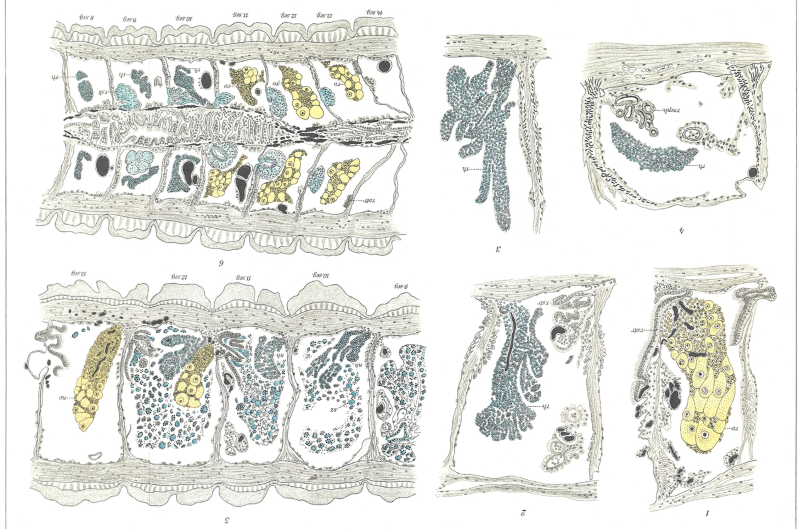
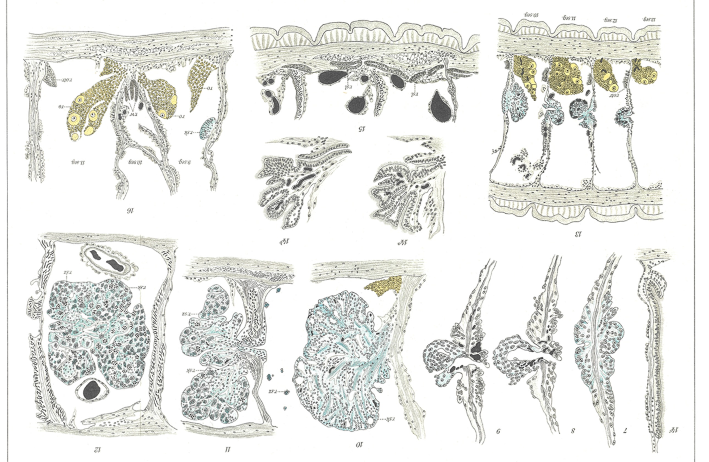
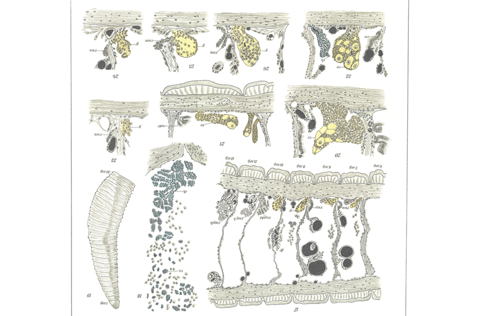

# Die Regeneration der Geschlechtsorgane bei Criodrilus lacuum Hoffm. II.

**(The Regeneration of the Sexual Organs in Criodrilus lacuum Hoffm. II.)**

By

**Dr. Viktor Janda**

(Prague-Karolinenthal).

*(From the Biological Experimental Institute in Vienna.)*

With 28 figures in the text and Plates XIX–XXI.

Received on 18 March 1912.

*Archiv für Entwicklungsmechanik der Organismen*, vol. 34 (1912).

> **Full translation.** A complete English rendering of the running text of “The Regeneration of the Sexual Organs in Criodrilus lacuum Hoffm. I” (Janda, 1912), including all tables, figure and plate legends, and footnotes. Numbers and table cells were transcribed from the page images, not the noisy OCR.

In my first paper¹), which appeared in the form of a preliminary communication, I treated the new formation of the sexual apparatus of *Criodrilus* only quite briefly and reported only the principal results of my observations. Now I wish to discuss this subject more thoroughly and to supplement the already communicated facts with new ones.

> ¹) Die Regeneration der Geschlechtsorgane bei Criodrilus lacuum Hoffm. I. Communication. Arch. f. Entw.-Mech. Vol. 33, Part 3/4.

## Material and Method.

I obtained my material from the Danube near Vienna and near Klosterneuburg. The last-named locality in particular supplied much material. It was a fairly shallow and quiet arm of the Danube with a fine, sandy bottom rich in plant remains, which was intermixed with mud. This arm of the Danube was separated from the main stream of the Danube by a dam. In the month of July (10 July) the catch was easiest and most plentiful at this locality. At this time I found the criodriles close to the bank in great quantity, buried about 1–2 dm deep in the mud and in places interwoven into entire clumps. Almost all the animals caught at this time were fully sexually mature and furnished with horn-like spermatophores. The spermatophores were (similarly as COLLIN also reports) distributed irregularly in the vicinity of the external sexual openings. When in September I repeatedly visited this locality, I found in the bank zone, where a short time before I had collected criodriles in masses, after long searching only a few specimens, whose external sexual characters were already in the process of regression. Only when I went farther into the water and, at some distance from the bank, stirred up the sand with my hands, did I succeed in catching several specimens.

Concerning the time of sexual maturity of *Criodrilus*, the following statements are found in the literature: According to ROSA, the criodriles are said to become sexually mature near Treviso already in May and June. ÖRLEY establishes the presence of spermatophores in criodriles which were caught near Budapest, during the months of March to May — never later. Copulation and egg-laying, however, take place according to ÖRLEY only in June. According to VEJDOVSKÝ (16b, p. 58), »the sexual maturity of *Criodrilus* appears to fall in the months of June and July, because HATSCHEK found the cocoons with the cleaving eggs and embryos in the middle of June 1876 (near Linz), while HOFFMEISTER mentions the worms furnished with pseudospermatophores in early July«. Further VEJDOVSKÝ remarks (16b, p. 58): »Of the sexual organs I found, at the time of my investigations — namely in October — only young ovaries and testes, and this only in a few animals. The sexual ducts, the sperm- and egg-ducts, as well as the spermathecae, were not present at all«. COLLIN (3) observed sexually mature criodriles in Berlin in June and July. »From the middle of June until the middle of July I found«, writes COLLIN, »the cocoons and worms with spermatophores in great quantities« (p. 477).

In the operation method two ways were possible: Either the removal of the entire sexual region with all the organs located in it, or a mere extirpation of the gonads and of the other sexual parts alone, a procedure which was bound up with considerable difficulties and which moreover, on account of the small dimensions of some constituents of the sexual apparatus, afforded no absolute guarantee of a complete removal of the same. I therefore decided upon the former, more convenient, although much more radical method, all the more since I soon recognized that *Criodrilus* is in a position, after the loss of the entire sexual region, itself again to form the same segment number that it has lost. Even after the removal of 40 anterior segments, regenerates still formed. The operations were carried out partly in September, partly in October 1910, in such a way that on the animals (about 300 specimens) 17–30 segments were severed at the anterior end, whereby, together with other body parts, also the whole sexual apparatus, which extends from the 9th to the 15th segment, was completely removed as well. The operation was carried out with a sterilized scalpel. The operated animals were transferred immediately after the operation into large, labelled glass pans or other suitable, spacious containers, whose bottom was covered with an approximately 2 cm high layer of water. The containers with the operated animals were placed in a cold dark corridor and covered over with glass plates. The water was changed in the first 3–4 days after the operation, depending on circumstances, two to four times daily. Later, for about 2 months, the supply of the operated animals with fresh water (high-spring water) took place only once daily.

On the 10th to 14th day after the operation, after the wounds had already closed, a little sand, which had been brought along from the collecting site, was put into the hitherto cleanly kept vessels with operated criodriles. This procedure proved to be very advantageous, in that those operated animals which were kept in the containers with sand were only very seldom attacked by mould, which is probably to be explained by the fact that the animals build little tubes out of the sand particles and out of the slime which they secrete from the skin glands, in which [tubes] they stick and thereby find more protection from infection than if they were lying naked in the water. So long as the regenerates are not yet developed strongly enough, the animals lie almost motionless on the bottom, only swinging the tail a little to and fro. But as soon as they have produced more considerable regenerates, they bury themselves in the sand, where they then remain permanently and only from time to time, if they are not disturbed, let the vessel-rich hind-end protrude to the water surface in order to breathe.

Once the operated animals have buried themselves in the sand, they require no special care any longer, and the water also need not be changed so frequently as before. The operated criodriles also require no special aeration; only the water surface must be large enough, and the bottom, considerably raised by the addition of new sand, must contain a sufficient quantity of vegetable substances, which serve the criodriles as nourishment. Various aquatic plants, such as *Elodea*, *Vallisneria*, *Hydrocharis* among others, rendered good service. The containers containing the aquatic plants were, in the case of the older specimens, placed in moderate light.

The overwhelming majority of the operated animals survived the operation, and only a very small percentage of them perished. Most of the operated specimens have regenerated large, very many (up to 25) segments. In animals on which I had cut through about 28–30 anterior segments on 18 October approximately along the middle horizontal of the length, and removed the whole dorsal half together with all the organs located in it, although the cut surface in this kind of operation was very large, nevertheless the whole upper part regenerated so completely that on 16 January it was to be distinguished from the ventral part only by the lighter coloration (Pl. XXI Fig. 19). One part of the operated animals was conserved on 3 March, 26 June, and 7 July 1911 in cold concentrated aqueous sublimate. Another part I still kept alive, since I want, if possible, to await the attainment of the second sexual period. The regenerates of several still-living animals are already 15 months old. The conserved regenerates were cut into serial sections and stained with haematoxylin (after DELAFIELD and HEIDENHAIN) and eosin.

During my many-months' absence in Naples, the care of my experimental animals was taken over in a self-sacrificing manner by Mr. Dr. FRANZ MEGUŠAR, assistant at the Biological Experimental Institute in Vienna, for which at this place I express my warmest thanks.

### Description of the normal sexual apparatus of Criodrilus.

As already mentioned, the normal sexual apparatus of *Criodrilus* occupies the 9th to 15th segment (Text-fig. 1). The testes lie in pairs in the 10th and 11th segment. They are multiply-lobed glands with numerous finger-shaped outgrowths, which are attached at the 9./10. and 10./11. dissepiment on both sides of the ventral cord and project freely into the body cavity. The testes are best developed in animals which have not yet reached their full sexual maturity. In older testes individual cell-groups detach themselves from the rest of the cell mass, whereby the outlines of the testes appear quite irregular and indistinct. At the end of the sexual period the testes are already difficult to demonstrate, in that they break up into smaller cell-groups floating in the body cavity.

The four pairs of seminal sacs lie in the 9th to 12th segment. The first two pairs of seminal sacs are grown onto the posterior dissepiments of the 9th and 10th segments and open into the 10th and 11th segment. The posterior two pairs, by contrast, are connected with the anterior septa of the 11th and 12th segments and open into the 10th and 11th segment, so that the sexual cells from the first testis-pair in the 10th segment pass into the sacs of the first and third pairs, those of the second testis-pair pass into the seminal sacs of the second and fourth pairs, in order there to undergo further developmental stages up to full maturity. The seminal sacs that have come into being through the invagination of the dissepiment-wall run out into broad lobes, are permeated by fine, elastic muscle fibers and blood vessels, and are divided inside into smaller »chambers«. — The seminal funnels (»ciliated rosettes« BENHAM) lie opposite the testes at the posterior dissepiments of the 10th and 11th segments and are at the time of sexual maturity filled with sperm masses. The four seminal funnels connect with four seminal ducts, of which two on each side unite in the 12th segment to a vas deferens, which extends into the 15th segment and there opens out by means of a wide »atrium«. The male pori lie, according to the description of MICHAELSEN (7b, p. 59): »on the 15th segment above the ventral bristle-pairs, on large but little-raised, laterally somewhat wrinkled glandular cushions, which extend over the 15th and 16th segment and laterally almost up to the dorsal bristle-pairs«. — The ovaries are present in normal animals only in one pair, in the 13th segment, and lie at an analogous place as the testes, opposite the ovarial funnels, which likewise occur only in one pair. In the vicinity of the ovarial funnels lie still two receptacula ovorum (»ovisac« BENHAM). These are formed by sac-like outpouchings of the posterior septa of the 13th segment, and, lying in the 14th segment, open into the cavity of the 13th segment. In the egg sacs several eggs are often to be found. The ovarial funnels go over in the 14th [segment] into short oviducts, which open out in front of the male pores on the 14th segment on small, glandular papillae. According to MICHAELSEN (7b, p. 60) at *Criodrilus* »the girdle is indistinctly bounded, reaching approximately from the 16th to the 47th segment«, and »at adult animals only temporarily formed«.

### Description of the regenerated sexual apparatus of Criodrilus.

#### A. The gonads.

That the gonads of *Criodrilus* are capable of regeneration, I have demonstrated in the first communication. Now I wish to add some remarks to this here. First the question of the manner of origin of the gonads is to be answered. The first gonad-primordia appear very soon after the operation. In animals on which I had severed 18–22 anterior segments on 10 August, for example, the first gonad- and ciliated-funnel anlagen could be demonstrated on 13 September — thus already approximately after one month. At the lower edge of some regenerated dissepiments one notices first, close above the longitudinal muscle layer and on both sides of the ventral cord, tiny, hemispherical accumulations of peritoneal cells, which stand off a little from the septal wall and project into the body cavity (Pl. XXI Fig. 23). These accumulations of peritoneal cells sit with a broad base on the septum and consist of cells that are at first uniform, initially club-shaped, later indistinctly delimited from one another (Pl. XXI Fig. 17, 25, 26). These are the first anlagen of the gonads. The transition between the young gonad cells and the ordinary peritoneal cells of the septal wall is not a distinct one. The peritoneal thickenings in question grow in the course of the further development more in length than in breadth, and at the same time their base tapers stalk-like, whereby their originally hemispherical shape is transformed into a pear-shaped one (Pl. XXI Fig. 24). In this developmental stage the regenerated gonad presents entirely the same picture as BERGH (2) draws it in Fig. 10 Pl. XXI for the normal gonad-anlagen in *Lumbricus*-embryos. At this time the presented gonad-primordia are morphologically so indistinctly equivalent to one another that one cannot predict whether out of them testes or ovaries become.

The ovaries retain as a rule also in the further course of development their original pear-shaped form, and differ in the older stages from the testes — apart from the form — by the larger nuclei of their cells and by large egg-cells, which they produce partly at the periphery, partly in the interior (Pl. XIX Fig. 1). The form of the older testes differs essentially from that of the ovaries, in that the testis-cells group themselves into fairly long, finger-shaped lobes, which project freely into the segmental cavity and lend these glands a fan-like appearance (Pl. XIX Fig. 2, 3). That the normal gonads of the Oligochaeta come into being through differentiation of the peritoneal cells, VEJDOVSKÝ too has already correctly recognized. One reads in his »System and Morphology of the Oligochaeta« p. 157 the following: »If one considers the very first beginnings of the sexual glands in all the specially listed cases, then it is not difficult to construct for them a complete homology. Both testes and ovaries arise through an envelopment of the body cavity and reveal in the first period of their appearance not only the same shape and the same extent, but for a short time consist of elements that take shape concordantly [with one another].« This fact is thus also experimentally confirmed anew. — The gonads (and the associated ciliated funnels) are laid down already at a time when of the remaining parts of the sexual apparatus no trace is yet to be recognized. They therefore represent the oldest constituents of the regenerated sexual system. This finding stands in full agreement with the observations of BERGH, which relate to the embryonic origin of the gonads of the *Lumbricidae*. According to BERGH (2, p. 313) namely: »the testes and ovaries are the only parts of the sexual apparatus which are already laid down during cocoon-life«. The regenerative development accordingly agrees, also with regard to the temporal succession of the individual components of the sexual apparatus, with the embryonic [development].

In the regenerates both kinds of sexual glands occur, and the individuals with regenerated sexual organs appear as hermaphrodites, whereby in the majority of cases the ovaries come to development in greater number than the testes, which appears especially interesting, in that under normal conditions precisely the opposite holds as the rule (the testes in two, the ovaries in one pair). In stark contrast to this stands the connection of some supernumerary, newly-formed seminal sacs precisely with the ovarial segments.

The regenerated testes usually lie, as in the normal body, in front of the ovaries (Pl. XIX Fig. 6). The presence of well-developed ovaries in front of the testes I was able to establish in only two cases. The regenerated gonads usually form a continuous row on each side, that is, they lie in a definite number of directly consecutive segments. The regenerated gonads show the tendency to repeat themselves in several segments, as one can easily convince oneself by examining the text-figures. One also recognizes, on first glance when surveying the text-figures, that the regenerated gonads also occur in such segments where they are normally never to be found. The tendency of the gonads to spread out in the direction toward the anterior end seems to be greater than that in the opposite direction. Well-developed ovaries are encountered behind the 13th segment less often than in front of it. The testis-segments are sometimes wholly or partly occupied by the ovaries, and the testes are displaced into the anterior segments. As testis-segments, the 8th and 9th segments most frequently functioned in the regenerates. Among the regenerated ovaries, the 11th, 12th, and 13th segments were again preferred. According to my experience so far, the gonads can extend from the 4th up into the 18th segment. The testes occurred in the 4th to 12th, the ovaries in the 6th to 18th segment. The highest gonad number observed up to now amounted to 12 pairs (normal 3 pairs). Most frequently the gonads came to development in 5–8 pairs. The lowest number of regenerated gonads amounted to 4 pairs.

Among 28 specimens with regenerated sexual organs there were¹⁾:

| | | |
|---|---|---|
| 4 gonads | . . . . . . . . | 2 specimens, |
| 5 - | . . . . . . . . | 5 - |
| 6 - | . . . . . . . . | 6 - |
| 7 - | . . . . . . . . | 5 - |
| 8 - | . . . . . . . . | 6 - |

> ¹⁾ For the sake of simplicity, the gonads were counted only on one side of the body.

| | | |
|---|---|---|
| 9 gonads | . . . . . . . . | 3 specimens, |
| 10 - | . . . . . . . . | 0 - |
| 11 - | . . . . . . . . | 0 - |
| 12 - | . . . . . . . . | 1 specimen. |

(Normal number = 3 gonads.)

Among 23 operated animals, individual specimens possessed the following number of testes and ovaries¹⁾:

| | | | | |
|---|---|---|---|---|
| 1) | 0 testes | . . . . . . | 9 ovaries, | |
| 2) | 1 - | . . . . . . | 4 - | |
| 3) | 1 - | . . . . . . | 4 - | |
| 4) | 1 - | . . . . . . | 6 - | |
| 5) | 1 - | . . . . . . | 6 - | |
| 6) | 1 - | . . . . . . | 7 - | |
| 7) | 2 - | . . . . . . | 2 - | |
| 8) | 2 - | . . . . . . | 4 - | |
| 9) | 2 - | . . . . . . | 4 - | |
| 10) | 3 - | . . . . . . | 3 - | |
| 11) | 3 - | . . . . . . | 3 - | |
| 12) | 3 - | . . . . . . | 3 - | |
| 13) | 3 - | . . . . . . | 4 - | |
| 14) | 3 - | . . . . . . | 4 - | |
| 15) | 3 - | . . . . . . | 5 - | |
| 16) | 3 - | . . . . . . | 5 - | |
| 17) | 3 - | . . . . . . | 5 - | |
| 18) | 3 - | . . . . . . | 6 - | |
| 19) | 4 - | . . . . . . | 3 - | |
| 20) | 4 - | . . . . . . | 4 - | |
| 21) | 4 - | . . . . . . | 4 - | |
| 22) | 4 - | . . . . . . | 5 - | |
| 23) | 4 - | . . . . . . | 8 - | |
| (Normal number: | 2 - | . . . . . . | 1 ovarium.) | |

The regenerated testes lay, in 23 specimens:

| | | | |
|---|---|---|---|
| in the | 4th segment | . . . . . . . . | 1 time, |
| - | 5th - | . . . . . . . . | 2 - |
| - | 6th - | . . . . . . . . | 4 - |
| - | 7th - | . . . . . . . . | 10 - |
| - | 8th - | . . . . . . . . | 15 - |

> ¹⁾ For the sake of simplicity, the testes and ovaries were counted only on one side of the body.

| | | | |
|---|---|---|---|
| in the | 9th segment | . . . . . . . . | 12 times, |
| - | 10th - | . . . . . . . . | 10 - |
| - | 11th - | . . . . . . . . | 3 - |
| - | 12th - | . . . . . . . . | 1 - |

The regenerated ovaries lay, in 23 specimens:

| | | | |
|---|---|---|---|
| in the | 6th segment | . . . . . . . . | 2 times, |
| - | 7th - | . . . . . . . . | 2 - |
| - | 8th - | . . . . . . . . | 4 - |
| - | 9th - | . . . . . . . . | 11 - |
| - | 10th - | . . . . . . . . | 12 - |
| - | 11th - | . . . . . . . . | 18 - |
| - | 12th - | . . . . . . . . | 20 - |
| - | 13th - | . . . . . . . . | 18 - |
| - | 14th - | . . . . . . . . | 11 - |
| - | 15th - | . . . . . . . . | 7 - |
| - | 16th - | . . . . . . . . | 1 - |
| - | 17th - | . . . . . . . . | 1 - |
| - | 18th - | . . . . . . . . | 1 - |

However many regenerated ovaries I have already examined, I have not yet observed a single case in which they were present in normal number (one pair) or even reduced. I have always found them only increased in number. The lowest number of regenerated ovaries amounted to two pairs. Two pairs of testes (thus the same number as also holds as a rule for normal animals) have already come into view several times in the regenerates. The testes, however, may also be present in only a single pair, or on one side of the body they may be completely suppressed and replaced by the ovaries. In this way individuals come about with nothing but ovaries on one side of the body (cf. Text-fig. 16). Individuals with only one kind of gonad ("females" or "males"), or even such without any gonads at all, as Mrázek described and depicted in *Lumbriculus*, I have never yet found. I do not, however, regard this eventuality in *Criodrilus* as at all excluded. It would indeed, given the enormous variability of the regenerated reproductive organs of this animal, be nothing surprising if, on further treatment of a still richer material, one were also to encounter the abovementioned abnormalities. The number of cases observed by me is certainly still far too small for conclusions of a more general nature to be drawn.

**Fig. 1.** Normal anterior end of *Criodrilus* with the sexual apparatus. *at* atria, *h* testes, *od* oviducts, *es* egg-sacs, *ov* ovaries, *s* sperm-sacs, *sl* sperm-ducts, *w* ciliated funnels. **Figs. 2–5.** Regenerates with newly formed parts of the sexual apparatus. The sperm-ducts and oviducts are omitted. The segments in which the gonads lie in normal animals are marked by a darker shading.  *(figure not reproduced)* Only this much can be regarded as established: that the new formation of the gonads, as well as of other parts of the sexual apparatus, in *Criodrilus* is possible only in a certain, not sharply enough delimited, anterior body region, and that the regenerated sexual apparatus is indeed always situated in this region, but can occupy various segments of it. One may also, in *Criodrilus*, to use Mrázek's words, "declare a large part of the genital region to be omnipotent."

The horizontal section-series furnish the proof that the regenerated gonads are mostly distributed symmetrically on both sides of the midline. Less often does it happen that, in one and the same segment, a testis comes to lie on one side and an ovary on the other.

Besides those gonads which present themselves either as purely male or purely female glands, there also appear in the regenerates — although much more rarely — such as function partly as ovaries, partly as testes, and which can therefore be designated as "hermaphrodite gonads." In these hermaphrodite gonads the female and male parts are indeed clearly separated from one another, but they hang firmly together and sprout forth from a common base. The testis-part of such gonads is easily recognizable, as against the ovary-part, by the much smaller and more strongly stainable cell-nuclei.

Furthermore, I have succeeded, in three different animals with a regenerated head-end, in also finding abnormalities in which, in one and the same segment on one and the same side, two or three independent gonads had differentiated from various, widely separated districts of the peritoneal envelope. In one specimen it was a matter of two gonads, an ovary and a testis (Pl. XXI Fig. 22). The testis had retained the normal gonad-position and was located at the otherwise usual place, i.e. in the angle between the lower edge of the anterior septum of the 12th segment and the body-wall musculature; the ovary, on the other hand, lay roughly in the middle between the two dissepiments closing off the segment in question, above the longitudinal-muscle layer; it was, like the testis, abundantly supplied with blood-vessels and contained large egg-cells. The peritoneum was very flat in the vicinity of this ovary. At the posterior septum of the segment under discussion there was a ciliated funnel. In the second specimen one perceives three gonads on one side (Pl. XXI Fig. 21). Two of them I have recognized at once as ovaries by their large, yolk-rich egg-cells; about the true nature of the third, smallest gonad I am not entirely clear. Finally, I should like to report on the third abnormality, where, in one half of a segment (9th segment), two ovaries facing each other had developed, which were attached to the two septa. The ovary fixed to the posterior septum was directed, instead of backward, forward. Both ovaries (Pl. XX Fig. 16) have attained a considerable size, were of normal shape, and produced large eggs. The dissepiments closing off the 9th segment were partly fused with one another on the dorsal side and at the same time functioned as carriers of two sperm-sacs. Since the ovarian funnels were entirely lacking in the 9th segment, the eggs which detached themselves from the ovaries of this segment could indeed not be conveyed outward and were bound to atrophy. In the next (10th), very narrow and imperfectly developed segment, one finds again, instead of the ovaries, two ovarian funnels, which, however, are without significance for the sexual activity of the animal, since the gonads whose products they are destined to convey out are lacking in this segment. The ovary in the next-following (11th) segment is quite normally developed. Opposite it is an oviduct. From the section-series one recognizes that the ovary, which is fixed to the posterior dissepiment of the 9th segment, is connected with that of the 11th segment by a fairly strong, cellular strand (cf. also Text-fig. 25). It seems as though these two ovaries represent only parts of an originally unitary gonad-anlage.

From what has been described above it emerges: 1) that the peritoneum of the regenerated sexual region is not only capable of producing the gonads in such segments in which they also occur in normal individuals, but that it also possesses the capacity to let the sexual glands arise anew in segments in which they are never to be found under normal circumstances; 2) that the formation-site of a gonad need not be bound to a definite place of the segment. Cf. also A. Stolc (15a) pp. 17 and 23 (*Aeolosoma*).

In conclusion, I should like to mention further that I have also caught several *Criodrilus* with natural head-regenerates. In larger head-regenerates of such animals, consisting of several segments, similar abnormalities in the structure of the sexual apparatus came to light as in the operated animals, from which it is to be concluded that the regeneration of the sexual organs in *Criodrilus* in free nature proceeds in a similar manner as in captivity after artificial injuries. But even in animals which externally show no traces of an injury or of a regeneration, various smaller abnormalities of the sexual apparatus occur sporadically. Thus I have, for example, in a sexually mature "normal" animal with otherwise normally constructed sexual organs, encountered in the 12th segment — which as a rule contains no gonads — a large "hermaphrodite gonad" and a ciliated funnel (cf. Pl. XIX Fig. 5). The gonad in question functions in its upper half as an ovary, in its lower half as a testis. In the folds of the ciliated funnel large sperm-clumps are lodged.

## B. The ciliated funnels, sperm-ducts and oviducts.

Already in my first communication I depicted several small and simple regenerates of ciliated funnels. Now I can supplement these illustrations insofar as I can present two other regenerated ciliated funnels whose form is much more complicated, in that their margins run out into several long, ciliated lobes (Pl. XX Fig. 14a, 14b). These already highly differentiated regenerates, which I was able to follow in many specimens in various modifications, agree down to the smallest details with the normal organs of this species; indeed, they sometimes become even larger than the latter. The walls of the ciliated funnels consist for the most part of a ciliated epithelium. The cells of this epithelium are densely crowded together and stain intensely. Similar epithelium is also found in the walls of the regenerated oviducts and spermiducts, into which the ciliated funnels pass over. Beneath the ciliated epithelium of the ciliated funnel a connective-tissue mass with blood-vessels can be distinguished.

Concerning the manner of origin of the ciliated funnels, I communicate the following: The first anlagen of the ciliated funnels appear (similarly to those of the gonads) sometimes already 1 month after the operation. Through the multiplication and accumulation of the peritoneal cells at the site of the future ciliated funnels, there come about at first quite small, only slightly raised thickenings of the peritoneum, which sit upon the septal wall and stain dark (Pl. XXI Fig. 23, 26). These thickenings of the septal peritoneum consist of fairly narrow, mostly radially arranged peritoneal cells with strongly constricted base and distinct nuclei. Originally these cells stand fairly loosely side by side, but in the course of further development, as they multiply vigorously, they move ever more closely together, until they finally become a solid cell-ridge, which passes over into the ordinary peritoneum. The ciliated hairs I could not yet establish at this time on these primitive ciliated-funnel anlagen. The cell-ridges steadily increase in extent and soon begin to lay themselves into folds, which latter grow ever more deeply into the body-cavity.

That the normal ciliated funnels [Wimpertrichter] of the oligochaetes represent peritoneal formations was demonstrated by Vejdovský (16a, b) and Bergh (2). Accordingly, the normal and the regenerated ciliated funnels are to be regarded as homologa. The regenerated ciliated funnels arise independently of the nephridial funnels (nephrostomes). It is established: 1) that the ciliated funnels can also develop in segments which possess no gonads; 2) that, conversely, gonads without associated ciliated funnels occur. These facts argue that the origin of the ciliated funnel does not depend on the presence of the gonads, and conversely, and that between these organs there exist no absolutely fixed correlative relationships. Such cases are, however, to be regarded as abnormalities, since by far the greatest number of the regenerated ciliated funnels were to be found only in those segments in which the gonads were also located. In general, it holds as a rule that the sperm- and ovarial funnels repeat themselves in a manner similar to the gonads belonging to them. Accordingly, the number of the ciliated funnels usually approximates that of the gonads.

Among 28 specimens with regenerated sexual organs there possessed (on one side of the body):

| | | | Number |
|---|---|---|---|
| 3 ciliated funnels | . . . . | . | 1 specimen, |
| 4 - | | . . . . . | 3 specimens, |
| 5 - | | . . . . . | 5 - |
| 6 - | | . . . . | 10 - |
| 7 - | | . . . . . | 4 - |
| 8 - | | . . . . . | 3 - |
| 9 - | | . . . . . | 1 specimen, |
| 10 - | | . . . . . | 1 - |

(Normal number: 3 ciliated funnels.)

The regenerated ciliated funnels occurred, among 28 specimens,

in the 5th segment . . . . 2 times, - 6. - . . . . 8 - -

in the 7th segment . . . . 14 times,
- 8. - . . . . 21 - -
- 9. - . . . . 25 - -
- 10. - . . . . 28 - -
- 11. - . . . . 22 - -
- 12. - . . . . 20 - -
- 13. - . . . . 16 - -
- 14. - . . . . 8 - -
- 15. - . . . . 3 - -
- 16. - . . . . 1 - -
- 17. - . . . . 1 - -

As regards the sperm-ducts [Samenleiter], I must confine myself merely to the establishment of their presence in the regenerates. To ascertain their development was not possible for me. I can report only this much, that at the time when the first beginnings of the ciliated funnels had already become clearly visible, no trace of the sperm-ducts could yet be recognized. Hence the supposition lies near that the tubular parts of the male efferent apparatus are laid down in the regenerates later than the funnels. For this view, the observations made on normal oligochaetes by Vejdovský and Bergh concerning this matter provide an important support. The sperm-ducts (spermiducts) run for the most part between the peritoneum and the longitudinal musculature and can be followed on suitable longitudinal sections over a fairly long stretch (Taf. XX Fig. 15). To find the openings of the oviducts was quite difficult, and I succeeded in discovering them, and indeed in increased number, only after long searching.

## C. Atria.

Well-developed atria opening to the outside, and regenerated, I encountered only in a single specimen. These lay ventrally and symmetrically on both sides of the 13th segment. Their openings were slit-shaped and surrounded by glandular swellings.

According to Örley (10), spermathecae are also said to occur in *Criodrilus* (p. 553/554): »There are two pairs of spermathecae, which appear to open on the ventral surface between the somites IX, X and X, XI respectively.« Of these organs I could in the regenerates discover no trace. Also by Rosa, Benham and Collin the presence of these organs in *Criodrilus* is disputed.

## D. Sperm-sacs [Samensäcke]¹) and egg-sacs [Eiersäcke]

occur in all older regenerates. In young regenerates (about 1 month old) the sperm-sacs are by contrast not yet present at that time, when small gonads and ciliated funnels appear, whence there are regenerates which do not yet present a quite normal form (Taf. XXI Fig. 17). At those places of the dissepiment where the sperm-sacs are later to form, one finds at first only a small bilateral proliferation of the septal peritoneal covering (Taf. XX Fig. 7). The further developmental phase of the sperm-sacs consists in this, that the thickened portion of the dissepiment wall invaginates into the segmental cavity and assumes the form of an originally simple little sac, which communicates at the place where the invagination took place with the body cavity (Taf. XX Fig. 8, 9, 13). The initially simple invagination becomes ever more powerful through proliferation of the tissue of the invaginated portion and soon forms a globular or kidney-shaped outgrowth of the septal wall with a lobed surface and parenchymatous internal structure (Taf. XX Fig. 10). In the interior of the newly formed sperm-sacs there form, as in the normal sperm-sacs, numerous small »chambers«, into which the sperm-cells are later taken up (Taf. XX Fig. 11, 12).

In the formation of the sperm-sacs all the tissue types of the septal wall, but especially the peritoneum, seem to take part. The regenerated sperm-sacs are supplied with numerous blood vessels and permeated by fine muscle fibers which radiate in from the septal wall. At the time of sexual maturity the regenerated sperm-sacs had already become so large that they almost filled out the entire free segmental space. The sperm-sacs arise independently of the ciliated funnels, just as Bergh also emphasizes for the normal sperm-sacs of the Lumbricids. If one compares the account by Bergh (2, p. 316 and 317) of the normal development of these organs in the Lumbricids with our statements, one recognizes at once that the findings of Bergh coincide strikingly with my own.

> ¹) In my first communication I designated these organs, following Collin, also as »seminal vesicles« [Samenblasen].

In younger regenerates the sperm-sacs usually appear only in one segment or in a few segments. Later the number of the sperm-sacs increases and can sometimes reach a considerable height (cf. the text figures). Even in fairly differentiated regenerates the sperm-sacs are not uniformly developed, and one can study in one and the same animal various developmental stages of them. The position of the regenerated sperm-sacs is by far not so constant as in the normal sexual segments. As I already mentioned in the description of the normal sexual apparatus, the two anterior pairs of the sperm-sacs open backward (toward the tail end) and the two posterior pairs of them forward (toward the head end). In a similar way the regenerated sperm-sacs too are wont to communicate with the segmental cavities; yet it must be expressly emphasized that the agreement with respect to the direction of the openings of the normal and the regenerated sperm-sacs is not general, for there was also no lack of such cases in which the openings of the regenerated sperm-sacs had taken exactly the opposite position from what is the case in normal animals.

The regenerated sperm-sacs lie either symmetrically on both sides of the intestinal canal, or they are developed in some segments only on one side. Distinctly differentiated sperm-sacs and out-pouchings of the dissepiments, which one may in part also interpret as anlagen of egg-sacs, could be followed from the 5th into the 18th regenerated segment. Most frequently the regenerated sperm-sacs occur in the 9th, 10th and 11th segment (where they are also normally to be met with).

Among 28 specimens with regenerated sexual apparatus there possessed (on one side):

| | | | | Number |
|---|---|---|---|---|
| 1 young sperm-sac | . . . . . . . . . | 3 specimens, |
| 2 young sperm-sacs | . . . . . . . . . | 1 specimen, |
| 3 sperm-sacs | . . . . . . . . . . . | 1 - |
| 4 sperm-sacs (or smaller out-pouchings of the dissepiments) | . . . . . | 2 specimens, |
| 5 - | - | - | 3 - |
| 6 - | - | - | 5 - |
| 7 - | - | - | 4 - |
| 8 - | - | - | 2 - |
| 9 - | - | - | 3 - |
| 10 - | - | - | 3 specimens, |
|---|---|---|---|
| 12 - | - | - | 1 specimen. |

(Normal number: 4 sperm-sacs.)

The regenerated sperm-sacs (or smaller out-pouchings of the dissepiments) were found, among 28 specimens,

in the 5th segment . . . . . 2 times,
- 6. - . . . . . . 12 - -
- 7. - . . . . . . 19 - -
- 8. - . . . . . . 19 - -
- 9. - . . . . . . 31 - -¹)
- 10. - . . . . . . 24 - -
- 11. - . . . . . . 21 - -
- 12. - . . . . . . 17 - -
- 13. - . . . . . . 10 - -
- 14. - . . . . . . 9 - -
- 15. - . . . . . . 3 - -
- 16. - . . . . . . 1 - -
- 17. - . . . . . . 1 - -
- 18. - . . . . . . 1 - -

Among 28 operated animals, individual specimens had regenerated on one side the following number of sperm-sacs (or egg-sacs²):

| | Number of sacs | open backward | open forward |
|---|---|---|---|
| 1) | 1 . . . . . . . | 0 . . . . . . . | 1 |
| 2) | 1 . . . . . . . | 0 . . . . . . . | 1 |
| 3) | 1 . . . . . . . | 0 . . . . . . . | 1 |
| 4) | 2 . . . . . . . | 0 . . . . . . . | 2 |
| 5) | 3 . . . . . . . | 3 . . . . . . . | 0 |
| 6) | 4 . . . . . . . | 2 . . . . . . . | 2 |
| 7) | 4 . . . . . . . | 1 . . . . . . . | 3 |
| 8) | 5 . . . . . . . | 1 . . . . . . . | 4 |
| 9) | 5 . . . . . . . | 2 . . . . . . . | 3 |
| 10) | 5 . . . . . . . | 2 . . . . . . . | 3 |
| 11) | 6 . . . . . . . | 3 . . . . . . . | 3 |
| 12) | 6 . . . . . . . | 2 . . . . . . . | 4 |

> ¹) In some segments several sperm-sacs also occurred.

> ²) Since I was sometimes unable to distinguish with certainty the young anlagen of the sperm-sacs from the anlagen of the egg-sacs, I give merely the total number of these two organs.

| | Number of sacs | open backward | open forward |
|---|---|---|---|
| 13) | 6 . . . . . . | 1 . . . . . . | 5 |
| 14) | 6 . . . . . . | 1 . . . . . . | 5 |
| 15) | 6 . . . . . . | 1 . . . . . . | 5 |
| 16) | 7 . . . . . . | 3 . . . . . . | 4 |
| 17) | 7 . . . . . . | 3 . . . . . . | 4 |
| 18) | 7 . . . . . . | 2 . . . . . . | 5 |
| 19) | 7 . . . . . . | 3 . . . . . . | 4 |
| 20) | 8 . . . . . . | 3 . . . . . . | 5 |
| 21) | 8 . . . . . . | 4 . . . . . . | 4 |
| 22) | 9 . . . . . . | 4 . . . . . . | 5 |
| 23) | 9 . . . . . . | 3 . . . . . . | 6 |
| 24) | 9 . . . . . . | 4 . . . . . . | 5 |
| 25) | 10 . . . . . . | 4 . . . . . . | 6 |
| 26) | 10 . . . . . . | 4 . . . . . . | 6 |
| 27) | 10 . . . . . . | 4 . . . . . . | 6 |
| 28) | 12 . . . . . . | 3 . . . . . . | 9 |

(Normal number: = 4 + 1 . . . . 2 . . . . . . 2 + 1)

Furthermore I must yet draw attention to the circumstance that many of the newly formed sperm-sacs communicate with such segments as contain only the ovaries (cf. the text figure). Such a position and communication of the sperm-sacs must be designated as absolutely inexpedient and superfluous, especially since thereby the actual task of the sperm-sacs, namely to take up the sperm-cells and to bring them to further development, appears illusory, since the sperm-cells which have detached themselves from the testes cannot get into such sperm-sacs.

Various, entirely inexpedient modifications of the sexual apparatus were also described by Mrázek (9) in *Lumbriculus variegatus* [Lumbriculus variegatus] (copulatory apparatus without gonads and sperm-funnels, hyperplasia of the spermathecae in otherwise pure »males«, »blind« spermathecae in the sperm-sacs and egg-sacs).

The sperm-sacs standing in connection with the ovarial segments are not in any way stunted, but quite normally developed and differ in no way from those which open into the testis segments. The regenerated sperm-sacs which open into the testis segments I have found either empty or distended-full with sperm-cells (Taf. XX Fig. 12). In the latter case there can be distinguished in the »chambers« of such sperm- *(Source printed page 577 is a full-page figure plate carrying only the running header and figures Fig. 6–10, with the shared caption below. The preceding sentence ["…in the »chambers« of such sperm-sacs…"] continues on the following text page.)*

Running header: Die Regeneration der Geschlechtsorgane bei Criodrilus lacuum Hoffm. II. 577

**Fig. 6.**  *(figure not reproduced)*

**Fig. 7.**  *(figure not reproduced)*

**Fig. 8.**  *(figure not reproduced)*

**Fig. 9.**  *(figure not reproduced)*

**Fig. 10.**  *(figure not reproduced)*

**Fig. 6–10** illustrate the position of the still indifferent gonads *g*, of the ciliated funnels and sperm-sacs (if these are already present) in quite young regenerates. **Fig. 11–28.** Some modifications of the older regenerated sexual organs in various specimens of *Criodrilus*. (The sexual apparatus is drawn only on one side of the body.) *sz* sperm-cells.

**Figs. 11–16.** Series of figures showing the position of the regenerated gonads (column scale of segments 4–19 above each figure). *(figures not reproduced)* **Figs. 17–22.** Continuation of the series of figures (column scale of segments 4–19 above each figure). *(figures not reproduced)* **Figs. 23–28.** Continuation of the series of figures (column scale of segments 4–19 above each figure). *(figures not reproduced)* …sacs, the various developmental stages of the spermatozoa can readily be ascertained.

In the regenerated egg-sacs I have so far not yet found any eggs.

### Nephridia of the genital region.

According to Collin (3), the nephridia of *Criodrilus* are still rather strongly developed in the 12th and 13th segments, whereas in the 11th and 10th segments they are pushed aside by the seminal sacs [sperm sacs]. In front of the 10th segment the nephridia, according to Collin, appear to be absent. Benham (1) states that in the stretch from the 1st to the 13th segment he found no nephridia. I have encountered the nephridia in the genital region both in normal and in operated specimens. Distinct nephridial loops I found (apart from the posterior parts of the regenerate) in the 10th to 16th regenerated segment. In one case the nephridia had developed even in the 6th and 8th segments (Pl. XIX Fig. 4). The nephridial funnels I observed in the 10th, 11th, 13th, 14th, and 15th segments. The position of the nephridia in the genital region was, however, not constant, and in some segments the nephridia did not come to development at all. In the anterior genital segments the excretory organs appear to occur only sporadically and sometimes show distinct traces of a progressive reduction. In some ovarial segments I have encountered, instead of the ovarial funnels, typical nephrostomes; of the ovarial funnels nothing was to be noticed in such cases.

### Concluding remarks.

The colossal variability of the regenerated sexual apparatus of *Criodrilus* is all the more striking since in most Oligochaeta the components of the normal reproductive system are wont to be rather fixed and restricted to particular segments, and even when deviations in the structure and position of the sexual parts do occur, these are as a rule only slight and of subordinate significance. Such an abnormality is described, for example, by Bergh in *Lumbricus* (2, p. 308): "Abnormally, supernumerary ovaries were repeatedly found in the 13th segment." "In three different cases such were demonstrated. In one *L. turgidus* two such ovaries were found; in another individual of the same species only one such was present on the right side; finally, in one *L. purpureus* one such was demonstrated on the left side. In all three cases the position of these structures corresponded entirely to that of the normal ovaries; their form, their structure, and their size were also almost exactly the same. A corresponding supernumerary oviduct and receptaculum ovorum were entirely lacking in all three cases, and the eggs that detach themselves from those supernumerary ovaries can accordingly never come to development." "Abnormally placed, supernumerary testes were never found."

On examining a large quantity of *Tubifex*, Mrázek (9, p. 450) found that "individual specimens possessed only one seminal duct and seminal funnel." A doubling of the spermathecae and other anomalies Mrázek also observed in *Pheretina* [*Pheretima*]. Quite remarkable modifications of the sexual system, however, the same author described in normal specimens of *Lumbriculus variegatus*. Mrázek collected, in comparison with his predecessors, an enormous material (about 200 specimens) of sexually mature individuals of *Lumbriculus*, which, as is well known, are among the very greatest rarities, and subjected the sexual apparatus of these animals to a thorough statistical and anatomical investigation, which yielded very interesting results. Without going into the details of Mrázek's work, I will touch only on those points which stand in a certain connection with our observations on *Criodrilus*. Ovaries, testes, seminal funnels, oviducts, atria, and spermathecae vary in *Lumbriculus* (pp. 399 and 400) "so much and in all possible combinations among one another that a variation-statistical investigation in the proper sense of the word was impossible, since each single variant was represented only once, hence: as many individuals, so many variants. If we take into account all the components of the sexual apparatus, we may say that not even two specimens were completely alike." (p. 410) "As regards first the gonads, these may be present either only as a single pair, or also in increased, two- or even threefold number. This may refer either to ovaries, or merely to testes, or to both at once. Here too, as everywhere else in the structure of the sexual organs of *Lumbriculus*, an asymmetry may show itself, in that on one side the number of the gonads may be reduced. This holds especially of the ovaries." …. "For the oviducts one ought, according to the statements of Vejdovský, Hesse, Wenig, to assume two pairs as the normal number, yet in my material very numerous cases occurred in which only one pair of oviducts was present, or conversely again, though much more rarely, cases in which the number had risen to three pairs ……" "According to the earlier observations (Vejdovský, Hesse, Wenig) *Lumbriculus* possesses one pair of seminal funnels. These develop, according to Wenig's figure—which Hesse particularly emphasizes—also when the atrium belonging to it on the corresponding side is not present. As against this I can adduce that this indeed sometimes really takes place, but that on the other hand in other cases the seminal funnel can completely disappear. Conversely, however, I very often found individuals in which the seminal funnels were increased (two to three pairs, but often asymmetrically)." (p. 416) "The greatest degree of variability is shown, however, by the conditions of the spermathecae. Relatively very rare are cases in which the spermathecae are present symmetrically, simply in pairs in a single body-segment. The number, however, varies considerably (two to five pairs)." Concerning the variable position of the male pores in *Lumbriculus variegatus* I have already made mention in my first essay.

One sees that the normal sexual apparatus of *Lumbriculus* is just as variable as the regenerated one of *Criodrilus*. Strictly speaking, the designation of the sexual apparatus of *Lumbriculus* as "normal" is not quite apt, inasmuch as in many individuals of this species the sexual apparatus probably comes about just as well through regeneration as in *Criodrilus*; the difference lies only in this, that in *Lumbriculus* the regeneration takes place in a natural way following preceding asexual multiplication by fragmentation, whereas in *Criodrilus* the regeneration was first artificially provoked through injury. Mrázek too explains the great variability of the reproductive organs of *Lumbriculus* through regeneration. My findings in *Criodrilus* furnish for this a positive proof.

The question now arises why the regenerated sexual organs of *Criodrilus* deviate so greatly from the normal ones, and why precisely the hyperplasias—which after all demand so much precious cell material for their construction—are preferred, when after all a mere restoration of the original, much simpler conditions would fully suffice for the life of the animal and for the preservation of the species would render the same service? I believe it will not be so easy to find a satisfying and unobjectionable answer to this question. One might perhaps explain the multiplication of the gonads and other modifications of the newly formed sexual organs of *Criodrilus* as atavisms. Yet the colossal variability of these organs alone seems to indicate that here it cannot be a matter of atavistic reminiscences.

However far I am from disputing the great utility of the colossal regenerative capacity of *Criodrilus* for this species, I must on the other hand hold fast to the view that the regenerative potency of this animal does not represent an absolutely purposive arrangement. For indeed there occur in the regenerates, alongside the purposive contrivances, also such as one must precisely designate as contrary to purpose, and through which the otherwise customary harmony of the whole is severely disturbed.

For the rest, it still remains to await the activity of the regenerated sexual organs of *Criodrilus* in egg-laying and other sexual functions before one passes a definitive judgment on their usefulness. The complete equipment of the newly formed sexual organs, however, makes it from the outset very probable that they should be capable of functioning. Up to now I have not yet succeeded in observing the cocoon-formation and egg-laying in the operated *Criodrili*, yet I hope that through further experiments and rearing of the operated animals under favorable conditions I shall be able to fill this gap in my observations also. Such experiments, I believe, would also be worth the trouble for the reason that they could also answer the important question whether at all and to what degree the experimentally achieved alterations of the sexual apparatus of *Criodrilus* can be inherited.

Prague-Karolinenthal, end of December 1911.

### Nachtrag [Addendum].

When this second part of my work was already in print, there appeared in the Biol. Centralbl. Vol. XXXII. 1912. No. 1 a preliminary communication on "Regeneration and Transplantation in *Criodrilus*," by Dr. L. G. Tirala. According to Tirala, the regenerated gonads lie for the most part again in the same segments as in normal animals. The regenerated ovaries were also observed in the 12th segment.

My deepest thanks I owe to the high Imperial-Royal Ministry for Religious Affairs and Education in Vienna, which relieved me of my teaching obligation for the year 1910/11 and thereby substantially facilitated the carrying out of my experiments.

## Bibliography.

1) Benham, W. B., Studies on Earthworms. No. III. Quart. Journ. of Micr. Science. New Ser. Vol. 27. 1887.

2) Bergh, R. S., Untersuchungen über den Bau und die Entwicklung der Geschlechtsorgane der Regenwürmer. Zeitschr. f. wiss. Zool. Bd. 44. 1886.

3) Collin, A., Criodrilus lacuum Hoffm. Zeitschr. f. wiss. Zool. Bd. 46. 1888.

4) Hatschek, B., a) Beiträge zur Entwicklung und Morphologie der Anneliden. Sitzber. d. Akad. d. Wiss. in Wien. Bd. 74. 1876.
— — b) Studien über die Entwicklungsgeschichte der Anneliden. Arb. d. Zool. Instit. zu Wien. H. 3. 1878.

5) Hering, E., Zur Anatomie und Physiologie der Geschlechtsorgane des Regenwurmes. Zeitschr. f. wiss. Zool. Bd. 4. 1857.

6) Meisenheimer, J., Experimentelle Studien zur Soma- und Geschlechtsdifferenzierung. Jena 1909.

7) Michaelsen, W., a) Oligochaeta. Tierreich. 10. Lief. Berlin 1900.
— — b) Oligochaeta und Hirudinea. Die Süßwasserfauna Deutschlands. Heft 13. Jena 1909.

8) Morgan, T. H., a) Growth and Regeneration in Planaria lugubris. Arch. f. Entw.-Mech. Bd. 13. 1902.
— b) Regeneration. Leipzig 1907.

9) Mrázek, Al., Die Geschlechtsverhältnisse und die Geschlechtsorgane von Lumbriculus variegatus Gr. Zool. Jahrbücher. Bd. 23. Heft 3. 1906.

10) Örley, L., Morphological and Biological Observations on Criodrilus lacuum Hoffm. Quart. Journ. Micr. Sc. New Ser. Vol. 27. 1887.

11) Przibram, H., Experimental-Zoolog. Bd. 2. Regeneration. Wien-Leipzig 1909.

12) Rosa, D., Sul Criodrilus lac. Mem. Acad. Sc. di Torino. Ser. II. Vol. 38. 1887.

13) Schultz, E., Aus dem Gebiete der Regeneration. II. Über die Regeneration bei Turbellarien. Zeitschr. f. wiss. Zool. Bd. 72. 1902.

14) Stevens, N. M., Notes on Regeneration in Planaria lugubris. Arch. f. Entw.-Mech. Bd. 13. 1902.

15) Štolc, A., a) Über den Lebenscyclus der niedrigsten Süßwasserannulaten und über einige sich anschließende biologische Fragen. Prag. Bull. intern. de l'Acad. d. Sc. de Bohême. 1902. (S. 1—57.)
— — b) Oživotním cyklu nejnižších sladkovodních červů kroužkovitých. Praha. Rozpravy čes. akad. (S. 1—45. 1 Tab.) 1901.

16) Vejdovský, F., a) Monographie der Enchytraeiden. Prag 1879.
— b) System und Morphologie der Oligochaeten. Prag 1884.
— c) Entwicklungsgeschichtliche Untersuchungen. Prag 1888—92.
— — d) Zoologie všeobecná a soustavná. Praha 1898.

17) Wenig, J., Beiträge zur Kenntnis der Geschlechtsorgane von Lumbriculus variegatus. Sitzber. d. böhm. Ges. d. Wiss. Nr. 14. Jahrg. 1902.

## Explanation of the Figures.

The testes, egg-sacs, and sperm-sacs are designated by **blue**, the ovaries and the indifferent gonad-rudiments by **yellow**, the ciliated funnels by **gray**, and the blood vessels by **black** color.

The figures were for the most part prepared by means of Abbe's drawing apparatus.

### Explanation of the figure labels.

| | |
|---|---|
| *g* — Gonadenanlagen [gonad-rudiments], | *r.otr* — reg. Ovarialtrichter [reg. ovarial funnel], |
| *n.h* — norm. Hoden [norm. testis], | *r.str* — reg. Samentrichter [reg. sperm funnel], |
| *n.o* — norm. Ovarium [norm. ovary], | *r.sk* — reg. Samensack [reg. sperm-sac], |
| *r.h* — reg. Hoden [reg. testis], | *r.sl* — reg. Samenleiter [reg. vas deferens], |
| *r.o* — reg. Ovarium [reg. ovary], | *r.sz* — reg. Samenzellen [reg. sperm cells], |
| *r.neph* — reg. Nephridium [reg. nephridium], | *r.w* — reg. Wimpertrichter [reg. ciliated funnel], |
| *r.nepht* — reg. Nephridialtrichter [reg. nephridial funnel], | *r.wa* — reg. Wimpertrichteranlage [reg. ciliated-funnel rudiment]. |

(All the figures have been reduced by 1/4 at reproduction relative to the stated ocular and objective numbers of the original drawings.)

### Plate XIX.

**Fig. 1.** A giant regenerated ovary with mature egg-cells and blood vessels. On both sides of it lie the flat ovarial funnels. Sagittal section. Leitz Oc. 1, Obj. 3.  *(figure not reproduced)*

**Fig. 2, 3.** Two types of regenerated testes. Sagittal section. Oc. 1, Obj. 3.  *(figure not reproduced)*

**Fig. 4.** Horizontal section through one half of the 8th regenerated segment with a testis and distinct nephridial loops. Oc. 5, Obj. 3.  *(figure not reproduced)*

**Fig. 5.** Sagittal section through the 9th–13th segment of a normal, sexually mature animal, in which in the 12th, otherwise gonadless segment a hermaphroditic gonad and a ciliated funnel had developed on one side. The upper half of this gonad represents an ovary, the lower half a testis. Oc. 1, Obj. 3. (Reduced.)  *(figure not reproduced)*

**Fig. 6.** Horizontal section through the 8th–14th regenerated segment with regenerated testes in the 8th, 9th, and 10th segment, regenerated ovaries in the 11th, 12th, and 13th segment, and septal evaginations in the 9th, 10th, 11th, 12th, and 13th segment. At dissepiment 13/14 two regenerated ovarial funnels are visible. Oc. 1, Obj. 3. (Reduced.)  *(figure not reproduced)*

### Plate XX.

**Fig. 7.** The first rudiment of a regenerated sperm-sac. The septal wall is, as a result of the proliferation of the peritoneum, distinctly thickened at the place where the sperm-sac is later to arise. Oc. 4, Obj. 3.  *(figure not reproduced)*

**Fig. 8, 9.** The thickened portion of the septal wall has already invaginated and formed a little sac. Oc. 4, Obj. 3.  *(figure not reproduced)*

**Fig. 10.** A regenerated sperm-sac without sperm cells. Oc. 3, Obj. 3.  *(figure not reproduced)*

**Fig. 11.** A regenerated sperm-sac with a distinct opening and sperm cells. Oc. 3, Obj. 3.  *(figure not reproduced)*

**Fig. 12.** Another regenerated sperm-sac with numerous sperm cells. Oc. 3, Obj. 3.  *(figure not reproduced)* *Plate XIX (Archiv für Entwicklungsmechanik Bd. XXXIV).* — Engraved figure plate bearing Figs. 1–6. *(figures not reproduced; legends given above under Plate XIX)* *Plate XX (Archiv für Entwicklungsmechanik Bd. XXXIV).* — Engraved figure plate bearing Figs. 7–16. *(figures not reproduced; legends given above under Plate XX and below under Plate XX continued)* *Plate XXI (Archiv für Entwicklungsmechanik Bd. XXXIV).* — Engraved figure plate bearing Figs. 17–26. *(figures not reproduced; legends given below under Plate XXI)* **Fig. 13.** A longitudinal section through the 10th–13th regenerated segment with ovaries and four septal evaginations, of which the two anterior ones are directed with their openings toward the front, the two posterior ones toward the rear. Oc. 1, Obj. 3.  *(figure not reproduced)*

**Fig. 14 a, b, c.** Three well-developed regenerated ciliated funnels. Oc. 1, Obj. 8.  *(figure not reproduced)*

**Fig. 15.** A regenerated vas deferens cut through lengthwise. Oc. 3, Obj. 3.  *(figure not reproduced)*

**Fig. 16.** Abnormal development of the regenerated ovaries. In the 9th segment one recognizes two ovaries on one side. One of them is positioned quite normally, while the other is attached in place of the ciliated funnel (which in this segment did not attain development). In the 10th segment there are no gonads, but indeed two ciliated funnels are to be seen. Oc. 1, Obj. 3.  *(figure not reproduced)*

### Plate XXI.

**Fig. 17.** A sagittal section through a young regenerate with indifferent gonad-rudiments and ciliated funnels. In the 10th segment, in place of a ciliated funnel, there is a normal nephridial funnel. Oc. 1, Obj. 3. (Reduced.)  *(figure not reproduced)*

**Fig. 18.** A regenerated testis in the process of disintegration. Oc. 1, Obj. 3.  *(figure not reproduced)*

**Fig. 19.** An anterior end of Criodrilus, in which the entire dorsal half, extending from the 1st to the 30th segment, together with all the organs contained in it, was cut off and regenerated.  *(figure not reproduced)*

**Fig. 20.** Two ovarial rudiments that have fused into a single unified ovary. The lower ovarial rudiment has spread almost as far as the second dissepiment.  *(figure not reproduced)*

**Fig. 21.** A regenerated segment with three gonads on one side. Oc. 1, Obj. 3.  *(figure not reproduced)*

**Fig. 22.** A regenerated segment with a testis and ovary on one side. Oc. 2, Obj. 3.  *(figure not reproduced)*

**Fig. 23, 24, 25, 26.** Various developmental stages of the young gonad-rudiments. Oc. 3, Obj. 3.  *(figure not reproduced)*

## Figures

**Taf. XIX.**

**Taf. XX.**

**Taf. XXI.**

---

*Translator's note.* One of the Biologische Versuchsanstalt (Vienna Vivarium) papers flagged on the project site as a modern rediscovery target. Claims are rendered as stated in the original, not endorsed.
