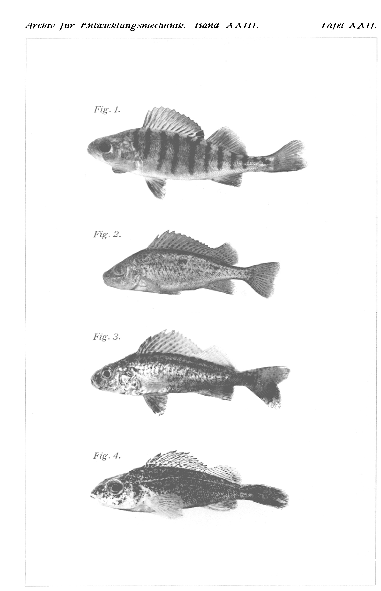
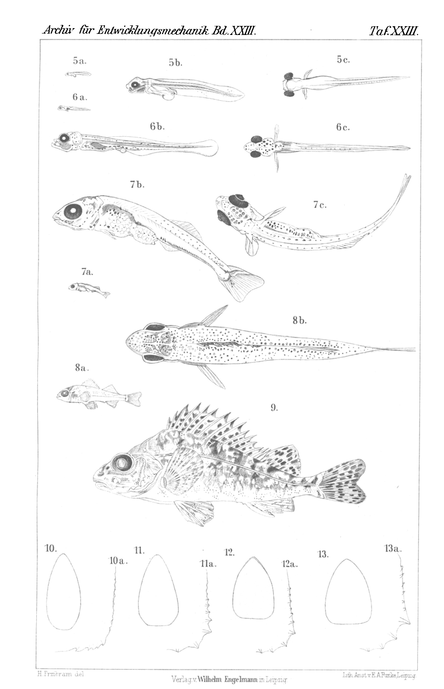

## Bastardierung von Flußbarsch (Perca fluviatilis L.) und Kaulbarsch (Acerina cernua L.)
# Hybridization of Perch (Perca fluviatilis L.) and Ruffe (Acerina cernua L.)

By

Dr. phil. **Paul Kammerer**.

(From the Biologische Versuchsanstalt in Vienna.)

With Plates XXII and XXIII and 1 figure in the text.

Received on 23 February 1907.

*Archiv für Entwicklungsmechanik der Organismen*, vol. 23 (1907).

> **Full translation.** A complete English rendering of the running text of “Hybridization of Perch (Perca fluviatilis L.) and Ruffe (Acerina cernua L.)” (Kammerer, 1907), including all tables, figure and plate legends, and footnotes. Numbers and table cells were transcribed from the page images, not the noisy OCR.

### Table of Contents

| | Page |
|---|---|
| A. Introduction | 511 |
| B. Ecological | 514 |
| C. Breeding experiment | 522 |
| D. Description of the hybrids | 534 |
| E. Results | 545 |
| F. Cited literature | 548 |
| G. Explanation of the figures | 550 |

### A. Introduction.

For the first time, on 12 March 1905, a fisherman named **Rudolf Hencz**, who usually supplies us with all kinds of material, brought us, among several Schrätzer (*Acerina schraetser* L.), also two specimens of a perch form unknown to me. He claimed that they were Zingel (*Aspro zingel* Cuvier), which at first glance proved to be incorrect. He had long had the commission to bring me the two named and several other rarer percids belonging to the Danube stream, because I intended to study their ecology in our large dark-passage aquaria; and now at last it had succeeded in getting two such uncommon representatives of the Danubian fish fauna into the net, namely the Schrätzer and that unknown perch form. Fleetingly I thought of having before me one of the American species variously naturalized in the Danube and its tributary waters; closer inspection, however, immediately rendered this surmise too void.

Dr. **Hans Przibram** was the first to express the view that we had before us hybrids between two of the commonest native species, the perch or Rohrbarsch (*Perca fluviatilis* L.) and the Kaulbarsch or Schroll (*Acerina cernua* L.). The circumstance that the two specimens before us did in fact, with respect to their characters, hold the middle between those two species, seemed to confirm this view; the great dissimilarity and not immediately close kinship of the genera *Perca* and *Acerina*, however, seemed in turn to make it doubtful, although it is indeed known that the possibility of hybridization of two forms does not depend exclusively on their phylogenetic position [10]¹).

> ¹) Figures in square brackets refer to the numbers of the literature references!

After all, until comparatively recently (and indeed sometimes even at present) the purely descriptive finding — the direct ascertainment of the characters of the alleged hybrid and the comparison with the characters of its presumptive parent forms — would have sufficed to allow it to be designated and described with apodictic certainty as a hybrid, or else to be introduced as an entirely new genus and species, as an intermediate form of *Acerina* and *Perca*, into zoological systematics.

Both of these happened, for example, with the well-known Karpfkarausche [carp × crucian carp], ›*Carpio Kollarii* Heckel‹, in that — although it was already suggested to its first describer to surmise in it a hybrid between the common carp (*Cyprinus carpio* L.) and the crucian carp (*Carassius carassius* L.) [9] — it was nevertheless made by him into the representative of a genus of its own and a species of its own, a procedure which was extended to many other presumptive fish hybrids (e.g. *Abramidopsis Leuckartii* Siebold, *Bliccopsis abramorutilus* Sieb., *Scardiniopsis anceps* Jäckel) and was already rightly disapproved by **Kner**. *Cyprinus carpio* and *Carassius carassius* (synonym *Cyprinus gibelio* Bloch) have indeed also already been crossed by the way of artificial insemination, so their hybridizability is established; but it does not emerge from the relevant communication [17] whether the cross-products agreed with the so-called Karpfkarausche. Only recently did **Steindachner** (orally) draw my attention thereto,

> ¹) Figures in square brackets refer to the numbers of the literature references!

how desirable it would be to verify the hybrid nature of *Carpio Kollarii* experimentally.

In a Berlin society [24] the method of determining cyprinids by means of the throat-teeth was practically demonstrated. When the number of throat-teeth on one specimen, apparently a Güster (*Blicca björkna* L.), did not exactly agree with the number given for this species, but rather approached that of the bream or Blei (*Abramis brama* L.), this alone was completely sufficient to allow the statement to be made: ›. . . thus there results from the number of throat-teeth (5,1—5) the surprising fact that we have before us no pure Güster, but a hybrid between Güster and Blei.‹ The same ›fact‹ was thereupon also incorporated into the printed version of the lecture in question, and indeed in generalized form [4].

Among the urodele Amphibia, the Blasius'sche Wassermolch [Blasius's water-newt, *Triton (Molge) blasii* De l'Isle] long counted as a species [7, 5], although a part of the amphibiologists had always believed they recognized in it a hybrid between the great Kammmolch [crested newt, *Triton cristatus* Laurenti] and the Marmormolch [marbled newt, *Triton marmoratus* Latreille] [15]; **Peracca** [19] even believed he could recognize, without breeding, where *Triton marmoratus* had appeared as mother, and where it had appeared as father (*hybr. trouessarti*) [19, 6]; **Parätre** wished to prove the hybrid nature by pointing out that *Triton blasii* is always encountered in the company of *Triton marmoratus* and *cristatus*, and is absent at all localities where these species, or even just one of them, are lacking [18]. It is also to such a ›proof‹, then, that it is to be ascribed that yet others again disputed, or at least doubted, the hybrid nature of the intermediate form [5], until that nature was finally newly hardened by **Wolterstorff** [29, 30, 31] through crossing experiments.

Nowadays one must, precisely for the hybrid nature of an intermediate form found in the open of two already-known forms, furnish experimental proofs. But whether afterwards, once the form in question has actually proved to be a hybrid, one may proceed to give it a binary name and insert it into the systematic nomenclature, is only to be decided once it has emerged whether the hybridization — as **Tschermak's** investigations make probable [25] — has actually led to breed-formation, to the creation of a constant form, or whether the hybrids, arising ever anew from the stem-parents, retain the labile character. For this establishment, however, alongside the experimental proof of the hybrid nature of an intermediate form, an exact proof of equivalence is likewise quite welcome, such as is presented in the case of no animal-hybrid.

I will gladly anticipate that the hybridization of *Acerina* and *Perca* has fully succeeded with the help of artificial insemination, and indeed exactly after the forms delivered by the named catcher to the Biologische Versuchsanstalt; that, therefore, leaving those forms aside, the fish taken up anew after that first find of 12 March 1905 and caught at various places are in fact hybrids of *Perca fluviatilis* with *Acerina cernua*.

### B. Ecological.

For the assessment that the hybrids cannot arise at all so rarely, and may well also occur socially after the manner of their stem-forms, since they are almost always caught in number together, the following list of the hitherto-supplied consignments may serve, which could always be effected to order, and indeed quite promptly:

| | |
|---|---|
| 12. III. 05: | 2 specimens from Stockerau (on the Danube, Lower Austria), |
| 6. X. 05: | 19 — — — — — — |
| 26. X. 05: | 6 — — — — — — |
| 13. II. 06: | 1 specimen from the Lobau (Danube floodplain island near Vienna), |
| 27. X. 06: | 13 specimens — — — — |

That no unconditional reliability is to be drawn from the find-statements regarding the occurrence of these forms, yet that one has nonetheless expressed trust in the catcher's discernment — whether the hybrid is present in even much greater number but, since it covers the breeding-areas of perch and percoid, easily escapes the catcher's discernment, escapes my knowledge; yet this does not appear to me the more probable. Indeed, I am almost certain that in the ›Kaulbarsch‹ on the coloured plate which illustrates an article by **W. Sprenger** [23] and was executed by **Karl Neuzig** in northern Germany, such a hybrid is to be recognized — which, if the drawing is not perhaps incorrect, is indicated above all by the skull, shaped exactly as in *Perca*, with the deeply cleft mouth. Furthermore, **Gustav Mützel's** drawing of the Kaulbarsch in **Brehm's** Tierleben [6, vol. VIII, 2nd ed. p. 40; 3rd ed. p. 44] almost doubtless presents a hybrid; since, however, this figure is nothing else than a copy of the corresponding figure from **Heckel** and **Kner** [9], transferred into a landscape-like frame and doubtless made in Vienna, this trace too points back to the distribution-centrum in the Danube.

Mostly the caught hybrids were mixed with genuine Kaulbarschen — or at least with such as looked so: they may nevertheless have been mongrels, cf. p. 543 —, never, however, with perch. In the aquarium they kept together sociably, both among themselves and with both stem-parents, which, however, does not signify much, since often fish of the most diverse kinds move along mixed in common shoals.

Certainly it will interest many a reader to learn something about the movements, the food-uptake, the mating, the nuptial colours, the spawning-business, and the spawning-form of the percoid forms here under consideration; all these ecological moments, although standing only in loose connection with our actual theme, are nevertheless of significance for getting to know the singularity of the fish with which the following pages wish to occupy themselves.

›The Rohrbarsch‹, I wrote two years ago in another place [11], ›counts as a fish that is frail in captivity [23, 33]. And in fact this ill repute, as I know from earlier, is not unfounded for keeping in ordinary room-aquaria; although these are often very spacious and richly planted, they cannot satisfy its demands with respect to oxygen, for the planting never replaces a vigorous air- or even, though slight, constant water-current. Oxygen is the only element with which one must not be stingy if one wishes to keep the perch healthy; in all other matters it is modesty itself. It is voracious, but not fastidious; it lives from prey, but is not quarrelsome; it loves freedom of movement, but is not shy and impetuous. In our tanks it has shown such a sum of tough vital energy that all other fish species, not even excepting those which, like the carp-kinds and the Macropoden [paradise fish], count as indestructible, have been surpassed by it therein. Whereas, for example, on undertaking artificial fertilizations nearly 100 per cent of the salmonids and cyprinids used for the purpose perished, only few specimens of the perches have, despite my lack of practice, succumbed to the consequences of the ›stripping‹; whereas Macropoden and Cyprinodonten take their ease in their warm aquaria without ever compensating us by offspring for our trouble, the perches faithfully and lavishly fulfil this duty year after year . . .‹

With respect to the spawning-form one finds mutually contradictory statements. **Bade** [3, vol. I, p. 45] expresses himself in the following manner: ›The eggs are enclosed in a net-like, membranous tube of 1—2 cm (2—3 cm [2]) width . . . the spawn always hangs not far below the surface of the water, and the spawn-string is often 1—2 m long.‹ **Brehm** [6, vol. VIII, p. 38], on the contrary, says: ›The spawn comes off in strings, which are net-like glued together among themselves and are often 1—2 m long.‹ Both statements do not agree with what I have perceived, and on whose account I was earlier inclined to see local deviations of the spawning-conditions of *Perca* in the Danube region; now, on the contrary, I am convinced that those statements are erroneous, all the more since **Ziegler** [34] too characterizes the spawning-form of the perch just as I have always seen it, and I have besides received from Dresden [27] confirmations of my description. Namely, it forms neither a tube nor a string, but a broad netted band. As maximum length of such a band, descended from a female about 25 cm long, I have measured 53 cm; as minimum length (from smaller females) 14 cm, thus remaining considerably behind the cited statements; on the other hand, I established the breadth of the spawning-band, when it was laid down by very small females, at 3—5, but by large females at 10—15 cm. Several spawning-bands situated close to one another — the females proceed in this with preference communally and choose the same places for the fastening of the eggs — call forth the impression as though white-shimmering, billowing veils had been spread out; for the spawning-mass as a whole appears white and already shows in some measure that metallic shimmer which also issues from the fully developed fish. The single egg is wonderfully transparent: on that account, as well as on account of its great resistance, it ought to make a far more favourable object for embryological studies than the salmonid-egg so manifoldly used for the purpose. In the course of its development the perch-egg takes on a beautiful violet-blue interference-colour. According as the water-temperature is higher or lower, the young perches slip from the spawn after 5—8 days, sometimes still earlier.

As regards the place where the spawn is laid down, **Brehm** [6] says: ›The roe-bearers seek out hard objects, stones, pieces of wood, or also reed, to press the spawn against them.‹ I can confirm this, but must add that it need not unconditionally be hard objects: I saw the spawn spread also over the cushions of the water-branch-moss (*Hypnum*) and woven into a tangle of *Myriophyllum* and Confervaceae. Here my observation again agrees with that of **Bade** [3, vol. I, p. 45]: ›For spawning the perch chooses flat, stony, and mossy¹) places . . . or¹) where hard objects lie in the water.‹ The spawning-masses lay, moreover, mostly at the bottom of the at-any-rate 1 m deep cement-basin; the animals seldom used the abundantly available opportunity to place them nearer the surface: herein lies, then, again a deviation from **Bade's** findings (cf. above), who writes: ›The spawn always hangs not far below the surface of the water . . .‹ and ›For spawning the perch chooses flat¹) . . . places‹ — a deviation which, however, may well be reconciled by the fact that my observations were made on captive fish, but **Bade's** observations in free nature.

For my letting captivity-observations have any say here at all, a justification is required, which I best discharge through a short description of the main breeding-basin, in order to show that this in fact, in every respect, as regards space and inner equipment, comes nearly up to the natural conditions: it is one of the large ›dark-passage basins‹ already cursorily mentioned (lit only from above, accessible to observation from the side, from a dark passage, whereby the observer remains unseen by the fish and causes no disturbance), 3 m long, 1.7 m broad, 1 m deep, vigorously aerated, fitted out with rock-rubble, from whose clefts Tausendblatt (*Myriophyllum*) and Hornblatt (*Ceratophyllum*) grow up, and with half-rotted tree-branches covering the bottom in disorder, which are clothed with a dense green coating of a water-moss (*Hypnum fluitans* L.). Minimum temperatures (in winter) 7 degrees C, maximum temperature (in summer, when the sun shines into the water) 16 degrees.

Spawning and insemination take place during the night. The spawning-period extends over almost half a year. Thus in 1905 I noted spawn-depositions on 27. II., 15. and 29. III., 10. and 14. IV., 8. and 17. V., 3. VI., and yet a last one on 2. VII., whereby, remarkably, those perches whose vital energy must have been weakened by operations (fin-amputations, lens-extirpations) made the beginning — in agreement with the often-obtained

> ¹) In the original not printed letter-spaced [i.e. not emphasized].

"The female nestles," I reported further at the passage already cited [11, p. 333], "with its belly close against the surface of the object on which it intends to attach the spawn; all the fins are laid against the body in doing so; locomotion — a slow creeping along the substrate with simultaneous pressing-out of the spawn — is accomplished with the help of weak strokes of the caudal fin. Immediately following the spawning female come one or several males, which, with strongly trembling movements of the widely spread fins and a faint trembling of the whole body, interrupted now and again by convulsive twitchings, emit their sperm, in doing which they assume peculiar postures, now standing bolt upright on their heads, now swimming sideways in a horizontal attitude, as though they were on the point of perishing. In the process they shine resplendent in the most splendid colors, among which the red spots on the pectoral and ventral fins, as well as the almost wholly vermilion-red anal and caudal fins, and quite especially the steel-blue gleam of the gill-covers, are conspicuous. These colors are, by the way, present in lesser extent and intensity throughout the whole year, and thus do not constitute specific **nuptial attributes**; they merely gain in luster under the influence of sexual excitation. Since the spawning process normally takes place in complete darkness — unless, for the purpose of observation, an electric incandescent lamp placed as far off as possible fills the dark passage with a dim light (glaring illumination disturbs and interrupts the secret activity of the fishes) — the observation of those resplendent nuptial colors gives occasion to consider that in such and similar cases they cannot possibly be construed as a stimulus-means for the female, but simply as the physiological accompanying and consequent phenomenon of heightened life-energy." In an entirely analogous manner it has indeed already been achieved by experimental means, in newts, through the supply of pure oxygen and the consequent intensification of the life-processes, to call forth the nuptial dress [13], which can also be brought about by transferring the animals into colder water, which is richer in air than warm water, as— —can be brought about. Thus a new confirmation appears to have been found of the theory advanced by Wallace [26], according to which the secondary sexual characters of the males are to be traced back chiefly to their greater capacity for excitation, to the increased intensity of their life-processes.

I was further especially struck by the fact that the onset of **sexual maturity** and the attainment of **normal size** in the perches by no means coincide, as is indeed assumed for most animals — for many quite wrongly! When the fisherman mentioned at the outset once brought me perches only 10 cm long, hence not even half-grown animals, as spawn-ripe fishes, I at first wished to refuse them, despite their bodily fullness, which I simply ascribed to a particularly good state of nutrition; but I then convinced myself, by opening one specimen, that the ovaries were really bursting with ripe eggs. In fishery circles this is a long-known phenomenon, but in the biological literature I find little about it (see the treatise contained in this number by Przibram and Werber on the regeneration of the Lepismatidae [22]).

All the foregoing referred to the perch; of the ruffe I can unfortunately report nothing with regard to its reproductive business, because this species, although a fixed stock of large healthy specimens has for a long time now inhabited a second of our dark-passage aquaria, has not yet propagated of its own accord; for this purpose it was always necessary to proceed to artificial fertilization.

On the other hand, something in the manner of movement of *Acerina* is worth describing. To be sure, the same phenomena in swimming and in the directions of movement during swimming, which I will describe at once, are common property of very many fish species — to be observed for instance sometimes also in *Perca fluviatilis* and in cyprinids; yet they surprised me in the ruffes by their great regularity, indeed exactness, by virtue of which each individual specimen seems at certain times, day in and day out, to be driven by the same movement-tendencies; further by the obstinacy and indefatigable perseverance with which they are carried out almost uninterruptedly.

The ruffes have proved themselves, in their spacious basin, to be diurnal animals; they keep to the bottom — and indeed hidden among large stones — only when it is dark.

But as soon as "the alarm-clock-woman laughs into the depths," they hasten toward it, evidently light-loving in high degree (positive heliotaxis). In lesser degree than sunlight, electric light too exerts the same power of attraction (positive phototaxis). In the early morning the regular swimming-tours then also begin, which they always carry out in company and in a certain order, almost in rank and file.

"In doing so they always keep [11, p. 346] close to the front (glass) wall, and indeed usually along its edges, where the thick mirror-panes are cemented into the concrete. Never do they swim across the open water, the middle of the basin, but strictly along firm objects. In this sense — though not in that sense usual for fishes which mostly stay at the bottom of the waters — they may rightly be designated 'bottom-fishes' (positive thigmotaxis).

"In doing so the direction of movement is usually the following: from the half or three-quarter depth they rise almost perpendicularly, head upward, slowly to a few centimeters below the water-surface, then turn about with a sudden movement and dive slowly down again into the depths, once more in a perpendicular bodily attitude, only this time head downward. When they have arrived, in diving, at the half or three-quarter depth, then once again, as if on command, a rapid about-turn takes place. The same maneuver, which calls to mind the rhythmic pacing up and down of the beasts of prey in the menagerie-cages, takes place in the 'described' manner very many hundred times in succession without any variation. At most, now and then one of the perches swims a little sideways in order to reach the spray of the inflow and there to bathe voluptuously in air; or a sudden fright creates an interruption of a few minutes.

"If these swimming-movements, to speak in military terms, are carried out in extended line, as a frontal march in line-formation, then the ruffes, when searching for food, move in column-formation. In doing so they finally leave the front wall and rove about along the rear (stone) walls. If a worm falls into the water here, the whole crowd shoots at it; but if it falls into the middle of the water, it is indeed eyed greedily, yet not fetched. Likewise swarms of little white-fish save themselves most surely by hastening to the middle; only when they swim along the walls in order to graze off algae does— —ruin threaten them in the shape of an assault on the part of the voracious predatory fishes."

Both species, perch and ruffe, frequently, when they are seriously molested, assume a so-called **fright-posture**: the trunk is bent and remains spasmodically fixed in this position; all the spinous rays and the gill-covers are held spread out; the latter then stand at a right angle from the sides of the head, so that the blood-red gills lying beneath come glaringly into view. In doing so the eyes shimmer with a greenish light, thus completing the defensive, menacing impression which the posture is apt to produce upon many an enemy (cf. also [21]). To be sure, probably only upon a timid or superstitious human being; toward all predatory vermin, in the first place toward predatory fishes, it is in my opinion, as far as deterrence is concerned, likely to be useless. But one will do better to use, instead of "fright-posture," the expression "defensive posture," because, through the spreading of the fins, the spines, and, through that of the gill-covers, the little teeth and thorns, stare toward the attacker with the greatest prospect of injuring him. And besides — which appears important precisely in the case of attacks on the part of the predatory fishes, which attacks for our perches probably come most often into consideration — the bending of the trunk, in conjunction with the spreading of the fins and the gill-covers, contributes toward making it more difficult to gulp down the morsel, which has become broader and higher and is furnished with barbs and abutments.

The perches show manifold traces of an associative memory. They always follow, in a manner that bears witness to intelligence, all the movements of a person standing before the aquarium; if one splashes with the hand on the surface of the water, the whole herd hastens to the spot in question and waits in a narrow circle for food. If this consists of small worms, the release of these is awaited before the prey is seized with a jerk; if one offers long earthworms, the boldest tear it from the keeper's hand. Despite this familiarity, it is nonetheless very difficult to catch a perch out of the large breeding-basin, for the movements of the animals are extraordinarily quick and withal are guided not by blind impetuosity — through which other fishes often senselessly batter themselves sore against the rock-walls — but by purposeful agility. After such an attempt at catching them, familiarity has each time, for a couple of— —days, come to an end; after the netting the perches were for about a week so timid that at every approach they sought shelter, quick as lightning, in the tangle of plants and among the rocks; only very gradually did the mistrust disappear again.

Certain ecological peculiarities of the hybrids, which stem from the two species whose habits of life have now been described, will be returned to in the course of the following section, where the rearing of the young fishes is discussed. Here let it merely be remarked that the crossing-products of *Perca* and *Acerina* differ sharply from their parental stocks in two ecological properties: they are by no means so fond of movement as these, but rather very sluggish; for instance, they let themselves be driven from a resting-place once chosen only reluctantly, even by a push with a little stick, and only in order to return there again at once. They are, furthermore, far more tenacious of life — much more resistant than both parental species toward injurious influences of every kind, e.g. abrupt temperature fluctuations, contaminations of the water, or periods of starvation (which they afterward make good again by redoubled voracity) — and thus show themselves also in this respect to be genuine hybrids. The advantages that accrue to the offspring from the crossing of such little blood-related pairs culminate precisely in crossing-products of different species, as a high point of the lack of kinship that is the opposite of inbreeding and so desirable for the compensation of injurious properties; and they produce in this way creatures of admirable vital force.

## C. Crossing-experiments.

Immediately after receiving the first hybrids caught in nature, I began my experiments, which, however, in the spring of 1905 still turned out negative insofar as I did indeed succeed in effecting artificial fertilization in the most varied directions and in obtaining embryos and young fishes, but not in rearing these to a size sufficient for their agreement with the forms fished out of the river to have become evident; for this, the manner of their dying-off entailed the impossibility of a usable preservation.

For I placed the spawn, fertilized in the manner generally known from artificial trout-culture, in a hatch-— —ing trough and several glass tubs, in both sorts of vessel with constantly flowing cold water. This did not prevent a large part of the eggs and even also the hatched-out little young fishes from being attacked by *Saprolegnia*, which spread about with such rapidity that I was not able to cope with them.

The few little fishes saved from the *Saprolegnia* plague I believed, in the first period after their hatching, I had to feed only with infusoria, which I bred in large quantity in an infusion of dried and crushed lettuce, and of which infusoria-water I added spoonfuls to the breeding-vessels, — then with *Cyclops* and daphnids. The infusoria-food, however, was after all too little nourishing, the *Cyclops* were too scanty, the daphnids too large: the little fishes snapped at them but could not master them. Thus starvation was their inevitable fate.

In the following year (March 1906), when the parental species, by the bodily fullness of the females and the erotic behavior of the males, gave to recognize in unambiguous fashion that ripe reproductive products were present in abundance, I began once more to experiment. This time too I could obtain hybrid spawn only with the help of artificial insemination, since, although the perches engaged of their own accord in the exercise of their reproductive business, the ruffes did not. I set up the new experiments once again under the same conditions of water, temperature, and nutrition, but in addition also under quite other conditions; and one will perceive, from the fact that the former experiments again miscarried while these succeeded, in what respect the former had been mistaken.

The artificial inseminations, carried out by stripping large, vigorous individuals, of the forms of immediate interest to us, were the following:

```
              Perca fluviatilis ♀   and   Acerina cernua ♂
                "             "   ♂     "         "      ♀
Im Freien gef. Bastarde [hybrids caught in the open] ♀   "         "      ♂
                "             "   ♀  -  Perca fluviatilis ♂.
```

The female hybrids I was able to draw upon for the crossings, since in the previous year a female had been swollen thick with roe, and this condition of gravidity now repeated itself in several females. On stripping — of all the perches — only a minimal percentage perished; the animals— —lived on as if nothing had happened, took food immediately after the operation, and the like. On the contrary: the females — only of the hybrids — actually perished precisely when I did not relieve them of their burden of eggs by gentle pressure. The more the swelling of their trunk increased, without their being able to rid themselves of the spawn-mass, the more did such females lose their balance in swimming, drifted helplessly, lying on their side, near the surface, finally to perish. Their urge to spawn made itself clearly evident in their behavior before this exhaustion: they liked to move close and slowly, almost creeping, along firm surfaces, namely along the perpendicular rear surface of the aquarium or against steeply upright stones. At times they pressed the underside of the body close against the substrate. In quite similar manner the *Perca*-females behave before spawning, only that they are then followed by their males, which tremble in constant readiness to pour out the sperm over the emerging spawn-mass. Here, in the case of the hybrid females, however, no male was present that would have had any inclination to follow after them. I tried to strip the indifferent hybrid males by force, as had succeeded so well with all the females and also with the males of the parental species, but only with negative result: I had to press fairly strongly in order to obtain sperm at all, so that on the one hand the male died off, and on the other the fertilization remained ineffective, because apparently no ripe spermatozoa were yet to be brought forth. This is the reason why I was able to draw upon only the female hybrids, but not the male ones, with success for my experimental set-ups. That the latter are therefore sterile, however, is not to be assumed, for the anatomical examination shows a completely normal development of their sexual organs.

The various crossings, carefully kept separate in their own glass tubs, I now set up under the following external conditions:

1) In constantly flowing high-spring-water of 10 degrees C.

2) In a sunny room with abundant overhead light, without flowing-through water (water temperature 16 to 18 degrees C.), but with aeration.

3) In a warm glasshouse (water temperature 25 to 30 degrees C.), without aeration and without a flow-through, but with the vessel planted with mare's-tail (*Hippuris vulgaris* L.), submerged form, and moderately overgrown with diatoms and Chlorophyceae.

4) In six concrete basins out of doors. Water temperature fluctuating between 12 and 17 degrees; neither conduction of water nor of air; abundant vegetation of *Spirogyra*, *Cladophora*, *Polygonum*.

All the vessels, with the exception of No. 4, which were left entirely to themselves, were diligently supplied with the infusoria-water — this time already prepared in advance — later with small entomostracans (namely *Cyclops*), finally with small limicolous oligochaetes (*Tubifex*, *Enchytraeus*, *Lumbriculus*), on which food the little perch-hybrids, just like the pure cultures of the parental forms set up for control, throve splendidly.

4) In six cement basins¹⁾ in the open. Water temperature fluctuating between 12 and 17 degrees; neither water- nor air-conduction [throughflow]; abundant vegetation of *Spirogyra*, *Cladophora*, *Polygonum*.

> ¹⁾ The cement basins in the garden must be drained in late autumn, because otherwise they get cracks from the freezing of the water and become leaky.

All the containers, with the exception of No. 4, which left wholly to itself became quite considerably turbid, were diligently supplied with the infusoria-water already prepared in advance this time, later with small *Entomostraca* (namely *Cyclops*), finally with small limicolous oligochaetes (*Tubifex*, *Enchytraeus*, *Lumbriculus*), under which nourishment the little barsch-hybrids, just as the pure-cultures of the parent forms set up for control, throve splendidly.

It will not be superfluous to subject here the first stages in the postembryonic development of the young perch and ruffe, as well as of the hybrids, to a somewhat closer examination, just as hitherto the larvae of the salmonids alone seemed worthy of such a description.

The question first presses itself upon us at the outset: do we here rightly speak of "larvae," while on the other hand we do not designate the postembryonic stages of the other teleosts as "young fishes" or "Brutfische" [fry]? In my opinion, the little ruffe, e.g., is with the same right a "larva" as the young of *Anguilla* or the young *Salamandra* and *Triton*, since here too one would have to recognize a deep-reaching metamorphosis.

The ruffe freshly hatched from the egg [Fig. 5 *a b c* Pl. XXIII] recalls in habitus strongly a young tadpole, yet distinguishes itself from the corresponding forms of the salmonids very strikingly through the presence of the yolk sac, which to be sure appears already strongly reduced in comparison with the yolk sac of the salmonids. The eye is, as with most teleost larvae, disproportionately large and strongly protruding; the rather narrow mouth-cleft by no means yet lets the final shape of the jaws be recognized. The gill-cover is not yet developed. Trunk and tail are surrounded — on the upper side as far as the front third, on the under side as far as the anus — by a continuous fin-seam [fin fold], which only through a gentle, namely ventrally barely perceptible, indentation shows the places where later dorsal and anal fin separate themselves from the caudal fin. The breast fin is distinctly developed (see view from above, Fig. 5 *c*), the pelvic fin present only as a rudiment [Anlage].

After 28 days [Fig. 6 *a b c*] the yolk sac is absorbed but for a small remainder. The jaws approach themselves already very closely to the definitive configuration. Further, the gill-cover [operculum] is laid down. The fin-seam runs still always uninterrupted, but it has become very low between the later dorsal and caudal fin on the one side, between caudal and anal fin on the other, so that the unpaired fins already set themselves apart from one another. Great progress has the pigmentation made, as indeed on the whole the differentiation, in comparison with the first stage, has increased in a relatively short time — but not the growth.

This [growth] only from now on takes a stronger upswing. The next, 41-day-old stage [Fig. 7 *a b c*] shows already — except for the still always strongly protruding eyes — the head shape of the developed fish. The fin-seam has now made place between the separated fins; the dorsal fin is however still very small and shows also in *Perca* no splitting yet into a front and a rear part. Up to here the development of the Percidae coming into consideration — *Perca*, *Acerina* and the hybrids — is on the whole so similar that one can distinguish the larvae at most through minute measurements (e.g. of the inter-orbital space, of the distance of the breast-fin insertion from the eye, and the like) and through difficult fin-ray countings from one another.

With the separation of the dorsal fin into a front, wholly spiny, and a rear, for the most part soft section — which sets in with *Perca* and with the hybrids of *Perca*-female with *Acerina*-male — the agreement here ceases, as also in the other body parts. The next, 98-day-old stage has formed all the parts of the finished fish, which however does not hinder that still quite extensive shifts in form and color, and hereby changes of the whole habitus, take place:

In Fig. 8 *a b* a small hybrid of *Perca*-female with *Acerina*-male is depicted, and it is striking that the same shows a much greater resemblance to the maternal parent stock than later the nearly full-grown hybrid [Pl. XXIII Fig. 9 and Pl. XXII Fig. 2], which lets the dominance of the paternal characters prevail. There thus makes itself felt, in the course of the growth, first a preponderance of the maternal and only later an emergence of paternal characters — as was likewise ascertained by almost all observers of the echinoderm hybrid.

In the rearing the following, not-expected peculiarity of the nutrition turned out: in the glasshouse basin, which had been especially richly stocked with perch fry, the diatoms went perceptibly back; in the sunny space mentioned under 2 the tubs populated with perch fry kept themselves nearly quite free of algae, while in vessels standing next to them, owing to the action of direct sunlight, a thick-green "water-bloom" [Wasserblüte] sprang up, consisting of small green algae attached together into single cells or into small cell aggregates, which had pervaded the water in an unmeasurable quantity.

Direct observation soon convinced me that the wholly young barsches [perch], and indeed both ruffe as well as perch and the hybrids, at a stage at which I had already held them to be exclusive predators and had expected them to content themselves with infusoria, did themselves the favor of [feeding on] the algae, with unmistakable preference for the diatoms.

The feeding-trials thereupon instituted yielded the following: the barsch [perch] fry throve neither with exclusive algal nourishment — i.e. without special addition of infusoria-water, which I used to make still more concentrated in its slight content by careful centrifuging — nor with exclusive infusorial nourishment well enough that there could afterwards grow up from it strong, viable animals fed purely vegetably or purely animally [the young fish].

There exists accordingly with the discussed Percidae-forms one of those cases where, in the course of the postembryonic development, a thorough change in the manner of nutrition takes place. A fully analogous example is indeed the well-known larval development of the anuran amphibians, where likewise the young, the tadpoles, are omnivorous, while the developed frogs and toads nourish themselves only on the prey of living quarry. In a similar way the river crayfish (*Astacus fluviatilis* F.) is too, in its youth, to a higher degree a vegetarian than in its later age. For the rest, it is still not at all settled whether plant nourishment occasionally plays a certain role also with the developed barsches [perch]: Heckel and Kner [9] bring the assurance of an experienced fisherman, according to which the ruffe occasionally eats "grass and reed"; I personally have indeed made no analogous observation with the forms here under discussion, *Perca* and *Acerina*, but, strangely enough, [I made one] with two forms which in their external [appearance] show forth the predatory-fish type still much more than *Perca* or even *Acerina*. I namely found in *Lucioperca sandra* Cuv., the pike-perch or zander, with a certain regularity, balls of spring-moss (*Fontinalis*) curled together and remains of other water plants in the stomach; in angled specimens, which were in the act of probably spitting out the balls, [I found these] also in the gullet, in front; exactly the same finding I made with *Lates niloticus* Cuv. Val., the Nile-perch, which in its habitus resembles the zander and harbored balls of a pondweed (*Potamogeton*) in stomach and gullet. Whether these vegetable contents of the digestive tract really represent foodstuffs, or whether they were not rather torn along, accidentally, by the greedy predator in the seizing of a prey that had penetrated into the plant thicket, I must leave undecided. It would also be conceivable that they play the role of an aid to digestion. —

In their behavior and also in their habitus (cf. Fig. 5) the barsch [perch] fry has, during the first weeks of its life, much resemblance to young newt-larvae, so long as these only have the front legs. Those freshly escaped from the egg move little, but lie, forced by the load of their yolk sac, quietly on the bottom and wriggle themselves further only if one touches them, by little bits. Soon, however, mostly already on the second or third day, they rise — this in contrast to the newt-larvae — into the free water and now lead a nearly purely planktonic mode of life. Untiringly they hover, in a straight-line direction, not exactly fast, forwardgliding, hither and thither. If they meet a prey-animal appearing worth striving for, then they turn themselves aiming toward it, while they regulate the turn with the help of the relatively long, narrow, laterally compressed sculling-tail [rudder-tail]: steering, they bend it sideways, so that it almost touches the trunk-flank, and wag often perceptibly with it hither and thither, as the rutting newt-males do when they court a female. Seldom is to be observed that quite young barsches, when they have come near the prey, then dash at it with a sudden jerk and strive to seize it with the jaws: for this the jaws also seem to be much too weak, they can scarcely hold fast a hard-shelled crustacean; often and often it glides away, already being in the gullet of the little fish, [escaping] from it again. Rather, one observes under magnifying-glass enlargement that the fishes slurp in [einschlürfen] a small, in the immediate vicinity of their snout situated [organism] — no matter whether an animal or plant organism — suddenly, remaining at the spot, in that they generate a water-vortex flowing in through the mouth-opening, flowing out through the gill-openings, and whirl the morsel in by means of this vortex. This kind and manner of food-acquisition forms an approach to that with the omnivorous fishes.

Concerning the growth of the young barsches [perch] I have made the following notes:

The river-, ruffe- and hybrid-barsches kept in continually-flowing cold water and with exclusive infusoria- and entomostracan-nourishment (cultural condition No. 1, see above) always perished before attaining their definitive form, as a victim of the Saprolegnia, which in many cases had already [destroyed] the spawn, but certainly [destroyed] the brood weakened through insufficient nourishment — for infusoria and lower crustaceans had proved themselves insufficient. This culture therefore comes for our purposes henceforth no longer into consideration, after we have established the fact that the young from the spawn which on 17.IV. had partly been laid and fertilized in the natural way (*Perca fluviatilis*, pure-bred), partly been stripped and artificially inseminated (*Acerina* pure-breeding, hybridizations), on 28.IV. hatched out with a total length of 4 to 5 mm and on 2.V. had not yet grown at all, [while] the few survivors on 2.VI. [had grown] only by 1 mm.

The remaining growth-relations that came to observation are illustrated by the table on pp. 530—532.

From this table is, generally expressed, namely the following to be gathered:

1) Most rapidly grow the barsch [perch] hybrids, which agrees with results in the salmonid hybridization, where likewise the crossbreeds distinguish themselves through quick-growth [1]; further, with [the fact] that *Triton blasii*, the hybrid of *Triton cristatus* with *Triton marmoratus*, becomes larger than both parent stocks [12].

2) For the rest, the growth-speed depends on the temperature: all barsch [perch] forms grow most rapidly when it is warmest. It makes thereby nothing at all that they live in the natural state in cold water — exactly the same as also the olm (*Proteus anguineus* Laur.), an inhabitant of cold cave-waters, regenerates more rapidly in warm water, whereby those researchers who ascertained in it a lack of regeneration-capacity were misled, in that they in part on that account attained no result, because they believed they had to keep the olm in accordance with its natural conditions of life. Growth and regeneration just do not proceed most rapidly under conditions to which the animals in question are best adapted — Fraisse [8, p. 153].

**Table (pp. 530—532) — column heading: "Millimeter-measurements under the various culture-conditions":**

**Part 1 — *Perca fluviatilis*, pure-bred [Reinzucht]:**

| Form | Stage | Date | Garden basin 12—13° C. (Culture No. 4) | aerated basin 16—18° C. (Culture No. 2) | warm glasshouse 25—30° C. (Culture No. 3) |
|---|---|---|---|---|---|
| *Perca fluviatilis*, Reinzucht [pure-bred] | Egg-laying and partly natural, partly artificial insemination | 17. IV. | **Egg-diameter:** 1½ | 1¾ | 2 |
| | Hatching of the brood | 26. IV., resp. (in No. 2 u. 3) 23. u. 22. IV. | **Length of the brood from the snout-tip to the tail-tip:** 5—5½ | 6 | 6½—7 |
| | Further measurements | 2. V. | 6—6½ | 7½—8 | 8—9 |
| | | 20. V. | 7—8 | 10—11 | 11½—13 |
| | | 2. VI. | 8—10 | 12—13 | 15—17 |
| | | 18. VI. | 18—20 | 20—25 | 23—27 |
| | | 2. VIII. | 31—33½ | 33—39 | 34—41 |
| | | 18. VIII. | 37—39 | 42—45 | 44—53 |
| | | 2. IX. | 42—43½ | 49—56 | 53—60 |
| | | 18. IX. | 46—47 | 57—61 | 61—66 |
| | | 2. X. | 50—51½ | 59—64 | 70—71 |
| | | 18. XI. | abgelassen [drained] | 65—68 | abgeschloss. [concluded] |
| | | 2. XII. | — | 70—72 | — |
| | | 18. XII. | — | 71—72 | — |
| | | 2. I. | — | 72 | — |
| | | 2. II. | — | 72 | — |

**Part 2 — *Acerina cernua*, pure-bred [Reinzucht]:**

| Form | Stage | Date | Garden basin 12—13° C. (Culture No. 4) | aerated basin 16—18° C. (Culture No. 2) | warm glasshouse 25—30° C. (Culture No. 3) |
|---|---|---|---|---|---|
| *Acerina cernua*, Reinzucht [pure-bred] | Stripping and artificial insemination of the eggs | 17. IV. | **Egg-diameter:** 1 | 1¼ | 1⅓ |
| | Hatching of the brood | 27. IV., resp. (in No. 2 u. 3) 25. IV., 23. IV. | **Length of the brood from the snout-tip to the tail-tip:** 4—5 | 5—5½ | 6—6⅓ |
| | Further measurements | 2. V. | 4½—5 | 6—7 | 7—7⅔ |
| | | 20. V. | 5½—7 | 8—9 | 9—10½ |
| | | 2. VI. | 7—8⅔ | 10½—12 | 13—15 |
| | | 18. VI. | 10—13 | 14—17½ | 15—20 |
| | | 2. VIII. | 19—22 | 21—25 | 24—33 |
| | | 18. VIII. | 28—33 | 31—38 | 32—41 |
| | | 2. IX. | 35—39½ | 40—47 | 45—52 |
| | | 18. IX. | 42—44 | 49—53 | 54½—62 |
| | | 2. X. | 46—47 | 54—55 | 63—66 |
| | | November | die letzten Exemplare eingegangen [the last specimens died off] | | |

> ¹⁾ The cement basins in the garden must be drained in late autumn, because otherwise they get cracks from the freezing of the water and become leaky.

**Part 3 — Hybrid: *Perca fluviatilis* ♀ × *Acerina cernua* ♂ :**

| Form | Stage | Date | Garden basin 12—13° C. (Culture No. 4) | aerated basin 16—18° C. (Culture No. 2) | warm glasshouse 25—30° C. (Culture No. 3) |
|---|---|---|---|---|---|
| *Perca fluviatilis* ♀ × *Acerina cernua* ♂ | Stripping and artificial insemination of the eggs | 17. IV. | **Egg-diameter:** 1⅓ | 1⅔ | 2 |
| | Hatching of the brood | 26. IV., resp. (in No. 2 u. 3) 24. u. 22. IV. | **Length of the brood from the snout-tip to the tail-tip:** 5—5¼ | 5½—5⅔ | 6—6⅓ |
| | Further measurements | 2. V. | 5—6 | 6—7 | 7⅓—8 |
| | | 20. V. | 6—7½ | 9—10½ | 10—12 |
| | | 2. VI. | 8—9 | 10—13 | 13—16 |
| | | 18. VI. | 12—17 | 18½—23 | 20—24⅔ |
| | | 2. VIII. | 25—28 | 27—30 | 28½—36 |
| | | 18. VIII. | 32—38 | 32—40 | 40—48 |
| | | 2. IX. | 40—42 | 48—54 | 50—58 |
| | | 18. IX. | 44—46 | 57—60 | 60—66 |
| | | 2. X. | 47½—50 | 58—65 | 68—71½ |
| | | 18. XI. | 52—53 | 65—69 | 70—72½ |
| | | 2. XII. | abgelassen [drained] | 70—73 | 73—75 |
| | | 18. XII. | — | 73—74 | 77 |
| | | 2. I. | — | 74½ | abgeschloss. [concluded] |
| | | 2. II. | — | 75 | — |

**Part 4 — Hybrid: *Acerina cernua* ♀ × *Perca fluviatilis* ♂ :**

| Form | Stage | Date | Garden basin 12—13° C. (Culture No. 4) | aerated basin 16—18° C. (Culture No. 2) | warm glasshouse 25—30° C. (Culture No. 3) |
|---|---|---|---|---|---|
| *Acerina cernua* ♀ × *Perca fluviatilis* ♂ | Stripping and artificial insemination of the eggs | 17. IV. | **Egg-diameter:** 1¼ | 1½ | 1¾ |
| | Hatching of the brood | 27. IV., resp. (in No. 2 u. 3) 26. u. 22. IV. | **Length of the brood from the snout-tip to the tail-tip:** 5⅓ | 5½—5⅔ | 6 |
| | Further measurements | 2. V. | 5—6 | 6—6½ | 7—8 |
| | | 20. V. | 6—7 | 8—10 | 10½—11½ |
| | | 2. VI. | 7⅓—8⅓ | 9—12 | 13—15 |
| | | 18. VI. | 11—15 | 19—22 | 19—25 |
| | | 2. VIII. | 21—27 | 25—30 | 26—35 |
| | | 18. VIII. | 30—32 | 28—38 | 36—44 |
| | | 2. IX. | 37—41 | 40—49 | 47—58 |
| | | 18. IX. | 43—45 | 52—58½ | 60—64 |
| | | 2. X. | 47—49½ | 60—62 | 67—70½ |
| | | 18. XI. | 51—52 | 62½—66 | 68—72 |
| | | 2. XII. | abgelassen [drained] | 67—70 | 71—75 |
| | | 18. XII. | — | 72—73 | 76 |
| | | 2. I. | — | 73½ | abgeschloss. [concluded] |
| | | 2. II. | — | 74 | — | **Part 5 — *Im Freien gef. Bastardbarsch* ♀ (wahrscheinlich *Perca* ♀ × *Acerina* ♂) × *Perca fluviatilis* ♂ [Hybrid-barsch caught in the open ♀ (probably *Perca* ♀ × *Acerina* ♂) × *Perca fluviatilis* ♂]:**

| Form | Stage | Date | Garden basin 12—13° C. (Culture No. 4) | aerated basin 16—18° C. (Culture No. 2) | warm glasshouse 25—30° C. (Culture No. 3) |
|---|---|---|---|---|---|
| Hybrid-barsch caught in the open ♀ (probably *Perca* ♀ × *Acerina* ♂) × *Perca fluviatilis* ♂ | Stripping and artificial insemination of the eggs | 17. IV. | **Egg-diameter:** 1⅓ | 1½ | 1¾ |
| | Hatching of the brood | 26. IV., resp. (in No. 2 u. 3) 24. u. 23. IV. | **Length of the brood from the snout-tip to the tail-tip:** 5 | 5⅔—6 | 6—6½ |
| | Further measurements | 2. V. | 5⅔—6 | 6—6¼ | 7½—8 |
| | | 20. V. | 6⅓—7 | 7¼—8 | 10½—12 |
| | | 2. VI. | 7½—8½ | 9½—10½ | 14—16⅓ |
| | | 18. VI. | 12—15 | 15—21 | 20—26 |
| | | 2. VIII. | 19—24 | 23—30 | 28¼—35 |
| | | 18. VIII. | 28—34 | 35—42½ | 44—51 |
| | | 2. IX. | 37—40 | 45—53 | 54—62 |
| | | 18. IX. | 40—45½ | 54—61½ | 58—63 |
| | | 2. X. | 43—48 | 60½—68 | 67—70 |
| | | 18. XI. | 48—50 | 71⅔—74 | 72—74⅔ |
| | | 2. XII. | abgelassen [drained] | 73—74 | 72½—76 |
| | | 18. XII. | — | 74—74½ | 77—78 |
| | | 2. I. | — | 75 | 78½ |
| | | 2. II. | — | 75 | 79 |

**Part 6 — *Acerina cernua* ♂ × *im Freien gef. Bastardbarsch* ♀ (wahrscheinlich *Perca* ♀ × *Acerina* ♂) [*Acerina cernua* ♂ × Hybrid-barsch caught in the open ♀ (probably *Perca* ♀ × *Acerina* ♂)]:**

| Form | Stage | Date | Garden basin 12—13° C. (Culture No. 4) | aerated basin 16—18° C. (Culture No. 2) | warm glasshouse 25—30° C. (Culture No. 3) |
|---|---|---|---|---|---|
| *Acerina cernua* ♂ × Hybrid-barsch caught in the open ♀ (probably *Perca* ♀ × *Acerina* ♂) | Stripping and artificial insemination of the eggs | 17. IV. | **Egg-diameter:** 1¼ | 1½ | 1⅔ |
| | Hatching of the brood | 27. IV., resp. (in No. 2 u. 3) 25. u. 23. IV. | **Length of the brood from the snout-tip to the tail-tip:** 5 | 5½ | 5⅔ |
| | Further measurements | 2. V. | 5½—5⅔ | 5½—7 | 7—7⅓ |
| | | 20. V. | 6—7 | 8—9 | 10—11 |
| | | 2. VI. | 7⅓—8 | 9—12 | 14—15½ |
| | | 18. VI. | 10—12 | 17—22¼ | 20—24 |
| | | 2. VIII. | 17—22 | 24—29½ | 27½—35 |
| | | 18. VIII. | 23—30 | 30½—39 | 41—47 |
| | | 2. IX. | 31—36½ | 45—52½ | 49—57 |
| | | 18. IX. | 37½—41½ | 55—60 | 58½—62¾ |
| | | 2. X. | 41—46 | 60—64 | 63—70 |
| | | 18. XI. | 47—48⅓ | 63½—69 | 69—72 |
| | | 2. XII. | abgelassen [drained] | 70—72 | 73—74 |
| | | 18. XII. | — | 72—73¼ | 76 |
| | | 2. I. | — | 73—73½ | 76⅔ |
| | | 2. II. | — | 73½—73¾ | — |
| Form | Stage | Date | Millimeter measurements in the various culture conditions — Garden basin 12—13° C. (Culture No. 4) | Aerated tank 16—18° C. (Culture No. 2) | Warm glasshouse 25—30° C. (Culture No. 3) |
|---|---|---|---|---|---|
| ***Perca fluviatilis* ♀ × *Acerina cernua* ♂** | Stripping and artificial insemination of the eggs | 17. IV. | **Egg diameter** — 1⅓ | 1⅔ | 2 |
| | Hatching of the brood | 26. IV., resp. (in Nos. 2 and 3) 24. and 22. IV. | **Length of the brood from snout-tip to tail-tip** — 5—5¼ | 5½—5⅔ | 6—6⅓ |
| | Further measurements | 2. V. | 5—6 | 6—7 | 7⅓—8 |
| | | 20. V. | 6—7½ | 9—10½ | 10—12 |
| | | 2. VI. | 8—9 | 10—13 | 13—16 |
| | | 18. VI. | 12—17 | 18½—23 | 20—24⅔ |
| | | 2. VIII. | 25—28 | 27—30 | 28½—36 |
| | | 18. VIII. | 32—38 | 32—40 | 40—48 |
| | | 2. IX. | 40—42 | 48—54 | 50—58 |
| | | 18. IX. | 44—46 | 57—60 | 62—66 |
| | | 2. X. | 47½—50 | 58—65 | 68—71½ |
| | | 18. XI. | 52—53 | 65—69 | 70—72½ |
| | | 2. XII. | drained off | 70—73 | 73—75 |
| | | 18. XII. | — | 73—74 | 77 |
| | | 2. I. | — | 74½ | concluded |
| | | 2. II. | — | 75 | — |
| ***Acerina cernua* ♀ × *Perca fluviatilis* ♂** | Stripping and artificial insemination of the eggs | 17. IV. | **Egg diameter** — 1¼ | 1½ | 1¾ |
| | Hatching of the brood | 27. IV., resp. (in Nos. 2 and 3) 26. and 22. IV. | **Length of the brood from snout-tip to tail-tip** — 5⅓ | 5½—5⅔ | 6 |
| | Further measurements | 2. V. | 5—6 | 6—6½ | 7—8 |
| | | 20. V. | 6—7 | 8—10 | 10½—11½ |
| | | 2. VI. | 7⅓—8⅓ | 9—12 | 13—15 |
| | | 18. VI. | 11—15 | 19—22 | 19—25 |
| | | 2. VIII. | 21—27 | 25—30 | 26—35 |
| | | 18. VIII. | 30—32 | 28—38 | 36—44 |
| | | 2. IX. | 37—41 | 40—49 | 47—58 |
| | | 18. IX. | 43—45 | 52—58½ | 60—64 |
| | | 2. X. | 47—49½ | 60—62 | 67—70½ |
| | | 18. XI. | 51—52 | 62½—66 | 68—72 |
| | | 2. XII. | drained off | 67—70 | 71—75 |
| | | 18. XII. | — | 72—73 | 76 |
| | | 2. I. | — | 73½ | concluded |
| | | 2. II. | — | 74 | — |
| Form | Stage | Date | Millimeter measurements in the various culture conditions — Garden basin 12—13° C. (Culture No. 4) | Aerated tank 16—18° C. (Culture No. 2) | Warm glasshouse 25—30° C. (Culture No. 3) |
|---|---|---|---|---|---|
| **Bastard-perch caught in the wild ♀ (probably *Perca* ♀ × *Acerina* ♂) × *Perca fluviatilis* ♂** | Stripping and artificial insemination of the eggs | 17. IV. | **Egg diameter** — 1⅓ | 1½ | 1¾ |
| | Hatching of the brood | 26. IV., resp. (in Nos. 2 and 3) 24. and 23. IV. | **Length of the brood from snout-tip to tail-tip** — 5 | 5⅔—6 | 6—6½ |
| | Further measurements | 2. V. | 5⅔—6 | 6—6½ | 7½—8 |
| | | 20. V. | 6⅓—7 | 7¼—8 | 10½—12 |
| | | 2. VI. | 7½—8½ | 9½—10½ | 14—16½ |
| | | 18. VI. | 12—15 | 15—21 | 20—26 |
| | | 2. VIII. | 19—24 | 23—30 | 28¼—35 |
| | | 18. VIII. | 28—34 | 35—42½ | 44—51 |
| | | 2. IX. | 37—40 | 45—53 | 54—62 |
| | | 18. IX. | 40—45½ | 54—61½ | 58—63 |
| | | 2. X. | 43—48 | 60½—68 | 67—70 |
| | | 18. XI. | 48—50 | 71⅔—74 | 72—74⅔ |
| | | 2. XII. | drained off | 73—74 | 72½—76 |
| | | 18. XII. | — | 74—74½ | 77—78 |
| | | 2. I. | — | 75 | 78½ |
| | | 2. II. | — | 75 | 79 |
| ***Acerina cernua* ♂ × bastard-perch caught in the wild ♀ (probably *Perca* ♀ × *Acerina* ♂)** | Stripping and artificial insemination of the eggs | 17. IV. | **Egg diameter** — 1¼ | 1½ | 1⅔ |
| | Hatching of the brood | 27. IV., resp. (in Nos. 2 and 3) 25. and 23. IV. | **Length of the brood from snout-tip to tail-tip** — 5 | 5½ | 5⅔ |
| | Further measurements | 2. V. | 5½—5⅔ | 5½—7 | 7—7⅓ |
| | | 20. V. | 6—7 | 8—9 | 10—11 |
| | | 2. VI. | 7⅓—8 | 9—12 | 14—15½ |
| | | 18. VI. | 10—12 | 17—22¼ | 20—24 |
| | | 2. VIII. | 17—22 | 24—29½ | 27½—35 |
| | | 18. VIII. | 23—30 | 30⅓—39 | 41—47 |
| | | 2. IX. | 31—36½ | 45—52¾ | 49—57 |
| | | 18. IX. | 37½—41½ | 55—60 | 58½—62¾ |
| | | 2. X. | 41—46 | 60—64 | 63—70 |
| | | 18. XI. | 47—48⅓ | 63½—69 | 69—72 |
| | | 2. XII. | drained off | 70—72 | 73—74 |
| | | 18. XII. | — | 72—73¼ | 76 |
| | | 2. I. | — | 73—73½ | 76⅔ |
| | | 2. II. | — | 73½—73¾ | — | — but rather among those in which the physical conditions for greatest velocity are present.

3) The period of fastest growth falls, for the same reason, within the hottest time of the year: the increase in size is slow at the beginning of post-embryonic development, which beginning sets in in early spring; it increases mightily in the month of June, continues strongly until early autumn, decreases in late autumn, and ceases in winter. Only in the warm room is no growth-standstill to be observed even in the coldest months.

4) The temperature influence shows itself already in the egg, which in the warmest room exhibits the greatest diameter; admittedly this [diameter] does not extend to the substance of the egg-cell itself, but is only an effect of the more strongly swollen envelopes [Hüllen].

5) That influence shows itself further already at the hatching of the young fish: in warm water they hatch earliest and are nevertheless already larger than those which underwent their after-ripening [Nachreife] in cold water.

6) To what extent my observations can be brought into accord with the VAN 'T HOFF law ("To a temperature increase of 10° C. there corresponds a doubling to tripling of the reaction velocity") would likewise be ascertainable by transferring the data given in tabular form to curves and interpolating comparable values; this, however, I will, as lying too far aside from the present theme, save for another occasion.

7) Finally, in the table an influence on the growth-velocity, apart from temperature and the specificity of the form (whether *Perca*, whether *Acerina*, whether bastard), is also unmistakable from the age of the animal. Only thus is it explicable that the growth decreases, despite constant temperature, as soon as the lifespan has exceeded about eight months.

Apart from the hybridization of *Perca fluviatilis* and *Acerina cernua*, the following artificial bastard-inseminations succeeded in like manner, without however the complete rearing of the mixed offspring succeeding:

1) *Acerina cernua* ♀ × *Acerina schraetser* males yielded young fish that died a few days after the leaving of the egg-shells.

2) *Perca fluviatilis* ♀ × *Acerina schraetser* males yielded embryos, but these too perished before the hatching of the brood.

3) *Acerina schraetser* ♀ × *Acerina cernua* males yielded cleavage of the egg, but it did not come to the formation of advanced embryonic stages.

4) *Perca fluviatilis* ♀ × *Lucioperca sandra* males yielded young fish that died immediately after hatching.

5) *Aspro zingel* ♀ × *Cottus gobio* males yielded nearly ready-to-hatch embryos, which however were already no longer viable before hatching.

Quite unsuccessful, however, also remained repeated attempts at artificial fertilization of *Perca*-spawn with *Schraetser*-semen, and of *Lucioperca*-spawn with *Perca*-semen — a renewed proof of the fact found by the brothers HERTWIG on echinoderms, that in cross-fertilization a reciprocity does not throughout exist [10].

The spawn of *Aspro zingel*, mixed with the semen of *Perca*, *Lucioperca* and *Acerina*, remained always infertile, whereas it, doused with the semen of a fish of a quite different, phyletically remote family, that of the river-bullhead or the bullhead (*Cottus gobio* L.), let developmental processes run down to fairly advanced stages. The remarkable thing about this finding is that *Cottus gobio*, in consequence of convergent adaptation, exhibits a great resemblance of habitus to *Aspro zingel*, and the latter has apparently thereby heightened the bastardization-possibility.

### D. Description of the bastards.

For the sake of completeness and easier orientation, I give above all a short description of the two parent forms:

1) *Perca fluviatilis* (Pl. XXII Fig. 1; Pl. XXIII Fig. 10 and 10 *a*). Height contained about three times in the length, measured at the highest point (insertion of the 1st dorsal fin); body high, strongly compressed laterally (Fig. 10); mouth fairly large (*Perca* is more a fish-robber than a worm-eater); the ascending (dorsal) margin of the front gill-cover finely serrated, the descending (ventral) margin set below with five small, rearward-directed spines (Fig. 10 *a*). System of the head-canals not externally perceptible. Transverse diameter of the eye narrower than the interorbital space.

Two dorsal fins present, which are separated from each other by a short intervening space [Zwischenraum], usually adjoining one another. The number of fin-rays of the first dorsal fin amounts to 13—15, in the second dorsal fin 1/13—14: the figure before the fractional stroke refers to the hard or spine-rays, the figure after the fractional stroke to the soft rays, just as also in the figures of the other fins.

Anal-fin rays 2/8—9, tail-fin rays 17, pectoral-fin rays 14, ventral-fin rays 1/5.

Number of the scales along the stretch *A B* (see text-figure) 7—9, along the stretch *C D* = lateral line 60—68, along the stretch *E F* 13—15.

Ground color greenish-gray, on the upper side darker, on the flanks becoming lighter toward the underside; underside whitish. Over the whole body a brassy-yellow luster is spread, the gill-covers shimmer steel-blue. From the back toward the belly

**Fig.** [text-figure: schematic side view of the perch with the measurement stretches *A B*, *C D*, *E F* indicated]  *(figure not reproduced)*

run several blackish transverse bands. Between the second-to-last and last ray of the first dorsal fin lies a black spot. Breast- and belly-fins, anal- and tail-fin are reddish. The coloring and drawing are subject to a physiological change of color, which consists essentially in a change of the coloring-intensity: on paling, the characteristic dark transverse bands can vanish, just as the red of the fins and the blue of the gill-covers recede.

II. *Acerina cernua* (Pl. XXII Fig. 4; Pl. XXIII Fig. 13 and 13 *a*): Height contained about four times in the length; body low, slightly compressed laterally (Fig. 13). Mouth fairly narrow (*Acerina* is more a worm-eater than a fish-robber); margin of the front gill-cover armed with thorns: six short, upward- and rearward-directed thorns on the ascending margin; at the corner [Eck] a particularly strong thorn; three downward- and rearward-directed thorns on the descending margin of the front gill-cover (Fig. 13 *a*). System of the head-canals embedded in wide and deep pits, which are covered over only by the integument, hence already externally perceptible. Eyes bulging, transverse diameter of the eye broader than the interorbital space.

> Archiv f. Entwicklungsmechanik. XXIII.  35 Only one dorsal fin present, with 12—14/11—14 rays; anal-fin rays 2/5—6; tail-fin rays 17; pectoral-fin rays 13; ventral-fin rays 1/5.

Number of the scales along the stretch *A B* 6—7, along the stretch *C D* 37—40, along the stretch *E F* 10—12.

Ground color brownish-yellow, darker on the upper side, on the flanks becoming lighter toward the underside; underside whitish. Over the whole body an opal-luster is spread. Back and flanks studded with dark spots, points and little strokes, which now call forth the impression of an irregular sprinkling, now, particularly on the spiny part of the dorsal fin, are arranged in lengthwise rows. Change of color as in the perch, yet without the drawing-elements vanishing.

There now follows the detailed description of the bastards:

III. *Perca fluviatilis*-female × *Acerina cernua*-male (Pl. XXII Fig. 2; Pl. XXIII Fig. 5—9, 11 and 11 *a*). The products of this crossing keep, all of them, more or less exactly to the middle between the parent forms. It has not hitherto come to my notice that some examples obtained exclusively or almost exclusively only paternal or only maternal features. Where the middle is not exactly kept to, the hybrids incline decidedly toward the father, yet without ever wholly disowning the maternal features.

Most clearly the hybrid-nature speaks itself out in the trunk-form, in the size and form of the eye, in the spination of the front gill-cover, in the formation of the dorsal fins, and in the coloring.

The bastards possess the considerable trunk-height of the perch, with the highest point at the insertion of the first dorsal fin (Fig. 11), and thus stand in opposition to the more low-lying, long-extended form of the ruffe (Fig. 13 on Pl. XXIII, Fig. 4 on Pl. XXII). The trunk-form of the bastards distinguishes itself, on the other hand, again from that of the perch, in that it is not laterally compressed to the same degree as in the latter, hence here approaches the broader form of the ruffe.

The eye-apple of the bastard is large and bulging, but not so projecting as in the ruffe; its transverse diameter is just as broad as the interorbital space.

The spination of the front gill-cover (Fig. 11 *a*) is similar to that of the ruffe: yet the corner-thorn, which marks the apex of an angle whose limbs are formed by the ascending and the descending margin of the front gill-cover, is by no means distinguished by special size from the remaining thorns, but is fairly equal to its neighbors. The descending margin (before this corner-thorn) carries, however, only three (instead of, as in the ruffe, four) thorns; the ascending margin only five (instead of, as in the ruffe, six) distinct thorns, and then runs out in equal-formed finer serration, just as in the perch this part of the cover-margin is characterized.

Otherwise the skull-structure of the bastards resembles more that of the ruffe than that of the perch. Thus the system of the head-canals is, in the former as in the bastard, "embedded in wide and deep pits, which are spanned over only by the skin." Yet the mouth of the bastard is decidedly deeper-cleft than that of the ruffe, whereby the physiognomic resemblance to the perch is increased, and what has consequences besides for the mode of nourishment: namely that the bastards far rather snap up little fish and, in order to attain them, approach in their predatory inclinations the perch, while the ruffe with its narrower mouth, as said, keeps itself almost exclusively to worms and insects.

The bastards possess, furthermore, two dorsal fins, which adjoin one another, in such wise that the place of insertion of the hinder dorsal fin begins where the front one ceases; the last ray of the front fin is joined to the first ray of the hinder dorsal fin by a low skin-seam. On the other hand, in all the crossed perch employed, the dorsal fins are separated by an intervening space [Zwischenraum]; examples of *Perca fluviatilis* with adjoining dorsal fins [as in 3, 1st vol., p. 42, Fig. 27] I have at all seen only quite exceptionally, and one might think that here already a bastard-formation lies before us (cf. Description No. V, p. 541). The ruffe possesses, as mentioned above, only one dorsal fin. On consideration of figures (Pl. XXII Fig. 2, 3, 4), one might easily fall into a deception, as though all bastards, like the ruffe, had only a single dorsal fin composed of a hard-rayed and a soft-rayed part. Only in the living fish, when it holds its fins quite spread out, so far as the musculature in general permits, and in the conserved fish, when one forcibly spreads its fins apart, does one recognize that the two parts of the dorsal-fin-complex are grown together along their whole breadth only in *Acerina* and in the bastard where *Acerina* is the mother; whereas in the bastard, on the contrary, where *Acerina* is the father, they are separated, even if also adjoining each other with their foot-points. Furthermore, just as in the perch, a spine-ray here belongs to the second dorsal; whereas the second part of the single dorsal fin in *Acerina* and in the bastard with *Acerina*-mother is composed exclusively of soft rays.

The coloring is uniformly mixed from paternal and maternal coloring- and drawing-elements: the ground color is a light yellowish-gray, which on the underside passes over into pure white. Over the whole body, now stronger now weaker, a metallic luster is spread, which in some examples strikes more into the gold-green or blue-green, in others more into the brassy-yellow, but is always most intensive on the gill-covers; in still other examples the luster is almost wholly lacking. Back and flanks are clouded dark-gray; the single little spots, points and little strokes of which this drawing consists gather themselves along the lateral line, so that there for the most part a weakly outstanding grayish-black lengthwise band becomes visible. On the dorsal fins the spots are darkest (in particular, a deep-black spot lies behind each tip of a spine-ray) and arranged in approximate lengthwise rows.

Hitherto the coloring — apart from the intensive metallic luster and a few other, subordinate foreign constituents, which could be traced back to the influence of the perch-mother — was yet fairly well in agreement with that of a typical ruffe. From the back toward the belly, however, the blackish transverse bands of the perch run, admittedly less pure than in the latter (namely here and there interrupted by the brighter ground color and as if torn apart by it), also not so deep (namely not reaching much beyond the lateral line ventralward), but nonetheless unmistakable.

The bastards perform, like both parent forms, in psychic affects of every kind a quite intensive, physiological change of color, wherein — as in the perch — now and again the side-bands [Seitenbinden], never however, even with the most far-reaching brightening, the speckling [Sprenkel] vanish.

In the conservation-fluids — my descriptions refer throughout to living examples — the perch-zebra-drawing sometimes pales to the point of unrecognizability, and then the coloring of the conserved bastard is not to be distinguished from that of a conserved ruffe.

hybrids of the two so different parent-species have been found often enough and have proven themselves capable of propagation. Everything that I therefore did toward avoiding the source of error mentioned consisted in examining the *Acerina* breeding-fishes exactly as to their characteristics before their use, and in setting aside such exemplars as did not keep strictly within the range of variation of the ruffe; and besides, never to use such dubious "ruffes" as had been delivered together with unmistakable hybrids.

The fin- and scale-relations of the back-crossing product under discussion are to be seen from the table on the previous page.

———

In all the tables which refer to the results of the scale-counts and the individual examination of the fin rays, some common results are contained, which I set down at the conclusion of the description of the various hybrid-forms:

1) To the hitherto [described] characteristics there is, on the basis of the tabular data, still one to be added, which is common to all perch-hybrids (and probably to most animal-hybrids in general): the great variability, which by far surpasses that of the parent-species.

2) The number of the fin rays does not vary only between that of the parent-animals, but rather the hybrids have sometimes more rays in a particular fin than the parent-animal exhibiting the surplus number herein, and conversely sometimes fewer than the parent-animal showing the deficit number herein. In the former case the fin rays in the hybrids have, in the offspring, summed up beyond [those of] the parents; in the second case the hybridization has proceeded with disturbances, inhibitions of the fin-formation.

3) The strong variability of the hybrids goes sometimes so far that it even makes itself noticeable intra-individually: thus cases occur in which the number of the rays in the pectoral- or ventral-fins is different on the left and on the right side (likewise cases where the left side of the body is somewhat differently coloured than the right).

Further task it is now to bring the bred hybrids into renewed mutual propagation. Thereby the question presents itself as a twofold one: first it is a matter of ascertaining whether the hybrids are at all fruitful among one another and able to beget a descendancy. According to the present state of our knowledge it is to be assumed as probable that this question is to be answered in the affirmative: for already other fish-hybrids have furnished the proof that they are fruitful not merely in general—in the back-crossing with the parent-species (which has also turned out to be the case with my perch-hybrids)—but rather that they can also propagate in pure inbreeding. Such a descendancy has hitherto been achieved from hybrids of salmon (*Salmo salar* L.) and brook-trout (*Trutta fario* L.) [1, 14], as well as from hybrids of single-spot-carpling (*Girardinus januarius* Hensel) and ten-spot-carpling (*Cnesterodon decemmaculatus* Garman) [28].

It is then a matter of further ascertaining whether and in what manner the descendants of the hybrids follow the Mendelian rules of inheritance [16].

Such an ascertainment can namely commence by no means until the second generation. I emphasize this expressly, because some authors have wished to ascertain in a first hybrid-generation already a "splitting or Mendelizing inheritance"—wherein is shown evidence of how greatly the great discovery of the Brünn Botanist [Mendel] is still ever misunderstood. Thus by Woltersdorff in respect of the hybrids drawn by him between *Triton cristatus* and *Triton marmoratus* [31, 32], thus more recently by Plate [20, p. 787] in respect of a hybrid from the Indian kulang and Somali wild-ass, furthermore of one such from mountain-zebra and Shetland-pony.

In a first generation all descendants always still contain chromosomes of both parents. And even if it does occur that one part of the hybrids displays paternal and maternal, another part only maternal, a third part only paternal characteristics, this still means no splitting in the sense of the Mendelian law, because even those descendants to which somatically the characteristics of the one parent-animal adhere completely are nevertheless not pure dominants, or rather not pure recessives, but always a mixture of dominants and recessives.

## E. Results.

### I. Hybridization-results.

1) *Perca fluviatilis* and *Acerina cernua* produce hybrids with one another, and indeed both the males of the first species with the females of the second and conversely.

2) As regards the **fertility** of these hybrids, that of the female has been experimentally demonstrated through back-crossing with both parent species, while that of the male has been rendered highly probable by anatomical findings.

3) The hybrids of *Perca* ♀ × *Acerina* ♂ have both **maternal and paternal characters**: their trunk is high and laterally strongly compressed (both not to the same degree as in *Perca*), their eye as broad as the interorbital space, their gill cover spined similarly to *Acerina*, but with only two (instead of three) spines on the descending rim and only five (instead of six) spines on the ascending rim of the preopercle; the corner spine is not distinguished by any special size. They possess two contiguous dorsal fins and the coloration of *Acerina* with the zebra-marking of *Perca*. The number of fin rays and scales generally falls between that of the parent species, though with a far greater range of variation. At times there are more rays in a fin than in the parent that is superior in this respect, at times fewer than in the parent that is inferior in this respect.

4) The hybrids of *Acerina* ♀ × *Perca* ♂ have both **maternal and paternal characters**, but with an **inclination toward the maternal side**, so that at times habitus-identity with *Acerina* exists and only the counting of scales and fin rays gives information as to the hybrid nature. These hybrids possess only one dorsal fin (like *Acerina*); also, the *Perca* cross-banding never emerges distinctly. The opercular spination is likewise the same as that of *Acerina*; only the corner spine is here too not distinguished by prominent size. The body form is broader and lower than in the reciprocal hybrids, thus *Acerina*-like in the same way as the rest.

5) The back-crossing of *Bastard* ♀ × *Perca* ♂ yields ***Perca*-like** specimens, but with contiguous, frequently joined dorsal fins, as well as with numerical proportions in the scales and fin rays which approach those of *Acerina*.

6) The back-crossing of *Bastard* ♀ × *Acerina* ♂ yields ***Acerina*-like** specimens, which cannot always be distinguished, even with respect to their fin rays and scales, qualitatively and quantitatively, from pure *Acerina cernua*.

7) All hybrids surpass their parent species with respect to **variability** (which can even be an intra-individual one: unequal number of rays in paired fins, unequal coloration of the body sides); they are furthermore faster-growing, more tenacious of life, in their movements slower than both parent forms. Like these, they evidently display distinct traces of associative memory.

8) The *Perca* × *Acerina* hybrids are also regularly to be found in free nature. In agreement with their parent species, they live gregariously; like them, they show themselves mostly positively photo- and heliotactic, like *Acerina* to a high degree positively thigmotactic.

9) Besides in *Acerina cernua* and *Perca fluviatilis* in both directions, developmental processes have also taken place in the following artificial hybrid inseminations: *Acerina cernua* ♀ × *Acerina schraetser* ♂, *Acerina schraetser* ♀ × *Acerina cernua* ♂, *Perca fluviatilis* ♂ × *Acerina schraetser* ♀, *Perca fluviatilis* ♀ × *Lucioperca sandra* ♂, *Aspro zingel* ♀ × *Cottus gobio* ♂. By contrast, *Perca fluviatilis* ♀ × *Acerina schraetser* ♂ and *Lucioperca sandra* ♀ × *Perca fluviatilis* ♂ failed: here, in the possibility of hybridization, there exists no reciprocity.

## II. General Biological Results.

10) The spawn mass of *Perca* possesses, deviating from previous descriptions, the form of a broad, netted band, and is deposited now near the surface, now at a depth of 1 m, both upon hard substrate (stones, pieces of wood) and upon soft substrate (plant turf). Sexual maturity sets in even before the fish are half grown to species size.

11) During the natural insemination act, the male is resplendent in luminous nuptial colors, which, however, are to be understood not as a stimulus toward the other sex, but as an expression of heightened vital energy; for the courtship play and the insemination take place in darkness, at night-time.

12) The growth of the young percids (in hybrid as in pure cultures) depends most upon temperature; only in this connection is a dependence on the season also to be discerned. The warmly kept egg possesses more strongly distended membranes; the larvae leave the egg earlier in warmth and are at this moment nevertheless already larger than in cold cultures.

13) To a lesser degree, growth also depends on the specificity of the form.

14) During the first month, more processes of differentiation than of growth take place. Only thereafter does the increase in size become rapid, to fall off again in the eighth month.

15) The **percid larvae** have on leaving the egg a small yolk sac, a continuous fin seam, completed pectoral fins, only just-formed ventral fins, a narrow mouth, no gill cover. After one month the yolk sac is almost absorbed, the seam indented where the vertical fins are to be delimited, the cover formed, the jaw-formation advanced. After a further half-month the seam between the unpaired fins has vanished, but the dorsal fin, even in *Perca*, is still unitary. Up to this point the larvae of the forms investigated are distinguishable only through relative measurements of particular body distances as well as through the number of fin rays. After about three months, reckoned from hatching, postembryonic development is completed.

16) The **percid larvae** are omnivorous: besides infusorians, rotifers, and entomostracans they also eat suspended algae and especially diatoms. They suck the food particles into the gullet by means of a water current. As long as the yolk sac persists, they rest on the bottom; later they lead a planktonic mode of life.

17) *Perca* and *Acerina*, when irritated, assumed a **defensive posture**: curved body, gill covers spread out at a right angle, fins erected. By this means the spiny rays and opercular spines come most fully into effect, and moreover the body, having become broader and higher, makes the swallowing of the prey more difficult for larger predatory fish.

---

## F. Cited Literature.

1) **Ackermann, Karl**, Tierbastarde. II. Teil: Die Wirbeltiere. Kassel 1898. Weber & Weidemeier. pp. 8–10.

2) **Bade, Ernst**, Das Süßwasseraquarium. 1898. p. 316.

3) — Die mitteleuropäischen Süßwasserfische. Berlin 1901, Herm. Walther. *Perca fluviatilis*, Vol. I. pp. 41–46, *Acerina cernua* pp. 56–59. With Fig. and Pl.

4) — Vier einheimische Karpfenfische, ihre Eingewöhnung und Pflege. 4. Die Güster (*Blicca björkna* L.). Blätter f. Aquarien- u. Terrarienkunde. XVI. Jahrg. (Magdeburg 1906.) Heft 32. p. 316.

5) **Bedriaga, Jacques de**, Die Lurchfauna Europas. II. Urodela, Schwanzlurche. Bulletin de la Société Impériale Nat. Moscou. 1897. pp. 669 and 680.

6) **Brehm, Alfred Edmund**, Illustriertes Tierleben. VII. Bd. 3. Aufl. (Leipzig u. Wien 1892. Bibliographisches Institut). p. 766. VIII. Bd. *Perca fluviatilis* pp. 36–38, fig. p. 42; *Acerina cernua* pp. 40–41, fig. p. 44.

7) **De l'Isle, Arthur**, Notice zoologique sur un nouveau batracien urodèle de France. Annales des Sciences naturelles. 4. Série. Zoologie. Tome XVII. p. 364. Pl. XII.

8) **Fraisse, Paul**, Die Regeneration von Geweben und Organen bei den Wirbeltieren. Kassel u. Berlin, Theodor Fischer, 1885. p. 153, 3rd paragraph.

9) **Heckel, Jakob, and Kner, Rudolf**, Die Süßwasserfische der österreichischen Monarchie. Leipzig, W. Engelmann, 1858. *Carpio Kollarii* pp. 64–66.

10) **Hertwig, Oskar**, Experimentelle Untersuchungen über die Bedingungen der Bastardbefruchtung. Jenaische Zeitschr. f. Naturwissensch. XIX. Bd. 1886. pp. 121–165.

11) **Kammerer, Paul**, Donaubarsche. Blätter f. Aquarien- u. Terrarienkunde. XVI. Jahrg. (Magdeburg 1905.) I. *Perca* p. 321 (with phot. of the spawn) –324, 333–334; *Acerina cernua* pp. 344–345 (with phot. of *Perca* and *Acerina*).

12) **Knauer, Friedrich K.**, Naturgeschichte der Lurche. 2. Ausgabe. Wien u. Leipzig, 1883. Pichlers Wtwe. & Sohn. pp. 116 and 225.

13) **Kohlwey, H.**, Arten- u. Rassenbildung. Leipzig, W. Engelmann, 1897. p. 32.

14) **Leuckart, Rudolph**, Über Bastardfische. Berlin 1882.

15) **Martin et Rollinat**, Vertébrés sauvages du Département de l'Indre. Paris 1894. Société des éditions scientifiques, p. 385.

16) **Mendel, Gregor**, Versuche über Pflanzenhybriden. Verhandlungen d. Naturforschervereins in Brünn. IV. 1865. p. 1.

17) **Morton**, Hybridity. New Haven 1897. p. 19.

18) **Pazatre, R.**, Batraciens du Centre de la France et particulièrement du Département de l'Indre. Bulletin Central d'Agriculture de France. V. No. 4. Paris 1893.

19) **Peracca**, Sulla bontà specifica del Triton blasii. Bolletino del Museo Zoologico ed Anatomico comp. di Torino. Vol. I. 1886. No. 12.

20) **Plate, L.**, Über Vererbung und die Notwendigkeit der Gründung einer Versuchsanstalt für Vererbungs- und Züchtungskunde. Archiv f. Rassen- u. Gesellschaftsbiologie. III. 6. Heft. (Nov. Dez. 1906.) pp. 777–795.

21) **Proteus**, Verein von Aquarien- u. Terrarienfreunden zu Breslau, Sitzung v. 27. Aug. 1905. Wochenschr. f. Aquarien- u. Terrarienkunde. II. Jahrg. Braunschweig 1905. Nr. 38. p. 363.

22) **Przibram, Hans, und Werber, E. I.**, Regenerationsversuche allgemeinerer Bedeutung bei Borstenschwänzen (Lepismatiden). Archiv f. Entw.-Mech. Bd. XXIII. Leipzig 1907. Heft 4.

23) **Sprenger, W.**, Fluß- und Kaulbarsch. Blätter f. Aquarien- u. Terrarienkunde. XI. Magdeburg 1900. Heft 10–11. pp. 145, 146, with color plate in Heft 5, opposite p. 56.

24) **Triton**, Verein für Aquarien- und Terrarienkunde zu Berlin, Sitzung vom 16. Juni 1905. Blätter f. Aquarien- u. Terrarienkunde. XVI. Magdeburg 1905. H. 30. p. 299, and Natur u. Haus. XIII. Dresden 1905. H. 21. p. 336.

25) **Tschermak, Erich**, Über die Bedeutung des Hybridismus für die Descendenzlehre. Biolog. Centralbl. XXVI. Bd. Nr. 24. 1. Dez. 1906. pp. 881–888.

26) **Wallace, Alfred Russel**, Darwinism. London u. New York, Macmillan & Comp. 1890. p. 289. Art. 5.

27) **Wasserrose**, Verein f. Aquarien- u. Terrarienkunde zu Dresden, Sitzung v. 19. Aug. 1905. Blätter f. Aquarien- u. Terrarienkunde. XVI. Magdeburg 1905. Heft 38. p. 380, and Wochenschr. f. Aquarien- u. Terrarienkunde. II. Braunschweig 1905. Nr. 36. p. 344.

28) — Sitzung v. 17. Dez. 1904. Blätter f. Aquarien- u. Terrarienkunde. XVI. 1905. Heft 3. p. 30 below, and Wochenschr. f. Aquarien- u. Terrarienkunde. II. 1905. Nr. 3. p. 24.

29) **Wolterstorff, Willy**, Zur Frage der Bastardnatur des Triton Blasii de l'Isle. Zoolog. Anzeiger. XXVI. Bd. Nr. 708 vom 21. Sept. 1903. pp. 697, 698.

30) — Triton Blasii de l'Isle und der experimentelle Nachweis seiner Bastardnatur. Zoolog. Jahrbücher, Abt. f. Systematik, Geographie u. Biologie d. Tiere. XIX. Jena 1903. Heft 5. pp. 647–661.

31) — Triton blasii de l'Isle, ein Kreuzungsprodukt zwischen Triton marmoratus und Triton cristatus. Zoolog. Anz. XXVIII. Bd. Nr. 3 vom 20. Sept. 1904. pp. 82–86.

32) — Triton blasii und die Mendelschen Regeln. Comptes rend. du 6. Congrès international de Zoologie, Session de Berne. 1904. pp. 255–258.

33) **Zernecke, E.**, Leitfaden für Aquarien- und Terrarienfreunde. 2. Aufl. Dresden, H. Schultze. 1904. p. 124.

34) **Ziegler, Heinrich Ernst**, Lehrbuch der vergleichenden Entwicklungsgeschichte der niederen Wirbeltiere. Jena 1902. p. 169.

---

## G. Explanation of the Figures.

### Plate XXII.

Habitus pictures after living fishes, photographed by Herr **Adolf Černý** in Vienna.

**Fig. 1.** Perch (*Perca fluviatilis* L.). 80 mm (natural) total length.  *(figure not reproduced)*

**Fig. 2.** Hybrid of *Perca fluviatilis*-female and *Acerina cernua*-male. 75 mm total length.  *(figure not reproduced)*

**Fig. 3.** Hybrid of *Acerina cernua*-female and *Perca fluviatilis*-male. 74 mm total length.  *(figure not reproduced)*

**Fig. 4.** Ruffe (*Acerina cernua* L.). 85 mm total length.  *(figure not reproduced)*

### Plate XXIII.

Figures after preserved specimens (in formol-spirit), drawn by Herr Dr. **Hans Przibram** in Vienna.

**Fig. 5–9 and 11.** Hybrid of *Perca fluviatilis*-female and *Acerina cernua*-male.

**Fig. 5.** Larva hatched on 22 April 06 from an egg stripped on 17 April, preserved a few hours old (on the day of hatching). *a* side view in natural size, *b* the same enlarged, *c* dorsal view enlarged.  *(figure not reproduced)*

**Fig. 6.** Larva hatched on 22 April 06 from an egg stripped on 17 April, 28 days old (preserved on 20 May 06). *a* side view in natural size, *b* the same enlarged, *c* dorsal view enlarged.  *(figure not reproduced)*

**Fig. 7.** Larva hatched on 22 April 06 from an egg stripped on 17 April 06, 41 days old (preserved on 2 May 06). *a* side view in natural size, *b* the same enlarged, *c* dorsal view enlarged.  *(figure not reproduced)*

**Fig. 8.** Young fish hatched on 26 April 06 from an egg stripped on 17 April 06, 98 days old (preserved on 2 Aug. 06). *a* side view in natural size, *b* dorsal view enlarged.  *(figure not reproduced)*

**Fig. 9.** Specimen hatched on 22 April 06 from an egg stripped on 17 April 06, 296 days old (preserved on 12 Feb. 07). Side view in natural size.  *(figure not reproduced)* *(Plate XXII — figures not reproduced. Contains Fig. 1, Fig. 2, Fig. 3, Fig. 4, captioned as listed under "Plate XXII" above. Header: "Archiv für Entwicklungsmechanik. Band XXIII. Tafel XXII." Footer: "Lichtdruck von C. G. Röder G. m. b. H., Leipzig.")* *(Plate XXIII — figures not reproduced. Contains Fig. 5a, 5b, 6a, 6b, 6c, 7a, 7b, 7c, 8a, 8b, 9, 10, 10a, 11, 11a, 12, 12a, 13, 13a. Header: "Archiv für Entwicklungsmechanik Bd. XXIII. Taf. XXIII." Footer: "Verlag von Wilhelm Engelmann in Leipzig. Lith. Anst. v. K. Wesser, Leipzig." Signed lower left: "P. Przibram del.")* **Fig. 10.** *Perca fluviatilis*, outline of the trunk cross-section at the highest point, i.e. at the base of the first dorsal fin.  *(figure not reproduced)*

**Fig. 10a.** *Perca fluviatilis*, rim of the anterior gill cover (preopercle).  *(figure not reproduced)*

**Fig. 11.** Hybrid of *Perca fluviatilis*-female and *Acerina cernua*-male, outline of the trunk cross-section.  *(figure not reproduced)*

**Fig. 11a.** The same, rim of the preopercle.  *(figure not reproduced)*

**Fig. 12.** Hybrid of *Acerina cernua*-female and *Perca fluviatilis*-male, outline of the trunk cross-section.  *(figure not reproduced)*

**Fig. 12a.** The same, rim of the preopercle.  *(figure not reproduced)*

**Fig. 13.** *Acerina cernua*, outline of the trunk cross-section.  *(figure not reproduced)*

**Fig. 13a.** *Acerina cernua*, rim of the preopercle.  *(figure not reproduced)*


## Figures

**Plate XXII.**



**Plate XXIII.**



---

*Translator's note.* One of the Biologische Versuchsanstalt (Vienna Vivarium) papers flagged on the project site as a modern rediscovery target. Claims are rendered as stated in the original, not endorsed.
