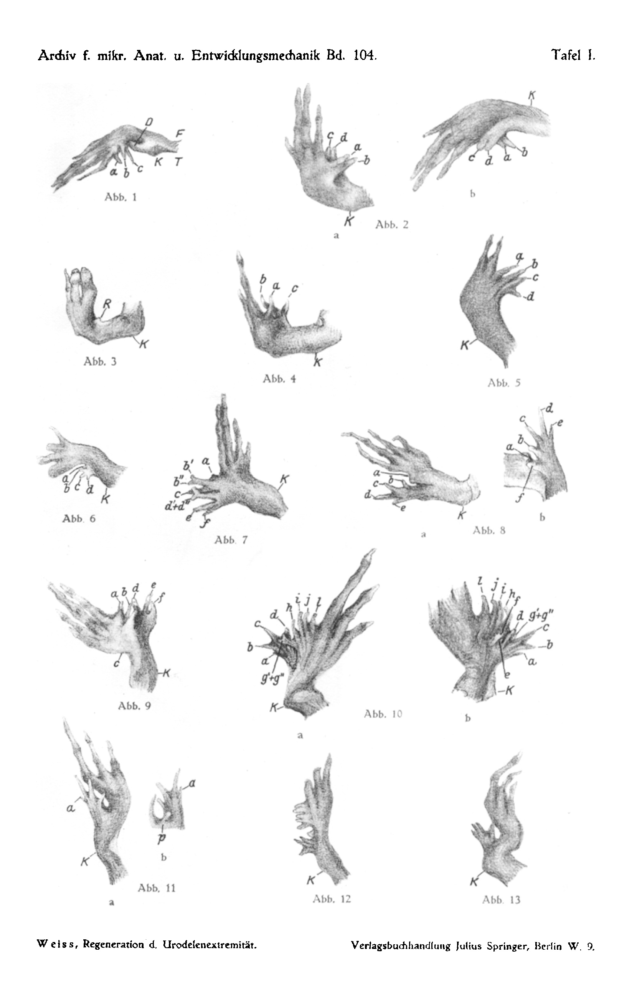

# Die seitliche Regeneration der Urodelenextremität
# The Lateral Regeneration of the Urodele Limb

By

Paul Weiss.

(From the Biological Experimental Institute of the Academy of Sciences in Vienna, Zoological Department.)

With 4 text-figures and Plate I.

*(Received 16 April 1924.)*

*Archiv für mikroskopische Anatomie und Entwicklungsmechanik*, vol. 104 (1925).

> **Full translation.** A complete English rendering of the running text of “The Lateral Regeneration of the Urodele Limb” (Paul Weiß, 1925), including all tables, figure and plate legends, and footnotes. Numbers and table cells were transcribed from the page images, not the noisy OCR.

### Table of Contents

| | Page |
|---|---|
| Introduction | 395 |
| Operation | 396 |
| The Type of the Foot | 397 |
| Experimental Results | 399 |
| Discussion of the Results | 403 |
| Casuistry | 404 |
| Summary | 406 |
| Bibliography | 408 |

If from a planarian one removes a piece of its body by transverse, by oblique, or by longitudinal cutting, the remaining piece will in most cases be able to complete itself regeneratively back into the unified form of a whole animal. We wish here to hold fast to the point that here, from a longitudinal-section surface, in lateral regeneration the lateral half of the animal — that is, something equivalent to the removed part — is produced. A quite corresponding behavior, the lateral filling-in to the original organ form, we observe in the tail of amphibians. It is a fact that here the tail restores its typical form not only after a cut set perpendicular to the main axis, but to a certain degree also after one set parallel to it.¹

Given such a state of affairs, one could scarcely expect to find any essentially different behavior in the limb; one might be strengthened in this view by various findings on malformations which seemed to point directly to a form-identical lateral regenerative capacity of the limb, and it was indeed precisely in connection with this circle of problems that, at the time, my esteemed teacher, Herr Prof. Przibram, induced me to the closer investigation of the lateral

> ¹) A preliminary communication of the results of this work appeared under the same title as Communication No. 114 from the Biological Experimental Institute of the Academy of Sciences in Vienna (Zoological Department; Director: H. Przibram) in the Academic Anzeiger No. 24, 1923.

> ²) My own experiments on *Triton cr.*, not published in extenso.

regenerative capacity of the limb. The work was begun 4 years ago; nor was the result so unequivocal that it would, like the otherwise so meaningful experiment, have appeared to me from the outset worthy of inclusion in the series of investigations on the regeneration phenomena of the limb. Only after the result had turned out otherwise than originally expected did it acquire a heightened interest: under which conditions does the lateral filling-in of the limb form result after lateral removal from the remaining-piece's form as a mirror-image!

It will already suffice here to establish, by the experiments, that no lateral filling-in in an analogous manner, as in *Planaria*, occurs at the limb, in the way it does occur at the tail of the *Triton*. For observation here shows that on laterally defected limb stumps the regenerate by no means simply takes over the lateral half of the missing limb part, as is to be expected after the result obtained on the tail; rather, the limb here behaves quite otherwise; it does not, however, let the regenerative activity proceed along the entire lateral section surface, but rather coalesces the longitudinal-section surface wholly or in part with the limb's mass and from then on no longer differentiates regenerative tissue along the entire lateral section surface, but to a certain degree parallel to the main axis of the limb.

The operative and post-operative contingencies, such as the size of the wound surface and the wound contraction, exert here moreover an essential influence on the originally chosen line of section; in such case there results from one and the same line of section a quite various form, indeed often a wholly singular glimpse into the regenerate; for in addition to the realized regenerate one comes here too upon the rather colorful manifoldness of seemingly quite incongruent formations. Therefore the report on the results of the casuistry will be brought forward only afterward; it will only then be of value if the summary of the findings has previously been brought forward; one will then more easily understand the character of an extended record.

### Operation.

All experiments were carried out on *Triton cristatus* (Vollnecken). For more detail on technique see *P. Weiss* 1925a. The operative task consisted herein, of removing from the limb a possibly large longitudinal-section piece (for the principal parts of the limb see the schematic representation). For the line of section two principal forms come into consideration: either the whole limb is divided over its entire length by a section running through it longitudinally, or only a single foot section is involved. We removed, by means of the second form, only one piece of the foot. Foot and lower leg up to the knee are split, and the other half is severed at the knee. In detail the line of section is somewhat various, depending on how many toes and how much of the metatarsus are to be removed. The schemata depicted alongside render the manner of the carried-out operations, with the designations by which they are also always to be characterized in what follows (Fig. 1).

**Fig. 1.** Schema of the operations.

| | | |
|---|---|---|
| T1 | the | |
| T2 | Removal of the first two toes with the appurtenant part of the tarsus and | the |
| T3 | the three | *tibial* lower-leg half. |

| | | |
|---|---|---|
| F1 | the | |
| F2 | Removal of the last two toes with the appurtenant part of the tarsus and | the |
| F3 | the three | *fibular* lower-leg half. |

The longitudinal-section surface is about 5 times as large as the transverse-section surface. 112 animals had been operated upon; of these, 36 gave distinct regeneration results, and indeed distributed over the individual operation types as follows:

| T1 | T2 | T3 | F1 | F2 | F3 |
|---|---|---|---|---|---|
| 5 | 6 | 8 | 7 | 8 | 2 |

The immediate, non-regenerative consequences of the wound-setting impair the regeneration process to a considerable degree: When a wound surface scars over quickly, then thereby the organ-regeneration process is suppressed, or at least strongly inhibited. Analogously, a strong contraction of the remaining piece toward the wound side affords an essential hindrance to the spatial unfolding capacity of a regenerate. But it is possible, after some practice, in most cases to read out easily from the final structure what influence these various factors have had on the developmental course of the regenerate.

### On the Type of the Foot.

Before we can proceed to the presentation of the experimental results, an examination essential for the further conception must be inserted. It is a matter of the question: what kind of structures may we designate as a foot? We may, in any case, if we wish to proceed understandingly, base the concept not on the "Normal," but only on the "Typical" of the form (cf. on Norm and Type *Roux* 1912). The Type is the specifically disposition-conforming, it is the inherent characteristic

> Archiv f. mikr. Anat. u. Entwicklungsmechanik Bd. 104. 26 of the organ form; from the same typical disposition an organ can, corresponding to various exogenous influences during the differentiation course, attain various phenomenal final forms by way of a different differentiation course. Admittedly we have, for the recognition of the type, only the means of inference back from the "normal" formation of the hand, and we must first learn to find the type again also in the "Abnormal." With an example of the foot this will become clear.

The normal foot of a *Triton* is characterized as functional organ by the following property: A flat basal foot (metatarsus) with eight skeletal elements arranged in three rows, with a highly differentiated muscle- and ligament apparatus; running out into five free toe rays in a typically arranged size-ratio, with an articulated skeleton. The toes stand with the basal part in the closest functional interconnection, and are gathered together with it and, at the base, among one another, through transversely and obliquely running muscle- and ligament tracts into a functionally unified association; only through this constitution does the spreading of the toes against one another first become possible. We wish to denote the characteristic belonging-together of the toes among themselves and with the metatarsus, which precisely in the muscular interconnectedness expresses itself, as "Spannungsverband" [tension-association]. It is that which first stamps the foot into a unified organ; against it, the number of the toes is a far less important criterion. A foot can exhibit a toe-count below the normal and yet have to count as a foot; on the other hand, a mere row-arrangement of five individual toes without tension-association will already have to be designated a "false foot" before it can be called a foot. Besides the tension-association, it is further characteristic for the typical foot that the toes are arranged in a definite size-ratio; if for the hind limb in *Triton* we rank the toes according to their size, then the outermost (1st and 5th) are the smallest, then the others follow in ascending order in the sequence 2, 4, 3. — At the front limb in the sequence 1, 4, 2, 3. —

The five-rayed disposition is not closed at every hind limb of the foot, but only at the typical foot. I have remarked in numerous places (1924b) that through intensified hindrances opposing the differentiation process the external development of the individual rays — and indeed begun from the ulnar (fibular) edge — can be suppressed, so that they remain, though laid out, arrested in their development, and in the final structure are perceptible only as weak rudiments; in such a way there then comes about the foot that is indeed typical, yet abnormal. In the said places, however, I went also into the other case, not seldom observed in leg regeneration, where from the final structure a disposition four-rayed from the very beginning can be inferred as a foot. In such a case, however, the foot must be designated as "atypical," well, yet still "false." Then, despite the constancy of the toes, the organ is, in its parts, not to be drawn together under the concept "foot" through the lack of the "Spannungsverband" of the toes, even though it be perhaps just exactly five toe rays, if the tension-association is lacking, if they, without being joined together into a higher association, are merely arranged spatially next to one another. With such rows of toe-individuals we shall become still better acquainted in what follows.

### Experimental Results.

In order that we may give an overview over the results, the following is to be said in advance: In general the filling-in of the disposition occurs on both sides from the perpendicularly sectioned parts of the body, here separated, namely from the transverse-section surface and the longitudinal-section surface, here that of the longitudinal-section surface together with it. As I overlook this result, when after separated disposition of the perpendicular section surfaces a *separate filling-in* occurs, it results regularly that

1. from the transverse-section surface a (mostly hypotypical) foot, set upon a knee, arises.

2. from the lateral section surface a *fullness of individual toe-individuals or rays parallel to the limb-axis is brought forth* (No. A, B, 218).

Ad 1: The transverse section here contains roughly that part of the lower-leg-half which still gives the typical material, here, however, the whole blastema. From this blastema there arises in general, by reduction of the entire toe-count, a foot which characterizes itself dispositionally as somewhat hypotypical (e.g. No. 223, 225, 183). The interesting fact of the development from parts of the cross-section, in that the parts of the cross-section yield a regular, disposition-conforming origin (1924b); the disposition-conforming hindrances of the external development here. They do indeed stand in rather close spatial connection among one another, do indeed sit upon a common ridge, but they are — we note for the present the fact, that from the knee onward the distal-regenerate forms a *foot*.

This distal-regenerate grows out, indeed, up into the height of the half lower-leg-half and fills the limb-half there to approximately normal extent (No. 230, 233). This filling-in is, however, in reality only formally similar, and is only formally pretended thereby, that the distal-regenerate and the remaining old lower-leg-half stick under a common hull. For namely the foot formed distally from the knee corresponds not to the place of the front lower-leg-*half* itself, but to a new *whole* lower leg; this is clear from the fact that the distal-regenerate contains *both* the appurtenant skeletal pieces of a whole lower leg. It also lies, in such cases, superficially shaped; one could foresee that one had here only a formally similar regenerate before one, as it is also formed superficially regenerated at the *Planaria* or at the *amphibian tail*. Indeed thereby, that here from the knee an entire regenerate is laid out, the lateral-section-surface differentiation is in part disturbed, the section surface in the knee-region differentiation prevented.

Ad 2: If we now consider the occurrence more closely, then at the lateral section surfaces, insofar as they are not scarred, namely at the section surfaces of the blastema, as it takes up from the regeneration surfaces, one overlooks it in its entire extension; it is thus considerable, larger than one would suppose at the transverse-section blastema. If it is laid out in isolation and finds no connection with the distal-regenerate arising from the knee, then here, at the same place, a regeneration rises up, but it is at the height bent in the direction of differentiation perpendicular to the limb-axis. More and more there appear at the originally smooth bordering of the ridge bulges and points like the teeth of a comb; from the lateral section surface there forms in the most favorable cases finally, along the lateral section surfaces, a new structure which in appearance recalls the main comb of the cock or a row of dripstones from grottoes (No. A, B, 170, 171, 226). Although such a place lets itself vary in individual cases into rather diverse changing forms, fusions and splittings being frequent occurrences, yet one thing always remains clear: that the individual toes and cones are *never* joined together into an *association*, that they do not even approximately deserve the designation "foot." They do indeed stand in rather close spatial connection among one another, do indeed sit upon a common ridge, oblique, flat teeth arranged one upon another, as it is in A, B, 170, 171, 226. Even if the appearance recalls a foot, yet they never form a unified organ; there is further lacking too the characteristic arrangement according to a definite sizeratio; small ones stand between large ones, and all more or less parallel, arranged in a row, giving themselves to be recognized already not as a "sum" of individual beings. It is thus a rather unbridled and little organized regeneration-activity at the longitudinal-section surface, even though the individual structures themselves may be quite well formed and provided with skeleton, musculature, and innervation.

Among the rarest of the new-formation-activity, mostly in the region of the metacarpus and of the wrist, strange formations can present themselves; the latter, however, is not yet faultlessly established by the experiment hitherto, for at this experiment I have, as concerns the state of affairs at the lateral section surface, a uniform ridge as disposition; proximally it borders on the cross-section at the knee, distally the blastema indeed coalesces with it, whereas at its distal end, in the metacarpus region, there sit such formations, so that a doubt could arise, and certainty could not be established. For the lower leg is, in its proximal part, covered over by the distal-regenerate, so that at it then not much proliferation-surface remains open.

The number in which the toe-individuals are produced depends apparently in the first place on the *size of the disposition-surface*; where the wound surface is diminished through partial contraction (No. 219) and through scarring (No. 223, 225), there one afterward often finds only a few toe-individuals regenerated, whereas at larger wound surfaces one has been able to observe up to a dozen.

Everything previous holds, as we have said, *for a separated* developmental course of cross- and longitudinal-section surface. It was a fortunate accident that really a few animals of ours laid out and regenerated the perpendicularly sectioned section surfaces separately, so that the differences between the lateral- and the cross-section regenerate could come purely into appearance. As one sees from the schema (Figs. 2 and 3), it must, as a rule, come to a collision between the two regenerates, and then, to be sure, the results are by no means so clear that, from them alone, compelling conclusions could be drawn.

**Fig. 2.** and **Fig. 3.** Schema of the coalescing of the two regeneration-blastemata and their meeting.

When the regenerates grow forward perpendicular to one another, as they were laid out, in the way the arrows in Fig. 2 show, then they must finally, if the one was not previously deflected out of its original direction, meet one another and push one another aside in the sense of the arrows in Fig. 3. According to the time that has elapsed since the wound-setting, the effect, when the two regenerates come together, will be various:

1. When the encounter takes place only after a very early stage, hence still before the definitive disposition, then the blastemata flow together into a unified mass and carry out the determination already at the inner formation-mass. In such cases there mostly remains at the lateral section surface a uniform ridge as disposition; proximally it borders on the cross-section at the knee, distally the blastema indeed coalesces with it, and from then on the disposition yields a new (No. 167) foot (No. 176), as it would also then have arisen, after the fusion with the lateral blastema, from the distal-regenerate of the knee alone. Determination of the lateral regenerates fails to occur entirely in this case; the organization which determines a typical foot for the distal-regenerate evidently governs the whole formation-material, even so far as it is supplied from the side.

2. If the regenerates meet when the determination has already advanced, that is, according to *Schaxel* (1921) and *Milojević* (1923) for the distal-regenerate at any rate already, and then the stage of the flattening of the bud to the disposition, then they may well still coalesce with one another, but it can come to no formally unified further development; the components of the two different determinates that have grown against one another. Such cases yield the most disorderly regenerates.

3. If the regenerates meet still later, at a time when they have already advanced in external differentiation, then a fusing of the bordering boundary surfaces adjoining one another can indeed still take place, yet a certain spatial separateness of the one against the other is permanently perceptible (No. 170, 171, 226). The mutual impairment, which can become very considerable for both, shows itself after the manner in which they are also otherwise affected, through spatial constriction, mechanical disturbance, fusions, at the differentiation process of a regenerate. The parts that were laid out normally are inhibited in their development, either completely suppressed or at least held back so far that they can work through only to a miserable misshape. A pushing-aside of parts in directions of lesser resistance is then a frequent consequential appearance (No. 118).

To the previously discussed regeneration-occurrence of the cross-section- and longitudinal-section surface there comes yet a Third 1. If the encounter takes place still at a quite early stage, still before the final laying-down, then the blastemas flow together into a uniform mass and already undergo the determination as a uniform formative mass. In such cases there usually remains, along the lateral cut surface, a uniform ridge as the primordium [Anlage]; proximally it borders on the cross-section at the knee, whose blastema has indeed fused with it, whereas at its distal end, in the metatarsal region, a thickening, a small nodule, forms (Nr. 167), and then there is delivered the primordium of a new whole foot (Nr. 176), such as would also otherwise have arisen, from this fusion with the lateral blastema, out of the distal regenerate of the knee alone. To this regenerated foot the lateral cut surface contributes the typical formative material, also insofar as it is delivered from the side.

2. If the regenerates differentiate when the determination has already advanced — that is, according to *Schaxel* (1921) and *Milojević* (1923), for the distal regenerate in any case already at the stage of the flattening of the bud into the primordium — then they may indeed still fuse with one another, but no kind of formally uniform further development can come about any longer, and the end-structure is a mosaic out of the intergrown constituents of the two different determinates. Such cases yield the most disorderly regenerates.

3. If the regenerates meet one another still later, at a point in time when they have already proceeded to outer differentiation, then a fusing-together of the boundary surfaces pressing against one another may indeed still take place, but a certain spatial separateness of the one against the other remains continually perceptible (Nr. 170, 171, 226). The mutual impairment which the two kinds of regenerates can suffer thereby shows itself in the same manner as is otherwise brought about, through spatial constriction, mechanical disturbances, intergrowths, and so on, in the differentiation process of a regenerate. The first parts that were normally laid down are inhibited in their development, either completely suppressed or at least held back so far that they can only work their way through to a stunted malformation. A pushing-off of parts in directions of lesser growth-resistance is then a frequent consequent phenomenon (Nr. 118).

To the regeneration events from the cross-sectional and longitudinal cut surface discussed in the foregoing there comes, as a third, sometimes a regeneration from the toe-base. Anything essentially new, however, we do not get to know in this, and so we will only briefly dwell on it. It is, after all, apparently long known that a toe in *Triton* is regeneratively restored after amputation, provided that no too-close scarring of the wound sets in. Toe-regeneration will always be able to take place when, at the operation, a residue of the organ "toe" has still been left behind. That this case was frequently given in our experiments, with the at all events quite coarse demarcation of the line of section, is understandable; thus there then arose at times, in connection with the old toes that had remained standing, genuine toe-regenerates from the metatarsus, which entered into the tension-association typical of the (not removed at the operation) foot-residue.

In that kind of operation in which only one toe (the 1st or 5th), but with it the corresponding half of the tarsus, had been removed in its whole extent (F1, F1), it comes about, moreover, that a piece of oblique or even cross-section at the toe-base lies open, turned proximalward. From here it then sometimes comes to polarity-reversed regeneration at the mentioned toe-residues; admittedly the end-structures do not really grow out proximalward, although they were demanded in this direction, since they evidently come into conflict with the lateral regeneration and are — just as we earlier came to know from the distal regenerates too — pushed off laterally.

### Discussion of the results.

In a preceding work I have discussed the concept of the "determination field" of the extremity. The field acts toward distal in such a way that, under unchanged circumstances, it brings to laying-down a new structure equivalent to the centred distal portion. Such [laying-down] takes place, as we had briefly noted, even from a half cut surface.

In closest possible adherence to the facts, I had, in the earlier work (1925b), to make the following assumptions about the field-action: The ontogenetically fully differentiated organ "extremity" still bears its uniform organ-field; the capacity of this field is there limited to creating the *starting arrangement* for the laying-down of "extremity" corresponding to the removed portion that falls out of the saturated field-region. The self-differentiation of the determined material takes place as a reactive self-differentiation of the determined material in accordance with the starting laying-down brought about by the field, and is thus henceforth no longer immediately dependent on the field itself. Nevertheless the field is also henceforth unable to make good a single injury *within the differentiated organ extremity*; for example, a totally removed skeletal part cannot, as already discussed in the named work, be replaced. The state of affairs is best expressed thus: The extremity-(organ-)field can only create the arrangement for *extremity as a whole*; wherever, then, the field comes to effectiveness, there forms a whole foot and as much whole extremity-stem as belongs between foot and cut surface. In the present work many a new example could be brought forward for this state of affairs: distal regenerates, whether they arise directly from the knee (from a reduced cross-section) or whether they proceed from the fusion of a lateral with a cross-sectional regenerate, yield in general *whole feet*, unconcerned about the presence of a lateral old foot-part.

In the *lateral direction*, then, the field is not *in a position to make any arrangement for organ-replacement*. This appears to be immediately connected with the *linear* formation of the extremity in the proximo-distal direction. To wish to say more about it even today would be premature; for the present only vague speculations could come of it.

The phenomenon that, instead of formally similar regeneration at the longitudinal cut surface, unorganized production of toe-individuals occurs, is curious enough. One might at first try to help oneself with the assumption that a number of *discrete*, preformed *toe-primordia*, freed from previously existing developmental obstacles, came to a now unhindered outgrowth; but since nothing, indeed nothing at all, speaks for, and a good deal against, such a crassly preformistic conception, we could not hope for a solution from this side. For the time being I know of no phenomenon that could be set as analogous to the curious lateral regenerative activity at the extremity. Since therefore a subsumption of the observed events under known phenomena is so far not possible, a complete theoretical clarification of the problem must be left to the future.

### Casuistry (Plate I).

In the following let a small selection from the experimental protocols now be presented:

*Nr. 218:* Operation T 1, regeneration duration 220 days. — From the cross-section, from the knee, a stumpy peg has grown distalward, which according to the rest of the experience must be interpreted as a suppressed start to the new formation of a whole foot. It is therefore covered over with skin and is presumably to be sought after the model of the differentiation-standstill. From the longitudinal cut surface, at the lateral cross-sectional surface, three single toes (a, b, c) have arisen, of which b and c are fused with one another at the base (Plate I, Abb. 1).

*Nr. 219:* T 1, 220 days. — Strong contraction of the lower leg toward the tibial (wound) side; from the knee a slender distal regenerate has arisen, which bears 2 toes at its end but does not correspond to a whole regenerate (such formations will be dealt with more thoroughly in a following work); from the metatarsus, standing out laterally at right angles to the stem-axis, 2 toe-individuals a and b as regenerates from the longitudinal cut surface (Plate I, Abb. 2).

*Nr. 167:* T 2, 67 days. — The animal shows an early stage of the fusion of cross-sectional and longitudinal-cut blastema. The lateral cut surface, which by its strong contraction makes the leg appear shortened, here lies level with the cross-sectional surface; the regenerate laid down upon it appears uniform: distalward the foot-end, proximally the knee, between which two toes come into being; the lateral foot-half here unmistakably corresponds with the first three toes of the foot (Plate I, Abb. 3).

*Nr. 230:* T 3, 189 days. — The distal regenerate from the knee has here entirely suppressed the lateral regeneration. There have differentiated three toes that really stand close beside one another, of which, by the look of it, b and c originally belong to the distal regenerate, a on the other hand to the lateral regenerate (Plate I, Abb. 4).

*Nr. 233:* T 3, 291 days. — The cross-sectional regenerate from the knee has grown forward along the fibular half of the lower leg as far as the metatarsus, has thus almost wholly covered over the lateral cut surface; only toe a is lateral. The distal regenerate offers thereby the toes (b, c, d), which stand among one another in tension-association and in their size-relation correspond to the first three toes of a foot, in which a polarity-reversed constellation prevails and which composes a foot out of three toes (Plate I, Abb. 5).

*Nr. 176:* F 1, 72 days. — Out of an earlier fusion of cross-sectional and longitudinal-cut regenerate there arose a uniform primordium, out of which a whole proper foot differentiated itself. The finding teaches analogous conditions to those we know in the case of Nr. 167, but already at a more advanced stage (Plate I, Abb. 6).

*Nr. 171:* F 1, 247 days. — Lively production from the cut surface, which remains open over a wide extent. Cross-sectional and longitudinal-cut regenerate have entered into relation with one another, and that, by the look of the result, at a still more uniformly determinable stage. A certain lawful belonging-together of a—c on the one hand and of d—f on the other is distinct; the former are to be addressed as lateral, the latter as distal regenerate. b and d are each in turn split within themselves, growing out into double formations (Plate I, Abb. 7).

*Nr. 223:* F 3, 221 days. — Cross-sectional and longitudinal cut surface have remained independent of one another. The cross-sectional regenerate is a four-toed whole regenerate, whose toes b, c, d, e stand to one another in the tension-association and size-relation characteristic for an autopodium. Lateral regeneration has set in, but has been hindered by strong scarring and contraction and has therefore remained at the stage of an incipient protrusion at the lateral ridge (a). On the plantar side there is, besides a, still a suppressed toe-formation (Plate I, Abb. 8).

*Nr. 170:* F 1, 247 days. — The finding is similar to that in 171. The toes a, b, c are lateral regenerates; d, e, f have proceeded from the distal regenerate. The three little toes belong, by the look of the roentgen image, distinctly to a four-toed foot, one toe of which was suppressed in the primordium (Plate I, Abb. 9).

*Nr. A:* F 2 (regeneration duration unknown), cross-sectional and longitudinal-cut regeneration have proceeded independently of one another. The end-structures give a clear view of the difference between the lateral and the distal regeneration. From the cross-section, from the knee, there has, in its whole extent, arisen a five-toed foot (a—e). As lateral regenerates, six single toes have arisen from the metatarsus. Of these, five (g, h, i, j, l) stand in a row parallel beside one another, g being split into a double formation; a sixth toe then still finds itself pushed plantarward out of this row (Plate I, Abb. 10).

*Nr. 225:* F 2, 171 days. — From the knee, a four-toed whole regenerate. The lateral cut surface is scarred in its whole extent, hence the regeneration from it is also suppressed. Only at one spot on the plantar side could a single toe force its way through laterally (Plate I, Abb. 11).

*Nr. B:* F 2 (experimental duration unknown). — The characteristics of the lateral regeneration are in this case especially distinctly expressed. Along the whole extent of the longitudinal section at the metatarsus there stand out, laterally at right angles to the stem-axis, parallel to one another, newly formed toe-individuals, six in all. No tension-association, no definite size-order. The cross-sectional regenerate that arose from the knee is three-toed with a tension-association (Plate I, Abb. 12).

*Nr. 226:* F 2, 73 days. — Cross-sectional and longitudinal-cut regenerate have evidently joined together at a no longer very early stage, in order to produce, along the whole cut surface, a conglomerate of eight toes. Of these, apparently, a—d originally belong to the lateral, e—h to the distal regenerate (text-Abb. 4).

**Fig. 4.** Animal 226. *(figure not reproduced)*

*Nr. 183:* F 2, 87 days. — The distal regenerate from the knee cross-section is a four-toed whole regenerate. As a consequence of scarring and strong contraction toward the wound side, no lateral regeneration has set in (Plate I, Abb. 13).

This selection from the experimental results may suffice to sketch a picture of the observed peculiarities; on more detailed investigations of the same theme report will be made later.

### Summary.

To investigate the capacity for replacement-formation from a *longitudinal cut surface* of the extremity, the following procedure was adopted:

On full-grown newts (*Triton cristatus*) foot and lower leg were first split lengthwise, and then one of the two longitudinal halves thus separated was severed transversely at the knee. Thus systematically, in one series, the tibial half of the lower leg and of the foot, with one to three inner toes, in a second series the fibular half, with one to three outer toes, was removed. After the operation there stand, then, at the extremity two differently directed wound surfaces open: a longitudinal cut surface along the remaining half of the lower leg, and, joining onto it perpendicularly at the knee, a cross-sectional surface of half the extremity cross-section. On both cut surfaces there lay themselves down, independently of one another, regeneration blastemas, which, with respect to their formative capacity, prove to be very different from one another. In some cases one obtains, as a consequence of postoperative changes in the position of the two regeneration regions toward one another, no clear picture; thus strong contraction of the remaining extremity-half toward the wound side readily takes place, and this has as a consequence a considerable hindrance of the unfolding of the laid-down regenerates; or else there also takes place a fusion of the primordia, or a later mutual pushing-off.

The regenerate arising from the *half* cross-sectional surface at the knee in the direction of the extremity-axis is capable of producing a *whole* foot with four to five toes; these toes stand among one another in the muscular and tendinous tension-association characteristic for a foot. From proximal, then, the new formation of a whole structure is laid down, unconcerned that distalward there is indeed still present a half old lower leg and foot.

Also the regeneration blastema that lays itself down at the lateral longitudinal cut surface does not provide the replacement of the missing lower-leg and foot-half, but differentiates itself into quite special formations. In the purest cases we find, at the end of the regeneration process, out of the whole longitudinal section a profusion of single toes grown out close beside one another in a row; these toes stand out laterally at right angles to the extremity-axis and are parallel to one another like icicles. They are quite distinctly coordinate to one another and not gathered together, several at a time, into a higher tension-association as the toes of a foot otherwise are. The number in which they arise seems to depend solely on the spatial circumstances; contraction of the wound surface, or premature growing-over from the old [skin], the epidermis over the wound, restricts it.

That the growth-directions of the regenerates issuing from the cross-sectional surface at the knee and of those arising laterally, just like the starting surfaces, stand perpendicular to one another, means that the regenerates can in the fewest cases carry through their development undisturbed; rather, after some time they meet in their growth and push one another off somehow. A subsequent gathering-together into a uniform association can never take place; where a foot with its characteristic tension-connections has regenerated, there it was already determined as such in the laying-down process; a synthesis of a foot out of toes during the differentiation process, say under the influence of function — and the lateral regenerates sometimes function quite well — does not exist.

Whole extremities are able to come to laying-down only in the direction of the main axis, but then out of a reduced cross-section; as a *lateral* regenerate, on the other hand, there arises only a row of toe-individuals. Yet there is a transitional case: namely, when that laid down from the cross-sectional surface, with that laid down at the longitudinal cut surface, fuses with the laid-down blastema at an early stage, in any case still before the completion of the determination process, then both can join together for the formation of a foot; this then stands half laterally outward, and further lateral regeneration is left undone. In such cases the half of the lower leg missing after the operation is then filled in again.

Investigations into the conditions of the origin of whole regenerates from a half cross-section will be discussed in a following communication.

### Literature index.

*Milojević, B.:* Über Transplantationen von Beinregeneraten bei Triton cristatus. Verhandl. d. dtsch. zool. Ges. 28, 36. 1923. — *Roux, Wilhelm:* Terminologie der Entwicklungsmechanik. Leipzig 1912. — *Schaxel, Julius:* Untersuchungen über die Formbildung der Tiere. I. Arb. a. d. Geb. d. exp. Biol. H. 1. 1921. — *Weiss, Paul:* Ganzregenerate aus halbem Extremitätenquerschnitt. Akad. Anz. d. Akad. d. Wiss. Wien Nr. 5. 1924a. — *Derselbe:* Regeneration an transplantierten Extremitäten entwickelter Amphibien. I. Arch. f. mikroskop. Anat. u. Entwicklungsmech. 102, 673. 1924b. — *Derselbe:* Abhängigkeit der Regeneration entwickelter Amphibienextremitäten vom Nervensystem. Der Begriff des Gestaltungstonus. Arch. f. mikroskop. Anat. u. Entwicklungsmech. dieser Bd. 1925a. — *Derselbe:* Unabhängigkeit der Extremitätenregeneration vom Skelett. Ebenda 1925b.

### Plate explanation.

#### Plate I.

(Abbreviations to the figures: *K* knee, *D* distal regenerate, *R* regenerate, *T* tibial edge, *F* fibular edge. The figures show the extremity — it is always the left — in general from the dorsal side; where not, this is expressly noted.)

Abb. 1. *Nr. 218,* seen from the plantar side.

Abb. 2. *Nr. 219;* a from the dorsal side, b from the plantar side.

Abb. 3. *Nr. 167.*

Abb. 4. *Nr. 230.*

Abb. 5. *Nr. 233.*

Abb. 6. *Nr. 176.*

Abb. 7. *Nr. 171.*

Abb. 8. *Nr. 223,* a from the dorsal side, b regenerate from the plantar side.

Abb. 9. *Nr. 170,* from the plantar side.

Abb. 10. *Nr. A,* a from the dorsal side, b from the plantar side.

Abb. 11. *Nr. 225,* a from the dorsal side, b regenerate from the plantar side.

Abb. 12. *Nr. B.*

Abb. 13. *Nr. 183.* **Plate I.** *Archiv f. mikr. Anat. u. Entwicklungsmechanik Bd. 104. Tafel I.* — Abb. 1; Abb. 2; Abb. 3; Abb. 4; Abb. 5; Abb. 6; Abb. 7; Abb. 8; Abb. 9; Abb. 10; Abb. 11; Abb. 12; Abb. 13. (Lower margin: Weiss, Regeneration d. Urodelenextremität. — Verlagsbuchhandlung Julius Springer, Berlin W. 9.) *(figure/plate not reproduced)*

## Figures

**Plate I.**

---

*Translator's note.* One of the Biologische Versuchsanstalt (Vienna Vivarium) papers flagged on the project site as a modern rediscovery target. Claims are rendered as stated in the original, not endorsed.
