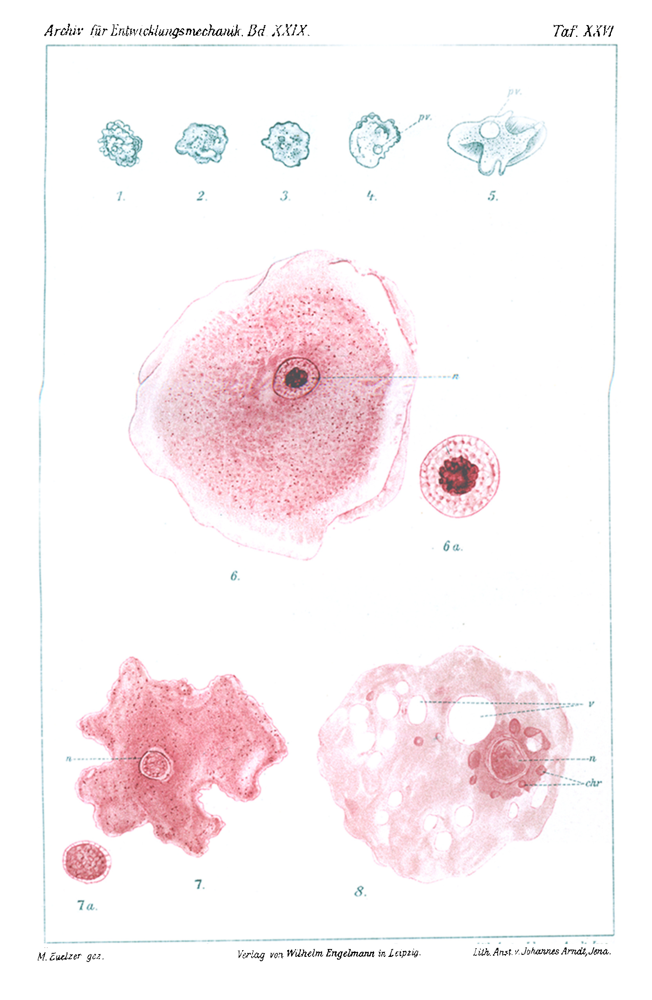

# The Influence of Sea-Water on the Pulsating Vacuole.

By

**Margarete Zuelzer,**
Berlin.

*(From the Biologische Versuchsanstalt in Vienna.)*

With Plate XXVI.

Received on 4 April 1910.

*Archiv für Entwicklungsmechanik der Organismen*, vol. 29 (1910).

> **Full translation.** A complete English rendering of the running text of “The Influence of Sea-Water on the Pulsating Vacuole” (Zuelzer, 1910), including all tables, figure and plate legends, and footnotes. Numbers and table cells were transcribed from the page images, not the noisy OCR.

While occupied with the study of the developmental history of marine Heliozoa, I was struck by the absence of rhythmically pulsating vacuoles in them. The representatives of this genus in fresh water possess pulsating vacuoles singly, often also in greater number, as do the overwhelming majority of the unshelled and shelled Sarcodina of fresh water. In the marine Amoebae, Foraminifera, and Radiolaria, however, rhythmically pulsating vacuoles appear to be uniformly absent.

I wished to attempt to examine the question whether, and to what extent, the presence of rhythmically pulsating vacuoles is dependent on the surrounding medium, the sea-water.

For my experiments there served the fresh-water form *Amoeba verrucosa*; in a rich culture the animals lived together with the algae *Gloeocapsa*, *Lyngbya*, *Plectonema*, *Oedogonium*, and *Mougeotia*. As food the amoebae fed predominantly on *Gloeocapsa*. — For the experiment a definite number of amoebae were isolated, in deep watch-glasses of 4 cm diameter, in culture-water richly stocked with algae from the stock culture. These watch-glasses were kept in moist chambers. These I prepared by covering the bottom of crystallizing dishes with wet sand, and closing the dishes air-tight with a cover. Control animals kept themselves in these chambers, which were saturated with moisture, for months at a time.

For the experiment I isolated a definite number of amoebae in a fluid which consisted of nine parts culture-water and one part sea-water; this water then contained about ³/₁₀ % salt content. In order now to attain a higher concentration of the fluid in which the amoebae found themselves, I let it evaporate cautiously and slowly. To this end I kept the sand, which covered the bottom of the moist chamber, somewhat drier. The moist chamber was now no longer saturated with moisture, and therefore the water gradually evaporated out of the watch-glasses. Evaporated water was replaced by dilute sea-water of only gradually rising concentration; finally the experimental animals were transferred into water of the stated concentration. All experiments were carried out at the same temperature, which by day amounted to about 17° C.

Experiment I: 19 December 1906 to 16 January 1907. 19 December: 1 part sea-water and 9 parts culture-water. 8 January: ½ culture-water, ½ sea-water = about 1½ % salt content. Fresh-water added on 8 January; freshened out on 15 January.

Experiment II: 12 January to 13 February. 12 January: 1 part sea-water and 9 parts culture-water. 6 February: pure sea-water = about 3 % salt content. Fresh-water added on 6 February; freshened out on 13 February.

Experiment III: 4 February to 10 March. 4 February: 1 part sea-water and 9 parts culture-water. 10 March: 3 parts sea-water in 1 part culture-water = about 2½ % salt content.

Experiment IV: 12 January to 10 March. 12 January: 2 parts sea-water, 8 parts fresh-water. 8 March: pure sea-water = about 3 % salt content.

The decisive factor for the well-being of the amoebae in saline water is a sufficient supply of oxygen. Of the fresh-water algae of the stock culture, only the *Gloeocapsa* kept itself vitally fresh in the sea-water, probably by virtue of its gelatinous envelope; the other algae mentioned earlier soon perished upon increase of concentration of the water. For aeration I therefore used this *Cladophora*. This alga assimilates and grows well at the various concentrations from 1 part sea-water, 9 parts fresh-water, up to pure sea-water.

In *Amoeba verrucosa* the ecto- and entoplasm are distinctly separable from one another. The hyaline ectoplasm is very viscous, almost glass-clear. The granule-rich, more swiftly flowing entoplasm harbors the nucleus and the rhythmically pulsating vacuole (Figs. 5 and 6). The pulsations of the same are irregular and fluctuate, in the same animal, between 4–7 or 7–12 minutes. The temperature has an influence on the pulsation-velocity; an elevated temperature accelerates, a lowered one slows the frequency of the pulsating vacuole. The pulsating vacuole is, in larger specimens, mostly formed by several vacuoles, which finally flow together. Around the pulsating vacuole there lies a condensed plasma-layer, which appears doubly contoured. Upon the emptying of the vacuole to the outside, through the entoplasm, this plasma-layer disappears, passes over into the surrounding entoplasm, in order to be formed again by the newly arising vacuole. The position of the vacuole in the plasma is mostly constant.

The nucleus is vesicular. In life one sees centrally a strongly light-refracting interior body; this is surrounded by a clear court. The nuclear membrane is doubly contoured. In the preparation the interior body, which does not allow a structure to be recognized, appears very strongly stained (Figs. 6 and 6*a*). From it up to the nuclear membrane there extends an achromatic honeycomb-work, into which the finest chromatin granules are embedded. Control and experimental animals were fixed uniformly with sublimate-mixtures; the best results were given by strongly acidified, alcoholic mixtures. Staining was done with borax-carmine or with dilute, lightly acidified DELAFIELD's haematoxylin. The amoebae were over-stained and the color drawn out of the plasma with weakly acidified alcohol, so that only the nucleus remained stained.

The movements of *Amoeba verrucosa* are, probably in consequence of its viscous entoplasm, to be called sluggish. Ordinarily the amoeba flows along on its underlay with the help of lifeless pseudopodia. Far more rarely does it employ the rolling movement; this brings it forward very slowly. The amoeba is then spherical and has extended pseudopodia to all sides. When a preponderance of the pseudopodia occurs toward one side, the amoeba rolls over toward that side. In this movement the amoeba does not adhere firmly to its underlay.

For the experiment the amoebae were brought into 9 parts culture-water and 1 part sea-water = ³/₁₀ % solution, respectively, in experimental series IV, into 8 parts culture-water + 2 parts sea-water = about ³/₅ % solution. This concentration the animals tolerated well and at first showed no changes in this strongly diluted sea-water mixture. With increasing concentration of the water, which was achieved very slowly and cautiously through evaporation, the animals began, after a course of 8–10 days, to show shrinking-phenomena. This process advanced. In the course of the next days the animals began to form on their surface small villi and warty protrusions. The separation of ento- and ectoplasm was lost. The flowing forward-movement slowed, and the food, chiefly *Gloeocapsa*, was taken up more slowly and in lesser amounts. The pulsating vacuole exhibited simultaneous changes. In the stage of expansion it showed a considerably smaller diameter than in the normal animal. The pulsations took place increasingly more slowly; especially noticeable was the delay between systole and new formation, so that at times the pulsating vacuole seemed to be entirely absent. The more strongly the water concentrated, the further this process advanced, until finally the vacuole remained completely disappeared (Plate XXVI, Fig. 1). These animals in the sea-water mixtures were strongly shrunken, and a separation of ecto- and entoplasm was no longer present at all. On the contrary, these amoebae showed in all directions villus-like, knobby protrusions, whose surface displayed a slightly sticky quality. Lobose pseudopodia were no longer formed, and with that the ability to move forward by flowing movement was lost. The animals no longer adhered to the glass and, upon mechanical impulse, rolled about rather without support. The plasma-streaming was very much slowed and hardly perceptible. Nutrition-uptake was not observed in the amoebae in this state. Yet there were found, in animals which had been conserved in this state, frequently, besides digested ones, still half- or undigested remains of *Gloeocapsa*. The animals altered in the sea-water therefore seem not to have entirely lost the ability to take up nutrition. The chromatin of the nuclei of the normal *Amoeba verrucosa* is restricted to the central portion (Fig. 6*a*). In the amoebae kept in the sea-water it is loosened, fills almost the whole nucleus (Fig. 7*a*), and now shows a structure. Its stainability lags far behind that of the nuclei of normal animals. By contrast, the whole plasma shows a stronger stainability with nuclear dyes (Fig. 7) than that of the normal animals. The control animals had been strongly stained with nuclear dyes. Upon extraction of the dye, in them the nucleus remained strongly stained and the plasma became decolored (Fig. 6). In the sea-water-accustomed amoebae, on the other hand, which showed the above nuclear changes, the nucleus allowed itself to be stained only weakly. The whole plasma was strongly tinged by nuclear dyes, and the color was now just as hard to extract from it as from the nucleus. The nucleus has evidently become poorer in chromatin, the plasma by contrast richer in chromatin. Preparations of the sea-water-accustomed amoebae resemble the degenerating *Amoeba proteus* figured by PRANDTL, in which an emigration of the nuclear chromatin into the plasma was observed. Preparations of this stage of *Amoeba verrucosa* allow furthermore to recognize that the whole animal is surrounded by an extremely fine membrane; this remains unstained and surrounds all the shrinkings and indentations of the plasma. Whether this membrane is to be understood as a remnant of the ectoplasm or as a product of it, I am unable to decide.

The permanent disappearance of the pulsating vacuole I first established in the amoebae of experimental series I after 20 days, when these animals found themselves in a fluid of 5 parts sea-water to 5 parts fresh-water = about 1½ % salt content. The time and the degree of concentration up to the permanent disappearance of the pulsating vacuole are, however, individually different. In the amoebae of the 2nd and 3rd experimental series, 20–25 days elapsed before the permanent disappearance of their pulsating vacuole. In experimental series IV I let the sea-water concentrate still more slowly. Here I could establish only after 34 days that no strongly shrunken amoebae possessed remains of the pulsating vacuoles. In experimental series II and IV I continued the increase of concentration up to pure sea-water, in experimental series III up to about ³/₄ sea-water concentration. The animals tolerated this concentration well; but I could never observe divisions, whereas the control animals divided frequently.

To the amoeba-cultures which in 3–8 weeks, by slow and cautious accustoming, had learned to tolerate the sea-water, drop-wise filtered culture-water was added, and soon the animals began to swell up again; their contours smoothed themselves (Figs. 1–3). Already after 24 hours, upon further cautious drop-wise addition of fresh-water, the pulsating vacuole appeared again, thus considerably more quickly than it had disappeared. At first it was very small, but pulsated slowly and rhythmically. The animals also began again to extend lobose pseudopodia and to take up the flowing forward-movement. With progressing freshening of the water the vacuole enlarged, and indeed more quickly than it had disappeared (Fig. 4). The vacuole, in the comparatively smaller — because still shrunken — amoebae, seemed to me larger than it had at that time, at the stage in which the animals were about to lose the vacuoles. Unfortunately I had neglected to take measurements during the accustoming to the sea-water, so that the control-measurements were lacking to me.

In any case the process of swelling-up and also the enlargement of the pulsating vacuoles continued, and already after 6 days I observed the first amoebae whose flowing movement, velocity of pulsation of the vacuole, separation of ecto- and entoplasm, whose nuclear-structure and stainability of the plasma resembled those of the normal control animals (Fig. 5). The preparations of such animals also resemble those of normal amoebae. The chromatin of the nucleus is strongly stainable and restricted to the central portion. The plasma allows itself to be lightly decolored and only the nucleus strongly stained.

It had taken 3–8 weeks to accustom the amoebae to various concentrations of sea-water, until they had lost the pulsating vacuoles and showed the further changes described. Individual fluctuations seem to play a part [in] whether and how quickly amoebae accustom themselves to higher concentrations of sea-water. Viscous, slowly mobile individuals seemed to adapt themselves more quickly and to be considerably more resistant than more swiftly flowing ones. A part of the animals perished during the adaptation-attempts. Also, animals frequently perished which had already shown the above-described changes, were shrunken, and had formed the knobby-warty protrusions. The nucleus of such animals was then always disintegrated (Fig. 8). Such animals rounded themselves off, swelled up under vacuolization-phenomena, and burst. The inner plasma flowed out and left the outer membrane behind like a very fine, thin sack. Amoebae which were brought directly out of the culture-water into sea-water that had a higher degree of concentration than 2 parts sea-water to 8 parts fresh-water = thus more than about ½ % salt content, swelled up quickly, vacuolized themselves, rounded themselves off, burst, and dissolved away.

There has been made a series of accustoming-attempts to accustom Protozoa to saline-rich media. Lower concentrations were always well tolerated, e.g. *Amoeba princeps* tolerated up to ½ % (CZERNY), *Euglena* ½–1½ % common-salt solution Klebs, etc. A direct transferring out of the fresh water into higher concentrations than 1–2 % salt content is tolerated neither by amoebae (CZERNY) nor by flagellates: *Polytoma uvella* (ROSER, MASSART) perishes quickly at a stronger concentration than 1 % common-salt content; *Stylonychia*, *Euplotes*, *Chilodon* perish in common-salt solutions of higher concentration than ½–1 %, whereas at the same temperature cane-sugar solutions up to 2 % were tolerated (ROSSBACH). In these animals, which lived in ½–1 % common-salt or 2 % cane-sugar solution, the diameter of the vacuole became smaller and the frequency of the contractions less. With slow increase of the concentration it succeeds in accustoming Infusoria, e.g. *Vorticella*, *Glaucoma*, or *Chilodon*, to common-salt or potassium-nitrate solutions, which withstand the osmotic pressure increased 8–10-fold above the initially tolerated maximum. (MASSART): indeed, *Fabrea salina* is even able to exist in saturated common-salt solution (HENNEGUY). FLORENTIN cultivated the fresh-water forms *Hyalodiscus limax*, *Cyclidium*, *Loxophyllum*, and *Anisonema*, finally, after a course of 15 months, in 2.9 % common-salt solution; *Hyalodiscus limax* showed thereby an altered structure of the cytoplasm.

To slow increases of concentration of the salt content, Protozoa can therefore accustom themselves. *Paramaecium caudatum*, which did not tolerate a direct transfer out of the fresh water into a higher concentration than ⁴/₁₀–⁵/₁₀ % common-salt content, was, with gradual increase of the salt content, cultured in ⁵/₁₀ % salt solution and multiplied in the same; such specimens could then be transferred without harm into ⁹/₁₀ % salt solution, thus into a concentration which would be absolutely deadly for the Paramaecia cultured in fresh water. In the infusoria cultured in salt-water there arise, at first, through shrinkage, foldings in the pellicle. In the interior of the infusorian body there appear, during the adaptation-processes,

vacuoles; thereby the wrinklings on the surface of the animal disappear again (YASUDA).

... vacuoles; thereby the wrinklings at the surface of the animal disappear again (Yasuda). The infusorian body shrinks because water is withdrawn from it through the raising of the salt content of the surrounding medium. Balbiani designates this process of shrinkage as plasmorrhysis. The shrinkage begins as soon as the osmotic pressure of the surrounding medium exceeds that which prevails in the infusorian body. If one knows the salt concentration at which plasmorrhysis begins to set in, then from this one can draw a conclusion as to the osmotic pressure which prevails in the infusorian cell.

The protozoan body shrinks in common-salt solutions. In the case of *Amoeba verrucosa*, these shrinkages began in salt solutions which exceeded a concentration of ³/₁₀—½ %; this concentration must therefore presumably be isotonic with the amoeba body. A higher concentration brings about a withdrawal of fluid from the body; through this very withdrawal the osmotic equilibrium of the amoeba body with that of the surrounding medium must be established. In sea-water solutions, metabolism and fluid uptake are slowed; and the frequency of the pulsating vacuoles — which, in the animals kept in fresh water, secrete fluid from the amoeba body at regular intervals — is reduced, and thereby the exchange of water within the protozoan interior is lowered.

The lasting disappearance and reappearance of the pulsating vacuole of *Amoeba verrucosa*, in one and the same individual, clearly showed the direct dependence of its formation upon the surrounding medium. At a concentration of ³/₁₀—³/₅ % salt content, the pulsations of the contractile vacuole began to become slower; at 1½—2½ % salt content of the water it was and remained disappeared, in order, in the same individual, to form itself anew again when the concentration of the surrounding medium is lowered once more.

The cause of the changes in the pulsating vacuole is to be sought in the raising of the osmotic pressure; the present investigations too make this probable. According as the osmotic pressure is increased through increase of the concentration of the sea-water, the pulsations of the vacuole diminish, finally to cease entirely; the contraction frequency, however, increases again as soon as, through addition of fresh water, the osmotic pressure of the surrounding medium is lowered. Experiments on other amoebae, which I began with sea-water and ...

... other solutions isotonic with the sea-water, are to answer the possibility of an unobjectionable demonstration of [the influence of] the CNa [common salt] upon the pulsating vacuole. Sea-water amoebae, which possess no pulsating vacuole at all, respond to fresh water by the appearance of pulsating vacuoles in the same way. On *Amoeba verrucosa* it is, however, to be remarked above all that the various behaviours of the pulsating vacuole reside merely in the changed external conditions of life. Every entirely simple change in the salt content of the surrounding medium calls forth changes in the pulsation, so that, by means of suitable changes of the medium, the various influences which bring about these changes may be eliminated.

### Bibliography.

1. **Balbiani**, E. G., Études sur l'action des sels sur les Infusoires. Arch. de l'Anat. micr. T. p. 158—600. Paris 1898.
2. **Bütschli**, O., Protozoa in Bronns Klassen und Ordnungen des Tierreiches. Bd. I. Leipzig 1880—82. Bd. III. Leipzig 1887—89.
3. **Czerny**, V., Einige Beobachtungen an Amöben. Arch. f. mikr. Anatomie. 1869. S. 158—160.
4. **Doflein**, Die Protozoen als Parasiten und Krankheitserreger. Fischer, Jena 1901.
5. **Florentin**, R., Études sur la faune des marés salées de Lorraine. Ann. de sc. natur. 10. 1900.
6. **v. Fürth**, O., Vergleichende chemische Physiologie der niederen Tiere. Jena 1903.
7. **Gruber**, K., Beiträge zur Kenntnis der Kernverhältnisse bei den in Cephalopoden schmarotzenden Infusorien. Arch. f. Protistenk. Bd. 5. Heft 2. Fischer, Jena 1905.
8. **Hamburger**, C., Zur Kenntnis von Dunaliella salina und einer Amöbe aus dem Salzwasser von Cagliari. Arch. f. Protistenk. Bd. VI. Jena. Fischer 1906.
9. **Hennegoy**, F., Sur un Infusoire hétérotriche, Fabrea salina. Ann. d'Micrographie. 3. 1891.
10. **Lang**, A., Lehrbuch der vergleichenden Anatomie der wirbellosen Tiere. 2. Lfg.: Protozoa. Jena, Fischer 1901.
11. **Massart**, J., Sensibilité et adaptation des organismes à la concentration des solutions salines. Arch. de Biol. 1889.
12. **Pelseneer**, H., Über physiologische Korndegenerationen bei Amoeba proteus. Archiv für Protistenkunde. Bd. VII. Jena. Fischer 1907.
13. **Reuchler**, L., Physikalische Lebensveränderungen der Zelle. I. Arch. f. Entw. Mech. Bd. VII. Leipzig 1898. S. 65—99.

**Plate XXVI (Tafel XXVI).** *(figure not reproduced)*

> *Archiv für Entwicklungsmechanik. Bd. XXIX.* — Taf. XXVI.
>
> M. Zuelzer gez. — Verlag von Wilhelm Engelmann in Leipzig. — Lith. Anst. v. Johannes Arndt, Jena.

14. **Roser**, K., Beiträge zur Biologie niedrigster Organismen. Marburg 1881.
15. **Schaudinn**, F., Untersuchung über die Fortpflanzung einiger Rhizopoden. Arbeit aus dem kaiserl. Gesundheitsamte. Bd. XIX. Heft 3. 1903.
16. **Techet**, K., Verhalten einiger mariner Algen bei Änderung des Salzgehaltes. Österr. botan. Zeitschr. Jahrg. 1904. No. 9.

### Explanation of the Figures.

#### Tafel XXVI.

*n* = nucleus, *v* = vacuole, *p.v.* = pulsating vacuole, *chr* = chromatin fragments.

**Fig. 1—5.** Living *Amoeba verrucosa* (the same individual). Zeiss, Obj. 8, Ocul. 3.

**Fig. 1.** *Amoeba verrucosa* (8 January) in about 1½ % salt-water.

**Fig. 2, 3, 4.** With progressive addition of fresh water.

**Fig. 5.** 15 January. *A. v.* in fresh water.

**Fig. 6—8.** *Amoeba verrucosa* drawn from the preparation. Abbé Z. Ap. Zeiss Obj. 2 mm, Ocul. 4.

**Fig. 6a and 7a.** Zeiss Obj. 2 mm, Ocul. 8.

**Fig. 6.** Normal *Amoeba verrucosa*.

**Fig. 6a.** Nucleus of the same animal.

**Fig. 7.** *Amoeba verrucosa* from about 2½ %-salt solution, preserved after loss of the pulsating vacuole.

**Fig. 7a.** Nucleus of the same animal.

**Fig. 8.** Degenerated animal from sea-water, vacuolized; preserved after loss of the pulsating vacuole.

## Figures

**Taf. XXVI.**

---

*Translator's note.* One of the Biologische Versuchsanstalt (Vienna Vivarium) papers flagged on the project site as a modern rediscovery target. Claims are rendered as stated in the original, not endorsed.
