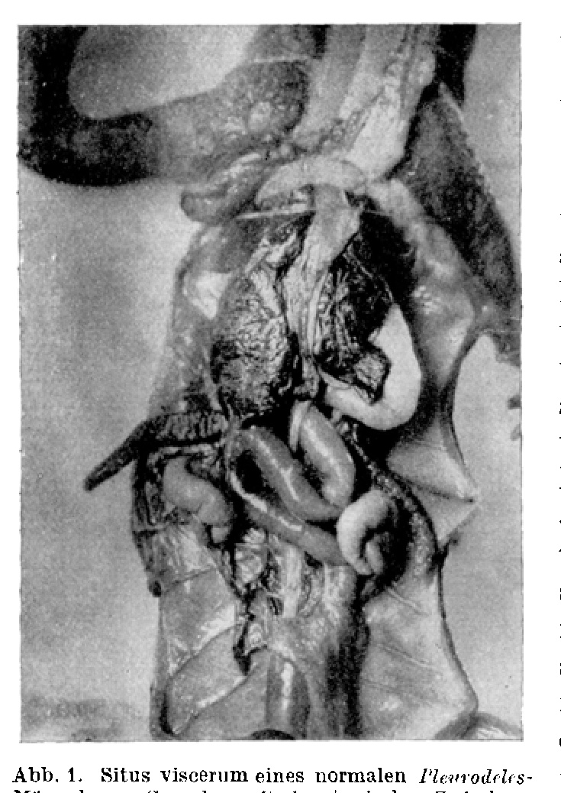
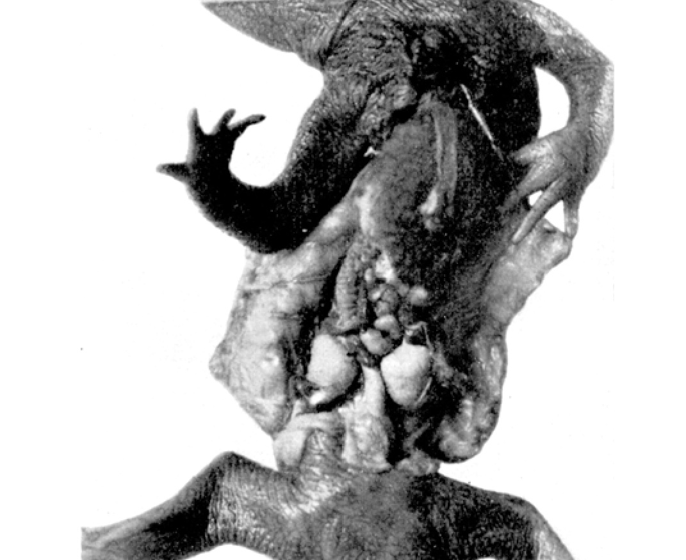
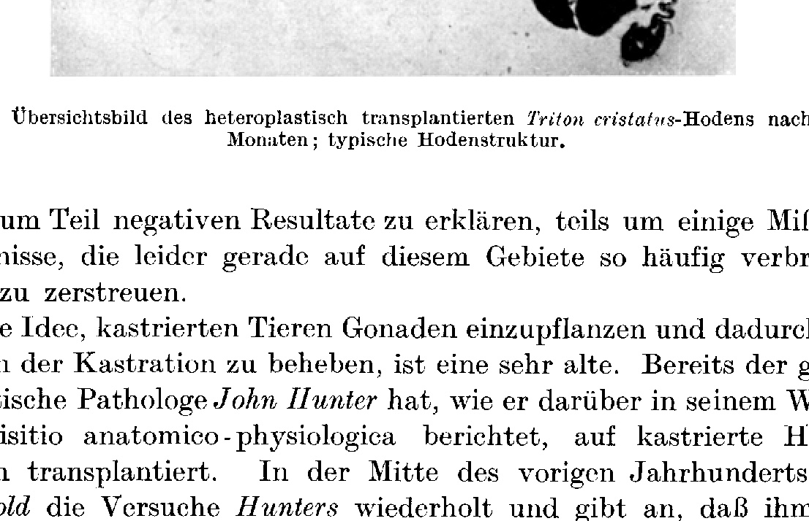
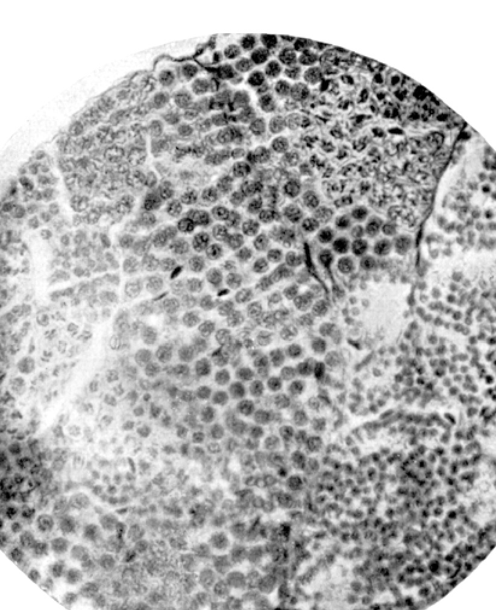
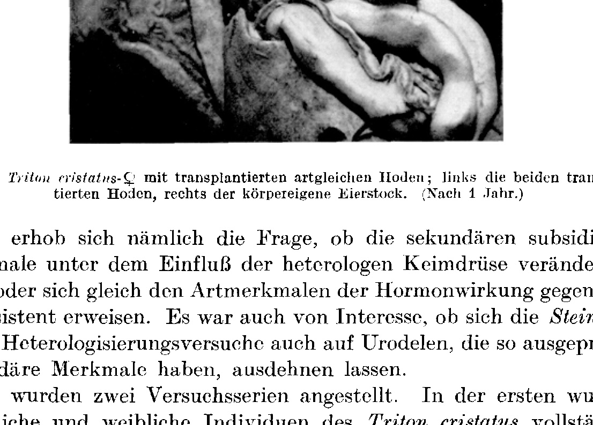
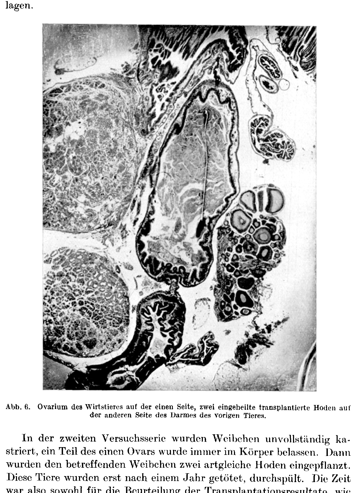
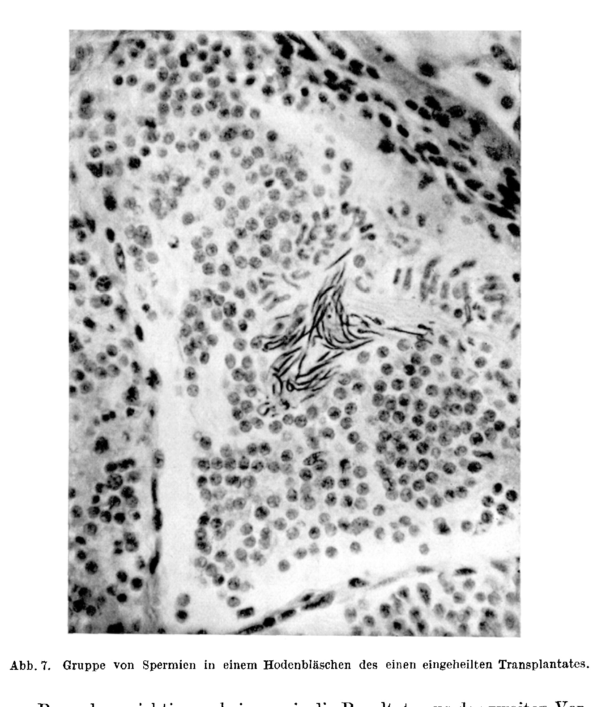
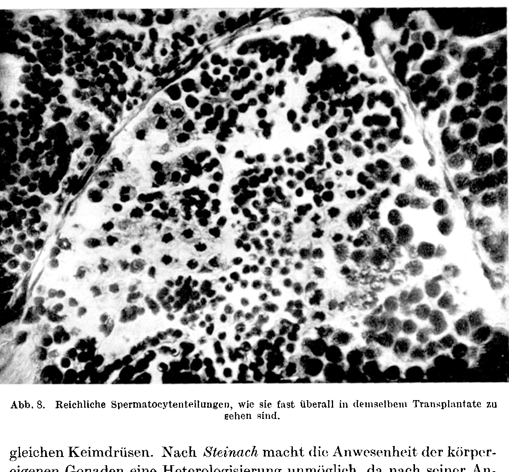

# Preservation of Spermatogenesis in the Autophorically Transplanted Urodele Testis

### (At the same time: Investigations on the biology of the ribbed newt *Pleurodeles Waltli*. I.¹) Heteroplastic testis re-implantation.)

By

**Theodor Koppányi.**

(From the Zoological Department of the Biological Experimental Institute of the Academy of Sciences in Vienna.)

With 8 text figures.

(Received on 22 November 1923.)

*Archiv für mikroskopische Anatomie und Entwicklungsmechanik*, vol. 102 (1924).

> **Full translation.** A complete English rendering of the running text of “Preservation of Spermatogenesis in the Autophorically Transplanted Urodele Testis” (Theodor Koppányi, 1924), including all tables, figure and plate legends, and footnotes. Numbers and table cells were transcribed from the page images, not the noisy OCR.

### Table of Contents

| | Page |
|---|---|
| A. Heteroplastic testis transplantation between *Pleurodeles*, *Triton cristatus* and *T. marmoratus* | 707 |
| B. Xenoplastic gonad transplantation between males and females of *Triton cristatus* | 720 |
| C. Summary | 724 |

## A.

Besides the peculiarities of the skeleton, it was the rather enigmatic sexual life of the ribbed newt that most aroused the interest of zoologists. Very little was known about the reproductive business of the animal; the classical representatives of herpetology were denied the good fortune of observing the animal during copulation. The first to whom we owe a description of the mating was the French amphibiologist F. Lataste. According to his accounts, the copulation of the ribbed newts resembles the mating of the fire salamanders. It takes place in the water; the male clasps the female with the forelimbs, then bends himself in such a way that he comes to lie beneath the female. The essential point about this process is only that, in these tailed amphibians, an actual clasping occurs, and moreover a clasping in the water — a reflex which otherwise seems to be widespread only among the Anura. E. Zeller likewise succeeded in observing the ribbed newts during mating; his statements concerning the clasping in the water agree completely with those of Lataste. Only a few

> ¹) An excerpt of this work appeared under the same title as Communication No. 97 I from the Biological Experimental Institute of the Academy of Sciences (Zoological Department, Director H. Przibram) and from the Physiological Institute of the University in Vienna, in the Akad. Anz. No. 26–27, 14 December 1922.

months ago my friend R. Adolph, head of the Herpetological Station in Olmütz [Olomouc], wrote to me that he too could observe the clasping in his ribbed newts kept in the aquaria of the Herpetological Station, that is, in animals in captivity.

Now we know, however, that in all those Anura which possess a clasping reflex at mating time, a secondary sexual characteristic, the nuptial pad, is to be found. The nuptial pad serves the male for clasping the female in the water. Now the question arises whether, in the ribbed newt, which likewise possesses a clasping reflex in the water, we can also find a nuptial pad at mating time. According to the concordant observations of the herpetologists — of which above all the exceedingly clear summary by Versluys bears witness — the *Pleurodeles* males do indeed, at the time of the rut, bear in the region of the thumb a skin comb which is morphologically completely homologous with the nuptial pad and also possesses a function similar to the latter (homodynamy). The ribbed newt thus diverges in this respect from all its urodele relatives. This morphological difference, however, is not restricted merely to a single characteristic. As Kolmer and I (Anat. Anz. 1923) have established, the *Pleurodeles* male differs from all other vertebrates in that it possesses, on the testis, a tissue complex appearing as an organ and consisting of Leydig cells. Interstitial cells, as a rule, do not occur in the testes of many newt species, whereas these cells are a never-failing characteristic of the anuran and amniote testis. One might therefore believe that *Pleurodeles*, on the basis of its sexual characteristics, represents a more highly differentiated type of the Urodela. In my opinion, however, the matter is after all not so simple, for in order to gain a clear picture of the conditions, we must first become acquainted with the entire sexual habitus of the ribbed newt and compare this with the secondary sexual characteristics of its congeners.

G. Bresca was the first to carry out experimental investigations on the secondary sexual characters of the newts. In his treatise he gives a comprehensive account of the sexual habitus of *Triton cristatus* Laur., which we wish to report in a generalized and supplemented form. In more recent times Aron, too, has published a systematics of the secondary sexual characters of the newts.

There are indeed few animals among the amphibians that exhibit a more sharply pronounced sexual dimorphism than the *Triton* species. The most conspicuous feature is no doubt the powerfully developed dorsal crest or crista of the rutting male newt, which, like the nuptial pad of the Anura, represents a cyclic sexual characteristic and whose dependence on the gonad has likewise been demonstrated experimentally. The strongly arched cloacal mounds, appearing black-colored, the likewise dark-pigmented lower edge of the tail, and finally the white stripes on the two sides of the tail also belong to the sexual characteristics of our newts. The female *Triton* possesses no crista; the cloacal mounds are flat and colored yellow. The yellow coloration continues along the entire lower edge of the tail. The white discoloration of the two sides of the tail also does not occur in the female newts.

The animals, which in the adult, sexually mature condition diverge from one another so much, agree to a wide extent in their habitus in their juvenile developmental stages. The juvenile newts naturally possess no crista; the juvenile male newts also lack the typical coloration of the side of the tail and of the lower edge of the tail. On the other hand, it is generally characteristic of all juvenile newts that they resemble the habitus of the adult female. Young newts possess, at those places on the back where the comb later develops in the male, a narrow yellow stripe — similar to the adult females — sometimes interrupted by dark spots. In addition, their lower edge of the tail is colored yellow, as in the adult female. There is no doubt whatever that these pseudo-sexual characteristics of the juvenile forms are good species characters, out of which, in Tandler's sense, the secondary sexual characteristics have become differentiated.

Now let us return to our object of investigation, the ribbed newt, and examine how the conditions lie here. The Spanish ribbed newt appears to us, in its habitus, as an animal rather divergent from the other European newt species. It must nevertheless be emphasized, however, that the genus *Pleurodeles*, within the realm of the urodele system, is to be brought into relation only with the *Triton* species (especially on the basis of the extremely similar larval forms), so that some authors designate the *Pleurodeles Waltli* as a member of the genus *Triton*: *Triton (Molge) Waltli*. Despite the close relationship, very little of the typical secondary sexual signs of the other newts is to be found in *Pleurodeles*. The adult, rutting *Pleurodeles* male possesses no dorsal comb, but both sexes do bear a raised ridge running along the entire tail, which sometimes also extends onto the caudal end of the back. As already mentioned, the yellow stripe on the lower edge of the tail is a distinguishing mark of the adult female and of the juvenile *Triton*; in *Pleurodeles*, on the other hand, the yellow tail stripe is found in both sexes at all age stages. The

> Archiv f. mikr. Anat. u. Entwicklungsmechanik Bd. 102. 46 difference of the cloacal swellings appears to be reduced to a minimum in *Pleurodeles*. The sexual dimorphism comes to expression only very little at all in this species, so that for the determination of the sexes one is almost exclusively reliant upon the well-known diagnosis: the relation of the trunk and tail length (v. Bedriaga, *Die Lurchfauna Europas* [The Amphibian Fauna of Europe]). From what has been mentioned so far it thus seems to emerge with fairly considerable unambiguousness that the crista (admittedly in modified position and shape) and the yellow tail edge, which in, e.g., the adult *Triton cristatus* represent the typically male and female sexual characteristics respectively, do not yet possess this character in *Pleurodeles*, but are simply to be regarded as species characters. The ribbed newt accordingly appears to us as an archaic newt type, in which the sexual signs (or rather the sexual signs of the other Urodela) still represent a species character. These facts seem to us to be important especially from the genetic point of view. It would be possible that the secondary sexual characteristics of the newts have developed out of the species characters of *Pleurodeles*-like forms, and that *Pleurodeles* is thus to be regarded as a phylogenetically primitive type within the newt series. With this conjecture stands in agreement that the *Pleurodeles* habitus coincides with the habitus of the young newts ("biogenetic fundamental law").

The mere fact, however, that the *Pleurodeles* males possess an organ corresponding to the anuran thumb swelling seems to stand in contradiction to our previous assumptions. But we can quite well imagine that the Anura, which possess interstitial cells and a thumb swelling, likewise — perhaps precisely on the basis of these formations — stand in genetic relation to *Pleurodeles*-like forms. Indeed, we may here be dealing with a dichotomous development, in which on the one hand the species characters were "sexualized," while on the other the single and sole sexual characteristic present was further differentiated and the species characters were reduced. In any case, I believe that on the basis of these studies one must assume that, in the animal family of the newts, species characters are transformed into sexual characteristics — according to the Mendelian conception, ultimately into racial characters — and that in the *Triton cristatus*-like forms the female is that sex which has conserved the species characters.

When I obtained a comparatively larger amount of *Pleurodeles* material, I sought to get at these problems by the experimental route, since I was of the opinion that the exceedingly interesting sexuality relations of the Urodela urgently demand an experimental investigation. Among the problems arising here, the most interesting is naturally whether it would be possible, by the transfer of testes from comb-bearing newt species onto the *Pleurodeles*, to bring out in this animal the typical sexual characteristics of the newts to development.

The first prerequisite of the experiment — namely, whether the most important sexual characteristic of the male newts, the crista, is dependent on the gonad — holds true in full measure. G. Bresca ascertained through castration experiments that the male newt deprived of its testes involutes the comb, and that this involuted comb no longer comes to development in the cyclic rutting periods. The experiments of Bresca I have re-examined on *Triton cristatus* Laur. and *Triton marmoratus* Schinz, and was in the position to be able to confirm his results. The second prerequisite for carrying out the experiment was that the newt testes are transplantable.

When we inform ourselves about this second question in the literature, we regrettably obtain thoroughly negative information. The Italian developmental mechanist *Amadeo Herlitzka* was, to my knowledge, the first who carried out testis transplantation experiments on newts. *Herlitzka* transplanted (mostly autoplastically) testis fragments into the peritoneal cavity of the *Triton cristatus* and found the transplant after a few weeks in a completely — and indeed fatty — degenerated condition, although in places it was quite well vascularized. *Herlitzka* traces the perishing of the transplant back to a lack of trophic stimuli. To this question I will return again later. No more fortunate than *Herlitzka* was our earlier authority G. Bresca, who likewise attempted to carry out testis transplantations on newts. His efforts, too, were not crowned with success. After a few weeks a complete disintegration of the transplanted testicle set in. These failures aroused the belief that the newt testis belongs to the non-transplantable organs. *Kammerer* only gave expression to the general conception when he pointed in a decided manner to the non-transplantability of the newt testis. He views the cause of the failures, however, somewhat differently than *Herlitzka*.

He proceeds from the standpoint that transplanted gonads can heal in and thrive only in castrates, and states that in newts a complete castration is very difficult to carry out. The male newts, namely, often have several pairs of testes, of which some are very small and, according to *Kammerer*, operatively difficult to remove. We shall yet have occasion to discuss this assumption too. The transplantation of the newt ovary, however, was carried out with success, and the newts do in fact have only two ovaries. *Harms* even succeeded in exchanging the ovaries between *Triton alpestris* and *Triton taeniatus*.

Despite these failed experiments, I applied for the investigation

> 46* of our problem the method of testis transplantation, since I proceeded from the standpoint that negative results are never conclusive, especially in transplantation experiments, where so many factors can influence the fate of the transplant.

I undertook heteroplastic testis transplantations. As experimental objects there served *Pleurodeles Waltli* Michah. on the one hand, and two comb-bearing newt species — *Triton cristatus* Laur. and *Triton marmoratus* Schinz — on the other. This experiment would at the same time be very demonstrative, since the *Pleurodeles* testis, which possesses its own interstitial-cell organ, differs already macroscopically very greatly from the testes of other Urodela. Since the success of the transplantations is to be ascribed in the first place to the applied method and operative technique, I am compelled to treat these somewhat more thoroughly.

The animals are narcotized with ether and stretched out in a lateral position. The secretion given off during the narcosis is carefully removed. Then a so-called lateral laparotomy is carried out. Above the left hind extremity a 4–5 mm long skin wound is laid. Then at this spot the musculature and the peritoneum are cut through with a fine scalpel and the abdominal cavity is opened. After topographical-anatomical studies and some practice, one can easily perform this incision in such a way that the left testis, or rather its fat body (corpus adiposum), lies exposed. Then one grasps this fat body with a fine forceps and pulls out, with a firm, energetic movement, the testis connected to it. Should several testes lie on the side, then they usually all come out with the correspondingly energetically executed movement. One holds the animal in the lateral position and fetches out, with a fine but blunt forceps, the testis or testes situated on the other side. With some practice this succeeds without difficulty. Should difficulties arise, however, then one pulls outward, with a forceps, a little piece of intestine, and through the empty space arising in this way one can easily locate the testis. Despite the small opening one can in this way achieve a quite reliable total castration, and with this Kammerer's assertion concerning the impossibility of a total castration falls away. I had the opportunity to demonstrate this operation to Herr Dr. Kammerer and to convince him of the correctness of my view. The operative method just described is the same both with the genus *Triton* and with *Pleurodeles*.

The testes removed in this way I preserved in Ringer's solution for cold-blooded animals until I had carried out the castration on the species-foreign animal. Now follows the second part of the operation: the transplantation.

The one testis is now first brought onto the right side of the animal, and indeed onto the same spot where its own testes originally sat. For this purpose the intestine is lifted out, the testis is laid in the right place, the intestine is brought back, and thus the implant is, so to speak, fixed with the intestine. Then we bring the testis to the place destined for it on the left side of the animal and fix it with the peritoneum by means of the muscle suture now to be carried out. Thereupon follows the skin suture, with exactly such fine silk and needle.

As is evident, the testes are transplanted *in toto* and, if possible, with a small piece of vas efferens. The said method possesses far-reaching advantages. Like the eye (my earlier transplantation object), the testis represents a sphere enveloped in a tunica fibrosa (here the tunica albuginea), and a damaging of this firm envelope would favor the immigration of leucocytes into the transplant and thereby have as a consequence the certain decay of the same. Remarkably, all previous transplantation experiments had aimed precisely at this damaging of the testis. As mentioned earlier, *Herlitzka* dismembered the testis before the implantation and obtained a complete degeneration of the transplant. The cause of the degeneration lies in the fact that he released the extremely sensitive sperm ampullae to the wandering cells. Only the intact testis, transplanted *in toto*, can guarantee a success of the operation. In addition, the experimenters committed yet another error: they fastened the transplant with sutures, whereby fresh damages of the testis capsule were called forth. By means of my operative technique this damage too is avoided, and an autophoric transplantation in Przibram's sense is made possible.

The success of the grafting is further supported by the fact that the urodele testes, like the gonads of cold-blooded animals in general, lie free in the abdominal cavity, where, as is well known, extremely favorable nutritive conditions prevail. By this circumstance a site-appropriate transplantation — which is always the most elegant and the most promising — is not only made possible but indeed made downright tempting. The transplant has here ample opportunity to nourish itself osmotically (lymph) in the very first period. There is no doubt that the transplanted testes at first live on as explants, that is, possess neither nervous nor vascular connections with the host organism. That male gonads can live on as explants — indeed, can even continue their periodic life activity — has already been shown by *Goldschmidt* in lepidopteran testes.

Now we have two series of operated animals: ribbed newts with *Triton cristatus* or *marmoratus* testes, and the two newt species with *Pleurodeles* testicles. The operated animals were isolated and housed in round glass vessels.

**Fig. 1.** Situs viscerum of a normal *Pleurodeles* male; gonads with the typical interstitial-cell bodies.  *(figure not reproduced)*

I had the opportunity to demonstrate the relevant macroscopic preparations and the histological serial sections to be discussed later on the occasion of a session of the Vienna Biological Society (22 January 1923).

Some of the transplanted testes were punctured, and living spermatozoa were found in the puncture fluid. The transplanted gonads were then halved, partly in order to examine the interior of the testis macroscopically, partly in order to obtain material for histological investigations. The inner cut surface, in transplants that originated from rib-newts and crested newts (only the donor being in this respect decisive, not the recipient), showed as a rule a normal picture; only in the *marmoratus* testes were greater extravasations, hemorrhages, visible here and there (on account of the size of the transplant?). The grafted pieces, fixed by various methods, were after corresponding further treatment cut into gapless series and stained with hematoxylin-fuchsin. The microscopic-anatomical structure of the transplanted *Pleurodeles* and *cristatus* testes was in every respect normal (Figs. 2, 3). A lively spermatogenesis prevailed in the transplanted germ glands; spermatogonia, spermatocytes, sperma-

**Fig. 2.** Situs viscerum of a *Pleurodeles* male, transplanted *Triton cristatus* testes after six months; connected vasa efferentia.  *(figure not reproduced)*

tids and finished spermatozoa were distinctly present in their normal form. No trace of a degeneration could be demonstrated; the seminal cysts offered the typical picture (Fig. 4). Accordingly we could also demonstrate numerous mitoses in the series, whose presence in a transplant unconditionally speaks for the continued life of the transplant. I had the opportunity to discuss this question with the esteemed expert in developmental mechanics, Frau Dr. *Rhoda Erdmann*, who likewise held the view that mitosis is the most certain, never deceptive criterion of the continued life of the grafted pieces. The transplanted testis was therefore preserved in its typical cellular structure, in all its generative components and in full functional condition — a result that hitherto, so it seems, had never been achieved. It is self-evident that the resistant interstitial-cell formations of the transplanted *Pleurodeles* testes were likewise preserved. Only in the transplanted *marmoratus* testes were degenerated areas with far-reaching phagocytosis perceptible.

It will surely not be superfluous to discuss these results in the light of the experiments worked out by other authors, partly in order

**Fig. 3.** Overview picture of the heteroplastically transplanted *Triton cristatus* testis after six months; typical testis structure.  *(figure not reproduced)*

to explain their in part negative results, partly in order to clear up some misunderstandings which are unfortunately so widely prevalent precisely in this field. The idea of implanting gonads into castrated animals and thereby removing the consequences of castration is a very old one. Already the great Scottish pathologist *John Hunter*, as he reports on it in his work: Disquisitio anatomico-physiologica, transplanted testes into castrated cocks. In the middle of the previous century *Berthold* repeated *Hunter's* experiments and states that the testis transplantation had completely succeeded for him. It is interesting that later a successful testis transplantation succeeded for no one, and so *Ribbert* could in the year 1898 set up the assertion that the testis (in contrast to the ovary) does not belong among the transplantable organs. *Foges* states in the year 1902 that he had succeeded, in two cases (with the cock), in obtaining after the autoplastic transplantation of both testes the preservation of the spermia in the transplant. It could indeed in this case also have been a matter of surviving spermia, and since his work contains not a single illustration of the

**Fig. 4.** Spermatogenesis in the same testis; numerous mitoses.  *(figure not reproduced)*

histological structure of the transplanted gonads, we cannot in his experiment possibly perceive a case of successful testis transplantation. The later experimenters, above all *Steinach*, do indeed concede that the testis is transplantable, but report always and without exception on the rapid destruction of the generative elements. In the transplanted testis there remain preserved only the *Leydig* cells and not seldom also the *Sertoli* cells. According to *Steinach* the degeneration of the generative tissue takes no more than 2 weeks. *Steinach* sees in testis transplantation directly a method that is suited to bringing the seminiferous tubules to atrophy and the *Leydig* cells to proliferation. One should think that, since with warm-blooded animals the functional testis transplantation with preservation of the typical testis structure has hitherto not succeeded, the case would be the same with cold-blooded animals. That we can deceive ourselves in this belief, the experiments of *Herlitzka* and *Bresca* have already shown. One would be inclined to believe (after these experiments) that with the amphibians the testis transplantation meets with no significant difficulties. Apart from the experiments carried out at the institute of *Nußbaum* in Bonn, in fact no case was known in which the testis transplantation had been undertaken even approximately successfully with cold-blooded animals. The experiments of the *Nußbaum* school confine themselves to the frog, in which the testis pieces were transplanted into the dorsal lymph sac. The results are in my opinion rather unclear, since even between the two experimenters of the *Nußbaum* school (*Meyns* and *Laucher*) there is no agreement. In the heteroplasty they obtained throughout no positive results; in the homoioplasty there set in at the start a degeneration of the seminal epithelium, but later a redifferentiation phase did indeed take place, in which partly male, partly female germ elements were formed; the preservation of the cell structure typical for the testis (for the adult testis) did therefore also in this case not succeed. *Foà* and M. *Nußbaum* too carried out transplantations of frog testes, which however have to be regarded as failures. Both researchers attribute their lack of success to the insufficient nutrition of the transplant. Precisely on the basis of the statements of *Nußbaum* we are in a position to point out a fundamental error of the experimenters. The otherwise so highly meritorious biologist namely means that the transplantation of small testis pieces is indeed possibly still possible, but that the transplantation of the whole organ on account of nutritional difficulties cannot be carried out with success. That this presupposition does not hold, my positive results show. It is rather precisely the reverse that is the case. Only the transplantation of the whole testis can guarantee the really functional testis transplantation, for only in this case does the sensitive testis tissue have an effective protection, presupposing that one leaves the tunica intact. It is naturally also important where one transplants to. The transplantation of the whole testis moreover has a great methodological value. Only in this way can one hope that the transplant finds connection to the efferent ducts and thus can resume its propagative activity. Many problems of the doctrine of heredity and of sexuality could be attacked by means of this method. It is by no means improbable that this new method of testis transplant-

ation (autophoric, in toto-transplantation into the body cavity) will let itself be extended also to higher animals¹).

With mammals a faultless case of functional testis transplantation has never yet been described. When *Moore* nevertheless reports on such a case, which *Hanau* is said to have published, this rests on a misunderstanding, which evidently befell *Moore* through his deficient command of the German language. When *Hanau*, in his treatise, speaks of generative elements that have remained preserved, this does not refer to transplants, but to testis remnants that have remained in the body after incomplete castration.

If we now wish to occupy ourselves with the question of what changes the transplanted, completely preserved testes brought about in the sexual habitus of the host animals, we must at once premise that in our cases it was throughout a matter of already full-grown, and therefore little changeable, animals. Such operations on juvenile animals naturally constitute a problem of their own, which in part already falls within the field of sex determination. Most important it seems to me that the animals did not assume any castrate character, but, despite the foreign testes, developed their sex characters. Both *Triton cristatus* and *Triton marmoratus* did not lose their crests, although they had been furnished with the testes of an animal bearing no crista. Also *Pleurodeles* with the *Triton* testes did not make the impression of a castrate, although in this animal a diagnosis is very hard to make.

These were the positive results of the experiments. But we have besides a significant negative result to record. The transplanted testes of the two *Triton* species did not have the morphogenetic effect that pertains to them. They developed in the *Pleurodeles* body no secondary subsidiary characters: neither crista nor white tail stripes. The raised tail crest of the *Pleurodeles* did not develop into a crista; the species marks of the *Pleurodeles* simply remained species marks and did not transform themselves into sex marks. If from these facts a theoretical conclusion may be drawn, I would say that the

> ¹) In the preliminary communication of this work (Akad. Anz. No. 26—27, 14 December 1922) I spoke of my "new free testis-transplantation" method, whereby I used the expression "free" as a synonym for "autophoric." Since, however, *Lexer* and other authors understand by free transplantation (in contrast to "pedicled") the transplantation of an organ completely severed from its surroundings, the expression "free" is in this case misleading and would create the appearance that I take no account of the excellent experiments of *Steinach, Goodale, Lode, Lydston, Lespinasse*, etc.

action of the testis hormone is not species-specific and that these non-specific hormones can act only when the possibility of a "sexual" morphogenesis is hereditarily fixed.

## B.

In conclusion I should like to come to speak of some experiments which, although carried out only on *Triton cristatus*, touch on similar problems to those just discussed.

**Fig. 5.** *Triton cristatus*-♀ with transplanted testes of the same species; on the left the two transplanted testes, on the right the body's own ovary. (After 1 year.)  *(figure not reproduced)*

The question namely arose whether the secondary subsidiary characters are changeable under the influence of the heterologous germ gland, or whether they prove themselves, like the species characters, resistant to the action of the hormone. It was also of interest whether the *Steinach* heterologization experiments could be extended also to urodeles, which possess such pronounced secondary characters. Two experimental series were carried out. In the first, male and female individuals of *Triton cristatus* were completely castrated and their germ glands exchanged. The operative technique in the castration of the females is a similar one to that which we have already given for the males in the previous section. There were therefore castrated *Triton cristatus* females provided with two testes and males with two ovaries. The heterologous germ glands were transplanted exactly to the spot where originally the body's own germ glands had lain.

**Fig. 6.** Ovary of the host animal on the one side, two healed-in transplanted testes on the other side of the gut of the previous animal.  *(figure not reproduced)*

In the second experimental series females were incompletely castrated, a part of the one ovary always being left in the body. Then two testes of the same species were implanted into the females in question. These animals were killed only after one year, flushed through. The time was therefore, both for the assessment of the transplantation results and of the biological effect, a thoroughly sufficient one. The macroscopic finding was an exceedingly satisfactory one. The transplanted castrated *Triton cristatus* females with two testes, and males with two ovaries. The heterologous gonads were transplanted exactly into the place where the body's own gonads had originally lain.

**Fig. 6.** Ovary of the host on the one side, two healed-in transplanted testes on the other side of the body cavity of the same animal.  *(figure not reproduced)*

In the second experimental series, females were incompletely castrated, one part of the ovary always being left in the body. Then the females in question had two artificial testes implanted. These animals were killed only after one year and perfused. The time was thus long enough both for the assessment of the transplantation results, as well as for the biological effect, entirely sufficient. The macroscopic finding was a thoroughly satisfactory one. The transplanted gonads were healed in in a functionally capable state. There thus lies here a second case of completely successful testis transplantation; after the heteroplastic, the xenoplastic testis transplantation too was carried out with success.

**Fig. 7.** Group of spermatozoa in a testis vesicle of one healed-in transplant.  *(figure not reproduced)*

Especially important to me appear the results from the second experimental series. As can be seen from the reproduced Figs. 5–8, the testes implanted into the incompletely castrated females had healed in in a fully functionally capable state. The histological examination yielded the following result: The transplanted testis was preserved in all its tissue elements with fully preserved spermatogenesis, with numerous mitoses (self-evidently with very good vascularization; the vessels pierced through the tunica albuginea, and so the transplant could easily thrive), and what is especially important for us, the non-removed ovary remnant too was preserved in an excellent state. This result permits us to draw a few conclusions. We recall that, according to *Kammerer*, for the success of a heterologous gonad transplantation the complete removal of the body's own gonads is necessary, and indeed not only in the transplantation of the heterologous ones, but also in the grafting of the

**Fig. 8.** Abundant spermatocyte divisions, such as are to be found almost everywhere in the same transplant.  *(figure not reproduced)*

homologous gonads. According to *Steinach*, the presence of the body's own gonads makes a heterologization impossible, since in his view the gonads produce not promoting, but inhibiting substances (hormones). He goes still further and says that the presence of the body's own gonads makes the healing-in of the heterologous gonads impossible. Our result requires both the *Kammerer*ian as well as the *Steinach*ian doctrine to undergo an essential correction.

The transplanted heterologous gonads exerted no visible influence on the secondary sex characters of the host.

A heterologization in the sense of *Steinach* was also not possible. There appeared, to be sure, on some *Triton cristatus* var. *carnifex* females an elevated tail-crest, which developed similarly to that of the males, but since such a tail-crest is also sometimes to be encountered in normal control females, one cannot ascribe this crest formation to the influence of the transplanted testes.

About the sex drive I can state nothing definite. This negative result is, in my view, on that account of importance, because it clearly shows us where heterologization is possible and where it is not possible. The *Steinach*ian experiments show us that the heterologous gonad can bring to heightened development those characters which are contained in the heterologous sex. Our experiments speak again in the sense that those subsidiary sex characters which are not even present in the rudiments in the heterologous sex cannot be called forth by the heterologous gonad either. Male guinea-pigs have teats, therefore the female gonad can stimulate these teats to growth; male rats have no teats, therefore the heterologization in them cannot call forth any teats. Since in the *Triton* sexes the opposite sexual rudiments in the heterologous animals are lacking, the heterologization cannot be effective.

### Summary.

A. 1. The ribbed newt appears to us as an archaic newt type, in which the sex characters of the newts still represent a species character.

2. These species characters resemble the female habitus of the central-European *Triton* species.

3. The exchange of the testes between *Pleurodeles* and *Triton* showed that the functional heteroplastic testis transplantation with preservation of the spermatogenesis in the Urodeles can be attended with success.

4. A reciprocal influencing of the habitus through the exchange of the species-foreign testes did not take place.

B. 1. The xenoplastic exchange of the gonads in *Triton cristatus* succeeds in the sense that the transplanted gonads heal in in a functionally capable state.

2. This intervention, however, exerts no visible influence on the secondary sex characters.

At the conclusion of my account, may it be permitted me to express my most intimate thanks to my highly revered teachers, Prof. Dr. *Hans Przibram* and Prof. Dr. *Walther Kolmer*. Only to their support is it owed that I was able to set up and to complete these experiments.

### Bibliography.

*Aron, M.*: Définition et classification des caractères sexuels des urodèles. C. R. Soc. Biol. **87**, 248. 1922. — *Bedriaga, von*: Die Lurchfauna Europas. Urodela. — *Berthold, A. N.*: Transplantation der Hoden. Arch. f. Anat. u. Physiol., phys. Abt. S. 42. 1849. — *Bresca, G.*: Experimentelle Untersuchungen über die sekundären Geschlechtscharaktere der Tritonen. Arch. f. Entwicklungsmech. d. Organismen Bd. 29, S. 403. 1910. — *Foà, C.*: Sur la transplantation des testicules. Arch. ital. de Biol. **35**, 337. 1901. — *Foges, A.*: Zur Lehre von den sekundären Geschlechtscharakteren. Pflügers Arch. f. d. ges. Physiol. Bd. 95, S. 39. 1902. — *Hanau, A.*: Versuche über den Einfluß der Geschlechtsdrüsen auf die sekundären Geschlechtscharaktere. Ebenda. Bd. 56, S. 516. 1896. — *Harms, W.*: Überpflanzung von Ovarien in eine fremde Art. II. Mitt. Versuche an Tritonen. Arch. f. Entwicklungsmech. d. Organismen Bd. 35, S. 31. 1913. — *Ders.*: Experimentelle Untersuchungen über die innere Sekretion der Keimdrüsen. Jena, G. Fischer 1914. — *Herlitzka, A.*: Sul trapianto dei testicoli. Arch. f. Entwicklungsmech. d. Organismen Bd. 9, S. 140. 1900. — *Hunter, John*: Disquisitio anatomico-physiologica. S. 168. Wien 1842. — *Kammerer, P.*: Vererbung erzwungener Farbveränderungen. Ebenda. Bd. 29, S. 456. 1910. — *Kolmer, W.* u. *Koppányi, Th.*: Über den Hoden von *Pleurodeles* Waltl. Anat. Anz. Bd. 56, Nr. 17. 1923. — *Lataste, F.*: Zit. nach *Brehms* Tierleben, Lurche u. Kriechtiere. — *Meyns, R.*: Über Froschhodentransplantation. Pflügers Arch. f. d. ges. Physiol. Bd. 132, S. 433. 1910. — *Ders.*: Transplantationen embryonaler und jugendlicher Keimdrüsen auf erwachsene Individuen bei *Anuren*. Arch. f. mikroskop. Anat. Bd. 79, Abt. II. 1912. — *Moore, C. R.*: On the physiological properties of the gonads as controllers of somatic and psychical characteristics. III. Artificial hermaphroditism in rats. Journ. of exp. zool. **33**, 129. 1921. — *Nussbaum, M.*: Über die Beziehungen der Keimdrüsen zu den sekundären Geschlechtscharakteren. Pflügers Arch. f. d. ges. Physiol. Bd. 126, S. 519. 1909. — *Ribbert, P.*: Über Transplantation von Ovarien, Hoden und Mamma. Arch. f. Entwicklungsmech. d. Organismen Bd. 7, S. 688. 1898. — *Steinach, E.*: Umstimmung des Geschlechtscharakters bei Säugetieren durch Austausch der Pubertätsdrüsen. Zentralbl. f. Physiol., Nr. 17, 1911. — *Tandler, J.* u. *Gross, S.*: Die biologischen Grundlagen der sekundären Geschlechtscharaktere. Berlin 1913. — *Versluys*: Amphibien. In Handwörterbuch d. Naturwiss. hrsg. v. Teichmann. 1913. — *Zeller, E.*: Zeitschr. f. wiss. Zool. **49**, 1890.

## Figures

**Fig. 1.**

**Fig. 2.**

**Fig. 3.**

**Fig. 4.**

**Fig. 5.**

**Fig. 6.**

**Fig. 7.**

**Fig. 8.**

---

*Translator's note.* One of the Biologische Versuchsanstalt (Vienna Vivarium) papers flagged on the project site as a modern rediscovery target. Claims are rendered as stated in the original, not endorsed.
