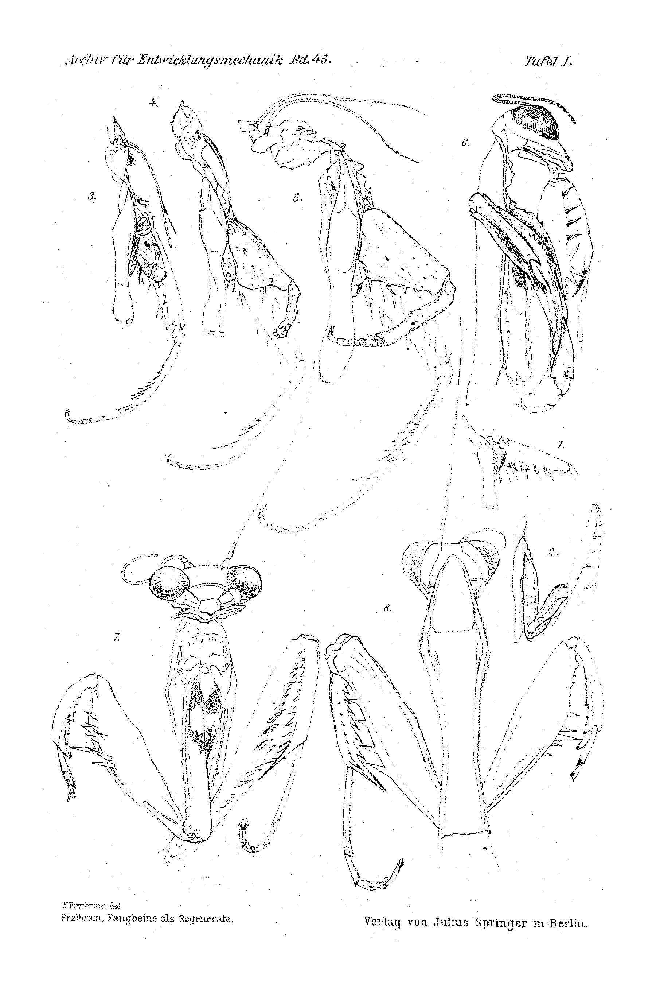
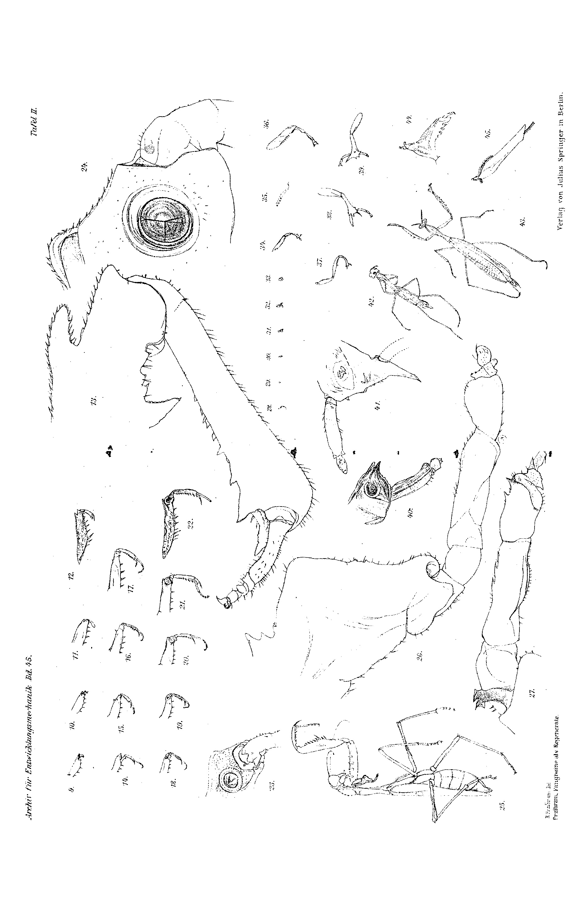
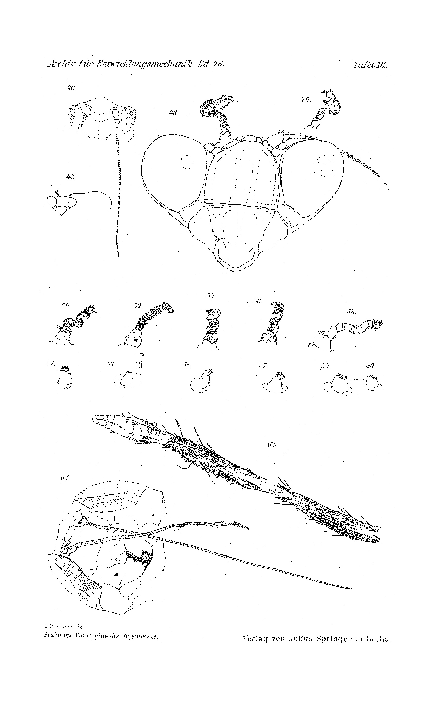

# Raptorial Legs as Regenerates

### (at the same time: Rearing of the Praying Mantises, IXth Communication, and Homoeosis in Arthropods, IVth Communication.)

**By Hans Przibram.**

(From the Biological Experimental Institute of the Imperial Academy of Sciences in Vienna [Zoological Department]¹.)

With Plate I–III.

*(Received on 23 July 1918.)*

*Archiv für Entwicklungsmechanik der Organismen*, vol. 45 (1919).

> **Full translation.** A complete English rendering of the running text of “Raptorial Legs as Regenerates” (Hans Przibram, 1919), including all tables, figure and plate legends, and footnotes. Numbers and table cells were transcribed from the page images, not the noisy OCR.

---

## Table of Contents

| | Page |
|---|---|
| I. Simple Regeneration of the Mantid Raptorial Leg | 39 |
| II. Regenerative Multiple Formation on the Mantid Raptorial Leg | 42 |
| III. Heteromorphic Mantid Raptorial Leg in Place of the Antennal End | 46 |
| Summary | 48 |
| Bibliography | 49 |
| Explanation of the Plates | 50 |

---

## I. Simple Regeneration of the Mantid Raptorial Leg.

The foreleg of the praying mantises (mantids) has, with its transformation into a "raptorial leg," forfeited the capacity for autotomy. It is easy to see that this capacity would have conditioned, in the face of the resistance of the prey, the more frequent loss of the foreleg and the inability to keep up with the acquisition of nourishment. In accordance with the law formulated by Réaumur and Lessona of the dependence of the regeneration quality on the probability of loss, Bordage (1905) asserted the regeneration-incapacity of the mantid raptorial leg and sought to prove it by experiments on *Mantis prasina* and *M. pustulata* on Réunion (1899).

In discussing the pentamerous Orthoptera (1905, p. 404) he writes:

"With regard to these insects one must consider the forelegs (or raptorial legs) of the mantids separately, which are adapted to a special function. Regeneration cannot come into question in the case of these limbs (with the exception of the tarsal region); rather, every section carried out on them has brought about death, be it rapidly and through bleeding out, be it after a shorter or longer time through the circumstance that the orthopteran, no longer the same in the capture of insects, has succumbed in consequence of lack of nourishment.

The tarsus of the same legs regenerates. It is exposed to injuries of various kinds, in particular the exuvial injury."

If one reads Bordage's own report on the foreleg experiments attentively, one recognizes that, by the fact that the death of all experimental animals in which more than the tarsus was removed from the raptorial leg was observed, no regeneration-incapacity has in any way been proved. On a by far more resistant object, *Sphodromantis bioculata*, I have soon (1906) been able to demonstrate the regeneration of the raptorial leg and have also regularly obtained it in the later experimental series (1909 ff.).

Nevertheless one might be tempted to make the use of a different species responsible for the differing outcome of the experiments in the case of Bordage and myself. In a native species of the genus *Mantis*, *M. religiosa*, I was able (1907) "to demonstrate a regenerate of the foreleg as well (Plate XXVI, Fig. 13)." When Bordage received knowledge of this case, he placed against it the same species in France, in that he, the praying mantis, operated either right after pulling from the cocoon or on larvae right after the 2nd or 3rd moult. As he wrote to me on 19 November 1908, he obtained "in no case as result anything in any way comparable," which I "demonstrated on the only specimen of *Mantis religiosa* that could be reared." "The longest time are the animals of the bleeding-out the prey." Yet I had "rescued about a dozen specimens," on which I could observe "only very weak and absolutely formless traces of regeneration of scarcely a few millimeters in length."

To this Bordage attaches the following consideration: "I believe, then, that one can say the regeneration-capacity is in the process of dying out in *Mantis*, and that this dying out is at present almost complete in the larvae, as it already is in the imagos. But, since this dying out cannot set in suddenly at a single blow, the regeneration-capacity has not diminished with mathematical exactitude and exactly to the same degree. Hence it follows that, while in certain individuals it has completely disappeared, in some few others it can on the other hand still persist in the manner of yielding an almost newly-formed elongation of the stump. In extraordinarily rare cases, finally — as one of them, undoubtedly observed by you, would be — the regeneration-capacity would still be well developed (one case perhaps in a thousand)."

Bordage seeks by this thesis to rescue his statements that the degree of regeneration of the *Mantis* raptorial leg is small and moreover further restricted to very few specimens.

As far as the development and size of the *Mantis* raptorial-leg regenerate are concerned, he did not at the time (1907, p. 611) await the typical formation: "In order not to risk the loss of this voucher specimen, the complete attainment of the normal size was renounced and the animal preserved." Since then I have repeatedly carried out operations on the foreleg of *Mantis religiosa*, but was likewise, in consequence of the great mortality, only seldom able to keep larvae so long that they moulted and thereby could regenerate. On the whole I have observed three foreleg regenerates which comprise more than the tarsus.

The one larva had, before the 3rd moult, been robbed of the right raptorial leg in the femur near its origin (Plate I, Fig. 1). After the 3rd moult there appeared a several-millimeter-long, formless regenerate (Plate I, Fig. 2), as Bordage too may have seen in his animals. The larva died without having completed the next moult.

A second similarly mutilated larva completed three further moults (Plate I, Fig. 3–5) and died as a nymph. The formless regenerate attained in the course of this development an ever better formation and had in the nymph almost the size of the uninjured opposite side. The accompanying figures (Plate I, Fig. 6–8) show better than a long description could do the degree of formation. By analogy with the results on *Sphodromantis* there is no doubt that with the imaginal moult the normal size and formation would have been attained (excepting the number of segments of the tarsus, which is known to amount to four in the regenerated legs of the five-segmented Orthoptera).

The third foreleg regenerate of *Mantis* that recently came to observation concerns a supernumerary formation on the tibia and will therefore only be described in Section II of the present work. This case, as well as the experimentally obtained foreleg regenerate which Megušar (1910, p. 517) had obtained as the only surviving experimental animal, which was first operated on at 12 mm total length, show the regeneration-capacity also still at further moulting stages in *Mantis religiosa*.

From the new results it follows that the full development of the raptorial leg can also in *Mantis* be attained after loss of the foreleg in the femur. Only, sufficiently many moults must of course be available. The larvae operated on shortly before one of the first moults bring forth at the next moults those still unformed regeneration buds, which Bordage observed. Since the larvae, according to his own statements, could not be kept otherwise than by cannibalism, it is therefore not to be wondered at, that he never got to see the further development of the regenerate setting in with further moults.

As far as the number of larvae regenerating after foreleg loss in *Mantis* is concerned, it is indeed not to be measured "by thousands," for so many larvae neither Bordage nor I have operated on. Bordage kept alive, out of 30 larvae robbed of a foreleg after the 2nd moult, twelve, which apparently all exhibited the beginning of the regeneration. I myself have probably operated on more *Mantis* larvae, but brought only three through the next moult. Yet these too produced regenerates, which, where it came to further moults, developed into typical raptorial legs. The only surviving specimen of Megušar regenerated likewise. The success of regeneration in relation to the number of specimens surviving the operation thus amounts not to one in some thousand, but to 100%.

The small absolute number of the observed regenerates rests exclusively on the small resistance-capacity of the species *Mantis religiosa*. Other mantid genera besides *Mantis* and *Sphodromantis* also regenerate the foreleg. Experiments on the North American *Stagmomantis carolina* and on the Japanese *Paratenodera angustifolia* were carried out by A. L. Thomson under my direction, about which the named person has yet to publish. On the *Ameles decolor* frequent at Brioni near Pola I have in the open seen a foreleg regenerate, the only natural case of praying mantises that became known to me, although I gathered over the years many hundreds of mantids belonging to various species.

## II. Regenerative Multiple Formation on the Mantid Raptorial Leg.

The absence of autotomy, combined with the almost complete regeneration-capacity, made the mantid raptorial leg into a suitable object for uncovering the regenerative origin of those malformations which consist in a tripling of the hexapod limb, beginning from any segment, and which Bateson (1894) had conceived as mutations. Later (1913) the same person did indeed acknowledge, in the face of my arguments (Przibram 1906 ff.), the regenerative character of these "fracture-triplings," after analogous formations on reptiles, amphibians and crustaceans had been produced experimentally.

For the hexapods precisely, however, such a demonstration has hitherto not succeeded. This has had its ground in two circumstances which had to make the pertinent experiments very difficult.

Firstly, the insects with complete metamorphosis have in their juvenile states mostly only short, difficultly accessible limbs; operations are difficult; secondly, the insects without complete metamorphosis have, to be sure, longer, but easily autotomizing limbs. Every intervention which does not consist in a rapid cross-section — indeed often even one such — leads then to the tearing-off of the preformed limb and yields then only simple regeneration from the preformed fracture site.

Here, then, the mantid foreleg forms a welcome exception.

Twice in the course of my rearing experiments it happened that such fracture-triplings appeared on specimens which were kept in organ-cages, one time in a *Mantis religiosa*, the other time in a *Sphodromantis bioculata*.

Our Plate II, Fig. 43, shows the male *Mantis religiosa*, whose right foretibia, apart from the normal, otherwise broken-off end, bears two further processes; in the enlarged views, Fig. 44 and 45, this is more clearly to be recognized. The examination of the imaginal moult yielded a still unhealed fracture, provided only with a dark blood-crust, at the corresponding site of the raptorial leg (Fig. 42). Since the specimen was not reared from the egg but introduced as a large larva, and the tarsus is defective, it is not possible for me to state whether an injury of the foreleg had not already taken place earlier.

Quite certainly the case lies in the case of *Sphodromantis bioculata* ♀, which was reared in the year 1906 as animal 41a. As emerges from the complete moulting series, presented from Fig. 2–10 of Plate II, the foreleg had been lost before the 3rd moult and was, up to the 6th moult, strikingly slowly engaged in regeneration. At the 7th skin the regenerate appears lost again, which, however, on account of the lacking blood-crust, is not to be ascribed to a fresh injury but to the tearing-off of a skin-flap. Actually the case appears at the 8th skin in strongly segmented raptorial leg, which however bears a cuff-like widened tibia at the distal end; the 9th skin shows only a remnant in place of the raptorial leg, the 10th skin, which belongs to the imaginal moult, shows, apart from the cuff, the still total loss of the tarsus.

Since the specimen stood under continuous observation, the malformation was noticed at its appearance between the 6th and 7th moult on the living larva (Plate II, Fig. 37–39).

The femur was approximately as another foreleg regenerate, only more slender and perhaps somewhat more strongly bent; the tibia was smoother than normal and bore at the widened distal end two joints, in each of which tarsi were inserted. The one more outwardly directed tarsus was of normal thickness and segmented into three segments, the last of which bore the two claws. The second, thicker tarsus consisted of only two segments and can, after all that we know about the multiple formations in arthropods, best be conceived as a fusion of two symmetrical tarsi united along their length. For this the symmetry of the spination on both sides of this supernumerary formation also speaks. On the 8th skin the more normal tarsus is torn off (Fig. 41) and the joint-facette very clearly to be seen (Fig. 40).

On the imago itself the supernumerary tarsus was no longer present, it showed the condition as on the 10th skin.

On this *Sphodromantis* it is therefore demonstrable that the supernumerary formation did not exist from birth, but arose on a regenerating leg and persisted only a few moults.

The cause of the injury might have been, both in the case of *Mantis* and in the case of *Sphodromantis*, a catching-fast on the organ of the cage-netting.

In order to obtain certain information about the appearance of supernumerary parts, I have repeatedly carried out experiments with artificial injuries of the mantid leg.

In so doing I have, for the sake of its resistance-capacity, used exclusively *Sphodromantis bioculata*.

Incisions made in various ways healed always without bringing forth supernumerary formations. Successes were obtained only, as in the breeding culture ♀ O.13, when through the cutting of the part lying distal to the cut a continuous fracture of the foreleg was brought about.

In each case 6 specimens received trochanter fracture with severance of the femur at a temperature of 25° C and 35° C; just as many femur fracture at the distal or patellar end (without severance of the tibia) at analogous temperatures. The operations were carried out, in the case of 25°, two days after the 6th moult, in the case of 35°, one day after the same moult. The difference in the time was chosen in order to make the hardening stage of the animal the same, since at 35° development proceeds twice as rapidly as at 25° (cf. Przibram 1915: Temperature quotients).

In the trochanter operations there came, despite repetition of the operation after the 8th moult and the additional use of thread for keeping the fracture open, either to unchanged regeneration at the 10th moult (imago) or, with severance of the femur regenerate, to an at most inessential bending of the regenerate. Only in one case, that of the animal No. 120, serving as the test for all operations, came, at the front edge of the coxa that had remained short, a triangular protrusion to develop (Plate II, Fig. 25–26).

After the patellar fractures supernumerary parts appeared several times, without it, to be sure, having succeeded in achieving the typical fracture-tripling. In the animal No. 61 the supernumerary part consisted of a peg, long-sawtoothed on both sides, in front of the normal end-peg of the front edge of the femur (Plate II, Fig. 13). Its origin can be recognized from Figs. 9–12, which represent the skins. The fracture site lay, as the blood-scab in the cast-off 7th skin shows, in front of the end of the femur and cut deep in from the front edge; the tibia had been lost with the moult or already earlier, and regenerated later.

The conditions were similar in the case of No. 105, Plate II, Fig. 14–17: here too a deep fracture from the front edge, but without loss of the tibia. In place of the fracture there appears later a thorn-shaped hump. Other specimens which had suffered a lateral fracture carried no humps, but rather round joint-facettes at the earlier fracture site. No. 79 showed this most beautifully (Plate II, Fig. 18–24).

The circular, symmetrical shape of the facette, just as much as the bilateral toothing of the humps, points to the fact that we are here again dealing with fused, doubly laid-out supernumerary parts, such as we know from the typical fracture-triplings (cf. Bateson; Przibram 1906; a detailed presentation of the laws of fracture-tripling within the entire animal kingdom will appear elsewhere).

Further experiments will have to analyze the closer conditions under which it then comes to the actual development of multiple formations on the insect leg; unfortunately I cannot at present procure the suitable material, so that until further notice I must content myself with the results put forward.

Since in the breeding cultures triplings have twice arisen from the tibia, injuries to the tibia would perhaps yield better operative successes; I had not operated on this segment because it has much smaller dimensions than femur and trochanter, and it is therefore difficult to carry out definite operations. The use of older stages could, however, remove this disadvantage. It is even not excluded that later stages, on account of their greater rigidity, would be better suited to the production of fracture-triplings, as Gerstaecker (1866–1879) has already pointed out, that in the hard-skinned beetles and crabs the typical supernumerary limbs are encountered much more frequently than in all other arthropod classes, which have a comparatively softer covering.

According to our present experience, it is natural to perceive the causal connection in the easier confluence of the parts separated by an injury in the case of "more plastic" material; only there, where through the rigidity of the covering the reunion of the parts torn asunder is prevented, do the wound-surfaces remain separated, and each one brings the distally situated portion once more to development.

---

¹ An extract of this work appeared with an identical title as Communication No. 28 from the Biol. Experimental Institute of the Imperial Academy of Sciences, Zool. Dept., in the *Akademischer Anzeiger* No. 17, 1918.

Yet in other respects too, the use of older stages offers prospect of better success. As we saw in the case of *Sphodromantis*, every further moult constitutes a danger for the passage of the supernumerary [structure], which is too large in comparison with the normal one, and therefore the already-laid-down hyperregenerates can easily be torn off again.

As we shall see in the following Section III of this communication, on other limbs too the use of older stages confers an advantage with regard to the development of regenerates.

## III. Heteromorphic Mantid Raptorial Leg in Place of the Antennal End.

In an earlier communication on antennal regeneration in half-grown *Sphodromantis* larvae, I (1915) described "abnormal regenerates," which came about "after sections had been made which left no piece of the antennal flagellum standing."

"The abnormalities consisted in thickenings of the end of the flagellum, whose terminal segments assumed individual characters reminiscent of legs, without, however — as Schmit-Jensen had succeeded in doing with the stick insect, *Dixippus morosus* — distinct tarsal segments being formed by the regenerative route."

"Since the thickenings could only with difficulty pass the thinner initial portion of the cuticle of the flagellum during the moult, tearing-off and other injuries of the malformations frequently occurred."

I have meanwhile repeated the experiments on older stages, and namely on nymphs. The severing of the right antenna was carried out at various points within the antennal scape, so that at least the entire flagellum was always removed. In a number of specimens, especially when they transformed into the imago soon after the operation, all regeneration failed to occur, which is indeed in agreement with the inability of the imago to regenerate.

In 6 specimens regenerations occurred. All these regenerates belong again — as is to be expected after the manner of the section — to the category of the abnormal ones with leg-like characters. In four animals (♀ X 15: Nos. 21, 22, 31 and 35; Pl. III, Figs. 50–57) these characters scarcely go beyond what had been observed in the half-grown larvae, although here too the resemblance to the malformed foreleg regenerates on our Pl. I (Figs. 13, 26, 27, 40, 41) emerges.

In two specimens, however, typical leg ends appeared, such as Schmit-Jensen had observed in *Dixippus*.

The one specimen, No. 28, had been operated on before the nymphal moult between the first and second antennal segments (Fig. 60), showed at the nymphal moult itself still no regeneration (Fig. 59), but at the imaginal moult brought forth the "antennal foot" depicted on Pl. III, Fig. 58. Upon the two scape segments, which had moreover already themselves become more leg-like, follows a far too thick flagellum, which ends in a leg-segment-like manner and lets a claw-bearing segment protrude from a thickening.

Still more clearly does the 6th specimen, No. 16, reveal the leg character, in which the right antenna had been cut off in the nymph just at the end of the second scape segment. At the imaginal moult (Fig. 46) the structure drawn on Pl. III, Figs. 47–49 came forth. Upon the scape segments follows a thickened antennal-flagellum portion, still recognizable as such by its annulation. The same, however, ends in a thickened joint socket, out of which — bent off at a right angle toward the median line of the animal — there arises a club-shaped thickened femur, recognizable as such by two large spines. To this is joined a broad segment, whose dentation on the inner margin leaves no doubt as to its tibia character. Finally, three tarsal segments with the claws conclude this antenna, almost completely transformed into a leg.

As against the foot-antennae described by Schmit-Jensen in *Dixippus*, our case brings the new finding that it must be a matter of a foreleg and not of one of the other pairs of legs. For whereas the distal leg portions observed by Schmit-Jensen on the antenna of the stick insects are shaped so similarly in all three pairs of legs of these Orthoptera that an analogizing with a particular pair of legs would not have been admissible, the foreleg of the mantids, differentiated as a raptorial leg, is so different from the two other pairs of legs that a doubt as to the belonging of our regenerate to a foreleg would not be justified. There are lacking — apart from the far more slender shape — in the middle and hind legs of *Sphodromantis* the spines on the inner margin of the femur and the teeth on the tibia, which stand out distinctly on our object.

Antennae amputated within the antennal scape on old larvae and nymphs are thus capable of bringing forth distinctly developed forelegs. Since the structure appearing on the imago is not exposed to further moults, it remains permanently standing. Possibly the better expression of the leg character is connected also with the extinguishing regenerative capacity of the antenna in these stages. A further favorable circumstance seems to have lain in the lower temperature, in which this time I had to keep the animals as a consequence of the discontinuation of the operation of our temperature chambers, and which on average is likely to have gone little beyond the minimum of 17° C necessary for the moults. Low temperature had, for example, in experiments on the heredity of malformations in *Drosophila* (Hoge 1915), yielded a higher percentage of multiple formations; also in my experiments mentioned in Section II, all break-multiple-formations had appeared at 25°, none at 35°, as I will here make up [for not mentioning]. At the temperature of 17° C, I came upon a nymph with tarsal segments and end claws (Pl. III, Figs. 61–62), which must have lost the antenna at least two moults beforehand. Whether this difference is to be traced back to a greater rigidity of the tissues at lower temperature, I would not decide. I have gained the impression as though the longer time available between two moults would permit the better development at the lower temperatures, but only further experiments — now, unfortunately, lying in the distant future — must give information about this.

To return, finally, once more to the starting point of the present communication: the appearance of forelegs on the antenna of *Sphodromantis* now shows us that the capacity for the reproduction of this limb is not extinguished not only at the right place, but that this potency is even able to come to the fore on another part of the body. Must it still be pointed out that the construction of any connection between probability-of-loss and regeneration in the mantid legs has thereby lost all ground?

### Summary.

I. The raptorial legs of the mantids, incapable of autotomy, can be regenerated in the five species hitherto observed in this respect (*Mantis religiosa*, *Sphodromantis bioculata*, *Stagmomantis carolina*, *Paratenodera angustifolia*, *Ameles decolor*).

II. As a consequence of the absence of autotomy, these forelegs permit an accidental or arbitrary alteration of the wound surfaces, whereby the origin of break-multiple-formations by the regenerative route could be demonstrated also for the six-footed arthropods.

III. The mantid raptorial leg furthermore appeared as a homoeotic heteromorphosis in place of the antenna in *Sphodromantis*, after the antennal scape had been severed in the oldest larvae or nymphs (whereby only the minimal temperature of 17° C necessary for the moults prevailed).

According to these results, every connection between regenerative capacity and probability-of-loss must be disputed for the arthropod legs.

### Bibliography.

Bateson, W., Materials for the Study of Variation. London, Macmillan. **1894.**

— Problems of Genetics. New Haven: Yale Univ. Press. London, Milford etc. **1913.**

Bordage, E., Régénération des membres chez les Mantides. Comptes Rendus Acad. Paris. CXXVIII. 1593. **1899.**

— Recherches anatomiques et biologiques sur l'Autotomie et la Régénération chez divers Arthropodes. Thèses-faculté sciences Paris. — Lille, Danel. **1905.**

Gerstaecker, A., Bronns Klassen und Ordnungen. V. 200. **1866–1879.**

Hoge, M. A., The Influence of Temperature on the Development of a Mendelian Character. Journal of Experimental Zoology. XVIII. 241. **1915.**

Megušar, F., Regeneration der Fang-, Schreit- und Sprungbeine bei Aufzucht von Orthopteren. Arch. f. Entw.-Mech. XXIX. 499. **1910.**

Przibram, H., Die Regeneration als allgemeine Erscheinung in den drei Reichen. Naturwissensch. Rundschau. XXI. Nr. 47–49. **1906.**

— Aufzucht, Farbwechsel und Regeneration einer ägyptischen Gottesanbeterin. Arch. f. Entw.-Mech. XXII. 149. **1906.**

— Aufzucht, Farbwechsel und Regeneration unserer europäischen Gottesanbeterin. Arch. f. Entw.-Mech. XXIII. 600. **1907.**

— Aufzucht, Farbwechsel und Regeneration der Gottesanbeterinnen. III. Arch. f. Entw.-Mech. XXVIII. 561. **1909.**

— Temperaturquotienten für Lebenserscheinungen bei *Sphodromantis* (zugleich Aufzucht der Gottesanbeterinnen. VIII). Akademischer Anzeiger Wien. XXVI. **1915.** (Ausführlich im Arch. f. Entw.-Mech. XLIII. 28.) **1917.**

— Fühlerregeneration halberwachsener *Sphodromantis*-Larven (zugleich Aufzucht der Gottesanbeterinnen IX. und Homoeosis bei Arthropoden II). Akademischer Anzeiger Wien. XXVI. **1915.** (Ausführlich im Arch. f. Entw.-Mech. XLIII. 63. **1917.**)

### Explanation of the Plates. Plates I–III.

| Fig. [No.] | Genus | Species | Prot. No. | Sex | Moult | Date | Parts depicted | View from | Magnif. |
|---|---|---|---|---|---|---|---|---|---|
| **Pl. I** | | | | | | | **Simple Regeneration of the Raptorial Leg.** | | |
| 1 | *Mantis relig.* | | BVA, 267a | ♀ | III. | | Cast skin: Prothorax with femur | right | hand lens |
| 2 | » | » | » | » | III. | | Cast skin: Prothorax and forelegs | » | » |
| 3 | » | » | 267b | » | V. | | Cast skin: Head, prothorax and forelegs | » | » |
| 4 | » | » | » | » | VI. | | » » » | » | » |
| 5 | » | » | » | » | VII. | | » » » | » | » |
| 6 | » | » | » | » | » | | Cons. nymph: Head, prothorax and forelegs | right | » |
| 7 | » | » | » | » | » | | » » » | below | » |
| 8 | » | » | » | » | » | | » » » | above | » |
| **Pl. II** | | | | | | | **Regenerative Multiple Formations.** | | |
| 9 | *Sphodr. biocul.* | | (O. 13) 61 | ♀ | VII. | | Cast skin: Right femur operated on | right | nat. size |
| 10 | » | » | » | » | VIII. | | » » » | » | » » |
| 11 | » | » | » | » | IX. | | » » » | » | » » |
| 12 | » | » | » | » | » | | Cons. imago (with regen. tibia and tarsus) | » | » » |
| 13 | » | » | » | » | » | | » » » | » | Zeiß Ok. 1. Obj. a₃ |
| 14 | » | » | (O. 13) 105 | ♀ | VII. | | Cast skin: Right femur operated on | » | nat. size |
| 15 | » | » | » | » | VIII. | | » » » | » | » » |
| 16 | » | » | » | » | IX. | | » » » | » | » » |
| 17 | » | » | » | » | X. | | » » » | » | » » |
| 18 | » | » | (O. 13) 79 | ♀ | VII. | | » » » | » | » » |
| 19 | » | » | » | » | VIII. | | » » » | » | » » |
| 20 | » | » | » | » | IX. | | » » » | » | » » |
| 21 | » | » | » | » | X. | | » » » | » | » » |
| 22 | » | » | » | » | » | | Cons. imago: Right femur operated on | » | » » |
| 23 | » | » | » | » | » | | Cast skin, supernum. joint facette | » | hand lens |
| 24 | » | » | » | » | » | | Cons. imago, supernum. joint facette | » | Zeiß Ok. 1. Obj. a₃ |
| 25 | » | » | (O. 13) 120 | ♀ | » | | Cons. imago with malform. right foreleg | » | nat. size |
| 26 | » | » | » | » | » | | » » merely the malform. right foreleg | » | Zeiß Ok. 1. Obj. a₃ |
| 27 | » | » | » | » | » | | » » Regenerate | below | » » » |
| 28 | » | » | (06) 4 f a | ♀ | II. | | Cast skin: right foreleg | right | nat. size |
| 29 | » | » | » | » | III. | | » » torn off | » | » » |
| Fig. [No.] | Genus | Species | Prot. No. | Sex | Moult | Date | Parts depicted | View from | Magnif. |
|---|---|---|---|---|---|---|---|---|---|
| 30 | » | » | » | » | IV. | | Cast skin: right foreleg regenerating | » | » » |
| 31 | » | » | » | » | V. | | » » » | » | » » |
| 32 | » | » | » | » | VI. | | » » » | » | » » |
| 33 | » | » | » | » | VII. | | » » badly moulted | » | » » |
| 34 | » | » | » | » | VIII. | | » » malformation | » | » » |
| 35 | » | » | » | » | IX. | | » » badly moulted | » | » » |
| 36 | » | » | » | » | X. | | » » malformation | » | » » |
| 37 | » | » | » | » | VI. | | Living larva: right foreleg multiple formation | front | Lupe |
| 38 | » | » | » | » | » | | » » » | below | » |
| 39 | » | » | » | » | » | | Cast skin: » » » | outside | Zeiß Ok. 1. Obj. a₃ |
| 40 | » | » | » | » | VIII. | | » » » | front | » » » |
| 41 | » | » | » | » | » | | » » » | » | » |
| 42 | *Mantis relig.* | | BVA, 270 | ♂ | last | | Cast skin with break of right foretibia | front | nat. size |
| 43 | » | » | » | » | » | | Cons. imago with multiple form., right foretibia | above | » » |
| 44 | » | » | » | » | » | | Cons. imago: Multiple formation right foretibia | outside | Lupe |
| 45 | » | » | » | » | » | | » » » | below | » |
| **Pl. III** | | | | | | | **Heteromorphic Raptorial Legs in Place of the Antenna.** | | |
| 46 | *Sphodr. biocul.* | | (75. 14) 16 | ♀ | last | 27. III. 16 | Cast skin: Head r. F. op. end of 2nd segment 12. XI. 15 | front | over 2 |
| 47 | » | » | » | » | » | » | Cons. imago: Head r. F. regenerated as foreleg | front | nat. size |
| 48 | » | » | » | » | » | » | » » » | » | Lupe |
| 49 | » | » | » | » | » | » | Antenna regenerated as foreleg | behind | » |
| 50 | » | » | (75. 14) 22 | ♀ | » | 27. III. 16 | Right F. op. betw. 2nd and 3rd segm. 12. XI. 15 | above | » |
| 51 | » | » | » | » | » | » | Cast skin: Right F. op. | » | » |
| 52 | » | » | (75. 14) 21 | ♀ | » | 28. III. 16 | Cons. imago: Right F. op. in 1st segm. 12. XI. 15 | » | » |
| 53 | » | » | » | » | » | » | Cast skin: Right F. op. | » | » |
| 54 | » | » | (75. 14) 35 | ♀ | » | 4. I. 16 | Cons. imago: Right F. op. in 2nd segm. 12. XI. 15 | » | » |
| 55 | » | » | » | » | » | » | Cast skin: Right F. op. | » | » |
| 56 | » | » | (75. 14) 31 | ♂ | » | 7. I. 16 | Cons. imago: Right F. op. in 2nd segm. 12. XI. 15 | » | » |
| 57 | » | » | » | » | » | » | Cast skin: Right F. op. | » | » |
| 58 | » | » | (75. 14) 28 | ♂ | » | 18. III. 16 | Cons. imago: Right F. op. betw. 1st and 2nd segm. 12. XI. 15 | » | » |
| 59 | » | » | » | » | » | » | Cast skin: Right F. op. | » | » |
| 60 | » | » | » | » | prelim. | 8. XII. 15 | » » : Head with antennae, r. reg. | front | » |
| 61 | » | » | (75. 14) 29 | ♀ | » | 19. IX. 15 | » » : Head with antennae, r. reg. | » | » |
| 62 | » | » | » | » | » | » | Cons. nymph: End of foot-antenna, regenerate | » | Zeiß Ok. 6. Obj. a₃ |

> Note: In the table, "F." abbreviates *Fühler* (antenna); "op." abbreviates *operiert* (operated on); "Cons." renders *Konserv.* (*konserviert*, preserved specimen); "prelim." renders *vorl.* (*vorläufig*, the preliminary/penultimate moult); "Lupe" = hand lens; "über 2" = magnification rather more than ×2; the dates such as "12. XI. 15" in the "Parts depicted" column give the operation dates, while the "Date" column gives the moult/preservation date.

**Pl. I.** *(plate of figures; not reproduced)* — Plate caption / imprint: "Archiv für Entwicklungsmechanik Bd. 45. — Tafel I. — Thomann del. — Przibram, Fangbeine als Regenerate. — Verlag von Julius Springer in Berlin." Figures 1–8 (legends given in the Explanation of the Plates above).

**Pl. II.** *(plate of figures; not reproduced)* — Plate caption / imprint: "Archiv für Entwicklungsmechanik Bd. 45. — Tafel II. — Przibram, Fangbeine als Regenerate. — Verlag von Julius Springer in Berlin." Figures 9–45 (legends given in the Explanation of the Plates above).

**Pl. III.** *(plate of figures; not reproduced)* — Plate caption / imprint: "Archiv für Entwicklungsmechanik Bd. 45. — Tafel III. — Przibram, Fangbeine als Regenerate. — Verlag von Julius Springer in Berlin." Figures 46–62 (legends given in the Explanation of the Plates above).

## Figures

**Plate I.**

**Plate II.**

**Plate III.**

---

*Translator's note.* One of the Biologische Versuchsanstalt (Vienna Vivarium) papers flagged on the project site as a modern rediscovery target. Claims are rendered as stated in the original, not endorsed.
