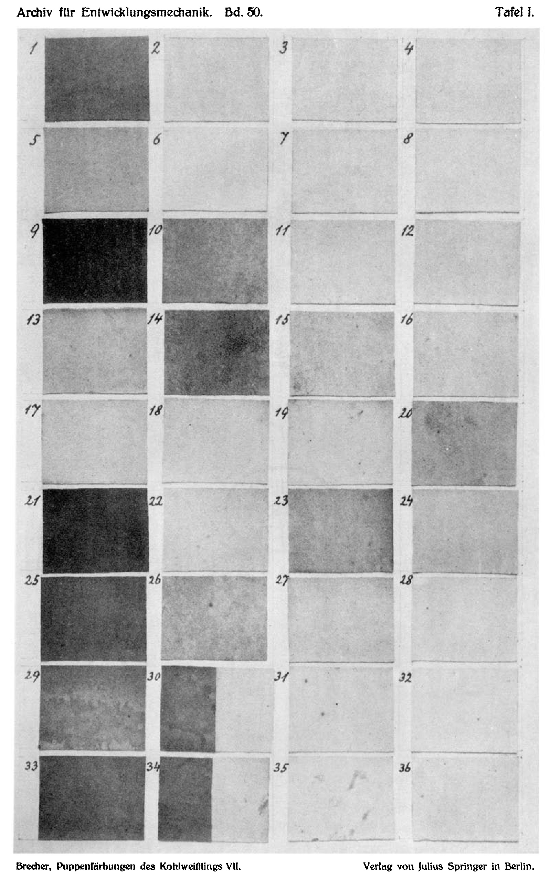

# Die Puppenfärbungen des Kohlweißlings, Pieris brassicae L.
## The Pupal Colourations of the Cabbage White, Pieris brassicae L.

### Seventh Part:
### Effectiveness of reflected and transmitted light.

By

**Leonore Brecher.**

(From the Biological Experimental Institute of the Academy of Sciences in Vienna [Zoological Department. Director: H. Przibram].)¹

With Plate I.

(Received 10 July 1920.)

*Archiv für Entwicklungsmechanik der Organismen*, vol. 50 (1922).

> **Full translation.** A complete English rendering of the running text of “The Pupal Colourations of the Cabbage White, Pieris brassicae L.” (Brecher, 1922), including all tables, figure and plate legends, and footnotes. Numbers and table cells were transcribed from the page images, not the noisy OCR.

### Contents.

| | Page |
|---|---|
| Introduction | 41 |
| I. Experiments with the addition of ultraviolet rays | 43 |
| &nbsp;&nbsp;a) Experimental arrangement | 43 |
| &nbsp;&nbsp;b) Course of the experiment | 46 |
| &nbsp;&nbsp;c) Experimental results | 50 |
| II. Action of transmitted in comparison with reflected coloured light | 53 |
| &nbsp;&nbsp;a) Experimental arrangement | 53 |
| &nbsp;&nbsp;b) Course of the experiment | 55 |
| &nbsp;&nbsp;c) Experimental results | 57 |
| III. Action of metallically lustrous colours on the pupal colouration | 66 |
| &nbsp;&nbsp;a) Experimental arrangement | 66 |
| &nbsp;&nbsp;b) Course of the experiment | 67 |
| &nbsp;&nbsp;c) Experimental results | 69 |
| IV. Measurements of the content of ultraviolet rays in the light reflected from coloured surfaces and in that transmitted through filters | 71 |
| V. Summary | 76 |
| VI. List of literature | 77 |
| VII. Tables A–D | (see end of the work) |

### Introduction.

The earlier experiments with the exclusion of the ultraviolet rays had as their consequence a lightening of the pupae (Brecher 1919). Now, as an "experimentum crucis", proof was still to be furnished that the addition of ultraviolet rays would produce a darkening of the pupae.

Since the share of the ultraviolet rays in the action of some

> ¹) An abstract of this work appeared under the title: Mitteilungen aus der biologischen Versuchsanstalt der Akademie der Wissenschaften, Zoolog. Abt., Vorstand H. Przibram: 49. Die Puppenfärbungen des Kohlweißlings, *Pieris brassicae* L. (Siebenter Teil) [Communications from the Biological Experimental Institute of the Academy of Sciences, Zool. Dept., Director H. Przibram: 49. The Pupal Colourations of the Cabbage White, *Pieris brassicae* L. (Seventh Part)] by Leonore Brecher, in the Akademischer Anzeiger der Akademie der Wissenschaften in Wien No. 14, 1920.

of the surrounding colours had proved itself in the earlier experiments to be such that the action of black surrounding and red surrounding favoured the emergence of darker pupae (Brecher, fifth part 1919), and since further, through the green colouration and translucency [transparency] for the pupal skin [pupal cuticle], some surrounding colours appear to accrue an advantage, in particular for cabbage-white pupae, according to Poulton (1892), Dürken (1918, 1919) — and since the difference, noted occasionally also by me (1919 p. 255), in the action of red-reflecting surfaces in mixed light and not in transmitted light stands out, namely in connection with the content of invisible rays — it now appeared to be of even greater fundamental significance to establish the difference between the action of transmitted and of reflected light. For although the recognisable transparency of the coloured filters was different, nevertheless, through the use of demonstrably ultraviolet-absorbing filters, a difference in the pupal colouration corresponding to the reflected colours showed itself.

Finally, on this occasion, the comparison between the action of transmitted and reflected light was also to be entered into, since it might be quite interesting to establish whether the action of transmitted light consists, accordingly, in greater measure of polarised light, as does ordinary reflection, or whether it is different in the way that the reflection of light from metallically lustrous surfaces is unpolarised. From the biological interest there resulted also this question (in view of the gold-lustre of many butterfly pupae, whose supposed selectional connection with metallically lustrous natural surroundings Poulton (1887, 1890) designated as glitter-rich rocks).

From this resulted then the programme of this year's experiments on *Pieris brassicae*¹):

**I.** Examination of the action of the addition of ultraviolet rays to the surrounding colours decisive for the main colouration: white, black, yellow, red, with intermittent irradiation by means of the quartz mercury lamp and the use of variously ultraviolet-transmitting filters.

> ¹) Through the subvention received from the Academy of Sciences in the year 1919 on the basis of the Strohmayer bequest, in the amount of 1400 K, and through the further amount of 600 K bestowed for the year 1920 from the entrustments of the same legacy, I have been put in a position to continue these investigations. For this I permit myself, in this place, to express my heartfelt thanks to the deeply revered curatorium of the Academy as well as to the mathematical–natural-scientific class.

**II.** Examination of the action of transmitted in comparison with reflected coloured light.

**III.** Examination of the action of metallically lustrous colours.

### I. Experiments with the addition of ultraviolet rays.

#### a) Experimental arrangement.

In these experiments it was a matter, therefore, of adding the ultraviolet rays to the daylight surrounding in black, yellow, as well as white surrounding — that is, of bringing about a shift of the proportion of these surrounding colours toward the ultraviolet — in order to bring about, for the pupal colouration, an effective action of the rays added to these surrounding colours. Should an increased darkening indeed appear in comparison with the pupae which, even without ultraviolet addition, emerge in the black surrounding as somewhat weaker than otherwise in daylight, then the surrounding colours, by the shift, would have as a consequence a displacement of the characteristic pupal types toward the dark types; thus to the negative result of the exclusion experiments (1919) there would be added a positive proof of the effectiveness of black surrounding, and, with the counter-experiment of the action of reflected surfaces, yet a further positive proof.

The addition of ultraviolet rays followed by means of short irradiations, undertaken at times in the dark chamber with a quartz-mercury lamp (Heraeus system), of the caterpillar containers — clothed in black, yellow, or white — that were for the most part set up in daylight.

These containers had in part been covered, on the inside, with very thin glass plates of light-transmitting glass, so that by the irradiation an absolute increase of these rays in proportion to the coloured light was to be attained; in another investigation now the attempt was made to increase the ultraviolet rays through the exclusion of the coloured rays by interposing filters transmitting only ultraviolet.

Analogous experimental arrangements likewise set up in daylight, further the named surrounding colours with exclusion of the ultraviolet rays, as well as complete darkening, served as controls.

As containers, black-clothed openings were used: porcelain vessels of 8 cm height and 6 cm diameter were used for the exclusion of the ultraviolet rays, and for the more easily exposed [containers] not-yet[-described] tin boxes of approximately equal form and dimensions. By means of a longitudinal wall of cardboard each of these vessels was divided into two chambers, of which each received in this experiment its coloured paper. Onto the surrounding[-paper], of the same colour for each experimental condition, there were prepared a number of black containers with black surrounding, and yet [some] with a yellow [chamber], a few with yet a white chamber, and finally also such with a simple, black-clothed interior space.

As covering of the above-mentioned upper-side opening there was used:

α) For the exclusion of the ultraviolet rays, this time, in place of the previously used quinine sulphate, yellow-green Euphos glass. This likewise has the property of absorbing ultraviolet rays. It was therefore to be expected that in black covered with Euphos glass, lighter and greenish pupae would arise than in black with the admission of mixed light, [and] in yellow, in spite of the yellow-green interposition, paler green pupae would arise than in yellow with the admission of white light.

β) For the experiments with full light admission, a quite thin glass plate of so-called thin microscope-slide glass, which still transmits even the ultraviolet rays down to 2500 γγ.

γ) For the exclusion of the visible rays, only filters transmitting ultraviolet were used. Coming into consideration as such were silvered quartz mirrors, as well as — in application of an experience gained in the previous year's experiments (V., p. 22, 1921) — simple covering with black paper used in photography. Unfortunately, a Zeiss Uviol filter, consisting of blue Uviol glass and nitrosodimethylaniline, was not at hand in time.

δ) For the complete darkening, a black-clothed container was covered with an ordinary mirror.

In this way the following experimental conditions came to be set up:

| | | |
|---|---|---|
| I. | a) black b) yellow | } with interposition of Euphos glass, |
| II. | a) black b) yellow | } covered with thin glass plate, |
| III. | a) black b) yellow | } covered with thin glass plate, |
| IV. | a) black c) white | } covered with thin glass plate, |
| V. | a) black c) white | } covered with thin glass plate, |
| VI. | a) black b) yellow | } covered with silvered quartz mirror, |
| VII. | a) black b) yellow | } covered with silvered quartz mirror, |
| VIII. | a) black covered with thin glass plate, | | |
| IX. | a) black covered with black paper and thin glass plate, | | |
| X. | a) black covered with black paper and thin glass plate, | | |
| XI. | a) black covered with ordinary mirror (darkness). | | | Into each of these experimental conditions 4 pupation-ready caterpillars were put for pupation, and indeed the introduction of the caterpillars into the experimental conditions took place, for each one narrower experimental group of this series, almost simultaneously and from the same caterpillar-rearing.

There belong together as narrower experimental groups the experiments I, II, III and XI; IV and V; VI and VII; VIII, IX and X.

All experiments were set up in a skylight passage on a table under a skylight, thus in daylight.

Of these, the experiments Nr. III, V, VII and X, thus:

| | | |
|---|---|---|
| III. | a) black b) yellow | } covered with thin glass plate, |
| V. | a) black c) white | } covered with thin glass plate, |
| VII. | a) black b) yellow | } covered with quartz mirror, |
| X. | black covered with black paper and thin glass plate, | | |

were brought at times from the daylight into the dark chamber and set up under the quartz lamp at a distance of 7½ cm and exposed to the irradiation for 4–5 min. In doing so the temperature rose only little, namely at most by 3 degrees. The irradiations followed one another in the day from about 9ʰ in the morning to 6ʰ in the evening at an interval of one hour each, so that 10–11 irradiations in the day were possible. This was carried out from the introduction of the pupation-ready caterpillars into the containers until their fixation or pupation, thus during 3–4 days, in order quite surely to expose the sensitive stage of influence by the irradiation, which lies within this period.

In the following the irradiation times during the whole experimental duration are cited:

Each 4 minutes:

29. IX. 1919 at 4ʰ, 5ʰ, 6ʰ.

30. IX.   9ʰ, 10ʰ, 11ʰ, 12ʰ, 1ʰ; each 5 min.: 2ʰ30, 3ʰ, 4ʰ, 5ʰ, 6ʰ.

1. X.   7ʰ30, 8ʰ30, 9ʰ30, 10ʰ30, 12ʰ, 1ʰ, 2ʰ, 3ʰ, 4ʰ, 5ʰ, 6ʰ.

2. X.   8ʰ30, 9ʰ15, 10ʰ, 11ʰ, 12ʰ, 1ʰ, 2ʰ, 3ʰ, 4ʰ, 5ʰ, 6ʰ.

3. X.   8ʰ, 9ʰ, 10ʰ, 11ʰ, 12ʰ, 1ʰ, 2ʰ, 3ʰ, 4ʰ, 5ʰ, 6ʰ.

4. X.   10ʰ, 12ʰ45, 1ʰ15, 2ʰ, 3ʰ, 4ʰ, 5ʰ, 6ʰ, 7ʰ.

Of these, experiment Nr. III, that is black and yellow covered with glass plate, was exposed to the irradiation from 29. IX. 4ʰ until 3. X. 10ʰ, thus 38 times in all. Then the irradiation was discontinued, since all caterpillars were partly pupated and partly fixed, and the experiment left further only in daylight.

Likewise experiment Nr. V (black — white covered with glass plate) was irradiated intermittently from 30. IX. 12ʰ until 3. X. 10ʰ, in all 30 times; experiment Nr. VII (black — yellow covered with quartz mirror) was irradiated from 30. IX. 2ʰ30 until 4. X. 1ʰ15, in all 33 times; experiment Nr. X (black covered with black paper) was irradiated intermittently from 1. X. 5ʰ until 4. X. 7ʰ in the evening.

#### b) Course of the experiment.

For the more exact experimental data we refer to Table A, and to the indications which relate to the order-numbers of the experiments cited further [below].

**Interposition of Euphos glass:**

before black surrounding gave greenish pupae with weaker formation of black pigment up to fully lighted black [pupae] (Table A, order-number 1a): they are partly entirely green, and indeed dark-green pupae;

before yellow surrounding [it gave] typically green pupae without spot-marking (order-number 1b), such as also arise in yellow with full light. They are, however, somewhat paler than the corresponding control experiments of this series, yellow in full daylight.

**Interposition of a thin glass plate** always gave:

in black surrounding, dark pupae irradiated through [by mixed light] (order-numbers 2a, 5a, 9a). It is to be noted that the pupae attached to the wall are darker than those attached to the glass cover, that is, not immediately on the effective substrate: the former are very dark (g), the latter only dark (f). — This holds in general for the substrate colours, that the pupae attached to the coloured wall show much more strongly the characteristic effectiveness of the surrounding colour than those pupated on the glass cover, which are thus more exposed to the incident mixed light; —

in yellow surrounding there arose the intensely green, transparent pupae without black pigmentation typical for yellow (order-number 2b);

in white surrounding there arose those characteristic of this surrounding [in the] control experiments (order-number 7c).

**Interposition of a thin glass plate and intermittent irradiation with the quartz lamp:**

Black surrounding gave dark pupae (order-numbers 2a, 8a). They are, however, not darker than those of the corresponding control experiments set up in daylight (order-numbers 2a and 7a). As with the latter, here too there exists the difference that the pupae pupated on the wall at various heights are darker than those attached to the glass cover, although these were nearer to the light source.

Yellow surrounding no longer gave the green, transparent pupae without black pigmentation characteristic for yellow, but rather pupae with developed spot-marking, as well as black pigment diffusely spread in the ground-colour and a quasi-green, yellowish-greenish ground-colour, thus middle pupae (order-number 3b).

White surrounding gave no lighter, but rather much darker pupae than fully normal, as a result of stronger development of the spot-marking and of the diffuse black pigment in the ground-colour. They are actually similar to the pupae from black under normal light conditions, thus dark pupae (order-number 8c).

**Interposition of a silvered quartz mirror for the daylight** gave:

in black surrounding, [pupae] lighter than those which arise in black with full light admission (order-numbers 5a). They are middle pupae, which are distinguished from those arising in complete darkness only by the somewhat larger black spots and a somewhat more whitish tone;

in yellow surrounding (order-number 5b) there arose the same pupae as in black.

**Interposition of a silvered quartz mirror for the incident light and intermittent irradiation with the quartz lamp:**

Black, with silvered mirror, gave pupae (order-number 6a) which one could scarcely designate as darker in comparison with the pupae from the corresponding experiment set up only in daylight. In any case they are considerably lighter than those from black without interposition.

**Yellow.** There arose here middle pupae, similar to those just discussed, but further also dark-green and dark pupae (order-number 6b). Yet this not very uniform result is more probably to be attributed to an experimental error, in that the quartz mirror did not fit well into the opening of the experimental vessel; with the frequent transporting of the containers into and out of the dark chamber for the purpose of irradiation, a slight displacement of the quartz mirror could therefore not always be avoided, whereby then the penetration of [mixed daylight resulted].

Covering with black paper in daylight let lighter pupae arise in black surrounding (order-number 10) than with free light admission.

The pupae arising here remained for the greater part stuck in the caterpillar skin, and unfortunately the front part, freed from the larval covering, has also for the most part not become fully coloured as otherwise, but rather has remained standing at the green, soft-skinned stage still before the development of the white opacity. Therefore the comparison with

> *(continues on p.8)* other pupae is made difficult, and one can support oneself only on distinct differences in the development of the melanin. According to this they are without doubt lighter than those set up openly in daylight. It must, however, be renounced [i.e. one must forgo] comparing them also with the pupae from complete darkness, further with the pupae under the silvered quartz mirror as well as from the analogous, intermittently irradiated experiments.

**Bedeckung mit schwarzem Papier im Tageslichte und intermittierende Bestrahlung mit der Quarzlampe** [Covering with black paper in daylight and intermittent irradiation with the quartz lamp] yielded

in a black environment (ordinal number 11) medium pupae without a distinct saddle, with a warm, smoke-grey, uniformly distributed tone of the ground colour and that degree of development of the spot-marking characteristic of the pupae from complete darkness — which is always lower than in the non-green light-pupae. Under these conditions, therefore, pupae arose that actually scarcely differ at all from dark-pupae. They are perhaps a shade less greenish, but on the other hand somewhat whiter than these. By comparison with this, on the pupae arising under the silvered quartz mirror a colder, whiter tone, a more distinct saddle and larger spots are to be perceived. Much greater, however, is the difference from the irradiated as well as the non-irradiated pupae from black without an interposed filter (ordinal numbers 3a and 8a, 2a and 7a), which are considerably darker on account of the greater size of the black spots and the stronger spreading of the diffuse black pigment. Unfortunately, a comparison of the black-covered and irradiated pupae with the analogous non-irradiated ones is very difficult and uncertain, for the reason mentioned earlier, namely the deficient pupation of the latter. Nevertheless it appears as though they were somewhat darker than these.

**Finsternis** [Darkness] (covered with black using an ordinary mirror) yielded the characteristic medium pupae with a quite blurred saddle, with a yellowish-greenish, warm, uniformly distributed tone of the ground colour, without a whitish, chalky appearance.

In general, the results of this whole series of experiments have suffered somewhat from the fact that in some cases (denoted in Table A by ²) the pupae could in part not slip out well and remained stuck with their hind end in the larval skin. During the slipping-out from the larval skin, for unknown reasons a loosening of the girdle occurred; the anterior half of the body slips forward and undergoes a downward bending. The pupa in the process of moulting then no longer has the necessary support in its movements to wriggle itself entirely out of the larval skin, and it succeeds only in part in freeing itself from it. Thus is then only the thoracic half, up to about behind the saddle region and the lower margin of the wing-sheaths, well pupated, while the abdominal segments are still surrounded by the larval skin. Fortunately, such pupae too behave, in their colouration, completely like the well-slipped ones, and one can therefore judge their colouration just as well from the normally-developed thoracic half as in the case of the completely-slipped pupae.

Cases less favourable for the assessment of the colouration are those in which only a smaller part of the pupa is freed from the larval skin. In this case the colouring-process too undergoes a stoppage. The black pigment can already be well developed both as spot-marking and diffusely, but it has not yet come to the development of the white opacity, so that such pupae retain something of the original green of the fresh pupa even after hardening. But even in this case it is still, on closer inspection, quite easy to compare them with other normal pupae and to recognise the pupa-type from the development of the black pigment. The green in the envelope, too, does not then feign the green type, firstly on account of the black pigmentation and secondly because in the latter [the green pupae proper] the green shimmers through uniformly under the transparent envelope, whereas here it looks like a superficial green tinge which at some places interrupts the white of the ground colour. It is evidently a matter of an inhibition of the development-process of the white opacity characteristic of the non-green pupae. Finally, when only very little of the pupa peers out of the larval envelope, it does not come to the hardening of the chitinous envelope at all; it remains standing at the soft-skinned green stage of the fresh pupae, and the black pigmentation too is perceptible only in the reddish preliminary stage. Here it is then very difficult and uncertain to assess the colouration exactly. The stoppage in the hardening of the chitin, in the final development of the melanin, and in the development to white opacity may perhaps be connected with a cutting-off of the access of oxygen owing to the remaining of the stigma-bearing abdomen in the larval skin, but perhaps also with a dying-off of such a malformed pupa during the colouring-process.

Fortunately, in the series of experiments described here, pupae with incomplete colouration occurred in only a single experiment (ordinal number 10: black-covered in daylight). Otherwise, however, in the experiments where some pupae that had remained stuck in the larval skin occur (see Table A, the pupae denoted by ²), these were for the most part freed from the larval envelope up to about behind the saddle and the wing-margins, and were normally developed.

*Archiv für Entwicklungsmechanik. Bd. 51* 4 Their colouration is quite as in normally-slipped pupae, so that through their occurrence the distinctness of the results is in no way impaired.

One would at first be inclined to trace such failed pupation in the temporarily-irradiated pupae back to a harmful influence of the ultraviolet irradiation. Yet in the majority of the irradiation-experiments thoroughly well-developed pupae arose, and it thus appears that they tolerate well the irradiation acting in the measure applied. On the other hand, in many of the experiments set up only in daylight, pupae arose that had slipped incompletely out of the larval skin, often even from the same brood that had yielded flawless pupae in irradiated experiments. This sticking-fast in the larval envelope cannot, accordingly, rest upon a disturbance during the pupation-process either, since only the experimental vessels intended for irradiation were frequently carried into and out of the darkroom, whereas those set up only in daylight were not moved from their place even a single time during the whole duration of the experiment. The worst pupations occurred precisely in an experiment set up in daylight (ordinal number 9, but especially ordinal number 10, black-covered), whereas in the irradiated experiment set up at the same time and with the same brood all pupated very well. Perhaps the oxygen-deficiency caused by the cramped spatial conditions when using small larval containers and by the lack of a ventilation-device might be one of the causes of the failed pupation. (But this relation too does not always hold.) That is probably why precisely in this year's experiments the case is so frequent, whereas in earlier years the use of much larger larval containers, or at any rate ones more accessible to the access of air, had guaranteed a better pupation.

### c) Versuchsergebnisse. [c) Experimental results.]

These experiments have shown that the addition of ultraviolet rays could bring about an increase of the black pigment only there where a maximum of pigmentation is not already attained in daylight as well. Thus, with the measure of irradiation specified in the experimental arrangement, in black there arose only pupae just as dark as in the black set up only in daylight; whereas, in yellow and white environment, the green, respectively pale, little-pigmented types characteristic of these environment-colours no longer arose, but rather pupae which, through stronger development both of the spot-marking and of the diffuse black pigment, belong to the medium, respectively dark, type, and thus approach very closely the pupa-colour-type characteristic of black environment in daylight. Irradiation with the Uviol-lamp in yellow or white environment therefore has the same effect on the pupal colouration as black environment in ordinary daylight.

The experiments thus connect entirely with the earlier results (see Brecher, Fourth Part 1919) and confirm them. After this experiment too, the positive action of the ultraviolet rays on the formation of the dark pigment is hereby proven, just as it had already been inferred, in the spectral experiments (Brecher 1917 and 1919), from the arising of the darkest pupae in the ultraviolet spectral region, as well as in the experiments with exclusion of the ultraviolet rays through quinine sulphate, from the lightening of the pupae chiefly in black and dead [neutral] environment. Had the exclusion of the ultraviolet rays caused pale pupae to arise in black, and had it thereby furnished the negative proof for the efficacy of black environment as an action of the ultraviolet rays reflected from black, then the present experimental results furnish the positive proof for this, in that even those environment-colours which usually prevent the formation of the black pigment, such as yellow and white, through the addition of ultraviolet rays approach the normal "black"-action and cause the dark type to arise.

To attain an enhancement of the action of ultraviolet rays through the exclusion of all visible rays was not possible with the coverings used for this, since they are evidently not, or at any rate far too little, permeable to ultraviolet, to bring about a positive action similar to, or still stronger than, the influence of black environment in strong light. Thus, with the interposition of a silvered quartz mirror in daylight, medium pupae arose, similarly as in darkness or in neutral light. Since irradiation with the quartz lamp too was not able to bring about any darkening of the pupae under the silvered quartz mirror, the impermeability of this interposed [arrangement] to the ultraviolet rays is hereby actually already proven. Only in the one case, in yellow, where, in consequence of a small unintended displacement of the quartz mirror, unwanted light may have penetrated into the container as well, do the consequences of the irradiation show themselves very beautifully. The dark-green type that arose here is presumably to be ascribed to the united action of the ultraviolet and yellow rays, and the dark [type] to a preponderance of the ultraviolet action. The black covering, too, probably does not correspond to the expectations entertained on the basis of the previous year's experimental results as a Uviol-filter, since here too the irradiation produced no distinct darkening of the pupae as compared with the covered, non-irradiated ones. In both cases the pupae are less dark than those pupated openly in black in strong daylight, and stand, in degree of colouration, closer to the darkness-pupae. Unfortunately, in this series of experiments, in black-open-in-daylight and black-covered-in-daylight, the pupae were badly pupated, the colouration not completely developed, so that the comparison too is not quite certain. The little satisfactory results from the application of the black covering in this series of experiments do not, however, speak against the interpretation of the previous year's observations bearing on this. It had then been shown (Fifth Part 1921, p. 21) that on a black ground, with light-exclusion through one layer of black paper, darker pupae arise than with darkening through two layers. This distinct difference between genuine darkness-pupae behind the double black wrapping and the much darker pupae behind the single black wrapping permitted the inference of a permeability of the black paper to ultraviolet rays. Since the comparison could at that time be made only with the paler pupae from complete darkness, and not at the same time also with the action of black exposed openly to strong daylight, it remained undecided how great the permeability of the black paper to ultraviolet rays might be. In this year's experiments, however, the positive action of black covering does not come to expression so clearly, and, in consequence of the deficient pupation and uncompleted colouration of the pupae from the experiment set up with black covering only in daylight, a more exact comparison, specifically with the darkness-pupae, is also very difficult. These experiments therefore bring, to be sure, no confirmation of the previous year's observations, but they are also no refutation of them. In any case, the black paper used does not represent the ultraviolet-filter "par excellence". Not every black can evidently serve as a "Uviol-filter". It is nonetheless correct that a filter-combination permeable only to ultraviolet rays must appear black in transmitted light. Unfortunately, the action on the pupal colouration of the interposition of a Zeiss filter consisting of blue Uviol-glass, copper-sulphate solution and nitrosodimethylaniline could no longer be tested in this year's experiments.

As regards the results of the interposition of Euphos-glass, the action of the yellow-green filter shows itself distinctly in black, in the strongly green tinge of the pupae that arose here. This experiment thereby represents a supplement to the addition-experiments (Fourth Part 1919, p. 290), in which, in black, the raising of the yellow light-intensity caused greener pupae to arise.

Far less distinct is the ultraviolet-absorbing action of this glass. The pupae from black do indeed show with it a lesser development of the melanin than those from black-normal, but the lightening is not so great as with the interposition of quinine sulphate. Furthermore, the pupae that arose in yellow with the interposition of Euphos-glass do not show so distinct a fading of the green as is striking with the interposition of quinine sulphate in front of yellow (Fifth Part, 1921, p. 29).

## II. Wirkung durchgehenden im Vergleiche zu der reflektierten farbigen Lichtes. [II. The action of transmitted as compared with that of reflected coloured light.]

### a) Versuchsanordnung. [a) Experimental arrangement.]

The experiments were carried out in white, red, yellow and blue, in transmitted as well as in reflected light, further in dark-violet transmitted [light] and, as a parallel experiment (chosen by me as not quite fitting for this), in a black reflection-box. All experiments were set up in daylight.

As a control, an experiment in complete darkness served.

For the experiments in transmitted coloured light, filters were inserted in front of the white daylight, namely

1. with all-round access of light: Sennebier bell-jars filled with the following dye-solutions:

| | | |
|---|---|---|
| for white light | . . | Water |
| » red light | . . | Lithium carmine |
| » yellow light | . . | Picric acid |
| » blue light | . . | Cupric oxide ammonia [copper-oxide ammonia] |
| » violet light | . . | Cupric oxide ammonia [copper-oxide ammonia] (very concentrated) |

These bell-jars were placed over a mother-gauze-cage, each containing the larvae ready for pupation, and set up in strong white light. The larvae were in this way irradiated on all sides by transmitted coloured light.

Since there frequently exists the tendency to ascribe the effective influence on animal colouration to the reflected light alone, but not also to the transmitted light (Poulton 1892, Herbst 1919), it was important, in testing the action of transmitted light, to exclude reflected [light], that is, to prevent as far as possible the reflection of the rays penetrating through the filters. One has usually, in order not to weaken the light-intensity too much, when using colour-filters, chosen a white ground (Poulton 1892, Dürken 1918) or also a like-coloured one (Poulton 1892). In this case, the light reflected from the ground actually acts upon the larva as well, and one cannot, through such an experimental arrangement, [separate] the action of the transmitted from that of the reflected light [separate]. In these experiments, therefore, a black ground was used, which reflects the incident rays, except for the ultraviolet, not but absorbs [them], so that only the transmitted coloured light could act upon the larvae. Unfortunately this was observed only in the experiments with red and blue light, which came to be set up only in a later series of experiments. Under the transparent colourless, yellow and violet bell-jar a pale, hence reflecting, floor had been left. Yet the differences of the pupal colouration in reflected and in the light transmitted by the filter are indeed given precisely for red.

2. With access of light from the upper side only, there were used as filters:

a) coloured glass plates for covering little boxes lined with black [were] used; namely, for red light a glass permeable only to red was used, and for blue light a blue glass (which, however, also lets through other coloured rays as well).

b) Especially for red, for which a different action is given according to whether it is reflected from a surface set up in white light or falls in through a red filter, it was particularly important to use transmitted light of the same composition as that of the reflected. A further such red filter was therefore prepared, by making the same red satin paper used for the lining of the reflection-box permeable to light through oiling. The spectroscopic examination yielded, both for the light reflected from the unaltered paper and for the light transmitted by the oiled red paper, the same composition of coloured rays. This red filter too was placed over a little box lined with black and additionally covered with a thin colourless glass plate.

For the comparison of the action of the transmitted with the known [action] of the reflected light, larvae were at the same time also brought to pupation in the colour-reflecting boxes set up in white light. For this, the large wooden boxes with inclined attachment, lined with colour and described in the Second Part 1917, p. 106, Fig. 1, were used, which permit a two-sided access of light; namely for white, yellow and black. Further, in other series of experiments, the small prismatic wooden boxes described in the Fourth Part 1919, p. 293, with access of light from the upper side only, were used, namely with red, yellow and blue lining and covering with a colourless glass plate.

For the control experiment in complete darkness, a little box lined with white served, which, covered with a glass plate, was placed under a black-covered dark-cover [bell-cover] of wood inside a large wooden box.

The grouping of the experiments into experimental series resulting from the simultaneous setting-up and use of the same brood, as well as other data of the experimental arrangement, may be taken from Table B.

## b) Course of the experiment.

*(Cf. Table B for this.)*

**White reflected light** (white box) yielded bright pupae, but not the entirely bright ones as in other cases (Table B, Ordinal number 1a).

**White transmitted light** (through a water-filled Sennebier bell-jar) yielded bright pupae and also some somewhat darker ones, namely middling pupae (Ordinal number 1b).

**Red reflected light** (red-lined box in white light) yielded fairly dark pupae (dark middling d/f, s. Table B, Experiment 2a) with an opaque whitish ground colour and strong development of the fleck-drawing as well as of the black pigment diffusely distributed in the ground colour.

**Red transmitted light.**

With light entering only from above:

a) through red glass (over a black-lined box), yielded partly fairly dark (d/f) pupae similar to those from the red-reflecting box, partly greener pupae (Table B, Ordinal number 3a).

b) through red oiled paper and a colourless ordinary glass plate over a black-lined box, yielded a result entirely different from the effect of the red-lined box in white light: the pupae are throughout brighter, as a result of a much weaker development of the black pigment both in the fleck-drawing and in the ground colour, and greener. Most are bright pupae with the degree of development of the fleck-drawing characteristic of this type. Their ground colour is, however, somewhat greener than it usually appears in the bright ones (greenish bright, s. Table B, Ordinal number 2b). Other pupae show no fleck-drawing at all. They are throughout green, but paler, more opaquely green than those arising on yellow-reflecting surfaces. (Cf. Ordinal number 2b with the experiment set up at the same time as a control with a yellow box in white light, Ordinal number 2e.) They resemble rather the pale-green unpigmented pupae arising on yellow-reflecting surfaces when the ultraviolet rays are excluded by quinine sulphate (Fifth Part 1921, p. 31). [This comparison was carried out on a pupa painted in imitation after those experiments.]

With light entering from all sides through a red bell-jar (lithium carmine, with black-covered bottom). Here arose throughout green pupae without black fleckdrawing as well as without diffuse black pigment in the ground colour. Yet they are not so intensely green as those arising on yellow-reflecting surfaces, but for the most part paler green and more opaque (Table B, Ordinal number 2c). The greener ones among them resemble the pupae from yellow under the Euphos glass.

**Yellow reflected light** (yellow-lined large box, Ordinal number 1e; yellow-lined small box, Ordinal number 2e; and green cabbage leaves as a pupation substrate, Ordinal number 1h) yielded typical intensely green transparent pupae without black pigmentation.

**Yellow transmitted light**, through a Sennebier bell-jar filled with picric acid, with a bright bottom, produced pupae which, just like those that pupated on yellow-reflecting surfaces in white light, are distinguished by the lack of black pigmentation. They are, however, much paler green (more opaque, more whitish) than these (Ordinal number 1f) and correspond in colouration to the pale-green pupae arising on a yellow ground when the ultraviolet rays are excluded by quinine sulphate (Fifth Part 1921; compared on a pupa painted after those). — In comparison to the green pupae arising under the red bell-jar or under the red oiled paper, they are somewhat paler, more whitish.

**Blue reflected light** (blue box) yielded dark pupae (Ordinal number 3c).

**Blue transmitted light**

with light entering only from above, through a blue glass plate over a black-lined box, yielded dark pupae just like blue reflected light (Ordinal number 3b). A comparison with the pupae from the experiment "black covered with red glass plate" (Ordinal number 3a), set up at the same time and with the same brood, shows that the latter are much brighter and greener.

With light entering from all sides, through a blue bell-jar (Sennebier bell-jar filled with copper oxyammonia, with black-covered bottom), the result is identical with that of the blue reflection box; dark pupae arose with strong black fleck-drawing and diffuse black pigment (Ordinal number 3d).

Whereas the red and blue reflection boxes yield almost equally dark pigmented pupae, the difference between the effect of the light under the red and the blue bell-jar is extremely great. Under the blue bell-jar, dark, strongly pigmented pupae arose just as in blue reflected light, whereas under the red bell-jar throughout green pupae without fleck-drawing arose.

**Violet transmitted light** yielded middling to dark pupae. A dark-green one is also among them (Table B, Ordinal number 1d).

**Ultraviolet reflected light**, that is, black surfaces in white light (black box), yielded entirely dark pupae (Table B, Ordinal number 1c).

**Darkness** yielded the middling pupae characteristic of it, with a yellowish-greenish warm tone of the ground colour, as well as bright-green pupae. All show a blurred saddle (Ordinal number 2d).

This experiment was carried out in particular as a control for the experiments with red light, in order to see whether the effect in red transmitted light might not actually amount to ineffectiveness, and thus also to the result of darkness. A comparison with these shows, however, that they are by no means similar to one another. Closest to them stand the pupae under the red oiled paper, yet even here there is nevertheless a great difference. The pupae with fleck-drawing under the red oiled paper are much brighter, since they lack the diffuse black pigment in the ground colour; they are also greener. Besides, their ground colour is of a colder, more whitish green, in contrast to the warmer, more yellowish tone of the darkness pupae. Under the red oiled paper there are also still typical pale-green pupae entirely without black fleck-drawing, such as do not occur at all in darkness.

### c. Experimental results.

If we consider the experimental results and, for each colour, compare with one another the effect on the pupal colouration of the rays reflected from the coloured surface in white light and the effect of the rays passing through a filter of the same colour, then in the case of red and yellow a difference in the pupal colouration strikes us:

**Red-reflecting surfaces** in white light bring forth very dark pupae with strong development of the black pigment, similar to the way a black surrounding does in strong white light. By contrast, in red transmitted light much brighter and greener pupae have arisen. The strongest difference in effect compared with red reflected light shows itself in the pupae under the red bell-jar. These are pale green pupae, in which the black pigment is also entirely absent as drawing, so that they belong to the type of the green ones. The pupae under the red oiled paper also show this difference; in them too the black pigmentation is almost entirely absent; they are bright to pale-green pupae. Those arising under the red glass show a lesser brightening compared with the pupae from the red reflection box; they form the transition between these and the pupae under the red oiled paper.

A lesser difference exists between yellow-reflecting surfaces in white light and yellow light passing through picric acid. In the former case they are typical intensely green transparent pupae without black fleck-drawing; in the latter case, however, much more opaque, entirely pale-green pupae, likewise without black fleck-drawing and diffuse pigment in the ground colour. The type is actually the same both in the yellow-reflecting box and under the yellow bell-jar; it is the green pupal-colour type; yet those arising under the yellow bell-jar are paler green, more opaque pupae than usually arise on yellow-reflecting surfaces. On yellow-reflecting surfaces, too, such similar pale-green pupae have arisen when quinine sulphate was interposed (Fifth Part 1921).

By contrast, there is no difference between the effect of the reflected and of the transmitted light in the case of blue. Both in reflected blue in the reflection box set up in white light, and in transmitted blue light under the blue bell-jar or the blue glass, dark pupae with strong development of the black pigment have arisen.

As regards the effect of white light on the pupal colouration, otherwise on white-reflecting surfaces much brighter, whiter pupae have arisen than appeared in transmitted white light without reflecting surfaces under the transparent water-filled bell-jar. In the parallel experiment, however, with white-reflecting surfaces, this time it was not the brightest pupae that appeared, so that in this experiment there is actually no difference compared with the effect of the transparent bell-jar.

These findings agree with the statements made in this respect for *Pieris brassicae* by Poulton (1892) and Dürken (1918), who emphasise the difference in the effect of red. (Poulton has also found a similar difference in the case of green through experiments.) For yellow no difference in effect is stated by Poulton, and Dürken used no yellow filter but an orange filter. It is further to be noted that, in the experimental arrangement of these authors, it could in no case be a matter of the effect of transmitted light compared with reflected light, since even with the use of colour filters, on account of the use of white or coloured reflecting surfaces as a background, a reflection of the coloured light and an effect of the same upon the caterpillars was not eliminated. In the present experiments, with the red and blue filters, the reflected coloured rays were eliminated by the use of a matt black ground, so that here it was actually a matter of the effect of the transmitted rays upon the pupal colouration. And yet the findings agree with those of the other authors. Accordingly, it cannot here be a matter of differences in the effect between reflected and transmitted light. The transmitted light too is effective upon the pupal colouration — which is not assumed by Poulton (1892), Herbst (1919) — for otherwise the pupae arising in transmitted coloured light would everywhere have to be middling, similar to the effect of darkness or of a neutral surrounding in light. This, however, is not the case. Rather, it seems as if the differences in effect had another cause, which is connected with a difference in the composition between the rays transmitted by the filter and those reflected from the coloured surface in white light.

As regards, first of all, the striking difference in the case of red / according to whether it is a matter of the effect of red-reflecting surfaces in white light or of the effect of red light passing through a filter, it is natural to trace it back to the presence of the ultraviolet rays in the former case, to their absence in the second case. The experiments with elimination of the ultraviolet rays by quinine sulphate from red (Fourth Part 1919, p. 295) had yielded a brightening of the pupae. Whereas on red surfaces with unimpeded access of the white light very dark pupae arise, those arising when quinine sulphate was interposed were considerably brighter pupae (bright), as a result of a lesser development of the melanin both in the fleck-drawing and especially in the diffuse spreading in the ground colour. This appeared bright, whitish-tinged green, opaque. It could be concluded from this that the interposed red filters absorb the ultraviolet rays, so that the dark pupae as arise with the access of white light can no longer arise, but rather such as have a lesser development of the black pigment. Indeed, we even notice, among the various red filters used by us, a gradation in the decrease of the black pigment, which might be connected with a varying permeability of the same to ultraviolet rays. Thus, according to this, the red glass, which caused only a slight brightening of the pupae, would let through some ultraviolet rays; the red oiled paper, but especially the lithium-carmine bell-jar, which yielded the almost complete disappearance of the black pigment, would strongly absorb the ultraviolet rays.

Accordingly, the difference in the development of the black pigment in the pupae from a red surrounding, according to whether it is a matter of the action of the rays reflected from a red surface in white light or of the effect of the red light that has passed through a filter, would be connected with the impermeability of the red filters used to ultraviolet rays.

**Red surfaces** in white light bring forth the darkest pupae, as the effect of the ultraviolet rays reflected from red. **Red light passing through a filter** is poor in ultraviolet rays, and therefore lets no dark pupae arise, but only such as have an extremely slight development of the black pigment.

The pupae arising under the red filter are thus the result of the action of only the transmitted coloured rays upon the pupal colouration. They therefore correspond to the actual red-effect, whereas the very dark pupae arising on red surfaces in white, full light correspond not to the effect of the red, but to that of the ultraviolet rays reflected from red surfaces. That this effect predominates over that of the reflected coloured rays shows that the latter must be a very weak one.

There now remains still to be analysed the effect coming to expression under the red filters in the red light freed from ultraviolet rays. With elimination of the ultraviolet rays by quinine sulphate we had obtained in red a brightening of the pupae, through a lesser development of the melanin; yet a fleck-drawing was still present and the white opacity strongly developed. This we ascribed to the effect of the white light (ultrared rays) (Fourth Part 1919, p. 303). Under the red filters there is evidently also lacking the component that occasions the white opacity of the pupae. We had already once encountered this phenomenon when using a red-violet gelatine as a filter before a red box (Fourth Part 1919): there arose dark-green pupae, that is, pupae with strong development of the dark and also of the green pigment, which, however, lacked the white opacity.

In the pupae arising under the red filter (red bell-jar) we therefore have only the effect of the transmitted coloured rays. The result does not point to an ineffectiveness of the same, for in that case the pupae arising here would have to have a resemblance to the pupae from darkness. This, however, is not the case. In darkness, where every ray-effect is excluded, a middling development of all the colour factors and a diversity of the types ensues; partly greenish and partly non-greenish pupae appear. Under the red bell-jar, however, throughout decidedly green, though somewhat more opaque and paler, pupae arose than on yellow surfaces. They also lack the black fleck-drawing almost completely, similar to the green pupae characteristic of yellow. The prevention of the black pigment thus goes still further than could be explained from the absence of the ultraviolet rays alone. This green colouration of the pupae and the complete prevention of the development of the black pigment is to be conceived as a positive effect of the coloured rays transmitted by the red filter (red bell-jar). It is an influence similar to the yellow-effect, although a much weaker one, which comes to expression only upon the suppression of the effect of the ultraviolet (and also of the ultrared) rays. There would then remain only to be decided whether this effect is to be ascribed to a weak proportion of yellow rays in the light transmitted through the red filter, or whether it corresponds to the actual effect of the red rays. In the former case the effect of pure red would still not be uncovered, or its ineffectiveness upon the colouring process could be assumed. In the latter case red would have an effect similar to, though considerably weaker than, that of yellow. (Cf. on this also Kathariner [1905, 1906], who, on the basis of similar results on Vanessa in experiments carried out only with filters, assumes two different effects in the spectrum: that of the long-wave half upon the green colouration of the pupae, and that of the short-wave upon the production of the dark pupae.) To decide this, on the one hand extremely precise spectroscopic investigations of the red filters used would have to be carried out, and on the other hand the effect of completely monochromatic light upon the pupal colouration would now have to be tested, which is planned for later. Be it now that this yellow-like effect belongs to a small quantity of yellow rays still transmitted through the red filter, or to the red rays themselves, in any case it is so weak that, with the red reflecting surfaces set up in white light, it is completely overlaid by the effect of the ultraviolet rays reflected from these surfaces. There arise therefore, on red surfaces in white light or with the use of filters having a certain permeability to ultraviolet rays, as with the red glass used by me, dark pupae as in black, where only ultraviolet is reflected and all other coloured rays are absorbed. [Only sporadically do green pupae occur in these two surroundings.] But upon elimination of the effective ultraviolet rays from red (and simultaneous elimination of the white light) through the use of ultraviolet-absorbing red filters, this weak yellow-like effectiveness of the transmitted coloured light comes to expression alone and lets green pupae arise, as happened in our experiments especially under the bell-jar filled with lithium carmine. That they are somewhat paler green than on yellow surfaces likewise agrees with the absence of the ultraviolet rays, since, as we have seen (Fifth Part 1921, p. 29), the presence of the ultraviolet rays in yellow plays a part in the intensity of the green colouration of the pupae.

...the presence of the ultraviolet rays in yellow plays a role in the intensity of the green colouration of the pupae.

Should it prove impossible, with the lithium-carmine used in the present experiments and at the layer thickness employed, to detect any yellow rays, and should green pupae also arise in perfectly monochromatic red light, then we would be dealing with an action of the red rays. We would then have to supplement the factor scheme (Fourth Part 1919, p. 307) to the effect that the prevention of the black and the promotion of the green pigment is due not only to the yellow but also to the red rays, even if only to a very weak degree. At all events, we would still have in the spectrum — as was also already stated there — three specific actions: 1. that of the ultra-red rays on the formation of the white and the prevention of the black pigment. 2. red, orange, yellow up to green on the prevention of the black and the promotion of the green pigment. With red this action is very weak and, in white light, is overlaid by the ultraviolet rays, which are reflected to a high degree by red, so that only the action of the ultraviolet rays alone comes to expression. Thus on red-reflecting surfaces, similarly as with the action of black surfaces in full white light, very dark pupae arise. Only with ultraviolet-absorbing red filters does the red action come to expression in the arising of green, pigment-free pupae. On orange-reflecting surfaces in white light the two actions hold each other in balance, in that now the "yellow" action predominates and brings forth typical green pupae — even intense blue-green ones through the co-operation of the ultraviolet rays — now the ultraviolet action predominates and lets fairly strongly pigmented intermediate pupae arise. On yellow,¹ by contrast, the action is so strong that the presence of the ultraviolet rays is connected only with a strengthening of the green; it is, however, unable to bring about the formation of the black pigment, which is prevented by the yellow rays. (Compare, on the other hand, Section I, the action of the addition of ultraviolet rays in yellow, which in yellow brings about the arising of pupae with black pigmentation, that is, has abolished the typical yellow action.) In green there arise again, similarly as with orange, two kinds of actions on the pupal colouration. For green, by Poulton a...

> ¹ With yellow there is also added the intensity of the white light (ultra-red rays) bearing on the formation of the white opacity. This action is precisely held in equilibrium by the presence of the ultraviolet rays. When the ultraviolet rays are switched off from yellow, then the action of the ultra-red predominates and lets pale-green pupae arise.

...similar distinction is stated as with red between the action of green-reflecting surfaces in white light and the action of the green light passed through a filter. For red and green, the testing of pure monochromatic light would therefore be altogether necessary. 3. The other half of the spectrum, from blue-green to ultraviolet, promotes the formation of the black pigment and always yields dark pupae.

In the former half of the spectrum the maximum of the action lies with yellow, where it always, at every intensity still acting as yellow (II, 1917), comes to expression; and with the second spectral half the maximum of the action falls to the ultraviolet spectral region. Yellow and black therefore act as the greatest opposites upon the pupal colouration.

With red, then, in white light the action of the ultraviolet rays always predominates, and the actual red action appears only with the use of ultraviolet-absorbing filters. With orange and green in white light, the action of the ultraviolet and ultra-red rays sometimes disturbs the uniformity of the results, and only with the use of corresponding filters would the action of the colours come purely to expression in the arising of throughout green pupae. Blue has an action parallel to that of the ultraviolet rays; hence no difference is to be ascertained therein between the action of reflected light and that of light passing through a filter.

Poulton (1892), who assumed only one specific action upon the pupal colouration — namely that of the prevention of black pigment formation by yellow rays — but ascribed to the blue rays no positive action on the arising of the black pigment, since the dark pigment forms even in the dark, explains the difference in the action of red (and green), according to whether the reflecting surface is struck by white light or by the light passing through a coloured filter, in the following way:

The dark pigment is formed of itself in the dark. To light there falls, in differing degree, an action preventing the arising of the dark colour-stuff. This action is strongest in yellow (and orange), but extends also to red and green, though in a weaker degree. In blue it is extremely slight; therefore blue, just like darkness, brings forth pupae with black pigment. With the use of reflecting red (or green) surfaces in white light, the effective red or green rays reflected from the coloured surfaces are, as it were, diluted by the ineffective components in the incident white light. Their action on the prevention of the formation of the dark colour-stuff does not come to expression under these conditions. Only with yellow...

...is the efficacy so strong that it exerts its inhibiting action even at the strongest dilution. With the use of filters, however, the ineffective components of the white light are switched off; the effective red or green rays therefore act in a "more concentrated" form, and hence here their influence on the prevention of the formation of the dark pigment comes to expression and lets green pupae arise. Blue rays would be, in and of themselves, without effect in the prevention of the dark pigment; therefore no differences would come about between the action of blue surfaces in white light and the action of blue filters.

As one sees, this explanation comes close to the one given above, in that Poulton too makes a difference in the composition of the light responsible for the differences in the results in red (or green) reflected light or light passing through a filter. The difference consists in this, that in fact the blue to ultraviolet rays too, and chiefly these latter, have a positive action upon the pupal colouration, namely that of an increase of the melanin, which according to the preceding investigations (Brecher 1919 and ff.) is completely proven.

It is therefore not, as Poulton holds, to be explained — the different action upon the pupal colouration of the red (or green) surface set up in white light and of the surface illuminated by coloured red (or green) light that has passed through a filter — by the fact that in the former case the incident white light "dilutes," through the ineffective components, the efficacy of the reflected coloured rays upon the prevention of pigment, so that dark pupae can arise; while in the other case, where those [components] are absent, the effective [rays] can act in "more concentrated" form upon the pupal colouration and let green pupae without black pigment arise. Rather it is a matter, as was set forth above, of this: that in the former case the ultraviolet to blue rays effective for the increase of pigment, which are reflected from the red or green surface in white light, quite drown out the weak yellow-like efficacy of the reflected red or green rays and let very dark or intermediate pupae arise; and in the second case the transmitted coloured rays, freed from the ultraviolet rays, can attain efficacy and thus yield green pupae without black pigment.

Poulton emphasizes that in both cases the reflected light alone has acted. In my experiments, with the use of the red filters, reflected light in Poulton's sense was excluded, so that here only transmitted [light] could have acted.

As regards the difference between the action of the yellow light...

...under the yellow bell-jar and in the yellow box in white light, the pupae under the picric-acid bell-jar bear great resemblance to the blue-green pupae that arose in the previous year in yellow with chinin sulphate [quinine sulphate] interposed. It is therefore very natural, in the present experiment too, to ascribe the lesser intensity of the green colouration and the stronger opacity, as compared with yellow in white light, to the ultraviolet-absorbing property of the picric acid. The black pigmentation is just as entirely absent as with the pupae on yellow-reflecting surfaces in white light.

It would be interesting to carry out experiments on the actions of yellow light upon the pupal colouration using yellow filters of differing permeability for ultraviolet rays. With the use of ultraviolet-transmitting yellow filters, no difference should arise as compared with the action of yellow-reflecting surfaces in white light; rather, equally intense green pupae — indeed still greener ones, as a consequence of the keeping-off of the white light — should arise. Such an ultraviolet-transmitting substance would be nitrosodimethylaniline, which serves for the manufacture of the uviol filters in combination with blue uviol glass and copper sulphate. Such an experiment was carried out in yellow-reflecting boxes with, on the upper side, picric acid interposed on the one hand, and on the other hand a solution of nitrosodimethylaniline brought to the same colour tone. But the results are insufficient to be able to give us any information, since the pupae, probably as a consequence of poor ventilation conditions, for the most part remained stuck in the larval skin. The yellow-green coloured nitrosodimethylaniline gelatine ought to yield the clearest results in comparison with a definitely ultraviolet-absorbing gelatine coloured in the same way. This year the filters of such constitution could no longer be procured in time.

It would, moreover, also be possible that the too-strong white-valence that prevailed under the picric-acid bell-jar, with the setting-up in very strong light, brought about the de-greening of the pupae. For in the yellow experiments with full admission of light, the pupae fixed at the colourless glass cover are always much paler green than those fixed on the yellow surfaces. On precisely this point, further experiments with yellow filters of differing permeability for ultraviolet rays, and further with an increase of the intensity of the white light, would have to give information. (In the light-yellow box, see Fourth Part 1919, p. 284, where the white-valence was great, there arose, however, no blue-green pupae without black markings, but light greenish pupae with strong spot-marking, which is equivalent to an abolition of the yellow action. So the absorption of the ultra-...

...violet rays must after all stand in connection with the results under the yellow bell-jar.)

As regards the stronger white-action, which consists in the arising of the very brightest whitish pupae, on white-reflecting surfaces as against the action of the white light falling through, in the former case for the strong inhibition of the melanin and the production of the strong white opacity a predominance of ultra-red rays in the light reflected from the white surfaces may come into consideration (cf. Fourth and Fifth Part 1919 and 1921), which in the transmitted white light, especially after passing through a water-filled bell-jar, would probably hardly predominate so much.

Finally, the equality of the results in blue reflected and in blue transmitted light is to be explained by the fact that the blue rays act in the same sense as the ultraviolet ones and bring about the arising of dark pupae. Although somewhat of the ultraviolet rays would also be absorbed by the blue filters used, on the other hand the antagonistic yellow rays are cut off by the blue filters, which heightens the action of the blue.

## III. Action of metallically lustrous surfaces on the pupal colouration.

### a) Experimental arrangement.

The action of gold in comparison with that of yellow, that of silver in comparison with grey, and further also the action of differently coloured metallically lustrous surfaces — namely red, gold-green, blue-green and violet — were tested.

For the production of such surroundings, papers with metallic lustre in the named colours, and for the control our ordinary yellow and pearl-grey (Brecher 1917, Plate VII, colour-mark 3 and 4) satin paper, were used as lining of the caterpillar containers. As such, there served in the first two experimental series the large prismatic wooden boxes, divided by a longitudinal wall into two compartments, with two-sided light admission, namely from the upper side and from the front. An inclined attachment serves to strengthen the reflection. Each compartment was lined with one colour, and the slanting attachment was pasted over correspondingly to one half with the one colour, to one half with the other colour. In the first experimental series a gold-yellow and a silver-grey box were set up. As a consequence of the setting-up of the inclined attachment with the angle-edge over the gold or silver compartment respectively, and of the larger aperture over the yellow or grey compartment respectively, the gold- and silver-coloured compartments were somewhat less well lit than the control compartments yellow and grey. Since also otherwise in this...

...experiment very unfavourable lighting conditions prevailed, under which even yellow no longer attained its characteristic efficacy, the question of the action of gold-lustrous surroundings on the pupal colouration could not be decided by this experimental series. The experiment for yellow and gold therefore had to be repeated. Here the yellow paper, which had already faded too much and was no longer so effective, was replaced by a fresh one, and the box was set up in much better daylight. In this second experiment too, the setting-up of the attachment was the same as in the previous one, that is, with the narrower aperture over the gold-lustrous, with the larger over the yellow compartment, hence to the disadvantage of the gold compartment.

In a third experimental series the small prismatic wooden boxes with only upper-side light admission were used, which were lined with gold, gold-green, metallic blue-green, metallically lustrous red or violet, and further, for control, with the yellow satin paper, covered with a glass plate, and set up in very good daylight. The gold paper used in this experiment is the actually correct gold-like one, whereas that used in the first two experiments corresponds rather to copper.

It may be mentioned further that in each single experimental series, caterpillars of the same brood were used for all colour conditions, and that they came to be set up at the same time.

### b) Course of the experiment (see Table C).

#### 1. Experimental series.

Grey box yielded intermediate pupae.

Silver box yielded just such intermediate pupae as grey.

Yellow box yielded no quite typical green pupae. They are strongly greenish, but opaque, pupae with fairly strong development of the spot-marking, that is, a greenish light colour type. Only some are greener and with lesser development of the spot-marking. The result recalls the action of quite light whitish yellow (see Fourth Part 1919, p. 284). In the present experiment too, the yellow paper was already very bleached out, and besides, the gold-yellow box stood in very poor light, to which it is probably to be attributed that the efficacy of the yellow did not come to expression as well as usual in this experiment.

Gold (copper) box yielded no green pupae, but, like yellow, greenish, opaque pupae, partly with well-developed spot-marking, partly without spot-marking (blue-green ones). At all events, all pupae are distinctly greenish, which comes to expression best in the comparison with the pupae from the silver box.

#### 2. Experimental series.

Yellow yielded throughout typical, intensely green, transparent pupae without spot-marking (blue-green ones).

Gold (copper) likewise yielded green pupae without black spot-marking, which are somewhat more opaque (yellow-green ones (h)) than those of the corresponding yellow experiment. The result, however, is not so uniform as with yellow, since in part intermediate pupae also arose. These are such as have pupated in the angles between two walls, and we do not know what the reflection of the light was like at these places.

#### 3. Experimental series.

(Small boxes in metallically lustrous colours.)

Control experiment in yellow yielded green pupae without spot-marking. Unfortunately they pupated on the glass cover, that is, not immediately on the reflecting surface, and were therefore more exposed to the incident white light. They are not so intensely green as usually those pupated on the wall, but blue-green, similar to the pupae under the yellow (picric-acid) bell-jar (II, b).

Gold yielded throughout beautifully intensely-green typical pupae with quite transparent appearance and without black pigment (blue-green ones). Most pupated on the wall and are much more intensely green than those from the simultaneously set-up control experiment in yellow. They are exactly like the pupae arising on yellow surfaces, e.g. like those from the second, previously described experimental series and other experiments. One pupated on the glass is pale-green, but more intensely green than the pupae of the corresponding yellow experiment.

Gold-green yielded throughout green pupae. They are not quite so intensely green as those from gold, but somewhat more opaque, more yellowish-green — typical yellow-green pupae (h). Here all pupated on the wall.

Metallic blue-green yielded no green or greenish pupae, but throughout intermediate ones with the whitish grey-greenish opaque ground colour of the non-green ones and well-developed spot-marking. They are by no means greener than other pupae arisen in non-green surroundings. In this experiment all caterpillars pupated on the wall.

Metallic red yielded dark pupae. They are darker than those in this year's experiment in matt-red (satin) paper (see II, b). In the present experiment too, the stronger action shows itself in those pupated immediately on the reflecting surface. These are very dark, whereas those pupated on the glass cover are only dark.

Also, in the darker one pupated on the wall, a reddish tinge of the ground colour is striking.

### c) Results of the experiments.

With the exception of the first experiments, in which, owing to unfavourable lighting conditions, even yellow brought forth no quite typical green pupae, we see that gold acts just like yellow and allows green transparent pupae without black pigment to arise. Here, then, with gold only the yellow rays predominantly reflected by these surroundings act, which prevent the melanin formation and the white opacity in the envelope and favour the formation of the green pigment. This establishment of the mode of action of gold-lustred surroundings on pupae of *Pieris brassicae* contributes to the understanding of the action of such surroundings on the genesis of gold-lustred *Vanessa* pupae (Poulton 1887—92). Since the behaviour of the *Vanessen* [vanessids] in my own experiments will be reported on in what follows, I will here confine myself only to the establishment of the fact that on pupae of *Pieris brassicae* gold-lustred surroundings act, exactly like yellow surroundings, through the yellow rays reflected by them, upon the genesis of green pupae.

A golden lustre was not noticed on the hardened cabbage-white pupa. — I did indeed believe, on a chance observation of a pupa just slipping out of the caterpillar-skin from the gold box, namely the one fixed above on the glass, that I noticed a golden shimmer on the wing-sheath, yet the hardened pupa showed nothing more of it. It could have been a deception in consequence of a reflection-phenomenon of the surrounding gold-lustred walls.

If we draw in, alongside the *Pieris* experiments discussed here, also the experiments with the differently-coloured metallic-lustred surroundings for comparison, then it shows itself that by no means does the metallic lustre as such exert a determinate action on the pupal colouration, that is, that not, say, all metallic-lustred surfaces bring forth green pupae, but rather that it is the coloured rays reflected by the metallic-lustred surroundings which exert their specific effectiveness on the pupal colouration exactly as with the like-coloured matte surroundings. Thus silver-lustred [surroundings act] like yellow, towards the genesis of typically yellow-green pupae; metallic blue-green, by contrast, allows no green ones to arise, but rather intermediate pupae, just like silver, grey and non-metallic blue-green. One sees here once more that not the green, but rather the yellow rays are the truly effective ones at the genesis of green pupae. Metallic red and metallic violet bring about, like the like-coloured matte surroundings, the genesis of the darkest pupal type. Also in these experiments the phenomenon is to be noticed that the immediate attachment to the reflecting surface yields a stronger action of the surrounding-colour than attachment to the glass cover, where the action of the incident white light weakens the effectiveness of the surrounding-colour somewhat.

We see, then, that the reflected coloured light acts in the same way, regardless of whether it is here a matter of unpolarised light, as in the reflection from metallic-lustred surfaces, or of partly-polarised light, as in the ordinary reflection from matte surfaces.

Perhaps the specific effectiveness of the colours comes to expression somewhat more strongly with the metallic-lustred surfaces. Thus gold-green yielded throughout typically green pupae, as did also yellow as well as green leaves, while the gold-yellow paper used earlier did not show this mode of action so uniformly; for there, alongside typically green ones, half-green and light pupae too had arisen (1917, Plate VII). Also metallic red yielded darker pupae than this year's ordinary red did (Section II); likewise metallic violet allowed the very darkest pupae of all to arise, which equal the darkest from black (Sections I and II). But here the circumstance too must be taken into consideration that the metallic-lustre boxes were set up in a particularly strong light intensity (above), directly under a skylight, whereby the intensity of the operative rays, compared with the lighting conditions in the other experiments with matte paper this year, was at any rate considerably heightened.

In the action of the metallic-lustred coloured surfaces, namely with red and violet, an agreement of the tone of the ground colour with the colour of the background was further noticed. This observation is perfectly distinct: when one views comparatively, next to one another on a white paper, a very dark pupa from black, the very dark one pupated on the wall from metallic red, and the one pupated on the wall from metallic violet, then one sees that all three are equally dark. Common to them is the very strong development of the black spot-marking and of the strong opacity. But the tone of the ground colour is the various one. With the pupa from black it is more grey-greenish, with the pupa from red it has a tinge into the reddish, and with the pupa from violet a very distinct tinge into the violet-coloured.

Prof. Przibram, to whom I presented these three pupae for observation without betraying to him their provenance, found the same differences. The other pupae from these surroundings do not show this reddish or violet-coloured tone; but they were also not immediately on the coloured surface, but rather fixed above on the glass and more exposed to the white light. Also in black surroundings the pupae often have a violet-coloured tone of the ground colour. In general, indeed, in the same surroundings, with the same colour-type, the tone of the ground colour varies, and on that account little attention was hitherto paid to these differences, since one was unable to recognise any regularity in them. In the present experiment with metallic colours, however, the agreement is striking. Unfortunately, however, the results are, with regard to the number, not sufficient, so that one cannot tell from them whether this appearance is a constant one or rests on chance. Already in earlier experiments (1917), too, a reddish tinge was noticed on the pupae under the action of purple. Likewise Dürken (1916), too, emphasised the reddish tone of the pupae from red-reflecting surroundings. It would be interesting to pursue this question in further investigations. It is not excluded that here the initial stages of the melanin formation green, red, violet (Brecher, Third Part 1917, Sixth Part 1921 and Przibram-Brecher 1919) are fixed by the like-named surroundings and thus yield an agreement in the tone of the ground colour in the pupae.

## IV. Measurements of the content of ultraviolet rays in the light reflected from coloured surfaces and that passing through filters.

The explanation given in Section II concerning the difference between the action of reflecting red surfaces in white light and the red light let through by filters, from the absence of the ultraviolet rays in the latter, further likewise the conclusions drawn concerning the results of the other colours, and also the results discussed in Section I of the experiments with irradiation by means of the ultraviolet lamp, received a brilliant confirmation through direct measurements of the reflection or transmittance of the ultraviolet rays in the various coloured surfaces or filters used in the experiments described in the foregoing, by means of a paper sensitive only to ultraviolet rays.

A substance sensitive only to ultraviolet rays is paraphenylenediamine. According to a recipe of Schall's (1908, 1909, 1910), chalk paper is coated with a nitric-acid solution of paraphenylenediamine in the dark chamber and dried over a gas flame. This paper is sensitive only to ultraviolet rays. The keepability of the same is not great; it must therefore be exposed in the measurement conditions immediately (or at most up to about two days) after the preparation, since older paper no longer changes under the action of the ultraviolet rays. With measurements in daylight the exposure-time lasts very long before changes in the colour of the paper appear. Thus, in the first two measurements in daylight, the paper remained exposed from the 18th, respectively the 20th X.—6th XI 1919. With irradiation by the Haereus quartz lamp, in which the paper was exposed on the little black table directly under the lamp at a distance of 7¼ cm from the light-source, the action of the ultraviolet rays on the paper shows itself already after a few minutes of irradiation.

With this paper there was tested the reflection of the ultraviolet rays from the various coloured, as well as white and black, surfaces, in the various containers that had served in the pupal experiments of Sections II and I, and indeed with the same set-up as in the experiments. These measurements were carried out by exposure in the daylight. For this, small pieces of the paper were here fastened with a pin in each container on a coloured wall at a suitable height. At the same time, paper was also exposed under the various filters, likewise in daylight. The transmittance of the filters used, as well as, by way of control, the transmittance of glass, water and quinine-sulfate solution, was also tested further through irradiation with the quartz lamp, and compared with the action of the irradiation by the quartz lamp on the uncovered paper.

The action of the ultraviolet rays on the paper expresses itself in a colour-change, which also makes the degree of the ultraviolet action recognisable, while in darkness, or there where the effectiveness of the ultraviolet rays fails to occur, it retains the original faintly rose-violet-coloured tone.

The measurements, both those in daylight and those with irradiation in the dark chamber, were repeated several times always with like result, so that the differences appearing cannot rest on chance.

A method of fixing the paper is not yet known, but the differences keep themselves for a fairly long time still. The papers were compared with one another after the completed exposure-time and, those of interest to us here, compiled in a plate and photographed. Plate ⸻ therefore presents to us these results of the measurements in the photographic reproduction.

One sees from this, as also from the appended Table D, that on red (9), yellow (21—23), black (25—27) surfaces in white light the paper was strongly coloured, that is, that these colours reflect ultraviolet rays to a high degree. This agrees, on the one hand, with the role proved for the ultraviolet rays in the action of these surroundings on the pupal colouration (see Fourth and Fifth Parts 1919, 1921), and, on the other hand, with the data existing on the physical side concerning the reflection of ultraviolet rays from these colours and also from the green (Hübl 1907). There is also to be noticed a gradual decrease of the effectiveness of the ultraviolet rays on the paper with the increase of the size of the containers, that is, with the distance of the reflecting walls. Thus yellow and black, in the smallest containers (small round boxes, see Section I), yielded the greatest effectiveness of the ultraviolet rays (Fig. 21, respectively 25), a lesser change of the paper in the middle 25 × 10 containers (black, Fig. 26), and no change in the large boxes (27). With yellow the large one (23) was more effective than the middle one (22). By contrast, blue-reflecting surfaces (13) bring about a slight change, and white-reflecting ones (17) no change whatever in the paper.

If one considers alongside these the papers exposed at the same time under the colour-filters, likewise in daylight, one sees in the papers set up under the bell-jars no change. Thus, in particular, the paper under the red bell-jar No. 12 agrees entirely with the paper kept in darkness (28). The somewhat deepened violet tone of the papers under the violet (16), yellow (24) and white (20) bell-jars is to be traced back to the becoming-moist of the paper under these bell-jars, since here water-filled vessels with other experiments were set up under the bell-jars.

Likewise the red oiled paper (11) also shows no transmittance of the ultraviolet rays. By contrast, the red (10) and blue glass (14) are somewhat transmissive.

With the irradiation by the quartz lamp, paper exposed freely without covering under the quartz lamp was already distinctly discoloured after a few minutes. Fig. 5 represents the discolouration after 10 minutes, Fig. 1 after 25 minutes of the irradiation. With covering of the paper with a glass trough, the paper is changed much less (Fig. 2). After 25 minutes of irradiation (Fig. 2) it is even less coloured than the uncovered after 10 minutes. This result stands in agreement with the absorption of the ultraviolet rays by glass. Through a glass trough with a 2 cm high layer of water yet fewer ultraviolet rays passed through: Fig. 3 shows an even slighter discolouration than Fig. 2. Under a like layer of quinine-sulfate solution the paper remained completely unchanged (Fig. 4), as in darkness (Fig. 28). This also agrees with the absorption of ultraviolet rays by quinine-sulfate.

The paper also remained completely unchanged under a glass trough with a 2 cm high layer of lithium-carmine (Fig. 8) (the same solution as in the bell-jar) and under the red oiled paper (Fig. 7), but, with the same irradiation-time of 25 minutes, also under the red glass (Fig. 6).

The transmittance of picric acid was not tested with the irradiation by the lamp, owing to the danger of explosion with this substance. Here the measurements in daylight must suffice. Moreover, it is indeed known that picric acid absorbs the whole refrangible end of the spectrum. The transmittance of the blue filter for ultraviolet rays was likewise not tested with the quartz lamp, for lack of any special interest.

As for the transmittance of the filters used in the irradiation-experiments (see Section I), it shows itself, in the exposure of the paper in daylight, that the interposition of euphos glass did not prevent the discolouration of the paper in the yellow (33) and black (29) small containers. The discolouration is indeed slighter than with the paper from the corresponding surfaces without interposition (21 and 25), yet it nevertheless shows that the yellow-green glass used as euphos glass still lets ultraviolet rays through. This also agrees with the slight lightening of the pupae from black under interposition of euphos glass (see Section I). (It must be remarked that it was a matter of a euphos glass bought in Vienna, not of original euphos glass from Schanz in Dresden.)

With interposition of the silvered quartz mirror, the sensitive paper experienced, both in yellow and in black, at the first measurement, which lasted longer (18th X.—6th XI) and was carried out with the quite freshly prepared paper, a strong discolouration, which speaks for the penetration of ultraviolet rays through the quartz mirror (Fig. 30 and 34, left); by contrast, at the second, shorter measurement (20th X.—6th XI), carried out with the 2-day-old paper, the paper remained unchanged under the quartz mirror. (In the other experimental arrangements these two measurements had yielded no differences.) At any rate it follows from this that the transmittance of the silvered quartz mirror for ultraviolet rays probably cannot be very great. From this is explained also the result of this interposition on the pupal colouration (cf. Section I). Here, indeed, the cherished expectations were not fulfilled; under the interposition of the quartz mirror no dark pupae appeared — which would have permitted a conclusion to an action of the ultraviolet rays — but rather much lighter ones — middle pupae — similar as in darkness.

Covering with black paper yielded no change at all of the sensitive paper (Fig. 31). Accordingly, then, the black paper used under these experimental conditions let no ultraviolet rays through; this also explains this year's experimental results (see Section I). By contrast, it remains a still-unexplained riddle how, in the previous year's experiments (Fifth Part 1921), ultraviolet rays could yet have penetrated through the black carton in the darkness-experiments, since a distinct action of the same on the pupal colouration shows itself.

The measurements of the transmittance of these ultraviolet filters by means of irradiation through the quartz lamp have a special interest in these experiments, because the caterpillars too were irradiated through the filters with the quartz lamp. Under the quartz mirror the paper remained unchanged. The spots which are to be seen on this paper (Fig. 35) stem from a damage to the silver layer, so that at these spots ultraviolet rays that had penetrated through the quartz plate exerted their effectiveness on the paper. One sees from these experiments that the rays going out from the lamp could not penetrate through the quartz mirror, from which it is also explained that the pupae irradiated under the quartz mirror (cf. Section I) show no darkening compared with those set up in daylight, and that in both cases they yielded middle pupae similar as in darkness. Under the black paper too, the sensitive paper remained unchanged with irradiation (Fig. 32), as in darkness. This too stands in agreement with the results at the pupal colouration, since in the black-covered vessel, with irradiation by the quartz lamp, no darker pupae arose than in the unirradiated covered one, but rather pupae similar as in darkness (see Section I).

Finally, under the euphos glass, with irradiation, no change of the paper occurred (Fig. 36), as was the case with exposure in daylight. Since with the red glass too such a discrepancy resulted, it is to be assumed that the ultraviolet rays produced by the quartz lamp are not quite the same as those contained in daylight. Those produced by the quartz lamp are absorbed to a high degree by glass; by contrast, in the daylight there must obviously be contained also still such as penetrate through the glass. How else could one indeed explain the strong effectiveness of the ultraviolet rays in black and red surroundings on the pupal colouration and also on the sensitive paper, since it indeed reaches the experimental space through the double window-panes of the skylights and, besides, the experimental containers are covered with glass.

[...in the daylight] there are evidently also still such [rays] contained which still pass through the glass. How else could one explain the strong efficacy of the ultraviolet rays in black and red environment upon the pupal colouration and also upon the sensitive paper, since they indeed reach the experiment-room through the double window-panes of the skylights and the experiment-containers are moreover covered with glass.

Thus one sees that these measurements agree completely with the remaining facts and supplement them.

I should only like to remark that, with regard to the colour-tone which the paper assumes upon its alteration, there exists a difference between the statements of Schall and my own findings. According to Schall, the paper is supposed to turn grey-blue under the influence of the ultraviolet rays. In my experiments in daylight a yellowing of the paper occurred. Since this alteration appeared precisely under those conditions where an effect of the ultraviolet rays was to be expected, both according to the experience with the pupal colouration and according to the existing physical statements, whereas under the other conditions, as well as in darkness, the paper retained the pinkish-violet tone, the former colour must surely represent the result of the action.

Upon the action of the quartz lamp, a yellowing distinctly occurs first. It is, however, not — as in the first case — a lemon-yellow, but rather a more dirty-yellow tone, which deepens to brown upon longer irradiation. This now has no closer resemblance to the yellow colour of the papers from the earlier measurement in daylight, but just as little to grey-blue. In the earlier measurements in daylight I had used a paper most kindly prepared for me by a colleague, Herr Dr. W. Hecht, at the Graphische Lehr- und Versuchsanstalt; for those irradiated in the darkroom, however, one prepared by myself at the Institute. It is possible that a small difference of the reagents employed bears the blame for the assumption of a different colour-tone, perhaps also a different quality of the chalk-paper. Thus the colour-tone given by Schall, which differs from this one, may probably likewise be explained.

## V. Summary.

I. When caterpillars situated in a white, yellow, and black environment were temporarily exposed to irradiation by a quartz lamp, then in white and yellow the pupae characteristic of these environments no longer appeared, but rather such as had a stronger black pigmentation. By contrast, the maximal effect of the black [environment] already experienced no further intensification through the irradiation, even in the strong daylight.

Hereby the fact of the positive effect of the ultraviolet rays on the formation of the black pigment receives a further confirmation.

II. Transmitted coloured light acts on the pupal colouration exactly like reflected [light].

Red light apparently deviates from this, inasmuch as a red surface in white light produces very dark pupae, but red light transmitted through filters produces green pupae entirely without black pigmentation. This difference is explained by the fact that in the former case the dark pupae arise as a consequence of the ultraviolet rays reflected from red surfaces, but these are held back by the filters, whereby the weak yellow-like efficacy of the transmitted coloured rays comes to expression in the pupal colouration.

III. A gold-gleaming environment leads, similarly to yellow, to the emergence of green pupae. Metal-gleaming environments of other colours do not have this influence: on silver and metal-gleaming blue-green there arise medium pupae, on metal-gleaming red and metal-gleaming violet very dark pupae. Hence to the metallic gleam itself (i.e. to the unpolarized light in comparison with the polarized [light] reflected from matt surfaces) no influence on the pupal colouration of *Pieris brassicae* can pertain; rather, the rays reflected from metal-gleaming environments too act only by means of their specific wavelength.

IV. By direct measurements with a paper sensitive only to ultraviolet rays, the presence of such rays could be demonstrated precisely at those surfaces from whose efficacy in the blackening of the pupae the reflection of ultraviolet rays had been inferred.

## VI. List of literature.

Brecher, Leonore, Die Puppenfärbungen des Kohlweißlings, *Pieris brassicae* L. First Part: Description of the polymorphism. Second Part: Examination of the influence of light. Third Part: Chemistry of the colour-types. Archiv f. Entw.-Mech., XLIII, 88, 1917. — Dies., Die Puppenfärbungen des Kohlweißlings, *Pieris brassicae* L. Fourth Part: Effect of visible and invisible rays. Archiv f. Entw.-Mech., XLV, 273, 1919. — Dies., Die Puppenfärbungen des Kohlweißlings, *Pieris brassicae* L. Fifth Part: Control experiments on the specific effect of the spectral regions with other factors. Archiv f. Entw.-Mech., XLVIII, 1, 1921. — Dies., Die Puppenfärbungen des Kohlweißlings, *Pieris brassicae* L. Sixth Part: Chemism of the colour-adaptation. Archiv f. Entw.-Mech., XLVIII, 46, 1921. — Dürken, Bernhard, Über die Wirkung verschiedenfarbiger Umgebung auf die Variation von Schmetterlingspuppen. Versuche an *Pieris brassicae*. Zeitschr. f. wissensch. Zool., CXVI, 587, 1916. — Ders., Über die Wirkung farbigen Lichtes auf Puppen und Falter von *Pieris brassicae* und die Beschaffenheit der unbeeinflußten Nachkommen. Preliminary communication. Nachrichten der K. Gesellschaft der Wissenschaften zu Göttingen. Mathematisch-physikalische Klasse, 1918. — Ders., Die Wirkung des Lichtes auf die Schmetterlingspuppe. Die Naturwissenschaften, VII. Jg., Heft 24, p. 421, 1919. — Herbst, C., Der Einfluß gelber, weißer und schwarzer Umgebung auf die Zeichnung von *Salamandra maculosa*. Abh. Heidelberger Akademie, 39, 1919. — Hübl, Arthur Freiherr v., Eigentümliche Photographien. Wiener Mitteilungen aus dem Gebiete der Literatur, Kunst, Kartographie und Photographie. (Lechner), 155, 1907. — Kathariner, L., Versuche über den Einfluß der verschiedenen Strahlen des Spektrums auf Puppe und Falter von *Van. urticae* und *Io*. Illustr. Zeitschr. f. Entom., Bd. V, 361 u. 377, 1900 und Bd. VI, 7, 1901. — Poulton, Edward B., An enquiry into the cause and extent of a special colour-relation between certain exposed Lepidopterous pupae and the surfaces which immediately surround them. Philosophical Transaction, CLXXVIII, B, 311, 1887. — Ders., The colours of animals, London, 1890. — Ders., Further experiments upon the colour-relation between certain Lepidopterous larvae, pupae, cocoons and imagines and their surroundings. Transactions of the entomol. Soc. London, 293, 1892. — Przibram, Hans und Brecher, Leonore, Ursachen tierischer Farbkleidung. I. Vorversuche an Extrakten. Archiv f. Entw.-Mech., XLV, 83, 1919. — Schall, C., Nachweis von ultraviolettem Licht mittels Phenylendiamin. Eders Jahrbuch für Photographie, XXII, 442, 1908. — Ders., Nachweis ultravioletter Strahlen. Eders Jahrbuch f. Photographie, XXIII, 252, 1909. — Ders., Ein ultraviolett empfindliches Papier mit Paraphenylendiamin. Eders Jahrbuch f. Photographie, XXIV, 438, 1910.

Archiv für Entwicklungsmechanik. Bd. 50.   Tafel I.

**Tafel [Plate] I.** (Plate of 36 numbered photographic figures, numbered 1–36, arranged in four columns; serves as the figures referenced throughout and explained by the legend in Table D.) *(figure not reproduced)*

Brecher, Puppenfärbungen des Kohlweißlings VII.   Verlag von Julius Springer in Berlin.

Leonore Brecher: Die Puppenfärbungen des Kohlweißlings, *Pieris brassicae* L. VII.

### Table A: Experiments with the addition of ultraviolet rays (by irradiation with the quartz lamp).

The data columns of the pupae-classes carry, below each colour-category, a five-place factor code "I II III IV V" with grades, and a letter designation. The factor scheme is (footnote 5): **I** Saddle (Sattel), **II** spot-marking (Fleckenzeichnung), **III** diffusely distributed black pigment, **IV** the green pigment, **V** opacity; **0–2:** degrees of the development of these colouration-elements. The pupae-classes (with their reference figure on Plate I, their factor-grades I II III IV V, and their letter) are:

**A. Light pupae (Helle Puppen):** lightest (hellste) — Fig. 1⁴⁾ — 2 1 0 1 2 — *a*; light (helle) — Fig. 8 — 2 1 0–1 1 2 — *b*; greenish light (grünliche helle) — 2 1 0–1 1 2 — *grünl. b*; light with lesser spot-marking (helle mit geringerer Fleckenzeichnung) — Fig. 5 — 2 0–1 0 1 2 — *c*; greenish light with lesser spot-marking (grünliche helle mit geringerer Fleckenzeichnung) — 2 0–1 0 1 1 — *grünl. c*.

**B. Medium pupae (Mittlere Puppen):** medium entirely without green tone (mittlere ganz ohne grünen Ton) — Fig. 9 — 2 1 1 0 2 — *d ohne Grün*; ordinary medium with grey-green ground-colour (gewöhnl. mittlere mit graugrüner Grundfarbe) — Fig. 8 — 2 1 1 1 2 — *d*; greenish medium (grünliche mittlere) — Fig. 10 — 2 1 1 1 2 — *d/e*; medium with green ground-colour (mittlere mit grüner Grundfarbe) — Fig. 11 — 2 1 1 1 2 — *e*; dark medium (dunkle mittlere) — Fig. 12 — 2 1 1–2 1 2 — *d/f*.

**C. Dark pupae (Dunkle Puppen):** dark (dunkle) — Fig. 13 — 2 1 2 1 2 — *f*; dark (dunkle) — Fig. 15 — 2 1–2 2 0 2 — *f/g*; very dark (sehr dunkle) — Fig. 16 — 2 2 2 0 2 — *g*.

**D. Green pupae (Grüne Puppen):** pale green (blaßgrüne) — Fig. 21 — 2 0 0 1 2 — *c/h*; yellow-green (gelbgrüne) — Fig. 17 — 2 0 0 2 1 — *h*; blue-green (blaugrüne) — Fig. 18 — 2 0 0 2 0 — *i*; yellow-green with incipient spot-marking (gelbgrüne mit beginnender Fleckenzeichnung) — 2 0–1 0 2 1 — *j*; half-green (halbgrüne) — Fig. 20 — 1 0 0 2 1 — *k*; dark half-green (dunkle halbgrüne) — Fig. 19 — 1 1 1 2 1 — *g/k*; dark green (dunkelgrüne) — 2 1 1 2 0 — *g/i*.

The experiment-condition columns are: Serial number of experiments (Ordnungszahl d. Versuche); Date of the setting-up and the running of the experiment (Datum der Versuchsaufstellung und des -ablaufs); Kind of experiment-container used (Art der verwendeten Versuchsbehälter); Experiment conditions (Versuchsbedingungen) [Environment colour (Umgebungsfarbe) | Single-sided, upper-sided admission of light with interposition of: (Einseitiger oberseitiger Lichtzutritt mit Vorschaltung von:) | Manner of illumination (Beleuchtungsart)]; Designation of the caterpillar-brood used (Bezeichnung der verwendeten Raupenzucht); Number of caterpillars introduced (Anzahl der hineingeg. Raupen); Number of pupae (Anzahl der Puppen); Place of pupation (Verpuppungsort).

The condition rows, with the data-cell entries (given as colour-category-letter = count) for each:

| No. | Date | Container | Environ. colour | Light admission with interposition of: | Illumination | Brood | Caterpillars in | Pupae | Pupation place | Data cells |
|---|---|---|---|---|---|---|---|---|---|---|
| 1a | 29.IX.19 vm. bis 7.X.19 | round tin box, 7½ cm diam., 8 cm high, divided into 2 compartments by a cardboard wall | black | Euphos glass | daylight | X | 4 | 2 | Glass pl. | *d/e* = 1; *g/k* = 1⁴⁾ 1²⁾ |
| 1b | " | " | yellow | Euphos glass | daylight | X | 4 | 2¹⁾ | Wall | *g/k* = 1; *h* = 2 |
| 2a | 29.IX. 1ʰ bis 7.X. | dsgl. [the same] | black | colourless glass plate (thin object-slide glass) | daylight | X | 4 | 2 | Glass pl. | *f* = 2; *g* = 2 |
| 2b | " | dsgl. | yellow | colourless glass plate | daylight | X | 4 | 2 | Wall | *h* = 4 |
| 3a | 29.IX. 1ʰ bis 7.X. | round porcelain vessel, 6 cm diam., 8 cm high, in 2 compartments by cardboard wall | black | thin glass plate | daylight and intermittent irradiation with quartz lamp 4. to 8.X. 10ʰ | X | 4 | 2 | Glass pl. | *f* = 2; *g* = 2 |
| 3b | " | dsgl. | yellow | thin glass plate | daylight and intermitt. irradiation | X | 4 | 4²⁾ | Glass pl. | *d/e* = 1 |
| 4a | 2.X. | prismatic tin box | black | ordinary mirror | darkness | Y | 5 | 2 / 3+ | Glass pl. | *d/e* = 2¹⁾ |
| 5a | 30.IX. 2ʰ bis 7.X. | tin box | black | silvered quartz mirror | daylight | Y | 4 | 2 | Wall | *d ohne Grün* = 4¹⁾ |
| 5b | " | tin box | yellow | silvered quartz mirror | daylight | S | 2 | 1²⁾ / 2³⁾ | Glass pl. / Wall | *d ohne Grün* = 1¹⁾ |
| 6a | 30.IX. 2ʰ30 bis 7.X. | porcelain vessel | black | silvered quartz mirror | daylight and intermitt. irradiation with quartz lamp | Y | 4 | 2, 1²⁾, 1+ | Wall | *d ohne Grün* = 1¹⁾; *d* = 1 |
| 6b | " | porcelain vessel | yellow | silvered quartz mirror | daylight and intermitt. irradiation | Y | 4 | 3 | Wall | *d ohne Grün* = 1¹⁾; *f* = 1¹⁾ (Fig. 14); *g/i* = 1 |
| 7a | 30.IX. 12ʰ bis 7.X. | tin box | black | thin glass plate | daylight | S | 4 | 1, 3³⁾ | Wall | *f* = 1 |
| 7c | " | tin box | white | thin glass plate | daylight | S | 4 | 2, 2³⁾ | Wall | *a* = 1; *b* = 1 (Fig. 6) |
| 8a | dsgl. | porcelain vessel | black | thin glass plate | daylight and intermitt. irradiation with quartz lamp | S | 4 | 1, 2³⁾, 1³⁾ | Glass pl. | *d* = 1; *f* = 2²⁾ |
| 8c | " | porcelain vessel | white | thin glass plate | daylight and intermitt. irradiation | S | 4 | 3³⁾ | Glass pl. | *f* = 3²⁾ |
| 9a | 1.X. 5ʰ bis 7.X. | tin box | black | thin glass plate | daylight | Z | 4 | 4³⁾ | above, glass pl. | *f* = 4³⁾ |
| 10a | dsgl. | dsgl. | black | black paper + thin glass pl. | daylight | Z | 4 | 4²⁾ | above, glass pl. | *d ohne Grün* = 2²⁾; *d* = 2²⁾ |
| 11a | dsgl. | small porcelain vessel, 6 cm diam. | black | dsgl. | daylight and irradiation with quartz lamp | Z | 4 | 4 | above, glass pl. | *d ohne Grün* = 4¹⁾ |

> ¹⁾ Without saddle (Ohne Sattel).
> ²⁾ Lower half stuck fast in the larval skin (In der Raupenhaut untere Hälfte stecken geblieben).
> ³⁾ With ichneumon wasps + (Mit Schlupfwespen +).
> ⁴⁾ Refers to the original illustrations, whose not very true-to-nature reproduction can be seen on Plate IX, Fourth Part, 1919.
> ⁵⁾ See Fourth Part 1919, factor scheme p. 305 ff.

*(Running foot of page: Archiv für Entwicklungsmechanik Bd. 50.)* Leonore Brecher: Die Puppenfärbungen des Kohlweißlings, *Pieris brassicae* L. VII.

### Table B: Effect of transmitted compared with reflected coloured light.

The pupae-classes (the column structure A. Light pupae / B. Medium pupae / C. Dark pupae / D. Green pupae with their sub-columns, reference figures and letters *a–g/i*) are the same as in Table A. The experiment-condition columns here are: Serial number; Date of setting-up and running; Kind of experiment-container used; Experiment conditions [Environment colour (Umgebungsfarbe) | Incident light (Einfallendes Licht) (in all these experiments: daylight) | Manner of illumination for the entering of the light (Beleuchtungsart für das Eindringen des Lichtes)]; Designation of the caterpillar-brood used; Number of caterpillars introduced; Number of pupae; Place of pupation.

The condition rows:

| No. | Date | Container | Environ. colour | Incident light | Illumination (entry of light) | Brood | Cat. in | Pupae | Pupation place |
|---|---|---|---|---|---|---|---|---|---|
| 1a | 20.IX.19 bis 2.X.19 | gr. Kasten [large box] | white | 2-sided mixed white light | — | C | 5 | 4 | |
| 1b | dsgl. | cylindr. small Müller-gauze cage | without refl. surfaces | all-sided mixed white light | Senne-bell-jar (Wasser [water]) | C | 6 | 6 | |
| 1c | dsgl. | gr. Kasten | black | 2-sided mixed white light | — | C | 6 | 5 | Wall |
| 1d | dsgl. | Müller-gauze cage | without refl. surfaces | all-sided violet | Senne bell-jar (Kupferoxyd­ammoniak [cuprammonium]) | C | 6 | 6 | |
| 1e | dsgl. | gr. Kasten | yellow | 2-sided mixed white light | — | C | 6 | 3 / 3+ | |
| 1f | dsgl. | Müller-gauze cage | without refl. surfaces | all-sided yellow light | Senne bell-jar (Pikrinsäure [picric acid]) | C | 6 | 4 / 2+ | |
| 1g | dsgl. | dsgl. | dsgl. | all-sided mixed white light | — | C | 2 | 2 | |
| 1h | dsgl. | dsgl. | on green leaves of the food-plant | dsgl. | — | C | 4 | 4 | |
| 2a | 26.IX.19 | small prismatic box (Kästchen) | red | upper-sided mixed white light | covering with glass plate | E | 6 | 6 | Glass pl. / above, paper |
| 2b | dsgl. | dsgl. | black | upper-sided red light | covering with red oiled paper | E | 6 | 6 | |
| 2c | dsgl. | cylindr. Müller-gauze cage | without refl. surf. (floor black) | all-sided red light | Senne bell-jar (Lithiumkarmin) | E | 6 | 6 | |
| 2d | dsgl. | small prismatic white box | (darkness — Finsternis) | | | E | 2 | 1 / 1 | Glass / Wall |
| 2e | dsgl. | small prismatic box | yellow | upper-sided mixed white light | colourless glass plate | E | 6 | 6 | |
| 3a | 29.IX.19 | small carton-box (Kartonschachtel) | black | upper-sided red light | red glass plate | F | 6 | 5 / 1³⁾ | Glass |
| 3b | dsgl. | dsgl. | dsgl. | upper-sided blue light | blue glass plate | F | 6 | 4 / 2²⁾ | Glass |
| 3c | dsgl. | small prismatic wooden box (Holzkästch.) | blue | upper-sided mixed white light | colourless glass plate | F | 6 | 5 / 1³⁾ | Glass |
| 3d | dsgl. | Müller-gauze cage | without refl. surf. (floor black) | all-sided blue light | Senne bell-jar (Kupferoxyd­ammoniak) | F | 6 | 5 / 1³⁾ | |

*The data-matrix of this table contains numerous scattered single-digit counts distributed across the same 20 colour-category columns (a–g/i) as in Table A; the entries are faintly printed in the original. Among the legible entries the light-pupae columns (a, b) carry counts of 4 and 4 in row 1a and 1, 1 in row 1b; the medium-pupae columns carry single counts (1, 4, etc.) in rows 1c–1e; the dark- and green-pupae columns carry counts (1, 2, 3) in the lower rows.*

> ¹⁾ Without saddle (Ohne Sattel).
> ²⁾ Abdominal segments stuck fast in the larval skin (Abdominalsegmente in der Raupenhaut steckengeblieben).
> ³⁾ With ichneumon wasps (Mit Schlupfwespen).
> ⁴⁾ Here the figures of Plate IX of the Fourth Part 1919 are meant, or rather the original illustrations which served that Plate as model.
> ⁵⁾ Cf. Brecher 1919, p. 305 ff., factor scheme: I Saddle, II spot-marking, III diffusely distributed black pigment, IV the green pigment, V opacity, 0–2: degrees of the development of these colouration-elements.

Leonore Brecher: Die Puppenfärbungen des Kohlweißlings, *Pieris brassicae* L. VII.

### Table C: Effect of metal-gleaming surfaces on the pupal colouration.

The pupae-classes (column structure A. Light pupae / B. Medium pupae / C. Dark pupae / D. Green pupae with their sub-columns, reference figures and letters *a–g/i*) are the same as in Table A. The experiment-condition columns here are: Serial number; Date of setting-up and running; Kind of experiment-container used; Environment colour (Umgebungsfarbe); Designation of the caterpillar-brood used; Number of caterpillars introduced; Number of pupae; Place of pupation. (There are no separate light-admission/illumination columns in this table.)

The condition rows:

| No. | Date | Container | Environ. colour | Brood | Cat. in | Pupae | Pupation place |
|---|---|---|---|---|---|---|---|
| 1 | 6.IX.19 | groß. Kasten [large box] | grey | 3. | 6 | 6 | above on ledges (oben auf Leisten) |
| 1 | dsgl. | dsgl. | silver | 3. | 6 | 6 | dsgl. |
| 1 | 4.IX. bis 6.IX. | dsgl. | yellow | 2. 3. | 5 / 1 | 6 | |
| 1 | dsgl. | dsgl. | gold (Kupfer [copper]) | 2. 3. | 5 / 1 | 6 | |
| 2 | 25.IX.19 1ʰ bis 4.X. | groß. Kasten | yellow | Q | 5 | 5 | |
| 2 | 26.IX. 12ʰ bis 4.X. | dsgl. | gold (Kupfer) | Q | 5 | 5 | |
| 3 | 1.X. bis 5.X. | small prismatic wooden box (Holzkästch.) | yellow | α | 4 | 3 / 1? | Glass |
| 3 | dsgl. | dsgl. | gold | α | 5 | 1 / 4 | Glass / Wall |
| 3 | dsgl. | dsgl. | metallic yellow-green (gold-green) | α | 5 | 5 | Wall |
| 3 | dsgl. | dsgl. | metallic blue-green | α | 5 | 5 | Wall |
| 3 | dsgl. | dsgl. | metallic red | α | 5 | 2 / 2 | Glass / Wall |
| 3 | dsgl. | dsgl. | metallic violet | α | 5 | 4 / 1 | Glass / Wall |

*The data-matrix carries its (faintly printed) counts chiefly in the medium- and green-pupae columns; among the legible entries are counts of 1, 3, 4, 5 in the green-pupae columns, two of them annotated "etw. opaker" (somewhat more opaque).*

> ¹⁾ Without saddle (Ohne Sattel).

Leonore Brecher: Die Puppenfärbungen des Kohlweißlings, *Pieris brassicae* L. VII.

### Table D. (At the same time legend for the appended Plate I.)

Measurements of the reflection of ultraviolet rays from various coloured surfaces, as well as transmissivity of filters, by means of paraphenylenediamine-paper, in daylight or [under] irradiation with the quartz lamp.

*(Italic: tones which the sensitive paper has assumed thereby.)*

| Condition of the paper toward the quartz-Haereus-lamp (Where not otherwise stated, 25 min.) | | | |
|---|---|---|---|
| **1.** free, yellow-brown | **2.** Glass, much less coloured than when set up freely | **3.** Water, coloured still less | **4.** Quinine sulphate, unchanged |
| **5.** free (10 min.) become somewhat yellow-brown, darker than Fig. 2 | **6.** under red glass, unchanged | **7.** Paper, unchanged | **8.** Lithium carmine, unchanged |

**Irradiation of the paper with the quartz-Haereus-lamp** (Where not otherwise stated, 25 min.):

| **9.** red (reflection-box 25×10) yellow | **10.** under red glass (in black box) lighter yellow | **11.** red oiled paper (in black) unchanged | **12.** red bell-jar, lithium carmine (black floor) unchanged |
| **13.** blue (reflection-box) almost unchanged | **14.** under blue glass (in black) light yellow, a trifle stronger than under red glass | **15.** blue bell-jar (cuprammonium) unchanged | **16.** dark-blue bell-jar unchanged |

**In daylight (exposure from 18. resp. 20. X. to 6. XI.):**

| **17.** white (box) unchanged | **18.** white (large box) unchanged | **19.** grey (large box) somewhat more strongly violet than the unaltered | **20.** transparent bell-jar (water) somewhat more strongly violet than the unaltered |
| **21.** yellow (smallest vessel) see Section I yellow, as from the red box | **22.** yellow (box 25×10) very faintly yellow | **23.** yellow (large box) light yellow, somewhat stronger than 22 | **24.** yellow bell-jar (picric acid) a trifle more distinctly violet than the unaltered |
| **25.** black (smallest vessel) yellow | **26.** black (box) somewhat less yellow | **27.** black (box) very faintly yellow | **28.** Darkness (darkroom) unchanged |

**Transmissivity of the Euphos glass, the silvered quartz mirror, and the black paper for ultraviolet rays. Tested in daylight and under irradiation with the quartz lamp (25 min.):**

| **29.** black, with Euphos glass, yellow, somewhat lighter than the uncovered | **30.** black, with silvered quartz mirror, exposure 8.X.–6.XI.: yellow; 20.X.–6.XI.: unchanged | **31.** black, covered with black paper, unchanged | **32.** Irradiation through black paper 25 min., unchanged |
| **33.** black, with Euphos glass, yellow, a trifle lighter than the uncovered | **34.** yellow, with quartz mirror, 18.X.–6.XI.: yellow; 20.X.–6.XI.: unchanged | **35.** Irradiation through quartz mirror, unchanged except for the spots which correspond to the damage of the silver layer | **36.** Irradiation through Euphos glass, unchanged |

## Figures

**Plate I.**

---

*Translator's note.* One of the Biologische Versuchsanstalt (Vienna Vivarium) papers flagged on the project site as a modern rediscovery target. Claims are rendered as stated in the original, not endorsed.
