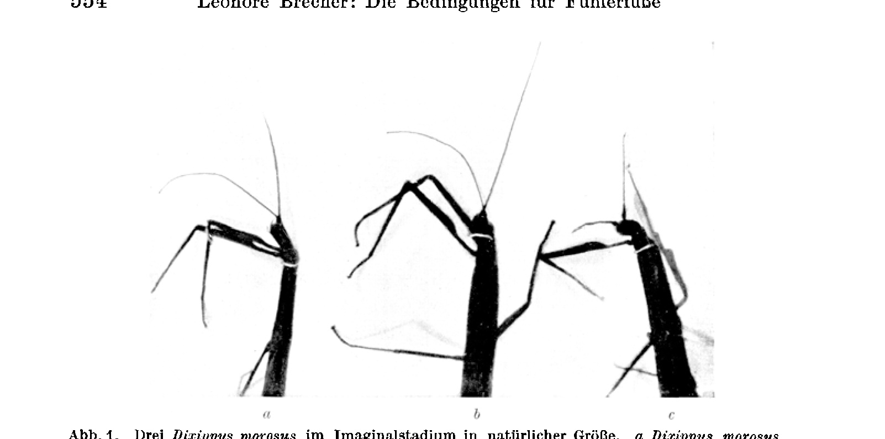
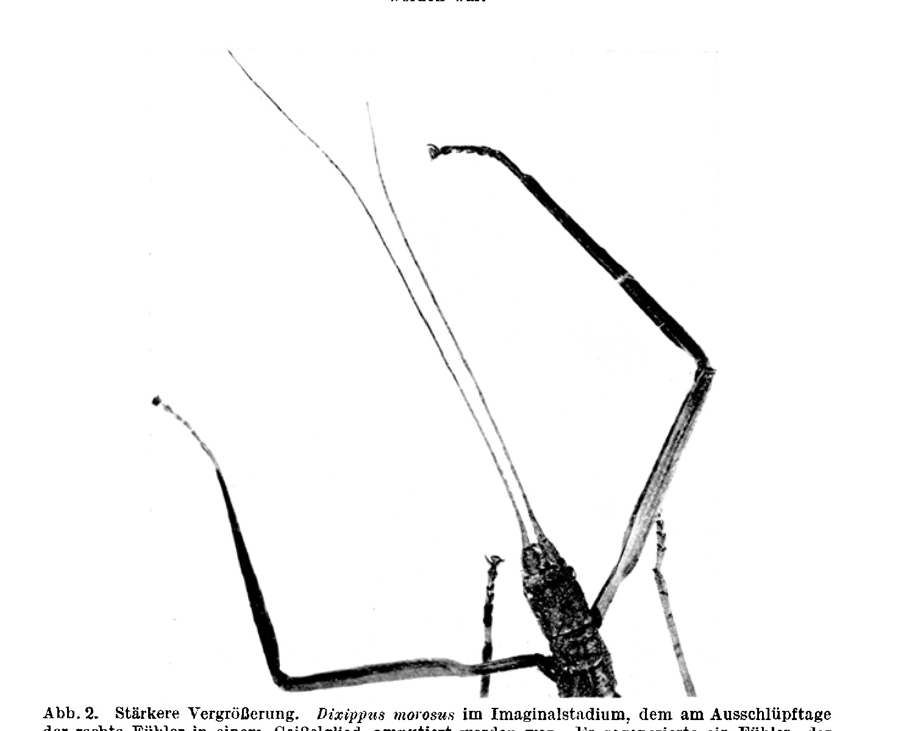
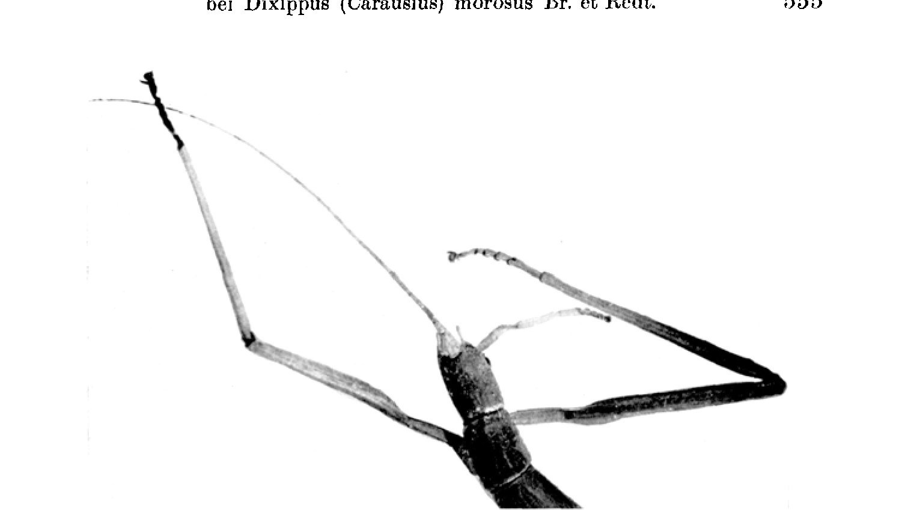
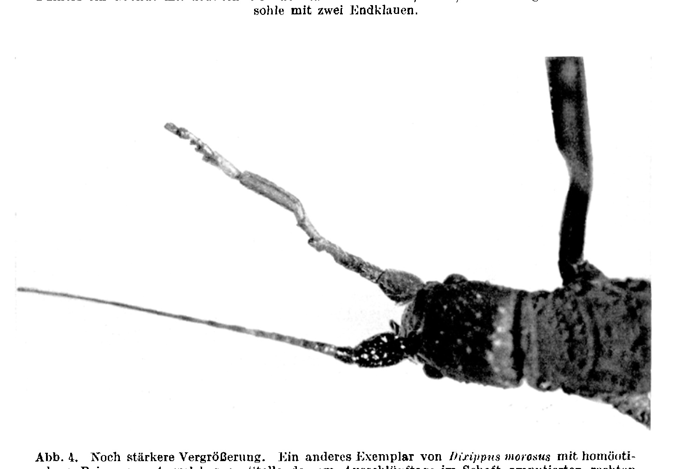

# The Conditions for Antenna-Legs in Dixippus (Carausius) morosus Br. et Redt.¹

### (Homoeosis in Arthropods, VII. Communication.)

By

**Leonore Brecher.**

(From the Biological Experimental Institute of the Academy of Sciences in Vienna [Zoological Division]¹.)

With 10 text-figures.

*(Received on 5 October 1923.)*

*Archiv für mikroskopische Anatomie und Entwicklungsmechanik*, vol. 102 (1924).

> **Full translation.** A complete English rendering of the running text of “The Conditions for Antenna-Legs in Dixippus (Carausius) morosus Br. et Redt.” (Leonore Brecher, 1924), including all tables, figure and plate legends, and footnotes. Numbers and table cells were transcribed from the page images, not the noisy OCR.

### Table of Contents.

|  | Page |
|---|---|
| I. Introduction | 549 |
| II. Experiments | |
| &nbsp;&nbsp;&nbsp;&nbsp;1. Set-up | 552 |
| &nbsp;&nbsp;&nbsp;&nbsp;2. Course | 556 |
| &nbsp;&nbsp;&nbsp;&nbsp;3. Morphological Results | 559 |
| &nbsp;&nbsp;&nbsp;&nbsp;4. Physiological Results | 564 |
| III. Summary | 566 |
| IV. Appendix: Protocols | 568 |
| V. List of Literature | 572 |

## I. Introduction.

*Schmit-Jensen* (1915) had found, in a culture of *Dixippus morosus* strongly weakened by cannibalism, a specimen in which the end of an antenna had been replaced by tarsal segments with claws. Mindful of the reference by *Przibram* (1909), that for carrying out experiments on homoeosis those species would be especially favorable as experimental objects in which natural finds with homoeotic formations existed, *Schmit-Jensen* too investigated homoeotic regenerates in *Dixippus* by the experimental route. On 50 freshly-hatched and 60 half-grown *Dixippus* larvae he carried out an antennal amputation within the first two antennal segments, without, however, controlling the placement of the cut by means of a dissecting magnifier. Among these 110 operated specimens, homoeotic regenerations of the antenna appeared in only 29 cases, which consisted of tarsal segments with claws, sometimes also of a

> ¹) An abstract of this work appeared, with an identically worded title, as Communication No. 87 from the Biological Experimental Institute of the Academy of Sciences, Zool. Division, Director: *H. Przibram*, in the Akad. Sitzungsanz. 1922. No. 22—23.

Archiv f. mikr. Anat. u. Entwicklungsmechanik Bd. 102.   36 
piece of tibia. In all the remaining cases either a normal antenna or no regeneration set in. Lack of time and of space had prevented the author from isolating the animals, which had been operated on at various places within the first two antennal segments, so that he was not in a position to refer the heteromorphoses that arose back to definite placements of the cut. From the impression received from the material described, *Schmit-Jensen* divides the experimentally obtained formations into two groups: 1. *A.* Amputation in the 1st antennal segment, at the boundary between the 1st and 2nd antennal segment, allowed dwarf-like, little-developed, crippled, homoeotic regenerates, consisting of 1—4 tarsal segments, to arise (14 of 20 cases); B. amputation in the 2nd antennal segment, at the boundary between the 2nd and 3rd antennal segment, allowed strong, highly developed homoeotic regenerates to arise, consisting of 4 tarsal segments (2 cases) or of 4 tarsal segments plus one tibia-like segment (4 cases). The spontaneously occurring case differs from the experimentally produced ones in that its stem of antennal segments serves as the bearer of a tarsus. So far as the data of *Schmit-Jensen* allow; he himself expresses the conjecture that here, in the case of amputation in the flagellum, normal antenna-regeneration is always to be expected, but in the case of a cut placed through the shaft-segments, homoeotic legs are to be expected.

For the kind permission of *Przibram* for the further treatment of this theme at the Biological Experimental Institute, I express my thanks here.

It would be admissible to compare the regeneration of the antenna for the various placements of the cut and at the various antennal stages: with the cut within the shaft-segments and with the cut in the flagellar segments, in accordance with the expectation of *Schmit-Jensen*.

I undertook such experiments on *Dixippus morosus* from January to May 1916.

Since I had for several years during my animal-rearing made observations on antenna-injuries, but had not yet had occasion to publish the results on homoeotic regeneration in *Dixippus*.

Recently (1921), however, two communications by *Cuénot* appeared, in which he reports on similar experiments on *Dixippus morosus*: a cut in the 3rd segment yielded antenna-regeneration. Amputation in the proximal half of the 1st basal segment had as a consequence either no regeneration or rarely an antenna-regeneration. Likewise, after every cutting-through of the antenna at the boundary between the 1st and 2nd shaft-segment, either no regeneration or rarely a quite rudimentary, formless, hairy formation occurred. A cut through the distal half of the 1st basal segment or through the 2nd basal segment had heteromorphoses as a consequence, and indeed mostly well-de- 
veloped legs, among which the most complete leg obtained by him consisted, as with *Schmit-Jensen*, of a tibia and a four-segmented tarsus; further, with the transitions down to rudimentary legs; rarely he obtained antenna-legs with two antennal segments, upon which followed a thickened formation — tibiotarsal segment —, then three tarsal segments and a claw, that is, antennae with *Herbst's* antenna-regenerated normal antennae. He asks himself whether, similarly to *Herbst's* homoeomorphoses in decapod crustaceans, specific regions of differing potency lie in the *Dixippus* antenna, which would determine the respective formation, whereby, however, in *Dixippus* it surely cannot be a nerve-influence, because here the antennal nerves pass through the antenna without forming a ganglion. He thinks, however, that a correlation between cut-height and the formation of normal antenna or heteromorphic leg is by no means certain, and asks himself whether a definite predisposition of certain specimens to yield heteromorphic regenerates is not rather to be made responsible for it; and he adduces antenna-experiments in which, on one animal, the two antennae cut off at different places yielded equally well-developed legs, or in which on other specimens both antennae regenerated. Further, he adduces *Otto Meißner*, who never described heteromorphoses in *Dixippus*, but only shorter regenerated antennae.

I should like to interpolate here at once that *Meißner* conducted no experiments on this, but only adduces observations on animals that had lost [their antennae] through cannibalism. I quote from *Meißner's* treatise the passages that bear on this (1909, p. 59): "The animals bite their antennae off, in all stages equally readily, wholly or in part" ..., "A few times I also saw wounds on the head" ..., "The antennae appear, at least when bitten off only in part, to be regenerated again already at the next moult." The animals evidently did not always bite the antennae off at the same place, as is evident from this: "that from the antennae now more, now fewer segments are missing, but seldom only the leaf-like broadened basal segment", "autotomy of the antennae appears not — at least seldom — to occur, which also regenerate at the next moult." He states of the regenerated antennae (1911/12, p. 131) that they are shortened, and indeed "sometimes [show] the normal number of segments with a shortening of the individual segments, but at times also a smaller" number of segments.

*Cuénot* advises seeking out the descendants of such animals, which [show] a particular inclination to heteromorphosis of the antenna, and rearing them separately, in order to test whether it is already germ-plasm differences that decide the regeneration-mode of the antenna.

> 36* 
This work of *Cuénot's* gave me direct occasion to publish my results too, in order to provide further material for the unconditional correlation of normal regeneration or homoeosis with the placement of the cut.

## II. Experiments.

### 1. Set-up.

A number of half-grown *Dixippus* had been sent to us by Mr. Rector *Wagner* from Hamburg, which were set up for further breeding in order to use the offspring for the experiments, as well as a larger number of eggs.

I first used the hatching larvae for the operations.

The operation was carried out without anesthesia by a cut with a small angularly-bent eye-scissors, in all cases on the right antenna.

The normal antenna of *Dixippus* (Text-figure 1) consists of a shaft and a flagellum. The shaft is composed of two segments: the 1st shaft- or basal segment, a broad large segment, and a 2nd shaft- or basal segment, which is much shorter and narrower than the 1st basal segment. Upon this follows the flagellum, which is composed of a large number of thin, elongated segments, alike with one another. The terminal segment of the flagellum is rounded off and not broader than the remaining segments of the same.

The amputation of the right antenna was carried out in the following experimental variations:

A. On the hatching larvae:

a) Cut through the flagellum.

b) Cut through the shaft (Text-figure 1).

B. On larvae in the stage of the 6th—7th moult:

a) Cut in the 1st flagellar segment,

b) Cut in the shaft.

C. On larvae of the next-to-last moult:

a) Cut in the 1st flagellar segment,

b) Cut in the 1st shaft-segment.

Further, on a number of the animals operated on, on the hatching-day, by a cut in the right antennal shaft, that is, according to operation-mode b, Am- 
putation [in the shaft] — animals which, as I must already say in anticipation, regenerated in place of the amputated antenna a formation with distinct leg-characters — this homoeotic formation was again removed by a scissors-cut.

D. On animals which had reached the stage of the 6th—7th moult:

a) Cut in the 1st segment after the two basal segments of the multi-segmented regenerate.

b) Cut in the 1st basal segment.

E. On animals of the next-to-last (8th or 9th) moult:

a) In the 1st segment after the two basal segments of the multi-segmented regenerate.

After the operation, the placement of the cut was controlled with the magnifier. In the case of the just-hatching *Dixippus* larvae, because of the smallness of the object, it was difficult to realize definite amputation sites exactly. In operation-mode b, cut in the shaft, it is a matter of animals in which the antenna was cut off quite close to the base, so that definitely the whole flagellum was removed. The cut passed either through the 1st shaft-segment or through the boundary between the 1st and 2nd shaft-segment, through the 2nd shaft-segment, or at the boundary between the 2nd shaft-segment and the 1st flagellar segment. On subsequent examination of the preserved animals it is in most cases still possible to determine the site of the cut, in that the regenerate is in most cases distinguished by its different coloration from the shaft-segments that have remained standing. In operation-mode a, the cut was placed, after the shaft-segments, if possible in the 1st flagellar segment.

The animals operated on, on one day, in the same stage and by the same placement of the cut, were in each case put together into one cage and bred further.

All *Dixippus* were kept under the same temperature- and feeding-conditions, namely in the so-called "warm room" of the institute. Since the operation of the temperature-chambers had been discontinued ever since the outbreak of the war, it had to be [carried out] in this [room] under ordinary, non-constant room temperature. The animals were fed with Rubus leaves.

The whole course of regeneration was controlled with the magnifier and under the microscope, and the findings entered into the experimental-protocols (see Appendix), and individual specimens preserved in 70% alcohol for the purpose of later exact examination and the making of drawings. After the imaginal stage had been reached and the last control completed, all the animals were preserved.

**Fig. 1.** Three *Dixippus morosus* in the imaginal stage in natural size. *a Dixippus morosus*, on which on the hatching-day the right antenna had been cut off in one flagellar segment: it regenerated an antenna. *b Dixippus morosus* with normal antennae. *c* a specimen with a leg in place of the right antenna, which had been removed on the hatching-day by a cut in the shaft.  *(figure not reproduced)*

**Fig. 2.** Stronger magnification. *Dixippus morosus* in the imaginal stage, on which on the hatching-day the right antenna had been amputated in one flagellar segment. It regenerated an antenna, which differs from the normal antenna in that it is somewhat shorter than the normal one.  *(figure not reproduced)* 

**Fig. 3.** The same magnification as Fig. 2. *Dixippus morosus* in the imaginal stage, on which on the hatching-day the right antenna had been amputated in the shaft. It regenerated, in place of the antenna, a formation with distinct leg-characters: femur, tibia, four tarsal segments and a sole-of-foot with two terminal claws.  *(figure not reproduced)*

**Fig. 4.** Even stronger magnification. Another specimen of *Dixippus morosus* with a homoeotic leg-regenerate, which has arisen in place of the right antenna amputated in the shaft on the hatching-day. One sees the 1st basal segment, 2nd basal segment, femur with a formation on the inner edge, patella, tibia with very distinct characteristic hairing-stripes, then four tarsal segments and the sole-of-foot with terminal claws.  *(figure not reproduced)*

The photographs for Fig. 2, 3 and 4 were kindly taken by Mr. Professor *Walter Kolmer* at the Physiological Institute of the Vienna University, for which I should like to express to him here too my most cordial thanks.

## 2. Course of Events (see experimental protocols).

A. a) All animals operated on by a cut through the flagellum on the hatching day regenerated typical flagella (Fig. 2).

The regenerated flagellum is shorter than the normal one, the number of segments however much smaller and the individual segments longer; in particular the terminal segment of the regenerated flagellum is much longer than the terminal segment of the normal one; it is a long unsegmented piece (Fig. 2).

A. b) Of the 131 animals operated on at the hatching day by a cut in the right antennal shaft, there remained, as can be seen from the experimental protocols, 49% without a regenerate, 9% showed an unexpressed regenerate, 41% regenerated in place of the antenna an appendage with typical leg characters, and only a single specimen — that is, less than 1% of the total number of operated animals — regenerated an antenna.

As regards the regenerates designated as "legs," which grew back in place of the cut-off antennae, they are in the various specimens more or less well developed and approach more or less perfectly a leg.

To facilitate the comparison, reference is made to Fig. 1, in which the normal fore-legs and mid-legs of *Dixippus* may be seen in photographic reproduction. The *Dixippus* leg consists of coxa, trochanter, femur, a knee-joint — patella —, tibia and five tarsal segments, sole with two terminal claws. A regenerated leg has only four tarsal segments. The fore-leg differs from the other legs in that the femur in its proximal part (in the first third) is narrow and shows a notch on the side turned toward the head, and then widens (Figs. 1, 2, 3 and 4). A second distinguishing mark between the fore-leg and the other legs is that in the fore-leg the femur and tibia show a knotty contour of the outer margin. The femur, in contrast to the tibia, has in all three leg-pairs four spines (teeth) on the flexor side near the knee-joint.

Among the heteromorphic legs, the best-developed ones show a well-developed tarsus, consisting of a sole with two terminal claws, just as a regenerated leg has four typically developed tarsal segments with sole-pads, a typically developed tibia with the typical striation and hair-insertion, a further segment — patella — which, however, is proportionately larger than the patella in the normal, non-regenerated leg (compare on this point *Przibram*, Kosmos 1907); upon this follows the femur — in some particularly well-developed homoeotic legs the femur is indented on its inner margin and thereby recalls the femur of the fore-leg. Unevennesses in the contour of the tibia, too, might perhaps be homologized with the knotty contour of the outer margin of the fore-leg tibia. Proximalward there join onto the femur the two segments corresponding to the basal segments of the antenna, as coxa and trochanter (Fig. 6, Fig. 1c and Figs. 3 and 4). In other specimens not all segments are

**Fig. 6.** Klaue (Claw); Tarsalglieder (tarsal segments) 4. 3. 2. 1.; Tibia; Patella; Femur (2. Schaftgl.) [Femur (2nd shaft-segment)]; Trochanter (1. Schaftglied) [Trochanter (1st shaft-segment)]; Coxa.  *(figure not reproduced)*

developed, but only the tarsus shows the typical characters with four tarsal segments and terminal claws; the tibia is not yet well developed, but is a short, broad, trapezoidal segment; whereas the other segments are not yet distinctly formed. In others only the tarsus is developed. In some, only three tarsal segments are present; some show only the terminal claws. Some regenerates are curved. In the accompanying text-figures, such regenerates of various stages of development may be seen.

The difference, distinct in some specimens, of the coloration of the regenerate in comparison with that of the original segments still permits inferences to be drawn about the more exact location of the cut-placement.

**Fig. 7.** *(figure not reproduced)*

It seems from this as though the most completely and best-developed legs were to be traced back to a cut-placement through the 2nd basal segment, where therefore the 1st shaft-segment was left entirely intact and the cut passed within the 2nd shaft-segment, as for example in Figs. 3, 4 and 6. On the other hand, the conduct of the cut through the 1st shaft-segment likewise results in distinct, but less completely developed legs, as for example Fig. 7. Still less well developed is the leg-regenerate when the cut has passed too deeply through the

**Fig. 8.** *(figure not reproduced)*

1st basal segment, as for example Fig. 8 shows. Evidently the failure of any regeneration is also to be traced back to the fact that the cut removed too much of the 1st shaft-segment. This relationship — admittedly only inferred from the subsequent working-up of the preserved material — of the height of development of the leg-regenerate with the height of the cut within the shaft agrees well with the observations published by *Schmit-Jensen* and *Cuénot*, likewise cited above here. The case indicated by *Cuénot*, that on transection between the 1st and 2nd basal segment no, or only very slightly developed, regenerates come about, can no longer be decided by a subsequent observation on my material. The only means for this would be to carry out the cut-placement itself quite exactly under the microscope and thereafter to ascertain exactly the capacity for regeneration at the various places of the shaft. This, however, was probably not carried out even by *Cuénot*, who indicates the difficulties which a precisely specified cut-placement entails.

B. a) The animals operated on in the stage of the 6.—7. moult by a cut through the 1st flagellar segment of the right antenna yielded, among 20 animals, 40% without regenerate, 5% with unexpressed regenerate, and 55% regenerated a flagellum.

B. b) The animals operated on in the stage of the 6.—7. moult by a cut through the 1st shaft-segment of the right antenna yielded, among 29 animals, 83% without regenerate and 17% with unexpressed regenerate.

C. a) The animals operated on in the stage of the second-to-last moult by a cut through the 1st flagellar segment of the right antenna regenerated nothing at all.

C. b) The animals operated on in the stage of the second-to-last moult by a cut through the 1st shaft-segment of the right antenna likewise regenerated nothing more.

D. a) The fine leg-regenerates of the *Dixippus* operated on at the hatching day were, in a number of animals, cut off again in the stage of the 6.—7. moult, namely in the 1st segment after the two first segments of the leg-regenerate. On reaching the imaginal stage, of 13 animals of this operation-mode 6 (46%) remained without regenerate, 5 animals (38%) showed an unexpressed regenerate, and 2 animals (15%) had regenerates with distinct leg-

**Fig. 9.** *(figure not reproduced)*

**Fig. 10.** 1. 2. 1. 2.; Schaftglied (shaft-segment); Beinregenerat (leg-regenerate).  *(figure not reproduced)*

characters (Figs. 9 and 10). Thus one sees in the specimen Fig. 10 the 1st basal segment of the original antenna, a part of the 2nd basal segment, from which onward the first leg-regenerate began. Of this, two segments are left and through the third the cut led, and from here onward one sees a three-segmented structure and a distinct sole with two terminal claws.

Fig. 9 likewise shows a leg-regenerate of the leg-regenerate cut off again in the stage of the 6.—7. moult in the 1st segment after the two basal segments. One sees the basal segment, upon which there follows a long segment, hereupon follows a wart-like thickening and then distinct terminal claws with sole.

D. b) Of the animals operated on for the second time in the stage of the 6.—7. moult, and indeed in the basal segment of the leg-regenerate, the predominant part remained without regenerate (5 out of 7 animals, that is to say 71%) or show at most a regeneration-bud (2 animals, that is to say 29%).

E. a) Of the animals operated on in the stage of the 8th and 9th moults in the 1st segment after the two basal segments of the leg-regenerate, all remain without regenerate.

The following table gives in tabular form a clear presentation of the numerical results. (Over and above this, the animals preserved at an earlier control have also been added in here.)

## 3. Morphological Results.

All specimens in which the two shaft-segments were left intact and the cut was led through the part of the antenna following the shaft regenerated typical flagella again (Figs. 1 and 2).

By contrast, after the cut of the antenna within the shaft, in place of an antenna a distinct leg regenerated. The best-developed of these allow all the segments of the leg to be recognized: coxa, trochanter, femur, patella, tibia, four tarsal segments as in the leg-regenerate, and sole with two terminal claws (Figs. 1c and Figs. 3 and 4). In some well-developed regenerates one can even recognize the marks characteristic for the fore-leg — the hollowing-out of the femur on the inner margin, the uneven contour of femur and tibia. Other regenerates consist only of tarsus and tibia; yet others again among them have regenerated only 3—1 tarsal segments or only the terminal claws. Finally, a great part is without regenerate. But with one single exception (see section 2, Ab), where there may have taken place no further development of the homoeosis already laid down toward the antenna (compare *Przibram*, 1919), no regeneration of an antenna after the cross-sectioning through one of the basal segments is to be recorded.

Thus *Godelmann* (1901) too observed in *Bacillus Rossii* in 7 out of 50 cases the regeneration of a leg with a pentamerous instead of tetramerous tarsus, as is the rule for leg-regenerates, when it concerned *very young* animals which had already lost the leg before the 1st moult (by autotomy). If a *Bacillus*, after autotomy, had once obtained the four-segmented tarsus, then it retained it up until

### Table.

| | Mode of operation Stage; segment | Control at | Size | Finding without regenerate | Unexpressed regenerate | With leg | With antenna and foot-end | With antenna-end |
|---|---|---|---|---|---|---|---|---|
| A a | Cut through the flagellum on the hatching day | 3. V. | 6—8 | | | | | 9 |
| A b | Cut through the shaft on the hatching day | 4—8 moult | 64 | 12 | 54 | | | 1 |
| B a | Cut through the 1st flagellar segment in the stage of the 6.—7. moult | Imago | 8 | 1 | | | | 11 |
| B b | Cut through the 1st shaft-segment in the stage of the 6th to 7th moult | " | 24 | 5 | | | | |
| C a | Cut through the 1st flagellar segment in the stage of the second-to-last moult | " | 12 | | | | | |
| C b | Cut through the 1st basal segment in the stage of the second-to-last moult | " | 24 | 7 | | | | |
| D a | Operated on for the second time in the stage of the 6.—7. moult by a cut in the 1st segment after the 2 basal segments of the multi-segmented leg-regenerate | " | 6 | 5 | 2 | | | |
| D b | Operated on for the second time in the stage of the 6.—7. moult by a cut in the 1st basal segment of the leg-regenerate | " | 7 | | | | | |
| E a | 8th moult: cut in the 1st segment after the 2 basal segments of the leg-regenerate of the right antenna | " | 4 | 1 | | | | |
| | 9th moult: cut in the 1st segment after the 2 basal segments of the leg-regenerate of the right antenna | | 3 | | | | | | death. From this rule he found a single exception: a young larva lost at the 1st moult the front right leg. At the 2nd moult a leg-regenerate with four tarsal segments came to light. At the 3rd moult there appeared on this leg, in place of the four tarsal segments, five.

Experiments on homoeotic regeneration of the antenna were carried out by *Przibram* on several species, namely:

On *Sphodromantis bioculata*, in which he found a dependence of the regeneration mode firstly on the cut-placement and secondly on the age:

If the antenna of half-grown larvae was amputated right after the 5th moult (*Przibram*, 1917) *in front of* the flagellum-insertion, then he obtained not a single case of a distinct foot-formation on the regenerating antennae; in the moults following the amputation, regenerates with foot-like terminations were observed, which however in the course of the moults did not become further similar to the foot. They were malformations on the regenerates, and indeed always on the terminal parts of the newly formed flagellum. These malformations had a superficial resemblance to foot-characters, but could nowhere be distinctly homologized with such. Since these formations are thickened, they pass through the skin with difficulty at the moults, and it came to tearings-off, which prevented a distinct further development of the malformations. If, on the contrary, a part of the flagellum was left standing at the operation, then a flagellum with a normal flagellum-end regenerated.

If, in the oldest larvae and nymphs of *Sphodromantis bioculata* (*Przibram*, 1919), the antenna was transected in the antennal shaft, then there arose a formation which could be distinctly homologized with a leg, and indeed with a fore-leg.

*Przibram* concludes from this that the age is determining for the kind of regeneration, and that after operations on certain stages of development merely transitory, on others permanent homoeosis cases arise, and that intermediate stages partly show homoeotic characters, and he expresses the conjecture that the better expression of the leg-character on amputation in the antennal shaft in old larvae and nymphs is connected with the dwindling capacity for regeneration of the antenna in these stages. Further, the expectation of *Przibram* was confirmed, in that a distinct dependence of the regeneration mode on the cut-height is to be recognized: a cut through the flagellum yielded always typical flagellar regeneration; a cut through the shaft, according to the age-stage at which the operation took place, regenerates with more or less pronounced leg-characters.

On *Cimbex axillaris* Panz., which had delivered the first natural find of a replacement of antenna by foot-end (*Kraatz*, 1876, cited after *Przibram*), *Przibram* (1919) carried out experiments on homoeotic regeneration of the antenna. On singeing-off of the antenna without a puncture, there appeared in place of the damaged larval antenna a typical antenna at the nymph and imago. On deeper injury, puncture with or without cauterization, it came to the formation of foot-characters on the terminal club of the antenna, and in fact one to two claws, sole-pads and foot-hairing were observed. With increasing severity of the lesion, ever-further-going approximations to the foot-end were to be ascertained.

Replacement of eye by antenna, similar to that in the *Herbst*ian experiments on decapod crustaceans, has also been observed in insects, namely on *Stylopyga orientalis* and *Tenebrio molitor* by *Janda* (1913), on *Tenebrio molitor* by *Krizenecky* (1913). Here the eyes were removed in larvae by an intervention penetrating deep into the head, and in place of the eyes antenna-like structures regenerated.

Concerning the remaining homoeosis cases that have become known, reference is made to the literature contained in the cited works of *Przibram* and to a further communication of his on homoeosis in Lepidoptera which is in preparation.

Finally, let the experiments of *Schmit-Jensen* and *Cuénot* on *Dixippus* discussed at the outset be emphasized once more; in agreement with my results communicated here on the same species, these have yielded that on transection of the antenna distal to the shaft flagella always regenerate, whereas after amputation within the shaft legs come to development in place of the antennae. If, in the experiments of *Schmit-Jensen*, this could only be expressed by him conjecturally, for lack of exact control of the cut-site and isolated keeping of the animals of the individual modes of operation, then my experiments were able to furnish the confirmation that a cut through the flagella in fact always lets flagella, a cut through the shaft, however, lets legs come into being. The homoeotic regenerates obtained in my experiments are even, in comparison with those described by *Schmit-Jensen* and by *Cuénot*, still better developed, since on several specimens, besides tarsus and tibia, also patella and femur are developed; further, on this homoeotic leg, similar to that of *Przibram* (1919) on *Sphodromantis*, marks could also be found in *Dixippus* which speak for its being a fore-leg.

To the case mentioned by *Cuénot*, that in his experiments on one animal, in which both antennae cut off not exactly at the same place both yielded equally well-developed homoeotic legs, whereas in other specimens both antennae regenerated, there would have to be set against it, on the one hand, the difficulty admitted by *Cuénot* himself of conducting exact cut-placements, so that the regeneration could take its starting-point from another place than the intended one; on the other hand, differences in the age or stage of the operated animals (compare *Przibram*, *Sphodromantis*; *Godelmann*, *Bacillus*, and perhaps the single case of an antennal regeneration in *Dixippus* observed by me, where after the cut-placement a homoeotic leg was to be expected) could also be responsible for this differing behavior of the individual individuals.

If we wish to accept Cuénot's idea that the appearance of homoeotic legs in place of antennae in *Dixippus* is to be explained on the basis of a particular tendency of individual individuals toward heteromorphosis, resting on germplasm differences, then we must surely recognize that we are dealing with a mutation occurring quite frequently in *Dixippus*; for since, in three lines stemming from different countries and living under different conditions, the same regularity in the appearance of this mutation was observed, this could only concern genetically uniform material under unequal conditions. Were it a question of this mutation, then this regularity in the appearance of this mutation would have to be experimentally verifiable, just as the heteromorphic regeneration in *Dixippus* is experimentally verifiable. For — as is evident from the cited literature — this same heteromorphic regeneration was, in the works mentioned, again and again experimentally produced, only that the conditions for the formation of the antenna-leg [Fühlerfuß] are not yet so precisely known that one could produce it at will; but it has long been known that the heteromorphic regeneration of an antenna-leg appears at the cut surface of the antenna in place of the antenna, in agreement, as Pribram too found, with the original regeneration of all authors, and that it is in this respect entirely in accord with the normal antenna regeneration following amputation at the same height.

There thus exists, from the concordant results of the cited authors, no doubt at all that the homoeotic leg regeneration appears in *Dixippus* in place of the antenna, and indeed at the same place where the normal antenna regeneration appears at the cut surface of the antenna.

To this latter point I should now still wish, for the corroboration of the supposition just made, to add the following: It would be of significance for the assessment of differences within the same regeneration period, or of differences of the stadium within the regeneration period, whether one could establish at which age the operation was undertaken. So would it be explicable whether, apparently, on animals operated at the same age (size) and through the same operation-type, they nevertheless do not all behave alike with respect to the regeneration mode, and the different kinds behave differently. It would be worth attending to this in future experiments. Thus one could, as a cross-experiment to the case adduced by *Cuénot*, on a single individual remove both antennae at as precisely as possible the same cut site during the same molting period, but at two different points in time of it, and observe the course of regeneration.

Concerning the explanation of this heteromorphic regeneration, my experiments are too insufficient to be able to take a position on this point.

*Herbst* had, for the homoeotic regeneration of antennulae in place of eyes in the decapod Crustacea, when he cut them off at the base of the stalk, given the explanation that the eye-ganglion sitting at the base of the stalk has a formative influence on the formation of the eye, so that, after removal of the stalk — with which the eye-ganglion too was removed — the formative influence of the latter falls away.

For *Dixippus*, however, it is stated (*Kühnle*, 1913, *Cuénot*, 1921) that within the antenna there is no ganglion formation, but rather only single ganglion cells are to be noticed in the course of the antenna nerve. The whole sense-mass [Riechmasse] is said to be located in the head. The heteromorphic regeneration can therefore not be traced back to the removal of the sense-ganglion. (Cf. on the contrary the view of *Pribram* on the cause of the homoeosis [1919].)

### 4. Physiological Results.

In a check, undertaken under the microscope, of the antenna-legs [Fühlerfüße] obtained by *Dixippus* through antenna regeneration, I observed in one specimen, which had regenerated a very well-developed leg in place of the antenna cut off at the shaft on the day of hatching, that the animal carried out gripping movements with this leg. It gripped with the claws of this homoeotic leg the neighboring normal antenna.

Since, after this check, in a larger number of specimens of the 6th–7th, resp. 8th–9th molt with very well-developed leg regenerates, I cut these off again in order to induce a fresh regeneration (Experiment Da and Db as well as Ea), it happened unfortunately that I, by mistake, also cut off this beautiful leg regenerate in this specimen — in which I had observed a gripping movement of the regenerated heteromorphic leg. I was able to observe this gripping movement in one other specimen.

In order to test the functional capacity of these homoeotic formations, I therefore set up the following experiments: a) If one brings an alcohol-moistened little rod into the vicinity of the normal antenna, up to the point of touching it, then the antenna gives a deflection and always moves away from the little rod. In this way one can set the antenna upright. Touched from below, it gives a deflection downward. One can also bring it to the side.

On being touched from below, the size of the deflection increases the farther toward the base one has touched; on being touched from above, however, the size of the deflection increases the farther toward the tip one has touched. Only at the very tip is it somewhat different: touched from below, it gives a small deflection; touched from above, the flagellum on the contrary seeks to make a movement upward and therefore yields to the side, in order to snap upward. If it does not succeed in overcoming the obstacle, then it remains stuck to the little rod.

The regenerated antenna reacts exactly the same way.

A *normal leg* does not yield on being touched with the alcohol-moistened little rod. Every touch at any place of the leg releases the gripping movement: incurving of the tarsal members, especially of the end-claws.

As to what the reaction of the *leg* regenerated in place of the antenna concerns, I could — with the exception of the one case described above, where I observed a spontaneous gripping movement — notice no gripping movement. By contrast, they gave deflections just as the normal antenna does, only weaker than the latter, and indeed both on being touched from above and from below. These deflections ensued only on touching the tibia and the femur, and indeed more strongly on touching the femur. On touching the tarsal members, especially toward the tip, no deflections are to be noticed.

This observation stands in accord with the findings of *Pribram* (1917) on homoeotic antenna regenerates and normal antennae, as well as in *Sphodromantis bioculata*. The homoeotic antenna regenerates likewise showed an insensitivity of the tip, in contrast to the antenna.

b) *Electrical stimulations* by means of an electrode through which the induction current of an inductorium is led, at 20 mm roller-spacing:

Reaction of the *normal antenna*: On being touched with the electrode there ensues, at the base of the antenna, a deflection downward; the deflection becomes smaller near the base, and increases toward the tip resp. the middle.

The regenerated antenna reacts the same way.

On touching the *normal leg* the touching with the electrode releases the gripping movement: the tarsal members incurve themselves, or there ensues a bending of the leg.

In the *leg* regenerated in place of the antenna, the touching with the electrodes releases no bending and incurving, and also no gripping movement as in the leg, but rather only a deflection as in the antenna. As distinct from the latter, the regenerated homoeotic leg gives, on being touched toward the tip, no deflection, whereas the antennae, on electrical throughflow at the antenna-tip, snap upward. (Cf. also *Pribram*, 1917, *Sphodromantis*.)

*Herbst* (1910) states the following about the physiological function of the heteromorphic antennulae obtained by him in decapod Crustacea in place of the eyes: If the exopodites — developed alone — of the heteromorphic antennula are stimulated mechanically or chemically, then this stimulation releases movement-reactions similar to those upon stimulation of the eye or of the propodite of the normal antennula, and not like the stimulation of the exopodite of the normal antennula. The heteromorphic antennulae are here developed just like the propodites.

There is thus, in the findings of *Herbst*, *Pribram* (1917) and my results, an agreement in this, that the homoeotic appendage shows a certain similarity in its reaction-mode to the appendage in whose place it stands; on the other hand, individual observations (*Herbst*, and the one case of a spontaneous gripping movement observed by me) point also to a similarity of the reaction-mode of the homoeotic appendage to the appendage morphologically identical to it that normally belongs to a different segment.

## III. Summary.

1. The antenna of the stick insect [Stabheuschrecke] (*Dixippus morosus*) consists of a two-membered shaft and a many-membered flagellum [Geißel]. If, in larvae of *Dixippus* just hatched from the egg, the one (right) antenna was amputated from the shaft, that is, within a flagellum-member, then a typical flagellum always regenerated.

2. If, in the same stadium, the *Dixippus* antenna was amputated within the shaft, then in place of the antenna a formation with distinct leg-character regenerated. After reaching the imaginal stadium, there could then be recognized, as transitions, anything from a piece formed from above downward, with end-claws, up to a fully developed leg with two members corresponding to the basal members of the antenna (which one must designate as coxa and trochanter), femur, knee-joint (patella), tibia, tarsus, sole, and end-claws.

3. The number of tarsal members does not exceed four, and thus behaves just as that of the regenerated leg, which, as is known, in contrast to the five-membered original tarsus is wont to form only this reduced number.

4. In many of the well-developed homoeotic leg regenerates — namely, from the indentation at the inner edge of the femur and from the wavy contour of femur and tibia — this "leg" could be regarded as homonomous with a foreleg.

5. In one case there regenerated, after amputation of the antenna in the shaft at this early stadium, an antenna (which may rest on a further development of the indicated homoeotic formation into an antenna).

6. In an advanced developmental stadium, in the 6th–7th molt, *Dixippus* operated on for the first time regenerated, after amputation in the 1st flagellum-member, a flagellum again; after amputation in the 1st shaft-member, however, nothing more at all, or at most showed only a regeneration bud of unpronounced character.

7. In a still later stadium, 8th–9th molt, operated animals regenerate nothing more at all.

8. If the "leg" obtained through the amputation of the antenna in the shaft undertaken on the day of hatching was, in the stadium of the 6th–7th molt, removed again by a section in the 1st member, also in the first two members of the leg regenerate — that is, by a cut placement analogous to the amputation through the 1st flagellum-member of the antenna — then there could be recognized, in the imaginal stadium, in the few cases in which it came to a distinct regeneration at all, regenerates with distinct leg-characters: sole with the end-claws.

9. Amputation, in the stadium of the 6th–7th molt, of the homoeotic leg in *one* member had no regeneration at all as a consequence.

10. After amputation of the homoeotic leg in the stadium of the penultimate molt, likewise nothing more regenerated.

11. These experiments thus show, with regard to the development of the antenna-regenerate as leg or as antenna, a close correlation to the cut site. Since the concordant results obtained on the same species and on various others by several researchers speak against the assumption of *Cuénot* that the homoeotic regeneration could pertain only to particular mutations.

12. As to what the function of these leg regenerates arising in place of the antenna concerns, in *one* case a spontaneous gripping movement was observed, in that the homoeotic antenna-foot gripped another.

13. In all other cases neither tactile, nor olfactory, nor electrical stimulation could release the gripping movement characteristic of the leg.

14. These antenna-legs react, on tactile, olfactory, or electrical stimulation, similarly — though more weakly — to the normal antenna and to the antenna regenerated as such, from which, however, they are distinguished by the insensitivity increasing toward their end.

## IV. Appendix:

### A. On the Day of Hatching

#### a) Section through the Flagellum.

| Nr. des Käfigs [Cage no.] | Operationsdatum 1916 [Operation date] | Operationsart: Stadium; Glied; Instrument [Operation type: stadium; member; instrument] | Kontrolle am 1916 [Check on] | Größe [Size] | Befund ohne Reg. [Finding without reg.] | Unausgesprochenes Reg. [Unpronounced reg.] | Mit Bein [With leg] | Konserviert [Preserved] |
|---|---|---|---|---|---|---|---|---|
| a | 13. I. | am Ausschlüpftag rechter Fühler durch Schnitt durch die Geißel entfernt [on the day of hatching, right antenna removed by section through the flagellum] | 31. III. | 5 | | | | |
| c | 19.–21. I. | Schnitt durch die Geißel [section through the flagellum] | „ | 5 / 4 | | | | |
| b | 14. u. 15. I. | A β) Schnitt durch den Schaft [section through the shaft] | „ | 5 | 2 | 1 | 3 | |
| d | 25. I. | A β) Schnitt durch den Schaft | „ | 5 | 1 | | 2 | 1 |
| e | 27. I.–1. II. | A β) Schnitt durch den Schaft | „ | 4 / 5 | 7 / 3 | 4 / 2 | 2 | |
| f | 3. II. | A β) Schnitt durch den Schaft | 1. IV. | 5 | 3 | 4 | 2 | |
| g | 7. II. | A β) Schnitt durch den Schaft | „ | 5 | 6 | 1 | 5 | 1 |
| h | 10. u. 15. II. | A β) Schnitt durch den Schaft | „ | 5 / 4 / 3 | 5 / 1 | 1 / 2 | 1 | 1 |
| i | 18. II. | A β) Schnitt durch den Schaft | „ | 5 / 4 / 2 | 2 / 1 | 1 / 1 | 5 / 1 | 2 |
| j | 29. II. | A β) Schnitt durch den Schaft | 3. IV. | 4 / 2 | 6 / 1 | 4 | 2 | 2 |
| k | 1. III. | A β) Schnitt durch den Schaft | „ | 4 | 7 | 3 | | |
| l | 2.–4. III. | A β) Schnitt durch den Schaft | „ | 3 / 4 | 2 / 11 | 3 | 1 / 1 | |
| m | 6.–7. III. | A β) Schnitt durch den Schaft | „ | 2 / 3 / 4 | 6 / 2 / 16 | 2 | | |

### Versuchsprotokolle [Experimental protocols].

### rechter Fühler amputiert [right antenna amputated].

#### β) Schnitt durch den Schaft [Section through the shaft].

| Mit Fühler und Fußende [With antenna and foot-end] | Mit Fühlerende [With antenna-end] | Konserviert [Preserved] | Kontrolle am 1916 [Check on] | Größe [Size] | Ohne Reg. [Without reg.] | Unausgesprochenes Reg. [Unpronounced reg.] | Mit Bein [With leg] | Konserviert [Preserved] | Mit Fühler und Fußende [With antenna and foot-end] | Mit Fühlerende [With antenna-end] | Konserviert [Preserved] | Regenerat abgerissen [Regenerate torn off] | Nr. des Käfigs [Cage no.] |
|---|---|---|---|---|---|---|---|---|---|---|---|---|---|
| | 2 | | 1. V. | 8 | | | | | | 3 | 1 | | a |
| 1 | 4 / 1 | 1 | { 3. V. } | 6–7 / 8 | | | | | | 2 / 3 | | | c |
| | | | „ | 8 | 3 | | 3 | | | | | | b |
| | | | „ | 8 | 1 | | 1 | | | | | | d |
| 3 / 1 | | | { „ } | 6–7 / 8 | 6 / 3 | 1 | 7 / 3 | | | 1 | | 1 | e |
| | | | „ | 8 | 3 | | 5 | | | | | | f |
| | | | „ | 8 | 6 | | 5 | | | | | | g |
| | | | { 1. V. } | 6–7 | 2 | 1 | 5 | | | | | | h |
| | | | { „ } | 6–7 / 8 / 4 | 2 | 1 | 4 / 1 / 1 | 1 | | | | | i |
| | | | { „ } | 6–7 | 5 | | 4 | | | | | | j |
| | | | { „ } | 6–7 / 5 | 3 / 2 | 1 | 2 / 1 | | | | | | k |
| | | | { „ } | 5 / 6–7 | 3 / 7 | 4 | 3 / 1 | 1 | | | | | l |
| | | | { „ } | 5 / 6–7 | 6 / 12 | 1 / 3 | 2 | | | | | | m |

## B. Right antenna amputated for the first time at the stage of the 6th–7th moult.
### α) Section in the 1st flagellar segment, β) section in the 1st basal segment.

## C. Right antenna amputated for the first time at the stage of the next-to-last moult.
### α) Section in the 1st flagellar segment, β) section in the 1st basal segment.

| Designation of the cage | Date of operation 1916 | | Type of operation (Stage; segment; instrument) | Check on | Size | Finding without regenerate | Conserved | Unpronounced regenerate | Conserved | With leg (only claw is developed) | Conserved | With antenna and foot-end | Conserved | With antenna-end | Conserved |
|---|---|---|---|---|---|---|---|---|---|---|---|---|---|---|---|
| Black | 29. V. | **Bα)** { | 6.–7. moult — through the 1st flagellar segment | 18. VII. | Imago | | | | | | | | | 6 | 1 |
| Grey | 24. and 29. V. | | 21 specimens, 6.–7. moult — through the 1st flagellar segment | 20. VII. | Imago | 8 | | 1 | | | | | | 5 | 2 |
| Yellow | 3. and 10. V. | **Bβ)** { | 24 specimens, 6.–7. moult — operated for the 1st time, r. antenna — through the 1st basal segment | 18. VII. | Imago | 16 | 11 | 5 | 1 | | | | | | |
| Black | 22. V. | | 11 specimens, 6.–7. moult — through the 1st basal segment | 18. VII. | Imago | 8 | 3 | | | | | | | | |
| White | 22. V. | **Cα)** | next-to-last moult — through the 1st flagellar segment | | | 12 | | | | | | | | | |
| Grey | 29. V. | **Cβ)** { | 9 specimens, next-to-last moult — through the 1st basal segment | 20. VII. | Imago | 6 | 6 | 2 | 2 | | | | | | |
| Yellow | 11. V. | | 7 D., next-to-last moult — through the 1st basal segment | 20. VII. | Imago | 4 | | 3 | | | | | | | |
| White | 22. V. | | next-to-last moult — through the 1st basal segment | 20. VII. | Imago | 14 | | 2 | | | | | | | |

## D. Removal of the homoeotic leg at the stage of the 6th–7th moult.
### α) In the 1st segment after the 2 basal segments, β) in the 1st basal segment.

## E. Amputation of the homoeotic leg at the stage of the 8th–9th moult.

| Designation of the cage | Date of operation 1916 | | Type of operation (Stage; segment; instrument) | Check on | Size | Finding without regenerate | Conserved | Unpronounced regenerate | Conserved | With leg (only claw is developed) | Conserved | With antenna and foot-end | Conserved | With antenna-end | Conserved |
|---|---|---|---|---|---|---|---|---|---|---|---|---|---|---|---|
| Black | 1. V. | **Dα)** | 13 specimens, 6.–7. moult — Section in the 1st segment after the 2 basal segments of the multi-segmented leg-regenerate of the right antenna operated on the day of hatching | 10. VII. | Imago | 6 | 6 | 6 | 6 | 1 | 1 | | | | |
| Black | 1. V. | **Dβ)** | 11 D.m., 6.–7. moult — Section in the 1st basal segment of the leg-regenerate of the right antenna | 10. VII. | Imago | 7 | 3 | | | | | | | | |
| Grey | 22. and 29. V. | **Eα)** { | 5 D.m., 8th (next-to-last) moult — Section in the 1st segment after the 2 basal segments of the leg-regenerate of the r. antenna | 10. VII. | Imago | 4 | 4 | 1 | 1 | | | | | | |
| White | 16. V. | | 3 D.m., 9th (last) moult — Section after the 2 basal segments of the leg-regenerate of the r. antenna | 10. VII. | Imago | 3 | 2 | | | | | | | | |

## V. Bibliography.

**Caudell, A. N.:** Regeneration of antennae. Science vol. 40, p. 352 (after an abstract in Bull. biol. de la France et de la Belgique vol. 54, fasc. 2. 1921). — **Cuénot, L.:** Régénération de pattes à la place d'antennes sectionnées chez un Phasme. Cpt. rend. hebdom. des séances de l'acad. des sciences vol. 172, No. 16, p. 949. 1921. — Idem: Sur les différents modes de régénération des antennes chez le Phasme *Carausius morosus*. Ibid. vol. 172, No. 17, p. 1009. 1921. — **Godelmann, Robert:** Contributions to the knowledge of *Bacillus Rossii* Fabr., with particular regard to the autotomy and regeneration of individual limbs occurring in it. Arch. f. Entwicklungsmech. d. Organismen vol. 12, p. 265. 1901. — **Herbst, Curt:** On the regeneration of antenna-like organs in place of eyes. I. Communication. Ibid. vol. 2, p. 544. 1896. — Idem: On the regeneration of antenna-like organs in place of eyes. II. Experiments with *Sicyonia sculpta*. Vierteljahrsschr. d. naturforsch. Ges. in Zürich. Vol. 41, p. 435. 1896. — Idem: On the regeneration of antenna-like organs in place of eyes. III. Further experiments with totally extirpated eyes. IV. Experiments with partially cut-off eyes. Arch. f. Entwicklungsmech. d. Organismen vol. 9, p. 215. 1899. — Idem: On the regeneration of antenna-like organs in place of eyes. V. Further proofs of the dependence of the quality of the regenerate on the nervous central organs. Ibid. vol. 13, p. 436. 1901. — Idem: On the regeneration of antenna-like organs in place of eyes. VI. The movement reactions which are elicited by stimulation of the heteromorphic antennules. Ibid. vol. 30, 1. 1910. — **Janda, Viktor:** Antenna-like heteromorphoses in place of eyes in *Stylopyga orientalis* and *Tenebrio molitor*. Ibid. vol. 36, 1. 1913. — **Krizenecky, Jar.:** On restitution phenomena in place of eyes in *Tenebrio* larvae after destruction of the optic ganglia. Ibid. vol. 37, p. 629. 1913. — **Kühnle, K. F.:** Comparative investigations on the brain, the head nerves and the head glands of the common earwig (*Forficula auricularia* L.), with remarks on the brains and head glands of a springtail (*Tomocerus flavescens* Tullb.), of a termite worker (*Eutermes peruanus* f. *aequatorianus* Holmgr.) and of the Indian stick insect (*Dixippus morosus*). Jenaische Zeitschr. f. Naturwiss. Vol. 50 (N. F. vol. 43), p. 147. 1913. — **Meißner, Otto:** Biological observations on the Indian stick insect *Dixippus morosus* Br. (Phasm. Orth.). Zeitschr. f. wiss. Insektenbiol. Vol. 5, p. 59. 1909. — Idem: Biological observations on *Dixippus morosus*. Entomol. Zeitschr., Frankfurt a. M. Vol. 25, p. 131. 1911. — **Przibram, Hans:** Loss and replacement of animal limbs. Kosmos vol. 4, p. 231. 1907. — Idem: Homoeosis in arthropods. Arch. f. Entwicklungsmech. d. Organismen vol. 29, p. 587. 1910. — Idem: Antenna-regeneration of half-grown *Sphodromantis* larvae (at the same time: Rearing of the praying mantises, IX. Communication, and Homoeosis in arthropods, III. Communication). Ibid. vol. 43, p. 63. 1917. — Idem: Catching-legs as regenerates (at the same time: Rearing of the praying mantises, IX. Communication, and Homoeosis in arthropods, IV. Communication). Ibid. vol. 45, p. 39. 1919. — Idem: Foot-segments on beetle antennae (at the same time: Homoeosis in arthropods, V. Communication). Ibid. vol. 52. 1919. — Idem: Regeneration in the hymenopteran *Cimbex axillaris* Panz. (at the same time: Homoeosis in arthropods, VI. Communication). Ibid. vol. 45, p. 69. 1919. — **Schmit-Jensen, O. H.:** Homeotisk Regeneration af Antennen hos en Phasmide, *Carausius* (*Dixippus*) *morosus*. Vidensk. Meddel. Dansk. Naturh. Foren vol. 65, p. 113. 1913. — Homoeotic Regeneration of the antennae in a Phasmid of Walking-Stick. (Translation of the Danish work.) Smithsonian report for 1914, p. 523. 1915.

## Figures

**Fig. 1.**

**Fig. 2.**

**Fig. 3.**

**Fig. 4.**

---

*Translator's note.* One of the Biologische Versuchsanstalt (Vienna Vivarium) papers flagged on the project site as a modern rediscovery target. Claims are rendered as stated in the original, not endorsed.
