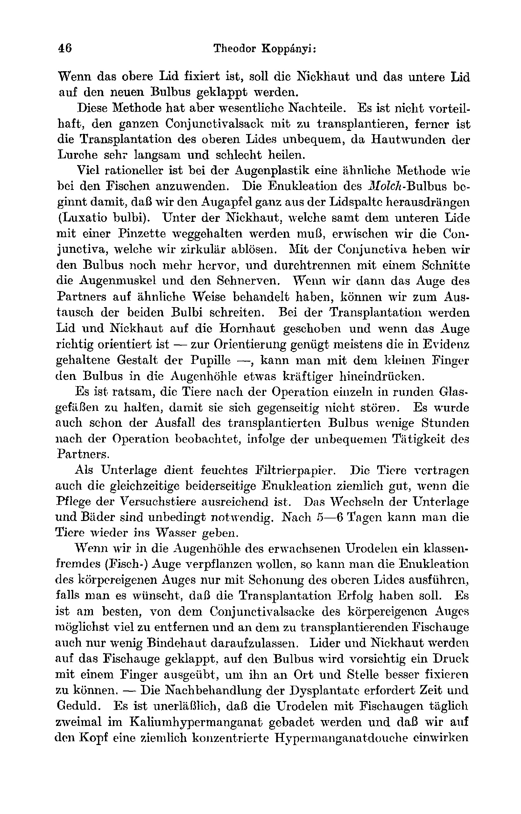
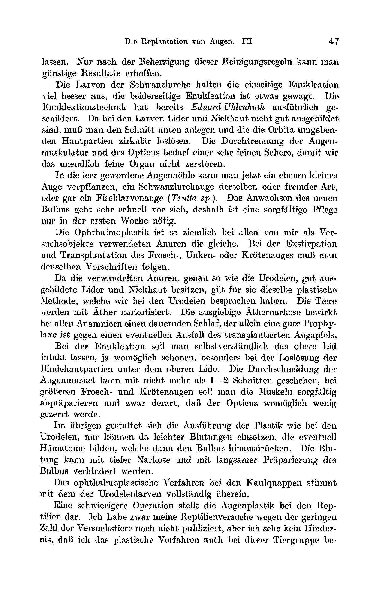

# The Replantation of Eyes.
## III. The Physiology of Replanted Mammalian Eyes.

By

Theodor Koppanyi.

*(From the Biological Experimental Institute of the Academy of Sciences in Vienna [Zoological Division].¹)*

With Plate I.

*(Received on 13 October 1922.)*

*Archiv für mikroskopische Anatomie und Entwicklungsmechanik*, vol. 99 (1923).

> **Full translation.** A complete English rendering of the running text of “The Replantation of Eyes (II)” (Koppanyi, 1923), including all tables, figure and plate legends, and footnotes. Numbers and table cells were transcribed from the page images, not the noisy OCR.

### Contents.

| | Page |
|---|---|
| I. The ophthalmoplastic procedure | 43 |
| II. The "case history" of the replanted eye | 49 |
| III. The reflexes | 53 |
| IV. On the functional testing of the replanted mammalian eye | 55 |

## I. The ophthalmoplastic procedure.

In the second part of this work (Durability and functional testing in the various classes of vertebrates) we briefly discussed the autophoric operative technique. In this section, however, we wish to treat the special eye plastic surgery somewhat more fully. Although this work bears the title "The Physiology of the Replanted Mammalian Eye," it is my intention to discuss the technique of the eye transplantations in the most diverse animal groups.

We shall illustrate the ophthalmoplastic procedure in fishes by one example: the crucian carp (*Carassius vulgaris* Nilss.). Every eye transplantation consists of two parts: of the enucleation and the reposition, both of which must be carried out in a single sitting. The transplantation of surviving eyes has hitherto not been attempted.

Two fishes are taken from a glass aquarium and narcotized. The narcosis is carried out in a small glass vessel with a deep water level, whereby a little ether must be dropped into the water. Complete narcosis requires 4–6 minutes. The narcotized fishes are stretched out on fish-boards, both specimens on their side, and indeed on one and the same side. The fishes are fastened to the board with two (1½ cm wide) straps;

> ¹ An abstract of this work appeared, with an identical title, as Communication No. 62 from the Biological Experimental Institute of the Academy of Sciences, Zoological Division, head H. Przibram, in the *Akad. Sitzungsanz. Wien*, No. 18. 1921.

fastened. Now we proceed to the enucleation. The conjunctiva is grasped with a fine forceps and lifted up into the height. With one of the curved scissors the conjunctiva is severed all around the limbus and the bulbus thereby laid bare. Now the muscles of the orbit can also be cut through. The conjunctival adhesion is loosened, and the orbit is washed out all around. The eye muscles are now first cut through and lastly the optic nerve, whereby a small piece of the optic nerve is to remain attached to the bulbus. Care must here be taken that the eye of the other fish comes to lie in the orbit just laid bare, so that there are now in fact two completely separated bulbi resting on the underlying surface; the eyeball is to have a moist support. One should take care here that, as far as possible, the same size of the bulbi is selected. — Around the bulbus we now place the conjunctiva in the correct position, so that it can later be transplanted; the bulbus is then fastened down at a certain place of the cornea with a colored stitch [in dye], in order, when one knows well which the front piece of the bulbus is, to be able to suture down the bulbus that is hanging from the conjunctiva. This marking of the bulbus will only be of use in fishes, since in the other animals the eye muscles serve well for orientation. The conjunctival suturing takes place, when one wishes to compare the eyeball with a clockface, at the place "12 o'clock."

Now the bulbi can be drawn out [exenterated] of the orbit for cavity-emptying (held fast with the front part of the forceps), and the orbit thereby quickly opened up in its whole extent. The marking enables the correct orientation. The bulbus drawn out for cavity-emptying [exenterated] cannot now, however, be inserted again. We loosen from the bulbus a considerable part of the conjunctival sac so as to be able to draw the bulbus around. We seek out the place of the conjunctiva on the bulbus and pull it forwards there, over the whole circle of the conjunctival sac that protrudes out of the orbit. Then the bulbus is laid down, whereby the cornea comes to lie on the underlying surface. By this the cornea is protected and the bulbus held down, which protrudes from the conjunctival sac. We turn back the upward-folded flaps of conjunctiva still present in the orbit, and according to experience the healing of the sclera and of the eye musculature is thereby brought about. The bulbus now shows here those natural "conjunctival protective walls," which one cannot esteem sharply enough and which protect the bulbus, severed from its supply, from drying out.

It is not advisable to enucleate both bulbi in one sitting. The bilateral enucleation can lead to severe disturbances of the central nervous system before one proceeds to the reposition. The transplantation of the second eyeball must be undertaken in a fresh operation.

After the operation has been completed, the animals are placed in small glass vessels, and indeed always no more than two specimens in one vessel.

## The Replantation of Eyes. III.

One should bathe the animals before and after the operation in a weak solution of potassium permanganate, in order to free them from harmful fungi. The potassium permanganate baths must, however, be renewed daily; where it is required, even several times a day. While one removes the fish from the glass vessels and lets them swim around in a large trough filled with potassium permanganate, the glass vessels are carefully cleaned out and then filled with the same lukewarm water as before. — Only with such cautious treatment against *Saprolegnia* infection has one [success].

When one carries out the eye plastic surgery on the eyeball of an alien class (*Salamandra*), then no change in the method previously described for fish plastic surgery is to be made. The salamander eye lies just as well embedded in the orbit as the fish eye lies embedded; nor is the loosening of the salamander eye out of the orbit any easier to perform. The fish eye, on the other hand, can be loosened without trouble. Marking of the eyeball can here be dispensed with, since one can already orient oneself well from the position of the eye muscles. — In the case of *Salamandra* the conjunctiva does not need to be sutured; indeed here in most cases the wound-healing process takes place without any conjunctiva at all. — In *Salamandra* the dysplasty [Dysplastik] heals twice as well as the reposition, but here, too, careful post-operative treatment is the prerequisite.

In adult salamanders the eye plastic surgery succeeds quite easily and yields a fine result; only the eye plastic surgery itself disturbs them little, which here plays an eminent role.

The operation is carried out under ether narcosis; the animals are thereby not fastened, and only moist filter paper is laid underneath. They are best, however, wrapped in a small piece of moist filter paper, so that during the narcosis the secretion exuded from the skin does not glue the bulbus into the wound holes.

Now one carries out the enucleation of the *Molch* [newt] eye, taking somewhat more care that the lower lid and the nictitating membrane are pressed down low, in order to be able to make the cut wide and to lay bare the whole bulbus. When the newt's eye is pressed out of the conjunctiva over its entire surface, the lower bulbus is to be opened up. By this, too, a circular wound-healing process takes place, without any conjunctiva at all. The lidded newt eye heals together when the upper lid is placed over the lower part of the lower lid as a transplant; and so that this is ensured, it is sutured down with the lower lid, and indeed under pressure, because the lower edge is to be brought, when the lid edge is placed over the lower lid, so that the lid and skin edges are sutured down [together]. One can also bring the upper lid over the lower lid by combining the laid-bare parts of skin with two or three sutures.

## Theodor Koppanyi:

When the upper lid is fixed, the nictitating membrane and the lower lid are to lie on the laid-bare parts of skin.

This method has an essential drawback. It is not advantageous to transplant along [with it] the whole conjunctival sac, and furthermore the transplantation of the upper lid is inconvenient, since the skin wounds of the amphibians [Lurche] heal very slowly and badly.

Far more rational, in the eye plastic surgery, is a method similar to that in the fishes. The enucleation of the *Molch* [newt] bulbus begins by our pressing the eyeball entirely out of the lid fissure (luxatio bulbi). The nictitating membrane, together with the lower lid, is held away with a forceps, while we ablate the conjunctiva circularly. With the conjunctiva we now lift the bulbus still further up, and by cutting through we sever the eye muscles and the optic nerve. When we have then treated the eye of the partner in a similar way, we can proceed to the exchange of the two bulbi. In the transplantation the lid and nictitating membrane are pushed onto the cornea; and when the eye is correctly oriented — for orientation the shape of the pupil, kept in evidence, mostly serves — one can press the bulbus, with the little finger, somewhat more vigorously into the eye socket.

It is advisable to keep the animals after the operation singly in round glass vessels, so that they do not disturb one another. The failure of the transplanted bulbus was also already observed a few hours after the operation, in consequence of the inconvenient activity of the partner.

As an underlying surface, moist filter paper serves. The animals also tolerate the simultaneous bilateral enucleation fairly well, when the care of the test animals is sufficient. The change of the underlying surface and of the baths is here essential. After 5–6 days one can place the eye [animal] back into the water.

When we transplant the eyeball of the adult Urodelans into an alien-class (fish) eye, we can perform the enucleation of the alien-related eyes only with disturbances; it must, as is desired, that the healing of the transplantation succeed. It is possible, however, to carry out the transplantation also with the conjunctival sac of the alien-class eye. The healing is nonetheless [secured], since one has to leave less conjunctival wound. Lid and nictitating membrane are glued with the finer forceps, and the bulbus can thereby be held closely fitting around it. The correct lid grasps over [it] under a pressure. — The narcotic treatment of the dysplasty requires time and patience. It is unavoidable that the Urodelans with fish eyes be bathed twice daily in potassium permanganate and that a fairly concentrated permanganate douche be poured over their head

## The Replantation of Eyes. III.

[over them]. Only with the observance of these cleansing rules can one obtain favorable results.

The larvae of the salamander tolerate the enucleation much better than the bilateral enucleation, which is somewhat hazardous. The enucleation technique has already been described in detail by *Edward Uhlenhuth*. Since in the larvae lid and nictitating membrane are not yet well developed, one must apply the cut below and ablate circularly the parts of skin that surround the orbit. The cutting through of the eye musculature and of the optic nerve requires a very fine scissors, so that we do not destroy the infinitely fine organ.

Into the now empty eye socket one can transplant an equally small eye, a salamander-larva eye of the same or of an alien kind, or even an eye from a fish larva (*Trutta sp.*). The growing-in of the new bulbus proceeds very rapidly; for that reason a careful tending is necessary only in the first week.

The ophthalmoplastic surgery is pretty much the same in all the Anurans used by me as test objects. With the extirpation and transplantation of the frog, fire-bellied-toad, or toad eye one must follow the same prescriptions.

In the metamorphosed Anurans, exactly as in the Urodelans, well-developed lid and nictitating membrane are present, so that the same plastic method holds good as the one we discussed in the Urodelans. The animals are narcotized with ether. The thoroughgoing ether narcosis effects in all amniotes a lasting sleep, which alone affords a good prophylaxis against the eventual failure of the transplanted eyeball.

With the enucleation one must, as a matter of course, leave the upper lid intact, indeed spare it where possible, especially in the loosening of the conjunctival parts under the upper lid. The cutting through of the eye musculature can take place with only 1–2 cuts; in the case of the frog and toad eye one must dissect out the musculature carefully and sever it, so that the optic nerve is strained as little as possible.

In the manifold operation in the plastic surgery on the eyeballs of these Anurans there are no difficulties; one can insert the eyeballs with only a slight bleeding, and the eventual blood clot can press out below the bulbus. The blood pressure can be prevented by the narcosis and by the slow preparation of the bulbus.

The ophthalmoplastic procedure for the frog agrees in the main with that of the Urodelans.

A more difficult operation now appears in the eye plastic surgery for the Reptilia. To undertake eye-replantation attempts of all kinds one must seek favorable conditions. Owing to this circumstance the Reptilia were not [accessible], indeed there were such hindrances that I could not undertake the plastic procedure for this animal group [either].

## Theodor Koppanyi:

[I will] therefore discuss it no further, save that it is not excluded that many an experimenter, precisely with these extremely favorable test objects, will wish to repeat or even carry the experiments further.

I have undertaken eye-transplantation attempts on the sand lizard (*Lacerta agilis*) and on the grass snake (*Tropidonotus natrix*), thus on one lizard and on one snake species.

The plastic method is the same in both reptile groups. These animals have the bulbi lying deep in the orbit, so that a luxatio bulbi is not feasible. The narcosis must be so complete that the animals can no longer make their characteristic eye movements; otherwise the operation is not feasible. Since the part of the eyeball visible between the lids represents only the smaller part of the anterior eye surface, the conjunctival sac is very difficult to grasp. It is advisable to make a 2–3 mm large canthoplasty (widening of the lid fissure) and only then to proceed to the shelling-out of the bulbus. Bleedings and hematomas often threaten, on account of the rather large wound. Also one should enucleate only one eye in a sitting. After the operation one brings lid and nictitating membrane into order (see earlier) and sutures up the canthoplasty.

The animals are kept in moist air, in order to forestall a desiccation of the cornea that otherwise very often sets in.

In the transplantation of the mammalian eye I always directed myself according to the same principles which I followed in the ophthalmoplastic surgery of the poikilotherms. Since I made most of the attempts on migratory rats [Wanderratten], I will confine myself in the description of the plastic procedure to these.

The part of the conjunctiva that lies opposite the nictitating membrane is grasped with a forceps and cut perpendicularly apart. Now one can comfortably take both [pieces of] nictitating membrane in the direction of the cut applied, above and below the bulbus, off one [another]; the deeper the nictitating membrane is cut through, the better it is for the confined inflexion [Einbiegung]. When we reach with the direction of the cut the nictitating membrane situated in the proximity of the eye-angle, one feels [it advisable] to lift up the nictitating membrane with a fine forceps, in order to avoid an eventual injury of the same. Furthermore one can in this way carry out a correct conjunctival transplantation. After the conjunctival sac has been slit open, we must remove the conjunctiva that has remained on the bulbus. Since this [does] not [come away] so simply, we remove the conjunctiva from the eyeball and bring it together in the proximity of the nictitating membrane. This method possesses a double advantage. Firstly, one can comfortably handle such a bulbus, since the elongated conjunctival edges, drawn together into one point, can be easily grasped with each [each]

## The Replantation of Eyes. III.

forceps. Furthermore this "conjunctival sling" serves for the marking of the eyeball.

Now the sling is grasped with a forceps and the upper lids are pulled strongly apart. Then the bulbus springs up out of the orbit, is pushed sideways by means of the sling, and so one can comfortably cut through the eye muscle and the nervus opticus. When one thereby proceeds carefully, so that *Tenon's* capsule is not pinched and the nerve is not strained, the operation can take place without blood loss. After the whole eyeball has thus been loosened, and we, by means of the conjunctival sling, can correctly orient the position of the bulbus over the lid, one can enucleate the other eye in the same way. The reposition of the enucleated eye takes place in such a way that the hanging conjunctival sling of the nictitating membrane is to lie closely fitting. No exophthalmos may occur; this has bad consequences. As soon as the bulbus no longer [protrudes] in the orbit, we are no longer exposed to disturbances on that account. With the reposition one should take particular care that optic stump comes to optic stump; the painful agreement of the other nerves is not necessary.

After the reposition one can suture the lids together or pierce them through with a fine insect needle. (One should thereby avoid every injury of the cornea!)

If bleedings were nevertheless not avoidable, one rinses out the orbit and the lids with antiseptic fluids, so that no crust can form over the lids.

## II. The "case history" of the replanted eye.

The transplanted fish eye enjoys the advantage that its cornea, on account of its stay in the water, does not dry out. In these transplanted [eyes] the cornea and the lens therefore tend to cloud over only seldom. The transplanted amphibian bulbus indeed remains unchanged in the proximity of the transplantation, [except] that the media cloud over; only the lens of the freshly transplanted frog bulbus is characteristic, [namely] the conspicuous miosis of the pupil — the iris becomes maximally narrow, so that the eye scarcely reflects [light] any more. Later, indeed, it relaxes a little again and reflects calmly. We notice in the ophthalmoscopic picture almost nothing abnormal, only in places it gives rise to a picture that calls Retinitis pigmentosa to mind. In places the cornea is sensitive, so that the cornea is thickened. In the metamorphosed cold-blooded animals the wound healing proceeds (as *Fujita* [Arch. f. vergl. Ophthalmologie, Bd. III, 1913] has already emphasized with regard to the restoration of the newt and frog retina respectively) in winter still much more slowly than in summer; in both cases, however, it requires at least 8 weeks.

*Archiv f. mikr. Anat. u. Entwicklungsmechanik Bd. 99.*  4 With the transplantation of the rat eye we kept to the practice of closing the lids. Only after 7–8 days should the sutures be removed; if one removes the insect needle already after 24 hours, as I did earlier, this can be of no benefit to the cornea. In the better cases, however, it is not at all necessary to open the eye forcibly. These bulbi, which retain their turgor after transplantation, exert such a pressure on the sutures that the latter tear of themselves. It is in any case a favorable sign when, after a few days, one sees the lids open and the slightly clouded bulbus spring forth. From now on the cornea can be observed. After transplantation the corneas become dull and gradually moderately clouded, and nothing can be seen of the iris. If the lacrimal glands were spared during the operation, and if in addition the moistening of the bulbus is provided for (the animals were kept, to be sure, not in a vapor-saturated, but also not in an all-too-dry atmosphere), then the danger of corneal desiccation does not threaten. The cornea should not be diffusely clouded, otherwise a clearing-up is improbable. Presumably it depends on the condition of the membrana descemeti and of the endothelium. For if the osmotic supply of the bulbus, which in the first periods is the sole one, is not sufficient, and the membrana descemeti and the endothelium are severely damaged, a diffuse corneal clouding probably results. Besides this, the cornea can suffer still other changes. Above all it can dry out, shrink, and the bulbus thereby falls into the condition of dry mummification. These bulbi are irretrievably lost. — Since with the enucleation all the trigeminus fibers, which condition the sensibility of the cornea, are severed, the cornea is in the first periods entirely anesthetic. Already *Magendie* made the observation that on the insensitive cornea inflammatory processes appear, which one is accustomed to subsume under the name "keratitis neuroparalytica." Whether the inflammation arises without external causes, or as a consequence of germ infection or foreign-body damage, is hard to decide; in the latter case the matter might be that the insensitive cornea cannot react, e.g., to incident dust particles with a blink of the lid, and so the foreign bodies cannot be removed from the cornea. The neuroparalytic corneal inflammation recedes of itself if the cornea becomes sensitive again in good time. But the traces of the disease processes that have been undergone are still to be seen even on the cleared cornea, in the form of very thin lines (corneal scars). A deep-reaching inflammation of the cornea, which occurs after transplantation and probably has its cause in lack of nutrition, is the parenchymatous corneal inflammation. It seizes also the endothelium and the membrana descemeti, and is in most cases the cause of the already mentioned diffuse corneal clouding. The inflammation can often occur with vessel development, in the deeper corneal layers. These vessels are of course not to be confused with the vessels which sometimes, often much later, grow handsomely through the cleared-up cornea. If, namely, the bulbus heals in as a foreign body, without function, it becomes overgrown with numerous small blood vessels. If, in the initial stage of the keratitis parenchymatosa, more favorable nutritional conditions arise, the inflammation can recede spontaneously. The cornea then becomes gradually clear and shining, the clouding breaks up into small flakes, which then disappear one after another. It also happens that a little fleck stubbornly refuses to clear up and persists for a long time.

The dullness and the normal superficial clouding of the cornea recede much more rapidly than the diffuse one. The slightly clouded cornea can clear up within a few days after the first week, whereas the diffuse one takes weeks, sometimes also 4–5 weeks. To be sure, all such cloudings recede slowly, as also the ophthalmologists report in man. In some cases I saw that the cornea was abnormally enlarged with the anterior bulbus portion (staphyloma corneae). After the clearing-up of the cornea, the pupil and the iris become visible. The pupil is maximally dilated, mydriatic. Before the cornea clouds over (thus in the most favorable case, in the first two days) the pupils are only moderately dilated. By now, however, a high-grade mydriasis is already present. With the ophthalmoscope we can now examine the background and find, in the successful cases, everything looking normal; only on the retina do we notice, in the vicinity of the whitish papilla nervi optici, connective-tissue proliferations (retinitis proliferans). If the iris and the corpus ciliare remain normal, the whole transplantation may be regarded as successful, for it can very easily also come, with clear cornea, to iris atrophy and ciliary-body degeneration.

The iris [Regenbogenhaut] can above all grow together with the cornea (anterior synechia) and thereby become immobile. It can also come to severe damages. Tears can occur in the pigment layer, indeed the iris tissue can become entirely atrophic and show numerous holes. Uveal pigment can wander out and press onto the lens capsule. Such atrophic irides can naturally no longer intercalate, no longer function. There can also come about a growing-together of the pupillary margin with the lens capsule, which likewise makes the iris immobile (posterior synechia). Also the ciliary body can show severe damages (cyclitis), which most often appear simultaneously with the atrophy of the iris (iridocyclitis).

The anterior chamber can in unsuccessful cases entirely disappear. Sometimes one can also see blood in the anterior chamber, which is resorbed with time.

Also the lens [Linse] is exposed to damages. The lens capsule can perish and the crystalline lens itself fall apart. The commonest and probably also most frequent change which the lens can suffer is the clouding of the lens, the cataract. The simple cataract naturally hinders the pupil play, but it causes no further damages. It probably owes its origin to trigeminus irritations; it occurs in 30% of the successful cases. After the extraction of the clouded lens the eye is entirely restored.

The cataract can, however, also appear in conjunction with iris and ciliary-body atrophy (complicated cataract). Such an eye is not to be regarded as successful, not on account of the cataract, but on account of the iridocyclitis.

In many cases it can come to a shrinking of the entire eyeball (phthisis bulbi), whereby not infrequently the cornea still gleams and yet no further details are to be seen through the eye. This comes probably from the iris and lens substances being entirely dissolved, fallen apart.

When the bulbi have remained 14 days in the orbita, then it is certain that they heal in, even without function. For it comes, unfortunately all too often and from causes hitherto not yet sufficiently investigated, to the eye, after it has enlarged abnormally, buphthalmically, simply falling apart. In the interior of such an eye there appears a panophthalmia, which prepares an all-too-rapid end for the eye. After a few days there lies in such an orbita merely a strongly clouded lens. It is interesting that the sclera and the rest of the inner ocular membranes heal in without exception.

Since one can never keep the rats sufficiently quiet, and the animals continually scratch the lid sutures with their paws, it is not excluded that an infection or even a direct mechanical damage of the graft is involved. But that inner causes too can play a role in the falling-apart, I will gladly concede. In any case the operation succeeds best when the rats are housed in clean glass vessels; then the danger of infection is least. The really successful cases were obtainable only in late spring and in the summer months, since the warmth accelerates the wound healing. In sharp contrast to the cold-blooded animals, prompt wound healing begins in the rats already after 24 hours; on the second day the bulbus can no longer be freed from the underlying tissue. The use of quite young and quite old animals is not indicated for the operation. In the Biological Experimental Institute in Vienna I operated, e.g., in the year 1922 on 30 animals, of which 26 perished, mostly precisely those that I had operated on in winter. In spring two animals succeeded without, two with cataract.¹

## III. The Reflexes.

Of the eye reflexes, which let us recognize already fairly early whether the transplantation was accompanied by success, the corneal reflexes and the pupillary reflexes are to be named.

The cornea that has already become clear, that has happily overcome the clouding, is still in most cases insensitive, i.e., it does not react to touches at all whatsoever. But it also possesses no deep sensibility; one can press the cornea firmly with a hard object, the animal does not react, no blink of the lid follows. The cause of the absence of the corneal reflexes is the interrupted trigeminus innervation of the cornea. The restoration of the corneal reflexes will thus indicate when the trigeminus fibers regenerate.

In the cold-blooded animals the regeneration of the trigeminus, and therewith the reappearance of the corneal reflexes, lasts, as was indeed to be expected, fairly long. It sometimes requires more than 2 months. It is perhaps not without interest to remark that even in normal cold-blooded animals the corneal reflexes suddenly fail, apparently without any noticeable cause.

Since in the rats the wound healing is considerably faster, the regeneration of the trigeminus fibers also proceeds much faster. Sometimes already after a few days, sometimes however only after 4–6 weeks, the corneal reflexes appear on the replanted eye. The regeneration speed of the trigeminus probably depends on the same causes which also condition a more rapid or slower complete healing-in of the bulbus. The restoration of the corneal reflexes is indeed nothing unprecedented, since we know that transplanted skin pieces also become sensitive with time. On the other hand we know that the trigeminus is one of the best-regenerating nerves. With this establishment it is in accord that the corneal reflexes also appear on those eyes which are not at all functionally capable, which even have atrophic irides and ciliary bodies.

The testing of the corneal sensitivity should take place by means of cotton wool or silk thread, so that the cornea is not unnecessarily irritated. Much more important than the corneal reflexes are, for the assessment of the functional capacity of the replanted eye, the pupillary reflexes.

The fish species used up to now for the experiments have no pupillary reaction perceptible distinctly with the naked eye, so as to yield a favorable object for the function testing.

> ¹ In the really functional condition, therefore, only two eyes were preserved.

In the frog amphibians [Froschlurche], whose cornea ordinarily does not cloud over at all, one sees, immediately after the transplantation, miosis of the pupil, which then appears to remain constantly narrow. After 5–6 weeks, however, we see that the miosis gradually lets up and the pupil, whose earlier shape varies greatly among the amphibians according to their species, again becomes large and of medium size. From this moment on the pupillary reflexes are elicitable. We must of course be clear about it that the reflexes do not speak in the slightest degree for the light-sensitivity of the transplanted eye, since *Brown-Séquard* has indeed shown that in the amphibians the pupillary closure follows automatically.

Essentially different lie the relations in the mammals. Before the clouding on the replantate clears up and the iris becomes visible, one sees that the pupil of the replanted eye is of medium size (otherwise the pupil of the rats is, as a consequence of the colossal sphincter tonus, tiny and narrow) and entirely light-rigid. When then the cornea has cleared up again, one sees that the pupil is maximally dilated. In most cases the pupillary reflex is elicitable already after the clearing-up of the clouding, when not yet, then a few days later for certain. The pupillary reflex at first proceeds only very slowly (the contraction lasts approximately 60–80 seconds) and does not thereby attain a really maximal narrowing. With progressing healing the reflexes become ever prompter, until they attain the normal reaction speed and duration. This is, in the rats, approximately 4–6 seconds. So prompt a pupillary reaction as in man does not exist in the rodents.

Now one asks oneself: how are these reflexes to be assessed for the appraisal of the functional capacity of the replanted eye?

In the mammals the pupillary reaction proceeds via the oculomotorius; consequently the reaction requires that these two nerves are preserved in a functionally capable condition. To be sure, there are pupillary reactions which can be triggered sympathetically, e.g., by shock effect. Even in man *Hertel* observed that the narrowing of the pupil of the eye blinded by optic-nerve injury sets in when the eye is irradiated with electric light, but is absent with daylight and gaslight. *Hertel* himself ascribes this reaction to the direct action of the light on the iris tissue, especially on the sphincter muscle. He also states, however, that this reaction takes a long time to run its course, in any case many minutes, not merely seconds.

One was inclined to the view that this autonomous pupillary reflex is to be ascribed to the action of the ultraviolet rays contained in the arc light. In order to meet the objection that the matter, in the transplanted eyes, were merely about such an action of the ultraviolet rays, I switched before the light source, with which I usually triggered the pupillary reaction, a saturated quinine sulfate solution, which as is known has the property of absorbing the ultraviolet rays. The light that goes through such a quinine sulfate vessel is as good as free of ultraviolet rays. Even through such ultraviolet-free light the pupillary reaction was elicitable in my experimental rats.

*Groß*, a pupil of *Bethe's*, and other authors emphasized that in the mammals, so also in the rabbit, the pupillary reflex is optic, if one switches off fright-effect, etc. Thus, in a rabbit whose opticus had been severed intracranially, the pupillary reaction also failed to appear even under intense illumination. The rabbit experiments, on which a later treatise reports, yielded that even in this animal with transplanted eyes the pupillary reflex is elicitable, even when one switches off all disturbing conditions.

There speak therefore all signs for it, that we in our rats have to do with optic, not automatic pupillary reflexes.

Nevertheless the physiological reactions alone are, according to our opinion, no sufficient proofs of a functional capacity of the replanted eye. Without them, to be sure, a functional efficiency is unimaginable, but they alone do not suffice as proofs. We must resort to psychological-biological methods in order to decide this question definitively.

## IV. On the function-testing of the replanted mammalian eye.

In a preceding treatise (this work, Part II) we have already described the methods with which one can establish the light-perception of the experimental animals. We have also discussed the procedure with whose help it was achieved to prove the real seeing of the operated frog amphibians ("feeding-method"). We have also become acquainted with the light-sensitivity of the transplanted rat eyes.

At this point we wish to supplement these methods with a few more, which are to prove to us that the rats with transplanted eyes behave like seeing animals.

If one demands of us that we are to prove that these animals see, one demands something impossible. Firstly, we cannot look into the soul of the rats, but one can also not question them about it or even have them read. We must therefore content ourselves with establishing whether these rats behave as normal or as blind animals. For this serve indeed the control experiments with the normal and artificially blinded (deprived of both eyes) rats.

prompted, then a blink and a defensive reaction follow promptly. Transplanted eyes, whose cornea is indeed sensitive but whose iris is atrophic, do not show this defensive reaction, which therefore cannot occur in response to a stimulation of the trigeminal nerve.

There is yet another important method for testing the visual capacity of the transplanted eyes, namely the training experiment [Dressurversuch], but this procedure will be reported elsewhere (cf. *Jellinek*, Part VII).

## Bibliography.

*Brown-Séquard*: Recherches expérimentales sur l'influence excitatrice de la lumière, du froid et de la chaleur sur l'iris. Journ. de physiol. de l'homme et des animaux. T. 2. 1859. — *Groß, Oscar*: Untersuchungen über das Verhalten der Pupille auf Lichteinfall nach Durchschneidung des Sehnerven beim Hund. Pflügers Arch. f. d. ges. Physiol. Bd. 112. 1906. — *Fujita, H.*: Regenerationsprozeß der Netzhaut des Tritons und des Frosches. Arch. f. vergl. Ophthalmol. Bd. 3. 1913. — *Hertel*: Sehnervdurchschneidung bei jungen Tieren. Graefes Arch. f. Ophthalmol. Bd. 46. 1898. — *Jellinek, A.*: Die Replantation von Augen. VII. Dressurversuche mit optisch verschiedenen Futtergefäßen. Akadem. Anz. Nr. 10. 1922. — *Koppányi, Th.*: Die Replantation von Augen. II. Haltbarkeit und Funktionsprüfung bei verschiedenen Wirbeltierklassen. Akadem. Anz. Nr. 7 u. 8. 1921. — *Magendie*, cited after *Gaule, J.*: Der Einfluß des Trigeminus auf die Hornhaut. Zentralbl. f. Physiol. Bd. 5. 1891. — *Marenghi*: Section intracranienne du nerf optique chez les mammifères. Arch. ital. di biol. T. 37. 1902. — *Przibram, H.*: Die Replantation von Augen. I. Die Methode der autophoren Transplantation. Akadem. Anz. Nr. 7 u. 8. 1921. — *Waugh, Ch.*: The role of vision in the mental life of the mouse. Journ. of comp. neurol. a. psychol. Vol. 20. 1910.

## Explanation of the figures.

*(From film footage of the Federal Film Office [Bundesfilmstelle] in Vienna.)*

### Plate 1.

**Fig. 1.** Operation. A rat stretched out (mounted).  *(figure not reproduced)*

**Fig. 2.** Operation. Luxatio bulbi.  *(figure not reproduced)*

**Fig. 3.** Operation. Piercing through of the eyelids.  *(figure not reproduced)*

**Fig. 4.** Operation. The pierced-through pair of lids.  *(figure not reproduced)*

**Fig. 5.** Operation. Nipping off of the lid needle.  *(figure not reproduced)*

**Fig. 6.** The rat with transplanted eyes in the dark (negative phototaxis.)  *(figure not reproduced)*

**Fig. 7.** Piebald rat with transplanted, cataractous eye.  *(figure not reproduced)*

**Fig. 8.** Piebald rat with fully functioning, transplanted eye.  *(figure not reproduced)*

**Fig. 9.** Agouti-colored rat with replanted eyes.  *(figure not reproduced)*

**Fig. 10.** Albino rat with transplanted albino mouse eye.  *(figure not reproduced)*

**Fig. 11.** Jumping experiments on a rat with transplanted eyes from a low pedestal.  *(figure not reproduced)*

**Fig. 12.** Climbing down of a blind rat at the same little jumping table.  *(figure not reproduced)*

**Fig. 13.** Jump of the rat with transplanted eyes from the raised little jumping table.  *(figure not reproduced)*

**Fig. 14.** Jump of the blind rat from the raised little jumping table.  *(figure not reproduced)*

(Figs. 11–14 are negatives, so that the dark shabrack [saddle-cloth marking] of the rat's front part appears white.)

Table of the successful cases of eye transplan-tations in the brown rat (*Epimys norvegicus* Erxl.).

| Date of experiment | Color of the experimental animals | Type of operation | Figure | Corneal reflex | Pupillary reflex | Histological examination | Mirror finding [ophthalmoscopic finding] | Biological behavior |
|---|---|---|---|---|---|---|---|---|
| I. Series. Late autumn 1920 (shown Biolog. Ges. [Biological Society] Vienna 11. XII. 1920) | (2)¹) albino (2)¹) agouti-colored of which 1 ♀ (wild) | homoioplastic | 9 | positive | negative¹) | in the examined specimens no retina, degenerated optic nerve | cannot be obtained (in one agouti-colored one perhaps red background light) | Sometimes negative phototaxis toward strong light (jumping test not carried out). |
| II. Series. Spring 1921 (shown 4. VII. Ophthalm. Ges.; and 7. VIII. 1921, Int. ophth. Congress Vienna) | 4 multicolored (piebald or black) | homoioplastic | (see *Kolmer*!) | positive | positive | 3 examined: in 2 specimens partly preserved retina and optic nerve. (1 still to come for examination) | red background light; Retinitis proliferans | Negative phototaxis toward strong light; positive toward weak light rays. Jumping test positive; in the 4th animal, training experiments on optical signs positive after 8 months. |
| III. Series. Summer 1921 (1 specimen shown in the zool. bot. Ges. [Zoological-Botanical Society] Vienna, 11. XI. 1921, and K. ungar. naturwiss. Ges. [Royal Hungarian Natural Science Society] Budapest, 17. XII. 1921) | 2 multicolored (black) 1 albino | homoioplastic heteroplastic (albino mouse eye onto albino brown rat, unilateral) | — 10 | positive positive | positive | (the animals that perished after 6–7 months in the absence of the experimenter could not be subjected to histological examination) | not carried out | Jumping test positive. (Jumping test not carried out because of merely unilateral replacement.) |
| IV. Series. Spring 1922 (shown on the occasion of the Heredity Congress [Vererbungskongress] Vienna, 28. IX. 1922) | 2 multicolored (piebald) | homoioplastic | 7 and 8 | positive | positive | alive at the time of writing (December 1922) | as in Series II | Jumping test positive. In one animal training experiments positive after several months. (The second animal got a cataract and could therefore not be optically trained.) |

Sum of those examined up to the end of 1922: 10 cases, of which 1 heteroplastic

> ¹ Similarly operated animals showing no pupillary reflex, but indeed a corneal reflex, I obtained later in fairly large numbers; but since one cannot regard these animals as truly (functionally) successful cases, they were later not counted in; alloplastically transplanted eyes have always perished after a shorter or longer time, and these cases are therefore not enumerated. Since at the beginning this behavior was not heeded, percentage figures of the successful cases cannot be given.

*Archiv f. mikr. Anat. u. Entwicklungsmechanik Bd. 99.*

**Fig. 1.**  *(figure not reproduced)*

**Fig. 2.**  *(figure not reproduced)*

**Fig. 3.**  *(figure not reproduced)*

**Fig. 4.**  *(figure not reproduced)*

**Fig. 5.**  *(figure not reproduced)*

**Fig. 6.**  *(figure not reproduced)*

**Fig. 7.**  *(figure not reproduced)*

**Fig. 8.**  *(figure not reproduced)*

Koppányi, Replantation von Augen. III.

*Plate 1.*

**Fig. 9.**  *(figure not reproduced)*

**Fig. 10.**  *(figure not reproduced)*

**Fig. 11.**  *(figure not reproduced)*

**Fig. 12.**  *(figure not reproduced)*

**Fig. 13.**  *(figure not reproduced)*

**Fig. 14.**  *(figure not reproduced)*

Verlag von Julius Springer in Berlin.

## Figures

**Fig. 1-8.**

**Plate 1 (Abb. 9-14)**

---

*Translator's note.* One of the Biologische Versuchsanstalt (Vienna Vivarium) papers flagged on the project site as a modern rediscovery target. Claims are rendered as stated in the original, not endorsed.
