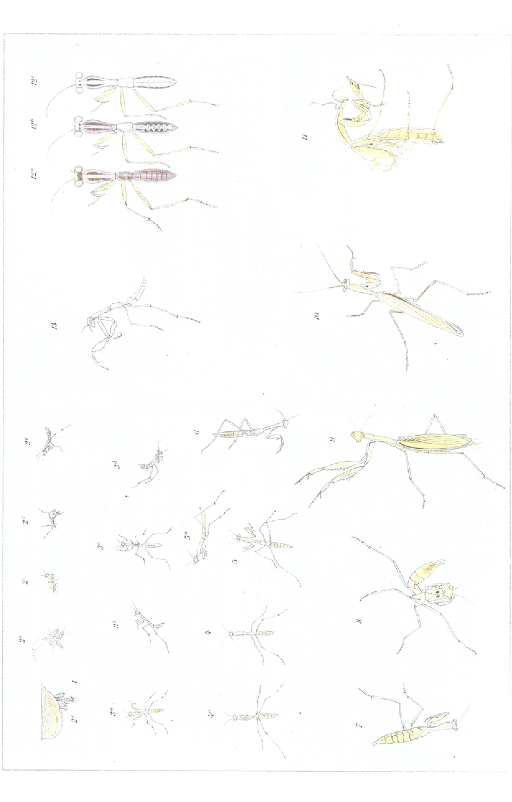

# Rearing, Colour Change and Regeneration of our European Praying Mantis (Mantis religiosa L.).

By

**Hans Przibram,**
Privatdozent at the University of Vienna.

(From the Biological Experimental Station in Vienna.)

With Plate XXVI.

Received on 23 February 1907.

*Archiv für Entwicklungsmechanik der Organismen*, vol. 23 (1907).

> **Full translation.** A complete English rendering of the running text of “Rearing, Colour Change and Regeneration of our European Praying Mantis (Mantis religiosa L.)” (Przibram, 1907), including all tables, figure and plate legends, and footnotes. Numbers and table cells were transcribed from the page images, not the noisy OCR.

### Table of Contents

|  | Page |
|---|---|
| I. Procurement of material and statement of the problem | 600 |
| II. Rearing | 602 |
| III. Experiments on the causes of colouration | 605 |
| IV. Regeneration experiments | 611 |
| V. Summary | 612 |
| VI. Bibliography | 612 |
| VII. Explanation of the figures | 613 |
| Table (extract of the experimental protocols) | 614 |

## I. Procurement of material and statement of the problem.

The favourable experiences which I had had with the rearing of an Egyptian praying mantis (*Sphodromantis bioculata* Burm.) (1906) encouraged me to undertake also the rearing of our European praying mantis, in order to be able to continue the experiments on colour change and regeneration of the praying mantises [*Fangheuschrecken*] without having to wait for a new consignment of *Sphodromantis*.

The data available in the literature on the attempted rearing of our *Mantis religiosa* L. gave little ground for hope. RÖSEL (1761), PAGENSTECHER (1864), TASCHENBERG (1877), FABRE (1897) report on the failure of their undertaking, which set in at earlier or later stages. But since PAWLOWA (1896) was likewise unable to rear *Sphodromantis*, the unsuitability of the species *Mantis religiosa* need not be to blame for the failure. In fact, in 1905 Herr DUBUISSON succeeded — as I reported in my earlier work (1906, S. 150, note) — in rearing single specimens of *Mantis religiosa* up to the imago.

In the same year the rearing succeeded for me also. Only I soon became aware that this species by no means offered those favourable rearing conditions which I had learnt to value in its Egyptian relatives. As the earlier observers had described, the hatched-out little animals fell upon one another, and, left together in a cage, in the end always only a single specimen remained, even though it might still have a great deal of food (plant lice [aphids], gnats) made available to it. There therefore remained, in order to obtain a larger number of transformed animals, nothing else but to isolate the little animals completely. But even these animals — or perhaps precisely these — proved, even with so abundant a fare as the fratricides [the surviving cannibals] were able to obtain, on the one hand little resistant, and on the other hand yielded no very favourable results. Further victims were demanded by the regeneration experiments, since the larvae of *Mantis* also withstand the injuries inflicted on them less easily than those of *Sphodromantis*.

When at last the last imagines, females, luckily hatched out, it turned out that no mating-capable males were any longer alive at the same time; so a second generation could not be reared. Shortly afterwards I received, through the kindness of Herr H. GUYOT in Helouan (near Cairo), a living egg-packet of *Sphodromantis*, so that I could carry on the breeding of this much more readily reared species and already obtain the second generation. Herr GUYOT obtained the *Mantis* eggs I had sent him only at a quite later place [later point in the season], and they yielded no result. I owe Herr GUYOT the warmest thanks, to be expressed elsewhere; the account of the new experiments on *Sphodromantis* will follow in a third communication on the praying-mantis breedings.

However difficult the rearing of our native praying mantis turned out to be, just as easy is it to procure the animals in the vicinity of Vienna. They occur there, namely in the neighbourhood of the vineyards, on forest clearings [*Waldblößen*] with sloping, grass-grown limestone, as imago in the month of September, as long as the temperature has not sunk too low. At Baden near Vienna, within a few hours a dozen and more sexually-mature animals could be captured. The animals proceed very readily to egg-laying in captivity. Specimens which I received sent from Istria and Croatia had, in the paper bags into which they had been put for the purpose of isolation during the journey, already deposited cocoons.

With some care it is also not difficult to bring about mating in captivity. This is best undertaken on the next morning after feeding.

The task of the present communication is to describe, first, the rearing of *Mantis religiosa* L. from the hatching out of the egg up to the imago, paying attention to external factors not specially considered in the *Sphodromantis* work (humidity, temperature, colours of the natural surroundings) and to the colouration, to examine the colour change, and finally to demonstrate that the genus *Mantis*, like *Sphodromantis*, is likewise capable of regeneration.

The significance of these questions, in order to discuss them, has here been opened up largely by the *Sphodromantis* work, so that I may spare myself reference to the relevant places. That *Mantis religiosa*, like *Sphodromantis*, occurs in green, brown and yellow, in more or less numerous transitional shades, is found again and again, and is indeed thereby confused, since in some works the colour alone (independently of head and thorax) is given (e.g. TÜMPEL, 1901, S. 255).

## II. Rearing.

In the year 1904 a larger number of cocoons of *Mantis religiosa* had been obtained. They were treated just as had proved favourable for *Sphodromantis*, namely sprayed daily with a fine atomizer at a room temperature of about 25° C. But it turned out that under this treatment no larvae hatched, and when the cocoons were opened in spring 1905, all the eggs were dead. Since it is repeatedly stated that un-sprayed, completely unattended cocoons hatch out, it seemed to be a matter of too great a humidity. The cocoons of the following year (1905) were therefore brought, partly, into moist glasshouse-rooms in which the spraying could be omitted altogether, partly left in the rooms but sprayed only once weekly. Also in the open, packets were kept, protected against the greatest inclemency of the weather. This time the most cocoons yielded larvae, at higher temperature earlier, at lower later. Measuring experiments on the influence of temperature on the velocity of development and movement (VAN T'HOFF's rule)

will be reported, in comparison with those on *Sphodromantis*, in the third communication.

### 1. Stage [Stadium].

(Plate XXVI Fig. 1.)

The egg-packet of *Mantis religiosa* has often been described in detail. As against *Sphodromantis*, it generally shows along the entire convex side a more outstretched form for the emergence of the larvae, whereas in *Sphodromantis* it is condensed merely at one end, in the form of a cluster, for the coming-forth. About the hatching of the *Mantis*, RÖSEL (1761, S. 91) already reports: »Five days¹) long I had repeatedly observed these lumps, when I noticed on them a quite particular change: for in the region where it appeared as if divided lengthwise, on the upper surface in the middle, by a depression, there came forth from it, little by little, in a doubled row, various oblong egg-shaped bodies, which stood densely against one another and all had the same length and form, and out of these there crept, soon thereafter, here and there, little living creatures.« In the egg-packet the *Mantis*, as a rule, likewise hatched out in the early morning; only that here too I could each time hardly observe it just at the hatching, and can only confirm the observations of RÖSEL. Here too, as in *Sphodromantis*, this first stage lasts only the short time, namely up to the working-out of the larvae from the cocoon-skin [embryonic membrane]. About the working-out and the little teeth present for this purpose, similar to those of clearwing-moth pupae [*Sesienpuppen*], PAGENSTECHER, PAVLOVA and GIARDINA have already given detailed accounts. The first moult follows while [the larva is] hanging on the egg-cocoon.

### 2. Stage [Stadium].

(Plate XXVI Fig. 2 a—c.)

RÖSEL reports further: »As soon as such a young creature had crept out of the eggs, it ran away as fast as an ant, as e²) shows, and the empty husk of the egg, which previously looked yellow, was now quite white and transparent like a bladder, which however came about because the young walking leaves³)

> ¹) Since receipt of the packet, thus after the first laying.
> ²) Of the RÖSEL figure.
> ³) RÖSEL names the praying mantises (*Mantes*) in German »walking leaves«; it is by no means *Phyllium* or the like that is to be understood thereby.

at the beginning all had a beautiful ochre-yellow or orange-yellow colour, which however, after the lapse of half an hour, changed into a browner one, as Fig. 3¹) shows, indeed turned quite brown.« These observations too could be reproduced almost unchanged. I would only add that the just-hatching larvae were almost white and only began to colour themselves yellow later, as well as that the eyes too were already coloured dark green during the 1st Stage.

The 2nd Stage lasted 8—14 days and has at first a length of about 6 mm (2½ mm thoracic length). After the first period the colouration passes over into a darker brown.

### 3. Stage [Stadium].

(Plate XXVI Fig. 3 a—d.)

Finally the skin is stripped off and remains hanging, distinctly soot-grey, with a breathed-on [matte] appearance. The hatching *Mantis* possesses at first again a very pale colouration; only the hindmost end of the abdomen is orange-yellow, towards the tip even dark-brown. This pale colouration is repeated at each moult, but here too passes over rather quickly into the later brown, yellow or green colouration.

The 3rd Stage lasts about 14 days and as total length one may reckon 12 mm. From the same stage of the *Sphodromantis* it is to be distinguished at the first glance by the slender form; not only the males, which retain the slender form later on, but also the females show at this age-stage the strong elongation of the body and of the two hinder pairs of legs.

### 4.—6. Stage [Stadium].

(Plate XXVI Fig. 4, 4 a, 5, 5 a and 6.)

About these next stages there is nothing new to report; the slenderness is mostly still retained, and no distinct wing-sheaths are to be perceived. The colour was everywhere light-brown, often darker striped along the length. Duration in each case 14 days and an increment of 6 mm each.

### 7. Stage [Stadium].

(Plate XXVI Fig. 7.)

This stage is usually rather different from the preceding ones, since the form becomes more squat, the wing-sheaths come forth standing off one behind another, and the antennae

> ¹) Of the RÖSEL figure.

♂ appear strongly thickened at the base. It corresponds about to the 8th Stage of the *Sphodromantis*. Sometimes this form is already adopted in *Mantis* at the 6th Stage; there is then, in all, one moult fewer than usual to be recorded. Time-duration and length-increment of the 7th Stage are scarcely different from the preceding. Isolated specimens showed green colouration.

### 8. Stage [Stadium].

(Plate XXVI Fig. 8.)

The 8th Stage, the nymph, is already very similar to the transformed praying mantis, only the wings are visible merely as somewhat over-one-another-pushed sheaths. The nymph in many cases assumes the so-called frightening-attitude characteristic of *Mantis*. All the reared nymphs were pale-yellow coloured; those found in nature mostly green or brown, darker striped. Duration and size-increment as with the previous stages.

### 9. Stage [Stadium].

(Plate XXVI Fig. 9, 10, 11.)

The imagines hatching from the reared nymphs were all yellow or yellow-brown, seldom with a very faint greenish tinge. More than eight moults did not come to observation; on the other hand there sometimes came, as mentioned, merely seven¹), in that instead of the 4.—6. Stage merely two seemed to be present.

It is interesting that the smaller *Mantis religiosa*, as against the larger *Sphodromantis bioculata*, exhibits so much smaller a moult-number (seven to eight against nine to eleven), connected with a shorter developmental time. It would perhaps be worth the trouble to look into whether the large, southern *Mantis* approach the *Sphodromantis* in these points.

## III. Experiments on the causes of colouration.

Through experiments on *Sphodromantis* I had arrived at the following conclusion (1906, S. 190): »The appearance of the green-colouration in the brown-hatching larvae is bound neither to light (dark-cultures) or

> ¹) As PAGENSTECHER already set right in 1864 on the basis of partial rearing and comparative observation of later stages, but not four, as TÜMPEL, following older authors, still gives in 1901.

chlorophyll- or etiolin-containing nourishment (raw-sugar- and *Psychoda*-feeding), nor to the colour of the surroundings (coloured little boxes); the colour change is rather a more sudden one (electrical stimulus-injuries), a ›physiological‹ one, and seems explicable neither through the hitherto known laws of heredity nor through Selection.«

With temperature, humidity and mechanical agencies (determined injuries) no proper experiments had been carried out, since at first I had been concerned only to test those factors which had been made responsible, from one side or another, for the green-colouration. Only when these had been eliminated by the negative outcome of the experiments did I think of approaching now also those factors which are otherwise made responsible for brown-colouration; these had, in consequence of the childless dying-out of my first experimental animals, remained undone and had been overlooked in *Mantis*. At the same time I wished to test once more whether a direct adaptation to the surroundings takes place when their colours are presented not through glass panes or glued-on paper, but through natural objects. For this purpose some terraria were stocked with quite many green plants, moss, grass, green leaf-plants, others with brownish-yellow foliage, earth, red leaf-plants. The latter belonged, as blood-varieties [colour-varieties], to the same species as the green ones, and were populated by the same green plant-lice [aphids] which served the young *Mantis* as first nourishment.

In order to attain as great as possible a difference with respect to humidity, some cages were converted into vapour-saturated rooms by glass-enclosure, the others were left without such enclosure; the former were sprayed very strongly, these only very weakly. The different temperature was attained by setting them up in differently tempered rooms, namely one batch was placed at 17° C., another at 27° C., a third at 37° C. (average temperature).

From the seven factors: green surroundings, brown surroundings, humidity, dryness, and the three temperatures, twelve combinations would result:

| | | | | | | | | |
|---|---|---|---|---|---|---|---|---|
| 1) | green, | moist, | cold | (17°) | 7) green, | dry, | cold | (17°) |
| 2) | brown, | – | – | ( – ) | 8) brown, | – | – | ( – ) |
| 3) | green, | – | warm | (27°) | 9) green, | – | warm | (27°) |
| 4) | brown, | – | – | ( – ) | 10) brown, | – | – | ( – ) |
| 5) | green, | – | hot | (37°) | 11) green, | – | hot | (37°) |
| 6) | brown, | – | – | ( – ) | 12) brown, | – | – | ( – ) | Of these I set up all except 11 and 12.

I omitted these two dry cultures at 37° C. from the outset as impracticable. For at such a high temperature, which is no longer far from the maximum (about 42° C.), the animals namely have a very strong thirst; if one sprays only a little, the water evaporates very rapidly at this temperature; if one sprays more, then again no proper boundary against the cage designated as "moist" can be established. An error from this omission is hardly to be feared, since, as we shall see, the moisture content seems to play no role with respect to the colour.

Besides these cultures, control cultures kept moderately moist were also reared, which were exposed to about 22–25° C. (designated in the table as mean temperature).

It would be idle to consider the individual cultures separately. The appended table gives the data from which the following remarks have resulted.

### a. Environment.

Nowhere has any phenomenon shown itself which would point to an adaptation of the colouration of the young mantids to the environment offered as true to nature as possible. The brown little animals were able to retain their colour, even in the green cages, up to the imaginal stage. Likewise, in the terraria planted with red plants and strewn with autumn foliage, no approximation of the pale brown of the young *Mantis* to these more saturated colours was observed. Nor did the larvae seek out those spots of the cage which happened by chance to be coloured most similarly to themselves. A strong phototaxis drove them toward the window side of the cage.

### b. Moisture.

The *Mantis* reared in a vapour-saturated or in a relatively dry atmosphere differed in nothing from one another. Moisture seems therefore here not to have a colour-altering influence, such as was observed for instance by Pictet on butterflies. If we consider the conditions in the open, such an influence in *Mantis* would have to affect all specimens developing at the same place and at the same time in the same way, since — not as in the case of butterflies — the more or less exposed point of attachment of the resting pupa does not come into consideration; as is well known, however, all colours are found in freshly transformed *Mantis* at the same place, so that, in agreement with the experiments, the ineffectiveness of moisture results also in the open.

### c. Temperature.

Although in *Sphodromantis* at the same temperature (about 25° C.) both brown and also green specimens had come about, I nevertheless placed at the outset a certain hope on the alteration of temperature, since in stick insects I had observed a decided increase of brown pigmentation with rising temperature. Added to this was the fact that the temperature of 25° seemed to be precisely the one which occasioned the transition of the green colour into the brown. It might therefore have been the case in the experiments on *Sphodromantis* that things lay precisely at this boundary, so that now brown, now green colouration predominated. I therefore endeavoured, in the new experiments, to establish temperature differences as great as possible, and to expose each individual rearing always to a temperature as constant as possible. For the sake of easier utilization of the data for measurements of the acceleration of growth with increasing temperature, intervals of 10 degrees were to be chosen. With this the selection of 3 temperatures was facilitated, for the uppermost must not come too close to the maximum of the permanently endurable temperature lying at about 42° C., the lowest had still to offer the animals sufficient warmth that they did not fall into cold-stiffness or into such slight desire for movement that they took no more food. Now it had shown itself, in the preliminary experiments with the keeping of the *Mantis* cocoons, that the temperature 17° C. had to be exceeded if the larvae were to be at all capable of hatching out. It could therefore presumably not be gone down lower than 17° C. Hence as cold 17° C. was determined, as warmth the next 10-degree-higher temperature 27° C., as heat 37° C. The latter temperature was the highest permissible one, since after all a constantly perfect functioning of the heating is not to be attained, hence some latitude has to be left for it, so that the maximum is not exceeded in the event of a rise.

### α. Cold (17°).

The cold animals showed a physiological colour change, which was elicited through the influence of light. The animals were taken from two egg-packets, whose remaining siblings, set up in the warmth, let no such influence be recognized; on the other hand, there was dryness or moisture without influence on the colour change. The little animals, after they had hatched out at about 22° (in the moist atmosphere of a glasshouse), were of brown colouration; only the forehead, eyes, legs with the exception of the joints were greenish (Pl. XXVI Fig. 12 *a*). Like all the other cages, their cages too were so set up that they received abundant, but only diffuse, daylight. If now such little animals were taken from their cage and exposed to the direct rays of the sun, then one saw a green shimmer spread itself over the body (Pl. XXVI Fig. 12 *b*) and finally, sometimes already after a few minutes, almost the whole animal was green (Pl. XXVI Fig. 12 *c*). The schematic illustrations indicate in what way the drawing-together of the brown colour proceeds. This physiological colour change ran off again just as rapidly in the opposite direction when the animals were brought back again into their cages. The substratum played, so far as I could observe, no role. This temporary turning-green strengthened my hope that at the low temperature a lasting favouring of the green colouration would result. But it proved deceptive. All the cold animals, after they had lived in the dryness up to 24 days, in the moisture up to 38 days without a further (second) moult, perished in their brown colouration. It is just that the *Mantis* (and a single animal later turned out to be *Sphodromantis*) are able at 17° C. to live on for only some time, but not to develop further.

### β. Warmth (27°).

The next 10 degrees higher temperature let appear only yellow *Mantis*. Of the differently set-up imagos...  ...obtained (Pl. XXVI Fig. 11); the other equally-kept larvae had however, up to the stage which they reached at all, likewise remained brown. How little the one greenish specimen, obtained at relatively low temperature, signifies, the heat-experiments prove.

### γ. Heat (37°).

The heat animals delivered beautifully canary-yellow imagos; for the most part they had been yellowish throughout their entire developmental period. Only a single specimen displayed a green colouration after the sixth moult (Pl. XXVI Fig. 7), which seems to me to speak for the fact that with the yellow colour too a direct dependence on temperatures may be involved.

It seems to me most plausible to see in the yellow colour a "captivity colour," which is to be ascribed to a weakly pathological metabolism; such as is also found now and then in nature [Xanthorrhismus, Albinismus].

In particular one is led to the action of oxygen-deficiency, a factor which indeed seems to be generally responsible for pale colouration (outside of light). Especially the pigmentation of the insects is a process much favoured through oxidation. This chemical side of the colour-question I have already touched upon in a short communication (1906³, compare also 1906¹), together with the question of the morphological seat of the pigment. It will now be necessary, on the one hand, to pursue the rearing of the mantids in an atmosphere of different oxygen content, on the other hand, to strive after the imitation of the colour-changes in the test-tube.

In the earlier experiments on *Sphodromantis* I had subsequently believed I had found, in injuries, a factor favouring the brown colouration; upon re-examination on the newly-obtained animals this supposition did not prove to be confirmed.

The appearance of green colouration, of admittedly only transitory nature, in cold animals which were later exposed to the cold, induced me to set up two further experimental rows concerning the possible influence of light. There were used for this purpose the offspring of a brown female and a brown environment (moist).

The one part was namely set up at 17°; the abdomen of these animals took on a metallic green colour in the direct sunlight. After 28 days, however, the animals again died without a moult, that is, in the same stage in which they had hatched. The second part was brought to 27°; the last animal reached the 6th stage, only a trace of green appearing; thereupon it too perished at the moult. Also the remaining specimens of the experiment, which had already earlier broken off, always showed a brownish colour.

## IV. Regeneration experiments.

In opposition to my earlier rejection of the statements of Bordages on the regeneration capacity of the foreleg in the mantids on the ground of my own positive experiments on *Sphodromantis*, after the objection it was possible that the under-mantids used by Bordages (*Mantis prasina* and *pustulosa*) might possibly behave differently from our *Hierodula* [= *Sphodromantis*]. These species I at no time procured for myself, nor did it likewise succeed me to obtain individuals belonging to the most nearly related genus *Mantis*, except, after repeated efforts, to obtain still one regenerate of the foreleg (Pl. XXVI Fig. 13). Admittedly it was not granted to me to obtain, in the same way, a specimen such as the operated animal received it in the experiments on the regenerates in life. Nevertheless, despite the difficulties, the operation succeeded such that after the injury it came again to a moult. Bordages can therefore also in *Mantis* not absolutely have contested the regeneration capacity.

The animal here illustrated had been hatched out on 26. IV. 1906, had accomplished the moult on 13. V.; the foreleg, not yet visible, was amputated in the middle of the femur; at the next moult on 21. V. nothing more of regeneration was to be seen. Only at the following moult (thus the fourth of the animal here) on 20. VI. did the rudiment-like right foreleg already come into appearance at half size. There the under-half of the size distinguished itself scarcely from the green colour of the normal four-jointed shape, and the form was four-fold-jointed (here distinguishable in five members). The legs were otherwise also during its whole life greenish. In order now not to risk the loss of this piece of evidence, at the half-complete attainment of the normal size it was desisted, and this animal then set up at 17° C.

With the other leg-pairs likewise regeneration experiments were not set up. It succeeded indeed regeneration after chance autotomy to observe; but here too it was from then on always only at the spot of the loss that tarsal-members were developing, never however other members, never indeed however a complete *Mantis* anew, much less a phantom and pluralism.

## V. Summary.

1) *Mantis religiosa* L., in the freshly hatched stage of a uniform colour, behaves, at the rearing in green and brown cages and on green and brown background, indifferently with respect to colour; it acquires moreover a captivity colour.

2) The colour of one and the same specimen can change in the course of time between green and brown.

3) The larvae reared in green cages and the brown freshly hatched larvae take on at the imaginal stage natural green tones, in agreement, conform to the influence of the temperature.

A physiological colour change in the sense of a green colouration brought about through the influence of cold lets itself observe in *Mantis*, just as on the other hand in the case of the warmth-animals the temperature-acceleration, just as also the direct green colouration of the *Mantis* (*religiosa*)-larvae at the appearance of the regeneration.

4) The "Fangbein" (1st leg-pair) of the *Mantis* is just as capable of regeneration as that of *Sphodromantis* and the remaining leg-pairs of the mantids; yet on account of the great fragility of the *Mantis* (*religiosa*)-larvae the onset of the regeneration is seldom to be observed.

## VI. Bibliography.

Calliano, Gustav, Baden 1848–1898. Ein geschichtlicher Rückblick auf die Entwicklung des Gesamtwesens des Kurortes und der Stadt Baden. Verlag d. Vereins d. Niederöster. Landesfreunde. Baden [S. 76] 1898.

Daiber, Marie, Beiträge zur Kenntnis der Ovarien von Bacillus Rossii Fabr. nebst einigen biologischen Bemerkungen. (Inaug.-Diss.) Jenaische Zeitschr. XXXIX. S. 177–202. 1904.

Fabre, J. H., Souvenirs entomologiques. (V.) Études sur l'instinct et les mœurs des Insectes. Paris, De Lagrave. 1897.

Giardina, Andrea, Sulla Biologia delle Mantidi. Giornale della Società di Scienze Naturali ed Econom. XXII. Palermo. p. 287–328 [290, 325]. 1899.

Pagenstecher, Alex., Die Häutungen der Gespensterheuschrecke Mantis religiosa. Archiv f. Naturgeschichte. XXX. S. 1–25. 1864.

—— Über die Entwicklung der Gespensterheuschrecke. Verh. Naturhist. Vereins Heidelberg. III. 1865.

Pawlowa, M. J., Zur Frage der Metamorphose bei der Familie der Mantiden. (Aus d. zoolog. Labor. Univ. Warschau.) S. 155–182. 1896.

Przibram, Hans, Grüne Farbstoffe bei Tieren. Centralbl. f. Physiologie. XX. Nr. 9. 1906¹.

**Pl. XXVI.** *(figure plate — figures not reproduced)* Przibram, Hans, Aufzucht, Farbwechsel und Regeneration einer ägyptischen Gottesanbeterin (Sphodromantis bioculata Burm.). Archiv f. Entw.-Mech. XXII. S. 149–206. 1906².

—— Heuschreckengrün ein Chlorophyll. Festschrift Adolf Lieben. 1906³.

Rodzianko, W. (Über die Ernährung der Heuschrecken aus den Gattungen Locusta, Decticus und Platycelis.) Kiew [russ.] 1894.

Roesel, August Johann, Der monatlich herausgegebenen Insecten-Belustigung zweyter Theil. Nürnberg 1749. Vorbericht zu der Heuschrecken- und Grillensammlung. [S. 8; Taf. I, II.]

—— Vierter Theil. Zwölfter Tabelle. [S. 89–102.] 1761.

Taschenberg, E. L., Die Insekten, Tausendfüßler und Spinnen. Brehms Tierleben. Große Ausgabe. IV/1. 2. Aufl. Leipzig. [S. 543–544.] 1877.

Tümpel, R., Die Geradflügler Mitteleuropas. Eisenach (M. Wilckens). [S. 174.] 1901.

Vuillemin, P., La Mante religieuse dans la vallée de la Meuse. La Feuille des jeunes Naturalistes. Rennes (Oberthur). (IV.) 35. Nr. 410. p. 27–29. 1. XII. 1904.

—— Nouveaux documents sur la répartition de la Mante dans l'est de la France. Ebenda. (IV.) 35. Nr. 412. p. 57–58. 1. II. 1905.

## VII. Explanation of the illustrations.

### Plate XXVI.

(All figures relate to *Mantis religiosa* L.)

| Fig. | | Catalogue-no. of the animal | cf. Table | cf. page | cf. regeneration |
|---|---|---|---|---|---|
| 1 | Egg-cocoon with the larvae hatching out, 1st stage. | ♀ 16 | S. 614 | 603 | 1 |
| 2 *a* | Cast-off skin of the 1st stage. | - | - | - | - |
| 2 *b* | Just-hatched larva, 2nd stage. | - | - | - | - |
| 2 *c* | the same after some minutes. | - | - | - | - |
| 2 *d* | 1 day old larva, 2nd stage. | - | - | - | - |
| 2 *e* | Larva 2nd stage shortly before 2nd moult. | - | - | - | - |
| 3 *a* | " 3. — after 2. | ♀ 16, Ei I. Nr. 2 | - | 604 | - |
| 3 *b* | " 3. — 5 days — 2. | - | - | - | - |
| 3 *c* | " 3. — 9 — 2. | ♀ 21, Ei I, Nr. 2 | - | - | - |
| 3 *d* | " 3. — (seen from the side) | ♀ 4, Ei I, Nr. 1 | - | - | - |
| 4 | " 4. — am Tage d. 3. Häutung | ♀ 21, Ei I, Nr. 2 | - | - | - |
| 4 *a* | " 4. — (seen from below) | - | - | - | - |
| 5 | " 5. — 2 days after 4. Häut. | - | - | - | - |
| 5 *a* | " 5. — (seen from the side) | - | - | - | - |
| 6 | " 6. — am Tage d. 5. Häutung | ♀ 33, Ei I, Nr. 1 | - | - | - |
| 7 | " 7. — 3 days after 6. Häut. | - | - | - | - |
| 8 | Nymphe 8. Stad., am Tage der 7. — | - | - | 605 | - |
| 9 | Imago, ♀, canary-yellow specimen | - | - | - | - |
| 10 | ♂, brownish specimen | ♀ 6, Ei III. Nr. 0 | - | - | - |
| 11 | ♀, not completely unfolded | ♀ 33, Ei II. Nr. 0 | - | - | - |
| 12 *a–c* | half-schematic representation of the physiological colour change at the influence of direct sun on cold-animals { ♀ 16, Ei I / ♀ 22, Ei I | - | 608 | 3½ |
| 13 | Regeneration of the right foreleg | ♀ 53, Ei I | - | 611 | 1¾ |

### Table.
(Extract from the experimental protocols on *Mantis religiosa* L.)

| Catalogue-no. | Egg-packet no. | ♀ | Colour of the ♀ | Place of its capture | Egg-laying | Number of the young raised together | Lighting | Environment | Moisture of the atmosphere | Temperature | Cage — Material | Cage — Height cm | Cage — Length cm | Cage — Breadth cm | hatched out and 1. | beginning of the moults — 2. | — 3. | — 4. | — 5. | — 6. | — 7. | — 8. | Colour of the imago | Last specimen died |
|---|---|---|---|---|---|---|---|---|---|---|---|---|---|---|---|---|---|---|---|---|---|---|---|---|
| 0 III | 6 | · | Ba-den | braun | 8. IX. 05 | 12. X. 05 | 14 | 4 | zer-streut | ge-mischt | mäßig | mittlere | Holz, Glas | 27 | 17 | 10 | 30. XI. 05 | 15. XII. | 30. XII. | 2. I. 06 | 15. I. | 25. I. | 6. II. | = | gelb | 26. III. 06 |
| 1 | · | · | · | · | · | · | · | 5 | Sonne | ge-mischt | mäßig | warm | · | · | · | · | · | 7. XII. | 15. XII. | 23. XII. | 2. I. 06 | — | — | — | — | 2. I. 06 |
| 2 | · | · | · | · | · | · | · | 5 | Sonne | braun | mäßig | kalt | · | · | · | · | · | — | — | — | — | — | — | — | — | 12. XII. 05 |
| 7 | I | 16 | · | grün | 10. IX. 05 | 14. IX. 05 | 100 | 25 | zer-streut | grün | trocken | warm | Holz-kasten | 50 | 30 | 20 | 6. XI. 05 | 16. XI. | 25. XI. | 7. XII. | 20. XII. | 27. XII. | 9. I. 06 | = | gelb | 14. II. 06 |
| 8 | · | · | · | · | · | · | · | 25 | · | braun | trocken | warm | · | · | · | · | · | 16. XI. | — | — | — | — | — | — | — | 24. XI. 05 |
| 9 | · | · | · | · | · | · | · | 25 | · | grün | trocken | kalt | · | · | · | · | · | — | — | — | — | — | — | — | — | 28. XI. 05 |
| 10 | · | · | · | · | · | · | · | 25 | · | braun | trocken | kalt | · | · | · | · | · | — | — | — | — | — | — | — | — | 30. XI. 05 |
| 1 | I | 21 | · | · | 12. IX. 05 | 12. IX. 05 | 110 | 30 | · | grün | feucht | warm | Eisen u. Glas | 80 | 100 | 60 | 9. XI. 05 | 18. XI. | — | — | — | — | — | — | — | 23. XI. 05 |
| 2 | · | · | · | · | · | · | · | 30 | · | braun | feucht | warm | · | · | · | · | · | 17. XI. | 26. XI. | 5. XII. | — | — | — | — | — | 4. XII. 05 |
| 3 | · | · | · | · | · | · | · | 25 | · | grün | feucht | kalt | Holz u. Draht | 30 | 24 | 20 | — | — | — | — | — | — | — | — | — | 17. XII. 05 |
| 4 | · | · | · | · | · | · | · | 25 | · | braun | feucht | kalt | · | · | · | · | · | — | — | — | — | — | — | — | — | 16. XII. 05 |
| 0 | I | 33 | · | · | 17. IX. 05 | 2. X. 05 | 50 | 10 | · | ge-mischt | mäßig | mittlere | · | · | · | · | 20. XI. 05 | 28. XI. | 10. XII. | 23. XII. | 5. I. 06 | 20. I. 06 | 2. II. | 23. = II. 06 | gelb | 26. III. 06 |
| 1 | · | · | · | · | · | · | · | 20 | · | grün | feucht | heiß | Holz u. Draht | 28 | 12 | 12 | 26. XI. 05 | 1. XII. | 11. XII. | 17. XII. | 22. XII. | 28. XII. | 5. I. 06 | = | gelb | 18. II. 06 |
| 2 | · | · | · | · | · | · | · | 20 | · | braun | feucht | heiß | · | · | · | · | 26. XI. | — | — | — | — | — | — | — | — | 2. XII. 06 |
| 1 | I | 53 | · | · | 20. IX. 05 | 22. X. 05 | 30 | 3 | · | ge-mischt | mäßig | mittlere | Holz, Glas | 18 | 10 | 8 | 24. IV. 06 | 10. V. | 21. V. | 20. VI. | (Regeneration des 11. V. amput. r. Vorderbeines) konserviert: | | | | | 20. VI. 06 |
| 3 | II | 53 | · | · | · | 4. X. 05 | 20 | 20 | · | braun | mäßig | mittlere | · | · | · | · | 29. XI. 05 | 13. XII. | 2. I. 06 | 16. I. | 25. I. | 5. II. | 19. II. | = | gelb | 9. III. 06 |

## Figures

**Taf. XXVI.**

---

*Translator's note.* One of the Biologische Versuchsanstalt (Vienna Vivarium) papers flagged on the project site as a modern rediscovery target. Claims are rendered as stated in the original, not endorsed.
