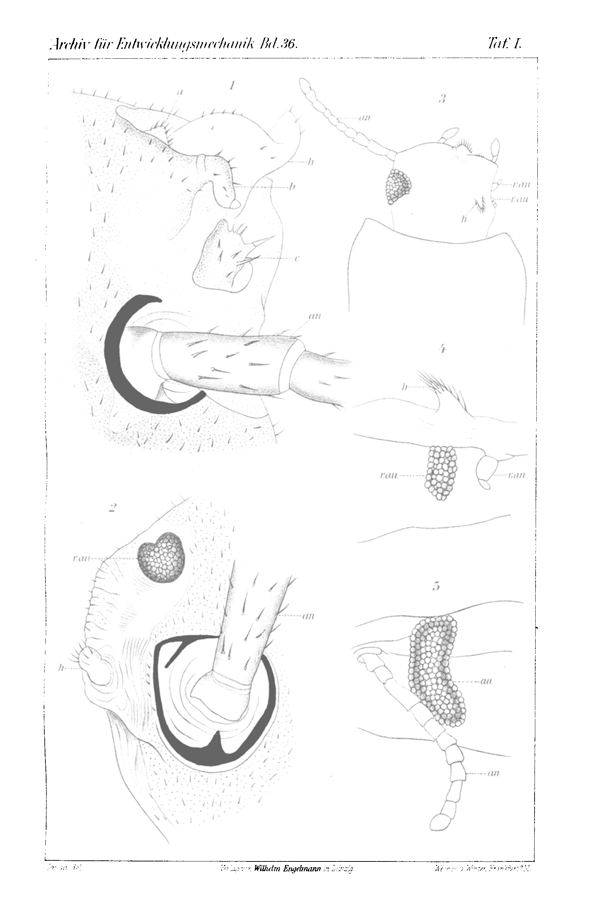

# Antenna-like Heteromorphoses in Place of Eyes in Stylopyga orientalis and Tenebrio molitor.

### (Experimental Study.)

By

#### Dr. Viktor Janda (Prag-Karolinenthal).

*(From the Biological Experimental Institute in Vienna.)*

With Plate I.

*Received on 8 December 1912.*

*Archiv für Entwicklungsmechanik der Organismen*, vol. 36 (1913).

> **Full translation.** A complete English rendering of the running text of “Antenna-like Heteromorphoses in Place of Eyes in Stylopyga orientalis and Tenebrio molitor” (Janda, 1913), including all tables, figure and plate legends, and footnotes. Numbers and table cells were transcribed from the page images, not the noisy OCR.

In order to test whether the capacity also belongs to insects, after destruction of the optic ganglia, to produce in place of eyes heteromorphic formations similar to those which Herbst and others¹) have achieved in the podophthalmate Crustacea, I undertook, at the suggestion of Hans Przibram, at the Biological Experimental Institute in Vienna, a series of experiments on *Stylopyga orientalis*- and *Tenebrio molitor*-larvae, which were to bring us nearer to the solution of this question. Although I in no way regard these experiments as concluded, and am well aware that the results obtained from them thus far are very slight, I nevertheless resolve to report on them already now, partly for the reason that I am compelled to interrupt these experiments for a longer time, but partly also for the reason that the present results, however slight they may be, do not seem to me to be entirely without significance for the assessment of the question posed above.

The operations were carried out chiefly on young larvae after previous narcosis. The kitchen-cockroach-larvae were exposed for about 10 minutes in a closed glass to the ether-vapors, while the *Tenebrio*-larvae were simply thrown into water and left there for about 10 to 15 minutes, until they had become motionless. The narcotized *Stylopyga*-larvae had, first, by means of sterilized scissors on one side the whole eye cut off, and thereupon the laid-bare adjoin-

> ¹) The literature on this field is compiled in H. Przibram, Die Homoeosis bei Arthropoden. Arch. f. Entw.-Mech. Bd. 29. S. 587. 1910.

Archiv f. Entwicklungsmechanik. XXXVI. &nbsp;&nbsp; 1 2 &nbsp;&nbsp;&nbsp;&nbsp; Viktor Janda

ing nervous elements, and in part also the neighboring tissue, were destroyed by means of a hot needle. In a similar manner the *Tenebrio*-larvae were also operated upon, only that here, together with the larval eye, a larger part of the head was also removed and the cut carried fairly deep.

Of the 312 *Stylopyga*-larvae in which the wound was burned out, only four animals remained alive for me, which underwent the further metamorphosis completely and transformed into imagines. In three specimens the wounds closed completely in the course of the moltings and became covered with a whitish membrane, without, however, bringing forth a distinctly formed regenerate. In the fourth animal, in which three moltings were observed, a regenerate formed, which is depicted in Fig. 1. It is a matter of a horn-like, unpigmented outgrowth (*h*), which sprouted from the upper part of the wound and lets no distinct articulation be recognized. Besides this, one notices at the inner wound-margin three irregular, darkly pigmented, bristle-bearing elevations (*a*, *b*, *c*), which are not present at the corresponding places of the other side of the head.

Since the mortality of the operated animals after the burning-out of the wound was enormously great, I later attempted to remove the nervous parts lying beneath the eye merely by a deeper cut-guidance. I have operated about 200 specimens in this way. By the application of this method I did indeed succeed in keeping a larger number (15) of animals alive, but the result was however fairly different in the individual animals. For in nine animals the wounds had merely scarred over and leveled out; in five animals small facetted eyes came to the fore at the cut-surface; and only in a single animal, in which three moltings were noted, there formed, beside a small eye, an insignificant finger-shaped regenerate (*h*), which Fig. 2 presents. This regenerate is pigmentless, indistinctly articulated, and bears at its tip several fairly long bristles. The rest of the cut-surface is covered with a pale, translucent little membrane, with sparse and tiny bristle-anlagen. The just-discussed regenerate is situated in a small little pit, which in form resembles the pit-like depression at the base of the normal neighboring antenna.

Similar conditions I have also found in a *Tenebrio*-imago, in which in the larval stage an eye, together with the antenna, was cut off with cauterization of the wound by a hot needle.

*(Plate I — figure plate; running head "Archiv für Entwicklungsmechanik Bd. 36." / "Taf. I.". The figures themselves are not reproduced; their designations and legends are translated under "Explanation of the Figures" below.)* Antenna-like Heteromorphoses in Place of Eyes etc. &nbsp;&nbsp;&nbsp;&nbsp; 3

From Fig. 4 one sees that the imaginal eye (*r.au*) had developed only in the lower half of the scarred wound, while in the dorsalward-situated parts of the same a hump-like regenerate (*h*) came to the fore, which bears at its tip a bristle-tuft. This regenerate was already distinctly recognizable on the pupa. In this specimen four moltings were observed.

For the time being I confine myself only to the bare establishment and description of these abnormalities. About the cause of their emergence and about their morphological and physiological significance only further, more exact experiments must give information.

The facts cited above confirm the conjecture expressed in the work "Homoeosis bei Arthropoden" by H. Przibram, that to the heteromorphoses in the Arthropoda there belongs a more general significance than has hitherto been assumed.

Prag-Karolinenthal, 25 October 1912.

### Explanation of the Figures.

#### Figure-designations.

| | |
|---|---|
| *a*, *b*, *c* | pigmented outgrowths at the wound-site in the *Stylopyga orientalis*-imago. |
| *an* | normal antenna. |
| *au* | normal eye. |
| *h* | heteromorphosis-like regenerate. |
| *r.an* | regenerated antenna. |
| *r.au* | regenerated eye. |

#### Plate I.

**Fig. 1.** A part of the head of a *Stylopyga orientalis*-imago with scarred wound and one larger, pigmentless (*h*) and three smaller, pigmented outgrowths (*a*, *b*, *c*) in place of the eye extirpated in the larval stage. (The wound was cauterized.)  *(figure not reproduced)*

**Fig. 2.** *Stylopyga orientalis*-imago, in which, in place of the eye cut off in the larval stage, besides a small eye (*r.au*) also a finger-shaped regenerate (*h*) has formed.  *(figure not reproduced)*

**Fig. 3.** Head of a *Tenebrio molitor*-imago. In the larva, on one side, an eye and an antenna were extirpated and the wound burned out. In place of the removed eye one notices a hump-like projection (*h*) with a bristle-tuft. Besides this, at the operation-site a small eye (*r.au*) has also regenerated, which however in this figure is only partly to be seen, since it comes to lie more ventralward. In front of this eye lies a small antenna-regenerate (*r.an*).  *(figure not reproduced)*

**Fig. 4.** A small regenerated imaginal antenna (*r.an*) with a small eye-regenerate (*r.au*) in the ventral, and a regenerated little hump (*h*) in the dorsal part of the wound-site of the same animal. (Side view.)  *(figure not reproduced)*

**Fig. 5.** An uninjured imaginal antenna (*an*) with normal eye (*au*) of the same animal. (Side view.)  *(figure not reproduced)*

1\*

## Figures

**Taf. I.**

---

*Translator's note.* One of the Biologische Versuchsanstalt (Vienna Vivarium) papers flagged on the project site as a modern rediscovery target. Claims are rendered as stated in the original, not endorsed.
