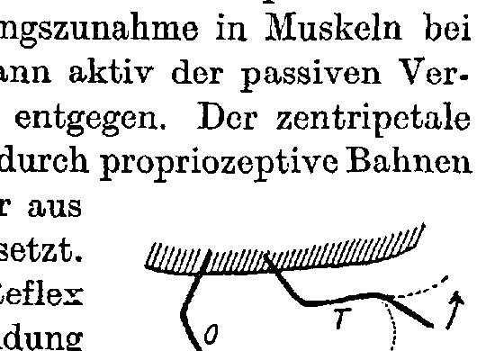
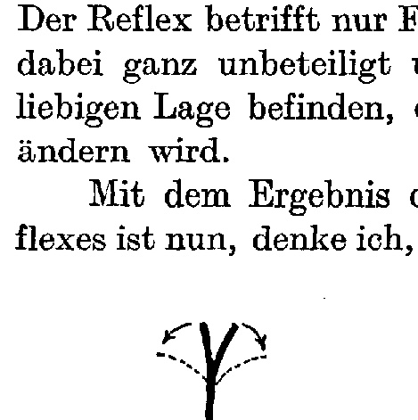
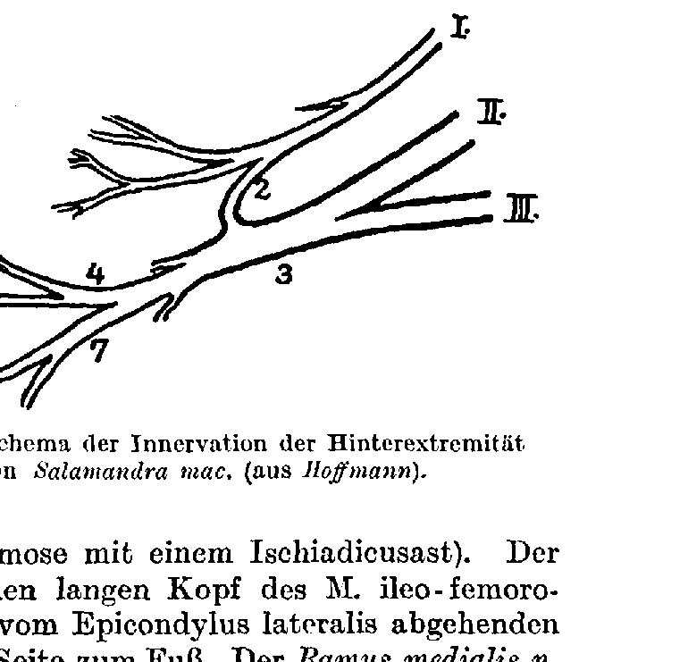
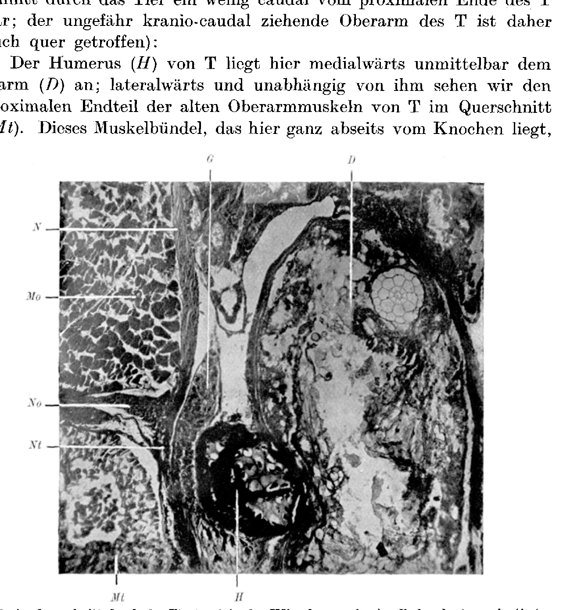
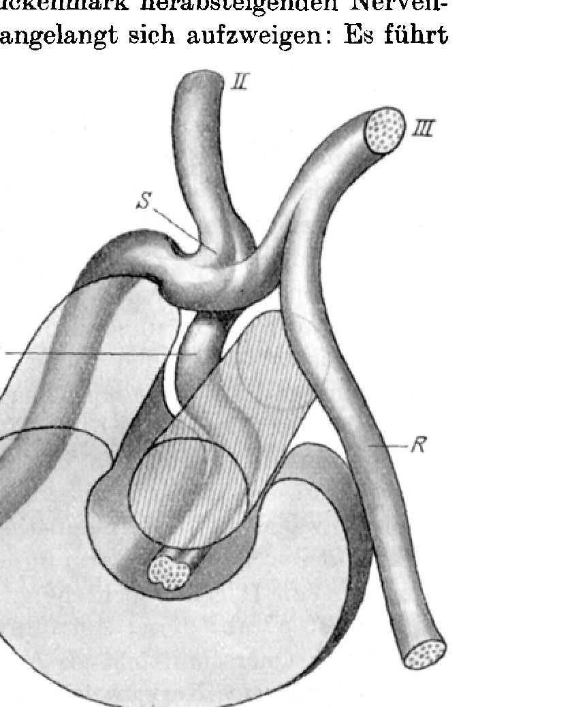
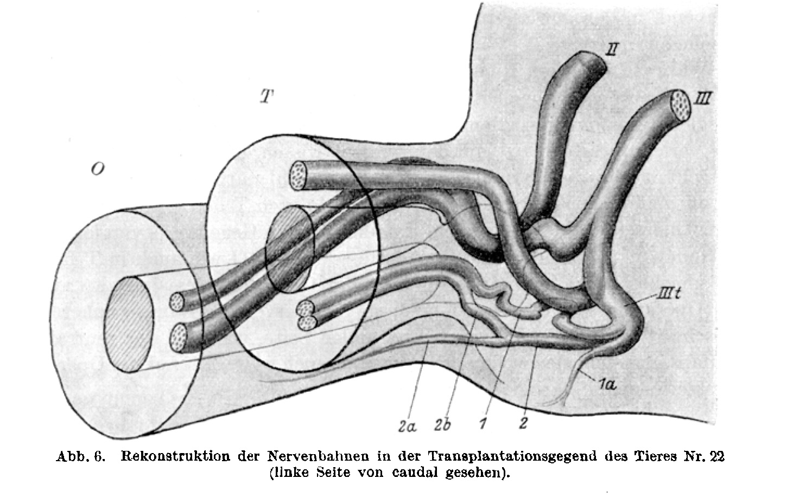
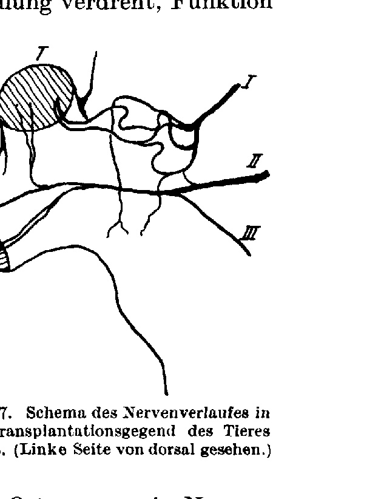

# The Function of Transplanted Amphibian Limbs.¹
## Setting Up a Resonance Theory of Motor Nerve Activity on the Basis of Attuned End-Organs.

By

Paul Weiss.

(From the Biological Experimental Institute of the Academy of Sciences in Vienna [Zoological Department].)

With 7 text figures.

(Received 5 October 1923.)

*Archiv für mikroskopische Anatomie und Entwicklungsmechanik*, vol. 102 (1924).

> **Full translation.** A complete English rendering of Weiss's study of the function of transplanted amphibian limbs — the innervation, musculature and coordinated movement of the graft — with the figure legends.

### Table of contents.

| | Page |
|---|---|
| 1. The phenomenon of the "homologous" function of the transplants | 635 |
| 2. The regeneration of peripheral nerves | 642 |
| 3. The nerve supply of the transplants | 648 |
| 4. The impossibility of an anatomical explanation of the phenomenon | 659 |
| 5. The physiological explanation of the phenomenon. The end-organs as resonators | 662 |
| 6. Summary | 671 |
| 7. Bibliography | 672 |

## The phenomenon of the "homologous" function of the transplants.

The fact of the recurrence of the normal function on transplantationally developed extremities I have already mentioned in the morphological report on these transplantations (1923a).² The details of this transplantation (1923a) I take as known. To get to know the function of these transplanted limbs in its full peculiarity, a remarkable phenomenon worthy of more detailed physiological treatment came to light here before me, which I should like to present here comprehensively and at the same time, on the occasion of its consideration, throw a light upon the kind of incorporation of new organs into the organism.

> ¹ Preliminary communications about the results of this work appeared, under the same title (I.–IV.), as "Communications from the Biological Experimental Institute of the Academy of Sciences in Vienna (Zool. Abt., Vorst.: H. Przibram), No. 80 (Akad. Anz. 22–23 of 1922) and 99–101 (Akad. Anz. 10, 1923)".

> ² The extremities of *Salamandra maculosa larv.* were in fully developed and functionally capable state transplanted, the one next to the other or in place of the other on the same side, in toto.

| Operation | Permanent in-healings | Lost within the first 10 weeks | Switched off on account of regeneration experiments | Normal function | Function only in the distal joints | Without function |
|---|---|---|---|---|---|---|
| 1 | 2 | 3 | 4 | 5 | 6 | 7 |
| O 1¹ | 29 | 5 | 5 | 17 | 2 | — |
| O 28 | 28 | 6 | 4 | — | 1 | 17 |
| O 65 | 6 | — | 1 | 1 | 2 | 2 |
| O 71 | 6 | — | 2 | 4 | — | — |
| O 77 | 1 | — | — | 1 | — | — |

zum Wiederauftreten der Funktion (about 10 weeks) is on average necessary, had been lost; among the 17 animals listed in column 5 there are five in which, at the distal parts, regeneration experiments were undertaken without disturbance of the function, [these] reckoned in; in the animals in column 6 active movements had taken place only in the distal joint (hand- or foot-joint, respectively).

The table teaches the following: A transplanted *arm* (O 1, O 71, O 77) takes up its function again, in *all* cases, after some time. Against this, the function of transplanted *legs* mostly remains permanently absent (O 28, O 65), or, when it does appear, as in a few cases, it is restricted to the tarsal joint. This difference between arm and leg is to be traced back to the dissimilarity of the operative conditions in the two groups, as I have discussed in the operative report (a. a. O. p. 155), bound up with the physiological explanation that will be given further below. When, then, in what follows the function of the transplants is described, it is always, unless the contrary is expressly brought out, a matter of transplanted *arms*.

Most of the animals were observed several times every week for a year long. The observations were undertaken in various ways: Either the behavior of the extremity was followed during the normal swimming- and crawling-movements, or the animals were investigated in a parallel-walled, very narrow glass cuvette, in which they indeed could not move forward so easily as a whole, but did however carry out lively flight-movements with the extremities; or finally, the animals were, after the metamorphosis, lightly clamped into a metal stand, so that only the extremi-

> ¹ Concerning the designations cf. *Paul Weiss*, 1923a, p. 156.
> O 1   Transpl. arm next to leg
> O 28   „   leg next to arm
> O 65   „   leg in place of arm
> O 71   „   arm in place of leg.

ties enjoyed freedom of movement. Besides this, cinematographic recordings were produced.

First, those animals may be discussed in which an arm (the left) had been transplanted in arbitrary orientation *next to* the like-sided leg. Such [animals] thus had, after the in-healing, three arms and two legs, and indeed there stood, on the left side, rearward, a leg (site-appropriate) and an arm (transplanted) closely beside one another. On such extremity-pairs the observations now extend; for simpler understanding the site-extremity shall in the following be designated as "O" and the transplanted extremity as "T". T shows, as in the earlier work (p. 156) described, all possible orientations to the body; one can scarcely find two animals in which the positions of the transplants halfway resemble one another. T can touch the ground or look freely into the air, it can extend itself crosswise with the lower arm over the ventral side, or stand perpendicularly upward, it can be in-healed in the position-correct orientation of O or in mirror-image to it. But with all the difference of the implantation-site and of the orientation of T against the body and against O, the result of the observations on the function of T is a thoroughly uniform one and lets itself be summarized, with exceptionless validity for the 28 cases observed, in the following two rules:

1. *When an active movement of O is carried out, then there always, and only then, at the same time goes along the active movement of the closely standing-beside T;* never that a functioning of the one component of the pair (O + T) for itself alone could be observed without the other. Either both move or neither.

2. *When the pair enters into function, then the movement-activity of the one component is always, down to all particulars, the exact replica of the simultaneous movement-activity of the other.* Every movement in a joint of O is accompanied by the (anatomically) like-directed movement in the corresponding joint of T, that is, every muscle of T enters into action always only at the same time as the muscle of T homologous with it: If, for example, O carries out a plantar-flexion of the foot, then T too already makes the active volar-flexion of its hand; if then O again [goes] into dorsal-flexion of the foot, then T too [goes] with its hand into dorsal-flexion. If O spreads its toes, then T spreads its fingers, [if] O bends its knee, then T bends its elbow, and it extends [it] at once again, as soon as O extends its lower leg again. [If] a movement takes place only in the foot-joint with O, while the knee thereby remains at rest, then the movement of T too restricts itself only to the hand-joint, etc. And not only the quality, but also the strength of the individual movements, which in the two components simultaneously take place, is the same. Briefly expressed, the function of T is in all points completely "*homologous*" with that of O.

Not usable for observation are the movements of the upper arm of T, because this, as was communicated in the earlier work (p. 154), through the transplantation is partly sunk into the interior of the body and through ungainly connective-tissue fusion with other body-elements is so restricted in its free mobility anatomically strongly that the "homology" of the function thus holds only for the joints lying distally from the thigh, or upper arm, respectively. For these, however, it is also quite exceptionlessly clear and beautiful to recognize.

According to the two rules set up in the foregoing, the function of the transplant can be determined for each kind of orientation. If, in the transplantation, T had been set in and in-healed position-correctly, so that it stands exactly like O against the body, then the movements of T follow those of O not anatomically like-directed, but rather in their appearance quite parallel. O and T grant during their crawling a picture as do, say, the two oars of one side of a boat manned with two oarsmen. In this case T too of course takes part, [T] which can support its hand on the ground in normal fashion, capably in the locomotion-work of the animal.

Quite excellently the transplant is also used in those few cases in which one had planted an arm not *next to* the leg, but rather, after amputation of the leg *in its place* (O 71); for there I could, through the most possible position-correct orientation of the transplant, attain that a normal, jointed union also of the upper arm with the body established itself. The regeneration of a new leg at the transplantation-site was suppressed (s. *Weiss*, 1923b) and so these animals finally possessed three arms and one leg. Thereby the transplant represented not only morphologically, but functionally so excellently the place of the removed leg, that it — were it not for the fourfold number of its toes and the open elbow-angle that, in distinction from a knee-angle, betrayed its origin — would not be recognizable at all as a transplant (Fig. 1 in the morphological report on the transplantations, *P. Weiss*, 1923a).

How differently the function of a somehow misimplanted limb presents itself! The most cannot grip on the ground at all and flail without success for the animal senselessly about in the air; while they, as partner O of the open locomotion provide, make in the air all its movements along with [it]. Anything more purposeless for the animal than this idling one can scarcely conceive.

Yes, in an exactly "mirror-image" transplantation the function of T must be downright harmful; for then the movement of T, anatomically like-directed to every movement of O which is to bring the animal from the spot, is, as a consequence of its 180° rotated position, the mirror-image of the right movement and the movement required for locomotion, [so] it will thus always work against O.

That at some time, in an animal, in the course of life a change of the senseless behavior would show itself, of this there was no trace. The function appears from the first moment on in the indicated way and remains so until the end of the life of the animal.¹ Of a learning or relearning of the function through T there can accordingly be no question.

In the first time of my observations on the function of the transplants I had gone a fairly toilsome and roundabout way, in order to resolve the movements of the transplant and to penetrate into the particulars of the function. I observed then the animals namely only during their normal locomotion-activity. There the two rules set up above did not at once result for me; for the one of the two observed extremities was used for locomotion, while the other stood free in the air. The extremity consists indeed of a chain of members, and this chain is fastened with its one end-point to the body; if now the extremity stands free from the body without outer point-of-attack, then all muscle-contractions give themselves simply to recognize as movements in the appertaining joints; otherwise, however, when the extremity finds itself in locomotion a second point-of-attack on the ground, then the chain is fastened at its two end-points, and if now, given firm point-of-attachment on the ground, a locomotion of the other end-points is to take place, then there must first be overcome the resistances acting at this [end], above all the mass of the body to be brought forward. The muscle-contractions will thus first have to do away with these resistances and only then further express themselves in movement-processes. The transplant, against this, which stands free in the air, knows no such resistances, for the weight of its own members, which is to be moved, is, in comparison to the mass of the whole body, which has to be moved from the spot, vanishingly small, and to which is added the friction of the belly-side on the substratum and a certain resistance exerted by the remaining extremities. It will thus, in the crawling of the animal, the transplant show its muscle-contractions already in movement, while the simul-

> ¹ The animals were over 1 year under observation and had their metamorphosis long behind them when the experiments were broken off.

taneous muscle-contractions of the site-appropriate extremity are still being used up for the overcoming of the said resistances; in a word, T will show its movements somewhat earlier than O.

Still more confused are the conditions made by the fact that, through the movement of the body, the limbs of O are also passively co-moved by means of the three remaining extremities; the whole complexity of the situation did not let me recognize, without further ado, the two simple rules — the function of O and T beside one another — [as such]. Attentive to the possibility of a connection of the two I became, to be sure, already in these first investigations of normal locomotion, in that positionally-correct transplants [behaved] geometrically like-directed with the site-appropriate leg, whereas mirror-image transplants moved in mirror-image. In order, now, to arrive at the general case, I undertook an exact analysis of the activity of the individual members during normal locomotion, and only when I had also learned to know and to recognize those muscle-contractions which do not express themselves in movement, did it become clear to me at one stroke that nothing else than that the muscle-contractions, which in each case in their purest form show themselves as movement of its members, in T announce themselves, which at the same time occupy O for the locomotion in more or less concealed form — the latter of which I had first to learn to detach out of the normal movement-process. T can thus render me with respect to the function of O a similar service as, say, a manometer which informs me of the pressure in the interior of an enclosed vessel.

When I had become attentive in such a manner to the connection of the function of O and T, I gave up the observation of the animals during their locomotion; now that I knew what mattered, I could establish far more appropriate observation-conditions which, without that reconstruction of the muscle-contractions of O out of its complicated behavior during locomotion needed [for it], do not [leave one] to infer the phenomenon of the "homologous" function of O and T, but let it become quite immediately manifest in its appearance. I proceeded from then on as follows: The animal under observation was sunk by the middle of its body into an elastic broad copper-girdle on a stand, and the ring pushed forward so far that the animal was indeed not crushed, but nevertheless could not slip out; head and extremities were free (Fig. 2 in *Paul Weiss*, 1923a). In such a position the animal now makes all sorts of position-correcting and defense-movements with the extremities; now, where O and T *both* stand in the air, one can read off the two rules concerning the "homologous" mode of function directly, without further ado, from the observation-image, with every clarity that could be wished.

With this the "homologue" of the function of O and T in "arbitrary movements" is doubtless established. Nevertheless I sought to verify the said mutual behavior of O and T also under conditions as simple as possible, in that I evoked an experimentally producible reflex, and in this way arrived at the proof, no longer dependent on the greater or smaller persuasive power of the chance behavior, that here it really is a matter of the function of the pair (O, T), of which I would never expect — on the basis of the previous observations — that its motor success would be distributed over both extremities O and T in the indicated manner, hence brought about in the homologous way.

For the investigation I chose, as suitable, a compensatory reflex (in *Urodeles*) of the hand- or foot-joint, respectively. As a compensatory [reflex] one designates a reflex increase of tension in muscles upon passive stretching; the muscle works then actively against the passive change, that is, it counteracts it; the centripetal portion of this reflex arc is conducted back through proprioceptive pathways (*Sherrington*, 1906) and from there is the reaction of the muscle set into the work-process.

In our special case the reflex consists in the following (Fig. 1): T and O (in the figure schematically drawn) find themselves in the indicated initial position, that is, at the beginning of the experiment T and O are in dorsiflexion. If I now bend the foot of O still more strongly against the lower leg (in the sense of the arrows of the figure in the indicated position), that is, [if] in the angle between foot and lower leg the foot is bent passively into the [position] indicated by the dotted [line], then there enters [a state in which] the muscle [is] stretched passively. By this passive stretching is then evoked the reflectory increase of contraction in this muscle, the plantar-flexors; now there enters, naturally, this active increase of tension of the plantar-flexors, hence the animal carries out a strong dorsiflexion of the foot against the resistance of the foot acting upon it, [whereupon] the passive movement [of the foot] enters the plane, [and] it increases. But: there enters now still a second extremity [into play], namely, the transplant T quite undoubtedly likewise enters into the like-directed reflectory movement; for, just as the experiences with passive [movement] showed, the motor success of the reflex is distributed also here, just as on the [other] joints, in the "voluntary" movement, in the homologous way over both, that is, [it is] not [restricted] to O, but at the same time also to T, and indeed, [in] just that increase of tension of the plantar- (= volar-)flexors in the actual sense [of the term], which, in the like-directed volarflexion, [occurs] in T. And that this actually happens, with strikingly distinct [clarity]: If I bring the foot of O into stronger dorsiflexion, there sets in

**Fig. 1.** Schema of the compensatory reflex.  *(figure not reproduced)* at once quite of its own accord the hand of T in volarflexion (in the figure, since it is drawn entirely in the strictly site-appropriate position). Conversely, if, when I let the foot of O snap back from its initial position (drawn fully [extended]), a passive plantar-flexion (dotted) is carried out, then the hand of T too goes in dorsiflexion. In reality it is, after all, in this case the passive change of O or of T that brings about the compensatory muscle-contractions in the like-directed movement of the other. The reflex concerns only the foot- or hand-joint, respectively; knee and elbow are thereby quite uninvolved and can find themselves meanwhile in any arbitrary position, without anything at all altering in their position.

all on its own the hand of T immediately goes into volar flexion (in the figure, from the position drawn as a solid line into the dashed position). Conversely, if I carry out a passive plantar flexion (dotted) with the foot of O from the starting position (solid line), then T at once shifts its hand into dorsiflexion. In reality it is, moreover, entirely the same whether I perform the passive alteration on O or on T; in each case the other of the two limbs indicates the compensatory muscle contractions through its movement. The reflex involves only the foot- or wrist-joint, respectively; knee and elbow take no part in this and may meanwhile be in any arbitrary position, without anything in their attitude changing.

With the result of the investigation of the reflex just described, the *experimentum crucis* for the complete "homology" of the function of O and T has now, I think, been supplied.

**Abb. 2.** Schematic representation of the limb arising from the fusion of O and T (animal S 6 from Weiss 1924, p. 680). On a single unified stalk sit two free autopodia, their dorsal sides turned toward each other. Function mirror-image in the sense of the arrows.  *(figure not reproduced)*

That the "homology" of the function holds for each single part of the limbs under consideration emerges then with particular clarity from the following facts:

In another place I have described (*Paul Weiss, 1924*) that, under corresponding operative conditions, the upper arm of T could fuse with the thigh of O after implantation into an outwardly unified trunk. If amputation is then carried out within this unified trunk containing both components, then in the regenerate the stalk continues to be unified from the cut surface onward, and only the terminal portions of the two components are again separated from one another from the wrist- or ankle-joint onward, so that the simple trunk runs out into two ends, a hand and a foot; the orientation of these two autopodia corresponds entirely to the orientation with which the two fused components are contained in the common segment, i.e., with mirror-image implantation they also stand in mirror-image relation to one another — in the figured animal S 6, for example, the dorsal sides face each other and the flexor sides face outward. Both feet function well, and here too the mirror-image function appropriate to the mirror-image position leaps at once to the eye: the plantar flexions always occur simultaneously and both symmetrically with respect to the trunk axis (Fig. 2, in the sense of the arrows); dorsiflexions of course cannot here be carried out owing to the anatomical relations. The common stalk functions on account of the atypical constitution that arose from the growing-together of the two components; but this lies for anatomical reasons outside the scope of the present discussion.

In conclusion, let me here adduce the function of the toes of T in yet another series of observations which again confirm the regularity established above:

In axolotls, the denuded lower arm of *Triton cristatus* had, through amputation of the previously implanted upper arm of the latter, transformed back into a self-differentiation regenerate of the most varied orientation, which had been given by the operation; here the truly atypical orientation repeats, owing to the implantation, what was already given outwardly through the strange constitution of the regenerate, and even reproduces the homologous function — *Paul Weiss, 1923*. Here too the toes function in mirror-image fashion and make the mirror-image implantation recognizable through their movements set up appropriate to the site. Absolutely taken, of course, the back-and-forth movements occurring here are atypical; but in each given moment the function, "site-appropriate" with respect to the movement of the rest of the organism, is once again completely guaranteed; the toes of the transplant move in their individual members indeed always in such a way that, in each given case, they fit themselves into the orientation of the rest of the organism, ordering themselves quite according to the same kind of central, mirror-image relations as the normal toes — therefore in just the same direction in which, under normal circumstances, the homologous, here lacking, toes would have answered.

Here, then, we have a transplant present which possesses no proper site-of-origin limb, but which is nonetheless drawn into the sense-appropriate accomplishment of function in all cases, just as if it occupied the place of the limb belonging to that region. The transplant always functions in the *normal* sense of its site-of-origin, let us suppose. Or: each disordered implanted limb finds itself at each moment in just that position which the muscle play of that site, were the limb present in normal position, would prescribe to it. Or: the limb, displaced in any arbitrary way, behaves at each moment as if the muscle play of that site, were the limb present in normal position, prescribed its position. Or: at each moment the implanted limb takes up in every case the position which corresponds to the normal position of the limb within the framework of the total action of the animal.

## Die Regeneration peripherer Nerven.
## The Regeneration of Peripheral Nerves.

The remarkable phenomenon reported above demands an explanation; for such an explanation, among the various ways that present themselves from the outset, two at first apparently quite different paths lead to the goal. Either, we recognized, it must be: either the "homology" of the function was grounded in the special kind of nerve connections of T with the body, in which case the problem was a morphological one and the solution had to lie in the particularities of the course of regeneration. Or else, if this possibility fell away, a purely physiological explanation had to be sought. The morphologist, who is accustomed to seek everywhere correlations of peculiarities of function with peculiarities of structure, will here too hope for the solution from the first-named possibility, and therefore the kind of nerve supply of the transplant shall here be discussed first.

With this, however, we betake ourselves onto very hot ground. The field of nerve regeneration is even today still, where it has already for years been entered and explored again and again from numerous sides, a battlefield of opinions. In not at all inessential particulars, views diametrically opposed to one another still contend for recognition. Nevertheless, regarding the most important points, unified conceptions have already broken a path to general recognition, which at least let us discern the rough outlines of the processes in nerve regeneration. These known facts, no longer in dispute, suffice however completely to furnish an unambiguous picture of the kind of nerve supply of the transplant in our case; and only insofar as it concerns uncontested facts will I employ what others have found about nerve regeneration for the presentation.

The chief dispute originally turned upon the alternative: regeneration of the nerves from the center, or autogenously *in loco*¹. The abundance of new findings that could be gathered in the field in recent years has pushed the conception of autogenous regeneration as the normal process in nerve supply ever more back into the realm of the improbable. "For when one works through the recent literature, one may indeed on the whole well say that the decision has fallen on the side of the monogenistic outgrowth theory. The extensive investigations of *Perroncito*, of *Cajal*, of *Marinesco* on the regeneration phenomena, the brilliant experiments of *Harrison*, the phenomena of nerve proliferation *in vitro*, have piece by piece withdrawn its supports from the polygenistic chain theory; the experiments of *Perroncito*, which demonstrated the extraordinarily strong outgrowth capacity of regenerating nerve fibers, especially in young animals, in which autogenous regeneration ought best to show itself, and which showed the great significance of collateral regeneration, withdrew from the physiological theory of autogenous regeneration, already strongly attacked from the side of the physiologists (*Langley and Anderson, Head, Mott and Halliburton*), its hypothetical anatomical basis, and one may now indeed accept with certainty, as the established foundation for further investigations of the regeneration process, the conception of the new nerve fibers as a proliferation of the old central nerve stumps, to which the formation of the regenerated cell processes is to be attributed." (*Boeke* 1921, p. 487.) That, given the *functional* restoration of the nerve fibers, the autogenous mode of action is, as has essentially been concluded today, already completely excluded, and is no longer defended even by the adherents of the possibility of autogenous regeneration. But precisely because it is a matter of a complete functional regeneration, there can be no doubt about the direction of the path at the crossroads at which otherwise everyone who takes up the problems of nerve regeneration finds himself right at the starting point: for it can only be a matter of nerve supply from the center.

The most recent comprehensive critical presentation of the field of nerve regeneration was furnished by *Boeke* 1921. I attach myself in the following to his presentation. Briefly and in essential features I would here, insofar as it can be related to our special case, present anew the processes he describes which are of importance for our consideration, as follows:

After the transection, the nerve at first finds itself, in the immediate surroundings of the cut surface, under the influence of the damaging influence and of the reactive processes consequent upon it, which extend over a certain stretch and which can become detectable in part likewise far outwardly. After the immediate, more crudely degenerative alterations on the cut surface, no further degenerative alterations take place at the central stump. Against this, the entire distal section of the nerve falls victim to a degeneration. Sheath and fibers are here cut off from the spinal-ganglion-bearing trophic and functional centers, are killed off, and remain capable of restitution to a varying extent. Through proliferation of the *Schwann* cells and of the axis-cylinder remnants there occurs an almost complete disintegration of the medullated nerve sections within the peripheral fiber bundles, and at the place of the previously degenerated end-plates new axis-cylinder strings arise, which are designated, just as the old paths of the nerve in the peripheral part, again as fiber preformations, designated as *Büngner's bands*. While the peripheral stump undergoes these degenerative transformation processes within and on it, progressive alterations of a highly important kind appear at the central stump. The central fiber preformations have the tendency

> ¹ *Archiv f. mikr. Anat. u. Entwicklungsmechanik* Bd. 102. 42a 1. to push out one fiber in several branches at the cut surface;
2. to grow out with these branches beyond the cut site.

The finer histological details of these processes are not in all points clarified; whether the branching occurs only at the place of the wound or also in the further peripheral course of the new fiber has not yet been clearly settled; even less, whether the fiber splitting also takes place within the outgrowing *Schwann* sheaths. Of these branches one part is finally retained, and the others, particularly those which can no longer make connection within the nerve region itself, become atrophic, so that the numerous outgrowing fibers from the central nerve stump considerably exceed the actual nerve number and press forward in part also peripherally. — Important for the answering of the question is which path the outgrowing fibers take. Through the operation, at a certain distance from the arising wound, the cut surface, with respect to the new fibers separating themselves from the central stump, forms the most diverse connective-tissue formation, the scar, on which the outgrowing branches impinge. The direction in which they then turn, so long as they do not yet find themselves in their own nerve region, is here determined by the topography of their immediate surroundings (hodogenesis, *Dustin*, 1910); here surface forces (the fibers must impinge either on hard surface elements or on firmer elements), chemical and mechanical influences (the path of least resistance, *Vanlair*) act jointly, so as to provide the outgrowing fibers with the most appropriate conductor for the stretch of path. Thereby arises not at all immediately a "right" path of the outgrowing fibers; rather, entirely wildly, as one sees the entangled surroundings into which the fibers in all directions of space turn, they break out through the scar into the open and seek a path; many, hindered by superpowerful obstacles, get stuck without having achieved a successful outgrowth.

A fiber pushes on its wrong path against the proximal end of some *Büngner's* band, or strikes into the same. Here it is now led along the conductor band it has found and is conducted into this path; from here it can in no case attain the original goal; the relevant fiber follows the peripheral nerve section into which it has been led, by accident of the topography of the foreign region, only by chance, and arrives, if no chance intervenes, here at any region whatever; for once it has entered a vacant plasma tube, it can no longer turn around, but must arrive here at the end-organ lying at the end of any arbitrary sheath and there be just as foreign within it as, before the nerve transection, the relevant central part had been to it. Nonetheless the fiber forms in this new peripheral part the connecting end-piece at the new end-organ.

The greater the interruption between peripheral and central stump, the longer the path the outgrowing nerve fibers must traverse, the more and the more readily they get stuck before they once again take up, in the sense of the peripheral sections, the *Büngner's* bands. Of course, it would be conceivable that the peripheral sections exert an attraction upon the new fibers; this can attain such a remote effect only through the outgrowing nerve fibers (neurotropism, *Forsmann, Cajal*); but the assumption of such an attraction effect is, after the most recent findings, not at all compelled.

The fibers that have grown out from the central stump, originally diffusely, are insofar now conducted into paths and led to the end-organs in the peripheral section. Many fibers admittedly remain stuck, those which impinge nowhere on a conductor band; but since the multiplication of the fibers in the splitting of the outgrowing fibers is so great, there nevertheless always remains the probability that all degenerated peripheral paths become filled with new fibers; so long as this finally suffices, until in fact in the end the regions denuded by the nerve transection are again entirely supplied with new fibers and once more set in connection with the central organ.

In such a mechanism of neurotization there is naturally excluded a specific assignment of the peripheral section to the central-stump fiber, even if its outgrowing branch were brought into the same path along which the fiber, before, would have been able to grow out in its proper path. Since the probability is entirely vanishingly small that, among all outgrowing branches, just that one shoot of the central fiber tube reaches into the peripheral section — that very one with whose next splitting the influences of chance, introduced into the operation, arrive — the assumption of an *elective* outgrowth of the fibers along the path would be entirely impossible, since each branch, among the extraordinary number of outgrowing branches, would, under just this specific influence of its own, attain the arisen *Schwann* tube of the relevant peripheral part, whether it before the transection had supplied the relevant end-organ, or also only by accident had reached it.

Against such a conception speak indeed, quite simply and naturally, also all the numerous observations and experiments on nerve regeneration, which are well known today; one may indeed, as already mentioned, assume a general directing influence of the peripheral degenerated sections on the central outgrowing fiber mass, e.g., through secretion of certain "lure substances." Even if not each individual fiber, as has been said, but the hundreds of regenerating fibers possessed their specific influence, their various "lure substance," that would mean a *general* attraction of the outgrowing fibers through "nerve substance" in general.

But the assumption of such a fiber-specific outgrowth would, given the high complicatedness of the process, which would be required for tracking the trace, demand more than one may already demand of the observations; the experimental result fully precludes it. Who would now still believe that one could explain the countless cases in which a central stump has healed together, with dislocation, onto a foreign peripheral stump and has neurotized the new end-piece by anastomosis along dissimilar paths? For here just so much complexity would be required for a fiber-specific outgrowth, for tracking the trace of the observations, that one would already from the start have to renounce its proof; for in favor of an elective influence on outgrowth individual cases indeed speak, but in the countless cases it declares itself inapplicable; one sees there even that the central stump has healed together, with dislocation, onto a foreign peripheral stump and has grown into the *Büngner's* bands of the section that had formed, not impinging there at all; the neurotization occurs in this case ever, no matter into which path the fiber goes — that it leads, that it is the one once and once again supplied, here is no longer in question. And it is well known that in the successful experiments of *von Boeke* on the heterogeneous nerve union of the fibers, the central stumps of the motor hypoglossus, not severed, grew into the *Büngner's* bands of the section which the degeneration of the sensory lingual fibers had brought about, and were able to connect unimpededly. So all the more is it secured, through the experiments as much as through the simple observation of the regeneration relations, that the outgrowing fibers grow into arbitrary peripheral paths and can take over their end-region for supply.

## Die Nervenversorgung der Transplantate.
## The Nerve Supply of the Transplants.

That the situation runs thus in brief outline, the picture from the basic facts of the course of nerve supply suffices completely in order to be able, in the special case of the nerve supply of our transplant, to recognize the relations, as we earlier in advance already saw.

After the amputation of the transplant-limb, the limb is cut off from its center and runs through, in the *Büngner's* bands, essential processes of degeneration, while we continue to designate the plasmatic strings of the old nerve paths. The given limb now still pushes the innervated peripheral region in front of it; so that the relations can become supplied with nerves again, the central fibers must be given opportunity for splitting and outgrowth (cf. *Paul Weiss, 1923a*). On the production of the implantation opening in the immediate vicinity of the site-of-origin limb, the nerves leading to this limb are, of course, naturally severed. Which the case may be depends entirely on the chance circumstances of the implantation; on each of the variously operated animals (loc. cit., p. 155) it is in part not very disturbed, in no case are all the nerves operated upon; and given all the other movements such as it nonetheless functions, the case may be that already through the implantation not all the leading nerves are torn, but rather only a part, or just the one that was hit by the opening-piece of the implantation. In the opening, in any case, these various open nerve stumps lie near each other, into which the proximal cut surface of T grows in, which afterward find themselves opposite those proximal cut surfaces of the *Büngner's* bands of the degenerated nerve paths. How that must happen, the foregoing has said.

The fibers in the central stumps of the severed site-of-origin nerves begin then partly to split and to grow out in lively multiplication. Meanwhile the connective-tissue scar joins onto T, with the cut surface of T forced from the body, and replaces also the lost own connective tissue with the next surroundings and replaces the next neighborhood of the implantation hole. On this scar impinge the in-pushing nerve fibers and grow now in all directions through the scar, as it had built itself in, in ever livelier splitting, the path through it, often pushing more or less already, and the in-grown region, on the one side the body, on the other side of the cut surface of T. This region, however, contains centrally not yet again any *Büngner's* bands; once again the peripheral sections of the severed nerves, and above all those extracted in the degenerated nerves of the transplants. What now happens there, nobody knows: the swarm around, the ever more peripheral sections of the severed nerves, then partly into the plasmatic conductor strings of the degenerated peripheral paths, become here at the place of the in-between-being of the degenerated end-pieces of new paths. Finally all peripheral paths again afresh filled with nerve fibers. And the same although the few severed stumps of the site-of-origin nerves supplied not only their proper end-region, but moreover indeed whole newly added transplants with fibers; the growth of the and given over for in-growth. This happens during the implantation (cf. *Paul Weiss*, 1925a). In producing the implantation opening in the immediate vicinity of the point of attachment of the site-of-origin limb, whatever nerves leading to this limb are located there are severed. Which these are depends entirely on the chance circumstances of the operation, and, given the strong variation in the mode of implantation, it is in any case the plexus branches whose connection with O is interrupted that differ in each of the various operated animals. After the operation the function of O is (loc. cit., p. 155) admittedly a little disturbed, but by no means abolished; the animal can still use O in creeping and in all other movements; this proves, naturally, that not all the nerves leading to O were torn by the implantation, but only a part, the very part that happened to be struck by the opening-piece of the implantation. Into the opening, in which there now lie freely exposed these various open cut surfaces of severed little nerve stems, the proximal cut surface of T is now, however, brought, in which are located the proximal cross sections of all the nerve paths that extend toward the periphery of T and degenerate in *Büngner's* bands. What must happen here is, after what has been said above, quite clear:

The fibers in the central stumps of the torn site-of-origin nerves begin to split and to grow out in lively multiplication. Meanwhile a connective-tissue scar joins the open cut surface of T sunk into the body with its surroundings and replaces also the muscle elements and other tissue elements irreparably damaged in the operation in the immediate neighborhood of the implantation hole. On this scar the advancing nerve fibers impinge and grow through it in all directions. Thus before long a part, in ever livelier splitting, has wandered through the scar and already impinges on the innermost regions, on the one hand of the body, on the other hand of the cut surface of T. This whole region, however, contains *Büngner's* bands standing open toward the central side, which have arisen, on the one hand, from the peripheral sections of the severed site-of-origin nerves, but, above all, from the degenerated nerves of the transplant. What will now happen, we know: the wandering, ever-further-growing fibers, still splitting, catch themselves in the plasmatic conductor tissue of these degenerated peripheral paths, are led therein up to the end-points, and form there, in place of the meanwhile likewise degenerated end-apparatuses, new ones. Finally all peripheral paths are again filled freshly with nerve fibers. And indeed the few severed stems of the site-of-origin nerves have supplied with fibers not only their own old end-region, but in addition the whole newly added transplant; that was thereby possible, namely, that the fibers, uniform up to the wound site, began from there on to branch out, so that the number of nerve fibers present peripheral to the wound surface represents a multiple of the number of the severed fibers coming to the wound from the central side.

Everything said here about the nerve supply of the transplants had simply followed from the application of our knowledge of nerve regeneration to the particular case. But now it was, of course, imperative to test the results on the particular case as well as to their validity. I have therefore examined a few animals as spot-checks, in detail, with regard to the nerve supply of the transplant. The specimens in question were subjected to histological treatment, dissected into serial sections, and then the course and connections of the nerve pathways were followed under the microscope. As examples, three animals shall be described in more detail in what follows. The treatment was the same in all of them, namely with *Cajal's* silver nitrate method.¹

> ¹ I am much indebted to Professor *Kolmer*, in whose department at the Physiological Institute and with whose support I prepared the histological specimens, for his help.

For a better understanding of the abnormal conditions of the nerve supply, I will first insert here a brief general overview of the normal innervation of the limbs of *Salamandra maculosa*. In this I follow the description by *C. K. Hoffmann* (1873–78).

**Arm:** Is mainly supplied by the ventral branches of the II to V spinal nerves, which form the *Plexus brachialis* near the base of the limb. We may leave the supply of the shoulder muscles out of consideration here, since the transplanted arm consists only of the free part of the limb, and only the function distal to the upper arm was taken into consideration. Into the free limb, two nerves lead from the plexus, the *N. brachialis longus inferior* and the *N. brachialis longus superior*, each of which divides within the limb into two main branches, a *Ramus profundus* and a *Ramus superficialis*.

*N. brach. long. inf.* is the strongest nerve branch of the plexus and leads first to the flexor side of the upper arm; here it divides.

*Ramus super. n. br. long. inf.* supplies, besides the skin of the flexor side of the forearm, both layers of flexor muscles on the lower arm, then with one branch the *M. radio-ulnaris*. Its terminal branch leads over the carpus to the ulnar side, then innervates the metacarpal muscles and the mutually facing sides of the ulnar two fingers, anastomoses with the *Ramus profundus*, and together with it innervates the mutually facing sides of the radial fingers.

*Ramus profundus n. br. l. inf.* supplies, together with the *Ramus superficialis*, above all the deeper muscle layers of the flexor side of the forearm and hand.

*Ramus profundus n. brach. l. super.* leads to the extensor side of the upper arm, then into the elbow hollow, then into the extensor musculature of the forearm. Afterwards it anastomoses with both branches of the *N. br. l. inf.* and innervates all the fingers.

*Ramus superficialis n. brach. l. super.* is in *Salamandra* mostly a cutaneous nerve.

**Leg:** In its innervation the ventral branches of three spinal nerves participate, which we shall designate roughly as I, II and III. They run converging toward one another to the leg and, having arrived at the height of its point of attachment, form a plexus.

I gives off (Fig. 3) an anastomosis (2) to II, and the remainder divides again into two branches, of which one supplies mainly the *M. pubo-ischio-femoralis internus* (adductor), the other the *Extensor cruris*.

The trunk (3) arising from the plexus formation of II and III divides into two branches (4, 7), of which one (4), with a further division, innervates the *Mm. ischio-femoralis (Quadratus femoris)*, *pubo-ischio-femoralis externus (Pectineus)*, *pubo-tibialis*, *ischio-flexorius (Semimembranosus)* and *pubo-ischio-tibialis (Semitendinosus)*, while the other (7) yields the *N. fibularis* and the two *Rami (lateralis* and *medialis)* of the *Ischiadicus*. The *N. fibularis* gives branches to the *M. ileo-femoro-fibularis (Biceps)* and supplies the *M. femoro-fibularis* and muscles running from the femur to the foot, as well as the fibular

**Fig. 3.** Schema of the innervation of the hind limb of *Salamandra mac.* (after *Hoffmann*).  *(figure not reproduced)*

three toes (after formation of an anastomosis with a branch of the *Ischiadicus*). The *Ramus lateralis n. ischiad.* innervates the long head of the *M. ileo-femoro-fibularis (Biceps)*, gives a branch to the flexors departing from the *Epicondylus lateralis*, and then leads on the fibular side to the foot. The *Ramus medialis n. isch.* gives off some branches to the *M. pubo-ischio-tibialis (Semitendinosus)*, and otherwise supplies the muscle mass of the plantar surface of the lower leg, and then leads on further to the foot.

## Tier Nr. 4.

13.I.22.: Transplantation of the left arm next to the left leg (O 1). 3.V.22.: Complete restoration of the function, with O and T "homologous." Implantation site ventro-caudal from O. Here the upper arm of T enters obliquely into the interior of the body and there leads a stretch further cranially, so that the cut surface of T sunk into the body faces cranialward. The piece of the upper arm of T enclosed within the interior of the body is firmly grown into its surroundings, yet it has fully preserved its formal independence and self-containment. The humerus is clad in its old muscles, however these have, after the amputation, retracted a little from the cut surface, so that the humerus bone still projects a stretch far beyond the cut surface; on its laterally situated side it is accompanied by muscles for a longer stretch than on the medial side, yet the lateral muscles too have, in the vicinity of the cut surface, been pushed away from the bone, so that after the healing the following picture of the former cut surface of the upper arm of animal No. 4 presents itself (Fig. 4, the microphotograph shows a piece from a cross section through the animal not far below the proximal end of the T; the about cranio-caudally running upper arm of the T is therefore also cut across!): The humerus (*H*) of T here lies immediately mediad to the intestine (*D*); laterad and independently of it we see the proximal end-piece of the upper-arm musculature of T in cross section (*Mt*). This muscle bundle, which here lies quite apart from the bone,

**Fig. 4.** Cross section through animal No. 4 at the height of the proximal end of the transplanted limb (microphotograph after *Cajal's* silver method). Lettering in the text.  *(figure not reproduced)*

draws ever closer toward the bone, encloses it and finally entirely enwraps it; of the muscles thus drawn off, nothing more is to be seen there, and at last they take on a quite normal appearance.

There remains for us before all else still to consider the cross section discussed: Between the humerus and the pushed-away muscle group of T, there pulls itself in from the body on the other side a cleft into the transplant (*G*). The cleft between bone and muscle, which here gapes open as a tissue-rift of T, is the sole portal of entry through which the fibers reach here from the outside into the interior of T; through it they have also found the way to the nerve fibers (*Nt*).

The complicated conditions of the nerve supply can, by reason of their spatially intertwined course, be brought before the eye more easily in surface images than in reconstruction. A whole series of consecutive surface sections delivers a picture of the innervation conditions. A few things can be recognized even from the individual cross section, and it is just for this reason that I have placed precisely this section before [the reader] for reproduction.

We see, namely, of the spinal-cord main trunk (*N*) arrived at the edge of the T, how a part of the spinal-cord main trunk (*Nt*) leads on, beside a vessel (*G*), through the mentioned breach-clefts inward into T, while another part (*No*) remains outside the T, bends off sharply toward the lateral, and leads on, if one follows the pursuit, to *t*. So simple and clear-cut is the situation here in this section, as it is to be found again in none of the other examined animals. Only the one important fact can be seen here from the cross sections immediately: the spinal cord is at the height of the limb-nerve-roots unchanged in its

**Fig. 5.** Reconstruction of the nerve pathways of animal No. 4 in the region of the proximal end of the transplant (turned away from the observer).  *(figure not reproduced)*

left and right halves equally large. Likewise one also sees the three main nerve trunks (*I, II, III*) descending from the spinal cord to the limb-base on the left and right quite strong, although on the left side two normal functioning limbs (O and T), on the right however only one central limb (O) hang. The transplantation thus shows neither a twofold increase of the ganglion-cell mass, nor are the descending nerve fibers stronger on each side.

But in order that the insights which the individual cross section grants us may be won, much painstaking work on the entire series is required; we discuss these with reference to the findings, while the careful pursuit of the individual nerve pathways between spinal cord and end-point in O and T through the serial sections would have to provide [them]. As an illustration the schema may serve, which corresponds to the actual course and brings to view the spatial conditions in the region of the proximal end of the transplant (Fig. 5).

In the schema, of the organs only the transplant is depicted, and indeed it is cut off facing the observer, while the end turned away from the observer represents the proximal cut surface of the upper arm sunk into the body, i.e. the only correctly figuring one. The muscles (formed as half-rings) here enwrap, as mentioned above, the humerus still a stretch above the cut surface; thereby arises a quite peculiar inner-lying cleft.

Now for the nerve pathways: Nerve I does not participate at all in the supply of T and supplies its normal end-region. That T was not advanced as far as it in the implantation, and so it was not injured at all. Quite otherwise has it gone with II and III: We can read quite clearly out of the picture the history of these nerves since the operation. First of all the plexus formation between II and III strikes one, which at this height is quite abnormal; under normal circumstances the plexus lies, by comparison, much deeper and nearer to the base of the extremity (at such a normal height there is found indeed also, in this animal, the plexus of I and II, which has remained untouched by the operation). The part of III which, after giving off the main mass of the fibers into the peripheral path of II, remains over, forces itself, as a weaker branch (*R*), keeping outside the transplant, through between this and the intestine and splits up in the hip musculature. From II, even before it has taken up the share of III, the branch *Nt* is given off; this branch leads into T, it is the same one that we also designated as *Nt* in the cross-section picture, and this branch is also the only nerve that leads into the transplant at all; in its further course it forks within T in correspondence with the typical course of arm nerves and contains the nerve fibers for the entire end-region to be supplied in the arm. The remainder of II (*S*) leads, after union with the fiber bundles arriving from III, around the proximal end of the T (*No*) outward to the site-extremity and supplies the end-region in O which normally belongs to it (branch 3 in Fig. 3).

This picture teaches that the conception which I earlier tried to develop, with the aid of the known general fact of nerve regeneration, for the special case of the nerve supply of the transplant, is entirely correct: through the bringing of the transplant into the body the nerves lying in the way had been torn; from this site the new outgrowth of the fibers had then also begun, from here, too, they have gradually again become caught in paths, of which three stood open: the way of II to O, the way into T, and the atypical, resistanceless way between intestine and T toward the rear; all these paths have been entered upon, all three paths have been filled with fibers (*No, Nt, R*). That in this animal the central sections pass over into the peripheral paths nicely smoothly and uniformly is owing to the chance of the operation, which brought it about that the proximal cut surface of the transplant came to lie just at the injury site of the nerves and not further; thereby the outgrowing fibers had only short paths to traverse before they impinged on peripheral preformed paths. With the following animals it will be shown that the young fibers do not always have it so easy. Here, however, they have, remaining nicely parallel, wandered into the path that, as it were, branches off just in front of their very door.

While, between spinal cord and injury site, the fiber number in the nerve stems has remained quite normal, as can be recognized without further ado from the comparison with the normal side, from the injury site on — from which, as we know, the fiber multiplication proceeds — the fiber number toward the periphery is naturally above normal: When one considers a cross section through O and through T and compares it with the cross section of the normal extremity of the opposite side, then one finds that the nerve stems, both in O and also in T, have almost the same strength as in the leg of the opposite side; there are thus, on the operation side, almost twice as many nerve fibers present in the peripheral section as on the normal side, while the central stump, out of which they have proceeded, is also further on, on the operation side, not stronger than on the normal side.

## Tier Nr. 2.

Operated on 2.II.22, O 1 (arm next to leg). After the operation function out of O disturbed. Findings on 5.V.: T grown together with the thigh of O; function both of O and also of T again entirely restored and "homologous." 1.VII. histologically preserved and given over to the histological treatment.

Implantation site close caudal from the point of attachment of O. Upper arm of T and thigh of O stand at an acute angle to one another and are grown together with one another in their proximal sections. Femur of O and humerus of T are bonily grown together at their crossing-point, yet the humerus of T leads still a stretch further past the place of fusion toward the body and only here comes to an end.

**Nerve supply** (see schema, Fig. 6): N. I has no relationships at all to T and supplies its normal end-region in O; it is in the schema left away. N. II follows its typical path into O, yet it can hardly have remained untouched by the operation. For, firstly, the functional failure in O in this animal was at any rate considerable, and, secondly, II makes the loop around the humerus of T; this now indicates that II had, on the one hand, been interrupted by the operation, but further, since only a single path, namely its own old peripheral one, stood open to it, has again filled this one path with all the outgrowing fibers. Be that as it may, at all events II gives off no fibers to T. The plexus II–III lies at normal height. The nerve supply of T is provided exclusively by atypical, newly arisen branches of III, and indeed in a superabundant manner.

The point from which the new formations proceed corresponds to the opening that had been made during the operation for introducing the transplant. From here III forms a powerful loop (III *t*), which sweeps back rearward and from which repeatedly smaller nerve bundles branch off, bundles which finally enter the main pathways drawn in the diagram, after they have traversed the adhesion zone that is in places filled out with connective tissue. In detail the course is as follows: The loop III *t* first gives off a nerve, which arcs through the subcutaneous connective tissue and penetrates into the T; here it completely fills out the old pathways of the N. brachialis longus superior. After giving off this branch, III *t* runs back a little farther and then divides: the one branch (1)

> **Fig. 6.** Reconstruction of the nerve pathways in the transplantation region of animal No. 22 (left side, seen from caudal).  *(figure not reproduced)* runs in a rather winding course through the connective tissue toward the T and reaches the pathway of the N. brachialis longus inferior. From this branch 1 there branches off yet a smaller branch 1 *a*, which does not belong to the transplant but ramifies in the caudal hip musculature of the host leg [Ortsbein]. The other branch (2) of III *t* runs still a little farther laterally and here divides into 2 *a* and 2 *b*. Of these, 2 *a* leads to the tibial knee-flexors of O (M. pubo-ischio-tibialis); 2 *b*, by contrast, runs upward through the adhesion zone into the T and unites with branch 1 to fill out the old pathways of the N. brachialis longus inferior in the T. After a short course as a single nerve, however, the bifurcation into the Ramus profundus and the Ramus superficiens occurs, as is required by the topography of the old pathways.

The spinal cord at the level of the limb roots is, in this animal too, again completely symmetrical, and the descending limb nerves, before their ramification into the T, are on the operated side just as strong as on the normal side. The nerve pathways in O and in T are all completely filled with fibers.

## Tier Nr. 13.

30. I. 22: O 1 — 5. V.: Function restored and "homologous." 30. VIII.: Preserved. The upper arm of the T is fused with the thigh of O as far as the elbow; the forearm is free and stands vertically upward, the volar surface of the hand facing cranially. The T is rotated by 180° relative to its normal position, function therefore "mirror-image" to O.

The pathways of the Nervus brachialis longus inferior in the T have been newly filled exclusively by ramifications of the 1st host nerve [Ortsnerv]. This nerve I has, at the site of implantation, where it had been injured, formed an altogether extraordinarily rich plexus; it divides into many branches, of which the majority run into the abandoned pathways of the T; but a few twigs also pass as anastomoses to II and to the hip musculature of O (diagram, Fig. 7). Nerves II and III run, after their normal plexus formation, into O, and only at half the thigh height (where O and T are still fused)

> **Fig. 7.** Diagram of the nerve course in the transplantation region of animal No. 13. (Left side, seen from dorsal.)  *(figure not reproduced)* does a little nerve stem pass upward from a host nerve into the transplant, in order to fill the two Rami of the N. brachialis longus superior.

With regard to the spinal cord and the central parts of the limb nerves, the conditions are the same as in the two animals previously described; the increase in fiber number, as with those, has taken place only peripherally.

What the general, fundamental facts of nerve regeneration had already made appear improbable is now, through the investigation of the special case, recognized as completely untrue and to be excluded: namely, that the nerve supply of the transplant might possibly have come about in such a way that each central stump of each fiber of the host nerves should have grown out precisely to that end organ which would be functionally the same [funktionsgleich] (with respect to the activity of the whole limb) as that earlier supplied by the same fiber. For:

1. There is always only *one part* of the host nerves that forms the point of departure for the renewed nerve supply of *all* the end organs of the T.

2. It is entirely left to the operative chance *which part* of the host nerves this is. Thus in animal No. 4 it was the N. II, in animal No. 22 the N. III, and in animal No. 13 a part of N. I and the one branch of II. — Now, in order to hold fast to the elective possibility of in-growth, one might, for those animals in which the nerve supply of the T proceeds from one main stem before its plexus formation, try to help oneself, say, by the assumption that possibly each of the three main stems, at its exit from the spinal cord, contains fibers for *all* the limb end organs, and that the functional grouping occurs only at the plexus formation. With this assumption not much would be gained; for there would then still remain, for explanation, all those cases in which the nerve supply is performed by some host nerve or other *distal* to the plexus formation, that is, by a nerve whose elements have already passed through the supposed functional grouping in the plexus and which in fact, before the implantation, led exclusively to a functionally narrowly circumscribed group of end organs (cf. animals No. 13 and 22). Each nerve stem severed during the operation can, through fiber-increase and the swarming-out of these fibers, when it strikes any old pathways whatever, newly fill these; now if the injured nerve was, say, a branch which formerly led only to flexors of the knee joint, whence then should, in the transplant supplied solely by this nerve branch, all the end organs of the most diverse function be able to be innervated all at once, if in fact the fibers possessed only a specific capacity for in-growth into functionally identical [funktionsgleich] pathways? I need hardly elaborate the so clear state of affairs further at length; everyone can, by means of the cases described above, pick out sufficient examples for himself; for it is set out and depicted which nerve branches in the individual case supply the T, and on the other hand one can, from the appended description of the normal nerve supply of the limb, take the end regions which were normally supplied by the branches in question.

3. And this point is the most important, because it illuminates the conditions most sharply: The fiber-increase of the fibers growing out from the central¹) stump takes place from the cut surface peripherward. The numerous branches arising from the division traverse the scar and strike empty pathways; in these they are conducted to the end organs. But since, now, as such pathways there stand open both the degenerated ones leading to all the functional end organs of the T, and also those leading into O — namely into a particular end region of O (in O, namely, that end region which had formerly been supplied by the fibers whose central stumps are now growing out with increase) — it must again and again happen *that one and the same central fiber finally has its many peripheral ends lying not only in quite different functional regions of T, but often even one part of its ends in T, the other part in O.*

> ¹ By the "central" stump there is here always designated the part of the fiber that has remained, after the interruption of a fiber, in connection with the central organ, and not perhaps the part of the fiber lying within the central nervous system itself. Instead of "central" and "peripheral" one could perhaps even better say "proximal" and "distal."

### Impossibility of an anatomical explanation of the phenomenon.

Precisely the attention to this point now makes much easier for us the taking of a position on the problem of the "homologous" function. We had, after all, in the first place to investigate here whether, out of the conditions of the nerve supply of the T, an explanation of the phenomenon would emerge; our habituation to seeing peculiarities of function bound to peculiarities of structure must indeed from the outset have suggested the thought that a likeness of mode of function, too, would rest upon some likeness or other of the anatomical underlay of this function. This possibility of explanation is now taken out of our hands; for it could have held good only in the case that it were proven that every nerve branch divided in the course of nerve regeneration supplied, with its branches, both in T and in O, only functionally identical [funktionsgleich] end regions; but what in reality must count as proven is precisely the opposite: namely, that the fibers can innervate quite arbitrary end organs in O and T, without this changing anything in the "homology" of the function of O and T.

One could, in order still to retain the anatomical explanation, express the conjecture that, even though a specific outgrowth fiber by fiber were impossible, a specificity might nonetheless exist for larger fiber groups, in such a manner, say, that central fibers which had formerly led to flexor musculature could again grow out only to flexors — even if not precisely the same ones as before — and likewise fibers which had formerly supplied extensors, again only to extensors. Against this assumption there speak, first, the regeneration findings, which indeed taught that the whole T, that is, flexors and extensors, can be provided with new fibers from a single nerve branch which originally supplied, say, only knee-flexors; second, the experiments of Boeke, in which indeed motor fibers themselves migrated without further ado into sensory pathways; and third: Even if such a partial specificity existed, it would still not be able to explain our phenomenon; for the appearance does not show, say, that every flexion in O goes along with a flexion in some joint or other of T, but rather it teaches that the simultaneous flexions in O and T always take place, in both, in the joints of the same name, and that is precisely what is to be explained; I need only recall the compensatory reflex described, which is restricted only to the distal joints of O and T, while the remaining joints remain at rest.

One may turn the matter as one will: one cannot get around the acknowledgment of the fact that the manner of the nerve supply of the transplant has nothing whatever to do with the appearance of the "homologous" function. One thing is, of course, clear, and it sounds banal to emphasize it further: that only those end organs can function which have been newly provided with nerves from the underlay [Unterlage]; but from where in particular these fibers originate is for the function entirely a matter of indifference. In order, after such insight, to be able to understand the coordination of the functions, in particular the phenomenon of the "analogous" function of O and T, a *physiological* explanation now had to be found.

The path that had to lead to the solution will best be shown by an example: Let a nerve fiber of a leg nerve have led, say, to a knee-flexor of O, let it have been severed at the implantation, let its central stump have divided from the cut surface onward (for simplicity's sake let it be assumed, only into two parts), let the two branches then have grown out, and let, say, the one have reached again a knee-flexor of O, but the other a volar flexor of the wrist of T. Now the one central stem of the fiber is connected with two end organs of different kind. How would such an arrangement have to behave, according to the prevailing conception of the manner of the motor nerve action, in the case of excitation?

The conception held hitherto is indeed the following: Every motor nerve fiber is connected with an end organ (muscle element). If, over the fiber, an excitation is released from the center, the muscle is thereby placed in the state of activity (or inhibition). Concerning the coordination of the individual functions, the decision is made intracentrally under sensory control (Sherrington), in that excitations are sent off precisely only over those fibers which lead to the muscles that have to come into activity in the movement in question. What each single fiber conducts, after its exit from the center, as the "final common path," is only the portion of excitation determined, at the given moment, for the end organ situated at the end of this fiber. A fiber leading to a knee-flexor will, according to this view, also have to count functionally as a "knee-flexion fiber," for it always conducts only knee-flexion excitations (or -inhibitions, respectively). And if I could, all at once, quickly switch in some other muscle in place of the knee-flexor into the fiber, then this would now have to respond when the fiber comes into excitation, in order, properly, to bring a knee-flexor into activity. If, then, a fiber is connected with two end organs, and if then over the central part of the fiber an excitation runs off which propagates itself onto the two peripheral branches of the fiber, both end organs would have to respond; in the case of the chosen example, if the stem of the fiber were excited from the center to set into activity the knee-flexor of O, then the volar flexor situated at the end of the other branch of the same fiber in T would also have to be set into activity — there would have to go along, simultaneously with the knee-flexion of O, a volar flexion in the wrist of T — all this according to the conception held hitherto, from which up to now there has still been no reason to depart.

But the "homologous" function of O and T has, unexpectedly, shown something quite different, namely: *When one and the same fiber supplies two end organs of different kind, these end organs need not on that account both respond together; rather each functions independently of the other, always just when it is precisely due to it within the framework of the total action of the limb;* the knee-flexor of O lying at the one end of the peripherally split fiber can come into activity, and the volar flexor of T supplied from the second end of the same fiber can remain at rest (for which T will, nonetheless, simultaneously also carry out a knee-flexion), or the volar flexor of T can function without the knee-flexor in O stirring. Let no one here perhaps object to me that fibers which with their ends supply functional regions of different kind possibly do not come into excitation at all, because they would disturb the coordination; one need only consider that the T would then in fact not be able to function at all, for it is indeed supplied exclusively by split fibers. The all-powerful catchword of the "relearning" [Umlernen] of the function also fails: A single central fiber-segment leads away from a single ganglion cell and divides only in its peripheral course, in order, with its branches, to supply end organs of different kind; what would it help the ganglion cell, then, to send excitation to the one or the other of these end organs according to need, when for all these excitations only a single path stands at its disposal, since the branchings are situated only far away from it, peripherward?

We shall, through the facts, ultimately be led with necessity to the following conclusions:

1. Since the peripheral branches of an out-branched fiber supply the most diverse end organs and can conduct their excitations to all of these, but the proximal part of the fiber going off from the center remains uniform farther on, this proximal part must conduct the excitations for all the organs lying at the ends of its branches.

2. Since as the end region of the fiber-branches the whole limb is possible, sentence 1 holds quite generally for all the end organs situated in the limb, that is, every fiber of a limb nerve carries with it at all times the excitations for all the limb muscles.

3. The central organ has, to the end organs lying at the endpoints of a split fiber, no separate connections; rather the excitation determined for the one or the other end organ must use the common central fiber-segment; since, despite this, the end organs function in an ordered manner, it cannot be solely centrally determined when one of them comes into activity; rather there must be due to the end organ a co-determining capacity [Mitentscheidungsfähigkeit] regarding its coming into function.

4. Since the end organs come into activity always just when it corresponds to the central intention, every end organ must be enabled to listen precisely to such and only to such commands as are determined for it precisely from the center.

### Physiological explanation of the phenomenon.

From these conclusions there crystallizes out approximately the following conception, deviating from the one held hitherto, of the manner of the motor nerve function; first quite generally:

I. If, over a nerve fiber, some excitation or other¹) runs off, then

> ¹ What is said here and in the following holds only for the adequate excitation, i.e. that sent out from the ZNS [central nervous system]. With direct inadequate — say, electrical — stimulation of the motor nerve the conditions lie essentially otherwise.

the muscle element situated at the end of the fiber need not on that account yet respond. The end organ must, however, have the capability of finding out, from the arriving excitation, the portion that is determined for it itself, and only when such a portion is at all sent to it must it come into activity; all the excitation-portions not apportioned to it, which come to it, remain ineffective on it.

II. All the motor nerve fibers of the same spinal-cord segment carry, at the same instant, the same excitation-state; this excitation contains the excitation-portions for all those end organs that are to function in the intended movement. The motor portion of the nerve going off from the spinal cord is therefore not a "bundle of final common paths," but rather it is, quite simply, as a whole, *the final common path*. The large number of fibers serves only to make it possible to spread the commands of the central organ in all directions, for it is only in the periphery that each end organ picks out for itself what applies to it.

All this has had to be inferred, with compelling necessity, from the new facts. And only so far does it have a claim to factual value. Everything that follows is already in part hypothetical. If we hold only to what is immediately inferred, then nothing whatever is thereby stated about wherein, properly, the strange selective capacity [Wahlfähigkeit] of the end organ consists, indeed about what is to count at all as a selection-capable end organ — the muscle or the nerve end-plate situated upon it, or some "intermediate substance"; we can, for this reason, provisionally do best to keep to the use of the uncolored expression "end organ."

## Theory: The End-Organs as a Resonator System

It was, however, now necessary to bring the new facts under one roof with the old ones, and to make them accessible to the physiological world of concepts. If one remains always mindful that what has so far been ascertainable on the basis of the new facts is only the general insight that I summarized above in propositions I and II, then one may from there, without timidity, venture into the domain of hypothesis, in order to attempt a narrower formulation of those general statements; yet this hypothetical formulation, too, shall be plastic enough and shall use no more assumptions than are unconditionally necessary for a conception of the processes to be explained that is appropriate to our present knowledge. Thus, above all, nothing shall therein be prejudged about the energy-form that constitutes the excitation process. If I nonetheless speak in the following of "oscillations," then there is thereby thought neither of mechanical, nor of electrical, nor of thermal oscillations, indeed not of any energy-form whatever; rather the oscillations are introduced only as a symbol of a rhythmic process, which is distinguished in a purely formal (mathematical) way by certain characteristic properties, regardless of the rest of the peculiarity of the process.

Of the nervous process I assume nothing further than that an oscillatory process arises here, an assumption that fits well with our present-day nervous conceptions. Each functionally uniform end region now possesses, as we have inferred, one single, peculiar excitation-form proper to itself, by which it must be addressed if the relevant end region is to respond. Such an excitation-form seems to me to be given, for each individual end region, by a constant *eigen-excitation-frequency* [Eigenerregungsfrequenz]; that is, the individual end regions distinguish themselves from one another by a particular frequency-number, which differs from that of all the rest. The quantitative ratios of the excitation are then representable by the *amplitude* of the oscillation.

If we follow up this image: we recognize in it the end organs as a typical *resonator system*, such as is known to us, for mechanical oscillations, from acoustics, and for electrical ones, from wireless telegraphy.

In acoustics, to every *pitch* [Tonhöhe] there corresponds a definite oscillation-*frequency*, while the *loudness* [Tonstärke] is determined by the *amplitude* of the oscillation. Every body capable of oscillation emits oscillations of definite frequency (eigenfrequency), or sounds. If oscillations of the same frequency as its eigenfrequency strike such a body, then it is set into co-oscillation (resonance). Also when the exciting oscillation has a frequency that is an integral multiple of the eigenfrequency of the resonator (overtone), the latter is set into co-oscillation. — Two or more tones of different frequency fuse, by their simultaneous existence, into a new unity, the *Klang* [chord]; that is, the component oscillations of the individual tones superpose themselves into a resultant. If now a Klang strikes a body capable of eigen-oscillation (resonator), then this body is set into excitation then, and only then, when in the Klang one tone of that frequency to which the resonator is tuned is contained, either as fundamental tone or as overtone (an integral multiple of the eigenfrequency) as a component. The processes of resonance, which here were adduced as an example for the motor oscillations represented, occur with every kind of oscillatory event in quite the same way; and on them is based the whole image, which lets itself, without further ado, under mere abstraction from the energy-form, be carried over to motor nerve function, as it appears to us under new points of view.

The impulse to a movement that a limb is to carry out is conceived of as a *uniform Klang* from the central nervous system. If, say, the muscles A, B, C, D, E are to participate in the movement in question, and indeed respectively with a strength a, b, c, d and e, then the centrally dispatched excitation-Klang consists only of excitation-tones of A, B, C, D and E with the corresponding eigenfrequency, and indeed each of these tones with the excitation-strength corresponding to a or b, c, d, e respectively. About the central coming-into-being of this Klang we need not yet concern ourselves here. From the spinal cord this excitation-Klang now runs out, *in the same way*, over *all* the nerve fibers that lead to the limb at all, into the periphery; the mass of fibers serves only to let it penetrate into all corners and ends. If it thus reaches end organ A, whose eigenfrequency is contained in the excitation-Klang, then this A is set into co-excitation, and indeed with the amplitude corresponding to the excitation-oscillation, that is, with the strength a. Likewise B, C, D, E each draws out from the Klang the component oscillations corresponding to its eigenfrequency and is set into activity with the strength b, c, d, e corresponding to the relevant amplitude. For the other end organs of the limb, F, G, H . . . . , nothing was contained in the Klang; although it penetrates to them too, they are not set into excitation, for they are able to respond only to their eigenfrequency. Thus what was centrally intended is in fact carried out peripherally.

With such a state of affairs one easily sees that the function of the periphery is *independent* of how the end organs are individually connected with the central apparatus. And with one stroke the phenomenon of the "homologous" function of two limbs lying close together is now also explained quite without constraint.

The excitation-Klang must also carry with it the inhibitions for the antagonists of the muscles determined for contraction. That is one point which lets itself be fitted into the image only with difficulty, so long as one places oneself on the *Hering-Gaskell* standpoint and really conceives of the inhibition as an excitation of an antagonistic process. Against this, every difficulty falls away if we proceed from the theory of inhibition as a merely "apparent" one; it states, in essence, that the inhibition arises through an increase of the frequency of the stimuli, since then each stimulus still falls into the refractory stadium of the foregoing excitation-Klang, and, with the excitability lowered during this stadium, is soon no longer at all able to give any visible stimulus-success (*F. W. Fröhlich, Verworn*). This view has lately been experimentally supported by *Brücke* (1922). It too lets itself, without further ado, be inserted into our theory: we need only assume that the inhibition of a muscle is brought about from central her in such a way that, for it, instead of its eigenfrequency, an overtone-frequency of the same is added in the excitation-Klang; according to the general resonance laws, the muscle must respond to this too, yet this excitation is then too frequent for it, and the apparent inhibition sets in. The particulars I cannot bring here; regarding these, let reference be made to the physiological developments in the forthcoming detailed publication.

Two questions are still to be touched on briefly: First, we must form for ourselves a conception of the scope of the end regions equipped with one eigenfrequency each; here the assumption no doubt lies at hand that to every *functionally uniform* muscle there belongs, as a whole, such a personal characteristic. As "functionally uniform" there has to count every muscle that does not come into function divided up. If one wishes to take the anatomical division as a basis, one will hardly cover the concept, for there will after all be cases where, with one muscle designated anatomically by a single name, individual parts of it can function separately; several constants (one for each of its portions) will then have to be assigned to it.

The second question concerns the processes in the central nervous system. The fitting-in of the whole abundance of known facts into the new theory I must still work out; only this much can already be said on the basis of what has gone before: Since all the motor fibers of the same spinal-cord segment carry the same excitation, we shall now no longer be permitted to ascribe to their cells of origin, the *individual* ganglion cells of the gray substance, so preeminent a role as hitherto; more in the foreground there will come *larger associations* [Verbände] of ganglion cells, and above all the manifold coming-into-relation of the association-elements with one another into *uniform* complexes. Such a functional association of central elements will, in its composition, have to fluctuate according to the function, yet it will at every instant present a unity to the outside; what is delivered by it as a uniform product is the excitation-Klang, whose composition, too, will be different according to the constellation within the complexes. It is to be assumed that, for the *inherited* reflexes, the Klänge already lie pre-formed as such in the spinal cord, whereas the excitation-Klänge for the functions *acquired* in the course of ontogenesis no doubt have first to build themselves up out of the individual tones communicated from the periphery over afferent paths (learning), in order, of course, to remain ready as a Klang for later use.

The excitation-state of the central complexes, whose outflow is the excitation-Klang, will in general display *polar inequivalence* [polare Ungleichwertigkeit], for from the same region other Klänge are delivered toward the right than toward the left, and toward cranial others than toward caudal, as the observations on "irradiation" (*Sherrington*) teach.

About the extension of more or less closed function-districts in the spinal cord, decision must be made experimentally. From the outset one might even perhaps assume that the excitation-state of the whole gray mass of the spinal cord at each instant yields a single resulting Klang, which contains the tones for all the part-functions of the whole organism in the instant in question, and which pours itself out over all the nerve-outflows toward the periphery, so that there would be present at all only a single function-region without further subdivision. To be sure, it follows from the investigations of this work that the functional delimitation of the districts against one another in the axial direction need not coincide with the morphological segmentation; thus the limb-region in the spinal cord extends indeed over at least three segments, from which the nerves leading to the limb arise. That nevertheless a functional subdivision of the spinal cord in the axial direction exists seems to me to be quite unambiguously inferable from the following experiments of *Detwiler* (1920):

*Detwiler* had, on embryos of the axolotl, transplanted the anlage-material of the fore-limb at a very early stage — even before the nerves growing out from the medullary tube had reached the periphery — some segments caudalward; the transplants differentiated themselves at the new site normally and were completely supplied with nerves. *Detwiler* found that the nerve-supply of the transplants takes place from spinal-cord segments which, although they too lie further rearward than those segments that normally deliver the arm-nerves, yet lie *fewer* segments caudalward than the transplant lies behind its normal place; if, for example, the anlage-material had been transplanted six segments caudalward out of its normal region (3rd–5th segment), thus into the region of the 9th–11th segment, then the nerve-supply took place not also from the 9th–11th spinal nerve, but rather from about the 8th–10th. After the limbs were fully formed, their function was investigated, and there resulted the following (I take out one example):

In autoplastic transplantation of the anlage-material five segments caudal, of the transplants 13% show good function, 53% bad function and 33% no function (loc. cit. p. 42). Of these animals, five specimens were dissected into serial sections for the investigation of the nerve-supply, among them was one animal with good function. And only this one animal had in the transplant also branches from the 5th spinal nerve, while the remaining four animals, with which the transplant had functioned badly, were innervated only from segments lying caudalward of the 5th. The 5th spinal-cord segment, however, belongs precisely still to those (3–5) which normally innervate the fore-limb. We see thus that for the normal function of the limb a nerve-supply from the normal spinal-cord height is necessary. The finding is by all means no chance, for all the remaining findings of *Detwiler* on the function of his transplants let themselves be understood uniformly from the same point of view. I adduce yet a few examples:

In transplantation by six segments caudalward (nerve-supply from the 8th, 9th and 10th spinal nerve) there is *not a single* animal with proper function of the transplant. Thereby the nerve-supply is excellent and the muscles are well formed.

When homoplastically transplanted — i.e. when the anlage-material of an arm was taken from a second animal and implanted in place of the anlage-material, remaining in situ, of the normal arm, before the nerves had grown out — then the untouched-remaining extremity was innervated from the segments normally pertaining to it, while the transplant standing some segments further rearward was innervated from spinal-cord sections lying just as many segments caudalward: also in these cases the transplant always shows only incomplete function. That is quite understandable, for there come from the arm-section of the spinal cord (3–5) no nerves into the transplant. The function-incapacity of the transplants does not lie, say, in bad nerve-supply; an example: with the animal AS 4₂₇, with which transplantation by four segments caudalward had been carried out, of the nine shoulder-muscles only four are innervated; nevertheless the protocol records "considerable degree of shoulder movements" (the nerves here stem partly from the normal limb-segments of the spinal cord). Against this, the animal HS 5₁₂ (no nerves from the limb-section of the spinal cord), although all nine shoulder-muscles with it are innervated, shows "no shoulder movements." That in *Detwiler*'s experiments, moreover, bad function has nothing at all to do with deficient nerve-supply, one sees best from those cases where, of two transplants both of which are innervated in all muscles, the one situated nearer the normal limb-section always functions better than the one situated further rearward, even when the former is supplied only from three, the latter on the other hand from four spinal nerves.

If now these findings teach that for the normal function of a limb a nerve-supply from those segments which as a rule deliver the limb-nerves is necessary, then we may infer from this that the delivery of the excitation-Klänge for the limb takes place only from its normal spinal-cord sections; for how else would one explain the function-incapacity of a transplant innervated from foreign spinal-cord segments, despite its brilliant nerve-filling? Remarkable is in any case withal that the function with a transplant which is supplied by its extremity-nerve need not fail completely, but rather that individual muscles can show twitchings; this points to the fact that the function-districts of the spinal cord are not sharply delimited against one another, but rather either overlap one another or pass continuously over into one another. It would, however, be premature to wish to form for ourselves now already more precise conceptions about this.

We have just seen that the spinal-cord height corresponding to the normal standpoint of the arm is in a position to deliver the function-Klang for the arm; but is this compatible with the fact that, in my own experiments, an arm responds without further ado to the excitation-Klänge for a leg? The two observations stand only apparently in contradiction. Were the fully formed arms transplanted into some thoracic segment, then they would obtain neither arm- nor leg-innervation, but rather only trunk-innervation, so they would also not be able to function. Only in the leg-segments again are usable Klänge delivered to them, and that they can respond to these has the following ground: To such homologous muscles, which have not yet (phylogenetically) differentiated themselves in opposing directions, we shall of course, since the one represents merely the repetition of the other, have to ascribe also the same excitation-tone, the same eigenfrequency. Now the only tetrapods that have preserved the original *homodynamous* state of fore- and hind-limb are the *urodele* amphibians (cf. *Haller* 1904), to whose number our experimental animal too belongs. Arm and leg are here still functionally quite equivalent to one another, as indeed they also still stand quite close to one another morphologically. There exist here, then, not at all "arm"-Klänge and "leg"-Klänge; rather both kinds consist of the same tones, are "limb"-Klänge; so the one can, of course, respond to, "understand," what is determined for the other.

But already in the *anuran* amphibians the opposing differentiation of fore- and hind-limb is so far advanced that a substitutability of the one by the other should no longer seem possible. Thus, too, are findings of *Braus* (1905) explained: He had, in *Bombinator*-larvae, transplanted arm-buds in place of leg-buds, and the transplants had, in accordance with their origin, formed themselves into a normal arm with hand; *Braus* could now never ascertain proper movements within the transplants, although their nerve-paths were filled with fibers. Here are leg and arm no longer equivalent, the one can no longer receive the other; the muscles of the arm have developed in another direction than those homologous to them of the leg, and so they too possess a different personal characteristic than their homologues; the arm has, against the leg, gradually — if we wish to remain in the language of our acoustic image — become "detuned," and can no longer respond to the Klänge determined for a leg. If individual muscles can yet come into activity, then this is a sign that these have still preserved themselves in the more primitive state.

[The paragraph at the top of this page ("…the others can no longer occur; the muscles of the arm have developed in a different direction than those homologous to them of the leg, and so they also possess a different personal characteristic than their homologues; the arm has, by comparison with the leg, gradually — if we wish to remain in the language of our acoustic image — become 'detuned,' and can no longer respond to the chords destined for a leg. If individual muscles can nevertheless still enter into activity, this is an indication that these have preserved themselves in the more primitive state.") belongs to the paragraph that began on the previous page and is therefore not re-translated here.]

In closing, I must still give an account of the fact, evident from the table on p. 636, that whereas an arm functions excellently alongside a leg, a leg transplanted into the shoulder usually functions poorly, or even not at all. The reason for this probably lies in the difference of the operative procedure here and there: I have already emphasized, in the earlier work (1923 a), in the description of the operation and the healing-in, that the anatomical-mechanical conditions force a quite unfavorable position upon a leg transplanted into the shoulder region; now, in these cases, with the implantation, the proximal cut surface of the transplant comes to lie too far forward, and there the transplant can be supplied only by nerves that arise *in front of* the arm segments; for this reason the function must in most cases be deficient. Since I used these transplants for regeneration experiments, I did not dissect them into serial sections; yet there can be no doubt that the too-far-cranial position of the cut surface, in this kind of operation, made the penetration of nerves from the normal arm level impossible in most cases.

In the foregoing I have been able to give only a brief overview of the new theory; the working-out of many particulars will have to be a matter of future work; but the basic idea I hope to have already made comprehensible in what has gone before. The new insight into the nature of motor nerve function teaches us to recognize a mechanism of the highest expediency; for: it is essential for the preservation of the organism that its function be guaranteed from the very beginning in a correct and purpose-appropriate manner. We have now recognized that the function is, in the particulars, independent of the connections of the command organs with the effector organs, and is reliant only upon there being such connections at all, and as many of them as possible. In this way the uniformity of the inherited mode of function cannot be disturbed even by manifold variations of those connections; and in this independence of the function from the contingencies of development lies the great expediency of the mechanism described. Extensive anatomical investigations have taught us the strong variability precisely in the nerve supply of the limb, and this cannot surprise us at all when we consider how the nerve connections come into being: It has today been raised to certainty by observations and experiments that the nerve fibers grow out from the center [centrally]; and even if we cannot yet specify in detail the factors that guide them in their advance, one has nonetheless learned to appreciate the great influence of the immediate surroundings through which the migration leads (principle of the path-traversed [Wegstrecke], Held). But these surroundings are the playground of the most manifold individual developmental variations, and the establishment of the "correct" connections between central organ and periphery would be rendered difficult to the point of impossibility for the organism, if in this it were reliant upon the coming-into-being of a mechanism of individually-acting threads of the kind customary in marionette theaters — if every fiber really had to be conducted to one quite definite end organ. Through the fact, however, that the end organs help to decide whether they are to enter into function, through their *tuning as a resonator system*, every confusion is avoided, insofar as it is not centrally conditioned.

## Summary

A developed limb transposed closely beside another (*Salamandra mac. larv.*) becomes fully functional again.

The function of the transplant (T) stands in a remarkable fixed relation to the function of the site-limb [Ortsextremität] (O):

a) Active movements of O and of T are always simultaneous.

b) The active movements which T executes in its joints are, without regard to its orientation toward the body — variously altered as a result of the transplantation — down to all particulars, qualitatively and quantitatively the exact image of the simultaneous movements in the like-named joints of O. Every muscle of T functions, without exception, at the same time and with the same strength as the muscle homologous to it of O. "Homologous" function of O and T.

The "homology" of the function appears, in the case of experimentally elicitable reflexes (compensatory reflex of the foot- or wrist-joint, respectively), in the same way as in the "voluntary" movements.

The nerve supply of the entire transplant proceeds from a part of the site-nerves [Ortsnerven] injured during the operation, and indeed in each case from different ones, according to the kind of operation.

Since, for the phenomenon — always to be observed in the same way — of the "homologous" function, it makes no difference from which part of the site-nerves all the end organs of T are supplied, the phenomenon cannot find its explanation in any morphological peculiarities whatever of the course of regeneration of the nerves.

A physiological conception of the nature of motor nerve function, deviating from the hitherto prevailing one, gives, however, in best agreement with the remaining facts, a complete explanation of the phenomenon:

To every end organ (muscle) there belongs a form of proper-excitation [Eigenerregungsform] characteristic of itself alone, to which alone it is able to respond, while excitations of a form other than this one remain without effect upon it.

Every motor nerve fiber from the same functional segment of the spinal cord (e.g. the limb segment) carries, at every instant, the excitation-components for all the muscles that are to enter into function at the instant in question. The totality of these excitation-components forms the "excitation-chord" [Erregungsklang].

The end organs, as a "resonator system," are able to extract from this chord the excitation-components destined for them.

By means of such a mechanism the function is independent of the individual fluctuations of the anatomical connections between central and effector organ.

## Literature index

Braus, Hermann: Experimentelle Beiträge zur Frage nach der Entwicklung peripherer Nerven. Anat. Anz. Bd. 26. 1905. — Brücke, E. Th.: Zur Theorie der intrazentralen Hemmungen. Zeitschr. f. Biol. Bd. 77, S. 29. 1922. — Boeke, J.: Nervenregeneration und anverwandte Innervationsprobleme. Ergebn. d. Physiol., herausg. v. Asher u. Spiro. Bd. 19. S. 447. 1921. — Detwiler, S. R.: Experiments on the transplantation of limbs in Amblystoma. The formation of nerve plexuses and the function of the limbs. Journ. of exp. zool. Bd. 31, 1. 1920. — Dustin, A. P.: Le rôle des tropismes et de l'odogenèse dans la régénération du système nerveux. Arch. de biol. T. 15. 1910. — Haller, B.: Lehrbuch der vergleichenden Anatomie. Jena 1904. — Hoffmann, C. K.: Amphibien. In: Bronns Klassen und Ordnungen des Tierreichs Bd. 6, Abt. 2. Leipzig u. Heidelberg 1873–1878. — Nageotte, J.: L'organisation du nerf périphérique. Bull. biol. Bd. 54. 1920. — Sherrington, Charles S.: The integrative action of the nervous system. New York 1906. — Weiss, Paul: a) Transplantation entwickelter Extremitäten bei Amphibien. I. Morphologie der Einheilung. Arch. f. mikroskop. Anat. u. Entwicklungsmech. Bd. 99. 1923. — b) Ders.: Transplantation entwickelter Extremitäten bei Amphibien. II. Transplantation und Regeneration. Ebenda. Bd. 99. 1923. — Ders.: Regeneration an transplantierten Extremitäten entwickelter Amphibien. II. Selbstdifferenzierung des Unterarms nach Versetzung an Stelle des Oberarms. Akad. Anz. d. Akad. d. Wiss., Wien, Nr. 24. 1923. — Ders.: Regeneration an transplantierten Extremitäten entwickelter Amphibien. Arch. f. mikroskop. Anat. u. Entwicklungsmech. Bd. 102. S. 673. 1924.

## Figures

**Fig. 1.**

**Fig. 2.**

**Fig. 3.**

**Fig. 4.**

**Fig. 5.**

**Fig. 6.**

**Fig. 7.**

---

*Translator's note.* A companion to Weiss's regeneration work; foreshadows his resonance theory of motor coordination.
