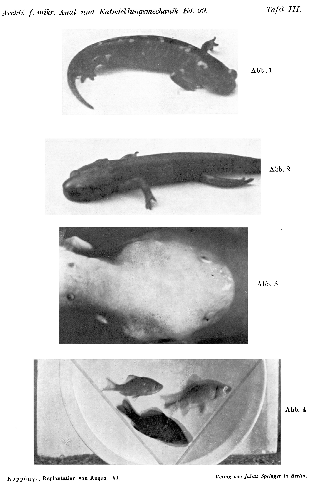

*Archiv für mikroskopische Anatomie und Entwicklungsmechanik*, vol. 99 (1923).

> **Full translation.** A complete English rendering of the running text of “The Replantation of Eyes (III)” (Koppanyi, 1923), including all tables, figure and plate legends, and footnotes. Numbers and table cells were transcribed from the page images, not the noisy OCR.

# The Replantation of Eyes.
## VI. Change of Eye-Colour and Body-Colour.

By

Theodor Koppányi.

*(From the Biological Experimental Institute of the Academy of Sciences in Vienna [Zoological Division].¹)*

With Plate III.

The colour of the eye is conditioned by the colour of the iris [Regenbogenhaut]; the absence or the presence of the uveal pigment gives the character of the albinotic or, respectively, of the pigmented eye. But the colour of the iris need not always remain the same throughout the whole ontogeny. The jackdaw changes its iris-colour with ageing; in humans, too, such colour-shifts occur. All the more readily does a colour-change pertain to the anamniote eye, since these animals also possess an active chromatic skin function. Best known, however, is the colour-change of the larval salamander eye, made famous through the investigations of *Uhlenhuth*, in which the eye too takes part in the general metamorphosis. The metamorphosis of the larval salamander eye consists in the fact that the yellow iris-ring of the eye becomes pigmented (melanised). *Uhlenhuth* found that the transplanted larval eye too participates in the metamorphosis of the host animal. It would be conceivable that the iris pigmentation is conditioned by the black discolouration of the whole surface of the salamander-larva skin, and that the pigment migrates from the surroundings into the iris. In order to test whether this is really the case, larval salamander eyes were transplanted into the orbit of full-grown newts (*Molge vulgaris*). Four newts were used for this purpose, which had lost both their eyes three months earlier through enucleation. The interior of the orbit was freshened up with a few scalpel-cuts (I used a *Graefe* knife) and larval salamander eyes were grafted onto it. The operation succeeded, of which I

> ¹ An abstract of this work appeared under the same title as Communication No. 74 from the Biological Experimental Institute of the Academy of Sciences, Zoological Division, Director H. Przibram, in the Akad. Sitzungsanz. Wien No. 10. 1922.

convinced myself by microscopic serial sections after the animals had been preserved (they lived with foreign eyes for 5 months: from 30 September 1921 until 2 March 1922).

We must above all know that the *Molge* eyes, the yellow iris-ring of which they carry as a larva, do not lose it even after the metamorphosis either, and that therefore in their case an iris pigmentation proceeding from the skin is not to be thought of. If the iris [Regenbogenhaut] of the transplanted salamander-larva eye does not blacken, then the possibility remains open that, in the Fire-salamander, it is really the black skin-pigments appearing at metamorphosis that cause the iris pigmentation. If, however, an iris pigmentation appears on the transplant too, then it is certain that the pigment which appears has not migrated in from the surroundings. This is all the more probable since the newt skin possesses the melanin only in a small quantity in proportion to the salamander, as is already evident from the light colour of the animal.

It was shown very early, already in mid-October, that the yellowish irides discolour one after another, become melanotic. After one month all the transplanted salamander-larva eyes had already undergone the iris pigmentation. Since, as already mentioned, it was proved by the histological investigations undertaken later that all eye-layers are preserved normal, the interpretation of the blackening, say as a degeneration process, is to be excluded.

The accomplished iris pigmentation gives us at the same time information on two questions. In Part II of this work (durability and functional testing) we described, namely, the opposite experiment. We transplanted newt eyes onto related Fire-salamanders and saw that in these eyes too *no* iris pigmentation occurred even after 8 months. From this we must logically draw the conclusion that the determining causes of the iris pigmentation are contained in the eye itself, and that consequently the iris pigmentation of the salamander-larva eyes proceeds autonomously. After a certain time, indifferent whether in the conspecific or in the foreign medium, the iris pigments itself, whereby the time, however — as the investigations of *Uhlenhuth* showed — is largely determined by the age-condition of the host animal.

Furthermore, this experiment proves to us yet something else, namely, that the surroundings exert no influence at all upon the pigmentation of the iris. This conclusion appears all the more justified through the previously cited control-experiment, since, in 8 months, if the black pigment-substances of the salamander skin had had an influence upon the iris pigmentation, the yellow *Molge* iris would unconditionally have had to become pigmented.

This second result is of especial interest for the reason that we described, in Part II of this work, changes of the eye-colour after transplantation in various animals. How these changes arose, however, we could not decide at that time. It was reported, namely, that eyes of light-coloured animals, transplanted onto pigmented species, are re-tuned in the sense of the host animal — more correctly expressed: assume a colour-garb that deviates from that of the transplant-donor. It would have been conceivable that the colour-changes rest precisely upon an in-migration of the surrounding pigment. The newt experiments set forth above do indeed shake this assumption enough, but it was nevertheless necessary to undertake such experiments whose conditions agree with the experiments described in Part II.

As favourable objects there served pigmented and albinotic individuals of the axolotl-larva. The eyes of the pigmented individuals do not differ in essence from the eyes of other newt-species. The eyes of the albinotic animals, however, present something peculiar. The iris is golden-shimmering, can therefore not be entirely pigment-free, but the pupil glows red in contrast to the pigmented eyes. As the histological investigation has shown, the cause of this strange contrast lies in the fact that uveal pigment is present only in the iris [Regenbogenhaut], whereas the choroid is entirely pigmentless.

The question to be posed in these crucial experiments runs as follows: Can heteroplastically grafted-on bulbs on albinotic individuals undergo the same colour-changes as is the case on pigmented [ones]? If that is the case, then we must completely abandon the pigment-in-migration theory, since it is evident without further [ado] that no pigment can penetrate from a *pigmentless* animal into the transplant.

We accordingly transplanted *Molge vulgaris* eyes into the orbit and onto the nape-region of the axolotl-larvae. For this, five pigmented and two albinotic axolotls (*Siredon pisciformis*) were used. Each animal received two newt eyes onto the nape-region; into one pigmented animal newt eyes were also transplanted into the orbit; finally, the eyes of the two white and two pigmented specimens were exchanged alleloplastically. The transplantation was carried out in three sittings. In the first I performed the deplantation onto the nape-region; in the second and third sitting came the enucleation and transplantation of one bulb each. At one [sitting] I never enucleated on both sides.

The healing-in of the transplants proceeded without disturbances and promptly; the corneae did not become cloudy at all. At the beginning the eyes undergo no visible changes. Later, however, ever more pigment appears on the deplanted newt eyes, both on the albinotic ones and on those sitting on pigmented specimens. A part of the golden-shimmering iris becomes darkly coloured. If one looks at such a changed eye, even the expert no longer recognises its descent, and one gains the impression that one has to do with an axolotl-like eye. From this it emerges clearly that the re-tuning [Umstimmung] of the heterotransplants too is not in the least connected with a pigment-in-migration.

This is proven also by the results of the alleloplastic transplantations. If we transplant the albinotic *Siredon* eye into the orbit of the pigmented partner, then we see that the pupil of the albinotic eye in a few days (indeed often already after 48 hours) no longer appears red but black, a sign that the eye-fundus was pigmented. The reverse alleloplastic transplantation of the *Siredon* eye yielded [the result] that the black pupil did not lose its dark colour. This proves to us that it is not the shining-through of the orbital tissues of the pigmented animal that conditions the blackening of the pupil, but rather that it is a matter of a real pigmentation of the transplanted eye.

The strikingly sudden pigmentation of the eye-fundus, i.e. of the choroid, is a sufficient proof that, in the case of the re-tunings, it cannot be a matter of pigment-in-migration processes, since indeed such processes require a longer time before they are capable of producing a visible effect. If one transplants along, with the pigmentless *axolotl* eye, the surrounding white skin, this tissue remains light for months, without its taking up pigment-substances out of the surroundings into itself. This fact supplements the proofs that speak against a pigment-in-migration.

In the second communication of this series (and in a work to be published later) I have set forth that one can, also without particular difficulties, transplant fish eyes onto urodeles. The Crucian-carp eyes (of *Carassius vulgaris*), which were grafted onto already sexually mature Fire-salamanders, exhibited, a short time thereafter, a strong black discolouration of the iris. This appearance could indeed also be conceived as a re-tuning, yet other observed phenomena admonish us to great caution. When I once enucleated a Crucian-carp eye, I saw that the iris of the bulb lifted out of the orbit blackens rapidly. The blackening becomes, if possible, still more intense and distinct when the enucleated fish eyes have been exposed to sunlight. It is therefore not excluded that, in the case of the dysplastically transplanted fish eyes too, it is a matter of such a "dazzle-colour" [Blendungsfarbe]. The fish eyes do in fact participate in the general dazzle-colour of the animal. Upon transection or excision of the spinal cord, not only the skin but also the iris colours darkly. The eyes themselves also possess a dazzle-colour.

Quite differently are (later to be described) experiments with the transplantation of the trout-larva eye into the orbit of the larval salamander to be evaluated. There no distinct blackening of the silver-shimmering iris occurs. Rather, we already see, after two weeks, that the silvery iris [Regenbogenhaut] shimmers no longer in the silvern but in the golden lustre (similar to the eyes of the recipient). The histological investigation (concerning which report will be made later) yielded that in this case too no degeneration-signs are present and that the colour-change of the iris probably stems from the fact that, between cornea and iris, a completely new pigment-mass had formed itself.

Not only does the host animal seem to exert an influence on the colour-change of the eye; it can also, conversely, take place that the body-colour of the host is influenced by means of the eye-transplantation. Let it only be recalled that the blinded experimental fish (*Carassius vulgaris*) and amphibians (*Molge vulgaris* and *Bombinator igneus*) take on a dark, black skin-colour after the removal of the eyeballs. Now it has been, above all, a matter of whether the dazzle-colour can be reversed by substitution of the eyes or not. It is clear that, in the case of the dazzle-colour, it can only be a matter of a direct failure of an eye-function. We do not yet know, however, whether this function is directly the light- or colour-perception, or whether it is a matter of a kind of inner secretion of endochemical effects. The possibility has often been admitted that the eye may have an inner secretion whose producer might perhaps lie in the choroid.

If it were a matter of incretory effects, independent of the nerves, then the eye transplanted into the nape-region too would have to abolish the dazzle-colour.

Such experiments I have, as already described, carried out on young fire-bellied toads [Unken]. The result was that the homoioplastic transplantation of the eyes onto the nape-region of the blinded fire-bellied toad in no way abolishes the dazzle-colour, but it can indeed be reversed by means of functional eye-transferral into the orbit, whereby it comes to a re-differentiation of the retina and to a connection of the specific nerves, i.e. to a re-establishment of the light-perception. This fact proves to us that the chromatic skin function (insofar as it depends on the eye) is regulated by the visual activity of the eyes.

The elimination of the dazzle-colour can be effected not only by means of homoio- and alleloplastic, but also by means of heteroplastic eyereplantation. In the second part of this work (Arch. f. mikr. Anat. u. Entwicklungsmech., this issue) I have described the transferral of eyes of the Bleak (*Alburnus lucidus*) onto Crucian carp (*Carassius vulgaris*). Fig. 4 shows us the success of this heteroplastic transplantation with respect to the re-brightening of the dazzle-colour. I have already mentioned that newts which had already possessed no eyes for 3 months were furnished with larval salamander eyes. These newts were dark; they had the characteristic dazzle-colour. After 6–7 weeks (14–20 November 1921) the animals lost their dark dazzle-colour, a sign that the function of the replants had re-established itself. This was the first case in which animals, too, that had been blind for a longer time were able with their second eyes to perceive the brightness of the surroundings.

### Explanation of the Figures.
### Plate III.

**Fig. 1.** Fire-salamander with a unilaterally transplanted newt eye [Teichmolch eye]. (The other eye is the body's own.)  *(figure not reproduced)*

**Fig. 2.** Fire-salamander (larva ripe for transformation) with bilaterally transplanted Crested-newt eyes [Kammolch eyes].  *(figure not reproduced)*

**Fig. 3.** Axolotl (albino) with bilaterally transplanted pigmented axolotl eyes in the orbit, and with two deplanted Crested-newt eyes [Kammolch eyes] in the nape-region.  *(figure not reproduced)*

**Fig. 4.** Blind (very bottom), normal (top right), and Crucian carp furnished with Bleak-eyes [Laube eyes] (top left).  *(figure not reproduced)*

Archiv f. mikr. Anat. u. Entwicklungsmechanik Bd. 99.

6 *Archiv f. mikr. Anat. und Entwicklungsmechanik Bd. 99.*  *Plate III.*

**Fig. 1.** *(figure not reproduced)*

**Fig. 2.** *(figure not reproduced)*

**Fig. 3.** *(figure not reproduced)*

**Fig. 4.** *(figure not reproduced)*

Koppányi, Replantation of Eyes. VI.  *Verlag von Julius Springer in Berlin.*

## Figures

**Plate III.**

---

*Translator's note.* One of the Biologische Versuchsanstalt (Vienna Vivarium) papers flagged on the project site as a modern rediscovery target. Claims are rendered as stated in the original, not endorsed.
