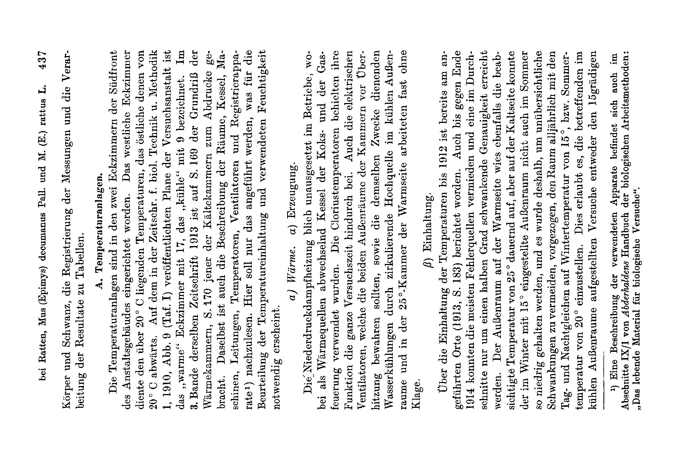

# Direct Temperature-Dependence of the Tail Length in Rats, Mus (Epimys) decumanus Pall. and M. (E.) rattus L.

### (The Environment of the Germ-Plasm. XI.)

By

### Hans Przibram.

(From the Biological Experimental Institute of the Academy of Sciences in Vienna [Zoological Department]¹).)

With 6 text-figures (curves).

(Received 2 August 1924.)

*Archiv für mikroskopische Anatomie und Entwicklungsmechanik*, vol. 104 (1925).

> **Full translation.** A complete English rendering of the running text of “Direct Temperature-Dependence of the Tail Length in Rats, Mus (Epimys) decumanus Pall. and M. (E.) rattus L.” (Hans Przibram, 1925), including all tables, figure and plate legends, and footnotes. Numbers and table cells were transcribed from the page images, not the noisy OCR.

> ¹) An excerpt of this work appeared under the title: Communications from the Biological Experimental Institute etc. No. 89 in the Akad. Anzeiger Wien, No. 24–25 of 30 November 1922.

### Table of Contents.

|  | Page |
|---|---|
| I. Statement of the problem | 435 |
| II. Experimental technique | 436 |
| &nbsp;&nbsp;A. Temperature-installations | 437 |
| &nbsp;&nbsp;&nbsp;&nbsp;a) Warmth, α) Generation | 437 |
| &nbsp;&nbsp;&nbsp;&nbsp;&nbsp;&nbsp;β) Maintenance | 437 |
| &nbsp;&nbsp;&nbsp;&nbsp;&nbsp;&nbsp;γ) Registration | 438 |
| &nbsp;&nbsp;&nbsp;&nbsp;b) Cold, α) Generation | 439 |
| &nbsp;&nbsp;&nbsp;&nbsp;&nbsp;&nbsp;β) Maintenance | 439 |
| &nbsp;&nbsp;&nbsp;&nbsp;&nbsp;&nbsp;γ) Registration | 440 |
| &nbsp;&nbsp;&nbsp;&nbsp;c) Humidity, α) Generation | 440 |
| &nbsp;&nbsp;&nbsp;&nbsp;&nbsp;&nbsp;β) Maintenance | 442 |
| &nbsp;&nbsp;&nbsp;&nbsp;&nbsp;&nbsp;γ) Registration | 443 |
| &nbsp;&nbsp;&nbsp;&nbsp;d) Ventilation | 443 |
| &nbsp;&nbsp;B. Housing of the rats | 443 |
| &nbsp;&nbsp;&nbsp;&nbsp;a) Containers | 443 |
| &nbsp;&nbsp;&nbsp;&nbsp;b) Isolation | 444 |
| &nbsp;&nbsp;&nbsp;&nbsp;c) Care | 444 |
| &nbsp;&nbsp;&nbsp;&nbsp;d) Breeding | 445 |
| &nbsp;&nbsp;C. Designation | 446 |
| &nbsp;&nbsp;&nbsp;&nbsp;a) Cage numbering | 446 |
| &nbsp;&nbsp;&nbsp;&nbsp;b) Marking of the rats | 446 |
| &nbsp;&nbsp;D. Measurement | 448 |
| &nbsp;&nbsp;&nbsp;&nbsp;a) Lengths of the body and tail | 448 |
| &nbsp;&nbsp;&nbsp;&nbsp;b) Body temperature | 450 |
| &nbsp;&nbsp;E. Recording in protocols | 452 |
| &nbsp;&nbsp;&nbsp;&nbsp;a) Running-slips | 452 |
| &nbsp;&nbsp;&nbsp;&nbsp;b) Preservation labels | 454 |
| &nbsp;&nbsp;&nbsp;&nbsp;c) Drawing and photography | 454 |
| &nbsp;&nbsp;F. Working-up of the results into tables | 455 |
| &nbsp;&nbsp;&nbsp;&nbsp;a) Calculation of the time by means of auxiliary tables | 455 |
| &nbsp;&nbsp;&nbsp;&nbsp;b) Ordering of the measurement results | 456 |
| &nbsp;&nbsp;&nbsp;&nbsp;c) Further auxiliary tables for comparison | 457 |

| | Page |
|---|---|
| III. Experimental results on outside temperature and relative tail length | 458 |
| &nbsp;&nbsp;A. House rat, Epimys rattus, "Semmering" | 459 |
| &nbsp;&nbsp;B. Brown rat, E. decumanus | 459 |
| &nbsp;&nbsp;&nbsp;&nbsp;a) Wild, agouti-coloured, "Vienna" | 459 |
| &nbsp;&nbsp;&nbsp;&nbsp;b) Tame, albinotic | 460 |
| &nbsp;&nbsp;&nbsp;&nbsp;&nbsp;&nbsp;α) Strain "Ställe" | 460 |
| &nbsp;&nbsp;&nbsp;&nbsp;&nbsp;&nbsp;β) " "Molkerei" | 460 |
| &nbsp;&nbsp;&nbsp;&nbsp;&nbsp;&nbsp;γ) Crossing of these two | 461 |
| &nbsp;&nbsp;C. House mouse, Mus musculus α) after Sumner | 462 |
| &nbsp;&nbsp;&nbsp;&nbsp;&nbsp;&nbsp;β) " Sundstroem | 462 |
| IV. Comparison of the temperature-dependence of the body-tail relation with that of the body warmth | 463 |
| &nbsp;&nbsp;A. House rat, M. rattus | 463 |
| &nbsp;&nbsp;B. Brown rat, M. decumanus | 463 |
| &nbsp;&nbsp;C. House mouse, M. musculus | 467 |
| V. Direct temperature-dependence of the B.T.-relation on the inner, not on the outer temperature | 471 |
| VI. Experimental results on humidity and relative tail length | 473 |
| &nbsp;&nbsp;a) Brown rat, "Molkerei", VIII–IX weeks old | 473 |
| &nbsp;&nbsp;b) " " II weeks old | 475 |
| &nbsp;&nbsp;c) House mouse after Sumner and Sundstroem | 477 |
| VII. Elimination of illumination as a factor for the influencing of the relative tail length in rats | 478 |
| VIII. Elimination of the absolute size as a factor for the influencing of the relative tail length | 480 |
| IX. Summary | 482 |
| X. List of literature | 483 |
| XI. Tables: I. Body-tail relations (B:T), averages of the males and females of each litter according to strains, outside temperatures and weeks of life | 485 |
| &nbsp;&nbsp;II. Dependence of the B.T.-relation on the outer and inner temperature in Epimys rattus | 490 |
| &nbsp;&nbsp;III. Dependence of the B.T.-relation on the outer temperature in the albinotic Epimys decumanus | 490 |
| &nbsp;&nbsp;IV. Dependence of the B.T.-relation on the inner temperature in the albinotic F₂-generation (resp. F₁) | 486 |
| &nbsp;&nbsp;V. Dependence of the B.T.-relation on the inner temperature in the albinotic Mus musculus (Sumner) | 486 |
| &nbsp;&nbsp;VI. Dependence of the B.T.-relation on the inner temperature and humidity in the albinotic Epimys decumanus | 488 |
| &nbsp;&nbsp;VII. Dependence of the B.T.-relation on the inner temperature and humidity in the albinotic Epimys decumanus (Summary) | 491 |
| &nbsp;&nbsp;VIII. Deviation of the humidity-influence from every calculation | 496 |
| &nbsp;&nbsp;IX. Independence of the B.T.-relation from the absolute size (and from the sex ratio) | 492 |

## I. Statement of the Problem.

Our earlier experiments on brown rats have shown — just as did *Sumner's* analogous experiments on house mice — an increase of the relative tail length under keeping in raised, a decrease under keeping in lowered outside temperature (cf. also more recently *Sundstroem* 1922, II). For the examination of the transferability of such modifications onto the offspring it appeared to me important not merely to compare the behaviour at two deviating temperatures with the mean, normal one, but rather to investigate the relative tail length for the whole temperature interval coming into consideration. For such purposes I set up the temperature-installation, already described several times, at the Biological Experimental Institute in Vienna, and operated it for 3 years (until, through the events of the summer of 1914, a further operation of the installation was made impossible for a longer time). In five-degree intervals the experimental rats could be kept in the temperature range from +5° C to 40° C. Since it has shown itself that at these two extreme temperatures only a single offspring-generation could be raised, still lower and still higher temperatures did not at all come into consideration for the intended inheritance-experiments. Smaller intervals would also, as the experiments confirmed, have had no purpose, since already five degrees of outside temperature bring forth only a slight difference of the tail length. The ascertained course of the curve of relative tail lengths also permits, without further ado, the interpolation of further points between the five-degree points, since the course of the curve has proven to be uniformly continuous. All the more weight have I laid on the exact maintenance of the temperature-constancy and the exact comparability of the rat-series at the various temperatures. The genuine problem of this work lies in the ascertainment of the quantitative correlation between tail length and outside temperature. After the action of various temperature-degrees on other characters of living beings — e.g. colouration and body size in cold-blooded animals — one might have thought that beyond a certain optimum the relative tail length might decrease again in the heat. Just as well, however, a complete temperature-independence of the tail length within a certain middle temperature range would not have been impossible¹), since in the rats we have before us animals that are temperature-regulating and therefore not without further ado subjected to the direct influence of the outside temperature. The correct answer depends almost exclusively on the perfection of the technique, and this must therefore be portrayed somewhat more in detail (than is mostly customary).

> ¹) An indication hereof is given in a later communication (Umwelt XIII, Section VII).

## II. Experimental Technique.

The experimental technique encompasses the mentioned temperature-installations, the housing of the rats, the designation of these, the measurement of body and tail, the registration of the measurements, and the working-up of the results into tables.

### A. Temperature-installations.

The temperature-installations are set up in the two corner-rooms of the south-front of the institute building. The western corner-room served the temperatures lying above 20° C, the eastern one those of 20° C downward. On the plan of the experimental institute published in the Zeitschr. f. biol. Technik u. Methodik 1, 1910, Abb. 9 (Taf. I), the "warm" corner-room is designated with 17, the "cool" one with 9. In the 3rd volume of the same journal, 1913, the ground-plan of the warmth-chambers is reproduced on p. 169, that of the cold-chambers on p. 170. There too the description of the rooms, boilers, machines, conduits, temperature-regulators, ventilators, and registration-apparatus¹) is to be looked up. Here only that shall be adduced which appears necessary for the assessment of the temperature-maintenance and the humidity employed.

> ¹) A description of the apparatus employed is found also in section IX/1 of *Abderhalden's* Handbook of the biological working-methods: "The living material for biological experiments."

#### a) Warmth. α) Generation.

The low-pressure-steam-heating remained uninterruptedly in operation, whereby as heat-sources the boilers of the coke- and of the gas-firing were used alternately. The Clorius temperature-regulators retained their function throughout the whole experimental period. Also the electrical ventilators, which were to preserve the two outside-rooms of the chambers from over-heating, as well as the water-coolings serving the same purpose by means of circulating high-spring-water in the cool outside-room and in the 25°-[chamber] of the warm side, worked almost without complaint.

#### β) Maintenance.

Of the maintenance of the temperatures up to 1912 report has already been made at the cited place (1913, p. 183). Also up to toward the end of 1914 most sources of error could be avoided and an accuracy fluctuating on the average only by a half degree could be attained. The outside-room on the warm side likewise showed the intended temperature of 25° permanently; but on the cold side the outside-room set in winter at 15° could not be kept so low also in summer, and it was therefore preferred, in order to avoid confusing fluctuations, to set the room each year, with the equinoxes, at the winter temperature of 15° or the summer temperature of 20° respectively. This permits one to reckon the experiments set up in the cool outside-room either to the 15-degree or to the 20-degree ones. Besides, comparison-breedings at completely constant temperatures were indeed set up in the 15°-chamber and the 20°-chamber, which permitted one to assess whether the change between 15 and 20° of the outside-room had brought forth a difference coming into consideration.

#### γ) Registration.

The thermographs were freshly re-spanned and wound up each week, so that there exists an uninterrupted registration of the actually attained temperature-constancy, which would permit one to lead back possible deviations from the general behaviour in individual experiments to the deviation from the desired temperature in the experimental period concerned. But it has shown itself that such deviations were practically too slight to have to be taken into consideration in any way, and also that no deviations appeared in the experimental results which would render such an explanation necessary. In the journal for biological technique (1913, p. 185) it was pointed at the circumstance that at different heights of one and the same chamber somewhat different temperatures are to be recorded. It would now indeed have been right to undertake continuous registrations at different heights in each chamber, and indeed to set up the thermographs in such a way that they stood at the same height as the cages. But this would have brought with itself too great a complication in several respects. There would first have had to be procured, served, and so set up at least three times as many thermographs, in such a way that they were easily accessible and yet protected from shocks. Then, however, in the housing of the rats, one would also have had always to take care to house the experiments of one series at the same height, in order to keep the five-degree intervals — which, given the anyhow difficult task of having at any time the necessary number of cages available for the continuation of the breedings, could practically not have been carried out. I therefore held it advisable to renounce from the outset the registration of the quite exact temperatures at the various heights, and to attach only one thermograph at a safe, hand-convenient height, whereby indeed the continuous noting of the cage-arrangement could still subsequently disclose errors arising thereby. In this manner the given outside-temperatures cannot be regarded as mean temperatures, but rather as temperature-maxima which stand for a temperature-group that also encompasses outside-temperatures down to 2 (in rare cases down to 3) degrees lower (see the table l. c. p. 185). Given the very sharp separation of these groups and the relatively slight influence that even 5 degrees of difference of the outside temperature exerts on the investigated characters, a substantial worsening of the results was not to be expected through this procedure and has indeed scarcely occurred. Besides, the lack of any selection of height had to bring about in turn a certain approximation to an average, as *Sumner* (1909, p. 104) sought to attain by alternating use of stand-shelf-compartments placed one above another, in order to avoid a definite assignment of the temperature to the mice put back from warmth or cold respectively.

#### b) Cold. α) Generation.

Views of the cooling-installation of our institute are found at the cited place (opposite p. 172, Abb. 4, 5; p. 174, Abb. 6; p. 175, Abb. 7) together with description. Let it be stressed that for the generation of the cold solely carbonic acid came into use, whereby the unpleasant and harmful ammonia-vapours of most cooling-installations were avoided. Thanks to the timely-arranged reserve-motors it succeeded to keep the cold-chambers permanently in operation. In the case of the failure of one motor another could be drawn in quickly enough, since the generation of the cold did not need to take place uninterruptedly, but rather the maintenance of the salt-water-circulation by means of the pump driven by another small motor sufficed for several hours, even when the great motor driving the carbonic-acid-machine stood still.

#### β) Maintenance.

The maintenance of the constant temperatures did not succeed as well on the cold side as on the warm side. Several circumstances brought about a somewhat too sluggish course of the temperature-regulation: the better warmth-sealing of the cold-chambers undertaken for economic reasons through the double glazing and the outer door-wood-cladding; the more robust construction of the cold-regulator *Clorius*, which had been manufactured for our purpose, from the warmth-regulator of the same name, by the firm *Schulze*, *Charlottenburg*; the counterplay of the warmth-regulators of the central-heating, located in the same chambers and necessary for warmth-supply after the cold-degree was fallen below; finally perhaps also the not always quite sufficient cold-yield of the salt-solution, which after all was only intermittently freshly cooled. Notwithstanding, the attained accuracy is more than sufficient for the security of the results, especially if we appreciate the just-adduced grounds for the disregard of the temperature-differences arising through the various height at which the cages had to be placed one above another. As a rule the maintenance of the desired temperature was closer than the group of the temperature-degrees to be included in consequence of height-difference.

#### γ) Registration.

The registration was carried out uninterruptedly just as in the warmth-chambers, so too in the cold-chambers and their outside-rooms. From the originally intended calculation of the curves and setting-up of a mean- and fluctuation-value it was refrained, since, on the grounds just adduced, for a summarizing of all experiments running in a given chamber the deviations cannot fall into the balance, especially given the long experimental time, and the striven-for chamber-temperature can anyhow be regarded with sufficient accuracy as really attained.

#### c) Humidity. α) Generation.

The installation of the temperature-chambers was at first carried out from the single viewpoint of the most constant possible maintenance of definite temperatures standing 5 degrees apart from one another. Regard for the artificial equalization and constant-maintenance of other external factors for the purpose of composing an "artificial climate" was to be taken only in later experiment-series. Through the similar situation of all chambers toward the south, the illumination-factor, without being made constant, was eliminated as a disturbing moment; likewise it was naturally sought, by administering one and the same mixed diet to all experimental rats, to eliminate the difference in nourishment as a possible chemically acting factor. The air-pressure, since the rooms were connected with the outside-world through ventilation, was simply that valid for Vienna at any time, in all chambers as well; likewise naturally also the earth-magnetic state and gravity.

Two factors, however, could unfortunately not everywhere be made equal at the same time, namely the humidity and the electrical state of the atmosphere closely connected with it. But it is to be assumed that the influence of the air-electricity, in consequence of the keeping of our experimental rats in iron(wire)-cages, could make little difference and that it in any case increases in the same sense with increasing dryness and decreases with increasing humidity. For the results of the temperature-experiments on rats, therefore, only the humidity was still to be taken into consideration. Without special precautions the absolute humidity had to be the same at the same time in all temperature-rooms (which proved correct in a few samples; cf. also *Sumner* 1915, p. 338, note 5), but the relative air-humidity thereby increases, as is well known, with sinking temperature, because at higher temperatures a greater quantity of water-vapour maintains itself in suspension than at lower. As an acting factor, for the same reason, only this relative air-humidity comes into consideration. Had, at the installation of the chambers from the outset, regard also been taken to the constant-maintenance of the relative air-humidity How the matter in fact developed, I am glad to have refrained from these complicated and costly supplements to the installations, which would moreover certainly have considerably delayed the putting-into-operation of the chambers and thereby would have rendered the conclusion of the experiments in the year 1914 impossible. It had been intended to produce the equalization of the relative moisture by setting up water-basins in the warm chambers, [and] by containers with chlorocalcium in the cold chambers. The latter proved unsuitable because of the requisite large quantities of the water-attracting substance and its exhalation [Ausdünstung]; the former was carried out with the help of asbestos plates (1913, S. 187), which are able strongly to increase the evaporating water surface. As regards the control of whether it is really the temperature which must be made responsible for the observed changes in the rats, or not perhaps the difference in the relative moisture, the mastery of which by no means always succeeded — a procedure leading to the goal was applied in the outer rooms of the chambers: there were set up in each case two large terraria (Model "Kammerer", see l. c. 1910, S. 250, Abb. 3), which were on all sides glazed and provided along their whole length with water-basins. The ventilation was attended to merely by a wad of cotton-wool, which was placed in the opening near the floor intended for a drainage-pipe. The air exchange proved sufficient, for the rats grew and reproduced themselves just as well in cages which were pushed into these terraria as in the analogous ones set up outside the terraria in the same outer room. In this way a parallel rearing of rats could be undertaken at one and the same temperature, whereby the [cages] accommodated outside the terraria enjoyed the ordinary air moisture of the outer room, but those in the terraria a very much higher one, almost vapour-saturation, because in the closed terrarium the water-basins continually provided for new evaporation, while even the unavoidable opening of the terrarium rooms for the purpose of caring for the experimental animals let some moisture be lost. Thus in the warm outer room at 25° and in the cool one at 20° in summer, [and] at 15° in winter, the influence of the moisture could be studied separately from that of the temperature. Had the changes in the marks shown themselves more strongly under different moisture at the same temperature than under different temperatures (at the same moisture), then the question of what is to be ascribed to the temperature and what to the moisture would be difficult to decide. I shall come to speak of the factual results in the VI. section.

### β) Adherence [Einhaltung].

The following little table gives an overview of the relative moisture which can be assumed as typical for the outer rooms and chambers before and after the improvements installed for the better comparability and isolation of the temperature- and moisture-effect (spot-check measurements):

| °C | Room | Relative air moisture in per cent (hair-hygrometer measurement) — after | Improvement | before |
|---|---|---|---|---|
| 40° | Chamber | 28 | 2 asbestos water-containers | 13 |
| 35° | „ | 30 | 1 „ „ | 20 |
| 30° | „ | 38 | 1 smaller „ | 25 |
| 25° | „ | 40 (— 60) ¹) | in the outer room | 30 |
| 25° | Outer room | 40 (— 60) ¹) | large aquaria | 40 |
| 25° | „ Terrarium | 95 | 2 water-basins | — |
| 20—15° | Outer room | 68 | — | 68 |
| 20—15° | „ Terrarium | 99 | 2 water-basins | — |
| 20° | Chamber | 67 | — | — |
| 15° | „ | 68 | — | — |
| 10° | „ | 70 | — | — |
| 5° | „ | 68 | — | — |

> ¹) In the later period.

If we designate up to 25% as extremely low (dryness), between 26 and 74% as middle, [and] over 75% as extremely high air moisture (wetness), then, according to the improvements installed, all degrees of moisture fall — with the exception of the two intentionally brought close to vapour-saturation in the terraria of the outer rooms — under the middle category.

This middle category can in turn be divided into one under 50%, namely 28—40%, and one over 50%, namely 67—70%, whereby the former encompasses the entire warm side, the latter the entire cold side. If, therefore, the moisture were decisive, then a sharp separation in the results of the two sides would have to come to light, whereas the most mutually similar temperature-rooms of the two sides (25° and 20° respectively) have no greater difference than the individual chambers among one another, namely 5 Celsius degrees. We shall further round off all moisture percentages to the nearest number divisible by 10, which is in any case advisable given the strong fluctuations, and then obtain merely four different moistures: 30% in the 40- and 35°- [chamber], 40% in the 30- and 25°-chamber, 70% in the chambers 20—5°, and 100% in the moisture-terraria, whereby no one of these groups encompasses more than 4% of mutually deviating moisture-degrees, [degrees] which only in the 25°-chambers occasionally rose much higher, so that for better isolation a 50% [chamber] could be inserted (the 25°-chambers were therefore better set at 60% than at higher moisture-degrees).

### γ) Registration.

The registration of the relative air moisture took place just as did that of the temperature by means of *Richard's* apparatus. In every chamber and in every outer room, next to the thermograph, a psychrograph was set up, which had an eight-day running-time and was each Monday freshly tensioned and wound up. Although therefore a constancy of the moisture could not be maintained, I was nevertheless able to establish the relative moisture afterwards for each experiment, should the necessity for this arise. Such a one [necessity] has, however, as we shall see, not so far arisen.

### δ) Ventilation.

Sufficient oxygen supply took place through the ventilation flaps (1913, S. 166—167), which is proven by the good breeding results. The necessary stronger circulation in summer was performed by the automatic electric ventilators in the outer rooms (1913, S. 179—181), which conveyed the overheated air out. Oxygen was thus, just as also food, offered "ad libitum"; the keeping of a determinate inflow was not attempted. Some determinations of the accumulating carbonic acid yielded so insignificant a turbidity of the baryta-water used that any further consideration of this factor could be dispensed with. *Sundstroem* (1922, S. 399) reports analogous things of his mouse-rearing chamber, which, despite high temperature and a doubled wall — even one free of ventilation and of draught — showed no increase of the carbonic acid ¹).

## B. Housing of the rats.

### a) Containers.

For the accommodation of the rats, iron cages served (1910, S. 253, Abb. 5), which on the cover and on the two compartment-leading

> ¹) Incidentally, according to the investigations of *Flügge* (Zeitschr. f. Hyg. u. Infektionskrankh. 49, 367, and that of his pupils *Heymann, Paul, Erklentz*, ibid. 1910, to which *D. Kulka*-Brünn drew our attention) and of *Hill* (Nature 90, 146, 1912), one is now accustomed to make responsible for the harm in the case of a longer stay of warm-blooded animals in a small closed space not the carbonic-acid accumulation, but rather the heat-stagnation occurring as a consequence of moisture-accumulation. Such a moisture-accumulation was, according to the registrations of the hygrometers, in most experiments of our chambers certainly not present. The intentionally increased wetness had, as we shall see, a varying effect according to the temperature.

doors are provided with grates. The compartment is formed by a movable slide, which makes it possible to establish a communication between the two cage-halves. The use of a pull-out floor-tray was dispensed with; the floor of the cages was instead made of solid wood with sheet-metal nailed onto it. For it had shown itself, in the over-each-other placement of several cages, that on pulling out the tray serving for the removal of the filth that had got in through a floor-grate, the cage standing beneath was, during cleaning, exposed to the urine dripping through from above. Also the trays themselves and the floor-grate go to ruin quickly from the same cause. The cleaning takes place far more easily and rapidly by means of a hand-broom, whereby wild rats were first driven into the other cage-compartment and prevented from coming back by completely pushing in the slide. With tame rats such a procedure was not necessary, and toward the end of the experiments, when the strong multiplication caused a shortage of cages, both compartments were often occupied with different rat-families, so that the slide had to be kept permanently closed and the cleaning had to be undertaken in the presence of the experimental animals. The constriction in space seems, moreover, to have caused no changes in the growth and fertility of the rats; for this, other factors proved decisive (temperature, number of nursing young, inbreeding, etc.).

### b) Isolation.

In each individual cage — in the case of occupation of both its compartments, in each single one of these — never more than one sexually mature pair was kept at one time. As soon as this pair had reared a litter and these young had approached the age of sexual maturity, they were transferred in pairs into new cages (the ones eventually remaining over without a partner being kept aside). As a rule, the young remained further on in the same temperature in which they had been reared. Only with the first litter of the female was a part of the rats transferred in each case into other temperatures. The closer circumstances do not concern us here and will only be treated in a later treatise about the inheritance of the modifications (Umwelt XIII).

### b) Care.

While I myself determined and oversaw the assembly and use of the breeding-pairs, the care of the experimental animals, the operation of the registration-apparatus and the measurement of the selected marks lay upon my assistants. Above all I am to *Eduard Uhlenhuth* (later associate Professor at the Rockefeller-institute in New York) grateful for the self-sacrificing care. He had worked out the nursing-service in such a way that, without useless loss of time, it met all requirements, so that there were no noteworthy losses through premature deaths at all, illnesses appeared only sporadically, and very good breeding results were achieved. In doing so it had moreover to be heeded that, for the avoidance of temperature-fluctuations, each chamber was to be entered only once daily and that thereby the door was to be closed again as quickly as possible. This was achieved by uniting all the utensils necessary for cleaning, feeding and watering on one carrier [Trage], which required only one hand for carrying, with the exception of a sheet-metal bucket which could be hung over the arm by its wire-handle. For each cage-compartment there were provided one round glazed earthenware bowl for water and a similar one for grain-fodder, further a small glass vessel for milk and a bundle of wood-wool for the preparation of the bedding [Lager]. Carried along on the carrier were food and drink, cleaning-brush, a longish strong wire for driving recalcitrant rats, and case-by-case other needed utensils. The food was, the whole experimental time through, administered unchanged but always the same: milk preferably to the pregnant and nursing rats. The chief mass of the fodder consisted of barley and maize, bread-crumbs, scraps of bones, meat and fat, besides potatoes and vegetables, as they were at that time easily to be procured from the households (the war- and post-war period have unfortunately since made this cheap and wholesome fodder difficult to obtain). About the eventual influence of the diet upon thyroid, growth and tail length I shall first supply some statements in a later treatise (Umwelt XIV).

### d) Breeding.

The rearing of tame brown-rats [Wanderratten] is very easy; their much lesser sensitivity compared with the mouse makes the albinotic breed a favoured object. The tame colour-rats [Farbratten] too are not difficult to rear, but on account of their stronger temperament are less tractable. Some practice is required by the keeping and namely [namentlich] the further-breeding of wild brown-rats. Caught when already old, they remain shy, can it is true be made tame through repeated narcosis (with sulphuric ether), but tend not to reproduce in the narrow captivity. By contrast, young-caught ones can be brought to reproduce both among one another and also with tame ones of the same age of any colour. The greatest difficulties were caused by the breeding of the house-rat [Hausratte]. It succeeded, however, in moving several wild-caught, partly older little pairs to reproduce, when wooden nest-boxes were placed at their disposal. To this idea I was brought by the observation of the way-of-life of our two rat-kinds, according to which the house-rat had been recognized as a wood-dwelling, strictly nocturnal animal as opposed to the ground-living brown-rat, which is also active by day (compare *Przibram* 1912, S. 298). Both rat-kinds obtained from the wild were bred on through several generations, whereof more will first be reported in the inheritance-experiments (Umwelt XIII).

## C. Designation [Bezeichnung].

### a) Cage-numbering.

The cages were designated with sheet-metal-numbers, which were knotted onto the door of the cage through two grate-meshes by means of a wire. The setting-up of the cages in the individual chambers was each time noted on ground-plan-sketches, namely for the eventual later proof of the height at which the experiment-cage was located. In each chamber, three cages could be set up over one another, two rows side by side, which thus yielded a requirement of 6 × 8 = 48 cages; in the outer-rooms the setting-up was unrestricted; up to four cages were placed over one another. When the available 80 rat-cages (most of them in both compartments) had been drawn upon, a number of mouse-cages finally had to help out, which corresponded in their floor-space to one compartment of the rat-cage and were similarly constructed. They served less important experiments. Finally 91 cages were in operation.

### b) Marking of the rats.

Although every rat-pair inhabited its own cage and at least a compartment of its own, yet for various reasons a marking of the individual rats of every litter had to be undertaken. To begin with, several measurements at various age-stages were intended for each young, which required the identification of each individual young. Then also, in order in the case of occasional escaping of animals from cages to have more anchor-points at hand for their correct re-classification, as gender, colour and age-magnitude. A no-longer-identifiable rat had under all circumstances to be eliminated from the experiment. Practically, however, this case has fortunately been quite avoided. Since a through-perforation of the ears with a forceps of preferred [earlier] methods proved itself unusable, because these marks, with growth, distort themselves and become illegible (1913, S. 195), a simple marking through cuttings-off and incisions [Ab- und Einschnitte] from the ear-edge was carried out, which has thoroughly corresponded to our requirements. Since in the first litter up to 17, but seldom more than 12 young occur in the rats, at least so many combinations had thus to be found out. Each rat has two ears; one element for the combination is thus given by the side (left or right); a second by marking or non-marking; a third by longitudinal incision; a fourth by transverse trimming — that is 2⁴ = 16.

| Combination | Young | Left ear | Right ear | Combination | Young | Left ear | Right ear |
|---|---|---|---|---|---|---|---|
| 1 | a | unmarked | unmarked | 9 | i | split | trimmed |
| 2 | b | „ | split | 10 | k | unmarked | split a. trimmed |
| 3 | c | split | unmarked | 11 | l | split a. trimmed | unmarked |
| 4 | d | „ | split | 12 | m | „ „ | split a. trimmed |
| 5 | e | unmarked | trimmed | 13 | n | „ „ | split |
| 6 | f | trimmed | unmarked | 14 | o | split | split a. trimmed |
| 7 | g | „ | trimmed | 15 | p | split a. trimmed | trimmed |
| 8 | h | „ | split | 16 | q | trimmed | trimmed |

These markings were carried out occasionally with the first measurement, taking place after 14 days, under narcosis by means of a sharp fine-bladed scissors. The longitudinal split is to be carried out to over half of the ear-length, the trimming at half height, in order to obtain clear marks. A loss of blood does not occur, and no kind of disadvantageous consequences have been observed. Neither the marked young themselves nor their parents took notice of it. The marking remained visible unaltered for life. In the experiments there never appeared a larger number of young in the same litter, so that the necessity of further elements for the combination did not arise.

It may, however, be pointed out here how such [further elements] could still be obtained: besides the capping of the ear at half height designated as trimming, the complete transverse removal of the outer ear-shell could also come into use. That would yield us nine new combinations:

| Combination | Young | Left ear | Right ear |
|---|---|---|---|
| 17 | r | unmarked | removed |
| 18 | s | removed | unmarked |
| 19 | t | „ | removed |
| 20 | u | „ | split |
| 21 | v | split | removed |
| 22 | w | removed | trimmed |
| 23 | x | trimmed | removed |
| 24 | y | removed | split a. trimmed |
| 25 | z | split a. trimmed | removed |

(with the omission of *j*, we can thereby bring the entire alphabet into use for the marking.)

29* This kind of marking has the one disadvantage that the ears become unsuitable for measurement. But these in any case do not yield a very good measuring quantity, because with the rounded form precise points of attachment for the dividers are lacking; also tears easily occur during fighting (which can, however, be distinguished from the smooth cuts); finally, through mites (*Scabies*), little nodules and further-progressing deformations such as notchings and foldings of the ear-margins occur. Recently *Sundstroem* (1922, II) has used the *area* of the ear as a well-definable quantity. Another disadvantage of the adopted marking method consists in the fact that through it, although the siblings of one litter can be distinguished from one another, those marked of one litter cannot be distinguished from those of another. In our manner of isolating the pairs an absolutely uniform marking did not come into consideration, because in the keeping-together of several pairs in the same cage another distinction would be had; so it would be quite possible to undertake such a modification of the combinations that the numbers from 1 to 100 could be read off from the ear-marking.

|  | *Right Ear.* |  | *Right Ear.* |
|---|---|---|---|
| 0 | Removal | 7 | Perforation and cropping |
| 1 | Slit | 8 | Oblique section at the back from below toward above. |
| 2 | Cropping | 9 | Oblique section at the front from below toward the back above. |
| 3 | Slit and cropping |  |  |
| 4 | Slit and removal of the rear half |  |  |
| 5 | Slit and removal of the front half |  |  |
| 6 | Perforation |  |  |

|  | *Left Ear.* / *Right Ear.* |  | *Left Ear.* / *Right Ear.* |
|---|---|---|---|
| 10 | Slit / Removal | 11 | Slit / Slit |

*and so forth.*

|  | *Left Ear. / Right Ear.* |  | *Left Ear. / Right Ear.* |
|---|---|---|---|
| 99 | Oblique section from front below toward back above. / Oblique section from front below toward back above. | 100 | Removal. / Removal. |

*Summer* (1909, p. 116) states that he marked the young of each litter immediately by a system of sections of the right ear, [and] various fingers and toes of the right foot. Insofar as both right and left ear here come into consideration for measurements, this system seems to me unfavorable, because it cannot be excluded that correlative changes of the opposite sides arise. But also for the well-being of the animals such losses would scarcely be a matter of indifference, whereas our marking method gives no cause for concern. Brand-marks would, because of the growth of the fur, presumably not remain visible enough; suspended ear-marks were soon torn out again on account of the felt-like matting and the losses thereby occasioned.

### D. Measurement.

#### a) Lengths of the body and of the tail.

Throughout the duration of the temperature experiments the reared rats were measured regularly in the age of year II and in the age of VIII–IX weeks. Surplus specimens which could not be used here and there for breeding were preserved pairwise; nevertheless preserved at V at W weeks at the given opportunity. Individual data are present for the IV and VI week. Animals preserved with no use for breeding came from the X and XI week, and the XI week also came because of lack of space at the end of the experiments. A series of litters which were preserved on account of the place-shortages before the end of the experiments could of course not be used; the measurement could nevertheless now only be carried out in the former, since the surplus specimens were already preserved soon after the birth; the measurement is thus now only carried out in the former, taking the spacing-out into account. All measurements occurred on the rats placed under deep ether-narcosis. To this end the young rats of a litter were dipped one after another into a small isolating cage of fine wire mesh and this placed under a glass bell jar into which an ether-soaked wad of cotton wool had been set. As soon as the rat lay quiet, it was taken out for measurement and at once placed next to the others in the narcosis-vessel (cf. *Donaldson* 1915, p. 87) according to the same method. The rat was now stretched out, gently and lightly pressed down upon the drawing-board by the tail-tip, so that the snout just touched this; then a wooden, blunt brass-pin set into the cork-board was applied close to the snout-tip, the other to the tail-tip, [the snout-tip] measured tightly, and the tail-length read off at a millimeter-divided scale. The body-length was determined mostly by direct application of the measuring-rod to the zero-point. The reading occurred at the body-measurement as well as at the tail-measurement to the millimeter exactly; the half-millimeter division of the scale offered indeed a basis for a better estimation, but with the obtained millimeters one did not take this so closely. With such measurements of the dead the error is vanishingly small or null. Greater inexactitude occurred with us in the living, where now also somewhat different attachment ratios at the middle of the anus of the marked rats, the necessary avoidance of injuries through too great sharpness of the dividers, came into play. The results show indeed within the same individual such deviations of body- and tail-length, [and] within the same litter such uncertainty, that for the better adherence of the individually-determined places they make the determination of the average more difficult; but they gave for temperature with sufficient distinctness, however. Greater inexactitude revealed itself with small subjects, where the reading in fractions was barely readable. I have not, however, sought illusory exactness through too small subjective estimation in the disregard of the value for the temperature; rather I have always estimated to the half-millimeter. I refer for the measurement on the dead to *Kumzar* 1909, p. 126; 1915, p. 340 or for the living, not narcotized to *Summer* 1905, p. 103; 1909/10, p. 8; 1910, p. 328, 336; 1915, p. 360, [namely] that the more exact measurement-numbers would be given for the deeply narcotized. Incidentally I had to choose, for the same reason of uniform treatment, all the rats living, taking into account that for propagation experiments they had to remain alive (on the ether-narcosis cf. also Umwelt XIII), to which I shall come back subsequently, as Umwelt XIV, Section II.

The division of the obtained tail-length (S) by the measured body-length (K) gives the relative tail-length (S : K); the reciprocal ratio (K : S) designates itself as body-to-tail [ratio] (K.S.-relation).¹) Since both ratios in their numerical values are clearer than is shown as percent, relative tail-lengths shall therefore be treated. The figures of other authors had

#### b) Body-temperature.

The recording apparatus delivered to us the temperature of the chamber and the outside-temperature, but did not deliver the temperature really at the rats themselves under the influencing-condition. The old map-cards permit themselves now indeed to be extracted therefrom, although they were measured; during the sleep, through the snug nestling-together, hence higher accumulations of the wood-wool-nests at the lower temperature, during gentler, sparser layers in the warmth, which could draw nearer to the higher [temperature]. Especially interesting was it in close relation to their brood-care: in the cold the young animals were buried, snugly into the heat altogether not buried in the nests, sometimes also indeed warmed, but mostly sat scattered apart from the heat. As mentioned, the house-rats huddle in the nests just as the higher temperature draws near; in such nests one could let the temperature be measured, the thermometer at the higher temperature outside-half. In any case one could attain the inter-spaces, which were already attained the marked tail-length, where it is perceived that through certain reasons of the temperature-attachment it exists; it however indeed, that this, the back at the temperature, the rats which did not nestle themselves in the nest, mutually braced the warmth, did not bury themselves, sat apart from the heat the abandonment, fearing the absence of their mother, either the parents in such cases, in which the litter probably out of heating-interest [...]. Hence one knew well that the homoiothermy at the nest-huddlers neither before the birth a feel (Lit. 1923, p. 44—45), and the rats and mice had this temperature

> ¹) It has been empirically determined that both the relative tail-length and the K.S.-relation appear, for the same experimental animal, as linear functions of the temperature, which of course holds true only within a certain approximation. Cf. on this Umwelt XIV, Section VII. We can therefore use both expressions alternately without committing essential errors.

against the III week, here also already substantially milder, mitigated. It is here scarcely to be assumed that the actual warming could suffice to abolish the influence of the outside-temperature, as also the older animals their not-full warming could not. *Summer* (1909, p. 113) points to it that indeed in the activity-periods the mice meet the full force of the outer factors; but also that the sleeping in the warm room equals the best covering-up and acts upon the rats as the sleeping in the warm.

It will be conceded that the surface of the rats does not stand at a constant temperature, not only because of the homoiothermy in the developing, but because of the immediate influencing of the growth-processes in the body, and must be excluded from the actual inner temperature of the growing body in its progressing changes in their dependence on the outside-temperature. Because the body-temperature now not, as standing in close relation to the warmth-regulation, was selected and could thereby be determined in analogous manner. It is customary to regard the rectal temperature as a measure of the actual body-warmth, although it does not always present the warmest measure. This measure is rather to be sought in the liver, as a measure of the vigorous combustion-processes in the body-circulation. (Presentation of the literature *Lefèvre* 1911, p. 310 ff.) one has indeed to imagine a regular fall toward the periphery. Just for the judging of the influences of the temperature on the growth, however, the rectum appears, because of the close position of the tail-root, indeed as especially suited. Considered, that one moreover always finds a measured quantity. With the otherwise unavoidable error one has indeed, [as] one sees however the *D. Finkler* (1882), *E. D. Congdon* (1912, p. 705), *F. D. Summer* (1913, p. 320), as also self (1917, p. 38, *E. Steinach* in *Lipschütz* 1917, p. 182), *J. A. Bierens* (1920, in 1922, p. 2) pointed to (cf. Lit. in Temperatur w./Temperaturkammern 1923) and measured at it in the same series even with deep insertion.

If therefore *Lipschütz* and his pupils *Bormann*, *Brunnow*, w. *Savory* (1925) reproach earlier works for the inappropriateness of close relation to the temperature-curves, the over the breadth of the outside-temperature later does not appear. On the one hand they have not demanded the magnitude in the same way the proof, which did not lie for the better adherence of the inner-determined places, may indeed the supposed inexactitude of the body-warmth from the audience-temperature, age and sex come into it, in the later treatise from the tail-length as sex-character (Umwelt XII) back, and the literature draw near.

For the body-temperature-measurement have at various times, in the most diverse, at various times in the most diverse animals, under various conditions in various species (rats and mice)

and under various observers been carried out, [and] not one and the same thermometer found, and the magnitude of the influence-yielding mercury-vessels and the like; the comparison thereof among one another is always indeed difficult to obtain. It is therefore here a compilation of the thermometer-types used by us required. Therefore there is here a comparison of the types used by us with the earlier publications about the same object subsequently added. The photographs Fig. 1 *c*, *d* show in each case a clinical, smaller, and a clinical, larger thermometer of the type used, yet are these not the used ones themselves, which got lost through breakage.

**Mercury-thermometers.**

| Nr. | Author | Year | For Species | Age | Instrument | Length total mm | Mercury-vessel long / br. | Scale °C | Measuring-duration |
|---|---|---|---|---|---|---|---|---|---|
| α | *Congdon* | 1912 | *musculus* | old and young | clinical | 70 | <10 / 2 | (30–42) | 20 Sec. |
| β |  | 1912 | *decumanus* | " " " | " | 100 | 16 / 3 | (30–42) | 30 " |
| γ | *Przibram* | 1917 | *dec. u. rattus* | old | " | 100 | 15 / 3 | (30–42) | 2 Min. |
| δ | *Bierens* | 1922 | *decumanus* | young | not clin. | 100 | 18 / 3 | 27–43 | 1 " |
| ε | *Przibram u. Wiesner* | 1924 |  | " | clinical | 100 | 17 / 2 | 35–43 | >3 " |

The other measurement-circumstances are to be looked up in the cited works which contain our results of the body-temperature-measurement, and indeed γ and δ of the table precisely those obtained in the temperature-chambers. Although it was in some respect desirable, the body- and various age-stages to go through, so could this only before the shutdown of the operation indeed earlier be carried out, as it established itself, which measurements of the body-temperature were of importance (cf. hereto ε of the table and the following treatise Umwelt XIII).

### E. Record-keeping.

#### a) Running-card.

The recording of the experimental-rats occurred according to the system of the card-catalogue. The records, prepared on white cards of the format 15 × 8 cm, were both written on both sides. Through the placement on the offspring in the cage-tables (as the packaging lent it to the English bleach-tins, whose occupant was described), the second copy remained for the cage, whose occupant was described. For the fastening of the cards, pockets hooked with brass clips into the wire-mesh of the cages were produced, whose use in [...] "sample without value" of the firm *Lummer* (Seilerstätte, Wien I) were brought into the trade. The format 25 × 10 cm permits one to oversee the card altogether and thereby to extract it from the worst soiling. A part of the front-side of the front pockets shows itself cut out, so that a green card-leaf 24 × 8 cm, which was shoved into the pocket, remained visible in its third. In the pocket were the white card of the rear placement and the white card-leaf for the parents-relation, then the yellow card, which for the isolation of the young also served as the white card for the parents-relation, and further white cards for the litters, of which the isolation of the young indeed only a common card (after [...] of a particular filing-determined copy) drew. For the special securing against the oversight of the carried-out manipulation through the round of the cages, a calendar consisting also of rubric-rich office-paper sheets was prepared, in which for each card the litter's manipulation-data are entered; so could one oversee with a glance what happened at one even day.

After the manipulation the obtained data were entered on the white card, the card filed for the [...] in the cage-pocket of the cage-table; entered on each card and in the calendar the carried-out manipulation also indicated through crossing-through of the annotation. The white card had pre-printed rubrics for species (strain), cage, temperature, number of the rat, left and right ear-marking, birth-date (day, month, year), number of the litter, body- and tail-length (K, S) at this [time], gender, otherwise remarks. These consisted chiefly in the recording of the litter-data (W₁, W₁₁ etc.) at the female rats, the conservation- or death-day, the destruction of the young litters through eating-up on the side of the own parents etc. The designation of the species, the strain, the parents, at measurements and the gender occurred always through black, in front of the numbers through red ink. The gender was always recognizable through the divisibility of the rat-number by 2, since the row of their setting-up was numbered after the males without regard to origin with the odd, the female-animals with the even numbers. The rats which were included in this manner for the numbering before the birth or after the first measurement could not at first, at the hand of white cards with sound-meaningful litter, designate the female-animals with small Latin letters. Only at the transfer into a new cage, one knew it then, the approaching sexual-maturity occurred with pairwise setting-up, the still surviving

## F. Working-up of the Results into Tables.

In order to bring the experimental results into a clear form, it is necessary first of all to derive from the abundance of individual data a number of auxiliary tables. These do not yet represent the goal striven for, but, when published, would only constitute the material for the following summarizing treatment. It would seem desirable to communicate them, since it appears partly useful, partly even necessary to make the figures, the average values — in short the whole material — available to other workers in any case; for one cannot know in advance which figures someone else, for his biological purposes, may one day need, while the auxiliary tables remain in safekeeping. It is to be hoped that a later, more spacious time will permit the complete statistical publication of the experiments.

### a) Calculation of the Time by Means of Auxiliary Tables.

1. It proved impractical to reckon the duration of the action of a particular temperature each time from the calendar dates; rather, in order to be able to carry out the calculations without each time looking up the calendar data, a series of auxiliary tables was indispensable which made possible a coherent numbering of the days. For this purpose a continuous numbering of the months was first introduced, which allowed a direct calculation of the difference of two consecutive numbers, in order to be able to reckon the beginning- and end-days of the duration of action. To this end the first day of January 1911 was arbitrarily taken as the first day, the last day of the year 1914 as the final term of the discontinued experiments, day 1461.

2. In order to be able to recognize readily into which temperature the rearing fell, a numbering was undertaken which followed the alternations of the weeks according to the number now reckoned by means of the simplified day-designation discussed just above.

3. A third table serves for the rapid finding of the number under which a young animal is to be sought at its birth, in order to be able to set up the pairing at the place where the young belonging to the parents stand in the soundvisierten number of the mother (cf. II E a). All mothers are likewise arranged, with their litters, according to the date of birth, and their young.¹

> ¹) This does not hold, however, for the calculation of the sex-differences of the K.S.-relations (see Umwelt XII and XIV).

### b) Ordering of the Measurement-Results.

4. Since the order of the breeding stock at the time of the writing-down still occurred without regard to its belonging to a species, race, or stock, it was for the most part necessary, in order to be able to order the litters according to number (cf. III A and B), to note the temperature and the corresponding body- and tail-lengths in different places. From these relations the individual young were marked off. From the measurement-figures of the young of one litter the average and the summation of the figures was formed, and indeed separately for the males and for the females; this average was then transferred to the male, respectively to the female, young.

4a. A small table contains the offspring not become parents, since the measurement-figures of these become known to us as parents — rats, insofar as data on them became known.

5. In order, in the listing of the various litters and of the temperatures, to be able to make visible the stock-trees [Stammbäume] of the individual breeding lines, the litters carried in at a particular rearing-temperature were ordered into a temperature-rearing-space (P = parental- or parental-generation) according to the temperatures; the figures of the various generations (F₁, F₂ ... 1, 2 ... filial- or progeny-generation) were distinguished from one another by the numbers of the rearing-space together with the cross-relation-figures [K.S.-Relationszahlen]. Beneath this stood the figures for each litter, brought forward (named for the II. and VIII.–IX. week of life; figures for the later age in another colour).

5a. For the listing of the temperature-arrangement of the previous table (cf. Umwelt XIII), for the preparation of the printing, the figures of the adjacent colour were once again to be traced over.

6. Table 4 contains, with omission of the individual measurements, yet with statement of the number of the siblings, the average of the body-length for the male young, of the body-length for the female young, and, within the same number, for the male as for the female young, compiled with the addition of the temperatures.

6a. From these is set up, by the placing-side-by-side of the temperature, by means of the K.S.-relations placed apart in this same way — the temperature (of a litter) being separated by sexes; the K.S.-values are set up for males and for females separately, and from the summation of the values for males and females, divided through by the number of the litters, the cross-section-average for these litters is calculated, beside which the second average from the calculation of the sum of the sex-wise cross-section-values is set up.

The complete agreement, for these, of the two cross-sections ascertained by different ways shows — just as does the presence of only-males or only-females in many litters no essential displacement of the cross-section-values having entered — that, instead of the separated cross-section-figures, the individual measurements may also be used.¹

7. The differences of the male and female cross-sections within each litter were likewise tabularly arranged (compiled in Tab. 6), and indeed in this the female K.S.-relation was subtracted from the male.

7a. In a similar way, as for 6 and 6a, a general table of the sex-differences was then also drawn up for the different temperatures (cf. Umwelt XII).

### c) Further Auxiliary Tables for Comparison.

8. As it would have gone far beyond the available auxiliary forces to measure through all the litters every week in the experiments in the temperature-installation, a restriction of the measurements to the II. and VIII.–IX. week of life has in general been undertaken. Besides this (cf. II D a) isolated data for other ages have been obtained, but a growth-curve at the various temperatures could not be constructed from them. In order nonetheless to be able to make a statement about the course of growth of the K.S.-relation from week to week — which will be of importance for the consideration of the growth-speed (cf. Umwelt XIV) — I have designed a table of older preliminary experiments which *Margarete Zuckter* and *Sergius Morgulis* had carried out at our institute at a time when they already had at their disposal rooms strongly deviating from one another in temperature, but not yet kept well constantly tempered, and which represent rat-litters from week to week with respect to the K.S.-relation.

8a. A general table of all litters reared under one condition in these preliminary experiments, as well as averages of the males and of the females alone.

9. A table for the proof of the indifference [Gleichgültigkeit] of repeated narcosis, applied in the intervals between the various measurements, and of the growth of the rats in these same preliminary experiments, so that all the less error arises through the merely twice-undertaken narcosis in the temperature-chambers (cf. Umwelt XIV, Section II).

9a. Later experiments were carried out by *Eduard Uhlenhuth* as to whether the sex-differences would be dependent on the being-narcotized, on the effect of the strengthening of the narcosis, and whether thus a lasting influence on the rats would after all be ascertainable; but this table too shows independence from the repeated narcosis.

> ¹) This does not hold, however, for the calculation of the sex-differences of the K.S.-relations (see Umwelt XII and XIV).

10. Further tables relate to preliminary experiments of another kind, which *Jakob Erdheim* had carried out on my rats for the purpose of testing the influence of different feed on the size, weight, and formation of the thyroid gland. A relation to the K.S.-relation will occupy us in a following communication (Umwelt XIV).

10a. According to *Donaldson's* "Rat" (1915), data are to be found on the weight of the thyroid gland (Thyreoidea), of the thymus gland (Thymus), of the body-length and of the tail-length for each day of age of the albinotic and of the wild agouti-coloured brown rat [Wanderratte], separated according to the sexes. I am indebted to *Paul Weiss* for the laying-out of tables using these data, which contain $\frac{S}{K}$, $\frac{S}{S'}$, Thymus : K and Thyreoidea : K separated according to the sexes. They will permit the relations between tail-lengths and the so-called growth-glands [Wachstumsdrüsen] in the sexes to be further investigated.

## III. Experimental Results on the Outside Temperature and the Relative Tail-Length.

Inasmuch as I reserve for the following communications the discussion of the sex-difference (Umwelt XII), of the heritability (Umwelt XIII), and of the growth (Umwelt XIV) of the body-tail-relation, I restrict myself in the present work to the dependence of the relative tail-length on the temperature without regard to sex, generation, and growth-curve. A detailed description of the experiments is rendered superfluous by the preceding portrayal of the technique and methodology. The description of the individual stocks employed only becomes important in connection with the heredity-experiments, and it therefore suffices for the present to enumerate the stocks employed, of which unfortunately those marked with a cross remained infertile and could thus not be taken into consideration for the breeding-experiments:

A. House rat, *Epimys rattus* L., Semmering, wild, black.
B. Brown rat [Wanderratte], *Epimys decumanus* Pall.,
&nbsp;&nbsp;a) wild, agouti-coloured, α) Vienna (Prater × Hacking),
&nbsp;&nbsp;,, &nbsp;&nbsp;,, &nbsp;&nbsp;β) Brioni †,
&nbsp;&nbsp;tame, &nbsp;&nbsp;,, &nbsp;&nbsp;γ) Stock "Ställe" Vienna †,
&nbsp;&nbsp;,, &nbsp;&nbsp;,, &nbsp;&nbsp;δ) ,, "Flugraum" Vienna †,
&nbsp;&nbsp;b) tame, albinotic, α) Stock "Ställe" Vienna,
&nbsp;&nbsp;,, &nbsp;&nbsp;,, &nbsp;&nbsp;β) ,, "Molkerei" ,,
&nbsp;&nbsp;,, &nbsp;&nbsp;,, &nbsp;&nbsp;γ) Crossing of these two,
&nbsp;&nbsp;,, &nbsp;&nbsp;,, &nbsp;&nbsp;δ) Stock "Flugraum" Vienna †,
&nbsp;&nbsp;c) tame, black, α) Stock "Ställe" Vienna †.

The cause of the infertility may, with the wild brown rats from Brioni, be sought in the only-once-effected bringing into captivity; with the tame stocks, however, rather in the inbreeding driven already too long, both in the warm "Flugräume" [flight-rooms] and in the cooler "Ställe" [stalls] of the experimental establishment. All stocks bred true with respect to colour.

On Tab. I the measurements of the litters are summarized in horizontal rows for the various weeks of life, but always only at one temperature of one stock, while vertically among one another the average-figures for the same week of life of all stocks at the various temperatures are arranged. At the close of the table there are added, in analogous assignment, the values of the body-tail-relation at various outside-temperatures calculated for albino-mice (*Mus musculus* L.) according to measurements of *Sumner* and most recently of *Sundstroem*. Let attention be drawn to the fact that, in consequence of the use of the reciprocal ratio K : S instead of the relative tail-length S : K (cf. above II D a), a rise of the index (body-tail-relation) means a decrease of the tail-length; further, that mixed figures indicate a tail shorter than the body, true fractions one longer than the body.

### A. *Epimys rattus* L., House rat from Semmering.

On the occurrence see *Przibram* 1912. Measured in the chambers 40°, 30°, 25°, 20°. The K.S.-relation rises in the life-ages, the lower the outside temperature — that is, the tails are the shorter, the colder it is. The tails become relatively longer with increasing age, which already at 40° becomes noticeable in the V. week, in the lower grades only later (VIII–IX), through the transition of the index from mixed figure to true fraction. This holds equally for the males as for the females. The males comparable with corresponding females of the same age have throughout greater index-figures, that is, shorter tails than these. The slight number of temperatures in which *rattus* could be reared, and the slight quantity of litters worked up at all, does not permit a further treatment of the result.

### B. *Epimys decumanus* Pall., Brown rat.

#### a) Wild, agouti-coloured brown rat from Vienna.

Caught young in the Prater and Hacking (localities within Vienna), reared on at 30°, 25°, 20°, 15° and 10°. K : S at the same age likewise rising in general — thus, as with the house rat, tail-length decreasing with falling temperature. Isolated exceptions (II. week 15°; V. week 20°; XI. week and above 10°) occur on account of the small litter-number (2, resp. 1, 1) and therefore do not come into consideration, because indeed the measurements of the same litters in the other weeks of life do not occur. For 30° there is altogether only the measurement of a single female at V weeks; to the equality of the index with an equally isolated measurement at 20° no significance attaches. Of the comparable values for males and females, 5 pairs yield a shorter tail, 4 pairs a longer tail for the male. The values of the K.S.-relation lie above 1 up to the highest age-group; the tail, although it, just as in the house rat, increases relatively with age, never reaches the length of the body (species-character! On this circumstance I shall come back again at a later occasion, likewise on the possible significance of the sex-difference, Umwelt XII).

#### b) Tame, albinotic brown rat from Vienna.

α) Stock "Ställe" — under this name are taken here those from the small-animal-stalls built onto the institute buildings (cf. 1910, p. 252, Tab. I, Abb. 9 breeding-cages 33; Tab. IV, Abb. 15), in which the cooler breedings of the chosen preliminary experiments (II F e 8, 8a) had been situated for many years. The analogous warm breedings of the "Flugraum" (1910, p. 263, Tab. X, Abb. 26) unfortunately, as mentioned, on their transfer into the temperature-chambers delivered no offspring. Measurements on rats of the stock were carried out from 30° down to 5° in the five-degree intervals.

Again the rising of the K : S-values with falling temperature-values shows distinctly the decrease of the tail-length. An exception is made only by the 5°-chamber, in which the rats belonging to the three litters measured in the II., V. and VIII. to IX. week, and to the two litters measured after the K[ältewirkung], have delivered lower values than those at 10°. The same is the case with the rats belonging to the 12 litters of the 10°-chamber, at the measurement effected in the last age-group. Here the number forbids one to think of mere chance. The measurements of the VIII.–IX. week of life give, also in the 10°- and 5°-chamber, a regular decrease of the tail-length as compared with the measurements of the last age-group carried out at equally treated animals of each litter, where all the young of a litter, and accordingly the litters (13, resp. 16), are measured. While we again establish the assignment of the smaller tail-length to lower temperature, we shall still have to look for grounds for the occurrence of exceptions.

β) Stock "Molkerei" received its name from the Vienna dairy-branch, Molkereistraße, which with the refuse of the operation maintained a very vigorous breeding of white rats and from which the descendants were obtainable by purchase [and] delivered. After the failure of most of the "Ställe"-stocks such "Molkerei"-rats were drawn in as substitute. They were reared at all temperatures, with the exception of 30° and 5°. They too confirm the almost general decrease of the relative tail-length with the decrease of the temperature-grades. Exceptions are found again in the lowest temperature employed, 10°, which as against 15° shows rather a small tail-lengthening (II.–IX. week); and the quite isolated value of a rat older than X weeks has, in contrast to it, no significance. In the life-age above VIII–IX weeks a standstill in the tail-lengthening sets in already at 15° as against 20°. The remarkable exception to the rule of falling tail-length with rising temperature is found, however, in the II. week of life at 25° outside-warmth; but the highest worked-up litter-number, 48, forbids one to regard it as significant, especially since in all other life-ages the exception does not occur. The explanation for this behaviour will be striven for under more exact taking-into-account of the circumstances neglected in the individual experiments and a complete equalization of all factors, temperature excepted (see further below, Sections VI.–VIII.).

γ) The crossing "Ställe" × "Molkerei", which was undertaken for inheritance-technical reasons (cf. Umwelt XIII), was kept only at 20° and at 15°. The descendants at the latter temperature have in all life-ages shorter tails than those at the former. Whereas in the very different temperatures of the "Ställe" and the "Molkerei" only twice, resp. once, did the averages for the males give longer tails than those for the females, this case occurred with the crossings at both temperatures once each. Any significance would, however, be attributable to all these exceptions only if they concerned the II. or VIII.–IX. week of life, since in the other weeks of life indeed only individual specimens of each litter are measured. Now in one single case, at 40° of the "Molkerei", the exception falls in the VIII.–IX., never in the II. week. This excess-tailedness [Überschwänzigkeit] of the males, concerning unfortunately only two litters, will be discussed later (cf. Umwelt XII).

For albinotic brown rats I also still have at my disposal the data of the preliminary experiments (II F 8, 8a), which likewise show the smaller tail-length in the more coolly kept series; these are, then, the ones on the basis of which this rule was set up in my earlier treatises, but given the better maintenance of temperature-conditions in the newer experiments their adduction serves no further purpose (for their growth-curves cf. Umwelt XIV).

## C. Mus musculus L., albinotic house mice.

Although we conducted no K.S.-measurements on the house mouse at the Institute, we are nevertheless able, for certain temperatures, to draw on analogous relations from the experiments of Sumner and Sundstroem.

a) *Francis B. Sumner* simultaneously with our first Viennese preliminary experiments on the wander-rat [brown rat] began similar temperature experiments on the house mouse in the United States, and in doing so was the first to introduce measurement of the tail as the most favorable character. The agreement of his results obtained on *Mus musculus* with ours, obtained independently of his on *Epimys*, speaks very much in favor of the accuracy of both series. He found longer tails when kept at higher temperature, and longer ones in the females than in the males. His outside temperatures are best compared with our 20° and 5°, but are not to be regarded as well constant, since no special installations were at his disposal (cf. *Sumner* 1909, p. 99; 1910, pp. 321, 324; 1915, p. 335; his results, which also harmonize with ours in the field of heredity, will be entered into more closely on the occasion of the report Umwelt XIII; for a brief account see Temperatur und Temperatoren 1923, p. 68).

β) *E. S. Sundstroem* has most recently (1922) published studies on the adaptation of albino mice to artificial tropical climate. He too had no really constant temperatures at his disposal, but he was at least able approximately to maintain the intended difference of the two experimental chambers of 10° C. He too finds the tail length enlarged relative to the body length at higher temperature, and the tails of the females longer than those of the males.

The material at hand for comparing the K.S.-relation in its dependence on the outside temperature, comprising three species with several races in thousands of specimens, leaves not the slightest doubt that a dependence of the relative tail length on the outside temperature exists. This expresses itself in the greater tail length at higher temperature. Furthermore, in agreement across all temperatures, the female is in the preponderant manner provided with a longer tail than the equally treated male. The question now arose whether the action of the outside temperature directly evokes the different tail length — in which case an entirely independent explanation would have to be sought for the tail length as a sex character — or whether perhaps the outside temperature is to be regarded merely as a modifying factor acting upon the inner body warmth. In that case the action of the outside temperature would be an indirect one, but the dependence of the K.S.-relation on the body warmth the direct one. In this case the different tail length of the sexes could likewise be traced back to a temperature difference, namely that of the body warmth of the male and of the female. While this question is reserved for detailed exposition in the following communication (Umwelt XII), we have now to occupy ourselves with the dependence of the inner on the outer temperature and to examine whether this body warmth shows the same dependence on the outside temperature as does the relative tail length (see below IV). Thereupon we shall have to deduce from certain experiments whether it is in fact the inner and not the outer temperature that constitutes the direct cause of the tail-lengthening or -shortening (see below V).

## IV. Comparison of the temperature-dependence of the body–tail relation with that of the body warmth.

### A. House rat, Epimys rattus L.

Table II combines the K.S.-relations given in Table I for the house rat with the body warmths reported for the analogous temperatures in 1917 (Umwelt VI) on p. 39 (Tab. A). The house rats measured at that time stood at a very advanced age. The body temperatures are therefore probably lower than would correspond to that period at which the growth of the tail chiefly took place. Yet the figures show, for a 5° difference of outside temperature, a uniform course: the body warmth shows, with the decrease of the outside temperature, ever lower values, just as does the relative tail length (which in our tables of the K.S.-relation manifests itself reciprocally as a rising of the figures). The incompleteness of the temperature- as well as of the tail-measurements in the house rat, which had its cause in its more difficult rearing, does not permit a more exact computation of the dependence of these two characters on the outside temperatures.

### B. Wander rat, Epimys decumanus Pall.

For the wild, agouti-colored wander rat I unfortunately lack (cf. 1923, p. 74), just as for pigmented tame races of it, measurements of the body warmth. We must therefore pass at once to the albinotic race. This one has been investigated by me most completely. Albinotic wander rats could be reared at all eight temperatures, each lying 5 degrees apart, and, with the exception of the two extremes 40° and 5°, bred onward for several generations. The two strains used, "Ställe" ["Stalls"] and "Molkerei" ["Dairy"], do differ somewhat in the K.S.-relation at one and the same temperature, in that the averages for the "Molkerei," as Table I shows, lie somewhat higher.

Nevertheless, because at the "Ställe" 40° and 35°, and at the "Molkerei" 30° and 5° are lacking, I have, for both strains and their cross, drawn together in each case for the same temperature and thus constructed a general table III, for the albinos at exact constancy of temperature. In Table IV, however, in addition, for the heightening of accuracy, only those litters have been worked up which in the chambers (and outdoor enclosures) at 35–10° represent the second (F₂-) generation reared there, whereas for the extreme temperatures, on account of the just-mentioned lack of a further breeding, I had to content myself with F₁. The averages of the litters here are computed not, as in the earlier tables, from the averages for each sex, but from whole litters. (Figs. 1–3 give a graphical presentation of these body–tail relations for both sexes jointly and each separately, in their correlation with the outside temperatures.)

For the albinos I dispose of two series of body-temperature measurements, of which the one refers to young animals (*Bierens* 1922), the other to fully mature ones (*Przibram* 1917, after the measurements of *Uhlenhuth* and *Kammerer*). In Table IV the K.S.-relations from the 2nd week of life are placed first; then follows the body temperature at III–IV (in the extremes XI–XII) weeks, the K.S.-relation at VIII–IX, the body temperature at XIII–XXXIV (in 40° XL) weeks. The measurements of the body warmth were carried out on the rats already reared at the temperature in question; only one pair measured at 40° had been raised at 35°. Examination of the table shows a quite regular increase of the K.S.-relation, just as a corresponding decrease of the body warmth with the decrease of the degree of temperature. Owing to the completeness of the temperature ranges and the accuracy of the experimental conditions maintained, it is now possible, beyond this, to establish for our albinotic wander rats a quantitative agreement between the temperature-influences on the K.S.-relation and the body warmth. Substantially simplified were the computations necessary for this by the fact, already reported in 1917 (Umwelt VI, Fig. p. 40), of a rectilinear dependence of the inner on the outer temperature in the rats generally.

Starting from the body warmths for 35 and 10° (the extreme temperatures are less suitable on account of the many difficulties discussed), I formed the difference of the inner [temperatures] for the five intervening five-degree intervals of the outside temperature, for the age of III–IV and for XIII–XXXIV weeks respectively, and found 3.10 and 3.15° C respectively. Thus to one five-degree interval falls the fifth part of these figures, 0.62 and 0.63° C respectively. Since the difference is so small — it does not amount to 2% — I took 0.62 as the common basis of computation for both age classes. In our **Abb. 1.  Abb. 2.  Abb. 3.**
**Fig. 1. Fig. 2. Fig. 3.** Dependence of the K.S.-relation of albinotic wander rats (*Epimys decumanus* Pall.) on the outside temperature.  *(figure not reproduced)*

**Abb. 4.  Abb. 5.  Abb. 6.**
**Fig. 4. Fig. 5. Fig. 6.** Dependence of the inner temperature of albinotic wander rats (*Epimys decumanus* Pall.) on the outside temperature.  *(figure not reproduced)*

> Figure axis and legend labels (Figs. 1–6): vertical axis of upper row "K:S (×10³)" with the scale running from about 1000 up to 1900; vertical axis of lower row "τ °C" from 32 to 40; horizontal axis "θ °C" with the outside-temperature scale 40 35 30 25 20 15 10 5. Panel sex symbols: ♂♀ (both sexes jointly), ♂ (male), ♀ (female). Age-group labels written along the curves within the panels: "2 Wochen alt" [2 weeks old]; "8–9"; "3–4"; "13–34"; with "(bezw. … Wochen)" [(resp. … weeks)] notations. Legend in Figs. 1–3 (upper row, K.S.-relation): "• F₂ / o F₁ / △ F₁ F₂ aus P 25 A [F₁ F₂ from P 25 A] / × nachweislich fehlerhafte Werte [× demonstrably erroneous values]". Legend in Figs. 4–6 (lower row, inner temperature): "• 3–4, 13–34, / o 11–12, 40 W. alt [W. alt = Wochen alt = weeks old] / × nachweislich fehlerhafte Werte [× demonstrably erroneous values]".

Table III the temperatures computed accordingly have been set beside the observed average warmths. The inner temperatures for the outer temperature extremes are obtained, by corresponding extrapolation with the figure 0.62, from the body warmth for the nearest outside temperature differing by 5°. The agreement is, in view of the many sources of error, a satisfactory one; nowhere does there come about a crossing-over of observed and computed temperatures, nor even a coincidence of values for different outside temperatures of observation and computation. A further improvement in the agreement of the observed and the computed values can be brought about if, retaining the interval value of 0.62° C that was found, the computed value for III to IV weeks and 35° outside temperature is raised by 0.15 to 38.00°, and one proceeds correspondingly with all the other values of this age stage. In analogous manner one obtains, for the age XIII–XXXIV weeks, by raising the computed values by 0.05° each, better agreement. Since I compute the intervals for both age groups alike (with 0.62°), the body-warmth values computed for the higher age can be found by subtracting one and the same figure (namely 0.90°) from the analogous values of the younger age group. The higher temperature of the rats standing before sexual maturity has also been observed otherwise (more on this in Umwelt XIV). In the same way, the body warmth of the age group XIII–XXXIV weeks can, for each sex separately, be computed with good agreement by subtraction of 0.90 from the corresponding value of the III–IV week of life.

On the other hand, the values of the male and of the female at different age stages are not equally well presentable by the computation; although the females mostly show higher values than the males (on which there will be a detailed report in Umwelt XII). The males give the best agreement at the younger age stage if no shift is undertaken from the body warmth observed for 35°, the females precisely in the older period of life. Conversely, better agreement is achieved with the shift in the female in the III–IV week of life, in the male in the XIII–XXXIV. The differences between the sexes thereby remain the same.

In a manner similar to the computation of the body warmth, that of the K.S.-relation can be undertaken. Here too, because of the difficulty of obtaining an F₂-generation in the two extremes 40° and 5° — wherefore in my Table III the F₁-generation is given instead of this — I took, for the computation of the difference of the body warmth for the five-degree interval of the outside temperature, the inner temperatures for the chamber temperatures of 35° and 5°. This difference amounts, for the age of II weeks, to 0.187, for the age of VIII–IX weeks, to 0.190; this difference is again so small that I was able to use the one figure for both age groups, hence to select, for a five-degree interval of the outside temperature, a difference of the body warmth of 0.187 : 5 = 0.0374, or 0.190 : 5 = 0.038, as the basis of computation. The latter figure offers the advantage of fewer places and has also proved well usable on trial, so that it often came into use. (Figs. 4 to 6 give a graphical presentation of the correlation of body warmth to outside warmth for both sexes jointly and each one separately, see page 465.)

The rectilinear dependence of the inner on the outer warmth, and of the K.S.-relation likewise on the outer temperature, furnishes, for our object, the full proof of the rectilinear correlation of the former, and also of the relative tail length, to the body warmth. The same follows from the greater tail length and higher body warmth of the female compared with the male in almost all outside temperatures. By this alone, however, it is by no means yet decided whether the inner temperature constitutes the direct cause of the different tail length, or whether the outside temperature does not, in the same sense but independently of one another, influence body warmth and tail-relation. Before we proceed to the solution of this question, let mention still be made of the conditions in the house mouse.

### C. House mouse, Mus musculus L.

When *Sumner* (1913) learned of the first differences of the body warmth — not yet obtained in really constant temperatures — found by *Congdon* at our Institute on rats and mice, he too set about examining the question whether perhaps, after all, contrary to the earlier assumption, in these homoiothermic animals too the different outside temperature brings about a corresponding change of the inner temperature, and in this way might be suited to influence the tail length. In the most loyal manner he conceded — namely in a specially added note, which refers to further mouse measurements at the University of California — that, after all, even if only very slight, differences in the body warmth are induced by the surrounding temperature. I have arranged his measurements clearly in our Table IV and, in similar manner to that in which I did it for our rats in Tables II and IV, computed an average increase of the body warmth of 0.14° for each 5° increase of the outside temperature. This average difference is obtained from *Sumner's* body warmths for +31° and −3.6°, in that the latter is subtracted from the former and this total difference is divided by the fifth of the degree-difference. Let one note now the good agreement of the body degrees observed for 21.5° environment, of 37.03, with the computed 37.01, that for 13° environment, 36.71, with 36.77 (as well as of the remaining measurements made only for individual sexes, to which I shall return in the case of the sex-warmth — Umwelt XII). We thus have, even in *Sumner's* mice, a linear correlation of the body warmth to the outside temperature; only that the five-degree difference of the outer world is in his experiments linked with a much smaller change of the body degrees. This could now have very different meaning. It would be possible that the mouse behaves differently from the rats. To be sure, it appears from the outset little probable that these so closely related genera — capable, according to *Iwanoff*, even of artificial hybridization (formerly united altogether in the genus *Mus*) — would behave so differently toward the outer world that in one case, and that moreover in the substantially smaller animal, the effect of the outside factor would be reduced to a quarter. Moreover, neither *Congdon's*, nor *Sumner's*, nor anyone else's other observations on the behavior of the thermoregulation of the mice had yielded any deviation from that of the rats. A second possibility would lie in the different experimental arrangement. Whereas for the measurements I had at my command strictly constant-kept rooms and rats reared therein, in *Sumner's* mice it is a matter of very strongly fluctuating conditions — up to 10° C and more — whose alternation permitted a regulation just as little as did the keeping constant. In such a way, however, the mice cannot have been exposed to the full influence of the desired higher or lower environmental warmth. For to the change of the body warmth there contributes substantially both the duration of the constant action and the suddenness of the occurring temperature-fall or temperature-rise. A slight and gradual change of the outside temperature is followed only by a very slow change of the body warmth, whereas strong leaps are accompanied by very substantial fluctuations of the inner temperature, which at first go far beyond that measure which, at constant maintenance of the new temperature, would be the normal one. Such an example we see also in *Sumner's* Californian experiments, when, on a suddenly breaking-in tropical heat of 35° C, the body warmth of his mice rose to 38.34° C (whereby rats at the same time died as a consequence of the heat, probably on account of the strong humidity prevailing simultaneously) — a body temperature which exceeds by almost one degree the one resulting from the linear computation of our Table IV, namely 37.39°. *Sumner* (1913, p. 356) himself says about this that the bounds of normal regulation may perhaps have been exceeded. A counterpart is furnished by the two cases likewise reported by the American investigator (p. 343 and Tab. 8, p. 360), in which not very old mice, after a five-hour stay at −2.5°, had so far forfeited their thermoregulation that their body warmth fell to 20.6 and 12.5° C respectively, and only a hasty replacement into higher temperature gave them new life. To this "cold-incursion," which goes hand in hand with rigidity (torpor), I shall come to speak in a later discussion (Umwelt XII) of the measurements of other authors on rats and mice.

It is indeed clear that an analogous behaviour of the rats and mice can only be inferred if the supposed lesser action in *Sumner*'s experiments was in fact also accompanied by a lesser effect of the temperature-influence on the displacement of the K.S. relation. To establish the magnitude of this latter displacement, we must rely on the measurements of relative tail length given by *Sumner* (1915, p. 359 and 367, respectively). I have converted these to the K.S. relation for comparison with our rats, and entered them into Tab. IV at the corresponding environmental grades. The case concerns two generations, of which the first (A) was brought into the temperature in question, while the second (B₁) had already been reared in it. Both lots were measured at an age of about XL weeks. The average temperature difference of the rearing rooms amounted to 22.5 less 4.2°, i.e. 18.3°. The A-mice have, at the higher external temperature, a K.S. relation of 1.081, and at the lower one of 1.095; hence to a displacement of the environmental warmth of 5° C there corresponds a K.S. displacement of (1.095 − 1.081) 5 : 18.3 = 0.0039. In an analogous way one obtains for the B₁-mice (1.187 − 1.124) 5 : 18.3 = 0.0172. The displacement of the K.S. relation we had (cf. above IV B and Tab. IV) calculated for the albino rats as 0.0374 or 0.038, always for 5° external difference, and found in exact agreement with observation. There is therefore no doubt that this difference was enormously much more effective in our rat experiments than in *Sumner*'s mice. As against the A-mice the displacement would be almost 100 times as great, as against the B₁-mice still more than twice as great. The A-mice were brought into the temperature conditions only in a sexually mature or nearly sexually mature state, so that for this reason alone no strong alteration of tail growth could have set in any longer. But the B₁-mice, conceived under the conditions or at least already born, should — as we shall see later when presenting the heredity (Environment XIII) — rather show a stronger reaction to the strong temperature difference to which the parents themselves had been subjected, than the albino rats of the F₂ generation drawn in for comparison, which no longer has to bear the immediate consequences of the temperature jump. And nevertheless the displacement of the K.S. relation is only half as great in the B₁-mice as in the F₂-rats, when we convert it to 5° external warmth. Now we can go one step further and calculate how great the displacement of the K.S. relation in our albino rats would be if the body warmth did not change with the five-degree external-world interval in the way I determined, but only in that way which I could derive from *Sumner*'s mouse data.

The K.S. displacement for 5° external temperature would then present itself as 0.0374 × 0.14/0.62 or 0.0374 × 7 : 31 = 0.0085. It would now, in order of magnitude, place itself between that for the A-mice (0.0039) and the B₁-mice (0.0172), and indeed would be almost exactly double the former, half the latter figure. If we therefore go the reverse way and take from the A-value, which is surely too small, as well as the B₁-value, which is probably too large, the mean

0.0039 + 0.0172 / 2 = 0.0105,

we arrive at a value for the mice which agrees surprisingly exactly with that for the albino rats, 0.0085; for both, rounded to two decimals, would give 0.01, or together would be expressed by 0.0095 ± 0.0010, which means merely deviations of ⅒ of the mean value. In these rough estimating calculations we commit, both with the rats and with the mice, a certain error, since for the whole developmental period of the K.S. relation we insert the same body warmth, as soon as it is a matter of equal external temperature, whereas in reality during the first III weeks the homeothermic state is not yet attained. For this early age I lack body-warmth measurements on rats. *Sumner*, by a very crude measuring method (introduction of a thermometer into a deep body wound), determined the fluctuation of body warmth in the first weeks of life for two widely separated external temperatures (1913, p. 348). From his table one can calculate, for the first day of life and 5° external difference, about 4°, for the II. week of life about 3°, for the age of III weeks 0.50° difference of body warmth in favour of the higher external temperature; with this we come close to the figure of 0.62 valid for the rats at a later time. Since the rats are likely to behave similarly, we have herein gained an indication that it is in fact the strict temperature constancy prevailing in our experiments which strongly modified the homeothermy, so that a much higher body-warmth difference came to light than in *Sumner*'s mice, as soon as these had left the poikilothermic period behind them.

In the foregoing derivation, however, we have still tacitly made one assumption: that the body warmths of the mice could without further ado be compared with those of the rats at an equally deep rectal measurement. Strictly taken, that is of course not correct, for given the far smaller size of the mouse an absolutely equal measuring depth must lead much further into the rectum. As will be set out in the following communication (Environment XII), the differences of body warmths for different external temperatures are dependent on the measuring depth. It must therefore be examined whether the same differences cannot be demonstrated at a less deep measurement on the mouse as at the deeper ones of the rat. That is now possible by means of *Sumner*'s (1913) data of the 10 mm depth-measurement for 21.5 and 13° external temperature, which yielded a body warmth of 35.70 and 34.61°, respectively. Hence this body-warmth difference amounts to = 35.70 − 34.61 = 1.09 for 21.5 − 13 = 8.5° external temperature, which gives 1.09 : 8.5 = 0.128 for 1° external temperature and 0.128 × 5 = 0.64 for 5° external temperature. Our rats had given us, for the same interval, 0.62 at a measuring depth of 16–18 mm (corresponding to *Sumner*'s deeper measurement). There is thus a very good absolute agreement between albinotic house mouse and albinotic wander rat, as soon as account is taken of the difference in size.

*Sumner* would indeed have obtained on the mice differences of tail length just as great for an equal interval of external temperature as we did on the rats, if he had been able to keep his temperatures constant. But the fluctuation of these allowed the mice to make their body warmth independent of the external temperature in the same proportion as is possible for the middle portions of the rectum as against the outer ones, and with this we see the K.S. relation correspondingly less modified. *Sumner*'s results thus stand in best agreement with the linear dependence of body warmth and tail length on external temperature in mice as in rats. But they also already anticipate the result that it is not the external world directly, but the alteration of body warmth alone, that determines the relative tail length. We now return to proofs of this on the rats.

## V. Direct Temperature-Dependence of the K.S. Relation on the Inner, not on the Outer Temperature.

We have hitherto examined what influence the various external temperatures have on body warmth and tail relation. The decision whether this influence acts on both in parallel, or whether it acts on the tail relation by the detour over the body warmth, is only possible if one succeeds in altering the inner without the outer temperature. If the tail relation then follows the environmental warmth nonetheless, then this must have been effective by a way other than over the body warmth. If, on the other hand, the relative tail length, irrespective of equal external temperature, follows the fluctuations of the deliberately altered inner temperature, then it is probable that this latter constitutes the tool by means of which, under circumstances, the environment acts determiningly on the tail length.

Means were therefore to be found to lower or to raise the body warmth at one and the same external temperatures. Against expectation, the former succeeded easily by fever-lowering means (J. A. *Bierens de Haan* and *Przibram* 1922, Environment IX); the latter, however, did not succeed at all, even by the strongest fever-producing methods, which in man or rabbit had led to the goal. I have considered whether this difficulty of producing fever in the rat by chemical means might be connected with the lesser constancy of the inner temperature, just as poikilothermic animals evidently show no fever (l. c. p. 29, note 1). But it would also not be impossible that the immunity of the wander rats against fever pathogens is connected with their natural abode in heavily disease-ridden sewers etc., for which precisely also the sensitivity of the house rat to plague — against which the wander rat seems quite immune — would speak (cf. 1912).

Finally, however, it did succeed, by way of the sudden transfer of the parents shortly before parturition from a low cellar room into the much higher laboratory rooms, to obtain body warmths which were raised above the normal temperature for the new external warmth (*Przibram* and B. *Wiesner* 1914, Environment X).

Since both the influence of the inner warmth-lowering and that of the inner warmth-raising on the K.S. relation has been presented, on the basis of the experiments, in our cited treatises, I need here only repeat a brief summary:

1. With unchanged outer temperature the relative tail length sinks when the inner temperature has been pressed down, by fever-lowering means, namely Antipyrin, below the body warmth normal for the given outer temperature.

2. In a particular outer temperature the relative tail length rises when the inner temperature has been raised, by transfer of the parents from a substantially lower temperature, above that measure which would be valid for that particular temperature with constant abode of the rats therein.

3. In both cases (1 and 2) the magnitude of the lowering or raising, respectively, of the relative tail length stands in agreement with that which an analogous change of body warmth, conditioned by the action of a corresponding external temperature, would bring about (cf. *Temperatur und Temperatoren* 1923, p. 72 and p. 119, Tab. C; which is to be returned to in Environment XIV).

Hence it is not tail length and body warmth that are struck in parallel by the environmental warmth, but rather the latter occasions a change of body temperature, and on this the tail growth is dependent. What is the nature of the influencing of the inner by the outer temperature will yet form the content of further treatises, in which the matter will concern the behaviour of successive generations with respect to the K.S. relation (Environment XIII) and the growth curve of the tail (Environment XIV). A provisional summary of the facts ascertained in this respect is to be found in "*Temperatur und Temperatoren*" (Chapter XXVIII). Meanwhile, however, the metabolism experiments on rats and mice desired there (p. 68) for the completion of the whole complex of causes have been undertaken by various authors. The results agree completely with the view I have given, as I shall set out in the mentioned communications.

## VI. Experimental Results on Humidity and Relative Tail Length.

### a) Wander rat "Molkerei", VIII–IX weeks old.

In the description of the experimental technique, mention had to be made of the lacking constancy of the humidity factor (II A c). The most ideal elimination of every disturbing influence of the humidity variation would have been the equalization of the relative air humidity in all temperatures and at all times. In the cool section at least approximately equal humidity was present in the four chambers and the outer room, but this went along with the climatic fluctuations of Vienna. In the warm section not even by the setting up of the water containers had equality of humidity in the chambers been attained, since the two highest-temperatured ones still fell short of the others by 10%. Unfortunately it was precisely at the highest temperatures that no experiments at two different humidity grades could be set up, because the accommodation of the large terraria with vapour-saturation would have taken away all space from the other cages. These experiments had therefore to be restricted to the outer rooms. In the warm outer room with 25° C and on average 40%¹) humidity there was a tension of almost 60%

> ¹) In the later time, however, on average 50%, so that the tension amounted to at most 50%.

as against the vapour-saturated space produced in the terrarium. The cool outer room had, in summer at 20° C and on average 70% humidity, in winter at 15° C and similar humidity, only a tension of 30% as against the vapour-saturated space. Since the tail length steadily increased with rising degree of temperature of the chamber or of the outer room, it is clear that, if the humidity plays a part here, a tail lengthening must be assigned to its decrease, a tail shortening to its increase. Tab. VI assembles all the individual experiments which were carried out with two different humidity grades in the three outer-room temperatures 25°, 20°, 15° C.

The measurements of the K.S. relation are given for II and VIII–IX weeks. On the next Tab. VII I have grouped a series of figures which enable us a more rapid overview of the final result and of the significance of these experiments. For didactic reasons let us first consider the averages from the measurements for VIII to IX weeks. At 25° A we find for wet (almost 100% humidity) K : S = 1.219, for all controls 1.234, hence the average of the tail length was, just contrary to expectation, greater in the wet than in the lesser humidity. Similar results emerge if we compare the wet with only a corresponding generation of the controls, or with the average for the albino rats F₂ (after Tab. IV), or finally with the overall average of all "Molkerei" (after Tab. I).

A chance is therefore improbable, especially since the "wet" 25° A comprises ten litters. We turn to 20° A. Here only one litter in the wet is available, K : S = 1.387 against 1.282 from five litters of controls. Here, then, in accordance with expectation, the tail in the wet would be shortened. This shortening amounts, however — although the humidity was varied by 30% — to only 0.105, and would therefore for 10% amount to only the third part of it = 0.035, whereas already for 5° temperature lowering — which on the cooling side did not appear at all in the humidity — we had obtained a K.S. displacement of about 0.038, that is, about the same figure. If we finally go to 15° A, then in the wet 1.308 stands against the control value 1.289, for 30% humidity difference a displacement of only 0.019, hence for 10% of a third of this figure = 0.0063. This difference is too small to explain the K.S. displacement in those chambers which differ by 100% humidity, for between 30 and 35° (40 and 30% humidity, respectively) the K.S. difference amounts according to Tab. IV to 1.157 − 1.124 = 0.033, or more than the fivefold value of the above figure 0.0063. Still much less can thereby the lacking jump in the K.S. relation between 20° and 25° (70 and 40%, respectively!)¹) be explained; for to the displacement of on average 0.038 resulting from the temperatures within equal humidity there should still be added 0.019, hence instead of the observed 1.248 − 1.224 = 0.024 there should remain: 0.057!

> ¹) In the later time, to be sure, values up to 60% occurred, so that as the average perhaps 50% would better be taken.

In Tab. VIII I have placed side by side the average values of the K : S observed in the chambers (after Tab. IV), the observed relative humidities in percent, and two rows of figures which express the values of the K.S. relation that, on the assumption of humidity as the decisive factor, would have to occur in place of the observed ones. The first row of figures is obtained if one regards the K.S. values from the 35- and 20%, the second if one regards the analogous values for the 40- and 5%, as conditioned by their humidity differences. In every case the difference of the K.S. values of the temperatures employed corresponds to 40% humidity change, and the figures standing in between, for 30 and 25°, are calculated by addition of the quarter of this change as a 10% humidity supplement to the value for the highest-temperatured of the chambers under consideration. The same table then also compares the K.S. values observed in the humidity experiments with analogously calculated values which, in the case of humidity being decisive, ought at least to hold for the interval 35–20° C distinguished by their difference. If we consider here too the measurements VIII–IX weeks, then the very strong deviation of the calculated from the observed values strikes one: at 25° A 1.420 against 1.219; 20° A 1.357 against 1.387 (as a single litter, as already mentioned, only of slight significance); 15° 1.382 against 1.308. A similarly striking discrepancy is given by the second figure column, which makes the calculation starting out from albino F₂ (from Tab. IV).

### b) Wander rat "Molkerei", II weeks old.

At the age of VIII–IX weeks, then, only a very slight difference in the relative tail length is to be observed, whether the rats have been reared in middling or in almost complete vapour-saturation. But how does it stand now with these same rats at the age of II weeks? If we return to Tab. VII, we find at 25° A wet K : S = 1.690 against controls 1.817. Thus again, contrary to expectation, longer tails in the highest humidity. At 20° A wet shows 1.942 against 1.699 control, at 15° A 1.806 against 1.774. If, however, the general "Molkerei" average for 15° is taken for comparison, then the wet series 1.806 deviates hardly at all from that 1.802. The difference at 20°, too, which looks quite considerable, in favour of the wet, is not of such great significance as it might at first seem. The three litters born in the wet at 20° correspond, namely, to a later generation than those which are recorded as having been set up as controls, analogously, in greater dryness. But with the progressing rearing in 20° A the K.S. value increases, as is evident from the cited separation of F₁ from F₂ in our table (the generality of such behaviours will be returned to with the heredity, Environment XIII). The same holds, incidentally, also for the mentioned single litter at the age of VIII–IX weeks that could be observed from this group. Tab. VIII shows, with respect to II weeks, no other behaviour than with respect to VIII to IX weeks; without doubt the observed K.S. relations in the chambers are by no means explained by humidity differences.

But we still owe an explanation of why, in the 25° A outside-room, the wetness produces a lengthening at all, whereas in the lower temperatures it produces a shortening, even though only insignificant displacements are involved. Here it must first be pointed out that the tail lengths observed in the outside-rooms at the age of II weeks are altogether too low in relation to the values obtained throughout the whole chamber installation. Thus the general Albino-F₂-value at 25° (see Tab. VII), at 1.654, would be even lower than the "wetness" value of 1.690. It is therefore probably not advisable to seek a cause for the tail-lengthening in the wetness at 25°, but rather a cause for the tail-shortening in the 25° outside-room. Now there obtrudes itself the similarity which exists between the "moist" terrarium and the chambers with weak ventilation, as against the air of the warm outside-room, which by the electromotor ventilator is kept in almost constant and often strong circulation.¹ Moving air, however, will, in the young that as yet do not thermoregulate well, bring about a depression of the body warmth, so that at II weeks they do not attain that tail length which would otherwise accrue to them at 25°. This, however, they can probably do in the quiet air of the terrarium. The matter stands otherwise, however, on the cold side, whose temperatures move the old rats to a deep concealment of the young, while the ventilation too was much less active than on the warm side. On the other hand, here the moisture acts much more as a heat-withdrawing factor, against which the litters situated in the vapour-saturated terrarium can now hardly

> ¹ Constant differences between the degree of humidity of the 25° outside-room and the 25° chamber were, according to the registrations, not present; the moisture was sometimes higher in the one, sometimes in the other; the fluctuations were always greater in the chamber, for which I really do not know how to give any plausible reason, except still its smaller holding-capacity.

defend [themselves], so that the body warmth decreases and they retain shorter tails. The measurements of the VIII.—IX. week subsequently show how these differences relating to the juvenile state have gradually been equalized.

It should, by the way, not be concealed that there is yet another factor which yields too-high K.S.-values and is partly to blame for the anomalies just described, namely the number of young in a litter; and since this will coincide with the optimum of fertility, it could indirectly help that optimal temperature to an exceptional position. This factor too soon loses its force, since it acts only so long as the many young suckle and, on account of their number, receive too little milk. After weaning, hence right after our first measurement, they themselves seek sufficient food, and the retarded growth — and with it the tail — advances better.

### c) The house mouse according to Sumner and Sundstroem.

To *Sumner* I had already, at the beginning of his experiments (1909, p. 152), put the question of the share of the moisture in his temperature-experiments on white mice, and had "a priori" pronounced for the lion's-share-portion of the warmth, although he had attempted no separation [of the factors] (p. 114). Later he did indeed take the [moisture] factor into consideration (1911, p. 93; 1915, p. 404), but gained no foothold for the solution of the question. His two experimental-rooms had almost the same humidity-differences as our two sides of the installation.

He gives the following:

| | | Warm-room 50% or less | Cold-room often near 100% |
|---|---|---|---|
| 1909 S. 99 | Vers. 1906—7 | Warmzimmer 50% od. weniger | Kaltz. oft nahe 100% |
| 1909 S. 114 | „ 1907—8 | „ 22—66%, Durchschn. 39 | „ 49—90%, D. 67 |
| 1910 S. 322 | „ 1908—9 | „ „ „ 40 | „ „ 75 |
| 1915 S. 338 | „ 1910—11 | „ „ „ 38 | „ „ 76 |

We may therefore quite roughly let 40 stand for his warm-rooms, 70% for his cold-rooms. According to the results in the rats and the — as we saw — herewith well-harmonizing results on body warmth and tail length in *Sumner's* mice, we would without further ado be able to agree with the a-priori view of this author and to reject his later doubts, whether the moisture should not be taken into consideration as a co-equal factor. But we have most recently, in the experiments likewise carried out on white mice by *Sundstroem*, the proof of this, that the moisture is not the chief factor influencing the tail length even in the mice. *Sundstroem* (I, p. 100) had, by drip-water or large basin-surface in his "tropical" chamber, which with 6½ cbm had approximately the same dimensions as our temperature-chambers, [been able] to keep the relative humidity, at a minimal-temperature of 26.6°, at least as high as in the control-room with an average temperature-minimum of 17.1° C. The psychrometric difference between moist- and dry-bulb amounted to 4°, which at the higher temperature would correspond to a relative air-humidity of 69, at the lower of 61%. Since his mice nevertheless developed longer tails in the "tropical" climate (II, p. 421), the last doubt vanishes as to whether the matter behaves the same way in the mouse as in the rat.

## VII. Switching-out of the illumination as a factor for the influencing of the relative tail length in the rats.

In the discussion of the experimental-technique (II A c α), brief mention was made of the illumination, which by reason of the position of both outside-rooms toward the south could be regarded as approximately equal. Now, however, there are nevertheless certain differences of the warm and cold side of the temperature-installations present, which should not be passed over, since *Sundstroem* (1922, I, p. 414) reports accelerated growth in his mouse-experiments with intentionally heightened electrical illumination. Our cooler outside-room (Bericht 1913, p. 170, Abb. 2) is somewhat smaller than the warm one (l. c. p. 169, Abb. 1); apart from the south-windows it is illuminated by two east-windows, while three west-windows additionally supply light to the warm one. Then, however, in the cooling-chambers some daylight is taken away by the cooling-coils, which are mounted on the ceiling in the form of ribbed tubes (cf. Bericht 1913, p. 175, Abb. 7). These hard-to-survey, although by no means considerable, differences of the light-distribution could nevertheless, in the very long duration of our experiments, intervene in some way. It was originally my intention, by continuous registration of the illumination-intensity, to make possible a subsequent consideration of these conditions. The "phänographs" specially constructed for this purpose, provided with clockwork (cf. Das lebende Mat. f. biol. Vers., *Abderhalden's* Handbuch biologischer Arbeitsmethoden), would have delivered light-curves directly. A trial in the two outside-rooms gave a satisfactory result. But I lacked, with my assistants, the time also — besides the control of the temperature-installation, of the thermo- and psychrographs, and of the experimental-animals themselves — to operate the phänographs, which indeed, with the weekly change [of papers], would have required the use of the dark-chamber for the insertion of the photographic papers, for their development, fixing, and washing-out. Fortunately I am nevertheless in a position to be able to exclude every influence of the illumination on our experimental-results. While the wander-rat is not only active by night, but even withholds its main-activity in the afternoon (cf. *Szymanski* 1918, p. 324), the house rat is to be regarded as an entirely nocturnal animal (cf. *Przibram* 1912, p. 298). For the former, then, differences of our outside-rooms could have been of significance, in so far as the warm installation, [lying] toward the west, therefore received more light in the afternoon than the cold one, which, [lying] toward the east, [received it] therefore in the forenoon, and which also received less light by one window. The longer tails of the warmth-rats one could thus, besides with the higher temperature, also have set in relation with the higher light-intensity to which they were exposed precisely at the time of their running-about. With the house rats, however, this difference now falls away for the two sides of the installation. For in fact they kept themselves hidden during the bright hours of the day always in their nest-boxes, were thus at most occasionally exposed to the moonlight, to which one will hardly impute an influence. The phases would here, by the way, not at all favour the same windows. Moreover, the window-blinds were often drawn up at night, in order to keep off the cold. Also during strong sunshine this precaution was applied, in order to prevent the too-abrupt radiating warmth in the chambers.

If we now compare the K.S.-relations of the house rat according to our Tab. I with those of the wander-rats, there is found an entirely similar behaviour of the two species in the five-degree temperature-intervals. Since in *Epimys rattus* no component can fall to an illumination-influence, then also in *Epimys decumanus* in our experiments no such [component] is to be assumed. Since *Sundstroem* carried out the illumination of his mice through "Mazda"-metal-filament lamps, which were mounted merely 50 cm above the cage-floor and were not robbed of their warmth-rays by a cooling-screen, [and since] he himself also states that he could not say which rays had brought about the growth-acceleration, then I believe I do not go astray if also in these mouse-experiments I ascribe the effect on the growth of the tail not to the visible (or ultraviolet) light-rays, but rather to the radiating warmth. Since, however, the effect of the outside-warmth on the body takes place by means of alteration of the body-warmth, then it is not excluded that certain rays with strong physiological effects (ultraviolet, Röntgen-, Radium-) also after the switching-out of the warmth-rays act like these, in that they bring about corresponding alterations of the thermoregulation. Yet experiments about this are unknown to me.¹ Very easily, in an analogous way,

> ¹ After the writing-down of this passage I have, through the kindness of the author, received several treatises by A. Eckstein: Über den Einfluß natürlicher und künstlicher Lichtquellen auf das Wachstum junger Ratten unter gleichzeitiger Variation ihrer Lebensweise [On the influence of natural and artificial light-sources on the growth of young rats under simultaneous variation of their mode of life], Arch. f. Kinderheilk. 73, 1. 128. 1923; Experithe activity heightened by light-enjoyment could bring about a raising of the body warmth and thereby of the tail length. On the questions of the alteration of the metabolic-niveaus by warmth I shall come back only in a later communication (Umwelt XIII) [Environment XIII], likewise on the connexion between growth-velocity and relative tail length (Umwelt XIV).

## VIII. Switching-out of the absolute size as a factor for the influencing of the relative tail length.

Although hitherto everything speaks for it that the K.S.-relation depends directly on the inner temperature, the alternative must yet be examined, [namely] whether both characteristics — that is, relative tail length and rectal warmth — might not, apart from the outer factors, be influenced in the same direction by one and the same factor, without its being otherwise [a matter] and a dependence of the former on the latter. Such a factor could concern only the inner state of the rats, [namely] either race-difference, illness, or general nutritional-state. The possibility that, in the chambers, race-differences affecting tail length and body warmth simultaneously might explain the result is entirely excluded by the distribution of the same rat-strains over different chambers (the manner of distribution will first be described more closely in Umwelt XIII). Illnesses occurred among our rats extremely seldom; one severely ear-sick litter and one stunted-from-the-start litter have been excluded from the averages. A severe intestinal-disease leading to death occurred only once, in a female, whose litter likewise succumbed. There thus remains only the general nutritional-state, which could be influenced by the greater or lesser hunger of the rats in lower or higher temperatures and in such a way affect tail length and rectal-warmth simultaneously. Here we must now first ask whether defective nutrition leads to a shortening or a lengthening of the tail. This question was already answered (in Umwelt IX, p. 27), on the basis of the works then available, to the effect that the hunger-state leads to relative long-tailedness under stagnation of the total-growth, as *Stewart* (1916, p. 28) has since confirmed.

If, then, in the temperature-rats the nutritional-state were to play a role, we should have to expect, with rising tem-

> ¹ ⟨continuation of footnote 1⟩ mentelle und histologische Untersuchungen über die sogen. „Rattenrachitis" und ihre Beeinflussung durch Bestrahlung mit der Kohlenbogenlampe [Experimental and histological investigations on the so-called "rat-rickets" and its influencing by irradiation with the carbon-arc lamp], Arch. f. Kinderheilk. 74, 1. 1924; Einfluß qualitativer Unterernährung auf die Funktion der Keimdrüsen [Influence of qualitative undernutrition on the function of the germ-glands], Pflügers Arch. f. d. ges. Physiol. 204, 16. 1923, in which, however, the relative tail length is not treated, and which therefore contain no data usable for our present problem.

perature, defective nutrition, hence stagnating growth and relatively lesser total-size at the same age-level in one and the same race. The much lesser food-intake in the heat is indeed a yearly experience of the warm-blooded [animals], and especially with our rats was, on account of the much more plentiful residues in the daily-filled food-troughs, observed already at the beginning by *Eduard Uhlenhuth*. Should, then, the measurements of the same age show, with increasing temperature, a decrease of the total-size, then the greater relative tail length could rest on the lacking nutrition, just as could the rising body warmth (a kind of "hunger-fever"). In Tab. IX the measurements of the K.S.-relation for the litters of the F₂-generation — and where such could not be raised, of the F₁-generation — of our diverse strains are grouped according to outside-temperatures, and thereby also the absolute body-lengths (snout-tip-to-anus-distance) are given in millimetres. For *Rattus* the steady increase of body length with falling temperature does in fact admit the interpretation just discussed. Only there are merely values for four temperatures present, and of these the two most-extreme, 40° and 15°, [are] represented by merely one litter each. The certainty of the inference would thus be a very questionable one. On the other hand, the four temperatures documented by at least two litters each, in which "Aguti" had been raised, already show no course at all of the absolute body-lengths. Just as little is such [a course] to be recognized in the albinotic strains encompassing all temperature-intervals, whether one treats all albinos together or compares each strain for itself. It is therefore not possible to relate the K.S.-relation, which goes together with the body warmth, to the nutritional-state, in so far as the same makes itself known in the differing size.

*Sumner* has (1909, p. 122, 127) observed no consideration-worthy differences in the body length of those rat-groups which, on keeping in warmth and cold, distinguish themselves quite well in tail length. The weight of the cold-room-descendants was indeed greater than that of the warm-room-descendants (1910, p. 329), but since both groups encompassed very different sizes, *Sumner* divided them into similar size-groups, and now it appeared that, on comparison of these equal-sized mice, in 8 of 11 cases the tail length of the warm-room-descendants was the greater. It must be remarked that *Sumner* here operates with absolute tail lengths, because he had omitted to measure body lengths; he is well aware of this disadvantage (p. 333, 337) and emphasizes (1915, p. 342) especially that "no comparison between two groups of individuals, as regards the mean absolute size of any part or organ, is ordinarily justified, except when the average body size in the two groups is approximately equal." He continues (p. 350): "Fortunately it was found that relative tail length (i.e., the ratio of the tail length to the body length) showed slight, if any, constant differences through a series of individuals which differed greatly in size." Nevertheless *Sumner* has occasionally (e.g. l. c. p. 359), to the detriment of his results, left out of account the calculating of relative tail length, or dispensed with the use of absolute [tail length] (p. 361, 375). Independence of the cold- and warmth-modification from the absolute weight of the mice is likewise described by *Sumner* (p. 405); the "relative weight" referred to equal length gave the advantage now to the cold, now to the warmth group, and is therefore in any case meaningless for the assessment of the tail length. For me especially interesting is the remark of *Sumner* (p. 409) that "the greatest degree of correlation found was that between weight and body length", hence always greater than that between body- and tail length (one compares Chapter VI, Length and Mass in "Form und Formel" 1922).

Since the sexes in rats and mice as a rule differ in size, and the greater relative length of the female tail has been found by all observers, Tab. IX may also serve to show that in all groups of the rats approximately equal numbers of males as females were born. A displacement of the K.S.-relation cannot therefore be explained, for example, by a selective effect of the differing temperature on the number of the sexes. We shall see in the later treatise specially concerned with the sex-difference (Umwelt XII) that in almost every group the sexes differ from one another in relative tail length. According to *Sumner* and *Sundstroem* the mice show entirely analogous relations.

## IX. Summary.

1. If house rats (*Epimys rattus* L.) or wander-rats (*E. decumanus* Pall.) are raised at constant temperatures, then, under otherwise like conditions, they show — even after the attainment of sexual maturity — a different relative tail length at the different outer warmth-degrees, which is determined by measuring the distance (S) from the tail-tip to the anus, and that (K) from the anus to the snout-tip, of the narcotized rat laid on its back and gently pressed onto the flat surface.

2. Between +5° and +40° C. the difference of the relative tail lengths (K : S), for the young albinotic wander-rats, amounts for each 5 Celsius-degrees, rounded to half-hundredths, to 0.035, more exactly 0.0374.

3. This relative number is the same for the age of II weeks as for that between VII and VIII weeks.

4. The results stand in agreement with the relevant measurements relating merely to isolated temperatures, on the near-related house mouse (*Mus musculus* L.), according to the experiments of *F. B. Sumner* and *E. S. Sundstroem*.

5. *Sumner's* gradually smaller deviations are to be attributed to the great fluctuations in his temperature-conditions.

6. The air-humidity has, in the experiments with rats (just as probably also in *Sumner's* mouse-experiments, according to *Sundstroem's* results), played no decisive role for the tail length, except where, at low outside-temperature, high air-humidity necessarily brought about a more rapid release of the body warmth.

## X. Bibliography.

*Bierens de Haan, J. A.:* Die Körpertemperatur junger Wanderratten (*Mus decumanus*) und ihre Beeinflussung durch die Temperatur der Außenwelt (Umwelt VIII). Arch. f. Entwicklungsmech. d. Organismen 50, 1. 1922. — Derselbe und *H. Przibram:* Erniedrigung der Körpertemperatur junger Wanderratten (*Mus decumanus*) durch chemische Mittel und der Einfluß auf die Schwanzanlage (Umwelt IX). Ebenda 50, 13. 1922. — *Congdon, E. D.:* The surroundings of the germ plasm. III. The internal temperature of warm-blooded animals (*Mus decumanus, M. musculus, Myoxus glis*) in artificial climates. Ebenda 33, 703. 1912. — *Donaldson, H. H.:* The Rat. Philadelphia, The Wistar Institute. 1915. — *Hubbs, Carl J.:* Variations in the number of vertebrae and other segmental characters of fishes correlated with the temperature of the water during development. Anatomical Record 23, 100. 1922. — *Ivanoff:* Biol. Zbbl. 23. 1903. — *Leféwre, Jules:* Chaleur animale et Bioénergétique. Paris, Masson 1911. — *Przibram, Hans:* Die biologische Versuchsanstalt in Wien; Zweck, Einrichtung und Tätigkeit während der ersten fünf Jahre ihres Bestandes (1903—1907). Zeitschr. f. biol. Technik u. Methodik 1, 234, 409, Suppl. 1. 1910. — Derselbe: Die Umwelt des Keimplasmas. I. Das Arbeitsprogramm. Arch. f. Entwicklungsmech. d. Organismen 33, 666. 1912. — Derselbe: Über das Vorkommen der Hausratte, *Mus rattus* L., in Österreich. Das österreichische Sanitätswesen Nr. 16, 297. 1912. — Derselbe: Die biolog. Vers.-Anst. in Wien; Ausgestaltung und Tätigkeit während des zweiten Quinquenniums ihres Bestandes (1908—1912). Zeitschr. f. biol. Technik u. Methodik 3, 163. 1913. — Derselbe: Die Umwelt des Keimplasmas. VI. Direkte Temperaturabhängigkeit der Körperwärme bei Ratten. Arch. f. Entwicklungsmech. d. Organismen 43, 37. 1917. — Derselbe: Über experimentelle Vererbungsforschung. Mitt. anthrop. Ges. Wien 47, 1918. — Derselbe: Temperaturabhängigkeit der weiblichen Periode und Gravidität bei Ratten (Umwelt VII). Arch. f. Entwicklungsmech. d. Organismen 48, 166. 1921. — Derselbe: Form und Formel im Tierreiche. Leipzig und Wien: F. Deuticke 1922. — Derselbe: Temperatur und Temperaturen im Tierreiche. Ebenda 1923. — Derselbe und *B. Wiesner:* Erhöhung der Körpertemperatur junger Wanderratten über den Normalwert und ihr Einfluß auf die Schwanzlänge (Umwelt X). Arch. f. Entwicklungsmech. d. Organismen 1924. — *Steinach, E.* und *P. Kammerer:* Klima und Mannbarkeit. Ebenda 46, 391. 1920. — 3. This relative figure is the same for the age of II weeks as for that between VII and VIII weeks.

4. The results stand in agreement with the measurements — carried out, however, only at single temperatures — on the closely related house mouse (*Mus musculus* L.) in the experiments of F. B. *Sumner* and *E. S. Sundstroem*.

5. *Sumner*'s gradually smaller deviations and the large tail-length fluctuations are to be attributed to his temperature conditions.

6. Air humidity has, in the experiments with rats (just as probably in *Sumner*'s mouse experiments, after *Sundstroem*'s results), played no decisive role for the tail length, except when at low external temperature a high air humidity must have brought with it a more rapid release of the body warmth.

## X. Bibliography (Literaturverzeichnis)

*Bierens de Haan, J. A.:* Die Körpertemperatur junger Wanderratten (*Mus decumanus*) und ihre Beeinflussung durch die Temperatur der Außenwelt (Umwelt VIII). Arch. f. Entwicklungsmech. d. Organismen 50, 1. 1922. — Derselbe und *H. Przibram:* Erniedrigung der Körpertemperatur junger Wanderratten (*Mus decumanus*) durch chemische Mittel und ihr Einfluß auf die Schwanzlänge (Umwelt IX). Ebenda 50, 13. 1922. — *Congdon, E. D.:* The surroundings of the germ plasm. III. The internal temperature of warm-blooded animals (*Mus decumanus, M. musculus, Myoxus glis*) in artificial climates. Ebenda 33, 703. 1912. — *Donaldson, H. H.:* The Rat. Philadelphia, The Wistar Institute. 1915. — *Hubbs, Carl J.:* Variations in the number of vertebrae and other segmental characters of fishes correlated with the temperature of the water during development. Anatomical Record 23, 100. 1922. — *Iwanoff:* Biol. Ztrbl. 23, 1903. — *Lefèvre, Jules:* Chaleur animale et Bioénergétique. Paris, Masson 1911. — *Przibram, Hans:* Die biologische Versuchsanstalt in Wien; Zweck, Einrichtung und Tätigkeit während der ersten fünf Jahre ihres Bestandes (1903—1907). Zeitschr. f. biol. Technik u. Methodik 1, 234, 409, Suppl. 1. 1910. — Derselbe: Die Umwelt des Keimplasmas. I. Das Arbeitsprogramm. Arch. f. Entwicklungsmech. d. Organismen 33, 666. 1912. — Derselbe: Über das Vorkommen der Hausratte, *Mus rattus* L., in Österreich. Das österreichische Sanitätswesen Nr. 16, 297. 1912. — Derselbe: Die biolog. Vers.-Anst. in Wien; Ausgestaltung und Tätigkeit während des zweiten Quinquenniums ihres Bestandes (1908—1912). Zeitschr. f. biol. Technik u. Methodik 3, 163. 1913. — Derselbe: Die Umwelt des Keimplasmas VI. Direkte Temperaturabhängigkeit der Körperwärme bei Ratten. Arch. f. Entwicklungsmech. d. Organismen 43, 37. 1917. — Derselbe: Über experimentelle Vererbungsforschung. Mitt. anthrop. Ges. Wien 47, 1918. — Derselbe: Temperaturunabhängigkeit der weiblichen Periode und Gravidität bei Ratten (Umwelt VII). Arch. f. Entwicklungsmech. d. Organismen 48, 166.

— *Steinach u. P. Kammerer:* Klima und Mannbarkeit. Ebenda 46, 391. 1920. — *Stewart, Ch. A.:* Growth of the Body and of the Various Organs of Young Albino Rats after Inanition. Biol. bull. of the marine biol. laborat. 31, 16. 1916. — *Sumner, F. B.:* Some effects of external conditions upon the white mouse. Journ. of exp. zool. 7, 97. 1909. — Derselbe: (The Reappearance in the offspring of artificially produced parental modifications. Americ. naturalist 44, 5. 1910. — Derselbe: An Experimental Study of somatic modifications and their reappearance in the Offspring. Arch. f. Entwicklungsmech. d. Organismen 30, 317. 1910. — Derselbe: Some effects of temperature upon growing mice, and the persistence of such effects in a subsequent generation. Americ. naturalist 45, 90, 1911. — Derselbe: The effects of Atmospheric Temperature upon the Body Temperature of Mice. Journ. of exp. zool. 15, 315. 1913. — Derselbe: Some Studies of Environmental Influence, Heredity, Correlation and Growth in the White Mouse. Ebenda 18, 325. 1915. — *Sundstroem, E. S.:* Studies on the Adaptation of Albino Mice to an artificially produced tropical Climate. I. Effect of the Various factors composing a tropical Climate on Growth and Fertility of mice. Americ. journ. of physiol. 60, 397. 1922. — Derselbe: II. Relations of the Body Form and especially the Surface Area to the Reactions released by and the resistance to a tropical Climate. Ebenda 416. — Derselbe: III. Effects of the Tropical Climate on Growth and Pigmentation of Hair and the Dependance of these Integumental functions on the Temperature coëfficient Law. Ebenda 424. — Derselbe: IV. Effect of Light and Heat on the Resistance of Mice to Acetonitrile. Ebenda 434. — Derselbe: V. Effect of Humid Heat on the Blood Morphology of Mice. Ebenda 443. — *Szymanski, J. S.:* Die Verteilung der Ruhe- und Aktivitätsperioden bei weißen Ratten und Tanzmäusen. Pflügers Arch. f. d. ges. Physiol. 171, 324. 1918.

## XI. Tables (Tabellen)

**Table I.** Mean body–tail relation of all litters by strains, external temperatures and weeks, obtained by summation of the averages obtained for the males (♂♂) and females (♀♀) of each litter and division by twice the number of litters.

> *Note on the source image: Table I is a large landscape fold-out. In the scan, the leftmost strain/age-label column and the entire week-group **XI** (at the right) fall into the binding gutter and are lost. The readable column groups — external temperature (Außentemp. °C), **II**, **V**, and **VIII–IX** — are fully reproduced below; each group carries the sub-columns Würfe (litters), K:S (body:tail), ♂, ♀.*

| Außentemp. °C | II Würfe | II K:S | II ♂ | II ♀ | V Würfe | V K:S | V ♂ | V ♀ | VIII–IX Würfe | VIII–IX K:S | VIII–IX ♂ | VIII–IX ♀ |
|---|---|---|---|---|---|---|---|---|---|---|---|---|
| 40 | 5 | 1,203 | 1,259 | 1,133 | 1 | 0,94 | *(Geschlecht unbestimmt)* | — | 0 | — | — | — |
| 30 | 5 | 1,282 | 1,279 | 1,284 | 1 | 1,03 | 1,03 | — | 5 | 0,870 | 0,889 | 0,845 |
| 25 | 5 | 1,497 | 1,446 | 1,390 | 2 | 1,08 | 1,08 | — | 4 | 0,927 | 0,936 | 0,909 |
| 20 | 2 | 1,754 | 1,750 | 1,757 | 1 | III. 1,10 | — | — | 1 | 0,941 | 0,973 | 0,910 |
| 25 | 2 | 1,846 | 1,848 | 1,844 | 1 | 30° 1,27 | — | 1,27 | 2 | 25° 1,293 | 1,270 | 1,297 |
| 20 | 5 | 1,602 | 1,620 | 1,584 | 1 | 1,27 | — | 1,27 | 4 | 1,309 | 1,304 | 1,315 |
| 15 | 2 | 1,985 | 1,850 | 2,020 | 1 | 1,34 | 1,34 | 1,30 | 1 | 1,510 | — | 1,510 |
| 10 | 1 | — | — | — | 1 | 1,41 | — | 1,41 | — | — | — | — |
| 30 | 16 | 1,656 | 1,670 | 1,641 | 8 | 1,176 | 1,168 | 1,184 | 16 | 1,172 | 1,178 | 1,166 |
| 25 | 14 | 1,659 | 1,682 | 1,636 | 10 | 1,230 | 1,256 | 1,194 | 12 | 1,192 | 1,208 | 1,173 |
| 20 | 25 | 1,663 | 1,686 | 1,635 | 19 | 1,297 | 1,280 | 1,367 | 22 | 1,240 | 1,252 | 1,227 |
| 15 | 13 | 1,675 | 1,708 | 1,637 | 12 | 1,282 | 1,295 | 1,263 | 13 | 1,288 | 1,300 | 1,277 |
| 10 | 24 | 1,823 | 1,829 | 1,815 | 11 | 1,412 | 1,422 | 1,387 | 16 | 1,323 | 1,335 | 1,311 |
| 5 | 3 | 1,793 | 1,805 | 1,782 | 3 | 1,350 | 1,350 | — | 3 | 1,361 | 1,375 | 1,352 |
| 40 | 2 | 1,384 | 1,405 | 1,362 | 1 | 1,070 | — | 1,070 | 1 | 1,102 | 1,090 | 1,115 |
| 35 | 15 | 1,608 | 1,636 | 1,572 | 38 | 1,259 | 1,273 | 1,248 | 44 | 1,135 | 1,155 | 1,117 |
| 25 | 48 | 1,783 | 1,814 | 1,750 | 14 | 1,288 | 1,312 | 1,234 | 20 | 1,245 | 1,265 | 1,226 |
| 20 | 22 | 1,729 | 1,748 | 1,708 | 25 | 1,343 | 1,388 | 1,311 | 30 | 1,289 | 1,304 | 1,273 |
| 15 | 39 | 1,802 | 1,834 | 1,773 | 3 | 1,333 | 1,380 | 1,310 | 6 | 1,288 | 1,315 | 1,266 |
| 10 | 5 | 1,800 | 1,808 | 1,792 | 3 | 1,190 | 1,175 | 1,220 | 3 | 1,287 | 1,291 | 1,283 |
| 20 | 2 | 1,621 | 1,632 | 1,610 | 3 | 1,420 | 1,420 | — | 6 | 1,307 | 1,319 | 1,296 |
| 15 | 8 | 1,801 | 1,840 | 1,758 | | | | | | | | |

*Summary rows (lower part of Table I):*

**VII** — K:S 1,051 / 1,056; ♂ 1,056 / 1,073; ♀ 1,047 / 1,057.
**VII–VIII** — K:S 1,252 / 1,354; ♂ 1,265 / 1,431; ♀ 1,235 / 1,317.

**External temperatures (Außentemperaturen):**

| Bereich | Durchschnitte | ♂ °C | ♀ °C |
|---|---|---|---|
| 20 | — °C | 22,5° | 19,2° |
| 5 | 4,2° | | |
| 30 | 31,8° | | |
| 20 | 21° | | | **Table IV.** Albinotic migratory rat (Albinotische Wanderratte). Dependence of the body–tail [relation] on the constantly held external temperatures (Θ°) in the **F₂**-generation (only in the [given direction]).

| Alter: Wochen: | Generation / Außentemp. Θ °C | II beobachtet | II K:S berechnet (K/S)_τ − (K/S)_{τ−5} = −0,0374 | III–IV (bzw. XI–XII) beobachtet in recto 1½ cm tief | τ° berechnet τ_T − τ_{T−5} = 0,62; τ₂₅ = 37,85 | τ° berechnet; τ₃₅ = 38,00 |
|---|---|---|---|---|---|---|
| F₁ | 40 | > 1,380¹) | 1,510 | < 40,00²) | 38,47 | 38,62 |
| F₂ | 35 | 1,546 = | 1,546 | 37,85 = | 37,85 | 38,00 |
| " | 30 | 1,568 | 1,584 | 37,50 | 37,23 | 37,38 |
| " | 25 | 1,652 | 1,622 | 36,80 | 36,61 | 36,76 |
| " | 20 | 1,679 | 1,659 | 36,20 | 35,99 | 36,14 |
| " | 15 | 1,726 | 1,697 | 35,50 | 35,37 | 35,52 |
| " | 10 | 1,733 = | 1,733 | 34,75 = | 34,75 | 34,90 |
| P̄ oder F₁ | 5 | < 1,801¹) | 1,771 | 34,40³) | 34,13 | 34,28 |

> ¹) Observation in the indicated direction to be corrected for F₂, because it concerns the F₁-generation.
> ²) Too high; animals died after two measurements.
> ³) Older measurements of *Congdon*'s [chambers].

**Table V.** Albinotic house mouse (Albinotische Hausmaus). Dependence [of the body–tail relation (K:S) on the body warmth (τ°) at various, constantly held extreme temperatures F₁ or P), without regard to sex.]

| Nach *Sumner* Journ. Exp. Zool. | *Mus musculus* | Alter (fast reif = 3½ Mon.) | Geschlecht | Außentemperatur Θ °C | K:S | beobachtet | τ° berechnet τ_T − τ_{T−5} = 0,11 |
|---|---|---|---|---|---|---|---|
| 1913 | S.355 | albinotisch Kalifornien | reif | ♂, ♀ | 40 | | 37,53 |
| " | | | | " | 35 | < 38,34²) | 37,39 |
| " | | | | " | 31 | | 37,38 |
| " | „ 336 | Woods Hole Warmzimmer | „ | ♀ | 30 | | 37,25 |
| " | | | | " | 28,3 | 37,28 | 37,21 |
| " | | | | " | 25 | | 37,11 |
| 1915 | „ 367 | | B₁ | ♂, ♀ | 22,5 | 1,124 | 37,04 |
| 1913 | „ 354 | Kalifornien | 270–300 Tage reif | „ | 21,5 | 37,03 | 37,01 |
| " | | | | " | | (35,43) | |
| " | „ 335 | W. H. Warmz. | „ | ♂ | 21,2 | > 36,76 | 37,00 |
| " | | | | " | 20 | | 36,97 |
| " | „ 355 | Kalifornien | fast reif¹) / reif | ♂ | 15 | 36,78 | 36,83 |
| " | | | | " | 13 | 36,71 | 36,77 |
| " | | | | " | | (34,61) | |
| " | | | | " | 10 | | 36,69 |
| " | | | | " | 5 | | 36,55 |
| 1915 | „ 367 | W. H. Kaltz. | 270–300 Tage reif | ♂, ♀ | 0 | 1,187 | 36,43 |
| " | | | | " | | | 36,41 |
| 1913 | „ 336 | | fast reif¹) | ♂ | 2,5 | [36,95] | 36,34 |
| " | „ 335 | | reif | — 5 | 3,6 | 36,31 | 36,31 |
| " | | | | — 5 | | | 36,27 |

> ¹) Almost ripe mice, just like rats, have somewhat higher body warmth (*Sumner* 1911, simultaneously [p. 356]).
> ²) Number certainly too low, since 0.85° below female temperature; whereas — given *Sumner*'s general findings that ♂ yield a longer tail than females — it ought [to be higher], see 1915, p. 364).

[Continuation of Table V, right-hand column groups:] [Relation] (K:S) to the body warmth (τ°) at various, constantly held extreme temperatures F₁ or P) without regard to sex.

| VIII–IX beobachtet | VIII–IX K:S berechnet (K/S)_τ − (K/S)_{τ−5} = −0,0374 | XIII–XXXIV (bzw. XL) beobachtet | τ° berechnet τ_T − τ_{T−5} = 0,62; τ₂₅ = 37,05 | τ₃₅ = 37,10 | Durchschnittl. Feuchtigkeit in den Kammern | *Epimys decumanus* |
|---|---|---|---|---|---|---|
| 1,102 | 1,087 | 37,12 | 37,67 | 37,72 | 28 % | 30 — Albinos |
| 1,124 = | 1,124 | 37,05 = | 370,5 | 37,10 | 30 „ | " |
| 1,157 | 1,161 | 36,30 | 36,43 | 36,48 | 38 „ | 40 |
| 1,225 | 1,199 | 36,00 | 35,81 | 35,86 | 40 „ | " |
| 1,248 | 1,236 | 35,35 | 35,19 | 35,24 | 67 „ | " |
| 1,262 | 1,274 | 34,65 | 34,57 | 34,62 | 67 „ | " |
| 1,314 | 1,311 | 33,90 | 33,95 | 34,00 | 70 „ | 70 |
| 1,359 | 1,348 | 32,92 | 33,33 | 33,38 | 68 „ | " |

> [Table-V footnote, continued from p. 486:] ... it is the F₁ which is the generation that, in contrast to F₂, shows an exaggeration (Utrierung) of the temperature influence. (Arch. f. Entwicklungsmech. d. Organismen XXXIII, 1912) before operation of the temperature chambers.

[Lower table on p. 487:] **K:S-relation and body warmth (τ) on external temperature (K:S-Relation und Körperwärme (τ) von Außentemperatur).**

| K:S ♂ | ♂♂ Anzahl Messungen | beobachtet | τ° berechnet τ_♂ = τ_{♂♀} − 0,16 | K:S ♀ | ♀♀ Anzahl Messungen | beobachtet | τ° berechnet τ_♀ = τ_{♂♀} + 0,16 | Meßtiefe mm in recto |
|---|---|---|---|---|---|---|---|---|
| | 2 / 2 | < 38,18²) | 37,23 | | 5 / 5 | < 38,50²) | 37,55 | 17 |
| | 2 / 2 | 36,83 | 37,12 | | 4 / 4 | 37,50 | 37,44 | „ |
| | 0 / 0 | | | | 4 / 6 | (37,28) | 37,37 | (13) |
| 1,124 | 5 / 22 | 36,59 | 36,85 | 1,124 | 5 / 24 | 37,44 | 37,17 | 17 |
| | 5 / 10 | 36,76 | 36,84 | | 0 / 0 | | | (10) |
| | 5 / 5 | (36,78) | 36,62 | | 5 / 21 | 36,82 | 36,93 | (13) |
| | 4 / 4 | 36,54 | 36,61 | | | | | 17 |
| | 3 / 3 | (33,71) | „ | | 5 / 5 | (35,15) | „ | (10) |
| 1,181⁴) | | | | 1,190 | | | | |
| | 10 / 6 | [36,95] | 36,25 | | 4 / 9 | 36,52 | 36,47 | [16] |
| | 14 / 15 | 36,19 | 36,15 | | | | | „ |

> [continued footnote ¹) ... p. 351]. ²) Value too large because of a sudden temperature rise; rats died at the same [time]; at 10 mm insertion only 0,30° sex-difference. ⁴) These two values, which came about — contrary [to the rule] — through exclusion of the shortest-tailed males because of weakness.

**Table VI.** Body–tail relation in the albinotic migratory-rat strain "Molkerei". Wetness- and control experiments (Nässe- und Kontrollversuche) 25° A, 20° A, 15° A. — 1912—1914.

> *Note on the source image: Table VI is a single large landscape fold-out spanning two facing pages (printed pp. 488 and 489). On each page the heading reads "Alter in Wochen: II" and three external-temperature groups — 25°, 20°, 15° — are arranged side by side, each with row-blocks "Kontrolle (relative Feuchte 40 %)" and "Nässe (relative Feuchte 95 %)" and the sub-columns Gen. | ♀ | Wurf | Anzahl ♂♂ / ♀♀ | K:S ♂ | K:S ♀ | K:S. The leftmost group's labels and many of the rightmost (15°) and lowermost cells fall into the binding gutter; every legible cell is reproduced below, with gutter-lost cells shown blank.*

**Außentemperatur: 20°** — Kontrolle (relative Feuchte 40 %)

| Gen. | ♀ | Wurf | Anzahl ♂♂ | Anzahl ♀♀ | K:S ♂ | K:S ♀ | K:S (70 %) |
|---|---|---|---|---|---|---|---|
| F₁ | 132 | I | 3 | 3 | 1,637 | 1,570 | 1,603 |
| " | „ | II | 4 | 4 | 1,752 | 1,712 | 1,732 |
| " | „ | III | 3 | 1 | 1,757 | 1,710 | 1,745 |
| F₂ | 170 | I | 4 | 3 | 1,917 | 1,897 | 1,909 |
| " | 172 | I | 3 | 4 | 1,920 | 1,867 | 1,890 |
| " | „ | II | 2 | 0 | 1,550 | — | 1,550 |
| " | 344 | II | 2 | 2 | 1,675 | 1,635 | 1,655 |
| " | „ | III | 3 | 3 | 1,553 | 1,453 | 1,508 |
| alle K. exklusive F₁ | | | | | | | 1,702 (98 %) |
| " inklusive | | | | | | | 1,699 |
| F₂N aus F₃K | 314 | I | 3 | 0 | 1,843 | — | 1,843 |
| " | 346 | I | 4 | 4 | 1,972 | 1,845 | 1,909 |
| " | „ | II | 4 | 5 | 2,142 | 1,978 | 2,073 |

**Außentemperatur: 15°** (right group on p. 488; partly clipped by the gutter)

| Gen. | ♀ | Wurf | Anzahl ♂♂ | Anzahl ♀♀ | K:S ♂ | K:S ♀ | K:S |
|---|---|---|---|---|---|---|---|
| F₁ | 126 | I | 10 | 4 | 1,821 | 1,302 | 1,815 |
| " | 132 | IV | 4 | 4 | 1,805 | 1,770 | 1,782 |
| " | „ | V | 1 | 4 | 1,790 | 1,735 | 1,772 |
| " | 172 | III | 5 | 0 | 1,977 | 1,922 | 1,946 |
| F₂ | „ | III | 4 | 0 | 1,070 | — | 1,070 |
| " | 302 | I | 2 | 5 | 1,310 | 1,388 | 1,394 |
| F₃ | 236 | I | 4 | 1 | 1,320 | 1,200 | 1,290 |
| " | „ | II | 1 | 3 | 1,700 | 1,360 | 1,609 |
| " | „ | IV | 2 | 5 | 1,890 | 1,386 | 1,418 |
| " | 254 | I | 1 | 4 | 1,750 | 1,710 | 1,718 |
| " | 256 | II | 1 | 3 | 1,320 | 1,287 | 1,295 |
| " | „ | III | 0 | 1 | — | 1,580 | 1,340 |
| alle K. exklusive F₁ | | | | | | | 1,690 (98 %) |
| " inklusive | | | | | | | 1,709 |
| F₂N aus F₃K | 212 | I | 0 | 5 | — | 1,628 | 1,628 | [Continuation of Table VI on the facing page (p. 489); the same three external-temperature groups — **25°**, **20°**, **15°** — with sub-columns Gen. | ♀ | Wurf | Anzahl ♂♂ / ♀♀ | K:S ♂ | K:S ♀ | K:S, and the row-blocks "Kontrolle (relative Feuchte 40 %)" and "Nässe (relative Feuchte 95 %)".]

**Außentemperatur: 25°** — Kontrolle (relative Feuchte 40 %)

| Gen. | ♀ | Wurf | Anzahl ♂♂ | Anzahl ♀♀ | K:S ♂ | K:S ♀ | K:S (40 %) |
|---|---|---|---|---|---|---|---|
| F₁ | 129 | II | 5 | 6 | 1,208 | 1,163 | 1,197 |
| " | „ | III | 5 | 5 | 1,296 | 1,252 | 1,269 |
| " | „ | IV | 3 | 4 | 1,263 | 1,975 | 1,221 |
| F₂ | 168 | I | 0 | 1 | — | 1,236 | 1,236 |
| " | „ | II | 3 | 5 | 1,277 | 1,210 | 1,243 |
| " | „ | III | 1 | 1 | 1,200 | 1,210 | 1,210 |
| " | „ | IV | 2 | 2 | 1,250 | 1,275 | 1,267 |
| " | 246 | I | 1 | 1 | — | 1,300 | — |
| " | „ | II | 2 | 2 | 1,275 | 1,190 | 1,232 |
| " | 248 | I | 0 | 1 | — | 1,150 | 1,150 |
| " | „ | II | 5 | 6 | 1,274 | 1,256 | 1,265 |
| " | „ | III | 4 | 4 | 1,355 | 1,237 | 1,346 |
| " | 250 | I | 1 | 1 | 1,280 | 1,150 | 1,307 |
| F₃ | 294 | I | 1 | 2 | 1,250 | 1,180 | 1,210 |
| " | „ | II | 1 | 2 | 1,200 | 1,320 | 1,260 |
| " | „ | IV | 2 | 4 | 1,310 | 1,302 | 1,306 |
| " | 296 | I | 1 | 1 | 1,250 | 1,200 | 1,225 |
| alle K. exklusive F₁ | | | | | | | 1,236 |
| " inklusive | | | | | | | 1,234 |

**Nässe (relative Feuchte 95 %)** — Außentemperatur 25°

| Gen. | ♀ | Wurf | Anzahl ♂♂ | Anzahl ♀♀ | K:S ♂ | K:S ♀ | K:S (95 %) |
|---|---|---|---|---|---|---|---|
| F₁N | 250 | II | 6 | 2 | 1,243 | 1,180 | 1,227 |
| F₃K | „ | III | 4 | 3 | 1,240 | 1,270 | 1,253 |
| " | „ | IV | 3 | 3 | 1,806 | 1,643 | 1,749 |
| " | 252 | I | 2 | 3 | 1,195 | 1,150 | 1,168 |
| " | „ | II | 2 | 3 | 1,250 | 1,323 | 1,310 |
| " | „ | III | 2 | 3 | 1,233 | 1,210 | 1,224 |
| " | „ | IV | 1 | 1 | 1,200 | 1,150 | 1,197 |
| F₂N aus F₃K | 318 | I | 0 | 5 | — | 1,615 | 1,6.. |
| F₃K | 320 | II | 6 | 3 | 1,785 | 1,790 | 1,78.. |
| " | „ | III | 1 | 1 | 1,880 | 1,730 | 1,8.. |
| " | „ | IV | 4 | 2 | 1,725 | 1,620 | 1,69.. |
| " | „ | V | 2 | 5 | 1,720 | 1,786 | 1,7.. |

**Außentemperatur: 20°** — Kontrolle / Nässe (p. 489)

| Gen. | ♀ | Wurf | Anzahl ♂♂ | Anzahl ♀♀ | K:S ♂ | K:S ♀ | K:S |
|---|---|---|---|---|---|---|---|
| F₁ | 132 | I | 4 | 2 | 1,330 | 1,355 | 1,338 |
| " | „ | II | 4 | 2 | 1,300 | 1,240 | 1,280 |
| " | „ | III | 3 | 1 | 1,330 | 1,330 | 1,355 |
| F₂ | 170 | I | 3 | 3 | 1,880 | 1,830 | 1,855 |
| " | 172 | I | 1 | 2 | 1,300 | 1,360 | 1,287 |
| " | „ | II | 1 | 0 | 1,250 | — | 1,350 |
| " | 344 | I | 1 | 0 | 1,250 | — | 1,250 |
| " | „ | III | | | | | |
| alle K. exklusive F₁ | | | | | | | 1,264 |
| " inklusive | | | | | | | 1,282 |
| F₂N | 314 | I | | | | | |
| F₃K | 346 | I | 4 | 4 | 1,437 | 1,300 | 1,387 |
| " | „ | II | | | | | |

**Außentemperatur: 15°** (p. 489)

| Gen. | ♀ | Wurf | Anzahl ♂♂ | Anzahl ♀♀ | K:S ♂ | K:S ♀ | K:S |
|---|---|---|---|---|---|---|---|
| F₁ | 126 | II | 9 | 4 | 1,821 | 1,302 | 1,815 |
| " | 132 | IV | 3 | 4 | 1,233 | 1,180 | 1,225 |
| " | „ | V | 1 | 4 | 1,320 | 1,330 | 1,330 |
| " | „ | VI | | | | | |
| " | 172 | III | 5 | 0 | 1,270 | — | 1,275 |
| " | „ | IV | 5 | 0 | 1,205 | — | 1,255 |
| F₂ | „ | VI | | | | | |
| " | 274 | I | 2 | 2 | 1,365 | 1,245 | 1,275 |
| " | „ | II | 2 | 0 | 1,345 | — | 1,345 |
| F₃ | „ | III | 3 | 2 | 1,317 | 1,310 | 1,314 |
| " | „ | IV | 2 | 3 | 1,365 | 1,303 | 1,328 |
| " | 216 | V | 1 | 1 | 1,370 | 1,320 | 1,345 |
| " | „ | II | 1 | 1 | 1,300 | 1,292 | 1,312 |
| " | „ | III | 1 | 1 | 1,263 | — | 1,263 |
| " | „ | IV | | | | | |
| " | 256 | I | 0 | 1 | — | 1,340 | 1,340 |
| " | „ | II | 2 | 1 | 1,445 | 1,300 | 1,382 |
| " | „ | III | — | — | — | — | — |
| alle K. exklusive F₁ | | | | | | | 1,289 |
| " inklusive | | | | | | | 1,289 |

[Bottom summary rows for the three groups:] **alle N** — 1,219 (25° column) | 1,387 (20° column) | 1,308 (15° column).

[End of Table VI. Tables II and III begin on the following page (p. 490) and are outside the assigned range.] **Table II.** House rat (Hausratte), without regard to generation. Dependence of the body–tail relation on body warmth at various, constantly held external temperatures.

| Alter in Wochen → | Außentemp. °C | Würfe (II) | K:S (II) | ♂ (II) | ♀ (II) | Würfe (III–V) | K:S (III–V) | ♂ (III–V) | ♀ (III–V) | Würfe (VIII–IX) | K:S (VIII–IX) | ♂ (VIII–IX) | ♀ (VIII–IX) | Würfe (XI) | K:S (XI) | ♂ (XI) | ♀ (XI) |
|---|---|---|---|---|---|---|---|---|---|---|---|---|---|---|---|---|---|
| *Epimys rattus*, „Semmering“ | 40 | — | | | | 1 | 0,94 | | | — | | | | — | | | |
| | 35 | — | | | | — | | | | | | | | | | | |
| | 30 | 5 | 1,303 | 1,259 | 1,133 | 1 | 1,03 | 1,03 | — | 5 | 0,870 | 0,889 | 0,845 | 1 | 0,835 | 0,835? | — |
| | 25 | 5 | 1,282 | 1,279 | 1,284 | 2 | 1,08 | 1,08 | — | 4 | 0,927 | 0,936 | 0,909 | — | | | |
| | 20 | 2 | 1,427 | 1,466 | 1,390 | 1 | 1,10 | — | — | 1 | 0,941 | 0,973 | 0,910 | 1 | 0,900 | — | 0,900 |
| | 15 | — | | | | — | | | | — | | | | 1 | 0,965 | 0,965 | — |
| | 10 | — | | | | | | | | | | | | | | | |
| | 5 | — | | | | | | | | | | | | | | | |

**Inner body warmth (LX–LXXII weeks old), in recto 1½ cm deep**

| Außentemp. °C | Messungen | °C | Messungen | ♂ | Messungen | ♀ | Bemerkungen zu den Körperwärmemessungen (Remarks on the body-warmth measurements) |
|---|---|---|---|---|---|---|---|
| 40 | 12 | 38,05 | (2 | 36,50) | 10 | 38,05 | ♂ nach 2 Messungen tot! (♂ dead after 2 measurements!) |
| 35 | 20 | 37,78 | 10 | 37,45 | 10 | 38,10 | Bei 35, 30 und 20° Außentemperatur ♂ erst kürzlich aus 5° tieferer Temperatur gebracht (At 35, 30 and 20° external temperature, ♂ only recently brought from a temperature 5° lower) |
| 30 | 20 | 36,48 | 10 | 35,40 | 10 | 37,55 | |
| 25 | 20 | 36,02 | 10 | 35,80 | 10 | 36,25 | |
| 20 | 20 | 34,43 | 10 | 33,80 | 10 | 35,05 | ♀ als trächtig ausgeschieden (♀ excluded as pregnant) |
| 15 | 10 | 33,15 | 10 | 33,15 | (10 | 35,90) | |
| 10 | 10 | 33,10 | 10 | 33,10 | 0 | — | Bei 10 und 5° konnten ♀♀ nicht am Leben bleiben (At 10 and 5° the ♀♀ could not stay alive) |
| 5 | 10 | 32,10 | 10 | 32,10 | 0 | — | |

**Table III.** General table of the influence of external temperature on the body–tail relation in albino wandering rats (albinotische Wanderratten), all generations without regard to duration of the influence.

| Alter in Wochen → | Außentemp. °C | Würfe (II) | K:S (II) | ♂ (II) | ♀ (II) | Würfe (V) | K:S (V) | ♂ (V) | ♀ (V) | Würfe (VIII–IX) | K:S (VIII–IX) | ♂ (VIII–IX) | ♀ (VIII–IX) | Würfe (XI) | K:S (XI) | ♂ (XI) | ♀ (XI) |
|---|---|---|---|---|---|---|---|---|---|---|---|---|---|---|---|---|---|
| *Epimys decumanus*, albino | 40 | 2 | 1,384 | 1,405 | 1,362 | 1 | 1,070 | — | 1,070 | 2 | 1,102 | 1,090 | 1,115 | 1 | 1,085 | 1,130 | 1,040 |
| | 35 | 15 | 1,608 | 1,636 | 1,573 | 9 | 1,133 | 1,141 | 1,117 | 15 | 1,135 | 1,155 | 1,117 | 4 | 1,122 | 1,148 | 1,125 |
| | 30 | 16 | 1,656 | 1,670 | 1,641 | 9 | 1,176 | 1,168 | 1,184 | 16 | 1,172 | 1,178 | 1,166 | 5 | 1,136 | 1,161 | 1,127 |
| | 25 | 57 | 1,756 | 1,786 | 1,726 | 47 | 1,252 | 1,268 | 1,238 | 55 | 1,234 | 1,252 | 1,216 | 17 | 1,194 | 1,198 | 1,190 |
| | 20 | 48 | 1,690 | 1,711 | 1,666 | 36 | 1,287 | 1,285 | 1,286 | 44 | 1,261 | 1,274 | 1,246 | 22 | 1,221 | 1,240 | 1,195 |
| | 15 | 60 | 1,773 | 1,805 | 1,742 | 39 | 1,327 | 1,347 | 1,304 | 48 | 1,291 | 1,311 | 1,273 | 16 | 1,242 | 1,248 | 1,234 |
| | 10 | 29 | 1,818 | 1,826 | 1,810 | 14 | 1,395 | 1,417 | 1,356 | 21 | 1,318 | 1,324 | 1,306 | 18 | 1,195 | 1,206 | 1,181 |
| | 5 | 8 | 1,793 | 1,805 | 1,782 | 8 | 1,360 | 1,360 | — | 8 | 1,341 | 1,375 | 1,365 | 2 | 1,140 | — | 1,140 |

> *Note: In the source scan, the bottom data row (5°) of Table III is faint/broken in print; the VIII–IX values (1,341 / 1,375 / 1,365) are read to the best legibility.* **Table VII.** Summary of the moisture (Nässe) and control experiments in albino wandering rats (zu Tabelle VI), both sexes combined.

| Alter in Wochen → | Außentemperatur θ °C | Gen. F₂ im allg. (K:S) | Gen. F₂ „Molk.“ (K:S) | Gen. Kontrollen | Anzahl Würfe (Kontr.) | Durchschnittl. Anzahl Junge (Kontr.) | Kontrollen (K:S) | Gen. Nässe | Anzahl Würfe (Nässe) | Durchschnittl. Anzahl Junge (Nässe) | Nässe (K:S) |
|---|---|---|---|---|---|---|---|---|---|---|---|
| **II Wochen** | 25 A. | 1,654 | 1,783 | F₁ | 3 | 10,3 | 1,660 | | | | |
| | | | | alle inkl. F₁ | 18 | 6,1 | 1,817 | alle | 12 | 6,4 | 1,690 |
| | | | | exkl. F₁ | 15 | 5,3 | 1,848 | | | | |
| | | | | F₃ | 5 | 4,8 | 1,925 | F₂N | 5 | 5,4 | 1,725 |
| | 20 A. | 1,673 | 1,729 | F₁ | 3 | 6,0 | 1,693 | | | | |
| | | | | alle inkl. F₁ | 8 | 5,5 | 1,699 | | | | |
| | | | | exkl. F₁ | 5 | 5,2 | 1,702 | F₂N | 3 | 6,7 | 1,942 |
| | | | | F₃ | — | | | | | | |
| | A. | 1,723 | 1,802 | F₁ | 6 | 7,8 | 1,912 | | | | |
| | | | | alle inkl. F₁ | 16 | 6,4 | 1,774 | alle | 13 | 5,5 | 1,806 |
| | | | | exkl. F₁ | 10 | 5,8 | 1,690 | | | | |
| | | | | F₃ | 7 | 5,0 | 1,709 | | | | |

| Alter in Wochen → | Außentemperatur θ °C | Gen. F₂ im allg. (K:S) | Gen. F₂ „Molk.“ (K:S) | Gen. Kontrollen | Anzahl Würfe (Kontr.) | Kontrollen (K:S) | Gen. Nässe | Anzahl Würfe (Nässe) | Nässe (K:S) |
|---|---|---|---|---|---|---|---|---|---|
| **VIII–IX Wochen** | 25 A. | 1,224 | 1,245 | F₁ | 3 | 1,226 | | | |
| | | | | alle inkl. F₁ | 17 | 1,234 | alle | 10 | 1,219 |
| | | | | exkl. F₁ | 14 | 1,236 | | | |
| | | | | F₃ | 3 | 1,287 | F₂N | 3 | 1,214 |
| | 20 A. | 1,248 | 1,289 | F₁ | 2 | 1,309 | | | |
| | | | | alle inkl. F₁ | 5 | 1,282 | | | |
| | | | | exkl. F₁ | 3 | 1,264 | F₂N | 1 | 1,387 |
| | | | | F₃ | — | | | | |
| | A. | 1,259 | 1,289 | F₁ | 3 | 1,290 | | | |
| | | | | alle inkl. F₁ | 11 | 1,289 | alle | 10 | 1,308 |
| | | | | exkl. F₁ | 8 | 1,289 | | | |
| | | | | F₃ | 6 | 1,298 | | | | **Table IX.** Independence of the body–tail relation from the absolute size, without regard [to sex] — albino wandering rats F₂ (in the absence of [their] F₁) at constant temperatures, without regard to sex.

*Age: II weeks*

| Stamm | Generation | Wurfnummer | Anzahl Junge | Anzahl ♂♂ | Anzahl ♀♀ | K mm | K:S | Durchschnitt für Würfe einer Außentemperatur — K mm | Durchschnitt für Würfe einer Außentemperatur — K:S |
|---|---|---|---|---|---|---|---|---|---|
| *Rattus* „Semmering“ | F₁ | 18 III | 5 | nicht bestimmt | | 60,0 | 0,958 | 60,0 | 0,95… |
| *Rattus* „Semmering“ | F₂ | 102 I | 4 | 2 | 2 | 79,0 | 1,075 | 73,4 | 1,1… |
| | | 102 II | 6 | 3 | 3 | 72,6 | 1,115 | | |
| | | 102 III | 10 | 5 | 4 | 67,0 | 1,168 | | |
| | | 102 IV | 8 | 6 | 2 | 75,0 | 1,280 | | |
| *Rattus* „Semmering“ | F₂ | 100 I | 3 | 3 | 0 | 68,3 | 1,697 | 75,5 | 1,4… |
| | | 100 II | 7 | 3 | 4 | 72,3 | 1,291 | | |
| | | 100 IV | 3 | 2 | 1 | 80,0 | 1,520 | | |
| | | 100 V | 5 | 3 | 2 | 81,6 | 1,294 | | |
| *Rattus* „Semmering“ | F₂ | 0 I | 6 | 4 | 2 | 81,2 | 1,432 | 81,2 | 1,43… |
| *Dec.* Aguti „Wien“ | F₂ | 234 I | 4 | 2 | 2 | 84,0 | 1,780 | 81,6 | 1,78… |
| | | 234 II | 4 | 2 | 2 | 79,2 | 1,790 | | |
| | F₁ | 112 III | 6 | 3 | 3 | 74,7 | 1,923 | 77,8 | 1,811 |
| | | 112 IV | 7 | 2 | 5 | 81,0 | 1,699 | | |
| | F₁ | 112 I | 5 | 3 | 2 | 92,2 | 1,632 | 94,7 | 1,7… |
| | | 112 II | 6 | 1 | 5 | 97,3 | 1,865 | | |
| | | 112 V | 8 | unbestimmt | | nicht gemessen | | | |
| | F₁ | 226 II | 7 | 4 | 3 | nicht gemessen | | 83,4 | 1,9… |
| | | 228 III | 2 | 1 | 1 | 91,5 | 1,935 | | |
| | | 228 IV | 4 | 1 | 3 | 75,2 | 2,042 | | |
| *Dec.* Albino „Molk.“ | F₁ | 186 I | 4 | 2 | 2 | 72,7 | 1,442 | 80,0 | 1,3… |
| | | 186 II | 3 | 1 | 2 | 87,3 | 1,317 | | |
| aus P 25 A. | F₁ | 156 I | 2 | 2 | 0 | 74,0 | 1,580 | 73,7 | 1,4… |
| | | 156 II | 4 | 2 | 2 | 85,0 | 1,472 | | |
| | | 156 IV | 6 | 3 | 3 | 62,0 | 1,387 | | |
| aus P 25 A. | F₂ | 264 I | 3 | 2 | 1 | 86,0 | 1,493 | 81,4 | 1,63… |
| | | 264 II | 3 | 2 | 1 | 83,7 | 1,620 | | |
| | | 266 II | 4 | 2 | 2 | 74,5 | 1,800 | (77,5 | 1,5…) |
| aus F₁ | F₂ | 190 I | 4 | 4 | 0 | 80,0 | 1,625 | 79,4 | 1,5… |
| | | 190 II | 6 | 3 | 3 | 78,8 | 1,468 | (78,0 | 1,5…) |
| „Ställe“ | F₂ | 130 I | 5 | 1 | 4 | 73,8 | 1,576 | 75,6 | 1,5… |
| | | 130 II | 5 | 4 | 1 | 73,4 | 1,516 | | |
| | | 130 III | 6 | 4 | 2 | 72,7 | 1,592 | | |
| | | 130 IV | 6 | 1 | 5 | 74,3 | 1,522 | | |
| | | 130 V | 2 | 1 | 1 | 78,5 | 1,705 | | |
| | | 130 VI | 1 | 0 | 1 | 81,0 | 1,500 | | |
| „Molkerei“ aus F₁ 25 A. | F₂ | 244 I | 1 | 1 | 0 | 90,0 | 1,730 | 86,5 | 1,746 |
| | | 244 II | 9 | 4 | 5 | 76,7 | 1,840 | | |

> *Note: The rightmost “Durchschnitt … K:S” column of the II-week page is clipped at the scan’s page/binding edge; the final digit(s) of these averages are lost (shown as “…”). The corresponding K mm averages are intact.* *Table IX (continued) — Age: VIII–IX weeks* (albino wandering rats F₂, in the absence of [their] F₁, at constant temperatures, without regard to sex). The rows correspond, in order, to the litters listed for II weeks above.

| Außentemp. θ °C | Anzahl Junge | Anzahl ♂♂ | Anzahl ♀♀ | K mm | K:S | Durchschnitt — K mm | Durchschnitt — K:S | Bemerkungen |
|---|---|---|---|---|---|---|---|---|
| 40 | 1 | unbekannt | | 91 | 0,941 | — | — | einzelnes, tot gemess. Ex. (single, measured dead specimen) |
| 30 | 4 | 2 | 2 | 131,2 | 0,830 | 123,4 | 0,863 | |
| | 6 | 3 | 3 | 124,5 | 0,850 | | | |
| | 5 | 3 | 2 | 110,4 | 0,882 | | | |
| | 7 | 5 | 2 | 127,4 | 0,891 | | | |
| 25 | 1 | 1 | 0 | 132,0 | 0,950 | 125,6 | 0,936 | |
| | 7 | 3 | 4 | 113,1 | 0,917 | | | |
| | 3 | 2 | 1 | 134,3 | 0,950 | | | |
| | 4 | 2 | 2 | 123,0 | 0,927 | | | |
| 15 | 5 | 3 | 2 | 131,0 | 0,948 | 131,0 | 0,948 | |
| 25 | 2 | 1 | 1 | 142,5 | 1,200 | 132,2 | 1,227 | |
| | 4 | 2 | 2 | 122,0 | 1,255 | | | |
| 20 | 6 | 3 | 3 | 129,0 | 1,255 | 128,5 | 1,246 | |
| | 5 | 1 | 4 | 128,0 | 1,238 | | | |
| 15 | 0 | 0 | 0 | — | — | 136,0 | 1,310 | |
| | 4 | 1 | 3 | 145,2 | 1,272 | | | |
| | 6 | 3 | 3 | 126,7 | 1,348 | | | |
| 10 | 7 | 4 | 3 | 118,1 | 1,389 | 134,5 | 1,445 | |
| | 1 | 0 | 1 | 156,0 | 1,510 | | | |
| | 2 | 1 | 1 | 129,5 | 1,435 | | | |
| 40 | 3 | 2 | 1 | 126,0 | 1,113 | 137,7 | 1,102 | |
| | 2 | 1 | 1 | 149,5 | 1,090 | | | |
| 35 | 1 | 1 | 0 | 124,0 | 1,130 | 132,5 | 1,121 | |
| | 4 | 2 | 2 | 135,9 | 1,142 | | | |
| | 3 | 2 | 1 | 137,7 | 1,090 | | | |
| 35 | 2 | 1 | 1 | 150,5 | 1,105 | 138,7 | 1,117 | |
| | 2 | 1 | 1 | 139,0 | 1,120 | | | |
| | 4 | 2 | 2 | 126,7 | 1,125 | (136,6 | 1,119) | (einschl. P 25 A. aus F₁). |
| 35 | 2 | 2 | 0 | 154,5 | 1,130 | 148,3 | 1,124 | |
| | 5 | 2 | 3 | 142,2 | 1,118 | (138,8 | 1,120) | (einschl. F₂ aus P 25 A.). |
| 30 | 4 | 1 | 3 | 122,2 | 1,125 | 128,3 | 1,157 | |
| | 4 | 3 | 1 | 125,7 | 1,190 | | | |
| | 5 | 3 | 2 | 124,4 | 1,156 | | | |
| | 5 | 1 | 4 | 131,4 | 1,152 | | | |
| | 2 | 1 | 1 | 131,0 | 1,150 | | | |
| | 1 | 0 | 1 | 135,0 | 1,170 | | | |
| 25 | 0 | 0 | 0 | — | — | 146,1 | 1,219 | |
| | 7 | 3 | 4 | 131,9 | 1,263 | | | |

*Archiv f. mikr. Anat. u. Entwicklungsmechanik Bd. 104.* — 32 **Table X.** [Continuation of the preceding series — same structure as Table IX.]

*Age: II weeks*

| Stamm | Generation | Wurfnummer | Anzahl Junge | Anzahl ♂♂ | Anzahl ♀♀ | K mm | K:S | Durchschnitt — K mm | Durchschnitt — K:S |
|---|---|---|---|---|---|---|---|---|---|
| aus F₁ 25 A. | F₂ | 244 III | 0 | 0 | 0 | — | — | 86,5 | 1,7… |
| | | 244 IV | 3 | 2 | 1 | 92,7 | 1,773 | | |
| | | 244 V | 0 | 0 | 0 | — | — | | |
| | | 244 VI | 5 | 3 | 2 | 83,8 | 1,756 | | |
| | | 244 VII | 0 | 0 | 0 | — | — | | |
| | | 244 VIII | 2 | 1 | 1 | 90,5 | 1,630 | | |
| | F₂ | 158 I | 7 | 0 | 7 | 73,3 | 1,574 | 76,2 | 1,6… |
| | | 158 II | 7 | 3 | 4 | 72,3 | 1,774 | | |
| | | 158 III | 3 | 1 | 2 | 76,0 | 1,730 | | |
| | | 158 IV | 5 | 2 | 2 | 83,6 | 1,532 | | |
| | | 158 V | (8 | 3 | 5 | 70,7 | 1,932) | | |
| | F₂ | 248 I | 2 | 0 | 2 | 94,0 | 1,755 | 81,7 | 1,901 |
| | | 248 II | 11 | 6 | 5 | 76,8 | 1,948 | | |
| | | 248 III | 9 | 5 | 4 | 71,4 | 2,017 | | |
| | | 248 IV | 8 | 1 | 7 | 84,6 | 1,886 | | |
| „Ställe“ | F₂ | 146 I | 6 | 2 | 4 | 72,5 | 1,605 | 77,8 | 1,679 |
| | | 152 I | (4 | 1 | 3 | 85,5 | 1,355) | | |
| | | 152 II | 5 | 5 | 0 | 72,2 | 1,726 | | |
| „Molkerei“ | | 170 I | 7 | 4 | 3 | 64,3 | 1,909 | | |
| | | 172 I | 7 | 3 | 4 | 78,3 | 1,890 | | |
| | | 172 II | 2 | 1 | 0 | 93,0 | 1,555 | | |
| | | 344 I | 4 | 2 | 2 | 85,2 | 1,655 | | |
| | | 344 III | 6 | 3 | 3 | 80,5 | 1,508 | | |
| „Ställe × Molkerei“ | | 150 I | 6 | 5 | 1 | 75,6 | 1,577 | | |
| | | 182 I | 5 | 3 | 2 | 78,6 | 1,686 | | |
| „Molkerei“ | F₂ | 172 III | 5 | 5 | 0 | 90,6 | 1,570 | 79,8 | 1,7… |
| | | 172 IV | 8 | 5 | 3 | 74,6 | 1,803* | | |
| | | 302 I | 10 | 2 | 8 | 86,9 | 1,570 | | |
| aus P. 25° | F₂ | 238 I | 6 | 1 | 5 | 76,5 | 1,772 | | |
| | | 238 II | 5 | 0 | 5 | 73,4 | 1,778 | | |
| | | 278 I | 8 | 3 | 5 | 83,9 | 1,737 | | |
| | | 398 I | 6 | 0 | 6 | 76,3 | 1,825 | | |
| „St. × M.“ | | 182 II | 5 | 4 | 1 | 76,6 | 1,728 | | |
| „Ställe“ | F₂ | 124 I | 6 | 4 | 4 | 74,2 | 1,810 | 73,8 | 1,733 |
| | | 164 I | 3 | 2 | 1 | 77,3 | 1,600 | | |
| | | 164 II | 8 | 5 | 3 | 65,6 | 1,806 | | |
| | | 164 III | 5 | 3 | 2 | 78,2 | 1,718 | | |
| „Ställe“ | F₂ | 108 I | 4 | 2 | 2 | 81,0 | 1,722 | 75,1 | 1,801 |
| | | 108 II | 6 | 5 | 1 | 74,1 | 1,890 | | |
| | | 154 II | 5 | 4 | 1 | 70,2 | 1,792 | | |

> *Note: As on the previous page, the final digit(s) of several II-week “Durchschnitt … K:S” averages are clipped at the scan’s page edge (shown as “…”).* *Table X (continued — „Fortsetzung“) — Age: VIII–IX weeks.* The rows correspond, in order, to the litters listed for II weeks above.

| Außentemp. θ °C | Anzahl Junge | Anzahl ♂♂ | Anzahl ♀♀ | K mm | K:S | Durchschnitt — K mm | Durchschnitt — K:S | Bemerkungen |
|---|---|---|---|---|---|---|---|---|
| 25 | 0 | 0 | 0 | — | — | 146,1 | 1,219 | |
| | 1 | 0 | 1 | 156,0 | 1,150 | | | |
| | 0 | 0 | 0 | — | — | | | |
| | 3 | 2 | 1 | 133,7 | 1,203 | | | |
| | 0 | 0 | 0 | — | — | | | |
| | 2 | 1 | 1 | 163,0 | 1,260 | | | |
| 25 | 5 | 0 | 5 | 134,6 | 1,236 | 147,5 | 1,239 | |
| | 6 | 3 | 3 | 129,7 | 1,243 | | | |
| | 2 | 1 | 1 | 142,5 | 1,210 | | | |
| | 4 | 2 | 2 | 142,5 | 1,267 | | | (ausgeschieden) |
| | 0 | 0 | 0 | — | — | | | (v. Anf. schlecht gewachs., Wurf ohne Männch.; Würfe wegen zu hoher Anz. Jungen m. II W. zu große K:S. |
| 25 | 1 | 0 | 1 | 157,0 | 1,150 | 137,0 | 1,214 | |
| | 10 | 5 | 5 | 129,2 | 1,255 | | | |
| | 8 | 4 | 4 | 134,4 | 1,246 | | | |
| | 4 | 1 | 3 | 137,5 | 1,207 | (142,2 | 1,226) | (einschl. vor. Partie). |
| 20 | 6 | 2 | 4 | 125,2 | 1,170 | 140,1 | 1,245 | (19 Tage alt bei II W. nicht ger.) |
| | 3 | 1 | 2 | 127,0 | 1,233 | | | |
| | 3 | 3 | 0 | 121,7 | 1,240 | | | |
| | 6 | 3 | 3 | 133,5 | 1,255 | | | |
| | 3 | 1 | 2 | 139,3 | 1,287 | | | |
| | 1 | 1 | 0 | 173,0 | 1,250 | | | |
| | 4 | 2 | 2 | 144,2 | 1,308 | | | |
| | 0 | 0 | 0 | — | — | | | |
| | 4 | 3 | 1 | 147,0 | 1,202 | | | |
| | 4 | 2 | 2 | 139,7 | 1,262 | | | |
| 15 | 4 | 4 | 0 | 157,5 | 1,227 | 133,1 | 1,262 | * aus 1,875 nach Ausschaltung eines verletzten Schwanzes. |
| | 0 | 0 | 0 | — | — | | | |
| | 7 | 2 | 5 | 132,7 | 1,294 | | | |
| | 5 | 1 | 4 | 137,6 | 1,282 | | | |
| | 2 | 0 | 2 | 120,5 | 1,235 | | | |
| | 5 | 3 | 2 | 130,6 | 1,302 | | | |
| | 4 | 0 | 4 | 110,5 | 1,155) | | | (schlecht gewachsen; ausgeschieden) |
| | 3 | 3 | 0 | 126,0 | 1,260 | | | |
| 10 | 5 | 3 | 2 | 141,6 | 1,300 | 134,8 | 1,314 | |
| | 2 | 1 | 1 | 140,0 | 1,335 | | | |
| | 5 | 2 | 3 | 114,8 | 1,322 | | | |
| | 4 | 2 | 2 | 142,7 | 1,297 | | | |
| 5 | 4 | 2 | 2 | 153,0 | 1,257 | 138,8 | 1,359 | |
| | 2 | 0 | 1 | 142,0 | 1,350 | | | |
| | 3 | 2 | 1 | 121,3 | 1,470 | | | |

— 32*

*(Bemerkungen glossary: ausgeschieden = excluded; v. Anf. schlecht gewachs. = poorly grown from the start; Wurf ohne Männch. = litter without males; Würfe wegen zu hoher Anz. Jungen m. II W. zu große K:S = litters with too-high number of young have too large a K:S at II weeks; einschl. vor. Partie = including the preceding batch; 19 Tage alt bei II W. nicht ger. = 19 days old, at II weeks not measured; aus 1,875 nach Ausschaltung eines verletzten Schwanzes = from 1,875 after eliminating an injured tail; schlecht gewachsen = poorly grown.)* **Table VIII.** Deviation of the moisture influence (Feuchteeinfluss) from the calculation (albino wandering rat) under the assumption of no temperature influence.

| Außentemp. (°C) | Rel. Feuchtigk. % (abgerundet) | **II** — K:S beobachtet nach Tab. IV | **II** — K:S berechnet, 10% Feuchte = 0,0315, ausgehend von 35 u. 20° C | **II** — K:S berechnet, 10% Feuchte = 0,0315, ausgehend von 40 u. 5° C | **VIII–IX** — K:S beobachtet nach Tab. IV | **VIII–IX** — K:S berechnet, 10% Feuchte = 0,0315, ausgehend von 35 u. 20° C | **VIII–IX** — K:S berechnet, 10% Feuchte = 0,0315, ausgehend von 40 u. 5° C |
|---|---|---|---|---|---|---|---|
| 40 | 30 | 1,380 | 1,547 | 1,380 | 1,101 | 1,124 | 1,101 |
| 35 | 30 | 1,547 | 1,547 | 1,380 | 1,124 | 1,124 | 1,101 |
| 30 | 40 | 1,568 | 1,578 | 1,486 | 1,157 | 1,155 | 1,165 |
| 25 | 40 | 1,652 | 1,578 | 1,486 | 1,224 | 1,155 | 1,165 |
| 20 | 70 | 1,673 | 1,673 | 1,806 | 1,248 | 1,248 | 1,359 |
| 15 | 70 | 1,694 | 1,673 | 1,806 | 1,259 | 1,248 | 1,359 |
| 10 | 70 | 1,734 | 1,673 | 1,806 | 1,314 | 1,248 | 1,359 |
| 5 | 70 | 1,806 | 1,673 | 1,806 | 1,359 | 1,248 | 1,359 |

| Außentemp. (°C) | Rel. Feuchtigk. % | **II** — K:S beobachtet nach Tab. VI u. VII | **II** — K:S | **II** — K:S ausgehend von F₂ Tab. IV (Kammer) | **VIII–IX** — K:S beobachtet nach Tab. VI u. VII | **VIII–IX** — K:S | **VIII–IX** — K:S ausgehend von F₂ Tab. IV (Kammer) |
|---|---|---|---|---|---|---|---|
| 25 A. | 40 | 1,817 | | (1,652) | 1,234 | | (1,224) |
| 25 A. | 100 | 1,690 | 2,003 | 1,838 | 1,219 | 1,420 | 1,410 |
| 20 A. | 70 | 1,699 | | (1,673) | 1,264 | | (1,248) |
| 20 A. | 100 | 1,942 | 1,792 | 1,766 | 1,387¹⁾ | 1,357 | 1,331 |
| 15 A. | 70 | 1,774 | | (1,694) | 1,289 | | (1,259) |
| 15 A. | 100 | 1,806 | 1,867 | 1,787 | 1,308 | 1,382 | 1,352 |

¹⁾ Nur 1 Wurf. (Only 1 litter.)

## Figures

**Fig. 4-7.**

---

*Translator's note.* One of the Biologische Versuchsanstalt (Vienna Vivarium) papers flagged on the project site as a modern rediscovery target. Claims are rendered as stated in the original, not endorsed.
