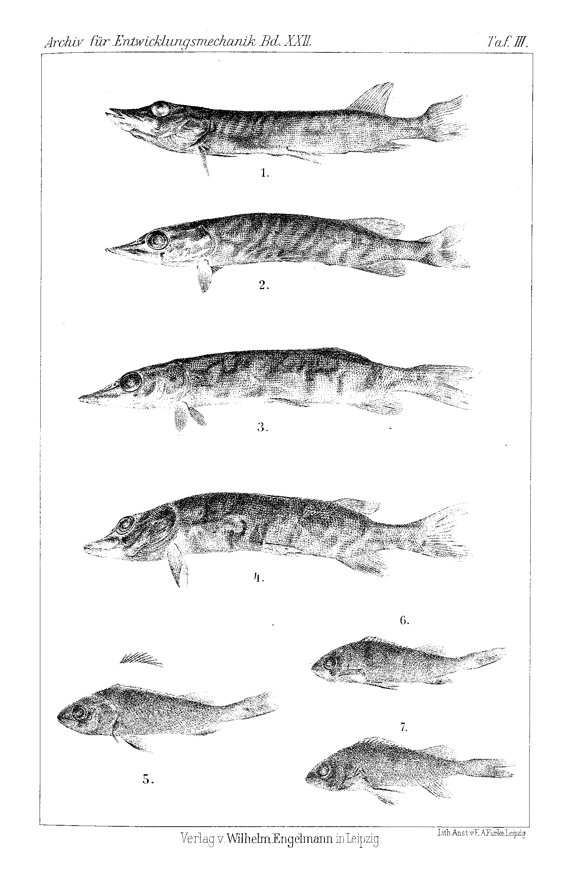

# Experimental Fin Regeneration in European Freshwater Fishes.

By

Kamil Bogacki.

(From the Biological Experimental Institute in Vienna.)

With Plate III.

Received 24 May 1906.

*Archiv für Entwicklungsmechanik der Organismen*, vol. 22 (1906).

> **Full translation.** A complete English rendering of the running text of “Experimental Fin Regeneration in European Freshwater Fishes” (Bogacki, 1906), including all tables, figure and plate legends, and footnotes. Numbers and table cells were transcribed from the page images, not the noisy OCR.

In connection with the results published by T. H. Morgan in: "Notes on Regeneration,"¹ from the experiments carried out on the goldfish and on *Fundulus majalis*—the latter of which were to determine the return, or respectively the modifications, of the characteristic markings on regenerates—I have undertaken the experiments in the same sense on the following freshwater fishes: *Gobio fluviatilis*, *Misgurnus fossilis*, *Esox lucius*, *Cottus gobio*, *Perca fluviatilis*, *Cobitis taenia* and *Nemachilus barbatula*. On regenerates of the tail fin in the goldfish, Morgan obtained the black band; on the dorsal fin of *Fundulus majalis* he did not obtain the black spot after two months, perhaps for the reason that he—as is to be concluded from his words on p. 168: "there was nothing to indicate that this would have happened had the fish been kept longer"—allotted too short a time to the experiment. In *Perca fluviatilis* the (anterior) dorsal fin bears a black margin and a black spot situated between the last and the third-from-last fin ray. In the course of regeneration one could distinguish, as it were, three stages: 1) the beginning of regeneration without any marking at all, 2) the appearance of the black margin, 3) finally, at complete regeneration of the dorsal

> ¹ Biological Bulletin. Vol. VI. No. 4. March 1904. p. 159.

fin, also that of the black spot. Let it be noted that the aforementioned black spot is present in *Perca* in the male as well as in the female, and thus by no means represents a secondary sexual character, as is the case in *Fundulus majalis*. The markings on the regenerates of the remaining fishes show nothing deviating in comparison with the original marking. But in the course of, and still more after the conclusion of, the experiments, a fact emerged that casts a very remarkable light on the regenerative capacity of the fins of different body regions with respect to time and to the growth—accomplished in the same period of time—of the operated fins. The results in question are evident from the following protocol:

| Name of the species | Date of operation | Type of operation | Number of specimens ¹⁾ | Date of examination | Results |
|---|---|---|---|---|---|
| *Gobio fluviatilis* Flem. | 29. X. 04 | right pectoral fin | 4 | 31. V. 05 | only the wound scarred over |
| –  –  – | – | dorsal fin | 4 | – | 2 specimens show beginnings of regeneration, in 2 the wound is closed |
| –  –  – | – | tail fin | 3 | – | 3 complete regenerates |
| *Misgurnus fossilis* Lac. | 5. XI. 04 | pectoral fin | 2 | 27. V. 05 | not regenerated |
| –  –  – | – | tail fin | 3 | – | 3 complete regenerates |
| *Esox lucius* L. | 11. XI. 04 | dorsal fin | 5 | 27. V. 05 | 2 regenerates, 3 scarring-over |
| –  –  – | 31. X. 04 | tail fin | 6 | – | 6 complete regenerates |
| *Cottus gobio* L. | 5. XI. 04 | dorsal fin | 2 | 1. VII. 05 | 1 not, 1 beginnings |
| –  –  – | – | tail fin | 2 | – | 2 regenerates |
| *Perca fluviatilis* L. | 24. XI. 04 | dorsal fin | 6 | 27. VI. 05 | 3 not, 2 beginnings, 1 specimen complete regeneration. On the regenerate the characteristic black margin and spot |
| *Cobitis taenia* L. | 5. XI. 04 | tail fin | 1 | 27. VI. 05 | regenerated |
| *Nemachilus barbatula* L. | 11. XI. 04 | dorsal fin | 3 | 27. VI. 05 | not regenerated |

> ¹⁾ At the breaking-off of the experiments.

From the protocol it emerges that the regenerative potencies are greatest in the longitudinal axis of the body, which agrees to a certain degree with regeneration phenomena in other classes of animals.

### Explanation of the Figures.

#### Plate III.

**Fig. 1 and 2.** Regenerates of the tail fin of *Esox lucius*.  *(figure not reproduced)*

**Fig. 3.** Scarring-over, **Fig. 4** Regeneration of the dorsal fin of *Esox lucius*.  *(figure not reproduced)*

**Fig. 5.** *Perca fluviatilis* with the dorsal fin cut off.  *(figure not reproduced)*

**Fig. 6 and 7.** Two stages of the regrowing dorsal fin of *Perca fluviatilis*.  *(figure not reproduced)*

## Figures

**Taf. III.**

---

*Translator's note.* One of the Biologische Versuchsanstalt (Vienna Vivarium) papers flagged on the project site as a modern rediscovery target. Claims are rendered as stated in the original, not endorsed.
