# Axial Ratios and Developmental Potencies of the Urodele Limbs, on Models for Harrison's Transplantation Experiments

critically expounded by

## Hans Przibram.

*(From the Biological Experimental Institute of the Academy of Sciences in Vienna [Zoological Department].)¹*

With 21 text figures.

*(Received 5 October 1923.)*

*Archiv für mikroskopische Anatomie und Entwicklungsmechanik*, vol. 102 (1924).

> **Full translation.** A complete English rendering of the running text of “Axial Ratios and Developmental Potencies of the Urodele Limbs, on Models for Harrison's Transplantation Experiments” (Przibram, 1924), including all tables, figure and plate legends, and footnotes. Numbers and table cells were transcribed from the page images, not the noisy OCR.

### Contents.
|  | Page |
|---|---|
| 1. Models and critique of Harrison's experiments on the reversal of laterality in axolotl limbs through transplantation in embryonic stages | 604 |
| 2. Critique of Gräper's, Wilhelmi's, and Ubisch's experiments and theories, which also rely on Harrison | 612 |
| 3. Conclusions | 619 |
| 4. Postscript | 620 |
| 5. Bibliography | 622 |

### I.

Since Harrison (1915, 1916) had published two preliminary communications on the "reversal of laterality in the limbs of axolotl embryos," which in 1917 were followed by a condensed account with schematic figures and by detailed publications in 1918 and 1921, a flood of writings on these experiments has poured forth — either supplementary communications by Harrison's pupils Detwiler (1918, 1920), Nicholas (1922), Swett (1922, 1923), and others, or the utilization of his results for the theoretical views of other authors, e.g. Gräper (1922, three works), Wilhelmi (1922), Ubisch (1923), or finally detailed reviews under strict retention of Harrison's interpretation (Dalcq 1921–22, Braus, 1922). Braus is recommended for another reading. For the understanding of the following discussions, let only the chief result of Harrison's excellent transplantations — undertaken with a clear formulation of the problem and with impeccable technique — be reproduced in a single sentence: "If axolotl embryos at the stage of the just-become-visible forelimb buds are deprived of one of these anlagen by a circular cut, and the same is reinserted in reversed orientation but again

> ¹ A preliminary communication appeared under the same title as No. 102 from the Biological Experimental Institute of the Academy of Sciences in the Akad. Anz. Wien 1923, No. 17.

with the outer skin surface set facing outward, then from this inverted anlage there arises a limb with inverted symmetry," i.e. when a right limb bud has been cut off and transplanted, there forms from this anlage an arm with the symmetry of a left one, and when a left one had been "used," an arm with the symmetry of a right arm. To this Harrison (1917) gives schematic figures, which thenceforth made the rounds through all the

**Fig. a.** Fig. 1 from *Harrison* 1917 and 1921 (p. 8).  *(figure not reproduced)*

**Fig. b.** Replacement of the *Harrison*ian designation by the termini chosen for the limb bud by himself in his Fig. 135, and by the remaining directions corresponding to them.  *(figure not reproduced)*

subsequent works. The first scheme (Fig. a) presents an embryo of the operation stage, seen from the right side, and drawn into it is the circular arm anlage. Here the dorsal side of the embryo is designated by D, the ventral side by V, the front end, the "anterior" side, by A, the hind end, the "posterior" side, by P, the right side or flank by R, the left by L. With the same letters are designated those points of the circular

**Fig. c.** Fig. 135 from *Harrison* 1921 (p. 86) with his own designations. (*UL* future ulnar border, *Di* approximate direction of outgrowth.)  *(figure not reproduced)*

**Fig. d.** Fig. 1 from *Harrison* 1915. (Shading omitted.)  *(figure not reproduced)*

arm anlage which immediately adjoin the designations of the whole body entered in the surroundings. Here neither the curvature of the embryo nor the growth direction of the developing limb has been taken into account. This purely geometrical designation of the axes, of the bud, and hence also of the transplants — justified neither in terms of animal morphology nor of developmental physiology — has unfortunately led to a conception of the results that came into contradiction with everything hitherto known.

Harrison, namely, thereby identifies the ulnar border (Fig. b) with the dorsal, the distal with the posterior of the sprouting limb. If, however, we consider his own non-schematic figure given in 1915 of the operation stage in question (Fig. d), then we see the curvature of the back already far advanced above the limb anlage, and we should have to set the designation entered in our Fig. b in place of Harrison's. We wish, with the aid of simple schematic models², to illustrate another interpretation, which permits us to hold fast to the views hitherto assumed by me. In order not to introduce, through the designation deviating from

**Fig. e.** Model of jointed cardboard, spread out flat, seen from above. *A* Anterior, *P* Posterior, *L* Left, *R* Right. (The circular anlage discs are impaled on a drawing pin, and beneath them, with their end facing the body, are inserted the little flags representing the developing arms. Black is the radial border, jagged the ulnar border; the extensor or upper side of the arm is marked by stippling, the dorsal side of the whole embryo by hatching. Above the model are given Harrison's modes of designation for the results — explained below by the attaching of the discs and flags — of the various combinations.)  *(figure not reproduced)*

[Labels in Fig. e: heterotopia orthotopic, heteropleural homopleural, DV, DD, DV, DD, L, R, A, P]

the figures of Harrison, a confusing quantity of letters, I have in my models refrained from such a designation; instead I have inset the radial border of the limb with a black stripe, which grows out into a pointed thumb, and the ulnar [border], in the developed state, with jags (of the cardboard surface left white), which indicate to us the remaining fingers and so support the perception mnemonically. Further, the extensor or stretch side of the arm is marked by an orange band (rendered stippled in the figures), while the opposite flexor or flexion side is left entirely white. From that peripheral point of the bud from which the development of the arm takes its beginning, this band runs in that direction toward which the terminal end of the limb strives, and ends in two jags, which on the circular model of the bud are to represent merely an anlage, but on the flag-shaped or glove-shaped model of the developed limb the thumb and fingers. The model of the whole embryo itself (Fig. e) consists of a stout cardboard sheet whose sides are differently

> ² The models were exhibited at the session of the Vienna Biological Society of 14 May 1923.

colored: the darker (hatched in the figures) shall represent to us the upper side, the lighter (left white in the figures) the under side. The front end is indicated by a transverse cut, the hind end by a triangular "tail." The dorso-ventral axis then stands perpendicular to the broad surfaces of the model cardboard, while the antero-posterior [axis] runs from the truncated (A) to the pointed end (P). Every line running perpendicular to this latter and parallel to the cardboard surfaces then connects for us the right (R) with the left flank (L), thus giving us the direction of the third, transverse axis. The model is further divided into square fields, which permit a bending of the cardboard in various ways, enabling us to imitate the natural form of the embryo (Fig. f), as it stands available to us in Harrison's non-schematic figure from his earlier work of 1915 "On the development of the limb in the Amphibia" (Proceedings National Academy I, 539) (Fig. d). If we now fasten an anlage disc in correct orientation to our model embryo, then the front border of the limb, i.e. the black edge, must be directed forward, the opposite white [edge] backward (Fig. e, *DD*). If we bend the model in accordance with the mentioned figure of Harrison 1915, then indeed the latter, ulnar border now faces upward (Fig. f, *L* and *R*), as Harrison describes for the non-inverted limb. If I now invert, say, the

**Fig. f.** The cardboard model bent in the manner of the axolotl embryo, seen from the right side (and somewhat obliquely from the front): one now recognizes that the flags representing the arms turn their ulnar jags upward, thus apparently dorsally. On the left arm the entirely white-left under (ventral) side is visible, likewise at the tail end and the left hind-body side.  *(figure not reproduced)*

left anlage while retaining the body side, so that henceforth the front border faces backward, then in place of a limb with the symmetry of a left one there develops its mirror image, one with the symmetry of a right one (Fig. e, *DV*).

About this incontestable result Harrison (1921, p. 90, note 98) is especially astonished, because the upper and under sides have been interchanged, while front and back have been retained, "with respect to the facts which Przibram brought forward in 1910, which show that the dorso-ventral differentiation is very pronounced in the animal organization, more so than, for example, the antero-posterior differentiation." On an earlier occasion (1922, p. 154) I have already pointed out that above and below have been interchanged merely in a geometrical sense, but morphologically the ulnar, "upward-directed" border is to be addressed as the hind border, thus front and hind borders have exchanged places. Is there now needed for this a re-tuning of the laterality through the body of the embryo, as Harrison and his collaborators imagine? Is the front border really forced by the body axes of the surrounding embryo to form the hind border, and vice versa, once the anlage has been inverted? Let us for once call to our aid the further principle set up by me, that in the presence of a proximally turned wound surface on a limb with limited (regeneration) potency the direction of growth reverses and only the parts standing distal to it are reproduced in mirror image (H. Przibram, 1906, 1909, p. 236, 1921, p. 205). Accordingly we should expect that the anlage of the front border should continue into the new front border, that of the hind border into the new hind border: this holds true here as well. Reversed is merely the direction of growth,

**Fig. g.** "Glove model" rolled out flat: black = radial border, stippled = extensor side, jagged = ulnar border, smooth white = flexor side, checkered = shoulder portions.  *(figure not reproduced)*

in that in place of the earlier [wound surface] there appears its opposite of the originally proximally facing wound surface, and therefore the mirror image of the limb is produced. Why does this happen? Why does the formerly distally facing end not also grow out? Well, it does so often enough; those are the secondary "reduplications" which Harrison precisely with this transplantation combination frequently got to see. In general, however, the growth direction of the inverted transplant, now running proximally toward the body, will strike the body wall growing upward and backward (Fig. j) and here already be hindered from advancing further by the mechanical resistance and the intimate fusion, while the formerly proximal end stands out more strongly from the surroundings and remains, so to speak, "open," since the body wall at this place would also normally come to lie beneath the limb.

Just as the morphological homologization of the borders admits of an interpretation other than that given by Harrison, so too his conception of the developmental-mechanical potency of the anlage as a "harmonious-equipotential system" (1915, 1918) requires a not unessential restriction. His experiments and those of Detwiler and Swett contain indubitable proofs of a different and limited potency of the four quadrants of the bud anlage. Totipotent is at most the quadrant designated by Harrison as antero-dorsal (DA), in our view the proximo-dorsal one (Fig. k). For Harrison himself states that with excision of the two anterior quadrants, in our terms designated as proximal (Fig. l), reduplicated limbs arise (Fig. m), which is inexplicable if the posterior half were "harmonious-equipotential," but self-evident if this section removes the proximal part and only a distal

**Fig. h.** The 4 quadrants in the designation manner of *Harrison*; drawn in are the parts which normally, according to *Swett* 1922, arise from them (checkered: shoulder): right arm anlage, outside the circle the "proximal regeneration center." Folded-together glove model.  *(figure not reproduced)*

**Fig. i.** The glove model rolled forward through the cardboard ring representing the surrounding body wall, whereby the marked parts of the arm assume the positions reached in normal development.  *(figure not reproduced)*

**Fig. j.** The glove model inserted reversed, whereby it shows that, with unchanged developmental tendency, the distal end strives to sink into the body wall, the proximal [end] to remain open, because the body wall strives to grow over the bud at *PA*, under the bud at *PD*.

This model serves at the same time for the elucidation of the independence of the experimental outcome from the position of the ring surrounding the arm anlage on the whole body (*Nicholas's* experiments 1923).  *(figure not reproduced)*

mirror image is co-produced from the cut surface. Also observed are: defects of the whole hand upon removal of the dorsal half, i.e. of the ulnar side; of the radius upon removal of the central portion, the posterior or ventral, i.e. in our terms the distal or anterior; the radius is thus in the center, the greatest part of the hand

**Fig. k.**  *(figure not reproduced)*

**Fig. l.**  *(figure not reproduced)*

**Fig. m.**  *(figure not reproduced)*

**Fig. k–m.** The proximal (*Px*), in *Harrison's* designation anterior (*A*), half of the right arm anlage removed. From the distal (*Di*), according to *Harrison* posterior (*P*), half there develops a double limb owing to repetition of distal parts in the proximal direction (→).  *(figure not reproduced)*

localized in the ulnar half of the anlage (Fig. h). By means of experiments with vital staining, Swett was able to establish the normal course of development, and it agrees with our conception: from its front-upper quadrant develops the proximal part of the limb, the extensor side and a part of the radius; from the hind-upper [quadrant] the ulnar end-part of the hand and the flexor side of the limb, while the two lower quadrants participate only little in the normal structure, at most in the formation of the shoulder, the front-lower quadrant also collaborating at the radial border. A correspondingly prepared model disc passes over into those hitherto used by us without alteration of the mutual position of the borders, and shows us that even in normal development the axial relations undergo no change. If a glove model made from a paper sheet (Fig. g) is first pushed through a circular hole in such a way that the visible colors correspond to the quadrants of the natural anlage (Fig. h), and then the glove is rolled forward in accordance with the growth direction of the arm (Fig. i), then one can very nicely picture to oneself how precisely the hind-upper quadrant must furnish the flexor lining. Summarizing, we can therefore say: In the development of transplanted limb buds in Harrison's experiments, no interchange has occurred at the axes with respect to dorsal-ventral or anterior-posterior. There is consequently also no re-tuning of the scion by the stock. Interchanged through the inversion was merely proximal against distal "free" end. In full agreement with the known behavior of originally proximally turned wound surfaces on limitedly regenerating organs, e.g. in the triple fracture formations, there occurs a mirror-image repetition of the distal parts. The bud of the amphibian arm is therefore not a harmonious-equipotential system; rather, the distal parts are not capable of forming the proximal ones once they have been cut off from the regeneration center situated, in Harrison's terminology, "in front," and incidentally itself emphasized by him.

Harrison has, when the anlage was not fully rotated by 180°, often observed back-rotation under retention of the original symmetry. Might at least this perhaps be an effect of the "whole body"?

A decision could be reached by rotation of the skin ring immediately enclosing the anlage disc, into which again the anlage disc was inserted in various orientations. Further support is now given to the conception expounded on the models by the results of Nicholas (1922, 30), according to which only the position of the anlage disc relative to the surrounding ring, but not the position of the latter or of the transplant relative to the whole body, is determinative for the rotation of the developing graft limb.

Incidentally, from the outset the actual findings of Harrison stood in the way of a determination of the symmetry by the axes of the whole body, according to which, namely, the inversion does not — as we should expect in the sense of an influencing "embryonal field" (to use the term felicitously coined by Gurwitsch, 1922) — occur with every transplantation onto the opposite side, but again only with inverse [transplantation] (Fig. e, *DV*).

We thus encounter the same independence from the body of the arm-rudiment in its first development as in regeneration. In the

**Fig. n.** *(figure not reproduced)*

**Fig. o.** *(figure not reproduced)*

**Figs. n and o.** Model of the breaking of a right arm with inversion of the distal end and creation of a distal and a proximal fracture surface.

**Fig. p.** Model of a triple fracture-formation by regeneration from the distal and proximal fracture surface, with retention of all original margins. At the same time an explanation for the mirror-images and triple formations in Harrison's inversion experiments. *(figure not reproduced)*

Figs. n to p are models presenting the triple fracture-formation of a urodele limb, as for example Della Valle (1913) produced it experimentally. One sees that the inverted part produces the mirror-image with respect to the formerly proximal fracture site, just as the invertedly transplanted limb does. For those who would absolutely like to rescue a re-determination of the symmetry by the surrounding body, or else a different limb, the assumption could now still be made that Harrison operated at too late stages, with an already too firmly determined rudiment ("Definition" in Grüper's expression of 1922, Verh. anat. Ges.), but that at earlier stages "re-determination" (despite the begun "Institution," Grüper) could nevertheless occur. However, the experimental testing of this assumption meets with difficulties, since Harrison states that, according to Detwiler's experiments, the results are the same even when invert transplantation is performed at a still earlier stage, with "open medullary folds," at a time when the rudiment is still unrecognizable as a bud, only by its position on the body diagnosable as a limb-rudiment. Unfortunately, the further geometrically possible combinations of the transplant's orientation with its position on the whole body—those which consist in the insertion of the rudiments with the outer skin-side turned inward—also cannot be carried out without further modification of the experimental technique, since the epidermis would indeed not heal in at the wound site with its outer surface. Harrison (1921, p. 10) sought to remove this difficulty by freeing the mesoderm-bud from all ectoderm, and expresses himself, to be sure, very cautiously regarding the outcome of these as yet not very numerous experiments, namely that for the symmetry of the arm it is indifferent whether the outer or the inner surface of the mesoderm-bud is turned toward or away from the body. I would like to venture the prediction that either these results, upon more frequent repetition, will not be confirmed, or that an influence not observable in the previous experimental arrangements—of the over-healing ectoderm as the determiner of the morphological dorsal (physiological extensor) side—will be in play.

It seems to me necessary, in the sense of the manner of view here put forward, now also to subject to a renewed examination the works of other researchers attaching themselves to Harrison's experiments, since indeed none of them has exercised any criticism of the terminology or of the propositions and conclusions pronounced by Harrison on the basis of it, and hence the usability of the Harrisonian findings for their special theoretical purposes must also be called into question. That Harrison himself has sensed a certain inconsistency in his experimental results is, moreover, evident from his occasional remark (1921, p. 90): This discomfort must now disappear, since it could be shown that the dorsal and ventral sides of the limb have nowhere been interchanged by the transplantation, that consequently my proposition still rightly stands, and that nevertheless the reversal of the laterality is to be regarded as a fact.

**2.**

Grüper (1922, 1923), Wilhelmi (1922) and Ubisch (1923) consider it possible that leg-rudiments already visible as buds are, after transplantation, so re-determined ("umgestimmt") by the surroundings that they alter their symmetry relations, and in this they thus agree with Harrison's interpretation. The points of departure and the theoretical conclusions of the three named researchers are, however, essentially different.

Ludwig Grüper amputated leg-buds of anuran larvae at several stages and transplanted them, at first in reversed orientation, i.e. according to Harrison's terminology "dorso-ventrally," onto the other side of the body, and indeed in place of the likewise removed bud of the opposite side. This arrangement had, as he himself writes (1922, I, p. 302), "its ground in the normal form of the buds. These sit, namely, upon the body of the tadpole—which tapers very rapidly toward the tail—in such a way that they turn their cap or tip fairly exactly backward. If one cuts off such a bud and sets it on a horizontal base, it must of course stand obliquely, and indeed toward its originally medial side. If one now adapts it dorso-dorsally on the opposite side of the body, it will stand off to the side, and, because it does not fit so well, lets itself be brought to healing-in less readily in this position." This remark has interest for us with regard to the analogous difference of fitting which was set out above for the forelimb-buds of the axolotl larva on our model (Figs. i, j). Later Grüper also exchanged dorso-dorsally hetero-pleurally. He was able to establish that in both cases the limb had retained its side-quality, which does not agree with Harrison's rules. Nevertheless he does not reject the latter's interpretation, but seeks the explanation of this contradiction in the different material, namely the age-stage, that had been used. "Harrison, namely, operated at much younger stages and transplanted comparatively much more material" (p. 304). Grüper now took smaller, i.e. younger, buds, and the result was the following: "In four cases it succeeded, from buds which had a size of 0.75/1 up to somewhat over 2/1, to rear limbs which—apart from the pelvis and the muscles proceeding from it—were quite indifferent with respect to side-quality, in that fans formed in which the one side corresponded to the side of origin, the other to the host side; and indeed these were all cases in which the bud had healed in well after the transplantation and had grown on briskly. In six other cases it even succeeded in reversing the original quality of the bud—whose size varied between 0.5 and 1.5/1—into the complete opposite (among them was a dorso-dorsally implanted bud, in which according to Harrison a re-determination should not have taken place). Striking in these cases was that in the records a standstill lasting 14 days to 3 weeks, or at least a quite unusual delay of growth, was always noted. The thought now lies extremely close at hand that the rearrangement of the invisible structure of the bud, taking place under the influence of the body, takes a certain time, and, if the stage is already too far advanced and the growth of the transplant proceeds rapidly forward, does not come into operation at all, so that the bud retains its original quality" (p. 304). A second possibility, however, would be the displacement or out-growing of the transplant by a locally correct regenerate, which Grüper himself (e.g. p. 306) takes into consideration, since he has after all always set the bud back in place of a leg-rudiment, has operated "orthotopically." It seems to me that precisely with this the initial growth-inhibition of the transplant stands in agreement. Above all, however, the special arrangement of the bones in the "fan" explains itself quite without constraint, namely that "the plane of symmetry in all cases" of Grüper "goes through the fibular margin." If in our model (Fig. q) we set, beside a left rudiment (DD), a right one, dorso-ventrally oriented (DV), and let a limb grow out from it without any re-determination, then this turns its fibular margin (which is marked by the prongs for toes 2–5) toward the normal one in such a way that, upon fusion of the rudiments (Fig. r), a "fan" united in the 5th toe would have to arise. If, however, we keep before our eyes that a heteropleural-dorsoventrally transplanted limb in Harrison's experiments also forms heterotopically a symmetry toward the side of its site, then the third

**Fig. q.** Dorsal view with a right rudiment, planted in dorso-ventrally and hetero-pleurally, which collides with the normal left one (to Grüper). *(figure not reproduced)*

**Fig. r.** "Fan" proceeding from q. *(figure not reproduced)*

possibility can be taken into account, whether we are not here perhaps dealing with the mirror-image doubling through growth from the proximal cut-surface. The very same thing would then be present as in the triple fracture-formations, whose mode of origin Grüper himself—without knowing my relevant expositions—had already correctly set forth in 1909. Grüper's second experimental series (1922, II), in which the proximal end was deliberately interchanged with the distal end of the bud at implantation, shows very clearly that in fact in this "reverse" transplantation the laws of triple fracture-formation hold: Grüper always obtained, from the reverse rudiment, a transplant developed into the mirror-image of the side of origin (pp. 592, 594). Quite rightly, therefore, Grüper says (1923, p. 211, note): "Limb-transplantations on anurans show that at first only a cross-sectional determination is present, and that only through the addition of a determination of the proximal-distal polarity is the side-quality determined." But he evidently forgets the lessons of triple fracture-formation, when he believes that the rudiments "in youthful stages, with upright transplantation onto the corresponding place of the other side, under the influence of the new surroundings can reverse their original side-quality into that of the opposite side, but, when they become older, no longer do so, because then the side-quality is already inherently determined" (p. 211), or when he (1922, II, p. 596) assumes "a stage of the determination of the polarity (in which on the formerly proximal cut-surface only proximal, or no, parts can form)." So long as form-building or regeneration occurs at all, the distal parts can always be built also from the proximal cut-surface, and just as long, therefore, the side-quality will also be reversible. This reversal lies entirely determined within the transplant itself, and is merely suppressed when, through good attachment of the latter to the body, growth in this direction is made impossible. Incidentally, Grüper (1922, I, p. 301) describes triple formations also in non-reverse transplantations, and adds: "It is perhaps striking that the triple formations all arose from comparatively old stages; most had a bud-size of 2/1, No. 31 even 2.5/1." Let Grüper's remark concerning the fan-formation, which seems to astonish him, be cited here in passing: "That the plane of symmetry in all my cases goes through the fibular margin must be specially emphasized, since Przibram states that in humans such double formations always have the plane of symmetry on the tibial or radial side." In these, however, it is not a matter of transplants, but of embryonic regenerations, for which the symmetry relations lie in a special way (cf. triple fracture-formation, p. 395¹). Upon injury of the radial or tibial margin, this can no longer be rebuilt by the more ulnar or fibular parts; on the contrary, these now form a mirror-image. If we wished to draw a parallel to the "fans," we would arrive at a fourth possibility for the explanation of the latter: that at the transplantation an injury of the fibular margin had occurred, and that this had led to the starting-point of a mirror-image doubling. Then, to be sure, it would be astonishing that from the fibular margin the whole foot should be re-generated. For either the regenerative capacity of the anuran tadpoles should still permit a regeneration of the fibular margin, or, if this is already extinguished, the regenerative capacity of the remaining foot-parts should also be extinguished. Since we are in any case conducting experiments on the behavior of am-

> ¹ Several misprints overlooked there are here put right: in the 5th line from the top it should read, instead of "aus," "an"; in the 6th line from the top, after "ulnaren," "(bzw. fibularen)" is to be inserted; in line 18 from the top the word "in" is to be struck out.

phibians in this respect, I will for the time being not enter into a further discussion. But let reference indeed be made to the "reverse" transplantations which Oskar Kurz (1920, 1922) undertook with developed legs of already metamorphosed newts, which show the participation of the local regenerate from the femur cut in two, and of the transplant-regenerates of the lower-leg bones reimplanted reversely behind them, in the building-up of double hind-feet. (Grüper's statement, 1922, II, p. 588, that these experiments "remained without convincing results" is probably to be traced back to the fact that he, to judge by his bibliography, did not yet know Kurz's detailed second treatise, which appeared in the Archiv shortly before his own, with the X-ray documentation.)

Hedwig Wilhelmi (1922) set herself the question of how the special "symmetrizing factor" postulated by her could be established experimentally,

**Fig. s.** Ventral view with two right rudiments, planted one behind the other into the midline, which look cephalad with the ulnar (Harrison's dorsal) margin (to Wilhelmi). *(figure not reproduced)*

**Fig. t.** Result of the development in both limbs of s. *(figure not reproduced)*

and had begun experiments on newts before, through the Harrisonian works, an extensive material for the corroboration of her view became known to her. As decisive she regards the experimental arrangement in which two limb-rudiments of the same kind and side are transplanted one behind the other into the midline of a larva, which—now freed from all the side-inducing factors imposed by the surroundings—are to develop a symmetry-relation to one another. Unfortunately, only in a single case did the experiment succeed so far that both transplanted rudiments came to the development of two toes. According to Wilhelmi's statement (p. 196, Fig. 12), in one of these limbs the symmetry would now in fact be reversed. It was a matter of the transplantation of two anterior right limbs onto the belly of a third larva of Triton taeniatus, in which the dorsal rudiment-margin (according to Harrison's terminology) had been directed cranially in both. Regrettably, the figures are drawn quite defectively, and already in the labeling several errors have crept in. If one compares the partial pictures designated b and d with the total view a of the animal, then it is beyond doubt that with them it is a matter not, as is stated underneath, of the anterior, but of the posterior transplant, and that c, e represent the anterior; so that also the labeling d, e as posterior limb is not correct. Once one has fortunately oriented oneself this far, one need only set figure c, equally directed, beside d (Fig. u), in order to see that it is a matter of two equally-symmetrical, and indeed right, limbs; for in both the parallel elbow-bend lies, the smaller (1st) finger toward the observer, the larger (2nd) finger farther away from the observer. If one considers the total view of the Triton in Wilhelmi's Fig. 12a, this parallelism is equally striking. But how could the view of an interchange of the symmetry in the posterior transplant arise in Wilhelmi? The main blame falls probably on the adoption of the unfortunate nomenclature of Harrison: The rudiments are supposed to look with the dorsal margin cranially; in reality it is the ulnar margin. Caudally, therefore, it is also not the ventral but the radial margin that looks. "The laterality of the limb," says Wilhelmi (p. 196), "must at this stage be determined according to the distribution of the pigment. The pigment shows itself always essentially concentrated on the extensor side. In the one limb, the posterior, the pigment is mainly dorsal-side inward; in the anterior, on the contrary, ventral-side outward."

**Fig. u.** *Triton taeniatus.* Reproduction of figures from Wilhelmi, (c) of the anterior, (d) of the posterior right limb arising from rudiments transplanted as in Fig. s. *(figure not reproduced)*

Since in reality the rudiments are turned, with their dorsal sides, from the belly-side of the animal outward (downward), and were originally placed with the flexor side toward the median, the pigmentation must, in every view from outside—thus every view that the observer is accustomed to take—be visible on the extensor side. This is also clearly to be seen in Wilhelmi's figures, which everywhere show the strongest pigmentation in the vicinity of the elbow, thus dorsal-outward. The very slight differences which one obtains, according to whether one views the limb from the ulnar or the radial margin, can in no way change any other determination of the side-symmetry than that of a right one in both transplants. An essential share of the blame for Wilhelmi's contrary statement is, however, also borne by Fig. 12b, which cannot be correctly drawn. This shows somewhat more pigment toward the flexor side: but that can after all in no case be true. Besides, in this figure the transplant is an exact mirror-image of Fig. d, which represents the same transplant in a position rotated by 180°. That is now impossible, for no asymmetrical limb can be brought into its mirror-image through rotation about an axis.

An independent "symmetrization factor" therefore does not appear to be demonstrated by Wilhelmi's experiment. Similar interpretations advanced by Tornier regarding his famous regeneration experiments have already been refuted in detail in the "Bruchdreifachbildung" [fracture-triplication] (p. 351). Symmetrical formation is, to be sure, very strongly pronounced in living beings, but I have repeatedly taken the opportunity to point out that it is precisely symmetrical laterality that requires no factor of its own, but is co-determined by the axes of the body or body part (Przibram, 1910–1912, 1921, 1922).

Leopold von Ubisch (1923) takes "as given by the fact the tendency of transplanted limb anlagen to let double formations proceed from themselves." He is primarily interested only "in the question of where the second formation must lie, if such a one comes to be formed." In accordance with his theory of a "differentiation gradient" ["Differenzierungsgefälle"] (1922), he now seeks to interpret Harrison's findings to the effect that the second formation always chooses the second-most favorable site for differentiation, while the first formation has secured the most favorable for itself. In his Fig. 16 (1923, p. 657) he gives a repetition of the axolotl-embryo scheme after Harrison, likewise reproduced in our Fig. r, drawing into it 21 zones by means of straight lines running dorso-ventrally from the rear (tail tip) to the front (snout tip). For the formation of a limb, what would come into consideration is the potency, which decreases concentrically from the center of its natural site (his Fig. 18, p. 659), and the degree of differentiation of the material of the anlage. "Every new formation arises the more easily, the more undifferentiated the available material is." "The factors 'potency' and 'differentiation' thus do not act in the same direction, and the result is a compromise between the mode of action of the two." "So that the limb may now also actually arise, there is finally still required the cooperation of a third factor, namely activation by more highly differentiated material, which is indeed present in the middle and anterior part of the anlage." Ubisch now attempts, by juxtaposing the gradient zones to be assumed in and around the transplant, to deduce how the second and third formations have to stand. Since in doing so he lets the zones extending along the body from front to rear pass quite simply in a straight direction through the limb anlage — inasmuch as he again follows Harrison's misleading nomenclature — I am unable to attach any significance to his entire exposition. We have, moreover, seen that exactly demonstrable answers have already been given to the questions of double and triple formation. For the rest, his views of a differentiation gradient descending from front to rear may nevertheless contain truth. Similar things have been expressed by others (e.g., Child: Physiological Gradients) and by the author on several occasions, namely that regeneration rests upon a "potential difference," which is heightened by displacement of the cut proximalward (1919), and that the animal body decreases in differentiation from front to rear, which is expressed most clearly in the arthropods through the extinction of the capacity for replacement by something of equally high differentiation, and still more through the replacement by structures normal for parts farther to the rear (Homoeosis 1910, 1919; Form und Formel 1922, p. 147).

## 3.

The forelegs with symmetry of the opposite side, obtained by Harrison through transplantation of limb anlagen onto axolotl embryos, can be explained much better by the potencies present in the legs of the urodeles, according to the laws valid also for fracture-triplication, than by a retuning [Umstimmung] proceeding from the body.

The anlagen of the limbs are, already at the earliest stage accessible to the operation, no longer harmonious-equipotential systems, but their potencies become impoverished from the base toward the end ever more, so that always only the more distal parts can be regenerated, these, however, also in the proximal direction.

The "cross-sectional determination" (Gräper) is given from the very beginning; the proximo-distal polarity of the limb is reversible throughout life, and is in fact reversed upon a separation of continuity at the proximally-facing wound surface.

An independent "symmetrization factor" (Wilhelmi) need not be assumed, since the establishment of symmetry can be derived from the action of two axes, the firmest of which is the dorso-ventral. An influence of two separately, one-behind-the-other transplanted urodele limbs upon their symmetry has not been demonstrated. The "differentiation gradient" (Ubisch) is not necessary for the explanation of the double and triple formations that have appeared.

An unsuitable nomenclature, which has not properly homologized the axes of the limb with those of the body as a whole, bears the chief blame for the assumption that from Harrison's experiments there emerges a retuning of the limb laterality by the body as a whole.

Finally, the clarification of the experimental results on the basis of our designation of the body and limb axes, which agrees with the lateral-fold theory, speaks in favor of this theory.

## 4. Postscript.

After completion of the present work, there have reached me, through the kindness of the authors Brandt and Milojević, two short communications (see bibliography), which relate to experiments of a pertinent kind and in essence confirm my assumption that it was, in Harrison's experiments, the particular positional relations of the limb anlage in the axolotl that simulated an exchange of the dorso-ventrality.

1. W. Brandt (Würzburg, Anatomical Institute) attempted to re-examine the axolotl findings on Triton taeniatus (= vulgaris) [Lissotriton vulgaris], but always obtained a formation of the upper and under side in accordance with origin; an influence on the part of the body was not exerted, except that the rotations also occasionally observed by Harrison, serving to correct inconvenient positions, occurred. Dr. Paul Weiss, who had the opportunity to see Brandt's preparations, convinced himself of the application of the anatomically correct nomenclature on Brandt's part and of the margin position deviating from the axolotl in Triton taeniatus owing to the slight neck flexure.

2. B. Milojević (Belgrade, Zoological Institute) carried out, on already developed, metamorphosed Triton cristatus [Triturus cristatus], experiments with the transplantation of regeneration tissue from the amputated leg. Transplanted together with a proximal ring of skin, the regenerate always yielded arms or legs in accordance with origin, without the slightest influence by the grafting stock. Likewise behaved buds over 10 days old, transplanted without a ring of skin. Younger regeneration buds, whose height was still much smaller than the diameter of the base, on the contrary always developed in accordance with the site. In this, however, the blastema served merely as indifferent material also insofar as foreleg regenerates on hindleg stumps and vice versa took on the character of the leg of the site, whereas transplanted primary limb anlagen, according to all experimenters, always develop the character of the place of origin.

It thus appears that there does indeed exist a blastema stage at which no differentiation at all is present; but if such a one is "instituted" (Gräper), then the upper and under side and also the front and rear side are firmly determined, just as is the limb character itself. Subsequent "symmetrization factors" in Wilhelmi's sense are rejected by both of the named authors as well as by me. The double and triple formations have no symmetry determined by the mutual position of the anlagen (of primary or secondary nature), but one given by the conditions of regeneration.

Brandt seeks to trace his findings deviating from Harrison to the lesser height of differentiation of the axolotl as compared with Triton: the limb anlagen in the axolotl would, at the corresponding stage, still be indifferent, those of Triton, however, already firmly instituted. Plausible as it would be, precisely in the case of Amblystoma [Ambystoma], which remains larval so long, that the anlage should remain indifferent for a longer time, this explanation nevertheless seems to me unnecessary in our case, because in fact in the axolotl experiments too no subsequent retuning by the grafting stock has taken place.

3. During the proofreading there reaches me, in the Journ. of exper. zool. XXXIX, 27, 1924, the detailed work by Nicholas on the implantation of the right arm anlage into the midline of the body. In antero-posterior implantation into the back or into the belly he succeeded in obtaining, in each case one instance, a mirror-image-formed pair of limbs. He describes these as posteriorly turned, whereby the right arm came to stand on the right, the left on the left. His figure and closer description of the dorsal implantation case, however, show clearly that the left-symmetrical component springs forth in front of the right-symmetrical, thus agreeing with our interpretation that the margin designated by the American researchers as "anterior" is to be designated as "proximal," whereby the reverse component must spring from the originally proximally-turned wound surface. Nicholas' figure of the ventral implant permits the same interpretation: in his description he states that the supination position represented in the figure, in which the observer looks upon the ventral sides of the double limb, arose only subsequently through the pressure of the body. If one imagines the right-symmetrical component of the pair rotated back into the pronation position, in which one looks upon the dorsal sides, then again the left-symmetrical comes to stand in front of the right-symmetrical component.

In antero-posterior insertion of the implant both into the dorsal and into the ventral midline, Nicholas describes a reversal of the symmetry with respect to the standing-side-by-side of the anteriorly-turned girdles (to a formation of a limb it did not come in this case). This result must also come out according to our explanation, if everything proceeds analogously to the antero-anterior cases; for then the left-symmetrical limb always stands behind the right-symmetrical, so that the observer, proceeding from the front one, views it as the right-standing one.

## 5. Bibliography.

*Brandt, W.:* Extremitätentransplantationen an Urodelen. Vortr. Heidelberg 1923. — *Braus, Hermann:* Verhandl. d. dtsch. anat. Ges. Bd. 53. 1904. — Ders.: Neuere Ergebnisse der Gliedmaßenpfropfungen: Umwandlung eines rechten Beines in ein linkes. Naturwissenschaften. Bd. 10, S. 457, 477. 1922. — *Child, C. M.:* Some considerations concerning the Nature and Origin of physiological gradients. Biol. bull. of the marine biol. laborat. Vol. 39, p. 147. 1920. — *Dalcq, A., Harrison,* Études des transplantations de membres au point de vue des rapports de symmétrie. L'année biologique Vol. 26, p. 623, 1921–22. — *Detwiler, S. R.:* Experiments on the development of the shoulder girdle and the anterior limb of Amblystoma punctatum. Journ. of exp. zool. Vol. 25, p. 499. 1918. — Ders.: Experiments on the transplantation of limbs in Amblystoma. The formation of nerve plexus and the function of the limbs. Ibid. Vol. 31, p. 117. 1920. — *Della Valle, Paolo,* Studii sui rapporti fra Differenziazione e Rigenerazione etc. Boll. d. soc. naturalisti, Napoli Vol. 25. 1913. — *Gräper, Ludwig:* Über eine dreischwänzige Eidechse mit sieben Schwanzskeletten. Arch. f. Entwicklungsmech. d. Organismen Bd. 27, S. 640. 1909. — Ders.: Extremitätentransplantationen an Anuren. Erste Mitteilung. Ebenda. Bd. 51, S. 284. 1922. — Ders.: II. Reverse Transplantationen. Ebenda. Bd. 51, S. 587. 1922. — Extremitätentransplantation an Anurenlarven. Anat. Anz. Bd. 55, Ergänzungsh. Verhandl. d. anat. Ges. Erlangen 24.–27. April 1922. — Ders.: Determination und Differenzierung. Arch. f. Entwicklungsmech. d. Organismen Bd. 48, S. 210. 1923. — *Gurwitsch, Alexander:* Über den Begriff des Embryonalen Feldes. Ebenda. Bd. 51, S. 383. 1922. — *Harrison, Ross. G.:* Experiments on the Development of the limbs in Amphibia. Proc. of the nat. acad. of sciences (U. S. A.) Vol. 1, p. 539. 1915. — Ders.: On the reversal of laterality in the limbs of Amblystoma embryos. Anat. record Vol. 10, Nr. 3. 1916. — Ders.: Further experiments on the laterality of transplanted limbs. Ibid. Vol. 11, Nr. 6. 1917. — Ders.: Transplantation of limbs. Proc. of the nat. acad. of sciences (U. S. A.) Vol. 3. p. 245. 1917. — Ders.: Experiments on the development of the fore-limb of Amblystoma, a self-differentiating equipotential system. Journ. of exp. zool. Vol. 25. p. 413. 1918. — Ders.: On relation of symmetry in transplanted limbs. Journ. of exp. zool. Vol. 32, p. 1. 1921. — *Kurz, Oskar:* Versuche über Polaritätsumkehr am Tritonenbein. Arch. f. Entwicklungsmech. d. Organismen Bd. 50, S. 186. 1922. — *Milojević, B.:* Über Transplantationen von Beinregeneraten bei Triton cristatus. Verhandl. d. dtsch. zool. Ges. Bd. 28. Juli 1923. — *Nicholas, J. S.:* The effect of the rotation of the area surrounding the limb bud. Anat. record. Vol. 23, p. 30. 1922. — Ders.: Dorsal and ventral implantation of the limb bud. Ibid. Vol. 23, p. 29. 1922. — *Przibram, Hans:* Die Regeneration als allgemeine Erscheinung usw. Naturwiss. Rundschau. Bd. 21, Nr. 47–48. 1906. — Ders.: Experimentalzoologie. 2. Regeneration. Leipzig u. Wien: F. Deuticke 1909. — Ders.: Die Homöosis bei Arthropoden. Arch. f. Entwicklungsmech. d. Organismen Bd. 29, S. 587. 1910. — Ders.: Die Verteilung formbildender Fähigkeiten am Tierkörper in dorso-ventraler Richtung. Ebenda. Bd. 30, S. 409. 1910. — Ders.: Experiments on asymmetrical forms as affording a Clue to the problem of Bilaterality. Journ. of exp. zool. Vol. 10, p. 255. 1911. — Ders.: Asymmetrieversuche als Schlüssel zum Bilateralitätsprobleme. Verhandl. d. VIII. internat. Zoologenkongresses in Graz 15.–20. Aug. 1910. Jena: Fischer 1912. — Ders.: Tierische Regeneration als Wachstumsbeschleunigung. Arch. f. Entwicklungsmech. d. Organismen Bd. 45, 1. 1919. — Ders.: (Homöosis 6). Regeneration beim Hautflügler *Cimbex axillaris.* Ebenda. Bd. 45. S. 69. 1919. — Ders.: Die Bruchdreifachbildung im Tierreiche. Ebenda. Bd. 48, S. 205. 1921. — Ders.: Form und Formel im Tierreiche. Leipzig u. Wien: F. Deuticke 1922. — *Swett, F. H.:* The fate of the cells contained in the various quadrants of the primitive limb disc. Anat. record. Vol. 23, p. 40. 1922. — Ders.: The prospective significance of the cells contained in the four quadrants of the primitive limb disc of Amblystoma. Journ. of exp. zool. Vol. 37, p. 207. 1923. — *Ubisch, Leopold v.:* Über die Aktivierung regenerativer Potenzen. Arch. f. Entwicklungsmech. d. Organismen Bd. 51, S. 33. 1922. — Ders.: Das Differenzierungsgefälle des Amphibienkörpers und seine Auswirkungen. Ebenda. Bd. 52, S. 641. 1923. — *Wilhelmi, Hedwig:* Über Transplantation von Extremitätenanlagen mit Rücksicht auf das Symmetrieproblem. Ebenda. Bd. 52. S. 182. 1922.

## Figures

**Fig. 1.**

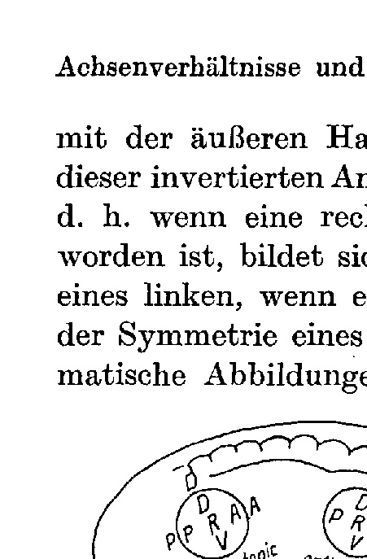

**Fig. 2.**

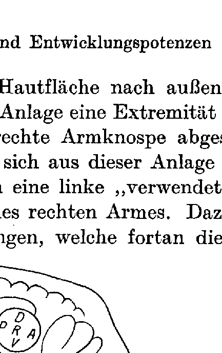

**Fig. 3.**

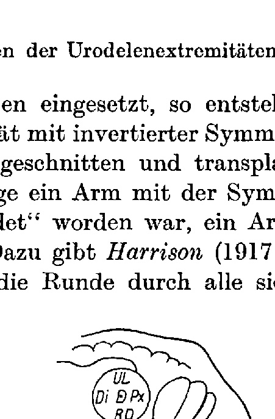

**Fig. 4.**

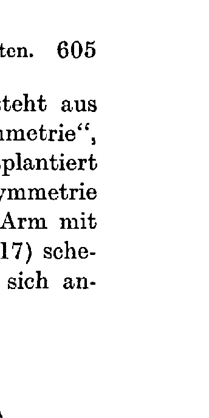

**Fig. 5.**

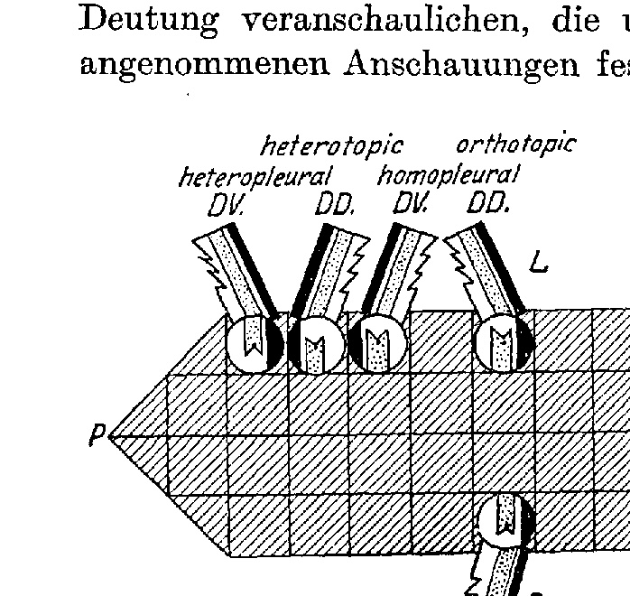

**Fig. 6.**

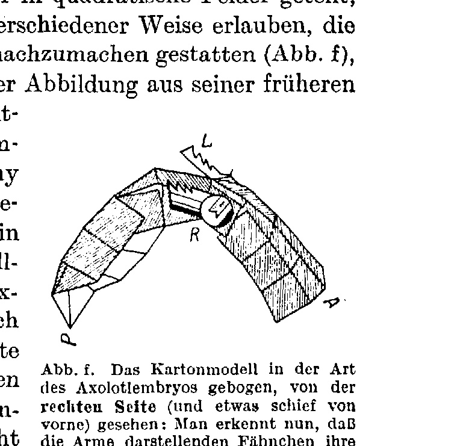

**Fig. f.**

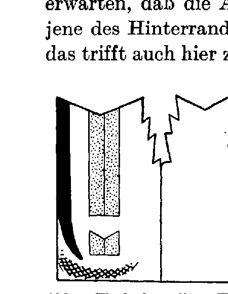

**Fig. g-j.**

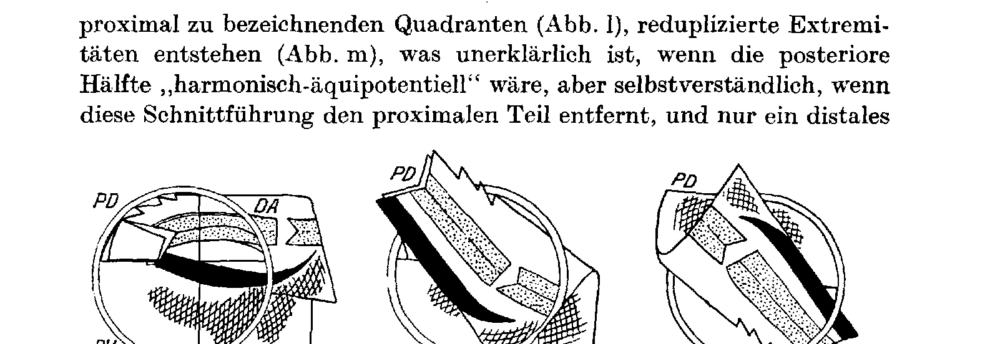

**Fig. k-m.**

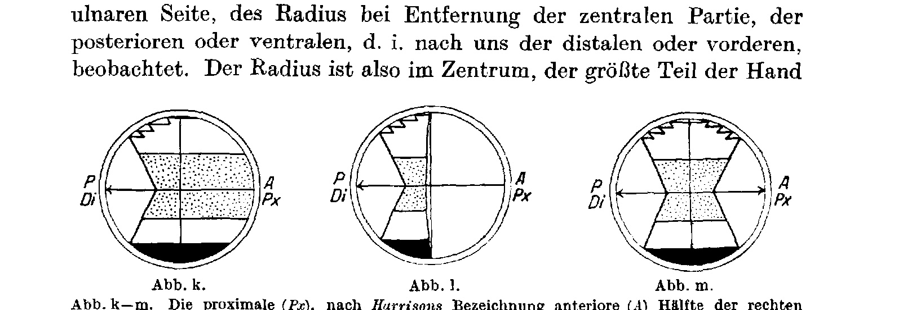

**Fig. n-p.**

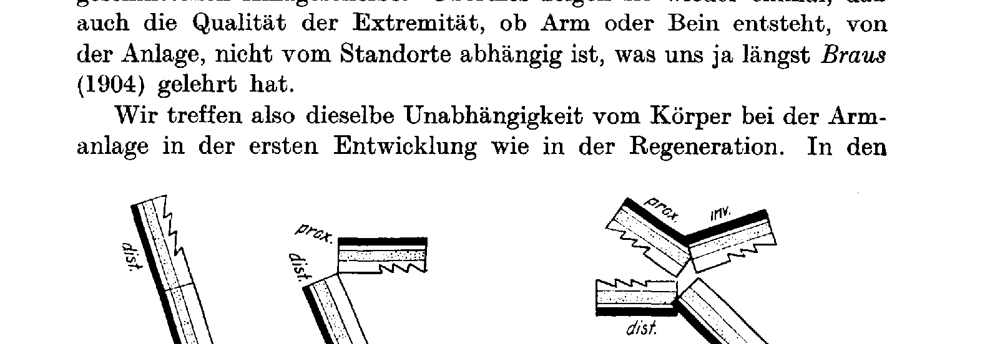

**Fig. q.**

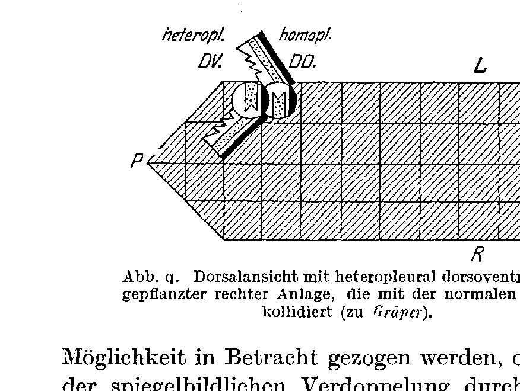

**Fig. r.**

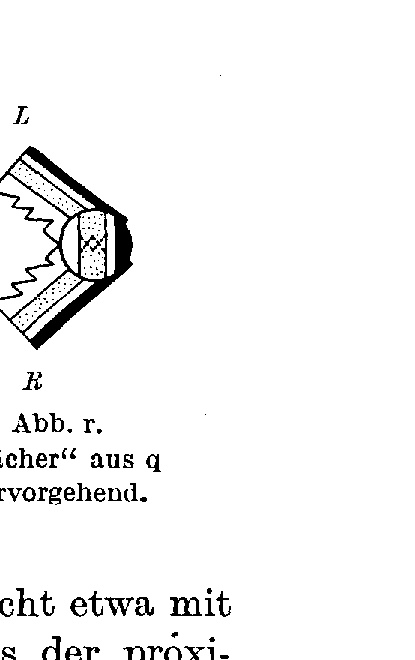

**Fig. s.**

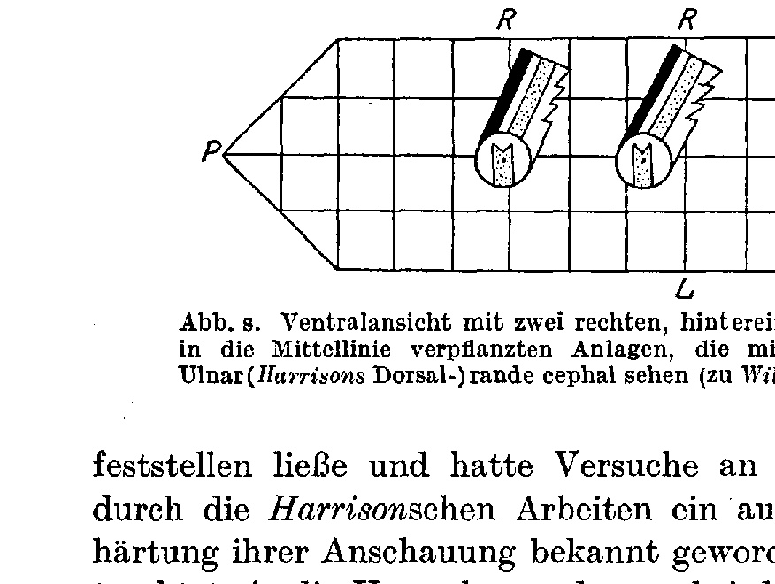

**Fig. t.**

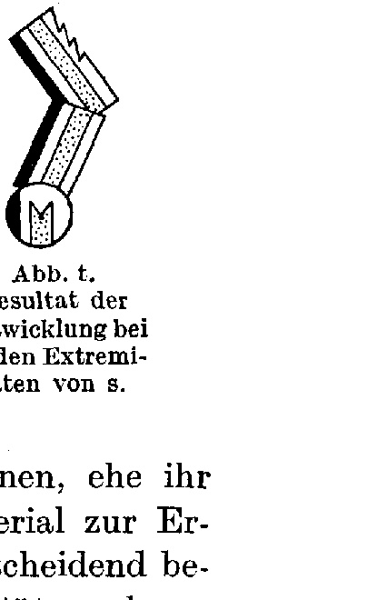

**Fig. u.**

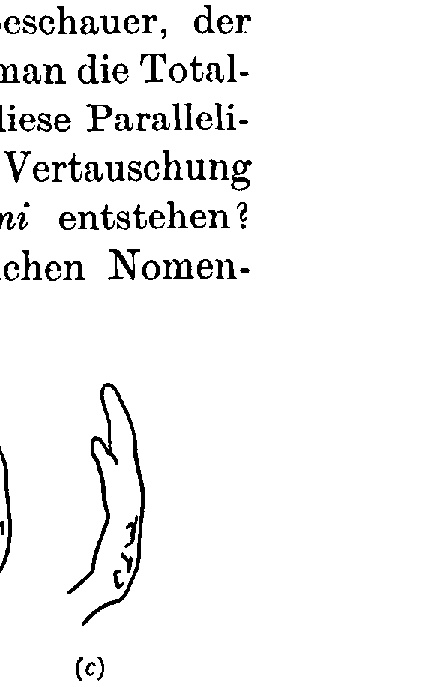

---

*Translator's note.* One of the Biologische Versuchsanstalt (Vienna Vivarium) papers flagged on the project site as a modern rediscovery target. Claims are rendered as stated in the original, not endorsed.
