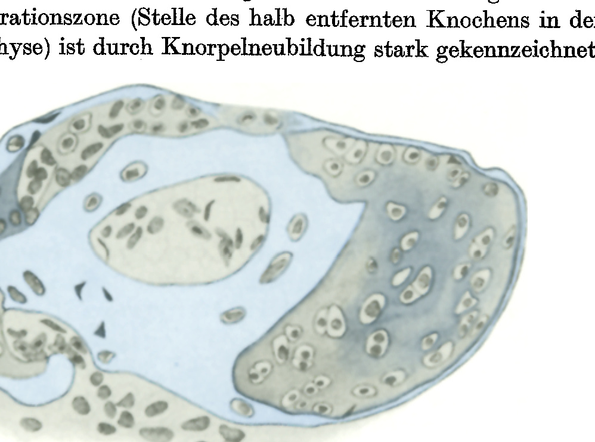
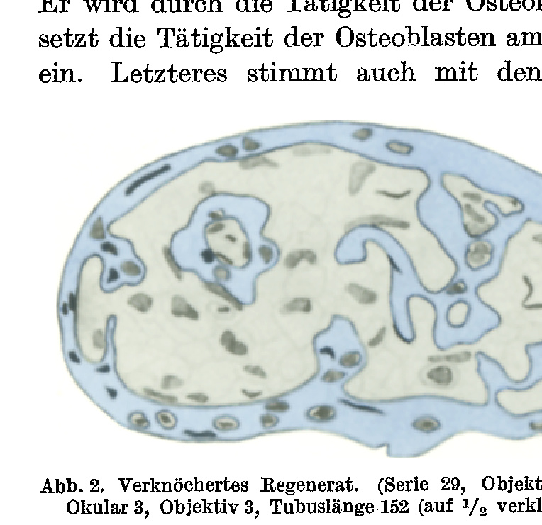

*(From the Biologische Versuchsanstalt of the Academy of Sciences in Vienna, Zoological Division.)¹*

## REGENERATION OF THE LONG BONES AFTER PARTIAL REMOVAL IN THE INTERIOR OF THE NEWT LIMBS (TRITON CRISTATUS LAUR.).

By

EUGENIE FLAT-HAUSER and HANS PRZIBRAM.

With 3 text-figures.

*(Received 22 July 1929.)*

*Wilhelm Roux' Archiv für Entwicklungsmechanik der Organismen*, vol. 122 (1930).

> **Full translation.** A complete English rendering of the running text of “Regeneration of the Long Bones after Partial Removal in the Interior of the Newt Limbs (Triton cristatus Laur.)” (Flat-Hauser Przibram, 1930), including all tables, figure and plate legends, and footnotes. Numbers and table cells were transcribed from the page images, not the noisy OCR.

### Contents.

|  | Page |
|---|---|
| A. Account of the experiments by E. Flat | 237 |
| a) Technique | 237 |
| b) Course | 239 |
| B. Significance thereof (H. Przibram) | 241 |
| C. Tables from the protocols of E. Flat | 246 |
| I. Operation and preservation times | 246 |
| II. Experimental results | 247 |
| III. Half-schematic illustrations (Fig. 3) | 248 |
| D. Summary | 249 |
| E. List of references | 250 |

### A. Account of the experiments by E. Flat (from Riga; married name Hauser, Zürich).

#### a) Technique.

Since wholly removed bones do not regenerate, but regeneration is possible from cut surfaces of the limb both in the distal and in the proximal direction, the question arose as to what bones, of which one half is removed while the other is left within the interior of the limb, would be capable of achieving in the way of regeneration.

The experiments were begun at the Biologische Versuchsanstalt Vienna (the working-up was carried out partly in Zürich at the Zoological Institute of the University, head: Prof. HESCHELER), and were then completed in Vienna. *Triton cristatus* (LAURENTI) [*Triturus cristatus*] served as the experimental animals. In them, the removal of either the proximal or the distal half was tested, both in the three long bones of the anterior and of the posterior limbs (humerus, radius, ulna; femur, tibia, fibula), in all twelve combinations thereby given (cf. Fig. 3 under Table 3).

> ¹ A preliminary communication of the experiments by E. FLAT appeared under the same title as No. 131 of the Mitteilungen aus der biologischen Versuchsanstalt (Zool. Abt., head: H. PRZIBRAM) in the Akad. Anz. No. 8. Vienna 1926.

The amputation of the half-bone was carried out in the following manner: First a small transverse incision is made at the distal or proximal articular surface of the bone. Thereupon the bone-part to be amputated is detached from the articular surface, and the surrounding tissue is pushed downward as far as possible with a fine blunt scalpel. Now lying exposed, the bone is severed in the middle of the diaphysis, and the wound is then sewn up again. All the animals were narcotized with ether for the operation. After the operation the animals were laid upon moist sand and carefully tended (checked daily); the sand and the vessel were rinsed with potassium permanganate in order to prevent infection. In 4–5 days the wound is overgrown with skin; the animals begin to move gradually, and in 10 days they can be placed back into the water and fed. Soon thereafter one can hardly notice anything of an operation that has been undergone. The animals are lively and mobile as before.

In all, in the first experimental series of 1924, 53 animals were operated on, of which 7 perished as a result of the operation and 4 succumbed to an infection. All the others remained alive and were examined macroscopically and histologically after 9 months. In February 1926 a second experimental series, consisting of 20 animals, was set up; 3 of these perished shortly after the operation; the 17 that remained were then examined in May 1927. (Designated in the protocols by No. 1z–20z.) Sometimes on one and the same animal two operations were carried out on different limbs at the same time, which is shown in the following Table 2 by the appearance of the same animal-number in different columns.

In order to be able to investigate the form and the histological structure of the regenerates formed toward the side of the defect, the operated bones were dissected out. The investigation proceeds in such a way that the whole limb is amputated and fastened with dissecting needles to the wax bottom of a Petri dish. By means of a longitudinal incision the skin together with the muscles is gradually separated from both sides of the limb and the regenerated bone is loosened out of its articular surfaces. The loosening-out and freeing from the surrounding tissue presents, given the small size of the objects to be investigated, which are about 3–7 mm long, certain difficulties. One must work here with very fine instruments and with fresh material. In fixed objects the tissue becomes hard, adheres firmly to the bone, and can scarcely be wholly removed from it. It is therefore advisable to place the objects to be investigated for a short time (2 to a few hours) in weakly concentrated potassium-lye [potassium hydroxide solution]. (It would be better to use ants, which gnaw off all the bone-fragments cleanly, but at the given time none were available.)

The previously drawn and microphotographed bones of the 1924 series were investigated histologically, cut into serial sections, in order to be able to determine the degree of ossification in the regenerates. With the simple paraffin-embedding I could obtain no good results. The bone splintered and gave incomplete series. I therefore tried the twofold celloidin–paraffin-embedding, by which I succeeded in most cases in obtaining gapless series. The bones are treated as follows:

Fixation in sublimate [mercuric chloride], a few drops of glacial acetic acid; washing out in 70% alcohol and a few drops of iodine; decalcification with 5% nitric acid (according to the size of the object, 5–10 hours); after-treatment with 5% alum solution (24 hours). Watering (a few days). 70% alcohol. Pre-staining with borax-carmine (48–60 hours), differentiation in hydrochloric-acid alcohol, 70–100% alcohol. Clove-oil–celloidin 1 : 1 (48 hours, criterion of penetration: complete transparency of the object). Xylol or chloroform. Xylol-paraffin or chloroform-paraffin. The objects thus treated could be readily cut at a thickness of 4 and 5 µ and, after staining with Bismarck-brown and Bleu de Lyon (triple stain after NOVIKOFF), yielded clear survey-pictures in which the difference between cartilage and bone is clearly marked by the bright colours (cartilage yellow; bone blue). At the same time the nuclei stained with borax-carmine stand out dark red and the calcified regions blue-grey, whereby they make themselves easily noticeable in contrast to the light blue of the bone and the yellow-stained cartilage. The bones of the Tritons of the second series (z) were röntgenographed [X-rayed] and preserved as whole-mounts. The difficult-to-reproduce röntgenographs and photographs have, at the wish of the editors of the Archiv, not been reproduced here.

#### b) Course.

Regenerates investigated 9–10 months after the operation showed that the ossification had not yet far advanced. The regeneration zone (the site of the half-removed bone in the middle of the diaphysis) is strongly marked by new cartilage formation.

**Fig. 1.** Not yet ossified regenerate of a bone from the Triton-limb (Series 15, slide 19), eyepiece 3, objective 3, tube-length 152 (reduced to ½).  *(figure not reproduced)*

The cross-section through such a site shows the following picture (Fig. 1): The diaphysal bone-ring is annularly surrounded at the periphery by newly formed cartilage tissue. Most of the cartilage cells are in the process of division. Strong accumulation of osteoblasts in the marrow cavities and at the periosteum. The cartilage tissue is calcified in places. Only the regenerates investigated after 16–17 months yielded a restoration of the bone tissue, which is strongly marked by certain characteristic features peculiar only to the regenerates. These features lie above all in the striking thinness of the diaphysal bone-ring, which amounts to about ⅙ of the normal thickness, and in the extraordinarily strongly enlarged marrow cavities. The latter contain several remnants of old bone, which lie in the meshwork-like connective-tissue net of the marrow space (Fig. 2). The excess of the old bone in the marrow tubes and the gradual resorption of the bone at the site of the amputation of the injured bone-ring point to the fact that the part of the bone which had suffered immediately at the injury is, as it seems, not capable of taking part in the new formations. It is resorbed by the activity of the osteoclasts, and then the activity of the osteoblasts at the periosteum and in the marrow cavities sets in. The latter agrees also with the findings of WENDELSTADT (1904, p. 707) on cartilage and bone regeneration. According to that, the marrow cavities and the periosteum would be regarded as the principal sites of new formation of the regeneration tissue. In the second experimental series only few regenerates have again attained the normal size

**Fig. 2.** Ossified regenerate. (Series 29, slide 15.) Eyepiece 3, objective 3, tube-length 152 (reduced to ½).  *(figure not reproduced)*

and form. Even with otherwise typical formation, a strong shortening and thickening of the whole bone occurred, which stands out particularly crassly in the femur (No. 15). As is shown by the experimental protocols (cf. Table 2), regeneration occurred 58 times out of a total number of 108 operations; 26 times it did not come to regeneration, although the time of survival would have been long enough; 24 operations led, owing to the early death (of 17 animals), to no result. Apart from the mentioned thickening, the regenerates always showed the restoration of the form as it had existed before the operation. Among the regenerates after removal of the proximal half, two groups can be distinguished: atypical, in which the form could not be well compared with otherwise-occurring forms of the bones concerned, and mirror-image formation of the remaining distal bone-half. The first category comprised little extensive cones, which evidently presented initial stages of the regeneration (5 cases), or indeed larger ones, but ones not more closely determinable in their form (7 cases). In one case complete fusion with the adjacent bone (radius with ulna, No. 39) had occurred. The mirroring was well developed in 22 cases, only in one case (No. 17z) clearly. This concerns the fibula, which in and for itself normally already appears approximately mirror-image, so that it is harder to distinguish the mirroring from the normal form of the fibula. Otherwise we find clear mirroring after removal of the proximal half in all the long bones investigated; rarest in the humerus (1 case against 7 atypical) and radius (3 cases against 5 atypical). Always [clear] in the ulna (3 cases), femur (7 cases), tibia (5 cases); for the fibula, besides the discussed case (No. 17z) there is still an atypical one (No. 14). Typical regenerates growing from the distal half of the bone showed themselves none, just as little [did] mirror-images from the proximal half. The typical restorations are accordingly found in 100% of the cases that proceeded to regeneration at all, after removal of the distal halves of any of the six long bones of the newt-limbs, in 0% after removal of the proximal. In the latter cases 64% showed the mirroring and the remaining 38% more or less unpronounced developmental stages.

### B. Significance of the experimental results (H. Przibram).

The question concerning the regeneration of half-removed bone of the urodele-limb in the proximal direction, "proximal" regeneration, was already raised by WENDELSTADT (1901), and answered by him in the sense that, although one can establish a simple healing-over of the set defect, there can be no talk of the formation of a "pseudo-joint-surface" after removal of the proximal half of radius and ulna, since complete new, normal-corresponding upper bone formed only after strong shortening of the lower-arm. But it was only the circle of ideas of the curvature-trifurcation [Bruchdreifachbildung] (H. PRZIBRAM 1906, 1909, 1921, 1929) that prompted the investigation of the exact form of the regenerates corresponding to these upper bone-ends. The histological investigation carried out by WENDELSTADT had to leave him in doubt over the conviction that here it was a matter of the new formation of the lost ends with epiphyseal character. With this the histological results of E. FLAT also agree. Distinct pictures of the outer form of the regenerates she could not give, and, as the strong shortening of the lower-arm shows, did not have a wholly undisturbed course at all. In the year 1922 VERA BISCHLER (1926) had removed from seven Tritons the proximal half of a femoral bone and investigated the animals radiographically, last in 1924. Three of these Tritons had retained a considerable piece of the injured femur and showed regeneration, while the others, with strong shortening of the thigh, had retained only one third or less of the old bone and let little regeneration-growth be recognized. The cases of the operations of E. FLAT strictly comparable [to these] are described by BISCHLER

> W. Roux' Archiv f. Entwicklungsmechanik Bd. 122.  16 (p. 540) in the following manner (translation from the French): "One sees that the cut-off ending (proximal) is clothed with a cap of proliferated cartilage tissue, which reaches down around the bone for a certain length. One can remark that the thickness of this cap is approximately the same in front and on the sides, where it continually decreases, and that one cannot really speak of centripetal regeneration which would be striving to restore a normal femur, but simply of a scarring through proliferation of the injured bone." Since, as it seems, the histological investigation of these cases was not carried out, it is comprehensible that the character of the proliferation as a true epiphysis was overlooked. Still more clearly than from the description, the radiograph reproduced by BISCHLER in Fig. 63 (pl. 7) brings out the complete mirror-image form of the regenerated femur. Here too this second investigation of BISCHLER'S, carried out with great accuracy and patience, stands in gratifying agreement with the results of FLAT concerning the mirror-image regeneration after removal of proximal bone-halves. Little pieces of the femur had in 1923 been re-inserted into a thigh made boneless, but with a different orientation. The radiographic investigation of 1924 showed in one case a transverse position of the fragment to the axis, in six cases a longitudinal position with reverse orientation; in an eighth the graft-scion had dropped out. BISCHLER (p. 539) writes: "When, however, the femur grafted in the reversed position is set on the axis of the limb, then the presence of the through-cut bone brings with it a modification in the formation and in the differentiation of the blastema, in such a way that a part of the formative material serves to complete the through-cut bone. It is noteworthy that in this case the bone is completed by a regeneration which develops just as well as it does in normal regeneration." Again the figures (61, 62, pl. 7) of BISCHLER display the mirror-image formation. The author emphasizes, moreover, that no connection with the joint-socket of the pelvis had taken place. In my opinion the fragment was developed in both directions about the cut end of the femur. The interpretation of BISCHLER, as to whether the boneless limb would have had an influence on the regeneration of the bones inserted into it — which she sets in connection with the poorer regeneration of a girdle-bone inserted in place of the femur-end, which she sought to motivate as just as good as that of a humerus-fragment — does not now suggest itself to me, since we now know hardly anything about the behaviour of wholly or partly boneless limbs, for the following reasons.

If in the experiments of MILOJEVIĆ a. WEISS (cf. PRZIBRAM 1929) an influencing of a young regeneration-blastema in heterotopic transplantation through the "form-formation-field" of the receiver can also be demonstrated, then, given the existence of such a field-effect in the interior of the newt-limb, an influencing of the form of the bone regenerating there ought to take place. Whether such occurs cannot be decided after removal of the distal bone-half, because here the action of this field would coincide with the bone's own regeneration in the distal direction. But after removal of the proximal half, an influence of the field-effect of the boneless limb ought to influence the proximal regenerate of the bone toward the proximal form, which is precisely what does not happen. Why, then, should it force the proximal end of a bone transplanted reversed into the interior into distal form? If such a field-effect existed, it is furthermore not quite clear why the wholly removed bone should not also regenerate, since on the one hand, on removal, soft parts must be injured, whose regenerates could supply material capable of transformation, while on the other hand the boneless limb, according to the experiments of FRITSCH (1911), P. WEISS (1922), and BISCHLER (1923), when cut in two, forms the bone anew in the regenerates distal from the cut surface.

Finally, the experiences of all regeneration experiments with the members of a limb, wherever such occur, and with the curvature-trifurcations [Bruchdreifachbildungen], have taught us that only that is regenerated which stands distal to the cut- or fracture-surface, even when this surface looks proximalward. Repetitions of parts one behind another, such as might occur with a field-effect directed against the interior of a part brought out of its position, have hitherto never been observed.

To these considerations others attach themselves, which relate to the self-differentiation of the transversely-halved long bones. It was a favourite idea of JACQUES LOEB'S to explain the special form-development at free cut-surfaces by the influence of the surrounding medium. If this holds to a certain degree for the objects he investigated, the hydroid-polyps, then in our newt-limbs we see precisely examples of complete independence of the special form from the external conditions. Had one perhaps been able, in interpreting the curvature-trifurcation, still to think of equating the conditions prevailing at the external cut-surfaces with those present at the distal ends of the limb, this hardly holds any longer for the experiments of FLAT. Here the cut-surface lies in the interior of the re-closed limb, and the medial conditions for the regenerates are the same as in the interior of boneless members, in which nevertheless no bone at all is again pro- The independence of the specific differentiation of the extremity-regenerate from nerves, most recently emphasized by P. Weiss (1919, 1922) and O. Schotté (1926) against Locatelli (1924), likewise finds its confirmation in the results of Flat. With severed nerves, regeneration occurs below the same cut surface just as above it, although the bone proximal to this cut surface was always supplied with the normal nerves, while the distal had to undergo a partial interruption of the nerves. Admittedly, the nerve-regeneration may proceed relatively rapidly, so that no all-too-great weight may be placed upon this argument.

The question, much discussed in recent years, of wound-hormones, which would first initiate the actual regeneration, receives through Flat's experiments the following illumination: if they occur, they cannot depend upon the external conditions of the wound surface, as one might have believed from the absence of skeleton-formation after total extraction of the bone. For in spite of an analogous milieu, regeneration appears on the half-removed bone. Were one to trace back the appearance of the same form proximally and distally from the same cut-height to the presence of a special form-building hormone at this spot of the bone itself, there stands against this the behaviour of the reversely inserted femur-piece, which at its proximal end receives a distal formation. Were one to relocate such a special-form-building hormone into the soft parts, then indeed this difficulty would be removed, but again the absence of any formation after total extirpation of the bone would be inexplicable.

In earlier years the question has often been ventilated whether the formation of the joint-forms is to be traced back to mutual influencing of the bones bordering on one another, or is to be ascribed to a self-differentiation. In normal regenerations this question is difficult to answer, since the formation of the bone and of its joint-connection occurs simultaneously, as also in embryonic development. On the contrary, the answer is an unambiguous one in the present experiments with halved bones. Although the regenerates from the proximal half find distalward no immediate junction to their predecessors, the formation of the distal form is a quite typical one. Likewise the same shaping comes about proximally, where a correct junction to the proximally next bone also does not take place, and even when it is feigned by shortening of the member, nonetheless the correct shaping as a proximal end is not attained. The bone-endings thus form not under the influence of the joint-connection, but quite independently of the adjoining bone. Thereby the question lapses whether the formation of the joints is to be regarded as a mechanically or chemically conditioned one, as well as that concerning the possible transferability of such functionally conditioned structures. It is, however, not thereby meant to be said that no alterations of the joint-surfaces arise through the grinding-down of surfaces not fitting well upon one another, as this has indeed been set forth by W. Roux and others.

Let us pass over from these negative determinations to the positive significance of the mirror-images. They show us first of all the capacity of the bone to act itself as a "form-building field." Thereby it is nearly certain that the distal typical regeneration too can take its origin from the bone itself, and that there are two mutually different modes of regeneration: the continued growth through self-differentiation of the cut bone, and the bone-regeneration from a blastema growing forth even from the boneless member. In the first case the material is furnished by the mesenchymatous connective tissue, as probably also in the latter.

A further insight is the resolution of the parts of the animal-body designated by E. Guyénot (1926, 1927) as "Territories," endowed with definite regenerative potencies, namely of the individual members of an extremity into smaller "Subterritories," which stand to one another just as the large ones do among themselves. For just as, e.g., the femur as a member may produce all the members lying distal to it, so its proximal half regenerates the distal one again in the correct form. And just as little as the lower leg can regenerate an upper leg, even if a proximal cut surface should require this for the completion of the limb, just as little does the distal half regenerate its proximal complement, but rather a mirror-image of itself. And such mirror-images we see always also as the middle proximal component in the fracture-three-fold-formation.

The results with cross-halved bones thus suggest a progressive impoverishment of the developed body-parts in regenerative potencies in the proximo-distal direction, a developmental mode which I have designated in a series of lectures and treatises as "Apogenesis." It would lead too far here to enter further upon the literature and theory. I refer to the recently appeared 6th volume of my Experimentalzoologie (Zoonomie 1929).

## C. Tables.

**Table 1.** Operation- and conservation-times according to the protocols of E. Flat (*Triton cristatus* Laur.).

| Nr. | Operation | Conservation | Nr. | Operation | Conservation | Nr. | Operation | Conservation |
|---|---|---|---|---|---|---|---|---|
| 1 | 14. V. 24 | 16. V. 24 | 21 | 24. V. 24 | 4. VI. 25 | 41 | 21. VI. 24 | 8. VII. 25 |
| 2 | 14. V. 24 | 17. V. 24 | 22 | 24. V. 24 | 5. VI. 25 | 42 | 21. VI. 24 | 8. VII. 25 |
| 3 | 14. V. 24 | 20. I. 25 | 23 | 26. V. 24 | 5. VI. 25 | 43 | 21. VI. 24 | 8. XII. 25 |
| 4 | 16. V. 24 | 20. I. 25 | 24 | 26. V. 14 | 11. VI. 25 | 44 | 21. VI. 24 | 8. XII. 25 |
| 5 | 16. V. 24 | 25. V. 24 | 25 | 26. V. 24 | 11. VI. 25 | 45 | 21. VI. 24 | 8. XII. 25 |
| 6 | 16. V. 24 | 21. I. 25 | 26 | 27. V. 24 | 12. VI. 25 | 46 | 21. VI. 24 | 8. XII. 25 |
| 7 | 16. V. 24 | 2. VI. 24 | 27 | 27. V. 24 | 12. VI. 25 | 47 | 21. VI. 24 | 20. I. 26 |
| 8 | 19. V. 24 | 30. VII. 24 | 28 | 28. V. 24 | 2. IX. 24 | 48 | 21. VI. 24 | 20. I. 26 |
| 9 | 19. V. 24 | 5. VI. 24 | 29 | 28. V. 24 | 17. XII. 25 | 49 | 22. VI. 24 | 20. I. 26 |
| 10 | 20. V. 24 | 20. IX. 24 | 30 | 29. V. 24 | 17. XII. 25 | 50 | 22. VI. 24 | 22. I. 26 |
| 11 | 20. V. 24 | 25. I. 25 | 31 | 2. VI. 24 | 12. VI. 25 | 51 | 22. VI. 24 | 16. VI. 25 |
| 12 | 21. V. 24 | 8. VI. 24 | 32 | 2. VI. 24 | 5. XI. 25 | 52 | 22. VI. 24 | 16. I. 26 |
| 13 | 21. V. 24 | 3. V. 25 | 33 | 2. VI. 24 | 12. VI. 25 | 53 | 22. VI. 24 | 22. I. 26 |
| 14 | 21. V. 24 | 3. V. 25 | 34 | 2. VI. 24 | 12. VI. 25 | 1z | 15. II. 26 | 24. V. 27 |
| 15 | 21. V. 24 | 12. VI. 25 | 35 | 3. VI. 24 | 19. XII. 25 | 2z | 15. II. 26 | 24. V. 27 |
| 16 | 22. V. 24 | 1. VIII. 24 | 36 | 9. VI. 24 | 19. XII. 25 | 3z | 15. II. 26 | 26. V. 27 |
| 17 | 22. V. 24 | 3. VI. 25 | 37 | 16. VI. 24 | 13. VI. 25 | 4z | 15. II. 26 | 25. V. 27 |
| 18 | 22. V. 24 | 30. V. 24 | 38 | 16. VI. 24 | 13. VI. 25 | 5z | 15. II. 26 | 8. IV. 26 |
| 19 | 22. V. 24 | 4. VI. 25 | 39 | 21. VI. 24 | 5. XI. 25 | 6z | 16. II. 26 | 26. V. 27 |
| 20 | 23. V. 24 | 4. VI. 25 | 40 | 21. VI. 24 | 8. VII. 25 | 7z | 16. II. 26 | 26. V. 27 |
| | | | | | | 8z | 16. II. 26 | 26. V. 27 |
| | | | | | | 9z | 16. II. 26 | 27. V. 27 |
| | | | | | | 10z | 16. II. 26 | 27. V. 27 |
| | | | | | | 11z | 16. II. 26 | 28. V. 27 |
| | | | | | | 12z | 16. II. 26 | 28. V. 27 |
| | | | | | | 13z | 16. II. 26 | 29. V. 27 |
| | | | | | | 14z | 16. II. 26 | 29. V. 27 |
| | | | | | | 15z | 17. II. 26 | 30. V. 27 |
| | | | | | | 16z | 17. II. 26 | 30. V. 27 |
| | | | | | | 17z | 17. II. 26 | 30. V. 27 |
| | | | | | | 18z | 17. II. 26 | 4. III. 26 |
| | | | | | | 19z | 17. II. 26 | 8. IV. 26 |
| | | | | | | 20z | 17. II. 26 | 30. V. 27 | **Table 2.** Regenerations after partial removal of a long bone in the interior of the newt limb (*Triton cristatus*). Experiments E. Flat 1924; z = second experimental series 1926.

| Bone | Removed half | Died shortly after operation, Nr. | Longer time after operation, but without reg., Nr. | Atypical regeneration Nr. | Typical regeneration Nr. | Mirror-image regeneration Nr. | Sum of operations |
|---|---|---|---|---|---|---|---|
| Humerus | Distal | 1, 2, 5z | 48 | — | 6, 40, 4z, 6z | — | — |
| Radius | „ | 16, 28 | — | — | 3, 1z, 2z | — | — |
| Ulna | „ | — | 17, 26, 44, 8z | — | 25, 45, 7z | — | — |
| Femur | „ | — | 4 | — | 15**, 17, 25, 27, 29, 37, 1z, 2z, 3z | — | — |
| Tibia | „ | 1, 7, 8, 16, 5z | — | — | 6z | — | — |
| Fibula | „ | — | — | — | 4z, 7z | — | — |
| Operations: | „ | 10 (7 animals †) | 6 | 0 | 22 | 0 | 38 |
| % of regenerates: | „ | — | — | 0 | 100 | 0 | — |
| Humerus | Proximal | — | 19, 24, 53, 13z | 11°, 21°, 34°, 43°, 14z, 15z, 16z | — | 16z | — |
| Radius | „ | 9 | 35, 9z, 12z°° | 14, 15°, 30, 39*, 11z | — | 22, 33, 10z | — |
| Ulna | „ | 2, 5, 7, 12, 18, 18z, 19z | 46 | — | — | 17, 47, 20z | — |
| Femur | „ | 8, 10 | 35 | — | — | 9, 32, 38, 10z, 11z, 12z, 42z | — |
| Tibia | „ | — | 11, 22, 30, 31, 13z | — | — | 13, 23, 33, 51, 52, 14z, 15z, 16z | — |
| Fibula | „ | 9, 12, 18z, 19z | 19, 20, 36, 49, 50, 20z | 24 | — | 17z*** | — |
| Operations: | „ | 14 (10 animals †) | 20 | 13 | 0 | 23 | 70 |
| % of regenerates: | „ | | | 36 | 0 | 64 | |
| % „ „ | „ | of non-restored form | 100 | | | | |

Sum of all operations: 108

† died, ° small cone, °° cast off, * fused, ** thickened, *** little distinct.

**Abb. 3.** Half-schematic representation of the experimental results.  *(figure not reproduced)*

Vertical row I: normal long bones of the *Triton*-arm.
„ II: distally regenerated „ „ „ „
„ III: proximally regenerated „ „ „ „
„ IV: normal long „ „ „ of the *Triton*-leg.
„ V: distally regenerated „ „ „ „
„ VI: proximally regenerated „ „ „ „
Horizontal row: a Humerus / b Radius / c Ulna / d Femur / e Tibia / f Fibula.

## D. Summary.

The results of the experiments of Flat with removal of cross-halves of long bones in the interior of the newt limbs can be summarized as follows:

1. Both distal and proximal bone-halves of each long bone are able to form regenerates toward the side of the defect.

2. But only from the proximal bone-half is what was removed regenerated distalward, and indeed mostly typically.

3. The distal half, on the contrary, yields proximalward usually apparently a mirror-image of itself.

4. In a few cases there regenerated merely a small cone with a distinctly formed epiphysis, set upon a strongly shortened diaphysis.

5. The sections showed, in the well-formed regenerates, restoration of a bone-tissue of not entirely normal thickness 16—17 months after the operation.

Theoretical interest is claimed by the following facts:

6. The regenerates of the bones in the interior of the otherwise intact member yield the same form as such which proximalward grow forth from free cut surfaces (fracture-three-fold-formation Przibram).

7. The regeneration from one and the same cut surface yields in both directions the same form (mirror-image), although at times in the regeneration of the distal half the pertinent nerves were cut through.

8. For the effect of wound-hormones no points of support are found.

9. The form of the bone-ending is, in regeneration, independent of the adjoining bones and their joint surfaces.

10. Within one and the same long bone various "Territories" (Guyénot) of form-formation can be distinguished.

## E. Bibliography.

**Bischler, Vera:** Role du squelette dans la régénération des membres du triton. C. r. Soc. Phys. et Hist. nat. Genève **40**, 158 (1923). — Régénération des pattes de *Triton* après ablation du squelette du zeugopode ou de l'autopode. C. r. Soc. Biol. Paris **92**, 776 (1925). — **Bischler, Vera et Guyénot, E.:** Régénération des pattes de *Triton* après exstirpation du squelette des ceintures ou du stylopode. Ebenda **92**, 678 (1925). — Les potentialités régénératives dans les pattes privées de squelette. Ebenda **92**, 774 (1925). — **Bischler, Vera:** L'influence du squelette dans la régénération, et les potentialités des divers territoires du membre chez *Triton cristatus*. Rev. suisse Zool. **33**, 431. Genève 1926 (Juli). — **Flat, Eugenie:** Regeneration der langen Knochen nach teilweiser Entfernung im Innern der Molchextremität (*Triton cristatus* Laub.). Akad. Anz. Wien 1926, Nr 8. (18. III.) — **Fritsch, C.:** Experimentelle Studien über Regenerationsvorgänge des Gliedmaßenskelets der Amphibien. Zool. Jb., Abt. Allg. Zool. u. Physiol. **30**, 377 (1911). — **Guyénot, Emile:** La perte du pouvoir régénérateur des Anoures, étudiée par les hétérogreffes, et la notion des territoires. Rev. suisse Zool. **24**, 1 (1927). — **Guyénot, Emile et Schotté, O.:** Démonstration de l'existence de territoires spécifiques de Régénération par la Méthode de la Déviation des Troncs nerveux. C. r. Soc. Biol. Paris **94**, 1050 (1926). — **Przibram, Hans:** Regeneration als allgemeine Erscheinung in den drei Reichen der Natur. Naturwiss. Rdsch. **21**, Nr 47—49 (1906). — Experimentalzoologie. II. Regeneration. Leipzig u. Wien: Deuticke 1909. — Die Bruchdreifachbildung im Tierreiche. Arch. Entw.mechan. **48**, 205 (1921). — Experimentalzoologie. VI. Zoonomie. Leipzig u. Wien: Deuticke 1929. — **Weiss, Paul:** Unabhängigkeit der Extremitätenregeneration vom Skelett (bei *Triton cristatus*). Akad. Anz. Wien 1922, Nr 24/25, 30. XI. — Unabhängigkeit der Extremitätenregeneration vom Skelett (bei *Triton cristatus*). Arch. mikrosk. Anat. u. Entw.mechan. **104**, 359 (1925). — **Wendelstadt, H.:** Über Knochenregeneration. Experimentelle Studie. Arch. mikrosk. Anat. **57**, 799 (1901).

## Figures

**Fig. 1.**

**Fig. 2.**

---

*Translator's note.* One of the Biologische Versuchsanstalt (Vienna Vivarium) papers flagged on the project site as a modern rediscovery target. Claims are rendered as stated in the original, not endorsed.
