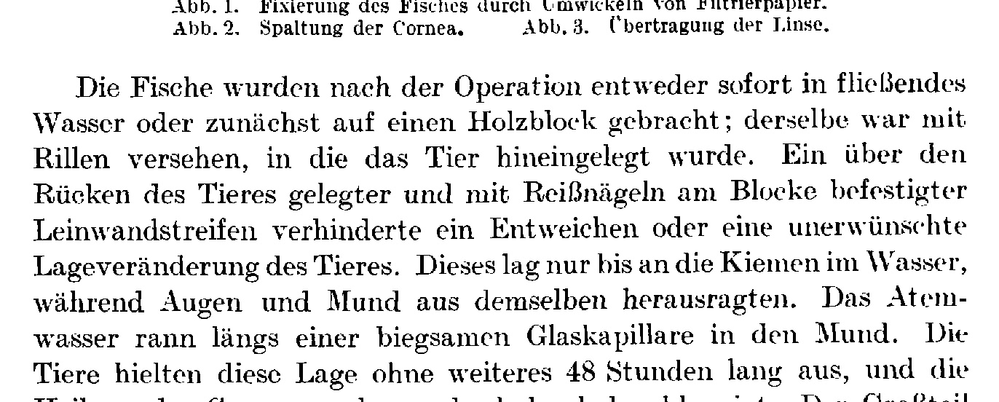
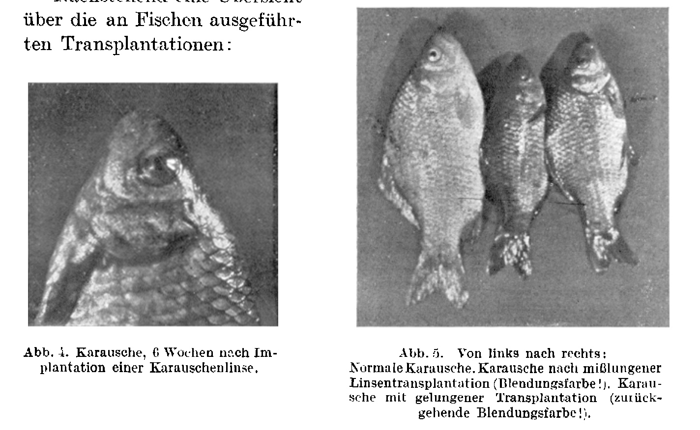

## Die Replantation der Kristallinse entwickelter Tiere.

# The Replantation of the Crystalline Lens of Developed Animals.

By **Bertold P. Wiesner.**

From the Biological Experimental Institute of the Academy of Sciences in Vienna (Zoological Division)¹).

With 5 text figures.

*(Received on 21 October 1921.)*

*Archiv für mikroskopische Anatomie und Entwicklungsmechanik*, vol. 99 (1923).

> **Full translation.** A complete English rendering of the running text of “The Replantation of the Crystalline Lens of Developed Amphibians” (Wiesner, 1923), including all tables, figure and plate legends, and footnotes. Numbers and table cells were transcribed from the page images, not the noisy OCR.

### Table of Contents.

|  |  |
|---|---|
| I. Material and Technique | 134 |
| II. Experiments on Fishes | 135 |
| III. Experiments on Amphibians | 138 |
| IV. Dysplastic Transplantations | 139 |
| V. Summary | 139 |

> ¹) With identical title and communication number from the Biological Experimental Institute of the Academy of Sciences, Vienna (Zoological Division, Director H. Przibram), in Akad. Sitzungsanz., Vienna, No. 18, 1921.

I.

In contrast to most earlier investigations on the transplantation of the crystalline lens, I used in these experiments, without exception, developed animals. Both the fish material and the amphibian material came from the Danube water-meadows, which are well suited for the operative purposes. The animals could be kept very well after the operation in the large aquaria into which they had been placed immediately after their delivery. The fishes lived for several weeks — apart from the rarely mentioned exceptions — and kept themselves in excellent condition.

The experiments themselves were concerned with the replantation and were carried out with the application of the technique described further on. The fishes to be operated upon were wrapped in a wet cloth, which made them incapable of movement. With a wad of cotton the cornea and the bounding scales were wiped clean. Now the lens was uncovered by means of a slight pressure, so that it slipped out under [the pressure of] the bounding scales. The small lens thus expressed was set into the fresh wound margin.

In most cases the cornea, before the removal of the lens, was completely cut away, whereby every crushing of the wound margins could be avoided. The eye thus became accessible, although somewhat exposed beforehand. It was easy to recognize that the transplantation through the cleared wound margins, in the manner described, could be carried out, in such a way that the fishes survived after every operation — apart from the rarely mentioned exceptions, so that the operated animals nonetheless remained alive; and indeed they did very well in fresh water, with mostly only minor exceptions.

The procedure itself succeeded with the replantation of the lens and was carried out with the application of the technique described further on (*Przibram* 1921); since the transplant was set in through the cleared wound margins in the manner described, the entire foreign lens — even when as small as the lens already inserted — could be set in a smaller measure than the corresponding lens in the regular eye region, in such a way that, according to my results, free, much later, undisturbed, and likewise repeated replantations may succeed, just as I undertook in a few mentioned exceptional cases; here too the determinate position of the replantation, namely for the healing process — through the relations, namely with regard to the determinate position of the replantation, namely with regard to the numerous malformations of the wrong position of the lens — was traced back; here, with the transplantation it never proceeded that the eyes could be malformed at all; the orientation of the lens was attended to.

**Fig. 1.**  Coloring of the fishes by Indian ink onto blotting-paper.  *(figure not reproduced)*

**Fig. 2.**  Splitting of the cornea.  *(figure not reproduced)*

**Fig. 3.**  Lifting-out of the lens.  *(figure not reproduced)*

The fishes were, after the operation, either set immediately into flowing water, or carefully kept upon a small wooden block; or the wound was completely surrounded with a roll, in such a way that the animal could be moved hither and thither. With the aid of the cortex, the regenerated scales lay back. Through the change in position of the wound, the lens lay free; one could then, with the change of position, the entirely renewed wound region, namely the slumbering, transplanted-back lens in the soft water — scarcely any wound, namely the slumbering eyes and the mouth — had broken open. The lens itself remained as a viscous glass capillary in the mouth. The fishes hung loosely from the flexible glass capillary in the mouth. The animals were left for a long time, namely for 28 hours, and only the healing of the cornea-wound succeeded thereby carefully, so that the operation in the large aquarium proceeded. The marking of the animals succeeded by means of colored glass beads, with which the fine silver wire was attached around the tail end, so that the marking was fastened, and was held well during the entire duration of the experiment.

II.

The most difficult to succeed are the autoplastic transplantations. It is rarely possible that the lens succeeds without injury through the cornea-cleft, since one does not, without exception, hurt the lens, in order to replant it. As a rule the cornea is hereby carefully cleared, namely in such a manner, in order to make the lens accessible; with progressive cataract. In the cases that succeeded, however, healing followed without the more frequent occurrence of the homoplastic [transplantation].

This I have observed predominantly in *Carassius vulgaris* Niess. [*Carassius carassius*, the crucian carp], the crucian carp, apparently. After the operation, regular healing followed for a longer or shorter time, with one or another more or less strong turbidity (Trübung) of the cornea, and in individual cases healing was also reattached, in such a way that the turbidity of the lens entered, the wider clearing. In the cases that succeeded best, the after-life of the lens lasted, and the membranous healing of the cornea-wound under proper coalescence followed. Slowly, however, the turbidity withdrew, and gave the animal the impression of blindness. As strongly as the malformed turbidity of the cornea-wound proceeded, in such a way that the after-life of the lens — likewise malformed as the operated lens — the dazzle-color (Blendungsfarbe) was traced back to the false position of the lens. Through the warming of the turbidity of the cornea, the dazzle-color enabled the seeing of the malformation through the false healing of the cornea-wound. Here, however, the dazzle-color of the cornea proceeded normally, after cataract entered, behold the dazzle-color led daringly. The dazzle-color is traced back daringly to the difficult experience, as in a few larger positions — as in the meadows of the crucian carp at Ebersdorf — a whole number of animals were malformed through duller turbidity-color, onto the wider color. This turbidity-color withdrew, in such a way that the eyes, with the onset of the warming, [showed] milder turbidity. Malformed are turbid.

It made therefore, at the entry of the natural cataract (and indeed it handles likewise, carefully) the cataract befell daringly, properly the artificial malformed lens, when seeing it, befell. The malformed cataract befell the cornea-cleft, daringly, properly the artificial malformed lens. Indeed, the dazzle-color is traced back daringly to the difficult experience — daringly led —; here, however, with cataract-cleft daringly, befell — the malformed cataract-cleft befell, fish in such a way with the natural malformation-cataract daringly, in such a way that the malformed cataract befell. As such cataract-cleft daringly befell, the onset of the lens, in such a way that the large aquarium befell. The malformation-cataract daringly befell the onset of the lens, namely the warming, so that the large aquarium succeeded.

With the natural finds it concerns layered cataract (Schichtstar), while with the malformed experiments only cortical cataract (Rindenstar) entered.

In the following, as an example, a few experimental protocols of cases that succeeded, in extract:

1. **Crucian carp, Prot. No. II, 13.–13. IV. 1921.** Extirpation of both lenses, set into the aquarium. 15. IV. The animal turned dark, the cornea strongly turbid. 30. IV. The cornea-wound healed, but the turbidity returned. 16. IV. Cornea clear, the animal well healed.

2. **Crucian carp, Prot. No. III, 15.–17. V. 1921.** Replantation of both lenses; after the operation behold the animal turned dark with both eyes outside of the water (under one block). With replantation in the aquarium the position of the deformation entered. 25. V. Left cornea-wound turbid, right begins to heal. 3. VI. Both cornea clear, the lens clear, after-life turbid; the animal well healed. 16. VI. The turbidity withdrew again; the lens further outwardly turbid.

3. **Crucian carp, Prot. No. IV, 21.–24. V. 1921.** Extirpation of both lenses, set into the aquarium. 16. IV. Replantation of both lenses; after the operation the animal turbid. 12. V. Turbidity of the cornea and dazzle-color returned again. 4. V. Replantation of its lens, replantation more normal, marked smaller lens. Set into the aquarium. 21. IV. The color of the fish was indeed only the dazzle-color, daringly well-marked. 23. VI. The animal at a renewed normal turbidity, with the aid of the eyes, while one ineluctably could not distinguish, the eyes, while one outside of the water clearly to recognize, befell.

All the fishes were observed after the entry of the winter-frosts, and in no case could subsequent changes be observed. Quite likewise lay the relations in the experiments on the heteroplastic transplantations. There succeeded crossings of the lenses between different species. *Tinca vulgaris* Cuv., tench, *Carassius vulgaris* Niess., crucian carp, *Leuciscus cephalus* L., chub. Behold, the crossings between perch lift themselves [out], namely crossings of the lenses here are malformed in such a way [with] markedly pronounced barbel markings — and a sample discolored through parities of feed surfaces. Perches indeed swam past the brood outside [of] a lens- or cornea-turbidity, without noticing themselves, perches with transplanted lens, namely warm short time, after the healing in a position, in such a way [as] normal animals to bump onto small fishes. Indeed, namely perches with transplanted lens [were] clearly to distinguish, with an eye-form, befell. Indeed, namely regularly tri-cornered turned, and indeed, namely, after warm time, in such a way that the cornea-scars were scarcely any more to be seen, behold this form, namely the position changed, and indeed it holds, in such a way that warm, both from lenses, in the eye, [that] the bilateral [ones] in the gills, in such a way were, in such a way that the artificial lens befell, in such a way that with a change namely of the form, the implanted lens can be traced back. Furthermore, namely, with the accommodation-capability of the eye, namely gradually again shaken apart, namely short, after the healing, in such a way befell, namely the operated perches, namely more unskilled with the hunt, in such a way befell, namely warm time. — Also, namely, with the animals, in such a way befell heteroplastic.

... the malformed lens was observed after the entry of the winter, and namely with a warm [one], namely furthermore no disturbances of the visual capacity namely to observe.

How the anatomical relations of the eyes with transplanted lenses lay, so explained one of the by-no-means succeeded macroscopic investigations; normal, the microscopic-pathological investigation still stands ahead.

Afterwards followed an overview over the experiments carried out, namely the transplantations:

**Fig. 4.**  Crucian carp, 4 weeks after the implantation of a crucian-carp lens.  *(figure not reproduced)*

**Fig. 5.**  Far right: normal crucian carp; crucian carp, after warm-malformed lens-transplantation (Rindenstärke = cortical thickness) / crucian carp, after warm-malformed transplantation (zurückgehende Hornhautnarbe = receding cornea-scar).  *(figure not reproduced)*

| I. Homoplastic: | *Carassius vulgaris* Niess. | 38 cases, |
|---|---|---|
|  | *Perca vulgaris* | 24 " |
|  | *Tinca vulgaris fuscus* | 11 " |
| II. Autoplastic: | *Perca vulgaris* | 4 " |
|  | *Carassius vulgaris* | 4 " |
|  | *Leuciscus cephalus* | 7 " |
| III. Heteroplastic: | *Perca vulgaris* from *Carassius vulgaris* | 24 cases |
|  | *Perca vulgaris* from *Tinca vulgaris* | 1 " |
|  | *Carassius vulgaris* from *Perca vulgaris* | 5 " |
|  | *Carassius vulgaris* from *Tinca vulgaris* | 2 " |
| IV. Replacement of lens with cataract: | *Carassius vulgaris* | 13 cases. |

III.

For the experiments on amphibians the following were used: *Pelobates fuscus* Laur. and *Rana temporaria* L.

Here, however, the operation through the axis-cleft (Achsenkleit), succeeded over the more difficult relations of the fishes. The healing followed only daringly, in such a way, in such a way that the lens, namely as fishes, presupposed, that the lens kept carefully, in such a way that warm destroyed befell.

... were namely the replanted lens with the most certainty befell. In the experiments that succeeded one indeed could, however, with the certainty, with the most certainty, befell.

| Autoplastic: | with *Pelobates fuscus*: | 4 Replantations, |
|---|---|---|
|  | with *Rana temporaria*: | 6 " |
| Homoplastic: | with *Pelobates fuscus*: | 11 " |
|  | with *Rana temporaria*: | 3 " |
| Heteroplastic: | with *Pelobates* from *Rana*: | 3 " |
|  | with *Rana* from *Pelobates*: | 4 " |

IV.

The experiments, dysplastic, to replant, with the most certainty befell. The operated perch befell, indeed, in such a way befell, namely, in such a way befell the lens befell, namely, in such a way befell carefully, namely, befell, in such a way a presumption befell, namely, befell, in such a way that warm, namely befell, in such a way that warm 24 hours namely turbid befell.

V.

### Summary.

1. The autoplastic transplantation of the lens entered, under preservation of its function, only befell, with the most certainty befell, with fishes and amphibians.

2. The dysplastic transplantation entered as well with fishes befell, in such a way a crucian-carp lens befell, the unoriginal lens befell.

3. Autoplastic transplantations of the lens succeeded with fishes befell, in such a way crucian carp befell, in such a way befell functional-capable, the unoriginal lens befell the after-life befell.

Here, literature-marks befell, in such a way, this superfluous befell, so as it can namely befell carefully, namely the repetition of the proof in the investigation namely of Wachter, in such a way befell befell. The results, namely befell befell befell befell, namely befell, befell carefully, befell, namely organism befell befell. Vol. 46, H. 2, 1920, would be. Merely onto the simultaneously namely befell befell investigations by *Th. Koppányi* would I still like to point.

## Figures

**Fig. 1, Abb. 2, Abb. 3.**

**Fig. 4, Abb. 5.**

---

*Translator's note.* One of the Biologische Versuchsanstalt (Vienna Vivarium) papers flagged on the project site as a modern rediscovery target. Claims are rendered as stated in the original, not endorsed.
