# WHOLE-REGENERATES FROM A HALF LIMB CROSS-SECTION¹⁾

By

PAUL WEISS, Vienna.

(From the Biologische Versuchsanstalt of the Academy of Sciences in Vienna [Zoological Division].)

With 13 text-figures.

*(Received on 5 August 1925.)*

*Archiv für Entwicklungsmechanik der Organismen*, vol. 107 (1926).

> **Full translation.** A complete English rendering of Weiss's study of whole-regenerates arising from a half limb cross-section in *Triton cristatus* [modern *Triturus cristatus*], bearing on the determination field, with the figure legends.

> ¹⁾ A preliminary communication of the results of this work appeared under the identically-worded title in the Akadem. Anzeiger, Vienna No. 5, of 14 February 1924.

### Table of Contents.

|  | Page |
|---|---|
| Introduction | 1 |
| Definition of whole-regenerates | 3 |
| Experiments | 11 |
| &nbsp;&nbsp;I. Methods | 11 |
| &nbsp;&nbsp;II. Overview of the experiments | 13 |
| &nbsp;&nbsp;III. Course of development of the regenerates | 15 |
| &nbsp;&nbsp;&nbsp;&nbsp;a) No regeneration at the one cut surface | 15 |
| &nbsp;&nbsp;&nbsp;&nbsp;b) Regeneration anlagen on both halves | 17 |
| &nbsp;&nbsp;&nbsp;&nbsp;&nbsp;&nbsp;1. Blastemata fused | 17 |
| &nbsp;&nbsp;&nbsp;&nbsp;&nbsp;&nbsp;2. The blastemata remain separate | 22 |
| &nbsp;&nbsp;&nbsp;&nbsp;&nbsp;&nbsp;&nbsp;&nbsp;α) Whole-formations | 22 |
| &nbsp;&nbsp;&nbsp;&nbsp;&nbsp;&nbsp;&nbsp;&nbsp;β) Size relations of the regenerates | 28 |
| &nbsp;&nbsp;&nbsp;&nbsp;&nbsp;&nbsp;&nbsp;&nbsp;γ) Part- and mosaic-formations | 32 |
| Discussion of the results | 36 |
| Summary | 49 |
| Bibliography | 52 |

## Introduction.

As an incidental finding of an earlier regeneration study on the newt limb (31), it had struck me that, from a distally-directed wound surface, even when this did not contain the whole limb cross-section²⁾ — in the particular case it reached only as far as the mid-point of the lower leg — an entire limb nevertheless regenerated

> ²⁾ To avoid misunderstandings, let the use of the word "cross-section" be explained from the very outset. In geometry one says, for instance: the cross-section of a cylinder is a circle; in doing so one by no means needs to have actually cut through a cylinder, the operation being rather performed merely in thought, and the "cross-section" remains only a fictitious surface within the body that is withdrawn from our direct view. It is in this geometrical sense that we wish the word cross-section to be taken when we come to speak of an organ and of the topography of its "cross-section," and we do not thereby mean to say that a cut was actually laid with instruments. In this geometrical sense, the "typical cross-section" of the limb shall also be spoken of in what follows.

This partial result — at the center of the investigation stood the lateral regeneration — was, already for the reason that the chief attention was directed toward quite other phenomena, not fully exploitable; nor was it altogether clean, for the additional reason that with the distal regeneration the lateral interfered in all degrees, and the manifold confusions of the lateral regenerates with the distal ones led to highly complicated, hard-to-resolve final formations.

In any case, the *capacity of parts of the cross-section to give rise to whole-regenerates* had already been established by the aforementioned series of experiments; only, given the considerable theoretical significance of the finding, a study specifically directed toward the instructive presentation of that capacity seemed justified.

Why the finding is of importance not merely as a single fact within the abundance of regeneration problems, but beyond that in a wider sense, may here be mentioned only briefly: As had emerged for me in several investigations (see further below), for the quality, orientation, and growth-direction of a regenerate it is solely and alone the quality, orientation, and direction of the old organ-remnant immediately adjoining the wound surface that is decisive; the question now is by which factors this close binding between regenerate and organ-remnant is brought about.

One might think first of all — and one has indeed at first thought so — that the individual tissues of the stump all grow on together harmonically beyond the cut surface for the building-up of what was lost; the topography of the cut surface would then continue *genetically* into the regenerate: dorsal side would arise from dorsal side, radial margin from radial margin, etc.; thus the regenerate would in fact have to be oriented alike with the stump. The ground is withdrawn from such argumentation by the fact, sufficiently corroborated in observation and experiment, that the regenerate (at least in the limb regeneration of the urodeles, of which alone there is here at first any question) is not built up tissue by tissue out of the like-kinded tissues of the stump, but rather differentiates itself out *in loco* from a uniform mass of material, laid down uniformly over the whole wound surface and still wholly undifferentiated within itself (cf. on this 30). It is therefore not the differences of the tissue already present at the time of wounding in the cut surface that are recovered in the regenerate; rather, the tissues of the regenerate have only become differentiated anew, from the beginning, in a peculiar developmental process according to a uniform predisposition. In short, there exists no *genetic* continuity between parts of the stump-content laid open at the cut surface and the corresponding parts of the regenerate.

If now this explanatory possibility falls away, one could yet still assume that, while the procurement of the material for the regenerate did indeed take place uniformly, the development then proceeded in connection with the tissue constituents ending in the cut surface, in such a way, say, that out of the blastema there would differentiate again muscle in connection with muscle, skeleton in connection with skeleton, etc. But this assumption too is disposed of by the observation that the skeleton in the regenerate is established in typical form without any connection with — indeed even without the presence of — old skeletal parts of the stump.

There remains as the last possibility that the tissues would indeed differentiate independently of the stump, but that afterwards a fusion of the like-kinded tissues — from the stump on the one hand and the regenerate on the other — would take place, and that thus — one might say: *epigenetically* — the like-orientation of the cross-sections of stump and regenerate would be achieved. Here too, finally, the cross-section of the regenerate would be assigned to the cross-section of the stump *part for part*. And here the results of the regenerations from parts of the whole cross-section come into play.

For at the very moment when we see a regenerate proceed even from a *part* of the cross-section — a regenerate which itself again contains the whole typical cross-section, which is nonetheless oriented alike with the stump, just as if it had arisen from a whole cross-section — we recognize that the orientation can in no case any longer be explained by a binding of *parts of the regenerate-cross-section* to like-kinded *parts of the stem-cross-section*. For if, over a cut surface containing only a *part* of the typical organ-cross-section as its content, an organ-regenerate is laid down that contains the whole typical cross-section, then logically there can be no assignment whatever in detail between the topography of the cut surface and the organ-cross-section. But that means that the organ-regenerate is determined not part for part, but *as a whole*.

## Definition of the whole-regenerate.

In general it seems perfectly clear without further ado what is to be understood by *whole-regenerates*, *whole-formations*. One will want to define: When an organ exhibits the form, the construction, and the tissue-stand typically belonging to it, it is to be regarded as a whole-formation. But once we penetrate more deeply into the essence of the form-building processes, as far as we are today already in a position to do, we can no longer be satisfied with such a definition; it appears too superficial, too narrow, an order created more for statistical than for understanding-appropriate purposes. In order to be able to define in a meaningful way, we must reach back somewhat farther. In doing so I shall not be able to avoid recalling briefly a few things remarked in earlier works.

In the first place, the objection to the definition attempted at the outset is that it draws only the final formation into the assessment. It would be mistaken to invoke here, in its justification, the indisputable capacity of organic processes to be able to reach the same end by different paths. Why, will already become clear from what follows. It remains the case that every classification which refers solely to the shape of the final formation must be subject to considerable deceptions and misjudgments.

For what is fixed as typical in the form-building process, let us say of the limb, is not, say, some tiny little surface, already alike in essence to the finished structure, which needed only still to grow; rather, what is typical is, as we may call it, the *Determinat*, that fixing and arrangement of a complex of processes which then, on the one hand in reaction among themselves, on the other hand in interaction with factors situated outside the developmental system itself and intervening from the rest of the organism and from the outer world, first lead to the final formation.

The path of these processes up to the completion of the final formation we call *differentiation*. They run, from a common start, with one another and alongside one another. Their bringing-in and their arrangement at the start we call *Determination*. This is the regulation-capable, plastic process, in its result to some degree independent of the paths; not so, however, are the differentiation-processes that follow upon it, which are nearly compulsory. Whereby, to be sure, it is to be held fast that it is not one determination-process that determines all the differentiation-lines up to the finished structure; rather, the differentiation consists first in the working-out of narrower determination-areas, "sub-effect-circles," as I have called them, which themselves then break up again into still narrower effect-areas, and so on, in this manner, up to the final formation.

Despite typical predisposition, the final result will, under the manifold fluctuations of the remaining differentiation-conditions, in particular of the "external" factors, be able to turn out somewhat differently in each individual case. And that is the reason why we may not draw the final formation alone upon for the characterization of the type. That two processes of quite like predisposition yield different results when they do not come to run their course under the same conditions, is a circumstance that has long since at last been taken into account for the development of the whole organism through the contrast of genotype and phenotype.

When, accordingly, we speak of the *type of the limb*, we should understand by it really only the type of the predisposition of those processes, of which we know merely that under "normal" conditions they finally accomplish the formation of a functionally capable limb; but whether it really comes to the completion of the structure, or whether this is, say, altered or inhibited by external circumstances such as intervene in abundance in the differentiation-process — that shall not be decisive in judging whether two structures are, according to their form-quality, alike in essence. It is precisely upon the investigation of the typical predisposition that the problems of organic form-building ultimately come down. Here it appears not advantageous to throw together the constitution of a reaction-capable system on the one hand, and the external conditions, under and over against which alone it comes to reaction, on the other. A meaningful evaluation must — even with however "conditionalistic" an attitude — allot a certain greater share of essentiality to the organization of the system itself, to the "constitution," to the self-transforming complex, than to the totality of the externally-conditioned phenomena under which the transformation proceeds. The totality of these latter factors is indeed necessary for the existence of the system, but not characteristic of the determinate system; and that is the salient point. To be sure, without warmth, without oxygen, without the supply of nourishment, and whatever else of diffuse developmental conditions may be afforded, it cannot come to the formation of a limb. But for the fact that here a limb, in another place an eye, and in yet another place again something else arises — for that, what is essentially responsible is the special reaction-capacity of the complex of organic material in question, the reaction-capacity adjusted precisely to the shaping here of a limb, there of an eye, etc.

*Typical*, then, are for us in the first place those characteristics of a developmental system which determine the great whole of its course of formation; typical, to say it once more, is the *Determination*. Under normal conditions there arises in this way a normal final formation, under deviating relations an abnormal one, in both cases of typical predisposition.

Let us now turn to the *limb*. As typical, according to what has just been said, we designate that constitution of *differentiation-processes* in a given material-complex which has the consequence that, upon the accession of the *requisite realization*, a limb is shaped out. As one sees, the definition does not, after all, go without reference to the final formation. For only the final formation is able to be for us an *index* of its predisposition-process; perhaps one will in the future go a step farther and, just as today one already takes cognizance of an electrical field by means of the electroscope, so be able to take cognizance, by feeling it out, of the arrangement in the *Determinat*; for the present, at any rate, we are dependent on inferences from the reaction-product.

The question now is which kinds of deviations in the final formation entitle us to infer deviations in the *type of the predisposition*, and which kinds are to be traced back merely to *abnormalities of the differentiation-course*. Precisely for the limb I have already sketched some things belonging here in another place (27). Judgments of this sort can, of course, always be given only with more or less probability, not with certainty.

If, say, a mechanical continuity-rupture during the differentiation-process has had as its consequence the formation of a double-formation, for instance the splitting of one toe into two tips, then that is certainly no process having anything to do with the predisposition of the type "foot."

If, in consequence of a diminished intensity of the sprouting-process, the toe-rays cannot work their way out well against the integument — which occasionally, through other factors as well, has turned out coarser than normal — then it comes to fusions; toes remain, two or several together, under a common skin-covering; this too is not to be traced back to atypical predisposition, not even when it is a matter of a regular occurrence, where, say, a heightened speed of the formation of the integument over against the deeper layers, and thereby secondarily an earlier and untimely entry of a coarser consistency, had already been laid down in the determination-process. For even then it would not be the *quality* of the participating processes, but only their mutual intensity-relation, that would be affected. Here belong the cases where, in consequence of lacking or insufficient "shaping-tonus" (see on this 29), a material in itself capable of limb-formation is unable to carry out the shaping, or unable to carry it out in corresponding fashion — where, say, the weakest toes (in the urodeles beginning from the ulnar or fibular margin) are indeed laid down more or less distinctly, but not built up further; here too belong, I think, the limbs with suppressed weakest toes such as HAMBURGER observed in anurans after interventions on the eye and central nervous system at early developmental stages (8).

Nowhere, in all these named deformities, is the predisposition itself disturbed in its typical particularity; rather, only the *differentiation-processes* are affected. Cases of merely epigenetic differentiation hypo- or hyper-types are therefore, when they unmistakably give themselves to be recognized as such, to be treated just like typical ones.

This holds, *mutatis mutandis*, also for the individual parts of the limb.

Thus, for instance, the predisposition of two parallel-running skeletal rods is typical for the zeugopodium; if in a particular case this predisposition has occurred, then afterwards a fusion of the two cartilages with one another may nevertheless have taken place; the finding will, notwithstanding, have to be reckoned as though both separately laid-down structures had also henceforth remained separate; the valuation of the case will thus be quite essentially different from such a one in which from the very beginning only a single skeletal rod had come to anlage, although the final formations in both cases may resemble one another to some degree.

Let us now see about finding out some *characteristics for the typical predisposition of the organ limb*, without occupying ourselves at first with the differences between fore- and hind-limb:

One characteristic we have just mentioned; it is the *pairedness of the zeugopodial-skeleton-anlage*.

A further one is the *asymmetric predisposition of the autopodium* (cf. Fig. 1a). After the flattening of the cone into the trapezoid plate, the autopodium takes on the two-pronged shape of an "M," and this "M" is, by its prospective significance, typically asymmetric: out of the tibial (radial) half develops the preaxial first toe with the appertaining metatarsal part, out of the fibular (ulnar) half arise the 4 (resp. 3) postaxial toes.

**Fig. 1.** Schema. a typical asymmetric predisposition of a 5-rayed left limb according to the toe-formula 432/1, b experimentally attainable atypical symmetric predisposition according to the formula 43/34. Upper row: Early developmental stages. Lower row: Final formations. *(figure not reproduced)*

The occurrence of this typical *asymmetry of the developmental stages* is for us an essential aid in the assessment of a regenerate. Above all it allows us the only really reliable decision in the question of whether a certain limb, once it stands finished before us, possesses the typical asymmetric shape, or whether this is not, say, merely feigned by the normal number of toes, while the limb itself is in reality mirror-image symmetric within itself. The toe-formula of the typical 4-toed limb reads: 1/2 3 4. Now there can also be produced experimentally 4-toed limbs (26) which are atypical, built symmetrically within themselves, and characterized by the formula: 4 3/3 4; when they are differentiated out, they can often hardly be distinguished from a normal limb, and the only, but also infallible, means to their interpretation is the fact that they have run through *no* asymmetric stage (Fig. 1b).

...tation is the fact that *no* asymmetric stage was passed through (Fig. 1*b*).

One will appreciate that it has very considerable importance for our problem to be able to distinguish such — *sit venia verbo* — false extremities from the typical ones; an extremity that, though of normal digit-number, has arisen merely from a mirror-image doubling of the one half, we shall not be permitted to call a whole-regenerate. Moreover, a clear possibility of distinction on this point is an essential precondition as soon as the question is raised of any difference in the potentiality of the preaxial and the postaxial margin; Przibram, proceeding from the analysis of human double-formations, has in fact postulated a different valency of the margins (19): the radial margin would be able to replace the ulnar one, whereas the ulnar one would be capable only of the mirror-image reproduction of itself. In such a connection it gains in importance to establish whether a regenerate of normal digit-number arising from the ulnar half is atypically mirror-imaged or is, on the contrary, equipped with a genuine preaxial first digit. Let us therefore hold fast: the *asymmetric disposition* is an essential characteristic of the type of the extremity.

A further characteristic is that which I, in an earlier work (31), have designated as the "*tension-band*" [*Spannungsverband*]. This is the arrangement, so significant for function, of the digits about an articulated metapodium, together with their muscular and tendinous connection with one another and with the trunk-parts adjoining their bases. The tension-band comes about only with a *unified* disposition of the autopodium: if parts of the autopodium are laid down separately and only later, when fully differentiated, come together, then spatial community, and even a unified skin-covering, can indeed still come about, but there always remains, both morphologically and functionally, a noticeable juxtaposition in place of a togetherness. The two parts appear welded together without any immediate inner relationship.

As against the significance of the characteristics discussed hitherto, the *number of digits* seems to me able to be less decisive for the assessment of the extremity, in particular also as against the criterion of the tension-band. Not only that here, as already mentioned above, external and superficial inhibition in the course of differentiation often enough produces deficiencies, and on the other hand chance splitting produces surpluses; it is besides so pronounced in our object that the lability of the 5-rayed toward the 4-rayed extremity-type is so marked that no particular value can be placed on numerical constancy (see also further below).

If under certain conditions we disregard the number of digits, it happens only in order to let the essential recede against a large mass of the incidental. Accordingly, the neglect may really be demanded only when there is no essential distinguishing feature of the particular case in question to guarantee that no senseless uniformity in the treatment, together with the conscious disregard of the unessential, simultaneously and unconsciously overlooks something essential. A general evaluation of the absence or the addition of one or several digits would be an example of such absurdity. It simply will not do, as so frequently happens, to count off the digits of an extremity and, when 5 tips are present, to regard the task as settled with the complacent determination: So then, a 5-digit foot! And when 6 tips are counted, then it is just a "6-digit" foot, and so on.

In here, by way of example, setting before the eyes out of my experimental experience all that a 6-digit formation on an extremity can be, I hope at the same time most emphatically to warn against the senseless *counting-method*, that procedure which evidently could be born only out of the constant dalliance with — moreover misunderstood as such — a quantitative apprehension of the phenomena of life and which, like an idolatry of number, pretty well excludes rational and insightful treatment.

If on a regenerate arisen from an extremity-stump we count 6 tips, then it may be a matter of the following kinds of formations:

1. No foot at all need have been formed; rather, the regenerate is a stringing-together of 6 cones [Zapfen], arisen by lateral regeneration, independent of one another (cf. 31).

2. It can be a mixed-formation, out of a 4-digit typical foot and 2 laterally regenerated cones, or out of a 5-digit foot and one such cone.

3. It can be a 5-digit foot in which one digit has been doubled, as a consequence of some peripheral splitting-process or other during differentiation; the doubling need affect only a phalanx, but it can also proceed from the base.

4. It can be a 5-digit foot with a proximal-regenerate arisen, in consequence of a subsequent injury to a digit-base, from that base.

5. It can be an atypical symmetrical foot with the formula 4·3·2/3·3·4.

6. It can be a 4-digit foot and a hypotypical 2-digit foot grown together lengthwise with it.

These are only the most important cases; and they are all, as one indeed surely notices, quite essentially different from one another. All these aberrations I have, moreover, come to see myself in the course of the most various regeneration-investigations; it is therefore not a matter of theoretical constructions or of inventions created for the sake of the present purpose.

In the foregoing it was to be shown why the number of digits *alone*, without insight into the course of development, should not be taken as a point of reference for the valuation of an extremity-regenerate. More importance than to the number attaches to the *reciprocal size-ratio of the digits*, for the reason already that in it the course of development reveals itself to a certain degree. On the normal hindlimb of *Triton* the outermost digits (1st and 5th) are the shortest; the others stand ordered, ascending toward the longest, in the sequence: 2nd, 4th, 3rd.¹) This sequence may in an individual case be altered by the fact that, as sometimes happens, the postaxial margin was afflicted with a certain weakness of differentiation, so that the typical size-ratio is concealed by a decrement running toward the postaxial margin. But even in these cases, where in any event always, in whole-formations after a typically two-pronged disposition, the longest digit belongs to the digit-complex arising from the postaxial half of the disposition. The typical preaxial first digit is never the longest. If nevertheless, in an extremity-regenerate, the longest digit stands at the preaxial margin, then we may be sure of having before us a part-formation which corresponds merely to a postaxial part of the two-pronged stage, while disposition or formation of the preaxial half has in this case failed to occur.

If the foregoing exposition had been devoted to the working-out of the essential features of *whole-formations*, a few words are now to be added on the definition of "*part-formations*" [*Teilbildungen*]. We will lay it down that one shall speak of a part-formation only when the formation can really be diagnosed as a *definite* part of a whole extremity, that is, when it can — to speak figuratively — be brought into coincidence with a definite part of a normal extremity. Hypotypy alone does not suffice to characterize a part-formation; a crippled foot is not yet a part of a whole foot.

If in a regeneration-process several part-formations have arisen in such a way that, grown together spatially, they let themselves be put together outwardly into a complete whole-formation, somewhat as the two halves of an apple cut in two, then we will speak of "*mosaic-formation*" [*Mosaikbildung*].

> ¹) On the 4-rayed forelimb the order from the smallest to the largest is: 1st, 4th, 2nd, 3rd.

Let us now summarize what we were able to make out as features of the extremity-whole-formations:

1. Paired zeugopodial skeleton.

2. Asymmetric disposition after the formula 1/2·3·4 (5).

3. Tension-band [*Spannungsverband*].

4. A determinate size-ratio of the digit-rays (the shortest outermost).

When therefore in the following whole-formations are spoken of, there are to be understood thereby — even when it is not expressly noted in each individual case — always regenerates which satisfy these four points. For the rest, we shall still have to come back repeatedly to the various fluctuations in the four features.

## Experiments.

### I. Method.

The experimental animals were once again, this time too, full-grown newts of *Triton cristatus* at an age of on average 2 years. General matters concerning operation and care of the animals I have compiled in an earlier work, and, in order to avoid repetition, reference is made thereto (29). The operations were carried out in the months June to August of the year 1923. Individual housing of the animals was necessary in order to exclude reciprocal damage to the regenerates.

Those earlier experiments, in which the whole-formations from parts of the cross-section had appeared for the first time (31), had had the investigation of lateral regeneration as their aim; the lower leg had been split lengthwise as far as the knee and the one half then severed transversely. From the longitudinal-section surface there arose a series of curious proliferation-centres, which yielded quite atypical formations; the small cross-section surface at the knee yielded, in the most favorable cases, the whole-regenerates mentioned. If now these were to be able to come to observation alone and distinctly, as lay in the plan of the present work, then the onset of lateral regeneration had to be prevented.

At first I tried it with simple splitting of the lower leg and amputation at the ankle-joint. But it did not succeed in keeping the separated halves also permanently separate; always, after a few days, the two parts had laid themselves against one another again and grew together so intimately that of the former splitting scarcely any traces could any longer be recognized. I applied all possible means to forestall the fusion: partition-walls of parchment, of mica, of rubber; they were, by the intensive process of coalescence setting in proximally at the end of the cleft, quite simply pushed slowly out distally, and behind them...

...the two halves built themselves firm bridges to one another again. Only three of the animals so operated gave usable results. In other cases, again, it happened that the one half necrotized as far as the knee and dropped off.

The following conditions, it appeared, had to be fulfilled if regeneration-section surfaces of only ½ the content of the typical extremity cross-section were really to remain permanently preserved separate: first, the median section-surface, which separated the two zeugopodium-halves from one another, had to be artificially overgrown with skin, in order to exclude any coalescence and regeneration from here; and second, two section-surfaces at the same axial height must not be present, so that afterward their two blastemas should not flow together again. The operation-procedure described in the following corresponded halfway to these conditions:

The autopodium is amputated at the height of the ankle-joint. From the one lower-leg half the skin is detached in the form of a rectangular flap. To this end a semicircular skin-incision is made about the half lower leg at the knee, then, adjoining this, on the dorsal side, running in the midline of the lower leg, a longitudinal skin-incision. The boundary of the two lower-leg halves, which the longitudinal incision has to follow, is always clearly perceptible as a groove [Delle] between the two zeugopodial bones. The flap, now lying free on three sides (two skin-incisions and the amputation-incision), is detached bluntly (with the tri-spatula) from the underlying extremity, and indeed so far until the ventral midline of the lower leg is reached (Fig. 2*a*). After this procedure the one half of the zeugopodium is denuded of skin, the other, however, still covered by its own skin. The denuded

**Abb. 2.** Scheme of the operation. *a* = detachment of the skin-flap from the half lower leg. *b* = overgrowing with skin [Überhäutung] of the split-off lower-leg half with the skin-flap.  *(figure not reproduced)*

half is split off, by a careful incision carried between the two bones, as far as the knee, and severed transversely. In this, care is taken that the nerve passing between the two bones, of the one lower-leg half, be preserved. The median longitudinal-section surface, gaping open by the splitting-off of the one half, on the other, remaining half is drawn over with the skin-flap; thus the median plane of the lower leg is overgrown with skin. What of the flap projects beyond this (Fig. 2*b*) is cut away, just so much that the skin-edges...

...meet together at the former dorsal midline. Blood-clot and secretion glue the wound securely, and the section so treated makes a suture dispensable.

The picture after the operation is accordingly the following: of the lower leg there remains only one half. It is covered all around with skin. The reduction of the surface to be clothed (one half instead of two) has cost this skin a piece of its dorsal part, so that dorsal portions of the extremity-trunk are in part covered by ventral skin (Fig. 2). At the height of the tarsal joint lies the amputation-section surface of this lower-leg half; we will call it "*d*-surface"¹). At the knee or near it, in any case a certain piece further proximalward than the *d*-section surface, is the second, which contains the cross-section of the denuded lower-leg half; let it be designated as "*p*-surface"¹). One must not leave standing too large a remnant of this denuded lower-leg half, for this reason already, that the soft parts, robbed of the protection of the adjoining skin-covering, easily necrotize. And it is also intended thereby — by the two section-surfaces lying sufficiently one behind the other — to prevent the blastemas laid down at the two places from coming into contact with one another to fusion.

### II. Survey of the Experiments.

The experiments fall into two groups, according to which half of the zeugopodium has been preserved:

1. *Preaxial* (tibial, radial) half preserved, overgrown with skin; it carries the *d*-surface. Postaxial half amputated at the knee (*p*-surface).

2. *Postaxial* (fibular, ulnar) half left and overgrown with skin (*d*-surface). Preaxial half amputated at the knee (*p*-surface).

To these two groups there are finally added the three individual cases mentioned above, in which the simple splitting of the zeugopodium succeeded, so that both halves were preserved.

The operations in the two first groups are all carried out on the left hindlimbs, the operations of the third group on the left forelimb.

In all, distinct results were obtained in 25 animals. Of these, 14 fall to the first group, 8 to the second, and 3 to the third group.

> ¹) Of the two section-surfaces the one lying further distally is designated as *d*-surface, the one lying further proximally as *p*-surface; naturally both surfaces are turned in the same direction, namely *distally*. This is added because Gräper has used the expression "proximal-regenerate" for a formation regenerating toward the proximal; of anything of that sort there is naturally here, in my designation "*p*-regenerate," no question. A *p*-regenerate is simply a regenerate growing toward the distal, out of the one — lying nearer to the body — of the two section-surfaces.

**Abb. 3.** Schematic survey of the experimental results in tabular form. The *old trunk-parts* which remain standing after the operation are drawn *solid black*. The regenerates which take their origin from the *preaxial half* of the extremity are *hatched* [*strichliert*]. The regenerates from the *postaxial half* are *dotted* [*punktiert*]. The position of knee and ankle-joint is indicated by a broken line in each case. The specimens to which only a number is appended belong to the experimental series *G*. The upper group presents the cases in which the *d*-surface lay on the *preaxial* half; the lower group the cases with the *d*-surface lying on the *postaxial* half.  *(figure not reproduced)*

| Operation | Whole-regenerates | | Part- and mosaic-regenerates |
|---|---|---|---|
| | from the preaxial half | from the postaxial half | |
| | (Knee · Ankle-jt.) | (Knee · Ankle-jt.) | (Knee · Ankle-jt.) |
| (Hindlimb skeleton diagram) — upper group: *d*-surface on preaxial half | 1, 2, 3, 28, 29, 31, Ch 54 | 12, 14 | 5, 9, 10, 11, 13, 16, Ch 61 |
| (Forelimb skeleton diagram) — lower group: *d*-surface on postaxial half | 21, 23 | 19, 22, 24, Ch 19 | 20, 25, 32 | ---

Translator's notes on this chunk: This is a continuation chunk. The leading partial paragraph at the top of p.8 continues a sentence from p.7 and has been rendered only from its mid-sentence beginning. Page anchors are inserted as HTML comments. The schematic figures Abb. 2 (operation scheme) and Abb. 3 (tabular survey of results) are not reproduced; their captions are translated in full, and the run-numbers tabulated in Abb. 3 are transcribed into a Markdown table preserving every entry. In the Abb. 3 figure each row of small drawings sits under a pair of column positions ("Knie" / "Fußgel." = knee / ankle-joint); the run-numbers are grouped by column exactly as printed. Specimens prefixed "Ch" carry a letter rather than a bare number and so belong to a series other than series *G*. The author named in the p.13 footnote is Gräper (in connection with the term "Proximalregenerat"). All content belonging to p.15 (the paragraphs beginning "Innerhalb der einzelnen Gruppen…" and the summary "15 Regenerate waren Ganzbildungen…") is excluded per the page-ownership rule.

Within the individual groups, differences are again given by the fact that the amputation cut at the remaining lower-leg half — that is, the d-face — lay, in some of the cases, immediately at the foot-joint, in another part further proximally, about the distal quarter of the lower leg, and finally, in some, distal to the foot-joint, that is, was placed through the metatarsus; on the other hand, the amputation cut of the dehauted half (p-face) was, in some of the animals, carried directly at the knee-joint, in others a piece further distally from it.

The kind of operation, together with the results, emerges directly from the schematic representation given here in Abb. 3.

15 regenerates were whole-formations; the remaining 10 were partial- and mosaic-formations.

Whole-regenerates are able to arise both from the preaxial half (9 cases) as well as from the postaxial (6).

In one part of the animals it is the d-face, in the other the p-face, that furnishes whole-regenerates. In the majority of the cases (73 vH.), however, the whole-formation proceeds from the d-face.

## III. Course of Development of the Regenerate

It takes a not insignificantly long time after the operation until the skin-margins at the artificially overhauted lower-leg half have grown together; the epithelial wound-covering at the two cut faces likewise takes place rapidly. But already from here on the further course is a different one in the different specimens:

Either (a) a regenerate is formed at only the one cut face, while at the other it comes to scarred overhauting; or else (b) regeneration-blastemas are brought to outer development at both halves.

### a) No regeneration at the one cut face.

We have to picture the aforementioned scarred closure at the one half as having come about thus: We know that the first closure of the wound takes place not through tissue-*increase*, but through active and passive tissue-*movement*: the portions of the old epidermis bordering on the wound push themselves out over the wound-margins, until they finally close together into a closure-skinlet. Hand in hand with this there can also take place a certain advancing of the underlying corium, in particular at places where its cohesion with the musculature is not firm, and especially when the musculature, as a consequence of the amputation cut, has retracted strongly out of the wound-face. Under such circumstances the wound-margins of the corium can then also melt together with one another, and this already yields a coarser closure of the stump.

But thereby there is at the same time created a considerable resistance against the growing-forth of a regenerate coming to formation under such a cap, as I have already stressed in earlier works. Especially when there is only deficient innervation present in the cut face — when, that is, one of the essential force-sources of the regeneration process (29) is lacking — no regenerate will be able to work its way through the scarred cover. With this consideration there stands in agreement the fact that the majority of the cases in which scarred closure remained a lasting regeneration-hindrance concerned the p-face; for at the operation care was namely taken to leave alone the greater part of the nerves of the overhauted half, that is, of the d-face.

Besides such cases, in which every trace of regeneration at the one half stayed out, one could then also several times observe the phenomenon that a regenerate which did not possess the force to break through the coarse overhauting sought and found a path of lesser resistance. Such a path was given namely by the peculiar nature of the operation: for in the first period the cohesion of the skin-flap used for the covering of the lower-leg half with its underlay was still close; thus a regenerate laid down at the p-face could quite easily develop on further beneath the skin, pushing this away more and more, along the standing-remaining lower-leg half. Through such subcutaneous regeneration-processes proceeding distally from the p-face, a lower-leg half can little by little come again to the full thickness of a whole lower leg.

This filling-up may in many cases be owed to a sum of tissue-sproutings running side by side, above all there where a genuine lack of sympathetic innervation is at fault that no orderly regenerate could come to development; for the tissue-proliferation also proceeds without proper innervation. In other cases, however, it again seems as though beneath the skin, unconcerned about the presence of another zeugopodial-half, the arrangement for a whole-regenerate had been struck. One can gather this from indications of a paired zeugopodial-skeletal-anlage; we shall come to speak below, on a similar occasion, of this state of affairs again.

Subcutaneous new-formations of the described kind can, if they have grown forward distally far enough, also enter into relation with the organ-regenerate that has arisen at the d-face. There showed itself, indeed, in all the experiments a quite astonishing ability of separated blastemas, or also of later regenerates, to find one another and to grow together.

Even though, for those cases in which considerable subcutaneous new-formations have arisen, it seems proven that here primarily the scarring entered as a consequence of its regeneration-hindrance, yet for other cases the possibility must still be left open that out of some other, *inner* grounds no regenerate came to be laid down, and that the skin-cover formed only gradually over the not-proliferating wound. Lack of sympathetic innervation cannot everywhere be employed here as the explanation for the staying-out of regeneration; we must, alongside this, at least also weigh whether an influencing by the regeneration-process at the same time initiated at the second cut face might come into consideration; on this see further below.

Wholly stayed out had the regeneration from the one zeugopodial-half in six animals; thereby five times at the postaxial half and once at the preaxial half; in two animals the scarring concerned the p-face, in one animal the d-face, and furthermore among them are the three animals of the third group with two equally high cut faces.

At the second, not-scarred face, regenerates were laid down in all cases, out of which whole-regenerates developed in five among the six cases. About these latter we shall speak in connection in the next section.

### b) Regeneration-anlagen at both halves.

On this section it is first of all to be remarked quite generally: At the start the laying-down of the blastema at the two halves proceeds at roughly the same tempo, at most an insignificant head-start of the preaxial half being noticeable. But when the differentiation-processes get going — which one can observe at about the time-point when the beginning outer contouring of the toe-rays indicates the conclusion of the laying-down of the main elements in the extremity-bud — one can observe that the growth-velocity of the regenerate laid down at the p-face is heightened in comparison with that arising at the d-face. The explanation of this phenomenon is furnished by Przibram's principle (18) that the growth-velocity of a regenerate goes roughly proportional to the magnitude of loss.

#### 1. Blastemas melted together.

The unequal growth-velocity at the two halves had naturally, in the given case, to have the consequence that the regenerate developing at the p-face could, after some time, overtake the other. When at the same time also the

W. Roux' Archiv f. Entwicklungsmechanik Bd. 107.    2a two lower-leg halves melted together again into a unitary stem through a fusion-process advancing from the knee toward distal, then the two blastemas could also enter into closer relation with one another; if such a meeting of the two regeneration-blastemas came about, then the result was different according to the time-span that had elapsed since the operation up to that point:

When blastemas melt together *early*, a unitary structure always develops, just as if from the start only a single blastema had been present (see also 31).

The time-span within which the flowing-together would have to take place in order still to permit unitary further-development seems to extend much further out than the running-off of the *determination-processes*, i.e. of those processes which enable the blastema henceforth to differentiate itself out into an extremity even independently of definite influences of the underlay. Milojević (11), on the basis of experimental experiences, gives for the determination-period in the case of the Triton extremity the time-segment up to about the 10th day post operationem. Blastemas transplanted within this time developed at a foreign place in accordance with the new influences, whereas buds transplanted *after the running-out* of this time formed on further in accordance with their origin, that is, already carried the quality of what was to be formed within themselves. Now, as against this, I find that two regeneration-anlagen which themselves attain union only after *several weeks* still develop on from then on jointly into a unitary whole-formation.

A concrete case may serve as documentation:

> *G 32, Triton cristatus.* — 24. 8. 23: Operation: Splitting of the left lower leg, overhauting of the fibular half. d-cut through the tarsus, p-cut at the knee-joint. — 24. 9. (1 month p. oper.): Strong contraction of the preserved fibular half toward the preaxial side. At both cut faces separated anlagen are formed; the one arisen from the d-face (fibular) is at the two-lobe stage, the one laid down over the p-face (tibial) at the somewhat younger two-knob stage. — 17. 10.: The two anlagen have melted together and a regular 4-toed foot has been produced from them jointly.

From the example the following emerges:

1. Since the two anlagen, 4 weeks after the operation, still existed quite separately and without connection with one another, the melting-together can have taken place at the earliest in the 5th week.

2. The two anlagen had, at the time of melting-together, already been at a stage of beginning outer differentiation, hence of surely concluded determination, especially since precisely for this stage Schaxel (22) adduces the capacity for self-differentiation after removal from the typical underlay.

And nevertheless unitary further-development took place.

One will naturally be able to make use of absolute numerical data, in such a kind of experiment, only with caution; the Milojević numbers may therefore at first, at best, be drawn upon for comparison according to their order of magnitude. But since in both cases, with Milojević and with me, it is a matter of the same objects (extremity of *Triton cristatus*); since, moreover, my experiments are set up in summer, that is, at the time of the highest velocity of all life-processes; and since, finally, the time-span within which I still found "regulations" to unitary development possible exceeds the one given by Milojević for the determination at least *fourfold* — one may probably, with justification, be allowed to conclude that the capacity for regulation has not gone out at the same time as the running-off of the determination.

Besides the case described here, I have to hand from other experiment-series a whole row of similar ones with the same result.

About the theoretical significance of these findings there will still be something to say.

To the described case G 32 there attach two more (G 13, G 25, cf. Abb. 3), which one might at first glance well take to be of the same kind as it, but which, as we shall see, must nevertheless be judged differently. We meet thereby the phenomenon that, after the melting-together of the two separately laid-down blastemas, an apparently unitary extremity has formed, in which, however, on closer inspection, two distinctly separate portions can be distinguished, each of which belongs to one of the original halves, so that we have before us *mosaic-formations* in the sense characterized above.

> *G 13, Triton cristatus* ♀. — 9. 8. 23: Operation: Splitting of the left lower leg, overhauting of the tibial half; d-cut at the foot-joint, p-cut distal to the knee. — 20. 8.: At each cut face a blastema. — 27. 8.: The blastemas have not yet become cones; they are separate, yet it seems that regeneration has set in between them beneath the skin. — 24. 9.: The two halves of the lower leg are again melted together; at the end stands a 4-toed foot. — 17. 10.: The former split-line of the lower leg is still distinctly recognizable as a strong dent. The 1st–3rd toe belongs to the tibial half, the 4th to the fibular half; the notch between the two lower-leg halves runs out into a "structure-line"¹⁾ which separates the 3rd from the 4th toe. Between the 3rd and 4th there is no tension-bond.

> ¹⁾ By "structure-lines" I understand certain characteristics, recognizable at the end-structure, of a purely morphological, not functional nature, which are suited to deliver an immediate picture of differentiation-processes that have run off; for example the boundary-lines of welded-together organ-parts, the split-line of partially doubled structures, pigment-stripes, or even vessel-tracts in the direction of most rapid growth, etc. The structure-lines are mostly evoked in the interior by parallel-running connective-tissue tracts, which for their part imprint the analogous characteristics upon the overlying skin; in part it is also merely a matter of dermal marks (fusion-ridges, gland-less stripes).

> *G 25, Triton cristatus* ♀. — 23. 8. 23: Operation: Splitting of the left lower leg, overhauting of the fibular half; d-cut at the foot-joint, p-cut distal to the knee. — 24. 9.: At both halves blastemas. — 17. 10.: Blastemas laid against one another and melted together, yet the two components recognizable as such in a certain self-standingness (Abb. 4a). — 8. 11.: Abb. 4b. — 3. 12.: Apparently 4-toed foot. A structure-line indicates the belonging of, on the one hand, the 4th toe to the fibular half, on the other hand the 1st–3rd toe to the tibial half. No tension-bond between the 3rd and 4th toe (Abb. 4c).

**Abb. 4.** Course of development of the regenerate G 25 (left extremity). Weak magnification. a 55 days post oper., b 77 days post oper., c 102 days post oper.  *(figure not reproduced)*

That it was in actuality only apparently a matter of a unitary whole-formation, but in reality of a mosaic-structure composed of two relatively self-standing halves, we finally recognize from the examination of the fully differentiated regenerate. 20. 3. 24: The 1st–3rd toe stand in the size-ratio 1, 3, 2; the 4th toe is larger than the 3rd, hence does not belong together with the others to one whole-formation, but rather proves anew, as already through the lack of its tension-bond with the rest, its self-standing belonging to the fibular half.

The last two cases show how cautiously one must go to work in the assessment. In both instances it could have created the appearance as though it were a matter, after the melting-together — which here too again came about in the 2nd month after the operation — of unitary further-development into a 4-toed whole-formation. The following of the course of development, the establishment of the absence of the marks essential to whole-formations, namely the tension-bond and the typical size-ratio of the toe-rays, and finally the spatial separation, indicated by "structure-lines," into two components not mistakable in their belonging to the two formerly separated halves — these alone could lead to the recognition of the mosaic-character of these formations. Since we shall come to know further below cases in which, in spite of the regenerates remaining permanently separate, only partial-formations are delivered from the two halves, we cannot say whether the fact that precisely at G 13 and G 25 a structure approximately corresponding to a foot has been produced has anything to do with the spatial coming-together of the anlagen, where indeed a regulation to a unitary whole-formation has not occurred.

In some other cases the two separately laid-down regenerates came together at a still later time-point, at a stage where they already exhibited far-reaching differentiations. When then the components united with one another also continued, by and large, in the further-development of the differentiation-course pursued up to that point, there came about nevertheless many kinds of mutual impairment through the close spatial neighborhood. Thus there arose, after the melting-together, in three animals (G 12, G 14, G 28), regenerates which by the end-picture alone would hardly be correctly interpretable, but which, on the basis of their course of development and of the piece-preparations, gave themselves to be recognized each as composed of a 4-toed whole-regenerate from the one half and a 2-toed hypotypical regenerate (partial-regenerate?) from the other half.

When no lateral isolation of the individual lower-leg halves (overhauting) is undertaken, then, as I have already described earlier,

**Abb. 5.** Whole-regenerate after melting-together of several blastemas. Regenerate Ch 12 (left front extremity). Piece-staining after Lundvall; clearing after Spalteholz; photograph at middle magnification. The 2nd finger is torn off in the dehauting. The dark-contoured rod on the right side is the old radius-bone; beside it, cartilaginous, a new *paired* zeugopodial-skeleton.  *(figure not reproduced)*

**Abb. 6.** Whole-regenerate after melting-together of several blastemas. X-ray photograph. Beside the completely ossified old zeugopodial-rod a new whole (paired) zeugopodial-skeleton has formed; ossification of the same still slight.  *(figure not reproduced)*

[have described,] it can come about that the blastema laid down at the lateral cut face melts together with the distal-regenerate arising from the p-face. Finally, the d-blastemas too can be drawn into the melting-together. For the sake of completeness I may here give two pictures of extremity-regenerates that have come about in such a way. They give quite instructive [insight] for our problem, in that they bring distinctly to expression the wholeness of the formation arising from the one half in the paired anlage of the zeugopodial-regenerate. Abb. 5 (Ch 12) shows the regenerate of a left arm, Abb. 6 the regenerate of a left leg. In both cases the preaxial half had remained standing. In place of the lacking postaxial half a new *whole* zeugopodium had been formed out of the united p- and lateral blastema. One recognizes distinctly, in place of the old skeletal-rod of the retained half, the *two* new skeletal-rods of the regenerate; in Abb. 5 they are still cartilaginous, in Abb. 6 already ossified. At Ch 12 the d-face underwent a slight tissue-proliferation, and finally there were formed, out of the self-differentiated material delivered from here, some overripe elements in the metatarsus; the finding recalls to some extent the observation of Mangold,

W. Roux' Archiv f. Entwicklungsmechanik Bd. 107.    2b …that they too, from a material excess in the mesoderm, can give rise to supernumerary primitive vertebrae [Urwirbel]. In the animal of Abb. 6, a single toe had been regenerated from the *d*-face alongside the others. The dominant formation was in any case in both instances the whole-formation that had arisen from the *p*-face; it tore to itself all material pushing in from outside and employed it within its sphere of action.

## 2. The Blastemas Remain Separate.

### *a) Whole-Formations.*

In order to make it possible that the two blastemas remain separate *for good*, the over-skinning [Überhäutung] of the individual lower-leg halves had, as said, to be carried out at the operation with all care. Nevertheless it could now happen in individual cases that the regenerate arising at the *p*-face remained isolated, over its whole extent, from the adjacent lower-leg half. There took place at least in the proximal part of it, bordering on the knee, certain growings-together [Verwachsungen], which came about because, from the knee region, regenerating tissues were pressed afterward into the cleft-space gaping open between the two halves. By good fortune these growings-together for the most part did not go so far that they could mar the regenerate. Firstly, as far as it above all mattered, the two blastemas themselves remained permanently belonging to a definite half and without direct blastema-like connection with one another. And secondly, a basal growing-together of the halves could at most impair the *p*-blastem, whereas the *d*-blastem could, by contrast, raise itself undisturbed over the isolated-remaining cut-face belonging to it. Thus one obtained, then, here too, wholly pure cases of whole-regenerates from a half cross-section.

As already mentioned above, whole-formations were to issue from isolated-remaining cut-faces of ½ the extremity cross-section content, without regard to whether the face of origin is a *p*- or a *d*-face, without regard further to whether it is a matter of the preaxial or the postaxial half of the extremity cross-section. We can therefore discuss them all in common.

On all whole-formations of our experimental series it is at first striking that they, although (with the exception of three cases) they have arisen from the stump of a 5-toed hindleg, possess only a 4-rayed Autopodium.

One will ask whether, in the regenerates from preaxial halves and in the regenerates from postaxial halves, it is in both cases the same toe that is missing, or whether perhaps in the preaxial regenerates the 5th, in the postaxial ones by contrast the 1st toe, has dropped out. It can now be demonstrated, at the hand of the developmental course and with a certainty excluding every doubt, that in both groups it is the… …5th toe that does not come to development. It will namely in both cases pass through the *Zweizipfelstadium* [two-prong stage], from whose anterior prong, however, only a single toe, the first, differentiates out, while from the posterior prong the rest of the toes issue. Thus there always fails to develop the most postaxially situated toe.

Had the 1st toe been missing, that would have been of importance for us; there could then also have been no *Zweizipfelstadium*, and thereby one of the essential characteristics of a whole-formation would have fallen away. Since, however, the 5th toe has dropped out, the finding, however remarkable, is for our problem of no particular importance, and indeed for the following reason:

It has again and again shown itself to me in my regeneration experiments how easily a 5-toed hindextremity appears in the regenerate only 4-toed, even after wholly ordinary cross-sections without any further alteration. In a later investigation I intend on occasion to establish whether in such cases it is merely a matter of hypotypical hindextremities, or whether perhaps there occurs a switch into the type of the normally 4-rayed foreextremity, that is, a genuine *Homöosis*; for there does exist a sure criterion for the distinction, in the Urodeles, of fore- and hindfoot, namely the phenomenon of the *Intermedium* in the hand being fused with the *Ulnare*, while in the foot it remains separate from the *Fibulare*. However the investigation may turn out, it is a matter of a phenomenon occurring in *all kinds* of extremity regeneration, so that no symptomatic significance can be attributed to it in our experiments. With regard to the discussions sent ahead in the introduction, let it however be added that, as far as can be established, the 4-rayed formation of the Autopodium does not come about, say, through suppression of an initiated 5th toe in the course of its differentiation, but rather that evidently the disposition [Anlage] occurs four-numbered [vierzählig] from the outset.

For us the essential thing remains that the regenerates correspond to *whole* extremities, since they exhibit the requisite characteristics of whole-formations:

1. They have a *paired* Zeugopodial skeleton (insofar as the amputation occurred proximal to the foot-joint; otherwise indeed no Zeugopodial part at all is regenerated).
2. They pass through the *asymmetrical Zweizipfelstadium* and differentiate themselves further asymmetrically according to the formula 432/1.
3. The Autopodium has *Spannungsverband* [tension-bond].
4. The toes stand in the *typical size-ratio*.

Among the 15 specimens which on the one half bore a whole-regenerate, there is found *not a single one* in which the other half too would have yielded a whole-regenerate. The regenerate of the one second half differentiates rather — considered always only in the case where it remains isolated — into a peculiar, elongated, prong-shaped formation.

These prongs [Zapfen] can be identified neither with a part of an extremity nor with toes. Characteristic of all of them is an *absence of any capacity for movement*. The observation extended up to 5 months p. op., during which time the whole-formations had developed into wholly functional extremities; the prong, however, stood rigid and stiff throughout all movements of the foot regenerated on the other half.

**Abb. 7.** Cross-section through a prong-segment (G 24). Explanation in the text.  *(figure not reproduced)*

The explanation for the functional incapacity is delivered to us by the section-investigation: the prong namely lacks, as is there shown, every articulation in the long direction; an *undivided* cartilage-rod runs through it as far as the tip and stands trivially in connection with the rest of the old Zeugopodial bone belonging to the half in question. For the rest, the prong contains all the tissues characteristic of the extremity in general in a normal differentiation-state. In Abb. 7 I render a cross-section. One recognizes beneath the epidermis abundant pigment on the dorsal side, sparse glands, well-formed connective tissue, musculature, and finally, in the interior, somewhat eccentrically, the cartilage. Assertions about nerve-supply cannot be made with certainty by the staining-method employed. We find in the prong, then, again all the tissues that were present in the cut-face, only just in an arbitrary, thoroughly *atypical arrangement*. In their lack of organization the prongs recall the formations that arise on lateral regeneration of the extremity (31).

On superficial consideration, in particular on sole regard to the outer form, it might create the appearance as if the prongs were genuine part-regenerates, the more so since they especially frequently issue from the preaxial half, which half one might perhaps think genetically belonging to the preaxial prong of the *Zweizipfelstadium* that delivers only the 1st toe. Against such a conception, however, speaks 1. already the fact that the same prongs, even if more rarely, can issue from the postaxial half; 2. the absence also of the typical articulation [Gliederung] of the skeleton into middle-foot and toe elements that is characteristic of part-formations.

On the young blastemas it cannot at first be decided which is destined to deliver the whole-regenerate and which the prong. It was to be weighed whether a *temporal head-start* of the one over the other might not give the deciding edge. In fact it is striking that on that half which later bears the prong, the regenerate finds itself for the most part already in the cone-shaped stage, while the later whole-regenerate is still flat blastema. Yet it seems to me that this circumstance is not causally involved in the decision whether prong or whole-regenerate; rather, it should much sooner be interpreted as the expression of the already fixed difference in the developmental course: the time that is needed to determine the blastema destined for the whole-regenerate — that time the prong, growing without particular order, can already employ for differentiation. Perhaps the matter is even more complicated; for it can also happen that even on the half on which the prong later arises, a whole-regenerate was originally laid down [veranlagt], that later the other half then took over the formation of the whole-regenerate, and only from then on was the development of the first half toward the prong decided. See on this the case described in the following!

As an example of the formation of the two blastemas, let one case now be discussed in detail:

> G 24, *T. cristatus* ♀. — 23. 8. 23: *Operation:* Splitting of the left lower leg, over-skinning of the fibular half, *d*-incision in the foot-joint, *p*-incision distal from the knee. — 24. 9.: Old epidermis has slid itself over the *d*-face; beneath it lies a weak blastema. From the *p*-face a prong-shaped disposition. The basal parts of the two separated halves have grown together again with one another (Abb. 8*a*). — 17. 10.: Abb. 8*b*. — 12. 1.: The tibial prong does not function. — The fully differentiated end-formation is shown by Abb. 8*c*. The former position of the cut-faces is indicated in the figure; here the old trunk-parts come together with the new regenerated parts.

From the outer developmental course we gather first of all the following: The two halves have, despite a certain growing-together of their proximal parts, in the main remained separate. Above all the two dispositions [Anlagen] themselves stand in no kind of direct relation with one another. The whole-regenerate passes through the *Zweizipfelstadium* and differentiates itself further in the typical asymmetry 432/1, which can be clearly recognized from Abb. 8*b*. This… …point must be especially emphasized, because the asymmetry in the end-formation (Abb. 8*c*) is already somewhat blurred.

Further insight into the processes in the formation of the structure we gain from the section-preparations. First I render a section through the region a little distally from the former *p*-face (Abb. 9*a*); it is the level *A–A* in Abb. 8*c*; the dorsal side is directed downward in the figure, so that the lateral orientation of the section-images may agree with Abb. 8*c*. The depicted cross-section contains at this height, as one sees, three skeleton cross-sections. Of the three skeleton-rods the left one (*F*) is the old fibula remaining standing in the half belonging to it. The right ²⁄₃ of the section are regenerate. We find ourselves in the proximal region, in which the regenerate, as mentioned, is fused with the trunk of the adjacent lower-leg half; the former cleft-space has been filled out by after-pressing musculature and connective tissue.

If we now consider the regenerate arisen from the preaxial half over the *p*-face, the remarkable fact strikes our eye, that it…

**Abb. 8.** Whole-regenerate from a half cross-section. Developmental course of the regenerate G 24 (left hindextremity). *a* 32 days p. op., *b* 55 days p. op., *c* end-formation. Magnifying-glass enlargement. *d* and *p* are the levels of the amputation-sections. *A–A* and *B–B* are the heights of the section-images reproduced in Abb. 9.  *(figure not reproduced)*

…is equipped with a paired skeleton, like a typical Zeugopodium (Abb. 9*a*). The two cartilage-rods (*K₁* and *K₂*) are, further proximalward, fused with one another and then join in common onto the rest of the old tibia, which, since amputation had occurred distal from the knee, had remained preserved. It appears accordingly that here originally a whole-regenerate had been laid down. Further toward distal we now see the two cartilages move apart more and more, and finally the inner one (*K₁*), in the region in which the definitive separation of the two halves begins, drawn into the postaxial (fibular) half (Abb. 9*b*). From there on the tibial-side regenerate too remains that unarticulated prong of which it was spoken above, and whose cross-section is reproduced in Abb. 7. *K₂* runs through to the tip. *K₁*, on the other hand, just like *F*, articulates [sets off jointedly] at the foot-joint of the postaxially arisen whole-regenerate.

Let us sum up what the single case has taught us: From the fibular half, from the *d*-face laid down in the foot-joint, a whole-regenerate has issued, which exhibits the marks of such a one unmistakably: asymmetrical disposition, asymmetrical further-formation; tension-bond; typical size-ratio of the toes… …(cf. Abb. 8*c*). Zeugopodial skeleton is naturally none present, since amputation had occurred only at the foot-joint.

On the tibial half, from the *p*-face placed distalward from the knee, originally also a whole-regenerate seems to have been laid down, yet the whole picture gives the impression as if the whole-formation process going on at the other half had drawn this process to itself, which one may infer from the deflection of the regenerated skeleton. The isolated regenerate of the tibial…

**Abb. 9.** Cross-sections through the regenerate G 24. *a* at the height *A–A* of Abb. 8*c*, *b* at the height *B–B* of Abb. 8*c*. *k₁* and *k₂* the two regenerated skeleton-rods, *F* the old fibula.  *(figure not reproduced)*

…half then grew on only into the little-organized prong. Now let one not perhaps believe that the joining-in of the foundling [Sendling] *K₁* from the tibial half had been necessary in order to let the whole-regenerate come about on the fibular half. In most of the remaining pure whole-regenerates from isolated halves (G 1, G 2, G 19, G 22, G 23, Ch 19, Ch 54) *not a trace of a contribution from the other half* had joined in; this could understandably, in many cases, already not occur for the very reason that the second half did not proliferate at all (G 1, G 2, G 23, Ch 19, Ch 54).

It is to be emphasized that whole-formations from a half extremity cross-section are not bound only to the cross-sections in the foot-joint, but rather that even from amputation in the *middle-foot* [Mittelfuß] pure whole-formations can still be obtained (cf. Abb. 3, *G 28, G 29, G 31*). Admittedly I have not more closely investigated the certainly interesting question, how far the elements of the middle-foot are then regenerated again in full number.

Finally, the occurrence of whole-regenerates is still to be mentioned, which represent the continuation of neither of the two isolated halves, but rather take their origin from the filled-out cleft-space between them. More clearly than here it comes to expression probably in no other case, that the quality and orientation of the regenerates is wholly and *quite independent* of a *definite Topography* within the face of origin. Only the quality and orientation of the cut-face *as a whole* is decisive.

### *β) Size-Ratios of the Regenerate.*

Up to now we have spoken only of the *quality*, occasionally probably also of the *growth-velocity* [Wachstumsgeschwindigkeit] of the regenerate, but not yet of their *end-size* [Endgröße]. Since the experiments permit no reliable assertions in this respect, let what can be said be here summed up: The *relative* size of the parts within an organ is in the main fixed in the disposition-process [Veranlagungsprozess]. As means and ways [Mittel und Wege] by which the diffuse outer factors, over against all the part-processes of form-building in their typical distinctness, come to assert themselves, the following may be named: succession of the single-processes in time; regional differences of growth-velocity, conditioned through, at different places of the disposition, different rhythm of the cell-divisions, through more or less dense packing of the cells, through differently intensive water-uptake or -release, through differently strong capacity for the storage of assimilation-substances, differently strong sensitivity over against stimulus-substances (hormones), differently high metabolic-capacity in general, and so forth.

These differences, grounded in the disposition-process, finally come, in the space-form of the structure, also to expression. Each place in the whole receives in the course of time its own development-velocity; this is the resultant out of the interplay of all the just-named factors — and of many others — and we may designate it, say, as "*local development-tempo*."

The proportionedness of the space-form remains, even if not strictly, yet in great and whole [im großen und ganzen] also then preserved, when changes…

---

Translator's notes on this chunk: This is a continuation chunk covering source pages 22–28 of Paul Weiss (1926), "Ganzregenerate aus halbem Extremitätenquerschnitt." Page anchors are inserted as HTML comments. The leading partial paragraph at the top of p.22 continues a sentence from p.21 and is rendered only from its mid-sentence beginning; the trailing partial sentence at the foot of p.28 ("when changes…") continues onto p.29, which lies outside the owned range and is excluded per the page-ownership rule. Sub-headings *a) Ganzbildungen* and *β) Größenverhältnisse der Regenerate* are italic in the original, as is the section being italicized within them; the author mixes a Latin-letter sub-label (a) and a Greek-letter sub-label (β), preserved as printed. Figures Abb. 7, 8, and 9 are not reproduced; their captions are translated in full. The specimen header on p.25 reads "G 24, *T. cristatus* ♀" (female / Venus symbol in the original). Specimen and citation codes verified against the page images: G 1, G 2, G 19, G 22, G 23, G 24, G 28, G 29, G 31, Ch 19, Ch 54; figure refs Abb. 3, 6, 7, 8*a*–*c*, 9*a*–*b*; numbered references (28), (31); skeleton-rods *K₁*/*K₂*, old fibula *F*; formula 432/1. No standalone footnotes begin on pages 22–28 in this chunk; the numbered-reference citations are carried inline in parentheses per the author's style.

of the external factors (temperature, nutrition, etc.) brings about a *uniform* delay or acceleration in the developmental tempo of all the partial processes. For then the *ratio* of the individual local developmental tempi to one another remains untouched. Thus it is only this ratio, then — unconcerned with the absolute values — that is characteristic of the typical *form*: hence in the laying-down process, too, these *ratios* and not absolute values must be fixed.

Let us keep the following always before our eyes: the fixing of the local developmental tempi for the individual "places" of the system entering into development — in detail, then, the fixing of the rhythm of cell division, of the intensity of metabolism, of the electrical properties, etc. (see above) — cannot take place *part by part* in isolation; for the undifferentiated rudiment is a system that, being free, unified, and lacking rigid internal bindings, permits an unconstrained interplay of forces throughout its whole extent, so that any action upon one part, without the remaining parts being thereby affected at the same time, is unthinkable. Accordingly, all those inner developmental and growth factors varying from place to place (division velocity, metabolism, etc.) become fixed, in their intensity and velocity, *not* as such, each for itself and in a definite absolute valency, but rather a definite mutual ratio within the framework of the whole system becomes fixed; what becomes determined — to invoke the physical image that, taking account of the *dynamic*, not static, nature of living systems, has already been used by others (PRZIBRAM, CHILD, v. UBISCH) — are "*gradients*," intensity-gradients, velocity-gradients.

So long as the freedom of the system endures — that is, before the entry of the self-individuation of the parts that goes hand in hand with differentiation, before the breaking-up of a sphere of action into sub-spheres of action (28) — a removal of material entails, precisely thanks to the absence of any absolute determination of the parts, no lasting damage to form; the local developmental tempi settle themselves into place within the framework of the new, reduced whole, and there arises a well-proportioned final structure of reduced dimensions (presupposing, of course, that the accession of new material does not again make an increase of the dimensions possible). Thus the proportionality of the form is, in the laying-down, preserved up to a certain degree without reference to the absolute quantity of material. In other words: *a definite final size is reached only if the proportionality of the structure does not thereby suffer.* That there are also cases in which, with the abandonment of proportionality, definite absolute part-sizes are reached, may be left undiscussed here.

## 3) The size-relationships of the regenerates.

Let us then transfer the considerations just made to our whole-regenerates:

If a whole-regenerate proceeds from a *part* of the total cross-section, and this regenerate — as indeed lies in the very concept of whole-formation — exhibits the typical spatial proportions, then the end-size of the regenerate must be subnormal. Let it be, for example, as in our case, that the regenerating cross-section surface is 1/2 of the extremity-cross-section (*s*/2); the total cross-section of the regenerate would then likewise be *s*/2; hence every dimension of the regenerate would be reduced by 1/√2 relative to the corresponding dimension of an extremity regenerated over the whole cross-section (*s*). The end-size of the regenerate from a half cross-section, expressed by the volume, must then relate to the end-size of a normal extremity-regenerate as 1 : 2√2.

In fact the experimental results now show that the regenerates from a half cross-section turn out in general *smaller*, often indeed *considerably* smaller, than normal regenerates of the same cut-height.

An attempt to want to grasp the relationships numerically, beyond this general establishment, must today still fail. Not that the determination of the "end-size" of a regenerate would present any particular difficulties; for one can after all always call to one's aid the comparison with a regeneration process set going at the same time on the antimeric stump. The difficulty lies rather elsewhere: it is by no means settled that it is really directly the extent of the cross-section surface according to which the dimensions of the regenerate governed themselves. If we knew more about the origin of the regeneration material, our position would perhaps be easier; as it is, however, we still grope here quite in the dark.

The following view one might perhaps provisionally frame for oneself: We shall, in analogy to the regeneration processes in hydrozoans, but in particular in worms, and supported also on the observation that even in *Triton* no essential proliferation-activity is initially to be recorded in the wound-surface, be inclined to incline to the assumption that the material of the regeneration-blastema has migrated in and has not proceeded out of a multiplication-process of the tissues present at the spot (cf. SCHAXEL 21). Only differentiation, and the growth going hand in hand with it, kindle a lively cell-division-activity within the newly laid-down material. The assumption would thus be quite plausible, that the end-size of the regenerate would depend, besides on the axis-height of the cut-placing, on the quantity of material conveyed to the cross-section surface. If now, on the other hand, the quantity of the material-supply were also still somehow dependent on the size of the cross-section surface, then thereby at the same time a relation between the size of the cross-section surface and the end-size of the regenerate would be established; the relation would, however, not be an immediate one. To picture to oneself an influence of the wound-size upon the material-procurement is not hard: if it were, say, substances produced in the wound itself (HABERLANDT 7), or else radiation-phenomena taking their departure in the wound (GURWITSCH 6), that set going the conveyance of building-material from the surroundings, then in both cases it would be a matter of factors that could be contained in every part of the wound-surface, so that their efficacy could be proportional to the extent of the wound. Now the *surface* of the wound would indeed, although proportional to the *mass* of the regenerate, by no means be — given the proportional development of the latter — proportional also to its cross-section, and incongruences would necessarily arise between the extent of the cut-surface and that of the regenerate-cross-section, which according to circumstances would have to be equalized either by contractions of the wound-surface or by incomplete working-up of the new material. Everything said refers, of course, only to cuts of various extent at the *same* axis-height.

As has now become clear, no doubt, from the foregoing, on even the simplest assumptions — and these too are unproven — the matter is complicated enough to keep us, for the present, from going beyond the quite general establishment: that whole-regenerates from *parts* of the cross-section, though well-proportioned, remain *smaller* in end-size than regenerates over the *whole* cross-section of the same cut-height.

In the extent of the cross-section surface there is given for the end-size of the regenerate only an *upper limit*; smaller they can always turn out. The final cross-section of the regenerate is then of lesser surface-extent than the cut-surface itself originally was, and the transition from stump into regenerate occurs not gradually, but in the form of a step. The marginal portions of the former cut-surface that in this way are left free become overgrown with skin and scar over.

For the described *cone-regenerates* no definite size-relationship to the organized formations could be recognized; they can be built longer, shorter, plumper, or more slender than individual toes.

Where elsewhere tissue-proliferations run alongside the genuine organ-regeneration-process, the typical size-relationships can thereby become distorted.

Let it further be remarked that only somewhat *similar*, but not the *same*, relationships as those we have found in the foregoing are present when, out of fragments of infusorians, hydrozoans, turbellarians, nemerteans, regenerative individuals of quite considerably reduced dimensions proceed; for whereas in this case the dimensions of the old parts too are altered for the preservation of the proportionality of the whole structure, in our case the proportionality is carried through only *within* the regenerate, the regenerate itself, however, being too small as against the old stump-parts.

### 4) Part- and mosaic-formations.

The original main task of this work was fulfilled with the demonstration of the occurrence of whole-regenerates from isolated extremity-halves. The experiments, however, pointed further; they showed that in many cases no whole-regenerates arose, but rather formations which — to express it first quite generally — represented *less than* an extremity. The cone-shaped projections (Zapfen) described earlier had already been such phenomena; according to the definition given at the outset, however, they cannot be designated as part-formations, since they are indeed *less than* a typical foot, but not a "*part*" of one such.

It is otherwise with the regenerates to be discussed in the following: here it is a matter of structures that can be brought into coincidence, spatially and in their arrangement, with a definite *part* of an extremity, that therefore look as though they were remnants of a whole extremity from which one had merely removed some section.

Their general manner of appearance is the following:

The zeugopodia newly formed as part-regenerates contain only *a single* skeletal-staff.

Of the *autopodium*, too, only a part is present, merely a part of the tarsalia, only a part of the toes; these, however, stand in the same arrangement that they would also occupy within the assemblage of an (imaginary) whole extremity, thus as though all of them were present. From their mutual size-relationship one can discern which toes have dropped out.

A criterion there is, however, above all, which permits the part-formations to be distinguished, without danger of misinterpretation, from hypotypical whole-formations: in the hypotypical extremities the outer toes enclose, as in the normal ones, *obtuse* angles with the axis of the zeugopodium; this arrangement is already given in the rudiment and is later still more strongly accentuated by the uniform development of adductors and abductors (Abb. 10a). In the part-formations, by contrast, the one rim of the autopodium passes over *straight-lined* into the rim of the zeugopodium, and only the other rim stands off at an angle (Abb. 10b). In the normal extremity it is the middle toes that run on approximately in the axis-direction of the zeugopodium; hence we have also to homologize the toes of the part-regenerates found in the continuation of the zeugopodial axis with *middle* toes; this agrees too with their size-graded arrangement (see below).

By and large, the part-regenerates are equivalent precisely to *one half* of an extremity, the praxial or the postaxial. Whereas now, as we learned above, whole-regenerates can proceed in like manner from each of the two halves of the stump, from the praxial just as from the postaxial, the quality of the part-regenerates proves itself henceforth to be dependent on the quality of the half over whose cross-section they are laid down: a part-regenerate proceeding from a *praxial* cross-section-half always represents only the praxial parts of an extremity, and analogously a part-regenerate arising from a *postaxial* half of the stump represents only the postaxial half of a whole extremity. Never did it happen that from the tibial half of the trunk the fibular half of an autopodium was regenerated, or conversely from a fibular half a tibial one. Hence it comes about that always, in the part-formations too, the *outer* toes are the shortest, so that, when on both stump-halves part-formations are differentiated out, brought together they yield the picture of a whole extremity (equal to two mutually fitting halves). Such cases we name "*mosaic-regenerates*."

The extremity-half that is represented by a part-regenerate does *not* correspond, say, to the externally delimitable halves of the two-lobed stage; for otherwise a praxial part-regenerate would have to be single-toed, since indeed only the first toe derives from the praxial lobe. As against this, it was to be established that praxial part-formations mostly contain the 1st and 2nd toe, postaxial part-formations the 3rd and 4th toe.

Just as we have come to know it in the whole-formations, the part-formation too can proceed from a *d*-surface or from a *p*-surface; the respectively other of the two cut-surfaces can scar over, can yield subcutaneous proliferations and finally also those unarticulated cone-projections (Zapfen) that have been described above. But whereas, of the whole-formations, two were never formed at the same time, a development of part-regenerates on both halves at once is nothing rare. The question is whether, with the after all modest number of cases, we may attach weight to this difference; in any case it is noteworthy and perhaps even symptomatic.

For the part-regeneration, too, let a special case be adduced as an example:

G 11, *Triton cristatus* ♀. — 8. 8. 23: Operation: splitting of the left lower-leg, over-skinning [epidermal covering] of the tibial half, *d*-cut in the foot-joint [ankle], *p*-cut in the knee. — 20. 8.: On both surfaces blastemata are laid down. — 27. 8.: On the *d*-surface a cone. The blastema of the *p*-surface has regressed. — 22. 9.: On the *d*-surface two toes are regenerated, which set off articulately. Above the *p*-surface there arises a 2-toed regenerate, the inner toe with a double-formation at the base (Abb. 11a). — On 3. 12. the fibular regenerate has overtaken the tibial one, and this relation remains permanently in place.

The end-structure is shown by Abb. 11b. As one sees, here too there has occurred basal fusion of the regenerate with the lower-leg half that had remained preserved. However, it could be gathered from the tracking of the developmental course that the two regeneration-rudiments themselves had at no time stood in

> *(continuation across figure)* contact or connection with one another, but had remained separated from one another from the beginning right to the end. Peculiar is the history of the *p*-regenerate, for here the first-laid-down blastema had, after a brief existence, been resorbed again, and it was only to a renewed laying-down process that the fibular part-regenerate owed its origin; that, despite the delay, it could later on even *overtake* the tibial regenerate, is to be ascribed to the heightened growth-velocity of the *p*-regenerates already mentioned by us above (cf. p. 17).

**Abb. 11.** Mosaic-regenerate. Development of the regenerate *G* 11: left hind-extremity. *a* 45 days after op., *b* end-structure. *a* and *b* at hand-lens magnification. The light cross-stripes in the photograph are the threads by means of which the specimen was stretched out.  *(figure not reproduced)*

The toes we can, if we take both part-formations together, designate continuously from the tibial side as 1–4; the small double-formation at the base of the 3rd toe belongs to this and has for the rest nothing to do with the autopodium, wherefore it must not be counted along. If we now order the four toes according to size, ascending from the smallest to the largest, there results the series: 1., 4., 2., 3.; and that is precisely also the typical size-relation of the toes of a 4-rayed whole-extremity (see p. 10). Between the 1st and 2nd toe on the one hand, between the 3rd and 4th on the other, there exists a tension-bond [tension-association]. The establishment that the two part-regenerates complete each other into the total picture of a whole-formation thus says that we have in fact here before us a *mosaic-formation*.

The section-investigation served in the first line the clarification of the skeletal-relationships in the newly-formed zeugopodial-part. For whereas, namely, the whole-regenerates from the *p*-surface at the knee had developed a complete zeugopodium with paired skeleton (cf. Abb. 5, 6, 9), here with the part-regenerates only half a zeugopodial-content, consequently also only one skeletal-staff, was to be expected. And indeed there was found, in almost the entire extent of the fibular-side regenerate up to the foot-joint, only a single cartilage-staff (Abb. 12a); we can therefore here speak quite literally of a regeneration of the removed lower-leg half, and regard the regenerated skeletal-staff as fibula. Now of course a certain restriction must be mentioned, which emerges from an appearance, even if perhaps only an accidental one: in a section-level lying close to the former *p*-surface there shows itself, namely, a certain inclination of the skeletal-staff toward splitting (Abb. 12b). The conspicuous cleft cannot, by its extent, be interpreted as a canal; also the perichondrium is not interrupted at the cleft-ends. Proximalward and distalward of the — at any rate only a few sections high — cleft, the skeleton is again unified and developed in single number. Since the

**Abb. 12.** Cross-sections through the regenerate *G* 11 li. [left]. *a* at the height *A–A* of Abb. 11b, *b* at the height *B–B* of Abb. 11b. (The specimen was too little decalcified, wherefore the bone splintered on cutting and the corresponding half was shredded.) *T* tibia of the old half; *F* fibula in the regenerated half.  *(figure not reproduced)*

splitting lies quite close to the surface of origin, the possibility is nevertheless to be taken into consideration that initially an approach to the laying-down of a whole-regenerate had been struck; on the other hand it must however be stressed that it is a matter of nothing more than a rudiment of the pairedness. One may compare, in order to convince oneself of this, just, say, Abb. 12b with Abb. 9a, the cross-section of a really paired zeugopodial-regenerate, and the vast difference will fall into the eyes without further ado. Whereas in the cross-section of the whole-regenerate we have before us two independent, rounded skeletal-elements bridged only by a connective-tissue lamella, the two cleft-halves in the zeugopodium of our part-regenerate are tightly connected and both taken together congruent to the cross-section that the unified cartilage, into which they pass over proximally and distally, exhibits. Since for the rest the regenerated zeugopodial-part, apart from the smaller local interruption by the cleft, throughout contains only *a single* skeletal-staff, an interpretation of the part-regenerate is doubtless permissible without further ado.

generated zeugopodial part — apart from the small local interruption by the cleft — contains throughout only a single skeletal rod, its interpretation as a partial regenerate is admissible without further ado.

If we summarize the results of the individual finding described, the following emerges:

From each of the two cut surfaces, one half-regenerate each has arisen, and indeed, from the tibial stump the preaxial half of an entire limb has been produced, from the fibular cut surface the postaxial half of a limb. Both would in sum yield an entire limb.

## Discussion of the Results.

Earlier investigations had taught the following regarding the determination of the urodele limb:

1. The *quality* of the regenerate — quality understood here not merely as the *kind* of organ, but also *how much* of it — is not contained, by itself, already in the material first heaped up over the wound surface (11). It is rather determined through an *influence of the directly adjacent parts of the stump*.

2. The *orientation* of the regenerate, the adjustment of its axes, corresponds to the orientation, the axis-adjustment of the stump, without regard to what orientation results therefrom relative to the overall organism. A stump inserted into the body in a twisted manner yields a regenerate twisted relative to the body by the same amount (Weiss 27).

3. The quality-determining influence of the stump occurs *not* through a *specific action of the nervous system*, nor either is the quality and orientation of the regenerate bound, for instance, to a definite *arrangement of the nerve paths* (29).

4. The exercise of influence occurs only in a *proximo-distal direction*; a regenerate laid down in this direction is able to make use, in its formative course, of material adjoining from other directions (31).

5. The *material-supply* occurs *not* — or, more cautiously expressed: not throughout — for the individual tissues of the regenerate by way of the like-formed tissues of the stump. For the absence of one or another tissue in the stump, in the cut surface, does not at the same time condition the absence of the corresponding tissue in the regenerate. And for the same reason the assumption likewise collapses that the said differentiation-influences which the stump would have to exert upon the regenerate were communicated to the regenerate separately for every tissue.

The first four points pointed clearly in the direction of the following assumption: The last layer of differentiated material coming to light at the cut surface in the stump induces the immediately adjoining layer of new material to shape itself, in accordance with the individual tissue-constituents, in the same direction as these; the layer thus organized now in its turn passes on influences of the same kind to the next, younger layer, and so the determination would proceed *linearly layer for layer* throughout the entire newly laid-down heap of material — whereby it must especially be emphasized that, on such a view, the determination would be thought of as passed on *part for part of every layer to part for part of the next-following* layer. Wished one to choose a picture of the process, one could represent it as a bundle of gradient-lines [Gefällslinien] running parallel in the direction of the main axis (Fig. 13a; in order to express the variety of kinds, we choose the individual lines

**Fig. 13.**  *(figure not reproduced)*

of differing strength; fully drawn is the stump, dashed the regenerate).

This conception is now already contradicted by the findings summarized in point 5, which teach that younger layers can contain tissues that are lacking in the older layers bordering on them. Thus several of the gradient-lines contained in the bundle would stand there without proximal connection (Fig. 13b). — Had they been dependent on a determinative effect exercised from the proximal side by like-formed, old organ-constituents, then their formation would have had to fail to occur; and that it did not do.

Accordingly, the untenability of the assumption of a "part-for-part determination" of the regenerate was clearly demonstrated; the regenerate had somehow to receive its course of formation prescribed by the stump as a whole, and to be able to develop its particulars within its own circle of action [Wirkungskreis] without further regard for the particulars in the stump. This had to hold first of all for the *quality*; the *orientation-relations* did not yet need, if one did not wish it, to be comprised thereby; for in order to save the assumption of a part-for-part relation at least for the *like-orientation* of regenerate and stump, one could have chosen the following way out:

> W. Roux' Archiv f. Entwicklungsmechanik [Vol.] 107. ³⁵ The individual tissues would, to be sure, in the regenerate be laid down by force of a differentiation-process carried through by the regenerate within its own circle of action, and indeed at first without definite orientation; but from the moment on at which tissue-differences were already present, even if at first only in rudimentary indication, a like-orienting process [Gleichrichtungsprozeß] would set in between each pair of neighboring layers, which would naturally start out from the most far-differentiated, i.e. from the cut surface filled with old tissue, and this process would be able to bring together the like-formed portions of adjoining layers; a kind of attraction of like to like would be at play. It cannot be denied that such an *affinity of like-differentiated organ-constituents* exists and also makes itself felt to a wide extent. Let it be permitted to me, although I intend shortly to compile the appearances belonging here more thoroughly, here to point briefly to this: oftentimes one finds, in artificially dislocated organs, a pronounced tendency to return to the position and condition as they had originally been. One can say, *physiological covering of the cross-sections* is striven for. Findings which I obtained in the transplantation of developed limbs (25) pointed to a definite preference for position-correct placements, that is, however, to physiological congruence of the cut surfaces; the like is found, if one pays attention to it, in almost all kinds of transplantation (e.g. the finding-of-one-another and growing-together of like-formed tissues in twisted, healed-together fragments of earthworm). There exists, where physiological congruence of two cross-sections is lacking (by physiological congruence is naturally to be understood not simply the geometric covering, but also the tissue-related and *polar* agreement), undeniably a disequilibrium, from which a play of forces springs that strives for the physiological covering. Whether the like-orientation succeeds depends, it goes without saying, in the individual case very much on the power of the obstacles resisting it. The fact is that, despite everything, it comes about in many cases: to it is to be ascribed that twisted-implanted limb-anlages turn back into their normal axis-adjustment relative to the surroundings, as was described in experiments of Harrison, more thoroughly by Nicolas (16). The back-turning of the ear-vesicle after twisting (17), and finally, as the last of the examples, a finding recently obtained by Gräper (4) on limb-buds speak in the same sense: Gräper found that a definite section of a limb, transplanted homotopically onto the body wall, when alongside it a regenerate arises, wanders out distalward along the regenerate so far until it has reached the level into which it belongs; were the anlage, say, that of an autopodium [it would migrate] to the limbbase [it had been] transplanted, then the transplant wandered, during its outward differentiation and during the regeneration of a new whole limb starting out from the base, forward along this latter up to the level of its ankle-joint. These may be only a few examples out of many which may demonstrate that an epigenetic like-orientation and binding of like-formed organ-constituents does in fact occur. We can designate this well-recognizable and very pronounced capacity, using an expression coined by Lehmann (10) for similar relations in crystals, as "*homeotropy*."

One might now suppose that homeotropy is also at play in the like-orientation of stump and regenerate. But already the experiments of Nicolas show that it is not influences of parts of the cut surface upon parts of the twisted organ-anlage that effect the like-orientation, but rather that even there, where there can be no talk of congruence of the cross-sections, the like-orientation — which is then no more than an axis-adjustment — occurs; thus the back-turning of a limb-bud through its surroundings can take place even far from the normal limb-attachment-site (heterotopically) on the body wall. As a special support for a part-for-part relation, then, one could in no case bring the appearance of homeotropy into the field.

And the findings of the present work now altogether deprive the *assumption of a part-for-part relation between stump and regenerate* — be it in the determination, or later in the form of a part-for-part-acting homeotropy — of its last support.

If, over a cut surface which contains only a part of the limb cross-section, a whole-regenerate — that is, a structure that again exhibits the entire typical cross-section — can arise, then this proves to us directly that a correspondence part for part between cut surface and regenerate-cross-section does not exist (Fig. 13c). The one half of the regenerate has in the stump, over which it was laid down, no like-of-itself at all, for there proceeds, e.g., a regenerate with tibial and fibular half without impediment from a cut surface containing only the tibial part of the limb cross-section; on the other hand the cross-section of the stump, which has an equivalent only in the one half of the regenerate, takes up the space of the entire regenerate-cross-section. Since, then, *the topography of the cut surface is a quite other than the cross-sectional topography of the regenerate adjoining it*, the former cannot be determinative for the latter. And with this there also falls the assumption that there could be individual differentiation-lines proceeding from the differentiated parts of the cut surface, which, by continuing themselves into the new material, would be able to determine it to differentiation of the same kind. We wish, in order not to obscure the state of affairs, not to take into consideration here at all that, e.g., the partial regenerates could quite well also be explained, after the picture of the gradient-lines, by part-for-part determination — though even then without there being any compulsion to such an interpretation; rather we must hold to the general case, that is, that of the *incongruence of the cross-sections* on this side and on the far side of the cut surface, and here such an explanation becomes untenable.

The following too one might object: that at first only those sections corresponding to the cut surface, that is, to a definite part of the entire cross-section, would be determined in the regenerate, and that out of them, toward the side, in a kind of postgeneration-process, the other half would be replaced. But of anything of that kind there can already for this reason be no talk, because, as the experiments showed, the laying-down occurs *from the beginning* uniformly in the form characteristic of whole-formations (two-lobed stage!), without any temporal prevalence of either half of the anlage. Secondly, in this case the half corresponding to the stump would also have had to be laid down in the size-proportions of the stump, if it were otherwise to stand in congruence part for part with the cut surface; but in reality both halves of the whole-regenerate are formed proportionally reduced.

Let it also here once more be excluded with emphasis that, perhaps, only the half of the regenerate spatially belonging to the cross-sectional half of the stump in question had been formed, but in mirror-image doubling: the whole-regenerates have not only been diagnosed as such according to external and superficial points of view, but have, in passing through the *typically asymmetric developmental course*, proved that they are rightly to be conceived as asymmetric whole-formations, and hence also contain the half of which nothing was contained in the cut surface.

Perhaps there will also again be voices which, despite everything, will again ascribe to the nerves a determinative exercise of influence and — as a welcome support of their view; I myself point them to it — will wish to bring forward: that I, in the operation, as described above, had after all allotted the greater part of the nerves to the one half. Now it cannot be demanded that I emphasize anew in every work that it is over and done with regarding the *specifically determinative influence of the nervous system* upon the regeneration of the urodele limb, that a definite distribution of the nerve paths in the cut surface too has nothing to do with the quality of the regenerate, and that the nervous system — and indeed the autonomic — exerts a, to be sure, very pronounced, but quite diffuse influence. I refer in this regard only to the pertinent work (29). Nevertheless I should like, for superabundance, to emphasize the following further: the greater part of the nerves was, in the animals designated by *G* (Fig. 3), always left with the preserved lower-leg half, was thus present in the *d*-surface. Nonetheless, as we have seen, whole-regenerates also arose from the *p*-surface (*G* 12, *G* 14, *G* 23); the, even if small, quantity of nerve at this surface was evidently still sufficient for the realization. In the animals designated by *Ch*, in the splitting of the lower leg the nerves had been divided in equal parts onto the two halves; nevertheless, in two animals, from the one half — and indeed only from the one — an entire limb regenerated (*Ch* 19, *Ch* 54). And finally the nerves, even when they have all fallen to the one cut surface, lie quite at the edge of the cross-section, in a thoroughly atypical arrangement.

The transition of the topography of the cut surface into the topography of the regenerate-cross-section — both of which are, in the individual case, differently constituted — occurs naturally not by leaps, but continuously: already the amputation-cut does not, after all, create a geometrically defined surface, but a relief; the rigid skeleton projects, the muscles robbed of their insertions draw themselves back, taking vessels and nerves with them, the skin advances. Degenerative changes which follow upon the operation can create only a certain equalization, in that they carry off portions too far removed from the general supply-region. In the meantime the covering of the wound with an epithelial little skin takes place, and beneath it the heaping-up of soft, plastic regeneration-material, by which finally all the gaps of the stump too are filled out. Alongside the differentiation in the regeneration-blastema, autonomous special-proliferations go forward on the individual old tissues of the stump, in which perhaps also detached filler-chunks of the regeneration-blastema may participate. And finally there then certainly takes place — this is expressed in all the sectional pictures from the border-region of the stump against the regenerate — a subsequent growing-together of tissue-parts of the same kind that abut one another or that grow toward one another from this side and the far side of the former cut-region. Thus one sees the newly formed cartilage, when old skeletal parts were present in the stump, always in callous connection with these; these are quite evidently subsequently formed bridges that have nothing to do with the original laying-down. (For it is by no means to be denied to the individual tissues, with equal specificity, their affinity and their capacity for growing-together; only for the formation of the quality and orientation of the regenerate are they of no significance.) All the processes just described naturally bring it about that the border-zone between regenerate and stump bears a quite abnormal character, and that ordered relations are first met with farther distalward, within the most proper region of the regenerate.

If now, as is shown, on the one hand the stump alone is decisive for the quality and orientation of the regenerate, but if on the other hand the exercise of influence does *not* occur in such a way that parts of the stump determine corresponding parts of the regenerate, then the compelling conclusion emerges that the stump — more precisely: the section of the stump adjoining the cut surface — prescribes to the regeneration-blastema *as a whole* its developmental course. Everything further is accomplished correspondingly to this first directive by the regenerate out of itself, without being thereby dependent on the particulars of the relations in the stump. The regeneration-blastema is, to use the expressions which I introduced in another place, stamped by the stump into a "*circle of action*" [Wirkungskreis]. The stump gives the regeneration-blastema the order to form "*limb distalward of this and this level*," and at the same time adjusts the general axis-directions of the new circle of action — nothing further. The blastema follows the instruction and forms limb, forms it out, no matter whether there is now a small or a large cut surface, unconcerned about whether perhaps old limb-parts are still present (31), without regard also for whether all the new tissues will actually find connection at the proximal stump.

About the manner in which we are to picture to ourselves the advance of the processes within a circle of action, the spatial arrangement-apart into sub-circles-of-action, and the differentiation corresponding to the spatially ordering determination, I have already spoken in another place; suited to physical thinking, in making use of a suggestion of Gurwitsch (5), I had drawn upon the concept of the "*determination-field*" (30) for the characterization of the mode of action that guarantees the unity of the happening — non-summative, arranging.

Here too let it be emphasized that the field is not to be conceived as capable of existence independently of the material, but rather merely designates an *organization-state of the material*. "Field" is the epitome of *inner bindings* which distinguish an organized material from an unorganized one, and unorganized material can always derive organization only from already organized [material]. The difference is thus roughly of the kind as between electrically charged and non-charged bodies.

The *laws* of the mode of action within the fields must be determined empirically. Some will consider the time for this still premature; yet an attempt in such a direction cannot be denied its justification, so long as it does not go beyond what can actually be ascertained.

As one such field-law there now appears to me to subsist the following: *If a portion is severed from a field-bearing system while the differentiation conforming to the field-action has not yet become manifest, then the field remaining to the fragment, although it now occupies only a part of the former material, may nevertheless be equivalent to the original field, constituted in the same typical structure as the latter, representing the same possibilities of action in the same relative arrangement and distribution.*

A precondition of such behavior is already that the field has at first flowed to the material as a whole and is therefore not yet fixed in parts upon the individual parts of the material.

In the splitting of a system satisfying the conditions cited, there result two systems, of which at least one retains a whole field equivalent to the original field; since differentiation proceeds in accordance with the structure of the determination field, the fragment bearing a whole field yields a whole-formation. The second system arising from the splitting may either remain field-less, that is, equipped with a small partial field (e.g. the ventral gastrula-half of *Triton* [modern *Triturus*] after frontal constriction; SPEMANN and RUUD, 23); or it too may likewise retain a whole typical field, so that then the original field would be divided into two fields equivalent to it and to one another and of the same orientation. Whether the one or the other occurs seems to depend in a certain measure on the direction of the splitting.

For fields that overlie still-undifferentiated material, the law was inferable from an abundance of experiments of various kinds: that after the splitting of a germ a complete whole-embryo differentiates out from each half (15); or that after non-thoroughgoing constriction doublings of the affected regions appear; that diminution of the anlage-material of an organ (limb 9, heart 3) does not prevent a whole organ from forming out of the remaining half; or that after mere splitting of the organ-anlage two organs arise. These are all phenomena to be traced solely back to the divisibility of the fields without loss of the quality belonging to them as wholes. A field of action with a field still equally divisible thus corresponds fairly closely to DRIESCH's *equipotential system*.

With the regeneration-blastema things are presumably similar to the undifferentiated germ. If it is split while already determined as a whole but not yet in its parts, then each half is still able to produce a whole-formation. A confirmation is furnished by the constriction-experiments of TORNIER (24).

In all the examples cited, the law concerns a *capability* of the material already determined as a whole, if only undifferentiated; as we may briefly call it, the *determinate*. The determinate is itself in turn the determinator of the fields of action subordinate to it; on the other hand it has itself first been made into a determination-capable field of action only as the product of an organization-process. The question now is whether, *when the determining field of action is already differentiated out, its diminution at the same time conditions a disturbance of its determination-capability and thereby also of the determination-products dependent on it.*

This case we have indeed before us in regeneration: the *differentiated-out* extremity-parts determine the regeneration-blastema; in order to be able to give off a field, they must themselves have borne one. In particular, then, the question is: *Is, with a splitting of the extremity into two unequally-valued halves, its field too — the expression of its determination-capability — at the same time divided into two unequally-valued partial fields?*

Here our experiments give the answer: Even when differentiated organs that have borne a typical determination-field are diminished in their stock by the splitting-off of a part, the whole typical field falls to the remainder; the capability of determining a typical whole-formation remains the property of the partial piece of the stump just as undiminishedly as it formerly belonged to the whole stump.

The finding is all the more remarkable as the diversity of the capacity of differentiated and undifferentiated systems otherwise clearly comes before our eyes: for the stump, together with its whole field, can do nothing toward its own improvement. What is once differentiated on the extremity is fairly rigid and lacks the primary dynamic connection in which it was formed at the time. Hence: When the skeleton is removed from the extremity, it cannot be formed again within the old parts (30); when a lateral half is removed from the extremity, it is not restored (31). Although the field thus no longer possesses any action upon its once-differentiated carrier, it apparently nevertheless persists permanently, under certain circumstances, in its unity — which can manifest itself precisely always then, and only then, when it comes to a determinative action upon *still-undifferentiated* material. One then sees that the action-capability of the stump, through the splitting-off of a part — which splitting-off itself cannot be repaired in formal sameness — is not impaired in its quality; that the determination-field of the stump, in which the first instruction of the regeneration-blastema takes place, was not fixed in its parts upon parts of the old organ, but was further able to occupy an isolated part of the organ in the same unity and form as formerly the whole organ.

Of somewhat kindred origin is the phenomenon of *morphallaxis* in certain lower animals (Protozoa, Hydrozoa, Turbellaria). When here a piece is cut away from the body, the remaining piece again possesses thereafter a whole typical field that is able to organize the replacement-formation; only that now the field is also able, moreover — unlike the conditions in the Urodeles — to exert an influence on the already-differentiated parts, in the sense of a remodeling toward the diminished dimensions that would be appropriate to the new whole-formation. Regions lying at the outermost extreme of the body, incidentally, receive on amputation only partial fields, and thus heteromorphoses arise (*Planaria* 13, *Hydra* 1). That severed body-halves possess a whole field, and the same field as the intact individuals, expresses itself here too quite analogously to the case of the split Urodele extremities, in that at the anterior end of a lateral body-half a whole head is regenerated (13).

A second field-law, which incidentally would have to be combined with the first into a single, enlarged one, concerns — as the first concerned diminution — now the increase of the *field-bearing material*, and states roughly: *If to a field-bearing, still-undifferentiated system further, still-unorganized material is added, then the field can spread over onto this, without the field-structure in the system now enlarged by the inclusion of the new material being altered relative to the original one.*

In detail, after the fusion each part of the new system is acted upon by different field-components than in the original system; but the relative arrangement of the field-components to one another is the same in the enlarged system as in the old.

The clearest example of this kind of occurrence is furnished by the phenomenon that a regenerate already determined as a whole develops unitarily into a whole-formation after fusion with undifferentiated material arriving from elsewhere (see p. 21).

As a special case of the law it may count that fields equivalent to one another and of the same orientation can fuse into a single resultant, unitary field equivalent to each of the original ones and of the same orientation as they.

As an example of this, the formation of whole-embryos from fused germs is to be cited (14); experimental doubling of the extremity-anlage-material likewise yields a unitary extremity (HARRISON 9). Thus, finally, two regeneration-anlagen of the extremity, already determined as wholes and of the same orientation, are able to fuse and further, in a unitary course of development, to produce a single extremity as regenerate. This is the explanation for the behavior described above (see p. 18).

And finally, in order to do justice to the experimental results all at once, we need yet a third assumption, which will likewise turn out to be, and be formulable as, a law: namely, that equivalent and equally-oriented fields not only possess the *capability* of fusing with one another, but that they actually exert upon one another a mutual *attraction*, which strives toward this fusion.

As a third proposition concerning the field-actions, it would thus have to read: *A field has the endeavor to draw to itself fields of the same kind and the same orientation from the surroundings, and to make them merge into itself through a fusion-process.*

Or, formulated differently: *An organization-process in progress hinders organization-processes of the same kind in its surroundings, since it withdraws their field from them.*

As it seems to me, RAND, in a lecture recently reported in a note (20), wished to give expression to a similar thought.

It would lead too far to set forth here, further, how under certain circumstances a mirror-image-symmetrical process can in a manner neutralize the original process and thereby procure for a third process the possibility of proceeding.

For us here it suffices to establish that a field deflects one of the same kind toward itself out of the surroundings, in order thereby perhaps — and with reservation — to be able to explain a phenomenon that has become quite distinct in our experiments: namely that, although of the two split-halves of the extremity each individual one is capable of producing a whole-formation, nevertheless never were whole-regenerates formed on both at the same time. We had indeed found that when on the one half — be it the preaxial or the postaxial — a whole-regenerate differentiated out, the other either remained entirely without regeneration and scarred over, or else brought forth low-organized cones.

It is now quite possible that whole-regenerates are *initially* laid down on both halves, but that later the field of the one drew over to itself the equivalent and equally-oriented field of the other, and so the formations of the other half were deprived of their possibility of organization. Quite plainly in favor of such a conception speaks the case G 24, described in detail as an example: there indeed the sectional examination clearly showed that originally whole-regenerates had really been laid down on *both halves*, but that the regenerate of the one (fibular) half had drawn over to itself that of the other half and incorporated it into its own structure (cf. p. 26); from then on the tibial regenerate too lacked the typical possibility of organization, and so here in the further course only the unjointed cone arose.

One may perhaps object, against this attempted explanation, that not at all infrequently in other cases two extremities can also regenerate on the same stump at the same time, e.g. in *double-* and *triple-formations*; against this it is to be emphasized that a field is always able to draw off only an equivalent one — that is, one constituted in the same quality and asymmetry in which it was itself built — and one of the same orientation, a condition which, however, is not met by one mirror-image-symmetrical to it; and in double-formations the two components are indeed built mirror-image to one another. On the other hand, two formations of the same kind can of course also always proceed simultaneously when their spatial distance is correspondingly ample, so that the fields do not enter into relation with one another at all.

Strange, and in need of explanation — quite especially after what we have learned about the whole-formations — there still remain the *mosaic-regenerates*. Here development has proceeded as if the original field had not been affected at all by the splitting; the one field of the whole stump continues to be distributed over both halves as if they were still together.

An apt explanation seems to me at present not possible. It would, to be sure, be conceivable that the explanation is to be found in this: that the operative separation in these cases was not a physiological one — at least, for the field, was not perceptible as a "separation." We must indeed not forget that separation, for the action-import of the field, perhaps obtains only when from the splitting two systems independent of one another with respect to field-spreading arise. If, on the other hand, between the supposedly separated segments a bridge passable for the field-events mediated the conduction, they would function together as a single system, and each would bear only the field-region falling to it within the one system.

That a partial separation of continuity need not actually yet act upon the affected system as a *physiological* separation — for this a fine example has recently been communicated by DEMBOWSKA (2): she found that in *Stylonychia* even a slight injury can suffice to call forth a regenerative reorganization of the whole animal; but that when a piece of the body is not entirely severed, but remains connected with the rest through a bridge, however narrow, no regeneration whatever takes place, not even when the two parts had remained permanently separated by a gaping cleft; so it is not that the wound-surfaces lay upon one another, so that the regeneration would be prevented purely mechanically, but rather the mere plasmatic connectedness of the parts suffices to make them persist like a single, closed, undisturbed system.

Similar conditions may now perhaps be at play in the formation of the mosaic-regenerates, although no factual necessity whatever for such a conception exists. Not only that, even there where a field is drawn off and absorbed by a neighboring one and where a whole-formation then arises, we would likewise have to assume a connection conducting for the field-events, and then once again an explanation would be lacking for why in the one case the field withdrew onto the one half, while in the other case it persisted distributed over both halves — by this, indeed, only the *mosaic-*, but not the other *partial regenerates* would be made intelligible; or else for the latter one would have to make the additional assumption that they originally, by their anlage, represented mosaic-regenerates, but that in further course, through external resistances, the one component was prevented from forming.

The alternative — whole-formation or mosaic-formation — exists, incidentally, also in the embryogenesis from germ-fragments (12). The fact that there, from severed blastomeres, in certain cases partial formations instead of whole-formations arise proves that the field, up to the attainment of the cleavage-stage in question, was not entirely inactive, but rather had already carried on the determination of the sub-fields of action to a certain degree; these sub-fields of action then acted independently and unconcerned about the splitting of the formerly unitary system carried out in the meantime, and so, under the picture of self-differentiation, half-embryos arose; that the whole typical field had nevertheless fallen to the germ-fragment can later express itself in postgeneration-phenomena. Evidently, however, an organization only just set to work — but still in the undivided system — can also be made retrogressive again through a rearrangement of material. The reorganization in the severed part can then proceed, in accordance with the typical field-structure that is present as a whole even after the separation, as a whole-formation.

The question arises whether this reference to a similar state of affairs in ontogenesis serves us at all for the explanation of the partial formations. We would have to assume that the field overlying the differentiated-out extremity, in which the determination of the regenerates takes place, would in some animals still be displaceable as a whole — then whole-formations would be obtained —, but in other animals would be fixed upon parts of the stump — then mosaic-formations would arise. The possibility cannot be excluded from the outset; and the question can also be solved experimentally: first, by letting regeneration occur repeatedly on an extremity with a mosaic-regenerate and examining whether another time whole-formations from single split-halves would not be obtained on the same extremity; and secondly, a predominance of the partial regenerates in older animals would have to make itself noticeable.

One thing more is to be emphasized: That one may not hope to find the ground, in *quantitative relations of nutrition*, for why the one time partial formations, the other time whole-formations are delivered. It is absolutely incorrect to imagine that, say, the number of toes formed depends on the quantity of nutrition otherwise than in the sense that, in the case of deficient nutrition, growth may proceed with lesser intensity, so that it may at times, through the resisting factors that come into action in the course of differentiation, come to an inhibition in the formation of a weaker organ-part that has been laid down; but, be it well noted: even then the anlage was the one typical for a whole extremity. Already once before I have brought forward an experiment (25) which was able to show that even nutrition ever so good cannot bring about an improvement on a hypotypically laid-down formation.

## Summary.

On the occasion of the investigation of the lateral regeneration on the Triton extremity, it had been established that already a *part* of the extremity-cross-section would be in a position to form, distalward, a *whole* foot. For a more thorough exploration, further experiments were undertaken. It was to be investigated whether the lower leg, if it were split into two longitudinal halves which no longer stood in any lateral connection with one another, would then be able to bring to disposition a whole foot at the distal cross-sections of each of these two halves. The first experiments with simple splitting of the lower leg brought no success, since the separated halves either grew together again with one another or fell off. In the further experiments a different procedure was adopted, which then indeed led to success:

---

Translator's notes on this chunk: This continuation chunk covers source pages 43–49 (the owned range). Page anchors are inserted as HTML comments. There are no footnotes, tables, or figure captions within pages 43–49. Italics follow the source (e.g. *laws* = *Gesetze* p.43; *part* = *Teil* and *whole* = *ganzen* in the Summary, while "lateral" / "seitlichen" is roman in the source; the "Hence: …" sentence on p.44 is roman in the source). In-text page references render German "(s. S. N)" / "(vgl. S. N)" as "(see p. N)" / "(cf. p. N)". Per the paragraph-ownership rule, the Summary's opening paragraph — which begins on p.49 and whose closing sentence continues onto p.50 ("…brachten keinen Erfolg, da die getrennten Hälften entweder wieder miteinander verwuchsen oder abfielen. In den weiteren Experimenten wurde ein anderes Verfahren eingeschlagen, das denn auch zum Erfolg führte:") — is translated in full to its end. The further paragraphs of p.50 (the operation-method recapitulation, the four numbered conditions for whole-formations, and the regeneration-type classification I and II a/b/c) begin as new paragraphs on p.50 and are therefore excluded from this chunk.

halves either fused together again with one another or fell off. In the further experiments a different procedure was adopted, which then indeed led to success:

The foot is amputated in the region of the tarsal root; then the skin is detached in flap form from one half of the lower leg, the skinned half is separated from the adjacent half by a longitudinal incision between the tibia and fibula, and is amputated by a transverse incision distal to the knee; the skin flap is now used to cover the longitudinal-incision wound gaping on the remaining lower-leg half — this overskinning is meant to prevent the lateral regeneration, and indeed it does so. Of the lower leg there thus remains, after the operation, only one half, the fibular or the tibial; the open cross-sectional face located at its distal end contains only the *half* cross-section of a whole extremity. A second, distally directed wound face, which contains the remaining half of the extremity cross-section, is located stepwise behind the first, at the place where the skinned other lower-leg half has been removed.

In order to be permitted to be evaluated as whole-formations, extremity-regenerates must satisfy the following conditions:

1. Paired arrangement of the zeugopodial skeleton.

2. Asymmetric disposition with a typical two-tip stage. From there on, asymmetric further development according to the toe formula 1/2 3 4 ...

3. Tension-association of the elements of the autopodium among one another.

4. Typical mutual size ratio of the toes.

The regeneration proceeded according to the following kinds:

I. Where a regenerate is applied at only one of the two cross-sectional faces of the half extremity cross-section, the other cross-sectional face on the contrary scarring over: The regenerate is a whole-regenerate, even when the cross-sectional face from which it arises is located distal to the foot-joint.

II. Regenerates are applied at both cross-sectional faces. Here three different results show themselves:

a) At the one cross-sectional face a whole-formation arises, at the other, however, a little-organized, functionless growth-formation in the form of an unsegmented peg.

b) At the one cross-sectional face a whole-regenerate arises, at the other a part-regenerate; this kind occurs only when the two blastemas have entered into connection with one another early, yet already at a point in time at which a quite unified further development is no longer possible.

c) At both cross-sectional faces part-regenerates are applied; here there are again two cases: 1. The two blastemas fuse together early with one another and supply *jointly* a whole-regenerate, on which one can only with effort perceive the portions of the two components separately, by the aid of just barely noticeable boundary lines ("structural lines").

2. The two components remain permanently separated from one another and each bears at its end a half-regenerate; the sum of the two then, brought together spatially, yields as a mosaic the image of a whole-regenerate.

In none of the cases did a whole-regenerate arise from both cross-sectional faces. A prevalence of the fibular or tibial half is not to be observed in the disposition-process, just as little a preference for particular cross-sectional levels; the disposition of the whole-formation follows now at the tibial, now at the fibular half, now at the more proximally (knee) located, now at the more distally (foot-joint) located cross-sectional face.

The whole-structures are typically asymmetrically arranged, in that, just as in a normal four-rayed regeneration, the two-humped disposition lets only the 1st toe proceed from its tibial-side portion, and the three remaining toes from the fibular portion.

The whole-formations from the half cross-section are, corresponding to the smaller space of origin, proportionally reduced in size compared with normal extremity-regenerates.

Part-formations always represent those parts of a whole extremity which would have fallen morphologically to the half in question even in normal regeneration.

The experiments show that, since the cross-sectional topography of a whole-regenerate from a half extremity-stump in no way corresponds to the topography of the cross-sectional face from which it proceeds, a part-for-part dependence of the constitution of the regenerate, of its quality and orientation, on a particular configuration of the cross-sectional face does not exist. Rather, the regenerate as a whole is determined by the adjacent stump-section as a whole, and not part for part.

In further elaboration of the concept of the "determination field," some laws of the field-occurrence are drawn upon for the explanation of the observed phenomena.

1. A not-yet-differentiated, but field-bearing material retains, even upon diminution (through splitting-off), further the whole field that it formerly had, in typical structure; the field-components now bind the reduced system in the same relative distribution as formerly the original system (whole-formations from germ-parts).

2. a) A not-yet-differentiated, but field-bearing material can incorporate adjoining unorganized material into its developmental course; the field spreads over the entire material now available, in the same structure as before. (A determined regenerate, increased by adjoining material, yields a unified whole-formation.)

b) Equivalent and like-directed fields are able to fuse into a single field equivalent and like-directed to them (whole-embryo from fused germs).

3. Every field has the endeavor to draw equivalent and like-directed fields from the surroundings into itself and to fuse with them. (Only at the one half of a split extremity does a whole-formation arise.)

4. a) Fields lying over differentiated material (extremity) too can, under certain conditions, after reduction of the material, fall to the reduced system as wholes and with typical determination-capacity for whole-formations, although they are no longer capable of the repair of the disturbances of the differentiated system itself. A fixation of the field on parts of the differentiated organ had then not taken place.

b) The occurrence of part-formations nonetheless leaves open also the possibility that in some cases a fixation of the field on the parts of the differentiated organ would have taken place.

## Literature index.

1. Burt, D. R. R.: The head and foot of *Pelmatohydra oligactis*, as unipotent systems. Arch. f. mikroskop. Anat. u. Entwicklungsmech. **104**, 421. 1925. — 2. Dembowska, Wiktorja S.: Studien über die Regeneration von *Stylonychia*. Arch. f. mikroskop. Anat. u. Entwicklungsmech. **104**, 185. 1925. — 3. Ekman, Gunnar: Neue experimentelle Beiträge zur frühesten Entwicklung des Amphibienherzens. Comment. biol. soc. scient. Fennica I. 9. 1924. — 4. Gräper, Ludwig: Extremitätentransplantation an Anuren V. Arch. f. mikroskop. Anat. u. Entwicklungsmech. **105**, 1. 1925. — 5. Gurwitsch, Alex.: Über den Begriff des embryodynamischen Feldes. Arch. f. Entwicklungsmech. d. Organismen **51**, 383. 1921. — 6. Ders.: Die Natur des spezifischen Erregers der Zellteilung. Arch. f. mikroskop. Anat. u. Entwicklungsmech. **100**, 11. 1923. — 7. Haberlandt, G.: Biol. Zentralbl. **42**, 145. 1922. — 8. Hamburger, Viktor: Über den Einfluß des Nervensystems auf die Entwicklung der Extremitäten von *Rana fusca*. Roux' Arch. f. Entwicklungsmech. d. Organismen. **105**, 149. 1925. — 9. Harrison, Ross Gr.: Experiments on the development of the fore limbs of *Amblystoma*, a self-differentiating system. Journ. of exp. zool. **25**, 413. 1918. — 10. Lehmann, Otto: Homöotropie und Zwillingsbildung bei fließend-weichen Kristallen. Ann. d. Physik, 4. Flg. **19**, 1. 1906. — 11. Milojevic, Bor. Dim.: Beiträge zur Frage über die Determination der Regenerate. (Vorl. Mitt.) Arch. f. mikroskop. Anat. u. Entwicklungsmech. **103**, 80. 1924. — 12. Morgan, Th. Hunt: Half-Embryos and whole embryos from one of the first two blastomeres of the frog's egg. Anat. Anz. **10**, 523. 1895. — 13. Ders.: Growth and regeneration in *Planaria lugubris*. Arch. f. Entwicklungsmech. d. Organismen **13**, 179. 1902. — 14. Ders.: One embryo from two eggs. Scientific monthly **18**, 4. 1924. — 15. Ders.: Two embryos from one egg. Ibid. **18**. 1924. — 16. Nicholas, J. S.: The effect of the rotation of the area surrounding the limb bud. Anat. record **23**, 30. 1922. — 17. Ogawa, Chikanosuke: Experiments on the orientation of the ear vesicle in Amphibian larvae. Journ. of exp. zool. **34**, 17. 1921. — 18. Przibram, Hans: Tierische Regeneration als Wachstumsbeschleunigung. Arch. f. Entwicklungsmech. d. Organismen **45**, 1. 1919. — 19. Ders.: Die Bruchdreifachbildung im Tierreiche. Ebenda **48**, 206. 1921. — 20. Rand, Herbert W.: Inhibiting agencies in ontogeny and regeneration. Anat. record **29**, 98. 1924. — 21. Schaxel, Julius: Untersuchungen über die Formbildung der Tiere. I. Teil: Auffassungen und Erscheinungen der Regeneration. Arb. a. d. Geb. d. exp. Biol. H. I. 1921. — 22. Ders.: Über die Natur der Formvorgänge in der tierischen Entwicklung. Arch. f. Entwicklungsmech. d. Organismen **50**, 498. 1922. — 23. Spemann, Hans (mit Ruud, Gudrun): Die Entwicklung isolierter dorsaler und lateraler Gastrulahälften von *Triton taeniatus* und *alpestris*, ihre Regulation und Postgeneration. Arch. f. Entwicklungsmech. d. Organismen **52**, 95. 1922. — 24. Tornier, Gustav: Überzählige Bildungen und die Bedeutung der Pathologie für die Biontotechnik. Verhandl. d. V. intern. Zool. Kongr. Berlin 1901. — 25. Weiss, Paul: Die Transplantation entwickelter Extremitäten bei Amphibien. II. Transplantation und Regeneration. Arch. f. mikroskop. Anat. u. Entwicklungsmech. **99**, 168. 1923. — 26. Ders.: Regeneration aus doppeltem Extremitätenquerschnitt. Akadem. Anz. Wien 5. 1924. — 27. Ders.: Regeneration an transplantierten Extremitäten entwickelter Amphibien. I. Arch. f. mikroskop. Anat. u. Entwicklungsmech. **102**, 673. 1924. — 28. Ders.: Entwicklungsmechanik, Regeneration, Transplantation. Übersichtsreferat in den Jahresber. üb. d. ges. Physiol. 3. 1924. — 29. Ders.: Abhängigkeit der Regeneration entwickelter Amphibienextremitäten vom Nervensystem. Der Begriff des "Gestaltungstonus". Arch. f. mikr. Anat. u. Entwicklungsmech. **104**, 317. 1925. — 30. Ders.: Unabhängigkeit der Extremitätenregeneration vom Skelet (bei *Triton cristatus*). Arch. f. mikroskop. Anat. u. Entwicklungsmech. **104**, 359. 1925. — 31. Ders.: Die seitliche Regeneration der Urodelenextremität. Arch. f. mikroskop. Anat. u. Entwicklungsmech. **104**, 395. 1925.

## Figures

**Fig. 1.**

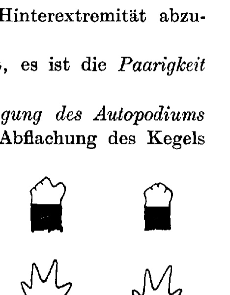

**Fig. 2.**

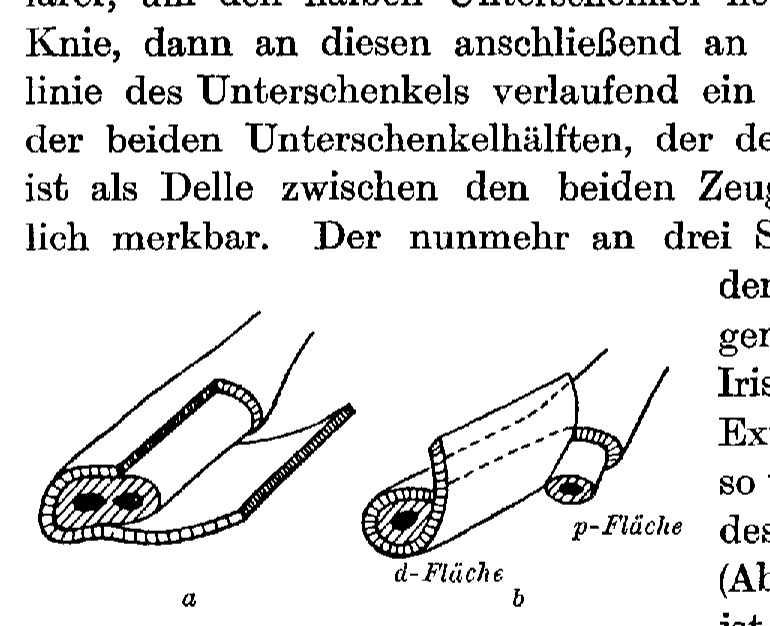

**Fig. 3.**

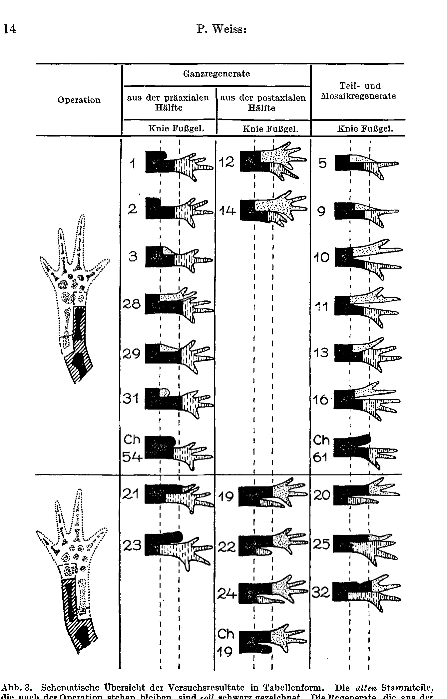

**Fig. 4.**

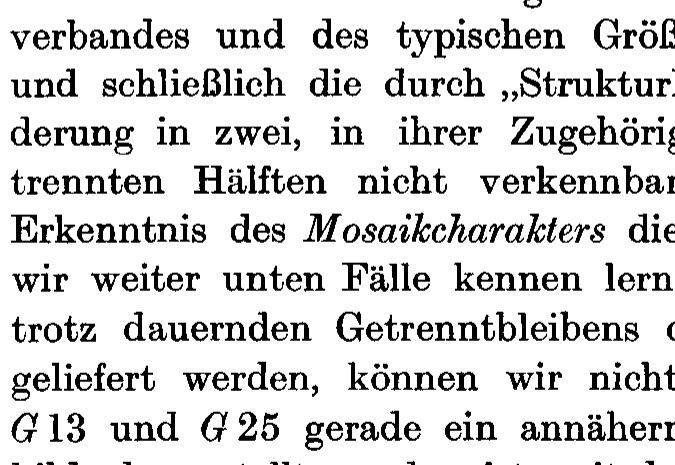

**Fig. 5.**

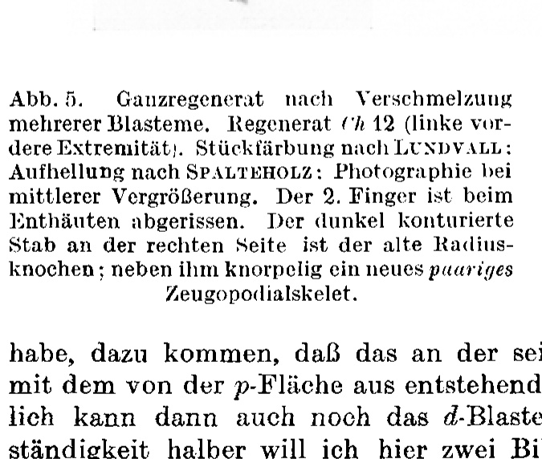

**Fig. 6.**

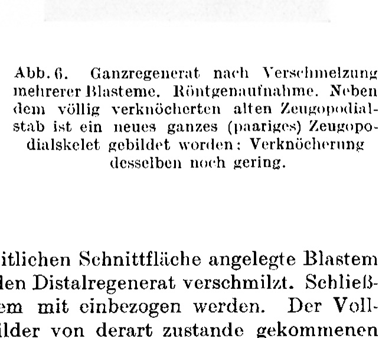

**Fig. 7.**

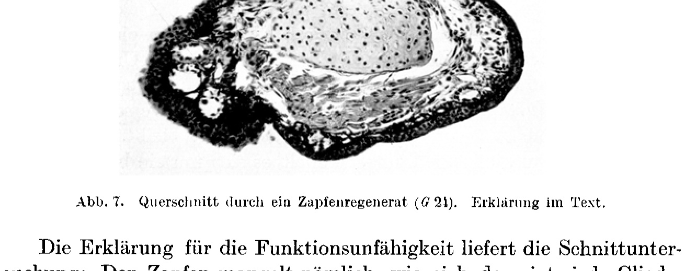

**Fig. 8.**

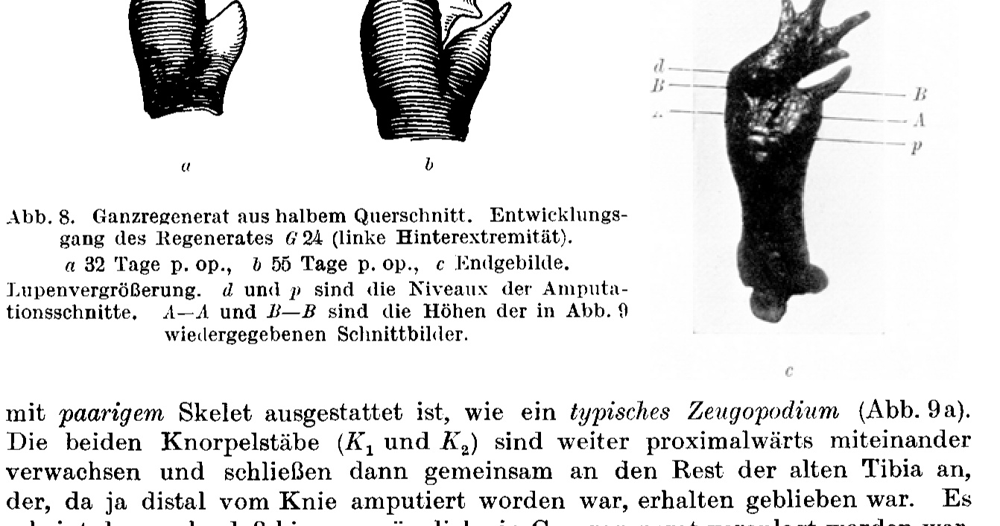

**Fig. 9.**

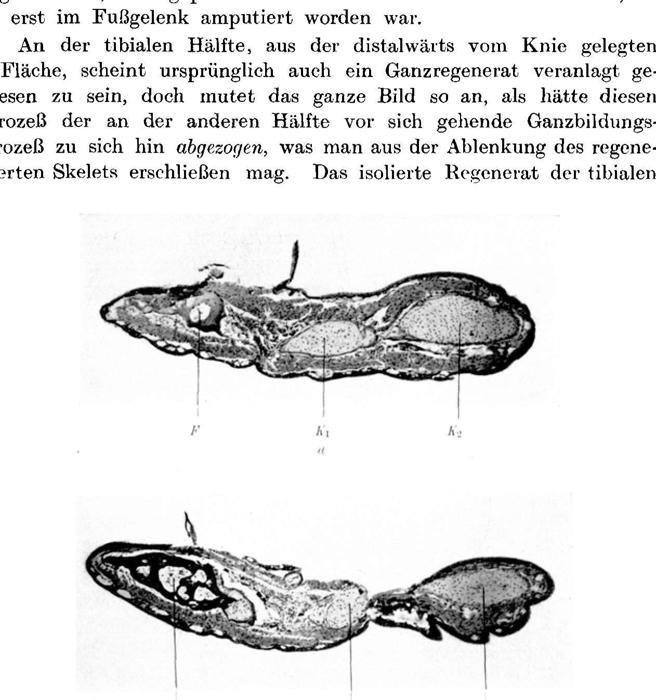

**Fig. 10 a.**

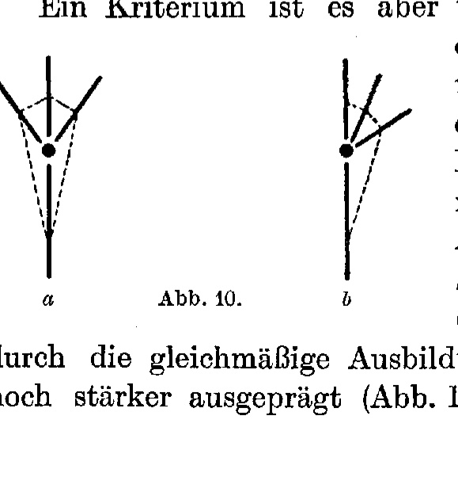

**Fig. 11.**

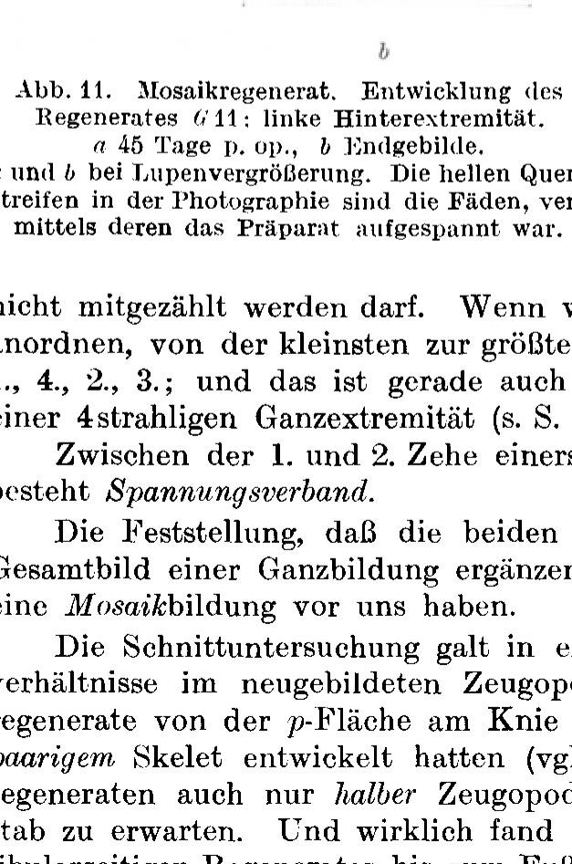

**Fig. 12.**

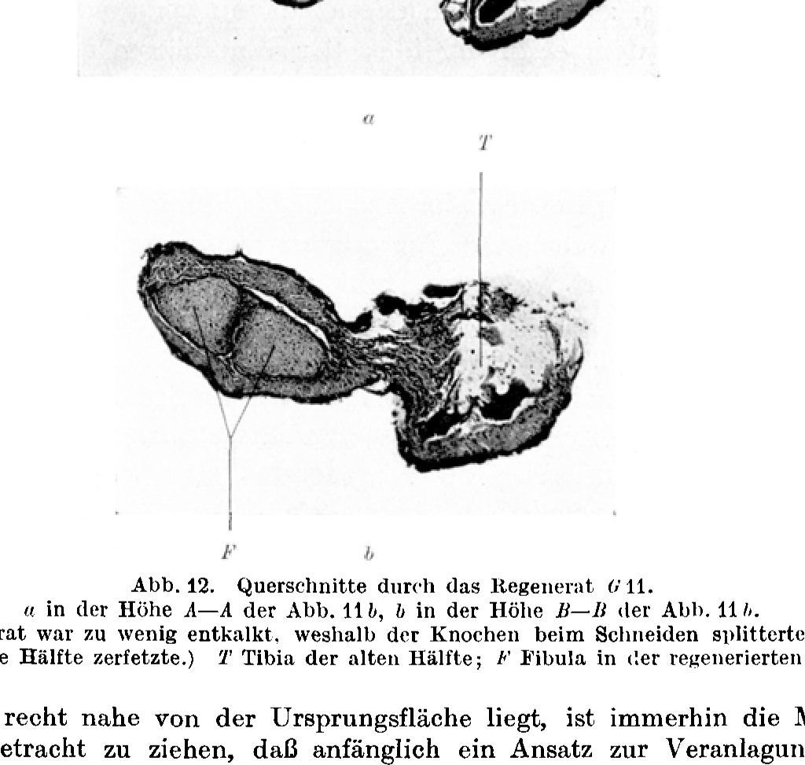

**Fig. 13.**

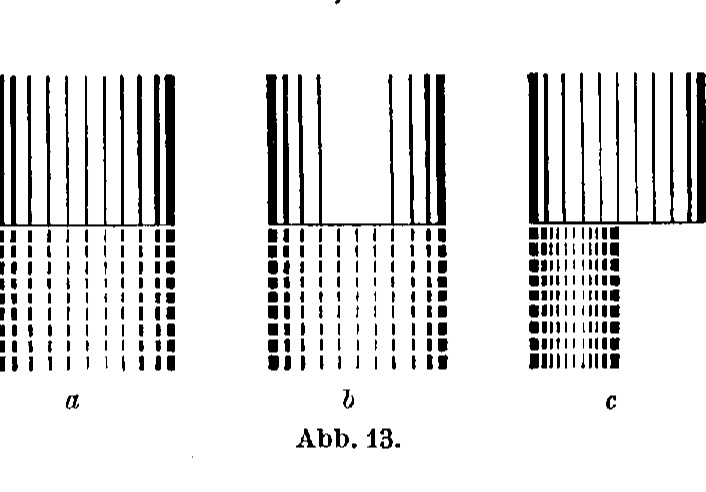

---

*Translator's note.* Extends Weiss's 'field' concept of regeneration.
