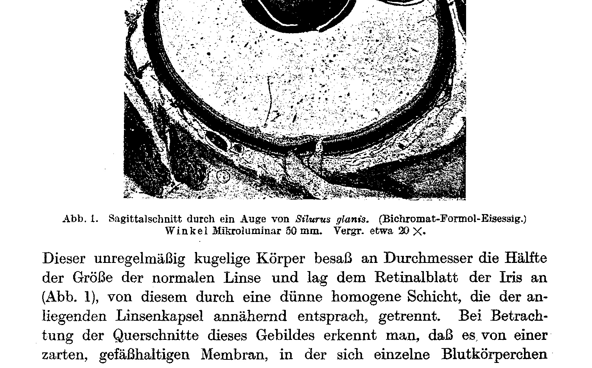
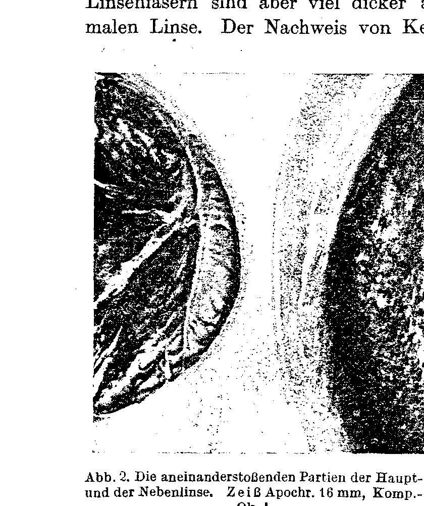

## Über den Befund einer zweiten Linse (Spontanlentoidbildung) im Auge eines Welses.

[On the Finding of a Second Lens (Spontaneous Lentoid Formation) in the Eye of a Catfish.]

By
W. Kolmer.

(From the Institute for Anatomy and Physiology of the College for Soil Culture in Vienna.)
[*Aus dem Institut für Anatomie und Physiologie der Hochschule für Bodenkultur in Wien.*]

With 2 text figures.

*(Received on 6 April 1919.)*

*Archiv für Entwicklungsmechanik der Organismen*, vol. 46 (1920).

> **Full translation.** A complete English rendering of the running text of “On the Finding of a Second Lens” (Kolmer, 1920), including all tables, figure and plate legends, and footnotes. Numbers and table cells were transcribed from the page images, not the noisy OCR.

When preparing sections through the eye of an approximately 20 cm long *Silurus glanis* [European catfish, wels], there was found, alongside the as-usual spherical, normally positioned lens, a second body very similar in respect to configuration and consistency of the lens, in the interior of the eye.

**Fig. 1.** Sagittal section through the eye of *Silurus glanis*. (Bichromate-Formol-glacial acetic acid.) Winkel Microluminar 50 mm. Enlargement approx. 20 ×. [*Abb. 1. Sagittalschnitt durch ein Auge von Silurus glanis. (Bichromat-Formol-Eisessig.) Winkel Mikroluminar 50 mm. Vergr. etwa 20 ×.*]  *(figure not reproduced)*

This irregularly spherical body possessed in diameter half the size of the normal lens and lay against the retinal leaf [Retinalblatt] of the iris (Fig. 1), separated from it by a thin homogeneous layer that approximately corresponded to the adjacent lens capsule. On examination of the cross-sections of this formation, one recognizes that it is surrounded by a delicate, vessel-containing [gefäßhaltigen] membrane, in which individual blood corpuscles 2&nbsp;&nbsp;&nbsp;&nbsp;W. Kolmer: Über den Befund einer zweiten Linse

are situated. Under the apparently homogeneous layer corresponding to the lens capsule, there are found small, singly-arranged, quite flat epithelial cells, which in places, but not everywhere, correspond to the lens epithelium of the normal lens, at other points are more irregularly configured and arranged. The content of this lens capsule now consists of formations similar to lens fibers [Linsenfasern], which however show a regular arrangement only in the medial part, just as we find them, for instance, in embryonic lenses; these abnormal lens fibers are, however, much thicker than those of the adjacent normal lens. The demonstration of nuclei in these formations is not

possible. To these regular formations attach themselves, however, irregularly twisted strands of a strongly oxyphilic substance, which make up the whole mass of the accessory lens [Nebenlinse]. The peripheral part of these masses shows a kind of hyaline degeneration and, toward the median, in the region of the lens seam [Linsenfalzes], is bordered by several layers of irregularly flat epithelia, of which individual ones contain sparse pigment granules [Pigmentkörnchen]. In these the nuclei too are well preserved. Unfortunately it was not possible for me, on the unfixed object, to examine the transparency [Durchsichtigkeit] of this accessory lens [Nebenlinse], to ascertain whether the substance corresponded in respect to all physical-

**Fig. 2.** The abutting portions of the principal and the accessory lens. Zeiss Apochr. 16 mm, Comp.-Oc. 4. [*Abb. 2. Die aneinanderstoßenden Partien der Haupt- und der Nebenlinse. Zeiß Apochr. 16 mm, Komp.-Ok. 4.*]  *(figure not reproduced)*

optical properties in the section with the normal lens, since the eye was embedded in celloidin-paraffin. The present delicate zonular fibers [Zonulafasern] passed over the accessory lens toward the principal lens. The inner leaf of the retina was detached from the pigment leaf [Pigmentblatt] only at one very small spot, where it precisely connected with the lentoid; a direct transition into the lens epithelium I could not demonstrate, since unfortunately I had not carried out a complete series of sections. The whole formation may well be designated as a "spontaneous lentoid" [Spontanlentoid] and is to be placed alongside the formations which Jokl¹) described in salamander larvae. If, however, with the latter it is a matter

> ¹) A. Jokl, Über ein natürlich entstandenes Lentoid. Arch. f. Entw.-Mech. 1918. Bd. 44. S. 643. [A. Jokl, On a naturally arisen lentoid. Arch. f. Entw.-Mech. 1918. Vol. 44. p. 643.] [Spontanlentoidbildung] in the eye of a catfish&nbsp;&nbsp;&nbsp;&nbsp;3

of in all probability rudimentary beginnings [Anfänge] of such formations, here in the fish eye, by contrast, a much more complete degree of such a formation is present, for it concerns a fully functioning eye of an animal that is no longer quite young. Any external anomaly indicating injury was not to be observed on the eye, and histologically too nothing was to be demonstrated in the available section series that would have pointed to an externally acting noxious influence or trauma. We have hitherto been pointed to the possibility of the occurrence of lentoids only through the experimental investigations on the regeneration of the lens by Fischel¹). Occasionally, from injuries of the iris margin, one or several lens-like formations can then be established, and, as Fischel has shown, sometimes there also comes about the formation of two equally large, small lenses. All these occurrences have hitherto been observed only in amphibian larvae. Quite new is the occurrence in fishes, and this case perhaps offers an interesting illustration of the doctrine set up by Fischel, that the formation of the lens can proceed from any cells of the inner iris leaf [Irisblattes]. Unfortunately, in the present case it was not possible to decide with certainty whether here too a formation took place from this tissue, since it cannot be excluded with certainty from the outset that here too the constriction [Abschnürung] of the primary lens vesicle [Linsensäckchen] could give occasion for the formation of such an accessory structure. Admittedly, this assumption does not have all too great probability, since a difference of the two formations is in any case to be established. The peculiar degeneration phenomena [Degenerationserscheinungen], which in the lentoid formation have altered the substance of the lens fibers, have been observed in a similar manner on injured lenses by Fischel (cf. his Fig. 28).

> ¹) A. Fischel, Über die Regeneration der Linse. Anat. Hefte. 1900. Heft 44. [A. Fischel, On the regeneration of the lens. Anat. Hefte. 1900. Issue 44.]

## Figures

**Fig. 1.**

**Fig. 2.**

---

*Translator's note.* One of the Biologische Versuchsanstalt (Vienna Vivarium) papers flagged on the project site as a modern rediscovery target. Claims are rendered as stated in the original, not endorsed.
