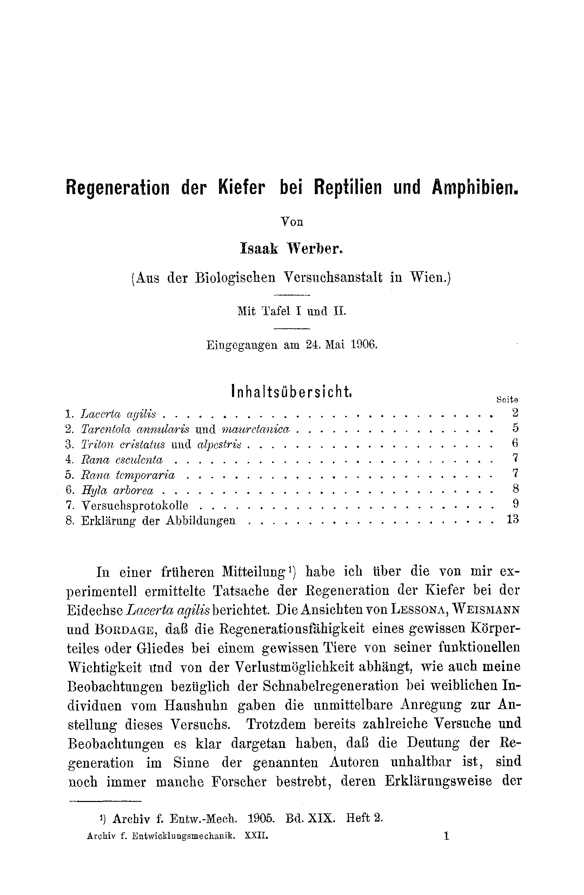
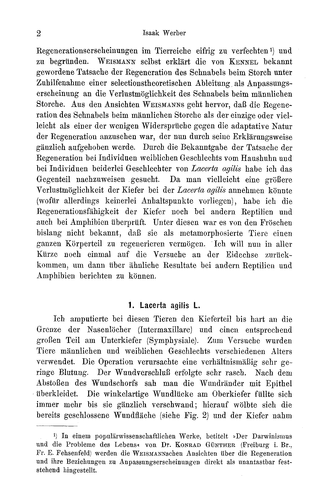

# Regeneration of the Jaws in Reptiles and Amphibians

By

Isaak Werber.

*(From the Biologische Versuchsanstalt in Vienna.)*

With Plates I and II.

Received on 24 May 1906.

*Archiv für Entwicklungsmechanik der Organismen*, vol. 22 (1906).

> **Full translation.** A complete English rendering of the running text of “Regeneration of the Jaws in Reptiles” (Werber, 1906), including all tables, figure and plate legends, and footnotes. Numbers and table cells were transcribed from the page images, not the noisy OCR.

### Table of Contents

| | Page |
|---|---|
| 1. *Lacerta agilis* | 2 |
| 2. *Tarentola annularis* and *mauretanica* | 5 |
| 3. *Triton cristatus* and *alpestris* | 6 |
| 4. *Rana esculenta* | 7 |
| 5. *Rana temporaria* | 7 |
| 6. *Hyla arborea* | 8 |
| 7. Experimental protocols | 9 |
| 8. Explanation of the figures | 13 | In an earlier communication¹ I reported on the fact, experimentally established by me, of the regeneration of the jaws in the lizard *Lacerta agilis*. The views of Lessona, Weismann, and Bordage — that the regenerative capacity of a certain body part or limb in a certain animal depends on its functional importance and on the possibility of its loss — as well as my observations regarding beak regeneration in female individuals of the domestic fowl, gave the immediate stimulus for the conduct of this experiment. Although numerous experiments and observations have already clearly demonstrated that the interpretation of

> ¹ Archiv f. Entw.-Mech. 1905. Vol. XIX. Part 2.

regeneration phenomena in the animal kingdom in the sense of the named authors is untenable, still many researchers continue to strive zealously to defend¹ and substantiate their manner of explanation. Weismann himself explains the fact of the regeneration of the beak in the stork, which became known through Kunkel, by recourse to a selection-theoretical derivation, as an adaptation phenomenon to the possibility of loss of the beak in the male stork. From Weismann's views it emerges that the regeneration of the beak in the male stork was to be regarded as the only, or perhaps as one of the few, contradictions against the adaptive nature of regeneration, which would now be entirely removed by his manner of explanation. Through the demonstration of the fact of regeneration in individuals of the female sex of the domestic fowl and in individuals of both sexes of *Lacerta agilis*, I have sought to demonstrate the opposite. Since one might perhaps assume a greater possibility of loss of the jaws in *Lacerta agilis* (for which, however, there are no points of reference whatever), I have examined the regenerative capacity of the jaws in still other reptiles and also in amphibians. Among these, it was not previously known of the frogs that, as metamorphosed animals, they are able to regenerate a whole body part. I will now once again, very briefly, return to the experiments on the lizard, in order then to be able to report on similar results in other reptiles and amphibians.

> ¹ In a popular-scientific work entitled "Der Darwinismus und die Probleme des Lebens," by Dr. Konrad Günther (Freiburg i. Br., Fr. E. Fehsenfeld), the Weismannian views on regeneration and their relations to adaptation phenomena are presented directly as standing incontestably established.

## 1. *Lacerta agilis* L.

In these animals I amputated the jaw part right up to the boundary of the nasal openings (intermaxillary) and a correspondingly large part on the lower jaw (symphysial). For the experiment, animals of male and female sex of various ages were used. The operation caused a comparatively very slight bleeding. The closure of the wound took place very quickly. After the casting-off of the wound scab, one saw the wound margins covered over with epithelium. The angular wound gap on the upper jaw filled in more and more until it disappeared entirely; thereupon the already closed wound surface (see Fig. 2) arched up, and the jaw assumed gradually the form of the normal one. On the lower jaw, after the casting-off of the wound scab, an arching-up of the epithelial covering occurred, and in the further course the regeneration of the jaw point in like manner. The finished regenerate displays in many respects various differences as compared with the corresponding jaw parts of normal animals. Instead of the *one* shield which covered the amputated part (Fig. 1), in many specimens several smaller shields (granular scales) appear on the regenerate, as well as small scales (Figs. 3 and 4). With regard to the histological constitution of the regenerate it could not be ascertained with certainty whether the bone of the jaw as such is regenerated. As I have already reported earlier, I established cartilaginous tissue instead of bone tissue in cross-sections of the regenerated jaw parts. I conjectured at that time that this cartilaginous tissue might possibly, with increasing age, undergo an ossification, which I also presupposed in the case of the regeneration of the tail in lizards. After a renewed microscopic examination of a cross-section (Figs. 22 and 23) of other specimens, [I found] no cartilaginous tissue, but a connective tissue with very abundantly embedded nuclei (Fig. 24). I now believe that the regeneration process of the bones here proceeds in such a way that a connective tissue is formed as a precursor of cartilaginous tissue, which latter possibly undergoes an ossification with increasing age of the regenerate. A certain elucidation of this interesting subject could probably be granted only by a more thorough-going microscopic examination during the regeneration process, for which, however, very many intermediate stages would have to be preserved serially.

Guided by these experiments now carried out on the same animal species, I undertook to ascertain whether the further parts of the jaw too are able to regenerate. With this amputation the cut was guided deeper, so that even the nasal cavity was cut away. The experiment was set up in two series. For the first series 26 specimens were operated on at the upper jaw, in the second series 8 specimens at both jaws. The bleeding was very strong. Some animals died immediately after the operation; in some others the bleeding was so strong that, despite the obstruction of the mouth-opening, they became clogged with blood and the animals were suffocated. In those that remained alive, the wound-healing process proceeded very quickly. Already two days after the operation the wound margins closed, and shortly thereafter one could perceive that the wound gap filled in and arched out. In the still rather loose tissue of the closure of the wound gap I could, after a surprisingly short time, notice an opening, and two days later a second opening, at the place which in the normal state belongs to the nasal openings. It is highly probable that these were nasal openings in process of formation. Unfortunately I could not pursue this phenomenon further, since the last specimen still remaining alive, in which I observed this, perished very soon. Through the very strong injury the animals were namely hindered in their intake of nourishment. This, and also the slight resistance-capacity of the lizards against injuries at winter-time, brought the animals to complete death. I did indeed strive to keep the animals alive, in that I fed each individual animal, but — whether the nourishment taken up by the animals in this manner was insufficient, or whether it was the influence of the unfavorable season — I did not succeed in keeping even a single specimen alive. The animals were, as mentioned, fed artificially, namely stuffed with larvae of the mealworm-beetle (*Tenebrio molitor*). This was carried out in such a way that I cut off the head of the larva and then held it out to the animal, which greedily licked up the body-fluid welling out and in doing so opened its mouth very wide, so that one could now — very carefully, of course, since otherwise the animal might suffocate — push the food in by means of pincers. Although this experiment failed on account of the great mortality of the animals, it does not seem to me to be excluded that the deeper-lying parts of the jaws are able to regenerate, and it would perhaps be worth the trouble to undertake this experiment once again — naturally at a more favorable season (spring and summer) and on a larger number of test animals.

The amputation of the upper jaw up to the boundary of the nasal openings and of a correspondingly large part on the lower jaw I also carried out in other lacertids: *Lacerta vivipara* Jacqu. and *Lacerta viridis* Laur. But this experiment too yielded no positive result. The number of test animals was, in proportion to the great mortality, too slight. Here too the resistancecapacity of these animals — at least in injuries at the anterior body-end — seems to be a slighter one than in *Lacerta agilis*. In *Lacerta vivipara* the wound-healing proceeded quite similarly as in *Lacerta agilis*, and a positive result would certainly have been achieved here, had the mentioned unfavorable circumstances not had their effect. The animals all perished within about 20 days. By contrast, it seems doubtful to me whether the jaws in *Lacerta viridis* would have regenerated, even if the animals had remained alive for a longer time. The same unfavorable circumstances acted here too, but these animals nevertheless showed a still much slighter resistance-capacity than the other lacertids. The animals all perished, namely, after about 8—10 days, without the wounds having closed, which is possibly to be traced back to an infection.

## 2. *Tarentola annularis* Geoffr. and *mauretanica* L.

Two representatives of the geckonids as well, namely *Tarentola annularis* and *Tarentola mauretanica*, were drawn upon for these experiments. The terrarium in which the animals were housed was of wood, fitted with glass panes; the floor was bedded with sand, and each terrarium contained a small tree branch and a few stones, under which the animals, especially in dull weather, liked to creep and often lay heaped up, side by side and one upon another. In bright weather the animals were always to be seen on the tree branch or on the walls of the terrarium. The sandy floor, however, proved very impractical, because grains of sand always remained on the wounds, which delayed the wound-healing. I therefore then bedded the floor with fresh but dry moss, which was changed often. As food, mealworm-beetle larvae were used here too.

The regeneration process proceeded here quite similarly as in *L. agilis*. Thus there occurred first, on the upper jaw, the closure of the wound margins and a progressive drawing-together of the angular corners of the wound gap, until this disappeared entirely; on the lower jaw, after the wound closure, there occurred a rounding-off and progressive coming-to-a-point with simultaneous regrowth of the same. Thereupon one could observe the slow differentiation of the epithelium and the formation of the scale-covering connected with it. As regards this latter, it [is to] be pointed out that it displays certain — though not very essential — deviations from the primary scaling, insofar as the shields of the regenerate are again somewhat differently constituted than the same at the same place in normal animals (Figs. 7—14). Here, namely, just as in *L. agilis*, there is to be noted a splitting-up of the one shield covering the amputated place into two or several smaller shields (Figs. 7, 8, 9, 10, 13, 14), or the regenerate of the lower jaw assumed smaller (scale-shaped) shields alone entirely. — As regards the time-span required for the regeneration, this is a rather slighter one than in *L. agilis*. Here too the resistance-capacity is just as slight, and likewise the mortality just as great; the regenerated jaw points are therefore hardly to be distinguished from normal ones.

Concerning the regeneration of the jaws in amphibians there exists only one single account¹ of the jaw-regeneration in the tritons. I therefore undertook to check the regeneration-capacity of the jaws in *Triton cristatus* and *Triton alpestris*, in order, just as with the lizards, [to examine] the histological constitution of the regenerate. Further, I set myself here in this case the special goal of bringing closer to a solution the question whether, in animals at various developmental stages, the phylogenetic and ontogenetic developmental stage comes to expression in relation to regeneration. Examined were: *Triton cristatus*, *Triton alpestris*, *Rana esculenta*, *Rana temporaria* and *Hyla arborea*.

> ¹ Spallanzani. Prodromo di un opera imprimersi sopra le riproduzioni animali dato in luce dall' abate Spallanzani. Modena 1768.

## 3. *Triton cristatus* Laur. and *alpestris* Laur.

In *Triton cristatus* and *Tr. alpestris* I amputated, on the upper jaw, the point up to the boundary of the nasal openings, and on the lower jaw a correspondingly large piece. The bleeding was in both cases extremely slight. The wound-sites became covered over with rather thin, almost transparent epithelium; the same, however, became thicker, and somewhat later the yellow-red pigment appeared. The regeneration took place very rapidly; in *Tr. cristatus* after 6—8 weeks; in *Tr. alpestris* the regeneration process lasted somewhat longer, 10—12 weeks. The regenerate (Fig. 15) was in both cases uniform in itself; even the teeth were newly formed (Fig. 23). The cross-section through the regenerate exhibits not the slightest difference from the cross-section at the same place of the jaw in a normal animal. Also in external habitus, neither a *Triton alpestris* nor a *Tr. cristatus* with a regenerate is to be distinguished from a normal animal.

## 4. *Rana esculenta* L.

Here I set up the experiment on tadpoles and on fully formed animals whose body-size was about 2.3 cm. On the tadpoles I amputated the horn-beak all around, and on the fully formed animals the jaw point up to the nasal openings and a correspondingly large piece of the lower jaw point. The tadpoles, which were operated on in a number of 26 specimens, showed a slight resistance-capacity against such injuries and nearly all died after a few weeks. Only three specimens remained alive and regenerated completely the removed part of the anterior end, namely first the upper jaw and only then the lower jaw. — The fully formed frogs were operated on in a number of 22 specimens. Here too the resistance-capacity was a relatively slight one. The bleeding was considerable. The animals were fed with mealworm-beetle larvae. The course of the regeneration was here quite similar as in *Lacerta agilis* and in the tritons, and took a time-span of about 6—8 weeks. The regenerates (Fig. 5) are complete; the amputated bone-pieces have been newly formed, of which I convinced myself by maceration. An animal with regenerated jaw points is not at all to be distinguished from a normal one.

## 5. *Rana temporaria* L.

The experiment was undertaken on ten specimens of various size, which, however, all exhibited a length of over 4 cm. Here I amputated only the point of the upper jaw up to the nasal openings; the lower jaw remained intact. The bleeding was here a rather strong one, and the wound closure occurred in most animals only after 9 days, in some, however, earlier. Thereupon there followed, at the margins of the wound gap, a cell-proliferation, which a slight part of the wound gap filled in and assumed a two-pronged form. On the lower jaw the corresponding place hypertrophied and assumed a two-pronged shape, so that the elevations on the lower jaw engage in the depressions on the upper jaw (and vice versa) (Fig. 5). This phenomenon is to be designated as compensatory hypertrophy. Not a single animal regenerated within a time-span of 6 months, which in my view is to be traced back to the fact that the animals were already rather large when the operation was undertaken.

## 6. Hyla arborea L.

Here I performed the experiment on two series. As the first series, ten specimens of a size of 2.5 cm were operated upon. Only the upper-jaw tip was amputated, up to the nasal openings. The bleeding was slight. The course of regeneration ran exactly as in *Rana esculenta*; only here the regeneration required a somewhat longer span of time. After about 3½ months I observed complete regenerates of the injured upper jaw in four specimens. The regenerate (Fig. 17, 19) shows slight differences as against the same site on the normal animal (Fig. 16, 18), which are to be observed on the underside of the upper jaw. Notably, on the regenerate one observes the slight depression of the jaw-tip and a much smaller distance of the centrally running arch from the nasal openings, as well as a thickening and very faint coloration of the arch. As the second series, eight specimens of about 5 cm in size were operated upon. These animals no longer regenerated (probably because of the more advanced age); the experiment was concluded after 6 months with negative results. —

The results of the above experiments can be summarized as follows:

I. Of the Amphibia regenerate: a) the Urodeles (*Triton cristatus* and *alpestris*) the amputated jaw-tips completely. The age of the animals here plays no role; b) of the Anura only tadpoles and smaller animals (*Rana esculenta*, *Hyla arborea*), whereas in the larger animals the amputated jaws either do not regenerate at all (*Hyla arborea*) or a regulation by compensatory hypertrophy sets in, provided that only one jaw was amputated (*Rana temporaria*).

II. Of the Reptilia, amputated jaw-tips up to the boundary of the nasal openings regenerated: the lizard *Lacerta agilis*; the geckos *Tarentola annularis* and *mauretanica*. The regenerate exhibits a squamation deviating from the primary one.

III. a) in the Amphibia all tissue types are completely regenerated in the amputated jaw-part, insofar as the animal in question still possesses the regenerative capacity of the jaw (Tritons, *Rana esculenta*, *Hyla arborea*); b) in the Reptilia it could not be observed that bone tissue is regenerated in the amputated jaw-parts. In the Reptilia, in place of the bone tissue, the regenerates show in the amputated jaw-part a substitute tissue (connective tissue, or in the most favorable cases cartilage tissue).

IV. The regenerative capacity of the jaw-tips in the Amphibia and Reptilia investigated decreases stepwise a) with the higher phylogenetic position (Tritons, frogs, lizards) and b) with the higher ontogenetic developmental stage of the individual (tadpoles, small animals, full-grown animals).

## 7. Experimental protocols.

### *Lacerta agilis* (I. Series).

| Type of operation and condition of the operated animals | Number | Day of operation | Checked | Perished | Not regenerated | Regenerated | Regenerated part |
|---|---|---|---|---|---|---|---|
| Upper-jaw tip amputated together with the nasal openings | 25 | 31. X. 04 | | | | | |
| Suffocated through gluing-together of the mouth opening with blood | | | 1. XI. 04 | 2 | | | |
| Wound closure | | | 3. XI. 04 | 7 | | | |
| The wound-gap fills up and bulges outward | | | 9. XI. 04 | 8 | | | |
| Formation of a nasal opening in the bulge of the fused wound-gap in one specimen? | | | 13. XI. 04 | 4 | | | |
| Formation of the second nasal opening in the same specimen? | | | 15. XI. 04 | 2 | | | |
| The last specimens died off | | | 21. XI. 04 | 2 | | 0 | |

### *Lacerta agilis* (II. Series).

| Type of operation and condition of the operated animals | Number | Day of operation | Checked | Perished | Not regenerated | Regenerated | Regenerated part |
|---|---|---|---|---|---|---|---|
| Upper jaw amputated together with the nasal openings; lower jaw correspondingly deep | 8 | 16. XII. 04 | | | | | |
| Wound closure in three specimens | | | 18. XII. 04 | 2 | | | |
| Wound closure in two specimens | | | 20. XII. 04 | 2 | | | |
| " | | | 21. XII. 04 | 1 | | | |
| The wound-gap fills up | | | 24. XII. 04 | 2 | | | |
| The last specimen dead | | | 29. XII. 04 | 1 | | 0 | |

### *Tarentola annularis*.

| Type of operation and condition of the operated animals | Number | Day of operation | Checked | Perished | Not regenerated | Regenerated | Regenerated part |
|---|---|---|---|---|---|---|---|
| Both jaw-tips (upper jaw up to the nasal openings, lower jaw correspondingly deep) amputated. Wound closure | 7 | 5. XI. 04 | | | | | |
| " | | | 8. XI. 04 | 2 | | | |
| " | | | 14. XI. 04 | 2 | | | |
| " | | | 17. XI. 04 | 1 | | | |
| Wound-gap in the upper jaw reduced, lower jaw rounded off, the wound-margins overlaid with epithelium | | | 22. I. 05 | 2 | | | |
| " | | | 8. II. 05 | | | | |
| Regenerates (not yet complete) | | | 22. IV. 05 | | | | Upper and lower jaw |
| Complete regenerates with deviating squamation | | | 12. VI. 05 | | | 2 | - |

### *Tarentola mauretanica*.

| Type of operation and condition of the operated animals | Number | Day of operation | Checked | Perished | Not regenerated | Regenerated | Regenerated part |
|---|---|---|---|---|---|---|---|
| Both jaw-tips (upper jaw up to the nasal openings, lower jaw correspondingly deep) amputated. Wound closure | 10 | 2. XI. 04 | | | | | |
| " | | | 5. XI. 04 | 2 | | | |
| " | | | 8. XI. 04 | 1 | | | |
| " | | | 12. XI. 04 | 2 | | | |
| " | | | 17. XI. 04 | 2 | | | |
| Type of operation and condition of the operated animals | Number | Day of operation | Checked | Perished | Not regenerated | Regenerated | Regenerated part |
|---|---|---|---|---|---|---|---|
| Wound-gap in the upper jaw reduced, lower jaw rounded off, the wound-margins overlaid with epithelium | | | 14. II. 05 | 1 | | | |
| Regenerates (not yet complete) | | | 22. IV. 05 | | | 3 | Upper and lower jaw tip |
| Complete regenerates with deviating squamation | | | 7. VI. 05 | | | 3 | - |

### *Triton cristatus*.

| Type of operation and condition of the operated animals | Number | Day of operation | Checked | Perished | Not regenerated | Regenerated | Regenerated part |
|---|---|---|---|---|---|---|---|
| Upper jaw up to the nasal openings, lower jaw correspondingly deep amputated | 12 | 21. XII. 04 | | | | | |
| Wound closure and epithelium formation | | | 23. XII. 04 | 2 | | | |
| " | | | 27. XII. 04 | 3 | | | |
| In the upper jaw the wound-gap is almost entirely filled, the lower jaw has grown out considerably | | | 18. I. 05 | | | | |
| Complete regenerates | | | 29. I. 05 | | | 7 | Upper and lower jaw |

### *Triton alpestris*.

| Type of operation and condition of the operated animals | Number | Day of operation | Checked | Perished | Not regenerated | Regenerated | Regenerated part |
|---|---|---|---|---|---|---|---|
| Upper jaw up to the nasal openings, lower jaw correspondingly deep amputated | 23 | 5. I. 05 | | | | | |
| Wound closure and epithelium formation | | | 7. I. 05 | 3 | | | |
| Lower jaw considerably regrown; in the upper jaw the wound-gap is now quite small | | | 23. II. 05 | 6 | | | |
| Complete regenerates | | | 14. IV. 05 | 2 | | 12 | Upper and lower jaw |

### *Rana esculenta* (tadpoles).

| Type of operation and condition of the operated animals | Number | Day of operation | Checked | Perished | Not regenerated | Regenerated | Regenerated part |
|---|---|---|---|---|---|---|---|
| Removal of the horny beak by means of scissors | 26 | 4. I. 05 | | 7 | | 0 | |
| Wound closure and epithelium formation | | | 7. I. 05 | 5 | | 0 | |
| " | | | 23. II. 05 | 8 | | 0 | |
| Regenerated | | | 7. III. 05 | 0 | 2 | 4 | Upper jaw |
| " | | | 18. III. 05 | 0 | 1 | 1 | - |
| " | | | 27. III. 05 | 3 | 0 | 1 | - |
| " | | | 7. IV. 05 | 2 | 0 | 1 | both jaws |

### *Rana esculenta*.

| Type of operation and condition of the operated animals | Number | Day of operation | Checked | Perished | Not regenerated | Regenerated | Regenerated part |
|---|---|---|---|---|---|---|---|
| Removal of both jaw-tips | 22 | 4. I. 05 | | | | | |
| Wound closure and epithelium formation | | | 7. I. 05 | 3 | | 0 | |
| Regenerate in formation | | | 23. II. 05 | 7 | | 6 | both jaws |
| " | | | 28. II. 05 | 5 | | 6 | - |
| Completely regenerated | | | 7. III. 05 | 3 | | 4 | - |

### *Rana temporaria*.

| Type of operation and condition of the operated animals | Number | Day of operation | Checked | Perished | Not regenerated | Regenerated | Regenerated part |
|---|---|---|---|---|---|---|---|
| Upper-jaw tip cut out up to the nasal openings | 10 | 6. I. 05 | | | | | |
| Wound still open | | | 8. I. 05 | | | | |
| " | | | 12. I. 05 | 3 | | | |
| Wound closure | | | 17. I. 05 | | | | |
| Cell proliferation at the margins of the wound-gap | | | 3. II. 05 | 1 | | | |
| " | | | 14. II. 05 | 2 | | | |
| The part of the lower jaw corresponding to the removed upper-jaw tip is hypertrophied | | | 4. III. 05 | | | | |
| " | | | 21. IV. 05 | 2 | | | |
| " | | | concluded: 7. VI. 05 | | | 0 | |

### *Hyla arborea* [I. Series (small)].

| Type of operation and condition of the operated animals | Number | Day of operation | Checked | Perished | Not regenerated | Regenerated | Regenerated part |
|---|---|---|---|---|---|---|---|
| Upper-jaw tip cut out up to the nasal openings | 10 | 7. I. 05 | | | | | |
| Wound closure | | | 9. I. 05 | 2 | | | |
| " | | | 13. I. 05 | 4 | | | |
| Wound-gap fills up; regenerate in formation | | | 29. I. 05 | 1 | | | |
| Regenerates | | | 24. III. 05 | | | 3 | Upper-jaw tip |

### *Hyla arborea* [II. Series (large)].

| Type of operation and condition of the operated animals | Number | Day of operation | Checked | Perished | Not regenerated | Regenerated | Regenerated part |
|---|---|---|---|---|---|---|---|
| Upper-jaw tip cut out up to the nasal openings | 8 | 6. I. 05 | | | | | |
| Wound closure | | | 9. I. 05 | 2 | | | |
| " | | | 27. I. 05 | 2 | | | |
| " | | | 14. II. 05 | 1 | | | |
| " | | | 17. III. 05 | 1 | | | |
| " | | | concluded: 12. VI. 05 | | 2 | 0 | |

## Explanation of the figures.

### Plate I.

(All figures natural size.)

Fig. 1. Head of *Lacerta agilis* with normal jaws (seen from below).

Fig. 2. Head of *Lacerta agilis* with upper and lower jaw in the process of regeneration (seen from below).

Fig. 3. Head of *Lacerta agilis* with completely regenerated upper and lower jaw (seen from below).

Fig. 4. Head of *Lacerta agilis* with regenerated upper and lower jaw (seen from below).

Fig. 5. *Rana esculenta* with regenerated jaws.

Fig. 6. *Rana temporaria* with injured upper jaw and compensatorily hypertrophied lower jaw.

Fig. 7. *Tarentola mauretanica*, lower jaw from below, normal.

Fig. 8. *Tarentola mauretanica*, lower jaw from below, regenerated.

Fig. 9. *Tarentola mauretanica*, upper jaw from above, normal.

Fig. 10. *Tarentola mauretanica*, upper jaw from above, regenerated.

Fig. 11. *Tarentola annularis*, lower jaw from below, normal.

Fig. 12. *Tarentola annularis*, lower jaw from below, regenerated.

Fig. 13. *Tarentola annularis*, upper jaw from above, normal.

Fig. 14. *Tarentola annularis*, upper jaw from above, regenerated.

Fig. 15. *Triton cristatus*, upper and lower jaw from below, regenerated.

Fig. 16. *Hyla arborea*, upper jaw from above, normal.

Fig. 17. *Hyla arborea*, upper jaw from above, regenerated.

Fig. 18. *Hyla arborea*, upper jaw from below, normal.

Fig. 19. *Hyla arborea*, upper jaw from below, regenerated.

### Plate II.

(Fig. 20, 21 and 23 magn. obj. a* Oc. 4, Zeiss, table height; Fig. 22 magn. obj. 7 Oc. 4, Zeiss.)

Fig. 20. Cross-section through the upper-jaw tip of *Lacerta agilis*, normal.

Fig. 21. Cross-section through a regenerated upper-jaw tip of *Lacerta agilis*. (The shrinkage-folds probably arose through the preparation.)

Fig. 22. A piece from the connective tissue of the regenerated upper jaw of *Lacerta agilis*.

Fig. 23. Cross-section through the regenerate of the upper-jaw tip of *Triton cristatus*.

## Figures

**Taf. I.**

**Taf. II.**

---

*Translator's note.* One of the Biologische Versuchsanstalt (Vienna Vivarium) papers flagged on the project site as a modern rediscovery target. Claims are rendered as stated in the original, not endorsed.
