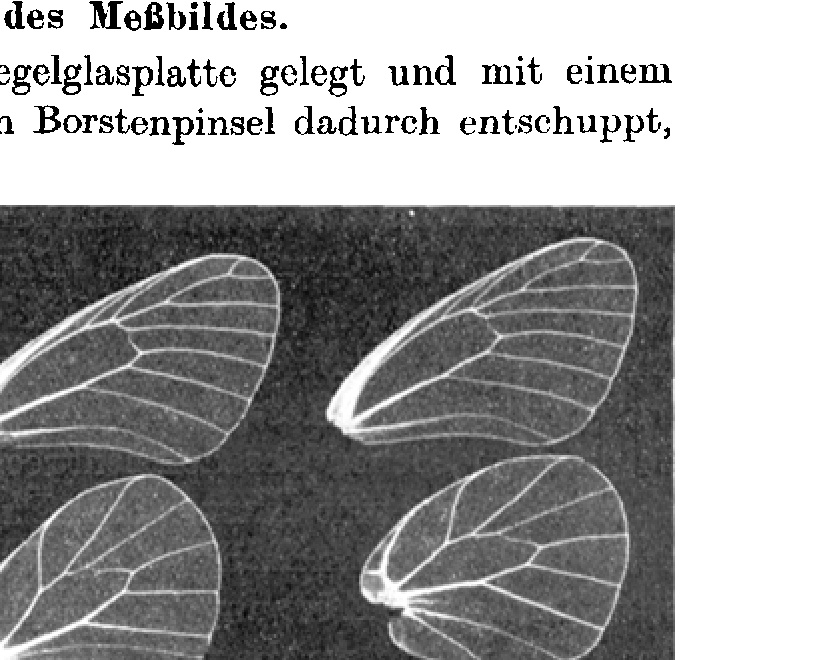
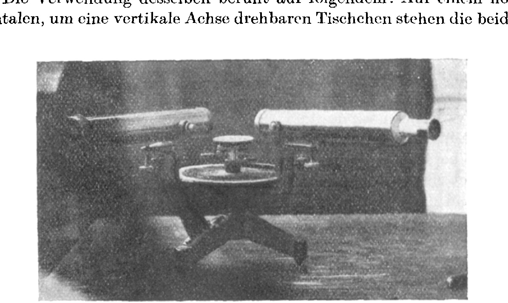
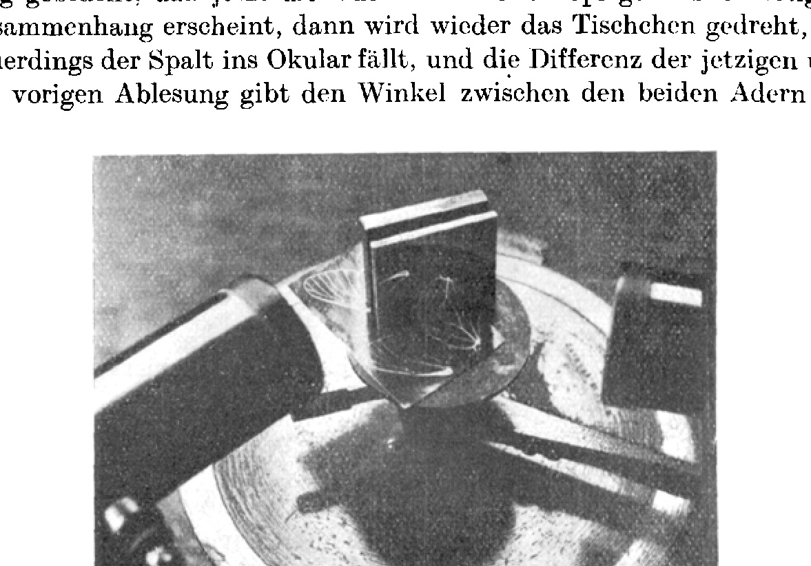
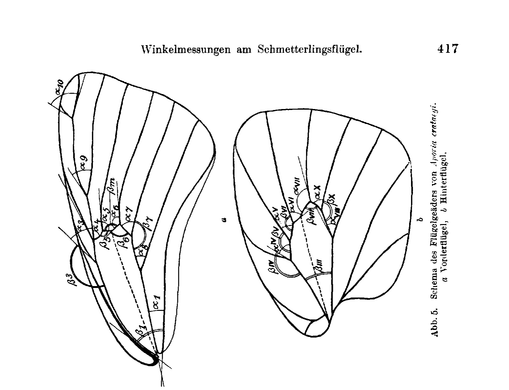
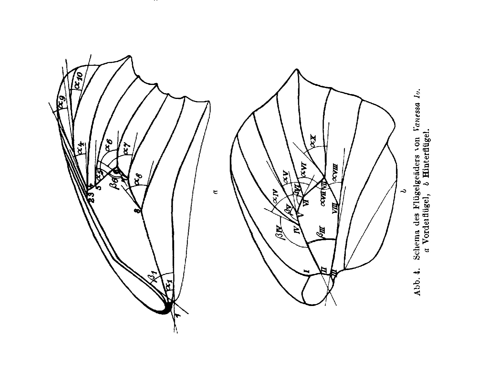

## Angle Measurements on the Butterfly Wing

By

Paul Weiss.

(From the Biological Experimental Institute of the Academy of Sciences in Vienna, Zoological Department.)¹

With 5 text figures.

(Received on 16 April 1924.)

*Archiv für mikroskopische Anatomie und Entwicklungsmechanik*, vol. 104 (1925).

> **Full translation.** A complete English rendering of the running text of “Angle Measurements on the Butterfly Wing” (Weiss, 1925), including all tables, figure and plate legends, and footnotes. Numbers and table cells were transcribed from the page images, not the noisy OCR.

During the differentiation processes in the early stages of morphogenesis we observe in general regional growth-differences of considerable magnitude, which obliterate almost all geometric kinship of the successive formal states with one another; it is indeed precisely through this that the highly complicated shape of the finished organism works itself out of the spherical germ-form, and the typically formed regenerate out of the round regeneration blastema. If one now takes into view the changes in the becoming organism within equal time-spans, it is striking that they become the smaller the further development has advanced; in about the same span of time in which the spherical blastula reshapes itself into the segmented embryo provided with organ rudiments, scarcely any further perceptible change of shape proceeds in the older animal. Development represents an asymptotic approach to a typical state of equilibrium (in order not to speak of an initial and a final state, where there is no beginning and no end). We see: the originally powerfully pronounced differences in the growth of the various places and regions of the whole organism gradually vanish, growth becomes more and more uniform over the whole being, the shape remains, little by little, geometrically similar to itself even in growing.

One might be tempted to lay an arbitrary cut between a period of differentiation and one of pure growth, although a natural boundary between the two cannot exist for various reasons. Let only one of these be named in passing: If one considers the essence of the concept of differentiation, one will indeed regard even a geometrically strictly proportional increase in size

> ¹ A preliminary communication of the results of this work appeared under the same title as Communication No. 83 from the Biological Experimental Institute of the Academy of Sciences in Vienna (Zoological Department; Head: Hans Przibram) in the Akademischer Anzeiger No. 22/23, 1922.

of the organism not as pure growth without differentiation; for since the living form stands in direct relation with the totality of the remaining life-conditions, just as it is itself indeed a life-condition, every change of the inner life-conditions, together with the reactions of the organism following upon it, will already have to be interpreted as an event to be reckoned to differentiation, and precisely this inner event could not remain the same under *proportional* growth, since after all, with geometrically similar increase in mass, the ratio between the (nourishing, respiring, secreting, excreting) surface and the maintenance-requiring mass becomes continually smaller. If, then, proportional increase in mass really does come to observation, as in many cases, then accordingly the intensity of the life-event in the surfaces, per unit of surface, must be raised, and such a change one would now probably have to interpret again as further differentiation. Theoretically, therefore, proportional increase in size and differentiation-less growth are not the same. But if we remain conscious of such a restriction, then it can only be practically advantageous from then on to draw methodically a boundary between differentiation and growth.

If growth proceeds chiefly in one direction of space, then the forms in successive stages are not geometrically similar to one another. The growth of the annelids through intercalation of segments may be named as an example. Past all transitions there are then found forms which grow proportionally in all three directions of space, and it is such forms whose shape gives itself to be recognized by us, at different points in time, as immediately persisting geometrically similar; *Przibram* has established a whole number of such (Form and Formula in the Animal Kingdom, Leipzig and Vienna 1922).

The latter kind of growth accordingly has the peculiarity that the form of the animal is independent of *absolute* values of the linear measurements and, in consequence, for different age-stages is unambiguously determined already by the same *ratio* of lengths alone, common to them. Instead of the constancy of such a ratio, through which the geometric similarity from formal state to formal state is conditioned, one can use the constancy of an *angle-function* for the characterization, just as angle-constancy altogether serves as a symbol of geometric similarity with changing absolute length-measure-numbers. And so, conversely, *constant angle-magnitudes can then count as proof for proportional formal growth*.

So much may be sent in advance about the meaning of angle-measurement in general. In the present work, however, there will otherwise be little talk of an evaluation of these trains of thought, since it represents in the first line methodical preliminary work. There will be described the *technique* of the exact angle-measurement on the butterfly wing, which is rich in angles; at the end, then, a few statistical results of the measurements will be compiled. Since the procedure seems to permit an appropriate transfer onto other objects, a detailed presentation of the methodology is probably justified.

The task falls into two parts: Firstly, a sharp picture of the angles to be measured must be produced, and secondly the angles must be able to be determined accurately enough, even when only quite short pieces of the legs [Schenkel] are available. In what follows let there be talk only of our example, the butterfly wing.

### Production of the Measuring-Image.

The wing is laid on a mirror-glass plate and descaled with a not too hard, very short-bristled bristle-brush, by stroking many times along the course of the veins from the base toward the margin. The production of a clean preparation does after all require some patience, since many scales do not want to leave their place and, with too vigorous brushing, the wing tears through. I have investigated various chemical means as to whether they might not perhaps facilitate the descaling, among them xylol

> **Fig. 1.** Measuring-image obtained by directly copying-on the descaled wing.  *(figure not reproduced)*

and all kinds of acids, all however quite without success: the removal of the scales still succeeds best on the dry wing.

If now the wing is descaled on both sides, so that it has become, except for the veins, glass-clear and transparent, it is pressed between two thin, flawless glass plates and then copied directly onto a photographic paper. One thereby obtains a very sharp negative of the vein-pattern (Fig. 1), and on this the measurement is now undertaken.

### The Setting of the Angles.

The methodology of the measurement itself is a little bit complicated. Most veins are more or less curved; for the measurement, however, only the angle of departure at their branching comes into consideration; it is therefore the piece in which the course of the vein coincides with the course of the leg of the angle of departure, quite small, in any case far too inconspicuous for one to be able to approach the task with any sort of coarse measuring-methods (laying-on of a ruler or prolongation of the legs by pencil-lines and measurement with a protractor). Suitable I found a procedure in which the small legs were not prolonged by real lines, but where the light-ray took over the prolongation-function. The foundations of the procedure are the same as in the drawing of tangents to arbitrary curves with the aid of the mirror-ruler. The principle is the following:

In a mirror standing perpendicular to the drawing-plane, an arbitrary straight line of the drawing-plane appears bent [geknickt] at the point where it strikes upon the mirror-plane; only in one case does the straight line pass over into its mirror-image *continuously, without bending* — namely when it stands perpendicular to the mirror-plane. One can in consequence always conclude, from the appearance that a straight line coincides in direction with its mirror-image, that the mirror-surface now stands perpendicular to the straight line. Since the eye is extraordinarily sensitive to bends in the course of a straight line, it is easy, by turning the mirror, to produce the position of the bend-free passage, and in this manner to set the mirror perpendicular to a given straight line with quite great accuracy.

If now a tangent is to be laid to a curve K at the point A, one proceeds according to the same principle; one can after all regard the curve-piece at the point A as an infinitely small piece of a straight line, and this straight line, which at the point A nestles most of all, before all others, against the curve, is the tangent. The perpendicular to the tangent at the point A, the so-called normal, therefore likewise stands perpendicular to the curve-piece at A. The direction of this perpendicular I can now always once again ascertain as that mirror-position in which the tangent passes over continuously into its mirror-image; this holds for all points of the tangent and thereby at the same time for that point of the curve which it has in common with the tangent, that is, for A. Since here the tangent has the same direction as the curve-element, then in a mirror standing perpendicular to the tangent at the point A, not only must the tangent itself pass over bend-free into its mirror-image, but here the curve itself must also run steadily into its mirror-image. *Thus we can, by producing that mirror-position at the point A in which the curve passes over continuously into its mirror-image, determine empirically the direction of the normal and thereby also of the tangent itself.* The angle which two curves enclose is, however, equal to the angle which the tangents to the two curves form at the point of intersection, and angles of just this kind are indeed to be measured in our example.

### The Measurement of the Angles.

One might at first wish to proceed quite coarsely, and, after having set the mirror at the point of intersection (in our case at the branching of two veins) once perpendicular to the one curve, the other time perpendicular to the other curve, to mark these positions by strokes and to read the angle directly by means of a protractor. This procedure, however, proves much too inaccurate. In particular, the drawing-in of the angle-legs brings along enormous sources of error.

So I made use, for the angle-measurement, of the *goniometer* customary in crystallography (Fig. 2). The use of the same rests on the following: On a horizontal little table, rotatable about a vertical axis, stand the two

> **Fig. 2.** Goniometer.  *(figure not reproduced)*

vertical surfaces V₁ and V₂, between which the angle that they enclose with one another is to be measured. Let it for the present be, say, a matter of two crystal-surfaces. On the apparatus there is further, without being able to be turned along with the little table, an objective- and an ocular-telescope, both arranged radially, directed toward the center of the little table. Through the objective, from some arbitrary light-source, a light-strip is let through, which falls upon the one of the vertical surfaces, say V₁. One can now turn the little table, with which V₁ is firmly connected, until V₁ mirrors the light-strip just into the ocular and one perceives a slit of light on looking through. One turns until, say, the left edge of the slit coincides with the vertical of the ocular cross-hairs. The rotatable little table possesses on its circumference a degree-graduation, the stand, on the other hand, on its non-rotatable part, a fixed mark, so that to every position of the little table a definite reading corresponds. After one has thus oriented the

> *(running foot:)* Archiv f. mikr. Anat. u. Entwicklungsmechanik Bd. 105.  27 light-slit to the ocular, the reading is taken. Then one proceeds with the second surface, V₂, in the same way, that is, one turns the little table further until now the light-strip is mirrored through V₂ into the ocular, and after one has then again brought the left edge of the light-slit into coincidence with the vertical of the cross-hairs, one can read anew. The difference of the two readings then yields directly the angle which the perpendiculars on the two surfaces V₁ and V₂ enclose with one another; for: when the mirror-image was projected for me through V₁, then the perpendicular on the mirroring surface, the incidence-normal [Einfallslot], was the bisector between the lines of sight of objective and ocular; in order now to obtain the mirror-image through the other surface V₂, I had to turn so far until its normal fell into the direction in which previously the normal on V₁ had stood; that means, however, that I have turned precisely by the angle which the two normals enclosed with one another.

Let us now finally pass over to our example itself: For this purpose we use, instead of the crystal-surfaces, directly the vertical mirror described above in its function, with which indeed, if it is already oriented to the curve in the indicated manner, the incidence-normal and the curve-tangent coincide in direction. If then the mirror-position at the point of intersection of two curves is chosen successively such that the one time the one curve, the other time the other one appears unbent, and if for both mirror-positions the light-slit is mirrored into the ocular, then the difference of the corresponding readings already gives, analogously as earlier with the crystal-surfaces, the angle which the incidence-normals enclosed with one another in the two mirror-positions; since, however, incidence-normal and tangent coincide in the special mirror-position, thereby at the same time also the angle between the tangents at the point of intersection of the curve is already found, and that is the angle which the curves — in our example, the veins of the wing — enclose with one another at their departure.

Now that the principle has probably become clear, let a few more things be said about the execution in detail. The negative-copy of the descaled wing is stretched out horizontally on the rotatable little table with adhesive-wax. As a mirror there serves a most finely polished steel mirror, whose standing-surface is ground off exactly perpendicular to the mirror-surface; naturally every frame is lacking, for the mirroring surface must indeed abut directly upon the picture-surface. The steel mirror is placed directly upon the copy.

If the angle between two veins a and b is to be measured, the mirror is brought to the point where the two branch off from one another; since the veins from there on still run rectilinearly for a little piece, the point itself need not fall exactly into the mirrorplane. Now the mirror is turned on the little table — this itself remaining fixed thereby — until the image of vein a passes over steadily into its mirror-image. Only then is the whole little table, together with image and mirror — which latter must henceforth remain unmoved — turned about the vertical axis of the apparatus until the light-slit appears in the ocular, and the number of degrees at the mark is read off. Thereafter, with the little table fixed, the mirror is brought into such a position that now vein b appears in steady connection with its mirror-image; then the little table is turned again until the slit falls anew into the ocular, and the difference of the present and the previous reading gives the angle between the two veins.

> **Fig. 3.** The arrangement during the measurement.  *(figure not reproduced)*

It is advisable always to take three measurements and then to average; the measurements are, as is shown, accurate to one degree, which, given the smallness of the available angle-legs, must be acknowledged as quite considerable accuracy.

Sometimes the veins at their departure are not cylindrical, but slightly conical, so that even with perpendicular position of the mirror no unbent image can be obtained. Then the setting must be made such that the two contours of the vein-image both appear bent toward different sides; the conicity is always only so slight that thereby an exact setting is then already achieved; some eye-judgment is of course also needed thereby.

In Fig. 3 a photograph of the apparatus during a measurement is reproduced. One sees the mirror set upon the copy of the wing, and one clearly recognizes the mirror-image. Further details about the apparatus will probably best be looked up in the physical and mineralogical specialist literature; important above all is a good centering of the whole apparatus.

Once the experimental arrangement described above had been assembled, it was first put to use for measuring the wing venation of two species of butterflies: *Vanessa Io* L. [*Aglais io*] and *Aporia crataegi* L. From the first species, 21 fore wings and 15 hind wings came under examination; from the second species, 11 fore wings and 10 hind wings. The results of the measurements are set down in the following tables. The designation of the angles can be gathered from the schemata Figs. 4 and 5, while the designation of the veins in the text follows the terminology of *Comstock* (cf. on this *Berge-Rebel*, Schmetterlingsbuch [Butterfly Book], 9th ed., p. A 12, Stuttgart 1910). It is clear that the number of measurements carried out so far is too small to be correspondingly amenable to statistical evaluation; nonetheless, even from the measurements made up to now there already emerges a good picture of the usability of the method, and many an indication of the direction in which it promises success (see the tables on pp. 418 and 419!).

In connection with the tables, a few remarks may now be put forward, which are intended to relate exclusively to findings that already appear secured with unmistakable clarity even through the few measurements.

1. The angle magnitudes all vary from individual to individual, yet the strength of the variation is apparently one characteristic of each angle type, in such a way that some angles exhibit a greater inter-individual constancy than others. This may be inferred from the fact that the two angles a₉ and a₁₀, which do not abut the median cell and which show the strongest variations in *Vanessa Io*, are in *Aporia crataegi* likewise those that vary the most.

2. Within one and the same individual, too, the angles are not constant. Deviations in the angle measures of the right wing from the corresponding ones of the left wing are to be observed almost throughout.

3. As linear measurements show, the physiological variation in the wing lengths of the examined specimens is about 10%. Only one specimen of *Aporia crataegi* (20) proved to be abnormally short-winged in both fore and hind wing, and this fact also expresses itself in abnormal values of the angle magnitudes. The deviations of the angle measures from the normal ones in this animal are so constituted that they can all be traced back to a common factor: namely, to an abnormal shortening of the obliterated *Media*. Let this be cited as an example of how developmental-mechanical insights can also be gained from the numerical picture.

**Fig. 4.** Schema of the wing veins of *Vanessa Io* L. a Fore wing, b Hind wing.  *(figure not reproduced)*

**Fig. 5.** Schema of the wing veins of *Aporia crataegi* L. a Fore wing, b Hind wing.  *(figure not reproduced)*

### Vanessa Io

| Vanessa Io | \(a_1\) | \(\beta_1\) | \(a_4\) | \(a_5\) | \(a_6\) | \(\beta_6\) | \(a_7\) | \(\beta_7\) | \(a_8\) | \(a_9\) | \(a_{10}\) | \(\beta_{III}\) | \(a_{IV}\) | \(\beta_{IV}\) | \(a_V\) | \(\beta_V\) | \(a_{VI}\) | \(\beta_{VI}\) | \(a_{VII}\) | \(a_{VIII}\) | \(a_X\) |
|---|---|---|---|---|---|---|---|---|---|---|---|---|---|---|---|---|---|---|---|---|---|
| | *Vorderflügel (fore wing)* → | | | | | | | | | | | *Hinterflügel (hind wing)* → | | | | | | | | | |
| 1 | 22,5 | 59,5 | 19 | — | 118 | 89,5 | 60 | — | 44 | 16 | 22 | | | | | | | | | | |
| 2 | 23 | 57 | 22 | 54,5 | 121,5 | 86 | 59,5 | — | 45 | 15,5 | — | 25,5 | 52,5 | — | 45 | — | 61,5 | — | — | 40 | 40 |
| | 22 | 58,5 | 14 | — | — | — | 56,5 | — | 45,5 | — | — | | | | | | | | | | |
| 3 | 20 | — | 17 | 53 | 121,5 | 90 | 60,5 | — | 45 | 15,5 | 18,5 | 25 | 51 | 152 | 45 | — | 60 | 150 | 67,5 | 39 | 45 |
| | 20,5 | 52 | 14,5 | 60 | 120,5 | 90,5 | 60 | — | 45 | 14 | 13 | | | | | | | | | | |
| 4 | Diff. 37,5 | 18 | 50,5 | 120,5 | 90 | 60 | — | | 36 | 13 | — | 26 | 50,5 | 154 | 45 | — | 61 | 149 | 66,5 | 39,5 | 36,5 |
| | 20 | 58 | 16,5 | 50 | 120,5 | 90 | 58 | — | 38 | 11,5 | 14 | 26 | 50 | 153,5 | 46,5 | — | 60,5 | — | — | 39 | 35,5 |
| 5 | 22 | 61 | 17 | 44,5 | 127,5 | 82,5 | 60,5 | — | 45 | — | 17 | 25 | 50 | 153,5 | 48 | 157,5 | 62 | 141,5 | 68,5 | 40,5 | 36 |
| | 22,5 | 57 | 18 | 52,5 | 120 | 87,5 | 61 | — | 45 | — | 12,5 | 26 | 49,5 | 155,5 | 45,5 | 159 | 65,5 | 148 | 62 | 40,5 | 38 |
| 6 | Diff. 37 | 13,5 | 57 | 119,5 | 90,5 | 58 | 145,5 | 45,5 | — | — | | 23,5 | — | — | — | — | — | — | — | 42,5 | 38 |
| | 20,5 | 57,5 | 16 | 56,5 | 118 | 89 | 59 | 147 | 45 | 17,5 | — | 25 | — | 150,5 | — | — | 60,5 | 144,5 | 66,5 | 41,5 | 38 |
| 7 | 22 | 55,5 | 15 | 48,5 | 121,5 | 87 | 60 | 144,5 | 44,5 | 13,5 | 10,5 | 27 | 51 | 156 | 46,5 | — | 60 | 153 | 67 | 42 | 41 |
| | 22 | 57,5 | 18,5 | 47,5 | 120,5 | 90,5 | 61 | 144 | 46 | — | — | — | | | | | | | | | |
| 8 | 21,5 | 60,5 | 23 | — | 120 | 90 | 60 | 147 | 44,5 | 12 | 14,5 | — | 53,5 | 156 | — | 154 | 58,5 | — | 69,5 | 39,5 | 35 |
| | 21,5 | 58 | 20,5 | 54 | 119,5 | 89 | 60 | 147,5 | 43,5 | 13,5 | — | 26 | 51 | 152,5 | 44,5 | — | 58 | 152 | 71,5 | 43 | 41,5 |
| 9 | 23 | 55 | 16,5 | 53,5 | 121,5 | 87,5 | 59,5 | 146 | 46 | 17 | — | 27 | — | — | 44,5 | — | 63,5 | 146,5 | 65 | 39,5 | 35 |
| | 20,5 | 55,5 | 20,5 | 51,5 | 127,5 | 88 | 58,5 | 144,5 | 45,5 | 20,5 | 21,5 | 26,5 | 51 | 156 | 52,5 | 151 | 61 | — | 68 | 41,5 | 37,5 |
| 10 | 20,5 | 56,5 | 18,5 | 51 | 121,5 | 86 | 54 | 144 | 45,5 | — | — | | | | | | | | | | |
| | 20,5 | 57,5 | 15,5 | 49 | 124 | 88 | 59 | — | 45 | — | 18,5 | | | | | | | | | | |
| 11 | 21 | 58 | 18 | 53,5 | 118,5 | 89,5 | 58,5 | 143,5 | 45,5 | 19,5 | 14 | 27 | 55,5 | 155 | 49 | — | 58,5 | — | 65 | 43 | 36,5 |
| | 21 | 58,5 | 18 | 52,5 | 120 | 90 | 59,5 | 146 | 45,5 | 21 | 20,5 | 26,5 | 49,5 | — | 47 | — | 60,5 | — | 67 | 41,5 | 40 |

### Aporia crataegi — Vorderflügel (fore wing)

| Aporia crataegi | \(\beta_m\) | \(a_1\) | \(\beta_1\) | \(a_3\) | \(a_4\) | \(a_5\) | \(\beta_5\) | \(a_6\) | \(\beta_6\) | \(a_7\) | \(\beta_7\) | \(a_8\) | \(a_9\) | \(a_{10}\) |
|---|---|---|---|---|---|---|---|---|---|---|---|---|---|---|
| 15 | 164,5 | 19 | 60 | 32,5 | 54 | 79 | 128 | 121 | 90 | 55,5 | 141,5 | 49,5 | 30,5 | 66 |
| | 166 | 18 | 57 | 29 | 61 | 77 | 126 | 120 | 91 | 56 | 140,5 | 48 | 32,5 | 72 |
| 16 | 145 | 18,5 | 60 | 33 | 82,5 | 85,5 | 126,5 | 122 | 91 | 62 | 141,5 | 44,5 | 49 | 75 |
| | 144,5 | 21 | — | 31,5 | 67,5 | 84 | 124,5 | 122,5 | 91 | 59,5 | 143,5 | 46 | 47 | 67 |
| 17 | 150 | 19 | 58 | 33,5 | 70 | 78,5 | 127 | 130,5 | 81 | 51,5 | 148 | 48 | 49 | 69 |
| | 151,5 | 20 | 62 | 33 | 52 | 77,5 | 130 | 131 | 83,5 | 60 | 146 | 45,5 | 51 | 64,5 |
| 18 | 145 | 20,5 | 64,5 | 31,5 | 53 | 86 | 125 | 130 | 81,5 | 54 | 147,5 | 45 | 48,5 | 56 |
| | 145,5 | 21 | 65 | 27,5 | 52 | 86,5 | 119 | 126 | 85 | 56 | 145 | 43,5 | 46 | 55 |
| 19 | 145,5 | 19,5 | 56 | 27 | 52 | 81 | 128,5 | 131,5 | 80 | 55 | 145 | 43 | 43 | 53 |
| | 149,5 | 21 | 60,5 | 27 | 49,5 | 83,5 | 125 | 130 | 80 | 54,5 | 144,5 | 43 | 46,5 | 58,5 |
| 20 | 133,5 | — | 60,5 | 23,5 | 58,5 | 91,5 | 119,5 | 130 | 77,5 | 50,5 | 147 | 45 | 43 | 47,5 |

### Aporia crataegi — Hinterflügel (hind wing)

| \(a_m\) | \(\beta_m\) | \(\beta_{III}\) | \(a_{IV}\) | \(\beta_{IV}\) | \(a_V\) | \(\beta_V\) | \(a_{VI}\) | \(\beta_{VI}\) | \(a_{VII}\) | \(\beta_{VII}\) | \(a_X\) | \(\beta_X\) | \(a_{VIII}\) | \(\beta_{VIII}\) |
|---|---|---|---|---|---|---|---|---|---|---|---|---|---|---|
| — | — | 28 | 52,5 | 148 | 28,5 | 164 | 51 | 162,5 | 122,5 | 90 | 60,5 | 148,5 | 44,5 | 150 |
| — | — | 30 | 51,5 | 150,5 | 31,5 | 165 | 51 | 165 | 123,5 | 88,5 | 61 | 148,5 | 45,5 | 148,5 |
| 62 | 152 | 30 | 52,5 | 148 | 35,5 | 162 | 56 | 162 | 130,5 | 84,5 | 67 | 145 | 44,5 | 148 |
| 60 | 150 | 31 | 54 | 153,5 | 31 | 163,5 | 57 | 162 | 133 | 82 | 65 | 146 | 44,5 | 150 |
| 59,5 | 150 | 28 | 56,5 | 147,5 | 41 | 164,5 | 56 | 162 | 142,5 | 71 | 59,5 | 148,5 | 46,5 | 148 |
| 60 | 149,5 | 27 | 56,5 | 146,5 | — | 163 | 57 | 162 | 142 | 73 | 60 | 149,5 | 46,5 | 148 |
| 60,5 | 150 | 28 | 50 | 151,5 | 46,5 | 165 | 59 | 164 | 136,5 | 78,5 | 60 | 150 | 43 | 152 |
| 58 | 150 | 29 | 54 | 150,5 | 33 | 162 | 58 | 163,5 | 137,5 | 78 | 61 | 149 | 43,5 | 150,5 |
| — | 134 | 27 | 51 | 150,5 | 32 | 163 | 74,5 | 157 | 140,5 | 72 | 65 | 144 | 46,5 | 146 |
| 71,5 | 142,5 | 26 | 50,5 | 150,5 | 32 | 163,5 | 72 | 158,5 | 139 | 73 | 62,5 | 148 | 46 | 147 |

4. For comparison of the two examined species, let the mean values from the measurements of homologous angles on the fore wing be compiled in the following table:

| | \(a_1\) | \(\beta_1\) | \(a_5\) | \(a_6\) | \(\beta_6\) | \(a_7\) | \(\beta_7\) | \(a_8\) | \(a_9\) | \(a_{10}\) | \(a_6 + \beta_6\) |
|---|---|---|---|---|---|---|---|---|---|---|---|
| *Aporia crat.* | 19,6 | 60,2 | 81,8 | 126,4 | 85,4 | 56,4 | 144,3 | 45,6 | 44,3 | 63,3 | 211,8 |
| *Vanessa Io* | 21,4 | 57,4 | 52,2 | 121,1 | 88,5 | 59,2 | 145,4 | 44,5 | 15,7 | 16,3 | 209,6 | A comparison of the two series teaches the following: Both the a₁ and β₁ chosen to characterize the opening angle, and likewise the angles a₅, a₇, β₇, (a₆ + β₆) situated at the *Cubitus*, are nearly equal in magnitude in both species. a₆ is larger in *Aporia crataegi* than in *Vanessa Io* by just as much as β₆ is smaller; particularly large, however, is the difference in magnitude of a₅, which angle is in *Aporia* almost 30° larger than in *Vanessa*. The deviations of the two species in the angles a₅, a₆ and β₆ go back, moreover, to a single developmental-historical difference: The *Media*, that vein which in the developing, unfinished wing runs lengthwise through the median cell and then obliterates, forks, and the two branches that remain permanently are those legs of the angles a₅ and a₆ which bound the median cell; now, whereas in *Vanessa Io*, since the *Media* is very weak, a complete stretching of the two branches into a straight line takes place through the lateral tension of the wing, in *Aporia crataegi*, where the vein in question possesses a more considerable strength, the bend at the forking point remains permanently noticeable and is fixed in the finished wing venation as the angle βₘ. Thus it comes about that, although in both species the direction of the legs of a₅ and a₆ running to the periphery is the same, yet a₅ and a₆ must be enlarged in *Aporia crataegi*.

Quite especially conspicuously different between the species are then the angles a₉ and a₁₀, both of which are incomparably larger in *Aporia* than in *Vanessa*.

The bend of the *Media* branches at the forking point in *Aporia*, in contrast to the straight stretching in *Vanessa*, is also found clearly pronounced in the hind wing. For the hind wing there is added, as a typical characteristic, that nodal points 7 and 10 in *Vanessa* coincide in a single point.

A further extension of the measurements to larger numbers of specimens and of species would probably still be able to yield many an interesting result of a developmental-historical, variation-statistical, and systematic nature.

The apparatus required for the experimental arrangement was placed at my disposal in the most kind manner at the I. Physical Institute of the University of Vienna (head: Hofrat *Jäger*), for which I am especially indebted to Professor *Karl Haschek*. I thank Hofrat *H. Rebel* of the Natural History Museum in Vienna for his kind accommodation in providing collection material.

---

**Notes on the tables (page 418, Vanessa Io):** The two printed sub-rows under each specimen number give the left- and right-wing measurements. For specimens 4 and 6 the first sub-row begins with the literal printed entries "Diff. 37,5" and "Diff. 37" respectively in the a₁ column; these have been reproduced exactly as printed. Blank cells indicate that no value is printed in the original. The fore-wing (Vorderflügel) and hind-wing (Hinterflügel) column groups belong to a single wide table in the source.

## Figures

**Fig. 1.**

**Fig. 2.**

**Fig. 3.**

**Fig. 5.**

**Fig. 4.**

---

*Translator's note.* One of the Biologische Versuchsanstalt (Vienna Vivarium) papers flagged on the project site as a modern rediscovery target. Claims are rendered as stated in the original, not endorsed.
