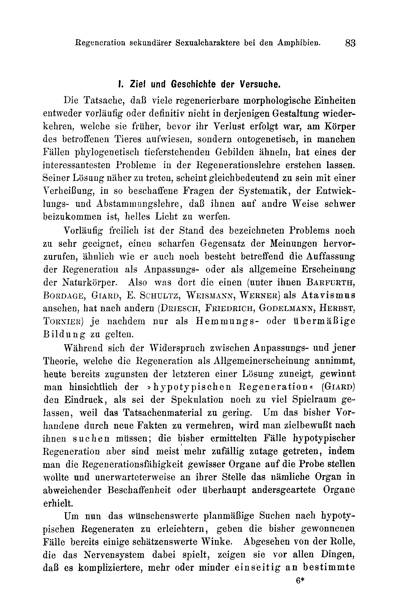

# Regeneration of Secondary Sexual Characters in the Amphibians.

By

Dr. phil. Paul Kammerer.

(From the Biological Experimental Station in Vienna.)

With Plates II and III.

Received on 31 August 1907.

*Archiv für Entwicklungsmechanik der Organismen*, vol. 25 (1907).

> **Full translation.** A complete English rendering of the running text of “Regeneration of Secondary Sexual Characters” (Kammerer, 1907), including all tables, figure and plate legends, and footnotes. Numbers and table cells were transcribed from the page images, not the noisy OCR.

### Contents.

|  | Page |
|---|---|
| I. Aim and history of the experiments | 83 |
| II. Account of the experiments | 85 |
| &nbsp;&nbsp;A. Anura | 85 |
| &nbsp;&nbsp;&nbsp;&nbsp;1. Nuptial calluses of the males | 85 |
| &nbsp;&nbsp;&nbsp;&nbsp;&nbsp;&nbsp;a. Toe calluses on the forelimb of *Bufo viridis* | 85 |
| &nbsp;&nbsp;&nbsp;&nbsp;&nbsp;&nbsp;b. Toe and arm calluses of *Bombinator pachypus* | 86 |
| &nbsp;&nbsp;&nbsp;&nbsp;2. The vocal sacs of the males | 88 |
| &nbsp;&nbsp;&nbsp;&nbsp;&nbsp;&nbsp;a. Throat sac of *Hyla arborea* | 88 |
| &nbsp;&nbsp;&nbsp;&nbsp;&nbsp;&nbsp;b. Vocal sacs of *Rana esculenta* | 91 |
| &nbsp;&nbsp;B. Urodela | 93 |
| &nbsp;&nbsp;&nbsp;&nbsp;1. Crests of the male water newts | 93 |
| &nbsp;&nbsp;&nbsp;&nbsp;&nbsp;&nbsp;a. Entire-margined crests (*Triton alpestris, marmoratus, blasii*) | 93 |
| &nbsp;&nbsp;&nbsp;&nbsp;&nbsp;&nbsp;b. Serrated crests (*Triton cristatus* and *vulgaris*) | 100 |
| &nbsp;&nbsp;&nbsp;&nbsp;2. Other skin proliferations | 106 |
| &nbsp;&nbsp;&nbsp;&nbsp;&nbsp;&nbsp;a. Skin fringe on the upper lip of *Triton cristatus* | 106 |
| &nbsp;&nbsp;&nbsp;&nbsp;&nbsp;&nbsp;b. Toe lobes of *Triton vulgaris* | 107 |
| &nbsp;&nbsp;&nbsp;&nbsp;&nbsp;&nbsp;c. Webbing of *Triton palmatus* | 108 |
| &nbsp;&nbsp;&nbsp;&nbsp;&nbsp;&nbsp;d. Terminal filaments on the tail of several Triton species | 109 |
| &nbsp;&nbsp;&nbsp;&nbsp;&nbsp;&nbsp;e. Neck wart of *Triton pyrrhogaster* | 111 |
| &nbsp;&nbsp;&nbsp;&nbsp;3. Spur of *Triton rusconii* | 111 |
| &nbsp;&nbsp;&nbsp;&nbsp;4. Colour characters of *Triton cristatus* | 114 |
| &nbsp;&nbsp;&nbsp;&nbsp;&nbsp;&nbsp;a. Tail stripe of the male | 114 |
| &nbsp;&nbsp;&nbsp;&nbsp;&nbsp;&nbsp;b. Dorsal longitudinal line of the female | 115 |
| III. Summary | 116 |
| &nbsp;&nbsp;A. Regenerations | 116 |
| &nbsp;&nbsp;B. Compensations | 120 |
| &nbsp;&nbsp;C. Other results | 122 |
| IV. Bibliography | 122 |
| V. Explanation of the figures | 124 |

## I. Aim and history of the experiments.

The fact that many regenerable morphological units, either provisionally or definitively, do not return in that configuration which they earlier displayed on the body of the affected animal, before their loss had occurred, but rather resemble — ontogenetically, in many cases phylogenetically — lower-standing formations, has given rise to one of the most interesting problems in the doctrine of regeneration. To come nearer to its solution appears to be tantamount to a promise of casting a bright light upon questions of systematics, of developmental and descent theory of such a constitution that they are otherwise difficult to get at.

For the time being, admittedly, the state of the designated problem is still all too apt to call forth a sharp opposition of opinions, similarly as such an opposition also still exists concerning the conception of regeneration as an adaptive or as a general phenomenon of natural bodies. Thus what some there (among them Barfurth, Bordage, Giard, E. Schultz, Weismann, Werner) regard as atavism, has, according to others (Driesch, Friedrich, Godelmann, Herbst, Tornier), to count merely, as the case may be, as an inhibition- or excess-formation.

While the contradiction between the adaptation theory and that theory which assumes regeneration as a general phenomenon today already inclines toward a solution in favour of the latter, one gains, with respect to "hypotypical regeneration" (Giard), the impression that too much scope has still been left to speculation, because the factual material is too scanty. In order to increase what is hitherto available through new facts, one will have to search for them in a purposeful manner; the hitherto-ascertained cases of hypotypical regeneration, however, have for the most part come to light rather by chance, in that one wished to put the regenerative capacity of certain organs to the test, and unexpectedly obtained in their place the same organ in a deviating constitution, or organs of an altogether different character.

Now, in order to facilitate the desirable systematic search for hypotypical regenerates, the cases hitherto won already provide some hints worth heeding. Apart from the role which the nervous system plays in this, they show above all that it is the more complicated organs, more or less one-sidedly adapted to particular

> ⁶* functions, that appear in the rebuilding in another, mostly simplified, form.

Among these, the secondary sexual organs lay claim to a separate interest with regard to their regenerative behaviour, because they, among those problems of developmental theory that are accessible to treatment on the part of regeneration methodology, allow us to hope for some elucidation of a special problem, that of sexual dimorphism.

While occupied with a rather extensive work on the rate of regeneration and growth of the amphibians, in which the course of regeneration of the most diverse regeneration-capable parts of the body was followed quantitatively, I also obtained regenerates of such organs as are distinguished, in the one or the other (most usually male) sex, by the possession of secondary sexual characters. Since the relevant new results — in a qualitative mode of consideration — have little to do with the mentioned quantitative investigations, that is, represent in a certain sense only a by-product of the latter, I report on them in an independent publication; to be incorporated into my quantitative work, whose publication is only now forthcoming, they nevertheless seemed to me to have grown to too great an extent, especially as that work in and of itself is likely to claim a not inconsiderable amount of space anyway. In the present special publication, then, which deals exclusively with the regeneration of secondary sexual characters, I have restricted myself as far as possible to the rendering of the bare facts, without evaluating them more thoroughly in a theoretical respect, but also without availing myself of a lapidary style, which would let the work be welcome only to a specialist of the relevant sub-field. In the interest of an economical presentation I also had here no occasion to weary the reader with long experimental protocols; in my announced larger work I shall in any case not be able to dispense with such, for the purpose of an easier overview. A short excerpt from the experimental journal at the end of each section dealing with the regeneration of a particular organ should this time suffice to establish the necessary overview. Of the results, only such were figured as show, even in the pictorial representation in comparison with the normal configuration, a difference clearly recognizable.

The impulse, however, to include precisely secondary sexual characters in a more comprehensive manner in those other experiments on amphibians, I owe to the findings of Blackwall on the conditionally hypotypical regenerating of the male palps in the spiders, and to those of Černý on the regenerating of the copulatory organ in the hypotypically formed right tentacle of the marsh operculate snail [*Paludina*].

## II. Account of the experiments.

### A. Frogs and toads. Anura.

#### 1. The nuptial calluses on the male extremities.

a) The toe calluses on the forelimb of *Bufo viridis* Laur.: The male of the green or changeable toad (*Bufo viridis* Laur. = *variabilis* Pall.) bears, at mating time — April, May — on the thickened thumb a pad, which, like the inner margin of the thumb and of the second and third fingers, appears overlaid with a blackish-brown callus that, when stroked over, feels file-like rough. In addition, the entire fore-extremity of the male is thicker, more strongly muscled, and more inwardly directed — a functional adaptation to the amplexus in mating. Since the named toad species occurs abundantly in the wild in the garden of the Biological Experimental Station and spawns yearly in our open-air basins, it presented for the intended experiment an easily obtainable object, which also proved advantageous insofar as it permitted the calluses, which become distinct only at mating time, to be called forth with certainty in just that period — the conditions under which these animals proceed to reproduction being indeed amply given.

Since, as is well known, the extremities of the frogs and toads, apart from a few cases, are no longer regeneration-capable after metamorphosis, the operation, for the purpose of resolving the question whether the callus-formations, the muscular constitution, and the peculiar position of the extremity would re-arise in the regenerate, had to be carried out on tadpoles, and indeed on such early stages, since it concerns the fore-extremity, which no longer regenerates even in only somewhat older larvae. Following exactly the indications of Byrnes, to whose work I refer with respect to the method, I removed the still stump-shaped anlage of the right or of both fore-extremities on changeable-toad larvae, which I had reared from eggs laid in captivity.

Naturally it was at that time not yet possible to distinguish between males and females, since on the larvae no characters present themselves for this; but it was to be presupposed that among a number of 30 operated animals there would also be males, in which presupposition I had then indeed not been deceived. Up until metamorphosis the regenerates of the forelegs were still clearly recognizable by their slight size; after metamorphosis they soon differed only little from normal ones. But in order to decide whether the secondary sexual character too would again appear, one had first to await the sexual maturity of the young full-grown toads. Between metamorphosis and sexual maturity there lie, as a rule, 4 years. By raised temperature it is possible to curtail this time by almost a half, which nevertheless signifies, from the suffering and healing of the injury onward, so long an interval that the result was actually to be expected from the very outset: in that spring in which the young toad-males let their trilling voice ring out for the first time, in order to lure a female, there formed also on the first three toes of their regenerated fore-extremity the characteristic, blackish callous skin-proliferation. The thumb had already somewhat earlier given its sex to be recognized through gradual thickening and pad-formation; likewise the muscle-richness of the arm and its inwardly-turned position were not to be mistaken.

Excerpt from the experimental protocol:

1904. 18. IV. Larvae of *Bufo viridis* hatched from the egg.
13. V. Foreleg stumps removed on both sides (15 larvae), or only on the right (another series of 15 larvae).
20.–24. VI. Forelegs regenerated, smaller than normal.
10.–13. VII. Metamorphosis.
1. VIII. Forelegs everywhere almost of normal size.
1906. 3. VIII. Forelegs become especially muscular and turned inward in 10 animals (6 ♂) of the 1st, 9 animals of the 2nd series.
1907. 15. II. Thickening of the thumb perceptible as a whole.
13. III. Formation of the thumb-pad perceptible.
16. IV. Appearance of the calluses.

b) The toe and arm calluses of *Bombinator pachypus* Bp.: The male of the yellow-bellied or mountain unke (*Bombinator pachypus* Bonaparte) [*Bombina variegata*] presents, in comparison with the remaining Anura, a much more agreeable material for our purposes: firstly, the regenerative capacity of the extremities remains, in this lowstanding form belonging to the old family of the Discoglossidae, preserved longer altogether, so that one need not operate on such young stages; secondly, the callus-formation here is not restricted to the fore-extremity, but extends also to the more easily regenerating hind-extremity.

On the foreleg the blackish-grey callus appears, according to Dürigen, p. 547, "at the inner margin of the second and third fingers, at the inner margin and on the upper side of the innermost finger or thumb, on the thumb-pad and on the inner surface of the forearm"; on the hind leg "on the under side of the second and third toes."

With respect to the reappearance of all these callus-formations, the same holds that was said of those of the changeable toad, only with the differences that, firstly, I amputated the forelegs at a time when their individual sections, including the phalanges, were already well developed under the gill-cavity cover-skin to be perforated in the operation (operation type I in Byrnes, p. 171); secondly, the hind limbs were cut off only just before metamorphosis; thirdly, sexual maturity was already to be attained within 1½ years, reckoned from the end of metamorphosis. Hereby the time-span between loss of the body-part and appearance of its sexual characters was considerably reduced, without, however, doing the latter even the slightest detriment. On the regenerated hind leg as well as on the foreleg all the skin-proliferations came to light, here not only the toe calluses but also the arm callus.

Excerpt from the experimental protocol:

Two series with hind-leg amputations.

1905. 2. VI. Larvae hatched from the egg.
15. VIII. Hind legs on both sides (15 larvae), or only on the right (another series of 15 larvae) amputated.
12.–17. IX. Hind legs regenerated, smaller than normal.
14.–18. IX. Metamorphosis.
25. IX. Hind legs throughout of normal size.
1907. 6. V. Appearance of the calluses in 8 specimens (6 ♂) of the 1st, 5 of the 2nd series.

Two series with foreleg amputations.

1905. 15. VIII. Foreleg on both sides (15 larvae), or only on the left (another series of 15 larvae) amputated.
14.–17. IX. Forelegs regenerated, smaller than normal.
15.–19. IX. Metamorphosis.
1. X. Forelegs almost of normal size.
1907. 6.–9. V. Appearance of the calluses in 7 specimens (♂ ♂) of the 1st, 4 of the 2nd series.

…[which] had obtained a white, smooth throat were males, I dissected them and found them throughout to be of female sex. A procedure which, moreover, I had already applied in the previous experiments on the toads and fire-bellied toads that had remained without nuptial pads, with the same result.

WEBNER obtained, in tree-frog tadpoles about 2½ cm long—hence about one year old—still chin-regenerates, which on a surface twice as large no longer succeeded. Since in my operation it was not the replacement of the throat-skin that was the bone of contention, I wished nevertheless to venture an attempt to carry it out on tree-frogs whose throat-sac was already fully differentiated. In doing so I went to work, first, in the manner described above, with detachment of the whole throat-skin so far as it is brown; on the other hand I made a still easier operation, in that I drew forward the loose, wrinkled skin with index finger and thumb and up to the limit of extension which it assumes during croaking, and then with a single cut of a larger, long-bladed pair of scissors removed the lower part of the sac. In this way only the middle part of the throat-skin was removed in the form of a circular cut, while at the jaw-edges and at the boundary toward the breast a strip of brown skin remained behind. I had undertaken this two-fold operation chiefly on the following grounds: because it was conceivable that in the first case (total detachment) something hypotypical [reduced], in the latter case (partial detachment) something likewise a complete regenerate would come about. Moreover, the stronger operation might perhaps no longer succeed at all in already sexually mature animals, the weaker one indeed well.

Meanwhile both operations led to the goal, and indeed to the same final result. Only the course was a somewhat different one. The totally detached throat-skin regenerated within on average 50 days; that deprived only of a middle piece, within 35 to 40 days, so far that the injury again appeared completely leveled out. In place of the brown, wrinkled skin there had, however, in both cases grown a white and smooth (i.e. at an advanced stage of wound-healing presumably granulated, but not folded) skin. The totally operated male tree-frogs were now outwardly similar to females to the point of confusion; the partially operated ones had at first a round, white spot in a brown bordering.

But on average 5 weeks had passed since the operation when that brown bordering of the white middle field receded: it faded, the folds vanished. Finally it had taken on a yellowish-white appearance, and the whole throat-skin was thus once again similar to that of a female.

For about 1 month the throat-skin retained in both experimental series the same character; then there began from the middle outward a darker pigmentation to appear, at first in the form of a difficult-to-describe, greenish-yellow tinge, which gradually spread out over the throat and at the same time darkened ever more in the center. This was already dark olive-brown, the marginal parts still bright leather-colored, brownish-yellow. The folds too came forth again, in that the growth of the throat-skin, far from having ceased the moment it was able to span the space between the two rami of the lower jaw, had on the contrary continued at first up to the formation of cross-folds, then also of longitudinal folds. 3 to 4 months after the operation all tree-frog males had regained their original appearance and their voice-capacity.

The latter too had undergone a process of regeneration. For the animals were, from the very moment when the wound healed, not exactly mute, but had nevertheless already begun again to croak. But since no croaking-sac was present, although the frogs made every effort to inflate the still taut throat-skin as much as possible, the voices sounded different from before, much weaker, similar to a goat's bleat. Certainly this vigorous functional employment of the regenerating croaking-sac may have essentially promoted its rapid and complete restoration.

One word I should still like to add concerning the feeding of the operated tree-frogs. Only in those with totally dissected-away throat-skin were special measures necessary; the others ate of their own accord the whole time. The former, however, could not eat by themselves before an advanced stage of healing was reached. Although the period of starvation, even if I had made no provision whatever for food-intake during that time, would not have endangered the animals for so long, I nevertheless, in the interest of as favorable and normal a course of healing as possible, made use of a system of artificial feeding which I had already described several years ago (1900), and of which WEBNER too availed himself in his jaw-amputations: by careful, measured stuffing of the animals with decapitated mealwormlarvae, it is possible to maintain them uninterruptedly in full possession of their strength and intensity of growth.

Extract from the experimental protocol:

Series of 20 freshly transformed tree-frogs.

| | | |
|---|---|---|
| 1904. | 29. VI. | Metamorphosis. |
| | 30. VI. | Removal of the throat-skin. |
| | 1.–8. IX. | New throat-skin formed. |
| 1906. | 20.–24. V. | Discoloration of the white throat into brown in 11 operated, |
| | 9.–14. V. | — non-operated tree-frogs (♂♂). |

Total detachment of the throat-skin of sexually mature tree-frog ♂♂.

| | | |
|---|---|---|
| 1904. | 30. VI. | Throat-skin of 30 specimens completely dissected away. |
| | 18.–23. VIII. | Regeneration of the throat-sac, white and smooth. |
| | 20.–23. IX. | Beginning of the folding and discoloration of the throat-sac into brown. |

Partial detachment of the throat-skin of sexually mature tree-frog ♂♂.

| | | |
|---|---|---|
| 1904. | 30. VI. | A round piece cut out of the throat-skin in 10 specimens. |
| | 3.–8. VII. | The previously cut-out middle field overlaid with white, taut, foldless skin. |
| | 7.–9. VII. | Beginning bleaching and smoothing of the surrounding skin, which had remained standing at the operation and had been brown. |
| | 8.–10. VIII. | Beginning re-darkening and folding of the throat-sac from the center outward. |

### b) The double croaking-sac of *Rana esculenta* L.

The male of the edible frog (*Rana esculenta* Linné) possesses "two very developed voice-sacs, which in the air-filled state protrude as two milk-white or gray, pea- to cherry-sized globular bladders behind the angle of the mouth and beneath the tympanum, while in the airless state of the croaking-sacs the outer, thinned body-skin forms at the place of the former bulging a kind of pocket directed inward, whose entrance shows itself as a longitudinal slit running parallel to the lower jaw" (DÜRIGEN, p. 424).

If one takes a male edible frog in the hand and exerts a gentle pressure in the dorso-ventral direction, one easily succeeds in bringing the croaking-sacs to view: the frog lets bleating sounds be heard and turns the two vibrating sacs at the angles of the mouth outward. With a forceps too they can be drawn out without difficulty. In a container of our institution there have lived for a long time 6 male edible frogs which belong to an Italian variety (var. *lessonae* Boulenger) and in which it is especially easy to press out the croaking-sacs: already at the mere grasping this is regularly the case. Besides, these frogs were in comparison to the *Rana esculenta typica* Boul., which in captivity—apart from a dull growling—is mostly rather taciturn, very fond of singing, so that they seemed in every respect the most suitable for the intended operation. Since their number is to be regarded as in general too small for a regeneration experiment, there were, however, besides them, drawn upon also several males of the *forma typica*.

The operation is carried out simply thus, that one nips off, with a single cut of the scissors, the croaking-sac-pieces—turned inside out by pressure or with the aid of the forceps—as close as possible at their place of origin. The weakly bleeding remnants are drawn in, and the frog looks as before.

In order to follow the course of the regeneration process, I attempted after 2, 3, 4 weeks to convey outward, with the forceps, that which of the croaking-sacs might already be present again; for the pressure-manipulation was now unsuccessful. After the two-week rest-pause nothing at all could be brought to view, and the introduced glass sound passed right through into the mouth-cavity, a proof that no closed sac had yet newly formed. After 3 weeks the sound ascertained the presence of a blindly-closed sac, which, however, could not be drawn outward; force I did not wish to apply, in order to avoid a renewed tearing of the structure, which, as I supposed, was in its present state certainly especially delicate. After 4 weeks and several days it succeeded in turning forward in each case one sac, which represented the regenerate of the croaking-sac, which sac was, in comparison to the old croaking-sacs, smaller and consisted not of that delicate, transparent, but on the contrary of a coarser, scarcely translucent skin. The frogs, however, also made no attempt at all to inflate it with air, hence the thinning that goes hand in hand with the strong stretching may have failed to occur. Therein lies a contrast in the behavior of the tree-frog and the water-frog: even the Italians among the edible frogs I have, although their voice-sacs had healed, not heard cry any more since the operation.

Extract from the experimental protocol:

| | | |
|---|---|---|
| 1905. | 1. VI. | 20 edible-frog ♂♂ (6 of them var. *lessonae*), the voice-sacs cut off. |
| | 21. VI. | Completion of the closure ascertained at the revision. |
| | 3. VII. | Regeneration of small, coarse skin-pieces in place of the croaking-sacs. |

## B. Tailed amphibians. Urodela.

### 1. The crests of the male water-newts.

#### a) Entire-margined crests: α) *Triton alpestris* Laur.

The male alpine newt (*Triton* [*Molge*] *alpestris* Laurenti) bears, inter nuptias, an entire-margined skin-seam beginning at the nape, running along the dorsal median line, passing without interruption onto the tail-edge, of bright-yellow ground color with narrow, vertical, black cross-bands (Pl. II Fig. 3). If one wishes to investigate the regenerative capacity of this nuptial attribute, one must carry out the operation at the beginning of the spawning season (at Vienna in February and March). For only thus may one, presupposing that the newts are kept under favorable conditions of life, reckon on the cut-off crests raising themselves once more in the course of the same spawning period. In the other case, when the operation already coincides with the onset of the natural shrinking process, one can indeed still obtain results with the aid of artificial means, of which there will be talk presently, if the newts remain in the water; but if they crawl onto land—which after the reproductive season they like to do, without one's being able to prevent it if the animals are not to perish—then one may hope for a renewed formation of the crest only in the next following spring, with the renewed appearance of the urge to pair.

The most obvious operation consists in cutting off the crest, with the aid of a small pair of scissors—whose cutting lever-arms should be straight and quite short—from the nape onward up to the tip of the tail in continuo as close as possible to the trunk, whereby one holds the body of the newt fast along its whole length in a straight position between the outstretched index finger, third finger and thumb. Variations of the experiment result from this, that one cuts away either only the dorsal crest or only the tail-crest, the latter on the dorsal as well as on the ventral edge or only on one of the two alone, as well as that one amputates the tail-seam together with the muscular and skeletal part of the tail to one half or to two thirds. These variations were carried out in all the newts that came up for investigation with respect to their crest.

I attempted to determine the influence of the sexual urge on the regeneration speed of the crest, by undertaking to heighten that urge in various ways. First by this, that I placed non-operated, rutting females together with the male, operated newts in the same aquarium, which—as many operated animals do—of themselves already displayed a particularly violent sexual urge. As, however, I might well have known beforehand, the bringing together of the males and females was not the right way to obtain crest-regenerates. The sexual urge was thereby at first indeed heightened, but also the more rapidly satisfied and brought to an end: within a time which barely sufficed for the closing of the wound, the males—each single one repeatedly—deposited their spermatophores, whereupon they became indifferent and their nuptial dress faded.

For it was a question, in order to reach the goal, not of heightening the reproductive urge in order to satisfy it forthwith, but on the contrary of keeping it unsatisfied at its full height for a quite long time. I therefore placed the females at first in separate glass tubs and set these close beside those in which the males were housed. This time it went better: the males of the experimental basin were excited by the females, whom they glimpsed through the glass walls, gathered at the glass wall which abutted on the neighboring basin, and gave their pairing-urge to be recognized through the characteristic bending and wagging of the tail. Although the union was not possible, yet the males nevertheless—only slightly delayed in comparison with the aforementioned experimental arrangement—deposited their spermatophores before new crests had grown; for which reason this means too, although more appropriate to the purpose than the immediate union with the other sex, was in the long run nevertheless not really usable.

Another means of bringing the nuptial attributes of the newts more strongly into play consists in keeping them in water as rich in air as possible. DE BEDRIAGA observed that *Triton* [*Euproctus*] *asper* Dugès, living in Pyrenean high-mountain lakes, at once exhibited rutting phenomena when he let ice-cold water flow into its dwelling-basin (p. 736, 738), a phenomenon which, at least in part, alongside the temperature factor, may be ascribable to the greater air-richness of cold water. KÖHLWEY (p. 32) brought a company of newts in winter into pure oxygen: "In a few minutes all the yellow, red and violet spots became visible, which otherwise only appear in the glow of the spring sun." Since I did not at the moment have pure oxygen at my disposal, I first tried it with the aforementioned means: I placed the newts in flowing high-spring water of 6–7° C. Another batch of newts operated on their crests I placed in an aquarium into which an out-streaming body of the air-line opened, so that there the water was indeed not cooled, but at 18–20° was constantly streamed through by countless fine air-bubbles and hereby richly impregnated with atmospheric air. Both measures were evidently attended with benefit, for at the end of May—at a time when the normally kept, non-operated *Triton alpestris* had already exchanged their nuptial dress for the simpler garb *post nuptias*—I found regenerated crests present, and likewise also the attributes of the pairing season not affected by the operation, the color and the skin-seam at the upper lip, still stood almost at the high point of their unfolding. Since, however, this was in part the case also in animals kept indeed normally (not placed in aeration or flowing water) but operated, there is much probability that already the operation itself—as yet-unpublished observations of other collaborators of our institution will confirm to me—exerts a stimulus in the corresponding direction (cf. KAMMERER, 1907, p. 517 below).

Not in the alpine newt indeed, but in a southern, later-spawning newt-species (*Triton marmoratus*), I finally tried, still in July, the effect of pure oxygen, which I let enter the aquarium—atomized by an out-streaming body of artificial-stone mass—in the form of a delicate veil of bubbles. The experiment succeeded beyond expectation: I obtained regenerates of the crest where I had already given up hope for this year. Whether it would also still have gone with the other, early-spawning newts—2 to 3 months after their spawning period—I do not know; for the work now to be undertaken, being already in possession of sufficiently many regenerates, I had no occasion any more to try it.

To return now to the description of the experimental course in the alpine newt, it is first to be established that, as the beginning of the regeneration process, 5 to 6 days after the operation a delicate, translucent, whitish skin-seam raised itself on the dorsal ridge, which at first did not yet exhibit the cross-banding and, like the primary crest, was entire-margined. In the second week the narrow, black cross-stripes began to grow over—from the trunk outward, where point-shaped remnants of them had remained standing—onto the newly formed, hitherto monochrome crest. At first they were pale, grayish-brown, and only gradually did they take on the ink-black color as on the normal crest.

The new transverse bands now no longer ran throughout in the strictly dorso-ventral direction as originally, but at several transitional points were bent off, or even kinked, from the remnants left standing at the operation toward the newly formed stripes — an irregularity that likewise gradually evens itself out. A regenerative stage at which the new transverse bands are not yet so intensely colored as in the normal animal is presented by Figure 3a. From the cutting-off of the crest until its complete restoration in form and color, barely 3 weeks had elapsed. The variations of the crest amputations enumerated above (cutting off of particular portions) change nothing essential in the result; they bring about only shifts in the duration of the process, of which that upon amputation of whole tail portions is naturally the greatest. The bleaching of the coloration and marking, where only certain crest portions had to regenerate, extends temporarily and in stretches also onto the uninjured neighboring portions.

But one further appearance is still to be mentioned, which then also set in upon the regenerating of the crests of other Triton species, and which deserves particular interest: the new crest is namely, with its 3 mm, decidedly higher than the primary crest, which in the mountain newt seldom exceeds 2 mm. Thus a new case of hypertrophic regeneration is to be established, which hitherto was known only in a few examples — oligochaetes (Korschelt), water-louse (Zuelzer), fish-fins (Buschkiel).

### Extract from the experimental protocol:

1907. 1. III. Cutting-off of the 2 mm high *Triton alpestris* crest along its whole length, only on the back, only on the tail, and amputation of the distal tail-half, in 10 ♂♂ each.

7., 5., 5., 17. III. Regeneration of a colorless seam in the 1st, 2nd, 3rd, 4th case (here on the regenerate of the distal tail-half).

11., 8., 7., 20. III. New formation of the transverse stripes in the 1st, 2nd, 3rd, 4th case.

21., 20., 21. III., 14. VI. Regenerates completed (looking just like the primary parts in the 1st, 2nd, 3rd, 4th case).

30. III. The new crest higher than the earlier one observed only upon removal of the entire crest, 3 mm.

### β) *Triton marmoratus* Latr.

The male marbled newt [*Triton (Molge) marmoratus* Latreille] too bears an entire-margined crest, gently saddled-in over the cloaca, which begins already between the eyes and rises to the considerable height of 7 mm (Fig. 1). Its ground color is light- to orange-yellow; its marking consists, similarly as in *Triton alpestris*, of vertical, black-brown transverse stripes, which, however, on the tail-crest take on more complicated, more flourished figures.

I obtained the material on which I conducted the experiments comparatively late in the year (20. V. 07), and the fallen-in bellies of the females proved to me that the spawning business was already over. Nonetheless several males still bore their crests, which during the transport — which had taken place out of the water, in wet plants — had indeed become somewhat shrivelled at the margin, but in the water soon raised themselves up again to a height usable for the operation.

To let them grow again through the natural sexual drive after the operation, it was, however, after all too late. The operation had taken place on the 20. V., and on the 15. VII. I still found the animals always without any crest; on the non-operated portions too it had vanished; only the wound-margins had closed over the ridge left behind at the cutting. So I then tried to impregnate the water with pure oxygen, and indeed, as already announced in advance in the section on *Triton alpestris*, with favorable success. For within the span of a few days crests now regenerated, approximately equal to the old ones: they were likewise entire-margined, in their color still pale, namely whitish-yellow with light-brown stripes, or on the tail with light-brown scrolls, which, in contrast to *Triton alpestris*, appeared right at the beginning of regeneration, and were 4 to 5 mm high. Also where the crest had not been cut off along its whole course, it rose up anew on the non-operated body-portions, but here at once in the original color-saturation. At the writing-down of these lines (7. VIII.) the old color-intensity and height of the regenerated crest-portions has indeed not yet been attained, but neither is their growth yet concluded (Fig. 1a). The oxygen supply had been stopped on the 30. VII.

Already on an earlier occasion (1905) I drew attention to the fact that *Triton marmoratus*, in contrast to the statements of Schreiber, Fraisse, and Weismann, by no means regenerates worse than, for example, its relative the *Triton cristatus*, downright famous for high regenerative power. What I was then able to demonstrate for tail and legs is now also shown for the crest, of which Schreiber himself [says that] small defects could no longer be seen to be repaired (probably precisely for this reason, because they were such small defects, whereas larger ones give occasion for a much more substantial acceleration of growth). It cannot be emphasized often enough that such apparent incapacity-to-regenerate in animals whose nearest relatives are known to be good regenerators is always to be traced back only to secondary causes, unfavorable conditions of life, especially of temperature, and in the very most cases to the easy infectibility of the wounds. But the great rapidity with which the cut-off crests shoot up again, when only the stimulus indispensable to their otherwise rapid arising — the sexual drive — is active, affords a renewed brilliant confirmation of Przibram's growth-theory of regeneration. The crests in their property as simple, fast-growing skin-duplicatures can, in regeneration, naturally accomplish an acceleration of their growth sooner than limbs or other body-parts with inclusions of rigid, more highly differentiated kinds of tissue.

### Extract from the experimental protocol:

1907. 20. V. Cutting-off of the 7 mm high *Triton marmoratus* crest along its whole length, only on the back, only on the tail, [and] amputation of the distal tail-half, in 3 ♂♂ each.

15. VII. Distal tail-half regenerated (4th case), but nowhere crests, as the spawning period [was] over.

18. VII. Beginning of the oxygen aeration.

24., 23., 22., 23. VII. Regeneration of the crest in the 1st, 2nd, 3rd, 4th case; regenerates 4–5 mm high, colored from the very outset, only paler than normal.

30. VII. Discontinuation of the oxygen supply.

7. VIII. Crests everywhere 5–6 mm high, still always paler than normal.

### γ) *Triton blasii* De l'Isle.

Blasius's crested newt [*Triton (Molge) blasii* De l'Isle], after its bastard nature had already long been suspected, has finally been unmasked experimentally by Wolterstorff as a bastard of *Triton marmoratus* and *Triton cristatus*. For this reason alone this interesting newt form had to constitute a particularly welcome object for regeneration experiments too, and I am therefore especially grateful to my esteemed friend Dr. W. Wolterstorff for having placed at the disposal of my investigations a whole series of specimens bred by him from *Triton marmoratus* males (place of origin Argenton) and *Tr. cristatus* subsp. *carnifex* females (Naples).

Already in February the bastard males were in full possession of their nuptial markings and retained the same on into May. A few times eggs too were laid, which, however, became mouldy and — perhaps only for that reason — did not attain development. The crests were uncommonly similar to those of *Triton marmoratus* with respect to their shape, but differed from them in that, over the root of the tail, they showed a deeper, saddle-shaped depression (yet not reaching onto the trunk as in *Tr. cristatus*). In their course the crests, which at their highest point reached 8 mm, were markedly arc-shaped sinuate, but by no means serrated (Fig. 2).

Now it is to be recalled that the paternal parent-form, *Triton marmoratus*, as already described, possesses an entire-margined crest, the maternal parent-form, *Triton cristatus* (naturally only in the male sex) a deeply serrated, saw-toothed crest; but the gently sinuate primary crest of the male bastard can still be designated entire-margined. Quite otherwise the regenerated crest of the bastard: it shows neither an entire-margined, nor a sinuate, nor a serrate saw-toothed margin, but is — to apply once more one of the botanical expressions used for the leaf-margin, which fit very well here — finely crenate [feinkerbig] (Fig. 2a). While, then, the primary crest of *Triton blasii* approximates more to that of *Triton marmoratus*, the regenerated crest is more similar to that of *Triton cristatus*. The regenerate is accordingly here not a hypo- but a hypertypic one: it is more differentiated than the primary formation. For this fact hardly anything other than the ancestry of *Triton cristatus* can well be drawn upon for explanation; that *Triton cristatus*, in the female sex, as mother, takes part in the descent of my *Triton blasii*, cannot, of course, be an obstacle to that view. There is thus present a change in the parental characters, conditioned by regeneration, which becomes more conclusive than the cases hitherto adduced for it, in that with it the parent-forms are exactly known through carefully supervised breeding.

De Bedriaga states regarding the crest of *Triton blasii* that it is "irregularly and finely serrated" (p. 672), which did not originally hold true for my specimens, but indeed did after they had regeneratively produced the crests once more. Given the great range of variation of all bastard forms, such a difference could not be surprising. Still, I should like [to consider] yet one other possibility of the coming-about of "irregularly" serrated crests in the specimens that lay before De Bedriaga: it could have been a matter of crests regenerated in stretches; for it occurs countless times that the tritons, out of envy over food or out of jealousy, seize and wound one another at those skin-proliferations. Through the experimental variations mentioned in the discussion of *Triton alpestris* I then further convinced myself that the crest strictly only there gains the serrated appearance where it was injured; the non-injured portions remain entire-margined — indeed even the sinuate lines on them stretch out into ramrod-straight lines.

### Extract from the experimental protocol:

1907. 28. II. Cutting-off of the 8 mm high, gently sinuate *Triton blasii* crest along its whole length, only on the back, only on the tail, and amputation of the distal tail-half, in 1 ♂ each.

5., 4., 4., 20. III. Regeneration of a seam, colored and marked from the very outset and finely crenate, in the 1st, 2nd, 3rd, 4th case (here on the tail-regenerate).

10. III. Regenerate of the 1st case 7, of the 2nd case 6, of the 3rd case 5 mm high.

25. III. Regenerate of the 4th case 4 mm high.

### b) Serrated crests: α) *Triton cristatus* Laur.

The male of the great crested newt [*Triton (Molge) cristatus* Laurenti] bears *inter nuptias* a crest up to 15 mm high, whose margin consists of deep, sharp teeth, and, since the latter are mostly slanting, inclined caudalward, would have to be called "saw-toothed" [gesägt] with the botanical technical term. Occasionally each single tooth is itself again saw-toothed, the whole crest thus "doubly saw-toothed." The crest begins as a low ridge already between the eyes, is on the neck approximately half-high, and reaches its full height in the middle of the back, in order then to sink down in a fairly steep arc and to cease entirely on this side of the cloacal meridian. Beyond the cloacal meridian the crest begins anew and attains once more, as a tail-seam (rarely serrated, mostly only fairly deeply sinuate), considerable breadth (Fig. 4). Incidentally the crest-formation in *Triton cristatus*, fairly independently of the subspecies and varieties of this species, is subject to manifold modifications, among which one — in which over the cloacal region no interruption is to be noticed, but rather where the crest passes from the nape to the tail-tip in continuo and without significant differences of height — may be especially mentioned.

If now the crest is removed along its whole length, then in its place there grows another, which right at the beginning is colored just as deep-brown as the normal one, but at the margin is no longer "saw-toothed" but "crenate-saw-toothed" [kerbsägig]: the single notches are small and ovally rounded at the tip (Fig. 4a). Without doubt there is present here a hypotypic formation in comparison to the pointed, sharp, deep teeth of the primary crest. The tail-seam, however, is rather to be called hypertypically regenerated: for whereas it was previously only sinuate, it is now, like the back-crest, crenate-saw-toothed, so that the regenerated margin shows uniform sculpture along its whole course. Something further is especially striking in the total regeneration of the crest: if primarily there had been an interruption over the cloacal region, then this is in the regenerate secondarily bridged over, whereas the renewed formation of a crest that had already previously run uninterrupted represents itself, in this respect, in agreement with the primary formation. If one takes the crested-newt form with uninterrupted crest as the older, more original one — which lies at least very near, since in no other newt species of Europe does a wholly interrupted configuration recur — then one would have to perceive, in the formation of a continuous seam where a discontinuous one had stood, a case of atavistic regeneration.

A very interesting course was taken by the variations of this experiment. If only the tail-seam was removed, then the appearance of the crenate-saw-toothed margin restricted itself to the regenerate; the remaining parts stayed saw-toothed, but underwent a compensatory reduction insofar as the tips of the single teeth lost their sharpness, rounded themselves off, and the interspaces of the teeth likewise took on a less steep and less deep, at the base less angular, formation. If only the back-part of the crest was removed, then the tail-seam loses its bulges and becomes entire-margined (Fig. 4b). If the crest had been doubly saw-toothed at the outset, then this made no difference for the regenerated portions, insofar as they nonetheless turned out simply crenate-saw-toothed; but on the portions that had remained unoperated the small [teeth] standing upon the large teeth had been entirely melted in, the large ones besides still rounded off and flattened in the manner described.

If, however, two distal tail-thirds or the tail-half were amputated, then these regenerated with a margin entire-margined for a short time, especially toward the tip, then very small crenate-saw-toothed; but the back-differentiation extends undiminished onto the non-amputated third, respectively the non-amputated half, of the tail, and also the teeth of the back-crest lose their sharpness still more than in the earlier case, show a more and further advancing tendency to round off and to level out their tips and interspaces (Fig. 4c). The compensatory effect is, on crests that had originally already run in continuo, a decidedly stronger one than on such as had been interrupted over the cloaca, which is explained without strain from the easier tissue-connection in the first case, as against the necessity of mediation on the part of the crestless stretch of back-skin in the second case.

All these compensatory processes are not to be confused with a shrinkage-process of the crest: for, first, the crest could, during its transformation at the margin — even when this transformation was a simplification — still increase in height; second, the teeth even of a quite low primary crest, no matter whether engaged in rising or in receding, are sharp-pointed, even if still small.

### Extract from the experimental protocol:

1907. 1. IV. Cutting-off of the saw-toothed *Triton cristatus* crest along its whole length, only on the back, only on the tail, and amputation of 2/3 of the tail, in 10 ♂♂ each.

6., 5., 5. IV. Appearance of a normally-colored, crenate-saw-toothed seam in the 1st, 2nd, and 3rd case.

16. IV. Maximum level of the compensatory reduction of non-operated crest-portions attained in the 2nd and 3rd case.

19. IV. Regeneration of an entire-margined seam on the tail-regenerate, setting in almost simultaneously with its appearance, in the 4th case.

20. V. Maximum level of the compensatory reduction of non-operated crest-portions attained in this (4th) case.

### β) *Triton vulgaris* L.

Since at present several subspecies and varieties are distinguished within the species *Triton (Molge) vulgaris* Linné (the small pond-newt), it is first of all necessary to remark that the operations described in the following, insofar as not expressly stated otherwise, were carried out on the typical form of the same (subsp. *typica* Wolt.). The male of this subspecies bears, at spawning time, a 3 to 5 mm high, sinuately toothed crest, beginning at the nape and over the anus not interrupted, but rather there especially high (De Bedriaga, p. 383). On Pl. III Fig. 5 this crest is depicted in its normal condition.

[…depicted in its normal condition.] If one cuts it off along its whole length, then within 4 to 5 days, and indeed equally fast whether one has carried the cut close to the trunk or higher up, at about half the comb-height, there grows in its place a completely entire-margined regenerate which, however, in height still lags behind the primary comb. Not only in its contours, but also in its coloration and drawing, is that regenerate less differentiated than the original comb: the latter is, like the trunk, adorned with roundish, mostly rather sharply bounded, dark-brown to black, sometimes olive-green dots; the regenerated comb shows only half-extinguished, blurred, light olive-brown spots. The hypotypy, [thus] establishing itself in gestalt and color-marks, makes way for the primary form only after some while. I have seen pond-newts go about with such coloration and drawing into full spring; only in the next-following rutting period does a serrated comb arise anew, but with the spots of the primary comb, [now] in process of returning, sharp-pointed though still small.

If one cuts away only at the back-comb or at the dorsal tail-fin-seam alone, then the section in question regenerates entire-margined (Fig. 5*a* and 5*c* on Tab. III); besides this, however, regulatory processes spread over onto the part of the comb that has been left standing: the number of serrations diminishes, indeed [the comb] may become entire-margined down to single serrations preserved as weak, blunt projections. From various [observations on the influence] upon the dorsal comb-edge at the removal of a dorsal comb-portion, onto the ventral part of the tail-fin-seam: removal of the back-comb remains there entirely without influence; removal of the dorsal tail-fin-seam lets the serration-number of the ventral part become somewhat, but not much, smaller (e.g. diminution from eight to five, in another case from nine to seven serrations). If one removes approximately only the ventral tail-seam, then its regeneration-influence exerts no influence at all upon the back-comb and brings about in the dorsal tail-seam only the incision of relatively few serrations (two observed examples: reduction from eleven to eight, from ten to eight serrations, whereby I took as the boundary between back- and tail-seam a vertical line dropped toward the caudal cloaca-edge). The correlative influence is thus considerably stronger in the antero-posterior direction than in the dorso-ventral: if I had a piece 10 mm long cut out from the seam near the tail-tip, then a serration-reduction still takes place quite far forward at the nape.

Much more intensively still does this compensatory process shape itself when one amputates whole tail-portions from the *Triton vulgaris*-males, that is, deprives [them] not merely of the fin-seam but at the same time also of the muscle- and skeletal part. If one amputates a distal third, then the whole remaining tail-seam becomes smoothly entire-margined, that of the back-comb melts at the margin into soft indentations. If one amputates the half or two thirds, then the whole back-comb too becomes entire-margined and remains so until the regenerate of the lost tail-portions is completed; only then do small serrations slowly come again to the fore (Fig. 5*b*).

Several southern subspecies of *Triton vulgaris*, thus the subsp. *meridionalis* Blgr. and the subsp. *graeca* Wolt., have, at the place of the serration-seam of the *forma typica*, an entire-margined and indeed also much lower, only 2—4 mm high, vertebral-fin-seam. One might perhaps be inclined to infer, from the fact that the regenerated vertebral-seam of the latter is likewise entire-margined, its descent from an entire-margined subspecies — a view which, with other motivation, has already been expressed by Méhely (p. 281, above). One would therefore establish an atavistic regeneration. I believe that such an inference, in this case and on the basis of the results so far obtained, would not yet be admissible. For, firstly, it may be a matter of a mere inhibition-formation; secondly, the newt-larvae one and all have entire-margined fin-seams, so that the repetition of an ontogenetic stage may lie before us and not yet need the repetition of a phylogenetic one. Thirdly, the regenerated entire-margined comb of *Triton vulgaris typicus* too, during the regeneration, [attains] a height which almost equals that of the non-regenerated primary comb, which it however, in the subsp. *graeca* and *meridionalis*, so far as known, never reaches.

In order to bring clarity into this question — although it was probable from the outset that it would in this way succeed — there stood further at my disposal a rich material of rutting males of the two named, southern *vulgaris*-forms, on whose entire-margined combs I carried out, by way of control, the analogous operations as have already been described for *Triton vulgaris typicus*. It would indeed have been conceivable that the regenerates would turn out serrated or notched and thereby, in opposition to the earlier-intimated view, would have pointed to subsp. *typica* as the stem-form. But it was not the case: I obtained in all… Combinations of *Triton vulgaris meridionalis* and *graeca* entire-margined fin-seam-regenerates with the appearance of the hypertrophic regeneration as in *Triton alpestris*. The after-grown entire-margined combs of the southern pond-newts now reached, at 3 to 4½ mm, almost the average height of the after-grown entire-margined combs of the typical pond-newts, — a sure inference upon the nature of these combs as atavisms is thus not possible.

The inclination of low, entire-margined combs to regenerate hypertrophically prompted me to cut off, along its whole course, the vertebral-ledge by which the rutting female of *Triton vulgaris meridionalis* [is distinguished], and which, namely in *Triton vulgaris meridionalis*, with its 1½ to 2 mm height already lends itself quite well to the operation, in order, in the case of hypertrophic regeneration likewise occurring, to obtain females with combs that equal those of the males in height or even also in respect of contouring. So far, however, I have achieved no result in this direction: the vertebral-ledge of the female regenerates just as well and fast as the comb of the male, but does not become higher than it was before.

**Extract from the experimental protocol:**

**Series with tail-amputations.**

1906. 22. IV. Amputation of ⅓, ½, ⅔ of the *Triton vulgaris*-tail in 12 ♂♂ each of the *forma typica*.

  10., 8., 7. V. Beginning of the tail-regeneration in the form of a half egg-shaped cap in 1., 2., 3. case.

  16., 15., 15. V. Beginning of the comb-growth on the regenerate in the form of an entire-margined ledge in 1., 2., 3. case.

  20. V. Total-length of the tail, in consequence of the unequally rapid growth of the regenerates, everywhere 14—15 mm at an average 69 mm total-body-length; tail-comb in the 1st case wavy, in the 2nd and 3rd case entire-margined, height 3, 3, 4 mm.

1907. 5. V. Back-combs in all surviving examples (7, 5, 8) of the 1., 2., 3. cases at the highest place 4—4.5 mm high, still almost entire-margined, yet with beginning toothing in the 2nd and 3rd, already weakly notched in the 1st case.

**Series with amputations of various comb-portions.**

1906. 20. IV. Cutting-off of the toothed comb of *Triton vulgaris* f. typ. along its whole length, only on the back, only on the dorsal, only on the ventral tail-seam in 12 ♂♂ each.

  24., 23., 23., 25. IV. Regeneration of an entire-margined, pale seam in 1., 2., 3., 4. case.

  28. IV. The tail-comb in the 2nd, the back-comb in the 3rd case has also… …become entire-margined, with the exception of 1—2 serrations quite at the back in the 2nd, 1—3 serrations quite at the front in the 3rd case.

  30. IV. Diminution of the serration-number of the ventral tail-seam from 8 to 5 or 9 to 7 in the 3rd, of the dorsal tail-seam from 11 to 8 or 10 to 8 in the 4th case.

  **Series with comb-amputations on *Tr. vulg. meridionalis* and *graeca*.**

1907. 1. IV. Cutting-off of the entire-margined, 2—3 mm high comb along its whole length, only on the back, only on the tail, and amputation of the distal tail-half in 10 ♂♂ each of *meridionalis* and 10 each of *graeca*.

  5., 5., 6., 15. IV. Regeneration of an entire-margined, colorless seam in 1., 2., 3., 4. case (here on the regenerate of the distal tail-half).

  10., 9., 9. IV., 1. VIII. Regenerate completed, that is, equally after-grown like the corresponding primary parts, in the 4 cases.

  1. V. The new combs of the 1., 2. and 3. case (in the 3rd case including the parts that remained uninjured) [are] higher than the earlier comb, 3—4½ mm high.

  **Series of the females with amputated vertebral-ledges.**

1907. 1. IV. Cutting-off of the 1½ mm high, entire-margined ledge along its whole course in 15 ♀♀ each of *meridionalis* and *graeca*.

  4.—5. IV. Regeneration of the ledge in its original height.

## 2. Other skin-proliferations of the water-newts.

### a) The skin-seam at the upper lip of *Triton cristatus:*

For the testing of the regenerative capacity of the lip-flap the male *Triton cristatus* is best suited, because this little-conspicuous and little-noticed skin-fold is here, during the rutting period, relatively most strongly developed.

If one cuts it off all around, close to the lip-edge, then it has already grown back again within 3 days; at first it is, like most wound-healing tissues in amphibians, almost pure-white, which lends the physiognomy of the newts a peculiar stamp, but darkens completely in the course of a week.

Since, as Spallanzani has already established and Werber lately confirmed, in *Triton* the jaws too regenerate, I operated on the lip-flap also together with the deeper-lying tissue-parts upon which it is inserted, that is, I cut out the piece of the upper jaw in question. The regeneration-process took about 6 weeks; the lip-flap, however, had failed to appear; only in the next year's rutting period did it become visible again, and indeed in its former color and extent.

**Extract from the experimental protocol:**

1906. 7. III. Lip-flaps cut off close to the upper lip (1st series), together with the upper jaw (2nd series) in 15 *Tr. cristatus*-♂♂ each.

  10. III. Lip-flap in the 1st series regenerated, white.

  16.—17. III. Regenerated lip-flap darkened.

  20.—24. IV. In the 2nd series the upper jaw (without lip-flap) regenerated.

1907. 3. III. Lip-flap reappeared on the regenerated upper jaw.

### b) The flaps at the hind-legs of *Triton vulgaris:*

The male of *Triton vulgaris*, subsp. *typica*, possesses, so long as it stays in the water, but especially *nuptiarum temporibus*, on the hind-extremities strongly-flattened toes which are surrounded by shallowly out-scalloped flap-seams (Fig. 6).

If one cuts away only those skin-flaps around the toes, then already after 2 to 3 days new [ones] of like appearance step into their place; if, however, one cuts off the whole toes as well, then the regenerate is finished only after 2 to 3 weeks: the seams are then no longer wavy, but entire-margined (Fig. 6*a*). If one cuts off a phalange only in part, about the two end-joints, then these regenerate within 8 to 10 days with entire-margined flap; the reduction of the indentations has, however, passed over compensatorily onto the whole toe-flap, even onto the parts left standing. If one cuts off only some of the five hind-toes, but those entirely, then the scalloping of the formerly out-scalloped flap-border extends also onto the neighbor-toes: at amputation of the first or fifth toe only onto the one, at amputation of an in-between-lying toe onto both, the right and the left neighbor-toe. If one amputates more than one toe, then all the remaining toes are subject to the compensatory reduction.

If one amputates the whole hind-leg in the middle between attachment and knee, then it regenerates within 4 to 5 weeks and then bears, even when the animal stays in the water, stalk-round (not broadened) toes without skin-seams; only in the next-following rutting period do these come — together with the flattening of the whole toe — again to the fore, and indeed then in the original, out-scalloped gestalt.

**Extract from the experimental protocol:**

1906. 26. III. Amputation of the out-scalloped toe-flaps, of the 2 end-joints of one phalange, of the whole 1., of the whole 4. + 5. phalange with flaps, of all 5 phalanges, of the whole hind-leg in 10 *Tr. vulgaris*-♂♂ each.

  28.—29. III. Regeneration of the toe-flaps in 1. case (out-scalloped).

  1.—3. IV. Regeneration of the 2 end-joints of one phalange together with flaps… …(entire-margined, reduction passed over also onto the remaining joints of the same phalange).

  7. IV. Regeneration of the 1., that is, 2. phalange with flaps (entire-margined, reduction passed over onto the 2., that is, 1. and 3. toe).

  7.—8. IV. Regeneration of the 1. + 2. phalange with flaps (entire-margined, reduction passed over also onto the 3.—5. phalange).

  10.—16. IV. Regeneration of all 5 phalanges, with flaps (entire-margined).

  18.—23. IV. Regeneration of the hind-toes with flaps and out-scalloped toes.

1907. 10. III. Broadening of the toes at the regenerated hind-leg, formation of the flaps (out-scalloped).

### c) Swimming-membranes at the hind-toes of *Triton palmatus* Schneid.:

The male of the Swiss- or thread-newt (*Triton [Molge] palmatus* Schneider) possesses, so long as it stays in the water, but especially *nuptiarum temporibus*, on its hind-toes »now more, now less distinctly indented, regular swimming-membranes connecting the toes at times right up to their tip« (Bedriaga p. 418).

At the testing of the regeneration-relations of this secondary sexual character I arrived at exactly analogous results as with the toe-flaps of *Triton vulgaris*: the cutting-out of the swimming-membranes alone is followed within 2 to 3 days by the renewed bringing-forth of like-formed, that is, likewise indented swimming-membranes, which even, if they did not before extend up to the toe-tips, now [extend] always up to these, thus reach further than before (hypertrophic regeneration); the removal of toe-parts and of whole toes triggers within 2 to 3 weeks their regeneration with swimming-membranes which lack the out-scallopings and run quite smooth and straight at the seam. The removal only of one toe, which is cut out from the connecting-membrane and whereby this is thus left on the leg, brings about that the two now on that side of the insertion-place hanging skin-pieces, after they have rejoined the regenerated toe, obtain an entire-margined seam instead of the indented [one]. The removal of more than one toe, regardless of whether with or without swimming-membranes, transfers the hypotypy onto the adjacent toe-intervals. Amputated legs, finally, regenerate within a month or somewhat more, but obtain the span-membranes back only after a year's term, provided that the males become rutting again, now however with the indentations, as the primary [ones] exhibited them.

**Extract from the experimental protocol:**

1906. 10. V. Cutting-out of the indented span-membranes, amputation of two end-joints of the 3. phalange, cutting-out of the 4. phalange without span-membranes, amputation of the 4. + 5. phalange with span-membranes and of the whole hind-leg in 10 *Triton palmatus*-♂♂ each. (Where not expressly noted otherwise, an operation carried out on both sides is understood.)

  12.—13. IV. Regeneration of the span-membranes (emarginate).

  24. IV. Regeneration of the 2 end-joints of the 3. phalange together with span-membranes (entire-margined on both sides).

  1.—2. V. Regeneration of the 4. phalange, joining-together with the not-cut-away span-membranes, these having thereby become entire-margined.

  3.—5. V. Regeneration of the 4. + 5. phalange (all span-membranes of the hind-leg having become entire-margined).

  9.—13. V. Regeneration of the hind-leg without span-membranes.

1907. 6. IV. Reappearance of the span-membranes (emarginate).

### d) End-threads at the tail occur, among the species accessible to my investigations, in *Triton palmatus*, the southern subspecies of *Triton vulgaris* (*meridionalis* and *graeca*), further in *Triton [Pelonectes] Boscai* Lataste and in the Carpathian newt (*Triton Montandoni* Blgr.). Although intimations of the end-threads in the form of cones or even short threads occur also in the nuptial females, those attain their true, stately development only in the male, and indeed in its water- and nuptial form. In *Triton palmatus* and *vulgaris graeca* it is a matter of a fine, blackish thread which, at a length of 6 mm, projects from the caudal end, which is sharply set off, as though chopped off, at the place of origin of the thread (Fig. 7). In *Tr. vulgaris meridionalis* the thread does not arise from a step-wise set-off place, but proceeds from a long, gradual narrowing of the tail-fin-seam. In *Tr. Boscai* males I have come across threads up to 3 mm long, gradually thinned out from the tail-fin-seam; in *Tr. Montandoni* such of double the length.

The regenerative behavior of these end-threads is so concordant that I need not treat it separately. If the thread alone is cut off, then it regenerates, provided that the animals stay in the water, within 4 to 5 days unchanged, or it even becomes 1 to 2 mm longer than it was before. If a distal tail-third is cut off as well, then the tail-end, regenerated at first as an ordinary tip, may, still in the same [spring], but certainly in the next-following spring, drive forth a thread. If […the tail-half or more is cut off, then there regenerate at first tail-ends of bluntly rounded gestalt which let not even a trace of thread-formation and of its attachment-step — such as are normally present in *Triton palmatus* and *vulgaris graeca* — be seen (Fig. 7*a*).]

### Auszug aus dem Versuchsprotokoll:

| 1905. | 27. III., 8., 12. IV., 1. V. | Amputation of the terminal filament, of the distal third of the tail, of the tail half in 10 ♂♂ each of *Tr. Montandoni* (1st date), *palmatus* (2nd date), *vulgaris meridionalis* (3rd date), *Boscai* and *vulg. graeca* (4th date). |
|---|---|---|
| | 1., 13., 16. IV., 5., 6. V. | Regeneration of the terminal filament in *Montandoni*, *Palmatus*, *Vulg. meridionalis*, *Vulg. graeca*, *Boscai*. |
| | 11., 22., 27. IV., 15., 17. V. | Regeneration of the distal third of the tail in the 5 enumerated newt forms: 1 *Montandoni*, 2 *Palmatus*, 6 *Vulg. merid.*, 1 *Vulg. graeca* with filament, otherwise without filament. |
| | 18., 30. IV., 9., 22.–23., 26. V. | Regeneration of the tail half in the 5 newt forms, tail end bluntly rounded. |
| | 1. VIII. | Tail end pointed all over. |
| 1906. | 28. II., 1. III., 18.–20. III., 24.–25. III. | Tail end receives a filament in 2 *Montandoni*, 3 *Palmatus*, 5 *Vulg. meridion.*, 4 *Vulg. graeca*; the rest remain simply pointed, without filament, even without a little tongue [Zäpfchen]. |
| 1907. | 2.–5. IV. | 2 *Palmatus* receive terminal filaments of the form of those in normal *Vulgaris meridionalis*. |

## e) The neck wart of *Triton [Cynops] pyrrhogaster* Boie:

The male of the Japanese fire-belly (*Triton pyrrhogaster* Boie) acquires, at the rutting season — which in our tanks plays out from the end of April onward and lasts until the end of June — on both sides of the neck, at the spot where the gular fold ends laterally and a groove-shaped continuation of it, which runs backward and upward to the hind margin of the parotis, sets in, a wart-shaped, hemispherical, glandular swelling of hempseed to almost pea size (2 to 3½ mm in diameter), of scarlet-red color with a bluish-violet bloom [Reif] and several gland openings.

If one cuts this wart off cleanly — which, on account of its richness in glands, does not take place without a copious discharge of a milky juice — then within 9 to 10 days it grows up again, though without reattaining its former thickness. Of its color saturation, too, it has, at least within the current rutting period, likewise lost much: after the regeneration it appears blackened in color, probably as a consequence of the transformation of escaped blood constituents into dark pigment. The regenerated wart also at first lacks the pore openings: the skin stretches quite smoothly and tightly over it, without interruptions.¹

> ¹ As my friend Wolterstorff informs me by letter, he too has observed regeneration of the wart, in a male on which it [the wart] developed an ulcer. The wart was therefore cut off, whereupon the wound healed and the wart formed itself anew.

If one removes the whole surrounding skin of the neck over a stretch whose length is given by the length of the parotis, then the wound heals within 2 weeks or somewhat more quickly still, and regeneratively produces a new skin which resembles the old one; the wart, however, no longer forms. Since I carried out this operation only this year, it remains to be awaited whether the wart will, with the onset of the next-following rutting period, after all arise again.

### Auszug aus dem Versuchsprotokoll:

| 1907. | 29. IV. | Amputation of the red neck wart (1st series), removal of the neck skin together with the wart (2nd series) in 6 *Tr. pyrrhogaster*-♂♂ each. |
|---|---|---|
| | 7.–8. V. | Regeneration of the neck wart (1st series), reduced in size and black. |
| | 11.–13. V. | Regeneration of the neck skin (2nd series) without wart formation. |

## 3. The spur on the hind leg of *Triton rusconii* Gené.

The Sardinian water newt (*Triton [Euproctus] rusconii* Gené) possesses in the male sex very characteristic secondary sexual characters, which are retained also outside the rutting period and which would on that account shape themselves into a convenient object of investigation for regeneration purposes, if this newt species were not far more sensitive to injuries than its relatives discussed up to now. Several times I had to obtain fresh material — which is not always easy and is always bound up with rather considerable costs — before I attained positive results in a small percentage of the operated animals. This sensitivity stands in the sharpest contrast to the resistance of the other Tritons treated by me, in which not much above 1% perished from the consequences of the operation.

The first of the male attributes of *Triton rusconii* consists in a spur which projects near the tarsus, at the hind edge of the lower leg [Unterschenkel]. According to De Bedriaga (p. 688), this spur owes its origin to an excessive development of the Processus styloideus fibulae, or rather to a cartilage cap seated upon the latter. Distally in front of it lie a further two to three little tubercles, which lend to the outer edge of the tarsus a comb-like appearance (Fig. 8). The second male attribute consists in the pike-like elongated, truncated snout together with the bulging cheeks, whereas the head of the female has preserved approximately the appearance of a typical *Triton* head.

Both formations I subjected to operative interventions, of which, however, those on the jaws — as I must remark right away at the outset — have up to now had a thoroughly negative result, since the animals, however often I also renewed the attempt, again and again perished, whereas yet *Triton cristatus* and *alpestris*, and certainly also the other ordinary *Triton* species not yet investigated in this regard, are equal to jaw amputation without further ado.

By contrast, after amputation of the hind legs I finally obtained regenerates. Through the kindness of Herr Alois Egger in Linz, who on 8 July 1905 transmitted to me seven larvae bred by himself, at that time 1 year old, I came into the fortunate position of being able to begin my experiments on such animals as must possess a far greater capacity for regeneration than fully grown animals. In the larvae the described sexual characters are not to be distinguished, so that I had, as with the frog tadpoles, to operate by good luck; yet it was to be hoped that among the seven larvae some males too would be found. The latter was indeed the case, as already showed itself after half a year, in that on not fewer than six specimens metamorphosed only a short time before, at the spot where the spur is to stand, a small little tubercle, and almost simultaneously with it also at the spot where the comb-like elevations of the tarsal outer edge were expected, two further, still smaller tubercles, came into view. After a further year, the typical formation of the spur and of the unevennesses lying distally from it was completed.

This description refers to the normal developmental course of non-operated hind legs, for I had amputated only the one — right — hind leg from my larvae. Its regenerate had, 6 weeks after the operation, become so large that one could no longer distinguish it from the hind leg of the opposite side, yet at this time it could naturally still display no rudiment of the spur, since such a one was at that time still lacking on the uninjured leg as well. Only a little later than on this latter, the small spur appeared, together with the remaining unevennesses, on the regenerate. About the same time, moreover, a slight elongation of the jaws too is already to be remarked in the males, whose secondary sexual attributes thus emerge a good 1¼ years before attainment of sexual maturity.

The amputation of the hind legs on sexually mature males likewise achieved no lasting hypotypy. The regenerate — which within on average 10 weeks was so far completed that the five phalanges appeared differentiated — receives, after a further 2 to 3 weeks, several slight tubercle-like swellings in the region of the Processus styloideus fibulae, which gradually acquire the characteristic form of the spur and of its accessory tubercles (Fig. 8a) and, on direct dissection, also prove themselves anatomically to be thoroughly such.

### Auszug aus dem Versuchsprotokoll:

#### Serie der Larven. [Series of the larvae.]

| 1905. | 10. VII. | Amputation of the right hind leg on 7 one-year-old, nearly metamorphosis-ready larvae. |
|---|---|---|
| | 25. VIII.–1. IX. | Right hind leg completely regenerated. |
| | 27. XII. | Metamorphosis. |
| 1906. | 18. I. | The left, uninjured hind leg receives in 6 specimens the rudiment of the spur formation. |
| | 10. II. | The regenerate receives a small little tubercle in the region of the Processus styloideus fibulae. |
| | 15. II. | Distally from it 2 further little tubercles have arisen. |
| 1907. | März [March]. | The most proximal of the three tubercles has grown out into the typical spur. |

#### Serie der geschlechtsreifen Männchen. [Series of the sexually mature males.]

| 1905. | 2. VII. | Amputation of the right hind leg on 10 sexually mature ♂♂. |
|---|---|---|
| | 16. VIII. | Hind leg regenerated in 3 specimens, the rest dead. |
| | 1.–9. IX. | Appearance of several unevennesses on the outer edge of the lower leg. |
| 1906. | 20. III. | The unevennesses have differentiated themselves into the spur with its accessory tubercles. |

## 4. Secondary sexual color characters in *Triton cristatus*.

### a) The blue-white tail stripe of the male:

So long as the male of the crested newt (*Triton cristatus*) lives in the water — most of all, naturally, again *inter nuptias* — its tail sides are adorned with a 3 to 4 mm wide, silver-white, mostly mother-of-pearl-like blue-iridescent band (Fig. 4).

Here too, again, a twofold operation is possible in order to put the regenerative capacity of this character to the test: removal of the skin from the flanks of the tail, and amputation of the tail. At first both operations led to a hypotypic result: the tail stripe did not appear again, but rather the new integument had the uniformly dark-brown color of the rest of the tail and body, darkened by individual blackish spots.

While, however, on those crested-newt tails which had suffered only skin defects the silvery stripe appeared again with the onset of the next-following spawning period (Fig. 4b), this was not the case in those newts which had also accomplished a restitution of the other tissues. They became rut-ready, fertilized their females, were in full possession of the crest and of the nuptial upper-lip seam, but the tail lacked the luminous nuptial colors (Fig. 4c).

If only a relatively small part of the tail was amputated, so that on the remaining stump a part of the flank band stayed intact, then nevertheless this part too disappeared in the course of the regeneration, became first blurred, indistinctly outlined and soiled by a darker overlay, in order finally to make way entirely for the brown ground color. On the healing of partial skin defects, by contrast, in which the stripe is involved, residual parts of the latter are not drawn in; only at the wound border does some brown mix into the luminous blue-white, without, however, bringing this latter entirely to disappearance.

### Auszug aus dem Versuchsprotokoll:

#### Serie mit bloßen Hautdefekten. [Series with mere skin defects.]

| 1906. | 8. IV. | Removal of the skin from the right tail flank over the proximal half of the white longitudinal stripe and over its whole extent in 10 ♂♂ each of *Triton cristatus*. |
|---|---|---|
| | 19.–23. IV. | The new skin over the smaller wound ready, of brown color, at the wound border the intact-remaining stripe portion somewhat darkened too. |
| | 27. IV.–1. V. | The new skin over the large wound ready, throughout brown and not to be distinguished from the rest of the body color. |
| 1907. | 5. IV. | Silver-white band reappeared in both cases. |

#### Serie mit Schwanzamputationen. [Series with tail amputations.]

| 1906. | 8. IV. | Amputation of ⅓, ⅔ of the tail in 10 ♂♂ each of *Triton cristatus*. |
|---|---|---|
| | 1. V. | Regenerate of the one tail third ready, uniformly brown, without stripe. |
| | 8.–9. V. | Stripe also on the remaining ⅔ of this tail extinguished. |
| | 7. V. | Regeneration of the two tail thirds amputated on 8. IV. ready, uniformly brown. |
| 1907. | April. | Silver-white band in both cases, despite the rut that had set in, not reappeared. |

### b) The yellow vertebral line of the female:

The female of the crested newt frequently possesses — notably in the subsp. *carnifex* Laur., which around Vienna occurs more frequently than the typical form — along the depressed middle of the back a sulphur- or ochre-yellow line beginning at the nape. In older females of the typical form, of this line mostly only insignificant remnants are present; in the subsp. *carnifex* too it is sometimes indistinct. In young animals, by contrast, it enjoys a general distribution and a glaring coloration. Most intense, naturally, is the vertebral line where it has been preserved in sexually mature females; like all markings, it is nuanced in the mating season, but, if at all, present also outside it.

This labile character of the yellow dorsal median line led me to expect that, after regeneration of the skin stripe in question — which I removed with the aid of a narrow, very sharp scalpel from the animals, previously narcotized in ether — it would no longer appear at all. But it turned out otherwise.

The skin newly stretched over the wound had at the very first the whitish color which the scar tissue of amphibians is generally wont to display. The edges soon colored themselves brownish, but the middle remained pale, then colored itself yellowish and finally sharply sulphur-yellow to red-yellow, even in such females as had originally had only a very weakly pronounced median line to display.

Now I believed the regeneration process ended, which, however, was not the case. The brownish tinge of the former wound edges on both sides of the yellow longitudinal line darkened to dark-brown, the color of the rest of the back. This dark color, however, now encroached upon the narrow yellow middle field and brought it — apart from slight remnants which were preserved at the nape of some specimens — without exception completely to disappearance.

The described course of regeneration is on that account in a high degree remarkable, because all young, freshly metamorphosed females, as already remarked, with great regularity, both in the subsp. *typica* and in the subsp. *carnifex*, display the yellow dorsal longitudinal stripe, even then when the sexually mature animals dispense with it. Thus the restitution process seems, although it concerns only a skin defect and no formed morphological unit, to have run strictly parallel with the ontogenetic development.

### Auszug aus dem Versuchsprotokoll:

| 1906. | 10. III. | Removal of the skin from the vertebral line in 10 *Triton cristatus*-♀♀ with distinct, and 10 ♀♀ with barely present, yellow stripe. |
|---|---|---|
| | 22.–25. III. | New skin formed over the wound, white. |
| | 30. III.–4. IV. | Middle line of this skin stripe sulphur-yellow, side portion colored brownish. |
| | 10. IV. | Side portion colored dark-brown, in general sharply set off from the vividly yellow middle line, at a few spots encroaching upon it. |
| | 21.–26. IV. | Middle line has, except for nape parts, which in 9 ♀♀ preserve remnants of it, taken on the dark-brown of the rest of the back. |
| 1907. | Frühling [Spring]. | Yellow on the middle line not reappeared, despite the rut that had set in. |

## III. Zusammenfassung. [Summary.]

### A. Regenerationen. [Regenerations.]

Typical regenerations (without interposition of provisional hypo- or hypertypy until attainment of the typical form) are furnished by the male sexual attributes on the limbs of the frog-amphibians [Froschlurche]; further, the spur on the hind leg of *Triton rusconii*; as concerns their form, the entire-margined crests of the *Triton alpestris*males and *marmoratus* males, *vulgaris* females, *vulgaris meridionalis* and *gracca* males, further the tail-filaments of several Triton species, when not more than one-third of the tail is cut off together with them; in the labial lappets of the nuptial Triton males, when the jaw remained intact during the operation; the toe-lappets of the male *Triton vulgaris*, when the toes remained intact; and finally, under the same condition, the swimming-webs of the male *Triton palmatus*.

Hypotypic regenerations are provided provisionally by: the throat vocal sac of *Hyla*, when operated on in sexually mature males; the labial lappets of the Tritons, when operated on with the jaw; the toe-lappets of *Triton vulgaris* and the swimming-webs of *Triton palmatus*, when amputated together with toe-segments, whole toes, or limbs; as regards their colour, the entire-edged Triton crests; also as regards their form, the serrate and toothed Triton crests; and finally the blue-white tail-band of the male *Triton cristatus*, when nothing but the relevant strip of skin had been dissected away. Definitive hypotypy appears to occur in: the double vocal sac of *Rana esculenta*; in the tail-filaments of the Tritons, when those were cut off at more than one-third of the tail; in the neck-wart of the male *Triton pyrrhogaster*; in the tail-band of the male *Triton cristatus*, when at the same time parts of the tail had to be restituted; and in the vertebral line of the female *Triton cristatus* (here entering after provisional reinforcement).

Hypertypic regenerations are provided by: the entire-edged crest of *Triton blasii* (regenerated finely notched); the indented [ausgeschweift] tail-seam of *Triton cristatus*, when the muscle and skeletal portion of the tail remained intact (regenerated notch-serrate [kerbsägig]).

Hypertrophic regeneration occurs at times in the crests of the male *Triton alpestris*, *vulgaris meridionalis* and *vulgaris graeca*, the swimming-webs of *Triton palmatus*, and the tail-filaments of the last-named species, as well as those of several other Triton species.

As regeneration with repetition of ontogenetic stages, a large part of the hypotypic regenerations is to be conceived: thus the vocal sac of *Hyla* regenerated white and smooth instead of brown and folded, the crest of *Triton vulgaris typicus* regenerated entire-edged instead of toothed. Furthermore, the initially sharper emergence of the yellow vertebral line of the *Triton cristatus* female is to be placed here.

As regeneration with repetition of phylogenetic stages, one could conceive the hypertypic regenerate of the *Triton blasii* crest, the uninterruptedly running regenerate of the *Triton cristatus* crest that was previously interrupted [eingestabelt] over the cloaca, and the regenerate of the previously stepped [staffelförmig] end-filament of *Triton palmatus* that gradually passes over into the tail-seam.

The detailed findings are the following:

1) On extremities of the brown frogs [Froschlurche] that were regenerated during the larval period, at the entry of sexual maturity and the first breeding season all the sexual characters distinguishing the male develop in typical fashion: a) on the fore-extremity, the inward-turned position of the strong-muscled arm; the thickening of the thumb and of the thumb-balls; the toe- and (in *Bombinator*) the arm-calluses [Schwielen].

b) on the hind-extremity of *Bombinator pachypus*, likewise the toe-calluses [Zehenschwielen] present there.

2) The vocal sacs of the male brown frogs are likewise capable of regeneration:

a) The simple, folded throat vocal sac of the tree frog [Laubfrosch] regenerates not only when operated on in freshly metamorphosed animals, but also when operated on in sexually mature ones. The brown discolouration enters in the former only a little later than in normal animals; in the latter, however, the regenerate is at first for some time as white and smooth as the rest of the ventral side. During the regeneration process, apart from the first wound-healing stages, no interruption of function occurs.

b) The double vocal sac of the pond frog [Teichfrosch] regenerates in the form of skin-protrusions [Hautausstülpungen] which, compared to the primary ones, are smaller and coarser and therefore also less translucent. The regenerated vocal sacs are not taken into functional use.

3) The crests of the male water-newts are capable of regeneration within the larval period to the following degrees. Namely, there regenerate:

a) The entire-edged crests of *Triton alpestris*, *marmoratus*, *vulgaris meridionalis* and *vulgaris graeca* again entire-edged;

b) The almost entire-edged (not indented) crest of *Triton blasii* [hybrid of *Triton marmoratus* male and *cristatus* female] finely notched;

c) The sharp, sometimes doubly serrate back-crest and the deeply indented tail-crest of *Triton cristatus* throughout notchserrate. If there was an interruption of the primary crest over the cloaca, the regenerated crest nonetheless runs uninterruptedly. In tail-amputations the crest of the tail-regenerate first becomes entire-edged, then only does the toothed crest of *Triton vulgaris typicus* regenerate entire-edged.

4) As regards the colouring of the crest-regenerates, a) that of *Triton alpestris* is at first whitish, almost colourless and entirely without markings;

b) that of the remaining species is coloured and marked from the beginning of the regeneration, though paler than normal.

5) The skin-lappets on the upper lip of the Triton males regenerate, when simply cut away, still in the same breeding period; when cut away together with the jaw, only in the next-following breeding period.

6) The cut-into [angeschnittenen] skin-lappets on the hind-toes of *Triton vulgaris* regenerate, when simply cut off, unchanged; when cut away together with toe-segments or whole toes, entire-edged; when cut away together with the hind-leg, only in the next breeding period, but then again indented [ausgebuchtet].

7) The indented swimming-webs of the hind-toes of *Triton palmatus* regenerate:

a) still during the current breeding period: when simply cut out, in indented form as primary; when cut away with toes or toe-segments, with an entire-edged seam;

b) in the next breeding period: when at the same time the hind-leg was amputated, but then again with an indented seam.

8) The end-filaments on the tail of *Triton palmatus*, *Boscai*, *Montandoni*, *vulgaris meridionalis* and *vulgaris graeca* regenerate, when cut away alone, sometimes hypertrophically and already after few days; when cut away together with the distal tail-third, then still within the same breeding period (*Tr. palmatus*), gradually passing over into the tail-seam; when cut off together with a still more proximal tail-third, either only in the next breeding period or not at all anymore. In the case of their regeneration together with tail-parts, the end-filaments — even those that primarily took their origin from a truncated tail-end (*Tr. palmatus*) — gradually pass over into the tail-seam, as is the norm, for example, in *Tr. vulgaris meridionalis*. In the case of non-regeneration, a lanceolately pointed tail-end results, without filament-formation.

9) The scarlet-red wart on the neck-sides of the nuptial *Triton pyrrhogaster* male regenerates, when cut away alone, in reduced form and of brown-black colour; when only the surrounding neck-skin is removed, at least not anymore in the current breeding period.

10) The hind-leg of the male *Triton rusconii* regenerated after amputation receives the spur and the unevennesses lying distally from it on the outer edge of the lower leg again in typical form.

11) The blue-white tail-band of the male *Triton cristatus* appears, after dissecting-off of the relevant strip of skin, only in the next-following breeding period again; the immediate regenerate is brown, like the surrounding ground-colour. After amputation of two-thirds of the tail the brown colour persists; the pale band, despite the re-entry of the breeding season, does not appear anymore.

12) The yellow vertebral line of the female *Triton cristatus* appears, after dissecting-off of the relevant strip of skin and healing of the wound, in great sharpness and saturation of colour, as in young, freshly metamorphosed specimens; but it dulls in the further course and finally disappears down to insignificant remnants.

### B. Compensations.

The following colour-hypotypies of the regenerates take command of uninjured-remaining neighbouring parts:

13) If a middle-field is cut out of the brown throat vocal sac of the male tree frog [Laubfrosch], a smoothly stretched skin regenerates over it, and the folds on the remaining edges also disappear.

14) The bleaching at the regenerated stretches of the Triton crests spreads to the neighbouring, not-yet-operated crest-stretches, especially in *Triton alpestris*, in which the hypotypy in the colouring and in the absence of markings of the regenerate is most sharply pronounced.

15) The darkening [Verdüsterung] at regenerated skin-pieces of the male *Triton cristatus* tail that belong to the area of the blue-white flank-band communicates itself from the border-region of the wound; on the other hand, it brings the entire band to decline in favour of the brown ground-colour, when not merely skin-defects but whole tail-parts had to be restituted.

The following form-hypotypies of the regenerates communicate themselves to uninjured neighbouring parts:

16) If a middle-field is cut out of the folded throat vocal sac of the male tree frog, a smoothly stretched skin regenerates over it, and the folds on the remaining edges also disappear.

17) The not-indented crest of *Triton blasii* becomes, during and after the regeneration of neighbouring crest-stretches, likewise indented in the regenerate, sometimes finely notched, completely entire-edged.

18) The sharply and deeply serrate back-crest of *Triton cristatus* suffers, upon regeneration of the tail-crest, rounding-off and flattening of the teeth, and moreover, when it was doubly serrate, a melting-in of the teeth of the second order; the tail-crest of the same species becomes entire-edged upon regeneration of the back-crest. Both compensations express themselves more clearly on primarily uninterrupted crests than on those that showed a saddle-indentation [Einsattelung] over the cloaca. In partial tail-amputations the crest of the remaining tail-part first becomes entire-edged, like that of the regenerating part, then small-notched; on the back-crest in this case a particularly strong form-reduction of the teeth.

19) The toothed crest of *Triton vulgaris typicus* becomes, during and after the regeneration of neighbouring crest-stretches, in agreement with the latter entire-edged, or it undergoes — upon regeneration of smaller or more distant stretches (e.g. neck-crest upon regeneration of distal tail-crest stretches) — diminution of the teeth and reduction of the teeth then still remaining.

20) After amputation of the ventral tail-seam, [the regeneration] exerts no influence at all on the back-crest, and vice versa; in the dorsal tail-seam, upon removal of the ventral, some teeth are melted in, and then in the ventral upon removal of the dorsal. The compensatory effect is, however, stronger in the antero-posterior direction than in the dorso-ventral.

21) To be emphasized is the difference in the successes of regenerative and compensatory regulation: the indented crest of *Triton blasii* becomes notched through regeneration, and through compensation entire-edged; the indented tail-seam of *Triton cristatus* becomes entire-edged through compensation, and through regeneration — when it alone regenerates — notch-serrate, and only when it regenerates together with the skeletal and muscle portion of the tail, also entire-edged.

### C. Other results.

22) Through high temperature it is possible to accelerate the sexual maturity of the brown frogs — which does not enter in all species at the same age, but on average is wont to enter 3 to 4 years after the metamorphosis — by nearly half of this time.

23) Operated newts show a stronger sexual drive than uninjured ones and always deposit their sexual products earlier than these.

24) The breeding phenomena and nuptial attributes of the newts can be heightened or called forth through low temperature and air-richness of the water, most of all by means of aeration with pure oxygen.

25) The male secondary sexual characters of *Triton rusconii* (spur and pike-snout) appear approximately 1¼ years before the attainment of sexual maturity.

---

## IV. Bibliography.

Barfurth, Dietrich, 1894, Experimentelle Regeneration überschüssiger Gliedmaßenteile (Polydactylie) bei den Amphibien. Arch. f. Entw.-Mech. Bd. I. 1. Heft. S. 91—116. Taf. V.

Bedriaga, Jacques de, 1897, Die Lurchfauna Europas. II. Urodela, Schwanzlurche. Bull. Soc. Imp. Nat. Moscou. XLIV.

Blackwall, J., 1844, 1845, Report on some Researches into the Structure, Function and Oeconomy of the Araneï etc. Brit. Ass. Report. 14. meet. York. p. 62—79.

Bordage, E., 1897, Sur la régénération tétramerique du tarse des Phasmides. Comptes rendues Acad. Sc. Tome 124. Paris.

Buschkiel, Alfred, 1906, Ein Fall von anormal starker Flossenbildung an verschiedenen Fischen im selben Behälter. Wochenschr. f. Aquarien- u. Terrarienkunde. III. Nr. 36. S. 427—428.

—— 1907, Zur Frage nach dem Ursprung anormaler Flossenbildungen bei Fischen. Wochenschr. f. Aquarien- u. Terrarienkunde. IV. Nr. 6. S. 66—66.

Byrkes, Esther F., 1904, Regeneration of the Anterior Limbs in the Tadpoles of Frogs. Arch. f. Entw.-Mech. Bd. XVIII. 2. Heft. S. 171—177. Taf. X. 8 Fig.

Černy, Adolf, 1907, Versuche über Regeneration bei Süßwasser- und Nacktschnecken. Arch. f. Entw.-Mech. Bd. XXIII. 4. Heft. S. 503—510. Taf. XXI.

Driesch, Hans, 1901, Die organischen Regulationen. Vorbemerkungen zu einer Theorie des Lebens. Leipzig. W. Engelmann. S. 65. Fußnote.

Dürigen, Bruno, 1897, Deutschlands Amphibien und Reptilien. Magdeburg, Creutzsche Verlagshandlung.

Fraisse, Paul, 1885, Die Regeneration von Geweben und Organen bei den Wirbeltieren, besonders Reptilien und Amphibien. Cassel u. Berlin, Fischer. S. 152.

Friedrich, Paul, 1906, Regeneration der Beine und Autotomie bei Spinnen. Arch. f. Entw.-Mech. Bd. XX. 1. Heft. S. 38—47. Taf. II.

Giard, Alfred, 1897, Sur les régénérations hypotypiques. C. R. Soc. Biol. Tome IV (X). p. 315—317.

Godelmann, Robert, 1901, Beiträge zur Kenntnis von Bacillus Rossii Fabr. mit besonderer Berücksichtigung der bei ihm vorkommenden Autotomie und Regeneration einzelner Gliedmaßen. Arch. f. Entw.-Mech. Bd. XII. 2. Heft. S. 265—301. Taf. VI.

Herbst, Curt, 1896, 1899, 1901, Über die Regeneration antennenähnlicher Organe an Stelle von Augen. Arch. f. Entw.-Mech. Bd. II, IX u. XIII.

Kammerer, Paul, 1900, Künstliche Ernährung futterverweigernder Terrarientiere. Natur u. Haus. Bd. VIII. Nr. 13. S. 228—231.

—— 1905, Die angeblichen Ausnahmen von der Regenerationsfähigkeit bei den Amphibien. Centralbl. f. Physiologie. Bd. XIX. 18. Heft. S. 684—687, in den Verhandl. d. morphol.-physiol. Gesellsch. zu Wien, Sitzung v. 21. Nov.

—— 1907, Bastardierung von Flußbarsch (Perca fluviatilis L.) und Kaulbarsch (Acerina cernua L.). Arch. f. Entw.-Mech. Bd. XXIII. 4. Heft. S. 511—551. 1 Fig. Taf XXII, XXIII.

Kohlwey, Heinrich, 1897, Arten- und Rassenbildung. Leipzig. W. Engelmann.

Korschelt, E., 1907, Regeneration u. Transplantation. Jena, G. Fischer. S. 128₂.

Méhely, Ludwig v., 1905, Die herpetologischen Verhältnisse des Mecsekgebirges und der Kapela. Annales Musei Nationalis Hungarici. Bd. III. S. 256—316. Vgl. bes. Fig. 4, 5, 6 u. 9.

Przibram, Hans, 1905, Quantitative Wachstumstheorie der Regeneration. Centralbl. f. Physiol. Bd. XIX. 18. Heft. S. 682—684, in den Verhandl. morph.-physiol. Gesellsch. Wien, Sitzung v. 21. Nov.

Schreiber, Egid, 1878, Über den Rippenmolch, Pleurodeles Waltlii. Zoolog. Garten. XIX.

Schultz, Eugen, 1898, Über die Regeneration von Spinnenfüßen. Travaux de la Soc. Imp. Natural. St. Pétersbourg. Vol. XXIX.

—— 1905, Atavistische Regeneration beim Flußkrebs. Arch. f. Entw.-Mech. Bd. XX. 1. Heft. S. 38—47. Taf. II.

Spallanzani, 1768, Prodromo di un opera ad imprimersi sopra le riproduzioni animali. Modena.

Tornier, Gustav, 1897, Über Schwanzregeneration und Doppelschwänze bei Eidechsen. Sitzungsber. d. Gesellsch. Naturforsch. Freunde in Berlin. S. 59.

Weismann, August, 1899, Tatsachen und Auslegungen in bezug auf Regeneration. Anatom. Anzeiger. Bd. XV. 3. Heft.

Werner, Isaak, 1906, Regeneration der Kiefer bei Reptilien und Amphibien. Arch. f. Entw.-Mech. Bd. XXII. 12 Heft. S. 1—14. Taf. I. 21 Fig.

Werner, Franz, 1896, Über die Schuppenbekleidung des regenerierten Eidechsenschwanzes. Sitzungsber. d. Kais. Akad. d. Wissensch. Wien, math.-naturw. Klasse. Bd. CV. 9. Heft. S. 123. 2 Taf.

Wolterstorff, Willy, 1903, Über Triton blasii de l'Isle und den experimentellen Nachweis seiner Bastardnatur. Zoolog. Jahrbücher, Abteil. f. Systematik, Geographie u. Biologie d. Tiere. Bd. XIX. 5. Heft. S. 647—661.

Zuelzer, Margarete, 1907, Über den Einfluß der Regeneration auf die Wachstumsgeschwindigkeit von Asellus aquaticus. Arch. f. Entw.-Mech. Bd. XXV. 1/2. Heft.

---

## V. Explanation of the Figures.

The half-schematic figures 1—4 (excepting 4 e) are made after sketches of Mr. Stud. phil. J. H. Klintz; Fig. 4 e and 5 worked out by Mr. University-teacher Adolf Kasper, Fig. 6—8 designed by myself. Fig. 1—5 in natural size, Fig. 6 in four-fold, Fig. 7 in 2.5-fold, Fig. 8 in three-fold enlargement. Specimen material in the developmental-mechanical Museum of the Biological Experimental Institute [Biologische Versuchsanstalt] in Vienna.

### Plate II.

**Fig. 1.** *Triton marmoratus* ♂ with normal crest.  *(figure not reproduced)*

**Fig. 1 a.** The same with regenerated crest. 20. V.—7. VIII. 07.  *(figure not reproduced)*

**Fig. 2.** *Tr. marmoratus* ♂ × *Tr. cristatus carnifex* ♀ (»*Tr. blasii*«) ♂ with normal crest.  *(figure not reproduced)*

**Fig. 2 a.** The same with regenerated crest. 28. II.—7. III. 07.  *(figure not reproduced)*

**Fig. 3.** *Tr. alpestris* ♂ with normal crest.  *(figure not reproduced)*

**Fig. 3 a.** The same with regenerated crest. 1. III.—30. III. 07.  *(figure not reproduced)*

**Fig. 4.** *Tr. cristatus* ♂ with normal crest and normal tail-flank-band.  *(figure not reproduced)*

**Fig. 4 a.** The same, crest regenerated in whole length (1.—6. IV. 07).  *(figure not reproduced)*

**Fig. 4 b.** The same, only the back-crest regenerated, tail-band compensatorily reduced (1.—16. IV. 07); furthermore regeneration of the lateral tail-flank-band (8. IV. 06—5. IV. 07).  *(figure not reproduced)*

**Fig. 4 c.** The same, distal tail-half together with crest regenerated, back-crest compensatorily reduced (8. IV.—30. V. 06). Tail-flank-band not come back even until 8. IV. 07.  *(figure not reproduced)*

### Plate III.

**Fig. 5.** *Triton vulgaris* subsp. *typica* ♂, with normal crest.  *(figure not reproduced)*

**Fig. 5 a.** The same, with regenerated back-crest, compensatorily reduced tail-crest. 20.—25. IV. 06.  *(figure not reproduced)*

**Fig. 5 b.** The same, ⅔ tail together with crest regenerated, back-crest compensatorily reduced. 22. IV. 06—5. V. 07.  *(figure not reproduced)*

**Fig. 6.** Hind-leg of *Tr. vulgaris* subsp. *typica* ♂ at breeding time, normal.  *(figure not reproduced)*

**Fig. 7.** Swimming-web of *Tr. palmatus* ♂ at breeding time, normal.  *(figure not reproduced)*

**Fig. 7 a.** The same, initial stage of the regeneration after amputation of the swimming-half. 8.—30. IV. 06.  *(figure not reproduced)*

**Fig. 7 b.** The same, definitive condition of the regeneration, on 5. IV. 07.  *(figure not reproduced)*

**Fig. 8.** Hind-leg of *Triton rusconii*, normal.  *(figure not reproduced)*

**Fig. 8 a.** The same regenerated. 2. VII. 05—29. III. 06.  *(figure not reproduced)*

---

*Archiv für Entwicklungsmechanik Bd. XXV.*  **Plate III**  *(plate of figures 5, 5 a, 5 b, 5 c, 6, 7, 7 a, 7 b, 8, 8 a — not reproduced)*

*Verlag v. Wilhelm Engelmann in Leipzig.*

## Figures

**Taf. III.**

---

*Translator's note.* One of the Biologische Versuchsanstalt (Vienna Vivarium) papers flagged on the project site as a modern rediscovery target. Claims are rendered as stated in the original, not endorsed.
