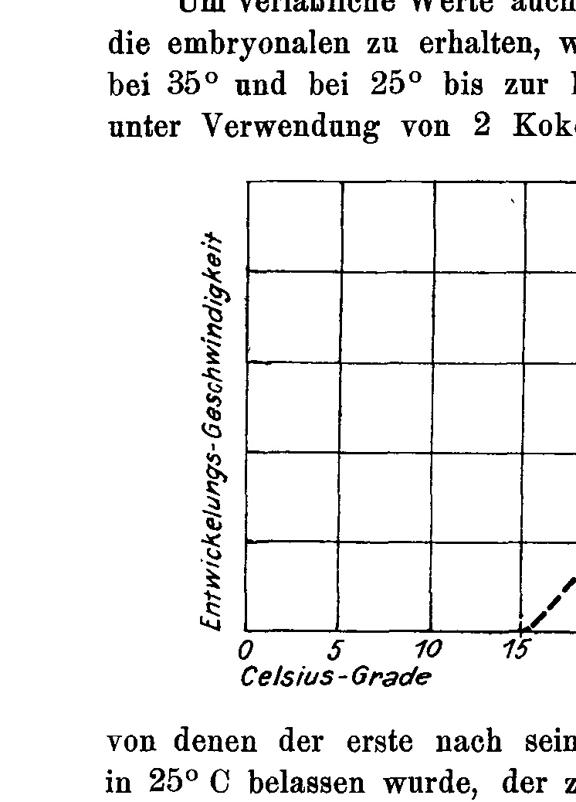
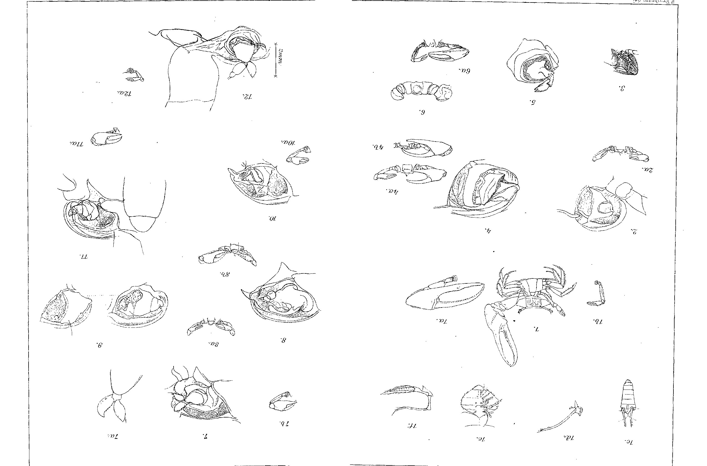

## Temperature Quotients for Vital Phenomena of *Sphodromantis bioculata* Burm.

### (At the same time: Rearing of the praying mantises. VIIIth Communication.)

By

**Hans Przibram.**

(From the Biological Experimental Station of the Imperial Academy of Sciences in Vienna [Zoological Department]¹.)

With 1 figure (curve) in the text.

Received on 3 July 1916.

*Archiv für Entwicklungsmechanik der Organismen*, vol. 43 (1917).

> **Full translation.** A complete English rendering of the running text of “Temperature Quotients for Vital Phenomena” (Hans Przibram, 1917), including all tables, figure and plate legends, and footnotes. Numbers and table cells were transcribed from the page images, not the noisy OCR.

> ¹) An excerpt of this work appeared under an identical title as Communication No. 15 from the Biological Experimental Station of the Imperial Academy of Sciences, Zool. Dept., in the *Akademischer Anzeiger* No. XVIII, 1915.

Earlier experiments on the influence of temperature on the velocity of vital phenomena in praying mantises (1909) had been carried out without maintaining constant temperatures, and it therefore seemed desirable to me to draw upon, for a re-examination and extension of the aforementioned experiments, the temperature chambers set up at our station for other purposes. All the more so because lately opinions have repeatedly been voiced to the effect that the comparison of the temperature quotients for vital processes with those for inorganic processes, particularly of a chemical nature, is inadmissible, because the course of the curves would be different. I have collected the material on temperature quotients hitherto occurring in the literature across the most diverse organic and inorganic domains, and I intend to present it in another place, together with the general conclusions that may be drawn from it. Therefore, in the present publication, let only the concrete figures of my own experiments be communicated, which relate to the development velocity of the eggs and of the individual molting stages of *Sphodromantis bioculata* Burm.

## I. Hatching Times of the Egg-Cocoons at Temperatures of 35, 30, 25, 20° C.

The temperature chambers used (cf. Przibram 1913) permitted a convenient arrangement of the organdy-gauze cages, each occupied by one fertilized female (cf. Przibram 1910), in rooms with five-degree temperature intervals between +40° and +5° C. Since preliminary experiments had shown that at 40° C no egg-cocoons came to development any longer, and that from 15° C downward (cf. Table A) no development of the praying mantises takes place any longer, there remained for our experimental series only the constant temperatures of 35, 30, 25, and 20° C. At 20° C as well, many cocoons died off. In addition, some cocoons were kept alternately one day at 35°, the next day at 25°. The immediate results are recorded in Table B. Almost all the young from one cocoon crawl out on the same day; yet it does occur that a small number of less vigorous specimens hatch out only later; the longest times that such specimens needed are appended in brackets to the normal hatching times. Since, as repeated rearings taught me, the latecomers are pathological individuals, I have not taken them into further account.

In Table C the average values of the hatching times of the cocoons formed at the same temperatures are given, and from the division of these averages the relative development velocities and from them the temperature quotients for a 10° temperature difference have been calculated. The derivation was made on the one hand directly from the 10-degree intervals, on the other hand also through calculation from the 5-degree intervals according to the formula

Q₁₀ = 10 · (log k_{t+n} − log k_t) / ((t+n) − t) · 10 ,

where k denotes the velocity of development. Between 30 and 25° the temperature quotient Q₁₀ amounts to almost exactly 2, falls for higher temperatures, rises for lower ones. With the same formula¹) I have, in an earlier treatise (1909, p. 597), obtained experimental results; if one then enters into our table the temperature quotient calculated for constant temperatures of 30 and 25°, then 3.24 fits well into our table, since, in consequence of the death — namely during the night —

> ¹) In the earlier treatise the simpler, but not strictly correct, calculation according to the formula Q₁₀ = (k_{t+n} / k_t) · (n/10) was carried out; therefore the values given there do not exactly agree with those of the more recent calculation in what follows either.

of the sunken temperature, a higher value than 2 was to be expected, whereas a lower value than the value 3.6 recently obtained for 30 to 20° C [was to be expected]. The cocoons kept alternately at 35° and 25° behaved exactly like those kept throughout at 30° and thereby prove that here it is in fact a question of a quantitative action of the quantity of temperature, not of any kind of triggering processes.

## II. Molting Times of *Sphodromantis* Reared at 35° and 25° C.

In order to obtain reliable values also for later developmental stages than the embryonal ones, Egyptian praying mantises were reared at 35° and at 25° up to the imago. This was done using 2 cocoons of one and the same female,

**Fig. 1.** Vertical axis: *Entwickelungs-Geschwindigkeit* (development velocity); horizontal axis: *Celsius-Grade* (Celsius degrees), marked 5, 10, 15, 20, 25, 30, 35, 40. The plotted curve (data points marked ×) rises from about 15° to a peak near 35° and then falls steeply toward 40°. *(figure not reproduced)*

of which the first, after its laying that took place at 25°, was permanently left at 25° C, the second, immediately after its laying which likewise took place at 25° C, was transferred to 35° C and permanently left there. The development thus also took place under otherwise equal conditions of nutrition. The many interesting results of these parallel cultures at two constantly kept temperatures are to be left to later publications. It must only be anticipated, for the understanding of what follows, that the number of moltings which finally — at the conclusion of growth — lead to the metamorphosis into the imago is a very variable one, and one partly modifiable even by the temperature, so that the temperature plays a part as a triggering factor for the entry of metamorphosis. For this reason the total transformation time needed, i.e. the time from hatching out of the egg up to the metamorphosis into the imago, cannot without further ado be conceived as a reciprocal measure of a development velocity. Rather, we must, for the individual molting intervals, set up the average development durations, the reciprocals of which yield average development velocities for the relevant molting intervals. In Table D the data for 25° are given, in Table E those for 35°. From these two tables there then follows, in Table F, a compilation of the averages for the molting intervals at these two temperatures, and the calculation of the temperature quotients for the 10-degree interval is carried out. The general average from all these quotients amounts to 2.02. It agrees well with the values found for the embryonal developments. Even better it then fits with the values determined in the earlier experimental series (1909, p. 596, here newly calculated according to the aforementioned formula) for a higher temperature interval (namely 36.5 : 27.5°), Q₁₀ = 1.15, and for a lower one (27.5° : 24.5°) Q₁₀ = 3.65.

[In Table F one would also have to enter, in the last row, the times published by Sztern (1914) for the intervals of *Sphodromantis* likewise reared at 25° C — this being the parental rearing of our specimens: the only significant deviation, right at the interval I/II, rests on the initially insufficient nutrition state in Sztern's rearing, since he received his animals only a few days after hatching, but before that no care had been devoted to their feeding.]

From our table we can, by adding the times needed on average for the molting intervals, calculate the total development period up to and including the ninth molting, by which most *Sphodromantis* at 35° and 25° had transformed; the former needed 60, the latter 120 days, the quotient for the 10-degree interval thus amounted to exactly 2. The total development period of the Sztern specimen yields 122 days, agreeing extraordinarily well with our specimen reared at 25°.

## III. Summary of the Experimental Results.

1) If *Sphodromantis bioculata* Burm. is reared at constant temperatures, then the egg-development velocity, the development velocity from molting to molting, and the entire development velocity up to the ninth molting (which mostly leads to the imago) undergo, for a 10-degree interval between 35° and 25°, a doubling.

2) Egg-cocoons kept at a constant temperature of 35° raise their development velocity, compared with those kept at 30°, when recalculated for a 10-degree interval, only to 1.2-fold.

3) Egg-cocoons kept at a constant temperature of 30° raise their development velocity, compared with those kept at 20°, on the other hand, to 3.6-fold.

4) Egg-cocoons kept at a constant temperature of 25° raise their development velocity, compared with those kept at 20°, even to 6.3-fold, when recalculated for a 10-degree interval.

5) Egg-cocoons kept alternately one day at 35° and one day at 25° yield the same development velocity as those kept at a constant temperature of 30°.

6) Demonstrating the agreement of the results with the otherwise known temperature effects is reserved for a summarizing work.

## IV. Bibliography

Przibram, Hans, Aufzucht, Farbwechsel und Regeneration der Gottesanbeterinnen (Mantidae). III. Temperatur- und Vererbungsversuche. *Archiv f. Entw.-Mech.* XXVIII, 561. **1909.**

— Die Biologische Versuchsanstalt in Wien. Erster Fünfjahresbericht. Zeitschrift für biologische Technik und Methodik. I. **1910.**

— Die Biologische Versuchsanstalt in Wien. Zweiter Fünfjahresbericht. Zeitschrift für biologische Technik und Methodik. III, 163. **1913.**

Sztern, Henryk, Wachstumsmessungen an Sphodromantis bioculata Burm. II. Länge, Breite und Höhe (zugleich Aufzucht der Gottesanbeterinnen, VI. Mitteilung). *Archiv f. Entw.-Mech.* XL, 429. **1914.**

## V. Tables.

### Tabelle A. Hatching times of the egg-cocoons, which were laid by the females designated in the column ♀ of *Sphodromantis bioculata* Burm.

All females were siblings from the cocoon also used by Sztern (1914) and were reared at 25° constant temperature.

| ♀ | Kokon I — Tage: | C | II — Tage: | C | III — Tage: | C | IV — Tage: | C |
|---|---|---|---|---|---|---|---|---|
| 0 | 41 | 25° | 22 (−23) | 35° | abgest. | 15° | abgest. | 5° |
| 3 | 45 | 25° | | | | | | |
| 7 | abgest. | 15° | 46 | 25° | 24 | 35° | | |
| 9 | abgest. | 5° | | | | | | |
| 1 | abgest. | 5° | | | | | | |

Development velocity at 35° 100 : 23 = 4,348, at 25° 100 : 44 = 2,273; Q₁₀ from the averages 35°−25° amounts to **1,912.** *(Tafel 2 [Plate 2] — a full-page plate of morphological/anatomical line drawings of the egg-cocoon and developmental structures, with small lettered and numbered figure references. The only printed lettering is the marginal printer's lines "Archiv für Entwicklungsmechanik. Bd. XLIII" and the plate number "Tafel 2"; no figure-legend text is printed on the plate within this excerpt. Figure not reproduced.)*

### Tabelle B. Hatching times of the egg-cocoons, which were laid by the females designated in the column ♀ of *Sphodromantis bioculata* Burm.

All females were daughters of the female designated as No. 4 in the treatise of Sztern (1914), which in my breeding lists is designated as ♀ 0 (13), and indeed [originating] from its first-laid cocoon, kept at a constant temperature of 25° C. From this same cocoon there also originated all the males used for the single servicing of each female. (The times marked with ? are doubtful.)

| ♀ | Kokon I — Tage: | C | II — Tage: | C | III — Tage: | C | IV — Tage: | C | V — Tage: | C | VI — Tage: | C | VII — Tage: | C |
|---|---|---|---|---|---|---|---|---|---|---|---|---|---|---|
| 51 | 40 | 25° | | | | | | | | | | | | |
| 52 | 39 | 25° | 36 (−40) | 25° | 26 | 35° | 23 (−25) | 35° | 28 | 35/25° | ?23 (−24) | 30° | 98 | 20° |
| 24 | 36 (−41) | 25° | 24 (−27) | 35° | 36 (−38) | 25° | anders verwendet | | ausgetrocknet | 20° | 38 | 25° | | |
| 60 | 38 (−39) | 25° | 26 (−27) | 30° | 36 (−38) | 25° | 28 | 35/25° | 26 | 30° | 94 | 20° | | |
| 59 | 38 | 25° | 36 | 25° | 24 (−25) | 35° | 37 (−38) | 25° | | | | | | |
| 54 | 39 | 25° | 24 | 35° | 39 (−40) | 25° | 24 (−25) | 35° | ?23 | 35/25° | 26 (−27) | 30° | 26 | 35/25° |
| 75 | 37 | 25° | Kokons II bis VIII anders verwendet | | | | | | | | | | | |
| 20 | 38 (−40) | 25° | anders verwendet | | | | | | | | | | | |
| 86 | 37 (−38) | 25° | 37 | 25° | 26 (−28) | 35/25° | 25 (−26) | 30° | 23 (−24) | 35° | ausgetrocknet | 20° | | |
| 101 | 36 (−37) | 25° | 24 (−27) | 35° | | | | | | | | | | |
| 97 | 38 (−40) | 25° | | | | | | | | | | | | |
| 1 | nicht abgelegt | | | | | | | | | | | | | |
| 107 | 36 (−37) | 25° | 23 (−26) | 35° | 26 (−27) | 35/25° | 26 | 30° | 91 (−100) | 20° | 38 | 25° | | |
| 98 | 37 (−38) | 25° | 23 (−26) | 35° | 27 (−29) | 30° | 23 (−25) | 35/25° | 96 (−98) | 20° | anders verwendet | | anders verwendet | |

*(Column-abbreviation glossary as printed: "Tage:" = days; "C" = temperature in °C; "anders verwendet" = otherwise used; "ausgetrocknet" = dried out; "nicht abgelegt" = not laid; "Kokons II bis VIII anders verwendet" = cocoons II to VIII otherwise used.)*

### Tabelle C. Hatching times of the same egg-cocoons, averages for equal temperatures.

| Anzahl Kokons (number of cocoons) | Temp. konstant | Tage (days) | Geschwindigkeit (velocity) | Temperaturquotient Q₁₀ (calculated from 5°-interval) | Temperaturquotient Q₁₀ (calculated from 10°-interval) |
|---|---|---|---|---|---|
| -- | 40° C | (nicht geschlüpft) | | | |
| 9 | 35° | 23,56 | 4,244 | } 1,218 | |
| 6 | 30° | 26,00 | 3,846 | } } 2,068 | } 1,587 |
| 23 | 25° | 37,39 | 2,674 | } } 6,276 | } 3,603 |
| 3 | 20° | 93,67 | 1,068 | } | |
| (—) | 15° | (nicht geschlüpft) | | | |
| | Temp. je 1 Tag abwechselnd (temperature alternating, 1 day each) | | | | |
| 7 | 35/25° C. | 25,71 | 3,850 | | |

## Table D. *Sphodromantis bioculata*, young of ♀ O (13). Cocoon I (laid 3. IX. 13). Rearing at 25° C.

*(Bold print indicates the centres of gravity of the dispersion curve; from these the intervals of the moults are reckoned, average in days.)*
*Only the average marked with \* is calculated from the three individual 9/10 intervals alone:*

**1st moult:** 13. X. 13

**2nd moult:**

| Date | 21. X. | 22. X. | **23. X.** | 24. X. | 25. X. | 29. X. |
|---|---|---|---|---|---|---|
| Specimens | 1 | 51 | 69 | 11 | 5 | 1 |
| [1st to 2nd moult, days:] | 8 | 9 | 10 | 11 | 12 | 16 |

> Average interval: **10**

**3rd moult:**

| Date | 30. X. | 31. X. | **1. XI.** | 2. XI. | 3. XI. | 6. XI. | 11. XI. |
|---|---|---|---|---|---|---|---|
| Specimens | 1 | 20 | 69 | 39 | 5 | 1 | 1 |
| [2nd to 3rd moult, days:] | 7 | 8 | 9 | 10 | 11 | 14 | 19 |

> Average interval: **9**

**4th moult:**

| Date | 9. XI. | 10. XI. | **11. XI.** | 12. XI. | 13. XI. | 14. XI. | 16. XI. | 17. XI. | 24. XI. |
|---|---|---|---|---|---|---|---|---|---|
| Specimens | 5 | 32 | 52 | 20 | 5 | 4 | 1 | 3 | 1 |
| [3rd to 4th moult, days:] | 10 | 11 | 12 | 13 | 14 | 15 | 17 | 18 | 25 |

> Average interval: **10**

**5th moult:**

| Date | 18. XI. | 19. XI. | 20. XI. | 21. XI. | **22. XI.** | 23. XI. | 24. XI. | 25. XI. | 26. XI. | 27. XI. | 28. XI. | 29. XI. | 30. XI. | 6. XII. |
|---|---|---|---|---|---|---|---|---|---|---|---|---|---|---|
| Specimens | 2 | 8 | 23 | 31 | 18 | 10 | 5 | 3 | 3 | 2 | 2 | 1 | 1 | 1 |
| [4th to 5th moult, days:] | 9 | 10 | 11 | 12 | 13 | 14 | 15 | 16 | 17 | 18 | 19 | 20 | 21 | 27 |

> Average interval: **11**

**6th moult:**

| Date | 27. XI. | 28. XI. | 29. XI. | 30. XI. | 1. XII. | 2. XII. | **3. XII.** | 7. XII. | 8. XII. | 11. XII. | 19. XII. | 26. XII. |
|---|---|---|---|---|---|---|---|---|---|---|---|---|
| Specimens | 1 | 1 | 5 | 6 | 7 | 8 | 7 | 2 | 1 | 1 | 1 | 1 |
| [5th to 6th moult, days:] | 9 | 10 | 11 | 12 | 13 | 14 | 15 | 19 | 20 | 23 | 31 | 38 |

> Average interval: **11**

**7th moult:**

| Date | 11. XII. | 12. XII. | **13. XII.** | **16. XII.** | 17. XII. | 19. XII. | 20. XII. | 22. XII. | 24. XII. | 15. I. |
|---|---|---|---|---|---|---|---|---|---|---|
| Specimens | 3 | 4 | 7 | 4 | 3 | 2 | 1 | 1 | 1 | 1 |
| [6th to 7th moult, days:] | 14 | 15 | 16 | 19 | 20 | 22 | 23 | 25 | 27 | 48 |

> Average interval: **13**

**8th moult:**

| Date | 19. XII. | 24. XII. | 25. XII. | 27. XII. | 29. XII. | 30. XII. | **2. I. 14.** | 3. I. | 6. I. | 7. I. | 9. I. | 10. I. | 11. I. | 13. I. | 16. I. | 6. II. |
|---|---|---|---|---|---|---|---|---|---|---|---|---|---|---|---|---|
| Specimens | 1 | 4 | 1 | 1 | 3 | 1 | 2 | 1 | 1 | 2 | 1 | 1 | 1 | 1 | 1 | 1 |
| [7th to 8th moult, days:] | 8 | 13 | 14 | 16 | 18 | 19 | 22 | 23 | 26 | 27 | 29 | 30 | 31 | 33 | 36 | 57 |

> Average interval: **17**

**9th moult:**

| Date | 7. I. | 11. I. | 12. I. | 14. I. | 18. I. | 31. I. 14 | 2. II. | 10. II. | 11. II. | 14. II. | 16. II. | 23. II. | 25. II. | 26. II. | 2. III. | 14. III. | 20. III. | 21. IV. |
|---|---|---|---|---|---|---|---|---|---|---|---|---|---|---|---|---|---|---|
| Specimens | 1 | 1 | 1 | 1 | 1 | 1 | 1 | 1 | 1 | 1 | 1 | 1 | 1 | 1 | 1 | 1 | 1 | 1 |
| [8th to 9th moult, days:] | 19 | 23 | 24 | 26 | 30 | 43 | 44 | 53 | 56 | 58 | 65 | 67 | 68 | 72 | 74 | 80 | 122 | 39 |

> Average interval: **(36\*)**

**10th moult:**

| Date | 17. II. | 18. II | 19. II | 21. II. |
|---|---|---|---|---|
| Specimens | 1 | 1 | 1 | |
| [9th to 10th moult, days:] | 41 | 42 | 45 | |

## Table E. *Sphodromantis bioculata*. Young of ♀ O (13). Cocoon II (laid 9. X. 13). Rearing at 35° C.

*(Bold print indicates the centres of gravity of the dispersion curve; from these the intervals of the moults are reckoned, average in days)*
*Only the value of the single individual 9/10 moult marked with \* is calculated for itself alone:*

**1st moult** 1. XI. 13

**2nd moult:**

| Date | 6. XI. | 7. XI. | 8. XI. | **9. XI.** | 10. XI. | 11. XI. | 12. XI. | 13. XI. | 15. XI. |
|---|---|---|---|---|---|---|---|---|---|
| Specimens | 12 | 36 | 48 | 24 | 17 | 20 | 9 | 3 | 1 |
| [1st to 2nd moult, days:] | 5 | 6 | 7 | 8 | 9 | 10 | 11 | 12 | 14 |

> Average interval: 8

**3rd moult:**

| Date | 10. XI. | 11. XI. | 12. XI. | 13. XI. | 14. XI. | **15. XI.** | 16. XI. | 17. XI. | 18. XI. | 19. XI. | 21. XI. | 25. XI. |
|---|---|---|---|---|---|---|---|---|---|---|---|---|
| Specimens | 5 | 6 | 21 | 15 | 24 | 25 | 18 | 17 | 3 | 2 | 1 | 1 |
| [2nd to 3rd moult, days:] | 4 | 5 | 6 | 7 | 8 | 9 | 10 | 11 | 12 | 13 | 15 | 19 |

> Average interval: 6

**4th moult:**

| Date | 14. XI. | 15. XI. | 16. XI. | 17. XI. | 18. XI. | 19. XI. | 20. XI. | 21. XI. | 22. XI. | 23. XI. | 24. XI. | 25. XI. | 3. XII. |
|---|---|---|---|---|---|---|---|---|---|---|---|---|---|
| Specimens | 2 | 1 | 5 | 15 | 16 | 9 | 13 | 30 | 11 | 2 | 12 | 2 | 1 |
| [3rd to 4th moult, days:] | 4 | 5 | 6 | 7 | 8 | 9 | 10 | 11 | 12 | 13 | 14 | 15 | 23 |

> Average interval: 5

**5th moult:**

| Date | 19. XI. | 20. XI. | 21. XI. | 22. XI. | 23. XI. | 24. XI. | 25. XI. | 26. XI. | **27. XI.** | 28. XI. | 29. XI. | 30. XI. | 1. XII. | 2. XII. | 3. XII. | 4. XII. | 5. XII. | 10. XII. |
|---|---|---|---|---|---|---|---|---|---|---|---|---|---|---|---|---|---|---|
| Specimens | 1 | 1 | 5 | 3 | 11 | 4 | 4 | 16 | 8 | 13 | 3 | 15 | 4 | 3 | 2 | 3 | 2 | 1 |
| [4th to 5th moult, days:] | 5 | 6 | 7 | 8 | 9 | 10 | 11 | 12 | 13 | 14 | 15 | 16 | 17 | 18 | 19 | 20 | 21 | 26 |

> Average interval: 7

**6th moult:**

| Date | 25. XI. | 27. XI. | 28. XI. | 29. XI. | 30. XI. | 1. XII. | 2. XII. | **3. XII.** | 4. XII. | 5. XII. | 7. XII. | 10. XII. | 14. XII. | 16. XII. |
|---|---|---|---|---|---|---|---|---|---|---|---|---|---|---|
| Specimens | 1 | 2 | 3 | 1 | 4 | 2 | 1 | 1 | 3 | 1 | 1 | 4 | 2 | 1 |
| [5th to 6th moult, days:] | 6 | 7 | 8 | 9 | 10 | 11 | 12 | 13 | 14 | 15 | 16 | 19 | 23 | 25 |

> Average interval: 6

**7th moult:**

| Date | 3. XII. | 4. XII. | 5. XII. | 6. XII. | **7. XII.** | 8. XII. | 9. XII. | 11. XII. | 14. XII. | 18. XII. | 19. XII. |
|---|---|---|---|---|---|---|---|---|---|---|---|
| Specimens | 1 | 1 | 2 | 3 | 1 | 5 | 1 | 1 | 1 | 1 | 1 |
| [6th to 7th moult, days:] | 8 | 9 | 10 | 11 | 12 | 13 | 14 | 16 | 19 | 23 | 24 |

> Average interval: 4

**8th moult:**

| Date | 10. XII. | 12. XII. | 14. XII. | 15. XII. | 16. XII. | 17. XII. | 20. XII. | 23. XII. | 28. XII. | 31. XII. | 1. I. 14 |
|---|---|---|---|---|---|---|---|---|---|---|---|
| Specimens | 1 | 1 | 2 | 1 | 3 | 1 | 2 | 1 | 1 | 1 | 1 |
| [7th to 8th moult, days:] | 7 | 9 | 11 | 12 | 13 | 14 | 17 | 20 | 25 | 28 | 29 |

> Average interval: 10

**9th moult:**

| Date | 29. XII. | 30. XII. | **31. XII.** | 12. I. |
|---|---|---|---|---|
| Specimens | 4 | 1 | | 1 |
| [8th to 9th moult, days:] | 19 | 20 | | 33 |

> Average interval: 14

**10th moult:**

| Date | 14. XI. |
|---|---|
| Specimens | 1 |
| [9th to 10th moult, days:] | 16 |

> Average interval: 14(\*)

## Table F. Average duration of the moulting intervals of the *Sphodromantis* specimens listed in Tables C and D, and temperature quotients for the interval 35° : 25°.

| Temp. constant 35° | I/II | II/III | III/IV | IV/V | V/VI | VI/VII | VII/VIII | VIII/IX | IX/X | General average: | Total duration of development from 1st to 9th moults |
|---|---|---|---|---|---|---|---|---|---|---|---|
| Number of specimens: | 170 | 138 | 119 | 99 | 27 | 18 | 15 | 6 | 1 | | |
| Days interval: | **8** | **6** | **5** | **7** | **6** | **4** | **10** | **14** | **16**¹⁾ | | 60 ⎫ |
| *Q*₁₀ for 35° : 25° | 1,25 | 1,50 | 2,00 | 1,57 | 1,83 | 3,25 | 1,70 | 2,79 | 2,27 | **2,02** | ⎬ *Q*₁₀ = **2,00** |

| Temp. constant 25° | I/II | II/III | III/IV | IV/V | V/VI | VI/VII | VII/VIII | VIII/IX | IX/X | | |
|---|---|---|---|---|---|---|---|---|---|---|---|
| Number of specimens: | 138 | 136 | 122 | 110 | 41 | 27 | 23 | 20 | 3 | | |
| Days interval: | **10** | **9** | **10** | **11** | **11** | **13** | **17** | **39** | **36**¹⁾ | | 120 ⎭ |
| [In Sztern's rearing: | 15 | 9 | 8 | 10 | 12 | 13 | 17 | 38 | no individuals occurred | | 122] |

> ¹⁾ In the calculation of IX/X, the figure was not determined by calculation of the time elapsed since the preceding average for the VIII./IX. interval, but rather by reference to the individual specimens, since the small number of these would yield a quite false average.

## Figures

**Fig. 1 (Kurve)**

**Taf. 2.**

---

*Translator's note.* One of the Biologische Versuchsanstalt (Vienna Vivarium) papers flagged on the project site as a modern rediscovery target. Claims are rendered as stated in the original, not endorsed.
