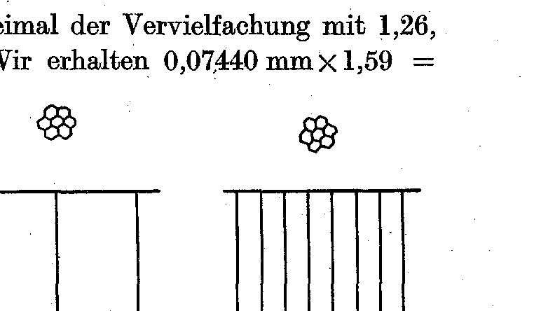
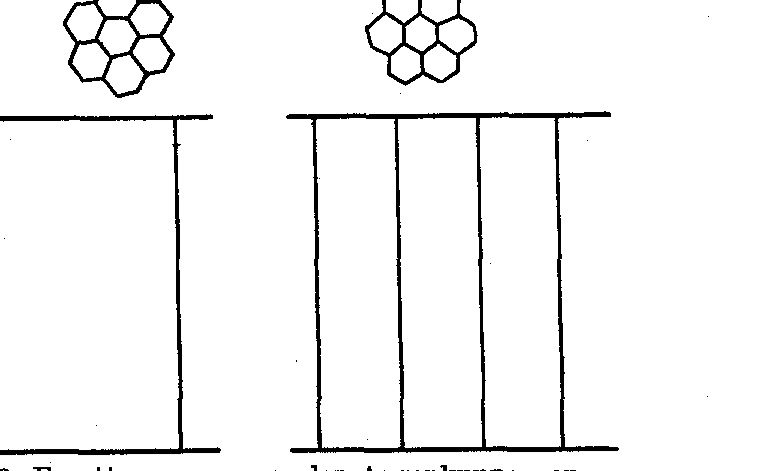

(From the Biological Experimental Institute [Biologische Versuchsanstalt] of the Academy of Sciences in Vienna, Zoological Division.)¹

# GROWTH MEASUREMENTS ON SPHODROMANTIS BIOCULATA BURM.
## IV. INCREASE OF FACET SIZE AND NUMBER.
### (AT THE SAME TIME: REARING OF THE PRAYING MANTISES. XII. COMMUNICATION.)

By

HANS PRZIBRAM.

With 2 text-figures.

*(Received 29 July 1929.)*

*Wilhelm Roux' Archiv für Entwicklungsmechanik der Organismen*, vol. 122 (1930).

> **Full translation.** A complete English rendering of the running text of “Growth Measurements on Sphodromantis bioculata” (Przibram Brecher, 1930), including all tables, figure and plate legends, and footnotes. Numbers and table cells were transcribed from the page images, not the noisy OCR.

> ¹ A preliminary communication appeared as No. 153 from the Biological Experimental Institute in the Akad. Anz., Vienna 1929.

### Contents Overview.

|  |  | Page |
|---|---|---|
| I. | Statement of the problem | 280 |
| II. | Method and technique of the measurements | 282 |
| III. | Results of the eye measurements | 283 |
| IV. | Comparison of *Sphodromantis* with *Dixippus* (*Carausius*) and other Hemimetabola | 293 |
| V. | Summary | 297 |
| VI. | List of references | 299 |

## I. Statement of the problem.

In our first measurements of the growth of praying mantises, which yielded a doubling of the mass from moult to moult, the simple explanation appeared to be given by the assumption of a regular doubling of the cell number (PRZIBRAM and MEGUŠAR 1912, p. 706). Indeed, the hypothesis for the cells of the epidermis could be confirmed both in *Sphodromantis* (SZTERN 1914, p. 443) and in *Dixippus* (FRIZA 1928, p. 328), which latter stick-insect likewise exhibits a doubling of mass from moult to moult (EIDMANN 1924, p. 584; TITSCHAK 1924, p. 443; TEISSIER 1928, p. 843).

From the doubling proposition it follows in a purely logical way that, with proportionally constant enlargement, a length must increase from moult to moult by the cube root of 2, that is, with the quotient 1.26. We find this proportionality realized even better than in the prothorax length in the tibiae of the two walking leg-pairs of *Sphodromantis* (PRZIBRAM 1917, p. 3). A special interest, however, is claimed by the analogous length-increase of the eye-facets, which was found empirically by SZTERN (1914, p. 467) and was brought into relation with a hypothesis of simultaneous division-steps throughout the whole organism of the arthropods. At that time the constancy of the number of cells that compose *one* omma with its corneal facet was still unknown to us. It thus remained still open whether, just as in the epidermis, a cell-doubling corresponded to the length-increase of 1.26. Soon, however, a study of the literature on the insect-eye convinced me of the non-applicability of the hypothesis of cell-multiplication to the compound eye. Thus HESSE writes (1910, p. 694): "The compound eyes of the crustaceans and insects, also called facet-eyes or net-eyes [reticulate eyes], are exceedingly uniform in their construction. Each individual lens-ocellus, each eye-wedge [Augenkeil], consists of 13 or 14 cells of always equal arrangement (Fig. 439): two lens cells [Linsenzellen] or 'corneal cells' [Cornealzellen], from which the cuticular lens originates, four cone cells [Kegelzellen], which compose the light-refracting cone, and seven to eight visual cells [Sehzellen], forming the so-called Retinula." The mantises are no exception to this (ZIMMERMANN 1914, p. 17); specifically, *Sphodromantis* has eight visual cells in each rhabdom (FRIZA 1928, p. 320).

I pointed out expressly (6.VI.1923) that in this case it might be a question not of a doubling of the number of cells of each omma, but of the doubling of the mass of each of the cells composing the same. This same point was then also emphasized by FRIZA (1928, p. 328) for *Dixippus*. Meanwhile TEISSIER (1926, p. 504), without knowledge of our works just mentioned, had come to the conclusion that the number, as well as the surface-area of the facets of the compound eyes in the insects — among others *Blatta* and *Notonecta* — increases in proportion to the body-length of the animal. In a later note (1928, p. 297) he states that the head of *Dixippus* grows less rapidly than the whole body, the eye-diameter still more slowly. For the same species of animal FRIZA (1928, p. 329) observed an, albeit slight, increase of the facet-number during the larval development, and pointed to the region at the dorsal eye-margin, designated by JÖRSCHKE (1910) as the "growth-zone" [Zuwachszone] of the compound eyes in the Arthopterans, with still-undeveloped ommata.

In contrast to the growth, say, of the tibiae in *Sphodromantis*, the enlargement of the eye in the course of the larval development of the arthropods thus offers a manifold complication, and from this there arise several problem-formulations, which are to be further examined on *Sphodromantis*. To begin with, we must establish whether and to what extent an increase of the number of ommata also occurs in *Sphodro-* *mantis*. This eventuality was the less thought of in the measurement of the facet-length, since the generally regular, 1.26-fold length-increase from moult to moult seemed fully to cover the aliquot portion of the mass-doubling of the animal that falls to the eye. Now, however, the further question arose, whether the volume of the eye in *Sphodromantis* increases at all in proportion to the body-mass, and whether only a similar lagging-behind of the head and eye takes place, such as TEISSIER gives for *Dixippus*. We therefore need measurements of the head and of the eye-diameter of the praying mantis. Only when we are in possession of these data can we venture upon the problem of in what way the found facts can be brought into agreement with our general conception of the fundamental doubling of the living mass, as it expresses itself especially clearly in the arthropod moults. A comparison of the values ascertained for *Sphodromantis* with those for *Dixippus* will further afford us the possibility of deciding whether the growth of the eye in these two species proceeds in the same way, or whether we may not, despite the validity of common growth-principles, come upon the trace of different realizations.

## II. Method and technique of the measurements.

A volume-determination of the head and of the eye at all moult-stages, a counting of the facets, and a determination of the diameters of each individual one at the same drawn individual would indeed be able to give the most detailed information on the growth, but would require very much time and labour, while a shorter way appeared adequate. In order to attain a satisfying formulation, the values already present from earlier investigations were extensively used above all: for the weight- and length-relationships of the moult-stages Tables A to D (PRZIBRAM and MEGUŠAR 1912, p. 715 ff.), for the facet-lengths on the moults Table J in SZTERN (1914, p. 491), for the relation of the initial size of the young to the final size of the mother Table I (PRZIBRAM and WALTHER 1914, p. 419). In place of the volume-determination of the head and of the eye there entered the measurement of the (longest) diameter, from which, for the eye regarded approximately as a sphere, the volume-relationship at the various stages results. With the same approximation for the facet-number one contented oneself; only the number of the facets lying in the same diameter next to one another was determined, and from this the relation of the facet-number of the just-hatched larva and of the imago was calculated. The technical aids were the drawer-loupe [Schublehre] with vernier [Nonius] mentioned in our earlier publications, the very fine-pointed metal-calipers, loupe, microscope with REICHERT objective-micrometer divided into ¹⁄₁₀ millimeter, microphotographic apparatus REICHERT. In order to spare oneself the time-consuming and laborious measuring of the diameter of a large number of facets, which, on account of their variability, would be required for the attainment of an average value, the surface of a number of contiguous facets was determined according to TEISSIER's procedure (1926, p. 502) and then by division by the number of the individual surfaces calculated: "The whole head (or the eye, if the animal is too bulky) is treated with caustic potash [Kalilauge] until almost complete decolorization and mounted in glycerine-gelatine. By means of the Camera lucida one draws, at a magnification of about 500, a small, sharply defined part of the eye (with reference to the margin of the eye, to the base of the antenna, etc.), comprising 10—20 facets. The size is then determined by weighing this area."

I prefer to use photography, which SZTERN was able to employ on the moults with very clear results (1914, Plate XVIII). A device allows one to dispense entirely with the measurement of individual facets. Since our eye is very sensitive to deviations, even of a small kind, in the size of a motif occurring in repetition, it suffices to set two differently large objects in the loupe or microscope each upon one image, in which the motif — here the individual eye-facet — appears equally large. The ratio of the linear magnifications used then gives us the mean of the individual, homologous length, hence also of the facet. The only difficulty consists in finding the correct magnification, which is necessary in order to make the objects to be compared appear at the same motif-size. In our example this succeeded with sufficient certainty. The counting of the facet-number in a row was also carried out on the photographs. But whereas in the first case a small, middle part of the eye was sharply focused, in the latter the matter had to be managed with a less sharp setting, in order still to be able to survey all rows of one eye-hemisphere simultaneously and thus to establish the number of facets. As material for the photographic measurements there served the *Sphodromantis* from the breeding of 1928, No. 47, as mother-animal, and some of its freshly-hatched young of cocoon IV, which was laid on 8.XII.1928 and hatched on 25.I.1929. For the demonstration of the size-relationships of the head, eye, and prothorax at these two developmental stages, photographs were made with an attached scale. For the gaining of the strongly enlarged photograms of eye-facets, pieces of the middle eye-zone were cut out. The further details on the technique applied, such as the eyepiece used, objective, loupe-magnification, unit of the scale-divisions [Teilstriche] of the scale, will be published elsewhere, since here, at the wish of the Editor of the Archive, a reproduction of the photograms had to be dispensed with. The calculations were carried out by means of a logarithm-table.

## III. Results of the eye measurements.

The number *m* of the facets lying in one horizontal-row amounts, on the photograph of the freshly-hatched young, to 37, that of the maternal imago 52. Since we have to imagine the eye-surface not as a plane, but as a sphere, the counted-out stretch represents not 2*r*, but the half of one meridian, thus 2*rπ*/2 = *rπ*. From this results *r* = *m*/*π*; for *m* = 37 it is thus *r* = 11.78, *r*² = 138.7, the whole eye-surface 4*r*²*π* = 1743. If we have distributed *rπ* 37 facets, then there will stand on the whole eye, regarded as a spherical surface, 1743 facets. The analogous calculation for the imago gives, with *m* = 52, *r* = 16.55, *r*² = 273.9, 4*r*²*π* = 3442. The imago thus had almost twice as many facets on an eye as the newly-hatched young; 3442:1743 = 1.975 with an error of merely 1%, which, in the only approximative calculation of the surface-shape, is to be attributed no significance. On the (imaginal?) leaf-locust [Laubheuschrecke] HESSE (1910, p. 696) gives 2000 facets for the eye, a value which falls between our two for *Sphodromantis*. However, while our relative values of the facet-number at various stages may claim, in view of the slight change of the eye-forms, sufficient accuracy, the absolute ones may not. For this there would still be required the proof that the surface of the eye gains as much in area through the deviation from the spherical shape as it loses through the falling-away of the ommatidia at their attachment-surface. A preliminary area-determination according to a galvanoplastic method ¹ in fact yielded a lagging-behind of the eye-surface relative to the spherical surface of equal radius by 30%. This value would yield, for the imago of *Sphodromantis*, 2400, for the young 1200 facets. The absolute length of the individual facet is calculated on average from the measured stretch 2*r* = 0.65 mm, *rπ* = 0.8010 mm, with *rπ*/37 = 0.02215 mm for the young of *Sphodromantis*, from 2*r′* = 3.5 mm, *r′π* = 5.878 mm, with *r′π*/52 = 0.1130 mm for the imago. Since the second cast-off skin corresponds in length to the freshly-hatched larva, we can check whether, according to SZTERN's data, we at least find approximately, by magnitude, fitting values. He gives 8.3 scale-divisions [Teilstriche] and 0.0024 as the value of one scale-division in millimeters. From this the average facet-length is calculated as 0.01992 mm. The mean deviation of the two *Sphodromantis* worked up quite independently from the measurements amounts to only 5%, inasmuch as 0.0210 ± 0.0015 includes the values. In an analogous way we could compare the length of the imaginal facets, were it not that SZTERN's animals had only 9, while the mother-animal ♀ 47 used by me had 10 moults — moult-numbers wherein the two breedings in the female sex also otherwise differed from one another (in the just-hatched larvae the sex is not perceptible). If we assume, however, that the tenth moult proceeds with the same regularity of the facet-enlargement as for most of the other length-magnitudes, namely a multiplication by 1.26, then we can calculate from the facet measured by SZTERN of the IX. skin that of the X. by means of multiplication by 1.26. But we are still not at the goal: to the X. skin there corresponds indeed the IX. stage of the animal, for which I, however, have no measurement on ♀ 47, but on the following X. stage, the imago. If we let, however, again the hypothesis of a multiplication by 1.26 run free, then, if it holds true, we should expect to find again, approximated, the value measured by me for our *Sphodromantis* imago of the facet-length, if we subject the stretch measured by SZTERN for

> ¹ Session of the Biol. Ges. Wien, 1 July 1929.

the IX. skin twice to the multiplication by 1.26, that is, to that by 1.59. We obtain 0.07440 mm × 1.59 = 0.1183 mm. The mean deviation of the two values amounts to 2%, since 0.1157 ± 0.0027 encompasses both. From the eye-diameters of 0.65 mm and 3.50 mm it results that the eye, from the hatching of the larva out of the first, the embryo-enclosing skin, up to the imago, increases in length merely 5.38-fold. From measurements of the head-breadth a similar thing can be discerned: the head, measured together with the eyes, 2.0 mm broad on the fully-hatched larva, has on the ten-times moulted imago a breadth of 10.65 mm, which yields a length-quotient of 5.32. Eye and head thereby deviated less than 1% from the mean value, 5.35 ± 0.03. Photograms of the juvenile and imaginal facets brought to equal apparent size yielded, on use of various magnifications, very similar ratio-numbers, which prove the value of this method for the rapid estimate of the motif. To the 9-fold photographic enlargement of the imaginal eye the facets of the young larva at 34-fold are equal, thus there exists an enlargement-ratio of 34:9 = 3.78. To the 22-fold enlargement of the imaginal eye there had to be opposed an 84.3-fold of the first larva for the attainment of equal impression, hence the ratio is 84.3:22 = 3.83. The enlargement 41 in the imago corresponded in the young to 156.4, thus 156:41 = 3.81; 31 in the imago to 115 in the young, thus 3.77 (Fig. 1).

**Fig. 1.** Facet-group from the eye-cap [Augenkuppe] of *Sphodromantis bioculata*. Left: Just-hatched larva. REICHERT Oc. I, Obj. 3, draw-out [Auszug] 41 cm. Magnification 115 × lin. Right: Imago after 10 moults. REICHERT Oc. I, Obj. 1, draw-out 41 cm. Magnification 31 × lin. Semischematic. Below, scale, 1 division = 0.1 mm. (Drawn after microphotographic exposures.)  *(figure not reproduced)*

**Fig. 2.** Facet-group from the eye-cap of *Sphodromantis bioculata*. Left: Just-hatched larva. REICHERT Oc. I, Obj. 5, draw-out 39 cm. Magnification 245 × lin. Right: Imago after 10 moults. REICHERT Oc. I, Obj. 3, draw-out 41 cm. Magnification 65 × lin. Semischematic. Below, scale, 1 division = 0.1 mm. (Drawn after microphotographic exposures.)  *(figure not reproduced)* To the 65-fold of the imaginal eye there appeared the 245-fold of the larva as equal, which again gives 245:65 = 3.77 (Fig. 2). We may therefore regard 3.80 ± 0.03 as valid! The error, which here is merely one of measurement-technique, falls under 1%. If the facet-length has risen merely from 1 to 3.80, while the eye-length rose from 1 to 5.48, then the increase of the number of the facets must be responsible for the after all always complete clothing of the eye with corneae. From the slight interstices located between the corneae we can the more readily abstract, since to them an own growth will hardly accrue. If we divide 5.38 by 3.80, we obtain that number which tells us in what ratio the number of the facets in one longitudinal direction must have increased during the whole metamorphosis. This number is 1.415 and therefore agrees to less than 1% with 1.414, that is, the root of 2. If we assume, as hitherto, that the occupation of the eye with facets in both mutually perpendicular meridian directions is an analogous one, then we have as total increase of the facets 1.415 × 1.415 = 2.002, that is, neglecting the unessential error of 1%, exact doubling. We have thus arrived, by two different paths — that of counting and that of measuring the facets and the eye — at the agreeing result of the doubling of the number of the facets from hatching up to the imago after completion of ten moults. We now also comprehend why in SZTERN's series, between the VI. and VIII. skin, a standstill in the regular increase of the facet-length was to be recorded. Probably it is a matter of the time at which (possibly in different directions one after another) the increase of the facets is brought about. How the increase of the facets occurs in detail would well be worth a thorough study, especially what role the mentioned "growth-zone" [Zuwachszone] in reality plays. That must be left to further planned experimental and histological investigations. The following calculation of the absolute facet-length according to SZTERN's table (1914, p. 491), by multiplication of his relative numbers (A) by the measurement-constant 0.0024 mm, shows the agreement of these values (B) with the numbers (C) obtained from continued multiplication by 1.26, and the exception between the VI. and VIII. moult. In E there are still added, for comparison, the results of the animals, not the skins, of 1928 (see the table opposite).

In yet a third method can the increase in the number of the facets be demonstrated. FRIZA (1928) had, for other purposes, prepared histological sections of *Sphodromantis* eyes. At my instigation he counted the number of corneae which are found on the sections in just-hatched and in imaginal *Sphodromantis*. These counts refer either to longitudinal sections parallel to the head-breadth (Meridional) or to cross-sections (Äquatorial).

| Moult | A | B in mm | C in mm | D in mm | E in mm |
|---|---|---|---|---|---|
| II. | 8,3 | 0,01992 | 0,01992 |  | 0,02215 |
| III. | 11,2 | 2688 | 2510 |  | — |
| IV. | 14,0 | 3360 | 3162 |  | — |
| V. | 16,8 | 4032 | 3985 |  | — |
| VI. | 20,0 | 4800 | 5021 × | 1,414 | — |
| VII. | 23,0 | 5520 | (Stillstand) [standstill] |  | — |
| VIII. | 26,0 | 6240 | 0,06473 | ↓ | — |
| IX. | 31,0 | 7440 | 0,08157 | 0,07097 | — |
| (X. event.) |  | (9370) | 0,1028. | 0,08945 | — |
| [Imago] |  | [0,1183.] | 0,1295. | 0,1127. | 0,1130 |

To Column D we shall return later.

parallel to the head width (meridional) or onto cross-sections (equatorial). The former yielded, in 6 young animals, the figures 88, 92, 95, 96, 98, 101, on average 95.0; in 2 imaginal females 125, 128, average 126.5; the latter, in 7 young animals, the figures 79, 81, 82, 83, 88, 88, 89, average 84.3; in 3 imaginal females 113, 116, 122, average 117.0. In the meridian, then, the ratio of the corneae of the imago to those of the new-born would amount to 126.5 : 95.0 = 1.332, in the equator to 117.0 : 84.3 = 1.388. The product of the increase in the two mutually perpendicular directions amounts to 1.332 × 1.388 = 1.848. Here too the doubling is almost reached. The error of 8% is to be ascribed to the inhomogeneity of the material, the difficulty of counting all the corneae separately on the sections, and the small number, namely of the imagines. In the average of the equatorial sections — that is, precisely those which with the other methods we did not count but only inferred by calculation — the deviation is very small, 1.388 against 1.414, hence under 2%. Whereas in the measurements of the young animals the sex cannot be taken into account, males were excluded among the imagines. Thereby a better agreement within each section-group is attained, since the male *Sphodromantis* are smaller and, in accordance with the known law of the correlation between facet- and animal-size, have fewer facets. Thus one male had in the meridian 118, another in the equator 106 facets, as against our averages for the meridian of the females with 126.5, for the equator with 114.5. We must put to ourselves the question whether, through the indiscriminate inclusion of both sexes among the young and the exclusion of the one sex (among ours) of the imagines, we are not committing an inadmissible error which might falsify the result in favour of the doubling. A brief consideration, resting on our earlier works on the growth and the moults of the mantids, dispels this apprehension. The male possesses, namely, one moult fewer than the female (1909, p. 587; 1912, p. 696; 1929, this issue), so that its lesser size does not yet appear in the freshly hatched, but only comes about through lagging behind later. Indeed, the difference between the sexes of *Sphodromantis* in the number of ommatidia is even strikingly small. It almost has the appearance as though the males had, for their size, an increased number of ommatidia, which, given the use of the eyes for the sighting of the female in this insect group, would not be surprising. Were the number of ommatidia dependent solely on the difference in moults, then with the doubling of the animal volume from one moult to the next the surface, and hence also the number of facets, would have to increase in the root of 2 = 1.414, and thus in this ratio. The ratio of the number between females and males, however, amounts in meridional section, according to Friza's data, to only 123.3 : 118 = 1.05, and in equatorial section to 117 : 106 = 1.10. To this is added that the more considerable size of the female *Sphodromantis* goes back not only to the greater number of moults, so that, with proportional eye-size, the quotient should — quite in contrast to the findings — be even greater than 1.414. It will be a matter for a further investigation to occupy itself with the proportions of the body parts of the two sexes, and thereby also to treat the question of the number of ommatidia, as well as that of the different size of the facets in males and females. The statement made by Forel (1886/87) of an essentially higher number of facets in male ants as against females of the same size, *Formica pratensis* 10 mm long, ♂ 1200, ♀ 830, stands opposed to the negative statements of Leinemann on coleopterans (1904, p. 54).

It will perhaps have been noticed that the absolute number of facets is found higher on the sections than according to the direct view of the preserved animal. We had counted 37 facets in the half-meridian in the young, where admittedly it was a matter of the longitudinal section parallel to the head width, which for this whole meridian gives 74 against the average value of 95 (minimum value 88) ascertained by Friza on the sections. In the imagines the corresponding figures would be: half-meridian 52, hence whole meridian 104, against Friza's 126.5 (minimum value 125). Friza's equatorial values too are somewhat higher than ours, but here the analogous measurements of our animals are lacking. Given the form of the eyes, deviating ventralward from the sphere in one extension, the stronger deviation of the figures between our and Friza's meridional counts can be traced back to the distribution of a greater number of facets over the ventral half-meridian. From this it would follow that the absolute values for the number of facets according to our count on the photograph taken from above are too small, when we apply them to the whole-meridians. It must, however, be remarked that this value, found at the largest meridian, may by no means be assumed for all meridians, since, owing to the eye-tip directed downward, all the other meridians are shorter and will therefore show fewer ommatidia. The minimum value for the equator in Friza's freshly hatched, 79, accords already well with our value 74: here the error would be merely 7%, if it is at all a matter of individual variations, for which the considerable differences of Friza's values among themselves, namely from 79—89, speak.

After this excursus on the counts made on histological sections, we return again to the consideration of our *Sphodromantis* No. 47 and of its own — that is, strictly comparable to it — young.

If *Sphodromantis*, with respect to the mass-doubling and the length-increases of the thorax and of the walking-legs closely linked therewith, shows no irregularities, or, as was mentioned in our first treatise, an occurring quadrupling is compensated by a standstill in the following moult-interval, then the final result will depend on the initial size in such a way that, in the case of the weight, the latter appears multiplied by that power of 2 which corresponds to the moult-intervals, that is, to the number of moults minus 1. In the case of the lengths, the exponent of the power likewise remains the same, but as base the length-quotient enters in, hence in the case of the walking-leg shaft [Schreitbeinschiene] 1.26 (Przibram 1917), in the case of the prothorax 1.29 (see Przibram-Megušar 1914, p. 723). We can again test whether this purely logical demand finds its confirmation in several series of experiments. The number 1.29⁹ = 9.893. The following compilation of prothorax-length in millimetres of imaginal females with ten moults and freshly hatched shows to what extent data collected on various occasions depart from it:

| Rearing [Zucht] | Year | Imago | Brood-days [Bruttage] | Young | Ratio [Verhältnis] | Deviation from 1.29⁹ in % |
|---|---|---|---|---|---|---|
| Przibram-Megušar | 1914 | 7 ♀¹ 23,03 | 89 | 2,26 | 10,02 | 0,13 = 1,3 |
| „ | 1914 | 8 ♀ ♂¹ 22,51 | 89 | 2,26 | 9,96 | 0,07 = 0,7 |
| „ Walther | 1914 | 1 ♀ 27,55 | 34 | 2,245 | 12,27 | 2,38 = 24,0 |
| „ | 1914 | 1 ♀ 26,55 | 34 | 2,231 | 11,94 | 2,05 = 20,7 |
| „ | 1914 | 1 ♀ 24,60 | 34 | 2,088 | 11,79 | 1,90 = 19,2 |
| „ Przibram | 1928 | ♀ 47. 24,20 | 48 | 2,04 | 11,90 | 2,01 = 20,3 |

> ¹ The animals Nos. 1, 6, 11, 24, 27, 32, 33; ♂ 38.

The stronger deviations of the last 4 examples are demonstrably connected with the short brood-duration of the cocoons. As already the measurements of Walther had shown, the thoracic length of the larva hatching from the I. integument rises with the time which was granted it to remain in the egg-cocoon, in the case of the offspring of one and the same female. But since the size of the prothorax of the young is on the other hand dependent on the size of the prothorax of the mother, it is to be assumed that, with too short a brood-duration, the length valid for the I. postembryonic stage is not reached and is then made up during the I. moult-interval or later. We can, for our ♀ 47, for a normal brood-duration of about 3 months, calculate, by drawing the 9th root from the imaginal prothorax-length, a length of 2.40 mm, which the freshly hatched offspring of the animal 1928 ♀ 47 should have. This number stands in good agreement with the values which Walther found for the offspring of females of different size at different brood-duration, for he had only such of 31—37 days, since the cocoons were kept at a mean temperature of 30° C (1914, p. 417), and all prothorax-lengths of the young lay under 2.32 mm, although the mothers up to 27.55 mm had long prothoraces. On the other hand, the young measured by Megušar had prothoraces up to 2.3 mm long, in consequence of the long brood-duration, although the females reached as imago in one case 24.5 mm, otherwise did not grow beyond 23.5 mm. Were head width and the eye-diameter chiefly participating therein to increase regularly in the course of the moults, then there would result as growth-quotient of these lengths ⁹√5.35 = 1.205 to be reckoned. Yet, as we shall see, the facets drawing over the whole surface of the eye take on no uniform growth, but, by absolving the VI. moult, the length-increase of 1.26 between two moults hitherto followed gives way in favour of a doubling of their number without strong length-increase, and only from the VIII. moult on does the moult-rhythm again take up the length-increase; so we shall ask ourselves what meaning this may have for the volume-increase of the whole eye and thereby of the head. If we take the facets lying at the surface of the eye up to double the number, without simultaneous length-increase of the individual corneae, then there results, with the assumption of an approximately proportional growth of the eye-tubercle [Augapfel], an increase of the volume to 2.828 times, namely the third power of the root from the surface, which rose from 1 to 2.

In place of a volume-doubling each time, there occurs then at the VI.—VIII. moult a volume-increase of altogether 2√2 and a length-increase of √2. As the measurement of the facet-diameters by Sztern according to the above Table Columns B and C shows, the previously made assumption of a standstill in the facet-enlargement during stage VII agrees not so well as would be desirable with the values found for the IX. integument, and then also not with the values calculated therefrom for the X. integument and imago, in that the deviations amount to 10%. If, on the other hand, we multiply the value of the VI. integument, as has been done in Column D, by 1.414 = √2, then we obtain at the IX. integument a value which deviates by only 6% from the one found; there follows then, for the further values, which have been calculated under the assumption of a regular volume-doubling by multiplication by 1.26 for each further stage, a deviation of only 5%. Very exactly does the calculated value D for ten-moulted animals agree with the absolute facet-length found in Column C of the ten-moulted female; the deviation 3‰ [3 per thousand]. This agreement of the found values is the more significant in that the praying-mantises [Gottesanbeterinnen] used in the present experiments, though indeed the same species as those in the earlier ones, belong to the rearings used by Sztern, yet originate from a different locality. While our earlier *Sphodromantis*-cocoons had been obtained from Egypt or the Sudan, I am grateful for the sending of the cocoons received on 28. I. 1928 to Herr Dr. Emil Liebmann, Rosch Pina, Malariola, Palestine, who had received knowledge of my wish through the well-known radiologist J. Robinsohn. To both gentlemen I permit myself at this place to express my most cordial thanks for this support of our works. On this occasion I should like also to commemorate the diligence of our Adjunct Engineer F. Köck in the discovery of the requisite optical magnification-combinations and the rather difficult microphotography of the eyes.

Between the VI. and IX. moult, according to the data brought forward for *Sphodromantis*, the relation between moult-interval and the doubling of the volume for the compound eye seems to be abolished. Here a relation of the facet-number as well as of the facet-length to the surface comes to light. The number of facets doubles during the preliminary stages of the metamorphosis, and since the facets are arranged at the surface, they will be multiplied not in proportion to the volume, but in proportion to the surface. The side-length of the facet increases, it is true, from hatching up to the VI. moult, and from the IX. on, each time by 1.26, hence in the third root of the doubled volume; in between, however, the facet-length also increases during the three moult-intervals altogether by √2, hence proportionally to the surface of the meanwhile doubled volume of the individual ocellus.

Before we proceed to the comparison of the growth and the multiplication of the ommatidia of other insects, we must still make clear to ourselves to what extent the values calculated for an average of many, but yet not of all, facets are valid for the whole animal of the same species, at the same stage. Species with such deviations of the facet-length within the eye do occur (see Leinemann 1904, p. 7). The survey of the literature shows, however, that mostly no account has been taken of differences in facet-length in the eye-regions (e.g. Notthaft 1880, Hesse 1901—1910). Also there, where express mention is made of different size of the individual wedges [Einzelkeile], the illustrations [Abbildungen] show this deviation referred not to the length of the corneal facet, but to the depth of the rhabdom (compare e.g. *Eristalys* — Dolley u. Wierda 1929, fig. 4; *Pentatoma*, *Reduvius* — Kuhn 1926, p. 494, 529; *Agrion*, Mantidae: *Rhombodera*, *Hierodula* — Zimmermann 1914, p. 9, 17, 19; *Anacridium*, *Acrydium*, *Mantis*, *Sphodromantis*, *Dixippus* — Friza 1928, p. 301, 307, 316, 321, 324). In *Blatta orientalis* the facet-surfaces were determined by Teissier (1926, p. 502), on the one hand at the base of the antenna, on the other at the eye-apex [Augenkuppe]. Although, according to his Table, the latter region seems to have essentially smaller facets than the former, the values given show, by drawing the square-root from them, as in μ², that the facet-lengths do not differ from one another by more than 15%. These maximum differences are thus indeed smaller than the increase occurring from one moult to another of the facet-size at one and the same eye-part, which on the first developmental stages of *Sphodromantis*, then also again on the last, amounts, as we saw, to 1.26. In *Sphodromantis* too, as the photographs showed, the facet-sizes at different eye-spots are quite similar. Remarkable beside the slight fluctuation of the size of facets according to eye-regions are the very constant values which have been found by various researchers for the facet-size of the same species at homologous developmental stage, but of course on different specimens. With my and Sztern's findings on *Sphodromantis*, whose facets, by the way, were mostly taken from the eye-apex, are reminiscent, for example, those of Grenacher (1879, p. 177) and Notthaft (1880, p. 49) on the poplar-borer, *Saperda carcharias*, which both gave 0.045 mm facet-length. This constancy is, as from our experiments on *Sphodromantis* and from Teissier's investigations on hemimetabolous insects at different size-stage, that is, moult-number, emerges, intimately linked with the assignment of a definite facet-size to the growing total-sizes of the hexapods. As an example I again choose the longhorn beetles [Bockkäfer] and the praying-mantises. As against the much smaller poplar-borer, the large Heldbock [great capricorn beetle], *Hammaticherus* (*Cerambyx*) *heros*, showed a facet-breadth of 0.094 mm (Notthaft 1880, p. 49), which comes close to that of the approximately uniform *Sphodromantis*. The grasshoppers [Heupferde], which stand below *Sphodromantis* in size, have on the other hand yielded smaller values (*Locusta verrucivora* = 0.031, *L. viridissima* = 0.034 mm, Notthaft 1880, p. 51).

On the number of the facets several works exist, which all bear witness to its increase with the size of the species (Notthaft 1880, Leinemann 1904, Hesse 1910, Teissier 1926; p. 503). Apart from the data here present on *Sphodromantis* and Friza's short note on *Dixippus*, I have, however, found only one work in which the attempt was made to estimate the number of facets at different size-stages of one and the same species. Zimmermann (1914, p. 9) states that 16 mm long larvae of the dragonfly *Aeschna cyanea* possess 5900, 26 mm long 7600, 35 mm long 9000, and the imagines (according to Leinemann 1904) 10 000 facets on each eye. That could, as in *Sphodromantis*, amount to a doubling during the whole metamorphosis.

## IV. Comparison of *Sphodromantis* with *Dixippus* (*Carausius*) and other hemimetabolans.

In contrast to the praying-mantises [Fangheuschrecken], chiefly reliant on the beautiful, large eye, the sense of sight plays no decisive role for the sluggish, plant-eating stick-insects [Stabheuschrecken]. With this is probably connected the very strong lagging-behind of the head-size, and the still stronger of the eye-size, in the course of the development of *Dixippus* (= *Carausius*) *morosus* Brauer u. Redt. According to Teissier (1928, p. 297), the length of the thoracic and abdominal segments follows that of the whole stick-insect x, so that in the equation y = k.xᵃ the exponent is equal to 1. On the other hand, for the head a would be ³/₄, for the eye ½. Absolute values he has not yet published. A count of the facets in the same meridian, perpendicular to the longitudinal axis of the animal, which I used in *Sphodromantis*, has been undertaken by Friza (1928, p. 329) for *Dixippus*. He reports thereon: "A count of the ommata in the direction of the largest dorso-ventral eye-meridian yielded, for a freshly hatched larva, 19 formed corneal facets, in a second case 20. In the course of the moults it increased in the first animal to 24, yet there resulted, in different individuals, fluctuations of one facet more or less within the individual moult-stages." If we divide the final number 24 by the initial number of the same specimen 19, then we obtain as growth-quotient during the whole postembryonic development 1.26. That is to say, then, the multiplication of the facets corresponds to a volume-increase to the double, if we are entitled to assume a proportional increase also in the direction perpendicular thereto, hence a surface-increase of 1.26² = 1.59, and the multiplication of the number has proceeded without enlargement of the individual facet.

a proportional increase is also to be assumed in the direction perpendicular to it, that is, a surface enlargement of 1.26² = 1.59, and the multiplication of the number without enlargement of the individual facet has taken place. But now FRIZA (p. 328) says: "With the enlargement of the whole eye at each moult, the simultaneous strong growth of the individual eye-elements keeps approximately in step." If, according to TEISSIER, the growth of the eye is only half as fast as that of the whole body, then we can calculate the former from the latter. According to EIDMANN's weighings (1924, p. 578), the hatching weight of *Dixippus* was 3.6 mg, the weight of the just-transformed imago 480, so a 133.3-fold increase took place. This number corresponds to a sevenfold doubling, since ⁷√133.3 = 2.011, hence with a deviation of only ½% from 2.00. Likewise the three usable specimens of TITSCHAK (1924, Nos. II, III, IV) had, at an average initial weight of 4.5 mg (p. 438) and a first imaginal weight of 453.1 mg (p. 444), a multiplication not too far removed from this, namely 100.7, whose seventh root, 1.933, deviates by not 3% from the number 2. Corresponding to the on the whole proportional growth of the body regions, the increase in length of the whole stick-insect is to be measured by the seventh power of the cube root of two, hence the increase-quotient from hatching up to the imago should amount to 1.26⁷ = 5.042. The following table gives the measured values and their deviations.

| Author | Total length in mm — Imago | Total length in mm — First larva | Quotient | Deviation from 5.042 in % |
|---|---|---|---|---|
| EIDMANN p. 580 . . | 82 | 13 | 6.31 | 25 |
| TITSCHAK p. 436 . . | 80.9 | 15.5 | 5.22 | < 4 |
| MACBRIDE the same . . { | 70 | 11 | 6.36 | 26 |
|  | 81 | 14 | 5.78 | < 9 |
| MEISSNER the same . . { | 70 | 10 | 7.00 | 39 |
|  | 80 | 15 | 5.33 | < 6 |
| PODIAPOLSKJI the same . . | 95 | 12 | 7.92 | 57 |
| TAUB unpubl. . . . . | 80 | 12 | 6.67 | 33 |

The average of the deviations is smaller than 25% and the average value thus does not reach up to the next-higher power of 1.26. The individual results are of unequal value: the smallest imagines of MACBRIDE and MEISSNER, as well as the unusually great imaginal length of PODIAPOLSKJI, perhaps also of EIDMANN, cannot represent the norm. With TAUB, in turn, an unusually large number of moults points to a poor nutritional condition of the animals (cf. *Tineola* — TITSCHAK 1926, p. 552, and *Tenebrio* — TEISSIER 1928, p. 903). There remain the normal-sized, well-nourished animals of TITSCHAK, MACBRIDE and MEISSNER, which deviate at most by 9% from the calculated quotients.

*Dixippus* usually has 7—8 instars, whereby in the cultures with only 7 moults (the embryonic skin counted as the first) the more considerable size of the length-quotient of one of the first intervals lets the dropping-out of a moult be recognized, as BODENHEIMER (1927, p. 39) also emphasizes. If then a 1.26-fold increase in length takes place seven times in all, this corresponds to the seven "division-steps" of the epidermis or to the normal skin-castings of *Dixippus*. If the size of the eye, according to TEISSIER, increases only half as fast as that of the whole body, then a length-increase of the eye of 1.26 will be attained only over two moults. The eye will thus, at the imago, have experienced a doubling of the volume three-and-a-half times; the eye-length will be increased 1.26^(7/2) = 2.248-fold. In this volume-increase the number of facets participates with 1.26 once, as we took from FRIZA's data. There then remains over for the enlargement of the individual facet 1.26^(5/2) = 1.782, i.e. the facet-length of the imago should have increased to somewhat over ¾ of that of the freshly hatched larva. This number 1.782 is the product of 1.414 × 1.26 = 1.78164, hence √2 × ³√2. The enlargement of the individual facet-length thus corresponds on the one hand to the surface-doubling, on the other to the cube root of the volume-doubling. The result is accordingly analogous to that in *Sphodromantis*, only I am unable, for lack of data on the facet-length of all developmental stages, to state whether and at which point of development a change in the facet-increase occurs.

In the cotton-bug, *Oxycarenus hyalinipennis*, whose moults, to be inferred from the progression of the antenna-length at 1.25, each correspond to a volume-doubling of the whole animal, there resulted, according to BODENHEIMER's citation (1927) and the biometric treatment of KIRKPATRICK (1923), an increase in the number of ommatidia of 1.6-fold from moult to moult. This number too stands very near to 1.26² = 1.59 and could mean that the number of the ommatidia increased, during each moult, in two directions perpendicular to one another to 1.26 of the earlier number in each row, i.e. that the eye-diameter enlarged exactly in the way required by the doubling of the volume, provided that the facet-size is a constant one. But with KIRKPATRICK no data on this are to be found. In the figures of the third larval (nymph) stage (Fig. 12) and of the imaginal male (Fig. 13) no differences in the size of the ommatidia are to be noticed, although the eye of the latter appears very considerably larger than that of the larva.

**Table for the comparison of the increase-quotients of eye-parts, calculated for the weight-increase P from moult to moult.**

| P | Species | Lengths | P^(1/3) | Eye-length | Stage | Facet-length | Facet-number | Square of the facet-length | P^(2/3) | Author |
|---|---|---|---|---|---|---|---|---|---|---|
| 2 | *Sphodromantis bioculata* | Prothorax | 1.29 | 1.205 | I.–VI., IX.–X. | 1.26 = P^(1/3) | 1.000 = P/2 | 1.588 = P^(2/3) | 1.588 | PRZIBRAM, this work |
|  |  | Tibia | 1.26 |  | VI.–IX. | 1.121 ≐ P^(1/6) | 1.121 ≐ P^(1/6) | 1.26 = P^(1/3) |  | " |
| 2 | *Dixippus morosus* | Total | 1.29 | 1.136 ≐ P^(1/6) | I.–VIII. | 1.086 = P^(5/(6×7)) [≐ P^(1/8)] | 1.104 = P^(1/7) | 1.179 = P^(2/7) | 1.588 | " (FRIZA 1929) |
| 2 | *Oxycarenus hyalinipennis* | Antenna | 1.25 |  | I.–VII. |  | 1.6 ≐ P^(2/3) |  |  | KIRKPATRICK 1923 |
| 2 | *Blatta orientalis* [*Phyllodromia germanica*] | Total | 1.255 | 1.26 = P^(1/3) under the presupposition of the increase of the eye-size = P^(2/3) | I.–VII. [I.–V.] | 1.26 = P^(1/3) under the presupposition of the increase of the eye-size = P^(2/3) |  | 1.254 = P^(1/3) as mean of all facet-quotients |  | TEISSIER 1926 [WILLE 1920 (see BODENHEIMER 1927)] |
| 2¹ | *Notonecta glauca* |  |  | the same | I.; IV.–VI. / I.–IV.¹ / IV.–V. / V.–VI. | 1.26 = P^(1/3) | 1.302 (P^(1/3) / 1.256 = P^(1/3) / 1.426 = P^(1/2) / 1.317 |  | according to: | TEISSIER 1926 |

> ¹ In the steps obtained not from rearings but from catches of various size-classes, the two doubling-values following the smallest are missing. It may be merely a matter of chance, but perhaps a matter of a contraction of three moulting-stages into a threefold doubling, as notably in water-insects a decrease in the number of moults is found, so strikingly in water- and diving-beetles; see Form und Formel 1922, p. 71 (BONNURES' weighings on *Dytiscus marginalis*).

TEISSIER's principle of a proportionality both of the facet-area and of the facet-number with the cube root of the weight, that is, proportional to the increase of the enlarging lengths, finds in *Sphodromantis* a confirmation only with respect to the square of the facet-length, in those stages in which no increase of the facet-length by the cube root of two takes place. With *Dixippus* this agreement too seems not to occur. Incidentally, the recalculation for *Blatta* according to TEISSIER's data does indeed yield an average quotient of almost exactly 1.26, that is, one proportional to the cube root of the volume-doubling, but with *Notonecta* this quotient holds only for the first stages; the later ones have an essentially greater one. As regards the facet-number, TEISSIER gives no values at all, and his conclusion is based on the proportionality of the eye-surface with the ²/₃-power of the volume.

This general assumption, however, stands in contradiction with TEISSIER's own setting-up, presented in a later treatise (1928, p. 297), of the disharmony between eye-, head- and body-size in *Dixippus*, for only with proportional growth can any given surface always remain the ²/₃-power of the total volume. The further question raised by TEISSIER, namely what functional importance the increase of the facet-size and facet-number has for the seeing of the insects, would have to be tackled physiologically in the way it has been done for the various regions of the eye in flies (cf. DOLLEY and WIERDA 1929, with earlier literature).

## V. Summary.

1. The individual corneas of the compound eye, visible on the eye-surface as facets, increase in the various species of hemimetabolous insects both according to number and according to size, from moult to moult, in different ways.

2. In the praying mantis *Sphodromantis bioculata* BURM., from the I.–VI. stage and then again from the IX. onward, a growth of the individual facet-length took place in each interval from 1 to 1.26, that is, a doubling of the corneal volume.

3. From the VI. to the IX. stage, however, the increase in length was substantially smaller; the increase during these three intervals amounts in all to only 1.414, thus corresponding to the doubling of the surface of the eye.

4. During this time there occurred, besides, a doubling of the number of the eye-facets, so that after ten moults these are twice as numerous as at the hatching of the larva.

5. In the stick-insect *Dixippus morosus* BRAUER and REDT., according to the available points of reference in communications of TEIS- SIER and FRIZA, the increase of the facet-length from moult to moult must be substantially smaller than in *Sphodromantis*; the total increase of their number from the freshly hatched young to the imago is 1.26, thus corresponding to the volume-doubling of the corneas.

6. In other insect-groups, e.g. in the land-bug *Oxycarenus hyalinipennis*, the number of ommatidia increases from moult to moult in the ratio 1:1.6, which can be regarded as a twofold doubling of the corneal volume.

7. In the cockroach *Blatta orientalis*, according to TEISSIER's data, the surface of the facet would be proportional to the length of the whole animal, as is also the case in *Sphodromantis* from the VI.–IX. stage.

8. In the first size-stages of the water-bug *Notonecta glauca* a similar relation emerges, but in the last ones, on calculation of TEISSIER's data, the surface of the individual facet appears proportional rather to the surface of the whole animal.

9. All cases investigated so far point to the doubling-principle underlying growth, which in the moulting arthropods often comes to expression in the doubling of the total mass from moult to moult.

10. In the individual case, however, as we see in the examples of the compound eye treated here, the doubling is governed sometimes by the volume, sometimes by the surface; it relates on the one hand to the facet-size, on the other to the facet-number; various combinations of this behaviour can occur even within the developmental stages of one and the same species.

11. We obtain once more a confirmation of the proposition already derived from the growth of the single facets, with a constant number of the cells participating in it, that the doubling does not have cell-division as its primary basis, but rather that the latter can occur as a consequence of the mass-increase, yet does so only under certain circumstances, about which only further experiments will be able to give information.

12. In the technical respect, the method of the microphotographic equalization of the size of the similar "motif" — here the facet — repeating itself in a uniform pattern, in objects of different size, proved just as exact as the much more laborious statistical calculation of microscopically measured individual values of the motif-dimensions: the mean of the facet-length of the imaginal female *Sphodromantis* with ten moults yielded by both calculations 0.11285 ± 0.00015 mm.

## VI. List of literature.

BODENHEIMER, Fritz S.: Über Regelmäßigkeiten in dem Wachstum von Insekten. I. Das Längenwachstum. Dtsch. entomol. Z. 33 (1927). — DOLLEY, W. L. u. WIERDA, J. L.: Relative sensitivity to light of different parts of the compound eye in *Eristalys tenax*. J. of exper. Zool. 53, 129 (1929). — EIDMANN, H.: Untersuchungen über Wachstum und Häutung der Insekten. Z. Morph. u. Ökol. Tiere 2, 567 (1924). — FOREL, A.: Expériences et remarques critiques sur les sensations des insectes. Rec. Zool. Suisse 1886/1887 (nach Leinemann 1904). — FRIZA, Franz: Zur Frage der Färbung und Zeichnung der facettierten Insektenaugen. Z. vergl. Physiol. 8, 289 (1928). — GRENACHER, H.: Untersuchungen über die Sehorgane der Arthropoden. Göttingen 1879. — HESSE, R.: Untersuchungen über die Organe der Lichtempfindung bei niederen Tieren. VII. Von den Arthropodenaugen. Z. Zool. 70, 347 (1901). — Untersuchungen über die Organe der Lichtempfindung bei niederen Tieren. VIII. Weitere Tatsachen, Allgemeines. Ebenda 72, 565 (1902). — Das Sehen der niederen Tiere. Jena: Gustav Fischer 1908. — HESSE, R. u. DOFLEIN, F.: Tierbau und Tierleben. Berlin: Teubner I, 696 (1910). — JÖRSCHKE, H.: Die Facettenaugen der Orthopteren und Termiten. Z. Zool. 111, 153 (1914). — KIRKPATRICK, T. W.: The Egyptian Cotton Seed Bug (*Oxycarenus hyalinipennis* Costa). Ministry Agricult. Egypt Bull. Cairo 1923, Nr 35. — KUHN, O.: Die Facettenaugen der Landwanzen und Zikaden. Z. Morph. u. Ökol. Tiere 3, 489 (1926). — LEHMANN, J.: Über die Zahl der Facetten in den zusammengesetzten Augen der Coleopteren. Inaug.-Diss. Univ. Münster i. W. Hildesheim: Druck F. Borgmeyer 1904. — NOTHAFT, J.: Über die Größenwahrnehmungen vermittelst des Facettenauges. Abh. Senckenberg. naturforsch. Ges. 12 (1880). — Die physiologische Bedeutung der facettierten Insektenaugen. Kosmos I (1880). — PRZIBRAM, H.: Aufzucht, Farbwechsel und Regeneration der Gottesanbeterinnen (Mantidae). III. Temperatur- und Verdünnungsversuche. Archiv f. Entwicklungsmechanik 25, 562 (1909). — Wachstumsmessungen an *Sphodromantis bioculata* Burm. III. Länge regenerierter und normaler Schreitbeine. Ebenda 43, 1 (1917). — Form und Formel im Tierreiche. Leipzig u. Wien: F. Deuticke 1922. — Przibram, H. u. Megušar, F.: Wachstumsmessungen an *Sphodromantis bioculata* Burm. I. Länge und Masse. Arch. Entw.mechan. 34, 680 (1912). — Przibram, H. u. Walther, A.: Keine Größenzunahme der frischgeschlüpften *Sphodromantis* mit dem Alter der Mutter. Ebenda 40, 416 (1914). — Stern, H.: Wachstumsmessungen an *Sphodromantis bioculata* Burm. II. Länge, Breite und Höhe. Ebenda 40, 430 (1914). — Teissier, Georges: Sur la Biométrie de l'Oeil composé des Insectes. Bull. Soc. zool. France 51, 501 (1926). — Sur les Dysharmonies de croissance chez les Insectes. C. r. Soc. Biol. Paris 99, 297 (1928). — Croissance pondérale et croissance linéaire chez les Insectes. Ebenda 98, 842 (1928). — Sur l'indépendance relative de la croissance et des mues chez les insectes. Ebenda 98, 903 (1928). — TITSCHAK, Erich: Untersuchungen über das Wachstum, den Nahrungsverbrauch und die Eierzeugung. I. *Carausius* (*Dixippus*) *morosus*. Z. Zool. 123, 431 (1924). — Untersuchungen über das Wachstum, den Nahrungsverbrauch und die Eierzeugung. II. *Tineola biselliella* Hum. Gleichzeitig ein Beitrag zur Klärung der Insektenhäutung. Ebenda 128, 509 (1926). — WILLE, J.: Biologie und Bekämpfung der deutschen Schabe (*Phyllodromia germanica* L.). Berlin 1920. — ZIMMERMANN, K.: Die Facettenaugen der Libelluliden, Phasmiden und Mantiden. Zool. Jb., Abt. Anat. 37, 1 (1914).

## Figures

**Fig. 1.**

**Fig. 2.**

---

*Translator's note.* One of the Biologische Versuchsanstalt (Vienna Vivarium) papers flagged on the project site as a modern rediscovery target. Claims are rendered as stated in the original, not endorsed.
