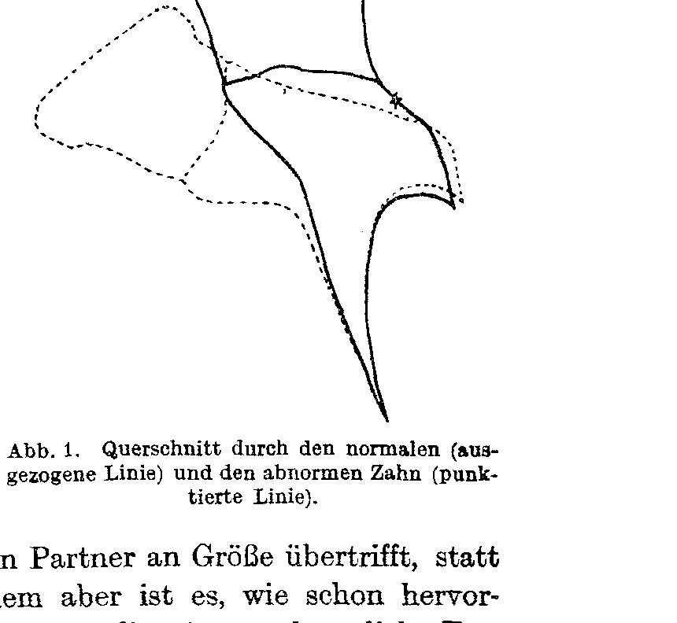
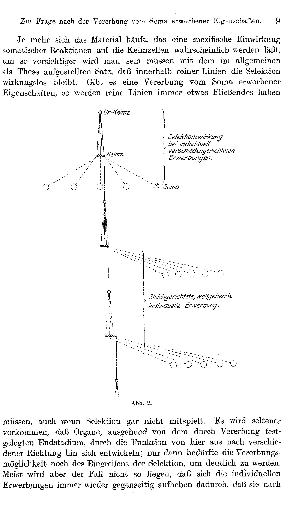
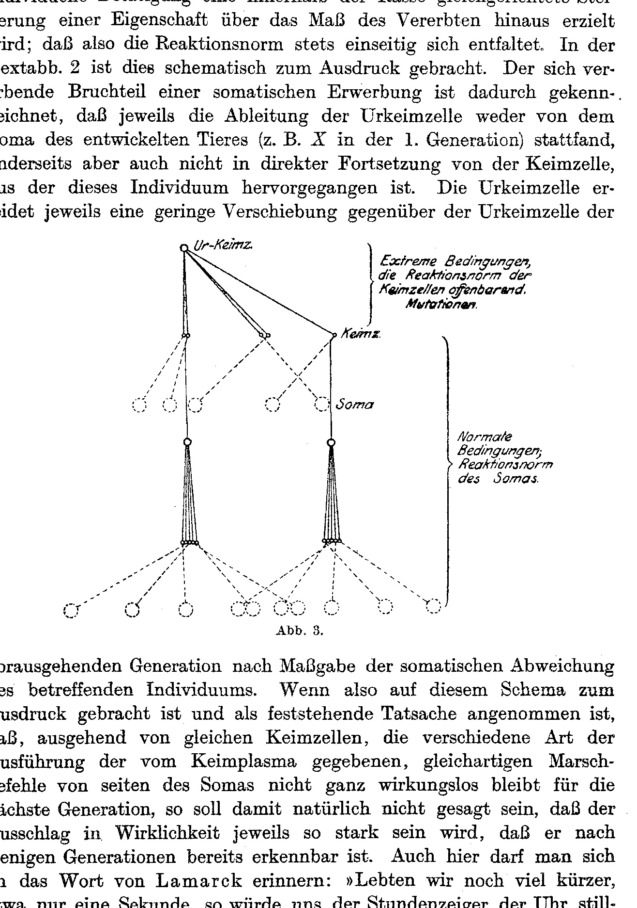
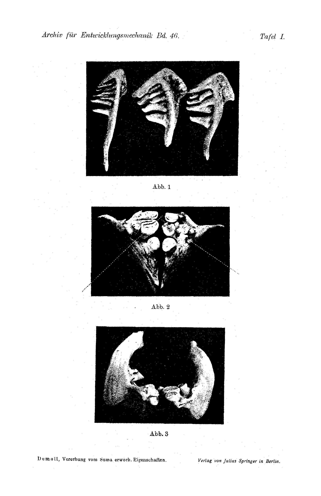

# On the Question of the Inheritance of Characters Acquired from the Soma

By

R. Demoll.

With Plate I and 3 text-figures.

*(Received on 14 April 1919.)*

*Archiv für Entwicklungsmechanik der Organismen*, vol. 46 (1920).

> **Full translation.** A complete English rendering of the running text of “On the Question of Inheritance from the Soma to the Germ-Plasm” (Demoll, 1920), including all tables, figure and plate legends, and footnotes. Numbers and table cells were transcribed from the page images, not the noisy OCR.

Since to this day facts have not been able to be brought forward from any quarter which, cutting off every objection, would demonstrate an inheritance of characters acquired by the soma, and since our position on this problem accordingly derives from the assessment of such cases as speak with greater or lesser probability for and against it, it is necessary at least to single out this kind of case, wherever it confronts us, in order finally, through the mass of probability-proofs, to gain more secure points of reference. In this respect two groups of facts have always seemed to me especially worthy of attention.

This is, in the first place, the inheritance of more complicated brain-functions that is to be ascertained (the song of birds, certain instinct-releasings); to this belong all those cases in which a constant relation of several sense-impressions and the correlates of perceptions resulting therefrom prove to be inherited. I had earlier already made experiments in this direction. The caterpillar and pupa of a hawk-moth were reared in the dark and thus prevented from gaining any spatial orientation, with the exception of an orientation in the tactile space, that is, in the tangible nearest surroundings. The hatched butterfly nevertheless showed itself, at the moment of taking flight, completely oriented and took every obstacle into account, flew around the objects in an ordered manner, dodged where it had to dodge, and thereby indicated that it not only judged distance correctly, but that its whole spatial orientation was altogether born ready-made in it.

From this point of view I was keenly interested in the results of the psychology that occupies itself with the mental development of the child. Here too one seems to come more and more to the result (Bühler, *Die geistige Entwicklung des Kindes*, 1918) that "to the child's first light- and touch-sensations — certain primary determinatenesses of place and of extension are likewise to be ascribed, just as one ascribes to them qualities and intensities". We further cite from this work also, from p. 62: "Unlikely, however, is it that the finest and most compelling motive for impressions of depth which we adults find in ourselves, namely the crosswise disparity of the retinal images of the two eyes, should owe its effect entirely to experience; there lies here probably an arrangement preformed in the structure of the visual substance, which only does not function at once, but requires the impulse from outside."

There speaks, furthermore, more and more in favour of the view that even the relative independence of the seeing of the size of an object from the corresponding little retinal image, and likewise the independence of the seeing of surface-colours from the intensity of illumination, does not rest upon experience, but that this manner of seeing represents something inherent, inherited, from the outset in the eye of the mammals and birds — only these have so far been examined in this respect by Köhler.

When Becher establishes that in ontogenesis complex form-stimuli release specific effects (skeleton-formation of the Holothuria [sea cucumbers]), then here too one will hardly be able to be satisfied by an explanation that does not rest upon the assumption of a capacity for the inheritance of individual experiences and acquisitions. On the other hand, it is precisely these occurrences that let the biological process underlying such an inheritance — that is, the specific influencing of the germ-plasm by the soma — appear somewhat more transparent.

The other group, which made an ever deeper impression on me in the assessment of the question of the inheritance of acquired characters, consists in the observations which show that alterations which were produced by function and can still at any time be produced again, such as the formation of calluses at definite places, are laid down in advance of the individual acquisition. This holds for the skin-thickenings on the heel in man (Semon 1912), in especially pronounced degree for the carpal calluses of the warthog (Leche 1902).

To an interesting case I was also made attentive by my colleague Stoß. In the boar the groove of the upper lip, in which the developed tusk of the lower jaw lies, is already laid down embryonally, before a mechanical action of the tusk is possible. With this goes hand in hand the formation of a stronger sebaceous-gland complement. Also "the early appearance of the movement-folds and -wrinkles" in pachyderms is to be mentioned here (K. Toldt 1919, p. 349).

Kükenthal found in 1897 that in the embryo of *Halicore dugong* [dugong] the cheek-teeth no longer bore simple cusps, but already showed distinct beginnings of the formation of a grinding-surface. Since he supposed that an act of chewing in intrauterine life may be ruled out, he believed he might see in this remodelling the inheritance of a functional effect. Even if here too objections are possible — and in which of the cases that are brought forward here would these not be possible, since this question even today is still not completely ripe for decision —, Kükenthal's interpretation gains in probability through an occasional observation that I was able to make on a pathologically formed pharyngeal bone of a carp.

The pharyngeal bones of the white-fish [cyprinids] (Plate I, Fig. 1) are provided with pointed teeth, which work both against a chitin-plate lying dorsally in the roof of the pharynx and against one another (on Plate I, Fig. 1 only the pharyngeal bone of one side is depicted in each case). In the carp-like fishes, thus in the carp, in the crucian carp, and somewhat less pronouncedly in the tench, the pharyngeal teeth have become broad grinding-teeth (Fig. 2 and 3), which no longer work against one another, but only against the chewing-plate.

One has hitherto without further ado assumed that this remodelling of the teeth is in each case conditioned anew in the individual life by the function. A malformation, which expressed itself in the fact that on one side the strongest of the chewing-teeth showed an abnormal attachment, let me recognize that here for the most part an inherited occurrence is present. For the assessment of the state of affairs it is necessary to know that a tooth-replacement does not take place in these forms, whereas in the other white-fish such a one must indeed be assumed. (Arcangeli, in: *Rivista mensile di Pesca*, 1910, Vol. XII.)

On Fig. 2 it is to be seen how the strongest tooth of the inner row on the right side of the picture does not stand upward, but, hanging downward, is pushed down beneath its neighbour. That thereby a participation in the act of chewing is excluded follows further also from Fig. 3, which lets it be recognized that in the normal state the crown of the two hinder teeth (— on the figure, which is taken from behind, the two foremost —) of the middle row, together with those of the single teeth that lie outward, represent a curved plane which conforms to the vaulting of the chewing-plate. One might have been allowed to expect that the abnormally attached tooth, which steps with its crown completely out of the plane, would show a formation of chewing-surfaces just as little as the two dome-shaped foremost teeth of the middle row, which do not participate in the act of chewing (but which perhaps did participate in it in earlier generations).

Before one draws from this the conclusion that the formation of a chewing-surface in these teeth is already inherited, one has still to examine whether the development was possible in such a way that the tooth had originally sat normally, in the process acquired its chewing-surface through function, but then was rotated out of the chewing-plane through secondary growth. That such a torsion may be excluded with sufficient certainty results when one subjects the attachment of the tooth and the whole bone-portion to a more exact consideration. In Text-figure 1 I have given a picture which one obtains when one lays a cross-section through the abnormal (dotted line) and the corresponding normal tooth (solid line) in a plane which is indicated in Plate I, Fig. 2 by a red stroke. The two figures which are here obtained are laid one upon the other in Text-figure 1 in a manner that permits as easy a comparison as possible.

One recognizes now that from the normal stage, through proliferation of the bone-tissue at about the place marked X, one can never arrive at this unusual position. As an abnormality the tooth itself proves to be in so far as it is essentially shorter than the normally ground-down tooth. In this it is to be taken into account that the abnormal tooth would still be essentially more shortened, if it had been used. As is to be seen from Plate I, Fig. 2 and 3, the chewing-surface is indeed distinctly pronounced, yet, as is recognizable especially at the edge, not formed to the degree as in the other teeth. Had this tooth earlier been in a normal position, in the process participated in the work of chewing, and had then, after being rotated downward, its chewing-surface "grown back" somewhat again,

**Abb. 1.** Cross-section through the normal (solid line) and the abnormal tooth (dotted line). *(figure not reproduced)*

then one would have to expect that it would surpass its partner in size, instead of remaining behind it. Above all, however, it is, as already emphasized, the whole formation of the bone that lets a subsequent torsion under the hinder tooth not appear possible. Besides, the tooth in this movement would have had to carry out a complicated rotation around its hinder neighbour, in order finally to come beneath it. Also it would be at least somewhat strange that by this secondary bone-movement all the remaining teeth of the pharyngeal bone are not in the least affected. They stand in a completely normal position. Finally, the tooth is not already excluded from the chewing-function at the very moment in which the rotating-away begins. While the front edge of the crown (front with respect to the direction of movement) sank, the hinder edge had to rise, and accordingly a complete rounding-off of this edge would have had to take place [must have had to take place]. The chewing-surface would have had to push itself over the edge as far as onto the side-wall of the tooth with progressing rotation. We may therefore here assume that the abnormal tooth was from the beginning in this abnormal position, that it accordingly never could participate in the act of chewing, and that therefore the grinding-down of the pharyngeal teeth into grinding-teeth in the carp and crucian carp does not represent an individual acquisition of each animal, but that it is inherited.

To what extent now an inheritance of individual acquisitions may be assumed from this may be left to the assessment of the individual.

If one wishes here to seek the explanation in a suddenly appearing mutation, then one has to bear in mind that an indication of this chewing-surface-formation is already present in the *Abramis* species [breams]; that it becomes stronger in the tench and in the crucian carp, and in the carp finally reaches its maximum. One would thus have to call to aid an orthogenetically advancing mutation. One would have, further, to come to terms with the fact that the chewing-surfaces originally developed on the side-surfaces of the teeth, but then (in tench, crucian carp, and carp) were formed crosswise to the tooth, thus forming a grinding-tooth. The explanation remains in the same way forced, whether one assumes that the mutation always appears where it became necessary, or one inclines to see in the mutation the primary thing, to which the behaviour of the animal in other respects then adapted itself. In any case it seems to me myself very much more probable and less forced to assume that the inherited thing is a consequence of individual acquisitions. Not in the whole extent are these acquisitions already inherited; the chewing-surface of the tooth shows distinctly a lesser degree of grinding-down than that of its counterpart. Thus I assume, then, that the formation of grinding-teeth in the carp has for the most part already fixed itself hereditarily through the action of the remodellings acquired in each case in the individual life, but that this process even today still runs on further in such a way that the function of the tooth brings about a more distinct pronouncing of the characters that characterize it.¹

> ¹ In the local collection of Mrs. Prof. Plehn there is a carp with completely closed mouth-opening. The pharyngeal teeth of this animal were ground down in the normal manner. From this one may not draw any conclusion; only an opposite finding could have been made use of. For even though the mouth-cleft was closed, the animal nevertheless nourished itself by means of the organisms passing the gills from outside inward with the respiratory water, and even though the nourishment consisted only of the smallest living creatures and detritus, chewing-movements may yet here have constantly played a part.

The more the material accumulates that lets a specific action of somatic reactions upon the germ-cells become probable, the more cautious one will have to be with the proposition, set up in general as a thesis, that within pure lines selection remains without effect. If there is an inheritance of characters acquired from the soma, then pure lines will always have something fluid about them,

**Abb. 2.** *(figure not reproduced)*
Labels: "Ur-Keimz." [primal germ-cell]; "Keimz." [germ-cell]; "Soma". — "Selektionswirkung bei individuell verschiedengerichteten Erwerbungen." [Selection-effect in individually differently-directed acquisitions.] — "Gleichgerichtete, weitgehende individuelle Erwerbung." [Like-directed, far-reaching individual acquisition.]

they must, even when selection does not play a part at all. It will more rarely occur that organs, starting out from the end-stage fixed by inheritance, develop through the function from here onward in different directions; only then would the inheritance-possibility still need the intervention of selection in order to become distinct. Mostly, however, the case will not be such that the individual acquisitions always cancel one another out again reciprocally by the fact that they tend in opposite directions. The rule is that through individual activity an increase of a character, like-directed within the race, beyond the measure of the inherited, is attained; that thus the reaction-norm always unfolds itself one-sidedly. In Text-figure 2 this is brought to expression schematically. The inheriting fraction of a somatic acquisition is characterized by the fact that in each case the derivation of the primal germ-cell took place neither from the soma of the developed animal (e.g. X in the 1st generation), nor, on the other hand, in direct continuation from the germ-cell out of which this individual proceeded. The primal germ-cell undergoes in each case a slight displacement with respect to the primal germ-cell of the

**Abb. 3.** *(figure not reproduced)*
Labels: "Ur-Keimz." [primal germ-cell]; "Keimz." [germ-cell]; "Soma". — "Extreme Bedingungen, die Reaktionsnorm der Keimzellen offenbarend. Mutationen." [Extreme conditions, revealing the reaction-norm of the germ-cells. Mutations.] — "Normale Bedingungen, Reaktionsnorm des Somas." [Normal conditions, reaction-norm of the soma.]

preceding generation in accordance with the somatic deviation of the individual in question. When, therefore, on this schema it is brought to expression and assumed as an established fact that, starting out from identical germ-cells, the different manner of execution of the like-kinded marching-orders given by the germ-plasm does not, on the part of the soma, remain entirely without effect for the next generation, then with this it is naturally not meant to be said that the deflection in reality will in each case be so strong that it is already recognizable after a few generations. Here too one may recall the saying of Lamarck: "Did we live very much more briefly, say only a second, then the hour-hand of the clock would seem to us to stand still, and even the combined observations of 30 generations would bring out nothing decisive about the movement of this hand, and yet it did move."

In Text-figure 3, finally, it is also shown that this schema lends itself quite well also to making clear, for the lecture for students, the difference between fluctuations and mutations, or, as one could bring out the matter still more sharply, between somations and germinations.

---

### Explanation of the Plate.

**Plate I.**

Abb. 1. Pharyngeal bones of various white-fish.

Abb. 2 and 3. Whole pharyngeal bone of a carp with abnormal positioning of the largest tooth. Abb. 2 seen from above, Abb. 3 seen from behind.

**Plate I.** *(figure not reproduced)*

*Archiv für Entwicklungsmechanik, Vol. 46.*    Plate I.

Abb. 1.

Abb. 2.

Abb. 3.

Demoll, *Vererbung vom Soma erworb. Eigenschaften.*    Verlag von Julius Springer in Berlin.

## Figures

**Fig. 1.**

**Fig. 2.**

**Fig. 3.**

**Plate I.**

---

*Translator's note.* One of the Biologische Versuchsanstalt (Vienna Vivarium) papers flagged on the project site as a modern rediscovery target. Claims are rendered as stated in the original, not endorsed.
