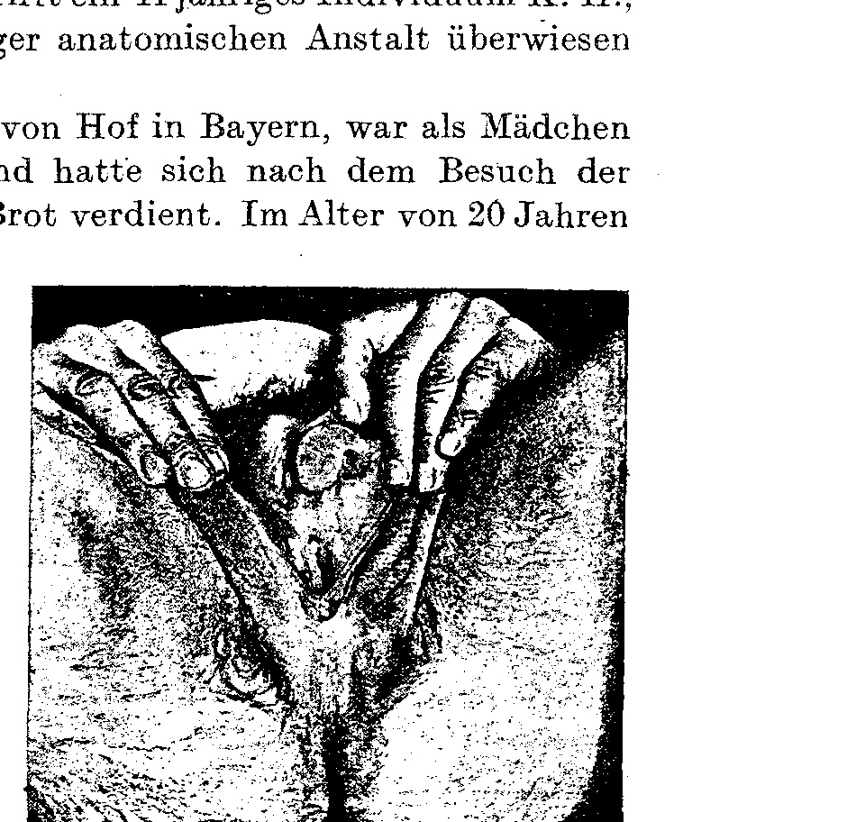
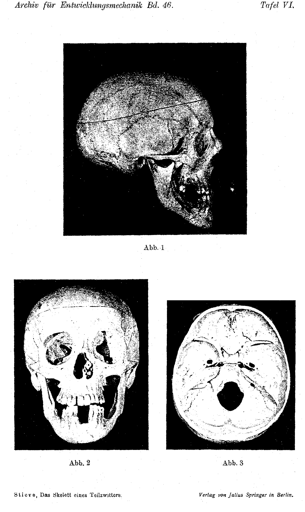
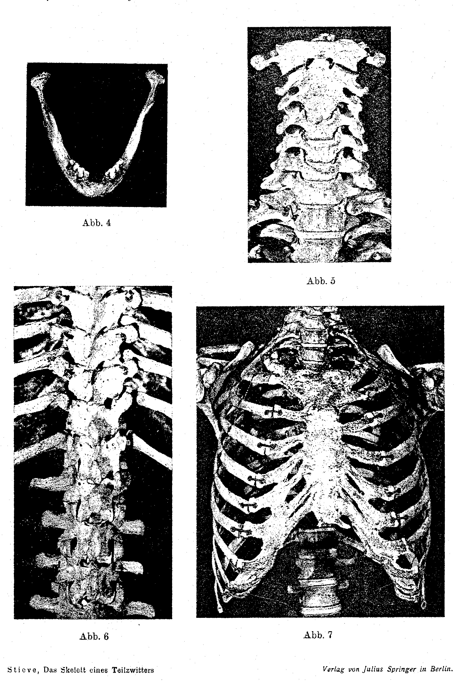
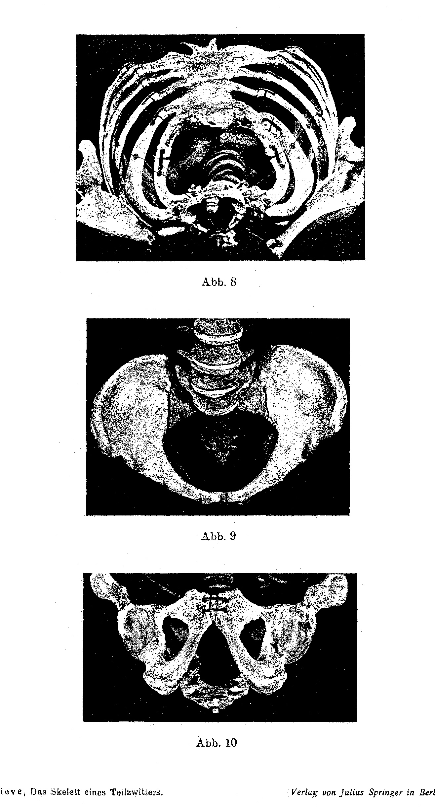

# The Skeleton of a Partial Hermaphrodite.

By

H. Stieve (Leipzig).

With Plates VI to VIII and 1 text-figure.

*(Received on 2 May 1919.)*

*Archiv für Entwicklungsmechanik der Organismen*, vol. 46 (1920).

> **Full translation.** A complete English rendering of the running text of “The Skeleton of a Partial Hermaphrodite” (Stieve, 1920), including all tables, figure and plate legends, and footnotes. Numbers and table cells were transcribed from the page images, not the noisy OCR.

### Contents Overview.

| | Page |
|---|---|
| Introduction | 38 |
| Description of the Case | 45 |
| The Skeleton | 51 |
| The Skull | 52 |
| The Trunk Skeleton | 58 |
| The Pelvis | 70 |
| The Extremities | 72 |
| Summary | 77 |
| Works Cited | 82 |
| Explanation of the Figures | 84 |

## Introduction.

The results of numerous investigations and experiments, carried out chiefly in recent decades, have clearly proven that the germ glands [gonads], alongside their principal task, the production of germ cells, possess as a secondary task the secretion of form-shaping substances, which on the one hand bring about the development of the phenomena usually grouped together under the designation secondary sexual characters, and on the other hand exert an influence, lying outside the sexual sphere, that regulates the entire bodily growth. The presence of the female germ gland brings about, in the first place, the strong development of the organs necessary for the care of the brood, and moreover causes the organism to remain at a developmental stage corresponding more to childlike forms, whereas the male gland allows more of those characters to come to development which are of advantage in the selection of the female and especially in the struggle with rivals.

According to the usage originally introduced by Hunter (1780), one formerly designated by the expression secondary sexual characters only those bodily characters peculiar to the sexes which stand in no direct relation to the act of generation itself, and distinguished accordingly primary and secondary sexual organs. More recent investigations have now shown that such a division is unfeasible and that the actually existing relationships far exceed it, so that Poll (1909) proposes to regard the germ glands alone as the *Differentia sexualis essentialis sive germinalis*, the sexual germ cells, in which the two sexes diverge from one another, to set over against the *Differentia sexualis accidentalis*, this being the totality of the consequences of the presence of the one or the other germ gland.

The degree of development of the individual characters by which the two sexes are distinguished is, just like their number, subject to wide variations; for example, there are quite a few animal classes [Tierklasse], indeed quite a few species, in which very essential sexual-character differences exist alongside those in which the accidental sexual differences are singly and solely confined to the conducting passages, the copulatory and brood-care organs.

But it is precisely in the vertebrates, and chiefly in the class of mammals, that the proof can be furnished unobjectionably that all characters, or at least a great part of them, by which the two sexes are distinguished, really are bound to the presence of the relevant germ gland; in the lower animals, in particular as the investigations of Meisenheimer (1909) on insects teach, all the properties belonging to one sex develop even after removal of the germ glands, indeed allow themselves to be influenced just as little by implantation of the oppositely sexed gonad; the individual remains in its original direction, and thus here shows a more or less complete independence from the incretory [internal-secretory] activity of the germ glands.

Yet even in the higher animals we cannot decide with certainty whether the development of the accidental sexual-character distinctions, in particular of those which appear in the first periods of embryonic life, is bound to the presence of the same-sexed germ gland, or, as Poll teaches, is conditioned by its function. In the first place, the characters designated by Poll as genital and subsidiary are for the most part developed, that is, in the first place the *Genitalia subsidiariae internae* [internal subsidiary genitalia], the conducting passages and the accessory glands, then also a part of the *Genitalia subsidiaria sive externa* [subsidiary or external genitalia], namely the copulatory organs, but in addition characters which are originally laid down for both sexes and which experience a definite directed development during and after puberty and thereby move away from the sexual type of the relevant species. With these latter characters, the dependence on the presence of the germ glands has been proven beyond doubt; through removal of the gonads their formation can be prevented, and through implantation of the oppositely sexed gland it can even be guided into a direction opposite to the original disposition.

With the accidental sexual characters, whose more or less pronounced differentiation already takes place during embryonic life, the proof of their dependence has hitherto not succeeded, perhaps only for the reason that the removal of the germ gland has so far not yet succeeded — in the animal species in question only the differentiation of the germ-conducting passages and the germ-conducting organs of the gonads can be removed, and in this manner their influence eliminated — but perhaps also for the reason that in the higher living beings, just as in insects, the disposition of every individual is in a certain respect neither asexual nor bisexual, but rather one predetermined, even without the influence of the germ glands, in the one or the other direction.

According to the temporal sequence of the developmental processes, a dependence of all accidental sexual characters on the essential ones is possible; the development of the conducting passages, the formation of the sexual organs in the manner peculiar to the relevant sex, indeed takes place only after that which is peculiar to the relevant sex ... [it] may have been influenced in advance by the primordial germ cells. Such an assumption, however, bears, so to speak, the character of the purely hypothetical in itself, inasmuch as it cannot be proven by corresponding experiments. Unfortunately, however, such experiments are at present, singly and solely for purely technical reasons, impossible, and we must therefore reckon on other means of proof.

In all higher animals, and likewise still all too seldom in humans, there comes to observation, as is well known, a particular kind of malformation which exclusively concerns the genital organs and is designated as hermaphroditism. It is characterized by the fact that in an individual, whose other organs throughout — at least on the whole — show normal structure and ordinary function, singly and solely the genital organs in their formation let no uniformity be recognized, but rather present mixed forms, that is, partly correspond more to the one sex, partly more to the other sex. Various kinds of the malformation can be distinguished, namely in that, with completely normal structure and normal function of the germ glands, only those accidental sexual characters can show the developmental degree peculiar to the other sex whose definitely directed development first becomes manifest after puberty, that is, in late extrauterine life. Or else there can, with likewise normal function of the gonads, take place a development of those characters in the manner characteristic of the other sex whose formation already occurs in embryonic life, and finally the gonads of an individual can bring forth differently sexed germ cells.

This last occurrence, which decidedly represents the highest possible degree of bisexual development of a single being, is the rule in a whole series of lower animals and especially in very many plants, and it has been set over against, as *Hermaphroditismus verus*, all those other cases in which the organism is indeed only capable of bringing forth one kind of germ cell, but yet shows accidental characters which are otherwise bound to the presence of the oppositely sexed germ glands. Beings which exhibit the latter formations are designated as pseudohermaphrodites.

Neugebauer (1908) will, to be sure, acknowledge as a true hermaphrodite only such an individual as can both impregnate another and be impregnated by another, or respectively is able to impregnate itself. This definition, which takes chiefly the physiological, less the morphological, relationships into account, applies only to those animals and plants in which hermaphroditism represents a physiological occurrence, but not to the admittedly far rarer cases in which, in an individual of a normally separately sexed species, characters of both sexes can be demonstrated. With regard to the latter possibility, we must, under the concept of *Hermaphroditismus verus*, without any consideration of the constitution of the accidental sexual characters, group together all those individuals which possess the capacity for the production of male and female gametes.

In more recent times, Steinach (1917) has attempted, supported on the results of his germ-gland transplantations, to furnish the proof that a fundamental distinction between *Hermaphroditismus verus* and *spurius* does not exist at all, that both are merely the consequence of an abnormal function of the gonad-intercells and thus represent only a gradual, not a fundamental, distinction. The final proof of his assertion Steinach, however, remains owing, for his furnished experiments show only that, in the presence of two differently sexed germ glands in one organism, the effect of both comes to bear, in that now more the male, now more the female accidental sexual characters predominate; it could not, however, be shown — and that is what would matter in the first place — that the origin of the germ cells really is dependent on the function of the interstitial cells. So long as such a proof does not succeed, a strict separation of the hitherto distinguished kinds of hermaphroditism is, however, quite well admissible; only one would do better, instead of the hitherto customary designations, to apply the expressions *Hermaphroditismus completus* or complete hermaphrodite to all those forms in which both kinds of germ cell are brought forth by one organism, that is, to the cases hitherto designated as *Hermaphroditismus verus*, whereas to all those in which, with the presence of one germ gland which brings forth only one kind of germ cell, the rest of the organism shows characters which otherwise belong only to the other sex, [one would apply] *Hermaphroditismus incompletus* or partial hermaphrodite. Through such a naming, account would also be taken of the possibility that, with both forms, the matter is one of merely gradual distinctions.

If it should really prove true that all accidental sexual characters represent only the manifestation of an incretory activity of the gonads, then, with *Hermaphroditismus incompletus*, the matter would be a disturbance of precisely this function, whereas, with *Hermaphroditismus completus*, it would be a double function of the generative share, respectively the union of two differently sexed generative shares in one individual, whether in a single hermaphrodite gland or in two differently sexed gonads. The partial hermaphrodite thereby always bears the character of the monstrous in itself, since the formation of contrary-sexed characters, combined with the capacity to bring forth only one kind of germ cell, [can never...]; with the complete hermaphrodite, however, the matter is the abnormal appearance of a physiological phenomenon occurring in many [forms], which in and for itself represents an advantage in the struggle for existence, since it makes possible, even for the single individual, the production of offspring, and only in this concrete case possesses teratological character, because it precisely does not correspond to the norm valid for the relevant species.

A similar conception have Tandler and Grosz (1913) given expression to. Setting out from the fact that the gonads consist of a generative and an inner-secretory share, they assume that one may designate malformations in the sense of the coincidence of heterosexual generative shares as *Hermaphroditismus verus*, whereas malformations which affect merely the inner-secretory share [may be designated] as pseudohermaphroditism.¹)

In humans and in all higher vertebrates, cases of *Hermaphroditismus completus* are an extremely rare occurrence; cases of *Hermaphroditismus incompletus*, on the other hand, come to observation very frequently. With the latter we can distinguish the two kinds established above, namely those in which the embryonic development of the accidental sexual characters proceeds in normal paths, whereas during and after puberty oppositely sexed characters come to formation, and those in which already considerable disturbances in the embryonic development of the genital organs are to be ascertained. In the first case the matter is doubtless one of a disturbance of the incretory activity of the germ glands; in the second case such a one can often be demonstrated only with difficulty, since frequently, in spite of the disturbances in the embryonic development, the formation of the sexual characters at puberty proceeds, or at least seems to proceed, exactly in the direction which belongs to the present germ gland.

In a very detailed treatise on the secondary sexual characters, Halban (1903) has now attempted to set forth that, even in higher animals, the origin of the accidental sexual characters is completely independent of the presence of the one or the other germ gland, this latter being rather, as moreover Herbst (1901) had already assumed, singly and solely necessary for their complete normal formation. For lack of corresponding evidential material, we are today by no means in a position to verify the correctness of this view; if, however, we wish to take it as a basis for the assessment of hermaphroditism, then we could distinguish such cases as possess bisexual gonads with

> ¹) The question of the localization of the two germ-gland shares is to be left out of consideration here, since the investigations published here do not appear suited to contribute to its clarification. As I have, however, already set forth earlier (1919), I hold the localization of the incretory gonad activity in the interstitial cells, assumed by Tandler and Grosz and especially by Steinach, to be by no means proven, since it has so far never succeeded, through any experiment, to separate the Leydig cells really completely from the generative share. On the contrary, I am — chiefly on the ground of the fact that the interstitial cells represent a tissue type peculiar exclusively to the higher animal species, but are absent in the lower animals, even such as have very strongly developed sexual distinctions — of the view that to the germ cells themselves, alongside the generative, also the incretory activity belongs.

or without more or less complete development, corresponding to the other sex, of the sexual characters laid down in embryonic life, as teratological occurrences for which every explanation is lacking, in contrast to all other cases of hermaphroditism, which are caused by a disturbance in the protective effect of the germ glands, appearing only during and after the time of puberty.

But however this may be, the results of all investigations into pathological hermaphrodite-formation teach clearly that almost always, alongside the congenital malformations at the genitalia, disturbances in the incretory activity of the gonads are also demonstrable, which then lead to a differently sexed formation of the characters becoming manifest during the time of puberty. In almost all cases of hermaphroditism we are thus justified in speaking of a dysfunction of the germ glands.

As is well known, however, the incretory activity of the gonads makes itself felt not only in the development of phenomena belonging to the realm of the sexual sphere, but it also influences the generally biological developmental processes of the organism, thus in the first place bodily maturity, which can be delayed by removal of the gonads, indeed even more or less entirely prevented. On the other hand, the early extraordinarily strong development of the sexual glands draws after it changes in the soma, which one quite generally designates as pathological early ripeness. The two influences last mentioned make themselves noticeable in the first place in the formation of the skeleton, in which early castration, at least in the male sex, leads to abnormal length-growth of the extremities and to more or less complete prevention of the epiphyseal ossification, whereas pathological early ripeness has as a consequence a premature ossification of the epiphyseal discs and thereby an early termination of growth. But even after puberty the influence of the germ glands on the skeleton still makes itself felt, thus in the first place with women during pregnancy. I recall only the pregnancy osteophytes, and in addition the enlargement of the lower jaw nearly always demonstrable during gravidity, which is conditioned by a spreading-apart of the teeth. This latter phenomenon could, however, also be conditioned by the activity of the hypophysis, whose altered function expresses itself clearly enough at the extremities — but not the strongly accelerated growth of youthful pregnant women, to which Halban (1903) in the first place draws attention. Finally, the dependence of the skeletal system on the ovaries becomes especially evident in osteomalacia.

Taking all these viewpoints into account, it appears desirable to direct the attention of researchers more strongly toward the skeleton of hermaphrodites, and to examine it with regard to the manifestations of the premature or delayed onset of puberty, or to other signs of abnormal sex-gland function. Remarkably, this has hitherto scarcely been done. In the relatively abundant pertinent literature there is found, apart from scattered notes on the pelvic measurements and on especially conspicuous malformations of the skeletal system, only a single comprehensive description of a hermaphrodite skeleton (Waldeyer 1913).

### Description of the case.

The case investigated here concerns a 41-year-old individual K. H., who in August 1918 was transferred to the Leipzig anatomical institute.

H. came from the region around Hof in Bavaria, had been baptized and reared as a girl, and after leaving school had at first earned his bread as a cook. At the age of 20 years he registered as a cook at a district lunatic asylum and had on this occasion to undergo an official medical examination. Thereby it was established that one was dealing with a male being. There was thus present here one of the many cases of error de sexe, such as occur extremely frequently in male partial-hermaphrodites whose external genitalia show more female forms. It appears noteworthy in this connection that at the age of 20 years there was as yet no beard growth, a fact which allows one to conclude on the absence of the male sex glands.

Other cases of hermaphroditism or of other malformations are said not to have occurred in the family. H. later learned the trade of stonemason, but was always very little capable of work and tired easily. He occupied himself much with the reading of natural-scientific treatises, allowed himself to be exhibited in clinics and anatomical institutes for money, and sold picture postcards on which his malformation could be recognized (text-figure). According to his own statements

 he felt himself, after the onset of sexual maturity, that is from the beginning of his twenties on, to be a man, but always had the endeavor to wear women's clothing, a circumstance which gave him himself food for thought and allegedly took away any joy in life. Any sexual inclinations in the one or the other direction he never possessed. To be sure, these latter statements come for the most part from H. himself and are therefore to be accepted with the greatest caution. For H. understood how to draw capital from his malformation and was fond of telling lurid tales of remarkable situations into which he had got on account of his abnormal bodily structure.

In the last years of his life, allegedly at the beginning of his thirties, H. became hoarse, speaking caused him difficulties, and he also suffered from chronic constipation, just as from youth on he had always had great trouble with the evacuation of the stool. Finally, toward the end, he succumbed to an intestinal occlusion. The clinical diagnosis read: intestinal occlusion. During his stay in the penitentiary H. was conspicuous through his repeated, female behavior at the consultation hours, likewise through his complaint about an extremely slight capacity for work.¹)

Unfortunately, owing to the bad transport conditions, the corpse arrived at the local anatomical institute only after a five-day rail journey, and found itself in a strongly advanced state of decay, so that finer histological findings, especially at the brain, could no longer be obtained.

The total length of the corpse amounts to 163 cm, the nutritional state is good, the musculature somewhat weakly developed, the fat deposit abundant. Conspicuous are the strong fat accumulations in the region of the lower abdomen, the hips, and the neck, which lend the whole corpse a female stamp, although the breast is flat and broad without any development of the mammary glands. The body hairiness is completely male; the head hair is very dense and abundant, the facial skin shows vigorous beard growth. The hairiness of the pubic mound extends in the midline up to the navel; the skin of the whole abdomen and of the breast is likewise hairy. To be sure, the hairiness in the genital region itself is sparse; it extends, however, onto the perineal region and over the inner side of the thighs. The nipples are small, unpigmented; the mammary glands show, macroscopically and microscopically, a degree of development corresponding to the male sex.

> ¹ The latter statements I owe for the most part to the management of the penal institution in Bauton, to whose director I here express my most obliging thanks for his kindness toward me.

In the region of the Anulus inguinalis subcutaneus dexter there is found a walnut-sized swelling situated there; immediately above the inguinal ligament the right spermatic cord is at many places knottily thickened, the individual thickenings possessing pea- to walnut-size.

The penis is 5 cm long, 3.2 cm broad and 4 cm thick, the glans is bared after pulling back the foreskin. At the underside the whole bulbus urethrae is completely split, likewise the scrotum. This consists of two completely separated sacs; the testicles, lying in the usual place, show no particularity in their form; the well-developed left side encloses the hairiness and the pigment. At the continuation of the groove lying in the perineal region there are found on both sides two small, about 3 mm long ridges, which form between themselves a developed labium-like structure; at the underside of the penis they are connected with one another by the two skin folds representing the scrotum. At the underside of the penis they lead, moreover, into the deep crypts; the urethra is provided with a groove which is passable for two fingers.

Immediately behind the outer urethral orifice there is found, separated from it by an about 10 mm strong soft-tissue bridge and indeed lying within the sinus urogenitalis, a further opening, whose edges are at places slightly knottily thickened and on the whole project somewhat in a bulging manner; it is narrower than the urethral opening and is passable for one finger. On probing, one passes through it into a canal leading backward and upward, which after a course of 15 cm appears to be completely closed.

An opening of not unfavorable form is, at the place of its physiological occurrence, the skin of the perineum; a slight groove-formation, by which the whole surrounding region appears apple-like hairy, though more slightly pigmented, lets one recognize already on macroscopic inspection very large sebaceous glands at the outlets.

On preparation of the pelvic-inlet tissue from the abdominal cavity outward, it appears at first that a peritoneum reaches over from the moderately filled urinary bladder very high onto the rectum; the cavum vesico-rectale is accordingly very wide.

The urinary bladder is very wide, its wall thin, with extremely slightly developed musculature. The mucous membrane is smooth, all folds are well effaceable; the region of the trigonum is distinguished only by the stronger injection. The mucous membrane of the about 20 mm long urethra lies in folds, which as longitudinally placed combs up to 3 mm long project distinctly toward the lumen, and is discolored grayish-blue. The urethra itself is very wide; a colliculus seminalis is not to be recognized, likewise no uterus masculinus; on the other hand there are found on the wall lying against the rectum two longitudinally running rows of fine openings, which have a diameter of 2 mm, the outlet places of the ductuli prostatici and ejaculatorii.

The prostate consists of two almond-shaped lobes of approximately 30 mm length, 20 mm breadth and up to 0.7 mm thickness, which lie on both sides of the urethra more toward the rectum and stand in no connection with one another. Histologically they show usual behavior; the extremely slight development of the glandular portion is striking. The Cowper's glands show usual structure and size.

The right seminal vesicle is 60 mm long, club-shaped, at the broadest place 18 mm broad; the left one represents a more tube-shaped structure of 65 mm length and in its greater extension 13 mm breadth. Both are situated in the loose connective tissue between rectum and bladder and show in the histological picture usual behavior, their lumen being tightly filled with secretion. The vasa deferentia likewise show usual behavior; in the course of the right spermatic cord there are found numerous tumors up to walnut-size, which the histological investigation reveals to be lipomas.

The right testicle is 45 mm long and 28 mm broad, and shows, like the epididymis, no kind of particularities. The tubuli contorti are well countable. On sections, which were prepared through the most varied regions of both testicles, there are found everywhere quite normal histological pictures. The stages of spermatogenesis are to be recognized; abundant ripe spermatozoa are present in the testicle as well as in the epididymis; the development of the semen takes place in the usual manner and has, remarkably, not come to a standstill even through the illness. The diameter of the testicular tubules amounts to 200—250 µ, corresponds thus to that of a testicle at the height of sexual function. The intermediate substance too shows normal behavior; the interstitial cells lie mostly in groups of 3—7 together and show no kind of particularities in their structure. The mutual quantitative ratio of the two testicular components is thus the usual one.

The rectum lies immediately in front of the promontorium at the usual place, but in the lesser pelvis it runs strongly forward, separated from the sacrum by a thick layer of loose connective tissue, and opens immediately behind the urethral orifice in the opening described above within the sinus urogenitalis, approximately at the place where in the woman the vaginal opening is situated. The musculature of the rectum is extraordinarily strongly developed, its lumen very narrow, especially in the region of the anus and of its transition place into the colon sigmoideum. This itself is extraordinarily long, its two limbs measuring again about 60 cm and indeed enormously widened, their diameter amounting to up to 18 cm. The whole sigmoideum is tightly filled with partly stone-hard fecal masses. Through a torsion of the sigmoideum, whose loop is completely displaced upward, a strangulation has taken place at the boundary between sigmoideum and rectum, which led to the complete occlusion of the bowel and thereby occasioned the death of the individual. But even after the undoing of the torsion the bowel is still very narrow at the transition place from the sigmoideum into the rectum, scarcely passable for a lead pencil. It is therefore difficult to decide whether this congenital narrowing, which during the whole life caused great trouble in the evacuation of the stool, was not in and of itself already the cause of the intestinal occlusion.

It is thus a matter of a true hypospadias, combined with an atresia ani cum fistula scrotali in the presence of male sex glands, which, in so far as this can be concluded from the histological behavior, show completely normal behavior. Outwardly the perineal region offers more the appearance of a female pudendum with strongly enlarged clitoris and, to be sure, very large labia. To what extent we are justified in speaking here of hermaphroditism shall be discussed only in the general part.

The further dissection of the corpse yielded no kind of particularities, and therefore in the following only those organs shall be described at which in normal individuals external differences are to be recognized. I should also like to remark that the two suprarenal glands were large, a finding which is frequently raised in hermaphrodites; the far-advanced decomposition, however, made the histological investigation worthless.

The thymus was at the time at the degree of involution corresponding to the age.

The thyroid gland is small, its weight amounting after alcohol fixation to 21 grams¹). The right lobe is 55 mm long, 23 mm broad, the left 53 mm long and 21 mm broad, the isthmus is 25 mm broad and 8 mm thick. On the whole the thyroid can be designated as small; the very slight weight must, however, in part be attributed to the alcohol fixation. The tissue shows macroscopically and microscopically no particularities. The parathyroid corpuscles are of usual structure and usual size.

> ¹ According to Vierordt (1906) the normal thyroid possesses a weight of 42 grams and the following measurements: lateral lobes 54—68 mm long, 27—31 mm broad, isthmus 18 mm broad, 9 mm thick.

The larynx is small; the prominentia laryngea, that is the angle scarcely to be recognized, projects however rather strongly; the angle at which the two plates of the thyroid cartilage abut one another amounts to about 70 degrees. The incisura laryngea amounts, of the height of the thyroid cartilage, to 17.5 mm; the greatest height of the thyroid cartilage plate amounts to 27 mm, its breadth, measured from the deepest place of the incisura laryngea to the posterior margin, 37 mm. The upper horn is long and rather thick; the thyroid cartilage plate is for the most part calcified.

The plate of the cricoid cartilage too shows numerous calcium deposits; the cricoid cartilage itself is of longitudinally oval shape; the height of the anterior arch amounts in the midline to 10 mm, the height of the plate to 24 mm; this latter is thus extraordinarily high. The laryngeal forms show no kind of particularities; the greatest transverse diameter at the height of the upper margin of the cricoid cartilage amounts to 16 mm, the length of the vocal cords 18 mm. This latter is thus very slight, for it amounts normally in the man to 20—25 mm, in the woman to 16—20 mm; corresponds thus here, in contrast to the rest of the form of the larynx, to the behavior in the woman. In connection with this disproportion may stand the hoarseness that existed during life, for which otherwise no kind of grounds are to be found, for the mucous membrane is everywhere smooth and completely intact; the surface of the vocal and ventricular cords too is smooth and without any pathological finding. On the whole the larynx shows just the form of a rather small male larynx.

The hyoid bone has a length of 40 mm; the distance of the tips of the greater horns amounts to 35 mm, the distance of the very weakly developed lesser horns 23 mm.

The brain shows, in so far as this could be recognized in the far-advanced putrefaction, no kind of pathological finding. The cerebral convolutions are everywhere well developed, the ventricles in the usual place, the ventricles are not dilated. On the whole the brain is very small. The mass of the cerebellum, in which likewise no kind of particularities can be demonstrated, is in proportion to the cerebrum very considerable. The hypophysis is large; unfortunately the decomposition has advanced so far in it that no kind of details can be recognized in the histological picture. The dura mater is, at the places of the granulations still to be discussed in more detail in the description of the skull, very firmly grown together with the bone.

### The Skeleton.

The skeleton was macerated and assembled in the usual manner; at its examination, the asymmetries to be discussed in more detail further below most strike one. The measurements are the following:¹)

| | |
|---|---|
| Whole length of the skeleton from the vertex to the sole of the foot | 161.0 cm |
| Lower-length up to the upper edge of the symphysis | 82.5 » |
| Upper-length | 78.5 » |
| Height of the edge of the ilium from the ground | 96.5 » |
| Upper extremity, length | 76.5 » |
| Lower extremity from the sole to the tip of the trochanter major | 83.5 » |
| Leg-length according to Martin | 85.5 » |
| Length of the trunk from the upper edge of the sternum to the lower edge of the symphysis | 59.0 » |
| Shoulder-breadth from the outermost edge of one acromion to the other | 37.0 » |
| Breadth between the two trochanters | 32.0 » |
| Span-breadth | 184.5 » |

As emerges clearly from these measurements, the length, especially of the upper extremities, is a relatively large one, namely it amounts to 47.8% of the body length²). It thus shows, in case it is not still influenced by other circumstances, a pronounced male behavior. The same can be said of the relative length (trochanter-height) of the lower extremity, which with 53.1% of the total length likewise corresponds more to the relation in the man. More precisely I will come to speak on the behavior of the individual bones only further below. The span-width amounts to 115% of the body length, is thus quite extraordinarily large.

The epiphyses are completely ossified and show quite normal behavior; nowhere are there found traces of overcome rachitis.

At the right lower leg there is found a completely healed fracture, which had severed the tibia at the boundary of the lower and middle thirds, the fibula about a hand's breadth below the head [Köpfchen]. The fracture-ends are obliquely grown together with one another, whereby, besides the thickening of the bones at the place of union, a shortening of the right lower leg by about 20 mm is conditioned. Otherwise there are found no kind of changes at the skeleton attributable to traumatic causes; on the numerous exostoses I shall come to speak in the description of the individual bones.

> ¹ All the measurements cited in this work were taken exactly according to the prescriptions of Martin's textbook of anthropology (1914).

> ² According to Pfitzner (1892) for European men 47%, for women 45%.

is. Otherwise, no other than traumatic causes are found that could be traced back to the lesions on the skeleton, of which I shall speak in the description of the individual bones.

### The Skull

shows the following measurements:

| | | |
|---|---|---|
| Greatest braincase length | 175 | mm |
| Glabella–Inion, length | 172.5 | » |
| Nasion–Inion, length | 168 | » |
| Cranial base length | 95 | » |
| Greatest braincase breadth | 150.0 | » |
| Smallest forehead breadth | 98 | » |
| Upper frontal transverse diameter | 62.5 | » |
| Biauricular breadth | 135 | » |
| Greatest occipital breadth | 121 | » |
| Mastoidal breadth | 113.0 | » |
| Greatest mastoidal breadth | 133 | » |
| Smallest cranial breadth | 67 | » |
| Anterior cranial base breadth | 86.0 | » |
| Breadth of the pars basilaris of the occipital bone | 24.5 | » |
| Foramen occipitale magnum, length | 38 | » |
| Foramen occipitale magnum, breadth | 35 | » |
| Basion–Bregma, height | 115 | » |
| Opisthion height | 129 | » |
| Whole ear height | 89 | » |
| Horizontal circumference | 517.5 | » |
| Vertical transverse arc | 320 | » |
| Transverse circumference | 450.0 | » |
| Median-sagittal arc | 342 | » |
| Median-sagittal arc to Inion | 122 | » |
| Median-sagittal circumference | 475 | » |

From these measurements the following indices are calculated:

Length–breadth index = 85.7, therefore hyperbrachycranic
Length–height index = 65.7, therefore chamaecranic
Breadth–height index = 67.7, therefore ultrabrachystenocephalic, or tapeinocephalic respectively.

The measurements of the facial skeleton are the following:

| | | |
|---|---|---|
| Facial length | 94.2 | mm |
| Lateral facial length | 68.8 | » |
| Lower facial length | 121.5 | » |
| Upper facial breadth | 103.9 | » |
| Biorbital breadth | 94.2 | » |
| | | |
|---|---|---|
| Zygomatic-arch breadth | 136.0 | mm |
| Midfacial breadth | 88.2 | » |
| Facial height | 126.0 | » |
| Upper facial height | 71.1 | » |
| Breadth of the nasal root | 21.0 | » |
| Anterior interorbital breadth | 19.7 | » |
| Orbital breadth | 39.2 | » |
| Orbital height | 37.4 | » |
| Nasal breadth | 25.1 | » |
| Nasal height | 50.0 | » |
| Height of the apertura piriformis | 34.9 | » |
| Length of the nasal bones | 23.3 | » |
| Smallest breadth of the nasal bones | 9.0 | » |
| Choanal height | 28.0 | » |
| Choanal breadth | 31.0 | » |
| Palatal length | 43.0 | » |
| Palatal breadth | 36.8 | » |
| Palatal height approximately | 17.0 | » |

Lower jaw:

| | | |
|---|---|---|
| Condylar breadth | 126.0 | » |
| Angular breadth | 99.0 | » |
| Length | 76.5 | » |
| Height of the corpus | 26.0 | » |
| Ramus height | 69.0 | » |
| Ramus breadth | 21.2 | » |

From these measurements the following indices are calculated:

Facial index according to Kollmann = 92.6, therefore leptoprosopic
Upper facial index = 53.5, therefore mesene
Nasal index = 50.0, therefore mesorhine.

The whole-profile angle = 90 degrees, on which account the skull must be designated as orthognathic.

The braincase appears on the whole fairly symmetrical, whereas the facial skeleton exhibits very considerable hemilateral asymmetries, which come to expression especially strongly in the oblique position of the lower jaw relative to it. The latter stands somewhat back on the right side, so that here the teeth close in the ordinary scissors bite, whereas the left side bites against [the upper]. This is also recognizable from the strong wear of the tooth crowns, especially of the left upper canine on the buccal side. The teeth are small; the breadth of the upper middle incisors amounts to 7.9 mm, and thus corresponds decidedly to the behaviour ascertained for the female sex.¹

> ¹ According to Bartels (cited after Martin), the mean breadth of the upper incisors in the man amounts to 8.78 mm; in the woman 8.53 mm.

Present in the upper jaw are the four incisors, both canines, the four premolars, and the second right molar; in the lower jaw the two lateral incisors, the canines, and all the premolars. They all show a very good state of preservation and no caries whatever. The remaining teeth are missing completely; only from the upper right molar is the alveolus preserved, and in it a root remnant, otherwise the processus alveolares in the region of the upper and lower jaw are reduced at the site of the missing teeth—a circumstance which probably stands in connection with the generally extremely slight thickness of the facial-skull bones still to be described later.

The septum nasi shows a very strong deviation to the left (Fig. 2); the nose as a whole is bent somewhat to the right.

In the region of the skull base (Fig. 3) and of the facial skeleton (Fig. 2) all openings and clefts appear strikingly wide and large, and are very frequently divided into several sections by fine, bony septa. Likewise the sutures between the individual bones of the base and those of the facial skeleton are very wide and distinct, nowhere ossified; they gape in part by 1 mm and more. At the convexity, on the other hand, the sutures show the ordinary behaviour and a degree of ossification corresponding to the individual's age. The sagittal suture is, in its rear half, completely, in the front part partly ossified; the pars temporalis of the coronal suture is likewise completely, its remaining portions partly fused. At the tabula interna both the coronal and the sagittal suture are completely ossified; here is found also a partial ossification in the pars lambdoidea of the lambdoid suture. Remarkable in this is that the pars verticis of the sagittal suture in the region of the tabula externa is still open, whereas the pars obelica on the other hand is completely ossified, which behaviour corresponds, according to Picozzo (1896), to the male skull.

In the interior of the skull cavity, at the base, the juga cerebralia project strongly everywhere; the crista frontalis is very high, likewise the crista galli (12 mm). The holes of the lamina cribrosa are extremely numerous and wide. The sulcus chiasmatis is flat, scarcely indicated; the fossa hypophyseos broad and deep, the dorsum sellae high, the clivus drops very steeply. The considerable width of all the emissaries has already been mentioned; it is especially conspicuous at the foramen lacerum and the foramen jugulare. On the inner side of the calvaria are found numerous, partly very deep pits arising from the granulations, especially in the region of the right temporal bone and the squama of the frontal bone. Several such, which lie very close beside one another, are also found on the left side in the region of the angulus sphenoidalis of the parietal bone, as well as at the left great wing of the sphenoid bone, and they— —effect here a high-grade reduction of the skull thickness. At various places in the interior of the skull cavity, especially at the partes orbitales of the frontal bone and at the right side of the squama of the occipital bone, small exostoses are found.

Moreover, some sutural bones are present, thus on the right side of the lambdoid suture an outer one of almost the size of a Pfennig coin and an inner, substantially smaller one at the junction of the lambdoid and sagittal sutures. A particularly conspicuous sutural bone of 25 mm length and up to 8 mm breadth lies on the right side between the great wing of the sphenoid bone and the orbital part of the frontal bone (clearly recognizable in Fig. 3). A further small one of triangular form likewise lies in the right orbital roof between the small wing of the sphenoid bone, the lamina cribrosa, and the pars orbitalis of the frontal bone. On the left side, several small sutural bones are recognizable in the suture between the great wing of the sphenoid and the frontal bone.

The diploe of the skull is, in the region of the parietal bones, completely sclerosed, in the region of the squama of the frontal bone partly sclerosed, and only in the region of the occipital squama somewhat preserved. Quite remarkable is the varying thickness of the wall of the neurocranium. It amounts in the region of the calotte to 3—5 mm and is at its strongest in the upper portions of the squama of the occipital bone, quite otherwise at the base, where the skull wall is paper-thin, so that at individual places one can recognize, straight through it, lines of writing in black ink on white paper. Particularly thin places, with a thickness of 1—2 mm and under, one finds at the roof of the eye sockets, in the angulus parietalis of the side-wall bones (parietal bones), in the great wing of the sphenoid bone, the squama of the temporal bone, and the lower parts of the occipital squama, which stand in the strongest contrast to the upper portions. Also the tegmen tympani is there extraordinarily thin and at individual places perforated. The same phenomena as at the base of the braincase are found in the whole region of the facial skeleton: extremely thin bones, wide, very clearly recognizable sutures, and very wide foramina. Particularly the lacrimal bone appears tremendously thin and is perforated sieve-like (Fig. 1); also in the laminae perpendiculares of the palatine bones are found numerous holes. The two orbital fissures are tremendously wide.

The lower jaw (Fig. 4) shows quite considerable hemilateral asymmetries and, on account of the already-mentioned, partly very strong reduction of the processus alveolaris, resembles an aged person's jaw; but it differs from the latter through the good development of the muscle marks—especially the spina mentalis and the linea mylohyoidea are very clearly recognizable. The angle between body and ramus amounts to about 130 degrees, the ramus itself is delicately built, the ca— —nalis mandibulae very wide. The two articular heads are very asymmetrically formed; only the left shows the ordinary form, whereas the right projects very strongly medialward, less strongly lateralward, and here also appears considerably narrower, drawn out to an acute angle. With this asymmetry in the structure of the lower jaw is founded the oblique position of the two rows of teeth.

The total weight of the skull amounts, with the lower jaw, to only 498 grams, that of the lower jaw alone to 50.5 grams; or, if the missing teeth are supplemented according to the prescription of Martin by adding 1.25 grams per piece, then the two figures amount to 514.25 grams and 60.5 grams respectively. The capacity of the skull, determined by shot-filling according to the directions of Manouvrier (1880), amounts to 1266 ccm. According to Martin, the mean capacity of the skull in Europeans must be set at 1450 ccm in the male and 1300 ccm in the female sex; the one here examined thus lags not inconsiderably behind the female average figure.

The same can be said of the weight, for according to Krause the average skull weight (with lower jaw) in Germany is for the man 731 grams, for the woman 555 grams; the one ascertained for our case thus likewise lags far behind the female average value—a fact which can probably be ascribed only to the very smallest part to the reduction of the processus alveolaris conditioned by the lack of teeth, but rather is in the first place conditioned by the extremely slight thickness of the bones. The weight corresponds almost to the smallest skull weight found by Krause among Germans at all (468 grams).

Likewise behaves the lower jaw considered alone, whose weight according to Martin can be used in the sense of a secondary sexual characteristic, since in the European woman it amounts on average to 62 grams, but in the man to 84 grams. Even after supplementation of the missing teeth the lower jaw of the partial hermaphrodite thus still lags behind the average weight of the woman.

In comparison to the rest of the skeleton the skull likewise appears very light; the femoro-calvarial index amounts to 66.3, thus falls far below 100, which corresponds pronouncedly to the behaviour ascertained for the male sex. A comparison of skull weight with capacity yields the following values:

Cranio-cerebral index = 40.2,
Calvario-cerebral index = 35.4,
Mandibular index = 4.78,

all figures which lie still far below the average values ascertained for European women. On the other hand, in a comparison of the lower-jaw weight with that of the whole skull, the cranio-mandibular index appears relatively high and lies, at 11.7, between the male and female values.

As regards the form of the skull as a whole, what strikes one in the first place is the slight height, a circumstance that weighs especially heavily in the side view (Fig. 1). The braincase length corresponds almost exactly to the average ascertained by Ried (1911) for the male population of Bavaria (17.8), likewise the greatest breadth (14.9 cm). Correspondingly, the length–breadth index is also approximately as it pertains to the Bavarian male skull. In contrast to this, the basion-bregma height, at 115 mm, lags far behind the average (it amounts, according to Ried, for the Bavarians in the man to 134 mm, in the woman to 129 mm). Corresponding is also the behaviour of the indices calculated from this, which let one recognize clearly enough that we are dealing with a skull quite extraordinarily low for European conditions. With respect to sex this fact can be utilized rather in the sense of a female skull, since in it the length–height index is mostly lower than in the man.

Despite this slight height of the skull calotte, however, the forehead does not appear strongly receding, although one can in no case designate it as steep; yet the two tubera frontalia are well developed and thus likewise show female forms, whereas the good development of the glabella and of the arcus superciliares corresponds rather to the behaviour in the male sex. The occipital region is relatively large and shows very clearly the form of the occipital squama recognized by Möbius (1907) as typical for the female sex. The protuberantia occipitalis externa is distinctly prominent, but the nuchal lines not very clearly recognizable, as on the whole the muscle marks on the braincase are not well developed; the mastoid processes too are not especially voluminous. The styloid processes show no peculiarities whatever.

As regards the relation of the skull roof to the skull base, which according to Martin represents a sexual characteristic usable almost without exception for all races, there results in our case the following:¹ The index amounts to 27.8, thus corresponds entirely to the value determined for the male sex, although the total length of the base, at 95.0 mm, stands much closer to the female magnitude. The apparent contradiction is founded in the slight height of the skull roof, which of course conditions a very slight length of the median-sagittal arc.

> ¹ For Bavaria the base length amounts in the man to 100.6 mm, in the woman to 94.0 mm; the median-sagittal length in the man to 362.5 mm, in the woman to 356.1 mm; the index calculated from this is 27.7 and 26.3 respectively.

The lower jaw shows a ramus angle of about 130 degrees, which corresponds rather to the female behaviour, whereas the strong development of the muscle marks here seems to speak rather for the male type.

All in all, then, the skull, although it on the whole—particularly with respect to its weight and the slight capacity—corresponds quite pronouncedly to a woman's skull, also shows some typically male characteristics, and must therefore be designated as a mixed form.

### The Trunk Skeleton.

The vertebral column consists of 7 cervical vertebrae, 12 thoracic vertebrae, and 6 well-developed lumbar vertebrae, of which the uppermost can, however, just as well be reckoned to the thoracic vertebrae, since it represents a transitional form between the two. The whole vertebral column shows a slight scoliotic bending, which however does not considerably exceed the physiological measure and is probably conditioned by the already-mentioned shortening of the right lower leg; in the upper part of the thoracic section to the right, in the lower part and the upper portions of the lumbar column to the left. Corresponding to the slight size of the individual, the single vertebrae are small.

The atlas shows on the whole more a male than a female form; its greatest transverse diameter amounts to 85 mm. (According to Martin in the man 83 mm, in the woman 72 mm.) The rear atlas arch is very narrow and thin, the tuberculum posticum is lacking, the massae laterales are slender, the processus transversi on the other hand strongly developed. The right foramen transversarium shows no peculiarities; the left is not closed, but open toward the front; it is formed by a deep notch in the processus transversus and bounded toward the front-medialward by a projecting bony spine, the strongly reduced cervical rib. The fovea dentis is very deep; it is formed by a particular bony plate completely fused with the front arch but projecting strongly above it, which encloses the tooth [dens] of the epistropheus in cuff-like fashion. This [dens] itself appears somewhat displaced to the left and projects above the atlas arch by a few millimeters.

The second cervical vertebra is completely fused with the third (Fig. 5); the site of coalescence is scarcely recognizable at the bodies and indicated only at the arches by a deep furrow. Between the spinous processes, which are both very deeply forked, there is a small opening just passable for a knitting needle, which—together with the intervertebral foramina—is the only gap between the two vertebrae. The lower articular processes of the second cervical vertebra are, just as the The anterior margin of the 3rd vertebral body still projects far downward below the 4th vertebra and appears bulgingly thickened and slightly prominent—a phenomenon that is also found still at the 5th and 6th cervical vertebrae, though in lesser development.

The anterior bar of the foramina transversaria is, especially on the right and here again in the first place at the 3rd cervical vertebra, very thin, whereas the tubercula anteriora are very strongly developed. The foramen transversarium of the 7th cervical vertebra is bounded toward the front on the right by a very thin, delicate bar, on the left by a very strong one. On the right side the tuberculum anticum is here lacking, or rather it is indicated only by a small tubercle sitting immediately upon the vertebral body at the base of the anterior bar; on the left it is very well developed. Despite this, however, the right half of the 7th vertebra appears substantially more strongly developed than the left. The size differences between the 6th and 7th cervical vertebrae are very considerable.

The spinous process of the 2nd cervical vertebra is notched, that of the 3rd deeply forked; the two tubercles are more than 1 cm long and stand symmetrically on both sides of the median plane. The spinous process of the 4th vertebra is likewise forked, but the right tubercle, which stands entirely in the median plane, is only very small, 3 mm long, whereas the left deviates very strongly to the left and possesses a length of 15 mm. At the 5th vertebra too the two tubercles are unequally large; the right stands almost in the median plane and is 17 mm long, the left deviates strongly to its side. At the 6th vertebra we find almost the reversed relation: on the left the left tubercle stands almost in the median plane, while the right deviates to the right; both are 10 mm long. The processus spinosus of the 7th vertebra shows the ordinary form and behaviour; on the underside of its tip are found two small clefts.

The thoracic vertebral column shows no kind of considerable deviations from the norm. The bodies of the two uppermost thoracic vertebrae appear disproportionately broad, broader than that of the 19th vertebra. This stems for the greater part from the fact that on them the articular sockets for the rib head lie upon small apophysis-like protuberances with strongly projecting margins. On the anterior side of the body of the 9th and 10th vertebrae small exostoses are found.

The vertebral column itself shows the scoliotic bending already mentioned above, which on consideration from behind comes still more distinctly into appearance through the peculiar position of the spinous processes. These lie, namely, at vertebrae 8 and 9 in the median plane; at 10 the processus spinosus is slightly displaced to the left, whereby also a slight asymmetry of the vertebra is conditioned. The 11th again shows the ordinary symmetrical form; from the 12th on the spinous processes begin to deviate more strongly to the left, and indeed the phenomenon increases progressively up to the 16th vertebra, where the spinous process then stands quite obliquely; its tip is distant from the tip of the transverse process of the 17th vertebra 22 mm on the left, but 36.5 mm on the right. Correspondingly to its position, the vertebral arches at the 16th vertebra are also unequally large on the two sides. At the 17th vertebra the asymmetry is only slight; the spinous process stands in the median plane, its tip shows two tubercles, of which the left is smaller and stands somewhat higher. The same phenomenon is shown by vertebrae 18 and 19 in increasing strength, yet in them an asymmetry in the position of the processus spinosus is no longer present.

Most peculiar of all is the form of the lowermost thoracic vertebra (vertebra 19) (Fig. 6). It appears, namely, completely symmetrical in its lower parts; the upper articular processes are on both sides quite identically formed, their articular surfaces show the same position and the same degree of inclination to the median-sagittal plane. Processus mamillares and accessorii are on both sides weakly developed. Otherwise the lower portions. Here the articular process appears on the left substantially narrower than on the right (12 mm against 18 mm). The difference is conditioned by the position of the articular surfaces, which stand almost perpendicular to one another: on the left inclined by only a few degrees against the median-sagittal plane, in the manner as belongs to a lumbar vertebra at the processus articularis of the lowermost thoracic vertebra; on the right, on the other hand, exactly frontal, with a slight inclination from below-behind to above-front, just as corresponds to the position in the region of the thoracic vertebral column. Or, in other words, the 19th vertebra shows in its right half the form of a normal 11th thoracic vertebra, in the left, however, that of a normal 12th.

Particular peculiarities are shown also by the foveae costales with regard to their position; they namely stand on the right throughout some millimeters higher than on the left. To this fact it corresponds also that at the 17th vertebra a fovea costalis inferior is found on the right, but not on the left. Only the 8th vertebra makes an exception to this; on it the articular socket on the right stands somewhat deeper and is larger than on the left.

The two lumbar vertebrae are, as concerns their bodies and arches, throughout symmetrically built; the spinous processes stand in the median plane and show ordinary behaviour; the size of the vertebral bodies increases progressively from 19 to 23; vertebrae 24 and 25 appear strikingly flat. Corresponding to the formation of the lower portions of the 19th vertebra, the arch here too shows differently formed upper articular processes, which in their structure and in their position correspond on the left to a lumbar vertebra, on the right still to a thoracic-vertebra type. In consequence of this, the processus mamillaris and accessorii are also on the left considerably larger than on the right. The hemilateral differences come very strikingly to expression at the 20th vertebra in this, that on the right side, at the corresponding place of the vertebral body, a pars articularis capituli costae is found, on the left, on the contrary, a processus costarius—the ordinary processus costarius at the 20th and 21st vertebra. It also shows a special form: after its origin from the body it runs at first for a short time uniformly strong, then suddenly shows a knob-shaped thickening and is from there on slightly hourglass-shaped, and at its end again strongly formed and similar to the terminal phalanx of a finger. The supposition thus lies near that at the swelling in the middle of the process a fusion of two bones has taken place. On the right side there is found—as I will already remark here—a 4 cm long floating rib that is articularly connected with the vertebral body.¹

Vertebrae 21—24 show no kind of peculiarities; the slight hemilateral inequalities move within the normal limits and let no kind of consistent regularity in favour of the one body-half be recognized. The processus mamillaris, however, is on the right somewhat larger than on the left. The length of the processus costarii increases steadily from cranial to caudal; only at the 24th vertebra does the rib process on the right appear shorter than on the left and also shorter than at the 23rd vertebra. At the upper margins of the vertebral bodies 23 and 24 some small, strongly projecting exostoses are found.

Particular attention deserves the 25th vertebra, that is, the 6th lumbar vertebra. Its processus costarii are on both sides transformed into drastic massae laterales; on the left the lateral bony mass appears substantially larger than on the right and is in connection with the massa lateralis of the first sacral vertebra, though not by synostosis. On the underside of the massa lateralis of the 25th vertebra there is found, rather, on the left side a smooth articular surface measuring 20 mm in the sagittal direction and 15 mm in the frontal, which stands in connection with a corresponding surface of the first sacral vertebra.

> ¹ The 13th rib was unfortunately lost during the assembly of the skeleton and is therefore not to be seen in Fig. 7.

On the right side, on the contrary, there exists no kind of union, except through ligaments, which extend between the lateral masses of the 25th and 26th vertebra. Also with the iliac wings the 25th vertebra stands on neither side in bony connection. Despite this, one might well designate it as a lumbosacral transitional vertebra; thus there asserts itself at it again the phenomenon upon which we already came in the lowermost sections of the thoracic and uppermost sections of the lumbar vertebral column, namely that the right side of the vertebra lags in its development by one segment behind the left side.

The sacrum is formed by five vertebrae, the coccyx by four vertebrae; in their region no considerable deviations from the norm are found, with the exception of the already-mentioned articular surface at the left massa lateralis of the 26th vertebra. These portions of the vertebral column shall be discussed more thoroughly only at the description of the pelvis.

The intervertebral discs show ordinary behaviour; only the last one, which lies between the 25th and 26th vertebra, is strikingly thin, scarcely 2 mm strong.

The size of the individual vertebral bodies, measured at the anterior vertical diameter, is compiled in the following table, and as comparison the measurements are given which Aeby (1879) determined for Europeans.¹

| Vertebra | Hermaphrodite | Europeans after Aeby ♂ + ♀ | Europeans after Aeby ♀ |
|---|---|---|---|
| 3 | 16.1 | 14.7 | 11.9 |
| 4 | 12.2 | 14.7 | 11.3 |
| 5 | 12.2 | 13.4 | 11.4 |
| 6 | 10.1 | 12.5 | 11.7 |
| 7 | 13.0 | 13.1 | 12.3 |
| 3—7 | 63.6 | 68.4 | 58.6 |
| 8 | 15.1 | 15.2 | 14.3 |
| 9 | 17.2 | 17.0 | 16.2 |
| 10 | 17.1 | 17.8 | 16.9 |
| 11 | 17.0 | 18.4 | 17.4 |
| 12 | 18.2 | 18.8 | 17.4 |
| 13 | 18.0 | 19.0 | 16.9 |
| 14 | 18.0 | 19.5 | 17.5 |

> ¹ Aeby set up two series; the measurements of the one were obtained without regard to sex, those of the other concern exclusively female individuals; from a comparison of the two the sex difference can thus be recognized.

| Vertebra | Hermaphrodite | Europeans after Aeby ♂ + ♀ | Europeans after Aeby ♀ |
|---|---|---|---|
| 15 | 17.7 | 21.1 | 18.8 |
| 16 | 19.5 | 22.3 | 19.3 |
| 17 | 22.4 | 23.3 | 21.7 |
| 18 | 21.0 | 24.5 | 21.9 |
| 19 | 20.7 | 26.7 | 23.6 |
| 8—19 | 221.9 | 243.1 | 221.9 |
| 20 | 22.2 | 27.0 | 25.6 |
| 21 | 24.4 | 27.5 | 26.5 |
| 22 | 27.3 | 29.8 | 28.2 |
| 23 | 29.5 | 29.3 | 28.7 |
| 24 | 22.3 | 30.0 | 29.8 |
| 25 | 25.8 | — | — |
| 20—25 resp. 24 | 151.5 | 143.6 | 138.8 |
| 3—25 resp. 24 | 437.0 | 455.1 | 419.3 |

From the figures it emerges that the vertebral column on the whole is very short, corresponding to the slight size of the individual; the cervical vertebral column appears proportionally long, but corresponds in its size more to the measure determined for the female sex. The thoracic vertebral column is very short, thus likewise shows female behaviour; the lumbar column shows, corresponding to the presence of six single vertebrae, very considerable length. To be sure, what strikes one at it especially is the relatively slight height of the single vertebrae and above all the circumstance that with them—not, as this corresponds to the rule—a steady size increase takes place.

The percentual share of the individual regions in the total height of the free vertebral column, in comparison with the measurements determined by Aeby (1879) for the two sexes, is the following:

| Vertebra | Hermaphrodite % | ♂ % | ♀ % |
|---|---|---|---|
| 3—7 | 14.5 | 15.3 | 14.0 |
| 8—19 | 50.8 | 53.4 | 52.9 |
| 20—25 resp. 24 | 34.7 | 31.3 | 33.1 |

There thus result pronouncedly female proportional figures, which are probably conditioned in the first line by the presence of the 6th lumbar vertebra, which conditions a displacement of the percentual proportion in favour of the lumbar vertebral column.

The sternum is short, very broad, and strikes one through its great asymmetry, which is in part conditioned in the first line by the differing attachment of the ribs. Manubrium and corpus are bonily united with one another, the angulus Ludovici springs distinctly forward, the boundary between body and xiphoid process is less distinctly to recognize. This latter is bony, but runs out into a broad cartilage plate which is split into two tips diverging at an obtuse angle. The measurements of the sternum are the following:

Length from the deepest point of the incisura jugularis up to the boundary between body and  
xiphoid process . . . . . . . . . . . . 150 mm  
Whole length up to the forking of the xiphoid process 182 »  
Length of the manubrium . . . . . . . . . 61 »  
Length of the corpus . . . . . . . . . . . 89 »  
Greatest breadth of the manubrium . . . . . 68 »  
Greatest breadth of the body between the attachment of the  
4th and 5th left rib . . . . . . . . . . 48 »  
Thickness of the manubrium at the thickest point . 11.2 »  

The attachment of the ribs at the sternum is on the two sides a quite different one (Fig. 7). On the right side the cartilage of the first rib does not reach the manubrium; here the second rib attaches at the ordinary attachment site of the first. For this reason one might designate the right 1st rib—although it belongs to the first thoracic vertebra—on the ground of its relation to the sternum as a cervical rib. The 3rd right rib attaches at the ordinary attachment site of the 2nd, between corpus and manubrium sterni. On the left side the attachment site of the 1st rib is the ordinary one, but that of the 2nd lies too high; it is strongly displaced cranialward, its cartilage being moved up very close beside the first, with which it is joined by a cartilage bar that lays itself against the manubrium sterni and continues downward like a triangular cartilage plate. From there on the attachments of the ribs alternate regularly with one another on the two sides, so that in each case the attachment of the one side comes to lie between two attachments of the other side. On the right side the 8th rib still stands in connection with the sternum, on the left only the 7th; on both sides, then, ribs already attach to the sternum. Accordingly, the number of the right ribs is also greater by one than that of the left side; on both sides it is the ribs standing in connection with the sternum—on the left ribs 1—7, on the right, however, ribs 2—8. Here, then, we find the same phenomenon as at the lower sections of the vertebral column, that the right side is displaced by one segment farther cranialward than the left.

The attachment of the ribs at the sternum is to be recognized from the following table, which gives the distance of the upper margin of the rib cartilage from the angle between the upper and lateral margin of the sternum.

| Rib | Right mm | Left mm |
|---|---|---|
| 1 | does not reach it | 0 |
| 2 | 0 | 28 |
| 3 | 51 | 68 |
| 4 | 80 | 92 |
| 5 | 102 | 111 |
| 6 | 120 | 139 |
| 7 | 137 | 145 |
| 8 | 146 | — |

The incisura clavicularis is on the right substantially broader and deeper than on the left.

From the given measurements it emerges that the sternum is quite extraordinarily short. Normally the length of the sternum with processus xiphoideus amounts, according to Martin, in the man to 200 to 230 mm, in the woman to 185—210 mm; for our case it thus lies even below the lowest value ascertained for the female sex. In relation to the total body length the sternum length amounts to 8.84; according to Dwight (1881, 1890) it is in the man 9.59, in the woman 9.08; it thus lies also below the average figure calculated for the woman.

As is known, however, the essential sex difference of the sternum rests not so much on the absolute length, but rather on the length proportion of the manubrium to the corpus sterni. According to Krause (1897) this length index amounts for the man to 46.2, for the woman to 54.3, in our case, however, to 68.4; it is thus likewise pronouncedly female. Also with respect to the thickness of the manubrium the same can be said; it lies, at 11.2 mm, below the average ascertained for the woman.¹

The ribs: On the right side 13, on the left side only 12 ribs are present; the measurements are to be seen from the overleaf table. (In millimeters.)

The cartilages of the two first ribs show stronger calcifications; otherwise the rib cartilages are in general not ossified, yet there are found on the ventral side of the sternal ends of the right

> ¹ According to Krause (1897) the thickness of the manubrium sterni amounts in the woman on average to 12.0 mm, in the man on the contrary to 13.5 mm.

2nd, 4th, 5th, and 6th rib small bone plates of triangular or more longitudinal-oval form deposited, which however let the boundary between rib and sternum be distinctly recognized.

| Rib | Whole length, right (mm) | Whole length, left (mm) | Bone length, right (mm) | Bone length, left (mm) | Cartilage length, right (mm) | Cartilage length, left (mm) | Arc length¹⁾, right (mm) | Arc length¹⁾, left (mm) | Differences, whole length | Differences, arc length |
|---|---|---|---|---|---|---|---|---|---|---|
| 1 | 130 | 150 | 108 | 118 | 22 | 32 | 62 | 70 | −20 | −8 |
| 2 | 212 | 233 | 192 | 199 | 20 | 34 | 67 | 94 | −21 | −27 |
| 3 | 272 | 278 | 240 | 245 | 32 | 33 | 111 | 128 | −6 | −17 |
| 4 | 320 | 325 | 280 | 284 | 40 | 41 | 138 | 149 | −5 | −11 |
| 5 | 347 | 366 | 295 | 308 | 52 | 58 | 150 | 162 | −19 | −12 |
| 6 | 373 | 395 | 303 | 320 | 70 | 75 | 160 | 182 | −22 | −22 |
| 7 | 410 | 411 | 324 | 313 | 86 | 98 | 165 | 182 | −1 | −17 |
| 8 | 440 | 420 | 320 | 320 | 120 | 100 | 179 | 187 | +20 | −8 |
| 9 | 370 | 370 | 292 | 292 | 78 | 78 | 178 | 181 | +0 | −3 |
| 10 | 312 | 310 | 260 | 265 | 52 | 45 | 176 | 185 | +2 | −9 |
| 11 | 232 | 220 | 232 | 220 | — | — | 178 | 176 | +12 | +2 |
| 12 | 160 | 155 | 160 | 155 | — | — | 127 | 123 | +5 | +5 |
| 13 | 40 | — | 40 | — | — | — | — | — | — | — |

> ¹⁾ Arc length = straight-line distance of the Capitulum from the attachment site at the breastbone, respectively from the tip.

On the 2nd, 4th, 5th, and 6th rib small bony platelets of triangular or more elongated-oval form are deposited, which, however, allow the boundary between rib and sternum to be clearly recognized. With respect to the relation to the vertebral bodies and transverse processes, the ribs show no peculiarities and no larger one-sided differences; only the heads, corresponding to the already-mentioned differing position of the articular sockets, stand somewhat higher on the right than on the left, whereas the first [rib] stands somewhat lower on the right. On the left side the ribs, with respect to their course and their attachment to the breastbone, show entirely ordinary behavior, with the exception of the 2nd, which in the already-described manner attaches too high, namely above the Angulus Ludovici, joining with the Manubrium sterni.

Different on the right side. Here the behavior of the 1st rib is first of all striking, which, although normally belonging to the 8th vertebra, does not reach the sternum. Its short cartilage rather joins, by means of a triangular outgrowth projecting cone-like upward at the cartilage-bone boundary of the 2nd rib, with the 2nd rib. The boundary between the 1st and 2nd rib is here clearly palpable, since the cartilage of the 1st is somewhat thicker. Also in the radiograph, as in transmitted light, it is clearly recognizable that the calcium deposits reach only up to this junction site, hence the behavior of the 1st rib corresponds neither to that of a true rib nor to that of a cervical rib. Corresponding to the attachment of the right 2nd rib, we would, as already mentioned, actually have to designate the right 1st rib as a cervical rib, although its articular connection with the 8th vertebra clearly establishes its thoracic-rib character. If, then, we do not wish to assume that 8 cervical vertebrae are present — which, on the basis of the behavior of the 13th rib and especially of the 19th and 20th vertebrae, would be conceivable for the right half of the body, but only for this — then we have to regard the first rib as a rudimentary rib. To be sure, when the 1st rib remains rudimentary the 2nd is usually accustomed to attach at the ordinary place between Manubrium and Corpus sterni, whereas the attachment site of the 1st rib remains free, or a connective-tissue pull serves as attachment, which establishes the connection with the ventral end of the reduced 1st rib.

If one compares the ribs of the two halves of the body with one another, then, as also emerges from the above table of measurements, the first one on the right side is considerably shorter than on the left, both with respect to its bony and to its cartilaginous portion (Fig. 8). In addition, the right rib is considerably more strongly curved and in all sections significantly broader. It amounts, namely:

| The greatest rib breadth | right (mm) | left (mm) |
|---|---|---|
| at the Tuberculum costae | 19,5 | 16,5 |
| behind the Tuberculum costae | 16,0 | 14,5 |
| at the Tuberculum scaleni | 20,0 | 19,0 |

The Tuberculum scaleni is on both sides very well developed; on the right it consists of a sharply projecting spine, on the left, however, of a 20 mm long broadening of the rib, which projects clearly about 3 mm high at the medial margin. The Sulcus subclaviae

is on both sides well to be recognized.

The 2nd rib is on the right shorter and in all parts not inconsiderably broader, but above all essentially more strongly curved than on the left. The breadth measurements are as follows:

| Greatest rib breadth | right (mm) | left (mm) |
|---|---|---|
| at the Tuberculum costae | 15,0 | 13,0 |
| region of the Tuberositas | 22,0 | 20,0 |
| cartilage-bone boundary | 21,0 | 14,0 | The Tuberositas costae secundae is on the left as a broad, distinct roughness to be recognized, on the right by contrast only indicated. The quite considerable difference in breadth comes most strikingly to bear at the bone boundary and amounts here to 7 mm, in the remaining course of the rib only 2 mm. While then the left rib tapers steadily toward the cartilage, the right one remains the same in its breadth, and indeed this behavior is in no way influenced by the 1st rib, since the fusion with it indeed takes place only in the region of the cartilage. The most remarkable thing is now that on the right 2nd rib a very distinct Tuberculum scaleni is found, as a 2 mm high thorn-like projection on the medial margin, 16 mm distant from the cartilage-bone boundary. Since this site, however, lies below the 1st rib, it does not come into consideration at all as an attachment site of the Scalenus anticus. It is only a renewed proof that the 2nd right rib actually corresponds to the 1st. With respect to the position of their surfaces, the 2nd rib behaves in its posterior parts on both sides alike; in the anterior sections the left rib undergoes the usual turning around the longitudinal axis, whereby the earlier almost horizontal position of the surface is changed into a more vertical one, as this indeed in general corresponds to the behavior of the 2nd rib. On the right side this turning remains absent almost completely, also in this point the 2nd right rib shows entirely the behavior of an

ordinary 1st rib. By and large we can therefore designate it as a middle thing between normal 1st and 2nd rib, which behaves dorsally like a 2nd, ventrally like a 1st rib, hence exactly in the same way as we already see this in the 1st rib, which behaves dorsally like a 1st rib, ventrally like a cervical rib.

The same peculiarities, to be sure not in so pronounced a degree, are now found in all the remaining ribs; on the left side they show ordinary relations, on the right side by contrast the attachment to the sternum always corresponds to that of a normal rib lying one segment higher. Correspondingly, on the right side the 8th rib is still a true one; it attaches at the breastbone fairly exactly opposite the cartilage of the left 7th. On both sides the cartilages of the 5th, 6th, and 7th rib are connected by cartilaginous pulls, on the right side also those of the 7th and 8th. The surface curvature is on the right throughout stronger than on the left; conspicuous is, particularly, also the great absolute length of the 12th rib.

The 1st to 7th rib is on the right essentially shorter than on the left and above all essentially more strongly curved; the 8th right rib appears about 20 cm [mm] longer than the left, a difference that is conditioned by the differing length of the cartilage and is grounded in the fact that the right rib-cartilage still reaches the sternum, but the left does not.

On the 9th and 10th rib there are no considerable one-sided differences to be recognized; the 11th is on the right by 12 mm, the 12th by 2 mm longer than the left.

In the form of all ribs and especially in the kind and manner in which they attach to the breastbone comes the difference of the multiply one-sided development to expression. Out of the strikingly slighter length of the breastbone results an essentially shorter length-extent of the rib-arch on the right side. The dimensions in detail are as follows:¹⁾

| | |
|---|---|
| Anterior length, from the Manubrium sterni to the lower margin of the last true rib | 170 mm |
| Posterior length = length of the thoracic vertebral column, measured along its anterior side | 258 » |
| Lateral length, from the Tuberculum scaleni to the deepest point of the side wall, that is, to the tip of the 12th rib, right | 320 » |
| left | 313 » |
| Sagittal diameter, from the lower end of the breastbone to the spinous process of the 15th vertebra | 201 » |
| Greatest transverse diameter | 255 » |
| Thoracic index | 126.8 |

The ribs ascend not particularly steeply, corresponding to the stronger curvature the Sulcus pulmonalis is deeper on the right than on the left, as in general the entire thorax is asymmetrically built. Especially clearly does this behavior come to bear in the region of the upper aperture; here the strong curvature and the particular behavior of the first two ribs on the right side conditions that here the

> ¹⁾ The dimensions were taken on the mounted skeleton, hence possess only conditional value.

## The Pelvis

The pelvis is proportionally large and in all parts well developed. The iliac wings stand flat, they possess very thick, strongly developed Cristae, on the Epiphyseal sutures nothing more is to be recognized. The Linea glutaea posterior projects distinctly forward, the anterior and inferior are scarcely to be recognized; above the Linea glutaea anterior the iliac wing is papery-thin, strongly transparent, in all remaining parts fairly thick. The Fossa iliaca is fairly deeply hollowed out, the two anterior iliac spines spring distinctly forward, likewise also the Tuberculum ileopectineum is well developed; the Tuberculum pubicum appears on both sides as a pea-sized, very distinctly forward-projecting rough tubercle.

The Spina iliaca posterior superior is on both sides very strongly developed and on the right connected with the 3rd sacral vertebra by synostosis, by means of the strongly and broadly forward-projecting Tuberculum articulare. On the iliac wings there are found on both sides above the Facies auricularis numerous Exostoses. The articular sockets stand strongly medianward in the pelvis and show proportionally weak development, whereas the ischial tubercles show very strong development; both branches of the ischium also appear coarse and broad, likewise the pubic branches; the breadth of the descending ischial branch measures frontally just below the symphysis 24 mm, that of the horizontal branch at the narrowest point in the sagittal direction 17 mm. The Foramen obturatum is elongated-oval and small, completely corresponding to the behavior in the male pelvis. Likewise the Angulus pubis is pointed, it amounts to about 60 degrees. The Acetabulum is wide, the Facies lunata appears especially on the left side, through deposited Exostoses, very rough; here are found seated on the Limbus acetabuli numerous Exostoses.

The Kreuzbein [sacrum] consists of five vertebrae, it shows pronouncedly female form, as emerges from the length-breadth measurements, of which the latter is 5 mm larger than the former. Also the curvature is only very slight, particularly in the region of its first three vertebrae, more considerable by contrast in the region of the 4th and 5th vertebra. The Promontorium projects little forward. The Massae laterales are well developed, the joints between the 1st and 2nd, 2nd and 3rd vertebra are very distinctly recognizable, less well those between the 3rd and 4th, 4th, and 7th vertebra. The Crista sacralis media is well developed, the Hiatus sacralis reaches up to the half of the 4th sacral vertebra, on which a split Processus spinosus is found. The Processus spinosus of the 1st sacral vertebra is very small, the sacral canal appears here toward above a stretch wide open, the distance of the spinous process of the

lowest lumbar vertebra from that of the uppermost sacral vertebra is very large, the upper articular sockets of the latter are conspicuously long. The Cristae sacrales articulares spring on both sides very strongly forward.

The Steißbein [coccyx] shows no peculiarities whatever, it consists of four vertebrae, the undermost connected bonily with the 2nd, the 3rd Coccygeal vertebra is moveable. By contrast the first coccygeal vertebra is completely synostosed with the undermost sacral vertebra, the joint between the two is distinctly to be recognized. The Steißbein lies bent very far forward in the pelvic cavity. The dimensions of the pelvis as a whole give the following:

| | |
|---|---|
| Pelvic height | 205 mm |
| Distance of the upper anterior iliac spines | 265 » |
| Distance of the iliac crests | 290 » |
| Distance of the lower anterior iliac spines | 205 » |
| Distance of the posterior upper iliac spines | 58 » |
| Crista iliaca, length of the right | 260 » |
| Crista iliaca, length of the left | 270 » |
| Sacrum, greatest breadth | 119 » |
| Sacrum, greatest length | 114 » |
| Coccyx, length | 30 » |
| Pelvic inlet: | |
| Conjugata vera | 92 » |
| Diamater transversa | 135 » |
| Diamater obliqua, right | 127 » |
| Diamater obliqua, left | 125 » |
| Pelvic midplane (Beckenenge): | |
| Straight diameter | 95 » |
| Conjugata diagonalis | 105 » |
| Distance of the ischial spines | 94 » |
| Pelvic outlet: | |
| Straight diameter | 81 » |
| Distance of the ischial tuberosities | 97 » |
| Greatest height of the pelvic canal, from the Tuberculum ileopectineum to the Tuber ossis ischii | 102 » |
| Height of the symphysis | 37 » |
| Foramen obturatum, height | 47 » |
| Foramen obturatum, breadth | 29 » | The pelvic inlet is very strongly cross-oval shaped, as already emerges from the table, in that its transverse diameter corresponds to that of a normal female pelvis, whereas the straight diameter remains essentially behind the normal one (11.0 cm). The shortening of the transverse diameter toward the front proceeds very rapidly. The lateral pelvic walls converge from below fairly strongly, in consequence of which the pelvic outlet is considerably narrowed, particularly in the transverse diameter; the straight diameter is narrowed essentially as a consequence of the strong forward projection of the coccyx. On consideration from above the pelvis makes a female impression, beheld from the front and below a male one. (Fig. 9 and 10.)

The breadth-height index of the pelvis (Indice général du bassin) amounts to 141,5, stands thus not inconsiderably above that of the European woman (136,9). The pelvic-inlet index amounts to 68,2, the pelvis is thus pronouncedly platypellic. From this fact, to be sure, no conclusions about the sex can be drawn, since the index in question is very differently assessed by the individual authors. According to Martin, the majority of researchers give for Europeans for the male sex a larger index than for the female; only Turner (1886) finds a reverse relation. The ascertained values, however, lie throughout between 77,0 and 81,0, the here-described pelvis must therefore, as already mentioned, be designated as very strongly platypellic. In relation to the slight size of the individual the entire pelvis appears large, which also corresponds more to the behavior in the female.

## The Extremities

By and large the extremity skeleton is delicately built, only the hands and feet appear proportionally large. The shoulder blades show the following dimensions:

| | right | left |
|---|---|---|
| Morphological breadth | 165 mm | 172 mm |
| Morphological length | 105 » | 105 » |
| Length of the Spina | 144 » | 148 » |

With equal morphological length there exist, then, quite considerable differences in the morphological breadth; correspondingly the Scapular index too is for the two sides entirely different, it amounts, namely, on the left to 60,9 and on the right to 65,0.

Still more conspicuous is the one-sided difference in the clavicles; here, namely, with approximately equal thickness, the length of the right amounts to 142 mm, that of the left to 153 mm, hence there exists a length difference of 11 mm in favor of the left side. According to Dwight (1887) the left Clavicula is, in all peoples, longer than the right (145 respectively 142 mm), with the exception of the Bavarians and Alemanni, in whom the reverse relation is found. And indeed, according to Houzé (1908), the difference in the man is greater (96 : 100) than in the woman (99 : 100); in our case the relation (93 : 100) would correspond to the male.

The claviculo-humeral index amounts on the right to 44.1, on the left to 47.3; it therefore cannot in any respect be used for the determination of sex, since on the right it corresponds to the male and on the left rather to the female behavior.

For the rest, the shoulder girdle shows no peculiarities; the right shoulder stood in life considerably higher than the left. On the collum scapulae there are found on the left side — specifically on the rib side as far as the axillary margin — numerous very large exostoses, through which the neck here appears considerably thicker than on the right.

On the clavicle the extremitas sternalis is considerably thicker on the right than on the left; the broadening of the acromial end is insignificant, the curvature rather strong, the muscle and ligament markings are weakly developed.

The free upper extremity shows the following measurements, from which it emerges that the half-sided differences here are not so great as in the region of the shoulder girdle, but lie within the range of the physiological fluctuations.

| Humerus | rechts | links |
|---|---|---|
| Größte Länge (Caput-Trochlea) | 322 mm | 324 mm |
| Ganze Länge (Caput-Capitulum) | 318 » | 314 » |
| Obere Epiphysenbreite | 52 » | 52 » |
| Transversaler oberer Durchmesser | 55 » | 55 » |
| Transversale Dicke am Coll. Chir. | 21 » | 19 » |
| Größte Epicondylenbreite | 63 » | 62 » |
| Umfang des Kopfes | 142 » | 141 » |
| Größter sagittaler Durchmesser | 47 » | 51 » |
| Größter transversaler Durchm. | 44 » | 45 » |
| Radius, größte Länge | 235 » | 240 » |
| Ulna, größte Länge | 255 » | 257 » |
| Handlänge | 178 » | 174 » |

| Länge der einzelnen Handknochen | Rechte Hand I | II | III | IV | V | Linke Hand I | II | III | IV | V |
|---|---|---|---|---|---|---|---|---|---|---|
| Metacarpale | 45,7 | 67,2 | 63,2 | 58,1 | 53,2 | 44,9 | 68,0 | 66,0 | 59,1 | 54,6 |
| 1. Phalanx | 27,9 | 40,1 | 44,8 | 40,2 | 32,0 | 28,9 | 40,7 | 44,9 | 43,0 | 32,8 |
| 2. » | — | 25,1 | 30,4 | 27,9 | 19,2 | — | 24,8 | 29,2 | 27,5 | 19,9 |
| 3. » | 21,0 | 16,2 | 16,6 | 18,0 | 14,0 | 23,0 | 15,6 | 17,2 | 18,4 | 14,0 |
| Finger | 48,9 | 81,4 | 91,8 | 86,1 | 65,2 | 51,9 | 81,1 | 91,3 | 88,9 | 66,7 |
| Strahl | 94,6 | 148,6 | 155,0 | 142,9 | 118,4 | 96,8 | 149,1 | 157,3 | 148,0 | 121,3 | On the humerus the articular head is of medium size; it therefore cannot be used for the determination of sex in either the one or the other direction; on the other hand, the rather considerable breadth of the two epiphyses speaks more for the male sex.¹

> ¹ According to Martin the size of the humeral head in the woman amounts to only 87% of the male.

Tuberculum majus and minus are quite unusually strongly developed, the crista tuberculi majoris projects very strongly. Fossa coronoidea and olecrani are not very deep; the separating bone layer possesses a thickness of 5 mm. The fossula radialis is scarcely indicated.

On the left humeral head the articular surface is for the most part rough; between it and the tuberculum majus there are found several deep pits and numerous exostoses.

The forearm bones show no peculiarities of any kind; the bones of the carpus and hand are regularly formed, their measurements correspond to those ascertained by Pfitzner (1892) for the male sex. Striking is the considerable size of the pisiform bone.

The measurements of the free lower extremity are as follows:

| Femur | rechts | links |
|---|---|---|
| Größte Länge (Caput bis Condylus medialis) | 457 mm | 454 mm |
| Ganze Länge in natürlicher Stellung | 455 » | 452 » |
| Größte Trochanterenlänge | 426 » | 426 » |
| Trochanterenlänge in natürlicher Stellung | 427 » | 424 » |
| Diaphysenlänge | 366 » | 366 » |
| Obere Breite (Caput bis Troch. maj.) | 106 » | 103 » |
| Epicondylenbreite | 81 » | 81 » |
| Umfang in der Diaphysenmitte | 82 » | 83 » |
| Transversaler Durchmesser in der Diaphysenmitte | 28 » | 28,2 » |
| Sagittaler Durchmesser in der Diaphysenmitte | 26,3 » | 26,2 » |
| Patella | | |
| Größte Höhe | 43,9 » | 45,0 » |
| Größte Breite | 44,5 » | 44,0 » |
| Größte Dicke | 19,2 » | 18,0 » |
| Tibia | rechts | links |
|---|---|---|
| Länge | 322 mm | 347 mm |
| Ganze Länge | 333 » | 352 » |
| Größte proximale Epiphysenbreite | 76 » | 74 » |
| Größte distale Epiphysenbreite | 56 » | 55 » |
| Länge der Fibula | 340 » | 352 » |
| Fuß¹ | | |
| Länge des Tarsus | 120 » | 118 » |
| Breite des Tarsus | 57 » | 60 » |
| Ganze Fußlänge | 225 » | 230 » |
| Vordere Fußbreite | 70 » | 72 » |

| Länge der Fußknochen | Rechter Fuß I | II | III | IV | V | Linker Fuß I | II | III | IV | V |
|---|---|---|---|---|---|---|---|---|---|---|
| Metatarsale | 63,0 | 75,0 | 70,2 | 68,4 | 60,2 | 62,6 | 78,0 | 72,0 | 69,5 | 62,2 |
| 1. Phalanx | 31,7 | 28,7 | 24,8 | 23,5 | 21,9 | 31,9 | 27,8 | 25,0 | 23,8 | 22,1 |
| 2. » | — | 15,2 | 12,1 | 8,2 | 6,6 | — | 14,6 | 12,1 | 8,2 | 6,2 |
| 3. » | 24,0 | 9,6 | 9,9 | 9,0 | 6,5 | 22,8 | 10,0 | 10,2 | 8,8 | 7,4 |
| Zehe | 55,7 | 53,5 | 46,8 | 40,7 | 35,0 | 54,7 | 52,4 | 47,3 | 40,8 | 35,7 |
| Strahl | 118,7 | 128,5 | 117,0 | 109,1 | 95,2 | 117,3 | 130,4 | 119,3 | 110,3 | 97,9 |

The femoral bones show in their form, in general, no peculiarities; on the left there is found a very well developed trochanter tertius, the crista hypotrochanterica projects strongly, a fossa hypotrochanterica too is clearly recognizable. On the right side the same features are present, though in essentially weaker development; in particular the trochanter tertius itself is here only very small and little prominent. On the whole the thighs appear slender, little massive; the length-thickness index amounts to only 18.26²) and is therefore distinctly female; the massiveness index too, at 12.0, corresponds to the average ascertained for the woman³).

In contrast to this, the patella is large and corresponds in its measurements exactly to those ascertained by De Vriese (1908) for male Europeans. The lower-leg bones show, apart from the already mentioned right-sided fracture, no peculiarities of any kind; the feet are regularly built, the measurements of their bones correspond to the average values ascertained by Pfitzner for the man: only the end phalanges are throughout very short.

> ¹ The measurements were taken on the mounted skeleton and therefore possess only a conditional value.

> ² According to Martin 20.4 in the man, 19.8 in the woman.

> ³ 12.4 for the man, 12.0 for the woman. To be sure, both of the latter indices may be influenced by the unusual length of the femoral bones.

Of importance, too, is still the relationship of the lengths of the extremity bones to the body size, since here, as Tandler and Grosz (1908) demonstrated in the investigations they carried out on castrates, the sex glands exercise a distinctly regulating influence on the growth in length of the limbs.

According to the tables of Manouvrier (1892, 1893), there would result, from the length-measurements ascertained here for the extremity bones, for a male individual a body size of 170.4 cm, for a female one such a size of 171.0 cm; the investigated partial hermaphrodite, however, possessed only a cadaver length of 163 cm, hence in vivo a body size of 161–162 cm, from which it emerges that the extremity bones are throughout too long. And this is the case particularly for the forearm bones, whose consideration alone allows a body length of 173 cm to be calculated for a male and of 178 cm for a female individual. Since, however, a general dependence does indeed hold, in that the length of the extremities is greater in the man than in the woman, one could perhaps interpret the relationships found here in the sense that the investigated person displays male features in this respect.

The result of all the investigations carried out on the skeleton may be summarized in the following manner: It is a matter here of a skeletal framework to be designated as rather small than middling, moderately strongly built, which displays in part female, in part male forms. The skull is small, the capacity of the neurocranium is especially low, and on the whole rather female forms, although even on the skull several marks designatable as belonging to the male sex can be demonstrated. The shoulder breadth is rather male, the hip breadth rather female, the thorax is pronouncedly female in its configuration. The pelvis resembles, in the form of the angulus pubis and the foramen obturatum, a male one; the sacrum, the large pelvis and the position of the iliac shovels speak, just as does the platypellic configuration of the pelvic inlet, for a female individual. The extremities, too, correspond rather to those ascertained for the woman. The extremities are very long, but gracilely built, and show in part male, in part female features.

At numerous places of the skeleton there are found exostoses, in particular in the cranial cavity, in the region of the left shoulder, on the spinal column and on the pelvis. Moreover the skeleton shows, in the region of the spinal column and of the thorax, numerous deviations from the norm; here there falls in the first line the half-sided asymmetry, which is especially conspicuous in the differing behavior of the first rib and at the 12th thoracic and 1st lumbar vertebra. The skull and the shoulder blades, too, show distinct half-sided differences. Moreover there is found a fusion of the 2nd cervical vertebra with the 3rd, as well as six lumbar vertebrae, of which the uppermost can be designated as a dorsolumbar, the lowermost as a lumbosacral transitional vertebra.

### Summary.

In the first line the question is to be discussed whether we are at all justified in designating the case described here as a hermaphrodite. To begin with, it is indeed a matter of a malformation of the external genitalia, a scrotal hypospadia connected with an anus praeternaturalis scrotalis. On account of the similarity in the form of the external genitalia, the individual was at first regarded as a woman, until then the precise investigation, and the male sexual marks coming into appearance only very late, cleared up the error. To be sure, there are found here, as the above description has shown, also a whole series of accidental marks which correspond in pronounced fashion to the behavior in the female sex; yet precisely those sexual differences are present which are less conspicuous and which, in the consideration of an individual, come first to observation, namely the bodily hairiness and the development of the breasts, [which] show purely male behavior. The psychic phenomena I will not here take more closely into account, since we are referred in regard to them solely to the subjective particulars of the individual concerned, in whom, as already mentioned, the addiction to make oneself interesting has surely strongly veiled the facts. Moreover, in the case of particulars about the human sexual psyche, it is indeed almost always a matter only of rather indefinite concepts, very difficult to verify, which one can at pleasure exploit in the one or the other direction, which cannot without further ado be exploited within the framework of a scientific discussion. Yes, indeed there is a whole series of psychiatrists — I mention only Kraepelin (1918) — of the view that perversions of the sexual drive in humans are uniquely and solely the consequence of false upbringing and not the manifestation of a morbid activity of the germ glands.

That we have in the case described here to do with no complete hermaphrodite is taught unobjectionably by the investigation of the germ glands, which yielded relationships fully corresponding to the male sex. It is therefore a matter here of a partial hermaphrodite. Under this name, or under the — as discussed at the outset — unclear designation of pseudohermaphroditism, we understand those malformations where, with purely male, or rather purely female, character of the two sex glands, the genital ducts or the external sex parts show a mixed or oppositely directed sex-type (Broman 1911).

Since we now have, in the case of the hypospadia scrotalis described here, to do with a remaining-apart of the genital folds, that is, with an inhibition-malformation which represents for the woman a physiological occurrence, we are without doubt justified in speaking of hermaphroditism, just as Sauerbeck (1909), too, does, who reckons all cases of hypospadia, even of the slightest degree, among the hermaphrodites. The opening-out of the anus within the sinus urogenitalis, at the place pertaining to the female form of the whole anlage of the external genitalia, can be connected with the female form of the whole anlage of the external genitalia, yet it can also represent a special malformation which accidentally coincides with the hermaphrodite formation. Vesical, urethral and vaginal anal fistulas are indeed, in hermaphrodites, no all too rare incidental finding, probably as a sign that the whole development of the perineal region is disturbed in its normal course. In any case we are therefore, quite apart from the findings on the remaining body, justified solely on the ground of the malformation of the external sex parts, which, given the presence of male germ glands, show in the main female forms, in designating the case described here as a partial hermaphrodite.

As concerns the remaining accidental sexual marks, one must take into account especially the skeleton — quite apart from the numerous changes to be observed on it, which are without doubt of a teratological nature, that is, stand in no immediate connection with any function of the germ glands —, since on it there are found both pronouncedly male and also female forms, [and it] is to be designated as a mixed form. At the same time the length of the extremity bones, which not inconsiderably exceeds the physiological limits, indicates distinctly that we have here to do with an abnormal growth in length, which permits one to conclude, from the findings won through the bringing-in of the early-castrates, to an unusual course of the gonad development as well. In the same sense is to be exploited the late appearance of puberty only after the 20th year of life. At a time at which otherwise in men the growth of the beard usually tends already to be quite vigorous, an investigation of the external genitalia was needed in order to uncover the “erreur de sexe.” The hoarseness, too, which, as the anatomical investigation yielded, was most probably conditioned by an abnormal relationship in the form of the larynx and the length of the vocal cords, will probably have as inner cause a remaining-stationary of the larynx at a form corresponding to the time of puberty. With the delay of the entry of sexual maturity, the abnormal length of the extremity bones, too, may be brought into harmony, since it likewise is nothing other than the expression of the retarded development.

The numerous exostoses demonstrable on the most various parts of the skeleton point perhaps — if we bring in the similar formations arising during pregnancy — likewise to an unusual function of the gonads.

On the whole we may say that it is in any case a matter of an individual whose whole organism shows numerous deviations from the norm, in part falling into the region of the teratological, which extend over and above the accidental sexual marks. The germ glands themselves, too, seem to be drawn into co-affliction; they are influenced chiefly in their incretory activity, a circumstance in which the late entry of puberty and the hermaphroditic formation of several sexual marks first becoming manifest during and after sexual maturity come distinctly to validity. Best of all there fits here probably the designation proposed by Orth (1893), “malformation by confusion of the sexual character.”

As already mentioned in the introduction, there are found in the whole, exceedingly extensive literature on hermaphroditism only very sparse particulars on the development of the skeleton; they restrict themselves mostly to the establishment of a few pelvic measurements. An exhaustive description of the bony framework of a hermaphrodite is given only by Waldeyer (1913). It is a matter here of a 41-year-old individual, who during life passed as a woman, although the formation of the head and above all the strongly enlarged genital member corresponded to the male habitus. Of the sex glands, nothing more was ascertainable at the obduction; only the left could be found, it proved to be an atrophic ovary. The result of the investigation of the skeleton, which possessed a total length of only 147 cm, Waldeyer summarizes as follows: “It is a matter here of a small, but very gracile and finely built bony framework, which in its exterior shows various sexual characters. The skull is relatively large, but of rather female stamp; the shoulder breadth is more male, the hip breadth more female. The arms and legs are short, especially gracilely formed and of female habitus. The pelvic relationships resemble, as remarked, in the form of the arcus pubis, in the position of the iliac shovels and in the configuration of the foramen obturatum more the male habitus. The sacrum is female in form. The measurements correspond more to those of a male pelvis, while the platypellic form of the inlet points more to the woman. — The form of the thorax shows more the female character, likewise the smallness of the shoulder blade. Of besides, in particular, the changes observed in the vertebral column, namely the fusion of the 2nd cervical vertebra with the 3rd, and the six lumbar vertebrae.«

The agreement of these findings with those reported here is readily apparent; it extends even into details — thus Waldeyer too mentions the extraordinary size of the pisiform bone, likewise a forking of the xiphoid process — and it is all the more striking since in the one case we are dealing with an individual having male germ glands, in the other with one having female germ glands. In both cases the skull shows, with respect to its weight, a more feminine character; the pelvis too has an almost entirely concordant shape. Only with respect to the length of the individual extremity bones is there a difference, inasmuch as in the female being they are short, in the male very long.

The presence of six lumbar vertebrae in both cases may rest on chance; here, after all, we are not dealing with a teratological formation in the proper sense of the word — at any rate the occurrence cannot be brought into direct connection with the genital organs. The same holds for the union of the two cervical vertebrae; that in both cases it is precisely a fusion of the 2nd with the 3rd vertebra corresponds only to the fact that this very fusion, as Fischel (1905) above all has established, is the most frequent in the whole region of the vertebral column.

On the skeleton of hermaphrodites, abnormalities are altogether found not all too rarely; Neugebauer (1908) mentions among such polydactyly, pes varus, syndactyly, spina bifida, cleft pelvis, and acromegaly — all malformations that are relatively frequent and whose coincidence with hermaphroditism is probably a fortuitous one. Besides, a few cases have also been described in which, alongside quite severe general malformations, hermaphroditic formations of the genitalia were also found.

It is noteworthy too that the skull of the case described by Waldeyer bears great resemblance to the one examined by me. Its total weight amounted, despite the — for the small individual quite considerable — size, to 597 grams, thus corresponded approximately to the average weight of a European female skull. The calvarial portion showed thick walls, but had relatively little diploë; the bones of the base and of the facial skull, on the contrary, are extremely thin and translucent. Of exostosis formation nothing is mentioned.

Quite similar conditions are described by Obolensky (1888) in a case of hermaphroditismus spurius. Here too the skull showed very many thin places, namely at the greater wing of the sphenoid, at the squama of the temporal bone, at the roof of the orbit, and at the upper jaw — thus again exclusively in the region of the base and of the facial skull. It almost gives the impression as if in hermaphrodites an atrophy of the bones of the said skull regions frequently occurs; whether this can be brought into direct connection with the incretory activity of the germ glands, further investigations on larger material must first teach. In the case reported by Obolensky there were besides still other pathological changes in the bony system: thus all the phalanges of the right 5th toe were lacking, the articular surface of the os metacarpale V was defective, and on the left side there was a pes valgus with synostosis between talus, calcaneus, and naviculare.

In so far as data on body size are given, it is to be gathered from them that most partial hermaphrodites are small to at most medium-sized individuals. The body length amounts to 134–163 cm. In our case too the body size is small. To be sure, Neugebauer also describes some large hermaphrodites; three male partial hermaphrodites possessed a body length of 168, 170, and 172 cm, one even one of 183 cm, which is all the more striking since this is a Pole, whose body size is in and of itself small. These measurements, however, must decidedly be counted among the exceptions.

The length of the extremities shows, as against the total length — in contrast to my observations — mostly normal behavior; the arms are usually even very short: in the case reported by Waldeyer the arm length amounts to 44.2% of the total length, in a case which Jacoby (1885) describes, 43.6%, and in a case published by Litten and R. Virchow (1879), 42.7% — all figures that lie at the lowest limit of the normal and let one infer an early standstill of growth rather than the opposite. Taruffi (1899) describes a female partial hermaphrodite of 138 cm total length who possessed strikingly short legs. These latter observations thus stand in contrast to the measurements established here; yet in their case it is throughout a matter of female beings, and analogous data on male partial hermaphrodites are almost entirely lacking. Yet Baurmann and Roubinowitsch (1906) mention, in a male partial hermaphrodite who in his external appearance showed quite feminine form, that the extremities are strikingly long.

At all events, it is clearly to be recognized from the few hitherto available reports on the bony framework of human partial hermaphrodites that in almost all individuals examined to that end, deviations from the norm are also to be demonstrated in the skeletal system. They concern mostly abnormalities, or such varieties as belong to the realm of the teratological and clearly indicate that in the case of the malformations in question it is frequently a matter of a disturbance in the overall constitution of the individual.

In the second place, there are found on the skeletons of partial hermaphrodites features that correspond to the physiological occurrence now of the one, now of the other sex; the bony framework in them thus, so far as this can hitherto be judged, represents a mixed form, as a clear sign that the form-shaping influence of the incretory pubertal-gland activity is here not a definitely directed one. Rather, even in such cases it calls forth at the skeleton the development of contrasexual features, in cases in which only at the external genitalia is found a malformation arisen intrauterinely, which recalls the form pertaining to the other sex. This influence is demonstrable even when the remaining accidental features, which come to full development in the period of puberty, show entirely the degree of development pertaining to the germ gland that is present.

Finally, however, the atrophy of certain skull bones observed in several cases, and the frequently mentioned occurrence of exostoses — which recalls similar formations arising during pregnancy — point to the fact that even during life, after the conclusion of bone growth, changes take place in the skeletal system which bear a pathological character. Whether these stand in direct connection with the dysfunction of the germ glands, or are merely the expression of a more deep-reaching disturbance in the course of the functions of the whole organism, cannot at present yet be decided.

In any case, the results of the few hitherto available investigations on skeletal formation in hermaphrodites point anew clearly to the intimate relationship of dependence of the bony framework upon the incretory activity of the germ glands. Further investigations on the bony framework of human and animal hermaphrodites, which will hopefully in future be carried out more frequently than hitherto, are therefore certainly suited to advance our knowledge of hermaphroditism in general and of the internal-secretory activity of the germ glands altogether.

### Works Cited.

Aeby, Ch. 1879. Die Altersverschiedenheiten der menschlichen Wirbelsäule. Arch. f. Anat. und Entw.-Gesch.

Broman, J. 1911. Normale und abnorme Entwicklung des Menschen. Wiesbaden.

Baurmann und Roubinowitsch. 1906. Pseudohermaphroditisme masculine. Bullet. et mémoires de la Soc. Méd. des Hôpitaux de Paris. No. 3.

De Vriese, B. 1908. Zur Anatomie der Patella. 22. Verhandlung der Anat. Gesellschaft.

Dwight, Th. 1881. The sternum as an Index of Sex and Age. Journ. Anat. and Physiol. London. Bd. 15.

— 1887. The Range of Variation of the Human Shoulderblade. Am. Nat. Bd. 21.

— 1890. Sternum as an Index of Sex, Height and Age. Journ. Anat. and Physiol. London. Bd. 24.

Fischel, A. 1906. Untersuchungen über die Wirbelsäule und den Brustkorb des Menschen. Anat. Hefte Bd. 31.

Halban. 1903. Entstehung der Geschlechtscharaktere. Arch. f. Gynäk. Bd. 70.

Herbst. 1901. Formative Reize in der tierischen Ontogenese. Leipzig.

Houzé, E. 1908. La clavicule dans la série de Sainte-Gudule à Bruxelles. Bull. Mém. Soc. Anthrop. Bruxelles. Bd. 27.

Hunter, J. 1780. Account of an extraordinary pheasant. Philosophical Transact. 70.

Jacoby. 1885. Zwei Fälle von Hermaphroditenbildung. Diss. Ing. Berlin.

Kraepelin, E. 1918. Geschlechtliche Verirrung und Volksvermehrung. Münchner med. Wochenschrift No. 5.

Krause, W. 1879. Handbuch der menschlichen Anatomie.

— 1897. Über das weibliche Sternum. Intern. Monatsschrift Anat. Bd. 14.

Litten und R. Virchow. 1879. Ein Fall von Androgynie mit malignem teratoidem Kystom des rechten Eierstockes und doppelseitiger Hydrocele cystica Processus vaginalis peritonaei. Virch. Arch. Bd. 75.

Manouvrier, L. 1880. Sur l'indice cubique du Crâne. C. R. Ass. franç. avanc. sci. Congr. Reims.

— 1892. Détermination de la taille d'après les os longs. Rev. éc. Antrop. Bd. 2.

— 1893. La Détermination de la taille d'après les grands os des membres. Mém. soc. Antrop. Paris. Sér. 2. Bd. 4.

Martin, R. 1914. Lehrbuch der Anthropologie. Jena.

Meisenheimer, J. 1909. Experimentelle Studien zur Soma- und Geschlechtsdifferenzierung. I. Beitrag. Über den Zusammenhang primärer und sekundärer Geschlechtsmerkmale bei den Schmetterlingen und den übrigen Gliedertieren. Jena.

Möbius, P. J. 1907. Über die Verschiedenheit männlicher und weiblicher Schädel. Arch. f. Anthrop. N. F. Bd. 6.

Neugebauer, F. von. 1908. Hermaphroditismus beim Menschen. Leipzig.

Obolensky. 1888. Beiträge zur pathologischen Anatomie des Hermaphroditismus hominis.

Orth, J. 1893. Lehrbuch der speziellen und pathologischen Anatomie. Bd. 2.

Pfitzner, W. 1892. Beiträge zur Kenntnis des menschlichen Extremitätenskelettes. Schwalbes Morph. Arb. Bd. 1.

— 1894. Über das Skelett der menschlichen Hand. Ebenda. Bd. 4.

Picozzo, T. 1896. Le suture della volta cranica in rapporto al sesso. Atti Soc. Rom. Antrop. Bd. 3.

Poll. 1909. Zur Lehre von den sekundären Geschlechtscharakteren. Sitzungsber. der Ges. Naturforsch. Freunde. Bd. 6.

Ried, H. A. Beiträge zur Kraniologie der Bewohner der Vorberge der Bayrischen Alpen. Beitr. Anthrop. München Bd. 18.

Sauerbeck. 1909. Der Hermaphroditismus vom morphologischen Standpunkt. Ergeb. d. Allg. Path. u. Path. Anat. Jahrgang 15.

— 1909. Über den Hermaphroditismus verus. Frankf. Zeitschr. f. Path.

Steinach. 1917. Pubertätsdrüsen und Zwitterbildung. Rouxs Arch. f. Entw.-Mech. Bd. 42. (u. a. a. O.)

Stieve, H. 1919. Das Verhältnis der Zwischenzellen zum generativen Anteil im Hoden der Dohle (Colaeus monedula). Rouxs Arch. f. Entw.-Mech. Bd. 45.

Tandler, J. und Grosz, S. 1908. Untersuchungen an Skopzen. Wien. klin. Wochenschr.

— — 1910–11. Über den Einfluß der Kastration auf den Organismus. Arch. f. Entw.-Mech. Bd. 27, 29 und 30.

— — 1913. Die biologischen Grundlagen der sekundären Geschlechtscharaktere. Berlin.

Taruffi, C. 1899. Mem. della R. Acad. della sc. dell'istit. di Bologna. Ser. 5. Bd. 7 (zitiert nach Taruffi: Hermaphroditismus und Zeugungsfähigkeit. Deutsche Ausgabe von Teutscher. Berlin 1903).

Turner, W. 1886. The Index of the Pelvic Brim as a Basis of Classification. Journ. Anat. Physiol. London. Bd. 20.

Vierordt, H. 1906. Anatomische, Physiologische und physikalische Daten und Tabellen zum Gebrauche für Mediziner. Jena.

Waldeyer, W. 1913. Das Skelett eines Scheinzwitters. Sitzungsber. der kgl. preußischen Akademie der Wissenschaften. Bd. 20.

### Explanation of the Figures.

#### Plate VI–VIII.

**Fig. 1.** Skull¹) in the norma lateralis (⅓ of nat. size).  *(figure not reproduced)*

**Fig. 2.** Skull in the norma frontalis (⅓ of nat. size).  *(figure not reproduced)*

**Fig. 3.** Base of the skull after removal of the calotte (⅓ of nat. size).  *(figure not reproduced)*

**Fig. 4.** Lower jaw (⅓ of nat. size).  *(figure not reproduced)*

**Fig. 5.** Cervical spine from the front.  *(figure not reproduced)*

**Fig. 6.** Lower part of the thoracic spine and upper part of the lumbar spine from behind. Recognizable are the vertebrae 15–22; the half-sided differences in the form of the 19th and 20th vertebra are clearly to be seen.  *(figure not reproduced)*

**Fig. 7.** Thorax from the front. The clavicles are folded outward.  *(figure not reproduced)*

**Fig. 8.** Thorax from above. The clavicles are removed.  *(figure not reproduced)*

**Fig. 9.** Pelvis from above.  *(figure not reproduced)*

**Fig. 10.** Pelvis from the front.  *(figure not reproduced)*

> ¹) The skull is, as a matter of course, set in the ear–eye plane. It would be desirable if this procedure were applied to all skulls that serve scientific purposes, for it is difficult, indeed almost impossible, to draw upon, for comparative purposes, illustrations of skulls which — like those published by Tandler — are taken in some arbitrary position.

*Archiv für Entwicklungsmechanik Bd. 46.* — *Plate VI.*

**Fig. 1.**  *(figure not reproduced)*

**Fig. 2.**  *(figure not reproduced)*

**Fig. 3.**  *(figure not reproduced)*

*Stieve, Das Skelett eines Teilzwitters.* — *Verlag von Julius Springer in Berlin.* *Archiv für Entwicklungsmechanik Bd. 46.* — *Plate VII.*

**Fig. 4.**  *(figure not reproduced)*

**Fig. 5.**  *(figure not reproduced)*

**Fig. 6.**  *(figure not reproduced)*

**Fig. 7.**  *(figure not reproduced)*

*Stieve, Das Skelett eines Teilzwitters.* — *Verlag von Julius Springer in Berlin.* *Archiv für Entwicklungsmechanik Bd. 46.* — *Plate VIII.*

**Fig. 8.**  *(figure not reproduced)*

**Fig. 9.**  *(figure not reproduced)*

**Fig. 10.**  *(figure not reproduced)*

*Stieve, Das Skelett eines Teilzwitters.* — *Verlag von Julius Springer in Berlin.*

## Figures

**Text-fig.**

**Plate VI.**

**Plate VII.**

**Plate VIII.**

---

*Translator's note.* One of the Biologische Versuchsanstalt (Vienna Vivarium) papers flagged on the project site as a modern rediscovery target. Claims are rendered as stated in the original, not endorsed.
