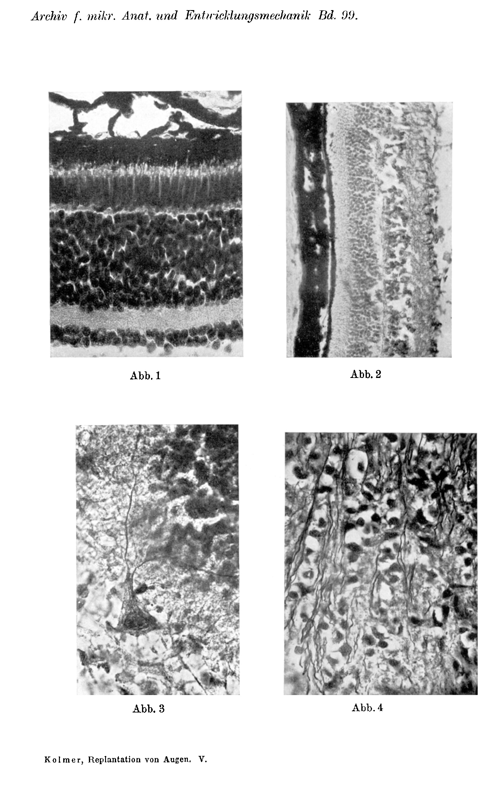
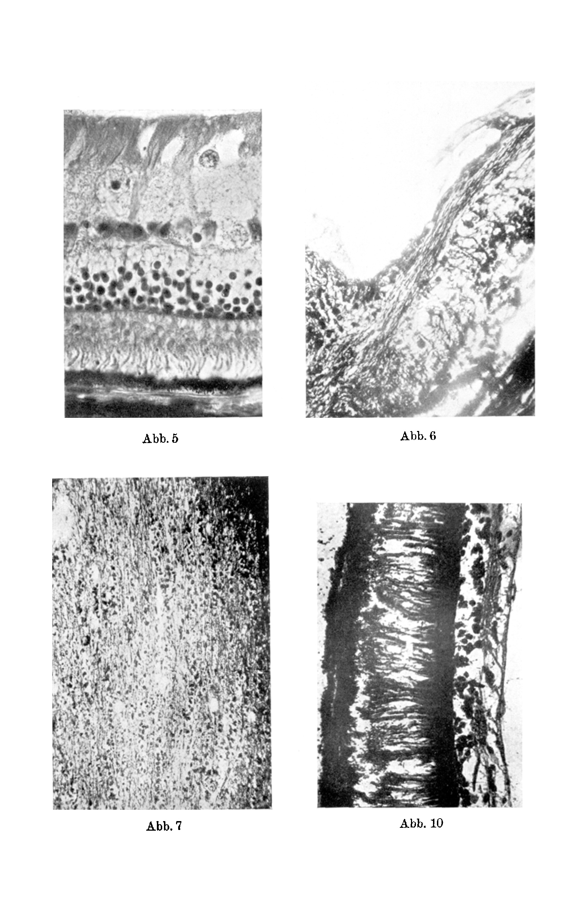
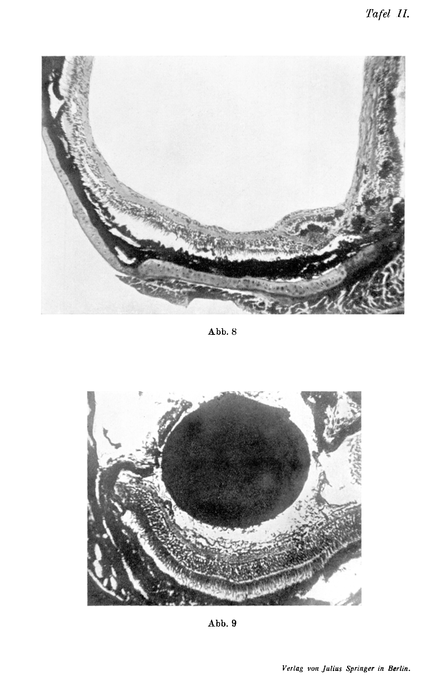

# Die Replantation von Augen.
## The Replantation of Eyes.

### V. Histologische Untersuchungen an transplantierten Augen.
### V. Histological Investigations on Transplanted Eyes.

By

**W. Kolmer.**

(From the Physiological Institute of the Vienna University.)

With Plate II.

*(Received on 5 April 1922.)*

*Archiv für mikroskopische Anatomie und Entwicklungsmechanik*, vol. 99 (1923).

> **Full translation.** A complete English rendering of the running text of “The Replantation of Eyes (Jellinek)” (Jellinek, 1923), including all tables, figure and plate legends, and footnotes. Numbers and table cells were transcribed from the page images, not the noisy OCR.

A judgment about the experiments described in the foregoing by *Koppányi* on the autoplastic, homoioplastic, and heteroplastic transplantation of whole bulbi in cold-blooded animals and mammals was naturally possible only on the basis of a thorough anatomical examination of the animals, which had died spontaneously at variously long intervals after the procedure had been carried out or — which was the more favourable case — had been sacrificed for purposes of investigation. Whereas in the former the staining had to be carried out in the usual manner, in the latter I was able to apply the method that has proved far more reliable, namely to prepare the whole animals suitably well by injecting the fixative fluid into the vascular system. Thus, after flushing out from the left heart with Ringer's solution, the experimental animals were perfused either with formol-alcohol after *Bocke* [Boeke] or with ammoniacal alcohol after *Cajal*. Furthermore, the entire region in which a union of the fibres of the various nerves, in particular of the optic nerve, might possibly have taken place had to be cut up into gapless series of sections. We do indeed know from the thorough experiments, especially of *Ramon* y *Cajal* and his pupils, as well as of *Bocke* [Boeke], that, at least in the case of spinal nerves, the [growth of] the fibres growing out from the central stump by no means always proceeds along the shortest path, but rather very often the fibres growing out from the central and peripheral stump of the optic nerve reach the other stump along most complicated routes when some obstacle or other, such as a blood clot, connective tissue, etc., puts itself in their way; and since at first one could not at all know in which region the central and the peripheral stump of the optic nerve lay, it could not be predicted whether such obstacles might not have inserted themselves between them. Therefore, at least at the beginning, the entire orbital contents had to be sectioned in continuity with the brain. For this it was necessary to section the entire skull in order to decalcify it, which is very unpleasant, because then frequently the *Bielschowsky* method fails; or else — especially when it was a matter of the *Cajal* methodology, in which decalcification is by experience not to be recommended — the bone had to be completely removed with absolute sparing of the orbital contents, which was extraordinarily laborious and dangerous. Thus difficulties arose at first, until, after the first preparations, it was established that the probability of a regeneration of the optic nerve is only to be expected when the stumps are encountered in as natural a position as possible. Otherwise one can, starting from the chiasma, dissect out the region of the optic nerve and its surroundings. As regards the cold-blooded animals first of all, I examined specimens of *Bombinator pachypus* [*Bombina pachypus*], in which the bulbi had been exchanged several months previously. The eyes lay — apart from an anomaly of position that was often scarcely perceptible even on the most exact inspection — quite normal, and presented themselves as normal with respect to the curvature and transparency of the cornea. The colour of the iris was not to be distinguished from the normal; individual eyes showed cataract. In the latter, the histological investigation then showed that, while the cornea, iris, and sclera were preserved, the more-or-less loosened and disintegrated lens, by contrast, formed the sole content of the eye, and that in place of the retina and chorioidea only scanty detritus masses, showing no kind of typical structure, were present. In more favourably preserved eyes without cataract, however, the serial sections showed a completely preserved retina, in which the normal stratification could still clearly be recognized. To be sure, the rods and cones lay unchanged against the pigment epithelium only at a few places, but everywhere the structure of the inner and outer members of the rods and cones could be completely recognized. In places, peculiar changes in the retina showed themselves, such that, while the visual elements were preserved, it appeared thinned in the manner of a fovea, with in particular a local reduction of the outer granule cells occurring. A peculiar change had set in at the pigment epithelium. In places it had remained normally preserved; at other places its cells had transformed into strikingly large globular formations, which lay in whole heaps beneath the detached retina, especially in the vicinity of the optic-nerve entrance. One could further observe, especially in the surroundings of the optic nerve and finally also in the region of the papilla, that such rounded or process-bearing deep-black pigment cells had migrated in between the elements of the retina, individual ones even right into the optic-nerve fibre layer. Likewise in the vicinity of the optic-nerve entrance there were found small cysts consisting of visual epithelium, displaced into the outer granular layer, which were lined on the inside with rods and cones. In this, the optic-nerve fibre layer was well preserved, as was the optic nerve itself. One gained the impression that the images described here cannot be explained exclusively by regressive processes in the retina, but rather that, as in the case of cyst formation, active proliferative processes are involved, while the behaviour of the pigment cells shows echoes of the images in retinitis pigmentosa of man. It was always the peripheral parts of the retina that apparently showed the slightest changes; in any case, however, the picture of the retina was of such a kind that it might be regarded as a surviving and functioning organ.

The *optic nerve of the Unke* [fire-bellied toad] showed itself well preserved in the region of the papilla, continuously connected with it. It contained fibre bundles that could be traced as far as the chiasma and through it. In a *homoioplastically* transplanted *Triton eye* the retina too was well preserved; here, changes both of the layers and of the pigment epithelium were completely absent. Also, apparently no loss of optic-nerve ganglion cells had occurred. Unfortunately, the staining had not turned out very favourably, so that in the optic-nerve fibre layer only *individual axis cylinders* had been impregnated. The optic-nerve trunk itself was strongly overstained, so that the fibres could not be clearly delimited. In the vicinity of the papilla, peculiar changes likewise showed themselves in this retina, in that small cysts lay within the inner granular layer, lined on the inside with elements resembling embryonal retinal epithelium. Individual pigment cells of abnormal form were also found in them. How these cysts come about must first be clarified by further experiments. In the chiasma, fibres were demonstrable. In these eyes the iris and lens, like the cornea, were also well preserved.

A *toad* too came to investigation, in which both eyes had been homoioplastically transplanted several months earlier. Bulbi and optic nerve were treated according to *Bielschowsky*. Unfortunately, here too the reaction did not turn out well, so that we could not orient ourselves completely as to the behaviour of the fibres in the optic nerve, which appeared macroscopically complete. The retina of this animal showed certain differences in some regions. The one retina did indeed show all layers preserved, but at many places it was broken through by immigrated pigment epithelia. The rods and cones were here severely damaged. The other retina was much better preserved; the rods and cones in the preserved areas showed an elongation both of the inner and of the outer member, while the cones were only slightly elongated. Concerning the conduction conditions in the optic nerve, it was unfortunately not possible in this preparation to obtain clarity, since neither in the vicinity of the chiasma nor in the vicinity of the optic-nerve insertion could stained axis cylinders be found. By contrast, distinct growth bulbs were found in masses in the middle part of the optic nerve, but, surprisingly, all directed distalward, so that here a local formation of growth bulbs seems to have come about, such as was described in the investigations of *Ortiz* and *Rossi* in the proximal stump. These growth bulbs showed the known basket-like fibrillar structures.

Furthermore, we investigated a *rat eye* that had been transplanted onto another rat for 2 months. The following finding presented itself. Cornea, iris, sclera show normal histological conditions. The retina lies normal at the periphery; the region of the papilla has been almost completely destroyed, but is, as emerges from the review of a gapless series, connected with the periphery by strips of partly preserved tissue. In the retina one can establish intact rods and cones, as well as pigment epithelium, over great stretches. The other layers, too, show correspondingly no changes; only in the ganglion cell layer one can detect the degenerated stumps. In the dendrites passing inward, neurofibrils could be detected, and one succeeded quite especially in the region of the papilla in frequently following the directly continuing [fibres]. Here, where it is then still quite difficult to trace through the many-times-folded funnel that consists of remnants of tissue at the papilla, in order to unite the smallest threads, which in turn [join] into a larger trunk, the through-passing [fibres] could only incompletely be followed. In oblique sections of the optic nerve one can now establish that these axis cylinders run only on one side of the optic nerve within a fairly broad zone, while the rest of the optic nerve consists only of glia. It was possible to follow these evidently regenerated fibre bundles through the optic nerve into the chiasma and through this into the corpus geniculatum of the opposite side in the series. That the presence of the said nerve fibres is dependent on the preservation of parts of the transplanted retina, especially of the well-stainable ganglion cells, may be inferred in the investigated rat eyes from the fact that on the opposite side, where a complete melting-down of the retina — but without suppuration — and a far-reaching degeneration of the chorioidea had occurred, the central stump in the series contained only very few, about 18 axis-cylinder remnants in the immediate vicinity of the chiasma, but further out at the periphery consisted only of glia cells. Whereas in one animal, which had survived for a shorter time, in the region of the peripheral optic-nerve stump scattered so-called growth bulbs were found, in another nothing of this kind shows itself on the totally degenerated opposite side.

According to previous experience it is not to be assumed that surviving fibres are involved, for the axis cylinders separated in this case from their ganglion cell are wont to be degenerated after so long a time. Even though one knows, as emerges from the experiments of *Tello* and *Ramon y Cajal*, *Rossi*, that in the first case even from the central stump indications of a regeneration in the form of growth clubs appear, which, however, like central injuries generally, regress again after a short time — one will therefore have to assume that the nerve fibres present actually represent a regenerate, and that in the rat it may thus, under circumstances, prove possible to obtain a regeneration of the optic pathways through the outgrowth of the optic axis cylinders. The eye that yielded this anatomical finding showed a corneal reflex, a proof that within the period in question trigeminal fibres had grown into the transplanted cornea. It was also possible to demonstrate, correspondingly, bundles of well-stainable nerve fibres in the cornea. Whereas in the dark the iris of this eye was almost completely dilated, on application of bright light an ample, although slow, contraction of the pupil to almost 1—2 mm in diameter could be obtained, which on darkening slowly receded again. We shall have to keep in mind that even the normal iris of the rat shows only relatively slow, sluggish changes, and since these are brought about only by light, it is to be assumed that the reflex pathway in the optic nerve necessary for the coming-about of this reflex is in fact present. The assumption that an automatic function of the iris is involved therefore appears improbable, because nothing corresponding occurs in the rat after division of the optic nerve alone and of the ciliary nerves, and also re-establishes itself only in those eyes in which as complete a healing as possible has occurred. That predominantly regenerative processes are involved here, and not — as has been demonstrated in other animals — the ganglion cells of the iris, emerges from the fact that this function establishes itself only gradually, beginning about the 8th day after the transplantation. In further cases of successful transplantation, measuring observation yielded a pupillary narrowing from 4.2 mm to 2.1 mm within 5 seconds when arc light, practically rendered heat-free by filtration through iron-sulphate solution, was applied as stimulus after a stay in the dark (still after 300 days). The observation that on a longer stay in bright light this reaction no longer occurred so distinctly speaks for an adaptation coming into question here, hence optical processes. *Champy* reported in the year 1914 on explantations of turtle and rabbit retinas, which he cultivated in the coagulated plasma of the animal. He found that the nervous elements, and especially the rods, perish more quickly than the cones in such explants, but nevertheless remain recognizable for several days. The other nervous elements survive somewhat longer, above all the bipolars, and somewhat longer still the ganglion cells. Nevertheless, he found, about the 4th day in the rabbit, but only after a much longer period in the turtle, degeneration of most of the nervous components of the retina, while the supporting elements of glial nature, in particular the *Müller* supporting fibres, survived and even showed mitotic proliferative phenomena. The vessels and their accompanying mesodermal tissue behaved as in other explants, in that they showed strikingly abundant proliferation. It is thus shown by these experiments that individual retinal elements do not immediately necrose upon the cessation of the circulation, and under circumstances can remain alive long enough that, in a period of restored circulation through newly formed vessels, they might become capable of regeneration.

On the basis of the experience gained on cold-blooded animals and rats, we attempted to carry out transplantations of the eyes of larger animals, notwithstanding that the experiences of previous investigators — among whom *Ramon y Cajal*, a pupil *Tello*, and *Ortiz y Azante* as well as *Rossi* are especially to be named — had hitherto given little hope for an ingrowth of fibres from the retina into the proximal stump of a divided optic nerve. It should be mentioned that *Cajal* and his school sought to explain the difficulty of obtaining an ingrowth of fibres from the distal optic stump into the proximal — despite the fact that after division, lively regenerative processes also take place at the distal end, according to their experience, with the formation of numerous growth clubs — by the fact that, as in the central nervous system generally, the *Schwann* sheaths are lacking in the optic nerve. According to the hypothesis of *Forsmann* [Forssmann] and *Cajal*, it is the disintegration products that appear in the *Schwann* sheaths which influence the neurotropic hodogenesis of the regenerating nerve, and it was even demonstrated by his pupils that, by the insertion of a small piece of sciatic-nerve tissue — that is, of a nerve possessing *Schwann* sheaths — an ingrowth of the growth sprouts of the optic-nerve fibres of the distal stump into the proximal could be obtained. But this led only to the result that the fibres did indeed migrate into the region of the sciatic-nerve graft piece; but even then there was no regeneration of the proximal optic-nerve trunk. *Rossi* too, in extensive experiments, divided the optic nerve in young rabbits intracranially while leaving the orbital contents in an unimpaired condition, [divided.] In so doing, the tissues of the orbit, and hence the optic nerve and the retina, stood under apparently extraordinarily favourable conditions, since their blood supply was not disturbed even temporarily, since the central retinal artery was spared and the tissues were in no way damaged. Nevertheless, although extraordinarily abundant regenerative phenomena in the form of the development of numerous growth clubs came to observation at the distal end of the optic nerve, he obtained no regeneration whatever. He could not see a single fibre migrate into the proximal piece of the optic nerve. In his detailed account of his observations, which were carried out over more than a year on operated animals, he notes only *expressly* that after the 40th day not even a *single axis cylinder* was ever demonstrable in the proximal optic stump, so that the axis cylinders of the optic-nerve fibres, separated from their points of origin, are after 40 days without exception degenerated in the chiasma as well. There were accordingly not many probabilities given of obtaining positive successes in the *transplantation of rabbit eyes*. It should also be brought forward here that the experience on man certainly does not allow it to be said against this that optic-nerve fibres are incapable of regenerating. The numerous observations in which blinding was brought about by compression of the optic nerve through injuries or by emboli of the central artery, and in which nevertheless — provided that the circulatory disturbances in the eye had not lasted too long, and that no far-reaching degeneration of the chorioidea had set in — a restitution of the function of the optic ganglion cells had occurred; in such cases, quite isolated cases are known (*Mauthner*, *Kraupa*) in which, after corresponding damage to the vision, the function could re-establish itself. Nevertheless, the attempt was ventured upon.

In *younger and older rabbits* either autotransplantation or homoiotransplantation was attempted. In this, the conjunctiva was first detached, then the bulbus, after division of the muscles, was freed as closely as possible within *Tenon*'s capsule up to the optic nerve, and the latter was then divided with curved scissors close to the exit of the optic nerve. The bulbus was then, after a brief stay outside the orbit, brought back into its normal position within it. A delicate mark, which before the beginning of the operation had been applied with a silver-nitrate pencil at the corneal margin, allowed the bulbus to be brought back into the correct position, whereupon the lids were sutured over the eye. Sometimes it also seemed advantageous, by means of a

suture of the nictitating membrane, to fixate it over the eye.

— suture of the nictitating membrane over the eye. In a number of cases it was thus possible to keep the eyes for some time in the orbit. Where the eye had been homoioplastically transplanted, however, in the rabbit hitherto examined — since the cornea had remained clear during the first week — opacities appeared at the margin of the cornea at the end of the first week, and in the course of the second week the bulbi, even without any infection having taken place, began to shrink, and in all of them phthisis bulbi set in. — In one single case of autotransplantation, by contrast, where the bulbus had been detached from its connections and fitted back exactly into its own orbit, a *complete healing-in* came about. The cornea, which initially had in fact been strongly clouded, began to clear up as early as the 5th day and was completely clear after 8 days. At the same time, beginning about the 8th day, movement of the eye on incidence of light set in, and a corneal reflex. On illumination with strong light sources the iris became narrower each day. After 4 weeks had elapsed, the iris reacted *even under normal illumination* with the *ophthalmoscope*, quite similarly to that of a normal eye, perhaps a little less briskly and more slowly. It contracted on strong illumination to about 1.5 mm; the pupillary dilatation likewise set in again afterward and required no longer than in a normal animal. Thus the condition of the eye remained stationary for 42 days. Examinations carried out several times with the ophthalmoscope yielded a picture that differed in no respect from the fundus of other rabbits of the same pigmentation (it was a matter of a coal-black animal). The region of the papilla, the characteristic black stripes of medullated fibers on either side of it, the central artery and vein were clearly to be seen. Indeed, according to the statement of an ophthalmologist, he could himself recognize pulsations in the large vascular trunks. The function of the external eye muscles did not establish itself during this period. Nor was it possible to elicit from the animal any reactions whatever that could with certainty be interpreted as the expression of a light sensation. The jump test on the animal, carried out similarly to that on the rats, showed that it is not reliable here, since even blind rabbits occasionally decide to jump. The second eye of this animal had been replaced by a homoiotransplant, which, however, had likewise perished completely like the other homoiotransplants. The animal, which until then had been quite well, perished during the night from a stable infection (simultaneously with two healthy stablemates). It was therefore no longer possible to flush the eye through; it was fixed according to Cajal with ammoniacal alcohol and treated with the silver-reduction method. A calotte of the eye was fixed in Heidenhain's "Susa." After removal of all the — — covering parts, the eye was exposed from the ventral side and finally, with the greatest possible sparing, the bulbus together with the nerves adhering to it was dissected out in connection with the chiasma and the midbrain in Ringer's solution. It became evident that the opticus had been cut smoothly across immediately at its point of exit and that here an anatomical union had come about in such a way that the edges of the defect in the region of the papilla and of the opticus, overlapping each other to within about 1/15 mm, were united. This site was marked macroscopically by a fine line consisting of chorioidal pigment.

[Before the further treatment I showed the eye thus dissected out also to the director of the neurological institute, Herr Prof. Marburg, who likewise took the trouble of going carefully through the series presented here. With regard to the anatomical relations he arrived at the same view as is set out here.]

The optic sheaths too were united without actual typical scar formation. The dissection of the bulbus into serial sections showed the preservation of the retina, in the temporal portion without any changes whatever and in its connection with the region of the papilla. In the nasal portion larger sections of the retina were degenerated. Vitreous body, iris, and lens were preserved normally. There was also absent any small-cell infiltration of the ocular tunics referable to degeneration- and inflammation-phenomena. The preserved portions of the retina exhibited normal rods and cones. The other retinal layers too showed no essential changes. Unfortunately I obtained, as unfortunately often occurs with all silver-impregnation procedures, since the retina had only been preserved some hours after death, no complete silver staining. The number of optic ganglion cells seemed strongly reduced. Yet, similarly as in the rats, specimens provided with processes and axis cylinder could be demonstrated, and one could follow the axis cylinders into the region of the papilla. In this latter, axis cylinders united into delicate bundles and passed into the preserved remnant of the papilla, which stood in connection with the quite short distal, somewhat obliquely bevelled end of the opticus. In the inner plexiform layer there were found, singly, small axis cylinders provided with clubs, corresponding perhaps to the abnormal regenerates which in his experiments Tello and later also Cajal have described.

The fibers could be followed easily, varicose but continuous, traceable over several visual-field breadths, through the whole proximal optic trunk up to the chiasma. We can thus say that also in the autoplastic transplant of the rabbit eye after 42 days all those conditions are histologically present which — — permit us to refer the appearance of pupillary changes to reflex processes from the retina. For we found a functionally capable light-receiving apparatus and the conduction from the retina up to the center continuous, at least in a fraction of the pathways, preserved. It must, however, be expressly emphasized here that in one respect the finding in the rabbit was not so clear as in the rats, but at the same time also contradicted the previous statements of the authors. For there were found, namely, also on the other side, where the homoioplastically transplanted eye of another animal had completely melted down one week after the intervention, still numerous, perhaps somewhat more strongly varicose, nerve fibers, which likewise could be followed up to the chiasma. From this finding of nerve fibers in the proximal opticus it would therefore — had we not been able to follow these continuously up to the retina — not have been possible to decide with certainty, as in the rat, that these are regenerated fibers and not fibers resisting degeneration; and these experiments must first be repeated several times with longer survival before we can ascribe to them sufficient evidential force.

Nevertheless I believe the experiments have for the time being taught us numerous surprising facts, contradicting the previous experience, and one will therefore find it understandable if we communicate the foregoing results without passing a conclusive judgment about what we can infer from the observed facts. We know for certain that in individual cases, with autoplasty and homoioplasty of the mammalian eye — if, owing to the circumstances, a vascularization comes about quickly enough — *survival of elements of all layers of the retina, outgrowth of axis cylinders of a number of the optic ganglion cells, and a penetration of these into the proximal optic stump up to the chiasma* was possible to observe in the rat in a small percentage of cases, and in rare cases also in the rabbit. Perhaps one's own experiments or those of other observers will further clarify the interesting question.

As regards the possibility of keeping *heterotransplants* of the eye permanently alive, Triton eyes transplanted onto *Salamandra* were examined, which remained healed in in their new bearer for 8 months. The long duration alone makes any doubt here about the survival of the transplant impossible. The examination of such an eye now showed that sclera, chorioidea, iris, and lens together with their intact epithelium were completely healed in. The transplanted retina of the Triton showed itself in all parts smooth, completely adherent to the pigment epithelium. The structure of the individual layers as well as their thickness-ratio also corresponded thoroughly to the norm. The visual epithelium too was preserved, even though the rods and cones — — with regard to their size-relations had perhaps lagged a trifle behind those of the equally-aged eye of a sister Triton. The fixation had here been carried out with bichromate-formol-sublimate-glacial acetic acid, and there showed themselves absolutely no differences with regard to the state of preservation of the nervous and glial portions of the eye of the bearer, the salamander, and of the implant — not even with regard to details of the nuclear structure or of the well-preserved structure of the inner and outer members of the visual epithelium and of the pigment epithelium. In the transplanted eye in this case there were also absent any infiltrations whatever by wandering cells, or even mere indications of similar processes. By contrast, in the heterotransplant *no* distinct regeneration processes were to be demonstrated at the opticus. The chiasma was completely atrophic on the side of the foreign eye, and the central stump of the opticus had disappeared. At the distal optic stump too one could recognize nothing of outgrowth attempts, and it seems that in this respect no regeneration tendency belongs to certain heterotransplants.

As an example of another kind of heteroplastic transplantation, eyes of *Alburnus*, which had been transplanted for 6 months onto *Carassius*, were also observed. Here it showed itself that the cornea was well healed with its surroundings and had also remained transparent; the cartilaginous sclera too was for the most part still preserved. By contrast, the remaining parts of the bulbus, which was embedded in a mass of pus cells and fibroblasts, exhibited a high degree of disintegration phenomena; the chorioidea was to be recognized only by remnants of pigment; the retina too was strongly swollen and the picture of its layers disturbed; in places the nuclei were still stainable; the pigment epithelium had transformed itself into spherical or cylindrical structures which projected far into the retina. The lens had emerged from the burst lens capsule and lay, still fairly well preserved, in the background of the strongly altered vitreous body. Any leukocytic or other cellular elements whatever were not to be demonstrated within the bulbus. The iris showed a high degree of melting-down; the cell layer of the ligamentum annulare was preserved fairly unchanged. It is doubtless a matter of advanced processes of necrobiosis. During the printing, several cases of heterotransplantation (Triton eye onto *Amblystoma*) with fully functioning retina and optic regeneration after months have been observed by Koppanyi and me. Even a persistence of the eyes of trout larvae in larvae of *Salamandra maculosa*, with partial persistence of the visual elements and appearance of mitoses, was repeatedly observed.

## Literature.

*Ramon y Cajal, S.:* Trab. del laborat. de investig. biol. Madrid 1907. — *Champy:* Quelques résultats de la culture des tissus. IV. La rétine. Arch. de zool. exp. et gén. 1914. 55. 51. — *Kolmer:* Versamml. d. dtsch. ophthalmol. Ges., Wien 1921. — *Kraupa:* Ibid. Diskussionsbemerkung. — *Mauthner:* Sitzungsprot. d. Ges. d. Ärzte. Wien 1890? — *Ortiz y Azcárate:* Procesos regenerativos del nervio optico y retina con occasion de ingestos nerviosos. Trab. del laborat. d'investig. biol. 11. S. 239. — *Rossi:* Regenerative Veränderungen im Nervus opticus. Journ. f. Psychol. u. Neurol. 19, 1912. — *Tello:* La régénération des voies optiques. Trab. del laborat. d'investig. biol. 5.

## Explanation of the Figures.

### Plate II.

**Fig. 1.** Newt retina transplanted onto *Salamandra* for 8 months.  *(figure not reproduced)*

**Fig. 2.** Retina of a 2-month-old homoiotransplant of the rat.  *(figure not reproduced)*

**Fig. 3.** Ganglion cell with neurofibrils in the dendrites and axis cylinder from the optic layer of the transplanted retina of a rat.  *(figure not reproduced)*

**Fig. 4.** Bundle of regenerated nerve fibers in the proximal opticus of the bearer 2 months after the homoiotransplantation. Rat.  *(figure not reproduced)*

**Fig. 5.** Cross section through the peripheral portion of an autoplastically transplanted rabbit retina after 42 days.  *(figure not reproduced)*

**Fig. 6.** Bundle of axis cylinders radiating into the papilla of the transplanted rabbit eye.  *(figure not reproduced)*

**Fig. 7.** Axis cylinders in longitudinal section of the proximal rabbit opticus 42 days after the autotransplantation.  *(figure not reproduced)*

**Fig. 8.** Homoplastically transplanted fire-bellied-toad eye.  *(figure not reproduced)*

**Fig. 9.** Homoplastically transplanted newt eye after 1 year.  *(figure not reproduced)*

**Fig. 10.** Retina of *Bufo var.*, rods elongated, transplanted for 1 year.  *(figure not reproduced)* *Archiv f. mikr. Anat. und Entwicklungsmechanik Bd. 99.*

**Fig. 1.**  *(figure not reproduced)*

**Fig. 2.**  *(figure not reproduced)*

**Fig. 3.**  *(figure not reproduced)*

**Fig. 4.**  *(figure not reproduced)*

Kolmer, Replantation von Augen. V.

**Fig. 5.**  *(figure not reproduced)*

**Fig. 6.**  *(figure not reproduced)*

**Fig. 7.**  *(figure not reproduced)*

**Fig. 10.**  *(figure not reproduced)* *Plate II.*

**Fig. 8.**  *(figure not reproduced)*

**Fig. 9.**  *(figure not reproduced)*

Verlag von Julius Springer in Berlin.

## Figures

**Plate II (Abb. 1-4)**

**Plate II (Abb. 5, 6, 7, 10)**

**Plate II.**

---

*Translator's note.* One of the Biologische Versuchsanstalt (Vienna Vivarium) papers flagged on the project site as a modern rediscovery target. Claims are rendered as stated in the original, not endorsed.
