# The Replantation of Eyes.

## VII.

### Training Experiments on Rats with Optically Different Training Vessels.

By

Auguste Jellinek.

(From the Biological Experimental Institute of the Academy of Sciences in Vienna [Zoological Department]¹).)

With 6 text figures and 18 curves.

(Received on 25 January 1923.)

*Archiv für mikroskopische Anatomie und Entwicklungsmechanik*, vol. 99 (1923).

> **Full translation.** A complete English rendering of the running text of “The Replantation of Eyes (Koppanyi)” (Koppanyi, 1923), including all tables, figure and plate legends, and footnotes. Numbers and table cells were transcribed from the page images, not the noisy OCR.

> ¹) An abstract of this work appeared under the same title as Communication No. 75 from the Biological Experimental Institute of the Academy of Sciences, Zoological Department, Director H. Przibram, in the Akad. Sitzungsanzeiger Wien No. 10, 1922.

### Contents Overview.

| | Page |
|---|---|
| 1. Purpose of the investigations: Demonstration of the visual capacity of replanted rat eyes | 83 |
| 2. Method | 83 |
| a) Experimental arrangement | 83 |
| b) Registration | 84 |
| c) Explanation of the curves | 85 |
| 3. General behavior during the training | 85 |
| a) Sighted rats | 86 |
| b) Blind rats | 87 |
| 4. Experiments. | |
| I. Series: Choice between a training vessel and bare food | 87 |
| a) Normal rats | 87 |
| b) Blind rats | 88 |
| c) Rats with transplanted eyes | 89 |
| II. Series: Discrimination of a white porcelain vessel from a blue glass vessel | 89 |
| a) Normal rats | 89 |
| b) Blind rats | 90 |
| c) Rats with transplanted eyes | 90 |
| III. Series: Discrimination of the white side of a sheet-metal plate from the black side of a like sheet-metal plate | 91 |
| a) Normal rat | 93 |
| b) Blind rat | 93 |
| c) Rat with transplanted eyes | 94 |
| IV. Series: Rat with transplanted eyes. Reversal of training III c | 96 |
| 5. Summary of the experimental results | 97 |
| 6. List of references | 98 |
| 7. Tables for the individual curves | 99 |
| 8. Summary table | 103 |

## 1. Purpose of the Experiments.

In recent years, experiments on the transplantation of eyes were undertaken in many ways at the Biological Experimental Institute of the Academy of Sciences in Vienna on various animal species (vertebrates) (see List of References 1, 2, 3). The functional capacity of the implanted eyes was demonstrated in fishes and amphibians by the fact that the dazzle-color [Blendungsfarbe] which had appeared before the healing-in of the eyes was finally replaced again by the normal color change and the adaptation to the surroundings. In mammals, however, this proof had to be furnished by means of complicated visual tests. For this purpose I have carried out the following experiments on normal and blind rats and on rats with transplanted eyes.

## 2. Method.

### a) Experimental Arrangement.

The rats were kept in cages with two compartments, with a closable opening in the middle of the partition wall. In one compartment were the nest and the water vessel; the other compartment was empty except for the training vessels, and in one of them was the food. The training vessels were small cylindrical crucibles of porcelain or glass, which could be provided with paper marks as needed. Since the matter at hand concerned discrimination tests of the sense of sight, in most cases two vessels were used which were optically different from one another. The training method used in all experiments was the following: The vessel on which the rat was to be trained was filled with food and placed in the food compartment; otherwise there was no food in the cage. Within a few days the rat became accustomed to fetching the food out of the vessel. While throughout the whole day there were only grains in the vessel, during the training pieces of bread, bacon, or pieces of cheese were used. The rat was let out of the nest compartment and, when it had taken a morsel from the training vessel, driven back again. The position of the vessels was changed after each experiment. Once the rat had become accustomed to this running back and forth to the vessel, the second object to be discriminated was likewise placed in the food compartment, but remained empty. Since the rat

**Abb. 1.** Sketch of the cage. Nest = nest compartment, the other side = food compartment.  *(figure not reproduced)* only found food in one vessel (designated in the statistics as "correct" [»richtig«]), but found nothing in the other (designated in the statistics as "false" [»falsch«]), it soon became accustomed to seeking out, in the majority of cases, the food vessel, and to leaving the empty vessel unheeded. From the seeking out of the one object [vessel], optical discrimination [optische Unterscheidung] was inferred; in blind rats it did not show itself. Once a discrimination had been achieved, both vessels remained empty, in order to exclude smell influences, and the rat was rewarded, after touching the desired object, with a morsel offered outside the food vessel. The exact experimental conditions are given separately further below for each individual experiment.

**Abb. 2.** Training cage with training arrangement. In the food compartment two white porcelain vessels with a white and a black mark. The rat is, as the figure shows, on the way to the correct vessel with the white mark. (From a film recording by the Federal Film Office [Bundesfilmstelle] in Vienna.)  *(figure not reproduced)*

The position of the vessels was opposite the opening in the middle of the partition wall in corners 2 and 3 (see Fig. 1) or in the vicinity of these. In any case the arrangement was such that the animals, upon leaving the nest, received both objects into their field of vision simultaneously.

### b) Registration.

The registration and statistical calculation of the experimental results was carried out in the following manner: Each day, 10—20 experiments were undertaken with each rat. Each choice of the rat was registered with the note "correct" or "false." If, on a series of experimental days, more correct than false answers [were given], that pointed simply to probability — these are chance results, which are noted in the curve at 50% as the daily result. Far better, however, [is it] of 10 answers 8 correct and only 2 false, then that is regarded as a sure sign of discrimination and is indicated in the curve with a daily value of 80%. When the curve rises above the average value of 50%, that is, when the answers can no longer be explained from probability alone, then we assume that the animal, as a consequence of optical, attentive association, has sought out the vessel designated as correct, at which it was usually fed. If the curve fluctuates around the indifference line of 50%, showing sometimes somewhat fewer, sometimes somewhat more correct answers per day, then those are chance results, which are distributed according to the law of probability. From a merely fluctuating, but not rising course of the learning curve, non-learning or inattentiveness is inferred. The days of inattentiveness are also contained in the curves.

In the distribution curves (see below), which are constructed from all the values obtained during the course of this training, the training success expresses itself in the predominance of the right-side part of the curve lying between 50—100%, over the left-side part lying between 0—50%.

### c) Explanation of the Curves.

Of the curves relating to the experiments that follow in the text, the curves with the index α are learning curves. The numbers of the abscissa denote the consecutive days of the experiments, the numbers of the ordinate the percentages of the correct answers on the day concerned.

The curves with the index β present the distribution of the percentage figures of correct results. The numbers of the ordinate here mean the number of experimental days on which the percentage figure concerned was obtained; the numbers of the abscissa mean the number of correct results grouped together in sets of 5.

In the distribution curves, the days of attentiveness come to expression in the peaks above 65%, [and] the days of inattentiveness in the peaks below 65%, in so far as such days are concerned.

The curves do not give a completely sufficient picture of the actual differences in behavior, because they do not register the direct going-toward of the sighted animals in contrast to the searching-about of the blind ones.

## 3. General Behavior during the Training.

All the animals used came from the breeding stocks of the Biological Experimental Institute and were sexually mature. Color and sex can be seen from the appended summary table; I could, however, notice no influence of these properties on the behavior. Physiological conditions, such as illness, pregnancy, and rearing of the young, also estrus phenomena, influenced the behavior in a sense unfavorable to the training. These detrimental influences show themselves in depressions of the learning curves, but were nowhere eliminated in the course of the curves, in order not to arouse the suspicion of a selection of the results. —

All the sighted animals were very tame.

### a) Sighted Rats.

Since in the following experiments it depended on the testing of the sense of sight, it was of importance to ascertain the influence of the other senses on the behavior. In the first place, kinaesthesis [Kinästhesie] and the sense of smell came into question.

The kinaesthesis, i.e. the memory of the movements which the experimental animal itself has just made, plays a very large role in the training, so long as the optical discrimination does not govern the behavior. The factors that come into consideration in the kinaesthetic behavior are the static sense, which we localize in the labyrinth, the muscle memory, and the sense of touch. The rats influenced by kinaesthesis sought, for example, mostly the place at which they had last been fed; in which case there need not be any object at all at this place, or it can also be the false object. When this behavior shows itself once in trained animals, it must be interpreted as a sign of inattentiveness or weakness of memory, which can be traced back to some disturbance or other. Pauses in the training of several days had this result. Since the position of the vessels was changed after each experiment, whereby sometimes the "false" vessel came to the former place of the correct one, the probability of false results on the days of kinaesthetic behavior was greater. Thus are explained the daily results on which the percentages of correct answers were below 50, [arising] out of the probability of the kinaesthesis.

The sense of smell plays a very small role in tame sighted rats in the laboratory. It does not suffice to lead them directly to the food. This is shown by the many false answers at the beginning of the trainings and by the experiments of Series 1a. The influence of the sense of smell is suppressed by the predominant importance of the optical association.

It has emerged from the experiments carried out that optical associations can completely govern the behavior of sighted rats.

The following experiments relate to the discrimination of brightnesses. Discrimination of vessels of white porcelain and different form could not be achieved. Just as little did it succeed to achieve a discrimination of colors (Hering color papers [Heringsche Farbpapiere]) from a gray of equal brightness (for color-blind subjects). For this reason such experiments were not carried out on the rats with transplanted eyes. (On color and form discrimination by rats, cf. List of References 5 and 6.)

### b) Blind Rats.

The blind rats are naturally not in a position to form optical associations between a visual impression and the feeding. In contrast to the sighted rats, the kinaesthetic behavior appears in them as the chiefly governing factor of the behavior. The blind rats form only local associations between a place at which they are sometimes fed and the feeding. So, for example, the blind rat of Series IIIb almost always sought out corner 3 (see Fig. 1), in which it was sometimes fed. These local habits appeared in all blind rats and became the firmer the longer the training lasted. Since the vessel designated as "correct" was located in about half the cases in the preferred corner, but without being exchanged in any regular sequence, there result for the blind rats frequent days with the average value of 50%, much less frequently deviating numbers.

In the blind rats the sense of smell is naturally more important than in the sighted ones. But it still does not suffice to lead the rats directly to the food, as will be recognized right away from the first experimental series!

## 4. Experiments.

### I. Series.

#### a) Normal Rats.

In order to test the influence of the sense of smell, animals which already knew the white vessel were trained in such a way that only one white empty vessel was in the cage. At another place in the cage a food morsel [Futterbrocken] of customary size lay simply on the floor. If the rat ran to the empty vessel known to it, it received food there; if it ran to the bare food, it was driven back. The sighted rats trained in this way, however, paid no attention at all to the bare food, but ran straight to the empty vessel. In this experiment too the position of the vessel and of the food morsel was always changed.

The curve I a α is a learning curve. It shows that the sighted rat, which had known the white vessel from earlier on, almost always sought it. On most days the animal shows 100% correct answers; in other words, it sought the white vessel in all cases.

The curve I a β is a distribution curve and shows again that on all days a very high percentage of correct answers were given, almost always 100%. Both curves refer to

**Kurve I a α.** *(figure not reproduced)*

the same animal and correspond to the numbers of Table I a.

**Kurve I a β.** *(figure not reproduced)*

#### b) Blind Rats.

The blind rats could naturally not orient themselves by the visual impression and sought the food by smell. They sought at first the food morsel more often than the vessel, since they were indeed influenced only through smell and kinaesthesis. Gradually there formed an association between the smell of the vessel and the feeding, and then

**Kurve I b α.** *(figure not reproduced)*

**Kurve I b β.** *(figure not reproduced)*

the blind rats sought the vessel more frequently. Of a complete training on the vessel, however, as in sighted rats, one cannot speak.

# Die Replantation von Augen. VII.

> **Source-assignment note.** The image set `153_Koppanyi_1923_Eye-replantation-long` (files p007–p015, printed pp. 88–96) does **not** contain the text of Koppanyi's own paper "Die Replantation von Augen." The running header "Die Replantation von Augen. VII." is the **collected-volume series title** (volume VII); the page-top author byline on every page reads **Auguste Jellinek**, and the text is a study of rats learning to discriminate feeding vessels by color, with a comparison of sighted, blind, and transplanted-eye animals. What follows is a faithful translation of the content that actually appears on the assigned pages (printed pp. 89–95).

--- The learning curve I b α shows a weakly rising course. From this one concludes a — albeit only slight — preference for the vessel.

The distribution curve I b β shows a peak at 60%; in other words, on several days 60% correct answers (seeking out the vessel) were given. The predominance of the days with over 50% correct answers is, however, so slight that the dressage cannot be described as successful.

### c) Rats with transplanted eyes.

Rats with transplanted eyes that had been trained to a vessel (cf. Series II c and III c) likewise, just like normal ones, left mere food unheeded and ran directly toward the vessel.

## II. Series.

### a) Normal Rats.

A white cylindrical porcelain vessel and an identically shaped blue glass vessel were offered for discrimination. At the white vessel (designated "correct" in the statistics) the rats were fed, at the blue one not. In a short time the animals grew accustomed to seeking out the white vessel in most cases.

At the beginning of the dressage the rats showed kinesthetic behavior, which, however, was later displaced by the effect of the optical association. The sighted normal rats all learned this discrimination.

These rats already knew white vessels from earlier experiments (cf. Series I).

**Kurve II a α. Kurve II a β.** *(figures not reproduced)*

The learning curve II a α shows a rising course; the daily results in percentage figures lie far above the average of 50%. From these favorable results, which differ strongly from chance results, one infers the learning of the discrimination.

The distribution curve II a β, which contains the same results in a different arrangement, likewise shows that all the answers lie between 60 and 100% per day, hence are above the average.

### b) Blind Rats.

The blind rats did not learn the discrimination of the vessels, but instead formed kinesthetic local habits, which they retained even over the longer duration of the dressage. They always sought again a particular spot of the cage at which the vessel intended as correct had found itself approximately in the first half of the trial series, even though a rhythmic shifting of the vessels had been undertaken. The results obtained therefore group themselves around the indifference value of 50% per day.

**Kurve II b α. Kurve II b β.** *(figures not reproduced)*

The learning curve II b α shows at the beginning a small rising movement, a sinking, and further fluctuation around the indifference value of 50%. The overall course of the learning curve thus permits one to conclude an absence of discrimination. The position of the learning curve depends also on the nature of the material (glass and porcelain) used, since in consequence of this material the influence does not cease, but a dressage to discriminate, on account of the more constant character of the animals, holds the balance.

The distribution curve shows a peak at 55—60%, hence a weak preponderance of correct answers, which is, however, not so great as in the sighted animals.

### c) Rats with transplanted eyes.

A rat with transplanted dark eyes was likewise trained to this difference and learned the discrimination of the white vessel ("correct") from the blue one ("false") in the same time as a normal rat, although it did not know the white vessel from before. The rat suffered during the dressage from a pneumonia, to which it also succumbed before all the projected trial series could be carried out on it. This rat showed the general behavior of a sighted animal. Even before it could distinguish the vessels, it always ran in a straight line toward one of the two, whereas blind rats had to search the cage for it afterward. When the rat began to distinguish, it looked about to both sides in the entrance opening and then ran mostly toward the white vessel, at which it was fed. Despite the illness there was a rising number of correct answers per day.

The learning curve II c α shows, after initial fluctuations, a rising course. On the very last day the result of 100% was even reached,

**Kurve II c α. Kurve II c β.** *(figures not reproduced)*

that is, on this day all the answers were correct. From the rising course of the curve one concludes discrimination and a deliberate choice of the correct vessel.

The distribution curve II c β shows a peak at 70—75%, hence by far predominantly correct answers. The area enclosed by the curve above 50% is much larger than that under 50%.

## III. Series.

Although it is already evident from the experiments described in Series II a, b that the transplanted rat eyes have light sensitivity and discriminatory capacity, this experiment was repeated in similar form on another rat with a transplanted eye, particular care being taken to eliminate all olfactory influences. In the experiments of Series II the objects differed not only in color but also in material, so that an odor difference was not impossible. In the experiments of Series III completely identical material was used in order to counter this objection, although the latter already seemed to us excluded by the differing behavior of the blind rats.

The vessels used were both of white porcelain and of the same form. To each vessel a sheet-metal disk of the same form was fastened, which was pasted white on one side and black on the other side. The vessels were optically distinguishable only in that in one case the white, in the other case the black side of the disk was turned toward the observer, hence turned away from the vessel.

Two such vessels were always in the cage. The one regarded as "correct" was filled with food, the other not. For the dressage these vessels were replaced by exactly identical, otherwise unused empty vessels, which, since they otherwise never came into contact with food, could have no

**Abb. 3. Abb. 4. Abb. 5. Abb. 6.** *(photographs not reproduced)*
> Abb. 3, 4, 5, 6. Photographs of the vessels. Abb. 3 shows the one dressage vessel with the white side of the metal disk facing forward; Abb. 4 shows the same vessel from behind, to show the black side of the metal disk. Abb. 5 shows the other dressage vessel with the black side of the metal disk facing forward. Abb. 6 shows the same vessel from behind, to show the white side of the metal disk.

different food odor. After the correct vessel had been touched, the rat was rewarded by the offering of a morsel of food on a long wire (to rule out the choice of the hand) outside the vessel. In this experimental arrangement there were now still those traces of olfactory influences eliminated which, in the earlier trial series (Series II), could have led the rats to the discrimination of the vessels.

### a) Normal Rat.

The normal rat employed learned this discrimination of the white from the black side. It formed an association between the white surface, at which it was fed, and the food, and sought in the majority of cases the white surface. The learning curve III a α shows, after initial fluctuations, a rising course. The majority of the daily results lie above the average of 50%, hence a preponderance of correct answers. From this the learning of the discrimination is concluded.

**Kurve III a α. Kurve III a β.** *(figures not reproduced)*

The distribution curve III a β shows two peaks, one at 50% and a second peak at 75%. The peak at 50% characterizes the days of inattention; unfortunately we have it as little in hand as with children to eliminate this completely. On days of "attention" the rat chose the "correct" vessel at least three times as often as the "false" one; in the curve this ratio shows itself in the peak at 75%.

### b) Blind Rat.

The blind rat formed a local association between corner 3 (cf. Abb. 1) and the food. It sought out this spot in nearly all cases, regardless of whether food was there or not. Since the correct vessel (white) found itself at this spot in approximately half of the cases, approximately half correct answers also resulted.

The position of the objects was changed after each trial, but not in rhythmic sequence.

The learning curve III b α shows no rising course, but rather, in contrast to the sighted rats, a fluctuation around the indifference line of 50%. From this it is concluded that the blind rat could not learn the discrimination, hence that the sense of smell had completely failed for the discrimination.

**Kurve III b α. Kurve III b β.** *(figures not reproduced)*

The distribution curve III b β shows a peak that lies exactly over 50%, as the mean; in other words, the symmetrical distribution corresponds entirely to the probability of chance.

### c) Rats with transplanted eyes.

A rat from the transplantation experiments was likewise trained to the discrimination of the white side of the disk from the black side. The dressage also succeeded with this rat, although in it, in contrast to the earlier-mentioned rat (cf. II c), the operation had succeeded only on the left side. This rat too formed, like the normal one, optical associations between the visual impression white — where it was fed — and the food. It sought in the majority of cases the white tablet. By kinesthesia this rat was not strongly influenced; this influence showed itself only when the rat's attention was disturbed. Disturbances of this kind were,

**Kurve III c α. Kurve III c β.** *(figures not reproduced)*

for example, multi-day dressage pauses or eye examinations with arc light, which were carried out rather often on this rat, or a stay in an unaccustomed environment.

The learning curve III c α shows, after initial fluctuation, a strong sinking. This sinking of the curve was brought about by a multi-day stay in a foreign environment with partial dressage interruption. The learning curve is in its further course rising, and the greater part of the curve lies above the indifference line of 50%, that is, the correct answers preponderate. From this the learning of the discrimination is inferred.

The distribution curve III c β shows, like that of the normal rat (III a β), two peaks, namely at 50% and 75%. The peak at 50% characterizes the days of inattention, the peak at 75%, as with the normal rat, the days of attention, on which the correct answers preponderate.

## IV. Series.
### Re-training of the rat with transplanted eyes.

After this training had, according to the statistical results given above, been regarded as learned, a reversal of the training was undertaken with this rat. The white disc, which she had previously been required to seek out, she was now to avoid, while the black disc, which she had previously had to avoid, she was now to seek out. Thus in this training black was regarded as »correct« and white as »wrong«. After a longer period of indifferent behavior, the rat formed an association with the black plate, at which she was now fed. The longer the training lasted, the more correct responses per day were given, and from this behavior it was concluded that relearning had occurred through optical association with the reversed feeding.

The learning curve IVα showed, after an initially fluctuating course, a rise up to 90%. Through disturbances (training pauses) the rise is interrupted several times. With continuous training the learning curve likewise rises and toward the end even shows daily

**Fig.** Kurve IVα.  *(figure not reproduced)* results of 100%, that is, only correct responses on certain days. From this behavior, the predominance of correct responses, it was concluded that the training had been learned.

The distribution curve IVβ shows several peaks between 50 and 100%, which indicate a considerable predominance of the daily results over the indifference value of 50%. In other words, many more correct than wrong responses were given. This form of the distribution curve appears only in sighted animals.

### 5. Summary of the experimental results.

a) In order to obtain further proofs of the visual capacity of the rat eyes replanted by Th. Koppányi, namely whether objects can be distinguished optically, training experiments were carried out on normal rats, blind ones, and ones with transplanted eyes.

b) The rats were kept in cages with two compartments; in the one was the nest, in the other the food in the training vessels.

**Fig.** Kurve IVβ.  *(figure not reproduced)*

For the training the rats were let into the food compartment and received, at the vessel at which they were to be trained, food that was different from the usual grain food. Objects of various colors served as training objects. The rats became accustomed to seeking out the vessel at which they were fed.

c) *Normal rats.* In order to prove that the rats found the vessel by sight and not by smell, rats that had been trained to seek food only in the vessel were offered food lying about freely, which however was left unheeded. The rats ran directly to the empty vessels, without concerning themselves about the other food (cf. 4, Experiments, Series Ia).

The rats were then trained to distinguish white porcelain and colored glass vessels, and all learned this distinction (cf. 4, Experiments, IIa). They formed associations between the visual impression and the feeding, and in the majority of cases sought out the vessel at which they were then fed.

The distinction of the white side of a sheet-metal plate from the black side of a similar sheet-metal plate was also learned by a normal rat (cf. 4, Experiments, IIIa).

d) *Blind rats.* Blind rats were not in a position to learn such distinctions (cf. 4, Experiments, IIb and IIIb). With longer training they formed firm local habits. Their behavior was chiefly influenced by local associations and kinesthesia.

e) *Rats with transplanted eyes.* A rat with transplanted eyes, in which the operation had succeeded on both sides, learned the distinction of a white porcelain vessel from a blue glass vessel in the same time as a normal rat (cf. 4, Experiments IIc). It formed optical associations between the vessel at which it was usually fed and the feeding, and in most cases sought out this vessel.

A second rat with transplanted eyes, in which only the left eye had succeeded, learned the distinction of the white side of a sheet-metal plate from the black side of a similar sheet-metal plate. In most cases it sought out the white side, at which it was then fed (cf. 4, Experiments IIIc).

After this training had been learned, a reversal of it was undertaken. The former food vessel was now to be avoided, the formerly »wrong« vessel was now to count as »correct«. The rat also passed this test of a training (cf. 4, Experiments IV).

f) From the fact that rats with transplanted eyes reacted just as normal animals did and learned optical distinctions in the same time as these, while blind rats could not learn any distinction at all, the conclusion is drawn that the transplanted eyes likewise possessed visual capacity.

### 6. Bibliography.

1. *Koppányi, Th.:* Die Replantation von Augen II. Haltbarkeit und Funktionsprüfung bei verschiedenen Wirbeltierklassen. Akad. Anz. Wien Nr. 7/8. 1921. — 2. *Derselbe:* Die Replantation von Augen. III. Die Physiologie der replantierten Säugeraugen. Ibid. Nr. 18. 1921. — 3. *Derselbe:* Die Replantation von Augen. IV. Über das Wachstum der replantierten Augen. Ibid. Nr. 18. 1921. — *Kolmer, W.:* Die Replantation von Augen. V. Anatomische Untersuchungen der transplantierten Augen. Ibid. Nr. 20. 1922. — 5. *Lashley, S.:* Visual Discrimination of Form and Size in the Albino-Rat. Journ. of Animal Behaviour Vol. II, p. 310. 1912. — 6. *Waugh, K.:* The Rôle of Vision in the Mental Life of the Mouse. Journ. Comp. neurol. and psychol. Vol. 20, p. 549. 1910.

### 7. Tables for the individual curves.

**Normal Rat Ia.**
Distinction of a white porcelain vessel (correct) from mere food (wrong).
2. XII. to 14. XII. 1921.

| richtig | falsch | | richtig % | falsch % |
|---|---|---|---|---|
| 13 |  | 2. XII. | 100 | 0 |
| 9 | 1 | 3. XII. | 90 | 10 |
| 20 |  | 5. XII. | 100 | 0 |
| 11 |  | 8. XII. | 100 | 0 |
| 7 | 2 | 9. XII. | 77 | 23 |
| 16 | 4 | 10. XII. | 80 | 20 |
| 10 |  | 11. XII. | 100 | 0 |
| 15 |  | 12. XII. | 100 | 0 |
| 11 |  | 13. XII. | 100 | 0 |
| 8 |  | 14. XII. | 100 | 0 |
| 120 | 7 | | | |
| 94% | 6% | | | |

**Normal Rat IIa.**
Distinction of a white porcelain vessel (correct) from a blue glass vessel (wrong).
13. XII. to 23. XII. 1921.

| richtig | falsch | | richtig % | falsch % |
|---|---|---|---|---|
| 9 | 4 | 13. XII. | 68 | 32 |
| 10 | 6 | 14. XII. | 62 | 38 |
| 9 | 4 | 15. XII. | 68 | 32 |
| 34 | 11 | 17. XII. | 75 | 25 |
| 26 | 4 | 19. XII. | 86 | 14 |
| 30 | 10 | 20. XII. | 75 | 25 |
| 36 | 9 | 21. XII. | 80 | 20 |
| 18 | 1 | 22. XII. | 94 | 6 |
| 24 | 6 | 23. XII. | 75 | 25 |
| 196 | 55 | | | |
| 78% | 22% | | | |

**Blind Rat Ib.**
Distinction of a white porcelain vessel (correct) from mere food (wrong).
8. XII. to 27. XII. 1921.

| richtig | falsch | | richtig % | falsch % |
|---|---|---|---|---|
| 4 | 9 | 10. XII. | 30 | 70 |
| 3 | 8 | 11. XII. | 27 | 73 |
| 5 | 5 | 12. XII. | 50 | 50 |
| 3 | 7 | 13. XII. | 30 | 70 |
| 13 | 7 | 14. XII. | 65 | 35 |
| 11 | 7 | 15. XII. | 61 | 39 |
| 5 | 3 | 16. XII. | 62 | 38 |
| 9 | 11 | 17. XII. | 45 | 55 |
| 9 | 5 | 18. XII. | 64 | 34 |
| 7 | 4 | 19. XII. | 63 | 37 |
| 5 | 1 | 21. XII. | 82 | 18 |
| 7 | 2 | 22. XII. | 77 | 23 |
| 6 | 9 | 23. XII. | 40 | 60 |
| 13 | 4 | 24. XII. | 76 | 24 |
| 100 | 82 | | | |
| 54% | 46% | | | |

**Blind Rat IIb.**
Distinction of a white porcelain vessel (correct) from a blue glass vessel (wrong).
27. XII. 1921 to 11. I. 1922.

| richtig | falsch | | richtig % | falsch % |
|---|---|---|---|---|
| 15 | 14 | 27. XII. 1921 | 51 | 49 |
| 11 | 4 | 28. XII. | 73 | 27 |
| 13 | 4 | 29. XII. | 76 | 24 |
| 16 | 9 | 30. XII. | 64 | 36 |
| 8 | 5 | 1. I. 1922 | 61 | 39 |
| 7 | 4 | 2. I. | 63 | 37 |
| 19 | 8 | 3. I. | 70 | 30 |
| 4 | 6 | 4. I. | 40 | 60 |
| 4 | 4 | 5. I. | 50 | 50 |
| 7 | 5 | 6. I. | 58 | 32 |
| 8 | 7 | 7. I. | 53 | 47 |
| 11 | 8 | 9. I. | 57 | 43 |
| 8 | 6 | 10. I. | 57 | 43 |
| 2 | 2 | 11. I. | 50 | 50 |
| 132 | 86 | | | |
| 60% | 40% | | | | **1. Rat with transplanted eyes 2c.**
Distinction of a white porcelain vessel (correct) from a blue glass vessel (wrong).
30. I. to 16. II. 1922.

| richtig | falsch | | richtig % | falsch % |
|---|---|---|---|---|
| 9 | 6 | 30. I. | 60 | 40 |
| 6 | 3 | 1. II. | 67 | 33 |
| 8 | 3 | 2. II. | 72 | 28 |
| 3 | 4 | 3. II. | 42 | 58 |
| 4 | 6 | 4. II. | 40 | 60 |
| 9 | 3 | 7. II. | 75 | 25 |
| 9 | 4 | 8. II. | 69 | 31 |
| 7 | 5 | 9. II. | 58 | 42 |
| 6 | 5 | 10. II. | 54 | 46 |
| 9 | 3 | 11. II. | 75 | 25 |
| 12 | 5 | 12. II. | 70 | 30 |
| 10 | 4 | 13. II. | 71 | 29 |
| 14 | 5 | 14. II. | 73 | 27 |
| 11 | 1 | 15. II. | 92 | 8 |
| 5 | — | 16. II. | 100 | — |
| 122 | 57 | | | |
| 68% | 32% | | | |

**Normal Rat 1922. IIIa.**
Distinction of the white side of a sheet-metal plate (correct) from the black side of a similar sheet-metal plate (wrong).

| richtig | falsch | | richtig % | falsch % | | richtig | falsch | | richtig % | falsch % |
|---|---|---|---|---|---|---|---|---|---|---|
| 3 | 1 | 15. X. 1921 | 75 | 28 | | 9 | 1 | 8. XII. 1922 | 90 | 10 |
| 1 | 4 | 16. X. | 20 | 80 | | 8 | 2 | 9. XII. | 80 | 20 |
| 4 | 3 | 19. X. | 57 | 43 | | 8 | 3 | 12. XII. | 72 | 28 |
| 3 | 1 | 22. X. | 75 | 25 | | 9 | 1 | 13. XII. | 90 | 10 |
| 2 | 5 | 25. X. | 29 | 71 | | 6 | 4 | 14. XII. | 60 | 40 |
| 6 | 4 | 23. XI. | 60 | 40 | | 5 | 3 | 16. XII. | 62 | 38 |
| 4 | 5 | 24. XI. | 55 | 45 | | 7 | 3 | 19. XII. | 70 | 30 |
| 4 | 6 | 25. XI. | 40 | 60 | | 8 | 4 | 20. XII. | 75 | 25 |
| 6 | 4 | 27. XI. | 60 | 40 | | 9 | 1 | 21. XII. | 90 | 10 |
| 4 | 2 | 29. XI. | 66 | 33 | | 8 | 2 | 23. XII. | 80 | 20 |
| 8 | 2 | 30. XI. | 80 | 20 | | 8 | 2 | 27. XII. | 80 | 20 |
| 5 | 5 | 4. XII. 1922 | 50 | 50 | | 8 | 2 | 28. XII. | 80 | 20 |
| 5 | 5 | 5. XII. | 50 | 50 | | | | | | |
| 10 | 1 | 6. XII. | 91 | 9 | | | | | | |
| 8 | 2 | 7. XII. | 80 | 20 | | 167 | 78 | | | |
| | | | | | | 68% | 32% | | | | **Blind Rat 1922. IIIb.**
Distinction of the white side of a sheet-metal plate (correct) from the black side of a similar sheet-metal plate (wrong).

| richtig | falsch | | richtig % | falsch % | | richtig | falsch | | richtig % | falsch % |
|---|---|---|---|---|---|---|---|---|---|---|
| 3 | 4 | 15. X. 1921 | 42 | 58 | | 4 | 6 | 16. XI. | 40 | 60 |
| 2 | 8 | 16. X. | 20 | 80 | | 6 | 4 | 17. XI. | 60 | 40 |
| 5 | 5 | 22. X. | 50 | 50 | | 6 | 4 | 20. XI. | 60 | 40 |
| 4 | 5 | 23. X. | 44 | 56 | | 2 | 2 | 22. XI. | 50 | 50 |
| 5 | 7 | 24. X. | 41 | 59 | | 5 | 5 | 24. XI. | 50 | 50 |
| 5 | 7 | 25. X. | 41 | 59 | | 3 | 3 | 25. XI. | 50 | 50 |
| 3 | 7 | 26. X. | 30 | 70 | | 5 | 5 | 27. XI. | 50 | 50 |
| 4 | 6 | 27. X. | 40 | 60 | | 2 | 8 | 28. XI. | 20 | 80 |
| 5 | 5 | 28. X. | 50 | 50 | | 2 | 4 | 30. XI. | 33 | 66 |
| 5 | 5 | 29. X. | 50 | 50 | | 4 | 6 | 1. XII. 1922 | 40 | 60 |
| 2 | 2 | 30. X. | 50 | 50 | | 4 | 5 | 2. XII. | 44 | 56 |
| 4 | 3 | 31. X. | 59 | 41 | | 2 | 5 | 16. XII. | 28 | 72 |
| 5 | 5 | 1. XI. | 50 | 50 | | 3 | 3 | 20. I. | 50 | 50 |
| 4 | 2 | 2. XI. | 66 | 33 | | 2 | 6 | 21. I. | 25 | 75 |
| 3 | 2 | 13. XI. | 60 | 40 | | | | | | |
| 4 | 1 | 14. XI. | 80 | 20 | | 112 | 140 | | | |
| | | | | | | 44% | 56% | | | |

**2. Rat with transplanted eyes. 1922. IIIc.**
Distinction of the white side of a sheet-metal plate (correct) from the black side of a similar sheet-metal plate (wrong).

| richtig | falsch | | richtig % | falsch % | | richtig | falsch | | richtig % | falsch % |
|---|---|---|---|---|---|---|---|---|---|---|
| 3 | 1 | 10. X. 1922 | 75 | 25 | | 6 | 4 | 28. X. 1922 | 60 | 40 |
| 5 | 4 | 11. X. | 55 | 45 | | 6 | 2 | 29. X. | 75 | 25 |
| 8 | 7 | 12. X. | 53 | 47 | | 7 | 11 | 30. X. | 38 | 62 |
| 9 | 3 | 13. X. | 75 | 25 | | 22 | 8 | 31. X. | 73 | 27 |
| 4 | 4 | 14. X. | 50 | 50 | | 3 | 7 | 1. XI. | 30 | 70 |
| 5 | 5 | 15. X. | 50 | 50 | | 9 | 11 | 2. XI. | 45 | 55 |
| 6 | 4 | 16. X. | 60 | 40 | | 17 | 4 | 3. XI. | 80 | 20 |
| 6 | 7 | 17. X. | 46 | 54 | | 6 | 4 | 13. XI. | 60 | 40 |
| 6 | 8 | 18. X. | 42 | 58 | | 5 | 6 | 14. XI. | 45 | 55 |
| 1 | 3 | 21. X. | 25 | 75 | | 11 | 10 | 15. XI. | 52 | 48 |
| 3 | 9 | 22. X. | 25 | 75 | | 9 | 2 | 16. XI. | 81 | 19 |
| 12 | 10 | 23. X. | 46 | 54 | | 12 | 6 | 17. XI. | 66 | 33 |
| 4 | 3 | 24. X. | 59 | 41 | | 6 | 6 | 19. XI. | 50 | 50 |
| 6 | 6 | 25. X. | 50 | 50 | | | | | | |
| 8 | 2 | 26. X. | 80 | 20 | | 213 | 159 | | | |
| 8 | 4 | 27. X. | 75 | 25 | | 57% | 43% | | | | **Reversal of the training of the 2nd rat with transplanted eyes**
(black = correct, white = wrong).

| Date | richtig | falsch | richtig % | falsch % | | Date | richtig | falsch | richtig % | falsch % |
|---|---|---|---|---|---|---|---|---|---|---|
| 28. XI. | 5 | 5 | 50 | 50 | | 29. I. | 5 | 5 | 50 | 50 |
| 29. | 6 | 4 | 60 | 40 | | 30. | 7 | 5 | 58 | 42 |
| 30. | 5 | 5 | 50 | 50 | | 31. | 9 | 5 | 64 | 36 |
| 1. XII. | 4 | 4 | 50 | 50 | | 1. II. | 6 | 4 | 60 | 40 |
| 3. | 2 | 3 | 40 | 60 | | 2. | 8 | 5 | 61 | 39 |
| 4. | 2 | 5 | 28 | 72 | | 3. | 10 | 4 | 71 | 29 |
| 5. | 6 | 4 | 60 | 40 | | 4. | 10 | 6 | 62 | 38 |
| 6. | 5 | 5 | 50 | 50 | | 5. | 7 | 3 | 70 | 30 |
| 7. | 6 | 8 | 42 | 58 | | 6. | 5 | 5 | 50 | 50 |
| 9. | 3 | 6 | 33 | 67 | | 7. | 7 | 3 | 70 | 30 |
| 12. | 6 | 3 | 67 | 33 | | 8. | 9 | 3 | 75 | 25 |
| 13. | 6 | 4 | 60 | 40 | | 9. | 8 | 2 | 80 | 20 |
| 14. | 2 | 2 | 50 | 50 | | 10. | 6 | 4 | 60 | 40 |
| 16. | 11 | 8 | 57 | 43 | | 11. | 6 | 6 | 50 | 50 |
| 19. | 6 | 4 | 60 | 40 | | 12. | 8 | 4 | 67 | 33 |
| 20. | 5 | 5 | 50 | 50 | | 13. | 11 | 3 | 79 | 21 |
| 21. | 5 | 5 | 50 | 50 | | 14. | 8 | 2 | 80 | 20 |
| 22. | 7 | 3 | 70 | 30 | | 16. | 7 | 5 | 58 | 42 |
| 23. | 3 | 7 | 30 | 70 | | 17. | 7 | 3 | 70 | 30 |
| 24. | 4 | 6 | 40 | 60 | | 18. | 9 | 1 | 90 | 10 |
| 27. | 6 | 2 | 75 | 25 | | 19. | 9 | 1 | 90 | 10 |
| 28. | 5 | 5 | 50 | 50 | | 20. | 9 | 1 | 90 | 10 |
| 29. | 5 | 5 | 50 | 50 | | 21. | 8 | 2 | 80 | 20 |
| 30. | 9 | 1 | 90 | 10 | | 23. | 6 | 4 | 60 | 40 |
| 11. I. | 5 | 5¹) | 50 | 50 | | 24. | 5 | 5 | 50 | 50 |
| 12. | 4 | 6 | 40 | 60 | | 25. | 7 | | 100 | — |
| 13. | 2 | 4 | 33 | 67 | | 26. | 8 | 2 | 80 | 20 |
| 14. | 4 | 5 | 44 | 56 | | 27. | 8 | 2 | 80 | 20 |
| 15. | 5 | 5 | 50 | 50 | | 28. | 7 | 3 | 70 | 30 |
| 17. | 11 | 10 | 53 | 47 | | 1. III. | 8 | 3 | 72 | 28 |
| 20. | 1 | 4 | 20 | 80 | | 2. | 8 | 2 | 80 | 20 |
| 22. | 6 | 10 | 38 | 62 | | 3. | 2 | 2 | 50 | 50 |
| 23. | 11 | 2 | 84 | 16 | | 4. | 5 | 5 | 50 | 50 |
| 24. | 11 | 10 | 53 | 47 | | 6. | 5 | — | 100 | — |
| 25. | 7 | 3 | 70 | 30 | | | | | | |
| 26. | 8 | 2 | 80 | 20 | | 452 | 293 | | | |
| 27. | 5 | 5 | 50 | 50 | | 61% | 39% | | | |
| 28. | 3 | 7 | 30 | 70 | | | | | | |

> ¹) 11 days' pause.

### 8. Summary table for the curves.

| Series | | Tage [Days] | Absolute total: richtig [correct] | Absolute total: falsch [wrong] | Percentage total: richtig | Percentage total: falsch | Character of the learning curves (α) | Character of the non-temporal distribution curves of the percentages of correct results (β) | Peak around 50 | Peak around 75 |
|---|---|---|---|---|---|---|---|---|---|---|
| **Series I.** Distinction of a white porcelain vessel (»correct«) from mere food (»wrong«) | Ia, normal, ♀, Albino | 10 | 120 | 7 | 94 | 6 | horizontal / Iaα high (completed) | approximately single-peaked | | 95 |
| | Ib, blind, ♂, Schecke [pied] | 14 | 100 | 62 | 54 | 46 | around 50%, / Ibα yet rising (following the scent) | single-peaked | 60 | |
| **Series II.** Distinction of a white porcelain vessel (»correct«) from a blue glass vessel (»wrong«) | IIa, normal, ♀, Albino | 9 | 196 | 55 | 78 | 22 | IIaα, high, rising (almost completed) | single-peaked | | 70 |
| | IIb, blind, ♂, Albino | 14 | 133 | 86 | 60 | 40 | IIbα, around 60%, not rising | single-peaked | 55 | |
| | IIc, 1st rat with transplanted eyes, ♂, black | 15 | 122 | 57 | 68 | 32 | IIcα, high, rising | single-peaked | | 70 |
| **Series III.** Distinction of the white side of a sheet-metal plate (»correct«) from the black side of a similar sheet-metal plate (»wrong«) | IIIa, normal, ♀, Schecke [pied] | 27 | 167 | 78 | 68 | 32 | IIIaα, high, rising | two-peaked | 55 | 75 |
| | IIIb, blind, ♂, Schecke [pied] | 30 | 112 | 140 | 44 | 56 | IIIbα, around 50%, without definite trend | single-peaked | 45 | |
| | IIIc, 2nd rat with transplanted eyes (only left side succeeded), ♀, Schecke [pied] | 29 | 213 | 159 | 57 | 43 | IIIcα, high, weakly rising | two-peaked | 45 | 70 |
| **Series IV.** Reversal of training IIIc, black (»correct«), white (»wrong«) | IV, 2nd rat with transplanted eyes (as above) | 72 | 452 | 293 | 61 | 39 | IVα, high, rising up to 100% | many-peaked | 50, 60 | 70, 80, 90 |

## Figures

**Curve IVa.**

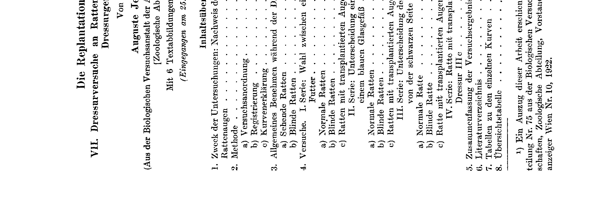

**Fig. 1.**

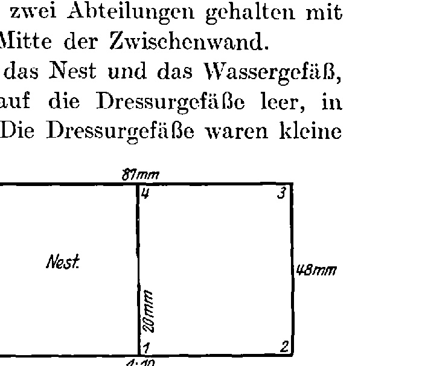

**Curve IVb.**

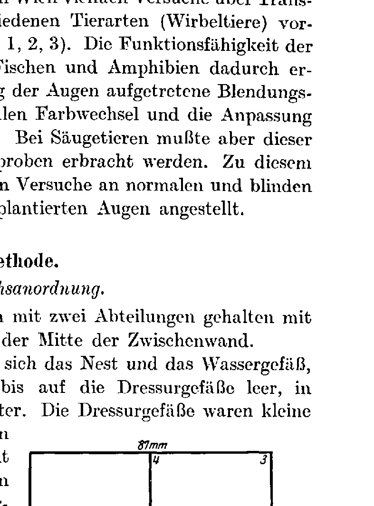

**Fig. 2.**

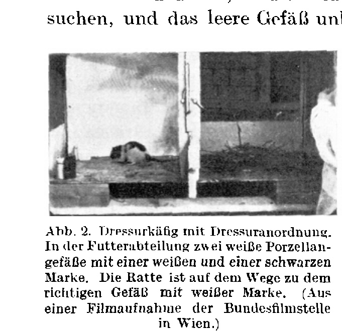

**Curve 1a.**

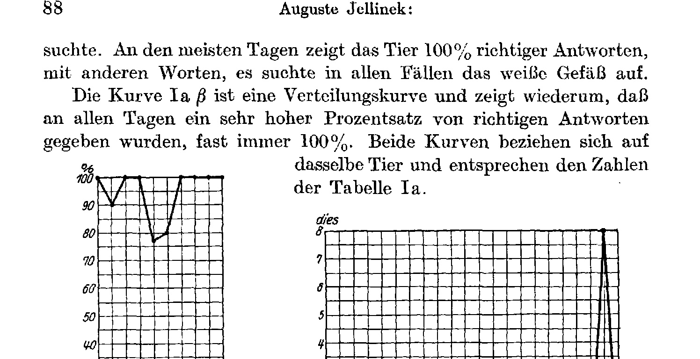

**Curve 1b.**

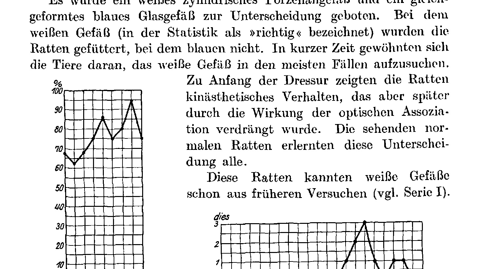

**Curve IIa.**

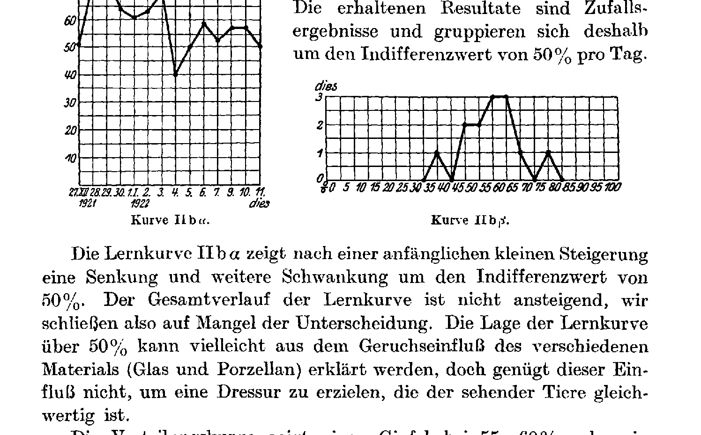

**Curve IIb.**

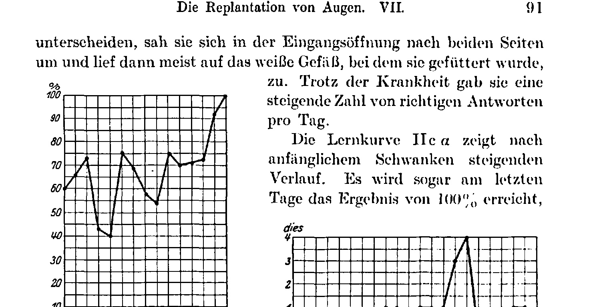

**Curve IIc.**

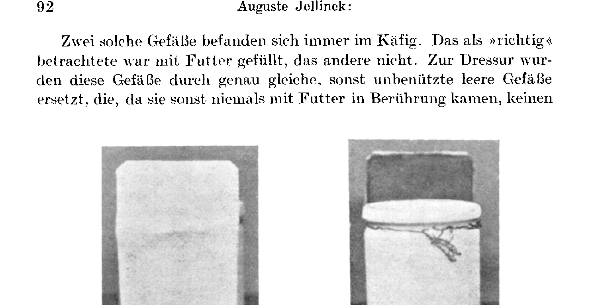

**Fig. 3, 4, 5, 6.**

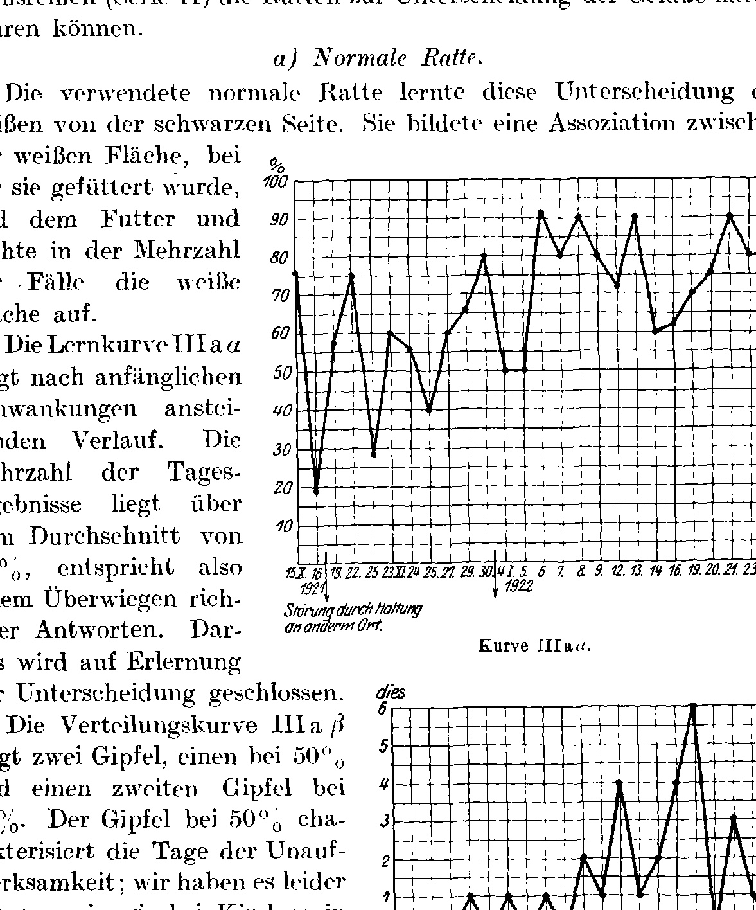

**Curve IIIa.**

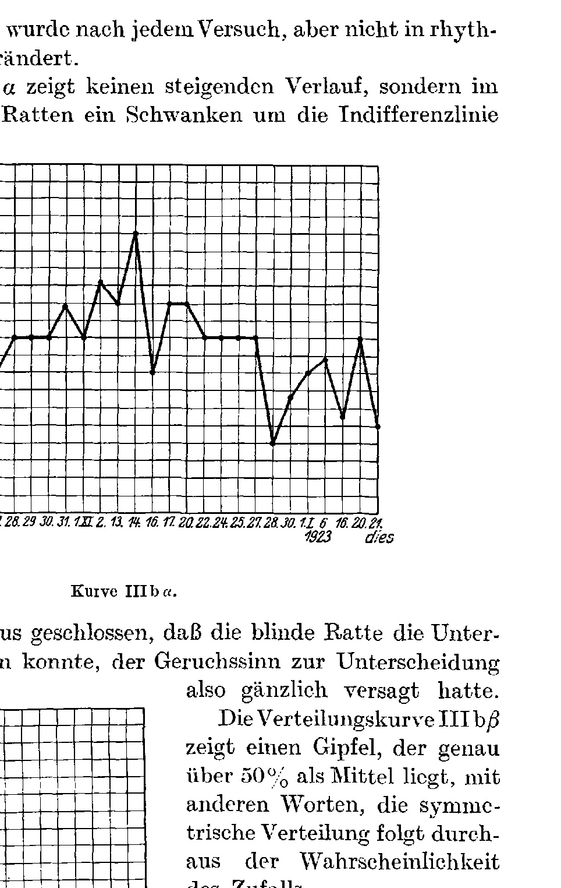

**Curve IIIb.**

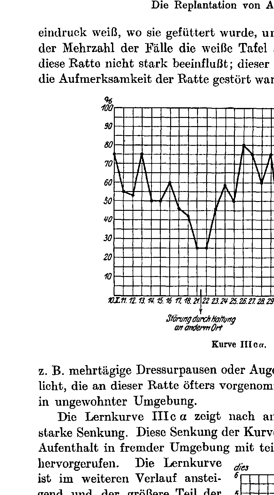

---

*Translator's note.* One of the Biologische Versuchsanstalt (Vienna Vivarium) papers flagged on the project site as a modern rediscovery target. Claims are rendered as stated in the original, not endorsed.
