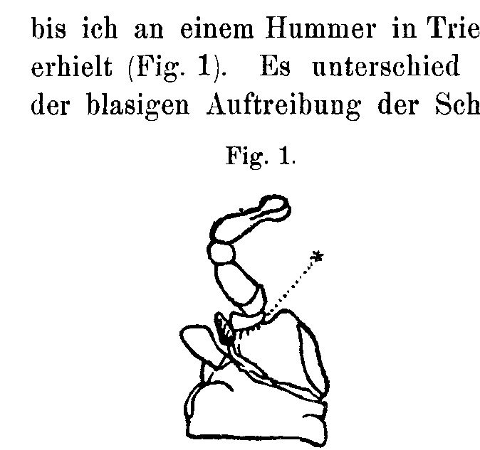
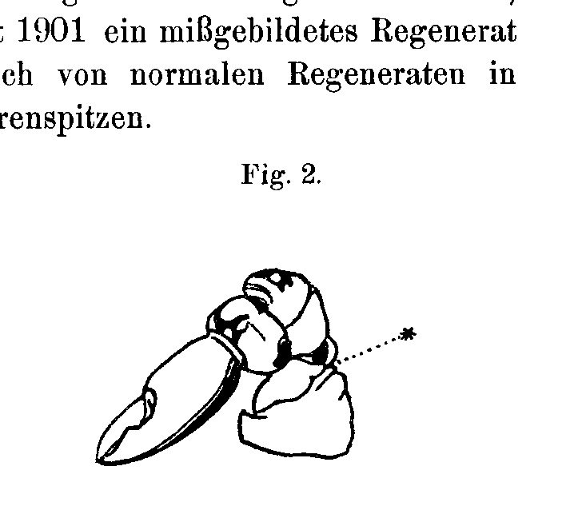

## Automatic Shedding of Malformed Regenerates in Arthropods.

By

**Hans Przibram,**

Privatdozent at the University of Vienna.

*(From the Biologische Versuchsanstalt in Vienna.)*

With 2 figures in the text.

Received 23 February 1907.

*Archiv für Entwicklungsmechanik der Organismen*, vol. 23 (1907).

> **Full translation.** A complete English rendering of the running text of “Automatic Shedding of Malformed Regenerates” (Przibram, 1907), including all tables, figure and plate legends, and footnotes. Numbers and table cells were transcribed from the page images, not the noisy OCR.

In experiments on regeneration in lower Crustacea in the years 1896–1898, peculiar structures had been observed on the severed second antennae of the daphnids (*Daphnia* and *Simocephalus*) which, together with their contents, later came to be shed and could then be detached from normal regenerates.

In my first communication (1896) I gave these structures the name "preliminary regenerates" and compared them with the heteromorphoses that Herbst had obtained in decapods in place of the eyes (as I set out further in 1899). Herbst, however, pointed out (p. 229) that these structures do not normally appear at any other site of the daphnids, whereas in the case of the heteromorphoses one is dealing with structures that are normally to be found at another site of the animal in question, and also that his heteromorphoses are not followed by any shedding. This induced me to abandon the conception of the preliminary structures as heteromorphoses (1901, p. 324, and 1902, p. 12). Since then I had not pursued the preliminary regeneration in the daphnids any further, since occupation with other groups of the Crustacea had disclosed numerous new facts whose treatment was of greater interest. O. Hübner, who in 1902 published experiments on the antennae of cladocerans, was unable to obtain any preliminary structures to view, and believes (p. 469) that he can perhaps ascribe the cause to the better nutritional conditions, since the animals always perished on him when he offered them those minimal existence-conditions which I had still been able to employ with success in my experiments. Recently J. Ost (1906, p. 295) then also conducted similar experiments, but only seldom obtained regenerates and obtained no preliminary structures.

In my numerous regeneration-experiments on other animal-groups no further phenomenon had come up before me that would have shown a similarity to the preliminary regeneration, until I obtained a malformed regenerate in a lobster at Trieste in 1901 (Fig. 1). It differed from normal regenerates in the vesicular swelling of the scissor-tips.

**Fig. 1.** Regenerate of a right toothed claw [scissor], malformed at the tips of the claw, in the European lobster.  *(figure not reproduced)*

**Fig. 2.** Regenerate of a left knobbed claw [knob-scissor], malformed by bending, in the European lobster.  *(figure not reproduced)*

> * Autotomy-site.

The loss had occurred before the 20th of May, and indeed through autotomy at the preformed break-site. On the 24th of June the malformed regenerate was 1.9 cm long. On the 25th of July it was shed. The shedding took place at the autotomy-site. No molt had occurred. On the 2nd of February 1902 the latter first set in, and the animal perished during it. In the meantime a normal regenerate had grown in place of the lost monstrosity (cf. 1905, Pl. VIII, Fig. 3 and 3 a, two regeneration-stages of this claw of the same specimen).

A second similar case concerned a regenerate that was bent aside and abnormally swollen in the hand-segment (Fig. 2). The loss at the autotomy-site had taken place on the 10th of June; on the 26th of September the malformation was 3–4 cm long; on the 17th of October its shedding ensued. Shortly afterward the animal died in the molt (21st of October), without having regenerated once more, which is not to be wondered at given the brevity of the time available.

Whereas in these cases the shedding of the malformed members took place through the act of autotomy without molting, and was thus at all events occasioned by a disease-stimulus relating to the malformation, a case has later come up before me, in experiments on praying mantises, that shows a greater similarity to the preliminary regeneration of the daphnids, in that it is not a matter of a regenerative malformation grown at a preformed break-site, but rather of a triple formation following the breakage of a foreleg. This monstrous structure, whose origin and description will be brought to publication in another communication, was shed at the next molt, in that the multiple formation could not pass through the old skin and remained hanging in it. On the foreleg in question a straight stump remained behind, which was no longer in a position to regenerate, since in the meantime the imaginal stage had been reached, at which the regenerative capacity of the legs has been extinguished.

Bordage (1898) pointed out that the insects possess in autotomy a means, when a member gets stuck in a molt, of nevertheless being able to complete it. He even traces the acquisition of the regenerative capacity in part directly back to this loss-probability, whereas I must hold the regenerative capacity to be the primary thing. Here Bordage thinks of selection-processes.

We now see, in our cases—in the mantis foreleg and the daphnid antenna—a regulative capacity which can be founded in the simple fact that the misformed structures are unable to pass through the old skin and therefore, during the animal's exertions to get free, tear through at the narrowest place and are left behind. Given the rarity of the occurrence of malformations of the kind described, an acquisition of this regulation through selection is surely not to be thought of; rather, all the conditions for the success of such regulation are already given without special adaptations.

In the lobster, in autotomy—which surely was certainly not set up for the rare cases of monstrous malformations—an automatic means for the removal of malformations is likewise given, in that the abnormally bent or broadened structures are more easily grazed and injured than normally positioned and mobile ones.

In the automatic shedding of malformed regenerates we see before us a regulation which, with no other arrangements than such as have been provided for other functions in the arthropods [Gliederfüßlern], is capable of leading to a normal goal.

To come back, with a few more words, to the starting-point of this consideration: Hübner may be partly right in that unfavorable conditions of husbandry were decisive for the appearance of the malformed "preliminary regenerates" on the antennae of the daphnids; only it is likely to be less the nutrition than the lack of space that is decisive, which can easily lead to a crippling of the delicate regeneration-buds.

### Bibliography.

Bordage, Edmond, *Sur le mode probable de formation de la soudure fémoro-trochantérique chez les Arthropodes.* Comptes rendus Société Biologie Paris. (X.) V. p. 839–842. 1898.

— English translation: Annals and Mag. Nat. Hist. (VII.) III. p. 158–162. 1899.

— *Recherches Anatomiques et Biologiques sur l'Autotomie et la Régénération chez divers Arthropodes.* Thèses: Faculté des Sciences Paris. (A.) No. 494. Lille (Danel). [p. 327.] 1905.

Herbst, Curt, Über die Regeneration von antennenähnlichen Organen an Stelle von Augen. III. IV. Archiv f. Entw.-Mech. IX. p. 215–292. 1899.

Hübner, Otto, Neue Versuche aus dem Gebiete der Regeneration und ihre Beziehungen zu Anpassungserscheinungen. Inaugural-Dissertation. Jena, Fischer. 1902.

Ost, Josef, Zur Kenntnis der Regeneration der Extremitäten bei den Arthropoden. Archiv f. Entw.-Mech. XXII. p. 289–324. 1906.

Przibram, Hans, Regeneration bei den niederen Crustaceen. Zoolog. Anzeiger. Nr. 514. 1896.

— Die Regeneration bei den Crustaceen. Arbeiten Zoolog. Institut Wien. XI. Heft 2. p. 163–194. 1899.

— Experimentelle Studien über Regeneration. Archiv f. Entw.-Mech. XI. p. 321–344. 1901.

— Regeneration. Ergebnisse der Physiologie. Wiesbaden (Bergmann). I. p. 43–119. 1902.

— Die Heterochelie bei decapoden Crustaceen. Archiv f. Entw.-Mech. XIX. p. 181–247. [Pl. VIII.] 1905.

> Archiv f. Entwicklungsmechanik. XXIII. — 39

## Figures

**Fig. 1.**

**Fig. 2.**

---

*Translator's note.* One of the Biologische Versuchsanstalt (Vienna Vivarium) papers flagged on the project site as a modern rediscovery target. Claims are rendered as stated in the original, not endorsed.
