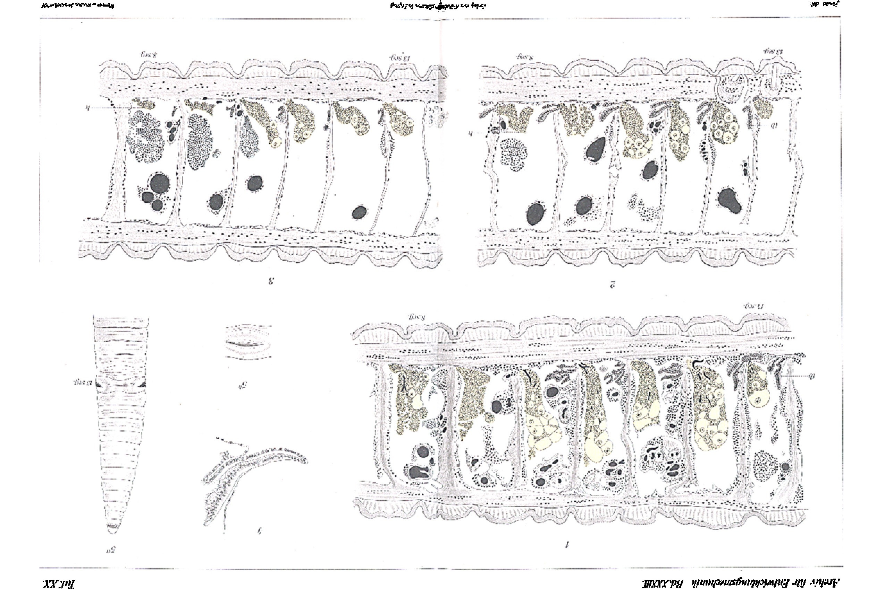

# Breeding Experiments with Japanese Dancing Mice and European Running Mice.

By

Privatdozent Dr. Viktor Hammerschlag.

(From the Biological Experimental Institute in Vienna.)

With 3 figures in the text.

Received on 13 September 1911.

*Archiv für Entwicklungsmechanik der Organismen*, vol. 33 (1912).

> **Full translation.** A complete English rendering of the running text of “Breeding Experiments with Japanese Dancing Mice” (Hammerschlag, 1912), including all tables, figure and plate legends, and footnotes. Numbers and table cells were transcribed from the page images, not the noisy OCR.

In the following I report on my breeding experiments with Japanese dancing mice and white European running mice. But before I present the experiments themselves and their results, let me briefly sketch the purpose of these experiments and the path by which I arrived at these breeding experiments.

For years I have been occupied with the etiology, the establishment of the clinical picture, and the various accompanying manifestations of what I have called hereditary-degenerative deaf-mutism of man.

My concern now was to establish the laws according to which this form of deaf-mutism is inherited. Now it is a well-known fact that we encounter an analogue of this deaf-mutism in various domesticated animals, namely in dogs, cats, and mice. The mice, as the animals which multiply most rapidly and therefore yield a sufficiently large progeny in relatively short periods of time, were of course the most suitable object for these experiments.

I began my experiments in the summer of the year 1906. Before this period I had indeed already undertaken individual experiments, but these had been undertaken by me without knowledge of the Mendelian laws of inheritance. Only in the summer of 1906 did I undertake systematic experiments aimed at a re-examination of the Mendelian laws of inheritance.

> Archiv f. Entwicklungsmechanik. XXXIII. 23

> 340 Viktor Hammerschlag

The parent animals were a male Japanese (i.e., a black-white spotted) dancing mouse and two female albinotic running mice. From this parent generation descended a number of gray single-colored running mice. Of these, eight individuals reached sexually-mature age. These eight mice were now united into a single breeding stock, and the young descended from this generation were always left with the parents for as long as until they could feed themselves independently, then removed and distributed, according to the schema to be described shortly, into the various breeding stocks.

As we know from the literature, color resp. colorlessness, further the spotting resp. the single-coloredness, and the running-mouse resp. dancing-mouse character are properties which are inherited independently of one another.

In our case it was now a matter of dealing with a black-white spotted and a completely albinotic mouse. The black-white spotted mouse represented the character of the spotting as well as the character of color-possession. The white mouse represented the character of colorlessness (albinism) as well as the character of single-coloredness. (An albinotic mouse can indeed latently carry the character of the spotting in itself, and if one were to use such white mice for breeding, one would be in danger of obtaining false results. In our case it was, however, certain that the albinotic mice did not descend from spotted mice.)

In the crossing of two animals, as described above, which differ constantly in three characters, a quite definite number of various combinations of characters must now reappear in the crossing-products, and indeed we must obtain:

1) colored, single-colored running mice and likewise [such] dancing mice;
2) albinotic running mice and albinotic dancing mice;
3) spotted running mice and spotted dancing mice.

Further, the single-colored as well as the spotted running- resp. dancing mice must again split into gray and black single-colored running- resp. dancing mice, as well as into gray-white and black-white spotted running- resp. dancing mice. We thus have ten different kinds to expect, and these ten kinds were, except for one single kind, also actually obtained in the breeding series to be described.

The eight gray bastards gave in total 117 young. Thereby

> Zuchtversuche mit japanischen Tanzmäusen und europäischen Laufmäusen. 341

came six further young, which died a few days after birth, so that their dancing- or running-mouse character could not be established. Three of them were gray, three white. These 117 (123) individuals of the first generation now fell into the following ten subdivisions:

| | | |
|---|---|---|
| 1) gray single-colored running mice | 51 | } +3 |
| 2) gray single-colored dancing mice | 12 | |
| 3) black single-colored running mice | 13 | |
| 4) black single-colored dancing mice | 2 | |
| 5) white running mice | 20 | } +3 |
| 6) white dancing mice | 6 | |
| 7) gray-white running mice | 10 | |
| 8) gray-white dancing mice | 1 | |
| 9) black-white running mice | 2 | |
| 10) black-white dancing mice | 0 | |
| | 117 + 6 | |

In parenthesis let it be remarked here that the black-white dancing mice, which I did not obtain in this breeding series, did appear in another breeding series. They were very feeble individuals which did not reach sexually-mature age.

Returning to the point of departure, let it be briefly remarked here that the habitus of the bastard generation lets us recognize which characters will behave dominantly and which recessively. With the races I chose, the bastard is always a single-colored gray running mouse. It is accordingly to be expected that the character single-coloredness and the character running-mouse character are the dominant characters. This must indeed, as we already know from the literature and as I too was able to confirm again, actually be so. That this is so emerges from the further results of my breeding experiments. For the individuals of the first generation were distributed, according to the characters just sketched, into ten separate breeding stocks. The fate of these stocks varied. Some of them died too quickly and yielded no sufficient material. Others again allowed themselves to be bred further with good success over a sufficiently long time. In brief, the result could be established as follows:

Albinotic animals bred together always yielded only albinotic offspring.

> 23* *(A full-page lithographic plate is bound in here, bearing the journal running-heads "Archiv für Entwicklungsmechanik. XXXIII." and the plate designation "Taf. IX", together with histological/anatomical section figures. The plate does not belong to the Hammerschlag paper — the running text passes continuously from p. 341 to p. 342 — and carries no caption pertaining to this paper; figure not reproduced.)*

> 342 Viktor Hammerschlag

Dancing mice crossed with dancing mice always yielded only dancing mice, and spotted animals bred among one another always yielded only spotted ones. Furthermore, the gray color proved superior (dominant) to the black, insofar as from gray animals one could always also breed black ones as well. But never did I obtain gray offspring from black animals. All these results were already achieved by my predecessors.

While now in this point the Mendelian law found its full confirmation, deviations from the Mendelian law showed themselves with respect to the numerical ratio of the dominant resp. recessive characters. Let us first consider the ratio of the runners to the dancers. This established itself as 96 to 21, i.e. as 4.57 : 1. We see here a considerable preponderance of the running mice. This deviation from the Mendelian formula (3 : 1) was, incidentally, observed by all experimenters, without an adequate explanation for this circumstance having so far been found.

The ratio of the colored mice to the albinotic ones established itself as 94 : 29, i.e. as 3.24 : 1. Here, accordingly, a fairly far-reaching agreement with the theoretically expected result shows itself.

A quite particular lack of agreement, however, is shown by the ratio of the single-colored animals to the spotted ones. If we combine the two character-pairs spotting and single-coloredness as well as color and colorlessness, the numerical ratio theoretically establishes itself as 9 : 3 : 4, that is, to nine single-colored animals come three spotted ones and four white albinos. With us the ratio established itself as 81 : 13 : 29, that is as 9 : 1.44 : 3.22.

We thus do see an agreement with respect to the progression, in that the single-colored ones occur in the majority, the spotted ones in the smallest number, and the albinos hold the middle. But here too a very considerable deficit in spotted ones, and, as already mentioned, a small deficit in albinos, shows itself.

By way of appendix let an occurrence be briefly mentioned here, which was observed in the course of the breeding experiments. It concerns the inheritability of traumata.

A male dancing mouse, which belonged to a larger breeding stock of ordinary Japanese dancing mice, lost a hind leg through con-

> Zuchtversuche mit japanischen Tanzmäusen und europäischen Laufmäusen. 343

striction. The leg became gangrenous and died off. From this male there descended a litter of four like-

**Fig. 1.** *(figure not reproduced)*

**Fig. 2.** *(figure not reproduced)*

**Fig. 3.** *(figure not reproduced)*

wise Japanese dancing mice, which were all malformed. Two of these malformed young did not reach sexually-mature age; two I was able to raise.

> 344 Viktor Hammerschlag, Breeding Experiments with Japanese Dancing Mice etc.

(The illustrations on p. 343 show the malformations to be observed in three of these animals.)

They amount essentially to a shortening of the tail, as well as to a malformation of various extremities. A similar result could later never again be achieved. Both the two malformed mice that had reached sexually-mature age, which by chance formed a little pair, as well as other mice on which I constricted individual extremities by means of a silk thread, were used for further breeding, without congenital malformations ever having appeared in the products.

## Figures

**Taf. IX.**

---

*Translator's note.* One of the Biologische Versuchsanstalt (Vienna Vivarium) papers flagged on the project site as a modern rediscovery target. Claims are rendered as stated in the original, not endorsed.
