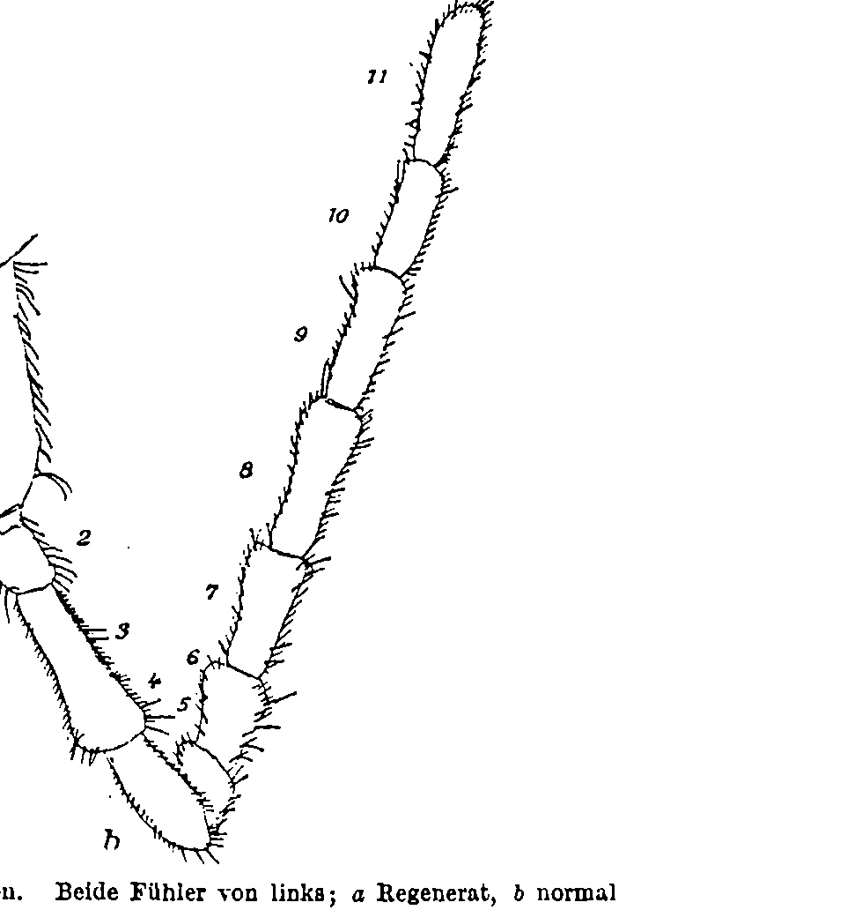
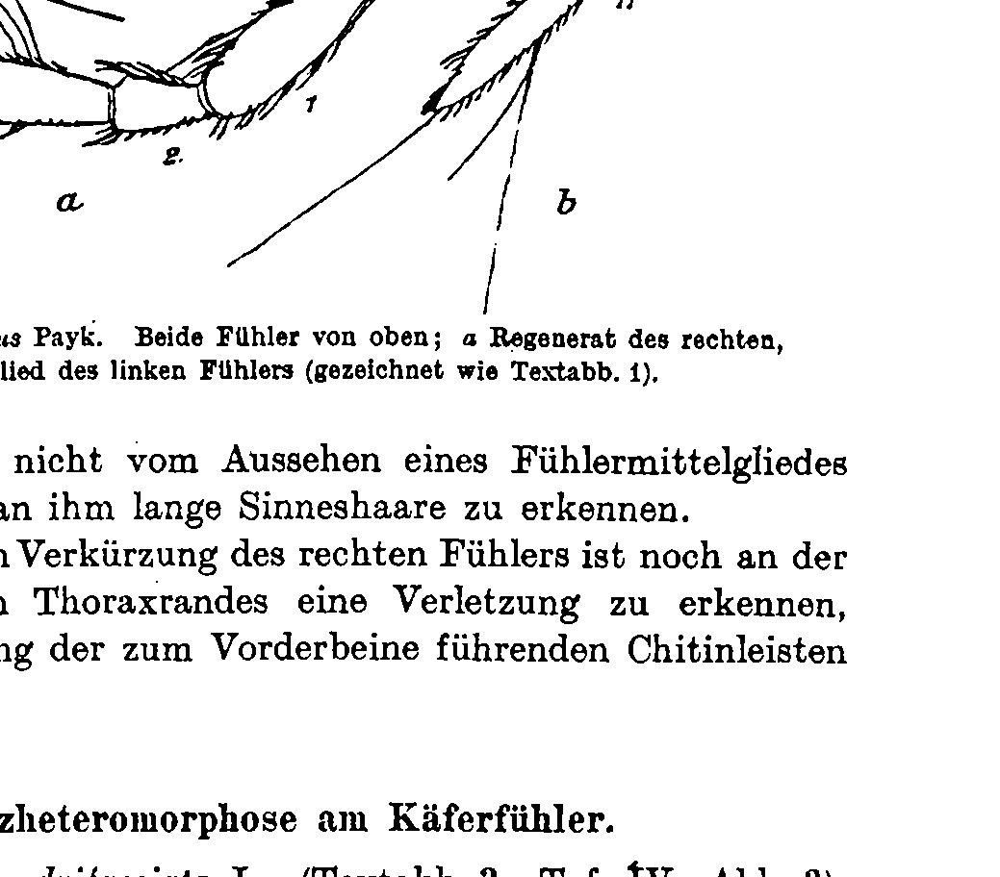
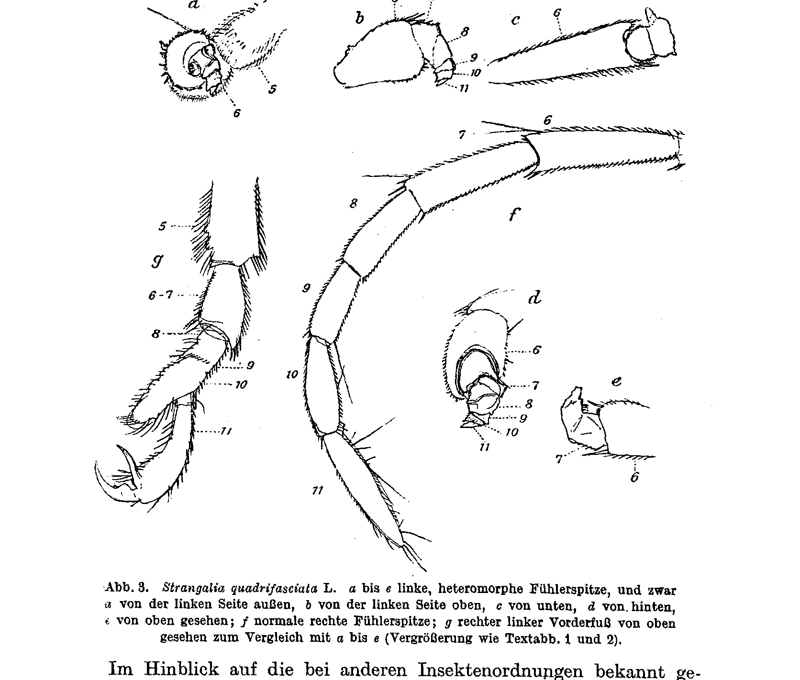
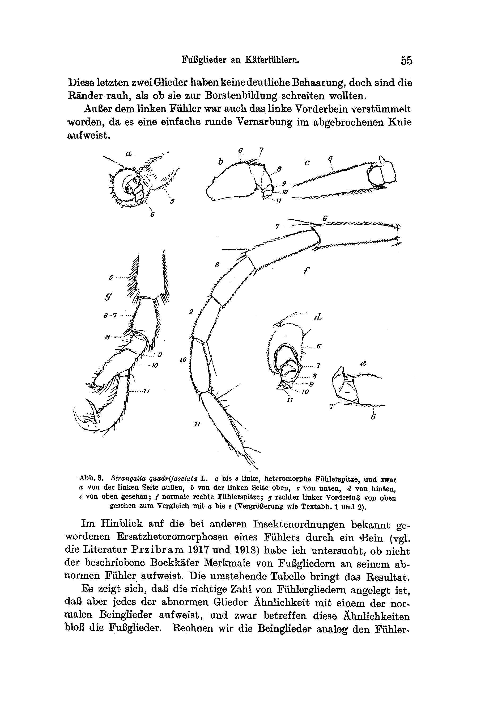
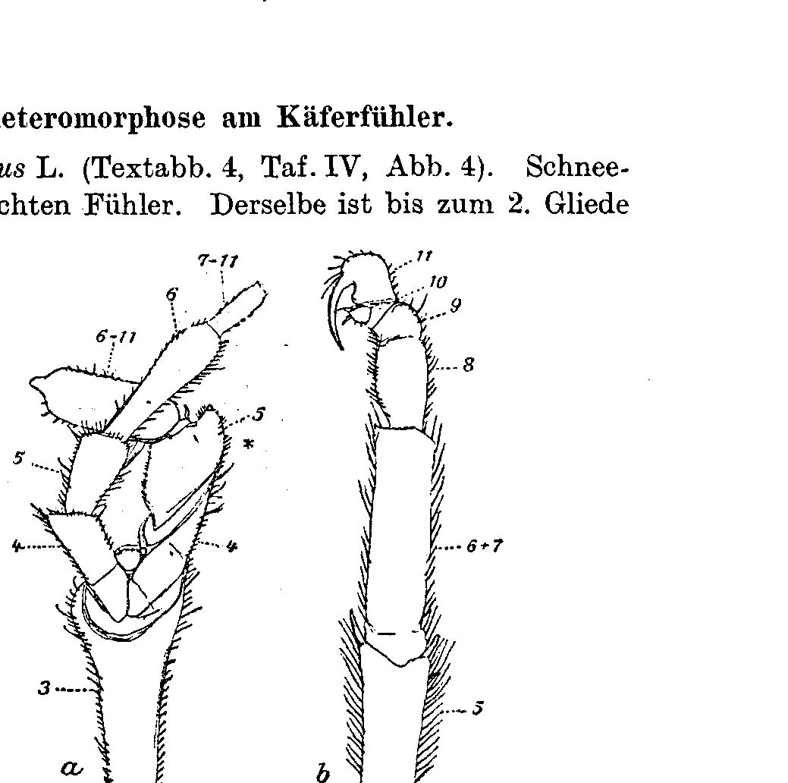
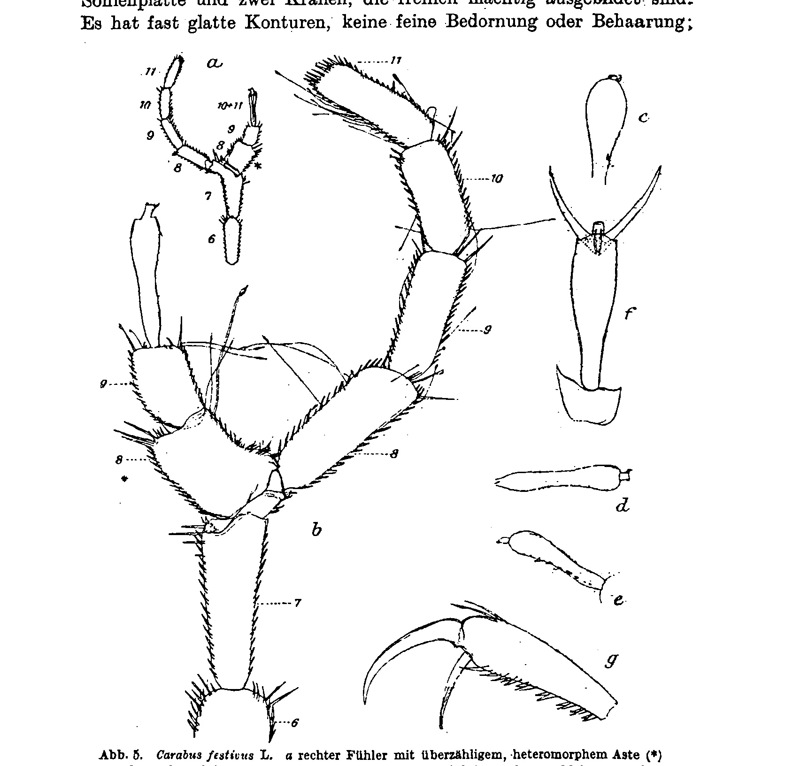

# Fußglieder an Käferfühlern

**Tarsal Segments on Beetle Antennae**

(at the same time: Homoeosis bei Arthropoden V. Mitteilung. [Homoeosis in Arthropods, 5th Communication.])

By

**Hans Przibram.**

(From the Biological Experimental Institute of the Imperial Academy of Sciences in Vienna [Zoological Division].¹)

With Plate IV and 5 Text-figures.

*(Received on 23 July 1918.)*

*Archiv für Entwicklungsmechanik der Organismen*, vol. 45 (1919).

> **Full translation.** A complete English rendering of the running text of “Tarsal Segments on Beetle Antennae” (Przibram, 1919), including all tables, figure and plate legends, and footnotes. Numbers and table cells were transcribed from the page images, not the noisy OCR.

### Contents

|  | Page |
|---|---|
| I. Simple Regeneration on the Beetle Antenna . . . . . . . . . . . . . | 52 |
| II. Substitution-heteromorphosis on the Beetle Antenna . . . . . . . . | 54 |
| III. Addition-heteromorphoses on the Beetle Antenna . . . . . . . . . . | 57 |
| IV. Theoretical Discussion . . . . . . . . . . . . . . . . . . . . . . | 61 |
| Summary . . . . . . . . . . . . . . . . . . . . . . . . . . . . . . . | 66 |
| Bibliography . . . . . . . . . . . . . . . . . . . . . . . . . . . . . | 67 |
| Explanation of the Plate . . . . . . . . . . . . . . . . . . . . . . . | 68 |

> ¹ An excerpt of this work appeared, under the same title, as "Mitteilung Nr. 29 aus der Biol. Versuchsanstalt" [Communication No. 29 from the Biol. Experimental Institute] of the kais. Akad. d. Wissensch., Zool. Abt., in the Sitzungsanzeiger Nr. 17, 1918.

## I. Simple Regeneration on the Beetle Antenna.

In our developmental-mechanics museum there are several beetles with abnormal antennal formation which were found in the wild.

Since we know from the experiments of Gadeau de Kerville (1890), Tornier (1901), Werber (1905) and Megušar (1907) that antennae mutilated in the larva regenerate, and are fixed on the imago in incomplete reproduction if not enough time before the metamorphosis was given to re-attain the normal condition, it is natural to address the antennal monstrosities found in nature likewise as regenerates.

To begin with, let two cases of Schneekäfer [snow beetles] (*Telephorus*) be described, which display the usual regenerate-form that deviates little from the normal antenna and which will be of use to us for judging the more strongly deviating antennal malformations to be described later in sections II and III.

Nr. 1. *Telephorus rusticus* Fallén (Text-fig. 1; Pl. IV, Fig. 1). Left antenna from the start narrower than the normal right one; it consists of the three distinctly subdivided but too-small first segments and of a roundish knob, which reaches the breadth of the normal antennal segments and which at its end bears the suggestion of a further subdivision of an end-segment. The pubescence of all the segments of the left antenna corresponds to that of the normal right one. In particular, the weakly-subdivided antennal end is provided with end-hairs of two different lengths. If it is permissible to homologize hairs merely according to their length, the 4. segment of the left antenna

**Fig. 1.** *Telephorus rusticus* Fallén. Both antennae from the left; *a* regenerate, *b* normal (drawn with Zeiß-comp. Oc. 6, Obj. a₂, tube inserted; then reduced to ¼ for reproduction).  *(figure not reproduced)*

would, at the end, represent the homolog of the normal 8. (long hair) and 9. (shorter, strong hair), so that the end-cap would correspond to the 10. plus 11.; the 4. to 9. segment would not yet have attained subdivision but would all still stick in the roundish enlargement.

Besides the left antenna, the beetle is normally formed.

Nr. 2. *Telephorus violaceus* Payk. (Text-fig. 2; Pl. IV, Fig. 2). Right antenna normal up to and including the 3. segment; but onto this adjoin only two more segments curved toward the rear, whereas the normal left antenna shows 11 segments in all. The two abnormal segments have the typical pubescence of antennal segments; in particular, on the more distal one stand the three very long bristles characteristic of the normal 11. end-segment. According to its shape, the abnormal right end-segment is thicker and shorter, but otherwise resembles the normal end-segment in the absence of straight-lined boundary-stretches; the penultimate segment of the abnormal antenna would thus be identified with the 4. to 10. of the normal one. With the exception of the curvature and a somewhat greater

**Fig. 2.** *Telephorus violaceus* Payk. Both antennae from above; *a* regenerate of the right, *b* normal end-segment of the left antenna (drawn as Text-fig. 1).  *(figure not reproduced)*

compactness, it does not deviate from the appearance of an antennal middle-segment; in particular, long sense-hairs can be recognized on it.

Besides the abnormal shortening of the right antenna, an injury can also be recognized on the underside of the right thorax-margin, which consists in the tearing of the chitin-ridges leading to the foreleg.

## II. Substitution-heteromorphosis on the Beetle Antenna.

Nr. 3. *Strangalia quadrifasciata* L. (Text-fig. 3; Pl. IV, Fig. 3). The left antenna of this Bockkäfer [longhorn beetle] is normal up to and including the 6. segment; onto this follows a segmented stump directed forward and downward, which encloses the remaining 5 segments. These segments entirely lack the normal antennal form and pubescence and, already on account of their bending away from the direction of the earlier segments, do not give the impression of being a continuation of the normal antenna. In detail the following characters can be ascertained: the 7. segment is as yet only slightly twisted, as appears from the top view, bears on the hind margin a row of longer bristles, and widens — as recognizable in the rear view — into a cuff, which receives the 8. segment. Out of the short funnel-shaped 7. segment, the roller-shaped 8. segment bends forward and downward; it bears on the front side some longer hairs. In the same direction follows the 9., small, unhaired segment. The 10. segment, again drawn obliquely forward and downward, forms a long end-surface, out of whose upper end the 11. segment projects claw-fashion, obliquely toward the front and downward.

These last two segments have no distinct pubescence, but their margins are rough, as if they were about to proceed to bristle-formation.

Besides the left antenna, the left foreleg too had been mutilated, since it exhibits a simple round scarring on a broken-off knee.

**Fig. 3.** *Strangalia quadrifasciata* L. *a* to *e* left, heteromorphic antennal tip, and indeed *a* from the left side, outside; *b* from the left side, above; *c* from below; *d* from behind; *e* seen from above; *f* normal right antennal tip; *g* foreleg seen from above for comparison with *a* to *e* (magnification as Text-fig. 1 and 2).  *(figure not reproduced)*

In view of the substitution-heteromorphoses of an antenna by a "leg" that have become known in other insect orders (cf. the literature, Przibram 1917 and 1918), I have examined whether the described longhorn-beetle does not exhibit features of tarsal segments [Fußgliedern] on its abnormal antenna. The accompanying table gives the result. It turns out that the correct number of antennal segments is laid down, but that each of the abnormal segments exhibits a similarity to one of the normal leg-segments, and indeed these similarities concern merely the tarsal segments [Fußglieder]. Let us count the leg-segments analogous to the antennal

| Normal antenna, form | Abnormal antenna | Normal foreleg, form | Segment-designation |
|---|---|---|---|
| 1. Antennal segment club-shaped | club-shaped | flat, quadratic | Coxa |
| 2. Antennal segment short, globular | short, globular | short, triangular | Trochanter |
| 3. Antennal segment long, cylindrical, uniformly haired | long, roller-shaped, uniformly haired | mighty, club-shaped | Femur |
| 4. " | (very small, hidden in the femur) | (Patella) | — |
| 5. " | long, inverted, pyramid-shaped, with strong end-spurs | — | Tibia |
| 6. " | short, funnel-shaped, on the outer side a row of longer hairs | (on the outer side at the end more strongly haired) | Tarsus I |
| 7. " | short, funnel-shaped, on the outer side a row of longer hairs | longer hairs, divided by a furrow into two parts | Tarsus I |
| 8. " | short, obliquely truncated cylinder, inner side with longer hairs | obliquely truncated cylinder, divided by furrow on the inner margin into 2 short parts, inner side with longer hairs | Tarsus II |
| 9. " | very short, with longer hairs | (as above) | Tarsus III |
| 10. " | very low, wedge-shaped, with the ridge facing outward, long oblique end-surface | low, lobe-shaped, with long oblique end-surface | Tarsus III |
| 11. Antennal segment long, cone-shaped, long end-hairs | directed inward and downward, elongate, much narrower than the end-surface of the preceding segment, out of which it springs outward above; without end-hairs, ending horny | directed inward and downward, curved, club-shaped, much narrower than the end-surface of the preceding segment, out of which it springs outward above; without end-hairs, ending in 2 horny claws | Tarsus IV |

segments from the body onward, then the first five leg-segments, which contain everything up to the beginning of the foot, still correspond to the normal part of the abnormal antenna. It was thus also not to be expected that other leg-characters than foot-features [Fußmerkmale] would appear. That, however, other leg-parts could also appear together upon a more proximal loss, the experiments on Mantids (1918) have taught me. Now, however, the foot in *Strangalia*, which belongs among the four-membered beetles, does not possess enough segments for each of the laid-down antennal segments to be able to correspond to a definite, different tarsal segment [Fußglied]. The last and penultimate tarsal segment [Fußglied] possess a very pronounced form and mutual joining, and since we re-find this latter [joining] on the abnormal antenna, I have homologized tarsal segments IV and III with antennal segments 11 and 10. There then remain still the I. and II. tarsal segment, which according to the position of the hairs can be homologized with the 6. plus 7. and the 8. plus 9. respectively, in that the former group exhibits the stronger or respectively longer hairs on the outer side, the latter on the inner side.

Our longhorn-beetle thus carries features of all tarsal segments [Fußglieder] on the abnormal antennal piece, and we can therefore classify the case as the appearance of foot-like segments on an antenna and accordingly as "substitution-heteromorphosis" (for the terminology cf. Przibram 1910), since these homoeotically altered antennal segments stand in the place of the normal ones. In the following two cases, by contrast, it concerns supernumerary addition-segments alongside the normal ones, thus "addition-heteromorphosis".

## III. Addition-heteromorphoses on the Beetle Antenna.

Nr. 4. *Telephorus fuscus* L. (Text-fig. 4; Pl. IV, Fig. 4). Snow-beetle with branched right antenna. The same is

**Fig. 4.** *Telephorus fuscus* L. *a* right antenna with supernumerary, heteromorphic branch (*) from below, *b* left foreleg from above, *c* from below for comparison (magnification as Text-fig. 1–3).  *(figure not reproduced)*

normally developed up to the 2. segment; the 3. segment is at the end abnormally club-shaped, inflated and carries two joint-facets meeting at 60°, each of which gives origin to a row of segments. The row lying more toward the rear and below consists of four segments, which exhibit the typical shape, pubescence and color of the segments 4 to 7 continuing the normal antenna, save for the defective formation — probably caused by a renewed loss — of the 7. segment. The antennal branch lying more toward the front and above consists of 3 segments, which depart essentially from the constitution of normal antennal segments. To avoid prolixity, I append at once the table with the homologization to leg-segments.

| Normal antenna, form | Abnormal antenna | Normal foreleg, form | Segment-designation |
|---|---|---|---|
| 1. Antennal segment flat-club-shaped, haired, without spurs | flat-club-shaped | flat, triangular | Coxa |
| 2. Antennal segment smaller, otherwise similar | smaller, otherwise similar | small, triangular | Trochanter |
| 3. Antennal segment longer, weakly club-shaped | much longer, strongly club-shaped, inflated | strong, spindle-shaped | Femur |
| 4. " | broad, trapezoidal | small, hidden in the femur, visible from below | (Patella) |
| 5. " | broad, short, inverted pyramid-shaped, at the end with cuff [Manschette], 1 spur and 1 horn-tip | long, inverted pyramid-shaped, at the end with cuff and 2 spurs | Tibia |
| 6. " | — | long, roller-shaped | Tarsus I |
| 7. " | — | shorter, roller-shaped | Tarsus II |
| 8. " | — | still shorter, roller-shaped | Tarsus III |
| 9. " | — | lobe-shaped | Tarsus IV |
| 10. Antennal segment as long as the 2. segment, cylindrical | longer, roller-shaped, ends in a blunt undefined cone, which lets no further segments be recognized | — | — |
| 11. Antennal segment as long as the 2. segment, spindle-shaped | — | club-shaped, 2 end-claws | Tarsus V |

Since horn-tips and spurs nowhere occur on the normal antenna, but on the other hand are characteristic of the end of the tibia, just as is the cuff-like marginal bulging, the 5. segment of the abnormal antenna can be compared with a strongly shortened and otherwise still rudimentary tibia. It will perhaps be striking that then the abnormal 4. segment, which in might almost equals the 5., would have to be equated with the patella, which is scarcely visible in the normal leg. Yet I have, in regenerates, always seen precisely this segment most clearly, and it can be equal in size to the tibia at early stages of the re-generation (cf. Przibram). As a consequence of the indistinct formation of the end — probably to be traced back to loss — the still-present 6. segment can indeed be designated as a tarsal segment, but not exactly as a definite one with certainty. If the end has not broken off once again, we would have before us a collective-segment that includes all the still-missing ones; otherwise it can be homologous to the 6. antennal segment or the 1. tarsal segment alone.

It is still to be mentioned that the coloration of the abnormal segments corresponds more to that of the leg-tibia and of a first tarsal segment than to the homologous normal antennal segments, in that in the latter the red-yellow region, through darkening from the distal end, remains restricted to almost entirely the most proximal spot, whereas in the two former only the front margin and narrow side-margins appear blackened.

Nr. 5. *Carabus festivus* (Text-fig. 5; Pl. IV, Fig. 5). The right antenna of this Laufkäfer [ground beetle] is bent off downward at the end of the 7. antennal segment. At the bending-place rises a three-membered addition-formation, which, beginning thicker than the 8. antennal segment, faces symmetrically to the same one upward. The 1. segment of this addition-formation is butted together with the 8. segment of the bent-off original antennal-branch, and the direction of the spurs on the inner margin shows clearly where this formation has reversed the original growth-direction of the 7. segment (marked on the Text-figure with a small star). From this place on, the spination runs opposite to that of the normal 8. segment, and the equipment with sense-hairs and end-spurs of the opposite side — thus of a left antenna — appears. The 2. segment of the addition, likewise thicker and shorter than the corresponding normal 9. segment, still shows the typical spination of an antennal segment and is also equipped with sense-hairs. The symmetry is not very clear. Out of the broadly truncated end-facet springs a long, narrow, spindle-shaped segment that widens club-like before its end. The same lacks the spurs, bristles and sense-hairs of the normal antennal segments and ends in a rectangular, still much narrower process, which is set off but not segmented off, and which carries on the one side a claw-shaped curved appendage, on the other a slightly projecting little knob. Ventrally there runs along the length of the end-segment a ridge, accompanied by rudiments toward saw-teeth. This segment has no similarity to an antennal segment, least of all to the two last ones, to which according to the sequence it would have to correspond. By contrast the similarity to the last tarsal segment (e.g. of the figured foreleg) cannot be mistaken. This too is much narrower than the preceding segment, long, spindle- Owing to the indistinct formation of the end — probably to be attributed to loss — the still-present 6th segment can well be designated as a foot-segment [Fußglied], but not precisely as a particular one with certainty. If the end has not been broken off again, then we would have before us a collective segment [Sammelglied] that includes all the still-missing ones; otherwise it can be homologous to the 6th antennal segment or to the 1st tarsal segment alone.

It must further be mentioned that the coloration of the abnormal segments corresponds more to that of the leg tibia and of a first tarsal segment than to the homologous normal antennal segments, in that the red-yellow zone in the latter [the normal antennal segments] remains, through darkening from the distal end, already almost entirely restricted to the most proximal place, while in the two former [tibia and first tarsal segment] only the front edge and narrow soap-edges [Seifenränder] appear blackened.

### No. 5. *Carabus festivus* (Text-fig. 5, Pl. IV, Fig. 5).

The right antenna of this ground-beetle is bent downward at the end of the 7th antennal segment. From the bending-point there rises a three-segmented secondary structure [Zusatzgebilde] which, beginning thicker than the 8th antennal segment, looks upward symmetrically to it. The 1st segment of this secondary structure has abutted against the 8th segment of the bent-off original antennal branch, and the direction of the spines on the inner edge clearly shows where this structure has reversed the original direction of growth of the 7th segment (marked on the text-figure with a little asterisk [Sternchen]). From this place on, the spination runs opposite to that of the normal 8th segment, and the equipment with sensory hairs and end-spines [Enddornen] of the opposite side — that is, of a left antenna — appears. The 2nd segment of the secondary structure, likewise thicker and shorter than the corresponding normal 9th segment, still shows the typical spination of an antennal segment and is also equipped with sensory hairs. The symmetry is little clear. From the broadly truncated end-facet [Endfazette] there springs a long, narrow, spindle-shaped segment that widens club-like before the end. The same lacks the spines, bristles, and sensory hairs of the normal antennal segments and ends in a rectangular, much narrower process [Fortsatz], which is set off but not segmented off [abgesetzt, aber nicht abgegliedert] and bears on one side a claw-shapedly curved appendage [Anhängsel], on the other a slightly projecting little knob [Knöpfchen]. Ventrally there runs along the length of the end-segment a ridge [Leiste], which is accompanied by rudiments of saw-teeth [Sägezähnen]. This segment has no similarity to an antennal segment, least of all to the two last ones, to which it ought to correspond according to the sequence. On the contrary, the similarity to the last tarsal segment (e.g. of the figured foreleg [Vorderbein]) cannot be mistaken. This too is much narrower than the preceding segment, long, spindleshaped, club-shapedly thickened before the end, ending in a rectangular sole-plate [Sohlenplatte] and two claws, which are admittedly powerfully developed. It has almost smooth contours, no fine spination or pilosity;

**Fig. 5.** *Carabus festivus* L. *a* right antenna with supernumerary, heteromorphic branch (*) from the right side (lens-magnification reduced to ½ for reproduction); *b* the same from the left side; *c* termination [seen] from above, *d* from outside, *e* from outside-below; *f* last tarsal segments [seen] from above for comparison with *c*; *g* last tarsal segment of the left foreleg [Vorderbein] seen from outside-below for comparison with *e* (*b* to *g* magnification as in Text-figs. 1—4).  *(figure not reproduced)*

on the underside, however, two rows of strong comb-teeth [Kammzähne] are present, which accompany the ridge [Leiste] mentioned also in the case of the abnormal segment, and on the upper side, before the end, two sensory bristles [Tastborsten], which the abnormal secondary segment [Zusatzgliede] lacks.

## IV. Theoretical Discussion.

For the theoretical interpretation of the foot-like [fußähnlichen] segments on antennae it is first of all important to demonstrate that we are really dealing, in the described cases, with regenerates. A tabular survey of the 5 described beetles will allow us to avoid a long-winded repetition of the indications already brought forward individually.

Table of the 5 beetles with abnormal antenna.

| Nr. | Gattung | Art | Nach | Abnormer Fühler einschl. Glied | Sonstige Verletzungs-indizien (außer Größe und Verbiegung) | Anzahl des Gliedes des abn. F. bzw. davon abn. Astes | norm. | Ende des Endgliedes | Bein-ähnlichkeit ab Glied | mit | Klassifikation der Abnormität |
|---|---|---|---|---|---|---|---|---|---|---|---|
| 1 | *Telephorus rusticus* | | Fallén | links 1. | Knospenartig ab 3. Gl. | 5 | 5 | normal | — | — | Einf. Regeneration |
| 2 | *— violac.* | | Payk. | rechts 4. | Verwundung an d. Coxalverb. des r. Vorderb. | 5 | 2 | » | — | — | Einf. Regeneration |
| 3 | *Strang. quadrifasc.* | | L. | links 7. | l. Knie Vorderbein abgebrochen | 11 | 5 | abnormal | 7. | Tarsus (II?) | Ersatz-heteromorph. |
| 4 | *Telephorus fuscus* | | L. | rechts 3. | Verletzung d. norm. Antennenastes | 6 | 3 | bloß knospenart. Kegel | 5. | Tibia | Zusatz-heteromorph. |
| 5 | *Carabus festivus* | | | rechts 7. | Deutl. Wunde am Femur | 10 | 3 | abnormal | 10. | Tarsus V | Zusatz-heteromorph. |

In all cases there are found, in the surroundings of the abnormal antenna, still other traces of injury besides the typical bendings of the affected antennal parts and the lesser length and development, with the exception of No. 1, where, however, it is precisely the consistently lesser size of the segments and the incomplete segmentation [Abgliederung] that speaks for regeneration.

One might now believe that the described foot-like antennal segments are merely less well-developed antennal segments, which should only have attained the typical form, armature [Bewehrung], and hairiness, in which they were admittedly hindered by the entry of the imaginal stage.

Were this interpretation correct, then we would have to expect to encounter the most normal development of the antennal segments in those abnormalities which have come closest to the normal segment number in the progressive regeneration. But that is not the case: precisely those two numbers 1 and 2, which come closest to the normal development of the already-present antennal segments, are the furthest from the attainment of the normal antennal-segment number.

In particular, the end segment in these regenerates has the typical terminal hairing [Endbehaarung] of the 11th antennal segment, which corresponds to the rule generally valid for arthropod antennae, that the tip segment is the first to attain regeneration (Przibram 1899, Zeleny 1907, Haseman 1907).

In the foot-like antennae one does not find this tip-development to be expected first in the regenerate. Although in No. 3 all the antennal segments that had been lost have reappeared correctly in number, there is nevertheless no typical antennal termination present; in No. 5, which has nearly attained the normal antennal number, this termination is likewise lacking, and in No. 4, in which the abnormality clearly proceeds from the 3rd segment and has 3 further segments well developed, the tip too is laid down only as a bud without end-bristles.

We could even claim a centrifugal direction of segmentation [Abgliederungsrichtung] as a further feature speaking in favor of the foot-likeness, if it should be confirmed that this direction of segmentation also holds for the normal regeneration of legs in beetles, as has been observed for other arthropods by Haseman (1907), in contrast to the initially centripetal direction of segmentation on the antennae.

With this would also be compatible the slight indication of the foot-claws [Fußklauen] which the foot-like antennae exhibit. But this question cannot be decided without experiments specifically directed to it.

Why I do not doubt designating the antennae in question as foot-like — that is, after all, the occurrence of antennae clearly ending in feet in other insect orders, e.g. Hymenoptera (among them one secondary case [Zusatz]) and Orthoptera (cf. Przibram 1917, III).

Recently I was able, in *Sphodromantis*, to force the transformation of the entirely removed antenna into an almost complete leg (Przibram 1918), and something similar will shortly be reported by Leonore Brecher for stick insects [Stabheuschrecken].

If we may conceive the appearance of foot-characters on beetle antennae as heteromorphoses, then there follows a series of conclusions concerning the influence of the nervous system on regeneration, which contradict the views hitherto adopted.

The proof furnished by Herbst (1895—1899), that the antenna-like structures appearing in crustaceans in place of eyes are bound to the removal of the eye-stalk bearing the ganglion, and that in particular also the antennal flagella [Antennengeißeln] appearing beside parts of the eye (Howes 1887) can be imitated by scratching out the ganglion while preserving the stalk (Herbst 1901), has convinced not only this author but most of the remaining investigators of the "formative" influence of the ganglion, that should act as a "formative stimulus" [formativer Reiz] upon the regenerate. I myself was inclined to assume such an influence of the nerve-centre on the developing regenerates of arthropod appendages in general, namely that the removal of the associated ganglion extinguishes the normal developmental height [Ausbildungshöhe] of the appendage, so that only a lower state of development is attained (Przibram 1910). In this, however, I came up against technical and factual difficulties, namely in the replacement of insect antennal tips by feet, where there could be no question of a removal of the antennal ganglion, while the so-called "ganglia" of doubtful nature found in the antennal flagellum (cf. Przibram 1917, p. 82, note) also occur in the flagella of the crayfishes [Krebse], without their regeneration as such failing to appear upon severance of the antenna. Nevertheless I have hitherto held to the hypothesis, though with emphasis on the uncertainty, as long as no compelling counter-proof was at hand. Moreover, the so-called "ganglia" of the insect flagellum regenerate along with it. Most recently Herbst (1916, p. 472) has, with respect to the necessity of the ganglion for the correct formation [Ausformung] of the regenerating crayfish-appendages, become wavering through experiments on the tail-legs [Schwanzbeinen] of *Palaemon*, since here, according to ganglion-extirpation, tail-legs grow back as such, and indeed without subsequent restoration of the ganglion.

Giesebrecht (1910), who saw the abdominal legs regenerate unchanged after ganglion-extirpation, had proposed to distinguish between sense-organs and movement-organs; only in the former should the nervous centres exert a formative influence, but not in the latter. Against this separation Herbst had reservations, insofar as he rightly thought of the regenerating heteromorphic antennules not as arising, like the eyes, through formative influence of the ganglia, but as movement-organs without such influence. According to Giesebrecht's conception too, then — just as Herbst had imagined it — there would have to exist a formative influence of the ganglion of the neighboring 1st antenna upon the heteromorphosis.

But if we wished to extend this assumption to other homoeotic regenerations, then the replacing and replaced appendages would always have to belong to neighboring segments, or at least be connected in the ganglion by direct commissures, for it is hard to see how the "formative" influence of the more distant ganglia should reach over [hinübergreifen] the uninjured intervening ones.

Now this is, however, in the replacement of the antennal end by foot-segments — although it is probably always a matter here of the foreleg — not the case, in that the antennal segment is by no means followed by the 1st thoracic segment, to which the 1st pair of legs belongs; rather, the mouthparts [Mundwerkzeuge] push in between.

In any case, the like ganglia of the opposite side would lie nearer. But here, in our beetles, a further difficulty arises, which seems to make even the interpretation by commissures impossible.

In the secondary-heteromorphoses [Zusatzheteromorphosen] of foot-like segments on antennae, the time of origin falls, self-evidently, in the larval period, for only in this can lost or wounded parts grow back (if one did not wish to acknowledge the character of regeneration, then the origin would have to be displaced into a still earlier embryonic period). Now the injured larval antenna must surely have transformed itself into the imaginal antenna, likewise its abnormal branch. While now the normal antenna must have stood, in this thoroughgoing metamorphosis, under the formative influence of the antennal ganglion, only the abnormal branch alone would have to have partly withdrawn itself from this same and to have come partly under the influence of the foreleg-ganglion, and both formative influences would have to have been mediated through the nerves of the uninjured antennal beginning! If one wished, as Herbst provisionally discussed for the abdominal legs, to assume an "after-effect" [Nachwirkung] of the removed or injured ganglion, then one must ask why this "after-effect" does not also make itself noticeable in the scratching-out of the eye-stalk, in order to complete the eye again?

I believe that all these assumptions already make too great a demand on our credulity, and that it is therefore better to let the hypothesis of the formative ganglion-influence along the nerve-conduction-path drop, which in any case seemed to hold only for the arthropods. At this point I do not wish to enter further into the question of the nerve-influence on the regeneration of other groups. It suffices to recall the regenerative capacity of a *Triton*-leg transplanted to an arbitrary place on the body (Kurz 1912) and the restoration of the eye-elements in salamander-eyes [Salamanderaugen] likewise transplanted (Uhlenhuth), in order to dispute, for the vertebrates, every necessity of an associated ganglion for the formation [Ausformung].

Recently Kopeć (1917) has made an analogous experiment with transplantation of caterpillar-eyes onto an abdominal segment and observed the normal transformation into an imaginal eye in *Lymantria dispar*. The same author was able to remove various ganglia in the caterpillars without the regions innervated by them being hindered in their normal development and metamorphosis. Even after removal of the brain the eye transformed itself normally, and in the absence of central ganglia and foot-nerves [Fußnerven] the severed abdominal feet of the caterpillars nevertheless regenerated.

The independent development of the transplants gives us the point of support that the formative potencies lie in the organ itself, are not exercised by a nervous ganglion along the path of the nerve-conduction. The interpretation which Herbst at the time set up as the second alternative, but had not adopted — namely that two potencies are present in the limbs [Gliedmaßen] capable of heteromorphosis, of which the one now becomes active upon the extinction of the other — furnishes us the more satisfactory explanation.

We can adduce still further facts which speak for this interpretation: a) the mostly lesser sense-physiological differentiation-height [Differenzierungshöhe] of the replacing organ as against the replaced one, which points to the persistence [Übrigbleiben] of a more general, less differentiated potency (cf. the series of Homoeoses → Przibram 1910 and the partial correction). Were it a matter of influence of neighboring nerves, then one would rather have had to think of a stronger influencing by the sense-physiologically higher-standing organs in the sense of Giesebrecht.

b) In the decapod Crustacea standing lower in the system, the potency for antenna-formation [Fühlerbildung] still persists after the same operation (cf. Przibram 1901) after which, in the Hexapoda (cf. Przibram 1917, 1918), heteromorphosis of the antenna can ensue, in agreement with the rule that higher forms lose their full regeneration sooner [früher] than lower ones.

c) In experiments on *Sphodromantis*, the most leg-like antennal-replacements [Fühlerersätze] were attained after operation at old stages, while younger larvae were able to attain an almost normal antennal state [Fühlerzustand]. This agrees with a decrease of the higher-differentiated potency with age. In the case of an "after-effect" [Nachwirkung] of the nerve-influence one would rather have to expect the reverse, since the dependence of the functions on the nervous system increases with development, which moved Roux (1905) even to the setting-up of two periods, a more independent embryonic development and a later functional dependence.

## Summary

The description of several beetles with antennal monstrosities, present in the developmental-mechanics museum of the institute and collected in the wild, gives occasion for the following discussions:

I. On normal regenerates of the beetle antenna (No. 1. *Telephorus rusticus* and No. 2. *T. violaceus*), it was found, as in the remaining hitherto investigated arthropods, that the tip-segment with its characteristic pilosity was laid down before the normal segment number had yet been attained.

II. The fully-segmented regenerate that appeared on a beetle antenna (No. 3. *Strangalia quadrifasciata*), which displays no typical formation of the antennal end but rather bears foot-like [tarsus-like] segments, is therefore addressed not as a normal regenerate still little developed, but as a heteromorphic regenerate, and indeed as a «substitutive heteromorphosis» [Ersatzheteromorphose].

III. Two further beetle antennae (No. 4. *Telephorus fuscus* and No. 5. *Carabus festivus*) bear, beside the deflected, normal antennal end, an abnormal branch which displays foot-characters [tarsal characters], and are regarded as «accessory heteromorphoses» [Zusatzheteromorphosen] in contrast to most of the hitherto known supernumerary antennal branches in beetles with normal terminal formation.

IV. Since the mentioned monstrosities reveal themselves to be regenerates, which are to be traced back to injury in the larval state, and since the two branches have undergone the metamorphosis, the assumption would have to be made that, in the case of the normally-ending branch, the imaginal form had stood under the influence of the antennal ganglion, but in the case of the abnormal branch under the influence of a leg-ganglion — if one wished to assume a formative influence of the ganglia by way of the nerve pathway (Herbst's first alternative).

V. Since the influence of the leg-ganglion would have to act from a body section not immediately bordering on the antennal segment, through the normal and therefore presumably also normally innervated, still simple part of the antenna, in order to reach the heteromorphic branch, the nervous influencing is rejected, and a twofold potency of every arthropod appendage (Herbst's second alternative) is assumed.

VI. It is shown that this hypothesis also harmonizes better than the earlier one with the remaining facts known concerning regeneration and transplantation in vertebrates and arthropods.

## References

Gadeau de Kerville, H., Expériences tératogéniques sur différentes espèces d'insectes. Le Naturaliste. 115. 1890.

Giesebrecht, W., Monographie: Stomatopoden, in: Fauna u. Flora d. Golfes von Neapel. XXXIII. 203. 1910.

Haseman, J. D., The Direction of Differentiation in Regenerating Crustacean Appendages. Arch. f. Entw.-Mech. XXIV. 617. 1907.

— The Reversal of the Direction of Differentiation in the Chelipeds of the Hermit Crab. Arch. f. Entw.-Mech. XXIV. 663. 1907.

Herbst, C., Über die Regeneration von antennenähnlichen Organen an Stelle von Augen. I. Mitteilung. Arch. f. Entw.-Mech. II. 544. 1895–1896.

— II. Mitteilung. Versuche mit Sicyonia sculpta. Vierteljahrsschrift naturforschender Gesellschaft Zürich. XLI. 435 (Jubelband). 1896.

— III. Weitere Versuche mit total exstirpierten Augen und IV. Versuche mit teilweise abgeschnittenen Augen. Arch. f. Entw.-Mech. IX. 215. 1899.

— V. Weitere Beweise für die Abhängigkeit der Qualität des Regenerates von den nervösen Zentralorganen. Arch. f. Entw.-Mech. XIII. 436. 1901.

— VI. Die Bewegungsreaktionen, welche durch Reizung der heteromorphen Antennuli ausgelöst werden. Arch. f. Entw.-Mech. XXX. 1. (Roux-Festschrift). 1910.

— VII. Die Anatomie der Gehirnnerven und des Gehirnes bei Krebsen mit Antennulis an Stelle von Augen. Arch. f. Entw.-Mech. XLII. 407. 1916.

— Über die Regeneration der Schwanzbeine von Palaemon nach Entfernung der Schwanzganglien. Arch. f. Entw.-Mech. XLIII. 329. 1917.

Howes, G. B., Exhibition and remarks upon an original drawing of the head of an abnormal Palinurus. Proceedings Zoological Society London. 468. 1887.

Kopeć, S., Experiments on Metamorphosis of Insects. Bulletin Académie Cracovie. Janvier–Mars. 57. 1917.

Kurz, O., Die beinbildenden Potenzen entwickelter Tritonen. Arch. f. Entw.-Mech. XXXIV. 587. 1912.

Przibram, H., Die Regeneration bei den Crustaceen. Arbeiten zoologischer Institute Wien. XI. 163. 1899.

— Experimentelle Studien über Regeneration. Arch. f. Entw.-Mech. XI. 321. 1901.

— Die Homoeosis bei Arthropoden. Arch. f. Entw.-Mech. XXIX. 588. 1910.

— Transitäre Scherenformen usw. (zugl. Exp. Stud. V. und Homoeosis V.). Arch. f. Entw.-Mech. XLIII. 47. 1917.

— Fühlerregeneration halberwachsener *Sphodromantis*-Larven (zugleich Aufzucht der Gottesanbeterinnen IX. und Homoeosis III.). Arch. f. Entw.-Mech. XLIII. 64. 1917.

— Fangbeine als Regenerate (zugl. Aufzucht IX. und Homoeosis IV.). Arch. f. Entw.-Mech. XLV. 39. 1919.

Roux, W., Die Entwicklungsmechanik. Vorträge und Aufsätze. Heft I. Leipzig. Engelmann. (S. 94.) 1905.

Tornier, G., Das Entstehen von Käfermißbildungen, besonders der Hyperantennie und Hypermelie. Arch. f. Entw.-Mech. IX. 501. 1900.

— Bein- und Fühlerregeneration bei Käfern und ihre Begleiterscheinungen. Zoologischer Anzeiger. XXIV. 634. 1901.

Uhlenhuth, E., Die Transplantation des Amphibienauges. Arch. f. Entw.-Mech. XXIII. 723. 1912.

— Synchrone Metamorphose des transplantierten Salamanderauges. Arch. f. Entw.-Mech. XXXVI. 211. 1913.

Werber, J., Regeneration des exstirpierten Fühlers und Auges beim Mehlkäfer, *Tenebrio molitor*. Arch. f. Entw.-Mech. XIX. 259. 1904.

Zeleny, Ch., The Direction of Differentiation in a Regenerating Appendage. Science N.S. XXIII. 526. 1906.

— The Direction of Differentiation in development. 1. The antennulae of *Mancasellus macrourus*. Arch. f. Entw.-Mech. XXIII. 324. 1907.

### Explanation of the Plate

#### Plate IV.

**Fig. 1.** *Telephorus rusticus* Fallén, head and pronotum from above; left antenna a normal regenerate. — Vienna.  *(figure not reproduced)*

**Fig. 2.** *T. violaceus* Payk., head and pronotum from below; right antenna a normal regenerate. — Semmering.  *(figure not reproduced)*

**Fig. 3.** *Strangalia quadrifasciata* L., head with left antenna ending in foot-like [tarsus-like] segments, from above. — Semmering.  *(figure not reproduced)*

**Fig. 4.** *Telephorus fuscus* L., head and pronotum from above; right antenna with a tarsal-segment-like branch. — Vienna.  *(figure not reproduced)*

**Fig. 5.** *Carabus festivus* L., head and pronotum from above; right antenna with a tarsal-segment-like branch. — Mehadia (Hungary).  *(figure not reproduced)* *Archiv für Entwicklungsmechanik Bd. 45.*  Plate IV.

Przibram, Tarsal Segments on Beetle Antennae.  Published by Julius Springer in Berlin.

*(plate IV — figure not reproduced)*

## Figures

**Fig. 1.**

**Fig. 2.**

**Fig. 3.**

**Plate IV.**

**Fig. 4.**

**Fig. 5.**

---

*Translator's note.* One of the Biologische Versuchsanstalt (Vienna Vivarium) papers flagged on the project site as a modern rediscovery target. Claims are rendered as stated in the original, not endorsed.
