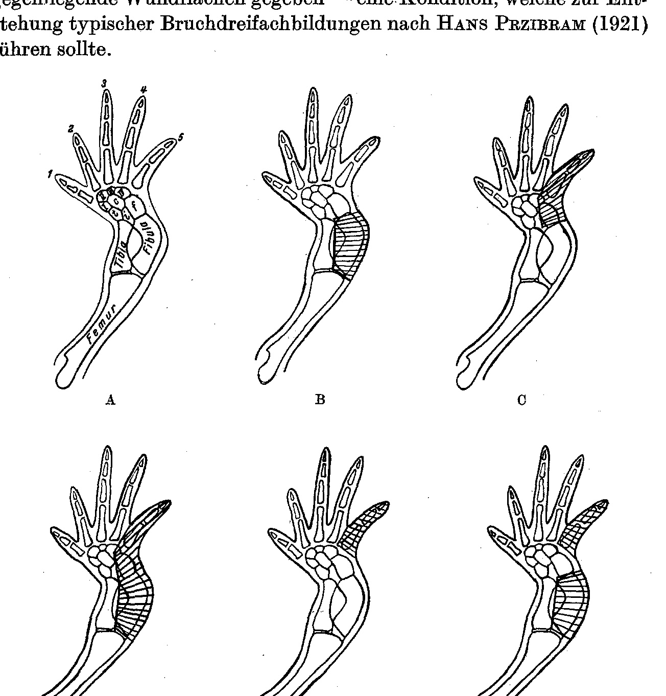
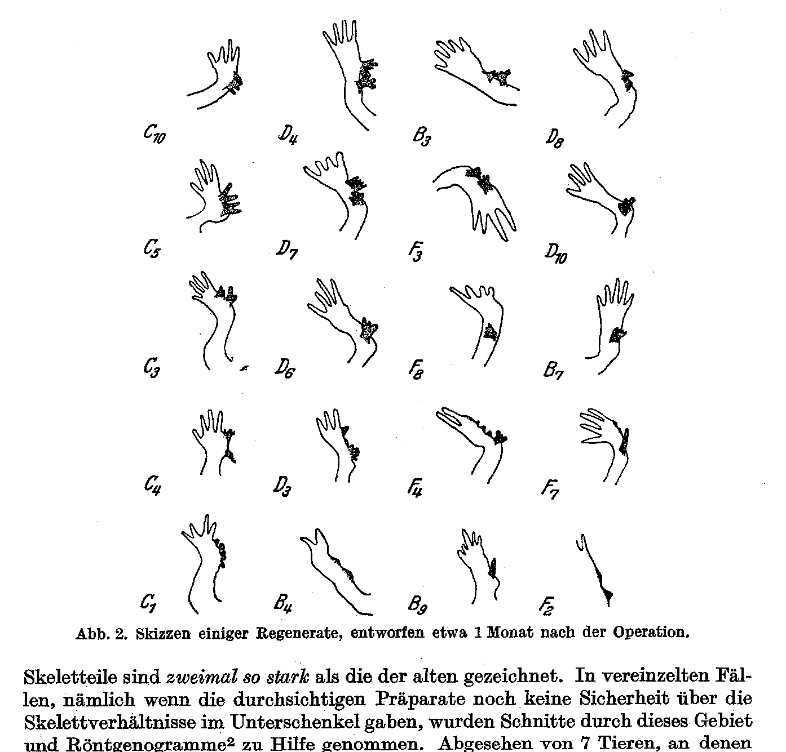
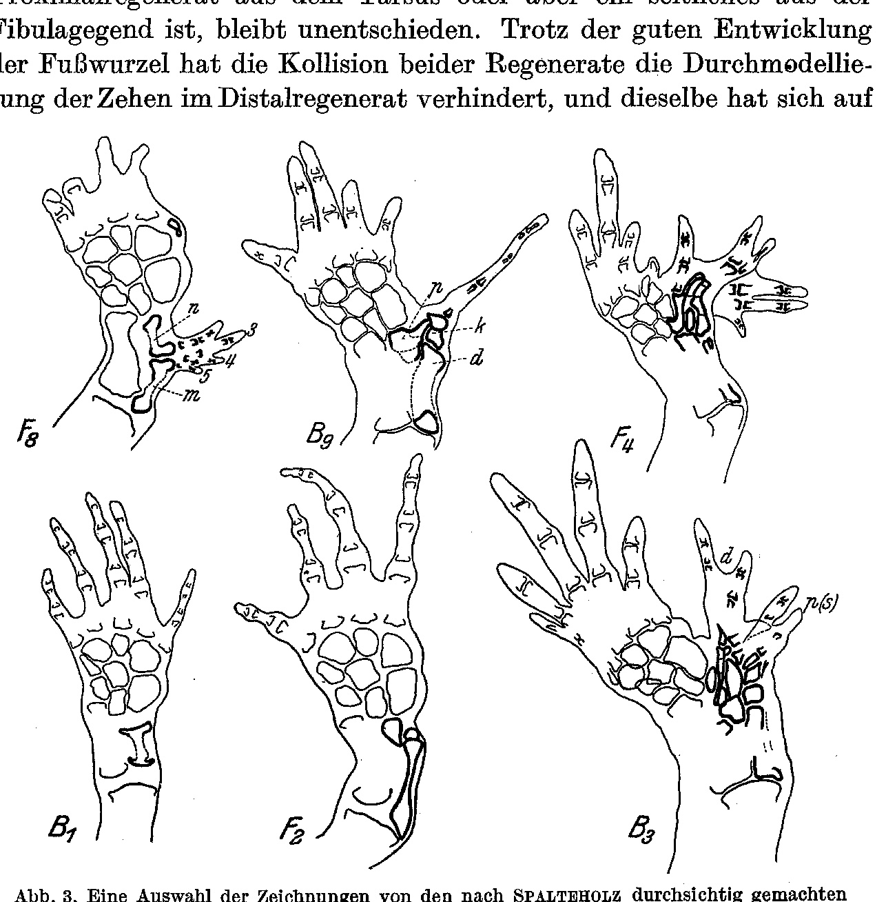
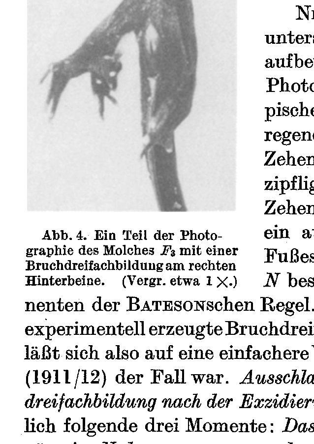
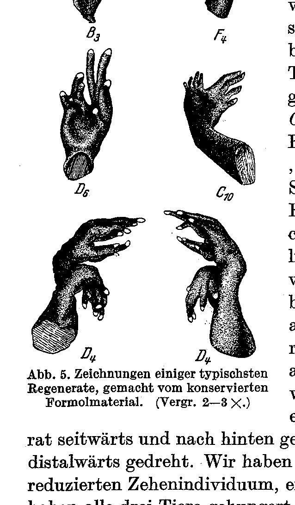
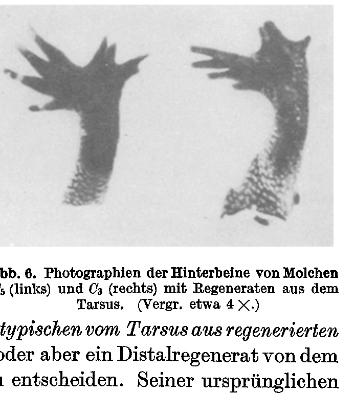
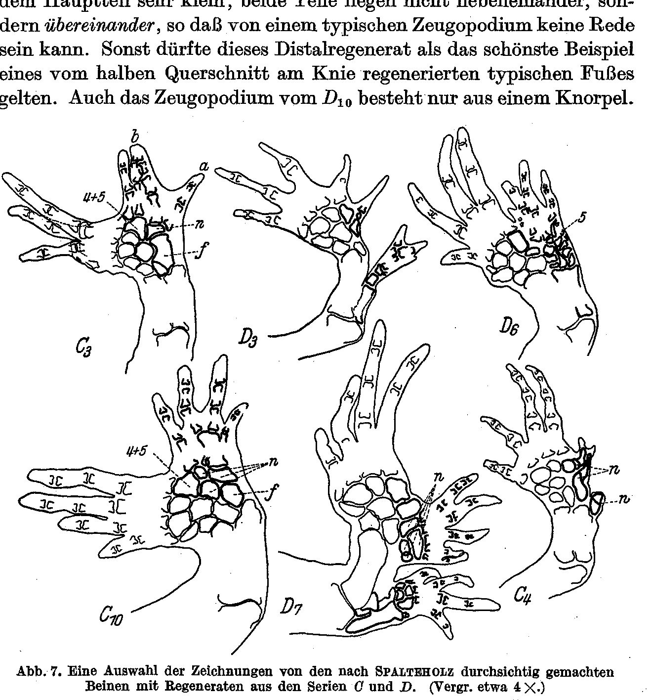
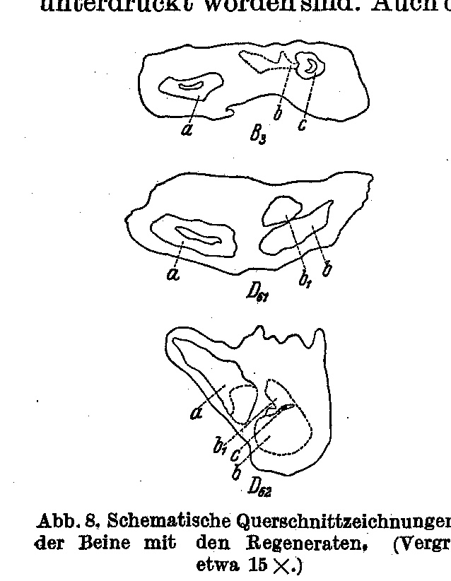

*(From the Biological Experimental Institute of the Academy of Sciences in Vienna, Zoological Department, and from the Comparative-Anatomical and Experimental-Zoological Institute of the University of Latvia in Riga.)*

## THE REGENERATION OF THE LEGS MUTILATED AT THE FIBULAR EDGE IN TRITON CRISTATUS LAUR.

By

Leo Ābolinš

(Riga).

With 8 text figures.

*(Received on 22 July 1929.)*

*Wilhelm Roux' Archiv für Entwicklungsmechanik der Organismen*, vol. 122 (1930).

> **Full translation.** A complete English rendering of the running text of “The Regeneration of the Legs Mutilated at the Fibular Edge in Triton cristatus” (Abolins (Riga), 1930), including all tables, figure and plate legends, and footnotes. Numbers and table cells were transcribed from the page images, not the noisy OCR.

### Table of Contents.

| | Page |
|---|---|
| Statement of the Problem | 213 |
| Technical Matters | 215 |
| Findings and Theoretical Considerations | 217 |
| Summary of the Principal Results | 227 |
| References to the Literature | 228 |

### Statement of the Problem.

At the suggestion of Professor Hans Przibram, in the summer of 1923, in the course of the further elaboration of the experimental methods then being applied at the Biological Experimental Institute by Paul Weiss, I undertook a series of operations on the hind leg of the crested newt (*Triton cristatus*). The working-up of the material thus obtained could, for various reasons, only now be brought to completion.

In 10 animals the fibula together with the entire fibular region was excised (Series B); in 10 animals the 5th toe together with the corresponding part of the tarsus (the fibulare, the wholly or partly fused 4th and 5th tarsalia) was excised (Series C); in 10 animals the entire fibular side, from the knee-bend down to and including the 5th toe, was removed (Series D); in 10 further animals only the 5th toe (Series E); and finally in 10 animals the fibula was excised and, in addition, the 5th toe removed (Series F). The first series, A, of normal animals served as a control (see Fig. 1).

The operations were intended to serve for the analysis of the regenerative potencies of the distally directed, proximally directed, and laterally directed surfaces in various regions of the *Triton* foot. One could also expect to obtain some information about the manner of the mutual influence of the 214

distal and proximal regenerates upon one another. Moreover, owing to this operative method, in several series two separated wound surfaces lying opposite one another were given — a condition that ought to lead to the formation of typical fracture-triplications [Bruchdreifachbildungen] after Hans Przibram (1921).

**Fig. 1.** Schemata of the operations in Series B, C, D, E, and F. A: The skeleton of a right normal hind leg (after Reynolds).  *(figure not reproduced)*

The first investigator who drew upon the oblique- and longitudinal-splitting of the urodele leg for the analysis of the regenerative potencies was probably Barfurth (1893). After him, Tornier (1897) and Fritsch (1911) undertook similar operations on richer material. However, in all these cases no freely exposed lateral regeneration surface was given, and the operations confined themselves mainly to the foot-root region [Fußwurzelgebiet] or the girdle. Only Paul Weiss (1923—1925) subjected the entire foot, from the knee distalward, to a thorough investigation, in that he drew our attention especially also to the lateral regenerates. My experimental series D represents a repetition of the operation type T of Weiss. All the remaining operations diverge, 215

in my case, from those of Weiss insofar as in the experimental series B, C, and F, besides distalward and laterally directed regeneration surfaces, a proximalward directed surface is also given.

After this work had already been done, but not yet published and lying ready, there appeared the publications of Ludwig Gräper. In one of them (1926) the regeneration from proximal cut surfaces of the longitudinally split leg-buds of *Bufo viridis* is described. We shall, in what follows, have the possibility of showing that also in many of our cases the proximal regenerate constitutes an important component, whereby the origination of the proximal regenerates from the foot-root [Fußwurzel] of the amphibians may be regarded as proven.

In the experimental series B and F on the one hand, and in series C on the other, regeneration processes in various regions of the foot have been initiated separately from one another. In this sense I speak of a "*partial*" longitudinal splitting of the extremity. This permits the regenerative potencies of the zeugopodium and those of the autopodium to be separated in the investigation, and the question of the possibility of a gradual gradation of the potencies along the foot to be examined.

### Technical Matters.

The operations were carried out from 25 July to 6 August 1923. Particular value was placed on the asepsis. Before the operation the animals were bathed in weak (faintly rosy) Kaliumhypermanganicum [potassium permanganate] solution and placed in a special vessel arranged for the purpose in such a way that the narcotic came into no direct contact with the skin. Deep narcosis was applied with a Chloroform-Ether mixture, in order to avoid bleeding as far as possible. After sufficient orientation regarding the anatomical conditions of the *Triton* leg, the operations were carried out with a fine scalpel, using a binocular magnifier or also with the naked eye. After the operation the animals, mostly still lying under narcosis, did not return to the water at once; rather, they were placed individually into vessels which had been washed with Kaliumhypermanganicum and which contained scarcely moistened, likewise washed pebbles. Every 3—4 days, and as needed also more often, the animals were bathed anew and transferred to fresh vessels. In this way the formation of *Saprolegnia* and the fungal infestation of the wounds could be almost entirely avoided. The short-lasting bath had no harmful after-effect on the skin of the animals. The feeding of the animals was begun only 1—2 weeks after the operation, when the animals had already entirely recovered from the operation. At the same time the animals returned again to the water. Feeding was done every 2 days with small portions of *Tubifex*, which were administered directly from the forceps in order to avoid possible decay of the food remains. After the closure of the wound the bath as a rule became superfluous. The rinsing-out of the rinsing-vessels and of the bottom-deposit, however, was continued throughout the entire experimental period. Later, in consequence of an interruption of the experiment brought about by the departure of the author, a part of the animals suffered through the absence of care and food; and one will, in what follows, have the possibility of comparing well-fed and starved animals of the same series. A few animals had unfortunately also been lost. The emergence of the regenerates was gradually followed, then precisely examined and sketched on 14. VII., 30. VII. and on 29. VIII. The animals themselves were fixed in Formol [formalin] about 9 months after the operation and preserved. The photographs and ink-drawings were, from this 216

Formol material, produced.¹ A part of the feet, with regenerates, cut off at the knee, were depigmented with Chlorine *in statu nascendi* or with Diaphanol, stained according to the Steiner modification of the Spalteholz method with Methylgrün [methyl green] and Alizarin, and worked up into transparent whole-mounts. The skeleton thus brought into view was traced with the aid of the Edinger apparatus. In order to avoid possible confusions, only the brightly stained and very sharply delimited cartilage was traced. The ossified parts of the skeleton, in case they too could be quite sharply distinguished, are indicated by dots on the drawings. The contours of the regenerated

**Fig. 2.** Sketches of several regenerates, drawn approximately 1 month after the operation.  *(figure not reproduced)*

skeletal portions are drawn twice as strongly as those of the old. In isolated cases, namely when the transparent preparations did not yet give certainty about the skeletal conditions in the lower leg [Unterschenkel], sections through this region and Röntgenograms² were taken to aid. Apart from 7 animals on which the operation had not entirely succeeded, 43 specimens remained for examination.

> ¹ The beautiful plastic ink-drawings of the feet were made by Mr. Klaus Vrieslander of Munich.

> ² For the kind production of several Röntgenograms I express, also at this place, my best thanks to the Director of the Dental Institute of the University of Latvia in Riga, Mr. Dozent Dr. K. Bārons.

217

### Findings and Theoretical Considerations.

#### Series B.

##### Fibula together with the fibular region excised.

The following result emerges. Nr. *B₁, B₂, B₈* and *B₁₀*: No superregenerate. Filling-in of the wound and restitution of the fibula by a long bone (Fig. 3 *B₁*). The restituted fibula is smaller and more irregular in form than a normal one (compare with a normal fibula in the figures of Series *C*), yet very similar to the normal one in all properties. Most imperfect is the restitution in the hunger [starved] animals (*B₁, B₁₀*), in which also no ossification of the restituted lower-leg bone [Unterschenkelknochen] has occurred. Nr. *B₄* and *B₆* are known to us only from the protocols and sketches (Fig. 2 *B₄*), since they were later lost. Each bears two knobby regenerates, whose differentiation has failed to occur, probably for the same reasons that hindered the restitution of the three fallen-off toes. The skeleton remained unexamined. It probably remained only at the restitution of the fibula (cf. with similar cases *F₄* and *F₆*).

Nr. *B₉* and *B₅* (Fig. 2, 3 *B₉*): An anomalous distal regenerate from the knee, with one lower-leg bone, a diminished number of tarsus elements, and one toe. Sections through the zeugopodium too allowed only one lower-leg bone to be ascertained. Normal ossification. In all probability, proximal regeneration had also been initiated from the tarsus (*p*), but later the blastema belonging to this fused with that of the distal regenerate (*d*). At "*k*" would be the point of collision of the two blastemata. The distal regenerate has suppressed the proximal regeneration. In general, the formation and differentiation of a distal regenerate from the knee proceeds with greater rapidity than is the case with a proximal regenerate from the tarsus. There were cases in which at the knee a complete anomalous distal regenerate was already differentiated, while from the side of the tarsus only a quite small regeneration cone bulged forth (see also sketch *F₄*, Fig. 2). Nr. *B₇* (Fig. 2): By position and form a typical, and moreover normally developed, distal regenerate from the knee. The proximal regenerate seems to have failed to appear entirely, or here too to have been suppressed by the distal component — which cannot be decided here, since histological investigation of the foot had to be omitted.

Most complicated in this series is the case Nr. *B₃* (Fig. 2, 5). Here we are dealing with two regenerates developing independently of one another, which only late, after the determination of the axes had already been accomplished, came into contact with one another. The skeletal 218

connections are very intricate (Fig. 3). The distal regenerate appears to have grown through the second component and has separated the tarsalia of this latter from the phalanges. Whether this second regenerate is a proximal regenerate from the tarsus or else a lateral one from the fibular region remains undecided. Despite the good development of the foot-root [Fußwurzel], the collision of the two regenerates prevented the through-modelling [Durchmodellierung] of the toes in the distal regenerate, and this same [modelling] confined itself to the

**Fig. 3.** A selection of the drawings of the legs, with regenerates from the series B and F, rendered transparent according to Spalteholz.  (Magnification approx. 4×.)  *(figure not reproduced)*

three already present before the collision. The zeugopodium of the distal regenerate consists of one element, on which, however, traces of a bipartition are present. The part of this element lying at the outer edge [Außenrand] is ossified, which is especially well to be observed on sections (Fig. 8).

#### Series F.

The kind of operation in Series F was the same as that in Series B, except that here, in addition, the 5th toe was amputated. Similar results to those in Series B were already to be expected in advance — particularly because in Series B too an involuntary amputation of the toes more often occurred.

219

The experimental animal Nr. *F₆* corresponds to Nr. 1, 2, 8 and 10 of Series B. Here, as there, no superregeneration, only wound-filling. That in this case too a restitution of the fibula occurred is very probable, but not entirely certain, since the animal was later lost. The Nr. *F₂* and *F₉* (Fig. 2 *F₂*) are similar to Nr. *B₄* and *B₆* insofar as here too two laterally lying regeneration cones each had been formed, which, however, were not differentiated out. The animals were preserved and the feet were worked up histologically. Corresponding pictures (Fig. 3 *F₂*) show the further fate of the regeneration cones that had come to a standstill, and allow, with some certainty, conclusions to be drawn also about the skeletal conditions of the previously mentioned Nr. *B₄* and *B₆*. The regeneration cones that had been laid down were resorbed; in *F₂* the regeneration of the 5th toe also failed to appear, whereas in *F₉* such a regeneration set in. The fibula is restituted in both cases; in *F₉* it looks, by its form, entirely normal and is also ossified. Nr. *F₇* is unfortunately lost, yet the sketch (Fig. 2) and the records of 29. VIII. show us clearly that here conditions are present such as in *B₉* and *B₅*, that is, an abnormal distal regenerate from the knee. Below it, two stunted formations: rudiments [Anlagen] of a lateral (or proximal) regenerate and of the 5th toe.

Nr. *F₅*: On the sketch of 29. VIII. (Fig. 2) we believe we have before us a typical four-toed distal regenerate, similar as in *B₇*. But precisely here we see how deceptive the external image of a regenerate can be if one does not also take the skeletal conditions into account. There is also, purely externally, a difference from *B₇*: the regenerate is here turned sideways toward the inside. If one examines the skeletal preparation of the foot (Fig. 3), one sees the apparently unitary regenerate composed of two almost symmetrical components. Neither of the two components has been able to form a typical foot; moreover, the tarsus elements are entirely lacking. The distal component, however, seems to predominate; the toes 5, 4 and 3 seem to belong to it.

Whether the second component is a proximal regenerate from the tarsus or else a lateral one from the fibular region is, in my opinion, hard to say. Let us assume that it is not a reduced lateral regenerate, but a proximal regenerate; then the possibility of proximal regeneration from the tarsus would be most beautifully proven. Some misgiving, however, is aroused by the cartilage element "*n*". In its position, size and form it is almost a mirror-image of "*m*", which we may without doubt designate as fibula. If we now also regard "*n*" as an element of the zeugopodium, then the curious state of affairs results that from a proximally turned cut surface more is regenerated than lies distalward from it. This would be a result which would stand in crass contradiction to that which I have found in all other cases and which Gräper (1926, VI) too has observed. Had the element "*n*" not the typical form of a long

> ¹ [A footnote (marker ¹) referring to element "*n*" belongs to this page-7 passage, but its text is printed at the foot of page 8 — "On the basis of the concordant results of E. Flat, V. Bischler and others, H. Przibram considers it very probable that with '*n*' we have to do with a mirror-image repetition of a remaining distal head-piece [Kopfstück] of the old fibula." — and is left for the next (page-8) chunk per the ownership rule.] cartilage and the symmetrical position with respect to "*m*"; one could also interpret it as a reduced, fused tarsus.¹

We consider it correct, however, to leave open the question of the origin of the second component. It ought to be re-examined on a larger body of material. Moreover, the animal later went hungry, which could have impaired the differentiation of the regenerates.

> ¹ On the basis of the concordant results of E. Flat, V. Bischler, and others, H. Przibram considers it very probable that "*n*" is a mirror-image repetition of a distal head-piece of the old fibula that remained in place.

No. F₄: A comparison of the skeletal preparation (Fig. 3) and of the sketch of 29 VIII with the drawing of the finished foot (Figs. 2, 5) permits the following interpretation. From the knee there comes a three-toed distal regenerate, which has come into collision with a three-toed lateral or also proximal regenerate from the tarsus and has, as in B₃, displaced the latter outward. The zeugopodium of the distal regenerate is ossified and bears at its distal end an anlage of the second element. Indeed, the entire regeneration result is strikingly similar to that of B₃.

No. F₈ was not investigated further anatomically, but was kept as a museum specimen.

The sketch Fig. 2 and the photograph Fig. 4 show us two typical, well-developed feet as superregenerates. The proximal regenerate has four toes, and likewise the initially three-lobed distal regenerate. By its position and toe-sequence the proximal regenerate is a pronounced mirror image of the normal foot, whereas D has the same lateral quality as N. In addition, all three components follow the rule of Bateson. Here we have before us a typical, experimentally produced fracture-triplication [Bruchdreifachbildung] in the sense of Przibram. This can thus be achieved in a simpler manner than was the case with Della Valle (1911/12). The decisive factors *for the origin of a fracture-triplication after excision of the fibular region* are evidently the following three moments: *the absence of lateral regeneration, favorable nutritive supply of the weaker component of the proximal regenerate, and a play-space sufficient for the unfolding of both regenerates.* That Puppe (1925) in the tadpoles of *Rana fusca* and Gräper (1926, VI) in the larvae of *Bufo viridis* did not achieve such complete fracture-triplications, I explain chiefly by far too small a play-space available to the two regenerates.

> **Fig. 4.** A part of the photograph of the newt F₄ with a fracture-triplication on the right hind leg. (Magn. about 1×.)  *(figure not reproduced)* If one now combines the result of both series, of the principally identical operation type B and F, one arrives at the following insights. In 8 cases (B₁, B₂, B₇, B₁₀, F₂, F₉, probably also B₆ and F₆) out of 20, no superregenerate, only wound-filling and restitution of the fibula. Three animals (F₁, F₅, F₁₀) were excluded from the experimental series a few weeks after the operation, because necrosis of the toes had set in in them. In these animals too, no external signs of regeneration were seen. Thus, *in more than 50% of all cases the regeneration was content with the restitution of the fibula by a single long fibula-like bone.* In several of these animals (B₄, B₆, F₂, F₉) regeneration-cones were even laid down, but were later resorbed. Simultaneously with this inhibition, a diminution of the number of toes and the failure of their regeneration are also to be observed. *That the fibula, excised together with the entire fibular region, can be regenerated* is a result that deserves particular attention, for Wendelstadt (1901) and Reed (1903) have unequivocally proved that in amphibians, with purely carried-out extirpation of the lower-arm bone, no regeneration of the same occurred. Later Morrill (1918) was able to show that the fibula extirpated alone can at most be replaced by a proliferation of the connective tissue on the part of the injured tibia (lateral regeneration) or on the part of the injured femoral head or tarsus. This connective tissue can calcify, yet the individual bone-fragments have no resemblance to the extirpated fibula. That in my type of operation the fibula was regenerated is probably explained by the fact that here not only the bone alone, but also the entire tissue-complex surrounding it — in other words, an entire part of the extremity-field — was removed. This disturbance of the field occasioned the unfolding of the regeneration-processes and thereby also the restitution of the fibula. Also, in my type of operation a very large wound-surface was given, which could almost completely preclude a rapid scarring of the wound and a suppression of the regeneration.

Typical of the whole operation type is *the predominance of the distal regenerate*. This, however, is always hypotypical, in that in all cases it has developed only a single zeugopodial element. These conditions remind us of the partial regenerates of Weiss (1926).

After amputation of the 5th toe (Series F) a relatively stronger development of the proximal regenerate is to be observed. Puppe (1925) showed that the amputation of more distally lying parts can exert a stimulating effect on the formation of the more proximally lying ones. This is also the case here. The strongest stimulating effect is experienced by the nearest-lying component — the proximal regenerate. In those cases, however, where as a consequence of the disturbances in the blood-supply and innervation an involuntary amputation and necrosis of more than 1 to 2 toes has set in, this has often (B₅, B₈, B₉) called forth an inhibition in the development of the regenerates.

### Series C.

The operation is carried out in the region of the foot-root [tarsus] alone. Removed are the fibulare together with a part of the 4th and 5th tarsale and the 5th toe. Only in No. C₂ has all regeneration failed to appear. It is a starved animal. In all the remaining cases at least a restitution of the operatively removed parts has occurred. The regenerates C₄, C₆, and C₈ (Fig. 2 C₄) are formed quite similarly to one another. In No. C₈ no external signs of regeneration are to be observed. The skeletal preparation, however, shows the restitution of the tarsus and, beneath the skin, the arrested anlage of the 5th toe ("*5*"). A supernumerary cartilage-element "*n*" might perhaps be regarded as the anlage of a supernumerary lateral toe. In Nos. C₄ and C₆ (Fig. 7 C₄) too the tarsus is restituted, in C₄ even in its quite normal form. In addition, in C₆ the 5th toe is regenerated and at its base two supernumerary tarsus-elements "*n*". In C₄ there grow out of the tarsus, in place of the 5th toe, under a common skin-cover, two laterally laid-down rod-shaped cartilages, in all probability undifferentiated toe-individuals. One sees from the sketch (Fig. 2) that here initially three rays were laid down, of which one has subsequently been resorbed. In addition, close to the distal end of the fibula there lies a sideways-directed, bipartite cartilage-element. Originally this regenerate was directed sideways and backward, but later it turned distalward. Here too we have probably to do with a reduced toe-individual, a lateral regenerate. Afterward all three animals went hungry, and probably in consequence of this the differentiation of the toe-anlagen did not come about.

> **Fig. 5.** Drawings of a few of the most typical regenerates, made from the conserved formol material. (Magn. 2–3×.)  *(figure not reproduced)*

No. C₃ (Figs. 2, 6). In the sketch we see two separate two-lobed anlagen. These later fused with one another and very much complicate the interpretation of the skeletal preparation (Fig. 7). Either both components are lateral regenerates, or else the anterior component, arising from the regenerated 4th and 5th tarsale, is a proximal regenerate from the toe-base (Gräper). The posterior component (toes a, b) arises from the lateral surface of a supernumerary tarsale "*n*". The bipartite tarsale "*f*" is probably to be regarded as the regenerated fibulare with intermedium. One could also imagine that the posterior component ("*f* and *n*" together with the toes "*a*" and "*b*") originated as a distal regenerate from the distal end of the fibula. Easier to analyze is No. C₅ (Figs. 2, 6). Out of the base of the 4th toe there comes forth a toe as a proximal regenerate (or regenerate of the 5th toe). It is partly fused with a three-rayed lateral regenerate. As in C₃, the phalanges of the lateral regenerate (or distal regenerate) arise from the lateral surfaces of two supernumerary tarsalia "*n*". Particularly interesting is the case C₁₀ (Figs. 2, 5). The structure of the regenerated part of the autopodium is strikingly similar to that of C₃ and C₅, yet here we find three supernumerary tarsalia. Here as there the phalanges of the regenerate are joined precisely to these elements. A proximal regenerate from the base of the 4th toe is here entirely lacking. The whole regenerate distinguishes itself by its unity and gives thoroughly the impression of a typical foot. The size-relation of the toes is typical. This unity of the structure was indeed already to be seen at the beginning of regeneration (Fig. 2). Moreover, the regenerate was mobile, like a normal foot. On the basis of what has been said, we regard the entire structure *as a unitary typical foot regenerated from the tarsus.* Whether it is a lateral regenerate, or else a distal regenerate from the end of the fibula, is hard to decide. By its original and definitive position as well as by the toe-sequence, it is hardly a distal regenerate. For the assumption of a lateral regenerate there speaks also the origin of the phalanges from the lateral surfaces of the supernumerary tarsalia.¹ Further experiments shall decide this question definitively. But if it were really a lateral regenerate, as we are inclined to assume, then we would stand before the fact that from the tarsus a typical foot, not merely individual toe-individuals (Weiss), can be regenerated laterally. As the most important condition *for the origin of such a regenerate, the absence of proximal regeneration from the toe-base must be regarded.* Where such [proximal regeneration] takes place (C₃, C₅), the lateral regenerate never experiences its full unfolding. Yet even in these

> ¹ According to H. Przibram, the entire foot-root [tarsus] could also be regarded as mirror-image doubled within itself.

> **Fig. 6.** Photographs of the hind legs of the newts C₁₀ (left) and C₆ (right) with regenerates from the tarsus. (Magn. about 4×.)  *(figure not reproduced)* latter cases we do not have before us individual toe-individuals, but one or two supernumerary tarsalia with metatarsalia and toes arising from these — that is, all the elements of a typical foot lying distal to the lower leg, even if in reduced number.

The regenerative activity of the foot-root [tarsus] is a very lively one, as Weiss was already able to establish. Striking, in almost all cases, is the absence of the regeneration of the 5th toe; this is suppressed by other regeneration-processes.

### Series D.

Removed is the entire fibular side (fibula with the fibular region, fibulare, a part of the 4th and 5th tarsale, and the 5th toe).

This operation type was already applied by Weiss (1925). It is *especially favorable for the unfolding of the distal regenerates from the knee.* These dominated over the proximal regenerates already in Series B and F, but there they were often stunted and reduced to toe-shaped structures. Here we have the distal regenerates before us as typical feet, apart from the cases Nos. D₁, D₂, D₅, and D₉, in which, as a consequence of the necrosis of the autopodium, all wound-surfaces scarred over. The cases D₃ and D₈ are similar to each other insofar as in both of these the regeneration-process proceeded more slowly for whatever reasons. In D₈ (Fig. 2) we meet, almost 2 months after the operation, with only cone-shaped anlagen still.

No. D₃ (Figs. 2, 7) afterward went hungry, but nonetheless developed all the anlagen, though with a reduced skeleton. The two distalward-lying cones have restituted the tarsus as well as the 4th and 5th toe. From the three-lobed anlage at the knee there has resulted a distal regenerate as a hypotypical foot with one (ossified) zeugopodium-element, two tarsalia, and 3 (4) partly reduced phalanges. If one compares this distal regenerate with those of D₆ and D₁₀, one arrives at the same conclusion at which Schmalhausen (1925) had already arrived: hunger has as its consequence a reduction of the phalanges and of the tarsus-elements in the regenerate. A similar reduction of the skeletal elements in the regenerate, and inhibition of growth in general, as a consequence of hunger, we have observed in several cases also in Series B and F (B₄, B₆, F₈).

Nos. D₆ and D₁₀ agree almost entirely. In both, proximal and lateral regeneration has completely failed to appear. The distal regenerate D₆ (Figs. 2, 5) is four-toed. At the outer edge of the regenerate, in the skeletal preparation (Fig. 7), the anlage of the 5th toe too can be distinguished; this has not been able to model itself through. The tarsus of the regenerate consists of a normal number of elements, but is very crowded together. Likewise crowded together, and shifted in consequence of the narrow space, is the metatarsus. The skeletal preparation shows us here too a single zeugopodium-element. On the cross-sections one sees that this is *frontally* split (Fig. 8); in places the bridges between the two split-parts are entirely lacking, and these then lie close together. The second, ventralward-lying part is very small in comparison with the main part; the two parts lie not next to one another, but one above the other, so that there can be no question of a typical zeugopodium. Otherwise this distal regenerate might count as the finest example of a typical foot regenerated from the half cross-section at the knee. The zeugopodium of D₁₀ too consists of only a single cartilage.

> **Fig. 7.** A selection of the drawings of the legs, made transparent according to Spalteholz, with regenerates from the Series B and D. (Magn. about 4×.)  *(figure not reproduced)*

The last two specimens D₄ and D₇ are the only ones in the whole series in which, alongside finely modeled-through distal regenerates, equally fine lateral-(proximal-)regenerates are present. In D₇ (Figs. 2, 7) a typical, laterally-correct, four-toed distal regenerate grows from the knee. The number of tarsalia is reduced in it. In the zeugopodium we find, internal to a typical elongated cartilage-rod, several smaller cartilage-elements, which connect the new zeugopodium bridge-wise with the old tibia. Thus here too no typical zeugopodium-skeleton has been regenerated. Opposite the distal regenerate there stands a second, five-toed one, whose interpretation is very difficult. It was laid down as a four-lobed unitary structure

> W. Roux' Archiv f. Entwicklungsmechanik Bd. 122. — 15 (Fig. 2), later the 5th toe was added. The corresponding tarsus-part consists of four cartilages, and all five toes are joined to these, not, then, to the old tarsus-elements. The whole structure sits decidedly laterally with respect to the old tarsus. To call the regenerate a typical foot, only one thing is lacking, namely the size-relation of the toes is not normal, since the proximalward-lying toes have in their development probably been suppressed by the distal regenerate. The first anlage of the regenerate too gave rather the impression of a comb composed of individual lobes than that of an anlage of the foot. It can just as well be a lateral regenerate from the tarsus as a proximal regenerate in the sense of Gräper (1926, VI). *What in the tarsus may count as proximal- and what as lateral-regenerate is, as we have already seen earlier, still to be investigated.* On account of the reduction of the inner toes, one can also say nothing as to whether it is laterally-correct or laterally-reversed. If it is a mirror image, stunted on the caudal side, of the old foot, then we again have before us an experimentally produced fracture-triplication. The 5th toe has not been restituted. The specimen D₄, highly similar to the one just described, was not worked up histologically, but kept as a museum object. The drawings made after the conserved object (Fig. 5) show us the already familiar picture of a fracture-triplication, but in still more pronounced form. We see a fully developed, externally absolutely normal, five-toed, laterally-correct foot as a distal regenerate from the half cross-section at the knee, and a three-toed proximal- or lateral-regenerate, whose thicker inner toe suggests in the skeleton two fused-together toes. The first anlage of this regenerate (Fig. 2) was even five-rayed. The position of the middle component is mirror-image with respect to the old foot, but since the toe-number is reduced, we can say nothing certain about its lateral quality. It is not impossible that for the formation of the middle

> **Fig. 8.** Schematic cross-section drawings of the legs with the regenerates. (Magn. about 15×.)  
> B₃ Skeletal relations of the leg on a cross-section at the half height of the zeugopodium: *a* the old tibia, *b* the cartilaginous and *c* the ossified part of the regenerated zeugopodium. — D₆₁ The same: *a* the old tibia, *b* and *b₁* the new, ossified, bipartite zeugopodium. — D₆₂ Skeletal relations of the leg on a cross-section through the zeugopodium in the vicinity of the tarsus: *a* the old tibia, *b* and *b₁* the cartilaginous split-parts of the new zeugopodium, *c* the cleft between them.  *(figure not reproduced)* component two blastemata are fused together (P and S), for as early as 29 VIII the five-rayed regenerate gave the impression of a two-lobed one. But this dual-development could also be a secondarily arising appearance.

What now characterizes the whole Series *D*? As with all our types of operation: firstly, the predominance of the distal regenerate. The more strongly the distal regenerate is developed, the weaker in general are the proximal and lateral regenerates. *The removal of the tarsal parts has a particularly stimulating effect on the development of the distal regenerates at the knee.* Despite the outwardly perfect formation of the foot growing from the half cross-section at the knee, the zeugopodium has always proved to consist of only a single, at most partially split element, which stands in a certain contradiction to the findings of Weiss on the distal regenerates (1925, p. 400) and recalls the conditions in his partial regenerates (1926). Secondly, as with the operation type *C*, very lively regenerative activity is to be observed in the tarsus. Between a proximal regenerate and a lateral regenerate in the tarsus no sharp boundary can be drawn. The possibility of the lateral regeneration of a typical foot quite definitely exists. *Never are individual toes regenerated from the tarsus alone, but always only a greater or lesser complex consisting of tarsus, metatarsus and toes, that is, an autopodium.* This is the same phenomenon which we have already seen at the tarsus in Series *C*. The regeneration of the 5th toe has always been suppressed.

## Series *E*.

Amputation of the 5th toe. We will omit here a detailed description of the cases, for in almost all cases the only result of the operation was the restitution of the toe.

## Summary of the principal results.

1. The fibula excised together with the whole fibular region is, in over 50% of all cases, restituted by a long fibula-like bone, in direct contrast to the result of the bone extirpation alone (i.e. carried out without impairment of the fleshy components of the extremity). This restitution of the fibula excludes a superregeneration. In another 50% of all cases the fibula is replaced by a distal regenerate from the half cross-section at the knee.

2. A typical leg as a distal regenerate from the half cross-section at the knee can also arise even when only the fibula together with the surrounding soft parts was excised and the whole autopodium remained untouched; however, the removal of the autopodial parts greatly promotes the development of the distal regenerates.

3. An otherwise perfect leg, also typically constructed in the skeleton, growing as a distal regenerate from the half cross-section at the knee, has always shown only a single zeugopodial element.

4. The question of the possibility of the formation of a typical foot as a lateral regenerate from the tarsus and from the fibular region remains open. The experimental results rather support this assumption, especially for the tarsus. Further experiments must be carried out.

5. The distal regenerate predominates over any proximal regenerates in all regions of the zeugopodium and autopodium.

6. The regeneration of the toes can be suppressed by the remaining regeneration processes.

7. Typical triple fracture-formations [Bruchdreifachbildungen] could be produced experimentally at the zeugopodium and at the tarsus by excision of corresponding parts of the fibular edge.

(Concerning the possibility of heteromorphoses, compare the following treatise by Sciacchitano, Weiss and Przibram.)

At the close of this treatise I have the pleasant duty of also expressing here my heartfelt thanks to Professor Dr. Hans Przibram for the assignment of a working place and for the valuable advice.

## Literature.

**Barfurth, D.:** Die experimentelle Regeneration von überschüssigen Gliedmaßenteilen (Polydaktylie) bei den Amphibien. Arch. Entw.mechan. **1**, 92 (1895). — **Bischler, V.:** L'influence du squelette dans la régénération, et les potentialités des divers territoires du membre chez Triton cristatus. Rev. suisse Zool. **33**, 431 (1926). — **Bömel, W.:** Regeneration nach Entnahme von Skeletteilen beim Axolotl. Roux' Arch. **115**, 464 (1929). — **Della Valle, P.:** Studii sui rapporti fra Differenziazione e Rigenerazione: La Doppia Rigenerazione Inversa nelle fratture delle zampe di Tritone. Boll. Soc. natur. Napoli **25**, 96 (1911/12). — **Flat, E.:** Regeneration der langen Knochen nach teilweiser Entfernung im Innern der Molchextremitäten (Triton cristatus). Akad. Anz. Wien 1926, Nr 8 — ausführlich: Roux' Archiv, dieses Heft. — **Fritsch, C.:** Experimentelle Studien über Regenerationsvorgänge des Gliedmaßenskeletts der Amphibien. Zool. Jb., Abt. Allg. Zool. u. Physiol. **30**, 377 (1911). — **Grüper, L.:** Die Potenzen längsgespaltener Beinknospen von Bufo viridis. Zugleich VI. Mitteilung über Extremitätentransplantation an Anuren. Roux' Arch. **107**, 162 (1926). — Zur Genese der Polydaktylie. Ebenda **107**, 154 (1926). — **Morill, C. V.:** Some experiments on regeneration after exarticulation in Diemyctylus viridescens. J. of exper. Zool. **25**, 107 (1918). — **Przibram, H.:** Die Bruchdreifachbildung im Tierreiche. Arch. Entw.mechan. **48**, 205 (1921). — **Puppe, A.:** Experimentell erzeugte Polydaktylie und Bruchdreifachbildung bei Rana fusca. Arch. mikrosk. Anat. u. Entw.mechan. **104**, 125 (1925). — **Reed, M. A.:** The Regeneration of a whole foot from the cut end of a leg containing only the Tibia. Arch. Entw.mechan. **17**, 150 (1903). — **Schmalhausen, J.:** Über die Beeinflussung der Morphogenese der Extremitäten von Axolotl durch verschiedene Faktoren. Roux' Arch. **105**, 483 (1925). — **Tornier, G.:** Über experimentell erzeugte dreischwänzige Eidechsen und Doppelgliedmaßen von Molchen. Zool. Anz. **20**, 356 (1897). — **Weiss, P.:** Die seitliche Regeneration der Urodelenextremität. Arch. mikrosk. Anat. u. Entw.mechan. **104**, 395 (1925). — Ganzregenerate aus halbem Extremitätenquerschnitt. Roux' Arch. **107**, 1 (1926). — **Wendelstadt, H.:** Über Knochenregeneration. Arch. mikrosk. Anat. **57**, 798 (1901).

## Figures

**Fig. 1.**

**Fig. 2.**

**Fig. 3.**

**Fig. 4.**

**Fig. 5.**

**Fig. 6.**

**Fig. 7.**

**Fig. 8.**

---

*Translator's note.* One of the Biologische Versuchsanstalt (Vienna Vivarium) papers flagged on the project site as a modern rediscovery target. Claims are rendered as stated in the original, not endorsed.
