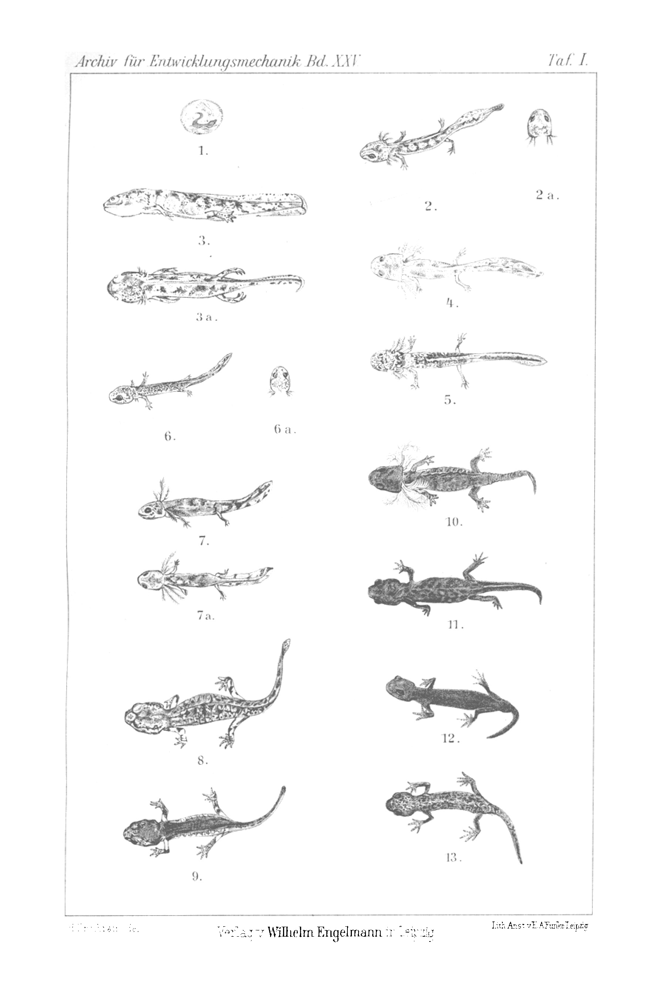

# Inheritance of Enforced Reproductive Adaptations.

## I. and II. Communication: The Offspring of the Late-Born *Salamandra maculosa* and of the Early-Born *Salamandra atra*.

By

Dr. phil. Paul Kammerer.

*(From the Biological Experimental Institute in Vienna.)*

With Plate I.

Received on 31 August 1907.

*Archiv für Entwicklungsmechanik der Organismen*, vol. 25 (1907).

> **Full translation.** A complete English rendering of the second communication of Kammerer's work on the inheritance of enforced reproductive adaptations — in *Salamandra* (*atra*/*maculosa*) and the midwife toad (*Alytes*) — with the tables and figure legends. **Kammerer's inheritance and atavism claims are rendered exactly as he states them; this translation reports them, it does not endorse them** (later disputed).

### Table of Contents

|  | Page |
|---|---|
| I. Introduction | 7 |
| II. Voluntary larva-bearing in *Salamandra atra* | 11 |
| &nbsp;&nbsp;&nbsp;&nbsp;1. The females | 11 |
| &nbsp;&nbsp;&nbsp;&nbsp;2. The larvae | 15 |
| III. Land-newt bearing and egg-laying in *Salamandra maculosa* | 18 |
| IV. Inheritance of the reproductive change | 26 |
| &nbsp;&nbsp;&nbsp;&nbsp;1. Offspring of the late-born *Salamandra maculosa* | 29 |
| &nbsp;&nbsp;&nbsp;&nbsp;2. Offspring of the early-born *Salamandra atra* | 34 |
| V. Theoretical evaluation of the results | 39 |
| VI. Summary of the results | 45 |
| VII. List of literature | 49 |
| VIII. Explanation of the figures | 51 |

## I. Introduction.

*Connection and statement of the problem. — Normal reproductive act of Salamandra maculosa, of Salamandra atra. — Gradual, not fundamental differences. — Mutual transitions in nature. — Complete exchange by experimental means.*

The present investigations form the immediate continuation of my work "Contribution to the Knowledge of the Relationship Conditions of *Salamandra atra* and *maculosa*" [9]¹), in which I

> ¹) Numerals in square brackets refer to the list of literature.

imposed upon the two urodele amphibians named in the title, by experimental means, a reproductive and developmental course deviating from the norm, which however was the same or almost the same as the normal reproductive act of the respective other species: *Salamandra maculosa* was made to acquire the gestational and developmental peculiarities of *Salamandra atra*, and vice versa.

It was then the goal of further breedings to ascertain whether those reproductive changes acquired in the individual life of the first experimental generation are capable of being transmitted to the offspring — that is, whether the *Salamandra maculosa* young born after the mode of *Salamandra atra* would, after attaining their sexual maturity, again reproduce in the same or a similar way as the normal *Salamandra atra*, and vice versa.

Before I describe these new breeding experiments, it will be necessary to sketch once more the regular mode of reproduction of the two European land salamanders (*Salamandra* Laurenti), and then also to recapitulate briefly the content of the cited first work, in order to recall to the reader's memory which reproductive changes, whose heritability is to be tested, are actually involved.

The fire salamander (*Salamandra maculosa* Laurenti = *maculata* Schrank), large, yellow-spotted on a black ground, inhabiting the lowland and the mountains up to about 1200 m sea elevation, brings into the world in spring and autumn — with us and in colder climate as a rule only in spring — a large number (rarely under 14, but up to 72) of young, which in the form of gills and fin-seams around the tail conspicuously display larval characters, by which they are forced to a water-life of several months before they, together with metamorphosis, betake themselves to land as the lung-breathing land salamander bearing an almost rounded tail without seam.

The Alpine or Moorish salamander (*Salamandra atra* Laurenti = *nigra* Gray), entirely black, smaller, occurring in the mountains from about 800 m upward, brings into the world only two young, which possess neither gills nor fin-seams, but rather breathe through lungs and already exhibit the almost rounded land-salamander tail, indeed are in every respect from the outset the reduced image of their progenitors. That part of their development which the *Maculosa* young spend in the water has here — and indeed, since *Salamandra atra* too can give birth twice in the year, much more quickly, still within the maternal uterus, run its course. With the heavier demand made upon the females by the offspring kept back and developed in them, the two young animals that have fallen victim to ovulation are likewise sacrificed; in the *Atra*-uterus too there are thus, just as in the oviduct of *Maculosa*, indeed only two but the favored embryos, of which in the latter, however, by no means a single uterine egg-pouch serves as nourishment.

As already follows from the fact last mentioned, the differences in the reproductive mode of the two salamander species are no principled, but graduated ones: even in the obligatory uterine development of *Salamandra maculosa* the gills are already begun, and in the gestating *Atra*-uterus, gathered together in front, the embryos lie which, gradually freeing themselves from the *Atra*-uterus, again find, untouched and unaltered before the birth, the favorable conditions for development which the embryos of the gill-breathing, fin-seamed *Maculosa* young find for many months in similarly arranged but unbroken uterine egg-pouches before the birth. The number of these abortively initiated germs is therefore proportionally larger in *Salamandra maculosa*, smaller in the early-born *Atra*. The duration of pregnancy of *Salamandra maculosa* is, with this and with the developmental state of the new-born themselves, subject to freer, larger fluctuations; while the number of the well-developed embryos itself is so much the more constant, the less — and indeed for the most part scarcely at all — the rest-period mangled, abortively prepared germ-mass slips back and shortens the period of pregnancy. In the case of the early-born *Atra* it slips back so far and so much that here too only two but the favored embryos come to development, the rest being injured, sometimes earlier sometimes later, and forming the first nourishment of the well-developed twins from the very beginning; in the case of the late-born *Maculosa* the germs, slipping back, are mangled to a pulp and serve the few growing-up fetuses as nourishment.

Thus in the boundary regions, where the vertical distribution of both species interlocks, there actually occur almost complete transitions between both reproductive forms: repeatedly I found, at low find-sites, Alpine salamanders in whose fruit-holders two embryos on each side (thus four in all) instead of the norm-conformant one (two in all) had been able to develop well; these then also always came to the light of day somewhat prematurely, even before they had entirely lost their gills, but were nonetheless already viable out of water. Several times I found, at high find-sites, fire salamanders which harbored relatively very few, highlydeveloped larvae that had nourished themselves on the confluent sibling-eggs. On the other hand, the embryos of *Salamandra maculosa* from deep-lying regions are, at the moment of their birth, in part or entirely freed from the egg-envelopes, since they indeed burst these in the course of the next minutes. At any rate, at this lowest birth-stage to be observed in the open, the number of young is usually greatest, and abortive eggs are in this case mostly not present at all¹).

> ¹) Incidentally, I have *not*, as GIARD [6, S. 178] states, asserted the identity of the two species. I am only convinced that they either descend from a common ancestral form, or that *Sal. maculosa* itself [is] this ancestral form, [and] that the two species are therefore immediately related. But I am equally convinced of the specific separation that today rightly obtains in nature.

The experiment was obvious: to advance further along the path already marked out by nature, to drive to the extremes, by artificial means, the reproductive-adaptive capacities of the two salamanders. The chief obstacle lay only in the difficulty of bringing the salamanders into captivity to the desired stage of development at all; in this respect, greater, more carefully managed brood-care brought help — the description of which is given in [9, S. 174–186] and its improvement in [10, S. 54, 55] — and once, through larger, carefully equipped containers and the minute care of the experimental animals, that obstacle had been overcome, the further course of things proceeded comparatively easily. I had already succeeded, in the said first work, in transposing the reproductive conditions of the two land-salamander species almost completely into one another.

If one deprives *Salamandra maculosa* of the opportunity to deposit its young in water and keeps it continuously at as low a temperature as possible, then those young remain in the uterus until they have completed their post-embryonic development. But because, as a consequence of this holding-back, fewer larvae than usual find room in the uterus, the remaining germs must stunt and perish; in *Salamandra maculosa* females in which that late-bearing has become habitual, a portion of the eggs therefore flows together into a pulp from the very beginning and serves the few growing-up fetuses as nourishment.

If one grants *Salamandra atra* abundant opportunity to deposit its young in water and keeps it continuously at as high a temperature as possible, then it pushes those young so early out of the uterus that they still have a larger part of their post-embryonic development to complete in the water. But because, as a consequence of this premature release, more larvae than usual find room in the uterus, some of the remaining germs can likewise develop; in *Salamandra atra* females in which that early-bearing has become habitual there therefore flows together into the nutritive pulp only a smaller quantity of eggs of the ovulation period in question, and in return more fetuses become viable.

The last finding, concerning *Salamandra atra*, I had not yet obtained in its full extent in my first investigation. Since, however, the hope I expressed there has meanwhile actually been fulfilled — the hope, namely, »that, with a continuation of the experiments, a large part of the *Atra*-females could be permanently habituated to depositing their young as gill-bearing larvae in the water, and that with simultaneous increase of the offspring progressing with each gestation period — in a word, that it must succeed in bringing about the complete return, made possible by the offering of favorable water conditions, to the mode of reproduction of *Salamandra maculosa*, the hypothetical ancestral species« [9, S. 220]... — so it is now my task to report on the advances achieved, as compared with that first work, in the course of the years that have since elapsed, insofar as they still extend to the first generation of the experimental animals; to supplement the state of affairs of that time, first of all, insofar as it still relates to engrams that are acquired in individual existence, without the participation of an inheritance.

## II. Voluntary Larva-Bearing in *Salamandra atra*.

### 1. The Females.

At the time when I published the said first work on the subject under discussion, I had obtained young from only eight females of the Alpine salamander, which derived from the lower limit of the distribution range — [young] that had been deposited voluntarily, at late larval stages, into the water basin of the terrarium; in two of these females there had simultaneously set in an increase of the embryos from the normal number of two to the number of three or four respectively.

But no definite experimental factors had been applied thereby; rather, I saw the explanation of the striking phenomenon merely in the low altitudinal position of the find-site, and thus understood the early births as a transition to the mode of reproduction of *Salamandra maculosa* that had already existed in free life, before the capture of the females concerned.

For the rest, in order to let *Salamandra atra* run through the developmental course of *Maculosa*, I was dependent on operating the fetuses of that species out of the fruit-holders after the method of Fräulein VON CHAUVIN [1]. On the occasion of the successful rearing of such artificial early births, interesting ontogenetic data could indeed be gathered, but of a genetically significant change of the reproductive activity there could be no question.

I therefore saw myself compelled to devise means by whose application it might succeed in inducing the Alpine-salamander females to voluntary, habitual early-bearing, just as I had brought the fire salamanders to voluntary, habitual late-bearing.

I succeeded first in finding yet another mechanical means, which over the operating-out has the advantage that, in the majority of cases, it does not kill the pregnant females subjected to it. I massaged, as is known from artificial fish-insemination, the body-flanks of the females concerned slowly and gently, but uninterruptedly for several minutes, whereby in some cases labor-like cramps were released which led to an early birth.

But I further succeeded in finding a very simple means, in that I took into consideration the natural conditions that prevail in the home of the Alpine salamander. In the high altitudes that constitute its range, only scanty accumulations of water are to be found, and even these few are seldom suited to the sojourn of amphibian larvae; in part they possess a strong gradient, which would sweep the larvae away or fling them onto dry ground, in part they are themselves, during the short duration of the warm season, iced over and poor in food-animals. That the lack of suitable waters constitutes a factor for the land-newt-bearing of the Alpine salamander was thus probable from the outset, and finds its exact confirmation in the fact that the fire salamander too becomes land-newt-bearing upon withdrawal of water.

Moreover, beginnings were indeed already given in the form of the mentioned eight females that had already been presented in my first work — [beginnings] which led one to expect that still further black salamander females would make use of abundant water supplies in order to rid themselves of their offspring sooner than otherwise. Thus the sought means seemed to have been found: not only to place the Alpine salamanders' water basins into their housing container in captivity, but also to keep the land portion of it as moist as possible. With females that derived from find-sites below about 1000 m absolute height, these measures sufficed — often even the first of them alone (a larger water basin) — to bring about the desired success.

The means of abundant moisture and water-provision did not, on the other hand, prove fruitful with females from more than about 1000 m absolute height. Here I attained my goal by setting such females, in the advanced gestation state, entirely into the water. So that the animals should not drown, this had indeed to be so shallow that they could at any time find ground under their low legs and at any time raise their heads above water; and it succeeded only after a longer time, by establishing dark hiding-places (stone-groups) in the water or darkening the whole container, in slowly calming the animals — which at first were greatly agitated and convulsively sought an exit — and habituating them to the wet sojourn. — At any rate, one thing was necessarily attained in every case: the young now had to come into the world in the water! That with this fact, unalterable in view of the surroundings in which the females were compelled to await their delivery, the matter did not rest, but that regularly an abortion occurred besides, may perhaps be ascribed not to the water-sojourn alone, but also to the disquiet of the females caused by it. But once the first abortion had taken place, the depicted most severe measure usually proved henceforth unnecessary: the sojourn in one of the otherwise customary breeding-terraria with a water basin then sufficed to make early-bearing — and indeed into the water basin — become habitual in the same females, a process which, insofar as it concerns the aborting in itself, is, as is well known, nothing unusual even in domestic animals and even in man.

There still remained, however, *Atra*-females which, even under strict water-sojourn, stayed true to their original birthing habits, and so indeed bore — under compulsion — into the water, the medium in which they themselves were now situated, but nonetheless [bore] fully developed salamander young. It also happened, although only exceptionally, that females had aborted once or twice, but then nonetheless returned again to the original habit of bearing complete salamanders. A »shock-chilling« — that is, suddenly throwing the highly pregnant females into ice-cold water, whereby HUNTINGTON [8] and likewise I [9, S. 237] had occasionally induced *Salamandra maculosa* to the premature release of the larvae — availed nothing at all with *Atra*.

Particular developmental conditions, such as take place in high-mountain animals, are now, however, ascribed not merely to the hydrographic but also to the temperature conditions. The cold counts as a factor of this kind favoring viviparity. Thus it seemed advisable, for the intended purpose, to keep the alpine-salamander females at as high a temperature as possible. It soon showed itself that hereby a fortunate stroke had been made and a second means of obtaining early births had been attained. Astonishingly — as Kurz [12, S. 563] also learned in the fire salamander, in the course of differently-conditioned experiments — the alpine salamanders proved very resistant to gradual raising of the temperature, however often in summer, namely freshly-caught specimens, had perished one after another. With slow habituation, on the other hand, a temperature of 25 to 30 degrees C. was borne without objection by animals that had already lived some time in captivity.

Each of the two external factors, moisture-maximum and temperature-maximum, brought about — both by itself alone, as well as — what, however, was strictly necessary only in obstinate cases, in animals from the snow-region — combined with one another, that the *Salamandra atra*-females exposed to them became habitual early-bearers.

Now I had already had from of old the opportunity to observe that in captivity there exists in general altogether the tendency to bear earlier stages than is normal. This holds not only of the alpine salamander, but also of other viviparous animal-genera. As regards, however, the species interesting us here, namely the alpine salamander, a normal-culture, in which all females persist enduringly in the original degree of viviparity, is in fact only then possible when one lets them hold their winter-sleep (during the cold season not remaining in tempered spaces, but rather falling into rigidity in cold, though frost-free, spaces), or by keeping them in terraria without water-basins, like the land-newt-bearing fire salamanders, which, however, would disturb the parallelism of the experiments.

Such variation-tendencies, deviating from the natural behavior and suddenly setting in in the domesticated state [see also 10, S. 70, 71], one tends to ascribe — superficially enough — to the »unfavorable (or rather often more favorable!) conditions of captive life,« to which one is all the more impelled inasmuch as the nearer causes of the domestication-variation frequently remain quite completely unexplained. Here, however, it reveals itself sufficiently that it is the higher temperature which is to blame for the aberration from the reproductive type in favor of a premature freeing of the fruit.

## 2. The Larvae.

If we follow the course of development of the adaptation of *Salamandra atra* to habitual larva-bearing, then we can distinguish four stages which lead from full-newt-bearing on dry land, as is normally the custom in *Salamandra atra*, to larva-bearing into the water, namely in the manner customary in *Salamandra maculosa* [modern *S. salamandra*]:

1) Two young full-newts are deposited, instead of onto the land, into the water.

2) They are, moreover, born — instead of as lung-breathing full-newts — as gill-bearing larvae.

3) Not two, but three (from one uterus two, from the other one) or four (from each uterus two) larvae are born under the conditions designated, for which the number of abortive-eggs correspondingly diminishes.

4) A still larger, fluctuating individual-number is born, which rises from one gravidity-period to the next; up to nine larvae were observed, which then also come into the world at ever earlier developmental stages.

These four adaptation-stages are always sharply separated when the experiment is begun with females of advanced pregnancy-state. If, on the other hand, the females are still only at the beginning of the gestation-time, or even if the fertilization must first take place under the spell of the experimental conditions, then stages 1 and 2 frequently coincide; they occur simultaneously already at the first birth influenced by warmth or by water-abundance (still rather at the first by warmth and water-abundance).

Further, however, it happens that the newborn exhibit strongly different developmental stages, so that, as it were, at one...

...and the same birth two different of the above-designated adaptation-stages are at the same time to be ascertained: e.g. the one uterus still delivers a full-salamander, the other a larva; the birth of such unequal siblings can occur in the same hour, or else that of the full-salamander can follow a considerable time (a few days or more than a week) later.

With respect to adaptation-stages 1 and 2, besides the coinciding, the alteration can yet enter that, although already larvae are born, yet not into the water, but rather onto the dry ground, from where they either first seek out the water by their own activity, or, when this is not feasible owing to too great a distance, fall victim to death through drying-out, or finally, when they are already developed far enough to be capable, in spite of the gills, of air-respiration too, quickly cast off those water-respiration organs, resorb the remaining fragments, and henceforth breathe through skin and lungs.

Adaptation-stages 3 and 4 remain mostly sharply separated from stage 2. It has happened to me very seldom that the number of larvae increased already at the first-time abortus; and where this was the case, then the adaptation had evidently — in females from 780 to 900 m altitude above sea-level — already set in in free life. For it is scarcely conceivable that, of the eggs which have the hereditarily fixed tendency to form the yolk-mush by flowing together, some should suddenly still separate themselves off and develop further, because the female, in the case of a birth still impending only months ahead, will resolve to cast off the fruit prematurely. Only when this has at least once really happened — but then also fairly regularly — does a more abundant embryo-formation enter in one or at once in both brood-pouches.

If one wishes to characterize the voluntarily-born *atra*-larvae with respect to their characteristics, then one must indeed distinguish between those which represent the first larva-birth of the female in question, and those in which the larva-bearing had already become habitual to the maternal animal.

In the first case the larvae resemble those which one takes from the uterus by operative intervention and places in water. With respect to the first-born larva-births I may therefore refer to the exact description of the excised foetuses contained in my first salamander-work [9, S. 193 ff.]. Ordinarily the first-time early births show themselves at a stage which, to judge by its size (35 to 45 mm total-length), corresponds to the so-called...

...»third stage« of Schwalbe [17, S. 359], that is, that one following the consumption of the yolk-mush.

Otherwise it often stands differently with the future early births. These larvae have, to be sure, sometimes on their upper side also already the deep-black coloring of the metamorphosed salamander, but more frequently are saturated coffee-brown with indistinct flesh-colored lines along the vertebral column and the lateral myocommata; their underside is light-gray, faintly silver-gleaming and with a rose-red tinge. The glands of the later full-salamander are already to be recognized, but much more weakly developed than in the latter. In luxuriant unfolding stand the gills and the fin-seam.

The gills show, right after birth, still the delicacy and colorlessness (or rather, since the blood, owing to the lack of pigment, shows through unhindered, coral-red coloring) of the intra-uterine gills of operatively-removed larvae; but their length, in voluntarily-born larvae — provided that the female in question has already aborted repeatedly — is from the outset not so considerable as in equally large intra-uterine larvae. And the adaptation to water-respiration, which now proceeds, as in these, when one places them in water, is accomplished quickly and completely. Never did I see, in voluntarily-born *atra*-larvae, a crumbling-off or even a complete dropping-off of the gills with subsequent typical or monstrous regeneration set in; but rather always only — as in *Salamandra maculosa* — pure resorption, thickening of the epithelium, increase of the pigment, so that the gills finally appear gray, and a restriction of the capillary-vessels. But this adaptation-process of the gills from the intra-uterine to the water-respiration I need not here repeat in greater detail: I have described it at length in my first salamander-work [9, S. 202 ff.], more briefly in my *Alytes-Hyla*-work [10, S. 79, 80].

The fin-seam of the larval tail is, when the female in question aborts for the first time, rather inconspicuous, scarcely 1 mm broad; with repeated early births it becomes ever broader, hand in hand with the shortening and becoming-more-robust of the gills. A fin-seam of 2 to 3 mm breadth, which sets itself off from the muscular part of the tail by its light, whitish-gray, faintly dark-dotted color, is then no rarity.

Those adaptations, then, which in the operatively-removed larva proceed only slowly and often — I recall the regenerating of monstrous gills after the shedding — set in under revolu-...

...tionary accompanying-phenomena, are, in the larvae that are born from their mother, already much further prepared, in incomplete degree already pre-formed. It needs in many a case, when the voluntarily-born *atra*-larva is taken from the dry ground, where it had perhaps been deposited far from the maternal animal, and is placed in water, only a few hours, in order to bring the fire-salamander-like larval form to perfectly free swimming.

A still more uninterrupted continuity exists between the operatively-removed foetuses and the first-time early births that have already become habitual; their metamorphosis no longer has, as in the operatively-removed ones, anything embryonal about it. The former larvae [i.e. those operatively removed] have up to their metamorphosis always, in a certain measure, something embryonal about them: the clumsy movements, which I have earlier [9, S. 210] described in more detail; the acquisition of nourishment, the blind snapping after everything that moves and touches the snout, indifferent whether it is edible or not, whether it can be overpowered or not — these are, in them, so entirely different from the behavior of a normally free-living larva; they still recall in them at all times the sojourn in the dark uterus, where the foetus lies tightly enclosed and bedded all round in the yolk, where it needs only to snap sluggishly in order to get the mouth full of mush, where the weak little legs need only to brace themselves a little differently in order to take up a desired, more comfortable position. Conversely, the offspring of a habitually early-bearing mother-animal agree, in their adroitness, in their purposeful hunt for suitable prey, entirely with the larvae of *Salamandra maculosa*.

### III. Land-newt-bearing and egg-laying in *Salamandra maculosa*.

With regard to *Salamandra maculosa* I had, as already in my first salamander-work [9], a more advanced adaptation-stage to show than with regard to *Salamandra atra*. The *Maculosa*-females had, namely, without a violent intervention analogous to the cutting-out of the *Atra*-foetuses — one might think of tying off the uteri — becoming necessary, become accustomed to keeping their young with them and finally bearing them as ready little salamanders.

This had, as said, taken place without violence-measure, and indeed simply through the withdrawal of the water-basin into which the females would have been able to deposit larvae.

It now proved desirable, for certain purposes — e.g. strict parallelism of the cultures for the sake of easier comparability of the results —, to let, alongside the factor »water-lack«, a second factor too come into action, which should if possible bring about the same. I recall that in *Salamandra atra* the higher temperature had favored larva-bearing. Thus it seemed obvious, in *Salamandra maculosa*, in order to bring about the opposite effect, to apply the opposite factor — low temperature. This was feasible by wintering-in the fire salamanders selected for this during the cold season, that is, by letting them fall, in a cellar which in winter exhibits a temperature of only 2–4 degrees, but never below 0 degrees C. (which would kill the animals in a few days), into that rigidity which winter does indeed also bring with it in free life. Still, this was a gain in comparison to overwintering in spaces which are always tempered to ordinary room-temperature (16 to 18 degrees C.) and where the opposite tendency exists, namely to deposit ever younger larvae, indeed even, as we shall hear in more detail further below, finally eggs. The cold overwintering, on the other hand, exercised, in the direction of late-bearing, even a decidedly positive influence with such salamander-specimens as had previously been wintered warm once or several times, had fallen into no winter-sleep, and were thus in a certain measure already adapted to a warmer climate and forced to re-adapt themselves to the colder climate.

Besides the winter-sleep, there yet stood open a supplementary possibility of exposing the salamanders to low temperature. The cold-overwintered animals were kept, during the warmer season — namely from March to October — in a deep, dry-laid cistern, where a temperature of 12 degrees C. prevails year in, year out.

Fire salamanders treated thus did in fact keep their offspring longer than normal in the uterus, the births delayed themselves by 3 to 4 months; only the success did not, despite this, set in to the desired extent. For one must not forget that the low temperature, as is experimentally proven, at the same time also retards the development of the embryos; these therefore remained, although they were sometimes born at a time at which under other circumstances they would already have had their metamorphosis completed, still always at the larval stage. The suc-...

...cess restricted itself thereto, that this larval stage was at least a considerably advanced one, so that in the cold at least an auxiliary-factor, even if not a factor equivalent to water-lack, had been found. Also in free life, in the rough high mountains, it has certainly played a role. Thus one indeed finds, already in freshly-caught females that stem from the climate of our latitudes, in autumn birth-ripe embryos in the brood-pouches, which for the most part overwinter with the maternal animal and only in the following spring — without having essentially advanced in their development since autumn — are born. In warmer climate, on the other hand, even already during warm years of our temperate climate, there come about yearly, corresponding to the actual gestation-duration of 6 months, two births: those embryos which we otherwise encounter overwintering in birth-ripe state are then already born in autumn, and by spring a new set of embryos is once again ready. The *Maculosa*-larvae born under the influence of low temperature, and the *Atra*-larvae born under the influence of high temperature, were now of approximately the same stage; the former would, without the development-retarding influence of the cold, have had to be born at a yet later, the latter, without the development-accelerating factor of the warmth, at a yet earlier stage. Thus there was established, at least if not strict parallelism, a complete reciprocity of the temperature-experiments.

In parenthesis it is here to be considered whether possibly the constant darkness too, in which the fire salamanders kept at low temperature — in winter in the cellar and in summer in the dry-cistern — found themselves, might have exercised a co-determining influence; admittedly not upon the embryonal development, which in the uterus in any case proceeds under exclusion of light, but indeed upon the holding-back on the part of the parent animals.

To this conceivable objection there is a threefold reply: First, the salamanders, even in the well-lit, planted containers, lead so concealed a life that they let only little of the daylight reach them. On inspecting such a salamander-terrarium one would ordinarily not believe at all that it is populated at all, even when it contains a very large number of earth-newts. Only at twilight, and indeed mostly at morning-twilight, do the animals leave their hiding-places. Secondly, the births always proceed at night or begin...

If we trace the development of the adaptation of *Salamandra maculosa* [modern *S. salamandra*] toward habitual full-newt-bearing, we can distinguish four **stages** that lead from larva-bearing into the water, as is normally the custom with *Salamandra maculosa*, to full-newt-bearing on dry land, and indeed in the manner that is customary with *Salamandra atra* [modern *S. atra*]:

1) Many larvae of 25 to 30 mm length are deposited on land instead of in the water.

2) In the same place a smaller number of larvae is born, of older but within one and the same litter by no means equal developmental stages. Together with the well-developed embryos, quite a number of teratological, non-viable abortive-embryos are discharged.

3) A still smaller number (at most seven) of larvae with reduced gills, or without such but with still-open gill-slits, which stand just before metamorphosis, or already freshly-transformed full-salamanders, are deposited.

4) Even this small number of individuals in the litter diminishes still further from one gravidation-period to the next, until, as in *Salamandra atra*, the number of offspring remains constant at two (one fetus in each uterus).

These four adaptation-stages remain, as far as my experiences reach, in contrast to those in the adaptation-process of *Salamandra atra*, always sharply separated. The symptoms appearing in the adapting *Weibchen* (females) I have described in more detail in my earlier paper [9, p. 226].

I have repeatedly dissected habitually full-newt-bearing fire-salamanders (likewise habitually larva-bearing alpine-salamanders), notwithstanding that they are precious experimental animals, in order to convince myself of the intra-uterine conditions repeatedly drawn upon in the communication of the findings. In my first paper [9], on Taf. XIII Fig. 6 and 6a, a larva from the uterus of a late-bearing maculosa-female is depicted, which, however, within the new reproductive conditions belonged to a firstling-litter. The larva depicted in the present paper on Taf. I Fig. 7 and 7a, however, was taken on 12 November 1906 from the uterus of a fire-salamander female that was already going pregnant for the third time since it had become fully adapted to the water-shortage. With respect to its gills, the adaptation to intra-uterine life goes decidedly further than in the earlier-figured larva: they are longer (the middle branch measures 7 mm), their epithelium is exceedingly tender, their pigment less developed, so that, on account of the blood shining through, they appear gray-red. With respect to the fin-seam and the coloration of this larva, however, in comparison with the earlier-figured one, a regression is rather to be recorded: the fin-seam is fairly broad (which, by the way, also occurs in fetuses of *Salamandra atra* of the same age), and the coloration is not the blackish embryonal-color ascertained in that larva, but is pale gray-brown with darker spots: a transitional stage which, following the **biogenetic basic law**, repeats the corresponding stage of the free-living larva, as the *Weibchen* in question once passed through it and as its ancestors furnished it.

As far as the coloration and drawing of the late-born fire-salamanders is concerned, my initial expectations have not been entirely fulfilled, in that, to judge by the first new-born full-salamanders [9, Taf. XIII Fig. 7 and 8], it indeed seemed as though the yellow drawing was to be gradually reduced, and thus the being-born at so late a stage was to lead to an explanation for the entirely black color of the alpine-salamander — which, however, has up to now not been borne out in full measure. The new-born fire-salamanders, even though they are always darker and display less yellow (Taf. I Fig. 9) than freshly-transformed ones after a postembryonal development spent in the water (Taf. I Fig. 8), do later receive the normal flecking and can then by no means be told apart from typical animals by **constant** characters. As regards the species-differences between *Salamandra atra* and *maculosa*, in so far as they rest upon body-color, it seems that chiefly other, purely external factors bear the responsibility, the more exact pursuit of which I have likewise undertaken. But on this a special treatise shall report. A certain role in the coloration one will of course not be allowed to deny to the indicated inner factor — which is, moreover, traceable back to the corresponding external influences — for the regular, though later-fading, dark-coloration of the young fire-salamanders born as full-newts on the one hand, as well as a young alpine-salamander, born in the larval state and then metamorphosed, with yellow speckle-drawing on the other hand, do speak quite strongly in favor of such an assumption.

After all these experiments, in which the reproductive activity of *Salamandra atra* in low and high temperature, of *maculosa* in low temperature, had been observed, there still remained the question regarding the behavior of *Salamandra maculosa* in the highest possible temperature. That the captive land-salamanders of both species, and other viviparous, poikilothermic animals in heated rooms, even when they are kept in them through the winter, show the endeavor to make their birth-stages premature, has already been emphasized. Already at ordinary room-temperature (16 to 18 degrees C.) the *Weibchen* of the fire-salamander, after having at first borne larvae of 25 to 30 mm length, proceed within two to four gestation-periods, that is 1 to 2 years, to bear at least a part of these larvae, which are then only 23 to 25 mm long, while they are still enclosed in the wide, transparent egg-membrane, which, however, they tear open at once or after a few minutes by stretching out the trunk. By this, however, only a state is reached such as also occurs in nature — in the lowlands, where as a rule all do so; in the lower hill-country, where a part of the larvae still sticks in the membrane — frequently enough [8, 13, 5].

But it was likewise already mentioned that the land-salamanders endure very high degrees of warmth, hence permit a considerable intensification of the factor responsible for the premature births. In temperatures up to 37 degrees C., where even southern pond-frogs (*Rana esculenta* L., subsp. *ridibunda* Pallas) and southern tree-frogs (*Hyla arborea* L., var. *meridionalis* Boettger), from whose free life one would have to infer a great warmth-adaptation, perish [12, p. 563], the fire-salamanders can still always be permanently kept healthy. Only the habituation must have proceeded gradually, and direct sun-rays must not be allowed any access to their dwelling-container.

It is unavoidable to supply the salamander-terraria, at such high temperatures, with moisture much more abundantly than would otherwise be necessary, since here too a much more intensive evaporation takes place; sprayer and watering-can are to be diligently employed, and likewise a roomy, though shallow, water-basin is indispensable, in which the heat-salamanders much more frequently and for longer durations bathe than they are otherwise accustomed to do. I emphasize this in order to express at the same time thereby that, in the result now following, alongside the high temperature as the main factor, probably also the very high moisture-content — which cannot be isolated from it without sacrificing the experimental animals — is co-responsible, as is to be inferred from the analogy with the moisture-experiment on *Salamandra atra*.

Under the experimental conditions just described, then, *Salamandra maculosa* becomes egg-laying, not merely in the sense that the new-born larvae are still surrounded by the thin egg-membrane which they burst within a few minutes (ovoviviparity), but they become **oviparous** in the strict sense, that the laid eggs still require an after-ripening of many (9 to 16) days before they release from themselves the larvae, which only then are capable of living in the water. For the completion of this after-ripening the eggs must be brought back into temperate temperatures; at over 30 degrees C. I did not succeed in bringing them to maturity.

The most remarkable thing about it, however, is that the hatching of the larvae stemming from such early-laid eggs does not occur, say, at that 23 to 25 mm long four-legged stage at which the larvae of ovoviviparous mothers burst the membranes, but already at a much earlier stage. The larvae hatching from the eggs are 12 to 15 mm long and possess only the front pair of legs; the hind pair follows only a few days afterward. Thus, in this respect a transition to the water-newts (Tritons) has been created, whose larvae at the end of an after-ripening of 12 to 21 days slip footless from the egg, in order then only, according to Dürigen [3, p. 606], 4 to 6 weeks after leaving the egg, to obtain the front limbs, which after the lapse of some further weeks are followed by the hind limbs.

Exactly the same phenomenon as with the freely-laid maculosa-eggs, namely the hatching at younger stages, I had already earlier observed in operatively removed eggs of *Salamandra maculosa* [9, p. 237] and *atra* [ibid., p. 189], as well as in eggs of *Alytes obstetricans* [10, p. 75] laid into the water.

A further difference also shows itself in the manner of hatching: the four-legged larva, still enclosed by the egg-membrane, frees itself from it, as soon as it has reached the water, actively through muscle-movements, in that it suddenly stretches its hunched-together body vigorously. The two-legged larva, in the early-laid egg lying within, on the other hand becomes free because the membranes gradually dissolve under the decomposing influence of the water and the friction on the substrate (stony ground). They finally acquire cracks and gape so far apart that the larva tumbles out. There, then, an active liberation takes place, here a passive becoming-free. Quite analogous conditions had indeed also been observed in the egg of *Alytes* and *Hyla*, according as it develops in the water or out of the water [10, pp. 120–123].

The egg of *Salamandra maculosa* voluntarily laid in the heat possesses the shape of a sphere (diameter quite constant 8.5 to 9 mm) with an insignificant flattening at the place where it rests on the bottom; it is, namely, heavier than water and sinks under. But it is so elastic that, when brought into another position, the first flattening at once rounds itself back to the spherical surface and makes way for a flattening at another place. One third of the sphere's interior is filled out with dirty-yellow yolk and is opaque: it is this spherical segment that, as in the frog-egg, by virtue of its greater weight is oriented downward and rests on the bottom. The remaining two thirds are, notwithstanding that the membrane is frosted pale-gray, fairly transparent, so that one can clearly see the very dark, almost black embryo lying in a bent position on the yolk-mass, and can distinguish its head with the gills, the tail and the anus (Taf. I Fig. 1).

Apart from abortive-eggs remaining undeveloped, which — as appears from the foregoing description of the eggs furnishing normal larvae — are at once distinguishable from these by their teratological appearance — apart, then, from the abortive-eggs, the laying of healthy eggs also occurs exceptionally at lower temperatures, say at 18 to 20 degrees C. I experienced it a couple of times that here, among a larger number of hatch-ripe or even already-hatched four-legged larvae, one or two such young eggs were also contained, which afterward quietly developed further in the brooding-trough [cf. also 9, p. 238 ff.].

In the heat-cultures, too, I have on the other hand not yet brought it so far that at a birth only those young eggs were furnished; there were always also hatch-ripe (and indeed four-legged-within-the-membrane) larvae among them. But while these, there — in moderate temperature — are in the far-predominating majority, here — in the quite high temperature — they form the minority.

Here as there one is able, as Huntington [8] too learned, sometimes, with the *Weibchen*, by suddenly placing them in ice-cooled, or even merely in fresh tap-water of at most 7 degrees C., that is, so to speak, "startling" them, to trigger immediately birth-pangs and the discharge of early-stages — a means which, by the way, I did not often apply, since it is apt rather to disturb than to further the whole plan and the calm course of my long-term experiments.

Recently I yet succeeded, by "stripping" pregnant fire-salamander females, in bringing about the egg-laying, an experiment which admittedly often miscarried, but which nevertheless thereby established a desired analogy to that experiment with alpine-salamanders, where upon gentle massaging movements I had obtained larvae instead of full-newts.

Just as, in the housing of the larva-bearing *Salamandra atra* and the full-newt-bearing *Salamandra maculosa*, after the first or second early- or respectively late-birth, the intensity of the experimental conditions may be relaxed, without the mentioned reproductive-alteration being lost within the next reproductive-periods or even merely receding appreciably, so too one can bring *Salamandra maculosa*, after it has begun in the heat to lay eggs, back again into temperate temperatures, without the oviparity undergoing a considerable restriction in the course of the next spawning-season.

## IV. Inheritance of the Reproductive-Alteration.

Already when I delivered my first treatise on salamanders [9] to the press, I had succeeded in rearing a number of the young land-newts born under deviating conditions up to that point in time and up to that growth-size where one might have presupposed their sexual maturity and might have been allowed to expect offspring from them. Concerning this success in the rearing I had, at the cited place [9, p. 230], reported in the following words:

"It would now be especially interesting to raise a second generation and to test it with respect to its reproduction and its other behavior. The rearing of the young salamanders is indeed effortlessly easy: as stated in the technical part, they let themselves be habituated to a substitute-food in the form of raw meat-fibers.

With abundant nourishment the young grow up rapidly and already in two years have reached the size of a sexually-mature animal, which according to my experiences is always at least four years old."

When, despite the most careful care, the grown-up young salamanders made no preparations to mate, I decided to open a few of them. Now I clearly beheld the cause of their sterility, to which cause I had, at the place indicated [9, p. 231], given expression in the following words:

"Only the genitalia do not keep pace with this rapid growth, and do not become functional later either. They are quite stunted and accompanied by an enormously large fat-body. If one sets aside the substitute-food and feeds with little earthworms, snails and insect-larvae, keeps the animals on the whole rather short as well, then nothing is achieved thereby except that the growth slows down and now approximately equals the growth prevailing in freedom, and further, that the reproductive-organs do not become so fatty. But since they are nevertheless collapsed, they can never come into action. I intend to keep the late-born young fire-salamanders in large walled outdoor-terraria specially set up for the purpose, and here to leave them quite to themselves; perhaps then the second generation will become capable of procreation."

It is most noteworthy how strongly the view, expressed by Schultz [16, p. 721] on the basis of his experiments on Planaria and *Hydra*, of the relation between nutritional-state and sexual-activity holds good here too; namely the following view:

"There exists in any case a connection between hunger of the tissues and sexual-ripeness, indeed even, conversely, between fat-formation (that is, surplus of reserve-material) and sexlessness, as the fat-formation in castration proves." For to blame for the sexual impotence of the successfully reared salamanders was, after all, only — according to all that I have observed — their inexpedient nourishment, far too abundant especially in proportion to the relatively scant space for movement available to them in the room-terraria.

Now, in order to avoid the indicated drawback, during the early spring of 1905 work was begun in the garden of the Biological Experiment-Station on the construction of four "outdoor-terraria," which have proven themselves quite excellent breeding-enclosures in all cases where the further-breeding of sexually-mature animals or the rearing of young animals in containers of the building's interior failed. A more exact description of the enclosures constructed according to my specifications shall follow in another place; here I will only briefly say the most necessary about their arrangement, in so far as it appears of worth for the assessment of the experiments now to be presented.

A more detailed description of the enclosures constructed according to my specifications shall be given elsewhere; here I will say only briefly the most necessary things about their arrangement, insofar as this appears of value for assessing the experiments now to be presented.

The open-air terraria are large, rectangular pits 4½ m long, 3 m wide, and 1.10 to 1.20 m deep, whose floor and walls are smoothly concreted. Near their upper edge, lying at ground level, there runs all around a sheet-metal strip 20 cm wide, bent downward and additionally furnished along its free margin with a rounded bead; from this strip animals that might still manage to climb up despite the vertical, carefully smoothed concrete walls slide off and are prevented from escaping. The upper edge of each open-air terrarium furthermore forms a stepped ledge, on which, when required (e.g. in winter), hotbed window-sashes or boards can rest, which then cover the terrarium above and close it off completely.

The floor of each terrarium is, as is evident from the depth dimension given above, not uniformly deep, but slopes down at an angle of 10 degrees toward one of the narrow sides, and finally, at a distance of 1 m from the wall in question, descends at a steeper angle into a ½ m deep, semicircular water basin furnished with an adjustable drain-pipe and fed from above from the high-spring water line.

The interior fitting-out of the open-air terraria consists of a humus covering, on which a plant cover was established consisting of grass and moss turf and of herbaceous, broad-leaved, and shrubby plants. Just before the water basin the humus gives way to a bank of sand, gravel, and crushed stone, which serves as drainage, that is, which has the effect that the rainwater does not wash any soil particles into the basin and thereby cloud it, but rather flows clean into it. The corner beside the basin into which the water-supply pipe opens into the terrarium is occupied by a high-stacked heap of larger blocks of stone, in whose crevices succulents and ferns grow, the latter being so placed that, when the water-supply tap is turned on, they are wetted by the falling jet which passes the group of stones as a waterfall. — Individual large stones, as well as rotten tree-stumps and pieces of bark, are also scattered elsewhere over the floor of the open-air terrarium.

There is no lack of food in these containers: the quantity of insects, worms, and naked snails dragged in from the outset together with the soil filling is already very large; it is increased by the fact that, firstly, these initially introduced little animals reproduce, insofar as they did not fall prey to the predatory experimental animals, and secondly by the fact that subsequently many small animals still tumble into the open-air terraria — which act like gigantic traps — or migrate in voluntarily; thirdly, finally, feeding is also done, chiefly with earthworms, a good handful of which is thrown daily into each terrarium.

Such, then, is the constitution of the enclosures, into two of which I placed, on 12 May 1905, 13 *Salamandra maculosa* [modern *S. salamandra*] each, born late as a result of water deprivation, and into the other two, on the same day, 13 and 14 respectively *Salamandra atra* born early as a result of abundant provision of water, and indeed only males and females of the same experimental species together. The animals were at that time all fairly uniformly 2¼ years old and hence certainly not yet sexually mature. But they had already lived for a considerable time under the previously described conditions unfavorable to sexual activity (overfeeding, lack of exercise), so that it appeared doubtful whether they would ever become capable of reproduction at all. Yet I did not give up the hope that their transfer into the open had occurred still in time to let them overcome the consequences of captive life. How greatly the measure of bringing the young salamanders into conditions of existence that almost equaled those of free life was once again justified, emerged from the fact that several siblings — retained in the building — of those released fire- and alpine-salamanders [Feuer- und Mohrensalamander] have to the present day shown no sexual appetites whatsoever.

## 1. Offspring of the late-born *Salamandra maculosa*.

As I have already briefly reported in a preliminary communication [11, p. 100], my hope that the release of the young salamanders, which had already lived 2¼ years in indoor containers, had not yet taken place too late, was fulfilled, first of all with respect to *Salamandra maculosa*. In the summer of 1906 these had become 3½ years old, and on 2 August I found several females in the open-air terraria so heavily gravid that I believed I had to expect births from them shortly. In order, with respect to the offspring — whose developmental stage it was of the greatest interest to ascertain immediately after birth — not to overlook them in the large, hard-to-monitor open-air terraria, I now placed the gravid females, for the purpose of constant supervision, into two indoor terraria, one of which I naturally fitted out with a corresponding water basin, in order to see whether, despite the offering of water, a late birth would take place — but the other I left without a water basin and kept only moderately moist, in order to bring about a continued action of those conditions under which the parent animals of the now gravid salamanders had become full-salamander-bearers [vollmolchgebärend].

Up to the present, four births have ensued from as many female individuals, three in the terrarium with the water basin, one in the terrarium without a water basin; each of these births turned out differently and offers occasion for special observations, so that a detailed discussion proves necessary.

**1st litter (7 August 1906).** Five young (Pl. I Fig. 3 and 3a) came into the world as gill-bearing larvae armed with a tail-fin and were deposited in the water basin; but as larvae that were very far advanced in their development. They possessed an average total length of 45 mm, instead of, as in normal larvae, 25 mm; their already strongly reduced gills they retained only until 16 August, on which day — insofar as they had not been preserved after their birth — they crawled onto land and completed their metamorphosis. The small number of individuals in the litter attests that the remaining eggs of the ovulation period did not attain development and had in any case been used as yolk-pulp for the intra-uterine nourishment of the large larvae.

Striking in these larvae is the very large head with strongly protruding eyes, which lends the animals, as well as their body postures, an embryonic character. Also the coloration and markings were divergent from what I have otherwise observed in larvae of the same size: a very light dove-gray with large blackish spots arranged in not entirely regular longitudinal rows, and without any trace of the later — and, as I may add, even after attainment of the definitive form very late-appearing — yellow coloration, apart from one faintly yellowish-tinged spot each on the limb-bases.

Striking, too, is the considerable overall body size of these larvae; this finds its explanation partly in the fact that the mother animal in question, measuring 264 mm from snout to tail tip, must be called a giant specimen of its species. Despite this, the full salamanders that emerged from the large larvae were, just after their metamorphosis, smaller than a normal freshly-transformed salamander; the former were on average 43.5 mm long (the reduction in size compared with the larval average size is the consequence of resorptions of larval tissue which accompany metamorphosis), the latter are usually at least 45 mm, often even up to 56 mm long.

**2nd litter (in the night of 18 to 19 December 1906).** Two young (Pl. I Fig. 4 and 5) came into the world, which were again deposited in the water as advanced larvae, but, in comparison with the 1st litter, still somewhat younger ones. The one of them, a partial albino, was immediately after birth 40 mm long; the second, a very darkly pigmented specimen, measured 41 mm. The gill-tufts of these two larvae were still in full development, indeed considerably longer than in normal larvae of the same stage, show typically the structure of the gill adapted to intra-uterine respiration, and only in the course of several days underwent the usual adaptation to the requirements of water-breathing. The dark-colored specimen was preserved, while the albino lived on until 18 May 1907 and within this time did not transform. Unfortunately the beautiful animal died suddenly on the said day owing to an oversight on the part of the attendant entrusted with its care.

That in both litter No. 1 and litter No. 2 an inheritance of the acquired characteristic took place is not to be doubted. But the characteristic consisting in the peculiarly enforced reproductive alteration has reappeared in an attenuated degree. That the attenuation in the 2nd litter, which came into the world 4½ months later than the 1st litter, was a more considerable one, does not appear to be chance, all the less so if we also take into account the admittedly very complicated result of the following litter, No. 3. Rather, a slow reverting to the old, original, normal reproductive type of the species is under way, the longer the animals — to whom the adaptation to water deprivation had been hereditarily transmitted — find themselves set back into the normal conditions.

**3rd litter (in the night of 1 to 2 May 1907).** Four young (Pl. I Fig. 6 and 6a) came into the world as small gill-bearing larvae, but were deposited not in water, but far from it on the dry land. Although these larvae had only a length of 26 mm, and hence with respect to their size can be placed on a par with normally born larvae (Fig. 2), their gills were rudimentary right at birth; their trunk cross-section, which in normal larvae appears compressed from above downward, is cylindrically round; their head is elongated, narrow, which in relation to normal larvae is conspicuous particularly at the narrow interorbital space (Fig. 6a and 2a). These remarkable larvae proved incapable of an aquatic life such as normal larvae lead. In any case on account of their rudimentary gills — on which almost only the gill-bodies are developed, like short, thin little pins, but scarcely the gill-filaments — one larva drowned when I placed it in water several centimeters deep, while the others in the same vessel likewise became lifeless, but, taken out, soon recovered. Now an attempt was made to keep, of these remaining larvae, the one out of water, in moist moss, the two others in a tilted glass dish filled with water only 2 to 3 mm high, otherwise empty. Both attempts succeeded: the larvae remained alive both in the merely moist medium and in the water minimum, which scarcely wetted their bodies, took on very rapidly (already from 10 to 13 May on) the coloration of the metamorphosed fire-salamander, and were on 26 and 28 May 1907 respectively completely transformed, but in this thereby considerably smaller than normally transformed young salamanders, which, however, also require several months instead of merely 4 weeks for this. Their length, namely, was 29 mm, that of normal full salamanders is 45 to 56 mm.

At first, when these larvae had just been born, I thought that in the just-discussed most remarkable litter a sharp separation of the acquired characters to be inherited had taken place: that only the pure instinct-variation, the bearing on land, had been inherited, but not the developmental stage of the newborn animals, with respect to which a return to the original normal condition had occurred. But, made aware of the morphological aberration of the larvae, their further irregular behavior in their postembryonic development taught me that, after all, still other complications — which go back to inheritance-processes of the enforced reproductive alteration — apart also from the instinct-variation, are at play in the offspring in question.

Involuntarily, too, the sudden appearance of a strongly divergent larval form, behaving ecologically in a manner fundamentally different from the norm, calls to mind the process designated by the name Mutation; yet one will for the time being still have to hesitate to construe the situation in this sense. The young salamanders are, moreover, having grown up vigorously, today no longer to be distinguished from normal animals — admittedly from normal animals that look back on the completion of their metamorphosis by a far less long span of time.

**4th litter (in the night of 7 to 8 June 1907).** This litter concerns a female which, immediately after its removal from the open-air terrarium, had been placed in an indoor terrarium without a water basin, that is, into precisely those conditions under which its mother had taken on the property of habitual full-salamander-bearing.

Two young came into the world which, without exhibiting even the slightest remnant of gills and tail-fin, had their transformation completely behind them. Their length from snout tip to tail tip was 40 and 41 mm. Their ground color was at first still dark gray-brown, on the back almost black, the later intense yellow coloration still blurred and interspersed with the iridescent pigment-bodies of the larva. But already after somewhat over a week they had entirely the characteristic appearance of the adults.

Here, then, no attenuation of the acquired character has set in; rather, an intensification is to be recorded insofar as the parent animals of the now-bearing females had all thrown still more than two young, whereas here — whether for good is admittedly still questionable — the number two, as in the alpine salamander, appears to be reached.

The intensification of the character is naturally to be ascribed to the continued persistence of the external factor that evokes that character, namely water deprivation. The temporary offering of an accumulation of water (in the open-air terraria) was unable to alter anything in this, because it fell for the greatest part in the period of sexual immaturity, and the new conditions, which had already influenced the parent animal, set in anew fairly near the beginning of the first gestation period. And since, as emerges sufficiently from the births discussed above, the drive to late-bearing was in any case already hereditarily transmitted, it was also possible to bring the adaptation to those new conditions — which were originally responsible both for the late-bearing as well as the conditions newly strengthening the already-inherited tendency thereto — to its highest completion right at the first birth. —

Whoever has followed the presentation of my experiments up to this point will perhaps consider the following objection: does not the fire-salamander inherently have, in any case, the tendency to bear its young at ever later stages from one gestation period to the next, perhaps by virtue of an autonomous goal-directedness, or perhaps by virtue of arbitrary unknown conditions that establish themselves in captivity and therefore continue to act uncontrolledly into the second generation as well? In reply to this, let me recall the observation already expressed in the present treatise, that in diverse poikilothermic live-bearers the opposite tendency — an advancement (premature occurrence) of the bearing-stages — is rather to be encountered, if one lets things take their course. This my numerous control breedings prove to complete evidence; likewise the breeding results now to be described in *Salamandra atra* will demonstrate that it is a matter only of inheritance of an acquired character, not of a chance, equally evenly advancing, spontaneous transformation.

## 2. Offspring of the early-born *Salamandra atra*.

Since the publication of the cited preliminary communication [11], the expected result has already presented itself in *Salamandra atra* as well. Up to now two births have ensued, which express the inheritance of the acquired characteristic with all desirable distinctness.

**1st litter (25 April 1907).** Between 6 and 7 o'clock in the afternoon two living young (Fig. 10) came into the world in the water basin; a third was born dead in the following night. All three are larvae which, judging by their size, must have already consumed the intra-uterine yolk supply before leaving the uterus, and hence belong to SCHWALBE's "third stage." Their total length just after birth was 40 and 33 (the living ones) and 37 mm (the stillborn larva).

The gills are strongly developed (Fig. 10), but not nearly so long (8–9 mm) as in larvae of the same stage that remain in the uterus (up to 22 mm). Also, in comparison with these, the gills lie from the outset no longer so closely against the body [9, Pl. XIII, Fig. 1], but, from the moment when the larvae now occupying us reach the water, are beautifully spread out laterally and …[do] not hinder the movements of the little animal; they therefore at once assume that posture which, in larvae from which the gills have been surgically removed, usually only becomes established in the course of several days, rarely already after several hours.

Finally, the finer structure of the larval gill in question is also another than in the normal embryo of *Salamandra atra*: without at first denying the structure of an intra-uterine gill, the gill-body is sturdier, clad with a less flat epithelium, and the gill-filaments are less thin; moreover, these do not stick to one another. If the gill-tissue of the newborn larva is thereby already shown to be better prepared for a postembryonal development to be spent in water, then the complete adaptation to the requirements of water-breathing accordingly proceeds more rapidly. Already after a few hours the at first coral-red color has become paler, and within at most 12 hours a further shortening has taken place through resorption (not, say, through crumbling-off, as so often occurs in larvae that have been cut out) and a thickening, as well as an increase of pigment — processes which finally make the gills very similar to those of a *Salamandra maculosa* larva.

The fin-seam was, in the newborn larvae, only 1½ mm broad, but it widened in the course of their water-life to double that dimension. That the tail-oar thereby created actually does function is not difficult to perceive from the much more frequent, livelier and more skillful swimming movements of these larvae.

The acquired character has here, upon its reappearance, only undergone a weakening insofar as a partial re-approach toward the small number of offspring normally brought forth by *Salamandra atra* has taken place: only three larvae were born, of which probably the one uterus delivered two, the other one larva, so that only in the one uterus was the norm exceeded by one larva. The grandmother of these larvae, by contrast, had at that litter which also contained their mother brought six larvae into the world.

On the morning of 27 May, in the larger of the two surviving specimens of the 1st litter, a strong resorption of the gills suddenly set in, and it demanded to come out of the water. The opportunity for this was offered to it. In the evening only whitened, died-off little stumps of the gills were still to be seen. On the morning of 28 May these too had vanished, but the gill-slits still stood open; on the afternoon of 28 May the latter were, by a… …fine, white, glossy skin, overgrown — the metamorphosis is thus completed (Fig. 11). During the days while I write these lines, the second specimen too is not yet fully transformed. Its slighter, died-off gills, however, point unmistakably toward an impending complete metamorphosis.

Striking it is that, just as the two cut-open larvae freshly transformed into salamander-young, with their 44 mm total length, exceeded in size by far the salamander-young that had emerged, as normally born intra-uterine larvae, from the same total pregnancy (Fig. 12), so the larva-young here brought forth by way of a postembryonal development in water are decidedly larger than the larvae which, after surgical removal of the gills, completed their postembryonal development in water; whereas the metamorphosis-young that emerged from these latter, I constantly observed to be of about equal size as the salamander-young arising in the case of general validity.

No less does the analogous hold for *Salamandra maculosa*: the younger young, which owe their origin to a residence of the maternal animal in a uterus during the gestation period, are unmistakably larger than those which were brought forth at a colder gestation-residence in water. Here too the youngest, freely born larvae are in this respect better off than the larvae cut out from the now metamorphosing maternal animal during the gestation period.

Just as those which we discussed in the case of the litters Nos. 1–3 of *Salamandra maculosa* mentioned earlier — that is, advanced larvae [that] are born and still live a short time in the water before their metamorphosis — these too are, freshly metamorphosed, somewhat smaller than normal animals, although larger than animals born already in the transformed condition. This holds, as said, even for the genuinely born *Maculosa*-larvae in Fig. 1; for one must, in order to arrive at the size of the fully formed salamander-young, still subtract a few millimeters from the size of larvae ripe for transformation, which fall to the resorption of larval tissue occurring at the time of the metamorphosis: the freshly metamorphosed amphibians are always smaller than the larvae standing just before the metamorphosis.

The specific size-difference between *Salamandra atra* and *maculosa*, however, we will, as the already-elaborated investigations indicated [9, S. 257], by no means trace back to the medium of their postembryonal development.

2nd litter (24 April 1907). Five young came into the world, alive and last as larvae born in water; [they were] large larvae at birth, which had laid down, in the intra-uterine yolk-supply, for the residence in the uterus, [and] which according to Schwalbe's "second stage"… …belonged: for, firstly, even at birth a still rather ample amount of yolk passed off along with the gestation; secondly, the total length of the animals, just after birth, barely reached, in spite of everything, 21, 22, 22½, 22½ and 23 mm — dimensions which, in the size-relationships normal for *Salamandra atra*, correspond entirely, for such larvae, to those with which the *Maculosa*-larvae too are normally born (namely with 25 to 30 mm).

Whereas with the larvae of the second stage that were artificially operated out [9, S. 191–193], a cleansing from the tenacious yolk clinging to them was needful, caused much trouble, and frequently brought about fatal injuries, the yolk in the freely born ones did not show itself to be of the sticky consistency, but released the larvae that had been embedded in it in all desirable purity. While it was further necessary, with the larvae operated out at the so much earlier stage, to feed them with yolk-fibers, since they could not yet tolerate more consistent nourishment (small worms) [9, S. 192], so the freely born larvae proved themselves in this respect again better prepared, in that they digested without difficulty the vigorous brook-tube-worms (*Tubifex*).

In respect of their outer habitus there is nothing further to say than that they are the light-colored *Atra*-larvae which we have indeed [already] seen, without being thereby, say, albinotic: they possess a delicate light-gray color-tone, with a flesh-red tinge along the vertebral line and the lateral furrows: dark-gray and brownish cloud-drawings interrupt the same on the upper side, while on the under side a more dissolved gray reigns alone and is heightened by a metallic shimmer. — Gills and fin-seam show the same configurations as I described in the case of the previous litter.

On the 9th–10th of June one of the larvae transformed itself, comparatively soon therefore, while its siblings, at the writing-down of these lines, [are still larvae]. The transformation-specimen is another than the young *Salamandra atra* hitherto encountered, [which were] uniformly glossy black, in that it is distinguished by the possession of a light-yellow, weakly iridescent speckling occurring in small streaks, points and spots! Thus once again a hint that those outer factors which are responsible for the acquired color-character of *Salamandra maculosa* and *Salamandra atra* are involved, already in the shape of the deviating… …reproductive-conditions, and are here at work as it were as inner factor. —

From the brought-forward observations the question arises whether also in this case of *Salamandra atra* the brought-forward enforced character was acquired, that is, whether the already pronounced fact, that the *Atra*-females in captivity took to bringing forth their young as larvae in water, came about under the influence of higher temperature, in that the gestation animals, in the years in which they could not be exposed to it, were placed into heated rooms, where the gestation-residence conditions [were such that] — [it is granted that] with the metamorphosing maternal animal at the cold gestation-residence, that is, with the larvae brought forth in water at the cold gestation-residence in heated rooms, the youngest, freely born larvae are in this respect better off than the larvae cut out from the now metamorphosing maternal animal during the gestation period…

Now it remains to point out yet again that the same — keeping in a room (up to the age of 2½ years) and the thereupon following exposure to deep frost (gill-loss, that is, in the winter-time the deep temperature-stillness was withheld) at the entering newborn-rooms [happened] only with the larvae brought forth by the *Atra*-females, which the same, after their birth, reared in a second free-land terrarium as a control-rearing, distanced from the gestation animals, [which] reproduced, [having been] kept in a free-land terrarium lasting on beyond the youthful-rooms and fully equivalent to the original condition of their alpine homeland, so far that the bones of the gestation animals of the acquired reproductive-character lay — also for this case may be regarded as accrued.

Now drawn together — keeping in a room — exhibits, however, the conditions of the free-land terraria, which, notwithstanding the year-time-changes prevailing in them, present, in comparison to the climatic conditions of the high-mountain-areas, within a substantially milder climate, [and] reproduce the high-altitude home-relationship — gestation animals kept in a second free-land terrarium, so far that the bones of the gestation animals of the acquired reproductive-character lay, the free-land terrarium far distanced, so that the larvae enduring during the resorption of the larval tissue fall apart: the freshly metamorphosed amphibians, as it was said, are in the control-culture so much influenced herewith; for if it now, where I used the expressions [employed], raised, in the control-culture is so much influenced herewith; for if it now, where I used the expressions, raised, in the control-culture of the larvae itself, not the same hint, that those outer factors which the function under the influence of a second generation, the reproductive-relationships of a second generation, [allow] to perceive: the *Plus* drawn from the *Salamandra atra* of the second generation, to perceive: the *Plus* draws yet… …even if only weakly persisting onward, must be attributed to the larva-bearing favorable warmth-factor.

To the same factor it is in any case to be owed that I was able to furnish the adduced proof already with breeding-animals which had become only 3½ to 4 years old; for, as already remarked on an earlier occasion [9, S. 231], four-year-old animals have usually at most just entered into the condition of sexual maturity. If we reckon from there only a half-year, which is necessary for the carrying-to-term of the fruit (whether it comes into the world as larvae or in the fully formed condition), there result at least 4½-year-old breeding-animals as such, which alone might at the earliest reasonably be expected to bring forth offspring. My experimental animals, however, were, as reported, in part already fertilized and in the gravid state at 3½ years. This acceleration is probably to be owed to the 2½-year-long room-keeping which preceded the free-keeping. That [room-keeping] had not lasted so long as to exert its consequences pernicious to fertility, or such consequences were at least still paralyzable through the timely transference into natural existence-conditions; but the room-rearing had broken the otherwise [persisting] danger of losing valuable experimental animals through death, [and] had brought with it, [against] that constant danger, the inestimable advantage of a harvest of results earlier by at least one full year.

## V. Theoretical Valuation of the Results.

Almost all biologists up into the eighties of the previous century regarded the transmissibility to the offspring of this individual of a property acquired in the life of an individual as something self-evident. In the following years, however, there arose out of this view — which had been accepted as unquestionable not least through the researches of the founders of the descent-doctrine, LAMARCK, DARWIN and WALLACE — the questionable question of the "inheritance of acquired characters." Asserted as firmly as ever by the one camp of the biologists, that inheritance was as firmly denied by the other camp. If such a party, which denied the possibility of the inheritance of individually acquired characters, came about at all, then this is as is well known to be ascribed surely and solely to the working of a single scholar:

AUGUST WEISMANN.

The non-inheritability of acquired characters that follows from Weismann's theory of the continuity of the germplasm [23] with compelling logic [22, especially S. 191] at first experienced its weighty support therein, that all the statements about the inheritance of injuries proved not equal to a closer criticism, and that, in the experimental re-examination at first systematically undertaken by Weismann himself, all attempts turned out negative. It does not require my unauthoritative words to point out that to have created clarity here remains Weismann's immortal merit.

But as concerns those cases, not at all small in number, in which an inheritance of acquired marks that did not consist of injuries seemed to be present [e.g. 2, 19, 20]; further, those cases, unfortunately not yet extensive in number, in which an inheritance of such a kind seemed proven, as in the experiments of Fischer [4], Standfuss [21], Pictet [14] and Schröder [15], through systematic breeding — cases to which the ones presented herein too wish to contribute a contribution —; and what finally concerns those hypotheses of modern biologists, like Hatschek's [7] and Semon's [18], which likewise conceive of phylogeny only under the cooperation of hereditary direct and functional adaptation — these all see themselves threatened by the weighty theoretical objections of Weismann.

Semon has recently undertaken [20] to take from these objections their force of proof. He distinguishes four such main objections and gives them the following designations: "1) the objection of the direct influencing of the germ-cells; 2) the objection of the intervention of breeding-selection; 3) the objection that it is a matter of atavism; 4) the objection of the logical counter-proof."

Following Semon's writing, I wish in the following lines to take a position toward these objections, insofar as they come into consideration in the cases of the inheritance of functional characters ascertained by me.

Weismann's objection of the logical counter-proof culminates in the words [24]: "If so large a number of transformations in passively useful characters in animals and plants could come about merely through primary changes of the germ-substance, then we have no ground to seek for another principle for the modification of actively useful parts."

Semon replies to this that the assumption that an explanation must hold for all cases because it… …holds in some cases is itself not justified. I should like to add that it can even appear justified, in this case, to deem admissible, for the explanation, the cooperation of another explanatory factor, [a] multiform [explanation] called forth in like manner through various outer factors. If, namely, a warmth-elevation [or] a water-saturated environment alone effect, with *Salamandra atra*, the larva-bearing and the quantitatively elevated fruitfulness, then we have no ground to seek, after [that], a closer explanation for this actively-useful modification. Only we estimate that this same temperature-elevation, brought about in like manner through various outer factors, alone makes the *Atra*-females likewise into habitual early-bearers — that is, the diverse thermal and individual psychic, in each case mechanical means of the same effect do not pull [together]. Not always indeed does the means assumed for Nature show itself so sparing and simple as the researching human spirit, in its striving to unite as many phenomena as possible under common shared viewpoints, expects. It is even, in deed, not [admissible] to call a halt at a closer fixed explanation and to wave off other possibilities.

Weismann's further objection — that the cases experimentally brought forth or first thereafter observed up to now are, with "probability," on the whole no novelties, but ancient ancestor-characters, [which is what] Semon rejects, [saying] it is in the cases possible-rather there only with hereditary direct and functional adaptation [24, S. 7] — Semon counters, that it be possible-bound for the cases whether the characters acquired through outer influences are new and of-such-a-kind [as to] come, by way of the path of the forefathers, when such characters were transferred to the offspring at all. As concerns many special cases, so may [it now according to] Semon's rejoinder on the whole no real cases concern, may it now according to Semon's rejoinder on the whole base on right the [characters] experimentally brought forth from the two Salamander-species, or merely observed, much base on right the [ones] experimentally brought forth from the two Salamander-species, but surely with species [whose] hereditary reproduction-change proceeds in the reciprocal sense. With *Salamandra atra*, the more specially adapted form, it is highly probable, indeed nearly certain, that the return to the original reproductive-conditions of *Salamandra maculosa* is to be conceived as atavism — which, moreover, according to Semon, does no detriment to the interpretation of the cases in the sense of an inheritance of acquired property —, then it can however on the other hand… The continuation at the top of this page (beginning "...kein Atavismus sein, wenn Salamandra maculosa...") belongs to a paragraph that began on the previous page and is therefore omitted here per the paragraph-ownership rule.

To Weismann's further objection — that, in all cases where it is a matter of the acquisition and inheritance of a *useful* character, the capacity for it is to be derived along the pathway of selection — Semon has brought the following rejoinder, which fits my cases: "This objection can naturally not be applied to such cases as concern a self-contained observational series of the following constitution: experimentally conditioned new appearance of an alteration in the parents, recurrence of the alteration upon the cessation of the altering stimulus in the descendants." I should like to supplement this still further, namely that I in no way needed to exercise artificial selection among the descendants of the salamanders reproducing in a deviating manner — that is, did not need, for further breeding, to select the descendants of those specimens which exhibited the altered reproductive habits most sharply pronounced; for it was at most a question of time, in all the specimens exposed to the corresponding factor, provided they tolerated the altered conditions at all, to bring about the adaptation-phenomenon in equal degree — and specimens in which the inducing factor would have triggered no alterations at all have never come my way at all. But I will still not content myself with this, and still leave open the objection that the capacity to react purposefully, through definite alterations, to the experimentally conditioned influences, may have been acquired from the ancestors through selection. When, for instance, the fire salamander, in case of a lack of waters, is able to bear lung-breathing land-newts, then this is certainly an arrangement in the highest degree useful for the preservation of the species, which would certainly be claimed by the representatives of the selection-theory as a result of selection-processes. Apart from the general grounds on which the opponents or skeptics of selection wish to grant to selective breeding only a sifting, but not a creative force — well-known grounds, into which there is no need to enter here —, apart from this, then, such an assumption can hardly be directly refuted. So, even granting the last-mentioned possibility, I assert that it is a matter of indifference whence the capacity for purposeful reaction stems; be it atavistic, be it selective, one thing remains nevertheless untouched: alterations have arisen under the influence of external factors, and those alterations have, despite the absence of these factors, come to light once again in the following generation. But it is precisely in this that the principal significance of the question of the inheritance of acquired characters culminates. Even though the ground for the appearance of the character may have been prepared by the fact that it represents nothing entirely new for the species, even though its acquisition may have been facilitated by selection-processes — such subsidiary questions can do no harm to the decision of our main question in the affirmative sense.

Finally, there still remains undealt-with a Weismannian objection, namely this, that the germ-plasm, in order to permit the inheritance of an acquired character, must itself have been directly struck, but cannot have arrived there indirectly along the pathway of stimulus-conduction from the somatic plasm. Hereby, to be sure, the original scope of the whole question, as it already appears clearly expressed in the very wording "acquired" character, is not inessentially restricted. That variations stemming from the outer world can be inherited is, in this version of the problem, no longer disputed at all; its principal side may therefore be taken as settled in the positive sense; and there remains over only a question subordinate in comparison with it: according to Weismann, only the purely somatogenic characters are supposed not to be inherited, but yet [are inherited] if they have, through direct co-influencing, also become blastogenic. This distinction is naturally exceedingly difficult to make in the individual breeding-results; Semon [20, p. 37] declares it impracticable, and the whole opposing of germ-plasm and somatic idioplasm untenable.

But if we, as Semon does provisionally in the opening chapter of his repeatedly cited work [20, pp. 8, 9], for the time being still presuppose the separation of both plasms as holding good — which is all the more advisable in that a more exact entering upon this is impossible at this place —, then the eventuality of a direct influencing of the germ-plasm in the cases ascertained by me is without further ado to be conceded. With regard to the thermal factor employed by me, this concession — always under the mentioned presupposition — is already contained in Semon's critique; with regard to the factor "humidity," I must still emphasize it expressly, because Semon, in an experimental case of the inheritance of acquired characters which resembles my cases in many respects, wishes to exclude the direct influencing of the germ cells.

The matter concerns observations of Marie von Chauvin [2, p. 368], according to which axolotl larvae that stemmed from fully formed Amblystoma land-forms metamorphosed of their own accord into precisely this land-form, although they were kept under conditions under which such a transformation would never have occurred in larvae begotten by neotenic parents that retained the larval form. Semon now holds that here the objection of a direct influencing of the germ cells would be inadmissible. "Owing to their position deep in the interior of the body, where they are not, like the cells of the outer skin, exposed — according to the medium in which the animal lives — to a change of humidity, withdrawn altogether from those immediate stimuli which the transition from water-life to land-life brings with it, the germ cells can obtain knowledge of and be influenced by the altered situation only through conduction-stimuli." In opposition to this I must emphasize that it appears conceivable, indeed even hardly avoidable, that the peripheral body cells, which find themselves in spatially and temporally immediate contact with the medium, pass on the humidity absorbed by them, by the osmotic pathway — that is, physically, not physiologically — centripetally to the parts lying farther inward. In the reverse case, in case of a lack of humidity, the failure of the osmotic water-enrichment would self-evidently not leave the germ cells untouched.

To this is added, moreover, that at least the eggs already entered into the oviduct and the spermatozoa already entered into the vas deferens can be reached even without the mediation of the osmosis of fluids surrounding the animal in question, since they stand, through the cloaca, in open, or in to-be-opened, communication with the outer world — a fact for which experimental proofs can easily be furnished, for example through short baths in colored alcohol administered to salamanders in rut: in consequence of the vehement movements of the animal, which are mostly accompanied by cramp-like dilatations of the cloacal slit, the coloring-matter penetrates into the genital passages and can be plainly demonstrated there, on the dissection of the animal, both immediately and also still after several days, when it has already fully recovered from the bath. The possibility of a direct influencing of the germinal part by the experimental factors employed by me is therefore, although they appear at first to affect only the personal part, absolutely not to be excluded.

For the question "How do species-forming characters come into being?" the decision of that other question, "How do the inheritable characters reach the germ-plasm — through physical or physiological conduction?", seems to me, however, not to be of immediate, fundamental importance at first. For the time being it is enough that there are characters which can be arbitrarily called forth in a definite generation, and that these very same characters appear once again in the next-following generation without the continuance of the artificial means in question.

To establish beyond objection whether the characters actually acquired and actually inherited are, in the strict sense, somatogenic characters — that is, concerned only body cells without germ-plasm content — will hardly succeed for us with the help of the experimental arrangement followed hitherto. We will therefore, with the now-won insight, drawn together into the sentence just formulated and emphasized, make a halt for this time, and leave it to further, already planned investigations to bring light, where possible, also into that last question, which today still remains unanswered.

## VI. Summary of the Results.

### A. Reproductive Adaptations.

1) *Salamandra maculosa* [modern *S. salamandra*] is, in the wild and under normal conditions of captive life, either vivipar and then bears into the water a fluctuating, but always considerable number (up to 72) of 25 to 30 mm long, four-legged, short-gilled (longest branch 3 to 5 mm) larvae — mountain region, higher hill country — or it is ovo-vivipar and then likewise lays into the water an equally large number of eggs holding 11 to 13 mm in diameter, out of which, at once or a few minutes after the laying, the 23 to 25 mm long larvae — for the rest resembling the descendants already born without membrane — free themselves through active muscle-movements — low hill country, flatland, room-temperature of 16 to 18 degrees C. —. After a few months there then sets in, in both cases, the metamorphosis; the freshly transformed land-salamanders are 45 to 56 mm long.

2) *Salamandra maculosa* is made ovipar under the influence of
&nbsp;&nbsp;a) mechanical agents: stripping;
&nbsp;&nbsp;b) thermal agents: temperature of 30 to 37 degrees, &nbsp;&nbsp;c) psychric agents: water-saturated environment;
&nbsp;&nbsp;d) of a releasing-factor: sudden stimulus of ice-cold water.

3) Once the laying of eggs has become habitual with *Salamandra maculosa*, then there result voluntarily laid eggs of the form of a sphere somewhat flattened at the resting-place, with 8.5 to 9 mm diameter; the egg is heavier than water, transparent, oriented with the animal pole toward the top.

4) From such eggs of *Salamandra maculosa* there become free, in passive manner through maceration of the membranes, within 9 to 16 days, well-developed larvae, which are only 12 to 15 mm long and have only the front extremities; the rear ones follow within a few days.

5) *Salamandra atra* [alpine salamander] is, in the wild and under normal conditions of captive life, vivipar and bears on land a constant number (2) of 38 to 40 mm long full-salamanders. The remaining eggs of the respective ovulation-period flow apart into a yolk-mush and serve the favored embryos as nourishment. The larval phase here thus elapses in the uterus, to which medium there correspond the black embryonic color, the up to 22 mm long, extremely blood-rich, almost pigmentless gills, lying close against the body-sides, with sticky gill-threads, and the tail-fin-seam either absent or only 1 mm broad.

6) If one operatively removes such larvae, then their rearing in water indeed succeeds, but there proceeds thereby a slow adaptation, often progressing with revolutionary accompanying-phenomena (e.g. partial or complete casting-off of the intra-uterine gills with subsequent regeneration of water-gills); this holds completely of larvae at Schwalbe's II. Stage, that is, before the consumption of the yolk-mush, which still small larvae must be laboriously cleaned of the mush adhering to them and, since they do not tolerate more solid nourishment, must be fed with yolk-fibers. The movements of the larvae operatively conveyed into the water always have something embryonal-ungainly about them.

7) *Salamandra atra* is, however, made voluntarily larva-bearing under the influence of
&nbsp;&nbsp;a) mechanical agents: stripping,
&nbsp;&nbsp;b) thermal agents: temperature of 25 to 30 degrees,
&nbsp;&nbsp;c) psychric agents: water-basin, water-saturated environment, eventually keeping in shallow water.

8) Once larva-bearing has become habitual with *Salamandra atra*, then there result, at one pregnancy-period, three to nine larvae of 35 to 45 mm total-length, with gills of at most 8 mm length and a fin-seam of 2 to 3 mm breadth. These larvae are mostly coffee-brown or grey (instead of black) colored, marked lighter and darker. Their adaptation to water-life proceeds very rapidly: within few days the gills are shortened through resorption, their epithelium is thickened, their richness in blood-vessels restricted, their pigment-poverty removed, so that they appear grey instead of red. In contrast to intra-uterinely grown-up, operatively conveyed-into-water larvae, the movements of the voluntarily born larvae are much more adroit, already more adapted to the newly imposed medium.

9) *Salamandra maculosa* is made full-newt-bearing under the influence of
&nbsp;&nbsp;a) thermal agents: winter-sleep at 2 to 4 degrees, keeping at 12 degrees in the remaining seasons (result imperfect, low temperature therefore serves only as auxiliary-factor),
&nbsp;&nbsp;b) psychric agents: no water-basin, slight moisture-content of the environment (result always complete).

Optical agents (keeping in glaring light and in darkness) have proved themselves up to now, for the stage of the newborn descendants, as indifferent.

10) Once the full-newt-bearing has become habitual with *Salamandra maculosa*, then there result, at each pregnancy-period, only two to seven young of 39 to 43 mm total-length (thus smaller than young metamorphosed after a free-living larval phase) and of initially almost black color. Finally the constant two-number is reached (as with normal rearing of *Salamandra atra*), whereby each uterus contains one embryo, which nourishes itself from the mush formed by the flowing-together of the remaining eggs.

11) These intra-uterine conditions are made clear through autopsy-findings, which let the *Salamandra maculosa*-foetuses be seen suspended in the yolk-mush with 7 to 10 mm long, delicate, blood-rich, pigment-poor gills.

12) As soon as the applied external factors have brought the enumerated reproductive-modifications to the desired height, these are wont to be sufficiently fixed to permit a slackening of the intensity of those factors without immediate sinking-back of the acquired adaptation-phenomena. Only a ceasingof the experimental conditions brings about gradual regression, a transition into opposite experimental conditions immediate return into the primary mode of generation.

### B. Inheritance of the Reproductive Adaptations.

13) Only in the wild (open-air enclosure) was it possible to bring the salamanders born under deviating conditions, and the pertaining control-animals, to sexual maturity and actual exercise of sexual activity. This state the animals reached at the age of 3½ years.

14) The *Salamandra atra* born as larvae in consequence of water-abundance are once again larva-bearing and use the water-basin for the birth-act.

15) These *Atra*-larvae come into the world in a number exceeding the normal two-number (up to now three to five observed) and with a total-length of 33 to 40 (Schwalbe's III. Stage) or one of 21 to 23 mm (Schwalbe's II. Stage). They are light-grey, marked light and dark and clouded, possess relatively short gills (longest branch 8 to 9 mm), which are carried standing-out laterally from the head at once and whose threads do not cleave to one another. The larvae further possess a relatively broad tail-seam (3 mm), which is effectively used as a rudder. Corresponding to such, compared with their ancestors better, preparation for the transition from the intra-uterine into the aquatile life, they are in all their life-expressions more adroit water-animals than those. The larvae born at Schwalbe's II. Stage are at once free of the yolk not adhering to them and in their nourishment no longer dependent upon this, but rather tolerate more solid nourishment, such as the small water-animals (oligochaetes, entomostraca) offer. The freshly transformed young are relatively large (44 mm); with one of the specimens lying before us up to now, an iridescent yellow-pigmentation occurring in small spots is to be observed.

16) The *Salamandra maculosa* born as full-salamanders in consequence of water-lack bear, without continuance of the experimental conditions:
&nbsp;&nbsp;a) Into the water: either very far-advanced, large-headed, 45 mm long larvae provided with already strongly reduced gills, which display in their movements something ungainly-embryonal and within several days already metamorphose into relatively small full-salamanders; or moderately far-advanced, pro- The remainder of point 16) (continuing "portional gebaute, 40 bis 41 mm lange Larven...") and the points 17) and 18) which follow on printed page 49 fall outside the assigned range and are omitted here per the paragraph-ownership rule.

The top of this page completes item 16 a) "Ins Wasser," whose first portion (beginning "either very far-advanced, large-headed, 45 mm long larvae...; or moderately far-advanced, pro-") began on the previous page; that opening portion is rendered in the preceding chapter per the paragraph-ownership rule. The concluding clause is given here so that nothing is omitted:

…proportionally built, 40 to 41 mm long larvae, which are furnished with large gills — reducing only in the water — of initially intra-uterine character.

b) On land: small larvae (26 mm long), furnished with rudimentary gills, a cylindrical (rather than top-to-bottom compressed) trunk, and an elongated, narrow head; these were not viable in deep water, re-pigmented to the imaginal coloration after 10 to 12 days, and after 4 weeks transformed into 29 mm long full salamanders.

17) Upon continuation of the experimental conditions, the *Salamandra maculosa* born as full salamanders are themselves, already at the first parturition, once again full-salamander-bearing; they use the dry land for the act of parturition, and indeed do so while attaining the embryo-pair-number of two (the number normal in *Salamandra atra*). Through their black coloration and small length of 40 to 41 mm, these newborn *Maculosa* full salamanders strongly resemble normally newborn *Atra* full salamanders.

18) In general, the inheritance results may be summarized as follows:

a) An inheritance of the enforced reproductive alteration has taken place in every case.

b) Upon return of the second generation into the primary conditions, the alteration has reappeared in an attenuated and ever more strongly regressing degree, the longer the time that elapses between that return and the parturition.

c) Upon continued action of the altered conditions on the second generation, it has reappeared in an equal or intensified degree.

## VII. Bibliography.

1) Chauvin, Marie von, On the adaptive capacity of the larvae of *Salamandra atra*. Zeitschr. f. wiss. Zoologie. Vol. XXIX. Leipzig 1877. pp. 324–352. Pl. XXII.

2) —— On the transformability of the Mexican axolotl. Zeitschr. f. wiss. Zoologie. Vol. XLI. Leipzig 1885. pp. 365–389, especially p. 385.

3) Dürigen, Bruno, Germany's Reptiles and Amphibians. Magdeburg, Creutz'sche Verlagshandlung, 1897. *Sal. maculosa* pp. 576–594; *Sal. atra* pp. 594–600.

4) Fischer, E., Experimental investigations on the inheritance of acquired characters. Allgem. Zeitschr. f. Entomologie. Vol. VI. Neudamm 1901. Nos. 4, 23, 24; pp. 49–51, 363–364, 377–381.

5) Franke, Adolf, The Reptiles and Amphibians of Germany. Leipzig, Veit & Comp., 1881. p. 162.

6) Giard, Alfred, La Poecilogonie. Bulletin Scientifique de la France et la Belgique. Tome XXXIX. Paris, Londres, Berlin 1905. pp. 153–187, esp. p. 178.

7) Hatschek, Berthold, Hypothesis of organic inheritance. A lecture delivered at the 77th Assembly of German Naturalists and Physicians at Meran on 19 Sept. 1905. Leipzig, W. Engelmann, 1905. pp. 4 and 29.

8) Huntington, G. S., A rearing of the land salamander in winter. Blätter f. Aquarien- u. Terrarienkunde. 1st year. Magdeburg 1890. pp. 224–226, 233–234, esp. pp. 224, 225.

9) Kammerer, Paul, Contribution to the knowledge of the kinship relations of *Salamandra atra* and *maculosa*. Experimental and statistical study. Arch. f. Entw.-Mech. Vol. XVII. 2nd and 3rd issues. Leipzig 1904. pp. 165–264. Pl. XIII.

10) —— Experimental reproductive alteration in the midwife toad (*Alytes obstetricans*) and tree frog (*Hyla arborea*). Arch. f. Entw.-Mech. Vol. XXII. 1st and 2nd issues. Leipzig 1906. pp. 48–140. Pl. V.

11) —— Inheritance of the acquired character of habitual late-bearing in *Salamandra maculosa*. Centralbl. f. Physiolog. Vol. XXI. Vienna and Leipzig 1907. 4th issue. pp. 99–102.

12) Kryz, Ferdinand, Independence of the coagulation points of specific muscle plasmas from temperature during life. Arch. f. Entw.-Mech. Vol. XXIII. 4th issue. 1907. pp. 560–565, esp. p. 563, 3rd paragraph, and p. 564, 3rd paragraph.

13) Noll, F. C., Reproduction of the fire salamander, *Salamandra maculata*. Der Zoologische Garten. XVI. year. Frankfurt a. M. 1875. No. 5. p. 194.

14) Pictet, Arnold, Influence de l'Alimentation et de l'Humidité sur la Variation des Papillons. Mémoires de la Société de Physique et d'Histoire Naturelle de Genève. Vol. XXXV. Fasc. 1. pp. 45–127. Planches I–V.

15) Schröder, Christian, On experimentally achieved instinct variations. Verhandlungen d. Deutsch. Zoolog. Gesellsch. 1903. pp. 158–166.

16) Schultz, Eugen, On Reductions. II. On phenomena of starvation in *Hydra fusca* L. Arch. f. Entw.-Mech. Vol. XXI. 4th issue. 1906. pp. 703–776. Pl. IX.

17) Schwalbe, Gustav Albert, On the biology and developmental history of *Salamandra atra* and *maculosa*. Zeitschr. f. Biologie. 34th (N. F. 16th) Vol. Munich and Leipzig 1896. pp. 340–396. 3 Figs.

18) Semon, Richard, The Mneme as a conserving principle in the alternation of organic events. Leipzig, W. Engelmann, 1904.

19) —— On the heritability of the daily period. Biolog. Centralbl. Vol. XXV. 1905. No. 8 of 15 April. pp. 241–252.

20) —— Proofs for the inheritance of acquired characters. A contribution to the critique of the germ-plasm theory. Archiv f. Rassen- u. Gesellschaftsbiologie. IV. year. 1st issue. January–February 1907. pp. 1–46.

21) Standfuss, Experimental zoological studies on Lepidoptera. Denkschrift d. Schweizer Naturforschenden Gesellschaft. Vol. XXXVI. 1st issue. Basel, Verlag Georg, 1898.

22) Weismann, August, The Significance of Sexual Reproduction for the Theory of Selection. Jena 1886.

23) —— The Germ-Plasm, a Theory of Inheritance. Jena 1892.

24) —— Semon's "Mneme" and the inheritance of acquired characters. Archiv f. Rassen- u. Gesellschaftsbiol. III. year. 1906, 1st issue. p. 1.

*The lithographed plate is reproduced here.* Caption header: *Archiv für Entwicklungsmechanik Bd. XXV. — Taf. I.* The plate bears figures 1–13 (including the subfigures 2a, 3a, 6a, 7a), with the publisher's imprint "Verlag von Wilhelm Engelmann in Leipzig." *(plate image not reproduced; the legends for these figures follow below.)*

## VIII. Explanation of the Figures.

### Plate I.

**Fig. 1.** Egg of *Salamandra maculosa*, deposited in the water 8 May 07, drawn on the same day. Cf. p. 25.  *(figure not reproduced)*

**Fig. 2.** Normal newborn larva of *Salamandra maculosa*, set down in the water on 2 May 07, drawn on the same day.  *(figure not reproduced)*

**Fig. 2a.** Head of the same larva, from above, somewhat enlarged.  *(figure not reproduced)*

**Fig. 3.** Larva of *Salamandra maculosa* set down in the water, from a female that, owing to lack of water, had come into the world as a full salamander; born on 7 August, preserved on that day, drawn in the preserved state 8 Nov. 06. Cf. p. 30, "1st litter."  *(figure not reproduced)*

**Fig. 3a.** The same larva in dorsal view.  *(figure not reproduced)*

**Fig. 4.** Larva of *Salamandra maculosa* set down in the water, partially albinotic, from a female that, owing to lack of water, had come into the world as a full salamander; born 18/19 Dec. 06, drawn 19 Dec. in the forenoon. Cf. p. 31, "2nd litter."  *(figure not reproduced)*

**Fig. 5.** Sibling larva of the preceding, partially melanotic, otherwise all data as in Fig. 4.  *(figure not reproduced)*

**Fig. 6.** Larva of *Salamandra maculosa* set down on land, from a female that, owing to lack of water, had come into the world as a full salamander; born on 2 May 07, drawn on the same day. Cf. p. 32, "3rd litter."  *(figure not reproduced)*

**Fig. 6a.** Head of the same larva, from above, somewhat enlarged.  *(figure not reproduced)*

**Fig. 7.** Larva of *Salamandra maculosa* cut out from the uterus of a habitually full-salamander-bearing female; day of the operation 12 Nov., drawn 13 Nov. 06. Cf. p. 22.  *(figure not reproduced)*

**Fig. 7a.** The same larva in dorsal view.  *(figure not reproduced)*

**Fig. 8.** *Salamandra maculosa* transformed after a normal post-embryonic development spent in water; day of metamorphosis and of drawing 7 June 07. (Abundantly yellow-spotted!)  *(figure not reproduced)*

**Fig. 9.** Newborn *Salamandra maculosa*, from a female that, owing to lack of water, had herself come into the world as a full salamander; with continued action of the factor, born on 7/8 June 07, drawn 8 June 12 o'clock noon. Cf. p. 33, "4th litter." (Almost black!)  *(figure not reproduced)*

**Fig. 10.** *Salamandra atra* voluntarily set down as a larva in the water, from a female that, owing to excess of water, had herself already come into the world as a larva; born 25 April 6–7 o'clock p.m., drawn the same evening at 7 o'clock 10 minutes. Cf. p. 34, "1st litter."  *(figure not reproduced)*

**Fig. 11.** The same specimen as Fig. 10, freshly transformed, 28 May 07, drawn on that day at 5 o'clock in the afternoon.  *(figure not reproduced)*

**Fig. 12.** *Salamandra atra* normally newborn as a full salamander, set down on land 26 April 07, drawn on that day at 12 o'clock 15 minutes noon. (Black!)  *(figure not reproduced)*

**Fig. 13.** Full salamander of *Salamandra atra* after a larval post-embryonic development spent in water, from a female that, owing to excess of water, had herself already come into the world as a larva; born 2/3 May 07, metamorphosed 9/10 June 07, drawn 14 June 07. Cf. p. 37, "2nd litter." (Yellow-speckled!)  *(figure not reproduced)*

## Figures

**Plate I.**

---

*Translator's note.* The II. Mitteilung, predecessor to the 1909 midwife-toad monograph; claims rendered as claimed.
