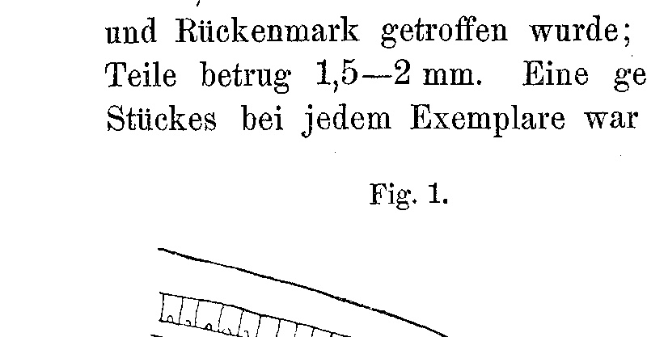
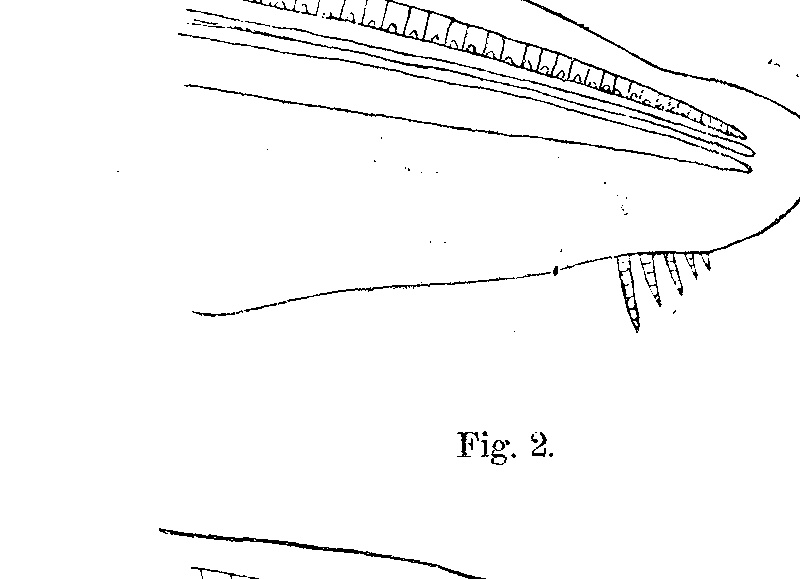

# Über Regeneration bei Amphioxus lanceolatus.
## On Regeneration in Amphioxus lanceolatus.

By

Raoul Biberhofer.

*(From the Biological Experimental Institute in Vienna.)*

With 2 figures in the text.

Received on 24 May 1906.

*Archiv für Entwicklungsmechanik der Organismen*, vol. 22 (1906).

> **Full translation.** A complete English rendering of the running text of “On Regeneration in Amphioxus lanceolatus” (Biberhofer, 1906), including all tables, figure and plate legends, and footnotes. Numbers and table cells were transcribed from the page images, not the noisy OCR.

Concerning the regenerative capacity in *Amphioxus*, very little is known despite the most many-sided studies on leptocardians. In a paper by Jozef Nusbaum¹) the apparent incapacity for regeneration, which presented itself to the author as the result of his experiments, is sought to be explained, whereby he in particular characterized the structure of the *Amphioxus* body as very unsuited for the conditions of regeneration.

Now, in the second half of the year 1905, I have succeeded in obtaining regenerates from the anterior end of *Amphioxus*. The material consisted of 12 specimens of *Amphioxus lanceolatus* from the coast of Helgoland; they were distributed in 4 glass beakers, 3 to each. An infection was sought to be forestalled by washing the sand, etc.; nevertheless, in the first weeks 10 specimens died of the rose-colored infection, to which most of Nusbaum's specimens had also succumbed. The two remaining ones (which were located in the same beaker) were taken out after an experimental duration of 25 weeks (20 June–10 December), without their having shown a trace of an infection, and were thereupon preserved. It should further be mentioned that the objects used were throughout small animals of 2–3½ cm in length.

> ¹) Comparative regeneration studies by J. Nusbaum. Leipzig 1905. p. 297 ff.

16  Raoul Biberhofer

The operation was carried out in such a manner that with a scalpel the foremost head portion was severed off, partly with, partly without cirri, whereby in individual pieces the terminal part of the chorda and spinal cord was also struck; the length of the portions cut away amounted to 1½–2 mm. An exact severing of an equal piece in each specimen was not possible, since the operation had to be carried out quickly on account of the slight resistance capacity.

In the two remaining specimens the following could be observed: the larger one (length after the experiment 2.8 cm) showed a characteristic wound closure, whereas the smaller one (length 2.3 cm) exhibited a distinct regeneration. The regenerated part is, as could be seen on the preparation, recognizable by its lighter coloration; the cut surface showed itself (in side view) as a line (*ss*). The cut therefore ran perpendicular to the longitudinal axis and also touched the cirral region. The most strongly grown-out part of the regenerate lies perpendicular to the cut surface, as corresponds to the regeneration law of Barfurth. Whether in this object a regeneration of the cirri also set in cannot be recognized, since it is uncertain whether they were affected by the cut, since they retracted upon contact and even in the case of being cut through would be struck at different lengths, so that, according to the length of the cirri which are now visible on the preparation, the question of regeneration must remain unanswered.

**Fig. 1.**  *(figure not reproduced)*

**Fig. 2.**  *s—s*  *(figure not reproduced)*

Attempts at the regeneration of the hind end failed owing to the onset of infection; that regeneration does set in, however, is Über Regeneration bei Amphioxus lanceolatus.  17

to be gathered from a statement in Hans Przibram's "Regeneration"¹), wherein mention is made of an oral communication of Hamann's to the author. Although, therefore, Nusbaum obtained no regenerates and also adduces a ground for this, this is nevertheless at any rate warranted, since a relatively slight regenerative capacity is present; also in this, that he does not interpret his failures in the sense of the Weismannian theory, according to which the *Amphioxus* living in the sand would be protected against injuries and therefore would possess no regenerative capacity, we can all the more readily concur with Nusbaum, inasmuch as we are in a position to adduce positive results.

> ¹) H. Przibram, Regeneration. From "Ergebnisse der Physiologie". 1st year. 1902. p. 100.

Archiv f. Entwicklungsmechanik. XXII.  2

## Figures

**Fig. 1.**

**Fig. 2.**

---

*Translator's note.* One of the Biologische Versuchsanstalt (Vienna Vivarium) papers flagged on the project site as a modern rediscovery target. Claims are rendered as stated in the original, not endorsed.
