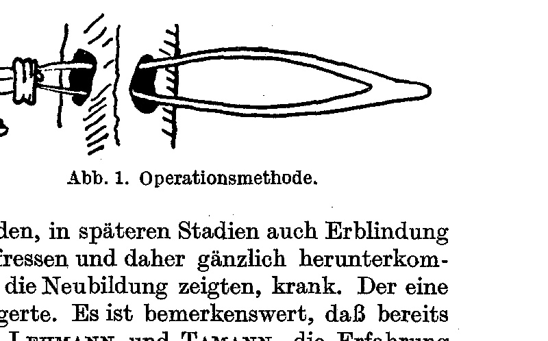
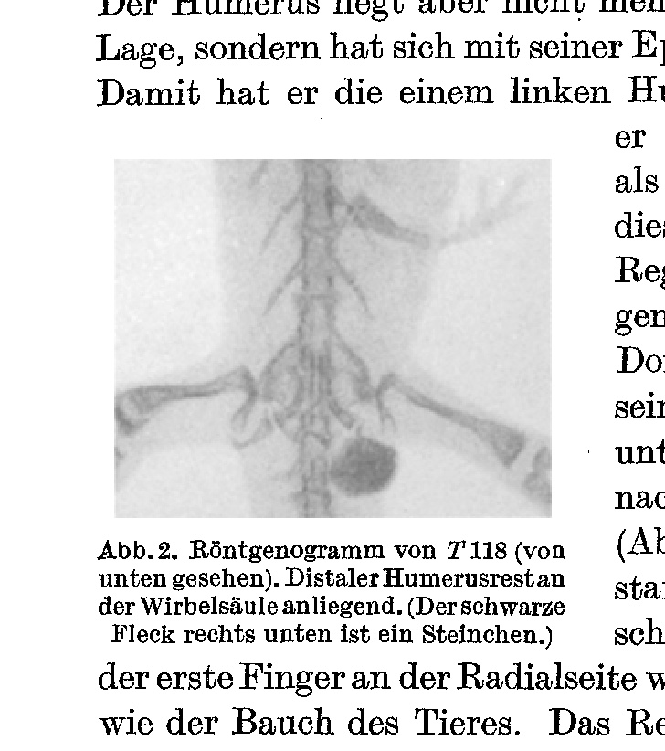
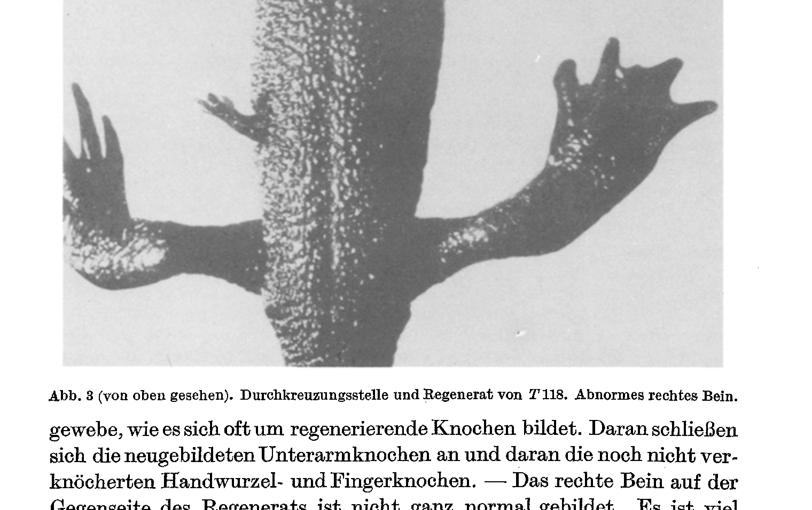
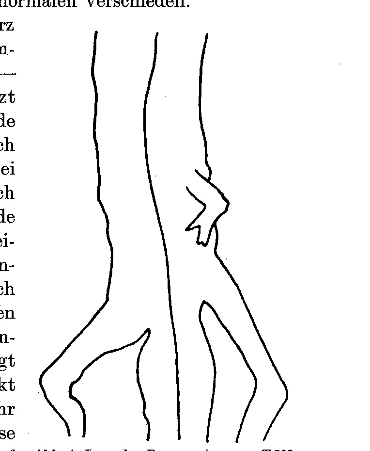
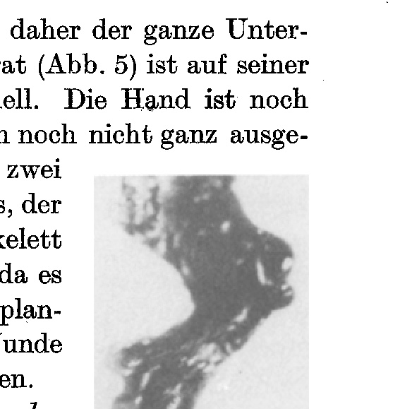

*(From the Biological Research Institute [Biologische Versuchsanstalt] of the Academy of Sciences in Vienna.)*

## REGENERATION AND SYMMETRY THROUGH THE URODELE BODY OF IMPLANTED LIMBS ¹

By

HENNY BURCHARDT.

With 5 text figures.

*(Received on 22 July 1929.)*

*Wilhelm Roux' Archiv für Entwicklungsmechanik der Organismen*, vol. 122 (1930).

> **Full translation.** A complete English rendering of the running text of “Regeneration and Symmetry through the Urodele Body of Implanted Limbs” (Burchhardt, 1930), including all tables, figure and plate legends, and footnotes. Numbers and table cells were transcribed from the page images, not the noisy OCR.

### Table of Contents

| | Page |
|---|---|
| Introduction | 230 |
| A. Experimental Part | 230 |
| 1. Experimental Setup | 230 |
| 2. Discussion of the Individual Cases | 231 |
| B. Results | 234 |
| Summary | 235 |
| Bibliography | 235 |

### Introduction.

In order to find a way of bringing urodele limbs [Extremitäten] to regeneration on both sides, an attempt was made to push a limb with its autopodium removed crosswise through the body, so that both free wound surfaces lay open. The experiments were carried out in 1926/27.

## A. Experimental Part.

### 1. Experimental Setup.

Adult specimens of *Triton cristatus*, after several trials with other amphibians [Lurchen], proved to be the best and most resistant object. The animals were narcotized in a half-saturated solution of chloretone. They awaken by themselves after 24 hours, or are roused from the narcosis by squeezing out the urinary bladder.

The operation was carried out as follows: On a limb of the same animal a circular incision was made through the skin with scissors, and indeed somewhat above the elbow joint. Then the body of the animal was bored through with a small metal spatula 2 mm wide; I probed through, as far as possible beneath the vertebral column, over the entrails [Eingeweiden], without injuring the latter, which after all readily yield to slight pressure. The site of the operation on the body—

> ¹ The results of this work appeared under the identical title as a preliminary communication No. 144 from the Biological Research Institute [Biologische Versuchsanstalt] of the Academy of Sciences in Vienna (Zoological Department: Director H. Przibram) in the Akad. Anz. 1929, No. 5.

—was a different one in the various animals: on the trunk, between arms and legs. Through the tunnel now distended by the spatula I then drew in the severed limb, which I had meanwhile partly skinned: from the circular incision onward the skin was pushed down somewhat toward the distal end on the one side and toward the proximal end on the other, whereupon the autopodium was cut off with a snip of the scissors; this end was now grasped with the points of the forceps, after I had pushed these through the body and widened the wound to the breadth of the limb (Abb. 1). Then the implant was carefully drawn through, and indeed in such a way that one piece of the proximal end protruded on the one side, that of the distal [end] on the other side. The skin still adhering on both sides lays itself in folds like a sleeve pushed up and prevents the limb from slipping into the body. The body holds the graft [Pfropfreis] fast by the pressure of the muscles, so that the edges of the slit-shaped wound heal onto the round, freshly cut bones.

In the meantime, the fate of the implant differed. The implant remained healthy in most animals, or it died off, that is, either fell out of the body, or it grew into the surrounding tissue (T 118, T 508).

While most animals remained healthy, in others the implant went to ruin [zugrunde ging] — either through an advancing illness, which formed an obstacle to regeneration, or through inflammatory bleeding. The open, necrotizing wound, in later stages with the necrosis of the bony tissue retreating, no longer endangered [the limb], but was nevertheless not yet fully healed over; only the open wound, gradually receding, healed up and bound itself together. As several authors, e.g. **Ask**, **Morpurgo**, **Lehmann** and **Tamann**, have shown, bone heals more easily in unhealthy than in healthy animals, that is, the regeneration could occur more frequently in such animals; the trypan-blue [animals] with and without calcium chloride showed [this]. As can be seen, just such an implant pushed in crosswise heals more easily and is therefore better suited than one inserted with its wound surface on the side closer [to the body] (T 508). When such an implant pushed in crosswise was inserted, only one [side] died off and the implant healed up close to the body, while the rest, surrounded by the body wall, came to lie wholly closed; the inner ends, surrounded by the body wall, were turned, came to lie inverted toward the front, and thus reversed wound surfaces arose [entstanden].

### 2. Discussion of the Individual Cases.

**T 118** (Abb. 2, 3). Operated on in February 1926, preserved December 1926. The implant, likewise a right arm, was in this case inserted with its distal end pushed forward; it sat there with its distal end pushed forward right. From the long boring-through, the inner part of the limb fell apart so as to leave no longer recognizable trace; ulna and radius are — as the X-ray image shows — resorbed or fallen out. Only at the free cut— *(Running head: "Regenerat. u. Symmetrie durch d. Urodelenkörper gesteckter Gliedmaßen" — "Regeneration and Symmetry through the Urodele Body of Implanted Limbs." — Page 231.)*

**Abb. 2.** X-ray photograph of T 118 (seen from below). Distal humeral end lying against the vertebral column. (The black spot at lower right is a multiple [artifact].)  *(figure not reproduced)*

—surface of the upper arm at its proximal end the regenerate grows. For there [the humerus] functions with its supplemented piece as humerus for the new arm. With this position the humerus could form a regenerate. The humerus lies at first not yet in the direction of the operation site, but rather lies turned with its epiphysis crosswise forward (Abb. 2). Thereby it has, on the one [side], a humerus corresponding to the new arm.

The regenerate is now a left lower arm. Its palmar side [is turned] forward, somewhat downward, correspondingly the dorsal side back upward, the ulnar side belly-ward (Abb. 3). The extremity was on its upper side colored strongly dark like the body, pigmented; only a narrow strip on the underside as well as the inner surface of the radial side were whitish yellow, indeed as dark-yellow as the regenerate. The regenerated proximal side of the animal has formed no elbow joint, but rather only a cap of callus—

**Abb. 3** (seen from above). Crossing-site and regenerate of T 118. Abnormal right leg.  *(figure not reproduced)*

—tissue, as one often sees on regenerating bones. The newly formed lower-arm bones are also distinguishable on it, and on it the not-yet-keratinized hand-bones and finger-bones. — The right leg [Bein] of the regenerate is not quite normal. It is somewhat plumper, the swim-membranes [webs] reach out over the tarsalia and over the first phalanges and leave only the outermost tips of the toes [free]. Be- —tween the first and second toe and between the second and third toe is in each case a yellow knob as if over the toe-tip [Zehenspitze]. The fifth toe is doubled. The skeleton too is different from the normal.

**T 508** (Abb. 4, 5). Operated on in March 1927, preserved August 1927. The implant —likewise a right arm— was in this case inserted reversed, that is, with its distal end toward the left, with its proximal end toward the right. Damaged through too-long incubation during a photographic exposure by the heat of the lamp, the regenerate-stump was cut off twice at its end, [and] grew out at its end into a distinct, though small, left arm (Abb. 4). The extremity is turned backward; its volar surface points ventrally and somewhat medially. Stretched out, its dorsal side would lie dorsally, its radius backward, since this left extremity lies host-side-reversed [wirtseiteverkehrt] on the right side of the animal.

**Abb. 4.** Position of the regenerate of T 508. (Strongly magnified, drawn after a photographic plate.)  *(figure not reproduced)*

The elbow joint is, however, squeezed in, and therefore the whole lower arm is pressed against the body. The new regenerate (Abb. 5) is pigmented on its upper side, light on its underside. The hand is still not quite formed, likewise on the underside. The outer side of the regenerate forms a—

**Abb. 5.** Regenerate T 508.  *(figure not reproduced)*

—hump, of which the one [protuberance] is the processus ulnaris, the other the distal end of the humerus. The skeleton is still not perceptible in the X-ray image, since the skeleton is not yet calcified. The bones of the transplant have here all been preserved; the wound over the distal end has closed completely.

In two *Triton taeniatus*- and in two *Salamandra maculosa*-larvae of the same operation-type, small extremity-regenerates arose at the distal ends, which then naturally retained the old symmetry of the graft [Reises].

In one adult *Triton* (T 86) an extremity was drawn through the tail behind the pelvis. The transplant fell out, but at the long-open wound site a little tail proliferated, which moved in conformity with the large tail. The— —X-ray image shows a break of the vertebral column at the through-pull site and a new formation of vertebrae from this site into the little tail that arose.

Besides, not quite in connection with [this] work, a series was set up which in one case showed agreement with the work of **Locatelli** (1924), as well as of **Guyénot** and **Schotté** (1926), namely the formation of an extremity at a flank wound as a consequence of a deflected nerve. The extremity thereby arising has the side-quality of the side of the body on which it stands and from which the nerve was taken, here the right.

### B. Results.

I come, on the ground of the present experiments, to the following results:

1. By crossing the urodele body with an extremity one can obtain both distal- and proximal-regenerates [Distand- wie Proximandregenerate]. To obtain both on the same animal did not succeed. In adult animals, regenerates differentiated in form arose only at the proximal cut surface; in larvae only at the distal one.

The trunk proved itself the most suited for the operation. Once a second, smaller tail arose as a consequence of operation behind the pelvic girdle. Sometimes the implant survives in the body without forming a regenerate.

In other cases the new formation is the immediate continuation of the implant. It [the cut surface] can be at the distal-regenerate [Distandregenerat] (larvae); it is its mirror-image when a proximal-regenerate [Proximandregenerat] arose (T 118 and T 508). That the body merely plays a nourishing role and that no determining role falls to it in the adult animal is proven by the circumstance that a proximal-regenerate absolutely forms the mirror-image — thus from the right side of the body a left arm arose, and at the proximal end its mirror-image (T 508). If one held the influence of the body-excluding trunk [Rumpf] to be decisive for the symmetry, one would have to expect the right [arm]. The symmetry-relations of the adult animals were always mirror-images.

The fact that the adult animals always formed proximands, the larvae however always distands, I explain to myself as follows, although the small number of the results is not yet sufficiently conclusive for this: When at the adult animal a definite growth-velocity belongs to each cross-section, and at the [proximal] end the greatest number of potencies and the greatest growth-velocity are present, which steadily decreases distalward. From this it follows that with equal outgrowth-conditions of the— *(Running head: "durch den Urodelenkörper gesteckter Gliedmaßen." — "through the urodele body of implanted limbs." — Page 235.)*

—proximal cut surface the preference is given. In larvae the matter lies somewhat otherwise: the potencies are still much more concentrated in the whole extremity, that is, the growth-velocity on the distal side is approximately as great as on the proximal [side]; besides, the extremities are, so to say, "in full swing" [im Schwung] in their growth, indeed at the end of the growth-period all appendages have a faster growth than the rest of the body: correspondingly the distal part is formed out.

The other side is not formed out as well, presumably because all form-building material is transported to the preferred site and the other side is at a disadvantage, as soon as the one [side] once has the head start, as is also often the case with normal development of whole organs.

All regenerates were sensitive to pressure and contact stimuli. They could not move, except for the small little tail, which however stood in immediate connection with the vertebral column and the spinal cord.

It seems that the regeneration of the transplants was promoted in animals somewhat weakened through hunger or illness.

### Summary.

By crossing the body of adult *Triton cristatus*, of *Salamandra*- and *Triton taeniatus*-larvae with one extremity, distal- or proximal-regenerates [Distand- oder Proximandregenerate] arose. The former are, in side-quality [Seitenqualität], equal to the inserted extremities; the latter [are] their mirror-image, with retention of the dorsoventral- and the radioulnar-axis. In larvae distands arose, in adult animals proximands. Possibly one can obtain a better regeneration of the transplants on hunger-animals.

### Bibliography.

**Ask, Fritz:** Zur Kenntnis der Replantationsfähigkeit des Wirbeltierauges. Saertrik af Acta ophthalm. 1925, 12. — **Ask, Fritz** u. **Andersson, Einar:** Zur Frage der Replantationsmöglichkeiten des Vertebratenauges im Lichte einiger neuerer Untersuchungen. Acta ophthalm. (Kopenh.) 4, H. 2, 97 (1927). — **Balinsky, B. I.:** Xenoplastische Ohrbläschentransplantation zur Frage der Induktion einer Extremitätenanlage. Roux' Arch. 110, H. 1, 63 (1927). — Über experimentelle Induktion der Extremitätenanlage bei *Triton* mit besonderer Berücksichtigung der Innervation und Symmetrieverhältnisse derselben. Ebenda 110, H. 1, 71 (1927). — A new demonstration of the existance of limbinduction with the aid of xenoplastic transplantation, and the factors that are involved therein. Trav. Inst. Biol. Kiew 1927, Nr 2. — **Bischler, Vera:** L'influence du squelette dans la régénération, et les potentionalités des divers territoires du membre chez *Triton cristatus*. Rev. suisse Zool. 33, Nr 16, 431 (1926). — **Burian** siehe **Milojević.** — **Filatow, D.:** Aktivierung des Mesenchyms durch eine Ohrblase und einen Fremdkörper bei Amphibien. Roux' Arch. 110, H. 1, 1 (1927). — **Flat, Eugenie:** Regeneration der *(Running head: "236  H. Burchardt: Regener. durch den Urodelenkörper gesteckter Gliedmaßen." — "236  H. Burchardt: Regeneration through the Urodele Body of Implanted Limbs.")*

langen Knochen nach teilweiser Entfernung im Innern der Molchextremitäten (*Triton cristatus*). Akad. Anz. Nr 8 Wien 1926. — **Gräper, Ludwig:** Entwicklungsmechanik der Wirbeltierextremitäten. Erg. Anat. 27 (1927). — **Grbić, N.** siehe **Milojević.** — **Guyénot, Emile** u. **Schotté, O.:** Démonstration de l'existance de territoires spécifiques de régénération par la méthode de la déviation des troncs nerveux. C. r. Soc. Biol. Paris 94, 1050 (1926). — **Hoffmann, Sergius** siehe **Milojević.** — **Kurz, Oskar:** Versuche über die Polaritätsumkehr am Tritonenbein. Arch. Entw.mechan. 50, 186 (1922). — **Lehmann** u. **Tamann:** Transplantation und Vitalspeicherung. Brun's Beitr. 137 (1926). — **Locatelli, Piera:** Sulla formazione di arti sopra numerari. Boll. Soc. med.-chir. Pavia 36 (1924); — **Milojević, B.:** Über Transplantationen von Beinregeneraten bei *Triton cristatus.* Verh. dtsch. zool. Ges. 28 (1923). — Beiträge zur Frage über die Determination der Regenerate. Arch. mikrosk. Anat. u. Entw.-mechan. 103, H. 1/2 (1924). — **Milojević, B.** u. **Burian, H.:** Régénération hétéropolaire de la queue chez les Tritons adultes. C. r. Soc. Biol. Paris 95, 989 (1926). — **Milojević, B.** u. **Grbić, N.:** La régénération et l'inversion de la polarité des extremités chez les Tritons adultes, à la suite d'une transplantation hétérotope. Ebenda 93, 649 (1925). — Influence excrete sur les phénomènes de la régénération par les tissues envirronants. Ebenda 95, 983 (1926). — **Milojević, B., Grbić, N. et Vlatković, B.:** Provocation expérimentale du développement de la crête mediane chez les Tritons. Ebenda 95, 984 (1926). — **Milojević, B. et Hoffmann, S.:** Le dédoublement des extremités chez la *Rana esculenta* à la suite de la transplantation des bourgeons primaires des pattes posterieures. C. r. Soc. Biol. Belgrade 95, 981 (1926). — **Morpurgo, B., Milone, S.** u. **Vecchi, G.:** Sugli innesti omoplastici in ratti trattati con bleu Trypan et con cloruro di calcio. Atti Soc. Chir. 33. Padova: Adamanea 1926. — Über den Einfluß der Inanition auf die homoioplastische Transplantation. Zbl. Path. 39 (1927). — **Przibram, H.:** Experimentalzoologie. II. Regeneration. Leipzig u. Wien 1909. — Experimentalzoologie. IV. Vitalität, Kap. III, 1913. — Bruch-Dreifachbildung im Tierreiche. Arch. Entw.mechan. 48, H. 1/3 (1921). — Achsenverhältnisse und Entwicklungspotenzen der Urodelenextremitäten an Modellen zu Harrison's Transplantationsversuchen. Arch. mikrosk. Anat. u. Entw.mechan. 102, H. 4 (1924). — Tierpfropfung. Die Transplantation der Körperabschnitte, Organe und Keime. Braunschweig 1926. — Deutungen spiegelbildlicher Lurcharme. (Zur Verständigung mit R. G. Harrison u. a.) Roux' Arch. 109, 411 (1927). — **Schotté, O.** siehe **Guyénot.** — **Tamann** siehe **Lehmann.** — **Vlatković, B.** siehe **Milojević.** — **Weiss, Paul:** Die gestaltliche Nullipotenz des Regenerationsmaterials. Extremitätenbildung aus Schwanzmaterial. (Bei *Triton.*) Akad. Anz. Wien 1925, Nr 21/22. — Die Herkunft der Haut im Extremitätenregenerat. Arch. Entw.-mechan. 109, H. 4, 584 (1927).

## Figures

**Fig. 1.**

**Fig. 2.**

**Fig. 3.**

**Fig. 4.**

**Fig. 5.**

---

*Translator's note.* One of the Biologische Versuchsanstalt (Vienna Vivarium) papers flagged on the project site as a modern rediscovery target. Claims are rendered as stated in the original, not endorsed.
