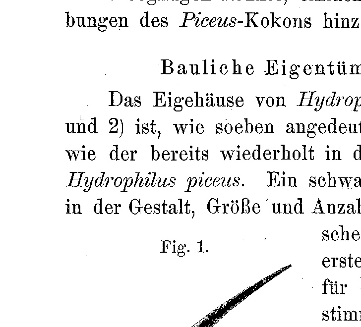
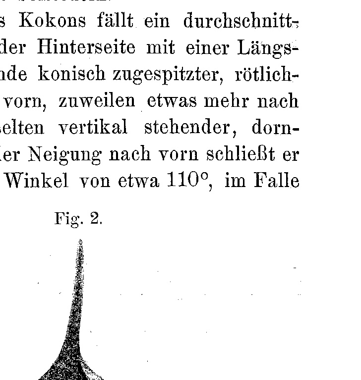
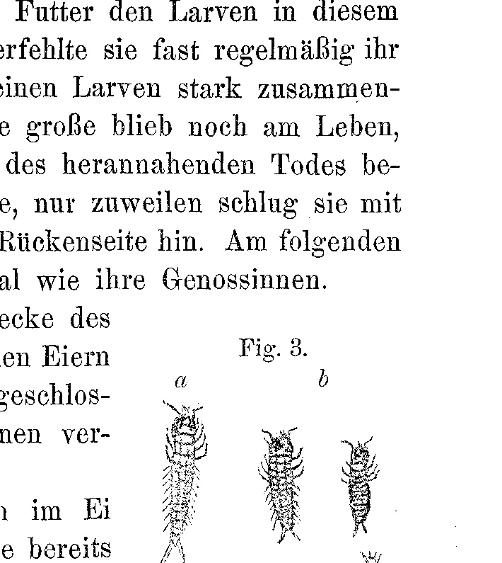

# Influence of Abnormal Gravitational Action on the Embryonic Development of Hydrophilus aterrimus Eschscholtz.

By

**Dr. phil. Franz Megušar.**

(From the Biological Experimental Institute in Vienna.)

With 3 Figures in the Text.

Received on 24 May 1906.

*Archiv für Entwicklungsmechanik der Organismen*, vol. 22 (1906).

> **Full translation.** A complete English rendering of the running text of “Influence of Abnormal Gravitational Action [on development]” (Megusar, 1906), including all tables, figure and plate legends, and footnotes. Numbers and table cells were transcribed from the page images, not the noisy OCR.

### Introduction.

In the first half of the month of July 1905 I experimented, in the course of my Hydrophilid rearing experiments — in which I was primarily concerned with procuring embryological material and establishing the most important biological facts — on the cocoons of Hydrophilus aterrimus, in order to get to know the relationship of gravity to the development of the embryos.

Although I intend shortly, in a comparative-biological work, to subject to a detailed discussion the structural peculiarities of the Hydrophilus cocoon, its position on the water surface, and the arrangement of the eggs in it, I should nevertheless like to send ahead here the essentials about it, since the subject stands in immediate relation to the content of the present work, in order that — only [provided] a clear conception of the architectonics of the cocoon [is given] — my further expositions can be made intelligible.

The egg-cocoon of Hydrophilus aterrimus Eschsch. agrees so greatly in its structure and its other properties with that of Hydrophilus piceus L. that a confusion sometimes cannot be avoided even with great practice and a rich supply of comparative material. If my description of the Aterrimus cocoon, given in the following lines, nevertheless deviates considerably from the presentations of the Piceus cocoon prevailing in the literature, this is only because the statements published hitherto about this subject would scarcely withstand a renewed examination. This is also the reason why I did not feel justified simply to point to the already existing descriptions of the Piceus cocoon.¹

> ¹ As far as I have been able to learn from the literature accessible to me, there exist no closer statements about this subject, especially for Hydrophilus aterrimus Eschsch.

> ² During my rearing experiments I had had occasion to observe that a single individual of these two species is, in relatively short time, in a position to spin several cocoons one after another (maximum 4—7), of which each following one stands behind the preceding both in respect to the size and to the number of eggs.

### Structural peculiarities of the cocoon.

The egg-housing of Hydrophilus aterrimus (see text figures 1 and 2) is, as just indicated, constructed according to the same plan as the cocoon of Hydrophilus piceus, already repeatedly described in the literature. A weak difference could be demonstrated solely in the form, size and number of eggs. These distinguishing means, however,

**Fig. 1.** *(figure not reproduced)*

> Caption (Fig. 1): Inner structure of the cocoon of Hydrophilus aterrimus Eschsch. The web located above the egg group is left out in the figure. Nat. Gr. [natural size].

can be applied only to the first cocoons²; for the further ones, all determinative means leave us in the lurch [lassen uns im Stiche], since here in manifold respect irregularities take place.

The cocoon represents an approximately roundish-oval — in Hydrophilus piceus longish-oval —, to an extremely slight degree hydropic [hydropisches], web [Gespinst] of a white, yellowish-tinted coloring and of approximately the size of an ordinary walnut [Walnuß] (average dimensions: 24 mm length, 19 mm breadth, 15 mm height). The upper [surface is] weakly arched, the surface turned toward the atmospheric air becomes [covered] with the most manifold light objects, such as building remnants, parts of phanerogamous water plants, occasionally also paper scraps that have fallen into the water, etc., which, glued onto the front parts of the cocoon — that is, the one which hangs up above as a "mast" — to be sure [freilich], it is also frequently fastened onto the rear parts of the cocoon only at the side, and namely on the back side, hangs down, whereby they not seldom lend support in its rearward parts and in the prominent appendage.

At the front, narrower pole of the cocoon there strikes the eye an on-average 3 cm long, flattened, on the rear side provided with a longitudinal groove, toward the free end conically tapering, reddish-brown colored, solid, mostly inclined backward, relatively seldom vertically standing, thorn-like appendage. In the case of inclination forward it forms with the surface of the cocoon an angle of about 110°, in the case of inclination backward, on the other hand, an angle of 65°. Toward the base this "mast" undergoes a triangular widening and forms the upper part of the front side of the cocoon.

If one takes into consideration the conditions under which the cocoons are encountered in free nature, then the thought lies near that to this appendage the meaning belongs of keeping the cocoon, in stormy weather and high water, between the dead or still fresh

**Fig. 2.** *(figure not reproduced)*

> Caption (Fig. 2): External structure of the cocoon in its natural position on the water surface. Nat. Gr. [natural size].

swamp plants — those projecting above the water mirror [water level] or lying upon it — at shallow places, because these offer the most favorable living conditions to the larvae about to hatch; furthermore the cocoon is, as it were, anchored by its appendage between the swamp plants, so that in the case of wave-action it cannot be tossed to and fro, hence also cannot be damaged or hurled out of the water. In fact, I have always found the cocoons at places of such a kind.

Immediately below the mast there joins on, toward the bottom, a very delicate, translucent membrane in the form of a circular segment, the "little window" [Fensterchen], which at the time of the hatching-out is gnawed through by the larvae and thus makes possible for them the leaving of the cocoon.

If one lifts off the cover [Decke] of the cocoon, one becomes aware that it is composed of two layers [Schichten]: of an outer one, very thin and fully self-enclosed, which seals the cocoon off against the outer world, and of an inner, yellowish-white, parchment-like layer, which suddenly ceases before that already-mentioned circular segment of the outer membrane that forms the translucent little window. The lacking part is replaced by a mighty and loose web. The two membranes are firmly glued to one another in the front parts as well as on the upper and lower side of the cocoon; at the periphery they gradually diverge from one another in the direction from front to back and in this way let arise a rather broad, half-moon-shaped intermediate space, which a loose web fills out.

### Distribution of the eggs and the position of the same in the cocoon.

(Fig. 1.)

The longish-oval eggs, partly straight-stretched, partly slightly curved, occupy a semicircular surface of the bottom roughly in the middle of the space enclosed by the inner membrane in the cocoon, and stand perpendicularly, placed close next to one another, in the same.

The center of gravity [Schwerpunkt] of the whole little ship [Schiffchen] appears, in consequence of the storage of the eggs, displaced into its rear part, which also expresses itself in the form of the cocoon: the cocoon is, as mentioned, widened toward the rear, and this bulgy part harbors the chief mass of the eggs.

The eggs are, by means of delicate, very resistant [widerstandsfähiger] web-threads, on the one hand firmly held together among one another in the group, and on the other hand fastened to the surrounding wall of the inner membrane. Above the eggs rests a mighty and loose web. — The single egg lets one recognize a blunt, upward-directed pole, and a pointed, downward-directed pole, of which the former corresponds to the later tail-end, the latter to the later head-end of the embryo.

### Position of the cocoon on the water surface.

(Fig. 2.)

The position of the cocoon on the water surface is, in the normal case, that the egg-shaped body [eiförmige Körper] lies sunk somewhat more than halfway into the water, its front end appearing, opposite the rear [end], a little directed upward, so that a slight part of the so-called little window [Fensterchen] together with the whole mast projects out of the water.

From the whole architectonics of the cocoon it is apparent that here all the basic conditions [Grundbedingungen] are given that make possible the floating of the same on the water surface and counteract the tipping-over in the proper manner. To this comes, further, the excellent fixation of the eggs in their perpendicular and — as we shall later learn — for the normal formation of the embryos indispensable position in the cocoon itself. The secure floating of the cocoon is achieved through its oval form, the watertight and light web-fabrics, the large spaces occurring inside the cocoon, especially in the upper part in mighty extension, filled with loose web and air-conducting, [and] the displacement of the center of gravity into the rear part; for the fixation of the eggs the resistant web, which keeps the eggs in equilibrium, contributes essentially.

### Arrangement of the experiments.

On 6 July 1905 I encountered, in one of my breeding aquaria for Hydrophilus aterrimus, toward ½3 o'clock in the afternoon, two females stemming from the environs of Vienna directly at their brooding-business; I isolated them still during the spinning, in that I scooped the animals, together with the scarcely half-spun cocoons still stuck on the abdomen, into two large rearing-jars [Einsiedgläser] provided with the marks A and B, whereby they did not let themselves be further disturbed in the fulfillment of their motherly duties and only in the moment of the transfer stopped the movement of their vaginal palps; in their new containers they continued the brooding-business in all calm. After completion of the cocoon (4¾—5 o'clock in the afternoon) I removed the females and immediately thereafter inverted the obtained cocoons.

In order to avoid any mechanical pressure on the cocoon, I undertook the inversion in such a way that I cautiously grasped the tuft of filamentous algae¹ hanging down from the cocoon, laid it over the rim of the rearing-jar and, through a slight tension, fixed it in such a constrained position that the surface of the cocoon,

> ¹ Filamentous algae (*Cladophora fracta* Wahl), the food for the beetles, were namely at the same time the only building material at their disposal for covering the cocoons with it. In the intention of achieving an instinct-variation, I had offered them nothing of all the various objects which had been enumerated, in connection with the description of the cocoon, as those most frequently used, and in this way compelled them to use the mentioned green algae.

> Archiv f. Entwicklungsmechanik. XXII.
> 10 which in the normal position of the same is turned toward the atmospheric air, now came to lie inclined about 15° [to the water level], whereby the front part with the water mirror enclosed an angle of about 15°, while the former bottom surface of the little ship, which previously stood in immediate contact with the water, now projected completely out of the water. The water level stood about 10 cm, the average temperature of the days 22° C.

As control objects served me two cocoons, of which I scooped out the one [cocoon] one day before the setting-up (control experiment A₁), and the other (control experiment B₁) one day thereafter. Under such conditions I left the inverted cocoons standing for a further 3 days after the hatching-out of the first larvae, and preserved them then, after the obtained result, together with their inhabitants [Insassen].

### Result.

Experimental cocoon A. On the 13th of July, approximately toward the midday hour, I remarked in the cocoon, set up under abnormal conditions, hatched-out larvae, which differed in size and viability from the larvae of the control glass A₁ that had hatched out already 2 days earlier. All three individuals were characterized by a very small body-size: one specimen had, immediately after hatching out, in the stretched condition, the length of 10 mm, while the others showed a length of only 8½ mm (mouthparts and abdominal appendages not included), in contrast to the larvae developed by the otherwise normal way, whose average length amounted to 13 mm. They showed a plump body-shape, which came to expression especially distinctly in the tail-end. The behavior [Benehmen] in water was, especially in the two smaller larvae, of great clumsiness [Schwerfälligkeit]. The latter held themselves always in the immediate proximity of the water surface and could not [move] from the spot. Their repeatedly undertaken attempts to reach the depth of the water failed always; for their forces were too slight to overcome the water-resistance. A food, which consisted of the small crustaceans (*Cyclops*, *Daphnia*, *Cypris*, etc.) existing in the small ponds, they did not take up, at least during my presence. A little more life-energy let itself be ascertained in the larger larva. Now it circled about along the glass-wall at considerable water-height, now it let itself sink in an oblique direction, under visible exertions, into the depth. In feeding it showed only slight skill [Geschicklichkeit]. It did indeed snap more often with its mandibles after the Cyprids [Cypriden] rolling past, which food the larvae in this stage [stadium] most agree with [zusagt]; yet it almost regularly missed its aim. The day after, I found the small larvae lying on the bottom, strongly shriveled together; only the large one still remained alive, yet on it too signs of the approaching death became noticeable; for it was uncommonly sluggish, only at times did it strike with its tail-end vigorously toward its back side. On the following day the same fate overtook it as its fellows [Genossinnen].

At this time I cut off the cover [Decke] of the cocoon and encountered four little larvae [Lärvchen] already crept out of the eggs but still enclosed in the cocoon, as well as several embryos of various developmental stages.

A turning-around [Umdrehung] of the embryos had not taken place; whereas, as said earlier, the embryo in [the] normally-positioned cocoon looks with its head downward, the heads of the embryos in the inverted cocoon were directed upward.

Experimental cocoon B. Here all the similar accompanying phenomena were encountered as in the previously discussed cocoon. In comparison with this latter, only quite slight and insignificant deviations [Abweichungen] could be established, which relate firstly to the duration of the development and the number of the hatched-out larvae, namely: the first larvae, five in number, hatched out one day later than those from experimental glass A — individual differences [Individualverschiedenheiten] which, however, do not have much to signify, since they appear fairly regularly also in the animals developing under normal living conditions.

**Fig. 3.** *(figure not reproduced)*

> Caption (Fig. 3): *a* Larva immediately after hatching-out in normal position of the cocoon. *b* Larvae and embryos in abnormal position of the cocoon.

Upon the results obtained from the control-experiment cocoons A₁ and B₁ I believe I need not go further, since what is necessary for comparison purposes is apparent from the following experimental table.

### Summary.

a) In contrast to the many insects whose eggs in nature only too often [occupy] the most manifold positions in respect to the direction of the force of gravity, there prevails in the cocoon of Hydrophilus aterrimus Eschsch. at any time a quite determinate and constant storage [Lagerung], which is guaranteed through the special arrangement [Einrichtung] of the cocoon.

b) If one now inverts the egg-cocoon [Eikokon] of Hydrophilus aterrimus Eschsch., this inversion draws after itself the following effects [Wirkungen] in respect to the development of the eggs:

1) a delay [Verzögerung] in the development of the eggs,
2) a stunting [Verkümmerung] of the hatching larvae, which leads to their early death.

c) The normal action [Wirkung] of the force of gravity forms accordingly no indispensably necessary factor for the development of the eggs of Hydrophilus, but well for the normal formation of its larvae.

As regards the standpoint of the here-communicated results in relation to those of other researchers in the same field (that is, influence of the force of gravity on the development of eggs and embryos), it suffices well if I refer to the summarizing presentation by W. Roux ("Ges. Abhdl. üb. Entw.-Mech." Vol. II, esp. p. 256 ff.) and to a more recent work by the same author (Arch. f. Entw.-Mech. Vol. XIV, Part 1, 2).

### Experimental table.

Duration of development of the eggs and their accompanying phenomena in Hydrophilus aterrimus Eschsch. in upright and inverted position of the cocoons.

| Designation of the experimental object | Average temperature during the time of day | Day of egg-laying | Day of the hatching-out of the larvae | Number of hatched-out larvae | Number of the stunted larvae and embryos remaining behind in the cocoon | Life-duration |
|---|---|---|---|---|---|---|
| Control cocoons { A₁ | 22° C. | 5. VII. 05 afternoon | 11. VII 05 forenoon | 28 | 1 larva | apart from the stunted larva, no individual perished before the first molting [Häutung] |
| Control cocoons { B₁ | — | 7. VII. 05 afternoon | 13. VII. 05 afternoon | 42 | 0 | apart from the stunted larva, no individual perished before the first molting |
| A | 22° C. | 6. VII. 05 4ʰ 5 Min. afternoon | 13. VII. 05 midday | 3 | 7 larvae, 22 embr. and intermediate stages between embryos and larvae | the 3 hatched-out specimens from experimental glass A died within 2 days after the hatching-out. For the others the life-duration is undetermined, since they were preserved on 15. VII. 05 |
| B | — | 6. VII. 05 4ʰ afternoon | 14. VII. 05 midday | 5 | 8 larvae, 24 intermediate stages between embryos and larvae | the 3 hatched-out specimens from experimental glass A died within 2 days after the hatching-out. For the others the life-duration is undetermined, since they were preserved on 15. VII. 05 |

## Figures

**Fig. 1.**

**Fig. 2.**

**Fig. 3.**

---

*Translator's note.* One of the Biologische Versuchsanstalt (Vienna Vivarium) papers flagged on the project site as a modern rediscovery target. Claims are rendered as stated in the original, not endorsed.
