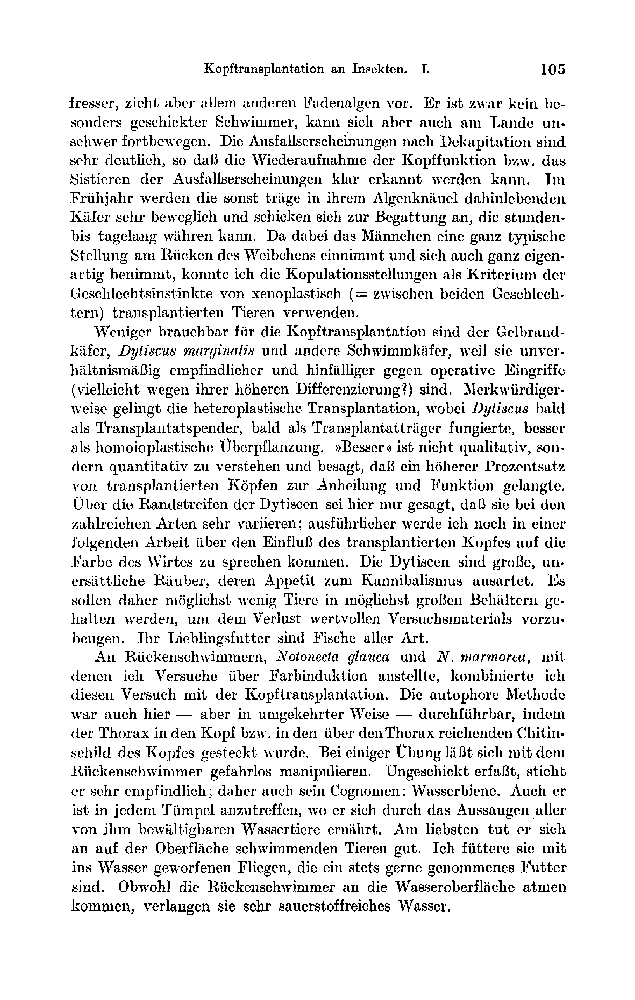
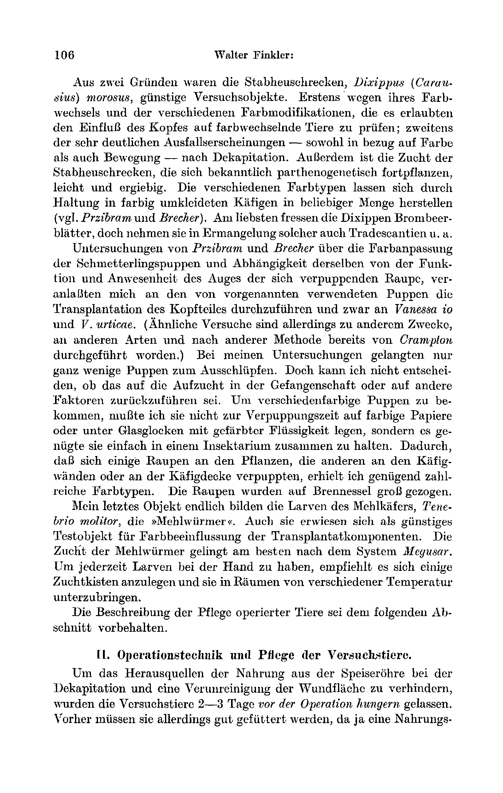

# Head Transplantation in Insects.
## I. Functional Capacity of Replanted Heads.

By

Walter Finkler.

(From the Biologische Versuchsanstalt of the Academy of Sciences in Vienna [Zoological Department]¹).)

With Plate IV.

(Received on 13 October 1922.)

*Archiv für mikroskopische Anatomie und Entwicklungsmechanik*, vol. 99 (1923).

> **Full translation.** A complete English rendering of the running text of “Head Transplantation in Insects (III)” (Finkler, 1923), including all tables, figure and plate legends, and footnotes. Numbers and table cells were transcribed from the page images, not the noisy OCR.

> ¹) An abstract of this work appeared under the same title as Communication No. 64 from the Biologische Versuchsanstalt, Zoological Department, Director H. *Przibram*, in the Akad. Sitzungsanz. [Academic Bulletin of Proceedings] Vienna No. 18. 1921.

## I. The Experimental Animals.

Functional transplantations on insects have not been carried out hitherto. The gonads of butterflies and caterpillars transplanted by *Meisenheimer* and *Kopeč* did indeed heal in completely and remained preserved, yet no function set in, nor was any indeed expected by the experimenters. In general, insects have been relatively little used for far-reaching operations. For obvious reasons: The larval stage of insects has too great a regenerative capacity for one to be able to follow, say, lastingly the failure-symptom [phenomenon of loss] of an organ. Almost exclusively regeneration experiments could therefore be made. Transplants are cast off by the larvae during the periodic moults. The imagines, now, are mostly so short-lived that they are from the outset unsuitable for experiments. Added to this is the fact that the danger of the insects bleeding to death in operative interventions is very great.

The greatest possible avoidance of these circumstances was decisive for the choice of the experimental animals for head transplantation. The best object, which met all requirements — longevity, small wound surface, etc. — I found in the pitch-black water beetle, *Hydrophilus piceus*. Especially favourable is the position of the head, which sits in the thorax like a ball-and-socket head in the socket. Through this the operative technique of autophoric transplantation (the conception of which we owe to *Przibram*), to be described later, was made possible. Not least of advantage are its easy procurability, its effortless care, its undemanding nutritional requirement, and its distinct — defecation. The great silver water beetle lives in all our waters, is actually an omnivore, but above all draws back from any attack; it is true that it cannot move particularly fast on land either, nor at all heavily. The failure-symptoms could be ascertained well after decapitation, and likewise the cessation of the failure-symptoms upon the re-acceptance [reattachment] of the head, respectively. In spring the otherwise sluggish animals, vegetating away in their algal tangle, could be observed for hours, even days, when one of the males was able to assume during copulation the quite typical position on the back of the female and thereby maintained such a quite peculiar stance — onto which one had transplanted a *xenoplastic* (= between the two sexes) transplant.

Less serviceable for head transplantation than the *Hydrophilus* beetle proved the *Dytiscus marginalis* and other swimming beetles, owing to the disproportionately sensitive and difficult operative interventions (which here perhaps require even greater differentiation). Remarkably, the *Dytiscus* beetle proves itself heteroplastically, now as transplant-donor, now as transplant-bearer [recipient], better than as homoplastic over-graft. "Better" is here not meant qualitatively, but quantitatively, i.e. with a higher percentage in regard to the healing-in and the function. About the boundary-regions of the *Dytiscus* I have not yet got far enough that I could let the numerous kinds vary; in detail this will be reported in a following work, under the influence of the transplanted head and the colour of the bearer in concrete cases. The *Dytiscus* is indeed coarse, an unsparing robber, with a downright cannibalistic appetite. One can only with difficulty keep its fellow-prisoners spared, in order to forestall the total loss of the experimental material in a possibly large container. Its favourite food are fish of every kind.

In another experiment series for head transplantation I had, combined with attempts at colour-change, set [it] up on the backswimmer, *Notonecta glauca* and *N. marmorea*, in order to carry through this attempt at head transplantation. The autophoric method indeed succeeds with it — but in reverse manner, namely in that the chitin of the thorax in the head region reaches far over the head. With some practice it is possible to manipulate even on the backswimmer's back. Upon decapitating it grasps [bites], it is sensitive; therefore also the cognomen *Wasserbiene* [water bee] is in place here. Even with the backswimmer it is to be feared that it punctures one with its sting; from this comes its name *Wasserwanze* [water bug]. I take them as food for the *Dytiscus* I have acquired. But these are always living food; for the backswimmers, although they come to the water surface to breathe, demand nevertheless very oxygen-rich water.

For two reasons the locusts [stick insects], *Dixippus* (*Carausius*) *morosus*, were favourable experimental objects. Firstly they constitute, through change of the various colour modifications, a favourable occasion for the elucidation of the influence of the head and of the change of colour; secondly, also through the distinct change of colour of the head, one could test the effect of the colour during movement — as well as after decapitation. In addition the breeding [rearing] of the locusts proves easy and prolific, owing to their known parthenogenetic propagation. The various colour-modifications make it possible to produce coloured wrapped cages in arbitrary number, in which one keeps the *Dixippus* in coloured surroundings (compare *Przibram* and *Brecher*). The most beloved food of the *Dixippus* are bramble-leaves, yet they do not always cling to the production of such colours, etc.

Investigations by *Przibram* and *Brecher* concerning the colour-adaptation of the butterfly-pupae and the dependence of the same on the function and presence of the eye of the pupating caterpillar prompted me to carry out, on the pupae used by the aforementioned, the transplantation of the head-part, and indeed on *Vanessa io* and *V. urticae*. (Similar experiments have, it is true, already been carried out by *Crampton* for another purpose, on different kinds, and after another method.) In these investigations only quite few pupae got as far as hatching. Yet I cannot decide whether that is to be attributed to the rearing in captivity or to other factors. In order to obtain differently-coloured pupae, I did not have to lay them at the pupation-time onto coloured papers or under bell-jars with coloured liquid, but rather it sufficed simply to keep them together in an insectarium. Through the fact that some caterpillars pupated on the plants, the others on the cage-walls or on the cage-roof, I obtained sufficiently numerous colour-types. The caterpillars were reared up on nettle [*Brennessel*].

My last object, finally, are formed by the larvae of the meal-beetle, *Tenebrio molitor*, the "meal-worms". The Mehlwurm proves particularly suitable for head transplantation. The breeding [rearing] of the meal-worms succeeds best by the system of *Megusar*. One leaves it to the larvae themselves to repeat [the cycle], just empties the breeding-boxes and accommodates them anew in the rooms of different temperature.

The description of the care of the operated animals may be reserved for the following section.

## II. Operative Technique and Care of the Experimental Animals.

In order to deprive the digestive tract of nutriment before the decapitation, and to render the cleansing [emptying] of the wound surface harmless, the experimental animals were left to *hunger* 2–3 days before the operation. Beforehand, however, they must of course be well fed, since otherwise a nutritiveuptake [feeding] during the time of the healing-in (about 2 weeks) is not possible. Artificial feeding, e.g. *per anum*, proved not to be necessary. Yet injection of water into the hindgut of the water beetles increased the number of successful cases considerably.

For the *narcosis* sulphuric ether was for the most part used. In the narcosis of insects with ether very great caution is advisable, since they often still show distinct spontaneous movements in the narcotizing vessel and, taken out, die within a few minutes. This disadvantage the carbonic-acid narcosis recommended by *Regen* does not, it is true, have, yet it is for many animals far too cumbersome and long-lasting. For the head transplantation it therefore cannot come into consideration, because the animals awaken too cold and, through the sudden movement of the legs, throw off the head again and again.

The *operation* I carried out in the following manner (as paradigm let the *Hydrophilus*, most used by me, be chosen): I first grasp the head loosely with the scissors at its thoracic side and lift it carefully out of the thorax-socket. Only now are the scissors applied so that one can separate the head from the trunk with one stroke, without a stump remaining on the head. If a part of the soft tissues between head and thorax remains on the head, then the healing-in of the like organs to one another is prevented, probably owing to the unavoidable crushing. The severed head is now best left on the scissors and the same operation performed on another animal. Now the head of the first animal is set in its normal position into the free thorax-socket of [the second]. Slight bleedings do no harm. On the contrary, the blood that dams up at the wound-edges favours the firm fixation of the transplanted head and prevents later the drying-out of the wound. It goes without saying that the same manipulation is performed also on the second animal.

Most difficult is the now ensuing care of the experimental animals, and I must confess that at first, in consequence of poor keeping, I had nothing but negative results. It works absolutely fatally when water gets onto the wound. I often lost the most valuable animals because I put them into the water too early, in order to ascertain the coordinated movements that had perhaps already set in. The consequence was that the animals were dead within 10 minutes. The experimental animals are also to be protected from dryness. If the wound has dried out at even a small spot, the healing-in of the head becomes illusory.

Both errors, too great moisture and too great dryness, the following method avoided: The operated animals were kept in a vapour-saturated room, a so-called *moist chamber*. A glass tub lined inside with filter-paper, or [one] that is led by a thin strip into another vessel filled with water.

The glass tub is for the greatest part covered with a glass plate. The filter-paper in the tub sucks up the water from the water vessel by means of the connecting strip and thereby stays always moist. The evaporated water dams up in the tub. Since mould-fungi readily settle on the filter-paper too — especially in great moisture — which can in turn infect the animals, I helped myself in this, that I added permanganate of potash [hypermanganate of potassium] to the water. To let fresh air have admission, the tub is not entirely covered.

At first I laid the animals simply onto the bottom of such *moist chambers*. That proved harmful, because with every movement they tore the paper with their spine-bearing legs and deposited the paper sticking to their feet possibly at the operation-site, which is the inner [site] and is touched again and again. Also that several animals crept about beside and over one another is understandably not very favourable for the undisturbed healing process. After the operation I therefore put the beetles into test-tube-like little glasses, out of which just the head could still protrude. The little glasses are fixed firmly, so that the head could not be knocked off. The little glasses are stuck into a carton in upright position, so that the still loosely-sitting transplanted head cannot fall down. The carton in turn is wedged horizontally into the glass tub.

In this "hospital" the animals remain so long until the — meanwhile suspended — mobility of the mouthparts sets in. That is the sign that the replanted head has already healed in.

From then on one can already keep them on moist filter-paper, on not too wet moss or the like. With the feeding one must wait until the coordination of movement is again restored. For at the same time, namely, as the nerves, the oesophagus too has grown together. Too early feeding would thus result in diffusion of the food in the head and the death of the beetle. Therefore [if] the healing process [lasts] too long, or the beetles seem especially languid and weak, injections of water into the hindgut help. With the doses, however, one must be sparing. It happened to me once that, after too copious a — *sit venia verbo* — clyster, the head was washed down. The water namely pressed out at the oesophagus and rubbed off the still loosely-adhering head with it.

With free keeping in the tub the onset of coordinated movements can easily be ascertained. The animals should then be put into the water daily, rising from 3 minutes up to three-quarters of an hour. Only after about 2 months can one treat them like normal [ones] and give them algae to eat.

Analogously the operation and the convalescence take shape with the other experimental animals.

I have already remarked introductorily that the transplantation of the *backswimmer head* occurs in reverse to that with *Hydrophilus* and *Dytiscus*. The head is not pushed into the thorax, but the thorax into the head. The Notonectid larval stages do not differ in size; [hence] it is to be carefully attended to, that in both [animals] the experimental animals, transplant-donor and transplant-bearer [recipient], are of the most nearly equal size. Ether narcosis is very difficult to carry out on backswimmers. Mostly all the animals succumb to it. Better succeeds the anaesthetizing in chloroform-water. The care after the operation is simple. As "hospital" serve small glass dishes, the bottom of which is lined with filter-paper. It goes without saying that the filter-paper must always be moist, in order to prevent the drying-out of the extraordinarily sensitive Hemiptera. Since the two kinds (?) *N. glauca* and *N. marmorea* are distinguished only by the colour and supposedly also by the contours of the shield, the head transplantation is also identical between the two.

Already great practice and much patience does the head-exchange on the stick insect require. The roller-shaped [cylindrical] head slips again and again out of the equally-shaped body. Besides, the danger of bleeding to death is very great. I therefore had, before the decapitation, [to take account of the] sensitive [features]: A strong silk thread is drawn carefully over the feelers and the head as a displaceable noose. Particular care is to be taken that the forelegs do not get caught in it too, because they easily break off through autotomy and thereby one is robbed of a fine criterion of head-function. The ligation is made *not* between head and prothorax, but between prothorax and thorax. A constriction immediately behind the head would be contrary to purpose for two reasons. Firstly, the noose would open or be cut through at the severing of the head, whereby the animal would perish helplessly from bleeding to death. Secondly, the healing-in of the head, the finding and the growing-together of the like tissues, would have been made impossible by the unavoidable crushing, dragging and tearing of the soft tissues at the prothorax in consequence of the ligation. Otherwise, of course, when the knot is looped inter-pro- and thoracally. The bleeding is strongly checked; at most the blood from the small prothorax can flow out, which is too little to flow away, settles at the wound-edges, and is still favourable for the fixation of the head. The damage from the intra-thoracic ligation is not all that severe, since it was dissolved on the following day. The *Dixippus* too remain after the operation in moist chambers. The latter are, for stick insects, not to be lined with paper at the bottom, because the head, in consequence of the violent, jerky movements backwards of the headless [trunks?] of the animals, which are still without a functional head, [becomes stuck] on the moist filter-paper. For the production of the necessary degree of moisture, the wall-covering of filter-paper suffices. Also on stick insects the water-injection *per anum* proved favourable for the convalescence period.

Quite simple is the transplantation on the "meal-worms", the larvae of the meal-beetle, *Tenebrio molitor*. Actually I have not carried out a pure head transplantation on them. The head is far too small for it to be able to be exchanged for an injury [wound site] and brought into the right position. I therefore left some segments on the head and arranged the exchange so that the smaller segment was pushed into the larger one, similar to the technically-used tubes displaceable one into the other. In doing so one segment is, it is true, sacrificed. The larger of the two segments to be pushed one into the other is hollowed out, so that only the chitinous casing remains over and into it the smaller transplant can be inserted. The two surfaces of the soft tissues must touch one another. Owing to the rapid digestion of the "meal-worms", they need to be given no food for only one day before the operation. In contrast to all other animals used for head transplantation, the meal-beetle larvae must be kept scrupulously dry. As is known to every expert, the meal-worms [are] extraordinarily sensitive to moisture. The drying-out is held back by the above-described manipulation, the storage of one segment in the chitin-sleeve of another. Although the head-part [flows/oozes?] immediately after the severing from the body, the feeding is nevertheless to be waited with until the complete growing-together has set in.

It goes without saying that on *butterfly-pupae* too a pure head transplantation is not feasible. Here too the "head-part" had to be transplanted. The choice of the pupae to be operated on is difficult insofar as they may be neither too young nor too old. If they are too young, then their content is still liquid and runs out at the cut. With too old pupae, again, the healing-in is called into question, because the time-span until hatching is too short. I therefore always struck the golden middle road, in that I used pupae that felt neither too soft nor too hard.

The head-part is severed with a sharp razor under careful avoidance of crushings and applied to the likewise-treated individual with a fine lancet. The soon-ensuing chitinous fusion thus hinders the drying-out of the transplant. The freezing of the pupae proved to be superfluous. Besides, thereby a complication of the experiment would have set in, which [experiment] was meant to demonstrate the colour-influence of the transplanted head-part and the rest of the body. Particular care is to be taken that exactly the same is transplanted as is extirpated. About a day later the pupae are to be transferred into ordinary, closed insectaria. With a successful operation, butterflies can hatch out of the pupae, on which one can clearly see the healing. Mostly, however, the butterflies must be peeled out of the pupa-casing. When flawlessly grown-together pupae are to be obtained, a razor-blade (Mem and others) is to be preferred to a razor, because the former are of uniform thickness, whereas the razors thicken and the cut is not entirely uniform.

Roughly the following day the pupae are to be transferred into ordinary, closed insectaria. With a successful operation, butterflies can hatch out of the pupae, on which the healing-together can be clearly seen. Mostly, however, the butterflies must be peeled out of the pupal envelope. If flawlessly grown-together pupae are to be obtained, a razor-blade (Mem and others) is to be preferred to a razor, because the former are of uniform thickness, whereas the razors thicken and the cut is not entirely uniform.

With the heteroplastic union of *Hydrophilus* and *Dytiscus* the operation becomes complicated, because the small *Gelbrandkopf* [yellow-margin head] does not fit into the large *Thoraxpfanne* [thoracic socket] of the *Kolbenkäfer* [Hydrophilus], and conversely the *Hydrophilus*-head is too large for the much smaller *Dytiscus*. The latter circumstance can only be remedied by not using large *Dytisci* and small *Hydrophili*. If the swimming-beetles are then kept in the »*Eprouvettenspital*« [test-tube hospital] described further above, the head proceeds to heal in. The space between the small *Dytiscus*-head and the chitin rim of the *Thoraxpfanne* I padded out with *Fettgewebe* [fat tissue], which was taken from the abdomen of the *Transplantatspender* [transplant donor]. Admittedly it was later resorbed, but up to the heal-in it held and most probably mediated the growing-together. Later it apparently transforms into connective tissue, until it is finally completely resorbed.

In general the following is to be observed with transplantations on insects: avoid strong bleedings, close the wound, prevent drying-out, and offer the most favorable healing-possibilities possible (by bringing together matching parts at stock and transplant).

## III. Die Funktionsaufnahme der transplantierten Köpfe. [The functional uptake of the transplanted heads.]

Since it is not the purpose of this work to come out for or against a theory, and still less to put forward new neurophysiological facts, it suffices to send ahead a short outline of the anatomy and physiology of the head-ganglia before the experiment-description — just as much as is necessary for the understanding and insight into the functional transplantation. In a work appearing elsewhere I shall have occasion, on the basis of this work, to treat neurophysiological questions. In any case I cite the relevant literature in the bibliography.

On the ventral side of the insects runs a large, mostly chain-shaped strand, which consists of a series of knot-shaped, usually mutually separated thickenings — the nerve-knots or ganglia — and their connecting-strands, the longitudinal commissures. The two large ganglia in the head are the supraoesophageal or cerebral ganglion and the suboesophageal ganglion. »The supraoesophageal ganglion is that part of the chain-shaped central nerve-strand which is to be regarded as the seat of the mental functions, of the will, of the determination of locomotion, and of the chief sense-organs.... The suboesophageal ganglion (also called the little brain) is a triangular, heart-shaped or elongate-oval knot of the ventral nerve-cord, which is to be sought behind or beneath the supraoesophageal ganglion and is connected with it by two connecting-strands. These two connecting-strands form, together with the two ganglia, a ring and enclose the gullet-tube of the alimentary canal, which lies between the supra- and suboesophageal ganglion« (*Kolbe*, Einführung in die Kenntnis der Insekten). In some insects — of the experimental animals only *Notonecta*, the backswimmer, comes into consideration — the first thoracic ganglion is fused with the suboesophageal ganglion.

The physiology of the individual ganglia we may, for the reasons given above, pass over, and take into account only the most important indications about the effect of decapitation. Admittedly the nomenclature is so confused and misleading that one cannot win a proper picture from these indications. Thus *Bethe* says that the righting-reflex after decapitation of the *Hydrophilus* does not become extinguished. In the next sentence, however, it states that a turning-over from the dorsal position to the ventral position never again comes about. In his fundamental, very valuable investigations on the function of the central nervous system of the arthropods, *Bethe* also describes the loss-phenomena after decapitation of the *Hydrophilus*. The legs move incessantly against one another, they clean themselves and scour the abdomen. Laid on its belly too, the legs usually go on cleaning. If one stimulates the animal, it creeps forward only very slowly and clumsily and frequently with irregular leg-movements, but often with good formation of gait-sequences. In the water the legs are spread, as soon as the feet lose the ground; swimming-movements set in, which, however, bring the animal forward only a little. Nevertheless *Bethe* arrives at the conclusion that neither the supra- nor the suboesophageal ganglion is the seat of the movement-correlation. Incidentally, this problem is not at all so important for us; the fact is that the movement-correlation after decapitation is at least strongly disturbed.

According to *Pompilian*, decapitated individuals of *Dytiscus marginalis* show spontaneous rhythmic movements of their legs. Neither walking- nor swimming-movements are observed. On *Dixippus morosus*, *Schleip* investigated the consequences which destruction of the brain brings about through pricking with a needle from above into the head-cavity and subsequent movement of the needle or of a little hook.

A very interesting communication, which can be used as confirmation of my work, was made by the same researcher. Animals in which the ventral nerve-cord was cut through once between two leg-pairs showed at first a paralysis of the legs lying behind the cut-surface, whereby, besides walking and climbing, the adoption of the protective posture too was destroyed. Many of them, however, no longer differed later from normal animals.

About the loss-phenomena in the various experimental animals I shall come to speak in each case in the experiment-description.

For the depiction of the functional uptake of the replanted head, I take an experiment carried out in most recent time, by which it was to be shown that the oesophagus and its innervation become entirely normal and functional in the transplanted [animal].

**2 July.** 10 *Hydrophili*, from which the food was withdrawn 5 days beforehand. An eleventh animal, starved for the same time, is dissected and the intestinal tract found to be completely emptied.

Among every four specimens the head is exchanged. The other two remain as headless control-animals.

The animals, which previously swam well and moved about on land, can no longer do so.

Laid on their backs, they cannot turn over. After some time (2 minutes) cleaning-movements set in. All leg-pairs move rhythmically against one another. (Similar to the scouring in the house-fly.) Laid on their belly, mostly a resting of the movements sets in. Later (about ½ minute) the same cleaning-movements. Of a locomotion not a trace can be established. At most, when the animals strike with their legs against an obstacle, a forward-movement can take place.

In the water slow locomotion comes about through the cleaning-movement, which, however, is at first glance to be distinguished from the swimming-movements of normal animals. The gait- and swimming-coordination is thus completely disturbed.

The severed heads show lively movement of all mouth-parts.

**3 July.** The movements of all animals have considerably abated. Both the intensity and the frequency of the scouring-movements are strongly reduced (from about 30 to 10—0).

The heads already for the greatest part motionless. They react to strong stimuli (introduction of a needle into the oesophagus) only weakly any more.

**4 July.** The transplanted animals unchanged. The two heads severed from the trunk have died off.

**5 July.** The two headless control-animals perished.

**8 July.** The antennae of the transplanted heads react to weak stimuli. Stimulation on the body yields as yet no reaction at the head. Nor the reverse.

Injection of water per anum.

**9 July.** Three specimens perished from an unknown cause.

> Archiv f. mikr. Anat. u. Entwicklungsmechanik Bd. 99.  8 **11 July.** Upon strong stimulation of the body, weak coordinated movements appear.

One specimen placed into water. Upon strong pinching of the hind-feet with a forceps, two to three rowing-strokes.

**12 July.** The animals are transferred from the »*Eprouvettenspital*« into a simple moist chamber with freedom of movement.

**13 July.** There two specimens found dead. The rest already show strong mobility of the mouth-parts of the head. Now and then (mostly upon stimulations carried out somewhat earlier) spontaneous, coordinated gait-movement. Water per anum.

**14 July.** Placed into water, all swim well. Cannot, however, [go] into the deep. Neither stimuli, pinching, nor submerging can bring the animals to deep-swimming. At the surface they swim along the wall. (All normal animals swim, when placed into water, at once into the deep.)

**15 July.** Macroscopic examination of the perished specimens preserved in picric acid and alcohol. From 9 July: Between head and thorax there is a little membrane (connective tissue?). At the margins, growing-together. On carefully lifting off the head, the tearing-away of the tracheae already grown into the head can be clearly observed.

From 13 July. Growing-together strongly advanced. The longitudinal commissures re-established. The two ends of the gullet are connected by a translucent membrane.

**17 July.** All the rest already creep about in the tub. The head is mobile on the thorax. The animals are put into the water for 5 minutes. One animal swims into the deep.

**19 July.** Already all swim, when put into the water for 20 minutes, into the deep. Swimming and walking already entirely normal. The two forelegs join — in contrast to 14 July — in the swimming-movement in coordinated fashion.

**Up to 24 July.** The animals are continually accustomed to the water. Feeding with algae, to which red shellac has been added. The growing-together and functional capacity of the gullet are to be established.

**25 July.** Transfer into another algae- and shellac-free water.

**26 July.** Reddish faeces found. The water, owing to the swimming-movements and the resulting diffusion of the faeces, strongly reddish.

**27 July.** Again reddish faeces. The microscopic examination yields: The green algae-faeces contain in great quantity admixed red shellac-lumps and -granules.

Thereby the complete resumption of the head-function is proven, since the act of feeding demonstrates the restoration of the nerve-function in the head, the act of defecation the smooth functioning of the digestive tract — that is, the connection of the oesophagus with the mouth. Since the heal-in process in the heteroplasty on *Hydrophilus* and *Dytiscus* proceeds analogously, and I in any case report this experiment in detail in the III. communication, I will here only describe the loss-phenomena and their cessation in the stick-insects.

Normally the stick-insects step forward in clear coordination. The gait-scheme is, as in all other insects: Left foreleg, right midleg, left hindleg, — right foreleg, left midleg, right hindleg. By day normal animals mostly adopt the »protective posture«. By night they are, if they are not feeding or stepping about, to be encountered in the resting posture. »The protective posture is distinguished above all by the fact that, like the rest of the body-stem, the abdomen too is completely straightened out, or is bent only when some object prevents the straightening. Secondly, in the protective posture the forelegs are, in the often-described manner, stretched forward in the prolongation of the body and laid together..... When it lies on the ground, it lays the two last leg-pairs against the body, the midlegs directed forward, the hindlegs backward. The same is the case when the animals, hanging freely, hold themselves fast by either the claws of the forelegs or those of the hindlegs to a little twig or the like. It is further the typical posture of feigning-death, when one touches the animals or takes them away from their support..... Quite differently the animals behave when one surprises them at night with the illumination, or observes them even in the dark itself, that is, under the weakest possible illumination: In the »resting posture«, which they then adopt, the abdomen is more or less strongly curved dorsalward..... Besides, in the »resting posture« all three leg-pairs are always spread and the body is removed from the support.« (*Schleip*, Der Farbenwechsel von *Dixippus morosus* [Phasmidae].)

*Schleip* himself further states that de-brained animals (see p. 112) can never be induced to adopt the protective posture, whereas this very frequently succeeds in normal animals.

After complete decapitation I saw neither protective nor resting posture. Headless animals have a quite peculiar posture. The two forelegs are directed forward, not parallel with the body-axis, but somewhat deflected. The midfeet mostly stand normally on the body-axis. The hindlegs are directed backward and enclose with one another approximately the same angle as the foremost leg-pair.

If now the headless animals are stimulated, there shows itself a movement quite typical for them: The foremost leg-pair always steps out forward. The last backward. The middle leg-pair serves as a support, but mostly joins the weaker leg-pair. The animal thus, despite the greatest exertion, does not move from the spot.

If the foremost leg-pair is amputated or weakened, the movement ensues exclusively backward. When I amputated the last leg-pair, the midlegs took over the role of the last legs and stepped out backward. The animal again, despite its movement, does not [move] from the spot. If the middle leg-pair is removed, then the direction of movement depends on which leg-pair is stronger. As a rule it is the last, and the movement ensues backward.

After transplantation of a head, this becomes mobile again after 5—8 days. The loss-phenomena vanish after 2 weeks.

In mealworms and butterfly pupae the loss-phenomena are not to be observed.

The decapitated backswimmer regains its movement-capacity in 10—15 days, if a head has been replanted on it.

## IV. Zusammenfassung. [Summary.]

I have applied *Przibram*'s autophoric transplantation method to the reinsertion of whole insect-heads. The head is lifted out of the *Thoraxpfanne* [thoracic socket], severed from the trunk with one snip of the scissors, and replanted onto another, likewise-treated animal. By the blood escaping — only in small amounts under narcosis — the outer wound-margins are closed and the head is held in the position favorable for the heal-in. Sutures and other foreign fixation-means are thereby dispensable, since the transplant of itself already holds fast through the friction at the stock.

Transplantations were carried out successfully on 1. the imago of *Hydrophilus piceus* Geoff., 1a. *Dytiscus marginalis* L., 2. *Notonecta*-species, 3. on the imago and larva of *Dixippus morosus* Burm., 4. larvae of *Tenebrio molitor* L., and 5. on pupae of *Vanessa io* L. and *urticae* L.

In order to be able to test the functional capacity of the transplanted head, the behavior of decapitated insects was first investigated. A decapitated *Hydrophilus* cannot execute any coordinated movements. It can move neither in the water nor on land. The movement of decapitated stick-insects is very clearly different from that of normal animals. While normal animals step out forward with all leg-pairs, in the decapitated *Dixippi* the front leg-pair always steps out forward upon every stimulus, the last always backward. The middle leg-pair serves as a support. That these loss-phenomena are not caused by a shock follows from the following experiment. Animals from which the head, with the exception of the cerebral and the oesophageal ganglia, was removed walk, or respectively swim, quite normally immediately after the operation.

The animals with transplanted heads are kept in moist chambers for as long as it takes until coordinated movements appear, which sets in approximately after 2—3 weeks. During the first week a closure-tissue forms between head and thorax. After 1—2 months the head has regained its full functional capacity. The water-beetles already swim down into the deep. The animals feed and defecate. All loss-phenomena of the decapitated animal have vanished.

Macroscopically, the complete healing-in of the head is clearly visible upon dissection.

At this place I permit myself to express to Prof. *Hans Przibram* my most obliging thanks for the granting of a work-place, as well as especially for his valuable advice and support.

### Literaturverzeichnis. [Bibliography.]

*Bethe:* Vergleichende Untersuchungen über das Zentralnervensystem der Arthropoden. Pflügers Arch. f. d. ges. Physiol. Bd. 68, S. 449—545. 1897. — *Holste:* Das Nervensystem von *Dytiscus marginalis*. Ein Beitrag zur Morphologie des Insektenkörpers. Zeitschr. f. wiss. Zool. Bd. 96, S. 419—476. 1910. — *Kolbe:* Einführung in die Kenntnis der Insekten. Berlin 1893. — *Matula:* Untersuchungen über die Funktionen des Zentralnervensystems bei Insekten. Pflügers Arch. f. d. ges. Physiol. Bd. 138, S. 388—436. 1911. — *Michels:* Das Nervensystem von *Oryctes nasicornis* im Larven-, Puppen- und Käferzustande. Zeitschr. f. wiss. Zool. Bd. 34, S. 641—702. 1880. — *Przibram u. Brecher:* Ursachen tierischer Farbkleidung. Arch. f. Entwicklungsmech. d. Organismen Bd. 45. 1919. — *Dies.:* Farbmodifikationen der Stabheuschrecke. Ibid. Bd. 50, S. 147. 1922. — *Schleip:* Der Farbenwechsel von *Dixippus morosus* (Phasmidae). Zool. Jahrb., Abt. f. Zool. u. Physiol. Bd. 30, S. 45—132. 1910. — *Steiner:* Die Funktionen des Zentralnervensystems und ihre Phylogenese.

### Erklärung der Abbildungen. [Explanation of the figures.]

(From film recordings of the State Film Office in Vienna.)

**Tafel IV. [Plate IV.]**

**Fig. 1.** Operation. The head is severed.

**Fig. 2.** Operation. The head is brought into the correct position.

**Fig. 3.** *Hydrophilus* with transplanted *Dytiscus*-head.

**Fig. 4.** *Dytiscus* with transplanted *Hydrophilus*-head.

**Fig. 5.** The escaped blood is rubbed off with a cotton wad.

**Fig. 6.** The »*Spital*« [hospital].

**Fig. 7.** *Hydrophilus* (normal) swimming.

**Fig. 8.** *Dytiscus* (normal) swimming.

**Fig. 9.** *Hydrophilus* with *Dytiscus*-head swimming.

**Fig. 10.** *Dytiscus* with *Hydrophilus*-head swimming.

**Fig. 11.¹** First row, from left to right:

1. *Hydrophilus* normal.
2. » with transplanted head. (The oesophagus laid bare, visible as a bright streak.)
3. » with transplanted head, dorsal position.

> ¹ After a preparation located in the developmental-mechanics museum of the Biologische Versuchsanstalt. Recording by the Austrian Federal Film Office.

Second row:

1. *Hydrophilus* with *Dytiscus*-head.
2. » » »
3. » » » (The oesophagus dissected out, visible as a connecting-strand. The right, thinner streak is formed by a needle, which preserves the head in the preparation from sinking back into the *Thoraxpfanne* [thoracic socket].)

Third row:

1. *Dytiscus* normal.
2. » with *Hydrophilus*-head.
3. » » »

118 &nbsp;&nbsp;&nbsp; Walter Finkler: Head transplantation in insects.

*(Explanation of the figures, continued — Plate III)*

Second row:

1. *Hydrophilus* with *Dytiscus* head.
2. » » »
3. » » »   (The oesophagus dissected out, visible as the connecting strand. The right, thinner stripe is formed by a needle, which keeps the head in the preparation from sinking back into the thoracic socket.)

Third row:

1. *Dytiscus* normal.
2. » with *Hydrophilus* head.
3. » » »

During the filming, the movement of the bodies with the species-foreign head could be studied more precisely, on which a work will follow.

*Archiv f. mikr. Anatomie und Entwicklungsmechanik Bd. 99.*

**Abb. 1.**  *(figure not reproduced)*

**Abb. 2.**  *(figure not reproduced)*

**Abb. 3.**  *(figure not reproduced)*

**Abb. 4.**  *(figure not reproduced)*

**Abb. 5.**  *(figure not reproduced)*

**Abb. 6.**  *(figure not reproduced)*

**Abb. 7.**  *(figure not reproduced)*

**Abb. 8.**  *(figure not reproduced)*

Finkler, Kopftransplantation an Insekten. I.

*Plate IV.*

**Abb. 9.**  *(figure not reproduced)*

**Abb. 10.**  *(figure not reproduced)*

**Abb. 11.**  *(figure not reproduced)*

Verlag von Julius Springer in Berlin.

## Figures

**Fig. 1-8.**

**Plate IV (Abb. 9-11)**

---

*Translator's note.* One of the Biologische Versuchsanstalt (Vienna Vivarium) papers flagged on the project site as a modern rediscovery target. Claims are rendered as stated in the original, not endorsed.
