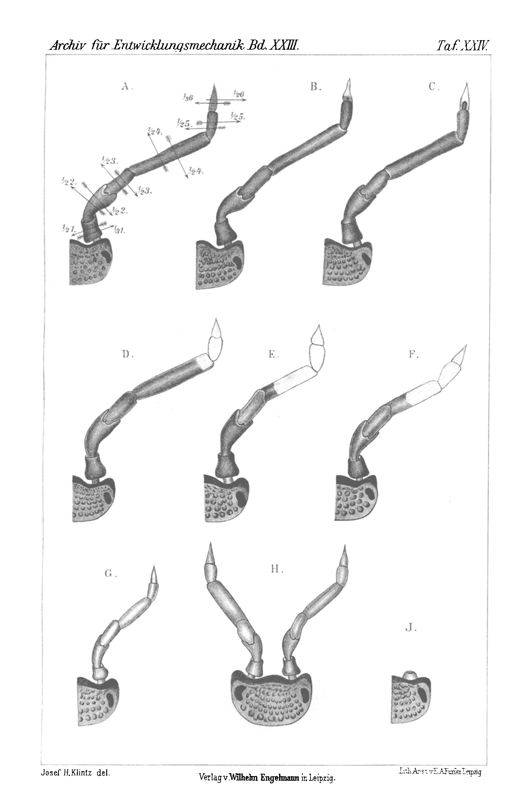

# Regeneration of the Antenna in the Cellar Woodlouse (Porcellio scaber Latr.).

By

**Josef H. Klintz.**

(From the Biological Experimental Institute [Biologische Versuchsanstalt] in Vienna.)

———

With Plate XXIV.

———

Received on 23 February 1907.

*Archiv für Entwicklungsmechanik der Organismen*, vol. 23 (1907).

> **Full translation.** A complete English rendering of the running text of “Regeneration of the Antenna in [the woodlouse / Asellus]” (Klintz, 1907), including all tables, figure and plate legends, and footnotes. Numbers and table cells were transcribed from the page images, not the noisy OCR.

Stimulated by the work composed by Josef Ost in Marburg, "On the Regeneration of the Antenna in *Oniscus murarius*," I decided to go more closely into the autotomy and regeneration of the individual antennal segments, on which the just-mentioned work did not seem to me to give sufficient information. I intended to proceed in a purely experimental way, and arrived at some results differing from those of Ost.

Since, however, it was for the time being impossible for me to obtain *Oniscus murarius*, I first took an animal of close kinship, the Cellar Woodlouse (*Porcellio scaber* Latr.). With respect to the antennae, the genus *Porcellio* differs from the genus Wall Woodlouse (*Oniscus* Latr.) in morphological relation in that it bears a two-jointed antennal flagellum [Antennengeißel], whereas *Oniscus* possesses a three-jointed one.

Since in my experiments it is a matter of twelve operations, of which two in each case come to lie on one segment, I feel compelled to say something more detailed about the individual segments. I number the segments according to the generally usual mode of designation, from the origin toward the apex of the antenna (not, as Ost does, in the reverse order).

The first three segments together form the stalk [Stiel] and are not movable relative to one another. The first segment sits on a short attachment-piece [Ansatzstück] and is inclined toward the midline of the animal; it has a truncated conical form, however without any segmentation. The second is bent outward, it shows a distinct calyx form, distally with an apparent articulation. The third segment is somewhat longer, straight and narrow, turned outward, distally with a real articulation. The fourth, which Ost designates as the second, is the longest and can be moved to the side. The fifth and sixth segments form, in the species *Porcellio scaber*, the whole antennal flagellum or end-bristle [Fühler- oder Endborste], as the essential difference from the three-jointed end-bristle in *Oniscus murarius*.

Inasmuch as the above-named work makes mention of two sections of the "first" (in reality the 5th + 6th!) segment (p. 299, Textfig. II), it became clear to me that Ost had used the same genus as I, and had identified it wrongly. My view was confirmed both by H. C. Bronn's "Classes and Orders of the Animal Kingdom" [Klassen und Ordnungen des Tierreichs], V. Bd. II. Abt. Taf. XIII Fig. 1 *a, b*, as well as by the II. Bd. of Joh. Leunis' "Synopsis of the Animal Kingdom" [Synopsis der Tierkunde], p. 675, Fig. 624.

In order to convince myself thoroughly whether in *Porcellio* the regeneration-capacity has anything to do with autotomy (as Ost, p. 690, believes), or also sets in from sites at which normally no loss is wont to occur, I first of all carried out a total amputation of the antenna in our species.

## A. Regeneration of the Whole Antenna.

For this experiment I took twenty medium-sized animals, which I kept in a glass vessel that was kept moist by means of wet filter paper, since the animals are adapted to moist ground. This procedure is a very advantageous one, in that in this way any infection of the wound-sites from outside is prevented.

Holding the animal on the magnifier-stage [Lupentisch] by means of a finger, I cut off its antenna with a scissor below the base of the first segment, including a part of the antennal attachment [Antennennansatz]. In so doing it happened to me four times that both antennae were seized and the animals were robbed of both; yet the animals do not appear to feel this as a hindrance to orientation, for they moved on without further ado at their same running pace. The blood loss was a very slight one and depends in general solely on the finger-pressure. In all the amputations carried out by me, whose number approaches a hundred, not a single animal died as a consequence of too great a bleeding; but indeed some did so through crushing of the abdominal segments.

The next day the animals were all fresh and lively. The cut wounds were completely healed and showed a distinct, white cone (Taf. XXIV Fig. *I*). I therefore transferred the animals into their real element, into moist humus-soil. There I observed that the animals, when feeling about, raise the first pair of legs, so as to replace to some extent the function of the antennae. Of the four animals that bore the loss of both antennae, the smallest died, probably through too great a finger-pressure.

During the time from 25. VII. 1906 to 10. VIII. 1906 the animals showed nothing conspicuous. On 10. VIII. 1906 I found that, of the three animals without both antennae, only two more were present; the third had escaped [entschlüpft]. The other two had molted, and their regeneration-capacity replaced both their antennae, and indeed within 16 days. The brief duration of this process is to be attributed both to the summer season and to the good nutrition-conditions and the youth of the animals (Taf. XXIV Fig. *II*).

Of the twenty remaining animals with a severed left or right antenna, I found nine on the same day with completely regenerated right or left antennae. Eight perished during the molt. In the remaining three the regeneration set in after 7 further days, hence altogether in 23 days. One animal again perished during the molt.

The regenerated animals I preserved in 4% formol-alcohol.

The newly formed antennae are a third smaller than the normal ones and contain little pigment, so that they stand out from the latter by their light colour.

## B. Regeneration from Particular Sites within the Antenna.

Convinced of the far-reaching regeneration-capacity of this species, I now undertook more detailed experiments on the autotomy-sites and on the regeneration-capacity from particular sites within the antenna. In this it was mostly a matter of importance to me that the regeneration should set in from the cut-surface. Although both Weismann and Hübner expect regeneration, after preceding autotomy, only from the next joint, and characterize this process as a definite adaptation, I must side with the views of Morgan, Przibram and E. Schultz, since in my experiments the same thing showed itself as with them. Regeneration also occurred directly from cut-sites. On these sites I shall speak once more below. For now I will only mention that *Porcellio scaber* Latr. has shown quite peculiar results with respect to autotomy.

Now I pass over to the individual cut-positions, and indeed starting from the basal segment. I would only premise something about the manner of treatment of the animals and their housing during the experiment-time. After the operation the animals came into small glass vessels which were closed by means of a lid. The animals were kept at variously high room temperature and sprayed daily. A precise protocol of 24 animals from these and of 20 from the earlier experiments I append below, in order to arrange the results more clearly.

On each of the six segments of an antenna two cuts came to lie, of which one lay in the first third, the other in the half of the segment (Taf. XXIV Fig. *A*).

1 a) The first segment was removed in the first third. After about 3 days a white cone showed itself at the cut-surface, which then passed over into the swollen attachment-piece and remained unchanged until the next molt. This molt set in, in one animal after 24, in the other after 9 days, together with the regeneration of the whole antenna. The varying duration of the time needed for regeneration is to be attributed to the varying temperature-conditions, of which I shall speak later still (Taf. XXIV Fig. *G*).

b) The cut-surface in the half of the first segment showed the same conditions. The time needed for regeneration counts 39 days (Taf. XXIV Fig. *G*).

2 a) The cut-surface in the first third of the second segment healed, and on the first day autotomy set in, and indeed up to the attachment-piece. The molt set in after 23 days, together with the regeneration (Taf. XXIV Fig. *G*).

b) In the half of the second segment, in some animals a white wound-closure set in and the antenna was autotomized only later; whereas in some, complete autotomy set in at once. Until the next molt and regeneration, 9 days passed (Taf. XXIV Fig. *G*).

3 a) In the amputation in the first third of the third segment, autotomy up to the attachment-piece set in in all animals. The duration of regeneration fluctuates between 2 and 3 weeks. The antenna becomes wholly regenerated (Taf. XXIV Fig. *G*).

b) The antennae amputated up to the half of the third segment were completely autotomized and likewise completely regenerated, in a duration of 11 to 24 days (Taf. XXIV Fig. *G*).

4) The fourth segment, designated by Ost as the second, showed the following appearances:

a) Both in the first third, as also b) in the half of the segment, all the animals subjected to these experiments regenerated, and indeed from the cut-surface. Autotomy never set in here. For the regeneration they needed 11 days (Taf. XXIV Fig. *E, F*).

Ost, in amputations that had removed more than a third of this segment (counted from the tip), had always obtained autotomy. According to my results, however, I must side with the view of Morgan, Przibram and Schultz, since it turned out that, even if no autotomy sets in, regeneration nevertheless occurred.

5) The fourth segment moreover shows yet another property, which I have nowhere else observed. If one cuts off the fifth segment in the first third (a) or in the half (b), then autotomy definitely sets in up to the fourth segment. This [fourth segment], however, shows a distinct paling [Erblassung]. The regeneration set in after 12 days (Taf. XXIV Fig. *D*).

6 a) The sixth segment with the tactile hairs [Tasthaare] again shows special conditions. Operated on in the first third, it shows on the second day after the operation a white knob. Autotomy does not take place. The missing part of the segment with the tactile hairs then regenerates from the cut-surface (Taf. XXIV Fig. *B*).

b) The sixth segment behaves likewise when it was cut off in the half. The old part of this segment is clearly to be seen under the new chitin-coat of the antenna. Regeneration-duration 9 to 24 days.

### Overview Table [Übersichtstabelle]

| Location of the cut | Date of amputation | White cone | Complete autotomy | Autotomy up to next segment | Molt and regeneration | Regeneration duration |
|---|---|---|---|---|---|---|
| proximal to the articulation of the first segment (20 animals) | 25. VII. 1906 | 26. VII. 06 (1 perished) | — | — | 10. VIII. 1906 (in 9 animals); 17. VIII. 1906 (in 3 animals) (7 perished) | 16 days; 23 days |
| Location of the cut | Amputation | Cone | Autotomy | (Autotomy) up to next segment | (Molt) and regeneration | (Regeneration) duration |
|---|---|---|---|---|---|---|
| ⅓ of the 1st segment | 23. XI. 06 ; 16. I. 07 | 26. XI. 06 ; 20. I. 07 | 5. XII. 06 ; 24. I. 07 | — ; — | 17. XII. 06 ; 25. I. 07 | 24 days ; 9 - |
| ½ - 1. | 28. XI. 06 ; 1. II. 07 | — ; — | 30. XI. 06 ; 7. II. 07 | — ; — | 6. I. 07 ; 15. II. 07 | 39 - ; 15 - |
| ⅓ - 2. | 28. XI. 06 ; 29. I. 07 | — ; — | 30. XI. 06 ; 30. I. 07 | — ; — | 21. XII. 06 ; 15. II. 07 | 23 - ; 17 - |
| ½ - 2. | 16. I. 07 ; 6. II. 07 | 23. I. 07 ; — | 24. I. 07 ; 7. II. 07 | — ; — | 25. I. 07 ; 16. II. 07 | 9 - ; 9 - |
| ⅓ - 3. | 28. XI. 06 ; 21. XII. 06 | — ; — | 30. XI. 06 ; 23. XII. 06 | — ; — | 17. XII. 06 ; 16. I. 07 | 19 - ; 26 - |
| ½ - 3. | 23. XII. 06 ; 25. I. 07 | 24. XII. 06 ; 26. I. 07 | 24. XII. 06 ; 26. I. 07 | — ; — | 16. I. 07 ; 5. II. 07 | 24 - ; 11 - |
| ⅓ - 4. | 18. I. 07 ; 18. I. 07 | 23. I. 07 ; 23. I. 07 | — ; — | — ; — | 29. I. 07 ; 29. I. 07 | 11 - ; 11 - |
| ½ - 4. | 18. I. 07 ; 2. II. 07 | 23. I. 07 ; — | — ; 3. II. 07 | — ; — | 29. I. 07 ; 10. II. 07 | 11 - ; 8 - |
| ⅓ - 5. | 2. I. 07 ; 2. I. 07 | 4. I. 07 ; 4. I. 07 | — ; — | — ; — | 16. I. 07 ; 16. I. 07 | 14 - ; 14 - |
| ½ - 5. | 2. II. 07 ; 23. I. 07 | 4. II. 07 ; — | — ; — | 6. II. 07 ; 25. I. 07 | 10. II. 07 ; 4. II. 07 | 8 - ; 12 - |
| ⅓ - 6. | 23. I. 07 ; 2. I. 07 | 25. I. 07 ; 6. I. 07 | — ; — | — ; — | 3. II. 07 ; 21. I. 07 | 11 - ; 21 - |
| ½ - 6. | 23. XI. 06 ; 23. XI. 06 | 26. XI. 06 ; 26. XI. 06 | — ; — | — ; — | 23. XII. 06 ; 15. XII. 06 | 30 - ; 22 - |

In this table it will be striking that the speed of regeneration is a very variable one. Under normal, natural conditions the time amounts to 2 to 3 weeks. This is confirmed to me by the experiments which I carried out in July and August. The more detailed experiments, however, I made in winter, when, as is well known, the animals need a longer time to molt. In order to forestall this drawback, I decided to rear the animals at a constant temperature of 30° C, which was also readily possible for me, thanks to the suitable facilities at the Biological Experimental Institute, and obtained a great acceleration of the molt. I also observed that animals which were brought in from their winter quarters out of doors immediately entered the molting state. I operated on them only after the molt, and this set in, together with the regeneration, in young animals in 9, in older ones up to 20 days. At a room temperature of 17° C the molt, together with the regeneration, set in, in the winter months, in 4 to 5 weeks.

On autotomy I have yet the following to mention. With *Porcellio* I observed autotomy regularly at the joints of the fourth and third segment. In the third segment itself I have never set eyes on an autotomy-site. With all other cut-positions from the third segment onward, the whole antenna is always thrown off from the attachment-site of the first segment at the stalk. There are therefore two preformed autotomy-sites to be distinguished. The regenerated segments are clearly to be distinguished from the normal ones. Not only by the lack of pigment, but also by their more considerable thickness-growth and the shortening of their length by a third of the normal size, they fall immediately into the eye. Both the individual segment and the whole regenerated antenna are shortened by a third of their former length.

With this I close my data, which I have obtained in a purely experimental way and which I should like briefly to summarize once more.

## C. Overview of the Findings.

1) The second antennae of the genus *Porcellio* possess six segments, which are to be counted from their attachment on a short stalk toward the apex.

2) There exist two preformed autotomy-sites.

   a) The first, located at the origin-site of the first segment on the stalk, comes into function when the antenna is cut off within the first, second or third segment (in the first third or in the half of one of these segments).

   b) The second autotomy-site lies in the joint from the third to the fourth segment, and comes into function when the fifth segment is cut through in the first third or in the half.

3) Regeneration, however, occurs not only at these autotomy-sites, but also from all cut-sites after whose application no autotomy occurs. These are:

   α) Amputation of the whole antenna, including the attachment-piece.

   β) Section of the antenna in the first third or in the half of the fourth segment.

   γ) Section of the sixth (end-)segment in the first third or in the half.

4) The regeneration appears first in the form of white stumps, and the regenerate comes to light with the first molt at approximately two-thirds of the normal size.

**Plate XXIV.** *(figure not reproduced)*

The plate is headed: *Archiv für Entwicklungsmechanik Bd. XXIII. Taf. XXIV.* — and bears the imprint: *Josef H. Klintz del.* — *Verlag v. Wilhelm Engelmann in Leipzig.* — *Lith. Anst. v. E. A. Funke, Leipzig.* The plate shows figures A–J of the antenna with the section-line labels (⅓1, ½1, ⅓2, ½2, ⅓3, ½3, ⅓4, ½4, ½5, ⅓6, ½6) drawn on figure A.

5) The speed of the regeneration is dependent on the temperature and the age of the animals; but is independent of whether the regeneration occurs from autotomy-sites or from other sites.

## Literature List.

Bronn, H. C., 1881. Klassen und Ordnungen des Tierreiches. [Classes and Orders of the Animal Kingdom.] (Continued by Dr. A. Gerstäcker.) Bd. V. Abt. II. Taf. XIII.

Heineken, 1829. Experiments and Observations on the Castings and Reproduction of the Legs in Crabs and Spiders. Zoolog. Journal. Vol. IV. (Apr. 28—May 29.) p. 284.

—— 1829. On the Reproduction of Members in Spiders and Insects. Zool. Journal.

Herrick, F. H., 1895. The American Lobster. p. 106. Plate 44 Fig. 180/181.

Hübner, O., 1902. Neue Versuche aus dem Gebiete der Regeneration und ihrer Beziehung zu Anpassungen. [New experiments in the field of regeneration and its relation to adaptations.] Zoolog. Jahrb. Bd. XV. Syst. Abt. (Auch: Dissertation Freiburg i. B.)

Morgan, T. H., 1898. Regeneration and liability to injury. Zool. Bull. Boston.

Ost, F., 1906. Über die Regeneration der Antenne bei *Oniscus murarius*. [On the regeneration of the antenna in *Oniscus murarius*.] Zool. Anz. Bd. XXIX. Nr. 23.

—— 1906. Ein weiterer Beitrag zur Regeneration der Antennen bei *Oniscus murarius*. [A further contribution to the regeneration of the antennae in *Oniscus murarius*.] Zool. Anz. Bd. XXX. Nr. 5.

—— 1906. Zur Kenntnis der Regeneration der Extremitäten bei den Arthropoden. [On the knowledge of the regeneration of the extremities in the arthropods.] Arch. f. Entw.-Mech. Bd. XXII. Taf. X—XII.

Przibram, H., 1899. Die Regeneration bei den Crustaceen. [Regeneration in the Crustacea.] Arbeiten a. dem Zool. Institut Wien.

—— 1900. Experimentelle Studien über Regeneration. [Experimental studies on regeneration.] Arch. f. Entw.-Mech. Bd. XI.

Schultz, E., 1898. Über die Regeneration von Spinnenfüßen. [On the regeneration of spiders' legs.] Trav. Soc. Imp. National. St. Pétersbourg.

Weismann, A., 1892. Das Keimplasma, eine Theorie der Vererbung. [The Germ-Plasm, a Theory of Heredity.]

—— 1899. Tatsachen u. Auslegungen in bezug auf Regeneration. [Facts and interpretations with regard to regeneration.] Anat. Anz. Bd. XV.

### Explanation of the Figures.

#### Plate XXIV.

All figures refer to the Cellar Woodlouse, *Porcellio scaber* Latr., dorsal view at 12-fold linear magnification.

**Fig. A.** Right head-half with the cut-positions drawn in on the normal second right antenna.

**Fig. B.** Antenna regenerated from the first third of the sixth segment onward.

**Fig. C.** Antenna regenerated from the half of the sixth segment onward.

**Fig. D.** Antenna regenerated from the second autotomy-site (4./5. segment) onward, whereby the end of the fourth segment has undergone a lightening up [Aufhellung].

**Fig. E.** Antenna regenerated from the cut-surface in ⅓ of the fourth segment onward.

**Fig. F.** Antenna regenerated from the half of the fourth segment onward.

**Fig. G.** Antenna regenerated from the first autotomy-site (origin of the first segment at the antenna-stalk) onward.

**Fig. H.** Head with both antennae regenerated after complete removal.

**Fig. I.** Regeneration-bud at the attachment-piece of the antenna.

## Figures

**Taf. XXIV.**

---

*Translator's note.* One of the Biologische Versuchsanstalt (Vienna Vivarium) papers flagged on the project site as a modern rediscovery target. Claims are rendered as stated in the original, not endorsed.
